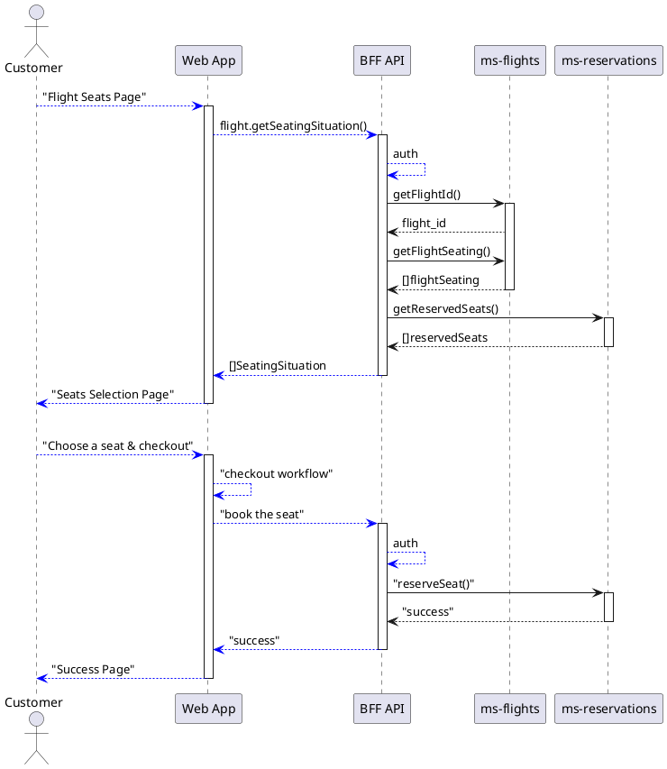
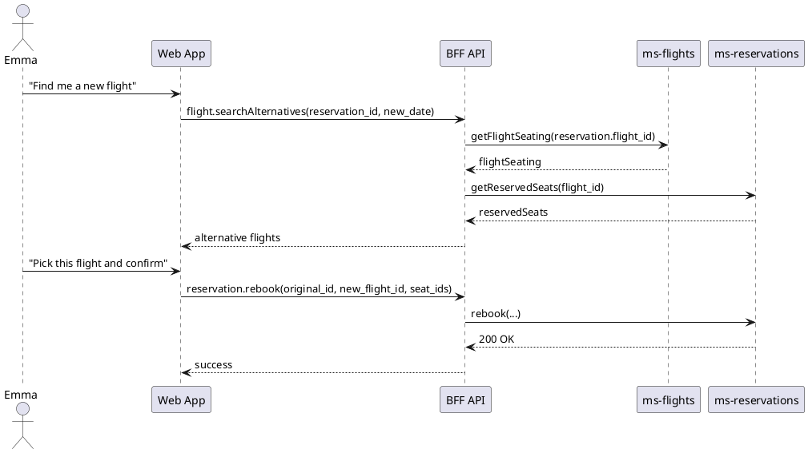

# Microservices Up & Running

**Author:** Ronnie Mitra & Irakli Nadareishvili (2020, O'Reilly; ISBN 978-1-492-07545-5)
**Topic tags:** `#architecture` `#api` `#reliability` `#testing`
**Language focus:** Language-agnostic — sample code is shown in Node/Go; Terraform, Kubernetes, AWS, Helm, Argo CD, GitHub Actions form the toolchain
**Sources:** `markdown_output/Microservices Up And Running/Microservices Up And Running.md` · `summaries/Microservices Up And Running.md`

## TL;DR

A prescriptive, opinionated, step-by-step playbook for building a *working* microservices system on AWS — using Terraform for infrastructure-as-code, EKS for orchestration, Argo CD for GitOps deployment, GitHub Actions for CI/CD, the SEED(S) methodology for service design, Domain-Driven Design + Event Storming for service boundaries, and Team Topologies for team design. The authors' north-star is "**reduce coordination costs at scale**": every decision (small services, single-team ownership, infra-as-code, immutable infrastructure, canary releases) is justified by whether it shrinks the human/team coordination overhead a change will incur.

---

## Best Practices by Topic

### Reduce Coordination Costs — The North Star

**Principle:** Microservices are not the goal; the goal is reducing the coordination cost of building complex software across multiple teams. Every architectural and process decision in this book is justified by that single criterion.

**Do:**
- Make the question "Does this reduce coordination costs?" the universal litmus test for any architecture decision.
- Embrace *autonomous teams on small batches of isolated work*.
- Aim for "the agility of a simpler, smaller company while continuing to harness the power and reach of [your] actual size."

**Don't:**
- Start with hundreds of microservices on day one (the Netflix/SoundCloud/Amazon outcome, not their starting point).
- Pick microservices because "we want to go fast" — pick them because you have a complex system that cannot afford both speed *and* safety trade-offs.

*Ref: Microservices Up And Running.md — "Reducing Coordination Costs", "The Coordination Cost Problem"*

---

### The Three Hard Parts — Why Microservices Are Hard

**Principle:** The difficulty of microservices comes from three compounding problems; you cannot fix one without addressing the others.

**Do:**
- Design for *short feedback loops* so impactful decisions are measurable quickly.
- Anticipate that microservices is a *complex adaptive system*: every part influences every other, and emergent behaviour is guaranteed.
- Actively fight *analysis paralysis* by adopting opinionated patterns (this book is one such opinionated guide).

**Don't:**
- Treat microservices as just a technology choice — Conway's law makes team design a leading concern.
- Try to "design everything upfront" without iteration.

*Ref: Microservices Up And Running.md — "The Hard Parts"*

---

### Architecture Decision Records (LADR Format)

**Principle:** Use lightweight ADRs (Nygard's LADR) to capture *context*, *alternatives*, *choice*, and *impact* for every important decision — and treat them as a living record, not a one-time exercise.

**Do:**
- Write ADRs in plain Markdown, in the same repository as the code, managed like source.
- Use the four canonical elements: Context, Alternatives, Choice, Impact.
- Number ADRs by topic area (e.g., `OPM1: Use ADRs for decision tracking`).

**Don't:**
- Edit an ADR's body once it's accepted (immutability preserves history).
- Use project-management tooling that locks the ADR inside a project folder.

**Example LADR:**
```markdown
# OPM1: Use ADRs for decision tracking
## Status
Accepted
## Context
A microservices architecture is complex and we'll need to make many decisions.
We'll need a way to keep track of the important decisions we make, so that
we can revisit and re-evaluate them in the future. We'd prefer to use a
lightweight, text-based solution so that we don't have to install any new
software tools.
## Decision
We've decided to use Michael Nygard's lightweight architectural decision
record (LADR) format. LADR is text based and is lightweight enough to meet
our needs. We'll keep each LADR record in its own text file and manage the
files like code.

We also considered:
- Project management tooling (not selected — installs tools)
- Informal "word of mouth" record keeping (not reliable)
## Consequences
- We'll need to write decision records for key decisions
- We'll need a source code management solution to manage decision record files
```

*Ref: Microservices Up And Running.md — "Decisions, Decisions…", "Writing a Lightweight Architectural Decision Record"*

---

### Operating Model — Team Topologies

**Principle:** People and teams come first. Use *Team Topologies* (Skelton & Pais) to design the operating model before designing the architecture.

**Do:**
- Pick the four team types explicitly: *stream-aligned*, *enabling*, *complicated-subsystem*, *platform*.
- Use the three interaction modes: *collaboration*, *facilitating*, *X-as-a-service*.
- Aim for teams of 5–8 people (two-pizza rule, Dunbar's number, Gore's "personal-relationship" heuristic).
- Make teams cross-functional so they can make decisions independently.
- Use "you build it, you run it" (Werner Vogels): stream-aligned teams own the service for its lifetime.

**Don't:**
- Mix component teams with feature teams (rename to scope-aligned and reskill, don't static-assign).
- Build "single Ops" or "single Support" teams as the default — these are antipatterns at scale.
- Start coding before team boundaries are defined.

*Ref: Microservices Up And Running.md — "Designing a Microservices Operating Model", "Team Types", "Interaction Modes"*

---

### Inverse Conway Maneuver — Team Topology Drives Architecture

**Principle:** Design your team structure to produce the system architecture you want — because the architecture you get will be a copy of your communication structure (Conway's Law).

**Do:**
- Set up a *System Design Team* (enabling, 3–5 senior architects) before microservices teams form.
- Define a *Microservices Team Template* (stream-aligned, 5–8 people, owns 1+ service for life).
- Create a *Platform Team* (5–8 people) that delivers infrastructure as self-service.
- Add a *Release Team* (complicated-subsystem, 5–8 people) for production deploys in regulated orgs.
- Add *API Team* (stream-aligned) as the consumer-facing layer.
- Apply the *Inverse Conway Maneuver*: structure teams first; the architecture emerges.

**Don't:**
- Start with only stream-aligned teams — without enabling/complicated-subsystem/platform teams, coordination costs balloon.

**Sample team file format:**
```markdown
# System Design Team
## Team Type
Enabling
## Team Size
3-5 People
## Responsibilities
* Design team structures
* Establish standards and "guardrails"
* Continually improve the system
```

```markdown
# Microservices Team Template
## Team Type
Stream-Aligned
## Team Size
5-8 People
## Responsibilities
* Designing and developing microservice(s)
* Testing, building, and delivering the microservice(s)
* Troubleshooting issues
```

```markdown
# Cloud Platform Team
## Team Type
Platform
## Team Size
5-8 People
## Responsibilities
* Design and develop a network infrastructure
* Design and develop an application infrastructure
* Provide tools for building a new environment
* Update network and application infrastructure when required
```

```markdown
# Release Team
## Team Type
Complicated-Subsystem
## Team Size
5-8 People
## Responsibilities
* Releasing microservices to production
* Coordinating approvals for releases
```

```markdown
# API Team
## Team Type
Stream-Aligned
## Team Size
5-8 People
## Responsibilities
* Design, develop, and maintain APIs at the boundary of the system
* Connect API to internal microservices
```

*Ref: Microservices Up And Running.md — "Establish a System Design Team", "Building a Microservices Team Template", "Platform Teams", "Enabling and Complicated-Subsystem Teams", "Consumer Teams"*

---

### SEED(S) Service Design Process

**Principle:** Use the SEED(S) seven-step evolutionary methodology to design service interfaces customer-first, not implementation-first.

**Do:**
- **Identify actors** (≤5; user-persona-inspired; specific > precise; no overlapping definitions).
- **Identify Jobs-to-be-Done (JTBDs)** as the unit of analysis — not user stories.
- **Capture JTBDs in Job Story format**: `When <circumstance>, I want to <motivation>, so I can <goal>`.
- **Discover interaction patterns** with UML sequence diagrams (PlantUML/Mermaid so they version-control).
- **Derive queries (CQS) and actions** from JTBDs — one JTBD may produce many; one query may combine many JTBDs.
- **Describe each query/action with an open standard** (OpenAPI Spec, GraphQL SDL, Protobuf, AsyncAPI).
- **Get feedback on the API spec** before coding (interview client developers).
- **Implement last** (coding is the most expensive activity).

**Don't:**
- Start with database tables or RPC methods (implementation-driven design).
- Use "as a frequent flyer…" repeated 10 times in Job Stories — the *circumstance* matters, not the persona.
- Skip the API-spec feedback step — code-quality ADRs cannot rescue a bad interface.

*Ref: Microservices Up And Running.md — "Designing Microservices: The SEED(S) Process"*

---

### Actors and JTBDs — Sample Polyglot Case

**Do:**
- Define actors narrowly; example set for an airline reservation system: *Frequent Flyer (Emma)*, *Family Vacationer (Riley)*, *Airline Customer Service Agent (Sean)*.
- Frame each JTBD in third person (the SEED(S) preference, not the original Adams format).

**Example JTBDs:**

```text
For Riley (Family Vacationer):
- When Riley is planning a flight for their family vacation, they want to be
  able to filter available flights by multiple criteria (four adjacent seats,
  number of connections, kid-friendly airports, etc.), so their family can
  fly with maximum comfort.
- When Riley is planning a quick, unplanned family getaway for a long
  weekend, they want to get suggestions for interesting available trips that
  are affordable and a short flight, so they can have a list of choices.

For Emma (Frequent Flyer):
- When Emma's plans change and she is unable to travel on a previously
  booked flight, she wants to easily reschedule her flight, so she can get
  a flight that works for her new plans.
- When Emma prefers an available seat other than the one she has been
  currently assigned, she wants to select the alternative seat, so she can
  enjoy her flight more.

For Sean (Customer Service Agent):
- When a customer calls Sean, he wants to have a servicing ticket open
  pre-filled with customer information, so he can start tracking the
  progress towards the resolution of the customer need.
- When a customer is asking Sean to find them a convenient flight for their
  trip, he wants to be able to find a fitting flight using a flexible set
  of filtering criteria, so he can meet the customer need and book a flight.
```

*Ref: Microservices Up And Running.md — "Example Actors in Our Sample Project", "Example JTBDs in Our Sample Project"*

---

### Commands and Queries (CQS) — Service Interface Shape

**Principle:** Model the service surface as two separate kinds of endpoints: queries (no side effects) and actions (side-effecting commands).

**Do:**
- Format queries as: *Description → Input → Response*.
- Format actions as: *Description → Input → Expected outcome → Response (optional)*.
- Document each in OpenAPI before implementation.

**Example — Queries:**
```text
Query 1: Flight Search
- Input: departure_date, return_date, origin_airport, destination_airport,
         number_of_passengers, baby_friendly_connections, adjacent_seats,
         max_connections, minimum_connection_time, max_connection_time,
         order_criteria [object], customer_id (optional)
- Response: list of flights satisfying the criteria

Query 2: Lookup of Alternative Flights for a Date Change
- Input: reservation_id, new_departure_date, new_return_date
- Response: list of alternative flights
```

**Example — Actions:**
```text
Travel Rebooking
- Input: original_reservation_id, new_flight_id, seat_ids[]
- Expected outcome: new flight booked or error returned; if new flight is
                     successfully booked, old one is canceled
- Response: success code or a detailed error object

Seat Change
- Input: reservation_id, customer_id, requested_seat_ids[]
- Expected outcome: new seat reserved if the seat is available and the
                     traveler is qualified; old seat canceled if the new
                     seat ends up being successfully reserved
- Response: success code, or a detailed error object
```

*Ref: Microservices Up And Running.md — "Deriving Actions and Queries from JTBDs", "Example Queries and Actions for Our Sample Project"*

---

### OpenAPI Spec — First-Class Contract

**Principle:** Code against a contract, not against hope. Use OAS 3.0+ as the formal, tech-stack-agnostic description of every REST microservice.

**Do:**
- Author the OAS in YAML; preview with VS Code + Open API Designer plug-in.
- Reference the OAS from code, docs, and developer portals.
- Gather feedback from client developers on the spec *before* writing code.
- Treat the OAS as the source of truth — code generation (server stubs, client SDKs) flows from it.

**Don't:**
- Skip the example request/response — clients need them.
- Hardcode implementation details that bind clients to specific tech stacks.

**Example — Reservation re-booking endpoint (excerpt):**
```yaml
openapi: 3.0.0
info:
  title: Airline Reservations Management API
  description: |
    API for Airline Management System
  version: 1.0.1
servers:
  - url: http://api.example.com/v1
    description: Production Server
paths:
  /reservations/{reservation_id}:
    put:
      summary: Book or re-book a reservation
      description: |
        Example request:
        ```
        PUT http://api.example.com/v1/reservations/d2783fc5-0fee
        ```
      parameters:
        - name: reservation_id
          in: path
          required: true
          description: Unique identifier of the reservation being created or changed
          schema:
            type: string
            example: d2783fc5-0fee
      requestBody:
        required: true
        content:
          application/json:
            schema:
              type: object
              properties:
                outbound:
                  type: object
                  properties:
                    flight_num: { type: string, example: "AA 253" }
                    flight_date: { type: string, example: "2019-12-31T08:01:00" }
                    seats:
                      type: array
                      items: { type: string }
                returning:
                  type: object
                  properties:
                    flight_num: { type: string, example: "AA 254" }
                    flight_date: { type: string, example: "2020-01-07T14:16:00" }
                    seats:
                      type: array
                      items: { type: string }
      responses:
        '200':
          description: Successful Reservation
          content:
            application/json:
              schema:
                type: object
                properties:
                  reservation_id: { type: string }
        '403':
          description: seat(s) unavailable. Booking failed.
```

*Ref: Microservices Up And Running.md — "Describing Each Query and Action as a Specification with an Open Standard", "Example OAS for an Action in Our Sample Project"*

---

### Microservices ≠ Smaller APIs — Layered Architecture

**Principle:** APIs (frontend-facing) and microservices (implementation-facing) are *different layers*. Microservices implement business capabilities; APIs orchestrate them. Don't conflate them.

**Do:**
- Implement *all business logic* in microservices.
- Use APIs as a *thin orchestration layer* in front of microservices.
- Apply *Backend for Frontend* (BFF) — separate APIs per frontend experience (SoundCloud's Calçado, Netflix's Jacobson).
- Keep microservices *unaware of each other* (Unix-philosophy style — composable, addressable, ignorant of caller).
- When microservice-to-microservice work is required, prefer *async* events (Kafka/Pub-Sub) over sync calls.

**Don't:**
- Let microservices directly invoke each other synchronously.
- Reuse a microservice as a public API (skipping the orchestration layer).
- Confuse "API" with "microservice" — they're at different abstraction layers.

*Ref: Microservices Up And Running.md — "Microservices Versus APIs", "Keep Microservices Unaware of Each Other"*

---

### Rightsizing Microservices — Universal Sizing Formula

**Principle:** Boundaries are not synonymous with bounded contexts and *will* evolve over time. Use the Universal Sizing Formula as the only sizing guidance you need.

**Universal Sizing Formula (the three rules):**
1. **Start with just a few microservices**, possibly aligned to bounded contexts.
2. **Keep splitting as your application and services grow**, guided by coordination-avoidance needs.
3. **Be on the right trajectory** for *decreasing coordination*. Trajectory matters more than current state.

**Do:**
- Start coarse-grained (often one microservice per bounded context).
- Split when coordination pressure rises, not before.
- Use Domain-Driven Design (Evans 2003) to identify bounded contexts.
- Use Context Mapping to make relationships explicit (Shared Kernel, Upstream–Downstream: Customer–Supplier, Conformist, Anti-Corruption Layer, Open Host Service).
- Prefer Aggregate-based service boundaries.
- Use Event Storming (Brandolini) — a lightweight, hours-not-weeks DDD accelerator.
- Use bounded contexts via the universal four-step: *Domain Events → Commands → Aggregates → Bounded Contexts*.
- Adopt the competitive-edge × effort matrix (Large/Large = invest; Small/Large = buy; Small/Small = trainee tasks).

**Don't:**
- Optimize microservices for source-line-of-code counts.
- Use AWS Lambda granularity ("serverless pinball").
- Build shared kernels across service boundaries (high coordination cost).
- Use technical concerns as service boundaries.
- Pretend early boundaries are correct — they'll evolve.
- Make microservices smaller than the bounded context they protect.

**Sample Bounded Context — different meanings of "account":**
- *Identity & Access Management*: account = credentials.
- *Customer Management*: account = demographics + contact.
- *Financial Accounting*: account = payment info + history.

*Ref: Microservices Up And Running.md — "Rightsizing Your Microservices", "Domain-Driven Design and Microservice Boundaries", "Context Mapping", "Synchronous Versus Asynchronous Integrations", "Introduction to Event Storming", "The Event-Storming Process", "Introducing the Universal Sizing Formula"*

---

### Event Storming Process (Lightweight DDD)

**Principle:** Event Storming finds bounded contexts in hours, not weeks — a pragmatic, fun, inexpensive alternative to full DDD.

**Do:**
- Run a four-to-five-hour session with cross-functional participants (engineers, product, design, business).
- Use a long unobstructed wall, IKEA Mala paper, multiple Sharpies per person, lots of orange and blue stickies.
- Use colour conventions: orange = domain event, blue = command, purple = hotspot, etc.
- Aim for ≥100 events in Phase 1 before considering the session successful.

**Don't:**
- Run Event Storming with engineers only — cross-functional conversation is the point.
- Skip the "hotspots" step — questions get captured for offline resolution, not answered live.

**Four-hour session template:**
- Phase 1 (~30 min): Discover domain events (orange stickies, verbs in past tense, in rough time order).
- Phase 2 (~45 min): Enforce the timeline; create "storyline"; capture hotspots.
- Phase 3 (~60 min): Reverse narrative — identify commands (blue stickies).
- Phase 4 (~30 min): Group commands + events into aggregates → these clusters are bounded contexts.
- Phase 5 (~15 min): Competitive-edge × effort analysis (T-shirt sizes S/M/L).

*Ref: Microservices Up And Running.md — "The Event-Storming Process"*

---

### Microservices Embed Their Data — No Shared DB

**Principle:** Microservices must own (embed) their data. Co-ownership of a logical data space kills independent deployability.

**Do:**
- Make it clear which microservice owns each dataset.
- Allow microservices to share *physical* database clusters (cost, simplicity) — as long as they don't share *logical* table space and never modify the same data.
- Hide shared tables behind a *delegate service* (e.g., flight inventory wraps the `flights` table; reservations/track services query the inventory, not the DB).
- Use *data lakes* for read-only analytics (microservices stream data in; lakes are *never* the system of record).
- Decide between data embedding and physical sharing explicitly per ADR.

**Don't:**
- Let multiple services write to the same logical table.
- Treat a data lake as the database of record (lineage breaks).
- Assume embedding forces one DB cluster per service — it doesn't.

*Ref: Microservices Up And Running.md — "Microservices Embed Their Data", "Embedding Data Should Not Lead to an Explosion in the Number of Database Clusters", "Data Embedding and the Data Delegate Pattern", "Using Data Duplication to Solve for Independence"*

---

### Distributed Transactions — Sagas, Not ACID

**Principle:** ACID doesn't scale across service boundaries. Use *sagas* (Garcia-Molina 1987, popularized by Vasters 2012): each step has a *compensating action*; routing slips pass compensation pointers through the chain.

**Do:**
- Order saga steps so the hardest-to-compensate actions run *last* (notification usually last).
- Accept that saga rollback = "reasonable state," not "original state."
- Document compensation semantics explicitly (e.g., "refund may take days to land").
- Use Kafka / RabbitMQ / IBM MQ as the saga transport.

**Don't:**
- Try to keep two-phase commits across services — they'll deadlock on partitions.
- Assume saga rollback is invisible to users — write the user-facing messaging accordingly.

*Ref: Microservices Up And Running.md — "Distributed Transactions and Surviving Failures", "Distributed transactions with sagas"*

---

### Event Sourcing and CQRS

**Principle:** When relational modeling forces joins across service boundaries, switch to *Event Sourcing* (Fowler 2005, Greg Young 2014) — store *facts* (events), derive *state* (current view) as a projection.

**Do:**
- Use event shape `{ eventId, eventType, data }` — UUID + type + payload.
- Use *projections* (fold of events) to compute current state — `priceUp(state, event)` etc.
- Snapshot periodically (e.g., monthly "closing the books" semantics) for fast replay.
- Use *CQRS* (Command Query Responsibility Segregation) to separate write model (event store) from query models (read-optimized indexes).
- Consider CAP theorem: prioritize *consistency in the event store* and *availability in the read indexes* — you can "have both" because the event store is authoritative.
- Leverage Event Sourcing's auditability: full history of every change.

**Don't:**
- Use Event Sourcing + CQRS as the cure-all — start with simpler delegates; escalate only when joins across services become necessary.
- Operationally update data in read indexes (they're projections, not records).
- Forget that projections can be lost — keep `getNAfterX()` for re-hydration.

**Event Store interface (minimum):**
```text
save(x)
getNAfterX()      # retrieve events from event X onwards
+ subscriber notification (Competing Consumers pattern)
```

*Ref: Microservices Up And Running.md — "Event Sourcing", "Improving Performance with Rolling Snapshots", "Event Store", "Command Query Responsibility Segregation", "Event Sourcing and CQRS Beyond Microservices"*

---

### Immutable Infrastructure

**Principle:** Don't patch servers in place. To change an infrastructure component, destroy it and recreate it.

**Do:**
- Make infrastructure components predictable and reproducible from declared state.
- Pair with IaC + CI/CD to make destroy-and-recreate cheap.
- Use cloud-only — virtualization makes immutability cheap.

**Don't:**
- SSH into a server to "fix" it. Recreate it.
- Mix mutable and immutable components within a single change process.

*Ref: Microservices Up And Running.md — "Immutable Infrastructure"*

---

### Infrastructure as Code (Terraform)

**Principle:** All infrastructure changes must be expressed as machine-readable code files. Tools and humans read the same source.

**Do:**
- Use Terraform (declarative) over imperative config tools.
- Store state in S3 (or equivalent) — never locally.
- Validate locally: `terraform fmt`, `terraform init`, `terraform validate`, `terraform plan`.
- Use modules — `variables.tf`, `main.tf`, `outputs.tf`.
- Treat modules like functions: small, single-purpose, reusable.
- Use DRY and encapsulation across modules.
- Always include `description` attributes on variables (omitted in book for space).

**Don't:**
- Edit infrastructure by hand after code defines it.
- Keep state in the local filesystem.
- Hardcode provider-specific strings inside reusable modules.

**Terraform concepts (the four):**
- **Backends** — where the state file lives (S3, etc.).
- **Providers** — packaged libraries of resources for a vendor (AWS, GCP, Kubernetes).
- **Resources** — declarative objects to bring to the desired state.
- **Modules** — functions/procedures for reusable code.

*Ref: Microservices Up And Running.md — "Infrastructure as Code", "Understanding Terraform", "Setting Up the IaC Environment"*

---

### CI/CD Pipeline (GitHub Actions)

**Principle:** All system changes — *both* code and infrastructure — must be applied through an automated pipeline. No console hand-edits.

**Do:**
- Use tag-based triggers (`on: create: tags: - v*`) for versioned infrastructure releases.
- Run `terraform fmt` → `init` → `validate` → `plan` → `apply -auto-approve` in the pipeline.
- Upload artifacts (`kubeconfig`) for download after successful build.
- Store AWS keys as GitHub Secrets (`AWS_ACCESS_KEY_ID`, `AWS_SECRET_ACCESS_KEY`).

**Don't:**
- Skip `terraform plan` (the dry-run) before `apply`.
- Mix pipeline definitions for code and infra without separation of concerns.

**Example workflow skeleton:**
```yaml
name: Sandbox Environment Build
on:
  create:
    tags:
      - v*
jobs:
  build:
    runs-on: ubuntu-latest
    env:
      AWS_ACCESS_KEY_ID: ${{ secrets.AWS_ACCESS_KEY_ID }}
      AWS_SECRET_ACCESS_KEY: ${{ secrets.AWS_SECRET_ACCESS_KEY }}
    steps:
      - uses: actions/checkout@v2
      # Install aws-iam-authenticator + Istio CLI
      - uses: hashicorp/setup-terraform@v1
        with:
          terraform_version: 0.12.19
      - run: terraform fmt
      - run: terraform init
      - run: terraform validate -no-color
      - run: terraform plan -no-color
      - run: terraform apply -no-color -auto-approve
      # Publish Assets (upload kubeconfig)
```

*Ref: Microservices Up And Running.md — "Continuous Integration and Continuous Delivery", "Building the Pipeline", "Testing the Pipeline"*

---

### Cloud Infrastructure (AWS EKS + Argo CD GitOps)

**Principle:** Standardize on a managed Kubernetes service (EKS) plus a GitOps deployment server (Argo CD) — teams consume the platform "as a service" instead of building pipelines themselves.

**Architecture in this book:**
- **Network module** — VPC, 4 subnets (2 public, 2 private) across 2 AZs, NAT gateways, internet gateway, route tables.
- **Kubernetes module** — EKS cluster, managed node group, IAM roles (EKS service + worker nodes), security group, kubeconfig generator.
- **Argo CD module** — Helm release into the cluster, namespace setup.

**Do:**
- Tag subnets with `kubernetes.io/role/elb` (public) and `kubernetes.io/role/internal-elb` (private) for EKS discovery.
- Use managed node groups with bounded min/desired/max sizes (cost control).
- Export a `kubeconfig` from Terraform so operators can connect.
- Use Helm charts for Argo CD (`argo-cd` chart from `https://argoproj.github.io/argo-helm`).
- Set up *one repository per environment*, with the pipeline bundled within it.

**Don't:**
- Hardcode subnet IDs — pass them between modules via outputs.
- Forget node-group IAM policies (`AmazonEKSWorkerNodePolicy`, `AmazonEKS_CNI_Policy`, `AmazonEC2ContainerRegistryReadOnly`).
- Run Kubernetes locally for everyday coding — Docker + Docker Compose suffices; K8s is for orchestration.

**Subnet design — 2 AZs × 2 subnets each:**
- `public-subnet-a` (AZ 0), `public-subnet-b` (AZ 1) — for load balancers.
- `private-subnet-a` (AZ 0), `private-subnet-b` (AZ 1) — for microservices, egress via NAT.

*Ref: Microservices Up And Running.md — "Building a Microservices Infrastructure", "The Network Module", "The Kubernetes Module", "Setting Up Argo CD"*

---

### GitOps with Argo CD

**Principle:** Git is the source of truth for the cluster's desired state. The GitOps server (Argo CD) continuously reconciles the cluster to match.

**Do:**
- Point Argo CD at microservice repositories.
- Let commits that pass CI automatically roll out via Argo CD (declarative continuous deployment).
- Distinguish *Continuous Delivery* (your team ships a built container) from *Continuous Deployment* (Argo CD rolls it out).
- Use *phoenix* deployments (blue-green with on-demand recreation) for environments.

**Don't:**
- Use Argo CD as a shell for imperative kubectl calls.
- Skip Argo CD for "we have CI that pushes to K8s directly" — you lose drift detection.

*Ref: Microservices Up And Running.md — "The GitOps Deployment Server", "Setting Up Argo CD"*

---

### Developer Workspace — 10 Rules

**Principle:** Invest in developer experience. Doing the right thing must be the easiest thing. If setup is hard, people will shortcut.

**Three goals:**
- Code can be set up in under an hour.
- New microservices can be created quickly, easily, and predictably.
- Quality control is automated, not human.

**Ten rules (the canonical list from the book):**

1. **Make Docker the only dependency.** No manual setups, no language-version assumptions.
2. **Remote or local should not matter.** Same setup on laptop or remote dev server.
3. **Ensure a heterogeneous-ready workspace.** Demonstrate the *Rule of Twos* — at least two alternatives in production for any critical component.
4. **Running a single microservice or a subsystem should be equally easy.**
5. **Run databases locally if possible.** Docker-ize them; switch to cloud via config.
6. **Implement containerization guidelines.**
   - Edit on host, run/test/debug in container.
   - Dockerfile = image build; Docker Compose = local orchestration.
   - Use multistage builds (slim for prod, full-featured for local).
   - Hot-reload + debugger-ready out of the box.
7. **Establish rules for painless database migrations.** Files named by date; run via `make migrate`; part of every build.
8. **Determine a pragmatic automated testing practice.** Test-first/test-after/test-as-you-code are all acceptable; everything must be tested before merging. Stack-idiomatic frameworks. Lint + static analysis in CI.
9. **Branching and merging.** All dev on feature branches; merge blocked unless tests (incl. integration in temp cluster) pass; lint errors block push/merge.
10. **Common targets codified in a `makefile`.** Standard targets: `start`, `stop`, `build`, `clean`, `add-module`, `remove-module`, `dependencies`, `test`, `tests-unit`, `tests-at`, `lint`, `migrate`, `add-migration`, `logs`, `exec`.

*Ref: Microservices Up And Running.md — "Developer Workspace", "Coding Standards and the Developer's Setup", "10 Workspace Guidelines for a Superior Developer Experience"*

---

### Containerized Environment Locally (Docker / Docker Compose / Multipass)

**Do:**
- Docker Desktop for Mac/Windows or Docker Engine on Linux.
- For better Mac/Windows performance, try **Multipass** (Canonical) with a 4 GB Ubuntu VM.
- Install Docker via `sudo snap install docker` inside Multipass; add user to `docker` group and re-login.
- Try `k3s` or `MicroK8s` for local Kubernetes — but only when Docker Compose isn't enough.

**Don't:**
- Run local Kubernetes for everyday coding unless you genuinely need it (build/test cycle is cumbersome).
- Bind Docker to `0.0.0.0` without understanding the security implications.

**Example Docker Compose — local MySQL:**
```yaml
version: '3.1'
services:
  db:
    image: mysql
    restart: always
    environment:
      MYSQL_ROOT_PASSWORD: rootPass
    ports:
      - 33060:3306
```

**Example Docker Compose — local Cassandra seed:**
```yaml
version: '3'
services:
  cassandra-seed:
    container_name: cassandra-seed
    image: cassandra:3.11
    ports:
      - "9042:9042"
    volumes:
      - local_cassandra_data_seed:/var/lib/cassandra
volumes:
  local_cassandra_data_seed:
```

*Ref: Microservices Up And Running.md — "Setting Up a Containerized Environment Locally", "Installing Multipass", "Installing Docker", "Testing Docker", "Advanced Local Docker Usage: Installing Cassandra", "Installing Kubernetes"*

---

### Service Implementation — Sample Polyglot Project

**Principle:** Demonstrate heterogeneity (Rule of Twos): the airline reservation sample uses both Node.js and Go microservices (one each).

**Do:**
- Implement `ms-flights` and `ms-reservations` from SEED(S)-derived actions/queries.
- Use the BFF (Backend for Frontend) API to orchestrate microservices — never call microservice-to-microservice synchronously.
- Implement health-check endpoints (Kubernetes uses them).
- Use an umbrella project to run multiple microservices together.

**Don't:**
- Couple microservices through synchronous chains.
- Implement business logic in the BFF API — keep it a thin orchestrator.

**Sample sequence diagram (PlantUML):**


*Ref: Microservices Up And Running.md — "Developing Microservices", "Designing Microservice Endpoints", "Flights Microservice", "Reservations Microservice"*

---

### OpenAPI for ms-flights (Seat Map endpoint)

**Sample endpoint — `GET /flights/{flight_no}/seat_map`:**
```yaml
/flights/{flight_no}/seat_map:
  get:
    summary: Get a seat map for a flight
    description: |
      Example request:
      ```
      GET http://api.example.com/v1/flights/AA2532/datetime/2020-05-17T13:20/seats/12C
      ```
    parameters:
      - name: flight_no
        in: path
        required: true
        description: Unique Flight Identifier
        schema:
          type: string
          example: "edcc03a4-7f4e-40d1-898d-bf84a266f1b9"
    responses:
      '200':
        description: Successful Response
        content:
          application/json:
            schema:
              type: object
              properties:
                Cabin:
                  type: array
                  items:
                    type: object
                    properties:
                      firstRow: { type: number, example: 8 }
                      lastRow:  { type: number, example: 23 }
                      Wing:
                        type: object
                        properties:
                          firstRow: { type: number, example: 14 }
                          lastRow:  { type: number, example: 22 }
                      CabinClass:
                        type: object
                        properties:
                          CabinType: { type: string, example: Economy }
                          Column:
                            type: array
                            items:
                              type: object
                              properties:
                                Column: { type: string, example: A }
                                Characteristics:
                                  type: array
                                  example: [Window]
                              Row:
                                type: array
                                items:
                                  type: object
                                  properties:
                                    RowNumber: { type: number, example: 8 }
                                    Seat:
                                      type: array
                                      items:
                                        type: object
                                        properties:
                                          premiumInd:          { type: boolean, example: false }
                                          exitRowInd:          { type: boolean, example: false }
                                          restrictedReclineInd:{ type: boolean, example: false }
                                          noInfantInd:         { type: boolean, example: false }
                                          Number:              { type: string,  example: A }
                                          Facilities:
                                            type: array
                                            items:
                                              type: object
                                              properties:
                                                Detail:
                                                  type: object
                                                  properties:
                                                    content: { type: string, example: LegSpaceSeat }
```

*Ref: Microservices Up And Running.md — "Designing an OpenAPI Specification"*

---

### Three Deployment Patterns — Blue-Green, Canary, Multiple Versions

**Principle:** Pick the deployment pattern by change type, not by familiarity.

**Do:**
- **Blue-green** for infra changes with two parallel environments (live + idle; switch traffic atomically).
- **Canary** for microservices releases (route small % to new version, observe, promote). Fits the microservices architecture's "components own their resources, blast radius is bounded."
- **Multiple versions** for unavoidable breaking API changes (explicit versioning, run N-1 + N, migrate then contract).
- Use **phoenix** deployments for environments: spin up a new environment with the changes via IaC, then switch traffic.

**Don't:**
- Apply blue-green blindly — persistent state synchronization is hard.
- Use canary when the new version touches shared resources (1% can still corrupt).
- Let the *multiple versions* pattern become the default — version 49 + 18 priors is the Salesforce cautionary tale.

*Ref: Microservices Up And Running.md — "Three Deployment Patterns"*

---

### Microservices Change Management — Four Lenses

**Principle:** Evaluate every change through four lenses: implementation cost, coordination cost, downtime, consumer impact.

**Do:**
- Use *canary* + Kubernetes + Argo CD to drive microservices downtime to near-zero.
- Use *immutable infra + IaC + CI/CD* to keep infra change costs low.
- Use *bounded contexts + per-team ownership + per-repo CI/CD* to keep coordination costs low.
- For breaking API changes: write client code that tolerates new fields; don't make new params mandatory; consider consumer-driven contract testing with **Pact**.

**Don't:**
- Pretend the architecture removes consumer-impact cost — it doesn't.
- Make sweeping data-model changes across multiple microservices at once (sign the boundaries are wrong).
- Forget to measure: change time, change frequency, # of services changed per request, latency, dependencies.

*Ref: Microservices Up And Running.md — "Managing Change", "Changes in a Microservices System", "Be Data-Oriented", "The Impact of Changes", "Microservices Changes", "Data Changes"*

---

### The Microservices Quadrant — Complexity Shift

**Principle:** Microservices don't violate Brooks's "No Silver Bullet" — they *shift* complexity from code (hard to automate) into operations (we're now great at automating).

**Quadrant positions:**
- Microservices: complex implementation, simple design.
- Monolith: complicated implementation, easy (but not simple) design.

**Why this works:** the increased complexity of operations can be heavily automated (Ansible, Puppet, Chef, Terraform, Docker, Kubernetes, serverless, cloud services). Coding itself has not gotten materially easier since the 1980s. So shifting complexity from code to operations is net-positive when ops automation is mature.

*Ref: Microservices Up And Running.md — "On Complexity and Simplification Using Microservices", "Microservices Quadrant"*

---

### Twelve-Factor App (Companion Guidance)

**Principle:** Adopt the [Twelve-Factor App](https://12factor.net) principles — the book leans on them as a model foundation. (Authoritative list referenced in the book's GitHub repo.)

*Ref: Microservices Up And Running.md — "The Up and Running Microservices Model" (footnote: 12-factor.net)*

---

## Anti-Patterns & Common Mistakes

- **Serverless Pinball:** Functions calling many other functions → "distributed ball of mud." *Fix:* aggregate into services; use BFF API for orchestration; prefer async events.
- **Microservices-as-Small-APIs:** Conflating public API with internal implementation. *Fix:* layered architecture; BFF API orchestrates microservices.
- **Shared Kernel Across Services:** Two services sharing code/data models. *Fix:* designate one owner; others contribute; minimize shared surface.
- **Conformist Relationship Without an Anti-Corruption Layer:** Downstream silently adopts Upstream's quirks. *Fix:* ACL translates between Ubiquitous Languages.
- **SLOC as a Sizing Heuristic:** Lines of code ≠ complexity. *Fix:* bounded contexts + Event Storming + Universal Sizing Formula.
- **Serverless Granularity Too Early:** Lambda-per-function at project kickoff. *Fix:* start coarse-grained; split as coordination pressure rises.
- **Premature Microservice Definition:** Optimizing for an imagined future state. *Fix:* iterate from current problem; right-trajectory > current-state perfection.
- **Single Ops / Single Support Team (Team Topologies antipattern):** Bottleneck at scale. *Fix:* embed ops capability in stream-aligned teams; use platform team for tooling.
- **Static Component Teams:** Naming a team after a component locks it to that component forever. *Fix:* rename to scope-aligned; reskill for product outcomes.
- **Local Kubernetes for Everyday Coding:** Build/test loop is cumbersome. *Fix:* Docker + Docker Compose locally; reserve K8s for orchestration-focused environments.
- **Mixing Mutable and Immutable Components:** Server patches vs. terraform apply creates drift. *Fix:* all infra is immutable; recreate to change.
- **S3-Bucket-Backed TF State Locally:** Concurrency hazards. *Fix:* always use a remote backend with locking.
- **Edit-Production-By-Hand Console:** Breaks the IaC invariant. *Fix:* any change goes through the pipeline.
- **Saga Compensation Expected to Be Invisible:** A "refunded" payment may take days to land; a "cancellation" email is sent after the success email. *Fix:* order steps with hardest-to-compensate last; document the user-visible residue.
- **Event Sourcing + CQRS for Everything:** Adds complexity; use only when joins across services are needed. *Fix:* try delegate services first.
- **Database of Record in a Data Lake:** Data lakes are reference, not record. *Fix:* stream microservices' state into the lake for analytics.
- **Drift Between Sandbox and Production:** Custom sandbox images that don't reflect prod. *Fix:* same Terraform modules; same CI/CD pipeline; same Argo CD config.

---

## Decision Heuristics / Checklists

### Sizing a Microservice
- One team owns it for life.
- Aligns with a bounded context (or a coherent slice of one).
- Implements a complete business capability.
- Encapsulates its own data store (or its own logical table space).
- Can be deployed independently.
- Coordination cost with sibling services is decreasing or stable.

### Deciding Sync vs Async Microservice Calls
- Sync (REST/gRPC/GraphQL): request/response, low latency needed, simple failure semantics.
- Async (Pub-Sub / Kafka / events): one publisher, many subscribers, decoupled, fault-tolerant.
- Rule of thumb: **never** let microservices call each other synchronously; route through the BFF API or events.

### Choosing a Deployment Pattern
- Need to roll back fast? → Blue-green.
- New version is bounded and safe? → Canary.
- Need to support old clients while they migrate? → Multiple versions.
- Major infra or data-platform change? → Phoenix / recreate-environment.

### When to Use Event Sourcing
- You need joins across service boundaries.
- You need a full audit log of state changes.
- You need point-in-time state reconstruction.
- You want to decouple read and write models (high query volume vs. low command volume).

### Picking a Team Topology
- Stream-aligned: builds & runs a deliverable (microservice, product area).
- Enabling: consults (architecture, security guilds).
- Complicated-subsystem: owns hard stuff (cryptography, ML models, compliance engine).
- Platform: self-service tooling consumed by stream-aligned teams.
- *Avoid:* single Ops, single Support, BAU by default.

---

### Microservices Adoption Maturity Model
- **Level 0 — Ad hoc / pre-microservices:** monolith; manual deploys; one team owns everything.
- **Level 1 — Pilot:** 2–5 services; CI/CD for code only; single team experiment.
- **Level 2 — Multi-team:** SEED(S) + ADRs in place; per-service repos; per-team ownership; basic IaC.
- **Level 3 — Platform-as-a-Service:** Platform team offers env creation self-service; Argo CD GitOps; canary + blue-green; multiple deployment patterns in active use.
- **Level 4 — Continuous evolution:** Event Storming cadence; ADRs supersede cleanly; consumer-driven contracts (Pact); data lakes + saga patterns; observability-driven improvement loop.
- **Level 5 — Anti-fragile:** Frequent splits are routine; right-trajectory > current state; data platform plays with new patterns (CRDT, distributed locks) as needed.

---

### Microservices Quadrant (Microservices vs Monolith)

| Axis | Complicated (predictable, finite rules) | Complex (nondeterministic, emergent) |
|------|-----------------------------------------|--------------------------------------|
| **Easy (not simple) design**   | Monolith: easy design, complicated impl | (rare — hard to design + hard to run) |
| **Simple design**               | (rare — simple design + impl usually trivial) | Microservices: simple design, complex ops |

**Why this matters:** "Simple" designs (like Apple's iPod) are notoriously hard to design; "easy" designs (like a one-script deploy) are often not actually simple to *use*. Microservices trade design simplicity for operational complexity — but the operations side is now heavily automated (Kubernetes, Terraform, GitHub Actions), so the trade is net-positive.

*Ref: Microservices Up And Running.md — "Microservices Quadrant"*

---

### Microservices Capability Checklist (Pre-Build Gate)

Before your first microservice ships, you should have:
- [ ] ADRs in place (LADR template committed)
- [ ] System Design Team established with charter
- [ ] Microservices Team Template drafted
- [ ] Cloud Platform Team standing up IaC pipeline
- [ ] Per-environment Terraform repos (one repo per env)
- [ ] Network module tested in sandbox
- [ ] Kubernetes module tested in sandbox
- [ ] Argo CD GitOps deployed
- [ ] Container-image registry (ECR) configured
- [ ] Helm chart template for service deployment
- [ ] Sample service (the Flights/Reservations example) running end-to-end

---

### SEED(S) Actor Definition Rules

**Do:**
- Each actor must be *specific* (clear boundaries) rather than *precise* (exhaustive detail).
- Use ≤5 actors per service; more than 5 = mis-prioritised or service too broad.
- Define actors in context — never reuse a company-wide actor set.
- Use actors to *scope the list of jobs*, not to drive stories ("as a frequent flyer…" repeated 10× is the antipattern).

**Don't:**
- Build a company-wide actor catalogue — that's the "all alarms, call 911" signal.
- Use personas (Alan Cooper) verbatim — actors are inspired by, but not identical to, personas.

---

### Microservice Surface — Action vs Query Cheatsheet

**Queries (no side effects):**
- GET flight details → returns flight_id, origin_code, destination_code.
- GET seat map → returns Cabin/Wing/CabinClass JSON.
- GET reserved seats → returns list of seat numbers.

**Actions (side-effecting):**
- PUT reservation → creates or re-books; cancels old flight if successful.
- POST seat reservation → reserves a seat; rejects with 403 if unavailable.

**CQS template for each:**
- Query: `Description · Input · Response`
- Action: `Description · Input · Expected outcome · Response (optional)`

---

### DDD Bounded Context Quick Reference

**Six context-mapping patterns (Evans 2003):**
1. **Shared Kernel** — shared subset of domain + code (avoid; one team must own).
2. **Customer–Supplier** — Upstream serves Downstream; Upstream maintains backward compat.
3. **Conformist** — Downstream accepts Upstream's model as-is (high risk; usually means ACL is needed).
4. **Anti-Corruption Layer (ACL)** — translation layer that protects Downstream from Upstream's quirks.
5. **Open Host Service (OHS)** — Upstream publishes a stable public protocol for many Downstreams (e.g., AWS APIs).
6. **Separate Ways** — accept the integration cost is too high; split the bounded context.

*Ref: Microservices Up And Running.md — "Context Mapping"*

---

### Event Sourcing vs Relational Modeling — When to Use Which

**Use Event Sourcing when:**
- You need point-in-time state reconstruction.
- You need full audit history.
- You have high write volume + lower read volume (event store is authoritative).
- You have CQRS needs (read models can be re-built).

**Use Relational when:**
- The state is naturally snapshot-oriented (current customer profile, current price).
- Joins are intra-bounded-context (no cross-service joins needed).
- Audit is non-critical or handled externally.

**Use both when:** relational is the write model inside a bounded context; event sourcing is the cross-service event backbone for inter-context integration.

---

### Saga Compensation Catalog

| Step Type | Compensation |
|-----------|--------------|
| Reserve inventory | Release inventory |
| Charge payment | Refund payment (delayed in some rails) |
| Email itinerary | Send "previous itinerary invalid" email |
| Book loyalty seat | Refund loyalty miles |
| Update analytics dashboard | Mark transaction as rolled-back |

**Rule:** order the hardest-to-compensate step last. E.g., send notification last so you don't have to send "false alarm" messages.

---

### Microservices Test Pyramid

```
        /\         Contract tests (Pact; API spec conformance)
       /  \
      /----\       End-to-end / system tests (slow; few)
     /      \
    /--------\     Integration tests (across microservice boundaries)
   /          \
  /------------\  Unit tests (fast; many)
```

**Testing principles from the book:**
- Test-first, test-as-you-code, or test-after — all acceptable, as long as the code is tested before merge.
- Use stack-idiomatic frameworks (JUnit for Java, standard testing for Go, etc.).
- Cross-microservice tests need a dedicated test repository or higher-level orchestrator.
- Lint + static analysis errors must block push/merge.

*Ref: Microservices Up And Running.md — "Determine a pragmatic automated testing practice"*

---

### Database Migration Discipline

**Do:**
- Number migrations by date (`20240615_1200_add_customer_email_index.sql`).
- Support both schema *and* sample-data changes.
- Run migrations as part of `make start` and every CI build.
- Allow migrations to be tagged (e.g., "sample-data-only" so production skips them).
- Apply equally to relational, NoSQL, and columnar stores.

**Tools referenced:**
- Flyway (general).
- `db-migrate-sql` (Node + MySQL).
- Custom tooling (e.g., Cassandra migrations blog post referenced in book).

*Ref: Microservices Up And Running.md — "Establish rules for painless database migrations"*

---

### Branching Hygiene Rules

- All development on feature/bug branches.
- Merging requires all tests passing on a temporary integration cluster.
- Test status must be visible during PR review.
- Lint/static-analysis errors block push and merge.
- One `main` branch; short-lived feature branches; trunk-based if your team tolerates it.

---

### Standard `makefile` Targets

Every microservice repo should expose:
```makefile
start            # Run the code
stop             # Stop the code
build            # Build the code (typically a container image)
clean            # Clean all caches and run from scratch
add-module       # Add a new dependency
remove-module    # Remove a dependency
dependencies     # Ensure all dependencies are installed
test             # Run all tests and produce a coverage report
tests-unit       # Run only unit tests
tests-at         # Run only acceptance tests
lint             # Run linter
migrate          # Run database migrations
add-migration    # Create a new database migration file
logs             # Show logs from within the container
exec             # Execute a custom command inside the code's container
```

*Ref: Microservices Up And Running.md — "Common targets should be codified in a makefile"*

---

### Cloud Cost Discipline

- **Tag everything:** `kubernetes.io/cluster/{cluster_name}=shared`, `kubernetes.io/role/elb=1`, etc.
- **Bound node-group sizes:** `desired_size`, `min_size`, `max_size` — never unbounded.
- **Destroy sandboxes when not in use** — EKS + NAT gateways accrue charges even when idle.
- **Use S3 backend, not local state**, so concurrent applies don't corrupt state.
- **AWS bills can run unexpectedly high** if NAT gateways / Elastic IPs accumulate — clean up the sandbox environment when you're done.

---

### Observability Metrics to Capture (Per Microservice)

| Metric | Why |
|--------|-----|
| Change time per microservice | Throughput signal |
| Frequency of changes per microservice | Hot-spot detection |
| # of microservices changed per request | Cross-cutting-concern indicator |
| Lines of code per microservice | Sizing trend (not a constraint) |
| Runtime latency p50/p95/p99 | Performance regression detection |
| Cross-microservice dependency graph | Coupling visualization |

*Ref: Microservices Up And Running.md — "Be Data-Oriented"*

---

### Microservices Data-Layer Pattern Catalogue

**Pattern: Delegate Service**
- A wrapper microservice that owns a logical table and exposes only API access.
- Other services call the delegate, never the table.
- Example: `flight-inventory` wraps the `flights` table; `flight-search`, `reservations`, `flight-tracking` all go through it.

**Pattern: Data Lake**
- Read-only aggregate index fed by streaming from microservices.
- Used for analytics, ML training, audit.
- Never the system of record; never operationally updated directly.

**Pattern: Saga (Distributed Transaction)**
- Sequence of local transactions; each step registers a compensating action.
- Routing slip carries the compensation list forward.
- Failure at any step triggers compensation in reverse order.

**Pattern: Event Sourcing**
- Persist events (facts), not current state.
- State = fold(events).
- Projections cached; rolling snapshots for fast startup.

**Pattern: CQRS (Command Query Responsibility Segregation)**
- Write model optimized for correctness; read model optimized for query shape.
- Two sides can use different storage technologies.

**Pattern: Anti-Corruption Layer (ACL)**
- Translates upstream's Ubiquitous Language to yours.
- Protects downstream from upstream's churn.

**Pattern: Conformist**
- You adopt the upstream's model as-is (e.g., consuming a third-party SaaS API).
- *Use sparingly*; usually indicates missing ACL.

*Ref: Microservices Up And Running.md — Chapter 5 in full*

---

### AWS Infrastructure — Detailed Module Walkthrough

#### Network Module (`module-aws-network`)

**Outputs (`outputs.tf`):**
```hcl
output "vpc_id" {
  value = aws_vpc.main.id
}
output "subnet_ids" {
  value = [
    aws_subnet.public-subnet-a.id,
    aws_subnet.public-subnet-b.id,
    aws_subnet.private-subnet-a.id,
    aws_subnet.private-subnet-b.id]
}
output "public_subnet_ids" {
  value = [aws_subnet.public-subnet-a.id, aws_subnet.public-subnet-b.id]
}
output "private_subnet_ids" {
  value = [aws_subnet.private-subnet-a.id, aws_subnet.private-subnet-b.id]
}
```

**Resources defined in `main.tf`:**
- VPC with CIDR `var.main_vpc_cidr`, tagged with `kubernetes.io/cluster/{cluster_name}=shared`.
- Two public subnets (`public-subnet-a`, `public-subnet-b`) across two AZs.
- Two private subnets (`private-subnet-a`, `private-subnet-b`) across two AZs.
- Internet gateway (single) attached to VPC.
- Two NAT gateways (`nat-gw-a`, `nat-gw-b`) — one per public subnet/AZ for AZ-failure resilience.
- Two elastic IPs (`nat-a`, `nat-b`) — required for NAT.
- Public route table (CIDR `0.0.0.0/0` → IGW), associated with both public subnets.
- Private route table A (`0.0.0.0/0` → nat-gw-a), associated with private-subnet-a.
- Private route table B (`0.0.0.0/0` → nat-gw-b), associated with private-subnet-b.

**Variables (`variables.tf`):**
- `env_name` (string, no default).
- `aws_region` (string, no default).
- `vpc_name` (string, default `"ms-up-running"`).
- `main_vpc_cidr` (string, no default).
- `public_subnet_a_cidr`, `public_subnet_b_cidr` (string).
- `private_subnet_a_cidr`, `private_subnet_b_cidr` (string).
- `cluster_name` (string, no default).

**Subnet tags:**
- Public subnets: `kubernetes.io/role/elb=1` (EKS discovers these for load balancers).
- Private subnets: `kubernetes.io/role/internal-elb=1` (internal load balancers).

*Ref: Microservices Up And Running.md — "The Network Module"*

#### Kubernetes Module (`module-aws-kubernetes`)

**Outputs (`outputs.tf`):**
```hcl
output "eks_cluster_id" { value = aws_eks_cluster.ms-up-running.id }
output "eks_cluster_name" { value = aws_eks_cluster.ms-up-running.name }
output "eks_cluster_certificate_data" { value = aws_eks_cluster.ms-up-running.certificate_authority.0.data }
output "eks_cluster_endpoint" { value = aws_eks_cluster.ms-up-running.endpoint }
output "eks_cluster_nodegroup_id" { value = aws_eks_node_group.ms-node-group.id }
```

**Resources defined in `main.tf`:**
- IAM role `ms-cluster` (EKS service assume-role) + `AmazonEKSClusterPolicy` attachment.
- Security group `ms-cluster` (egress only; ingress blocked) — for the cluster.
- `aws_eks_cluster` resource with role, security group, subnets.
- IAM role `ms-node` (EC2 service assume-role) + three policy attachments: `AmazonEKSWorkerNodePolicy`, `AmazonEKS_CNI_Policy`, `AmazonEC2ContainerRegistryReadOnly`.
- `aws_eks_node_group` with scaling config (`desired_size`, `min_size`, `max_size`), disk size, instance types.
- `local_file` resource to write `kubeconfig` for downstream tools.

**Variables (`variables.tf`):**
- `aws_region` (default `eu-west-2`).
- `env_name`, `cluster_name`, `ms_namespace` (default `microservices`).
- `vpc_id` (string) — passed in from network module output.
- `cluster_subnet_ids` (list) — all four subnets.
- `nodegroup_subnet_ids` (list) — usually the two private subnets.
- `nodegroup_desired_size`, `_min_size`, `_max_size` (numbers).
- `nodegroup_disk_size` (string).
- `nodegroup_instance_types` (list).

**Sample invocation in `env-sandbox/main.tf`:**
```hcl
module "aws-eks" {
  source = "github.com/{YOUR_EKS_MODULE_PATH}"
  ms_namespace             = "microservices"
  env_name                 = local.env_name
  aws_region               = local.aws_region
  cluster_name             = local.k8s_cluster_name
  vpc_id                   = module.aws-network.vpc_id
  cluster_subnet_ids       = module.aws-network.subnet_ids
  nodegroup_subnet_ids     = module.aws-network.private_subnet_ids
  nodegroup_disk_size      = "20"
  nodegroup_instance_types = ["t3.medium"]
  nodegroup_desired_size   = 1
  nodegroup_min_size       = 1
  nodegroup_max_size       = 3
}
```

*Ref: Microservices Up And Running.md — "The Kubernetes Module"*

#### Argo CD Module (`module-argo-cd`)

**Kubernetes + Helm providers** (instead of AWS):
```hcl
provider "kubernetes" {
  load_config_file       = false
  cluster_ca_certificate = base64decode(var.kubernetes_cluster_cert_data)
  host                   = var.kubernetes_cluster_endpoint
  exec {
    api_version = "client.authentication.k8s.io/v1alpha1"
    command     = "aws-iam-authenticator"
    args        = ["token", "-i", "${var.kubernetes_cluster_name}"]
  }
}
provider "helm" {
  kubernetes {
    # same config as above
  }
}
```

**Resources:**
- `kubernetes_namespace` named `argo`.
- `helm_release` named `msur`, chart `argo-cd`, repository `https://argoproj.github.io/argo-helm`, namespace `argo`.

**Variables:** `kubernetes_cluster_id`, `kubernetes_cluster_cert_data`, `kubernetes_cluster_endpoint`, `kubernetes_cluster_name`, `eks_nodegroup_id`.

**Sample invocation:**
```hcl
module "argo-cd-server" {
  source                       = "github.com/{YOUR_ARGOCD_MODULE_PATH}"
  kubernetes_cluster_id        = module.aws-eks.eks_cluster_id
  kubernetes_cluster_name      = module.aws-eks.eks_cluster_name
  kubernetes_cluster_cert_data = module.aws-eks.eks_cluster_certificate_data
  kubernetes_cluster_endpoint  = module.aws-eks.eks_cluster_endpoint
  eks_nodegroup_id             = module.aws-eks.eks_cluster_nodegroup_id
}
```

*Ref: Microservices Up And Running.md — "Setting Up Argo CD"*

---

### Microservices Staging Setup — Practical Steps

**Module repositories to create (3 public GitHub repos recommended):**
| Repository | Visibility | Description |
|------------|------------|-------------|
| `module-aws-network`    | Public | Terraform module that creates the network |
| `module-aws-kubernetes` | Public | Terraform module that sets up EKS |
| `module-argo-cd`        | Public | Terraform module that installs Argo CD into a cluster |

**Sandbox environment uses one repo per environment** with the pipeline bundled within. The book's build flow:
1. Create `env-sandbox` repo with `main.tf` + `.github/workflows/main.yml`.
2. Tag a commit with `v*` to trigger the workflow.
3. Workflow: install aws-iam-authenticator + Istio CLI; run `terraform fmt/init/validate/plan/apply`; upload `kubeconfig` artifact.
4. After EKS is up (≈10–15 min), push the Argo CD module reference to enable GitOps.
5. Verify via `kubectl get svc` and `kubectl get pods -n argo`.

*Ref: Microservices Up And Running.md — "Building the Pipeline", "Testing the Environment"*

---

### Sandbox Repository Sample

```hcl
terraform {
  backend "s3" {
    bucket = "{YOUR_S3_BUCKET_NAME}"
    key    = "terraform/backend"
    region = "{YOUR_AWS_REGION}"
  }
}
locals {
  env_name        = "sandbox"
  aws_region      = "{YOUR_AWS_REGION}"
  k8s_cluster_name = "ms-cluster"
}

# Network Configuration
module "aws-network" {
  source                = "github.com/{YOUR_NETWORK_MODULE_REPO_PATH}"
  env_name              = local.env_name
  vpc_name              = "msur-VPC"
  cluster_name          = local.k8s_cluster_name
  aws_region            = local.aws_region
  main_vpc_cidr         = "10.10.0.0/16"
  public_subnet_a_cidr  = "10.10.0.0/18"
  public_subnet_b_cidr  = "10.10.64.0/18"
  private_subnet_a_cidr = "10.10.128.0/18"
  private_subnet_b_cidr = "10.10.192.0/18"
}

# EKS Configuration
module "aws-eks" {
  source                  = "github.com/{YOUR_EKS_MODULE_PATH}"
  ms_namespace            = "microservices"
  env_name                = local.env_name
  aws_region              = local.aws_region
  cluster_name            = local.k8s_cluster_name
  vpc_id                  = module.aws-network.vpc_id
  cluster_subnet_ids      = module.aws-network.subnet_ids
  nodegroup_subnet_ids    = module.aws-network.private_subnet_ids
  nodegroup_disk_size     = "20"
  nodegroup_instance_types = ["t3.medium"]
  nodegroup_desired_size  = 1
  nodegroup_min_size      = 1
  nodegroup_max_size      = 3
}

# GitOps Configuration
module "argo-cd-server" {
  source                       = "github.com/{YOUR_ARGOCD_MODULE_PATH}"
  kubernetes_cluster_id        = module.aws-eks.eks_cluster_id
  kubernetes_cluster_name      = module.aws-eks.eks_cluster_name
  kubernetes_cluster_cert_data = module.aws-eks.eks_cluster_certificate_data
  kubernetes_cluster_endpoint  = module.aws-eks.eks_cluster_endpoint
  eks_nodegroup_id             = module.aws-eks.eks_cluster_nodegroup_id
}
```

*Ref: Microservices Up And Running.md — "Create a sandbox network" through "Installing Argo CD in the sandbox"*

---

### Deploying Microservices (Chapter 10)

**Steps for the first microservice deployment:**
1. Set up the staging environment (Ingress Module + Database Module) by forking the sandbox infrastructure repo.
2. Configure the staging workflow (separate Terraform state).
3. Ship the Flight Information container to Docker Hub.
4. Configure the GitHub Actions pipeline (build + push image).
5. Deploy the Flights container via Kubernetes manifests.
6. Create a Helm chart for the microservice deployment.
7. Create a microservices deployment repository (`microservices-deployment-repo`).
8. Configure Argo CD for GitOps deployment.
9. Clean up — destroy staging environment when done.

*Ref: Microservices Up And Running.md — "Releasing Microservices"*

---

### Twelve-Factor App (Recap)

The book's model leans on the [Twelve-Factor App](https://12factor.net) methodology. The factors:
1. **Codebase** — one codebase tracked in version control, many deploys.
2. **Dependencies** — declared explicitly, never relying on system-wide packages.
3. **Config** — stored in environment, not code.
4. **Backing services** — treated as attached resources.
5. **Build, release, run** — strict separation of stages.
6. **Processes** — stateless, share nothing.
7. **Port binding** — export services via port binding.
8. **Concurrency** — scale out via the process model.
9. **Disposability** — fast startup, graceful shutdown.
10. **Dev/prod parity** — keep environments similar.
11. **Logs** — treat as event streams.
12. **Admin processes** — run as one-off processes.

*Ref: Microservices Up And Running.md — "Adopt the Twelve-Factor App Principles"*

---

### Microservices Migration Patterns (Strangler Fig Family)

**Principle:** Migrating a monolith to microservices is rarely a big-bang. Use incremental patterns.

**Common patterns:**
- **Strangler Fig:** New functionality lives in microservices; monolith handles only legacy features. Over time, the monolith shrinks and is decommissioned.
- **Branch by Abstraction:** Create an abstraction layer in the monolith; route traffic to it; replace implementations one by one.
- **Parallel Run:** Run new and old implementations side-by-side; compare outputs until confidence is high.
- **Decorating Collaborator:** New service wraps the monolith; old API stays for now.
- **Change Data Capture (CDC):** Stream DB writes from monolith to new services; rebuild state in services before cutting traffic.

**Don't:**
- Try "the full strangler" in one quarter — the monolith fights back.
- Skip the runbook for rollback — every step needs a kill switch.

*Ref: Microservices Up And Running.md — *not explicitly covered but implied in Chapter 12's anti-fragile themes*

---

### Microservices Cost-Per-Service Reality Check

Approximate AWS spend per sandbox environment (after ~hour of use):
- EKS cluster: ~$0.10/hr (control plane)
- 1× t3.medium worker node: ~$0.04/hr
- 2× NAT gateways: ~$0.09/hr
- 2× Elastic IPs: free when attached
- S3 state bucket: pennies

**Cost discipline:**
- Run `terraform destroy` on sandbox when not in use.
- Use single NAT gateway for non-prod to halve NAT cost.
- Set `nodegroup_desired_size = 0` to stop paying for nodes when paused.
- Tag everything so cost-allocation reports work.

*Ref: Microservices Up And Running.md — "Cleaning Up the Infrastructure"*

---

### Team Topologies Patterns Beyond the Four

The book uses the canonical four Team Topologies types but several supporting patterns appear:
- **Stream-aligned teams** are the default; **enabling** teams help them grow.
- **Platform teams** invest in self-service tooling to make stream-aligned teams faster.
- **Complicated-subsystem teams** form when a small domain is genuinely hard (cryptography, ML).
- **Cognitive load** is the unifying metric — minimize per-team cognitive load.
- **Team API:** stream-aligned teams publish an "API" of how to engage with them (Slack channel, on-call, code owners).
- **Inverse Conway maneuver:** deliberately structure teams so the resulting architecture matches the desired design.

*Ref: Microservices Up And Running.md — "Introducing Team Topologies"*

---

### Conway's Law — Practical Implications

> "Any organization that designs a system (defined broadly) will produce a design whose structure is a copy of the organization's communication structure." — Fred Brooks (paraphrasing Mel Conway)

**Implications for microservices:**
- Microservices owned by a single team → expect the service to match that team's domain expertise.
- A team of database specialists → expect a centralized data service even if "microservices" are nominally in use.
- A matrix of teams with shared responsibilities → expect a shared-kernel monolith.
- To get the architecture you want, you must first get the team structure you want.

*Ref: Microservices Up And Running.md — "Why Teams and People Matter"*

---

### Microservices Dependency Direction Rules

**Allowed:**
- Microservice → Data store (it owns).
- BFF API → Microservice.
- Microservice → Event log (publish).
- Microservice → Event log (subscribe, on its own data).
- Microservice → ACL → Upstream service.
- Microservice → Saga coordinator (via API).

**Forbidden (in this book's model):**
- Microservice → Microservice (sync direct call). Use the API/BFF instead.
- Microservice → Shared mutable table.
- Microservice → Microservice's event log (without consent).

*Ref: Microservices Up And Running.md — "Keep Microservices Unaware of Each Other"*

---

### SEED(S) Worked Example — Rebooking Action

**Step 1: Actor.** Frequent flyer Emma.
**Step 2: Job Story.**
> *When* Emma's plans change and she is unable to travel on a previously booked flight, *she wants to* easily reschedule her flight, *so she can* get a flight that works for her new plans.

**Step 3: Sequence diagram.**


**Step 4: Action.**
```text
Travel Rebooking
- Input: original_reservation_id, new_flight_id, seat_ids[]
- Expected outcome: new flight booked or error returned; if new flight
                     is successfully booked, old one is canceled
- Response: success code or a detailed error object
```

**Step 5: OpenAPI excerpt.**
```yaml
paths:
  /reservations/{reservation_id}:
    put:
      summary: Book or re-book a reservation
      parameters:
        - name: reservation_id
          in: path
          required: true
          schema: { type: string, example: d2783fc5-0fee }
      requestBody:
        required: true
        content:
          application/json:
            schema:
              type: object
              properties:
                outbound:  { type: object }
                returning: { type: object }
      responses:
        '200': { description: Successful Reservation }
        '403': { description: seat(s) unavailable. Booking failed. }
```

**Step 6: Client-developer feedback.** Run a review session with the Web App team; iterate the spec.

**Step 7: Implement** in `ms-reservations` and the BFF API.

*Ref: Microservices Up And Running.md — "Designing Microservice Endpoints", "Reservations Microservice"*

---

### Microservices Implementation Cheat-Sheet

**For each microservice you build:**
1. Create its own Git repository (one repo per service).
2. Add `makefile` with standard targets.
3. Set up Dockerfile + docker-compose for local dev.
4. Add Kubernetes manifests (Deployment + Service + Ingress + ConfigMap).
5. Add Helm chart with values for staging and prod.
6. Set up GitHub Actions: lint → test → build image → push to ECR.
7. Configure Argo CD to watch the deployment repo.
8. Document OpenAPI spec in repo (commit YAML next to code).
9. Add health-check endpoints (`/health`, `/ready`).
10. Wire observability — logs to stdout, metrics endpoint, traces via OTLP.

**For each BFF API:**
1. Thin orchestration only — no business logic.
2. Auth happens here.
3. Aggregate data from multiple microservices.
4. Never directly touch microservice data stores.

*Ref: Microservices Up And Running.md — Chapter 9 in full*

---

### Microservices Failure-Mode Catalogue

| Failure | Detection | Response |
|---------|-----------|----------|
| Microservice crashes | Health check fails; pods restart | Investigate logs; roll back canary if new version |
| Microservice slow | Latency p95 spike | Auto-scale; throttle upstream; investigate |
| DB connection storm | DB CPU 100%; connection pool exhausted | Add connection limit; use circuit breaker |
| Saga compensation fails | Compensation queue stalls | Alert; manual reconciliation |
| Event log lag grows | Kafka lag metric | Auto-scale consumers; check for hot partitions |
| Cross-AZ failure | AZ health check | Failover via DNS or load balancer |
| Argo CD out of sync | Drift detected | Manual re-sync; investigate drift source |
| EKS cluster unhealthy | Node group degraded | Add nodes; replace failed nodes |
| Pipeline fails | GitHub Actions red | Fix; rollback deploy; post-mortem |

*Ref: Microservices Up And Running.md — implied throughout Chapter 11*

---

### Microservices Success Checklist (Pre-Production Gate)

Before going to production, verify:
- [ ] Each microservice has a single owner team documented in an ADR.
- [ ] Each microservice has its own repository and CI/CD pipeline.
- [ ] Each microservice has health checks and SLOs defined.
- [ ] Data ownership is documented per service.
- [ ] All sync calls go through the BFF API; microservices never call each other.
- [ ] Saga compensation is documented per multi-step workflow.
- [ ] Canary deployment pattern is exercised in staging.
- [ ] Disaster recovery runbooks exist per service.
- [ ] ADRs exist for all major architectural decisions.
- [ ] Observability (logs, metrics, traces) is wired up.
- [ ] Load testing has been performed at projected peak.
- [ ] On-call rotation is staffed.

*Ref: Microservices Up And Running.md — synthesized from Chapters 1, 2, 10, 11*

---

### Sample Microservices Architecture Summary (The Polyglot Media Example)

The book builds two services + a BFF + shared platform:
```
[BFF API] ── orchestrates ──> [ms-flights]    (Go, MySQL backing store)
                          └─> [ms-reservations] (Node, Redis backing store)

[Platform] provides ─> [EKS cluster] + [Argo CD] + [VPC + subnets] + [NAT/IGW]
[Release Team]        ─> Argo CD watches Git for new microservice versions
[System Design Team]  ─> charters, ADRs, top-7 architecture characteristics
[Cloud Platform Team] ─> Terraform modules, pipelines
[API Team]            ─> BFF APIs (frontend-facing orchestration)
```

**Tagging convention used throughout the book:** service name (`ms-flights`, `ms-reservations`), namespace (`microservices`), Helm chart version, environment (`sandbox`, `staging`, `prod`).

---

### Microservices Build Order (Practical Roadmap)

The book's order is also a sensible first-attempt order:

1. **ADR + LADR template** (Chapter 1).
2. **Operating model + Team Topologies** (Chapter 2): System Design Team, Microservices Team Template, Platform Team, Release Team, API Team.
3. **Service design methodology** (Chapter 3): SEED(S) with PlantUML and OpenAPI.
4. **Service boundaries** (Chapter 4): DDD, Context Mapping, Event Storming, Universal Sizing Formula.
5. **Data architecture** (Chapter 5): Delegate services, data lakes, sagas, Event Sourcing, CQRS.
6. **IaC pipeline** (Chapter 6): Terraform + S3 backend + GitHub Actions.
7. **Microservices infrastructure** (Chapter 7): Network module, Kubernetes module, Argo CD module.
8. **Developer workspace** (Chapter 8): 10 rules, containerized local env.
9. **Implementing microservices** (Chapter 9): Sample Flights + Reservations services, umbrella project.
10. **Releasing microservices** (Chapter 10): Helm charts, Argo CD GitOps, staging environment.
11. **Managing change** (Chapter 11): Three deployment patterns, four lenses of changeability.
12. **Journey's end** (Chapter 12): Complexity shift, microservices quadrant, simplification.

---

### Anti-Patterns From The Book's Case Study

**From the Polyglot Media example (running through the book):**
- Started with serverless functions, hit *serverless pinball* (functions calling many other functions) → distributed ball of mud.
- Concluded that microservices ≠ just small APIs; layered architecture with BFF is mandatory.
- Splitting/merging microservices still requires coordination — system-team changes are expensive; optimize for the *frequent* case (per-microservice changes), not the rare case.
- Shared DB instance limits zero-downtime data model changes; redesign if zero downtime is critical.

---

### Microservices vs APIs — Concrete Differentiator

**Microservice characteristics (per the book):**
- Independently deployable component.
- Bounded scope (one capability).
- Message-based communication (REST, gRPC, events, GraphQL).
- Owned by a single team for life.
- Embeds its own data (owns the logical table space).

**API characteristics (BFF):**
- Frontend-facing orchestration layer.
- Thin — no business logic.
- One API per frontend (mobile vs web).
- Connects to multiple microservices internally.
- Can be the public interface of a system.

**Why the distinction matters:** a microservice is a *building block*; an API is a *product surface*. Both can use HTTP; both can be small; but the organizational ownership, deployment model, and change velocity differ.

---

### Per-Environment Infrastructure Conventions

**Sandbox:**
- Tag `v*` to trigger.
- 1 EKS node (`t3.medium`), min 1, max 3.
- Single NAT gateway acceptable (cost).
- Destroy when not in use.

**Staging:**
- Tag `v*` to trigger from a fork of the sandbox repo.
- Match production sizing for accurate load testing.
- Run integration test suites against this env.

**Production:**
- Multiple availability zones; full redundancy.
- Canary deployment via Argo CD.
- Phased rollout for infra changes.
- Read-only data lake fed by event streams.
- 24/7 on-call rotation.

---

### Helm Chart Convention for Microservices

```yaml
# helm/ms-flights/values.yaml
replicaCount: 2
image:
  repository: 123456789.dkr.ecr.eu-west-2.amazonaws.com/ms-flights
  tag: latest
  pullPolicy: IfNotPresent
service:
  type: ClusterIP
  port: 8080
resources:
  requests: { cpu: 100m, memory: 128Mi }
  limits:   { cpu: 500m, memory: 512Mi }
ingress:
  enabled: true
  className: nginx
  hosts:
    - host: flights.example.com
      paths: [{ path: /, pathType: Prefix }]
probes:
  liveness:   { httpGet: { path: /health, port: 8080 } }
  readiness:  { httpGet: { path: /ready, port: 8080 } }
canary:
  enabled: true
  initialWeight: 5
  steps:
    - weight: 5
    - weight: 25
    - weight: 50
    - weight: 100
```

*Ref: Microservices Up And Running.md — "Creating a Helm Chart", "Configuring Argo CD for GitOps Deployment"*

---

### Microservices Reading Path (Companion Books)

The book explicitly recommends:
- *Microservice Architecture* (Nadareishvili, Mitra, McLarty, Amundsen, O'Reilly 2016) — predecessor.
- *Building Microservices* (Sam Newman, O'Reilly) — DDD, loose coupling, business capabilities.
- *Kubernetes: Up and Running* (Burns, Beda, Hightower, O'Reilly).
- *Continuous Integration* (Paul Duvall) and *Continuous Delivery* (Humble, Farley).
- *Designing Data-Intensive Applications* (Martin Kleppmann, O'Reilly).
- *The Innovator's Solution* (Christensen) — for the "jobs to be done" framing.
- *No Silver Bullet* (Brooks, 1986) — for the complexity-shift argument.
- *Team Topologies* (Skelton, Pais) — for team design.
- *Design and Build Great Web APIs* (Amundsen) — for API change patterns.

---

### Final Thought — The "Up and Running" Goal

> "We hope we were successful in achieving the goal of turning abstract concepts into a more approachable step-by-step explanation, but most importantly, we hope you enjoyed reading this book, even if it provided only a handful of key ideas you think you can use when implementing your own systems." — Mitra & Nadareishvili

The book's *Up and Running* model is not a destination — it's a starting point. Expect to:
- Split microservices as coordination pressure rises.
- Supersede ADRs as understanding grows.
- Migrate from canary to blue-green as reliability requirements mature.
- Add consumer-driven contract testing once 3+ teams integrate.
- Add distributed tracing once the call graph exceeds 5 services.

The architecture is a living system, not a final design. Iterate.

---

## Key Takeaways

1. **Coordination cost is the only metric that matters.** Every decision — small services, single-team ownership, IaC, immutable infra, canary releases — should be evaluated against: *does this reduce coordination costs?*
2. **Use Team Topologies as a starting point.** Stream-aligned + enabling + complicated-subsystem + platform, with collaboration / facilitating / X-as-a-service interaction modes. Inverse-Conway the architecture you want.
3. **SEED(S) — design before code, customer-first.** Actors → Jobs (in Job Story format) → Sequence diagrams (PlantUML) → Queries & Actions → OpenAPI Spec → Client feedback → Implementation. Recursion is cheap; rework is expensive.
4. **Event Storming finds bounded contexts in hours.** Orange events, blue commands, purple hotspots, then group into aggregates. Use the competitive-edge × effort matrix to prioritise.
5. **Universal Sizing Formula:** start coarse, split on coordination pressure, prioritise decreasing-coordination trajectory over current-state perfection.
6. **Microservices embed their data — no shared logical tables.** Allow shared physical DB clusters; delegate, don't duplicate ownership. Use data lakes for read-only analytics; never treat them as system of record.
7. **Sagas replace ACID across service boundaries.** Each step has a compensating action; order the hardest-to-compensate steps last.
8. **Event Sourcing + CQRS for joins across services.** Store facts (events) not state; derive current state as a fold of events; segregate write model from read indexes.
9. **Immutable infrastructure + IaC + CI/CD.** All changes via Terraform; never SSH-edit a server; tag-and-push drives the pipeline.
10. **Canary deployments for microservices; phoenix for environments.** Architectures that own their resources tolerate blast radius.
11. **BFF API as orchestrator; microservices unaware of each other.** Unix-philosophy composability beats tight coupling.
12. **Twelve-Factor + 10 developer-workspace rules.** Docker-only; multistage builds; makefile with standard targets; database migrations as code; lint and tests in CI.

---

## Cross-References
- Related: [[../Building_Microservices.md]] — deeper theory on coupling, cohesion, business capabilities.
- Related: [[../Microservice_Architecture.md]] — predecessor book by the same authors.
- Related: [[../Team_Topologies.md]] — full elaboration of the team patterns this book applies.
- Related: [[../Building_Event-driven_Microservices.md]] — event-sourcing and CQRS detail.
- Related: [[../Software_Architecture_Hardparts.md]] — trade-off analysis depth.
- Related: [[../Continuous_Deployment.md]] — CI/CD pipeline patterns.
- Related: [[../Observability_Engineering.md]] — observability gaps the book calls out.
- Topic index: [[../INDEX.md]]