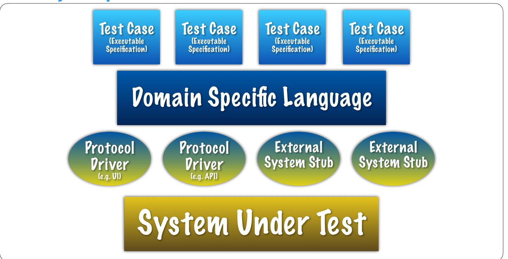

# BETTER SOFTWARE FASTER DAVE FARLEY'S HOW TO GUIDE

# **Acceptance Test Driven Development**

## **Approach**

In Continuous Delivery Acceptance Tests are tests that are "Business Facing" and "Support Programming". They are part of a systemic, strategic, approach to testing and a cornerstone of any effective CD testing strategy.

The most effective way to work is to create an Acceptance Test, before you write any code. These tests act as an "Executable Specification" for your work. The Acceptance Test acts as a guide to organise your work until the specification is met.

Developers use more technical, fine-grained TDD to create code that meets the specification in the **Acceptance Test.** 

The combination of Acceptance Tests and TDD in this approach results in reductions in defects of often two orders-of-magnitude.

### **Properties of Effective Acceptance Tests**

Are written from the perspective of an external user of the system.

**Evaluate the system in life-like scenarios.** 

Are evaluated in production-like test environments.

Interact with the System Under Test (SUT) through public interfaces (no back-door access for tests).

Focus only on What the system does, not How it does it.

#### **Tips**

Imagine the least technical person that you can think of, who understands the problem-domain, reading your Acceptance Tests. The tests should make sense to that person.

Imagine throwing your SUT away and replacing it with something completely different, that achieves the same goals - your Acceptance Tests should still make sense.

e.g. Imagine testing buying a book on Amazon. Could your tests work just as well for a robot doing book-shopping in a physical book store?

This means avoid tests that say things like "fill in this field" or "click this button" instead say things like "placeAnOrder" or "payByCreditCard". Adopt the language of the problem domain exclusively!

Make the scenarios that the tests capture atomic. Don't share test-data between test cases. Make each test-case start from the assumption of a running, functioning system, but one that contains nodata.


### **BETTER SOFTWARE FASTER** DAVE FARLEY'S HOW TO GUIDE

### **Four Layer Separation of Concerns**



### **Test Cases**

Test Cases are written in the language of the problem domain, from the perspective of an external user.

```
@Test
@Channel(Amazon)
public void shouldBuyBookWithCreditCard()
    shopping.goToStore();
    shopping.searchForBook( ...args: "title: Continuous Delivery");
    shopping.selectBook( ...args: "author: David Farley");
    shopping.addSelectedItemToShoppingBasket();
    shopping.checkOut( ...args: "item: Continuous Delivery");
    shopping.assertItemPurchased( ...args: "item: Continuous Delivery");
```


# BETTER SOFTWARE FASTER DAVE FARLEY'S HOW TO GUIDE

## **Domain Specific Language (DSL)**

The DSL is shared between test-cases. It is designed to make it easy to write Test Cases. It should allow precision, where precision is need to express a test and skim over detail where it is not. Best way to achieve that is with 'optional parameters' for nearly everything.

Encode common start-up tasks for test, e.g. "registering users" or "populating accounts".

Keep the DSL focussed on Domain level concepts, and clean from ideas of How the system works

```
public void checkOut(String... args)
    Params params = new Params(args);
    String item = params.Optional( name: "item", defaultValue: "Continuous Delivery");
   String price = params.Optional( name: "price", defaultValue: "£10.00");
    Card card = parseCard(params.Optional( name: "card", defaultValue: "1234 5678 9101 0001 12/23 007"));
    driver.checkOut(item, price, card);
```

### **Protocol Drivers**

Protocol Drivers (PDs) are translators, or adaptors. Translating from the DSL to the "language of the system".

A good pattern is to mirror the interface to the DSL dsl.checkOut calls into driver.checkOut but with more specific parameters. DSL parses parameters and fills-in detail, Protocol Drivers encode real interactions with the SIIT

Create new PD for, at least, each different channel of communication supported by the SUT. Isolate all test infrastructure knowledge of the system here.

```
@Override
public void assertListedInShoppingBasket(String item)
    gotoPage( page: "https://www.amazon.co.uk/qp/cart/view.html/ref=nav_cart",
             expectedTitle: "Amazon.co.uk Shopping Basket");
    List<WebElement> found = driver().findElements(
            By.xpath("//span[@class=\"a-list-item\"]/*[contains(., \"Continuous Delivery\")]"));
    assertEquals(String.format("Item '%s' not found in shopping basket", item),
             expected: 1, found.size());
```


# BETTER SOFTWARE FASTER DAVE FARLEY'S HOW TO GUIDE

## **System Under Test (SUT)**

Deploy the system using the same tools & techniques as you deploy in production. This allows Acceptance tests to evaluate any change to production, including config, os version, db version etc.

Use Infrastructure-as-code techniques to manage test (and production) environments and you now have Full Control

"Production-like" means that, from the perspective of the SUT, it can't tell the difference in how it is deployed or configured.

Consider optimising in usual places to make it easy to test. e.q Make your system start-up FAST!

## **Growing the DSL**

Grow your DSL pragmatically. Create two or three simple test-cases that exercise the most common/ valuable behaviour of your system. Even at this level, you should expect some re-use in the DSL.

Create the infrastructure that allows these tests to execute, and to pass.

Now adopt the discipline that you, and your team, will create a new Acceptance Test for every Acceptance Criteria for every User Story. Drive all new development from these tests.

Invent the language needed to express a test-case at the time of writing the test. Don't worry about implementation!

Anyone can write a test-case, QA, BA, PO, Dev, but ensure that Devs & Dev teams own the tests. If a test breaks a Dev should notice first. Devs own responsibility for writing the plumbing (DSL and PDs) that make the tests work.

When taken seriously this approach is extremely effective. It takes discipline and time to adopt but can result in enormous savings in time and increases in quality.

### **More Information**

Requirement Specification v User Stories - https://youtu.be/KP0U3I-f9-Y

5 Common Mistakes in User Stories - https://youtu.be/0HMsh459h5c

A Collection of 3 Acceptance Testing courses from CD.Training - <a href="https://courses.cd.training/pages/">https://courses.cd.training/pages/</a> about-atdd Learn the practices and techniques of a BDD-approach to Acceptance Testing, and how to write better stories and Executable Specifications.

