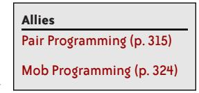
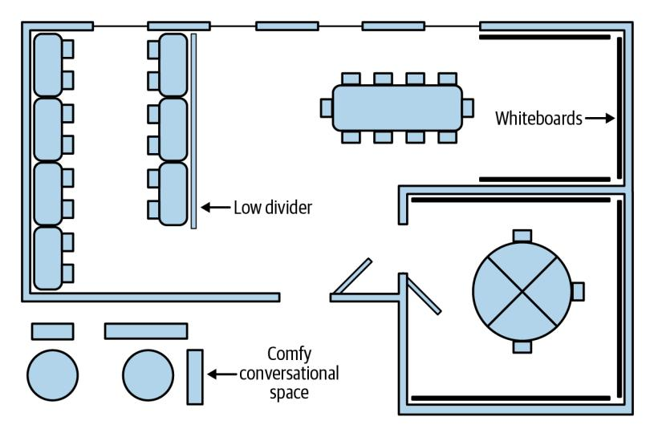
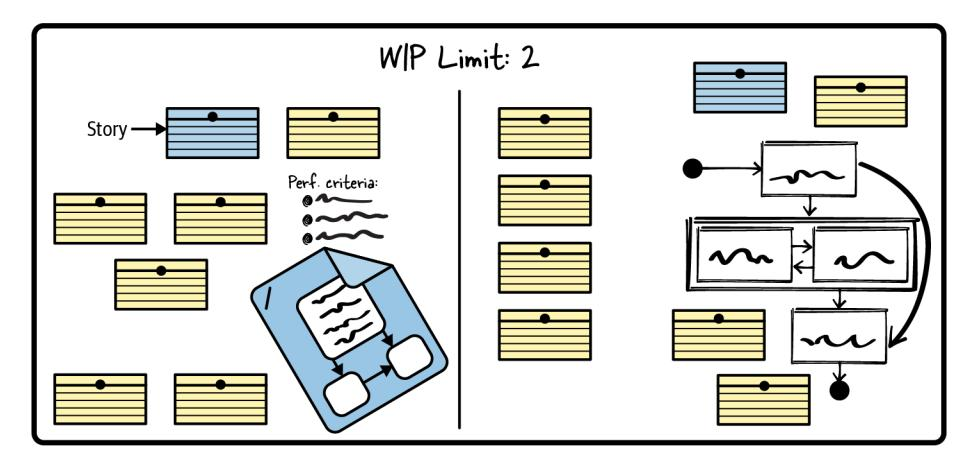
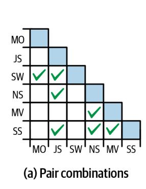

The Art of

/THEORY/IN/PRACTICE

Today's Updated for

# Agile Development

James Shore with Diana Larsen, Gitte Klitgaard, & Shane Warden Foreword by Martin Fowler


# The Art of Agile Development

"James Shore has totally upgraded The Art of Agile Development with new tools, techniques, and lessons from the past decade. This gem of a book will help you evolve your way of working to a truly Agile and effective way."

-Bill Wake, XP123, LLC

Most companies developing software employ something they call "Agile." But there's widespread misunderstanding of what Agile is and how to use it. If you want to improve your software development team's agility, this comprehensive guidebook's clear, concrete, and detailed guidance explains what to do and why, and when to make trade-offs.

In this thorough update of the classic Agile how-to guide, James Shore provides no-nonsense advice on Agile adoption, planning, development, delivery, and management taken from over two decades of Agile experience. He brings the latest ideas from Extreme Programming, Scrum, Lean, DevOps, and more into a cohesive whole. Learn how to successfully bring Agile development to your team and organization—or discover why Agile might not be for you.

### This book explains how to:

- Improve agility: create the conditions necessary for Agile to succeed and scale in your organization
- Focus on value: work as a team, understand priorities, provide visibility, and improve continuously
- Deliver software reliably: share ownership, decrease development costs, evolve designs, and deploy continuously
- Optimize value: take ownership of product plans, budget, and experiments—and produce market-leading software

James Shore has led teams in practicing Agile development since 1999. He combines a deep understanding of Agile ideas with decades of in-the-trenches development experience. James is a recipient of the Agile Alliance's Gordon Pask Award for Contributions to Agile Practice, host of several software development screencasts, and cocreator of the Agile Fluency Model.

SOFTWARE DEVELOPMENT

US \$59.99 CAN \$79.99 ISBN: 978-1-492-08069-5

7.81/03/08/04/05

55999

Twitter: @oreillymedia facebook.com/oreilly

# Praise for The Art of Agile Development, Second Edition

*The Art of Agile Development*, 2nd edition, achieves quite a feat, condensing modern software delivery into a short, readable, and enjoyable book. For people new to iterative delivery, it provides a great overview of the popular practices. For people lost in the mess of overengineered "scaled agile" processes, it provides good ideas for escaping that hell. The first edition had a huge impact on my career two decades ago, and I'm sure the second edition will similarly help millions of developers improve how they deliver software.

—Gojko Adzic, author of *Running Serverless*, *Impact Mapping*, *Specification by Example*

From code to product delivery, this book has it all. Decades of hard-earned knowledge made readable and digestible—a must-have for anybody working with or on a software development team.

—Avi Kessner, Staff Engineer, Forter

This book will be a permanent fixture on my most easy-to-reach bookshelf.

—Krishna Kumar, Founder & CEO, Exathink Research

The first edition of this book mesmerized me to the point that I still have it on my bookshelf as a reference. The second edition keeps this recipe and adds even more insights from the last decade.

—Benjamin Muskalla, Senior Software Engineer, GitHub

One of the most comprehensive books in Agile software development I've ever read. Very pragmatic, with powerful examples easily applicable to any software development project regardless of the tech stack, team size, or industry domain. Definitely a gem to keep handy in your workspace.

—Luiza Nunes, Program Manager, Thoughtworks

This is my favorite book about Agile development. It covers technical and management topics. I use it in my classes, and I always recommend it to my clients.

—Nicolás Paez, Software Engineer and Professor, Universidad de Buenos Aires

Jim comprehensively covers his experienced-based approach to agile software development with easy-to-read chapters that link concepts to practices.

> —Ken Pugh, Principal Consultant, Author of *Prefactoring: Extreme Abstraction, Extreme Separation, Extreme Readability*

Thousands of Agile books. Which one should you read? I suggest you consider this one. James has been around since early-Agile days and knows his stuff. The book cuts through the crap in our industry, the meaningless "Agile" that is all around, and provides a thorough, holistic approach. This approach won't be quick and easy but will be worth it. I loved *The Art of Agile Development*. It is a book with an attitude!

—Bas Vodde, Cocreator of LeSS

James Shore has totally upgraded *The Art of Agile Development* with new tools, techniques, and lessons from the past decade. This gem of a book will help you evolve your way of working to a truly Agile and effective way.

—Bill Wake, XP123, LLC

# The Art of Agile Development

SECOND EDITION

*James Shore with Diana Larsen, Gitte Klitgaard, and Shane Warden*


### The Art of Agile Development

by James Shore

Copyright © 2022 James Shore and Big Blue Marble LLC. All rights reserved.

Printed in the United States of America.

Published by O'Reilly Media, Inc., 1005 Gravenstein Highway North, Sebastopol, CA 95472.

O'Reilly books may be purchased for educational, business, or sales promotional use. Online editions are also available for most titles (*<http://oreilly.com>*). For more information, contact our corporate/institutional sales department: 800-998-9938 or *corporate@oreilly.com*.

Acquisitions Editor: Melissa Duffield Development Editor: Gary O'Brien Production Editor: Christopher Faucher Copyeditor: Piper Editorial Consulting, LLC

Proofreader: Stephanie English

October 2007: First Edition October 2021: Second Edition Indexer: Potomac Indexing, LLC Interior Designer: David Futato Cover Designer: Karen Montgomery

Illustrator: Kate Dullea

### Revision History for the Second Edition

2021-10-11: First Release 2022-03-11: Second Release 2022-04-08: Third Release

See *<http://oreilly.com/catalog/errata.csp?isbn=9781492080695>* for release details.

The O'Reilly logo is a registered trademark of O'Reilly Media, Inc. *The Art of Agile Development*, the cover image, and related trade dress are trademarks of O'Reilly Media, Inc.

The views expressed in this work are those of the author, and do not represent the publisher's views. While the publisher and the author have used good faith efforts to ensure that the information and instructions contained in this work are accurate, the publisher and the author disclaim all responsibility for errors or omissions, including without limitation responsibility for damages resulting from the use of or reliance on this work. Use of the information and instructions contained in this work is at your own risk. If any code samples or other technology this work contains or describes is subject to open source licenses or the intellectual property rights of others, it is your responsibility to ensure that your use thereof complies with such licenses and/or rights.


### T A B L E O F C O N T E N T S

|          | Foreword                                            | xi  |
|----------|-----------------------------------------------------|-----|
|          | Preface xiii                                        |     |
| Part I.  | Improving Agility                                   |     |
| 1        | What Is Agile?                                      | 3   |
|          | Agile's Genesis                                     | 3   |
|          | Born Out of Crisis                                  | 4   |
|          | The Agile Manifesto                                 | 4   |
|          | The Essence of Agile                                | 5   |
|          | Why Agile Won                                       | 7   |
|          | Why Agile Works                                     | 9   |
|          | Why Agile Fails                                     | 9   |
| 2        | How to Be Agile                                     | 13  |
|          | Practicing Agile                                    | 13  |
|          | The Road to Mastery                                 | 14  |
|          | How to Begin                                        | 14  |
| 3        | Choose Your Agility 19                              |     |
|          | The Agile Fluency Model                             | 19  |
|          | Choose Your Zones                                   | 23  |
| 4        | Invest in Agility                                   | 25  |
|          | Make Time for Learning                              | 27  |
|          | Choose or Create Agile Teams                        | 29  |
|          | Choose Agile Coaches                                | 31  |
|          | Delegate Authority and Responsibility to Teams      | 31  |
|          | Change Team Management Style                        | 33  |
|          | Create Team Rooms                                   | 33  |
|          | Establish a Learning-Friendly Purpose for Each Team | 34  |
|          | Replace Waterfall Governance Assumptions            | 35  |
|          | Change Harmful HR Policies                          | 36  |
|          | Address Security Concerns                           | 36  |
| 5        | Invest in Change 41                                 |     |
|          | Understanding Change                                | 41  |
|          | Large-Scale Change                                  | 43  |
|          | Making Changes                                      | 43  |
|          | Get Management Buy-In                               | 44  |
|          | Get Team Buy-In                                     | 49  |
|          | Get Stakeholder Buy-In                              | 51  |
|          | Further Reading                                     | 52  |
| 6        | Scaling Agility                                     | 53  |
|          | Scaling Fluency                                     | 53  |
|          | Scaling Products and Portfolios                     | 55  |
| Part II. | Focusing on Value                                   |     |
|          | Welcome to the Focusing Zone                        | 65  |
|          | Achieving Focusing Fluency                          | 66  |
| 7        | Teamwork 67                                         |     |
|          | Whole Team                                          | 68  |
|          | Team Room                                           | 81  |
|          | Safety                                              | 95  |
|          | Purpose                                             | 103 |
|          | Context                                             | 111 |
|          | Alignment                                           | 116 |
|          | Energized Work                                      | 123 |
| 8        | Planning                                            | 129 |
|          | Stories                                             | 130 |
|          | Adaptive Planning                                   | 138 |
|          | Visual Planning                                     | 153 |
|          | The Planning Game                                   | 166 |
|          | Real Customer Involvement                           | 173 |
|          | Incremental Requirements                            | 178 |
| 9        | Ownership 185                                       |     |
|          | Task Planning                                       | 186 |
|          | Capacity                                            | 199 |
|          | Slack                                               | 214 |
|          | Stand-Up Meetings                                   | 219 |
|          | Informative Workspace                               | 224 |
|          | Customer Examples                                   | 228 |
|          | "Done Done"                                         | 233 |
| 10       | Accountability                                      | 239 |
|          | Stakeholder Trust                                   | 240 |
|          | Stakeholder Demos                                   | 246 |
|          | Forecasting                                         | 253 |
|          | Roadmaps                                            | 261 |
|          | Management                                          | 267 |
| 11       | Improvement 277                                     |     |
|          | Retrospectives                                      | 278 |
|          | Team Dynamics                                       | 284 |
|          | Impediment Removal                                  | 296 |
|          | Achieving Delivering Fluency                        | 305 |
| 12       | Collaboration 309                                   |     |
|          | Collective Code Ownership                           | 310 |
|          | Pair Programming                                    | 315 |
|          | Mob Programming                                     | 324 |
|          | Ubiquitous Language                                 | 328 |
| 13       | Development 335                                     |     |
|          | Zero Friction                                       | 336 |
|          | Continuous Integration                              | 344 |
|          | Test-Driven Development                             | 353 |
|          | Fast, Reliable Tests                                | 367 |
|          | Refactoring                                         | 374 |
|          | Spike Solutions                                     | 384 |
| 14       | Design 389                                          |     |
|          | Incremental Design                                  | 391 |
|          | Simple Design                                       | 400 |
|          | Reflective Design                                   | 408 |
| 15       | DevOps.                                             | 417 |
|          | Build for Operation                                 | 418 |
|          | Feature Flags                                       | 427 |
|          | Continuous Deployment                               | 431 |
|          | Evolutionary System Architecture                    | 436 |
| 16       | Quality.                                            | 445 |
|          | No Bugs                                             | 446 |
|          | Blind Spot Discovery                                | 453 |
|          | Incident Analysis                                   | 458 |
| Part IV. | Optimizing Outcomes                                 |     |
|          | Welcome to the Optimizing Zone                      | 470 |
|          | Achieving Optimizing Fluency                        | 471 |
| 17       | Autonomy.                                           | 473 |
|          | Business Expertise                                  | 473 |
|          | Business Decisions                                  | 473 |
|          | Accountability and Oversight                        | 474 |
|          | Funding                                             | 475 |
|          | Experiments and Further Reading                     | 475 |
| 18       | Discovery.                                          | 477 |
|          | Validated Learning                                  | 477 |
|          | Adaptability                                        | 478 |
|          | Experiments and Further Reading                     | 479 |
| 19       | Into the Future.                                    | 481 |
|          | References.                                         | 483 |
|          | Index                                               | 493 |

# Foreword

<span id="page-12-0"></span>When we wrote the Manifesto for Agile Software Development, our supporters were a small minority trying to change an industry. Now, twenty years later, "agile" is mainstream. But I write "agile" in scare quotes for a reason—lots of people say they are doing agile software development, indeed most genuinely believe that, but their actions bear little resemblance to the vision we shared two decades ago.

The truth is that working in an Agile way requires a web of interconnected practices spanning both the management and the technical execution of software development work. Many of these practices, particularly the technical ones, are not well understood or widely taught. Consequently, too many languish with a distorted view of what can be such an effective way to build software products.

James Shore was one of the early pioneers, riding the trail of Extreme Programming, a central pillar of the Agile movement. His first edition of this book was a favorite of mine: a handbook for teams to show them what they needed to know to execute an agile process properly. He later went on to work with Diana Larsen to create the Agile Fluency Model—a model that captured their experiences of the different ways people can develop their skill in using Agile approaches. In this model, a simple application of project management techniques, often referred to as a basic Scrum approach, provides some value by focusing on customer needs but lacks the technical skills you need to unlock the high productivity and reliability that many teams accomplish.

That point of view rightly drives the structure of this book, which puts the bulk of its weight on how to focus on value and how to deliver that value reliably. Focusing On Value means understanding the importance of potent teamwork, developing skills in adaptive planning, and close collaboration with the customers and users of the resulting software. Delivering Reliably concentrates on essential technical practices for testing, refactoring, design, and collaborative development. It recognizes the often counterintuitive notion that building software with a high internal quality decreases cost and increases the speed of getting code delivered. Combined with a DevOps culture and continuous delivery, this allows a high

frequency of features to be rapidly put into production, which itself enables teams to learn more about what is valuable by observing how the software is used in practice.

I was fortunate 20 years ago to find a home at Thoughtworks, where our teams use these kinds of skills to help our clients build new software products and displace old legacies. Like James, we've found that Extreme Programming provided a firm foundation for our work, and we've applied these techniques with great success in the last two decades. I'm thus really happy to see that James has applied another decade of his coaching experience to revise his book. The result is a sound bedrock for learning these skills that have helped us so much. Like anything worthwhile, it will take time, and there will be frustration along the way. But this guidebook can help you through that journey—moving away from barren ceremonies to the vigor that we felt when James and I first used these techniques all those years ago.

*—Martin Fowler*

*Chief Scientist, Thoughtworks*

# Preface

<span id="page-14-0"></span>Q: How do you get to Carnegie Hall?

A: Practice, practice, practice!

I want to help you master the art of Agile development.

Agile development, like any team-based approach to software development, is a fundamentally *human* art, subject to the vagaries of individuals and their interactions. To master Agile development, you must learn to evaluate myriad possibilities, moment to moment, and intuitively pick the best course of action.

How can you possibly learn such a difficult art? Practice!

First and foremost, this book is a how-to guide. It's a detailed description of one way to practice Agile development. It's based on Extreme Programming, but it also brings in ideas and practices from Scrum, Kanban, DevOps, Lean Software Development, Lean Startup, and more. Ultimately, it's a practical guide that will allow you to successfully bring Agile development to your team and organization—or it will help you discover that Agile isn't a good choice for your situation.

Second, this book exists to help you master the *art* of Agile development. Mastering agility means going beyond a cookbook of practices. Software development is too context-sensitive for one approach to be a perfect fit, and too nuanced for any book to teach you how to master it. Mastery comes from within: from experience and an intuitive understanding of the ripples caused by a pebble of a choice.

I can't teach you how your choices will ripple throughout your organization. I don't try. You must provide the nuance and understanding. This is the only way to master the art. Follow the practices. Watch what happens. Think about why they worked…or didn't work. Then repeat. What was the same? What was different? Why? Then do it again. And again.

At first, you may struggle to understand how to apply each practice. They can look easy on paper, but putting some practices into action will be difficult. Keep practicing until they're easy.

As Agile becomes easier, you'll discover that some of my advice doesn't work for you. In the beginning, you won't be able to tell if the problem is in the instructions I provide or in the way you're following them. Keep practicing until you're certain. When you are, break the rules. Modify my guidance to work better for your specific situation. Every practice has an "Experiments and Alternatives" section with ideas to explore.

One day, rules will no longer hold any interest for you. After all, Agile isn't about following rules. "It's about simplicity and feedback, communication and trust," you'll think. "It's about delivering value—and having the courage to do the right thing at the right time." You'll evaluate myriad possibilities, moment to moment, and intuitively pick the best course of action.

When you do, pass this book on to someone else, dog-eared and ragged though it may be, so they too can master the art of Agile development.

### For the Pragmatists

What if you don't want to master a so-called "art"? What if you just want to develop good software?

Don't worry—this book is for you, too. I take my years of experience with Agile development and distill them down into a single, clearly defined, comprehensive approach.

That allows me to use plain, straightforward language. I include a lot of practical tips. I candidly describe when my approach won't work, and what alternatives to consider when it doesn't. [Chapter 2](#page-34-0) will help you get started.

There's a downside to discussing just one approach: no single approach is appropriate for everyone. My advice may not be appropriate for your team or organization. Read Chapters [4](#page-46-0) and [5](#page-62-0) to understand the overall conditions needed for success, and check the "Prerequisites" section of each practice for specifics.

But don't just assume a particular practice won't work for you. Some of the practices in this book are counterintuitive, or just don't sound like fun. Most of them work best in concert with the others. If you can, try the practices as written for a few months, gain some real-world experience with how they work in your environment, *then* change them.

I've been putting these ideas into practice for more than 20 years. In the right environment, they really work. Agile development has been more fun, and more successful, than any other approach to software development I've tried. Come join the ride.

### What's New in the Second Edition

This second edition of *The Art of Agile Development* is a complete, ground-up rewrite of the first edition. It retains the down-to-earth, practical approach of the first edition, along with most of the first edition's practices. But nearly all of them have been rewritten to take advantage of 14 years of advancements in Agile practice—not to mention 14 more years of experience on my part.

I've completely restructured the book to allow for incremental adoption and to better reflect teams' real-world Agile usage. The principles and customization discussed in Part III of the first edition have been distributed among the practices to make them more prominent and accessible, and I've expanded every practice with suggestions for experimentation.

Notable additions include:

- An in-depth guide to adopting Agile and customizing your adoption to your company's needs, based on the Agile Fluency<sup>1</sup> Model I created with Diana Larsen.
- A new chapter on scaling Agile, based on my experience helping companies large and small.
- A new chapter on DevOps, with new content about working with operations and security, as well as DevOps-inspired updates throughout the rest of the book.
- Guidance on making Agile work with remote teams; many new practices, stories, and ideas; and too many other improvements and changes to mention.

### Who This Book Is For

This book is for everyone who works with an Agile team, or hopes to do so in the future. That includes programmers, of course, but it also includes managers, executives, domain experts, testers, product managers, project managers, architects, operations, security, designers, and business analysts. Agile teams are cross-functional; this book reflects that fact.

The book is designed to be used as a reference as well as read cover-to-cover. Each practice in Parts [II](#page-84-0) through [IV](#page-490-0) is designed to be read on its own. The "Ally" boxes in the margins of the print edition and the hyperlinks in the ebook edition will help you cross-reference. The print edition is additionally designed to pick up and browse. Flip through the book and stop to read more deeply when a callout grabs your attention.

If you're a manager or executive who wants to understand how Agile can or should work in your company, read [Part I.](#page-22-0) If you're a team-level manager, add ["Management" on page 267,](#page-288-0) and possibly the other practices in [Chapter 10](#page-260-0).

If you're a team member or manager interested in bringing Agile to your company, or improving the way Agile is practiced at your company, read the whole book from cover to cover. [Part I](#page-22-0) will help you understand how to introduce Agile ideas. The remainder of the book will help you understand how to put Agile into practice.

If you're part of an Agile team and just want to learn enough to do your job, you can focus on the practices in Parts [II](#page-84-0) and [III.](#page-324-0) Start with [Chapter 1](#page-24-0) to get an overview, then read through the practices your team uses. If your team uses practices that aren't listed in the table of contents, check the index. They could be under a different name.

If you're not part of an Agile team, but you're working with one, ask them for suggestions about what to read. Product managers, product owners, and designers, start with [Chapter 8](#page-150-0) and ["Purpose" on page 103.](#page-124-0) Security and operations, check out ["Build for Operation" on page 418,](#page-439-0) ["Blind Spot Discovery" on page](#page-474-0) [453,](#page-474-0) and ["Incident Analysis" on page 458](#page-479-0). Testers, take a look at [Chapter 16.](#page-466-0)

If you're merely curious about Agile development, start by reading [Chapter 1.](#page-24-0) Afterward, take a look at Parts [II](#page-84-0), [III,](#page-324-0) and [IV](#page-490-0). Start with the practices that look most interesting. You can read them in any order.

<sup>1</sup> "Agile Fluency" is a registered trademark of Agile Fluency Project LLC.

### About the Guest Authors

I'm fortunate to have several notable collaborators for this edition. Gitte Klitgaard wrote ["Safety" on page](#page-116-0) [95,](#page-116-0) expertly covering the topic of psychological safety. Diana Larsen wrote ["Team Dynamics" on page](#page-305-0) [284](#page-305-0) and ["Impediment Removal" on page 296](#page-317-0), bringing in her decades of experience in organizational and team development. Shane Warden, my coauthor for the first edition, wasn't able to contribute new material to this edition, but he remained a valuable sounding board, and our work on the first edition formed the basis for this edition.

### Gitte Klitgaard

Gitte Klitgaard is an Agile coach, trainer, and mentor focusing on helping organizations implement psychological safety, responsibility, and accountability. Gitte is authentic; she will cut to the chase and help people become themselves, thereby reaching success.

Her community contributions include organizing coach camps and speaking at conferences, where she highlights topics such as mental health and psychological safety and makes them accessible. She creates safe and respectful environments at work and outside. She listens to and engages the more silent voices and minority groups.

In her spare time, Gitte collects LEGO and Yodas and keeps in touch with friends from all over the globe, including some she considers her second family.

Gitte is owner of Native Wired and has led change at companies such as LEGO, Spotify, and Mentimeter.

### Diana Larsen

For over 20 years, Diana Larsen has contributed to the foundations and extensions of Agile thought and to the practice of cultivating and enabling skilled teams. Diana coauthored *Agile Retrospectives, Liftoff, 2nd ed., Five Rules for Accelerated Learning,* two new books in process, and *The Agile Fluency Model: A Brief Guide to Success with Agile* ebook. Serving as a principal coach, consultant, facilitator, speaker, and mentor, she continues her contributions and lives up to her Agile Fluency Project title, Chief Connector. Diana lives in Portland on the US upper left coast.

### Shane Warden

Shane Warden is an engineering leader and writer, notably the coauthor of *The Art of Agile Development* (1st edition) and *Masterminds of Programming*. When he's not working, he helps give animals good homes.

### Conventions Used in This Book

The following typographical conventions are used in this book:

*Italic*

Indicates new terms, URLs, email addresses, filenames, and file extensions.

#### **Audience**

Audience boxes identify the target audience for each Agile practice.

#### Constant width

Used for program listings, as well as within paragraphs to refer to program elements such as variable or function names, databases, data types, environment variables, statements, and keywords.

### Callout boxes highlight important concepts.

#### **Ally**

Ally boxes point you to related practices.

#### **Constant width bold**

Indicates code additions in running code examples.

#### Constant width strikethrough

Represents code deletions in running code examples.

### Using Code Examples

Supplemental material is available for download at *<https://www.jamesshore.com/v2/books/aoad2>*.

Please send an email to *[bookquestions@oreilly.com](mailto:bookquestions@oreilly.com)* if you have a technical question or a problem using the material.

This book is here to help you get your job done. In general, if example code is offered with this book, you may use it in your programs and documentation. You do not need to contact us for permission unless you're reproducing a significant portion of the code. For example, writing a program that uses several chunks of code from this book does not require permission. Selling or distributing examples from O'Reilly books does require permission. Answering a question by citing this book and quoting example code does not require permission. Incorporating a significant amount of example code from this book into your product's documentation does require permission.

We appreciate, but generally do not require, attribution. An attribution usually includes the title, author, publisher, and ISBN. For example: "*The Art of Agile Development* by James Shore (O'Reilly). Copyright 2022 James Shore and Big Blue Marble LLC, 978-1-492-08069-5."

If you feel your use of code examples falls outside fair use or the permission given above, feel free to contact us at *[permissions@oreilly.com](mailto:permissions@oreilly.com)*.

### O'Reilly Online Learning

#### NOTE

For more than 40 years, *[O'Reilly Media](http://oreilly.com)* has provided technology and business training, knowledge, and insight to help companies succeed.

Our unique network of experts and innovators share their knowledge and expertise through books, articles, and our online learning platform. O'Reilly's online learning platform gives you on-demand access to live training courses, in-depth learning paths, interactive coding environments, and a vast collection of text and video from O'Reilly and 200+ other publishers. For more information, visit *<http://oreilly.com>*.

### How to Contact Us

Please address comments and questions concerning this book to the publisher:

O'Reilly Media, Inc. 1005 Gravenstein Highway North Sebastopol, CA 95472 800-998-9938 (in the United States or Canada) 707-829-0515 (international or local) 707-829-0104 (fax)

We have a web page for this book, where we list errata, examples, and any additional information. You can access this page at *<https://oreil.ly/art-of-agile-dev-2e>*.

Email *[bookquestions@oreilly.com](mailto:bookquestions@oreilly.com)* to comment or ask technical questions about this book.

For news and information about our books and courses, visit *<http://oreilly.com>*.

Find us on Facebook: *<http://facebook.com/oreilly>*

Follow us on Twitter: *<http://twitter.com/oreillymedia>*

Watch us on YouTube: *<http://youtube.com/oreillymedia>*

### Acknowledgements

This book collects inspiration from too many sources to count. I've acknowledged as many as I could throughout the book, but I undoubtedly have forgotten some. (Please accept my apologies.) I particularly want to recognize Kent Beck, Ron Jeffries, and Ward Cunningham for their creation of Extreme Programming, which got me started on my Agile journey. Alistair Cockburn and his Software Roundtable was an important guide during the beginning of that journey, as was the vigorous debate and discussion on Ward Cunningham's C2 Wiki. Thank you also to Diana Larsen, whom I've worked with for many years, and whose perspective balances mine so well. And, of course, Martin Fowler, whose thoughtful writing has inspired me for many years.

O'Reilly's support for this edition has been nothing short of exemplary. I owe a huge thank you to Gary O'Brien, my development editor, who provided constant feedback and support. Thanks also to Melissa Duffield, who helped shepherd the book to success; Ryan Shaw, who convinced me it was time for a second edition; Deborah Baker, who prepared the book's Early Release editions; Suzanne Huston, who helped make sure people knew about the book; Nick Adams and the O'Reilly Tools team, who built the production pipeline and dealt with my esoteric and picky formatting demands; Christopher Faucher, who oversaw the transformation from "raw manuscript" to "completed book;" Tonya Trybula and Stephanie English, who fixed my grammatical quirks; Kate Dullea, who converted my hand-drawn sketches into figures you can actually understand; and Estalita Slivoskey, who made sure you could find everything in the index.

Speaking of feedback, a special round of thanks goes to my reviewers. The review was conducted in the open, and dozens of people contributed over 700 feedback emails. Nearly every one was insightful and useful, and they resulted in a better book. Thanks also to the people who responded to my specific requests for feedback. All together, thank you to: Adrian Sutton, Anthony Williams, Avi Kessner, Bas Vodde, Benjamin Muskalla, Bill Wake, Brad Appleton, C. Keith Ray, C.J. Jameson, Christian Dywan,

David Poole, Diana Larsen, Diego Fontdevila, Emily Bache, Erik Peterson, "Evan M," Franz Amador, George Dinwiddie, Gojko Adzic, Jason Yip, Jeff Grigg, Jeff Patton, Jeffrey Palermo, Johan Aludden, Ken Pugh, Krishna Kumar, Liz Keogh, Luiza Nunes, Marcelo Lopez, Markus Gaertner, Martin Fowler, Michal Svoboda, Nicolas Paez, Paul Stephenson, Peter Graves, Reuven Yagel, Ricardo Mayerhofer, Ron Jeffries, Ron Quartel, Sarah Horan Van Treese, Steve Bement, Thomas J. Owens, Todd Little, and Ward Cunningham.

Extra thanks to the reviewers who went above and beyond, reading and commenting on nearly every part of the book: Bas Vodde, Bill Wake, Ken Pugh, Martin Fowler, and Thomas J. Owens.

The first edition also benefited from an open review process, and those benefits accrued to this edition. Thank you to Adrian Howard, Adrian Sutton, Ann Barcomb, Andy Lester, Anthony Williams, Bas Vodde, Bill Caputo, Bob Corrick, Brad Appleton, Chris Wheeler, Clarke Ching, Daði Ingólfsson, Diana Larsen, Erik Petersen, George Dinwiddie, Ilja Preuß, Jason Yip, Jeff Olfert, Jeffery Palermo, Jonathan Clarke, Keith Ray, Kevin Rutherford, Kim Gräsman, Lisa Crispin, Mark Waite, Nicholas Evans, Philippe Antras, Randy Coulman, Robert Schmitt, Ron Jeffries, Shane Duan, Tim Haughton, and Tony Byrne for their extensive comments, and to Brian Marick, Ken Pugh, and Mark Streibeck for their comments on the completed draft.

Finally, thank you to my wife, Neeru, once again. This time, you knew what you were in for, and still your support never wavered. I couldn't do it without you.

## P A R T I

# <span id="page-22-0"></span>Improving Agility

1

### C H A P T E R O N E

# What Is Agile?

<span id="page-24-0"></span>Agile is everywhere. And paradoxically, nowhere.

In the 20 years after the Agile freight train roared into software developers' consciousness, the number of companies calling themselves "Agile" increased by orders of magnitude. The number of teams *actually* taking an agile approach to their work? Not so much. "Agile," the easily repeated name, is enormously successful. The ideas behind Agile—well, most of *them* are ignored.

Let's fix that.

### Agile's Genesis

In the 1990s, software development was believed to be in crisis. They actually called it that: "The Software Crisis." Software projects were overbudget, late, didn't meet requirements, and—according to the oft-quoted and ominously named "CHAOS Report"—nearly one-third of them were cancelled outright. [\[Standish1994\]](#page-513-0)

Agile wasn't a response to this crisis. Far from it. Agile was a response to the *response*.

To bring software development under control, big organizations had created highly detailed processes that defined exactly how software was to be created. Everything was tightly controlled so that no mistakes could be made. (In theory, anyway.)

First, business analysts would interview stakeholders and document the system requirements. Next, software architects would read the requirements documents and create detailed design documents specifying every component of the system and how they related to one another. Then programmers would convert the design documents to code. In some organizations, this was considered low-skill work—just a mechanical translation exercise.

Meanwhile, test leads would use the same documents to generate test plans, and when coding was done, armies of QA personnel would manually follow those test plans and report variances as defects. After each phase, everything would be carefully documented, reviewed, and signed off.

<span id="page-25-0"></span>These phase-based approaches came to be called "waterfall development," or "phase-gate development."<sup>1</sup> If they sound like a ridiculous straw man, well, consider yourself fortunate. Not every company used a document-heavy, phase-based process in the '90s, but it was widely recognized as a logical and sensible way to work. *Of course* you needed to define requirements, then design, then implement, then test. *Of course* you needed to document every phase. This was *discipline.* This was *engineering.* How else could you possibly succeed?

### Born Out of Crisis

Big companies defined their processes in excruciating detail. Roles, responsibilities, document templates, modeling languages, change control boards…every aspect of development was strictly defined and controlled. If a project didn't succeed—and, according to the "CHAOS Report," less than one-sixth of them did—it was because the process needed more detail, more documents, more sign-offs. This resulted in a massive amount of documentation. Martin Fowler called it "The Almighty Thud." [\[Fowler1997\]](#page-507-0)

This wasn't a great way to work. It was bureaucratic and dehumanizing. Skill didn't seem to matter as much as adherence to process. Programmers felt they were interchangeable cogs in an impersonal machine. It didn't even work all that well.

So several people created simpler, slimmer, and less prescriptive methods for developing software. They were called "lightweight methods" in contrast to the heavyweight methods used by big companies. These new methods had names like "Adaptive Software Development," "Crystal," "Feature-Driven Development," "Dynamic Systems Development Method," "Extreme Programming," and "Scrum."

By the late '90s, these methods were attracting serious attention. Extreme Programming, in particular, saw an explosion of grassroots interest among programmers. In 2001, 17 of the lightweight methodology proponents met at a ski resort in Utah to discuss unifying their efforts.

### The Agile Manifesto

"I personally didn't expect this particular group of [people] to ever agree on anything substantive," Alistair Cockburn said later.

And, in fact, after two days, they accomplished only two things: the name "Agile," and a statement of four values (see [Figure 1-1\)](#page-26-0). During the following months, over email, they hashed out 12 accompanying principles (see [Figure 1-2\)](#page-27-0). [\[Beck2001\]](#page-504-0)

This was the Agile Manifesto. It changed the world. So, as Alistair went on to say, they did agree on something substantive after all.<sup>2</sup>

<sup>1</sup> Waterfall is often mistakenly attributed to a 1970 paper by Winston Royce. But phase-based approaches date back to the 1950s, and Royce's paper was largely ignored until the late 1980s, when it was used to describe what people were already doing. *[\[Bossavit2013\]](#page-505-0)* (ch. 7).

<sup>2</sup> Alistair Cockburn, quoted by Jim Highsmith in *[\[Highsmith2001\]](#page-508-0)*. The full quote is, "I personally didn't expect…this particular group of agilites to ever agree on anything substantive…Speaking for myself, I am delighted by the final phrasing [of the Manifesto]. I was surprised that the others appeared equally delighted by the final phrasing. So we did agree on something substantive."

<span id="page-26-0"></span>We are uncovering better ways of developing software by doing it and helping others do it.
Through this work we have come to value:

That is, while there is value in the items on the right, we value the items on the left more.

Kent Beck
Mike Beedle
Arie van Bennekum
Alistair Cockburn
Ward Cunningham
James Grenning
Jim Highsmith
Andrew Hunt
Ron Jeffries
Jon Kern
Robert C. Martin
Steve Mellor
Ken Schwaber
Jeff Sutherland
Dave Thomas

© 2001, the above authors

This declaration may be freely copied in any form, but only in its entirely through this notice.

Figure 1-1. *Agile values*

But there was no unified Agile method. There never has been, and never will be. Agile is three things: the name, the values, and the principles. That's it. It's not something you can do. It's a *philosophy*. A way of thinking about software development. You can't "use" Agile or "do" Agile…you can only *be* Agile. Or not. If

If your teams embody the Agile philosophy, then they're Agile. If they don't, they're not.

your teams embody the Agile philosophy, then they're Agile. If they don't, they're not.

### The Essence of Agile

Martin Fowler has made a career out of turning complicated software topics into well-considered, evenhanded explanations. His explanation of "The Essence of Agile Software Development" is one of the best:

Agile Development is *adaptive* rather than predictive; *people-oriented* rather than process-oriented.<sup>3</sup>

—Martin Fowler

<sup>3</sup> Fowler has expressed this idea in many ways over the years. It originated in *[\[Fowler2000a\]](#page-507-0)*.

<span id="page-27-0"></span>Our highest priority is to satisfy the customer through early and continuous delivery of valuable
software.

Welcome changing requirements, even late in development. Agile processes harness change
for the customer's competitive advantage.

Deliver working software frequently, from a couple of weeks to a couple of months, with a
preference to the shorter timescale.

Business people and developers must work together daily throughout the project.

Build projects around motivated individuals. Give them the environment and support they
need, and trust them to get the job done.

The most efficient and effective method of conveying information to and within a development
team is face-to-face conversation.

Working software is the primary measure of progress.

Agile processes promote sustainable development. The sponsors, developers, and users should
be able to maintain a constant pace indefinitely.

Continuous attention to technical excellence and good design enhances agility.

Simplicity, the art of maximizing the amount of work not done, is essential.

The best architectures, requirements, and designs emerge from self-organizing teams.

At regular intervals, the team reflects on how to become more effective, then tunes and adjusts
its behavior accordingly.

Figure 1-2. *Agile principles*

### Adaptive rather than predictive

Remember the "CHAOS Report," which said that only one-sixth of software projects were successful? It had a very specific definition of success:

#### *Success*

The project is completed on-time and on-budget, with all features and functions as originally specified.

#### *Challenged*

The project is completed and operational but over-budget, over the time estimate, and offers fewer features and functions than originally specified.

#### *Impaired*

The project is canceled at some point during the development cycle.

These definitions illustrate the predictive mindset perfectly. They're all about *conformance to plan.* If you did what you said you were going to do, you were successful. If you didn't, you weren't! Easy.

<span id="page-28-0"></span>It makes sense at first. But look closer. There's something missing. As Ryan Nelson wrote in *CIO Magazine* [\[Nelson2006\]:](#page-510-0)

Projects that were found to meet all of the traditional criteria for success—time, budget, and specifications—may still be failures in the end because they fail to appeal to the intended users or because they ultimately fail to add much value to the business…Similarly, projects considered failures according to traditional IT metrics may wind up being successes because despite cost, time or specification problems, the system is loved by its target audience or provides unexpected value.

Agile teams define success as *delivering value*, not conforming to a plan. In fact, truly Agile teams actively look for opportunities to increase value by *changing* their plans.

Agile teams define success as *delivering value*, not conforming to a plan.

Look back at the Manifesto (see Figures [1-1](#page-26-0) and [1-2](#page-27-0)). Take a moment to really study the Agile values and principles. How many relate to delivering valuable software and adapting to feedback?

### People-oriented rather than process-oriented

Heavyweight processes tried to prevent errors by carefully defining every aspect of software development. By putting the "smarts" in the process, individual skill became less important. In theory, you could apply the same process over and over, with different people, and get the same results. (Come to think of it, they kind of did. Just not the results they wanted.)

Agile says people are the most important factor in software development success. Not just their skills, but all aspects of their humanity. How well team members work together. How many distractions they encounter. How safe they are to speak up, and whether they're motivated by their work.

Agile says people are the most important factor in software development success.

Agile teams have a process—every team does, even if it's implicit—but the process is in service of the humans, not the other way around. And Agile teams are in charge of their own process. When they think of a better way of working, they change it.

Look at the Manifesto again (see Figures [1-1](#page-26-0) and [1-2](#page-27-0)). Which values and principles relate to putting people first?

### Why Agile Won

In the first 10 years after the Manifesto, Agile faced enormous criticism. It was "undisciplined," critics said. "It could never work." Another 10 years after that, the critics were silent. Agile was everywhere, at least in name. Heavyweight waterfall methods were effectively dead. Some younger programmers have trouble believing anybody ever could have worked that way.

It's not that phase-based processes are inherently broken. They have their flaws, sure, but if you keep them slim and operate in a well-understood domain, waterfall-style methods can work. The problem was the heavyweight approaches big companies used. Ironically, the processes designed to *prevent* problems actually *caused* many of the problems organizations were seeing.

<span id="page-29-0"></span>It's very difficult to imagine how software will work before you actually use it, and it's even harder to think of absolutely everything your software needs to do. This is doubly true for people who aren't actively involved with software development. As a result, it's critically important to get working software in front of

Learning and responding to change are at the heart of what Agile is all about.

people as soon as possible. You need to get feedback about what's missing or wrong, then change your plans based on what you learn. As the Manifesto says, "Working software is the primary measure of progress." Learning and responding to change are at the heart of what Agile is all about.

Those heavyweight processes put so much emphasis on process controls and documentation and sign-offs, they incurred a huge amount of delay and overhead. They took years to produce working software, and they had nothing concrete to show until near the end. Instead of welcoming change, they actively worked to *prevent* change. They actually had a dedicated part of the process, the Change Control Board, whose primary purpose was to say "no" to change requests. (Or, more accurately, "Yes, but it will cost you.")

All of this added up to projects that spent years in development before they had anything to show. When they did, it was too late and too expensive to make changes. They ultimately shipped software that didn't do what customers needed.

### **A Typical Heavyweight Failure**

On February 3, 2005, Robert S. Mueller III, director of the Federal Bureau of Investigation, appeared before a Senate subcommittee to explain how the FBI had managed to waste \$104.5 million.<sup>4</sup>

This couldn't have been a comfortable position to be in. In June 2001, the FBI had launched VCF, a project designed to replace the Bureau's case management software. Four years later, it was cancelled, at a total cost of \$170 million, \$104.5 million of which was completely unrecoverable.

The timeline for VCF tells an all-too-familiar story. The project launched in June 2001. Seventeen months later, in November 2002, "solid requirements" had been established. The software was delivered a year after that, in December 2003, but the FBI "immediately discovered a number of deficiencies in VCF that made it unusable." The contractor building VCF agreed to fix the problems, but only at the cost of an additional \$56 million and another year of development. Ultimately, the FBI declined to fix the problems, scrapping years of work.

Although there are a variety of approaches to Agile—and some of them are more about co-opting a popular name than following the actual philosophy—one thing they all have in common is a focus on making progress visible and allowing stakeholders to

Agile teams show progress with working software, not documents.

make course corrections as they go. This seems like a small thing, but it's incredibly powerful. It's why we no longer hear about the Software Crisis. Software is still late. It's still over-budget. *But Agile teams show progress with working software, not documents.* Right from the beginning. And that's huge.

There's more to Agile than just providing visibility. But this one thing? This was enough. It's why everybody wanted Agile.

<sup>4</sup> Sources: [Mueller's February 3, 2005, testimony to Congress](https://oreil.ly/GlQSa) and [Inspector General Glenn Fine's May 2, 2005, testimony to](https://oig.justice.gov/node/672) [Congress](https://oig.justice.gov/node/672).

### <span id="page-30-0"></span>Why Agile Works

Agile's first break-out success was Extreme Programming (XP), a method with the slogan "Embrace Change." XP mixed a healthy dose of philosophizing about software development with a pragmatic emphasis on making a difference. As the preface to the first XP book states:

In short, XP promises to reduce project risk, improve responsiveness to business changes, improve productivity throughout the life of a system, and add fun to building software in teams —all at the same time. Really. Quit laughing. [\[Beck2000a\]](#page-504-0)

—*Extreme Programming Explained*, First Edition

Some people did laugh. But others tried it, and they found that—contrary to common wisdom about how software development was supposed to work—XP really did everything it promised. And so, despite the laughter, XP thrived, and Agile along with it.

XP was the original poster child of Agile, donating a backbone of ideas and terminology that are still in use today. But the strength of the Agile community is that it has always been a big tent. Agile isn't limited to any one method. It's constantly expanding to include new people and ideas. Lean Software Development, Scrum, Kanban, Lean Startup, DevOps, and many, many more, have all contributed to what people think of as "Agile" today.

If you take their ideas and group them into categories, five core concepts appear.

- *Rely on People*. Build processes that understand and work with people's essential humanity. Put decisions in the hands of those who are most qualified to make those decisions. Base your work on healthy, collaborative relationships.
- *Deliver Value*. Seek feedback, experiment, and adapt your plans. Focus on producing valuable results. Consider partially done work a cost, not a benefit. Deliver frequently.
- *Eliminate Waste*. Work in small, reversible steps. Embrace the possibility of failure and design your plans to fail fast. Maximize work not done. Pursue throughput rather than efficiency.
- *Seek Technical Excellence*. Enable agility via technical quality. Design for what is known, not what is speculated. Start simple and add complexity only in response to actual needs. Create systems that are easy to evolve, even—or especially—in unanticipated directions.
- *Improve Your Process*. Experiment with new ideas. Tune and adapt what works. Never assume the established, popular way is the way that's best for you.

Agile is defined by the Manifesto, but the Manifesto is just the starting point. Agile works because people *make* it work. They take Agile's ideas, adapt them to their situation, and never stop improving.

Agile works because people *make* it work.

### Why Agile Fails

Agile started as a grassroots movement. Its initial success was largely driven by programmers seeking better results and better quality of life. As that success grew, Agile's momentum shifted from the underlying ideas to hype. Rather than saying, "Let's get better results by adapting our plans and putting people first," organization leaders started saying, "Everybody's talking about Agile. Get me some Agile."

<span id="page-31-0"></span>The thing is, there is no "Agile" to go get. It's just a bunch of ideas. There are specific Agile approaches, such as Extreme Programming and Scrum, that will tell you *how* to be Agile, but you still have to be on board with the underlying philosophy.

And for a lot of organizations, that underlying philosophy—adapting plans and putting people first—is really, *really* foreign.

### **The Cargo Cults**

Back in the 1940s, the story goes,<sup>5</sup> American troops landed on a remote island. The residents of the island had never seen modern civilization before and were amazed by the men and materials Allied forces brought to the island. They watched the troops set up an airstrip and a tower, don headphones, and call great metal birds filled with valuable Cargo down from the heavens. When the birds landed, shares of the Cargo were distributed to all the islanders, bringing prosperity and comfort.

One day, the troops left, and the great metal birds stopped arriving. Missing their Cargo, the islanders made their own airstrip out of woven bamboo. They constructed a tall platform, placed their chief on the platform, and had him don coconuts carved to look like headphones. But no matter how hard they tried, the great metal birds never returned.

The tragedy of the Cargo Cult is its adherence to the superficial, outward signs of some idea combined with ignorance of how that idea actually works. In the story, the islanders replicated all the elements of cargo drops—the airstrip, the tower, the headphones—but didn't understand the vast infrastructure that enabled airplanes to arrive.

The same tragedy occurs with Agile. People want Agile's Cargo: better results, more visibility, fewer business failures. But they don't understand the underlying philosophy, and often wouldn't agree with it even if they did. They want to buy Agile, but you can't buy an idea.

What they *can* buy is the outward signs of Agile. Stand-up meetings! Stories! Tools! Certifications! There's lots of stuff labeled Agile, and plenty of people eager to sell it to you. It's often sold as "enterprise-grade," which is a way of saying "don't worry, you won't have to change." Uncomfortable ideas like "adaptive planning" and "people-centric" are ignored.

<sup>5</sup> I first saw this story in the writings of Richard Feynman, based on his 1974 Caltech commencement address. *[\[Feynman1974\]](#page-507-0)* It's based on real-world rituals practiced in Melanesia after World War II.

And that's how you get a Cargo Cult. All the activity; none of the results. The Agile part is missing.

"At my old company they wasted a huge number of man-hours in meetings."

"[Agile] cost an entire team (30+) of people their jobs as they produced almost nothing for almost a year."

"All [Agile] means is developers get shafted when the project changes…the day before delivery."

—Real comments about Agile from around the web

The *name* Agile is everywhere. The *ideas* of Agile aren't. It's become self-perpetuating: for many, the only Agile they know is Cargo Cult Agile.


It's time to fix that. In the rest of this book, I'll show you how to apply Agile ideas for real. Keep an eye out for the Cargo Cult Agilists who have infiltrated the book. (You can also find them in the index.) They'll show you what *not* to do.

Ready? Let's go.

### C H A P T E R T W O

# How to Be Agile

<span id="page-34-0"></span>How do you get from Agile's conglomeration of ideas to actual, functioning Agile teams?

Practice. Lots and lots of practice.

### Practicing Agile

Every team has a way of working—a *process*, or *method*—that it follows, even if it isn't formally written down. The method reflects an underlying philosophy of software development, although that philosophy is rarely articulated and isn't necessarily self-consistent.

To be Agile, you need to change your process to reflect the Agile philosophy. This is both easier and harder than it sounds. It's easy because, in most cases, you can start with one of the many off-the-shelf Agile methods, such as the one in this book. It's hard because you need to change your way of working, and that involves changing a lot of habits.

To be Agile, you need to change your process to reflect the Agile philosophy.

The Agile community calls those habits *practices.* Most of this book is dedicated to them. They're things like planning sessions, automated builds, and stakeholder demos. Most have been around for decades. Agile methods combine them in unique ways, accentuating those parts that support the Agile philosophy, discarding the rest, and mixing in a few new ideas. The result is a lean, powerful, self-reinforcing package.

Agile practices often perform double- and triple-duty, solving multiple problems simultaneously and supporting each other in clever and surprising ways. You won't truly understand how an Agile method works until you've seen it in action for a while.

As a result, although it's tempting to customize your Agile method from the beginning, it's best to start with a by-the-book approach. The practices that are the least familiar are the ones that are most tempting to cut, but they're the ones you need *most,* if you're really going to be Agile. They're the ones that involve the biggest change in philosophy.

### <span id="page-35-0"></span>The Road to Mastery

Mastering the art of Agile development requires real-world experience using a specific, well-defined Agile method. Start with a by-the-book approach. Put it into practice—the *whole thing*—and spend several months refining your usage and understanding why it works. *Then* customize. Choose one of the rough edges, make an educated guess about what happens, and repeat.

This book is dedicated to that purpose. It's a curated set of Agile practices that have been proven in the real world. To use it to master the art of Agile development—or simply to use Agile practices to be more successful—follow these steps:

- 1. Choose a subset of Agile ideas to master. [Chapter 3](#page-40-0) will help you decide.
- 2. Use as many of the corresponding practices as you can. They're described in Parts [II](#page-84-0) through [IV.](#page-490-0) Agile practices are self-reinforcing, so it works best when you use them all together.
- 3. Apply the practices rigorously and consistently. If a practice doesn't work, try following the method *more* closely. Teams new to Agile often underapply the practices. Expect to take two or three months to start feeling comfortable with the practices and another two to six months for them to become second nature.
- 4. As you become confident you're applying the practices correctly—again, give it several months—start experimenting with changes. The practices in this book each include a discussion of why the practice works and how it can be changed. Every time you make a change, observe what happens and make further improvements.
- 5. There is no last step. Agile software development is an ongoing process of learning and improvement. Never stop practicing, experimenting, and evolving.

[Figure 2-1](#page-36-0) illustrates the process. First, follow the rules; then break the rules; and finally, leave the rules behind.<sup>1</sup>

### How to Begin

Your first steps depend on what you want to accomplish. Are you joining an existing Agile team, introducing Agile to one or more teams, or improving the Agile teams you already have?

### Joining an Agile Team

If you're planning to join an existing Agile team, or just want to know more about how Agile works in practice, you can skip ahead to Parts [II](#page-84-0) through [IV.](#page-490-0) Each part starts with a "day in the life" story that describes what Agile can look like. Every Agile team is different, so the team you join won't be exactly the same, but the stories will give you an idea of what to expect.

After reading the stories, skip around to the practices that interest you. Each is written to be a standalone reference. If your team uses a practice that isn't in the table of contents, check the index—it may be under a different name.

<sup>1</sup> This progression was inspired by Alistair Cockburn's discussions of Shu-Ha-Ri.

<span id="page-36-0"></span>Figure 2-1. *The road to mastery*

### Introducing Agile

If you're helping your organization create Agile teams, or you want to convince it to do so, the remaining chapters in Part I will help you get started. Use the following checklists to stay organized.

First, make sure Agile is a good fit for your company:

- ☐ Choose an approach to Agile that your organization can support. (See [Chapter 3.](#page-40-0))
- ☐ Determine what your organization needs to do for Agile to be successful. (See [Chapter 4](#page-46-0).)
- ☐ Get buy-in to trying Agile. (See [Chapter 5.](#page-62-0))
- ☐ If you have multiple teams, decide how you're going to scale. (See [Chapter 6](#page-74-0).)

<span id="page-37-0"></span>In the weeks leading up to a team trying Agile:

| ☐                                                      | Determine who the team's coach or coaches will be, and identify at least one person who will act as the team's product manager. (See "Whole Team" on page 68.)                                                                                                                                 |
|--------------------------------------------------------|------------------------------------------------------------------------------------------------------------------------------------------------------------------------------------------------------------------------------------------------------------------------------------------------|
| ☐                                                      | Have the team's product manager meet with the team's executive sponsor and key stakeholders to create a draft purpose. (See "Purpose" on page 103.)                                                                                                                                            |
| ☐                                                      | Ensure the team has a physical or virtual team room. (See "Team Room" on page 81.)                                                                                                                                                                                                             |
| ☐                                                      | Schedule and conduct the team's chartering session. (See "Planning Your Chartering Session" on page 108.)                                                                                                                                                                                      |
| ☐                                                      | Ask the team to review its new practices. Provide copies of this book for people to study on their own, suggest that they try some practices in their current work, and consider providing training for practices that seem challenging. (The practices are described in Parts II through IV.) |
| When a team is ready to begin, take a deep breath and: |                                                                                                                                                                                                                                                                                                |
| ☐                                                      | Have team members plan their first week. (See "Your First Week" on page 195.)                                                                                                                                                                                                                  |

### Improving Existing Agile Teams

If you already have Agile teams and you want them to be better, your approach depends on what kinds of improvements you want to make.

If you're interested in fine-tuning your team's existing process, skip ahead to Parts [II](#page-84-0) through [IV](#page-490-0) and read the practices that interest you. If you want to make bigger improvements, the process is the same as introducing Agile to a team, except you can focus just on the things you want to change. Use the "Introducing Agile" checklists as a guide.

If Agile isn't working for your organization, check out ["Troubleshooting Guide" on page 37.](#page-58-0)

### Applying Individual Agile Practices

Agile works best when you go all in, but if that's not an option, you may be able to add some Agile practices to your existing process. These are good places to start:

- *Daily planning*. If you struggle with frequent interruptions, try adopting day-long iterations (see ["Task](#page-207-0) [Planning" on page 186\)](#page-207-0). Use the planning game (see ["The Planning Game" on page 166](#page-187-0)) and your team's measured capacity (see ["Capacity" on page 199](#page-220-0)) to conduct a joint planning session at the beginning of each day, then defer all interruptions until the next day's planning meeting. Be sure to have people estimate their own tasks.
- *Iterations*. If you aren't interrupted frequently, but you still want to improve your planning, try using weekly iterations (see ["Task Planning" on page 186\)](#page-207-0). In this case, you may also benefit from daily stand-up meetings (see ["Stand-Up Meetings" on page 219\)](#page-240-0) and regular stakeholder demos (see ["Stakeholder Demos" on page 246\)](#page-267-0). As time goes on, consider using index cards for planning and a big chart to show upcoming work, as described in ["Visual Planning" on page 153.](#page-174-0)
- *Retrospectives*. Frequent retrospectives (see ["Retrospectives" on page 278\)](#page-299-0) are an excellent way for your team to adapt and improve its process. The other practices in [Chapter 11](#page-298-0) may be helpful, too.

- <span id="page-38-0"></span>• *Fast feedback*. A fast, automated build will make a big difference to your quality of life, and it will open up opportunities for other improvements as well. See ["Zero Friction" on page 336](#page-357-0) for more.
- *Continuous integration*. Continuous integration—the practice, not the tool—not only decreases integration problems, it also drives improvements to your build and tests. See ["Continuous Integration" on](#page-365-0) [page 344](#page-365-0) for details.
- *Test-driven development*. Although test-driven development (see ["Test-Driven Development" on page](#page-374-0) [353\)](#page-374-0) isn't as easy to adopt as the other practices, it's very powerful. Test-driven development is the basis for reducing bugs, increasing development speed, improving your ability to refactor, and decreasing technical debt. It can take some time to master, so be patient.

Other practices in Parts [II](#page-84-0) through [IV](#page-490-0) could be useful, too. Agile practices have a lot of dependencies on each other, so be sure to pay attention to the "Allies" blocks and the "Prerequisites" section of each practice.

Don't be disappointed if you have trouble applying individual practices. It's faster and easier to choose a coherent subset and go all in. That's what we'll look at next.

### C H A P T E R T H R E E

# Choose Your Agility

<span id="page-40-0"></span>There's no point in Agile for the sake of Agile. Instead, ask yourself two questions:

- 1. Will Agile help us be more successful?
- 2. What will it take to achieve that success?

When you can answer these questions, you'll know whether Agile is right for you.

### **What Do Organizations Value?**

There's more to success than revenue. Here's a partial list:

- Improving financial results: profit, revenue growth, shareholder value, cost savings
- Achieving organizational goals: strategic objectives, original research, charitable causes
- Improving market position: brand projection, competitive differentiation, customer loyalty, attracting new customers
- Gaining understanding: strategic information, analytics, customer feedback
- Reducing risk: security, regulatory requirements, auditing
- Increasing capacity: hiring, retention, morale, skill development, automation

### The Agile Fluency Model

In 2014, I partnered with Diana Larsen to analyze why companies see such different results from their Agile teams. We had both worked with Agile teams from the beginning. Over the years, we noticed that they tended to see dramatically different types of results, and those results tended to cluster in different "zones." We captured these observations in the Agile Fluency Model. A simplified view is shown in [Figure 3-1](#page-41-0). [\[Shore2018b\]](#page-512-0)

<span id="page-41-0"></span>

©2012-2018 James Shore and Diana Larsen.

"Agile Fluency" is a registered trademark of Agile Fluency Project LLC. You
may reproduce this diagram in any form so long as this notice is preserved.

Figure 3-1. *A simplified view of the Agile Fluency Model*

Each zone is associated with a set of benefits. To reap those benefits, a team needs fluency in that zone. A team has *fluency* when they're able to apply all the skills associated with the zone without conscious effort.

NOTE

Although the figure shows a straightforward path from one zone to the next, reality is messier. Teams can achieve fluency in any zone, in any order, although the progression in the figure is typical.

The skills needed for fluency are listed in the introductions to Parts [II](#page-84-0) through [IV.](#page-490-0) But fluency isn't something a team can achieve on its own. Your *organization* also has to invest in your teams' fluency. That means more than paying lip service to Agile ideas. It has to make actual, meaningful changes that cost time, money, and political capital.

The results you get from your Agile teams depend on how well your company buys into Agile ideas. When a company fails to achieve the results they want from Agile, it's usually because they didn't make the required investments. Often, they don't even realize what was needed.

Make a conscious choice to invest in agility. Consider each zone carefully. Each has costs; each has benefits. Choose the ones that have the right cost-benefit trade-offs for your situation.

Make a conscious choice to invest in agility.

You probably won't be able to convince your company to invest

in every zone. That's okay. In contrast to maturity models such as the Capability Maturity Model Integration (CMMI), the fluency model doesn't show a progression from low skill to high skill. Instead, it shows multiple investment/benefit *choices.* Although the diagram shows the most common progression, each zone may be chosen independently. Each has value on its own.

### **Fluency and Maturity**

<span id="page-42-0"></span>Fluency is an emergent property of the team, not any one individual. Fluency doesn't mean every team member has every skill associated with the zone. Instead, they need the ability, as a whole team, to bring the right people to bear at the right times.

Each zone has several levels of maturity:

- 1. Learning. The team is learning the skills.
- 2. Proficient. The team is able to exhibit the skills when it concentrates on them.
- 3. Fluent. The team exhibits the skills automatically, without conscious effort, as long as it has a coach as part of the team.
- 4. Independently Fluent. The team exhibits the skills automatically without needing a coach or any one team member.

### Focusing Zone

The *Focusing* zone is about Agile fundamentals: focusing on business results; working as a team; taking ownership. Teams that are fluent in this zone focus development on their team's core purpose, release their most valuable features first, and change direction in response to changing business needs. They're constantly *Focusing* on their organization's most valuable priority.

For most teams and organizations, this requires a shift in how they think about teams. Pre-Agile organizations make plans in advance, ask teams for estimates, and expect reports about how work is progressing relative to those estimates. *Focusing* teams revise their plans frequently—at least every month—and demonstrate progress by showing what they've completed.

Pre-Agile organizations break their plans into tasks, assign those tasks to individuals on the team, and judge individuals based on how well they complete their tasks. *Focusing* teams do their own task breakdowns, decide for themselves who will work on each task, and expect to be judged on their ability to create value as a team.

For a team to succeed, your organization will need to support these changes with concrete investments in the form of changes to team structure, management, and work environment. (I'll go into detail in the next chapter.) It's a "good news, bad news" situation: the bad news is that, when the rubber meets the road, some organizations won't be willing to invest. The good news is that, if they refuse, you've discovered early on that they're not *really* on board with the Agile philosophy. You just saved yourself years of frustration and heartache chasing Cargo Cult Agile.

If you are able to get buy-in, *Focusing* fluency will take each team about 2–6 months of dedicated effort to achieve. With proper support, they'll exceed their prior levels of performance within 1–4 months.<sup>1</sup> [Part II](#page-84-0) has the practices they'll need.

<sup>1</sup> The time frames in this chapter are all ballpark figures based on my experience. Your experience may be different.

### <span id="page-43-0"></span>Delivering Zone

Agile teams may change their plans at any time. For most teams, this slowly degrades the quality of their code. They gradually lose their ability to make cost-effective changes. Eventually, they say they need to throw away the software and rewrite—an expensive and wasteful proposition.

*Delivering* teams prevent this problem through technical excellence. They design their code to respond to frequent changes. They keep code quality high, so they don't waste time hunting bugs. They refine their production lifecycle so releases are painless and operations are manageable. They're capable of *Delivering* reliable, low-defect software whenever it makes the most business sense.

Achieving these results requires a substantial investment in team members' development skills, as well as structural changes to integrate people with skills such as testing and operations into each team.

If your company makes these investments, *Delivering* fluency will take each team 3–24 months to develop, and you'll see improved performance within 2–6 months. The exact amount of time each team needs will depends on the quality of its existing code and how much coaching team members receive. [Part III](#page-324-0) has the practices.

### Optimizing Zone

Most companies would be satisfied with *Focusing* and *Delivering* fluency. But Agile imagines more. In its full glory, Agile is a world in which teams twirl and dance in response to changing market conditions. They experiment and learn; develop new markets; outmaneuver the competition.

*Optimizing* teams achieve this level of agility. They understand what their market wants, what your business needs, and how to bridge the two. Or, as in a startup environment, they know what they need to learn and how to go about learning it. They're constantly *Optimizing* their product plans to achieve the most value possible.

This requires a shift in organizational structure. Creating optimal plans requires constant attention by people with deep business and product expertise, and that means having product and market experts join development teams full-time. It also means giving those teams full responsibility for their product budgets and plans.

These structural changes require high-level permission in the organization. It can be difficult to obtain. Teams typically need to spend at least a year building trust via *Delivering* fluency before they get permission for these investments. Once that happens, *Optimizing* fluency takes another 3–9 months to develop, although you'll see improvements within 1–3 months. But even then, *Optimizing* is a never-ending process of experimentation, learning, and discovery. [Part IV](#page-490-0) describes how to begin.

### Strengthening Zone

There's one final zone in the Agile Fluency Model. It's largely speculative: a possible future for Agile. It's also only appropriate for organizations on the bleeding edge of management theory and practice. That puts it out of scope for this book. Briefly, the *Strengthening* zone involves distilling teams' collective insights and channeling them into organizational improvements. If you'd like to learn more, see [Chapter 19](#page-502-0).

### **Summary of Agile Fluency Zones**

#### <span id="page-44-0"></span>Focusing:

- Main benefit: Focus on business priorities; visibility into teams' work; ability to change direction
- Investments: Team structure; management; work environment
- Approximate timing: 1-4 month performance dip; 2-6 months until fluency

#### Delivering:

- Main benefit: Low defects and high productivity; technical longevity
- Investments: Development skills; integrating testing and operations
- Approximate timing: 2-6 month performance dip; 3-24 months until fluency

#### Optimizing:

- Main benefit: Higher-value releases and better product decisions
- Investments: Embedded product management; team ownership of budgets and plans
- Approximate timing: 1-3 month performance dip; 3-9 months until fluency

### Choose Your Zones

Which fluency zones should your teams pursue? It depends on which zones your organization can support. In a vacuum, *Focusing, Delivering,* and *Optimizing*, all together, are your best choice. The combination of all three provides the best results and purest realization of Agile ideas.

But choosing all three zones also takes the most investment. If you can't justify those investments, you're likely to have trouble getting the support you need. And without sufficient investment, your teams will have trouble reaching fluency. You'll incur the costs of learning without getting all the benefits. You might even see *worse* results than now.

In other words, choose only the zones your company both *needs* and is *willing to pay for.*

So, which zones should you choose?

- Every Agile team needs *Focusing* fluency. It's fundamental. If your company can't at least invest in *Focusing* fluency, Agile probably isn't a good fit, although you may be able to work your way up to it by starting with *Delivering* fluency instead.
- *Delivering* fluency decreases costs and increases development speed. Without it, your code will eventually succumb to technical debt. That makes the *Delivering* zone a no-brainer for most teams. That said, some organizations aren't ready to make the big investments in learning and code quality that the *Delivering* zone requires. It's okay to start with *Focusing* fluency first, demonstrate success, and then use that to make the case for further investment.

• *Optimizing* fluency is where Agile shines brightest. It's also a lot to ask. For most organizations, it's best to build trust by demonstrating fluency in the *Focusing* and *Delivering* zones first, then gradually take on more responsibility. But if your organization already has a culture of delegating decision-making authority to cross-functional teams, as is often seen in startups, *Optimizing* fluency will give you great results.

For details about each zone and their benefits, see the introductions to [Part II](#page-84-0), [Part III,](#page-324-0) and [Part IV](#page-490-0). For a detailed summary of the investments required, see ["Summary of Investments" on page 26](#page-47-0). If you aren't sure which zones to choose, start with *Focusing* and *Delivering.*

Whichever zones you choose, invest in learning all their practices simultaneously. The practices in the later zones make the earlier zones work better, so you're better off adopting them together rather than one at a time. But if you can't invest in every zone you want, that's okay. It takes longer, but you can build up to the other zones over time.

Once you know which zones you want, it's time to consider your organization's investments in more detail. We'll study them in the next chapter.

### C H A P T E R F O U R

# Invest in Agility

<span id="page-46-0"></span>As we saw in the previous chapter, for your teams to get the benefits of Agile, your organization has to buy into the underlying Agile philosophy. Not just spending money—that's comparatively easy—but making real, meaningful changes to organizational structures, systems, and behaviors.

If that sounds like a lot of work…well, that's because it is. Are these investments really so important? Yes. They really are.

Investing in Agile is important because you're investing in *changing your constraints*. Most of what holds teams back isn't the processes they use; it's the constraints they're under. Make the investments and ignore the practices, and your teams are still likely to improve. Perform the practices and ignore the investments? They'll struggle.

Most of what holds teams back isn't the processes they use; it's the constraints they're under.

#### As Martin Fowler said:<sup>1</sup>

I see a startling parallel between DHH [David Heinemeier Hansson, creator of Ruby on Rails] and Kent Beck [creator of Extreme Programming]. For either of them, if you present them with a constrained world, they'll look at constraints we take for granted, consider them to be unessential, and create a world without them…they just stick some intellectual dynamite under them and move on. That's why they can create things like Extreme Programming and Rails, which really give the industry a jolt.

#### —Martin Fowler

Make the investments. They're the secret to Agile success.

The following sections describe the investments your teams need from your organization. You may not be able to get all of them, so I've provided alternatives. But the alternatives come at the cost of reduced effectiveness, so work hard to get as many as you can. I've included only the ones that are important.

<sup>1</sup> Excerpted from Fowler's ["Enterprise Rails" article](http://martinfowler.com/bliki/EnterpriseRails.html).

### **Summary of Investments**

<span id="page-47-0"></span>

|   | All Agile teams:                                                                                                                                                                                 |
|---|--------------------------------------------------------------------------------------------------------------------------------------------------------------------------------------------------|
| ☐ | Obtain buy-in from managers, teams, and key stakeholders, as described in Chapter 5.                                                                                                             |
| ☐ | Create long-lived, cross-functional teams, and allocate people solely to their teams. (See "Choose or Create Agile Teams" on page 29.)                                                           |
| ☐ | Ensure each team has a coach who can help team members learn to be an effective, jelled team. (See "Choose Agile Coaches" on page 31.)                                                           |
| ☐ | Assign work to teams, not individuals. Expect teams to choose their own approach to day-to-day planning and task assignments. (See "Delegate Authority and Responsibility to Teams" on page 31.) |
| ☐ | Focus team-level managers on managing their work system rather than individuals and tasks. (See "Change Team Management Style" on page 33.)                                                      |
| ☐ | Create a physical or virtual team room for each team. (See "Create Team Rooms" on page 33.)                                                                                                      |
| ☐ | For each team's first effort, choose a valuable but nonurgent purpose that's good for learning Agile. (See "Establish a Learning-Friendly Purpose for Each Team" on page 34.)                    |
| ☐ | Replace waterfall governance policies with Agile governance policies. (See "Replace Waterfall Governance Assumptions" on page 35.)                                                               |
| ☐ | Remove, revise, or work around HR policies that impede effective teamwork. (See "Change Harm- ful HR Policies" on page 36.)                                                                      |

Focusing teams:

| ☐ | Account for a 1–4 month performance dip on each team. (See "Make Time for Learning" on page 27.)                                                  |
|---|---------------------------------------------------------------------------------------------------------------------------------------------------|
| ☐ | Include people with user and customer skills on each team. (See "Choose or Create Agile Teams" on page 29.)                                       |
| ☐ | Ensure each team includes, or has regular access to, someone who decides what it should work on. (See "Choose or Create Agile Teams" on page 29.) |
| ☐ | Ensure each team includes a coach who can teach Focusing practices. (See "Choose Agile Coaches" on page 31.)                                      |
| ☐ | Ensure each team has access to stakeholders or their representatives. (See "Delegate Authority and Responsibility to Teams" on page 31.)          |

Delivering teams:

| ☐ | Account for a 2–6 month performance dip on each team. (See "Make Time for Learning" on page 27.)                                          |
|---|-------------------------------------------------------------------------------------------------------------------------------------------|
| ☐ | Integrate all needed development skills, such as testing and operations, into each team. (See "Choose or Create Agile Teams" on page 29.) |
| ☐ | Ensure each team includes a coach who can teach Delivering practices. (See "Choose Agile Coaches" on page 31.)                            |

<span id="page-48-0"></span>

| ☐ Ensure each team has control over its development, build, test, and release processes. (See "Delegate Authority and Responsibility to Teams" on page 31.)                                                          |
|----------------------------------------------------------------------------------------------------------------------------------------------------------------------------------------------------------------------|
| ☐ For each team's first effort, choose a purpose that involves a green-field codebase, unless the team's coach doesn't think it's necessary. (See "Establish a Learning-Friendly Purpose for Each Team" on page 34.) |
| ☐ Address security concerns that prevent collaborative development. (See "Address Security Concerns" on page 36.)                                                                                                    |

Optimizing teams:

| ☐ Account for a 1–3 month performance dip on each team. (See "Make Time for Learning" on page 27.)                                     |
|----------------------------------------------------------------------------------------------------------------------------------------|
| ☐ Ensure each team includes people who have business, market, and product expertise. (See "Choose or Create Agile Teams" on page 29.)  |
| ☐ Ensure each team includes a coach who can teach Optimizing practices. (See "Choose Agile Coaches" on page 31.)                       |
| ☐ Give each team responsibility for its budget, plans, and results. (See "Delegate Authority and Responsibility to Teams" on page 31.) |

### Make Time for Learning

Changes are disruptive, and new ideas take time to learn. Learning Agile will slow your teams down at first.

How much will they slow down? There's no objective measure of software productivity [\[Fowler2003\]](#page-507-0), but from experience, I'd estimate a 10%–20% performance dip at first. As they become proficient with Agile skills, their performance will increase. It will continue to increase until they achieve fluency, and then the increase will gradually level off, as [Figure 4-1](#page-49-0) illustrates. This is called *the J-curve*, and it's common to all significant changes. We'll take a closer look at change in [Chapter 5.](#page-62-0)

The time investment will typically pay for itself in the first year. The length of the initial dip depends on the fluency zones each team is pursuing, as described in the previous chapter. To recap:

• *Focusing:* 1–4 months

• *Delivering:* 2–6 months

• *Optimizing:* 1–3 months

These periods overlap, so a team learning *Focusing* and *Delivering* skills together will have a performance dip that lasts about 2–6 months. In contrast, a team that learns *Focusing* skills first and moves to *Delivering* later will have two dips: a 1–4 month dip when it learns *Focusing* skills and another 2–6 month dip when it learns *Delivering* skills.

<span id="page-49-0"></span>

Figure 4-1. *Agile performance over time*

Agile teams' performance changes in other ways, too. Agile teams focus on getting features completely done before moving on to the next feature. This is particularly true for *Delivering* teams, which build quality in from the beginning rather than fixing bugs at the end. This improves throughput and performance, but—ironically—it feels like a slow-down to people who are used to seeing multiple features in progress at once.

The net result is that stakeholders can be frustrated by the pace of Agile development, particularly in the first year, when they're dealing with three hits all at once: a real delay from learning, a perceived delay from a focus on getting things done, and the cost of finishing pre-Agile work that was declared "done" without *actually* being done.

This frustration can lead to teams being redirected away from learning Agile, and solely focused on delivering software, before they've finished learning. This is counterproductive for everyone: teams will feel yanked around and frustrated, and the organization will have wasted the investments they've made so far. Before teams begin their Agile journey, make sure managers and stakeholders are on board with the first-year performance dip.

Your organization can trade money for time by hiring people to help your teams. This won't eliminate the performance dip, but it will make it shorter and shallower. There's a wide variety of help available: occasional mentoring, training, help with process design and implementation, and full-time coaching. The most effective help you can get is to hire experienced practitioners to coach each team full-time.

As you consider who to hire, ignore the myriad Agile certification schemes. Too many are money grabs. Most demonstrate nothing more than the ability to connect butt to chair for a few days. Some are associated with excellent training courses, but that's due to the trainer, not the certification, so evaluate training courses independently of the certifications they tout. The same goes when hiring consultants and coaches. Ask your network for recommendations, sample publicly available materials, and check references.

<span id="page-50-0"></span>As you apply this book's practices, you're likely to run into problems and challenges specific to your situation. Be sure you have a mentor you can reach out to for questions. This doesn't have to cost money; a respected colleague at a company who's done it before, a local user group, or an online forum are all good options.

### If there's no time for learning…

You can make the performance dip less noticeable, at the cost of larger overall expense, by starting with just the *Focusing* zone and easing into Agile's focus on getting things done.

If your organization won't accept any perfomance dip at all, now isn't a good time to invest in change. If there never seems to be a good time, that's a big red flag. You'll need to convince management to make time for change before you continue.

### If there's no budget for help…

With this book, the many free resources available online, and a dedication to learning, your teams can teach themselves everything they need to know. Outside help is, well, *helpful,* but it's not required.

### Choose or Create Agile Teams

I can't overstate how important teams are in an Agile organization. Most organizations consider people their fundamental work-producing "resource." In Agile, *teams* are the resource.

Your organization needs to invest in teams that are:

- *Cross-functional*. The people on the team collectively have all the expertise needed for the team to fulfill its purpose.
- *Fully dedicated*. Specialists can come help from time to time, but core team members are solely dedicated to their team.
- *Collaborative*. Team members have friendly, collegial relationships and work closely together.
- *Long-lived*. It can take months for team members to figure out how to work most effectively together, so keep teams together for as long as possible.

The size and composition of each team depends on which fluency zones you're pursuing. ["Whole Team"](#page-89-0) [on page 68](#page-89-0) has the details, but briefly:

- *Focusing* teams focus on achieving business results. They need people with the ability to put themselves in users' and customers' shoes to determine exactly what the software will do. If the team's purpose is user-centric, that includes people with UI/UX skills. Teams also need a way to determine what to work on next. Although it's best if the team includes people with the skill and authority to do this themselves, team members can also work with someone from outside the team.
- *Delivering* teams take responsibility for end-to-end delivery of their software. They need all skills required to build and deploy their product. Responsibilities that were previously handed off to other teams need to be brought into the team. This includes build management, data architecture and administration, testing, and operations.

• *Optimizing* teams take responsibility for the broad business success of their product. They also take responsibility for coordinating with stakeholders and deciding product priorities. They need team members who have business, market, and product expertise.

You may already have teams that fit the bill. If you're creating new Agile teams, use the following steps. Either way, remember to get teams' buy-in, as described in ["Get Team Buy-In" on page 49.](#page-70-0)

- 1. Decide the purpose of each team. (See ["Purpose" on page 103](#page-124-0).)
- 2. Decide how many people will be on each team, based on how valuable the team's purpose is, subject to the size limits described in ["Whole Team" on page 68](#page-89-0).
- 3. Determine which skills each team needs.
- 4. Choose people who have the skills each team needs, are likely to work well together, and are willing to try Agile.

If you're creating or reorganizing a lot of teams, consider using team self-selection. It's surprisingly effective at creating highly productive teams that are excited to work together. The book *Creating Great Teams: How Self-Selection Lets People Excel* [\[Mamoli2015\]](#page-510-0) describes how it works.

### If you can't dedicate people to their teams…

Agile depends on close collaboration, and that doesn't work well if people aren't available. Occasional outside responsibilities are fine, but if you can't get dedicated team members, Agile probably won't work.

### If team members don't get along…

It's normal for new teams to go through a rough patch while they figure out how to work together, so don't worry if a team struggles at first. The team's coach and manager can help mediate conflicts. See ["Team Dynamics" on page 284](#page-305-0) for more.

### If you can't create long-lived teams…

It's wasteful to break up high-performing teams, but it won't stop your teams from being Agile.

### If you can't get the business, customer, or user expertise you need…

*Optimizing* teams need at least one team member with product management skills, but they don't necessarily need a traditional product manager. Sometimes developers with a lot of company history know their product and its market better than anyone else. If that's the case, you're good to go.

If your teams aren't pursuing *Optimizing* fluency, you don't need a product manager directly on the team, but you still need someone with those skills to work closely with the team, and you still need team members who can represent customer and user perspectives.

Business involvement makes a huge difference to team success. It's one of the things that sets Agile apart from its predecessors. Make an extra effort to include business, customer, and user perspectives in your teams. If you don't, the software they deliver is likely to disappoint.

### <span id="page-52-0"></span>If you can't get all the developer skills you need…

You may not be able to achieve *Delivering* fluency, but the *Delivering* practices are still worth learning and using.

### Choose Agile Coaches

Each team needs a coach to help team members learn how to be an effective Agile team. ["Coaching Skills"](#page-93-0) [on page 72](#page-93-0) has the details, but briefly:

- Every team needs someone who can help team members learn how to be an effective, jelled team.
- *Focusing* teams need someone who can teach them the planning practices described in [Part II.](#page-84-0)
- *Delivering* teams need someone who can teach them the technical practices described in [Part III](#page-324-0).
- *Optimizing* teams need someone who can teach them the business development practices described in [Part IV.](#page-490-0)

Some coaches can cover multiple categories. Each coach can work with one or two teams.

### If you can't hire the coaches you need…

You can grow your own Agile coaches. Choose senior practitioners who team members respect and trust if they're not immediately obvious, ask your teams for recommendations—and ask them to take on the challenge. This book has everything they need to get started. Player-coaches who are fully dedicated to a single team are your best choice.

### Delegate Authority and Responsibility to Teams

Respect for people's ability is central to the Agile philosophy, and nowhere is this more apparent than in Agile's approach to authority and responsibility.

Respect for people's ability is central to the Agile philosophy.

Top-notch execution lies in getting the details right, and no one understands the details better than the people who actually do the work…When equipped with necessary expertise and guided by a leader, they will make better technical decisions and better process decisions than anyone can make for them. [\[Poppendieck2003\]](#page-511-0)

—Mary and Tom Poppendieck

From an organizational investment perspective, this means:

- *Work is assigned to teams, not individuals.* Teams decide for themselves how to break their work down into tasks, and who on the team will perform those tasks. You may need to change ticketing systems and other workflow processes to fit this approach. Doing so has implications for performance evaluations, which ties into ["Change Harmful HR Policies" on page 36.](#page-57-0)
- *Teams decide their own processes.* In particular, teams need to be free to use their own lightweight, tool-free approach to planning rather than being tied to a corporate tool. Management can put constraints on teams' processes, but they must ensure each constraint has a clearly articulated reason.

- <span id="page-53-0"></span>• *Focusing teams work with stakeholders to understand business needs and priorities.* The organization needs to make sure teams have easy access to stakeholders or their representatives.
- *Delivering teams control their development, build, test, and release processes.* Again, management can put constraints on those processes, such as mandating the use of a corporate release pipeline, but make sure teams have the ability to develop and release on their own without waiting for other teams.
- *Optimizing teams control their own budget and product plans.* Management defines each team's purpose, determines overall strategy, and sets the teams' budgets. They also provide oversight in the form of reviewing business indicators. Within that framework, the organization needs to allow individual teams to decide for themselves how to achieve their purpose and spend their budget.

### If work must be assigned to individuals…

If your organization isn't comfortable with teams making their own task assignment decisions, your organization lacks the trust that Agile requires. You might be able to convince people to change their thinking by trying team-based work with a pilot Agile team, but proceed with caution. Command-and-control management styles are generally incompatible with Agile.

If it's not a widespread issue, but just a few individual managers that have trouble letting go, see ["Change](#page-54-0) [Team Management Style" on page 33.](#page-54-0)

### If tools don't support team-based work…

If your company has existing work assignment systems that are difficult to change, a short-term solution is to create a "phantom" person for each team who receives the team assignments. Alternatively, team members can choose to treat individual assignments as team assignments.

Long-term, it's better to fix the tools.

### If teams have to use a corporate tracking tool…

One of Agile teams' biggest sources of leverage is the ability to improve and streamline their process. Corporate tracking tools, including so-called Agile Lifecycle Management tools, limit teams' leverage. Like so many of the products jostling for space on the Agile bandwagon, these tools tend to miss the point of Agile so badly that they actually *decrease* teams' agility.

Forcing Agile teams to use a corporate tracking tool for their daily work will decrease their performance. If you don't have a choice in the matter, a common solution is to maintain two tracking systems: a lightweight Agile approach and the corporate tool. See ["Corporate Tracking Tools" on page 264](#page-285-0) for details.

Forcing teams to use a corporate tracking tool for their daily work will decrease their performance.

### If teams don't have access to stakeholders…

Unlike waterfall processes, which use an up-front requirements and business analysis phase, Agile teams work with stakeholders throughout development to refine plans and gather feedback. Without access to stakeholders, they won't build the right thing.

<span id="page-54-0"></span>If a team can't work with one or more stakeholder groups, make sure the team has access to someone who represents those groups' interests. Choose this person carefully: the quality of the team's product will depend on that person's availability and ability to accurately represent stakeholders' needs.

### If Delivering teams don't have control over their release processes…

You won't see the full benefit of *Delivering* fluency until your teams have control over their release processes. That said, there's enough value to *Delivering* practices that the zone is still worth pursuing. You can chip away at the problem over time.

### If Optimizing teams don't have control over their product plans and spending…

*Optimizing* teams need the ability to conduct experiments and adapt their plans, and that requires them to control their plans and spending. Without it, they won't reach *Optimizing* fluency.

### Change Team Management Style

With teams deciding their own process, making their own task assignments, and coordinating with stakeholders, team-level managers could think there's no place for them in Agile. But that's not remotely true. The job of the Agile team manager *changes,* but it's no less important than in a pre-Agile team. See ["Management" on page 267](#page-288-0) for details.

Talk with managers about their new role and provide training as needed. Make sure *their* managers' expectations have changed to match.

### If managers have trouble letting go…

Micromanagement is annoying, but it isn't a deal-breaker in the short term. It does inhibit learning, though, by taking decisions out of team members' hands. Micromanagers will increase the time and cost required to reach fluency.<sup>2</sup>

Managers often micromanage when they don't know what else to do, or when they fear that there won't be a place for them in an Agile environment. Reassure managers that they still have a role by showing them what that role looks like. Training or a good Agile coach can help.

### Create Team Rooms

Agile teams are highly collaborative and communicate constantly. For that communication to be effective, they need a team room designed for their needs. It can be physical or virtual. ["Team Room" on page 81](#page-102-0) has the details.

For in-person teams, creating physical team rooms can be one of the most expensive investments you'll make. It's also one of the most valuable; as ["Team Room" on page 81](#page-102-0) discusses, physical team rooms act as performance multipliers.

<sup>2</sup> Thanks to George Dinwiddie for making this point.

<span id="page-55-0"></span>When your teams are just getting started, though, you may not yet know what sort of team rooms they need, or even if Agile is a good choice long-term. Your teams probably won't either. Teams new to Agile underestimate how much they'll enjoy collaborating and overestimate their desire for privacy.

Teams new to Agile underestimate how much they'll enjoy collaborating.

So it's okay to hedge your bets on physical workspaces. Set aside the budget for it—you'll need good team rooms eventually, if you stick with Agile—but in the short term, you can commandeer a large conference room or part of an open-plan office for each team.

Whatever you decide to do, start working on it early. Physical team rooms take a long time to arrange.

### If a team is remote…

You can create a virtual team room. ["Virtual Team Rooms" on page 90](#page-111-0) describes how.

### If you can't create a physical team room for an in-person team…

In-person teams can use virtual team rooms, too, but I strongly recommend against this. They will experience the worst of both worlds: the inflexibility and commute of in-person work, combined with the communication challenges of remote work.

### Establish a Learning-Friendly Purpose for Each Team

Every team has a *purpose*: its place in the organization's big-picture strategy. (See ["Purpose" on page 103.](#page-124-0)) When a team is learning Agile for the first time, it's important to choose a purpose that will help team members learn. Practically speaking, this means three things:

- *A purpose that's valuable, but not time-sensitive.* If the team's under a lot of time pressure, team members will have trouble learning. They'll default to what's worked for them in the past rather than taking time to learn new ideas.
- *A purpose that's self-contained.* The more the team depends on other teams, the more coordination challenges it's likely to face. Some coordination challenges are to be expected, but too many will distract the team from learning.
- *A green-field (brand-new) codebase.* Teams learning *Delivering* practices have a lot to learn, and it's easier to do so with green-field code. That said, they'll need to learn how to work with existing code eventually. Teams that have an experienced *Delivering* coach can ignore this requirement, if the coach agrees. So can teams that aren't learning *Delivering* practices.

### If there's an important deadline…

Each team needs plenty of time to learn. If the deadline leaves lots of room to maneuver, you're okay. If not, it's usually better to delay trying Agile until after the deadline is met, or to choose different teams.

### <span id="page-56-0"></span>If there's no valuable green-field work to do…

It's more important for teams to do valuable work than to have a green-field codebase. Without an experienced coach, though, teams learning *Delivering* practices for the first time are likely to have difficulty with pre-existing code. Expect a longer performance dip, more time needed to reach fluency, and more frustration from programmers on the team.

### Replace Waterfall Governance Assumptions

*Governance* is the way work is approved, tracked, and managed at a high level. Most organizations' governance policies assume a waterfall development approach. Sometimes this requires upfront documentation or phase gates. It often requires a predictive approach to planning.

For Agile to work well, waterfall governance policies must be changed.

For best results, governance policies need to be changed to match the Agile approach. That means removing phase gates and using an adaptive approach to planning. See ["Agile Governance" on page 262](#page-283-0) for details.

### If waterfall governance is required…

It's wasteful, and will detract from your teams' agility, but you can adhere to waterfall governance policies if you need to. It's okay for a few pilot teams, but switch to Agile governance before spreading Agile further.

The most common governance demand is to produce a fixed plan and budget in advance. The simplest way to meet this demand is to use whatever approach you use now, then start the Agile part of the process after you've gone through project approval. Alternatively, for teams that are fluent in both the *Focusing* and *Delivering* zones, you can allocate 4–8 weeks for "planning," start working normally, and dial in a high-quality roadmap. (See ["Roadmaps" on page 261](#page-282-0).)

### **Succeeding with Waterfall**

Agile isn't the right choice for every company. That's okay! It's possible to succeed with waterfall, too. If you're in a company that needs predictive plans, or has a command-and-control culture, waterfall could be a better fit.

The safest way to use waterfall is iterated waterfall. Rather than undertaking one big waterfall project, which is very risky, undertake a series of small waterfall projects. Each one should last no more than 3-6 months and should culminate in working software that you actually take to market. Each project includes all the standard waterfall phases: requirements analysis, architecture and design, implementation, test—or whichever variant of those phases your organization prefers.

Waterfall works best in well-understood domains without a lot of uncertainty. Be sure to hire people with a lot of prior experience building the type of software you want to ship.

Other up-front documentation, such as a requirements analysis document or design document, can also be done using existing approaches prior to starting the Agile part of your work. Remaining compliance

<span id="page-57-0"></span>work can usually be scheduled alongside your Agile work, with stories (see ["Stories" on page 130\)](#page-151-0), like any other request.

Waterfall governance is incompatible with *Optimizing* fluency, which relies on adaptive planning. If you're required to adhere to waterfall governance policies, limit your aspirations to the *Focusing* and *Delivering* zones.

### Change Harmful HR Policies

Agile is a team sport, and despite paying lip service to teamwork, many companies have policies that unintentionally discourage it. Any policy that puts people in competition with each other is going to make Agile more difficult. A particularly destructive example is stack ranking, in which team members are evaluated relative to each other, with the top of the stack getting promotions and the bottom getting fired, regardless of their actual performance.

A related issue is managers who value only tangible output. On an Agile team, there are many ways to contribute to success, such as the person who doesn't write a lot of code, but spends a lot of time reproducing bugs, or the person who works in the background to improve communication.

Organizations can also develop *blame culture*, which responds to mistakes by punishing culprits. The Agile mindset, in contrast, treats mistakes as a learning opportunity. For example, a non-Agile organization might fire a programmer for accidentally deleting a crucial production database. An Agile organization would instead ask, "What checks and balances can we put in place to prevent accidental database deletion, and how can we make it easier to recover from these sorts of mistakes?"

These sorts of cultural issues are often reflected in HR policies about promotion and rewards. If people's careers depend on making themselves look good, regardless of their actual effect on team performance, your teams are likely to have trouble with Agile's emphasis on collaborative work.

You won't be able to change your organization's culture overnight, but you can work on changing HR policies, and managers can change the way they treat their teams. This will take time, so start working on it early. You're likely to need the backing of senior management.

It helps to look for creative ways to apply existing policies, rather than removing policies altogether, which can be more difficult. Remember, too, that managers often have discretion in how they apply policies, so if you hear that something "can't be done," it may be a manager that you need to convince, not HR.

### If HR policies are set in stone…

If you can't change bad HR policies, managers will have to shield their teams from them. Make sure they're on board with Agile and are savvy about navigating corporate bureaucracy.

If you have a lot of teams, limit your Agile pilot to teams with savvy managers. Use their experiences to motivate the policy changes you need.

### Address Security Concerns

This investment usually isn't an issue, but when it *is* a problem, it will stop you cold. So check into it, especially if you're in a security-sensitive industry.

<span id="page-58-0"></span>The issue is that in-person teams who use practices such as ["Pair Programming" on page 315](#page-336-0) and ["Mob](#page-345-0) [Programming" on page 324](#page-345-0) work together at the same computer. This can be worrying from a security perspective, because the person who logged in to the computer isn't always the one who's at the keyboard. In fact, the person who logged in might even step away for a moment to go to the bathroom or have a side conversation. Because people switch who's typing frequently—as often as every few minutes—logging out and back in again every time a new person is at the keyboard isn't feasible.

If your teams will use those practices, run them by your company's security team and work with them to resolve their concerns. You can usually find a creative way to support Agile work while also remaining secure. One common approach is to create a locked-down, shared development account. Some companies combine this with dedicated development workstations or shared server-based virtual machines. Email and other individual work takes place on individually assigned laptops.

A related issue is traceability. Some companies require that every commit be traceable to its original authors. You can meet this requirement by adding the authors' initials or email addresses to the commit comment. Git has a convention of adding Co-authored-by lines to the end of the commit message.<sup>3</sup>

Some companies require that all code be reviewed prior to release. Pairing and mobbing meet this requirement, but you may need to modify tooling to allow code to be released without a separate review phase. If removing the requirement entirely isn't an option, you might be able to modify the tool to skip commits that have coauthors.

### If there's no flexibility around security requirements…

You can require that the person who logged in stays at their computer. If they need to step away for a moment, either they switch logins, or work stops until they're back. This introduces more friction than you might expect, so prefer solutions that allow work to continue.

Teams can also use tools designed for collaborative remote work rather than working at the same computer. This introduces a lot more friction than the other options, even when team members are sitting side-by-side, so I don't recommend it unless your team is already remote.

### If you're required to have a separate code review step…

Code written by a pair or mob has already been peer reviewed, so teams can rubber-stamp reviews of that code. This adds friction, though, so it's best to remove this requirement prior to spreading Agile widely.

### **Troubleshooting Guide**

If Agile isn't working out for your teams, particularly if you're seeing the same issues on multiple teams, it's probably due to a missing investment. Your teams will usually be able to tell you what's getting in their way, but if they're not sure, check this list of common problems:

Team members aren't trying new practices

The team didn't buy into trying Agile (see ["Get Team Buy-In" on page 49](#page-70-0)); or

<sup>3</sup> Thanks to Jay Bazuzi for bringing these [commit message conventions](https://oreil.ly/7vSmz) to my attention.

The team doesn't have a coach who can teach team members the practices (see ["Choose Agile](#page-52-0) [Coaches" on page 31](#page-52-0)); or

The team feels too much pressure to deliver (see ["Establish a Learning-Friendly Purpose for Each](#page-55-0) [Team" on page 34](#page-55-0)).

#### Team members have a lot of interpersonal conflicts

Teams are being disbanded too often (see ["Choose or Create Agile Teams" on page 29](#page-50-0)); or

The team is under too much pressure (see ["Establish a Learning-Friendly Purpose for Each Team"](#page-55-0) [on page 34](#page-55-0)); or

The team's manager needs to help mediate conflicts (see ["Change Team Management Style" on](#page-54-0) [page 33](#page-54-0)); or

HR policies promote competition (see ["Change Harmful HR Policies" on page 36](#page-57-0)).

#### Team members aren't collaborating

The team didn't buy into trying Agile (see ["Get Team Buy-In" on page 49](#page-70-0)); or

Team members aren't fully dedicated or don't get along (see ["Choose or Create Agile Teams" on](#page-50-0) [page 29](#page-50-0)); or

The team doesn't have a coach who can teach team members how to collaborate (see ["Choose](#page-52-0) [Agile Coaches" on page 31](#page-52-0)); or

Work assignment and tracking assumes individual work (see ["Delegate Authority and Responsibility](#page-52-0) [to Teams" on page 31](#page-52-0)); or

The team's workspace is inadequate (see ["Create Team Rooms" on page 33](#page-54-0)); or

The team is under too much pressure (see ["Establish a Learning-Friendly Purpose for Each Team"](#page-55-0) [on page 34](#page-55-0)); or

The team's manager is assigning individual work (see ["Change Team Management Style" on page](#page-54-0) [33](#page-54-0)); or

HR policies promote individual work (see ["Change Harmful HR Policies" on page 36](#page-57-0)).

#### Teams spend a lot of time estimating, planning, and tracking work

The team is required to use a corporate tracking tool (see ["Delegate Authority and Responsibility to](#page-52-0) [Teams" on page 31](#page-52-0)); or

The team is required to create predictive plans or detailed forecasts (see ["Replace Waterfall](#page-56-0) [Governance Assumptions" on page 35](#page-56-0)); or

The team needs to develop Focusing fluency (see [Part](#page-84-0) II).

#### Teams' software doesn't do what stakeholders need

The team doesn't have the right business representative or needs people with more customer or user expertise (see ["Choose or Create Agile Teams" on page 29](#page-50-0)); or

The team doesn't have a coach who can teach team members how to work with stakeholders (see ["Choose Agile Coaches" on page 31](#page-52-0)); or

The team doesn't have access to stakeholders (see ["Delegate Authority and Responsibility to](#page-52-0) [Teams" on page 31](#page-52-0)).

#### Teams have trouble getting stakeholder attention

Stakeholders didn't buy into trying Agile (see ["Get Stakeholder Buy-In" on page 51](#page-72-0)); or

The team doesn't have the customer skills it needs (see ["Choose or Create Agile Teams" on page](#page-50-0) [29](#page-50-0)); or

Stakeholders don't see the team's work as relevant or valuable (see ["Establish a Learning-Friendly](#page-55-0) [Purpose for Each Team" on page 34](#page-55-0)).

#### Teams' software does what customers and users need, but isn't a business success

The team doesn't have the right business representative or business expertise (see ["Choose or](#page-50-0) [Create Agile Teams" on page 29](#page-50-0)); or

The team needs a better purpose (see ["Establish a Learning-Friendly Purpose for Each Team" on](#page-55-0) [page 34](#page-55-0)); or

The team needs to develop Optimizing fluency (see [Part](#page-490-0) IV); or

The team has Optimizing fluency, but doesn't have control over its product plans and spending (see ["Delegate Authority and Responsibility to Teams" on page 31](#page-52-0)).

#### Teams' software has long release cycles, a lot of bugs, or operational problems

The team doesn't have people with all the Delivering skills they need (see ["Choose or Create Agile](#page-50-0) [Teams" on page 29](#page-50-0)); or

The team doesn't have a coach who can teach team members Delivering practices (see ["Choose](#page-52-0) [Agile Coaches" on page 31](#page-52-0)); or

The team needs to develop Delivering fluency (see [Part](#page-324-0) III); or

The team has Delivering fluency, but doesn't have control over its full development, release, and operations processes (see ["Delegate Authority and Responsibility to Teams" on page 31](#page-52-0)); or

The team is learning how to deal with existing code (see ["Establish a Learning-Friendly Purpose for](#page-55-0) [Each Team" on page 34](#page-55-0)).

#### Development is slower than expected

The team is finishing up pre-Agile work or still learning (see ["Make Time for Learning" on page 27](#page-48-0)); or

The team needs more coaching (see ["Choose Agile Coaches" on page 31](#page-52-0)); or

The team's workspace is inadequate (see ["Create Team Rooms" on page 33](#page-54-0)); or

The team needs to develop Delivering fluency (see [Part](#page-324-0) III); or

The team doesn't have control over its development process (see ["Delegate Authority and Respon](#page-52-0)[sibility to Teams" on page 31](#page-52-0)); or

The team is dealing with existing code (see ["Establish a Learning-Friendly Purpose for Each Team"](#page-55-0) [on page 34](#page-55-0)); or

The team is constrained by governance requirements (see ["Replace Waterfall Governance](#page-56-0) [Assumptions" on page 35](#page-56-0)); or

The team is constrained by security requirements (see ["Address Security Concerns" on page 36](#page-57-0)).

# Invest in Change

<span id="page-62-0"></span>You've decided that Agile will make your teams more successful. You know which zones have the best cost/benefit tradeoffs. You've figured out which investments your company needs to make. Now, how do you make it happen?

### Understanding Change

Change is disruptive, and introducing Agile is no exception. Exactly *how* disruptive it is depends on how many teams are affected and how well you manage the change. If you have one team that's eager to try Agile with your organization's full sup-

Change is disruptive, and introducing Agile is no exception.

port, it doesn't have to be a big deal. If you're trying to change 50 teams in an organization that's unfamiliar with Agile ideas…well, now it's a *very* big deal.

One way to understand how people respond to change is Virginia Satir's Change Model, shown in [Fig](#page-63-0)[ure 5-1.](#page-63-0) As the figure shows, there are five stages to a change. Here's how they apply to Agile:

- 1. *Late Status Quo.* This is the pre-Agile way of working. It's comfortable and familiar. Everyone knows what's expected of them and how to do their job. Some people aren't completely happy, though, and they think Agile will help. They push for change.
- 2. *Resistance.* The people who want change start getting traction, and some sort of Agile change becomes likely. This is called a *foreign element*. People start responding to the possibility of change. Many oppose it. They say Agile is unnecessary, unlikely to succeed, or a waste of time. Some are angry. The more people affected, the more resistance you see.
- 3. *Chaos.* The Agile change is approved and teams start using Agile practices. Old ways of working and familiar expectations no longer apply. People feel lost and confused, and moods are volatile. Some days are good; some are bad. People occasionally revert to childish behavior. Performance and morale decline.
- 4. *Integration.* With practice, people start to become familiar with their new ways of working. They discover an aspect of Agile—called a *transforming idea*—that is particularly compelling to them. (This is

<sup>1</sup> Steven Smith has a [good article on the Satir Change Model](https://oreil.ly/1KQ38) that includes tips for helping team members through each stage.

- <span id="page-63-0"></span>different for each person.) They embrace the possibilities Agile brings and start putting real effort into making Agile work. Feelings of chaos decrease, morale improves, and performance climbs.
- 5. *New Status Quo.* People have made their way through the change and come out the other side. Their new Agile ways of working are comfortable and familiar, and they're confident enough to continue to make small changes. Performance has stabilized at a higher level than before the change and continues to increase gradually as people experiment with further small changes.


Figure 5-1. *The Satir Change Model*

This reaction to change is unavoidable. Trying to rush it just makes things worse. That's why organizations need to set aside time for learning Agile (see ["Make Time for Learning" on page](#page-48-0) [27\)](#page-48-0). Note the parallel between the Satir Change Model shown in Figure 5-1 and the J-curve shown in [Figure 4-1](#page-49-0).

Trying to rush change just makes things worse.

Everybody goes through these stages at their own pace. The length of the change, and the depth of the chaos, depends on how much their day-to-day life is affected. Someone who's only peripherally involved will respond less than a person who's part of a newly Agile team. Individual personalities matter, too; some people love trying new things, whereas others want stability and predictability.

You can decrease (but not eliminate!) the chaos by using a technique I learned from Diana Larsen: Support, Information, and Structure (SIS).<sup>2</sup>

• *Support.* Help people understand how to do their job in the changed environment. Provide training, coaching, and other ways for people to get help without feeling judged. Make the investments described in [Chapter 4.](#page-46-0) Make sure everyone has someone they can talk to, either at work or in their personal life, when they're feeling overwhelmed.

<sup>2</sup> Thanks to Diana Larsen for assisting with this list.

- <span id="page-64-0"></span>• *Information.* Be transparent about what's happening, what's known, and what's yet to be determined. Address people's career concerns. If you can do so honestly, make an explicit promise that no one's getting fired as a result of the change. Communicate more than you think should be needed.<sup>3</sup>
- *Structure.* People need ground to stand on, so provide a roadmap for the change. If you're using this book as the basis for your change, provide copies, and tell people which parts you're using. When things are uncertain, describe what you need to do to make them certain, and when you expect that to happen. If there's an interim step, such as temporary teams, be clear that it's temporary, and describe what's going to happen next.

### Large-Scale Change

Changes that affect a lot of people are much more disruptive than changes that affect only a few teams. The disruption is multiplicative. Rumors start flying, people start worrying about their jobs, and the upcoming changes become part of every conversation.

Large changes—those that directly impact more than 30-70 people—require professional change management. Depending on the size of your organization, your HR department may have change management staff who can help. If you hire Agile consultants to help with your change, ask about their change management experience and approach.

Organizational leaders often underestimate the importance of change management. This is a grave mistake! To put it in terms of the Satir model, by the time the rest of the organization learns about the change, organizational leaders have already experi-

Don't underestimate the importance of change management.

enced the "transforming idea" that resolves their feelings of resistance and chaos. To the leaders, the change now seems obvious and necessary. Why would anybody disagree?

Then they introduce the change and experience massive amounts of pushback and disruption from people going through their *own* resistance and chaos stages. It can kill the change entirely.

Proper change management can't prevent all disruption, but it *can* reduce it. Don't skimp. If you're not prepared to get expert help, limit your Agile changes to a few teams at a time.

### Making Changes

*Kaizen* (rhymes with "I win") is a common term in the Agile community. It's a Japanese word meaning "improvement." In the Agile community, it specifically means *continuous, gradual* improvement.<sup>4</sup>

Continuous improvement is an integral part of Agile, so shouldn't you *kaizen* your way to Agile in the first place? Counterintuitively…probably not. *Kaizen* is for improving your existing ways of working. If you have a document-oriented culture, *kaizen* will help you streamline your documents. If you have a blame-oriented culture, it will help you place blame more accurately. But it won't help you make the leap from either culture to Agile.

<sup>3</sup> Diana says, "Communciate until you want to throw up. And then more."

<sup>4</sup> *Kaizen* was imported to Agile from Lean Manufacturing, which itself is based on the revolutionary Toyota Production System hence the Japanese terminology.

<span id="page-65-0"></span>To jump from one way of working to another, you need a different Japanese word: *kaikaku* (rhymes with "I rock you"). *Kaikaku* means "transformative change." Instead of incrementally improving your existing way of working, as *kaizen* does, *kaikaku* fundamentally changes your underlying approach.

The great Agile teams I know all started with *kaikaku.* They figured out what they wanted from Agile, how they were going to invest in getting those results, and they went all in.

I see many more mediocre Agile teams than great Agile teams. One thing the mediocre teams have in common is that their companies didn't go all in. They tried to *kaizen* their way to Agile. It seems to work at first, but invariably stalls out. People burn out on the mismatch between Agile ideas and company values. They get tired of absorbing new ideas. Change fatigue sets in, and progress stutters to a halt after several years of effort. Ironically, the disruption from approaching Agile this way lasts much longer than the disruption from *kaikaku.*

If your company is new to Agile ideas—regardless of whether it already uses the name—use *kaikaku.* Choose your zones, make the investments, and have each team start using all the corresponding practices at once. It may seem scary, but it's actually faster and safer than adopting practices gradually.

If you have a lot of teams, it's probably safest to proceed gradually, but even then, *kaikaku* is your best bet. Rather than using *kaizen* to gradually introduce Agile to a lot of teams, use *kaikaku* to fully introduce Agile to a *subset* of teams. For an even smaller increment, start with just one team, and perhaps the *Focusing* zone alone. Then add the *Delivering* zone. Then add another team, perhaps with *Focusing* and *Delivering* together. As you gain experience, you can increase the size of your increments.

Teams that are already Agile can *kaizen* their way to better results within their current fluency zones. See [Chapter 11](#page-298-0) for details. To add new zones—for example, if a team is fluent in the *Focusing* zone and wants to add *Delivering* or *Optimizing* fluency—*kaikaku* is still the best approach. New zones require new investments and major changes, and that's best done all at once.

Successful *kaikaku* requires discipline and care. And it starts with…

### Get Management Buy-In

Agile requires management support. Without it, the mismatch between your teams' Agile practices and your organization's non-Agile culture will cause constant friction. If you're a manager yourself, you still need *your* manager to be on board, and it's best if your peers support you, too.

### 1. Start with a Conversation

It begins with a conversation. This is often easiest one-on-one, and you'll be most successful if your conversations are in person, or at least over video. Start with an influential manager you trust and recruit them as an ally. They'll help you understand who else you need to talk to and how best to approach them.

In your conversations, starting with that first manager, talk about the challenges your organization faces with software development. Based on the benefits described in the introductions to Parts [II](#page-84-0) through [IV](#page-490-0), talk about how you think software development could be better in your company. Don't monopolize the conversation; engage your audience. Briefly share the benefits of each zone and ask which zones *they* think are important. Ask them why. Spend more time listening than talking.

<span id="page-66-0"></span>Above all, focus on *what they can get* and *what inaction could cause them to lose* rather than pushing Agile for the sake of Agile. In fact, given the extent of misunderstandings about what Agile is, you might be better off not even mentioning the word "Agile."

### 2. Get the Economic Buyer's Approval

Your ultimate goal is to speak to the person who has the authority to make the investments your teams need. In sales, this person is called the "economic buyer."

Economic buyers are often surrounded by gatekeepers who see their job as protecting the economic buyer's time. They'll ask you to make your pitch to them, so *they* can present it to the buyer. They're not trying to steal your idea; they're trying to save the buyer time. Sometimes they'll assure you that they're the real buyer, even if they don't actually have the authority needed.

Don't be fooled. Although it's helpful to get gatekeepers on your side, and often necessary, it's not enough. Gatekeepers can't approve the investments you need. You need to talk to the real economic buyer.

Prior to talking to the economic buyer, focus your conversations on the benefits of Agile: what's at stake. The investments are likely to be a distraction, or even a source of concern, because the people you're talking to won't have the authority to make those investments.

When you finally talk to the economic buyer, your goal is to get them to agree in principle to investing in Agile. You probably won't have a lot of time, so stay focused on the big picture. It's also often best if you approach your meeting as a conversation, rather than a presentation with slides, but your allies will know the best approach for your specific situation.

In your conversation with the economic buyer, talk to them about what they want from their organization and how Agile will help. This works even better if a manager they trust speaks informally on your behalf.

Once the buyer is on board with Agile's benefits, talk about the investments. Don't overwhelm them with detail; just summarize a few key investments needed for each zone [\("Summary of Invest](#page-47-0)[ments" on page 26](#page-47-0) will help you prepare), along with how those zones map to what they want, and ask them which investment-

Providing several options reduces your chances of being rejected outright.

benefit trade-offs seem most appropriate. Providing several options, rather than asking for a yes/no decision, reduces the chance that they'll reject you outright.

Assuming the economic buyer agrees in principle to investing in Agile, or that it's at least worth considering further, ask for permission to create a concrete proposal. Ask what they need to see in the proposal, in general, for them to approve it. Ask them to recommend a sponsor for you to work with, provide a date when you'll have the proposal to them—within a day or two is best, so it's a good idea to have a rough draft already done—and ask when you should expect to hear back.

Finally, ask for permission to follow up with them. They probably won't get back to you when they said they would, so it's good to be able to say, "I'm following up as you requested."

### <span id="page-67-0"></span>3. Make a Formal Proposal

If you got this far, congratulations! You've passed your most important hurdle. Now you need to follow through with a proposal.

The formality of your proposal will depend on your organization. Your sponsor and other allies will help you understand how to format your proposal, help you refine it, and promote it to the economic buyer. Be prompt, polite, and *persistent*.

In your proposal, describe the benefits that your organization can expect to see and the investments it needs to make. Be concrete. [Chapter 3](#page-40-0) describes Agile's benefits in general, and the introductions to Parts [II](#page-84-0) through [IV](#page-490-0) go into more detail. Translate those benefits to your actual situation, the investments the economic buyer is willing to make, and what that realistically means for your organization.

For the investments part of your proposal, read [Chapter 4](#page-46-0) and translate each step into concrete requests. You may have to compromise on some investments. That chapter explains how. But avoid compromising too much. The investments are ultimately what make Agile's benefits possible.

### **Reaching the Economic Buyer**

Here's an example of how manager buy-in works in a complex situation, drawn from my experience as a consultant. This wasn't a normal Agile change effort, so your experience will be different, but the way your conversations wend through your organization is likely to be similar.

I was originally approached by an engineering manager at a company with several hundred engineers and about 45 software teams. The manager was looking for someone to lead a small team. As we talked, I learned that they were having trouble with bottlenecks between teams, and I suggested that I help with that instead.

The engineering manager found my thoughts about scaling insightful, so he introduced me to his VP of Engineering. We spoke two weeks later. He liked what I had to say, and a week and a half later, we had lunch with his boss, the Chief Product Officer (CPO). This was the economic buyer.

During that lunch, I listened to the CPO's concerns about his organization. We talked about some ways I could help, and then scheduled a follow-up session between me and their Director of Product Management, who was also at the lunch.

I met with the director the following week. He wasn't the buyer, so my goal wasn't to convince him, but to better understand the company. I also wanted to make sure that he and I were on the same page, because we'd be working closely together. Fortunately, we were, and he scheduled another meeting between the CPO and the two of us.

That meeting took place the following week. While our lunch had been a chance for us to get to know each other, this meeting was my chance to get the CPO's buy-in.

I didn't make a sales pitch. I've never found it useful to tell people what they should want. Instead, I asked questions. My goal was genuine: I wanted to understand the CPO's needs, and I wanted to let him know about things that would be challenging or problematic. I asked him what success looked like from his perspective, how he would know it had been achieved, and what bottom-line business impact he expected it to have.

By the end of the meeting, which took an hour, I knew enough to share a rough approach and a price range. I asked if I was in the right ballpark, and he agreed. We shook on it, and I promised to get a

detailed proposal to him at the end of the next business day, which I did. They reviewed it over the next week—the director kept me up to date on what was happening—and it was approved, with a few tweaks, the following week.

The final approval took some time to navigate through the company bureaucracy, but at this point, it was a done deal. From the initial meeting to initial approval took five meetings and seven weeks. This is pretty fast for an organization of this size, but they were highly motivated. They had a serious issue that was blocking their progress, and they believed I could help them solve it.

These are the ingredients you need, too: a motivating problem and trust in your ability to solve it.

### If this sounds like too much work…

This careful buy-in process is for when support is uncertain: when you're working with multiple teams, asking for big investments, or working in a bureaucratic organization that's uncomfortable about Agile ideas (even if people use the *name* a lot).

But sometimes, that's not the case. Sometimes you're just helping one small team become more Agile. If you and your manager already have the power to make the investments you need, do it!

### If management thinks they're already Agile…

Some organizations—these days, *a lot* of organizations—think they're already Agile. One company told me, "We're post-Agile!" Or you might hear, "We're little-a agile, not big-A Agile!" But when you compare the philosophy in [Chapter 1](#page-24-0) to how the organization acts, you see it's nowhere close.

There's nothing to be gained from arguing about terminology. If organizations want to say they're agile, or post-agile, or extrasuper-duper agile, let them. Instead, stay focused on the situation at hand: the challenges your teams are facing. The benefits the organization could get. The investments needed to get those benefits.

Stay focused on the situation at hand: challenges, benefits, and investments.

### If management isn't supportive…

If you can't get traction with managers at first, don't give up. Put yourself in their shoes. How can Agile help them get what they want? If the answer is "It can't," then maybe Agile isn't a good fit. Choose another approach to software development, one that better fits your organization's culture. See ["Succeeding with Waterfall" on page 35](#page-56-0) for one possibility.

If you have a trusted manager you can turn to, ask for help and advice. If not, try conducting an informational interview with a manager at a company who's been through it before. (They may try to recruit you. Win/win!) ["Change Your Organization" on page 48](#page-69-0) has more ideas.

In the early days of Agile, when it was a grassroots movement, many teams adopted Extreme Programming on their own, with little to no permission or support. You *could* try that. But I don't recommend it. In the experience reports from teams who tried it, somebody—often the project manager—ended up having to bridge the gap between company culture and Agile philosophy. It was a thankless job and burned them out.

<span id="page-69-0"></span>Some people use the Kanban method to motivate organizational change.<sup>5</sup> Kanban wraps around existing ways of working to highlight work-in-process bottlenecks and the cost of delay. It's easy to put in place and can motivate a more Agile approach to your work.

Kanban is a *kaizen* approach to change, so it's slow and can only go so far, but it's very effective and can lead to permission for *kaikaku*. See [\[Anderson2010\]](#page-504-0) for more information.

If nothing you do makes a difference, take a hard look at what *you* need. Assume the status quo won't change, because it probably won't. Either that's good enough for you—and it often is—or it's time to move to a company that better fits your needs.

### **Change Your Organization**

You can change your organization, or change your organization.

—Martin Fowler

Changing an organization from within isn't easy, but it can be done. It takes a lot of time and effort, and it isn't always worth it, so changing organizations the easy way—by switching jobs—might be the wiser choice. If you'd like to give it a try, though, here are 13 tips gleaned from my own experience of changing an organization from within:

- 1. Question your motives. Is Agile really in the best interests of your organization, and not just something you want for your own reasons? Do you have the time, energy, and passion to evangelize this change? Do you have an exit strategy if your efforts land you in hot water? If the answer to any of these questions is "no," switching jobs might be a better choice.
- 2. Have a solid support network. Bottom-up change is frustrating and thankless. Rely on friends and family, go home on time, and don't dwell on work problems away from work.
- 3. Find small pleasures. Without top-down support, organizational change is largely outside your control. Find small things at work that you can do every day that give you a feeling of satisfaction.
- 4. Don't give up. Small changes add up. You won't see the effect of your efforts at first, but they'll slowly change the way people think about problems. Eventually, it will pass some threshold, and things will seem to change out of nowhere.
- 5. Respect is your currency. The more people respect you, the more credibility you have. Earn respect by your actions, and treat others with respect, even in the privacy of your thoughts.
- 6. Stay within your sphere of influence. Grassroots change requires constant repetition. Only try to change parts of the organization you're in continual contact with.
- 7. Cultivate champions. Find at least one person who respects you and your ideas and has a larger sphere of influence than you. Enlist their support in propagating your ideas.
- 8. Find the gap. People have to want to change, and they'll only want to change if it gets them something they can't get otherwise, or if it prevents them from losing something they value. Focus on those benefits.
- 9. Understand why. There are reasons why things are done the way they are, and you can make your case more effectively if you understand what those reasons are.

<sup>5</sup> Note that the Kanban *method* is much more than just the Kanban *board* some teams use for planning.

- <span id="page-70-0"></span>10. Repeat yourself. Promote your change ideas over and over, and over again, in different ways with different people. Try not to be annoying about it.
- 11. Don't criticize everything. Pick something specific to work on. If you find fault with everything, people won't listen.
- 12. Don't seek credit. If you're successful, people will start repeating your ideas as if they were their own. It isn't plagiarism; your efforts can genuinely change minds without the recipients realizing it. Let them think so. They'll work harder for ideas they own.
- 13. Be careful what you wish for. If your change goes through, are you prepared to take responsibility for what happens next?

If you'd like to read the story of the change effort that inspired these tips, it's available online at [\[Shore2006\]](#page-512-0). For a thorough guide to changing an organization from within, see More Fearless Change: Strategies for Making Your Ideas Happen [\[Manns2015\]](#page-510-0).

### Get Team Buy-In

Agile puts people first, so it shouldn't be a surprise that you need your prospective Agile teams to agree to trying Agile. It *is* possible to force people to nod agreement with gritted teeth, but—and I speak from hard-won experience, here—that road involves a lot of employee turnover.

When I'm asked to help teams become Agile, I always speak to each team on its own, without managers present. You want team members to be comfortable expressing themselves without fear of retribution. Include the team's coach, and if you're a manager yourself, start the meeting by expressing your support for the team's decision—whatever it may be—then let team members speak to the coach without you.

When you or the coach talk to each team, explain that the team has been chosen as a possible candidate to try Agile. I explain why managers are interested in Agile, what benefits it will bring to the organization, and how it will affect them personally. I also explain that changing work habits can be stressful, and that team members should expect a period of chaos—typically, up to three months—as everyone figures out how to make Agile work for them. I often sketch out and describe the Satir Change Model (see [Figure 5-1](#page-63-0)).

"If you agree," I tell them, "I'll ask you to follow a by-the-book approach to Agile for three months. At that point, we'll evaluate what's working, what's not, and make improvements.<sup>6</sup> After six months, you'll have the final say on whether you continue with Agile or go back to what you have now."

Then I open the floor for questions. Teams typically have a lot of questions about the process, but invariably, one of the questions is, "What happens if we say no?" My answer is always the same: "Then it doesn't happen." This is important! The veto *must* be real. If you don't give people the option of saying "no," their "yes" doesn't mean anything. By giving people a real chance to refuse now, and a concrete opportunity to change their minds later, you make it safe to try something new.

<sup>6</sup> This is a little white lie. Agile involves constant improvement, so we evaluate what's working and what's not within a few weeks. But we do pause for a bigger evaluation at the three-month mark.

<span id="page-71-0"></span>Make sure you allow plenty of time to answer everybody's questions. The meeting usually takes about an hour, but sometimes it goes longer. After everyone's questions have been addressed, remind everyone that there's no consequence for voting against Agile. Mean it. Then ask the team to vote.

### If team members are skeptical…

Skepticism is normal, and you should expect it. Be straight with your teams: change is disruptive, but the results are rewarding. Be clear about the practices that you think people might find frustrating or unusual at first, such as pair programming. That will help disarm skepticism and also make it easier to introduce those practices in the future.

It helps to emphasize that this is an *experiment,* and the team has the final say over whether it sticks with Agile or not.

### If a few team members refuse…

If a few people disagree, ask them to explain why, and see if their objections can be resolved. If they can't, ask if they'd be willing to reserve judgment and go along with the rest of the group for six months.

If they still don't agree, consider asking if they'd be okay moving to another team, subject to management approval. If that's not an option, or if you don't know who disagreed (in the case of an anonymous vote), then this team isn't a good candidate.

### If the majority of the team refuses…

If the team doesn't agree, then you'll have to choose another team. I've had this happen rarely, but it *does* happen. In one case, it was because the team members didn't trust their organization to give them the time they needed to learn. In hindsight, they were right, and it's a good thing we didn't go through with the change.

### If people lie about their acceptance…

Sometimes, people will vote for Agile while secretly opposing the changes. Other than making sure people don't feel coerced, there's nothing you can do about it. It's not productive to second-guess people's votes.

Even if nobody lies, the nature of change is that everyone will have second thoughts once in a while. You'll need to work through those objections as they arise. When they do, it helps to be able to remind people that they agreed to stick with the experiment for six months, but there is a clear end date, and if it

The nature of change is that everyone has second thoughts once in a while.

still isn't working by then, they'll be able to change their mind. Be compassionate and respectful; changing habits takes time, and people can feel like the norms they rely on have been set adrift.

In my experience, by the time the six-month date rolls around, the chaos of change will be past and people will be happy with their Agile method. That's been true for every team I've worked with.

### <span id="page-72-0"></span>Get Stakeholder Buy-In

Your teams' *stakeholders* are everyone who is affected by, or has an influence over, their work. For your Agile improvement efforts, your stakeholders also include anybody else who has influence over the changes you want to make.

We've already looked at team member and manager buy-in. You don't need all your remaining stakeholders to buy into your Agile intentions, but you *do* need the ones with a lot of political influence to do so. If they don't, they could quietly sabotage your efforts, pulling the rug out from under you in six months to a year, even if—or *especially* if—Agile is succeeding.<sup>7</sup>

The stakeholders who are most likely to resist are your teams' business partners: product management, marketing, and sales. Agile represents a major shift in how teams interact with these groups. They're used to a predictive approach, with a focus on commitments and deadlines. Their interactions with development teams are typically focused on documents, progress reports, and sign-offs.

Agile teams focus on feedback, frequent delivery of value, and adapting their plans. They constantly ask their stakeholders for feedback, then change their plans based on what they learn. Because their plans are always changing, they don't make detailed release commitments. Some teams do provide release forecasts, but even then, those forecasts aren't commitments, and they change frequently.

Some stakeholders love it. Finally, they know what's *really* going on, and they have the ability to influence the outcome. Others, particularly those who have been burned by missed commitments in the past, see Agile as a political maneuver: a complicated way for teams to avoid making promises. They fight Agile tooth and nail.

Talk to your teams' key stakeholders about Agile. This is often best done one-on-one. The topic can be politically fraught, so make sure you plan your strategy with your management allies. You might not be the best person to have the conversations—a manager or person your stakeholders trust might be a better choice.

Throughout each conversation, treat your stakeholders as trusted partners. You want them to be successful. You've got to balance multiple interests, and you're providing visibility and control, not predictability, but you're there to help. You're going to do everything you can to make their job easier and more successful.

Treat your stakeholders as trusted partners. You want them to be successful.

### If concrete commitments are required…

Agile uses adaptive planning, which involves changing your plans as you go to achieve the best possible results. You can commit to a specific date and steer your plans to meet that date, as described in ["Prede](#page-275-0)[fined Release Dates" on page 254,](#page-275-0) but you can't predict exactly which features will be done on that date.

If that's not good enough, you can use the approach described in ["If waterfall governance is required…"](#page-56-0) [on page 35](#page-56-0) to make fixed-date, fixed-scope plans. They're not guaranteed to be correct, but they'll be at least as good as what you have today. If that's still not enough, Agile isn't a good fit.

<sup>7</sup> Alistair Cockburn calls this "organizational antibodies." The more successful a change initiative is, the more people worry that it will affect them, and the more they fight against it.

### <span id="page-73-0"></span>If stakeholders don't buy in…

Some software teams have a contentious relationship with their stakeholders, particularly those in product management and sales. It can get pretty acrimonious. In some cases, bad blood and a lack of trust might lead stakeholders to flat-out refuse to support an Agile process. They might also object to the initial slowdown involved with learning Agile (see ["Make Time for Learning" on page 27\)](#page-48-0).

If only a few stakeholders object, you can choose teams they're not involved with. If a lot of stakeholders object, or if their high-level leadership objects, you might be able to convince them to try out a pilot with a single team. In this case, choose a team whose stakeholders are both influential and eager to try out new ideas. It might take a while—even a year or two—but they'll come to like the visibility and control Agile gives them, and they'll convince their colleagues to give Agile a chance.

Sometimes software organizations try to force Agile on their stakeholders. They can even succeed, if they have enough political power, but it leads to long-term blowback. If you face widespread, active opposition, to the point that even a pilot team isn't acceptable, Agile isn't a good fit for your organization.

### Further Reading

*7 Rules for Positive, Productive Change* [\[Derby2019\]](#page-506-0) is a must-read for anyone leading an organizational change effort.

If you're trying to figure out how to influence a change in your organization, *More Fearless Change: Strategies for Making Your Ideas Happen* [\[Manns2015\]](#page-510-0) is a great place to start.

# Scaling Agility

<span id="page-74-0"></span>In a perfect world, every Agile team would be perfectly isolated, completely owning its product or portfolio of products. Cross-team coordination is a common source of delays and errors. If every team were isolated, that wouldn't be a problem.

It's also not at all realistic. A typical Agile team has 4–10 people. That's often not enough.

So, then, how do you scale? Although this book is focused on individual Agile teams, the question is important enough to deserve a chapter of its own.

### Scaling Fluency

Far too often, organizations try to scale Agile without actually having the ability to be Agile in the first place. They invest a lot of time and money in the large-scale Agile flavor of the day, without investing in teams' fluency or organizational capability. It never works.

Far too often, organizations invest in scaling Agile without investing in teams' fluency or organizational capability.

To scale Agile, you'll need to scale your organization's ability to be Agile. This involves three parts: organizational capability, coaching capability, and team capability.

### Organizational Capability

One of the biggest mistakes organizations make in trying to introduce Agile is to fail to make the investments described in [Chapter 4.](#page-46-0) But even if your organization takes those investments seriously, there's likely to be some hidden trouble spots.

Before you spend a lot of money on scaling Agile, work out the kinks in your organizational capability. If you're working with an expert advisor, they'll have specific suggestions. If you're going it alone, start with a pilot team, or a small group of teams—no more than five.

As your pilot teams develop their fluency, they'll identify organizational roadblocks and problems that prevent them from achieving fluency. Make note of those problems. They're likely to recur. You don't need to solve them organization-wide, but you do need to solve them for each team you'd like to be Agile. <span id="page-75-0"></span>Once you've established your organization's ability to support fluent teams, *then* you can scale out further. Until then, tempting though it may be to push Agile aggressively, stick with your existing approach for everyone but your pilot teams.

### Coaching Capability

You'll need a coach or coaches who can help with the big picture of scaling Agile: cross-team coordination, organizational capability, product/portfolio management, and change management. Although you can use books and training to develop these coaches internally, it's best to hire someone who's done it before.

You'll also need skilled team-level coaches, and this is likely to be the main limit on your ability to scale. Team-level coaches are the people who help each team become fluent, and they're vital. Every team will need at least one, as I discuss in ["Coaching Skills" on page 72](#page-93-0).

You can either hire experienced team-level coaches or develop your own coaches in-house. If you're taking a homegrown approach, each coach will need resources, such as this book, to help them learn.

You can scale out more quickly by encouraging experienced team-level coaches to move to another team when their current team approaches fluency. (The checklists at the beginnings of Parts [II](#page-84-0) through [IV](#page-490-0) will help you gauge fluency.) By that point, some team members are likely to be qualified to act as team-level coaches themselves and can start developing their coaching skills on your more-experienced teams. Be sure this sort of lateral movement enhances, rather than harms, your coaches' careers, or your supply of coaches will dry up.<sup>1</sup>

Coaching skills are different than development skills. Even your best team members could struggle with learning how to be a good coach. You might be able to scale out your team-level coaching capability faster by hiring people to coach the coaches.

Experienced team-level coaches may be able to work with two teams simultaneously, although it's not always a good idea for teams pursuing *Delivering* fluency. Less-experienced coaches should be dedicated to a single team.

### Team Capability

Your coaches will help your teams gain fluency. The more experienced your coaches, the faster this will go, but it will still take time. ["Make Time for Learning" on page 27](#page-48-0) gives some ballpark figures.

You can brute-force the problem by hiring a big consultancy to staff your teams with experienced Agile developers at a ratio of 50% or more. With the right people and a high enough ratio, this can result in instant fluency, if you've already made the effort to establish organizational capability.

Be cautious of this approach. The strategy is sound, if costly, but execution tends to falter. The people who augment your teams play a huge role in the success of this approach, and there's a very real risk of hiring the wrong firm. Everybody *says* their developers have Agile skills, but even for big-name firms, there's a lot more bandwagon-riding than actual capability. With a few notable exceptions, when the added staff have any Agile skills at all, they're usually limited to the *Focusing* zone.

<sup>1</sup> Thanks to Andrew Stellman for pointing out the dangers of lateral movement on [Twitter.](https://oreil.ly/E0EaB)

<span id="page-76-0"></span>The other risk of the staff augmentation approach is coaching skills. Even if the added staff have the skills needed to create instant fluency—which is far from certain—they aren't likely to have the skills to coach, too. The Agile changes could fail to stick when the consultancy pulls out.

The staff augmentation approach can work if you hire the right firm. If you go that route, be sure to supplement it with a focus on growing your own coaches. Don't expect your staff-augmentation firm to do it for you; it's a very different skill set. Look to smaller "boutique" and independent consultancies that specialize in Agile change and coaching-the-coaches. The *people* you hire matter more than the *vendor,* especially for these specialized skills, and small consultancies do a better job of recognizing this.

### **Second Adopter Syndrome**

I've noticed a surprising trend among companies that adopt Agile: the pilot teams are often very successful, inspiring the organization to spread Agile further, but then this second wave of Agile teams struggles.

I call this second adopter syndrome. My theory is that the pilot teams get all the support they need: eager participants, organizational patience, outside help, and an assignment that's good for learning.

Then, thinking its employees now all understand Agile, the organization provides little support for the second wave of Agile teams. Managers force Agile on people who don't want it, provide no outside help, and impose more schedule pressure.

To avoid second adopter syndrome, remember that success on one team doesn't automatically guarantee success on another team. Every team needs buy-in and support when it first tries to be Agile.

### Scaling Products and Portfolios

Fluency is the basis for successfully scaling Agile, but it isn't enough on its own. Unless every team works completely independently, you also need a way of coordinating teams' work. This is harder than it sounds, because teams have dependencies on one another that tend to result in bottlenecks, delays, and communi-

Successfully scaling Agile is a matter of figuring out how to manage dependencies.

cation errors. Successfully scaling Agile is a matter of figuring out how to manage those dependencies.

There are two basic strategies for scaling Agile: *vertical scaling,* which attempts to increase the number of teams who can work together without bottlenecks, and *horizontal scaling*, which attempts to remove bottlenecks by isolating teams' responsibilities. The two strategies can be used together.

### Scaling Vertically

Vertical scaling is about increasing the number of teams who can share ownership of a product or portfolio. By "sharing ownership," I mean that they don't have a defined area to work on. Every team can work on every part of the product and can touch any code.

I'll discuss two approaches to doing so: LeSS and FAST. For clarity, I'll use the terminology in this book rather than the terms each approach uses, but I'll put their terms in parentheses.

### <span id="page-77-0"></span>LeSS

LeSS, which stands for Large-Scale Scrum, is one of the original Agile scaling approaches. It was created by Craig Larman and Bas Vodde in 2005.<sup>2</sup>

Basic LeSS is suitable for two to eight teams of up to eight people each. All teams work from the same visual plan (which LeSS calls the "product backlog"), and they share ownership of all their code. There's also LeSS Huge, which scales to even more teams. I'll discuss it later.

A group of LeSS teams is guided by a product manager (LeSS calls them a "product owner") who is responsible for deciding product direction. The teams work in fixed-length iterations that are typically two weeks long. At the beginning of every iteration, the teams come together to look at the visual plan and decide which customer-centric stories ("backlog items" or "features") each team will work on. The teams work on only the highest-priority stories.

Every so often, the teams come together to play the planning game ("refine the backlog"). This typically happens in the middle of each iteration. Teams are welcome to add stories to the visual plan and suggest priorities to the product manager.

Each LeSS team is a *feature team,* which means the team works on complete stories, from beginning to end, regardless of which code that involves. Once a team takes responsibility for a story, they own it. They're expected to work with customers and other stakeholders to clarify details, and they're expected to modify and improve whichever parts of the codebase are necessary to finish each story. There's no concept of team-level code ownership in LeSS.

Because multiple LeSS teams could end up touching the same code, they're expected to coordinate with one another to prevent problems. The coordination is typically ad hoc and peer-to-peer. Team members know when they need to coordinate because they worked together to choose stories, and part of the discussion involves considering how and when to coordinate.

Collective code ownership is made possible through the use of continuous integration, which involves every programmer merging their latest code to a shared branch at least every few hours. LeSS also includes a variety of other mechanisms for coordinating, mentoring, and learning.

### Adopting LeSS

The material in this book is completely compatible with LeSS, except that most things related to team ownership are owned by the LeSS teams *together,* rather than a specific team. This is particularly true of product management and code ownership. Additionally, some of LeSS's terms are different than this book's, but they can be found in the index.

Continuous integration is particularly important for LeSS, and the commit build needs to be fast. You might need to use multistage builds (see ["Multistage Integration Builds" on page 350](#page-371-0)) more aggressively than this book recommends. Specifically, you may need to move some or all of your tests to the secondary build, despite the increased risk of breaking the build.

<sup>2</sup> Many thanks to Bas Vodde for providing feedback on my discussion of LeSS.

<span id="page-78-0"></span>If you're looking for an established, well-tested approach to scaling Agile, start with LeSS. You'll need to develop fluency in the *Focusing* and *Delivering* zones. The *Focusing* zone is fundamental and the *Delivering* zone is necessary for teams to share ownership of their code. At a minimum, you'll need collective code ownership, test-driven development, and continuous integration.

For more about LeSS, see the LeSS website at *[less.works](http://less.works)*, or the LeSS book, *Large-Scale Scrum: More with LeSS.* [\[Larman2015\]](#page-510-0)

#### **Allies**

[Collective Code Ownership](#page-331-0) [\(p. 310\)](#page-331-0)

[Test-Driven Development](#page-374-0) [\(p. 353\)](#page-374-0)

[Continuous Integration \(p.](#page-365-0) [344\)](#page-365-0)

### FAST

FAST stands for Fluid Scaling Technology. It's the brainchild of Ron Quartel, and it's one of the most promising approaches to scaling I've seen. Unfortunately, at the time of this writing, it's also the least proven. I'm including it because I think it deserves your attention.<sup>3</sup>

FAST is one of the most promising approaches to scaling I've seen.

Ron Quartel created FAST at a health insurance provider in Washington. At its peak, he had 65 people operating as a single team. He started with Extreme Programming as the base, then layered on Open Space Technology, a technique for helping large groups self-organize around topics.

In comparison to LeSS, FAST is much more, well, *fluid.* LeSS is based on iterations and long-lived teams that own specific stories. FAST uses a continuous flow of work and forms new teams every few days. There's no team-level ownership in FAST.

A FAST group is called a "tribe." Each tribe consists of developers and one or more product managers (which FAST calls "product directors") who are responsible for setting direction. The whole tribe can consist of up to 150 people, in theory, although that hadn't been tested at the time of this writing.

Every two days—although this is flexible—the tribe gets together for a "FAST Meeting," where they decide what to work on. It's a short, quick meeting. The product managers explain their priorities, and then people volunteer to lead a team to work on something. These leaders are called "team stewards." Anybody can volunteer to be a steward. It's a temporary role that lasts only until the next FAST Meeting.

Product managers' priorities are a guide, not a dictate. Team stewards can choose to work on whatever they like, although they're expected to act in good faith. That sometimes involves doing something the product managers didn't explicitly ask for, such as cleaning up crufty code or reducing development friction.

Once the stewards have volunteered and explained what their team will work on, the rest of the tribe self-selects onto the teams, according to who they want to work with and what they want to work on.

Rather than creating detailed story breakdowns, FAST teams create a "discovery tree" for each valuable increment. (A valuable increment is something that can be released on its own—see ["Valuable Incre](#page-159-0)[ments" on page 138](#page-159-0).) A discovery tree is a hierarchical, just-in-time breakdown of the work required to release the increment. It's represented with sticky notes on a wall or virtual stickies on a virtual whiteboard.

<sup>3</sup> Many thanks to Ron Quartel for providing feedback on my discussion of FAST.

<span id="page-79-0"></span>Teams work for two days, or whatever cadence the tribe has chosen. They're not expected to finish anything specific in that time. Instead, they just make as much progress as they can. The discovery trees are used to provide continuity and help people see progress. Someone may also volunteer to be a "feature steward" for a particular discovery tree, if needed for additional continuity. Other cross-team coordination happens on an ad-hoc, peer-to-peer basis, similar to LeSS.

After the two days are up, the tribe has another FAST Meeting. The teams briefly recap their progress and the cycle repeats. It's fast, fluid, and low ceremony.

### Adopting FAST

FAST isn't as compatible with this book as LeSS is. Many of the practices in the *Focusing* zone won't apply perfectly.

#### Specifically:

- Everything that refers to "the team" in this book applies to the overall FAST tribe instead.
- You will have additional *team room* needs, although the existing guidance remains relevant, especially for remote teams.
- *Alignment* chartering and *retrospectives* have to be adjusted to work with a larger group of people, and they're likely to need more experienced facilitation, especially for remote teams.
- *Visual planning* applies as-is, but no longer includes anything smaller than a valuable increment.
- *The planning game, task planning,* and *capacity* are no longer needed.
- *Slack* needs to be introduced in another way.
- *Stand-up meetings* are replaced by the FAST Meeting.
- *Forecasting* is entirely different (and much simpler, although its accuracy hasn't been assessed).
- *Team dynamics* are complicated by the lack of stable teams.

#### **Allies**

[Team Room \(p. 81\)](#page-102-0)

[Alignment \(p. 116\)](#page-137-0)

[Retrospectives \(p. 278\)](#page-299-0)

[Visual Planning \(p. 153\)](#page-174-0)

[The Planning Game \(p. 166\)](#page-187-0)

[Task Planning \(p. 186\)](#page-207-0)

[Capacity \(p. 199\)](#page-220-0)

[Slack \(p. 214\)](#page-235-0)

[Stand-Up Meetings \(p. 219\)](#page-240-0)

[Forecasting \(p. 253\)](#page-274-0)

[Team Dynamics \(p. 284\)](#page-305-0)

On the other hand, the *Delivering* and *Optimizing* practices apply equally well. As with LeSS, you may need to be more aggressive about the speed of continuous integration.

Although FAST hasn't been proven to the degree LeSS has, I think it's very promising. If you have Agile experience and are comfortable trying it with a pilot team of 10–30 people, I recommend giving it a shot.

To try FAST, you'll need experienced coaches. In theory, FAST requires only *Focusing* fluency, but Ron Quartel included experienced XP coaches in his FAST pilot, and I suspect their familiarity with *Delivering* as well as *Focusing* practices is part of what made FAST work. If you try it, I suggest you do the same.

You can find more about FAST at *[fastagile.io](http://fastagile.io)*. Look for the "FAST Guide." It's a quick and easy read. I also have an interview with Ron Quartel about FAST at [\[Shore2021\].](#page-512-0)

### <span id="page-80-0"></span>Challenges and benefits of vertical scaling

The Achilles' heel of vertical scaling is also its strength: shared ownership. A vertically scaled group of teams shares responsibility for the entire codebase. This requires people to have familiarity with a wide variety of code. In practice, at least for LeSS and FAST, people do tend to specialize, choosing to work on things that are familiar, but it's still a lot to learn.

**Ally** [Collective Code Ownership](#page-331-0) [\(p. 310\)](#page-331-0)

That's not the biggest problem, though. The real problem is that it's easy for collective code ownership to turn into *no* code ownership. You see, collective code ownership doesn't just grant the *ability* to change code; it also grants a *responsibility* to make the code better when you see an opportunity. It's easy for large groups to assume somebody else will do it. This can be a problem in small teams, too, but it's magnified in large groups. They require extra coaching to help people follow through on their responsibility.

On the other hand, vertical scaling solves one of the major problems when scaling Agile: creating crossfunctional teams. Agile teams need people with specialized skills, such as UX design, operations, and security. If your teams have only six or seven people each, it's hard to justify including people with those skills on every team. But then you run into an allocation problem. How do you make sure each team has everyone it needs at the time it needs them?

This isn't a problem for vertically scaled groups. If you have 30 people, and enough work for only two UX folks, no problem. You can include just two UX people. In FAST, they'll allocate themselves to the teams that need their skills. In LeSS, they'll join a specific team or two, and those teams will volunteer for UX-related work.

### Scaling Horizontally

Although vertical scaling is my preferred approach to large-scale Agile, many organizations turn to horizontal scaling instead. In horizontal scaling, the focus is on allowing teams to work in isolation. Rather than sharing ownership of a product or portfolio, as vertical scaling does, horizontal scaling slices up the product or portfolio into individual responsibilities that are owned by specific teams.

The challenge in horizontal scaling is to define team responsibilities in a way that keeps teams as isolated as possible. It's very difficult to get right, and it has trouble adjusting to changes in product priorities.

In theory, each team should own a customer-centric end-to-end slice of the product. In practice, horizontally scaled teams are so small that they have trouble owning a whole slice. You end up with two teams needing access to the same code. But in the horizontally scaled model, teams aren't supposed to share code with other teams.

As a result, although the ideal is for every team to own a slice of the product, you almost always have to introduce other, less ideal types of teams as well. The book *Team Topologies* [\[Skelton2019\]](#page-512-0) divides them into four categories:

- *Stream-aligned teams.* The ideal. Focused on a particular product, customer-facing slice of a product, or customer group.
- *Complicated-subsystem teams.* Focused on building a part of the system that requires particularly specialized knowledge, such as a machine-learning component in a larger cloud offering. These types of teams should be created carefully and only when the knowledge needed is truly specialized.

- <span id="page-81-0"></span>• *Enabling teams.* Focused on providing specialized expertise to other teams, such as UX, operations, or security. Rather than doing work *on behalf* of other teams, which would cause them to become a bottleneck, they focus on helping teams learn how to do the work *themselves.* Sometimes this involves providing resources for simplifying complex problems, such as security checklists or UX design guidelines.
- *Platform teams.* Similar to enabling teams, except they provide tooling rather than direct help. Like enabling teams, they don't solve problems for other teams; instead, their tools allow teams to solve their own problems. For example, a platform team may provide tools for deploying software.

The secret to successful horizontal scaling is how you allocate responsibilities to teams. The fewer crossteam dependencies, the better. It's fundamentally a question of architecture, because the responsibilities of your teams need to mimic your desired system architecture. (This is also called the *Inverse Conway Maneuver*.)

Horizontal scaling works best when you only have a handful of teams. When the number of teams is small, it's easy to understand how everyone fits together and to coordinate their work. If there's a problem, representatives from each team can get together and work things out.

The ad-hoc coordination approach breaks down somewhere between 5–10 teams. Bottlenecks start to form, with some teams stalled and others having too much work. You have to pay particular attention to your team design to keep teams as independent as possible and to minimize cross-team dependencies. Every team, especially non-stream-aligned teams, has to make its dependents' autonomy its top priority, and product managers have to coordinate carefully to make sure everyone's work aligns.

When you get up to 30–100 teams, even that approach starts to break down. Changes are more frequent, and team responsibilities have to be adjusted to keep up with changes in business priorities. You need multiple layers of coordination and management. It becomes impossible for people to understand the whole system.

In practice, although horizontal scaling can continue indefinitely, it becomes more and more difficult to manage as the number of teams grows. Vertical scaling is more flexible, but it can't scale as far. Fortunately, you can combine the two approaches to get the best of both worlds.

### Scaling Vertically and Horizontally

I worked with a startup that had reached 300 team members and stalled out. (The overall organization had over 1,000 people, but about 300 were on product development teams.) Their teams were all working on different aspects of the same product and their cross-team dependencies were killing them.

I approached it from a horizontal scaling perspective. I helped them restructure their team responsibilities to minimize dependencies and maximize isolation. They ended up with about 40 teams—about the same as before—but they were much more independent. That unblocked their development efforts, and they resumed growing. They got up to 80 teams before they hit new roadblocks.

Everybody was very happy with the results. If I could do it over again, though, I would have introduced vertical scaling, too. Instead of 40 teams, they could have formed *six* 50-person groups. Coordinating six vertically scaled groups is dramatically easier than 40 small teams, and they wouldn't have had any problem scaling further. Even once they started running into coordination challenges, the horizontal scaling techniques would allow them to grow by an order of magnitude.

<span id="page-82-0"></span>Better yet, because vertically scaled groups are so large, they *all* could have been stream-aligned. The design we created had a bunch of enabling teams and platform teams, some of whom struggled to understand their role. Stream-aligned teams are much more straightforward. With vertically scaled groups, that's all they would have needed, except for their operations platform.

Part of the reason things broke down when they reached 80 teams is that they hadn't kept their team responsibilities up-to-date. We had designed in a mechanism for reviewing and updating team responsibilities—it was the job of the architecture team—but, as so often happens, it got forgotten in the rush of meeting other responsibilities. Vertically scaled groups don't need the same amount of maintenance. They have the ability to adapt to changing business conditions much more easily.

In other words, you can combine horizontal scaling with vertical scaling by thinking of your vertically scaled groups as a single "team" from a horizontal scaling perspective. If you do, almost every one can be stream-aligned, with the possible exception of a group for your operations platform.

### My Recommendation

Bottom line: How should you scale your Agile organization?

Begin by emphasizing team fluency. The most common mistake organizations make is to spread Agile widely without building their fundamental capability. In most cases, to scale well, you'll need your teams to develop both *Focusing* and *Delivering* fluency.

Begin by emphasizing team fluency.

Scale vertically before you scale horizontally. In most cases, LeSS is your best choice. If you're experienced and willing to experiment, try FAST.

If you reach the limits of vertical scaling—probably somewhere around 60–70 people, although FAST may be able to scale further—split into multiple vertically scaled groups. Each one should be stream-aligned. You shouldn't need a complicated-subsystem group or enabling group, because your groups will be large enough to include all the expertise you need. In some cases, you might want to extract out a platform group to take care of common infrastructure—typically, an operations and deployment platform.

If you're using LeSS, LeSS Huge describes this sort of horizontal scaling split, albeit with a slightly different flavor. It retains LeSS's emphasis on collective code ownership, even across the two groups (which LeSS calls "areas"). However, in practice, the groups tend to specialize.

But remember: successful scaling depends on fluent teams. That's what the rest of this book is about. We'll start with *Focusing* fluency.

### **What About SAFe?**

SAFe (Scaled Agile Framework) is a popular approach to scaling Agile. Unfortunately, I've yet to see it work well. Companies tend to adopt it with great fanfare, only to silently drop it several years later.

I'm not sure why that is. Critics of SAFe claim it's not really Agile, and it does have a certain whiff of "process over people" and "prediction over adaptability."

I suspect the real reason SAFe fails, though, is twofold: first, SAFe emphasizes being "enterprisefriendly," which—in the organizations I've seen—results in insufficient organizational investment in

Agile ideas. Organizations tend to stick with their existing top-down, command-and-control, predictive mindset.

Second, SAFe has very little to say about how teams coordinate—the hardest and most crucial problem in scaling. Prior to SAFe 5, it suggested feature teams (same as LeSS), but it was extremely wishywashy about it and didn't include the details LeSS provides to make them work.<sup>4</sup> SAFe 5, released in February 2021, replaced feature teams with discussion of Team Topologies, which at least provides more detail. But that's a horizontal scaling approach, which is a step backward. It requires very careful attention to the design of team responsibilities, which again SAFe doesn't mention, let alone help with.

SAFe's sop to team coordination is an every-few-months "Program Increment (PI) Planning" session, also known as "big room planning." It's predictive, not adaptive; extremely labor intensive and draining; and it doesn't work well with remote teams. Although some people do praise its ability to get teams on the same page, my experience is that it's the first thing companies drop. Unfortunately, there's not much else to SAFe, so once PI Planning is gone, you're left with a bunch of teams with limited ability to coordinate.

All in all, SAFe pays lip service to a mishmash of Agile ideas without seeming to truly understand them. I don't recommend it.

<sup>4</sup> See *<https://www.scaledagileframework.com/features-and-components>*, accessed June 30th, 2021.

# P A R T I I

# <span id="page-84-0"></span>Focusing on Value

You walk into work on a crisp October morning. Your last team was fully remote, but your current team prefers in-person work. Communication styles are very different, you muse to yourself, but Agile is much the same.

Your team is a fluent *Focusing* team. As a team, you're very good at understanding customer needs, coming up with good ideas, and focusing your work on the most valuable thing you can do. There's room for improvement, particularly around defects and deployment, and people have been talking about investing in *Delivering* zone fluency to solve those problems, but management is very happy with your work.

Some people on the team are advocating for your team to take full ownership as an *Optimizing* team, but, for now, your team's priorities are determined by Hanna, a product manager in the marketing department. She's pretty busy and her boss isn't willing to assign her to your team full-time.

Speaking of product direction, today is demo day. Every week, your team releases a new version of its software, then makes a plan for the next week of development. Once per month, you gather together your major stakeholders, show what you've done, and get their feedback. You used to do it more often, but stakeholders couldn't be bothered to show up that frequently. So now you have less frequent, chunkier demos, and people are excited to see what's new. When you want faster feedback, you give private demos to interested individuals.

Hanna leads the demo, as usual. She originally wanted team members to run the demo, but you found that having Hanna in charge of the demo meant she paid more attention to what you were building. It led to better feedback and better results. Plus, she's much better at speaking stakeholders' language.

Stakeholders seem happy with your progress this month. There's a lot of interest in the whitelabel feature you're working on, and the usual smattering of suggestions. Hanna makes note of them.

After the demo, it's time for your weekly team retrospective. It's an opportunity for your team to look at your practices, team dynamics, and organizational roadblocks to experiment with possible improvements. Your monthly demo cadence was the result of one of those experiments.

You rotate who facilitates the retrospective every week. This week, it's Shayna's turn. You're looking forward to it. Shayna always comes up with creative exercises to liven up the retrospective, and she's good about making sure that the team follows through with an experiment to try.

Your team takes a break after the retrospective, then Hanna begins your weekly planning session by pulling over your visual planning board. It's a large whiteboard with a bunch of index cards stuck to it with magnets. The cards form clusters, and each cluster has a name like "resellers," "actuaries," or "accountants." They represent your customer groups. There's another large group of cards marked "whitelabel."

"We had some good ideas in the demo," Hanna says, "but I want to stay focused on the whitelabel feature for resellers." Everybody nods. You've been working on this for a few weeks, so it's no surprise. "We're getting close to being done with the whitelabeling itself, so next up is the administrator screens. Before that, I'd like to set up a trial run with one of our major resellers. I'll send an email with the details."

Hanna nods to Colton, the team's UX designer, and he speaks up. "Hanna and I are going to be going over the trial run and whitelabel administration later today. You're welcome to join. Afterward, I'd like to work up a story map and do a planning game to flesh out the stories. It shouldn't be too complicated. I'll let you know when I'm ready to schedule it."

Hanna grabs a handful of blue story cards from the "whitelabel" section of the release board. "We still have enough stories to get us through this week. Our capacity is still 12 points, right?" Everyone nods. "Great. Here's 3…6…8, 11, 12. These should get us pretty close to being able to trial with real customers." She holds up the first card, which says "whitelabel color scheme." "Okay, for this one, we need to be able to change the site color scheme to match each reseller's colors." She briefly explains the remaining cards. There are a few clarifying questions, but you've all seen these before, so it goes quickly.

"Okay, that's the plan!" Hanna concludes. "Colton should be able to answer any questions about the details. I've got some emails to take care of, but I'll be over here"—she points to a corner—"until you're done with planning. Let me know if you need me to clarify anything."

Hanna sits down and Shayna takes the lead. You decided a while ago—it was another retrospective experiment—that the person who led the retrospective would facilitate all team meetings for the week. You haven't heard of any other teams working this way, but for your team, having a predefined facilitator helps you stay on track, especially now that your coach has moved to a different team.

Shayna spins the planning board around. On the back is your weekly plan. "Okay, you know the drill," she says. She points at the five story cards Hanna chose. "Go ahead and spread those out and start brainstorming tasks onto yellow cards. I'll prep the board."

<span id="page-86-0"></span>The team members gather around the table and start writing tasks on yellow index cards. As they do, they call out their ideas, which in turn inspires more ideas. "Update the DB schema to include color scheme." "Factor out CSS variables." "Serve reseller-specific CSS file." "Add reseller CSS file to top-level template." Before long, there's an orderly grid of cards showing everything that the team needs to do this week. Shayna helps transfer it to the whiteboard. You've heard that other teams visualize their plans differently, but your team likes this approach.

"Let's do our stand-up," Shayna says. You gather around the whiteboard and have a brief discussion about what to work on first, then everybody grabs a task card off the board. The tasks take only a few hours each, so as each one is finished, you'll mark it done and get a new card from the board. Every day, you'll have another stand-up meeting around the board to review your progress and make sure the week is on track.

"I think that's it," says Shayna. The stand-up took only a few minutes, and the whole planning session has taken less than an hour. With the retrospective and demo, it's getting close to noon. "Who's up for lunch?"

### Welcome to the Focusing Zone

The *Focusing* fluency zone is for teams who want to focus on what their company values most. They work closely with their business partners to understand priorities, provide visibility, and act on feedback. Specifically, teams that are fluent at *Focusing*: 1

The *Focusing* zone is for teams who want to focus on what their company values most.

| ☐ Plan their work in terms of business value, not technical tasks, and align their work to their company's business priorities          |
|-----------------------------------------------------------------------------------------------------------------------------------------|
| ☐ Demonstrate progress at least once per month, and do so in terms of business value, not technical tasks                               |
| ☐ Change direction to match changes in business priorities                                                                              |
| ☐ Provide visiblity into their progress, so management can intervene when the team is building the wrong thing or isn't making progress |
| ☐ Regularly improve their work habits, reducing costs and improving effectiveness                                                       |
| ☐ Collaborate well within their team, reducing misunderstandings and handoff delays within the team                                     |

To achieve these benefits, teams need to develop the following skills. Doing so requires the investments described in Chapter 4.

The team responds to business needs:

| ☐ The team works with a business representative who provides the team with organizational perspective and expectations.                   |
|-------------------------------------------------------------------------------------------------------------------------------------------|
| ☐ Business stakeholders can rely on the team to work on whatever the team's business representative says is their most valuable priority. |

<sup>1</sup> These lists are derived from *[\[Shore2018b\]](#page-512-0)*.

<span id="page-87-0"></span>

| ☐ The team plans its work, and shows progress, in chunks that its business representative understands and values. |
|-------------------------------------------------------------------------------------------------------------------|
| ☐ The team's business representative sees, and can change, the team's direction at least monthly.                 |
| ☐ Management enables the team to work at a pace that allows it to respond to business needs indefinitely.         |

The team works effectively as a team:

| ☐ The team generates its own day-to-day tasks and plan, based on its business representative's priorities. |
|------------------------------------------------------------------------------------------------------------|
| ☐ Team members consider their plan to be the team's work, not individuals' work.                           |
| ☐ Team members share accountability for getting their plan done.                                           |
| ☐ Management considers the plan to be the team's work rather than assigning accountability to individuals. |

The team pursues team greatness:

| ☐ The team embraces, and continuously improves, a joint approach to its work.                                              |
|----------------------------------------------------------------------------------------------------------------------------|
| ☐ The team is aware of how intrateam relationships affect its ability to succeed and proactively attempts to improve them. |
| ☐ The team is aware of how the work environment affects its ability to do work and proactively attempts to improve it.     |

### Achieving Focusing Fluency

The chapters in this part will help your team achieve fluency in *Focusing* zone skills. They contain practices to help you work as a team, plan valuable releases, own and be accountable for your work, and steadily improve.

- [Chapter 7](#page-88-0) describes how to work effectively as a team.
- [Chapter 8](#page-150-0) describes how to plan and prioritize work according to business value.
- [Chapter 9](#page-206-0) describes how to take ownership of your day-to-day process and plans.
- [Chapter 10](#page-260-0) describes how to provide visibility into your work and gain stakeholders' trust.
- [Chapter 11](#page-298-0) describes how to improve your team's work habits, relationships, and environment.

### C H A P T E R S E V E N

# Teamwork

<span id="page-88-0"></span>The best architectures, requirements, and designs emerge from self-organizing teams.

Business people and developers must work together daily throughout the project.

—Manifesto for Agile Software Development

Cross-functional, self-organizing teams are the fundamental "resource" of any Agile organization. But who should be part of an Agile team? How do they know what to work on? What makes it possible for them to work well together?

This chapter has the practices you need to create a great Agile team.

- ["Whole Team" on page 68](#page-89-0) creates a cross-functional team with all the skills it needs.
- ["Team Room" on page 81](#page-102-0) builds a space, either physical or virtual, where the team can collaborate effectively.
- ["Safety" on page 95](#page-116-0) creates an environment where team members are able to share their experience and insights.
- ["Purpose" on page 103](#page-124-0) helps team members understand how their work supports the company's big-picture plans.
- ["Context" on page 111](#page-132-0) clarifies your team's stakeholders and committed resources.
- ["Alignment" on page 116](#page-137-0) establishes norms that allow team members to work together effectively.
- ["Energized Work" on page 123](#page-144-0) encourages working in a way your team can sustain indefinitely.

### **Teamwork Sources**

<span id="page-89-0"></span>The core idea of cross-functional, self-organizing teams has been part of Agile from the beginning. Extreme Programming calls it Whole Team, a term I kept for this book. Scrum calls it "The Scrum Team." Team Room is just as old; XP calls it "Sit Together" and the original Scrum book [\[Schwaber2002\]](#page-511-0) talked about the importance of a team working environment.

Safety has been part of the Agile conversation for many years as well. [\[Beck2004\]](#page-504-0) talks about it in his discussion of Whole Team. Joshua Kerievsky has "make safety a prerequisite" as a guiding principle of Modern Agile. The discussion in this book comes courtesy of guest author Gitte Klitgaard, who has extensive experience helping teams and organizations create psychological safety.

The Purpose, Context, and Alignment practices are based on Diana Larsen and Ainsley Nies' excellent book Liftoff: Start and Sustain Successful Agile Teams [\[Larsen2016\]](#page-510-0). Together, they're an example of chartering, which I first saw, in an Agile context, in Joshua Kerievsky's "Industrial XP" (IXP) method [\[Kerievsky2005\]](#page-509-0). Chartering was brought to IXP by the inimitable III,<sup>1</sup> who was also an important influence on Nies and Larsen's work.

Energized Work is another long-standing Agile idea. The term comes from XP: the first edition of XP called it "40-Hour Week," but revised it to the less US-centric "Energized Work" in the second edition.

# Whole Team

**Audience** Coaches

*We have all the skills needed to deliver great results.*

Modern software development takes a lot of skills. Not just programming skills; people skills. Artistic skills. Technical skills. And when those skills aren't part of the team, performance suffers. Rather than focusing on a feature and completing it, team members have to juggle multiple tasks as they send emails, wait for responses, and deal with misunderstandings.

To avoid these sorts of delays and errors, Agile teams are cross-functional *whole teams*. They're composed of people with diverse skills and experience who collectively have all the skills the team needs to fulfill its purpose. Broadly speaking, these skills can be grouped into customer skills, development skills, and coaching skills.

**Ally** [Purpose \(p. 103\)](#page-124-0)

Note that Agile teams need *skills,* not *roles.* Sometimes senior programmers with a lot of company history make the best product managers. Sometimes project managers have great testing skills.

Agile teams need *skills,* not *roles.*

Not only that, Agile teams learn and grow over time. Everybody works to broaden their skills, especially customer-related skills.

<sup>1</sup> III was his full name. It's pronounced "Three."

<span id="page-90-0"></span>Throughout this book, when I refer to a "product manager," "developer," or other title, I'm referring to someone on the team *with those skills,* not someone with that literal title or role on the team. Agile teams work best when people contribute based on their skills and experience, not their position in the org chart.

#### **C A R G O C U L T**

### **The Hole Team**


"Okay, you're Agile now," your manager says, vanishing in a puff of golf-scented smoke.

The four of you look nervously at one another. You're a team of frontend programmers, and you're not quite sure what you're supposed to be doing. You've heard rumors of a new initiative, and your team is going to be involved with that…somehow?

The next day, Claudine swoops in. "Hi, I'm your Scrum Master," she says. "Sorry I wasn't here yesterday. I've got four other teams, and I just learned I'd be working with you. Ramonita will be your product owner, but she can't make it today. I've set up a meeting for the week after next."

Claudine brings you up to speed about the product you'll be working on. Your team is building the UI, and several other teams are building the backend microservices. Testing will be done by the QA department, like normal, and when you're ready to deploy, you'll file a ticket with Ops, who will be responsible for monitoring and up-time. "Here's the UI mock-up the design department made," Claudine says, "and Ramonita put stories in the issue tracker with all the requirements. I'll check in with you every day for our stand-up meeting. Just tell me what you did and I'll update the issue tracker."

Claudine swoops out, her voice vanishing down the hall. "Let me know if you need anything!" You all look at one another, shrug, and open up the issue tracker. The stories aren't entirely clear, so you shoot off a few emails. In the meantime, you start building.

Months pass. It isn't great. You meet with Ramonita every other week and end up having to rework a lot of the stuff she asks for. The requirements in the issue tracker aren't always clear, so you have to send an email and just make your best guess in the meantime.

Even once you think something's done, QA constantly finds issues with things that you were sure you did right, but the stories left open for interpretation. You ask Ramonita to put in more detail, but there's never enough. The backend systems never quite work the way you thought they would, either, and it takes forever for Ops to update the development environment with new builds.

But at last, you ship. You don't know how well it will be received, but at this point, it doesn't matter. You're just ready to move on to something else. At least it's Ops's problem now.

### Customer Skills

People with the ability to represent customer, user, and business interests are called the team's *on-site customers,* or just "customers." They're responsible for figuring out *what* to build. Depending on the type of software you're creating, your on-site customers might be your real customers, or they might be people who *represent* your real customers.

**Ally**

[Real Customer Involvement](#page-194-0) [\(p. 173\)](#page-194-0)

<span id="page-91-0"></span>One of the most difficult aspects of creating an Agile team is finding people with customer skills. Don't neglect these skills. They're essential to increasing the value of the product you deliver. A great team can produce technically excellent software without on-site customers, but to truly succeed, your software must also

To truly succeed, your software must bring value to customers, users, and your organization.

bring value to real customers, users, and your organization. This requires customer skills. They fall into several categories:

### Product management (aka product ownership)

Agile teams focus on value, but how do they know what's valuable? That's where product management comes in. Team members with product management skills work with stakeholders to discover *what* the team should work on, *why* it's important, and *who* the team needs to satisfy; they lead demos and seek out feedback; and they promote the team's work in the organization. For most teams, this is a full-time job.

Product managers must also have the organizational authority to make difficult trade-off decisions about what goes into the product and what stays out. They need the political savvy to align diverse stakeholder interests, consolidate them into the team's purpose, and effectively say "no" to wishes that can't be accommodated.

**Allies** [Purpose \(p. 103\)](#page-124-0) [Context \(p. 111\)](#page-132-0) [Adaptive Planning \(p. 138\)](#page-159-0) [Visual Planning \(p. 153\)](#page-174-0) [Stakeholder Demos \(p. 246\)](#page-267-0)

[Stakeholder Trust \(p. 240\)](#page-261-0)

People with this caliber of skills and influence have a lot of demands on their time. You may have trouble getting their attention. Persevere. Product management is one of the most important skills on the team. If the software isn't valuable enough to warrant the time of someone with good product management skills —someone who could mean the difference between success and failure—maybe it isn't worth developing in the first place.

Many companies spread their product managers too thin. This can work for slow-moving teams who have predictable work, but it usually causes teams to waste time building the wrong things. [\[Rooney2006\]](#page-511-0) experienced that problem, with regrettable results:

We weren't sure what our priorities were. We weren't exactly sure what to work on next. We pulled stories from the overall list, but there was precious little from the Customer [product manager] in terms of what we should be working on. This went on for a few months.

Then, we found out that the Gold Owner [executive sponsor] was pissed—really pissed. We hadn't been working on what this person thought we should.

Don't make the mistake of skimping on product management. Remember, though: teams need people with product management *skills,* not people with a product management *title.* Senior developers can make excellent product managers, with training,

Don't make the mistake of skimping on product management.

particularly if they have a long history with their product and company. At Toyota, for example, the chief engineer of a vehicle has complete responsibility for everything from concept to economic outcomes.

### <span id="page-92-0"></span>Domain expertise (aka subject matter expertise)

Most software operates in a particular industry, such as finance, that has its own specialized rules for doing business. To succeed in that industry, the team's software must implement those rules faithfully and exactly. Those rules are called *domain rules,* and knowledge of those rules is *domain knowledge.*

The team needs people with domain expertise who are responsible for figuring out those details, resolving contradictions, and having the answers at their fingertips. These are people with deep experience. One Agile team I worked with was building software for chemical analysis, so it had an analytical chemist with a master's degree on the team. Another was building bank-to-bank collateral management software, so it had two financial experts. A third was building life insurance software, and its domain expert was an actuary.

Even if your software doesn't have complicated domain rules, you still need people who can figure out the details of what your software should do. On some teams, that might be a product manager, user experience designer, or business analyst.

In contrast to product management, which involves spending a lot of time with stakeholders, domain expertise requires spending time with the team. Most of that time is spent figuring out the details of upcoming work, creating examples of complicated rules, and answering questions about the domain.

### User experience design (aka interaction design)

Your software's user interface is the face of your product. For many users, the UI *is* the product. They judge the product solely on their perception of the UI.

**Allies** [Incremental Requirements](#page-199-0) [\(p. 178\)](#page-199-0) [Customer Examples \(p. 228\)](#page-249-0) [Ubiquitous Language \(p.](#page-349-0) [328\)](#page-349-0)

People with UX skills define the UI. These skills focus on understanding users, their needs, and how they interact with the product. Tasks involve interviewing users, creating user personas, reviewing prototypes with users, observing usage of actual software, and consolidating this information into specific layouts and imagery.

The fast, iterative, feedback-oriented nature of Agile development leads to a different environment than UX designers may be used to. Rather than undertaking an up-front user research phase, UX design is performed iteratively, alongside the iterative refinement of the software itself. Agile teams produce software every week or two, which gives designers the opportunity to take real software to users, observe their usage patterns, and use that feedback to guide the team's plans.

### Development Skills

A great purpose requires solid execution. If customer skills are about figuring out *what* to do, development skills are about figuring out *how* to do it. People with development skills are responsible for finding the most effective way of delivering the team's software.

NOTE

Some people call development skills "technical skills," but that seems dismissive to me. It's not as if analytical chemists and actuaries *aren't* technical, after all. So, for lack of a better term, I'll describe people who help build, test, and release the team's software as having "development skills."

### <span id="page-93-0"></span>Programming, design, and architecture

Programming skill, of course, is necessary for any team that develops software. In a *Delivering* team, though, everyone who codes also designs and architects, and vice versa. The team uses test-driven development to combine architecture, design, tests, and coding into a single ongoing activity.

People with expertise in design and architecture are still necessary. They contribute by leading the team's design and architecture efforts and by helping team members see ways of simplifying complex designs. They act as respected peers, guiding rather than dictating.

Programming skills are also needed for planning, preventing defects, and making sure the software is easy to deploy and manage in production.

### Testing

On a *Delivering* team, people with testing skills help the team produce quality results from the beginning. They apply their critical thinking skills to help customers consider all possibilities when envisioning the product. They also act as technical investigators for the team, helping the team identify its blind spots and providing information about nonfunctional characteristics such as performance and security.

Unlike most teams, testing on a *Delivering* team *doesn't* involve exhaustively testing for bugs. Instead, the rest of the team is expected to produce nearly bugfree code on their own. When a bug does slip through, the team changes its habits to prevent those types of bugs from occurring in the future.

#### **Allies**

[Test-Driven Development](#page-374-0) [\(p. 353\)](#page-374-0)

[Simple Design \(p. 400\)](#page-421-0)

[Incremental Design \(p. 391\)](#page-412-0)

[Reflective Design \(p. 408\)](#page-429-0)

[Evolutionary System Archi](#page-457-0)[tecture \(p. 436\)](#page-457-0)

[The Planning Game \(p. 166\)](#page-187-0)

[No Bugs \(p. 446\)](#page-467-0)

[Build for Operation \(p. 418\)](#page-439-0)

#### **Allies**

[Incremental Requirements](#page-199-0) [\(p. 178\)](#page-199-0)

[Customer Examples \(p. 228\)](#page-249-0)

[Blind Spot Discovery \(p.](#page-474-0) [453\)](#page-474-0)

[No Bugs \(p. 446\)](#page-467-0)

### Operations

*Delivering* teams require team members with operations skills. They help the team deploy, monitor, manage, and secure its software in production. In smaller organizations, they might be responsible for provisioning and managing hardware. In larger organizations, they'll coordinate with a central operations group.

Operations skills also involve helping the team stay on top of production realities: planning for production needs such as security, performance, scalability,

monitoring, and management; creating an equitable pager duty rotation (when needed); and helping to analyze and prevent production incidents.

### Coaching Skills

Teams new to Agile have a lot to learn: they need to learn how to apply Agile practices, and they also need to learn how to work together as effective self-organizing teams.

Their organizations have a lot to learn, too, about how to support their teams. Most of that support comes in the form of the investments described in [Chapter 4](#page-46-0), but additional changes are always needed. And,

#### **Allies**

[Continuous Deployment \(p.](#page-452-0) [431\)](#page-452-0)

[Build for Operation \(p. 418\)](#page-439-0) [Incident Analysis \(p. 458\)](#page-479-0)

<span id="page-94-0"></span>although it's best if organizations make the investments teams need upfront, teams often have to advocate for the investments they need after work has begun.

People with coaching skills help teams learn how to be effective Agile teams. They teach practices, facilitate discussions, guide self-organization and team development, and show the team how to work with managers and other business stakeholders to get the investments it needs.

Teams new to Agile will typically have one person, sometimes two, who is explicitly identified as the team's coach. The job of these coaches is to help the team become independently fluent, so team members are able to perform the skills they need without

The job of a coach is to help the team become independently fluent.

the participation of a coach. That doesn't mean the coach leaves the team, but it means that they *could,* and if they stick around, they gradually transform into a regular member of the team.

#### NOTE

Even after a team becomes independently fluent, it's helpful for an experienced coach to join the team once in a while—say, every year or so—to help the team try new things and remember forgotten practices.

Teams need coaching in up to four categories, depending on which fluency zones they're pursuing. This might require more than one coach.

- Team development, self-organization, and facilitation (all teams)
- *Focusing* zone planning and teamwork practices
- *Delivering* zone development practices
- *Optimizing* zone business development practices

Part of the job of the coach is to teach the team to be self-reliant. Team members need to be able to facilitate their own discussions, improve their own team dynamics and practices, figure out which investments will make them more effective, and work with stakeholders to get those investments. As with all team skills, you don't need everybody on the team to be able to do so, but the more team members that can, the more resilient the team will be.

**Allies**

[Retrospectives \(p. 278\)](#page-299-0)

[Team Dynamics \(p. 284\)](#page-305-0)

[Impediment Removal \(p.](#page-317-0) [296\)](#page-317-0)

Some coaches fall into the trap of doing these things *for* the team rather than teaching team members how to do it *themselves*. Make sure that's not the case on your team.

### Practitioner-coaches

My preferred type of Agile coach is the *practitioner-coach:* someone with genuine expertise in applying Agile practices who can lead by example. Their focus is still on helping the team and organization learn, not on delivering, but they have the skills and background to *show* rather than *tell,* and that often involves helping team members with their work. Experienced practitioner-coaches can work with one or two teams simultaneously, or guide player-coaches on multiple teams.

### <span id="page-95-0"></span>Player-coaches

A variant of the practioner-coach is the *player-coach*, who has experience with Agile practices and some coaching skills, but is focused more on delivery than on helping the team learn. Homegrown coaches often fall into this category—they might have a title like "technical lead" or "senior engineer"—as do most experienced Agile developers.

Player-coaches can be very effective at helping teams apply Agile practices, even to the point of fluency, but they tend to be less successful at helping teams become *independently* fluent. They can also have a hard time understanding how and when to influence organizational change. They should be dedicated to a single team.

### Facilitator-coaches

One of the most common types of coaches is the *facilitator-coach*, often called a Scrum Master,<sup>2</sup> who leads from the sidelines by facilitating conversations and resolving organizational roadblocks. They typically teach *Focusing* zone practices and help teams become self-reliant. They're also useful for teams that have a lot of roadblocks, because they can advocate for those investments to be made. A player-coach and facilitator-coach can be a good team-up, as they have complementary strengths and weaknesses.

Experienced facilitator-coaches can work with one or two teams simultaneously. One downside of facilitator-coaches is that they don't contribute a lot to day-to-day development, which can lead organizations to see them as underutilized and assign them to too many teams. But then they're not present to see and respond to team challenges. Coaches in this situation often end up as glorified meeting organizers, which isn't a good use of their talents.

### Generalizing Specialists

Agile teams work best when they're composed of *generalizing specialists*, also called "T-shaped people." A generalizing specialist has deep expertise in several areas—that's the vertical bar of the T—but also the ability to contribute broadly to other skills the team needs. That's the horizontal bar. (Some people use the term "M-shaped people" to emphasize that generalizing specialists can develop multiple areas of expertise.)

Agile teams need generalizing specialists to prevent bottlenecks. Non-Agile organizations undertake complex "resource shaping" exercises to ensure each team is staffed with the right specialists at the right time. Those exercises never quite work out, because software development work can't be predicted as precisely as resource shaping requires. So teams end up waiting for people who were delayed, or rushing to find work for people who are ready before the team is. You tend to see a lot of fractional assignment as managers scramble to make everything line up. It leads to a lot of waste.

In an Agile organization, teams are the resource, not individual people, so resource shaping is much simpler. It's all or nothing. Either the team is working a feature, or it's not. Either a person is dedicated to a team, or they're not.

<sup>2</sup> The name "Scrum Master" originated in the popular Scrum method. The name is misleading; it's supposed to mean someone who has reached mastery in their understanding of Scrum, not someone who has authority or control over the team.

<span id="page-96-0"></span>But you can still end up with bottlenecks inside a team. Imagine a team with two frontend developers and two backend developers. Sometimes, there will be more frontend work to do, and the backend developers will twiddle their thumbs. (Or they'll work ahead, which ultimately leads to wasteful rework, as I'll discuss in ["Minimize Work in Progress" on page 142.](#page-163-0)) Other times, the situation will be reversed.

Teams with generalizing specialists avoid these sorts of bottlenecks. When there's a lot of frontend work, the frontend specialists take the lead, but the backend specialists help out. When there's a lot of backend work, the backend specialists take the lead. And it's not just programming. Whatever bottlenecks the team may be facing, team members should be willing and able to jump in and help.

You don't need team members to be generalizing specialists when you first form your team. It's more a matter of attitude than ability. Any specialist can choose to learn to contribute to areas adjacent to their specialty. When choosing team members, be sure they're willing to help out with tasks outside their specialty.

### Staffing the Team

The exact roles and titles on your team aren't important, as long as it has all the skills needed. The titles on your team will have more to do with your organization's traditions than anything else.

#### NOTE

For new Agile teams, it's helpful to explicitly identify the product manager and coach. For experienced Agile teams, assigned roles can get in the way, but people new to Agile appreciate knowing who to turn to when they have questions.

You might not be able to get someone with product management skills or domain expertise to join your team. In many companies, somebody with these skills is assigned to coordinate with the team part-time as their "product owner." Take that as a sign that team

Part-time product owners won't be able to keep up in the long-term.

members need to develop their own product management and domain expertise. Although that outside product owner can help you get started, they won't be able to keep up in the long-term. The best Agile teams have deep customer skills of their own. Bas Vodde put it well:<sup>3</sup>

I consider most teams who I work with to be on a journey changing from "programmers" to "product developers." Which means the team (whole team!) deeply understands the customer and customer domain rather than depending on someone to clarify for them and hand-off the result of that clarification. Yes, I love to have people with deep customer knowledge on my team, but mostly with the goal of helping the entire team to improve.

Even with a highly skilled team, some decisions will be made by people outside your team. For example, if your team is contributing to a larger product, decisions about system architecture may be out of your hands. That's fine if those decisions are just part of the background. But if you're constantly waiting for people outside the team to make a decision or do something for you, you don't have a whole team. Those skills and responsibilities should be moved into the team, or that aspect of the product should be moved out of the team. See [Chapter 6](#page-74-0) for more discussion of cross-team coordination.

<sup>3</sup> Via personal communication

### <span id="page-97-0"></span>Fully dedicated team members

Every permanent team member should be solely dedicated to the team. *Fractional assignment*—assigning people to multiple teams simultaneously—yields terrible results. Fractional workers don't bond with their teams, often aren't present to hear conversations and answer questions, and they must task switch, which incurs a significant hidden penalty. "[T]he minimum penalty is 15 percent…Fragmented knowledge workers may look busy, but a lot of their busyness is just thrashing." [\[DeMarco2002\]](#page-506-0) (ch. 3).

There are likely to be some skills your team has only occasional need for. You can ask people with those skills to join your team temporarily. For example, if your team is building a complex server-side product with a very small user interface, you might ask a user experience designer to join your team only during the few weeks that you're actually working on the UI.

Even if someone is part of the team only temporarily, make sure they're fully dedicated to your team while they're with you. It's better to have someone fully dedicated to your team for a week, and then to another team for another week, than to have that same person assigned to both teams for two weeks.

### Stable teams

It can take several months for teams to learn how to work together effectively. In some organizations, teams are created and disbanded for every new project. It's less wasteful, though, to keep teams together. Even if the team's purpose or product reaches the end of its life, don't disband the team. Instead, give them a new one.


This applies to changing team composition, too. If you add a person to an existing team, they'll assimilate into existing team culture and norms. If you add a lot of people, though, the team effectively starts over from scratch. My rule of thumb is to add or remove only one person per month.

### Team Size

The guidelines in this book are appropriate for teams of 3–20 people. For new teams, 4–8 people is a good starting point. Once you get past 12 people, you'll start seeing breakdowns in communication, so be cautious about creating large teams. Conversely, if your teams are very small, consider combining them together. You'll reduce your overhead and be less vulnerable to turnover.

For most teams, programming will be the bottleneck—at first—so when you think about team size, start by thinking of how much time is spent programming. For convenience, I'll call a person fully dedicated to programming "one programmer," but that doesn't mean that your team has to have strictly defined roles.



- Teams that don't use pairing or mobbing should have 3–5 programmers. As they grow larger, they'll start to have trouble coordinating.
- Teams that pair program should have 4–10 programmers. Six is the sweet spot. Teams new to *Delivering* practices should avoid growing past 6–7 programmers until they have more experience.
- Teams that mob program should have 3–5 programmers. You can mob with much larger groups—it's a great teaching technique—but you reach a point of diminishing returns.

<span id="page-98-0"></span>You'll typically staff the rest of your team proportionally to the amount of programming being done. You want the ratio to be about equivalent to the amount of work to do, so bottlenecks don't form, with generalizing specialists giving you some slack to handle variations in workload. In general, plan for:

- *Customer skills:* One to two on-site customers for every three programmers. One-quarter to one-half of their time will be spent on product management. The rest will be spent on a mix of domain expertise, UX design, and UI design, depending on the nature of your software.
- *Testing skills:* One tester for every 2–4 programmers, if the team doesn't have *Delivering* fluency, or one for every 4–8 programmers if they do.
- *Operations skills:* Zero to two operations people, depending on the nature of the production environment.
- *Coaching skills:* One or two coaches, who might split their time with another team.

Again, this isn't meant to imply strict roles. For example, you could have a team of six programmers, including a player-coach, who spend about half their time programming, one-sixth of their time on customer skills, one-sixth of their time on testing, and one-sixth of their time on operations.

### **Why So Many Customers?**

Two customers for every three programmers seems like a lot, doesn't it? Initially, I started with a much smaller ratio, but I often observed customers struggling to keep up with programmers. Eventually I arrived at the two-to-three ratio after trying different ratios on several successful teams.

These teams were all fluent Delivering teams that included product management on the team. Most involved complex problem domains. If your software is straightforward, you're not pursuing Delivering fluency, or you don't have product management inside the team, you'll probably be able to have fewer customers.

But keep in mind that customers have a lot of work to do. They need to figure out what provides the most value, set the appropriate priorities for the work, identify all the details that developers will ask about, and fit in time for customer reviews and examples. They need to do all this while staying one step ahead of the programmers, who—especially on Delivering teams—are right behind them, crunching through work like a freight train. It's a big job. Don't underestimate it.

### A Team of Peers

Nobody on the team is in charge of anyone else. That doesn't mean every decision is up for discussion; people have final say over their areas of expertise. For example, programmers can't override customers' opinions about product priorities, and customers can't override programmers' opinions about technical necessity. Similarly, you'll still have senior team members who take the lead on important decisions. But there is no reporting structure within the team. Even people with fancy titles like "product manager" aren't managing the *team.*

<span id="page-99-0"></span>This is an important part of being a self-organizing team. A self-organizing team decides for itself who's going to take the lead on any given task. It's not a hard decision; for teams that know one another well, deciding who will take the lead is usually automatic. It'll be the person who knows most about the task, or who has expressed the most interest in learning more, or is next in rotation, or anything, really.

Something that's hard to convey about high-performance Agile teams is how much fun they have. Brian Marick, one of the Agile Manifesto authors, used to say "Joy" was another Agile value.<sup>4</sup> He's right. Great Agile teams have a *feel* to them. They're optimistic, enthusiastic, and genuinely enjoy working together. There's a spirit of excellence, but it's not overly serious. For example, when there's a task no one wants to do, the conversation about who will do it is playful and fun. And it's quick. Effective Agile teams make decisions easily.

It takes time—and work—to become this effective. The "Team Dynamics" practice shows how.

**Ally** [Team Dynamics \(p. 284\)](#page-305-0)

#### **K E Y I D E A**

### **Self-Organizing Teams**

Agile teams decide for themselves what to work on, who will do it, and how the work will be done. It's a core Agile idea: the people who do the work are the ones most qualified to decide how it should be done. That's why this book has so many practices about planning, collaboration, and working with stakeholders. Teams are in charge of these things, not managers. They're expected to collectively take responsibility and work together to achieve their purpose.

That doesn't mean teams' managers have nothing to do. In fact, by delegating details to their teams, managers are freed up to focus on activities that have more impact. Their job is to set their teams up for success by managing the larger system that their teams are embedded within. For details, see ["Management" on page 267](#page-288-0).

### The Hole Team Revisited

Take a second look at the story in ["The Hole Team" on page 69](#page-90-0). What went wrong?

- The team's manager surprised and abandoned the team rather than setting them up for success.
- The coach, Claudine, didn't help the team learn.
- The product manager, Ramonita, didn't make time for the team.
- The team didn't have anybody with customer skills.
- The team didn't have the ability to release on its own. It had to coordinate with outside QA, ops, and backend teams.

<sup>4</sup> Marick identified four values that he saw on early Agile teams: Skill, [Self-]Discipline, Ease, and Joy. *[\[Marick2007a\]](#page-510-0)*

<span id="page-100-0"></span>Here's how it should have gone.

"Okay, today's Agile day," your manager says. You agreed to try Agile weeks ago, so no one's surprised. "As we discussed, we're forming a new team to work on this product. Why don't you all re-introduce yourselves?"

You go around the room. There are three frontend programmers (one with full stack experience), a backend programmer, a tester, and a UX designer. You've already met your coach, Claudine. She introduces Ramonita, your product manager.

Claudine steps in. "I know you're all eager to see how Agile works, so I'll get right to it. We're going to start out with an activity called 'chartering.' Ramonita's been working with our main stakeholders to understand what we're building, why, and who it affects. We'll be meeting with them in a few minutes. We'll also take some time to figure out how to best work together."

Over the next few days, you figure out how you're going to tackle the work, then you start stringing together your core technologies. Ramonita isn't part of the team, but Mickey, your UX designer, works closely with her to flesh out your team's plans.

Weeks pass. Ramonita checks in frequently, and Mickey learns to stand in for her when she's not available. With frontend, backend, testing, and ops all in the same team, you're able to move quickly. You have your first stakeholder demo after a month and the reception is energizing. It's a good team. You're looking forward to what's next.

### Questions

*What if there aren't enough people to staff every team with the skills they need, or a team doesn't need a certain skill all the time?*

First, check if your company is overhiring programmers relative to the other skills their software teams need. It's a common mistake. If so, see if you can change your hiring priorities.

If you have several teams working on the same product, consider using vertical scaling to pool your efforts, as described in ["Scaling Vertically" on page 55.](#page-76-0)

If those options don't work, your company can form an "enabling team" that's responsible for providing guidance, standards, and training to other teams, as described in ["Scaling Horizontally" on page 59](#page-80-0). For example, a central UX team could establish a style guide and train people how to use it for their team's software. That gives teams the ability to solve their own problems without requiring full-blown expertise.

When more expertise is needed, you can ask for somebody with those skills to be assigned to your team temporarily. They can cross-train team members at the same time. Delay any work that needs those skills until they're available. That way you don't end up with half-done work, which leads to waste, as I'll discuss in ["Minimize Work in Progress" on page 142.](#page-163-0)

*Are junior members of the team equal to everyone else?*

Team members aren't necessarily *equal*—everyone has different skills and experience—but they are *peers.* It's smart for junior team members to seek out more experienced team members for advice and mentoring. It's also smart for senior team members to treat everyone with respect, to create collegial relationships, and to help junior members grow by stepping back so they can take the lead.

<span id="page-101-0"></span>*How do team members develop specialized skills without being on a team dedicated to that skill?*

Many Agile organizations form "communities of practice" around functional specialties. These may be led by a manager, a centralized support team, or just interested volunteers. They'll typically hold a variety of events to provide training, socializing, and other opportunities for developing those skills.

### Prerequisites

Creating a whole team requires buy-in and support from management, and agreement from team members to work together as an Agile team. See [Chapter 5](#page-62-0) for more about creating buy-in.

### Indicators

When you have a whole team:

| ☐ | Your team is able to solve problems and fulfill its purpose without waiting for people outside the team. |
|---|----------------------------------------------------------------------------------------------------------|
| ☐ | People on the team work outside their specialty to prevent bottlenecks from slowing the team down.       |
| ☐ | Your team is able to make decisions smoothly and effectively.                                            |
| ☐ | People on the team seamlessly switch leadership roles from task to task.                                 |

### Alternatives and Experiments

The theory behind this practice is pretty straightforward. To avoid delays and communication problems:

- 1. Find everybody needed to achieve your goals.
- 2. Put them on the same team.
- 3. Have them work in concert toward those goals.

This is a core Agile idea, and there aren't really any alternatives that stay true to the Agile philosophy. But there are a lot of opportunities to customize the details. Once you've had a few months of experience applying this practice as written, try some experiments.

For example, how can your team experiment with changing how decisions are made? Does it work better to have someone explicitly facilitate discussions? Or to just let discussions happen naturally? Should some decisions be assigned to specific people? Or should leadership responsibility be more fluid?

There are no cut-and-dry answers to these questions. Make a guess. Try it, see how it works, and make a different guess. Try that, too. Never stop experimenting. That's how you master the art.

### Further Reading

*The Wisdom of Teams: Creating the High Performance Organization* [\[Katzenback2015\]](#page-509-0) is a classic about highperformance teams.

*Agile Conversations* [\[Squirrel2020\]](#page-513-0) is an excellent resource for coaches who are helping their teams and organizations develop an Agile culture.

# <span id="page-102-0"></span>Team Room

**Audience**

Whole Team, Coaches

*We collaborate rapidly and effectively.*

#### **C A R G O C U L T**

### **The Rest of the Story**


You're a programmer working on a story for your team, and you need a clarification on one of the requirements. You fire off an email to your domain expert, Lynn, then take a break to stretch your legs and get some coffee.

When you get back, Lynn still hasn't responded, so you check out a few developer blogs you've been meaning to read. Half an hour later, your inbox chimes. Lynn's responded.

Oops—it looks like Lynn misunderstood your message and answered the wrong question. You send another query, but you really can't afford to wait any longer. You take your best guess at the answer and get back to work.

A day later, after exchanging a few more emails, you've hashed out the correct answer with Lynn. It wasn't exactly what you thought, but you were pretty close. You go back and fix your code. While you're in there, you realize there's an edge case that nobody's handled yet.

You could bug Lynn for the answer, but this is a very obscure case. It's probably never going to happen in the field. Besides, Lynn's very busy, and you promised you'd have this story done yesterday. (In fact, you were done yesterday, except for all these nitpicky little details.) You put in the most likely answer and move on, never realizing your guess was wrong.

When people can't communicate directly, the effectiveness of their communication decreases, as ["Face-to-](#page-103-0)[Face Conversation" on page 82](#page-103-0) discusses. Misunderstandings occur and delays creep in. People start guessing to avoid the hassle of waiting for answers. Mistakes appear. Us-versus-them attitudes start to form.

To combat this problem, many teams attempt to reduce the need for direct communication. It's a sensible response. If questions lead to delays and errors, reduce the need to ask questions! They spend more time up front to figure out requirements and document every need. Later, the theory goes, programmers won't need to talk to an expert; they can just look up all the answers in the document.

It sounds reasonable, but it doesn't work well in practice. It's too hard to anticipate every question in advance, and too easy for writing to be misunderstood. It also stretches out the development process: before work can begin, people need to spend time writing, handing off, and reading documents.

It's too easy for writing to be misunderstood.

So instead, Agile teams use a *team room* to communicate directly. It's a place, either physical or virtual, where the team works and collaborates together. Rather than having someone talk to domain experts and write a document for programmers to read later, Agile teams include domain experts and other

**Ally** [Whole Team \(p. 68\)](#page-89-0) <span id="page-103-0"></span>on-site customers on the team. When programmers need to understand what to do, they talk to the onsite customers directly.

Working together in a team room has enormous benefits. In a field study of six colocated teams, [\[Teasley2002\]](#page-513-0) found that sitting together doubled productivity and cut time to market to almost one-third of the company baseline.

**Ally** [Incremental Requirements](#page-199-0) [\(p. 178\)](#page-199-0)

Those results are worth repeating: the teams delivered software in *one-third* their normal time. After the pilot study, 11 more teams achieved the same result.

#### **K E Y I D E A**

### **Face-to-Face Conversation**

The most efficient and effective method of conveying information to and within a development team is face-to-face conversation.

—Manifesto for Agile Software Development

Despite advances in technology, collaborative face-to-face conversation remains the most effective way to communicate. To paraphrase [\[Cockburn2006\]](#page-506-0) (ch. 3), there are several axes to communication effectiveness. Each one you remove makes communication less effective.

- Collaboration is better than conversation. By "collaboration," I mean working together on a shared visualization or other artifact. It makes ideas real, flushing out assumptions and differences in meaning that words alone will hide.
- In person is better than virtual. In an in-person conversation, participants see minute cues, such as tiny movements of eye muscles and subtle movements of body language. They move around, communicating with position, touches (such as a hand on a shoulder), and unconscious synchronization. Without their even realizing it, these cues help participants understand each other better.
- Video is better than audio only; audio only is better than text. With audio, participants use intonation and pauses to communicate humor, concerns, and important points. With video, participants additionally communicate with facial expressions and gestures.
- Real-time is better than asynchronous. In a real-time conversation, participants interrupt, clarify, and steer the direction of conversation.
- Interactive is better than one-way. In an interactive conversation, participants ask questions to clarify confusing points.

Remove them all, and you end up with written documents. No nuance, no interactivity, and maximum opportunity for misunderstandings.

### Secrets of Collaboration

To get the most out of your team room, be sure you have a whole team. You won't get the advantages of cross-functional collaboration if the people you need to talk to aren't part of your team. For people whose work takes them outside the team room frequently—product managers tend to fall into this category—make sure someone else on the team is available to act as their backup.

**Ally** [Whole Team \(p. 68\)](#page-89-0) <span id="page-104-0"></span>Even if you don't have a whole team, though, working together in a team room gives you new opportunities to supercharge your collaboration. Here are some of my favorite techniques:

### Always ask, always help

If you're stuck on a problem and somebody on the team knows the answer, ask them to help. There's no sense in banging your head against a wall. To support this, many teams have a working agreement: "We always help when a team member asks."

Some people hear this rule and worry that they won't be as productive. And they're right, to a degree. If you spend a lot of time answering questions, *you* might not be as productive. But Agile is about the *team.* Even if you end up spending more time than you save, the team will be more productive overall.

Agile focuses on team performance, not individual performance.

What about programming and other work that requires deep focus? According to [\[DeMarco2013\],](#page-506-0) it takes a programmer 15 minutes or more to get back into flow after an interruption. Won't a culture of asking for help hurt overall programming productivity?

It can. At the same time, short-circuiting programming problems by asking for help is one of your best opportunities for improving team performance. So instead of avoiding interruptions, find ways to prevent interruptions from being distracting.

The best way to prevent questions from being disruptive is to use pair programming or mob programming. With pairing, one person answers the question while the other keeps thinking about the problem at hand. When the interruption is over, a quick "Where were we?" gets things moving again. With mobbing, interruptions are even less of an issue; they tend not to happen in the

**Allies** [Pair Programming \(p. 315\)](#page-336-0) [Mob Programming \(p. 324\)](#page-345-0)

first place, because everyone's working together. When they do, the person being interrupted just steps away while the rest of the mob keeps working.

If pairing or mobbing aren't an option, your team will need to establish working agreements around interrupting work that requires deep focus. One approach is to put up an indicator—such as headphones when in person, or a status setting when remote—that means "fewer interruptions, please." But remember that the goal is still to maximize the performance of the *team,* not the individual.

**Ally** [Alignment \(p. 116\)](#page-137-0)

### Drop in and drop out

A team room allows you to spend much less time in meetings. When you need to discuss an issue with other people on the team, don't schedule a meeting; just tell the room what you want to discuss. Either stand up and say something (when colocated) or drop a note in the group chat (when remote). Then just start talking to one another. Each conversation needs to include only the people affected, and it should end as soon as the issue is resolved. If it turns out there's someone else on the team who should participate, ask them to join.

When somebody starts a conversation, you don't have to participate. Listen to the proposed topic and decide whether it's something that needs your input. Similarly, if it turns out that the discussion isn't relevant to you, you don't have to stick around. You can go back to your work. It's called the Law of

<span id="page-105-0"></span>Mobility: "At any time, if you are neither learning nor contributing, move yourself to a place where you are."<sup>5</sup> And vice versa! If a conversation turns out to be relevant to you, go ahead and join in.

In a physical team room, it's polite to move conversations away from people who are concentrating. Most team rooms have a separate conversation area for this purpose. It's located close enough to the rest of the team that people can overhear and drop in if they want, but separated enough that conversations aren't distracting.

Remote teams have the opposite problem: it's too hard to overhear other people's conversations. Once a conversation begins, it's usually most effective to take it out of the group chat and into a videoconference. But then nobody can overhear what's being discussed. So consider putting occasional updates in the group chat so people can decide whether they want to drop in.

#### Create visualizations

When people communicate, they each have their own model of the world in their head. When their mental models are too different, misunderstandings occur.

To prevent misunderstandings, turn your internal model into an external model. Create a visualization that everyone can see, compare to their own mental model, and change. Whiteboard drawings work, but models that encourage collaboration are even better. Index cards and sticky notes, or their virtual equivalent, work best. Write your ideas on cards, then move them around to visualize relationships.

You'll see examples of these visualizations throughout this book, such as in the visual planning and task planning practices. Don't limit yourself to the visualizations described in this book, though. Whenever you have a discussion, particularly if people are having trouble understanding each other or coming to agreement, create a model that participants can manipulate.

**Allies** [Visual Planning \(p. 153\)](#page-174-0) [Task Planning \(p. 186\)](#page-207-0)

### Work simultaneously

When working together, don't bottleneck contributions behind a single person. Make sure everybody can contribute simultaneously. For example, when planning, don't have one person sit at a computer and type everything into an electronic planning tool.

Don't bottleneck contributions behind a single person.

Instead, visualize the plan with index cards or their virtual equivalent. That way, multiple people can write new cards at the same time, and multiple people can change the plan—and discuss their changes—by moving cards around and pointing at them.

This sort of simultaneous collaboration is enormously effective. It requires the person who's normally at the keyboard to let go of control, but once they do, your discussions will be so much faster. For colocated teams, people will naturally segregate into small groups to discuss items of interest. You'll get two to three times as much work done in the same amount of time. Remote teams won't see quite as much benefit, because it's harder to form small group discussions, but they'll still be effective.

<sup>5</sup> The Law of Mobility comes from Harrison Owen's *Open Space Technology*, which is a superb approach for organizing large groups into productive discussions.

<span id="page-106-0"></span>One of my favorite ways of working simultaneously is *simultaneous brainstorming.* In simultaneous brainstorming, someone asks the group to come up with ideas relating to a topic, just like normal brainstorming. When somebody thinks of an idea, they say it out loud, write it on an index card, and put it where everyone can see. (One idea per card, for ease of sorting later.) Saying it out loud inspires other people to have new ideas, and writing the idea down yourself prevents the group from bottlenecking behind a note-taker.

#### NOTE

Remember not to critique ideas while brainstorming. Brainstorming works best when it's two parts: first, free-form idea generation where anything goes; second, refining and filtering the ideas.

Sometimes I'll follow simultaneous brainstorming with *affinity mapping.* To make an affinity map, take all the cards your group brainstormed and spread them out randomly on a table or virtual whiteboard. Then move the cards around so the ideas that are most similar are closest together, and the ideas that are least similar are farthest apart. Everybody works at the same time, moving cards as they see fit. In the end, the cards should end up forming clusters that you can name.

A variant of affinity mapping is *mute mapping,* which is the same as affinity mapping, except nobody is allowed to talk while the cards are being moved. It's good for preventing arguments about where cards should go, and can lead to some fun mimed interactions, too.

Another way to filter your ideas after brainstorming is to use *dot voting.* In dot voting, each person gets a certain number of votes. (I multiply the number of choices by three, then divide by the number of people.) Everyone votes, all simultaneously, by putting a dot on the options they prefer. It's okay to vote for one option multiple times. For example, if you have four votes, you could put one dot on four separate options, put four dots on one option, or anywhere in between. The options with the most votes win.

### Seek consent

What do you do when people disagree? Unilateral decisions shut people out. Majority-rules results in a disappointed minority. Consensus takes too long and can deadlock.

Instead, use a *consent vote.* In a consent vote, somebody makes a proposal, then everybody votes "I agree" (thumbs up in person, "+1" in group chat), "I'll go along with the group" (thumb sideways or "+0"), or "I disagree *and want to explain why*" (thumbs down or "–1"). To avoid accidentally pressuring people, you can optionally have everyone reveal their vote on a count of three.

If nobody votes "I agree," the proposal fails for lack of interest. Otherwise, if nobody disagrees, it passes. If someone does disagree, though, they explain their objection, and the group adjusts the proposal to address it. The proposal doesn't pass until all objections are addressed.

Consent votes work for two reasons. First, they leave room for people to withhold support without stopping a proposal from going forward. Second, if someone does feel strongly enough to veto a proposal, they have to explain why, which gives the group an opportunity to address their concerns.

### <span id="page-107-0"></span>Agree to experiment

Some decisions won't have an obvious answer, or there will be multiple equally valid options. Discussions about these decisions can easily devolve into endless speculation about what *might* go wrong.

When you notice a discussion drifting into speculation, propose a concrete experiment. For example, Extreme Programming includes the "ten-minute rule": when a pair argues about a design direction for more than ten minutes, they split up, each write temporary code illustrating the design idea, and then compare results.

When you notice a discussion drifting into speculation, propose a concrete experiment.

### Physical Team Rooms

Team rooms can be physical or virtual. When it's possible for team members to colocate, build a physical team room. It's more expensive than a virtual team room, but despite advances in technology, face-to-face communication is still the most effective way for teams to collaborate.

Bjorn Freeman-Benson, a technology leader with years of experience leading remote teams, said, "We got much less creativity out of our [remote teams]. We had to overstaff to get the same amount of creativity… The key thing in any business I've been in is the creative output. [In a remote team,] you get less of it because of friction. You may even get more units of work, but Jira tickets don't pay the bills." [\[Shore2019\]](#page-512-0)

### The cocktail party effect

Part of the reason physical team rooms are more effective is the *cocktail party effect,* which [\[Cockburn2006\]](#page-506-0) calls *osmotic communication.* Have you ever been talking with someone in a crowded room and then heard your name out of the blue? Even though you were focused on your conversation, your brain was paying attention to all the other conversations in the room. When it heard your name, it replayed the sounds into your conscious mind. You not only hear your name, you hear a bit of the conversation around it, too.

Imagine a *Delivering* team that sits together. Team members are working in pairs and holding quiet conversations. Then somebody mentions something about managing database connections, and another programmer perks up. "Oh, Kaley and I refactored the database connection pool last week. You don't need to manage the connections manually anymore." When team members are comfortable speaking up like this, it happens often—at least once per day—and saves time and money every time.

### Designing your team room

Design your workspace to encourage collaboration. Provide straight desks that allow two people to sit and collaborate side-by-side, rather than using an "L" shape with the monitor in the corner. Provide plenty of whiteboards and wall space for sketching ideas and posting charts. Make sure there's a conversation area with a large table that the team can use to spread out index cards and build visualizations, and include a projector or large TV, if possible, for group discussions that involve a computer.

Group people according to the conversations they need to overhear. Typically, developers (programmers, testers, operations, etc.) should sit close together. On-site customers don't need to be so close, but they should be close enough to answer questions as needed.

<span id="page-108-0"></span>Similarly, design your workspace to minimize distracting noise. The team's conversation area should be located away from people's desks. Consider providing an enclosed room with a door for phone calls and private conversations, particularly if your team includes people who spend a lot of time on the phone or in videoconferences.

Pay attention to the human side. Finally, pay attention to the human side. People are more comfortable when their workspace includes natural light, plants, and color. Leave room for individuality, too. If people don't have assigned desks, as often happens with mobbing and pairing, make sure they have a place for personal

effects. Include books—like this one!—for people to flip through or reference.

If possible, make sure all the furniture can be moved, rather than bolting it in place, so team members can adjust their workspace to better fit their needs.

### Multiple teams

Agile teams produce a buzz of conversation in their team rooms, with occasional exuberant celebrations. This isn't likely to bother your team members, but it could bother your neighbors. Make sure there's good insulation between your team and the rest of the organization.

That said, if teams need to collaborate frequently, put them next to each other and make sure they can overhear each other. For teams that don't need to collaborate, separate them more, either with distance, walls, or noise barriers.

#### In-person equipment and supplies

Stock your physical team room with the following equipment and supplies. Although some of these can be replaced with electronic tools, invest in the physical equipment. It's not very expensive and it will allow your team to take advantage of the strengths of face-to-face collaboration.

| ☐ | Two big magnetic whiteboards for planning purposes. I like to use a single double-sided, six-foot-wide<br>magnetic whiteboard on wheels. It makes it easy for the team to roll their plans into meeting rooms.<br>It needs to be magnetic so you can stick cards to it easily. |
|---|--------------------------------------------------------------------------------------------------------------------------------------------------------------------------------------------------------------------------------------------------------------------------------|
| ☐ | Lots of additional whiteboard space, preferably magnetic, for discussions and charts.                                                                                                                                                                                          |
| ☐ | A large plastic perpetual calendar (three months or more) for marking important dates.                                                                                                                                                                                         |
| ☐ | Sound-damping partitions to define the team's workspace and prevent noise pollution, or an enclosed<br>team room.                                                                                                                                                              |
| ☐ | Stools or other ways to easily sit with someone temporarily.                                                                                                                                                                                                                   |
| ☐ | Notepads or handheld whiteboards for sketching ideas while seated.                                                                                                                                                                                                             |
| ☐ | Miscellaneous toys and conversation pieces to inspire discussion and interaction among team<br>members.                                                                                                                                                                        |
| ☐ | Flip-chart paper, one or two flip-chart easels, and a way to attach flip-chart pages to walls (such as<br>blue tape, poster tack, or T-pins).                                                                                                                                  |

<span id="page-109-0"></span>

| ☐ | Index cards in a variety of colors (at least 2,000 of each color). Make sure everyone on the team can distinguish the colors. <sup>6</sup>                                                                  |
|---|-------------------------------------------------------------------------------------------------------------------------------------------------------------------------------------------------------------|
| ☐ | Sticky notes in a variety of colors, sizes, and shapes.                                                                                                                                                     |
| ☐ | Pencils, pens, and water-based felt-tip pens for writing on cards and sticky notes. Avoid permanent markers such as Sharpies; they have a strong odor and invariably get used on a whiteboard. <sup>7</sup> |
| ☐ | Dry-erase markers for whiteboards, water-based flip-chart markers for flip-charts, and wet-erase markers for semi-permanent whiteboard notes and the perpetual calendar. Avoid scented markers.             |
| ☐ | Magnetic push-pins for attaching index cards and documents to whiteboards.                                                                                                                                  |
| ☐ | A copy of this book and any other useful reference material.                                                                                                                                                |

In-person teams using pair programming also need pairing stations (see "Pair Programming" on page 315 for details):

| ☐ | Wide desks suitable for side-by-side work. Some teams prefer a mix of standing and sitting desks, or adjustable-height desks.                                                                                                                       |
|---|-----------------------------------------------------------------------------------------------------------------------------------------------------------------------------------------------------------------------------------------------------|
| ☐ | One development-grade computer at each pairing station.                                                                                                                                                                                             |
| ☐ | Two keyboards and mice at each station. Some people prefer to use their own keyboard and mouse; in that case, make sure each computer's USB ports are easily accessible, because they'll be moving between pairing stations multiple times per day. |
| ☐ | At least two monitors at each station.                                                                                                                                                                                                              |

In-person teams using mob programming need a mobbing station (see "Mob Programming" on page 324 for details):

| ☐ | Desks with enough seats for every member of the team, plus a few guests, with room for people to easily switch seats.                                                                                   |
|---|---------------------------------------------------------------------------------------------------------------------------------------------------------------------------------------------------------|
| ☐ | A "driver's seat," easily accessible, with a mouse, keyboard, and development-grade computer.                                                                                                           |
| ☐ | A "navigator's seat" at the same desk as the driver's seat, or close enough for the driver and navigator to easily talk to each other.                                                                  |
| ☐ | At least one monitor, typically 60" diagonal or more, that's large enough to be seen clearly from all seats. 4K TVs often work well for this purpose. Make sure to accommodate everyone's vision needs. |

Do not purchase Agile Lifecycle Management software or othertracking software unless the team explicitly requests it, and eventhen, wait until team members have several months of experienceusing the planning practices in this book first. See "CorporateTracking Tools" on page 264 for details.Do not purchase Agile LifecycleManagement software.<sup>6</sup> One out of eight men have some form of color blindness.

<sup>7</sup> Pro tip: you can remove permanent marker from whiteboards by writing over it with a whiteboard marker, then immediately erasing.

### <span id="page-110-0"></span>Sample team rooms

The workspace shown in Figure 7-1 is based on team rooms I saw at Spotify's headquarters in 2015. Each room had a work area with a lot of whiteboards, a conversation area, and a room for private conversations that could accommodate three to five people. Outside the room, there was a wide corridor with comfy couches and chairs, and a coat rack.

Spotify's team rooms were among the best I've seen, but they had a few flaws, according to the people that I talked to. The divider between the team room and the corridor was originally meant to be glass, but instead it was a kind of mesh (possibly due to fire codes), which allowed noisy conversations in the corridor to disturb the team. Also, the room wasn't flexible: although Spotify had different-sized rooms for different-sized teams, teams didn't like having to move rooms when they grew or shrank.



Figure 7-1. *Spotify-inspired team room*

The workspace shown in [Figure 7-2](#page-111-0) is based on a room created by an up-and-coming startup when they moved into new offices. They didn't have the budget for a fancy workspace, so they made do with what they had. They put five pairing stations along a long wall with outside windows. Two of the desks were standing desks and the other three were repurposed from segments of a round conference table. A second round conference table was used for group conversations. The space was demarcated by cubicle dividers with whiteboards. Team members had a small pod of cubicles off to the side, and there were conference rooms nearby that could be used for private conversations.

It was a great workspace with one serious problem: there was a divider between the programmers and the product manager. (I've removed it from the figure.) As a result, the product manager was seated outside the team room—just barely!—and that was enough that he didn't overhear or participate in team discussions. Team members couldn't get ready answers to their questions and often struggled with requirements.

<span id="page-111-0"></span>

Figure 7-2. *Budget team room*

### Adopting a physical team room

Some people may resist moving to a physical team room. Common concerns include loss of individuality and privacy, implied reduction in status from losing a private office, and managers not recognizing individual contributions.

In my experience, most people come to enjoy the benefits that sitting together provides, but it can take a few months. Teams I've worked with that set aside a lot of individual space in their team rooms ended up not using it. The Teasley case study found similar results: team members initially preferred cubicles to the open workspace, but by the end of the study, they preferred the open workspace.

However, forcing people to sit together in hopes that they'll come to like it is a bad idea. Instead, talk with the team about their concerns and the trade-offs of moving to a team room. Discuss how team members will be evaluated in an Agile environment—it should emphasis team contributions, as ["Collective Owner](#page-210-0)[ship" on page 189](#page-210-0) discusses—and what provisions you can make for privacy.

One manager I talked to set up a team room for their team, with pairing stations, but didn't require team members to use it. A few people on the team wanted to try pair programming, so they moved to the team room. Over time, more and more members of the team migrated to the team room so they could work with the people who were there. Eventually, the whole team had moved to pair programming and the shared team room, without any coercion.

### Virtual Team Rooms

If you have a remote team, you can create a virtual team room using online tools. This works for hybrid and partially remote teams, too,<sup>8</sup> but be careful: in-person conversations shut remote team members out.

<sup>8</sup> A hybrid-remote team is in person some days and remote others. A partially remote team has some people in person and some remote.

<span id="page-112-0"></span>If some people are remote, the people working in person need to use the virtual team room for all their collaboration, too. A decision to use a virtual team room is a decision to act as if everyone is remote.

### Remote equipment and tools

Remote teams need an electronic version of the team workspace:

| ☐ | Videoconferencing software, such as Zoom, for real-time conversation                                                                                                                                                       |
|---|----------------------------------------------------------------------------------------------------------------------------------------------------------------------------------------------------------------------------|
| ☐ | Messaging software, such as Slack, for asynchronous conversation                                                                                                                                                           |
| ☐ | Virtual whiteboard software, such as Miro or Mural, for freeform, simultaneous collaboration                                                                                                                               |
| ☐ | Collaborative versions of task-specific tools, where possible, such as Figma for UX and UI design                                                                                                                          |
| ☐ | A document store, such as DropBox, Google Drive, or a wiki                                                                                                                                                                 |
| ☐ | Inexpensive tablets for collaborative whiteboard sketches                                                                                                                                                                  |
| ☐ | An additional monitor or tablet for videoconferencing, so people can see one another and work at the<br>same time                                                                                                          |
| ☐ | For Delivering teams, collaborative programming tools, such as Tuple or Visual Studio Live Share, that<br>support pairing or mobbing (see "Pair Programming" on page 315 and "Mob Programming" on page<br>324 for details) |

As with an in-person workspace, *do not* purchase Agile Lifecycle Management software or other tracking software.

### Designing remote collaboration

**Ally** [Alignment \(p. 116\)](#page-137-0) Collaboration is easy when people are colocated. Achieving the same level of collaboration in a remote environment takes careful design. When your team establishes its working agreements during alignment chartering, make a point of discussing how you'll collaborate. Remember that the goal is to maximize the performance of the *team*, not the individual. As work progresses, be sure to evaluate and improve your communication techniques frequently.

I asked people who had experience with great in-person and remote collaboration experience for their remote collaboration tricks.<sup>9</sup> There were several excellent suggestions:

• *Make time for personal connections.* In-person teams form bonds of friendship and mutual respect, and this allows them to make decisions quickly and effectively. In a remote team, be sure to set aside time to socialize and keep up with each other's lives. Options include virtual coffee breaks to help ease tension, a dedicated chat channel for greetings and personal updates as people arrive and leave their office, and a 30-minute call every day for chatting or playing games. One team made a habit of reserving the first 5–10 minutes of every meeting for socializing; people could either show up early

<sup>9</sup> Thanks to Dave Pool, Gabriel Haukness, Alexander Bird, Chris Fenton, Brian Shef, and Dave Rooney for sharing their techniques on [Twitter.](https://oreil.ly/vwWli) Thanks also to Brent Miller, Dennis McMillan, Seth McCarthy, Jeff Olfert, and Matt Plavcan for their suggestions.

<span id="page-113-0"></span>to chat or just come for the content as their mood dictated. Another set aside time specifically for celebrating successes.

- *Ensure safety.* In an in-person team, people can joke around and be themselves without worrying that it will come back to haunt them. In a virtual environment, anything can be recorded. Establish clear guidelines about when it's okay to record or share a conversation. Another way to create safety is to create a private channel in your group chat that's only accessible to the team.
- *Make the implicit explicit.* In an in-person conversation, many social cues come from subtle changes in facial expression and body language. In a remote conversation, those cues are often invisible. So instead, make them explicit. For example, one person created index cards he could hold up during video calls, labeled with phrases such as "+1," "Concern," "+1,000,000" and "Yeesss, do eeeet." (Have some fun with it!) Similarly, be explicit about your availability. Put notes in the group chat about where you are, what you're doing, and whether you're open for conversation.
- *Upgrade your medium.* Low-bandwidth communication, such as text chat, is good for brief updates, but it tends to lead to long and slow back-and-forth when discussing meaty issues. When you notice this happening, switch to a medium with more bandwidth. For example, one team established a standard of moving to a video call as soon as more than two people were discussing a subject in the team's chat room.
- *Enable simultaneous conversation.* When a bunch of people work on a visualization at the same time, they often split off into little two- to three-person person discussion groups. Establish ways of getting the same benefit from your tools. Videoconference tools have break-out rooms, and group chat applications support creating separate channels or threads.
- *Create a "wall."* In an in-person team room, information that everyone needs to see or remember is posted on the wall. For your remote team, consider creating a small number of shared documents to store the same sort of information.
- *Get tablets.* It's much more convenient to sketch diagrams on a tablet than with a mouse or trackpad, and they're not very expensive. Get a tablet for each member of the team and leave it logged in to your virtual whiteboard. When you need to sketch something in a discussion, the tablet's ready to go.
- *Respect differences in access.* People's internet connections vary widely. Just 10 miles can mean the difference between high-speed urban bandwidth and flaky rural bandwidth, let alone differences between countries. Talk about people's needs and choose communication strategies that work for everyone.

### Junior team members

Bjorn Freeman-Benson describes "The Junior People Problem" as one of the three challenges of distributed teams:

When a developer is just starting, they have a lot of questions. They don't know how to do the work. But at the same time, they're at the bottom of the pecking order. They're hesitant to interrupt and don't want to be seen as a burden.

<span id="page-114-0"></span>…With InVision's 100% remote teams [where Bjorn was CTO], junior developers couldn't see what other developers were doing. They were afraid to interrupt. "They froze and got stuck," Bjorn said, "until much later when they were explicitly asked what they were doing." [\[Shore2019\]](#page-512-0)

—Bjorn Freeman-Benson: Three Challenges of Distributed Teams

Be sure to establish ways for junior team members to get up to speed without feeling lost or in the way. Pairing and mobbing are both excellent techniques. If those aren't a good fit for your team, consider establishing daily check-ins, one-on-one mentoring, or other ways of ensuring junior team members aren't left behind.

**Allies** [Pair Programming \(p. 315\)](#page-336-0) [Mob Programming \(p. 324\)](#page-345-0)

### Questions

*My physical team room is too noisy for me to concentrate. What can I do?*

Sometimes, the team gets a little noisy and rambunctious. It's okay to ask for quiet. When you discuss working agreements during your initial conversation about alignment, talk about how to make sure everybody's needs are being met. If that's not enough, bring it up during your team retrospectives, too.

**Allies** [Alignment \(p. 116\)](#page-137-0) [Retrospectives \(p. 278\)](#page-299-0)

Remember that pair programming is an excellent way to focus your attention away from background noise. You won't notice it as much if you're talking with your pair partner. Similarly, mob programming avoids the problem entirely by focusing everybody's attention on the same thing.

*Whenever a conversation starts, the whole team stops what they're doing to listen. What can we do to prevent people from being distracted so easily?*

Especially in the beginning, it's possible that the whole team really does need to hear these conversations. It helps establish context and gets everyone on the same page. As time goes on, team members will learn which conversations they can comfortably ignore.

If it's a continuing problem, especially in a physical team room, try stepping a little farther away from the rest of the team when a conversation starts. Interested team members can join the conversation while the rest of the team continues working.

### Prerequisites

Team members need to share a set of core hours to collaborate effectively, even if they're remote. If team members are so widely dispersed that shared hours aren't possible, you actually have multiple teams, and you should design your work accordingly. (See [Chapter 6](#page-74-0) for more about scaling to multiple Agile teams.)

For physical team rooms, the hardest part is making the space. You'll typically need approval from Facilities and support from management. It can take weeks or even months to complete, so start arranging for your shared workspace early.

In addition to getting management and Facilities buy-in, make sure team members agree to share a physical team room. Changes to work space can be hard for a lot of people. If they're forced into a new arrangement against their will, they're likely to find a way to leave the team, even if it means leaving the company. For more about getting buy-in, see [Chapter 5.](#page-62-0)

<span id="page-115-0"></span>If your team doesn't use pair programming or mob programming, be careful to design your workspace and working agreements to minimize noise and distraction.

### **Allies** [Pair Programming \(p. 315\)](#page-336-0) [Mob Programming \(p. 324\)](#page-345-0) [Alignment \(p. 116\)](#page-137-0)

### Indicators

When you have a successful team room:

| ☐ | Communication between team members is fast and effective.                                                                            |
|---|--------------------------------------------------------------------------------------------------------------------------------------|
| ☐ | You're aware of when people are working on problems that you can contribute to, and they're happy<br>for you to join the discussion. |
| ☐ | You don't need to guess at answers. If anyone on the team knows the answer, you can ask and get a<br>quick response.                 |
| ☐ | Team members spontaneously form cross-functional groups to solve problems.                                                           |
| ☐ | The team has a feeling of camaraderie and mutual respect.                                                                            |

### Alternatives and Experiments

This practice is really about frictionless communication, and it doesn't matter if you have a literal team room or not. But if you haven't experienced the effortless collaboration of a team room—particularly a physical team room—try it for several months before experimenting with alternatives. It's hard to appreciate how effective it can be until you've seen it for yourself.

Mob programming turns up the dial on collaboration even further, by having everybody on the team work together at a single computer. It may sound ridiculous, but, in a way, it's "easy mode" for collaboration. It's particularly effective for remote teams, who otherwise have a lot of work to do before they can reproduce the effectiveness of a physical team room.

**Ally** [Mob Programming \(p. 324\)](#page-345-0)

Other than mobbing, the core idea of the shared workspace is hard to beat. Your best experiments will be in the details. How can you improve communication? Can you convert regularly scheduled meetings to continuous or ad-hoc collaboration? How can you change your tools, both physical and virtual, to enable new ways of working together? What about your workspace? Is there any way to rearrange furniture, or change your working agreements, to make communication more effective? As you work, notice where communication has friction, and try experiments that could smooth it out.

### Further Reading

*Agile Software Development* [\[Cockburn2006\]](#page-506-0) has an excellent chapter on communication. Chapter 3, "Communicating, Cooperating Teams," discusses information radiators, communication quality, and many other concepts related to sharing a team room.

*The Remote Facilitator's Pocket Guide* [\[Clacey2020\]](#page-506-0) is quick, useful read about facilitation. It's particularly geared towards remote sessions, but its advice is valuable for people working in person, too.

# <span id="page-116-0"></span>Safety

**Audience** Whole Team

### *with Gitte Klitgaard*

*We share conflicting viewpoints without fear.*

In 2012, Google launched Project Aristotle, an internal research effort intended to identify why some teams excelled and others did not. Google looked at a number of factors: team composition, socialization outside of work, educational background, extroversion versus introversion, colocation versus remote, seniority, team size, individual performance, and more. None of them made a significant difference to effectiveness. Not even seniority or individual performance.

What mattered? Psychological safety.

Of the five key dynamics of effective teams that the researchers identified, psychological safety was by far the most important. The Google researchers found that individuals on teams with higher psychological safety are less likely to leave Google, they're more likely to harness the power of diverse ideas from their teammates, they bring in more revenue, and they're rated as effective twice as often by executives[.\[Google2021\]](#page-508-0)

—*Understanding Team Effectiveness*

Although Google's findings have brought psychological safety into the limelight, it's not a new idea. It was originally introduced in 1965 by Edgar Schein and Warren Bennis, in the context of making personal and organizational changes. "In order for [discomfort] to lead to an increased desire to learn rather than heightened anxiety…An environment must be created with maximum psychological safety." [\[Schein1965\]](#page-512-0) (p. 44)

### Understanding Psychological Safety

*Psychological safety*—often abbreviated to just "safety," because modern offices have physical safety covered—is the ability to be yourself without fear of negative consequences, whether to your career, status, or self-image. It's the ability to propose ideas, ask questions, raise concerns, and even make mistakes without being punished or humiliated.<sup>10</sup>

Safety doesn't mean your team has no conflicts. It means the exact opposite. It means that everyone on your team is able to express their opinion without fear of retribution or belittlement. They are *safe to disagree* with each other. And they do. It may be uncomfortable, yet it is still safe.

Safety means team members are *safe to disagree.*

Through that creative tension, they consider ideas that might have been forgotten. They take into account objections that could have been swept under the rug. In the end, everyone's voice is heard, and that creates better results.

<sup>10</sup> The first half of this definition of psychological safety ("ability to be yourself") is based on *[\[Kahn1990\]](#page-509-0)*. The second half ("ability to propose ideas") is based on *[\[Edmonson2014\]](#page-506-0)*.

### <span id="page-117-0"></span>How to Create Safety

Safety is very individual. It's context-based and intangible. An exchange that's safe for some participants can still feel unsafe to others. For example, you might start a conversation with a bit of small talk: "What did you do this weekend?" One man speaks up confidently: "I went to the mountains with my wife." Another is reluctant to speak. He spent the weekend with his boyfriend, and he worries that bringing it up will lead to uncomfortable conversations about his sexual orientation.

Past experiences are a factor, too. I (Gitte) worked with a 60-year-old who always avoided mentioning the gender of his husband. He said "my partner," rather than "my husband," and never used pronouns. Intellectually, he knew that I was comfortable with his relationship and would never treat him badly, but he grew up in a time when being gay was punished and instinctively protected himself.

People's personalities, the neurodiversity in the team, and other differences in the way people think also play a part. Does that mean safety is impossible? Not at all! But it does mean there's no magic answer. You can do everything right, and people can still feel unsafe. You can't force safety on anyone. You can only create a situation where safety is possible, and you can have discussions to figure out what safety means to your team.

The following techniques will help create safety.

#### Enable all voices

One of the big benefits of safety is that it creates space for everyone's voices. By feeling safe, team members speak up, disagree, suggest new ideas, bring up problems, and in general bring in options. It doesn't mean all ideas are implemented; it means that your team has considered more options before making a decision—options you might not otherwise see.

Even if people feel safe enough to speak up, some people are naturally shy, have social anxiety, or are just uncomfortable speaking up in group settings. You can make it easier for them to participate by taking these differences into account.

One way is to start each meeting with a brief check-in. It can be small, such as "Say one word about your mood today," or "Tell us what the weather outside your window looks like right now." When a person has spoken once in a meeting, it's safer for them to speak again later. Be sure to give the option to pass, too. It shows that it's also safe to not speak up.

Another option is to split large discussions into small groups of two to four people each. One person from each group shares the group's conclusions with everyone else. This allows people who are uncomfortable speaking up in large settings to have a voice, without requiring them to speak to the larger group.

### Be open about mistakes

When we make a mistake, it's easy to want to defend ourselves, especially if we've just committed a social faux pas. Resist the urge to ignore or cover up your mistakes. Instead, admit them. You'll make it safe for others to admit their mistakes, too.

Matt Smith has a technique called "the failure bow." [\[Smith2012\]](#page-513-0) It works best when it's a shared team norm. When you make a mistake, stand up and stretch your hands high in the air. "I failed!" Say it with a big smile. Everyone else will smile, too, and maybe even applaud. Make failures fun. It takes the sting out of it.

<span id="page-118-0"></span>Some people will have trouble admitting mistakes. A person may blame themselves for a mistake, then assume that the team will hate them for it, and they will get fired. I've done this myself, as a recovering perfectionist.

In other words, although you can create an environment where it's perfectly safe to speak up about mistakes, some people may still feel unsafe making mistakes. Allow people to share their mistakes, or not, in the way that works best for them.

### Be curious

Show genuine interest in other people's opinions. If someone is quiet or reluctant to speak, ask them what they think. It lets them know their voice has value. But keep in mind that they may not feel safe to be called upon in a group setting. If you're in doubt, take the discussion to a smaller setting—perhaps just the two of you.

Listen to understand, not to respond. Listen to understand, not to respond. It's all too easy to focus on what *you* want to say next, rather than listen to what *the other person* is saying. If you already have your next question or statement lined up, you're listening to respond. Instead, focus on what they're saying and what they're trying to convey.

### Learn how to give and receive feedback

In an effective team, disagreements and conflicting opinions are not only normal, they're expected. They're how the best ideas emerge. Make disagreements safe by focusing on *things* and *ideas*, not the people suggesting them. Use an old improv trick: say "yes, and…" to build on each others' ideas.

For example, if someone is proposing a change to the code, but didn't consider error handling, don't say "You forgot to include error handling." That puts the focus on them and what they forgot to do. Instead, focus on the idea and build on it. "Where should we put error handling?" Or, "Let's add error handling here."

Some disagreements will be personal. For example, someone might make an insensitive joke. Diana Larsen provides the following process for giving interpersonal feedback:

- 1. *Create an opening.* Ask permission to provide feedback. Don't blindside them. "Georgetta, can I give you feedback about something you said in today's stand-up meeting?"
- 2. *Describe the behavior.* Be specific about what happened. "Today in the stand-up meeting, you made a joke about short people not getting dates. That was your third short joke this week."
- 3. *State the impact.* Describe how it affected you. "I'm sensitive about my height, and although I laughed it off, I felt down all morning."
- 4. *Make the request.* Explain what you would like to change, encourage, or discourage. "I'd like you to stop making short jokes."
- 5. *Listen to the response.* The other person will respond. Listen to understand and let them finish their thoughts.
- 6. *Negotiate next steps.* Focus on what you can both do going forward, with an eye toward building the relationship. "I love your sense of humor, and I hope you'll keep making jokes about other things. I'm

<span id="page-119-0"></span>working on being less sensitive, but it's not easy. I appreciate you agreeing to make this change for me."

Be sure to give feedback to encourage behavior you *want* to see as well as to correct behavior you want to change.

People may need a few days to digest feedback, especially if it's something serious. Don't expect them to respond right away. A lot of people find it hard to receive positive feedback, too. It took me a few years of consciously training myself before I was able to take positive feedback gracefully, and I still have trouble on bad days.

Receiving interpersonal feedback can be particularly uncomfortable if you've done something that hurt someone's feelings. When that happens, avoid being defensive or minimizing the other person's concerns. Don't make a nonapology, such as "I'm sorry if you felt offended." Instead, acknowledge your error and make amends. "I didn't intend to upset you with my jokes, but I did. I apologize. I'll avoid those sorts of jokes in the future. Please remind me if I slip up."

Consider establishing working agreements around giving and receiving interpersonal feedback. ["Right-size](#page-312-0) [conflicts with feedback" on page 291](#page-312-0) has suggestions.

### Use empathy

People are prone to the *Fundamental Attribution Error*: we tend to assume people do things because of their underlying personality, not the situation they're in. For example, if we cut someone off on the highway, it's because we almost missed our exit. If someone *else* cuts us off, it's because they're a bad driver with no respect for others.

When you disagree with someone, put yourself in their shoes. Rather than assuming malice or incompetence, assume positive intent: the other person is just as smart and well-meaning as you are, but coming to a different conclusion. Try to understand their position and why their conclusion is different from yours.

When you disagree with someone, assume positive intent.

You can develop your empathy by roleplaying disagreements after the fact. Ask someone to listen as you explain the disagreement. Explain it from your point of view, then from the other person's point of view. Make the best, most reasonable argument you can for their position.

*Agile Conversations* [\[Squirrel2020\]](#page-513-0) is an excellent resource for understanding the impact of your conversations and how to be more effective.

### Allow yourself to be vulnerable

Share personal details and allow people to see your vulnerabilities. This can start small: a hobby, favorite toy as a kid, or pet. This creates relationships and trust. Over time, as you grow to trust your teammates, you can open up further.

Whole humans go to work. In other words, things that happen at home affect us at work, too, as do all the other things that make us who we are. Sharing a good day, or bad day, helps people understand your mood, which creates safety. For example, if you didn't get enough sleep, you might be grumpy. Sharing that information will help people understand that you're not upset with them…you're just grumpy.

<span id="page-120-0"></span>In 2007, I was under examination for uterine cancer. I panicked and cried, and told my team. It was very uncomfortable, but it was safe. When it was time to go to the doctor for the examination, three people on the team called me at home to make sure I had someone to take me there. They knew I lived alone, and they supported me. This was a wonderful feeling. (Eventually, the diagnosis came back—there was no cancer.)

### **Organizational Safety**

My experience with helping companies build safety organization-wide is that, unless there is safety from the beginning, safety starts small. A sense of safety is internal, and it can be something a person feels with only one or two individuals. It's also normal for people to feel safe only in their teams. If the organization focuses on safety, it can ripple out from there, so people start feeling safe in their department and ultimately in the whole company.

### Leaders' Role

People in a position of power have an outsized effect on safety. That includes traditional sources of power, such as a team lead or manager, but it also includes informal power, such as when a senior developer speaks to a junior developer.

If you're in a position of power, your words and actions have more weight. Take this seriously. It means that you can't speak as casually as you might like, at least not at first. Learn to read the room: pay attention to how your words and actions affect others.

The following techniques will help you create safety in your teams.

### Model the behaviors you want to see

Demonstrate all the behaviors you want to see from the rest of the team. Enable everyone's voice, be open about your mistakes, be curious, give feedback, show empathy, and allow yourself to be vulnerable. It's not enough to tell people to be safe, or to assume that they're safe. Show it.

When discussing mistakes, be careful not to place or take blame. Don't say things like, "Oh, I made a mistake, I'm so stupid." That sends the message that mistakes are stupid. Instead, frame the work as a vehicle for learning, where mistakes are expected, and learning is part of the result. "I made a mistake, and this is what I learned."

### Be explicit about expectations

Agile teams are self-organizing and own their work, but that doesn't mean they have no expectations or direction. Be clear about what you expect from your fellow team members, and what you can do to help. During meetings and activities, such as a retrospective, start by clearly stating your expectations for the session.

### <span id="page-121-0"></span>Don't shy away from conflict

Safety doesn't mean people always get what they want. It means everyone's opinion has been taken into consideration.

Safety doesn't mean people always get what they want.

In an effort to create a sense of safety, some teams will engage in *false harmony* instead. They'll avoid conflict and suppress dissent-

ing opinions. This may *feel* safe, but the conflict doesn't go away. It just bubbles and grows under the surface.

Some leaders make the mistake of emphasizing positivity on their teams. They say things like, "don't be so negative," or "be a team player"—by which they mean, "go along with the rest of the group." This tells people they aren't safe to express disagreement.

Instead, if you notice people suppressing their opinions, ask them to share. If people seem to be indulging in false harmony, ask them about the downsides of an idea. If you see a problem that no one else mentions, bring it up, in a kind way.

At the same time, be prepared to be fallible. Don't focus on being right; focus on getting every opinion out in the open, where they can be discussed, debated, and improved.

False harmony and groupthink are a common challenge for teams in the "Norming" stage of development. See ["Norming: We're #1" on page 287](#page-308-0) for more ideas.

**Ally** [Team Dynamics \(p. 284\)](#page-305-0)

### **A Connection-Building Exercise**

Here's a fun exercise you can use to build rapport in your team. It works as a standalone exercise and can also be part of your alignment chartering session (see ["Alignment" on page 116](#page-137-0)).

The purpose of this exercise is to show team members they have more in common than they think. If your team is co-located, find a large open space where people can move around. If your team is remote, ask everyone to upload a picture of their head onto your virtual whiteboard. (Have fun with it!) Then, when you're ready, repeat the following steps:

- 1. One person makes a statement about themselves. "I like dogs."
- 2. Everyone who agrees with that statement moves to stand next to that person. Remote teams move the picture of their head.
- 3. Repeat with someone else making another statement. "My favorite programming language is Perl." Etc.

Continue until the time is up. People can share as much or as little as they like.

### <span id="page-122-0"></span>Questions

*No matter what I do, one of our other team members doesn't like to speak up. How can I help them?*

As with many team issues, listening is a good first step. Talk to them about why they don't like to speak up. Be sure to emphasize that this isn't a problem *they* need to solve, but a challenge for the *team.* You want to make it easier for them to contribute their voice.

As you discuss options, keep in mind that, while you want to ensure their voice is heard, it doesn't have to be their literal voice. For some people, carefully organizing their thoughts in writing is more comfortable than sharing in the spur of the moment.

Another option is for them to talk their ideas through with a buddy on the team. This can be a way to practice what they want to say in advance, or they can ask their buddy to represent their point of view.

*I've seen something that I know impacted a person, but I'm concerned that they don't feel safe enough to speak up. What should I do?*

It depends on the severity of the situation, and also whether you feel safe enough to act on it yourself.

In most cases, start by talking to the person who was impacted. Ask them if they're okay and if they'd like to talk about it. If you feel safe to do so, offer to bring up the problem on their behalf. Even if you don't, it can help the other person to know they've been seen, and that someone cares.

If I feel that something has crossed a line, I'll speak up on the spot. For example, imagine Von says something in a meeting but is ignored. Normally, I'd discuss this with Von afterward. But later in the meeting, Max repeats what Von said, and this time, everyone listens. At this point, I'll step in. I have a standard phrase for this situation: "Max, I really like how you rephrased what Von said earlier."

*Isn't our time better spent getting work done, not talking about our feelings?*

Simple, repetitive tasks may not need safety, but software development requires creativity, learning, and thinking. Your team needs all brains and voices to create the best possible results. Without safety, you could miss out on ideas, people could be reluctant to point out mistakes, and opportunities could be ignored due to perceived risk.

Remember the Project Aristotle findings. Safety was the number one predictor of team performance at Google. And even if that wasn't true, work is an enormous part of your life. Don't you want it to be an environment where you and your teammates can express yourselves without fear?

### Prerequisites

Almost any team can establish psychological safety. Some organizations have a culture of suppressing disagreement or placing blame, and they can make safety difficult, but you can still establish a pocket of safety within your team.

If your team is remote, be careful about recording conversations. If the team has safety and people express themselves freely, you don't want the broader organization to use that against team members in the future. If you can, set your chat room to delete old conversations, and default to not recording video calls, unless there's a specific reason to do so.

### <span id="page-123-0"></span>Indicators

When your team has psychological safety:

| ☐ | Team members speak up about mistakes and what they've learned.  |
|---|-----------------------------------------------------------------|
| ☐ | Team members disagree constructively.                           |
| ☐ | Team members bring up ideas and problems.                       |
| ☐ | The team creates better products that incorporate more ideas.   |
| ☐ | It's easier to hire and retain people with diverse backgrounds. |

### Alternatives and Experiments

Psychological safety is a way for people to learn, share their learning, disagree, and speak up. This practice has focused on ways to change your environment to make that easier.

An alternative is to try to change the people, rather than the environment. In theory, you can work on developing their courage, so they're comfortable speaking up even when they don't feel safe. But I don't recommend this approach. People can only change themselves; you can't do it for them. Even if they do have the courage to speak up when they're feeling unsafe, that fear will reduce their creativity.

Experiments, on the other hand, are a great way to improve safety. Be explicit about the experiments you try: even framing something as an experiment, with a follow-up date, can create more safety, because people know the change can be reverted if it doesn't work. Create a culture of trying new ideas, both regarding safety and within your team in general.

One way to get started is to conduct a retrospective with "safety" as a theme. Discuss what you've noticed regarding safety, on this team and others, and choose some experiments to try.

**Ally** [Retrospectives \(p. 278\)](#page-299-0)

### Further Reading

*The Fearless Organization: Creating Psychological Safety in the Workplace for Learning, Innovation, and Growth* [\[Edmonson2018\]](#page-507-0) is the latest book from Amy Edmonson, a professor at Harvard Business School. It's a good book about the many aspects of psychological safety she has researched.

"Building a Psychologically Safe Workplace," [\[Edmonson2014\]](#page-506-0) Amy Edmonson's TEDx talk, is a nice, quick introduction to the topic.

*Time to Think: Listening to Ignite the Human Mind* [\[Kline2015\]](#page-509-0) is about creating space and time to think at work. The book includes practical advice that I personally include in most of my meetings.

# <span id="page-124-0"></span>Purpose

**Audience**

Product Managers, Coaches

*We understand the reasons for our work.*

Every team has a *purpose*: a reason for its existence and expectations about its output. But, far too often, that purpose isn't communicated to the team. Instead, team members are told a lot of details about *what* to do…but not *why* they're going to do it, or how it helps the company achieve its goals.

The Purpose practice is about making sure everyone understands the big picture, not just the details.

### Start With the Vision

Before a product has a team, someone in the company has an idea. Suppose it's someone in the Wizzle-Frobitz company. (Not a real company.) "Hey!" they exclaim, knocking their coffee off their desk. "We could frobitz the wizzles so much better if we had software to sort the wizzles first!"

Okay, it's usually not that dramatic. The point is, a team's purpose starts out as an idea focused on results. Sell more hardware by bundling better software. Attract bigger customers by scaling more effectively. Sell more cloud services by providing machine learning technology. These are all real examples from teams that I've worked with.

Somewhere in the transition from idea to team, the compelling part—the *vision* of a better future—often gets lost. Details crowd it out. You have to staff a team with programmers, domain experts, and UX designers. You have to define features, plan releases, and report on progress. Hustle, people, hustle!

That's a shame, because nothing matters more than delivering the vision. If the goal is to sell more cloud services through machine learning, then even the most amazing machine learning product is no good unless it's part of the cloud platform. If you're scaling

Nothing matters more than delivering the vision.

so you can attract bigger customers, you've got to make sure the way you scale fits with those new customers' needs. Conversely, if you figure out a way to attract those customers that barely involves scaling at all, does it really matter *how* you did it?

### Identify the Purpose

The money for your team comes from somebody's budget. They're typically called the team's *executive sponsor.* Although the sponsor technically has final say over the team's purpose, it's not always so cut and dry. They're influenced by a variety of people, called *key stakeholders*, whose support is also necessary for your team to succeed.

Somebody has to unify all their ideas into a coherent purpose. They need to make sure the executive sponsor is enthusiastic about the purpose, the team understands it, key stakeholders agree with it, and other stakeholders accept it. As the "Whole Team" practice discusses, these skills are called "product

**Ally** [Whole Team \(p. 68\)](#page-89-0)

management," and at least one person who has those skills should be part of your team.

If there's one clear visionary, the best approach is for that visionary to act as the product manager directly. As long as the vision is both worthwhile and achievable, the visionary's day-to-day involvement as product manager greatly improves the team's chances of delivering an impressive product.

<span id="page-125-0"></span>If the visionary isn't available to participate fully, as often happens, someone else must act as product manager. Try to get someone who is as close to the key stakeholders as possible. Like the children's game of telephone, every step between the product manager and the key stakeholders reduces their ability to maintain and promote the team's purpose.

**Ally** [Real Customer Involvement](#page-194-0) [\(p. 173\)](#page-194-0)

In some cases, your team will actually have multiple purposes. If key stakeholders' visions are significantly different, and they all have to be fulfilled, you can create a purpose for each one. Work on one at a time, switching between them periodically.

### **Multi-Team Development**

If your team is part of a horizontally scaled group of teams (see [Chapter](#page-74-0) 6), your team's purpose will be different than the overall product or portfolio purpose. It will tie into the overall purpose, but it will be focused on your team's specific role.

For example, assume your company produces a product for analyzing airline flight information. Your team is responsible for ingesting flight data from airlines. Another team is responsible for airport maps and directions. A third is responsible for arrival and departure notifications.

In this case, the overall product vision might be "We provide reliable, up-to-the minute statistics and information for airline travel throughout the world." But, as the data ingestion team, your specific team's vision would be, "We ensure that the other teams in our company have the data they need to serve their customers in a timely and accurate manner."

This isn't necessary for vertically scaled teams. They work together on a shared purpose.

### Document the Purpose

Product managers, as you talk with the sponsor and key stakeholders, refine their ideas into a draft purpose document. The goal of your conversations is to create alignment about what the team should work on, why it's working on it, and what success looks like. Your purpose document is a living document that reflects that joint understanding. You'll revise it regularly.

The goal of your conversations is to create alignment about the team's work.

Your draft purpose document is the first rough take at documenting that conversation. It's used to help drive the conversation forward. The format of the document depends on your company's standards. Some companies like to use Key Performance Indicators (KPIs) or Objectives and Key Results (OKRs). Whatever the format, it ultimately needs to answer three questions:

- 1. *Vision.* Why is the team's work valuable? Describe how the world—or, at least, your small part of it—will be different when the team is successful. Clarify why this is important to the company and its customers. Think long-term and focus on value.
- 2. *Mission.* In the next three to six months, how will the team help achieve the vision? Describe what the team is expected to accomplish and what's out of scope, but only at a high level. Leave plenty of room for the team to work out the details. Focus on outcomes and value before deliverables. It can

<span id="page-126-0"></span>be helpful to think of concrete deliverables first, but work backward from there to start with the why, not the what.

3. *Indicators.* How will team members know they're on the right track? Describe up to five high-level success indicators. Be concrete and unambiguous. Avoid talking about specific features (such as "ship feature X on date Y"). Instead, talk about the *business results* stakeholders expect. Explain how the indicator shows the mission's value is being achieved. If this is difficult, it may mean your mission isn't focused on value.

The purpose document is a *guide,* not a set of hard and fast rules. It's a way of helping people understand what the team is trying to achieve. As such, it represents people's best understanding of the situation *as it exists today.* If the indicators are missed, that doesn't

The purpose document is a vehicle for collaboration, not a contract.

mean the team is penalized. If they're achieved, that doesn't mean everybody stops working.

Remember the Agile Manifesto: "Customer collaboration over contract negotiation." The purpose document is a vehicle for collaboration, *not* a contract. As work progresses and everyone gains new insights about the market, the team's purpose will change.

### **An Example Purpose**

Vision: Team Sasquatch helps teams collaborate over long distances. Our customers achieve the same high-quality interaction that occurs when teams share an in-person workspace. With normal screensharing tools, one person becomes the bottleneck for all discussion. With our tools, everyone can participate. It makes long-distance collaboration effective and enjoyable, allowing us to earn revenue through subscription fees from loyal customers.

(Note that the vision focuses on long-term value.)

Mission: Our first mission is to create buzz. Our goal is not to generate substantial revenue, at this time, but to prove viability and create excitement about our unique perspective on remote collaboration.

We will do so by creating a tool for simultaneous collaboration that replicates the experience of working with index cards at a table. It isn't a product management tool, a tracking tool, or a retrospective tool. Instead, it's a freeform sandbox that can fulfill any of these purposes. It's focused on collaboration and simplicity. It exudes quality. It doesn't provide chat or videoconferencing capabilities, but instead remains focused on the core functionality of a sandbox for simultaneous collaboration.

(Note that the mission starts with value before going into detail about deliverables.)

#### Indicators:

- 1. We will share our initial mock-ups and plans with at least 20 potential customers. We will be successful if at least 70% of them say it solves collaboration problems they are facing. This will indicate whether our approach is viable.
- 2. We will demonstrate an early build with a booth at an industry event. We will be successful if at least 100 people stop and express interest, and at least 50 people sign up for the beta. This will indicate people's excitement for the product.
- 3. When we launch our open beta, we will be successful if at least 500 teams have signed up in the first month. This will indicate people's excitement for the product.

<span id="page-127-0"></span>4. Two months after the beta launches, we will be successful if at least 100 teams are paying for and using the product regularly, which is defined as at least one login and change every two weeks. This will indicate the product's real-world usefulness.

(Note that each indicator describes how it connects to value. There are multiple stages, allowing the team to assess its progress early.)

### Charter the Purpose

After you've created a draft purpose document and validated it with key stakeholders, you're ready to discuss it with the rest of the team. This will typically happen during a chartering session, also called a *liftoff,* after the book of the same name [\[Larsen2016\].](#page-510-0) For details about how to plan the session, see ["Planning Your Chartering Session" on page 108.](#page-129-0)

Your chartering session typically represents the launch of your new effort, but it's also valuable for any team that wants to better understand the big picture, even if it has already been working for years. It's also fine for a chartering session to precede the team's actual start date by a few weeks.

### Review the draft purpose

The chartering session starts with a discussion of the team's purpose.<sup>11</sup> Begin by presenting the draft vision. It's best if the person who led the creation of the draft is the one to present it. Typically, this will be the team's product manager.

When you present the purpose, don't just read it; explain the thinking behind it. The conversations that occurred. The trade-offs that were made. The compromises needed. This background will help everyone understand the "why" of the purpose better.

#### Consent to the vision

After reviewing the purpose, conduct a consent vote on the vision. (See ["Seek consent" on page 85.](#page-106-0)) The vision is owned by the sponsor, so it's not likely to change, but conducting a consent vote will expose any major objections. If changes are needed, the sponsor will have to approve them. If the sponsor isn't available, the person who led the creation of the draft purpose can act as their proxy in the meantime.

### Improve the mission

Although the vision is owned by the sponsor, the mission is owned by the team. It's responsible for making the mission happen, so the team needs to take ownership.

The vision is owned by the sponsor, but the mission is owned by the team.

To help create that ownership, solicit feedback from team members about the mission. (Not the indicators, yet. Just the mission.)

Ask for reactions and comments, then break into small groups, each with a cross-functional mix of team members and stakeholders. Each group will make improvements to the mission, which can range from minor wording fixes to major changes.

<sup>11</sup> This agenda is based on *[\[Larsen2016\]](#page-510-0)* (ch. 5), with some small changes.

<span id="page-128-0"></span>When time is up, each group presents their changes, their reasoning, and the rest of the group offers feedback. The facilitator then helps everyone consolidate their ideas back into a single mission. This might require another round of small-group sessions. Sometimes mixing up the groups can help.

Once the team has a revised mission, it's time for another round of consent votes. Does the revised mission still meet the vision? Are the stakeholders satisfied that the mission will meet their needs? Is the team ready to take ownership and accountability for achieving the mission? As you conduct these votes, emphasize that the mission doesn't need to be *perfect*. It will change over time. It just needs to be good enough for now.

### Revise the indicators

Finally, it's time to revise the indicators. This part can be the most contentious because they're the most concrete. Good indicators are unambiguous. That can be a little scary.

Remind everyone that the indicators are *not* a contract. They're a guide. A way of checking if the team is on track or not. If your team isn't on track to meet the indicators, it means you need more help or lower expectations. If you've exceeded the indica-

Indicators are a guide, not a contract.

tors, it means you're ready to raise your expectations and shoot higher. The indicators will be iterated, just like everything else, and they're not the only business metrics worth paying attention to.

To revise the indicators, break up into small cross-functional groups again. Divide the indicators among the groups. For each indicator, make sure it can be used to check progress toward achieving the mission, that it has a clear "yes" or "no" answer, and that the team is able to make it happen. Review the changes in the larger group, check consent, and continue revising until all objections are resolved.

As the group works on each piece, you may discover new things that cause you to go back and revise earlier parts of the purpose. That's okay, and expected. It's an iterative process.

### Commit to the purpose

When you're done, conduct a final consent vote. Does everyone present agree that the purpose is clear, valuable, and achievable? If so, it's time to commit. Ask everyone present to record their commitment, either with a physical signature (if in person) or electronically (if remote).

After the purpose is ratified, ask your sponsor to return, if they aren't already present. Review the changes to the purpose, ask them to commit to supporting it, and get their signature.

NOTE

If your chartering session includes both purpose and context (see ["Context" on page 111](#page-132-0)), you can wait to bring your sponsor back until after discussing context.

### **Planning Your Chartering Session**

<span id="page-129-0"></span>Chartering sessions start with a discussion of purpose, but they typically include context and alignment discussions as well. (See ["Context" on page 111](#page-132-0) and ["Alignment" on page 116](#page-137-0).) Assuming you do all three, set aside two full days for the chartering session. You don't want to be rushed, and if you finish early, nobody will complain. The same can't be said about going long.

Remote teams need the same amount of time as in-person teams—about 15 hours, or maybe more—but their chartering sessions should be split into smaller chunks, typically no more than four hours per day. Big collaborative meetings are draining when done remotely, so break it up. Make sure everybody is able to give their full attention to the discussion, and conduct the session with video on if at all possible. (See ["Face-to-Face Conversation" on page 82](#page-103-0)).

Alternatively, especially for new teams, the chartering session is a great time to spend travel funds on relationship building. Hold the session at a nice off-site venue and set aside an extra day for fun activities, getting to know each other, and maybe even some group sight-seeing.

The chartering session should include your executive sponsor, key stakeholders, team members, and product manager (if they're not already part of the team). The sponsor opens the meeting by welcoming and thanking participants, describing the high-level business benefits of the team's work, and declaring their support for the effort. The sponsor can then leave, unless they want to participate in the discussions.

It's best if someone with facilitation skills leads the chartering session, particularly if the discussion could get contentious. This could be a coach on your team, but it's often best if a neutral third party facilitates. You can ask a coach from another team to help, or hire an outside facilitator. In larger organizations, your HR department might have professional facilitators available.

When the purpose and context discussions are over, the executive sponsor returns to commit their support. At that point, the stakeholders' portion is complete. Team members express their appreciation to stakeholders for their participation, then continue on their own with the alignment discussion. (People who work closely with the team, such as a product manager, might also participate.)

End your chartering session with a celebration, especially if you had a multiday session. At the minimum, thank one another for your hard work. If you can, go do something fun together. Remember to take a break first to give the introverts on your team time to recharge.

Afterward, post the following results prominently in your team room. You may need to transcribe them for clarity.

- Vision, mission, and indicators (from Purpose)
- Context diagram (from Context)
- Working agreements and standards (from Alignment)

The rest of the artifacts from the chartering session don't need to be posted, but you should keep a copy of the skills inventory and committed resources (from Context) for future reference. The other artifacts could come in handy, too.

### <span id="page-130-0"></span>Promote the Purpose

Once the purpose is ratified, make it a constant touchstone. Use it to evangelize the team's work to stakeholders. Refer to it when explaining your plans and priorities. Post a copy prominently in your team room, and refer back to it in planning sessions.

Be sure to continue to include your sponsor and other key stakeholders as work progresses. Invite them to visual planning sessions. Make sure they see demos, even if that means a private showing. Solicit their feedback about progress and ask for their help in improving your plans.

**Allies**

[Informative Workspace \(p.](#page-245-0) [224\)](#page-245-0)

[Visual Planning \(p. 153\)](#page-174-0)

[Stakeholder Demos \(p. 246\)](#page-267-0)

Involving your key stakeholders may be difficult, but make the effort. Stakeholders' passion and excitement communicates far more clearly than any document can. If team members interact with their key stakeholders frequently, they'll understand their purpose better, and they'll come up with more ideas for increasing value and decreasing cost.

If the mountain won't come to the team, then the team must go to the mountain. In other words, if stakeholders don't want to come to the team's planning sessions, then the team's product managers need to bridge the gap. Share the plan, get feedback,

Make the effort to involve your key stakeholders.

and conduct private demos. This is less effective than involving stakeholders directly in planning, and you need to make sure your product managers are able to effectively communicate stakeholders' perspectives back to the team. If you don't have anyone who can do that, talk to your executive sponsor about the risks of building the wrong thing. Your team might be better off doing something else until the stakeholders are available.

### Iterate the Purpose

The team's purpose will change over time. Indicators will age out and the team will learn new things about its stakeholders, customers, and market. Eventually, you'll need to update the purpose. It's a living document.

Set a specific time to revisit and revise the purpose. Every three or six months is a good idea. When you do, create a new draft and conduct another chartering session. It's likely to go more quickly than your first one. Typically, the vision won't change much, the mission will need some revision, and the indicators will need to be updated or replaced.

### Questions

*Can the whole team participate in the draft purpose discussions?*

Absolutely. It's a great way for team members to gain insight into their stakeholders. Typically, some team members will be more interested than others. Discuss how to divide the work as a team, deferring to team members with more stakeholder experience.

*Discussing our purpose has led to contentious arguments, and there's no agreement in sight. Should we proceed anyway?*

You don't need every stakeholder to agree on your team's purpose, but you do need your *key* stakeholders to agree. Even if conversations about the team's purpose lead to a lot of arguments, you should still pursue <span id="page-131-0"></span>a unified vision and purpose. Otherwise, you're likely to release software that's equally fragmented and unsatisfactory.

It may be possible to split the purpose into multiple pieces that the team can execute serially. If that doesn't work, consider engaging the services of a professional facilitator to help mediate the discussion.

*Our sponsor is constantly changing their mind. How can we get them to pick a direction and stick with it?*

Rapidly shifting goals tend to be common with entrepreneurial sponsors. It isn't due to lack of vision or consistency; instead, they see a variety of opportunities and change direction to match.

If the purpose is constantly changing, it may be a sign that what you think of as the team's purpose is actually a temporary strategy in a larger, overarching purpose. Take your concerns to the sponsor and stakeholders and try to identify that larger purpose.

If you succeed in discovering the larger purpose, adaptive planning can help you keep up with your sponsor. *Optimizing* fluency may be a good fit as well. Its emphasis on learning and taking advantage of opportunities will fit in perfectly with your sponsor's entrepreneurial spirit.


Your sponsor may continue to shift direction more quickly than you can implement their ideas. Your product managers should act as a buffer in this case, protecting the team from rapid shifts and explaining to your sponsor what the team can reasonably accomplish.

### Prerequisites

Every team needs a purpose. It doesn't have to be in the format described here, but every team needs to know what's expected from it and why. *Identifying* that purpose—correctly—can be tricky. It takes stakeholder buy-in and people with strong product management skills.

If you don't have someone with the needed skills, your company is at risk of wasting a lot of money on the wrong results. Ask your executive sponsor to help resolve that risk before continuing.

### Indicators

When your team has a clear, compelling purpose that's shared by the team and its stakeholders:

| ☐ | Prioritizing features is easy.                                                                          |
|---|---------------------------------------------------------------------------------------------------------|
| ☐ | Product managers have no trouble justifying their prioritization decisions to stakeholders.             |
| ☐ | Developers contribute to planning discussions by suggesting ways to increase value while reducing cost. |
| ☐ | Key stakeholders trust that the team is building what they need.                                        |
| ☐ | The organization supports the team's efforts.                                                           |

### Alternatives and Experiments

Ultimately, this practice is about making sure everyone is on the same page about the high-level *what* and *why* of the team's work. The exact way you achieve that agreement isn't important. You can use a chartering session and purpose document as I've described here, but you can also try other approaches. <span id="page-132-0"></span>One startup I worked with started out with a normal purpose document, but they found that their business changed too rapidly for that to be useful. Instead, they maintained a wall of sticky notes with business priorities, in several categories ("BizDev," "Cost Control," "Capacity," and "Risk Reduction"), and assigned each team to one or two of the priorities. The board was a central part of the founders' weekly strategy review.

Some companies are so small and tightly knit that the team's purpose may seem obvious to everyone involved. Even these teams can benefit from discussing their purpose in some form. Putting a team's purpose in concrete terms tends to clarify people's thinking and provides a forum for new ideas.

### Further Reading

*Liftoff, Second Edition: Start and Sustain Successful Agile Teams* [\[Larsen2016\]](#page-510-0) is a comprehensive guide to Agile chartering. It's the basis for this book's Purpose, Context, and Alignment practices. Its guidance about preparing and facilitating chartering sessions is particularly useful.

*Impact Mapping* [\[Adzic2012\]](#page-504-0) has a nice discussion of how to discover goals and create good indicators (the author calls them "measurements") in the "Creating an Impact Map" chapter.

# Context

**Audience**

Product Managers, Coaches

*We know who and what we have to work with.*

Which skills are available to your team? What resources do you have? Who are your stakeholders?

These are all part of your team's *context*: the larger system they're embedded within. Understanding your context is important for reducing risk. If you don't understand your context, it's easy to get blindsided by people or expectations you weren't even aware existed.

If you don't understand your context, you risk being blindsided by people and expectations.

### Chartering Context

Your team's chartering session, discussed in ["Planning Your Chartering Session"](#page-129-0) [on page 108](#page-129-0), is a good time to discuss your team's context. You can also discuss context in a separate session, if that's more convenient, but it's best if you solidify your team's purpose first. That will help everyone understand what your team is meant to do.

**Ally** [Purpose \(p. 103\)](#page-124-0)

During the context discussion, you'll work with key stakeholders to consider three aspects of your team's context: the skills available to your team, the team's boundaries and interactions, and the resources committed to your team. Afterward, you'll review the results with your executive sponsor and get their commitment to supply anything that's missing.<sup>12</sup>

<sup>12</sup> This agenda is based on *[\[Larsen2016\]](#page-510-0)* (ch. 7), with some changes. I've added the skills inventory, inspired in part by their Core Team activity, and I've removed their Prospective Analysis activity because I've saved it for *["Visual Planning" on page 153](#page-174-0)* instead.

### <span id="page-133-0"></span>Available skills

Start by reviewing the skills available to your team. Ask each team member to introduce themselves and describe the skills and experience they bring to the team. They can also describe any relevant connections or permissions they have. As each person speaks, the facilitator should scribe their answers onto a flip chart. For remote teams, mark off an area of your virtual whiteboard to use as a virtual flip chart. Label it "Skills Inventory."


"Permissions" includes electronic permissions, such as "I have the ability to view the production database;" legal permissions, such as "I have a corporate credit card and signing authority for equipment purchases;" and social permissions, such as "I'm allowed to talk to that one customer who's so easily upset."

For example, someone with an operations background might say, "I'm Ha Lam, and I've been working in ops for five years, two at this company. My speciality is infrastructure-as-code, and I have a lot of experience with Kubernetes. I have good connections with our platform team and permission to do production deployments."

After all team members speak, make a separate list of people who contribute to your team, but aren't fully dedicated to the team. This might include your product manager and coach. If they're present, they can introduce themselves; otherwise, whoever knows them best should describe their skills. In addition to listing their skills, experience, and so forth, also include their availability and the best ways to communicate with them.

Once people's skills have been noted, draw everyone's attention to the team's purpose. (You might have it on a flip chart or a shared document, or you can hand out copies.) Read a few salient points, then ask participants to take a moment to review the skills inventory. Are there any skills or permissions miss-

**Ally** [Purpose \(p. 103\)](#page-124-0)

ing that the team needs? Ask participants to use simultaneous brainstorming (see ["Work simultaneously"](#page-105-0) [on page 84\)](#page-105-0) to create a sticky note, or its virtual equivalent, for each one.

While they're doing that, prepare two more flip charts. Label one "Skills Needed" and the other "Permissions Needed." Then ask everyone to post their sticky notes on each chart. Duplicates can be combined or discarded. When you're done, take a moment to review the results, then set the charts aside temporarily.

#### Boundaries and interactions

In your next activity, you'll create a *context diagram* that identifies all the different groups that your team needs to work with. Start by preparing a large surface for the diagram. (It's best to prepare it in advance.) It needs to be big, so tape several flip charts together on a wall or table, or use a large whiteboard. Remote teams will use their virtual whiteboard as normal. Draw a circle in the center to represent your team.

When you're ready, ask participants to use simultaneous brainstorming to create a sticky note for each stakeholder group that your team needs to interact with. Think very broadly: everyone who *affects* or is *affected by* your team's work, either positively or negatively. That includes software teams that your team interacts with, including teams that own systems that your software will communicate with; other groups within the company, such as Marketing, Sales, and Operations; groups outside the company, such as your

<span id="page-134-0"></span>customers, competitors, and suppliers; and even groups further afield, such as government regulatory bodies.

When people run out of ideas, have them arrange the stickies in a large circle around the center team. Stickies that are similar can be combined. For example, you might group most software vendors into a single sticky labeled "Software Vendors," but keep a separate sticky for your cloud infrastructure provider. Similarly, groups that have minimal impact on your team (and vice versa) can be discarded.

After the stickies are on the chart, ask participants to think of what they *provide* to each stakeholder group, and what they *receive* from each group. Have them draw an arrow for each interaction and label it with a brief description. If your chart is on paper, start with something temporary, like pencil or another sticky note, so you can make changes easily.

While participants work on the context diagram, prepare a few more flip charts. Label them "Resources Needed" and "Communication to Provide" and put them next to the "Skills Needed" and "Permissions Needed" flip charts.

#### NOTE

Agile teams avoid calling people "resources." It's dehumanizing. By *resources,* I mean things like time, money, goods, and services.

Once the context diagram is done, you're ready to analyze it. Break into small, cross-functional groups and divide the stakeholder groups from the context diagram among them. For each stakeholder group, discuss how the team will interact with that group and brainstorm the skills, permissions, and resources the team needs to do so. Similarly, think about what sorts of communication that group needs from the team. Write each idea on a sticky note and post it on the appropriate flip chart—"Skills Needed," "Permissions Needed," "Resources Needed," or "Communication to Provide."

Finally, have the whole group review the "Communication to Provide" chart and decide how to combine and simplify your communications. Some communication can satisfy multiple groups. For example, you can use a mailing list to inform people about progress and roadmaps. Just create a rough plan for now; the team will refine it in the weeks to come.

For each type of communication, choose someone to be responsible for that communication. Choose someone else who will check in and help everyone remember to follow through. Once your team establishes a rhythm, these responsibilities can be more flexible, but in the beginning, it's easy for things to fall through the cracks. It's best to have clearly defined responsibilities.

#### NOTE

If deciding how to follow through on communication takes more than a few minutes, set it aside until after the meeting. (Just don't forget!) You don't want to waste the other participants' time.

#### Committed resources

After the previous two exercises, you should have three charts that describe what your team needs: "Skills Needed," "Permissions Needed," and "Resources Needed." Have participants work simultaneously to sort

<span id="page-135-0"></span>the stickies on each chart into four categories: must have, should have, could have, and don't need.<sup>13</sup> As they work, if they think of new items, they can add them.

Take a moment to review the results with everyone present, and make sure the team and stakeholders are in broad agreement about the items needed and how they're categorized. It's okay to have minor disagreements about the details, so don't try for perfection.

Once that's done, you can discard the "don't need" stickies. Update the remaining stickies with a note describing:

- 1. Who can provide each item
- 2. How committed they are to providing it
- 3. How to get it, if it isn't obvious

The group can work on multiple stickies simultaneously.

Finally, ask everyone to take a step back and review all the needs. Is there anything important the team needs, but can't easily get? If so, highlight each one. You'll need to ask your sponsor to provide them. Prepare a few options for your sponsor to consider. For example, if you need database tuning skills, you could ask to engage with a consultancy, obtain training, or hire someone.

### Sponsor commitment

Wrap up your discussion of context by inviting your sponsor back into the room if they're not already there. If you also chartered your team's purpose, now is a good time to have the sponsor ratify those changes. Then turn your attention to your team's needs.

**Ally** [Purpose \(p. 103\)](#page-124-0)

Review the skills, permissions, and resources your team can't get on their own, and ask the sponsor to commit to providing them. If they do, you're done. Decide who on the team will be responsible for following up on those commitments, and who else will help that person remember, just as before.

If your sponsor can't provide everything you need, take a closer look at the trade-offs involved. How does the lack of each resource, skill, or permission affect your team's ability to fulfill its purpose? Have a frank conversation with your sponsor about what they're risking and what they need from your team.

If your sponsor can't provide everything your team needs, have a frank conversation about trade-offs.

As you have this conversation, remember that sponsors have to make difficult trade-offs. They're often stuck with a choice of two bad options. Sponsors own the team's budget, yes, but their resources aren't unlimited. Sometimes they have to make a tough choice between giving a team everything it asks for, and making a bet that the team will be resourceful enough to deliver even without it.

Some things you need will be essential, though, and your team won't be able to achieve its purpose without them. If there are any essential resources that you can't get, you'll need to work with your sponsor to change, cancel, or postpone the team's purpose.

<sup>13</sup> This is called MoSCoW prioritization. The last category is usually "won't have," but I've called it "don't need" to distinguish it from things you want, but can't have.

### <span id="page-136-0"></span>Iterating Context

After the chartering session is finished, keep a copy of the skills inventory, context diagram, and committed resources somewhere accessible to your team. You'll refer back to them and update them as needed. Post the context diagram prominently in your team room.

| Ally              |
|-------------------|
| Team Room (p. 81) |

Remember to take time to follow through on the communication plans you created during the "Boundaries and Interactions" activity. Be sure to follow through with your sponsor, too, regarding your committed resources.

After each of the first several times you communicate with a stakeholder group, take a moment to evaluate and improve the communication plan. Over time, your communication will settle into a comfortable groove.

It's a good idea to revisit the team's context from time to time—every six months or so—to refresh everyone's memory, bring the information up-to-date, and revise communication plans. You don't necessarily need to hold a full-blown meeting with stakeholders; it can be just a quick review in your team room. Do include your product manager, though, if they aren't already part of your team.

### Questions

*What if we don't have the resources we need, but our sponsor won't listen?*

That's a tough situation to be in. If you know anybody with political savvy—such as a product manager, project manager, or coach—ask them to help convey the message. In the meantime, work on what you can, and keep reminding your sponsor and business stakeholders that you're expected to do X, Y, and Z, but you're only able to do X and Z because of the resources you're missing.

### Prerequisites

Collecting the context information described here requires the participation of people who have a lot of knowledge about how your organization works. Be sure to include people with the perspective you need.

### Indicators

When your team understands their context and has the appropriate committed resources:

| ☐ | Your team has access to everything it needs to accomplish its purpose.               |
|---|--------------------------------------------------------------------------------------|
| ☐ | Your team isn't blindsided by previously unknown stakeholder groups or expectations. |
| ☐ | Communication with stakeholder groups is smooth and steady.                          |

### Alternatives and Experiments

Chartering context gives you a bunch of information about your team's situation, but these three results are particularly important:

- 1. Learning who your stakeholder groups are and what you need from one another.
- 2. Deciding how you're going to communicate with stakeholders.

<span id="page-137-0"></span>3. Adjusting your purpose and stakeholder expectations to match the skills, permissions, and resources available to your team.

The chartering agenda described here is just one way of achieving these results. You can use any approach.

Some organizations, rather than holding a chartering session, have project managers or business analysts interview stakeholders and create a set of documents. That can work, too, but don't discount the value of having the team and stakeholders work directly together to learn each other's perspectives. Having a chartering session in collaboration with your key stakeholders is great for creating connections and empathy in both directions. It's much more visceral and memorable than a set of documents some people will never take the time to read.

You still have plenty of room for experimentation even if you keep the basic idea of a chartering session. Start with the practice as written, preferably with the help of a skilled facilitator, just to get a sense of how it's supposed to work. Then experiment.

For example, a big two-day meeting can be pretty draining. What would happen if you spread it out over several smaller meetings? What about the specific activities? Can you think of ways of improving them, or replacing them? What if you do more pre-work up front? Or include different people?

If you're in a large organization, try volunteering to conduct chartering sessions for other teams. They're valuable for any team, not just Agile teams, and not just software teams, either. They don't have to happen when a team first forms; if a team hasn't been chartered before, team members are likely to benefit regardless of how long they've been working together. You'll have plenty of opportunities to experiment, and there are lots of things you could try. See what you can learn.

# Alignment

**Audience**

Coaches, Whole Team

*We agree on how we work together.*

What is a "team?" It's not just a bunch of people who sit in the same room. It's not even a group that's been assigned to work on the same thing.

A *team* is a group of people who *depend on one another* to accomplish a shared goal. That interdependency is the hallmark of a team. It's what makes teams so successful…and also what makes them so difficult.

Interdependency is the hallmark of a team.

You probably remember working on group assignments in school. They tend to be tolerated at best. We've all heard the horror stories about one person who ended up doing all the work while the others mooched off their grade.

But we've also heard stories of amazing teams. Maybe you've had that experience, too: being part of a great sports team, a band, or a volunteer group. When teams work, they're electrifying.

What's the difference between bad teams and good teams? *Alignment.* Team members in an aligned team not only depend on one another to accomplish a shared goal, they're in agreement about *how* they're going to work together.

### <span id="page-138-0"></span>Chartering Alignment

Your chartering session is a good time to discuss alignment. (See ["Planning](#page-129-0) [Your Chartering Session" on page 108.](#page-129-0)) Unlike the other parts of the chartering session—purpose and context—stakeholders don't participate in the alignment discussion. It's just for team members and people who work closely with the team, such as a product manager.

**Allies** [Purpose \(p. 103\)](#page-124-0) [Context \(p. 111\)](#page-132-0)

As with the other chartering discussions, alignment can raise some sensitive topics. It's best if you have a neutral facilitator. A good facilitator will help mediate conflicts and make sure everyone's voice is heard.

During your alignment conversation, you'll learn about the people on the team, create working agreements to guide team behavior, and establish standards.<sup>14</sup>

### Get to know one another

Start your alignment discussion by getting to know one another better. ["A Connection-Building Exercise"](#page-121-0) [on page 100](#page-121-0) can be a good way to break the ice. Then hold a group discussion of the following questions:

- 1. Who am I? Say a bit about your background, then share some of your positive personal qualities, such as "detail-oriented," "patient," or "friendly."
- 2. What's something people learn about me once they've gotten to know me? Possibilities include a hobby, favored vacation destination, or beloved pet.
- 3. Why do I believe this group is well-suited to achieving the team's purpose?
- 4. What's the most important thing that others need to know about working with me effectively?
- 5. What's in it for me? What do I want to get out of being part of this team and accomplishing our purpose?

Go around the room, one question at a time, and ask each person to answer. People can skip their turn if they need time to think, but come back to them before moving on to the next question.

Having this discussion will help team members start to see one another as whole *people*, rather than just names, faces, and titles. If you have a remote team, make an extra effort to have this conversation with video on.

### Create working agreements

Working agreements guide your team's behavior by describing what you expect from one another. Over time, the agreements will change. As the team matures, some of the working agreements will become second nature and can be taken off the list. Others will be added to take advantage of new ideas.

To create your team's working agreements, start by sharing stories of other teams you've worked with. Describe how they worked together, either good or bad. You can do this in round-robin order, or just randomly, according to who wants to talk next.

<sup>14</sup> This agenda is based on *[\[Larsen2016\]](#page-510-0)* (ch. 6), with some changes.

- 1. Thinking back on your experiences as part of a team (any kind of team, including a sports team, church group, band, or choir), when were you most effective as a team member? Tell us a short story about that time. What workplace conditions fostered effective teamwork?
- 2. Reflect on the times and situations in your life when you have collaborated on a team. What do you notice about yourself, or your contribution, that you value? What do you value most about those teams?
- 3. What do you consider to be the core factor that creates, nurtures, and sustains effective teams in organizations? What is the core factor that creates, nurtures, and sustains effective teamwork? Is there any difference?
- 4. What three wishes would you make to cause your experience on this team to be most worthwhile?

As people share their experiences, pause to make a note of potential working agreements. They can be anything: behavioral standards, such as, "We don't interrupt when people are talking;" specific practices, such as, "We use pair programming for all production code;" work habits, such as, "When we change tasks, we drop a note in the group chat;" and more. Include anything that will help your team work together better. Don't critique the suggestions yet; just collect them.

After you share your stories, check whether you've covered the following categories. If you haven't, suggest working agreements for them, too. You won't have to choose them, but make sure they're considered.

- The practices your team will use. I recommend starting with every practice in your team's chosen zones.
- For remote teams, how you'll communicate. (See ["Designing remote collaboration" on page 91.](#page-112-0))
- How you'll make decisions.
- For in-person teams, how you'll deal with distracting background noise.
- For teams that don't use pairing or mobbing, how you'll ask for help without being disruptive. (See ["Always ask, always help" on page 83](#page-104-0).)
- The core hours when you can expect people to be available.

After generating ideas, narrow down the list by using dot voting (see ["Work simultaneously" on page 84](#page-105-0)) to select the top five. A few more or less is fine. Tell people to vote for proposals that they think the team needs to pay extra attention to, not the ones they will do automatically.

Choose working agreements that need attention, not ones the team will do automatically.

Make sure everyone's okay with the final list by conducting a consent vote (see ["Seek consent" on page](#page-106-0) [85\)](#page-106-0). If you're unable to get consent for a particular working agreement, just drop it from the list for now. You'll be able to revisit it later.

Finish off by rephrasing the working agreements and transferring them to a cleaned-up list. Each working agreement should finish the sentence, "We work together best when…" Describe what *to do* instead of what *not* to do. In other words, rather than saying, "We don't interrupt one another," say, "We let people finish their thought before adding our own."

<span id="page-140-0"></span>Post the final list of agreements prominently in your team room. You can start using them immediately.

**Ally** [Team Room \(p. 81\)](#page-102-0)

### Define standards

Standards are special working agreements that apply to specific types of tasks. Coding standards, UI design guidelines, and operational standards are all examples.

Standards tend to be a source of conflict if they're not addressed, so it's good to define them. What's not as important is their actual content. You'll amend and improve them over time. Remember, few decisions are irrevocable in Agile. [Ward Cunningham](https://oreil.ly/IcikH) put it well:

It was a turning point in my programming career when I realized that I didn't have to win every argument. I'd be talking about code with someone, and I'd say, "I think the best way to do it is A." And they'd say, "I think the best way to do it is B." I'd say, "Well no, it's really A." And they'd say, "Well, we want to do B." It was a turning point when I could say, "Fine. Do B. It's not going to hurt us that much if I'm wrong. It's not going to hurt us that much if I'm right and you do B, because we can correct mistakes. So [let's] find out if it's a mistake."

To that end, use these two guidelines to define your standards:

- 1. Create the minimal set of standards you can live with.
- 2. Focus on consistency and consensus over perfection.

For your first standard, decide what it means for work to be "done." Start your discussion by asking participants to propose an industry standard as your baseline. (For the definition of "done," you can use the "Done Done" checklist in this book.) If your company already defines a standard, start with that.

**Ally** ["Done Done" \(p. 233\)](#page-254-0)

If there are multiple proposals for the baseline standard, take a moment to discuss the options and choose one by consent. Limit your discussion to five minutes. If you can't agree on one in that time, start without a baseline.

Next, use simultaneous brainstorming to think of additions or changes. Group the ideas using affinity mapping (see ["Work simultaneously" on page 84](#page-105-0)), then dot vote to choose the most important categories.

Starting with the category that received the most votes, ask someone to propose a specific standard. Conduct a consent vote, resolve objections, and move on to the next proposal.

Limit each consent discussion to five minutes. If you haven't reached consent by that time, then just skip that proposal for now. Again, you'll have a chance to revise your standards later. Limit the entire discussion to 45 minutes.

After you've created your definition of "done," repeat the process with any other standards you need, such as coding standards. You can do this in parallel by splitting up into specialties, such as programming, UX design, and operations.

To summarize:

- 1. Start by consenting to a baseline standard. (Limit to five minutes.)
- 2. Brainstorm additions or changes. Group them into categories. Dot vote.

- <span id="page-141-0"></span>3. For each category, consent to a specific standard. (Limit to five minutes.)
- 4. Limit entire discussion to 45 minutes.

No matter which standards your group chooses, some are likely to feel jarring or grating at first. Over time, you'll become more comfortable with them. In many ways, standards are an aesthetic choice. One of the marks of a professional is the willingness to put aside personal aesthetics for a team aesthetic.

### **Beyond Formatting**

I once led a team of four programmers who had widely differing approaches to formatting. When we discussed coding standards, I catalogued three different approaches to braces and tabs. Each approach had its own vigorous defender. I didn't want us to get bogged down in arguments, so I said that people could use whatever brace style they wanted.

The result was predictable: we had three different approaches to formatting our code. I even saw two different ways of indenting within a single, short method.

You know what surprised me? It wasn't that bad. Sure, the layout was ugly, and I would have preferred consistency, but the code was still readable. In the end, the rest of our coding standard mattered much more than formatting.

We agreed that clearly named variables and short methods were important. We agreed to use assertions to make our code fail fast, not to optimize without measurements, and never to pass null references between objects. We agreed on how we should and shouldn't handle exceptions, what to do about debugging code, and when and where to log events. These standards helped us far more than a consistent formatting style would have. Each had a concrete benefit. Perhaps that's why we were able to agree on them when we couldn't agree on formatting.

Don't get me wrong: consistent formatting would have been better! But when you're putting together your coding standard, don't fall into the trap of arguing about formatting.

### Iterating Alignment

Your list of working agreements, not including your standards, is for habits you're actively working on establishing. It's best to limit this list to about five agreements. When an agreement becomes second nature, take it off the list and make room for a new agreement.

Standards tend to need some time to bake. Schedule a meeting to discuss your standards a few days after you start working together, and another one a few weeks after that. An hour should be enough. This will allow you to put your standards into practice. If there's disagreement about a standard after that time, agree to experiment with one approach, then the other, then revisit the question.

You can change your working agreements and standards at any time. Just announce your intention to the team, get consent, then change the flip chart or virtual equivalent. Retrospectives are another good time to discuss changes to working agreements.

**Ally** [Retrospectives \(p. 278\)](#page-299-0)

### <span id="page-142-0"></span>Adhering to Agreements

People make mistakes. Assume your colleagues are professional and well-meaning. If someone isn't following an agreement, assume there's a good reason, despite evidence to the contrary. Your challenge is to find that reason and address it. This approach shows respect for others and will improve their respect for you.

Pairing, mobbing, and collective code ownership all help team members catch mistakes and maintain self-discipline. They also provide a way to discuss questions not addressed by your team's agreements. They're also an excellent way to improve your standards; it's much easier to suggest an improvement after you've talked it over with someone first.

**Allies** [Pair Programming \(p. 315\)](#page-336-0) [Mob Programming \(p. 324\)](#page-345-0) [Collective Code Ownership](#page-331-0) [\(p. 310\)](#page-331-0)

Automated enforcement of standards tends to be less effective. Some people use automated tools to check their source code for adherance to coding standards,

or automatically reformat code upon check-in. Although this can work when the team is in agreement, teams commonly fall into an over-enforcement trap.

Even worse, people often use tools as a bludgeon to enforce their opinion. Although it's tempting to come up with a technical solution to interpersonal problems, it won't work. You have to solve the interpersonal issue *first.* Tools have no nuance. At best, they'll paper over the disagreement. They won't solve it; they'll just shove it out of sight to fester and grow.

Instead, it's best to start by assuming good faith. Perhaps the other person misunderstood the agreement, or feels it no longer applies, or something in their life is making it difficult for them to comply.

Start by assuming good faith.

If someone consistently violates the team's agreements, talk with them alone to see if there's a disagreement. Take an attitude of collaborative problem solving. Instead of saying, "Why aren't you handling nulls like we agreed?" ask, "What do you think about the null-handling standard we agreed on? Should we change it?" Give objections full consideration, raise them with the rest of the team, and consider changing the agreement.

If someone is on board with the agreement, but still not following it, it's possible that the agreement isn't appropriate in every situation. Ask about specific cases you've noticed. Again, be collaborative, not confrontational. Say something like, "I agree with you about how we should handle nulls. In that case, can you explain what's happening in this function? I don't understand why this code doesn't check for nulls."

During this discussion, you may learn that they don't understand the agreement. By this time, you should be in a good situation to discuss the agreement and what it means. If they're a junior team member who needs more help, coordinate with the rest of the team to make sure they get plenty of mentoring from more experienced team members.

There's another possibility for teams new to Agile. Changing work habits is disruptive and can make people feel like they've lost control. Sometimes they react by picking small things that they refuse to change. An obstinate desire to stick with a particular standard or communication style, regardless of the wishes of the rest of the team, might be a symptom of this reaction.

<span id="page-143-0"></span>In this case, your best solution may be to let the infractions slide for several months. Over time, as team members become more comfortable with the changes in their environment, they'll relax and be more willing to compromise.

### **Working Agreements and Coaching**

Working agreements can be a useful tool for coaching, too. Some practices can be uncomfortable for people to adopt at first. As a coach, I find it helpful to talk about what people have agreed to do rather than telling them that they're not doing something I want.

For example, if I'm coaching a team that has agreed to try pair programming, but they're not doing it, I won't say, "You need to be pairing." Instead, I'll say, "I notice that people aren't following the pair programming working agreement. Why do you think that is?" Then I can follow up by asking if the agreement is still appropriate and whether it should be changed.

### Questions

*What if we can't agree on standards or other working agreements?*

It's possible to pressure people into accepting agreements that they don't agree with, but it's not a good idea. The disagreement will just keep coming up in other conversations.

Instead, try to let it go. Is the working agreement *really* so important? Focus on the things you do agree on. As work progresses, your differences will resolve.

If it's not something you can safely ignore, your team needs the help of a professional mediator. Talk to your coach or manager about finding someone who can help. Your HR department may have someone on staff. In the worst case, it may turn out that your group isn't suited to be a team, and you're better off teaming up with different people.

*We have pre-existing work that doesn't fit our standards. Should we fix it?*

It's expensive and risky to spend a lot of time fixing things that aren't broken, so if your previous work, well, *works,* go ahead and leave it alone. Bring each piece up to standard when you need to change it.

Some standards, such as code formatting, can be automated. Don't spend too much time on this, but if you can do it easily, it's fine to do so. Be sure to coordinate automated changes with other team members so their work isn't disrupted, and separate the automated changes from normal changes so your version control history is easy to read.

### Prerequisites

Team members have to be willing to work as a team before they can create effective working agreements. See [Chapter 5](#page-62-0) for more about team buy-in.

### Indicators

When your team has effective working agreements:

☐ Your team uses your agreements to prevent and resolve conflicts.

- <span id="page-144-0"></span>☐ Your standards improve the readability and maintainability of your code and other artifacts.
- ☐ Your standards allow team members to more easily understand unfamiliar parts of the system.

### Alternatives and Experiments

Some teams work together so well that they don't need explicit agreements. Their agreements are implicit.

For new teams, though, and even most existing teams, taking the time to explicitly discuss your agreements will help prevent disruptive arguments in the future. The exact format of that discussion isn't important. The format in this book was chosen because it's relatively quick and nonconfrontational, but you could use another approach.

Stick with the approach in this book until you've had experience with several successful alignment discussions. Alignment can be contentious, particularly when teams get down to concrete agreements such as standards, and that's why this book emphasizes setting aside divisive agreements.

Once you've had that experience, experiment with changes. Would small group discussions or interviews help? Is there any preparation that people could do in advance? Would different exercises be faster or more effective? There's no limit to what you can try.

# Energized Work

**Audience**

Coaches, Whole Team

*We work at a pace that allows us to do our best, most productive work indefinitely.*

I love my work. I enjoy solving problems, writing good code, watching tests pass, and I especially love removing code while refactoring.

But if I'm on a team with unclear goals, little collective responsibility, and infighting, I'll wake up dreading going into work. I'll put in my hours at the office, but I'll be tempted to spend my mornings reading email and my afternoons picking at code while surfing through marginally related websites.

We've all been in this situation. Because we're professionals, we strive to produce quality work even when we feel demoralized. Still, consider the times of greatest productivity in your career. Do you notice a big difference when you wake up and feel eager to start work? Isn't it much more satisfying to stop on time at the end of the day, knowing that you accomplished something solid and useful?

*Energized work* is about recognizing that although professionals can do good work under difficult circumstances, they do their best, most productive work when they're energized and motivated.

Professionals do their best, most productive work when they're energized and motivated.

### How to Be Energized

One of the simplest ways to be energized is to take care of yourself. Go home on time every day. Take your mind off work and spend time with family and friends. Eat healthy foods, exercise, and get plenty of sleep. When you're busy with these other things, your brain will turn over the events of the day. You'll often have new insights in the morning.

<span id="page-145-0"></span>If quality time off is the yin of energized work, focused work is the yang. While at work, give it your full attention. Turn off interruptions, such as email and instant messaging, unless they're part of your virtual team room. Silence your phones. Ask your manager to shield you from unnecessary meetings and organizational politics.

When the yin and yang balance perfectly, you'll wake up in the morning well-rested and eager to start your day. At the end of the day, you'll be tired—not exhausted—and satisfied with the work you've done.

This isn't easy. Energized work requires a supportive workplace and home life. It's also a personal choice. There's no way to force someone to be energized. However, you can remove roadblocks.

### Supporting Energized Work

As a coach, one of my favorite techniques is to remind people to go home on time. Tired people make mistakes and take shortcuts. The resulting errors end up costing more than the work is worth. This is particularly true when someone comes to work sick; in addition to doing poor work, they could infect other people.

Pair programming is another way to encourage energized work. It encourages focus like no other practice I know. After a full day of pairing, you'll be tired and satisfied. It's particularly useful when you're not at your best: pairing with someone who's alert can help you stay focused. Mob programming isn't as good at ensuring focus—it's easy to tune out—but it is good for preventing the errors that occur when you're tired.

**Allies** [Pair Programming \(p. 315\)](#page-336-0) [Mob Programming \(p. 324\)](#page-345-0) [Alignment \(p. 116\)](#page-137-0)

Agile teams are highly collaborative and are constantly communicating. This may sound like an introvert's nightmare, but—speaking as an introvert myself—it's not as bad as it sounds. The collaboration is focused on ideas and results, not small talk. Even so, be respectful of introverts' need to recharge, and consider creating working agreements to support one another in staying energized.

Having healthy food available in the workplace is another way to support energized work. Fruits and vegetables are a good choice. Donuts and other junk food, while popular, contribute to mid-afternoon lows.

The nature of the work also makes a difference. Not every team can feed the poor or solve NP-complete problems, but a clear, compelling purpose can go a long way. Creating and communicating the team's purpose is the responsibility of team members with product management skills.

**Ally** [Purpose \(p. 103\)](#page-124-0)

To be compelling, the team's purpose also needs to be achievable. Nothing destroys morale faster than behind held accountable for an unachievable goal. If the team is responsible for meeting specific date and scope targets, make sure the targets are realistic and based on the team's forecasts.

**Ally** [Forecasting \(p. 253\)](#page-274-0)

Speaking of targets, every organization has some amount of politics. Sometimes, politics lead to healthy negotiation and compromises. Other times, they lead to unreasonable demands and blaming. Team members with political savvy should deal with organizational politics, letting other team members know what's important and shielding them from what isn't.

<span id="page-146-0"></span>Politically savvy team members can also help the team by pushing back on unnecessary meetings and conference calls. Providing an informative workspace and appropriate roadmaps can eliminate the need for status meetings. In an environment with a lot of external distractions, consider setting aside core hours each day—maybe just an hour or two to start—during which everyone agrees not to interrupt the team.

**Allies** [Informative Workspace \(p.](#page-245-0) [224\)](#page-245-0) [Roadmaps \(p. 261\)](#page-282-0)

Every organization has standard processes and technologies it requires teams to use. When those standards get in the way of a team's work, though, it can be frustrating and demoralizing for team members. Be sure to communicate the "why" behind such standards, as well as the "what," and provide a way for teams to discuss making an exception. Team managers can advocate for these changes and help their teams navigate the bureaucracy.

Finally, "norming" teams (see ["Norming: We're #1" on page 287\)](#page-308-0) have a lot of energy. They're a lot of fun, too. You can recognize such a team by how much its members enjoy spending time together. They go to lunch together, share in-jokes, and may even socialize outside of work. You develop a "norming" team by paying attention to team dynamics.

**Ally** [Team Dynamics \(p. 284\)](#page-305-0)

### Taking Breaks

When you make more mistakes than progress, it's time to take a break. If you're like me, though, that's the hardest time to stop. I feel like the solution is just around the corner—even if it's been just around the corner for the last 45 minutes—and I don't want to stop until I find it. That's why it's helpful for someone else to remind me to stop. After a break or a good night's sleep, I usually see my mistake right away.

Sometimes a snack or walk around the block is good enough. For programmers, switching pairs can help. If it's already the end of the day, though, going home is a good idea.

**Allies** [Pair Programming \(p. 315\)](#page-336-0) [Team Room \(p. 81\)](#page-102-0)

In a physical team room, you can usually tell when somebody needs a break.

Angry concentration, cursing at the computer, and abrupt movements are all signs. Going dark—not talking—can also be a sign that someone needs a break. When I notice a pair or programmers whispering to each other, I ask how long it's been since their last passing test. I often get a sheepish reply, and that's when I remind them to take a break.

Suggesting a break requires a certain amount of delicacy. If someone respects you as a leader, then you might be able to just tell them to stop working. Otherwise, get them away from the problem for a minute so they can clear their head. Try asking them to help you for a moment, or to take a short walk with you to discuss some issue you're facing.

### Questions

*I work in a startup and a normal work week just isn't enough. Can I work longer hours?*

A startup environment often has a lot of excitement and camaraderie. This leads to more energy and might mean that you can work long hours and still focus. On the other hand, startups sometimes confuse long work hours with dedication to the cause. Be careful not to let dedication override your good judgment about when you're too tired to make useful contributions.

<span id="page-147-0"></span>*We have an important deadline and there's no way to make it without putting our heads down and pushing through. Do we set aside energized work for now?*

There's nothing quite like a late-night codefest when the team brings in pizza, everybody works hard, all cylinders fire, and the work comes together at the last moment. A great sprint to the finish line can help the team jell, giving them a sense of accomplishment in the face of adversity. However…

Sprinting to the finish line is one thing; sprinting for miles is another. Extended overtime won't solve your schedule problems. In fact, it has serious negative consequences. Tom DeMarco calls extended overtime "an important productivity-reduction techni-

Extended overtime won't solve your schedule problems.

que," leading to reduced quality, personnel burnout, increased turnover of staff, and ineffective use of time during normal hours [\[DeMarco2002\]](#page-506-0) (ch. 9).

If you work overtime one week, don't work overtime again the next week. If I see a team sprinting in this way every quarter, or every release, I look for deeper problems.

### Prerequisites

It's counterproductive, but some organizations judge employees based on the number of extra hours they work. In this environment, you may be better off sacrificing energized work and working long hours. It's a personal choice that only you and your family can make.

Conversely, energized work is not an excuse to goof off. Generate trust by putting in a fair day's work.

### Indicators

When your team is energized:

- ☐ The team has a sense of excitement and camaraderie.
- ☐ The team is engaged in its work and eager to make it better.
- ☐ The team makes consistent progress every week, and you feel capable of maintaining that progress indefinitely.
- ☐ You value health over short-term progress and feel productive and successful.

### Alternatives and Experiments

This practice is also called "sustainable pace," and the alternative is, well, unsustainable. But some organizations still make energized work difficult. If that's the case in your organization, pair programming or mob programming can help tired team members stay focused and catch each other's errors. Ironically, your software will probably need more time to develop—to find and fix the errors tired team members introduce—so adjust your plans accordingly.

**Allies**

[Pair Programming \(p. 315\)](#page-336-0)

[Mob Programming \(p. 324\)](#page-345-0)

<span id="page-148-0"></span>Some organizations require employees to work extensive overtime week after week. Sadly, these *death marches*, also called *crunch mode*, don't happen because of the massive value to be gained; just the opposite. Tom DeMarco and Timothy Lister explain:

The one common characteristic among death marches is low expected value.

"In our experience, the one common characteristic among death-march projects is low expected value. They are projects aimed at putting out products of monumental insignificance. The only real justification for the death march is that the value is so miniscule, doing the project at normal cost would clearly result in costs that are greater than benefits… if the project is so essential, why can't the company spend the time and money to do it properly?" [\[DeMarco2003\]](#page-506-0) (ch. 21)

Your best experiments when faced with this sort of organization are the ones that involve sending resumes.

### Further Reading

*Peopleware: Productive Projects and Teams* [\[DeMarco2013\]](#page-506-0) is a classic work on programmer motivation and productivity. It should be at the top of every software development manager's reading list.

*Slack: Getting Past Burnout, Busywork, and the Myth of Total Efficiency* [\[DeMarco2002\]](#page-506-0) looks at the effects of extended overtime and overscheduling.

*Joy, Inc.* [\[Sheridan2013\]](#page-512-0) describes how Menlo Innovations uses their variant of Extreme Programming to create an energized workplace. It's an enjoyable read written from the CEO's perspective.

### C H A P T E R E I G H T

# Planning

<span id="page-150-0"></span>*Agile is adaptive, not predictive.* It's one of the things that sets Agile apart—the very source of its name!—and one of the biggest culture shocks for organizations new to Agile. And nowhere is it more apparent than in the way Agile teams plan their work.

This chapter has the practices you need to effectively make and adapt your plans. Because adaptive planning can take time for organizations to accept, it also discusses how to make predictive plans with an Agile team.

- ["Stories" on page 130](#page-151-0) helps your team plan its work in small, customer-centric pieces.
- ["Adaptive Planning" on page 138](#page-159-0) balances adaptability with predictability to focus your team's plans on value.
- ["Visual Planning" on page 153](#page-174-0) creates plans that communicate context and options.
- ["The Planning Game" on page 166](#page-187-0) creates a detailed plan for guiding your team's next steps.
- ["Real Customer Involvement" on page 173](#page-194-0) allows your team to include customers' perspectives in their plans.
- ["Incremental Requirements" on page 178](#page-199-0) determines requirements details just before they're needed.

### **Planning Sources**

Agile has always been adaptive. The subtitle of the first Extreme Programming book was "Embrace Change." [\[Beck2000a\]](#page-504-0) The preface of the first Scrum book emphasized reducing risk by making adjustments as early as possible.

Adaptability is so central to Agile, it's hard to pin down specific sources. Adaptive Planning is an amalgamation of ideas I've seen and used over the years, although Software by Numbers [\[Denne2004\]](#page-506-0) was a major influence. Incremental Requirements and Real Customer Involvement are similarly hard to pin down, although I swiped the name of the latter practice from the second edition of XP [\[Beck2004\]](#page-504-0).

Visual Planning stems from the real-world practices of many Agile teams. Jeff Patton's story maps and Gojko Adzic's impact maps are direct influences, and I've included both of them.

<span id="page-151-0"></span>Stories is one of the best-known Agile practices. It originated in XP under the name "User Stories," which was simplified to just "Stories" in XP's second edition. The Planning Game also comes from XP.

# Stories

**Audience** Whole Team

*We plan our work in small, customer-centric pieces.*

Stories may be the most misunderstood idea in all of Agile. They're not requirements. They're not use cases. They're not even narratives. They're much simpler than that.

*Stories* are for planning. They're the playing pieces of the planning game. That's it! Alistair Cockburn calls them "promissory notes for future conversation." Each story is a reminder to talk about something the team needs to do. They're written on index cards,

Each story is a reminder to have a conversation.

or the virtual equivalent, so you can pick them up, move them around, and talk about how they fit into your plan.

Because stories are just a reminder to have a conversation, they don't need to be detailed. In fact, detailed stories are a sign that people are missing the point. You're supposed to have a whole team, a team room, and talk together regularly. The story is the reminder. A way of sparking conversations about the details.

**Allies**

[Whole Team \(p. 68\)](#page-89-0)

[Team Room \(p. 81\)](#page-102-0)

Although stories are supposed to be brief, it's okay to add additional notes when it's helpful. If there's something important you want to remember, or a technical detail that you need keep track of, go ahead and jot it down. Just don't feel *obligated* to add more detail. The card isn't meant to be a requirements document. Just a reminder.

#### **C A R G O C U L T**

### **Writers' Workshop**


"We need training in how to write better stories," Rafaella moans. "I'm sick of our team building the wrong things."

You're not so sure. "But aren't stories just supposed to be a reminder to have a conversation?" you ask. "Maybe we should talk to our product owner more often, ask them questions, show them what we're working on—you know, get feedback on whether we're

building the right thing as we work."

Rafaella snorts. "Yeah, good luck with that. No, we need to get product owners to Write. Better. Stories. Everybody's complaining about it. I'll see about shaking loose some training budget. I'm sure I can find a trainer who will tell POs what they need to hear."

### <span id="page-152-0"></span>How to Create a Story

Everything that your team needs to do, other than normal overhead, needs a story. That's how work gets prioritized. No matter your role on the team, when you learn about something the team needs to do, write it on a card and queue it up for discussion in your next planning game. You just need to write enough to *start* the conversation and jog people's memories in the future. For example:

**Ally** [The Planning Game \(p. 166\)](#page-187-0)

- "Warehouse inventory report"
- "Full-screen demo option for job fair"
- "Customizable branding on login screen"

Some people like to use the Connextra template for writing stories, like this: "As a (role) I want (something) so that (result)." You're welcome to use that format, if you want, but it's not required. Connextra created that template as an experiment, to

You don't have to use a story template.

help remind them of how they were serving their users. You're free to try your own experiments, or to just jot down a few words.

Although stories are short, they still have two important characteristics:

- 1. Stories represent *customer value* and are described in customers' terminology. They describe work that customers recognize and value, not implementation details. This allows your on-site customers to make informed prioritization trade-offs.
- 2. Stories have clear *completion criteria.* It doesn't have to be written on the card, but on-site customers need to understand what it means for a story to be "done" and be able to describe it when asked.

The following examples are *not* good stories:

- "Automate integration build" doesn't represent customer value.
- "Deploy to staging server outside the firewall" describes implementation details rather than an end result, doesn't use customer terminology, and would likely be difficult for on-site customers to prioritize. "Make demo available to customers" would be better.

### Customer Value

Stories need to be *customer-centric.* Write them from customers' point of view, and make sure they provide something that benefits customers, users, or business stakeholders. On-site customers are in charge of priorities, so if they don't think a story has value, they won't include it in the plan.

Customer-centric stories aren't necessarily valuable to the end user, but they should always be valuable from the perspective of on-site customers. For example, a story to produce a trade-show demo doesn't help end users, but it helps your business sell the product.

Similarly, some stories will be too small for real customers to care about. For example, if you're creating a credit card billing system, one of your stories might be, "Special handling for merchant decline code 54." But on-site customers should know how each story contributes to the overall whole and be able to make

<span id="page-153-0"></span>prioritization trade-off decisions. ("We can postpone code 54 for now, but we absolutely must handle code 41, because that's a fraud alert.")

NOTE

A good way to ensure that your stories are customer-centric is for on-site customers to write the stories themselves.

One practical result of customer-centric stories is that you won't have stories for technical issues. There should be no "Design domain layer" story, for example—customers wouldn't know how to prioritize it. Although developers can tell customers how to prioritize technical stories, that distracts the team from focusing on value and can leave on-site customers feeling disenfranchised.

Instead, spread technical considerations across all stories. Rather than a single "Design domain layer" story, for example, incrementally modify the design of your domain layer with every story. This is easier if you use evolutionary design, which I discuss in [Chapter 14](#page-410-0).

**Ally** [Incremental Design \(p. 391\)](#page-412-0)

Developers often struggle with making stories customer-centric. Keep practicing! Without customer-centric stories, on-site customers have trouble making good prioritization decisions, and ruthless prioritization is the secret to releasing sooner.

Developers, to make your stories customer-centric, talk them over with your on-site customers. Explain the outcome you're trying to create and ask customers to write the story in their own words. If you need to, you can add a note to remind you of the technology the story relates to.

Ruthless prioritization is the secret to releasing sooner.

For example, if you think that the team needs to switch to another database technology, you could explain it this way: "We need to move our articles to a database that handles full-text search better. Searches already take over half a second, and it will keep getting worse as more articles are added." A customer might write, "Stop article search performance from getting worse," and you can add, "(full-text search database)."

### Splitting and Combining Stories

Stories can be any size. When you first come up with an idea, your stories could be fairly large and vague: for example, an online store might have a "check-out page" story.

To provide visibility and control, though, the team needs to finish multiple stories every week. During the planning game, you'll split those big stories into smaller ones and combine small stories into bigger ones.

**Ally** [The Planning Game \(p. 166\)](#page-187-0)

Combining stories is easy. Take several related stories, staple them together, and write your new estimate on the front, if you're using estimates. In a virtual team room, cut and paste the story descriptions onto a single virtual card.

Splitting stories is more difficult, because they need to remain customer-centric. The trick is to find the *essence* of the story, not the individual steps it involves. What is the fundamental value the story provides, <span id="page-154-0"></span>and what are the embellishments that build on that fundamental value? Write that fundamental essence as a story and each embellishment as an additional story.

If that's hard to imagine, Mike Cohn has an excellent chapter on how to split stories in his book *Agile Estimating and Planning.* [\[Cohn2005\]](#page-506-0) He provides the following options. (The examples are my own.)

- Split according to *priorities.* For example, the "check-out page" story could be split into "check out" (high priority), "coupons" (medium-high priority), "gift receipts" (medium-low priority), and "gift wrap" (low priority).
- Split along the boundaries of *data* supported by the story. For example, a story about collecting billing information could be split into "collect credit card info," "collect gift card info," and "collect PayPal info."
- Split based on the *operations* that are performed within the story. For example, a story about processing credit card payment could be split into "collect credit card info," "validate credit card info," and "charge credit card."
- Split into separate *CRUD* (Create, Read, Update, Delete) operations. For example, a story about administering customer data could be split into "add customer," "view customer," "edit customer," and "delete customer," as well as "list customers" and "sort customers."
- Split out *cross-cutting* concerns (such as security, logging, and error handling) by making multiple versions of your stories. For example, a story about charging credit cards could be split into "charge credit card," "log credit card charges," and "handle credit card rejection."
- Split out *nonfunctional* concerns (such as performance, stability, scalability, and so forth). For example, a story about charging credit cards could be split into "charge credit card" and "support 100–200 credit card transactions per minute."

The best splits are the ones that allow you to prioritize stories separately and in any order. That takes practice and isn't always possible, so don't worry if you have trouble doing so.

### Tiny stories

The more you split a story, the harder it can be to make it customer-centric. Don't give up. If you can't think of anything else, at least describe the technical work in business terms. This allows on-site customers to understand and remain in control of priorities. It also makes it easier to explain your plans and progress to others.

For example, if you have a story to "send an email when wire transfer completes," programmers might say it involves the following tasks:

- 1. Register callback with banking service
- 2. Log webhook calls
- 3. Secure webhook
- 4. Parse webhook transaction data and query database
- 5. POST to transactional email service

<span id="page-155-0"></span>Turn them into stories by restating them in business terms:

- 1. Tell bank to notify us when wire transfer completes
- 2. Log wire transfer notifications
- 3. Prevent forged wire transfer notifications
- 4. Look up customer associated with wire transfer notification
- 5. Send email to customer when wire transfer notification received

Again, it's better to have stories that are independent of each other, but this is a good fallback option when you can't figure out what else to do.

### Special Stories

Most stories will add new capabilities to your software, but anything that requires the team's time and isn't part of their normal day-to-day work needs a story.

### Documentation stories

Agile teams need very little documentation to do their work, due to their use of incremental requirements and evolutionary design, but you may need the team to produce documentation for other reasons. Typically, that documentation will be part of the work for a larger story, but you can also have documentationspecific stories.

**Allies** [Incremental Requirements](#page-199-0) [\(p. 178\)](#page-199-0) [Incremental Design \(p. 391\)](#page-412-0)

Stories for creating documentation are just like any other: make them customer-centric and be sure you can identify specific completion criteria. An example of a documentation story is "tutorial for setting up billing." See ["Documentation" on page 181](#page-202-0) for more details.

### Bug stories

Ideally, your team will fix bugs as soon as it finds them, before declaring a story "done." Nobody's perfect, though, and you will miss some bugs. Track these bugs with stories such as "fix multiple-user editing bug." Schedule them as soon as possible to keep your code clean and reduce your need for bug-tracking software.

**Allies** [No Bugs \(p. 446\)](#page-467-0) ["Done Done" \(p. 233\)](#page-254-0)

Bug stories can be difficult to size. Often, the biggest timesink when debugging is figuring out what's wrong, and you usually won't know how long that will take until you've done it. Instead, put a timebox around it: "We'll spend up to a day investigating this bug. If we haven't fixed it by then, we'll discuss it as a team and schedule another story." On the card, write "timebox 1 day."

#### "Nonfunctional" stories

Performance, scalability, and stability—*nonfunctional requirements*—should be scheduled with stories, too. Like all stories, they need a concrete, customer-valued goal. Unlike other stories, though, you're likely to need developers to help define the goal. It's not enough to say, "the software needs to be stable" or "the software needs to be fast." You need to be able to describe exactly *how* stable or fast it should be.

<span id="page-156-0"></span>When creating nonfunctional stories, think about *acceptable* performance—the minimum necessary for satisfactory results—and *best possible* performance—the point at which further optimization adds little value. You don't have to write these numbers on the card, or necessarily decide on them right away, but it's often useful to do so.

Why have two numbers? Nonfunctional requirements, particularly performance optimization, can consume an infinite amount of time. Sometimes you reach your "best" goal early: this tells you when to stop. Other times you struggle even to meet the "acceptable" goal: this tells you when to keep going. For example, the performance criteria for a web page might be, "support 500–1,000 requests per minute, with a latency of 50–200 ms."

Like bug stories, nonfunctional stories can be difficult to size. You can use timeboxes for them, too.

### Operation and security stories

It's not enough to build software for users. If it's online, you have to build it to be monitored, managed, and secured as well. For example, you'll need to be alerted when performance degrades, and you'll need a way to conduct security audits and respond to breaches.

**Allies** [Build for Operation \(p. 418\)](#page-439-0) [Whole Team \(p. 68\)](#page-89-0)

On-site customers often have trouble thinking of these sorts of stories, which is why it's important that people with operations and security skills be part of the planning process. To help on-site customers understand their priority, discuss the stories in terms of the value they provide, not the technical work to be done.

Often, that value comes in the form of reduced risk. For example, a story to add distributed tracing could be described as, "Make it easier to find source of performance problems during performance emergencies (distributed tracing)."

### Spike stories

Sometimes, developers won't be able to size a story because they don't know enough about the technology required to implement the story. When this happens, create a *spike story* to research that technology. The purpose of a spike story is to *size the other story,*

The purpose of a spike story is to size another story.

not to design the solution or research every nook and cranny. For example, "figure out if 'send HTML email' story should be split." Or, more concisely, "spike 'send HTML email.'"

They're called spike stories because you'll often use a spike solution to do the research. But you don't have to.

**Ally** [Spike Solutions \(p. 384\)](#page-405-0)

### Clean-up stories

Agile teams are expected to work in a way that allows them to continue indefinitely, and this includes having enough slack in their schedule to constantly improve their codebase. If you use slack correctly, you shouldn't need to explicitly schedule time for cleanup. The parts of the code you work on most often

**Ally** [Slack \(p. 214\)](#page-235-0)

will automatically get cleaner over time. That said, sometimes you inherit crufty code, and it's worth dedicating extra time to cleaning it up.

<span id="page-157-0"></span>Like any other story, clean-up stories need to be *customer-centric.* They must be entirely optional. You shouldn't need clean-up stories to keep your code clean. You don't ever want to be in a position where developers have to ask customers for permission

You shouldn't need clean-up stories to keep your code clean.

to do necessary work, and you don't want customers to have to ask developers for permission to ignore a story.

If you do make a clean-up story, speak in terms of the business benefit it provides. Often, that benefit is in the form of decreased development time. Crufty code is bug-prone and tends to take a lot of time to change safely. So, for example, instead of saying "refactor authentication service," say "reduce likelihood of authentication bugs," or "decrease time needed to make authentication changes."

You probably won't be able to quantify the improvement, but be prepared to provide examples that illustrate the benefit. Like this: "Know how we keep running into problems and delays whenever we change something related to login? This will solve that."

For clean-up stories that don't have a clear stopping point, use a timebox. To make sure you can stop when your time is up, avoid rewriting code. Instead, incrementally refactor it, keeping the code working at all times.

**Allies** [Reflective Design \(p. 408\)](#page-429-0) [Refactoring \(p. 374\)](#page-395-0)

### Meetings and overhead

Don't create stories for activities such as the planning game, all-hands meetings, and other organizational overhead. If you have an unusual time commitment, such as training or an off-site day, just expect to get fewer stories done that week.

### Architecture, design, technical infrastructure

Don't create stories for technical details. Development tasks are part of the cost of implementing stories. Use evolutionary design and architecture to break large technical prerequisites into small pieces that you can implement incrementally.

**Allies** [Incremental Design \(p. 391\)](#page-412-0) [Evolutionary System Archi](#page-457-0)[tecture \(p. 436\)](#page-457-0)

### Questions

*Our customers understand development. Do we still have to write stories to be customer-centric?*

It's much more difficult to create customer-centric stories than developer-centric stories, so it's tempting to find excuses to avoid them. "Our customers don't mind if we have developer-centric stories" is one such excuse.

Even if customers understand developer-centric stories, customercentric stories lead to better plans. Your plan should be about value, and so should your stories.

Your plan should be about value, and so should your stories.

If your customers *are* developers—if you're developing software *for* developers, such as a library or framework—then your stories can use developer-centric language. Even so, they should reflect your customers' perspective. Create stories about your customers' needs, not your implementation details.

<span id="page-158-0"></span>*Shouldn't developers make the software fast by default? Why do we need performance stories?*

Nothing comes for free in software development. You don't have to create performance stories, but you do need to know what "fast" means in your situation, and developers will need to spend time to make it happen. Splitting nonfunctional requirements into separate stories doesn't change the amount of time required; it just gives you more insight and control over how that time is spent.

*How do we make time for technical infrastructure and large refactorings, such as replacing a test framework?*

Perform this sort of work incrementally, using evolutionary design and the slack in your team's schedule. For large refactorings, you can also use clean-up

#### [Incremental Design \(p. 391\)](#page-412-0) [Reflective Design \(p. 408\)](#page-429-0) [Slack \(p. 214\)](#page-235-0) stories, but working incrementally is usually better. Prerequisites

Stories are no replacement for requirements. You need another way of getting details, whether through on-site customers and incremental requirements (the Agile way) or a requirements document (the traditional way).

**Ally** [Incremental Requirements](#page-199-0) [\(p. 178\)](#page-199-0)

**Allies**

### Indicators

When you use stories well:

- ☐ On-site customers understand all the work they approve and schedule.
- ☐ It's easy to explain to stakeholders what the team is working on and why it matters.
- ☐ Your team works on small, manageable pieces and makes customer-valued progress multiple times per week.
- ☐ Stories are cheap to create and easy to discard.

### Alternatives and Experiments

The main distinction between stories and the line items in most plans is that stories are customer-centric. If you can't use customer-centric stories for some reason, customers cannot participate effectively in planning. This will eliminate one of Agile's primary benefits: the ability to create better plans by blending insights from both customers and developers. You'll also have trouble explaining progress to stakeholders. Unfortunately, no alternative practice will help.

Stories are a simple idea, but they're also connected to a perennial software development problem: deciding what to build. Simple idea plus important problem means *everybody* has their own spin on stories. You can find any amount of templates and story writing advice online. All will claim to solve this problem or that so the team can build better software.

These experiments tend to miss the point. Stories are about the *conversation,* not the card. Any change that puts more focus on writing than talking—a template, more detail, a taxonomy of stories—is going in the wrong direction.

Similarly, stories *aren't* how you decide what to build. They're just a reminder. There are a lot of very good ways of understanding customer and business needs and turning that understanding into action. (I cover some of them in ["Visual Planning" on page 153.](#page-174-0)) Don't use stories to create business understanding. <span id="page-159-0"></span>Create business understanding *first,* make decisions, and use stories to remind you about those conversations and decisions.

Jeff Patton says stories are like a vacation photo: they remind you what happened. Because stories are just a reminder, they don't need to be complicated. When you experiment with stories, think of ways of putting *more* emphasis on the conversation and *less* emphasis on the story, while still doing just enough to remind people what was discussed and decided. Make the vacation better, not the photo.

Finally, another common change is to track stories in a spreadsheet, or issue tracking tool, rather than on index cards. That can make lists of stories easier to read, but it makes visualizations and collaboration more difficult. It's a net loss that's hard to appreciate without experience. Give cards at least three months before trying alternatives. Even if your team is remote, use virtual index cards on your virtual whiteboard rather than a spreadsheet or issue tracking tool.

# Adaptive Planning

**Audience**

Product Managers, Customers

*We plan for success.*

Imagine you've been freed from the shackles of predetermined plans. "Maximize our return on investment," your boss says. "We've already talked about the purpose of this team. I'm counting on you to work out the details. Create your own plans and set your own release dates—just make sure we get good value."

Now what?

### Valuable Increments

Build your plans out of *valuable increments*. Valuable increments have three characteristics:

Build your plans out of valuable increments.

- 1. *Releasable.* When you finish working on the increment, you can release it and reap its benefits, even if you never work on it again.
- 2. *Valuable.* The increment benefits your organization in some way. (See ["What Do Organizations](#page-40-0) [Value?" on page 19.](#page-40-0))
- 3. *Incremental.* It doesn't do everything. It's one step in the right direction.

Don't confuse "valuable increments" with "potentially shippable increments," another common term in the Agile community. Potentially shippable increments are about a team's *technical* ability to release changes. Valuable increments are about changes that *actually* make an appreciable difference to your business.

<sup>1</sup> In the first edition of this book, instead of "valuable increment," I used the term "Minimum Marketable Feature" (MMF) from *[\[Denne2004\]](#page-506-0)*. Valuable increments are the same idea, but I've changed the name because not everything that's valuable is marketable, or a feature.

<span id="page-160-0"></span>Similarly, a valuable increment is "released" only when you can achieve its value. Teams using continuous deployment will deploy their software multiple times per day, but it isn't *released* until a configuration switch is flipped and the increment is available to its intended audience.

**Ally** [Continuous Deployment \(p.](#page-452-0) [431\)](#page-452-0)

Valuable increments generally fall into these categories:

- *Direct Value.* You build something, change something, or fix something that has value. It's "released" when your organization can reap the benefit. For example, if you think you can improve customer retention by adding a new report, you've released the report when real customers can run it.
- *Learning Value.* You conduct an experiment that gives you insight into how to increase value. It's "released" when the experiment is ready to run, including decisions about how to interpret the results. For example, if you think you can increase customer sign-ups by changing your sign-up flow, but you're not sure which flow is best, you might create an A/B test.<sup>2</sup> The experiment has been released when the A/B test is active, the point at which the data will be evaluated has been decided, and the criteria for keeping or discarding the new flow has been determined.
- *Option Value.* You create the ability to postpone or change a decision, so that you can take advantage of a valuable opportunity in the future. It's "released" when you can safely postpone or change the decision. For example, if you think a vendor is trying to create lock-in so they can raise their prices, you might modify your software to also support a second vendor. The option has been released when you can switch between vendors at will.

Learning and option increments require people to be comfortable with uncertainty and ambiguity, so they tend to be used by *Optimizing* teams. But any team can use them.

You'll track your increments with stories in your visual plan. For example, the previous examples might be written as "TPS Report," "sign-up flow A/B test," and "authentication vendor independence." If you want to keep more detailed notes, you can, but for most product managers I meet, a short phrase is enough of a reminder. You need to be able to articulate three things:

#### **Allies** [Stories \(p. 130\)](#page-151-0)

[Visual Planning \(p. 153\)](#page-174-0)

[Purpose \(p. 103\)](#page-124-0)

[Incremental Requirements](#page-199-0) [\(p. 178\)](#page-199-0)

- 1. Why the increment is valuable
- 2. How the value relates to the team's purpose
- 3. What "released" looks like, at a high level

The details are decided later, as I'll discuss in ["How to Create Your Plan" on page 146.](#page-167-0)

### Focus on One Increment at a Time

Stakeholders love it when teams work on multiple ideas simultaneously. It feels like a lot of work is being done, and everything gets to be top priority! So easy. And so very, very wasteful. Focusing on one increment at a time will improve delivery speed and increase value.

Focusing on one increment at a time will improve delivery speed and increase value.

<sup>2</sup> A/B testing is when you show different things to different groups of people and evaluate which one had the best results.

<span id="page-161-0"></span>Consider a team that has three valuable increments, as shown in Figure 8-1. In this simplified example, each increment has equal value: when complete, each will yield \$4 in value every month. Each increment takes two months to complete.


Figure 8-1. *Effects of focusing on value*

In Scenario A, the team works on all three increments simultaneously. It takes them six months to finish all three. When they're done, they start collecting \$12 every month.

In Scenario B, the team focuses on one increment at a time. They release their first increment after two months—*one-third* the time of Scenario A. It starts earning money while they work on the next increment. By the end of the seventh month, they've earned \$36 in the time it took Scenario A to earn \$12. And that's ignoring the costs of task switching and the benefits of getting to market sooner. It's free money.

<span id="page-162-0"></span>The more frequently you release, the more you get, as Scenario C shows. It's the same as Scenario B, except that the team has figured out how to slice each of their increments in half. Instead of releasing a \$4 increment in two months, they release a \$2 increment in one month. After seven months, they've earned \$42.

The more frequently you release, the more value you get.

Of course, some ideas are more valuable than others. Scenario D shows what happens when you split the most valuable parts out and work on them first. This scenario is the same as Scenario C, but the increments are worth different amounts. Reordering increments to release the most valuable ones first allows Scenario D to earn \$50. *Three months* of free money relative to Scenario A.

This is the essence of *Focusing* fluency. *Focus* on small, valuable increments. *Focus* on releasing one at a time. *Focus* on the most valuable ideas first. After each release, take advantage of any new information you've learned, adapt your plans, and *Focus* on the highest value that remains.

The scenarios in [Figure 8-1](#page-161-0) are simplified. *Software By Numbers* [\[Denne2004\]](#page-506-0) (ch. 2) has a more sophisticated example based on a real product, shown in Table 8-1. In their example, the authors convert a five-year project with two end-of-project releases (Scenario A) into five yearly releases ordered by value (Scenario B). The team's productivity was the same in each scenario.

Table 8-1. *Realistic example of focusing on value*

|                         | Scenario A      | Scenario B      |
|-------------------------|-----------------|-----------------|
| Total Cost              | \$4.312 million | \$4.712 million |
| Revenue                 | \$5.600 million | \$7.800 million |
| Investment              | \$2.760 million | \$1.640 million |
| Payback                 | \$1.288 million | \$3.088 million |
| Net Present Value @ 10% | \$0.194 million | \$1.594 million |
| Internal Rate of Return | 12.8%           | 36.3%           |

Scenario A is a marginal investment with a 12.8% rate of return. It requires an investment of \$2.8 million and yields profits of \$1.3 million. Considering the risk of software development, the investors can put that money to better use elsewhere.

Scenario B—the same product released more often—is an excellent investment with a 36.3% rate of return. Although Scenario B costs more, because it conducts more releases, those releases allow the product to be self-funding. As a result, it requires a smaller investment—\$1.6 million—and yields profits of \$3.1 million. This scenario is well worth funding.

Look at these examples again. Each shows impressive increases in value. Yet *nothing changes* except the way the teams release their software.

### <span id="page-163-0"></span>Slice Your Increments

As the examples showed, the more finely you can slice your increments, the more value you can extract from your team's work. Beyond that, though, each increment represents an opportunity to change direction without incurring waste. If you change direction in the middle of working on a increment, you're left with partially completed work you either have to set aside or throw away. Once an increment is done, you can change direction without wasting any work.

The smaller your increments, the more frequently you can adapt your plans, and the more agile you can be. In a perfect world, your increments should be broken down to the smallest fundamental pieces that can still have releasable value.

The smaller your increments, the more agile you can be.

In reality, it's hard to make your increments that small, especially at first. As time passes, you're likely to see ways to split your increments further. It's okay to start with your best guess and split them later. Agile's iterative. You'll have plenty of opportunities to improve your increments.

#### **K E Y I D E A**

### **Minimize Work in Progress**

Work in progress (WIP) is work that's been started, but hasn't yet released. Agile teams try to minimize WIP for several reasons. First, it's an investment awaiting return. As [Figure](#page-161-0) 8-1 shows, the more frequently you release—the less WIP you have—the better the return on your work investment.

Second, WIP makes changes more costly. When you change your plans, any work that isn't done has to be set aside. As time goes on, the decisions that went into that work become outdated and have to be redone. Code for incomplete increments is particularly expensive: either it increases the size and cost of maintaining your production codebase, or it's stored in a separate branch where it becomes increasingly difficult to merge back into production.

Metaphorically, WIP rusts away. It either has to be maintained, reworked, or thrown away, and that's wasteful. Keep it to a minimum.

### Release Early, Release Often

You can release a valuable increment as soon as it's finished, or you can wait to bundle multiple increments together into a single release. Although releasing immediately has the highest value, sometimes it can be more effective to market multiple increments together rather than dribbling them out one at a time. Similarly, if there are UI changes or other release-related costs, it can be easier to absorb those costs all at once rather than continuously making small changes. **Ally** [Continuous Deployment \(p.](#page-452-0) [431\)](#page-452-0)

#### NOTE

Some teams use continuous deployment to deploy their code multiple times per day, but deploying code isn't the same as releasing an increment. An increment isn't "released" until it's available to be used. For teams using continuous deployment, "releasing" usually involves changing a configuration setting.

<span id="page-164-0"></span>Sometimes teams bundle increments together because technical constraints make frequent releases too costly. It's okay to do this, if you must, but be honest with yourself about the reasons. In addition to high release costs, you're also incurring the costs of increased work in progress. You can eliminate both costs by investing in *Delivering* fluency.

Some teams use release trains to schedule their releases. A *release train* is a pre-scheduled series of releases, such as the first Monday of every month. Finished increments "get on the train" and are included in that release. The rest wait for the next train. It doesn't

The release train always leaves on time.

matter how close they are to being done; the train always leaves on time.

#### NOTE

The Scaled Agile Framework (SAFe) defines an "Agile Release Train" as a container for teams, which is an unfortunate redefinition of the term.<sup>3</sup> Here, I'm using the simpler, original meaning. A release train is just a predefined release schedule. Don't overthink it.

Release trains have a lot of benefits. They give marketers an event to celebrate. They give users a date to anticipate. They give stakeholders certainty about when they can expect progress, and they take pressure off teams, who—as long as their increments are smaller than the release cycle—can commit to release dates without worrying about exactly what they'll release on each date.

On the other hand, a decision to delay an increment, either by bundling it into a one-off release or using a release train, *is* a decision to delay value. Organizations also tend to use release trains to paper over technical and organizational deficiencies that prevent more frequent releases. When you think about your release strategy, trade off the benefits of bundling increments into releases with the cost of delaying their value, and be honest with yourself about your reasons for delaying.

#### **C A R G O C U L T**

### **The Cattle Car**


"The next release train leaves in three months!" Your release manager, Ezekiel, has called a meeting of all the product owners. "What are you committing to deliver?"

You exchange a glance with Lavona, one of the other product owners, who mimes cracking a whip. You stifle a grin, then put on your best "team player" face as Ezekiel turns his attention to you.

You got your team to estimate and commit to features last week, but they're getting more sullen about it every quarter. "Hashtag no estimates," your best developer, Rose, said afterward, right before handing in her notice. You share their commitment with Ezekiel, but you dread what the next three months are going to be like.

<sup>3</sup> The term "release train" dates to well before SAFe. The earliest reference I'm aware of is Sun's Software Development Framework from 1993, which defined the term in the same way I do here. That document isn't publicly available, but *[\[Rothman1998\]](#page-511-0)* references the term and uses a similar definition. Many thanks to Howard Fear and Dave Hounslow for digging up these references.

<span id="page-165-0"></span>As you trudge out of the meeting, Lavona falls into step beside you, letting out a soft "Moooo. You know the cows on the train are going to the slaughterhouse, right?" she says. You shake your head and sigh. "I know who's going to take the blame if we don't deliver."

Lavona stops and looks you in the eye. "I've been doing some research," she says. "Agile isn't supposed to be like this. We're not supposed to be cracking the whip on our teams, then taking the blame when things go wrong."

"Sure," you say. "Rose says we're doing iterated waterfall, not Agile. But what can we do?"

Lavona smiles. "Here? Not much. But I've been recruited, and they want me to bring another good product manager with me. You in?"

She shares the details, and your mood lifts. It's time to get off this train.

### Your First Increment

Your first increment can be tricky. It needs enough content to be interesting, but not so much that you delay your release.

One way to think about your first increment is to think in terms of a *minimum viable product* (MVP). Contrary to the common understanding of this term, an MVP isn't the smallest product you can successfully release. Instead, it's a way of validating your product ideas. Eric Ries defined the term in his influential book, *The Lean Startup:*

A minimum viable product (MVP) helps entrepreneurs start the process of learning as quickly as possible. It is not necessarily the smallest product imaginable, though; it is simply the fastest way to get through the Build-Measure-Learn feedback loop with the minimum amount of effort.

Contrary to traditional product development, which usually involves a long, thoughtful incubation period and strives for product perfection, the goal of the MVP is to begin the process of learning, not end it. Unlike a prototype or concept test, an MVP is designed not just to answer product design or technical questions. Its goal is to test fundamental business hypotheses. [\[Ries2011\]](#page-511-0) (ch. 6)

—Eric Ries

An MVP isn't necessarily a release, or even a product, in the traditional sense. It's an experiment, and you can have more than one. As such, true MVPs are most often used by *Optimizing* teams.

Whether your first increment is an MVP in Eric Ries's sense of the word, or just the smallest increment that buyers and users will love, is up to you.

### **An Example Increment**

In 2005, a small team launched Writely, an online word processing application. Then, as now, the market for word processors was quite mature, so creating a small first increment might seem impossible. There's so much to do just to match the competition, let alone to provide something new and compelling. You need basic formatting, spellchecking, grammar checking, tables, images, printing…the list goes on forever.

<span id="page-166-0"></span>Rather than trying to match the competition, Writely focused on features that would set it apart: collaboration, remote document editing, secure online storage, and ease of use. They built just the minimum necessary to prove out their concept. According to venture capitalist Peter Rip, the developers released the first alpha of Writely two weeks after they decided to create it.<sup>4</sup>

Of course, you've probably never heard of Writely. Did the incremental approach fail? Not at all. Eight months after Writely's launch, the company was acquired. It's now known as Google Docs.

### Adapt Your Plans

You'll think of your first increments before a single line of code is written. This is when you know the least about what will make the software valuable. You might know a lot, but you'll always know *more* after you talk with stakeholders, show them demos, and conduct actual releases. Over time, you'll discover that some of your initial ideas about value were incorrect. If you change your plan to reflect what you've learned—if you adapt—you'll create a more valuable result.

To increase the value of your software, create opportunities to learn. Think of your plan as a plan for *learning* as much as it is a plan for *building.* Focus on what you don't know. What are you uncertain about? What might be a good idea? Which good ideas can you prove in practice? Don't just speculate—create increments for learning. Test each uncertainty, then adapt your plan.

Think of your plan as a plan for learning as much as it is a plan for building.

For example, if you were creating an online word processor, you might not be sure how extensive your support for importing Microsoft Word documents should be. Some sort of support is necessary, but how much? Supporting all possible Word documents would take a long time to implement. It would take time away from adding other, possibly more valuable features. Too little support could damage your credibility and cause you to lose customers.

To test this uncertainty, you could add a rudimentary import feature to your software (clearly marked "experimental"), release it, and have it report the types of documents real users try to import. The information you gather will help you adapt your plan and increase your team's value.

#### NOTE

Users of web-based software are used to "beta" web applications, so releasing an experimental, incomplete feature is possible in that context. A product with less forgiving users may require the use of a pre-release program, focus groups, or some other feedback mechanism.

<sup>4</sup> Sources: Writely's website and Peter Rip's blog. The pages no longer appear to be online, but they can be found in the Internet Archive: [Writely's home page](https://oreil.ly/NWG6C), ["Writely is the seed of a Big Idea",](https://oreil.ly/L2qmo) ["Writely—The Back Story"](https://oreil.ly/DRv5X).

#### **K E Y I D E A**

### **The Last Responsible Moment**

<span id="page-167-0"></span>Agile teams delay decisions until the last responsible moment. 5 Making decisions at the last responsible moment decreases your costs and increases your agility.

Imagine you're an evil despot on a tight schedule. You promised your emperor that you'll put his new toy for blowing up planets back on schedule. Now you're stuck. There were complications you didn't foresee. To save face, you tell the emperor that his battlestation is fully armed and operational, even though it's not quite done yet. Next thing you know, a plucky band of photogenic youngsters is destroying your Death Star. Again.

The earlier you make a decision, the more likely you are to miss something important. If you do, you either have to redo your work or put up with a bad decision. That's wasteful. By waiting until the last responsible moment, you maximize your information, which leads to better decisions, which leads to less waste. Changes are easier, too, because you'll have less work to undo.

Note that the phrase is last responsible moment, not last possible moment. As [\[Poppendieck2003\]](#page-511-0) says, make decisions at "the moment at which failing to make a decision eliminates an important alternative. If commitments are delayed beyond the last responsible moment, then decisions are made by default, which is generally not a good approach to making decisions."

### How to Create Your Plan

Valuable increments are the building blocks of your plan, but they don't have any details. Those details take a lot of time and work. Worse, when you adapt your plans, some of that work could be thrown away.

To reduce waste and make planning easier, use *rolling-wave planning* to plan at the last responsible moment. In rolling-wave planning, detail is added gradually, just before it's needed.

The distance each level of detail looks into the future is called its *planning horizon*. An Agile plan has multiple planning horizons, as illustrated in [Figure 8-2](#page-168-0):

- 1. Start with the *purpose* for the team, which will include the team's mission.
- 2. Use *visual planning* to create a map of possible valuable increments for achieving the mission.
- 3. Continue using *visual planning* to break the first few increments into the smallest valuable increments you can think of.
- 4. Use *the planning game* to break the first small increments down even further, into stories that are sized "just right."
- 5. Use *task planning* to break the first few stories into development tasks.

**Allies** [Purpose \(p. 103\)](#page-124-0) [Visual Planning \(p. 153\)](#page-174-0) [The Planning Game \(p. 166\)](#page-187-0) [Task Planning \(p. 186\)](#page-207-0) [Incremental Requirements](#page-199-0) [\(p. 178\)](#page-199-0)

<sup>5</sup> The Lean Construction Institute coined the term "last responsible moment." *[\[Poppendieck2003\]](#page-511-0)* popularized it in relation to software development.

<span id="page-168-0"></span>6. Just prior to starting development on a story, use *incremental requirements* to determine requirements details.


Figure 8-2. *Planning horizons*

["Your First Week" on page 195](#page-216-0) describes how to get started. Once the plan is in place, you'll use a *pull system* to maintain it. In a pull system, rather than doing work at predefined intervals, you do work in response to demand. In this case, the "pull" comes from finishing tasks.

- 1. When your team finishes its tasks, you'll need more tasks. You'll use task planning to *pull* stories out of the visual plan and onto your task board, where you'll break them into tasks.
- 2. This could lead you to needing more stories. When you do, you'll schedule a planning game session and *pull* stories out of your next small, valuable increment.
- 3. When you finish an increment, you'll use visual planning to *pull* a new small increment out of your possible increments.
- 4. And when you need more ideas for possible increments, you'll *pull* them out of your purpose and mission.
- 5. And finally, when you're close to completing your mission, you'll go back to your sponsor and *pull* a new mission out of your team vision and purpose.

Different skills are needed for each level of detail, as [Figure 8-3](#page-169-0) shows.

<span id="page-169-0"></span>

Figure 8-3. *Planning skills*

### **An Example Plan**

Imagine your team is responsible for an online shopping site. How would rolling-wave planning work for you? Here's a simplified example that shows how the levels of detail fit together.

- 1. Purpose. Your team's overall vision is to be the leading seller in your market niche. Your specific mission is to improve conversion rates: to have more people who visit the site actually buy something.
- 2. Possible valuable increments. To accomplish this mission, you think of several possible valuable increments. One idea is to make the site work better on mobile devices. Another is to improve the check-out page. A third is to improve search. A fourth is to provide curated product reviews.
- 3. Smallest valuable increments. After discussing the ideas with various stakeholders, you decide that an enhanced check-out page will have the best bang for the buck. A lot of customers abandon the site when they reach the check-out page. You come up with the smallest valuable increments you can think of: supporting gift cards, remembering people's credit cards, adding support for coupons, adding support for PayPal, and so forth.
- 4. "Just right" stories. According to your market research, customers in Europe are less comfortable using credit cards online, and when you look at your stats, it's Europeans who have the highest rate of abandoned shopping cards. You decide that supporting PayPal will be your next increment. You get the whole team together to split it down further. Together, you come up with more detailed stories, including "embed PayPal into check-out page," "allow PayPal for subscription products," "handle PayPal errors," "handle PayPal outage," "refund PayPal charge," and "customer support interface for PayPal charges."

- <span id="page-170-0"></span>5. Tasks. During task planning, you choose several stories for the team to work on first and developers break them into tasks. "Customer support interface for PayPal charges" gets tasks such as "migrate CS UI to current version of frontend framework," "add PayPal to CS frontend," and "add PayPal to CS backend."
- 6. Details. While developers are laying their groundwork, the team's UX designer creates a mock-up showing the potential revisions to the support UI and reviews it with the customer support department. When it's ready, the developers use the mock-up to guide their changes, then review the finished result with the other on-site customers and the CS department.

### Balancing Adaptability and Predictability

Each level of detail in your plan has an associated planning horizon. For example, [Figure 8-2](#page-168-0) shows that tasks are planned for the next week; stories are planned for the next month; small increments are planned for the next three months; and possible increments are planned for the next six months.

Those horizons are just an example. You should choose your own planning horizons based on how you want to trade off adaptability and predictability. For example, if your plans change a lot, you might create "just right" stories only two weeks in advance and small increments just a month in advance. On the other hand, if

Choose your planning horizons based on how you want to trade off adaptability and predictability.

your stakeholders need a lot of certainty, you could create "just right" stories three months in advance and small increments six months in advance.

The longer your planning horizons, the more work you'll throw away when your plan changes, and the more people will resist making changes. On the other hand, longer planning horizons are often needed for good roadmaps, and your story planning horizon determines how far into the future your release forecasts can see.

**Allies** [Roadmaps \(p. 261\)](#page-282-0) [Forecasting \(p. 253\)](#page-274-0)

Ultimately, the choice of planning horizons is a trade-off between less waste and greater agility (shorter planning horizons) and more certainty and predictability (longer planning horizons). There's no wrong answer; just a choice between trade-offs. If you aren't sure what to choose, start with the horizons shown in [Figure 8-2](#page-168-0).

### **Adaptive Planning in Action**

A few years after we got married, my wife and I took a two-month vacation in Europe. It was easily the most complicated trip we'd taken. We knew we couldn't plan it all in advance, so we took an adaptive approach.

We started with our vision for the trip: we agreed to visit a wide variety cities instead of staying in one place. We discussed the countries we wanted to see, but we didn't make any decisions that would commit us to visiting a particular set.

We identified the last responsible moment for various decisions in our trip. Airline tickets generally get more expensive over time, so we booked our flights in and out of London months in advance, and made plans to stay with relatives there at the beginning and end of our trip. Hotels, however, only need a few days' notice.

<span id="page-171-0"></span>We also took steps that would give us more options. We found a good guidebook that covered all of Europe. We purchased a EuroRail pass, which allowed us to use Europe's excellent rail system to travel throughout the continent. We paid extra for a pass that would allow us to visit more countries.

With these general decisions made, we left the details for the last responsible moment. While on the trip, a few days before leaving for our next destination, we decided which country and city to visit next. We stopped by the train station, looked up departure times, and made reservations when necessary. We looked up hotels in our guidebook and emailed the three most promising, then went back to enjoying the city.

The next day, we confirmed one of the hotel reservations. On the last day, we lazed about and picked a time to leave from our list of train departure times. We would arrive in the new city four or five hours later, drop off our belongings at the hotel, and go explore.

This approach not only gave us flexibility, it was easy and relaxing. Because we made our reservations a day or two in advance, no hotel ever lost or confused our reservations. If we found that we particularly enjoyed a city, we stayed longer. If we didn't like it, we left early. On our honeymoon, we had been slaves to a pre-planned itinerary, fretting over details for the entire trip. On this much longer and more complicated trip, we only had to think about the details for our next few days.

The flexibility also allowed us to experience things that we never would have otherwise. In Italy, we discovered that our intention to go to Turkey would eat up a huge amount of time in travel. We exploited our EuroRail passes and went to northern Europe instead. We ended up having some of our most memorable experiences in cities we had never expected to visit.

By creating a rough plan in advance, keeping our options open, and making detailed decisions at the last responsible moment, we had a much better vacation than we would have had otherwise. Similarly, when you use adaptive planning in software development, unpredictable opportunities arise that allow you to increase the value of your software.

### Adaptive Planning and Organizational Culture

Does the idea of spending two months traveling in a foreign country without a detailed plan sound scary? In practice, it was easy and relaxing, but when I tell the story of our adaptively planned trip to Europe (see ["Adaptive Planning in Action" on page 149](#page-170-0)), people get nervous.

Organizations often have a similar reaction to adaptive planning. An adaptive plan works to achieve the team's purpose. However, just as the trip my wife and I took achieved its purpose—"have fun visiting a lot of European cities"—without choosing specific cities in advance, an adaptive team will achieve its purpose even though it won't be able to say exactly what it will deliver.

No aspect of Agile challenges organizational culture more than adaptive planning. It requires changes not only to the development team, but also to reporting, evaluation, and governance. The choice of adaptive planning extends to surprisingly diverse parts of your stakeholder community, and people often have a shocked or emotional reaction to the idea.

No aspect of Agile challenges organizational culture more than adaptive planning.

As a result, you may not be able to influence a change to adaptive planning. Unless you have the support of senior leadership, any change that does occur will probably be slow and gradual. Even *with* leadership support, this change can take time.

<span id="page-172-0"></span>Work within your organization's culture to introduce adaptive planning gradually. Use rolling-wave planning, but set your planning horizons to match the organization's expectations. You may need to make forecasts as well, which typically requires *Delivering* fluency. As your stakeholders gain trust in your ability to deliver, shorten your planning horizons and migrate toward a more adaptive plan.

**Ally** [Forecasting \(p. 253\)](#page-274-0)

### Questions

*We need to commit to specific release dates. What should we do?*

See ["Forecasting" on page 253](#page-274-0). If you use date and scope forecasts, you may need to increase your planning horizons, and you'll typically need *Delivering* fluency for your forecasts to be useful.

*If we don't plan our releases in detail, what should we tell our stakeholders about our plans?*

Although you may not plan out all the details of your releases in advance, you'll still be able to share a roadmap with stakeholders. If they need a lot of detail, you might need to increase your planning horizons. See ["Roadmaps" on page 261.](#page-282-0)

*If we use short planning horizons, how can we be sure we'll fulfill our team's purpose?*

If you're not sure you can meet your purpose, focus your plan on discovering whether you can. You may need to create increments for learning, increase your planning horizons, or create a small, limitedavailability release to test crucial concepts. The details depend on your situation, so if you're not sure what to do, ask a mentor for guidance.

### Prerequisites

Adaptive planning requires manager and stakeholder buy-in. (See [Chapter 5](#page-62-0).) Any team can plan in terms of valuable increments. Beyond that, it depends on how much buy-in you have.

*Working on one increment at a time* is a smart, easy way to increase your team's value. Despite its usefulness, working on one thing at a time is anathema to some stakeholders. Proceed with caution.

*Releasing frequently* requires your customers and users to be able to accept frequent releases. This is a no-brainer for most web-based software, because users don't have to do anything to get updates. Other types of software may require painful software rollouts, and some even require expensive certification testing. That can make frequent releases difficult.

*Creating experiments, options, and MVPs* requires that your organization accept uncertainty, and trust that your team has sufficient market expertise to make good decisions. This often requires your team to have *Optimizing* fluency.

*Rolling-wave planning* requires a clear purpose and regular updates to the plan. Use it when you can reliably revisit the plan at least once per week. Be sure your team includes people who have the skills to update and revise the plan.

*Adapting your plans* requires that your organization think of success in terms of value rather than "delivered on time, on budget, and as specified." This can be a tough idea for some organizations to swallow. You may be able to assuage fears about adapting plans by committing to a specific release date but leaving the details of the release unspecified.

<span id="page-173-0"></span>Finally, be cautious of plans without a release in the next three months. Although those release goals shouldn't be treated as commitments, it's easy to wander off course without the checkpoint and urgency of a near-term goal.

### Indicators

When you create, maintain, and communicate a good plan:

| ☐ | The plan shows how the team will achieve its purpose, or learn how to achieve it. |
|---|-----------------------------------------------------------------------------------|
| ☐ | Team members are confident the plan is achievable.                                |
| ☐ | You release value regularly and consistently.                                     |

When you adapt your plan well:

| ☐ | You consistently seek out opportunities to learn new things about your plan, your product, and your stakeholders. |
|---|-------------------------------------------------------------------------------------------------------------------|
| ☐ | As you learn, you modify your plan to take advantage of new insights.                                             |

### Alternatives and Experiments

Adaptive planning increases value by being flexible in planning and strategic in releases. Look for opportunities to reduce time spent on plans that are discarded, quicken the feedback loop, improve your plans more often, and shorten time to value.

If you don't have a *Delivering* team, you might run into questions about how to plan for technical infrastructure. [\[Denne2004\]](#page-506-0) provides a sophisticated Incremental Funding Methodology that addresses that question. Teams with *Delivering* fluency sidestep this need, because they use evolutionary design to build their technical infrastructure incrementally.


Teams with an established product don't always need a sophisticated plan. Rather than thinking in terms of increments or releases, these teams work from a small list of stories and constantly release minor changes. You can think of this as an adaptive plan with very short planning horizons.

Finally, adaptive planning is often seen as an alternative to predictive planning, but as ["Balancing Adapt](#page-170-0)[ability and Predictability" on page 149](#page-170-0) shows, it's more of a spectrum of different planning horizons. If you're in an environment that needs predictive planning, see how many adaptive ideas you can use along with your longer planning horizons.

### Further Reading

*Software By Numbers* [\[Denne2004\]](#page-506-0) provides a compelling and detailed case for conducting frequent releases.

*Lean Software Development* [\[Poppendieck2003\]](#page-511-0) discusses postponing decisions and keeping your options open in Chapter 3.

*The Principles of Product Development Flow* [\[Reinertson2009\]](#page-511-0) digs deep into principles behind adaptive planning. Although it's geared towards physical products rather than software, it's still well worth reading.

# <span id="page-174-0"></span>Visual Planning

**Audience**

Product Managers, Customers

*We have a map for achieving our purpose.*

Your plan is the key to achieving your team's purpose. Rather than saying "do this, then this, then that," create a plan that allows you to visualize your choices and adapt your plans as you go. *Visual planning* is how you do so.

The possibilities for visual planning are endless. Here, I discuss four techniques. You can follow one of these techniques as written, mix and match between them, or create new visualizations that are wholly your own. The right visualization is the one that works for your team and its stakeholders.

The right visualization is the one that works for your team and its stakeholders.

### Who Plans?

Visual planning is led by team members with product management skills, with the assistance of the team's other on-site customers. Do your best to include key stakeholders, too, at least for high-level planning, and look for opportunities to include real customers. Their perspectives will improve the quality of your plans.

**Allies** [Whole Team \(p. 68\)](#page-89-0) [Real Customer Involvement](#page-194-0) [\(p. 173\)](#page-194-0)

Developers can be heavily involved, or not, as your team sees fit. Some developers prefer not to attend yet another meeting—and, in truth, their time may be better spent elsewhere. On the other hand, developers' work will benefit from an in-depth understanding of the plan, and their perspective often leads to better plans. I tend to leave it up to each individual developer to decide.

Even if developers don't attend, they still need to understand the plan and provide feedback. Be sure to set aside time to discuss the plan with developers. The planning game might be a good time to do so.

**Ally** [The Planning Game \(p. 166\)](#page-187-0)

### Cluster Mapping

Cluster mapping (see [Figure 8-4](#page-175-0)) is the simplest and most flexible way to visualize your plans, and also one of the most effective. It's my go-to technique.

#### 1. Brainstorm stories

To create a cluster map, start by reviewing your team's purpose, then use simultaneous brainstorming (see ["Work simultaneously" on page 84\)](#page-105-0) to generate stories related to that purpose. You can create any stories you like, but keep them high level and avoid going into a lot of detail. You're starting with the big-picture, long-term view.

**Allies** [Purpose \(p. 103\)](#page-124-0) [Stories \(p. 130\)](#page-151-0) [Adaptive Planning \(p. 138\)](#page-159-0)

For example, if your purpose is to improve conversion rates for your online shopping site, you might create stories such as "better mobile support," "dedicated mobile app," "curated product reviews," "better check-out page," and so on.

<span id="page-175-0"></span>

Figure 8-4. *A cluster map*

#### 2. Cluster stories into increments

Once you're done brainstorming, use affinity mapping to cluster the stories (see ["Work simultaneously"](#page-105-0) [on page 84\)](#page-105-0), then divide the clusters into valuable increments (see ["Valuable Increments" on page 138](#page-159-0)). Some stories will be valuable increments on their own; others will form a valuable increment when done together. For the latter, create a new story that represents the valuable increment as a whole.

Mark each story that represents a valuable increment. For physical cards, I like to use a fun sticker, like a star or smiley face. For virtual cards, I like to change the card color. The remaining stories can be kept or discarded depending on how useful you think they are.

### 3. Organize increments

Take a step back and think about the increments in the context of your team's purpose, then reorganize them to better reflect how you think that purpose should be achieved. Some increments will be irrelevant, or too far in the future. They can be discarded or set aside.

Some increments could represent different ways of accomplishing the same result. If you're not sure which choice you want to make, keep them both! Your plan is a map, and maps show multiple routes to a destination. You might even want to add some learning increments to help you choose between options.

<span id="page-176-0"></span>You may have some increments that aren't directly related to your team's purpose but have to be done anyway. Add them to the board, too.

### 4. Review and refine

When you're done, take a step back and review the map one more time, then tweak the clusters and add notes that make the map easier to explain. You want to be able to use the map as a visual aid to describe how your team is going to achieve its purpose.

At this point, you have a high-level plan showing possible increments that your team could work on. This is a good time to take a break and get feedback from team members, real customers, and other stakeholders who didn't attend. Next, you'll go into more detail.

**Ally** [Real Customer Involvement](#page-194-0) [\(p. 173\)](#page-194-0)

### Breaking Down Increments

As described in ["How to Create Your Plan" on page 146](#page-167-0), your overall plan will consist of multiple levels of detail. The visual plan involves these levels:


- 1. Purpose
- 2. Possible valuable increments
- 3. Smallest valuable increments
- 4. "Just right" stories

You started with your team's purpose and used that to create possible increments. Now you'll break them down further.

### 1. Brainstorm stories and cluster into small increments

Creating the smallest valuable increments follows the same process as creating your first set of possible increments, but it's more focused. Starting with your most valuable increment, brainstorm stories needed to accomplish that increment, then cluster them to identify smaller increments that are still independently releasable and valuable. Create story cards for those small increments, as needed, and mark the cards that represent valuable increments. The original, larger increment can be kept or discarded, depending on whether you think the context it provides is useful.

For example, if your product is an online store and you have an "enhanced check-out page" increment, you could break it down into "remember credit cards," "check out with PayPal," "gift wrapping," "coupons," and so forth.

### 2. Filter and repeat

Next, filter the new increments and discard (or set aside) any that are irrelevant or too far in the future. Divide the rest into "highest priority" and "not highest priority."

Repeat steps 1 and 2 until you have enough small, highest priority increments to fill your "smallest valuable increments" planning horizon. For example, if you use the planning horizons shown in [Figure 8-2](#page-168-0), you would stop when you had about three months' worth of small increments.

<span id="page-177-0"></span>Just use your gut feeling about sizes. You're not making a real estimate, just deciding when to stop planning, so err on the side of stopping too soon. The most important thing is to find the small increment your team will work on first. You can always break down more increments later.

Finally, look at the increments you haven't broken down yet. Could any of them include small increments that are higher priority than the ones you already have? If so, break them down too.

### 3. Prioritize

When you're done, take a step back and see if any new ideas occur to you. Then decide how to prioritize the small, high-priority increments. At a minimum, mark one to release first and another to tentatively do next. The remainder can be prioritized, or not, depending on your roadmap and forecasting needs.

**Allies** [Roadmaps \(p. 261\)](#page-282-0) [Forecasting \(p. 253\)](#page-274-0)

If you're using physical index cards, put the priority number on a small sticky note and stick it to the card. That way, when your priorities change, you can move the sticky notes without rewriting the cards.

That finishes off the "small increments" level of detail. This is another good time to take a break and get feedback.

#### 4. Play the planning game

The final level of detail for your visual plan is to break your small increments into stories that are sized "just right." Use the planning game to do so. When you're done, you'll have a set of stories for each of your highest-priority increments. Add each set to the board near its corresponding increment.

**Ally** [The Planning Game \(p. 166\)](#page-187-0)

If you're forecasting releases, you can add release dates to the board. The final result will look something like [Figure 8-4.](#page-175-0)

### Impact Mapping

Sometimes you want more structure than cluster mapping provides. Impact maps, shown in [Figure 8-5](#page-178-0), are a great tool for helping you explore your options.<sup>6</sup>

Never aim to implement the whole map. Instead, find the shortest path through the map to the goal! [\[Adzic2012\]](#page-504-0) (pp. 12-13)

—Gojko Adzic

<sup>6</sup> Many thanks to Gojko Adzic for his suggestions for this section.

<span id="page-178-0"></span>

Figure 8-5. *An impact map*

An impact map is a type of mind map. In case you aren't familiar with them, *mind maps* are hierarchical trees of ideas. You start with the core idea in the center of the map. Ideas related to that core idea branch out from the center to create their own nodes. For each of *those* ideas, additional ideas branch out. And so forth.

In the case of an impact map, "Why" (goal) goes in the center, followed by "Who" (actors), "How" (impacts), and "What" (increments).

To create the impact map, use your visual planning board. If you're using a virtual board, it may have a mind-mapping function built in. If you're using a physical board, use index cards of various colors for the nodes. That will make it easier to move them around as needed. As always, work simultaneously rather than bottlenecking contributions behind a single person.

### 1. Start with the goal

**Ally** [Purpose \(p. 103\)](#page-124-0) Start with your *goal*. This is the "Why" of the impact map, and it goes in the center. Your goal should relate to your team's purpose in some way. It might be a condensed version of your mission, the next relevant mission tests, or both. In an impact map, everything stems from the goal. This is the destination your map will show you how to reach. For the Team Sasquatch example (see ["An Example Purpose" on page](#page-126-0) [105\)](#page-126-0), the goal might be "100 paying teams."

### 2. Brainstorm impacts

Although the next level of the impact map is "actors," it's usually best to brainstorm *impacts* next. This is the "How" of the impact map. How could people outside your team *help* you reach your goal? How could they *hinder* it? How do you want their behavior to change? If you created a context diagram (see


<span id="page-179-0"></span>["Boundaries and interactions" on page 112](#page-133-0)), the stakeholder groups listed in that diagram might help you come up with ideas.

For example, existing customers could "recommend us on social media" or industry journals could "post positive reviews." Be sure to include negative impacts, such as regulators who "increase auditing requirements" or competitors who "change pricing model." Talk about how the behavior is different than today: if regulators already require auditing, the impact isn't "require audits," it's "increase auditing requirements."

### 3. Incorporate actors

You're likely to end up with a broad selection of potential impacts. Discard the ones that aren't worth pursuing or are too far in the future. For the rest, identify the *actors*—groups outside your team, including other groups in your company—who will create the impacts. Put them in the map at the "Who" level, between the goal and their impacts.

Take a step back and look at the whole board. Are there any important actors missing? Think of their impacts and add them to the board. Then review again. Look for missing impacts and remove impacts that aren't relevant.

### 4. Prioritize impacts

Up until now, you've been thinking broadly and generating options. Now it's time to focus your thinking. Which impacts are critical for meeting your goal? Which represent low-hanging fruit? Which represent assumptions that need to be tested? Choose the highest-priority impacts. In a group setting, dot voting can help (see ["Work simultaneously" on page 84](#page-105-0)).

After you've prioritized the impacts, consider attaching concrete targets to the top impacts. For example, for the "recommend us on social media" impact, you could have a target of "100 social media recommendations per week." This will help you understand your progress. Sometimes you'll reach your target earlier than you expect and can switch priorities. Other times, you'll learn that your efforts aren't making a difference, and you need to do more to test your assumptions.

### 5. Brainstorm increments

Now you're ready for the "What" of the impact map. These are your possible increments. It's tempting to think of increments as the most important part of the map, but they're not! The purpose of impact mapping is to focus your attention on your *goal* and the *impacts* you want to achieve (or mitigate). Increments are what

The purpose of impact mapping is to focus your attention on your *goal* and *impacts*.

you use to do so, but it's like saying your car is the most important part of a road atlas. Necessary for the trip, yes. The map—no.

For each impact, think of ways your team could *support* the impact (for positive impacts), *mitigate* the impact (for negative impacts), or *learn more* about the impact (for assumptions that need testing). Keep your ideas high level. For example, to support customers recommending you on social media, you could add "automatically post screen shots" and "post celebrations."

One way to approach increments is to think about how you can unblock a workflow or create a change in people's behavior. "Automatically post screen shots" does both: it creates a change in behavior (more social <span id="page-180-0"></span>media sharing) by unblocking a workflow (it's a lot of work to take a screen shot, format it, open a social media app, and paste it in).

At this point, you have your high-level plan. This is a good time to take a break and get feedback. Next, you'll break the possible increments down into the smallest valuable increments.

### 6. Break down increments

To break down the increments further, start by looking for opportunities to split the actors and impacts, not the increments. For example, the "recommend us on social media" impact could be split into "recommend us on Twitter" and "recommend us on Facebook." The actor could be split into "new customers" and "existing customers."

Finish up as described in ["Breaking Down Increments" on page 155.](#page-176-0) The final result will look like [Figure 8-5](#page-178-0).

### Prospective Analysis

Prospective analysis, shown in Figure 8-6, helps you generate ideas by imagining future outcomes. It's particularly good as a risk management tool. You can use the prospective analysis as a planning tool on its own or as a lead-in to another planning approach.


Figure 8-6. *A prospective analysis*

One type of prospective analysis is an Impact and Probability chart, described in Diana Larsen and Ainsley Nies's book *Liftoff: Start and Sustain Successful Teams* [\[Larsen2016\].](#page-510-0) It's simple and effective.

### <span id="page-181-0"></span>1. Create the chart

To create the chart, draw a large graph on your visual planning board or virtual equivalent. Label the vertical axis from –3 to +3, representing outcomes from "very bad" to "very good," and draw a horizontal dashed line at the "0" mark. For the horizontal axis, label a range from "Won't happen" to "50/50" to "Will happen." Draw a vertical dashed line at the "50/50" mark.

### 2. Brainstorm possible outcomes

Now use simultaneous brainstorming to think of what might happen in your team's future—to the team, your stakeholders, and your software. Write each one on an index card. Be sure to think of positive results as well as negative.

Participants can add their cards to the chart immediately, or wait until the brainstorming is done. When they add them to the chart, they should position them according to the likelihood of the card happening (the horizontal axis) as well as the impact of the card happening (the vertical axis).

#### 3. Review and refine

After the cards are on the board, take a moment to review and adjust their positions. This can be done simultaneously. The result will look something like [Figure 8-6.](#page-180-0)

#### 4. Prioritize outcomes and create plan

Next, use dot voting to choose the outcomes that are most important for your team to address. You can use these priorities as input into one of the other visualizations. If you're using the prospective analysis as a standalone visualization, brainstorm potential increments that will help achieve positive outcomes and mitigate negative outcomes. Add them next to the chart with arrows pointing to their corresponding cards.

Finally, break the potential increments down further as described in ["Breaking Down Increments" on page](#page-176-0) [155.](#page-176-0)

### Story Mapping

Story maps, shown in [Figure 8-7,](#page-182-0) are particularly useful for focusing attention on how your software is used.<sup>7</sup> They can stand on their own, or you can use them to flesh out an increment created with another approach.

Because story maps describe what users actually do, it's particularly important to include real customers and users in your planning, or at least people who understand them very well. If you can't, improve your understanding by conducting interviews and watching people work. You're likely to miss something important if you don't.

**Ally** [Real Customer Involvement](#page-194-0) [\(p. 173\)](#page-194-0)

<sup>7</sup> Many thanks to Jeff Patton for his suggestions for this section.

<span id="page-182-0"></span>

Figure 8-7. *A story map*

### 1. Determine scope

To create a story map, start by reviewing your purpose and context. Who are the *users* of your software? Who are the *buyers* who will pay for it? What are the other *software systems* that will interact with it? What benefits do they each get? How does that relate to your team's purpose and the value *your* organization expects?

**Allies** [Purpose \(p. 103\)](#page-124-0) [Context \(p. 111\)](#page-132-0)

Based on that background, decide which topic, or topics, your story map will cover. You don't need to map everything. As Jeff Patton says, "Creating a map is just telling a story."<sup>8</sup> Choose a beginning and an end for your story. In the case of our online

Creating a story map is just telling a story.

shopping site example, you might choose to tell the story of what happens when someone purchases an item.

Next, decide if you're going to create a *now map* or a *later map*. A "now" map describes what people do today. It helps you put yourself in your users' shoes. You should usually start with a "now" map, unless you already have a good understanding of how your software will be used.

<sup>8</sup> Via personal communication.

<span id="page-183-0"></span>A "later" map describes what people do after they have your new software. You'll typically convert a "now" map into a "later" map by imagining how your software will improve things. But you can also create a "later" map directly.

### 2. Define steps

Create your story map by literally telling the story of what happens: first this happens, then this, then that. It can cut across multiple users and systems: "I do this, then Tatyana does that, then the backend system does this other thing."

Write each step (also called a *user task*<sup>9</sup> ) on an index card, sticky note, or virtual equivalent. For the online shopping site example, you might create steps such as "search for item," "read reviews," "add to cart," "click 'check out'," and so on. Put them in order from first to last.

If you're creating a "now" map, take this opportunity to add notes about how things work in practice. Make notes about rough spots and what works well. You can also note how long steps take or how often they occur—anything that you think will be useful later, when you think about improvement.

#### NOTE

Story maps can take up a lot of space. If you have a physical team room, you may want to use a large wall and sticky notes rather than a whiteboard and index cards. "Super sticky" sticky notes are best for longevity—you don't want to come in after a long weekend and find your map on the floor!

After you've created the steps, review the whole map from beginning to end and fill in any gaps. Then expand it. How do other people do things differently? What happens when something goes wrong? What about when everything goes perfectly? Create new sticky notes for these variations and add them in a vertical line below their corresponding step. Finally, look at your original set of steps and move any that seem like extra details below their corresponding step as well.

As you work, you'll come up with new ideas that require you to reorganize your map. That's healthy. When you're done, you'll have a horizontal line of steps that tells a story of what users do, and vertical lines of variations, alternatives, and details hanging down from that horizontal line. You should be able to "walk the map," from first to last, choosing different steps from each column to tell different versions of the same story.

In some cases, different people will have different opinions about how to order the steps. Just choose an order that's fairly typical. As long as you can tell a story that makes sense, the exact order of steps isn't important.

<sup>9</sup> Jeff Patton used the term "user tasks" in *[\[Patton2014\]](#page-511-0)*, but he's since switched to "steps." It avoids confusion with development tasks.

### <span id="page-184-0"></span>3. Distill out user activities

Now distill the map down into user activities. A *user activity* is a collection of steps that go together. For example, you might group "enter billing address," "enter shipping address," and "enter credit card info" into a single "check out" user activity. Label each activity with a different colored sticky note above the first step in the activity. Some activities might have just one step.

### 4. Identify outcomes and goals

Finally, think of different outcomes or goals your users might have. Put them on additional sticky notes to the left of the map. These represent the different versions of the story that you can tell with your map. For example, you might have "quickly buy a specific item," "browse for an item," and "choose between several similar items."

Order the outcomes from highest priority to lowest, then move the steps, including variations and details, so they line up with their corresponding outcome. Add additional steps as needed to tell the story of each outcome. If a step corresponds to multiple outcomes, put it in the highest priority outcome. Then draw horizontal lines to separate each outcome. (If you're putting your sticky notes on a wall, blue painter's tape works well.)

### 5. Create the "later" map

At this point, if you created a "now" map, you're ready to change it into a "later" map. Look at the activities and outcomes and think about how your software can make them work better. Add new sticky notes, in a different color, that describe what should be added, changed, or removed.

As you think about each change, try playing the "good-better-best" game. For each change, ask, "What's a *good enough* way for users to do this?" "What's a *better* way?" "What's the *best* way?" Each idea gets its own sticky note. This will give you a set of trade-offs to choose from when deciding on increments and adapting your plans.

When you're done, take a break and get feedback from team members, users, and other stakeholders who didn't attend.

#### 6. Divide into increments

Now that your story map is complete, you're ready to think about breaking it into valuable increments. Start by looking at the user activities (the top row). Can you divide them up to form multiple valuable increments? You won't always be able to do so, but if you can, draw vertical lines to group the activities into increments. Make sure each is valuable and releasable on its own.

For example, if the activities in your online shopping map were "find item," "check out," and "track shipment," you could create two increments: "find item + check out" and "track shipment."

Next, look at the outcomes (the horizontal lanes). Which of these can be released separately? Sometimes, each outcome represents a valuable increment. You might even be able to split the steps in an outcome into multiple increments. At other times, you'll group multiple outcomes together to form an increment. Draw boxes around the increments. The result will look something like [Figure 8-7](#page-182-0). This is another good opportunity to take a break and get feedback.

### <span id="page-185-0"></span>7. Play the planning game

The resulting boxes are your smallest valuable increments. Next, you'll use the planning game to refine them further. The "later" steps, details, and variations in each box are the stories you'll take into the planning game. When you're done, put the resulting stories back into your story map.

**Ally** [The Planning Game \(p. 166\)](#page-187-0)

### Iterating the Visual Plan

Whichever visualization you choose, update and improve it frequently. The product managers I've known are constantly looking at and tweaking their plans. One put his cluster map in a shoebox and carried it with him everywhere. (He used binder clips to

Update and improve your plan frequently.

group the cards into clusters.) He was constantly spreading it out in meetings and making little changes.

At the very least, check in on your plan every week. As the team finishes stories and increments, check your planning horizons and pull out more detail, as described in ["How to Create Your Plan" on page 146](#page-167-0).

### Questions

*What if we have to use a corporate tool that doesn't allow us to make our own visual plans?*

Don't let your tools prevent you from making and customizing your visual plan. If you're required to use a restrictive tool, treat it as another view into your *real* plan, as described in ["Corporate Tracking Tools" on](#page-285-0) [page 264.](#page-285-0) It's wasteful to duplicate effort, of course, but a good visual plan is so valuable, it's worth it.

*How do we convert our visual plan into a format that our organization and stakeholders want to see?*

There are a variety of options depending on how much detail your organization needs. See ["Roadmaps"](#page-282-0) [on page 261](#page-282-0).

### Prerequisites

Visual planning requires a team room designed for collaboration. For a virtual team room, this requires a virtual whiteboard tool. For a physical team room, it requires a large table, magnetic whiteboard, and index cards or sticky notes.


Don't use Agile Lifecycle Management tools or issue tracking tools for your plan. They're anything but Agile. They're built for the whims of big Cargo Cult Agile companies and will harm your agility. You need the ability to make and customize freeform visualizations without being constrained by a tool. A whiteboard, or virtual whiteboard, is the best way to do so.

For in-person teams, a physical map is much more effective than a virtual one. Their tactile, large-scale nature connects with our brains in a way screens just can't. It's hard to appreciate how much of a difference this makes until you've experienced it. Make an extra effort to use a physical board and cards.

Visual planning also requires the leadership of people with product management and customer skills. Without their participation, you can still create a visual plan, but it may not be a *good* plan. A clear purpose is also essential.


<span id="page-186-0"></span>For best results, include key stakeholders and real customers in your planning sessions, or at least solicit their feedback on your draft plans. Without feedback, you run the risk of tunnel vision. You could build something that seems right to you, but doesn't actually fulfill people's needs.

**Ally** [Real Customer Involvement](#page-194-0) [\(p. 173\)](#page-194-0)

### Indicators

When you create and communicate a visual plan well:

- ☐ Stakeholders and team members not only understand *what* will be done, they also understand *why* it will be done.
- ☐ The relationships between the parts of your plan are easy to see.
- ☐ Stakeholders and team members contribute new ideas as a result of their deeper understanding of context.

### Alternatives and Experiments

You can start experimenting with this practice right away. Try each of the maps described here, mix and match, and include your own ideas. There's no right answer, so experiment with as many ideas as you can find or think of. Don't be afraid to change things up, either; I change my visualizations every few months, and it always gives me new insights and fresh excitement for possibilities.

There are many ways of visualizing plans. One startup I worked with created a chart of business priorities in four categories ("business development," "cost control," "risk mitigation," and "improving capacity.") Each idea got an sticky note that was ordered by priority. There were hundreds of ideas and only a few were labeled as top priorities. The rest were constantly moving around as the startup founders came up with new ideas and reconsidered old ones.

Another team had a lot of small date-based commitments. The team created a commitment calendar with a column for each week. Cards representing the commitments due each week were put in the corresponding column. Every week, the team reviewed upcoming commitments and included them in that week's task planning.

There are many more options available. Experiment freely!

### Further Reading

*Impact Mapping* [\[Adzic2012\]](#page-504-0) is the definitive guide to impact maps. It's a short, easy read that's chock-full of useful advice. If you're using impact maps, it's well worth getting.

*User Story Mapping* [\[Patton2014\]](#page-511-0) is the definitive reference for story mapping. It's an engaging read with a lot to say about stories and planning in general.

*Innovation Games* [\[Hohmann2006\]](#page-509-0) has a large number of exercises to help you visualize and create your plans. Check it out when you're ready to customize the visualizations in this book.

# <span id="page-187-0"></span>The Planning Game

**Audience** Whole Team

*Our plans take advantage of both business and development expertise.*

You may know what you want to release, but how do you actually construct a step-by-step plan? That's where *the planning game* comes in.

Despite the name, the planning game isn't a trivial piece of entertainment. In economics, a "game" refers to a situation where "players select actions and the payoff depends on the actions of all players."<sup>10</sup> That's what the planning game is. It's a cooperative game designed to create the best possible payoff.

The planning game is notable for the way it maximizes the amount of information contributed to your plan. It's strikingly effective. Although the planning game has limitations, if you work within them, I know of no better way to decide the details of your plan.

The planning game is just one part of your overall planning process. It's a way of breaking valuable, releasable increments into smaller stories. At the end of the planning game, you'll have a set of stories that are "just right" for development. To recap:

**Allies**

[Stories \(p. 130\)](#page-151-0)

[Purpose \(p. 103\)](#page-124-0)

[Visual Planning \(p. 153\)](#page-174-0)

- 1. *Purpose* provides the overall goal and current direction.
- 2. *Visual Planning* identifies options for valuable increments.
- 3. *The Planning Game* provides the step-by-step plan you'll use to develop each increment.

#### **C A R G O C U L T**

### **Planning Day**


It's planning day again, and you're dreading it. You know exactly what's going to happen. First, Zachariah and Missy will be 5–10 minutes late. Then Ladonna will project your issue tracker up on the wall. She'll read off a story, including all the detailed requirements and completion criteria and everything. Everybody will talk about it. Then there will be a planning poker estimation thing. Jone will complain that the estimate is too big. Cleo will say the story needs to be split. Phillis will say she's already spent hours on the requirements and

changing stories is too much work. Cornell will tell everybody to just get on with it. Finally, after 10 minutes of painful debate, you'll have an estimate, Ladonna will type it in, and you'll move on to the next one.

On and on and on. It's excruciating, and it takes hours. Surely there's a better way.

<sup>10</sup> This definition of "game" comes from *[Deardoff's Glossary of International Economics](https://oreil.ly/IsTY2)*.

### <span id="page-188-0"></span>How to Play

The goal of the planning game is to focus the team on work that provides the best return on investment. After all, every decision to do something is also a decision *not* to do something else.

Because developers have the most information about costs they're most qualified to say how much work it will take to implement a story—they *size* the stories.

Every decision to do something is also a decision *not* to do something else.

Because on-site customers have the most information about value—they're most qualified to say what is important—they *prioritize* the stories.

Team members that have both development and customer expertise can play both parts of the planning game, but it's better if they stick to one role or the other. The benefits of the planning game come from resolving the natural tensions that arise between value and cost. It's easy to fool yourself into ignoring those tensions when you play both roles.

### 1. Customers decide the scope of the plan

Product managers, prepare for the planning game by choosing the highest priority increments from the visual plan. Choose just enough to fill out your story planning horizon (see ["How to Create Your Plan" on page 146\)](#page-167-0). For example, if you use the planning horizons shown in [Figure 8-2](#page-168-0), you would choose about one month's worth of increments.

**Ally** [Visual Planning \(p. 153\)](#page-174-0)

Kick off the planning game by reviewing the team's purpose, then describing how the increments you've chosen fit into the overall plan and why they are the most important to do first. Explain what makes the increments valuable and what needs to happen before they can be released, and answer any team questions.

#### 2. The whole team brainstorms stories

Use simultaneous brainstorming (see ["Work simultaneously" on page 84\)](#page-105-0) to come up with the stories needed to release each increment. Write each one on an index card or virtual equivalent.

**Ally** [Stories \(p. 130\)](#page-151-0)

You may have some upcoming commitments, requests, or activities that don't correspond to your top increments but need to be done anyway. Make stories for those, too. Anything that requires the team to do something other than normal company overhead needs a story.

### 3. Developers size the stories

Developers, review the story cards and sort them into several groups:

- Stories that are just right
- Stories that are too big
- Stories that are too small
- Stories you can't size because you don't understand them

• Stories you can't size because of technical unknowns

The stories are "just right" when the whole team can finish four to ten per week, or about six on average. Over time, you'll get an intuitive sense for when a story is "just right." To start out, though, you might want to use one of the estimating techniques described in ["Estimating Stories" on page 202](#page-223-0).


Why four to ten stories per week? You can choose any size to be "just right," but 4-10 is a good starting point. More than that, and you end up spending too much time creating, organizing, and tracking stories. Fewer than that, and you'll have trouble making steady progress.

For stories that are too big, work with your customers to split them into smaller stories. ["Splitting and](#page-153-0) [Combining Stories" on page 132](#page-153-0) describes how. For stories that are too small, combine them with other stories. If you're working with physical index cards, you can literally staple them together.

If you don't understand a story, ask your on-site customers to clarify it. Sometimes, they'll need to spend some time figuring it out. Continue on with the remaining stories while they do.

For stories that involve technical unknowns, make a spike story (see ["Spike stories" on page 135](#page-156-0)). Note on the original story that the size is unknown. I usually write "spike" in the corner.

### 4. Customers prioritize the stories

Customers, once developers okay stories as "just right," add them to your visual plan in rough order of priority.

**Ally** [Visual Planning \(p. 153\)](#page-174-0)

For stories that don't have a corresponding increment, add them wherever it makes the most sense to your team. Putting them among the other stories, according to priority, can help ensure they aren't forgotten.

Some stories won't be worth adding. They'll be unimportant or too far in the future. Go ahead and discard them—they'll be outdated by the time you get to them. If you can't stand to discard your stories, archive them somewhere out of sight.

Customers, make sure you understand each story you add. You need to make good decisions about what's "in" and "out" of each release, as well as deciding the order in which stories will be built, and that means the stories need to match *your* perspective. Don't let developers bully you into adding a story you don't understand.

Developers, you have final say over whether stories are "just right" and ready to be prioritized. Don't let customers bully you into accepting a story that needs to be split or spiked.

### <span id="page-190-0"></span>5. Repeat until the plan is complete

Continue creating, sizing, and placing stories until you've filled out your story planning horizon. Bring in additional increments as necessary. For example, if you're aiming for six stories per week and your story planning horizon is four weeks, continue until you have at least 24 stories. Then take a step back and double-check the plan:

| ☐ | Is every story sized "just right," according to team members with development skills?    |
|---|------------------------------------------------------------------------------------------|
| ☐ | Does every story that couldn't be sized have a spike story prioritized before it?        |
| ☐ | Have stories been prioritized correctly, according to team members with customer skills? |
| ☐ | In general, does the plan make sense and lead to the team accomplishing its purpose?     |

Ask team members to consent to the plan (see ["Seek consent" on page 85](#page-106-0)). When they do, you're done.

### Keep Your Options Open

Try to create a plan that allows you to release at any time. You don't have to *actually* release all the time, but you want to be *able* to release at any time, even in the middle of working on an increment.

Why do this? It allows you to keep your options open. Normally, if an exciting new opportunity comes along while you're in the middle of building an increment, you have to either wait until the increment is done, throw away the partially done work, or set it aside to metaphorically rust. (See ["Minimize Work in](#page-163-0) [Progress" on page 142.](#page-163-0)) But if you plan your work so that you can release at any time, you can decide that half of the increment's value is better than nothing, release what you have, and start working on the new opportunity immediately.

To keep your options open, build your plan so you can release after every story. Stories can build on previous stories, but they shouldn't depend on later stories.

For example, suppose you're creating a check-out page that charges a user's credit card. You might initially create a story for each layer of your architecture: "get payment info," "store payment info," and "send payment info to payment processor." These are sometimes called *horizontal stripes*. It's an easy way to create stories, but it prevents you from releasing your software until you finish all three stories. They form an all-or-nothing clump.

A better approach is to create stories that include all three horizontal layers but provide narrower individual utility. For example, you might create the stories "process payment," "remember one card," and "remember and manage multiple cards." These are *vertical stripes* (see [Figure 8-8](#page-191-0)). Each builds on the previous, but you can release after each one.

Don't worry too much if you have trouble making your stories build on each other in this way. It takes practice. Being able to release after each story gives you more flexibility, but a few story clumps in your plan won't hurt much. With experience, you'll learn to make your plans less lumpy.

<span id="page-191-0"></span>

Figure 8-8. *Horizontal and vertical stripes*

### How to Win the Planning Game

When developers and on-site customers come together to play the planning game, something amazing happens. I call it the *miracle of collaboration.* It's a miracle because time appears out of nowhere.

As you can imagine, this miracle isn't easy to achieve. When developers say a story needs to be split, customers often ask a question that causes developers' teeth to grind: "Why does it cost so much?"

The instinctive reaction to this question is defensive: "It costs so much because software development is hard! Why are you questioning me!?"

Developers, there's a better way to react. Reword the question in your head: "Help me understand my options." Answer by talking about what's easy and what's difficult.

For example, imagine that you're building a toaster, and your product manager has a story to automatically pop up the toast when it's done. Developers say the story needs to be split, and when the product manager asks why, the developers calmly answer, "Well, popping up the toast is easy; that's just cutting power to the electromagnet. But detecting when the toast is done—that's new. We'll need an image sensor and machine learning to accurately detect changes in brownness across all types of bread. Marbled rye… that's gonna be tricky. Not to mention toaster pastries!"

That gives the product manager an opportunity to ask, "What about all those other toasters out there? How do they know when the toast is done?"

The developers make a face. "Oh, that's a total kludge. They don't detect when the toast is done at all. They just use a timer."

Now the product manager can reply, "That's okay! Our customers don't want a super toaster. They just want a regular toaster. Use a timer like everyone else."

"Oh, okay. Well, that won't be hard at all. We don't need to split this story after all."

<span id="page-192-0"></span>In general, customers tend not to know what's easy, and they end up creating stories that are difficult to implement. Similarly, developers tend not to know what customers think is important, and they end up creating stories that aren't valuable.

With open and honest communication, these conflicting tendencies can be reconciled. When customers ask for something unimportant but difficult, developers point out the expense and offer easier alternatives. Customers change direction. Time appears out of nowhere. It's the miracle of collaboration.

### Prioritizing Development Decisions

On-site customers want to release a solid, usable product. They have to balance that desire with the desire to save money and meet market windows. As a result, they sometimes ask developers to skip important technical work. They do so because they aren't aware of the nuances of development trade-offs in the same way that developers are.

Developers, you are the most qualified to make decisions on development issues, just as customers are most qualified to make decisions on business issues. If a development decision isn't optional, it isn't a story. Don't ask customers to prioritize it. Just

If a development decision isn't optional, it isn't a story.

do it. Either don't mention the work at all—it's a detail—or mention it as part of the cost of doing business:

We need to create an automated build when we implement our first story. So we need the very first story to be something tiny, such as just showing the page title.

When there *is* a business choice to be made, don't ask customers to choose between technical options. Instead, *interpret* the technology and describe the options in terms of business impact.

To revisit the toaster example, rather than describing the choice of optical sensor versus timer like this:

We're thinking about using a Mark 4 Wizzle-Frobitz optical sensor here for optimal release detection. Our other option is to use a 555-style IC. The optical sensor is better, but we'd have to train a custom ML model. Which would you prefer?

Try this instead:

We have two choices for deciding when toast is done. We can use a camera or a timer. The camera will allow us to toast the bread to the user's exact preference, but will require several more stories. The timer won't take any extra work, but the user is more likely to have undercooked or burnt toast. Which would you prefer?

### Facing Reality

Customers, the planning game is almost certain to give you information that makes you unhappy. Even if your team isn't making forecasts, the planning game will give you a rough idea of how much work there is to do. And, almost always, it will be more than you were hoping for.

You may feel tempted to blame the messenger and stop playing the planning game. Or you might pressure developers to not split stories. That would be a mistake. Ignoring unpleasant reality won't make the work take less time; it just means you'll be blind-

Ignoring unpleasant reality won't make the work take less time.

sided by delays. To paraphrase David Schmaltz: every release has a certain amount of disappointment

<span id="page-193-0"></span>associated with it. You can either use the planning game to dole out the disappointment in measured doses…or you can save it all up for the end.

Although your plan may be bigger than you like, if developers are asking you to split stories, it's most likely because they want to set realistic expectations. In practice, I find that developers don't split stories *enough,* at first, rather than the other way around. But if they do make their stories too small, it just means they'll get more stories done, and you can compensate in your next planning game.

### Iterating the Planning Game

As your team finishes stories, remove them from the plan. When it shrinks below your story planning horizon—for example, less than 24 stories—it's time to play the planning game again. Afterward, double-check if you need to pull more increments into your visual plan.

**Ally** [Visual Planning \(p. 153\)](#page-174-0)

Stakeholders will also suggest new ideas and features. Some won't be worth doing and can be discarded (politely!). Others will be good ideas for future increments and can be added to the less detailed parts of your visual plan. Ideas you want to do soon, though, need stories. Those should be brought to the team to be sized and prioritized.

With practice, it should take only a few minutes to discuss, size, and prioritize a story. Accordingly, some teams review new stories the day they come in. Other teams schedule bigger planning game sessions every week or two. I find small, frequent sessions to be less tiring than big, less frequent sessions, but both approaches work.

Sometimes stakeholders will try to end-run the prioritization process by talking to programmers directly. The correct response is to listen to their request, write it down—I carry index cards with me for this exact purpose—and tell them it will be prioritized the next time your team meets to plan. Then you can hand it off to an on-site customer to follow up.

### Questions

*How can we encourage stakeholders to use stories to request changes?*

It's not necessary. Instead, team members with customer skills should interpret stakeholders' ideas and turn them into stories for the team.

*What do we do about technical infrastructure?*

Agile planning starts from the assumption that you can break your work into small, customer-centric stories and build your technical infrastructure as you go. Evolutionary design shows how to do so.

**Ally** [Incremental Design \(p. 391\)](#page-412-0)

### Prerequisites

The planning game relies on several simplifying assumptions:

- Team members with customer skills who can make wise prioritization decisions
- Team members with development skills who can reliably size stories

**Ally** [Whole Team \(p. 68\)](#page-89-0) <span id="page-194-0"></span>• Customer-centric stories with minimal dependencies

The final point requires technical infrastructure to be built incrementally. If you have trouble with this, you'll need *Delivering* fluency, or at least evolutionary design.

You also need to keep stories in a format that allows your team to work simultaneously. Typically, this means writing stories on index cards, or their virtual equivalent, rather than using a tracking tool.

### Indicators

When you play the planning game well:

| ☐ | Customers and developers all feel they have contributed to the plan. |
|---|----------------------------------------------------------------------|
|---|----------------------------------------------------------------------|

- ☐ Feelings of pressure and stress are focused on the constraints of the plan, and possible options, rather than on individuals or groups.
- ☐ Developers suggest options for reducing work while still fulfilling the team's purpose.
- ☐ Customers ruthlessly prioritize the stories that best serve the team's purpose.

### Alternatives and Experiments

The key idea of the planning game is that customers and developers *come together* to make a plan that's better than either could make on their own. It's a team-based approach, not an individual-based approach, and it's focused on results, not tasks.

I haven't seen anything that beats this core idea, but there's room to experiment. For example, some teams prefer to create very small stories that can be finished in an hour or two. (Be sure to keep them customer-centric, though! Otherwise, they're just tasks.) You can also experiment with the planning game agenda. For example, you could try creating and sizing your stories asynchronously, including more or fewer people, or planning more or less frequently.

# Real Customer Involvement

| Audience  |
|-----------|
| Customers |
|           |

*We understand the goals and frustrations of our customers and users.*

I once worked with a team that was building software to analyze mass spectrometer data. The team's domain expert was a chemist whose previous job involved using the company's old software. She was invaluable, full of insight about what did and didn't work with the old product. We were lucky to have her as a member of the team. Thanks to her, we created a more valuable product.

In an Agile team, on-site customers—team members with the skill to represent customer, user, and business interests—are responsible for choosing and prioritizing stories. The value of the team's work is in their hands. This is a big responsibility. As an on-site customer, how do you know what to choose?


Some of that knowledge comes from your background and expertise. But you can't think of everything. You can get so caught up in daily details that you lose track of your real customers' interests.

<span id="page-195-0"></span>To widen your perspective, you need to involve real customers and users. The best approach to doing so depends on who you're building the software for.

#### **K E Y I D E A**

### **Feedback and Iteration**

Agile's emphasis on feedback is one of the biggest reasons for its success.

It's incredibly difficult to predict how software will be received. It's even difficult to imagine how it will work in practice. As a result, teams often find that their first release of their software has unexpected flaws. Not bugs, exactly, but misunderstandings about what needed to be done.

Prior to Agile, teams could take years to produce their first release. When the inevitable flaws were discovered, it was too late and too expensive to make changes. Agile's revolutionary idea was to release software in the first month, and frequently thereafter, allowing mistakes to be discovered and corrected early.

Prevent mistakes by seeking out as much feedback as you can, as early as you can. Include customers, users, and business stakeholders in the planning process. Show them mock-ups. Ask them to comment on work in progress. Release working software in increments and observe how people use it for real.

And then act on that feedback. Change your plans, make improvements, and iterate.

### Personal Development

In *personal development*, which I include mainly for completeness, the development team is its own customer. They're developing software for their own use. There's no need to involve anyone else; the team *is* the real customer.

### Platform Development

In a horizontally scaled group of teams (see ["Scaling Horizontally" on page 59\)](#page-80-0), some teams may build software solely for the other teams to use. The real customers of this sort of *platform development* are those client teams.

All too often, platform developers fall into the trap of making tools and libraries that are "easy to use." But that's not what your client teams need. They need flexibility, autonomy, and ownership, not magic. They need to be able to do their work without depending on your team to make changes. In general, that means

Client development teams need flexibility, autonomy, and ownership, not magic.

that you should prioritize simple programming interfaces with clear responsibilities, minimal side effects, and an "escape hatch" that allows teams to dig into details when they need to.

#### NOTE

Some organizations divide their teams into senior developers, who build a platform, and junior developers, who customize it to build products. Avoid this approach. Too often, it leads to an ivory-tower platform that tries to make customization "easy" but actually requires inexperienced developers to constantly work around its gaps. The result is a hard-to-maintain mess.

<span id="page-196-0"></span>Be sure to work closely with representatives from the teams you serve when designing APIs and deciding on capabilities. Focus on giving your customers the ability to solve problems on their own, so you don't end up as a bottleneck to their work. One way to improve understanding is to conduct "exchange programs" in which one of your developers trades places with a client team's developer for several weeks.

If your team builds software to help developers in general, rather than supporting specific teams, see ["Vertical-Market Software" on page 176](#page-197-0) instead.

### In-House Custom Development

*In-house custom development* occurs when your team is building something for your organization's own use. This is classic IT development. It may include writing software to streamline operations, automation for your company's factories, or producing reports for accounting.

In this environment, the team has multiple customers to serve: the executive sponsor who *pays* for the software and the end users who *use* the software. Their goals may not be in alignment. In the worst case, you may have a committee of sponsors and multiple user groups to satisfy.

Turn your real customers into on-site customers.

Despite this challenge, in-house custom development makes it easy to involve real customers because they're easily accessible. The best approach is to bring your customers onto the team—to turn your *real* customers into *on-site* customers.

#### NOTE

Rather than asking customers to join your team, it may be easier to move your team to sit near its customers.

To do so, recruit your executive sponsor or one of their trusted lieutenants to be your product manager. The product manager will make decisions about priorities, reflecting the desire of the executive sponsor to create software that provides value to the organization.

Also recruit some end users of the software to act as domain experts. As with the chemist mentioned in the introduction, they will provide valuable information about how real people use the software. They will reflect the end users' desire to use software that makes their lives better.

To avoid tunnel vision, the product manager and on-site customers should solicit feedback from their colleagues by conducting stakeholder demos and sharing roadmaps.

**Allies** [Stakeholder Demos \(p. 246\)](#page-267-0) [Roadmaps \(p. 261\)](#page-282-0)

If you have trouble getting your sponsor or users to join the team, see the discussion of outsourced development in the next section. If you have multiple sponsors or user groups, see ["Vertical-Market Software" on page 176](#page-197-0).

### Outsourced Custom Development

*Outsourced custom development* is similar to in-house development, but you may not have the connections an in-house team does. As a result, you may not be able to recruit real customers to act as the team's on-site customers.

<span id="page-197-0"></span>Still, you should try. One way to recruit real customers is to move your team to your customer's offices rather than asking them to join you at yours.

If you can't bring real customers onto the team, make an extra effort to involve them in other ways. Meet in person with your real customers for the first week or two of the project so you can discuss your purpose and context, visual plan, and get to know one another. If you're located near one another, meet again for each stakeholder demo and planning session as well as occasional retrospectives.

If you're far enough apart that regular visits aren't feasible, stay in touch via videoconference and phone conferences. If you have a remote team, consider giving them access to your virtual team room. Try to meet at least once per month to discuss plans. Even if you have an in-person team, consider using a virtual whiteboard for your visual plan, so you can more easily share and discuss plans.

**Allies** [Purpose \(p. 103\)](#page-124-0) [Context \(p. 111\)](#page-132-0) [Visual Planning \(p. 153\)](#page-174-0) [Stakeholder Demos \(p. 246\)](#page-267-0) [The Planning Game \(p. 166\)](#page-187-0)

[Retrospectives \(p. 278\)](#page-299-0)

### Vertical-Market Software

Unlike custom development, *vertical-market software* is developed for many organizations. Like custom development, though, it's built for a particular industry, and it's often customized for each buyer. Most software as a service (SaaS) products fall into this category.

Because vertical-market software has multiple customers, each with their own needs, you have to be careful about giving real customers too much control over the direction of the product. You could end up making a product that fits your on-site customers' needs perfectly, but alienates your remaining customers.

Instead, your team should include a product manager who understands the needs of your real customers impeccably. Their job—and it's a tough one—is to take into account all your real customers' needs and combine them into a single compelling purpose. This includes balancing the desires of people who *buy* the

**Ally** [Purpose \(p. 103\)](#page-124-0)

product with the needs of people who actually *use* the product. For vertical-market software, their goals are often different and can even be in conflict.

Rather than involving real customers as members of the team, create opportunities to solicit their feedback. Some companies create a *customer review board* filled with their most important customers. They share their release plans with these customers and provide demos for customers to try.

Create opportunities to solicit feedback from real customers.

Depending on your relationship with your customers, you may be able to ask them to donate real users to join the team as on-site domain experts. Alternatively, as with the chemist in the introduction, you may wish to hire previous users to be your domain experts. You can also solicit feedback through trade shows and other traditional sources.

### Horizontal-Market Software

*Horizontal-market software* is the visible tip of the software development iceberg: software that's intended to be used across a wide range of industries. Consumer websites fall into this category, as do games, many mobile apps, office software, and so on.

<span id="page-198-0"></span>As with vertical-market software, it's best to avoid giving real customers too much control over the direction of horizontal-market software. Horizontal-market software needs to appeal to a wide audience, and real customers aren't likely to have that perspective. A product manager who creates a compelling purpose and go-to-market strategy based on all customers' needs is particularly important for horizontal-market software.

Horizontal-market organizations may not have the close ties with customers that vertical-market organizations do. Thus, a customer review board may not be a good option. Instead, find other ways to involve customers: focus groups, UX testing, community previews, early access and beta releases, and so forth.

### Questions

*We're creating a website for our marketing department. What kind of development is that?*

At first glance, this may seem like custom development, but because the actual audience for the website is the outside world, it's closer to vertical-market or horizontal-market development, depending on your industry. The product manager should come from the marketing department, if possible, but you should also solicit feedback from people who will be visiting the site.

### Prerequisites

One danger of involving real customers is that they won't necessarily reflect the needs of *all* your customers. Be careful that they don't steer you toward creating software that's only useful for them. Use your team's purpose as its north star. Customer desires inform the purpose, and may even change it,

**Ally** [Purpose \(p. 103\)](#page-124-0)

but ultimately team members with product management skills hold final responsibility for the team's direction.

Similarly, users often think in terms of improving their existing way of working, rather than in terms of finding completely new ways of working. This is another reason why end users should be *involved* but not *in control.* If innovation is important to your team,

End users should be *involved* but not in *control.*

give innovative thinkers—such as a visionary product manager or UX designer—prominent roles on your team.

### Results

When you involve real customers and users:

☐ You improve your knowledge of how customers use the software in practice. ☐ You have a better understanding of customers' goals and frustrations. ☐ You use customers' feedback to revise your plans and software. ☐ You increase your chances of delivering a truly useful and successful product.

### <span id="page-199-0"></span>Experiments and Alternatives

Feedback is essential, but direct involvement by real customers isn't. Sometimes the best software comes from people who have a strong vision and pursue it vigorously. The resulting software tends to be either completely new or a strong rethinking of existing products.

Still, feedback from real customers is always informative, even if you choose to ignore it. This practice is about getting that real-world feedback. The goal is to create software that *really* meets customer and user needs, not just your team or organization's *imagination* of their needs.

As you think of ways to experiment with this practice, focus on communication and feedback. How can you get better insights about how your software is perceived in the real world? How can you decrease the time between having an idea and getting feedback? How can you make better decisions based on feedback? The more information you have, the better decisions your team can make.

# Incremental Requirements

| Audience  |
|-----------|
| Customers |

*We determine requirements details just before they're needed.*

Traditional processes create a requirements document that—in theory—describes exactly how the software is supposed to work. This document is created by business analysts during an up-front requirements gathering phase.

But Agile teams don't use phases, and story cards aren't miniature requirements documents. How do they know what to build?

### The Living Requirements Document

Agile teams prefer face-to-face communication, as ["Face-to-Face Conversation"](#page-103-0) [on page 82](#page-103-0) discussed. On-site customers—team members with the skill to represent buyers, users, and business stakeholders—are responsible for answering questions about requirements. They act as a *living requirements document* for the team. They communicate with the rest of the team via conversations, examples, and whiteboard sketches. This is faster and less error-prone than handing off documents, especially for complex topics. When developers need to understand a requirement, they just ask.

**Allies** [Whole Team \(p. 68\)](#page-89-0) [Team Room \(p. 81\)](#page-102-0) [Real Customer Involvement](#page-194-0) [\(p. 173\)](#page-194-0)

On-site customers are expected to figure out requirements just prior to being asked about them. The key to doing this successfully is *expertise.* Depending on the needs of your software, your team should include someone with product management skills, who figures out what to build and why; someone with domain expertise, who understands the nitty-gritty of the profession your software supports; someone with UX design skills, who studies users to understand their work and create productive UIs; and maybe even real customers, who provide context about what it's like to use the software to do real work.

As an example, for an actuarial product I worked on, our product manager was an actuary, and the sponsors were the senior actuaries for the firm. For a chemical analysis product, the product manager <span id="page-200-0"></span>had a Ph.D. in chemistry, we had a dedicated user experience designer, and the domain expert was an analytical chemist.

Even experts need to consider a variety of options and do research before making decisions. Customers, you can and should talk to buyers, users, and other stakeholders. (See ["Feedback and Itera](#page-195-0)[tion" on page 174](#page-195-0).) Don't just imagine how your software might

Don't just imagine how your software might be received: go find out.

be received: go find out. Ask questions, conduct experiments, and show off working software.

You're also free to involve other team members. For example, if you're a UX designer considering user interface possibilities, discussing them with the team's programmers can help you strike a balance between an impressive UI and low implementation cost.

Customers decide for themselves how to remember what they've learned and decided. Whatever you use, treat them as temporary notes. All that matters is that on-site customers can collaborate with one another. If you end up needing permanent notes or formal documentation, they come later, as described in ["Documentation" on page 181](#page-202-0).

### When Experts Aren't Part of the Team

Although Agile teams are supposed to be cross-functional and include people with genuine customer expertise, many organizations have trouble staffing their teams that way. Instead, they choose people to act as intermediaries between developers and people with expertise. For example, a business analyst might be chosen in place of a domain expert, and someone with no decision-making authority might be chosen in place of a product manager.

It's tempting for people in this situation to become gatekeepers, acting as a go-between and interpreting experts' statements. Don't make that mistake. If your on-site customers aren't experts, then they need to *facilitate* conversations between the team and the experts, so everyone on the team can learn directly from the source. Then the team works together to incrementally flesh out requirements, as I'll describe in a moment.

Sometimes, your team will be composed entirely of developers. The situation is similar: some members of the team facilitate conversations with experts, and the whole team works together on requirements.

### Work Incrementally

Customers, work on requirements *incrementally,* in parallel with the rest of the team's work, not in an up-front requirements gathering phase. This makes your work easier and ensures the rest of the team won't have to wait for requirements analysis to complete before they get started.

As with the planning horizons of your adaptive plan, you'll start with the big picture, but not a lot of detail, and figure out details as they're needed. On-site customers work together to accomplish this work, typically with product managers focusing on the big picture and other on-site customers focusing on the details, as shown in [Figure 8-3](#page-169-0).


### <span id="page-201-0"></span>Purpose and visual plan

Identify the team's purpose and visual plan from the beginning.

#### The planning game

Prior to each planning game session, look at the visual plan and decide which increments will be the subject of the next planning game. Everyone with customer skills should get on the same page about why those increments are

**Allies** [Purpose \(p. 103\)](#page-124-0) [Visual Planning \(p. 153\)](#page-174-0) [The Planning Game \(p. 166\)](#page-187-0)

valuable and what it means for them to be finished. To save developers' time, you can optionally break the increments down into smaller stories prior to the planning game, although you should be prepared to make changes during the planning game itself.

During the planning game, developers will ask questions about your expectations for increments and stories. Try to anticipate those questions and have answers ready. (Over time, you'll learn what sorts of questions developers will ask.) A rough sketch of the visible aspects of the story might help. You may want to collaborate with a few developers in advance to prepare.

### Mock-ups, customer examples, and completion criteria

Figure out the details of each story just before developers start working on it. You should be able to tell when by looking at the visual plan. UX designers, create mock-ups that show what you expect the work to look like when it's done. Domain experts, make sure you're ready to provide examples of tricky domain concepts. Together, decide what it means for each story to be "done."

**Allies** [Customer Examples \(p. 228\)](#page-249-0) ["Done Done" \(p. 233\)](#page-254-0)

### Customer review

While stories are under development, before they're completely done, check to make sure they work the way you expect. You don't need to exhaustively test the application—you should be able to rely on developers to test their work—but you should sit with developers and check areas where developers might think differently than you do. These areas include terminology, screen layout, and interactions between screen elements.

Prior to seeing the application in action, every conversation is theoretical. You can discuss options and costs with your developers, but until you have working software, everyone can only imagine how their choices will feel in practice. Only working software shows you what you're really going to get.

Only working software shows you what you're really going to get.

Sometimes, developers will give you exactly what you asked for, but it won't work as well in practice as you hoped. Other times, there will have been a miscommunication or misunderstanding. In either case, the solution is the same: talk with developers about making changes. You can even pair with developers as they work on fixes.

Many changes will be minor, and developers will usually be able to fix them by using the slack in the team's schedule. If there are major changes, though, they may be too big to fix as part of the current story. This can happen even when the change seems minor from your perspective as a customer. Work with

**Ally** [Slack \(p. 214\)](#page-235-0) <span id="page-202-0"></span>developers to create new stories for those changes. Before scheduling the stories into your visual plan, consider whether the value of the change is worth its cost.

As you continue to collaborate, developers will learn about your expectations for the software. Expect the number of changes you discover to decline over time.

### Documentation

Although Agile teams replace documentation with face-to-face communication, some documents still have value. They're scheduled with a story, just like any other work. In some cases, updating documentation will be just one part of a larger story, but you can also have dedicated documentation stories, as discussed in ["Documentation stories" on page 134](#page-155-0).

Be careful not to introduce documentation just for the sake of documentation. As with everything the team does, make sure you're clear about who the documentation benefits and why it's valuable.

### Product documentation

Product documentation is delivered to customers. Examples include user manuals, help pages, and API reference documentation. One team I worked with packaged up its test results into a formal document that helped its customers pass regulatory approval.

If your software doesn't have any product documentation, you may still want to document what it does for the team's future reference. It's best to do so as part of each story, when people's memories are fresh, as part of your team's definition of "done."


### Operations documentation

Operations documentation, also called *runbooks*, describes standard practices and procedures for a variety of situations, such as deploying the software, responding to alerts and outages, provisioning additional resources, and so forth.


### Governance documentation

Your organization may require you to create certain documents for governance or auditing purposes. Try to keep this documentation to a minimum, or meet the requirements by creatively repurposing things that have more value. For example, one team used automated acceptance tests, code coverage reports, and source control history to meet a traceability requirement.

Don't assume audits require a particular process. They often require only that you *have* a process—of your choice—and can demonstrate that you followed it. This can give you more options for reducing governance documentation than you think. For example, rather than conducting formal code reviews, teams have used pair programming and commit comments to meet a "peer review" auditing requirement. Talk to audit groups early to build goodwill and create the opportunity for creative solutions.

### <span id="page-203-0"></span>As-built documentation

Agile teams have a rich understanding of what they're doing and why. But because they don't communicate via documents, that understanding vanishes when the team disbands.

When your team is about to disband, or move to a different purpose, take some time to document what you've done. This is your software's final increment. It's like packing clothes into mothballs: it doesn't help you now, but whoever inherits your work will be

As-built documentation is your software's final increment.

grateful you took the time. Your goal is to provide an overview that will let them sustain and maintain the code.

As-built documentation can take the form of written documents or video walkthroughs. It generally provides an overview of important concepts, such as architecture, design, and major features. The code and its tests document the details. Alistair Cockburn suggests recording a whiteboard conversation with an eloquent team member explaining the system to a programmer who isn't familiar with it. Accompany the video with a table of contents that provides timestamps for each portion of the conversation.

### Questions

*Isn't reducing the amount of documentation risky?*

It could be. To reduce documentation, you have to replace it with some other forms of communication. That's why Agile teams have on-site customers—to replace requirements documents. But you might still need to document what your team has built. If you think that's valuable, create and prioritize a story for it, or include it in your definition of "done."

*Our customers don't know what the team should build. What should we do?*

Start with a clear, compelling purpose. If your on-site customers don't know how to pursue that purpose, your team is missing important customer skills. In this case, you can use traditional requirements gathering techniques, such as [\[Wiegers1999\],](#page-513-0) but you're better off getting people with the skills you need. If you haven't done so already, try chartering your team's context and using that to better understand and advocate for the skills you need.

**Allies** [Purpose \(p. 103\)](#page-124-0) [Whole Team \(p. 68\)](#page-89-0) [Context \(p. 111\)](#page-132-0)

*What if a customer review finds too many problems for us to deal with?*

This is most likely to happen with a new team, before the team's developers and customers have learned how to work together. In the short term, you'll just need to write new stories for the changes needed.

Longer term, customers can spend more time each day talking with developers about their expectations and reviewing in-progress work. Mob programming is the ultimate expression of this idea. Customer/developer pairing is another option. With practice, you'll learn to anticipate each other's needs.

**Allies** [Mob Programming \(p. 324\)](#page-345-0) [Pair Programming \(p. 315\)](#page-336-0)

*As a programmer, I'm offended by some of the things customers find in their reviews. They're too nitpicky.*

Things that can seem nitpicky to programmers—such as the color of the screen background, or a few pixels of alignment in the UI—represent polish and professionalism to customers. This goes both ways: some things that seem important to programmers, such as quality code and refactoring, often seem like unnecessary perfectionism to customers.

<span id="page-204-0"></span>Rather than getting upset about these differences of perspective, try to learn what your customers care about and why. As you learn, you will anticipate your customers' needs better, which will reduce the need to make changes.

### Prerequisites

This practice requires your team to include people who have the time and skill to work out requirements details. Without them, your team will struggle with insufficient and unclear requirements.

Don't think of customer reviews as bug-hunting sessions. Developers should be able to produce code that's nearly bug-free. Instead, the purpose of the review is to bring customers' expectations and developers' work into alignment.

**Allies** [Whole Team \(p. 68\)](#page-89-0) [No Bugs \(p. 446\)](#page-467-0) [Visual Planning \(p. 153\)](#page-174-0)

Some organizations value written documents so highly that you can't eliminate requirements documents. Talk with management about why those documents are important and whether direct communication can replace them. Perhaps as-built documentation is an acceptable compromise. If not, include stories for the required documents in your visual plan.

### Indicators

When customers work out requirements incrementally:

- ☐ Developers work on established stories while customers figure out the details for future stories.
- ☐ Customers have ready answers to requirements questions, which allows planning and development to proceed quickly and smoothly.
- ☐ By the time a story is done, it reflects customers' expectations.

### Alternatives and Experiments

Incremental requirements essentially takes the traditional up-front requirements gathering phase and spreads it out over the entire duration of software development. Rather than customers writing a document, handing it to developers, and then developers reading it, customers speak directly to developers exactly when details are needed.

People usually experiment with this underlying idea by watering it down. Most often, their team doesn't include people with customer skills, so they drift back toward a phase-based approach and document handoffs. That decreases agility. If you're looking for opportunities to experiment, experiment in the other


direction: increase communication, increase expertise, and decrease handoffs. Mob programming is the result of one such experiment.

### Further Reading

Kathy Sierra's *Badass: Making Users Awesome* [\[Sierra2015\]](#page-512-0) is a superb look at how to make products people love.

### C H A P T E R N I N E

# Ownership

<span id="page-206-0"></span>Top-notch execution lies in getting the details right, and no one understands the details better than the people who actually do the work. [\[Poppendieck2003\]](#page-511-0)

—*Lean Software Development: An Agile Toolkit*

Agile teams own their work. They decide for themselves what to work on, how to break it into tasks, and who on the team will do it. This is because of a fundamental Agile principle: the people who are doing the work are the ones who best understand what needs to be done. They're the ones most qualified to decide the details.

Ownership isn't just about control, though. It's also about *responsibility.* When teams take ownership of their work, they also take responsibility for getting it done.

This chapter has the practices you need to take ownership of your work and successfully get it done:

- ["Task Planning" on page 186](#page-207-0) helps your team break stories into tasks and decide how they'll get done.
- ["Capacity" on page 199](#page-220-0) ensures your team signs up only for what it can complete.
- ["Slack" on page 214](#page-235-0) improves capacity and allows your team to make reliable short-term commitments.
- ["Stand-Up Meetings" on page 219](#page-240-0) helps team members coordinate their work.
- ["Informative Workspace" on page 224](#page-245-0) surrounds your team with useful information.
- ["Customer Examples" on page 228](#page-249-0) helps your team collaborate with experts.
- ["Done, Done"](#page-254-0) focuses your team on creating software that's ready to release.

### **Ownership Sources**

<span id="page-207-0"></span>Self-organization and collective ownership have always been at the heart of Agile.

The ways in which teams plan their tasks has varied. Extreme Programming and Scrum both used short cycles called "iterations" or "sprints." Other methods, such as Ward Cunningham's EPISODES pattern language, used a continuous flow of work. [\[Cunningham1995\]](#page-506-0) XP and Scrum came to dominate the mainstream, and continuous flow fell out of common Agile practice until being reintroduced in David Anderson's "Kanban" method in 2005.

Task Planning includes both iterations and continuous flow. Its approach to iterations is based on XP, and its approach to continuous flow is based on Arlo Belshee's "Naked Planning" variant of Kanban.

Capacity has its origins in XP, where it originally involved a calculation called "load factor." Martin Fowler and Kent Beck distilled the idea down to a simpler "velocity" concept in their book Planning Extreme Programming. [\[Beck2000b\]](#page-504-0) I've renamed it "capacity" to avoid some common misconceptions.

Slack was introduced in the second edition of XP. [\[Beck2004\]](#page-504-0) I suspect it was influenced by [\[DeMarco2002\]](#page-506-0). I was influenced by both those sources, as well as [\[Goldratt1992\]](#page-508-0), although my resulting take is fairly unique.

My approach to Stand-Up Meetings has been filtered through a variety of sources. Scrum's "Daily Scrum" formed the base. XP added standing up to make the "Daily Stand-Up," which is how I first learned it. And the modern "walk the board" approach appears to have originated in a 2007 conference talk by Brian Marick. [\[Marick2007b\]](#page-510-0)

Informative Workspace is a combination of first edition XP's "Big Visible Charts," second edition XP's "Informative Workspace," and Alistair Cockburn's "Convection Currents of Information." [\[Cockburn2006\]](#page-506-0)

Customer Examples is heavily inspired by working with Ward Cunningham on his Framework for Integrated Test (Fit), a tool for allowing customers to communicate via tests. In the first edition of this book, the practice was called "Customer Tests." It evolved into "Customer Examples" as a result of my experiences using and teaching Fit.

"Done Done" is a common idea with no particular source. The related term "Definition of Done" is commonly attributed to Bill Wake, although he says it didn't originate with him.<sup>1</sup> It's since been made a central part of Scrum.

# Task Planning

**Audience**

Whole Team

*We have a plan for this week's work.*

If you follow the practices described in [Chapter 8,](#page-150-0) you'll end up with a visual plan with multiple levels of detail: valuable increments that could possibly be done in the long-term, small valuable increments that are likely to be done in the medium-term, and specific stories that will be done in the near-term.

<sup>1</sup> Via personal communication.

<span id="page-208-0"></span>That plan turns into action through *task planning:* breaking down stories into tasks and tracking the team's progress. Because Agile teams are self-organizing (see ["Self-Organizing Teams" on page 78\)](#page-99-0), task creation, assignment, and tracking is done entirely by the team, not by managers.

There are three parts to task planning: cadence, creating tasks, and visual tracking.

### Cadence

*Cadence* is the frequency of your task planning. There are two common approaches in the Agile community: iterations (also called *Sprints*<sup>2</sup> ) and continuous flow (also called *Kanban*).

Iterations are fixed-length timeboxes lasting a week or two. At the beginning of every iteration, you choose a set of stories to complete, and by the end, you expect them all to be done. Continuous flow, in contrast, is an unending stream of stories. You choose a new story whenever the previous one is finished.

Teams new to Agile should use iterations. Not because they're easier—they're actually harder—but because the strict iteration cadence provides important feedback about how the team needs to improve. More importantly, when used correctly, your iteration capacity gives you the slack to make those improvements.

**Allies** [Capacity \(p. 199\)](#page-220-0) [Slack \(p. 214\)](#page-235-0)

Continuous flow doesn't have the same built-in opportunities for improvement that iterations do. It's harder to notice when your team is going off the rails, and harder to justify spending time on improvements. That said, continuous flow is less stressful and many teams prefer it.

#### Iterations

Software development dies in inches. At first everything's fine: "I'll be done with this task once I finish this test." Then you're limping: "I'll be done as soon as I fix this bug." Then gasping: "I'll be done as soon as I research this API flaw…no, really." Before you know it, it's taken you two days to finish a task you expected to take two hours.

Death by inches sneaks up on a team. Each problem only takes hours or a day, so it doesn't feel like a problem, but they multiply across the hundreds of tasks in a release. The cumulative effects blindside teams and their stakeholders.

*Iterations* allow you to detect problems early. They're strictly timeboxed: when the time is up, the iteration is over. At the beginning of the iteration—each is typically a week or two in length—you predict your capacity and choose stories to match that capacity. At the end of the iteration, all the stories should be


"done done." If they're not, you know something went wrong. Although this doesn't *prevent* problems, it *reveals* them, which gives you the opportunity to fix the underlying issues.

<sup>2</sup> "Sprint" is a misleading name. Software development is more like a marathon than a series of sprints. You need to work at a pace that you can keep up indefinitely.

<span id="page-209-0"></span>Iterations follow a consistent schedule:

- 1. Demonstrate results of previous iteration to stakeholders (half an hour)
- 2. Hold retrospective on previous iteration (one hour)
- 3. Plan iteration tasks (half an hour)
- 4. Develop stories (remainder of iteration)
- 5. Deploy, if not using continuous deployment (automated)

**Allies** [Stakeholder Demos \(p. 246\)](#page-267-0) [Retrospectives \(p. 278\)](#page-299-0) [Continuous Deployment \(p.](#page-452-0) [431\)](#page-452-0)

Many teams start their iterations on Monday morning, but I prefer iterations that start on Wednesday or Thursday morning. This allows team members to take a long weekend without missing important events. It also reduces the desire to work on the weekend.

Iterations can be of any length, but most teams use one- or two-week iterations. For teams new to Agile, one-week iterations are best. That's because teams develop their understanding of Agile based on how many *iterations* they've undertaken, not how many *weeks* they've experienced. Shorter iterations result in more rapid improvement.<sup>3</sup>

On the other hand, one-week iterations put more pressure on the team. This makes energized work more difficult and can dissuade people from refactoring. Capacity is harder to predict in one-week iterations, too, because interruptions and holidays are proportionally bigger interruptions. So, once your team is able to reliably finish its stories every iteration, go ahead and experiment with two-week iterations.

**Allies** [Energized Work \(p. 123\)](#page-144-0) [Refactoring \(p. 374\)](#page-395-0) [Capacity \(p. 199\)](#page-220-0)

Iterations longer than two weeks are usually a mistake. Teams use longer iterations when they feel they need more time to get their work done, but that's just papering over problems. Longer iterations won't change the amount of time you have; they change only how often you check your progress.

If you have trouble finishing everything by the end of the iteration, it's not because you need more time; it's because you need more practice working incrementally. *Shorten* your iteration length, make your stories smaller, and focus on solving the problems that prevent you from finishing stories.

If you have trouble finishing stories, use *shorter* iterations and make your stories smaller.

### Continuous flow

*Continuous flow* is just what it sounds like: a continuous flow of stories with no particular start or end. Rather than predicting what your team can do each week, establish a "work-in-progress limit" for how many stories your team will work on at once. One to three is best. The fewer, the better. (See ["Minimize](#page-163-0) [Work in Progress" on page 142](#page-163-0).) Once the limit is reached, no more stories can be started. When a story is "done done," it's removed, making room for a new story.

In theory, continuous flow is less wasteful than iterations, because you don't need to predict capacity or make stories fit within the iteration timebox. In practice, I haven't found that to be true. A strict iteration

<sup>3</sup> I've taught classes where students develop real software in 90-minute iterations. They experienced the same improvement I've seen from teams using week-long iterations.

<span id="page-210-0"></span>timebox keeps the team focused on completing stories. Teams using continuous flow don't have the same urgency to fix problems and cut scope. I recommend that teams new to Agile master iterations before trying continuous flow.

That said, continuous flow can be a good fit for teams with a lot of small, unpredictable stories, such as teams doing a lot of maintenance and bug-fixing work. If your plans are changing so often that even a one-week iteration is too long, continuous flow is a good choice.

#### **K E Y I D E A**

### **Collective Ownership**

Agile teams share responsibility for results. The whole team works together to get stories done, with each team member fluidly taking on the work they know best, assisting people who need help, and learning how to contribute to work they don't yet know well. If something goes wrong, the team works together to solve the problem; if something goes well, the team takes credit as a whole.

Some teams assign stories to individual team members to work on independently, but the best Agile teams "swarm" their stories. They tackle one story at a time, or as close to one at a time as they can manage, coordinating and collaborating so that everything comes together. By doing so, they avoid the risk of one person getting stuck and derailing progress without the rest of the team knowing.

On Delivering teams, this shared ownership extends to code, too. ["Collective Code Ownership" on page](#page-331-0) [310](#page-331-0) describes how it works.

### Creating Tasks

Start your task planning by choosing stories. If you use iterations, choose stories based on your iteration capacity: for example, 6 stories, or 12 points. If you use continuous flow, choose stories according to your work-in-progress limit, then plan a new story whenever a story is finished. Either way, choose only stories that are ready to be completed: third-party dependencies have either been resolved or the third party is ready to participate.

**Allies**

[Capacity \(p. 199\)](#page-220-0)

[Visual Planning \(p. 153\)](#page-174-0)

[The Planning Game \(p. 166\)](#page-187-0)

On-site customers choose stories by taking the highest-priority stories from the visual plan. They spread them out on a table, or virtual whiteboard, and explain them to the rest of the team. This should only take a moment: the team will have already seen the stories during the planning game.

Next, use simultaneous brainstorming (see ["Work simultaneously" on page 84\)](#page-105-0) to come up with the tasks needed to complete each story. Make them small: a few hours of work each. Write each task on a card, or virtual equivalent, and put it next to the story it relates to.

Tasks can be anything you like. Everything needed to finish the story should be included. Examples include "update build script," "add Customer class," and "mock-up billing form." Most tasks will be created by developers, but anybody can participate.

Task planning is a *design* activity. It's a way of getting the whole team on the same page. If everybody has the same ideas about how to develop the software, it should go quickly. If not, it's a great opportunity for discussion before development begins.

Task planning is a *design* activity.

<span id="page-211-0"></span>You don't need to go into a lot of detail on each task. Task planning is about getting everybody on the same page, not exhaustively deciding what to do. Leave room for people to work out details when they do the work. For example, if one of your tasks is to "add Customer class," you don't need to say which methods it includes, as long as the programmers all understand how the Customer class fits into the plan.

As you work, developers may have questions about the details of each story. Make sure team members with customer skills are on hand to answer those questions.

Creating your task plan should take less than 10–30 minutes. If it takes longer, you're probably going into too much detail. If there's a question you're getting stuck on, don't solve it during the meeting. Instead, add it as a design task of its own. For example, if people are trying to decide which authentication library to use, add a task that says "choose authentication library."

Remember that the team should collectively own its work. If you create design tasks, be sure all the team members affected by it have a voice in those decisions. They might work on the task together. Alternatively, the team can delegate the task to a subset of people who come up with options, then report back to the larger group. Either way, it's something to do after the initial task planning meeting.

The outcome of the task planning meeting is your *initial* set of tasks. As you work, you may discover new tasks. This is particularly likely when you have a design task. For example, a "choose authentication library" task might result in new tasks such as "create authentication callback endpoint," "write password reset email copy," and "add reset email to deploy script."

Once all the tasks are ready, double-check whether the plan has everything the team needs to finish its stories. Ask the team if the plan is achievable. It usually will be, but if it isn't, remove or replace stories until it is.

Finally, conduct a consent vote (see ["Seek consent" on page 85\)](#page-106-0). When the team consents to the plan, you're ready to go. Set up your task tracking board, hold a brief stand-up to decide what people will do first, and get to work.

**Ally** [Stand-Up Meetings \(p. 219\)](#page-240-0)

### Visual Tracking

Agile teams share ownership of their work, as ["Collective Ownership" on page 189](#page-210-0) describes. Tasks aren't assigned to specific people. Instead, when somebody's ready to start working on a task, they look at the tasks available and choose the next one that they can contribute to or learn from. It's the whole team's responsibility to keep track of progress and help out where needed.

It's easy to fixate on your own tasks at the expense of the team's overall progress. Remember to stay aware of the broader picture, and to put the success of the team over finishing your individual tasks. Stand-up meetings will help you step back and think about the big picture, but an even more important tool is your task tracking board. It's a central part of your informative workspace.

**Ally** [Informative Workspace \(p.](#page-245-0) [224\)](#page-245-0)

<span id="page-212-0"></span>My favorite tool for task tracking is a large magnetic whiteboard. I like to use a six-foot whiteboard on wheels. I put the visual plan on one side and the task plan on the other. If your team is remote, you'll use a virtual whiteboard. It's often most convenient to put your task plan and visual plan on the same virtual board.

The task board is the nerve center of your team room, whether physical or virtual. It makes your progress visible at all times. Be sure to keep it up-to-date. When you start working on a task, mark the board with your name or initials. In-person teams often create custom magnets with fun pictures for this purpose. Remote teams can upload custom images.

In a physical team room, bring the task card back to your desk. The act of physically moving to the board and taking a card will help the rest of the team maintain situational awareness. Just seeing people move around is a powerful tool for understanding the team's status.

In a remote team, you can have the same impact on situational awareness by giving team members a tablet to use for their virtual whiteboards. (It's a good idea anyway. Tablets are inexpensive and make whiteboard sketches much easier.) Leave the tablet powered on and logged in to the task board so you can see changes out of the corner of your eye. You can always turn it off if it's distracting.

The best way to visualize your task plan is whatever works best for your team. Here, I present two options. Feel free to experiment with others. Keep it visual and lightweight, though, using a whiteboard or virtual equivalent.

Keep your task planning approach visual and lightweight.

#### NOTE

So-called Agile planning tools, such as Jira, add too much friction. Agile teams constantly experiment with improvements and new ways of working. A planning tool will only get in your way.

### Task grid

The task grid has been a hit with every team I've introduced it to. It's simple and compact. To create it, arrange your stories vertically, with the highest priority story on top. To the right of each story, arrange the tasks associated with that story in a horizontal line. Put the tasks in whatever order seems most natural. It's okay to complete them out of order.

When people are ready to work on a task, they take whichever card they're prepared to work on, starting from the top-left corner. As each task is finished, mark the card in some way: circle it with a green marker, mark it with a green magnet, or change the color of a virtual card. (Avoid writing on the card.

**Ally** ["Done Done" \(p. 233\)](#page-254-0)

Sometimes tasks need to be revisited.) When all the tasks for a story are done, the final task is to review the team's definition of done, make any final changes needed, and mark the story card green as well.

<span id="page-213-0"></span>Task grids work particularly well for teams using iterations. Figure 9-1 shows an example.


Figure 9-1. *A task grid*

### Detectives' whiteboard

You know how, in crime dramas, there's a whiteboard with all the information about the crime? Suspect mug shots, evidence, arrows going from one part to another? That's a *detectives' whiteboard*, and that's exactly how this visualization works.<sup>4</sup> Figure 9-2 shows an example.



Figure 9-2. *A detectives' whiteboard*

<sup>4</sup> Arlo Belshee introduced me to the detectives' whiteboard as part of his Naked Planning process.

<span id="page-214-0"></span>Every story gets its own board, or part of a board, and everything related to the story is put on the board. Tasks, mock-ups, documents…everything. They're grouped in whichever way makes sense to the team.

When a task or piece of information is done, or no longer relevant, the team removes it from the board. When team members realize something else could be helpful, they add it. The story is done when the board is empty. Detectives' whiteboards work particularly well for teams using continuous flow.

### Cross-Team Dependencies

Some stories may depend on work from people outside the team. Because stories are small—typically, only a day or so of work, if the team works together—it's best to wait until these third-party dependencies are resolved. Similarly, if a story requires somebody to join the team temporarily, wait until that person is available. Otherwise, you'll end up with partially completed work. (See ["Minimize Work in Progress" on](#page-163-0) [page 142.](#page-163-0))

To be specific: when choosing stories for task planning, don't choose stories with unfulfilled dependencies. If you're using iterations, they have to wait until the next iteration. If you're using continuous flow, they have to wait until the next slot opens up.

Don't choose stories with unfulfilled dependencies.

If you start work on a story and discover that it has a dependency, it's okay to leave it in your plan. But put a short timebox on it, such as a day or two. If the dependency isn't resolved by then, take it out of your plan and replace it. I mark such tasks in red, with an expiration date.

Some stories might need work from your team, work from another team, and then work from your team again. Split those stories into two stories: first, a story to prepare for the other team, and second, a story that you start after the other team has made its contribution. Remember to keep them customer-centric, as described in ["Customer Value" on page 131.](#page-152-0)

In general, Agile teams should be able to take full responsibility for each story they develop. If your team faces a lot of delays due to cross-team dependencies, something is wrong. You might not have a whole team, or your organization might have chosen the wrong approach to scaling (see [Chapter 6](#page-74-0)). Ask a mentor for help.

**Ally** [Whole Team \(p. 68\)](#page-89-0)

### Making and Meeting Iteration Commitments

Iterations are a powerful tool for improving your team's ability to deliver software reliably. To take full advantage of them, treat your iteration plan as a commitment: something that you're going to do your utmost to achieve.

**Ally** [Stakeholder Trust \(p. 240\)](#page-261-0)

At first, you'll have trouble achieving your iteration plans, so make your commitment privately, within the team. Commit to yourselves, not stakeholders. With practice, though, you'll be consistent enough that you can share your commitments with stakeholders, too—and *that* is an incredible way to build trust.

No matter what, though, commitments are a choice the *team* makes for *itself.* Agile teams own their work. Managers, never force commitments on your teams. It doesn't end well.

Commitments are a choice the team makes for itself.

Of course, owning your commitments doesn't mean you'll always finish everything you planned. Things will go wrong. Yes, commitment is about doing what's necessary, <span id="page-215-0"></span>within reason, to finish the iteration's stories on time, but it's also about working around problems and being clear and honest in your communication when problems come up that you can't work around.

To meet your commitments, you need to be aware of problems before it's too late. During your daily stand-up meeting, review your team's progress. Is there a task that's been in progress since the last stand-up? It could be a problem. If you're halfway through the iteration, are about half the task cards marked green? If not, you might not finish everything on time. Are half the stories also marked green? If tasks are done but stories aren't, you could be blindsided by extra work to get stories "done done" on the last day.

**Allies** [Stand-Up Meetings \(p. 219\)](#page-240-0) ["Done Done" \(p. 233\)](#page-254-0) [Slack \(p. 214\)](#page-235-0)

When you discover a problem that threatens your iteration commitment, see if there's any way you can change your plan to meet your commitments. Would using some of your slack help? Is there a task you can simplify or postpone? Discuss your options as a team and revise your plan.

Sometimes the problem will be too big to absorb. In this case, you'll usually need to reduce the scope of the iteration. Typically, this involves splitting a story and postponing part of the work, or removing a story entirely.

Always stay in control of your iteration, even if you have to remove a story to do so. Any iteration that delivers all the stories in your current plan—even if that plan is smaller than it was at the beginning—is a success. But under no circumstances should you change the iteration deadline. Always end the iteration on time. It'll keep you from fooling yourselves.

### Incomplete Stories

At the end of the iteration, every story should be "done done." Partially completed stories should be rare. That said, they will happen occasionally, particularly while you're still learning.

**Allies** ["Done Done" \(p. 233\)](#page-254-0) [Capacity \(p. 199\)](#page-220-0)

Incomplete code is harmful. If you don't plan on finishing a story immediately in the next iteration, strip its code out of the codebase and put the story back in the visual plan. If you do plan on finishing the work, create a new story that represents the work that's left to be done. If you're using estimates, give it a new estimate. You don't want the partially completed work to count toward your capacity, because then you'll just end up signing up for too much work again.

Sometimes, despite your best efforts, you could end up with nothing that's completely done. Some teams declare a *lost iteration* when this happens. They roll back their code and start over as if the iteration never happened. Although this sounds harsh, it's a good practice. Iterations are short, so you won't throw away much code, and you'll retain everything you learned when you wrote it the first time. The second attempt will produce better code.

Fluent teams rarely have unfinished stories. If you're having trouble finishing stories, change your approach. Reduce your planned capacity, split your stories smaller, and coordinate as a team on finishing each story before moving on to the next. If that doesn't help, something is wrong. Ask a mentor for advice.

If you're having trouble finishing stories, change your approach.

### <span id="page-216-0"></span>Emergency Requests

It's inevitable: you're in the middle of finishing a story, everything is going well, and then a stakeholder says, "We really need to get this new story in." What do you do?

First, decide as a team whether the story is really an emergency. Your next task planning meeting will typically be just days away. Rather than inserting chaos into the team's work, maybe the new story can wait until the next opportunity. Team members with the most business expertise and political savvy should lead that decision.

If you do decide to prioritize the emergency story, your approach depends on whether you're using iterations or continuous flow.

For iterations, you can remove any story that hasn't been started and replace it with a story of the same size. (The removed story goes back into the visual plan.) If all of your stories have already been started, you can still remove stories, but you'll have to guess about how many to remove, and you'll have to take out their code. That way you don't have incomplete code gumming up the works.

Teams using continuous flow often create a separate work-in-progress limit just for emergency stories. Keep the limit very small—one emergency slot is often best. If there's a second emergency and it can't wait, you can remove an existing story, but you have to take out its code.

If you have a steady trickle of small emergencies, you can treat them as overhead rather than stories. Put them on your task board, but don't count them toward your capacity. Your capacity will automatically adjust to give you enough time to deal with the emergencies, at the cost of less time to work on stories.

If you have a lot of emergency requests, or other ongoing support needs, you can reserve a developer (or several) for taking care of those requests. In between requests, they can work on anything that's not frustrating to interrupt—which typically excludes working on stories. Rotate a new person into this role every day or week to prevent burnout.

### Your First Week

When your team first tries Agile, expect the first month or two to be pretty chaotic. During the first month, on-site customers will be figuring out the visual plan, developers will be establishing technical infrastructure, and everyone will be learning how to work together using Agile practices.

Some people think the best way to overcome this chaos is to take a week or two up front to work on planning and technical infrastructure. (This is often called "Sprint Zero.") Although there's some merit to this idea, Agile teams work on planning and technical infrastructure iteratively and continuously for the entire life of the team. Starting with real work on the first day helps establish this good habit, and helps keep the work focused on what's actually needed.

Start by using one-week iterations, and start your first day by planning your first iteration. Normally, this involves selecting stories from the visual plan, but you won't have a plan yet. Instead, think of one valuable increment that will definitely be part of your first release and conduct a miniature planning game session for that increment. Come up with 10–20 "just right" stories that everyone understands well.

**Allies** [Adaptive Planning \(p. 138\)](#page-159-0) [Visual Planning \(p. 153\)](#page-174-0) [The Planning Game \(p. 166\)](#page-187-0) <span id="page-217-0"></span>These first stories should sketch out a "vertical stripe" of your software, also known as a "walking skeleton." They should build a tiny piece of every technology needed for your first increment, so you can see the software working for real. If the increment involves user interaction, create a story to display the initial screen or web page. If it includes a database, create a story to query a small amount of data. If it includes reporting, create a story for a bare-bones report.

Don't expect much from your initial stories. Developers will need to establish their technical infrastructure. As a result, the stories should be very small. The initial screen might have nothing more than your logo on it. The database query might have hard-coded parameters. The report might display headers and footers, but no line items.

Once you have your initial stories, you're ready for task planning. You won't know your capacity, so start by creating tasks for just one or two stories. Your first tasks will be to set up your technical infrastructure: version control, automated build, and so forth. Just do the minimum for now, as described in ["Automate Incrementally" on page 341.](#page-362-0)

**Allies** [Capacity \(p. 199\)](#page-220-0) [Zero Friction \(p. 336\)](#page-357-0) ["Done Done" \(p. 233\)](#page-254-0)

During the iteration, continue focusing on just one or two stories at a time, getting each completely done before adding another, until the iteration ends. The stories that are done will establish your capacity for the next iteration, as described in ["Your Initial Capacity" on page 208](#page-229-0). The ones that aren't can be rolled back or turned into new stories, as described in ["Incomplete Stories" on page 194](#page-215-0).

It's a good idea to have programmers and operations work on the first few stories as a group, even if you don't plan on using mob programming longterm. Set up a projector or shared screen so everybody can participate while people take turns controlling the keyboard. You don't have to use a formal mob programming approach, but it could be helpful.

**Ally** [Mob Programming \(p. 324\)](#page-345-0)

Working on your first stories as a group helps reduce the chaos that occurs when people start working together. It will help you jointly establish initial conventions, such as directory structure, filenames and namespaces, basic design choices, and infrastructure decisions. Individual developers or pairs can peel off to take care of some necessary issue, such as setting up version control or programming workstations, but for the most part you should work as a team.

While programmers and operations are working together, on-site customers and testers should work on the visual plan. If you don't have a draft purpose yet, start with that. Other team members can work with customers or developers as they see fit.

**Allies** [Adaptive Planning \(p. 138\)](#page-159-0) [Visual Planning \(p. 153\)](#page-174-0) [Purpose \(p. 103\)](#page-124-0)

Each subsequent week will go a little smoother. Developers will learn how to split stories and customers will have a visual plan ready to pull from. The team's capacity will stabilize. The feelings of chaos will subside and the team will begin to work in a steady, predictable rhythm.

### <span id="page-218-0"></span>Questions

*How can task planning take less than 10–30 minutes? It always takes us much longer.*

The trick to effective task planning is to use it *only* for task planning. A lot of teams use their task planning session to estimate and break down stories, but it's better to do that in a separate planning game session. Task planning should be focused on *tasks.* Your stories should be ready to go before you begin.


The other trick is to work simultaneously, using a freeform approach, instead of using an issue-tracking tool. (See ["Work simultaneously" on page 84](#page-105-0).) Teams that use an issue tracker tend to bottleneck behind a single person controlling the tool, and that slows everything down.

With those two tricks, and some practice, your team should be able to easily finish task planning in less than 30 minutes. If it's still slow, it may be because people are having trouble coming to agreement about what to do. Remember to create tasks for open questions rather than trying to resolve them in the task planning meeting. If that doesn't work, ask a mentor for help.

*How should we schedule time for fixing bugs?*

Every time you find a bug, even if it's not related to the stories in your plan, on-site customers should make a "fix" or "don't fix" decision for that bug. If a bug needs to be fixed, add tasks for fixing bugs to your plan, regardless of whether they're related to your current stories. These bug-fixing tasks are part of your overhead and they don't contribute to calculating your capacity.


Some bugs will be too big to absorb into your current iteration. Create story cards for them and schedule them into your next iteration. Fixing bugs immediately will help reduce the number of bugs you face.

If you have a legacy codebase with a lot of bugs, go through your bug database and make a "fix" or "don't fix" decision for your next release. Close or defer the "don't fix" bugs and turn the remainder into stories.

*All the tasks in our plan depend on code that other people are still working on. What should I do?*

You can write code that depends on unfinished code. Talk to the people who have the other task and come to an agreement about module, class, and method names, then stub in the part they're working on. ["Collective Code Ownership" on page 310](#page-331-0) has the details.

### Prerequisites

Iterations and continuous flow both depend on small stories—about a day each, if the team works together. Larger stories make it easy for things to go wrong without being noticed.

Every story the team finishes should make progress that on-site customers can recognize—if not in production, then at least in a staging environment. This requires that stories be customer-centric and that technical infrastructure be built incrementally.

Consistently meeting iteration commitments requires basing your capacity on measured reality. Never artificially inflate your team's capacity. Even then, things will go wrong, so your iteration must include slack to absorb those problems.

**Allies** [Stories \(p. 130\)](#page-151-0) [Incremental Design \(p. 391\)](#page-412-0) [Capacity \(p. 199\)](#page-220-0) [Slack \(p. 214\)](#page-235-0)

<span id="page-219-0"></span>Never use commitment as a club. Don't force team members to commit to a plan that they don't agree with. Don't disclose iteration commitments outside the team until you have a track record of meeting them.

### Indicators

When you plan your tasks well:

| ☐ | The whole team understands what needs to be done to finish its stories.                                     |
|---|-------------------------------------------------------------------------------------------------------------|
| ☐ | The team works together to accomplish its plan.                                                             |
| ☐ | The team is aware of when things are going well and when they're not, and takes action to correct problems. |

When you use iterations well:

| ☐ | Your team has a consistent, predictable capacity.                                                           |
|---|-------------------------------------------------------------------------------------------------------------|
| ☐ | Stakeholders know what to expect from the team and trust that it will deliver on its iteration commitments. |
| ☐ | The team discovers mistakes quickly and is usually able to deal with them without impacting its             |

### Alternatives and Experiments

iteration commitments.

The standout difference between Agile and non-Agile task planning is collective ownership. Not only are Agile teams in charge of their own planning, they also work together to finish their plan. On non-Agile teams, tasks are typically assigned by managers, and people focus on their individual tasks.

Another difference is Agile's iterative and incremental nature. Small stories result in steady, incremental progress. Teams show that progress with working software every week or two. They use that software to get feedback, which in turn causes them to iterate their plans.

As you think about ways of experimenting with task planning, be sure to keep those core differences in mind. Don't be too eager to experiment, though: there are a lot of subtleties to task planning, particularly iterations, so focus on getting really good at making and meeting one-week iteration commitments before trying alternatives. Give it several months, at least.

When you're ready to experiment, one obvious experiment is to try continuous flow rather than iterations. You can also experiment with iteration length and story size. Some teams prefer to use very small stories that take only a few hours to complete. For these teams, tasks aren't necessary. The stories are so small, they act as tasks on their own.

One area where you can start experimenting right away is your task board visualization. As a visual representation of your team's process, it can and should change any time you have ideas for improving your process.

One common task visualization is to create vertical "swim lanes" that show stories' progress through various phases of development. I prefer to avoid this approach myself, because Agile works best when you <span id="page-220-0"></span>work on all "phases" simultaneously—but, admittedly, that depends on *Delivering* practices. For teams who aren't pursuing *Delivering* fluency, a swim-lane diagram can be helpful.

### Further Reading

*Agile Estimating and Planning* [\[Cohn2005\]](#page-506-0) and *Planning Extreme Programming* [\[Beck2000b\]](#page-504-0) each provide alternative ways of approaching iteration planning.

Continuous flow is often called "Kanban." However, there's much more to Kanban than just continuous flow. *Kanban* [\[Anderson2010\]](#page-504-0) is a good way to learn more.

# Capacity

**Audience** Developers

*We know how much work we can sign up for.*

Teams using iterations are supposed to finish every story in every iteration. But how do they know how much to sign up for? That's where capacity comes in. *Capacity* is a prediction of how much the team can reliably accomplish in a single iteration.

Capacity is only for predicting what you can include in your next iteration. If you need to predict when a particular set of stories will be released, see ["Forecasting" on page 253](#page-274-0) instead.

If you're using continuous flow rather than iterations, you don't need to worry about capacity. You'll just start new stories when the previous ones are finished.

#### NOTE

Capacity was originally called *velocity*. I don't use that term anymore because "velocity" implies a level of control that doesn't exist. Think of a car: it's easy to increase the velocity; just press the gas pedal. But if you want to increase the car's capacity, you need to make much more drastic changes. Team capacity is the same. It's not easily changed.

### Yesterday's Weather

Capacity can be a contentious topic. Customers want the team to deliver more every week. Developers don't want to be rushed or pressured. Because customers often have the ear of the team's sponsor, they tend to win…in the short term. In the long-term, when teams are pressured to commit to more than they can

When teams are pressured to commit to more than they can deliver, everyone loses.

deliver, everyone loses. Reality prevails and development ends up taking longer than expected.

To avoid these problems, *measure* your capacity. Don't guess. Don't hope. Just measure. It's easy: you'll probably get the same amount done this week that you did last week. This is also known as *yesterday's weather,* because you can predict today's weather by saying it's likely to be the same as yesterday's.

More specifically, your capacity is the number of stories that you started and completely finished in the previous iteration. Partially done stories don't count. For example, if you started seven stories last iteration and finished six of them, your capacity is six, and you can choose six stories next iteration.


<span id="page-221-0"></span>Don't average multiple iterations. Just use the previous iteration. ["Stabilizing Capacity" on page](#page-222-0) [201](#page-222-0) explains how to create a stable capacity without averaging.

Counting stories works only if your stories are about the same size. You can split and combine stories to get the size "just right," as described in ["Splitting and Combining Stories" on page 132](#page-153-0). Over time, your team will learn how to make stories the same size.

Your stories probably won't all be the same size at first. In that case, you can estimate your stories instead, as I'll describe in ["Estimating Stories" on page 202.](#page-223-0) To measure your capacity when using estimates, look at the stories you started and completely finished during the last iteration. Add up their estimates. That's your capacity.

For example, if you finished six of the stories you started last iteration, and their estimates were "1, 3, 2, 2, 1, 3," your capacity is 1 + 3 + 2 + 2 + 1 + 3 = 12. Next iteration, you can choose any stories you like, as long as the total of their estimates is 12.

Yesterday's Weather is a simple yet surprisingly sophisticated tool. It's a feedback loop, which leads to a magical effect: if your team underestimates its workload, and is unable to finish all of its stories by the iteration deadline, your capacity decreases, and you sign up for less work next time. If you overestimate your workload and finish early, your team takes on more stories, its capacity increases, and you sign up for more work.

It's an extremely effective way of balancing the team's workload. Combined with slack, capacity allows you to reliably predict how much you can finish in every iteration.

| Ally           |
|----------------|
| Slack (p. 214) |

### Capacity and the Iteration Timebox

Yesterday's Weather relies upon a strict iteration timebox. To make capacity work, *never* count stories that aren't "done done" by the end of the iteration. *Never* allow the iteration deadline to slip, even by a few hours.

You may be tempted to cheat a bit and delay the iteration deadline, or count a story that's *almost* done. Don't! It will increase your capacity number, sure, but it will disrupt the feedback loop. You'll sign up for more than your team can actually accomplish, amplifying the problem for next time and making it even harder to meet your commitments.

Artificially increasing your capacity number will just make it harder to meet commitments.

One project manager I worked with wanted to add a few days to the beginning of an iteration so his team could "hit the ground running" and he could have a more impressive capacity number to share with his manager. By doing so, he set his team up for failure: it couldn't keep up the pace in the following iteration. Remember that capacity is for predicting how much you can fit in an iteration. It doesn't represent productivity.

Capacity tends to be unstable when teams first form and when they're first learning to be Agile. Give it three or four iterations to stabilize. After that point, you should have the same capacity every iteration, unless there's a holiday. Use your iteration slack to ensure that you consistently finish every story. If the <span id="page-222-0"></span>team's capacity changes more than once or twice per quarter, look for deeper problems, and consider asking a mentor for help.

### Stabilizing Capacity

Whenever your team fails to finish everything it had planned, your capacity should go down. This will give you more time to finish your work in the next iteration, which will cause your capacity to stabilize at the new, lower level.

**Ally** ["Done Done" \(p. 233\)](#page-254-0)

But how does your capacity go back up? Counterintuitively, you should be quick to decrease your capacity and slow to increase it. Increase your capacity only when you not only finish all the stories you had planned, but you also had time to clean as you go: you cleaned up rough spots in the code you touched, improved automation and infrastructure, and took care of other important, nonurgent tasks related to the stories you worked on.

If you had enough time to clean as you go, you can take on an additional story. If you finish it before the end of the iteration, your capacity will go up.

Increase capacity only when you have enough time to clean as you go.

I work with a lot of teams, and one of the most common problems I see is excessive schedule pressure. Excessive schedule pres-

sure universally reduces teams' performance. It causes them to rush, take shortcuts, and make mistakes. Those shortcuts and mistakes hurt their internal quality—code, automation, and infrastructure quality and that poor quality causes everything to take longer, ironically giving them less time to do their work. It's a vicious cycle that further increases schedule pressure and decreases performance.

The most effective way to improve the performance of teams in this situation is to reduce their schedule pressure. Capacity will do this automatically, if you let it. Figure 9-3 illustrates how.


Figure 9-3. *Stabilizing capacity*

The thin, jagged line shows the team's "high pressure" capacity. This is its capacity if team members rush as fast as they can. You can see that it's highly variable. Some weeks, everything goes smoothly. Other weeks, they run into bugs and internal quality problems.

The thick, smooth line shows the team's "low pressure" capacity. This is the result of following the "be fast to decrease and slow to increase" rule. You can see that, whenever the team failed to deliver everything

<span id="page-223-0"></span>planned, team members decreased the team's capacity, and they didn't increase it again for quite some time.

The shaded peaks represent the team's slack: the difference between its "low pressure" capacity and the amount of time it needed to finish its stories. Some weeks, they had a lot of slack. Others, very little. When the team has a lot of slack, team members use it to improve internal quality and address issues that slow them down.

**Ally** [Slack \(p. 214\)](#page-235-0)

Over time, that extra effort builds up. Because team members aren't rushing as fast as they can, they gradually improve their internal quality and fix problems. Eventually, they feel relaxed, in control, and in possession of more time than they need for cleanup. That's when they increase their capacity. The result is better capacity, and more enjoyable work, than that of teams that rush as fast as they can.

This graph illustrates my actual experience, not some abstract theory. I've seen variations on this theme play out, on real teams, time and time again. It can be hard to stabilize your capacity when your team is under a lot of pressure, but it's worth it. It's your best option for actually improving the amount of work your team can do.

Slack is your best option for improving how much work your team can do.

### **Why Estimate Accuracy Doesn't Matter**

Capacity automatically adjusts for inaccurate estimates. Here's how it works:

Suppose your team has 30 person-days per iteration. To simplify the example, assume the team's stories are all estimated at three days each. If the estimates are perfectly accurate, the team should be able to finish 10 stories per iteration (30 person-days per iteration ÷ 3 estimated days per story).

But it turns out that their estimates are not perfectly accurate! In fact, they're not even close. It actually takes the team six person-days to finish each story, not three. At the end of the iteration, it finished only five stories (30 person-days per iteration ÷ 6 days per story).

The team's measured capacity is 15: team members finished five stories estimated at three days each. So, next iteration, they can sign up for only five stories (15 capacity ÷ 3 estimated days per story). And even though their estimates are completely wrong, they finish every single one (30 person-days ÷ 6 days = 5 stories).

These calculations are just so you can understand the feedback loop. You don't need to perform any calculations in the real world. Capacity and slack together are remarkably simple and resilient. Just stabilize your capacity as I've described and it will all work out.

### Estimating Stories

Yesterday's Weather depends on consistency, but your team may have trouble creating consistently sized stories. That's okay. You can use estimates instead.

As the sidebar discusses, it doesn't matter how accurate your estimates are, as long as they're consistent. That's a good thing, because programmers tend to be terrible at estimating. One team I worked with

measured the actual time its stories took. We did this for 18 months. The estimates were never accurate: the team averaged about 60% of the actual time required.

But you know what? It didn't matter, because the team's estimates were *consistent*, at least in aggregate. That team had a stable capacity and consistently finished every story for months on end.

So, to estimate your stories, don't worry about accuracy. Just focus on consistency. Here's how:

- *Estimate only the constraint.* One type of work—typically programming—will be the bottleneck for your team. Estimate all your stories in terms of that work only, because your constraint determines your schedule. There will be occasional exceptions, but they'll be absorbed by your iteration slack.
- *Let experts estimate.* How long do the team members who are most qualified to do the work think the story will take?
- *Estimate in "ideal" hours or days.* How long will the story take if one of your most qualified team members does it, they experience no interruptions, can ask questions of anyone else on the team, don't have to wait for people outside the team, and everything goes well?
- *Think of tasks.* If you're having trouble estimating, mentally break the story down into the tasks it involves, then add up the time required for each one.
- *Round into three "buckets."* Anything larger needs to be split; anything smaller needs to be combined. To choose your buckets, divide your capacity by 12, then multiply by 2 and 3. Tweak the results as needed. For example, if your capacity is between 9 and 14, then your buckets should be 1, 2, and 3. If it's between 3 and 8, your buckets should be ½, 1, and 1½. The goal is to have at least four stories per iteration and six on average.

This approach will give you an estimate in ideal hours or days. The real work will take much longer, but that doesn't matter: you're going for consistency, not accuracy. To avoid people accidentally interpreting your estimate as a commitment, call the number "points," not "hours" or "days."

Once you've had some experience, these techniques work even better:

- *Match other stories.* What did you say for other stories like this one? Use the same estimate.
- *Compare to other stories.* Is this story about twice as much work, or half as much, as another story? Use double or half the estimate.
- *Go with your gut.* Use whatever number feels right.

I have two types of estimating sessions you can use: conversational estimating and affinity estimating. In either case, involve everybody who's qualified to do the work (the "estimators") and at least one on-site customer. Other team members are also welcome—the discussions can be informative—but they aren't required.

### **A Conversational Estimate**

The team has gathered to estimate stories. Elissa, one of the on-site customers, starts the discussion. Kenna, Inga, and Austin are all programmers.

Elissa: Here's our next story. [She reads the story aloud, then puts it on the table.] "Report on parts inventory in warehouse."

Kenna: This is part of the inventory discrepancy effort, right? [Elissa nods.] We've done so many reports by now that a new one shouldn't be too much trouble. They're typically one point each. We already track parts inventory, so there's no new data for us to manage. Is there anything unusual about this report?

Elissa: I don't think so. We put together a mock-up. [She pulls out a printout and hands it to Kenna.]

Kenna: This looks pretty straightforward. [She puts the paper on the table. The other programmers take a look.]

Inga: Elissa, what's this "age" column you have here? I didn't think age related to the inventory discrepancies.

Elissa: It doesn't relate, exactly. That's the number of business days since the part entered the warehouse. We thought it would be useful in the future.

Inga: You need business days, not calendar days?

Elissa: That's right.

Inga: What about holidays?

Elissa: We only want to count days that we're actually in operation. No weekends, holidays, or scheduled shutdowns.

Austin: Inga, I see what you're getting at. Elissa, we have the date the part entered the warehouse, but we don't currently track scheduled shutdowns. We would need a new UI, or a data feed, to know that information. It could add to the complexity of the admin screens, and you and Bradford have said that ease of admin is important to you. Can we report it in calendar days instead?

Elissa: Hmm. The exact number isn't important, but people think in terms of business days, and if we're going to provide a piece of information, I would prefer it to be accurate. What about holidays—can you do that?

Inga: Can we assume that the holidays will be the same every year?

Elissa: Not necessarily, but they won't change very often.

Inga: Okay, then we can put them in the config file for now rather than creating a UI for them. That would make this cheaper.

Elissa: You know, I'm going to save this for later. This field isn't our focus and I don't think it's going to be worth the added cost. Let's leave it out for now. I'll make a separate story for it. [She takes a card and writes, "Add 'age' column to part inventory report."]

Austin: Sounds good. This report should be pretty easy, then. Does it need a UI?

Elissa: All we need to do is add it to the list of reports on the reporting screen.

<span id="page-226-0"></span>Inga: I think I'm ready to estimate. [Looks at other programmers.] This looks like a pretty standard report to me. It's another specialization for our reporting layer with a few minor logic changes. I agree with Kenna. It's one point.

[Austin nods.]

Kenna: One point. [She writes "1" on the story card.] Elissa, I don't think we can estimate the "age" story until you know what kind of UI you want for it.

Elissa: That's fair. [Adds a "Biz days? UI?" sticky note to the age card and sets it aside.] Our next story…

### Conversational estimating

In conversational estimating, the team estimates one story at a time. It can be tedious, but it's a good way to get everyone on the same page about what needs to be done.

An on-site customer starts each estimate by choosing a story and providing a brief explanation. Estimators can ask questions, but they should ask questions only if the answer would change their estimate. As soon as any estimator feels they have enough information, they suggest an estimate. Allow this to happen naturally—the person who is most comfortable should speak first, as this is often the person who's most qualified to make the estimate.

If the suggested estimate doesn't sound right, or if you don't understand where it came from, ask for details. Alternatively, if you're an estimator, provide your own estimate instead and explain your reasoning. The ensuing discussion will clarify the estimate. When the estimators are in agreement, write the estimate on the story card.

At first, different team members will have differing ideas of how long something should take. This will lead to inconsistent estimates. Talk it through, and if you can't come to agreement, use the lowest estimate. (Remember, you need only consistency, not accuracy.) As your team continues to make estimates together, your estimates will synchronize, typically within three or four iterations.

If participants understand the stories and underlying technology, they should be able to estimate each story in less than a minute. If they need to discuss the technology, or ask questions of customers, then estimating may take longer. I look for ways to bring discussions to a close if an estimate takes longer than five minutes. If every story requires detailed discussion, something is wrong—see ["When Estimating Is](#page-227-0) [Difficult" on page 206.](#page-227-0)

#### NOTE

Some people like to use *planning poker*<sup>5</sup> for estimating. In planning poker, participants secretly choose a card with their estimate, reveal their estimates simultaneously, then discuss. It sounds fun, but it tends to result in a lot of unnecessary discussion. It's useful if people are having trouble speaking up, but otherwise, it's usually faster to just allow the person who's most comfortable to speak first.

<sup>5</sup> Planning poker was invented by James Grenning in 2002 *[\[Grenning2002\]](#page-508-0)* and was later popularized by Mike Cohn in *[\[Cohn2005\]](#page-506-0)*. Cohn's company, Mountain Goat Software, LLC, has trademarked the term.

### <span id="page-227-0"></span>Affinity estimating

Affinity estimating is a great technique for estimating a lot of stories quickly.<sup>6</sup> It's particularly useful when you have long planning horizons.

Affinity estimating is a variant of mute mapping (see ["Work simultaneously" on page 84](#page-105-0)). An on-site customer puts a pile of story cards to estimate on a table or virtual whiteboard. One end is identified as "smallest" and the other end is identified as "largest." Then estimators arrange the story cards along that spectrum, grouping them into clusters of similar size. Cards that need additional clarification from customers go into a separate cluster off to the side, as do cards that need a spike story (see ["Spike stories"](#page-156-0) [on page 135](#page-156-0)).

All this work is done silently. Estimators can move cards if they disagree with where they're placed, but they can't discuss them. Doing the work silently avoids the sidetracking that tends to occur when discussing estimates. As a result, estimate mapping is very fast. One person told me their team estimated 60 stories in 45 minutes the first time they tried it.

After all the stories are grouped, the team labels each cluster with an estimate. The actual numbers aren't important, as long as their relative sizes are correct. In other words, a story in a cluster labeled "2" should take about twice as long as a story in a cluster labeled "1." For consistency with conversational estimates, though, it can be useful to estimate in ideal hours or days. Estimating the clusters should take only a minute or two.

Finally, choose three clusters that match your estimate "buckets" (described previously). For example, if your capacity is 15, you'd choose the clusters estimated at 1, 2, and 3. The stories in larger clusters will need to be split, and the stories in smaller clusters will need to be combined.

The cards in your final three buckets are good to go. Write their estimate on each one. The remaining cards need to be split, combined, discussed, or spiked, depending on which cluster they're in. That can be done simultaneously, followed by another estimating mapping session, or it can be done one at a time using conversational estimating.

### When Estimating Is Difficult

When your team first forms, estimating will probably be somewhat slow and painful. It gets better with practice.

One common cause of slow estimation is inadequate preparation by on-site customers. At first, estimators are likely to ask questions that customers haven't considered. In some cases, customers will disagree on the answer and need to work it out.

A *customer huddle*—in which the customers briefly discuss the issue, come to a decision, and return—is one way to handle this. While they huddle, estimators continue estimating stories they already understand.

Another option is to put the question on a sticky note and attach it to the card. The customers take the card and work out the details at their own pace, then bring it back for estimating in a later session.

<sup>6</sup> Affinity estimating was invented by Lowell Lindstrom in the early days of Extreme Programming.

<span id="page-228-0"></span>Developer inexperience can also lead to slow estimation. If estimators don't understand the stories well, they will need to ask a lot of questions before they can make an estimate. If they don't understand the *technology,* though, just create a spike story (see ["Spike stories" on page 135\)](#page-156-0) and move on.

Some estimators try to figure out all details of a story before making an estimate. Remember that the only details that matter, during estimating, are the ones that would put the estimate in a different bucket. Focus on the details that would change the estimate and save the rest for later.

This sort of over-attention to detail sometimes occurs when an estimator is reluctant to make estimates. It's common among programmers who've had their estimates used against them in the past. They'll try to make their estimates perfectly accurate, rather than aiming for consistency that's "good enough."

Estimator reluctance can be a sign of organizational difficulties or excessive schedule pressure, or it may stem from past experiences that have nothing to do with the current team. In the latter case, estimators usually come to trust the team over time.

To help address these issues during estimation, you can ask leading questions. For example:

- *Customers having trouble:* Do we need a customer huddle on this question? Should we put this question on the story and come back to it later?
- *Estimators uncertain about technology:* Should we make a spike story for this one?
- *Estimators asking a lot of questions:* Do we have enough information to estimate this story? Will the answer to that question change your estimate?
- *A story taking more than five minutes:* Should we come back to this story later?

### Defending Estimates

It's almost a law of nature: on-site customers and stakeholders are invariably disappointed with their teams' capacity. Sometimes they express their disappointment in disrepectful ways. Team members with good social skills can help defuse the situation. Often, the best approach is to ignore people's tone and treat comments as straightforward requests for information.

In fact, a certain amount of back-and-forth is healthy. As ["How to Win the Planning Game" on page](#page-191-0) [170](#page-191-0) discusses, questions about estimates can lead to better stories that focus on the high-value, low-cost aspects of customers' ideas.

Be careful, though: questions can cause estimators to doubt their estimates. Developers, your estimates are likely correct, or at least consistent, which is what really matters. Change your estimate only if you learn something genuinely new. Don't change it just

Politely and firmly refuse to change your estimates when pressured.

because you feel pressured. You're the ones who will be implementing the stories, and you're the ones most qualified to make estimates. Be polite, but firm:

I'm sorry you don't like these estimates. We believe they're correct, but if they're too pessimistic, our capacity will automatically increase to compensate. We have a professional obligation to you and to this organization to give you the best estimates we know how, even if they're disappointing, and that's what we're doing.

<span id="page-229-0"></span>If a stakeholder reacts with disbelief or browbeats you, they may not realize how disrepectful they're being. Sometimes making them aware of their behavior can help:

I'm getting the impression you don't respect or trust our professionalism. Is that what you intended?

Stakeholders may also be confused by the idea of estimating in points. I tend to avoid sharing capacity and estimates outside the team for that reason. I report the stories and increments we're working on instead. But if an explanation is needed, I start with a simplified explanation:

**Ally** [Roadmaps \(p. 261\)](#page-282-0)

A point is an estimation technique that focuses on consistency. It allows us to make short-term predictions based on measured results. Our measured capacity is 12 points, which means we finished 12 points of work last week. Therefore, we predict that we can finish 12 points of work this week.

Sometimes, people will argue against measuring capacity. "If your team has six programmers and there are five days in an iteration, shouldn't your capacity be 30 points?" You can try to explain how ideal time estimates work, but that has never worked for me. Now I just offer to provide detailed information:

Capacity is based on measurements and is expected to be lower than person-days. If you like, we can perform a detailed audit of our work next week and tell you exactly where the time is going. Would that be helpful?

Your interlocutor will usually back off at this point, but if they say "yes," go ahead and track everyone's time in detail for a week. It's annoying, but should defuse concerns, and you can use the same report again the next time someone asks.

These sorts of questions tend to dissipate as stakeholders gain trust in the team's ability to deliver. If they don't, or if the lack of trust is particularly bad, ask your manager or a mentor for help.

**Ally** [Stakeholder Trust \(p. 240\)](#page-261-0)

### Your Initial Capacity

When you plan your first iteration, you won't have any history, so you won't have a capacity or estimate buckets.

Start out by using one-week iterations and estimate buckets of ½ day, 1 day, and 1½ days. Work on one or two stories at a time, as ["Your First Week" on page 195](#page-216-0) discusses. At the end of the first iteration, you'll have a capacity you can use for your next

Partially done work is never counted.

iteration. Remember not to count stories that weren't complete. Throw them away and make new stories, with new estimates, representing the amount of work that remains. (Yes, that means you won't count the partially done work. Partially done work is never counted.)

If you got less than four stories done, cut the estimate buckets in half (use two-, four-, and six-hour buckets) for your next iteration. If you got more than 12 stories done, double the buckets (one, two, and three days). Continue in this way until your capacity stabilizes.

Your capacity should stabilize after about four iterations. With more experience, you'll eventually be able to size stories so you finish the same number every iteration. When that becomes second nature, you can <span id="page-230-0"></span>stop estimating entirely and just count stories. But you'll still need to talk stories over with customers to make sure they're the right size.

### How to Improve Capacity

Stakeholders always want more capacity. It *is* possible…but it isn't free. You have multiple options:

### Improve internal quality

The most common capacity problem I see is poor internal quality: crufty code, slow and unreliable tests, poor automation, and flaky infrastructure. It's also called *technical debt*.

Internal quality has a greater impact on team capacity than any other factor. Make it a priority and your capacity will improve dramatically. However, this isn't a quick fix. Teams with internal quality problems often have months, or even years, of cleanup ahead of them.

Rather than stopping work to fix the problems, improve quality incrementally, using slack, as described in ["Stabilizing Capacity" on page 201.](#page-222-0) Establish a habit of continuously improving everything you touch. Be patient: although you should see a morale increase almost immediately, you may not see an improvement in capacity for several months.


### Improve customer skills

If your team doesn't include on-site customers, or if they aren't available to answer questions when developers need them, developers have to either wait or make guesses about the answers. Both of these reduce capacity. Improving developers' customer skills can reduce their reliance on on-site customers.


### Support energized work

Tired, burned-out developers make costly mistakes and don't put forth their full effort. If your organization has been putting a lot of pressure on the team, or if developers have worked a lot of extra hours, shield them from organizational pressure and consider instituting a no-overtime policy.


#### Offload duties

The team members who can work on the constraint—often, it's programmers—should hand off any work that others can do. Find ways to excuse them from unnecessary meetings, shield them from interruptions, and have somebody else take care of organizational bureaucracy such as time sheets and expense reports. You could even assign an assistant to the team.

### Support the constraint

People who can't contribute to constraint-related tasks will have some discretionary time available. Although they should make sure that people who do work on the constraint never have to wait for them, they *shouldn't* work too far ahead. That will just create extra work-in-progress inventory. (See ["Minimize](#page-163-0) [Work in Progress" on page 142](#page-163-0).)

<span id="page-231-0"></span>Instead, use the extra time to reduce the burden on the constraint. A classic example is testing. Some teams need so much manual testing that the final days of every iteration are dedicated to testing the software. Rather than moving on to the next set of

Use your extra time to reduce the burden on the constraint.

features, programmers can use that time to write automated tests and reduce the testing burden.

### Provide needed resources

Most teams have all the resources they need. (Remember, "resources" refers to equipment and services, not people.) However, if team members complain about slow computers, insufficient RAM, or inappropriate tools, get those resources for them. It's always surprising when a company nickle-and-dimes its software teams. Does it make sense to save \$5,000 in equipment costs if it costs everyone half an hour per day? A team of six people will recoup that cost within a month. And what about the opportunity costs of releasing more slowly?

### Add people (carefully)

Capacity is related to the number of people who can work on your team's constraint, but unless your team is woefully understaffed and experienced personnel are readily available, adding people won't make an immediate difference. As [\[Brooks1995\]](#page-505-0) famously said, "Adding people to a late project only makes it later." Expect new team members to take a month or two to be productive. Close collaboration can help reduce that time.

Likewise, adding people to large teams can cause communication challenges

that decrease productivity. Six programmers is my preferred number for teams using pair programming, and I readily add good programmers to reach that point. Past six, I'm cautious

about adding programmers and increase past eight only on rare occasions. Other skills are proportional, as ["Whole Team" on page 68](#page-89-0) describes.

### Capacity Is Not Productivity

One of the most common mistakes I see organizations make is to confuse capacity with productivity. Let me be clear: capacity isn't a measure of productivity. It's a prediction tool. It's *influenced* by productivity changes, sure, but it doesn't *measure* them, and even

Capacity is a prediction tool, not a productivity measure.

then, the relationship is tenuous. In particular, capacity can't be compared across teams.

The capacity number is an amalgamation of many factors: The number of people working on the constraint. The number of hours they work. The ratio of their estimates to actual time. Their software's internal quality. The amount of time they spend waiting for people. The amount of time they spend on organizational overhead. The number of shortcuts they take. The amount of slack they have.

These factors are different for every team, so you can't use capacity to compare two teams. If one team has twice the capacity number of another, it could mean that it has less overhead…but it's more likely that it just has a different approach to estimating.

control only the number of hours they work and the number of shortcuts they take. So a team that's

**Allies**

[Pair Programming \(p. 315\)](#page-336-0)

[Mob Programming \(p. 324\)](#page-345-0)

[Collective Code Ownership](#page-331-0) [\(p. 310\)](#page-331-0)

[Team Room \(p. 81\)](#page-102-0)

Teams also don't have control over most of the things that affect capacity. In the short term, they can

<span id="page-232-0"></span>judged on its capacity can respond to that pressure only by working extra hours, doing sloppy work, or cutting its slack. That may lead to a short-term boost in its capacity numbers, but it will *reduce* the team's actual ability to deliver.

Don't share capacity numbers outside the team. If you're a manager, don't track, reward, or even talk about capacity, other than to encourage a stable capacity. And never, ever call it productivity.

To understand what to do instead, see ["Management" on page 267.](#page-288-0)

#### **C A R G O C U L T**

### **Gotta Go Fast**


"You need to go faster!" Beckie barks. She's your manager's manager. "Silva's team has twice your capacity. It's not okay for you to be half as productive as them."

"Okay…" you say, fighting down your urge to engage in a Career Limiting Move. "First, Silva's team is doing different work than we are, so the capacity numbers aren't comparable. Second," you make an effort at a smile, "I'd love to increase our capacity. The biggest thing

holding us back is a lack of access to Christiane. She doesn't want us to talk to stakeholders ourselves, but she isn't available to participate in our planning sessions. We keep having to redo our work."

"Oh, no you don't." Beckie's not having it. "She's busy. You're Agile. That means you have ownership, right? You fix it."

Career Limiting Moves aren't really so bad, are they? Luckily, your manager, Darryl, comes around the corner.

"Beckie! So good to see you. I overheard what you said about Christiane, and I had a great idea. You're right about ownership. Why don't we take some work off of Christiane's plate? We'll take care of talking to our stakeholders, and she'll be freed up to focus on…" Darryl moves off, taking Beckie with him, and you sigh in relief. You're glad you have Darryl to manage Beckie's demands.

Or you could just fake a higher capacity. Multiplying all your estimates by three should do the trick.

### Questions

*How should we count partially done stories?*

Partially done stories don't count. At the end of the iteration, if you have any partially done stories, create a new story for the work remaining and give it a new estimate, if you're using estimates. (See ["Incomplete](#page-215-0) [Stories" on page 194](#page-215-0) for details.) The part done in this iteration doesn't count toward your capacity, which means your capacity will go down.

This may sound harsh, but if you're using iterations, capacity, and slack correctly, partially done stories should be extremely rare. If you have partially done stories, something has gone wrong. Reducing your capacity will give your team the slack you need to resolve the problem.

*How do we change our capacity if we add or remove people?*

If you add or remove only one person, try leaving your capacity unchanged and see what happens. Another option is to adjust your capacity proportionally to the change. Either way, your capacity will adjust to the correct number after another iteration.

*How can we have a stable capacity? People take vacations, get sick, and so on.*

Your iteration slack should handle minor variations in people's availability. If a large percentage of the team is away, as during a holiday, your capacity may go down for an iteration. This is normal. You can reset it in the next iteration.

If you have a small team, you might find that even one day of absence is enough to destabilize your capacity. In this case, you may wish to use two-week iterations. See ["Iterations" on page 187](#page-208-0) for a discussion of the trade-offs.

*Isn't it a waste of time for everyone to estimate stories together?*

It does take a lot of time for people to estimate together, but this isn't wasted time. Estimating sessions aren't just for estimation—they're also a crucial first step in communicating and clarifying what needs to be done. Developers ask questions and clarify details, which often leads to ideas on-site customers haven't considered. Sometimes this collaboration reduces overall cost, as ["How to Win the Planning Game" on](#page-191-0) [page 170](#page-191-0) describes.

All the developers need to be present to ensure they understand what they will be building. Having them estimate together also improves consistency.

*Isn't it risky to estimate based on the most-qualified team member? Shouldn't we use the average team member, or least-qualified for extra safety?*

The "Yesterday's Weather" feedback loop eliminates the need for estimate accuracy, as ["Why Estimate](#page-223-0) [Accuracy Doesn't Matter" on page 202](#page-223-0) describes, so they're all equally safe. What's important is consistency, and thinking in terms of ideal time and the most-qualified team member is the easiest way to be consistent.

*When should we re-estimate our stories?*

Because story estimates need to be consistent with each other, you shouldn't re-estimate stories unless their scope changes. Even then, don't re-estimate stories after you've started working on them, because you'll know too many implementation details to make a consistent estimate.

On the other hand, if your constraint changes and different people start making estimates, both your estimates and capacity have to start over from scratch.

*To make our estimates, we made some assumptions about the technical design. What if the design changes?*

Agile assumes you're building your design incrementally and improving the whole design over time. As a result, your estimates will usually remain consistent with each other.

*How do we deal with technical dependencies in our stories?*

With proper incremental design, technical dependencies should be rare, although they can happen. I typically make a note along with the estimate: "6 (4 if story Foo done first)."

If you find yourself making more than a few of these notes, something is wrong with your approach to incremental design. Evolutionary design can help, and consider asking a mentor for help.

**Ally** [Incremental Design \(p. 391\)](#page-412-0)

### <span id="page-234-0"></span>Prerequisites

Capacity assumes the use of iterations and requires slack to smooth out minor problems and inconsistencies.

Estimating requires trust: developers need to believe they can give accurate estimates without being attacked, and customers and stakeholders need to believe the developers are providing honest estimates. That trust often isn't present at first, and if it isn't, you need to work on developing it.

**Allies** [Task Planning \(p. 186\)](#page-207-0) [Slack \(p. 214\)](#page-235-0) [Stakeholder Trust \(p. 240\)](#page-261-0)

Regardless of your approach to estimating and capacity, never use capacity numbers or incorrect estimates to attack developers. This is a quick and easy way to destroy trust.

### Indicators

When you use capacity well:

- ☐ Your capacity is consistent and predictable each iteration.
- ☐ You make iteration commitments and meet them reliably.
- ☐ Estimation is fast and easy, or not required at all.
- ☐ You can size most stories in a minute or two.

### Alternatives and Experiments

The central idea of capacity is Yesterday's Weather: focusing on consistency, rather than accuracy; basing predictions on past measurements; and using that to create a feedback loop that automatically corrects itself.

There are countless approaches to estimation and prediction. Yesterday's Weather has the advantage of being simple and reliable. It's not perfect, though, and relies on slack to cover its imperfections. Other approaches add a lot complexity in an effort to be more precise. Despite that added complexity, I've yet to see any come close to working as well as the Yesterday's Weather + Slack feedback loop.

**Ally** [Slack \(p. 214\)](#page-235-0)

You're welcome to experiment with better ways of determining capacity, but don't do it right away. First, learn how to use this book's approach to reliably finish iterations, and stick with it for several months. The ripple effects of changing capacity planning are profound, and hard to see without experience.

One of the most popular alternatives I see is to base capacity on the average of prior iterations, rather than just the past iteration. Another approach is to count stories that were started in one iteration and finished in another. I think both approaches are misguided: they're both based on a desire to increase capacity, but they increase the capacity *number* without increasing the team's *actual ability to deliver.* It just makes the team more likely to have trouble meeting their commitments. It's better to bite the bullet, plan for a lower capacity, and use the resultant slack to increase the team's actual, real-world ability to deliver.

<span id="page-235-0"></span>Another popular alternative is the #NoEstimates movement, which sidesteps estimation entirely. There are two approaches to #NoEstimates, and I've included both in this book. The first is to count stories rather than estimate them, as described in this practice. Some teams use very small stories—more than a dozen per iteration—to help make that work. The second is to not use iterations at all, and instead use continuous flow, as described in ["Task Planning" on page 186](#page-207-0). Both of these ideas are worth trying after you've mastered the basics.

# Slack

**Audience** Developers

*We deliver on our iteration commitments.*

Imagine that the power cable for your workstation is just barely long enough to reach the wall receptacle. You can plug it in if you stretch it taught, but the slightest vibration will cause the plug to pop out of the wall and the power to go off. You'll lose everything you were working on.

I can't afford to have my computer losing power at the slightest provocation. My work's too important for that. In this situation, I would move the computer closer to the outlet so that it could handle some minor bumps. (Then I would tape the cord to the floor so people couldn't trip over it, install an uninterruptable power supply, and invest in a continuous backup solution.)

Your iteration plans are also too important to be disrupted by the slightest provocation. Like the power cord, they need slack.

### How Much Slack?

The amount of slack you need doesn't depend on the number of problems you face. It depends on the *randomness* of problems. If you always experience exactly 20 hours of problems in each iteration, your capacity will automatically compensate. However, if you experience between 20 and 30 hours of problems,

**Ally** [Capacity \(p. 199\)](#page-220-0)

your capacity will bounce up and down. You need 10 hours of slack to stabilize your capacity and to ensure that you'll meet your commitments.

#### NOTE

Remember that the team decides *for itself* what to commit to and whether those commitments are shared outside the team. See ["Making and Meeting Iteration Commitments" on page 193](#page-214-0) for details.

These numbers are just for illustration. Instead of measuring the number of hours you spend on problems, take advantage of the capacity feedback loop, described in ["Stabilizing Capacity" on page 201](#page-222-0). If your capacity bounces around a lot, stop signing up for more stories than your capacity allows. This will cause your capacity to settle at a lower number that incorporates enough slack for your team. On the other hand, if you finish everything early, including time to clean up the things you touched, reduce your slack by committing to a small extra story in the next iteration.

### <span id="page-236-0"></span>How to Use Slack

Used correctly, the capacity feedback loop will automatically give your team the amount of slack it needs to reliably finish every story in every iteration. But how should you use that slack?

First, only the team's constraint needs slack. There will be one type of work—typically programming—that is the bottleneck for your team. The team's slack should be dedicated to relieving that constraint.

One way to do so would be to reserve the last part of your iteration for slack, and just go home early when your stories are done. That would be wasteful, of course. Another option would be to take on another story when everything is finished, but now you're back to not having slack and just building as much as you can.

No, the best use of slack is to *increase your ability to deliver.* The right way to do so depends on your constraint. Here are three good choices. Improving internal quality, in particular, is a must-have for nearly every team.

The best use of slack is to *increase your ability to deliver*.

#### Improving internal quality

The team's performance is directly tied to the quality of its code, tests, automation, and infrastructure. Together, they're the software's *internal quality.*

Even the best teams inadvertently accumulate internal quality problems. Although you should always make your software as clean as you can, even good work eventually gets out of sync with your needs.

If your constraint is programming, improving internal quality is a surefire way to increase your capacity. Every iteration, rather than doing the minimum necessary to create clean code, look for opportunities to make *existing* code better, too. Make it part of your moment-to-moment work. If you find yourself

**Ally** [Reflective Design \(p. 408\)](#page-429-0)

scratching your head over a variable or method name, change it. If you see code that's no longer in use, delete it.

In addition to these small improvements, look for opportunities to make larger changes. Perhaps a module has too many responsibilities, a test fails randomly, or a build step is slow. When these problems affect your work, incrementally improve them.

Don't batch up your improvements. Make improvements every day, throughout the iteration: an hour encapsulating a structure here, two hours fixing a deploy script there. Each improvement should address a specific, relatively small problem. Sometimes

Make improvements every day, throughout the iteration.

you'll only be able to fix part of a larger problem—that's okay, as long as it makes the code better. You'll have another chance to improve the next time you work on that part of the system.

Before starting, take a look at the task board and compare it to the amount of time left in the iteration. Are there a lot of tasks done compared to the amount of time that's elapsed? The team is ahead of schedule, so you can go ahead and clean things up. Does it instead seem like the team is falling behind?

**Ally** [Task Planning \(p. 186\)](#page-207-0)

Shrug your shoulders and focus on your iteration commitment instead. You'll have another opportunity next iteration. By varying the amount of time you spend on internal quality, you can ensure that most iterations come in exactly as planned.


<span id="page-237-0"></span>Always leave your code and other systems a little bit better than you found them, no matter how much time you have. You're not choosing between "sloppy" and "clean;" you're choosing between "slightly cleaner" and "a lot cleaner." Always make time to do good work. Messy work will cost you more time than it saves.

Focus your improvements on the code, tests, and other systems that you're actually working on. If you do, the things you work with most will see the most changes. It's a simple feedback loop that magically directs your cleanup efforts right where they'll do the most good.

### Develop customer skills

Although Agile teams should be whole, cross-functional teams, a lot of organizations skimp on people with customer skills. If your team is constrained by lack of knowledge about customers, users, and business needs, use your slack to learn more. Study the domain. Join your product manager in meetings. Interview users and talk to stakeholders.

**Ally** [Whole Team \(p. 68\)](#page-89-0)

As with improving internal quality, spread this time throughout the iteration and use your team's progress to judge how much time you can spend.

### Dedicate time to exploration and experimentation

Developers tend to be naturally curious and must continually improve their skills. Given time to indulge their curiousity, they will often learn things that enhance their work on the team.

Dedicated time for exploration and experimentation, also called *research time*, is an excellent way to encourage learning while adding slack into your iterations. Unlike the other techniques, it's a half-day chunk set aside at the end of the iteration. If you end up running late, you can eat into the research time to meet your commitments.

If you use research time, calculate your capacity based on the stories that are finished when research time is scheduled to *start*, not when the iteration is scheduled to end. That way, if you do end up eating into your research time, your capacity will automatically decrease so you don't need to do so next iteration. Research time gives you a buffer, but it shouldn't be something you rely on.

Research time gives you a buffer, but it shouldn't be something you rely on.

Each team member uses the research time block to conduct self-directed exploration into a topic of their choice. It can be research into a new technology, studying an obscure section of the code, trying a new practice, exploring a new product idea, or anything else that interests them. There's only one rule: don't work on any stories or commit any production code.

#### NOTE

If you're concerned about people goofing off, provide lunch the next day and ask that people share what they've learned through informal peer discussion. This is a great way to cross-pollinate ideas anyway.

<span id="page-238-0"></span>I've introduced research time to several teams, and it's paid dividends each time. Two weeks after introducing research time at one organization, the product manager told me that research time was the most valuable time the team spent and suggested we double it.

Team members, for research time to be effective, you must focus and treat it as real work. Half a day can go by very quickly. It's easy to think of research time as a catch-all for postponed meetings. Be strict about avoiding interruptions. Ignore your email, turn off text messages, block the time on your calendar, and restrict your web browsing to your actual research.

When you first adopt research time, you might have trouble deciding what to work on. Think about what's puzzled you recently. Would you like to learn more about the details of your UI framework or code? Is there a programming language you've wanted to try, but your organization doesn't use? Has real-time networking always fascinated you?

As you do your research, create spike solutions—small, standalone programs that demonstrate what you've learned. If you're experimenting with the production code, create a throwaway branch. Don't try to make anything that's generally useful; that will reduce the amount of time available to pursue core ideas. Just do enough to prove the concept, then move on to your next subject.

**Ally** [Spike Solutions \(p. 384\)](#page-405-0)

#### The role of overtime

Overtime doesn't come from the capacity feedback loop, but it is a source of slack. Use it with caution. If you want to *voluntarily* work a bit extra to finish up some story or task, that's okay. Don't make a habit of it, though, and don't work more than an hour or so extra on any given day. You need time to

**Ally** [Energized Work \(p. 123\)](#page-144-0)

recharge if you're going to be productive the next day. Pay attention to your energy and never use overtime as an excuse to lower your team's standards.

### Questions

*If our commitment is at risk, shouldn't we temporarily stop pair programming, refactoring, test-driven development, etc.? Meeting our commitment is most important, right?*

With experience, these practices should speed you up, not slow you down, but they do have a learning curve. It's true that setting them aside might make it easier for you to meet your commitments early on.

But you still shouldn't use them as a source of slack. These practices maintain your capability to deliver high-quality code. If you don't do them, the resulting decrease in internal quality will immediately slow you down. You may meet this iteration's commitments, but you'll do so at the expense of the next iteration.

If you don't have enough slack to meet your commitments, don't lower your standards. Modify your plans instead, as discussed in ["Making and Meeting](#page-214-0) [Iteration Commitments" on page 193.](#page-214-0)

**Allies** [Pair Programming \(p. 315\)](#page-336-0) [Mob Programming \(p. 324\)](#page-345-0)

*Should we pair or mob during research time?*

Mobbing is typically overkill. Pairing can be nice, if you want to collaborate on a topic, but it isn't necessary.

<span id="page-239-0"></span>*How does slack relate to clean-up stories?*

Clean-up stories are special stories just for improving internal quality (see ["Clean-up stories" on page 135\)](#page-156-0). To be honest, they're kind of a mistake. The team should use its slack to constantly improve its code and other systems. Clean-up stories shouldn't be needed.

But sometimes you inherit software that would get a speed-boost from extra cleanup. In those cases, on-site customers might choose to prioritize a clean-up story. But they should never be *mandatory.* They're always at the discretion of the on-site customers, who trade off the benefits of extra cleanup with the benefits of other work the team can do. This is in contrast to cleanup performed using slack, which is at the discretion of the developers.

### Prerequisites

The risk of slack is that it can lead people to think that activities such as improving internal quality and developing customer skills aren't important. They're actually *vital*, and a team that doesn't do them will slow down over time. They're just not time-critical like your iteration commitment is. Make sure you have enough slack to steadily improve. If you don't, reduce your capacity a bit so that you do.

In addition, never do sloppy work in the name of slack. If you can't meet your iteration commitments while following your chosen process, revise the iteration plan instead.

### Indicators

When your team incorporates slack into your iterations:

| ☐ The team consistently meets its iteration commitments.                        |
|---------------------------------------------------------------------------------|
| ☐ Team members rarely, if ever, need overtime.                                  |
| ☐ The team's internal quality steadily improves, making work easier and faster. |

### Alternatives and Experiments

On its face, slack appears to be about meeting commitments, and that is an important part of it. But the real innovation is using slack to *fix the problems that caused the need for slack in the first place.* Together with capacity, this forms a clever little feedback loop that uses teams' weaknesses to make them stronger.

Many organizations are so stressed about productivity that they pressure their teams to maximize their capacity number. Their teams push to increase their capacity in every iteration, so they don't introduce slack. Ironically, this prevents them from improving their *actual* capacity, and it makes it difficult for them to meet their commitments…which in turn leads to increased pressure, not to mention a lot of unpleasant thrashing around.

As you experiment with slack, keep the clever little feedback loop in mind. Don't just look for ways to add slack; look for ways to *use* that slack in a way that improves your team's capability.

### <span id="page-240-0"></span>Further Reading

*Slack: Getting Past Burnout, Busywork, and the Myth of Total Efficiency* [\[DeMarco2002\]](#page-506-0) provides a compelling case for providing slack throughout the organization.

*The Goal* [\[Goldratt1992\]](#page-508-0) and *Critical Chain* [\[Goldratt1997\]](#page-508-0) are two business novels that make the case for using slack (or "buffers"), instead of padding estimates, to protect commitments and increase throughput.

# Stand-Up Meetings

**Audience** Whole Team

*We coordinate to complete our work.*

I have a special antipathy for status meetings. You know the type: a manager reads a list of tasks and asks about each one in turn. They seem to last forever, although my part is usually only five minutes. I learn something new in perhaps 10 of the other minutes. The remaining 45 minutes are pure waste.

Organizations have a good reason for holding status meetings. People need to know what's going on. But Agile teams have more effective mechanisms: informative workspaces for status and the daily stand-up meeting for coordination.

**Ally** [Informative Workspace \(p.](#page-245-0) [224\)](#page-245-0)

#### **C A R G O C U L T**

### **Sit Down Stand-Up**


It's 10:03 am, and your team is once again clustered around your stand-up meeting room, waiting for the previous occupants to clear out.

"Remind me why we need this room again?" Stevie asks. "All the other ones were booked," Vicente replies. He's your Scrum Master. "And we need the projector. Look, they're getting up."

Five minutes later, you're all comfortably seated and Vicente has the issue tracking tool projected on the wall. "Okay, let's do our stand-up," Vicente says, leaning back in his chair. "Justine?"

Justine looks up from her phone. "Oh, yeah. Uh…yesterday I was working on story #1106. Today I'm still working on it. No blockers."

"Great," Vicente replies. "Adriana?"

"Still working on #1109. No blockers."

Vicente continues around the room, making a few updates in the tool as people speak in the same vein. "Okay, that's it. Thanks, everyone. Remember to update your story status so we don't have to do it in the meeting. See you tomorrow."

It's 10:20. As you head back to your desk, you reflect on the stand-up. It's fast, at least, but so… useless. Other than Vicente updating everybody's status in the tool, it feels like a waste. What's missing?

### <span id="page-241-0"></span>How to Hold the Daily Stand-Up

A *daily stand-up meeting* is very simple. At a preset time every day, the whole team holds a brief, 5–10 minute meeting. In-person teams gather around their task tracking board. Remote teams meet by video and log in to the virtual task board. Make a habit of starting on time, even if people are late.

**Ally** [Task Planning \(p. 186\)](#page-207-0)

Stand-ups are a *coordination* meeting, not a *status* meeting. If you need status, you just look at the task planning board. But because the team shares ownership and works together to finish stories (see ["Collective Ownership" on page 189\)](#page-210-0), team members need a

Stand-ups are a *coordination* meeting, not a *status* meeting.

way to coordinate their work. That's what the stand-up meeting is for. It's a way for the team members to sync up so they can continue coordinating on an ad-hoc basis throughout the day.

NOTE

Stand-ups interrupt the team's work. This is a particular problem for morning stand-ups; because team members know the meeting will be an interruption, they sometimes just waste time waiting for the stand-up to start. You can reduce this problem by moving the stand-up to later in the day, such as just before lunch.

The most effective approach I've seen for stand-ups is to "walk the board." It has four parts:

### 1. Walk the board

The stand-up starts with team members going through the stories on the task board one-by-one, starting with the story that's closest to completion. For each story, the people who worked on that story describe what's changed and what's left to be done, as well as any new information the team needs to know.

For example: *(Pointing at board)* "Genna and I finished this task." *(Bobbi speaks up.)* "And Na and I finished that task, so this story is ready for final review. I told Rodney, and he said he wants to be the one to review it, but he had something urgent come up. He should be back in the office this afternoon. We should be able to mark this story green today, assuming no surprises."

Although team members should ask for help and hold impromptu collaboration sessions as needed throughout the day, this is a good time for less-urgent coordination. Some examples:

- Someone who wants help: "I'm confused about our frontend CSS testing. Can somebody walk me through it after the stand-up?"
- Somebody with new information: "Lucila and I tried the new TaskManager library yesterday and it worked really well. Take a look the next time you're dealing with concurrency."
- Somebody who needs a collaboration session: "We have some new stories that need to be sized—can we have a quick planning game after lunch?"

In the beginning, while people are still getting used to the stand-up, you may need someone to facilitate the meeting. It's best to rotate the role, so the team can share leadership. The facilitator should be careful not to dominate the meeting; their role is just to point to each story and prompt the team to speak up.

### <span id="page-242-0"></span>2. Focus on completion

After walking the board, take a moment to focus the team on what's needed to complete their work, including blockers that aren't getting resolved. Teams using iterations should take this opportunity to check on their iteration commitment. Like this: "We have two days left, so we're 60% of the way through the iteration. It looks like we've got more than 60% of the tasks done, but only one of our stories is marked complete, so we should focus on closing out stories today."

### 3. Choose tasks

Finally, everyone decides what they're going to work on next. This is a conversation, not a unilateral decision: "Given what Na said about finishing off stories, it looks like this task should be high on our list. Anybody want to work on this with me?" (Na volunteers and takes the card off the board.) "Also, this afternoon, I'll check in with Rodney about reviewing that other story."

Similarly, if someone chooses a task you have information about, be sure to mention it: "When you start working on that task, talk to me or Seymour. We made some changes to our fetch wrapper that you should be aware of."

### 4. Take detailed conversations offline

After everyone's clear on how the team's going to make progress, the meeting is over. It should only take a few minutes. If anyone needs to have a more in-depth conversation about a topic, they can mention it during the stand-up, then whoever's interested can "take it offline" by having the discussion after the stand-up ends.

### **Old-School Stand-Ups**

Rather than focusing their stand-ups on stories, some teams focus on people. Each person takes turns briefly describing new information that the team should know. It often takes the form of answering three questions:

- 1. What did I do yesterday?
- 2. What will I do today?
- 3. What's getting in my way?

These meetings tend to devolve into status meetings, rather than coordination meetings, which is why I prefer to walk the board. They also tend to take longer, or become content-free roll calls.

### Be Brief

The purpose of the stand-up meeting is to briefly coordinate the whole team. It's not meant to give a complete inventory of everything that's happened. The primary virtue of the stand-up meeting is *brevity.* That's why in-person teams stand: their tired feet remind them to keep the meeting short.

Each story usually needs only a few sentences. Thirty to sixty seconds should be plenty. Here are some more examples:

- <span id="page-243-0"></span>• A programmer: "For this story, Dina and I finished this task *(points at board).* We ran into some trouble with the tests, so we refactored the service abstraction. It should make that task *(points)* easier too. Let one of us know if you'd like us to go over the changes with you."
- A product manager: "I just got back from the trade show, and I got some great feedback on the UI and where we're going with the product. It's going to mean some changes to the visual plan. I'll be working on that today and anybody who wants to know more is welcome to join."
- A domain expert: "Cynthia asked me about the financial rules for this story yesterday. I've since talked it over with Tatum and it turns out there's more to it than I thought. I added this task *(points)* to update the examples, and I'd like to work with a programmer or tester on that to make sure we cover all the bases."

Most days, the stand-up meeting should take only about 5 minutes, or 10 at most. If it consistently takes more than 10 minutes, something is wrong. Some common reasons for slow stand-ups include:

The stand-up meeting should take only about 5 minutes, or 10 at most.

- Using an issue-tracking tool rather than cards and a whiteboard, or virtual equivalent
- Updating the task board during the stand-up rather than throughout the day
- Saving conversations for the stand-up rather than holding them throughout the day
- Holding detailed discussions during the stand-up rather than taking them offline
- Holding the stand-up in a meeting room rather than in your team room
- Waiting for people to arrive rather than starting on time

If none of these apply, ask a mentor for help.

### Questions

*Can people outside the team attend the stand-up?*

Yes, but keep in mind that the stand-up is owned by the team and conducted for the team's benefit. If the outside people are detracting from the meeting, or if team members feel uncomfortable speaking up with them present, they need to stop attending. Team members with political savvy are probably the best choice to carry that message. You can use stakeholder demos and roadmaps to keep those attendees informed instead.

**Allies** [Stakeholder Demos \(p. 246\)](#page-267-0) [Roadmaps \(p. 261\)](#page-282-0)

In a multiteam environment, it's sometimes helpful for teams who work closely together to send people to each other's stand-ups. In that case, work together to decide how to allow people to attend and contribute in a way that isn't disruptive.

*What if somebody is late to the stand-up?*

Start without them. Stand-ups are only a few minutes long, so you could be done by the time they get there. They can ask someone to fill them in if they need to. Starting on time will help establish a culture of arriving on time.

<span id="page-244-0"></span>*Do we still need a daily stand-up if we use mob programming?*

Teams using mob programming coordinate constantly, so they don't technically need a stand-up meeting. But it's still useful to take a moment every day to review progress and think about next steps. For teams using mobbing, that might happen naturally. If it doesn't, holding an explicit stand-up could help.

**Ally** [Mob Programming \(p. 324\)](#page-345-0)

### Prerequisites

Don't let the daily stand-up stifle communication. Some team members find themselves waiting for the stand-up rather than talking to someone when they need to. If you find this happening, eliminating the stand-up for a while may actually improve communication.

Beware of leaders who dominate the stand-up. As reviewer Jonathan Clarke so aptly put it, the ideal facilitator is "a charismatic but impatient colleague who will hurry and curtail speakers." The team—and the stand-up—is a gathering of peers. No one person should dominate.

### Indicators

When you conduct daily stand-up meetings well:

- ☐ The team coordinates its work and makes steady progress toward completing its task plan.
- ☐ The team is aware of when a task or story is stalled and takes action to un-block it.
- ☐ Team members are aware of what others are working on and how it influences their work.

### Alternatives and Experiments

Coordination, not status, is the underlying idea of the stand-up. Teams new to Agile often have trouble with this; to them, the stand-up looks like a shorter, more frequent status meeting, but that's missing the point.

Be careful about adding formality to the stand-up. People often experiment with adding structure—templates, or lists of questions to answer—but that structure tends to *decrease* collaboration rather than increase it. Instead, look for ways to improve the team's ability to collectively own its work.

One team I worked with got so effective at walking the board, team members started holding very short stand-ups multiple times per day. Rather than scheduling a specific time for their stand-up, they would just get together whenever they finished their tasks. In just 30-60 seconds, they'd coordinate what to work on next and grab tasks off the board.

### Further Reading

"It's Not Just Standing Up: Patterns for Daily Standup Meetings" [\[Yip2016\]](#page-513-0) is a nice source of ideas for experimenting with stand-up meetings.

# <span id="page-245-0"></span>Informative Workspace

**Audience** Whole Team

*We're tuned in to our progress.*

Your workspace is the cockpit of your development effort. Just as a pilot surrounds themselves with information necessary to fly a plane, use an informative workspace to surround team members with information necessary to steer their work.

An *informative workspace* broadcasts information into the team room. On in-person teams, when people take a break, they'll sometimes wander around and stare at the information surrounding them. That brief zone-out can result in an "aha" moment of discovery.

On remote teams, it's harder to get the same "always visible" effect, but the same principles apply. Create opportunities for people to absorb information without having to consciously seek it out.

An informative workspace also allows people to sense the team's progress just by walking into the room or logging in, in the case of a virtual team room. It conveys status information without interrupting team members and helps improve stakeholder trust.

### Subtle Cues

The essence of an informative workspace is *information.* An informative workspace constantly broadcasts information to the team. This takes the form of "big visible charts," as described next, but it also takes the form of subtle cues that allow team members to maintain their situational awareness.

An informative workspace constantly broadcasts information to the team.

One source of situational awareness is seeing what people are doing. In a physical team room, if someone's changing the visual plan, they're probably thinking about upcoming work. If someone's standing by the task board, they're probably open to discussing what to work on next. By mid-iteration, if half the cards on the task board aren't done, the team is going slower than expected.

The feel of the room is another cue. A healthy team is energized. There's a buzz of activity in the air. People converse, work together, and make the occasional joke. It's not rushed or hurried, but it's clearly productive. When a person or a pair needs help, others notice, lend their assistance, then return to their tasks. When someone completes a task, everyone celebrates for a moment.

**Ally** [Energized Work \(p. 123\)](#page-144-0)

An unhealthy team is quiet and tense. Team members don't talk much, if at all. It feels drab and bleak. People live by the clock, punching in and punching out—or worse, watching to see who is the first to dare to leave.

In a remote team, these cues are lost. Instead, make an extra effort to communicate status and mood. Establish working agreements around sharing information, such as leaving notes in the group chat and providing ways to check in with one another.

**Ally** [Alignment \(p. 116\)](#page-137-0) <span id="page-246-0"></span>An informative workspace also provides ways for people to communicate. For in-person teams, this means plenty of whiteboards around the walls and stacks of index cards. A collaborative design sketch on a whiteboard can often communicate an idea far more quickly and effectively than a half-hour presentation. Index cards are great for retrospectives, planning, and creating visualizations.

For remote teams, the team's virtual whiteboarding tool serves the same purpose. Some teams also establish one or two shared documents as the team's "wall" of useful information. You can also improve your situational awareness by keeping the virtual task planning board always visible on a separate monitor or tablet, so you notice when people make changes.

### Big Visible Charts

An essential aspect of an informative workspace is the *big visible chart*, or *information radiator.* The goal of a big visible chart is to display information so simply and unambiguously that it projects information from across the room. Remote teams can achieve a similar effect by using a single virtual whiteboard to represent their "room."

The task planning board (such as [Figure 9-1](#page-213-0)) and visual planning board (such as [Figure 8-4\)](#page-175-0) are ubiquitous examples of big visible charts. You'll see variations of these boards in every Agile team, although many make the mistake of hiding them away in an issue tracker.

Another useful chart is a team calendar, which shows important dates, iterations, and when team members will be out of the office (along with contact information, when appropriate). For in-person teams, a large plastic perpetual calendar works well.

I also like to keep the team's purpose—its vision, mission, and mission tests—prominently posted. It tends to fade into the background after a few weeks, but it's good to be able to point to it when needed.

Avoid the reflexive temptation to computerize your informative workspace. Your team needs to be able to change its process any time somebody comes up with a good idea. With flip chart paper, tape, and markers, the elapsed time from idea to chart on the wall

Don't let electronic tools constrain what you can do.

is two or three minutes. In a physical team room, nothing else is as flexible or convenient. Electronic tools take longer and are limited by their programming. Don't let them constrain what you can do.

Remote teams have to use electronic tools, of course, but they should also prefer tools that make quick changes and updates easy, rather than trying to automate. The basic cards, stickies, and drawing tools of your virtual whiteboard should be enough.

### Improvement Charts

One type of big visible chart measures specific issues that the team wants to improve. Often, these issues come up during a retrospective. Unlike the planning boards or team calendar, which are permanent fixtures in the team room, improvement charts only stay up for a few weeks.

**Ally** [Retrospectives \(p. 278\)](#page-299-0)

Create improvement charts as a team decision, and maintain them as a team responsibility. When you agree to create a chart, agree to keep it up-to-date. For some charts, this means everyone takes a few seconds to mark the board when their status changes. Other charts involve collecting some information at the end of the day. For these, collectively choose someone to be responsible for updating the chart.

<span id="page-247-0"></span>Improvement charts are as diverse as the problems teams experience. The principle behind all of them is the same: they appeal to our innate desire for improvement. If you show progress toward a mutual goal, people will usually try to improve their status.

Consider the problems you're facing and what kind of chart, if any, would help. As an example, Agile teams have successfully used charts to improve:

- Amount of pairing, by tracking the percentage of time spent pairing versus the percentage of time spent working solo
- Pair switching, by tracking how many of the possible pairing combinations actually paired during each iteration (see Figure 9-4a)
- Build performance, by tracking the number of tests executed per second (see Figure 9-4b)
- Support responsiveness, by tracking the age of the oldest support request (an early chart, which tracked the *number* of outstanding requests, resulted in hard requests being ignored)
- Needless interruptions, by tracking the number of hours spent on nonstory work each iteration




Figure 9-4. *Sample improvement charts*

Try not to go overboard with your improvement charts. If you post too many, they'll lose their effectiveness. I try to keep a limit of two or three at a time, not including permanent charts such as the task board.

That's not to say that your only decorations should be a handful of charts. Team memorabilia, toys, and works in progress are also welcome. Just make sure the important charts stand out.

### Gaming

Although having too many improvement charts can reduce their impact, a bigger problem occurs when the team has too *much* interest in improving a number on a chart. They often start gaming the process. *Gaming* occurs when people focus on the number at the expense of overall progress.

A common example I see is when programmers focus too much on improving the *number* of tests they have, or amount of code coverage, rather than improving the quality of their testing approach. They make trivial tests that don't have any value, or are difficult to maintain, or run slowly. Sometimes, they don't even realize they're doing so.

<span id="page-248-0"></span>To alleviate this problem, use improvement charts with discretion. Discuss new charts as a team. Be clear about the overall improvement you want to see. Check in on whether they're working every week and take them down within a month. By that time, the chart has either done its job or isn't likely to help.

Above all, never use workspace charts in performance evaluations. Don't even discuss them outside the team. People who feel judged according to their performance on a chart are much more likely to engage in gaming. See ["Management" on page 267](#page-288-0) for ideas about what to do instead.

Never use workspace charts in a performance evaluation.

### Questions

*We need to share status with people who can't or won't visit the team workspace regularly. How do we do that without computerized charts?*

First and foremost, the informative workspace is for the *team.* To share status with people outside the team, use stakeholder demos and roadmaps.

*Our charts are constantly out of date. How can I get team members to update them?*

**Allies** [Stakeholder Demos \(p. 246\)](#page-267-0) [Roadmaps \(p. 261\)](#page-282-0)

The first question to ask is, "Did the team really agree to this chart?" An informative workspace is for the team's benefit, so if team members aren't keeping a chart up-to-date, they may not think it's worthwhile. It's possible that team members are passive-aggressively ignoring the chart rather than telling you they don't want it.

Speaking from personal experience, it could be that you're being too controlling about the charts. Dialing back the amount of involvement I have with the charts is often enough to get the team to step in. Sometimes that means putting up with not-quite-perfect charts or sloppy handwriting, but it pays off.

If all else fails, discuss the issue during the retrospective or a stand-up meeting. Share frustrations and ask for the team's help in resolving the issue. Prepare to abandon some charts if the team doesn't want them.

### Prerequisites

If your team doesn't have a team room, either physical or virtual, you won't be able to create an informative workspace.

**Ally** [Team Room \(p. 81\)](#page-102-0)

Informative workspaces are easy to create when you have a physical team room. Just put up the charts you want. If you have a virtual team room, you'll need to put forth extra effort to make information visible and create situational awareness.

### Indicators

When your team has an informative workspace:

| ☐ | You have up-to-the-minute information about all the important issues the team is facing. |
|---|------------------------------------------------------------------------------------------|
| ☐ | You know exactly how far you've come and how far you have to go in your current plan.    |
| ☐ | You know whether the team is progressing well or having difficulty.                      |
| ☐ | You know how well the team is solving problems.                                          |

### <span id="page-249-0"></span>Alternatives and Experiments

If you don't have a team room, but your team has adjacent cubicles or offices, you can achieve some of the benefits of an informative workspace by posting information in the halls or a common area.

In terms of experiments, the sky's the limit. The key to this practice is the cockpit metaphor: having all the information you need constantly visible, so you can automatically notice when things change and subconsciously realize when something is off track. Keep that in mind as you experiment with visualizations and posters. You can start experimenting right away.

### Further Reading

*Agile Software Development* [\[Cockburn2006\]](#page-506-0) has an interesting discussion in chapter 3, "Communicating, Cooperating Teams," that describes information as heat and distractions as drafts. It's the source of the "information radiator" metaphor.

# Customer Examples

**Audience** Customers, Whole Team

*We implement tricky details correctly.*

Some software is straightforward: just another UI on top of yet another database. But often, the software that's most valuable is the software that involves specialized expertise.

This specialized expertise, or *domain knowledge,* is full of details that are hard to understand and easy to get wrong. To communicate these details, use *customer examples:* concrete examples illustrating domain rules. Customer examples go hand-in-hand with ubiquitous language, which is a way of unifying the language used by programmers, domain experts, and the code itself.

To create customer examples, you'll need people with domain expertise. Ideally, they're part of your team. If not, you'll have to go find them.

**Allies** [Ubiquitous Language \(p.](#page-349-0) [328\)](#page-349-0) [Whole Team \(p. 68\)](#page-89-0) [Real Customer Involvement](#page-194-0) [\(p. 173\)](#page-194-0)

Your team might include people who have developed a layperson's understanding of the domain. Programmers, testers, and business analysts often fall into this category. They may be able to create customer examples themselves. Even so, it's a good idea to review those examples with real experts. There can be tricky details that a layperson will get wrong.

To create and use the examples, follow the *Describe, Demonstrate, Develop* process.

### Describe

During task planning, look at the stories and decide whether there are any details that developers might misunderstand. Add tasks for creating examples of those details. You don't need examples for everything—just the tricky details. Customer examples are for *communication*, not for proving that the software works.

**Ally** [Task Planning \(p. 186\)](#page-207-0) <span id="page-250-0"></span>For example, if one of your stories is "allow invoice deleting," you don't need an example of deleting an invoice. Developers already understand what it means to delete something. However, you might need examples that show *when* it's okay to delete an invoice, particularly if there are complicated rules to ensure that invoices aren't deleted inappropriately.

If you're not sure what developers might misunderstand, ask them! But err on the side of providing too many examples, at least at first. When domain experts and developers first sit down to create examples, both groups are often surprised by the extent of existing misunderstandings.

When it's time to work on the examples, gather the team around a whiteboard, or shared document, if the team is remote. The whole team can participate. At a minimum, include a domain expert, all the programmers, and all the testers. They all need to be able to understand the details so they can share ownership. (See ["Collective Ownership" on page 189.](#page-210-0))

The domain expert starts by summarizing the story and the rules involved. Be brief: this is just an overview. Save details for the examples. For example, a discussion of invoice deletion might go like this:

*Expert:* One of our stories is to add support for deleting invoices. In addition to the UI mock-ups we gave you, we thought some customer examples would be a good idea. Deleting invoices isn't as simple as it appears because we have to maintain an audit trail.

There are a bunch of rules around this issue. In general, it's okay to delete invoices that haven't been sent to customers, so people can delete mistakes. But once an invoice *has* been sent to a customer, it can be deleted only by a manager. Even then, we have to save a copy for auditing purposes.

If the team is just starting to learn about the domain, a more detailed conversation might be required. In that case, consider creating a ubiquitous language.

**Ally** [Ubiquitous Language \(p.](#page-349-0) [328\)](#page-349-0)

### Demonstrate

Once the domain expert has provided an overview, resist the temptation to have them keep describing rules. Instead, make the rules concrete by asking for examples. Literally asking, "Can you give me an example of that?" will help get the ball rolling.

Make rules concrete by asking for examples.

Participants can also get the ball rolling by proposing an example, but try to get the domain expert to take the lead. One trick is to make a deliberate mistake and allow the domain expert to correct you.<sup>7</sup>

Tables are often the most natural way to provide examples, but you don't need to worry about formatting. Just get examples on the whiteboard or shared document. The scenario might continue like this:

*Programmer:* So if an invoice hasn't been sent, an account rep can delete the invoice, and if it has been sent, they can't. *(Picks up a marker and writes on whiteboard.)*

<sup>7</sup> I learned this trick from Ward Cunningham. A variant was later popularized by Steven McGeady as Cunningham's Law: "The best way to get an answer on the internet is not to ask a question; it's to post the wrong answer."

| User        | Sent | Can delete? |
|-------------|------|-------------|
| Account Rep | N    | Y           |
| Account Rep | Y    | N           |

*Expert:* That's right.

*Programmer (deliberately getting it wrong):* But a CSR can.

| User        | Sent | Can delete? |
|-------------|------|-------------|
| Account Rep | N    | Y           |
| Account Rep | Y    | N           |
| CSR         | N    | Y           |
| CSR         | Y    | Y           |

*Expert:* No, a CSR can't, but a manager can. *(Programmer hands marker to expert).*

| User        | Sent | Can delete?    |
|-------------|------|----------------|
| Account Rep | N    | Y              |
| Account Rep | Y    | N              |
| CSR         | N    | Y              |
| CSR         | Y    | N              |
| Manager     | Y    | Y, but audited |

*Tester:* What about a CSR supervisor? Or an admin?

*Expert:* CSR supervisors don't count as managers, but admins do. But even admins leave an audit trail.

| User        | Sent | Can delete? |
|-------------|------|-------------|
| Account Rep | N    | Y           |
| Account Rep | Y    | N           |
| CSR         | N    | Y           |

| User           | Sent | Can delete?    |
|----------------|------|----------------|
| CSR            | Y    | N              |
| Manager        | Y    | Y, but audited |
| CSR Supervisor | Y    | N              |
| Admin          | Y    | Y, but audited |

*Expert:* To add another wrinkle, "sent" actually means anything that *could* have resulted in a customer seeing the invoice, regardless of whether they actually did.

| "Sent"          |
|-----------------|
| Emailed         |
| Printed         |
| Exported as PDF |
| Exported to URL |

*Tester:* What about previews?

*Expert:* Nobody's ever asked me that before. Well, obviously…um…okay, let me get back to you on that.

This conversation continues until all the details have been worked out, with programmers and testers asking questions to fill in gaps. Expect there to be some questions that customers haven't considered before. If you use a ubiquitous language, sketch out the relevant part of your model and revise it as you go.

As you dig into the details, be sure to continue creating specific examples. It's tempting to talk in generalities, such as "*Anyone* can delete invoices that haven't been sent," but it's better to create concrete examples, such as "*An account rep* can delete an invoice that hasn't been sent." This will help expose gaps in people's thinking.

You may discover that you have more to discuss than you realized. The act of creating specific examples often reveals scenarios customers hadn't considered. Testers are particularly good at finding these gaps. If you have a lot to discuss, consider splitting up so programmers can start implementing while customers and testers chase down additional examples.

### Develop

When the conversation is over, record the results for future reference. A photo or screenshot of the whiteboard is often enough.

<span id="page-253-0"></span>The customer examples often represent some of the most important logic in your application. Be sure to document them. My preferred approach is to create automated tests. Rather than blindly copy every example into a corresponding test, though, I use the examples as inspiration for more carefully thought-out tests than can act as documentation for other programmers. To do so, I print out

**Ally** [Test-Driven Development](#page-374-0) [\(p. 353\)](#page-374-0)

a copy of the examples and use test-driven development to build my tests and code incrementally. As I write each test and corresponding code, I check off the examples that the test covers.

This is easiest if you have a ubiquitous language and domain model. For example, your domain model might include an Invoice class with a canDelete() method. In that case, it might have tests such as "allows anyone to delete invoices that haven't been sent" and "allows only managers to delete invoices that have been sent."

As developers work on the code, the rigor code requires is likely to reveal some edge cases that weren't part of the original discussion. It's okay to go back to the whiteboard. It's also okay to just ask a question, get an answer, and code it up. Either way, update the tests or other documentation.

### Questions

*Should we create examples prior to starting development on a story?*

It shouldn't be necessary. Creating examples can usually be your first development task. If you need to explore a few examples during the planning game in order to size a story, you can, but in general, you don't need to do so. Remember that requirements, including customer examples, should be developed incrementally, along with the rest of your software.

### **Allies** [The Planning Game \(p. 166\)](#page-187-0) [Incremental Requirements](#page-199-0) [\(p. 178\)](#page-199-0)

### Prerequisites

Many stories are straightforward enough that they don't need customer examples. Don't try to force them where they're not needed.

When you do need customer examples, you also need domain expertise. If you don't have any experts on your team, you'll need to make an extra effort to involve them.

### Indicators

When your team uses customer examples well:

- ☐ Your software has few, if any, domain logic bugs.
- ☐ Your team discusses domain rules in concrete, unambiguous terms.
- ☐ Your team often discovers and accounts for special-case domain rules that nobody had considered.

### Alternatives and Experiments

Some teams like to use natural-language test automation tools, such as Cucumber, to turn customer examples into automated tests. I used to be one of them—Ward Cunningham's Fit was the first such tool in the Agile community, and I was heavily involved with it.

<span id="page-254-0"></span>But, over time, I realized that the value of the examples was in the *whiteboard conversation*, not the automation. In theory, customers would help write Fit tests and use Fit's output to gain confidence in the team's progress. In practice, that rarely happened and didn't have much additional value. Regular test-driven development was an easier way to automate and worked just as well. The same is true for tools such as Cucumber.

Cucumber stems from the behavior-driven development (BDD) community, founded by Daniel Terhorst-North, which has long been a strong proponent of customer collaboration. Although I don't think tools such as Cucumber are necessary, the BDD community is also a good source of ideas for experiments. One such idea is *example mapping,* a way of collecting examples that uses index cards. [\[Wynne2015\]](#page-513-0)

You're welcome to explore other options for creating customer examples, too. Some people do find tools such as Cucumber useful for structuring their communication, and some teams have used them to streamline audits and other third-party validation. Try the simple, collaborative, whiteboard-based approach several times first, so you have a baseline to compare against. When you do experiment with other options, remember that customer examples are a tool for *collaboration and feedback*, not automation or testing. Be sure that your experiments enhance that core principle rather than detracting from it.

### Further Reading

*Specification by Example* [\[Adzic2011\]](#page-504-0) has a great set of tips for soliciting customer examples in chapter 7, and the whole book is worth reading.

# "Done Done"

**Audience** Whole Team

*We're done when we're production-ready.*

#### **C A R G O C U L T**

### **Some Done**


"Hey, Valentina!" Shirley sticks her head into Valentina's office. "Did you finish that new feature yet?"

Valentina nods. "Hold on a sec," she says, without pausing in her typing. A flurry of keystrokes crescendos and then ends with a flourish. "Done!" She swivels triumphantly to look at Shirley. "It only took me half a day, too."

"That's impressive," says Shirley. "We figured it would take at least a day, probably two. Can I look at it now?"

"Well, not quite," says Valentina. "I haven't integrated the new code yet."

"Okay," Shirley says. "But once you do that, I can look at it, right? I'm eager to show it to our new clients. They picked us specifically for this feature. I'm going to deploy the new build on their test bed so they can play with it."

Valentina frowns. "Well, I wouldn't show it to anybody yet. I haven't tested it. And you can't deploy it anywhere—I haven't updated the deploy script or the migration tool."

<span id="page-255-0"></span>"I don't understand," Shirley grumbles. "I thought you said you were done!"

"I am," insists Valentina. "I finished coding it just as you walked in. Here, I'll show you."

"No, no, I don't need to see the code," Shirley replies. "I need to show this to our customers. I need it to be finished. Really finished."

"Well, why didn't you say so?" says Valentina. "This feature is done—it's all coded up. It's just not done done. Give me a few more days."

Wouldn't be nice if, once you finished a story, you never had to come back to it? That's the idea behind *"done done."* A completed story isn't a lump of unintegrated, untested code. It's ready to go. When the other stories planned for your current release are done, you can release without doing any further work.

Partially finished stories increase your work in progress, and this increases your costs, as ["Minimize Work](#page-163-0) [in Progress" on page 142](#page-163-0) describes. Rather than pushing a button to release, you have to complete an unpredictable amount of work. This destabilizes your release plans and prevents you from making and meeting commitments.

To avoid this problem, make sure your stories are "done done." If you're using iteration-based task planning, all the stories in the iteration should be done at the end of each iteration. If you're using continuous flow, stories should be done before you take them off the board. You should have the technical ability to release every completed story, even if you don't actually do so.


What does it take for a story to be "done done"? It depends on your organization. Create a *definition of done* that shows your team's story completion criteria. I write mine on the task planning board. Here's an example:

- Tested (all automated tests written and passing)
- Coded (all code written)
- Designed (code refactored to the team's satisfaction)
- Integrated (the story works from end to end—typically, UI to database—and fits into the rest of the software)
- Builds (the build script works with the changes)
- Deploys (the deploy script deploys the changes)
- Migrates (the deploy script updates database schema and migrates data, when needed)
- Reviewed on-site (customers have confirmed that the updated software meets their expectations)
- Fixed (all known bugs have been fixed or scheduled as their own stories)
- Accepted on-site (customers agree that the story is finished)

Some teams add "Documented" to this list, meaning that the story has documentation, help text, and meets any other documentation standards. (See ["Documentation" on page 181](#page-202-0).)

Other teams include nonfunctional criteria, such as performance or scalability expectations. This can lead to premature optimization, or difficulty getting stories done, so I prefer to plan these sorts of nonfunctional

<span id="page-256-0"></span>requirements with dedicated stories. A compromise is to *check* expectations as part of your "done done" checklist, but not necessarily *act* on them.<sup>8</sup> Like this: "Check response time. If >500 ms, optimize or create performance story."

Over time, you'll learn new things about what your software needs and improve your approach to development. For example, you might start with a "manually tested" item in your definition of done. As your approach to testing improves, you might add "automated tests written and passing" and eventually

**Ally** [Retrospectives \(p. 278\)](#page-299-0)

remove the "manually tested" entry. The retrospective is a good time to consider changes to the definition of done.

### How to Be "Done Done"

Agile works best when you make a little progress on every aspect of your work every day, rather than working in phases or reserving the last few days of your iteration for getting stories "done done." This is an easier way to work, once you get used to it, and

Make a little progress on every aspect of your work every day.

it reduces the risk of having unfinished work at the end of the iteration. However, it does rely on some *Delivering* zone practices.

Programmers, use test-driven development to combine testing, coding, and designing. As you work, integrate with the rest of the team's work by using continuous integration. Incrementally improve your build and deployment automation with every task that needs it. Create tasks for database migration, when appropriate, and work on them as part of each story.

Just as importantly, involve your on-site customers. When you work on a UI task, show an on-site customer your progress, even if the UI doesn't work yet. Customers often want to tweak a UI when they see it for the first time. This can lead to a surprising amount of last-minute work.

**Allies** [Test-Driven Development](#page-374-0) [\(p. 353\)](#page-374-0) [Continuous Integration \(p.](#page-365-0) [344\)](#page-365-0)

[Zero Friction \(p. 336\)](#page-357-0)

Similarly, as you finish tasks and integrate the various pieces of a story, run the code to make sure everything works together. While this shouldn't take the place of automated testing, it's good to do a sanity check to make sure there aren't any surprises.

Throughout this process, you may find mistakes, errors, or outright bugs. When you do, fix them right away—then improve your work habits to prevent that kind of error from occurring again.

**Allies** [No Bugs \(p. 446\)](#page-467-0) [Incident Analysis \(p. 458\)](#page-479-0)

In some cases, you may discover a bug or other surprise that significantly increases the size of the story. In this case, it's okay to work with your on-site customers to schedule the additional work as a separate story (or stories). If it's the result of a coding or design error, schedule it immediately into the next iteration or story slot, because these types of errors tend to increase your development costs and become more expensive to fix over time.

Don't get complacent, though: this sort of added story should be rare. If it happens more than a few times per quarter, something is wrong. If the surprises are related to missing or misunderstood requirements,

<sup>8</sup> Thanks to Bill Wake for this suggestion.

<span id="page-257-0"></span>focus on improving customer involvement. If they're related to coding errors, improve *Delivering* fluency. If neither of those options work, ask a mentor for help.

When you believe the story is "done done," show it to your on-site customers for final review and acceptance. Because you reviewed your progress with them throughout development, this should only take a few minutes.

### Making Time

Your team should finish 4–10 stories every week. Getting that many stories "done done" may seem like an impossibly large amount of work. Part of the trick is to work incrementally, as just described, rather than in phases. The real secret, though, is to create small stories.

The secret to "done done" is to create small stories.

Many teams new to Agile create stories that are too large to get "done done." They finish coding, but they don't have enough time to finish everything. The UI is a little off, the tests are incomplete, and bugs sneak through the cracks.

Remember, *you* own your schedule. *You* decide how many stories to sign up for and how big they are. If your stories are too big, make them smaller! ["Splitting and Combining Stories" on page 132](#page-153-0) describes how.

Creating large stories is a natural mistake, but some teams compound the problem by thinking, "Well, we really *did* finish the story, except for that one little bug." They count it toward their capacity, which just perpetuates the problem.

**Ally** [Capacity \(p. 199\)](#page-220-0)

Stories that aren't "done done" don't count toward your capacity. Even if a story has only a few minor UI bugs, or you finished everything except the last few automated tests, it counts as a zero when calculating your capacity. This will lower your capacity, giving you more time so you *can* finish everything next time.

You may find that this lowers your capacity so much that you can finish only one or two stories per week. This means that your stories were too large to begin with. Split the stories you have and work on making future stories smaller.

Teams using continuous flow rather than iterations don't track capacity, but the same idea applies. You should start *and* finish 4–10 stories in a single week, and each one should be "done done." If they aren't, make your stories smaller.

### Organizational Constraints

Your team may not have the ability to release stories on its own.<sup>9</sup> Although the Agile ideal is crossfunctional teams that have all the skills and authority needed to complete their work, as described in [Chapter 4](#page-46-0), that isn't always possible.

For example, your legal department might need to review the text for a story before it can be released. Your operations department might not allow you to conduct your own deployments. You might need to conduct a third-party security review, or undergo user acceptance testing.

<sup>9</sup> Thanks to Bas Vodde, Thomas Owens, and Ken Pugh for their contributions to this section.

<span id="page-258-0"></span>Try to resolve as many dependencies as you can prior to starting work on a story, as described in ["Cross-](#page-214-0)[Team Dependencies" on page 193](#page-214-0). For example, if your legal department has to approve text, create the text and get their approval before starting the story that needs it.

For pre-release dependencies, such as a security review or user acceptance testing, you can define "done" as handing off the software for validation and release, rather than actually releasing. Your definition of done would include only the parts that are under your control. However, as much as possible, treat those final steps as a safety net. If they find any problems, treat them as seriously as defects found in production.

**Allies** [No Bugs \(p. 446\)](#page-467-0) [Customer Examples \(p. 228\)](#page-249-0) [Impediment Removal \(p.](#page-317-0) [296\)](#page-317-0)

Over time, work to decrease the amount of time needed for third-party dependencies. For example, some teams use automated customer examples to streamline third-party validation. Enlist the help of your manager to change organizational requirements and bring the skills you need into your team.

### Questions

*What if a story isn't "done done" at the end of an iteration?*

Either try again later or make a new story for what's left. See ["Incomplete Stories" on page 194.](#page-215-0)

*Why does "Tested" come before "Programmed" and "Designed" in your list? Shouldn't we design, then program, then test?*

The "done done" list isn't a list of steps or phases to follow in order; it's a final check to make sure you didn't forget anything. Agile works best when you perform development "phases" incrementally and simultaneously rather than one at a time. [Part III](#page-324-0) describes how this works.

*Why don't you have manual testing in your list?*

Manual testing results in a "test and fix" phase at the end of development, which makes it difficult to finish work reliably. [Part III](#page-324-0) describes how to replace a "test and fix" phase with incremental automated testing.

Remember that my list is only an example. If your team uses manual testing, has additional operations requirements, or needs to do anything else for a story to be done, include it in your list.

### Prerequisites

Getting stories "done done" requires a whole team—one that includes customers, at a minimum, and possibly also testers, operations, technical writers, and more. The team needs to share a team room, either physical or virtual. Otherwise, the team is likely to have too many hand-off delays to finish stories quickly.

You're also likely to need test-driven development and evolutionary design to test, code, and design each story in such a short time frame.

### **Allies** [Whole Team \(p. 68\)](#page-89-0) [Team Room \(p. 81\)](#page-102-0) [Test-Driven Development](#page-374-0) [\(p. 353\)](#page-374-0) [Incremental Design \(p. 391\)](#page-412-0)

### <span id="page-259-0"></span>Indicators

| When your stories are “done done”:                                                |
|-----------------------------------------------------------------------------------|
| ☐ You avoid unexpected batches of work.                                           |
| ☐ Teams using iterations spread wrap-up and polish work throughout the iteration. |
| ☐ On-site customers and testers have a steady workload.                           |
| ☐ Customer acceptance takes only a few minutes.                                   |

### Alternatives and Experiments

This practice is the cornerstone of Agile planning. If you aren't "done done" after every story or iteration, your capacity and forecasting will be unreliable. You won't be able to release at will. This will disrupt your release planning and prevent you from making and meeting commitments, which will in turn damage stakeholder trust. That's likely to lead to increased stress and pressure on the team, hurt team morale, and damage the team's capacity for energized work.

The alternative to being "done done" is to fill the end of your schedule with make-up work. You will end up with an indeterminate amount of work to fix bugs, polish the UI, migrate data, and so forth. Although many teams operate this way, it will damage your credibility and ability to deliver. I don't recommend it.

### C H A P T E R T E N

# Accountability

<span id="page-260-0"></span>If Agile teams own their work and their plans, how do their organizations know they're doing the right thing? How do they know that the team is doing its best possible work, given the resources, information, and people it has?

Organizations may be willing, even eager, for teams to follow an Agile approach, but this doesn't mean Agile teams have carte blanche authority to do whatever they want. They're still accountable to the organization. They need to demonstrate that they're spending the organization's time and money appropriately.

This chapter has the practices you need to be accountable:

- ["Stakeholder Trust" on page 240](#page-261-0) allows your team to work effectively with stakeholders.
- ["Stakeholder Demos" on page 246](#page-267-0) provides feedback about your team's progress.
- ["Forecasting" on page 253](#page-274-0) predicts when software will be released.
- ["Roadmaps" on page 261](#page-282-0) shares your team's progress and plans.
- ["Management" on page 267](#page-288-0) helps teams excel.

### **Accountability Sources**

Accountability is more implicit than explicit in Agile literature. In the days of Extreme Programming, the community talked about a "customer bill of rights," an early version of which could be found in the preface of the first XP book:

To customers and managers, XP promises that they will get the most possible value out of every programming week. Every few weeks they will be able to see concrete progress on goals they care about. They will be able to change the direction of the project in the middle of development without incurring exorbitant costs. [\[Beck2000a\]](#page-504-0)

—Extreme Programming Explained, 1st edition

<span id="page-261-0"></span>This is a strong statement of accountability: "we will give you the most possible value." But XP didn't have much to say about how to demonstrate accountability. Instead, the team's software was assumed to speak for itself. Stakeholder Demos is an example of this sort of accountability. It's based on Scrum's "Sprint Reviews."

But managers and organizations want more than just software out of their teams; they want to know that the teams are working effectively, too. This has led me to explicitly define practices that Agile processes usually gloss over.

The first practice in this chapter is Stakeholder Trust. It's a truly fundamental idea—so fundamental, that I can't say where my specific techniques came from. They're based on applying various ideas I've heard over the years and noticing which worked best. My discussion of Roadmaps is similar: I've tried a lot of ideas and shared what works.

Forecasting is another idea that's been around since the early days of software, although it's usually called "estimating." I've absorbed ideas from too many sources to remember. My favorite source isn't actually a forecasting approach at all. It's [\[Little2006\]](#page-510-0), an article by Todd Little that compares hundreds of forecasts to actual release dates. It draws strong conclusions about uncertainty and predictability. Little's article has been a significant influence on my thinking about forecasting and is the basis of the discussion in this book.

My discussion of Management is strongly inspired by Robert Austin's book, Measuring and Managing Performance in Organizations [\[Austin1996\]](#page-504-0), as well as ideas absorbed from working with Diana Larsen over many years.

# Stakeholder Trust

**Audience**

Product Managers, Whole Team

*We work with our stakeholders effectively and without fear.*

I know somebody who worked in a company with two development teams. One was Agile, met its commitments, and delivered regularly. The team next door struggled: it fell behind schedule and didn't have any working software to show. Yet when the company downsized, they let the Agile team go rather than the other team!

Why? When management looked in on the struggling team, they saw formal diagrams papering the walls and programmers working long hours. When they looked in on the Agile team, they saw people talking, laughing, and going home at five with nothing but rough sketches and charts on the whiteboards.

Like it or not, your team doesn't exist in a vacuum. Agile can seem strange and different at first. "Are they really working?" outsiders wonder. "It's noisy and confusing. I don't want to work that way. If it succeeds, will they force me to do it, too?"

Ironically, the more successful Agile is, the more these worries grow. Alistair Cockburn calls them *organizational antibodies*. (He credits Ron Holiday with the term.) If left unchecked, organizational antibodies will overcome and dismantle an otherwise successful Agile team.

<span id="page-262-0"></span>No matter how effective you are at delivering software, you're in trouble without the goodwill of your stakeholders and sponsor. Yes, delivering software and meeting technical expectations helps, but the interpersonal skills your team exhibits may be just as important to building trust in your team.

No matter how effective you are, you're in trouble without the goodwill of your stakeholders.

Does this sound unfair or illogical? Surely your ability to deliver high-quality software is all that really matters!

It is unfair. It is illogical. It's also the way people think. If your stakeholders don't trust you, they won't collaborate with your team, which hurts your ability to deliver valuable software. They might even campaign against you.

Don't wait for your stakeholders to realize how your work can help them. Show them.

### Show Some Hustle

Many years ago, I hired a small local moving company to move my belongings from one apartment to another. When the movers arrived, I was impressed to see them *hustle*—they moved as quickly as possible from the van to the apartment and back. This was particularly unexpected because I was paying them by the hour. There was no advantage for them to move so quickly.

Those movers impressed me. I felt that they were dedicated to meeting my needs and respecting my pocketbook. If I still lived in that city and needed to move again, I would hire them in an instant. They earned my goodwill—and my trust.

In the case of a software team, *hustle* is energetic, productive work. It's the sense that the team is putting in a fair day's work for a fair day's pay. Energized work, an informative workspace, stakeholder demos, and appropriate roadmaps all help convey this feeling of productivity. Perhaps most important, though, is attitude: during work hours, treat work as a welcome priority that deserves your full attention, not a burden to be avoided.

### **Allies** [Energized Work \(p. 123\)](#page-144-0) [Informative Workspace \(p.](#page-245-0) [224\)](#page-245-0) [Stakeholder Demos \(p. 246\)](#page-267-0) [Roadmaps \(p. 261\)](#page-282-0)

### Show Some Empathy

Development teams often have contentious relationships with key business stakeholders. From the perspective of developers, it takes the form of unfair demands and bureaucracy, particularly in the form of imposed deadlines and schedule pressure.

So you might be surprised to learn that, for many of those stakeholders, developers are the ones holding all the cards. Stakeholders are in a scary situation, especially in companies that aren't in the business of selling software. Take a moment to think about what it might be like:

- Sponsors, product managers, and key stakeholders' careers are often on the line. Developers' careers often aren't.
- Developers often earn more than stakeholders, apparently without the hard work and toeing of lines that stakeholders have to put in.
- Developers often come to work much later than stakeholders. They may leave later, too, but stakeholders don't see that.

- <span id="page-263-0"></span>• To outsiders, developers often don't seem particularly invested in success. They seem to be more interested in things like learning new technologies, preparing for their next job hop, work/life balance, and office perks like ping-pong tables and free snacks.
- Experienced stakeholders have a long history of developers failing to deliver what they needed at the time that they needed it.
- Stakeholders are used to developers responding to questions about progress, estimates, and commitments with everything from condescending arrogance to well-meaning but unhelpful technobabble.
- For many stakeholders, they can see that big tech companies deliver software well, but their company rarely does, and they don't know why.

I'm not saying developers are bad, or that these perceptions are necessarily true. I'm asking you to think about what success and failure mean to your stakeholders, and to consider whether, from the outside, your team appears to treat stakeholders' success with the respect it deserves.

Does your team appear to treat stakeholders' success with the respect it deserves?

### Deliver on Commitments

If your stakeholders have worked with software teams before, they probably have plenty of war wounds from slipped schedules, unfixed defects, and wasted money. But at the same time, they probably don't have software development skills themselves. That puts them in the uncomfortable position of relying on your work, having had poor results before, and being unable to tell if your work is any better.

Meanwhile, your team consumes tens of thousands of dollars every month in salary and support. How do stakeholders know whether you're spending their money wisely? How do they know that the team is even *competent*?

Stakeholders may not know how to evaluate your process, but they can evaluate results. Two kinds of results speak particularly clearly to them: working software and delivering on commitments. For some people, that's what accountability *means:* you did what you said you would.

Furthermore, your commitments make it possible for stakeholders to make commitments to *their* stakeholders. If you have a track record of reliability, you reduce their anxiety. On the other hand, if you fail to meet a commitment and don't give them advance warning, it's easy for them to assume you deliberately left them out of the loop.

**Allies** [Task Planning \(p. 186\)](#page-207-0) [Stakeholder Demos \(p. 246\)](#page-267-0) [Forecasting \(p. 253\)](#page-274-0)

Fortunately, Agile teams can make reliable commitments. You can use iteration-based task plans to make a commitment every week, and you can demonstrate that you've met that commitment, exactly one week later, with a stakeholder demo. You can also use release trains to create a similar cadence for releases, and steer your plans so you always release precisely on time, as described in ["Predefined Release Dates" on page 254.](#page-275-0)

This week-in, week-out delivery builds stakeholder trust like nothing I've ever seen. It's extremely powerful. All you have to do is create a plan that you can achieve…and then achieve it. Again and again and again.

Week-in, week-out delivery builds stakeholder trust like nothing I've ever seen.

### <span id="page-264-0"></span>Manage Problems

Did I say, "All you have to do"? Silly me. It's not that easy.

First, you need to plan and execute well (see [Chapter 8](#page-150-0) and [Chapter 9](#page-206-0)). Second, as the poet said, "The best laid schemes o' mice an' men / Gang aft a-gley."<sup>1</sup>

In other words, some releases don't sail smoothly into port on the last day. What do you do when your best laid plans gang a-gley?

Actually, that's your chance to shine. Anyone can look good when life goes according to plan. Your true character shows when you deal with unexpected problems.

The first thing to do is to limit your exposure to problems. Work on your hardest, most uncertain stories early in the release. You'll find problems sooner, and you'll have more time to fix them.

When you encounter a problem, start by letting the whole team know about it. Bring it up in the next stand-up meeting at the very latest. This gives the entire team a chance to help solve the problem.

Iterations are also a good way to notice when things aren't going to plan. Check your progress at every stand-up. If the setback is relatively small, you might be able to absorb it by using some of your iteration slack. Otherwise, you'll need to revise your plans, as described in ["Making and Meeting Iteration Commitments" on page 193](#page-214-0).

**Allies** [Stand-Up Meetings \(p. 219\)](#page-240-0) [Task Planning \(p. 186\)](#page-207-0) [Slack \(p. 214\)](#page-235-0)

When you identify a problem you can't absorb, let key stakeholders know about it. They'll appreciate your professionalism even if they don't like the problem. I usually wait until the stakeholder demo to explain problems that we solved on our own, but bring bigger problems to stakeholders' attention right away. Team members with political savvy should decide who to talk to and when.

The sooner you disclose a problem, the more time you have to solve it. It reduces panic, too: early on, people are less stressed about deadlines and have more mental energy for problems. Similarly, the sooner your stakeholders know about a problem (and believe me, they'll find out eventually), the more time *they* have

It's not the existence of problems that makes stakeholders most upset —it's being *blindsided* by them.

to work around it. It's not the existence of problems that makes stakeholders most upset—it's being *blindsided* by them.

When you bring a problem to stakeholders' attention, bring mitigations too, if you can. It's good to explain the problem, and it's better to explain what you're planning to do about it. It can take a lot of courage to have this discussion—but addressing a problem successfully can do wonders for building trust.

Don't wait to bring up problems just because you don't have a solution yet. Instead, explain the problem, what you're doing to come up with mitigations, and when they can expect to hear more.

Beware of the temptation to work overtime or cut slack to make up for lost time. Although this can work for a week or two, it can't solve systemic problems, and it will create problems of its own if allowed to continue.

<sup>1</sup> "To a Mouse," by renowned Scottish poet Robert Burns. The poem starts, "Wee, sleekit, cow'rin, tim'rous beastie, / O, what a panic's in thy breastie!" Reminds me of how I felt when asked to integrate a year-old feature branch.

### <span id="page-265-0"></span>Respect Customer Goals

When Agile teams first form, it usually takes individual team members a while to think of themselves as part of a single team. In the beginning, developers and customers often see themselves as separate groups.

**Ally** [Team Dynamics \(p. 284\)](#page-305-0)

New on-site customers tend to be particularly skittish. Being part of a development team feels awkward; they'd rather work in their normal offices with their normal colleagues. Not only that, if on-site customers are unhappy, those colleagues—who often have a direct line to the team's key stakeholders—will be the first to hear about it.

When forming a new Agile team, make an effort to welcome on-site customers. One particularly effective way to do so is to treat customer goals with respect. This may even mean suppressing, for a time, cynical developer jokes about schedules and suits.

(Being respectful goes both ways, of course, and customers should also suppress their natural tendencies to complain about schedules and argue with estimates. I'm emphasizing customers' needs here because they play such a big part in stakeholder perceptions.)

Another way for developers to take customer goals seriously is to come up with creative alternatives for meeting those goals. If customers want something that may take a long time or that involves tremendous technical risks, suggest alternate approaches to reach the same underlying goal for less cost. Similarly, if there's a more impressive way of meeting a goal that customers haven't considered, bring it up, especially if it's not too hard.

As the team has these conversations, barriers will be broken and trust will develop. As stakeholders see that, their trust in the team will blossom as well.

You can also build trust directly with stakeholders. Consider this: the next time a stakeholder stops you in the hallway with a request, what would happen if you immediately and cheerfully listened to their request, wrote it down as a story on an index card, and then brought them both to the attention of a product manager for scheduling or further discussion?

This might be a 10-minute interruption for you, but imagine how the stakeholder would feel. You responded to their concern, helped them express it, and took immediate steps to get it into the plan. That's worth infinitely more to them than firing an email into the black hole of your request tracking system.

### Make Stakeholders Look Good

Even if your immediate stakeholders love you, they need to convince their bosses to love you, too. What do your stakeholders need? Think about the situation they're in, how they're being evaluated, and what you can do to support them in return.

One possibility is to create a "value book" that business stakeholders can share with their bosses. This is a document, updated regularly, where you write down the value you've brought to stakeholders. This helps remind stakeholders what you've done for them, and it helps them justify your work to the rest of the organization. For example, "Release X processed 20,000 events in the first two months, reducing error rates by 8%."

Although this may seem like a marketing exercise—and it is—it's also a valuable way for the team to stay focused on value. Updating the value book forces team members to reflect on what they've done <span id="page-266-0"></span>for stakeholders and customers. This helps prevent the team from thinking of itself as a mere factory for delivering stories.

### Be Honest

In your enthusiasm to demonstrate progress, be careful not to step over the line. Borderline behavior includes glossing over known defects in a stakeholder demo, taking credit for stories that aren't 100% complete, and extending an iteration deadline for a few days to finish everything in the iteration plan.

Covering up the truth like this gives stakeholders the impression that you've done more than you actually have. They'll expect you to complete your remaining stories just as quickly, when in fact you haven't even finished the first set. You'll build up a backlog of work that looks done, but isn't. At some point, you'll have to finish that backlog, and the resulting delay will produce confusion, disappointment, and even anger.

Even scrupulously honest teams can run into this problem. In a desire to look good, teams sometimes sign up for more stories than they can implement well. They get the work done, but they take shortcuts and don't do enough design and refactoring. The design suffers, defects creep in, and the team finds itself suddenly slowed while they struggle to improve internal quality.

Similarly, don't yield to the temptation to count partially completed stories toward your capacity. If a story isn't completely finished, it counts as zero. Don't take partial credit. There's an old programming joke: the first 90% of the work takes 90% of the time…and the last 10% of the work takes 90% of the time. Until the story is totally done, it's impossible to say for certain what percentage has been done.

### Questions

*Why is it our responsibility to create trust? Shouldn't stakeholders do their part?*

You're only in charge of yourselves. Ideally, stakeholders are working hard to make the relationship work, too, but that's not under your control.

*Isn't it more important that we* be *good rather than* look *good?*

Both are important. Do great work and make sure people know it.

*You said developers should keep jokes about the schedule to themselves. Isn't this just the same as telling developers to shut up and meet the schedule, no matter how ridiculous?*

Certainly not. Everybody on the team should speak up and tell the truth when they see a problem. However, there's a big difference between discussing a real problem and simply being cynical.

Remember that customers' careers are often on the line. They may not be able to tell the difference between a real joke and a complaint disguised as a joke. An inappropriate joke can set their adrenaline pumping just as easily as a real problem.

### Prerequisites

Commitments are a powerful tool for building trust, but *only if you meet them.* Don't make commitments to stakeholders before you've proven your ability to make and meet commitments privately, within the team. See ["Making and Meeting Iteration Commitments" on page 193](#page-214-0) for details.

### <span id="page-267-0"></span>Indicators

When your team establishes trust with your organization and stakeholders:

- ☐ Stakeholders believe in your team's ability to meet their needs.
- ☐ You acknowledge mistakes, challenges, and problems rather than hiding them until they blow up.
- ☐ Everyone involved seeks solutions rather than blame.

### Alternatives and Experiments

Stakeholder trust is vital. There are no alternatives.

There are, however, many ways of building trust. This is a topic with a long history, and the only truly new idea Agile brings to the table is the ability, using iterations, to make and meet commitments on a weekly basis. Other than that, feel free to take inspiration from the many existing resources on relationship building and trust.

### Further Reading

*Trust and Betrayal in the Workplace* [\[Reina2015\]](#page-511-0) is a thorough look at how to establish trust and what to do when it is broken.

'*The Power of a Positive No: How to Say No and Still Get to Yes* [\[Ury2007\]](#page-513-0) describes how to say no while preserving important relationships. Diana Larsen describes this ability as "probably more important than any amount of negotiating skill in building trust."

# Stakeholder Demos

**Audience**

Product Managers, Whole Team

*We keep it real.*

Agile teams can produce working software every week, starting from their very first week. This may sound impossible, but it's not; it's merely difficult. And the key to learning how to do it well is feedback.

*Stakeholder demos* are a powerful way of providing your team with the feedback it needs. They're just what they sound like: a demonstration, to key stakeholders, of what your team has completed recently, along with a way for stakeholders to try the software for themselves.

### Feedback Loops

Stakeholder demos provide feedback in multiple ways. First, the obvious: stakeholders will tell you what they think of your software.

Although this feedback is valuable, it's not the most valuable feedback you get from a stakeholder demo. The team's on-site customers work with stakeholders throughout development, so they should already know what stakeholders want and expect.

#### **Allies**

[\(p. 178\)](#page-199-0)

[Incremental Requirements](#page-199-0)

[Real Customer Involvement](#page-194-0) [\(p. 173\)](#page-194-0)

<span id="page-268-0"></span>So the real feedback provided by stakeholder comments is not the feedback itself, but how *surprising* that feedback is. If you're surprised, you've learned that you need to work harder to understand your stakeholders.

Another type of feedback is the reactions of the people involved. If team members are proud of their work and stakeholders are happy to see it, that's a good sign. If team members aren't proud, or are burned out, or stakeholders are unhappy, something is wrong.

The people who attend are another form of feedback. If there are people attending whom you didn't consider stakeholders, consider reaching out to them to learn more, especially if they're active participants. Similarly, if there are people who you expected to be vitally interested in your work, and they're *not* present, it's a good idea to learn why.

The demo itself is a "rubber meets the road" moment for the team. It gives you feedback about your team's ability to finish its work. It's harder to fool yourself into thinking work is done when you can't demo it to stakeholders.

Finally, the demo provides feedback to stakeholders, too. It shows them that your team is accountable: that you're listening to their needs and making steady progress. This is vital for helping stakeholders trust that your team has their best interests at heart.

**Ally** [Stakeholder Trust \(p. 240\)](#page-261-0)

### The Demo Cadence

Start by conducting a stakeholder demo every week, or every iteration, if you use iterations that are longer than a week. Always conduct the demo at the same time and place. This will help you establish a rhythm, make it easier for people to attend, and show strong momentum right from the start.

Unless your team's work is secret, invite anybody in your company who might be interested. The whole team, key stakeholders, and executive sponsor should attend as often as possible. Include real customers when appropriate. Other teams working nearby and people who are curious about Agile are welcome as well.

**Ally** [Real Customer Involvement](#page-194-0) [\(p. 173\)](#page-194-0)

If you use iterations, conduct the demo immediately after the iteration ends. I like to have mine first thing the following morning. This will help your team stay disciplined, because you won't be able to stretch work into the next iteration.

The demo should typically be scheduled for 30 minutes. It can be longer, but your most important stakeholders have a lot of demands on their time, so it's better to plan short meetings so they can attend regularly. Let their interest and availability guide your decision. Remember that you can always follow up with people after the demo, too.

In addition to the demo presentation, provide a way for stakeholders to try the demo on their own. This might take the form of a staging server, or, if you're using feature flags, special permissions on stakeholders' accounts.

**Ally** [Feature Flags \(p. 427\)](#page-448-0)

After you've conducted several demos and the excitement of the new work dies down, you're likely to find that a weekly demo is too frequent for some of your key stakeholders. You can start holding the demo every two weeks instead, or even once a month. Don't wait longer than that, though. It's too infrequent

<span id="page-269-0"></span>for good feedback. Regardless of the frequency of your presentations, continue to share demo *software* every week or iteration.

### How to Conduct a Stakeholder Demo

Anybody on the team can lead the stakeholder demo. The best person to do so is whoever works most closely with stakeholders—typically, the team's product manager. They'll speak stakeholders' language and have the best understanding of their point of view. It also emphasizes how stakeholder needs steer the team's work.

Product managers often ask developers to lead the demo instead. I see this most often when the product manager doesn't see themselves as part of the team, or doesn't feel that they know the software well. Push back on this request. Developers aren't building the software for the product manager; the whole team, *including* the product manager, is building the software for stakeholders. The product manager is the face of that effort, so they should lead the demo. Help the product manager be more involved and comfortable by reviewing stories with them as they're built.

The prepared portion of the demo should be less than 10 minutes. You don't need to show every detail. As you present, allow interruptions for questions and feedback, but keep an eye on the clock so that you end on time. If you need more time because you're getting a lot of feedback, that's a sign that you should conduct demos more often. On the other hand, if you're having trouble attracting attendees, or they don't seem interested, conducting demos less often may give you more meat to share.

#### NOTE

If you have a particularly large audience, you may need to set some ground rules about questions and interruptions to prevent the demo from taking too long.

Because the meeting is so short, it's good to start on time, even if some attendees are late. This will send the message that you value attendees' time. Both the presenter and demo should remain available for further discussion and exploration after the meeting.

Begin the presentation by briefly reminding attendees about the valuable increment the team is currently working on and why it's the most important use of the team's time. Set the stage and provide context for people who haven't been paying full attention. Then provide an overview of the stories the team worked on since the last demo.

If you've made any changes to your plan that stakeholders will care about, explain what happened. Don't sugarcoat or gloss over problems. Full disclosure will raise your credibility. By neither simplifying nor exaggerating problems, you demonstrate your team's ability to deal with problems professionally. For example:

Calmly describe problems and how you handled them.

*Demonstrator:* In the past two weeks, we've been focusing on adding polish to our flight reservation system. It's already complete, in that we could release it as-is, but we've been adding "delighters" to make it more impressive and usable for our customers.

We finished all the stories we had planned, but we had to change the itinerary visualization, as I'll show you in a moment. It turned out to be too expensive, so we had to find another solution. It's not exactly what we had planned, but we're happy with the result.

<span id="page-270-0"></span>After your introduction, go through the stories the team worked on. Rather than literally reading each story, paraphrase them to provide context. It's okay to combine stories or gloss over details that stakeholders might not be interested in. Then demonstrate the result in the software. Stories without a user interface can be glossed over or just described verbally.

*Demonstrator:* Our first two stories involved automatically filling in the user's billing information if they're logged in. First, I'll log in with our test user…click "reservations"…and there, you can see that the billing information fills in automatically.

*Audience member:* What if they change their billing information?

*Demonstrator:* Then we ask them if they want to save the changed information. *(Demonstrates.)*

Stakeholders will often have feedback. Most of the time, the feedback will be minor. If it's a substantial change in direction, think about how you can better engage your stakeholders *during* development next time, so that you're not surprised. Either way, make a note of the suggestion and promise to follow up.

*Audience member:* Does it alert customers when their saved billing information is out of date?

*Demonstrator:* Not at present, but that's a good idea. *(Makes note.)* I'll look into it and get back to you.

If you come to a story that didn't work out as planned, provide a straightforward explanation. Don't be defensive; simply explain what happened.

*Demonstrator:* Our next story involves the itinerary visualization. As I mentioned, we had to change our plans for this. You may remember that our original plan was to show flight segments with an animated 3D fly-through. Programmers had some concerns about performance, so they did a test, and it turned out that rendering the animation would be a big hit on our cloud costs.

*Audience member:* Why is it so expensive? *(Demonstrator motions to a programmer.)*

*Programmer:* Some mobile devices don't have the ability to render 3-D animation in the browser, or can't do it smoothly. So we would have had to do it in the cloud. But cloud GPU time is very expensive. We could have built a cloud version and a client-side version, or maybe cached some of the animations, but we'd need to take a close look at usage stats before we could say how much that would help.

*Demonstrator:* This was always a nice-to-have, and the increased cloud costs weren't worth it. We didn't want to spend extra development time on it either, so we dialed it back to a normal 2D map. None of our competitors have a map of flight segments at all. We didn't have enough time left over to animate the map, but after seeing the result *(demonstrates),* we decided that this was a nice, clean look. We're going to move on rather than spending more time on it.

Once the demo is complete, tell stakeholders how they can run the software themselves. This is a good way of wrapping up if the demo is running long: let the audience know how they can try it for themselves, then ask if anybody would like a private follow-up for more feedback or questions.

### Be Prepared

Before the demo, make sure all the stories being demoed are "done done" and that you have a version of the software that includes them. Make sure attendees have a way to try the demo for themselves.

**Ally** ["Done Done" \(p. 233\)](#page-254-0) <span id="page-271-0"></span>You don't need to create a polished presentation with glitzy graphics for the demo, but you still need to be prepared. You should be able to present the demo in 5–10 minutes, so that means knowing your material and being concise.

To prepare, review the stories that have been finished since the last demo and organize them into a coherent narrative. Decide which stories can be combined for the purpose of your explanation. Look at your team's purpose and visual plan and decide how each set of stories connects to your current valuable increment, your upcoming release, and the team's overall mission and vision. Create an outline of what you want to say.

**Allies** [Purpose \(p. 103\)](#page-124-0) [Visual Planning \(p. 153\)](#page-174-0)

Finally, conduct a few rehearsals. You don't need a script—speaking off the cuff sounds more natural but you do want to be *practiced.* Walk through the things you're planning to demonstrate to make sure everything works the way you expect and all your example data is present. Then practice what you're going to say. Do this a few times until you're calm and confident.

Each demo will take less and less preparation and practice. Eventually, it will become second nature, and preparing for it will only take a few minutes.

### When Things Go Wrong

Sometimes, things just don't work out. You won't have anything to show, or what you do have will be disappointing.

It's very tempting in this situation to fake the demo. You might be tempted to show a UI that doesn't have any logic behind it, or purposefully avoid showing an action that has a significant defect.

It's hard, but you need to be honest about what happened. Be clear about your software's limitations and what you intend to do about them. Faking progress leads stakeholders to believe you have greater capacity than you actually do. They'll expect you to continue at the inflated rate, and you'll steadily fall behind.

Be clear about your software's limitations and what you intend to do about them.

Instead, take responsibility as a team (rather than blaming individuals or other groups), try not to be defensive, and let stakeholders know what you're doing to prevent the same thing from happening again. Here's an example:

This week, I'm afraid we have nothing to show. We planned to show you live flight tracking, but we underestimated the difficulty of interfacing with the backend airline systems. We expected the data to be cleaner than it is, and we didn't realize we'd need to build out our own test environment.

We identified these problems early on, and we thought we could work around them. We did, but not in time to finish anything we can show you. We should have replanned around smaller slices of functionality so we could still have something to show. Now we know, and we'll be more proactive about replanning next time.

We expect similar problems with the airline systems in the future. We've had to add more stories to account for the changes. That's used up most of our buffer. We're still on target for the go-live marketing date, but we'll have to cut features if we encounter any other major problems between now and then.

<span id="page-272-0"></span>I'm sorry for the bad news and I'm available to answer your questions. I can take some now, and we'll have more information after we finish revising our plans later this week.

### Questions

*What do we do if stakeholders keep interrupting and asking questions during the demo?*

Questions and interruptions are wonderful. It means stakeholders are engaged and interested.

If you're getting so many interruptions and questions that you have trouble sticking with the 30-minute time limit, you might need to hold demos more often. Otherwise—especially if it's just one particularly engaged individual—you can ask them to hold further questions until after the meeting. It's also okay to plan for meetings longer than 30 minutes, especially in the first month or two.

*What do we do if stakeholders keep nitpicking our choices?*

Nitpicking is also normal, and a sign of interest, when you start giving demos. Don't take it too personally. Write the ideas down on cards, as with any story, and prioritize them after the meeting. Resist the temptation to address, prioritize, or begin designing solutions in the meeting. Not only does this extend the meeting, it avoids the discipline of the normal planning practices.

If nitpicking continues after the first month or two, it may be a sign that on-site customers are missing something. Take a closer look at the complaints to see if there's a deeper problem.

*Stakeholders are excited by what they see and want to add a bunch of features. They're good ideas, but we need to move on to something else. What should we do?*

Don't say "no" during the demo. Don't say "yes," either. Simply thank the stakeholders for their suggestions and write them down as stories. After the demo is over, on-site customers should take a close look at the suggestions and their value relative to the team's purpose. If they don't fit into the team's schedule, a team member with product management skills can communicate that back to stakeholders.

*What if people don't come to the demo, or aren't engaged?*

You may be holding the demo too frequently, or taking too long. Try conducting the demo less frequently and practicing speaking concisely. It's also possible that people don't see your software as relevant to them. Ask key stakeholders what you can do to make the demo more useful and relevant.

*What if we have multiple teams working on the same software?*

It might make sense to combine the teams' work into a single demo. In that case, choose one person to show everyone's work. This requires cross-team coordination, which is out of the scope of this book, but you should have cross-team coordination in place as part of your scaling approach. See [Chapter 6](#page-74-0) for ideas.

If it doesn't make sense to combine the teams' work into a single demo, then you can continue to have separate demos. Some organizations prefer to schedule them all together in one large meeting, but that doesn't scale well. Instead, create multiple combined demos—for example, one for customer-facing teams, one for internal administration, one for development support, etc.—and schedule them so that people can pick and choose which they attend.

### <span id="page-273-0"></span>Prerequisites

Never fake a stakeholder demo by hiding bugs or showing a story that isn't complete. You'll just set yourself up for trouble down the line.

If you can't demonstrate progress without faking it, it's a clear sign that your team is in trouble. Slow down and try to figure out what's going wrong. If you aren't using iterations, try using them. If you are, see ["Making and Meeting](#page-214-0) [Iteration Commitments" on page 193](#page-214-0) and ask a mentor for help. The problem may be as simple as trying to do too much in parallel.

**Allies**

| Task Planning (p. 186) |
|------------------------|
|------------------------|

### Indicators

control.

When your team conducts stakeholder demos well:

| ☐ You generate trust with stakeholders.                                                           |
|---------------------------------------------------------------------------------------------------|
| ☐ You learn what stakeholders are most passionate about.                                          |
| ☐ The team is confident in its ability to deliver.                                                |
| ☐ You're forthright about problems, which allows your team to prevent them from ballooning out of |

### Alternatives and Experiments

Stakeholder demos are a clear indication of your ability to deliver. Either you have completed stories to demonstrate, or you don't. Either your stakeholders are satisfied with your work, or they're not. I'm not aware of any alternatives that provide such valuable feedback.

And it's *feedback* that's the important part of the stakeholder demo. Feedback about your team's ability to deliver, feedback about your stakeholders' satisfaction, and also the feedback you get from observing stakeholders' responses and hearing their questions and comments.

As you experiment with stakeholder demos, be sure to keep that feedback in mind. The demo isn't just a way of sharing what you're doing. It's also a way of learning from your stakeholders. Some teams streamline their demos by creating a brief video recording. It's a clever idea, and worth trying. But it doesn't give you as much feedback. Be sure any experiments you try include a way to confirm your ability to complete work and learn from your stakeholders.

Some teams reverse the demo: rather than showing stakeholders what they've done, they observe stakeholders as they try the software themselves. This works best in an in-person setting. It also works well when you have multiple in-person teams: you can put them all in the same large room and conduct a "bazaar" or "trade show" style demo, where stakeholders can move from team to team and see their work.<sup>2</sup>

<sup>2</sup> I learned about this approach from Bas Vodde. The "bazaar" approach is loosely based on the "science fair" technique discussed in *[\[Schatz2004\]](#page-512-0)*.

# <span id="page-274-0"></span>Forecasting

**Audience**

Product Managers

*We can predict when we'll release.*

"When will you be done?" Programmers dread this question. Software development has so many details, it's impossible to know exactly what's left to be done, let alone how long it will take. Yet stakeholders have a genuine need to know how long the work will take. They need to plan budgets and coordinate with third parties. To create trust and show accountability, you need to be able to predict when you'll release.

Making these predictions is usually called *estimating,* but that's a misnomer. Estimating is just one technique for making predictions, and not even the most important one. The real secret to predicting well is to understand uncertainty and risk. That's why I call it *forecasting* instead.

### Uncertainty and Risk

At first glance, Agile offers the perfect solution to forecasting: if you're using iterations, add up your stories (or their estimates), divide by your capacity, and voila! The number of iterations left before you're done. After all, capacity and slack give you the ability to consistently make and meet iteration commitments. Shouldn't that mean you can make reliable release commitments, too?

**Allies** [Capacity \(p. 199\)](#page-220-0) [Slack \(p. 214\)](#page-235-0)

Unfortunately not. Imagine you're on a team with 30 stories to finish before release. Your team consistently finishes six stories every week, so it will take five weeks, right? It's January 1st, so you tell your business stakeholders you'll release five weeks later, on February 5th. They're enthusiastic about the new release and start telling customers. "Wait until you see what's next! Expect it February 5th!"

Over the next week, you finish six stories, as usual. Along the way, you discover a bug. It's not a big deal, but it needs to be fixed prior to release. You add a story to fix it in the next iteration. On January 8th, you have 25 stories remaining. You tell your stakeholders that you might be a bit later than February 5th. They urge you to speed up a bit. "Just squeeze it in," they say. "Our customers are counting on a February 5th release!"

On January 15th, during your stakeholder demo, your stakeholders realize one of the features needs more audit controls. You add four new stories to address the need. Combined with the six stories you finished, there are 23 stories remaining, which means you definitely won't be done on February 5th. You propose cutting a feature to bring the date back in, but stakeholders balk. "We've already told customers what to expect," they say. "We'll just have to tell them there's been a week's delay."

The next week, everything goes smoothly. You finish six stories again, and on January 22nd, there are 17 stories remaining. You're on track for releasing on February 12th.

The next few weeks don't go as well. You've been waiting for another team to deliver a special UI component. They promised to have it to you in early January, but their date kept slipping. Now you've run out of other stories to work on. You pull in some extra "nice to have" stories to keep busy. You finish six stories, as usual, but most of them are new. On January 29th, you still have 15 stories remaining.

Then the team working on the UI component comes clean: they've run into an unexpected technical issue. The UI component you've been counting on isn't going to be ready for another month, at minimum. You revise your plan, adding stories to work around the missing component. On February 5th, despite

<span id="page-275-0"></span>finishing 6 stories, you still have 13 stories to go. Your stakeholders are getting frustrated. "We'll push the release out one more week, to February 19th," they say. "You'll just have to squeeze in that last story. And we can't keep slipping the date! We're getting eaten alive on Twitter."

The next two weeks are Not Fun. You keep discovering new stories to make up for the missing UI component. Everybody works overtime to try to hit the release date, and you cut back on testing and slack. You ignore your capacity and sign up for more stories on the assumption that the extra time will work out.

It doesn't work out. At first, everything seems fine. On February 12th, you finished nine stories! But the next week, you learned that four of them had to be reworked because of bugs and missed assumptions. Combined with all the new UI stories, there's just too much to do. When the 19th rolls around, you still have four stories left.

Finally, the following week, you release. It's February 26th. You never finished fewer than six stories per week. But somehow, it took eight weeks to release the 30 stories in your original plan. These sorts of delays are called *schedule risks.*

### Predefined Release Dates

Schedule risks are unpredictable. If you could predict them, they wouldn't be risks—they'd be part of your plan. They're also unavoidable. So the best way to forecast is to define *when* you'll release, but not *what* you'll release. That way, you can adjust your plans when you encounter surprises. In the example, if stakehold-

The best way to forecast is to define *when* you'll release, but not *what* you'll release.

ers hadn't told customers exactly what to expect, the team could have cut features and still released on time.

Telling people *what* and *when* you'll release also reduces your agility. Agility involves seeking out new information and changing your plans in response. If you tell people exactly what you're going to do, you'll have to change your forecast every time you change your plan. At best, this means the time and effort that went into the previous forecast was wasted. More often, people treat your forecasts as commitments and get upset when you change them.

Instead, forecast only your release date. Steer your plans so you're ready to release your most valuable increments on that date. That way, you can release on time, no matter what you've finished. A common variant of this idea is the *release train,* which is a predefined series of release dates. (See ["Release Early,](#page-163-0) [Release Often" on page 142](#page-163-0).)

**Ally** [Adaptive Planning \(p. 138\)](#page-159-0)

### How to steer your plans

The secret to being ready on a predefined release date is to slice your work into the smallest valuable increments you can. Focus on getting to a releasable state as quickly as possible. To do so, set aside every story that isn't strictly necessary to release.

That bare minimum is your first increment. Once you've identified it, take a look at the stories you set aside and decide which can be done on their own, as additional increments. Some of those increments might be as small as a single story—in fact, that's the ideal. In a perfect world, you want every story to be something that can be released on its own, without having to wait for any additional stories. This gives <span id="page-276-0"></span>you the maximum flexibility and ability to steer your plans. ["Keep Your Options Open" on page 169](#page-190-0) has more details.

At a minimum, your increments need to be small enough that you can easily finish at least one before your release date. As you finish work, keep an eye on how much time is left and use it to decide what to do next. If there's a lot of time, you can build a big new increment that takes the software in a new direction. If there isn't much time left, focus on smaller increments that add polish and delight.

You may be able to judge increment size based on gut feel. If you need more rigor, use a temporary date and scope forecast (described later) to see what will fit, but don't share those forecasts. That will give your team the flexibility to change its plans later.

### Feasibility Forecasts

Sometimes you just want to know if an idea is worth pursuing, without the time and expense of detailed planning. Any approach that doesn't involve detailed planning will just be based on gut feel, but that's okay. People with a lot of experience can make good gut decisions.

To make a feasibility forecast, gather the team's sponsor, a seasoned product or project manager, and a senior programmer or two—preferably ones that will be on the team. Choose people with a lot of experience at your company.

Ask the sponsor to describe the development goals, when work would start, who would be on the team, and the latest release date that would still be worth the cost. Then ask the product manager and programmers if they think it's possible.

Note that you aren't asking how long it will take. That's a harder question to answer. What you're looking for here is a gut reaction. Phrasing the question in terms of a solid expectation makes the gut reaction more reliable.

If the answer is an unqualified "yes," then it makes sense to invest in a month or two of development so you can make a real plan and forecast. If the experts waffle a bit, or say "no," then there's some risk. Whether or not that risk is worth investing in a better forecast is up to the sponsor.

### Date and Scope Forecasts

Although it's best to predict *when*, but not *what* you'll release, sometimes you need to forecast both. Doing so accurately requires accounting for schedule risks. You'll essentially add some padding, called a *risk adjustment*, to absorb problems. Here's the formula:<sup>3</sup>

number of weeks remaining = number of stories (or estimate total) remaining ÷ weekly throughput × risk adjustment

You can also forecast how many stories will be done by a predefined release date:

number of stories (or estimate total) done = number of weeks remaining × weekly throughput ÷ risk adjustment

<sup>3</sup> Many thanks to Todd Little for his feedback on this technique.

<span id="page-277-0"></span>Here's what each of those terms means:

- *Number of weeks remaining:* The amount of time between now and your release date.
- *Number of stories (or estimate total):* The number of "just right" stories that need to be completed before release, or that will be done by your release date. If you use estimates, it's the sum of those stories' estimates.
- *Weekly throughput:* If you use iterations, it's the number of stories finished last iteration (or the sum of their estimates) divided by the number of weeks per iteration. If you use continuous flow, it's the number of stories finished last week (or the sum of their estimates). Don't average multiple iterations or weeks; that's taken care of by the risk adjustment.
- *Risk adjustment:* See Table 10-1. <sup>4</sup> • Use the "high-risk team" column unless your team has both *Focusing* and *Delivering* fluency. Choose the row corresponding to your desired likelihood of meeting or beating the predicted date. For example, forecasts made using the "90%" row will meet or beat the predicted date 9 out of 10 times.

Table 10-1. *Risk adjustment rules of thumb*

| Likelihood              | Low-risk team | High-risk team |
|-------------------------|---------------|----------------|
| 10% (almost impossible) | 1             | 1              |
| 50% (coin toss)         | 1.4           | 2              |
| 90% (very likely)       | 1.8           | 4              |

Date and scope forecasts depend on stories that are sized "just right" using the planning game. If you haven't broken all the stories in your release down to that level of detail, you won't be able to forecast the release. You'll need to use the planning game to size all your stories first.

**Ally** [The Planning Game \(p. 166\)](#page-187-0)

Similarly, if the release includes any spike stories, you'll have to finish all of them before you can make a forecast. This is why spike stories are separate stories in your plan; sometimes it's valuable to schedule them early so you can resolve risks and make forecasts.

Update your forecast at the end of every iteration, or once per week if you use continuous flow. As your release date approaches, the forecast will "narrow in" on the actual release date. Graphing the forecasted release dates over time will help you see trends, especially if your throughput isn't stable.

<sup>4</sup> These risk numbers are an educated guess. The "high-risk" numbers are based on *[\[Little2006\]](#page-510-0)* and subsequent conversations with Todd Little. The "low-risk" numbers are based on DeMarco and Lister's RISKOLOGY simulator, version 4a, available at *<https://systemsguild.eu/riskology>*. I used the standard settings but turned off productivity variance, as capacity automatically adjusts for that risk.

### <span id="page-278-0"></span>A date and scope example

Let's revisit the example from the introduction. To calculate the number of weeks remaining, start with the number of stories remaining and the team's throughput. As before, the team has 30 stories remaining and finishes 6 stories per week.

Next, determine the risk adjustment. I usually forecast a range of dates that's 50–90% likely. It gives a relatively narrow range I can beat about half the time. If I don't think my audience can handle a range-based forecast, I'll use the 90% number alone.

The specific risk adjustment depends on whether the team is high risk or low risk, which depends on its fluency. In this case, let's say the team is fluent in both the *Focusing* and *Delivering* zones, so it's low risk. That gives risk adjustments of 1.4 and 1.8 for 50% and 90% likelihoods, yielding the following forecasts:

- *50% Likely:* 30 stories ÷ 6 stories per week × 1.4 risk adjustment = 7.0 weeks
- *90% Likely:* 30 stories ÷ 6 stories per week × 1.8 risk adjustment = 9.0 weeks

Figure 10-1 shows the forecast in graph form.


Figure 10-1. *Example iterated forecast*

If the team makes this forecast on January 1st, team members tell their stakeholders they'll release "between February 19th and March 5th." Every week, they provide an updated forecast, as follows:

- *Jan 1:* 30 stories remain; forecast: Feb 19–Mar 5 (7.0–9.0 weeks.)
- *Jan 8:* 25 stories remain; forecast: Feb 19–Mar 5 (5.8–7.5 weeks. I always round up.)
- *Jan 15:* 23 stories remain; forecast: Feb 26–Mar 5 (5.4–6.9 weeks.)
- *Jan 22:* 17 stories remain; forecast: Feb 19–Mar 5 (4.0–5.1 weeks.)
- *Jan 29:* 15 stories remain; forecast: Feb 26–Mar 5 (3.5–4.5 weeks.)

- <span id="page-279-0"></span>• *Feb 5:* 13 stories remain; forecast: Feb 26–Mar 5 (3.0–3.9 weeks.)
- *Feb 12:* 9 stories remain; forecast: Mar 5 (2.1–2.7 weeks.)
- *Feb 19:* 4 stories remain; forecast: Feb 26–Mar 5 (1.0–1.4 weeks.)
- *Actual release:* February 26th.

Although the team in the example encountered a lot of problems, the risk adjustment allowed it to release on time.

### Reducing risk

High-risk teams have trouble making useful forecasts. Three months of stories yields a 50%–90% forecast of 6–12 months. That much uncertainty is hard for stakeholders to accept.

The easiest way to reduce risk is to make your increments smaller. Instead of releasing three months' worth of stories, release two weeks' worth. That results in a 50%–90% forecast of 4–8 weeks. Not too bad.

The harder, but more effective way is to improve your development practices. You don't actually need to have perfect *Focusing* and *Delivering* fluency to use the "low-risk" column of the risk adjustment table. You just need to be able to answer each of the following questions in the affirmative:

- Did you have the same throughput in each of your last four iterations? (Or, if you're using continuous flow, did you finish the same number of stories in each of the last four weeks?)
- If you use iterations, were all of your stories in the last four iterations "done done"?
- Did you add no new bug-fix stories in the last four iterations (or weeks)?
- For your most recent release, when your stories were done, were you able to release to production immediately, without additional work, waiting for QA, or other delays?

Address the first two questions by introducing slack, as described in ["Stabilizing](#page-222-0) [Capacity" on page 201.](#page-222-0) To address the last two questions, introduce *Delivering* zone practices, starting with test-driven development and continuous integration.

### Custom risk adjustments

The risk adjustments in [Table 10-1](#page-277-0) are just educated guesses. If you want to be more accurate—and possibly less pessimistic—you can create your own risk adjustment table. It takes a lot of data, though, and may not be worth the effort.

To create your own risk adjustment table, you'll need historical release estimates. Every week, or iteration, make a *baseline release estimate.* The baseline release estimate is "weeks remaining = stories remaining (or estimate total) ÷ weekly throughput."

Then, when the release actually happens, go back and calculate how long, in weeks, the release *actually* took from the date of each estimate. If you were pressured to release early, or had a lot of bugs or hotfixes, use a release date that represents your *real* release—when the software was actually done—so your forecasts will represent the time your team actually needs to create a viable release.

### **Allies** [Slack \(p. 214\)](#page-235-0) [Test-Driven Development](#page-374-0) [\(p. 353\)](#page-374-0) [Continuous Integration \(p.](#page-365-0)

[344\)](#page-365-0)

You should end up with several pairs of numbers: an estimate, in weeks, and the actual time required, also in weeks. Divide the actual by the estimate to get an actual/estimate ratio for each pair. Table 10-2 shows an example.

Table 10-2. *Historical release estimates*

| Date   | Baseline estimate | Actual  | Actual/Estimate |
|--------|-------------------|---------|-----------------|
| Jan 1  | 5.00 weeks        | 8 weeks | 1.60            |
| Jan 8  | 4.17 weeks        | 7 weeks | 1.68            |
| Jan 15 | 3.83 weeks        | 6 weeks | 1.57            |
| Jan 22 | 2.83 weeks        | 5 weeks | 1.76            |
| Jan 29 | 2.50 weeks        | 4 weeks | 1.60            |
| Feb 5  | 2.17 weeks        | 3 weeks | 1.38            |
| Feb 12 | 1.50 weeks        | 2 weeks | 1.33            |
| Feb 19 | 0.67 weeks        | 1 week  | 1.50            |

Finally, sort the ratios from smallest to largest. Add another column with the position of each row as a percentage. In other words, if you have eight rows, the percentage for the first row would be "1 ÷ 8 = 12.5%." This is your custom risk adjustment table. The percentage is the risk likelihood and the actual/ estimate ratio is the risk adjustment. Table 10-3 continues the example.

Table 10-3. *Example custom risk adjustments*

| Likelihood | Risk adjustment |
|------------|-----------------|
| 12.5%      | 1.33            |
| 25.0%      | 1.38            |
| 37.5%      | 1.50            |
| 50.0%      | 1.57            |
| 62.5%      | 1.60            |
| 75.0%      | 1.60            |
| 87.5%      | 1.68            |
| 100.0%     | 1.76            |

The more release data you include, the more accurate the risk adjustments will be. For best accuracy, every team should track its data independently, but you can combine data from several similar teams to get started.

### <span id="page-281-0"></span>Questions

*Our throughput changes a lot, so our forecast is constantly bouncing around. Can we average the throughput so it's more stable?*

It's best to use capacity and slack to stabilize your throughput. If that's not an option, you can average the last three weeks (or iterations) to stabilize your forecast, or graph your forecasts and draw trend lines.

**Allies** [Capacity \(p. 199\)](#page-220-0) [Slack \(p. 214\)](#page-235-0)

*Our forecast shows us releasing way too late. What should we do?*

You have to cut scope. See ["When Your Roadmap Isn't Good Enough" on page 265](#page-286-0) for details.

*Your rule-of-thumb risk adjustments are too large. Can we use a lower ratio?*

When your forecast gives you bad news, it's tempting to play with the numbers until you feel happier. Speaking as somebody who's been there and has the spreadsheets to prove it: this is a waste of time. It won't change when your software actually releases. If you have historical data, you can make a custom risk adjustment table, but if you don't, your best option is to face the unpleasant news head-on and cut scope.

### Prerequisites

Predefined release dates and feasibility forecasts are appropriate for any team.

To make date and scope forecasts, you need a team that's working on the actual software being forecasted. You should have at least four weeks of development history, and you can forecast increments only with stories that have been sized "just right" in the planning game.


More importantly, make sure you really need a forecast. Too many companies ask for forecasts out of habit. Forecasting takes time away from development. Not just the time required to make the forecast itself, but the time required to manage the many emotional responses that surround forecasts, both from team members and stakeholders. It also adds resistance to adapting your plans.

As with everything the team does, be clear about who date and scope forecasts benefit, why, and how much. Then compare that value against the other ways your team could spend its time. Predefined release dates are often a better choice.

### Indicators

When your team forecasts well:

| ☐ | You can coordinate with external events, such as marketing campaigns, that have long lead times. |
|---|--------------------------------------------------------------------------------------------------|
| ☐ | You're able to coordinate with business stakeholders about upcoming delivery dates.              |
| ☐ | You understand when your team's costs will exceed its value.                                     |
| ☐ | You have data to counter unrealistic expectations and deadlines.                                 |

### <span id="page-282-0"></span>Alternatives and Experiments

There are many approaches to date and scope forecasting. The one I've described has the benefit of being both accurate and easy. However, its dependency on "just right" stories makes it labor-intensive for pre-development forecasts. Another downside is the amount of historical data required to use custom risk adjustments, although the rules of thumb are often good enough.

An alternative is to use Monte Carlo simulations to amplify small amounts of data. Troy Magennis's "Throughput Forecaster" spreadsheet at *<https://www.focusedobjective.com/w/support>* is a popular example.

The downside of Magennis's spreadsheet, and similar estimating tools, is that it asks you to estimate sources of uncertainty rather than using historical data. For example, Magennis's spreadsheet asks the user to guess the *range* of stories remaining, as well as a range of how many stories will be added (or "split," to use its terminology). These guesses have a profound impact on the forecast, but they're just guesses. The spreadsheet would be stronger if it used actual data for scope increases, rather than guesses.

Before you experiment with alternative date and scope forecasts, remember that the best way to forecast is to pick a predefined release date and steer your plans to meet that date exactly.

### Further Reading

*Software Estimation: Demystifying the Black Art* [\[McConnell2006\]](#page-510-0) provides a comprehensive look at traditional approaches to date and scope forecasting.

"Schedule Estimation and Uncertainty Surrounding the Cone of Uncertainty" [\[Little2006\]](#page-510-0) uses empirical data to cast doubt on the "cone of uncertainty," one of the central ideas of traditional forecasting discussed in McConnell's book. (Little's work is also the basis of the date and scope forecasting approach in this book.) *The Leprechauns of Software Engineering: How Folklore Turns Into Fact and What to Do About It* [\[Bossa](#page-505-0)[vit2013\]](#page-505-0) traces the sources of the cone of uncertainty idea in chapter 2 and finds that it has no empirical basis.

# Roadmaps

**Audience** Product Managers

*Our stakeholders know what to expect from us.*

Ultimately, accountability is about providing good value for your organization's investment. In a perfect world, your business stakeholders will trust your team to do so without close supervision. This *is* achievable, but it usually takes a year or two of delivering reliably first.

In the meantime, your organization is going to want to oversee your team's work. Stakeholder demos help, but managers often want to know more about what you're doing and what to expect. You'll share this information in your *roadmap.*

**Allies** [Stakeholder Trust \(p. 240\)](#page-261-0) [Stakeholder Demos \(p. 246\)](#page-267-0)

Agile roadmaps don't have to look like traditional software roadmaps. I'm using the term fairly loosely, to encompass a variety of ways that teams share information about their progress and plans. Some roadmaps are detailed and to the point, for sharing with managers; others are high-level and glossy, for sharing with customers.

### <span id="page-283-0"></span>Agile Governance

The type of roadmap you provide depends on your organization's approach to governance. How does your organization ensure teams are working effectively and moving in the right direction?

The classic approach is *project-based governance.* It involves creating a plan, an estimate of costs, and an estimate of value. The project is funded if the total value sufficiently exceeds the total costs. Once funded, the project is carefully tracked to ensure that it proceeds according to plan.

This is a predictive approach to governance, not an Agile one. It assumes that plans should be defined in advance. Change is carefully controlled and success is defined as meeting the plan. Management needs roadmaps that include detailed plans, cost estimates, and completion progress.

The Agile approach is *product-based governance.* It involves allocating an ongoing "business as usual" budget and estimating the value the team will produce over time. The product is funded if the ongoing value sufficiently exceeds the ongoing costs. Once

The Agile approach is product-based governance.

funded, the product's value and costs are carefully monitored to ensure it's achieving the desired return on investment, independent of the actual features delivered. When the value is different than estimated, costs and plans are adjusted accordingly.

This is an adaptive approach to governance. It assumes that the team will seek out information and new opportunities, then change its plans to take advantage of what they learned. Success is defined in terms of business results, such as return on investment. Management needs roadmaps that include spending, value metrics such as revenue, and a business model.

Although Agile is adaptive, not predictive, many Agile teams are subject to project-based governance. Your roadmaps need to accommodate this reality. I've provided four options, from maximally adaptive to maximally predictive. Choose the lowest numbered option you can get away with. In some cases, you'll have multiple roadmaps, such as one for management oversight and one for sales and marketing.

You can present your team's roadmap in whatever format you like, and to any level of detail. For internal roadmaps, a small slide deck, an email, or a wiki page are all common choices. For externally shared roadmaps, a glossy, less-detailed web page or marketing video are common.

### Option 1: Just the Facts

A "just the facts" roadmap isn't a roadmap at all, in the traditional sense of the word. Instead, it's a description of what your team has done so far, with no speculation about the future.

From an accountability and commitment perspective, this is the safest type of roadmap, because you share only things that have happened. It's also the easiest to adapt, because you don't make any promises about future plans. It includes:


- Your team's purpose
- What's complete and ready for your next release
- Your next release date, if you're using predefined release dates (see ["Predefined Release Dates" on](#page-275-0) [page 254\)](#page-275-0)

<span id="page-284-0"></span>Additionally, for management roadmaps, *Optimizing* teams will include:

- Current business value metrics (revenue, customer satisfaction, etc.)
- Current costs
- Business model

Even if management needs a more predictive roadmap, a "just the facts" roadmap can work well for sales and marketing. The advantage of the "just the facts" approach is that no one is ever upset when your plans change, because they don't know your plans have changed. Combined with a release train (see ["Release](#page-163-0) [Early, Release Often" on page 142](#page-163-0)), this can lead to regular announcements of exciting new features that people can have *right now.*

One well-known example of this approach is Apple, which tends to announce new products only when they're ready to buy. It's also common in video games, which use regular updates accompanied by "what's new" marketing videos to re-energize interest and engagement.

### Option 2: General Direction

Stakeholders often want more than just the facts. They want to know what's coming, too. A "general direction" roadmap strikes a good balance. Speculation is kept to a minimum, so your team can still adapt its plans, but stakeholders aren't kept entirely in the dark about the future.

The roadmap includes everything in the "just the facts" roadmap, plus:

- The valuable increment the team is currently working on, and why it's the top priority
- The valuable increment (or increments) most likely to be worked on next

The increments are presented without dates. *Optimizing* teams might also include hypotheses about the business results of upcoming releases.

### Option 3: Date and Approximate Scope

A "date and approximate scope" roadmap adds forecasted release dates to the "general direction" roadmap. This reduces agility and increases risk, because people tend to take these sorts of roadmaps as commitments, no matter how many caveats you provide.

**Ally** [Forecasting \(p. 253\)](#page-274-0)

That leaves teams with an uncomfortable trade-off: either you use a conservative forecast, such as one with a 90% probability of success, and provide a pessimistic release date; or you use a more optimistic forecast, such as one with a 50% probability of success, and risk missing the date. Furthermore, work tends to increase to fill the time available, so more conservative forecasts are likely to result in less work getting done.

However, because the roadmap doesn't include the details of each increment, the team can still steer its plans as described in ["Predefined Release Dates" on page 254.](#page-275-0) Rather than forecasting when every story will be done, make a conservative forecast for the "must have" stories in your plan and treat it like a predefined release date. This will give you a forecast you can meet without being too far in the future. Then, if you end up with extra time—and, if the forecast was truly conservative, you usually will—you can use that time to add polish and other "nice to have" stories.

<span id="page-285-0"></span>*Optimizing* teams usually don't use this sort of roadmap. The business cost isn't worth the benefit. However, it can be useful when they need to coordinate with third parties, such as for a trade show or other marketing event.

### Option 4: Detailed Plans and Predictions

This option is the least Agile and has the greatest risk. It's a "date and approximate scope" roadmap that also includes every story in the team's plan. As a result, the team can't steer its plans without having to justify the changes. This results in more conservative forecasts—meaning more potential for wasted time—and less willingness to change.

Although this is the riskiest type of roadmap, organizations tend to prefer it. It *feels* safer, even though it's actually the least safe approach. Uncertainty makes people uncomfortable, and this roadmap allows them to speak with certainty.

That certainty is an illusion, though. Software development is inherently uncertain. Artificial certainty just makes adapting to changing circumstances more difficult.

Artificial certainty just makes adapting to changing circumstances more difficult.

Sometimes you have to provide this roadmap anyway. To do so, make forecasts that include every story, not just the "must-have"

stories. As with option 3, you'll need to decide between conservative forecasts, which are reliable but potentially wasteful, and more optimistic forecasts, which you could fail to meet.

Teams without *Focusing* and *Delivering* fluency typically have a lot of risk, which means that a properly conservative forecast will show a release date that's too far in the future for stakeholders to accept. You'll typically have to use a less conservative forecast, even though the date is more likely to be missed. One way to work around this is to forecast only near-term releases, if you can. ["Reducing risk" on page 258](#page-279-0) has more details.

*Optimizing* teams don't use this type of roadmap.

### Corporate Tracking Tools

Companies will often mandate that their teams use a so-called Agile Lifecycle Management tool, or other planning tool, so they can track teams' work and create reports automatically. This is a mistake. Not only does it hurt the team—which needs freeform

Tracking teams with planning tools is a mistake.

visualizations that it can easily change and iterate—it reinforces a distinctly non-Agile approach to management.

Agile management is about creating a system where teams make effective decisions on their own. A manager's job is to ensure teams have the information, context, and support they need. "Agile" planning tools are anything but Agile: they're built for tracking and controlling teams, not enabling them. They're an expensive distraction at best. Don't use them. They will hurt your agility.

**Allies** [Management \(p. 267\)](#page-288-0) [Purpose \(p. 103\)](#page-124-0) [Stakeholder Demos \(p. 246\)](#page-267-0)

That doesn't mean teams have no guidance. Management still needs to keep its hands on the wheel. But this is done by iterating each team's purpose, providing oversight and feedback during stakeholder demos, and using the most adaptive roadmaps possible, in addition to effective and engaged team-level management.

<span id="page-286-0"></span>If your team is required to use a corporate tracking tool, enter only the information required by management. Use the other planning practices described in this book for your day-to-day work, copying information into the tool when needed. If your roadmap only includes valuable increments, not stories, this won't be too much of a burden.

If you have to include stories in your roadmap—which I don't recommend—see if there's a lightweight way you can do so. Perhaps you can take a picture of your visual plan rather than transcribing the cards into a tool. Perhaps managers should be more involved in planning sessions, or perhaps they're asking for something they don't actually need.

**Ally** [Visual Planning \(p. 153\)](#page-174-0)

If they insist, though, you can transcribe stories into a corporate tracking tool. Do it once per week—or daily, if you have no other choice—and remember each story should be only a short phrase, not a miniature requirements document.

If managers need you to maintain more detail in the tool, or insist on tracking individual tasks, something is wrong. Management may be having trouble letting go, or your organization may not be a good fit for Agile. Ask a mentor for help.

### When Your Roadmap Isn't Good Enough

Eventually, somebody is going to ask you for a roadmap with a date forecast, then tell you that the forecast is too far away and you need to deliver sooner.

There is only one sure way to deliver sooner: cut scope. You have to take stories out of your plan. Everything else is wishful thinking.

Cutting scope is the only sure way to deliver sooner.

You can try improving your capacity (see ["How to Improve](#page-230-0)

[Capacity" on page 209\)](#page-230-0) or further developing fluency, but start by cutting scope. Those other efforts take time, and their impact is hard to predict. If they pay off, you can put the cut stories back in.

Sometimes, you won't be allowed to cut scope. In this case, you have a tough choice to make. Reality won't bend, so you're stuck with political options. You can either stand your ground, refuse to change your forecast, and risk getting fired; or you can use a less conservative forecast, provide a nicer-looking date, and risk releasing late.

Before making that decision, look around at the other teams in your company. What happens when they miss their dates? In many companies, release dates are used as a bludgeon—a way of pressuring people to work harder—but have no real consequences. In others, release dates are sacred commitments.

If you're trapped in a situation where your roadmap isn't good enough and you don't have the ability to cut scope, ask for help. Rely on team members who understand the politics of your organization, discuss your options with a trusted manager, or ask a mentor for advice.

Remember, whenever possible, the best approach to forecasting is to choose a predefined release date and steer your plans to meet that date exactly.

#### **C A R G O C U L T**

### **The Deadline**

<span id="page-287-0"></span>True story: The most challenging team I ever coached had a tight deadline. (Don't they all?) The team's real customer was a critical client: a large institution that represented the majority of the organization's income. If we didn't satisfy that client, we risked losing a huge chunk of vital business. The scope and date were both fixed.

Knowing what was at stake, I made a reliable forecast our top priority. Six weeks later, we had not only implemented the first six weeks of stories, we also had a measurement of our capacity, a completely estimated list of remaining stories, and a forecast for when it would all be done.

It showed us coming in late. Very late. We needed to deliver in 7 months. The forecast said it would take us 13.

I took the forecast to the director. Things went downhill. He forbade us from sharing the news with the customer. Instead, he ordered us to make the original deadline work any way we could.

We knew we couldn't make the deadline work. We couldn't add people; we were already fully staffed and it would take too long for new programmers to become familiar with the codebase. We couldn't cut scope because we couldn't admit the problem to our customer.

Our jobs were on the line and we tried to make it work. We ignored Brooks's Law ("Adding manpower to a late software project makes it later" [\[Brooks1995\]](#page-505-0), p. 25), hired a bunch of programmers, and did everything we could to ramp them up quickly without distracting the productive members of the team. Despite our best efforts, we shipped defect-ridden software six months late—within a few weeks of our original forecast. We lost the customer.

I won't involve myself in hiding information again. Schedules can't keep secrets; there are no miraculous turnarounds; the true release date comes out eventually.

Instead, I go out of my way to present the most accurate picture I can. If a defect must be fixed in this release, I schedule the fix before the next story. If our capacity is lower than I want, I nonetheless make forecasts based on our actual capacity. That's reality, and only by being honest about reality can I effectively manage the consequences.

### Questions

*How often should we update our roadmap?*

Update it whenever there's substantive new information. The stakeholder demo is a good venue for sharing roadmap changes.

**Ally** [Stakeholder Demos \(p. 246\)](#page-267-0)

*What should we tell our stakeholders about forecast probabilities?*

In my experience, forecast probabilities are hard for stakeholders to understand. I provide a range of dates, but don't go into detail about probabilities.

*If teams don't report their detailed plans, how do team-level managers understand what their teams are doing?*

Team-level managers can look at their team's planning boards directly. See ["Management" on page 267](#page-288-0) for more about managing teams.

### <span id="page-288-0"></span>Prerequisites

Anybody can create roadmaps, but creating effective, lightweight roadmaps requires Agile governance and a willingness to allow teams to own their work, as discussed in [Chapter 4](#page-46-0).

### Indicators

When you use roadmaps well:

- ☐ Managers and stakeholders understand what the team is working on and why.
- ☐ The team isn't prevented from adapting its plans.

### Alternatives and Experiments

There are many ways of presenting roadmaps, and I haven't gone into details about specific presentation styles. Experiment freely! The most common approach I see is short slide decks, but people also create videos (particularly for "just the facts" roadmaps), maintain wiki pages, and send status update emails. Talk with your stakeholders about what works for them.

As you experiment, look for ways to improve your adaptability and make fewer predictions. Over time, stakeholders will gain trust in your team, so be sure to revisit their expectations. You may discover that previously set-in-stone requirements are no longer important.

### Further Reading

Johanna Rothman has a nice discussion about managing expectations in chapter 7 of *Behind Closed Doors: Secrets of Great Management.* [\[Rothman2005\]](#page-511-0)

# Management

**Audience** Managers

*We help our teams excel.*

Stakeholder demos and roadmaps allow managers to see what their teams are producing. But managers need more. They need to know whether their teams are working effectively and how they can help them succeed.

Unlike the other practices in this book, which are aimed at team members, this practice is for managers. It's primarily for team-level managers, but the ideas can be applied by middle and senior managers as well. In an environment where teams decide for themselves how work will be done (see ["Self-Organizing](#page-99-0) [Teams" on page 78\)](#page-99-0), what do managers do, and how do they help their teams excel?

Most organizations use *measurement-based management:* gathering metrics, asking for reports, and designing rewards to incentivize the right behavior. It's a time-honored approach to management that stretches back to the invention of the assembly line.

Measurement-based management doesn't work.

#### **C A R G O C U L T**

### **Maximum Acceleration**

<span id="page-289-0"></span>

"According to this book," the engineering VP says, holding up a copy of Accelerate, 5 "high-performance organizations have automated tests. From this point forward, any code you check in must have at least 90% test coverage. This is a mandatory requirement. Anybody who disagrees is free to find another job."

In the silence, somebody coughs. It's a long, drawn-out cough that sounds suspiciously like, "Correlation isn't causation." The VP glares in your direction.

"Did you have to do that while you were standing next to me, Nelia?" you complain afterward. "It's hard enough to get promoted around here."

"Sorry," she says, not looking sorry at all. "Look, I've been through this before. Let me tell you what happens next. First, everybody freaks out because their job is on the line. Second, managers say none of our deadlines are changing, because their bonuses still depend on hitting release dates. Third, we get the world's shhii—" She glances at the swear jar. Her contributions have funded three of the last four Donut Fridays. "Um, the world's sketchiest test suite. Lots and lots of slow, easy-to-write tests with do-nothing assertions. We end up spending all our time waiting for test runs and dealing with bogus test failures. And nothing gets any better."

"This is why I hate all this Agile bullcrap," she continues. "Tons of busywork, no actual results. Why can't we just write code?"

### Theory X and Theory Y

In the 1950s, Douglas McGregor identified two opposing styles of management: Theory X and Theory Y. The two styles are each based on an underlying theory of worker motivation.

Theory X managers believe workers dislike work and try to avoid it. They have to be coerced and controlled. Extrinsic motivators such as pay, benefits, and other rewards are the primary mechanism for forcing employees to do what is needed. Under Theory X management, the design and implementation of extrinsic motivation schemes, using tools such as measurement and rewards, is central to good management.

Theory Y managers believe workers enjoy work and are capable of self-direction. They seek responsibility and enjoy problem solving. Intrinsic motivators such as the satisfaction of doing a good job, contributing to a group effort, and solving hard problems are the primary drivers of employee behavior. Under Theory Y management, providing context and inspiration, so workers can work without close supervision, is central to good management.

Measurement-based management is a Theory X approach. It's based on using extrinsic motivators to incentivize correct behavior. Agile, in contrast, is a Theory Y approach. Agile team members are expected

<sup>5</sup> *Accelerate [\[Forsgren2018\]](#page-507-0)* is an excellent book. I'm highlighting how I've seen it misused, not criticizing the book itself.

<span id="page-290-0"></span>to be intrinsically motivated to solve problems and achieve organizational goals. They need to be able to decide for themselves what to work on, who will do it, and how the work will be done.

These assumptions are built into the foundations of Agile. Theory Y management is expected and required for Agile to succeed. Theory X management won't work. Its reliance on measurements and rewards distorts behavior and creates dysfunction. I'll explain in a moment.

Agile requires Theory Y management.

### The Role of Agile Management

Some managers worry that there's no place for them in an Agile environment. Nothing could be further from the truth. Managers' role *changes,* but it isn't diminished. In fact, by delegating details to their teams, managers are freed up to focus on activities that have more impact.

Agile managers manage the work system rather than individual work. They set their teams up for success. Their job is to guide their teams' context so that each team makes correct choices without explicit management involvement. In practice, this means team managers:<sup>6</sup>

| ☐ | Make sure the right people are on the team, so the team has or can gain all the skills needed for its<br>work. This includes coordinating hiring and promotions.                                                                    |
|---|-------------------------------------------------------------------------------------------------------------------------------------------------------------------------------------------------------------------------------------|
| ☐ | Make sure the team includes the coaches it needs.                                                                                                                                                                                   |
| ☐ | Mediate interpersonal conflicts, help team members navigate the chaos of change, and help team<br>members jell as a team.                                                                                                           |
| ☐ | Help individual team members develop their careers. Mentor individuals to become future leaders and<br>encourage team members to cross-train so that the team is resilient to the loss of any one person.                           |
| ☐ | Monitor the team's progress toward fluency (see the checklists in the introductions to Parts II, III, and<br>IV) and coordinate with the team's coaches to procure training and other resources the team needs to<br>reach fluency. |
| ☐ | Procure the tools, equipment, and other resources the team needs to be productive.                                                                                                                                                  |
| ☐ | Ensure the team understands how its work fits into the big picture of the organization, it has a charter<br>(see "Planning Your Chartering Session" on page 108), and the charter is updated regularly.                             |
| ☐ | Provide insights about how well the team is fulfilling its charter and how its work is perceived by<br>stakeholders, particularly management and business stakeholders.                                                             |
| ☐ | Maintain awareness of the relationships between the team and its stakeholders, and help the team<br>understand when and why those relationships aren't working well.                                                                |
| ☐ | Advocate for the team within the rest of the organization, and coordinate with peer managers to<br>advocate for one another's teams. Help the team navigate organizational bureaucracy and remove<br>impediments to its success.    |
| ☐ | Ensure organizational expectations around topics such as budgeting, governance, and reporting are<br>fulfilled. Judiciously push for relaxing those requirements when it would help the team.                                       |

<sup>6</sup> Thanks to Diana Larsen for her contributions to this list.

### <span id="page-291-0"></span>Measurement Dysfunction

One thing you *won't* see on that list: metrics. That's because measurement-based management distorts behavior and causes dysfunction. Some examples:

Measurement-based management distorts behavior and causes dysfunction.

### Stories and story points

A team's manager wanted to know if the team was productive, so they tracked the number of stories their team finished every iteration. The team cut back on testing, refactoring, and design so they could get more stories done. The result was reduced internal quality, more defects, and lower productivity. (Tracking capacity yields the same results. See ["Capacity Is Not Productivity" on page 210](#page-231-0) for more about this common mistake.)

### Code coverage

An executive mandated that all new code be tested. The goal was 85% code coverage. "All new code needs tests," he said.

Good tests are small, fast, and targeted, which takes care and thought. This executive's teams worked on meeting the metric in the quickest and easiest way instead. They wrote tests that covered a lot of code, but they were slow and brittle, failed randomly, and often didn't check anything important. Their code quality continued to degrade, their productivity declined, and their maintenance costs went up.

### Lines of code

In an effort to encourage productivity, a company rewarded people for number of lines added, changed, or deleted per day. (Number of commits per day is a similar metric.) Team members spent less time thinking about design and more time cutting and pasting code. Their code quality declined, maintenance costs increased, and they struggled with defects that kept popping back up after people thought they had been fixed.

### Say/do ratio

Although meeting commitments is important for building trust, it isn't a good metric. Nevertheless, one company made meeting commitments a key value. "Accountability is very important here," they said. "If you say you're going to do something by a certain date, you have to do it. No excuses."

Their teams became very conservative in their commitments. Their work expanded to fill the time available, reducing throughput. Managers started pushing back on excessively long schedules. This hurt morale and created tension between managers and their teams. Teams rushed their work and took shortcuts, resulting in reduced internal quality, more defects, higher maintenance costs, and customer dissatisfaction.

#### Defect counts

Which is easier: reducing the number of defects a team creates, or changing the definition of "defect?" An organization that tracked defect counts wasted time on contentious arguments about what to count. When the definition was too strict, the team spent time fixing defects that didn't matter. When it was too loose, the team shipped bugs to customers, hurting customer satisfaction.

### <span id="page-292-0"></span>Why Measurement Dysfunction is Inevitable

When people believe that their performance will be judged based on a measurement, they change their behavior to get a better score on that measurement. But people's time is limited. By doing *more* for the measurement, they must do *less* for something else. Rather than doing work that achieves the best *result*, they do work that achieves the best *score*.

Rather than doing work that achieves the best *result*, people do work that achieves the best *score*.

Everybody knows that metrics can cause problems. But that's just because managers chose bad metrics, isn't it? A savvy manager can prevent problems by carefully balancing their metrics…right?

Unfortunately, no. Robert Austin explains why in his seminal book, *Measuring and Managing Performance in Organizations:*

The fundamental message of this book is that *organizational measurement is hard.* The organizational landscape is littered with the twisted wrecks of measurement systems designed by people who thought measurement was simple. If you catch yourself thinking things like, "Establishing a successful measurement program is easy if you just choose your measures carefully," watch out! History has shown otherwise. [\[Austin1996\]](#page-504-0) (ch. 19)

The situation would be different if you could measure everything that mattered in software development. But you can't. There are too many important things that—although they can be measured in some ways—can't be measured *well.* Internal quality. Maintenance costs. Development productivity. Customer satisfaction. Word-of-mouth. Here's Robert Austin again:

As a professional activity that has much mental content and is not very rotable, software development seems particularly poorly suited to measurement-based management…There is evidence that software development is plagued by measurement dysfunction. (ch. 12)

People—particularly in software development—hate this message. We love the fantasy of a perfectly rational and measurable world. Surely it's just a matter of selecting the right measurements!

It's a pretty story, but it's a trap. There is no way to measure everything that matters in software development. The result is an endless cycle of metrics programs, leading to dysfunctions, leading to new metrics, leading to new dysfunctions.

There is no way to measure everything that matters in software development.

Even when dysfunction is discovered and it is revealed that

full [measurement] has not been achieved, a [manager] may still resist the conclusion that full [measurement] cannot be achieved. She may conclude instead that she simply got it wrong when she attempted the last job redesign. An unending succession of attempts at job redesign may follow, as the [manager] tries earnestly to get it right…The result is that designers of software production systems are forever redesigning, replacing old modes of control, and substituting new but structurally similar modes, with predictable lack of success. (ch. 14)

### Delegatory Management

Even if an effective measurement system was possible, measurements are missing the point. Agile requires Theory Y management, not Theory X management, and Theory Y management is based on *intrinsic* motivators, not measurements and reward systems.

<span id="page-293-0"></span>Rather than thinking about measurements and rewards, focus on what intrinisically motivates your team members. What do they love about their work? Is it creating something "insanely great" that customers love? Is it pushing the bounds of technical

What do your team members love about their work?

achievement? Is it being part of a high-functioning, jelled team? Or getting lost in the flow of productive work?

Whatever the motivation, inspire your teams by showing how their work will fulfill their needs. Provide them with the resources and information they need. And step back so they can take ownership and excel.

### Make measurements inconsequential

It's not that measurements and data aren't useful. They are! The problems arise when people think the measurements will be used to assess their performance. Unfortunately, people—especially software developers—tend to be cynical about these things. It isn't what managers *say* that matters; it's what people *think* that causes dysfunction.

To avoid dysfunction, you have to make it *structurally impossible* to misuse the data.

The easiest way to do so is to keep information private to the team. The team collects the data, the team analyzes the data, and the team discards the data. It reports conclusions and decisions, not the underlying data. If nobody else sees it, there's no risk of distortion.

If that's not possible, *aggregate* the data so that it can't be attributed to any one person. Instead of using data to evaluate subordinates, use data to evaluate *yourself.* This can apply to all levels of the organization. Team managers see team measures, not individual measures. Directors see departmental measures, not team measures. And so forth.

### Go to gemba

If managers don't get data about their subordinates, how do they know how people are performing? They go to gemba.

The phrase "go to gemba" comes from Lean Manufacturing. It means "go see for yourself."<sup>7</sup> The idea is that managers learn more about what's needed by *seeing the actual work* than by looking at numbers.

Managers, to learn about your teams, go see for yourself. Look at the code. Review the UI mock-ups. Sit in on stakeholder interviews. Attend a planning meeting.

To learn about your teams, go see for yourself.

*Then* think about how you want your team to improve. Ask yourself, "Why aren't they already doing that themselves?" Assume positive intent: in most cases, it's not a motivational issue; it's a question of ability, organizational roadblocks, or—don't discount this one—the idea was already considered and set aside for good reasons that you're not aware of. *Crucial Accountability* [\[Patterson2013\]](#page-511-0) is an excellent book that discusses what to do next.

<sup>7</sup> *Gemba* is a Japanese word meaning "the actual place [where something happened]," so "go to gemba" literally means "go to the actual place."

<span id="page-294-0"></span>Be careful not to use "go to gemba" as an excuse for micromanagement. It's a way to improve your understanding, not a vehicle for exercising control.

### Ask the team

Fluent Agile teams have more information about the day-to-day details of their work than anybody else. Rather than asking for measurements, managers can ask their teams a simple question: "What can I do to help your team be more effective?" Listen. Then act.

### Define goals and guardrails

Although the team owns its work, the goals of that work are defined by management. It's okay to put requirements and boundaries in place. For example, one director needed to know that his teams were processing a firehose of incoming data effectively. He gathered together his team of managers, told them his need, and asked them to create a measurement that teams could track themselves, without fear of being judged. The director didn't need to see the measurement; he needed to know that his teams were able to stay on top of it, and if not, what they needed to do so.

### **An Example: Code Coverage**

Organizations often respond to quality problems by mandating code coverage metrics. That typically leads to dysfunctional test practices, as previously described. What would a nondysfunctional approach look like?

First, understand the underlying motivation for code coverage. What does the team really need? Go to gemba: look at the code, listen to stakeholders, read customer feedback, and talk to team members and ask them what they recommend. If they're not sure, solicit advice from mentors. Here are some options the team could pursue:

- Are there risky gaps in the team's tests? Perform a code coverage analysis within the team, report the gaps rather than the raw coverage data, and make time for adding tests where they'll do the most good.
- Does the team need to improve its test-writing discipline? Provide coaching and use disciplineenhancing practices such as pairing or mobbing.
- Does the team have a lot of untested legacy code? Nurture a habit of adding tests as part of working on any code. Very quickly, the 20% of the code the team works on most often will have tests. The other 80% can wait.

Any of these actions will have a bigger, more immediate impact than coverage metrics. Better yet, because the team drives the decision, rather than having it forced upon them, they'll be more motivated to follow through. The manager's role is to make sure the conversation happens, to provoke team members to escape their comfort zone, and to provide the resources the team needs. This thoughtful, delegatory approach can be used in place of any metric.

### <span id="page-295-0"></span>When Metrics Are Required

All too often, managers' hands are tied by a larger organizational system. To return to Robert Austin:

The key fact to realize is that in a hierarchical organization every manager is [also measured]… her own performance is judged mostly by how well her organization—that is, her [workers] does according to the very measurement system the [manager] installs. The [manager] has an interest, then, in installing easily exploitable measurement systems. The [manager] and [worker] quietly collude to their mutual benefit. (ch. 15)

If you must report something, provide narratives and qualitative information, not quantitative measurements that can be abused. Tell stories about what your teams have done and what they've learned.

That may not be enough. You might be required to report hard numbers. Push back on this, if you can, but all too often, it will be out of your control.

If you have control over the measurements used, measure as close to real-world outcomes as possible. One such possibility is *value velocity.*

Value velocity is a measurement of productivity. It measures the output of the team over time. To calculate it, measure two numbers for each valuable increment the team releases: the impact, such as revenue; and the lead time, which is the number of weeks (or days) between when development started and when the increment was released. Then divide: impact ÷ time = value velocity.

In many cases, the impact isn't easily measurable. In that case, you can *estimate* the impact of each increment instead. This should be done by the sponsor or key stakeholders outside the team. Make sure that all estimates are done by the same person or tight-knit team, so they're consistent with one another.

Remember, though, that value velocity distorts behavior just like any other metric. Whichever metrics you collect, do everything you can to shield your team from dysfunction. Most metrics harm internal quality, maintenance costs, productivity, customer satisfaction, and long-term value because these are hard to measure and tempting to shortchange. Emphasize the importance of these attributes to your teams, and—if you can do so honestly—promise them you won't use metrics in your performance evaluations.

### Questions

*What about "if you can't measure it, you can't manage it"?*

"If you can't measure it, you can't manage it" is often attributed to W. Edwards Deming, a statistician, engineer, and management consultant whose work influenced Lean Manufacturing, Lean Software Development, and Agile.

Deming was massively influential, so it's no wonder his quote is so well known. There's just one problem: he didn't say it. He said the opposite.

It is wrong to suppose that if you can't measure it, you can't manage it—a costly myth.<sup>8</sup>

<sup>8</sup> This quote is explained and put into context at [The W. Edwards Demings Institute.](https://oreil.ly/FNeRb)

### <span id="page-296-0"></span>Prerequisites

Delegatory management requires an organizational culture that understands measurement dysfunction. Despite being decades old—Deming articulated the need to remove measurement-based management in at least 1982<sup>9</sup>—it's still not widely understood and accepted.

Agile can still work in a measurement-based environment, but the purpose of this book isn't to tell you what merely works; it's to tell you what *excels.* Delegatory management excels, if you're able to use it.

### Indicators

When you use delegatory management well:

- ☐ Teams feel they've been set up for success.
- ☐ Teams own their work and make good decisions without management's active participation.
- ☐ Team members feel confident to do what leads to the best outcomes, not the best scores.
- ☐ Team members and managers aren't tempted to deflect blame and engage in finger-pointing.
- ☐ Managers have a sophisticated, nuanced understanding of what their teams are doing and how they can help.

### Alternatives and Experiments

The message in this practice—that measurement-based management leads to dysfunction—is a hard pill for a lot of organizations to swallow. You may be tempted by alternatives that promise to solve measurement dysfunction through elaborate balancing schemes.

Before you do that, remember that Agile is a Theory Y approach to development. The correct way to manage an Agile team is through *delegatory management*, not measurement-based management.

If you do look at alternative metrics ideas, be careful. Measurement dysfunction isn't immediately obvious. It can take a few years to become apparent, so an idea can sound great on paper and even appear to work at first. You won't discover the rot until later, and even then, it's all too easy to blame the problem on something else.

In other words, be skeptical of any approach to metrics that isn't at least as rigorous as [\[Austin1996\]](#page-504-0). It's based on Austin's award-winning economics Ph.D. thesis.

That said, there are also good, thoughtful takes on Agile management. As you look for opportunities to experiment, look for opportunities that emphasize a collaborative and delegatory Theory Y approach. The resources in the Further Reading section are a good starting point.

<sup>9</sup> Point 12 of Deming's 14 Points for Management: "a) Remove barriers that rob the hourly worker of their right to pride of workmanship. The responsibility of supervisors must be changed from sheer numbers to quality. b) Remove barriers that rob people in management and engineering of their right to pride of workmanship. This means, *inter alia,* abolishment of the annual or merit rating and of management by objective."

### <span id="page-297-0"></span>Further Reading

*Turn the Ship Around! A True Story of Turning Followers into Leaders* [\[Marquet2013\]](#page-510-0) is a gripping read, and an excellent way to learn more about delegatory management. The author describes how he, as captain of a US nuclear submarine, learned to apply delegatory management with his crew.

*Measuring and Managing Performance in Organizations* [\[Austin1996\]](#page-504-0) was the inspiration for much of the discussion in this practice. It presents a rigorous economic model while remaining engaging and approachable.

*Crucial Accountability: Tools for Resolving Violated Expectations, Broken Commitments, and Bad Behavior* [\[Patter](#page-511-0)[son2013\]](#page-511-0) is an good resource for managers who need to intervene to help their employees.

### C H A P T E R E L E V E N

# Improvement

At regular intervals, the team reflects on how to become more effective, then tunes and adjusts its behavior accordingly.

—Manifesto for Agile Software Development

<span id="page-298-0"></span>Feedback and adaptation are central to Agile, and that applies to the team's approach to Agile itself. Although you might start with an off-the-shelf Agile method, every team is expected to customize its method for itself.

As with everything else in Agile, this customization happens through iteration, reflection, and feedback. Emphasize the things that work; improve the things that don't. These practices will help you do so:

- ["Retrospectives" on page 278](#page-299-0) helps your team continually improve.
- ["Team Dynamics" on page 284](#page-305-0) improves your team's ability to work together.
- ["Impediment Removal" on page 296](#page-317-0) focuses your team's improvement efforts where they'll make the most difference.

### **Improvement Sources**

Although retrospectives are a common Agile practice now, the original XP and Scrum books<sup>1</sup> didn't include them—or, for that matter, any explicit practices for improvement. Continuous improvement was clearly on the minds of early Agilists, given its inclusion in the Agile Manifesto, but retrospectives weren't formalized as a practice until later. The first Agile method that I'm aware of to incorporate retrospectives was Joshua Kerievsky's Industrial XP (IXP) in the early 2000s.

The retrospectives in IXP were based on Norm Kerth's Project Retrospectives. [\[Kerth2001\]](#page-509-0) Later, Diana Larsen—who had worked closely with Norm Kerth—published her highly influential book with Esther Derby, Agile Retrospectives: Making Good Teams Great. [\[Derby2006\]](#page-506-0) From there, retrospectives made their way into Scrum and spread throughout the Agile community.

<sup>1</sup> Specifically, I'm referring to *Extreme Programming Explained, 1st ed. [\[Beck2000a\]](#page-504-0)* and *Agile Software Development with Scrum [\[Schwaber2002\]](#page-511-0)*.

<span id="page-299-0"></span>My approach to Retrospectives has been filtered through a few decades of experiments and experiences. My initial experiments with continuous improvement were inspired by project postmortems, a technique that predates Agile. Later, I adopted the ideas in [\[Kerth2001\]](#page-509-0), then worked with Joshua Kerievsky on an IXP team, and later stil, read and incorporated [\[Derby2006\]](#page-506-0). The final result is compatible with Larsen's approach to retrospectives, but a bit different, too.

Speaking of Diana Larsen, she's not only a retrospectives guru, she's also an expert in organizational and team dynamics. We're fortunate to have her as a guest author in this chapter. She writes Team Dynamics and Impediment Removal. Both of these practices are based on her extensive experience with organizational and team dynamics, both of which predate Agile.

# Retrospectives

**Audience** Whole Team

*We continually improve our work habits.*

#### **K E Y I D E A**

### **Continuous Improvement**

Every Agile team is different. The team members are different, the stakeholders are different, and what the team needs to do is different. That means every team's process needs to be different, too.

Although it's usually best to learn Agile by starting with an off-the-shelf process, such as the one in this book, that's the beginning, not the end. There are always ways to make your team's process work better, and when your situation changes, your process needs to change with it.

Agile teams constantly look for opportunities to improve their process, work habits, relationships, and environment. Anything that will make their work better is open for consideration.

Organizations can put constraints around their teams' processes, but they should never expect every team to have the exact same process. The more teams can customize their process to their specific needs, the more effective they'll be.

Your team should constantly update and improve your development process. *Retrospectives* are a great way to do so.

### Types of Retrospectives

The most common retrospective, the *heartbeat retrospective,* occurs on a regular cadence. (It's also known as an *iteration retrospective*.) For teams using iterations, it occurs at the end of every iteration. For teams using continuous flow, it occurs at a preset time every week or two.

In addition to heartbeat retrospectives, you can also conduct longer, more intensive retrospectives at crucial milestones. These *milestone retrospectives* give you a chance to reflect more deeply on your experiences and condense key lessons to share with the rest of your organization. One example is incident analysis, which I discuss later in this book.

**Ally** [Incident Analysis \(p. 458\)](#page-479-0) <span id="page-300-0"></span>Other types of milestone retrospectives are out of the scope of this book. They work best when conducted by neutral third parties, so consider bringing in an experienced retrospective facilitator. Larger organizations may have such facilitators on staff (start by asking the HR department), or you can bring in an outside consultant. If you'd like to conduct them yourself, [\[Derby2006\]](#page-506-0) and [\[Kerth2001\]](#page-509-0) are great resources.

### How to Conduct a Heartbeat Retrospective

The whole team should participate in each retrospective, along with people who work closely with the team, such as a product manager. No one else should attend. It makes it easier for participants to speak their minds freely.

Anybody on the team can facilitate. In fact, it's best to switch facilitators frequently. It keeps it interesting. Start with people who have facilitation experience. Once the retrospective is running smoothly, give the rest of the team a chance to facilitate.

The facilitator does not otherwise participate in the retrospective. Their role is to keep the retrospective on track and to ensure everyone's voice is heard. If team members have trouble staying neutral, teams can trade facilitators, so that each team has a neu-

The facilitator does not otherwise participate in the retrospective.

tral outside facilitator. Be sure that each facilitator agrees to keep everything that happens during the retrospective confidential.

I timebox my retrospectives to 60–90 minutes. Your first several retrospectives will probably need the full 90 minutes. Give it the extra time, but don't be shy about politely wrapping up and moving to the next step. The whole team will get better with practice, and the next retrospective is only a week or two away.

As [\[Derby2006\]](#page-506-0) describes, a retrospective consists of five parts: Set the Stage; Gather Data; Generate Insights; Decide What to Do; and Close the Retrospective. In the following sections, I describe a simple, effective approach. Don't try to match the timings exactly; let events follow their natural pace.

After you've acclimated to this format, change it up. The retrospective is a great venue for trying new ideas. See ["Alternatives and Experiments" on page 283](#page-304-0) for suggestions.

A word of caution before you begin: Retrospectives can be damaging when used to attack one another. If your team is having trouble treating one another with respect, focus on safety and team dynamics first.

**Allies** [Safety \(p. 95\)](#page-116-0) [Team Dynamics \(p. 284\)](#page-305-0)

### Step 1: The Prime Directive (5 minutes)

In his essay, "The Effective Post-Fire Critique," New York City Fire Department Chief Frank Montagna writes:

Firefighters, as all humans, make mistakes. When firefighters make a mistake on the job, however, it can be life-threatening to themselves, to their coworkers, and to the public they serve. Nonetheless, firefighters will continue to make mistakes and on occasion will repeat a mistake. [\[Montagna1996\]](#page-510-0)

<span id="page-301-0"></span>Everyone makes mistakes, even when lives are on the line. The retrospective is an opportunity to learn and improve, and everybody needs to be safe to share their experiences and opinions. The team should never use the retrospective to place blame or attack individuals.

Never use a retrospective to place blame or attack individuals.

As facilitator, it's your job to nip destructive behavior in the bud. To help remind people of the need for psychological safety, I start each retrospective by repeating Norm Kerth's *Prime Directive:*

Regardless of what we discover, we must understand and truly believe that everyone did the best job he or she could, given what was known at the time, his or her skills and abilities, the resources available, and the situation at hand. [\[Kerth2001\]](#page-509-0) (ch. 1)

Ask each attendee in turn if they agree to the Prime Directive and wait for a verbal "yes." If they don't agree, ask if they can set aside their skepticism just for this one meeting. If they still won't agree, postpone the retrospective. There may be an interpersonal issue that needs to be addressed before people can speak with the openness and honesty the retrospective requires. If you're not sure what the issue is, ask a mentor for help.

Asking for verbal agreement will feel awkward for some participants, but it serves an important purpose. First, if somebody truly objects, they're more likely to say so if they have to agree out loud. Second, if somebody speaks up once during a retrospective, they're more likely to speak again. Verbal agreement encourages participation.

### Step 2: Brainstorming (20 minutes)

If everyone agrees to the Prime Directive, write the following categories on the whiteboard: Enjoyable, Frustrating, Puzzling, Keep, More, Less.

Ask team members to reflect on the events since the last retrospective and use simultaneous brainstorming (see ["Work simultaneously" on page 84](#page-105-0)) to write down their reactions (the things they found enjoyable, frustrating, or puzzling) and preferences (the things they want to keep, do more of, or do less of).

If people have trouble getting started, briefly recap what's happened since the last retrospective. ("On Wednesday morning, we had our task planning session…") Pause after each point to give people a chance to write down ideas. Other people can chime in with their recollections as well.

As the ideas wind down, check the time. If you have extra time remaining, let the silence stretch out. Someone will often say something that they have held back, and this may start a new round of ideas. If you're running out of time, though, you can move on to the next step.

### Step 3: Mute Mapping (15 minutes)

Next, use mute mapping to sort the cards into clusters. When they're done, use dot voting to choose one cluster to improve. (Mute mapping and dot voting are explained in ["Work simultaneously" on page 84.](#page-105-0)) If there isn't a clear winner, don't spend a lot of time choosing. Flip a coin or something.

Discard the cards from the other clusters. If someone wants to take a card to work on individually, that's fine, but not necessary. Remember, you'll do another retrospective in a week or two. Important issues will recur.


<span id="page-302-0"></span>Frustrated your favorite category lost? Wait a few months. If it's important, it will win eventually.

### Step 4: Generate Insights (10–30 minutes)

The first parts of this activity are designed to elicit reactions and gut feel. Now it's time for analysis. This can be done as a relaxed, freeform conversation. Take notes of key ideas and ask people who are quiet for their thoughts. Be sure to write down what *participants* think are key ideas, rather than imposing your own interpretation.

To get the conversation started, ask "why" questions. Why is the chosen cluster most important to improve? Why isn't the current situation good enough? Why are things done the way they are? Allow the conversation to proceed naturally from there. Keep the pace relaxed and focus on exploring ideas rather than driving to solutions.

### Step 5: Retrospective Objective (10–20 minutes)

Now it's time to come up with options for improvement. Ask the team to think of ideas for improving the selected category. This can involve any idea you can think of: performing some action, changing your process, changing a behavior, or something else entirely. Don't try to come up with perfect or complete solutions; just come up with *experiments* that might make things better. It can help to think in terms of circles and soup: what the team controls and what they influence. (See ["Circles and Soup" on page 297.](#page-318-0))

Don't go into a lot of detail. A general direction is good enough. For example, if "pairing" was the category selected, then "switch pairs more often," "ping-pong pairing," and "switch pairs on a schedule" are all valid ideas.

This can be done as a simultaneous brainstorming activity or a freeform conversation. If people need a break from conversation, though, try using a technique called "1-2-4-All." In this technique, people start by thinking of options silently, by themselves. They write one per sticky note (or index card) and narrow down to their top three. Give them three minutes to do so.

Next, group into pairs. Each pair narrows down their six ideas into their top three. Give them three more minutes, then group the pairs into sets of four, and narrow down their ideas into the top *two* for the foursome. Give them four minutes, then have each foursome share their results with the whole team.

The group may coalesce around a single good idea. Other times, there might be several competing proposals. If there are, conduct another dot vote to choose one. This is your *retrospective objective:* the improvement that the whole team will work toward until the next retrospective. Limit yourself to just one, so the team can focus.

Once you have a retrospective objective, ask somebody to volunteer to work out the details and follow through. It won't be that person's job to push or own the objective—that's for the whole team—but they'll help people remember the objective when needed. Other team members can volunteer to help if they want.

Wrap up the meeting with a consent vote. (See ["Seek consent" on page 85](#page-106-0).) When everybody consents, the retrospective is over. If you can't reach consent for some reason, choose another idea or start over at the next retrospective.

### <span id="page-303-0"></span>Follow Through

It's all too easy to leave the retrospective and think, "Well, that's done until next week." Make sure you actually follow through on the retrospective objective. If nothing changes, the retrospective didn't work.

If nothing changes, the retrospective didn't work.

To help the team follow through, make the retrospective objective visible. If you decided to do something, add those tasks to your plan. If you're changing your process, update your planning boards to visualize the change. If you want people to change their behavior, track it with a big visible chart. If you're changing a working agreement, update your working agreements poster.

**Allies** [Informative Workspace \(p.](#page-245-0) [224\)](#page-245-0) [Stand-Up Meetings \(p. 219\)](#page-240-0)

Check in on the retrospective objective every day. The stand-up meeting can be a good place to check in and remind team members to follow through.

### Questions

*Despite my best efforts as facilitator, our retrospectives always degenerate into blaming and arguing. What can I do?*

Hold off on retrospectives, for now, and focus on team dynamics and establishing psychological safety instead. If that doesn't work, you may need outside help. Consider bringing in an organizational development (OD) specialist to help. Your HR department may have someone on staff.

**Allies** [Team Dynamics \(p. 284\)](#page-305-0) [Safety \(p. 95\)](#page-116-0)

*We come up with good retrospective objectives, but then nothing happens. What are we doing wrong?*

Your ideas may be too big. Remember, you have only one week, maybe two, and you have other work to do, too. Try making plans that are smaller scale—perhaps a few hours of work—and follow up every day.

Another possibility is that you don't have enough slack in your schedule. When you have a completely full workload, nonessential tasks such as improving your work habits go undone. (The sad irony is that improving your work habits will give you more time.)

**Ally** [Slack \(p. 214\)](#page-235-0)

Finally, it's possible that team members don't feel like they truly have a voice in the retrospective. Take an honest look at the way you conduct the retrospective. Are you leading the team by the nose rather than facilitating? Consider having someone else facilitate the next one.

*Some people won't speak up in the retrospective. How can I encourage them to participate?*

It's possible they're just shy. It's not necessary for everyone to participate all the time. Try starting your next retrospective with an icebreaker activity and see if that helps.

On the other hand, they may have something they want to say, but don't feel safe doing so. In that case, focus on developing psychological safety in the team.

*One group of people (such as testers) always gets outvoted in the retrospective. How can we meet their needs, too?*

Over time, every major issue will get its fair share of attention. Give the retrospective a few months before deciding that a particular group is disenfranchised. One team I worked with had a few testers that felt their priority was being ignored. A month later, after the team had addressed another issue, the testers' concern was on the top of everyone's list.

<span id="page-304-0"></span>If time doesn't help, you can use weighted dot voting. Give people with underrepresented specialties more votes.

*Our retrospective always takes too long. How can we go faster?*

As a facilitator, it's okay to be decisive about wrapping things up and moving on. There's always next time. If the group is taking a long time brainstorming ideas or mute mapping, you might say something like, "Okay, we're running out of time. Take two minutes to write down your final thoughts (or make final changes) and then we'll move on."

That said, I prefer to let a retrospective take its natural course in the beginning, even if that means running long. This allows people to get used to the flow of the retrospective without stressing too much about timelines.

*The retrospective isn't accomplishing much. Can we do it less often?*

If your team is fluent in your chosen fluency zones and everything's running smoothly, it's possible that there's not much left to improve. In that case, you could try conducting retrospectives less frequently, although you should continue to have one at least every month.

That's usually not the case, though. It's more likely that the retrospective has just gotten stale. Try changing it up. Switch facilitators and try new activities or focuses.

### Prerequisites

The biggest danger in a retrospective is that it will become a venue for acrimony rather than for constructive problem solving. Make sure you've created an environment where people are able to share their true opinions. Don't conduct retrospectives if you have team members who tend to lash out, attack, or blame others.

| Ally           |  |
|----------------|--|
| Safety (p. 95) |  |

### Indicators

When your team conducts retrospectives well:

- ☐ Your ability to develop and deliver software steadily improves.
- ☐ The whole team grows closer and more cohesive.
- ☐ Each specialty within the team gains respect for the issues other specialties face.
- ☐ Team members are honest and open about successes and failures.
- ☐ The team is comfortable with change.

### Alternatives and Experiments

Every retrospective format gets stale over time. Change it up! The format in this book is an easy starting point, but as soon as you have it running smoothly, experiment with other ideas. [\[Derby2006\]](#page-506-0) is a good resource for learning about how retrospectives are constructed and it also has a variety of activities you can try. Once you've absorbed its ideas, see *<https://www.tastycupcakes.org>* for more.

<span id="page-305-0"></span>Some people find that an hour is too constraining to conduct a satisfying retrospective and prefer 90 minutes, or even two hours. Feel free to experiment with longer and shorter lengths. Some activities, in particular, will need more time. As you experiment, conduct a brief "retrospective on the retrospective" to evaluate which retrospective experiments should be repeated and which shouldn't. Chapter 8 of [\[Derby2006\]](#page-506-0), "Activities to Close the Retrospective," has ideas.

In addition to trying new activities, you can also experiment with completely different approaches to process improvement. Arlo Belshee tried a continuous approach, where people put observations in a jar throughout the week, then reviewed those observations at the end of the week. Woody Zuill has an exercise he calls "turn up the good:" at the end of every day, conduct a five-minute retrospective to choose something that went well and decide how to do it even more. Get familiar with normal heartbeat retrospectives first, though, so you can tell if your experiments are an improvement or not.

### Further Reading

*Project Retrospectives* [\[Kerth2001\]](#page-509-0) is the definitive resource for milestone retrospectives.

*Agile Retrospectives: Making Good Teams Great* [\[Derby2006\]](#page-506-0) picks up where Kerth leaves off, discussing techniques for conducting all sorts of Agile retrospectives.

"The Effective Postfire Critique" [\[Montagna1996\]](#page-510-0) is a fascinating look at how a life-and-death profession approaches retrospectives.

# Team Dynamics

### **Audience** Whole Team

### *by Diana Larsen*

*We steadily improve our ability to work together.* Your team's ability to work together forms the bedrock of its ability to develop and deliver software. You need collaboration skills, the ability to share leadership roles, and an understanding of how teams evolve over time. Together, these skills determine your team dynamics.

*Team dynamics* are the invisible undercurrents that determine your team's culture. They're the way people interact and cooperate. Healthy team dynamics lead to a culture of achievement and well-being. Unhealthy team dynamics lead to a culture of disappointment and dysfunction.

Anyone on the team can have a role in influencing these dynamics. Use the ideas in this practice to suggest ways to improve team members' capability to work together.

### What Makes a Team?

A team isn't just a group of people. In their classic book, *The Wisdom of Teams,* Jon Katzenbach and Douglas Smith describe six characteristics that differentiate teams from other groups:

[A real team] is a *small number* of people with *complementary skills* who are committed to a common *purpose*, *performance goals*, and *approach* for which they hold themselves *mutually accountable*. [\[Katzenback2015\]](#page-509-0) (ch. 5, emphasis mine)

—*The Wisdom of Teams*

<span id="page-306-0"></span>Arlo Belshee suggests another characteristic: a *shared history.* A group of people gain a sense of themselves as a team by spending time working together.

If you've followed the practices in this book, you have all the preconditions necessary to create a great team. Now you need to develop your ability to work together.

### Team Development

In 1965, Bruce W. Tuckman created a well-known model of group development. [\[Tuckman1965\]](#page-513-0) In it, he described four—later, five—stages of group development: Forming, Storming, Norming, Performing, and Adjourning. His model outlines shifts in familiarity and interactions over time.

No model is perfect. Don't interpret the Tuckman model as an inevitable, purely linear progression. Teams can exhibit behaviors from any of the first four stages. Changes in membership, such as gaining members or losing valued teammates, may cause a team to slip into an earlier stage. When experiencing changes in

Don't interpret the Tuckman model as an inevitable, purely linear progression.

environment, such as a move from colocated to remote work, or vice versa, a team may regress from later stages to earlier ones. Nevertheless, Tuckman's model offers useful clues. You can use it to perceive patterns of behavior among your teammates and as a basis for discussions about how to best support one another.

### Forming: The new kid in class

The team forms and begins working together. Individual team members recognize a sensation not unlike being the new kid in class: they're not committed to working with others, but they want to feel included or rather, not excluded—by the rest of the group. Team members are busy gaining the information they need to feel oriented and safe in their new territory.

You're likely to see responses such as:

- Excitement, anticipation, and optimism
- Pride in individual skills
- Concern about imposter syndrome (fear of being exposed as unqualified)
- An initial, tentative attachment to the team
- Suspicion and anxiety about the expected team effort

While forming, the team may produce little, if anything, that concerns its task goals. This is normal. The good news is, *with support*, most teams can move through this phase relatively quickly. Teams in the Forming stage may benefit from the wisdom gained from a senior team member's prior team experiences, from a team member who gravitates toward group cohesion activities, or from coaching in team collaboration.

Support your teammates with leadership and clear direction. (More on team leadership roles later.) Start out by looking for ways for team members to become acquainted with the work and one another. Establish a shared sense of the team's combined strengths and personalities. Purpose, context, and alignment chartering are excellent ways to do so. You may benefit from other

**Allies** [Purpose \(p. 103\)](#page-124-0) [Context \(p. 111\)](#page-132-0) [Alignment \(p. 116\)](#page-137-0) <span id="page-307-0"></span>exercises to get to know one another, such as ["A Connection-Building Exercise" on page 100.](#page-121-0)

Along with chartering, take time to discuss and develop your team's plan. Focus on the "do-able;" getting things done will build a sense of early success. [\("Your First Week" on page 195](#page-216-0) describes how to get started.) Find and communicate resources available to the team, such as information, training, and support.

Acknowledge feelings of newness, ambivalence, confusion, or annoyance. They are natural at this stage. Although the chartering sessions should have helped make team responsibilities clear, clarify any remaining questions about work expectations, boundaries of authority and responsibility, and working agreements. Make sure people know how their team fits with other teams working on the same product. For in-person teams, explain what nearby teams are working on, even if it isn't related to the team's work.

During the Forming stage, team members need the following skills:

| ☐ | Peer-to-peer communication and feedback |
|---|-----------------------------------------|
| ☐ | Group problem solving                   |
| ☐ | Interpersonal conflict management       |
|   |                                         |

Ensure the team has coaching, mentoring, or training in these skills as needed.

### Storming: Group adolescence

The team begins its shift from a collection of individuals to a team. Though team members aren't yet fully effective, they have the beginnings of mutual understanding.

During the Storming stage, the team deals with disagreeable issues. It's a time of turbulence, collaboratively choosing direction, and making decisions together. That's why Tuckman et al. called it "Storming." Team members have achieved a degree of comfort—enough to begin challenging one another's ideas. They understand one another well enough to know where areas of disagreement surface, and they willingly air differences of opinion. This dynamic can lead to creative tension or destructive conflicts, depending on how it's handled.

Expect the following behaviors:

- Reluctance to get on with tasks, or many differing opinions about how to do so.
- Wariness about continuous improvement approaches.
- Sharp fluctuations in attitude about the team and its chances of success.
- Frustration with lack of progress or other team members.
- Arguments between team members, even when they agree on the underlying issue.
- Questioning the wisdom of the people who selected the team structure.
- Suspicion about the motives of the people who appointed other members to the team. (These suspicions may be specific or generalized, and are often based more on past experience than the current situation.)

<span id="page-308-0"></span>Support your Storming team by keeping an eye out for disruptive actions, such as defensiveness, competition between team members, factions or choosing sides, and jealousy. Expect increased tension and stress.

As you see these behaviors, be ready to intervene by describing the patterns you see. For example, "I notice that there's been a lot of conflict around design approaches, and people are starting to form sides. Is there a way to bring it back to a more collegial discussion?" Maintain transparency, candor, and feedback,

**Ally** [Safety \(p. 95\)](#page-116-0)

and surface typical conflict issues. Openly discuss the role of conflict and pressure in creative problem solving, including the connection between psychological safety and healthy conflict. Celebrate small team achievements.

When you notice an accumulation of storming behaviors on the team, typically a few weeks after the team first forms, pull the team together for a discussion of trust:

- 1. Think back on all your experiences as part of any kind of team. When did you have the most trust in your teammates? Tell us a short story about that time. What conditions allowed trust to build?
- 2. Reflect on the times and situations in your life when you have been trustworthy. What do you notice about yourself that you value? How have you built trust with others?
- 3. In your opinion, what is the core factor that creates and sustains trust in organizations? What is the core factor that creates, nurtures, and sustains trust among team members?
- 4. What three wishes would you make to heighten trust and healthy communication in this team?

This is a difficult stage, but it will help team members gain wisdom and lay the groundwork for the next stage. Watch for a sense of growing group cohesion. As cohesion grows, ensure that each member continues to express their diverse opinions, rather than shutting them down in favor of false harmony. (See ["Don't shy away from conflict" on page 100](#page-121-0).)

### Norming: We're #1

Team members have bonded together as a cohesive group. They've found a comfortable working cadence and enjoy their collaboration. They identify as part of the team. In fact, they may identify so closely, and enjoy working together so much that symbols of belonging appear in the workspace. You might notice matching or very similar t-shirts, coffee cups with the team name, or coordinated laptop stickers. Remote teams might have "wear a hat" or "Hawaiian shirt" days.

Norming teams have created agreement on structure and working relationships. Informal, implicit behavior norms that supplement the team's working agreements develop through their collaboration. People outside the team may notice and comment on the team's "teamliness." Some may envy it—particularly if team members begin to flaunt their successes or declare their team "the best."

Their pride is warranted. Teams in the Norming stage make significant, regular progress toward their goals. Team members face risks together and work well together. You'll see the following behaviors:

- A new ability to express criticism constructively
- Acceptance and appreciation of differences among team members
- Relief that this just might all work out well
- More friendliness

- <span id="page-309-0"></span>• More sharing of personal stories and confidences
- Open discussions of team dynamics
- Desire to review and update working agreements and boundary issues with other teams

How do you encourage your Norming team? Look outside your team boundaries and broaden team members' focus. Facilitate contact with customers and suppliers. (Field trips!) If the team's work relates to the work of other teams, ask to train in cross-team groups.

Build your team's cohesiveness and open your horizons, as well. Look for opportunities for team members to share experiences, such as volunteering together or presenting to other parts of the organization. Make sure these opportunities are suitable for all team members, so your good intentions don't create in- and out-groups.

The skills needed by Norming teams include:

| ☐ | Feedback and listening          |
|---|---------------------------------|
| ☐ | Group decision-making processes |

☐ Understanding the organizational perspective on the team's work

Books such as *What Did You Say? The Art of Giving and Receiving Feedback* [\[Seashore2013\]](#page-512-0) and *Facilitators' Guide to Participatory Decision-Making* [\[Kaner1998\]](#page-509-0) will help the team learn the first two skills, and including the whole team in discussions with organizational leaders will help with the third.

Watch out for attempts to preserve harmony by avoiding conflicts. In their reluctance to return to Storming, team members may display *groupthink:* a form of false harmony where team members avoid disagreeing with each other, even when it's justified. *Group-*

Watch out for attempts to preserve harmony by avoiding conflicts.

*think: Psychological Studies of Policy Decisions and Fiascoes* [\[Janis1982\]](#page-509-0) is a classic book that explores this phenomenon.

Discuss team decision-making approaches when you see the symptoms of groupthink. One sign is team members holding back on critical remarks to keep the peace, especially if they bring up their critiques later, after it's too late to change course. Ask for critiques, and make sure team members feel safe to disagree.


One way to avoid groupthink is to start discussions by defining the desired outcome. Work *toward* an outcome rather than *away* from a problem. Experiment with the following ground rules for team decisions:

- Agree that each team member will act as a critical evaluator.
- Promote open inquiry rather than stating positions.
- Adopt a decision process that includes identifying *at least* three viable options before a choice is made.
- Appoint a "contrarian" to search for counterexamples.
- Split the team into small groups for independent discussion.
- Schedule a "second chance" meeting to review the decision.

### <span id="page-310-0"></span>Performing: Team synergy

The team's focus has shifted to getting the job done. Performance and productivity are the order of the day. Team members connect with their part in the mission of the larger organization. They follow familiar, established procedures for making decisions, solving problems, and maintaining a collaborative work climate. Now the team is getting a lot of work done.

Performing teams transcend expectations. They exhibit greater autonomy, reach higher achievements, and have developed the ability to make rapid, high-quality decisions. Team members achieve more together than anyone would have expected from the sum of their individual effort. Team members continue to show loyalty and commitment to one another, while expressing less emotion about interactions and tasks than in earlier stages.

You'll see these behaviors:

- Significant insights into personal and team processes.
- Little need for facilitative coaching. Such coaches will spend more time on liaising and mediating with the broader organization than on internal team needs.
- Collaboration that's understanding of team members' strengths and limits.
- Remarks such as, "I look forward to working with this team," "I can't wait to come to work," "This is my best job ever," and "How can we reach even greater success?"
- Confidence in one another, and trust that each team member will do their part toward accomplishing team goals.
- Preventing, or working through, problems and destructive conflicts.

Individuals who have worked on Performing teams always remember their experience. They have stories about feeling closely attached to their teammates. If the team spends much time in Performing, team members may be very emotional about potential team termination or rearrangement.

Although Performing teams are at the pinnacle of team development, they still need to learn to work well with people outside the team. They're not immune to reverting to earlier stages, either. Changes in team membership can disrupt their equilibrium, as can significant organizational change and disruptions to their established work habits. And there are always opportunities for further improvement. Keep learning, growing, and improving.

### Adjourning: Separating and moving on

The team inevitably separates. It achieves its final purpose, or team members decide it's time to move on.

Effective, highly productive teams acknowledge this stage. They recognize the benefit of farewell "ceremonies" that celebrate the team's time together and help team members move on to their next challenge.

### Communication, Collaboration, and Interaction

Team members' communication, interaction, and collaboration create group cohesion. These exchanges influence the team's ability to work effectively—or not.

Consider my Team Communication Model, shown in [Figure 11-1,](#page-311-0) which shows how effective team communication requires developing an interconnected, interdependent series of communication skills. <span id="page-311-0"></span>It starts with developing just enough trust to get started. Each new skill pulls the team upward, while strengthening the supporting skills that follow.


Figure 11-1. *Larsen's Team Communication Model*

### Start with a strong base of trust

As you form your team, concentrate on helping team members find trust in one another. It doesn't need to be a deep trust; just enough to agree to work together and commit to the work. Alignment chartering and an emphasis on psychological safety both help.

### **Allies** [Alignment \(p. 116\)](#page-137-0) [Safety \(p. 95\)](#page-116-0)

### Support your growing trust with three-fold commitment

From a foundation of trust, your team will begin exploring the three-fold nature of team commitment:

**Ally** [Purpose \(p. 103\)](#page-124-0)

- Commitment to the team's purpose
- Commitment to each other's well-being
- Commitment to the well-being of the team as a whole

Chartering purpose and alignment will help build commitment. As commitment solidifies, trust will continue to grow. People's sense of psychological safety will grow along with it.

<span id="page-312-0"></span>Once commitment and trust start improving psychological safety, it's a good time to examine the power dynamics of the team. No matter how egalitarian your team may be, power dynamics always exist. They're part of being human. Left unaddressed or hidden, power dynamics turn destructive. It's best to keep them out in the open, so the team can attempt to level the field.

Power dynamics come from individual perceptions of each other's influence, ability to make things happen, and preferential treatment. Bring them into the open by holding a discussion of the power dynamics that exist in the team, and how they affect collaboration. Discuss how the team's collective and diverse powers can be used to help the whole team.

### Right-size conflicts with feedback

The more team members recognize one another's commitment, the more their approach to conflict adapts. Rather than "you against me," they start approaching conflicts as "us against the problem." Focus on developing team members' ability to give and receive feedback, as described in ["Learn how to give and](#page-118-0) [receive feedback" on page 97.](#page-118-0) Approach feedback with the following goals:

- The feedback we give and get is constructive and helpful.
- Our feedback is caring and respectful.
- Feedback is an integral part of our work.
- No one is suprised by feedback; we wait for explicit agreement before giving feedback.
- We offer feedback to *encourage* behavior as well as to discourage or change behavior.

Peer-to-peer feedback helps to deal with interpersonal conflicts while they're small. Unaddressed, molehill resentments have the potential to grow into mountains of mistrust. The skills team members develop for feedback within the team will help them in larger conflicts with forces outside the team.

### Spark creativity and innovation

What is team innovation, but the clash of ideas that sparks new potential? Retaining healthy working relationships while the sparks fly is a team skill. It rises from the ability to engage and redirect conflicts toward desired outcomes. It stimulates greater innovation and creativity. Team problem-solving capability soars.

Develop team creativity by offering learning challenges and playful approaches. Build it into the team's routine. Use slack to explore new technologies, as described in ["Dedicate time to exploration and experimentation" on page 216](#page-237-0). Use retrospectives to experiment with new ideas. Make space for whimsy and inventive irrelevance. (Teach each other to juggle!)


### Sustain high performance

When collaboration and communication skills join with task-focused skills, high performance becomes routine. The challenge lies in sustaining high performance. Avoid complacency. As a team, continue to refine your skills in building trust, committing to the work and one another, providing feedback, and sparking creativity. Look for opportunities to build resilience and further improve.

### <span id="page-313-0"></span>Shared Leadership

Mary Parker Follett, a management expert also known as "the mother of modern management," was a pioneer in the fields of organizational theory and behavior. In discussing the role of leadership, she wrote:

It seems to me that whereas power usually means power-over, the power of some person or group over some other person or group, it is possible to develop the conception of power-with, a jointly developed power, a co-active, not a coercive power…Leader and followers are both following the invisible leader—the common purpose. [\[Graham1995\]](#page-508-0) (pp. 103, 172)

#### —Mary Parker Follett

Effective Agile teams develop "power with" among all team members. They share leadership. (See ["Self-Organizing Teams" on page 78](#page-99-0).) By doing so, they make the most of their collaboration and the skills of the whole team.

| Ally               |
|--------------------|
| Whole Team (p. 68) |

Mary Parker Follett described "the law of the situation," in which she argued for following the lead of the person with the most knowledge of the situation at hand. This is exactly how Agile teams are meant to function. It means every team member has the potential to step into a leadership role. Everyone leads, at times, and follows a peer leader at others.

Team members can play a variety of leadership roles, as summarized in Table 11-1. People can play multiple roles, including switching at will, and multiple people can fill the same role. The important thing is coverage. Teams need all these kinds of leadership from their team members.

Table 11-1. *Leadership Roles*

|            | Task-Oriented                  | Collaboration-Oriented         |
|------------|--------------------------------|--------------------------------|
| Direction  | Pioneer, Instructor            | Diplomat, Influencer, Follower |
| Guidance   | Commentator, Coordinator       | Promoter, Peacemaker           |
| Evaluation | Critic, Gatekeeper, Contrarian | Reviewer, Monitor              |

- *Pioneers (task-oriented direction)* ask questions and seek data. They scout what's coming next, looking for new approaches and bringing fresh ideas to the team.
- *Instructors (task-oriented direction)* answer questions, supply data, and coach others in task-related skills. They connect the team to relevant sources of information.
- *Diplomats (collaboration-oriented direction)* connect the team with people and groups outside the team, act as a liaison, and represent the team in outside meetings.
- *Influencers (collaboration-oriented direction)* encourage the team in chartering, initiating working agreements, and other activities that build awareness of team culture.
- *Followers (collaboration-oriented direction)* provide support and encouragement. They step back, allowing others to take the lead in their areas of strength, or where they're developing strength. They conform to team working agreements.

<sup>2</sup> With the exception of "Diplomats," these roles were developed by Diana Larsen and Esther Derby, based on *[\[Benne1948\]](#page-505-0)*.

- <span id="page-314-0"></span>• *Commentators (task-oriented guidance)* explain and analyze data. They put information into context.
- *Coordinators (task-oriented guidance)* pull threads of work together in a way that make sense. They link and integrate data and align team activities onto their tasks.
- *Promoters (collaboration-oriented guidance)* focus on equitable team member participation. They ensure every team member has the chance to participate and help. They encourage quieter team members to contribute their perspectives on issues that affect the team.
- *Peacemakers (collaboration-oriented guidance)* work for common ground. They seek harmony, consensus, and compromise when needed. They may mediate disputes that team members have difficulty solving on their own.
- *Critics (task-oriented evaluation)* evaluate and analyze relevant data, looking for risks and weaknesses in the team's approach.
- *Gatekeepers (task-oriented evaluation)* encourage work discipline and maintain working agreements, as well as managing team boundaries to keep interference at bay.
- *Contrarians (task-oriented evaluation)* protect the team from groupthink by deliberately seeking alternative views and opposing habitual thinking. They also vet the team's decisions against the team's values and principles.
- *Reviewers (collaboration-oriented evaluation)* ensure the team is meeting acceptance criteria and responding to customer needs.
- *Monitors (collaboration-oriented evaluation)* attend to how the whole team is working together. (Are team members working well, or not?) They protect the team's psychological safety and foster healthy working relationships among team members.

Although it may seem strange to include "follower" as a *leadership* role, actively following other people's lead helps the team learn to share leadership responsibilities. It's a particularly powerful role for people who are *expected* to lead, such as senior team members.

"Follower" is a particularly powerful role for people who are expected to lead.

Teams that share leadership across these roles can be called *leaderful teams.* To develop a leaderful team, discuss these leadership roles together. A good time to do so is when you notice uneven team participation or over-reliance on a single person to make decisions. Share the list

- How many of the leadership roles does each team member naturally enact?
- Is anyone overloaded with leadership roles? Or filling a role they don't want?
- Which of these roles need multiple people to fill? (For example, the Contrarian role is best rotated among several team members.)
- Which of these roles are missing on our team? What's the impact of missing someone to fill these roles?
- How might we fill the missing roles? Who wants practice in this aspect of leadership?
- What else do we notice about these roles?

of roles and ask the following questions:

Focus team members on choosing how they will ensure their effective collaboration by covering the leadership roles. Be open to creating new working agreements in response to this conversation.

<span id="page-315-0"></span>Some team members may be natural Contrarians, but if they always play that role, the rest of the team may fall into the trap of discounting their comments. "Oh, never mind. Li always sees the bleakest, most pessimistic side of things!" For the Contrarian role in particular, ensure that it's shared among various team members, so it remains effective.

### Toxic Behavior

*Toxic behavior* is any behavior that produces an unsafe environment, degrades team dynamics, or damages the team's ability to achieve its purpose.

If a team member is exhibiting toxic behaviors, start by remembering the Retrospective Prime Directive: "Regardless of what we discover, we must understand and truly believe that everyone did the best job he or she could, given what was known at the time, his or her skills and abilities, the resources available, and the situation at hand." [\[Kerth2001\]](#page-509-0) (ch. 1) Assume the person is doing the best job they can.

Look for environmental pressures first. For example, a team member may have a new baby and not be getting enough sleep. Or a new team member may be solely responsible for a vital subsystem they don't yet know well. Together, the team can make adjustments that help people improve their behavior. For example, agreeing to move the morning stand-up so the new parent can come in later, or sharing responsibility for the vital subsystem.

The next step is giving feedback to the person in question. Use the process described in ["Learn how to](#page-118-0) [give and receive feedback" on page 97](#page-118-0) to describe the impact of their behavior and request a change. Very often, that's enough. They didn't realize how their behavior affected the team and they do better.

Sometimes, teams can label colleagues as toxic when they aren't actually doing anything wrong. This can easily happen to people who regularly take the Contrarian leadership role. They don't go along with the rest of the team's ideas, or they perceive a risk or

Be careful not to misidentify Contrarians as toxic.

obstacle that others miss and won't let it go. Be careful not to misidentify Contrarians as toxic. Teams need Contrarians to avoid groupthink. However, it may be worth having a discussion about rotating the role.

If a person really is showing toxic behavior, they may ignore the team's feedback, or refuse to adjust to the team's psychological safety needs. If that happens, they are no longer a good match for the team. Sometimes, it's just a personality clash, and they'll do well on another team.


At this point, it's time to bring in your manager, or whoever assigns team membership. Explain the situation. Good managers understand that every team member's performance depends on every other team member. An effective leader will step in to help the team. For them to do so, the team members need to inform them of what they need, as well as the steps they've already taken to encourage changes in behavior.

Some managers may resist removing a person from the team, especially if they identify the team member as a "star performer." They could suggest the team should accommodate the behavior instead. Unfortunately, this tends to damage the team's performance as a whole. Ironically, it can make the "star performer" seem like even more of a star, as they push the people around them down.

<span id="page-316-0"></span>In this situation, you can only decide for yourself whether the benefits from being part of the team are worth the toxic behavior you experience. If they're not, your best option is to move to another team or organization.

### Questions

*Isn't it important that a team have one leader—a "single, wringable neck"? How does that work with leaderful teams?*

A "single, wringable neck" is a satisfying way to simplify a complex problem, but it's not so satisfying for the person whose neck is being wrung. It's also contrary to the Agile ideal of collective ownership (see ["Collective Ownership" on page 189\)](#page-210-0). The team as a whole is responsible. There's no scapegoat to take the fall when things go wrong, or reap the rewards when things go well, because success and failure are the result of a complex interaction between multiple participants and factors. Every team member's contribution is vital.

This isn't just abstract philosophy. Leaderful teams do better work, and develop into high-performing teams more quickly. Sharing leadership builds stronger teams.

*What if I don't have the skills to help improve our team dynamics?*

If you're not comfortable working on teamwork skills, that's okay. You can still help. Watch for the folks who adopt the collaboration-oriented leadership roles. Make sure you support their efforts. If your team doesn't have members willing to assume those roles, talk with your manager or sponsor about providing a coach or other team member skilled in team dynamics. (See ["Coaching Skills" on page 72](#page-93-0).)

### Prerequisites

For these ideas to become reality, both your team and organization need to be on board. Team members need to be energized and motivated to do good work together. It won't work if people are just interested in punching a clock and being told what to do. Similarly, your organization needs to invest in teamwork. This includes creating a whole team, a team room, and an Agile-friendly approach to management.

### **Allies** [Energized Work \(p. 123\)](#page-144-0) [Whole Team \(p. 68\)](#page-89-0) [Team Room \(p. 81\)](#page-102-0) [Management \(p. 267\)](#page-288-0)

### Indicators

When your team has healthy team dynamics:

- ☐ Team members enjoy coming to work. ☐ Team members say they can rely on their teammates to follow through on their commitments, or communicate when they can't. ☐ Team members trust that everyone on the team is committed to achieving the team's purpose.
- ☐ Team members know one another's strengths and support one another's limits.
- ☐ Team members work well together and celebrate progress and successes.

### <span id="page-317-0"></span>Alternatives and Experiments

The material in this practice represents only a tiny portion of the valuable knowledge available about teams, team dynamics, managing conflicts, leadership, and many more topics that affect team effectiveness. The references throughout this practice and in the "Further Reading" section have a wealth of information. But even that only begins to scratch the surface. Ask a mentor for their favorites. Keep learning and experimenting. It's a lifelong journey.

### Further Reading

Keith Sawyer has spent his career exploring creativity, innovation, and improvisation, and their roots in effective collaborative effort. In *Group Genius: The Creative Power of Collaboration* [\[Sawyer2017\]](#page-511-0), he offers insightful anecdotes and ideas.

Roger Nierenberg's memoir and instruction guide for leaders, *Maestro: A Surprising Story about Leading by Listening* [\[Nierenberg2009\]](#page-511-0), contributes "out of the box" ways of thinking about leadership. He also has a website with videos that demonstrate his techniques at *<http://www.musicparadigm.com/videos/>*.

*The Wisdom of Teams: Creating the High-Performance Organization* [\[Katzenback2015\]](#page-509-0) is the classic, foundational book about high-performing teams, their characteristics, and the environments that help them flourish.

*Shared Leadership: Reframing the Hows and Whys of Leadership* [\[Pearce2002\]](#page-511-0) is a compilation of the best ideas about leaderful teams and organizations. It can be a challenging read, but it's well worth exploring to expand your ideas about who, and what, is a leader.

# Impediment Removal

**Audience** Whole Team

*by Diana Larsen*

*We fix the problems that slow us down.*

Impediments. Blockers. Obstacles, barriers, hindrances, snags, threatening risks (also known as looming future impediments). All words describing issues that can derail team performance. They may be obvious. "The network is down." They may be subtle. "We misunderstood the customers' needs and have to start over." Or, "We're stuck!"

Some impediments hide in plain sight. Some emerge from a complex situation. Some are the symptom of a larger issue, and some don't have a single root cause, but are a many-headed hydra. Some are an unstoppable force, such as bad weather, with the weight of culture and tradition behind them. And some, the most precious of all, are in your control and easily resolved.

Regardless of their source, impediments hinder the team and can even bring progress to a full stop. Impediment *removal* gets the team back up to speed.

Some team members expect people with leadership titles to take on impediment removal, but removing impediments is a *team* responsibility. Don't wait for your coach or manager to notice and solve your team's impediments. Take care of them yourself.

Removing impediments is a team responsibility.

<span id="page-318-0"></span>Similarly, some teams create impediment or risk boards to keep track of everything that's in their way. I don't recommend it. Instead, address impediments as soon as you recognize them. Bring them up in your next stand-up, retrospective, or task planning session, and decide how you'll overcome each one.

**Allies** [Stand-Up Meetings \(p. 219\)](#page-240-0) [Retrospectives \(p. 278\)](#page-299-0) [Task Planning \(p. 186\)](#page-207-0)

### Identifying Impediments

To remove impediments, you must first identify them. Ask questions such as:

- "What slows us down?"
- "What do we need that we don't have yet?"
- "Where could we make more progress if only…?"
- "What stopped us or kept us from…?"
- "What repeatedly contributes to defects time after time?"
- "What skills do we need that we don't have yet?"

If your team can't make progress, but no impediments seem to stand in your way, rely on Willem Larsen's TRIPE: Tools, Resources, Interactions, Processes, and Environment. [\[Larsen2021\]](#page-510-0) Add each category to the questions in the preceding list: What *Tools* slow us down? What *Resources* slow us down? What *Interactions* slow us down? And so forth.

### Circles and Soup

What should you do about your impediments? Think in terms of "Circles and Soup." Surrounding each team is a relatively small circle of things they *control* and a larger circle of things they *influence.* Beyond that lies the *soup:* the unchangeable facts of your team's existence. The soup can neither be changed nor influenced. All you can do is change how your team responds.

The following activity, based on [\[Larsen2010\]](#page-510-0), uses this idea to help your team decide how to respond to your impediments:

*Step one.* Use simultaneous brainstorming (see ["Work simultaneously" on page 84\)](#page-105-0) to identify action items that will improve your team's ability to get work done. Write each one on a separate sticky note, either physical or virtual.

*Step two.* Draw three concentric circles on a whiteboard, as shown in [Figure 11-2.](#page-319-0) Leave room for sticky notes in each circle.

*Step three.* Working simultaneously, place the sticky notes into each category, as follows:

- *Team controls.* The team can perform this action itself.
- *Team influences.* The team can recommend a change or persuade another party to help.
- *The soup.* The team has no control and little ability to influence.

<span id="page-319-0"></span>

Figure 11-2. *Circles and soup*

*Step four.* Choose an item from one of the circles, starting with the innermost circle, and create tasks for it. Repeat as necessary.

**Ally** [Task Planning \(p. 186\)](#page-207-0)

Always end by asking, "What else can we do to prevent this from getting in our way again?"

### Control: Take direct action

During the daily stand-up meeting, a pair of team members reported an obstacle: "We need help. The business rules for this story don't make sense to us." Another team member said, "I've seen that one before." After the meeting, a few people familiar with the problem got together to clear up the misunderstanding. They also discussed ways to avoid similar misunderstandings in future.

In a short retrospective before a break, a remote mob programming team discussed a new background noise. It was making it difficult to hear one another. Then, a team member piped up, "That's my fan! I didn't realize it was pointed at my microphone." The team member adjusted the fan and the distracting background noise stopped.

When your team controls the solution to an impediment, take action and fix it.

#### Influence: Persuade or recommend

At the weekly retrospective meeting, the team listed "unclear business rules" as an ongoing impediment. The team recorded specific examples of when similar issues had happened in the past, and identified "better access to subject matter experts" as the preferred solution. A senior engineer volunteered to take the examples to one of the team's key stakeholders so they could come up with solutions together.

When your team doesn't control the solution to an impediment, but your stakeholders do, ask them to help you.

<span id="page-320-0"></span>Effective influencing actions depend on understanding your stakeholders. If you chartered your team's context, you should have a context diagram that shows your stakeholder groups. (See ["Boundaries and interactions" on page](#page-133-0) [112.](#page-133-0)) As a reminder, your team's stakeholders are everyone who *affects* or *is affected by* your team's work.

| Ally             |
|------------------|
| Context (p. 111) |

To better understand how to influence your stakeholders, create a stakeholder commitment chart, as shown in Figure 11-3. 3

|                 | Stop it from happening | Let it<br>happen | Help it<br>happen | Make it<br>happen |
|-----------------|------------------------|------------------|-------------------|-------------------|
| Becky Mimms     |                        | X-               |                   | →O                |
| William Dacus   |                        | O                | X                 |                   |
| Lizette Sherrod |                        |                  |                   | OX                |

Figure 11-3. *Stakeholder commitment chart*

Each row of the chart represents a stakeholder's commitment to helping the team:

- *Stop it from happening.* The stakeholder will try to stop you.
- *Let it happen.* The stakeholder won't help you, but they won't get in your way, either.
- *Help it happen.* The stakeholder will help, if you take the lead.
- *Make it happen.* The stakeholder will actively drive things forward.

Use the chart as follows:

- 1. *Key stakeholders.* List the names of your team's key stakeholders in the first column. If the stakeholder is a group, use the name of your team's contact person for the group.
- 2. *Required commitment.* Discuss the level of commitment your team needs from each stakeholder. Put an "O" (for "target") in the appropriate column.
- 3. *Present status.* Determine each stakeholder's level of commitment to removing the impediment. It may require research from team members with political savvy. Put an "X" in the appropriate column.
- 4. *Determine needs.* When the X (present status) is to the left of the O (required commitment), draw an arrow from left to right to connect them. This tells the team who they have to move. If there are a lot of shifts, prioritize which stakeholders to work with first.
- 5. *Plan strategy.* As a team, decide how you will influence each stakeholder to provide the level of commitment you need.

<sup>3</sup> The stakeholder commitment chart is adapted from *[\[Beckhard1992\]](#page-505-0)*.

<span id="page-321-0"></span>When you have the commitment you need, you can ask the "help it happen" and "make it happen" stakeholders to help you with your impediment.

### Soup: Change your response

After the yearly performance review, the team was disappointed to learn some people were ranked higher than others and got correspondingly higher bonuses. Team members were upset because they were a highly effective team, and everyone contributed to the team's success. Efforts to make the situation more fair failed: stack ranking was a company-wide policy. So the team agreed that, next year, whoever got the biggest bonus percentage would throw a party for the whole team. It's not the solution they wanted, but it turned a potentially divisive situation into something they can look forward to.

The soup is "the way things are" in your organization. It connects to organizational culture, business strategy, or business environment. When the solution to your impediment is in "the soup," you can only change the way you respond.

In any troublesome situation, we have three possible responses: change the situation, change others, or change ourselves. The soup can't be changed, and changing others isn't practical, so only one choice remains. Change yourselves. Recognize that the impediment isn't going away, so make facing the impediment more palatable, as far as possible.

When confronting a "soup" impediment, look for a minimum of three different ways to respond to it. It may help to come up with 5 or 10 different responses, and encourage some of them to be wacky or completely unlikely. Then sift the ideas for the three most viable, and choose one to try.

### Questions

*What if a team member says nothing is in their way, but we don't see any progress?*

If someone seems stuck, but constantly reports that nothing's in their way, check in. Something may be happening in their personal life that's causing them to be distracted at work, and they may feel too vulnerable and unsafe to admit it. Or, they may actually be stuck, but too attached to their task to ask for help, wanting to figure it out for themselves.

**Allies** [Safety \(p. 95\)](#page-116-0) [Pair Programming \(p. 315\)](#page-336-0) [Mob Programming \(p. 324\)](#page-345-0)

Set up a time to talk. Be compassionate. Ask about the behavior that's prompting you to check in. It's the only way you can discover the impediment to admitting impediments. Help the team member notice the disconnect between their report and the outcomes. Encourage them to share the issue. Stress that the team collectively owns the work (see ["Collective Ownership" on page 189\)](#page-210-0) and it's always okay to ask for help or to hand off a task to someone else. Pairing and mobbing can help prevent this problem.

*What if all our impediments are due to other people or teams?*

It's tempting to blame "them" for your problem, but finger-pointing prevents your team from choosing actions it controls. Think about how your team's behavior is contributing to the problem. Are there ways you can engage differently? Find the part of the dynamic you can own.

Schedule an inter-group conversation with "them" to explore the impediment. (You can ask a neutral party to mediate.) Explain the impact on the team and seek a mutually satisfying solution.

### <span id="page-322-0"></span>Prerequisites

Every team encounters impediments, but not every impediment can be removed. Some issues will lie beyond your team's reach, no matter how much they affect you.

Remember to take a broad view. Too much narrow focus on local team impediments leads to solutions that cause new problems or shift the obstacles to someone else. When approaching impediments, try to keep a systems thinking perspective.

Beware of using impediments as excuses for slow progress. It's easy to turn impediments into scapegoats.

### Indicators

When you remove impediments well:

| ☐ | The team learns to enjoy the challenge of clearing its own way. |
|---|-----------------------------------------------------------------|
|---|-----------------------------------------------------------------|

- ☐ The team addresses impediments as they come up.
- ☐ The team spends less time on removing impediments. Instead it reinforces practices and environmental factors that benefit the work.

### Alternatives and Experiments

Impediment removal is ultimately about helping your team be faster and more effective. Experiment freely.

For example, Appreciative Inquiry turns the situation around. Rather than focusing on team problems, look for what sparks energy for the team, and do it more. Track down the practices or events that move team progress forward. Analyze where things are going well, and explore how the team can create even more similar advantages. Focusing on expanding team strengths often has the effect of reducing problems as a side benefit.

The Lean Improvement kata is another approach that's focused on longer-term impediments. Jesper Boeg's book *Level Up Agile with Toyota Kata* [\[Boeg2019\]](#page-505-0) is a software-oriented guide to this approach. It's particularly well-suited to addressing impediments to producing high-quality products.

### Further Reading

*The Little Book of Impediments* [\[Perry2016\]](#page-511-0) is a thorough examination of how to find, track, and eliminate impediments in a handy ebook format.

# <span id="page-324-0"></span>Delivering Reliably

It's October again. Over the past year (see [Part II](#page-84-0)), your team has been working hard at developing its *Delivering* fluency, and now you're a well-oiled machine. You've never enjoyed your work more: the little annoyances and friction you associate with professional software development—broken builds, frustrating bug hunts, painstaking change analysis—have all melted away. Now you can start a task and have it in production a few hours later.

Your only regret is that your team didn't pursue *Delivering* fluency from the beginning. In retrospect, it would have been faster and easier, but people wanted to take it slow. Oh, well. Now you know.

As you enter the team room, you see Valeri and Bo working together at a pairing station. They both like to come in early to beat rush-hour traffic. Valeri sees you putting away your backpack and catches your attention.

"Are you available to pair this morning?" she asks. She's never been one for chit-chat. "Bo and I have been working on the real-time updates and he said you might have some ideas about how to test the networking code."

You nod. "Duncan and I spiked it yesterday and came up with something promising. Do you want to pair, or should the three of us mini-mob?"

"You can pair with Valeri," Bo calls over, getting up and stretching. "I need a break from networking code." He mock-shudders. "Even CSS is better than this." Valeri rolls her eyes and shakes her head. "I'll let you get settled in," she says to you. "I need more coffee."

<span id="page-325-0"></span>Half an hour later, you and Valeri are making good progress on the networking code. A steady series of soft chimes comes from the workstation. Every time you save your changes, a watch script runs your tests, then chimes a second later to indicate if the tests passed or failed.

You've gotten into a steady rhythm. At the moment, you're driving and Valeri is navigating. "Okay, now let's make sure it throws an error when the message is empty," she says. You add a test. *Dong.* The test fails. Without a pause, you switch to the production code, add an if statement, and save. *Ding!* The test passes. "Now when the message is corrupted," Valeri says. You add a line to the test. *Dong.* Another if statement. *Ding!* "Okay, I've got some notes about more edge cases," Valeri says, "but I think we need to clean up these if statements first. If you factor out a validateMessage() method, that should help." You nod, select the code, and hit the Extract Method keystroke. *Ding!* No problems.

The sounds were the result of an experiment a few months ago. Despite the jokes about "Pavlov's programmers," they were a hit. Your team works in such small steps that, most of the time, the code does exactly what you expect it to. Your incremental test runs take less than a second, so the sounds act as instant feedback. You only need to look at the test runner when something goes wrong. The rest of the time, you stay in the zone, switching back and forth between tests, code, and refactoring, with the steady chimes assuring you that you're on track and in control.

Another half hour later, the networking changes are done. You stretch as Valeri pulls the latest code from the integration branch and runs the full test suite. A minute later, it's passed, and she runs the deployment script. "Done!" she says. "Time for more coffee. Keep an eye on the deploy for me?"

You settle back in your chair and watch the deployment script run through its paces. It tests your code on a separate machine, then merges it into the shared integration branch. Everybody on the team merges their code from and to this branch every few hours. It keeps the team in sync and ensures merge conflicts are resolved early, before they become a problem. Then the script deploys the code to a canary production server. A few minutes later, the deploy is confirmed and the script tags your repository with the success.

You saunter back to the task board and mark the networking task green. "All done, Bo!" you call. "Ready for some CSS?"

### Welcome to the Delivering Zone

The *Delivering* fluency zone is for teams who want to deliver software reliably. Team members develop their technical skills so that their software is low maintenance, easy to improve and deploy, and has very few bugs. Specifically, teams that are fluent at *Delivering*: 1

The *Delivering* zone is for teams who want to deliver software reliably.

| ☐ | Release their latest work, at minimal risk and cost, whenever their business stakeholders desire |
|---|--------------------------------------------------------------------------------------------------|
| ☐ | Discover and fix flaws in the production lifecycle early, before they can do damage              |
| ☐ | Are able to provide useful forecasts                                                             |
| ☐ | Have low defect rates, so they spend less time fixing bugs and more time building features       |

<sup>1</sup> These lists are derived from *[\[Shore2018b\]](#page-512-0)*.

<span id="page-326-0"></span>

| ☐ | Create software with good internal quality, which makes changes cheaper and faster                                                                                                 |
|---|------------------------------------------------------------------------------------------------------------------------------------------------------------------------------------|
| ☐ | Have high job satisfaction and morale, which improves retention and performance                                                                                                    |
|   | To achieve these benefits, teams need to develop the following skills. Doing so requires the investments<br>described in Chapter 4.                                                |
|   | The team responds to business needs:                                                                                                                                               |
| ☐ | The team's code is production-grade and the latest work is deployed to a production-equivalent<br>environment at least daily.                                                      |
| ☐ | The team's business representative may release the team's latest work at will.                                                                                                     |
| ☐ | The team provides useful release forecasts to its business representative upon request.                                                                                            |
| ☐ | The team coordinates with its business stakeholders to develop in a way that allows its software to be<br>maintained, inexpensively, and indefinitely.                             |
|   | The team works effectively as a team:                                                                                                                                              |
| ☐ | Developers consider code and similar artifacts to belong to the team, not individuals, and they share<br>responsibility for changing and improving it.                             |
| ☐ | All day-to-day skills needed to design, develop, test, deploy, monitor, maintain, etc., the team's work<br>are immediately accessible to the team.                                 |
|   | The team pursues technical excellence:                                                                                                                                             |
| ☐ | When making changes, team members leave their software's internal quality a little better than they<br>found it.                                                                   |
| ☐ | The team actively responds to errors by improving the underlying system that made the error likely,<br>reducing the probability of future errors.                                  |
| ☐ | Deploying and releasing is automated and takes no more than 10 minutes of manual effort.                                                                                           |
| ☐ | No manual testing is required prior to deployment.                                                                                                                                 |
| ☐ | Team members are aware of how their skills affect their ability to accomplish the team's goals and<br>improve internal quality, and they proactively seek to improve those skills. |
|   |                                                                                                                                                                                    |

### Achieving Delivering Fluency

The practices in this part of the book will help your team achieve fluency in *Delivering* zone skills. For the most part, they center around *simultaneous phases.*

Most teams, even Agile teams, use a phase-based approach to development. They may work in iterations, but within each iteration, they follow a phase-based approach of requirements analysis, designing, coding, testing, and deploying, as shown in parts (a) and (b) of [Figure III-1](#page-327-0). Even teams using continuous flow tend to develop each story through a series of phases, using a swim-lane visualization to track progress.

<span id="page-327-0"></span>

Figure III-1. *Software development lifecycles*

But Agile is inherently iterative and incremental. Each story is only a day or two of work. That's not enough time for high-quality phases. In practice, design and testing get shortchanged. Code quality degrades over time, teams have trouble figuring out how to schedule necessary infrastructure and design work, and they run out of time for testing and bug fixing.

To prevent these problems, Extreme Programming introduced techniques to allow software development to be truly incremental. Rather than working in phases, XP teams work on all aspects of development incrementally and continuously, as shown in part (c) of Figure III-1.

Despite being created in the 1990s, XP's testing, coding, and design practices remain state of the art. They yield the highest-quality, most productive code I've ever seen. They've since been extended by the DevOps movement to support modern cloud-based deployment. Together with incremental planning and requirements analysis, these techniques allow teams to deliver high-quality software regularly and reliably.

**Allies** [Adaptive Planning \(p. 138\)](#page-159-0) [Incremental Requirements](#page-199-0) [\(p. 178\)](#page-199-0)

The practices in this part are based on XP. If you apply them thoughtfully and rigorously, you'll achieve *Delivering* fluency. They're grouped into five chapters:

- [Chapter 12](#page-330-0) describes how to build software as a team.
- [Chapter 13](#page-356-0) describes how to incrementally build, test, and automate.
- [Chapter 14](#page-410-0) describes how to incrementally design code.
- [Chapter 15](#page-438-0) describes how to deploy software reliably and at will.
- [Chapter 16](#page-466-0) describes how to create software that does what it's supposed to.

### C H A P T E R T W E L V E

# Collaboration

<span id="page-330-0"></span>In addition to the teamwork expected of any Agile team (see [Chapter 7\)](#page-88-0), *Delivering* teams also have high standards of technical excellence and collaboration. They're expected to work together to keep internal quality high and deliver their most important business priority.

These practices will help your team collaborate:

- ["Collective Code Ownership" on page 310](#page-331-0) encourages team members to improve each other's code.
- ["Pair Programming" on page 315](#page-336-0) cross-pollinates ideas and helps team members understand each other's work.
- ["Mob Programming" on page 324](#page-345-0) gets your whole team working together.
- ["Ubiquitous Language" on page 328](#page-349-0) helps team members understand one another.

### **Collaboration Sources**

As is typical for the Delivering zone, most of the practices in this chapter trace their lineage back to XP.<sup>1</sup> Collective Code Ownership and Pair Programming both come directly from XP.

Mob Programming is a variant of pair programming. It was formalized as a practice by Woody Zuill, based on his experiences of using it with a team at Hunter Industries. Woody's original name for the practice was "Whole Team programming," but he had used the name "mob programming" for a similar activity (from [\[Hohman2002\]](#page-508-0)), and that's the name that stuck. It's also known as ensemble programming.

I first learned of Ubiquitous Language from Joshua Kerievsky, who included it in his Industrial XP method [\[Kerievsky2005\]](#page-509-0). It was a replacement for XP's "Metaphor" practice, which didn't work well and ended up being removed from XP's 2nd edition. I'm fairly certain Kerievsky's inspiration was Eric Evans's excellent book, Domain-Driven Design: Tackling Complexity in the Heart of Software. [\[Evans2003\]](#page-507-0) Evans's book is the basis for my discussion.

<sup>1</sup> XP's inspirations extend further back still, of course. One particularly noteworthy predecessor is Ward Cunningham's EPI-SODES pattern language *[\[Cunningham1995\]](#page-506-0)*, which includes many ideas, including pair programming, that later made their way into XP.

# <span id="page-331-0"></span>Collective Code Ownership

**Audience** Developers

*We are all responsible for all our code.*

Agile teams collectively own their work, as described in ["Collective Ownership" on page 189.](#page-210-0) But how does that apply to code?

*Collective code ownership* means the team shares responsibility for its code. Rather than assigning modules, classes, or stories to specific individuals, the team owns it all. It's the right *and responsibility* to make improvements to any aspect of your team's code at any time.

In fact, improved code quality is one of the hidden benefits of collective code ownership. Collective ownership allows—no, *expects* —everyone to fix the problems they find. If you encounter duplication, unclear names, poor automation, or even poorly designed code, it doesn't matter who wrote it. It's *your* code. Fix it!

Fix problems no matter where you find them.

### Making Collective Ownership Work

Collective code ownership requires careful coordination around design and planning. If you're using mob programming, that coordination comes for free. Otherwise, your task planning meeting is a good time to start the discussion. When you discuss how to break down tasks, talk about your design. Write tasks in terms of how your design will change: "Add endpoint to UserReportController." "Update ContactRecord." "Add columns to GdprConsent database table."

**Allies** [Mob Programming \(p. 324\)](#page-345-0) [Task Planning \(p. 186\)](#page-207-0)

When you're ready for a new task, you can pick up any task from the planning board. In many cases, you'll just take the next one off the list, but it's okay to jump ahead a bit to choose a task that you're interested in or particularly well-suited for.

In an ideal world, your team will *swarm* each story: everyone will choose tasks for the same story and focus on getting the story "done done" before moving on to the next. This minimizes work in progress (see ["Minimize Work in Progress"](#page-163-0) [on page 142](#page-163-0)) and exposes risks early.

**Ally** ["Done Done" \(p. 233\)](#page-254-0)

In practice, it's okay for people to jump ahead to the next story when the current one is close to completion. Just be careful: when you're new to collective ownership, it's going to be easy to accidentally end up with everyone taking de facto ownership of separate stories rather than truly working together. Don't jump ahead to another story just because you don't know how to coordinate.

Don't jump ahead to another story just because you don't know how to coordinate.

When you pick up a task that's closely related to another person or pair's, have a quick discussion with them. Perhaps they've grabbed a frontend task and you've grabbed the corresponding backend task. Take a moment to get on the same page about the API. One or both of you can stub in the API with do-nothing code, then one of you can be responsible for filling it in. Whoever commits their code second is responsible for double-checking that it works together.

<span id="page-332-0"></span>As you work on the code, you'll come up with ideas that affect other people's work. Pairing will help them spread around the team. You can also use the daily stand-up to summarize new ideas. If you're not using pairing or mobbing, you might need to add a daily design review.

**Ally** [Pair Programming \(p. 315\)](#page-336-0)

Some ideas warrant immediate discussion. In a physical team room, just stand up and announce what you want to talk about. People will come join you. In a remote team room, announce the topic in your group chat, and invite people to join you in a videoconference. ["Drop in and drop out" on page 83](#page-104-0) has more details.

### Egoless Programming

Collective code ownership requires letting go of a little bit of ego. Rather than taking pride in *your* code, take pride in *your team's* code. Rather than complaining when someone modifies code you wrote, enjoy how the code improves when you're not working on it. Rather than pushing your personal design vision, discuss design possibilities with your teammates and agree on a shared solution.

Collective ownership also requires a joint commitment from team members to produce good code. When you see a problem, fix it. When writing new code, don't assume somebody else will fix your mistakes. Write the best code you can.

On the other hand, collective ownership also means you don't have to be perfect. If your code works and you're not sure how to make it better, don't hesitate to let it go. Someone else will improve it later, if and when the code needs it.

Conversely, when you're working in "someone else's" code (but it's not someone else's—it's yours!), avoid the temptation to make personal judgments about them based on their code. But *do* always leave the code a little better than you found it. If you

Always leave the code a little better than you found it.

see an opportunity for improvement, don't be shy. You don't need to ask permission. Do it!

### Collaborating Without Conflict

At first, collective code ownership is an opportunity for conflict. All the little annoyances about your colleagues' work styles are double-underlined with a bright purple highlighter. This is a good thing really!—because it gives you a chance to align your style. But it can be frustrating at first.

To help the process go more smoothly, decide on important coding, design, and architectural standards as part of your alignment chartering session. When you first adopt collective code ownership, try mob programming for a week or two so you can hash out important differences. Bring up areas of disagreement in your retrospectives and come up with plans for resolving them. Pay attention to team dynamics.

| Allies                   |
|--------------------------|
| Alignment (p. 116)       |
| Mob Programming (p. 324) |
| Retrospectives (p. 278)  |
| Team Dynamics (p. 284)   |

<span id="page-333-0"></span>If you don't use mob programming, you'll need a way to avoid stepping on each other's toes during day-to-day work. Daily stand-up meetings are a good way to coordinate, as long as they're kept brief and focused. The task planning board will help maintain your situational awareness, especially if it's visible from where you sit.

Pair programming will help you keep up with everyone's changes. Your partner will often be aware of changes you aren't, and vice versa. When they aren't, pair programming makes it easier to ask another pair for help. People who are

**Allies** [Stand-Up Meetings \(p. 219\)](#page-240-0) [Task Planning \(p. 186\)](#page-207-0) [Pair Programming \(p. 315\)](#page-336-0) [Continuous Integration \(p.](#page-365-0) [344\)](#page-365-0)

pairing can take brief interruptions without disturbing their progress—one person just keeps going while their partner deals with the interruption.

In fact, make a point of encouraging people to ask for help when they're stuck. There's no point in somebody banging their head against a wall for 30 minutes if somebody else on the team already knows the answer.

Finally, continuous integration will prevent painful merge conflicts and keep everyone's code in sync.

### Working with Unfamiliar Code

If you're working on a project that has *knowledge silos*—pockets of code that only one or two people understand—then collective code ownership might seem daunting. How can you take ownership of code that you don't understand?

Mob programming may be your best choice, at least to start. It will help the whole team share their knowledge with one another quickly. If that's not to your taste, pair programming also works.

To use pairing to expand your knowledge, volunteer to work on tasks that you don't understand. Ask somebody who knows that part of the system to pair with you. While pairing, resist the temptation to sit back and watch. Instead, take the keyboard and ask them to guide you. Use your control of the keyboard to control the pace: ask questions and make sure you understand what you're being asked to do. ["Teaching Through Pairing" on page 319](#page-340-0) has more.

If nobody understands the code, exercise your inference skills. You don't need to know exactly what's happening in every line. In a well-designed system, all you need to know is what each package, namespace, or folder is responsible for. Then you can infer high-level class responsibilities and method behaviors from their names. ["Reverse-Engineering the Design" on page 411](#page-432-0) goes into more detail.

Well-written tests also act as documentation and a safety net. Skim the test names to get an idea of what the corresponding production code is responsible for. If you're not sure how something works, change it anyway and see what the tests say. An effective test suite will tell you when your assumptions are wrong.

**Allies** [Test-Driven Development](#page-374-0) [\(p. 353\)](#page-374-0) [Refactoring \(p. 374\)](#page-395-0)

As you learn, refactor the code to reflect your improved understanding. Fix confusing names and extract variables and functions. This will codify your understanding and help the next person, too. Arlo Belshee's "Naming as a Process" technique [\[Belshee2019\]](#page-505-0) is a nice formalization of this approach.

If you're working with poorly designed code that nobody understands and that doesn't have any tests, all is not lost. You can use *characterization tests* to refactor safely. See ["Adding Tests to Existing Code" on page](#page-393-0) [372](#page-393-0) for details.

### <span id="page-334-0"></span>Benefits to Programmers

Of course nobody can understand it…it's job security!

—Old programmer joke

Collective ownership makes a lot of sense for an *organization*. It reduces risk, improves cycle time, and improves quality by bringing more minds to bear on the code. But does it make sense for *programmers*? Won't collective ownership make it more difficult for your contributions to be recognized?

Honestly…it could. As discussed in ["Change Harmful HR Policies" on page 36](#page-57-0), Agile requires that your organization recognize and value *team* contributions more than individual heroics. If that's not true for your organization, collective code ownership might not be a good fit.

Even if your organization values teamwork, it's not easy to let a great piece of code out of your hands. It can be difficult to subsume the desire to take credit for a particularly clever or elegant solution.

But it *is* good for you as a programmer. Why? The whole codebase is yours—not just to modify, but to support and improve. You get to expand your technical skills. You'll learn new design and coding techniques from working with other team members. When teaching people about your area of expertise, you get to practice your mentoring skills, too.

You don't have to carry the maintenance burden for every piece of code you write, either. The whole team has your back. Over time, they'll know your code as well as you do, and you'll be able to go on vacation without being called with questions or emergencies.

It's a little scary, at first, to come into work and not know exactly which part of the system you'll work on, but it's also freeing. You no longer have long subprojects lingering overnight or over the weekend. You get variety and challenge and change. Try it—you'll like it.

### Questions

*We have a really good frontend developer/database programmer/scalability guru. Why not take advantage of their skills?*

Please do! Collective code ownership means everybody contributes to every part of the system, but you'll still need experts to lead the way.

*How can everyone learn the entire codebase?*

People naturally gravitate to one part of the system or another. They become expert in particular areas. Everyone gains a general understanding of the overall codebase, but they don't know every detail.

Several practices enable this approach to work. Simple design and its focus on code clarity make it easier to understand unfamiliar code. Tests act as a safety net and documentation. Pairing and mobbing allow you to work with people who have the details you don't.

*Different programmers on our team are responsible for different products. Should the team collectively own all these products?*

If you've combined programmers onto a single team, then yes, the whole team should take responsibility for all of their code. If you have multiple teams,

**Allies** [Simple Design \(p. 400\)](#page-421-0)

[Test-Driven Development](#page-374-0) [\(p. 353\)](#page-374-0)

[Pair Programming \(p. 315\)](#page-336-0)

[Mob Programming \(p. 324\)](#page-345-0)

<span id="page-335-0"></span>then they may or may not share ownership across teams, depending on how you approach scaling. See [Chapter 6](#page-74-0) for details.

### Prerequisites

Collective code ownership is socially difficult. Some organizations have trouble letting go of individual rewards and accountability. Some programmers have trouble letting go of taking individual credit, or refuse to use certain programming languages. For these reasons, it's important to talk with managers and team members about collective code ownership *before* trying it. These concerns should be part of your initial discussions about whether or not to try Agile (see [Chapter 5](#page-62-0)) and brought up again during your alignment session.

Safety is critical. If team members don't feel safe expressing and receiving criticism, or if they fear being attacked when they raise ideas or concerns, they won't be able to share ownership of code. Instead, little fiefdoms will pop up. "Don't change that code yet. You should talk to Antony first to make sure he's okay with it."

Collective ownership also requires good communication. You'll need a team room, either physical or virtual, where people communicate fluidly. Use task planning and your task board to help people understand the work and stand-up meetings to coordinate it.

**Allies** [Alignment \(p. 116\)](#page-137-0) [Safety \(p. 95\)](#page-116-0) [Team Room \(p. 81\)](#page-102-0) [Task Planning \(p. 186\)](#page-207-0) [Stand-Up Meetings \(p. 219\)](#page-240-0) [Mob Programming \(p. 324\)](#page-345-0) [Pair Programming \(p. 315\)](#page-336-0) [Continuous Integration \(p.](#page-365-0) [344\)](#page-365-0) [Simple Design \(p. 400\)](#page-421-0) [Test-Driven Development](#page-374-0)

[\(p. 353\)](#page-374-0)

You need a way to ensure knowledge about changes spread throughout the team. Because anybody can make any change at any time, it's easy to feel lost. Mob programming or pair programming are the easiest ways to do this. If those aren't an option, you'll need to put extra effort into communicating about changes. Code reviews aren't likely to be enough. Most people instinctively migrate to documentation as a solution, but it's costly, as ["Face-to-Face Conversation" on page 82](#page-103-0) discusses. Try lighter-weight solutions first. One option is to hold a 30-minute "design recap" every day to discuss new ideas and recent changes.

Because collective code ownership increases the likelihood that people will touch the same code, you need to minimize the likelihood of painful merge conflicts. Continuous integration is the best option. For new codebases, merge conflicts are more likely because there's so little code. Mob programming can be a good way to bootstrap the codebase even if it's not something you plan to use long-term.

Although they're not strictly necessary, simple design and test-driven development are a good idea for teams using collective code ownership. They make the code easier to understand and change.

Despite this long list of prerequisites, collective code ownership is easy to practice once the necessary conditions are in place. All you need is a shared team agreement that everyone can and should work in any part of the code, seeking out and providing assistance as needed. You don't need everybody to know every part of the code; team members just need to be able to ask for help when working in an unfamiliar part of the code, and to be generous in providing help in return.

### <span id="page-336-0"></span>Indicators

When your team practices collective code ownership well:

| ☐ | Everyone on the team constantly makes minor improvements to all parts of the code. |
|---|------------------------------------------------------------------------------------|
|---|------------------------------------------------------------------------------------|

- ☐ Nobody complains about team members changing code without asking permission first.
- ☐ When you come back to code you originally wrote, you find that it improved without your involvement.
- ☐ When a team member leaves or takes a vacation, the rest of the team handles their work without interruption.

### Alternatives and Experiments

The main alternatives to collective code ownership are weak code ownership and strong code ownership. In *weak code ownership*, people can change any part of the code, but particular developers are responsible for ensuring their quality, and it's polite to coordinate changes with them. In *strong code ownership*, all changes must go through the owner.

Both of these approaches detract from Agile's emphasis on teamwork, although weak code ownership isn't as bad as strong code ownership. It can be useful for teams that don't use pairing or mobbing, or who have trouble leaving code better than they found it.

But try to use collective code ownership, if you can. Collective ownership is one of those Agile ideas that's often overlooked, but is actually essential. It doesn't always mean collective *code* ownership, but I think it's an important part of the equation. Although it may be possible to have a fluent *Delivering* team without collective code ownership, I have yet to see it. Stick with this practice until you have a lot of experience as a fluent *Delivering* team.

# Pair Programming

**Audience**

Developers, Whole Team

*We help each other succeed.*

Do you want somebody to watch over your shoulder all day? Do you want to waste half your time sitting in sullen silence watching somebody else code?

Of course not. Luckily, that's not how pair programming works.

*Pair programming* involves two people working at the same computer, at the same time, on the same thing. It's one of the most controversial Agile ideas. Two people working at the same computer? It's weird. It's also extremely powerful and, once you get used to it, tons of fun. Most programmers I know who tried pairing for a month found that they preferred it to programming alone.

More importantly, pair programming is one of the most effective ways to achieve collective code ownership and truly collaborate on code as a team.

**Ally** [Collective Code Ownership](#page-331-0)

[\(p. 310\)](#page-331-0)

### <span id="page-337-0"></span>Why Pair?

There's more to pairing than sharing knowledge. Pairing also improves the quality of your results. That's because pair programming doubles your brainpower.

When you pair, one person is the *driver.* Their job is to code. The other person is the *navigator.* Their job is to think. As navigator, sometimes you think about what the driver is typing. (Don't rush to point out missing semicolons, though. That's annoying.) Sometimes you think about what comes next. Sometimes you think about how your work best fits into the overall design.

This arrangement leaves the driver free to work on the tactical challenges of creating rigorous, syntactically correct code without worrying about the big picture, and it gives the navigator the opportunity to consider strategic issues without being distracted by the details of coding. Together, the driver and navigator produce higher-quality work, more quickly, than either could produce on their own.<sup>2</sup>

Pairing also reinforces good programming skills. *Delivering* practices take a lot of self-discipline. When pairing, you'll have positive peer pressure to do the things that need to be done. You'll also spread coding knowledge and tips throughout the team.

Surprisingly, you'll also spend more time in *flow*—that highly productive state in which you're totally focused on the code. It's a different kind of flow than when you're working alone, but it's far more resilient to interruptions. To start with, you'll discover that your office mates are far less likely to interrupt you when you're working with someone. When they do, one member of the pair will handle the interruption while the other continues working. Further, you'll find that background noise is less distracting: your conversation with your pairing partner will keep you focused.

If that isn't enough, pairing really is a lot of fun. The added brainpower will help you get past roadblocks more easily. For the most part, you'll be collaborating with smart, like-minded people. Plus, if your wrists get sore, you can hand off the keyboard to your partner and continue to be productive.

### Pairing Stations

To enjoy pair programming, a good workspace is essential, whether your team is in-person or remote. For in-person teams, make sure you have plenty of room for both people to sit side by side. Typical cubicles, with a monitor located in a corner, won't work. They're uncomfortable and require one person to sit behind the other, adding psychological as well as physical barriers to what's meant to be peer collaboration.

You don't need fancy furniture to make a good pairing station. A simple table will do. It should be six feet wide, so two people can sit comfortably side by side. Each table needs a high-powered development workstation. Plug in two keyboards and mice so each person can have a set. If people have a preferred mouse and keyboard, they can bring it with them. Make sure the USB ports are easily accessible in this case.

Splurge on large monitors so both people can see clearly. Be sure to respect differences in people's vision needs, particularly with regards to font sizes and colors. Some teams set up three monitors, with the two outer monitors mirrored, so each person can see the code on a monitor in front of them, while using the

<sup>2</sup> One study found that pairing takes about 15% more effort than one individual working alone, but produces results more quickly and with 15% fewer defects. *[\[Cockburn2001\]](#page-506-0)* Every team is different, so take these results with a grain of salt.

<span id="page-338-0"></span>middle display for additional material. If you do this, try installing a utility that makes the mouse wrap around the edges of your desktop. It will let both programmers reach the center screen easily.

If your team is remote, you'll need a collaborative code editor and a videoconference. Make sure you have multiple screens, so you can see each other and the code at the same time.

There are a variety of IDE add-ins and standalone tools for collaborative editing, such as CodeTogether, Tuple, Floobits, and Visual Studio's Live Share. You can also share your screen in your videoconferencing tool, but a collaborative code editor will allow you to switch drivers much more easily. If you have to use screen-sharing, though, you can hand off control by pushing the code to a temporary work-in-progress branch. Write a little script to automate the process.

Jeff Langr has a good rundown of remote code collaboration options in [\[Langr2020\].](#page-509-0)

### How to Pair

I recommend pairing on all production code. Teams who pair frequently, but not exclusively, say they find more defects in solo code. That matches pair programming studies, such as [\[Cockburn2001\],](#page-506-0) that find that pairs produce higher-quality code. A good rule of thumb is to pair on anything that you need to maintain, which includes tests and automation.

When you start working on a task, ask another programmer to work with you. If someone else asks for help, make yourself available. Managers should never assign partners: pairs are fluid, forming naturally and shifting throughout the day. Over the course of the week, pair with every developer on the team. This will improve team cohesion and spread skills and knowledge throughout the team.

When you need a fresh perspective, switch partners. I usually switch when I'm feeling frustrated or stuck. Have one person stay on task and bring the new partner up to speed. Often, even explaining a problem to someone new will help you resolve it.

Get a fresh perspective by switching partners.

It's a good idea to switch partners several times per day even if you don't feel stuck. This will help keep everyone informed and moving quickly. I switch whenever I finish a task. If I'm working on a big task, I switch within four hours.

Some teams switch partners at strictly defined intervals. [\[Belshee2005\]](#page-505-0) reports interesting results from switching every 90 minutes. While this could be a great way to get in the habit of switching pairs, make sure everybody is willing to try it.

When you sit down to pair, make sure you're physically comfortable. If you're colocated, position your chairs side by side, allowing for each other's personal space, and make sure the monitor is clearly visible. When you're driving, place the keyboard directly in front of you. Keep an eye out for this one—for some reason, people new to pairing tend to contort themselves to reach the keyboard and mouse rather than moving them closer.

Take a moment to check in with your partner about each other's preferences, too. When driving, do you want your navigator to give you time to think things through on your own? Or would you rather that they keep on top of things so you never have to stop and think? When navigating, do you want your driver to verbalize what they're thinking, so you understand where they're going? Or do you want to be able to concentrate on what's next? Do you want strict separation of driver and navigator roles? Or a casual, informal approach?

<span id="page-339-0"></span>Expect to feel clumsy and fumble-fingered, at first, when it's your turn to drive. You may feel that your navigator sees ideas and problems much more quickly than you do. They do—navigators have more time to think than drivers do. The situation will be reversed when you navigate. Pairing will feel natural in time.

Pairs produce code through conversation. As you work, think out loud. Take small steps—test-driven development works well—and talk about your assumptions, short-term goals, general direction, and any relevant history. If you're confused about something, ask questions. The discussion may enlighten your partner as much as you.

**Ally** [Test-Driven Development](#page-374-0) [\(p. 353\)](#page-374-0)

As you pair, switch the driver and navigator roles frequently—at least every half hour, and possibly every few minutes. If you're navigating and find yourself telling the driver which keys to press, ask for the keyboard. If you're driving and need a break, pass the keyboard off to your navigator.

Expect to feel tired at the end of the day. Pairs typically feel that they have worked harder and accomplished more together than when working alone. Practice energized work to maintain your ability to pair every day.

**Ally** [Energized Work \(p. 123\)](#page-144-0)

### Effective Navigating

When navigating, you may feel like you want to step in and take the keyboard away from your partner. Be patient. Your driver will often communicate an idea with both words and code. They'll make typos and little mistakes—give them time to correct themselves. Use your extra time to think about the bigger picture. What other tests do you need to write? How does this code fit into the rest of the system? Is there duplication you want to remove? Can the code be more clear? Can the overall design be better? Is there friction that should be polished away?

Pay attention to your driver's needs, too. Somebody's who's unfamiliar with the IDE or codebase may need specific guidance. But resist the urge to micromanage. Give them room to figure out things on their own, if that's what they prefer.

As navigator, your role is to help your driver be more productive. Think about what's going to happen next and be prepared with suggestions. When I'm navigating, I like to keep an index card in front of me. Rather than interrupting the driver when I think of something, I write my ideas on the index card and wait for a break in the action to bring them up. At the end of the pairing session, I tear up the card and throw it away.

Similarly, when a question arises, take a moment to look up the answer while the driver continues to work. Some teams keep spare laptops on hand for this purpose. If you need more than a few minutes, pause coding to research the solution together. Sometimes the best way to do this is to split up, pursue

**Ally** [Spike Solutions \(p. 384\)](#page-405-0)

parallel lines of inquiry, and come back together to share what you've learned. Spike solutions are a particularly powerful approach.

Although the navigator generally has more time to think than the driver, that doesn't mean the driver is a mindless automaton. They'll have design ideas too. Encourage your driver to share their thoughts, and when they have a design idea for later, offer to make a note. Also, if you get to a tricky design question, it's okay to stop coding, grab a whiteboard, and spend some time working through ideas together.

### <span id="page-340-0"></span>Teaching Through Pairing

Although pairing works best as a peer collaboration, sometimes people with different levels of experience will work together. In this situation, it's important to restore the peer balance. Highlight the skills each person is bringing to the table. Even if one person needs to teach the other about the code, treat it as a lack of knowledge that's easily rectified, not a lack of ability on the part of the learner, or sign of superiority on the part of the teacher.

If you need to bring your partner up to speed on some part of the code, remember to be patient. Teaching your pair partner how the code works slows you down, but the goal isn't to maximize *your* performance…it's to maximize the *team's* performance. A good developer works quickly and well, but the best developers help *everyone* do so.

The goal is to maximize the *team's* performance.

To use pairing to teach someone about the code, start by letting them drive. That will allow them to control the pace. As you guide them, refrain from telling them exactly what to do. Instead, provide big-picture direction—maybe even start with a whiteboard diagram—and give them space to figure out the details.

For example, when making changes to a service, *don't* say, "We need to change SuperMailClient. Click source…now click infrastructure…now click rest…" Instead, provide context and direction: "Our task is to replace our transactional mail vendor, SuperMail, with BetterMail. They both provide REST APIs, so all we need to do is change our SuperMail wrapper to use BetterMail instead. *(Sketches the project structure on the whiteboard.)* All our REST clients are in the infrastructure/rest folder and each service has its own wrapper." Then let your partner navigate through the project files and find the file to work on themselves.

Once the person you're teaching can find their way around, you can switch roles. Ask them to navigate and tell *you* what needs to be done next. Be careful, though: when you're driving, it's tempting to rush ahead and just do what you know needs to be done. For it to work as a teaching technique, you have to suppress that desire and let your partner set the pace.

### Challenges

Pairing can feel awkward or unpleasant at first. These feelings are natural and typically go away after a month or two. Here are some common challenges and how to resolve them:

#### Comfort

It bears repeating: pairing is no fun if you're uncomfortable. When you sit down to pair, adjust your position and equipment so you can sit comfortably. Clear debris off the desk and make sure there's room for your legs, feet, and knees. Check in with your partner about font sizes and monitor position. If you're pairing remotely, take time before you begin to make sure all your tooling is set up and frictionless.

Some people (like me) need a lot of personal space. Others like to get up close and personal. When you start to pair, discuss your personal space needs and ask about your partner's.

Similarly, while it goes without saying that personal hygiene is essential, remember that strong flavors such as coffee, garlic, onions, and spicy foods can lead to foul breath.

### <span id="page-341-0"></span>Introversion and social anxiety

Introverts often worry pairing won't work for them, but—as an introvert myself—I haven't found that to be true in practice. Although pairing can be tiring, it's also very focused on ideas and results. There's no need to engage in small talk, and you're typically working with people whom you know well and respect. It's a very productive, very cerebral collaboration, and that can be a lot of fun. Most introverts I've met who have tried pairing have liked it, once they got past the initial learning curve.

Of course, people don't fit neatly into predefined personality trait boxes. Pairing—and Agile in general—can be difficult for people with social anxiety. If you think pairing might be difficult for you or someone on your team, talk about ways to make pairing more comfortable, or if there are other ways your team can achieve collective code ownership. The alignment session is a good time for this conversation.

**Ally** [Alignment \(p. 116\)](#page-137-0)

### Communication style

New drivers sometimes have difficulty involving their partners; they take over the keyboard and shut down communication. To practice communicating and switching roles while pairing, consider *ping-pong pairing.* In this exercise, one person writes a test. The other person makes it pass and writes a new test. Then the first person makes it pass and repeats the process by writing another test.

Another approach to try is *strong-style pairing.* In strong-style pairing, invented by Llewellyn Falco, all ideas must pass through the other person's fingers. [\[Falco2014\]](#page-507-0) So if you come up with an idea, you have to pass the keyboard to the other person and tell them how to implement it. Then when they come up with an idea, they pass the keyboard back to you and tell you what to do. Even if this isn't something you want to do all the time, it's a great way to practice communicating with your partner.

The flip side of too little communication is too much communication—or rather, too much *blunt* communication. Frank criticism of code and design is valuable, but it may be difficult to appreciate at first. Different people have different thresholds, so pay attention to how your partner receives your comments. Try transforming declarations (such as "This method is too long") into questions or suggestions ("Could we make this method shorter?" or "Should we extract this code block into a new method?"). Adopt an attitude of collaborative problem solving. See ["Learn how to give and receive feedback" on page 97](#page-118-0) for more ideas.

### Tools and keybindings

Even if you don't fall victim to the endless vi versus emacs editor war, you may find your coworkers' tool preferences annoying. Try to standardize on a particular toolset. Some teams even create a standard image and check it into version control. When you discuss working agreements during your alignment discussion, discuss these issues as well.


Keyboards and mice can be another source of contention. If they are, you don't have to standardize. People with strong input device preferences can take their devices with them when they switch pairing stations. Just make sure they have easily accessible USB ports.

### <span id="page-342-0"></span>Questions

*Isn't it wasteful to have two people do the work of one?*

In pair programming, two people aren't really doing the work of one. Although only one keyboard is in use at a time, there's more to programming than typing. One person is programming and the other is thinking ahead, anticipating problems, and strategizing.

*How can I convince my team or organization to try pair programming?*

Ask permission to try it as an experiment. Set aside a month in which everyone pairs on all production code. Be sure to keep going for the entire month, as pair programming may be uncomfortable for the first few weeks.

Don't just ask permission of management; get the consent of your fellow team members, too. They don't have to love the idea, but do make sure they're not opposed to it.

*Do we really have to pair program all the time? Some code doesn't need it.*

Some production tasks are so repetitive, they don't require the extra brainpower a pair provides. Before abandoning pairing, however, consider why your design requires so much repetition. It's a common indication of a design flaw. Use the navigator's

If you're bored while pairing, it's an indication of a design flaw.

**Allies**

[\(p. 353\)](#page-374-0)

extra time to think about design improvements and consider discussing it with your whole team.

*How can I concentrate with someone talking to me?*

When you navigate, you shouldn't have too much trouble staying several steps ahead of your driver. If you do have trouble, ask your driver to think out loud so you can understand their thought process, or ask to drive so you can control the pace.

As driver, you may sometimes find that you're having trouble solving a problem. Let your navigator know—they may have a suggestion that will help you through the roadblock. At other times, you may just need a few moments of silence to think through the problem. It's okay to say so.

If you find yourself in this situation a lot, you may be taking steps that are too large. Use test-driven development and take very small steps. Rely on your navigator to keep track of what you still need to do (tell them if you have an idea; they'll write it down) and focus only on the few lines of code needed to make the next test pass.

If you're working with a technology you don't completely understand, consider taking a few minutes to work on a spike solution. You and your partner can work on this together or separately.

*What if we have an odd number of programmers?*

If your team room includes a mobbing station, you can form a "mini-mob" of three people. Otherwise, there are many ways for a programmer flying solo to **Allies** [Mob Programming \(p. 324\)](#page-345-0) [Blind Spot Discovery \(p.](#page-474-0) [453\)](#page-474-0) [Zero Friction \(p. 336\)](#page-357-0)

[Test-Driven Development](#page-374-0)

[Spike Solutions \(p. 384\)](#page-405-0)

be productive without touching production code. They can research new technologies or learn more about a technology the team is using. They can pair with a customer or tester to review recent changes, polish the application, or do exploratory testing. They can take care of administrative tasks for the team, such as responding to team emails.

<span id="page-343-0"></span>Alternatively, a solo programmer may wish to improve the team's capacity. They can research solutions to friction the team is experiencing, such as slow builds, flaky tests, or unreliable deployment pipelines. They can review the overall design—either to improve their own understanding or to come up with ideas for improving problem areas. If a large refactoring is partially complete, the team may wish to authorize a conscientious programmer to finish those refactorings.

### Prerequisites

Pairing requires a comfortable work environment. Most offices just aren't set up that way. Before trying pairing full-time, adjust your physical space. If your team is remote, get your tooling in place.

Make sure everyone wants to participate before you try pairing. Pairing is a big change to programmers' work styles and you may encounter resistance. I usually work around this by asking people to try it for a month or two, *then* decide. If that doesn't work, you can try pairing part-time, or with just the people who are interested, although I find that pairing works best when the whole team does it full-time.

Mob programming tends to be less intimidating than pairing. If people don't want to try pairing, see if they'd like to try mobbing instead.

**Ally** [Mob Programming \(p. 324\)](#page-345-0)

### Indicators

When your team pairs well:

| ☐ | You're focused and engaged throughout the day. |
|---|------------------------------------------------|
|---|------------------------------------------------|

- ☐ You enjoy the camaraderie of working with your teammates.
- ☐ At the end of the day, you feel tired and satisfied.
- ☐ For small interruptions, one person deals with the problem while the other continues working. Afterward, they slide back into the flow of work immediately.
- ☐ Internal quality improves.
- ☐ Knowledge and coding tips travel quickly through the team, raising everyone's level of competence.
- ☐ New team members integrate into the team quickly and easily.

### Alternatives and Experiments

Pairing is a very powerful tool. Other than mobbing, I'm not aware of any other technique that's as effective. Give pairing (or mobbing) a real try before experimenting with alternatives.

When you look at alternatives, don't make the mistake of thinking that pairing is just a fancy type of code review. To truly replace pairing, you need to replace all these benefits:

*Code quality.* Because pairing brings so many perspectives to the code, and results in so much conversation about the code, it reduces defects and improves design quality. The frequent pair switching shares knowledge among team members, which enhances collective code ownership. By having people work together, it helps people focus, supports self-discipline, and reduces distractions. It does all this without sacrificing productivity.

**Ally** [Collective Code Ownership](#page-331-0) [\(p. 310\)](#page-331-0)

<span id="page-344-0"></span>Formal code reviews can also reduce defects, improve quality, and support self-discipline. In a sense, pairing is just continuous code review. Code reviews don't share knowledge as thoroughly as pairing, though, so if you're using collective code ownership, you probably need to supplement code reviews with additional design discussions.

*Flow.* Pairing's benefits to flow are more subtle. Because it focuses two people on the same problem, pairing is sort of like having a backup brain. If one person gets distracted, the other person can "reboot" their attention and get them back on track quickly. It's also easier to ignore the ever-present distractions provided by smartphones, email, instant messaging, and the other demands on our attention. In an environment without pairing, you'll need another way to help people stay focused.

*Collaboration.* Pairing's resilience to distractions makes intra-team collaboration easier. Ideally, when one team member gets stuck on a question that another team member can answer, you want them to ask for help rather than spinning their wheels. If you're pairing, there's very little cost to answering a question because your pairing partner keeps working. It makes sense to ask for help anytime you need help.

If you aren't pairing, interruptions are much more costly. Now you have to decide whether the time saved by asking the question is worth the disruption to someone else's flow. In practice, there's far less collaboration on a team that doesn't pair.

*Noise cancellation with situational awareness.* Pair programming has another benefit that's even less obvious. In a physical team room, pairing creates a low buzz of conversation. You might expect this to be distracting, but it actually recedes into the background as your brain focuses on your interaction with your partner. But the background conversation still enhances your situational awareness. It's the *cocktail-party effect:* when somebody says something important to you, your subconscious picks it out of the background and brings it to your conscious attention.

For teams that don't pair, side conversations *are* distracting and can make it hard to concentrate. In that situation, independent offices or cubicles—or headphones—can be better. But now you don't have the same situational awareness.

In other words, pairing has a lot of unobvious benefits that reinforce other Agile practices. Although it's definitely weird, and can be a lot to ask, it's worth putting in the effort to give it a real try. Don't just dismiss it out of hand. If pairing isn't a good fit, try mobbing instead.

### Further Reading

Birgitta Böckeler and Nina Siessegger's "On Pair Programming" [\[Bockeler2020\]](#page-505-0) is a nice online article that goes into more depth about pairing.

"Promiscuous Pairing and Beginner's Mind: Embrace Inexperience" [\[Belshee2005\]](#page-505-0) is an intriguing look at the benefits of switching pairs at strict intervals.

"Adventures in Promiscuous Pairing: Seeking Beginner's Mind" [\[Lacey2006\]](#page-509-0) explores the costs and challenges of promiscuous pairing. It's a must-read if you plan to try Belshee's approach.

# <span id="page-345-0"></span>Mob Programming

**Audience** Whole Team

*We bring the insights of the whole team to bear.*

In the early days of Extreme Programming, when pair programming first became popular, people used to mock it. "If pairing is good, why not triple!" they laughed. "Or just put the whole team in front of one computer!"

They were trying to put down XP, but the Agile way is to experiment, learn, and improve. Rather than assume something won't work, we try an experiment. Some experiments work; some don't. Either way, we share what we learn.

That's what happened with mob programming. Woody Zuill had a group teaching technique he used for coding dojos. His team at Hunter Industries was in a bind. They decided to try Woody's group technique on real-world work and put the whole team in front of one computer.

It worked, and worked well. Woody and the team shared what they learned. And now mob programming is used around the world.

NOTE

In some parts of the world, the term "mob programming" has unpleasant connotations, so people call it *ensemble programming* instead. Woody Zuill's original name for it was "Whole Team programming." But, he says, "I have always said, I don't care what it's called. Learning to work well as a team is worthwhile and I invite people to call it what they will."<sup>3</sup>

### How to Mob

*Mob programming* is a variant of pair programming. Like pairing, it has a *driver*, who codes, and *navigators*, who provide direction. Unlike pairing, the whole team is present. While one person drives, the rest of the team navigates.

**Ally** [Pair Programming \(p. 315\)](#page-336-0)

You're welcome to try any approach to mobbing that you like. As Woody Zuill said, "There are no rules except the general guideline of 'Let's figure out how to turn up our ability to collaborate well.'"<sup>4</sup> Experiment and find what works for you.

To get started, try Woody Zuill's approach. It starts with the whole team present and ready to participate. Some people, such as on-site customers, may not be focused on the programming specifically, but they're available to answer questions and they're working on the same stories the programmers are.

On top of that base, layer on Llewellyn Falco's strong-style pairing: all ideas must pass through somebody else's fingers. [\[Falco2014\]](#page-507-0) When it's your turn to drive, your job is to act as a very clever input device. How clever, exactly, depends on your familiarity with the code and the editor. In some cases, a navigator might say, "Now handle error cases," and the driver will test-drive four tests and the accompanying production code without further prompting. In other cases, a navigator might say, "Now extract the

<sup>3</sup> Quoted from a [conversation with Woody Zuill on Twitter](https://oreil.ly/RERXS).

<sup>4</sup> Another excerpt of the [Twitter conversation with Woody Zuill.](https://oreil.ly/UWIEK)

<span id="page-346-0"></span>method," and the driver will have to ask what to type. Customize the level of detail to each driver's experience with the code and tools.

Finally, add a timer. Seven minutes is a good starting point. When the timer goes off, the driver stops. Another person takes over and work continues right where the previous driver left off. Rotate through everybody who's interested in programming.

### Why Mobbing Works

Mob programming works because it's "easy mode" for collaboration. So much of Agile centers around communication and collaboration. It's the secret sauce that makes Agile more effective than other approaches. And mobbing makes a lot of the Agile collaboration practices irrelevant. They're simply not needed when you mob.

Mob programming is "easy mode" for collaboration.

Stand-up meetings? Gone. Collective code ownership? Automatic. Team room? A no-brainer. Task planning? Still useful, but kind of unnecessary.

When I first heard about mobbing, I poo-poo'd it. "I get the same benefits from having a cross-functional team, a team room, pairing, frequent pair switching, and good collaboration," I said. And I was right. Mobbing doesn't get you anything you don't already get on a good team. But it's *so easy.* Getting people to pair and collaborate well is *hard.* Mobbing? It's practically automatic.

### The Mobbing Station

If you have a physical team room, it's pretty easy to set up a place for mobbing. You need a projector or big-screen TV (or several), tables for people to sit at, and a development workstation. Make sure everybody can sit comfortably, has access to laptops and whiteboards (for looking stuff up and discussing ideas), and has enough room to switch drivers easily. Some teams provide a mobbing station as well as pairing stations so people can switch back and forth as desired.

If your team is remote, set up a videoconference and have the driver share their screen. When it's time to switch drivers, the previous driver pushes their code to a temporary branch and the next driver pulls it. A script such as the one found at *<https://mob.sh>* can help with this process. You might find that you need to set a longer timer—perhaps 10 minutes instead of 7—to reduce the amount of switching needed.

### Making Mobbing Work

Mobbing is fun and easy, but it can still be tiring to work with the whole team day-in and day-out. Here are some things to consider:

### Team dynamics

Pay attention to the interactions between team members and make sure everybody's voices are being heard. Establish working agreements, make it safe for people to express disagreement and concerns, and pay attention to team dynamics. If there's someone who tends to dominate, remind them to let others speak; if there's someone who has trouble speaking up, ask for their opinion.

**Allies** [Alignment \(p. 116\)](#page-137-0) [Safety \(p. 95\)](#page-116-0) [Team Dynamics \(p. 284\)](#page-305-0) <span id="page-347-0"></span>When you first start mobbing, it's worth spending a few minutes at the end of each day for a very short retrospective. Focus on what worked well and how to do more of it. Woody Zuill calls this "turn up the good."

### Energized work

Mobbing isn't supposed to wear you out, but it can be overwhelming to be constantly surrounded by the whole team. Take care of yourself. You don't need to be "on" at every moment.

**Ally** [Energized Work \(p. 123\)](#page-144-0)

One of the advantages of mobbing is that it's not dependent on any one person. People can drop in and out as needed. If you need a coffee break, or just want to clear your head, step away. Similarly, if you need to check your email or make a phone call, you can do that. The mob will continue on without you. You don't have to align your work hours, either.

#### Research

All changes to the production code go through the driver, but you can still use your computer when you aren't driving. If you need to look up an API call, or have a side discussion about a design idea at the whiteboard, or create a spike solution, you can do that.

**Ally** [Spike Solutions \(p. 384\)](#page-405-0)

### Strict navigator role

When you start mobbing, your team might have so many people shouting ideas that the driver has trouble understanding what to do. In this case, rather than having the whole team act as navigators, you can appoint one person to be navigator. This role rotates just like the driver role does. (I like to have the driver become the next navigator.) Their job is to condense the ideas of the mob into specific directions for the navigator. The driver has to listen to only the navigator, not the whole mob.

### Non-programmers

Everybody in the mob can be a driver, even people who don't know how to program. This can be an exciting opportunity for non-programmers to develop new skills. They may not become experts, but they'll learn enough to contribute, and learning to drive could improve their ability to collaborate with programmers.

Remember to guide your driver at the level they're capable of following. For non-programmers, this may require providing direction at the level of specific keyboard shortcuts, menu items, and mouse clicks, at first.

But nobody is *required* to be a driver. Some people on the team may find that their time is better spent helping the mob in other ways. A tester and a domain expert might have a side conversation about customer examples related to the current story. A product manager may step out to conduct an interview with an important stakeholder. An interaction designer may work on user personas.

As with anything else, experiment with varying people's level of involvement to find what works best for your team. But start by trying *more* involvement, rather than less. People often underestimate the power of working as a team. That conversation about customer examples, or stakeholder interview, or user persona work could be something that the mob learns from doing together.

### <span id="page-348-0"></span>Mini-mobs and part-time mobs

You don't have to choose between pairing or mobbing. (Although I do recommend doing one or the other for all code you have to maintain.) You can mob part-time and pair the rest of the time. Or you can form a "mini-mob" of three or four people while the rest of the team pairs.

**Allies** [Task Planning \(p. 186\)](#page-207-0) [Stand-Up Meetings \(p. 219\)](#page-240-0)

If you don't mob full-time, be sure to keep other team coordination mechanisms, such as the task board and stand-up meetings, at least to start. The mobbing sessions may allow you to keep in sync without them, but make sure that's true before removing them.

### Questions

*Is mobbing really more effective than working alone or in pairs?*

For new teams, almost certainly. Teams' effectiveness depends on how well they know the code and one another, and mobbing excels at this sort of learning. This is why I recommend that teams start with mobbing. (See ["Your First Week" on page 195.](#page-216-0))

For established teams, in my experience, pairing is more effective than working alone. Is mobbing even more effective than pairing? For teams with a good team room and great collaboration, maybe not. For other teams, it probably is. There are too many variables to say for sure, so try it and find out.

*We're having trouble remembering to switch drivers. What should we do?*

If people are ignoring your timer, try using a tool such as Mobster (available at *<http://mobster.cc>*). When the time is up, it blanks the screen so the driver has to stop.

### Prerequisites

Mobbing requires permission from the team and management. Other than that, the only requirement is a comfortable work environment and appropriate mobbing setup.

### Indicators

| When your team mobs well: |
|---------------------------|
|---------------------------|

| ☐ | The whole team directs its entire effort toward one story at a time, finishing work with minimal delays and wait time. |
|---|------------------------------------------------------------------------------------------------------------------------|
| ☐ | The team collaborates well and enjoys working together.                                                                |
| ☐ | Internal quality improves.                                                                                             |
| ☐ | When a tough problem arises, the mob solves it while the driver continues moving forward.                              |
| ☐ | Decisions are made quickly and effectively.                                                                            |

### <span id="page-349-0"></span>Alternatives and Experiments

"All the brilliant minds, in the same place, at the same time, working on the same thing." That's the core idea of mob programming. Beyond that, the details are up to you. Start with the basic structure described here, then think about something to improve every day.

If mobbing isn't a good fit, the best alternative is pair programming. Pairing doesn't have the same automatic collaboration that mobbing does, so you'll need to put more effort into collective ownership, task planning, and stand-up meetings.

#### **Allies**

[Pair Programming \(p. 315\)](#page-336-0)

[Collective Code Ownership](#page-331-0) [\(p. 310\)](#page-331-0)

[Task Planning \(p. 186\)](#page-207-0)

[Stand-Up Meetings \(p. 219\)](#page-240-0)

### Further Reading

Woody Zuill and Kevin Meadows' *Mob Programming: A Whole Team Approach* [\[Zuill2021\]](#page-513-0) is an in-depth look at the how's and why's of mobbing.

# Ubiquitous Language

**Audience** Programmers

*Our whole team understands one another.*

Try describing the business logic in your current system to a domain expert. Can you explain it in terms they understand? Can you avoid programming jargon, such as the names of design patterns, frameworks, or coding styles? Is your domain expert able to identify potential problems in your business logic?

If not, you need a *ubiquitous language.* It's a way of unifying the terms your team uses in conversation *and code* so that everybody can collaborate effectively.

### The Domain Expertise Conundrum

One of the challenges of professional software development is that programmers usually aren't experts in the software's problem domain. For example, I've helped write software that controls factory robots; directs complex financial transactions; analyzes data from scientific instruments; and performs actuarial calculations. When I started working with those teams, I knew nothing about those things.

It's a conundrum. The people who understand the problem domain—the domain experts—are rarely qualified to write software. The people who are qualified to write software—the programmers—don't always understand the problem domain.

Overcoming this challenge is, fundamentally, an issue of communication. Domain experts communicate their expertise to programmers, who in turn encode that knowledge in software. The challenge is communicating that information *clearly* and *accurately.*

The challenge is communicating clearly and accurately.

### <span id="page-350-0"></span>Speak the Same Language

Programmers should speak the language of their domain experts, not the other way around. In turn, domain experts should tell programmers when the language they're using is incorrect or confusing.

By "language," I mean the terms and definitions your experts use, not their literal native language. Imagine you're creating a piece of software for typesetting musical scores. The publishing house you're working for provides an XML description of the music, and you need to render it properly. This is a difficult task, filled with seemingly minor stylistic choices that are vitally important to your customers.

In this situation, you *could* focus on XML elements, parents, children, and attributes. You could talk about device contexts, bitmaps, and glyphs. If you did, your conversation might sound something like this:

*Programmer:* "We were wondering how we should render this clef element. For example, if the element's first child is "G" and the second child is "2," but the octave-change element is "-1," which glyph should we use? Is it a treble clef?"

*Domain expert (thinking, "I have no idea what they're talking about. But if I admit it, they'll respond with something even more confusing. I'd better fake it.")* "Um…sure, G, that's treble. Good work."

Instead, focus on domain terms rather than technical terms:

*Programmer:* "We were wondering how we should print this "G" clef. It's on the second line of the staff but one octave lower. Is that a treble clef?"

*Domain expert (thinking, "An easy one. Good.")* "That's often used for tenor parts in choral music. It's a treble clef, yes, but because it's an octave lower, we use two symbols rather than one. Here, I'll show you an example."

The domain expert's answer is different in the second example because they understand the question. The conversation in the first example would have resulted in a bug.

### How to Create a Ubiquitous Language

Ubiquitous language doesn't come automatically. You have to work at it. When you talk to domain experts, listen for the terms they use. Ask questions about their domain, sketch diagrams that model what you hear, and ask for feedback. When you get into tricky details, ask for examples.


For example, imagine you're having your first conversation with a domain expert about the music typesetting software:

*Programmer:* I took piano lessons as a kid, so I know the basics of reading music. But it's been a while. Can you walk me through it from the beginning?

*Domain expert:* We typeset music for ensembles and orchestras here, so it's not exactly the same as a piano score, but your background will help. To start with the basics, every score is divided into staves, each staff is divided into measures, and notes go into the measures.

*Programmer:* Got it. So the fundamental thing we're typesetting is the score. *(Draws a box and labels it "score.")* And then each score has staves. *(Adds a box labeled "staff" and draws a line connecting it to "score.")* And each staff has measures. *(Adds another box labeled "measure" and connects it to "staff.")* How many staves can the score have?

*Domain expert:* It depends on the arrangement. Four, for a string quartet. A dozen or more for an orchestra.

*Programmer:* But at least one?

*Domain expert:* Well, I guess so. It wouldn't make sense for a score to have zero staves. Each instrument gets a staff, or multiple, in the case of instruments with a lot of range, like pianos and organs.

*Programmer:* Okay, I'm starting to get lost. Do you have an example I can look at?

*Domain expert:* Sure. *(Pulls out example.*<sup>5</sup> ) Here at the top, you can see the choir. There's a staff for each part, which you can think of being the same as an instrument: soprano, alto, tenor, and bass. And then a grand staff for the harp, a grand staff and a regular staff for the organ, and so forth.

*Programmer: (Revising sketch on whiteboard.)* So we start with the *score,* and the score has multiple *instruments*, and each instrument has one or more *staves*, and the staff can be either a regular staff or a grand staff. And it looks like the instruments can be grouped together, too.

*Domain expert:* Right, I should have mentioned that. The instruments can be grouped into sections. You know, string section, horn section?

*Programmer: (Revising sketch again.)* Got it. Score has sections, sections have instruments, and then the rest.

*Domain expert: (Looks at diagram.)* This is a start, but there's still a lot missing. We need a clef, key, and time signature…

The result of this conversation is more than just a whiteboard sketch. It can also form the basis for a domain model [\[Fowler2002\]](#page-507-0) (ch. 9) in your code. Not every program needs one, but if your team's software involves complicated domain rules, a domain model is a powerful way to develop.

You're not going to literally program in the domain experts' language, of course. You'll still use a programming language. But you'll create your modules, functions, classes, and methods so that they *model* the way your domain experts think. By reflecting *in code* how users *think* and *speak* about their work, you refine your knowledge, expose gaps that would otherwise result in bugs, and create a malleable system that is responsive to the changes your users will want.

To continue the example, a program to typeset a musical score based on XML input *could* be designed around XML concepts. A better approach, though, might be to design it around domain concepts, as shown in [Figure 12-1](#page-352-0).

Code doesn't leave room for ambiguity. This need for rigorous formalization results in more conversations and clarifies obscure details. I often see situations in which programmers run into a sticky design problem, ask their domain expert a question, and this in turn causes the domain experts to question some of their assumptions.

<sup>5</sup> Here's an [example of orchestral sheet music.](https://oreil.ly/HP5Zp)

<span id="page-352-0"></span>

Figure 12-1. *XML and domain-centric design*

Your ubiquitous language, therefore, is a living language. It's only as good as its ability to reflect reality. As you clarify points with your domain experts, encode what you've learned in your domain model. As the domain model reveals ambiguities, bring them back to your domain experts for clarification.

As you go, be sure that your design and the language you and your domain experts share remain in sync. Refactor the code when your understanding of the domain changes. If you don't, you'll end up with a mismatch between your design and reality, which will lead to ugly kludges and bugs.


### Questions

*Should we avoid the use of technical terms altogether? Our business domain doesn't mention anything about GUI widgets or a database.*

It's okay to use technical language in areas that are unrelated to the domain. For example, it's probably best to call a database connection a "connection" and a UI button a "button."

*How do we document our ubiquitous language?*

Ideally, you encode your ubiquitous language in the actual design of your software using a domain model. If that's not appropriate, you can document your model on a whiteboard (possibly a virtual whiteboard), shared document, or wiki page. Be careful, though: this sort of documentation requires a lot of attention to keep up-to-date.

The advantage of using code for documentation is that code can't help but reflect what your software really does. With care, you can design your code to be self-documenting.


*We program in English, but it's not our first language, and our domain experts don't use English. Should we translate their terms to English for consistency with the rest of our code?*

It's up to you. Words don't always translate directly, so using your domain expert's literal language is likely to result in fewer errors, especially if domain experts are able to overhear and contribute to programmers'

<span id="page-353-0"></span>conversations. On the other hand, consistency might make it easier for others to work with your code in the future.

If you do decide to translate your domain experts' terms to English (or another language), create a translation dictionary for the words you use, especially for words that don't translate perfectly.

### Prerequisites

If you don't have any domain experts as part of your team, you may have trouble understanding the domain deeply enough to create a ubiquitous language. Attempting to do so is even more important in this situation, though. When you do have the opportunity to speak with a domain expert, the ubiquitous language will help you discover misunderstandings more quickly.


On the other hand, some problems are so technical that they don't involve non-programmer domain knowledge at all. Compilers and web servers are examples of this category. If you're building this sort of software, the language of programming *is* the language of the domain.

Some teams have no experience creating domain models and domain-centric designs. If this is true of your team, proceed with caution. Domain-centric designs require a shift in thinking that can be difficult. See the "Further Reading" section to get started, and consider hiring a coach to help you learn.

### Indicators

When you have a ubiquitous language that works:

- ☐ You reduce miscommunication between customers and programmers.
- ☐ You produce code that's easier to understand, discuss, and modify.
- ☐ When sharing an in-person team room, domain experts overhear domain and implementation discussions. They join in to resolve questions and expose hidden assumptions.

### Alternatives and Experiments

It's always a good idea to speak the language of your domain experts, but domain-centric *design* isn't always the best choice. Sometimes a technology-centric design is simpler and easier. This is most often the case when your domain rules aren't very complicated. Be careful, though: domain rules are often more complicated than they first appear, and technology-centric designs tend to have defects and high maintenance costs when that's true. See [\[Fowler2002\]](#page-507-0) for further discussion of this trade-off.

Another way to form a shared understanding of the domain is through Alberto Brandolini's Event Storming, which starts with events that occur within the domain rather than the nouns and relationships of a domain model. At the time of this writing, the canonical Event Storming book was still being written, but *<https://www.eventstorming.com>* has pointers to further resources.

### <span id="page-354-0"></span>Further Reading

*Domain-Driven Design: Tackling Complexity in the Heart of Software* [\[Evans2003\]](#page-507-0) is the definitive guide to creating domain-centric designs. Chapter 2, "Communication and the Use of Language," was the inspiration for this practice.

*Patterns of Enterprise Application Architecture* [\[Fowler2002\]](#page-507-0) has a good discussion of the trade-offs between domain models and other architectural approaches in chapter 2 ("Organizing Domain Logic") and chapter 9 ("Domain Logic Patterns").

### C H A P T E R T H I R T E E N

# Development

<span id="page-356-0"></span>It's startling how rarely software development processes actually talk about the nuts and bolts of development. The way your team develops *matters.* It's how you spend most of your time.

This chapter includes practices to speed up your development and make it more reliable:

- ["Zero Friction" on page 336](#page-357-0) removes the delays that slow down development.
- ["Continuous Integration" on page 344](#page-365-0) keeps your latest code ready to release.
- ["Test-Driven Development" on page 353](#page-374-0) ensures your software does exactly what programmers intend it to do.
- ["Fast, Reliable Tests" on page 367](#page-388-0) prevents tests from becoming a bottleneck.
- ["Refactoring" on page 374](#page-395-0) enables programmers to improve the design of existing code.
- ["Spike Solutions" on page 384](#page-405-0) helps programmers learn through small, isolated experiments.

### **Development Sources**

I first encountered the practices in this chapter through Extreme Programming. Some of them aren't in the original XP books; instead, they were part of the conversation surrounding XP on Ward Cunningham's original wiki at c2.com.

Zero Friction is a modern version of XP's "Ten-Minute Build."

Continuous Integration also comes from XP. It's widely misunderstood, so people have come up with new names for it—"trunk-based development" and "continuous delivery" are popular—but continuous integration, as defined in XP, encompasses both. [\[Beck2004\]](#page-504-0) (ch. 7)

Test-Driven Development is one of XP's most famous practices. It was originally called "Test-First Programming." The related practice, Fast, Reliable Tests, is based on my experience putting TDD into practice for the past two decades, with a healthy dose of inspiration and ideas absorbed from the wider Agile community.

Refactoring predates XP, but XP brought it into the mainstream as a core practice.

<span id="page-357-0"></span>Spike Solutions comes from Ward Cunningham's EPISODES pattern language. [\[Cunningham1995\]](#page-506-0) They're based on his work with Kent Beck at Tektronix. Ward Cunningham wrote on the C2 wiki: "I would often ask Kent, 'What is the simplest thing we can program that will convince us we are on the right track?' Such stepping outside the difficulties at hand often led us to simpler and more compelling solutions. Kent dubbed this a Spike."

# Zero Friction

**Audience**

Programmers, Operations

*When we're ready to code, nothing gets in our way.*

Imagine you've just started working with a new team. One of your new teammates, Pedro, walks you over to a development workstation.

"Since you're new, we'll start by deploying a small change," he says, sitting down next to you. "This machine is brand new, so we'll have to set it up from scratch. First, clone the repo." He tells you the command. "Now, run the build script."

Commands start scrolling up the screen. "We use a tool for reproducible builds," Pedro explains. "It's detected that you don't have anything installed, so it's installing the IDE, development tools, and images needed to develop and run the system locally."

"This will take a while," he continues. "After the first run, though, it's instantaneous. It updates again only when we commit changes to the config. Come on, I'll show you around the office."

When you come back, the build is done. "Okay, let me show you the app," Pedro says. "Type rundev to start it up." Once again, information starts scrolling by. "This is all running locally," Pedro explains proudly. "We used to have a shared test environment, and we were constantly stepping on each other's toes. Now that's all in the past. It even knows which services to restart depending on which files you change."

Pedro walks you through the application. "Now, let's make a change. Run watch quick. It will build and test the files we change."

You follow his instructions and the script starts up, then immediately reports BUILD OK in green. "Nothing's changed since we last ran the build," Pedro explains, "so the script didn't do anything. Now, let's make a small change." He directs you to a test file and has you add a test. When you save the changes, the watch script runs again and reports a test failure. It takes less than a second.

"We've put a lot of work into our build and test speed," Pedro tells you. He's clearly proud of it. "It wasn't easy, but it's totally worth it. We get feedback on most changes in a second or two. It's done wonders for our ability to iterate and be productive. I'm not lying when I say this is the best development environment I've ever been in."

<sup>1</sup> Excerpted from the [Spike Solution page](https://oreil.ly/QUTY6).

<span id="page-358-0"></span>"Now let's finish up this change and deploy." He shows you the production change needed to get the new test to pass. Once again, when you save, the watch script runs the tests in about a second. This time, it reports success.

"Okay, we're ready to deploy," he says. "This is going into production, but don't worry. The deploy script will run the full test suite, and we also have a canary server that checks to see if anything goes wrong. Type deploy to kick things off."

You run the script and watch it go through its paces. A few minutes later, it says INTEGRATION OK, then starts deploying the code. "That's it!" Pedro beams. "Once the integration succeeds, you can assume the deploy will too. If something goes wrong, we'll get paged. Welcome to the team!"

It's been less than an hour, and you've already deployed to production. This is *zero-friction development:* when you're ready to code, nothing gets in your way.

### One-Second Feedback

Development speed is the most important area for eliminating friction. When you make a change, you need to get feedback about that change in less than five seconds. Less than one second is best. Ten seconds at the very most.

When you make a change, you need to get feedback in less than five seconds.

This type of fast feedback is a game changer. You're able to experiment and iterate so easily. Rather than making big changes, you can work in very small steps. Each change can be a line or two of code, which means that you always know where your mistakes are. Debugging becomes a thing of the past.

If feedback takes less than a second, it's functionally instantaneous. You'll make a change, see the feedback, and keep working. If it takes between 1 and 5 seconds, it won't feel instantaneous, but it's still acceptable. If it takes between 5 and 10 seconds, it will feel slow. You'll start being tempted to batch up changes. And if it's more than 10 seconds, you won't be able to take small steps, and that will slow you down.

To achieve one-second feedback, set up a watch script that automatically checks your code when you make a change. Inside the script, use a compiler or linter to tell you when you make syntax errors, and tests to tell you when you make semantic errors.

**Ally** [Test-Driven Development](#page-374-0) [\(p. 353\)](#page-374-0)

Alternatively, you can configure your IDE to check syntax and run tests, rather than writing a script. This can be an easy way to get started, although you'll have to migrate to a script eventually. If you do start with an IDE-based approach, make sure its configuration can be committed to your repository and used by everyone on the team. You need the ability to share improvements easily.

When you save your changes, the script (or IDE) should give you immediate, unambiguous feedback. If everything worked, it should say OK. If anything failed, it should say FAILED and provide information to help you troubleshoot the error. Most people make their tools display a green bar for success and a red bar for failure. I also program mine to play a sound—one for compile/lint failure, another for test failure, and a third for success—but that's just me.

<span id="page-359-0"></span>As your codebase gets larger, one-second feedback will become harder to achieve. The first culprit is usually test speed. Focus on writing fast, reliable tests.

**Ally** [Fast, Reliable Tests \(p. 367\)](#page-388-0)

As your system continues to grow, build speeds (compiling or linting) will become a problem. The solution will depend on your language. A web search for "speed up <language> build" will get you started. Typically, it will involve incremental builds: caching parts of the build so that only code that has changed gets rebuilt. The larger your system gets, the more creative you'll have to be.

Eventually, you'll probably need to set up two builds: one for fast feedback and one for production deployment. Although it's preferable for your local build to be the same as your production build, fast feedback is more important. Your integration script can run your tests against the production build. As long as you have a good test suite and practice continuous integration, you'll learn

**Ally** [Continuous Integration \(p.](#page-365-0) [344\)](#page-365-0)

about discrepancies between the two builds before they've had a chance to get out of control.

Although good tests run at a rate of hundreds or thousands per second, you'll eventually have too many tests to run them all in less than a second. When you do, you'll need to revise your script to run only a subset of the tests. The easiest way is to group your tests into clusters and run specific clusters based on the files that have changed.

Eventually, you may want to do a more sophisticated dependency analysis that detects exactly which tests to run for any given change. Some test runners can do this for you. It's also not as hard to implement as you might think. The trick is to focus on what *your* team needs rather than making a generic solution that handles all possible edge cases.

### Know Your Editor

Don't let your code editor get in the way of your thoughts. This is particularly important when pairing or mobbing; when you're navigating, there are few things more frustrating than watching a driver struggle with the editor.

Take the time to get to know your editor really, *really* well. If the editor provides automated refactorings, learn how to use them. (If it doesn't, look for a better editor.) Take advantage of autoformatting, and commit the formatting configuration file to your repository so your whole team is in sync. Learn how to use code completion, automatic fixes, function and method lookup, and reference navigation. *Learn the keyboard shortcuts.*

For an example of how much of a difference editor proficiency can make, see Emily Bache's virtuoso performance in her Gilded Rose videos, particularly part 2. [\[Bache2018\]](#page-504-0)

### Reproducible Builds

What happens when you check out an arbitrary commit from your repository? Say, from a year ago. (Go on, try it!) Does it still run? Do the tests still pass? Or does it require some esoteric combination of tooling and external services that have passed into oblivion?

A *reproducible build* is a build that continues to work and pass its tests no matter which development machine you use to build it, and no matter how old the code you're building is. You should be able to check out any commit and expect it to work the same way for every developer. Generally speaking, this requires two things:

Every commit should work the same way for every developer.

### <span id="page-360-0"></span>Dependency management

*Dependencies* are the libraries and tools your code requires to run. This includes your compiler or interpreter, run time environment, packages downloaded from your language's package repository, code created by other teams in your organization, and so forth. For your build to be reproducible, everybody needs to have the exact same dependencies.

Program your build to ensure that you have the correct version of every dependency. It can either exit with an error when the wrong version is installed, or (preferably) automatically install the correct version. Tools to do so include Nix, Bazel, and Docker. Check the version of your dependency management tool, too.

An easy way to ensure your software has the correct dependencies is to check them into your repository. This is called *vendoring.* You can mix the two approaches: for example, a team with a Node.js codebase vendored its node\_modules directory, but didn't vendor the Node executable. Instead, they programmed the build to fail if the wrong version of Node was running.

### Local builds

Dependency management ensures your code runs the same way on every machine, but it doesn't ensure that your tests will. Your tests need to run entirely locally, without communicating over the network. Otherwise, you're likely to get inconsistent results when two people run the tests at the same time, and you won't be able to test old versions. The services and data they depend on will have changed, and tests that used to pass will fail.

The same is true for when you run the code manually. To get consistent results and to be able to run old versions, everything the code depends on needs to be installed locally.

There may be some dependencies you can't run locally. If so, you need to program your tests to run independently of those dependencies, or you won't be able to reproduce your test results in the future. ["Simulate Nonlocal Dependencies" on page 369](#page-390-0) describes how.

### Five-Minute Integration

If you use continuous integration, you'll integrate several times per day. This process needs to be bulletproof, and *fast.* That means scripting it. Your script should report success or failure within five minutes—ten at most.

**Ally** [Continuous Integration \(p.](#page-365-0) [344\)](#page-365-0)

Five-minute results are surprisingly important. Five minutes is enough for a stretch break and a new cup of coffee while you keep an eye on the results. Ten minutes is tolerable, but gets tedious. More than that, and people will start working on other tasks before the results are in. Then, when the integration fails, the code will be left in limbo until somebody gets back to it. In practice, this leads to systemic integration and build problems.

The script doesn't need to literally complete within five minutes, although that's preferable. Instead, it needs to validate the code and report success or failure, before performing longer-running checks. ["Multistage Integration Builds" on page 350](#page-371-0) explains how it works.

For most teams, the thing standing between them and a five-minute integration is the speed of their test suite. Fast, reliable tests are the solution.

**Ally** [Fast, Reliable Tests \(p. 367\)](#page-388-0)

#### **K E Y I D E A**

### **Optimize for Maintenance**

<span id="page-361-0"></span>Code is written once, but read and modified over and over again. In a professional development environment, you're more likely to be looking at and modifying code someone else wrote—or code that you wrote a while ago—than writing new code. Even if you are writing new code, it's going to need to be maintained for several years. As a result, it's much more important to decrease costs of maintenance than to make it easier to write new code.

This has far-reaching implications. A framework that makes creating software "easy," but is difficult to understand and doesn't integrate well with other systems, is a poor choice. A build tool that automatically handles everything you need today, but can't be extended without deep knowledge of its internals is a similarly poor choice.

Optimizing for maintenance means choosing simple tools and libraries that are easy to understand, easy to compose, and easy to replace when they no longer fit your needs.

### Control Complexity

An oft-overlooked source of friction for development teams is the complexity of their development environment. In their rush to get work done quickly, teams pull in popular tools, libraries, and frameworks to solve common development problems.

**Ally** [Simple Design \(p. 400\)](#page-421-0)

There's nothing wrong with these tools, in isolation. But any long-lived software development effort is going to have specialized needs, and that's where the quick and easy approach starts to break down. All those tools, libraries, and frameworks add up to an enormous cognitive burden, especially when you have to dive into their internals to make them work together nicely. That ends up causing a lot of friction.

It's more important to optimize maintenance costs than initial development, as "Optimize for Maintenance" on page 340 explains. Be thoughtful about the third-party dependencies you use. When you choose one, don't just think about the problem it's solving; think about the maintenance burden the dependency will add, and how well it will play with your existing systems. A simple tool or library your scripts can call is a great choice. A complex black box that wants to own the world probably isn't.

In most cases, it's best to wrap the third-party tool or library in code you control. The job of your code is to hide the underlying complexity and present a simple interface customized for your needs. ["Third-Party](#page-424-0) [Components" on page 403](#page-424-0) explains further.

### Automate Everything

Automate every activity that your team performs repeatedly. Not only will this decrease friction, it will decrease errors, too. To begin with, this means five scripts:

- build: compile and/or lint, run tests, and report success or failure
- watch: automatically run build when files change
- integrate: run build in a production-like environment and integrate your code

- <span id="page-362-0"></span>• deploy: run integrate, then deploy the integration branch
- rundev: run the software locally for manual review and testing

You're free to use whichever names you prefer, of course.

Use a real programming language for your scripts. Your scripts can call out to tools, and some of those tools might have their own proprietary configuration languages, but orchestrate them all with real code that you control. As your automation becomes more sophisticated, you'll appreciate the power a real programming language provides.

Treat your scripts with the same respect as real production code. You don't have to write tests for them scripts can be very hard to test—but do pay attention to making your scripts well-written, well-factored, and easy to understand. You'll thank yourself later.

You may be tempted to use your IDE instead of a watch script. That's okay to start with, but you'll still need to automate your build for the integrate script, so you could end up maintaining two separate builds. Beware of lock-in, too: eventually, the IDE won't be able to provide one-second feedback. When that happens, rather than fighting the IDE, switch to a proper script-based approach. It's more flexible.

### Automate Incrementally

Improve your automation continuously and incrementally, starting with your very first story. In a brandnew codebase, that means that your first development tasks are to set up your scripts.

Keep your automation simple. In the beginning, you don't need sophisticated incremental builds or dependency graph analysis. Before you write any code, start by writing a build script that simply says BUILD OK. Nothing else! It's like a "hello world" for your build. Then write a watch script that does nothing but run build when files change.

When build and watch are working, create a similarly bare-bones integrate script. At first, it just needs to run build in a pristine environment and integrate your code. ["The Continuous Integration Dance" on page](#page-368-0) [347](#page-368-0) describes how it works.

When integrate is working, you're ready to flesh out build. Write a do-nothing entry point for your application. Maybe it just says "Hello world." Make build compile or lint it, then add dependency management for the compiler or linter. It can check the version against a constant to start with, or you can install a dependency management tool. Alternatively, you can vendor your dependencies.

Next, add a unit testing tool and a failing test. Be sure to add dependency management for the testing tool too. Make the build run the test, fail appropriately, and exit with an error code. Next, check that watch and integrate both handle failures correctly, then make the test pass.

Now you can add the rundev script. Make rundev compile (if needed) and run your do-nothing application, then make it automatically restart when the source files change. Refactor so build, watch, and rundev don't have duplicated file-watching or compilation code.

Finally, create deploy. Have it run integrate—don't forget to handle failures—and then deploy the integration branch. Start by deploying to a staging server. The right way to do so depends on your system architecture, but you have only one production file, so you don't need to do anything complicated. Just deploy that one file and its runtime environment to one server. It can be as simple as using scp or rsync. <span id="page-363-0"></span>Anything more complicated—crash handling, monitoring, provisioning—needs a story. (For example, "Site keeps working after crash.") As your system grows, your automation will grow with it.


If you don't deploy to a server, but instead distribute installation packages, make deploy build a simple distribution package. Start with a bare-bones package, such as a ZIP file, that just contains your one production file and its runtime. Fancier and more user-friendly installation can be scheduled with user stories.

From this point forward, update your automation with every story. When you add dependencies, don't install them manually (unless you vendor them); add them to your dependency manager's configuration and let *it* install them. That way, you know it will work for other people too. When a story first involves a database, update build, rundev, and deploy to automatically install, configure, and deploy it. Same for stories that involve additional services, servers, and so forth.

When written out in this way, automation sounds like a lot of work. But when you build your automation incrementally, you start simple and grow your automation along with the rest of your code. Each improvement is only a day or two of work, at most, and most of your time is focused on your production code.

### Automating Legacy Code

You may not have the luxury of growing your automation alongside your code. Often, you'll add automation to an existing codebase instead.

Start by creating empty build, rundev, integrate, and deploy scripts. Don't automate anything yet; just find the documentation for each of these tasks and have the script output it to the console. For example, the deploy script might say "1. Run esoteric\_command 2. Load https://obscure\_web\_page," and so forth. Wait for a keypress after each step.

Such simple "automation" shouldn't take long, so you can create each script as part of your slack. When you create each one, the script becomes your new, version-controlled source of truth. Either remove the old documentation or change it to describe how to run the script.

| Ally           |
|----------------|
| Slack (p. 214) |

Next, use your slack to gradually automate each step. Automate the easiest steps first, then focus on the steps that introduce the most friction. For a while, your scripts will have a mix of automation and step-bystep instructions. Keep going until the scripts are fully automated, then start looking for opportunities to further improve and simplify.

When build is fully automated, you'll probably find that it's too slow for one-second feedback (or even ten-second feedback). Eventually, you'll want to have a sophisticated incremental approach, but you can start by identifying small chunks of your codebase. Provide build targets that allow you to build and test each one in isolation. The more finely you chop up the chunks, the easier it will be to get below the 10-second threshold.

Once a commonly used build target is below 10 seconds, it's fast enough to be worth creating a watch script. Continue optimizing, using your slack to improve a bit at a time, until you get all the targets below five seconds. At some point, modify the build to automatically choose targets based on what's changed.

<span id="page-364-0"></span>Next, improve your deployment speed and reliability. This will probably require improving the tests, so it will take a while. As before, use your slack to improve a piece at a time. When a test fails randomly, make it deterministic. When you're slowed down by a broad test, replace it with narrow tests. ["Adding Tests](#page-393-0) [to Existing Code" on page 372](#page-393-0) explains what to do.

**Ally** [Fast, Reliable Tests \(p. 367\)](#page-388-0)

The code will never be perfect, but eventually, the parts you work with most frequently will be polished smooth. Continue using your slack to make improvements whenever you encounter friction.

### Questions

*How do we find time to automate?*

The same way you find time for coding and testing: it's simply part of the work to be done. During the planning game, when you think about the size of each story, include any automation changes the story needs.

**Allies** [The Planning Game \(p. 166\)](#page-187-0) [Slack \(p. 214\)](#page-235-0)

Similarly, use your slack to make improvements when you encounter friction.

But remember that slack is for *extra* improvement. If a story requires automation changes, building the automation—and leaving the scripts you touched at least a bit better than you found them—is part of developing the story, not part of your slack. The story's not done until the automation is too.

*Who's responsible for writing and maintaining the scripts?*

They're collectively owned by the whole team. In practice, team members with programming and operations skills take responsibility for them.

*We have another team that's responsible for build and deployment automation. What should we do?*

**Ally** [Collective Code Ownership](#page-331-0) [\(p. 310\)](#page-331-0)

Treat their automation the same way you treat any third-party dependency. Encapsulate their tools behind scripts you control. That will give you the ability to customize as needed.

*When does database migration happen?*

It's part of your deployment, but it may happen *after* the deployment is complete. See ["Data Migration" on](#page-455-0) [page 434](#page-455-0) for details.

### Prerequisites

Every team can work on reducing friction. Some languages make fast feedback more difficult, but you can usually get meaningful feedback about the specific part of the system you're currently working on, even if that means running a small subset of your tests. Fast feedback is so valuable, it's worth taking the time to figure it out.

Your ability to run the software locally may depend on your organization's priorities. In a multiteam environment, it's easy to accidentally create a system that can't be run locally. If that's the case for you, you can still program your tests to run locally, but a way to run the whole system locally might be out of your control.

### <span id="page-365-0"></span>Indicators

When your team has zero-friction development:

- ☐ You spend your time developing, not struggling with tools, checklists, and dependency documentation.
- ☐ You're able to work in very small steps, which allows you to catch errors earlier and spend less time debugging.
- ☐ Setting up a new development workstation is a simple matter of cloning the repository and running a script.
- ☐ You're able to integrate and deploy multiple times per day.

### Alternatives and Experiments

Zero-friction development is an ideal that every team should strive for. The best way to do it depends on your situation, so feel free to experiment.

Some teams rely on their IDE, rather than scripting, to provide the automation they need. Others use large "kitchen-sink" tools with complicated configuration languages. I find that these approaches tend to break down as the needs of the team grow. They can be a convenient way to get started, but when you outgrow them, switching tends to be painful, and difficult to do incrementally. Be skeptical when evaluating complicated tools that promise to solve all your automation needs.

# Continuous Integration

**Audience**

Programmers, Operations

*We keep our latest code ready to release.*

Most software development has a hidden delay between the team saying, "We're done" and when it's actually ready to release. Sometimes that delay can stretch on for months. It's the little things: getting everybody's code to work together, writing a deploy script, pre-populating the database, and so forth.

*Continuous integration* is a better approach. Teams using continuous integration keep everyone's code working together and ready to release. The ultimate goal of continuous integration is to make releasing a *business* decision, not a *technical* decision. When on-site customers are ready to release, you push a button and release. No fuss, no muss.

When on-site customers are ready to release, you push a button and release.

<span id="page-366-0"></span>Continuous integration is also essential for collective code ownership and refactoring. If everybody is making changes to the same code, they need a way to share their work. Continuous integration is the best way to do so.

**Allies**

[Collective Code Ownership](#page-331-0) [\(p. 310\)](#page-331-0)

[Refactoring \(p. 374\)](#page-395-0)

### Continuous Integration Is a Practice, Not a Tool

One of the early adopters of continuous integration was ThoughtWorks, a software development outsourcing firm. They built a tool called "CruiseControl" to automatically run their continuous integration scripts. They called it a *continuous integration (CI) server,* also known as a *CI/CD server* or *build server.*

Since then, the popularity of these tools has exploded. They're so popular, the *tools* have taken over from the actual *practice.* Today, many people think "continuous integration" means using a CI server.

It's not true. CI servers handle only one small part of continuous integration: they build and merge code on cue. But continuous integration is about much more than running a build. Fundamentally, it's about being able to release your team's latest work at will. No tool can do that for you. It requires three things:

Continuous integration is about much more than running a build.

### Integrate many times per day

*Integration* means merging together all the code the team has written. Typically, it involves merging everyone's code into a common branch of your source code repository. That branch goes by a variety of names: "main," "master," and "trunk" are common. I use "integration," because I like clear names, and that's what the branch is for. But you can use whatever name you like.

Teams practicing continuous integration integrate as often as possible. This is the "continuous" part of continuous integration. People integrate every time they complete a task, before and after every major refactoring, and any time they're about to switch gears. The elapsed time can be anywhere from a few minutes to a few hours, depending on the work. The more often, the better. Some teams even integrate with every commit.

If you've ever experienced a painful multiday merge, integrating so often probably seems foolish. Why go through that pain?

The secret of continuous integration is that it actually *reduces* the risk of a bad merge. The more often you integrate, the less painful it is. More frequent integrations mean smaller merges, and smaller merges mean less chance of merge conflicts. Teams using continuous integration still have occasional merge conflicts, but they're rare and easily resolved.

### Never break the integration build

When was the last time you spent hours chasing down a bug in your code, only to find that it wasn't your code at all, but an out-of-date configuration, or somebody else's code? Conversely, when was the last time you spent hours blaming a problem on

The integration branch must always build and pass its tests.

your configuration or somebody else's code, only to find that it was your code all along? To prevent these problems, the integration branch needs to be *known-good.* It must always build and pass its tests.

<span id="page-367-0"></span>This is actually easier than you might think. You'll need an automated build with a good suite of tests, but once you have that, guaranteeing a known-good integration branch is just a matter of validating the merged code *before* promoting it to the integration branch. That way, if the build fails, the integration branch remains in its previous, known-good state.

**Allies**

[Zero Friction \(p. 336\)](#page-357-0)

[Test-Driven Development](#page-374-0) [\(p. 353\)](#page-374-0)

[Fast, Reliable Tests \(p. 367\)](#page-388-0)

However, the build must be *fast,* finishing in less than 10 minutes. If it isn't, it's too hard to share code between team members. You can work around a slow build with multistage integration, as I discuss in ["Multistage Integration Builds" on page 350.](#page-371-0)

### Keep the integration branch ready to release

Every integration should get as close to a real release as possible. The goal is to make preparing for release such an ordinary occurrence that, when you actually do release, it's a nonevent. One team I worked with got to the point that it was releasing multiple times per week. Team members wrote a small mobile app with a big red button. When they were ready to release, they'd go to the local pub, order a round, and push the button.

This means that every story includes tasks to update the build and deployment scripts, when needed. Code changes are accompanied by tests. Code quality problems are addressed. Data migrations are scripted. Important but invisible stories such as logging and auditing are prioritized alongside their features. Incomplete work is hidden behind feature flags or keystones.

**Allies**

["Done Done" \(p. 233\)](#page-254-0)

[Build for Operation \(p. 418\)](#page-439-0)

[Feature Flags \(p. 427\)](#page-448-0)

"Getting as close as possible to a real release" includes running the deployment scripts and seeing them actually work. You don't need to deploy to production—that's continuous deployment, a more advanced practice—but you should deploy to a test environment. The same goes for software that isn't online. If you're building embedded software, install it to test hardware or a simulator. If you're building a mobile app, create a submission package. If you're building a desktop app, build an install package.

Don't save the grunt work for the end. (See ["Minimize Work in Progress" on page 142.](#page-163-0)) Take care of it continuously, throughout development. From the very first day, focus on creating a walking skeleton that *could* be released, if it only had a bit more meat on its bones, and steadily add to it with every story and task.

### **Deploying Versus Releasing**

What's the difference between deploying and releasing? Deploying means making the team's software run—typically, by copying it to production servers—but not necessarily enabling its new features and capabilities. Releasing means making the new features available for customers to use. For many teams, every deploy is also a release, but it's also possible to use techniques such as feature flags to deploy without releasing.

### The Many Flavors of Continuous Integration

Continuous integration is so popular, and so misunderstood, people keep coming up with new terms for different aspects of the underlying idea:

- <span id="page-368-0"></span>• *CI server.* A tool that automatically runs build scripts. Not continuous integration at all.
- *Trunk-based development.* Emphasizes the "integration" part of continuous integration. [\[Hammant2020\]](#page-508-0)
- *Continuous delivery.* Emphasizes the "deploy" part of continuous integration. [\[Humble2010\]](#page-509-0) Commonly thought of as "continuous integration + deploy to test environment."
- *Continuous deployment.* A genuinely new practice. It deploys to production with every integration. Commonly thought of as "continuous delivery + deploy to production."

Although continuous delivery is often seen as a separate practice from continuous integration, Kent Beck described it as part of continuous integration way back in 2004:

Integrate and build a complete product. If the goal is to burn a CD, burn a CD. If the goal is to deploy a web site, deploy a web site, even if it is to a test environment. Continuous integration should be complete enough that the eventual first deployment of the system is no big deal. [\[Beck2004\]](#page-504-0) (ch. 7)

### The Continuous Integration Dance

When you use continuous integration, every day follows a little choreographed dance:

- 1. Sit down at a development workstation and reset it to a known-good state.
- 2. Do work.
- 3. Integrate (and possibly deploy) at every good opportunity.
- 4. When you're finished, clean up.

These steps should all be automated as part of your zero-friction development environment.

```
Ally
Zero Friction (p. 336)
```

For step 1, I make a script called reset\_repo, or something similar. With git, the commands look like this (before error handling):

```
git clean -fdx # erase all local changes
git fetch -p origin # get latest code from repo, removing outdated branches
git checkout integration # switch to integration branch
git reset --hard origin/integration # reset integration branch to match repo
git checkout -b $PRIVATE_BRANCH # create a private branch for your work
$BUILD_COMMAND_HERE # verify that you're in a known-good state
```

During step 2, you'll work normally, including committing and rebasing however your team prefers.

Step 3 is to integrate. You can do so any time the tests are passing. Try to integrate at least every few hours. When you're ready to integrate, you'll merge the latest integration branch changes into your code, make sure everything works together, then tell your CI server to test your code and merge it back into the integration branch.

Your integrate script will automate these steps for you. With git, it looks like this (before error handling):

```
git status --porcelain # check for uncommitted changes (fail if any)
git pull origin integration # merge integration branch into local code
$BUILD_COMMAND_HERE # build, run tests (to check for merge errors)
$CI_COMMAND_HERE # tell CI server to test and merge code
```

```
# The following steps help git resolve merge conflicts
$WAIT_COMMAND_HERE # wait for CI server to finish
git checkout integration # check out integration branch
git pull origin integration # update integration branch from repo
git checkout $PRIVATE_BRANCH # check out private branch
git merge integration # merge repo's integration branch changes
```

The CI command varies according to your CI server, but will typically involve pushing your code to the repository. Be sure to set up your CI server to build and test your code *before* merging back to the integration branch, not after. That way your integration branch is always in a known-good state. If you don't have a CI server that can do that, you can use the script in the next section instead.

Repeat steps 2 and 3 until you're done for the day. After you integrate the final time, clean up:

```
git clean -fdx # erase all local changes
git checkout integration # switch to integration branch
git branch -d $PRIVATE_BRANCH # delete private branch
git fetch -p origin # get latest code from repo, removing outdated branches
git reset --hard origin/integration # reset integration branch to match repo
```

These scripts are only suggestions—feel free to customize them to match your team's preferences.

### Continuous Integration Without a CI Server

It's surprisingly easy to perform continuous integration without a CI server. In some environments, this may be your best option, as cloud-based CI servers can be woefully underpowered. All you need is an integration machine—a spare development workstation or virtual machine—and a small script.

To start with, program the integrate script you run on your development workstation to push your changes to a private branch. The git command is git push origin HEAD:\$PRIVATE\_BRANCH.

After the code has been pushed, manually log in to the integration machine and run a second integration script. It should check out the private branch, double-check that nobody else has integrated since you pushed it, run the build and tests, then merge the changes back into the integration branch.

Running the build and tests on a separate integration machine is essential for ensuring a known-good integration branch. It prevents "it worked on my machine" errors. With git, the commands look like this (before error handling):

```
# Get private branch
git clean -fdx # erase all local changes
git fetch origin # get latest code from repo
git checkout $PRIVATE_BRANCH # check out private branch
git reset --hard origin/$PRIVATE_BRANCH # reset private branch to match repo
# Check private branch
git merge integration --ff-only # ensure integration branch has been merged
$BUILD_COMMAND_HERE # build, run tests
# Merge private branch to integration branch using merge commit
git checkout integration # check out integration branch
git merge $PRIVATE_BRANCH --no-ff --log=500 -m "INTEGRATE: $MESSAGE" # merge
git push # push changes to repo
```

```
# Delete private branch
git branch -d $PRIVATE_BRANCH # delete private branch locally
git push origin :$PRIVATE_BRANCH # delete private branch from repo
```

If the script fails, fix it on your development machine and then integrate again. With this script, failed integrations don't affect anyone else.

Note that only one person can integrate at a time, so you'll need some way to control access. If you have a physical integration machine, whoever is sitting at the integration machine wins. If your integration machine is remote, you can configure it to allow only one login at a time.

This script is meant for synchronous integration, which means you have to wait for the integration to complete before doing other work. (I'll explain more in a moment.) If you need asynchronous integration, you're better off using a CI server. Multistage builds can use this script for the synchronous portion, for speed, then hand off to a CI server for the secondary build or deployment.

### Synchronous Versus Asynchronous Integration

Continuous integration works best when you wait for the integration to complete. This is called *synchronous integration*, and it requires your build and tests to be fast—preferably completing in less than 5 minutes, or 10 minutes at most. Achieving this speed is usually a matter of creating fast, reliable tests.

**Allies** [Zero Friction \(p. 336\)](#page-357-0) [Fast, Reliable Tests \(p. 367\)](#page-388-0)

If the build takes too long, you'll have to use *asynchronous integration* instead. In asynchronous integration, which requires a CI server, you start the integration process, then go do other work while the CI server runs the build. When the build is done, the CI server notifies you of the result.

Asynchronous integration *sounds* efficient, but it turns out to be problematic in practice. You check in the code, start working on something else, and then half an hour (or more) later, you get a notification that the build failed. Now you have to interrupt your work and go fix the problem. In theory, anyway. More often, it gets set aside until later. You end up with a chunk of work that's hours or even days out of date, with much more likelihood of merge conflicts.

It's a particular problem with poorly configured CI servers. Although your CI server should merge code to the integration branch only *after* the build succeeds, so the integration branch is known-good, some CI servers default to merging the code *first,* then running the build afterward. If the code breaks the build, then everybody who pulls from the integration branch is blocked.

Combine that with asynchronous integration, and you end up with a situation where people unwittingly check in broken code and then don't fix it because they assume *somebody else* broke the build. The situation compounds, with error building on error. I've seen teams whose builds remained broken for days on end.

It's better to make it structurally impossible to not break the build by testing the build *first.* It's better still to use synchronous integration. When you integrate, wait for the integration to succeed. If it doesn't, fix the problem immediately.

### <span id="page-371-0"></span>Multistage Integration Builds

Some teams have sophisticated tests, measuring qualities such as performance, load, or stability, that simply cannot finish in under 10 minutes. For these teams, multistage integration is a good idea.

A *multistage integration* consists of two separate builds. The normal build, or *commit build*, contains all the items necessary to demonstrate that the software works: compiling, linting, unit tests, narrow integration tests, and a handful of smoke tests. This build runs synchronously, as usual.

When the commit build succeeds, the integration is considered to be successful, and the code is merged to the integration branch. Then a slower *secondary build* runs asynchronously. It contains the additional tests that don't run in a normal build: performance tests, load tests, stability tests, and so forth. It can also include deploying the code to staging or production environments.

If the secondary build fails, the team is notified, and everyone stops what they're doing to fix the problem. This ensures the team gets back to a known-good build quickly. However, failures in the secondary build should be rare. If they're not, the commit build should be enhanced to detect those types of problems, so they can be fixed synchronously.

If the secondary build fails, everyone stops what they're doing to fix the problem.

Although a multistage build can be a good idea for a mature codebase with sophisticated testing, most teams I encounter use multistage integration as a workaround for a slow test suite. In the long-term, it's better to improve the test suite instead.

In the short term, introducing a multistage integration can help you transition from asynchronous to synchronous integration. Put your fast tests in the commit build and your slow tests in the secondary build. But don't stop there. Keep improving your tests, with the goal of eliminating the secondary build and running your integration synchronously.

### Pull Requests and Code Reviews

Pull requests aren't a good fit for continuous integration. They're too slow. Continuous integration works best when the time between integrations is very short—less than a few hours—and pull requests tend to take a day or two to approve. This makes

Pull requests are too slow for continuous integration.

merge conflicts much more likely, especially for teams using evolutionary design (which I'll discuss in [Chapter 14](#page-410-0)).

Instead, use pairing or mobbing to eliminate the need for code review. Alternatively, if you want to keep code reviews, you can conduct code reviews *after* integrating, rather than as a pre-integration gate.

**Allies** [Pair Programming \(p. 315\)](#page-336-0) [Mob Programming \(p. 324\)](#page-345-0)

Although pull requests don't work well on teams using continuous integration, they can still work as a coordination mechanism *between* teams that don't share ownership.

#### **C A R G O C U L T**

### **The Tool**

<span id="page-372-0"></span>

"Continuous integration? What do you mean, continuous integration might help? We've already got a CI tool."

Your boss is on the phone with an Agile coach. It was supposed to be a phone screen, but you're not sure who's interviewing whom.

"No, they don't work together on stories. I run a tight ship here. I assign stories to resources and each story gets a feature branch. A few weeks later, the resource submits a pull request, I review it, and tell 'em what they got wrong."

You can't hear the other end of the conversation, but your boss's face is turning an interesting shade of red.

"Look, I asked you to help us with our design documentation, not spout some mumbo-jumbo about communist code ownership and continuous integration. I told you, we already have a CI tool. We've got real problems to solve. Merges have too many conflicts and nobody knows how to pick up Tiffani's work since she quit. I need my resources on the same page, and design documentation is how I'm gonna do it. Now, are you going to stop wasting my time and come help me with that, or…hello? Hello?"

Your boss flings their phone across the desk and turns to you. "I can't believe it! Another one hung up on me. What's wrong with these people?"

### Questions

*You said we should clean up at the end of the day, but what if I have unfinished work and can't integrate?*

If you're using feature flags and practicing test-driven development, you can integrate any time your tests are passing, which should be every few minutes. You shouldn't ever be in a position where you can't integrate.

If you've gotten stuck, it might be a good idea to delete the unfinished code. If you've been integrating frequently, there won't be much. You'll do a better job with a fresh start in the morning.

**Allies**

[Feature Flags \(p. 427\)](#page-448-0)

[Test-Driven Development](#page-374-0) [\(p. 353\)](#page-374-0)

*Isn't synchronous integration a waste of time?*

No, not if your build is as fast as it should be. It's a good opportunity to take a break, clear your head, and think about design, refactoring opportunities, or next steps. In practice, the problems caused by asynchronous integration take more time.

*We always seem to run into merge conflicts when we integrate. What are we doing wrong?*

One cause of merge conflicts is infrequent integration. The less often you integrate, the more changes you have to merge. Try integrating more often.

Another possibility is that your changes are overlapping with other team members' work. Try talking more about what you're working on and coordinating more closely with the people that are working on related code. See ["Making Collective Ownership Work" on page 310](#page-331-0) for details.

<span id="page-373-0"></span>*The CI server (or integration machine) constantly fails the build. How can we integrate more reliably?*

First, make sure you have reliable tests. Intermittent test failures are the most common reason I see for failed builds. If that isn't the problem, you might need to merge and test your code locally before integrating. Alternatively, if you have frequent problems with incorrect dependencies, you might need to put more work into reproducible builds, as described in ["Reproducible Builds" on page 338](#page-359-0).

**Ally** [Fast, Reliable Tests \(p. 367\)](#page-388-0)

### Prerequisites

Continuous integration works best with synchronous integration, which requires a zero-friction build that takes less than 10 minutes to complete. Otherwise, you'll have to use asynchronous integration or multistage integration.

Asynchronous and multistage integration require the use of a CI server, and that server should be configured so that it validates the build *before* it merges changes to the integration branch. Otherwise, you're likely to end up with compounding build errors.

**Allies** [Zero Friction \(p. 336\)](#page-357-0) [Pair Programming \(p. 315\)](#page-336-0) [Mob Programming \(p. 324\)](#page-345-0) [Test-Driven Development](#page-374-0) [\(p. 353\)](#page-374-0) [Fast, Reliable Tests \(p. 367\)](#page-388-0)

Pull requests don't work well with continuous integration, so another approach to code review is needed. Pairing or mobbing work best.

Continuous integration relies on a build and test suite that thoroughly tests your code, preferably with fast, reliable tests. Test-driven development using narrow, sociable tests is the best way to achieve this.

### Indicators

When you integrate continuously:

- ☐ Deploying and releasing is painless.
- ☐ Your team experiences few integration conflicts and confusing integration bugs.
- ☐ Team members can easily synchronize their work.
- ☐ Your team can release with the push of a button, whenever your on-site customers are ready.

### Alternatives and Experiments

Continuous integration is essential for teams using collective code ownership and evolutionary design. Without it, significant refactoring becomes impractical, because it causes too many merge conflicts. That prevents the team from continuously improving the design, which is necessary for long-term success.

The most common alternative to continuous integration is feature branches, which merge *from* the integration branch on a regular basis, but only integrate *to* the integration branch when each feature is done. Although feature branches allow you to keep the integration branch ready to release, they usually don't

**Allies** [Collective Code Ownership](#page-331-0) [\(p. 310\)](#page-331-0) [Reflective Design \(p. 408\)](#page-429-0) [Refactoring \(p. 374\)](#page-395-0)

[Feature Flags \(p. 427\)](#page-448-0)

work well with collective code ownership and evolutionary design, because merges to the integration branch are too infrequent. Feature flags are a better way to keep the integration branch ready to release. <span id="page-374-0"></span>The experiments I've seen around continuous integration involve taking it to further extremes. Some teams integrate on every commit—every few minutes —or even every time the tests pass. The most popular experiment is continuous deployment, which has entered the mainstream, and is discussed later in this book.

**Ally** [Continuous Deployment \(p.](#page-452-0) [431\)](#page-452-0)

### Further Reading

Martin Fowler's article, "Patterns for Managing Source Code Branches," [\[Fowler2020b\]](#page-507-0) is an excellent resource for people interested in digging into the differences between feature branches, continuous integration, and other branching strategies.

*Continuous Delivery,* by Jez Humble and David Farley [\[Humble2010\]](#page-509-0), is a classic, and rightfully so. It's a thorough discussion of everything you need for continuous integration, with an emphasis on deployment automation.

# Test-Driven Development

**Audience** Programmers

*We produce high-quality code in small, verifiable steps.*

"What programming languages really need is a 'DWIM' instruction," the joke goes. "Do what I mean, not what I say."

Programming is demanding. It requires perfection, consistently, for months and years of effort. At best, mistakes lead to code that won't compile. At worst, they lead to bugs that lie in wait and pounce at the moment that does the most damage.

Wouldn't it be wonderful if there were a way to make computers do you what you mean? A technique so powerful, it virtually eliminates the need for debugging?

There is such a technique. It's test-driven development, and it really works.

*Test-driven development,* or TDD, is a rapid cycle of testing, coding, and refactoring. When adding a feature, you'll perform dozens of these cycles, implementing and refining the software in tiny steps until there is nothing left to add and nothing left to take away. Done well, TDD ensures that the code does exactly what you mean, not just what you say.

When used properly, TDD also helps you improve your design, documents your code for future programmers, enables refactoring, and guards against future mistakes. Better yet, it's fun. You're always in control and you get this constant reinforcement that you're on the right track.

TDD isn't perfect, of course. TDD helps programmers code what they intended to code, but it doesn't stop programmers from misunderstanding what they need to do. It helps improve documentation, refactoring, and design, but only if programmers work hard to do so. It also has a learning curve: it's difficult to add to legacy codebases, and it takes extra effort to apply to code that involves the outside world, such as user interfaces, networking, and databases.

Try it anyway. Although TDD benefits from other Agile practices, it doesn't require them. You can use it with almost any code.

### <span id="page-375-0"></span>Why TDD Works

Back in the days of punch cards, programmers laboriously hand-checked their code to make sure it would compile. A compile error could lead to failed batch jobs and intense debugging sessions.

Getting code to compile isn't such a big deal anymore. Most IDEs check your syntax as you type, and some even compile every time you save. The feedback loop is so fast, errors are easy to find and fix. If something doesn't compile, there isn't much code to check.

Test-driven development applies the same principle to programmers' intention. Just as modern environments provide feedback on the *syntax* of your code, TDD cranks up the feedback on the *semantics* of your code. Every few minutes—as often as every 20 to 30 *seconds*—TDD verifies that the code does what you think it should do. If something goes wrong, there are only a few lines of code to check. Mistakes become obvious.

TDD accomplishes this trick through a series of validated hypotheses. You work in very small steps, and at every step, you make a mental prediction about what's going to happen next. First you write a bit of test code and predict it will fail in a particular way.

TDD is a series of validated hypotheses.

Then a bit of production code and predict the test will now pass. Then a small refactoring and predict the test will pass again. If a prediction is ever wrong, you stop and figure it out—or just back up and try again.

As you go, the tests and production code mesh together to check each other's correctness, and your successful predictions confirm that you're in control of your work. The result is code that does exactly what you thought it should. You can still forget something, or misunderstand what needs to be done. But you can have confidence that the code does what you intended.

When you're done, the tests remain. They're committed with the rest of the code, and they act as living documentation of how you intended the code to behave. More importantly, your team runs the tests with every build, providing safety for refactoring and ensuring the code continues to work as originally intended. If someone accidentally changes the code's behavior—for example, with a misguided refactoring—the tests fail, signaling the mistake.

#### **K E Y I D E A**

### **Fast Feedback**

Feedback and iteration is a key Agile idea, as discussed in ["Feedback and Iteration" on page 174](#page-195-0). An important aspect of that feedback loop is the speed of feedback. The more quickly you can get feedback, the more quickly you can adjust course and correct mistakes, and the easier it is to understand what to do differently next time.

Agile teams try to speed up their feedback loops. The faster the feedback, the better. This applies at every level, from releases ("Were our ideas about value correct?") to minute-to-minute coding ("Does the line of code I just wrote do what I think it should?"). Test-driven development, zero-friction development, continuous deployment, and adaptive planning's "smallest valuable increments" are all examples of speeding up feedback.

### <span id="page-376-0"></span>How to Use TDD

You'll need a programmers' testing framework to use TDD. For historical reasons, they're called "unit testing frameworks," although they're used for all sorts of tests. Every popular language has one, or even multiple—just do a web search for "<language> unit test framework." Popular examples include JUnit for Java, xUnit.net for .NET, Mocha for JavaScript, and CppUTest for C++.

TDD follows the "red, green, refactor" cycle illustrated in Figure 13-1. Other than time spent thinking, each step should be incredibly small, providing you with feedback within a minute or two. Counterintuitively, the better at TDD someone is, the more

TDD doesn't prevent mistakes; it *reveals* them.

likely they are to take small steps, and the faster they go. This is because TDD doesn't prevent mistakes; it *reveals* them. Small steps mean fast feedback, and fast feedback means mistakes are easier and faster to fix.


Figure 13-1. *The TDD cycle*

#### Step 1: Think

TDD is "test-driven" because you start with a test, and then write only enough code to make the test pass. The saying is, "Don't write any production code unless you have a failing test."

Your first step, therefore, is to engage in a rather odd thought process. Imagine what behavior you want your code to have, then think of the very first piece to implement. It should be small. *Very* small. Less than five lines of code small.

Next, think of a test—also just a few lines of code—that will fail until exactly that behavior is present. Think of something that checks the code's *behavior*, not its implementation. As long as the interface doesn't change, you should be able to change the implementation at any time, without having to change the test.

This is the hardest part of TDD, because it requires thinking two steps ahead: first, what you want to do; second, which test will require you to do it. Pairing and mobbing help. While the driver works on making the current test pass, the navigator thinks ahead, figuring out which increment and test should come next.

**Allies** [Pair Programming \(p. 315\)](#page-336-0) [Mob Programming \(p. 324\)](#page-345-0) [Spike Solutions \(p. 384\)](#page-405-0)

Sometimes, thinking ahead will be too difficult. When that happens, use a spike solution to figure out how to approach the problem, then rebuild it using TDD.

### Step 2: Red bar

When you know your next step, write the test. Write just enough test code for the current increment of behavior—hopefully fewer than five lines of code. If it takes more, that's okay; just try for a smaller increment next time.

Write the test in terms of the code's public interface, not how you plan to implement its internals. Respect encapsulation. This means your first test will use names that don't exist yet. This is intentional: it forces you to design your interface from the perspective of a user of that interface, not as its implementer.

After the test is coded, predict what will happen. Typically, the test should fail, resulting in a red progress bar in most test runners. Don't just predict that it will fail, though; predict *how* it will fail. Remember, TDD is a series of validated hypotheses. This is your first hypothesis.

Then use your watch script or IDE to run the tests. You should get feedback within a few seconds. Compare the result to your prediction. Did they match?

**Ally** [Zero Friction \(p. 336\)](#page-357-0)

If the test *doesn't* fail, or if it fails in a different way than you expected, you're no longer in control of your code. Perhaps your test is broken, or it doesn't test what you thought it did. Troubleshoot the problem. You should always be able to predict what's going to happen.

It's just as important to troubleshoot unexpected *successes* as it is to troubleshoot unexpected *failures.* Your goal isn't merely to have tests that pass; it's to remain in control of your code—to always know what the code is doing and why.

Your goal is to always know what the code is doing and why.

### Step 3: Green bar

Next, write just enough production code to get the test to pass. Again, you should usually need less than five lines of code. Don't worry about design purity or conceptual elegance; just do what you need to do to make the test pass. You'll clean it up in a moment.

Make another prediction and run the tests. This is your second hypothesis.

The tests should pass, resulting in a green progress bar. If the test fails, get back to known-good code as quickly as you can. Often, the mistake will be obvious. You've only written a few new lines.

If the mistake isn't obvious, consider undoing your change and trying again. Sometimes it's best to delete or comment out the new test and start over with a smaller increment. Remaining in control is key.

It's always tempting to beat your head against the problem rather than backing up and trying again. I do it too. And yet, hard-won experience has taught me that trying again with a smaller increment is almost always faster and easier.

That doesn't stop me from beating my head against walls—it always feels like the solution is just around the corner—but I have finally learned to set a timer so the damage is contained. If you can't bring yourself to undo right away, set a 5- or 10-minute timer, and promise yourself that you'll back up and try again, with a smaller increment, when the timer goes off.

### Step 4: Refactor

When your tests are passing again, you can refactor without worrying about breaking anything. Review the code you have so far and look for possible improvements. If you're pairing or mobbing, ask your navigator if they have any suggestions.

**Ally** [Refactoring \(p. 374\)](#page-395-0)

Incrementally refactor to make each improvement. Use very small refactorings—less than a minute or two each, certainly not longer than five minutes—and run the tests after each one. They should always pass. As before, if the test doesn't pass and the mistake isn't immediately obvious, undo the refactoring and get back to known-good code.

<span id="page-378-0"></span>Refactor as much as you like. Make the code you're touching as clean as you know how, without worrying about making it perfect. Be sure to keep the design focused on the software's current needs, not what might happen in the future.

**Ally** [Simple Design \(p. 400\)](#page-421-0)

While you refactor, don't add any functionality. Refactoring isn't supposed to change behavior. New behavior requires a failing test.

### Step 5: Repeat

When you're ready to add new behavior, start the cycle over again.

If things are going smoothly, with every hypothesis matching reality, you can "upshift" and take bigger steps. (But generally not more than five lines of code at a time.) If you're running into problems, "downshift" and take smaller steps.

The key to successful TDD is small increments and fast feedback.

The key to successful TDD is *small increments* and *fast feedback.* Every minute or two, you should get a confirmation that you're on the right track and your changes did what you expected them to do. Typically, you'll run through several cycles very quickly, then spend more time thinking and refactoring for a few cycles, then speed up again.

#### **C A R G O C U L T**

### **Test-Driven Debaclement**


"Oh yeah, TDD." Alisa scowls. "I tried that once. What a disaster."

"What happened?" you ask. TDD has worked well for you, but some things have been a challenge to figure out. Maybe you can share some tips.

"Okay, so TDD is about codifying your spec with tests, right?" Alisa explains, with a hint of condescension. "You start out by figuring out what you want your code to do, then write all the tests so that the code is fully specified. Then you write code until the tests pass."

"But that's just stupid!" she rants. "Forcing a spec up front requires you to make decisions before you fully understand the problem. Now you have all these tests that are hard to change, so you're invested in the solution and won't look for better options. Even if you do decide to change, all those tests lock in your implementation so it's nearly impossible to change without redoing all your work. It's ridiculous!"

"I…I don't think that's TDD," you stammer. "That sounds awful. You're supposed to work in small steps, not write all the tests up front. And you're supposed to test behavior, not implementation."

"No, you're wrong," Alisa says firmly. "TDD is test-first development. Write the tests, then write the code. And it sucks. I know, I've tried it."

### Eat the Onion from the Inside Out

The hardest part of TDD is figuring out how to take small steps. Luckily, coding problems are like ogres, and onions: they have layers. The trick with TDD is to start with the sweet, juicy core, and then work your way out from there. You can use any strategy you like, but this is the approach I use:

- <span id="page-379-0"></span>1. *Core interface.* Start by defining the core interface you want to call, then write a test that calls that interface in the simplest possible way. Use this as an opportunity to see how the interface works in practice. Is it comfortable? Does it make sense? To make the test pass, you can just hardcode the answer.
- 2. *Calculations and branches.* Your hardcoded answer isn't enough. What calculations and logic are at the core of your new code? Start adding them, one branch and calculation at a time. Focus on the happy path: how the code will be used when everything's working properly.
- 3. *Loops and generalization.* Your code will often involve loops or alternative ways of being used. Once you've implemented the core logic, add support for those alternatives, one at a time. You'll often need to refactor the logic you've built into a more generic form to keep the code clean.
- 4. *Special cases and error handling.* After you've handled all the happy-path cases, think about everything that can go wrong. Do you call any code that could throw an exception? Do you make any assumptions that need to be validated? Write tests for each one.
- 5. *Runtime assertions.* As you work, you might identify situations that can arise only as the result of a programming error, such as an array index that's out of bounds, or a variable that should never be null. Add runtime assertions for these cases so they fail fast. (See ["Fail Fast" on page 404](#page-425-0).) They don't need to be tested, since they're just an added safety net.

James Grenning's ZOMBIES mnemonic might help: Test *Zero,* then *One,* then *Many.* While you test, pay attention to *Boundaries, Interfaces,* and *Exceptions,* all while keeping the code *Simple.* [\[Grenning2016\]](#page-508-0)

### A TDD Example

TDD is best understood by watching somebody do it. I have several video series online demonstrating real-world TDD. At the time of this writing, my free "TDD Lunch & Learn" series is the most recent. It has 21 episodes covering everything from TDD basics all the way up to thorny problems such as networking and timeouts. [\[Shore2020b\]](#page-512-0)

The first of these examples uses TDD to create a ROT-13 encoding function. (ROT-13 is a simple Caesar cipher where "abc" becomes "nop" and vice versa.) It's a very simple problem, but it's a good example of how even small problems can be broken down into very small steps.

In this example, notice the techniques I use to work in small increments. The increments may even seem ridiculously small, but that makes finding mistakes easy, and that helps me go faster. As I said, the more experience you have with TDD, the smaller the steps you're able to take, and the faster that allows you to go.

#### Start with the core interface

*Think.* First, I needed to decide how to start. As usual, the core interface is a good starting point. What did I want it to look like?

This example was written in JavaScript—specifically, Node.js—so I had the choice between creating a class or just exporting a function from a module. There didn't seem to be much value in making a full-blown class, so I decided to just make a rot13 module that exported a transform function.

<span id="page-380-0"></span>*Red bar.* Now that I knew what I wanted to do, I was able to write a test that exercised that interface in the simplest possible way:

```
it("runs tests", function() { 
 assert.equal(rot13.transform(""), "");
});
```

Line 1 defines the test, and line 2 asserts that the actual value, rot13.transform(""), matches the expected value, "". (Some assertion libraries put the expected value first, but this example uses Chai, which puts the actual value first.)

Before running the test, I made a hypothesis. Specifically, I predicted the test would fail because rot13 didn't exist, and that's what happened.

*Green bar.* To make the test pass, I created the interface and hardcoded just enough to satisfy the test:

```
export function transform() {
 return "";
}
```

Hardcoding the return value is kind of a party trick, and I'll often write a bit of real code during this first step, but in this case, there wasn't anything else the code needed to do.

*Refactor.* Check for opportunities to refactor every time through the loop. In this case, I renamed the test from "runs tests," which was leftover from my initial setup, to "does nothing when input is empty." That's obviously more helpful for future readers. Good

Good tests document how the code is intended to work.

tests document how the code is intended to work, and good test names allow the reader to get a high-level understanding by skimming through the names. Note how the name talks about what the *production code* does, not what the test does:

```
it("does nothing when input is empty", function() {
 assert.equal(rot13.transform(""), "");
});
```

### Calculations and branches

*Think.* Now I needed to code the core logic of the ROT-13 transform. Eventually, I knew I wanted to loop through the string and convert one character at a time, but that was too big of a step. I needed to think of something smaller.

A smaller step is to "convert one character," but even *that* was too big. Remember, the smaller the steps, the faster you're able to go. I needed to break it down even smaller. Ultimately, I decided to just transform one lower-case letter forward 13 letters. Upper-case letters and looping around after "z" would wait for later.

*Red bar.* With such a small step, the test was easy to write:

```
it("transforms lower-case letters", function() {
 assert.equals(rot13.transform("a"), "n");
});
```

My hypothesis was that the test would fail, expecting "n" but getting "", and that's what happened.

*Green bar.* Making the test pass was just as easy:

```
export function transform(input) {
 if (input === "") return "";
 const charCode = input.charCodeAt(0);
 charCode += 13;
 return String.fromCharCode(charCode);
}
```

Even though this was a small step, it forced me to work out the critical question of converting letters to character codes and back, something I had to look up. Taking a small step allowed me to solve this problem in isolation, which made it easier to tell when I got it right.

*Refactor.* I didn't see any opportunities to refactor, so it was time to go around the loop again.

*Repeat.* I continued in this way, step by small step, until the core letter transformation algorithm was complete.

- 1. Lower-case letter forward: a → n (as I just showed)
- 2. Lower-case letter backward: n → a
- 3. First character before a doesn't rotate: ` → `
- 4. First character after z doesn't rotate: { → {
- 5. Upper-case letters forward: A → N
- 6. Upper-case letters backward: N → A
- 7. More boundary cases: @ → @ and [ → [

After each step, I considered the code and refactored when appropriate. Here are the resulting tests. The numbers correspond to each step. Note how some steps resulted in new tests, and others just enhanced an existing test:

```
it("does nothing when input is empty", function() {
 assert.equal(rot13.transform(""), "");
});
it("transforms lower-case letters", function() {
 assert.equal(rot13.transform("a"), "n"); 
 assert.equal(rot13.transform("n"), "a"); 
});
it("transforms upper-case letters", function() {
 assert.equal(rot13.transform("A"), "N"); 
 assert.equal(rot13.transform("N"), "A"); 
});
it("doesn't transform symbols", function() {
 assert.equal(rot13.transform("`"), "`"); 
 assert.equal(rot13.transform("{"), "{"); 
 assert.equal(rot13.transform("@"), "@"); 
 assert.equal(rot13.transform("["), "["); 
});
```

<span id="page-382-0"></span>Here's the production code. It's harder to match each step to the code because there was so much refactoring (see episode 1 of [\[Shore2020b\]](#page-512-0) for details), but you can see how TDD is an iterative process that gradually causes the code to grow:

```
export function transform() {
 if (input === "") return "";
 let charCode = input.charCodeAt(0); 
 if (isBetween(charCode, "a", "m") || isBetween(charCode, "A", "M")) { 
 charCode += 13; 
 }
 if (isBetween(charCode, "n", "z") || isBetween(charCode, "N", "Z")) { 
 charCode -= 13; 
 }
 return String.fromCharCode(charCode); 
}
function isBetween(charCode, firstLetter, lastLetter) { 
 return charCode >= codeFor(firstLetter) && charCode <= codeFor(lastLetter);
} 
function codeFor(letter) { 
 return letter.charCodeAt(0); 
}
```

Step 7 (tests for more boundary cases) didn't result in new production code, but I included it just to make sure I hadn't made any mistakes.

### Loops and generalization

*Think.* So far, the code handled only strings with one letter. Now it was time to generalize it to support full strings.

*Refactor.* I realized that this would be easier to implement if I factored out the core logic, so I jumped back to the "Refactoring" step to do so:

```
export function transform(input) {
 if (input === "") return "";
 let charCode = input.charCodeAt(0);
 return transformLetter(charCode);
}
function transformLetter(charCode) {
 if (isBetween(charCode, "a", "m") || isBetween(charCode, "A", "M")) {
 charCode += 13;
 }
 if (isBetween(charCode, "n", "z") || isBetween(charCode, "N", "Z")) {
 charCode -= 13;
 }
 return String.fromCharCode(charCode);
}
```

```
function isBetween...
function codeFor...
```

Refactoring to make the next step easier is a technique I use all the time. Sometimes, during the "Red bar" step, I realize that I should have refactored first. When that happens, I comment out the test temporarily so I can refactor while my tests are passing. This makes it faster and easier for me to detect refactoring errors.

*Red bar.* Now I was ready to generalize the code. I updated one of my tests to prove a loop was needed:

```
it("transforms lower-case letters", function() {
 assert.equal(rot13.transform("abc"), "nop");
 assert.equal(rot13.transform("n"), "a");
});
```

I expected it to fail, expecting "nop" and getting "n", because it was looking at only the first letter, and that's exactly what happened.

*Green bar.* I modified the production code to add the loop:

```
export function transform(input) {
 let result = "";
 for (let i = 0; i < input.length; i++) {
 let charCode = input.charCodeAt(i);
 result += transformLetter(charCode);
 }
 return result;
}
function transformLetter...
function isBetween...
function codeFor...
```

*Refactor.* I decided to flesh out the tests so they'd work better as documentation for future readers of this code. This wasn't strictly necessary, but I thought it would make the ROT-13 logic more obvious. I changed one assertion at a time, of course. The feedback was so fast and frictionless, executing automatically every time I saved, there was no reason not to.

```
Ally
Zero Friction (p. 336)
```

In this case, everything worked as expected, but if something *had* failed, changing one assertion at a time would have made debugging just a little bit easier. Those benefits add up:

```
it("does nothing when input is empty", function() {
 assert.equal(rot13.transform(""), "");
});
it("transforms lower-case letters", function() {
 assert.equal(
 rot13.transform("abcdefghijklmnopqrstuvwxyz"), "nopqrstuvwxyzabcdefghijklm"
 );
 assert.equal(rot13.transform("n"), "a"); 
});
it("transforms upper-case letters", function() {
 assert.equal(
```

```
 rot13.transform("ABCDEFGHIJKLMNOPQRSTUVWXYZ"), "NOPQRSTUVWXYZABCDEFGHIJKLM"
 );
 assert.equal(rot13.transform("N"), "A"); 
});
it("doesn't transform symbols", function() {
 assert.equal(rot13.transform("`{@["), "`{@["); 
 assert.equal(rot13.transform("{"), "{"); 
 assert.equal(rot13.transform("@"), "@"); 
 assert.equal(rot13.transform("["), "["); 
});
```

#### Special cases, error handling, and runtime assertions

Finally, I wanted to look at everything that could go wrong. I started with runtime assertions. How could the code be used incorrectly? Usually, I don't test my runtime assertions because they're just a safety net, but I did so this time for the purpose of demonstration:

```
it("fails fast when no parameter provided", function() { 
 assert.throws( 
 () => rot13.transform(), 
 "Expected string parameter" 
 ); 
}); 
it("fails fast when wrong parameter type provided", function() {
 assert.throws( 
 () => rot13.transform(123), 
 "Expected string parameter"
 ); 
});
```

Of course, I followed the TDD loop and added the tests one at a time. Implementing them meant adding a guard clause, which I also implemented incrementally:

```
export function transform(input) {
 if (input === undefined || typeof input !== "string" ) {
 throw new Error("Expected string parameter"); 
 } 
 ...
```

Good tests also act as documentation, so my last step is always to review the tests and think about how well they communicate to future readers. Typically, I'll start with the general "happy path" case, then go into specifics and special cases. Sometimes I'll add a few tests just to clarify behavior, even if I don't have to change the production code. That was the case with this code. These are the tests I ended up with:

```
it("does nothing when input is empty", ...);
it("transforms lower-case letters", ...);
it("transforms upper-case letters", ...);
it("doesn't transform symbols", ...);
it("doesn't transform numbers", ...);
it("doesn't transform non-English letters", ...);
it("doesn't break when given emojis", ...);
```

```
it("fails fast when no parameter provided", ...);
    it("fails fast when wrong parameter type provided", ...);
And the final production code:
    export function transform(input) {
     if (input === undefined || typeof input !== "string") {
     throw new Error("Expected string parameter");
     }
     let result = "";
     for (let i = 0; i < input.length; i++) {
     let charCode = input.charCodeAt(i);
     result += transformLetter(charCode);
     }
     return result;
    }
    function transformLetter(charCode) {
     if (isBetween(charCode, "a", "m") || isBetween(charCode, "A", "M")) {
     charCode += 13;
     } else if (isBetween(charCode, "n", "z") || isBetween(charCode, "N", "Z")) {
     charCode -= 13;
     }
     return String.fromCharCode(charCode);
    }
    function isBetween(charCode, firstLetter, lastLetter) {
     return charCode >= codeFor(firstLetter) && charCode <= codeFor(lastLetter);
    }
    function codeFor(letter) {
     return letter.charCodeAt(letter);
    }
```

At this point, the code did everything it needed to. Readers familiar with JavaScript, however, will notice that the code can be further refactored and improved. I continue the example in ["Refactoring in Action"](#page-396-0) [on page 375](#page-396-0).

### Questions

*Isn't TDD wasteful?*

I go faster with TDD than without it. With enough practice, I think you will too.

TDD is faster because programming doesn't just involve typing at the keyboard. It also involves debugging, manually running the code, checking that a change worked, and so forth. Michael "GeePaw" Hill calls this activity GAK, for "geek at keyboard." With TDD, you spend much less time GAKking around and more time doing fun programming work. You also spend less time studying code, because the tests act as documentation and inform you when you make mistakes. Even though tests take time to write, the net result is that you have more time for development, not less. GeePaw Hill's video "TDD & The Lump of Coding Fallacy" [\[Hill2018\]](#page-508-0) is an excellent and entertaining explanation of this phenomenon.

*What do I need to test when using TDD?*

The saying is, "Test everything that can possibly break." To determine if something could possibly break, I think, "Do I have confidence that I'm doing this correctly, and that nobody in the future will inadvertently break this code?"

I've learned through painful experience that I can break nearly everything, so I test nearly everything. The only exception is code without any logic, such as simple getters and setters, or a function that calls only another function.

You *don't* need to test third-party code unless you have some reason to distrust it. But it is a good idea to wrap third-party code in code that you control, and test that the wrapper works the way you want it to. ["Third-Party Components" on page 403](#page-424-0) has more about wrapping third-party code.

*How do I test private methods?*

Start by testing public methods. As you refactor, some of that code will move into private methods, but it will still be covered by existing tests.

If your code is so complex that you need to test a private method directly, this is a good indication that you should refactor. You can move the private function into a separate module or method object, where it will be public, and test it directly.

*How can I use TDD when developing a UI?*

TDD is particularly difficult with user interfaces because most UI frameworks weren't designed with testability in mind. Many people compromise by writing a very thin, untested translation layer that only forwards UI calls to a presentation layer. They keep all their UI logic in the presentation layer and use TDD on that layer as normal.

There are tools that allow you to test a UI directly by making HTTP calls (for web-based software) or by pressing buttons and simulating window events (for client-side software). That's what I prefer to use. Although they're usually used for broad tests, I use them to write narrow integration tests of my UI translation layer. (See ["Test Outside Interactions with Narrow Integration Tests" on page 368.](#page-389-0))

*Should we refactor our test code?*

Absolutely. Tests have to be maintained, too. I've seen otherwise-fine codebases go off the rails because of brittle and fragile test suites.

That said, tests are a form of documentation and should generally read like a step-by-step recipe. Loops and logic should be moved into helper functions that make the underlying intent of the test easier to understand. Across each test, though, it's okay to have some duplication if it makes the intent of the test more clear. Unlike production code, tests are read much more often than they're modified.

Arlo Belshee uses the acronym "WET," for "Write Explicit Tests," as a guiding principle for test design. It's in contrast with the DRY (Don't Repeat Yourself) principle used for production code. His article on test design, "WET: When DRY Doesn't Apply," is superb. [\[Belshee2016a\]](#page-505-0)

*How much code coverage should we have?*

Measuring code coverage is often a mistake. Rather than focusing on code coverage, focus on taking small steps and using your tests to drive your code. If you do this, everything you *want* to test, *should* be tested. ["An Example: Code Coverage" on page 273](#page-294-0) discusses this topic further.

### <span id="page-387-0"></span>Prerequisites

Although TDD is a very valuable tool, it does have a two- or three-month learning curve. It's easy to apply to toy problems such as the ROT-13 example, but translating that experience to larger systems takes time. Legacy code, proper test isolation, and narrow integration tests are particularly difficult to master. On the other hand, the sooner you start using TDD, the sooner you'll figure it out, so don't let these challenges stop you.

Because TDD has a learning curve, be careful about adopting it without permission. Your organization could see the initial slowdown and reject TDD without proper consideration. Similarly, be cautious about being the only one to use TDD on your team. It's best if everyone agrees to use it together, otherwise you're likely to end up with other members of the team inadvertently breaking your tests and creating test-unfriendly code.

Once you do adopt TDD, don't continue to ask permission to write tests. They're a normal part of development. When sizing stories, include the time required for testing in your size considerations.

Fast feedback is crucial for TDD to be successful. Make sure you can get feedback within one to five seconds, at least for the subset of tests you're currently working on.

**Allies** [Zero Friction \(p. 336\)](#page-357-0) [Fast, Reliable Tests \(p. 367\)](#page-388-0)

Finally, don't let your tests become a straightjacket. If you can't refactor your code without breaking a lot of tests, something is wrong. Often, it's a result of overzealous use of test doubles. Similarly, overuse of broad tests can lead to tests that fail randomly. Fast, reliable tests are judicious in their use of both.

### Indicators

When you use TDD well:

| ☐ | You spend little time debugging. |
|---|----------------------------------|
|---|----------------------------------|

- ☐ You continue to make programming mistakes, but you find them in a matter of minutes and can fix them easily.
- ☐ You have total confidence the whole codebase does what programmers intended it to do.
- ☐ You aggressively refactor at every opportunity, confident in the knowledge that the tests will catch any mistakes.

### Alternatives and Experiments

TDD is at the heart of the *Delivering* practices. Without it, *Delivering* fluency will be difficult or even impossible to achieve.

A common misinterpretation of TDD, as ["Test-Driven Debaclement" on page 357](#page-378-0) illustrates, is to design your code first, write all the tests, and then write the production code. This approach is frustrating and slow, and it doesn't allow you to learn as you go.

Another approach is to write tests after writing the production code. This is very difficult to do well: the code has to be designed for testability, and it's hard to do so unless you write the tests first. It's also tedious, <span id="page-388-0"></span>with a constant temptation to wrap up and move on. In practice, I've yet to see after-the-fact tests come close to the detail and quality of tests created with TDD.

Even if these approaches do work for you, TDD isn't just about testing. It's really about using very small, continuously validated hypotheses to confirm that you're on the right track and producing high-quality code. With the exception of Kent Beck's TCR, which I'll discuss in a moment, I'm not aware of any alternatives to TDD that allow you to do so while also providing the documentation and safety of a good test suite.

Under the TDD banner, though, there are many, many experiments that you can conduct. TDD is one of those "moments to learn, lifetime to master" skills. Look for ways to apply TDD to more and more technologies, and experiment with making your feedback loops smaller.

Kent Beck has been experimenting with an idea he calls TCR: test && commit || revert. [\[Beck2018\]](#page-505-0) It refers to a small script that automatically commits your code if the tests pass and reverts it if the tests fail. This gives you the same series of validated hypotheses that TDD does, and arguably makes them even smaller and more frequent. That's one of the hardest and most important things to learn about TDD. TCR is worth trying as an exercise, if nothing else.

### Further Reading

*Test-Driven Development: By Example* [\[Beck2002\]](#page-504-0) is an excellent introduction to TDD by the person who invented it. If you liked the ROT-13 example, you'll like the extended examples in this book. The TDD patterns in Part III are particularly good.

# Fast, Reliable Tests

**Audience** Programmers

*Our tests don't get in our way.*

Teams who embrace test-driven development accumulate thousands of tests. The more tests you have, the more important speed and reliability become. With TDD, you run the tests as often as one or two times every *minute.* They must be fast, and they must produce the same answer every time. If they don't, you won't be able to get feedback within 1-5 seconds, and that's crucial for the

**Ally** [Test-Driven Development](#page-374-0) [\(p. 353\)](#page-374-0)

TDD loop to work effectively. You'll stop running the tests as frequently, which means you won't catch errors as quickly, which will slow you down.

You can work around the problem by programming your watch script to run only a subset of tests, but eventually, slow tests will start causing problems during integration, too. Instead of getting feedback within five minutes, it will take tens of minutes, or even hours. To add insult to injury, the tests will often fail randomly, requiring you to start the long process all over again, adding friction and causing people to ignore genuine failures.

*Fast, reliable tests* are a game changer. They take practice and good design, but once you know their secrets, they're easier and faster to write than slow, flaky tests. Here's how.

### <span id="page-389-0"></span>Rely on Narrow Unit Tests

*Broad tests* are written to cover large parts of your software: for example, they might launch a web browser, navigate to a URL, click buttons and enter data, then check that the browser shows the expected result. They're sometimes called "end-to-end tests," although technically, end-to-end tests are just one type of broad test.

Although broad tests seem like a good way to get test coverage, they're a trap. Broad tests are slow and unreliable. You need your build to run hundreds or thousands of tests per second, and to do so with perfect reliability. The way to do so is narrow tests.

A *narrow test* is focused on a small amount of code. Usually a method or function, or several, in a particular class or module. Sometimes, a narrow test will focus on a small cross-cutting behavior that involves several modules.

The best types of narrow tests are called *unit tests* in the Agile community, although there's some disagreement over the exact definition of "unit test." The important part is that unit tests are *fast* and *deterministic.* This usually requires the test to run entirely in memory.

The vast majority of your tests should be unit tests. The size of your unit test code should be proportional to the size of your production code. The ratios vary, but it will often be close to 1:1.

Creating unit tests requires good design. If you have trouble writing them, it could be a sign of problems in your design. Look for ways to decouple your code so that each class or module can be tested independently.

### **Other Unit Test Definitions**

Some people say a unit test can't run code outside of the class or module under test, but I think that's unnecessarily restrictive. A narrow unit test should only test a particular class or module (or cross-cutting behavior), but it's okay for the code under test to call other production code. This is a distinction between solitary and sociable unit tests, which I'll discuss in a moment.

Others say a unit test can have only one assertion. Again, I think that's unnecessarily restrictive. Although most tests will have only one assertion, sometimes you need multiple assertions to express the idea behind the test. (You can see this in ["Calculations and branches" on page 359](#page-380-0).)

The quality assurance and testing community also has its own definitions of "unit test." Those typically refer to an entirely different approach to testing.

### Test Outside Interactions with Narrow Integration Tests

Unit tests usually test code that's in memory, but your software doesn't operate entirely in memory. It also has to talk to the outside world. To test code that does so, use *narrow integration tests*, also known as *focused integration tests*.

Conceptually, narrow integration tests are just like unit tests. In practice, because they involve the outside world, narrow integration tests tend to involve a lot of complicated setup and teardown. They're much slower than unit tests: unit tests can run at a rate of hundreds or thousands per second, but narrow integration tests typically run at a rate of dozens per second.

<span id="page-390-0"></span>Design your code to minimize the number of narrow integration tests you need. For example, if your code depends on a third-party service, don't call the service directly from the code that needs it. Instead, create an *infrastructure wrapper*, also known as a *gateway:* a class or module that encapsulates the service and its network calls. Test the infrastructure wrapper with narrow integration tests, but use unit tests to test the code that uses it. The "Application Infrastructure" episode of [\[Shore2020b\]](#page-512-0) has an example. You should end up with a relatively small number of narrow integration tests, proportional to the number of external systems your code interacts with.

### Simulate Nonlocal Dependencies

Some dependencies are too difficult or expensive to run locally on your development machine. You still need to be able to run your tests locally, though, for both reproducibility and speed.

To solve this problem, start by creating an infrastructure wrapper for the dependency, as normal. Then write your narrow integration test to *simulate* the dependency rather than having the infrastructure wrapper call it for real. For example, if your code uses a billing service with a REST API, you would write a small HTTP server to stand in for the billing service in your tests. See the "Spy Server" pattern in [\[Shore2018b\]](#page-512-0) for details, and the "Microservice Clients Without Mocks" episodes of [\[Shore2020b\]](#page-512-0) for an example.

This raises the question: if you don't test your software against its real dependencies, how do you know that it works? Because external systems can change or fail at any time, the real answer is "monitoring." (See ["Paranoiac Telemetry" on page 420](#page-441-0).) But some teams also use contract tests [\[Fowler2011\]](#page-507-0) to detect changes to providers' services. These work best when the provider commits to running the tests themself.

### Control Global State

Any tests that deal with global state need careful thought. That includes global variables, such as static variables and singletons; external data stores and systems, such as filesystems, databases, and services; and machine-specific state and functions, such as the system clock, locale, time zone, and random number generator.

Tests are often written to assume that global state will be set in a certain way. Most of the time, it will be. But once in a while, it isn't, often due to a race condition, and the test fails for no apparent reason. When you run it again, the test passes. The result is a *flaky test:* a test that works most of the time, but occasionally fails randomly.

Flaky tests are insidious. Because re-running the test "fixes" the problem, people learn to deal with flaky tests by just running them again. Once you've accumulated hundreds of flaky tests, your test suite requires multiple runs before it succeeds. By that time, fixing the problem takes a lot of work.

When you encounter a flaky test, fix it the same day. Flaky tests are the result of poor design. The sooner you fix them, the fewer problems you'll have in the future.

When you encounter a flaky test, fix it the same day.

The design flaw at the root of flaky tests is allowing global state

to pollute your code. Some global state, such as static variables and singletons, can be removed through careful design. Other sorts of global state, such as the system clock and external data, can't be avoided, but they can be carefully controlled. Use an infrastructure wrapper to abstract it away from the rest of your codebase, and test-drive it with narrow integration tests.

<span id="page-391-0"></span>For example, if your code needs to interact with the system clock—perhaps to time out a request, or get the current date—create a wrapper for the system clock and use it in the rest of your code. The "No More Flaky Clock Tests" episode of [\[Shore2020b\]](#page-512-0) has an example.

### Write Sociable Tests

Tests can be *solitary* or *sociable*. A solitary test is programmed so that all dependencies of the code under test are replaced with special test code called a "test double," also known as a "mock." (Technically, a "mock" is a specific type of test double, but the terms are often used interchangeably.)

Solitary tests allow you to test that your code under test calls its dependencies, but they don't allow you to test that the dependencies work the way your code expects them to. The test doesn't actually run the dependencies; it runs the test double instead. So if you ever make a change to a dependency that breaks the expectations of any code that uses it, your tests will continue to pass, and you'll have accidentally introduced a bug.

To prevent this problem, people who write solitary tests *also* write broad tests to make sure that everything works together correctly. This is duplicated effort, and those broad tests are often slow and flaky.

A better approach, in my opinion—although the community is divided on this point—is to use *sociable* tests rather than solitary tests. A sociable test runs the code under test without replacing its dependencies. The code uses its actual dependencies when it runs, which means that the tests fail if the dependencies don't work the way the code under test expects. [Figure 13-2](#page-392-0) illustrates the difference.

The best unit tests—again, in my opinion—are narrow, sociable tests. They're narrow in that the test is only testing the class or module under test. They're sociable in that the code under test still calls its real dependencies. The result is fast tests that provide full confidence that your code works as expected, without requiring the overhead and waste of additional broad tests.

This does raise the question: how do you prevent sociable tests from talking to the outside world? A big part of the answer is to design your code to separate infrastructure and logic, as I'll explain in a moment. The other part is to program your infrastructure wrappers to be able to isolate themselves from the outside world. My "Testing Without Mocks" article [\[Shore2018a\]](#page-512-0) catalogs design patterns for doing so, and [\[Shore2020b\]](#page-512-0) has extensive examples.

<sup>2</sup> The terms "sociable" and "solitary" come from Jay Fields. *[\[Fields2015\]](#page-507-0)*

<span id="page-392-0"></span>

Figure 13-2. *Solitary and sociable tests*

### Separate Infrastructure and Logic

Pure logic, with no dependencies on anything that involves the outside world, is the easiest code to test. By far. So, to make your tests faster and more reliable, separate your logic from your infrastructure. As it turns out, this is a good way to keep your design clean, too.

There are a variety of ways to keep infrastructure and logic separate. Alistair Cockburn's "Hexagonal Architecture" [\[Cockburn2008\],](#page-506-0) Gary Bernhard's "Functional Core, Imperative Shell" [\[Bernhardt2012\],](#page-505-0) and my "A-Frame Architecture" [\[Shore2018b\]](#page-512-0) are all similar ways of tackling the problem. Generally speaking, they involve modifying your code so your logic is "pure" and doesn't depend on infrastructure code.

In the case of A-Frame Architecture, this involves a top-level "application" layer that coordinates "logic" and "infrastructure" layers that have no awareness of each other. This is a simplified example of code you might find in the application layer:

```
let input = infrastructure.readData(); // infrastructure
let output = logic.processInput(input); // logic
infrastructure.writeData(output); // infrastructure
```

[\[Shore2018b\]](#page-512-0) goes into more detail. For a full example, see [\[Shore2020b\]](#page-512-0). It uses A-Frame Architecture starting with episode 2.

### Use Broad Tests Only as a Safety Net

If you use TDD, unit tests, narrow integration tests, and sociable tests correctly, your code should be thoroughly covered. Broad tests shouldn't be needed.

If you use TDD correctly, broad tests shouldn't be needed.

For safety, though, it's okay to augment your test suite with additional broad tests. I typically write a small number of *smoke tests.* Smoke tests are broad tests that confirm <span id="page-393-0"></span>that your software doesn't go up in flames when you run it. They're not comprehensive—they test only your most common scenarios. Use narrow tests for comprehensive testing.

Broad tests tend to be very slow, often requiring seconds per test, and are difficult to make reliable. You should need only a handful of them.

If you didn't build your software with TDD from the beginning, or if you're not confident in your ability to use TDD correctly, it's okay to have more broad tests for safety. But do treat them only as a safety net. If they ever catch an error that your narrow tests don't, it's a sign of a problem with your testing strategy.


Figure out what went wrong, fix the missing test, and change your testing approach to prevent further gaps. Eventually, you'll have confidence in your test suite and can reduce the number of broad tests.

### Adding Tests to Existing Code

Sometimes you have to add tests to existing code. Either the code won't have any tests at all, or it will have broad, flaky tests that need to be replaced.

There's a chicken-and-egg problem with adding tests to code. Narrow tests need to poke into your code to set up dependencies and validate state. Unless your code was written with testability in mind—and non-TDD'd code almost never is—you won't be able to write good tests.

So you need to refactor. The problem is, in a complex codebase, refactoring is dangerous. Side effects lurk behind every function. Twists of logic wait to trip you up. In short, if you refactor, you're likely to break something without realizing it.

So you need tests. But to test, you need to refactor. But to refactor, you need tests. Etc., etc., argh.

To break the chicken-and-egg dilemma, you need to be confident your refactorings are safe: that they won't change the behavior of the code. Luckily, modern IDEs have automated refactorings, and, depending on your language and IDE, they might be guaranteed to be safe. According to Arlo Belshee, the core six safe refactorings you need are Rename, Inline, Extract Method/Function, Introduce Local Variable, Introduce Parameter, and Introduce Field. His article "The Core 6 Refactorings" [\[Belshee2016b\]](#page-505-0) is well worth reading.

If you don't have guaranteed-safe refactorings, you can use *characterization tests* instead. They're also known as *pinning tests* or *approval tests.* Characterization tests are temporary, broad tests that are designed to exhaustively test every behavior of the code you're changing. Llewellyn Falco's "Approvals" testing framework, available on GitHub at *<https://github.com/approvals>*, is a powerful tool for creating these tests. Emily Bache's video demonstration of the "Gilded Rose" kata [\[Bache2018\]](#page-504-0) is an excellent example of how to use approval tests to refactor unfamiliar code.

When you have the ability to refactor safely, you can change the code to make it cleaner. Work in very small steps, focusing on Arlo Belshee's core six refactorings, and run your tests after each step. Simplify and refine the code until one part of it is testable, then add narrow tests to that part. You may need to write solitary tests rather than sociable tests to begin with.

Continue refining, improving, and testing until all the code you're working on is covered by high-quality narrow tests. Once it is, you can delete the characterization tests and any other broad tests of that code.

### <span id="page-394-0"></span>Prerequisites

If you write tests, you can write fast, reliable tests. However, adding tests to existing code will take some time. Introducing slack will help.

| Ally           |
|----------------|
| Slack (p. 214) |

### Indicators

When you write fast, reliable tests:

| ☐ | You don't "fix" flaky tests by running the test suite again.                                                     |
|---|------------------------------------------------------------------------------------------------------------------|
| ☐ | Your narrow integration tests are proportional to the number of external services and components your code uses. |
| ☐ | You have only a small number of broad tests.                                                                     |
| ☐ | Your test suite averages at least 100 tests per second.                                                          |

### Alternatives and Experiments

There are two schools of thought about how to create good tests in the Agile community: the "classicist" approach and the "mockist" approach. I've emphasized the classicist approach in this book, but the mockist approach, spearheaded by Steve Freeman and Nat Pryce, also deserves investigation. Their excellent book, *Growing Object-Oriented Software, Guided by Tests,* is the best introduction to the approach. [\[Freeman2010\]](#page-507-0)

Another school of thought gives up on narrow tests entirely and just uses broad tests. It's quick and easy, at first, but it breaks down as your software grows. You'll end up spending more time on your tests than they save.

### Further Reading

My article, "Testing Without Mocks: A Pattern Language" [\[Shore2018b\],](#page-512-0) goes into much more detail on how to create fast, reliable tests. The accompanying video series [\[Shore2020b\]](#page-512-0) demonstrates how to put the ideas into practice.

Although it emphasizes solitary tests more than I prefer, Jay Fields' *Working Effectively with Unit Tests* [\[Fields2015\]](#page-507-0) is chock full of useful advice for creating maintainable tests.

*Working Effectively with Legacy Code* [\[Feathers2004\]](#page-507-0) is a must-read for anybody working with legacy code.

# <span id="page-395-0"></span>Refactoring

**Audience** Programmers

*We improve the design of existing code.*

Code rots. That's what everyone says: entropy is inevitable, and chaos eventually turns your beautifully imagined, well-designed code into a big mess of spaghetti.

I used to think that, too, before I learned to refactor. Now I have a 10-year-old production codebase that's *better* today than it was when I first created it. I'd hate to go back: every year, it's so much better than it was the year before.

*Refactoring* makes this possible. It's the process of changing the design of your code without changing its behavior. *What* it does stays the same, but *how* it does it changes. Despite popular misuse

Refactoring isn't rewriting.

of the term, refactoring *isn't* rewriting. Nor is it any arbitrary change. Refactoring is a careful, step-by-step approach to incrementally improving the design of your code.

Refactorings are also reversible: there's no one right answer, so sometimes you'll refactor in one direction, and sometimes you'll refactor in the other. Just as you can change the expression "x²–1" to "(x+1)(x–1)" and back, you can change the design of your code—and when you can do that, you can keep entropy at bay.

### How to Refactor

You can refactor at any time, but it's safest when you have a good suite of tests. You'll typically refactor during the "Refactor" step of the test-driven development loop. You'll also refactor to make a change easier or to clean up code.

When you refactor, you'll proceed in a series of very small transformations. (Confusingly, each transformation is also called a *refactoring.*) Each refactoring is like making a turn on a Rubik's Cube. To achieve anything significant, you have to string together several individual refactorings, just as you have to string together several turns to solve the cube.

#### **Allies**

[Test-Driven Development](#page-374-0) [\(p. 353\)](#page-374-0)

[Reflective Design \(p. 408\)](#page-429-0)

[Slack \(p. 214\)](#page-235-0)

The fact that refactoring is a sequence of small transformations is sometimes lost on people new to refactoring. You don't just change the design of your code: to refactor well, you need to work in a series of controlled steps. Each step should take only a few moments, and your tests should pass after each one.

There are a wide variety of individual refactorings. The definitive guide is Martin Fowler's book *Refactoring: Improving the Design of Existing Code*. [\[Fowler2018\]](#page-507-0) It contains an in-depth catalog of refactorings and is well worth studying. I learned more about

To refactor well, you need to work in a series of controlled steps.

good code and design from reading that book than from any other source.

That said, you don't need to memorize all the individual refactorings. Instead, try to learn the mindset behind them. The automated refactorings in your IDE will help you get started, but many more options are available to you. The trick is to break your design change down into small steps.

### <span id="page-396-0"></span>Refactoring in Action

To illustrate this point, I'll continue the example started in ["A TDD Example" on page 358](#page-379-0). This is a small example, for space reasons, but it still illustrates how a bigger change can be broken down into individual refactorings. Each refactoring is just a matter of seconds.

#### NOTE

To follow along with this example, clone the git repository at *[https://github.com/jamesshore/live](https://github.com/jamesshore/livestream) [stream](https://github.com/jamesshore/livestream)*, check out the 2020-05-05-end tag, and modify the *src/rot-13.js* file. See *README.md* for instructions on how to run the build.

At the end of the TDD example, I had a JavaScript module that performed ROT-13 encoding:

```
export function transform(input) {
 if (input === undefined || typeof input !== "string") {
 throw new Error("Expected string parameter");
 }
 let result = "";
 for (let i = 0; i < input.length; i++) {
 let charCode = input.charCodeAt(i);
 result += transformLetter(charCode);
 }
 return result;
}
function transformLetter(charCode) {
 if (isBetween(charCode, "a", "m") || isBetween(charCode, "A", "M")) {
 charCode += 13;
 } else if (isBetween(charCode, "n", "z") || isBetween(charCode, "N", "Z")) {
 charCode -= 13;
 }
 return String.fromCharCode(charCode);
}
function isBetween(charCode, firstLetter, lastLetter) {
 return charCode >= codeFor(firstLetter) && charCode <= codeFor(lastLetter);
}
function codeFor(letter) {
 return letter.charCodeAt(0);
}
```

The code worked and was decent quality, but it was overly verbose. It used character codes for determining ranges, but JavaScript allows you to compare letters directly. Instead of using codeFor(), isBetween() could do a direct comparison, like this:

```
function isBetween(letter, firstLetter, lastLetter) {
 return letter >= firstLetter && letter <= lastLetter;
}
```

Although that change could be made all at once, making big changes in a real-world application will introduce bugs and can get you into a state that's hard to get out of. (Been there, done that. In a public demonstration of refactoring. Youch.) As with TDD, the better you understand how to refactor, the smaller steps you're able to make, and the faster you'll go. So I'll demonstrate the refactoring step by safe step.

To start with, isBetween() takes charCode, not letter. I needed to modify its caller, transformLetter(), to pass in a letter. But transformLetter() didn't have a letter either. Even transform() didn't have a letter. So that was the first thing to introduce:

```
export function transform(input) {
 if (input === undefined || typeof input !== "string") {
 throw new Error("Expected string parameter");
 }
 let result = "";
 for (let i = 0; i < input.length; i++) {
 let letter = input[i];
 let charCode = input.charCodeAt(i);
 result += transformLetter(charCode);
 }
 return result;
}
```

**function** transformLetter(charCode) ...

This was a do-nothing statement: I introduced a variable, but nothing used it, so I expected the tests to pass. I ran them, and they did.

Although the letter variable wasn't used, introducing it gave me the ability to pass letter into transform Letter. That was my next step.

Notice how small these steps were. From experience, I knew that manually refactoring function signatures often goes wrong, so I wanted to take it slow. Such small steps require a zero-friction build:

```
Ally
Zero Friction (p. 336)
```

```
exports.transform = function(input) {
 if (input === undefined || typeof input !== "string") {
 throw new Error("Expected string parameter");
 }
 let result = "";
 for (let i = 0; i < input.length; i++) {
 let letter = input[i];
 let charCode = input.charCodeAt(i);
 result += transformLetter(letter, charCode);
 }
 return result;
};
function transformLetter(letter, charCode) {
 if (isBetween(charCode, "a", "m") || isBetween(charCode, "A", "M")) {
 charCode += 13;
 } else if (isBetween(charCode, "n", "z") || isBetween(charCode, "N", "Z")) {
 charCode -= 13;
```

```
 }
 return String.fromCharCode(charCode);
}
```

The tests passed again. Now that I had letter in transformLetter(), I could pass it through to isBetween():

```
function transformLetter(letter, charCode) {
    if (isBetween(letter, charCode, "a", "m") ||
    isBetween(letter, charCode, "A", "M")) {
    charCode += 13;
    } else if (isBetween(letter, charCode, "n", "z") ||
    isBetween(letter, charCode, "N", "Z")) {
    charCode -= 13;
    }
    return String.fromCharCode(charCode);
   }
   function isBetween(letter, charCode, firstLetter, lastLetter) {
    return charCode >= codeFor(firstLetter) && charCode <= codeFor(lastLetter);
   }
(Tests passed.) And now that isBetween() had letter, I could finally modify isBetween to use it:
   function isBetween(letter, charCode, firstLetter, lastLetter) {
    return letter >= firstLetter && letter <= lastLetter;
```

(Tests passed.) The codeFor() method was no longer in use, so I deleted it.

(Tests passed.) I had accomplished what I originally set out to do, but now that I saw what the code looked like, I could see more opportunities to simplify. This is common when refactoring: cleaning up the code will make more cleanups visible. Deciding whether to pursue those additional cleanups is a question of judgment and how much slack you have.

```
Ally
Slack (p. 214)
```

This is what the code looked like:

}

```
exports.transform = function(input) {
 if (input === undefined || typeof input !== "string") {
 throw new Error("Expected string parameter");
 }
 let result = "";
 for (let i = 0; i < input.length; i++) {
 let letter = input[i];
 let charCode = input.charCodeAt(i);
 result += transformLetter(letter, charCode);
 }
 return result;
};
function transformLetter(letter, charCode) {
 if (isBetween(letter, charCode, "a", "m") ||
 isBetween(letter, charCode, "A", "M")) {
 charCode += 13;
 } else if (isBetween(letter, charCode, "n", "z") ||
```

```
 isBetween(letter, charCode, "N", "Z")) {
     charCode -= 13;
     }
     return String.fromCharCode(charCode);
    }
    function isBetween(letter, charCode, firstLetter, lastLetter) {
     return letter >= firstLetter && letter <= lastLetter;
    }
I had plenty of slack, so I decided to keep refactoring. The isBetween() function didn't seem like it was
adding any value, so I inlined it. I was able to do this in a single, bigger step because I used my editor's
automatic "Inline Function" refactoring:
    function transformLetter(letter, charCode) {
     if (letter >= "a" && letter <= "m" || letter >= "A" && letter <= "M") {
     charCode += 13;
     } else if (letter >= "n" && letter <= "z" || letter >= "N" && letter <= "Z") {
     charCode -= 13;
     }
     return String.fromCharCode(charCode);
    }
(Tests passed.) Passing in charCode seemed redundant, so I copied the charCode logic from transform into
transformLetter():
    function transformLetter(letter, charCode) {
     charCode = letter.charCodeAt(0);
     if (letter >= "a" && letter <= "m" || letter >= "A" && letter <= "M") {
     charCode += 13;
     } else if (letter >= "n" && letter <= "z" || letter >= "N" && letter <= "Z") {
     charCode -= 13;
     }
     return String.fromCharCode(charCode);
    }
(Tests passed.) And then removed the unneeded charCode parameter:
    export function transform(input) {
     if (input === undefined || typeof input !== "string") {
     throw new Error("Expected string parameter");
     }
     let result = "";
     for (let i = 0; i < input.length; i++) {
     let letter = input[i];
     let charCode = input.charCodeAt(i);
     result += transformLetter(letter, charCode);
     }
     return result;
    };
    function transformLetter(letter, charCode) {
```

**let** charCode = letter.charCodeAt(0);

**if** (letter >= "a" && letter <= "m" || letter >= "A" && letter <= "M") {

```
 charCode += 13;
 } else if (letter >= "n" && letter <= "z" || letter >= "N" && letter <= "Z") {
 charCode -= 13;
 }
 return String.fromCharCode(charCode);
}
```

(Tests passed.) That was a nice simplification, but I saw an opportunity to make it even better. Rather than manually looping over the string, I realized I could use a regular expression to call transformLetter() instead:

```
export function transform(input) {
 if (input === undefined || typeof input !== "string") {
 throw new Error("Expected string parameter");
 }
 return input.replace(/[A-Za-z]/g, transformLetter);
};
function transformLetter(letter) {
 let charCode = letter.charCodeAt(0);
 if (letter >= "a" && letter <= "m" || letter >= "A" && letter <= "M") {
 charCode += 13;
 } else if (letter >= "n" && letter <= "z" || letter >= "N" && letter <= "Z") {
 charCode -= 13;
 }
 return String.fromCharCode(charCode);
}
```

(Test passed.) I thought that was as good as it could get, at first. But the /[A-Za-z]/ in the regex bothered me. I had included it to make the code more readable, but matching every character with /./ would have worked just as well. The regex wasn't really doing anything.

Then it hit me: with the regex ensuring that only letters were being passed to transformLetter(), I could simplify the if statements. I wasn't 100 percent sure about this, so I started slow:

```
function transformLetter(letter) {
 let charCode = letter.charCodeAt(0);
 if (letter >= "a" && letter <= "m" || letter >= "A" && letter <= "M") {
 charCode += 13;
 } else if (letter >= "n" && letter <= "z" || letter >= "N" && letter <= "Z") {
 charCode -= 13;
 }
 return String.fromCharCode(charCode);
}
```

The tests failed! I had forgotten that, in ASCII, upper-case "Z" comes before lower-case "a." I needed to normalize the letter first:

```
function transformLetter(letter) {
 let charCode = letter.charCodeAt(0);
 if (letter <= "m" || letter >= "A" && letter.toUpperCase() <= "M") {
 charCode += 13;
 } else if (letter >= "n" && letter <= "z" || letter >= "N" && letter <= "Z") {
 charCode -= 13;
```

```
 }
 return String.fromCharCode(charCode);
}
```

That fixed it. Now I felt safe removing the second half of the if statement:

```
function transformLetter(letter) {
 let charCode = letter.charCodeAt(0);
 if (letter.toUpperCase() <= "M") {
 charCode += 13;
 } else if (letter >= "n" && letter <= "z" || letter >= "N" && letter <= "Z") {
 charCode -= 13;
 }
 return String.fromCharCode(charCode);
}
```

(Test passed.) The code was good, but the mutable charCode variable was bothering me. I prefer a more functional style. Rather than modifying the charCode variable directly, I decided to try storing the rotation amount instead.

First I introduced the new variable:

```
function transformLetter(letter) {
     let charCode = letter.charCodeAt(0);
     let rotation;
     if (letter.toUpperCase() <= "M") {
     charCode += 13;
     rotation = 13;
     } else {
     charCode -= 13;
     rotation = -13;
     }
     return String.fromCharCode(charCode);
    }
(Test passed.) Then I used it instead of modifying charCode:
    function transformLetter(letter) {
     let charCode = letter.charCodeAt(0);
     let rotation;
     if (letter.toUpperCase() <= "M") {
     charCode += 13;
     rotation = 13;
     } else {
     charCode -= 13;
     rotation = -13;
     }
     return String.fromCharCode(charCode + rotation);
    }
(Test passed.) And inlined charCode using my editor's automated refactoring:
    function transformLetter(letter) {
     let charCode = letter.charCodeAt(0);
     let rotation;
     if (letter.toUpperCase() <= "M") {
```

```
 rotation = 13;
 } else {
 rotation = -13;
 }
 return String.fromCharCode(letter.charCodeAt(0) + rotation);
}
```

(Test passed.) Finally, I converted the if statement to a constant expression. In my editor, this was two automated refactorings: an automated conversion of if to ?:, and an automated joining of declaration and assignment. Then I manually changed let to const. The tests passed after each step, and the completed code looked like this:

```
export function transform(input) {
 if (input === undefined || typeof input !== "string") {
 throw new Error("Expected string parameter");
 }
 return input.replace(/[A-Za-z]/g, transformLetter);
};
function transformLetter(letter) {
 const rotation = letter.toUpperCase() <= "M" ? 13 : -13;
 return String.fromCharCode(letter.charCodeAt(0) + rotation);
}
```

This is a nice improvement over the original code. I could have made it more compact, but that would have sacrificed readability, so I was happy with it as it was. Some people might argue that the ternary expression was a step too far already.

And that's what it looks like to refactor, step by safe step. Although this is a small example, it's an accurate reflection of real-world refactoring. In larger codebases, gradual changes like this are the basis for big improvements.

Small steps are important, too. This example is simple enough that you could convert it all in one or two big steps, but if you learn how to take small steps on small problems like this, you'll be able to do so on large problems, too, and that's how you successfully refactor a large codebase.

#### NOTE

To see an example of incremental refactoring applied to a larger problem, see Emily Bache's superb walkthrough of the Gilded Rose kata. [\[Bache2018\]](#page-504-0)

Breaking a big design change into a sequence of small refactorings enables you to make dramatic design changes without risk. You can even make big changes incrementally, fixing part of the design one day and another part of it another day. This is a necessary part of using your slack to make big changes, and the key to successful Agile design.

```
Ally
Reflective Design (p. 408)
```

### <span id="page-403-0"></span>Questions

*How often should we refactor?*

Constantly. Perform little refactorings as you use TDD and bigger refactorings as part of your slack. Every week, your design should be better than it was the week before.

*Isn't refactoring rework? Shouldn't we design our code correctly from the beginning?*

**Allies** [Test-Driven Development](#page-374-0) [\(p. 353\)](#page-374-0) [Slack \(p. 214\)](#page-235-0)

If it were possible to design your code perfectly from the beginning, then refactoring would be rework. However, as everybody who's worked with large systems knows, mistakes always creep in. Even if they didn't, the needs of your software change over time, and your design has to be updated to match. Refactoring gives you the ability to constantly improve.

*What about our database? That's what really needs improvement.*

You can refactor databases, too. Just as with normal refactorings, the trick is to proceed in small, behaviorpreserving steps. *Refactoring Databases: Evolutionary Database Design* [\[Ambler2006\]](#page-504-0) describes how. However, data migration can take a long time, which requires special deployment considerations, as described in ["Data Migration" on page 434](#page-455-0).

*How can we make large design changes without conflicting with other team members?*

Communicate regularly and use continuous integration. Before taking on a refactoring that will touch a bunch of code, integrate your existing code and let people know what you're about to do, then integrate again immediately afterward. They can reduce conflicts by pulling your changes as soon as you integrate.

**Ally** [Continuous Integration \(p.](#page-365-0) [344\)](#page-365-0)

*I can't refactor without breaking a lot of tests! What am I doing wrong?*

Your tests should check the behavior of your code, not the implementation, and refactoring should change implementation, but not behavior. So if you're doing everything correctly, the tests shouldn't break when you refactor.

Some refactorings will change function or method signatures, but that changes only the interface, not the underlying behavior. Refactoring an interface requires changing all callers, which includes your tests, but your tests shouldn't require any special changes.

If your tests often break when you refactor, or if your tests make interface changes difficult, it could be due to inappropriate use of test doubles (such as mock objects). Look at ways to improve your test design.

**Ally** [Fast, Reliable Tests \(p. 367\)](#page-388-0)

### Prerequisites

Refactoring requires good tests and a zero-friction build. Without tests, refactoring is risky, because you can't easily tell whether your changes have accidentally broken something. (Some IDEs provide a few guaranteed-safe refactorings, but other refactorings still require tests.) Without a zero-friction build, feedback is too slow to allow small steps. It's still technically possible to refactor, but it's slow and painful.

**Allies** [Test-Driven Development](#page-374-0) [\(p. 353\)](#page-374-0) [Zero Friction \(p. 336\)](#page-357-0)

<span id="page-404-0"></span>Refactoring also requires collective code ownership. Any significant design changes will require that you touch many parts of the code. Collective code ownership gives you the permission you need to do so. Similarly, refactoring requires continuous integration. Without it, merges will be a nightmare of conflicting changes.

**Allies**

[Collective Code Ownership](#page-331-0) [\(p. 310\)](#page-331-0)

[Continuous Integration \(p.](#page-365-0) [344\)](#page-365-0)

Refactoring published interfaces—interfaces used by code outside of your team's control—requires careful management. You'll need to coordinate with everyone who uses the published interface. For this reason, it's often best to avoid refactoring published interfaces.

Some programming environments, particularly "low code" or "no code" environments, can make refactoring difficult. So can highly dynamic programming styles, such as monkey-patching (code that redefines existing interfaces) or string-based reflection. Refactoring may not be worth the cost in these situations but be sure to consider the increased costs of change and decreased longevity that come with choosing not to refactor.

It's possible, although not common, to spend too much time refactoring. You don't need to refactor code that's unrelated to your current work. Similarly, balance your need to finish stories with the need to have good code. As long as the code is better than it was when you started, you're doing enough. In particular, if you think the code could be better, but you're not sure how to improve it, it's okay to leave it for someone else to improve later. That's one of the great things about collective ownership: someone *will* improve it later.

### Indicators

- ☐ The code constantly improves.
- ☐ You make significant design changes safely and confidently.
- ☐ Every week, the code is at least slightly better than it was the week before.

### Alternatives and Experiments

There are no real alternatives to refactoring. No matter how carefully you design your code, it will eventually get out of sync with the needs of your application. Without refactoring, that disconnect will overwhelm you, leaving you to choose between rewriting the software, at great expense and risk, or abandoning it entirely.

However, there are always opportunities to learn how to refactor better. That typically involves figuring out how to take smaller, safer, more reliable steps. Keep practicing. I've been at it for 20 years and I'm still learning new tricks.

### Further Reading

*Refactoring: Improving the Design of Existing Code* [\[Fowler2018\]](#page-507-0) is the definitive reference for refactoring. It's also a great read. Get it.

<span id="page-405-0"></span>*Refactoring to Patterns* [\[Kerievsky2004\]](#page-509-0) takes Fowler's work one step further, showing how refactorings can string together to achieve significant design changes. It's a good way to learn more about how to use individual refactorings to achieve big results.

*Refactoring Databases: Evolutionary Database Design* [\[Ambler2006\]](#page-504-0) shows how refactoring can apply to database schemas.

# Spike Solutions

**Audience** Programmers

*We perform small, isolated experiments to inform our decisions.*

You've probably noticed how much Agile teams value concrete data over speculation. Whenever you're faced with a question, don't speculate about the answer—conduct an experiment! Figure out how you can use real data to make progress.

That's what spike solutions are for, too. A *spike solution*, or *spike*, is a technical investigation. It's a small experiment, in code, to research the answer to a problem. It usually takes less than a day. When you have the answer, the spike is discarded.

#### NOTE

People often confuse spike solutions with *walking skeletons:* bare-bones code that demonstrates an idea from end-to-end. It's the beginnings of a production implementation. In contrast, a spike is narrowly focused on a specific technical problem, and it's thrown away afterward.

Spike solutions use code because nothing is more concrete. You can read as many books, tutorials, or online answers as you like, but to truly understand a solution, write working code. It's important to work from a practical point of view, not just a theoretical one. The best way to do so depends on what you want to learn.

### Quick Questions

For questions about your language, libraries, or tools, write a line or two of code. If your programming language has a REPL (an interactive programming prompt), that's often the quickest way to get your answer. For example, if you wanted to know if JavaScript could use comparison operators on strings, you could open a web browser console:

```
> "a" < "b"
true
> "a" > "b"
false
> "a" === "a"
true
```

Alternatively, you can write a short test. You can put it right next to your real tests, then delete it afterward. For example, if you wanted to know if Java throws an exception on arithmetic overflow, a throwaway test would answer the question:

```
@Test
public void deleteMe() {
 int a = Integer.MAX_VALUE + 1; // test will fail if exception thrown
 System.out.println("No exception: a = " + a);
}
// Result of test run: "No exception: a = -2147483648"
```

### Third-Party Dependencies

To learn how to use a third-party dependency, such as a library, framework, or service, create a small, standalone program to explore how the dependency works. Don't bother writing production-grade code just focus on demonstrating the core idea. Run from the command line, hardcode values, and ignore user input. Provide just enough design and abstraction to keep yourself from getting lost.

For complex dependencies, such as frameworks, I'll often start with their tutorial. However, those tutorials tend to emphasize getting up and running quickly, not helping you understand the framework. They often have a lot of magic tooling that makes the framework *harder* to understand, not easier. So make their example your own. Remove magic, call APIs manually, and simplify unneeded complexity. Think about your use cases and demonstrate how they'll work.

When you're done, you can check the spike into your code repository to act as a reference while you build the real implementation. (I use a /spikes directory.) Once you've built out the production implementation, you can either delete the spike or keep it for future reference, depending on how useful it is.

### Design Experiments

If you have an idea for a design improvement, but you're not sure how it will work out, you can spike the design. I'll use this approach when I'm not sure if my design ideas will work as well as I think.

```
Ally
Reflective Design (p. 408)
```

To spike a design, create a temporary, throwaway branch in your repository. In that temporary branch, you can experiment without having to worry about safe refactorings or passing tests. You don't even need the code to work properly. The purpose of the spike is just to experiment with your design idea and see how it works in practice.

If your design idea doesn't work out, delete the branch. If it *does* work out, you can keep it for reference, temporarily, but don't merge it into your real code. Redo the change from scratch, this time taking care with your refactorings and updating tests as needed. When you're done, delete the branch.

Avoid overusing design spikes. Although you're welcome to create a design spike whenever it will help you understand your design options, they shouldn't be necessary for every story. You should also be able to create new designs by starting with a simple, obvious approach that incrementally becomes more sophisticated, and you should be able to modify existing designs using reflective design.

```
Allies
Incremental Design (p. 391)
Simple Design (p. 400)
Reflective Design (p. 408)
```

### <span id="page-407-0"></span>Making Time for Spikes

Small, "quick question" spikes are usually performed on the spur of the moment. You see a need to clarify a small technical issue, you write and delete a quick spike, you move on.

Dependency and design spikes can happen in several ways. Sometimes, they're planned intentionally, either with a spike story or a task. At other times, you won't realize a story needs a spike until you're in the middle of working on it. When that happens, you can either add a task to your planning board, or just work on the spike as part of your current task. Either way, your slack absorbs the cost.

**Allies** [Stories \(p. 130\)](#page-151-0) [Task Planning \(p. 186\)](#page-207-0) [Slack \(p. 214\)](#page-235-0)

### Questions

*What's the difference between a prototype and a spike?*

"Prototype" doesn't have a strict definition, but it usually refers to incomplete or nonfunctioning software that's made to mimic the final product. They're often used to demonstrate UIs or to learn by building a throwaway version of the application.

Spikes are much more focused. They're created to answer a narrow technical question, not to mimic the final product.

*Should we pair or mob on spikes?*

It's up to you. Because spikes don't need to be maintained, even teams with strict pair programming rules don't require writing spikes in pairs.

One very effective way to pair or mob on a spike is to have one person research the technology while another codes. Another option is for people to work independently on separate approaches, each doing their own research and coding, then coming together to review progress and share ideas.

*Should we really throw away our spikes?*

Unless you think someone will refer to it later, toss it. Remember, the purpose of a spike solution is to give you the information and experience needed to solve a problem, not to produce the code that solves it. The real production code usually ends up being a better reference than the spike.

*When should we create a spike?*

Whenever it helps. Perform a spike whenever the constraints of writing production-grade code get in the way of figuring out a solution.

*What if the spike reveals that the problem is more difficult than we thought?*

That's good; now you have information you needed to know. Perhaps your on-site customers will reconsider the value of the story you're working on, or perhaps you need to think of another way to accomplish your goal.

### <span id="page-408-0"></span>Prerequisites

Avoid the temptation to create useful or generic programs out of your spikes. Focus your work on answering a specific technical question, and stop working on the spike as soon as it answers that question. Similarly, there's no need to create a spike when you already understand a technology well.

Don't use spikes as an excuse to avoid disciplined test-driven development and refactoring. Never copy spike code into production code. Even if the spike does exactly what you need, rewrite it using test-driven development so that it meets your production code standards.

**Allies** [Test-Driven Development](#page-374-0) [\(p. 353\)](#page-374-0) [Refactoring \(p. 374\)](#page-395-0)

### Indicators

When you clarify technical questions with well-directed, isolated experiments:

- ☐ Rather than speculating about how your program will work, you conduct an experiment that tells you.
- ☐ The complexities of your production code don't interfere with your experiments.

### Alternatives and Experiments

Spike solutions are a learning technique based on performing small, concrete experiments. Some people perform these experiments in their production code, which increases the scope of possible error. If something doesn't work as expected, is it because your understanding of the technology is wrong? Or is it due to an unseen interaction with the production code? Standalone spikes eliminate this uncertainty.

An alternative to spike solutions is to research problems by performing web searches, reading theory, and finding code snippets online. This can be good enough for small problems, but for bigger problems, the best way to really understand the technology is to get your hands dirty. Go ahead and start with code you find online, if you need to, but then simplify and adapt the example. Why does it work? What happens when you change default parameters? Use the spike to clarify your understanding.

Another alternative, specifically for learning how to use third-party dependencies, is to start by writing test code that exercises the dependency. As you learn how the dependency works, refactor your experiment into a "test" and "implementation" portion, then move the implementation into your production code. This approach starts off like a spike, but morphs into high-quality, tested production code. Episode 5 of [\[Shore2020b\]](#page-512-0) demonstrates the technique, starting at 13:50, and episode 17 has a larger example.

### C H A P T E R F O U R T E E N

# Design

<span id="page-410-0"></span>Software typically becomes more expensive to change over time.

I'm not aware of any good studies on this,<sup>1</sup> but I think it's something every programmer has experienced. When starting a new codebase, we're incredibly productive, but as time goes on, changes become more and more difficult.

That's a problem for Agile. If change becomes significantly more expensive over time, the Agile model doesn't make sense. Instead, the smart thing to do would be to make as many decisions as possible up front, when they're the least expensive. In fact, that's exactly what pre-Agile methods tried to do.

For Agile to work, the cost of change must be relatively flat, or even decreasing over time. Kent Beck discussed this in the first XP book:

[A flat cost of change curve] is one of the premises of XP. It is *the* technical premise of XP...If a flattened change cost curve makes XP possible, a steep change cost curve makes XP impossible. If change is ruinously expensive, you would be crazy to charge ahead without careful forethought. But if change stays cheap, the additional value and reduced risk of early concrete feedback outweighs the cost of early change. [\[Beck2000a\]](#page-504-0) (ch. 5)

—*Extreme Programming Explained*, 1st edition

But—as we've all experienced—the cost of change isn't flat. It *does* increase over time. Does that mean that Agile teams are doomed to collapse under the weight of unmaintainable code?

The brilliance of XP was that it included practices to *proactively* reduce the cost of change. Collectively, these practices were called "evolutionary design." XP remains the only mainstream Agile method to include them. That's a shame, because without evolutionary design, Agile teams *do* collapse under the weight of unmaintainable code.

Without evolutionary design, Agile teams collapse under the weight of unmaintainable code.

<sup>1</sup> The most commonly quoted source is Barry Boehm, who has a chart showing exponential cost increases, but that chart is about the cost of fixing defects by phase, not the costs of change over time. And, as it turns out, that chart doesn't accurately reflect the underlying data. Laurent Bossavit does an excellent job of chasing down the data in *[\[Bossavit2013\]](#page-505-0)* (ch. 10 and appendix B).

<span id="page-411-0"></span>I first heard about evolutionary design in 2000. It sounded ridiculous, but I respected the people recommending it, so I tried an experiment. My team was just about to start a new project. We started with a traditional up-front design, then applied evolutionary design from that point forward.

It worked. It worked *incredibly* well. Evolutionary design resulted in steady improvement, giving us a design that was cleaner, clearer, and easier to change than the up-front design we started with. I've been pushing the boundaries of evolutionary design ever since.

My experience is that evolutionary design *does* decrease the cost of change over time. I've seen it over and over again. As with traditional design, I'm not aware of any good studies on this, but I do have some empirical data to share.

From 2012–2018, I produced a live-coding screencast about evolutionary design and other XP practices. I produced over 600 episodes, resulting in 150 hours of meticulously documented evolutionary design. The phenomenon I'm talking about—steadily reducing cost of change—happens many times throughout the screencast.<sup>2</sup>

One example occurs in the screencast's implementation of live networking, shown in Figure 14-1. I broke the networking feature up into five stories: first, I networked the user's mouse pointer, which took 12 hours; then line-drawing, 6½ hours; clearing the screen, 2¾ hours; and two tricky polish stories, ¾ hour and ½ hour. Although the final two polish stories were much more complicated than the initial networking stories, they were also much faster, because they could rely on a clean underlying design.


Figure 14-1. *Real-world evolutionary design*

This matches my real-world experience. In the real world, each new design challenge goes through the curve shown in the figure, leading to a kind of "saw-tooth" appearance to the cost of change. The overall trend, though, is downhill. With evolutionary design, your design gets steadily better over time, making your software easier and easier to change. The improvements mesh together, too: for example, the final networking changes also benefited from previous design improvements I had made to frontend event-handling code.

<sup>2</sup> The screencast is available at *<https://www.letscodejavascript.com>*. The networking example can be found in episodes 370-498 of the Live channel.

<span id="page-412-0"></span>Traditional design starts out fast, when everything's a clean slate. Evolutionary design is the opposite: in the beginning, you're still feeling your way around, evolving the design as your team has new ideas. But then traditional design slows down and evolutionary design speeds up. After about 4–6 weeks, in my experience, the curves have crossed: code built with evolutionary design is faster and easier to work with than traditional code of the same age. And it keeps getting better.

Evolutionary design is essential to long-term success with Agile. It's revolutionary. And barely anyone knows about it.

Evolutionary design is essential to long-term success with Agile.

This chapter has three practices for evolutionary design:

- "Incremental Design" on page 391 allows team members to design while they deliver.
- ["Simple Design" on page 400](#page-421-0) creates designs that are easy to modify and maintain.
- ["Reflective Design" on page 408](#page-429-0) continuously improves existing designs.

### **Design Sources**

The practices in this chapter are based on Extreme Programming's approach to design. In the conversation surrounding XP, it was called "evolutionary design," which is the umbrella term I'm using here. Kent Beck called it Simple Design in the first edition of XP [\[Beck2000a\]](#page-504-0) and Incremental Design in the second [\[Beck2004\]](#page-504-0).

I've used both of Beck's terms for the practices in this chapter, each focusing on a different aspect of evolutionary design, and added Reflective Design, which was called "merciless refactoring" in the early days of XP.

The details I discuss in each practice come from a variety of sources, as well as my own experiences with evolutionary design. Martin Fowler and XP's "Three Amigos"—Kent Beck, Ron Jeffries, and Ward Cunningham—were all major influences.

# Incremental Design

**Audience**

Programmers

*We design while we deliver.*

Agile teams make a challenging demand of their programmers: every week or two, the team is expected to finish 4–10 customer-centric stories. Every week or two, customers may revise the current plan and introduce entirely new stories, with no advance notice. This regimen starts on the very first week.

For programmers, this means you must be able to implement stories, from scratch, in a single week. Because the plan can change at nearly any time, you can't set aside several weeks for establishing design infrastructure—that work might be wasted when plans change. You're expected to focus on delivering customer-valued stories instead.

This sounds like a recipe for disaster. Fortunately, *incremental design* allows you to build your designs incrementally, in small pieces, as you deliver stories.

### <span id="page-413-0"></span>Never Stop Designing

Computers don't care what your code looks like. If the code compiles and runs, the computer is happy. Design is for humans: specifically, to allow programmers to easily understand and change the code. Code is well-designed when the costs of change are low.

Code is well-designed when the costs of change are low.

The secret behind successful *Delivering* zone teams, therefore, is that they never stop designing. As Ron Jeffries used to say about Extreme Programming, design is so important, we do it *all the time.* With pairing or mobbing, at least half the programmers on your team are dedicated to thinking about design, and testdriven development encourages you to improve your design at nearly every step.

**Allies** [Pair Programming \(p. 315\)](#page-336-0) [Mob Programming \(p. 324\)](#page-345-0) [Test-Driven Development](#page-374-0) [\(p. 353\)](#page-374-0)

*Delivering* teams constantly talk about design, especially when pairing and mobbing. Some conversations are very detailed and nitpicky, such as, "What should we name this method?" Others are much higher-level, such as, "These two modules share some responsibilities. We should split them apart and make a third module." They constantly switch back and forth between details and the big picture.

Design discussions don't have to be restricted to whomever you're currently working with. Have larger group discussions as often as you think is necessary, and use whatever modeling techniques you find helpful. (See ["Drop in and drop out" on page 83](#page-104-0).) Try to keep them informal and collaborative. Simple whiteboard sketches work well.

### How Incremental Design Works

Incremental design works in concert with simple design and reflective design:

- 1. *Simple design:* Start with the simplest design that could possibly work.
- 2. *Incremental design:* When the design doesn't do everything you need, incrementally add to it.
- **Allies** [Simple Design \(p. 400\)](#page-421-0) [Reflective Design \(p. 408\)](#page-429-0)

In other words, when you *first* create a design element, whether it's a new method, a new class, or even a new architecture, be completely specific. Create a simple design that solves exactly the problem you face at

3. *Reflective design:* Every time you make a change, improve the design by reflecting on its strengths and

For example, when I implemented the networked mouse pointer shown in [Figure 14-1,](#page-411-0) I created a networking class with a method to send the pointer location to the server. All it did was call my networking library:

the moment and nothing else, no matter how easy it may seem to solve more general problems.

```
sendPointerLocation(x, y) {
 this._socket.emit("mouse", { x, y });
}
```

weaknesses.

<span id="page-414-0"></span>Being so specific is difficult! Experienced programmers think in abstractions. In fact, the ability to think in abstractions is often the sign of a good programmer. Avoiding abstractions and coding for one specific scenario will seem strange, even unprofessional.

Do it anyway. Waiting to introduce abstractions will allow you to create designs that are simpler and more powerful. You won't have to wait long.

The *second* time you add to a design element, modify the design to make it more general—but only general enough to solve the two problems it needs to solve. Next, review the design and make improvements. Simplify and clarify the code.

To continue the example, after *sending* pointer events, I had to *receive* them from the server. This led me to introduce ClientPointerEvent and ServerPointerEvent classes, rather than hardcoding the event object. The code became:

```
sendPointerLocation(x, y) {
 this._socket.emit(
 ClientPointerEvent.EVENT_NAME,
 new ClientPointerEvent(x, y).toSerializableObject()
 );
}
```

A little more complicated, but a little more flexible.

The *third* time you add to a design element, generalize it further—but again, just enough to solve the three problems at hand. A small tweak to the design is usually enough. It will be pretty general at this point. Again, review the design, simplify, and clarify.

My next step in the example was to network draw events. I started by making a sendDrawEvent(event) method. It was an experiment in moving responsibility for creating events into the application-level code. That worked well, so I generalized sendPointerLocation(x, y) and sendDrawEvent(event) down to sendEvent(event):

```
sendEvent(event) {
 this._socket.emit(event.name(), event.toSerializableObject());
}
```

Continue this pattern. By the *fourth* or *fifth* time you work with a design element—be it a method, a module, or something bigger—you'll typically find that its abstraction is perfect for your needs. Best of all, because your design was the result of combining practical needs with continuous improvement, the design will be elegant and powerful.

### Levels of Design

Incremental design happens at all levels of the design, from within a class or module, to across classes and modules, and even at the level of the application architecture.

At each level, quality tends to improve in bursts. Typically, you'll incrementally grow a design for several cycles, making minor changes as you go. Then something will give you an idea for a new design approach, which will require a series of more substantial refactorings to support it. Eric Evans calls this a *breakthrough.* [\[Evans2003\]](#page-507-0) (ch. 8)

### <span id="page-415-0"></span>Within a class or module

If you've practiced test-driven development, you've practiced incremental design, at least at the level of a single module or class. You start with nothing and build a complete solution, layer by layer, making improvements as you go. As ["A TDD Example" on page 358](#page-379-0) shows, your code starts out completely specific, often to the point of hardcoding the answer, but then it gradually becomes more generic as additional tests are added.

**Allies** [Test-Driven Development](#page-374-0) [\(p. 353\)](#page-374-0) [Refactoring \(p. 374\)](#page-395-0)

Within a class or module, refactorings occur every few minutes, during the "Refactoring" step of the TDD cycle. Breakthroughs can happen several times per hour, and often take a matter of minutes to complete. For example, there's a breakthrough at the end of ["Refactoring in Action" on page 375](#page-396-0), when I realized that the regular expression allowed me to simplify the transformLetter() function. Notice how, up to that point, the refactorings resulted in small, steady improvements. After the breakthrough, transformLetter() became dramatically simpler.

### Across classes and modules

When using TDD, it's easy to create beautifully designed modules and classes. That isn't enough. You also need to pay attention to the interaction *between* modules and classes. If you don't, the overall design will be muddy and confusing.

Consider the wider scope as you work. Ask yourself these questions: are there similarities between this code and other parts of the system? Are responsibilities clearly defined and concepts clearly represented? How well does the module or class you're currently working on interact with other modules and classes?

When you see a problem, add it to your notes. During one of the refactoring steps of TDD—usually, when you've come to a good stopping place—take a closer look at solutions, then refactor. If you think your design change will significantly affect other members of the team, take a quick break to discuss it around a whiteboard.

#### NOTE

Don't let design discussions turn into long, drawn-out disagreements. Follow the *ten-minute rule:* if you disagree on a design direction for 10 minutes, try one and see how it works in practice. If you have a particularly strong disagreement, split up and try both as spike solutions. Nothing clarifies a design decision like working code.

**Ally** Cross-module and cross-class refactorings happen several times per day. Depending on your design, breakthroughs may happen a few times per week and can take several hours to complete. (Nonetheless, remember to proceed in small steps.) Use your slack to complete breakthrough refactorings. In some cases, you won't have time to finish all the refactorings you identify. That's okay. As long as the design is

[Slack \(p. 214\)](#page-235-0)

better at the end of the week than it was at the beginning, you're doing enough.

For example, when working on a small content management engine, I started by implementing a single Server class that served static files. When I added support for translating Jade templates to HTML, I started out by putting the code to do so in Server, because that was the simplest approach. It got ugly after I added support for dynamic endpoints, so I factored the template responsibilities into a JadeProcessor module.

<span id="page-416-0"></span>That led to the breakthrough that static files and dynamic endpoints could similarly be factored into StaticProcessor and JavaScriptProcessor modules, and that they could all depend on the same underlying SiteFile class. That cleanly separated my networking, HTML generation, and file-handling code.

### Application architecture

"Architecture" is an overloaded word. In this case, I'm referring to the recurring patterns in your team's code. Not formal patterns in the *Design Patterns* [\[Gamma1995\]](#page-508-0) sense, but the repeated conventions throughout your codebase. For example, web applications are often implemented so every endpoint has a route definition and controller class, and the controllers are often each implemented with a Transaction Script.<sup>3</sup>

Those recurring patterns embody your application architecture. Although they lead to consistent code, they're also a form of duplication, which makes changes to your architecture more difficult. For example, changing a web application from using a Transaction Script approach to a Domain Model approach requires updating every single endpoint's controller.

#### NOTE

I'm focusing on application architecture here, which is specifically about the code your team controls. There's also system architecture, which involves all the components of your deployed software, such as third-party services, network gateways, routers, and so forth. To apply evolutionary design ideas to system architecture, see ["Evolutionary System Architecture" on page 436.](#page-457-0)

Be conservative in introducing new architectural patterns. Introduce just what you need for the amount of code you have and the features you support at the moment. Before introducing a new convention, ask yourself if you really need the duplication. Maybe there's a way to isolate the duplication to a single file, or to allow different parts of the system to use different approaches.

For example, in the content management engine I described previously, I could have started out with a grand strategy for supporting different templating and markup languages. That was meant to be one of its distinguishing features, after all. But instead, I started by implementing a single Server class, and let the code grow into its architecture over time.

Even after I introduced classes for each type of markup, I didn't try to make them follow a consistent pattern. Instead, I allowed them to each take their own unique approach—whichever was simplest in each case. Over time, some of those approaches worked better than others, and I gradually standardized my approach. Eventually, the standard was so stable, I converted it into a plug-in architecture. Now I can support a new markup language or template just by dropping a file in a directory.

Because architectural decisions are hard to change, it's important to delay those commitments. (See ["The](#page-167-0) [Last Responsible Moment" on page 146](#page-167-0).) The plug-in architecture I mentioned happened years after the content management engine was first created. If necessary, I could have added plug-in support sooner, but I didn't need to, so I took it slow. That allowed me to standardize an approach that had a lot of experience and wisdom baked into it, and as a result, it hasn't needed additional changes.

<sup>3</sup> To learn about Transaction Script and Domain Model architecture, see *[\[Fowler2002\]](#page-507-0)* (ch. 9).

<span id="page-417-0"></span>In my experience, breakthroughs in architecture happen every few months, although I expect this to vary widely by team. Refactoring to support the breakthrough can take several weeks or longer because of the amount of duplication involved. As with all breakthroughs, it's worth doing only if it's a significant enough improvement to be worth the cost.

Changes to your architecture can be tedious, but they aren't usually difficult, once you've identified the new architectural pattern. Start by trying out the new pattern in one part of your code. Let it sit for a while—a week or two—to make sure the change works well in practice. When you're sure it does, bring the rest of the system into compliance with the new approach. Refactor each class or module you touch as you perform your everyday work, and use some of your slack to update other classes and modules.

Keep delivering stories while you refactor. Although you could take a break from new development to refactor all at once, that would disenfranchise your on-site customers. Balance technical excellence with delivering value. Neither can take precedence over the other. This may lead to inconsistencies within the code

It's easier to expand an architecture than to simplify one that's too ambitious.

during the changeover, but fortunately, that's mostly an aesthetic problem—more annoying than truly problematic.

Introducing architectural patterns gradually, only as needed, helps reduce the need for architectural refactorings. It's easier to expand an architecture than to simplify one that's too ambitious.

### **Architecture Decision Records**

Some teams use architectural decision records (ADRs) [\[Nygard2011\]](#page-511-0) to document architectural decisions, including architectural refactorings in progress. They're lightweight documents, no more than a page or two, that are stored in your repository alongside the code.

For example, a Node.js codebase had the following ADR for introducing the async keyword. Note how the ADR is casual and brief. It's just a reminder of a decision the team already made together:

Jan 30, 2018: async/await

ES6 is now supported, so we're migrating from callbacks to async/await. When you edit a function that takes a callback, refactor it to return a promise instead, and rename it to end in Async().

To perform this refactoring incrementally, it's usually best to add a new myFunctionAsync() that exists side-by-side with the old myFunction(). Change one caller at a time, then delete the old function when done. (Avoid stopping halfway, so we don't have two different functions for the same thing.)

Because making callers use await forces the caller to be async, and this has disruptive knockon effects, it is probably easiest for callers to migrate from myFunction(callback) to myFunction Async().then(...).catch(...). However, migrating to await myFunctionAsync() is the long-term goal and should be preferred when convenient.

When there are no more callbacks in use, delete this note.

### <span id="page-418-0"></span>Risk-Driven Architecture

Architecture may seem too essential not to design up front. I would argue the opposite: it's so essential, it should be designed as *late as possible*, when you have the most information and can make the best decisions.

Architecture is too essential to design up front.

Although some problems do appear to be too expensive to change incrementally, such as choice of programming language, I've found that many "architectural" decisions are actually easy to change if you eliminate duplication and embrace simplicity. Distributed processing, persistence, internationalization, security, and transaction structure are commonly considered so complex that you *must* design them from the beginning. I disagree; I've dealt with them all incrementally. [\[Shore2004a\]](#page-512-0)

What do you do when you see a hard problem coming? For example, what if your stakeholders insist you not spend any time on internationalization, but you know that it's coming and it's only going to get more expensive to support?

The difficulty of architectural additions depends on the quality of your design. For example, internationalizing currency formatting is difficult when the formatting code is duplicated throughout your application. But if the formatting code is centralized, internationalization it is easy—or, at least, no more difficult than doing so from the beginning.

This is where risk-driven architecture comes in. In any given week, you'll have enough slack for a certain amount of refactoring. When you decide how to use your slack, give priority to architectural risks. For example, if your code has a lot of duplication in the way it formats currency, internationalization is at risk. Prioritize refactorings that eliminate the duplication, as shown in Figure 14-2.


Figure 14-2. *Use risk to drive refactoring*

Limit your efforts to improving your design. Don't add new features. For example, while it's okay to refactor the Currency class to make it easier to internationalize in the future, don't *actually* internationalize it until you're working on an internationalization story. Once it's refactored, it'll be just as easy to internationalize later as it is now.

### <span id="page-419-0"></span>Questions

*Isn't incremental design more expensive than up-front design?*

Just the opposite, in my experience. There are two reasons for this. First, because incremental design implements only enough code to satisfy your current story, you start delivering much more quickly with incremental design. Second, when a future story changes, you haven't coded anything to support it, so you haven't wasted any effort.

Even if requirements never changed, incremental design would still be more effective, because it leads to design breakthroughs on a regular basis. Each breakthrough allows you to see new possibilities, which eventually leads to another breakthrough. This continual series of breakthroughs substantially improves your design.

*Don't breakthroughs result in wasted effort as you backtrack?*

You don't really backtrack. Sometimes a breakthrough will lead you to a radically simpler design, which can feel like backtracking, but it's not really. If you were able to think of the simpler approach sooner, you would have. Simplicity is hard, and you'll have to iterate your design to get there. The nature of breakthroughs, especially at the class and architectural level, is that you usually don't see them until you've lived with your current design for a while.

*Our organization (or customer) requires design documentation. How can we satisfy this requirement?*

If you can convince your organization to wait, you can provide "as-built" documentation. (See ["As-built](#page-203-0) [documentation" on page 182.](#page-203-0)) It's cheaper to produce and more accurate than up-front documentation. And, because it's created after you release, you can release sooner. Cheaper, better, *and* faster? That could be compelling.

If not, the only way to provide up-front documentation is to engage in up-front design, and probably up-front requirements analysis, too. However, you may not need to design everything. Your stakeholders may just need you to commit to a particular part of the design for the purpose of coordinating with another group, or for governance purposes. Work with them to identify the smallest subset that needs up-front design, then use incremental design for everything else.

### Prerequisites

Incremental design requires self-discipline, a commitment to continuous daily improvement, and a desire for high-quality code. And, of course, the skill to apply it at the right times. These traits aren't shared by everyone.

Luckily, you don't need everyone to share these traits. In my experience, teams do well even when one person coaches the rest of the team in using incremental design. However, you do need pairing or mobbing, collective code ownership, energized work, and slack as support mechanisms. They help with self-discipline and allow people who are passionate about code quality to influence all parts of the code.

#### **Allies**

[Pair Programming \(p. 315\)](#page-336-0)

[Mob Programming \(p. 324\)](#page-345-0)

[Collective Code Ownership](#page-331-0) [\(p. 310\)](#page-331-0)

[Energized Work \(p. 123\)](#page-144-0)

[Slack \(p. 214\)](#page-235-0)

<span id="page-420-0"></span>Incremental design depends on simple design and reflective design. Test-driven development is also important. Its explicit refactoring step, repeated every few minutes, gives people continual opportunities to stop and make design improvements. Pairing and mobbing help in this area, too, by making sure that at least half the team's programmers, as navigators, always have an opportunity to consider design improvements.

Be sure your team communicates well via a shared team room, either physical or virtual, if you're using incremental design. Without constant communication about cross-module, cross-class, and architectural refactorings, your design will

**Allies** [Simple Design \(p. 400\)](#page-421-0) [Reflective Design \(p. 408\)](#page-429-0) [Test-Driven Development](#page-374-0) [\(p. 353\)](#page-374-0) [Team Room \(p. 81\)](#page-102-0) [Alignment \(p. 116\)](#page-137-0)

fragment and diverge. Agree on coding standards during your alignment discussion so everyone follows the same patterns.

Anything that makes continuous improvement difficult will make incremental design difficult. Published interfaces are an example; because they are difficult to change after publication, incremental design usually isn't appropriate for interfaces used by third parties, unless you have the ability to change the third parties' code. (But you can still use incremental design for the *implementation* of those interfaces.) Similarly, any language or platform that makes refactoring difficult will also inhibit your use of incremental design.

Finally, some organizations constrain teams' ability to use incremental design, such as organizations that require up-front design documentation or that have rigidly controlled database schema. Incremental design may not be appropriate in these situations.

### Indicators

When you use incremental design well:

| ☐ | Every week advances the software's capabilities and design in equal measure.           |
|---|----------------------------------------------------------------------------------------|
| ☐ | You have no need to skip stories for a week or more to focus on refactoring or design. |

- ☐ Every week, the quality of the software is better than it was the week before.
- ☐ As time goes on, the software becomes increasingly easy to maintain and extend.

### Alternatives and Experiments

If you're uncomfortable with the idea of incremental design, you can hedge your bets by combining it with up-front design. Start with an up-front design phase, then commit completely to incremental design. Although this will delay the start of your first story, and may require some up-front requirements work, this approach has the advantage of providing a safety net without incurring too much risk.

That's not to say that incremental design doesn't work—it does! But if you're not comfortable with it, you can hedge your bets by starting with up-front design. It's how I first learned to trust incremental design.

Other alternatives to incremental design are less successful. One common approach is to treat Agile as a series of mini-waterfalls, performing a bit of up-front design at the beginning of each iteration. Unfortunately, these design sessions are too short and small to create a cohesive design on their own. Code quality will steadily degrade. It's better to embrace incremental design.

<span id="page-421-0"></span>Another alternative is to use up-front design *without* also using incremental design. This works well only if your plans don't change, which is the opposite of how Agile teams normally work.

Wait until you're comfortable with incremental design before experimenting. Once you are, see how far you can push it. Don't just reduce your up-front design; reduce the amount of design speculation you perform in your head, too. What's the least amount of advance design thinking you can get away with? Find the limits of incremental design.

### Further Reading

"Is Design Dead?" [\[Fowler2004\]](#page-507-0) discusses incremental design from a slightly skeptical perspective.

"Continuous Design" [\[Shore2004a\]](#page-512-0) discusses my experiences with difficult challenges in incremental design, such as internationalization and security.

"Evolutionary Design Animated" [\[Shore2020a\]](#page-512-0) discusses my real-world experience with incremental design by visualizing the changes in a small production system.

# Simple Design

**Audience** Programmers

*Our code is easy to modify and maintain.*

Perfection is achieved, not when there is nothing more to add, but when there is nothing left to take away.

—Antoine de Saint-Exupéry, author of *The Little Prince*

When writing code, Agile programmers often stop to ask themselves, "What's the simplest thing that could possibly work?" They seem to be obsessed with simplicity. Rather than anticipating changes and providing extensibility hooks and plug-in points, they create a *simple design* that anticipates as little as possible, as cleanly as possible. Counterintuitively, this results in designs that are

**Allies** [Reflective Design \(p. 408\)](#page-429-0) [Incremental Design \(p. 391\)](#page-412-0)

ready for *any* change, anticipated or not. It combines with reflective design and incremental design to allow your design to evolve in any direction.

*Simple* doesn't mean *simplistic.* Don't make boneheaded design decisions in the name of reducing lines of code. A simple design is clean and elegant, not something you throw together with the least thought possible. Whenever I make a design decision,

*When,* not if, I need to change this decision, how hard will it be?

I always ask myself this question: "*When,* not if, I need to change this decision, how hard will it be?"

The following techniques will help you keep your code simple and change costs low.

#### **K E Y I D E A**

### **Simplicity**

<span id="page-422-0"></span>Simplicity—the art of maximizing the amount of work not done—is essential.

—Manifesto for Agile Software Development

Agile is the result of embracing simplicity. It's not just for software design; it's for all aspects of your work. How can big, heavyweight processes be simplified? What can we remove that people take for granted? Get enough smart people answering those questions and you end up with Agile: the simplest process that could possibly work.

Be vigilant for opportunities to simplify your work. Can a bureaucratic ticketing process be replaced by face-to-face communication? Replace it! Do you have to do a bunch of work for an obsolete governance requirement? Remove it! Does a fancy tool introduce more friction than cards on a whiteboard? Dump it! The less you have to do, the more you can get done.

### YAGNI: You Aren't Gonna Need It

This pithy XP saying sums up an important aspect of simple design: avoid speculative coding. Whenever you're tempted to add something to your design, ask yourself if it's necessary for what the software does today. If not, well…you aren't gonna need it. Your design could change. Your customers' minds could change.

When you speculate, and then plans change, outdated design assumptions leave their tendrils throughout your code. You end up having to rip out and replace the speculative code. It's better not to speculate in the first place. It's easier to add code from a clean slate than to replace code that's wrong.

Similarly, remove code that's no longer in use. You'll make your design smaller, simpler, and easier to understand. If you need the code in the future, you can always get it out of version control. For now, it's a maintenance burden.

### Once and Only Once

*Once and only once* is a surprisingly powerful design guideline. As Martin Fowler said:

One of the things I've been trying to do is look for simpler [rules] underpinning good or bad design. I think one of the most valuable rules is avoid duplication. "Once and only once" is the Extreme Programming phrase. The authors of *The Pragmatic Programmer* [\[Hunt2019\]](#page-509-0) use "don't repeat yourself," or the DRY principle.

…Time and time again, I've found that by simply removing duplication I accidentally stumble onto a really nice elegant pattern. It's quite remarkable how often that is the case. I often find that a nice design can come from just being really anal about getting rid of duplicated code. [\[Venners2002\]](#page-513-0)

<span id="page-423-0"></span>"Once and only once" isn't just about removing duplicated code, though. It's about giving every concept that's important to your code a home. Think of it this way:

*Express every concept once. And only once.*<sup>4</sup>

Or, as Andy Hunt and Dave Thomas phrase their DRY Principle: "Every piece of knowledge must have a single, unambiguous, authoritative representation within a system." [\[Hunt2019\]](#page-509-0) (ch. 2)

Every piece of knowledge must have a single, unambiguous, authoritative representation.

An effective way to make your code express itself once (and only once) is to be explicit about core concepts. Rather than expressing those concepts with primitive data types—an approach called "Primitive Obsession"—create a new type.

g

For example, an online storefront represented money with floating point numbers. Instead, they could have created a Currency class. In JavaScript, it would look like this:

```
class Currency {
 constructor(amount)
 this._amount = amount;
 }
 toNumber() {
 return this._amount;
 }
 equals(currency) {
 return this._amount === currency._amount;
 }
}
```

At first, this seems wasteful. It's just a simple wrapper over an underlying data type, except now with added overhead. Not only that, it seems like it increases complexity by adding another class.

But this sort of simple value type turns out to be immensely effective at enabling the "once and only once" principle. Now, any code that's related to currency has an obvious place to live: inside the Currency class. If somebody needs to implement some new code, they look there first to see if it's already implemented. And when something about the concept needs to change—say, foreign currency conversion—there's one obvious place to implement that change.

The alternative isn't pretty. That online storefront? As it turned out, floating point math wasn't a great choice. They got themselves into a situation where, when line item refunds and currency conversion was involved, they couldn't generate a refund that matched the original invoice. (Whoops.) They had to engage in a multimonth process of finding everything that related to currency and changing it to use fixed-point math. True story.

Bet they wish they had expressed the Currency concept once. (And only once.) They could have changed the implementation of their Currency class and called it a day.

When, not if, you need to change a design decision, how hard will it be?

<sup>4</sup> Thanks to Andrew Black for this insight.

### <span id="page-424-0"></span>Coupling and Cohesion

Coupling and cohesion are ancient software design ideas that extend back to *Structured Design: Fundamentals of a Discipline of Computer Program and Systems Design.* [\[Yourdon1975\]](#page-513-0) (chs. 6-7) They're no less powerful for their age. Both terms refer to the relationship between concepts in your code.<sup>5</sup>

Parts of your code are *coupled* when a change to one necessitates a change to the other. To continue the Currency example, a function to convert currency to a string would be coupled to the data type used for currency.

Your code is *cohesive* when it's physically close together in your source files. For example, if the function to convert currency to a string was in a Currency class along with the underlying data type, they would be highly cohesive. If the function was in a utility module in a completely different directory, they would have low cohesion.

The best code has low coupling. In other words, changing the code for one concept doesn't require you to change code for any other concept: changing the Currency data type doesn't require changing the authentication code, or the refund logic. At the same time, when two parts of the code *are* coupled, it's best if they're highly cohesive: if you change the Currency data type, everything *else* you have to change is in the same file, or at least in the same directory.

When you make a design decision, step back from design patterns and architectural principles and language paradigms for a moment. Ask yourself a question: when, not if, somebody changes this code, will the other things they need to change be obvious? The answer comes down to coupling and cohesion.

### Third-Party Components

Third-party components—libraries, frameworks, and services—are a common cause of design problems. They tend to extend tendrils throughout your code. When, not if, you need to replace or upgrade the component, the changes can be difficult and far-reaching.

To prevent this problem, isolate third-party components behind an interface you control. Rather than using the component directly, your code uses the interface. This is called a *gateway*, but I use the generic term *wrapper* instead.

In addition to making your code resilient to third-party changes, your wrapper can also present an interface customized for your needs, rather than imitating the third-party interface, and you can extend it with additional features as needed.

For example, when I wrote a wrapper for the Recurly billing service, I didn't expose a method for Recurly's subscriptions endpoint. Instead, I wrote isSubscribed(). It called the endpoint, parsed its XML, looped through the subscriptions, and converted the many possible subscription status flags into a simple Boolean result.

Create your wrappers incrementally. Instead of supporting every feature of the component you're wrapping, support only what you need today, focusing on providing an interface that matches the needs of your code. This will make the wrapper cheaper to create and make it easier to change when (not if) you need to replace the underlying component in the future.

<sup>5</sup> I've updated the definitions slightly. The original definition discusses "modules," not "concepts."

<span id="page-425-0"></span>Some components—particularly frameworks—want to "own the world" and are difficult to hide behind wrappers. For this reason, I prefer to build my code using simple libraries, with narrowly defined interfaces, rather than one big do-everything framework. In some cases, though, a framework is the best choice.

It *is* possible to wrap a framework, but it's often more trouble than it's worth. You usually end up having to wrap a bunch of different classes. In some cases, you'll have to wrap the framework's base classes, which you can do by writing your own base classes that extend the framework's base classes.

Alternatively, you can choose not to wrap a third-party component. This makes the most sense when the component is pervasive and stable, such as core language frameworks. You can make this decision on a case-by-case basis: for example, I'll use the .NET String class directly, without a wrapper, but I'll use a wrapper to isolate .NET's cryptography libraries—not because I think they'll change, but because they're complicated, and a wrapper will allow me to hide and centralize that complexity.

### Fail Fast

One of the pitfalls of simple design is that your code will have gaps. If you're following the YAGNI principle, there will be some scenarios your code just isn't capable of handling. For example, you could write a currency rendering method that isn't aware of non-US currencies, because your code currently renders everything in US dollars. But later, when you add more currencies, that gap could result in a bug.

You might be tempted to prevent those bugs by handling every case you can think of. That's slow and easy to get wrong. Instead, *fail fast.* Failing fast allows you to write simpler code: rather than handling all possible cases, you write your code to handle just the cases it needs to handle. For every other case, you fail fast. For example, your currency rendering method could fail fast when asked to render a non-US currency.

To fail fast, write a runtime assertion. It's a line of code that checks a condition and throws an exception (usually; it depends on the language) when the condition isn't met. It's similar to a test assertion, but it's part of your production code. For example, a JavaScript version of the currency rendering method might have this assertion at the top:

```
if (currency !== Currency.USD) {
 throw new Error("Currency rendering not yet implemented for " + currency);
}
```

Most languages have some sort of runtime assertions built in, but they tend to be fairly inexpressive. I like to write my own assertion module with expressive functions that generate good error messages, such as ensure.notNull(), ensure.unreachable(), ensure.impossibleException(), and so forth.

Some people worry failing fast will make their code more brittle, but the opposite is actually true. By failing fast, you make errors more obvious, which means you catch them before they go into production. As a safety net, though, to prevent your software from crashing outright, you can add a top-level exception handler that logs errors and recovers.

Fail fast code works best when combined with sociable tests (see ["Write Sociable Tests" on page 370\)](#page-391-0), because sociable tests will trigger the fail fast checks, allowing you to find gaps more easily. Isolated tests require your tests to make assumptions about the behavior of dependencies, and it's easy to assume a dependency will work when it actually fails fast.

### <span id="page-426-0"></span>Self-Documenting Code

Simplicity is in the eye of the beholder. It doesn't matter much if *you* think the design is simple; if the rest of your team—or future maintainers of your software—finds it too complicated, then it is.

To avoid this problem, use idioms and patterns that are common for your language and team. It's okay to introduce new ideas, but run them past other team members first.

Names are one of your most powerful tools for writing self-documenting code. Be sure to use names that clearly reflect the intent of your variables, functions, and so forth. When a function has a lot of moving parts, use the Extract Function refactoring [\[Fowler2018\]](#page-507-0) to name each piece. When a conditional is hard to understand, use functions or intermediate variables to name each piece of the conditional.

Note that I didn't say anything about comments. Comments aren't bad, exactly, but they're a crutch. Try to find ways to make your code so simple and expressive that comments aren't needed.

Good names and simple code are hard. Three things make them easier: first, pairing or mobbing gives you more perspectives and ideas. If you're having trouble thinking of a good name, or you think some code your driver wrote is unclear, discuss the situation and try to find a better way to express it.

Second, you can always refactor. Give it your best shot now, and when you come back to it later, refactor it to be even better.

Third, take advantage of collective code ownership. When you see code that isn't clear, figure out what the person who wrote it was trying to say, then refactor to make that intent obvious.

### **Allies** [Pair Programming \(p. 315\)](#page-336-0) [Mob Programming \(p. 324\)](#page-345-0) [Refactoring \(p. 374\)](#page-395-0) [Collective Code Ownership](#page-331-0) [\(p. 310\)](#page-331-0)

### Published Interfaces

Published interfaces reduce your ability to make changes. Once an interface is published to people outside your team, changing that interface typically requires a lot of expense and effort. You have to be careful not to break anything that they're relying upon.

Some teams approach design as if every public method was also a published interface. This approach assumes that, once defined, a public method should never change. To be blunt, this is a bad idea: it prevents you from improving your design over time. A better approach is to change nonpublished interfaces whenever needed, updating callers accordingly.

If your code is used outside your team, then you do need published interfaces. Each one is a commitment to a design decision that you may wish to change in the future, so minimize the number of interfaces you publish. For each one, consider whether the benefit is worth the cost. Sometimes it will be, but it's a decision to be made carefully. Postpone the decision as long as possible to allow your design to improve and settle.

In some cases, as with teams creating a library for third-party use, the entire purpose of the product is to provide a published interface. In that case, design your interface carefully, up front, rather than using evolutionary design. The smaller the interface, the better—it's much easier to add to your interface than to remove mistakes.

<span id="page-427-0"></span>As Erich Gamma said in [\[Venners2005\],](#page-513-0) "When it comes to exposing more API [in Eclipse, the open source Java IDE], we do that on demand. We expose API gradually…when we see the need, then we say, OK, we'll make the investment of publishing this as an API, make it a commitment. So I really think about it in smaller steps; we do not want to commit to an API before its time."

### Performance Optimization

Modern computers are complex. Even reading a single line of a file from a disk requires the coordination of the CPU, multiple levels of CPU cache, the operating system kernel, a virtual filesystem, a system bus, the hard drive controller, the hard drive cache, OS buffers, system buffers, and scheduling pipelines. Every component exists to solve a problem, and each has certain tricks to squeeze out performance. Is the data in a cache? *Which* cache? How's your memory aligned? Are you reading asynchronously or are you blocking?

In other words, your intuition about performance is almost always going to be wrong. Optimization tricks based on 20-line performance tests don't cut it. The only way to optimize modern systems is to take a holistic approach. You have to measure the

Your intuition about performance is almost always going to be wrong.

*real-world* performance of the code, find the hot spots, and optimize from there. Don't guess. Don't make assumptions. Just profile the code.

String concatenation, function calls, and boxing/unboxing—the things that *feel* expensive—are usually a nonissue. Most of the time, your performance will be dominated by the network, database, or filesystem. If not, it's likely to be a quadratic algorithm. Rarely, it will be thread contention or nonsequential memory access inside a tight loop. But the only way to be sure is to measure real-world performance. Don't guess. Profile, profile, profile.

In the meantime, ignore what you've heard about optimization tricks. When (not if) you need to change your code—whatever the reason—it will be easier to do if it's simple and straightforward.

### Questions

*What if we know we're going to need a story? Shouldn't we put in a design hook for it?*

Your plan can change at any time. Unless the story is part of your current week's work, don't put the hook in. The story could disappear from the plan, leaving you stuck with unnecessary complexity.

More importantly, evolutionary design actually *reduces* the cost of changes over time, so the longer you wait to make the change, the cheaper it will be.

*What if ignoring a story will make it harder to implement in the future?*

If ignoring a potential story could make it more difficult, look for ways to eliminate that risk without explicitly coding support for the story. ["Risk-Driven Architecture" on page 397](#page-418-0) has more details.

### Prerequisites

Simple design requires continuous improvement through refactoring, reflective design, and incremental design. Without them, your design will fail to evolve with your requirements.

**Allies** [Refactoring \(p. 374\)](#page-395-0) [Reflective Design \(p. 408\)](#page-429-0) [Incremental Design \(p. 391\)](#page-412-0)

Don't use simple design as an excuse for poor design. Simplicity requires careful thought. Don't pretend "simple" means the code that's fastest or easiest to implement. <span id="page-428-0"></span>Collective code ownership and pairing or mobbing, though not strictly necessary for simple design, will help your team devote the brainpower needed to create truly simple designs.

### Indicators

When you create simple designs:

- ☐ Your team doesn't write code in anticipation of future stories.
- ☐ Your team finishes work more quickly, because they don't build things that aren't needed today.
- ☐ Your design supports arbitrary changes easily.
- ☐ Although new features might require a lot of new code, changes to existing code are localized and straightforward.

### Alternatives and Experiments

The classic approach to design is to anticipate future changes and build a design that preemptively supports them. I call this "predictive design," in contrast to reflective design, which I'll discuss next.

**Ally** [Reflective Design \(p. 408\)](#page-429-0)

**Allies**

[\(p. 310\)](#page-331-0)

[Collective Code Ownership](#page-331-0)

[Pair Programming \(p. 315\)](#page-336-0) [Mob Programming \(p. 324\)](#page-345-0)

Although many teams have had success using predictive design, it relies on correctly predicting new requirements and stories. If your expectations are too far off, you might have to rewrite a lot of code that was based on bad assumptions. Those changes could be too far-reaching to be done economically, resulting in long-term flaws in your codebase.

Generally, I've found the simple design techniques described in this practice to work better than predictive design, but you can combine the two. If you do use a predictive design approach, it's best to hire programmers who have a lot of experience in your specific industry. They're more likely to correctly predict changes.

### Further Reading

Martin Fowler has a collection of his excellent [IEEE Design columns online.](https://oreil.ly/hVVqU) Many of these columns discuss core concepts that help in creating a simple design.

*The Pragmatic Programmer: Your Journey to Mastery* [\[Hunt2019\]](#page-509-0) contains a wealth of design information that will help you create simple, flexible designs.

*Implementation Patterns* [\[Beck2007\]](#page-505-0) gets down into the details, with chapters dedicated to subjects such as state, behavior, and methods. If you can look past its slightly dated, Java-centric examples, you'll find a wealth of thought-provoking topics.

# <span id="page-429-0"></span>Reflective Design

**Audience** Programmers

*Every day, our code is better than it was the day before.*

Traditional approaches to design assume code shouldn't change. Instead, new features and capabilities are supported by adding new code. A traditional design supports this by anticipating what might be needed and building in extensibility "hooks," in the form of inheritance, dependency injection, and so forth, so code for those features can be added in the future. The Open-Closed Principle, a classic design guideline, illustrates this mindset: "Software entities (classes, modules, functions, etc.) should be open for extension, but closed for modification."

But Agile teams create simple designs that don't anticipate the future. Their designs don't have hooks. Instead, Agile teams have the ability to refactor their code and change its design. This creates the opportunity for an entirely different approach to design: one in which entities are *not* designed to be extended, but are designed to be modified instead.

**Allies** [Simple Design \(p. 400\)](#page-421-0) [Refactoring \(p. 374\)](#page-395-0)

I call this approach *reflective design.*

### How Reflective Design Works

Reflective design is in contrast to traditional design, which I call *predictive design.* In predictive design, you predict what your software will need to do, based on your current requirements and best guess about how those requirements might change, then you create a design that cleanly anticipates all those needs.

In contrast, reflective design doesn't speculate about the future. It only cares about the change you're making *right now.* When using reflective design, you analyze your *existing* code in the context of your software's *existing* functionality, then figure out how you can improve the code to better support what you're *currently* working on.

Reflective design only cares about the change you're making *right now*.

- 1. *Look at the code* you're about to work on. If you're not familiar with it, reverse-engineer its design. For complicated code, drawing diagrams, such as a class diagram or sequence diagram, can help.
- 2. *Identify flaws* in the design. What's hard to understand? What doesn't work well? If you've worked with this code recently, what caused problems? What will get in your way as you work on your current task?
- 3. *Choose one thing* to improve first. Think of a design change that will clean up the code *and* make your current task easier or better. If big design changes are needed, talk them over with your teammates.
- 4. *Incrementally refactor* the code to reach the desired design. Pay attention to how well the design changes work in practice. If they don't work as well as hoped, change direction.
- 5. *Repeat* until your task is done and the code is as clean as you want to make it. At a minimum, it needs to be a tiny bit better than when you started.

### <span id="page-430-0"></span>Reflective Design in Practice

I once had to replace the login infrastructure for one of my websites. My old authentication provider, Persona, had been discontinued, so I needed to switch to a new authentication provider, Auth0. This was a big change that required a new sign-up flow.

Rather than planning out this whole change in advance, I used reflective design to take it step by step. I focused on my first story, which was to add a login flow that used Auth0. It would be hidden by a feature flag until the Auth0 change was done.


My first step was to reverse-engineer the design of the code. It had been several years since I had worked with this code, so it was like I had never seen it before. Fortunately, although the code was far from perfect, I had focused on simple design, so it was easy to understand. No method was longer than 20 lines of code, and most were less than 10. The largest file was 167 lines.

I started with the existing login endpoint. I didn't do a deep dive; I just looked at each file's imports and traced the dependencies. The login endpoint depended on PersonaClient and SubscriberAccount. PersonaClient depended on HttpsRestClient, which was a wrapper for third-party code. SubscriberAccount depended on RecurlyClient, which in turn depended on HttpsRestClient.

These relationships are illustrated in Figure 14-3. I didn't actually make a class diagram at the time; I just opened the files in my editor. The relationships were simple enough that I could hold it all in my head.


Figure 14-3. *Authentication design analysis*

Next, I needed to identify flaws in the design. There were a *lot.* This was some of the earliest code I had written for the site, nearly four years prior, and I had learned a lot since then.

- I didn't separate my logic from my infrastructure. Instead, SubscriberAccount (logic) depended directly on RecurlyClient (infrastructure).
- SubscriberAccount didn't do anything substantial. Instead, a separate User class was responsible for user-related logic. The purpose of SubscriberAccount wasn't clear.

- None of the infrastructure classes (PersonaClient, RecurlyClient, and HttpsRestClient) had tests. When I first wrote them, I didn't know how to write tests for them, so I had just tested them manually.
- The login endpoint didn't have tests, because the infrastructure classes weren't written to be testable. Login had a lot of complexity, because it also validated subscription status. The lack of tests was a risk.

There were a lot of things I *could* have changed, but part of the trick of reflective design is to focus your efforts on what matters most. Although the vestigal SubscriberAccount class and its dependency on RecurlyClient was a problem, fixing it wouldn't make writing the new login endpoint easier.

Focus your efforts on what matters most.

The core structure of having the login endpoint depend on PersonaClient also made sense. I decided that I'd implement a similar Auth0Client class for the Auth0 login endpoint.

The lack of testability was clearly the biggest problem. I wanted my new login endpoint to have sociable tests. For that to happen, Auth0Client needed to be nullable [\[Shore2018b\]](#page-512-0), and for *that*, I needed HttpsRestClient to be nullable. While I was at it, I wanted to add narrow integration tests to HttpsRestClient. **Ally** [Fast, Reliable Tests \(p. 367\)](#page-388-0)

These changes weren't everything I needed to do, but they were the obvious first step. Now I was ready to incrementally modify the code to get where I wanted to be:

- 1. I added narrow integration tests to HttpsRestClient and cleaned up edge cases. (This took 3 hours.)
- 2. Made HttpsRestClient nullable. (1 hour)
- 3. Made RecurlyClient nullable. (1.25 hours)
- 4. Made PersonaClient nullable. (0.75 hours)
- 5. Modified HttpsRestClient to better support Auth0Client's needs. (0.75 hours)
- 6. Implemented Auth0Client. (2 hours)

Reflective design doesn't always involve a big change. Once Auth0Client was implemented, my next task was to implement a feature flag that would allow me to manually test the Auth0 login endpoint in production, but hide it from regular users.

Implementing the feature flag was a much smaller task, but it followed the same reflective approach. First, I reviewed the SiteContext class that would contain the flag and the AuthCookie class it depended upon. Second, I identified flaws: the design was fine, but the tests weren't up to my current standards. Third, I decided how to improve: fix the tests. Fourth, refactor incrementally: I reordered the SiteContext tests to make them more clear, and migrated the AuthCookie tests from an old test framework to my current test framework.

All together, this was only about half an hour of work, so the steps weren't really that distinct. It was more a matter of "look at the code, see a few obvious issues, fix the issues." Reflective design isn't necessarily a crisp sequence of steps. The important part is that, while you work, you're constantly reflecting on your code's design and making improvements.

### <span id="page-432-0"></span>Reverse-Engineering the Design

The first step in reflective design is to analyze your existing code and reverse-engineer its design, if you don't already understand it.

The best approach is to ask somebody on the team to explain the design to you. A conversation around a whiteboard sketch, whether in-person or remote, is a fast and effective way to learn, and it will often turn into a collaboration around possible improvements.

In some cases, no one on the team will understand the design, or you may wish to dive into the code yourself. When that happens, start by thinking about the responsibilities of the source files. Choose the file whose responsibilities seem most closely related to your current task. If nothing else, you can often start with the UI and trace the dependencies from there. For example, when I analyzed the authentication code, I started with the endpoint related to the login button.

Once you have a starting point, open up the file and skim through the method and function names. Use them to confirm or revise your guess about the file's responsibilities. If you need more clues, skim through the test names in the file's tests. Then look at this file's dependencies (typically, its imports). Analyze those files, too, and repeat until the dependencies are no longer relevant to the change you're making.

Now that you have a good idea of the files involved and each of their responsibilities, go back through and see how they relate to one another. If it's complicated, draw a diagram. You can use a formal modeling technique, such as UML, but an ad-hoc sketch is just as good. I usually start by drawing boxes for each module or class, and lines with labels to show how they relate to one another. When the code is particularly complicated, I'll create a sequence diagram, which has a column for each module or class instance, and arrows between columns showing function calls.

#### NOTE

Some tools will automatically create UML diagrams from your source code. I prefer to generate my diagrams manually, by studying the code myself. Creating it manually requires me to study the code more deeply. It takes longer, but I end up with a much better understanding of how the code works.

This shouldn't take long. If it does, remember that the best way to understand the design is to ask somebody on the team to describe it to you. Unless your team works with a lot of code it didn't build, you should rarely have trouble finding someone who understands the design of existing code. Your team wrote it, after all. A quick review to update your understanding should be enough.

### Identifying Improvements

All code has an underlying beauty. That's the most important thing to remember when looking for design improvements. It's easy to look at existing code and think, "This is terrible." And it may actually *be* terrible—although you should be careful not to assume a design is terrible just because you don't understand the code immediately. Code takes time to understand, no matter how well it's designed.

But even if the code *is* terrible, it was most likely created with some underlying design in mind. That design might have gotten crufty over time, but somewhere underneath, there's the seed of a good idea. <span id="page-433-0"></span>Your job is to find and appreciate that underlying beauty. You don't have to keep the original design if it's no longer appropriate, but you do need to *understand* it. Quite often, the original design still makes sense. It needs tweaks, not wholesale revision.

Your job is to find and appreciate the code's underlying beauty.

To return to the authentication example, the login endpoint depended on PersonaClient, which depended on HttpsRestClient. None of the code was testable, which resulted in some ugly, untested login code. But the core idea of creating infrastructure wrappers was sound. Rather than abandon that core idea, I amplified it by making the infrastructure wrappers nullable, which later allowed me to use test-driven development to make a new, cleaner Auth0 login endpoint.

That's not to say that the existing design will be perfect. There's always *something* to improve. But as you think about improvements, don't look for ways to scrap everything and start over. Instead, look for problems that detract from the underlying beauty. *Restore and improve* the design. Don't reinvent it.

### Code Smells

*Code smells* are condensed nuggets of wisdom about design problems. They're a great way to notice opportunities for improvement in your code.

Noticing a code smell doesn't necessarily mean there's a problem with the design. It's like a funky smell in the kitchen: it could indicate that it's time to take out the garbage, or it could just mean that someone's been cooking with a particularly pungent cheese. Either way, when you smell something funny, take a closer look.

Martin Fowler, writing with Kent Beck, has an excellent discussion of code smells in chapter 3 of *Refactoring.* [\[Fowler2018\]](#page-507-0) It's well worth reading. The following sections summarize a few of the smells I think are most important, including some that Fowler and Beck didn't mention.<sup>6</sup>

### Shotgun Surgery and Divergent Change

These two smells help you identify cohesion problems in your code. *Shotgun Surgery* occurs when you have to modify multiple modules or classes to make a single change. It's an indication that the concept you're changing needs to be centralized. Give it a name and module of its own.

*Divergent Change* is just the opposite: it occurs when unrelated changes affect the same module or class. It's an indication that the module has too many responsibilities. Split those responsibilities into multiple modules.

### Primitive Obsession and Data Clumps

*Primitive Obsession* occurs when important design concepts are represented by generic types. For example, when currency is represented with a decimal, or a subscription renewal date is represented with a Date. This leads to code involving those concepts being spread around the codebase, increasing duplication and decreasing cohesion.

<sup>6</sup> Code Class, Squashed Errors, Coddled Nulls, Time Dependency, and Half-Baked Objects are my invention.

<span id="page-434-0"></span>*Data Clumps* are similar. They occur when several variables always appear together, representing some concept, but they don't have a class or type that represents them. For example, the code might consistently pass street1, street2, state, country, and postalCode strings to various functions or methods. They're a data clump representing an address.

The solution is the same in both cases: encapsulate the concept in a dedicated type or class.

### Data Class and Code Class

One of the most common object-oriented design mistakes I see is data and code that are in separate classes. This often leads to duplicate data-manipulation code. When you have a class that's little more than instance variables combined with getters and setters, you have a *Data Class.* Similarly, when you have a class that's just a container for functions, with no per-instance state, you have a *Code Class.*

Code Classes aren't necessarily a problem on their own, but they're often found alongside Data Classes, Primitive Obsession, or Data Clumps. Reunite the code and its data: improve cohesion by putting methods in the same class as the data they operate upon.

### Squashed Errors and Coddled Nulls

Robust error handling is one of the things that separates the great programmers from the merely good. All too often, code that's otherwise well-written will throw up its metaphorical hands when it encounters an error. A common construct is to catch exceptions, log an error, and then return null or some other meaningless value. It's particularly common in Java, where exception handling is required by the compiler.

These *Squashed Errors* lead to problems in the future, because the null ends up being used as a real value somewhere else in the code. Instead, handle errors only when you're able to provide a meaningful alternative, such as retrying or providing a useful default. Otherwise, propagate the error to your caller.

*Coddled Nulls* are a related issue. They occur when a function receives an unexpected null value, either as a parameter or as a return value from a function it calls. Knowing the null will cause a problem, but not knowing what to do with it, the programmer checks for null and then returns null themselves. The null cascades deep into the application, causing unpredictable failures later in the execution of the software. Sometimes the null makes it into the database, leading to recurring application failures.

Instead, adopt a fail fast strategy. (See ["Fail Fast" on page 404](#page-425-0).) Don't allow null as a parameter unless it has explicitly defined semantics. Don't return null to indicate an error; throw an exception instead. When you receive null where it wasn't expected, throw an exception.

### Time Dependencies and Half-Baked Objects

*Time Dependencies* occur when a class's methods must be called in a specific order. *Half-Baked Objects* are a special case of Time Dependency: they must first be constructed, then initialized with a method call, then used.

Time Dependencies and Half-Baked Objects often indicate an encapsulation problem. Rather than managing its state itself, the class expects its callers to manage some of its state. This results in bugs and duplicate code in callers. Look for ways to encapsulate the class's state more effectively. In some cases, you may find that your class has too many responsibilities and would benefit from being split into multiple classes.

### <span id="page-435-0"></span>Incrementally Refactor

After you've decided what to change, make the change using a series of small refactorings. Work incrementally, one small step at a time, making sure the tests pass after each step. Not counting time spent thinking, each refactoring should be a minute or two of work at most. Often less. Sometimes, you might need to add missing functions or methods; build those using test-driven development.

**Allies**

[Refactoring \(p. 374\)](#page-395-0)

[Test-Driven Development](#page-374-0) [\(p. 353\)](#page-374-0)

As you work, you'll discover that some of your improvement ideas were, in fact, not good ideas. Keep your plans flexible. As you make each change, evaluate the result with reflective design as well. Commit your code frequently so you can revert ideas that don't work out.

But don't worry about making the code perfect. As long as you leave it better than you found it, it's good enough for now.

### **A Reflective Design Étude**

Have you ever heard a musician playing scales? That's an étude (if a boring one). An étude teaches mastery through precise and careful repetition. Eventually, the étude is abandoned, but the skills remain.

The following étude will help your team develop two fundamental skills for reflective design: analyzing the design of existing code and identifying improvement opportunities. Conduct it for a timeboxed half hour, every day, for several weeks. Expect to feel rushed by the deadline at first. If the étude becomes stale, discuss how you can change it to make it interesting again.

Step 1. Form pairs. Pair with a different person each time you perform this étude. If you have an odd number of people, the extra person can work alone or form a triple.

Step 2. (Timebox this step to 15 minutes.) Look through your code and choose a discrete unit to analyze. Pick something that your group hasn't previously discussed. You may choose a function or method, a module or class, or an entire subsystem. Don't spend too long picking something; if you have trouble deciding, pick at random.

Reverse-engineer the design of the code by reading it. Model the design with a sequence diagram, class diagram, CRC cards, or whichever technique you prefer. Ad-hoc models are fine, too. Identify any flaws in the code and its design and discuss how to fix them. Create a new model that shows what the design will look like after it's been fixed.

Step 3. (Timebox this step to 15 minutes.) Choose three pairs to each lead a five-minute discussion of their findings.

Repeat until all participants are able to produce high-quality results in 30 minutes without feeling rushed.

### <span id="page-436-0"></span>Questions

*How is reflective design different than refactoring?*

Reflective design is deciding where to drive the car. Refactoring is pressing the pedals and moving the steering wheel.

*How do we make time for reflective design?*

It's a normal, non-negotiable part of your work. You're supposed to leave the code at least a little bit better than you found it, so when you start a task, start with reflective design to see what you're going to improve. Sometimes, those improvements will even decrease the overall time needed for the task. But even if it doesn't make your task quicker now, it will make a future task faster. Keeping the design clean is a net win.

On the other hand, you only need to leave the code *a little bit* better than you found it. Don't fix everything. Instead, use slack to decide when to make time for additional opportunities, as described in ["Improving internal quality" on page 215](#page-236-0).

### Prerequisites

Anybody can use reflective design to identify improvements. It's another tool in the toolbelt, and there's no problem using it alongside predictive or ad-hoc design approaches.

Actually following through on the improvements requires refactoring, and that generally relies on a good suite of tests.

**Allies**

[Refactoring \(p. 374\)](#page-395-0)

[Test-Driven Development](#page-374-0) [\(p. 353\)](#page-374-0)

### Indicators

When you use reflective design well:

- ☐ Your team constantly improves the design of existing code.
- ☐ When working on a task, programmers often refactor to make the task easier.
- ☐ Refactorings are focused where they'll do the most good.
- ☐ The code steadily becomes easier and more convenient to work with.

### Alternatives and Experiments

Teams who don't know how to use reflective design often advocate for rewriting code instead, or taking a big chunk of time to refactor. Although this works, it's clumsy in comparison. It can't be done incrementally, leading to conflicts between programmers and stakeholders about how to allocate the team's time.

Reflective design is really about incremental design improvements. It's the same theme of incremental work that runs throughout the *Delivering* zone practices. You don't need to use the exact approach described here, so feel free to experiment. As you do, focus on techniques that allow you to identify improvements and make changes gradually, without "stopping the world" to make a change.

### <span id="page-437-0"></span>Further Reading

Episode nine of [\[Shore2020b\],](#page-512-0) "How to Add a Feature (Cleanly)," demonstrates reflective design on a small codebase.

Martin Fowler's *Refactoring* [\[Fowler2018\]](#page-507-0) accompanies each of its refactoring recipes with an in-depth discussion of why and when the refactoring is useful. They're an invaluable source of design insights. Study them carefully to hone your ability to recognize design opportunities.

### C H A P T E R F I F T E E N

# DevOps

<span id="page-438-0"></span>When I first started programming, my job was clear: build software and hand it off for release. After the handoff, a mysterious process would get the software into the hands of customers. First, it involved shipping CDs; later, it involved a distant department, called "Operations," that seemed obsessed with bird calls. *(awk! grep! perl!)* Either way, it was no concern of mine.

This continued even after I started practicing Agile. Although Agile teams are meant to be cross-functional, operations were handled by other people—people I never met and rarely even knew the names of. I knew this wasn't in the spirit of Agile, but the companies I worked with had strong walls between development and operations. Secretly, I was glad.

Fortunately, others in the Agile community weren't so complacent. They worked to break down the walls between development and operations, and later, the walls separating security as well. The movement came to be known as *DevOps.* It's also called *DevSecOps.*

#### NOTE

As with so many things in the Agile ecosystem, the term "DevOps" has been distorted by wellmeaning people making incorrect assumptions…and less well-meaning companies trying to make a quick buck. Here, I'm using it in the original sense of the word: close collaboration between development, operations, and security.

Some people extend DevOps to even more domains, with terms such as DevSecBizOps, DevSec-BizDataOps, or even Dev<Everything>Ops. Of course, that brings us full circle to cross-functional, autonomous teams who have all the skills they need to be successful. Or, you know…Agile.

By breaking down the walls between development, operations, and security, DevOps allows your team to create software that's safer, more reliable, and easier to manage in production. This chapter has four practices to help you do so:

- ["Build for Operation" on page 418](#page-439-0) creates software that's secure and easy to manage in production.
- ["Feature Flags" on page 427](#page-448-0) allows your team to deploy software that's incomplete.
- ["Continuous Deployment" on page 431](#page-452-0) reduces the risk and cost of production deployment.
- ["Evolutionary System Architecture" on page 436](#page-457-0) keeps your system simple, maintainable, and flexible.

### **DevOps Sources**

<span id="page-439-0"></span>The term "DevOps" was popularized by Patrick Dubois, who hosted the first DevOpsDays conference in 2009. The idea of breaking down barriers between devs and ops predates the term, without any clear source, but one of the earliest examples is Benjamin Treynor Sloss's creation of Site Reliability Engineering at Google in 2003. In [\[Beyer2016\]](#page-505-0), he writes, "One could view DevOps as a generalization of several core SRE principles…[or] equivalently view SRE as a specific implementation of DevOps with some idiosyncratic extensions." This core idea of working together is captured in Build for Operation.

Feature Flags are also known as feature toggles. Like DevOps, they're a fairly natural expansion of Agile ideas—in this case, continuous integration—with no clear source.

Continuous Deployment is also a natural expansion of continuous integration. Kent Beck included a similar practice, "Daily Deployment," in the second edition of XP. [\[Beck2004\]](#page-504-0) The first use of the term I'm aware of is in Paul Duvall's book, Continuous Integration. [\[Duvall2006\]](#page-506-0)

Evolutionary System Architecture is an application of XP's evolutionary design ideas to system architecture.

# Build for Operation

**Audience**

Programmers, Operations

*Our software is secure and easy to manage in production.*

The fundamental idea behind DevOps is simple: by including people with operations and security skills as part of the team, we make it possible to build operability and security into the software, rather than adding it as an afterthought. This is *building for operation.*

That's really all there is to it! Include people with ops and security skills on your team, or at least involve them in your team's decisions. Have them participate in planning sessions. Create stories for making your software easier to monitor, manage, and secure. Discuss why those stories are important, and prioritize them accordingly.

Don't save operations and security stories for the end of development. It's better to keep your software ready to release. (See ["Minimize Work in Progress" on page 142](#page-163-0).) As you add more capabilities to your software, expand your operability to match.

Don't save operations and security stories for the end of development.

For example, when you add a feature that requires a new database, add stories for provisioning, securing, monitoring, backing up, and restoring that database as well.

What sort of operations and security needs should you consider? Your teammates should be able to tell you. The following sections will help you get started.

### <span id="page-440-0"></span>Threat Modeling

Building for operation involves *shifting left:* thinking about security and operations needs from the beginning of development, not at the end. One way to understand those needs is threat modeling. It's a security technique, but its analysis is helpful for operations, too.

*Threat modeling* is a process of understanding your software system and how it can be compromised. In his book *Threat Modeling: Designing for Security,* [\[Sho](#page-512-0)[stack2014\]](#page-512-0) Adam Shostack described it as a process of answering four questions. It's a good team activity:

**Allies** [Visual Planning \(p. 153\)](#page-174-0) [Blind Spot Discovery \(p.](#page-474-0) [453\)](#page-474-0)

- 1. *What are you building?* Diagram your system architecture: the components of your deployed software, the data flow between components, and the trust or authorization boundaries between them.
- 2. *What can go wrong?* Use simultaneous brainstorming (see ["Work simultaneously" on page 84\)](#page-105-0) to think of possible ways each component and data flow could be attacked, then dot vote to narrow down your team's top threats.
- 3. *What should you do about those things that can go wrong?* Brainstorm ways to check or address the top threats, dot vote, and create story cards to do so. Add them to your visual plan.
- 4. *Did you do a decent job of analysis?* Sleep on it, then take a second look at your work to see if you missed anything. Repeat the exercise regularly to incorporate new information and insights. Use blind spot discovery to find gaps in your thinking.

For more details, see [\[Shostack2014\].](#page-512-0) It's written for people without prior security experience, and chapter 1 has everything you need to get started, including a card game for brainstorming threats. (The card game is also available for [free online](https://oreil.ly/CgeKn).) For a shorter introduction that includes a well-designed team activity, see Jim Gumbley's "A Guide to Threat Modelling for Developers." [\[Gumbley2020\]](#page-508-0)

### Configuration

According to *The Twelve-Factor App* [\[Wiggins2017\],](#page-513-0) deployed software is a combination of *code* and *configuration*. Configuration, in this case, means the part of your software that's different for each environment: database connection strings, URLs and secrets for third-party services, and so forth.

When you deploy, you'll deploy the same code to every environment, whether that's your local machine, a test environment, or production. But your configuration will change: for example, your test environment will be configured to use a test database, and your production environment will be configured to use your production database.

This definition of "configuration" includes *only* things that change between environments. Teams often make other things configurable, such as the copyright date in the footer of a website, but those types of configuration should be clearly separated from environment configuration. They're part of your software's behavior and should be treated like code, including version controlling it alongside your code. I'll often use real code for this purpose, such as constants or getters in a Configuration module. (I'll typically program that module to abstract environment configuration, too.)

Environment configuration, on the other hand, should be isolated from your code. It's often stored in a separate repository. If you include it in your code repository, which makes sense when your team is

<span id="page-441-0"></span>responsible for deployments, keep it clearly segregated: for example, source code in a source directory and environment configuration in an environments directory. Then, during deployment, inject the configuration into the deployment environment by setting environment variables, copying files, and so forth. The specifics will depend on your deployment mechanism.

Avoid making your software infinitely configurable. Complicated configuration ends up being a form of code—code that's written in a particularly lousy programming language, without abstractions or tests. Instead, if you need sophisticated configurability, use feature flags to selectively turn behavior on and off. If

**Ally** [Feature Flags \(p. 427\)](#page-448-0)

you need complex customer-controlled behavior, consider using a plug-in architecture. Both approaches will allow you to code details using a real programming language.

### Secrets

Secrets—passwords, API keys, and so forth—are a special type of configuration. It's particularly important they not be part of your source code. In fact, most team members shouldn't have access to secrets at all. Instead, define a secure procedure for generating,

Team members shouldn't have access to secrets.

storing, rotating, and auditing secrets. For complex systems, this often involves a secret management service or tool.

If you keep environment configuration in a separate repository, you can control access to secrets by strictly limiting access to the repository. If you keep environment configuration in your code repository, you'll need to encrypt your secrets "at rest," which means encrypting any files that contain secrets. Program your deployment script to decrypt the secrets prior to injecting them into the deployment environment.

Speaking of deployment, pay particular attention to how secrets are managed by your build and deployment automation. It's convenient to hardcode secrets in a deploy script or CI server configuration, but that convenience isn't worth the risk. Your automation needs the same secure procedures as the rest of your code.

Never write secrets to your logs. Because it's easy to accidentally do so, consider writing your logging wrapper to look for secret-like data (for example, fields named "password" or "secret") and redact them. When it finds one, have it trigger an alert for the team to fix the mistake.

### Paranoiac Telemetry

No matter how carefully you program your code, it will still fail in production. Even perfect code depends on an imperfect world. External services return unexpected data or—worse—respond very slowly. File systems run out of space. Failovers…fail.

Every time your code interacts with the outside world, program it to assume the world is out to get you. Check every error code. Validate every response. Timeout nonresponsive systems. Program retry logic to use exponential back-offs.

When you can safely work around a broken system, do so. When you can't, fail in a controlled and safe way. Either way, log the issue so your monitoring system can send an alert.

### <span id="page-442-0"></span>Logging

log.action({

**"headers"**: {

**"x-api-version"**: "2.22", **"x-deprecated"**: **true**,

⋮

 } }

Nobody wants to be woken up in the middle of the night by a production issue. It happens anyway. When it does, the person on call needs to be able to diagnose and fix the problem with a minimum of fuss.

To make this easier, take a systematic and thoughtful approach to logging. Don't just spam log statements everywhere in your code. Instead, think about what can go wrong and what people will need to know. Create user stories to address those questions. For example, if you discover a security breach, how will you determine which users and data were affected? If performance worsens, how will you determine what to fix? Prospective analysis (see ["Prospective Analysis" on page 159\)](#page-180-0) and your threat model can help you identify and prioritize these stories.

Use *structured logs*, routed to a centralized data store, to make your logs easier to search and filter. A structured log outputs data in a machine-readable format, such as JSON. Write your logging wrapper to support logging arbitrary objects. This will allow you to easily include variables that provide important context.

For example, I worked on a system that depended on a service that deprecated its APIs with special response headers. We coded our software to check for the presence of those headers and run this Node.js code:

```
 code: "L16",
     message: "ExampleService API has been deprecated.",
     endpoint,
     headers: response.headers,
    });
The output looked like this:
    {
     "timestamp": 16206894860033,
     "date": "Mon May 10 2021 23:31:26 GMT",
     "alert": "action",
     "component": "ExampleApp",
     "node": "web.2",
     "correlationId": "b7398565-3b2b-4d80-b8e3-4f41fdb21a98",
     "code": "L16",
     "message": "ExampleService API has been deprecated.",
     "endpoint": "/v2/accounts/:account_id",
```

**"x-sunset-date"**: "Wed November 10 2021 00:00:00 GMT"

The extra context provided by the log message made the issue easy to diagnose. The endpoint string made it clear exactly which API had been deprecated, and the headers object allowed programmers to understand the details and eliminate the possibility of false positives.

Provide context when throwing exceptions, too. For example, if you have a switch statement that should never run the default case, you might assert that it's unreachable. But don't just throw "unreachable code <span id="page-443-0"></span>executed." Throw a detailed exception that will allow your team to troubleshoot the issue. For example: "Unknown user subscription type 'legacy-036' encountered while attempting to send onboarding email."

In the logging example, you'll see several standard fields. Most of them were added by the logging infrastructure. Consider adding them to your logs as well:

- *Timestamp:* Machine-readable version of when the log occurred.
- *Date:* A human-readable version of timestamp.
- *Alert:* What kind of alert to send. Often called "level" instead. I'll explain further in a moment.
- *Component:* The codebase that generated the error.
- *Node:* The specific machine that generated the error.
- *Correlation ID:* A unique ID that groups together related logs, often across multiple services. For example, all logs related to a single HTTP request might have the same correlation ID. It's also called a "request ID."
- *Code:* An arbitrary, unique code for this log message. It never changes. It can be used to search the logs and to look up documentation.
- *Message:* A human-readable version of code. Unlike code, it can change.

Accompany your logs with documentation that provides a brief explanation of each alert and, more importantly, what to do about it. This will often be part of your *runbook*, which is a set of procedures and processes for a particular piece of software. For example:

#### **L16: ExampleService API has been deprecated.**

*Explanation:* ExampleService, our billing provider, has made plans to remove an API we use.

*Alert:* Action. Our application will stop working when they remove the API, so it's vital that we address it, but they provide a grace period, so we don't need to address it immediately.

#### *Actions:*

- The code probably needs to be upgraded to the new API. If it does, the headers object, which contains the headers returned by ExampleService, should contain an x-deprecated header and an x-sunset-date header.
- The endpoint field shows the specific API that caused the alert, but other endpoints we use could also be affected.
- The urgency of the upgrade depends on when the API will be retired, which is shown by the x-sunset-date header. You can verify it by checking ExampleService's documentation at example.com.
- You'll probably want to disable this alert until the API is upgraded. Be careful not to accidentally disable alerts for other APIs at the same time, and consider having the alert automatically re-enable, so the upgrade isn't forgotten.

<span id="page-444-0"></span>Note the casual, nondefinitive tone of the "Actions" section. That's intentional. Detailed procedures can result in a "responsibility-authority double bind," in which people are afraid to change a procedure even though it's not appropriate for their

Describe what the reader *needs to know,* not what they *need to do.*

situation. [\[Woods2010\]](#page-513-0) (ch. 8) By describing what the reader *needs to know*, not what they *need to do*, authority for decision making is put back in the hands of the reader, allowing them to adapt the advice to the situation at hand.

### Metrics and Observability

In addition to logging, your code should also measure items of interest, called *metrics.* Most metrics will be technical, such as the number of requests your application receives, the time it takes to respond to requests, memory usage, and so forth. But some will be business oriented, such as the number and value of customer purchases.

Metrics are typically accumulated for a period of time, then reported. This can be done inside your application and reported via a log message, or it can be done by sending events to a metric aggregation tool.

Together, your logs and metrics create *observability:* the ability to understand how your system is behaving, both from a technical perspective and a business perspective. As with your logs, take a thoughtful approach to observability. Talk to your stakeholders.

Take a thoughtful approach to observability.

What observability do you need from an *operations* perspective? From a *security* perspective? From a *business* perspective? From a *support* perspective? Create user stories to address those needs.

### Monitoring and Alerting

*Monitoring* detects when your logs and metrics need attention. When they do, the monitoring tool will send an *alert*—an email, chat notification, or even a text message or phone call—so somebody can take care of it. In some cases, the alerting will be done by a separate service.

The decisions about what to alert and what not to alert can get complicated, so your monitoring tool may be configurable via a proper programming language. If it is, be sure to treat that configuration with the respect due a real program. Store it in version control, pay attention to design, and write tests, if you can.

The types of alerts your monitoring tool sends will depend on your organization, but they typically fall into four categories:

- *Emergency:* Something's on fire, or about to be, and a human needs to wake up and fix it *now.*
- *Action:* Something important needs attention, but it's not urgent enough to wake anybody up.
- *Monitor:* Something is unusual, and a human should take a second look. (Use these sparingly.)
- *Info:* Doesn't require anyone's attention, but is useful for observability.

You'll configure your monitoring tool to perform some alerts based on your logs. Although the cleanest route would be to program your logs to use the preceding terms, most logging libraries use FATAL, ERROR, WARN, INFO, and DEBUG instead. Although they technically have different meanings, you can map them

<span id="page-445-0"></span>directly to the preceding levels: use FATAL for Emergency, ERROR for Action, WARN for Monitor, and INFO for…Info. Don't use DEBUG at all—it just adds noise.

#### NOTE

It's okay to use DEBUG logs during development, but don't check them in. Some teams program their continuous integration script to automatically fail the build if it detects DEBUG logs.

Other alerts will be triggered based on metrics. Those alerts will usually be generated by your monitoring tool, not your application code. Be sure to give each one a look-up code, a human-readable message, and documentation in your runbook, just like your log messages.

When possible, I prefer to program alerting decisions into my application code, triggering alerts via logs, not into my monitoring configuration. That allows team members to program the "smarts" of alerting using code they're familiar with. The downside is that changing alerts requires redeploying your software, so this approach works best when your team uses continuous deployment.

**Ally** [Continuous Deployment \(p.](#page-452-0) [431\)](#page-452-0)

Beware of *alert fatigue.* Remember: an "emergency" alert *wakes somebody up.* It doesn't take many false alarms for people to stop paying attention to alerts, especially "monitor" alerts. Every alert needs to be acted upon: either to address the alert or to prevent a false alarm from occurring again. If an alert is consistently inappropriate for its level—such as an "emergency" that can actually be taken care of tomorrow, or a "monitor" alert that never indicates a real issue—consider downgrading it, or look for ways to make it smarter.

Similarly, an alert that consistently involves a rote response, with no real thinking, is a candidate for automating away. Convert the rote response into code. This particularly applies to "monitor" alerts, which can become a dumping ground for noisy trivia. It's

Either address the alert or prevent a false alarm from occurring again.

okay to create a "monitor" alert to help you understand the behavior of your system, but once you have that understanding, upgrade it to "action" or "emergency" by making the alert more selective.

To help keep alerts under control, be sure to include programmers in your on-call rotation. It will help them understand which alerts are important and which aren't, and that will lead to code that makes better alerting decisions.

#### NOTE

Some organizations have dedicated Operations teams who manage systems and take care of oncall duty. This works best when the Development team manages its own systems first. Before they hand off responsibility, they have to demonstrate a certain level of stability. For more information, see [\[Kim2016\]](#page-509-0) (ch. 15).

Write tests for your logs and alerts. They're just as important to the success of your software as user-facing capabilities. These tests can be difficult to write, because they often involve global state, but that's a fixable design problem, as ["Control Global State" on page 369](#page-390-0) discusses. Episodes 11–15 of [\[Shore2020b\]](#page-512-0) demonstrate how to do so.

#### **C A R G O C U L T**

### **The DevOps Team**

<span id="page-446-0"></span>

It's your first week on the job when you stick your head into your boss's office. "Hey Waldo, do you have a moment? I have a quick question." He nods genially and motions you to take a seat.

You make yourself comfortable. "Who are the DevOps people on our team? I have an issue I need to discuss with someone, but I haven't been able to figure out how we do DevOps."

"On the team?" Waldo raises an eyebrow. "No, we have a separate DevOps team, of course. ProdOps and DataOps, too. DevOps takes care of test environments and CI tooling, ProdOps handles the production environment, and DataOps is in charge of databases and schema. Shouldn't you know this? Your last company must have been pretty small to mix everyone together."

"No, we…" You shake your head. "Long story. It was a different kind of DevOps. Anyway, can I talk to the ProdOps folks? It's possible for the API I'm using to throw a 'Disk Full' exception, and I want to coordinate with them on the appropriate response."

Waldo sucks air through his teeth. "Ooooh, I wouldn't do that. They're kind of prickly, and super busy. Everything has to go through their ticketing system, and they hate it when we waste their time. Anyway, when will 'Disk Full' ever happen? Just log the exception and return null. That's how we do things here. We've got a deadline to meet."

You take a breath to argue, but Waldo holds up his hand. "Look, I know it's different than what you're used to, but we're a big company. You can't just go around interrupting people with trivialities. Things have to be done properly."

### Questions

*How do we make time for all this?*

As reviewer Sarah Horan Van Treese said, you don't have time not to. "In my experience, teams working on software that isn't 'built for operation' typically waste an enormous amount of time on things that could be avoided altogether or at least diagnosed and resolved in minutes with better observability in place." Take care of it now, or waste more time firefighting later.

Operational and security needs can be scheduled with stories, just like everything else. To make sure those stories get prioritized, make sure that people with operations and security skills are part of your planning discussions.

Treat alerts like bugs: they should be unexpected and taken seriously when they happen. Every alert should be addressed immediately. This applies to false alarms, too: when you're alerted for something that isn't an issue, improve the alert so it's less likely to cry wolf.

**Allies** [Visual Planning \(p. 153\)](#page-174-0) [No Bugs \(p. 446\)](#page-467-0) [Slack \(p. 214\)](#page-235-0)

Quality-of-life improvements, such as tweaking an alert's sensitivity or improving a log message, can be addressed with your team's slack.

<span id="page-447-0"></span>*What if we don't have anyone with ops or security skills on our team?*

Take the time to reach out to your Operations department early in development. Let them know that you'd like their input on operational requirements and alerting, and ask how you can set up a regular check-in to get their feedback. I find that ops folks are pleasantly surprised when dev teams ask them to get involved *before* anything catches fire. They're usually eager to help.

I have less experience with involving security folks, partly because they're less common than ops people, but the general approach is the same: reach out early in development and discuss how you can build security in, rather than adding it as an afterthought.

### Prerequisites

Building for operation can be done by any team. For best results, you'll need a team that includes people with operations and security skills, or good relationships with people who have those skills, and a management culture that values long-term thinking.

| Ally               |
|--------------------|
| Whole Team (p. 68) |

### Indicators

When you build for operation:

- ☐ Your team has considered and addressed potential security threats.
- ☐ Alerts are targeted and relevant.
- ☐ When production issues occur, your organization is prepared to respond.
- ☐ Your software is resilient and stable.

### Alternatives and Experiments

This practice is ultimately about acknowledging that "working software" involves *running it in production*, not just coding it, and deliberately building your software to accommodate production needs. The best way I know to do so is to involve people with operations and security expertise as part of the team.

You're welcome to experiment with other approaches. Companies often have limited operations and security staff, so it can be difficult to put people with those skills on every team. Checklists and automated enforcement tools are a common substitute. In my experience, they're a pale imitation. A better approach is to provide training to develop team members' skills.

Before you experiment, try to work with at least one team that takes a true DevOps approach, with skilled people embedded in the team. That way, you'll know how your experiments compare.

### Further Reading

*The Twelve-Factor App* [\[Wiggins2017\]](#page-513-0) is a nice, concise introduction to operations needs, with solid guidance about how to address them.

*The DevOps Handbook* [\[Kim2016\]](#page-509-0) is an in-depth guide to DevOps. Part IV, "The Technical Practices of Feedback," discusses material that's similar to this practice.

<span id="page-448-0"></span>*The Phoenix Project* [\[Kim2013\]](#page-509-0) is a novel about a beleaguered IT executive learning to introduce DevOps to his organization. Although it's not strictly about building for operation, it's a fun read and a good way to learn more about the DevOps mindset.

# Feature Flags

**Audience** Programmers

*We deploy and release independently.*

For many teams, *releasing* their software is the same as *deploying* their software. They deploy a branch of their code repository into production, and everything in that branch is released. If there's anything they don't want to release, they store it in a separate branch.

That doesn't work for teams using continuous integration and deployment. Other than short-lived development branches, they have only one branch: their integration branch. There's nowhere for them to hide unfinished work.

*Feature flags*, also known as *feature toggles*, solve this problem. They hide code programmatically, rather than using repository branches. This allows teams to deploy unfinished code without releasing it.

**Allies** [Continuous Integration \(p.](#page-365-0) [344\)](#page-365-0) [Continuous Deployment \(p.](#page-452-0)

[431\)](#page-452-0)

Feature flags can be programmed in a variety of ways. Some can be controlled at runtime, allowing people to release new features and capabilities without redeploying the software. This puts releases in the hands of business stakeholders, rather than programmers. They can even be set up to release the software in waves, or to limit releases to certain types of users.

### Keystones

Strictly speaking, the simplest type of feature flag isn't a feature flag at all. Kent Beck calls it a "keystone." [\[Beck2004\]](#page-504-0) (ch. 9) It's easy: when working on something new, wire up the UI last. That's the keystone. Until the keystone is in place—until the UI is wired up—nobody will know the new code exists, because they won't have any way to access it.

For example, when I migrated a website to use a different authentication service, I started by implementing an infrastructure wrapper for the new service. I was able to do most of that work without wiring it up to the login button. Until I did, users were unaware of the change, because the login button still used the old authentication infrastructure.

This does raise the question: if you can't see your changes, how do you test them? The answer is test-driven development and narrow tests. Test-driven development allows you to check your work without seeing it run. Narrow tests target specific functions without requiring them to be hooked up to the rest of your application.

**Allies** [Test-Driven Development](#page-374-0) [\(p. 353\)](#page-374-0) [Fast, Reliable Tests \(p. 367\)](#page-388-0)

Eventually, of course, you'll want to see the code run, either to fine-tune the UI (which can be difficult to test-drive), for customer review, or just to double-check your work. TDD isn't perfect, after all.

Design your new code to be "wired up" with a single line. When you want to see it run, add that line. If you need to integrate before you're ready to release, comment that line out. When you're ready to release, write the appropriate test and uncomment the line one final time.

Keystones don't have to involve a user interface. Anything that hides your work from customers can be used as a keystone. For example, one team used continuous deployment for a rewrite of its website. The team deployed the new site to a real production server, but the server didn't receive any production traffic. Nobody outside the company could see the new site until the team switched production traffic from the old server to the new one.

Keystones are my preferred approach to hiding incomplete work. They're simple, straightforward, and don't require any special maintenance or design work.

Keystones are my preferred approach to hiding incomplete work.

### Feature Flags

Feature flags are just like keystones, except they use code to control visibility, not a comment. Usually, it's a simple if statement.

To continue the authentication example, remember that I programmed my new authentication infrastructure without wiring it up to the login button. Before I could wire it up, I needed to test it in production because there were complicated interactions between the third-party service and my systems. But I didn't want my users to use the new login before I tested it.

I solved this dilemma with a feature flag. My users saw the old login; I saw the new one. The code worked like this (Node.js):

```
if (siteContext.useAuth0ForAuthentication()) {
 // new Auth0 HTML
}
else {
 // old Persona HTML
}
```

As part of the change, I had to implement a new email validation page. It wasn't exposed to existing users, but it was still possible for people to manually type in the URL, so I also used the feature flag to redirect them away:

```
httpGet(siteContext) {
 if (!siteContext.useAuth0ForAuthentication()) return redirectToAccountPage();
}
```

Feature flags are real code. They need the same attention to quality as the rest of your code. For example, the email validation page had this test:

```
it("redirects to account page if Auth0 feature flag is off", function() {
 const siteContext = createContext({ auth0: false });
 const response = httpGet(siteContext);
 assertRedirects(response, "/v3/account"));
});
```

Be sure to remove feature flags after they're no longer needed. This can be easy to forget, which is one of the reasons I prefer keystones to feature flags. To help you remember, you can add a reminder to your <span id="page-450-0"></span>team calendar or a "remove flag" story to your team's plan. Some teams program their flag code to log an alert or fail tests after its expiration date has passed.

How does your code know when the flag is enabled? In other words, where do you implement your equivalent of useAuth0ForAuthentication()? You have several options.

### Application configuration

Application configuration is the most straightforward way to control your feature flags. Your configuration code can pull the state of the flag from a constant, an environment variable, a database, or whatever you like. A constant is simplest, so it's my first choice, but an environment variable or database will allow you to enable or disable the flag on a machine-by-machine basis, which allows you to perform incremental releases.

### User configuration

If you want to enable your flag based on who's logged in, make it a privilege attached to your user or account abstraction. For example, user.privileges.logsInWithAuth0(). You can use it perform incremental releases based on subsets of users and selectively release features for the purpose of testing ideas.

#### NOTE

Feature flags are easy to implement, but they can be complicated to manage. Once you start getting into incremental releases and user segmentation, it's worth looking into the many tools and services for managing them.

Don't confuse feature flags with user access control. Although feature flags can be used to hide a feature from a user, they're a way of *temporarily* hiding new features users would otherwise have access to. User access control, in contrast, is for hiding features users should *never* have access to. They might both be implemented with user privileges, but they should be managed separately.

For example, if you create a new white-labeling feature for your enterprise customers, you might use a feature flag to gradually roll it out to those customers. However, you would *also* implement a user privilege that restricted access to enterprise custom-

A feature flag is a way of *temporarily* hiding new features.

ers. That way, when the feature flag code is removed, enterprise customers will continue to be the only people with access, and there's no risk of accidentally enabling the feature flag for the wrong users.

#### Secrets

In some cases, you'll want to enable a flag on a case-by-case basis, but you won't be able to attach that privilege to a user. For example, during my authentication transition, I needed to enable the new login button before I was actually logged in.

For these cases, you can use a secret to enable the flag. In client-based applications, the secret can take the form of a special file in the filesystem. For server-based applications, a cookie or other request header will work. That's what I did for my authentication flag. I programmed the code to look for a secret cookie that could be set only by logging in as an administrator.

<span id="page-451-0"></span>Secret-based flags are riskier than configuration-based flags. If the secret gets out, anybody can enable the feature. They're also harder to set up and control. I use them only as a last resort.

### Prerequisites

Anybody can use keystones. Feature flags run the risk of growing out of control, so your team needs to pay attention to their design and removal, especially as they multiply. Collective code ownership and reflective design help.

Despite their superficial similarity to privileges that control user access to features, feature flags are meant to be temporary. Don't use feature flags as a replacement for proper user access control.

### **Allies** [Collective Code Ownership](#page-331-0) [\(p. 310\)](#page-331-0) [Reflective Design \(p. 408\)](#page-429-0)

### Indicators

When you use keystones and feature flags well:

- ☐ Your team can deploy software that includes incomplete code.
- ☐ Releasing is a business decision, not a technical decision.
- ☐ Flag-related code is clean, well-designed, and well-tested.
- ☐ Flags and their code are removed after the corresponding feature is released.

### Alternatives and Experiments

Feature branches are a common alternative to keystones and feature flags. When someone starts working on a new feature, they create a branch, and they don't merge that branch back into the rest of the code until the feature is done. This is effective at keeping unfinished changes out of the hands of customers, but significant refactorings tend to cause merge conflicts. This makes it a poor choice for *Delivering* teams, which rely on refactoring and reflective design to keep costs low.

**Allies** [Refactoring \(p. 374\)](#page-395-0) [Reflective Design \(p. 408\)](#page-429-0)

Keystones are so simple, they don't leave a lot of room for experimentation. Feature flags, on the other hand, are ripe for exploration. Look for ways to keep your feature flags organized and the design clean. Consider how your flags can provide new business capabilities. For example, feature flags are often used for A/B testing, which involves showing different versions of your software to different users, then making decisions based on the results.

As you experiment, remember that simpler is better. Although keystones may seem like a cheap trick, they're very effective, and they keep the code clean. It's easy for feature flags to get out of control. Stick with simple solutions whenever you can.

### Further Reading

Martin Fowler goes into more detail about keystones in [\[Fowler2020a\]](#page-507-0).

Pete Hodgson has a very thorough discussion of feature flags in [\[Hodgson2017\].](#page-508-0)

# <span id="page-452-0"></span>Continuous Deployment

**Audience**

Programmers, Operations

*Our latest code is in production.*

If you use continuous integration, your team has removed most of the risk of releasing. Done correctly, continuous integration means your team is ready to release at any time. You've tested your code and exercised your deployment scripts.

One source of risk remains. If you don't deploy your software to real production servers, it's possible that your software won't actually work in production. Differences in environment, traffic, and usage can all result in failures, even in the most carefully tested software.

**Ally** [Continuous Integration \(p.](#page-365-0) [344\)](#page-365-0)

*Continuous deployment* resolves this risk. It follows the same principle as continuous integration: by deploying small pieces frequently, you reduce the risk that a big change will cause problems, and you make it easy to find and fix problems when they do occur.

Although continuous deployment is a valuable practice for fluent *Delivering* teams, it's optional. If your team is still developing their fluency, focus on the other practices first. Full adoption of continuous integration, including automated deployments to a test environment (which some people call "continuous delivery"), will give you nearly as much benefit.

### How to Use Continuous Deployment

Continuous deployment isn't hard, but it has a lot of preconditions:

- ☐ Create a zero-friction, zero-downtime deploy script that automatically deploys your code.
- ☐ Use continuous integration to keep your code ready to release.
- ☐ Improve quality to the point that your software can be deployed without manual testing.
- ☐ Use feature flags or keystones to decouple deployments from releases.
- ☐ Establish monitoring to alert your team of deployment failures.

**Allies**

[Zero Friction \(p. 336\)](#page-357-0)

[Continuous Integration \(p.](#page-365-0) [344\)](#page-365-0)

[No Bugs \(p. 446\)](#page-467-0)

[Feature Flags \(p. 427\)](#page-448-0)

[Build for Operation \(p. 418\)](#page-439-0)

Once these preconditions are met, enabling continuous deployment is just a matter of running deploy in your continuous integration script.

The details of your deploy script will depend on your organization. Your team should include people with operations skills who understand what's required. If not, ask your operations department for help. If you're on your own, *Continuous Delivery* [\[Humble2010\]](#page-509-0) and *The DevOps Handbook* [\[Kim2016\]](#page-509-0) are both useful resources.

**Ally** [Whole Team \(p. 68\)](#page-89-0)

Your deploy script must be 100 percent automated. You'll be deploying every time you integrate, which will be multiple times per day, and could even be multiple times per hour. Manual steps introduce delays and errors.

### <span id="page-453-0"></span>Detecting Deployment Failures

Your monitoring system should alert you if a deployment fails. At a minimum, this involves monitoring for an increase in errors or a decrease in performance, but you can also look at business metrics such as user sign-up rates. Be sure to program your deploy script to detect errors, too, such as network failures during deploy. When the deploy is complete, have your deploy script tag the deployed commit with "success" or "failure."

To reduce the impact of failure, you can deploy to a subset of servers, called *canary servers*, and automatically compare metrics from the old deploy to the new deploy. If they're substantially different, raise an alert and stop the deploy. For systems with a lot of production servers, you can also have multiple waves of canary servers. For example, you could start by deploying to 10% of servers, then 50%, and finally all.

### Resolving Deployment Failures

One of the advantages of continuous deployment is that it reduces the risk of deployment. Because each deploy represents only a few hours of work, they tend to be low impact. If something does go wrong, the change can be reverted without affecting the rest of the system.

When a deployment does go wrong, immediately "stop the line" and focus the entire team on fixing the issue. Typically, this will involve rolling back the deploy.

### **Stop the Line**

When a deploy fails, stop the line: everyone stops working and focuses on fixing the production issue. This prevents errors from compounding.

Here's a summary of the steps involved in fixing a failed deployment:

- 1. Stop the line.
- 2. Roll back the production environment.
- 3. Revert the deployed changes in the code repository. Integrate and deploy.
- 4. As a team, create tasks for fixing the failed code.
- 5. Restart the line.
- 6. After the fix has been deployed, schedule an incident analysis session.

### Roll back the deploy

Start by restoring the system to its previous working state. This typically involves a *rollback*, which restores the previous deploy's code *and* configuration. To do so, you can keep each deploy in a version control system, or you can just keep a copy of the most recent deploy.

One of the simplest ways to enable rollback is to use *blue/green deployment.* To do so, create two copies of your production environment, arbitrarily labeled "blue" and "green," and configure your system to route traffic to one of the two environments. Each deploy toggles back and forth between the two environments, allowing you to roll back by routing traffic to the previous environment.

<span id="page-454-0"></span>For example, if "blue" is active, deploy to "green." When the deploy is complete, stop routing traffic to "blue" and route it to "green" instead. If the deploy fails, rolling back is a simple matter of routing traffic back to "blue."

Occasionally, the rollback will fail. This may indicate a data corruption issue or a configuration problem. Either way, it's all hands on deck until the problem is solved. *Site Reliability Engineering* [\[Beyer2016\]](#page-505-0) has practical guidance about how to respond to such incidents in chapters 12–14.

### Fix the deploy

Rolling back the bad deploy will usually solve the immediate production problem, but your team isn't done yet. You need to fix the underlying issue. The first step is to get your integration branch back into a known-good state. You're not trying to fix the issue, yet, you're just trying to get your code and production environment back into sync.

Start by reverting the changes in the code repository, so your integration branch matches what's actually in production. If you use merge commits in git, you can just run git revert on the integration commit. Then use your normal continuous integration process to integrate and deploy the reverted code.

Deploying the reverted code should proceed without incident because you're deploying the same code that's already running. It's important to do so anyway, because it ensures your *next* deploy starts from a known-good state. Also, if this second deploy also has problems, it narrows the issue down to a deployment problem, not a problem in your code.

Once you're back in a known-good state, you can fix the underlying mistake. Create tasks for debugging the problem—usually, the people who deployed it will fix it—and everybody can go back to working normally. After it's been resolved, schedule an incident analysis session to learn how to prevent this sort of deployment failure from happening in the future.


### Alternative: Fix forward

Some teams, rather than rolling back, *fix forward.* They make a quick fix—possibly by running git revert —and deploy again. The advantage of this approach is that you fix problems using your normal deployment script. Rollback scripts can go out of date, causing them to fail just when you need them the most.

On the other hand, deploy scripts tend to be slow, even if you have an option to disable testing (which isn't necessarily a good idea). A well-executed rollback script can complete in a few seconds. Fixing forward can take a few minutes. During an outage, those seconds count. For this reason, I tend to prefer rolling back, despite the disadvantages.

### Incremental Releases

For large or risky changes, run the code in production before you reveal it to users. This is similar to a feature flag, except that you'll actually exercise the new code. (Feature flags typically prevent the hidden code from running at all.) For additional safety, you can release the feature gradually, enabling a subset of users at a time.


<span id="page-455-0"></span>*The DevOps Handbook* [\[Kim2016\]](#page-509-0) calls this a *dark launch.* Chapter 12 has an example of Facebook using this approach to release Facebook Chat. The chat code was loaded onto clients and programmed to send invisible test messages to the backend service, allowing Facebook to load-test the code before rolling it out to customers.

### Data Migration

Database changes can't be rolled back—at least, not without risking data loss—so data migration requires special care. It's similar to performing an incremental release: first you deploy, then you migrate. There are three steps:

- 1. Deploy code that understands both the new and old schema. Deploy the data migration code at the same time.
- 2. After the deploy is successful, run the data migration code. It can be started manually, or automatically as part of your deploy script.
- 3. When the migration is complete, manually remove the code that understands old schema, then deploy again.

Separating data migration from deployment allows each deploy to fail, and be rolled back, without losing any data. The migration occurs only after the new code has proven to be stable in production. It's slightly more complicated than migrating data during deployment, but it's safer, and it allows you to deploy with zero downtime.

Migrations involving large amount of data require special care, because the production system needs to remain available while the data is migrating. For these sorts of migrations, write your migration code to work incrementally—possibly with a rate limiter, for performance reasons—and have it use both schema simultaneously. For example, if you're moving data from one table to another, your code might look at both tables when reading and updating data, but only insert data into the new table.

After the migration is complete, be sure to keep your code clean by removing the outdated code. If the migration needs more than a few minutes, add a reminder to your team's task plan. For very long migrations, you can add a reminder to your team calendar or schedule a "finish data migration" story into your team's visual plan.

**Allies** [Task Planning \(p. 186\)](#page-207-0) [Visual Planning \(p. 153\)](#page-174-0)

This three-step migration process applies to any change to external state. In addition to databases, it also includes configuration settings, infrastructure changes, and third-party service changes. Be very careful when external state is involved, because errors are difficult to undo. Smaller, more frequent changes are typically better than big, infrequent changes.

### <span id="page-456-0"></span>Prerequisites

To use continuous deployment, your team needs a rigorous approach to continuous integration. You need to integrate multiple times per day and create a known-good, deploy-ready build each time. "Deploy-ready," in this case, means unfinished features are hidden from users and your code doesn't need manual testing. Finally, your deploy process needs to be completely automated, and you need a way of automatically detecting deployment failures.

Continuous deployment makes sense only when deployments are invisible to users. Practically speaking, that typically means backend systems and webbased frontends. Desktop and mobile frontends, embedded systems, and so forth usually aren't a good fit for continuous deployment.

**Allies** [Continuous Integration \(p.](#page-365-0) [344\)](#page-365-0) [Feature Flags \(p. 427\)](#page-448-0) [No Bugs \(p. 446\)](#page-467-0) [Zero Friction \(p. 336\)](#page-357-0) [Build for Operation \(p. 418\)](#page-439-0)

### Indicators

When your team deploys continuously:

- ☐ Deploying to production becomes a stress-free nonevent.
- ☐ When deployment problems occur, they're easily resolved.
- ☐ Deploys are unlikely to cause production issues, and when they do, they're usually quick to fix.

### Alternatives and Experiments

The typical alternative to continuous deployment is *release-oriented deployment:* deploying only when you have something ready to release. Continuous deployment is actually safer and more reliable, once the preconditions are in place, even though it sounds scarier at first.

You don't have to switch from release-oriented deployment directly to continuous deployment. You can take it slowly, starting out by writing a fully automated deploy script, then automatically deploying to a staging environment as part of continuous integration, and finally moving to continuous deployment.

In terms of experimentation, the core ideas of continuous deployment are to minimize work in progress and speed up the feedback loop (see ["Minimize Work in Progress" on page 142](#page-163-0) and ["Fast Feedback" on](#page-375-0) [page 354\)](#page-375-0). Anything that you can do to speed up that feedback loop and decrease the time required to deploy is moving in the right direction. For extra points, look for ways to speed up the feedback loop for *release* ideas, too.

### Further Reading

*The DevOps Handbook* [\[Kim2016\]](#page-509-0) is a thorough look at all aspects of DevOps, including continuous deployment, with a wealth of case studies and real-world examples.

"Migrating bajillions of database records at Stripe" [\[Heaton2015\]](#page-508-0) is an interesting and entertaining example of incremental data migration.

# <span id="page-457-0"></span>Evolutionary System Architecture

**Audience**

Programmers, Operations

*We build our infrastructure for what we need today, without sacrificing tomorrow.*

Simplicity is at the heart of Agile, as discussed in ["Simplicity" on page 401.](#page-422-0) It's particularly apparent in the way fluent *Delivering* teams approach evolutionary design: they start with the simplest possible design, layer on more capabilities using incremental design, and constantly refine and improve their code using reflective design.

**Allies** [Simple Design \(p. 400\)](#page-421-0) [Incremental Design \(p. 391\)](#page-412-0)

[Reflective Design \(p. 408\)](#page-429-0)

What about your system architecture? By *system architecture*, I mean the components that make up your deployed system. The applications and services built by your team and the way they interact. Your network gateways and load balancers. Even third-party services. What about *them*? Can you start simple and evolve from there?

That's *evolutionary system architecture*, and I've seen it work on small systems. But system architectures are slow to evolve, so there isn't the same depth of industry experience behind evolutionary system architecture that there is behind evolutionary design. Use your own judgment about how and when it should be applied.

#### NOTE

I make a distinction between system architecture and application architecture. *Application architecture* is the design of your code, including decisions about how to call other components in your system. It's discussed in ["Application architecture" on page 395.](#page-416-0) This practice discusses *system architecture:* decisions about *which* components to create and use, and the high-level relationships between them.

### Are You Really Gonna Need It?

The software industry is awash with stories of big companies solving big problems. Google has a database that is replicated around the world! Netflix shut down its data centers and moved everything to the cloud! Amazon mandated that every team publish its services, and by doing so, created the billion-dollar Amazon Web Services business!

It's tempting to imitate these success stories, but the problems those companies were solving are probably not the problems you need to solve. Until you're the size of Google, or Netflix, or Amazon…YAGNI. You aren't gonna need it.

Consider Stack Overflow, the popular programming Q&A site. They serve 1.3 *billion* pages per month, rendering each one in less than 19 ms. How do they do it?<sup>1</sup>

<sup>1</sup> Stack Overflow publishes their [system architecture and performance stats](https://stackexchange.com/performance) and Nick Craver has an in-depth series discussing their architecture at *[\[Craver2016\]](#page-506-0)*. The quoted data was accessed on May 4, 2021.

- <span id="page-458-0"></span>• 2 HAProxy load balancers, one live and one failover, peaking at 4,500 requests per second and 18% CPU utilization
- 9 IIS web servers, peaking at 450 requests per second and 12% CPU utilization
- 2 Redis caches, one master and one replica, peaking at 60,000 operations per second and 2% CPU utilization
- 2 SQL Server database servers for Stack Overflow, one live and one standby, peaking at 11,000 queries per second and 15% CPU utilization
- 2 more SQL Server servers for the other Stack Exchange sites, one live and one standby, peaking at 12,800 queries per second and 14% CPU utilization
- 3 tag engine and ElasticSearch servers, averaging 3,644 requests per minute and 3% CPU utilization for the custom tag engine, and 34 million searches per day and 7% utilization for ElasticSearch
- 1 SQL Server database server for HTTP request logging
- 6 LogStash servers for all other logs
- Approximately the same thing again in a redundant data center (for disaster recovery)

As of 2016, they deployed the Stack Overflow site 5–10 times per day. The full deploy took about eight minutes. Other than localization and database migration, deploying was a matter of looping through the servers, taking each out of the HAProxy rotation, copying the files, and putting it back into rotation. Their primary application is a single multitenant monolith that serves all Q&A websites.

This is a decidedly unfashionable approach to system architecture. There are no containers, no microservices, no autoscaling, not even any cloud. Just some beefy rack-mounted servers, a handful of applications, and file-copy deployment. It's straightforward, robust, and it works.

One of the common reasons people provide for complex architecture is "scaling." But Stack Overflow is one of the 50 highest-trafficked websites in the world.<sup>2</sup> Is your architecture more complex than theirs? If so…does it need to be?

### Aim for Simplicity

I'm not saying you should blindly copy Stack Overflow's architecture. Don't blindly copy anyone! Instead, look at the problems *you* need to solve. ("A more impressive resume" doesn't count.) What's the simplest architecture that will solve them?

One way to approach this question is to start with an idealized view of the world. You can use this thought experiment for existing architectures as well as new ones.

### 1. Start with an ideal world

Imagine your components are coded magically and perfectly, but not instantly. The network is completely reliable, but network latency still exists. Every node has unlimited resources. Where would you put your component boundaries?

<sup>2</sup> Stack Overflow traffic ranking retrieved from alexa.com on May 6, 2021.

<span id="page-459-0"></span>You might need to segregate components into separate servers or geographies for security, regulatory, and latency reasons. You're likely to make a distinction between client-side processing and server-side processing. You'll still save time and effort by using third-party components.

### 2. Introduce imperfect components and networks

Now remove the assumption of perfect components and networks. Components fail; networks go down. Now you need redundancy, which necessitates components for handling replication and failover. What's the simplest way you can meet those needs? Can you reduce complexity by using a third-party tool or service? For example, Stack Overflow has to worry about redundant power supplies and generators. If you use a cloud provider, that's their problem, not yours.

### 3. Limit resources

Next, remove the assumption of unlimited resources. You might need multiple nodes to handle load, along with components for load balancing. You might need to split a CPU-intensive operation out into its own component, and introduce a queue to feed it. You might need a shared cache and a way to populate it.

But be careful: are you *speculating* about future load, or addressing real issues based on real-world usage and trends? Can you simplify your architecture by using more capable hardware, or by waiting to address future loads?

Are you speculating about future load, or addressing real issues?

### 4. Consider humans and teams

Finally, take out the idealized coding. Who will be coding each component? How will they coordinate with one another? Do you need to split components to make cross-team communication easier, or to limit the complexity of any one component? Think about how you can simplify these constraints, too.

### Controlling Complexity

Some architectural complexity is necessary. Although your system might be simpler if you didn't have to worry about load balancing or component failure, you *do* have to worry about those things. As Fred Brooks said in his famous essay, "No Silver Bullet: Essence and Accident in Software Engineering" [\[Brooks1995\]](#page-505-0), some complexity is *essential.* It can't be eliminated.

But other complexity is *accidental.* Sometimes, you split a large component into multiple small components just to make the human side easier, not because it's an essential part of the problem you're solving. Accidental complexity *can* be removed, or at least reduced.

### Evolutionary design

One of the most common reasons I see for splitting components is to prevent "big balls of mud." Small components are simple and easy to maintain.

Unfortunately, this doesn't *reduce* complexity; it just *moves* it from application architecture to system architecture. In fact, splitting a large component into multiple small components tends to *increase* overall complexity. It makes individual components easier to

Small components tend to increase overall complexity.

<span id="page-460-0"></span>understand, but cross-component interactions are worse. Error tracing is harder. Refactoring is harder. And distributed transactions…well, they're best avoided entirely.

You can reduce the need to split a component by using evolutionary design. It allows you to create large components that aren't big balls of mud.

### **Allies** [Simple Design \(p. 400\)](#page-421-0) [Incremental Design \(p. 391\)](#page-412-0) [Reflective Design \(p. 408\)](#page-429-0)

### Self-discipline

Another reason teams split their components is to provide isolation. When a component is responsible for multiple types of data, it's tempting to tangle the data together, making it difficult to refactor later.

Of course, there's no inherent reason data has to be tangled together. It's just a design decision, and if you can design isolated components, you can design isolated modules within a single component. You can even have each module use a separate database. It's not like network calls magically create good design!

But network calls *do* enforce isolation. If you don't use the network to enforce isolation, you need a team with self-discipline instead. Collective code ownership, pairing or mobbing, and energized work all help, and reflective design allows you to fix any mistakes that slip through.

### Fast deployment

Large components are often difficult to deploy. In my experience, it's not the deployment itself that's difficult, but the *build* and *tests* that have to run before the component is deployed. This is doubly true if the component has to be tested manually.

Address this problem by creating a zero-friction build, introducing test-driven development and continuous integration, and creating fast, reliable tests. If your build and tests are fast, you don't have to split a component just to make deployment easier.

### Vertical scaling

To paraphrase Conway's Law, organizations tend to ship their org charts. Many organizations default to scaling horizontally (see [Chapter 6](#page-74-0)), which results in lots of small, isolated teams. They need correspondingly small components.

**Allies** [Collective Code Ownership](#page-331-0) [\(p. 310\)](#page-331-0) [Pair Programming \(p. 315\)](#page-336-0) [Mob Programming \(p. 324\)](#page-345-0) [Energized Work \(p. 123\)](#page-144-0) [Reflective Design \(p. 408\)](#page-429-0)

### **Allies** [Zero Friction \(p. 336\)](#page-357-0) [Test-Driven Development](#page-374-0) [\(p. 353\)](#page-374-0) [Continuous Integration \(p.](#page-365-0) [344\)](#page-365-0) [Fast, Reliable Tests \(p. 367\)](#page-388-0)

Vertical scaling enables your teams to work together on the same components. It gives you the ability to design your architecture to match the problem you're solving, rather than designing your architecture to match your teams.

### Refactoring System Architecture

I have a friend who works at a large, well-known company. Due to a top-down architectural mandate, his team of 3 programmers maintains 21 separate services—1 for each entity they control. Twenty-one! We took some time to think about how his team's code could be simplified.

- <span id="page-461-0"></span>• Originally, his team was required to keep each service in a separate git repository. The team got permission to combine the services into a single monorepo. That allowed the team to eliminate duplicated serialization/deserialization code and dramatically ease refactorings. Previously, a single change could result in 16 separate commits across 16 repositories. Now, it only takes one.
- With a few exceptions, the CPU requirements of his team's services are minimal. Thanks to an organization-wide service locator, the services could be combined into a single component without changing their endpoints. This would allow them to deploy to fewer VMs, lowering their cloud costs; replace network calls with function calls, speeding up response times; and simplify their end-to-end tests, making deployments easier and faster.
- About half of his team's services are used only within his team. Each service has a certain amount of boilerplate and overhead. That overhead could be eliminated if the internal services were turned into libraries. It would also eliminate a bunch of slow end-to-end tests.

All in all, his team could remove a lot of costs and development friction by simplifying its system architecture, if team members could get permission to do it.

I can imagine several of these sorts of system-level refactorings. Unfortunately, they don't yet have the rich history the rest of the ideas in this book do. The "microlith" refactorings are particularly unproven. So I'll just provide brief sketches, without much detail. Treat them as a set of ideas to consider, not a cookbook to follow.

#### Multirepo components → Monorepo components

If your team's components are located in several repositories, you can combine them into a single repository and factor out shared code for common types and utilities.

### Components → Microliths

If your team owns multiple components, you can combine them into a single component while keeping the basic architecture the same. Isolate them in separate directory trees and use a top-level interface file, rather than a server, to translate between your serialized payload and the component's data structures. Replace the network calls between components with a function call, but keep the architecture the same in every other way, including the use of primitive data types rather than objects or custom types.

I call these in-process components *microliths*. 3 You can see an example of this refactoring in episode 21 of [\[Shore2020b\].](#page-512-0) They provide the isolation of a component without the operational complexity.


My microlith refactorings are the most speculative. I've tried them only on toy problems. I'm including them because they provide an intermediate step between components and modules.

<sup>3</sup> I call them microliths because I originally envisioned them as a combination of the best parts of monoliths and microservices. "Microlith" is also a real word, referring to a tiny stone tool chipped off a larger stone, which almost works as a metaphor.

### <span id="page-462-0"></span>Microliths → Modules

Microliths are strongly isolated. They're effectively components running in a single process. That introduces some complexity and overhead.

If you don't need such strong isolation, you can remove the top-level interface file and serialization/deserialization. Just call the microlith's code normally. The result is a *module.* (Not to be confused with a source code file, which can also be called a module.)

A component composed of modules is typically called a *modular monolith*, but modules aren't just for monoliths. You can use them in any component, no matter how big or small.

### Modules → New modules

If your modules have a lot of cross-module dependencies, you might be able to simplify them by refactoring their responsibilities. This is really a question of application architecture, not system architecture (see ["Application architecture" on page 395](#page-416-0) for more about evolving application architecture), but I'm including it because it can be an intermediate step in a larger system refactoring.

### Big ball of mud → Modules

If you have a large component that's turned into a mess, you can use evolutionary design to gradually convert it to modules, disentangling and isolating data as you go. Praful Todkar has a good example of doing so in [\[Todkar2018\]](#page-513-0). This is also a matter of application architecture, not system architecture.

**Allies** [Incremental Design \(p. 391\)](#page-412-0) [Reflective Design \(p. 408\)](#page-429-0)

### Modules → Microliths

If you want strong isolation, or you think you might want to split a large component into multiple small components, you can convert a module into a microlith. To do so, introduce a top-level interface file and serialize complex function parameters.

Treat the microlith as if it were a separate component. Callers should call it only through the top-level interface file, and should abstract those calls behind an infrastructure wrapper, as described in ["Third-Party](#page-424-0) [Components" on page 403.](#page-424-0) The microlith's code should be similarly isolated; other than the common types and utilities a component might use, it should reference only other components and microliths, and only through their top-level interfaces. You might need to refactor your module to be more component-like first.

Network calls are far slower and less reliable than function and method calls. Converting a module to a microlith won't guarantee your microlith will work well as a networked component. In theory, you could confirm your microliths will work as proper networked components by introducing a 1–2 ms delay in your top-level API, or even random failures. In practice, that sounds ridiculous, and I've yet to try it.

### Microliths → Components

If a microlith is suitable for use as a networked component, converting it into a component is fairly straightforward. It's a matter of converting the top-level API file into a server, and converting callers to use network calls. This is easiest if you remembered to isolate their calls behind an infrastructure wrapper.

<span id="page-463-0"></span>Converting a microlith to a component will likely require callers to introduce error handling, timeouts, retries, exponential backoff, and backpressure, in addition to the operational and infrastructure changes required by the new component. It's a lot of work, but that's the cost of networking.

### Modules → Components

Rather than using microliths, you can jump straight from a module to a component. Although this can be done by extracting the code, I often see people rewriting modules instead. This is a common strategy when refactoring a big ball of mud, because the modules' code often isn't worth keeping. [\[Todkar2018\]](#page-513-0) demonstrates this approach.

### Monorepo components → Multirepo components

If you have multiple components in the same repository, you can extract them into separate repositories. One reason to do so is if you're moving ownership of a component to another team. You might need to duplicate common types and utilities.

### Compound refactorings

You'll typically string these system-level refactorings together. For example, the most common approach I see is to clean up legacy code by using "Big ball of mud → Modules" and "Modules → Components." Or, more compactly: Big ball of mud → Modules → Components.

Combining components is a similar operation in reverse: Multirepo components → Monorepo components → Microliths → Modules.

If you have a bunch of components with tangled responsibilities, you might be able to refactor to new responsibilities instead of rewriting: Components → Microliths → Modules → New modules → Microliths → Components.

### Prerequisites

You'll likely be able to use the ideas in this practice with only the components your team owns. Architectural standards and components owned by other teams are likely to be out of your direct control, but you might be able to influence people to make the changes you need.

**Ally** [Impediment Removal \(p.](#page-317-0) [296\)](#page-317-0)

Changes to system architecture depend on a close relationship between developers and operations. You'll need to work together to identify a simple architecture for the system's current needs, including peak loads and projected increases, and you'll need to continue to coordinate as needs change.

### Indicators

When you evolve your system architecture well:

- ☐ Small systems have small architectures. Large systems have manageable architectures.
- ☐ The system architecture is easy to explain and understand.
- ☐ Accidental complexity is kept to a minimum.

### <span id="page-464-0"></span>Alternatives and Experiments

Many of the things people think of as "evolutionary system architecture" are actually just normal evolutionary design. For example, migrating a component from using one database to another is an evolutionary design problem, because it's mainly about the design of a single component. The same is true for migrating a component from using one third-party service to another. Those sorts of changes are covered by the evolutionary design practices: simple design, incremental design, and reflective design.

**Allies** [Simple Design \(p. 400\)](#page-421-0) [Incremental Design \(p. 391\)](#page-412-0) [Reflective Design \(p. 408\)](#page-429-0)

Evolving *system* architecture means deliberately starting with the simplest system possible and growing as your needs change. It's an idea that has yet to be explored fully. Pick and choose the parts of this practice that work for your situation, then see how far you can push it. The underlying goal is to reduce developer and operations friction and make troubleshooting easier, without sacrificing reliability and maintainability.

### Further Reading

*Building Evolutionary Architectures* [\[Ford2017\]](#page-507-0) goes into much more detail about architectural options. It takes an architect-level view rather than the team-level view I've provided.

*Building Microservices* [\[Newman2021\]](#page-510-0) provides a clear-eyed and well-written look at the design issues and tradeoffs involved in a microservice architecture, many of which apply to system architecture in general.

### C H A P T E R S I X T E E N

# Quality

<span id="page-466-0"></span>For many people, "quality" means "testing," but Agile teams treat quality differently. Quality isn't something you test for; it's something you build in. Not just into your code, but into your entire development system: the way your team approaches its work, the way people think about mistakes, and even the way your organization interacts with your team.

This chapter has three practices to help your team dedicate itself to quality:

- ["No Bugs" on page 446](#page-467-0) builds quality in.
- ["Blind Spot Discovery" on page 453](#page-474-0) helps team members learn what they don't know.
- ["Incident Analysis" on page 458](#page-479-0) focuses your team on systemic improvements.

### **Quality Sources**

The ideas in No Bugs come from Extreme Programming.

Blind Spot Discovery is a collection of several techniques: Validated Learning, which comes from Eric Ries's Lean Startup; Exploratory Testing, an approach spearheaded by Cem Kaner, although my description is based on Elisabeth Hendrickson's work [\[Hendrickson2013\]](#page-508-0); Chaos Engineering, which originated with Greg Orzell and his colleagues at Netflix;<sup>1</sup> and Penetration Testing and Vulnerability Assessment, which are well-established security techniques.

My approach to Incident Analysis combines material from human factors and system safety research (specifically, Behind Human Error [\[Woods2010\]](#page-513-0) and The Field Guide to Understanding 'Human Error' [\[Dekker2014\]](#page-506-0)) with my understanding of effective retrospectives and facilitation, which owes a great deal to what I've learned from working with Diana Larsen. I learned about the human factors connection to incident analysis from Ward Cunningham, but I believe it stems from the Chaos Engineering community, particularly Nora Jones.

<sup>1</sup> I haven't been able to find a definitive source for the origins of Chaos Engineering. It was formalized by Casey Rosenthal's "Chaos Team" at Netflix in 2015, but the underlying ideas predate that team by several years. The original tool was Chaos Monkey, which *[\[Dumiak2021\]](#page-506-0)* attributes to "Orzell and his Netflix colleagues." US patent US20120072571A1, applied for in 2010, lists Greg Orzell and Yury Izrailevsky as the inventors.

# <span id="page-467-0"></span>No Bugs

**Audience** Whole Team

*We release with confidence.*

If you're on a team with a bug count in the hundreds or thousands, the idea of "no bugs" probably sounds ridiculous. I'll admit it: *no bugs* is an ideal to strive for, not something your team will completely achieve. There will always be *some* bugs. (Or defects; I use "bug" and "defect" interchangeably.)

But you can get closer to the "no bugs" ideal than you might think. Consider Nancy van Schooenderwoert's experience with Extreme Programming. She led a team of novices working on a real-time embedded system for farm combines: a concurrent system written in C, with some assembly. If that's not a recipe for bugs, I don't know what is. According to her analysis of data by Capers Jones, the average team developing this software would produce 1,035 defects and deliver 207 to the customer.

Here's what actually happened:

The GMS team delivered this product after three years of development, having encountered a total of 51 defects during that time. The open bug list never had more than two items at a time. Productivity was measured at almost three times the level for comparable embedded software teams. The first field test units were delivered after approximately six months into development. After that point, the software team supported the other engineering disciplines while continuing to do software enhancements. [\[VanSchooenderwoert2006\]](#page-513-0)

—"Embedded Agile Project by the Numbers with Newbies"

Over three years, the team generated 51 defects and delivered 21 to its customer. That's a 95% reduction in generated defects and a 90% reduction in delivered defects.

We don't have to rely on self-reported data. QSM Associates is a well-regarded company that performs independent audits of software development teams. In an early analysis of a company practicing a variant of XP, they reported an average reduction from 2,270 defects to 381 defects, an 83% decrease. Furthermore, the XP teams delivered 24% faster with 39% fewer staff. [\[Mah2006\]](#page-510-0)

More recent case studies confirmed those findings. QSM found 11% defect reduction and 58% schedule reduction on a Scrum team; 75% defect reduction and 53% schedule reduction on an XP team; and 75% defect reduction and 30% schedule reduction in a multiteam analysis of thousands of developers. [\[Mah2018\]](#page-510-0)

How do you achieve these results? It's a matter of building quality in, rather than testing defects out. Eliminate errors at their source rather than finding and fixing them after the fact.

Eliminate errors at their source rather than finding and fixing them after the fact.

#### **K E Y I D E A**

### **Build Quality In**

<span id="page-468-0"></span>"Cheap, fast, or good," the saying goes. "Pick two."

For decades, people have thought of quality as something that costs extra. The more time and money you spend, the higher quality you can get. And, to a degree, it's true. If your approach to quality is to test work after it's finished, the more time you spend testing and fixing, the more bugs you eliminate.

But that isn't the only road to quality. By building quality in from the beginning, you get higher quality results for less cost and time. Building quality in takes time, sure, but it also eliminates time needed for testing and fixing after the fact. It turns out to be a net gain.

"Cheap, fast, or good." You can have all three.

### Don't Play the Bug Blame Game

Is it a bug or a feature?

I've seen companies waste inordinate amounts of time on this question. In an attempt to apportion blame "correctly," they make elaborate distinctions between bugs, defects, errors, issues, anomalies, and, of course…unintentional features.

None of that matters. What really matters is whether you will *do* or *not do* something. If there's something your team needs to do—*whatever the reason*—it's a story in your plan.

What really matters is whether you will *do* or *not do* something.

For the purposes of this chapter, I'm defining bugs as follows:

A *bug* is anything your team considers "done" that later needs correction.

For your purposes, though, even that distinction doesn't matter. If something needs work, it gets a story card. That's all there is to it.

### How to Build Quality In

Before I describe how to build quality in, I need to clarify what I mean by "quality." Roughly speaking, quality can be divided into "internal quality" and "external quality." *Internal quality* is the *way* your software is constructed. It's things like good names, clear

The better your internal quality, the faster you go.

software design, and simple architecture. Internal quality controls how easy your software is to extend, maintain, and modify. The better the internal quality, the faster you go.

*External quality* is the *user-visible* aspects of your software. It's your software's UX, functionality, and reliability. You can spend infinite amounts of time on these things. The *right* amount of time depends on your software, market, and value. Figuring out the balance is a question of product management.

"Building quality in" means keeping *internal quality* as high as possible while keeping *external quality* at the level needed to satisfy your stakeholders. That involves keeping your design clean, delivering the stories in your plan, and revising your plan when your external quality falls short of what's needed.

<span id="page-469-0"></span>Now, let's talk about how to do it. To build quality in and achieve zero bugs, you'll need to prevent four types of errors.

### Prevent programmer errors

*Programmer errors* occur when a programmer knows what to program, but makes a mistake. It could be an incorrect algorithm, a typo, or some other mistake made while translating ideas to code.

Test-driven development is your defect-elimination workhorse. Not only does it ensure that you program what you intended to, it also gives you a comprehensive regression suite you can use to detect future errors.

To enhance the benefits of test-driven development, work sensible hours and use pair programming or mobbing to bring multiple perspectives to bear on every line of code. This improves your brainpower, which helps you make fewer mistakes and allows you to see mistakes more quickly.

Supplement these practices with good standards (which are part of your alignment discussion) and a "done done" checklist. These will help you remember and avoid common mistakes.

| Allies                           |
|----------------------------------|
| Test-Driven Development (p. 353) |
| Energized Work (p. 123)          |
| Pair Programming (p. 315)        |
| Mob Programming (p. 324)         |
| Alignment (p. 116)               |

["Done Done" \(p. 233\)](#page-254-0)

### Prevent design errors

*Design errors* create breeding grounds for bugs. According to Barry Boehm, 20% of the modules in a program are typically responsible for 80% of the defects. [\[Boehm1987\]](#page-505-0) It's an old statistic, but it matches my experience with modern software, too.

Even with test-driven development, design errors will accumulate over time. Sometimes a design that looks good when you first create it won't hold up over time. Sometimes a shortcut that seems like an acceptable compromise will come back to bite you. Sometimes your requirements change and your design no longer fits.

Whatever the cause, design errors manifest as complicated, confusing code that's hard to get right. Although you could take a week or two off to fix these problems, it's better to continuously improve your internal quality.

Use collective code ownership to give programmers the right *and responsibility* to fix problems wherever they live. Use evolutionary design to continuously improve your design. Make time for improvements by including slack in your plans.

### **Allies** [Collective Code Ownership](#page-331-0) [\(p. 310\)](#page-331-0) [Simple Design \(p. 400\)](#page-421-0) [Incremental Design \(p. 391\)](#page-412-0) [Reflective Design \(p. 408\)](#page-429-0) [Slack \(p. 214\)](#page-235-0)

### Prevent requirements errors

*Requirements errors* occur when a programmer creates code that does exactly what they intended it to do, but their intention was wrong. Perhaps they misunderstood what they were supposed to do, or perhaps nobody really understood what needed to be done. Either way, the code works, but it doesn't do the right thing.

<span id="page-470-0"></span>A cross-functional, whole team is essential for preventing requirements errors. Your team needs to include on-site customers with the skills to *understand*, *decide*, and *explain* the software's requirements. Clarifying the team's purpose and context is vital to this process.

A shared team room is also important. When programmers have a question about requirements, they need to be able to turn their head and ask. Use a ubiquitous language to help programmers and on-site customers understand one another, and supplement your conversations with customer examples.

Confirm that the software does what it needs to do with frequent customer reviews and stakeholder demos. Perform those reviews incrementally, as soon as programmers have something to show, so misunderstandings and refinements are discovered early, in time to be corrected. Use stories to focus the team on customers' perspective. Finally, don't consider a story "done done" until on-site customers agree it's done.

#### **Allies**

[Whole Team \(p. 68\)](#page-89-0)

[Purpose \(p. 103\)](#page-124-0)

[Context \(p. 111\)](#page-132-0)

[Team Room \(p. 81\)](#page-102-0)

[Ubiquitous Language \(p.](#page-349-0) [328\)](#page-349-0)

[Customer Examples \(p. 228\)](#page-249-0)

[Incremental Requirements](#page-199-0) [\(p. 178\)](#page-199-0)

[Stakeholder Demos \(p. 246\)](#page-267-0)

[Stories \(p. 130\)](#page-151-0)

["Done Done" \(p. 233\)](#page-254-0)

#### Prevent systemic errors

If everyone does their job perfectly, these practices yield software with no defects. Unfortunately, perfection is impossible. Your team is sure to have blind spots: subtle areas where team members make mistakes, but they don't know it. These blind spots lead to repeated, systemic errors. They're "systemic" because they're a consequence of your entire development system: your team, its process, the tools you use, the environment you work in, and more.

Escaped defects are a clear signal of problems in paradise. Although errors are inevitable, most are caught quickly. Defects found by end users have "escaped." Every escaped defect indicates a need to improve your development system.

Of course, you don't want your end users to be your beta testers. That's where blind spot discovery comes in. It's a variety of techniques, such as chaos engineering and exploratory testing, for finding gaps in your understanding. I discuss them in the next practice.

| Ally                     |
|--------------------------|
| Blind Spot Discovery (p. |
| 453)                     |

Some teams use these techniques to check the quality of their *software system:* they'll code a story, search for bugs, fix them, and repeat. But to build quality in, treat your blind spots as a clue about how to improve your *development system,* not just your software system. The same goes for escaped defects. They're all clues about what to improve.

Incident analysis helps you decipher those clues. No matter the impact, if your team thought something was done and it later needs fixing, it can benefit from incident analysis. This applies to well-meaning mistakes, too: if everybody thinks a particular new feature is a great idea, and it turns out to enrage your customers, it deserves just as much analysis as a production outage.


When you find a bug, write a test and fix the bug, but then fix the underlying system. Even if it's just in the privacy of your thoughts, think about how you can improve your design and process to prevent that type of bug from happening again.

### <span id="page-471-0"></span>Fix Bugs Immediately

As the great Master Yoda never said, "Do. Or do not. There is no //TODO."

Do. Or do not. There is no //TODO.

Each defect is the result of a flaw that's likely to breed more mistakes. Improve quality and productivity by fixing them right away.

Fixing bugs quickly requires the whole team to participate. Programmers, use collective code ownership so anyone can fix each bug. Customers and testers, personally bring new bugs to the attention of a programmer and help them reproduce it. This is easiest when the team shares a team room.

**Allies** [Collective Code Ownership](#page-331-0) [\(p. 310\)](#page-331-0) [Team Room \(p. 81\)](#page-102-0)

In practice, it's not possible to fix every bug right away. You may be in the middle of something else when you learn about a bug. When this happens to me, I ask my navigator to make a note. We come back to it 10–20 minutes later, when we come to a good stopping point.

Some bugs are too big to fix quickly. For these, I gather the team for a quick huddle. We collectively decide if we have enough slack to fix the bug and still meet our other commitments. If we do, we create tasks for the bug, put them in our plan, and people volunteer for them as normal. (If you're using estimates, these tasks don't get estimates or count toward your capacity.)

**Allies** [Slack \(p. 214\)](#page-235-0) [Task Planning \(p. 186\)](#page-207-0) [Visual Planning \(p. 153\)](#page-174-0)

If there *isn't* enough slack to fix the bug, decide as a team whether it's important enough to fix before your next release. If it is, create a story for it and schedule it immediately for your next iteration or story slot. If it isn't, add it to your visual plan in the appropriate release.

Bugs that aren't important enough to fix should be discarded. If you can't do that, the bug needs to be fixed. The "fix," though, can be a matter of documenting a workaround, or making a record that you decided not to fix the bug. An issue tracker might be the right way to do this.

### Testers' Role

Because fluent *Delivering* teams build quality in, rather than testing defects out, people with testing skills *shift left.* Instead of focusing their skills on the completed product, they focus on helping the team build a quality product from the beginning.

In my experience, some testers are business-oriented: they're very interested in getting business requirements right. They work with on-site customers to uncover all the nit-picky details the customers would otherwise miss. They'll often prompt people to think about edge cases during requirements discussions.

Other testers are more technically-oriented. They're interested in test automation and nonfunctional requirements. These testers act as technical investigators for the team. They create the testbeds that look at issues such as scalability, reliability, and performance. They review logs to understand how the software system works in production. Through these efforts, they help the team understand the behavior of its software and decide when to devote more effort to operations, security, and nonfunctional stories.

Testers also help the team identify blind spots. Although anybody on the team can use blind spot discovery techniques, people with testing skills tend to be particularly good at it.

**Ally** [Blind Spot Discovery \(p.](#page-474-0) [453\)](#page-474-0)

### <span id="page-472-0"></span>'Tude

I encourage an attitude among my teams—a bit of eliteness, even snobbiness. It goes like this: "Bugs are for other people."

Bugs are for other people.

If you do everything I've described, bugs should be a rarity. Your next step is to treat them that way. Rather than shrugging your shoulders when a bug occurs—"Oh yeah, another bug, that's what happens in software"—be shocked and dismayed. Bugs aren't something to be tolerated; they're a sign of underlying problems to be solved.

Ultimately, "no bugs" is about establishing a culture of excellence. When you learn about a bug, fix it right away, then figure out how to prevent that type of bug from happening again.

You won't be able to get there overnight. All the practices I've described take discipline and rigor. They're not necessarily difficult, but they break down if people are sloppy or don't care about their work. A culture of "no bugs" helps the team maintain the discipline required, as do pairing or mobbing, a team room, and collective ownership.

**Allies** [Pair Programming \(p. 315\)](#page-336-0) [Mob Programming \(p. 324\)](#page-345-0) [Team Room \(p. 81\)](#page-102-0) [Collective Code Ownership](#page-331-0) [\(p. 310\)](#page-331-0)

You'll get there eventually. Agile teams can and do achieve nearly zero bugs. You can too.

### Questions

*How do we prevent security defects and other challenging bugs?*

Threat modeling (see ["Threat Modeling" on page 419\)](#page-440-0) can help you think of security flaws in advance. Your "done done" checklist and coding standards can remind you of issues to address. That said, you can only prevent bugs you think to prevent. Security, concurrency, and other difficult problem domains may introduce defects you never considered. That's why blind spot discovery is also important.

**Allies** ["Done Done" \(p. 233\)](#page-254-0) [Alignment \(p. 116\)](#page-137-0) [Blind Spot Discovery \(p.](#page-474-0) [453\)](#page-474-0)

*How should we track our bugs?*

You shouldn't need a bug database or issue tracker for new bugs, assuming your team isn't generating a lot of bugs. (If you are, focus on solving *that* problem first.) If a bug is too big to fix right away, turn it into a story, and track its details in the same way you handle other requirements details.

*How long should we work on a bug before we turn it into a story?*

It depends on how much slack you have. Early in an iteration, when there's still a lot of slack, I might spend half a day on a defect before turning it into a story. Later, when there's less slack, I might only spend 10 minutes on it.

**Ally** [Slack \(p. 214\)](#page-235-0)

*We have a lot of legacy code. How can we adopt a "no bugs" policy without going mad?*

It will take time. Start by going through your bug database and identifying the ones you want to fix in the current release. Schedule at least one to be fixed every week, with a bias toward fixing them sooner rather than later.

<span id="page-473-0"></span>Every week or two, randomly choose a recent bug to subject to an incident analysis, or at least an informal one. This will allow you to gradually improve your development system and prevent bugs in the future.

**Ally** [Incident Analysis \(p. 458\)](#page-479-0)

### Prerequisites

"No bugs" is about a culture of excellence. It can only come from within the team. Managers, don't ask your teams to report defect counts, and don't reward or punish them based on the number of defects they have. You'll just drive the bugs underground, and that will make quality *worse,* not better. I'll discuss this further in ["Incident Accountability" on page 466](#page-487-0).

Achieving the "no bugs" ideal depends on a huge number of Agile practices—essentially, every *Focusing* and *Delivering* practice in this book. Until your team reaches fluency in those practices, don't expect dramatic reductions in defects.

Conversely, if you're using the *Focusing* and *Delivering* practices, more than a few new bugs per month may indicate a problem with your approach. You'll need time to learn the practices and refine your process, of course, but you should see an improvement in your bug rates within a few months. If you don't, check the ["Troubleshooting Guide" on page 37](#page-58-0).

### Indicators

| When your team has a culture of "no bugs":                                   |
|------------------------------------------------------------------------------|
| ☐ Your team is confident in the quality of its software.                     |
| ☐ You're comfortable releasing to production without a manual testing phase. |
| ☐ Stakeholders, customers, and users rarely encounter unpleasant surprises.  |

☐ Your team spends its time producing great software instead of fighting fires.

### Alternatives and Experiments

One of the revolutionary ideas Agile incorporates is that low-defect software can be *cheaper* to produce than high-defect software. This is made possible by building quality in. To experiment further, look at the parts of your process that check quality at the end, and think of ways to build that quality in from the beginning.

You can also reduce bugs by using more and higher quality testing to find and fix a higher percentage of bugs. However, this doesn't work as well as building quality in from the beginning. It will also slow you down and make releases more difficult.

Some companies invest in separate QA teams in an effort to improve quality. Although occasional independent testing can be useful for discovering blind spots, a dedicated QA team isn't a good idea. Paradoxically, it tends to *reduce* quality, because the development team then spends less effort on quality themselves. Elisabeth Hendrickson explores this phenomenon in her excellent article, "Better Testing, Worse Quality?" [\[Hendrickson2000\]](#page-508-0)

# <span id="page-474-0"></span>Blind Spot Discovery

**Audience**

Testers, Whole Team

*We discover the gaps in our thinking.*

Fluent *Delivering* teams are very good at building quality into their code, as you saw in the previous practice. But nobody's perfect, and teams have blind spots. *Blind spot discovery* is a way of finding those gaps.

To find blind spots, look at the assumptions your team makes, and consider the pressures and constraints team members are under. Imagine what risks the team might be facing and what team members might falsely believe to be true. Make a hypothesis about the blind spots that could occur as a result and investigate to see if your guess is right. Testers tend to be particularly good at this.

When you find a blind spot, don't just fix the problem you found. Fix the *gap.* Think about how your approach to development allowed the bug to occur, then change your approach to prevent that category of bugs from happening again, as described in ["Prevent systemic errors" on page 449.](#page-470-0)

### Validated Learning

When people think about bugs, they often think about logic errors, UI errors, or production outages. But the blind spot I see most often is more fundamental, and more subtle.

More than anything else, teams *build the wrong thing.* To use Lean Startup terminology, they lack productmarket fit. I think this happens because so many teams think of their job as building the product they were told to build. They act as obedient order-takers: a software factory designed to ingest stories in one end and plop software out the other.

Don't just assume that your team should build what it's told to build. Instead, assume the opposite: *nobody really knows* what you should build, not even the people asking for it. Your team's job is to take those ideas, *test* them, and learn what you should *really* build. To paraphrase *The Lean Startup* [\[Ries2011\]](#page-511-0), the fundamental

Nobody really knows what you should build, not even the people asking for it.

**Allies**

[\(p. 173\)](#page-194-0)

activity of an Agile team is to turn ideas into products, observe how customers and users respond, and then decide whether to pivot or persevere. This is called *validated learning.*

For many teams, the first time they test their ideas is when they release their software. That's pretty risky. Instead, use Ries's *Build-Measure-Learn* loop:

1. *Build.* Look at your team's purpose and plan. What core assumptions are you making about your product, customers, and users? Choose one to test, then think, "What's the smallest thing we can put in front of *real customers and users*?" It doesn't have to be a real product—in some cases, a mock-up

[Purpose \(p. 103\)](#page-124-0) [Visual Planning \(p. 153\)](#page-174-0)

[Real Customer Involvement](#page-194-0)

- or paper prototype will work—and you don't have to involve every user, but you do need to involve people who will actually buy or use your product.
- 2. *Measure.* Prior to showing people what you've built, decide what data you need to see in order to say that the assumption has been proven or disproven. The data can be subjective, but the measurement should be objective. For example, "70% of our customers say they like us" is an objective measurement of subjective data.

<span id="page-475-0"></span>3. *Learn.* Your measurement will either validate your hypothesis or disprove it. If you validated the hypothesis, continue with the next one. If you disproved your hypothesis, change your plans accordingly.

For example, one team's purpose was to improve surgical spine care outcomes. The team planned to do so by building a tool to give clinical leads a variety of views into surgical data. One of the team's core assumptions was that clinical leads would trust the underlying data presented by the tool. But the data could be poor, and leads tended to be skeptical.

To test the assumption, the team decided to: *(build)* use real data from seven clinics to create a mock-up of the tool; *(measure)* show it to those seven clinics' leads; *(learn)* if at least five said the data was of acceptable quality, the assumption would be validated. If not, the team would come up with a new plan.

Validated learning is one of the hallmarks of an *Optimizing* team. Depending on your organizational structure, you may not be able to use it to its fullest. Still, the fundamental idea applies. Don't just assume delivering stories will make people happy. Do everything you can to check your assumptions and get feedback.

Validated learning is one of the hallmarks of an *Optimizing* team.

For more about validated learning and the related concept of customer discovery, see [\[Ries2011\]](#page-511-0) and [\[Blank2020b\].](#page-505-0)

### Exploratory Testing

Test-driven development ensures that programmers' code does what they intended it to do, but what if the programmer's intention is wrong? For example, a programmer might think the correct way to determine the length of a string in JavaScript is to use string.length, but that can result in counting six letters in the word "naïve."<sup>2</sup>

**Ally** [Test-Driven Development](#page-374-0) [\(p. 353\)](#page-374-0)

*Exploratory testing* is a technique for finding these blind spots. It's a rigorous approach to testing that involves "designing and executing tiny experiments in rapid succession using the results from the last experiment to inform the next." [\[Hendrickson2013\]](#page-508-0) (ch. 1) It involves these steps:

- 1. *Charter.* Start by deciding what you're going to explore, and why. A new technology the team recently adopted? A recently released user interface? A critical piece of security infrastructure? Your charter should be general enough to give you an hour or two of work, and specific enough to help you focus.
- 2. *Observe.* Use the software. You'll often do so via the UI, but you can also use tools to explore APIs and network traffic, and you can also observe hidden parts of the system, such as logs and databases. Look for two things: anything that's out of the ordinary, and anything you can modify, such as a URL, form field, or file upload, that might lead to unexpected behavior. Take notes as you go, so you can retrace your steps when necessary.

<sup>2</sup> The count can be off because string.length reports the number of codepoints (sort of), not the number of graphemes—what people usually think of as characters—and it's possible for Unicode to store the grapheme "ï" as two codepoints: a normal "i" plus a "combining diaeresis" (the umlaut). String manipulation has similar issues. Reversing a string containing the Spanish flag will convert Spain to Sweden , which is sure to surprise beach-goers.

<span id="page-476-0"></span>3. *Vary.* Don't just use the software normally; push its boundaries. Put an emoji in a text field. Enter a size as zero or negative. Upload a zero-byte file, a corrupted file, or an "exploding" ZIP file that expands to terabytes of data. Edit URLs. Modify network traffic. Artificially slow down your network, or write to a filesystem with no free space.

As you go, use your observations and your understanding of the system to decide what to explore next. You're welcome to supplement those insights by looking at code and production logs. If you're exploring security capabilities, you can use your team's threat model as a source of inspiration, or create your own. (See ["Threat Modeling" on page 419](#page-440-0).)

There's much more to exploratory testing than I have room for in this book. For more detail, and a great set of heuristics about what to vary, see [\[Hendrickson2013\].](#page-508-0)

### Chaos Engineering

In a large networked system, failures are an everyday occurrence. Your code must be programmed to be resilient to those failures, and that requires careful attention to error handling and resilience. Unfortunately, error handling is a common blind spot for less experienced programmers and teams, and even experienced teams can't predict every failure mode of a complex system.

*Chaos engineering* can be considered a specialized form of exploratory testing that focuses on system architecture.<sup>3</sup> It involves deliberately injecting failures into running systems—often, live production systems to learn how they respond to failure. Although this may seem risky, it can be done in a controlled way. It allows you to identify issues that appear only as a result of complex interactions.

Chaos engineering is similar to exploratory testing in that it involves finding opportunities to vary normal behavior. Rather than thinking in terms of unexpected user input and API calls, though, you think in terms of unexpected system behavior: nodes crashing, high latency network links, unusual responses, and so forth. Fundamentally, it's about conducting experiments to determine if your software system is as resilient as you think it is.

- 1. Start with an understanding of your system's "steady state." What does your system look like when it's functioning normally? What assumptions does your team or organization make about your system's resiliency? Which of those would be most valuable to check first? When you perform the experiment, how will you know if it succeeded or failed?
- 2. Prepare to vary the system in some way: remove a node, introduce latency, change network traffic, artificially increase demand, etc. (If this is your first test, start small, so the impact of failure is limited.) Form a hypothesis about what will happen. Make a plan for aborting the experiment if things go badly wrong.
- 3. Make the change and observe what happens. Was your hypothesis correct? Is the system still performing adequately? If not, you've identified a blind spot. Either way, discuss the results with your

<sup>3</sup> Some people in the chaos engineering community object to use of the word "testing" in relationship to chaos engineering. They prefer the term "experiment." I think that objection misunderstands the nature of testing. As Elisabeth Hendrickson writes in *Explore It!:* "This is the essence of testing: designing an experiment to gather empirical evidence to answer a question about a risk." *[\[Hendrickson2013\]](#page-508-0)* (ch. 1) That's exactly what chaos engineering is, too.

<span id="page-477-0"></span>team and improve your collective mental model of the system. Use what you've learned to decide which experiment you should conduct next.

Many of the stories surrounding chaos engineering involve automated tools, such as Netflix's Chaos Monkey. To use chaos engineering within your team, though, don't focus on building tools. It's more valuable to conduct a breadth of experiments than to automatically repeat a single experiment. You'll need some basic tooling to support your work, and that tooling will grow in sophistication over time, but try to conduct the broadest set of experiments you can for the least amount of work.

The principles of chaos engineering can be found at *<https://principlesofchaos.org>*. For a book-length treatment of the topic, see [\[Rosenthal2020\].](#page-511-0)

### Penetration Testing and Vulnerability Assessments

Although exploratory testing can find some security-related blind spots, security-sensitive software warrants testing by experts.

*Penetration testing*, also known as *pentesting*, involves having people attempt to defeat the security of your system in the way a real attacker would. It can involve probing the software your team writes, but it also considers security more holistically. Depending on the rules of engagement you establish, it can involve probing your production infrastructure, your deployment pipeline, human judgment, and even physical security such as locks and doors.

Penetration testing requires specialized expertise. You'll typically need to a hire an outside firm. It's expensive, and your results depend heavily on the skill of the testers. Exercise extra diligence when hiring a penetration testing firm, and remember that the *individuals* performing the test are at least as important as the *firm* you choose.

*Vulnerability assessments* are a less costly alternative to penetration testing. Although penetration testing is technically a type of vulnerability assessment, most firms advertising "vulnerability assessments" perform an automated scan.

Some vulnerability assessments perform static analysis of your code and dependencies. If they're fast enough, they can be included in your continuous integration build. (If not, you can use multistage integration, as described in ["Multistage Integration Builds" on page 350](#page-371-0).) Over time, the assessment vendor will add additional scans to the tool, which will alert your team to new potential vulnerabilities.

Other assessments probe your live systems. For example, a vendor might probe your servers for exposed administration interfaces, default passwords, and vulnerable URLs. You'll typically receive a periodic report (such as once a month) describing what the assessment found.

Vulnerability assessments can be noisy. You'll typically need someone with security skills to go through them and triage their findings, and you may need some way of safely ignoring irrelevant findings. For example, one assessment scanned for vulnerable URLs, but it wasn't smart enough to follow HTTP redirects. Every month, it reported every URL in its scan as a vulnerability, even though the server was just performing a blanket redirect.

In general, start by using threat modeling (see ["Threat Modeling" on page 419](#page-440-0)) and security checklists, such as the [OWASP Top 10](https://www.owasp.org), to inform your programming and exploratory testing efforts. Use automated vulnerability assessments to address additional threats and find blind spots. Then turn to penetration testing to learn what you missed.

### <span id="page-478-0"></span>Questions

*Should these techniques be performed individually, in pairs, or as a mob?*

It's up to your team. It's fine to perform these techniques individually. On the other hand, pairing and mobbing are good for coming up with ideas and disseminating insights, and they can help break down the barriers that tend to form between testers and other team members. Experiment to see which approach work best for your team. It might vary by technique.

**Allies** [Pair Programming \(p. 315\)](#page-336-0) [Mob Programming \(p. 324\)](#page-345-0)

*Won't the burden of blind spot discovery keep getting bigger as the software gets bigger?*

It shouldn't. Blind spot discovery isn't like traditional testing, which tends to grow along with the codebase. It's for checking assumptions, not validating an ever-increasing codebase. As the team addresses blind spots and gains confidence in its ability to deliver high-quality results, the need for blind spot discovery should go *down*, not up.

### Prerequisites

Any team can use these techniques. But remember that they're for discovering *blind spots*, not checking that the software works. Don't let them be a bottleneck. You don't need to check before you release, and you don't need to check everything. You're looking for flaws in your *development system*, not your *software system.*

On the other hand, releasing without additional checks requires your team to be able to produce code with nearly no bugs. If you aren't there yet, or if you just aren't ready to let go, it's okay to delay releasing until you've checked for blind spots. Just be sure not to use blind spot discovery as a crutch. *Fix* your development system so you can release without manual testing.

| Ally             |
|------------------|
| No Bugs (p. 446) |

### Indicators

When you use blind spot discovery well:

- ☐ The team trusts the quality of its software.
- ☐ The team doesn't use blind spot discovery as a form of pre-release testing.
- ☐ The number of defects found in production and by blind-spot techniques declines over time.
- ☐ The amount of time needed for blind spot discovery declines over time.

### Alternatives and Experiments

This practice is based on an assumption that it's possible for developers to build systems with nearly no bugs—that defects are the result of fixable *blind spots*, not a lack of manual testing. So the techniques are geared around finding surprises and testing hypotheses.

**Allies** [No Bugs \(p. 446\)](#page-467-0) [Test-Driven Development](#page-374-0) [\(p. 353\)](#page-374-0)

The most common alternative is traditional testing: building repeatable test plans that comprehensively validate the system. Although this may seem more reliable, those test plans have blind spots of their own. Most of the tests end up being redundant to the tests programmers create <span id="page-479-0"></span>with test-driven development. At best, they tend to find the same sorts of issues that exploratory testing does, at much higher cost, and they rarely expose problems that the other techniques reveal.

In terms of experimentation, the techniques I've described are just the beginning. The underlying idea is to *validate your hidden assumptions.* Anything you can do to identify and test those assumptions is fair game. One additional technique you can explore is called *fuzzing.* It involves generating large amounts of inputs and monitoring for unexpected results.

# Incident Analysis

**Audience** Whole Team

*We learn from failure.*

Despite your best efforts, your software will sometimes fail to work as it should. Some failures will be minor, such as a typo on a web page. Others will be more significant, such as code that corrupts customer data, or an outage that prevents customer access.

Some failures are called *bugs* or *defects;* others are called *incidents.* The distinction isn't particularly important. Either way, once the dust has settled and things are running smoothly again, you need to figure out what happened and how you can improve. This is *incident analysis.*

NOTE

The details of how to respond *during* an incident are out of the scope of this book. For an excellent and practical guide to incident response, see *Site Reliability Engineering: How Google Runs Production Systems* [\[Beyer2016\],](#page-505-0) particularly Chapters 12–14.

#### **K E Y I D E A**

### **Embrace Failure**

Agile teams understand failures are inevitable. People make mistakes; miscommunications occur; ideas don't work out.

Rather than engaging in a quixotic quest to avoid failure, Agile teams embrace it. If failure is inevitable, then the important thing is to detect failure as soon as possible; to fail early, while there's still time to recover; to contain failure, so the consequences are minimal; and to learn from failure, not place blame.

Continuous deployment is a good example of this philosophy. Teams using continuous deployment detect failures with monitoring. They deploy every hour or two, which reveals failures early while also reducing their impact. They use canary servers to minimize the consequences of failure, and they use each failure to understand their limits and improve. Counterintuitively, embracing failure leads to less risk and better results.

Failures may be inevitable, but that doesn't prevent success.

### <span id="page-480-0"></span>The Nature of Failure

It's tempting to think of failure as a simple sequence of cause and effect—A did this, which led to B, which led to C—but that's not what really happens.<sup>4</sup> In reality, failure is a consequence of the entire *development system* in which work is performed. (Your

Failure is a consequence of your entire development system.

development system is every aspect of how you build software, from tools to organizational structure. It's in contrast to your software system, which is the thing you're building.) Each failure, no matter how minor, is a clue about the nature and weaknesses of that development system.

Failure is the result of many interacting events. Small problems are constantly occurring, but the system has norms that keep them inside a safe boundary. A programmer makes an off-by-one error, but their pairing partner suggests a test to catch it. An on-site customer explains a story poorly, but notices the misunderstanding during customer review. A team member accidentally erases a file, but continuous integration rejects the commit.

When failure occurs, it's not because of a single cause, but because multiple things go wrong at once. A programmer makes an off-by-one error, *and* their pairing partner was up late with a newborn and doesn't notice, *and* the team is experimenting with less frequent pair swaps, *and* the canary server alerts were accidentally disabled. Failure happens, not because of problems, but because the development system people, processes, and business environment—allows problems to combine.

Furthermore, systems exhibit a drift toward failure. Ironically, for teams with a track record of containing failures, the threat isn't mistakes, but success. Over time, as no failures occur, the team's norms change. For example, they might make pairing optional so people have more choice in their work styles. Their safe boundaries shrink. Eventually, the failure conditions—which existed all along!—combine in just the right way to exceed these smaller boundaries, and a failure occurs.

It's hard to see the drift toward failure. Each change is small, and is an improvement in some other dimension, such as speed, cost, convenience, or customer satisfaction. To prevent drift, you have to stay vigilant. Past success doesn't guarantee future success.

You might expect large failures to be the result of large mistakes, but that isn't how failure works. There's no single cause, and no proportionality. Large failures are the result of the same systemic issues as small failures. That's good news, because it means small

Small failures are a "dress rehearsal" for large failures.

failures are a "dress rehearsal" for large failures. You can learn just as much from them as you do from big ones.

Therefore, treat every failure as an opportunity to learn and improve. A typo is still a failure. A problem detected before release is still a failure. No matter how big or small, if your team thinks something is "done," and it later needs correction, it's worthy of analysis.

But it goes even deeper. Failures are a consequence of your development system, as I said, but *so are successes.* You can analyze them, too.

<sup>4</sup> My discussion of the nature of failure is based on *[\[Woods2010\]](#page-513-0)* and *[\[Dekker2014\]](#page-506-0)*.

### **A Typo? Really?**

<span id="page-481-0"></span>Analyzing small failures—even trivial ones—can teach you about the same systemic issues that cause large problems. For example, let's say your team is asked to fix a typo in your privacy policy. A "the" is misspelled as "teh" deep in the 13th paragraph. It's a trivial issue, with no harm done, and easily fixed.

Incident analysis reveals that no one on the team thought it was their responsibility to check the privacy policy. The document came from Legal, programmers pasted it in, on-site customers validated that it existed, done. Nobody even read it. The team talks it over and decides to be responsible for everything in its software, no matter where it comes from.

Six months later, your team is adding marketing copy for a big release. Because of your new policy, your team takes the time to review it. A good thing, too: it says your new release is "a sham dunk." Oops. No worries—you double-check with Marketing. A few days later, the screen goes live, and it's a slam dunk.

### Conducting the Analysis

Incident analysis is a type of retrospective. It's a joint look back at your development system for the purpose of learning and improving. Textbook. As such, an effective analysis will involve the five stages of a retrospective: [\[Derby2006\]](#page-506-0)

**Ally** [Retrospectives \(p. 278\)](#page-299-0)

- 1. Set the stage
- 2. Gather data
- 3. Generate insights
- 4. Decide what to do
- 5. Close the retrospective

Include your whole team in the analysis, along with anyone else involved in the incident response. Avoid including managers and other observers; you want participants to be able to speak up and admit mistakes openly, and that requires limiting attendance to just the people who need to be there. When there's a lot of interest in the analysis, you can produce an incident report, as I'll describe later.

The time needed for the analysis session depends on the number of events leading up to the incident. A complex outage could have dozens of events and take several hours. A simple defect, though, might have only a handful of events and could take 30–60 minutes. You'll get faster with experience.

In the beginning, and for sensitive incidents, a neutral facilitator should lead the session. The more sensitive the incident, the more experienced the facilitator needs to be.

NOTE

This practice, as with all practices in this book, is focused on the team level—incidents that your team can analyze mainly on its own. You can also use it to conduct an analysis of your team's part in a larger incident.

### <span id="page-482-0"></span>1. Set the stage

Because incident analysis involves a critical look at successes and failures, it's vital for every participant to feel safe to contribute, including having frank discussions about the choices they made. For that reason, start the session by reminding everyone that the goal is to use the incident to better understand

**Ally** [Safety \(p. 95\)](#page-116-0)

the way you create software—the *development system* of people, processes, expectations, environment, and tools. You're not here to focus on the failure itself or to place blame, but instead to learn how to make your development system more resilient.

Ask everyone to confirm that they can abide by that goal and assume good faith on the part of everyone involved in the incident. Norm Kerth's Prime Directive is a good choice:

Regardless of what we discover, we must understand and truly believe that everyone did the best job he or she could, given what was known at the time, his or her skills and abilities, the resources available, and the situation at hand. [\[Kerth2001\]](#page-509-0) (ch. 1)

In addition, consider establishing the *Vegas rule:* What's said in the analysis session, stays in the analysis session. Don't record the session, and ask participants to agree to not repeat any personal details shared in the session.

If the session includes people outside the team, or if your team is new to working together, you might also want to establish working agreements for the session. (See ["Create working agreements" on page 117](#page-138-0).)

### 2. Gather data

Once the stage has been set, your next step is to understand what happened. You'll do so by creating an annotated, visual timeline of events.

People will be tempted to interpret the data at this stage, but it's important to keep everyone focused on "just the facts." They'll probably need multiple reminders as the stage progresses. With the benefit of hindsight, it's easy to fall into the trap of critiquing

Stay focused on facts, not interpretations.

people's actions, but that won't help. A successful analysis focuses on understanding what people *actually did*, and how your development system contributed to them doing those things, not what they could have done differently.

To create the timeline, start by creating a long horizontal space on your virtual whiteboard. If you're conducting the session in person, use blue tape on a large wall. Divide the timeline into columns representing different periods in time. The columns don't need to be uniform; weeks or months are often best for the earlier part of the timeline, while hours or days might be more appropriate for the moments leading up to the incident.

Have participants use simultaneous brainstorming to think of events relevant to the incident. (See ["Work](#page-105-0) [simultaneously" on page 84.](#page-105-0)) Events are factual, nonjudgmental statements about something that happened, such as "Deploy script stops all ServiceGamma instances," "ServiceBeta returns 418 response code," "ServiceAlpha doesn't recognize 418 response code and crashes," "On-call engineer is paged about system downtime," and "On-call engineer manually restarts ServiceGamma instances." (You can use people's names, but only if they're present and agree.) Be sure to capture events that went *well*, too, not just those that went poorly.

Software logs, incident response records, and version control history are all likely to be helpful sources of inspiration. Write each event on a separate sticky note and add it to the board. Use the same color sticky for each event.

Afterward, invite everyone to step back and look at the big picture. Which events are missing? Working simultaneously, look at each event and ask, "What came before this? What came after?" Add each additional event as another sticky note. You might find it helpful to show before/after relationships with arrows.

Be sure to include events about *people*, not just software. People's decisions are an enormous factor in your development system. Find each event that involves automation your team controls or uses, then add preceding events about how people contributed

How was the automation used? Configured? Programmed?

to that event. How was the automation used? Configured? Programmed? Be sure to keep these events neutral in tone and blame-free. Don't second-guess what people *should* have done; only write what they *actually* did.

For example, the event "Deploy script stops all ServiceGamma instances" might be preceded by "Op misspells --target command-line parameter as --tagret" and "Engineer inadvertently changes deploy script to stop all instances when no --target parameter found," which in turn is preceded by "Team decides to clean up deploy script's command-line processing."

Events can have multiple predecessors feeding into the same event. Each predecessor can occur at different points in the timeline. For example, the event "ServiceAlpha doesn't recognize 418 response code and crashes" could have three predecessors: "ServiceBeta returns 418 response code" (immediately before); "Engineer inadvertently disables ServiceAlpha top-level exception handler" (several months earlier); and "Engineer programs ServiceAlpha to throw exception when unexpected response code received" (a year earlier).

As events are added, encourage participants to share recollections of their opinions and emotions at the time. Don't ask people to excuse their actions; you're not here to assign blame. Ask them to explain what it was like to *be there*, in the moment, when the event occurred. This will help your team understand the social and organizational aspects of your development system—not just *what* choices were made, but *why.*

Ask participants to add additional stickies, in another color, for those thoughts. For example, if Jarrett says, "I had concerns about code quality, but I felt like I had to rush to meet our deadline," he could write two sticky notes: "Jarrett has concerns about code quality" and "Jarrett feels he has to rush to meet deadline." *Don't speculate* about the thoughts of people who aren't present, but you can record things they said at the time, such as "Layla says she has trouble remembering deploy script options."

Keep these notes focused on what people felt and thought *at the time.* Your goal is to understand the system as it really was, not to second-guess people.

Finally, ask participants to highlight important events in the timeline—the ones that seem most relevant to the incident. Double-check whether people have captured all their recollections about those events.

### <span id="page-484-0"></span>3. Generate insights

Now it's time to turn facts into insights. In this stage, you'll mine your timeline for clues about your development system. Before you begin, give people some time to study the board. This can be a good point to call for a break.

Begin by reminding attendees about the nature of failure. Problems are always occurring, but they don't usually combine in a way that leads to failure. The events in your timeline aren't the *cause* of the failure; they're a *symptom* of how your development system functions. It's that deeper system that you want to analyze.

The events aren't the *cause* of failure; they're a *symptom* of your system.

Look at the events you identified as important during the "gather data" activity. Which of them involved *people*? To continue the example, you would choose the "Op misspells --target command-line parameter as --tagret" and "Engineer inadvertently changes deploy script to stop all instances when no --target parameter found" events, but not "Deploy script stops all ServiceGamma instances," because that event happened automatically.

Working simultaneously, assign one or more of the following categories<sup>5</sup> to each people-involved event. Write each category on a third color of sticky note and add it to the timeline.

- *Knowledge and mental models:* Involves information and decisions *within* the team involved in the event. For example, believing a service maintained by the team will never return a 418 response.
- *Communication and feedback:* Involves information and decisions from *outside* the team involved in the event. For example, believing a *third-party* service will never return a 418 response.
- *Attention:* Involves the ability to focus on relevant information. For example, ignoring an alert because several other alerts are happening at the same time, or misunderstanding the importance of an alert due to fatigue.
- *Fixation and plan continuation:* Persisting with an assessment of the situation in the face of new information. For example, during an outage, continuing to troubleshoot a failing router after logs show that traffic successfully transitioned over to the backup router. Also involves continuing with an established plan; for example, releasing on the planned date despite beta testers saying the software isn't ready.
- *Conflicting goals:* Choosing between multiple goals, some of which may be unstated. For example, deciding to prioritize meeting a deadline over improving code quality.
- *Procedural adaptation:* Involves situations in which established procedure doesn't fit the situation. For example, abandoning a checklist after one of the steps reports an error. A special case is the *responsibility-authority double bind*, which requires people to make a choice between being punished for violating procedure or following a procedure that doesn't fit the situation.
- *User experience:* Involves interactions with computer interfaces. For example, providing the wrong command-line argument to a program.
- *Write-in:* You can create your own category if the event doesn't fit into the ones I've provided.

<sup>5</sup> The event categories were inspired by *[\[Woods2010\]](#page-513-0)* and *[\[Dekker2014\]](#page-506-0)*.

The categories apply to positive events, too. For example, "Engineer programs backend to provide safe default when ServiceOmega times out" is a "knowledge and mental models" event.

After you've categorized the events, take a moment to consider the whole picture again, then break into small groups to discuss each event. What does each one say about your development system? Focus on the system, not the people.

For example, the event, "Engineer inadvertently changes deploy script to stop all instances when no --target parameter found," sounds like it's a mistake on the part of the engineer. But the timeline reveals that Jarrett, the engineer in question, felt he had to rush to meet a deadline, even though it reduced code quality. That means it was a "conflicting goals" event, and it's really about how priorities are decided and communicated. As team members discuss the event, they realize they all feel pressure from sales and marketing to prioritize deadlines over code quality.

On the other hand, let's say the timeline analysis revealed Jarrett also misunderstood the behavior of the team's command-line processing library. That would make it a "knowledge and mental models" event, too, but you *still* wouldn't put the blame on Jar-

Incident analysis always looks at the system, not individuals.

rett. Incident analysis always looks at the system, not individuals. Individuals are *expected* to make mistakes. In this case, a closer look at the event reveals that, although the team used test-driven development and pairing for production code, it didn't apply that standard to its scripts. The team didn't have any way to prevent mistakes in its scripts, and it was just a matter of time before one slipped through.

After the breakout groups have had a chance to discuss the events—for speed, you might want to divide the events among the groups, rather than having each group discuss every event—come together to discuss what you've learned about the system. Write each conclusion on a fourth color of sticky note and put it on the timeline next to the corresponding event. Don't make suggestions, yet; just focus on what you've learned. For example, "No systematic way to prevent programming mistakes in scripts," "Engineers feel pressured to sacrifice code quality," and "Deploy script requires long and error-prone command line."

#### 4. Decide what to do

You're ready to decide how to improve your development system. You'll do so by brainstorming ideas, then choosing a few of your best options.

Start by reviewing the overall timeline again. How could you change your system to be more resilient? Consider all possibilities, without worrying about feasibility. Brainstorm simultaneously onto a table or a new area of your virtual whiteboard. You don't need to match your ideas to specific events or questions. Some will address multiple things at once. Questions to consider include:<sup>6</sup>

- How could we prevent this type of failure?
- How could we detect this type of failure earlier?
- How could we fail faster?
- How could we reduce the impact?
- How could we respond faster?

<sup>6</sup> Thanks to Sarah Horan Van Treese for suggesting most of these questions.

- <span id="page-486-0"></span>• Where did our safety net fail us?
- What related flaws should we investigate?

To continue the example, your team might brainstorm ideas such as, "stop committing to deadlines," "update forecast weekly and remove stories that don't fit deadline," "apply production coding standards to scripts," "perform review of existing scripts for additional coding errors," "simplify deploy script's command line," and "perform UX review of command-line options across all of the team's scripts." Some of these ideas are better than others, but at this stage, you're generating ideas, not filtering them.

Once you have a set of options, group them into "control," "influence," and "soup" circles, depending on your team's ability to make them happen, as described in ["Circles and Soup" on page 297](#page-318-0). Have a brief discussion about the options' pros and cons. Then use dot voting, followed by a consent vote (see ["Work](#page-105-0) [simultaneously" on page 84](#page-105-0) and ["Seek consent" on page 85](#page-106-0)), to decide which options your team will pursue. You can choose more than one.

As you think about what to choose, remember that you shouldn't fix *everything.* Sometimes, introducing a change adds more risk or cost than the thing it solves. In addition, although every event is a clue about the behavior of your development system, not every event is bad. For example, one of the example events was, "Engineer programs ServiceAlpha to throw exception when unexpected response code received." Even though that event directly led to the outage, it made diagnosing the failure faster and easier. Without it, something still would have gone wrong, and it would have taken longer to solve.

### **Preventing Failure**

As you think of options for what your team could do, try to think of ways to change your code or design to make errors impossible. For example, imagine you've discovered data loss in a text field. People could enter 500 characters, but only the first 250 were stored in the database. Part of the reason was that the frontend was inadvertently configured with the wrong length. You could make this error impossible by automatically pulling field lengths from backend metadata.

When you can't make errors impossible, try to catch them automatically, typically by improving your build or test suite. For example, you could write a test to look at all frontend templates and check field lengths against the database.

Don't stop with the immediate error. Think about what it says about your team's development system. For example, another reason for the data loss was that the backend didn't validate field lengths. Does that mean there's a problem with validating data in general? Some of your options can include further investigation, such as using exploratory testing to check into data validation.

### 5. Close the retrospective

Incident analysis can be intense. Close the retrospective by giving people a chance to take a breath and gently shift back to their regular work. That breath can be metaphorical, or you can literally suggest that people stand up and take a deep breath.

Start by deciding what to keep. A screen shot or photo of the annotated timeline and other artifacts is likely to be useful for future reference. First, invite participants to review the timeline for anything they don't want shared outside the session. Remove those stickies before taking the picture.

<span id="page-487-0"></span>Next, decide who will follow through on your decisions and how. If your team will be producing a report, decide who will participate in writing it.

Finally, wrap up by expressing appreciations to one another for your hard work.<sup>7</sup> Explain the exercise and provide an example: "(Name), I appreciate you for (reason)." Sit down and wait. Others will speak up as well. There's no requirement to speak, but leave plenty of time at the end—a minute or so of silence—because people can take a little while to speak up.

Some people find the "appreciations" activity uncomfortable. An alternative activity is for each participant to take turns saying a few words about how they feel now the analysis is over. It's okay to pass.

Afterward, thank everybody for their participation. Remind them of the Vegas rule (don't share personal details without permission), and end.

### Organizational Learning

Organizations will often require a report about the incident analysis's conclusions. It's usually called a *postmortem,* although I prefer the more neutral *incident report.*

In theory, part of the purpose of the incident report is to allow other teams to use what you've learned to improve their own development systems. Unfortunately, people tend to dismiss lessons learned by other teams. This is called *distancing through differencing.* [\[Woods2010\]](#page-513-0) (ch. 14) "Those ideas don't apply to us, because we're an internally facing team, not externall facing." Or, "We have microservices, not a monolith." Or, "We work remotely, not in person." It's easy to latch on to superficial differences as a reason to avoid change.

Preventing this distancing is a matter of organizational culture, which puts it out of the scope of this book. Briefly, though, people have the most appetite for learning and change after a major failure. Other than that, I've had the most success from making the lessons personal. Show how the lessons affect things your audience cares about.

This is easier in conversation than with a written document. In practice, I suspect—but don't know for sure!—that the most effective way to get people to read and apply the lessons from an incident report is to tell a compelling, but concise story. Make the stakes clear from the outset. Describe what happened and allow the mystery to unfold. Describe what you learned about your system and explain how it affects other teams, too. Describe the potential stakes for other teams and summarize what they can do to protect themselves.

### Incident Accountability

Another reason organizations want incident reports is to "hold people accountable." This tends to be misguided at best.

That's not to say teams shouldn't be accountable for their work. They should be! And by performing an incident analysis and working on improving their development system, including working with the broader organization to make changes, they *are* showing accountability.

<sup>7</sup> The "appreciations" activity is based on *[\[Derby2006\]](#page-506-0)* (ch. 8).

<span id="page-488-0"></span>Searching for a "single, wringable neck," in the misguided parlance of Scrum, just encourages deflection and finger-pointing. It may lower the number of reported incidents, but that's just because people hide problems. The big ones get worse.

Searching for someone to blame makes big incidents worse.

"As the incident rate decreases, the fatality rate increases," reports *The Field Guide to Understanding 'Human Error'*, speaking about construction and aviation. "[T]his supports the importance…of learning from near misses. Suppressing such learning opportunities, at whatever level, and by whatever means, is not just a bad idea. It is dangerous." [\[Dekker2014\]](#page-506-0) (ch. 7)

If your organization understands this dynamic, and genuinely wants the team to show how it's being accountable, you can share what the incident analysis revealed about your development system. (In other words, the final stickies from the "Generate Insights" activity.) You can also share what you decided to do to improve the resiliency of your development system.

Often, your organization will have an existing report template that you'll have to conform to. Do your best to avoid presenting a simplistic cause-and-effect view of the situation, and be careful to show how the system, not individuals, allowed problems to turn into failures.

### Questions

*What if we don't have time to do a full analysis of every bug and incident?*

Incident analysis doesn't have to be a formal retrospective. You can use the basic structure to explore possibilities informally, with just a few people, or even in the privacy of your own thoughts, in just a few minutes. The core point to remember is that events are symptoms of your underlying development system. They're clues to teach you how your system works. Start with the facts, discuss how they change your understanding of your development system, and only then think of what to change.

### Prerequisites

Successful incident analysis depends on psychological safety. Unless participants feel safe to share their perspective on what happened, warts and all, you'll have trouble achieving a deep understanding of your development system.


The broader organization's approach to incidents has a large impact on participants' safety. Even companies that pay lip-service to "blameless postmortems" have trouble moving from a simplistic cause-effect view of the world to a systemic view. They tend to think of "blameless" as "not saying who's to blame," but to be truly blameless, they need to understand that *no one* is to blame. Failures and successes are a consequence of a complex *system*, not specific individuals' actions.

You can conduct a successful incident analysis in organizations that don't understand this, but you'll need to be extra careful to establish ground rules about psychological safety, and ensure people who have a blame-oriented worldview don't attend. You'll also need to exercise care to make sure the incident report, if there is one, is written with a systemic view, not a cause-effect view.

### Indicators

When you conduct incident analyses well:

☐ Incidents are acknowledged and even incidents with no visible impact are analyzed.

<span id="page-489-0"></span>

| ☐ | Team members see the analysis as an opportunity to learn and improve, and even look forward to it. |
|---|----------------------------------------------------------------------------------------------------|
| ☐ | Your system's resiliency improves over time, resulting in fewer escaped defects and production     |
|   | outages.                                                                                           |
| ☐ | No one is blamed, judged, or punished for the incident.                                            |

### Alternatives and Experiments

Many organizations approach incident analysis through the lens of a standard report template. This tends to result in shallow "quick fixes" rather than a systemic view, because people focus on what they want to report rather than studying the whole incident. The format I've described will help people expand their perspective before coming to conclusions. Conducting it as a retrospective will also ensure everybody's voices are heard, and the whole team buys into the conclusions.

Many of the ideas in this practice are inspired by books from the field of Human Factors and Systems Safety. Those books are concerned with life-and-death decisions, often made under intense time pressure, in fields such as aviation. Software development has different constraints, and some of those transplanted ideas may not apply perfectly.

In particular, the event categories I've provided are likely to have room for improvement. I suspect there's room to split the "knowledge and mental models" category into several categories. Don't just add categories arbitrarily, though. Check out the further reading section and ground your ideas in the underlying theory first.

The retrospective format I've provided has the most room for experimentation. It's easy to fixate on solutions or simplistic cause-effect thinking during an incident analysis, and the format I've provided is designed to avoid this mistake. But it's just a retrospective. It can be changed. After you've conducted several analyses using the format I've provided, see what you can improve by experimenting with new activities. For example, can you conduct parts of the "Gather Information" stage asynchronously? Are there better ways to analyze the timeline during the "Generate Insights" stage? Can you provide more structure to "Decide What to Do"?

Finally, incident analysis isn't limited to analyzing incidents. You can also analyze successes. As long as you're learning about your development system, you'll achieve the same benefits. Try conducting an analysis of a time when the team succeeded under pressure. Find the events that could have led to failure, and the events that prevented failure from occurring. Discover what that teaches you about your system's resiliency, and think about how you can amplify that sort of resiliency in the future.

### Further Reading

*The Field Guide to Understanding 'Human Error'* [\[Dekker2014\]](#page-506-0) is a surprisingly easy read that does a great job of introducing the theory underlying much of this practice.

*Behind Human Error* [\[Woods2010\]](#page-513-0) is a much denser read, but it covers more ground than *The Field Guide.* If you're looking for more detail, this is your next step.

The previous two books are based on Human Factors and Systems Safety research. The website *learningfromincidents.io* is dedicated to bringing those ideas to software development. At the time of this writing, it's fairly thin, but its heart is in the right place. I'm including it in the hopes that it will have more material by the time you read this.

# <span id="page-490-0"></span>Optimizing Outcomes

October has rolled around again. Last year, your team achieved *Delivering* fluency (see [Part III](#page-324-0)). At the time, some team members wanted to push for *Optimizing* fluency, too, but management was skeptical. You couldn't get the support you needed.

Since you've achieved *Delivering* fluency, though, your team has been firing on all cylinders. Productivity went way up; defects, way down. Hanna, your product manager, was having trouble keeping up. She delegated more and more responsibilities to the team, which rose to the challenge.

It got noticed. Hanna was singing your praises to the marketing director, and your boss was talking you up to the engineering director. The time was right to push for *Optimizing* fluency again. This time, it worked. Hanna was assigned to join your team full time. Not only that, she got permission to try "the Agile experiment."

"The Agile experiment" is what they're calling the way Hanna works with your team. Instead of having to go through a yearly planning exercise like the rest of Marketing, she got permission to own your team's financials. She meets with her boss regularly to share statistics such as revenue and customer retention, and she's constantly trying out new ideas and experiments. (Her colleagues are jealous. *They* still have to go through six weeks of budget and target-setting hell every year.)

It's not just Hanna. The whole team is getting in on the action. Although Hanna is first among equals when it comes to product marketing expertise, other members of the team have developed their own areas of expertise. Shayna, in particular, loves visiting customer sites to see how people work.

<span id="page-491-0"></span>Shayna's just asked for the team's attention. "I just finished a remote session with Magda," she says. "You all remember Magda, right?" Nods all around. Magda is a developer who works for one of your new customers. Her company's bigger than your normal customers, so they've been pretty demanding.

"Magda's company has been dealing with an increasingly complex tax situation," Shayna continues. "They have remote employees in more and more countries all over the world, and dealing with the various taxes and employment law is overwhelming. Magda's heading up a team to automate some of that work, and she wanted to know how to integrate with our API."

"But it got me thinking," Shayna's voice raises in excitement. "That isn't too far off from what we do already. What if we sold an add-on module for international employment? It's a lot of work, but we could start one country at a time. And Bo, you have some experience in this area, right?" Bo nods thoughtfully.

Hanna purses her lips. "It's a big bet," she says. "But it could have a huge pay-off. This could crack open the market for more companies like Magda's. It would definitely widen our moat. None of our direct competitors have anything like that, and the big players charge two arms, a leg, and half your torso in professional services fees. Plus, we're a lot more user-friendly." She grins. It has a lot of teeth. "We'd only need to charge an arm and a leg. What do the rest of you think?"

Your team engages in a rapid-fire discussion of the idea. As you come to the consensus that it's worth pursuing, Hanna nods sharply. "I love it. We'll need to validate the market and figure out how to break it down into smaller bets. I'll put a story on next week's plan to come up with Build-Measure-Learn experiments. We can start on them after we release our current increment. In the meantime, I'll do some research and run it by the boss. If the experiments work out, we'll need her to approve more funding and a change to our mission."

"Thanks, Shayna," she finishes. "This is why I love being part of this team."

### Welcome to the Optimizing Zone

The *Optimizing* zone is for teams who want to create more value. They take ownership of their product plans and budget so they can experiment, iterate, and learn. This allows them to produce software that leads their market. Specifically, teams who are fluent at *Optimizing*: 1

The *Optimizing* zone is for teams who want to create more value.

| ☐ | Deliver products that meet business objectives and market needs. (Teams fluent in the other zones<br>deliver what they're asked to deliver, which isn't necessarily the same.) |
|---|--------------------------------------------------------------------------------------------------------------------------------------------------------------------------------|
| ☐ | Include broad-based expertise that promotes optimal cost/value decisions.                                                                                                      |
| ☐ | Understand where their products stand in the market and how they'll improve their position.                                                                                    |
| ☐ | Coordinate with leadership to cancel or pivot low-value products early.                                                                                                        |
| ☐ | Learn from market feedback to anticipate customer needs and create new business opportunities.                                                                                 |
| ☐ | Make business decisions quickly and effectively.                                                                                                                               |

<sup>1</sup> These lists are derived from *[\[Shore2018b\]](#page-512-0)*.

<span id="page-492-0"></span>To achieve these benefits, teams need to develop the following skills. Doing so requires the investments described in [Chapter 4.](#page-46-0)

The team *responds to business needs:*

| ☐ | The team describes its plans and progress in terms of business metric outcomes jointly identified with management.                           |
|---|----------------------------------------------------------------------------------------------------------------------------------------------|
| ☐ | The team collaborates with internal and external stakeholders to determine when and how roadmaps will provide the best return on investment. |

The team works as a trusted, *autonomous team*:

| ☐ | The team coordinates with management to understand and refine its role in achieving the organization's overall business strategy.                                              |
|---|--------------------------------------------------------------------------------------------------------------------------------------------------------------------------------|
| ☐ | Team members jointly take responsibility, and accept accountability, for achieving the business outcomes they identify.                                                        |
| ☐ | Management gives the team the resources and authority it needs to autonomously achieve its business outcomes.                                                                  |
| ☐ | Management ensures that the team includes dedicated team members who have all the day-to-day skills the team needs to understand the market and achieve its business outcomes. |

The team pursues *product greatness*:

| ☐ | The team engages with its customers and market to understand product needs and opportunities.    |
|---|--------------------------------------------------------------------------------------------------|
| ☐ | The team creates hypotheses about business opportunities and conducts experiments to test them.  |
| ☐ | The team plans and develops its work in a way that allows it to completely change plans, without |

### Achieving Optimizing Fluency

waste, given less than a month's notice.

The investments needed for *Optimizing* fluency challenge the preconceptions and established order of most companies. It requires giving up a lot of control and putting a lot of trust in the team. There's oversight, but it can still be scary.

As a result, you'll usually need to demonstrate success with *Focusing* and *Delivering* fluency for a few years before your company will give you the authority and autonomy needed for *Optimizing* fluency. Early stage startups tend to be an exception, but everyone else will have some trust-building to do.

By the time you're ready for *Optimizing*, your team is likely to have mastered the rest of the practices in this book. You won't need a how-to guide any more. You'll have mastered the art.

So the chapters in this part are short and sweet. They'll help you get started, and provide clues about what to try next. It's up to you to take what you've learned about Agile development, combine it with these ideas, and create something great of your own.

These chapters will help you get started:

- [Chapter 17](#page-494-0) discusses the nature of autonomous teams.
- [Chapter 18](#page-498-0) discusses ways your team can learn.
- [Chapter 19](#page-502-0) wraps up with a look at what comes next.

### C H A P T E R S E V E N T E E N

# Autonomy

<span id="page-494-0"></span>*Optimizing* fluency is fairly rare, but it's not because the *Optimizing* zone represents a big change in Agile practices. On the contrary: *Optimizing* is mostly an application of the practices found throughout the rest of this book. *Optimizing* fluency isn't rare because it's hard; it's rare because it requires a level of team autonomy most organizations aren't ready to support.

Everybody knows Agile teams are supposed to be autonomous, but organizations with *Optimizing* teams *really mean it.* For them, autonomy is more than just enabling teams to work independently. They give their teams full responsibility for their finances and product plans, too.

*Optimizing* requires a level of team autonomy most organizations aren't ready to support.

### Business Expertise

Of course, for your team to own its financial and product decisions, the team needs to have the ability to make *good* decisions. A whole team consisting of both business and development expertise has always been the goal, but many organizations short-change the business side of their teams. They assign a prod-

**Ally** [Whole Team \(p. 68\)](#page-89-0)

uct manager who can participate only a few hours a week, or assign product "owners" who have no real decision-making authority. Some teams get the worst of both worlds: product owners who are spread too thin *and* have no decision-making authority.

*Optimizing* teams have real business authority and expertise. It's not siloed behind a single person, either. Everybody on the team takes an interest in producing value. Some more than others, of course, but there's no jealous hoarding of responsibility. You'll get the best results when your *entire team* sees its job as learning how to better serve customers, users, and stakeholders.

### Business Decisions

One of the most striking things about *Optimizing* teams is their lack of emphasis on user stories. They *have* stories, of course, as a planning mechanism, but they're not the topic of their conversations with stakeholders. Instead, they're all about business results and value. They're not trying to deliver a set of stories; that's a detail. They're trying to make a meaningful difference to their organization.

<span id="page-495-0"></span>This is particularly true of their relationship with management. *Optimizing* teams have the trust of their organization. Executives and managers know they can give the team funding and a mission, then stand back. The team will work out how to achieve the mission on its own. The team will let its executives

**Ally** [Stakeholder Trust \(p. 240\)](#page-261-0)

know how the funding is being spent, what results it's achieving, and what support it needs to be more successful.

One of the consequences of this approach is that *Optimizing* teams rarely follow a predetermined plan. In general, their valuable increments are small, their plans highly adaptive, and their planning horizons are short. Rather than working a big, static plan, they're constantly testing ideas and making incremental progress. (At least from the perspective of internal stakeholders. They can still choose to save up work for a big splashy release.)

**Ally** [Adaptive Planning \(p. 138\)](#page-159-0)

As a result, *Optimizing* teams tend not to have traditional deadlines or roadmaps. When they do set a deadline, it's a choice they make for themselves. They do so because there's a compelling business reason, such as coordinating with a marketing effort, not because it satisfies a bureaucratic requirement. If

**Ally** [Forecasting \(p. 253\)](#page-274-0)

they realize they won't be able to achieve a deadline, they decide for themselves how and when to change their plans.

### Accountability and Oversight

*Optimizing* teams aren't without oversight. They may have control over their budget and plans, but that doesn't mean they get to do whatever they want. They still have to show their work and justify their big-picture decisions. They just don't have to get *advance* approval for their decisions, so as long as they relate to the team's purpose and don't require additional resources from the organization.

The organization uses the team's purpose to put guide rails around the team's work. The team's purpose sets out the big-picture direction for the team (the vision), their current near-term goal (the mission), and the signposts that lead to success (the indicators). Management provides the general direction, and the team collaborates with them and other stakeholders to work out the details. When the team sees an

**Ally** [Purpose \(p. 103\)](#page-124-0)

The team demonstrates its accountability, not by showing the stories it's delivered, but by focusing on business results: both what it's achieved so far and what it hopes to achieve in the future. These results may be straightforward, such as revenue numbers, or more subtle, such as employee satisfaction scores.

opportunity to change its purpose to be more valuable, team members talk it over with management.

*Optimizing* teams aren't just trying to achieve short-term outcomes, though. They're also constantly *learning* how to better serve their users and their market. So they also talk about what they've learned, what they want to learn next, and how they plan to do so. All this information is shared through the team's internal demos, their internal roadmaps, and private conversations with management.

Either way, the emphasis is on *outcomes,* not deliverables and dates.

**Allies** [Stakeholder Demos \(p. 246\)](#page-267-0) [Roadmaps \(p. 261\)](#page-282-0)

### <span id="page-496-0"></span>Funding

The team's funding is another of the organization's oversight mechanisms. *Optimizing* teams are typically funded on an ongoing "business as usual" basis (see ["Agile Governance" on page 262](#page-283-0)). The organization allocates those funds based on the outcomes it expects from the team. The team can also procure one-off funds and resources by going to management with its justification.

If team members don't think they can achieve their purpose with the funds and other resources they have, they can ask their sponsor for more. If the sponsor doesn't agree, the team and their sponsor collaborate to find a balance that *can* be achieved, or the team pivots to a new, more valuable purpose. This discussion typically happens during context chartering.


As the team's work progresses, the organization's predictions about value will come true…or not. This is an opportunity to adjust the team's purpose. If the team is producing more value than expected, the funding can be increased, and the team can double down on its successes. If it's producing less, the funding can be decreased, or the team can pivot to a more valuable purpose.

### Experiments and Further Reading

As I've mentioned, autonomy and ownership can be a difficult shift for organizations and managers. *The Agile Culture: Leading through Trust and Ownership* [\[Pixton2014\]](#page-511-0) can help managers learn how to make this shift. Another option is *Turn the Ship Around! A True Story of Turning Followers Into Leaders.* [\[Marquet2013\]](#page-510-0) It's also a great read.

In terms of experiments, one of the most interesting is "Beyond Budgeting." It has an emphasis on disseminating decision making to customer-focused teams, similar to what I've described here, but it goes into much more depth on the management side of things. To learn more, see Jeremy Hope and Robin Fraser's book, *Beyond Budgeting.* [\[Hope2003\]](#page-509-0)

The Agile community is full of other interesting ideas and experiments for improving autonomy. Many of these experiments push into the *Strengthening* zone of fluency. I touch upon them in [Chapter 19.](#page-502-0)

### C H A P T E R E I G H T E E N

# Discovery

<span id="page-498-0"></span>*Optimizing* teams make their own product decisions. How do they know what to build?

Partly, they know what to build because they include people with product expertise. Those team members have the background and training to decide what to do.

**Ally** [Whole Team \(p. 68\)](#page-89-0)

But the fact is, at least at the beginning of a new product, nobody is 100% sure what to do. Some people *pretend* to know, but *Optimizing* teams don't. Their ideas are, at best, very good guesses about what will lead to success.

So the job of the *Optimizing* team isn't to *know* what to build, but to *discover* what to build. Steve Blank, whose work was the basis for the Lean Startup movement, put it this way:

The job of the *Optimizing* team isn't to *know* what to build, but to *discover* what to build.

[T]he task is unambiguous—learn and discover what problems customers have, and whether your product concept sol-

ves that problem; understand who will buy it; and use that knowledge to build a sales roadmap so a sales team can sell it to them. And [you] must have the agility to move with sudden and rapid shifts based on what customers have to say and the clout to reconfigure [your team] when customer feedback requires it. [\[Blank2020a\]](#page-505-0) (app. A)

—Steve Blank, *The Four Steps to the Epiphany*

Steve Blank was talking about startups, but this quote applies equally well to *Optimizing* teams. Even if you aren't selling your software! No matter who your customers and users are—even if they're Keven and Kyla, who sit in the next cubicle over—your job is to figure out how to bring them value. And, just as importantly, how to do so in a way they will actually buy or use.

### Validated Learning

I can't count the number of times I've had a good idea, put it in front of real customers or users, and found out that it didn't work out. Sure, they would *tell* me they loved the idea when I told them about it. Sometimes, even after they tried a prototype! It was only when I asked people to make a real expenditure—of time, money, or political capital—that I learned my "good idea" wasn't good enough.

<span id="page-499-0"></span>Product ideas are like a perpetual motion machine: if you believe hard enough, and have enough inertia, they look like they'll last forever. Put a real load on them, though, and they grind to a halt.

Validated learning is one of your best tools for testing ideas. I discussed it in ["Validated Learning" on page 453,](#page-474-0) but to recap, validated learning involves making a hypothesis about your market, building something you can put in front of them, and measuring what happens. Use what you've learned to adjust your plans, then repeat. This is often referred to as the *Build-Measure-Learn* loop.

**Allies** [Blind Spot Discovery \(p.](#page-474-0) [453\)](#page-474-0) [Real Customer Involvement](#page-194-0) [\(p. 173\)](#page-194-0)

To truly validate your learning, you need *real customers* (or users) and *real costs.*

If you show what you've built to people who aren't part of your target market, you'll get feedback, but it might not be relevant to your actual situation. And if you don't ask them to commit something in exchange, you'll learn more about people's desire to avoid hurting your feelings than about the actual value of your idea. Everybody will praise your idea for a luxury vacation…until you ask them for their down payment.<sup>1</sup>

### Adaptability

Every time you go through the Build-Measure-Learn loop, you'll learn something new. To take advantage of what you learned, you'll have to change your plans. As a result, *Optimizing* teams tend to keep their planning horizons short and their plans adaptable. They keep their valuable increments small so they can change direction without waste.

**Ally** [Adaptive Planning \(p. 138\)](#page-159-0)

Valuable increments (see ["Valuable Increments" on page 138](#page-159-0)) aren't just about features and capabilities. Remember, there are three common categories of value:

- *Direct value.* You've built something that provides one of the types of value described in ["What Do](#page-40-0) [Organizations Value?" on page 19.](#page-40-0)
- *Learning value.* You've built something that helps you understand your market and future prospects better.
- *Option value.* You've built something that allows you to change direction for less cost.

For *Optimizing* teams, learning and options are just as important as direct value. In the beginning, they can even be *more* important than direct value, because they allow the team to avoid wasting time building the wrong things. Every Build-Measure-Learn loop is an example of a "learning value" increment.

Options thinking is also common in *Optimizing* teams. The future is uncertain, and no plans are set in stone, so *Optimizing* teams ensure they have the ability to adapt. They do so by thinking about future possibilities and building "option value" increments. A prospective analysis, described in ["Prospective](#page-180-0) [Analysis" on page 159,](#page-180-0) is one way to start identifing those options.

Options are also an important technique for managing risk. If your prospective analysis shows a substantial risk—for example, a competitor providing a less lucrative, but more attractive pricing model—you could build an option that allowed you to change your pricing model with the flip of a switch.

<sup>1</sup> Then it's all, "Oh, I don't have time," "I couldn't leave my chihuahua Fluffles all alone," and "I hate tropical sand. It's rough and irritating, and it gets everywhere."

<span id="page-500-0"></span>Another sort of option involves deadlines. Although *Optimizing* teams avoid arbitrary deadlines, sometimes value depends on releasing before a certain date. For example, video games need to be delivered in time for the holiday season, tax software needs to be updated yearly, and new regulations can have strict deadlines with harsh compliance penalties.

To meet these deadlines, *Optimizing* teams will often build a "safety" increment before embarking on a more ambitious idea. The "safety" increment fulfills the demands of the deadline, in a minimal way, leaving the team free to work on its more ambitious ideas without worry. If those ideas doesn't pan out, or can't be completed in time, the team releases the "safety" increment instead.

For example, reviewer Bill Wake shared the (possibly apocryphal) story of a printer company that needed to deliver a red-eye removal feature for a new photo printer. The hardware had a strict release date, so the software team started with a primitive red-eye algorithm, then worked on a more sophisticated approach.

### Experiments and Further Reading

There's much, much more to deciding product direction than I can cover in this book. Opportunities for further reading abound; look in the product management category. Three places to start are Marty Cagan's *Inspired: How to Create Tech Products Customers Love* [\[Cagan2017\]](#page-505-0); Luke Hohmann's *Innovation Games: Creating Breakthrough Products through Collaborative Play* [\[Hohmann2006\];](#page-509-0) and David Bland and Alexander Osterwalder's *Testing Business Ideas* [\[Bland2019\].](#page-505-0)

The point to remember is that, in addition to normal product management, *Optimizing* teams engage with their customers to understand their market and validate their ideas. They exist to *learn* as much as they do to build, and the flexibility of their plans reflects that focus. The Lean Startup movement calls this *customer discovery* and *customer validation.*

For much more detail about these ideas, see *The Startup Owner's Manual*. [\[Blank2020b\]](#page-505-0) It's an updated version of Steve Blank's book, *The Four Steps to the Epiphany.* [\[Blank2020a\]](#page-505-0) Blank's ideas, combined with Extreme Programming, formed the basis of Eric Ries's Lean Startup movement. [\[Ries2011\]](#page-511-0)

As you can imagine, *The Startup Owner's Manual* is focused on startups, so its advice will need customization to your situation, but *Optimizing* teams have a lot of similarities to startups. A successful *Optimizing* team isn't just carrying on with the status quo. If it were, *Focusing* and *Delivering* fluency would be sufficient. Instead, it's seeking ways to lead its market and develop new markets. Lean Startup ideas, including the foundational ideas of customer discovery and customer validation, are a key part of how you can do so.

### C H A P T E R N I N E T E E N

# Into the Future

<span id="page-502-0"></span>Agile teams never stop learning, experimenting, and improving. The practices in this book are only the starting point. Once you understand a practice, make it yours! Experiment with alternatives and seek out new ideas. As you become more fluent, deliberately break the rules and see what happens. You'll learn why the rules exist…and what their limits are.

What comes after that? That's for you to decide. Agile is always customized to the needs of the team.

In the Agile Fluency Model, Diana Larsen and I identified a possible fourth zone: *Strengthening.* If you look carefully, each zone represents a different expansion of the team's circle of control: *Focusing* gives the team ownership of its tasks; *Delivering* gives it ownership of its releases; *Optimizing* gives it ownership of its product.

*Strengthening* continues this trend by expanding teams' ownership over organizational strategy. People don't just make decisions focused on *their* teams; they come together to make decisions affecting *many* teams. One example that's starting to enter the mainstream is team self-selection. In team selfselection, team members *decide for themselves* which team they'll be part of, rather than being assigned by management.

Sound crazy? It's not. It's carefully structured, not a free-for-all. (See [\[Mamoli2015\]](#page-510-0) for details.) I've used team self-selection myself and it's surprisingly effective. The results are better than I've seen from traditional manager-driven selection. It leads to teams that are highly productive out of the gate.

The *Strengthening* zone is about this sort of bottom-up decision making. Governance approaches such as [Sociocracy](https://www.sociocracy.info) and [Holacracy](https://www.holacracy.org) are experimenting in this space, as are companies such as Valve Software, Semco, and W. L. Gore & Associates. Jutta Eckstein and John Buck's book *Company-wide Agility with Beyond Budgeting, Open Space & Sociocracy* [\[Eckstein2020\]](#page-506-0) goes into more detail. For a lighter-weight introduction to the philosophy, see Ricardo Semler's *Maverick.* [\[Semler1995\]](#page-512-0) It's a fascinating account of the author's revitalization of his company's management approach.

That said, the Agile Fluency Model has never been a maturity model. You're not required to pass through the zones in order, or to achieve fluency in every zone. Although individual practices, such as team self-selection, have their place, I suspect full *Strengthening* fluency is inappropriate for most companies. But if you want to live on the cutting edge and join the ranks of the innovators who made Agile what it is today, the *Strengthening* zone is one place to start. Beyond that…who knows? There are additional zones waiting to be discovered.

Ultimately, though, Agile doesn't matter. Really! What matters is success, for your team members, organization, and stakeholders, in whatever way they define it. Agile practices, principles, and ideas are merely guides along the way. Start by following the practices rigorously. Learn how to apply the principles and key ideas. Break the rules, experiment, see what works, and learn some more. Share your insights and passion, and learn even more.

Over time, with discipline and experience, the practices and principles will become less important. When doing the right thing is a matter of instinct and intuition, finely honed by experience, it's time to leave rules and principles behind. It won't matter what you call it. When your intuition leads to great software that serves a valuable purpose, and your wisdom inspires the next generation of teams, you will have mastered the art of Agile development.

# References

<span id="page-504-0"></span>[Adzic2011] Adzic, Gojko. 2011. *Specification by Example*. New York: Manning Publications. *[https://learn](https://learning.oreilly.com/library/view/specification-by-example/9781617290084) [ing.oreilly.com/library/view/specification-by-example/9781617290084](https://learning.oreilly.com/library/view/specification-by-example/9781617290084)*.

[Adzic2012] Adzic, Gojko. 2012. *Impact Mapping*. Victoria, BC: Leanpub.

[Ambler2006] Ambler, Scott, and Pramodkumar Sadalage. 2006. *Refactoring Databases: Evolutionary Database Design*. Boston: Addison-Wesley Professional.

[Anderson2010] Anderson, David. 2013. *Kanban*. Blue Hole Press Inc.

[Austin1996] Austin, Robert D. 1996. *Measuring and Managing Performance in Organizations.* New York: Dorset House Publishing Co.

[Bache2018] Bache, Emily. 2018. "Introducing the Gilded Rose kata and writing test cases using Approval Tests." YouTube. Video series. Eficode Praqma. *<https://www.youtube.com/watch?v=zyM2Ep28ED8;> [https://](https://www.youtube.com/watch?v=OJmg9aMxPDI;) [www.youtube.com/watch?v=OJmg9aMxPDI;](https://www.youtube.com/watch?v=OJmg9aMxPDI;) <https://www.youtube.com/watch?v=NADVhSjeyJA>*.

[Beck2000a] Beck, Kent. 2000. *Extreme Programming Explained: Embrace Change*, 1st ed. Boston: Addison-Wesley.

[Beck2000b] Beck, Kent, and Martin Fowler. 2000. *Planning Extreme Programming.* Boston: Addison-Wesley Professional.

[Beck2001] Beck, Kent et al. 2001. "Manifesto for Agile Software Development." *[http://agilemanifesto.org](http://agilemanifesto.org/)*.

[Beck2002] Beck, Kent. 2002. *Test-Driven Development: By Example.* Boston: Addison-Wesley Professional.

[Beck2004] Beck, Kent. 2004. *Extreme Programming Explained*, 2nd ed. Boston: Addison-Wesley Professional.

<span id="page-505-0"></span>[Beck2007] Beck, Kent. 2007. *Implementation Patterns.* Boston: Addison-Wesley Professional. *[https://learn](https://learning.oreilly.com/library/view/implementation-patterns/9780321413093) [ing.oreilly.com/library/view/implementation-patterns/9780321413093](https://learning.oreilly.com/library/view/implementation-patterns/9780321413093)*.

[Beck2018] Beck, Kent. 2018. "test && commit || revert." Medium. September 28, 2013. *[https://](https://medium.com/@kentbeck_7670/test-commit-revert-870bbd756864) [medium.com/@kentbeck\\_7670/test-commit-revert-870bbd756864](https://medium.com/@kentbeck_7670/test-commit-revert-870bbd756864)*.

[Beckhard1992] Beckhard, Richard, and Wendy Pritchard. 1992. *Changing the Essence: The Art of Creating and Leading Fundamental Change in Organizations.* San Francisco: Jossey-Bass.

[Belshee2005] Belshee, Arlo. 2005. "Promiscuous Pairing and Beginner's Mind: Embrace Inexperience." *Proceedings of the Agile Development Conference*, July 24–29, 2005, 125–131. Washington, DC: IEEE Computer Society. *<http://dx.doi.org/10.1109/ADC.2005.37>*.

[Belshee2016a] Belshee, Arlo. 2016a. "WET: When DRY Doesn't Apply." *Arlo Being Bloody Stupid* (blog). April 7, 2016. *<https://arlobelshee.com/wet-when-dry-doesnt-apply>*.

[Belshee2016b] Belshee, Arlo. 2016b. "The Core 6 Refactorings." *Arlo Being Bloody Stupid* (blog). May 2, 2016. *<https://arlobelshee.com/the-core-6-refactorings>*.

[Belshee2019] Belshee, Arlo. 2019. "Naming as a Process" (article series). *Deep Roots* (blog). October 10–17, 2019. *<https://www.digdeeproots.com/articles/on/naming-process>*.

[Benne1948] Benne, K. D., and Paul Sheats. 1948. "Functional roles of group members." *Journal of Social Issues*: 4(2), 41–49. *<https://doi.org/10.1111/j.1540-4560.1948.tb01783.x>*.

[Bernhardt2012] Bernhardt, Gary. 2012. "Functional Core, Imperative Shell." *Destroy All Software* (blog). July 12, 2012. *<https://www.destroyallsoftware.com/screencasts/catalog/functional-core-imperative-shell>*.

[Beyer2016] Beyer, Betsy, Chris Jones, Jennifer Petoff, and Niall Richard Murphy. 2016. *Site Reliabililty Engineering: How Google Runs Production Systems,* 1st ed. Sebastopol, CA: O'Reilly.

[Bland2019] Bland, David J., Alexander Osterwalder. 2019. *Testing Business Ideas.* Hoboken, NJ: Wiley. *<https://learning.oreilly.com/library/view/testing-business-ideas/9781119551447>*.

[Blank2020a] Blank, Steve. 2013. *The Four Steps to the Epiphany,* 3rd. ed. Palo Alto, CA: K&S Ranch.

[Blank2020b] Blank, Steve, and Bob Dorf. 2020. *The Startup Owner's Manual: The Step-By-Step Guide for Building a Great Company*. Hoboken, NJ: Wiley.

[Bockeler2020] Böckeler, Birgitta, Siessegger, Nina. 2020. "On Pair Programming." *martinFowler.com* (website). January 15, 2020. *<https://martinfowler.com/articles/on-pair-programming.html>*.

[Boeg2019] Boeg, Jesper. 2019. *Level Up Agile with Toyota Kata: Beyond Method Wars, Establishing Core Lean/ Agile Capabilities Through Systematic Improvement.* (self-pub.)

[Boehm1987] Boehm, Barry. 1987. "Industrial Software Metrics Top 10 List." *IEEE Software* 4(9): 84—85.

[Bossavit2013] Bossavit, Laurent. 2013. *The Leprechuans of Software Engineering: How Folklore Turns Into Fact and What To Do About It.* Victoria, BC: Leanpub.

[Brooks1995] Brooks, Frederick P. 1995. *The Mythical Man-Month: Essays on Software Engineering, 20th Anniversary Edition.* Boston: Addison-Wesley Professional.

[Cagan2017] Cagan, Marty. 2017. *Inspired: How to Create Tech Products Customers Love.* Hoboken, NJ: Wiley. *<https://learning.oreilly.com/library/view/inspired-2nd-edition/9781119387503>*.

<span id="page-506-0"></span>[Clacey2020] Clacey, Kristen, Jay-Allen Morris. 2020. *The Remote Facilitator's Pocket Guide.* San Francisco: Berrett-Koehler Publishers. *<https://learning.oreilly.com/library/view/the-remote-facilitators/9781523089123>*.

[Cockburn2001] Cockburn, Alistair, and Laurie Williams. 2001. "The Costs and Benefits of Pair Programming." *Extreme Programming Examined,* edited by G. Succi and M. Marchesi, 223—247. Boston: Addison-Wesley. *<https://collaboration.csc.ncsu.edu/laurie/Papers/XPSardinia.PDF>*.

[Cockburn2006] Cockburn, Alistair. 2006. *Agile Software Development: The Cooperative Game.* Boston: Addison-Wesley Professional.

[Cockburn2008] Cockburn, Alistair. 2008. "Hexagonal Architecture." *[https://alistair.cockburn.us/hexagonal](https://alistair.cockburn.us/hexagonal-architecture)[architecture](https://alistair.cockburn.us/hexagonal-architecture)*.

[Cohn2005] Cohn, Mike. 2005. *Agile Estimating and Planning*. Upper Saddle River, NJ: Prentice Hall.

[Craver2016] Craver, Nick. 2016. "Stack Overflow: A Technical Deconstruction." Nick Craver (blog). February 3, 2016. *<https://nickcraver.com/blog/2016/02/03/stack-overflow-a-technical-deconstruction>*.

[Cunningham1995] Cunningham, Ward. 1995. "EPISODES: A Pattern Language of Competitive Development, Part I." Paper submitted to the Second International Conference on Pattern Languages of Programs. Monticello, Illinois, September 6–8, 1995. *<http://c2.com/ppr/episodes.html>*.

[Dekker2014] Dekker, Sidney. 2014. *The Field Guide to Understanding 'Human Error,'* 3rd ed. Boca Raton, FL: CRC Press.

[DeMarco2002] DeMarco, Tom. 2002. *Slack: Getting Past Burnout, Busywork, and the Myth of Total Efficiency.* New York: Broadway Books.

[DeMarco2003] DeMarco, Tom, and Timothy Lister. 2003. *Waltzing With Bears: Managing Risk on Software Projects.* New York: Dorset House Publishing Co.

[DeMarco2013] DeMarco and Lister. 2013. *Peopleware: Productive Projects and Teams.* 3rd ed. Boston: Addison-Wesley Professional.

[Denne2004] Denne, Mark, and Jane Cleland-Huang. 2004. *Software by Numbers: Low-Risk, High-Return Development.* Upper Saddle River, NJ: Prentice Hall.

[Derby2006] Derby, Esther, and Diana Larsen. 2006. *Agile Retrospectives: Making Good Teams Great.* Raleigh, NC and Dallas, TX: Pragmatic Bookshelf.

[Derby2019] Derby, Esther. 2019. *7 Rules for Positive, Productive Change.* San Francisco: Berrett-Koehler Publishers. *<https://learning.oreilly.com/library/view/7-rules-for/9781523085811>*.

[Dumiak2021] Dumiak, Michael. 2021. "Chaos Engineering Saved Your Netflix." *IEEE Spectrum*. March 3, 2021. *<https://spectrum.ieee.org/telecom/internet/chaos-engineering-saved-your-netflix>*.

[Duvall2006] Duvall, Paul M. 2006. *Continuous Integration: Improving Software Quality and Reducing Risk.* Boston: Addison-Wesley Professional.

[Eckstein2020] Eckstein, Jutta, and John Buck. 2020. *Company-wide Agility with Beyond Budgeting, Open Space & Sociocracy: Survive & Thrive on Disruption.* (self-pub.)

[Edmonson2014] Edmonson, Amy. 2014. "Building a psychologically safe workplace." YouTube. Video, 11:26. TEDxTalks. *<https://www.youtube.com/watch?v=LhoLuui9gX8>*.

<span id="page-507-0"></span>[Edmonson2018] Edmonson, Amy. 2018. *The Fearless Organization: Creating Psychological Safety in the Workplace for Learning, Innovation, and Growth.* Hoboken, NJ: Wiley.

[Evans2003] Evans, Eric. 2003. *Domain-Driven Design: Tackling Complexity in the Heart of Software.* Boston: Addison-Wesley Professional.

[Falco2014] Falco, Llewellyn. 2014. "Llewellyn's Strong-Style Pairing." The Way Things Work in Llewellyn's World (blog). June 30, 2014. *<https://llewellynfalco.blogspot.com/2014/06/llewellyns-strong-style-pairing.html>*.

[Feathers2004] Feathers, Michael. 2004. *Working Effectively with Legacy Code.* Upper Saddle River, NJ: Prentice Hall.

[Feynman1974] Feynman, Richard. 1974. "Cargo Cult Science." *[https://calteches.library.caltech.edu/3043/1/](https://calteches.library.caltech.edu/3043/1/CargoCult.pdf) [CargoCult.pdf](https://calteches.library.caltech.edu/3043/1/CargoCult.pdf)*.

[Fields2015] Fields, Jay. 2015. *Working Effectively with Unit Tests.* Victoria, BC: Leanpub. *[https://leanpub.com/](https://leanpub.com/wewut) [wewut](https://leanpub.com/wewut)*.

[Ford2017] Ford, Neal, Rebecca Parsons, and Patrick Kua. 2017. *Evolutionary Architectures.* Sebastapol, CA: O'Reilly Media.

[Forsgren2018] Forsgren, Nicole, Jez Kimble, and Gene Kim. 2018. *Accelerate: Building and Scaling High Performance Technology Organizations.* Portland, OR: IT Revolution Press.

[Fowler1997] Fowler, Martin. 1997. "The Almighty Thud." *Distributed Computing* 11(1). *[https://www.martin](https://www.martinfowler.com/distributedComputing/thud.html) [fowler.com/distributedComputing/thud.html](https://www.martinfowler.com/distributedComputing/thud.html)*.

[Fowler2000a] Fowler, Martin. 2000. "The New Methodology (Original)." Martin Fowler.com. July 21, 2000. *<https://www.martinfowler.com/articles/newMethodologyOriginal.html>*.

[Fowler2004] Fowler, Martin. 2004. "Is Design Dead?" Martin Fowler.com. May 2004. *[http://www.martin](http://www.martinfowler.com/articles/designDead.html) [fowler.com/articles/designDead.html](http://www.martinfowler.com/articles/designDead.html)*.

[Fowler2002] Fowler, Martin. 2002. *Patterns of Enterprise Application Architecture.* Boston: Addison-Wesley Professional.

[Fowler2003] Fowler, Martin. 2003. "Cannot Measure Productivity." Martin Fowler.com. August 29, 2003. *<https://www.martinfowler.com/bliki/CannotMeasureProductivity.html>*.

[Fowler2011] Fowler, Martin. 2011. "Contract Test." Martin Fowler.com. January 12, 2011. *[https://martin](https://martinfowler.com/bliki/ContractTest.html) [fowler.com/bliki/ContractTest.html](https://martinfowler.com/bliki/ContractTest.html)*.

[Fowler2018] Fowler, Martin. 2018. *Refactoring: Improving the Design of Existing Code.* 2nd ed. Boston: Addison-Wesley Professional.

[Fowler2020a] Fowler, Martin. 2020a. "Keystone Interface." Martin Fowler.com, April 29, 2020. *[https://](https://martinfowler.com/bliki/KeystoneInterface.html) [martinfowler.com/bliki/KeystoneInterface.html](https://martinfowler.com/bliki/KeystoneInterface.html)*.

[Fowler2020b] Fowler, Martin. 2020b. "Patterns for Managing Source Code Branches." Martin Fowler.com. May 28, 2020. *<https://martinfowler.com/articles/branching-patterns.html>*.

[Freeman2010] Freeman, Steve, and Nat Pryce. 2010. *Growing Object-Oriented Software, Guided by Tests.* Boston: Pearson Education.

<span id="page-508-0"></span>[Gamma1995] Gamma, Erich, Richard Helm, Ralph Johnson, and John Vlissides ["Gang of Four"]. 1995. *Design Patterns: Elements of Reusable Object-Oriented Software.* Boston: Addison-Wesley.

[Goldratt1992] Goldratt, Eliyahu M. 1992. *The Goal: A Process of Ongoing Improvement.* Great Barrington, MA: North River Press.

[Goldratt1997] Goldratt, Eliyahu M. 1997. *Critical Chain: A Business Novel.* Great Barrington, MA: North River Press.

[Google2021] Google. "Guide: Understand Team Effectiveness." Accessed May 11, 2021. *[https://rework.with](https://rework.withgoogle.com/print/guides/5721312655835136) [google.com/print/guides/5721312655835136](https://rework.withgoogle.com/print/guides/5721312655835136)*.

[Graham1995] Graham, Pauline. 1995. *Mary Parker Follett: Prophet of Management: A Celebration of Writings from the 1920's.* Fairless Hills, PA: Beard Books.

[Grenning2002] Grenning, James. 2002. "Planning Poker or How to Avoid Analysis Paralysis While Release Planning." *<https://wingman-sw.com/papers/PlanningPoker-v1.1.pdf>*.

[Grenning2016] Grenning, James. 2016. "TDD Guided by ZOMBIES." *James Grenning's Blog*, October 31, 2016. *<https://blog.wingman-sw.com/tdd-guided-by-zombies>*.

[Gumbley2020] Gumbley, Jim. 2020. "A Guide to Threat Modelling for Developers." Martin Fowler.com. May 28, 2020. *<https://martinfowler.com/articles/agile-threat-modelling.html>*.

[Hammant2020] Hammant, Paul. 2020. *Trunk-Based Development and Branch By Abstraction.* Victoria, BC: Leanpub. *<https://leanpub.com/trunk-based-development>*.

[Heaton2015] Heaton, Robert. 2015. "Migrating bajillions of database records at Stripe." Robert Heaton.com. August 31, 2015. *<https://robertheaton.com/2015/08/31/migrating-bajillions-of-database-records-at-stripe>*.

[Hendrickson2000] Hendrickson, Elisabeth. 2000. "Better Testing, Worse Quality?" Quality Tree, December 2000. *[https://www.stickyminds.com/sites/default/files/article/file/2012/XDD2479filelistfilename1\\_0.pdf](https://www.stickyminds.com/sites/default/files/article/file/2012/XDD2479filelistfilename1_0.pdf)*.

[Hendrickson2013] Hendrickson, Elisabeth. 2013. *Explore It! Reduce Risk and Increase Confidence with Exploratory Testing.* Raleigh, NC: Pragmatic Bookshelf.

[Highsmith2001] Highsmith, Jim. 2001. "History: The Agile Manifesto." *[https://agilemanifesto.org/his](https://agilemanifesto.org/history.html) [tory.html](https://agilemanifesto.org/history.html)*.

[Highsmith2002] Highsmith, Jim. 2002. *Agile Software Development Ecosystems.* Boston: Addison-Wesley Professional.

[Hill2018] Hill, Michael "GeePaw." 2018. "TDD & The Lump of Coding Fallacy." Video, 9:04. GeePaw-Hill.org. April 14, 2018. *<https://www.geepawhill.org/2018/04/14/tdd-the-lump-of-coding-fallacy>*.

[Hodgson2017] Hodgson, Pete. 2017. "Feature Flags." Martin Fowler.com. October 9, 2017. *[https://martin](https://martinfowler.com/articles/feature-toggles.html#ImplementationTechniques) [fowler.com/articles/feature-toggles.html#ImplementationTechniques](https://martinfowler.com/articles/feature-toggles.html#ImplementationTechniques)*.

[Hohman2002] Hohman, Moses, and Andrew C. Slocum. 2002. "Mob Programming and the Transition to XP." *ResearchGate. [https://www.researchgate.net/publication/2522276\\_Mob\\_Programming\\_and\\_the\\_Transi](https://www.researchgate.net/publication/2522276_Mob_Programming_and_the_Transition_to_XP/link/55de4a1b08ae7983897d11ad/download) [tion\\_to\\_XP/link/55de4a1b08ae7983897d11ad/download](https://www.researchgate.net/publication/2522276_Mob_Programming_and_the_Transition_to_XP/link/55de4a1b08ae7983897d11ad/download)*.

<span id="page-509-0"></span>[Hohmann2006] Hohmann, Luke. 2006. *Innovation Games: Creating Breakthrough Products Through Collaborative Play.* Boston: Addison-Wesley Professional. *[https://learning.oreilly.com/library/view/innovation-games](https://learning.oreilly.com/library/view/innovation-games-creating/0321437292)[creating/0321437292](https://learning.oreilly.com/library/view/innovation-games-creating/0321437292)*.

[Hope2003] Hope, Jeremy, and Robin Fraser. 2003. *Beyond Budgeting.* Cambridge, MA: Harvard Business School Publishing.

[Humble2010] Humble, Jez, and David Farley. 2010. *Continuous Delivery: Reliable Software Releases through Build, Test, and Deployment Automation.* Boston: Addison-Wesley Professional.

[Hunt2019] Hunt, Andrew, and David Thomas. 2019. *The Pragmatic Programmer: Your Journey to Mastery, 20th Anniversary Edition.* 2nd edition. Boston: Addison-Wesley Professional.

[Janis1982] Janis, Irving L. 1982. *Groupthink: Psychological Studies of Policy Decisions and Fiascoes.* Boston: Houghton Mifflin.

[Kahn1990] Kahn, William A. 1990. "Psychological Conditions of Personal Engagement and Disengagement at Work." *Academy of Management Journal*. 33 (4): 692–724. *<https://doi.org/10.5465/256287>*. ISSN 0001-4273.

[Kaner1998] Kaner, Sam. 1998. *Facilitator's Guide to Participatory Decision-Making.* San Francisco: Jossey-Bass.

[Katzenback2015] Katzenbach, Jon R., and Douglas K. Smith. 2015. *The Wisdom of Teams: Creating the High-Performance Organization.* Boston: Harvard Business Review Press.

[Kerievsky2004] Kerievsky, Joshua. 2004. *Refactoring to Patterns.* Boston: Addison-Wesley Professional.

[Kerievsky2005] Kerievsky, Joshua. 2005. "Industrial XP: Making XP Work in Large Organizations." *Agile Project Management Advisory Service Executive Report* 6, no 2. *[https://citeseerx.ist.psu.edu/viewdoc/download?](https://citeseerx.ist.psu.edu/viewdoc/download?doi=10.1.1.694.2506&rep=rep1&type=pdf) [doi=10.1.1.694.2506&rep=rep1&type=pdf](https://citeseerx.ist.psu.edu/viewdoc/download?doi=10.1.1.694.2506&rep=rep1&type=pdf)*.

[Kerth2001] Kerth, Norman. 2001. *Project Retrospectives: A Handbook for Team Reviews.* New York: Dorset House Publishing Co.

[Kim2013] Kim, Gene, Kevin Behr, and George Spafford. 2013. *The Phoenix Project.* Portland, OR: IT Revolution Press.

[Kim2016] Kim, Gene, Jez Humble, Patrick Debois, and John Willis. 2016. *The DevOps Handbook: How to Create World-Class Agility, Reliability, and Security in Technology Organizations.* Portland, OR: IT Revolution Press.

[Kline2015] Kline, Nancy. 2015. *Time to Think: Listening to Ignite the Human Mind.* London: Cassell.

[Kohn1999] Kohn, Alfie. 1999. *Punished By Rewards: The Trouble with Gold Stars, Incentive Plans, A's, Praise, and Other Bribes.* Boston: Mariner Books.

[Lacey2006] Lacey, Mitch. 2006. "Adventures in Promiscuous Pairing: *Seeking Beginner's Mind." Proceedings of the Conference on AGILE 2006,* July 23–28, 263–269. Washington, DC: IEEE Computer Society. *[http://](http://dx.doi.org/10.1109/AGILE.2006.7) [dx.doi.org/10.1109/AGILE.2006.7](http://dx.doi.org/10.1109/AGILE.2006.7)*.

[Langr2020] Langr, Jeff. 2020. "Remote Collaborative Coding: 6 Ways to Go." *Langr Software Solutions.* June 2, 2020. *<https://langrsoft.com/2020/06/02/git-handover>*.

<span id="page-510-0"></span>[Larman2015] Larman, Craig and Bas Vodde. 2015. *Large-Scale Scrum: More with LeSS.* Boston: Addison-Wesley Professional.

[Larsen2010] Larsen, Diana. 2010. "Circles and Soup." *Partnerships and Possibilities* (blog), July 26, 2010. *<https://www.futureworksconsulting.com/blog/2010/07/26/circles-and-soup>*.

[Larsen2016] Larsen, Diana and Ainsley Nies. 2016. *Liftoff: Start and Sustain Successful Agile Teams.* Raleigh, NC and Dallas, TX: Pragmatic Bookshelf. *<https://pragprog.com/titles/liftoff/liftoff-second-edition>*.

[Larsen2021] Larsen, Willem. 2021. "Supercharge Your Retrospectives with TRIPE." *Industrial Logic*, January, 31, 2021. *<https://www.industriallogic.com/blog/supercharge-your-retrospectives-with-tripe>*.

[Little2006] Little, Todd. 2006. "Schedule Estimation and Uncertainty Surrounding the Cone of Uncertainty," *IEEE Software* 23, no. 3: 48-54. *<https://doi.org/10.1109/MS.2006.82>*.

[Mah2006] Mah, Michael. 2006. "Agile Productivity Metrics." Keynote Address, *Better Software Conference & EXPO, Las Vegas, June 2006. [https://www.stickyminds.com/sites/default/files/presentation/file/](https://www.stickyminds.com/sites/default/files/presentation/file/2013/06BSOFR_WK2.pdf) [2013/06BSOFR\\_WK2.pdf](https://www.stickyminds.com/sites/default/files/presentation/file/2013/06BSOFR_WK2.pdf)*.

[Mah2018] Mah, Michael. 2018. "Taking the SAFe 4.0 Road to Hyper Speed and Quality." Keynote Address, *Pacific Northwest Software Quality Conference, Portland, October 2018. [https://www.youtube.com/watch?](https://www.youtube.com/watch?v=OldRc6lp3CU) [v=OldRc6lp3CU](https://www.youtube.com/watch?v=OldRc6lp3CU)*.

[Mamoli2015] Mamoli, Sandy, and David Mole. 2015. *Creating Great Teams: How Self-Selection Lets People Lead.* Raleigh, NC and Dallas, TX: Pragmatic Bookshelf.

[Manns2015] Manns, Mary Lynn, and Linda Rising. 2015. *More Fearless Change: Strategies for Making Your Ideas Happen.* Boston: Addison-Wesley Professional. *[https://learning.oreilly.com/library/view/more-fearless](https://learning.oreilly.com/library/view/more-fearless-change/9780133966534)[change/9780133966534](https://learning.oreilly.com/library/view/more-fearless-change/9780133966534)*.

[Marick2007a] Marick, Brian. 2007a. "Six years later: What the Agile Manifesto left out." *Exploration Through Example* (blog). May 16, 2007. *[http://www.exampler.com/blog/2007/05/16/six-years-later-what-the-agile](http://www.exampler.com/blog/2007/05/16/six-years-later-what-the-agile-manifesto-left-out)[manifesto-left-out](http://www.exampler.com/blog/2007/05/16/six-years-later-what-the-agile-manifesto-left-out)*.

[Marick2007b] Marick, Brian. 2007b. "Latour 3: Anthrax and standups." *Exploration Through Example* (blog). November 6, 2007. *[http://exampler.com/blog/2007/11/06/latour-3-anthrax-and-standups/trackback/](http://exampler.com/blog/2007/11/06/latour-3-anthrax-and-standups/trackback/index.html) [index.html](http://exampler.com/blog/2007/11/06/latour-3-anthrax-and-standups/trackback/index.html)*.

[Marquet2013] Marquet, L. David. 2013. *Turn the Ship Around! A True Story of Turning Followers into Leaders.* New York: Penguin Group.

[McConnell2006] McConnell, Steve. 2006. *Software Estimation: Demystifying the Black Art.* Redmond, WA: Microsoft Press.

[Montagna1996] Montagna, Frank C. 1996. "The Effective Postfire Critique." *Fire Engineering Magazine*, July 1, 1996. *<https://www.fireengineering.com/firefighting/the-effective-postfire-critque/#gref>*.

[Nelson2006] Nelson, R. Ryan. 2006. "Applied Insight - Tracks in the Snow." *CIO Magazine*, Sep 1, 2006. *<https://www.cio.com/article/2444800/applied-insight---tracks-in-the-snow.html>*.

[Newman2021] Newman, Sam. 2021. *Building Microservices*, 2nd Edition. Sebastopol, CA: O'Reilly. *[https://](https://learning.oreilly.com/library/view/building-microservices-2nd/9781492034018) [learning.oreilly.com/library/view/building-microservices-2nd/9781492034018](https://learning.oreilly.com/library/view/building-microservices-2nd/9781492034018)*.

<span id="page-511-0"></span>[Nierenberg2009] Nierenberg, Roger. 2009. *Maestro: A Surprising Story About Leading by Listening.* New York: Portfolio.

[Nygard2011] Nygard, Michael. 2011. "Documenting Architecture Decisions." *Cognitect* (blog). November 15, 2011. *<https://cognitect.com/blog/2011/11/15/documenting-architecture-decisions>*.

[Patterson2013] Patterson, Kerry. 2013. *Crucial Accountability: Tools for Resolving Violated Expectations, Broken Commitments, and Bad Behavior.* New York: McGraw-Hill Education.

[Patton2014] Patton, Jeff. 2014. *User Story Mapping*. Sebastopol, CA: O'Reilly.

[Pearce2002] Pearce, Craig L., and Jay A. Conger. *Shared Leadership: Reframing the Hows and Whys of Leadership.* Thousand Oaks, CA: Sage Publications.

[Perry2016] Perry. Thomas L. 2016. *The Little Book of Impediments.* Victoria, BC: Leanpub. *[https://lean](https://leanpub.com/ImpedimentsBook) [pub.com/ImpedimentsBook](https://leanpub.com/ImpedimentsBook)*.

[Pixton2014] Pixton, Pollyanna, and Paul Gibson, Niel Nickolaisen. 2014. *The Agile Culture: Leading through Trust and Ownership.* Boston: Addison-Wesley Professional. *[https://learning.oreilly.com/library/view/the-agile](https://learning.oreilly.com/library/view/the-agile-culture/9780133463187)[culture/9780133463187](https://learning.oreilly.com/library/view/the-agile-culture/9780133463187)*.

[Poppendieck2003] Poppendieck, Mary, and Tom Poppendieck. 2003. *Lean Software Development: An Agile Toolkit for Software Development Managers.* Boston: Addison-Wesley Professional.

[Pugh2005] Pugh, Ken. 2005. *Prefactoring.* Sebastopol, CA: O'Reilly.

[Reina2015] Reina, Dennis. 2015. *Trust and Betrayal in the Workplace: Building Effective Relationships in Your Organization.* 3rd edition. San Francisco: Berrett-Koehler Publishers.

[Reinertson2009] Reinertson, Donald G. 2009. *The Principles of Product Development FLow: Second Generation Lean Product Development.* 1st edition. Redondo Beach, CA: Celeritas Publishing.

[Ries2011] Ries, Eric. 2011. *The Lean Startup.* New York: Crown Business.

[Rosenthal2020] Rosenthal, Casey, and Nora Jones. 2020. *Chaos Engineering: System Resiliency in Practice.* Sebastopol, CA: O'Reilly.

[Rooney2006] Rooney, Dave. 2006. "The Disengaged Customer." *The Agile Artisan blog,* January 20, 2006. *<http://agileartisan.blogspot.com/2006/01/disengaged-customer-introduction.html>*.

[Rothman1998] Rothman, Johanna. 1998. "A Problem-Based Approach to Software Process Improvement: A Case Study." In *Proceedings of the 16th Annual Pacific Northwest Software Quality Conference Joint with ASQ Software Division's 8th International Conference on Software Quality*, October 13–14, 1998, 310-316. *[http://](http://uploads.pnsqc.org/proceedings/pnsqc1998.pdf) [uploads.pnsqc.org/proceedings/pnsqc1998.pdf](http://uploads.pnsqc.org/proceedings/pnsqc1998.pdf)*.

[Rothman2005] Rothman, Johanna. 2005. *Behind Closed Doors: Secrets of Great Management.* Raleigh, NC: Pragmatic Bookshelf *<https://learning.oreilly.com/library/view/behind-closed-doors/9781680500332>*.

[Sawyer2017] Sawyer, Keith. 2017. *Group Genius: The Creative Power of Collaboration.* New York: Basic Books.

[Schwaber2002] Schwaber, Ken and Mike Beedle. 2002. *Agile Software Development with Scrum.* Boston: Pearson Education.

<span id="page-512-0"></span>[Schatz2004] Schatz, Bob, Ken Schwaber, and Robert Martin. 2004. "Primavera Success Story." Best Practices in Scrum Project Management and XP Agile Software Development White Paper. Object Mentor, Inc., and Advanced Development Methods. *[https://www.academia.edu/25855389/Primavera\\_Success\\_Story](https://www.academia.edu/25855389/Primavera_Success_Story)*.

[Schein1965] Schein, Edgar, and Warren Bennis. 1965. *Personal and Organizational Change Through Group Methods: The Laboratory Approach.* New York: John Wiley & Sons, 1965.

[Seashore2013] Seashore, Charles N., Edith W. Seashore, and Gerald M. Weinburg. 2013. *What Did You Say? The Art of Giving and Receiving Feedback.* Columbia, MD: Bingham House Books.

[Semler1995] Semler, Ricardo. 1995. *Maverick: The Success Story Behind the World's Most Unusual Workplace.* New York: Warner Books.

[Sheridan2013] Sheridan, Richard. 2013. *Joy, Inc.: How We Built a Workplace People Love.* New York: Portfolio.

[Shore2004a] Shore, James. 2004. "Continuous Design." *IEEE Software* 21(1):20-22. *[http://www.martin](http://www.martinfowler.com/ieeeSoftware/continuousDesign.pdf) [fowler.com/ieeeSoftware/continuousDesign.pdf](http://www.martinfowler.com/ieeeSoftware/continuousDesign.pdf)*.

[Shore2004b] Shore, James. 2004. "Fail Fast." *IEEE Software* 21(5):21-25. *[http://www.martinfowler.com/ieee](http://www.martinfowler.com/ieeeSoftware/failFast.pdf) [Software/failFast.pdf](http://www.martinfowler.com/ieeeSoftware/failFast.pdf)*.

[Shore2006] Shore, James. 2006. "Change Your Organization: A Diary." *The Art of Agile* (blog). *[http://](http://www.jamesshore.com/v2/projects/change-diary) [www.jamesshore.com/v2/projects/change-diary](http://www.jamesshore.com/v2/projects/change-diary)*.

[Shore2018a] Shore, James. 2018. "Testing Without Mocks: A Pattern Language." *The Art of Agile* (blog). April 27, 2018. *<https://www.jamesshore.com/v2/blog/2018/testing-without-mocks>*.

[Shore2018b] Shore, James and Diana Larsen. 2018. "The Agile Fluency Model: A Brief Guide to Success with Agile." Martin Fowler.com. March 6, 2018. *<https://martinfowler.com/articles/agileFluency.html>*.

[Shore2019] Shore, James. 2019. "Bjorn Freeman-Benson: Three Challenges of Distributed Teams." *The Art of Agile* (blog). February 19, 2019. *[https://www.jamesshore.com/v2/blog/2019/three-challenges-of-distributed](https://www.jamesshore.com/v2/blog/2019/three-challenges-of-distributed-teams)[teams](https://www.jamesshore.com/v2/blog/2019/three-challenges-of-distributed-teams)*.

[Shore2020a] Shore, James. 2020a. "Evolutionary Design Animated." *The Art of Agile* (blog). February 20, 2020. *<https://www.jamesshore.com/v2/presentations/2020/evolutionary-design-animated>*.

[Shore2020b] Shore, James. 2020b. "TDD Lunch & Learn." *The Art of Agile* (blog). May–September 2020. *<https://www.jamesshore.com/v2/projects/lunch-and-learn>*.

[Shore2021] Shore, James. 2021. "Fireside Chat with Ron Quartel on FAST." *The Art of Agile* (blog). April 15, 2021. *<https://www.jamesshore.com/v2/presentations/2021/fireside-chat-with-ron-quartel-on-fast>*.

[Shostack2014] Shostack, Adam. 2014. *Threat Modeling: Designing for Security.* Indianapolis: John Wiley & Sons.

[Sierra2015] Sierra, Kathy. 2015. *Badass: Making Users Awesome.* Sebastopol, CA: O'Reilly. *[https://learn](https://learning.oreilly.com/library/view/badass-making-users/9781491919057) [ing.oreilly.com/library/view/badass-making-users/9781491919057](https://learning.oreilly.com/library/view/badass-making-users/9781491919057)*.

[Skelton2019] Skelton, Matthew and Manuel Pais. 2019. *Team Topologies.* Portland, OR: IT Revolution Press.

<span id="page-513-0"></span>[Smith2012] Smith, Matt. 2012. "The Failure Bow." YouTube. Video, 12:12. TEDxTalks. *[https://www.you](https://www.youtube.com/watch?v=cXuD2zHVeB0) [tube.com/watch?v=cXuD2zHVeB0](https://www.youtube.com/watch?v=cXuD2zHVeB0)*.

[Squirrel2020] Squirrel, Douglas, and Jeffrey Fredrick. 2020. *Agile Conversations: Transform Your Conversations, Transform Your Culture.* Portland, OR: IT Revolution Press.

[Standish1994] Standish Group. 1994. "The CHAOS Report." The Standish Group International, Inc. *[https://www.standishgroup.com/sample\\_research\\_files/chaos\\_report\\_1994.pdf](https://www.standishgroup.com/sample_research_files/chaos_report_1994.pdf)*.

[Teasley2002] Teasley, Stephanie, Lisa Covi, M. S. Krishnan, and Judith Olson. 2002. "Rapid Software Development Through Team Collocation." *IEEE Trans. Softw. Eng* 28(7):671–83. *[http://dx.doi.org/10.1109/](http://dx.doi.org/10.1109/TSE.2002.1019481) [TSE.2002.1019481](http://dx.doi.org/10.1109/TSE.2002.1019481)*.

[Todkar2018] Todkar, Praful. 2018. "How To Extract Data-Rich Service from a Monolith." Martin Fowler.com. August 30, 2018. *[https://martinfowler.com/articles/extract-data-rich-service.html#Respectx201catomic](https://martinfowler.com/articles/extract-data-rich-service.html#Respectx201catomicStepOfArchitectureEvolutionx201dPrinciple) [StepOfArchitectureEvolutionx201dPrinciple](https://martinfowler.com/articles/extract-data-rich-service.html#Respectx201catomicStepOfArchitectureEvolutionx201dPrinciple)*.

[Tuckman1965] Tuckman, B. W. 1965. "Developmental sequences in small groups." *Psychological Bulletin* 63:384–99. *<http://dennislearningcenter.osu.edu/references/GROUP%20DEV%20ARTICLE.doc>*.

[Ury2007] Ury, William. 2007. *The Power of a Positive No: How to Say No and Still Get to Yes.* New York: Bantam Books.

[VanSchooenderwoert2006] Van Schooenderwoert, Nancy. 2006. "Embedded Agile Project by the Numbers with Newbies." *The Conference on AGILE 2006 (July 23-28)* Washington, DC: IEEE Computer Society, 351-366. *<http://dx.doi.org/10.1109/AGILE.2006.24>*.

[Venners2002] Venners, Bill. 2002. "Design Principles and Code Ownership: A Conversation with Martin Fowler, Part II." Artima. November 11, 2002. *[https://www.artima.com/articles/design-principles-and-code](https://www.artima.com/articles/design-principles-and-code-ownership)[ownership](https://www.artima.com/articles/design-principles-and-code-ownership)*.

[Venners2005] Venners, Bill. 2005. "Erich Gamma on Flexibility and Reuse: A Conversation with Erich Gamma, Part II." Artima. May 30, 2005. *<https://www.artima.com/articles/erich-gamma-on-flexibility-and-reuse>*.

[Wiegers1999] Wiegers, Karl E. 1999. *Software Requirements.* Redmond, WA: Microsoft Press.

[Wiggins2017] Wiggins, Adam. 2017. "The Twelve-Factor App." *<https://12factor.net>*.

[Williams2002] Williams, Laurie. 2002. *Pair Programming Illuminated.* Boston: Addison-Wesley Professional.

[Woods2010] Woods, David, Sidney Decker, Richard Cook, Leila Johannesen, and Nadine Sarter. 2010. *Behind Human Error.* Boca Raton, FL: CRC Press.

[Wynne2015] Wynne, Matt. 2015. "Introducing Example Mapping." Cucumber. December 8, 2015. *[https://](https://cucumber.io/blog/bdd/example-mapping-introduction) [cucumber.io/blog/bdd/example-mapping-introduction](https://cucumber.io/blog/bdd/example-mapping-introduction)*.

[Yip2016] Yip, Jason. 2016. "It's Not Just Standing Up: Patterns of Daily Stand-up Meetings." Martin Fowler.com. February 21, 2016. *<http://www.martinfowler.com/articles/itsNotJustStandingUp.html>*.

[Yourdon1975] Yourdon, Edward, and Larry L. Constantine. 1975. *Structured Design: Fundamentals of a Discipline of Computer Program and Systems Design.* Upper Saddle River, NJ: Prentice Hall.

[Zuill2021] Zuill, Woody, Kevin Meadows. 2021. *Mob Programming: A Whole Team Approach.* Victoria, BC: Leanpub.

# Index

<span id="page-514-0"></span>

| A                                                                                                                             | essence of, 5                                                                   | alert fatigue, 424                                 |
|-------------------------------------------------------------------------------------------------------------------------------|---------------------------------------------------------------------------------|----------------------------------------------------|
| A/B test, 139                                                                                                                 | governance, 262                                                                 | alerts, 423                                        |
| Accelerate (Forsgren), 268                                                                                                    | improving existing teams, 16                                                    | alignment                                          |
| accidental complexity, 438                                                                                                    | introducing, 15                                                                 | about, 116                                         |
| accountability                                                                                                                | joining a team, 14                                                              | adhering to agreements, 121                        |
| about, 239                                                                                                                    | origins of, 3                                                                   | alternatives to, 123                               |
| forecasting, 253-261                                                                                                          | practicing, 13                                                                  | chartering, 117                                    |
| management, 267-276                                                                                                           | why it doesn't work, 9                                                          | creating working agreements, 117                   |
| oversight and, 474                                                                                                            | why it works, 9                                                                 | defining standards, 119                            |
| roadmaps, 261-267                                                                                                             | Agile Conversations (Squirrel), 80, 98                                          | experimenting with, 123                            |
| sources, 239                                                                                                                  | Agile Estimating and Planning (Cohn), 133, 199                                  | getting to know one another, 117                   |
| stakeholder demos, 246-252                                                                                                    | Agile Fluency Model                                                             | indicators of, 122                                 |
| stakeholder trust, 240-246                                                                                                    | about, 19                                                                       | iterating, 120                                     |
| accuracy, of estimates, 202                                                                                                   | choosing zones, 23                                                              | prerequisites for, 122                             |
| action alerts, 423                                                                                                            | Delivering zone, 22, 25                                                         | questions regarding, 122                           |
| actors, 158                                                                                                                   | Focusing zone, 21, 25                                                           | "The Almighty Thud" (Fowler), 4                    |
| ad-hoc coordination approach, 60                                                                                              | future of, 481                                                                  | Ambler, Scott, Refactoring Databases: Evolutionary |
| adaptability, 6, 149, 478                                                                                                     | Optimizing zone, 22, 25                                                         | Database Design, 384                               |
| adaptive planning                                                                                                             | Strengthening zone, 22                                                          | Anderson, David, 186, 199                          |
| about, 129, 138                                                                                                               | Agile Lifecycle Management software, 32, 88, 91,                                | application architecture, 395                      |
| adapting plans, 145                                                                                                           | 164, 264, 264                                                                   | (see also system architecture)                     |
| alternatives to, 152                                                                                                          | (see also issue tracking software (issue tracker))                              | approval tests (see characterization tests)        |
| balancing adaptability and predictability, 149                                                                                | Agile Manifesto, 4, 105                                                         | Approvals testing framework, 372                   |
| creating your plan, 146                                                                                                       | Agile planning tools (see Agile Lifecycle Manage                                | architecture, stories and, 136                     |
| example, 148                                                                                                                  | ment software)                                                                  | as-built documentation, working incrementally      |
| experimenting with, 152                                                                                                       | Agile Retrospectives: Making Good Teams Great                                   | and, 182                                           |
| first increment, 144                                                                                                          | (Larsen and Derby), 277, 284                                                    | assume positive intent, 98                         |
| focusing on one increment at a time, 139                                                                                      | Agile Software Development (Cockburn), 94, 228                                  | asynchronous communication, compared with          |
| in action, 149                                                                                                                | Agile teams                                                                     | real-time, 82                                      |
| indicators of, 152                                                                                                            | addressing security concerns, 36                                                | asynchronous integration, 349                      |
| organizational culture and, 150                                                                                               | changing HR policies, 36                                                        | audio, compared with video, 82                     |
| prerequisites for, 151                                                                                                        | changing management style of, 33                                                | Austin, Robert, Measuring and Managing Perfor      |
| questions regarding, 151                                                                                                      | choosing and creating, 29                                                       | mance in Organizations, 239, 271, 276              |
| release early/often, 142                                                                                                      | creating a learning-friendly purpose for, 34                                    | authority, delegating to teams, 31                 |
| slicing increments, 142                                                                                                       | creating rooms, 33                                                              | automating, zero friction and, 340                 |
| valuable increments, 138                                                                                                      | delegating authority and responsibility to, 31                                  | autonomy                                           |
| adjourning, 289                                                                                                               | experts as part of, 179                                                         | about, 473                                         |
| ADRs (architectural decision records), 396                                                                                    | getting buy-in from, 49                                                         | accountability and oversight, 474                  |
| "Adventures in Promiscuous Pairing: Seeking<br>Beginner's Mind" (Lacey), 323                                                  | norming, 125                                                                    | business decisions, 473                            |
| Adzic, Gojko                                                                                                                  | of peers, 77                                                                    | business expertise, 473                            |
| Impact Mapping, 111, 165                                                                                                      | self-organizing, 78                                                             | experimenting with, 475                            |
| Specification by Example, 233                                                                                                 | size of, 76                                                                     | funding and, 475                                   |
| affinity estimating, 206                                                                                                      | staffing, 75                                                                    |                                                    |
| affinity mapping, 85, 154                                                                                                     | troubleshooting guide, 37                                                       | B                                                  |
| "A-Frame Architecture" (Shore), 371                                                                                           | The Agile Culture: Leading through Trust and                                    | backlog (see visual planning)                      |
| Agile                                                                                                                         | Ownership (Pixton), 475                                                         |                                                    |
| applying individual practices, 16                                                                                             |                                                                                 |                                                    |
| choosing coaches, 31                                                                                                          |                                                                                 |                                                    |
| backlog items (see stories)                                                                                                   | validated learning, 453                                                         |                                                    |
| backlog refinement (see the planning game)                                                                                    | vulnerability assessments, 456                                                  |                                                    |
| Badass: Making Users Awesome (Sierra), 183                                                                                    | blue/green deployment, 432                                                      |                                                    |
| baseline release estimate, 258                                                                                                | Bockeler, Birgitta, "On Pair Programming", 323                                  |                                                    |
| bazaar approach, 252                                                                                                          | Boeg, Jesper, Level Up Agile with Toyota Kata, 301                              |                                                    |
| BDD (behavior-driven development) community,                                                                                  | Boehm, Barry, 389                                                               |                                                    |
| 233                                                                                                                           | Bossavit, Laurent, 389                                                          |                                                    |
| Beck, Kent, 391                                                                                                               | "The Leprechauns of Software Engineering:                                       |                                                    |
| Extreme Programming Explained, 239, 277, 389                                                                                  | How Folklore Turns Into Fact and What to                                        |                                                    |
| Implementation Patterns, 407                                                                                                  | Do About It", 261                                                               |                                                    |
| on keystones, 427                                                                                                             | boundaries, context and, 112                                                    |                                                    |
| Planning Extreme Programming, 186, 199                                                                                        | brainstorming, 84, 280                                                          |                                                    |
| Test-Driven Development: By Example, 367                                                                                      | breakthrough, 393                                                               |                                                    |
| behaviors, modeling, 99                                                                                                       | broad tests, 368, 371                                                           |                                                    |
| Behind Closed Doors: Secrets of Great Manage                                                                                  | Brooks's Law, 266                                                               |                                                    |
| ment (Rothman), 267                                                                                                           | Brooks, Fred, "No Silver Bullet Essence and Acci                                |                                                    |
| Behind Human Error (Woods), 445, 468                                                                                          | dent in Software Engineering", 438                                              |                                                    |
| Belshee, Arlo, 186, 193                                                                                                       | Buck, John, Company-wide Agility with Beyond                                    |                                                    |
| "The Core 6 Refactorings", 372                                                                                                | Budgeting, Open Space & Sociocracy, 481                                         |                                                    |
| "Promiscuous Pairing and Beginner's Mind:                                                                                     | bug stories, 134                                                                |                                                    |
| Embrace Inexperience", 323                                                                                                    | bugs                                                                            |                                                    |
| Bennis, Warren, 95                                                                                                            | about, 446                                                                      |                                                    |
| Bernhard, Gary, "Functional Core, Imperative                                                                                  | alternatives for reducing, 452                                                  |                                                    |
| Shell", 371                                                                                                                   | attitudes about, 451                                                            |                                                    |
| beta web applications, 145                                                                                                    | building in quality, 447                                                        |                                                    |
| "Better Testing, Worse Quality" (Hendrickson), 452                                                                            | experimenting with, 452                                                         |                                                    |
| Beyer, Betsy, Site Reliability Engineering: How                                                                               | fixing, 450                                                                     |                                                    |
| Google Runs Production Systems, 433, 458                                                                                      | indicators of, 452                                                              |                                                    |
| Beyond Budgeting (Hope and Fraser), 475                                                                                       | prerequisites for, 452                                                          |                                                    |
| big visible charts, 225                                                                                                       | preventing design errors, 448                                                   |                                                    |
| Bird, Alexander, 91                                                                                                           | preventing programmer errors, 448                                               |                                                    |
| blame culture, 36                                                                                                             | preventing requirement errors, 448                                              |                                                    |
| Bland, David, Testing Business Ideas, 479                                                                                     | preventing systemic errors, 449                                                 |                                                    |
| Blank, Steve                                                                                                                  | questions regarding, 451                                                        |                                                    |
| The Four Steps to the Epiphany, 477, 479                                                                                      | testers' role, 450                                                              |                                                    |
| The Startup Owner's Manual, 479                                                                                               | build for operation                                                             |                                                    |
| blind spot discovery                                                                                                          | about, 418                                                                      |                                                    |
| about, 445, 453                                                                                                               | alternatives to, 426                                                            |                                                    |
| alternatives to, 457                                                                                                          | configuration, 419                                                              |                                                    |
| chaos engineering, 455                                                                                                        | experimenting with, 426                                                         |                                                    |
| experimenting with, 457                                                                                                       | indicators of, 426                                                              |                                                    |
| exploratory testing, 454                                                                                                      | logging, 421                                                                    |                                                    |
| indicators of, 457                                                                                                            | metrics and observability, 423                                                  |                                                    |
| penetration testing, 456                                                                                                      | monitoring and alerting, 423                                                    |                                                    |
| prerequisites for, 457                                                                                                        | paranoic telemetry, 420                                                         |                                                    |
| questions regarding, 457                                                                                                      | prerequisites for, 426                                                          |                                                    |
| questions regarding, 425                                                                                                      | The Hole Team, 69                                                               |                                                    |
| secrets and, 420                                                                                                              | The Tool, 351                                                                   |                                                    |
| threat modeling, 419                                                                                                          | Writers' Workshop, 130                                                          |                                                    |
| build server (see CI server)                                                                                                  | Cargo Cult Agile, 9                                                             |                                                    |
| Build-Measure-Learn loop, 144, 453, 478                                                                                       | change                                                                          |                                                    |
| "Building a Psychologically Safe Workplace"<br>(Edmonson), 102                                                                | about, 41                                                                       |                                                    |
| Building Evolutionary Architectures (Ford), 443                                                                               | getting management buy-in, 44-49                                                |                                                    |
| Building Microservices (Newman), 443                                                                                          | getting stakeholder buy-in, 51                                                  |                                                    |
| Burns, Robert, 243                                                                                                            | getting team buy-in, 49                                                         |                                                    |
| business decisions, autonomy and, 473                                                                                         | large-scale, 43                                                                 |                                                    |
| business expertise, autonomy and, 473                                                                                         | making, 43                                                                      |                                                    |
| C                                                                                                                             | chaos engineering, 445, 455                                                     |                                                    |
| cadence, 187, 247                                                                                                             | Chaos stage, in change, 41                                                      |                                                    |
| Cagan, Marty, Inspire: How to Create Tech Prod-<br>ucts Customers Love, 479                                                   | characterization tests, 312, 372                                                |                                                    |
| canary server, 432                                                                                                            | chartering                                                                      |                                                    |
| capacity                                                                                                                      | alignment, 117                                                                  |                                                    |
| about, 186, 199                                                                                                               | context, 111                                                                    |                                                    |
| alternatives to, 213                                                                                                          | a purpose, 106                                                                  |                                                    |
| compared with productivity, 210                                                                                               | chartering session, 108                                                         |                                                    |
| defending estimates, 207                                                                                                      | Chatham House Rule (see Vegas rule)                                             |                                                    |
| estimating stories, 202                                                                                                       | CI server, 347, 348                                                             |                                                    |
| experimenting with, 213                                                                                                       | CI/CD server (see CI server)                                                    |                                                    |
| improving, 209                                                                                                                | CIO Magazine, 7                                                                 |                                                    |
| indicators of, 213                                                                                                            | Circles and Soup approach, 297                                                  |                                                    |
| initial, 208                                                                                                                  | Clacey, Kristen, The Remote Facilitator's Pocket<br>Guide, 94                   |                                                    |
| iteration timebox and, 200                                                                                                    | classes, design within/across, 394                                              |                                                    |
| measuring, 199                                                                                                                | clean-up stories, 135                                                           |                                                    |
| prerequisites for, 213                                                                                                        | cluster mapping, 153                                                            |                                                    |
| questions regarding, 211                                                                                                      | CMMI (Capability Maturity Model Integration), 20                                |                                                    |
| stabilizing, 201                                                                                                              | coaching                                                                        |                                                    |
| Cargo Cult                                                                                                                    | scaling and capability, 54                                                      |                                                    |
| Agilists, 10                                                                                                                  | working agreements and, 122<br>coaching skills, 72, 77                          |                                                    |
| The Cattle Car, 143                                                                                                           | Cockburn, Alistair, 130, 182, 186                                               |                                                    |
| The Deadline, 266                                                                                                             | Agile Software Development, 94, 228                                             |                                                    |
| The DevOps Team, 425                                                                                                          | "Hexagonal Architecture", 371                                                   |                                                    |
| Gotta Go Fast, 211                                                                                                            | on organizational antibodies, 239                                               |                                                    |
| Maximum Acceleration, 268                                                                                                     | cocktail party effect, 86, 323                                                  |                                                    |
| Planning Day, 166                                                                                                             | Coddled Nulls, 413                                                              |                                                    |
| The Rest of the Story, 81                                                                                                     | code                                                                            |                                                    |
| Sit Down Stand-Up, 219                                                                                                        | coverage example, 273                                                           |                                                    |
| Some Done, 233                                                                                                                | measurement dysfunction and, 270                                                |                                                    |
| Test-Driven Debaclement, 357                                                                                                  | quality of, 322                                                                 |                                                    |
|                                                                                                                               | Code Class, 413                                                                 |                                                    |
|                                                                                                                               | code editors, 338                                                               |                                                    |
| code reviews, 37, 323, 350                                                                                                    | complicated-subsystem teams, 59                                                 |                                                    |
| code smells, 412                                                                                                              | compound refactoring, 442                                                       |                                                    |
| cohesion, 403                                                                                                                 | configuration, 419                                                              |                                                    |
| Cohn, Mike, Agile Estimating and Planning, 133,                                                                               | conflict, safety and, 100                                                       |                                                    |
| 199                                                                                                                           | conformance to plan, 7                                                          |                                                    |
| collaboration, 3                                                                                                              | connection-building exercise, 100                                               |                                                    |
| (see also teamwork)                                                                                                           | Connextra template, 131                                                         |                                                    |
| about, 309                                                                                                                    | consent vote, 85                                                                |                                                    |
| collective code ownership, 310-315                                                                                            | constraints, supporting, 209                                                    |                                                    |
| compared with conversation, 82                                                                                                | (see also organizational constraints)                                           |                                                    |
| mob programming, 324-328                                                                                                      | context                                                                         |                                                    |
| pair programming, 315-323                                                                                                     | about, 111                                                                      |                                                    |
| remote, 91                                                                                                                    | alternatives to, 115                                                            |                                                    |
| secrets of, 82                                                                                                                | available skills, 112                                                           |                                                    |
| sources, 309                                                                                                                  | boundaries and, 112                                                             |                                                    |
| team dynamics and, 289                                                                                                        | chartering, 111                                                                 |                                                    |
| ubiquitous language, 328-333                                                                                                  | committed resources, 113                                                        |                                                    |
| without conflict, 311                                                                                                         | experimenting with, 115                                                         |                                                    |
| collaboration-oriented direction, 292                                                                                         | indicators of, 115                                                              |                                                    |
| collaborative teams, 29                                                                                                       | interactions and, 112                                                           |                                                    |
| collective code ownership                                                                                                     | iterating, 115                                                                  |                                                    |
| about, 309, 310                                                                                                               | prerequisites for, 115                                                          |                                                    |
| alternatives to, 315                                                                                                          | questions regarding, 115                                                        |                                                    |
| benefits to programmers, 313                                                                                                  | sponsor commitment, 114                                                         |                                                    |
| collaborating without conflict, 311                                                                                           | context diagram, 112, 299                                                       |                                                    |
| egoless programming, 311                                                                                                      | "Continuous Design" (Shore), 400                                                |                                                    |
| experimenting with, 315                                                                                                       | continuous delivery (see continuous integration)                                |                                                    |
| indicators of, 315                                                                                                            | Continuous Delivery (Humble and Farley), 353,                                   |                                                    |
| making it work, 310                                                                                                           | 431                                                                             |                                                    |
| prerequisites for, 314                                                                                                        | continuous deployment                                                           |                                                    |
| questions regarding, 313                                                                                                      | about, 143, 347, 418, 431                                                       |                                                    |
| unfamiliar code, 312                                                                                                          | alternatives to, 435                                                            |                                                    |
| collective ownership, 189                                                                                                     | data migration, 434                                                             |                                                    |
| commentators, 293                                                                                                             | detecting failures, 432                                                         |                                                    |
| commitments                                                                                                                   | experimenting with, 435                                                         |                                                    |
| delivering on, 242                                                                                                            | fix forward, 433                                                                |                                                    |
| three-fold, 290                                                                                                               | fixing, 433                                                                     |                                                    |
| committed resources, 113                                                                                                      | how to use, 431                                                                 |                                                    |
| communication                                                                                                                 | incremental releases, 433                                                       |                                                    |
| compared with collaboration, 82                                                                                               | indicators of, 435                                                              |                                                    |
| pair programming and styles of, 320                                                                                           | prerequisites for, 435                                                          |                                                    |
| team dynamics and, 289                                                                                                        | resolving failures, 432                                                         |                                                    |
| Company-wide Agility with Beyond Budgeting,                                                                                   | rollback, 432                                                                   |                                                    |
| Open Space & Sociocracy (Eckstein and Buck),                                                                                  | continuous flow, 186, 188, 199                                                  |                                                    |
| 481                                                                                                                           | continuous improvement, 278                                                     |                                                    |
| completion criteria, 131, 180                                                                                                 | continuous integration                                                          |                                                    |
| about, 17, 335, 344                                                                                                           | Cunningham's Law, 229                                                           |                                                    |
| alternatives to, 352                                                                                                          | Cunningham, Ward, 119, 186, 229, 309, 335, 391, 445                             |                                                    |
| as a tool, 345                                                                                                                | custom development                                                              |                                                    |
| code reviews, 350                                                                                                             | in-house, 175                                                                   |                                                    |
| continuous delivery and, 347                                                                                                  | outsourced, 175                                                                 |                                                    |
| experimenting with, 352                                                                                                       | customer discovery, 479                                                         |                                                    |
| frequency of, 345                                                                                                             | customer examples                                                               |                                                    |
| indicators of, 352                                                                                                            | about, 180, 186, 228                                                            |                                                    |
| multistage integration builds, 350                                                                                            | alternatives to, 232                                                            |                                                    |
| prerequisites for, 352                                                                                                        | Describe, Demonstrate, Develop process, 228                                     |                                                    |
| process of, 347                                                                                                               | experimenting with, 232                                                         |                                                    |
| pull requests, 350                                                                                                            | indicators of, 232                                                              |                                                    |
| questions regarding, 351                                                                                                      | prerequisites for, 232                                                          |                                                    |
| synchronous versus asynchronous, 349                                                                                          | questions regarding, 232                                                        |                                                    |
| types of, 346                                                                                                                 | customer goals, respecting, 244                                                 |                                                    |
| without a CI server, 348                                                                                                      | customer huddle, 206                                                            |                                                    |
| Continuous Integration (Duvall), 418                                                                                          | customer review board, 180                                                      |                                                    |
| continuous integration server (see CI server)                                                                                 | customer skills, 69, 77, 209, 216                                               |                                                    |
| contrarian leadership role, 293                                                                                               | customer validation, 479                                                        |                                                    |
| conversation                                                                                                                  | customer value, stories representing, 131                                       |                                                    |
| face-to-face, 82                                                                                                              | customer-centric stories, 131                                                   |                                                    |
| management buy-in and, 44                                                                                                     | customers (see on-site customers)                                               |                                                    |
| conversational estimating, 205                                                                                                |                                                                                 |                                                    |
| Conway's Law, 439                                                                                                             | D                                                                               |                                                    |
| (see also Inverse Conway Maneuver)                                                                                            |                                                                                 |                                                    |
| coordination meeting (see stand-up meeting)                                                                                   | daily planning, 16                                                              |                                                    |
| coordinators, 293                                                                                                             | daily Scrum (see stand-up meeting)                                              |                                                    |
| "The Core 6 Refactorings" (Belshee), 372                                                                                      | daily stand-up (see stand-up meeting)                                           |                                                    |
| corporate tracking tools (see Agile Lifecycle Man- agement software)                                                          | dark launch, 434                                                                |                                                    |
| correlation ID, 422                                                                                                           | dark, going, 125                                                                |                                                    |
| coupling, 403                                                                                                                 | Data Class, 413                                                                 |                                                    |
| creativity, sparking, 291                                                                                                     | Data Clumps, 412                                                                |                                                    |
| critic leadership role, 293                                                                                                   | data gathering, in incident analysis, 461                                       |                                                    |
| Critical Chain (Goldratt), 219                                                                                                | data migration, 434                                                             |                                                    |
| cross-cutting concerns, splitting out, 133                                                                                    | data, splitting stories along boundaries of, 133                                |                                                    |
| cross-functional teams, 29 (see also whole team)                                                                              | "date and approximate scope" roadmap, 263                                       |                                                    |
| cross-team dependencies, 193 (see also scaling)                                                                               | deadlines, 266 (see also roadmaps)                                              |                                                    |
| Crucial Accountability: Tools for Resolving Violated Expectations, Broken Commitments, and Bad Behavior (Patterson), 272, 276 | death march, 127                                                                |                                                    |
| CRUD (Create, Read, Update, Delete) operations, 133                                                                           | DEBUG logs, 424                                                                 |                                                    |
| crunch mode (see death march)                                                                                                 | defect counts, measurement dysfunction and, 270                                 |                                                    |
|                                                                                                                               | defects (see bugs)                                                              |                                                    |
|                                                                                                                               | definition of done, 186                                                         |                                                    |
|                                                                                                                               | Dekker, Sidney, The Field Guide to Understanding 'Human Error', 445, 467, 468   |                                                    |
| delegatory management, 271, 275                                                                                               | development skills, 71                                                          |                                                    |
| delivering value, 7                                                                                                           | DevOps                                                                          |                                                    |
| Delivering zone (Agile Fluency Model)                                                                                         | about, 417                                                                      |                                                    |
| about, 22, 25, 303                                                                                                            | building for operation, 418-427                                                 |                                                    |
| achieving fluency, 305                                                                                                        | continuous deployment, 431-435                                                  |                                                    |
| DeMarco, Tom                                                                                                                  | evolutionary system architecture, 436-443                                       |                                                    |
| Peopleware: Productive Projects and Teams, 127                                                                                | feature flags, 427-430                                                          |                                                    |
| RISKOLOGY simulator, 257                                                                                                      | sources, 418                                                                    |                                                    |
| Slack: Getting Past Burnout, Busywork, and the                                                                                | The DevOps Handbook (Kim), 426, 431, 434, 435                                   |                                                    |
| Myth of Total Efficiency, 127, 219                                                                                            | DevSecOps (see DevOps)                                                          |                                                    |
| Demings, W. Edward, 275                                                                                                       | diplomat leadership role, 292                                                   |                                                    |
| Denne, Mark, Software By Numbers, 141, 152                                                                                    | direct value, 139, 478                                                          |                                                    |
| dependency management, 339                                                                                                    | discovery                                                                       |                                                    |
| deploying                                                                                                                     | about, 477                                                                      |                                                    |
| compared with releasing, 346                                                                                                  | adaptability, 478                                                               |                                                    |
| continuously, 431                                                                                                             | experimenting with, 479                                                         |                                                    |
| in evolutionary system architecture, 439                                                                                      | validated learning, 477                                                         |                                                    |
| Derby, Esther                                                                                                                 | discovery tree, 57                                                              |                                                    |
| Agile Retrospectives: Making Good Teams                                                                                       | distancing through differencing, 466                                            |                                                    |
| Great, 277, 284                                                                                                               | Divergent Change, 412                                                           |                                                    |
| 7 Rules for Positive, Productive Change, 52                                                                                   | documentation stories, 134                                                      |                                                    |
| Describe, Demonstrate, Develop process, 228                                                                                   | documentation, working incrementally and, 181                                   |                                                    |
| design                                                                                                                        | domain expertise (aka subject matter expertise),                                |                                                    |
| about, 389                                                                                                                    | 71, 328                                                                         |                                                    |
| evolutionary, 389                                                                                                             | domain knowledge, 71, 228                                                       |                                                    |
| incremental, 391-400                                                                                                          | domain rules, 71                                                                |                                                    |
| reflective, 408-416                                                                                                           | Domain-Driven Design: Tackling Complexity in the                                |                                                    |
| remote collaboration, 91                                                                                                      | Heart of Software (Evans), 309, 333                                             |                                                    |
| simple, 400-407                                                                                                               | "Done Done"                                                                     |                                                    |
| sources, 391                                                                                                                  | about, 234                                                                      |                                                    |
| stories and, 136                                                                                                              | alternatives to, 238                                                            |                                                    |
| team rooms, 86                                                                                                                | experimenting with, 238                                                         |                                                    |
| design errors, 448                                                                                                            | how to be, 235                                                                  |                                                    |
| design experiments, 385                                                                                                       | indicators of, 238                                                              |                                                    |
| Design Patterns (Gamma), 395                                                                                                  | making time, 236                                                                |                                                    |
| design recap, 314                                                                                                             | organizational constraints, 236                                                 |                                                    |
| detectives' whiteboard, 192                                                                                                   | prerequisites for, 237                                                          |                                                    |
| development                                                                                                                   | questions regarding, 237                                                        |                                                    |
| about, 335                                                                                                                    | dot voting, 85                                                                  |                                                    |
| continuous integration, 344-353                                                                                               | driver, 316                                                                     |                                                    |
| fast, reliable tests, 367-373                                                                                                 | Dubois, Patrick, 418                                                            |                                                    |
| refactoring, 374-384                                                                                                          | Duvall, Paul, Continuous Integration, 418                                       |                                                    |
| sources, 335                                                                                                                  |                                                                                 |                                                    |
| spike solutions, 384-387                                                                                                      |                                                                                 |                                                    |
| test-driven, 353-367                                                                                                          |                                                                                 |                                                    |
| zero friction, 336-344                                                                                                        |                                                                                 |                                                    |
| E                                                                                                                             |                                                                                 |                                                    |
| Eckstein, Jutta, Company-wide Agility with                                                                                    | stories, 202                                                                    |                                                    |
| Beyond Budgeting, Open Space & Sociocracy, 481                                                                                | études, 414                                                                     |                                                    |
| economic buyer                                                                                                                | Evans, Eric, 393                                                                |                                                    |
| management buy-in and approval of, 45                                                                                         | Domain-Driven Design: Tackling Complexity in the Heart of Software, 309, 333    |                                                    |
| reaching, 46                                                                                                                  | "Evolutionary Design Animated" (Shore), 400                                     |                                                    |
| Edmonson, Amy                                                                                                                 | evolutionary system architecture                                                |                                                    |
| "Building a Psychologically Safe Workplace", 102                                                                              | about, 418, 436                                                                 |                                                    |
| The Fearless Organization: Creating Psycholog- ical Sefty in the Workplace for Learning, Innovation, and Growth, 102          | alternatives to, 443                                                            |                                                    |
| "The Effective Post-Fire Critique" (Montagna), 279, 284                                                                       | benefits of, 436                                                                |                                                    |
| egoless programming, 311                                                                                                      | controlling complexity, 438                                                     |                                                    |
| emergency alerts, 423                                                                                                         | evolutionary design, 389                                                        |                                                    |
| emergency requests, 195                                                                                                       | experimenting with, 443                                                         |                                                    |
| empathy                                                                                                                       | indicators of, 442                                                              |                                                    |
| stakeholders and, 241                                                                                                         | prerequisites for, 442                                                          |                                                    |
| using, 98                                                                                                                     | refactoring, 439                                                                |                                                    |
| enabling teams, 60                                                                                                            | simplicity of, 437                                                              |                                                    |
| energized work                                                                                                                | example mapping, 233                                                            |                                                    |
| about, 68, 123                                                                                                                | exchange programs, 175                                                          |                                                    |
| alternatives to, 126                                                                                                          | executive sponsor, 103                                                          |                                                    |
| experimenting with, 126                                                                                                       | exercises, connection-building, 100                                             |                                                    |
| how to be energized, 123                                                                                                      | expectations, being explicit about, 99                                          |                                                    |
| indicators of, 126                                                                                                            | experts, as part of the team, 179                                               |                                                    |
| mob programming and, 326                                                                                                      | exploratory testing, 454                                                        |                                                    |
| prerequisites for, 126                                                                                                        | external quality, 447                                                           |                                                    |
| questions regarding, 125                                                                                                      | Extract Function refactoring, 405                                               |                                                    |
| supporting, 124, 209                                                                                                          | Extreme Programming Explained (Beck), 239, 277, 389                             |                                                    |
| sustainable pace, 126                                                                                                         |                                                                                 |                                                    |
| taking breaks, 125                                                                                                            |                                                                                 |                                                    |
| epic (see valuable increments)                                                                                                | F                                                                               |                                                    |
| EPISODES pattern language, 186, 309, 335                                                                                      | face-to-face conversation, 82                                                   |                                                    |
| error handling, in TDD, 363                                                                                                   | facilitator-coach, 74                                                           |                                                    |
| escaped defects, 449                                                                                                          | Facilitators' Guide to Participatory Decision                                   |                                                    |
| estimating, 3                                                                                                                 | Making (Kaner), 288                                                             |                                                    |
| (see also forecasting)                                                                                                        | fail fast, 404                                                                  |                                                    |
| accuracy of, 202                                                                                                              | the failure bow, 96                                                             |                                                    |
| affinity, 206                                                                                                                 | failure, nature of, 459                                                         |                                                    |
| conversational, 205                                                                                                           | Falco, Llewellyn, 324, 372                                                      |                                                    |
| defending, 207                                                                                                                | false harmony, 100                                                              |                                                    |
| difficulty of, 206                                                                                                            | Farley, David, Continuous Delivery, 353, 431                                    |                                                    |
|                                                                                                                               | FAST (Fluid Scaling Technology), 57                                             |                                                    |
|                                                                                                                               | fast feedback, 17                                                               |                                                    |
|                                                                                                                               | fast, reliable tests                                                            |                                                    |
|                                                                                                                               | about, 367                                                                      |                                                    |
|                                                                                                                               | adding to existing code, 372                                                    |                                                    |
| alternatives to, 373                                                                                                          | (see also fast, reliable tests)                                                 |                                                    |
| broad tests, 368, 371                                                                                                         | flexibility, around security measures, 37                                       |                                                    |
| controlling global state, 369                                                                                                 | flow, 316, 323                                                                  |                                                    |
| experimenting with, 373                                                                                                       | fluency                                                                         |                                                    |
| for outside interactions, 368                                                                                                 | achieving in Delivering zone, 305                                               |                                                    |
| indicators of, 373                                                                                                            | achieving in Focusing zone, 66                                                  |                                                    |
| narrow tests, 368                                                                                                             | achieving in Optimizing zone, 471                                               |                                                    |
| prerequisites for, 373                                                                                                        | defined, 20                                                                     |                                                    |
| separating infrastructure and logic, 371                                                                                      | maturity and, 21                                                                |                                                    |
| simulating nonlocal dependencies, 369                                                                                         | scaling, 53                                                                     |                                                    |
| writing sociable tests, 370                                                                                                   | focused integration tests (see narrow integration tests)                        |                                                    |
| fastagile.io, 58                                                                                                              | Focusing zone (Agile Fluency Model)                                             |                                                    |
| FBI (Federal Bureau of Investigation), 8                                                                                      | about, 21, 25, 63                                                               |                                                    |
| The Fearless Organization: Creating Psychological                                                                             | achieving fluency, 66                                                           |                                                    |
| Safety in the Workplace for Learning, Innova                                                                                  | Follett, Mary Parker, 292                                                       |                                                    |
| tion, and Growth (Edmonson), 102                                                                                              | follower leadership role, 292                                                   |                                                    |
| feasibilty forecasts, 255                                                                                                     | Ford, Neal, Building Evolutionary Architectures,                                |                                                    |
| Feathers, Michael, Working Effectively with Legacy                                                                            | 443                                                                             |                                                    |
| Code, 373                                                                                                                     | forecasting                                                                     |                                                    |
| feature flags                                                                                                                 | about, 239, 253                                                                 |                                                    |
| about, 418, 427                                                                                                               | alternatives to, 261                                                            |                                                    |
| alternatives to, 430                                                                                                          | custom risk adjustments, 258                                                    |                                                    |
| application configuration, 429                                                                                                | date and scope, 255                                                             |                                                    |
| experimenting with, 430                                                                                                       | experimenting with, 261                                                         |                                                    |
| indicators of, 430                                                                                                            | feasibility, 255                                                                |                                                    |
| keystones, 427                                                                                                                | indicators of, 260                                                              |                                                    |
| prerequisites for, 430                                                                                                        | predefined release dates, 254                                                   |                                                    |
| secrets, 429                                                                                                                  | prerequisites for, 260                                                          |                                                    |
| user configuration, 429                                                                                                       | questions regarding, 260                                                        |                                                    |
| feature team, 56                                                                                                              | reducing risk, 258                                                              |                                                    |
| feature toggles (see feature flags)                                                                                           | steering plans, 254                                                             |                                                    |
| feedback                                                                                                                      | uncertainty and risk, 253                                                       |                                                    |
| fast, 354                                                                                                                     | foreign element, 41                                                             |                                                    |
| giving, 97                                                                                                                    | formal proposal, management buy-in and, 46                                      |                                                    |
| iteration and, 174                                                                                                            | Forsgren, Nicole, Accelerate, 268                                               |                                                    |
| one-second, 337                                                                                                               | 40-hour week (see energized work)                                               |                                                    |
| right-size conflicts with, 291                                                                                                | The Four Steps to the Epiphany (Blank), 477, 477                                |                                                    |
| feedback loops, 246                                                                                                           | Fowler, Martin, 25, 391                                                         |                                                    |
| Fenton, Chris, 91                                                                                                             | "The Almighty Thud", 4                                                          |                                                    |
| The Field Guide to Understanding 'Human Error'                                                                                | "Is Design Dead?", 400                                                          |                                                    |
| (Dekker), 445, 467, 468                                                                                                       | on "once and only once", 401                                                    |                                                    |
| Fields, Jay, Working Effectively with Unit Tests,                                                                             | on change, 48                                                                   |                                                    |
| 373                                                                                                                           | on keystones, 430                                                               |                                                    |
| FIT (Framework Integrated Test), 186                                                                                          | on simple designs, 407                                                          |                                                    |
| fix forward, 433                                                                                                              |                                                                                 |                                                    |
| flaky tests, 369                                                                                                              |                                                                                 |                                                    |
| "Patterns for Managing Source Code Branches",                                                                                 | groupthink, 288                                                                 |                                                    |
| 353                                                                                                                           | Groupthink: Psychological Studies of Policy Decisions and Fiascoes (Janis), 288 |                                                    |
| Patterns of Enterprise Application Architecture,                                                                              | Growing Object-Oriented Software, Guided by                                     |                                                    |
| 333                                                                                                                           | Tests (Freeman and Pryce), 373                                                  |                                                    |
| Refactoring: Improving the Design of Existing                                                                                 | guardrails, 273                                                                 |                                                    |
| Code, 374, 383, 412, 416                                                                                                      | "A Guide to Threat Modeling for Developers"                                     |                                                    |
| fractional assignment, 76                                                                                                     | (Gumbley), 419                                                                  |                                                    |
| Fraser, Robin, Beyond Budgeting, 475                                                                                          | Gumbley, Jim, "A Guide to Threat Modeling for                                   |                                                    |
| Freeman, Steve, Growing Object-Oriented Soft-                                                                                 | Developers", 419                                                                |                                                    |
| ware, Guided by Tests, 373                                                                                                    |                                                                                 |                                                    |
| Freeman-Benson, Bjorn, 86, 92                                                                                                 | H                                                                               |                                                    |
| fully dedicated team members, 76                                                                                              |                                                                                 |                                                    |
| fully dedicated teams, 29                                                                                                     | Half-Baked Objects, 413                                                         |                                                    |
| "Functional Core, Imperative Shell" (Bernhard),                                                                               | happy path, 358                                                                 |                                                    |
| 371                                                                                                                           | Haukness, Gabriel, 91                                                           |                                                    |
| Fundamental Attribution Error, 98                                                                                             | heartbeat retrospective, 278                                                    |                                                    |
| funding, autonomy and, 475                                                                                                    | Heaton, Robert, "Migrating bajillions of database<br>records at Stripe", 435    |                                                    |
| fuzzing, 458                                                                                                                  | Hendrickson, Elisabeth, 445                                                     |                                                    |
|                                                                                                                               | "Better Testing, Worse Quality", 452                                            |                                                    |
| G                                                                                                                             | "Hexagonal Architecture" (Cockburn), 371                                        |                                                    |
| gaming, the process, 226                                                                                                      | Hodgson, Peter, 430                                                             |                                                    |
| Gamma, Erich, 406                                                                                                             | Hohmann, Moses, Innovation Games: Creating                                      |                                                    |
| Design Patterns, 395                                                                                                          | Breakthrough Products through Collaborative                                     |                                                    |
| gatekeepers, 293                                                                                                              | Play, 165, 479                                                                  |                                                    |
| gateway, 369, 403                                                                                                             | holacracy, 481                                                                  |                                                    |
| gemba, 272, 273                                                                                                               | honesty, with stakeholders, 245                                                 |                                                    |
| "general direction" roadmap, 263                                                                                              | Hope, Jeremy, Beyond Budgeting, 475                                             |                                                    |
| generalizing specialists, 74                                                                                                  | horizontal scaling, 59                                                          |                                                    |
| The Goal (Goldratt), 219                                                                                                      | horizontal stripes, 169                                                         |                                                    |
| goals, defining, 273                                                                                                          | horizontal-market software, 176                                                 |                                                    |
| (see also purpose)                                                                                                            | HR policies, changing, 36                                                       |                                                    |
| going dark, 125                                                                                                               | Humble, Jez, Continuous Delivery, 353, 431                                      |                                                    |
| Goldratt, Eliyahu                                                                                                             | Hunt, Andrew, The Pragmatic Programmer: Your                                    |                                                    |
| Critical Chain, 219                                                                                                           | Journey to Mastery, 401, 407                                                    |                                                    |
| The Goal, 219                                                                                                                 | hustle, 241                                                                     |                                                    |
| Google, 95, 436                                                                                                               | hybrid-remote team, 91                                                          |                                                    |
| governance                                                                                                                    |                                                                                 |                                                    |
| documentation, 181                                                                                                            | I                                                                               |                                                    |
| product-based, 262                                                                                                            |                                                                                 |                                                    |
| project-based, 262                                                                                                            | IFM (see Incremental Funding Methodology)                                       |                                                    |
| replacing waterfall assumptions, 35                                                                                           | impact mapping, 156                                                             |                                                    |
| green-field codebase, 35                                                                                                      | Impact Mapping (Adzic), 111, 165                                                |                                                    |
| Grenning, James, 205, 358                                                                                                     | impediment removal                                                              |                                                    |
| Group Genius: The Creative Power of Collabora-                                                                                | about, 296                                                                      |                                                    |
| tion (Sawyer), 296                                                                                                            | alternatives to, 301                                                            |                                                    |
|                                                                                                                               |                                                                                 |                                                    |
| changing responses, 300                                                                                                       | risk-driven architecture, 397                                                   |                                                    |
| Circles and Soup approach, 297                                                                                                | Incremental Funding Methodology, 152                                            |                                                    |
| control, 298                                                                                                                  | incremental releases, 433                                                       |                                                    |
| experimenting with, 301                                                                                                       | incremental requirements                                                        |                                                    |
| identifying impediments, 297                                                                                                  | about, 178                                                                      |                                                    |
| indicators of, 301                                                                                                            | alternatives to, 183                                                            |                                                    |
| influence, 298                                                                                                                | experimenting with, 183                                                         |                                                    |
| prerequisites for, 301                                                                                                        | experts as part of the team, 179                                                |                                                    |
| questions regarding, 300                                                                                                      | indicators of, 183                                                              |                                                    |
| Implementation Patterns (Beck), 407                                                                                           | living requirements document, 178                                               |                                                    |
| improvement                                                                                                                   | prerequisites for, 183                                                          |                                                    |
| about, 277                                                                                                                    | questions regarding, 182                                                        |                                                    |
| impediment removal, 296-301                                                                                                   | working incrementally, 179                                                      |                                                    |
| retrospectives, 278-284                                                                                                       | increments                                                                      |                                                    |
| sources, 277                                                                                                                  | breaking down, 155                                                              |                                                    |
| team dynamics, 284-296                                                                                                        | clustering stories into, 154                                                    |                                                    |
| improvement charts, 225                                                                                                       | example, 144                                                                    |                                                    |
| in person, compared with virtual, 82                                                                                          | first, 144                                                                      |                                                    |
| in-house custom development, 175                                                                                              | focusing on one at a time, 139                                                  |                                                    |
| in-person equipment/supplies, team rooms and, 87                                                                              | organizing, 154                                                                 |                                                    |
| incident analysis                                                                                                             | slicing, 142                                                                    |                                                    |
| about, 445, 458                                                                                                               | valuable, 138                                                                   |                                                    |
| alternatives to, 468                                                                                                          | Industrial XP, 68                                                               |                                                    |
| closing, 465                                                                                                                  | influencer leadership role, 292                                                 |                                                    |
| conducting, 460                                                                                                               | info alerts, 423                                                                |                                                    |
| experimenting with, 468                                                                                                       | Information (SIS), 43                                                           |                                                    |
| incident accountability, 466                                                                                                  | information radiator (see big visible chart)                                    |                                                    |
| indicators of, 467                                                                                                            | informative workspace                                                           |                                                    |
| nature of failure, 459                                                                                                        | about, 186, 224                                                                 |                                                    |
| organizational learning, 466                                                                                                  | alternatives to, 228                                                            |                                                    |
| prerequisites for, 467                                                                                                        | big visible charts, 225                                                         |                                                    |
| preventing failure, 465                                                                                                       | experimenting with, 228                                                         |                                                    |
| questions regarding, 467                                                                                                      | gaming, 226                                                                     |                                                    |
| incident report, 466                                                                                                          | indicators of, 227                                                              |                                                    |
| incidents, 458                                                                                                                | informative charts, 225                                                         |                                                    |
| incremental design                                                                                                            | prerequisites for, 227                                                          |                                                    |
| about, 391, 391                                                                                                               | questions regarding, 227                                                        |                                                    |
| ADRs (architectural decision records), 396                                                                                    | subtle cues, 224                                                                |                                                    |
| alternatives to, 399                                                                                                          | infrastructure wrapper, 369                                                     |                                                    |
| application architecture, 395                                                                                                 | infrastructure, separating from logic, 371                                      |                                                    |
| design levels, 393                                                                                                            | Innovation Games: Creating Breakthrough Prod                                    |                                                    |
| experimenting with, 399                                                                                                       | ucts through Collaborative Play (Hohmann),                                      |                                                    |
| how it works, 392                                                                                                             | 165, 479                                                                        |                                                    |
| indicators of, 399                                                                                                            | innovation, sparking, 291                                                       |                                                    |
| prerequisites for, 398                                                                                                        | insights                                                                        |                                                    |
| questions regarding, 398                                                                                                      | generating, 281                                                                 |                                                    |

| in incident analysis, 463                                                                                                                                                                                                                                                                                                      |                                                                                                                                             |
|--------------------------------------------------------------------------------------------------------------------------------------------------------------------------------------------------------------------------------------------------------------------------------------------------------------------------------|---------------------------------------------------------------------------------------------------------------------------------------------|
| Inspire: How to Create Tech Products Customers Love (Cagan), 479                                                                                                                                                                                                                                                               |                                                                                                                                             |
| instructor leadership role, 292                                                                                                                                                                                                                                                                                                |                                                                                                                                             |
| integration, 339                                                                                                                                                                                                                                                                                                               |                                                                                                                                             |
| Integration stage, in change, 41                                                                                                                                                                                                                                                                                               |                                                                                                                                             |
| interactions                                                                                                                                                                                                                                                                                                                   |                                                                                                                                             |
| context and, 112                                                                                                                                                                                                                                                                                                               |                                                                                                                                             |
| team dynamics and, 289                                                                                                                                                                                                                                                                                                         |                                                                                                                                             |
| interactive, compared with one-way, 82                                                                                                                                                                                                                                                                                         |                                                                                                                                             |
| internal quality, 447                                                                                                                                                                                                                                                                                                          |                                                                                                                                             |
| Internet access, respecting differences in, 92                                                                                                                                                                                                                                                                                 |                                                                                                                                             |
| Inverse Conway Maneuver, 60                                                                                                                                                                                                                                                                                                    |                                                                                                                                             |
| investing in agility                                                                                                                                                                                                                                                                                                           |                                                                                                                                             |
| about, 25                                                                                                                                                                                                                                                                                                                      |                                                                                                                                             |
| summary of, 25                                                                                                                                                                                                                                                                                                                 |                                                                                                                                             |
| "Is Design Dead?" (Fowler), 400                                                                                                                                                                                                                                                                                                |                                                                                                                                             |
| issue tracking software (issue tracker), 450                                                                                                                                                                                                                                                                                   |                                                                                                                                             |
| iterated waterfall, 35                                                                                                                                                                                                                                                                                                         |                                                                                                                                             |
| iterating, 3                                                                                                                                                                                                                                                                                                                   |                                                                                                                                             |
| (see also iterations)                                                                                                                                                                                                                                                                                                          |                                                                                                                                             |
| alignment, 120                                                                                                                                                                                                                                                                                                                 |                                                                                                                                             |
| context, 115                                                                                                                                                                                                                                                                                                                   |                                                                                                                                             |
| feedback and, 174                                                                                                                                                                                                                                                                                                              |                                                                                                                                             |
| the planning game, 172                                                                                                                                                                                                                                                                                                         |                                                                                                                                             |
| purpose, 109                                                                                                                                                                                                                                                                                                                   |                                                                                                                                             |
| visual planning, 164                                                                                                                                                                                                                                                                                                           |                                                                                                                                             |
| iteration commitments, 193                                                                                                                                                                                                                                                                                                     |                                                                                                                                             |
| iteration demo (see stakeholder demo)                                                                                                                                                                                                                                                                                          |                                                                                                                                             |
| iteration retrospective (see heartbeat retrospective)                                                                                                                                                                                                                                                                          |                                                                                                                                             |
| iteration timebox, capacity and, 200                                                                                                                                                                                                                                                                                           |                                                                                                                                             |
| iterations                                                                                                                                                                                                                                                                                                                     |                                                                                                                                             |
| applying individually, 16                                                                                                                                                                                                                                                                                                      |                                                                                                                                             |
| in task planning, 187                                                                                                                                                                                                                                                                                                          |                                                                                                                                             |
| in XP (Extreme Programming), 186                                                                                                                                                                                                                                                                                               |                                                                                                                                             |
| "It's Not Just Standing Up: Patterns for Daily Standup Meetings" (Yip), 223                                                                                                                                                                                                                                                    |                                                                                                                                             |
| J                                                                                                                                                                                                                                                                                                                              |                                                                                                                                             |
| J-curve, 27                                                                                                                                                                                                                                                                                                                    |                                                                                                                                             |
| Janis, Irving L., Groupthink: Psychological Studies of Policy Decisions and Fiascoes, 288                                                                                                                                                                                                                                      |                                                                                                                                             |
| Jeffries, Ron, 391                                                                                                                                                                                                                                                                                                             |                                                                                                                                             |
| Jira, 191                                                                                                                                                                                                                                                                                                                      |                                                                                                                                             |
| (see also Agile Lifecycle Management software)                                                                                                                                                                                                                                                                                 |                                                                                                                                             |
| Jones, Capers, 446                                                                                                                                                                                                                                                                                                             |                                                                                                                                             |
| Joy, Inc. (Sheridan), 127                                                                                                                                                                                                                                                                                                      |                                                                                                                                             |
| "just the facts" roadmap, 262                                                                                                                                                                                                                                                                                                  |                                                                                                                                             |
| K                                                                                                                                                                                                                                                                                                                              |                                                                                                                                             |
| kaikaku, 44, 48                                                                                                                                                                                                                                                                                                                |                                                                                                                                             |
| kaizen, 43, 48                                                                                                                                                                                                                                                                                                                 |                                                                                                                                             |
| Kanban, 48, 187                                                                                                                                                                                                                                                                                                                |                                                                                                                                             |
| (see also continuous flow)                                                                                                                                                                                                                                                                                                     |                                                                                                                                             |
| Kanban (Anderson), 199                                                                                                                                                                                                                                                                                                         |                                                                                                                                             |
| Kaner, Sam, 445                                                                                                                                                                                                                                                                                                                |                                                                                                                                             |
| Facilitators' Guide to Participatory Decision-Making, 288                                                                                                                                                                                                                                                                      |                                                                                                                                             |
| Katzenback, John R., The Wisdom of Teams: Creating the High Performance Organization, 80, 284, 296                                                                                                                                                                                                                             |                                                                                                                                             |
| Kerievsky, Joshua, 68, 278, 309                                                                                                                                                                                                                                                                                                |                                                                                                                                             |
| Refactoring to Patterns, 384                                                                                                                                                                                                                                                                                                   |                                                                                                                                             |
| Kerth, Norm                                                                                                                                                                                                                                                                                                                    |                                                                                                                                             |
| Prime Directive, 461                                                                                                                                                                                                                                                                                                           |                                                                                                                                             |
| Project Retrospectives, 277, 284                                                                                                                                                                                                                                                                                               |                                                                                                                                             |
| key ideas                                                                                                                                                                                                                                                                                                                      |                                                                                                                                             |
| building in quality, 447                                                                                                                                                                                                                                                                                                       |                                                                                                                                             |
| collective ownership, 189                                                                                                                                                                                                                                                                                                      |                                                                                                                                             |
| continuous improvement, 278                                                                                                                                                                                                                                                                                                    |                                                                                                                                             |
| embracing failure, 458                                                                                                                                                                                                                                                                                                         |                                                                                                                                             |
| face-to-face conversation, 82                                                                                                                                                                                                                                                                                                  |                                                                                                                                             |
| fast feedback, 354                                                                                                                                                                                                                                                                                                             |                                                                                                                                             |
| feedback and iteration, 174                                                                                                                                                                                                                                                                                                    |                                                                                                                                             |
| last responsible moment, 146                                                                                                                                                                                                                                                                                                   |                                                                                                                                             |
| minimizing work in progress, 142                                                                                                                                                                                                                                                                                               |                                                                                                                                             |
| optimizing for maintenance, 340                                                                                                                                                                                                                                                                                                |                                                                                                                                             |
| self-organizing teams, 78                                                                                                                                                                                                                                                                                                      |                                                                                                                                             |
| simplicity, 401                                                                                                                                                                                                                                                                                                                |                                                                                                                                             |
| key stakeholders, 103                                                                                                                                                                                                                                                                                                          |                                                                                                                                             |
| keybindings, 320                                                                                                                                                                                                                                                                                                               |                                                                                                                                             |
| keystones, 427                                                                                                                                                                                                                                                                                                                 |                                                                                                                                             |
| Kim, Gene                                                                                                                                                                                                                                                                                                                      |                                                                                                                                             |
| The DevOps Handbook, 426, 431, 434, 435                                                                                                                                                                                                                                                                                        |                                                                                                                                             |
| The Phoenix Project, 427                                                                                                                                                                                                                                                                                                       |                                                                                                                                             |
| Kline, Nancy, Time to Think: Listening to Ignite the Human Mind, 102                                                                                                                                                                                                                                                           |                                                                                                                                             |
| Klitgaard, Gitte, 95                                                                                                                                                                                                                                                                                                           |                                                                                                                                             |
| knowledge silos, 312                                                                                                                                                                                                                                                                                                           |                                                                                                                                             |
| KPIs (Key Performance Indicators), 104                                                                                                                                                                                                                                                                                         |                                                                                                                                             |
| L                                                                                                                                                                                                                                                                                                                              |                                                                                                                                             |
| Lacey, Mitch, "Adventures in Promiscuous Pairing:<br>Seeking Beginner's Mind", 323                                                                                                                                                                                                                                             | local builds, 339                                                                                                                           |
|                                                                                                                                                                                                                                                                                                                                | logging, 421                                                                                                                                |
| Langr, Jeff, 317                                                                                                                                                                                                                                                                                                               | long-lived teams, 29                                                                                                                        |
| large-scale change, 43                                                                                                                                                                                                                                                                                                         | loops, in TDD, 361                                                                                                                          |
| Large-Scale Scrum (LeSS), 56                                                                                                                                                                                                                                                                                                   | "lost" iteration, 194                                                                                                                       |
| Large-Scale Scrum: More with LeSS (Larman), 57                                                                                                                                                                                                                                                                                 |                                                                                                                                             |
| Larman, Craig, Large-Scale Scrum: More with<br>LeSS, 57                                                                                                                                                                                                                                                                        | <b>M</b>                                                                                                                                    |
| Larsen, Diana, 42, 239, 246, 269, 278, 445, 481                                                                                                                                                                                                                                                                                | Maestro: A Surprising Story about Leading by Lis-<br>tening (Nierenberg), 296                                                               |
| Agile Retrospectives: Making Good Teams<br>Great, 277, 284                                                                                                                                                                                                                                                                     | maintenance, optimizing for, 340                                                                                                            |
| Liftoff: Start and Sustain Successful Agile Teams,<br>68, 111, 159                                                                                                                                                                                                                                                             | management<br>about, 267                                                                                                                    |
| last responsible moment, 146                                                                                                                                                                                                                                                                                                   | alternatives to, 275                                                                                                                        |
| Late Status Quo stage, in change, 41                                                                                                                                                                                                                                                                                           | delegatory, 271, 275                                                                                                                        |
| "later map", in story mapping, 161                                                                                                                                                                                                                                                                                             | experimenting with, 275                                                                                                                     |
| lateral movement, of coaches, 54                                                                                                                                                                                                                                                                                               | gemba, 272, 273                                                                                                                             |
| Law of Mobility, 84                                                                                                                                                                                                                                                                                                            | indicators of, 275                                                                                                                          |
| leaderful teams, 293                                                                                                                                                                                                                                                                                                           | measurement dysfunction, 270                                                                                                                |
| leadership, 3<br>(see also management)<br>role in safety, 99<br>shared, 292                                                                                                                                                                                                                                                    | measurement-based, 267                                                                                                                      |
| Lean Software Development: An Agile Toolkit<br>(Poppendieck), 152, 185                                                                                                                                                                                                                                                         | need for metrics, 274                                                                                                                       |
| Lean Startup, 453                                                                                                                                                                                                                                                                                                              | prerequisites for, 275                                                                                                                      |
| The Lean Startup (Ries), 144, 445, 453                                                                                                                                                                                                                                                                                         | questions regarding, 274                                                                                                                    |
| learning value, 139, 478                                                                                                                                                                                                                                                                                                       | role of Agile management, 269                                                                                                               |
| learning, making time for, 27                                                                                                                                                                                                                                                                                                  | Theory X, 268                                                                                                                               |
| legacy code, automating, 342                                                                                                                                                                                                                                                                                                   | Theory Y, 268                                                                                                                               |
| The Leprechauns of Software Engineering: How<br>Folklore Turns Into Fact and What to Do About<br>It (Bossavit), 261                                                                                                                                                                                                            | management buy-in, for change, 44-49                                                                                                        |
| LeSS (Large-Scale Scrum), 56                                                                                                                                                                                                                                                                                                   | Manns, Mary Lynn, More Fearless Change: Strate-<br>gies for Making Your Ideas Happen, 49, 52                                                |
| Level Up Agile with Toyota Kata (Boeg), 301                                                                                                                                                                                                                                                                                    | Marick, Brian, 186                                                                                                                          |
| liftoff, 106                                                                                                                                                                                                                                                                                                                   | Marquet, L. David, Turn the Ship Around! A True<br>Story of Turning Followers into Leaders, 276,<br>475                                     |
| Liftoff: Start and Sustain Successful Agile Teams<br>(Larsen and Nies), 68, 111, 159                                                                                                                                                                                                                                           | maturity, fluency and, 21                                                                                                                   |
| Lindstrom, Lowell, 206                                                                                                                                                                                                                                                                                                         | Maverick (Semler), 481                                                                                                                      |
| The Little Book of Impediments (Perry), 301                                                                                                                                                                                                                                                                                    | McCarthy, Seth, 91                                                                                                                          |
| Little, Todd, 239, 257                                                                                                                                                                                                                                                                                                         | McConnell, Steve, Software Estimation: Demystify<br>ing the Black Art, 261                                                                  |
| "Schedule Estimation and Uncertainty Sur-<br>rounding the Cone of Uncertainty", 261                                                                                                                                                                                                                                            | McGeady, Steven, 229                                                                                                                        |
| living requirements document, 178                                                                                                                                                                                                                                                                                              | McGregor, Douglas, 268                                                                                                                      |
|                                                                                                                                                                                                                                                                                                                                | McMillan, Dennis, 91                                                                                                                        |
|                                                                                                                                                                                                                                                                                                                                | Meadows, Kevin, Mob Programming: A Whole<br>Team Approach, 328                                                                              |
|                                                                                                                                                                                                                                                                                                                                | measurement dysfunction, 270                                                                                                                |
|                                                                                                                                                                                                                                                                                                                                | measurement-based management, 267                                                                                                           |
|                                                                                                                                                                                                                                                                                                                                | measurements, inconsequential, 272                                                                                                          |
| Measuring and Managing Performance in Organi-                                                                                                                                                                                                                                                                                  | Montagna, Frank, "The Effective Post-Fire Critique",                                                                                        |
| zations (Austin), 239, 271, 276                                                                                                                                                                                                                                                                                                | 279, 284                                                                                                                                    |
| medium upgrades, for team rooms, 92                                                                                                                                                                                                                                                                                            | More Fearless Change: Strategies for Making Your                                                                                            |
| meetings, stories and, 136                                                                                                                                                                                                                                                                                                     | Ideas Happen (Manns), 49, 52                                                                                                                |
| merciless refactoring (see reflective design)                                                                                                                                                                                                                                                                                  | MoSCoW, 114                                                                                                                                 |
| method, 13                                                                                                                                                                                                                                                                                                                     | Mueller, Robert S., 8                                                                                                                       |
| metrics                                                                                                                                                                                                                                                                                                                        | multi-team development, 104                                                                                                                 |
| need for, 274                                                                                                                                                                                                                                                                                                                  | (see also scaling)                                                                                                                          |
| observability and, 423                                                                                                                                                                                                                                                                                                         | multistage integration builds, 350                                                                                                          |
| microliths, 440                                                                                                                                                                                                                                                                                                                | mute mapping, 85, 206, 280                                                                                                                  |
| "Migrating bajillions of database records at Stripe"<br>(Heaton", 435                                                                                                                                                                                                                                                          | MVP (minimum viable product), 144                                                                                                           |
| milestone retrospective, 278                                                                                                                                                                                                                                                                                                   |                                                                                                                                             |
| Miller, Brent, 91                                                                                                                                                                                                                                                                                                              | Naked Planning, 186, 193                                                                                                                    |
| mind maps, 157                                                                                                                                                                                                                                                                                                                 | narrow integration tests, 368                                                                                                               |
| miracle of collaboration, 170                                                                                                                                                                                                                                                                                                  | narrow tests, 368                                                                                                                           |
| MMF (Minimum Marketable Feature) (see valua                                                                                                                                                                                                                                                                                    | navigator, 316                                                                                                                              |
| ble increments)                                                                                                                                                                                                                                                                                                                | Nelson, Ryan, 7                                                                                                                             |
| mob programming                                                                                                                                                                                                                                                                                                                | New Status Quo stage, in change, 42                                                                                                         |
| about, 309, 324                                                                                                                                                                                                                                                                                                                | Newman, Sam, Building Microservices, 443                                                                                                    |
| alternatives to, 328                                                                                                                                                                                                                                                                                                           | Nierenberg, Roger, Maestro: A Surprising Story                                                                                              |
| asking for help and, 83                                                                                                                                                                                                                                                                                                        | about Leading by Listening, 296                                                                                                             |
| energized work and, 124                                                                                                                                                                                                                                                                                                        | Nies, Ainsley, Liftoff: Start and Sustain Successful                                                                                        |
| experimenting with, 328                                                                                                                                                                                                                                                                                                        | Agile Teams, 68, 111, 159                                                                                                                   |
| how it works, 324                                                                                                                                                                                                                                                                                                              | "No Silver Bullet: Essence and Accident in Soft                                                                                             |
| indicators of, 327                                                                                                                                                                                                                                                                                                             | ware Engineering" (Brooks), 438                                                                                                             |
| mobbing station, 325                                                                                                                                                                                                                                                                                                           | no bugs, 446                                                                                                                                |
| prerequisites for, 327                                                                                                                                                                                                                                                                                                         | noise cancellation, with situational awareness, 323                                                                                         |
| process of, 325                                                                                                                                                                                                                                                                                                                | nonfunctional concerns, 133                                                                                                                 |
| questions regarding, 327                                                                                                                                                                                                                                                                                                       | nonfunctional requirements, 134                                                                                                             |
| team size and, 76                                                                                                                                                                                                                                                                                                              | nonfunctional stories, 134                                                                                                                  |
| why it works, 325                                                                                                                                                                                                                                                                                                              | norming, 125, 287                                                                                                                           |
| Mob Programming: A Whole Team Approach (Zuill                                                                                                                                                                                                                                                                                  | "now map", in story mapping, 161                                                                                                            |
| and Meadows), 328                                                                                                                                                                                                                                                                                                              |                                                                                                                                             |
| mobbing (see mob programming)                                                                                                                                                                                                                                                                                                  | O                                                                                                                                           |
| mobbing station, 325                                                                                                                                                                                                                                                                                                           |                                                                                                                                             |
| mock-ups, 180                                                                                                                                                                                                                                                                                                                  | observability, 423<br>OKRs (Objectives and Key Results), 104                                                                                |
| modeling behaviors, 99                                                                                                                                                                                                                                                                                                         | Olfert, Jeff, 91                                                                                                                            |
| modular monolith, 441                                                                                                                                                                                                                                                                                                          | "On Paid Programming" (Bockeler and Siessegger)                                                                                             |
| modules                                                                                                                                                                                                                                                                                                                        | 323                                                                                                                                         |
| design within/across, 394                                                                                                                                                                                                                                                                                                      | on-site customers, 69                                                                                                                       |
| in system architecture, 441                                                                                                                                                                                                                                                                                                    | Once and Only Once, 401                                                                                                                     |
| "monitor" alerts, 423                                                                                                                                                                                                                                                                                                          | one-way communication, compared with interac                                                                                                |
| monitor leadership role, 293                                                                                                                                                                                                                                                                                                   | tive, 82                                                                                                                                    |
| monitoring, 423                                                                                                                                                                                                                                                                                                                | Open Space Technology (Owen), 84                                                                                                            |
| operation stories, 135                                                                                                                                                                                                                                                                                                         | energized work and, 124                                                                                                                     |
| operations documentation, working incrementally<br>and, 181                                                                                                                                                                                                                                                                    | experimenting with, 322                                                                                                                     |
| operations skills, 72, 77                                                                                                                                                                                                                                                                                                      | indicators of, 322                                                                                                                          |
| operations, splitting stories based on, 133                                                                                                                                                                                                                                                                                    | pairing stations, 316                                                                                                                       |
| optimizing teams, 139                                                                                                                                                                                                                                                                                                          | prerequisites for, 322                                                                                                                      |
| Optimizing zone (Agile Fluency Model)<br>about, 22, 25, 469                                                                                                                                                                                                                                                                    | process of, 317                                                                                                                             |
| achieving fluency, 471                                                                                                                                                                                                                                                                                                         | questions regarding, 321                                                                                                                    |
| option value, 139, 478                                                                                                                                                                                                                                                                                                         | reasons for, 316                                                                                                                            |
| organizational antibodies, 51, 239                                                                                                                                                                                                                                                                                             | teaching via, 319                                                                                                                           |
| organizational capacity, scaling and, 53                                                                                                                                                                                                                                                                                       | team size and, 76                                                                                                                           |
| organizational constraints, 25, 236                                                                                                                                                                                                                                                                                            | pairing (see pair programming)                                                                                                              |
| organizational culture, adaptive planning and, 150                                                                                                                                                                                                                                                                             | pairing stations, 316                                                                                                                       |
| organizational learning, 466                                                                                                                                                                                                                                                                                                   | partially-remote teams, 90                                                                                                                  |
| organizational safety, 99                                                                                                                                                                                                                                                                                                      | "Patterns for Managing Source Code Branches"<br>(Fowler), 353                                                                               |
| organizations, what they value, 19                                                                                                                                                                                                                                                                                             | Patterns of Enterprise Application Architecture<br>(Fowler), 333                                                                            |
| Orzell, Greg, 445                                                                                                                                                                                                                                                                                                              | Patterson, Kerry, Crucial Accountability: Tools for<br>Resolving Violated Expectations, Broken Com-<br>mitments, and Bad Behavior, 272, 276 |
| osmotic communication, 86                                                                                                                                                                                                                                                                                                      | Patton, Jeff, 138                                                                                                                           |
| Osterwalder, Alexander, Testing Business Ideas,<br>479                                                                                                                                                                                                                                                                         | User Story Mapping, 165                                                                                                                     |
| outsourced custom development, 175                                                                                                                                                                                                                                                                                             | peacemaker leadership role, 293                                                                                                             |
| overhead, stories and, 136                                                                                                                                                                                                                                                                                                     | Pearce, Craig L., Shared Leadership: Reframing the<br>Hows and Whys of Leadership, 296                                                      |
| oversight, accountability and, 474                                                                                                                                                                                                                                                                                             | peers, teams of, 77                                                                                                                         |
| overtime, 217                                                                                                                                                                                                                                                                                                                  | penetration testing, 456                                                                                                                    |
| Owen, Harrison, Open Space Technology, 84                                                                                                                                                                                                                                                                                      | pentesting (see penetration testing)                                                                                                        |
| ownership<br>about, 185                                                                                                                                                                                                                                                                                                        | people, as resources, 113                                                                                                                   |
| capacity, 199-214                                                                                                                                                                                                                                                                                                              | people-oriented, compared with process-oriented,<br>7                                                                                       |
| collective, 189                                                                                                                                                                                                                                                                                                                | Peopleware: Productive Projects and Teams<br>(DeMarco), 127                                                                                 |
| customer examples, 228-233                                                                                                                                                                                                                                                                                                     | performance<br>optimizing in software, 406                                                                                                  |
| "done-done", 234-238                                                                                                                                                                                                                                                                                                           | sustaining high, in teamwork, 291                                                                                                           |
| informative workspace, 224-228                                                                                                                                                                                                                                                                                                 | permissions, 112                                                                                                                            |
| slack, 214-219                                                                                                                                                                                                                                                                                                                 | Perry, Thomas L., The Little Book of Impediments<br>301                                                                                     |
| sources, 186                                                                                                                                                                                                                                                                                                                   | personal connections, in team rooms, 91                                                                                                     |
| stand-up meetings, 219-223                                                                                                                                                                                                                                                                                                     | personal development, 174                                                                                                                   |
| task planning, 186-199                                                                                                                                                                                                                                                                                                         | The Phoenix Project (Kim), 427                                                                                                              |
| <b>P</b>                                                                                                                                                                                                                                                                                                                       |                                                                                                                                             |
| pair programming<br>about, 309, 315                                                                                                                                                                                                                                                                                            | physical team rooms, 86, 90                                                                                                                 |
| alternatives to, 322                                                                                                                                                                                                                                                                                                           | PI (Program Increment) Planning, 61                                                                                                         |
| asking for help and, 83                                                                                                                                                                                                                                                                                                        | ping-pong pairing, 320                                                                                                                      |
| challenges with, 319                                                                                                                                                                                                                                                                                                           | pinning tests (see characterization tests)                                                                                                  |
| effective navigating, 318                                                                                                                                                                                                                                                                                                      |                                                                                                                                             |
| pioneer leadership role, 292                                                                                                                                                                                                                                                                                                   | potentially shippable increment, 138                                                                                                        |
| Pixton, Pollyanna, The Agile Culture: Leading                                                                                                                                                                                                                                                                                  | power dynamics, 291                                                                                                                         |
| through Trust and Ownership, 475                                                                                                                                                                                                                                                                                               | The Power of a Positive No: How to Say No and                                                                                               |
| planning                                                                                                                                                                                                                                                                                                                       | Still Get to Yes (Ury), 246                                                                                                                 |
| about, 129                                                                                                                                                                                                                                                                                                                     | practices, 13                                                                                                                               |
| adaptive, 129, 138-152                                                                                                                                                                                                                                                                                                         | practitioner-coach, 73                                                                                                                      |
| incremental requirements, 178-183                                                                                                                                                                                                                                                                                              | The Pragmatic Programmer: Your Journey to Mas                                                                                               |
| the planning game, 166-173                                                                                                                                                                                                                                                                                                     | tery (Hunt), 401, 407                                                                                                                       |
| predictive, 129                                                                                                                                                                                                                                                                                                                | predefined release dates, 254                                                                                                               |
| real customer involvement, 173-178                                                                                                                                                                                                                                                                                             | predictability, balancing with adaptability, 149                                                                                            |
| sources, 129                                                                                                                                                                                                                                                                                                                   | predictive design, 407                                                                                                                      |
| stories, 130-138                                                                                                                                                                                                                                                                                                               | predictive, compared with adaptive, 6                                                                                                       |
| task, 186                                                                                                                                                                                                                                                                                                                      | Prime Directive, 279                                                                                                                        |
| visual, 129                                                                                                                                                                                                                                                                                                                    | Primitive Obsession, 402, 412                                                                                                               |
| Planning Extreme Programming (Beck), 186, 199                                                                                                                                                                                                                                                                                  | The Principles of Product Development Flow                                                                                                  |
| the planning game                                                                                                                                                                                                                                                                                                              | (Reinertson), 152                                                                                                                           |
| about, 156, 164, 166                                                                                                                                                                                                                                                                                                           | priorities, splitting stories based on, 133                                                                                                 |
| alternatives to, 173                                                                                                                                                                                                                                                                                                           | process, 13                                                                                                                                 |
| experimenting with, 173                                                                                                                                                                                                                                                                                                        | process-oriented, compared with people-oriented,                                                                                            |
| facing reality, 171                                                                                                                                                                                                                                                                                                            | 7                                                                                                                                           |
| how to play, 167                                                                                                                                                                                                                                                                                                               | product backlog (see visual planning)                                                                                                       |
| indicators of, 173                                                                                                                                                                                                                                                                                                             | product backlog item (see stories)                                                                                                          |
| iterating, 172                                                                                                                                                                                                                                                                                                                 | product management (aka product ownership), 70                                                                                              |
| keeping options open, 169                                                                                                                                                                                                                                                                                                      | product owner (see product management)                                                                                                      |
| prerequisites for, 172                                                                                                                                                                                                                                                                                                         | product vision, 104                                                                                                                         |
| prioritizing development decisions, 171                                                                                                                                                                                                                                                                                        | product-based governance, 262                                                                                                               |
| questions regarding, 172                                                                                                                                                                                                                                                                                                       | productivity, compared with capacity, 210                                                                                                   |
| using, 146                                                                                                                                                                                                                                                                                                                     | products                                                                                                                                    |
| winning, 170                                                                                                                                                                                                                                                                                                                   | scaling, 55-61                                                                                                                              |
| working agreements and, 180                                                                                                                                                                                                                                                                                                    | working incrementally and documentation for,                                                                                                |
| planning horizons, 146                                                                                                                                                                                                                                                                                                         | 181                                                                                                                                         |
| planning poker, 205                                                                                                                                                                                                                                                                                                            | program backlog (see visual planning)                                                                                                       |
| planning tools (see Agile Lifecycle Management                                                                                                                                                                                                                                                                                 | programmer errors, 448                                                                                                                      |
| software)                                                                                                                                                                                                                                                                                                                      | programming skills, 72                                                                                                                      |
| platform development, 174                                                                                                                                                                                                                                                                                                      | Project Aristotle, 95                                                                                                                       |
| platform teams, 60                                                                                                                                                                                                                                                                                                             | Project Retrospectives (Kerth), 277, 284                                                                                                    |
| Plavcan, Matt, 91                                                                                                                                                                                                                                                                                                              | project-based governance, 262                                                                                                               |
| player-coach, 74                                                                                                                                                                                                                                                                                                               | "Promiscuous Pairing and Beginner's Mind:                                                                                                   |
| Pool, Dave, 91                                                                                                                                                                                                                                                                                                                 | Embrace Inexperience" (Belshee), 323                                                                                                        |
| Poppendieck, Mary and Tom, 31                                                                                                                                                                                                                                                                                                  | promoter leadership role, 293                                                                                                               |
| Lean Software Development: An Agile Toolkit,                                                                                                                                                                                                                                                                                   | promoting the purpose, 109                                                                                                                  |
| 152, 185                                                                                                                                                                                                                                                                                                                       | prospective analysis, 159                                                                                                                   |
| portfolio vision, 104                                                                                                                                                                                                                                                                                                          | prototype, 386                                                                                                                              |
| portfolios, scaling, 55-61                                                                                                                                                                                                                                                                                                     | Pryce, Nat, Growing Object-Oriented Software,                                                                                               |
| positive feedback, 97                                                                                                                                                                                                                                                                                                          | Guided by Tests, 373                                                                                                                        |
| post-mortem (see incident report)                                                                                                                                                                                                                                                                                              | psychological safety, 95                                                                                                                    |
| published interfaces, 405                                                                                                                                                                                                                                                                                                      | platform development, 174                                                                                                                   |
| pull requests, 350                                                                                                                                                                                                                                                                                                             | prerequisites for, 177                                                                                                                      |
| pull system, 147                                                                                                                                                                                                                                                                                                               | questions regarding, 177                                                                                                                    |
| purpose                                                                                                                                                                                                                                                                                                                        | results, 177                                                                                                                                |
| about, 103                                                                                                                                                                                                                                                                                                                     | vertical-market software, 176                                                                                                               |
| alternatives to, 110                                                                                                                                                                                                                                                                                                           | real-time communication, compared with asynchronous, 82                                                                                     |
| chartering, 106                                                                                                                                                                                                                                                                                                                | refactoring                                                                                                                                 |
| chartering session, 108                                                                                                                                                                                                                                                                                                        | about, 335, 374                                                                                                                             |
| committing to, 107                                                                                                                                                                                                                                                                                                             | alternatives to, 383                                                                                                                        |
| consenting to vision, 106                                                                                                                                                                                                                                                                                                      | compound, 442                                                                                                                               |
| documenting, 104                                                                                                                                                                                                                                                                                                               | evolutionary system architecture, 439                                                                                                       |
| example, 105                                                                                                                                                                                                                                                                                                                   | experimenting with, 383                                                                                                                     |
| experimenting with, 110                                                                                                                                                                                                                                                                                                        | in action, 375                                                                                                                              |
| identifying, 103                                                                                                                                                                                                                                                                                                               | indicators of, 383                                                                                                                          |
| improving mission, 106                                                                                                                                                                                                                                                                                                         | prerequisites for, 382                                                                                                                      |
| indicators of, 110                                                                                                                                                                                                                                                                                                             | process of, 374                                                                                                                             |
| iterating, 109                                                                                                                                                                                                                                                                                                                 | questions regarding, 382                                                                                                                    |
| prerequisites for, 110                                                                                                                                                                                                                                                                                                         | Refactoring Databases: Evolutionary Database                                                                                                |
| promoting, 109                                                                                                                                                                                                                                                                                                                 | Design (Ambler), 384                                                                                                                        |
| questions regarding, 109                                                                                                                                                                                                                                                                                                       | Refactoring to Patterns (Kerievsky), 384                                                                                                    |
| reviewing draft, 106                                                                                                                                                                                                                                                                                                           | Refactoring: Improving the Design of Existing Code<br>(Fowler), 374, 383, 412, 416                                                          |
| revising indicators, 107                                                                                                                                                                                                                                                                                                       | reflective design                                                                                                                           |
| using, 146                                                                                                                                                                                                                                                                                                                     | about, 391, 408                                                                                                                             |
| vision and, 103                                                                                                                                                                                                                                                                                                                | alternatives to, 415                                                                                                                        |
| working incrementally and, 180                                                                                                                                                                                                                                                                                                 | code smells, 412                                                                                                                            |
| Q                                                                                                                                                                                                                                                                                                                              | experimenting with, 415                                                                                                                     |
| quality                                                                                                                                                                                                                                                                                                                        | how it works, 408                                                                                                                           |
| about, 445                                                                                                                                                                                                                                                                                                                     | identifying improvements, 411                                                                                                               |
| blind spot discovery, 453-458                                                                                                                                                                                                                                                                                                  | in practice, 409                                                                                                                            |
| bugs, 446-452                                                                                                                                                                                                                                                                                                                  | incrementally refactoring, 414                                                                                                              |
| improving internal, 215                                                                                                                                                                                                                                                                                                        | indicators of, 415                                                                                                                          |
| incident analysis, 458-468                                                                                                                                                                                                                                                                                                     | prerequisites for, 415                                                                                                                      |
| sources, 445                                                                                                                                                                                                                                                                                                                   | questions regarding, 415                                                                                                                    |
| Quartel, Ron, 57                                                                                                                                                                                                                                                                                                               | reverse-engineering, 411                                                                                                                    |
| R                                                                                                                                                                                                                                                                                                                              | refusal, of team members, 50                                                                                                                |
| real customer involvement                                                                                                                                                                                                                                                                                                      | Reina, Dennis, Trust and Betrayal in the Workplace, 246                                                                                     |
| about, 173                                                                                                                                                                                                                                                                                                                     | Reinertson, Donald G., The Principles of Product<br>Development Flow, 152                                                                   |
| alternatives to, 178                                                                                                                                                                                                                                                                                                           | release, 33, 254                                                                                                                            |
| experimenting with, 178                                                                                                                                                                                                                                                                                                        | release plan (see visual planning)                                                                                                          |
| horizontal-market software, 176                                                                                                                                                                                                                                                                                                | release train, 142                                                                                                                          |
| in-house custom development, 175                                                                                                                                                                                                                                                                                               | release-oriented deployment, 435                                                                                                            |
| outsourced custom development, 175                                                                                                                                                                                                                                                                                             | releasing                                                                                                                                   |
| personal development, 174                                                                                                                                                                                                                                                                                                      |                                                                                                                                             |
| blind spot discovery and, 457                                                                                                                                                                                                                                                                                                  | risk-driven architecture, 397                                                                                                               |
| compared with deploying, 346                                                                                                                                                                                                                                                                                                   | RISKOLOGY simulator, 257                                                                                                                    |
| continuous deployment and, 431                                                                                                                                                                                                                                                                                                 | roadmaps                                                                                                                                    |
| continuous integration and, 346                                                                                                                                                                                                                                                                                                | about, 261                                                                                                                                  |
| early and often, 142                                                                                                                                                                                                                                                                                                           | Agile governance, 262                                                                                                                       |
| feature flags and, 427                                                                                                                                                                                                                                                                                                         | alternatives to, 267                                                                                                                        |
| forecasting, 253                                                                                                                                                                                                                                                                                                               | corporate tracking tools, 264                                                                                                               |
| no bugs and, 446                                                                                                                                                                                                                                                                                                               | "date and approximate scope", 263                                                                                                           |
| options and, 479                                                                                                                                                                                                                                                                                                               | experimenting with, 267                                                                                                                     |
| remote equipment/tools, for team rooms, 91                                                                                                                                                                                                                                                                                     | "general direction", 263                                                                                                                    |
| The Remote Facilitator's Guide (Clacey), 94                                                                                                                                                                                                                                                                                    | indicators of, 267                                                                                                                          |
| reproducible builds, 338                                                                                                                                                                                                                                                                                                       | "just the facts", 262                                                                                                                       |
| request ID (see correlation ID)                                                                                                                                                                                                                                                                                                | prerequisites for, 267                                                                                                                      |
| requirement errors, 448                                                                                                                                                                                                                                                                                                        | questions regarding, 266                                                                                                                    |
| requirements analysis, 179                                                                                                                                                                                                                                                                                                     | troubleshooting, 265                                                                                                                        |
| research time, 216                                                                                                                                                                                                                                                                                                             | rollback, 432                                                                                                                               |
| Resistance stage, in change, 41                                                                                                                                                                                                                                                                                                | rolling-wave planning, 146                                                                                                                  |
| resources                                                                                                                                                                                                                                                                                                                      | Rooney, Dave, 91                                                                                                                            |
| committed, 113                                                                                                                                                                                                                                                                                                                 | Rothman, Johanna, Behind Closed Doors: Secret                                                                                               |
| people as, 113                                                                                                                                                                                                                                                                                                                 | of Great Management, 267                                                                                                                    |
| providing, 210                                                                                                                                                                                                                                                                                                                 | runbooks, 181, 422                                                                                                                          |
| responsibility, delegating to teams, 31                                                                                                                                                                                                                                                                                        | runtime assertions, in TDD, 363                                                                                                             |
| responsibility-authority double bind, 423, 463                                                                                                                                                                                                                                                                                 | (see also fail fast)                                                                                                                        |
| results, for real customer involvement, 177                                                                                                                                                                                                                                                                                    |                                                                                                                                             |
| retrospective objective, 281                                                                                                                                                                                                                                                                                                   | S                                                                                                                                           |
| retrospectives                                                                                                                                                                                                                                                                                                                 |                                                                                                                                             |
| about, 278                                                                                                                                                                                                                                                                                                                     | SaaS (Software as a Service), 176                                                                                                           |
| alternatives to, 283                                                                                                                                                                                                                                                                                                           | SAFe (Scaled Agile Framework), 61, 143                                                                                                      |
| applying individually, 16                                                                                                                                                                                                                                                                                                      | safety                                                                                                                                      |
| continuous improvement, 278                                                                                                                                                                                                                                                                                                    | about, 68, 95                                                                                                                               |
| experimenting with, 283                                                                                                                                                                                                                                                                                                        | alternatives to, 102                                                                                                                        |
| heartbeat, 278                                                                                                                                                                                                                                                                                                                 | being open about mistakes, 96                                                                                                               |
| indicators of, 283                                                                                                                                                                                                                                                                                                             | conflict and, 100                                                                                                                           |
| iteration, 278                                                                                                                                                                                                                                                                                                                 | creating and, 96                                                                                                                            |
| milestone, 278                                                                                                                                                                                                                                                                                                                 | curiosity and, 97                                                                                                                           |
| prerequisites for, 283                                                                                                                                                                                                                                                                                                         | enabling all voices, 96                                                                                                                     |
| questions regarding, 282                                                                                                                                                                                                                                                                                                       | experimenting with, 102                                                                                                                     |
| types pf, 278                                                                                                                                                                                                                                                                                                                  | feedback and, 97                                                                                                                            |
| reviewer leadership role, 293                                                                                                                                                                                                                                                                                                  | in team rooms, 92                                                                                                                           |
| Ries, Eric, 479                                                                                                                                                                                                                                                                                                                | indicators of, 102                                                                                                                          |
| The Lean Startup, 144, 445, 453                                                                                                                                                                                                                                                                                                | leader's role in, 99                                                                                                                        |
| risk                                                                                                                                                                                                                                                                                                                           | organizational, 99                                                                                                                          |
| adjustments, 256, 258                                                                                                                                                                                                                                                                                                          | prerequisites for, 101                                                                                                                      |
| forecasting and, 253                                                                                                                                                                                                                                                                                                           | psychological, 95                                                                                                                           |
| reducing, 258                                                                                                                                                                                                                                                                                                                  | questions regarding, 101                                                                                                                    |
| risk adjustment, 255                                                                                                                                                                                                                                                                                                           | using empathy, 98                                                                                                                           |
|                                                                                                                                                                                                                                                                                                                                |                                                                                                                                             |
| vulnerability and, 98                                                                                                                                                                                                                                                                                                          | Shostack, Adam, Threat Modeling: Designing for                                                                                              |
| Satir Change Model, 41                                                                                                                                                                                                                                                                                                         | Security, 419                                                                                                                               |
| Satir, Virginia, 41                                                                                                                                                                                                                                                                                                            | Shotgun Surgery, 412                                                                                                                        |
| Sawyer, Keith, Group Genius: The Creative Power                                                                                                                                                                                                                                                                                | Sierra, Kathy, Badass: Making Users Awesome, 183                                                                                            |
| of Collaboration, 296                                                                                                                                                                                                                                                                                                          | Siessegger, Nina, "On Pair Programming", 323                                                                                                |
| say/do ratio, measurement dysfunction and, 270                                                                                                                                                                                                                                                                                 | simple design                                                                                                                               |
| scaling                                                                                                                                                                                                                                                                                                                        | about, 391, 400                                                                                                                             |
| about, 53                                                                                                                                                                                                                                                                                                                      | alternatives to, 407                                                                                                                        |
| fluency, 53                                                                                                                                                                                                                                                                                                                    | cohesion, 403                                                                                                                               |
| horizontally, 59                                                                                                                                                                                                                                                                                                               | coupling, 403                                                                                                                               |
| portfolios, 55-61                                                                                                                                                                                                                                                                                                              | experimenting with, 407                                                                                                                     |
| products, 55-61                                                                                                                                                                                                                                                                                                                | fail fast, 404                                                                                                                              |
| vertically, 55-59, 60                                                                                                                                                                                                                                                                                                          | indicators of, 407                                                                                                                          |
| "Schedule Estimation and Uncertainty Surround                                                                                                                                                                                                                                                                                  | "once and only once", 401                                                                                                                   |
| ing the Cone of Uncertainty " (Little), 261                                                                                                                                                                                                                                                                                    | performance optimization, 406                                                                                                               |
| schedule risks, 254                                                                                                                                                                                                                                                                                                            | prerequisites for, 406                                                                                                                      |
| Schein, Edward, 95                                                                                                                                                                                                                                                                                                             | published interfaces, 405                                                                                                                   |
| Schmaltz, David, 171                                                                                                                                                                                                                                                                                                           | questions regarding, 406                                                                                                                    |
| scope, of forecasts, 255                                                                                                                                                                                                                                                                                                       | self-documenting code, 405                                                                                                                  |
| Scrum, 74                                                                                                                                                                                                                                                                                                                      | third-party components, 403                                                                                                                 |
| Scrum Master, 75                                                                                                                                                                                                                                                                                                               | YAGNI (You Aren't Gonna Need It), 401                                                                                                       |
| The Scrum Team (see Whole Team)                                                                                                                                                                                                                                                                                                | simultaneous brainstorming, 84, 153, 155, 157,                                                                                              |
| Seashore, Charles N., What Did You Say? The Art                                                                                                                                                                                                                                                                                | 158, 160, 167, 189                                                                                                                          |
| of Giving and Receiving Feedback, 288                                                                                                                                                                                                                                                                                          | simultaneous conversation, enabling in team                                                                                                 |
| second adopter syndrome, 55                                                                                                                                                                                                                                                                                                    | rooms, 92                                                                                                                                   |
| secondary build, 350                                                                                                                                                                                                                                                                                                           | SIS (Support, Information, and Structure), 42                                                                                               |
| security stories, 135                                                                                                                                                                                                                                                                                                          | sit together (see team rooms)                                                                                                               |
| security, addressing concerns with, 36                                                                                                                                                                                                                                                                                         | Site Reliability Engineering: How Google Runs Pro                                                                                           |
| self-discipline, in evolutionary system architecture,                                                                                                                                                                                                                                                                          | duction Systems (Beyer), 433, 458                                                                                                           |
| 439                                                                                                                                                                                                                                                                                                                            | situational awareness, noise cancellation with, 323                                                                                         |
| self-documenting code, 405                                                                                                                                                                                                                                                                                                     | size, of teams, 76                                                                                                                          |
| self-organizing teams, 78                                                                                                                                                                                                                                                                                                      | Skelton, Matthew, Team Topologies, 59, 61                                                                                                   |
| Semler, Ricardo. Maverick, 481                                                                                                                                                                                                                                                                                                 | skepticism, of team members, 50                                                                                                             |
| 7 Rules for Positive, Productive Change (Derby), 52                                                                                                                                                                                                                                                                            | skills                                                                                                                                      |
| shared leadership, 292                                                                                                                                                                                                                                                                                                         | coaching, 72                                                                                                                                |
| Shared Leadership: Reframing the Hows and Whys                                                                                                                                                                                                                                                                                 | customer, 69, 77                                                                                                                            |
| of Leadership (Pearce), 296                                                                                                                                                                                                                                                                                                    | development, 71                                                                                                                             |
| Shef, Brian, 91                                                                                                                                                                                                                                                                                                                | slack                                                                                                                                       |
| Sheridan, Richard, Joy, Inc., 127                                                                                                                                                                                                                                                                                              | about, 186, 214                                                                                                                             |
| shift left, 450                                                                                                                                                                                                                                                                                                                | alternatives to, 218                                                                                                                        |
| Shore, James                                                                                                                                                                                                                                                                                                                   | amount of, 214                                                                                                                              |
| "A-Frame Architecture", 371                                                                                                                                                                                                                                                                                                    | experimenting with, 218                                                                                                                     |
| "Continuous Design", 400                                                                                                                                                                                                                                                                                                       | how to use, 215-217                                                                                                                         |
| "Evolutionary Design Animated", 400                                                                                                                                                                                                                                                                                            | indicators of, 218                                                                                                                          |
| "Testing Without Mocks: A Pattern Language",                                                                                                                                                                                                                                                                                   | prerequisites for, 218                                                                                                                      |
| 373                                                                                                                                                                                                                                                                                                                            | questions regarding, 217                                                                                                                    |
| Slack: Getting Past Burnout, Busywork, and the<br>Myth of Total Efficiency (DeMarco), 127, 219                                                                                                                                                                                                                                 |                                                                                                                                             |
| Sloss, Benjamin Treynor, 418                                                                                                                                                                                                                                                                                                   |                                                                                                                                             |
| Smith, Matt, The Wisdom of Teams: Creating the<br>High Performance Organization, 284, 296                                                                                                                                                                                                                                      |                                                                                                                                             |
| smoke tests, 371                                                                                                                                                                                                                                                                                                               |                                                                                                                                             |
| sociable tests, 368, 370                                                                                                                                                                                                                                                                                                       |                                                                                                                                             |
| Sociocracy, 481                                                                                                                                                                                                                                                                                                                |                                                                                                                                             |
| Software By Numbers (Denne), 141, 152                                                                                                                                                                                                                                                                                          |                                                                                                                                             |
| Software Estimation: Demystifying the Black Art<br>(McConnell), 261                                                                                                                                                                                                                                                            |                                                                                                                                             |
| solitary tests, 368                                                                                                                                                                                                                                                                                                            |                                                                                                                                             |
| special stories, 134                                                                                                                                                                                                                                                                                                           |                                                                                                                                             |
| Specification by Example (Adzic), 233                                                                                                                                                                                                                                                                                          |                                                                                                                                             |
| spike (see spike solutions)                                                                                                                                                                                                                                                                                                    |                                                                                                                                             |
| spike solutions<br>about, 335, 384<br>alternatives to, 387<br>design experiments, 385<br>experimenting with, 387<br>indicators of, 387<br>making time for, 386<br>prerequisites for, 387<br>questions regarding, 384, 386<br>third-party dependencies, 385                                                                     |                                                                                                                                             |
| spike stories, 135                                                                                                                                                                                                                                                                                                             |                                                                                                                                             |
| splitting stories, 132                                                                                                                                                                                                                                                                                                         |                                                                                                                                             |
| sponsor (see executive sponsor)                                                                                                                                                                                                                                                                                                |                                                                                                                                             |
| sponsor commitment, 114                                                                                                                                                                                                                                                                                                        |                                                                                                                                             |
| Spotify, 89                                                                                                                                                                                                                                                                                                                    |                                                                                                                                             |
| Sprint backlog (see task planning)                                                                                                                                                                                                                                                                                             |                                                                                                                                             |
| Sprint planning (see the planning game)                                                                                                                                                                                                                                                                                        |                                                                                                                                             |
| Sprint review (see stakeholder demo)                                                                                                                                                                                                                                                                                           |                                                                                                                                             |
| Sprint Zero, 195                                                                                                                                                                                                                                                                                                               |                                                                                                                                             |
| sprints (see iterations)                                                                                                                                                                                                                                                                                                       |                                                                                                                                             |
| Squashed Errors, 413                                                                                                                                                                                                                                                                                                           |                                                                                                                                             |
| Squirrel, Douglas, Agile Conversations, 80, 98                                                                                                                                                                                                                                                                                 |                                                                                                                                             |
| stable teams, 76                                                                                                                                                                                                                                                                                                               |                                                                                                                                             |
| Stack Overflow, 436                                                                                                                                                                                                                                                                                                            |                                                                                                                                             |
| staffing teams, 75                                                                                                                                                                                                                                                                                                             |                                                                                                                                             |
| stakeholder demos<br>about, 246<br>alternatives to, 252<br>cadence, 247<br>conducting, 248<br>experimenting with, 252                                                                                                                                                                                                          |                                                                                                                                             |
| feedback loops, 246<br>indicators of, 252<br>preparing for, 249<br>prerequisites for, 252<br>questions regarding, 251<br>troubleshooting, 250                                                                                                                                                                                  |                                                                                                                                             |
| stakeholder trust<br>about, 239<br>alternatives to, 246<br>delivering on commitments, 242<br>empathy, 241<br>experimenting with, 246<br>honesty, 245<br>hustle, 241<br>indicators of, 246<br>managing problems, 243<br>prerequisites for, 245<br>questions regarding, 245<br>respecting customer goals, 244<br>value book, 244 |                                                                                                                                             |
| stakeholders<br>access to, 32<br>getting buy-in from, 51                                                                                                                                                                                                                                                                       |                                                                                                                                             |
| stand-up meetings<br>about, 186, 219<br>alternatives to, 223<br>daily stand-up meeting, 220<br>experimenting with, 223<br>indicators of, 223<br>length of, 221<br>prerequisites for, 223<br>process for, 220<br>questions regarding, 222<br>standards, defining, 119                                                           |                                                                                                                                             |
| The Startup Owner's Manual (Blank), 479                                                                                                                                                                                                                                                                                        |                                                                                                                                             |
| Stellman, Andrew, 54                                                                                                                                                                                                                                                                                                           |                                                                                                                                             |
| step (in story maps), 162                                                                                                                                                                                                                                                                                                      |                                                                                                                                             |
| stop the line, 432                                                                                                                                                                                                                                                                                                             |                                                                                                                                             |
| stories<br>about, 130<br>alternatives to, 137<br>architecture and, 136<br>bug, 134<br>clean-up, 135<br>clustering into increments, 154<br>combining, 132                                                                                                                                                                       |                                                                                                                                             |
| creating, 131                                                                                                                                                                                                                                                                                                                  | tablets                                                                                                                                     |
| customer-centric, 131                                                                                                                                                                                                                                                                                                          | purchasing, 91                                                                                                                              |
| customers prioritizing, 167                                                                                                                                                                                                                                                                                                    | remote collaboration and, 92                                                                                                                |
| design and, 136                                                                                                                                                                                                                                                                                                                | situational awareness and, 191, 225                                                                                                         |
| documentation, 134                                                                                                                                                                                                                                                                                                             | task grid, 191                                                                                                                              |
| estimating, 202                                                                                                                                                                                                                                                                                                                | task planning                                                                                                                               |
| experimenting with, 137                                                                                                                                                                                                                                                                                                        | about, 186                                                                                                                                  |
| incomplete, 194                                                                                                                                                                                                                                                                                                                | alternatives to, 198                                                                                                                        |
| indicators of, 137                                                                                                                                                                                                                                                                                                             | cadence, 187                                                                                                                                |
| measurement dysfunction and, 270                                                                                                                                                                                                                                                                                               | continuous flow, 188                                                                                                                        |
| meetings and, 136                                                                                                                                                                                                                                                                                                              | creating tasks, 189                                                                                                                         |
| nonfunctional, 134                                                                                                                                                                                                                                                                                                             | cross-team dependencies, 193                                                                                                                |
| operation, 135                                                                                                                                                                                                                                                                                                                 | detectives' whiteboard, 192                                                                                                                 |
| overhead and, 136                                                                                                                                                                                                                                                                                                              | emergency requests, 195                                                                                                                     |
| prerequisites for, 137                                                                                                                                                                                                                                                                                                         | experimenting with, 198                                                                                                                     |
| questions regarding, 136                                                                                                                                                                                                                                                                                                       | first week, 195                                                                                                                             |
| security, 135                                                                                                                                                                                                                                                                                                                  | incomplete stories, 194                                                                                                                     |
| sizing, 167                                                                                                                                                                                                                                                                                                                    | indicators of, 198                                                                                                                          |
| special, 134                                                                                                                                                                                                                                                                                                                   | iteration commitments, 193                                                                                                                  |
| spike, 135                                                                                                                                                                                                                                                                                                                     | iterations, 187                                                                                                                             |
| splitting, 132                                                                                                                                                                                                                                                                                                                 | prerequisites for, 197                                                                                                                      |
| technical infrastructure and, 136                                                                                                                                                                                                                                                                                              | questions regarding, 197                                                                                                                    |
| tiny, 133                                                                                                                                                                                                                                                                                                                      | task grid, 191                                                                                                                              |
| storming, 286                                                                                                                                                                                                                                                                                                                  | using, 146                                                                                                                                  |
| story mapping, 160                                                                                                                                                                                                                                                                                                             | visual tracking, 190                                                                                                                        |
| story points, measurement dysfunction and, 270                                                                                                                                                                                                                                                                                 | task-oriented direction, 292, 293                                                                                                           |
| stream-aligned teams, 59                                                                                                                                                                                                                                                                                                       | tasks                                                                                                                                       |
| Strengthening zone (Agile Fluency Model), 22                                                                                                                                                                                                                                                                                   | cross-team dependencies, 193                                                                                                                |
| future of, 481                                                                                                                                                                                                                                                                                                                 | in story mapping, 162                                                                                                                       |
| strong code ownership, 315                                                                                                                                                                                                                                                                                                     | in task planning, 189                                                                                                                       |
| strong-style pairing, 320                                                                                                                                                                                                                                                                                                      | tracking, 190                                                                                                                               |
| Structure (SIS), 43                                                                                                                                                                                                                                                                                                            | your first week and, 195                                                                                                                    |
| Structured Design: Fundamentals of a Discipline of                                                                                                                                                                                                                                                                             | TCR (test and commit or revert), 367                                                                                                        |
| Computer Program and Systems Design (Your                                                                                                                                                                                                                                                                                      | TDD (test-driven development)                                                                                                               |
| don), 403                                                                                                                                                                                                                                                                                                                      | about, 17, 335, 353                                                                                                                         |
| structured logs, 421                                                                                                                                                                                                                                                                                                           | alternatives to, 366                                                                                                                        |
| Support (SIS), 42                                                                                                                                                                                                                                                                                                              | disadvantages of, 357                                                                                                                       |
| sustainable pace (see energized work)                                                                                                                                                                                                                                                                                          | example of, 358-364                                                                                                                         |
| synchronous integration, 349                                                                                                                                                                                                                                                                                                   | experimenting with, 366                                                                                                                     |
| system architecture, 436                                                                                                                                                                                                                                                                                                       | indicators of, 366                                                                                                                          |
| (see also application architecture)                                                                                                                                                                                                                                                                                            | prerequisites for, 366                                                                                                                      |
| systemic errors, 449                                                                                                                                                                                                                                                                                                           | process of, 355                                                                                                                             |
|                                                                                                                                                                                                                                                                                                                                | questions regarding, 364                                                                                                                    |
| T                                                                                                                                                                                                                                                                                                                              | why it works, 354                                                                                                                           |
|                                                                                                                                                                                                                                                                                                                                | team, 116                                                                                                                                   |
| T-shaped people (see generalizing specialists)                                                                                                                                                                                                                                                                                 | team capability, scaling and, 54                                                                                                            |
|                                                                                                                                                                                                                                                                                                                                |                                                                                                                                             |
| team dynamics                                                                                                                                                                                                                                                                                                                  | teamwork                                                                                                                                    |
| about, 284                                                                                                                                                                                                                                                                                                                     | about, 67                                                                                                                                   |
| adjourning stage, 289                                                                                                                                                                                                                                                                                                          | (see also collaboration)                                                                                                                    |
| alternatives to, 296                                                                                                                                                                                                                                                                                                           | alternatives for, 80                                                                                                                        |
| communication, collaboration and interaction,<br>289                                                                                                                                                                                                                                                                           | coaching skills, 72                                                                                                                         |
| components of teams, 284                                                                                                                                                                                                                                                                                                       | customer skills, 69                                                                                                                         |
| experimenting with, 296                                                                                                                                                                                                                                                                                                        | development skills, 71                                                                                                                      |
| forming stage, 285                                                                                                                                                                                                                                                                                                             | experimenting with, 80                                                                                                                      |
| indicators of, 295                                                                                                                                                                                                                                                                                                             | generalizing specialists, 74                                                                                                                |
| mob programming and, 325                                                                                                                                                                                                                                                                                                       | indicators of, 80                                                                                                                           |
| norming stage, 287                                                                                                                                                                                                                                                                                                             | prerequisites for, 80                                                                                                                       |
| prerequisites for, 295                                                                                                                                                                                                                                                                                                         | quantity of customers, 77                                                                                                                   |
| questions regarding, 295                                                                                                                                                                                                                                                                                                       | questions regarding, 79                                                                                                                     |
| shared leadership, 292                                                                                                                                                                                                                                                                                                         | self-organizing teams, 78                                                                                                                   |
| storming stage, 286                                                                                                                                                                                                                                                                                                            | sources, 68                                                                                                                                 |
| team development, 285                                                                                                                                                                                                                                                                                                          | staffing the team, 75                                                                                                                       |
| team synergy, 289                                                                                                                                                                                                                                                                                                              | team of peers, 77                                                                                                                           |
| toxic behavior, 294                                                                                                                                                                                                                                                                                                            | team size, 76                                                                                                                               |
| team rooms                                                                                                                                                                                                                                                                                                                     | whole team/hole, 68                                                                                                                         |
| about, 81                                                                                                                                                                                                                                                                                                                      | whole team/hole team, 78                                                                                                                    |
| alternatives to, 94                                                                                                                                                                                                                                                                                                            | technical debt (see internal quality)                                                                                                       |
| asking for help, 83                                                                                                                                                                                                                                                                                                            | technical infrastructure, stories and, 136                                                                                                  |
| cocktail party effect, 86                                                                                                                                                                                                                                                                                                      | technical skills (see development skills)                                                                                                   |
| collaboration in, 82                                                                                                                                                                                                                                                                                                           | telemetry, 420                                                                                                                              |
| consent vote, 85                                                                                                                                                                                                                                                                                                               | ten-minute rule, 86                                                                                                                         |
| creating, 33                                                                                                                                                                                                                                                                                                                   | test double, 370                                                                                                                            |
| creating visualizations, 84                                                                                                                                                                                                                                                                                                    | Test-Driven Development: By Example (Beck), 367                                                                                             |
| designing, 86                                                                                                                                                                                                                                                                                                                  | test-first programming (see TDD (test-driven devel<br>opment))                                                                              |
| designing remote collaboration, 91                                                                                                                                                                                                                                                                                             | "Testing Without Mocks: A Pattern Language"<br>(Shore), 373                                                                                 |
| dropping in/out, 83                                                                                                                                                                                                                                                                                                            | Testing Business Ideas (Osterwalder and Bland),<br>479                                                                                      |
| experimenting with, 86, 94                                                                                                                                                                                                                                                                                                     | testing skills, 72, 77                                                                                                                      |
| in-person equipment/supplies, 87                                                                                                                                                                                                                                                                                               | tests (see fast, reliable tests)                                                                                                            |
| indicators of, 94                                                                                                                                                                                                                                                                                                              | Theory X management, 268                                                                                                                    |
| junior members, 92                                                                                                                                                                                                                                                                                                             | Theory Y management, 268                                                                                                                    |
| multiple teams, 87                                                                                                                                                                                                                                                                                                             | third-party dependencies, 385                                                                                                               |
| osmotic communication, 86                                                                                                                                                                                                                                                                                                      | threat modeling, 419                                                                                                                        |
| physical, 86, 90                                                                                                                                                                                                                                                                                                               | Threat Modeling: Designing for Security (Sho-<br>stack), 419                                                                                |
| prerequisites for, 93                                                                                                                                                                                                                                                                                                          | three-fold commitment, 290                                                                                                                  |
| questions regarding, 93                                                                                                                                                                                                                                                                                                        | Time Dependencies, 413                                                                                                                      |
| remote equipment/tools, 91                                                                                                                                                                                                                                                                                                     | Time to Think: Listening to Ignite the Human Mind<br>(Kline), 102                                                                           |
| sample, 89                                                                                                                                                                                                                                                                                                                     | "To a Mouse" (poem), 243                                                                                                                    |
| simultaneous brainstorming, 84                                                                                                                                                                                                                                                                                                 |                                                                                                                                             |
| virtual, 90                                                                                                                                                                                                                                                                                                                    |                                                                                                                                             |
| team synergy, 289                                                                                                                                                                                                                                                                                                              |                                                                                                                                             |
| Team Topologies (Skelton), 59, 61                                                                                                                                                                                                                                                                                              |                                                                                                                                             |
| toxic behavior, 294                                                                                                                                                                                                                                                                                                            | van Schoonderwoert, Nancy, 446                                                                                                              |
| traceability, 37<br>(see also observability)                                                                                                                                                                                                                                                                                   | VCF (Virtual Case File), 8                                                                                                                  |
| transforming idea, 41                                                                                                                                                                                                                                                                                                          | Vegas rule, 461                                                                                                                             |
| troubleshooting                                                                                                                                                                                                                                                                                                                | velocity (see capacity)                                                                                                                     |
| Agile teams, 37                                                                                                                                                                                                                                                                                                                | vendoring, 339                                                                                                                              |
| stakeholder demos, 250                                                                                                                                                                                                                                                                                                         | vertical scaling, 55-59, 60, 439                                                                                                            |
| trunk-based development, 347                                                                                                                                                                                                                                                                                                   | vertical stripes, 169, 196                                                                                                                  |
| trust, 3<br>(see also safety)                                                                                                                                                                                                                                                                                                  | vertical-market software, 176                                                                                                               |
| stakeholder, 239                                                                                                                                                                                                                                                                                                               | video communication, compared with audio-only, 82                                                                                           |
| within team, 290                                                                                                                                                                                                                                                                                                               | virtual communication, compared with in person, 82                                                                                          |
| Trust and Betrayal in the Workplace (Reina), 246                                                                                                                                                                                                                                                                               | virtual team rooms, 90                                                                                                                      |
| Tuckman, Bruce W., 285                                                                                                                                                                                                                                                                                                         | vision, 103, 106<br>(see also purpose)                                                                                                      |
| Turn the Ship Around! A True Story of Turning<br>Followers into Leaders (Marquet), 276, 475                                                                                                                                                                                                                                    | visual planning                                                                                                                             |
| The Twelve-Factor App (Wiggins), 419, 426                                                                                                                                                                                                                                                                                      | about, 129, 153                                                                                                                             |
| <b>U</b>                                                                                                                                                                                                                                                                                                                       | alternatives to, 165                                                                                                                        |
| ubiquitous language                                                                                                                                                                                                                                                                                                            | breaking down increments, 155                                                                                                               |
| about, 309, 328                                                                                                                                                                                                                                                                                                                | cluster mapping, 153                                                                                                                        |
| alternatives to, 332                                                                                                                                                                                                                                                                                                           | experimenting with, 165                                                                                                                     |
| creating, 329                                                                                                                                                                                                                                                                                                                  | impact mapping, 156                                                                                                                         |
| domain expertise and, 328                                                                                                                                                                                                                                                                                                      | indicators of, 165                                                                                                                          |
| experimenting with, 332                                                                                                                                                                                                                                                                                                        | iterating, 164                                                                                                                              |
| indicators of, 332                                                                                                                                                                                                                                                                                                             | prerequisites for, 164                                                                                                                      |
| prerequisites for, 332                                                                                                                                                                                                                                                                                                         | prospective analysis, 159                                                                                                                   |
| questions regarding, 331                                                                                                                                                                                                                                                                                                       | questions regarding, 164                                                                                                                    |
| uncertainty, forecasting and, 253                                                                                                                                                                                                                                                                                              | story mapping, 160                                                                                                                          |
| unit tests, 368<br>(see also fast, reliable tests)                                                                                                                                                                                                                                                                             | using, 146                                                                                                                                  |
| Ury, William, The Power of a Positive No: How to<br>Say No and Still Get to Yes, 246                                                                                                                                                                                                                                           | who does it, 153                                                                                                                            |
| user activities, 163                                                                                                                                                                                                                                                                                                           | working incrementally and, 180                                                                                                              |
| user experience design (aka interaction design), 71                                                                                                                                                                                                                                                                            | visual tracking, 190                                                                                                                        |
| user stories (see stories)                                                                                                                                                                                                                                                                                                     | visualizations, creating for team rooms, 84                                                                                                 |
| User Story Mapping (Patton), 165                                                                                                                                                                                                                                                                                               | Vodde, Bas, 56, 237, 252                                                                                                                    |
| user tasks, in story maps, 162                                                                                                                                                                                                                                                                                                 | vulnerability assessments, 456                                                                                                              |
| <b>V</b>                                                                                                                                                                                                                                                                                                                       | vulnerability, safety and, 98                                                                                                               |
| validated learning, 453, 477                                                                                                                                                                                                                                                                                                   |                                                                                                                                             |
| valuable increments, 138                                                                                                                                                                                                                                                                                                       | <b>W</b>                                                                                                                                    |
| value book, 244                                                                                                                                                                                                                                                                                                                | Wake, Bill, 186                                                                                                                             |
| value velocity, 274                                                                                                                                                                                                                                                                                                            | walking skeleton, 196, 346, 384                                                                                                             |
| value, in organizations, 19                                                                                                                                                                                                                                                                                                    | wall, creating for virtual team rooms, 92                                                                                                   |
|                                                                                                                                                                                                                                                                                                                                | waterfall governance, 35                                                                                                                    |
|                                                                                                                                                                                                                                                                                                                                | weak code ownership, 315                                                                                                                    |
|                                                                                                                                                                                                                                                                                                                                | What Did You Say? The Art of Giving and Receiving Feedback (Seashore), 288                                                                  |
| whole team                                                                                                                                                                                                                                                                                                                     | design, 389                                                                                                                                 |
| about, 68, 78                                                                                                                                                                                                                                                                                                                  | iterations and sprints in, 186                                                                                                              |
| alternatives to, 80                                                                                                                                                                                                                                                                                                            | ten-minute rule, 86                                                                                                                         |
| coaching skills and, 72                                                                                                                                                                                                                                                                                                        |                                                                                                                                             |
| customer skills and, 69                                                                                                                                                                                                                                                                                                        | <b>Y</b>                                                                                                                                    |
| development skills and, 71                                                                                                                                                                                                                                                                                                     |                                                                                                                                             |
| experimenting with, 80                                                                                                                                                                                                                                                                                                         | YAGNI (You Aren't Gonna Need It), 401                                                                                                       |
| generalizing specialists and, 74                                                                                                                                                                                                                                                                                               | Yesterday's Weather, 199                                                                                                                    |
| indicators of, 80                                                                                                                                                                                                                                                                                                              | Yip, Jason, "It's Not Just Standing Up: Patterns for                                                                                        |
| of peers, 77                                                                                                                                                                                                                                                                                                                   | Daily Standup Meetings", 223                                                                                                                |
| prerequisites for, 80                                                                                                                                                                                                                                                                                                          | Yourdon, Edward, Structured Design: Fundamen                                                                                                |
| questions regarding, 79                                                                                                                                                                                                                                                                                                        | tals of a Discipline of Computer Program and                                                                                                |
| size of, 76                                                                                                                                                                                                                                                                                                                    | Systems Design, 403                                                                                                                         |
| staffing, 75                                                                                                                                                                                                                                                                                                                   |                                                                                                                                             |
| Wiggins, Adam, The Twelve-Factor App, 419, 426                                                                                                                                                                                                                                                                                 | <b>Z</b>                                                                                                                                    |
| WIP (Work In Progress), 142                                                                                                                                                                                                                                                                                                    | zero friction                                                                                                                               |
| The Wisdom of Teams: Creating the High Perfor-                                                                                                                                                                                                                                                                                 | about, 335                                                                                                                                  |
| mance Organization (Katzenback and Smith),                                                                                                                                                                                                                                                                                     | alternatives to, 344                                                                                                                        |
| 80, 284, 296                                                                                                                                                                                                                                                                                                                   | automating, 340                                                                                                                             |
| Woods, David, Behind Human Error, 445, 468                                                                                                                                                                                                                                                                                     | automating legacy code, 342                                                                                                                 |
| working agreements                                                                                                                                                                                                                                                                                                             | code editors, 338                                                                                                                           |
| adhering to, 121                                                                                                                                                                                                                                                                                                               | controlling complexity, 340                                                                                                                 |
| coaching and, 122                                                                                                                                                                                                                                                                                                              | dependency management, 339                                                                                                                  |
| creating, 117                                                                                                                                                                                                                                                                                                                  | experimenting with, 344                                                                                                                     |
| Working Effectively with Legacy Code (Feathers),                                                                                                                                                                                                                                                                               | five-minute integration, 339                                                                                                                |
| 373                                                                                                                                                                                                                                                                                                                            | indicators of, 344                                                                                                                          |
| Working Effectively with Unit Tests (Fields), 373                                                                                                                                                                                                                                                                              | local builds, 339                                                                                                                           |
| wrapper, 403                                                                                                                                                                                                                                                                                                                   | one-second feedback, 337                                                                                                                    |
| Writely, 144                                                                                                                                                                                                                                                                                                                   | optimizing for maintenance, 340                                                                                                             |
| <b>X</b>                                                                                                                                                                                                                                                                                                                       | prerequisites for, 343                                                                                                                      |
| XP (Extreme Programming)                                                                                                                                                                                                                                                                                                       | questions regarding, 343                                                                                                                    |
| about, 9                                                                                                                                                                                                                                                                                                                       | reproducible builds, 338                                                                                                                    |
| as source, 68, 129, 186, 239, 277, 309, 335,                                                                                                                                                                                                                                                                                   | ZOMBIES mnemonic, 358                                                                                                                       |
| 391, 418                                                                                                                                                                                                                                                                                                                       | Zuill, Woody, 324                                                                                                                           |
| case studies, 446                                                                                                                                                                                                                                                                                                              | Mob Programming: A Whole Team Approach,                                                                                                     |
|                                                                                                                                                                                                                                                                                                                                | 328                                                                                                                                         |

Delivering zone and, [306](#page-327-0)

### About the Author

**James Shore** has been leading teams in practicing Agile development since 1999. He combines a deep understanding of Agile ideas with decades of in-the-trenches practical development experience. He uses this experience to help people understand how all aspects of Agile fit together to create outstanding results. James is a recipient of the Agile Alliance's Gordon Pask Award for Contributions to Agile Practice, host of many coding screencasts, and co-creator of the Agile Fluency Model. He may be found online at *jamesshore.com*.

### Colophon

The image on the cover of *The Art of Agile Development* is a composite image by Randy Comer.

The cover fonts are Gilroy and Guardian Sans. The text font is Meridien and the heading font is Akzidenz-Grotesk.

# **Learn from experts. [Become one yourself.](https://oreilly.com)**

Books | Live online courses Instant Answers | Virtual events Videos | Interactive learning

Get started at oreilly.com.