SCRATCH

**BUILD AN** 

# Orchestrator in Go

Tim Boring


# *inside front cover*

## **Core Components of an Orchestration System**

The core components of an orchestration system are the *manager*, *worker*, *scheduler*, *task*, and *storage*. Different orchestration systems may use different terms. Google's Borg calls the manager the *BorgMaster* and the worker a *Borglet*. Mesos calls the manager the *master* and the worker an *agent*. Kubernetes calls the manager the *control plane* and the worker a *kubelet*. HashiCorp's Nomad calls the manager the *server* and the worker the *client*.

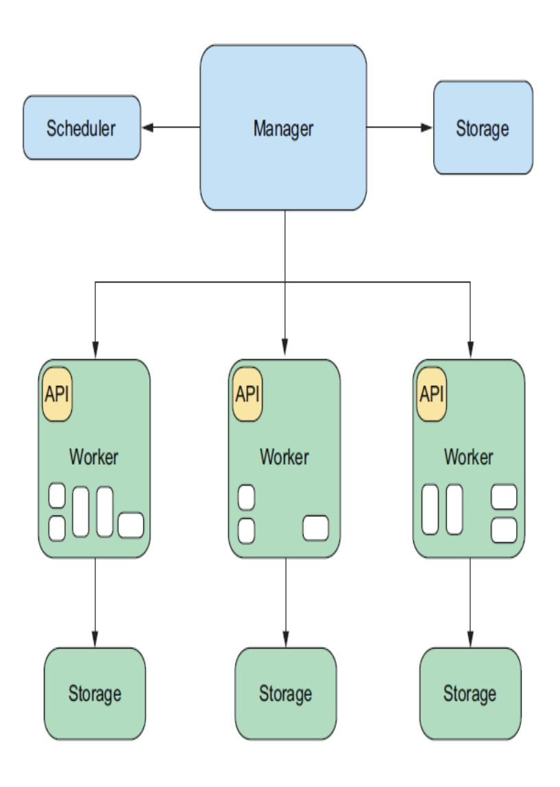

#### *[OceanofPDF.com](https://oceanofpdf.com/)*


# *Build an Orchestrator in Go (From Scratch)*

**Tim Boring**

To comment go to [liveBook](https://livebook.manning.com/#!/book/build-an-orchestrator-in-go-from-scratch/discussion)


#### **Manning**

#### **Shelter Island**

For more information on this and other Manning titles go to [www.manning.com](https://www.manning.com/)

*[OceanofPDF.com](https://oceanofpdf.com/)*

#### **Copyright**

For online information and ordering of these and other Manning books, please visit [www.manning.com](https://www.manning.com/). The publisher offers discounts on these books when ordered in quantity.

For more information, please contact

Special Sales Department Manning Publications Co. 20 Baldwin Road PO Box 761 Shelter Island, NY 11964

Email: [orders@manning.com](mailto:orders@manning.com)

**©2024 by Manning Publications Co. All rights reserved.**

No part of this publication may be reproduced, stored in a retrieval system, or transmitted, in any form or by means electronic, mechanical, photocopying, or otherwise, without prior written permission of the publisher.

Many of the designations used by manufacturers and sellers to distinguish their products are claimed as trademarks. Where those designations appear in the book, and Manning Publications was aware of a trademark claim, the designations have been printed in initial caps or all caps.

♾ Recognizing the importance of preserving what has been written, it is Manning's policy to have the books we publish printed on acidfree paper, and we exert our best efforts to that end. Recognizing also our responsibility to conserve the resources of our planet, Manning books are printed on paper that is at least 15 percent recycled and processed without the use of elemental chlorine.


Manning Publications Co. 20 Baldwin Road Technical PO Box 761 Shelter Island, NY 11964

Development editor: Katie Sposato Johnson

Technical development editor: Mike Shepard

Review editor: Adriana Sabo and Dunja Nikitović

Production editor: Keri Hales

Copy editor: Alisa Larson

Proofreader: Melody Dolab

Technical proofreader: Mike Haller

Typesetter: Dennis Dalinnik

Cover designer: Marija Tudor

ISBN: 9781617299759

*[OceanofPDF.com](https://oceanofpdf.com/)*

# *dedication*

*For Jennifer, who has always believed in me, even when I didn't believe in myself.*

*[OceanofPDF.com](https://oceanofpdf.com/)*

# *contents*

#### *[Front matter](#page-19-0)*

[preface](#page-19-1)

[acknowledgments](#page-21-0)

[about this book](#page-22-0)

[about the author](#page-27-0)

[about the cover illustration](#page-27-1)

# **Part 1 [Introduction](#page-28-0)**

*[1 What is an orchestrator?](#page-29-0)*

- [1.1 Why implement an orchestrator from scratch?](#page-30-0)
- [1.2 The \(not so\) good ol' days](#page-31-0)
- [1.3 What is a container, and how is it different from a virtual](#page-33-0) machine?
- [1.4 What is an orchestrator?](#page-36-0)
- [1.5 The components of an orchestration system](#page-38-0)

*[The task](#page-39-0)*

*[The job](#page-40-0)*

*[The scheduler](#page-41-0)*

*[The manager](#page-42-0)*

*[The worker](#page-42-1)*

*[The cluster](#page-43-0)*

*[Command-line interface](#page-43-1)*

- [1.6 Meet Cube](#page-48-0)
- [1.7 What tools will we use?](#page-52-0)
- [1.8 A word about hardware](#page-55-0)
- [1.9 What we won't be implementing or discussing](#page-57-0)

*[Distributed computing](#page-58-0)*

*[Service discovery](#page-58-1)*

*[High availability](#page-59-0)*

*[Load balancing](#page-62-0)*

*[Security](#page-63-0)*

#### *[2 From mental model to skeleton code](#page-65-0)*

- [2.1 The task skeleton](#page-68-0)
- [2.2 The worker skeleton](#page-73-0)
- [2.3 The manager skeleton](#page-76-0)
- [2.4 The scheduler skeleton](#page-78-0)
- [2.5 Other skeletons](#page-80-0)
- [2.6 Taking our skeletons for a spin](#page-82-0)

#### *[3 Hanging some flesh on the task skeleton](#page-88-0)*

- [3.1 Docker: Starting, stopping, and inspecting containers from](#page-91-0) the command line
- [3.2 Docker: Starting, stopping, and inspecting containers from](#page-94-0) the API
- [3.3 Task configuration](#page-98-0)
- [3.4 Starting and stopping tasks](#page-100-0)

# **Part 2 [Worker](#page-115-0)**

*[4 Workers of the Cube, unite!](#page-116-0)*

- [4.1 The Cube worker](#page-117-0)
- [4.2 Tasks and Docker](#page-122-0)
- [4.3 The role of the queue](#page-123-0)
- [4.4 The role of the DB](#page-124-0)
- [4.5 Counting tasks](#page-125-0)
- [4.6 Implementing the worker's methods](#page-125-1)

*[Implementing the StopTask method](#page-126-0) [Implementing the StartTask method](#page-127-0) [An interlude on task state](#page-130-0) [Implementing the RunTask method](#page-135-0)*

[4.7 Putting it all together](#page-138-0)

#### *[5 An API for the worker](#page-143-0)*

- [5.1 Overview of the worker API](#page-144-0)
- [5.2 Data format, requests, and responses](#page-147-0)
- [5.3 The API struct](#page-150-0)
- [5.4 Handling requests](#page-151-0)
- [5.5 Serving the API](#page-155-0)
- [5.6 Putting it all together](#page-157-0)

#### *[6 Metrics](#page-164-0)*

- [6.1 What metrics should we collect?](#page-164-1)
- [6.2 Metrics available from the /proc filesystem](#page-166-0)
- [6.3 Collecting metrics with goprocinfo](#page-169-0)
- [6.4 Exposing the metrics on the API](#page-174-0)
- [6.5 Putting it all together](#page-176-0)

# **Part 3 [Manager](#page-180-0)**

#### *[7 The manager enters the room](#page-181-0)*

[7.1 The Cube manager](#page-182-0)

*[The components that make up the manager](#page-184-0)*

- [7.2 The Manager struct](#page-186-0)
- [7.3 Implementing the manager's methods](#page-187-0)

*[Implementing the SelectWorker method](#page-188-0)*

*[Implementing the SendWork method](#page-190-0)*

*[Implementing the UpdateTasks method](#page-193-0)*

*[Adding a task to the manager](#page-196-0)*

*[Creating a manager](#page-197-0)*

- [7.4 An interlude on failures and resiliency](#page-198-0)
- [7.5 Putting it all together](#page-198-1)

#### *[8 An API for the manager](#page-208-0)*

- [8.1 Overview of the manager API](#page-208-1)
- [8.2 Routes](#page-211-0)
- [8.3 Data format, requests, and responses](#page-211-1)
- [8.4 The API struct](#page-214-0)
- [8.5 Handling requests](#page-214-1)
- [8.6 Serving the API](#page-217-0)
- [8.7 A few refactorings to make our lives easier](#page-218-0)
- [8.8 Putting it all together](#page-220-0)
- *[9 What could possibly go wrong?](#page-227-0)*

#### [9.1 Overview of our new scenario](#page-228-0)

#### [9.2 Failure scenarios](#page-229-0)

*[Application startup failure](#page-229-1)*

*[Application bugs](#page-230-0)*

*[Task startup failures due to resource problems](#page-231-0)*

*[Task failures due to Docker daemon crashes and restarts](#page-232-0)*

*[Task failures due to machine crashes and restarts](#page-232-1)*

*[Worker failures](#page-233-0)*

*[Manager failures](#page-234-0)*

#### [9.3 Recovery options](#page-234-1)

*[Recovery from application failures](#page-234-2)*

*[Recovering from environmental failures](#page-235-0)*

*[Recovering from task-level failures](#page-235-1)*

*[Recovering from worker failures](#page-238-0)*

*[Recovering from manager failures](#page-239-0)*

#### [9.4 Implementing health checks](#page-241-0)

*[Inspecting a task on the worker](#page-242-0)*

*[Implementing task updates on the worker](#page-245-0)*

*[Healthchecks and restarts](#page-247-0)*

#### [9.5 Putting it all together](#page-254-0)

# **Part 4 [Refactorings](#page-263-0)**

*[10 Implementing a more sophisticated scheduler](#page-264-0)*

- [10.1 The scheduling problem](#page-264-1)
- [10.2 Scheduling considerations](#page-266-0)
- [10.3 Scheduler interface](#page-267-0)
- [10.4 Adapting the round-robin scheduler to the scheduler](#page-270-0) interface
- [10.5 Using the new scheduler interface](#page-275-0)

*[Adding new fields to the Manager struct](#page-275-1) [Modifying the New helper function](#page-276-0)*

- [10.6 Did you notice the bug?](#page-281-0)
- [10.7 Putting it all together](#page-284-0)
- [10.8 The E-PVM scheduler](#page-289-0)

*[The theory](#page-289-1) [In practice](#page-290-0)*

- [10.9 Completing the Node implementation](#page-296-0)
- [10.10 Using the E-PVM scheduler](#page-301-0)

#### *[11 Implementing persistent storage for tasks](#page-305-0)*

- [11.1 The storage problem](#page-306-0)
- [11.2 The Store interface](#page-307-0)
- [11.3 Implementing an in-memory store for tasks](#page-311-0)
- [11.4 Implementing an in-memory store for task events](#page-317-0)
- [11.5 Refactoring the manager to use the new in-memory](#page-318-0) stores
- [11.6 Refactoring the worker](#page-327-0)
- [11.7 Putting it all together](#page-334-0)
- [11.8 Introducing BoltDB](#page-336-0)
- [11.9 Implementing a persistent task store](#page-338-0)
- [11.10 Implementing a persistent task event store](#page-345-0)
- [11.11 Switching out the in-memory stores for permanent ones](#page-349-0)

# **[Part](#page-353-0) 5 CLI**

*[12 Building a command-line interface](#page-354-0)*

- [12.1 The core components of CLIs](#page-356-0)
- [12.2 Introducing the Cobra framework](#page-358-0)
- [12.3 Setting up our Cobra application](#page-359-0)
- [12.4 Understanding the new main.go](#page-361-0)
- [12.5 Understanding root.go](#page-361-1)
- [12.6 Implementing the worker command](#page-364-0)
- [12.7 Implementing the manager command](#page-372-0)
- [12.8 Implementing the run command](#page-377-0)
- [12.9 Implementing the stop command](#page-384-0)
- [12.10 Implementing the status command](#page-388-0)
- [12.11 Implementing the node command](#page-392-0)

#### *[13 Now what?](#page-398-0)*

- [13.1 Working on Kubernetes and related tooling](#page-399-0)
- [13.2 Manager-worker pattern and workflow systems](#page-400-0)
- [13.3 Manager-worker pattern and integration systems](#page-401-0)
- [13.4 In closing](#page-402-0)

*[appendix Environment setup](#page-404-0) [index](#page-407-0)*

*[OceanofPDF.com](https://oceanofpdf.com/)*

# <span id="page-19-0"></span>*Front matter*

# <span id="page-19-1"></span>*preface*

I was introduced to orchestrators when I started at Google in 2007. And my introduction was not to Borg but rather Ganeti. Ganeti was an internally developed cluster management system that operated on virtual machines. At the time, it was a basic wrapper around the open source version of Xen, and it provided a clustered solution that allowed us to provide virtual (instead of physical) machines to engineers.

We didn't refer to Ganeti as an orchestrator, nor did we talk about it in the same vein as Borg. In hindsight, I don't think it's too much of a stretch to consider Ganeti a kind of orchestrator. Instead of operating on tasks (in the form of containers), it operated on virtual machines. Internally at Google, Ganeti served as a bridge from a world where some engineers could run their applications on physical machines to a world where every engineer ran their applications on Borg.

Several years later, I got a proper introduction to Borg when we rewrote the life cycle management system we built to manage Ganeti clusters and virtual machines. We ran it on Borg. Fastforward to 2020. The COVID pandemic hit, and like everyone else, I found myself working from home. Suddenly, I had three-plus extra hours per day as a result of not having to commute to a Manhattan office. What to do?

Of course, the obvious thing to do was to start a personal project of some kind. But what? After 13 years of working with orchestrators, I thought it might be fun to try to write one from scratch. How hard could it be?

I spent most of the summer of 2020 working on my orchestrator. I called it *Cube* in an effort to continue the Star Trek theme. Surprisingly, I got it working in less than 3,000 lines of code.

Around the same time, I read Thorsten Ball's *Writing an Interpreter in Go*. While I wasn't necessarily interested in interpreters or writing programming languages, I was interested in learning how they work. And then it hit me! I could do a book about writing an *orchestrator* in Go. It would be the book that I wish I'd had back in 2007! Thus was born the book you have in front of you now.

I realized early on in the writing process that orchestration is a big topic. It's easy to get distracted by secondary concerns when talking about orchestration systems. How do you handle service discovery? How do you handle DNS? What about consensus? I wanted to strip away all the stuff that gets piled on top of orchestration systems and present just the core, the foundation on which all that other stuff sits. Not that things like service discovery, DNS, and load balancing are unimportant. But in the context of an orchestration system, we talk about those things because they are tools in service to the core function of an orchestrator: scheduling applications to run on a pool of nodes and managing their life cycle.

So in a nutshell, that's what this book is about: taking a request from a user to run an application, identifying a machine that can run the application, and then sending a request to the chosen machine to

start the application. It seems simple when you put it that way, doesn't it?

In addition to presenting the foundational concepts of an orchestration system, another goal in writing this book is to make the content approachable to a broad audience. So while I've chosen to write the Cube orchestrator in the Go programming language, my hope is that anyone can work through the book and get the code working, even if you've never written a line of Go in your life. All of the code uses basic Go features. While we do use goroutines to do some basic concurrency, we don't use channels (there are many great resources to learn about concurrency if you're interested). And we don't use generics. (Shortly after Go 1.18 was released, I did attempt to refactor the code and manuscript to use generics. While I got the code working, I realized it introduced unnecessary complexity to the book. It became one more thing to explain in an already long list of things to explain.)

I hope you have fun while you read this book. And in the process of having fun, I hope you learn as much from this book as I did writing it.

# <span id="page-21-0"></span>*acknowledgments*

With most things in life, we get a lot of help from others. And this book is no different.

I'd like to start by acknowledging all the folks at Manning who helped make this book a reality. I'd like to thank Andy Waldron for taking on my book and believing in it throughout its many shapes. Katie

Sposato Johnson was instrumental in helping me navigate the Manning process. Without her help, this book would not exist. I'd also like to thank the many other folks at Manning who have worked on the production and marketing of the book.

I want to thank the reviewers who read the manuscript at various stages and provided thoughtful feedback: Alain Lompo, Alessandro Campeis, Andres Sacco, Becky Huett, Bobby Lin, Christopher Villanueva, Clifford Thurber, David Paccoud, Emanuele Piccinelli, Ernesto Bossi, Fernando Bernardino, Fernando Rodrigues, Geert Van Laethem, Gregory Reshetniak, Katia Patkin, Kosmas Chatzimichalis, Larry Cai, Lucian Enache, Madiha Khalid, Matthias Busch, Michael Bright, Muneeb Shaikh, Nathan B. Crocker, Nghia To, Richard Vaughan, Sanket Naik, Simone Sguazza, Thomas Dybdahl, Timothy R. J. Langford, Tim van Deurzen, and Vamsi Krishna.

Special thanks also go out to Mike Haller, technical proofreader, for his thorough review of the code shortly before the book went into production. It's quite challenging to keep the code presented in the book in sync with the source code, but Mike was invaluable in helping me clean up the many discrepancies.

# <span id="page-22-0"></span>*about this book*

*Build an Orchestrator in Go (From Scratch)* was written to help you better understand the fundamental components of orchestration systems. Whether you work as a DevOps engineer, site reliability engineer (SRE), or software engineer, much of today's technology can seem like a black box. You just deploy it to the cloud, and then

magical "stuff" happens. As we all know, magical technology is great when it works! When it fails—and it will fail!—that magical aspect can be a barrier to quickly identifying problems and fixing them. As more developers move their applications to the cloud, they are running them (or will do so) on an orchestration system. Unless they work at a larger company that has a dedicated DevOps or SRE staff, they will likely need to deploy and manage their applications themselves. This includes handling problems when they arise. My hope is that this book will remove some of the magic from how applications run on an orchestrator.

# *Who should read this book*

*Build an Orchestrator in Go (From Scratch)* is for anyone responsible for deploying and operating an orchestration system (i.e., DevOps engineers and SREs) and for anyone responsible for deploying and managing applications that run on an orchestration system (i.e., software engineers). If you want to learn how orchestrators work, you could read the source code for either Kubernetes or Nomad, both open source projects available on GitHub. Kubernetes has 5 million lines of Go code. Nomad has a considerably smaller codebase, but it's still 500,000-plus lines of Go. I don't know about you, but I would struggle to get much value from trying to make sense of half a million lines of code, let alone 5 million lines!

# *How this book is organized: A road map*

The book has five parts that cover 13 chapters. Part 1 introduces the mental model for the Cube orchestrator and sets up the skeleton codebase that will be implemented throughout the rest of the book:

- Chapter 1 briefly explains the purpose of orchestration systems and then describes the mental model for Cube, the orchestrator implemented throughout the rest of the book.
- Chapter 2 uses the mental model from chapter 1 to create a skeleton codebase for the core concepts of the Cube orchestrator.
- Chapter 3 illustrates how we'll implement the codebase by taking the skeleton for the Task object and fleshing it out in detail.

Part 2 implements the concepts necessary for the worker component:

- Chapter 4 fleshes out the implementation details of the Worker object.
- Chapter 5 builds an API for the Worker.
- Chapter 6 creates a framework for the worker to expose metrics about its state and the state of the tasks it's running.

Part 3 implements the concepts necessary for the manager component:

- Chapter 7 fleshes out the implementation details of the Manager object.
- Chapter 8 builds an API for the Manager.
- Chapter 9 explores failure scenarios and implements solutions to handle them.

Part 4 walks the reader through refactoring two components from the initial implementation:

- Chapter 10 describes a scheduler interface and implements a more sophisticated scheduling algorithm.
- Chapter 11 designs and builds a storage interface that allows the manager and worker components to store their tasks inmemory or persistently in a database.

Part 5 implements a command-line interface (CLI) that allows the reader to operate the orchestrator:

- Chapter 12 builds a CLI that implements commands for starting the manager and worker, starting and stopping tasks, and getting the status of tasks in the system.
- Chapter 13 offers a summary of what we've accomplished and provides some suggestions for where to go from here.

# *About the code*

This book contains many examples of source code both in numbered listings and in line with normal text. In both cases, source code is formatted in a fixed-width font like this to separate it from ordinary text. Sometimes code is also **in bold** to highlight code that has changed from previous steps in the chapter, such as when a new feature is added to an existing line of code.

In many cases, the original source code has been reformatted; we've added line breaks and reworked indentation to accommodate the available page space in the book. In rare cases, even this was not enough, and listings include line-continuation markers (➥). Additionally, comments in the source code have often been removed from the listings when the code is described in the text. Code

annotations accompany many of the listings, highlighting important concepts.

You can get executable snippets of code from the liveBook (online) [version of this book at https://livebook.manning.com/book/build-an](https://livebook.manning.com/book/build-an-orchestrator-in-go-from-scratch)orchestrator-in-go-from-scratch. The complete code for the examples in the book is available for download from the Manning website at [https://www.manning.com/books/build-an-orchestrator-in-go-from](https://www.manning.com/books/build-an-orchestrator-in-go-from-scratch)scratch and from GitHub at <https://github.com/buildorchestratoringo/code>.

# *liveBook discussion forum*

Purchase of *Build an Orchestrator in Go (From Scratch)* includes free access to a private web forum run by Manning Publications where you can make comments about the book, ask technical questions, and receive help from the author and from other users. To access the forum and subscribe to it, point your web browser to https://www.manning.com/books/build-an-orchestrator-in-go-from[scratch. This page provides information on how to get on the forum](https://www.manning.com/books/build-an-orchestrator-in-go-from-scratch) once you're registered, what kind of help is available, and the rules of conduct on the forum.

Manning's commitment to our readers is to provide a venue where a meaningful dialog between individual readers and between readers and the author can take place. It is not a commitment to any specific amount of participation on the part of the author, whose contributions to the forum remain voluntary (and unpaid). We suggest you ask the author challenging questions lest his interest stray!

# <span id="page-27-0"></span>*about the author*

**Tim Boring** is a software engineer with 20+ years of industry experience. For most of those years, he has been a user of orchestration systems, including Borg, Kubernetes, and Nomad.

# <span id="page-27-1"></span>*about the cover illustration*

The figure on the cover of *Build an Orchestrator in Go (From Scratch)* is "Femme Baschkirienne," or "Baschkirian woman," taken from a collection by Jacques Grasset de Saint-Sauveur, published in 1788. The illustration is finely drawn and colored by hand.

In those days, it was easy to identify where people lived and what their trade or station in life was just by their dress. Manning celebrates the inventiveness and initiative of the computer business with book covers based on the rich diversity of regional culture centuries ago, brought back to life by pictures from collections such as this one.

*[OceanofPDF.com](https://oceanofpdf.com/)*

# <span id="page-28-0"></span>*Part 1 Introduction*

The first part of this book lays the groundwork for your journey to writing an orchestration system—from scratch!

In chapter 1, you will learn the core components that make up every orchestration system. From these core components, you will build a mental model for the Cube orchestrator, which we will implement together through the rest of the book.

Chapter 2 guides you through creating code skeletons from the mental model you learned in chapter 1.

In chapter 3, you will take the skeleton for the Task object and flesh it out in detail. This exercise will illustrate the process we'll use to implement the rest of Cube's codebase.

*[OceanofPDF.com](https://oceanofpdf.com/)*

# <span id="page-29-0"></span>*1 What is an orchestrator?*

# **This chapter covers**

- <span id="page-29-1"></span>The evolution of application deployments
- Classifying the components of an orchestration system
- Introducing the mental model for the orchestrator
- Defining requirements for our orchestrator
- Identifying the scope of our work

*Kubernetes*. *Kubernetes*. *Kubernetes*. If you've worked in or near the tech industry in the last five years, you've at least heard the name. Perhaps you've used it in your day job. Or perhaps you've used other systems such as Apache Mesos or HashiCorp's Nomad.

In this book, we're going to build our own Kubernetes, writing the code ourselves to gain a better understanding of just what Kubernetes is. And what Kubernetes is—like Mesos and Nomad—is an orchestrator.

When you've finished the book, you will have learned the following:

- What components form the foundation of any orchestration system
- How those components interact
- How each component maintains its own state and why
- What tradeoffs are made in designing and implementing an orchestration system

# <span id="page-30-0"></span>*1.1 Why implement an orchestrator from scratch?*

Why bother writing an orchestrator from scratch? No, the answer is not to write a system that will replace Kubernetes, Mesos, or Nomad. The answer is more practical than that. If you're like me, you learn by doing. Learning by doing is easy when we're dealing with small things. How do I write a for loop in this new programming language I'm learning? How do I use the curl command to make a request to this new API I want to use? These things are easy to learn by doing them because they are small in scope and don't require too much effort.

<span id="page-30-1"></span>When we want to learn larger systems, however, learning by doing becomes challenging. The obvious way to tackle this situation is to read the source code. The code for Kubernetes, Mesos, and Nomad is available on GitHub. So if the source code is available, why write an orchestrator from scratch? Couldn't we just look at the source code for them and get the same benefit?

Perhaps. Keep in mind, though, that these are large software projects. Kubernetes contains more than 2 million lines of source code. Mesos and Nomad clock in at just over 700,000 lines of code. While not impossible, learning a system by slogging around in codebases of this size may not be the best way.

Instead, we're going to roll up our sleeves and get our hands dirty. We'll implement our orchestrator in less than 3,000 lines of code.

To ensure we focus on the core bits of an orchestrator and don't get sidetracked, we are going to narrow the scope of our implementation. The orchestrator you write in the course of this project will be fully functional. You will be able to start and stop tasks and interact with those tasks.

It will not, however, be production ready. After all, our purpose is not to implement a system that will replace Kubernetes, Nomad, or Mesos. Instead, our purpose is to implement a minimal system that gives us deeper insight into how production-grade systems like Kubernetes and Nomad work.

# <span id="page-31-0"></span>*1.2 The (not so) good ol' days*

Let's take a journey back to 2002 and meet Michelle. Michelle is a system administrator for her company, and she is responsible for keeping her company's applications up and running around the clock. How does she accomplish this?

<span id="page-31-1"></span>Like many other sysadmins, Michelle employs the common strategy of deploying applications on bare metal servers. A simplistic sketch of Michelle's world can be seen in figure 1.1. Each application typically runs on its own physical hardware. To make matters more complicated, each application has its own hardware requirements, so Michelle has to buy and then manage a server fleet that is unique to each application. Moreover, each application has its own unique deployment process and tooling. The database team gets new versions and updates in the mail via compact disk, so its process involves a database administrator (DBA) copying files from the CD to a central server and then using a set of custom shell scripts to push the files to the database servers, where another set of shell scripts handles installation and updates. Michelle handles the installation

and updates of the company's financial system herself. This process involves downloading the software from the internet, at least saving her the hassle of dealing with CDs. But the financial software comes with its own set of tools for installing and managing updates. Several other teams are building the company's software product, and the applications these teams build have a completely different set of tools and procedures.

<span id="page-32-0"></span>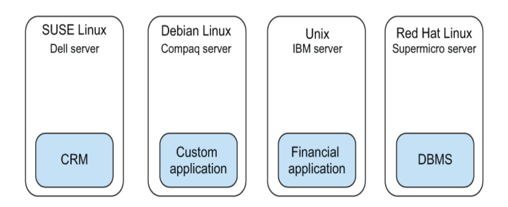

**Figure 1.1 This diagram represents Michelle's world in 2002. The outer box represents physical machines and the operating systems running on them. The inner box represents the applications running on the machines and demonstrates how applications used to be more directly tied to both operating systems and machines.**

If you weren't working in the industry during this time and didn't experience anything like Michelle's world, consider yourself lucky. Not only was that world chaotic and difficult to manage, it was also extremely wasteful. Virtualization came along next in the early to mid-2000s. These tools allowed sysadmins like Michelle to carve up their physical fleets so that each physical machine hosted several smaller

yet independent virtual machines (VMs). Instead of each application running on its own dedicated physical machine, it now ran on a VM. And multiple VMs could be packed onto a single physical one. While virtualization made life for folks like Michelle better, it wasn't a silver bullet.

<span id="page-33-2"></span>This was the way of things until the mid-2010s when two new technologies appeared on the horizon. The first was Docker, which introduced *containers* to the wider world. The concept of containers was not new. It had been around since 1979 (see Ell Marquez's "The History of Container Technology" at<http://mng.bz/oro2>). Before Docker, containers were mostly confined to large companies, like Sun Microsystems and Google, and hosting providers looking for ways to efficiently and securely provide virtualized environments for their customers. The second new technology to appear at this time was Kubernetes, a container *orchestrator* focused on automating the deployment and management of containers.

# <span id="page-33-1"></span><span id="page-33-0"></span>*1.3 What is a container, and how is it different from a virtual machine?*

As mentioned earlier, the first step in moving from Michelle's early world of physical machines and operating systems was the introduction of *virtual machines*. Virtual machines, or VMs, abstracted a computer's physical components (CPU, memory, disk, network, CD-Rom, etc.) so administrators could run multiple operating systems on a single physical machine. Each operating system running on the

<span id="page-34-0"></span>physical machine was distinct. Each had its own kernel, its own networking stack, and its own resources (e.g., CPU, memory, disk).

The VM world was a vast improvement in terms of cost and efficiency. The cost and efficiency gains, however, only applied to the machine and operating system layers. At the application layer, not much had changed. As you can see in figure 1.2, applications were still tightly coupled to an operating system. If you wanted to run two or more instances of your application, you needed two or more VMs.

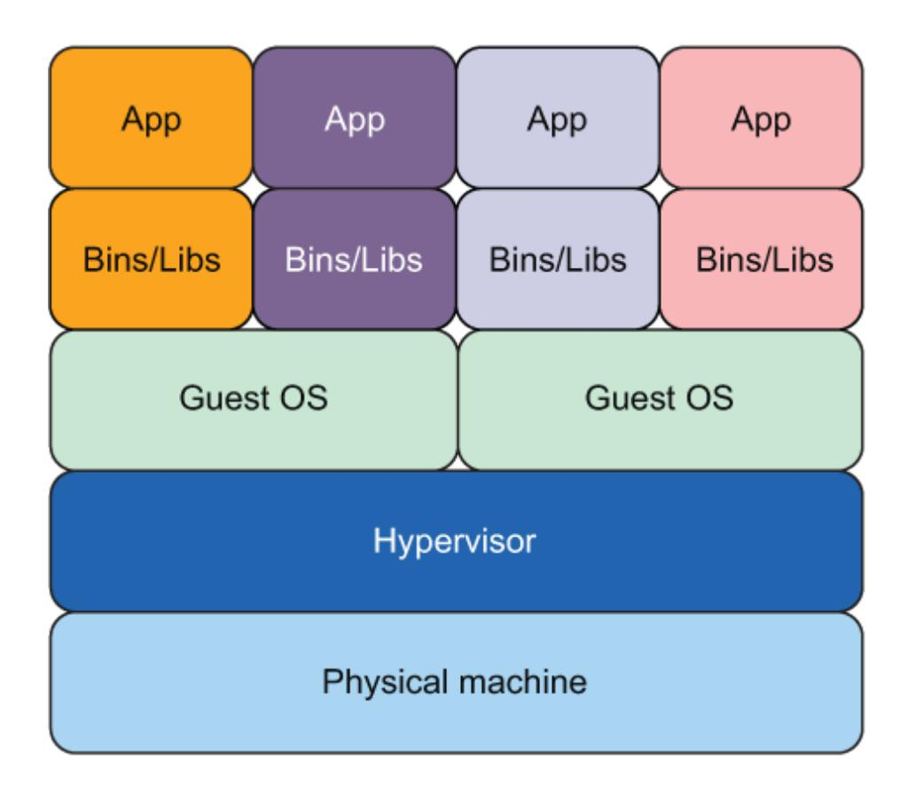

**Figure 1.2 Applications running on VMs**

Unlike VMs, a container does not have a kernel. It does not have its own networking stack. It does not control resources like CPU,

memory, and disk. In fact, the term *container* is just a concept; it is not a concrete technical reality like a VM.

The term *container* is really just shorthand for process and resource isolation in the Linux kernel. So when we talk about containers, what we really are talking about are *namespaces* and *control groups* (*cgroups*), both of which are features of the Linux kernel. *Namespaces* are a mechanism to isolate processes and their resources from each other. *Cgroups* provide limits and accounting for a collection of processes.

<span id="page-35-0"></span>But let's not get too bogged down with these lower-level details. You don't need to know about namespaces and cgroups to work through the rest of this book. If you are interested, however, I encourage you to watch Liz Rice's talk "Containers from Scratch" (<https://www.youtube.com/watch?v=8fi7uSYlOdc>).

With the introduction of containers, an application can be decoupled from the operating system layer, as seen in figure 1.3. With containers, if I have an app that starts up a server process that listens on port 80, I can now run multiple instances of that app on a single physical host. Or let's say that I have six different applications, each with their own server processes listening on port 80. Again, with containers, I can run those six applications on the same host without having to give each one a different port at the application layer.

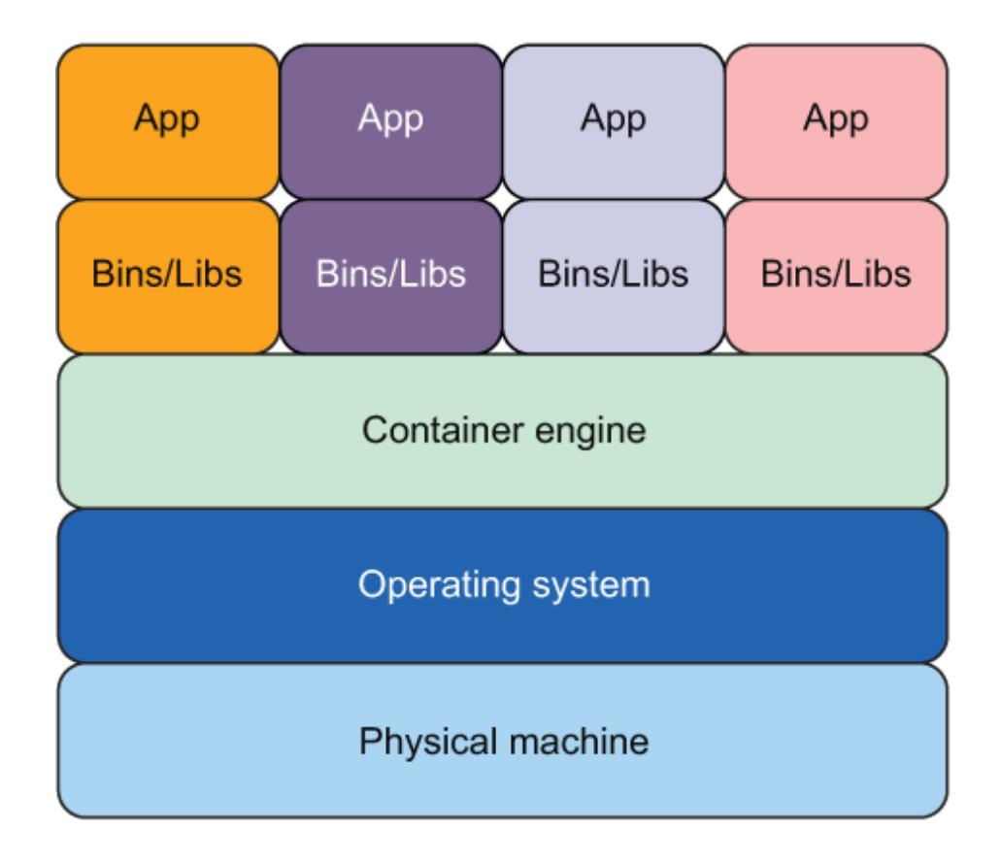

**Figure 1.3 Applications running in containers**

The real benefit of containers is that they give the application the impression that it is the sole application running on the operating system and thus has access to all of the operating system's resources.

# <span id="page-36-1"></span><span id="page-36-0"></span>*1.4 What is an orchestrator?*

The most recent step in the evolution of Michelle's world is using an *orchestrator* to deploy and manage her applications. An orchestrator is a system that provides automation for deploying, scaling, and otherwise managing containers. In many ways, an orchestrator is similar to a CPU scheduler. The difference is that the target objects of an orchestration system are containers instead of OS-level processes. (While containers are typically the primary focus of an orchestrator, some systems also provide for the orchestration of other types of workloads. HashiCorp's Nomad, for example, supports Java, command, and the QEMU VM runner workload types in addition to Docker.)

With containers and an orchestrator, Michelle's world changes drastically. In the past, the physical hardware and operating systems she deployed and managed were mostly dictated by requirements from application vendors. Her company's financial system, for example, had to run on AIX (a proprietary Unix OS owned by IBM), which meant the physical servers had to be RISC-based (<https://riscv.org/>) IBM machines. Why? Because the vendor that developed and sold the financial system certified that the system could run on AIX. If Michelle tried to run the financial system on, say, Debian Linux, the vendor would not provide support because it was not a certified OS. And this was just one of the many applications that Michelle operated for her company.

<span id="page-37-0"></span>Now Michelle can deploy a standardized fleet of machines that all run the same OS. She no longer has to deal with multiple hardware vendors who deal in specialized servers. She no longer has to deal with administrative tools that are unique to each operating system. And, most importantly, she no longer needs the hodgepodge of deployment tools provided by application vendors. Instead, she can use the same tooling to deploy, scale, and manage all of her company's applications (table 1.1).

**Table 1.1 Michelle's old and new worlds**

| Michelle's old world                                    | Michelle's new world                                                     |
|---------------------------------------------------------|--------------------------------------------------------------------------|
| Multiple hardware vendors                               | Single hardware vendor (or cloud<br>provider)                            |
| Multiple operating systems                              | Single operating system                                                  |
| Runtime requirements dictated by<br>application vendors | Application vendors build to standards<br>(containers and orchestration) |

# <span id="page-38-0"></span>*1.5 The components of an orchestration system*

So an orchestrator automates deploying, scaling, and managing containers. Next, let's identify the generic components and their requirements that make those features possible. They are as follows:

- <span id="page-38-1"></span>The task
- The job
- The scheduler
- The manager
- The worker
- The cluster
- The command-line interface (CLI)

Some of these components can be seen in figure 1.4.

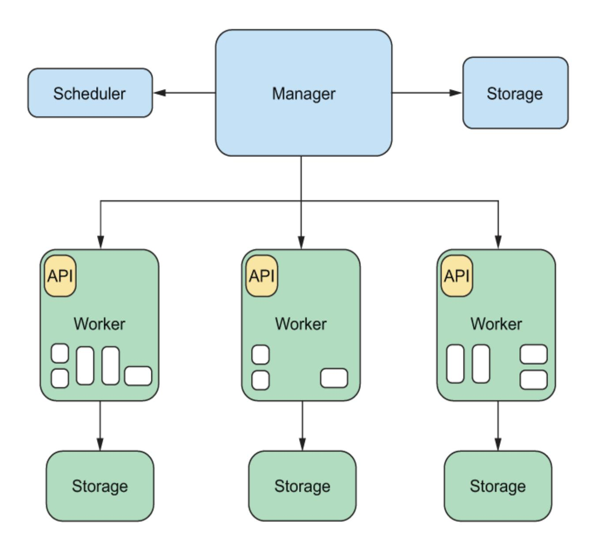

**Figure 1.4 The basic components of an orchestration system. Regardless of what terms different orchestrators use, each has a scheduler, a manager, and a worker, and they all operate on tasks.**

<span id="page-39-0"></span>

### *1.5.1 The task*

The *task* is the smallest unit of work in an orchestration system and typically runs in a container. You can think of it like a process that

runs on a single machine. A single task could run an instance of a reverse proxy like NGINX, or it could run an instance of an application like a RESTful API server; it could be a simple program that runs in an endless loop and does something silly, like ping a website and write the result to a database.

A task should specify the following:

- <span id="page-40-3"></span>1. The amount of memory, CPU, and disk it needs to run effectively
- 2. What the orchestrator should do in case of failures, typically called a *restart policy*
- <span id="page-40-4"></span>3. The name of the container image used to run the task

Task definitions may specify additional details, but these are the core requirements.

<span id="page-40-0"></span>

### *1.5.2 The job*

The *job* is an aggregation of tasks. It has one or more tasks that typically form a larger logical grouping of tasks to perform a set of functions. For example, a job could be comprised of a RESTful API server and a reverse proxy.

<span id="page-40-1"></span>

## **Kubernetes and the concept of a job**

<span id="page-40-2"></span>If you're only familiar with Kubernetes, this definition of *job* may be confusing at first. In Kubernetesland, a job is a specific type of workload that has historically been referred to as a *batch job*—that is, a job that starts and then runs to completion. Kubernetes has multiple resource types that are Kubernetes-specific implementations of the *job* concept:

- Deployment
- ReplicaSet
- StatefulSet
- DaemonSet
- Job

In the context of this book, we'll use *job* in its more generic definition.

A job should specify details at a high level and will apply to all tasks it defines:

- 1. Each task that makes up the job
- 2. Which data centers the job should run in
- 3. How many instances of each task should run
- 4. The type of the job (should it run continuously or run to completion and stop?)

<span id="page-41-2"></span>We won't be dealing with jobs in our implementation for the sake of simplicity. Instead, we'll work exclusively at the level of individual tasks.

<span id="page-41-0"></span>

### *1.5.3 The scheduler*

<span id="page-41-1"></span>The *scheduler* decides what machine can best host the tasks defined in the job. The decision-making process can be as simple as selecting a node from a set of machines in a round-robin fashion or as complex as the Enhanced Parallel Virtual Machine (E-PVM) scheduler (used as part of Google's Borg scheduler), which calculates a score based on a number of variables and then selects a node with the best score.

The scheduler should perform these functions:

- 1. Determine a set of candidate machines on which a task could run
- 2. Score the candidate machines from best to worst
- 3. Pick the machine with the best score

We'll implement both the round-robin and E-PVM schedulers later in the book.

<span id="page-42-0"></span>

### *1.5.4 The manager*

The *manager* is the brain of an orchestrator and the main entry point for users. To run jobs in the orchestration system, users submit their jobs to the manager. The manager, using the scheduler, then finds a machine where the job's tasks can run. The manager also periodically collects metrics from each of its workers, which are used in the scheduling process.

<span id="page-42-2"></span>The manager should do the following:

- 1. Accept requests from users to start and stop tasks.
- 2. Schedule tasks onto worker machines.
- 3. Keep track of tasks, their states, and the machine on which they run.

<span id="page-42-1"></span>

### *1.5.5 The worker*

<span id="page-42-3"></span>The *worker* provides the muscles of an orchestrator. It is responsible for running the tasks assigned to it by the manager. If a task fails for any reason, it must attempt to restart the task. The worker also

<span id="page-43-5"></span>makes metrics about its tasks and overall machine health available for the manager to poll.

The worker is responsible for the following:

- 1. Running tasks as Docker containers
- 2. Accepting tasks to run from a manager
- 3. Providing relevant statistics to the manager for the purpose of scheduling tasks
- 4. Keeping track of its tasks and their states

<span id="page-43-0"></span>

### *1.5.6 The cluster*

<span id="page-43-3"></span>The *cluster* is the logical grouping of all the previous components. An orchestration cluster could be run from a single physical or virtual machine. More commonly, however, a cluster is built from multiple machines, from as few as five to as many as thousands or more.

The cluster is the level at which topics like *high availability* (HA) and *scalability* come into play. When you start using an orchestrator to run production jobs, these topics become critical. For our purposes, we won't be discussing HA or scalability in any detail as they relate to the orchestrator we're going to build. Keep in mind, however, that the design and implementation choices we make will impact the ability to deploy our orchestrator in a way that would meet the HA and scalability needs of a production environment.

<span id="page-43-4"></span><span id="page-43-1"></span>

### *1.5.7 Command-line interface*

<span id="page-43-2"></span>Finally, our CLI, the main user interface, should allow a user to

- 1. Start and stop tasks
- 2. Get the status of tasks
- 3. See the state of machines (i.e., the workers)
- 4. Start the manager
- 5. Start the worker

<span id="page-44-0"></span>All orchestration systems share these same basic components. Google's Borg, seen in figure 1.5, calls the manager the *BorgMaster* and the worker a *Borglet* but otherwise uses the same terms as previously defined.

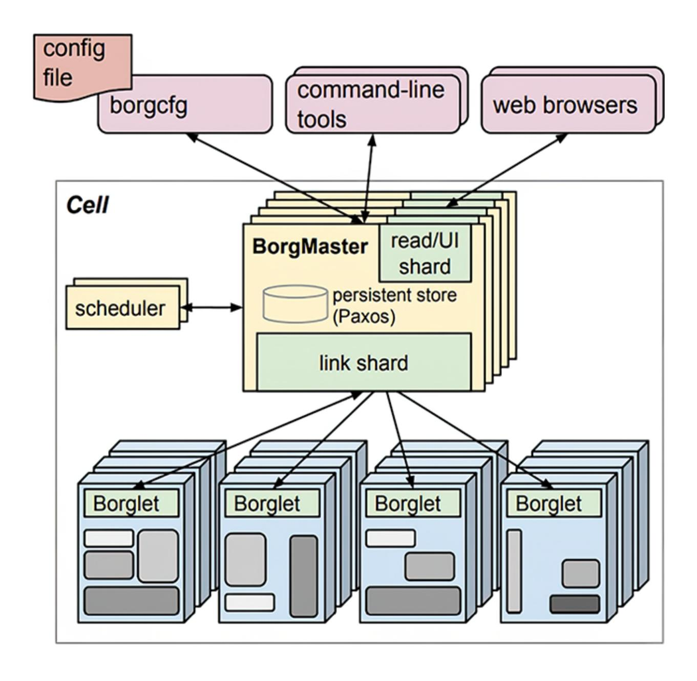

**Figure 1.5 Google's Borg. At the bottom are a number of Borglets, or workers, which run individual tasks in containers. In the middle is the BorgMaster, or the manager, which uses the scheduler to place tasks on workers.**

Apache Mesos, seen in figure 1.6, was presented at the Usenix HotCloud workshop in 2009 and was used by Twitter starting in 2010. Mesos calls the manager simply the *master* and the worker an *agent*.

It differs slightly, however, from the Borg model in how it schedules tasks. It has a concept of a *framework*, which has two components: a *scheduler* that registers with the master to be offered resources, and an executor process that is launched on agent nodes to run the framework's tasks

<span id="page-46-0"></span>([http://mesos.apache.org/documentation/latest/architecture/\)](http://mesos.apache.org/documentation/latest/architecture/).

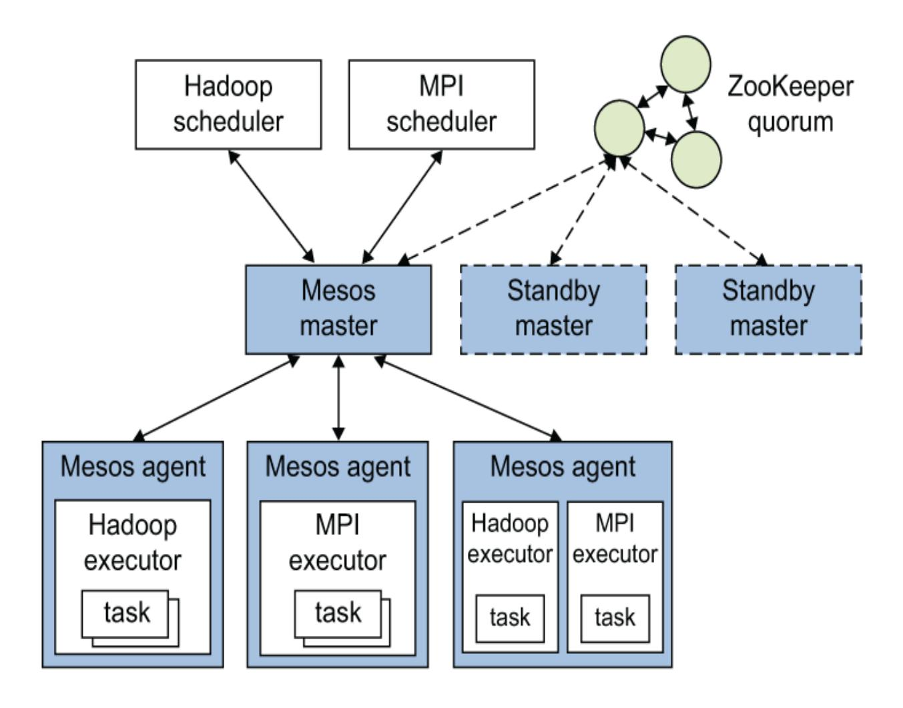

**Figure 1.6 Apache Mesos**

<span id="page-46-1"></span>Kubernetes, which was created at Google and influenced by Borg, calls the manager the *control plane* and the worker a *kubelet*. It rolls up the concepts of job and task into *Kubernetes objects*. Finally,

<span id="page-47-0"></span>Kubernetes maintains the usage of the terms *scheduler* and *cluster*. These components can be seen in the Kubernetes architecture diagram in figure 1.7.

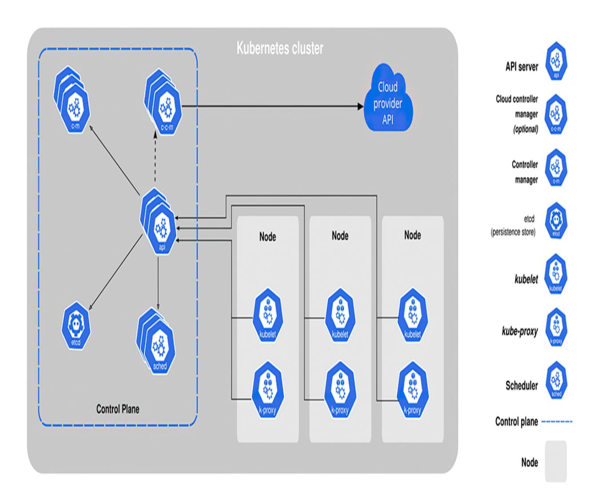

**Figure 1.7 The Kubernetes architecture. The** *control plane***, seen on the left, is equivalent to the manager function or to Borg's BorgMaster.**

HashiCorp's Nomad, released a year after Kubernetes, uses more basic terms. The manager is the *server*, and the worker is the *client*. <span id="page-48-1"></span>While not shown in figure 1.8, Nomad uses the terms *scheduler*, *job*, *task*, and *cluster* as we've defined here.

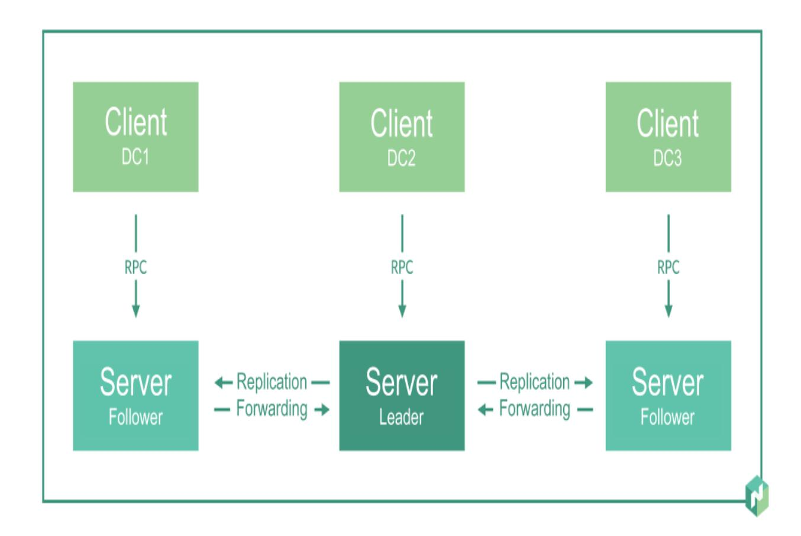

**Figure 1.8 Nomad's architecture. While it appears more sparse, it still functions similarly to the other orchestrators.**

# <span id="page-48-0"></span>*1.6 Meet Cube*

<span id="page-48-2"></span>We're going to call our implementation *Cube*. If you're up on your *Star Trek: Next Generation* references, you'll recall that the Borg traveled in a cube-shaped spaceship.

Cube will have a much simpler design than Google's Borg, Kubernetes, or Nomad. And it won't be anywhere nearly as resilient as the Borg's ship. It will, however, contain all the same components as those systems.

The mental model in figure 1.9 expands on the architecture outlined in figure 1.4. In addition to the higher-level components, it dives a little deeper into the three main components: the manager, the worker, and the scheduler.

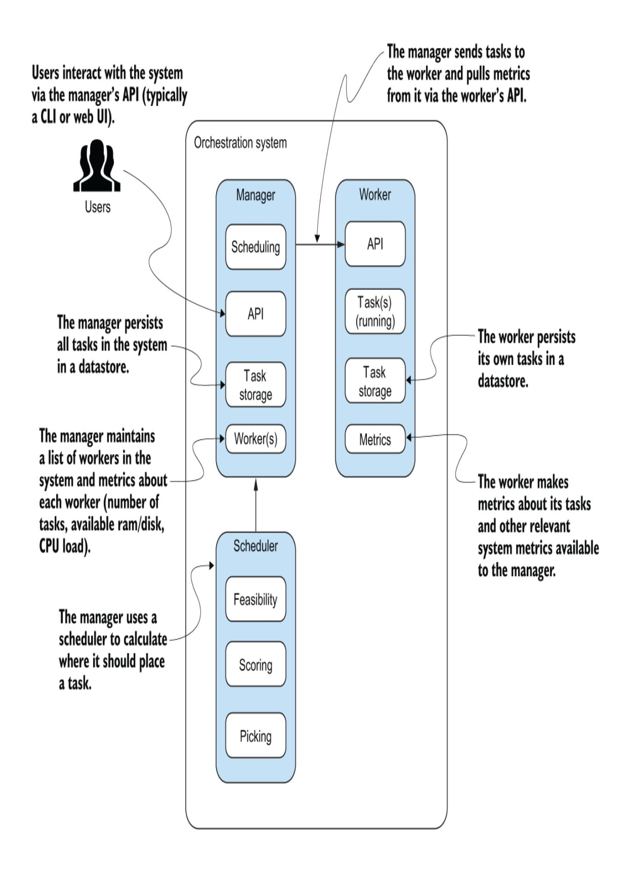

#### **Figure 1.9 Mental model for Cube. It has a manager, a worker, and a scheduler, and users (i.e., you) will interact with it via a command line.**

Starting with the scheduler in the lower left of the diagram, we see it contains three boxes: *feasibility*, *scoring*, and *picking*. These boxes represent the scheduler's generic phases, and they are arranged in the order in which the scheduler moves through the process of scheduling tasks onto workers:

- *Feasibility*—This phase assesses whether it's even possible to schedule a task onto a worker. There will be cases where a task cannot be scheduled onto any worker; there will also be cases where a task can be scheduled but only onto a subset of workers. We can think of this phase as similar to choosing which car to buy. My budget is \$10,000, but depending on which car lot I go to, all the cars on the lot could cost more than \$10,000, or only a subset of cars may fit into my price range.
- *Scoring*—This phase takes the workers identified by the feasibility phase and gives each one a score. This stage is the most important and can be accomplished in any number of ways. For example, to continue our car purchase analogy, I might give a score for each of three cars that fit within my budget based on variables like fuel efficiency, color, and safety rating.
- *Picking*—This phase is the simplest. From the list of scores, the scheduler picks the best one. This will be either the highest or lowest score.

Moving up the diagram, we come to the manager. The first box inside the manager component shows that the manager uses the scheduler we described previously. Next, there is the *API* box. The API is the

primary mechanism for interacting with Cube. Users submit jobs and request jobs be stopped via the API. A user can also query the API to get information about job and worker status. Next, there is the *Task Storage* box. The manager must keep track of all the jobs in the system to make good scheduling decisions, as well as to provide answers to user queries about job and worker statuses. Finally, the manager also keeps track of worker metrics, such as the number of jobs a worker is currently running, how much memory it has available, how much load the CPU is under, and how much disk space is free. This data, like the data in the job storage layer, is used for scheduling.

<span id="page-52-2"></span>The final component in our diagram is the worker. Like the manager, it too has an API, although it serves a different purpose. The primary user of this API is the manager. The API provides the means for the manager to send tasks to the worker, to tell the worker to stop tasks, and to retrieve metrics about the worker's state. Next, the worker has a *task runtime*, which in our case will be Docker. Like the manager, the worker also keeps track of the work it is responsible for, which is done in the *Task Storage* layer. Finally, the worker provides metrics about its own state, which it makes available via its API.

# <span id="page-52-3"></span><span id="page-52-0"></span>*1.7 What tools will we use?*

To focus on our main goal, we're going to limit the number of tools and libraries we use. Here's the list of tools and libraries we're going to use:

- <span id="page-52-1"></span>Go
- chi

- Docker SDK
- BoltDB
- goprocinfo
- Linux

As the title of this book says, we're going to write our code in the Go programming language. Both Kubernetes and Nomad are written in Go, so it is obviously a reasonable choice for large-scale systems. Go is also relatively lightweight, making it easy to learn quickly. If you haven't used Go before but have written non-trivial software in languages such as C/C++, Java, Rust, Python, or Ruby, then you should be fine. If you want more in-depth material about the Go language, either *The Go Programming Language* [\(www.gopl.io/\)](http://www.gopl.io/) or *Get Programming with Go* (www.manning.com/books/get[programming-with-go\) are good resources. That said, all th](http://www.manning.com/books/get-programming-with-go)e code presented will compile and run, so simply following along should also work.

<span id="page-53-0"></span>There is no particular requirement for an IDE to write the code. Any text editor will do. Use whatever you're most comfortable with and makes you happy.

We'll focus our system on supporting Docker containers. This is a design choice. We could broaden our scope so our orchestrator could run a variety of jobs: containers, standalone executables, or Java JARs. Remember, however, our goal is not to build something that will rival existing orchestrators. This is a learning exercise. Narrowing our scope to focus solely on Docker containers will help us reach our learning goals more easily. That said, we will be using Docker's Go SDK ([https://pkg.go.dev/github.com/docker/docker/client\)](https://pkg.go.dev/github.com/docker/docker/client).

Our manager and worker are going to need a datastore. For this purpose, we're going to use BoltDB [\(https://github.com/boltdb/bolt](https://github.com/boltdb/bolt)), an embedded key/value store. There are two main benefits to using Bolt. First, by being embedded within our code, we don't have to run a database server. This feature means neither our manager nor our workers will need to talk across a network to read or write its data. Second, using a key/value store provides fast, simple access to our data.

<span id="page-54-0"></span>The manager and worker will each provide an API to expose their functionality. The manager's API will be primarily user-facing, allowing users of the system to start and stop jobs, review job status, and get an overview of the nodes in the cluster. The worker's API is internalfacing and will provide the mechanism by which the manager sends jobs to workers and retrieves metrics from them. In many other languages, we might use a web framework to implement such an API. For example, if we were using Java, we might use Spring. Or if we were using Python, we might choose Django. While there are such frameworks available for Go, they aren't always necessary. In our case, we don't need a full web framework like Spring or Django. Instead, we're going to use a lightweight router called chi (<https://github.com/go-chi/chi>). We'll write handlers in plain Go and assign those handlers to routes.

<span id="page-54-1"></span>To simplify the collection of worker metrics, we're going to use the goprocinfo library [\(https://github.com/c9s/goprocinfo](https://github.com/c9s/goprocinfo)). This library will abstract away some details related to getting metrics from the proc filesystem.

<span id="page-54-2"></span>Finally, while you can write the code in this book on any operating system, it will need to be compiled and run on Linux. Any recent

distribution should be sufficient.

<span id="page-55-1"></span>For everything else, we'll rely on Go and its standard tools that are installed by default with every version of Go. Since we'll be using Go modules, you should use Go v1.14 or later. I've developed the code in this book using versions 1.20, 1.19, and 1.16.

# <span id="page-55-0"></span>*1.8 A word about hardware*

You won't need a bunch of hardware to complete this book. You can do everything on a single machine, whether that's a laptop, a desktop, or even a Raspberry Pi. The only requirements are that the machine is running Linux and it has enough memory and disk to hold the source code and compile it.

<span id="page-55-3"></span><span id="page-55-2"></span>If you are going to do everything on a single machine, there are a couple more things to consider. You can run a single instance of the worker. This means when you submit a job to the manager, it will assign that job to the single worker. For that matter, any job will be assigned to that worker. For a better experience, and one that better exercises the scheduler and showcases the work you're going to do, you can run multiple instances of the worker. One way to do this is to simply open multiple terminals and run an instance of the worker in each. Alternatively, you can use something like tmux ([https://github.com/tmux/tmux\)](https://github.com/tmux/tmux), seen in figure 1.10, which achieves a similar outcome but allows you to detach from the terminal and leave everything running.

```
tjb@pi-1:~ $ ./cube worker
Starting worker.
2021/06/13 20:18:35 Create new worker: Worker task queue - 0
2021/06/13 20:18:35 No tasks to process currently.
2021/06/13 20:18:35 Sleeping for 10 seconds.
2021/06/13 20:18:35 Updating task count
2021/06/13 20:18:35 Updating task count
2021/06/13 20:18:45 No tasks to process currently.
2021/06/13 20:18:50 Updating task count
2021/06/13 20:18:50 Updating task count
2021/06/13 20:18:50 Sollecting stats
2021/06/13 20:18:55 No tasks to process currently.
2021/06/13 20:18:55 No tasks to process currently.
2021/06/13 20:18:55 No tasks to process currently.
2021/06/13 20:19:55 Sleeping for 10 seconds.
2021/06/13 20:19:05 No tasks to process currently.
2021/06/13 20:19:05 Sollecting stats
2021/06/13 20:19:15 No tasks to process currently.
2021/06/13 20:19:15 No tasks to process currently.
2021/06/13 20:19:15 Sleeping for 10 seconds.
2021/06/13 20:19:20 Updating task count
2021/06/13 20:19:20 Updating task count
2021/06/13 20:19:20 Updating task count
2021/06/13 20:19:20 Vploating task count
2021/06/13 20:19:20 Vploating task count
2021/06/13 20:19:20 Collecting stats
2021/06/13 20:19:20 Collecting stats
2021/06/13 20:19:25 No tasks to process currently.
2021/06/13 20:19:25 No tasks to process currently.
```

```
tjb@pt-2:~ $ ./cube worker

Starting worker.

2021/06/13 20:18:35 Create new worker: Worker task queue - 0
2021/06/13 20:18:35 Collecting stats

2021/06/13 20:18:35 Sollecting stats

2021/06/13 20:18:35 Sleeping for 10 seconds.

2021/06/13 20:18:35 Sleeping for 10 seconds.

2021/06/13 20:18:35 Updating task count

2021/06/13 20:18:45 No tasks to process currently.

2021/06/13 20:18:45 Sleeping for 10 seconds.

2021/06/13 20:18:50 Updating task count

2021/06/13 20:18:55 Sleeping for 10 seconds.

2021/06/13 20:18:55 No tasks to process currently.

2021/06/13 20:18:55 No tasks to process currently.

2021/06/13 20:19:05 No tasks to process currently.

2021/06/13 20:19:05 Sleeping for 10 seconds.

2021/06/13 20:19:05 Updating task count

2021/06/13 20:19:15 No tasks to process currently.

2021/06/13 20:19:15 No tasks to process currently.

2021/06/13 20:19:15 Sleeping for 10 seconds.

2021/06/13 20:19:25 Sleeping for 10 seconds.

2021/06/13 20:19:20 Updating task count

2021/06/13 20:19:20 Updating task count

2021/06/13 20:19:20 Local Lecting stats

2021/06/13 20:19:25 No tasks to process currently.

2021/06/13 20:19:25 Sleeping for 10 seconds.
```

```
tjb@pi-3:~ $ ./cube worker

Starting worker.

2021/06/13 20:18:35 Create new worker: Worker task queue - 0

2021/06/13 20:18:35 Updating task count

2021/06/13 20:18:35 No tasks to process currently.

2021/06/13 20:18:35 Seleping for 10 seconds.

2021/06/13 20:18:35 Collecting stats

2021/06/13 20:18:45 Seleping for 10 seconds.

2021/06/13 20:18:45 Seleping for 10 seconds.

2021/06/13 20:18:50 Updating task count

2021/06/13 20:18:50 Updating task count

2021/06/13 20:18:55 No tasks to process currently.

2021/06/13 20:18:55 Sleeping for 10 seconds.

2021/06/13 20:19:05 No tasks to process currently.

2021/06/13 20:19:05 No tasks to process currently.

2021/06/13 20:19:05 Sleeping for 10 seconds.

2021/06/13 20:19:05 Sleeping for 10 seconds.

2021/06/13 20:19:05 Collecting stats

2021/06/13 20:19:15 No tasks to process currently.

2021/06/13 20:19:15 Sleeping for 10 seconds.

2021/06/13 20:19:25 Sleeping for 10 seconds.

2021/06/13 20:19:25 Sleeping for 10 seconds.

2021/06/13 20:19:25 Sleeping for 10 seconds.

2021/06/13 20:19:25 Sleeping for 10 seconds.

2021/06/13 20:19:25 Sleeping for 10 seconds.
```

[cube] 0:ssh\* "tjb@borg:~" 15:19 13-Jun-21

#### **Figure 1.10 A tmux session showing three Raspberry Pis running the Cube worker**

If you have extra hardware lying around (e.g., an old laptop or desktop or a couple of Raspberry Pis), you can use those as your worker nodes. Again, the only requirement is that they are running Linux. For example, in developing the code in preparation for writing this book, I used eight Raspberry Pis as workers. I used my laptop as the manager.

# <span id="page-57-0"></span>*1.9 What we won't be implementing or discussing*

So, to reiterate, our purpose here is not to build something that can be used to replace a production-grade system like Kubernetes. Engineering is about weighing tradeoffs against your requirements. This is a learning exercise to gain a better understanding of how orchestrators, in general, work. To that end, we won't be dealing with or discussing any of the following that might accompany discussions of production-grade systems:

- <span id="page-57-1"></span>Distributed computing
- Service discovery
- High availability
- Load balancing
- Security

<span id="page-58-0"></span>

### *1.9.1 Distributed computing*

<span id="page-58-3"></span>*Distributed computing* is an architectural style where a system's components run on different computers, communicate across a network, and have to coordinate actions and states. The main benefits of this style are scalability and resiliency to failure. An orchestrator is a distributed system. It allows engineers to scale systems beyond the resources of a single computer, thus enabling those systems to handle larger and larger workloads. An orchestrator also provides resiliency to failure by making it relatively easy for engineers to run multiple instances of their services and for those instances to be managed in an automated way.

That said, we won't be going into the theory of distributed computing. If you're interested in that topic specifically, there are many resources that cover the subject in detail.

Resources on distributed computing include

- <span id="page-58-2"></span>*Designing Data-Intensive Applications* ([http://mng.bz/6nqZ\)](http://mng.bz/6nqZ)
- *Designing Distributed Systems* [\(http://mng.bz/5oqZ](http://mng.bz/5oqZ))

<span id="page-58-1"></span>

### *1.9.2 Service discovery*

<span id="page-58-4"></span>*Service discovery* provides a mechanism for users, either human or other machines, to discover service locations. Like all orchestration systems, Cube will allow us to run one or more instances of a task. When we ask Cube to run a task for us, we cannot know in advance where Cube will place the task (i.e., on which worker the task will run). If we have a cluster with three worker nodes, a task can potentially be scheduled onto any one of those three nodes.

To help find tasks once they are scheduled and running, we can use a service discovery system (e.g., Consul; [www.consul.io](http://www.consul.io/)) to answer queries about how to reach a service. While service discovery is indispensable in larger orchestration systems, it won't be necessary for our purposes.

<span id="page-59-2"></span>Resources on service discovery include

- <span id="page-59-3"></span>*Service Discovery in a Microservices Architecture* [\(http://mng.bz/0lpz/\)](http://mng.bz/0lpz)
- *Service Discovery in Nomad* ([http://mng.bz/W1yX\)](http://mng.bz/W1yX)
- *Service Discovery in Kubernetes* [\(http://mng.bz/84Pg\)](http://mng.bz/84Pg)

<span id="page-59-0"></span>

### *1.9.3 High availability*

The term *availability* refers to the amount of time a system is available for usage by its intended user base. Often you'll hear the term *hgh availability* (HA) used, which refers to strategies to maximize the time a system is available for its users. Several examples of HA strategies are

- <span id="page-59-1"></span>Elimination of single points of failure via redundancy
- Automated detection of and recovery from failures
- Isolation of failures to prevent total system outages

An orchestration system, by design, is a tool that enables engineers to implement these strategies. By running more than one instance of, say, a mission-critical web API, I can ensure the API won't become completely unavailable for my users if a single instance of it goes down for some reason. By running more than one instance of my web API on an orchestrator, I ensure that if one of the instances does fail

for some reason, the orchestrator will detect it and attempt to recover from the failure. If any one instance of my web API fails, that failure will not affect the other instances (with some exceptions; see the following discussion).

At the same time, it is common to use these strategies to deploy the orchestration system itself. Production orchestration systems typically use multiple worker nodes. For example, worker nodes in a Borg cluster number in the tens of thousands. By running multiple worker nodes, the system permits users like me to run multiple instances of my mission-critical web API across a number of different machines. If one of those machines running my web API experiences a catastrophic failure (maybe a mouse took up residence in the machine's rack and accidentally unseated the machine's power cord), my application can still serve its users.

For our purposes in this book, we will implement our orchestrator so multiple instances of the worker can be easily run in a manner similar to Google's Borg. For the manager, however, we will only run a single instance. So while our workers can be run in an HA way, our manager cannot. Why?

The manager and worker components of our orchestration system of any orchestration system—have different scopes. The worker's scope is narrow, concerned only with the tasks that it is responsible for running. If worker 2 fails for some reason, worker 1 doesn't care. Not only does it not care, but it doesn't even know worker 2 exists.

The manager's scope, however, encompasses the entire orchestration cluster. It maintains state for the cluster: how many worker nodes there are, the state of each worker (CPU, memory, and disk capacity, as well as how much of that capacity is already being

used), and the state of each task submitted by users. To run multiple instances of the manager, there are many more questions to ask:

- Among the manager instances, will there be a *leader* that will handle all of the management responsibilities, or can any manager instance handle those responsibilities?
- <span id="page-61-3"></span>How are state updates replicated to each instance of the manager?
- If state data gets out of sync, how do the managers decide which data to use?

These questions ultimately lead to the topic of *consensus*, which is a fundamental problem in distributed systems. While this topic is interesting, it isn't critical to our learning about and understanding how an orchestration system works. If our manager goes down, it won't affect our workers. They will continue to run the tasks already assigned to them. It does mean our cluster won't be able to accept new tasks, but for our purposes, we're going to decide that this is acceptable for the exercise at hand.

#### Resources on HA include

- <span id="page-61-2"></span><span id="page-61-0"></span>"An Introduction to High Availability Computing: Concepts and Theory" ([http://mng.bz/mj5y\)](http://mng.bz/mj5y)
- *Learn Amazon Web Services in a Month of Lunches* [\(http://mng.bz/7vqV](http://mng.bz/7vqV))

#### Resources on consensus include

- <span id="page-61-1"></span>"Consensus: Reaching Agreement" [\(http://mng.bz/qjvN](http://mng.bz/qjvN))
- *Paxos Made Simple* (<http://mng.bz/K9Qn>)
- *The Raft Consensus Algorithm* [\(https://raft.github.io/](https://raft.github.io/))

<span id="page-62-0"></span>

### *1.9.4 Load balancing*

<span id="page-62-1"></span>*Load balancing* is a strategy for building highly available, reliable, and responsive applications. Common load balancers (LBs) include NGINX, HAProxy, and AWS's assortment of load balancers (classic elastic LBs, network LBs, and the newer application LBs). While they are used in conjunction with orchestrators, they can become complex quickly because they are typically employed in multiple ways.

For example, it's common to have a public-facing LB that serves as an entry point to a system. This LB might know about each node in an orchestration system, and it will pick one of the nodes to which it forwards the request. The node receiving this request is itself running an LB that is integrated with a service discovery system and can thus forward the request to a node in the cluster running a task that can handle the request.

Load balancing as a topic is also complex. It can be as simple as using a round-robin algorithm, in which the LB maintains a list of nodes in the cluster and a pointer to the last node selected. When a request comes in, the LB selects the next node in the list. Or it can be as complex as choosing a node that is best able to meet some criteria, such as the resources available or the lowest number of connections. While load balancing is an important tool in building highly available production systems, it is not a fundamental component of an orchestration system.

#### Resources on load balancing include

- <span id="page-62-3"></span><span id="page-62-2"></span>"Quick Introduction to Load Balancing and Load Balancers" [\(http://mng.bz/ 9QW8\)](http://mng.bz/9QW8)
- "Types of Load Balancing Algorithms" [\(http://mng.bz/wjaB\)](http://mng.bz/wjaB)

<span id="page-63-0"></span>

### *1.9.5 Security*

Security is like an onion. It has many layers, many more than we can reasonably cover in this book. If we were going to run our orchestrator in production, we would need to answer questions like

- <span id="page-63-3"></span>How do we secure the manager so only authenticated users can submit tasks or perform other management operations?
- Should we use authorization to segment users and the operations they can perform?
- How do we secure the workers so they only accept requests from a manager?
- Should network traffic between the manager and worker be encrypted?
- How should the system log events to audit who did what and when?

#### Resources on security include

- <span id="page-63-1"></span>*API Security in Action* [\(https://www.manning.com/books/api](https://www.manning.com/books/api-security-in-action)security-in-action)
- *Security by Design* [\(https://www.manning.com/books/secure-by](https://www.manning.com/books/secure-by-design)design)
- <span id="page-63-2"></span>*Web Application Security* ([http://mng.bz/Jdqz\)](http://mng.bz/Jdqz)

In the next chapter, we're going to start coding by translating our mental model into skeleton code.

# *Summary*

- Orchestrators abstract machines and operating systems away from developers, thus leaving them to focus on their application.
- An orchestrator is a system comprised of a manager, worker, and scheduler. The primary objects of an orchestration system are tasks and jobs.
- Orchestrators are operated as a cluster of machines, with machines filling the roles of manager and worker.
- In orchestration systems, applications typically run in containers.
- Orchestrators allow for a level of standardization and automation that was difficult to achieve previously.

<span id="page-64-0"></span>*[OceanofPDF.com](https://oceanofpdf.com/)*

# <span id="page-65-0"></span>*2 From mental model to skeleton code*

# **This chapter covers**

- <span id="page-65-1"></span>Creating skeletons for task, worker, manager, and scheduler components
- Identifying the states of a task
- Using an interface to support different types of schedulers
- Writing a test program to verify that the code will compile and run

Once I have a mental model for a project, I like to translate that model into skeleton code. I do this quite frequently in my day job. It's similar to how carpenters frame a house: they define the exterior walls and interior rooms with two-by-fours and add trusses to give the roof a shape. This frame isn't the finished product, but it marks the boundaries of the structure, allowing others to come along and add details later in the construction.

In the same way, *skeleton code* provides the general shape and contours of the system I want to build. The final product may not conform exactly to this skeleton code. Bits and pieces may change, new pieces may be added or removed, and that's okay. This typically allows me to start thinking about the implementation in a concrete way without getting too deep into the weeds just yet.

If we look again at our mental model (figure 2.1), where should we start? You can see immediately that the three most obvious components are the *manager*, *worker*, and *scheduler*. The foundation <span id="page-66-0"></span>of each of these components, however, is the *task*, so let's start with it.


#### **Figure 2.1 The Cube mental model shows the manager, worker, and scheduler as the major components of the system.**

For the rest of the chapter, we'll be creating new files in our project directory. Take the time now to create the following directories and files:

```
.
├── main.go
├── manager
│ └── manager.go
├── node
│ └── node.go
├── scheduler
│ └── scheduler.go
├── task
│ └── task.go
└── worker
 └── worker.go
```

# <span id="page-68-0"></span>*2.1 The task skeleton*

The first thing we want to think about is the states a task will go through during its life. First, a user submits a task to the system. At this point, the task has been enqueued but is waiting to be scheduled. Let's call this initial state Pending. Once the system has figured out where to run the task, we can say it has been moved into a state of Scheduled. The Scheduled state means the system has determined there is a machine that can run the task, but it is in the process of sending the task to the selected machine, or the selected machine is in the process of starting the task. Next, if the selected machine successfully starts the task, it moves into the Running state. Upon a task completing its work successfully or being stopped by a user, the task moves into a state of Completed. If at any point

<span id="page-69-0"></span>the task crashes or stops working as expected, the task then moves into a state of Failed. Figure 2.2 shows this process.

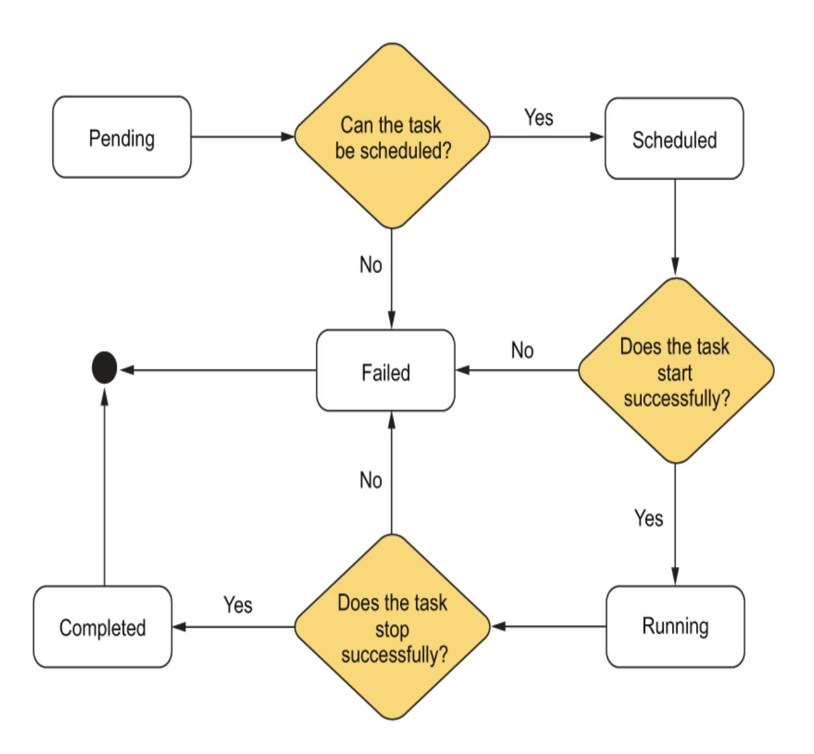

**Figure 2.2 The states a task will go through during its life cycle**

<span id="page-69-1"></span>Now that we have identified the states of a task, let's create the State type.

#### **Listing 2.1 The State type**

```
package task
type State int
const (
 Pending State = iota
 Scheduled
 Running
 Completed
 Failed
)
```

Next, we should identify other attributes of a task that would be useful for our system. Obviously, an ID would allow us to uniquely identify individual tasks, and we'll use universally unique identifiers (UUID) for these. A human-readable Name would be good too because it means we can talk about Tim's awesome task instead of task 74560f1a-b141-40ec-885a-64e4b36b9f9c. With these, we can sketch the beginning of our Task struct.

<span id="page-70-0"></span>

### **What is a UUID?**

UUID stands for *universally unique identifier*. A UUID is 128 bits long and, in practice, unique. While it's not impossible to generate two identical UUIDs, the probability is [extremely low. For more details about UUIDs, see RFC 4122 \(https://tools.ietf.org/](https://tools.ietf.org/html/rfc4122) html/rfc4122).

## **Listing 2.2 The initial Task struct**

```
import (
 "github.com/google/uuid"
)
type Task struct {
 ID uuid.UUID
 Name string
```

```
 State State
}
```

<span id="page-71-1"></span>Note that the State field is of type State, which we defined previously.

We have already said we're going to limit our orchestrator to dealing with Docker containers. As a result, we'll want to know what Docker image a task should use, and for that, let's use an attribute named Image. Given that our tasks will be Docker containers, there are several attributes that would be useful for a task to track. Memory and Disk will help the system identify the number of resources a task needs. ExposedPorts and PortBindings are used by Docker to ensure the machine allocates the proper network ports for the task and that it is available on the network. We'll also want a RestartPolicy attribute, which will tell the system what to do in the event a task stops or fails unexpectedly. With these attributes, we can update our Task struct.

#### <span id="page-71-0"></span>**Listing 2.3 Updating our Task struct with Docker-specific fields**

```
import (
 "github.com/google/uuid"
 "github.com/docker/go-connections/nat"
)
type Task struct {
 ID uuid.UUID
 Name string
 State State
 Image string
 Memory int
 Disk int
 ExposedPorts nat.PortSet
 PortBindings map[string]string
 RestartPolicy string
}
```

Finally, to know when a task starts and stops, we can add StartTime and FinishTime fields to our struct. While these aren't strictly necessary, they are helpful to display in a command-line interface (CLI). With these two attributes, we can flesh out the remainder of our Task struct.

## <span id="page-72-0"></span>**Listing 2.4 Adding StartTime and FinishTime fields to the Task struct**

```
import(
 ...
 "time"
)
type Task struct {
 ID uuid.UUID
 ContainerID string
 Name string
 State State
 Image string
 CPU float64
 Memory int64
 Disk int64
 ExposedPorts nat.PortSet
 PortBindings map[string]string
 RestartPolicy string
 StartTime time.Time
 FinishTime time.Time
}
```

<span id="page-72-1"></span>We have our Task struct defined, which represents a task that a user wants to run on our cluster. As I previously mentioned, a Task can be in one of several states: Pending, Scheduled, Running, Failed, or Completed. The Task struct works fine when a user first requests a task to be run, but how does a user tell the system to stop a task? For this purpose, let's introduce the TaskEvent struct.

To identify a TaskEvent, it will need an ID, and like our Task, this will be done using a UUID. The event will need a State, which will indicate the state the task should transition to (e.g., from Running to Completed). Next, the event will have a Timestamp to record the time the event was requested. Finally, the event will contain a Task struct. Users won't directly interact with the TaskEvent struct. It will be an internal object that our system uses to trigger tasks from one state to another.

#### **Listing 2.5 The TaskEvent struct**

```
type TaskEvent struct {
 ID uuid.UUID
 State State
 Timestamp time.Time
 Task Task
}
```

<span id="page-73-1"></span>With our Task and TaskEvent structs defined, let's move on to sketching the next component, the Worker.

# <span id="page-73-0"></span>*2.2 The worker skeleton*

If we think of the *task* as the foundation of this orchestration system, then we can think of the *worker* as the next layer that sits atop the foundation. Let's remind ourselves what the worker's requirements are:

- <span id="page-73-2"></span>1. Run tasks as Docker containers
- 2. Accept tasks to run from a manager
- 3. Provide relevant statistics to the manager for the purpose of scheduling tasks

#### 4. Keep track of its tasks and their state

Using the same process we used for defining the Task struct, let's create the Worker struct. Given the first and fourth requirements, we know that our worker will need to run and keep track of tasks. To do that, the worker will use a field named Db, which will be a map of UUIDs to tasks. To meet the second requirement, accepting tasks from a manager, the worker will want a Queue field. Using a queue will ensure that tasks are handled in first-in, first-out (FIFO) order. We won't be implementing our own queue, however; instead, we'll use the Queue from golang-collections. We'll also add a TaskCount field as a convenient way of keeping track of the number of tasks a worker has at any given time.

<span id="page-74-0"></span>In your project directory, create a subdirectory called worker, and then change to that directory. Now, open a file named worker.go and type in the code in the following listing.

#### <span id="page-74-1"></span>**Listing 2.6 The beginnings of the Worker struct**

```
package worker
import (
 "fmt"
 "github.com/google/uuid"
 "github.com/golang-collections/collections/queue"
 "cube/task"
)
type Worker struct {
 Name string
 Queue queue.Queue
 Db map[uuid.UUID]*task.Task
 TaskCount int
}
```

Note that by using a map for the Db field, we get the benefit of a datastore without having to worry about the complexities of an external database server or embedded database library.

<span id="page-75-1"></span>So we've identified the fields of our Worker struct. Now let's add some methods that will do the actual work. First, we'll give the struct a RunTask method. As its name suggests, it will handle running a task on the machine where the worker is running. Since a task can be in one of several states, the RunTask method will be responsible for identifying the task's current state and then either starting or stopping a task based on the state. Next, let's add a StartTask and a StopTask method, which will do exactly as their names suggest start and stop tasks. Finally, let's give our worker a CollectStats method, which can be used to periodically collect statistics about the worker.

#### <span id="page-75-0"></span>**Listing 2.7 The skeleton of the Worker component**

```
func (w *Worker) CollectStats() {
 fmt.Println("I will collect stats")
}
func (w *Worker) RunTask() {
 fmt.Println("I will start or stop a task")
}
func (w *Worker) StartTask() {
 fmt.Println("I will start a task")
}
func (w *Worker) StopTask() {
 fmt.Println("I will stop a task")
}
```

Notice that each method simply prints out a line stating what it will do. Later in the book, we will revisit these methods to implement the real

<span id="page-76-3"></span>behavior represented by these statements.

# <span id="page-76-0"></span>*2.3 The manager skeleton*

Along with the Worker, the Manager is the other major component of our orchestration system. It will handle the bulk of the work.

As a reminder, here are the requirements for the manager we defined in chapter 1:

- <span id="page-76-1"></span>1. Accept requests from users to start and stop tasks
- 2. Schedule tasks onto worker machines
- 3. Keep track of tasks, their states, and the machine on which they run

In the manager.go file, let's create the struct named Manager. The Manager will have a queue, represented by the pending field, in which tasks will be placed upon first being submitted. The queue will allow the Manager to handle tasks on a FIFO basis. Next, the Manager will have two in-memory databases: one to store tasks and another to store task events. The databases are maps of strings to Task and TaskEvent, respectively.

<span id="page-76-2"></span>Our Manager will need to keep track of the workers in the cluster. For this, let's use a field named, surprisingly, workers, which will be a slice of strings. Finally, let's add a couple of convenience fields that will make our lives easier down the road. It's easy to imagine that we'll want to know the jobs that are assigned to each worker. We'll use a field called WorkerTaskMap, which will be a map of strings

to task UUIDs. Similarly, it'd be nice to have an easy way to find the worker running a task given a task name. Here we'll use a field called TaskWorkerMap, which is a map of task UUIDs to strings, where the string is the name of the worker.

## <span id="page-77-1"></span>**Listing 2.8 The beginnings of our Manager skeleton**

```
package manager
import(
 "cube/task"
 "fmt"
 "github.com/golang-collections/collections/queue"
 "github.com/google/uuid"
)
type Manager struct {
 Pending queue.Queue
 TaskDb map[string][]*task.Task
 EventDb map[string][]*task.TaskEvent
 Workers []string
 WorkerTaskMap map[string][]uuid.UUID
 TaskWorkerMap map[uuid.UUID]string
}
```

<span id="page-77-0"></span>From our requirements, you can see that the manager needs to schedule tasks onto workers. So let's create a method on our Manager struct called selectWorker to perform that task. This method will be responsible for looking at the requirements specified in a Task and evaluating the resources available in the pool of workers to see which worker is best suited to run the task. Our requirements also say the Manager must keep track of tasks, their states, and the machine on which they run. To meet this requirement, create a method called UpdateTasks. Ultimately, this method will end up triggering a call to a worker's CollectStats method, but more about that later in the book.

Is our Manager skeleton missing anything? Ah, yes. So far, it can select a worker for a task and update existing tasks. There is another requirement that is implied in the requirements: the Manager obviously needs to send tasks to workers. Let's add this to our requirements and create a method on our Manager struct.

## **Listing 2.9 Adding methods to the Manager**

```
func (m *Manager) SelectWorker() {
 fmt.Println("I will select an appropriate worker")
}
func (m *Manager) UpdateTasks() {
 fmt.Println("I will update tasks")
}
func (m *Manager) SendWork() {
 fmt.Println("I will send work to workers")
}
```

<span id="page-78-1"></span>Like the Worker's methods, the Manager's methods only print out what they will do. The work of implementing these methods' actual behavior will come later.

# <span id="page-78-0"></span>*2.4 The scheduler skeleton*

The last of the four major components of our mental model is the scheduler. Its requirements are as follows:

- <span id="page-78-2"></span>1. Determine a set of candidate workers on which a task could run
- 2. Score the candidate workers from best to worst
- 3. Pick the worker with the best score

This skeleton, which we'll create in the scheduler.go file, will be different from our previous ones. Instead of defining structs and the methods of those structs, we're going to create an *interface*.

## **Interfaces in Go**

Interfaces are the mechanism by which Go supports polymorphism. They are contracts that specify a set of behaviors, and any type that implements the behaviors can then be used anywhere that the interface type is specified.

<span id="page-79-0"></span>For more details about interfaces, see the Interfaces and Other Types section of the *Effective Go* blog post at [http://mng.bz/j1n9.](http://mng.bz/j1n9)

Why an interface? As with everything in software engineering, tradeoffs are the norm. During my initial experiments with writing an orchestrator, I wanted a simple scheduler because I wanted to focus on other core features like running a task. For this purpose, my initial scheduler used a round-robin algorithm that kept a list of workers and identified which worker got the most recent task. Then, when the next task came in, the scheduler simply picked the next worker in its list.

While the round-robin scheduler worked for this particular situation, it obviously has flaws. What happens if the next worker to be assigned a task doesn't have the available resources? Maybe the current tasks are using up all the memory and disk. Furthermore, I might want more flexibility in how tasks are assigned to workers. Maybe I'd want the scheduler to fill up one worker with tasks instead of spreading the tasks across multiple workers, where each worker could potentially only be running a single task. Conversely, maybe I'd want to spread

out the tasks across the pool of resources to minimize the likelihood of resource starvation.

Thus, we'll use an interface to specify the methods a type must implement to be considered a Scheduler. As you can see in the next listing, these methods are SelectCandidateNodes, Score, and Pick. Each of these methods map nicely onto the requirements for our scheduler.

#### <span id="page-80-2"></span>**Listing 2.10 The skeleton of the Scheduler component**

```
package scheduler
type Scheduler interface {
 SelectCandidateNodes()
 Score()
 Pick()
}
```

# <span id="page-80-0"></span>*2.5 Other skeletons*

At this point, we've created skeletons for the four primary objects we see in our mental model: Task, Worker, Manager, and Scheduler. There is, however, another object that is hinted at in this model, the Node.

<span id="page-80-1"></span>Up to now, we've talked about the Worker. The Worker is the component that deals with our logical workload (i.e., tasks). The Worker has a physical aspect to it, however, in that it runs on a physical machine itself, and it also causes tasks to run on a physical machine. Moreover, it needs to know about the underlying machine to gather stats about the machine that the manager will use for

scheduling decisions. We'll call this physical aspect of the Worker a Node.

In the context of Cube, a *node* is an object that represents any machine in our cluster. For example, the manager is one type of node in Cube. The worker, of which there can be more than one, is another type of node. The manager will make extensive use of node objects to represent workers.

For now, we're only going to define the fields that make up a Node struct, as seen in listing 2.11. First, a node will have a Name, for example, something as simple as "node-1." Next, a node will have an Ip address, which the manager will want to know in order to send tasks to it. A physical machine also has a certain amount of Memory and Disk space that tasks can use. These attributes represent maximum amounts. At any point in time, the tasks on a machine will be using some amount of memory and disk, which we can call MemoryAllocated and DiskAllocated. Finally, a Node will have zero or more tasks, which we can track using a TaskCount field.

#### <span id="page-81-0"></span>**Listing 2.11 The Node struct, representing a physical machine**

```
package node
type Node struct {
 Name string
 Ip string
 Cores int
 Memory int
 MemoryAllocated int
 Disk int
 DiskAllocated int
 Role string
```

 TaskCount int }

# <span id="page-82-0"></span>*2.6 Taking our skeletons for a spin*

Now that we've created these skeletons, let's see whether we can use them in a simple test program. We want to ensure that the code we just wrote will compile and run. To do this, we're going to create instances of each of the skeletons, print the skeletons, and, finally, call each skeleton's methods.

<span id="page-82-1"></span>The following list summarizes in more detail what our test program will do:

- Create a Task object
- Create a TaskEvent object
- Print the Task and TaskEvent objects
- Create a Worker object
- Print the Worker object
- Call the worker's methods
- Create a Manager object
- Call the manager's methods
- Create a Node object
- Print the Node object

Before we write this program, however, let's take care of a small administrative task that's necessary to get our code to compile. Remember, we said we're going to use the Queue implementation from the golang-collections package, and we're also using the UUID package from Google. We've also used the nat package from Docker. While we have imported them into our code, we haven't yet installed them locally. So let's do that now.

## <span id="page-83-0"></span>**Listing 2.12 Using the go get command to install the thirdparty packages**

```
$ go get github.com/golang-collections/collections/queue
$ go get github.com/google/uuid
$ go get github.com/docker/go-connections/nat
```

Now we are ready to test our skeletons, which we'll do in the following two listings.

#### **Listing 2.13 Testing the skeletons with a minimal program: Part 1**

```
package main
import (
 "cube/node"
 "cube/task"
 "fmt"
 "time"
 "github.com/golang-collections/collections/queue"
 "github.com/google/uuid"
 "cube/manager"
 "cube/worker"
)
func main() {
 t := task.Task{
 ID: uuid.New(),
 Name: "Task-1",
 State: task.Pending,
 Image: "Image-1",
 Memory: 1024,
 Disk: 1,
 }
```

#### **Listing 2.14 Testing the skeletons with a minimal program: Part 2**

```
te := task.TaskEvent{
 ID: uuid.New(),
 State: task.Pending,
 Timestamp: time.Now(),
 Task: t,
 }
 fmt.Printf("task: %v\n", t)
 fmt.Printf("task event: %v\n", te)
 w := worker.Worker{
 Name: "worker-1",
 Queue: *queue.New(),
 Db: make(map[uuid.UUID]*task.Task),
 }
 fmt.Printf("worker: %v\n", w)
 w.CollectStats()
 w.RunTask()
 w.StartTask()
 w.StopTask()
 m := manager.Manager{
 Pending: *queue.New(),
 TaskDb: make(map[string][]task.Task),
 EventDb: make(map[string][]task.TaskEvent),
 Workers: []string{w.Name},
 }
 fmt.Printf("manager: %v\n", m)
 m.SelectWorker()
 m.UpdateTasks()
 m.SendWork()
 n := node.Node{
 Name: "Node-1",
 Ip: "192.168.1.1",
 Cores: 4,
 Memory: 1024,
 Disk: 25,
 Role: "worker",
 }
 fmt.Printf("node: %v\n", n)
}
```

Now is the moment of truth! Time to compile and run our program. Do this using the go run main.go command, and you should see output like that in the following listing.

## **Listing 2.15 Testing the skeletons by running our minimal program**

```
$ go run main.go ❶
task: {389e41e6-95ca-4d48-8211-c2f4aca5127f Task-1 0 Image-1 1024 1
 ➥ map[] map[] 0001-01-01 00:00:00 +0000 UTC
 ➥ 0001-01-01 00:00:00 +0000 UTC} ❷
task event: {69de4b79-9023-4099-9210-d5c0791a2c32 0 2021-04-10
 ➥ 17:38:22.758451604 -0400 EDT m=+0.000186851
 ➥ {389e41e6-95ca-4d48-8211-c2f4aca5127f Task-1 0 Image-1 1024 1
 ➥ map[] map[] 0001-01-01 00:00:00 +0000 UTC
 ➥ 0001-01-01 00:00:00 +0000 UTC}} ❸
worker: { {<nil> <nil> 0} map[] 0} ❹
I will collect stats ❺
I will start or stop a task
I will start a task
I Will stop a task
manager: {{<nil> <nil> 0} map[] map[] [] map[] map[]} ❻
I will select an appropriate worker ❼
I will update tasks
I will send work to workers
node: {Node-1 192.168.1.1 4 1024 0 25 0 worker 0} ❽
```

- ❶ Compiling and running the program with go run
- ❷ The output from printing the Task
- ❸ The output from printing the TaskEvent
- ❹ The output from printing the Worker
- ❺ These four lines are output from calling the worker's methods.
- ❻ The output from printing the Manager
- ❼ These three lines are output from calling the manager's methods.
- ❽ The output from printing the Node

Congrats! You've just written the skeleton of an orchestration system that compiles and runs. Take a moment to celebrate. In the following chapters, we'll use these skeletons as a starting point for more

<span id="page-86-0"></span>detailed discussions of each component before diving into the technical implementations.

# *Summary*

- The code for the Cube orchestrator is organized into separate subdirectories inside our project: Manager, Node, Scheduler, Task, and Worker.
- Writing skeletons can help translate a mental model from an abstract concept into working code. Thus, we created skeletons for the Task, Worker, Manager, and Scheduler components of our orchestration system. This step also helped us identify additional concepts we didn't initially think of. The TaskEvent and Node components were not represented in our model but will be useful later in the book.
- We exercised our skeletons by writing a main program. While this program did not perform any operations, it did print messages to the terminal, allowing us to get a general idea of how things work.
- A task can be in one of five states: Pending, Scheduled, Running, Completed, or Failed. The worker and manager will use these states to perform actions on tasks, such as stopping and starting them.
- <span id="page-86-1"></span>Go implements polymorphism by using interfaces. An interface is a type that specifies a set of behaviors, and any other type that implements those behaviors will be considered of the same type as the interface. Using an interface will allow us to implement multiple schedulers, each with slightly different behavior.

#### *[OceanofPDF.com](https://oceanofpdf.com/)*

# <span id="page-88-0"></span>*3 Hanging some flesh on the task skeleton*

## **This chapter covers**

- <span id="page-88-1"></span>Reviewing how to start and stop Docker containers via the command line
- Introducing the Docker API calls for starting and stopping containers
- Implementing the Task concept to start and stop a container

Think about cooking your favorite meal. Let's say you like making homemade pizza. To end up pulling a delicious, hot pizza out of your oven, you have to perform a number of tasks. If you like onions, green peppers, or any other veggies on your pizza, you have to cut them up. You must knead the dough and spread it on a baking sheet. Next, you spread tomato sauce across the dough and sprinkle cheese over it. Finally, on top of the cheese, you layer your veggies and other ingredients.

A task in an orchestration system is similar to one of the individual steps in making a pizza. Like most companies these days, yours most likely has a website. That company's website runs on a web server, perhaps the ubiquitous Apache web server. That's a task. The website may use a database, like MySQL or PostgreSQL, to store dynamic content. That's a task.

In our pizza-making analogy, the pizza wasn't made in a vacuum. It was created in a specific context, which is a kitchen. The kitchen

provides the necessary resources to make the pizza: a refrigerator where the cheese is stored, cabinets where the pizza sauce is kept, an oven in which to cook the pizza, and a knife to cut the pizza into slices.

Similarly, a task operates in a specific context. In our case, that context will be a Docker container. Like the kitchen, the container will provide the resources necessary for the task to run: it will provide CPU cycles, memory, and networking according to the needs of the task.

As a reminder, the task is the foundation of an orchestration system. Figure 1.1 shows a modified version of our mental model from chapter 1.

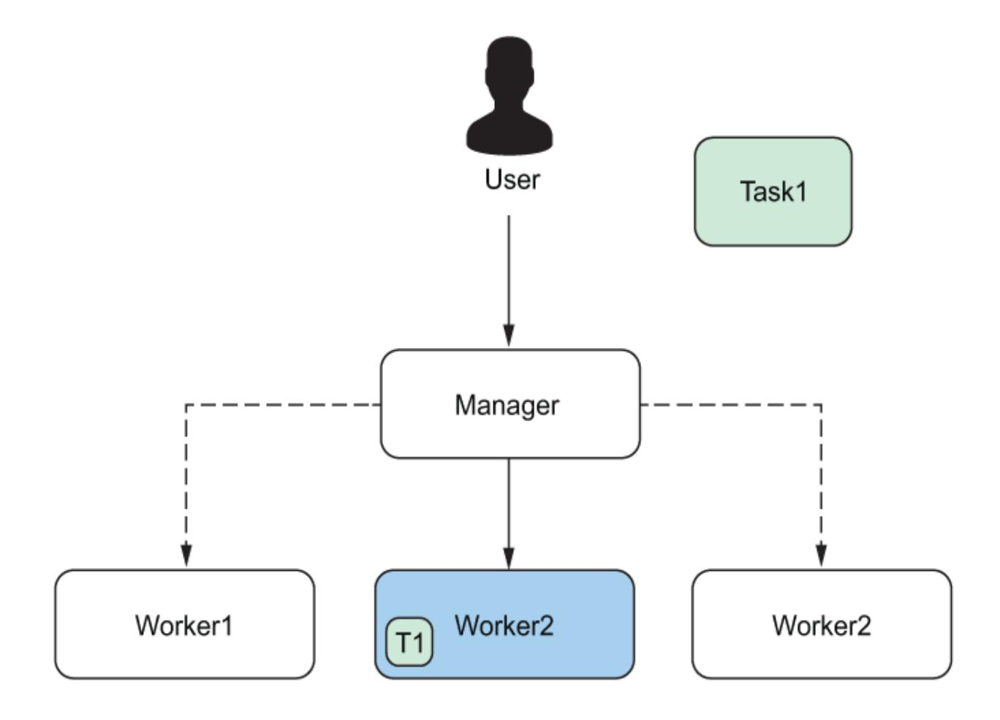

**Figure 3.1 The main purpose of an orchestration system is to accept tasks from users and run them on the system's worker nodes. Here, we see a user submitting a task to the Manager node, which then selects Worker2 to run the task. The dotted lines to Worker1 and Worker3 represent that these nodes were considered but ultimately not selected to run the task.**

<span id="page-90-0"></span>In the rest of this chapter, we'll flesh out the Task skeleton we wrote in the previous chapter. But first, let's quickly review some Docker basics.

# <span id="page-91-0"></span>*3.1 Docker: Starting, stopping, and inspecting containers from the command line*

If you are a developer, you have probably used Docker containers to run your application and its backend database on your laptop while working on your code. If you are a DevOps engineer, you may have deployed Docker containers to your company's production environment. Containers allow the developer to package their code, along with all its dependencies, and then ship the container to production. If a DevOps team is responsible for deployments to production, then they only have to worry about deploying the container. They don't have to worry about whether the machine where the container will run has the correct version of the PostgreSQL library that the application uses to connect to its database.

<span id="page-91-1"></span>**TIP** If you need a more detailed review of Docker containers and how to control them, check out chapter 2 of *Docker in Action* ([http://mng.bz/PRq8\)](http://mng.bz/PRq8).

To run a Docker container, we can use the docker run command, an example of which can be seen in the next listing. Here, the docker run command is starting up a PostgreSQL database in a container, which might be used as a backend datastore while developing a new application.

<span id="page-91-2"></span>**Listing 3.1 Running the Postgres database server as a Docker container**

```
$ docker run -it \
 -p 5432:5432 \
 --name cube-book \
 -e POSTGRES_USER=cube \
 -e POSTGRES_PASSWORD=secret \
 postgres
```

This command runs the container in the foreground, meaning we can see its log output (-it), gives the container the name of postgres, and sets the POSTGRES\_USER and POSTGRES\_PASSWORD environment variables.

<span id="page-92-0"></span>Once a container is running, it performs the same functions it would if you were running it as a regular process on your laptop or desktop. In the case of the Postgres database from listing 3.1, I can now log into the database server using the psql command-line client and create a table like that in the following listing.

#### <span id="page-92-1"></span>**Listing 3.2 Logging in to the Postgres server and creating a table**

```
$ psql -h localhost -p 5432 -U cube
Password for user cube:
psql (9.6.22, server 13.2 (Debian 13.2-1.pgdg100+1))
WARNING: psql major version 9.6, server major version 13.
 Some psql features might not work.
Type "help" for help.
cube=# \d
No relations found.
cube=# CREATE TABLE book (
isbn char(13) PRIMARY KEY,
title varchar(240) NOT NULL,
author varchar(140)
);
CREATE TABLE
cube=# \d
 List of relations
Schema | Name | Type | Owner
--------+------+-------+-------
public | book | table | cube
(1 row)
```

Because we specified -p 5432:5432 in the docker run command in the previous listing, we can tell the psql client to connect to that port on the local machine.

Once a container is up and running, we can get information about it using the docker inspect command. The output from this command is extensive, so I will only list the State info.

## <span id="page-93-1"></span>**Listing 3.3 Using the docker inspect command**

```
$ docker inspect cube-book
[
 {
 "Id": "a820c7abb54b723b5efc0946900baf58e093d8fdd238d4ec7cb5647",
 "Created": "2021-05-15T20:00:41.228528102Z",
 "Path": "docker-entrypoint.sh",
 "Args": [
 "postgres"
 ],
 "State": {
 "Status": "running",
 "Running": true,
 "Paused": false,
 "Restarting": false,
 "OOMKilled": false,
 "Dead": false,
 "Pid": 27599,
 "ExitCode": 0,
 "Error": "",
 "StartedAt": "2021-05-15T20:00:42.4656334Z",
 "FinishedAt": "0001-01-01T00:00:00Z"
 },
 ....
]
```

<span id="page-93-0"></span>Finally, we can stop a Docker container using the docker stop cube-book command. There isn't any output from the command, but if we run the docker inspect cube-book command now, we'll see that the state has changed from running to exited.

#### **Listing 3.4 Running docker inspect cube-book after docker stop cube-book**

```
$ docker inspect cube-book
[
 {
 "Id": "a820c7abb54b723b5efc0946900baf58e093d8fdd238d4ec7cb5647",
 "Created": "2021-05-15T20:00:41.228528102Z",
 "Path": "docker-entrypoint.sh",
 "Args": [
 "postgres"
 ],
 "State": {
 "Status": "exited",
 "Running": false,
 "Paused": false,
 "Restarting": false,
 "OOMKilled": false,
 "Dead": false,
 "Pid": 0,
 "ExitCode": 0,
 "Error": "",
 "StartedAt": "2021-05-15T20:00:42.4656334Z",
 "FinishedAt": "2021-05-15T20:18:31.698919838Z"
 },
 ....
]
```

# <span id="page-94-0"></span>*3.2 Docker: Starting, stopping, and inspecting containers from the API*

In our orchestration system, the worker will be responsible for starting, stopping, and providing information about the tasks it's running. To perform these functions, the worker will use Docker's API. The API is accessible via the HTTP protocol using a client like curl or the HTTP library of a programming language. The following listing

<span id="page-95-0"></span>shows an example of using curl to get the same information we got from the docker inspect command previously.

#### **Listing 3.5 Querying the Docker API with the curl HTTP client**

```
curl --unix-socket \
 /var/run/docker.sock http://docker/containers/6970e8469684/json| jq .
{
 "Id": "6970e8469684d439c73577c4caee7261bf887a67433420e7dcd637cc53b8ffa7",
 "Created": "2021-05-15T20:58:36.283909602Z",
 "Path": "docker-entrypoint.sh",
 "Args": [
 "postgres"
 ],
 "State": {
 "Status": "running",
 "Running": true,
 "Paused": false,
 "Restarting": false,
 "OOMKilled": false,
 "Dead": false,
 "Pid": 270523,
 "ExitCode": 0,
 "Error": "",
 "StartedAt": "2021-05-15T20:58:36.541148947Z",
 "FinishedAt": "0001-01-01T00:00:00Z"
 },
 ....
}
```

<span id="page-95-1"></span>Notice we're passing the --unix-socket flag to the curl command. By default, Docker listens on a unix socket, but it can be configured to listen on a tcp socket. The URL, http://docker/containers/6970e8469684/json, contains the ID of the container to inspect, which I got from the docker ps command on my machine. Finally, the output from curl is piped to the jq command, which prints the output in a more readable format than curl's.

We could use Go's HTTP library in our orchestration system, but that would force us to deal with many low-level details like HTTP methods, status codes, and serializing requests and deserializing responses. Instead, we're going to use Docker's SDK, which handles all the lowlevel HTTP details for us and allows us to focus on our primary task: creating, running, and stopping containers. The SDK provides the following six methods that will meet our needs:

- NewClientWithOpts—A helper method that instantiates an instance of the client and returns it to the caller
- ImagePull—Pulls the image down to the local machine where it will be run
- ContainerCreate—Creates a new container with a given configuration
- ContainerStart—Sends a request to Docker Engine to start the newly created container
- ContainerStop—Sends a request to Docker Engine to stop a running container
- ContainerRemove—Removes the container from the host

**NOTE** Docker's Golang SDK has extensive documentation ([https://pkg.go.dev/github.com/docker/docker\)](https://pkg.go.dev/github.com/docker/docker) that's worth reading. In particular, the docs about the Go client ([https://pkg.go.dev/github.com/docker/docker/client\)](https://pkg.go.dev/github.com/docker/docker/client) are relevant to our work throughout the rest of this book.

The docker command-line examples we reviewed in the previous section use the Go SDK under the hood. Later in this chapter, we'll implement a Run() method that uses the ImagePull,

<span id="page-97-0"></span>ContainerCreate, and ContainerStart methods to create and start a container. Figure 3.2 provides a graphic representation of our custom code and the docker command using the SDK.

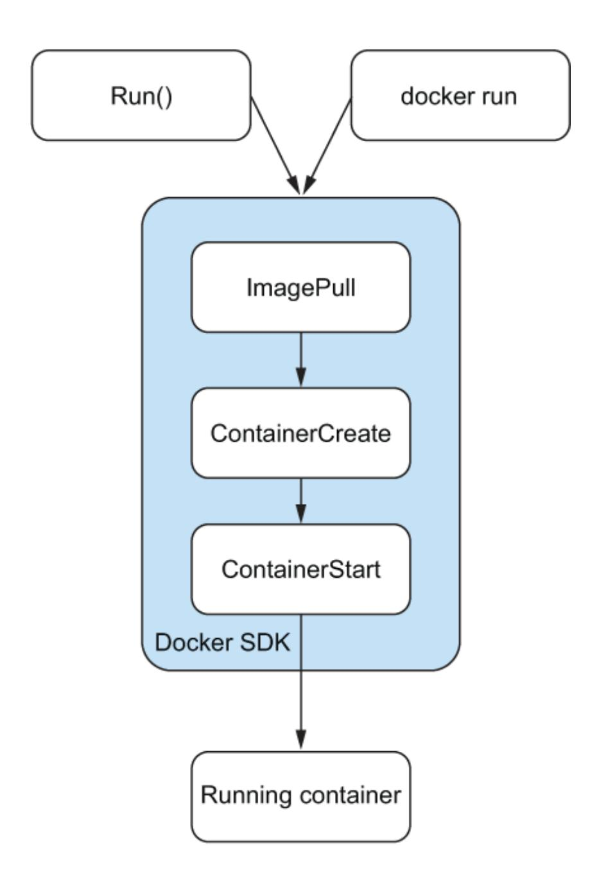

**Figure 3.2 Regardless of the starting point, all paths to creating and running a container go through the Docker SDK.**

By using the Go SDK for controlling the Docker containers in our orchestration system, we don't have to reinvent the wheel. We can simply reuse the same code used by the docker command every day.

# <span id="page-98-1"></span><span id="page-98-0"></span>*3.3 Task configuration*

To run our tasks as containers, they need a configuration. What is a configuration? Think back to our pizza analogy from the beginning of the chapter. One of the tasks in making our pizza was cutting the onions (if you don't like onions, insert your veggie of choice). To perform that task, we would use a knife and a cutting board, and we would cut the onions in a particular way. Perhaps we cut them into thin, even slices or dice them into small cubes. This is all part of the "configuration" of the task of cutting onions. (Okay, I'm probably stretching the pizza analogy a bit far, but I think you get the point.)

<span id="page-98-4"></span>For a task in our orchestration system, we'll describe its configuration using the Config struct in listing 3.6. This struct encapsulates all the necessary bits of information about a task's configuration. The comments should make the intent of each field obvious, but there are a couple of fields worth highlighting.

<span id="page-98-2"></span>The Name field will be used to identify a task in our orchestration system, and it will perform double duty as the name of the running container. Throughout the rest of the book, we'll use this field to name our containers like test-container-1.

<span id="page-98-3"></span>The Image field, as you probably guessed, holds the name of the image the container will run. Remember, an image can be thought of as a package: it contains the collection of files and instructions necessary to run a program. This field can be set to a value as simple as postgres, or it can be set to a more specific value that includes a version, like postgres:13.

<span id="page-99-2"></span>The Memory and Disk fields will serve two purposes. The scheduler will use them to find a node in the cluster capable of running a task. They will also be used to tell the Docker daemon the number of resources a task requires.

<span id="page-99-0"></span>The Env field allows a user to specify environment variables that will get passed into the container. In our command to run a Postgres container, we set two environment variables: -e POSTGRES\_USER=cube to specify the database user and -e POSTGRES\_ PASSWORD=secret to specify that user's password.

<span id="page-99-3"></span><span id="page-99-1"></span>Finally, the RestartPolicy field tells the Docker daemon what to do if a container dies unexpectedly. This field is one of the mechanisms that provides resilience in our orchestration system. As you can see from the comment, the acceptable values are an empty string, always, unless-stopped, or on-failure. Setting this field to always will, as its name implies, restart a container if it stops. Setting it to unless-stopped will restart a container unless it has been stopped (e.g., by docker stop). Setting it to on-failure will restart the container if it exits due to an error (i.e., a nonzero exit code). There are a few details that are spelled out in the documentation (<http://mng.bz/1JdQ>).

<span id="page-100-2"></span>We're going to add the Config struct in the next listing to the task.go file from chapter 2.

## **Listing 3.6 The Config struct that will hold the configuration for orchestration tasks**

```
type Config struct {
 Name string
 AttachStdin bool
 AttachStdout bool
 AttachStderr bool
 ExposedPorts nat.PortSet
 Cmd []string
 Image string
 Cpu float64
 Memory int64
 Disk int64
 Env []string
 RestartPolicy string
}
```

# <span id="page-100-0"></span>*3.4 Starting and stopping tasks*

Now that we've talked about a task's configuration, let's move on to starting and stopping a task. Remember, the worker in our orchestration system will be responsible for running tasks for us. That responsibility will mostly involve starting and stopping tasks.

<span id="page-100-1"></span>Let's start by adding the code for the Docker struct you see in listing 3.7 to the task.go file. This struct will encapsulate everything we need to run our task as a Docker container. The Client field will hold a Docker client object that we'll use to interact with the Docker API. The Config field will hold the task's configuration. And once a task is running, it will also contain the

<span id="page-101-1"></span>ContainerId. This ID will allow us to interact with the running task.

#### **Listing 3.7 The Docker struct**

```
type Docker struct {
 Client *client.Client
 Config Config
}
```

For the sake of convenience, let's create a struct called DockerResult. We can use this struct as the return value in methods that start and stop containers, providing a wrapper around common information that is useful for callers. The struct contains an Error field to hold any error messages. It has an Action field that can be used to identify the action being taken, for example, start or stop. It has a ContainerId field to identify the container to which the result pertains. And, finally, there is a Result field that can hold arbitrary text that provides more information about the result of the operation.

#### <span id="page-101-0"></span>**Listing 3.8 The DockerResult struct**

```
type DockerResult struct {
 Error error
 Action string
 ContainerId string
 Result string
}
```

<span id="page-101-2"></span>Now we're ready for the exciting part: actually writing the code to create and run a task as a container. To do this, let's start by adding a method to the Docker struct we created earlier. Let's call that method Run.

The first part of our Run method will pull the Docker image our task will use from a container registry such as Docker Hub. A container registry is simply a repository of images and allows for the easy distribution of the images it hosts. To pull the image, the Run method first creates a context, which is a type that holds values that can be passed across boundaries such as APIs and processes. It's common to use a context to pass along deadlines or cancellation signals in requests to an API. In our case, we'll use an empty context returned from the Background function.

Next, Run calls the ImagePull method on the Docker client object, passing the context object, the image name, and any options necessary to pull the image. The ImagePull method returns two values: an object that fulfills the io.ReadCloser interface and an error object. It stores these values in the reader and err variables.

<span id="page-102-1"></span><span id="page-102-0"></span>The next step in the method checks the error value returned from ImagePull. If the value is not nil, the method prints the error message and returns as a DockerResult.

<span id="page-102-2"></span>Finally, the method copies the value of the reader variable to os.Stdout via the io.Copy function. io.Copy is a function from the io package in Golang's standard library, and it simply copies data to a destination (os.Stdout) from a source (reader). Because we'll be working from the command line whenever we're running the components of our orchestration system, it's useful to write the reader variable to Stdout as a way to communicate what happened in the ImagePull method.

## **Listing 3.9 The start of our Run() method**

```
func (d *Docker) Run() DockerResult {
 ctx := context.Background()
 reader, err := d.Client.ImagePull(
 ctx, d.Config.Image, types.ImagePullOptions{})
 if err != nil {
 log.Printf("Error pulling image %s: %v\n", d.Config.Image, err)
 return DockerResult{Error: err}
 }
 io.Copy(os.Stdout, reader)
}
```

Similar to running a container from the command line, the method begins by pulling the container's image.

Once the Run method has pulled the image and checked for errors (and found none, we hope), the next bit of business on the agenda is to prepare the configuration to be sent to Docker. Before we do that, however, let's take a look at the signature of the ContainerCreate method from the Docker client. This is the method we'll use to create the container. As you can see in listing 3.10, ContainerCreate takes several arguments. Similar to the ImagePull method used earlier, it takes a context.Context as its first argument. The next argument is the actual container configuration, which is a pointer to a container.Config type. We'll copy the values from our own Config type into this one. The third argument is a pointer to a container.HostConfig type. This type will hold the configuration a task requires of the host on which the container will run, for example, a Linux machine. The fourth argument is also a pointer and points to a network.NetworkingConfig type. This type can be used to specify networking details, such as the network ID container, any links to other containers that are needed, and IP addresses. For our

purposes, we won't use the network configuration, instead allowing Docker to handle those details for us. The fifth argument is another pointer, and it points to a specs.Platform type. This type can be used to specify details about the platform on which the image runs. It allows you to specify things like the CPU architecture and the operating system. We won't be making use of this argument either. The sixth and final argument to ContainerCreate is the container name, passed as a string.

#### <span id="page-104-1"></span>**Listing 3.10 The Docker client's ContainerCreate method**

```
func (cli *Client) ContainerCreate(
 ctx context.Context,
 config *container.Config,
 hostConfig *container.HostConfig,
 networkingConfig *network.NetworkingConfig,
 platform *specs.Platform,
 containerName string) (container.ContainerCreateCreatedBody, error)
```

Now we know what information we need to pass along in the ContainerCreate method, so let's gather it from our Config type and massage it into the appropriate types that ContainerCreate will accept. What we'll end up with is what you see in listing 3.11.

First, we'll create a variable called rp. This variable will hold a container.RestartPolicy type, and it will contain the RestartPolicy we defined earlier in our Config struct in listing 3.6.

<span id="page-104-0"></span>Following the rp variable, let's declare a variable called r. This variable will hold the resources required by the container in a

<span id="page-105-0"></span>container.Resources type. The most common resources we'll use for our orchestration system will be memory.

Next, let's create a variable called cc to hold our container configuration. This variable will be of the type container.Config, and into it, we'll copy two values from our Config type. The first is the Image our container will use. The second is any environment variables, which go into the Env field.

<span id="page-105-1"></span>Finally, we take the rp and r variables we defined and add them to a third variable called hc. This variable is a container.HostConfig type. In addition to specifying the RestartPolicy and Resources in the hc variable, we'll also set the PublishAllPorts field to true. What does this field do? Remember our example docker run command in listing 3.2, where we start up a PostgreSQL container? In that command, we used -p 5432:5432 to tell Docker that we wanted to map port 5432 on the host running our container to port 5432 inside the container. Well, that's not the best way to expose a container's ports on a host. There is an easier way. Instead, we can set PublishAllPorts to true, and Docker will expose those ports automatically by randomly choosing available ports on the host.

<span id="page-105-2"></span>The following listing creates four variables to hold configuration information, which gets passed to the ContainerCreate method.

#### **Listing 3.11 The next phase of running a container**

```
func (d *Docker) Run() DockerResult {
 // previous code not listed
```

```
 rp := container.RestartPolicy{
 Name: d.Config.RestartPolicy,
 }
 r := container.Resources{
 Memory: d.Config.Memory,
 NanoCPUs: int64(d.Config.Cpu * math.Pow(10, 9)),
 }
 cc := container.Config{
 Image: d.Config.Image,
 Tty: false,
 Env: d.Config.Env,
 ExposedPorts: d.Config.ExposedPorts,
 }
 hc := container.HostConfig{
 RestartPolicy: rp,
 Resources: r,
 PublishAllPorts: true,
 }
```

We've done all the necessary prep work, and now we can create the container and start it. We've already touched on the ContainerCreate method in listing 3.10, so all that's left to do is to call it like in listing 3.12. One thing to notice, however, is that we pass nil values as the fourth and fifth arguments, which, as you'll recall from listing 3.10, are the networking and platform arguments. We won't be making use of these features in our orchestration system, so we can ignore them for now.

<span id="page-106-1"></span><span id="page-106-0"></span>As with the ImagePull method earlier, ContainerCreate returns two values: a response, which is a pointer to a container.ContainerCreateCreatedBody type, and an error type. The ContainerCreateCreatedBody type gets stored in the resp variable, and we put the error in the err variable. Next, we check the err variable for any errors and, if we find any, print them and return them in a DockerResult type.

<span id="page-107-1"></span>Great! We've got all our ingredients together, and we've formed them into a container. All that's left to do is start it. To perform this final step, we call the ContainerStart method.

Besides a context argument, ContainerStart takes the ID of an existing container, which we get from the resp variable returned from ContainerCreate, and any options necessary to start the container. In our case, we don't need any options, so we simply pass an empty types.ContainerStartOptions.

ContainerStart only returns one type, an error, so we check it in the same way we have with the other method calls we've made. If there is an error, we print it and then return it in a DockerResult.

#### <span id="page-107-0"></span>**Listing 3.12 The penultimate phase**

```
func (d *Docker) Run() DockerResult {
 // previous code not listed
 resp, err := d.Client.ContainerCreate(ctx, &cc, &hc, nil, nil,
 ➥ d.Config.Name)
 if err != nil {
 log.Printf("Error creating container using image %s: %v\n",
 ➥ d.Config.Image, err)
 return DockerResult{Error: err}
 }
 err = d.Client.ContainerStart(ctx, resp.ID, types.ContainerStartOptions{})
 if err != nil {
 log.Printf("Error starting container %s: %v\n", resp.ID, err)
 return DockerResult{Error: err}
 }
```

At this point, if all was successful, we have a container running the task. All that's left to do now is to take care of some bookkeeping, which you can see in listing 3.13. We start by adding the container ID to the configuration object (which will ultimately be stored, but let's

not get ahead of ourselves!). Similar to printing the results of the ImagePull operation to stdout, we do the same with the result of starting the container. This is accomplished by calling the ContainerLogs method and then writing the return value to stdout using the stdcopy.StdCopy(os.Stdout, os.Stderr, out) call.

#### <span id="page-108-0"></span>**Listing 3.13 The final phase of creating and running a container**

```
func (d *Docker) Run() DockerResult {
 // previous code not listed
 d.Config.Runtime.ContainerID = resp.ID
 out, err := cli.ContainerLogs(
 ctx,
 resp.ID,
 types.ContainerLogsOptions{ShowStdout: true, ShowStderr: true}
 )
 if err != nil {
 log.Printf("Error getting logs for container %s: %v\n", resp.ID, err)
 return DockerResult{Error: err}
 }
 stdcopy.StdCopy(os.Stdout, os.Stderr, out)
 return DockerResult{ContainerId: resp.ID, Action: "start",
 ➥ Result: "success"}
}
```

As a reminder, the Run method we've written in listings 3.9, 3.11, 3.12, and 3.13 perform the same operations as the docker run command. When you type docker run on the command line, under the hood, the docker binary is using the same SDK methods we're using in our code to create and run the container.

<span id="page-108-1"></span>Now that we can create a container and start it, let's write the code to stop a container. Compared to our Run method, the Stop method

will be much simpler, as you can see in listing 3.14. Because there isn't the necessary prep work to do for stopping a container, the process simply involves calling the ContainerStop method with the ContainerID and then calling the ContainerRemove method with the ContainerID and the requisite options. Again, in both operations, the code checks the value of the err returned from the method. As with the Run method, our Stop method performs the same operations carried out by the docker stop and docker rm commands.

#### <span id="page-109-0"></span>**Listing 3.14 Stopping a container**

```
func (d *Docker) Stop(id string) DockerResult {
 log.Printf("Attempting to stop container %v", id)
 ctx := context.Background()
 err := d.Client.ContainerStop(ctx, id, nil)
 if err != nil {
 log.Printf("Error stopping container %s: %v\n", id, err)
 return DockerResult{Error: err}
 }
 err = d.Client.ContainerRemove(ctx, id, types.ContainerRemoveOptions{
 RemoveVolumes: true,
 RemoveLinks: false,
 Force: false,
 })
 if err != nil {
 log.Printf("Error removing container %s: %v\n", id, err)
 return DockerResult{Error: err}
 }
 return DockerResult{Action: "stop", Result: "success", Error: nil}
}
```

<span id="page-109-1"></span>Now, let's update our main.go program that we created in chapter 2 to create and stop a container.

First, add the createContainer function in listing 3.15 to the bottom of the main.go file. Inside it, we'll set up the configuration for the task and store it in a variable called c, and then we'll create a new Docker client and store it in dc. Next, let's create the d object, which is of type task.Docker. From this object, we call the Run() method to create the container.

## <span id="page-110-0"></span>**Listing 3.15 The createContainer function**

```
func createContainer() (*task.Docker, *task.DockerResult) {
 c := task.Config{
 Name: "test-container-1",
 Image: "postgres:13",
 Env: []string{
 "POSTGRES_USER=cube",
 "POSTGRES_PASSWORD=secret",
 },
 }
 dc, _ := client.NewClientWithOpts(client.FromEnv)
 d := task.Docker{
 Client: dc,
 Config: c,
 }
 result := d.Run()
 if result.Error != nil {
 fmt.Printf("%v\n", result.Error)
 return nil, nil
 }
 fmt.Printf(
 "Container %s is running with config %v\n", result.ContainerId, c)
 return &d, &result
}
```

Second, add the stopContainer function below createContainer. This function accepts a single argument, d, which is the same d object created in createContainer in listing 3.15. All that's left to do is call d.Stop().

#### <span id="page-110-1"></span>**Listing 3.16 The stopContainer function**

```
func stopContainer(d *task.Docker, id string) *task.DockerResult {
 result := d.Docker.Stop(id)
 if result.Error != nil {
 fmt.Printf("%v\n", result.Error)
 return nil
 }
 fmt.Printf(
 "Container %s has been stopped and removed\n", result.ContainerId)
 return &result
}
```

Finally, we call the createContainer and stopContainer functions we created from our main() function in main.go. To do that, add the code from listing 3.17 to the bottom of your main function.

<span id="page-111-1"></span>As you can see, the code is fairly simple. It starts by printing a useful message that it's going to create a container; it then calls the createContainer() function and stores the results in two variables, dockerTask and createResult. Then it checks for errors by comparing the value of createResult.Error to nil. If it finds an error, it prints it and exits by calling os.Exit(1). To stop the container, the main function simply calls stopContainer and passes it the dockerTask object returned by the earlier call to createContainer.

# <span id="page-111-0"></span>**Listing 3.17 Calling the createContainer and stopContainer functions**

```
func main() {
 // previous code not shown
 fmt.Printf("create a test container\n")
 dockerTask, createResult := createContainer()
 if createResult.Error != nil {
```

```
 fmt.Printf("%v", createResult.Error)
 os.Exit(1)
 }
 time.Sleep(time.Second * 5)
 fmt.Printf("stopping container %s\n", createResult.ContainerId)
 _ = stop_container(dockerTask, createResult.ContainerId)
}
```

Time for another moment of truth. Let's run the code!

#### **Listing 3.18 Running the code to create and stop a container**

```
$ go run main.go ❶
task: {2c66f7c4-2484-4cf8-a22b-81c3dd24294d Task-1 0 Image-1 1024 1
 map[] map[] 0001-01-01 00:00:00 +0000 UTC
 0001-01-01 00:00:00 +0000 UTC}
task event: {f7045213-732e-49f9-9ca0-ef781e58d30c 0 2021-05-16
 16:00:41.890181309 -0400 EDT m=+0.001923263
 {2c66f7c4-2484-4cf8-a22b-81c3dd24294d Task-1 0 Image-1 1024 1
 map[] map[] 0001-01-01 00:00:00 +0000 UTC 0001-01-01
 00:00:00 +0000 UTC}}
worker: { {<nil> <nil> 0} map[] 0}
I will collect stats
I will start or stop a task
I will start a task
I Will stop a task
manager: {{<nil> <nil> 0} map[] map[] [] map[] map[]}
I will select an appropriate worker
I will update tasks
I will send work to workers
node: {Node-1 192.168.1.1 4 1024 0 25 0 worker 0} ❷
create a test container ❸
"status":"Pulling from library/postgres","id":"13"}
{"status":"Digest: sha256:117c3ea384ce21421541515ed"}
{"status":"Status: Image is up to date for postgres:13"} ❹
Container 20dfabd6e7f7f30948690c4352979cbc2122d90b0a22567f9f0bcbc33cc0f051
 is running with config {test-container-1 false false false
 map[] [] postgres:13 0 0
 [POSTGRES_USER=cube POSTGRES_PASSWORD=secret] } ❺
stopping container
 20dfabd6e7f7f30948690c4352979cbc2122d90b0a22567f9f0bcbc33cc0f051
2021/05/16 16:00:47 Attempting to stop container
 20dfabd6e7f7f30948690c4352979cbc2122d90b0a22567f9f0bcbc33cc0f051
Container
```

- ❶ Running our testing program with the go run command
- ❷ Everything up to this point is from chapter 2.
- ❸ This is the start of our new code to create a container.
- ❹ Here we can see our code pulling the image for the container.
- ❺ At this point, our container has been created and is running. You can check it with docker ps and docker logs test-container-1.
- ❻ Finally, we stop the container and remove it. Again, you can verify the operation with docker ps to see that it's not running and docker ps -a to see that it has been removed.

At this point, we have the foundation of our orchestration system in place. We can create, run, stop, and remove containers, which provide the technical implementation of our Task concept. The other components in our system—namely, the Worker and Manager will use this Task implementation to perform their necessary roles.

# *Summary*

- <span id="page-113-0"></span>The task concept, and its technical implementation, is the fundamental unit of our orchestration system. All the other components—worker, manager, and scheduler—exist for the purpose of starting, stopping, and inspecting tasks.
- The Docker API provides the ability to manipulate containers programmatically. The three most important methods are ContainerCreate, ContainerStart, and ContainerStop. These methods allow a developer to perform the same operations from their code that they can do from the command line (i.e., docker run, docker start, and docker stop).

- A container has a configuration. The configuration can be broken down into the following categories: identification (i.e., how to identify containers), resource allocation, networking, and error handling.
- A task is the smallest unit of work performed by our orchestration system and can be thought of as similar to running a program on your laptop or desktop.
- We use Docker in this book because it abstracts away many of the concerns of the underlying operating system. We could implement our orchestration system to run tasks as regular operating system processes. Doing so, however, means our system would need to be intimately familiar with the details of how processes run across OSs (e.g., Linux, Mac, Windows).
- An orchestration system consists of multiple machines, called a cluster.

*[OceanofPDF.com](https://oceanofpdf.com/)*

# <span id="page-115-0"></span>*Part 2 Worker*

The second part of this book focuses on the Cube worker component. As its name suggests, the worker is responsible for performing the work in an orchestration system. The subject of that work is the *task*. If you've used Docker, then you're familiar with starting containers using the Docker command-line interface. In this model, *you* are the worker. In Cube, we replace you with a program that conceptually performs operations similar to you starting and stopping a Docker container.

In chapter 4, we will flesh out the implementation of the Worker object. The implementation focuses on starting and stopping a task.

In chapter 5, we will build an API for the Worker. The Manager object, which will be the subject of part 3, will be the user of this API.

In chapter 6, we will create a framework that allows the worker to expose metrics on its API. These metrics will be used by the Manager and the Scheduler components in later chapters.

*[OceanofPDF.com](https://oceanofpdf.com/)*

# <span id="page-116-0"></span>*4 Workers of the Cube, unite!*

## **This chapter covers**

- <span id="page-116-1"></span>Reviewing the purpose of the worker component in an orchestration system
- Reviewing the Task and Docker structs
- Defining and implementing an algorithm for processing incoming tasks
- Building a simple state machine to transition tasks between states
- Implementing the worker's methods for starting and stopping tasks

Think about running a web server that serves static pages. In many cases, running a single instance of our web server on a single physical or virtual machine is good enough. As the site grows in popularity, however, this setup poses several problems:

- *Resource availability*—Given the other processes running on the machine, is there enough memory, CPU, and disk space to meet the needs of our web server?
- *Resilience*—If the machine running the web server goes down, our site goes down with it.

Running multiple instances of our web server helps us solve these problems.

In this chapter, we will focus on fleshing out the Worker skeleton sketched out in chapter 2. It will use the Task implementation we covered in chapter 3. At the end of the chapter, we'll use our implementation of the worker to run multiple instances of a simple web server like that in our previously described scenario.

# <span id="page-117-0"></span>*4.1 The Cube worker*

<span id="page-117-1"></span>With an orchestration system, the worker component allows us to easily scale applications such as our web server in the previous scenario. Figure 4.1 shows how we could run three instances of our website, represented by the boxes W1, W2, and W3, with each instance running on a separate worker. In this diagram, it's important to realize that the term Worker is doing double duty: it represents a physical or virtual machine and the worker component of the orchestration system that runs on that machine.

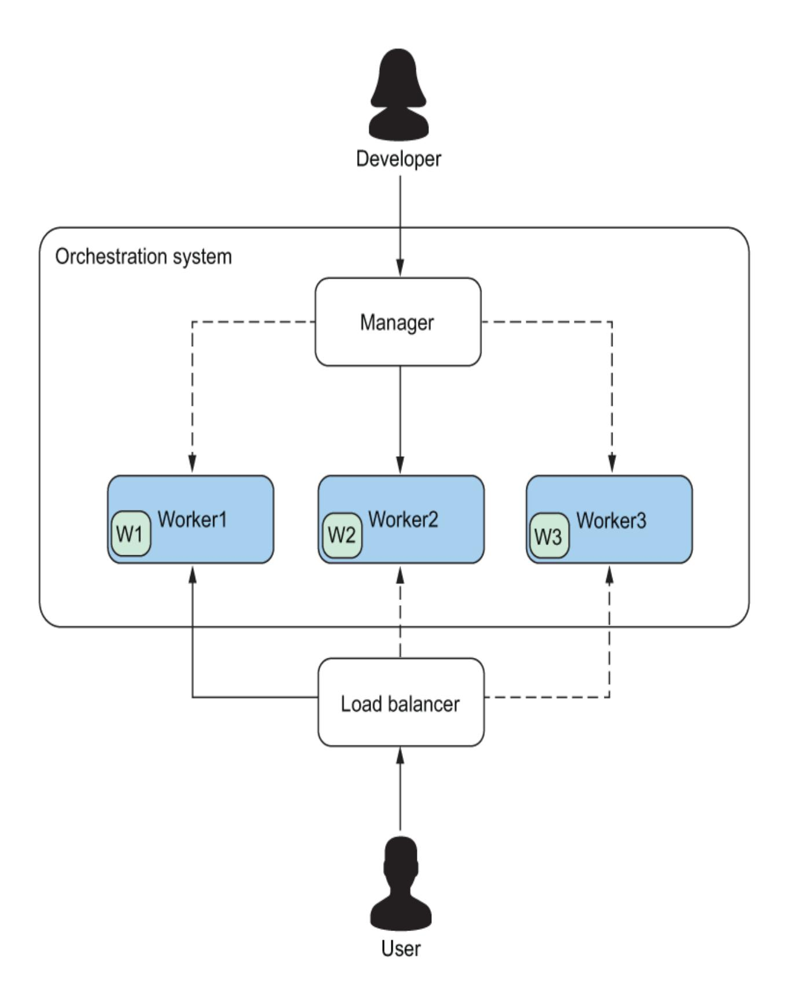

**Figure 4.1 The worker boxes serve double duty in this diagram.**

#### **They represent a physical or virtual machine on which the Worker component of the orchestration system runs.**

Now we're less likely to experience resource availability issues. Because we're running three instances of our site on three different workers, user requests can be spread across the three instances instead of going to a single instance running on a single machine.

Similarly, our site is now more resilient to failures. For example, if Worker1 in figure 4.2 crashes, it will take the W3 instance of our site with it. While this might make us sad and create some work for us to bring Worker1 back online, the users of our site shouldn't notice the difference. They'll be able to continue making requests to our site and getting back the expected static content.

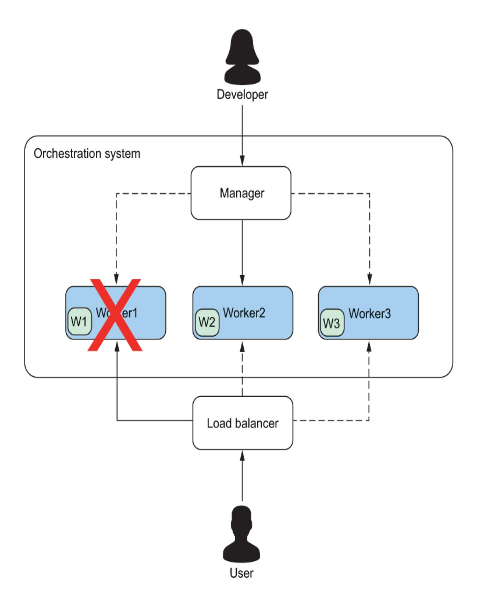

**Figure 4.2 In the scenario where a worker node fails, our web**

#### **server running on the other nodes can still respond to requests.**

The worker is composed of smaller pieces that perform specific roles. Those pieces, seen in figure 4.3, are an API, a runtime, a task queue, a task database (DB), and metrics. In this chapter, we're going to focus only on three of these components: the runtime, the task queue, and the task DB. We'll work with the other two components in the following chapters.

<span id="page-121-0"></span>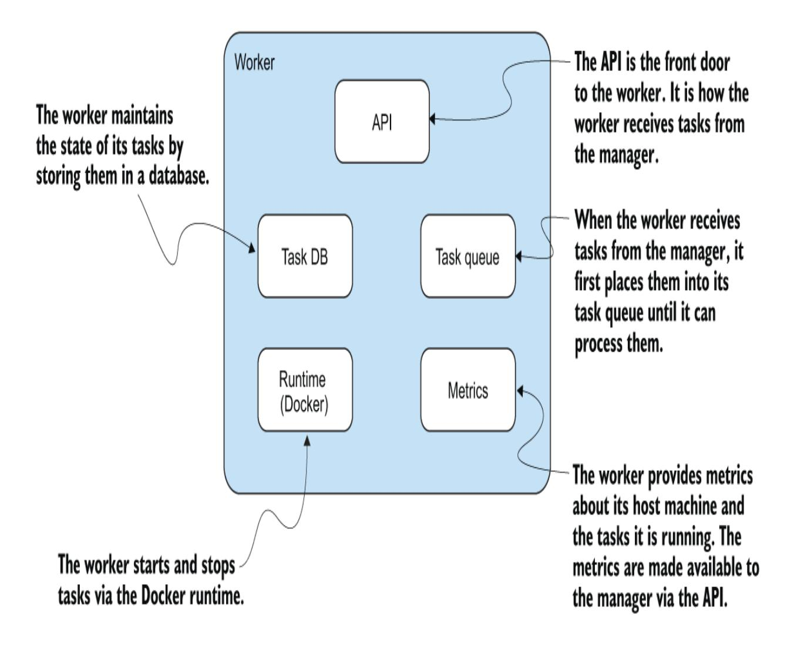

**Figure 4.3 Our worker will be made up of these five components, but this chapter will focus only on the runtime, task queue, and task DB.**

# <span id="page-122-0"></span>*4.2 Tasks and Docker*

In chapter 1, we said a *task* is the smallest unit of work in an orchestration system. Then, in chapter 3, we implemented that definition in the Task struct, which we can see again in listing 4.1. This struct is the primary focus of the worker. It receives a task from the manager and then runs it. We'll use this struct throughout this chapter.

<span id="page-122-1"></span>As the smallest unit of work, a task performs its work by being run as a Docker container. So there is a one-to-one correlation between a task and a container. The worker uses this struct to start and stop tasks.

#### **Listing 4.1 Task struct defined in chapter 2**

```
type Task struct {
 ID uuid.UUID
 ContainerID string
 Name string
 State State
 Image string
 Memory int64
 Disk int64
 ExposedPorts nat.PortSet
 PortBindings map[string]string
 RestartPolicy string
 StartTime time.Time
 FinishTime time.Time
}
```

In chapter 3, we also defined the Docker struct seen in the following listing. The worker will use this struct to start and stop the tasks as Docker containers.

## <span id="page-122-2"></span>**Listing 4.2 Docker struct defined in chapter 3**

```
type Docker struct {
 Client *client.Client
 Config Config
}
```

The two objects will be the core of the process that will allow our worker to start and stop tasks.

# <span id="page-123-0"></span>*4.3 The role of the queue*

Take a peek at listing 4.3 to remind yourself what the Worker struct looks like. The struct is in the same state in which we left it in chapter 2.

<span id="page-123-1"></span>The worker will use the Queue field in the Worker struct as a temporary holding area for incoming tasks that need to be processed. When the manager sends a task to the worker, the task lands in the queue, which the worker will process on a first in, first out basis.

#### <span id="page-123-2"></span>**Listing 4.3 Worker skeleton from chapter 2**

```
package worker
import (
 "fmt"
 "github.com/google/uuid"
 "github.com/golang-collections/collections/queue"
)
type Worker struct {
 Name string
 Queue queue.Queue
 Db map[uuid.UUID]*task.Task
 TaskCount int
}
```

It's important to note that the Queue field is itself a struct, which defines several methods we can use to push items onto the queue (Enqueue), pop items off of the queue (Dequeue), and get the length of the queue (Len). The Queue field is an example of *composition* in Go. Thus, we can use other structs to compose new, higher-level objects.

<span id="page-124-1"></span>Also notice that Queue is being imported from the github.com/golangcollections/collections/queue package. So we're reusing a Queue implementation that someone else has written for us. If you haven't done so already, you'll need to specify this package as a dependency (see the appendix).

# <span id="page-124-3"></span><span id="page-124-0"></span>*4.4 The role of the DB*

<span id="page-124-2"></span>The worker will use the Db field to store the state about its tasks. This field is a map, where keys are of type uuid.UUID from the github.com/google/uuid package and values are of type task from our task package. There is one thing to note about using a map for the Db field. We're starting with a map here out of convenience. This will allow us to write working code quickly. But this comes with a tradeoff: anytime we restart the worker, we will lose data. This tradeoff is acceptable for the purpose of getting started, but later we'll replace this map with a persistent data store that won't lose data when we restart the worker.

# <span id="page-125-0"></span>*4.5 Counting tasks*

<span id="page-125-2"></span>Finally, the TaskCount field provides a simple count of the tasks the worker has been assigned. We won't make use of this field until the next chapter.

# <span id="page-125-1"></span>*4.6 Implementing the worker's methods*

Now that we've reviewed the fields in our Worker struct, let's move on and talk about the methods that we stubbed out in chapter 2. The RunTask, StartTask, and StopTask methods seen in the next listing don't do much right now other than print out a statement, but by the end of the chapter, we will have fully implemented each of them.

<span id="page-125-3"></span>

## **Listing 4.4 The stubbed-out versions of RunTask, StartTask, and StopTask**

```
func (w *Worker) RunTask() {
 fmt.Println("I will start or stop a task")
}
func (w *Worker) StartTask() {
 fmt.Println("I will start a task")
}
func (w *Worker) StopTask() {
 fmt.Println("I will stop a task")
}
```

We're going to implement these methods in reverse order from what you see in listing 4.4. The reason for implementing them in this order is that the RunTask method will use the other two methods to start and stop tasks.

## <span id="page-126-0"></span>*4.6.1 Implementing the StopTask method*

There is nothing complicated about the StopTask method. It has a single purpose: to stop running tasks, remembering that a task corresponds to a running container. The implementation, seen in listing 4.5, can be summarized as the following set of steps:

- <span id="page-126-1"></span>1. Create an instance of the Docker struct that allows us to talk to the Docker daemon using the Docker SDK.
- <span id="page-126-3"></span><span id="page-126-2"></span>2. Call the Stop() method on the Docker struct.
- 3. Check whether there were any errors in stopping the task.
- 4. Update the FinishTime field on the task t.
- 5. Save the updated task t to the worker's Db field.
- 6. Print an informative message and return the result of the operation.

#### **Listing 4.5 Our implementation of the StopTask method**

```
func (w *Worker) StopTask(t task.Task) task.DockerResult {
 config := task.NewConfig(&t)
 d := task.NewDocker(config)
 result := d.Stop(t.ContainerID)
 if result.Error != nil {
 log.Printf("Error stopping container %v: %v\n", t.ContainerID,
 ➥ result.Error)
 }
 t.FinishTime = time.Now().UTC()
 t.State = task.Completed
 w.Db[t.ID] = &t
 log.Printf("Stopped and removed container %v for task %v\n",
 ➥ t.ContainerID, t.ID)
```

```
 return result
}
```

Notice that the StopTask method returns a

task.DockerResult type. The definition of that type can be seen in listing 4.6. If you remember, Go supports multiple return types. We could have enumerated each field in the DockerResult struct as a return type to the StopTask method. While there is nothing technically wrong with that approach, using the DockerResult approach allows us to wrap all the bits related to the outcome of an operation into a single struct. When we want to know anything about the result of an operation, we simply consult the DockerResult struct.

<span id="page-127-2"></span>

## **Listing 4.6 A reminder of what the DockerResult type looks like**

```
type DockerResult struct {
 Error error
 Action string
 ContainerId string
 Result string
}
```

# <span id="page-127-0"></span>*4.6.2 Implementing the StartTask method*

Next, let's implement the StartTask method. Similar to the StopTask method, StartTask is fairly simple, but the process to start a task has a few more steps. The enumerated steps are as follows:

<span id="page-127-1"></span>1. Update the StartTime field on the task t.

- 2. Create an instance of the Docker struct to talk to the Docker daemon.
- <span id="page-128-0"></span>3. Call the Run() method on the Docker struct.
- 4. Check whether there were any errors in starting the task.
- 5. Add the running container's ID to the tasks t.Runtime.ContainerId field.
- 6. Save the updated task t to the worker's Db field.
- 7. Return the result of the operation.

The implementation of these steps can be seen in the following listing.

#### **Listing 4.7 Our implementation of the StartTask method**

```
func (w *Worker) StartTask(t task.Task) task.DockerResult {
 t.StartTime = time.Now().UTC()
 config := task.NewConfig(&t)
 d := task.NewDocker(config)
 result := d.Run()
 if result.Error != nil {
 log.Printf("Err running task %v: %v\n", t.ID, result.Error)
 t.State = task.Failed
 w.Db[t.ID] = &t
 return result
 }
 t.ContainerID = result.ContainerId
 t.State = task.Running
 w.Db[t.ID] = &t
 return result
}
```

By recording the StartTime in the StartTask method, combined with recording FinishTime in the StopTask method, we'll later be able to use these timestamps in other output. For example, later in the book, we'll write a command-line interface that

<span id="page-129-3"></span>allows us to interact with our orchestrator, and the StartTime and FinishTime values can be output as part of a task's status.

Before we move on from these two methods, I want to point out that neither of them interact directly with the Docker SDK. Instead, they simply call the Run and Stop methods on the Docker object we created. It is the Docker object that handles the direct interaction with the Docker client. By encapsulating the interaction with Docker in the Docker object, our worker does not need to know anything about the underlying implementation details.

<span id="page-129-1"></span>The StartTask and StopTask methods are the foundation of our worker. But looking at the skeleton we created in chapter 2, we see there is another foundational method missing. How do we add a task to the worker? Remember, we said the worker would use its Queue field as a temporary storage for incoming tasks, and when it was ready, it would pop a task of the queue and perform the necessary operation.

<span id="page-129-2"></span>Let's fix this problem by adding the AddTask method seen in the next listing. This method performs a single task: it adds the task t to the Queue.

#### <span id="page-129-0"></span>**Listing 4.8 The worker's AddTask method**

```
func (w *Worker) AddTask(t task.Task) {
 w.Queue.Enqueue(t)
}
```

# <span id="page-130-0"></span>*4.6.3 An interlude on task state*

<span id="page-130-1"></span>All that's left to do now is to implement the RunTask method. Before we do that, however, let's pause for a moment and recall the purpose of the RunTask method. In chapter 2, we said the RunTask method will be responsible for identifying the task's current state and then either starting or stopping a task based on the state. But why do we even need RunTask?

There are two possible scenarios for handling tasks:

- A task is being submitted for the first time, so the worker will not know about it.
- A task is being submitted for the *n\_th* time, where the task submitted represents the *desired* state to which the *current* task should transition.

When processing the tasks it receives from the manager, the worker will need to determine which of these scenarios it is dealing with. We're going to use a naive heuristic to help the worker solve this problem.

<span id="page-130-2"></span>Remember that our worker has the Queue and Db fields. For our naive implementation, the worker will use the Queue field to represent the desired state of a task. When the worker pops a task off the queue, it will interpret it as "put task *t* in the state *s*." The worker will interpret tasks it already has in its Db field as existing tasks—that is, tasks it has already seen at least once. If a task is in the Queue but not the Db, then this is the first time the worker is seeing the task, and we default to starting it.

In addition to identifying which of the two scenarios it is dealing with, the worker will also need to verify if the transition from the current state to the desired state is a valid one.

Let's review the states we defined in chapter 2. The next listing shows that we have states Pending, Scheduled, Running, Completed, and Failed.

<span id="page-131-0"></span>

## **Listing 4.9 The State type, which defines the valid states for a task**

```
const (
 Pending State = iota
 Scheduled
 Running
 Completed
 Failed
)
```

But what do these states represent? We explained these states in chapter 2, but let's do a quick refresher:

- *Pending*—This is the initial state, the starting point, for every task.
- *Scheduled*—A task moves to this state once the manager has scheduled it onto a worker.
- *Running*—A task moves to this state when a worker successfully starts the task (i.e., starts the container).
- *Completed*—A task moves to this state when it completes its work in a normal way (i.e., it does not fail).
- *Failed*—If a task fails, it moves to this state.

To reinforce what these states represent, we can also recall the state diagram from chapter 2, seen here in figure 4.4.

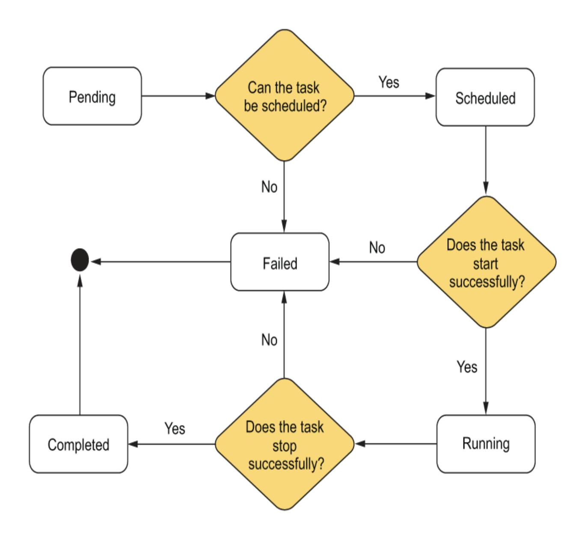

**Figure 4.4 The states a task will go through during its life cycle**

So we've defined what the states mean as they relate to a task, but we still haven't defined *how* a task transitions from one state to the next. Nor have we talked about what transitions are valid. For example, if a worker is already running a task, which means it's in the Running state, can it transition to the Scheduled state? If a task has failed, should it be able to transition from the Failed state to the Scheduled state?

So before getting back to the RunTask method, it looks like we need to figure out this issue of how to handle state transitions. To do this, we can model our states and transitions using the state table seen in table 4.1.

<span id="page-133-1"></span>This table has three columns that represent the CurrentState of a task, an Event that triggers a state transition, and the NextState to which the task should transition. Each row in the table represents a specific *valid* transition. Notice that there is not a transition from Running to Scheduled, or from Failed to Scheduled.

<span id="page-133-0"></span>**Table 4.1 State transition table showing the valid transitions from one state to another**

| CurrentState | Event         | NextState |
|--------------|---------------|-----------|
| Pending      | ScheduleEvent | Scheduled |
| Pending      | ScheduleEvent | Failed    |
| Scheduled    | StartTask     | Running   |
| Scheduled    | StartTask     | Failed    |
| Running      | StopTask      | Completed |

<span id="page-133-2"></span>Now that we have a better understanding of the states and transitions between them, we can translate our understanding into code. Orchestrators like Borg, Kubernetes, and Nomad use a state machine to deal with the issue of state transitions. However, to keep the number of concepts and technologies we have to deal with to a minimum, we're going to hard-code our state transitions into the stateTransitionMap type you see in listing 4.10. This map encodes the transitions we identified in table 4.1.

The stateTransitionMap creates a map between a State and a slice of states, []State. Thus, the keys in this map are the current state, and the values are the valid transition states. For example, the Pending state can only transition to the Scheduled state. The Scheduled state, however, can transition to Running, Completed, or Failed.

## <span id="page-134-0"></span>**Listing 4.10 The stateTransitionMap map**

```
var stateTransitionMap = map[State][]State{
 Pending: []State{Scheduled},
 Scheduled: []State{Scheduled, Running, Failed},
 Running: []State{Running, Completed, Failed},
 Completed: []State{},
 Failed: []State{},
}
```

In addition to stateTransitionMap, we're going to implement the Contains and ValidStateTransition helper functions, seen in listing 4.11. These functions will perform the actual logic to verify that a task can transition from one state to the next.

<span id="page-134-1"></span>Let's start with the Contains function. It takes two arguments: states, a slice of type State, and state of type State. If it finds state in the slice of states, it returns true; otherwise, it returns false.

<span id="page-134-2"></span>The ValidStateTransition function is a wrapper around the Contains function. It provides a convenient way for callers of the function to ask, "Hey, can a task transition from this state to that state?" All the heavy lifting is done by the Contains function.

You should add the code in the following listing to the state.go file in the task directory of your project.

#### **Listing 4.11 Helper methods**

```
func Contains(states []State, state State) bool {
 for _, s := range states {
 if s == state {
 return true
 }
 }
 return false
}
func ValidStateTransition(src State, dst State) bool {
 return Contains(stateTransitionMap[src], dst)
}
```

## <span id="page-135-0"></span>*4.6.4 Implementing the RunTask method*

Now we can finally talk more specifically about the RunTask method. It took us a while to get here, but we needed to iron out those other details before it even made sense to discuss this method. And because we did that leg work, implementing the RunTask method will go a bit more smoothly.

<span id="page-135-1"></span>As we said earlier in the chapter, the RunTask method will identify the task's current state and then either start or stop it based on that state. We can use a fairly naive algorithm to determine whether the worker should start or stop a task. It looks like this:

- 1. Pull a task off the queue.
- <span id="page-135-2"></span>2. Convert it from an interface to a task.Task type.
- 3. Retrieve the task from the worker's Db.
- 4. Check whether the state transition is valid.

- 5. If the task from the queue is in the state Scheduled, call StartTask.
- 6. If the task from the queue is in the state Completed, call StopTask.
- 7. Else, there is an invalid transition, so return an error.

All that's left to do now is to implement these steps in our code, which can be seen in the following listing.

#### **Listing 4.12 Our implementation of the RunTask method**

```
func (w *Worker) RunTask() task.DockerResult {
 t := w.Queue.Dequeue() ❶
 if t == nil {
 log.Println("No tasks in the queue")
 return task.DockerResult{Error: nil}
 }
 taskQueued := t.(task.Task) ❷
 taskPersisted := w.Db[taskQueued.ID] ❸
 if taskPersisted == nil {
 taskPersisted = &taskQueued
 w.Db[taskQueued.ID] = &taskQueued
 }
 var result task.DockerResult
 if task.ValidStateTransition(
 ➥ taskPersisted.State, taskQueued.State) {
 switch taskQueued.State {
 case task.Scheduled:
 result = w.StartTask(taskQueued) ❹
 case task.Completed:
 result = w.StopTask(taskQueued) ❺
 default:
 result.Error = errors.New("We should not get here")
 }
 } else {
 err := fmt.Errorf("Invalid transition from %v to %v",
 ➥ taskPersisted.State, taskQueued.State)
 result.Error = err ❻
 }
```

 return result ❼ }

- ❶ Calls the Dequeue() method
- ❷ Converts the task to the proper type
- ❸ Attempts to retrieve the same task from the Db
- ❹ If there is a valid state transition and a task from the queue has a state of Scheduled, calls the StartTask method
- ❺ If the task from the queue has a state of Completed, calls the StopTask method
- ❻ If there is no valid transition, sets the Error field of the result variable
- ❼ Returns the result

We start by calling the Dequeue() method to pop a task off the worker's queue. Notice that we're checking whether we received a task from the queue. If we didn't, which means the queue was empty, then we log a message and return a result with a nil Error field. Next, we have to convert the task we popped off the queue to the proper type, which is task.Task. This step is necessary because the Queue's Dequeue method returns an interface type. Now we have a task from the queue, so we need to attempt to get the same task from the Db. If we don't find the task in the Db, it means this is the first time we're seeing the task, and we add it. Then we get to use the ValidStateTransition function we created earlier in the chapter. Notice that we're passing the state from the Db, taskPersisted.State, and the state from the Queue, taskQueued.State. If there is a valid state transition and a task from the queue has a state of Scheduled, then we call the StartTask method. Or if there is a valid state transition but the task from the queue has a state of Completed, we call the StopTask method. If there isn't a valid transition—in other words, transitioning from taskPersisted.State to

<span id="page-138-1"></span>taskQueued.State is not valid—then we set the Error field of the result variable.

# <span id="page-138-0"></span>*4.7 Putting it all together*

Whew, we've made it. We covered a lot of territory in implementing the methods for our worker. If you remember chapter 3, we ended by writing a program that used the work we did earlier in the chapter. We're going to continue that practice in this chapter.

<span id="page-138-3"></span>Before we do, however, remember that in chapter 3, we built out the Task and Docker structs, and that work allowed us to start and stop containers. The work we did in this chapter sits on top of the work from the last chapter. So once again, we're going to write a program that will start and stop tasks. The worker operates on the level of the Task, and the Docker struct operates on the lower level of the container.

<span id="page-138-2"></span>Now let's write a program to pull everything together into a functioning worker. You can either comment out the code from the main.go file you used in the last chapter or create a new main.go file to use for this chapter.

The program is simple. We create a worker w, which has the Queue and Db fields as we talked about at the beginning of the chapter. Next, we create a task t. This task starts with a state of Scheduled, and it uses a Docker image named strm/helloworld-http. More about this image in a bit. After creating a worker and a task, we call the worker's AddTask method

and pass it task t. Then it calls the worker's RunTask method. This method will pull the task t off the queue and do the right thing. It captures the return value from the RunTask method and stores it in the variable result. (Bonus points if you remember what type is returned from RunTask.)

<span id="page-139-0"></span>At this point, we have a running container. After sleeping for 30 seconds (feel free to change the sleep time to whatever you want), we start the process of stopping the task. We change the task's state to Completed, call AddTask again and pass it the same task, and finally call RunTask again. This time, when RunTask pulls the task off the queue, the task will have a container ID and a different state. As a result, the task gets stopped. The following listing shows our program to create a worker, add a task, start it, and finally stop it.

#### **Listing 4.13 Pulling everything together into a functioning worker**

```
// previous code not shown
func main() {
 db := make(map[uuid.UUID]*task.Task)
 w := worker.Worker{
 Queue: *queue.New(),
 Db: db,
 }
 t := task.Task{
 ID: uuid.New(),
 Name: "test-container-1",
 State: task.Scheduled,
 Image: "strm/helloworld-http",
 }
 // first time the worker will see the task
 fmt.Println("starting task")
 w.AddTask(t)
 result := w.RunTask()
 if result.Error != nil {
```

```
 panic(result.Error)
 }
 t.ContainerID = result.ContainerId
 fmt.Printf("task %s is running in container %s\n", t.ID, t.ContainerID)
 fmt.Println("Sleepy time")
 time.Sleep(time.Second * 30)
 fmt.Printf("stopping task %s\n", t.ID)
 t.State = task.Completed
 w.AddTask(t)
 result = w.RunTask()
 if result.Error != nil {
 panic(result.Error)
 }
}
```

Let's pause for a moment and talk about the image used in the previous code listing. At the beginning of the chapter, we talked about the scenario of scaling a static website using an orchestrator, specifically the worker component. This image, strm/ helloworld-http provides a concrete example of a static website: it runs a web server that serves a single file. To verify this behavior, when you run the program, type the docker ps command in a separate terminal. You should see output similar to listing 4.14. In that output, you can find the port the web server is running on by looking at the PORTS column. Then open your browser and type localhost:<port>. In the case of the output in the following listing, I would type localhost:49161 in my browser. The output has been truncated to make it more readable.

<span id="page-140-0"></span>

#### **Listing 4.14 Truncated output from the docker ps command**

```
$ docker ps
CONTAINER ID IMAGE PORTS NAMES
4723a4201829 strm/helloworld-http 0.0.0.0:49161->80/tcp test-container-1
```

When I browse to the server on my machine, I see "Hello from 90566e236f88". Go ahead and run the program. You should see output similar to the following listing.

#### **Listing 4.15 Running your main program**

```
$ go run main.go
starting task
{"status":"Pulling from strm/helloworld-http","id":"latest"}
{"status":"Digest:
 ➥ sha256:bd44b0ca80c26b5eba984bf498a9c3bab0eb1c59d30d8df
 ➥ cb2c073937ee4e45"}
{"status":"Status: Image is up to date for strm/helloworld-http:latest"}
task bfe7d381-e56b-4c4d-acaf-cbf47353a30a is running in
 ➥ container e13af1f4b9cbac6f871d1d343ea8f7958dae5f1897954bf6
 ➥ b4a2c58ad7520dcb
Sleepy time
stopping task bfe7d381-e56b-4c4d-acaf-cbf47353a30a
2021/08/08 21:13:09 Attempting to stop container
 ➥ e13af1f4b9cbac6f871d1d343ea8f7958dae5f1897954bf6b4a2c58ad7520dcb
2021/08/08 21:13:19 Stopped and removed container
 ➥ e13af1f4b9cbac6f871d1d343ea8f7958dae5f1897954bf6b4a2c58ad7520dcb
 ➥ for task bfe7d381-e56b-4c4d-acaf-cbf47353a30a
```

Congratulations! You now have a functional worker. Before moving on to the next chapter, play around with what you've built. In particular, modify the main function from listing 4.13 to create multiple workers, and then add tasks to each them.

# <span id="page-141-0"></span>*Summary*

- Tasks are executed as containers, meaning there is a one-to-one relationship between a task and a container.
- The worker performs two basic actions on tasks, either starting or stopping them. These actions result in tasks transitioning from one state to the next valid state.

- The worker shows how the Go language supports object composition. The worker itself is a composition of other objects; in particular, the worker's Queue field is a struct defined in the github.com/golang-collections/collections/ queue package
- The worker, as we've designed and implemented it, is simple. We've used clear and concise processes that are easy to implement in code.
- The worker does not interact directly with the Docker SDK. Instead, it uses our Docker struct, which is a wrapper around the SDK. By encapsulating the interaction with the SDK in the Docker struct, we can keep the StartTask and StopTask methods small and readable.

<span id="page-142-0"></span>*[OceanofPDF.com](https://oceanofpdf.com/)*

## <span id="page-143-0"></span>*5 An API for the worker*

#### **This chapter covers**

- <span id="page-143-2"></span>Understanding the purpose of the worker API
- Implementing methods to handle API requests
- Creating a server to listen for API requests
- Starting, stopping, and listing tasks via the API

In chapter 4, we implemented the core features of the worker: pulling tasks off its queue and then starting or stopping them. Those core features alone, however, do not make the worker complete. We need a way to expose those core features so a manager, which will be the exclusive user, running on a different machine can make use of them. To do this, we're going to wrap the worker's core functionality in an application programming interface, or API.

The API will be simple, as you can see in figure 5.1, providing the means for a manager to perform these basic operations:

- <span id="page-143-1"></span>Send a task to the worker (which results in the worker starting the task as a container)
- Get a list of the worker's tasks
- Stop a running task

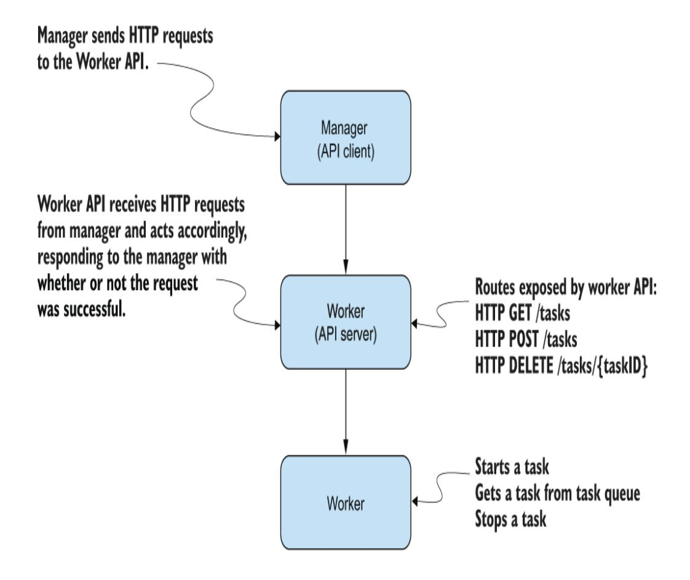

**Figure 5.1 The API for our orchestrator provides a simple interface to the worker.**

## <span id="page-144-0"></span>*5.1 Overview of the worker API*

We've enumerated the operations that the worker's API will support: sending a task to a worker to be started, getting a list of tasks, and stopping a task. But how will we implement those operations? We're going to implement those operations using a web API. This choice means that the worker's API can be exposed across a network and that it will use the HTTP protocol. Like most web APIs, the worker's API will use three primary components:

- <span id="page-144-1"></span>*Handlers*—Functions that are capable of responding to requests
- *Routes*—Patterns that can be used to match the URL of incoming requests
- *Router*—An object that uses routes to match incoming requests with the appropriate handler

We could implement our API using nothing but the http package from the Go standard library. That can be tedious, however, because the http package is missing one critical piece: the ability to define *parameterized routes*. What is a parameterized route? It's a route that defines a URL where one or more parts of the URL path are unknown and may change from one request to the next. This is particularly useful for things like identifiers. For example, if a route like /tasks called with an HTTP GET request returns a list of all tasks, then a route like /tasks/5 returns a single item, the task whose identifier is the integer 5. Since each task should have a unique identifier, however, we need to provide a pattern when defining this kind of route in a web API. The way to do this is to use a parameter for the part of the URL path that can be different with each request. In the case of tasks, we can use a route defined as /tasks/{taskID}.

<span id="page-145-1"></span><span id="page-145-0"></span>Because the http package from the standard library doesn't provide a robust and easy way to define parameterized routes, we're going to use a lightweight, third-party router called chi ([https://github.com/go-chi/chi\)](https://github.com/go-chi/chi). Conceptually, our API will look like what you see in figure 5.2. Requests will be sent to an HTTP server, which you can see in the box. This server provides a function called ListenAndServe, which is the lowest layer in our stack and will handle the low-level details of listening for incoming requests. The next three layers—routes, router, and handlers—are all provided by chi.

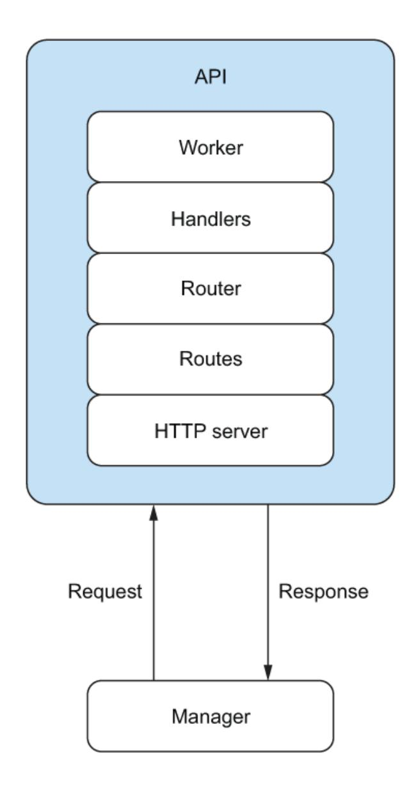

**Figure 5.2 Internally, the worker's API is composed of an HTTP server from the Go standard library; the routes, router, and handlers from the chi package; and, finally, our own worker.**

For our worker API, we'll use the routes defined in table 5.1. Because we're exposing our worker's functionality via a web API, the routes will involve standard HTTP methods like GET, POST, and DELETE. The first route in the table, /tasks, will use the HTTP GET method and will return a list of tasks. The second route is the same as the first, but it uses the POST method, which will start a task. The third route, /tasks/{taskID}, will stop the running task identified by the parameter {taskID}.

**Table 5.1 Routes used by our worker API**

| Method | Route           | Description                            |
|--------|-----------------|----------------------------------------|
| GET    | /tasks          | Gets a list of all tasks               |
| POST   | /tasks          | Creates a task                         |
| DELETE | /tasks/{taskID} | Stops the task identified by<br>taskID |

If you work with REST (representational state transfer) APIs at your day job, this should look familiar. If you're not familiar with REST or you are new to the world of APIs, don't worry. It's not necessary to be a REST expert to grok what we're building in this chapter. At a very hand-wavy level, REST is an architectural style that builds on the client-server model of application development. If you want to learn more about REST, you can start with a gentle introduction like the blog post "API 101: What Is a REST API?" [\(https://blog.postman.com/rest-api-definition/](https://blog.postman.com/rest-api-definition/)).

## <span id="page-147-3"></span><span id="page-147-0"></span>*5.2 Data format, requests, and responses*

Before we get into writing any code, we need to address one more important item. From your experience browsing the internet, you know that when you type an address into your browser, you get back data. Type in [https://espn.com,](https://espn.com/) and you get data about sports. Type in [https://nytimes.com,](https://nytimes.com/) and you get data about current events. Type in [https://www.funnycatpix.com](https://www.funnycatpix.com/), and you get data that is pictures of cats.

<span id="page-147-1"></span>Like these websites, the worker API deals with data, both sending and receiving it. However, its data is not about news or cats but tasks. Furthermore, the data that the worker API deals with will take a specific form, and that form is JSON, which stands for *JavaScript Object Notation*. You're probably already familiar with JSON, as it's the lingua franca of many modern APIs. This decision has two consequences:

- <span id="page-147-2"></span>Any data sent to the API (e.g., for our POST /tasks route in table 5.1) must be encoded as JSON data in the body of the request.
- Any data returned from the API (e.g., for our GET /tasks route) must be encoded as JSON data in the body of the response.

For our worker, we only have one route, the POST /tasks route, that will accept a body. But what data does our worker expect to be in the body of that request?

If you remember from the last chapter, the worker has a StartTask method that takes a task.Task type as an argument. That type holds all the necessary data we need to start the task as a Docker container. But what the worker API will receive (from the manager) is a task.TaskEvent type, which contains a task.Task. So the job of the API is to extract that task from the request and add it to the worker's queue. Thus, a request to our POST /tasks route will look like that in the following listing. The task.TaskEvent here was used in chapter 4.

#### <span id="page-148-1"></span>**Listing 5.1 The worker API receiving a task.TaskEvent from the manager**

```
{
 "ID": "6be4cb6b-61d1-40cb-bc7b-9cacefefa60c",
 "State": 2,
 "Task": {
 "State": 1,
 "ID": "21b23589-5d2d-4731-b5c9-a97e9832d021",
 "Name": "test-chapter-5",
 "Image": "strm/helloworld-http"
 }
}
```

The response to our POST /tasks request will have a status code of 201 and includes a JSON-encoded representation of the task in the response body. Why a 201 and not a 200 response code? We could use a 200 response status. According to the HTTP spec described in RFC 7231, "The 200 (OK) status code indicates that the request has succeeded. The payload sent in a 200 response depends on the request method" (<https://datatracker.ietf.org/doc/html/rfc7231#section-6.3.1>). Thus, the 200 response code is the generic case telling the requester, "Yes, I received your request, and it was successful." The 201 response code, however, handles the more specific case. For a POST request, it tells the requester, "Yes, I received your request, and I created a new resource." In our case, that new resource is the task sent in the request body.

<span id="page-148-0"></span>Like the POST /tasks route, the GET /tasks route returns a body in its response. This route ultimately calls the GetTasks method on our worker, which returns a slice of pointers to task.Task types, effectively a list of tasks. Our API in this situation will take that slice returned from GetTasks, encode it as JSON, and then return it. The following listing shows an example of what such a response might look like. In this example, there are two tasks.

```
[
 {
 "ID": "21b23589-5d2d-4731-b5c9-a97e9832d021",
 "ContainerID": "4f67af51b173564ffd50a3c7f",
 "Name": "test-chapter-5",
 "State": 2,
 "Image": "strm/helloworld-http",
 "Memory": 0,
 "Disk": 0,
 "ExposedPorts": null,
 "PortBindings": null,
 "RestartPolicy": "",
 "StartTime": "0001-01-01T00:00:00Z",
 "FinishTime": "0001-01-01T00:00:00Z"
 },
 {
 "ID": "266592cd-960d-4091-981c-8c25c44b1018",
 "ContainerID": "180d207fa788d5261e6ccf927",
 "Name": "test-chapter-5-1",
 "State": 2,
 "Image": "strm/helloworld-http",
 "Memory": 0,
 "Disk": 0,
 "ExposedPorts": null,
 "PortBindings": null,
 "RestartPolicy": "",
 "StartTime": "0001-01-01T00:00:00Z",
 "FinishTime": "0001-01-01T00:00:00Z"
 }
]
```

In addition to the list of tasks, the response will also have a status code of 200.

<span id="page-149-0"></span>Finally, let's talk about the DELETE /tasks/{taskID} route. Like the GET /tasks route, this one will not take a body in the request. Remember, we said earlier that the {taskID} part of the route is a parameter and allows the route to be called with arbitrary IDs. So this route allows us to stop a task for the given taskID. This route will only return a status code of 204; it will not include a body in the response. So with this new information, let's update table 5.1.

**Table 5.2 Updated table 5.1 showing for each request whether the route accepts a request body, whether it returns a response body, and what status code is returned for a successful request**

| Method | Route           | Description                                  | Request body                   | Response<br>body | Status<br>code |
|--------|-----------------|----------------------------------------------|--------------------------------|------------------|----------------|
| GET    | /tasks          | Gets a list<br>of all tasks                  | None                           | List of<br>tasks | 200            |
| POST   | /tasks          | Creates a<br>task                            | JSON-encoded<br>task.TaskEvent | None             | 201            |
| DELETE | /tasks/{taskID} | Stops the<br>task<br>identified<br>by taskID | None                           | None             | 204            |

## <span id="page-150-0"></span>*5.3 The API struct*

<span id="page-150-2"></span>At this point, we've set the stage for writing the code for the worker API. We've identified the main components of our API, defined the data format used by that API, and enumerated the routes the API will support.

We're going to start by representing our API in code as the struct seen in listing 5.3. You should create a file named api.go in the worker/ directory of your code where you can place this struct.

This struct serves several purposes. First, it contains the Address and Port fields, which define the local IP address of the machine where the API runs and the port on which the API will listen for requests. These fields will be used to start the API server, which we will implement later in the chapter. Second, it contains the Worker field, which will be a reference to an instance of a Worker object. Remember, we said the API will wrap the worker to expose the worker's core functionality to the manager. This field is the means by which that functionality is exposed. Third, the struct contains the Router field, which is a pointer to an instance of chi.Mux. This field brings in all the functionality provided by the chi router.

#### <span id="page-150-1"></span>**Listing 5.3 The API struct that will power our worker**

```
 Worker *Worker
 Router *chi.Mux
}
```

#### **Definition**

<span id="page-151-4"></span>The term *mux* stands for *multiplexer* and can be used synonymously with *request router*.

## <span id="page-151-0"></span>*5.4 Handling requests*

<span id="page-151-5"></span>With the API struct defined, we've given the API a general shape, or form, at a high level. This shape will contain the API's three components: handlers, routes, and a router. Let's dive deeper into the API and implement the handlers that will be able to respond to the routes we defined in table 5.1.

<span id="page-151-1"></span>As we've already said, a *handler* is a function capable of responding to a request. For our API to handle incoming requests, we need to define handler methods on the API struct. We're going to use the following three methods, which I'll list here with their method signatures:

- <span id="page-151-2"></span>StartTaskHandler(w http.ResponseWriter, r \*http.Request)
- GetTasksHandler(w http.ResponseWriter, r \*http.Request)
- StopTaskHandler(w http.ResponseWriter, r \*http.Request)

There is nothing terribly complicated about these handler methods. Each method takes the same arguments, an http.ReponseWriter type and a pointer to an http.Request type. Both of these types are defined in the http package in Go's standard library. The http.ResponseWriter's w will contain data related to responses. The http.Request's r will hold data related to requests.

<span id="page-151-3"></span>To implement these handlers, create a file named handlers.go in the worker directory of your project and then open that file in a text editor. We'll start by adding

the StartTaskHandler method seen in listing 5.4. At a high level, this method reads the body of a request from r.Body, converts the incoming data it finds in that body from JSON to an instance of our task.TaskEvent type, and then adds that task.TaskEvent to the worker's queue. It wraps up by printing a log message and then adding a response code to the http.ResponseWriter. It takes incoming requests to start a task, reads the body of the request, converts it from JSON to a task.TaskEvent, and then puts that on the worker's queue.

#### <span id="page-152-0"></span>**Listing 5.4 The worker's StartTaskHandler method**

```
func (a *Api) StartTaskHandler(w http.ResponseWriter, r *http.Request) {
 d := json.NewDecoder(r.Body) ❶
 d.DisallowUnknownFields() ❷
 te := task.TaskEvent{} ❸
 err := d.Decode(&te) ❹
 if err != nil { ❺
 msg := fmt.Sprintf("Error unmarshalling body: %v\n", err)
 log.Printf(msg)
 w.WriteHeader(400)
 e := ErrResponse{
 HTTPStatusCode: 400,
 Message: msg,
 }
 json.NewEncoder(w).Encode(e)
 return
 }
 a.Worker.AddTask(te.Task) ❻
 log.Printf("Added task %v\n", te.Task.ID) ❼
 w.WriteHeader(201) ❽
 json.NewEncoder(w).Encode(te.Task) ❾
}
```

- ❶ Creates an instance of json.Decoder by calling the NewDecoder function, passing in the request body r.Body
- ❷ Calls the DisallowUnknownFields() method, which will cause the Decode() method to return an error if there are fields in the body that are not defined in the destination struct—in our case, task.TaskEvent
- ❸ Initializes an instance of task.TaskEvent and assigns it to the variable te
- ❹ Decodes the body from JSON to a task.TaskEvent
- ❺ Checks for errors from the decoding operation
- ❻ Adds the te.Task to the worker's queue
- ❼ Prints a log message
- ❽ Sets the response status code to 201
- ❾ Encodes the te.Task and adds it to the response

The next method we'll implement is the GetTasksHandler method in listing 5.5. This method looks simple, but there is a lot going on inside it. It starts off by setting the Content-Type header to let the client know we're sending it JSON data. Then, similar to StartTaskHandler, it adds a response code. And then we come to the final line in the method. It may look a little complicated, but it's really just a compact way to express the following operations:

- <span id="page-153-4"></span><span id="page-153-0"></span>Gets an instance of a json.Encoder type by calling the json.NewEncoder() method
- <span id="page-153-3"></span>Gets all the worker's tasks by calling the worker's GetTasks method
- <span id="page-153-2"></span>Transforms the list of tasks into JSON by calling the Encode method on the json.Encoder object

#### **Listing 5.5 The worker's GetTasksHandler**

```
func (a *Api) GetTasksHandler(w http.ResponseWriter, r *http.Request) {
 w.Header().Set("Content-Type", "application/json")
 w.WriteHeader(200)
 json.NewEncoder(w).Encode(a.Worker.GetTasks())
}
```

The final handler to implement is the StopTaskHandler. If we glance back at table 5.2, we can see that stopping a task is accomplished by sending a request with a path of /tasks/{taskID}. An example of what this path will look like when a real request is made is /tasks/6be4cb6b-61d1-40cb-bc7b-9cacefefa60c. This is all that's needed to stop a task because the worker already knows about the task: it has it stored in its Db field.

<span id="page-153-1"></span>The first thing the StopTaskHandler must do is read the taskID from the request path. As you can see in listing 5.6, we're doing that by using a helper function named URLParam from the chi package. We're not going to worry about how the helper method is getting the taskID for us; all we care about is that it simplifies our life a bit and gives us the data we need to get on with the job of stopping a task.

<span id="page-153-5"></span>Now that we have the taskID, we have to convert it from a string, which is the type that chi.URLParam returns to us, into a uuid.UUID type. This conversion is done by calling the uuid.Parse() method and passing it the string version of the taskID. Why do we have to perform this step? It's necessary because the worker's

Db field is a map that has keys of type uuid.UUID. So if we were to try to look up a task using a string, the compiler would yell at us.

<span id="page-154-1"></span>Okay, now we have a taskID and have converted it to the correct type. The next thing we want to do is check whether the worker knows about this task. If it doesn't, we should return a response with a 404 status code. If it does, we change the state to task.Completed and add it to the worker's queue. This is what the remaining of the method is doing. The worker's StopTaskHandler uses the taskID from the request path to add a task to the worker's queue that will stop the specified task.

#### <span id="page-154-0"></span>**Listing 5.6 The worker's StopTaskHandler**

```
func (a *Api) StopTaskHandler(w http.ResponseWriter, r *http.Request) {
 taskID := chi.URLParam(r, "taskID") ❶
 if taskID == "" { ❷
 log.Printf("No taskID passed in request.\n")
 w.WriteHeader(400)
 }
 tID, _ := uuid.Parse(taskID) ❸
 _, ok := a.Worker.Db[tID] ❹
 if !ok { ❺
 log.Printf("No task with ID %v found", tID)
 w.WriteHeader(404)
 }
 taskToStop := a.Worker.Db[tID] ❻
 taskCopy := *taskToStop ❼
 taskCopy.State = task.Completed ❽
 a.Worker.AddTask(taskCopy) ❾
 log.Printf("Added task %v to stop container %v\n", taskToStop.ID,
 ➥ taskToStop.ContainerID) ❿
 w.WriteHeader(204) 
}
```

- ❶ Extracts the {taskID} from the request path and stores it in taskID
- ❷ Checks whether taskID is an empty string; if it is, returns a 400 status code
- ❸ Converts the taskID from a string to a uuid.UUID and stores it in tID
- ❹ Queries the worker's datastore for the UUID. This idiom is called the "comma, ok" idiom, and will set the ok variable to true if the tID key is found in the datastore; otherwise, it will set ok to false. Also, we're using the blank identifier, which is a placeholder whose value we don't care about.
- ❺ Checks the value of ok; if it's false, returns a 404 status code because the worker doesn't know about the task
- ❻ Retrieves a pointer to the task with an ID of tID and stores it in taskToStop
- ❼ Makes a copy of taskToStop and stores it in taskCopy
- ❽ Sets the state of TaskCopy to task.Completed
- ❾ Adds the task to the worker's queue

Returns a response with a status code of 204

There is one little gotcha in our StopTaskHandler that's worth explaining in more detail. Notice that we're making a copy of the task in the worker's datastore. Why is this necessary?

As I mentioned in chapter 4, we're using the worker's datastore to represent the current state of tasks, while we're using the worker's queue to represent the desired state of tasks. As a result of this decision, the API cannot simply retrieve the task from the worker's datastore, set the state to task.Completed, and then put the task onto the worker's queue. The reason is that the values in the datastore are pointers to task.Task types. If we were to change the state on taskToStop, we would be changing the state field on the task in the datastore. We would then add the same task to the worker's queue, and when it popped the task off to work on it, it would complain about not being able to transition a task from the state task.Completed to task.Completed. Hence, we make a copy, change the state on the copy, and add it to the queue.

## <span id="page-155-3"></span><span id="page-155-1"></span><span id="page-155-0"></span>*5.5 Serving the API*

Up to this point, we've been setting the stage for serving the worker's API. We've created our API struct that contains the two components that will make this possible: the Worker and Router fields. Each of these is a pointer to another type. The Worker field is a pointer to our own Worker type that we created in chapter 3, and it will provide all the functionality to start and stop tasks and get a list of tasks the worker knows about. The Router field is a pointer to a Mux object provided by the chi package, and it will provide the functionality for defining routes and routing requests to the handlers we defined earlier.

<span id="page-155-2"></span>To serve the worker's API, we need to make two additions to the code we've written so far. Both additions will be made to the api.go file.

The first addition is to add the initRouter() method to the Api struct, as you see in listing 5.7. This method, as its name suggests, initializes our router. It starts by creating an instance of a Router by calling chi.NewRouter(). Then it goes

<span id="page-156-1"></span>about setting up the routes we defined in table 5.2. We won't get into the internals of how the chi package creates these routes.

#### **Listing 5.7 The initRouter() method**

```
func (a *Api) initRouter() {
 a.Router = chi.NewRouter() ❶
 a.Router.Route("/tasks", func(r chi.Router) { ❷
 r.Post("/", a.StartTaskHandler) ❸
 r.Get("/", a.GetTasksHandler)
 r.Route("/{taskID}", func(r chi.Router) { ❹
 r.Delete("/", a.StopTaskHandler) ❺
 })
 })
}
```

- ❶ Creates a new router
- ❷ Creates a route /tasks
- ❸ On the /tasks route, creates handlers that will call the StartTaskHandler for POST requests and the GetTasksHandler for GET requests
- ❹ Creates a subroute /tasks/{taskID}
- ❺ On the /tasks/{taskID} subroute, creates a handler that will call the StopTaskHandler for DELETE requests

The final addition is to add the Start() method to the Api struct, as you see in listing 5.8. This method calls the initRouter method defined in listing 5.4, and then it starts an HTTP server that will listen for requests. The ListenAndServe function is provided by the http package from Go's standard library. It takes an address (e.g. 127.0.0.1:5555), which we're building with the fmt.Sprintf function, and a handler, which for our purposes is the router that gets created in the initRouter() method.

#### <span id="page-156-0"></span>**Listing 5.8 The Start() method: Initializes our router and starts listening for requests**

```
func (a *Api) Start() {
 a.initRouter()
 http.ListenAndServe(fmt.Sprintf("%s:%d", a.Address, a.Port), a.Router)
}
```

## <span id="page-157-0"></span>*5.6 Putting it all together*

Like we've done in previous chapters, it's time to take the code we've written and actually run it. To do this, we're going to continue our use of main.go, in which we'll write our main function. You can either reuse the main.go file from the last chapter and just delete the contents of the main function or start with a fresh file.

<span id="page-157-2"></span>In your main.go file, add the main() function from listing 5.9. This function uses all the work we've done up to this point. It creates an instance of our worker, w, which has a Queue and a Db. It creates an instance of our API, api, which uses the host and port values that it reads from the local environment. Finally, the main() function performs the two operations that bring everything to life.

The first of these operations is to call a function runTasks and pass it a pointer to the worker w. But it also does something else. It has this funny go term before calling the runTasks function. What is that about? If you've used threads in other languages, the go runTasks(&w) line is similar to using threads. In Go, threads are called *goroutines*, and they provide the ability to perform concurrent programming. We won't go into the details of goroutines here because there are other resources dedicated solely to this topic. For our purposes, all we need to know is that we're creating a goroutine, and inside it, we will run the runTasks function. After creating the goroutine, we can continue on in the main function and start our API by calling api.Start().

#### <span id="page-157-1"></span>**Listing 5.9 Running our worker from main.go**

```
func main() {
 host := os.Getenv("CUBE_HOST")
 port, _ := strconv.Atoi(os.Getenv("CUBE_PORT"))
 fmt.Println("Starting Cube worker")
 w := worker.Worker{
 Queue: *queue.New(),
 Db: make(map[uuid.UUID]*task.Task),
 }
 api := worker.Api{Address: host, Port: port, Worker: &w}
 go runTasks(&w)
 api.Start()
}
```

Now, let's talk about the runTasks function, which you can see in listing 5.10. This function runs in a separate goroutine from the main function, and it's fairly simple. It's a continuous loop that checks the worker's queue for tasks and calls the worker's RunTask method when it finds tasks that need to run. For our own convenience, we're sleeping for 10 seconds between each iteration of the loop. This slows things down for us so we can easily read any log messages.

#### **Listing 5.10 The runTasks function**

```
func runTasks(w *worker.Worker) {
 for {
 if w.Queue.Len() != 0 {
 result := w.RunTask()
 if result.Error != nil {
 log.Printf("Error running task: %v\n", result.Error)
 }
 } else {
 log.Printf("No tasks to process currently.\n")
 }
 log.Println("Sleeping for 10 seconds.")
 time.Sleep(10 * time.Second)
 }
}
```

There is a reason that we've structured our main function like this. Recall the handler functions we wrote earlier in the chapter; they were performing a very narrow set of operations, namely:

- Reading requests sent to the server
- Getting a list of tasks from the worker (in the case of the GetTasksHandler)
- Putting a task on the worker's queue
- Sending a response to the requester

Notice that the API is not calling any worker methods that perform task operations (i.e., it is not starting or stopping tasks). Structuring our code in this way allows us to separate the concern of handling requests from the concern of performing the operations to start and stop tasks. Thus, we make it easier on ourselves to reason about our codebase. If we want to add a feature or fix a bug with the API, we know we need to work in the api.go file. If we want to do the same for request handling, we need to work in the handlers.go file. And for anything related to the operations of starting and stopping tasks, we need to work in the worker.go file.

Okay, time to make some magic. Running our code should result in a number of log messages being printed to the terminal like this:

```
$ CUBE_HOST=localhost CUBE_PORT=5555 go run main.go ❶
Starting Cube worker ❷
2021/11/05 14:17:53 No tasks to process currently. ❸
2021/11/05 14:17:53 Sleeping for 10 seconds.
2021/11/05 14:18:03 No tasks to process currently. ❹
2021/11/05 14:18:03 Sleeping for 10 seconds.
2021/11/05 14:18:13 No tasks to process currently. ❺
2021/11/05 14:18:13 Sleeping for 10 seconds.
```

- ❶ Starts our program by setting the required environment variables and calling go run main.go
- ❷ Prints out an informative log message
- ❸ First iteration of the for loop checking for tasks
- ❹ Second iteration of the for loop
- ❺ Third iteration of the for loop

As you can see when we first start the worker API, it doesn't do much. It tells us it doesn't have any tasks to process, sleeps for 10 seconds, and then wakes up again and tells us the same thing. This isn't very exciting. Let's spice things up by interacting with the worker API. We'll start with getting a list of tasks using the curl command in a separate terminal:

```
$ curl -v localhost:5555/tasks ❶
* Trying 127.0.0.1:5555...
* Connected to localhost (127.0.0.1) port 5555 (#0) ❷
> GET /tasks HTTP/1.1 ❸
> Host: localhost:5555
> User-Agent: curl/7.78.0
> Accept: */*
>
* Mark bundle as not supporting multiuse
< HTTP/1.1 200 OK ❹
< Content-Type: application/json
< Date: Fri, 05 Nov 2021 18:27:25 GMT
< Content-Length: 3
<
[] ❺
```

- ❶ Uses the curl command to make a GET request to /tasks
- ❷ curl successfully connects to the server.
- ❸ The request
- ❹ The response
- ❺ The body of the response—in this case, an empty list because the worker has no tasks

Great! We can query the API to get a list of tasks. As expected, though, the response is an empty list because the worker doesn't have any tasks yet. Let's remedy that by sending it a request to start a task:

```
curl -v --request POST \ ❶
 --header 'Content-Type: application/json' \ ❷
 --data '{ ❸
 "ID": "266592cd-960d-4091-981c-8c25c44b1018",
 "State": 2,
 "Task": { ❶
 "State": 1,
 "ID": "266592cd-960d-4091-981c-8c25c44b1018",
 "Name": "test-chapter-5-1",
 "Image": "strm/helloworld-http"
 }
}'
localhost:5555/tasks
```

- ❶ --request allows us to specify the request is a POST.
- ❷ --header allows us to specify that we're sending the server JSON data in the body.
- ❸ --data allows us to specify the JSON data that should be sent in the request body, which, in this case, is a task.TaskEvent.

When you run the curl command, you should see output like the following. Notice that the status code in the response is HTTP/1.1 201 Created, and there is no response body:

```
* Trying 127.0.0.1:5555...
* Connected to localhost (127.0.0.1) port 5555 (#0)
> POST /tasks HTTP/1.1
> Host: localhost:5555
> User-Agent: curl/7.80.0
> Accept: */*
> Content-Type: application/json
> Content-Length: 243
>
* Mark bundle as not supporting multiuse
< HTTP/1.1 201 Created
< Date: Mon, 29 Nov 2021 22:24:51 GMT
<
* Connection #0 to host localhost left intact
```

At the same time that you run the curl command, you should see log messages in the terminal where the API is running. Those log messages should look like this:

```
2021/11/05 14:47:47 Added task 266592cd-960d-4091-981c-8c25c44b1018
Found task in queue: {266592cd-960d-4091-981c-8c25c44b1018
 ➥ test-chapter-5-1 1 strm/helloworld-http 0 0 map[] map[]
 ➥ 0001-01-01 00:00:00 +0000 UTC 0001-01-01 00:00:00 +0000 UTC}:
{"status":"Pulling from strm/helloworld-http","id":"latest"}
{"status":"Digest:
```

```
 ➥ sha256:bd44b0ca80c26b5eba984bf49"}
{"status":"Status: Image is up to date for strm/helloworld-http:latest"}
2021/11/05 14:47:53 Sleeping for 10 seconds.
```

Great! At this point, we've created a task by calling the worker API's POST /tasks route. Now, when we make a GET request to /tasks, instead of seeing an empty list, we should see output like this:

```
$ curl -v localhost:5555/tasks
* Trying 127.0.0.1:5555...
* Connected to localhost (127.0.0.1) port 5555 (#0)
> GET /tasks HTTP/1.1
> Host: localhost:5555
> User-Agent: curl/7.78.0
> Accept: */*
>
* Mark bundle as not supporting multiuse
< HTTP/1.1 200 OK
< Content-Type: application/json
< Date: Fri, 05 Nov 2021 19:17:55 GMT
< Content-Length: 346
<
[
 {
 "ID":"266592cd-960d-4091-981c-8c25c44b1018",
 "ContainerID": "6df4e15a5c840b0ece1aede53",
 "Name":"test-chapter-5-1",
 "State":2,
 "Image":"strm/helloworld-http",
 "Memory":0,
 "Disk":0,
 "ExposedPorts":null,
 "PortBindings":null,
 "RestartPolicy":"",
 "StartTime":"0001-01-01T00:00:00Z",
 "FinishTime":"0001-01-01T00:00:00Z"
 }
]
```

Also, we should see a container running on our local machine, which we can verify using the docker ps:

```
$ docker ps --format "table {{.ID}}\t{{.Image}}\t{{.Status}}\t{{.Names}}"
CONTAINER ID IMAGE STATUS NAMES
6df4e15a5c84 strm/helloworld-http Up 35 minutes test-chapter-5-1
```

<span id="page-161-0"></span>So far, we've queried the worker API to get a list of tasks by making a GET request to the /tasks route. Seeing the worker didn't have any, we created one by making a POST request to the /tasks route. Upon querying the API again by making a subsequent GET request /tasks, we got back a list containing our task.

<span id="page-162-0"></span>Now let's exercise the last bit of the worker's API functionality and stop our task. We can do this by making a DELETE request to the /tasks/<taskID> route, using the ID field from our previous GET request:

```
$ curl -v --request DELETE
 ➥ "localhost:5555/tasks/266592cd-960d-4091-981c-8c25c44b1018"
* Trying 127.0.0.1:5555...
* Connected to localhost (127.0.0.1) port 5555 (#0)
> DELETE /tasks/266592cd-960d-4091-981c-8c25c44b1018 HTTP/1.1
> Host: localhost:5555
> User-Agent: curl/7.78.0
> Accept: */*
>
* Mark bundle as not supporting multiuse
< HTTP/1.1 204 No Content
< Date: Fri, 05 Nov 2021 19:25:47 GMT
```

In addition to seeing that our request received an HTTP/1.1 204 No Content response, we should see log output from the worker API that looks like the following:

```
2021/11/05 15:25:47 Added task 266592cd-960d-4091-981c-8c25c44b1018 to stop
 ➥ container 6df4e15a5c840b0ece1aede53
Found task in queue:
 ➥ {266592cd-960d-4091-981c-8c25c44b1018
 ➥ 6df4e15a5c840b0ece1aede5378e344fb672c2516196117dd37c3ae055b402d2
 ➥ test-chapter-5-1 3 strm/helloworld-http 0 0 map[] map[]
 ➥ 0001-01-01 00:00:00 +0000 UTC 0001-01-01 00:00:00 +0000 UTC}:
2021/11/05 15:25:54 Attempting to stop container
 ➥ 6df4e15a5c840b0ece1aede53
2021/11/05 15:26:05 Stopped and removed container
 ➥ 6df4e15a5c840b0ece1aede5378e344fb672c2516196117dd37c3ae055b402d2
 ➥ for task 266592cd-960d-4091-981c-8c25c44b1018
2021/11/05 15:26:05 Sleeping for 10 seconds.
```

We can confirm it's been stopped by checking the output of docker ps again:

```
$ docker ps
CONTAINER ID IMAGE COMMAND CREATED STATUS PORTS NAMES
```

<span id="page-162-1"></span>We can also confirm by querying the API and checking the state of our task. In the response to our GET /tasks request, we should see the State of the task is 3:

```
$ curl -v localhost:5555/tasks
* Trying 127.0.0.1:5555...
* Connected to localhost (127.0.0.1) port 5555 (#0)
> GET /tasks HTTP/1.1
> Host: localhost:5555
> User-Agent: curl/7.78.0
> Accept: */*
>
* Mark bundle as not supporting multiuse
```

```
< HTTP/1.1 200 OK
< Content-Type: application/json
< Date: Fri, 05 Nov 2021 19:31:36 GMT
< Content-Length: 356
<
[
 {
 "ID":"266592cd-960d-4091-981c-8c25c44b1018",
 "ContainerID":
 ➥ "20d50c12fb2243f96183b81c00942a123cd2a48e463cc971dafedcadedfbd2d8",
 "Name":"test-chapter-5-1",
 "State":3,
 "Image":"strm/helloworld-http",
 "Memory":0,
 "Disk":0,
 "ExposedPorts":null,
 "PortBindings":null,
 "RestartPolicy":"",
 "StartTime":"0001-01-01T00:00:00Z",
 "FinishTime":"2021-11-05T19:30:04.661208966Z"
 }
]
```

## *Summary*

- The API wraps the worker's functionality and exposes it as an HTTP server, thus making it accessible over a network. This strategy of exposing the worker's functionality as a web API will allow the manager to start and stop tasks, as well as query the state of tasks across one or more workers.
- The API is made up of handlers, routes, and a router. *Handlers* are functions that accept a request and know how to process it and return a response. *Routes* are patterns that can be used to match the URL of incoming requests (e.g., /tasks). Finally, a *router* is the glue that makes it all work by using the routes to route requests to the handlers.
- The API uses the standard HTTP methods like GET, POST, and DELETE to define the operations that will occur for a given route. For example, calling GET /tasks will return a list of tasks from the worker.
- While the API wraps the worker's functionality, it does not interact with that functionality itself. Instead, it simply performs some administrative work and then places the task on the worker's queue.

<span id="page-163-0"></span>*[OceanofPDF.com](https://oceanofpdf.com/)*

<span id="page-164-0"></span>

#### **This chapter covers**

- <span id="page-164-2"></span>Explaining why the worker needs to collect metrics
- Defining the metrics
- Creating a process to collect metrics
- Implementing a handler on the existing API

Imagine you're the host at a busy restaurant on a Friday night. You have six servers waiting on customers sitting at tables spread across the room. Each customer at each of those tables has different requirements. One customer might be there to have drinks and appetizers with a group of friends they haven't seen in a while. Another customer might be there for a full dinner, complete with an appetizer and dessert. Yet another customer might have strict dietary requirements and only eat plant-based food.

Now a new customer walks in. It's a family of four: two adults and two teenage children. Where do you seat them? Do you place them at the table in the section being served by John, who already has three tables with four customers each? Do you place them at the table in Jill's section, which has six tables with a single customer each? Or do you place them in Willie's section, which has a single table with three customers?

This scenario is exactly what the manager in an orchestration system deals with. Instead of six servers waiting on tables, you have six machines. Instead of customers, you have tasks, and instead of being hungry and wanting food and drinks, the tasks want computing resources like CPU, memory, and disk. The manager's job in an orchestration system, like the host in the restaurant, is to place incoming tasks on the best worker machine that can meet the task's resource needs.

For the manager to do its job, however, it needs metrics that reflect how much work a worker is already doing. Those metrics are provided by the worker.

## <span id="page-164-1"></span>*6.1 What metrics should we collect?*

Before we dive deeper into metrics, it's good to refresh our memory about the worker and its components at a higher level. As you can see in figure 6.1, the two components that we'll be dealing with are the API and Metrics. In previous chapters, we covered the Task DB, Task Queue, and Runtime components. In the last chapter, we covered

<span id="page-165-0"></span>the API, which resulted in building an API server that wraps the worker's lower-level operations for starting and stopping tasks. Now we want to dig deeper into the Metrics component, which will expose metrics on the same API.

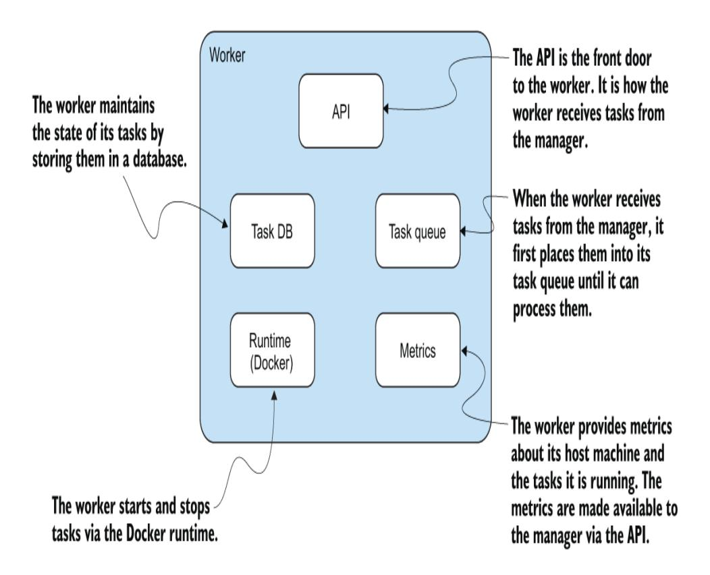

**Figure 6.1 Remembering the big picture of the worker's components**

For a worker to tell a manager how much work it's currently doing, what metrics will paint a reasonably accurate picture? Remember, we're not building a production-ready orchestrator. Systems like Borg, Kubernetes, and Nomad will have better metrics, both in quantity and quality, than will our system. That's okay. We're trying to understand how an orchestration system works at a fundamental level, not replace existing systems.

<span id="page-165-1"></span>In thinking about these metrics, let's look back at listing 3.6, in which we defined the Task struct. Three fields in that struct are relevant to this discussion: CPU, Memory, and Disk. These fields represent how much CPU, memory, and disk space a task needs to perform its work. The values will be specified by humans like you and me when we submit our tasks to the system. If our task will be doing a lot of heavy computation, maybe it will need lots of CPU and memory. If our task uses a Docker image that is particularly large for some reason, we may want to specify an amount that provides a little overhead so there is room for the worker to download the image when it starts the task:

```
type Task struct {
 // prior fields not listed
 Cpu float64
 Memory int64
 Disk int64
 // following fields not listed
}
```

If these are the resources that a user will specify when it submits a task to the system, then it makes sense that we should collect metrics about these resources from each of the workers. In particular, we're interested in metrics about the following:

- CPU usage (as a percentage)
- Total memory
- Available memory
- Total disk space
- <span id="page-166-1"></span>Available disk space

## <span id="page-166-0"></span>*6.2 Metrics available from the /proc filesystem*

Now that we've identified the metrics we want to collect, let's talk about how we're going to collect them. On Linux systems, there is a pseudo-filesystem named /proc, which contains a range of information about the state of the system. A deep discussion about the /proc filesystem is beyond the scope of this book; if you're interested in more details, there are good sources that cover the topic. For our purposes, it's enough to understand that /proc is a special filesystem that is part of the Linux operating system and holds a wealth of information, including information about the state of the system's CPU, memory, and disk resources.

#### **More info about /proc**

If you're interested in more information about the /proc filesystem, there are many resources available on the web. Here are a couple to get started:

- <https://tldp.org/LDP/sag/html/proc-fs.xhtml>
- <http://mng.bz/27do>

The nice thing about /proc is that it appears like any other filesystem, which means users can interact with it the same way they interact with other normal filesystems. Items in /proc appear as files, which means standard tools like ls and cat can be used on them.

The files in the /proc filesystem that we're going to work with are as follows:

- /proc/stat—Contains information about processes running on the system
- /proc/meminfo—Contains information about memory usage
- /proc/loadavg—Contains information about the system's load average

These files are the source of data that you see in many Linux commands like ps, stat, and top.

To get a sense of the data contained in these files, use the cat command to poke around in them. For example, running the command cat/proc/stat on my laptop (which is running Manjaro Linux), I see a bunch of data about each of my CPUs. According to the proc man page (see man 5 proc), each line contains 10 values, which represent the amount of time spent in various states. Those states are

- user—Time spent in user mode
- nice—Time spent in user mode with low priority (nice)
- system—Time spent in system mode
- idle—Time spent in the idle task
- iowait—Time waiting for I/O to complete
- irq—Time servicing interrupts
- softirq—Time servicing softirqs
- steal—Stolen time, which is the time spent in other operating systems when running in a virtualized environment
- guest—Time spent running a virtual CPU for guest operating systems under the control of the Linux kernel
- guest\_nice—Time spent running a niced guest

#### **Listing 6.1 Using cat to look at the /proc/stat file**

```
$ cat /proc/stat
cpu 724661 181 374910 105390121 4468 59434 23083 0 0 0 ❶
cpu0 59580 33 29642 8786508 191 3560 2244 0 0 0 ❷
```

```
cpu1 60502 3 31300 8779359 150 9016 2729 0 0 0
cpu2 58574 7 32002 8785331 139 3688 3159 0 0 0
cpu3 59564 9 30935 8787000 137 3259 2017 0 0 0
cpu4 59555 6 29208 8786670 369 3312 1950 0 0 0
cpu5 63148 16 37486 8755311 430 16914 2993 0 0 0
cpu6 60653 76 31349 8780196 483 4168 2040 0 0 0
cpu7 62622 2 33386 8781129 533 3402 1325 0 0 0
cpu8 60286 1 31729 8783928 542 3175 1219 0 0 0
cpu9 59229 2 29664 8787395 571 3038 1118 0 0 0
cpu10 59550 1 28925 8789436 468 2945 1100 0 0 0
cpu11 61392 18 29278 8787854 449 2952 1184 0 0 0
```

- ❶ An aggregation of the cpuN values
- ❷ Values for an individual CPU

Running the command cat/proc/meminfo shows data about the memory being used by my system. This data is used by commands like free. For our purposes, we will focus on two values provided by /proc/meminfo (see /proc/meminfo in man 5 proc for more details):

- MemTotal—Total usable RAM (i.e., physical RAM minus a few reserved bits and the kernel binary code)
- MemAvailable—An estimate of how much memory is available for starting new applications without swapping

#### **Listing 6.2 Using cat to look at the /proc/meminfo file**

```
$ cat /proc/meminfo
MemTotal: 32488372 kB
MemFree: 21697264 kB
MemAvailable: 25975132 kB
Buffers: 512724 kB
Cached: 5829084 kB
SwapCached: 0 kB
Active: 1978056 kB
Inactive: 6165696 kB
Active(anon): 18368 kB
Inactive(anon): 3766080 kB
Active(file): 1959688 kB
Inactive(file): 2399616 kB
Unevictable: 1836208 kB
Mlocked: 32 kB
SwapTotal: 0 kB
SwapFree: 0 kB
Dirty: 0 kB
[additional data truncated]
```

Running the command cat/proc/loadavg shows data about the system's load average (see listing 6.3). The first three fields in the output should look familiar, as they are the same as what you see when you run the uptime command. These numbers represent the number of jobs in the run queue (state R) or waiting for disk I/O averaged over 1, 5, and 15 minutes. The fourth field contains two values separated by a slash (i.e., this is not a fraction): the first value is the number of currently runnable kernel processes or threads, and the second value is the number of kernel processes and threads that currently exist on the system (see /proc/loadavg in man 5 proc).

#### **Listing 6.3 Using cat to look at the /proc/loadavg file**

\$ cat /proc/loadavg 0.14 0.16 0.18 1/1787 176550

While we will use the /proc filesystem for CPU and memory metrics, we won't use it to gather disk metrics. We could use it, for there is the /proc/diskstats file. But we're going to collect disk metrics a different way, which we'll talk more about in a minute.

Since the metrics we're interested in are available from the /proc filesystem, we could write our own code to interact with /proc and pull out the data we need. We're not, however, going to take that route. Instead, we're going to use a third-party library called goprocinfo.

## <span id="page-169-0"></span>*6.3 Collecting metrics with goprocinfo*

The goprocinfo library (<https://github.com/c9s/goprocinfo>) provides a range of types that allow us to interact with the /proc filesystem. For our purposes, we will focus on four types that will greatly simplify our work. They are as follows:

- <span id="page-169-1"></span>LoadAvg (<http://mng.bz/Rm0R>), which provides the ReadLoadAvg() method and makes available the data from /proc/loadavg
- CpuStat ([http://mng.bz/ZRDN\)](http://mng.bz/ZRDN), which provides the ReadStat() method and makes available the data from /proc/stat
- MemInfo (<http://mng.bz/A8me>), which provides the ReadMemInfo() method and makes available the data from /proc/meminfo
- Disk [\(http://mng.bz/PRD8\)](http://mng.bz/PRD8), which provides the ReadDisk() method and makes available disk-related data using the syscall package from Go's standard library

We won't use every piece of data contained in each of these types, as we will see shortly.

To make it easy to use these metrics, let's create a wrapper around them. We'll start by adding the Stats struct you see in listing 6.4 into the stats.go file under the worker. This wrapper type contains five fields that will provide us with everything we need. The MemStats field will hold all the memory-related data we need and will be a pointer to the MemInfo type from goprocinfo. The DiskStats field will hold all the necessary disk-related data and will be a pointer to goprocinfo's Disk type. The CpuStats field will contain all the CPU-related data and will be a pointer to goprocinfo's CPUStat type. Finally, the LoadStats field will hold the relevant load-related data and will be a pointer to goprocinfo's LoadAvg type.

#### <span id="page-170-0"></span>**Listing 6.4 The Stats type we'll use to hold all the worker's metrics**

```
type Stats struct {
 MemStats *linux.MemInfo
 DiskStats *linux.Disk
 CpuStats *linux.CPUStat
 LoadStats *linux.LoadAvg
}
```

Now that we have defined our Stats type, let's take a step back and think about the kinds of metrics that might be useful. Starting with memory, what might we be interested in? It'd be good to know how much total memory the worker has. Knowing how much memory is available for new programs would also probably be useful. It'd also be good to know how much memory is being used. Similarly, it'd be useful to know how much memory is being used as a percentage of total memory.

<span id="page-170-3"></span>With these memory metrics identified, let's add some helper methods to the Stats type that will make it quick and easy to get this data. We'll start with a method named MemTotalKb, seen in the next listing. This method simply returns the value of the MemStats.MemTotal field. We add the suffix Kb to the method name as a quick reminder of the units being used.

#### <span id="page-170-2"></span>**Listing 6.5 The MemTotalKb() helper method**

```
func (s *Stats) MemTotalKb() uint64 {
 return s.MemStats.MemTotal
}
```

Next, let's add the MemAvailableKb method, as seen in the next listing. Like MemTotalKb, it simply returns the value from a field in the MemStats field—in this case, MemAvailable.

#### <span id="page-170-1"></span>**Listing 6.6 The MemAvailableKb() helper method**

```
func (s *Stats) MemAvailableKb() uint64 {
 return s.MemStats.MemAvailable
}
```

The MemTotalKb and MemAvailable methods let us figure out the last two memoryrelated metrics we identified: how much memory is being used as an absolute value and as a percentage of total memory. These metrics are provided by the MemUsedKb and MemUsedPercent methods in the following listing.

#### <span id="page-171-4"></span>**Listing 6.7 The MemUsedKb() and MemUsedPercent() helper methods**

```
func (s *Stats) MemUsedKb() uint64 {
 return s.MemStats.MemTotal - s.MemStats.MemAvailable
}
func (s *Stats) MemUsedPercent() uint64 {
 return s.MemStats.MemAvailable / s.MemStats.MemTotal
}
```

Now let's turn our attention to disk-related metrics. Similar to our memory metrics, it'd be good to know how much total disk is available on a worker machine, how much is free, and how much is being used. Unlike the memory-related methods, our disk-related methods won't need to perform any calculations. The data is provided to us directly from goprocinfo's Disk type. So let's create the DiskTotal, DiskFree, and DiskUsed methods, as shown in the following listing.

#### <span id="page-171-3"></span><span id="page-171-2"></span><span id="page-171-1"></span><span id="page-171-0"></span>**Listing 6.8 Helper methods for disk-related metrics**

```
func (s *Stats) DiskTotal() uint64 {
 return s.DiskStats.All
}
func (s *Stats) DiskFree() uint64 {
 return s.DiskStats.Free
}
func (s *Stats) DiskUsed() uint64 {
 return s.DiskStats.Used
}
```

Finally, let's talk about CPU-related metrics. The two most commonly used metrics are *load average* and *usage*. As we mentioned earlier, load average can be seen in the output of the uptime command, which comes from /proc/loadavg:

```
$ uptime
14:38:18 up 6 days, 22:39, 2 users, load average: 0.43, 0.32, 0.33
$ cat /proc/loadavg
0.43 0.32 0.33 1/2462 865995
```

For CPU usage, however, the story is slightly more complicated. When discussing CPU usage, we typically talk in terms of percentages. For example, on my laptop, the CPU usage is currently 2%. But what does that mean?

As we discussed previously, on a Linux operating system, a CPU spends its time in various states. Moreover, we can see how much time our CPU(s) are spending in each of the states (user, nice, system, idle, etc.) by looking at /proc/stat. Knowing how much time our CPUs are spending in these individual states is nice, but it doesn't translate into that single percentage we use when we say, "The CPU percentage is 2%."

<span id="page-172-0"></span>Unfortunately, the CPUStat type provided by the goprocinfo library doesn't provide us with any useful helper methods to calculate the CPU usage; it simply provides us with the CPUStat type:

```
type CPUStat struct {
 Id string `json:"id"`
 User uint64 `json:"user"`
 Nice uint64 `json:"nice"`
 System uint64 `json:"system"`
 Idle uint64 `json:"idle"`
 IOWait uint64 `json:"iowait"`
 IRQ uint64 `json:"irq"`
 SoftIRQ uint64 `json:"softirq"`
 Steal uint64 `json:"steal"`
 Guest uint64 `json:"guest"`
 GuestNice uint64 `json:"guest_nice"`
}
```

So it is up to us to calculate this percentage ourselves. Luckily, we don't have to do too much work because this problem has been discussed in a StackOverflow post titled "Accurate Calculation of CPU Usage Given in Percentage in Linux" [\(http://mng.bz/ xj17\)](http://mng.bz/xj17). According to this post, the general algorithm for performing this calculation is

- 1. Sum the values for the idle states.
- 2. Sum the values for the non-idle states.
- 3. Sum the total of idle and non-idle states.
- 4. Subtract the idle from the total and divide the result by the total.

Thus, we can code this algorithm as in the following listing.

#### **Listing 6.9 Using the CpuUsage() method to get CPU usage as a percentage**

```
func (s *Stats) CpuUsage() float64 {
 idle := s.CpuStats.Idle + s.CpuStats.IOWait
 nonIdle := s.CpuStats.User + s.CpuStats.Nice + s.CpuStats.System +
 s.CpuStats.IRQ + s.CpuStats.SoftIRQ + s.CpuStats.Steal
 total := idle + nonIdle
 if total == 0 {
 return 0.00
 }
```

```
 return (float64(total) - float64(idle)) / float64(total)
}
```

At this point, we have laid the foundation for gathering metrics that reflect the amount of work an individual worker is performing. All that is left now is to wrap up our work into a few functions that will return a fully populated Stats type that we can use in the worker's API.

<span id="page-173-3"></span>The first of these functions is the GetStats() function seen in listing 6.10. This function sets the fields MemStats, DiskStats, CpuStats, and LoadStats in the Stats struct by calling the appropriate helper functions. Thus, it populates an instance of the Stats type and returns a pointer to the caller.

#### <span id="page-173-0"></span>**Listing 6.10 The GetStats() function**

```
func GetStats() *Stats {
 return &Stats{
 MemStats: GetMemoryInfo(),
 DiskStats: GetDiskInfo(),
 CpuStats: GetCpuStats(),
 LoadStats: GetLoadAvg(),
 }
}
```

Each of the helper functions used in the GetStats function takes a similar format. It starts by calling the relevant function from the goprocinfo library. It then checks whether any errors were returned from the function call. And finally, it returns the data in the relevant struct.

<span id="page-173-2"></span>It's worth noting that if there is an error in calling the relevant goprocinfo function, we simply print an error message and return a pointer to the appropriate type (e.g., &linux.MemInfo{}), as in listing 6.11. The returned type will be populated with the appropriate zero value (i.e., the empty string "" for strings and 0 for numbers). Helper functions return metrics from the /proc filesystem, with the exception of the GetDiskInfo() function. Under the hood, it uses the syscall package from Go's standard library.

#### <span id="page-173-1"></span>**Listing 6.11 Helper functions used by GetStats()**

```
func GetMemoryInfo() *linux.MemInfo {
 memstats, err := linux.ReadMemInfo("/proc/meminfo")
 if err != nil {
 log.Printf("Error reading from /proc/meminfo")
 return &linux.MemInfo{}
 }
```

```
 return memstats
}
// GetDiskInfo See https://godoc.org/github.com/c9s/goprocinfo/linux#Disk
func GetDiskInfo() *linux.Disk {
 diskstats, err := linux.ReadDisk("/")
 if err != nil {
 log.Printf("Error reading from /")
 return &linux.Disk{}
 }
 return diskstats
}
// GetCpuInfo See https://godoc.org/github.com/c9s/goprocinfo/linux#CPUStat
func GetCpuStats() *linux.CPUStat {
 stats, err := linux.ReadStat("/proc/stat")
 if err != nil {
 log.Printf("Error reading from /proc/stat")
 return &linux.CPUStat{}
 }
 return &stats.CPUStatAll
}
// GetLoadAvg See https://godoc.org/github.com/c9s/goprocinfo/linux#LoadAvg
func GetLoadAvg() *linux.LoadAvg {
 loadavg, err := linux.ReadLoadAvg("/proc/loadavg")
 if err != nil {
 log.Printf("Error reading from /proc/loadavg")
 return &linux.LoadAvg{}
 }
 return loadavg
}
```

## <span id="page-174-0"></span>*6.4 Exposing the metrics on the API*

Now that we've done all the hard work, there are only three things left to do to expose the worker's metrics on its API:

- <span id="page-174-1"></span>Add a method to the worker to regularly collect metrics
- Add a handler method to the API
- Add a /stats route to the API

To regularly collect our metrics, let's add a method called CollectStats to our worker in the worker.go file. This method, seen in listing 6.12, uses an infinite loop, inside of which we call the GetStats() function we created earlier. Note that we also set the worker's TaskCount field. Finally, we sleep for 15 seconds. Why sleep for fifteen seconds? This is an arbitrary decision that is mainly intended to slow down how frequently our system is performing actions so that we humans can observe what is going on. In a

<span id="page-175-1"></span>real production system, where users might be submitting tens, hundreds, or even thousands of tasks per minute, we'd want to collect metrics in a more real-time fashion.

#### **Listing 6.12 The worker's new CollectStats() method**

```
func (w *Worker) CollectStats() {
 for {
 log.Println("Collecting stats")
 w.Stats = GetStats()
 w.Stats.TaskCount = w.TaskCount
 time.Sleep(15 * time.Second)
 }
}
```

Next, let's add the new handler method, called GetStatsHandler, to the API in the handlers.go file. Like the other handlers we created in chapter 5, this one takes two arguments: an http.ResponseWriter named w and a pointer to an http.Request named r. The body of the method is pretty simple. It sets the Content-Type header to application/json to let the caller know the response contains JSON-encoded content. It then sets the response code to 200. Finally, it encodes the worker's Stats field. Thus, GetStatsHandler is simply encoding and returning the metrics in the worker's Stats field, which gets refreshed every 15 seconds by the CollectStats method. The API's new GetStatsHandler() method will be used for requests to the new /stats route created in the following listing.

#### <span id="page-175-2"></span>**Listing 6.13 The API's new GetStatsHandler() method**

```
func (a *Api) GetStatsHandler(w http.ResponseWriter, r *http.Request) {
 w.Header().Set("Content-Type", "application/json")
 w.WriteHeader(200)
 json.NewEncoder(w).Encode(a.Worker.Stats)
}
```

The last thing to do is to update the API's routes in the api.go file. Here, we will create a new route, /stats. That route will only support GET requests and will call the GetStatsHandler we created previously.

#### <span id="page-175-3"></span>**Listing 6.14 Adding the new /stats route to the api.go file**

```
a.Router.Route("/stats", func(r chi.Router) {
 r.Get("/", a.GetStatsHandler)
})
```

<span id="page-175-0"></span>Since we've added this new route to our API, let's update the route table from chapter 5 to provide a complete picture of what it now looks like in table 6.1.

**Table 6.1 Our updated route table for the worker API**

| Method | Route           | Description                         | Request body                | Response body            | Status code |
|--------|-----------------|-------------------------------------|-----------------------------|--------------------------|-------------|
| GET    | /tasks          | Gets a list of all tasks            | None                        | List of tasks            | 200         |
| POST   | /tasks          | Creates a task                      | JSON-encoded task.TaskEvent | None                     | 201         |
| DELETE | /tasks/{taskID} | Stops the task identified by taskID | None                        | None                     | 204         |
| GET    | /stats          | Gets metrics about the worker       | None                        | JSON-encoded stats.Stats | 200         |

## <span id="page-176-0"></span>*6.5 Putting it all together*

<span id="page-176-1"></span>Before we put this all together and take it for a test run, let's quickly review what we've done:

- We created a new file, stats.go.
- In stats.go we created a new Stats type to hold the worker's metrics.
- Also in stats.go, we created a GetStats() function that uses the goprocinfo library to collect metrics and populate the Stats type with data.
- We added the CollectStats method to the worker, which will call the GetStats() function in an infinite loop.
- We added the GetStatsHandler method to the worker's handlers in handlers.go.
- We added a new route, /stats, to the worker's API.

At a conceptual level, this work looks like that in figure 6.2.

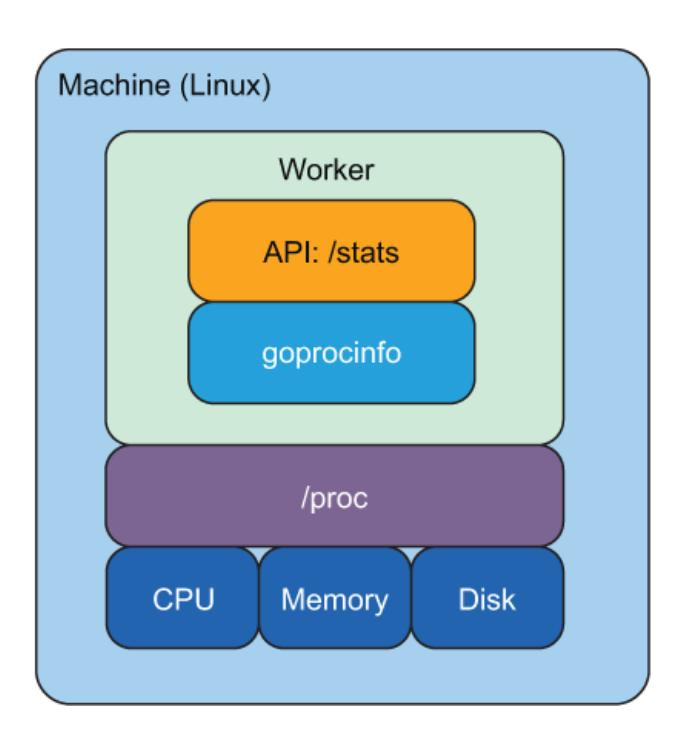

**Figure 6.2 The worker runs on a Linux machine and serves an API that includes the /stats endpoint. The metrics served on the /stats endpoint are collected using the goprocinfo library, which interacts directly with the Linux /proc filesystem.**

Now, to see our work in action, we need to write a program, as we've done in past chapters, that will glue all of our work together. In this case, we can reuse the program we wrote in chapter 5. We only need to make one minor change.

Open up the main.go program we used in chapter 5. In the main() function, after the call to runTasks, add a call to the worker's new CollectStats method. And, like the runTasks method, execute that call to CollectStats in a separate goroutine.

#### <span id="page-177-0"></span>**Listing 6.15 Updating the main() function from our main.go file**

```
func main() {
 host := os.Getenv("CUBE_HOST")
 port, _ := strconv.Atoi(os.Getenv("CUBE_PORT"))
 fmt.Println("Starting Cube worker")
 w := worker.Worker{
 Queue: *queue.New(),
 Db: make(map[uuid.UUID]*task.Task),
 }
 api := worker.Api{Address: host, Port: port, Worker: &w}
 go runTasks(&w)
 go w.CollectStats()
 api.Start()
}
```

After updating the main.go file, start up the API the same way you did in chapter 5. You'll notice that the API's log output shows that it's collecting stats every 15 seconds:

```
$ CUBE_HOST=localhost CUBE_PORT=5555 go run main.go
Starting Cube worker
2021/12/28 14:03:35 No tasks to process currently.
2021/12/28 14:03:35 Sleeping for 10 seconds.
2021/12/28 14:03:35 Collecting stats
2021/12/28 14:03:45 No tasks to process currently.
2021/12/28 14:03:45 Sleeping for 10 seconds.
2021/12/28 14:03:50 Collecting stats
```

<span id="page-178-0"></span>Now that the API is running, query the new /stats endpoint from a different terminal. You should see output about memory, disk, and CPU usage:

```
$ curl localhost:5555/stats|jq .
{
 "MemStats": {
 "mem_total": 32488372,
 "mem_free": 14399056,
 "mem_available": 23306576,
 [....]
 },
 "DiskStats": {
 "all": 1006660349952,
 "used": 39346565120,
 "free": 967313784832,
 "freeInodes": 61645909
 },
 "CpuStats": {
 "id": "cpu",
 "user": 4819423,
 "nice": 701,
 "system": 2140212,
 "idle": 502094668,
 "iowait": 14448,
 "irq": 561115,
 "softirq": 178454,
 "steal": 0,
 "guest": 0,
 "guest_nice": 0
 },
 "LoadStats": {
 "last1min": 0.78,
 "last5min": 0.55,
 "last15min": 0.43,
 "process_running": 2,
 "process_total": 2336,
 "last_pid": 581117
 },
 "TaskCount": 0
}
```

## *Summary*

- The worker exposes metrics about the state of the machine where it is running. The metrics—about CPU, memory, and disk usage—will be used by the manager to make scheduling decisions.
- To make gathering metrics easier, we use a third-party library called goprocinfo. This library handles most of the low-level work necessary to get metrics from the /proc filesystem.
- The metrics are made available on the same API that we built in chapter 5. Thus, the manager will have a uniform way to interact with workers: making HTTP calls to /tasks to perform task operations and making calls to /stats to gather metrics about a worker's current state.

<span id="page-179-0"></span>*[OceanofPDF.com](https://oceanofpdf.com/)*

# <span id="page-180-0"></span>*Part 3 Manager*

The third part of this book focuses on the Cube manager component. Whereas the worker is responsible for running individual tasks on a single node within a pool of nodes, the manager is responsible for managing the entire system. The manager's responsibilities include

- Responding to requests from users
- Scheduling tasks on workers
- Periodically collecting information about the state of tasks and workers in the system
- Checking the health of running tasks and attempting to get them into a healthy state when something goes wrong

In chapter 7, we will flesh out the implementation details of the Manager object. This implementation will include a naive scheduler, which we will iterate on in a later chapter.

In chapter 8, we will build an API for the Manager object. This API will be the mechanism by which users will interact with Cube.

In chapter 9, we will explore some common failure scenarios and consider the options for dealing with them. Then we will implement a solution to handle task failures.

*[OceanofPDF.com](https://oceanofpdf.com/)*

# <span id="page-181-0"></span>*7 The manager enters the room*

## **This chapter covers**

- <span id="page-181-1"></span>Reviewing the purpose of the manager
- Designing a naive scheduling algorithm
- Implementing the manager's methods for scheduling and updating tasks

In chapters 4, 5, and 6, we implemented the Worker component of Cube, our orchestration system. We focused on the core functionality of the worker in chapter 4, which enabled the worker to start and stop tasks. In chapter 5, we added an API to the worker. This API wrapped the functionality we built in chapter 4 and made it available from standard HTTP clients (e.g., curl). And finally, in chapter 6, we added the ability for our worker to collect metrics about itself and expose those on the same API. With this work, we can run multiple workers, with each worker running multiple tasks.

<span id="page-181-3"></span><span id="page-181-2"></span>Now, we'll move our attention to the Manager component of Cube. As we mentioned in chapter 1, the manager is the brain of an orchestrator. While we have multiple workers, we wouldn't want to ask the users of our orchestration system to submit their tasks directly to a worker. Why? This would place an unnecessary burden on users, forcing them to be aware of how many workers existed and how many tasks they were already running and to then pick one. Instead, we encapsulate all of that administrative work into the manager. The users submit their tasks to the manager, and it figures out which worker in the system can best handle the task.

Unlike workers, the Cube orchestrator will have a single manager. This is a practical design decision meant to simplify the number of problems we need to consider in our manager implementation.

By the end of this chapter, we will have implemented a manager that can submit tasks to workers, using a naive round-robin scheduling algorithm.

# <span id="page-182-0"></span>*7.1 The Cube manager*

The manager component allows us to isolate administrative concerns from execution concerns. This is a design principle known as *separation of concerns*. *Administrative* concerns in an orchestration system (figure 7.1) include things like the following:

- <span id="page-182-1"></span>Handling requests from users
- Assigning tasks to workers who are best able to perform them (i.e., scheduling)
- Keeping track of task and worker state
- Restarting failed tasks

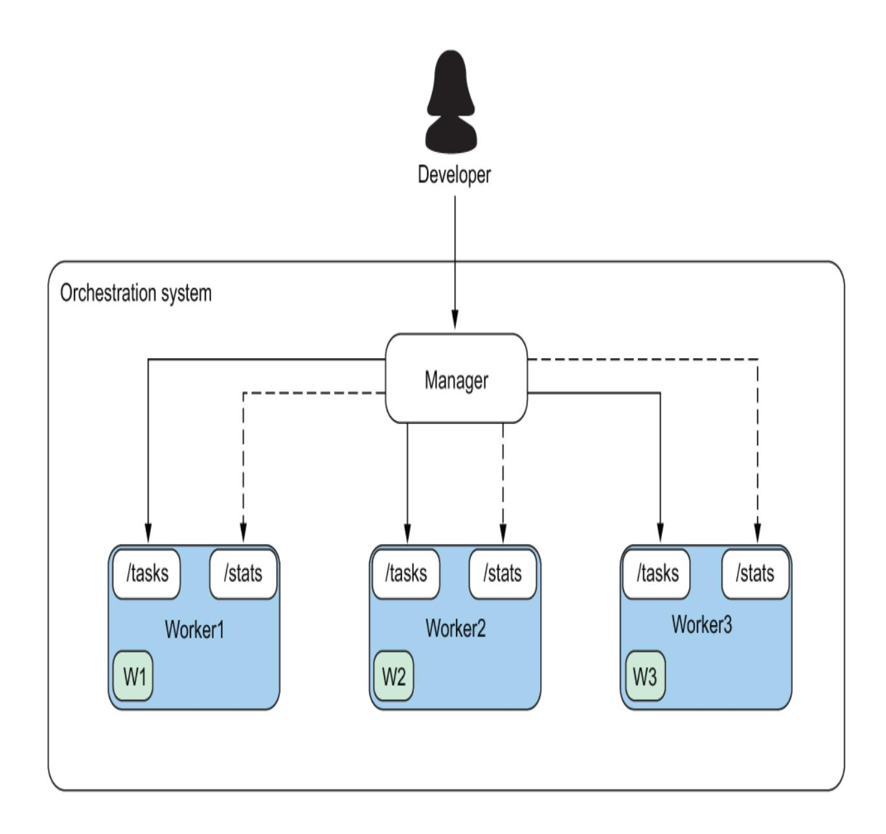

**Figure 7.1 The manager is responsible for administrative tasks, similar to the function of a restaurant host seating customers. It will use the worker's /tasks and /stats API endpoints to perform its administrative duties.**

<span id="page-183-0"></span>Every orchestration system has a manager component. Google's Borg calls it the *BorgMaster*. HashiCorp's Nomad uses the unimaginative yet functional term *server*. Kubernetes doesn't have a singular name for this component, but instead specifically identifies the subcomponents (API server, controller manager, etcd, scheduler).

### **Control plane vs. data plane**

Another way to think of the separation of concerns is the concept of *control plane versus data plane*. In the world of networking, you'll find these terms used frequently, and they refer to the plane of existence.

<span id="page-184-1"></span>In a network, the control plane *controls* how data moves from point A to point B. This plane is responsible for things like creating routing tables, which are determined by different protocols, such as the Border Gateway Protocol (BGP) and the Open Shortest Path First (OSPF) protocol. This plane performs functions similar to the administrative concerns of our manager.

<span id="page-184-3"></span>Unlike the control plane, the data plane does the actual work of moving the data around. This plane performs functions similar to the execution concerns of our worker.

# <span id="page-184-0"></span>*7.1.1 The components that make up the manager*

<span id="page-184-2"></span>Like our worker, our manager will comprise several subcomponents, as seen in figure 7.2. The manager will have a Task DB, which, like the worker, will store tasks. In contrast to the worker's Task DB, however, the manager's will contain all tasks in the system.

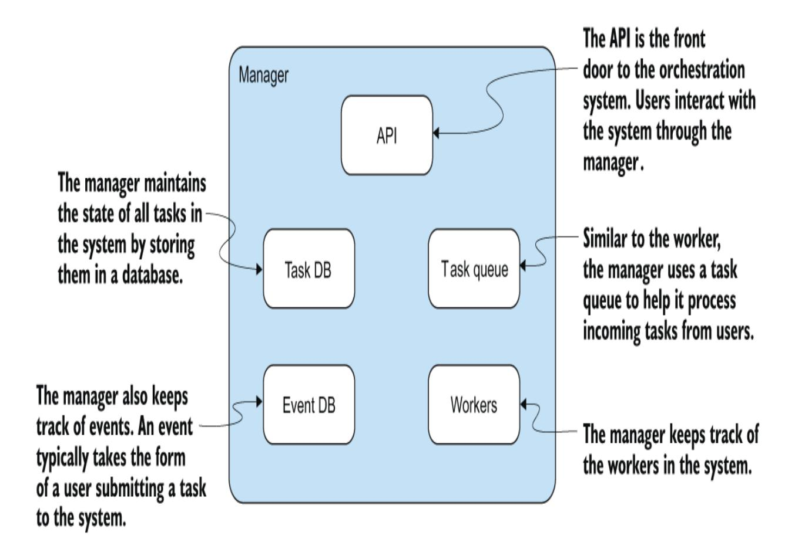

**Figure 7.2 The manager's components are similar to the worker's, with the addition of an Event DB and a list of Workers.**

The manager will also have an Event DB, which will store events (i.e., task.TaskEvent). This subcomponent is mostly a convenient way for us to separate metadata from task-specific data. Metadata includes things like the timestamp when a user submitted a task to the system. We'll make use of it later in chapter 12 when we implement a CLI for the manager.

<span id="page-185-0"></span>Like the worker, for the initial implementation of the manager, we're going to use an in-memory map to store tasks and events. The manager's Workers subcomponent is a list of the workers it

manages. Like the worker, it will also have a Task Queue. And finally, the manager will have an API, similar to the worker (figure 7.2). (As we did with the worker, we're going to address the manager's API in a separate chapter, so we'll defer further discussion of it until then.)

<span id="page-186-3"></span><span id="page-186-1"></span>With this foundation laid, we can move on to implementation.

# <span id="page-186-0"></span>*7.2 The Manager struct*

Like the worker, we created a skeleton of the manager implementation in chapter 2. At the core of that manager skeleton is the Manager struct, which will contain fields that represent the subcomponents previously identified. You can see this struct in listing 7.1, which should be in the same state we left it in chapter 2.

Since it has been a while, let's remind ourselves of the requirements for our manager. In chapter 1, we identified these requirements:

- <span id="page-186-2"></span>1. Accepts requests from users to start and stop tasks
- 2. Schedules tasks onto worker machines
- 3. Keeps track of tasks, their states, and the machine on which they run

If you need more of a reminder about the Manager struct and its field, please look back at section 2.3.

#### **Listing 7.1 The Manager struct**

```
package manager
import (
```

```
 "bytes"
 "cube/task"
 "cube/worker"
 "encoding/json"
 "fmt"
 "log"
 "net/http"
 "github.com/golang-collections/collections/queue"
 "github.com/google/uuid"
)
type Manager struct {
 Pending queue.Queue
 TaskDb map[uuid.UUID]*task.Task
 EventDb map[uuid.UUID]*task.TaskEvent
 Workers []string
 WorkerTaskMap map[string][]uuid.UUID
 TaskWorkerMap map[uuid.UUID]string
}
```

# <span id="page-187-0"></span>*7.3 Implementing the manager's methods*

Now that we've reminded ourselves of what the Manager struct looks like, let's move forward and remember what skeleton methods we had previously defined on the struct.

#### <span id="page-187-1"></span>**Listing 7.2 The stubbed-out versions of the manager's methods**

```
func (m *Manager) SelectWorker() {
 fmt.Println("I will select an appropriate worker")
}
func (m *Manager) UpdateTasks() {
 fmt.Println("I will update tasks")
}
func (m *Manager) SendWork() {
 fmt.Println("I will send work to workers")
}
```

We're going to implement these methods in the following order:

- SelectWorker
- SendWork
- UpdateTasks

# <span id="page-188-0"></span>*7.3.1 Implementing the SelectWorker method*

The SelectWorker method will serve as the scheduler in this early phase of implementing our manager. Its sole purpose will be to pick one of the workers from the manager's list of workers (i.e., the Workers field, which is a slice of strings). We're going to start with a naive round-robin scheduling algorithm that begins by simply selecting the first worker from the list of Workers and storing it in a variable. From this point forward, the algorithm looks like so:

- <span id="page-188-1"></span>1. Check whether we are at the end of the Workers list.
- 2. If we are not, select the next worker in the list.
- 3. Else, return to the beginning and select the first worker in the list.

To implement this algorithm, we need to make a minor change to the Manager struct. As you can see in the following listing, we've added the field LastWorker. We'll use this field to store an integer, which will be an index into the Workers slice, thus giving us a worker.

### **Listing 7.3 Adding the LastWorker field to the Manager struct**

```
type Manager struct {
 // previous fields omitted
 LastWorker int
```

Let's move on now to the actual scheduling algorithm. As you can see in listing 7.4, it's only nine lines of code (not counting the method signature). We start the process by declaring the variable newWorker, which represents the lucky worker chosen to run a task. Then we use an if/else block to choose the worker. In this block, we first check whether the worker we chose during the last run is the last worker in our list of workers. If not, we set newWorker to the next worker in the list of workers, and we increment the value of LastWorker by 1. If the previous worker chosen is the last one in our list, we start over from the beginning, selecting the first worker in the list and setting LastWorker accordingly. Finally, we return the worker to the caller.

#### **Listing 7.4 Implementing a naive scheduling algorithm**

```
func (m *Manager) SelectWorker() string {
 var newWorker int ❶
 if m.LastWorker+1 < len(m.Workers) { ❷
 newWorker = m.LastWorker + 1 ❸
 m.LastWorker++ ❹
 } else { ❺
 newWorker = 0 ❻
 m.LastWorker = 0 ❼
 }
 return m.Workers[newWorker] ❽
}
```

- ❶ Creates the newWorker variable to represent the selected worker
- ❷ Checks whether we're at the end of our list of workers
- ❸ If not, selects the next worker
- ❹ Increments the LastWorker field
- ❺ If we are at the end of our list of workers, starts over from the beginning
- ❻ Selects the first worker in the list
- ❼ Sets the LastWorker field to the first item in the list of workers

It's worth taking a moment to talk about the format of the strings stored in the manager's Workers field. The field itself is of type []string, so technically, the value of the strings could be anything. In practice, however, these are going to take the form of <hostname>:<port>. If you recall from chapters 5 and 6, when we started the worker's API, we specified the CUBE\_HOST and CUBE\_PORT environment variables. The former we set to localhost, and the latter we set to 5555. So the manager's Workers field contains a list of <hostname>:<port> values, which specify the address where the worker's API is running.

## <span id="page-190-1"></span><span id="page-190-0"></span>*7.3.2 Implementing the SendWork method*

The next method we need to implement is the manager's SendWork method. It is the workhorse of the manager and performs the following process:

- <span id="page-190-2"></span>1. Checks whether there are task events in the Pending queue
- 2. If there are, selects a worker to run a task
- 3. Pulls a task event off the pending queue
- 4. Sets the state of the task to Scheduled
- 5. Performs some administrative work that makes it easy for the manager to keep track of which workers tasks are running on
- 6. JSON-encodes the task event
- 7. Sends the task event to the selected worker
- 8. Checks the response from the worker

Let's implement steps 1 to 6 in the process with the code in listing 7.5. We use an if/else block that sets up our conditional flow: it checks the length of the manager's Pending queue, and if the length is greater than zero—meaning there are tasks to process—it moves on to the next steps.

#### **Listing 7.5 The manager's SendWork method**

```
func (m *Manager) SendWork() {
 if m.Pending.Len() > 0 {
 w := m.SelectWorker() ❶
 e := m.Pending.Dequeue()
 te := e.(task.TaskEvent) ❷
 t := te.Task
 log.Printf("Pulled %v off pending queue\n", t)
 m.EventDb[te.ID] = &te ❸
 m.WorkerTaskMap[w] = append(m.WorkerTaskMap[w], te.Task.ID) ❹
 m.TaskWorkerMap[t.ID] = w ❺
 t.State = task.Scheduled
 m.TaskDb[t.ID] = &t
 data, err := json.Marshal(te) ❻
 if err != nil {
 log.Printf("Unable to marshal task object: %v.\n", t)
 }
```

- ❶ SendWork makes use of the SelectWorker method we created previously.
- ❷ Converts the event pulled off the Pending queue to the task.TaskEvent type (because items get stored as the interface{} type)
- ❸ Adds the task event to the manager's EventDb
- ❹ Updates the WorkerTaskMap, which allows the manager a convenient way to identify the tasks it has assigned to a worker
- ❺ Updates the TaskWorkerMap, which provides a convenient way to identify the worker on which a task is running
- ❻ Encodes the task event as JSON data

Once the SendWork method has pulled a task off the Pending queue and encoded it as JSON, all that's left to do is send the task to the selected worker. These final two steps are implemented in listing 7.6. Sending the task to the worker involves building the URL using the worker's host and port, which we got when we called the manager's SelectWorker method previously. From there, we use the Post function from the net/http package in the standard library. Then we decode the response body and print it. Notice that we're also checking errors along the way.

#### <span id="page-192-0"></span>**Listing 7.6 The final two steps of the SendWork method**

```
url := fmt.Sprintf("http://%s/tasks", w)
 resp, err := http.Post(url, "application/json", bytes.NewBuffer(data))
 if err != nil {
 log.Printf("Error connecting to %v: %v\n", w, err)
 m.Pending.Enqueue(te)
 return
 }
 d := json.NewDecoder(resp.Body)
 if resp.StatusCode != http.StatusCreated {
 e := worker.ErrResponse{}
 err := d.Decode(&e)
 if err != nil {
 fmt.Printf("Error decoding response: %s\n", err.Error())
 return
 }
 log.Printf("Response error (%d): %s", e.HTTPStatusCode, e.Message)
 return
 }
 t = task.Task{}
 err = d.Decode(&t)
 if err != nil {
 fmt.Printf("Error decoding response: %s\n", err.Error())
 return
 }
 log.Printf("%#v\n", t)
 } else {
 log.Println("No work in the queue")
 }
}
```

As you can see from this code, the manager is interacting with the worker via the worker API we implemented in chapter 5.

## <span id="page-193-0"></span>*7.3.3 Implementing the UpdateTasks method*

At this point, our manager can select a worker to run a task and then send that task to the selected worker. It has also stored the task in its TaskDB and EventsDB databases. But the manager's view of the task is only from its own perspective. Sure, it sent the task to the worker, and if all went well, the worker responded with http.StatusCreated (i.e., 201). But even if we receive an http.StatusCreated response, that just tells us that the worker received the task and added it to its queue. This response gives us no indication that the task was started successfully and is currently running. What if the task failed when the worker attempted to start it? How might a task fail, you ask? Here are a few ways:

- <span id="page-193-1"></span>The user specified a nonexistent Docker image so that when the worker attempts to start the task, Docker complains that it can't find the image.
- The worker's disk is full, so it doesn't have enough space to download the Docker image.
- There is a bug in the application running inside the Docker container that prevents it from starting correctly (maybe the creator of the container image left out an important environment variable that the application needs to start up properly).

These are just several ways a task might fail. While the manager doesn't necessarily need to know about every possible way a task might fail, what it does need to do is check in with the worker

periodically to get status updates on the tasks it's running. Moreover, the manager needs to get status updates for every worker in the cluster. With this in mind, let's implement the manager's UpdateTasks method.

The general shape of updating tasks from each worker is straightforward. For each worker, we perform the following steps:

- 1. Query the worker to get a list of its tasks.
- 2. For each task, update its state in the manager's database so it matches the state from the worker.

The first step can be seen in listing 7.7. It should look familiar by this point. The manager starts by making a GET /tasks HTTP request to a worker using the Get method from the net/http package. It checks for any errors, such as connection problems (maybe the worker was down for some reason). If the manager was able to connect to the worker, it then checks the response code and ensures it received an http.StatusOK (i.e., 200) response code. Finally, it decodes the JSON data in the body of the response, which should result in a list of the worker's tasks.

#### <span id="page-194-0"></span>**Listing 7.7 Step 1 of the process to update the manager's tasks**

```
func (m *Manager) UpdateTasks() {
 for _, worker := range m.Workers {
 log.Printf("Checking worker %v for task updates", worker)
 url := fmt.Sprintf("http://%s/tasks", worker)
 resp, err := http.Get(url)
 if err != nil {
 log.Printf("Error connecting to %v: %v\n", worker, err)
 }
 if resp.StatusCode != http.StatusOK {
 log.Printf("Error sending request: %v\n", err)
 }
```

```
 d := json.NewDecoder(resp.Body)
 var tasks []*task.Task
 err = d.Decode(&tasks)
 if err != nil {
 log.Printf("Error unmarshalling tasks: %s\n", err.Error())
 }
}
```

The second step, seen in listing 7.8, runs inside the main for loop from listing 7.7. There is nothing particularly sophisticated or clever about how we're updating the tasks. We start by checking whether the task's state in the manager is the same as that of the worker; if not, we set the state to the state reported by the worker. (In this way, the manager treats the workers as the authoritative source for the "state of the world"—that is, the current state of the tasks in the system.) Once we've updated the task's state, we then update its StartTime and FinishTime. And finally, we update the task's ContainerID.

#### **Listing 7.8 Step 2 of the process to update the manager's tasks**

```
for _, t := range tasks {
 log.Printf("Attempting to update task %v\n", t.ID)
 _, ok := m.TaskDb[t.ID]
 if !ok {
 log.Printf("Task with ID %s not found\n", t.ID)
 return
 }
 if m.TaskDb[t.ID].State != t.State {
 m.TaskDb[t.ID].State = t.State
 }
 m.TaskDb[t.ID].StartTime = t.StartTime
 m.TaskDb[t.ID].FinishTime = t.FinishTime
 m.TaskDb[t.ID].ContainerID = t.ContainerID
 }
}
```

With the implementation of the UpdateTasks method, we have now completed the core functionality of our manager. Let's quickly summarize what we've accomplished thus far before continuing:

- With the SelectWorker method, we've implemented a simple but naive scheduling algorithm to assign tasks to workers.
- With the SendWork method, we've implemented a process that uses the SelectWorker method and sends individual tasks to assigned workers via that worker's API.
- With the UpdateTasks method, we've implemented a process for the manager to update its view of the state of all the tasks in the system.

<span id="page-196-2"></span>That's a large chunk of work that we've just completed. Take a moment to celebrate your achievement before moving on to the next section!

# <span id="page-196-0"></span>*7.3.4 Adding a task to the manager*

While we have implemented the core functionality of the manager, there are a couple more methods that we still need to implement. The first of these methods is the AddTask method, as seen in listing 7.9. This method should look familiar, as it's similar to the AddTask method we created for the worker. It also serves a similar purpose: it's how tasks are added to the manager's queue.

#### <span id="page-196-1"></span>**Listing 7.9 The manager's AddTask method**

```
func (m *Manager) AddTask(te task.TaskEvent) {
 m.Pending.Enqueue(te)
}
```

## <span id="page-197-0"></span>*7.3.5 Creating a manager*

Finally, let's create the New function, as shown in listing 7.10. This is a helper function that takes in a list of workers, creates an instance of the manager, and returns a pointer to it. The bulk of the work performed by this function is initializing the necessary subcomponents used by the manager. It sets up the taskDB and eventDb databases. Next, it initializes the workerTaskMap and taskWorkerMap maps that help the manager more easily identify where tasks are running. While this function isn't technically called a *constructor*, as in some other object-oriented languages, it performs a similar function and will be used in the process of starting the manager.

#### <span id="page-197-1"></span>**Listing 7.10 Initializing a new manager with the New() function**

```
func New(workers []string) *Manager {
 taskDb := make(map[uuid.UUID]*task.Task)
 eventDb := make(map[uuid.UUID]*task.TaskEvent)
 workerTaskMap := make(map[string][]uuid.UUID)
 taskWorkerMap := make(map[uuid.UUID]string)
 for worker := range workers {
 workerTaskMap[workers[worker]] = []uuid.UUID{}
 }
 return &Manager{
 Pending: *queue.New(),
 Workers: workers,
 TaskDb: taskDb,
 EventDb: eventDb,
 WorkerTaskMap: workerTaskMap,
 TaskWorkerMap: taskWorkerMap,
 }
}
```

With the addition of the AddTask method and New function, we've completed the initial implementation of the Cube manager. Now all

# <span id="page-198-2"></span><span id="page-198-0"></span>*7.4 An interlude on failures and resiliency*

It's worth pausing here for a moment to identify a weakness in our implementation. While the manager can select a worker from a pool of workers and send it a task to run, it is not dealing with failures. The manager is simply recording the state of the world in its Task DB.

What we are building toward, however, is a declarative system where a user declares the desired state of a task. The manager's job is to honor that request by making a reasonable effort to bring the task into the declared state. For now, a *reasonable effort* means making a single attempt to bring the task into the desired state. We are going to revisit this topic later in chapter 9, where we will consider additional steps the manager can take in the face of failures to build a more resilient system.

# <span id="page-198-1"></span>*7.5 Putting it all together*

<span id="page-198-3"></span>By now, the pattern we are using to build Cube should be clear. We spend the bulk of the chapter writing the core pieces we need; then, at the end of the chapter, we write or update a main() function in our project's main.go file to make use of our work. We'll continue using this same pattern here and for the next few chapters.

For this chapter, we're going to start by using the main.go file from chapter 6 as our starting point. Whereas in past chapters we focused exclusively on running a worker, now we want to run a worker and a manager. We want to run them both because running a manager in isolation makes no sense: the need for a manager only makes sense in the context of having one or more workers.

Let's make a copy of the main.go file from chapter 6. As we said, this is our starting point for running the worker and the manager. Our previous work already knows how to start an instance of the worker. As we can see in listing 7.11, we create an instance of the worker, w, and then we create an instance of the worker API, api. Next, we call the runTasks function, also defined in main.go, and pass it a pointer to our worker w. We make the call to runTasks using a goroutine, identified by the go keyword before the function call. Similarly, we use a second goroutine to call the worker's CollectStats() method, which periodically collects stats from the machine where the worker is running (as we saw in chapter 6). Finally, we call the API's Start() method, which starts up the API server and listens for requests. Here is where we make our first change. Instead of calling api.Start() in our main goroutine, we call it using a third goroutine, which allows us to run all the necessary pieces of the worker concurrently. We will reuse the main() function from the previous chapter and make one minor change to run all the worker's components in separate goroutines.

<span id="page-199-0"></span>

## **Listing 7.11 Running all the worker's components in separate goroutines**

```
func main() {
 host := os.Getenv("CUBE_HOST")
```

```
 port, _ := strconv.Atoi(os.Getenv("CUBE_PORT"))
 fmt.Println("Starting Cube worker")
 w := worker.Worker{
 Queue: *queue.New(),
 Db: make(map[uuid.UUID]*task.Task),
 }
 api := worker.Api{Address: host, Port: port, Worker: &w}
 go runTasks(&w)
 go w.CollectStats()
 go api.Start()
```

At this point, we have an instance of our worker running. Now, we want to start an instance of our manager.

To do this, we create a list of workers and assign it to a variable named workers. This list is a slice of strings, and we add our single worker to it. Next, we create an instance of our manager by calling the New function created earlier and passing it to our list of workers.

#### **Listing 7.12 Calling the manager.New() function**

```
workers := []string{fmt.Sprintf("%s:%d", host, port)}
 m := manager.New(workers)
```

With an instance of our worker running and an instance of a manager created, the next step is to add some tasks to the manager. In listing 7.13, we create three tasks. This is a random decision. Feel free to choose more or less. Creating the Task and TaskEvent should look familiar since it's the same thing we've done in previous chapters in working with the worker. Now, however, instead of adding the TaskEvent to the worker directly, we add it to the manager by calling AddTask on the manager m and passing it the task event te. The final step in this loop is to call the SendWork method on

<span id="page-201-0"></span>manager m, which will select the only worker we currently have and, using the worker's API, send the worker the task event.

#### **Listing 7.13 Adding tasks to the manager**

```
for i := 0; i < 3; i++ {
 t := task.Task{
 ID: uuid.New(),
 Name: fmt.Sprintf("test-container-%d", i),
 State: task.Scheduled,
 Image: "strm/helloworld-http",
 }
 te := task.TaskEvent{
 ID: uuid.New(),
 State: task.Running,
 Task: t,
 }
 m.AddTask(te)
 m.SendWork()
 }
```

Reaching this point, let's pause for a moment and think about what has happened:

- We created an instance of the worker, and it's running and listening for API requests.
- We created an instance of the manager, and it has a list of workers containing the single worker we created earlier.
- We created three tasks and added those tasks to the manager.
- The manager selected a worker (in this case, the only one that exists) and sent it the three tasks.
- The worker received the tasks and at least attempted to start them.

From this list, it's clear there are two perspectives on the state of the tasks in this system: there is the manager's perspective, and there is the worker's perspective. From the manager's perspective, it has sent the tasks to the worker. Unless there is an error returned from the request to the worker's API, the manager's work in this process could be considered complete.

From the worker's perspective, things are more complicated. The worker has received the request from the manager. However, we must remember how we built the worker. Upon receiving the request, the worker API's request handlers don't directly perform any operations; instead, the handlers take the requests and put them on the worker's queue. In a separate goroutine, the worker performs the direct operations to start and stop tasks. As mentioned in chapter 5, this design decision allows us to separate the concern of handling API requests from the concern of performing the actual operations to start and stop tasks.

Once the worker picks a task off of its queue and attempts to perform the necessary operation, any number of things can go wrong. As we enumerated earlier, examples of things going wrong can include user errors (e.g., a user specifying a nonexisting Docker image in the task specification) or machine errors (e.g., a machine doesn't have enough disk space to download the task's Docker image).

As we can see, for the manager to be an effective component in our orchestration system, it can't just use a fire-and-forget approach to task management. It must constantly check in with the workers it is managing to reconcile its perspective with that of the workers'.

<span id="page-202-0"></span>We discussed this problem earlier in the chapter, and it was our motivation for implementing the manager's UpdateTasks method. So, now, let's make use of our foresight. Once the manager has sent tasks off to the worker, we want to call the manager's UpdateTasks method.

To accomplish our objective, we'll use another goroutine, which will call an *anonymous function*. Like other programming languages, an anonymous function in Go is simply a function that is defined where it's called. Inside of this anonymous function, we use an infinite loop. Inside this loop, we print an informative log message that tells us the manager is updating tasks from its workers. Then we call the manager's UpdateTasks method to update its perspective on the tasks in the system. And finally, it sleeps for 15 seconds. As we've done previously, we're using sleep here purely for the purpose of slowing down the system so we can observe and understand our work.

While we're on the topic of observing our work, let's also add another infinite loop that ranges over the tasks and prints out the ID and State of each task in the system. This will allow us to observe the tasks' state changing as the UpdateTasks method does its job. This pattern of using an anonymous function to run a piece of code in a separate goroutine is common in the Go ecosystem.

#### **Listing 7.14 Using an anonymous function**

```
go func() { ❶
 for { ❷
 fmt.Printf("[Manager] Updating tasks from %d workers\n", len(m.Workers))
 m.UpdateTasks() ❸
 time.Sleep(15 * time.Second)
 }
}() ❹
for { ❺
 for _, t := range m.TaskDb { ❻
 fmt.Printf("[Manager] Task: id: %s, state: %d\n", t.ID, t.State)
 time.Sleep(15 * time.Second)
 }
}
```

- ❶ Defines an anonymous function that runs inside of a separate goroutine
- ❷ Uses a for loop without any conditions to create an infinite loop
- ❸ Calls the manager's UpdateTasks method
- ❹ To use a function literal, we must call it, hence ().
- ❺ Uses another infinite loop
- ❻ Ranges over the tasks and prints their ID and state

At this point, we've written all the necessary code to run our worker and manager together. So let's switch from writing code to running it.

To run our main.go program, call it with go run main.go. Also, it's important to define the CUBE\_HOST and CUBE\_PORT environment variables as part of the command, as this tells the worker API on what port to listen. These environment variables will also be used by the manager to populate its Workers field. When we start our program, the initial output should look familiar. We should see the following:

```
$ CUBE_HOST=localhost CUBE_PORT=5555 go run main.go
Starting Cube worker ❶
2022/01/30 14:17:12 Pulled {9f122e79-6623-4986-a9df-38a5216286fb .... ❷
2022/01/30 14:17:12 No tasks to process currently. ❸
2022/01/30 14:17:12 Sleeping for 10 seconds.
2022/01/30 14:17:12 Collecting stats ❹
2022/01/30 14:17:12 Added task 9f122e79-6623-4986-a9df-38a5216286fb ❺
```

- ❶ Our main.go program starting up the worker
- ❷ The manager pulling a task off of its pending queue (I've truncated the output for readability)
- ❸ The worker reports it doesn't have any tasks to process.
- ❹ The worker collects its stats.
- ❺ The worker's API adds a task to the worker's queue.

After this initial output, we should see the worker start the tasks. Then, once all three tasks are started, you should start seeing output from the main.go program. Our code is calling the manager's UpdateTasks method in one for loop, ranging over the manager's tasks, and printing out the ID and State of each task in a separate for loop:

```
[Manager] Updating tasks from 1 workers
[Manager] Task: id: 9f122e79-6623-4986-a9df-38a5216286fb, state: 2
[Manager] Updating tasks from 1 workers
[Manager] Task: id: 792427a7-e306-44ef-981a-c0b76bfaab8e, state: 2
```

Interleaved in the output, you should also see output like the following. This output is coming from our manager itself:

```
2022/01/30 14:18:57 Checking worker localhost:5555 for task updates
2022/01/30 14:18:57 Attempting to update task
➥ 792427a7-e306-44ef-981a-c0b76bfaab8e
2022/01/30 14:18:57 Attempting to update task
➥ 2507e136-7eb7-4530-aeb9-d067eeb34394
2022/01/30 14:18:57 Attempting to update task
➥ 9f122e79-6623-4986-a9df-38a5216286fb
```

While our main.go program is running in one terminal, open a second terminal and query the worker API. Depending on how quickly you run the curl command after starting up the main.go program, you may not see all three tasks. Eventually, though, you should see them:

```
$ curl http://localhost:5555/tasks |jq .
[
 {
 "ID": "723143b3-4cb8-44a7-8dad-df553c15bce3",
 "ContainerID":
 ➥ "14895e61db8d08ba5d0e4bb96d6bd75023349b53eb4ba5915e4e15ecda82e907",
 "Name": "test-container-0",
 "State": 2,
 [....]
 },
 {
 "ID": "a85013fb-2918-47fb-82b0-f2e8d63f433b",
```

```
 "ContainerID":
 ➥ "f307d7045a36501059092f06ff3d323e6246a7c854bfabeb5ff17b2185ffd9ec",
 "Name": "test-container-1",
 "State": 2,
 [....]
 },
 {
 "ID": "7a7eb0ef-8516-4103-84a7-9f964ba47cb8",
 "ContainerID":
 ➥ "fffc1cf5b8ca7d33eb3c725f4190b81e0978f3efc8405562f9dfe4d315decbec",
 "Name": "test-container-2",
 "State": 2,
 [....]
 }
]
```

<span id="page-206-0"></span>In addition to querying the worker API, we can use the docker command to verify that our tasks are indeed running. Note that I've removed some of the columns from the output of docker ps for readability:

```
$ docker ps
CONTAINER ID CREATED STATUS NAMES
fffc1cf5b8ca 5 minutes ago Up 5 minutes test-container-2
f307d7045a36 5 minutes ago Up 5 minutes test-container-1
14895e61db8d 5 minutes ago Up 5 minutes test-container-0
```

# *Summary*

The manager records user requests in the form of task.TaskEvent items and stores them in its EventDB. This task event, which includes the task.Task itself, serves as the user's desired state for the task.

- The manager records the "state of the world" (i.e., the actual state of a task from the perspective of a worker) in its TaskDB. For this initial implementation of the manager, we do not attempt to retry failed tasks and instead simply record the state. We will revisit this problem later in chapter 9.
- The manager serves a purely administrative function. It accepts requests from users, records those requests in its internal databases, selects a worker to run the task, and passes the task along to the worker. It periodically updates its internal state by querying the worker's API. It is not directly involved in any of the operations to actually run a task.
- We've used a simple, extremely naive algorithm to assign tasks to workers. This decision allowed us to code a working implementation of the manager in a relatively small number of lines of code. We will revisit this decision in chapter 10.

<span id="page-207-0"></span>*[OceanofPDF.com](https://oceanofpdf.com/)*

## <span id="page-208-0"></span>*8 An API for the manager*

#### **This chapter covers**

- <span id="page-208-3"></span>Understanding the purpose of the manager API
- Implementing methods to handle API requests
- Creating a server to listen for API requests
- Starting, stopping, and listing tasks via the API

In chapter 7, we implemented the core functionality of the manager component: pulling tasks off its queue, selecting a worker to run those tasks, sending them to the selected workers, and periodically updating the state of tasks. That functionality is just the foundation and doesn't provide a simple way for users to interact with the manager.

So, like we did with the worker in chapter 5, we're going to build an API for the manager. This API wraps the manager's core functionality and exposes it to users. In the case of the manager, users means *end users*, that is, developers who want to run their application in our orchestration system.

The manager's API, like the worker's, will be simple. It will provide the means for users to perform these basic operations:

- Send a task to the manager
- Get a list of tasks
- <span id="page-208-2"></span>Stop a task

This API will be constructed using the same components used for the worker's API. It will comprise *handlers*, *routes*, and a *mux*.

## <span id="page-208-1"></span>*8.1 Overview of the manager API*

<span id="page-208-4"></span>Before we get too far into our code, let's zoom out for a minute and take a more holistic view of where we're going. We've been focusing pretty tightly for the last couple of chapters, so it will be a good reminder to see how the technical details fit together.

We're not building a manager and worker just for the sake of it. The purpose of building them is to fulfill a need: developers need a way to run their applications in a reliable and resilient way. The manager and worker are abstractions that free the developer from having to think too deeply about the underlying infrastructure (whether physical or virtual) on which their applications run. Figure 8.1 reminds us of what this abstraction looks like.

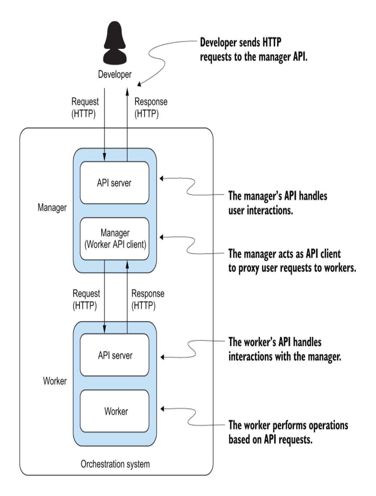

**Figure 8.1 The manager comprises an API server and manager components, and similarly, the worker comprises an API server and worker components. The user communicates with the manager, and the manager communicates with one or more workers.**

With that reminder, let's zoom back to the details of constructing the manager's API. Because it will be similar to the worker's, we won't spend as much time going into the details of handlers, routes, and muxes. If you need a refresher, please refer to section 5.1.

## <span id="page-211-0"></span>*8.2 Routes*

Let's start by identifying the routes that our manager API should handle. It shouldn't be too surprising that the routes are identical to that of the worker's API. In some ways, our manager is acting as a reverse proxy: instead of balancing requests for, say, web pages across a number of web servers, it's balancing requests to run tasks across a number of workers.

<span id="page-211-3"></span>Thus, like the worker's, the manager's API will handle GET requests to /tasks, which will return a list of all the tasks in the system (table 8.1). This enables our users to see what tasks are currently in the system. It will handle POST requests to /tasks, which will start a task on a worker. This allows our users to run their tasks in the system. Finally, it will handle DELETE requests to /tasks/{taskID}, which will stop a task specified by the taskID in the route. This allows our users to stop their tasks.

<span id="page-211-2"></span>**Table 8.1 Routes used by our manager API**

| Method | Route           | Description                            |
|--------|-----------------|----------------------------------------|
| GET    | /tasks          | Gets a list of all tasks               |
| POST   | /tasks          | Creates a task                         |
| DELETE | /tasks/{taskID} | Stops the task identified by<br>taskID |

# <span id="page-211-1"></span>*8.3 Data format, requests, and responses*

If the routes we use for the manager's API are similar to the worker's, then what about the data format and the requests and responses that the manager will receive and return? Again, it should not be surprising that the manager's API will use the same data format, JSON, as the worker's API. If the worker's API speaks JSON, the manager's API should speak the same language to minimize unnecessary translation between data formats. Thus, any data sent to the manager's API must be JSON-

<span id="page-212-1"></span>encoded, and any data returned by the API will also be encoded as JSON. Table 8.2 shows an updated route table.

**Table 8.2 An updated route table showing whether the routes send a request body and return a response body and the status code for a successful request**

| Method | Route           | Description                                 | Request body                   | Response<br>body | Status<br>code |
|--------|-----------------|---------------------------------------------|--------------------------------|------------------|----------------|
| GET    | /tasks          | Gets a list<br>of all tasks                 | None                           | List of<br>tasks | 200            |
| POST   | /tasks          | Creates a<br>task                           | JSON-encoded<br>task.TaskEvent | None             | 201            |
| DELETE | /tasks/{taskID} | Stop the<br>task<br>identified<br>by taskID | None                           | None             | 204            |

<span id="page-212-0"></span>We can see how these routes are used in figure 8.2, which shows a POST request to create a new task and a GET request to get a list of tasks. The developer issues requests to the manager, and the manager returns responses. In the first example, the developer issues a POST request with a body that specifies a task to run. The manager responds with a status code of 201. In the second example, the developer issues a GET request, and the manager responds with a status code of 200 and a list of its tasks.

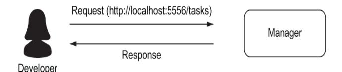

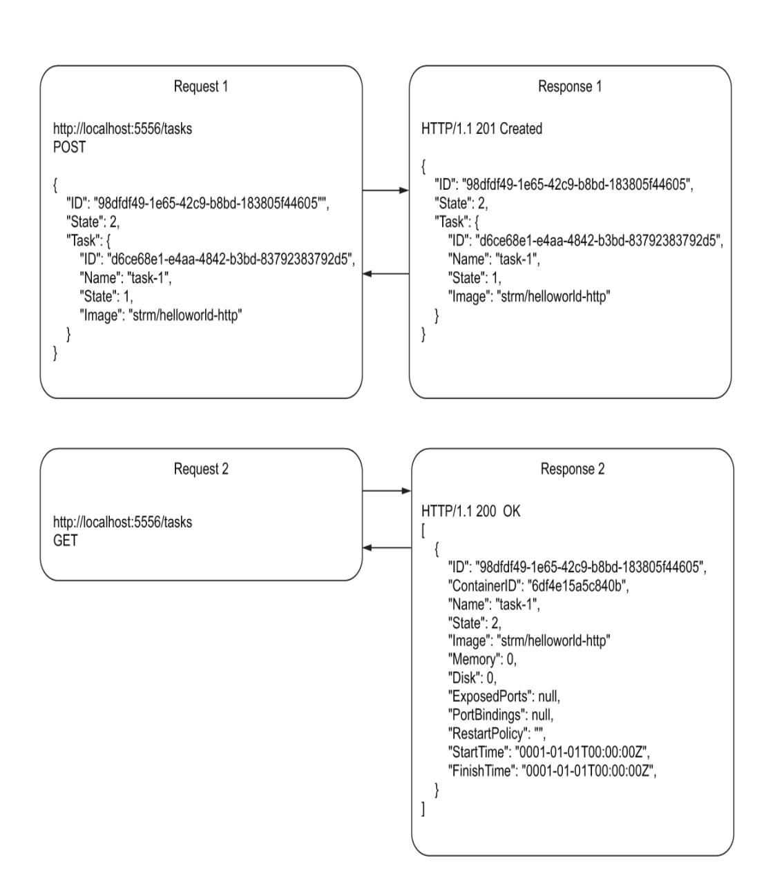

**Figure 8.2 Two examples of how a developer uses the manager's API**

# <span id="page-214-0"></span>*8.4 The API struct*

Drilling down a little further, we notice another similarity with the worker's API. The manager's API also uses an Api struct, which will encapsulate the necessary behavior of its API. The only difference will be swapping out a single field: the Worker field gets replaced by a Manager field, which contains a pointer to an instance of our manager. Otherwise, the Address, Port, and Router fields all have the same types and serve the same purposes as they did in the worker API.

#### <span id="page-214-2"></span>**Listing 8.1 The manager's Api struct**

```
type Api struct {
 Address string
 Port int
 Manager *Manager
 Router *chi.Mux
}
```

## <span id="page-214-1"></span>*8.5 Handling requests*

Continuing to drill down, let's talk about the handlers for the manager API. These should look familiar, as they are the same three handlers we implemented for the worker:

- <span id="page-214-3"></span>StartTaskHandler(w http.ResponseWriter, r \*http.Request)
- GetTasksHandler(w http.ResponseWriter, r \*http.Request)
- <span id="page-214-4"></span>StopTaskHandler(w http.ResponseWriter, r \*http.Request)

We'll implement these handlers in a file named handlers.go, which you should create in the manager directory next to the existing manager.go file. To reduce the amount of typing necessary, feel free to copy the handlers from the worker's API and paste them into the manager's handlers.go file. The only changes we'll need to make are to update any references to a.Worker and a.Manager.

Let's start with the StartTaskHandler, which works the same as its worker counterpart. It expects a request body encoded as JSON. It decodes that request body into a task.TaskEvent, checking for any decoding errors. Then it adds the task event to the manager's queue using the manager's AddTask method implemented in chapter 7. The implementation can be seen in the following listing.

#### <span id="page-215-0"></span>**Listing 8.2 The manager's StartTaskHandler**

```
func (a *Api) StartTaskHandler(w http.ResponseWriter, r *http.Request) {
 d := json.NewDecoder(r.Body) ❶
 d.DisallowUnknownFields()
 te := task.TaskEvent{}
 err := d.Decode(&te) ❷
 if err != nil { ❸
 msg := fmt.Sprintf("Error unmarshalling body: %v\n", err)
 log.Printf(msg)
 w.WriteHeader(400)
 e := ErrResponse{
 HTTPStatusCode: 400,
 Message: msg,
 }
 json.NewEncoder(w).Encode(e)
 return
 }
 a.Manager.AddTask(te) ❹
 log.Printf("Added task %v\n", te.Task.ID)
 w.WriteHeader(201) ❺
 json.NewEncoder(w).Encode(te.Task) ❻
}
```

- ❶ Creates a json.Decoder that will read the request body from r.Body
- ❷ Decodes the body and stores the result in a task.TaskEvent
- ❸ Checks for errors
- ❹ Adds the task to the manager's queue for processing
- ❺ Sets the response header to 201
- ❻ Encoding the response as JSON

Next up is the GetTasksHandler. Like the StartTaskHandler, GetTasksHandler works similarly to its counterpart in the worker API. We do, however, need to implement a helper method that will make it easy for us to get a list of the tasks from the manager. We create the GetTasks() helper on the Manager struct. The GetTasks() method is straightforward:

<span id="page-215-2"></span><span id="page-215-1"></span>Instantiate a variable named tasks as a slice of pointers to task.Task types.

- Range over the manager's TaskDb field and add each task to the tasks slice.
- Return the slice of tasks.

#### **Listing 8.3 The GetTasks helper function returning a slice of pointers to task.Task types**

```
func (m *Manager) GetTasks() []*task.Task {
 tasks := []*task.Task{}
 for _, t := range m.TaskDb {
 tasks = append(tasks, t)
 }
 return tasks
}
```

With the GetTasks() function written, we can now use it in the GetTasksHandler method. The only change we need to make from the worker's implementation is to pass the manager's GetTasks() function to the encoder.

#### **Listing 8.4 The manager's GetTasksHandler**

```
func (a *Api) GetTasksHandler(w http.ResponseWriter, r *http.Request) {
 w.Header().Set("Content-Type", "application/json")
 w.WriteHeader(200)
 json.NewEncoder(w).Encode(a.Manager.GetTasks())
}
```

Finally, let's implement the StopTaskHandler. Again, the method works the same way as its worker counterpart, so there isn't much new to add to the discussion.

#### <span id="page-216-0"></span>**Listing 8.5 The manager's StopTaskHandler**

```
func (a *Api) StopTaskHandler(w http.ResponseWriter, r *http.Request) {
 taskID := chi.URLParam(r, "taskID") ❶
 if taskID == "" {
 log.Printf("No taskID passed in request.\n")
 w.WriteHeader(400)
 }
 tID, _ := uuid.Parse(taskID)
 taskToStop, ok := a.Manager.TaskDb[tID] ❷
 if !ok {
 log.Printf("No task with ID %v found", tID)
 w.WriteHeader(404)
 }
 te := task.TaskEvent{ ❸
 ID: uuid.New(),
 State: task.Completed,
 Timestamp: time.Now(),
 }
```

```
 taskCopy := *taskToStop ❹
 taskCopy.State = task.Completed
 te.Task = taskCopy
 a.Manager.AddTask(te) ❺
 log.Printf("Added task event %v to stop task %v\n", te.ID, taskToStop.ID)
 w.WriteHeader(204) ❻
}
```

- ❶ Gets the task ID from the request path
- ❷ Checks whether there is a task with the requested taskID
- ❸ Creates a new task.TaskEvent that will wrap the task.Task
- ❹ Makes a copy of the task so we don't modify the existing one
- ❺ Adds the task to the manager's queue for processing
- ❻ Sets the response's status code to 204

As a reminder, as we did in the worker, the manager's handler methods are not operating directly on tasks. We have separated the concerns of responding to API requests and the operations to start and stop tasks. So the API simply puts the request on the manager's queue via the AddTask method, and then the manager picks up the task from its queue and performs the necessary operation.

<span id="page-217-1"></span>So far, we've been able to implement the handlers in the manager's API by copying and pasting the handlers from the worker's API and making a few minor adjustments. At this point, we've implemented the meat of the API.

## <span id="page-217-0"></span>*8.6 Serving the API*

Now that we have implemented the manager's handlers, let's complete our work that will let us serve the API to users. We'll start by copying and pasting the initRouter method from the worker. This method sets up our router and creates the required endpoints, and since the endpoints will be the same as the worker's, we don't need to modify anything.

#### <span id="page-217-2"></span>**Listing 8.6 The manager API's initRouter method**

```
func (a *Api) initRouter() {
 a.Router = chi.NewRouter()
 a.Router.Route("/tasks", func(r chi.Router) {
 r.Post("/", a.StartTaskHandler)
 r.Get("/", a.GetTasksHandler)
 r.Route("/{taskID}", func(r chi.Router) {
 r.Delete("/", a.StopTaskHandler)
 })
```

```
 })
}
```

For the icing on the cake, let's take care of starting the API by copying the Start method from the worker's API. The manager's API will start up in the same way, so like the initRouter method, we don't need to make any changes.

#### <span id="page-218-5"></span>**Listing 8.7 The manager API's Start method**

```
func (a *Api) Start() {
 a.initRouter()
 http.ListenAndServe(fmt.Sprintf("%s:%d", a.Address, a.Port), a.Router)
}
```

## <span id="page-218-0"></span>*8.7 A few refactorings to make our lives easier*

At this point, we've implemented everything we need to have a functional API for the manager. But now that we're at a point in our journey where we have APIs for both the worker and the manager, let's make a few minor tweaks that will make it easier to run these APIs.

<span id="page-218-1"></span>If you recall from chapter 5, we created the function runTasks in our main.go file. We used it as a way to continuously check for new tasks that the worker needed to run. If it found any tasks in the worker's queue, it called the workers RunTask method.

<span id="page-218-2"></span>Instead of having this function be part of the main.go file, let's move it into the worker itself. This change will then encapsulate all the necessary worker behavior in the Worker object. Copy the runTasks function from the main.go file, and paste it into the worker.go file. Then, to clean everything up so the code will run, we're going to make three changes:

- <span id="page-218-6"></span>Rename the existing RunTask method to runTask
- <span id="page-218-4"></span>Rename the runTasks method from main.go to RunTasks
- <span id="page-218-3"></span>Change the RunTasks method to call the newly renamed runTask method

You can see these changes in the following listing.

**Listing 8.8 Moving the runTasks function from main.go to the worker**

```
func (w *Worker) runTask() task.DockerResult { ❶
}
func (w *Worker) RunTasks() { ❷
 for {
 if w.Queue.Len() != 0 {
 result := w.runTask() ❸
 if result.Error != nil {
 log.Printf("Error running task: %v\n", result.Error)
 }
 } else {
 log.Printf("No tasks to process currently.\n")
 }
 log.Println("Sleeping for 10 seconds.")
 time.Sleep(10 * time.Second)
 }
}
```

- ❶ Renames the worker's existing RunTask method to runTask; the body of the method stays the same
- ❷ Renames the runTasks method from main.go to RunTasks
- ❸ Calls the worker's runTask method

In a similar fashion, we're going to make some changes to the Manager struct that will make it easier to use the manager in our main.go file. For starters, let's rename the manager's UpdateTasks method to updateTasks. The method should look like this (the body of the method stays the same):

```
func (m *Manager) updateTasks() {
}
```

Next, let's create a new method on our Manager struct called UpdateTasks. This method serves a similar purpose to the RunTasks method we added to the worker. It runs an endless loop, inside which it calls the manager's updateTasks method. This change makes it possible for us to remove the anonymous function we used in the main.go file in chapter 7 that performed the same function.

#### <span id="page-219-1"></span>**Listing 8.9 Adding the UpdateTasks method to the manager**

```
func (m *Manager) UpdateTasks() {
 for {
 log.Println("Checking for task updates from workers")
 m.updateTasks()
 log.Println("Task updates completed")
 log.Println("Sleeping for 15 seconds")
 time.Sleep(15 * time.Second)
 }
}
```

Finally, let's add the ProcessTasks method you see in the next listing to the manager. This method also works similarly to the worker's RunTasks method: it runs an endless loop, repeatedly calling the manager's SendWork method.

#### <span id="page-220-2"></span>**Listing 8.10 The manager's ProcessTasks method**

```
func (m *Manager) ProcessTasks() {
 for {
 log.Println("Processing any tasks in the queue")
 m.SendWork()
 log.Println("Sleeping for 10 seconds")
 time.Sleep(10 * time.Second)
 }
}
```

## <span id="page-220-0"></span>*8.8 Putting it all together*

Alright, it's that time again—time to take what we've built in the chapter and run it. Before we do that, however, let's quickly summarize what we've built so far:

- <span id="page-220-1"></span>We wrapped the manager component in an API that allows users to communicate with the manager.
- We constructed the manager's API using the same types of components we used for the worker's API: *handlers*, *routes*, and a *router*.
- The *router* listens for requests to the *routes*, and dispatches those requests to the appropriate *handlers*.

Let's start by copying and pasting the main function from the main.go file in chapter 7. This will be our starting point.

There is one major difference between our situation at the end of this chapter and that of the last: we now have APIs for both the worker and the manager. So while we will be creating instances of each, we will not be interacting with them directly as we have in the past. Instead, we will be passing these instances into their respective APIs and then starting those APIs so they are listening to HTTP requests.

In past chapters where we started instances of the worker's API, we set two environment variables: CUBE\_HOST and CUBE\_PORT. These were used to set up the worker API to listen for requests at http://localhost:5555. Now, however, we have two APIs that we need to start. To handle our new circumstances,

let's set up our main function to extract a set of host:port environment variables for each API. As you can see in the following listing, these will be called CUBE\_WORKER\_HOST, CUBE\_WORKER\_PORT, CUBE\_MANAGER\_HOST, and CUBE\_MANAGER\_PORT.

#### <span id="page-221-0"></span>**Listing 8.11 Extracting the host and port for each API from environment variables**

```
func main() {
 whost := os.Getenv("CUBE_WORKER_HOST")
 wport, _ := strconv.Atoi(os.Getenv("CUBE_WORKER_PORT"))
 mhost := os.Getenv("CUBE_MANAGER_HOST")
 mport, _ := strconv.Atoi(os.Getenv("CUBE_MANAGER_PORT"))
}
```

Next, after extracting the host and port values from the environment and storing them in appropriately named variables, let's start up the worker API. This process should look familiar from chapter 7. The only difference here, however, is that we're calling the RunTasks method on the worker object, instead of a separate runTasks function that we previously defined in main.go. As we did in chapter 7, we call each of these methods using the go keyword, thus running each in a separate goroutine.

#### <span id="page-221-1"></span>**Listing 8.12 Starting up the worker API**

```
fmt.Println("Starting Cube worker")
 w := worker.Worker{
 Queue: *queue.New(),
 Db: make(map[uuid.UUID]*task.Task),
 }
 wapi := worker.Api{Address: whost, Port: wport, Worker: &w}
 go w.RunTasks()
 go w.CollectStats()
 go wapi.Start()
```

Finally, we'll start up the manager API. This process starts the same as it did in the last chapter. We create a list of workers that contains the single previously created worker, represented as a string by its <host>:<port>. Then we create an instance of our manager, passing in the list of workers. Next, we create an instance of the manager's API and store it in a variable called mapi.

The next two lines in our main function set up two goroutines that will run in parallel with the main goroutine running the API. The first goroutine will run the manager's

ProcessTasks method. This ensures the manager will process any incoming tasks from users. The second goroutine will run the manager's UpdateTasks method. It will ensure the manager updates the state of tasks by querying the worker's API to get up-to-date states for each task.

<span id="page-222-1"></span><span id="page-222-0"></span>Then comes what we've been waiting for. We start the manager's API by calling the Start method.

#### **Listing 8.13 Starting up the manager API**

```
fmt.Println("Starting Cube manager")
 workers := []string{fmt.Sprintf("%s:%d", whost, wport)}
 m := manager.New(workers)
 mapi := manager.Api{Address: mhost, Port: mport, Manager: m}
 go m.ProcessTasks()
 go m.UpdateTasks()
 mapi.Start()
}
```

At this point, all that's left to do is to run our main program so both the manager and worker APIs are running. As you can see, both the worker and the manager get started:

```
$ CUBE_WORKER_HOST=localhost \
CUBE_WORKER_PORT=5555 \
CUBE_MANAGER_HOST=localhost \
CUBE_MANAGER_PORT=5556 \
go run main.go
Starting Cube worker
Starting Cube manager
2022/03/06 14:45:47 Collecting stats
2022/03/06 14:45:47 Checking for task updates from workers
2022/03/06 14:45:47 Processing any tasks in the queue
2022/03/06 14:45:47 Checking worker localhost:5555 for task updates
2022/03/06 14:45:47 No work in the queue
2022/03/06 14:45:47 Sleeping for 10 seconds
2022/03/06 14:45:47 No tasks to process currently.
2022/03/06 14:45:47 Sleeping for 10 seconds.
2022/03/06 14:45:47 Task updates completed
2022/03/06 14:45:47 Sleeping for 15 seconds
```

Let's do a quick sanity check to verify that our manager does indeed respond to requests. Let's issue a GET request to get a list of the tasks it knows about. It should return an empty list:

```
$ curl -v localhost:5556/tasks
* Trying 127.0.0.1:5556...
* Connected to localhost (127.0.0.1) port 5556 (#0)
> GET /tasks HTTP/1.1
> Host: localhost:5556
> User-Agent: curl/7.81.0
> Accept: */*
>
* Mark bundle as not supporting multiuse
< HTTP/1.1 200 OK
< Content-Type: application/json
< Date: Sun, 06 Mar 2022 19:52:46 GMT
< Content-Length: 3
<
[]
```

Cool! Our manager is listening for requests as we expected. As we can see, though, it doesn't have any tasks because we haven't told it to run any yet. Let's take the next step and send a request to the manager that instructs it to start a task for us.

For this purpose, let's create a file named task.json in the same directory where our main.go file is. Inside this file, let's create the JSON representation of a task, as seen in the next listing. This representation is similar to what we used in main.go in chapter 7, except we're moving it into a separate file.

#### **Listing 8.14 JSON representation of our task**

```
{
 "ID": "6be4cb6b-61d1-40cb-bc7b-9cacefefa60c",
 "State": 2,
 "Task": {
 "State": 1,
 "ID": "21b23589-5d2d-4731-b5c9-a97e9832d021",
 "Name": "test-chapter-5",
 "Image": "strm/helloworld-http"
 }
}
```

Now that we've created our task.json file with the task we want to send to the manager via its API, let's use curl to send a POST request to the manager API's /tasks endpoint. As expected, the manager's API responds with a 201 response code:

```
$ curl -v --request POST \
--header 'Content-Type: application/json' \
--data @task.json \
localhost:5556/tasks
* Trying 127.0.0.1:5556...
* Connected to localhost (127.0.0.1) port 5556 (#0)
> POST /tasks HTTP/1.1
```

```
> Host: localhost:5556
> User-Agent: curl/7.81.0
> Accept: */*
> Content-Type: application/json
> Content-Length: 230
>
* Mark bundle as not supporting multiuse
< HTTP/1.1 201 Created
< Date: Sun, 06 Mar 2022 20:04:36 GMT
< Content-Length: 286
< Content-Type: text/plain; charset=utf-8
<
{
 "ID":"21b23589-5d2d-4731-b5c9-a97e9832d021",
 "ContainerID":"",
 "Name":"test-chapter-5",
 "State":1,
 "Image":"strm/helloworld-http",
 "Cpu":0,
 "Memory":0,
 "Disk":0,
 "ExposedPorts":null,
 "PortBindings":null,
 "RestartPolicy":"",
 "StartTime":"0001-01-01T00:00:00Z",
 "FinishTime":"0001-01-01T00:00:00Z"
}
```

There's one thing to note about the JSON returned by the manager's API. Notice that the ContainerID field is empty. The reason for this is that like the worker's API, the manager's API doesn't operate directly on tasks. As tasks come into the API, they are added to the manager's queue, and the manager works on them independently of the request. At the time of our request, the manager hasn't shipped the task to the worker, so it can't know what the ContainerID will be. If we make a subsequent request to the manager's API to GET /tasks, we should see a ContainerID for our task:

```
$ curl -v localhost:5556/tasks|jq
* Trying 127.0.0.1:5556...
> GET /tasks HTTP/1.1
> Host: localhost:5556
> User-Agent: curl/7.81.0
> Accept: */*
>
* Mark bundle as not supporting multiuse
< HTTP/1.1 200 OK
< Content-Type: application/json
< Date: Sun, 06 Mar 2022 20:16:43 GMT
< Content-Length: 352
[
 {
 "ID": "21b23589-5d2d-4731-b5c9-a97e9832d021",
 "ContainerID":
 ➥ "428115c14a41243ec29e5b81feaccbf4b9632e2caaeb58f166df595726889312",
 "Name": "test-chapter-8",
 "State": 2,
```

```
 "Image": "strm/helloworld-http",
 "Cpu": 0,
 "Memory": 0,
 "Disk": 0,
 "ExposedPorts": null,
 "PortBindings": null,
 "RestartPolicy": "",
 "StartTime": "0001-01-01T00:00:00Z",
 "FinishTime": "0001-01-01T00:00:00Z"
 }
]
```

There is one minor thing to keep in mind when querying the manager's API, as we did previously. Depending on how quickly we issue our GET /tasks request after sending the initial POST /tasks request, we may still not see a ContainerID. Why is that? If you recall, the manager updates its view of tasks by making a GET /tasks request to the worker's API. It then uses the response to that request to update the state of the tasks in its own datastore. If you look back at listing 8.13, you can see that our main.go program is running the manager's UpdateTasks method in a separate goroutine, and that method sleeps for 15 seconds between each attempt to update tasks.

Once the manager shows the task running—that is, we get a ContainerID in our GET /tasks Response—we can further verify that the task is running using the docker ps command:

```
$ docker ps --format "table {{.ID}}\t{{.Image}}\t{{.Status}}\t{{.Names}}"
CONTAINER ID IMAGE STATUS NAMES
428115c14a41 strm/helloworld-http Up About a minute test-chapter-8
```

Now that we've seen that we can use the manager's API to start a task and to get a list of tasks, let's use it to stop our running task. To do this, we issue a DELETE /tasks/{taskID} request, like the following:

```
$ curl -v --request DELETE \
 'localhost:5556/tasks/21b23589-5d2d-4731-b5c9-a97e9832d021'
* Trying 127.0.0.1:5556...
* Connected to localhost (127.0.0.1) port 5556 (#0)
> DELETE /tasks/21b23589-5d2d-4731-b5c9-a97e9832d021 HTTP/1.1
> Host: localhost:5556
> User-Agent: curl/7.81.0
> Accept: */*
>
* Mark bundle as not supporting multiuse
< HTTP/1.1 204 No Content
< Date: Sun, 06 Mar 2022 20:29:27 GMT
```

As we can see, the manager's API accepted our request, and it responded with a 204 response, as expected. You should also see it in the following output from our main.go program (I've truncated some of the output to make it easier to read):

```
2022/03/06 15:29:27 Added task event 937e85eb to stop task 21b23589
Found task in queue:
2022/03/06 15:29:32 attempting to transition from 2 to 3
2022/03/06 15:29:32 Attempting to stop container 442a439de
2022/03/06 15:29:43 Stopped and removed container 442a439de
➥ for task 21b23589
```

<span id="page-226-0"></span>Again, we can use the docker ps command to confirm that our manager did what we expected it to do, which, in this case, is to stop the task:

```
$ docker ps
CONTAINER ID IMAGE COMMAND CREATED STATUS PORTS NAMES
```

## *Summary*

- Like the worker's API, the manager wraps its core functionality and exposes it as an HTTP server. Unlike the worker's API, whose primary user is the manager, the primary users of the manager's API are end users—in other words, developers. Thus, the manager's API is what users interact with to run their tasks on the orchestration system.
- The manager and worker APIs provide an abstraction over our infrastructure, either physical or virtual, that removes the need for developers to concern themselves with such low-level details. Instead of thinking about how their application runs on a machine, they only have to be concerned about how their application runs in a container. If it runs as expected in a container on their machine, it can run on any machine that's also running the same container framework (i.e., Docker).
- Like the worker API, the manager's API is a simple REST-based API. It defines routes that enable users to create, query, and stop tasks. Also, when sent data, it expects that data to be encoded as JSON, and it likewise encodes any data it sends as JSON.

<span id="page-226-1"></span>*[OceanofPDF.com](https://oceanofpdf.com/)*

# <span id="page-227-0"></span>*9 What could possibly go wrong?*

## **This chapter covers**

- <span id="page-227-1"></span>Enumerating potential failures
- Exploring options for recovering from failures
- Implementing task health checks to recover from task crashes

At the beginning of chapter 4, in which we started the process of implementing our worker, we talked about the scenario of running a web server that serves static pages. In that scenario, we considered how to deal with the problem of our site growing in popularity and thus needing to be resilient to failures to ensure we could serve our growing user base. The solution, we said, was to run multiple instances of our web server. In other words, we decided to scale horizontally, a common pattern for scaling. By scaling the number of web servers, we can ensure that a failure in any given instance of the web server does not bring our site completely down and, thus, unavailable to our users.

In this chapter, we're going to modify this scenario slightly. Instead of serving static web pages, we're going to serve an API. This API is very simple: it takes a POST request with a body, and it returns a response with the same body. In other words, it simply echoes the request in the response.

With that minor change to our scenario, this chapter will reflect on what we've built thus far and discuss a number of failure scenarios, both with our orchestrator and with the tasks running on it. Then we will implement several mechanisms for handling a subset of failure scenarios.

# <span id="page-228-0"></span>*9.1 Overview of our new scenario*

Our new scenario involves an API that takes the body of a request and simply returns that body in the response to the user. The format of the body is JSON, and our API defines this format in the Message struct:

```
type Message struct {
 Msg string
}
```

Thus, making a curl request to this API looks like this:

```
$ curl -X POST localhost:7777/ -d '{"Msg":"Hello, world!"}'
{"Msg":"Hello, world!"}
```

And, as you can see in the response, we get back the same body that we sent. To make this scenario simpler to use, I've gone ahead and built a Docker image that we can reuse throughout the rest of the chapter. So to run that API locally, all you have to do is this:

```
$ docker run -it --rm --name echo timboring/echo-server:latest
```

(If you're interested in the source code for this API, you can find it in the echo directory in the downloadable source code for this chapter.)

Now let's move on to talk about the number of ways this API can fail if we run it as a task in our orchestration system.

# <span id="page-229-0"></span>*9.2 Failure scenarios*

Failures happen all the time! As engineers, we should expect this. Failures are the norm, not the exception. More importantly, failures happen at multiple levels:

- <span id="page-229-2"></span>Failures at the level of the application
- Failures at the level of individual tasks
- Failures at the level of the orchestration system

Let's walk through what failures at each of these levels might look like.

# <span id="page-229-1"></span>*9.2.1 Application startup failure*

A task can fail to start because the task's application has a bug in its startup routine. For example, we might decide to store each request our echo service receives, and to do that, we add a database as a dependency. Now, when an instance of our echo service starts up, it attempts to make a connection to the database.

<span id="page-229-3"></span>What happens, however, if we can't connect to the database? Maybe it's down due to some networking problem. Or, if we're using a managed service, perhaps the administrators decided they needed to do some maintenance, and as a result, the database service is unavailable for some period of time. Or maybe the database is upset with its human overlords and has decided to go on strike.

It doesn't really matter why the database is unavailable. The fact is that our application depends on the database, and it needs to do something when it is unavailable. There are generally two options for how our application can respond:

- It can simply crash.
- It can attempt to retry connecting to the database.

In my experience, I've seen the former option used frequently. It's the default. As an engineer, I have an application that needs a database, and I attempt to connect to the database when my application starts. Maybe I check for errors, log them, and then exit gracefully.

The latter option might be the better choice, but it adds some complexity. Today, most languages have at least one third-party library that provides the framework to perform retries using exponential backoff. Using this option, I could have my application attempt to connect to the database in a separate goroutine, and until it can connect, maybe my application serves a 503 response with a helpful message explaining that the application is in the process of starting up.

# <span id="page-230-2"></span><span id="page-230-0"></span>*9.2.2 Application bugs*

<span id="page-230-1"></span>A task can also fail after having successfully started up. For example, our echo service can start up and operate successfully for a while. But we've recently added a new feature, and we haven't tested it thoroughly because we decided it was an important feature and getting it into production would allow us to post about it on Hacker News. A user queries our service in a way that triggers our new code in an unexpected way and crashes the API. Oops!

# <span id="page-231-0"></span>*9.2.3 Task startup failures due to resource problems*

A task can fail to start because the worker machine doesn't have enough resources (i.e., memory, CPU, or disk). In theory, this shouldn't happen. Orchestration systems like Kubernetes and Nomad implement sophisticated schedulers that take memory and CPU requirements into account when scheduling tasks onto worker nodes.

<span id="page-231-1"></span>The story for disk, however, is a little more nuanced. Container images consume disk space. Run the docker images command on your machine and notice the SIZE column in the output. On my machine, the timboring/echo-server we're using in this chapter is 12.3 MB in size. If I pull down the postgres:14 image, I can see that its size is 376 MB:

| REPOSITORY            | TAG    | IMAGE ID     | CREATED      | SIZE   |
|-----------------------|--------|--------------|--------------|--------|
| timboring/echo-server | latest | fe039d2a9875 | 4 months ago | 12.3MB |
| postgres              | 14     | dd21862d2f49 | 4 days ago   | 376MB  |

<span id="page-231-2"></span>While there are strategies to minimize size, images still reside on disk and thus consume space. In addition to container images, the other processes running on worker nodes also use disk space—for example, they may store their logs on disk. Also, other containers running on a node may be using disk space for their own data. So it is possible that an orchestrator could schedule a task onto a worker node, and then when that worker starts up the task, the task fails because there isn't enough disk space to download the container image.

# <span id="page-232-0"></span>*9.2.4 Task failures due to Docker daemon crashes and restarts*

Running tasks can also be affected by problems with the Docker daemon. For example, if the Docker daemon crashes, then our task will be terminated. Similarly, if we stop or restart the Docker daemon, then the daemon will also stop our task. This behavior is the default for the Docker daemon. Containers can be kept alive while the daemon is down using a feature called live restore, but the usage of that feature is beyond the scope of this book. For our purposes, we will work with the default behavior.

# <span id="page-232-2"></span><span id="page-232-1"></span>*9.2.5 Task failures due to machine crashes and restarts*

The most extreme failure scenario is a worker machine crashing. In the case of an orchestration system, if a worker machine crashes, then the Docker daemon will obviously stop running, along with any tasks running on the machine.

<span id="page-232-3"></span>Less extreme is the situation where a machine is restarted. Perhaps an administrator restarts it after updating some software, in which case the Docker daemon will be stopped and started back up after the machine reboots. In the process, however, any tasks will be terminated and will need to be restarted.

# <span id="page-233-0"></span>*9.2.6 Worker failures*

In addition to application and task failures, when we run the echo service on our orchestration system, the worker where the task runs can also fail. But there is a little more involved at this level. When we say *worker*, we need to clarify what exactly we're talking about. First, there is the worker component that we've written. Second, there is the machine where our worker component runs.

<span id="page-233-1"></span>So when we talk about worker failures, we have two discrete types of failures at this layer of our orchestration system. Our worker component that we've written can crash due to bugs in our code. It can also crash because the machine it's running on crashes or becomes otherwise unavailable.

We already touched on machine failure, but let's talk briefly about failures with the worker component. If it fails for some reason, what happens to the running tasks? Unlike the Docker daemon, our worker going down or restarting does not terminate running containers. It does mean that the manager cannot send *new* tasks to the worker, and it means that the manager cannot query the worker to get the current state of running tasks.

<span id="page-233-2"></span>So while a failure in our worker is inconvenient, it doesn't have an immediate effect on running tasks. (It could be more than inconvenient if, say, a number of workers crashed, which resulted in your team being unable to deploy a mission-critical bug fix. But that's a topic for another book.)

# <span id="page-234-0"></span>*9.2.7 Manager failures*

The final failure scenario to consider involves the manager component. Remember, we said the manager serves an administrative function. It receives requests from users to run their tasks, and it schedules those tasks onto workers. Unless the manager and worker components are running on the same machine (and we wouldn't do that in a production environment, would we?), any problems with the manager will only affect those administrative functions.

<span id="page-234-4"></span>So if the manager component or the machine on which it is running crashes, the effect would likely be minimal. Running tasks would continue to run. Users would not, however, be able to submit new tasks to the system because the manager would not be available to receive and take action on those requests. Again, it would be inconvenient but not necessarily the end of the world.

# <span id="page-234-3"></span><span id="page-234-1"></span>*9.3 Recovery options*

<span id="page-234-5"></span>As failures in an orchestration system can occur at multiple levels and have various degrees of effect, so too do the recovery options.

# <span id="page-234-2"></span>*9.3.1 Recovery from application failures*

As we previously discussed, applications can fail at startup due to external dependencies being unavailable. The only real automated recovery option here is to perform retries with exponential backoff or some other mechanism. An orchestration system cannot wave a magic wand and fix problems with external dependencies (unless, of course, that external dependency is also running on the orchestration system). An orchestrator provides us with some tools for automated recovery from these kinds of situations, but if a database is down, continually restarting the application isn't going to change the situation.

<span id="page-235-3"></span>Similarly, an orchestration system can't help us with the bugs we introduce into our applications. The real solution is tools like automated testing, which can help identify bugs before they are deployed into production.

# <span id="page-235-0"></span>*9.3.2 Recovering from environmental failures*

An orchestration system provides a number of tools for dealing with non-application-specific failures. We can group the remaining failure scenarios together and call them *environmental* failures:

- <span id="page-235-2"></span>Failures with Docker
- Failures with machines
- Failures with an orchestrator's worker
- Failures with an orchestrator's manager

Let's cover some ways in which an orchestration system can help recover from these types of failures.

# <span id="page-235-1"></span>*9.3.3 Recovering from task-level failures*

Docker has a built-in mechanism for restarting containers when they exit. This mechanism is called *restart policies* and can be specified on the command line using the --restart flag. In the following

example command line, we run a container using the timboring/echo-server image and tell Docker we want it to restart the container once if it exits because of a failure:

```
$ docker run \
 --restart=on-failure:1 \
 --name echo \
 -p 7777:7777 \
 -it \
 timboring/echo-server:bad-exit
```

Docker supports four restart policies:

- no—Do nothing when a container exits (this is the default).
- on-failure—Restart the container if it exits with a nonzero status code.
- always—Always restart the container, regardless of the exit code.
- unless-stopped—Always restart the container, except if the container was stopped.

You can read more about Docker's restart policies in the docs at [http://mng.bz/VRWN.](http://mng.bz/VRWN)

The restart policy works well when dealing with individual containers being run outside of an orchestration system. In most production situations, we run Docker itself as a systemd unit. systemd, as the initialization system for most Linux distributions, can ensure that applications that are supposed to be running are, in fact, running, especially after a reboot.

For containers running as part of an orchestration system, however, using Docker's restart policies can pose problems. The main

problem is that they muddy the waters around who is responsible for dealing with failures. Is the Docker daemon ultimately responsible? Or is the orchestration system? Moreover, if the Docker daemon is involved in handling failures, this adds complexity to the orchestrator because it will need to check with the Docker daemon to see if it's in the process of restarting a container.

For Cube, we will handle task failures ourselves instead of relying on Docker's restart policy. This decision, however, does raise another question: Should the manager or worker be responsible for handling failures?

The worker is closest to the task, so it seems natural to have the worker deal with failures. But the worker is only aware of its own singular existence. Thus, it can only attempt to deal with failures in its own context. If it's overloaded, it can't make the decision to send the task to another worker because it doesn't know about any other workers.

<span id="page-237-0"></span>The manager, though farther away from the actual mechanisms that control task execution, has a broader view of the whole system. It knows about all the workers in the cluster, and it knows about the individual tasks running on each of those workers. Thus, the manager has more options for recovering from failures than does an individual worker. It can ask the worker running the failed task to try to restart it. Or, if that worker is overloaded or unavailable (maybe it crashed), it can find another worker that has capacity to run the task.

# <span id="page-238-0"></span>*9.3.4 Recovering from worker failures*

As I previously mentioned when discussing the types of worker failures, there are two distinct types of failures when it comes to the worker. There are failures in the worker component itself and failures with the machine where the worker is running.

<span id="page-238-1"></span>In the first case, when our worker component fails, we have the most flexibility. The worker itself isn't critical to existing tasks. Once a task is up and running, the worker is not involved in the task's ongoing operation. So if the worker fails, there isn't much consequence to running tasks. In such a state, however, the worker is in a degraded state. The manager won't be able to communicate with the worker, which means it won't be able to collect the task state, and it won't be able to place new tasks on the worker. It also won't be able to stop running tasks.

In this situation, we could have the manager attempt to fix the worker component. How? The obvious thing that comes to mind is for the manager to consider the worker dead and move all the tasks to another worker. This is a rather blunt force tactic, however, and could wreak more havoc. If the manager simply considers those tasks dead and attempts to restart them on another worker machine, what happens if the tasks are still running on the machine where the worker crashed? By blindly considering the worker and all of its tasks dead, the manager could be putting applications into an unexpected state. This is particularly true when there is only a single instance of a task.

The second case, where a worker machine has crashed, is also tricky. How are we defining "crashed"? Does it mean the manager cannot communicate with the worker via its API? Does it mean the manager performs some other operation to verify a worker is up—for example, by attempting an ICMP ping? Moreover, can the manager be certain that a worker machine was actually down even if it did attempt an ICMP ping and did not receive a response? What if the problem was that the worker machine's network card died, but the machine was otherwise up and operating normally? Similarly, what if the manager and worker machine were on different network segments, and a router, switch, or other piece of network equipment died, thus segmenting the two networks so the manager could not talk to the worker machine?

As we can see, trying to make our orchestration system resilient to failures in the worker component is more complex than it may initially seem. It's difficult to determine whether a machine is down meaning it has crashed or been powered off and is otherwise not running any tasks—in which case the Docker daemon is not running, nor are any of the tasks under its control.

# <span id="page-239-2"></span><span id="page-239-0"></span>*9.3.5 Recovering from manager failures*

Finally, let's consider our options for failures in the manager component. Like the worker, there are two failure scenarios. The manager component itself could fail, and the machine on which the manager component is running could fail. While these scenarios are the same as in the worker, their effects and how we deal with them are slightly different.

<span id="page-239-1"></span>First, if the manager dies, regardless of whether it's the manager component itself or the machine where it's running, there is no effect on running tasks. The tasks and the worker operate independently of the manager. In our orchestration system, if the manager dies, the worker and its tasks continue operating normally. The only difference is that the worker won't receive any new tasks.

Second, recovering from manager failures in our orchestration system will likely be less complex than recovering from failures at the worker layer. Remember, for the sake of simplicity, we have said that we will run only a single manager. So if it fails, we only need to try to recover a single instance. If the manager component crashes, we can restart it. (Ideally, we'd run it using an init system like Systemd or supervisord.) If its datastore gets corrupted, we can restore it from a backup.

While not ideal, a manager failure doesn't bring our whole system down. It does cause some pain for developers because while the manager is down, they won't be able to start new tasks or stop existing ones. So deployments of new features or bug fixes will be delayed until the manager is back online.

Obviously, the ideal state in regard to the manager would be to run multiple instances of the manager. This is what orchestrators like Borg, Kubernetes, and Nomad do. Like running multiple workers, running multiple instances of the manager adds resiliency to the system as a whole. There is, however, added complexity.

When running multiple managers, we have to think about synchronizing state across all the instances. There might be a primary instance that is responsible for handling user requests and acting on them. This instance will also be responsible for distributing the state of all the system's tasks across the other managers. If the primary instance fails, then another can take over its role. At this point, we start getting into the realm of consensus and the idea of

<span id="page-241-2"></span>how systems agree on the state of the world. This is where things like the Raft protocol come into play, but going farther down this road is beyond the scope of this book.

# <span id="page-241-0"></span>*9.4 Implementing health checks*

With this complexity in mind, we are going to implement a simple solution for illustration purposes. We are going to implement health checks at the task level. The basic idea here is twofold:

- <span id="page-241-1"></span>An application implements a health check and exposes it on its API as /health. (The name of the endpoint could be anything, as long as it's well defined and doesn't change.)
- When a user submits a task, they define the health check endpoint as part of the task configuration.
- The manager calls a task's health check periodically and will attempt to start a new task for any non-200 response.

With this solution, we don't have to worry about whether the worker machine is reachable. We also don't have to figure out whether a worker component is working. We just call the health check for a task, and if it responds that it's operating as expected, we know the manager can continue about its business.

**NOTE** Operationally, we still care about whether the worker component is functioning as expected. But we can treat that problem separately from task health and how and when we need to attempt to restart tasks.

There are two components to health checks. First, the worker has to periodically check the state of its tasks and update them accordingly. To do this, it can call the ContainerInspect() method on the Docker API. If the task is in any state other than running, then the worker updates the task's state to Failed.

<span id="page-242-1"></span>Second, the manager must periodically call a task's health check. If the check doesn't pass (i.e., it returns anything other than a 200 response code), it then sends a task event to the appropriate worker to restart the task.

# <span id="page-242-0"></span>*9.4.1 Inspecting a task on the worker*

Let's start with refactoring our worker so it can inspect the state of a task's Docker container. If we think back to chapter 3, we implemented the following Docker struct. The purpose of this struct is to hold a reference to an instance of the Docker client, which is what allows us to call the Docker API and perform various container operations. It also holds the Config for a task:

```
type Docker struct {
 Client *client.Client
 Config Config
}
```

To handle responses from the ContainerInspect API call, let's create a new struct called DockerInspectResponse in the task/task.go file. As we can see in listing 9.1, this struct will contain two fields. The Error field will hold an error if we encounter one when calling ContainerInspect. The Container field is

a pointer to a types .ContainerJSON struct. This struct is defined in Docker's Go SDK [\(http://mng.bz/ orjD\)](http://mng.bz/orjD). It contains all kinds of detailed information about a container, but most importantly for our purposes, it contains the field State. This is the current state of the container as Docker sees it.

#### <span id="page-243-0"></span>**Listing 9.1 The new DockerInspectResponse struct**

```
type DockerInspectResponse struct {
 Error error
 Container *types.ContainerJSON
}
```

# **A note about the Docker container state**

[The concept of Docker container state can be confusing. For example, the doc \(http://](http://mng.bz/n19d) mng.bz/n19d) for the docker ps command mentions filtering by container status, where the status is one of created, restarting, running, removing, paused, exited, or dead.

<span id="page-243-2"></span><span id="page-243-1"></span>If you look at the Docker source code, however, you'll find there is a State struct defined in container/state.go [\(http://mng.bz/46xQ](http://mng.bz/46xQ)), which looks like this:

```
type State struct {
 Running bool
 Paused bool
 Restarting bool
 OOMKilled bool
 RemovalInProgress bool
 Dead bool
 // other fields omitted
}
```

As we can see, technically, there is not a state called created, nor is there an exited state. So what is going on here? It turns out there is a method on the State struct named StateString [\(http://mng.bz/QRj4\)](http://mng.bz/QRj4), and this is performing some logic

<span id="page-244-2"></span>that results in the statuses we see in the documentation for the docker ps command.

In addition to adding the DockerInspectResponse struct, we're also going to add a new method to our existing Docker struct. Let's call this method Inspect. It should take a string that represents the container ID we want it to inspect. Then it should return a DockerInspectResponse. The body of the method is straightforward. It creates an instance of a Docker client called dc. Then we call the client's ContainerInspect method, passing in a context ctx and a containerID. We check for an error and return it if we find one. Otherwise, we return a DockerInspectResponse.

## <span id="page-244-0"></span>**Listing 9.2 The Inspect method calling the Docker API**

```
func (d *Docker) Inspect(containerID string) DockerInspectResponse {
 dc, _ := client.NewClientWithOpts(client.FromEnv)
 ctx := context.Background()
 resp, err := dc.ContainerInspect(ctx, containerID)
 if err != nil {
 log.Printf("Error inspecting container: %s\n", err)
 return DockerInspectResponse{Error: err}
 }
 return DockerInspectResponse{Container: &resp}
}
```

<span id="page-244-1"></span>Now that we've implemented the means to inspect a task, let's move on and use it in our worker.

# <span id="page-245-0"></span>*9.4.2 Implementing task updates on the worker*

For the worker to update the state of its tasks, we'll need to refactor it to use the new Inspect method we created on the Docker struct. To start, let's open the worker/ worker.go file and add the InspectTask method as shown in listing 9.3. This method takes a single argument t of type task.Task. It creates a task config config and then sets up an instance of the Docker type that will allow us to interact with the Docker daemon running on the worker. Finally, it calls the Inspect method, passing in the ContainerID.

#### <span id="page-245-1"></span>**Listing 9.3 The InspectTask method**

```
func (w *Worker) InspectTask(t task.Task) task.DockerInspectResponse {
 config := task.NewConfig(&t)
 d := task.NewDocker(config)
 return d.Inspect(t.ContainerID)
}
```

Next, the worker will need to call its new InspectTask method. To do this, let's use the same pattern we've used in the past. We'll create a public method called UpdateTasks, which will allow us to run it in a separate goroutine. This method is nothing more than a wrapper that runs a continuous loop and calls the private updateTasks method, which does all the heavy lifting.

#### <span id="page-245-2"></span>**Listing 9.4 The worker's new UpdateTasks method**

```
func (w *Worker) UpdateTasks() {
 for {
```

```
 log.Println("Checking status of tasks")
 w.updateTasks()
 log.Println("Task updates completed")
 log.Println("Sleeping for 15 seconds")
 time.Sleep(15 * time.Second)
 }
}
```

The updateTasks method performs a very simple algorithm. For each task in the worker's datastore, it does the following:

- Calls the InspectTask method to get the task's state from the Docker daemon
- Verifies the task is in the running state
- If it's not in the running state, or not running at all, sets the tasks' state to failed

The updateTasks method also performs one other operation. It sets the HostPorts field on the task. This allows us to see what ports the Docker daemon has allocated to the task's running container. Thus, the worker's new updateTasks method handles calling the new InspectTask method, which results in updating the task's state based on the state of its Docker container.

#### <span id="page-246-0"></span>**Listing 9.5 The worker's new updateTasks method**

```
func (w *Worker) updateTasks() {
 for id, t := range w.Db {
 if t.State == task.Running {
 resp := w.InspectTask(*t)
 if resp.Error != nil {
 fmt.Printf("ERROR: %v\n", resp.Error)
 }
 if resp.Container == nil {
 log.Printf("No container for running task %s\n", id)
 w.Db[id].State = task.Failed
```

```
 }
 if resp.Container.State.Status == "exited" {
 log.Printf("Container for task %s in non-running state %s",
 ➥ id, resp.Container.State.Status)
 w.Db[id].State = task.Failed
 }
 w.Db[id].HostPorts =
 ➥ resp.Container.NetworkSettings.NetworkSettingsBase.Ports
 }
 }
}
```

# <span id="page-247-0"></span>*9.4.3 Healthchecks and restarts*

We've said we will have the manager perform health checks for the tasks running in our orchestration system. But how do we identify these health checks so the manager can call them? One simple way to accomplish this is to add a field called HealthCheck to the Task struct, and by convention, we can use this new field to include a URL that the manager can call to perform a health check.

<span id="page-247-1"></span>In addition to the HealthCheck field, let's also add a field called RestartCount to the Tasks struct. This field will be incremented each time the task is restarted, as we will see later in this chapter.

## <span id="page-247-2"></span>**Listing 9.6 Adding the HealthCheck and RestartCount fields**

```
type Task struct {
 // existing fields omitted
 HealthCheck string
 RestartCount int
}
```

The benefit of this approach to health checks is that it makes it the responsibility of the task to define what it means to be healthy. Indeed, the definition of *healthy* can vary wildly from task to task. Thus, by having the task define its health check as a URL that can be called by the manager, all the manager has to do then is to call that URL. The result of calling the task's health check URL then determines a task's health: if the call returns a 200 status, the task is healthy; otherwise, it is not.

Now that we've implemented the necessary bits to enable our health check strategy, let's write the code necessary for the manager to make use of that work. Let's start with the lowest-level code first. Open the manager/manager.go file in your editor, and add the checkTaskHealth method as shown in listing 9.7. This method implements the necessary steps that allow the manager to check the health of an individual task. It takes a single argument t of type task.Task, and it returns an error if the health check is not successful.

<span id="page-248-0"></span>There are a couple of things to note about this method. First, recall that when the manager schedules a task onto a worker, it adds an entry in its TaskWorkerMap field that maps the task's ID to the worker where it has been scheduled. That entry is a string and will be the IP address and port of the worker (e.g.,

192.168.1.100:5555). Thus, it's the address of the worker's API. The task will, of course, be listening on a different port from the worker API. Thus, it's necessary to get the task's port that the Docker daemon assigned to it when the task started, and we accomplish this by calling the getHostPort helper method. Then, using the worker's IP address, the port on which the task is listening, and the

<span id="page-249-0"></span>health check defined in the task's definition, the manager can build a URL like http://192.168.1.100:49847/health.

#### **Listing 9.7 The manager's new checkTaskHealth method**

```
func (m *Manager) checkTaskHealth(t task.Task) error {
 log.Printf("Calling health check for task %s: %s\n",
 ➥ t.ID, t.HealthCheck)
 w := m.TaskWorkerMap[t.ID] ❶
 hostPort := getHostPort(t.HostPorts) ❷
 worker := strings.Split(w, ":") ❸
 url := fmt.Sprintf("http://%s:%s%s",
 ➥ worker[0], *hostPort, t.HealthCheck) ❹
 log.Printf("Calling health check for task %s: %s\n", t.ID, url)
 resp, err := http.Get(url) ❺
 if err != nil {
 msg := fmt.Sprintf("Error connecting to health check %s", url)
 log.Println(msg)
 return errors.New(msg) ❻
 }
 if resp.StatusCode != http.StatusOK { ❼
 msg := fmt.Sprintf("Error health check for task %s did not
 ➥ return 200\n", t.ID)
 log.Println(msg)
 return errors.New(msg)
 }
 log.Printf("Task %s health check response: %v\n", t.ID, resp.StatusCode)
 return nil
}
```

- ❶ Gets the worker where the task is running from the manager's TaskWorkerMap
- ❷ Retrieves the port on which the task is listening
- ❸ Extracts the IP address from the string representation of the worker stored in the TaskWorkerMap
- ❹ Builds a URL to the health check using the worker's IP address, the port on which the task is listening, and the health check endpoint defined in the task definition
- ❺ Calls the health check
- ❻ Handles connection errors

<span id="page-250-1"></span>The getHostPort method is a helper that returns the host port where the task is listening.

#### **Listing 9.8 The getHostPort method**

```
func getHostPort(ports nat.PortMap) *string {
 for k, _ := range ports {
 return &ports[k][0].HostPort
 }
 return nil
}
```

Now that our manager knows how to call individual task health checks, let's create a new method that will use that knowledge to operate on all the tasks in our system. It's important to note that we want the manager to check the health of tasks only in Running or Failed states. Tasks in Pending or Scheduled states are in the process of being started, so we don't want to attempt calling their health checks at this point. And the Completed state is terminal, meaning the task has stopped normally and is in the expected state.

<span id="page-250-2"></span><span id="page-250-0"></span>The process we'll use to check the health of individual tasks will involve iterating over the tasks in the manager's TaskDb. If a task is in the Running state, it will call the task's health check endpoint and attempt to restart the task if the health check fails. If a task is in the Failed state, there is no reason to call its health check, so we move on and attempt to restart the task. We can summarize this process like this:

- If the task is in the Running state, call the manager's checkTaskHealth method, which, in turn, will call the task's health check endpoint.
- If the task's health check fails, attempt to restart the task.
- If the task is in the Failed state, attempt to restart the task.

This process is coded as you see in the doHealthChecks method in listing 9.9. Notice that we are only attempting to restart failed tasks if their RestartCount field is less than 3. We are arbitrarily choosing to only attempt to restart failed tasks three times. If we were writing a production-quality system, we would likely do something smarter and much more sophisticated.

## <span id="page-251-0"></span>**Listing 9.9 The manager's doHealthChecks method**

```
func (m *Manager) doHealthChecks() {
 for _, t := range m.GetTasks() {
 if t.State == task.Running && t.RestartCount < 3 {
 err := m.checkTaskHealth(*t)
 if err != nil {
 if t.RestartCount < 3 {
 m.restartTask(t)
 }
 }
 } else if t.State == task.Failed && t.RestartCount < 3 {
 m.restartTask(t)
 }
 }
}
```

<span id="page-251-1"></span>The doHealthChecks method calls the restartTask method, which is responsible for restarting tasks that have failed, as shown in listing 9.10. Despite the number of lines involved, this code is fairly straightforward. Because our manager is naively attempting to restart the task on the same worker where the task was originally

scheduled, it looks up that worker in its TaskWorkerMap using the task's task.ID field. Next, it changes the task's state to Scheduled and increments the task's RestartCount. Then it overwrites the existing task in the TaskDb datastore to ensure the manager has the correct state of the task. At this point, the rest of the code should look familiar. It creates a task.TaskEvent, adds the task to it, and then marshals the TaskEvent into JSON. Using the JSON-encoded TaskEvent, it sends a POST request to the worker's API to restart the task.

## <span id="page-252-0"></span>**Listing 9.10 The manager's new restartTask method**

```
func (m *Manager) restartTask(t *task.Task) {
 w := m.TaskWorkerMap[t.ID] ❶
 t.State = task.Scheduled
 t.RestartCount++
 m.TaskDb[t.ID] = t ❷
 te := task.TaskEvent{
 ID: uuid.New(),
 State: task.Running,
 Timestamp: time.Now(),
 Task: *t,
 }
 data, err := json.Marshal(te)
 if err != nil {
 log.Printf("Unable to marshal task object: %v.", t)
 return
 }
 url := fmt.Sprintf("http://%s/tasks", w)
 resp, err := http.Post(url, "application/json", bytes.NewBuffer(data))
 if err != nil {
 log.Printf("Error connecting to %v: %v", w, err)
 m.Pending.Enqueue(t)
 return
 }
 d := json.NewDecoder(resp.Body)
 if resp.StatusCode != http.StatusCreated {
 e := worker.ErrResponse{}
```

```
 err := d.Decode(&e)
 if err != nil {
 fmt.Printf("Error decoding response: %s\n", err.Error())
 return
 }
 log.Printf("Response error (%d): %s", e.HTTPStatusCode, e.Message)
 return
 }
 newTask := task.Task{}
 err = d.Decode(&newTask)
 if err != nil {
 fmt.Printf("Error decoding response: %s\n", err.Error())
 return
 }
 log.Printf("%#v\n", t)
}
```

- ❶ Gets the worker where the task was running
- ❷ Overwrites the existing task to ensure it has the current state

With the low-level details implemented, we can wrap the necessary coding for the manager by writing the DoHealthChecks method, as in the following listing. This method will be used to run the manager's health checking functionality in a separate goroutine.

## <span id="page-253-0"></span>**Listing 9.11 The DoHealthChecks method wrapping the doHealthChecks method**

```
func (m *Manager) DoHealthChecks() {
 for {
 log.Println("Performing task health check")
 m.doHealthChecks()
 log.Println("Task health checks completed")
 log.Println("Sleeping for 60 seconds")
 time.Sleep(60 * time.Second)
 }
}
```

# <span id="page-254-0"></span>*9.5 Putting it all together*

To test our code and see it work, we'll need a task that implements a health check. Also, we'll want a way to trigger it to fail so our manager will attempt to restart it. We can use the echo service mentioned at the beginning of the chapter for this purpose.

<span id="page-254-1"></span>To run it, use this command:

```
$ docker run -p 7777:7777 --name echo timboring/echo-server:latest
```

The echo service implements three endpoints. Calling the root endpoint / with a POST and a JSON-encoded request body will simply echo a JSON request body back in a response body:

```
$ curl -X POST http://localhost:7777/ -d '{"Msg": "hello world"}'
{"Msg":"hello world"}
```

<span id="page-254-2"></span>Calling the /health endpoint with a GET will return an empty body with a 200 OK response:

```
$ curl -v http://localhost:7777/health
* Trying 127.0.0.1:7777...
* Connected to localhost (127.0.0.1) port 7777 (#0)
> GET /health HTTP/1.1
> Host: localhost:7777
> User-Agent: curl/7.83.1
> Accept: */*
>
* Mark bundle as not supporting multiuse
< HTTP/1.1 200 OK
< Date: Sun, 12 Jun 2022 16:17:02 GMT
< Content-Length: 2
< Content-Type: text/plain; charset=utf-8
<
* Connection #0 to host localhost left intact
OK
```

<span id="page-255-1"></span>Finally, calling the /healthfail endpoint with a GET will return an empty body with a 500 Internal Server Error response:

```
$ curl -v http://localhost:7777/healthfail
* Trying 127.0.0.1:7777...
* Connected to localhost (127.0.0.1) port 7777 (#0)
> GET /healthfail HTTP/1.1
> Host: localhost:7777
> User-Agent: curl/7.83.1
> Accept: */*
>
* Mark bundle as not supporting multiuse
< HTTP/1.1 500 Internal Server Error
< Date: Sun, 12 Jun 2022 16:17:45 GMT
< Content-Length: 21
< Content-Type: text/plain; charset=utf-8
<
* Connection #0 to host localhost left intact
Internal server error
```

At this point, we can start up our worker and manager locally. We only need to make two tweaks to the code in the main.go file from chapter 8. The first is to call the new UpdateTasks method on our worker. The second is to call the new DoHealthChecks method on our manager. The rest of the code remains the same and results in the worker and manager starting up.

<span id="page-255-0"></span>

## **Listing 9.12 Adding UpdateTasks and DoHealthChecks methods to main.go**

```
func main() {
 w := worker.Worker{
 Queue: *queue.New(),
 Db: make(map[uuid.UUID]*task.Task),
 }
 wapi := worker.Api{Address: whost, Port: wport, Worker: &w}
 go w.RunTasks()
 go w.CollectStats()
 go w.UpdateTasks()
 go wapi.Start()
```

```
 m := manager.New(workers)
 mapi := manager.Api{Address: mhost, Port: mport, Manager: m}
 go m.ProcessTasks()
 go m.UpdateTasks()
 go m.DoHealthChecks()
 mapi.Start()
}
```

When we start up the worker and manager, we should see familiar output like this:

```
2022/06/12 12:25:52 Sleeping for 15 seconds
2022/06/12 12:25:52 Collecting stats
2022/06/12 12:25:52 Checking for task updates from workers
2022/06/12 12:25:52 Checking worker localhost:5555 for task updates
2022/06/12 12:25:52 No tasks to process currently.
2022/06/12 12:25:52 Sleeping for 10 seconds.
2022/06/12 12:25:52 Processing any tasks in the queue
2022/06/12 12:25:52 No work in the queue
2022/06/12 12:25:52 Sleeping for 10 seconds
2022/06/12 12:25:52 Performing task health check
2022/06/12 12:25:52 Task health checks completed
2022/06/12 12:25:52 Sleeping for 60 seconds
2022/06/12 12:25:52 Task updates completed
2022/06/12 12:25:52 Sleeping for 15 seconds
```

We can verify that the worker and manager are indeed working as expected by sending requests to their APIs:

```
# querying the worker API
$ curl localhost:5555/tasks
[]
# querying the manager API
$ curl localhost:5556/tasks
[]
```

<span id="page-256-0"></span>As we'd expect, both the worker and manager return empty lists for their respective /tasks endpoints.

Let's create a task so the manager can start it up. To simplify the process, create a file called task1.json, and add the JSON in the following listing. We can store a task in JSON format in a file and pass the file to the curl command, thus saving us time and confusion.

#### <span id="page-257-0"></span>**Listing 9.13 Storing a task in a file**

```
{
 "ID": "a7aa1d44-08f6-443e-9378-f5884311019e",
 "State": 2,
 "Task": {
 "State": 1,
 "ID": "bb1d59ef-9fc1-4e4b-a44d-db571eeed203",
 "Name": "test-chapter-9.1",
 "Image": "timboring/echo-server:latest",
 "ExposedPorts": {
 "7777/tcp": {}
 },
 "PortBindings": {
 "7777/tcp": "7777"
 },
 "HealthCheck": "/health"
 }
}
```

Next, let's make a POST request to the manager using this JSON as a request body:

```
$ curl -v -X POST localhost:5556/tasks -d @task1.json
```

When we submit the task to the manager, we should see the manager and worker going through their normal paces to create the task. Ultimately, we should see the task in a running state if we query the manager:

```
$ curl http://localhost:5556/tasks|jq
[
 {
```

```
 "ID": "bb1d59ef-9fc1-4e4b-a44d-db571eeed203",
 "ContainerID":
 ➥ "fbdcb43461134fc20cafdfcdadc4cc905571c386908b15428d2cba4fa09be270",
 "Name": "test-chapter-9.1",
 "State": 2,
 "Image": "timboring/echo-server:latest",
 "Cpu": 0,
 "Memory": 0,
 "Disk": 0,
 "ExposedPorts": {
 "7777/tcp": {}
 },
 "HostPorts": {
 "7777/tcp": [
 {
 "HostIp": "0.0.0.0",
 "HostPort": "49155"
 },
 {
 "HostIp": "::",
 "HostPort": "49154"
 }
 ]
 },
 "PortBindings": {
 "7777/tcp": "7777"
 },
 "RestartPolicy": "",
 "StartTime": "0001-01-01T00:00:00Z",
 "FinishTime": "0001-01-01T00:00:00Z",
 "HealthCheck": "/health",
 "RestartCount": 0
 }
]
```

And we should eventually see output from the manager showing it calling the task's health check:

```
2022/06/12 13:17:13 Performing task health check
2022/06/12 13:17:13 Calling health check for task
➥ bb1d59ef-9fc1-4e4b-a44d-db571eeed203: /health
2022/06/12 13:17:13 Calling health check for task
➥ bb1d59ef-9fc1-4e4b-a44d-db571eeed203: http://localhost:49155/health
2022/06/12 13:17:13 Task bb1d59ef-9fc1-4e4b-a44d-db571eeed203
➥ health check response: 200
2022/06/12 13:17:13 Task health checks completed
```

This is good news. We can see that our health-checking strategy is working. Well, at least in the case of a healthy task! What happens in the case of an unhealthy one?

To see what happens if a task's health check fails, let's submit another task to the manager. This time, we're going to set the task's health check endpoint to /healthfail. The JSON definition for our second task includes a health check that will result in a non-200 response.

#### **Listing 9.14 The JSON definition for our second task**

```
{
 "ID": "6be4cb6b-61d1-40cb-bc7b-9cacefefa60c",
 "State": 2,
 "Task": {
 "State": 1,
 "ID": "21b23589-5d2d-4731-b5c9-a97e9832d021",
 "Name": "test-chapter-9.2",
 "Image": "timboring/echo-server:latest",
 "ExposedPorts": {
 "7777/tcp": {}
 },
 "PortBindings": {
 "7777/tcp": "7777"
 },
 "HealthCheck": "/healthfail"
 }
}
```

If we watch the output in the terminal where our worker and manager are running, we should eventually see the call to this task's /healthfail endpoint return a non-200 response:

```
2022/06/12 13:37:30 Calling health check for task
➥ 21b23589-5d2d-4731-b5c9-a97e9832d021: /healthfail
2022/06/12 13:37:30 Calling health check for task
➥ 21b23589-5d2d-4731-b5c9-a97e9832d021: http://localhost:49160/healthfail
```

```
2022/06/12 13:37:30 Error health check for task
➥ 21b23589-5d2d-4731-b5c9-a97e9832d021 did not return 200
```

As a result of this health check failure, we should see the manager attempt to restart the task:

```
2022/06/12 13:37:30 Added task 21b23589-5d2d-4731-b5c9-a97e9832d021
```

This process should continue until the task has been restarted three times, after which the manager will stop trying to restart the task, thus leaving it in the Running state. We can see this by querying the manager's API and looking at the task's State and RetryCount fields:

```
{
 "ID": "21b23589-5d2d-4731-b5c9-a97e9832d021",
 "ContainerID":
 ➥ "acb37c0c2577461cae93c50b894eccfdbc363a6c51ea2255c8314cc35c91e702",
 "Name": "test-chapter-9.2",
 "State": 2,
 "Image": "timboring/echo-server:latest",
 // other fields omitted
 "RestartCount": 3
}
```

In addition to restarting tasks when their health check fails, this strategy also works in the case where a task dies. For example, we can simulate the situation of a task dying by stopping the task's container manually using the docker stop command. Let's do this for the first task we created, which should still be running:

```
2022/06/12 14:14:08 Performing task health check
2022/06/12 14:14:08 Calling health check for task
➥ bb1d59ef-9fc1-4e4b-a44d-db571eeed203: /health
2022/06/12 14:14:08 Calling health check for task
➥ bb1d59ef-9fc1-4e4b-a44d-db571eeed203: http://localhost:49169/health
2022/06/12 14:14:08 Error connecting to health check
```

```
➥ http://localhost:49169/health
2022/06/12 14:14:08 Added task bb1d59ef-9fc1-4e4b-a44d-db571eeed203
```

We should then see the container running again:

```
$ docker ps
CONTAINER ID IMAGE CREATED STATUS
1d75e69fa804 timboring/echo-server:latest 36 seconds ago Up 36 seconds
```

<span id="page-261-0"></span>And if we query the manager's API, we should see that the task has a RestartCount of 1:

```
$ curl http://localhost:5556/tasks|jq
[
 {
 "ID": "bb1d59ef-9fc1-4e4b-a44d-db571eeed203",
 "ContainerID":
 ➥ "1d75e69fa80431b39980ba605bccdb2e049d39d44afa32cd3471d3d987209bf3",
 "Name": "test-chapter-9.1",
 "State": 2,
 "Image": "timboring/echo-server:latest",
 // other fields omitted
 "RestartCount": 1
 }
]
```

# *Summary*

- Failures happen all the time, and the causes can be numerous.
- Handling failures in an orchestration system is complex. We can implement task-level health checking as a strategy to handle a small number of failure scenarios.

An orchestration system can automate the process of recovering from task failures up to a certain point. Past a certain point, however, the best it can do is provide useful debugging information that helps administrators and application owners troubleshoot the problem further. (Note that we did not do this for our orchestration system. If you're curious, you can try to implement something like task logging.)

*[OceanofPDF.com](https://oceanofpdf.com/)*

# <span id="page-263-0"></span>*Part 4 Refactorings*

The fourth part of the book walks you through two refactoring exercises.

In chapter 10, we will design a scheduler interface that we can use to implement multiple concrete schedulers. We will then implement two schedulers: a round-robin scheduler to replace the version of it we implemented in chapter 7 and a more sophisticated scheduler called E-PVM. Then we will refactor the Manager object to use this interface.

In chapter 11, we will design a storage interface that allows us to implement multiple concrete storage components. Using this interface, we will implement in-memory and persistent storage components, and then we will refactor the worker and manager to use them.

*[OceanofPDF.com](https://oceanofpdf.com/)*

# <span id="page-264-0"></span>*10 Implementing a more sophisticated scheduler*

## **This chapter covers**

- <span id="page-264-2"></span>Describing the scheduling problem
- Defining the phases of scheduling
- Re-implementing the round-robin scheduler
- Discussing the enhanced parallel virtual machine (E-PVM) concept and algorithm
- Implementing the E-PVM scheduler

We implemented a simple round-robin scheduler in chapter 7. Now let's return and dig a little deeper into the general problem of scheduling and see how we might implement a more sophisticated scheduler.

# <span id="page-264-1"></span>*10.1 The scheduling problem*

<span id="page-264-3"></span>Whether we realize it or not, the scheduling problem lives with us in our daily lives. In our homes, we have work to do, like sweeping the floors, cooking meals, washing clothes, mowing the grass, and so on. Depending on the size of our family, we have one or more people to perform the necessary work. If you live by yourself, then you have a single worker, yourself. If you live with a partner, you have two workers. If you live with a partner and children, you have three or more workers.

Now, how do we assign our housework to our workers? Do you take it all on yourself because your partner is taking the kids to soccer practice? Do you mow the grass and wash the clothes, while your partner will sweep the floors and cook dinner after returning from taking the kids to soccer practice? Do you take the kids to soccer practice while your partner cooks dinner, and when you return, your oldest child will mow the grass, and the youngest will do the laundry while your partner sweeps the floors?

In chapter 6, we described the scheduling problem using the scenario of a host seating customers at a busy restaurant on a Friday night. The host has six servers waiting on customers sitting at tables spread across the room. Each customer at each of those tables has different requirements. One customer might be there to have drinks and appetizers with a group of friends they haven't seen in a while. Another customer might be there for a full dinner, complete with an appetizer and dessert. Yet another customer might have strict dietary requirements and only eat plant-based food.

Now a new group of customers walks in. It's a family of four: two adults and two teenage children. Where does the host seat them? Do they place them at the table in the section being served by John, who already has three tables with four customers each? Do they place them at the table in Jill's section, which has six tables with a single customer each? Or do they place them in Willie's section, which has a single table with three customers?

The same scheduling problem also exists in our work lives. Most of us work on a team, and we have work that needs to get done: writing documentation for a new feature or a new piece of infrastructure, fixing a critical bug that a customer reported over the weekend, drafting team goals for the next quarter. How do we divvy up this work <span id="page-266-1"></span>among ourselves? As we can see from the previous examples, scheduling is all around us.

# <span id="page-266-0"></span>*10.2 Scheduling considerations*

When we implemented the round-robin scheduler in chapter 7, we didn't take much into consideration. We just wanted a simple implementation of a scheduler that we could implement quickly so we could focus on other areas of our orchestration system.

There are, however, a wide range of things to consider if we take the time. What goals are we trying to achieve?

- Seating customers as quickly as possible to avoid a large queue of customers having to wait
- Distributing customers evenly across our servers so they get the best service
- Getting customers in and out as quickly as possible because we want high volume

The same considerations exist in an orchestration system. Instead of seating customers at tables, we're placing tasks on machines:

- Do we want the task to be placed and running as quickly as possible?
- Do we want to place the task on a machine that is best capable of meeting the unique needs of the task?
- Do we want to place the task on a machine that will distribute the load evenly across all of our workers?

# <span id="page-267-0"></span>*10.3 Scheduler interface*

Unfortunately, there is no one-size-fits-all approach to scheduling. How we schedule tasks depends on the goals we want to achieve. For this reason, most orchestrators support multiple schedulers. Kubernetes achieves this through scheduling *Profiles* (see <https://kubernetes.io/docs/reference/scheduling/config/>), while Nomad achieves it through four scheduler types (see <https://developer.hashicorp.com/nomad/docs/schedulers>).

Like Kubernetes and Nomad, we want to support more than one type of scheduler. We can accomplish this by using an interface. In fact, we already defined such an interface in chapter 2:

```
type Scheduler interface {
 SelectCandidateNodes()
 Score()
 Pick()
}
```

Our interface is simple. It has three methods:

- SelectCandidateNodes
- Score
- <span id="page-267-1"></span>Pick

We can think of these methods as the different phases of the scheduling problem, as seen in figure 10.1.

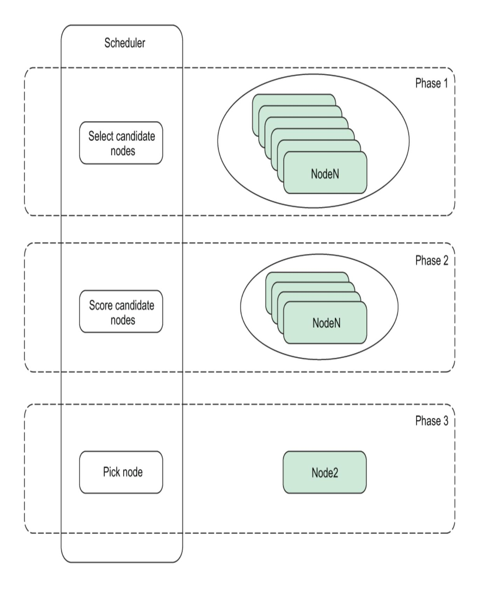

**Figure 10.1 The scheduling problem can be broken down into three phases: selecting candidate nodes, scoring candidate**

#### **nodes, and finally, picking one of the nodes.**

Using just these three methods, we can implement any number of schedulers. However, before we dive into writing any new code, let's revise our Scheduler interface with a few more details.

To start, we want our SelectCandidateNodes method to accept a task and a list of nodes. As we will soon see, this method acts as a filter early in the scheduling process, reducing the number of possible workers to only those we are confident can run the task. For example, if our task needs 1 GB of disk space because we haven't taken the time to reduce the size of our Docker image, then we only want to consider scheduling the task onto workers that have at least 1 GB of disk space available to download our image. As a result, SelectCandidateNodes returns a list of nodes that will, at a minimum, meet the resource requirements of the task.

Next, we want our Score method to also accept a task and list of nodes as parameters. This method performs the heavy lifting. Depending on the scheduling algorithm we're implementing, this method assigns a score to each candidate node it receives. Then it returns a map[string]float64, where the map key is the name of the node and the value is its score.

Finally, our Pick method needs to accept a map of scores (i.e., the output of the Score method) and a list of candidate nodes. Then it picks the node with the best score. The definition of *best* is left as an implementation detail.

#### **Listing 10.1 The updated Scheduler interface**

```
type Scheduler interface {
 SelectCandidateNodes(t task.Task, nodes []*node.Node) []*node.Node
 Score(t task.Task, nodes []*node.Node) map[string]float64
 Pick(scores map[string]float64, candidates []*node.Node) *node.Node
}
```

# <span id="page-270-0"></span>*10.4 Adapting the round-robin scheduler to the scheduler interface*

<span id="page-270-1"></span>

## **Listing 10.3 The SelectCandidateNodes method for the round-robin scheduler**

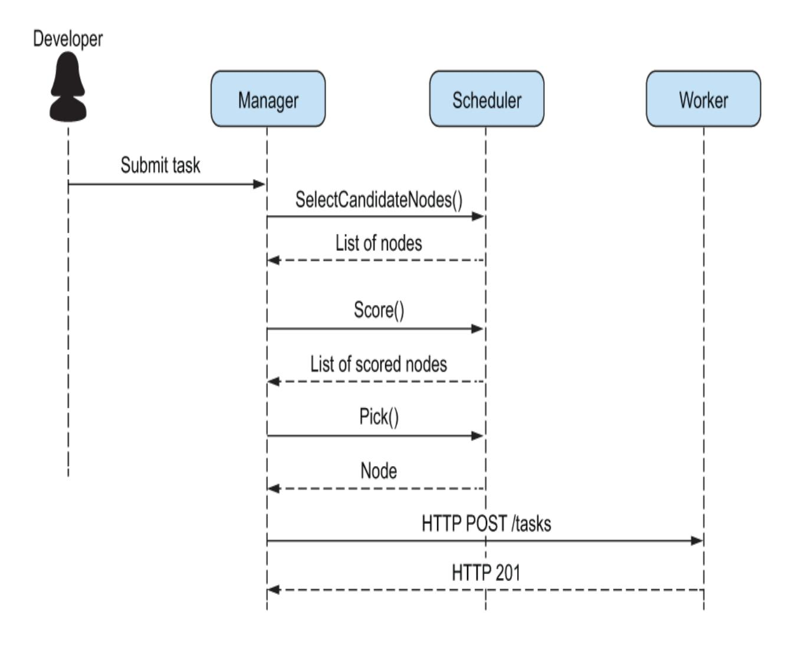

**Figure 10.2 Sequence diagram showing the interactions between the manager, scheduler, and worker**

Let's start by opening the scheduler.go file and creating the RoundRobin struct seen in listing 10.2. Our struct has two fields: Name, which allows us to give it a descriptive name, and LastWorker, which will take over the role of the field with the same name from the Manager struct.

## <span id="page-271-0"></span>**Listing 10.2 The RoundRobin struct**

```
type RoundRobin struct {
 Name string
 LastWorker int
}
```

Next, let's implement the SelectCandidateNodes method for our round-robin scheduler. Because we are adapting our original implementation, not improving upon it, we're going to simply return the list of nodes that are passed in as one of the two method parameters. While it might seem a bit silly for this method to just return what it received, the RoundRobin scheduler needs to implement this method to meet the contract of the Scheduler interface.

## <span id="page-272-1"></span>**Listing 10.3 The SelectCandidateNodes method for the round-robin scheduler**

```
func (r *RoundRobin) SelectCandidateNodes(t task.Task, nodes []*node.Node)
[]*node.Node {
 return nodes
}
```

Now let's implement the Score method for our round-robin implementation. Here we're effectively taking the code from the existing manager's SelectWorker method and pasting it into the Score method. We do, however, need to make a few modifications.

<span id="page-272-2"></span>First, we define the nodeScores variable, which is of type map[string]float64. This variable will hold the scores we assign to each node. Depending on the number of nodes we're using, the resulting map will look something like this:

```
{
 "node1": 1.0,
```

```
 "node2": 0.1,
 "node3": 1.0,
}
```

Second, we iterate over the list of nodes that are passed into the method and build our map of nodeScores. Notice that our method of scoring is not that sophisticated. We check whether the index is equal to the newWorker variable, and if it is, we assign the node a score of 0.1. If the index is not equal to the newWorker, we give it a score of 1.0. Once we have built our map of nodeScores, we return it. Thus, the Score method adapts the original code from the manager's SelectWorker method to the Score method of the Scheduler interface.

#### <span id="page-273-0"></span>**Listing 10.4 The Score method**

```
func (r *RoundRobin) Score(t task.Task, nodes []*node.Node)
➥ map[string]float64 {
 nodeScores := make(map[string]float64) ❶
 var newWorker int ❷
 if r.LastWorker+1 < len(nodes) {
 newWorker = r.LastWorker + 1
 r.LastWorker++
 } else {
 newWorker = 0
 r.LastWorker = 0
 }
 for idx, node := range nodes { ❸
 if idx == newWorker {
 nodeScores[node.Name] = 0.1
 } else {
 nodeScores[node.Name] = 1.0
 }
 }
 return nodeScores ❹
}
```

❶ Defines the nodeScores map that will hold the scores for each node

- ❷ Defines the newWorker variable, an integer that represents the worker that should be selected to run a task
- ❸ Iterates over the list of nodes and assigns a score to each
- ❹ Returns the nodeScores map

With the SelectCandidateNodes and Score methods implemented, let's turn our attention to the final method of the Scheduler interface, the Pick method. As its name suggests, this method picks the best node to run a task. It accepts a map[string]float64, which will be the scores returned from the Score method. It also accepts a list of candidate nodes. It returns a single type of a pointer to a node.Node.

<span id="page-274-0"></span>For the purposes of the round-robin implementation, the best score is the lowest score. So if we had a list of three nodes with scores of 0.1, 1.0, and 1.0, the node with the 0.1 score would be selected.

#### **Listing 10.5 The round-robin scheduler's Pick method**

```
func (r *RoundRobin) Pick(scores map[string]float64,
 ➥ candidates []*node.Node) *node.Node {
 var bestNode *node.Node
 var lowestScore float64
 for idx, node := range candidates { ❶
 if idx == 0 { ❷
 bestNode = node
 lowestScore = scores[node.Name]
 continue
 }
 if scores[node.Name] < lowestScore { ❸
 bestNode = node
 lowestScore = scores[node.Name]
 }
 }
 return bestNode ❹
}
```

- ❶ Iterates over the slice of candidate nodes
- ❷ Handles the special case of the first node in the slice
- ❸ Checks whether the node's score is lower than the current lowestScore
- ❹ Returns the bestNode, which in this case is the node with the lowest score

<span id="page-275-2"></span>With the implementation of the Pick method, we have completed adapting the round-robin scheduler to the Scheduler interface. Now let's see how we can use it.

# <span id="page-275-0"></span>*10.5 Using the new scheduler interface*

To use the new Scheduler interface, there are a few changes we need to make to the manager. There are three types of changes:

- <span id="page-275-3"></span>Adding new fields to the Manager struct
- Modifying the New helper function in the manager package
- Modifying several of the manager's methods to use the scheduler

# <span id="page-275-1"></span>*10.5.1 Adding new fields to the Manager struct*

The first set of changes to make is to add two new fields to our Manager struct. As you can see in listing 10.6, the first is a field named WorkerNodes. This field is a slice of pointers of node.Node. It will hold instances of each worker node. The second field we need to add is Scheduler, which is our new interface type scheduler.Scheduler. As you will see later, defining the

Scheduler field type as the Scheduler interface allows the manager to use any scheduler that implements the interface.

<span id="page-276-1"></span>

## **Listing 10.6 Adding the WorkerNodes and Scheduler fields to the Manager struct**

```
type Manager struct {
 // previous code not shown
 WorkerNodes []*node.Node
 Scheduler scheduler.Scheduler
}
```

## <span id="page-276-0"></span>*10.5.2 Modifying the New helper function*

The second set of changes involves modifying the New function in the manager package. We need to add the schedulerType parameter to the function signature. This parameter will allow us to create a manager with one of the concrete scheduler types, starting with the RoundRobin type.

## <span id="page-276-2"></span>**Listing 10.7 The New helper function, modified to take a new argument, schedulerType**

```
func New(workers []string, schedulerType string) *Manager {
```

The next change to the function happens in the body. We define the variable nodes to hold a slice of pointers to the node.Node type. We're going to perform this work inside the existing loop over the workers slice. Inside this loop, we create a node by calling the node.NewNode function, passing it the name of the worker, the address for the worker's API (e.g., [http://192.168.33.17:5556\)](http://192.168.33.17:5556/), and

<span id="page-277-0"></span>the node's role. All three values passed in to the NewNode function are strings. Once we have created the node, we add it to the slice of nodes by calling the built-in append function.

After creating the list of nodes, we can move on to the next-to-last change in the function body. Depending on the schedulerType passed in, we need to create a scheduler of the appropriate type. To do this, we create the variable s to hold the scheduler. Then we use a switch statement to initialize the appropriate scheduler. We start out with only a single case to support the "roundrobin" scheduler. If schedulerType is not "roundrobin" or is the empty string "", then we hit the default case and set a reasonable default. Since we only have a single scheduler right now, we'll just use it.

<span id="page-277-2"></span>The final changes to the function are simple. We need to add our list of nodes and our scheduler s to the Manager that we're returning at the end of the function. We do this by adding the slice of nodes to the WorkerNodes field and the scheduler s to the Scheduler field.

## <span id="page-277-1"></span>**Listing 10.8 Changing the New helper function to use the new Scheduler interface**

```
func New(workers []string, schedulerType string) *Manager {
 // previous code not shown
 var nodes []*node.Node
 for worker := range workers {
 workerTaskMap[workers[worker]] = []uuid.UUID{}
 nAPI := fmt.Sprintf("http://%v", workers[worker])
 n := node.NewNode(workers[worker], nAPI, "worker")
 nodes = append(nodes, n)
```

```
 }
 var s scheduler.Scheduler
 switch schedulerType {
 case "roundrobin":
 s = &scheduler.RoundRobin{Name: "roundrobin"}
 default:
 s = &scheduler.RoundRobin{Name: "roundrobin"}
 }
 return &Manager{
 Pending: *queue.New(),
 Workers: workers,
 TaskDb: taskDb,
 EventDb: eventDb,
 WorkerTaskMap: workerTaskMap,
 TaskWorkerMap: taskWorkerMap,
 WorkerNodes: nodes,
 Scheduler: s,
 }
}
```

With these changes to the New function, we can now create our manager with different types of schedulers. But we still have more work to do on our manager before it can actually use the scheduler.

The next piece of the Manager type we need to change is the SelectWorker method. We're going to scrap the previous implementation of this method and replace it. Why? Because the previous implementation was specifically geared toward the roundrobin scheduling algorithm. With the creation of the Scheduler interface and the RoundRobin implementation of that interface, we need to refactor the SelectWorker method to operate on the scheduler interface.

<span id="page-278-0"></span>As you can see in listing 10.9, the SelectWorker method becomes more straightforward. It does the following:

- Calls the manager's Scheduler.SelectCandidateNodes method, passing it the task t and the slice of nodes in the manager's WorkerNodes field. If the call to SelectCandidateNodes results in the candidates variable being nil, we return an error.
- <span id="page-279-2"></span><span id="page-279-0"></span>Calls the manager's Scheduler.Score method, passing it the task t and slice of candidates.
- Calls the manager's Scheduler.Pick method, passing it the scores from the previous step and the slice of candidates.
- <span id="page-279-3"></span><span id="page-279-1"></span>Returns the selectedNode.

## **Listing 10.9 The SelectWorker method using the Scheduler interface**

```
func (m *Manager) SelectWorker(t task.Task) (*node.Node, error) {
 candidates := m.Scheduler.SelectCandidateNodes(t, m.WorkerNodes)
 if candidates == nil {
 msg := fmt.Sprintf("No available candidates match resource request
 ➥ for task %v", t.ID)
 err := errors.New(msg)
 return nil, err
 }
 scores := m.Scheduler.Score(t, candidates)
 selectedNode := m.Scheduler.Pick(scores, candidates)
 return selectedNode, nil
}
```

Now let's move on to the SendWork method of the manager. In the original version, the beginning of the method looked like that shown in listing 10.10. Notice that we called the SelectWorker method first, and we didn't pass it a task. We need to rework the beginning of

<span id="page-280-0"></span>this method to account for the previous changes we made to the SelectWorker method.

#### **Listing 10.10 The original SendWork method**

```
func (m *Manager) SendWork() {
 if m.Pending.Len() > 0 {
 w := m.SelectWorker()
 e := m.Pending.Dequeue()
 te := e.(task.TaskEvent)
 t := te.Task
 log.Printf("Pulled %v off pending queue\n", t)
 m.EventDb[te.ID] = &te
 m.WorkerTaskMap[w] = append(m.WorkerTaskMap[w], te.Task.ID)
 m.TaskWorkerMap[t.ID] = w
```

Instead of calling the SelectWorker method first, we now want to pop a task off the manager's pending queue as the first step. Then we do some accounting work, notably adding the task.TaskEvent te to the manager's EventDb map. It's only after pulling a task off the queue and doing the necessary accounting work that we then call the new version of SelectWorker. Moreover, we pass the task t to the new SelectWorker method. Thus, the new SendWork method re-orders the steps in the process

#### **Listing 10.11 The new SendWork method**

of sending a task to a worker.

```
func (m *Manager) SendWork() {
 if m.Pending.Len() > 0 {
 e := m.Pending.Dequeue()
 te := e.(task.TaskEvent)
 m.EventDb[te.ID] = &te
 log.Printf("Pulled %v off pending queue", te)
 t := te.Task
 w, err := m.SelectWorker(t)
```

```
 if err != nil {
 log.Printf("error selecting worker for task %s: %v\n", t.ID, err)
 }
```

One important thing to note about the previous changes: the type returned from the new implementation of SelectWorker is no longer a string. SelectWorker now returns a type of node.Node. To make this more concrete, the old version of SelectWorker returned a string that looked like 192.168.13.13:1234. So we need to make a few minor adjustments throughout the remainder of the SendWork method to replace any usage of the old string value held in the variable w with the value of the node's Name field. The following listing shows that the w variable has changed from a string to a node.Node type, so we need to use the w.Name field.

#### <span id="page-281-1"></span>**Listing 10.12 Using the w.Name field**

```
m.WorkerTaskMap[w.Name] = append(m.WorkerTaskMap[w.Name], te.Task.ID)
m.TaskWorkerMap[t.ID] = w.Name
url := fmt.Sprintf("http://%s/tasks", w.Name)
}
```

<span id="page-281-2"></span>With that, we've completed all the necessary changes to our manager. Well, sort of.

# <span id="page-281-0"></span>*10.6 Did you notice the bug?*

Up until this chapter, we've been working with a single instance of the worker. This choice made it easier for us to focus on the bigger

<span id="page-282-1"></span>picture. In the next section, however, we're going to modify our main.go program to start three workers.

There is a problem lurking in the manager's SendWork method. Notice that it's popping a task off its queue and then selecting a worker where it will send that task. What happens, however, when the task popped off the queue is for an already existing task? The most obvious case for this behavior is stopping a running task. In such a case, the manager already knows about the running task and the associated task event, so we shouldn't create new ones. Instead, we need to check for an existing task and update it as necessary.

Our code in the previous chapters was working by chance. Since we were running a single worker, the SelectWorker method only had one choice when it encountered a task intended to stop a running task. Since we're now running three workers, there is a 67% chance that the existing code will select a worker where the existing task to be stopped is *not* running. Let's fix this problem!

<span id="page-282-2"></span>To start, let's introduce a new method to our manager, called stopTask. This method takes two arguments: a worker of type string and a taskID also of type string. From the name of the method and the names of the parameters, it's obvious what the method will do. It uses the worker and taskID arguments to build a URL to the worker's /tasks/{taskID} endpoint. Then it creates a request by calling the NewRequest function in the http package. Next, it executes the request.

#### <span id="page-282-0"></span>**Listing 10.13 The new stopTask method**

```
func (m *Manager) stopTask(worker string, taskID string) {
 client := &http.Client{}
```

```
 url := fmt.Sprintf("http://%s/tasks/%s", worker, taskID)
 req, err := http.NewRequest("DELETE", url, nil)
 if err != nil {
 log.Printf("error creating request to delete task %s: %v\n", taskID, err)
 return
 }
 resp, err := client.Do(req)
 if err != nil {
 log.Printf("error connecting to worker at %s: %v\n", url, err)
 return
 }
 if resp.StatusCode != 204 {
 log.Printf("Error sending request: %v\n", err)
 return
 }
 log.Printf("task %s has been scheduled to be stopped", taskID)
}
```

Now let's use the stopTask method by calling it from the SendWork method. We're going to add new code near the beginning of the first if statement, which checks the length of the manager's Pending queue. Just after the log statement that prints "Pulled %v off pending queue", add a new line, and enter the code after the // new code comment, as seen in the following listing.

<span id="page-283-0"></span>

## **Listing 10.14 Checking for existing tasks and calling the new stopTask method**

```
// existing code
if m.Pending.Len() > 0 {
 e := m.Pending.Dequeue()
 te := e.(task.TaskEvent)
 m.EventDb[te.ID] = &te
 log.Printf("Pulled %v off pending queue\n", te)
 // new code
 taskWorker, ok := m.TaskWorkerMap[te.Task.ID] ❶
 if ok {
```

```
 persistedTask := m.TaskDb[te.Task.ID] ❷
 if te.State == task.Completed &&
 ➥ task.ValidStateTransition(persistedTask.State, te.State) { ❸
 m.stopTask(taskWorker, te.Task.ID.String())
 return
 }
 log.Printf("invalid request: existing task %s is in state %v and
 ➥ cannot transition to the completed state\n",
 ➥ persistedTask.ID.String(), persistedTask.State)
 return
 }
```

- ❶ Uses the "comma ok" idiom to check for an existing task in the manager's TaskDb
- ❷ Assigns the existing task to the persistedTask variable
- ❸ If the state of the task from the Pending queue is task.Completed and the running task can be transitioned from its current state to the completed state, calls the new stopTask method

# <span id="page-284-0"></span>*10.7 Putting it all together*

Now that we've made the changes to the manager so it can make use of the new scheduler interface, we're ready to make several changes to our main.go program. As I mentioned, in previous chapters, we used a single worker. That choice was mostly one of convenience. However, given that we've implemented a more sophisticated Scheduler interface, it'll be more interesting to start up several workers. This will better illustrate how our scheduler works.

<span id="page-284-1"></span>The first change in our main program is to create three workers. To do this, we take the same approach as in previous chapters but repeat it three times to create workers w1, w2, and w3, as seen in listing 10.15. After creating each worker, we then create an API for it. Notice that for the first worker, we use the existing wport variable for the

Port field of the API. Then, to start multiple APIs, we increment the value of the wport variable so each API has a unique port to run on. This saves us from having to specify three different variables when we run the program from the command line.

#### <span id="page-285-0"></span>**Listing 10.15 Creating three workers and their APIs**

```
w1 := worker.Worker{
 Queue: *queue.New(),
 Db: make(map[uuid.UUID]*task.Task),
 }
 wapi1 := worker.Api{Address: whost, Port: wport, Worker: &w1}
 w2 := worker.Worker{
 Queue: *queue.New(),
 Db: make(map[uuid.UUID]*task.Task),
 }
 wapi2 := worker.Api{Address: whost, Port: wport + 1, Worker: &w2}
 w3 := worker.Worker{
 Queue: *queue.New(),
 Db: make(map[uuid.UUID]*task.Task),
 }
 wapi3 := worker.Api{Address: whost, Port: wport + 2, Worker: &w3}
```

Now that we have our three workers and their APIs, let's start everything up. The process is the same as in past chapters, just doing it once for each worker/API combo.

## **Listing 10.16 Starting up each worker in the same way as we did for a single worker**

```
go w1.RunTasks()
go w1.UpdateTasks()
go wapi1.Start()
go w2.RunTasks()
go w2.UpdateTasks()
go wapi2.Start()
go w3.RunTasks()
```

```
go w3.UpdateTasks()
go wapi3.Start()
```

The next change is to build a slice that contains all three of our workers:

```
workers := []string{
 fmt.Sprintf("%s:%d", whost, wport),
 fmt.Sprintf("%s:%d", whost, wport+1),
 fmt.Sprintf("%s:%d", whost, wport+2),
}
```

Now we need to update the existing call to the manager package's New function to specify the type of scheduler we want the manager to use. As you can see, we're going to start by using the "roundrobin" scheduler:

```
func main() {
 m := manager.New(workers, "roundrobin")
}
```

With these changes, we can now start up our main program. Notice that we start up in the same way, by passing in the necessary environment variables for the worker and manager and then using the command go run main.go. Also notice that the output we see looks the same as it has. We see that the program starts up the worker, then it starts up the manager, and then it starts cycling through, checking for new tasks, collecting stats, checking the status of tasks, and attempting to update any existing tasks:

```
$ CUBE_WORKER_HOST=localhost CUBE_WORKER_PORT=5556
➥ CUBE_MANAGER_HOST=localhost CUBE_MANAGER_PORT=5555 go run main.go
Starting Cube worker
Starting Cube manager
2022/11/12 11:28:48 No tasks to process currently.
2022/11/12 11:28:48 Sleeping for 10 seconds.
2022/11/12 11:28:48 Collecting stats
```

```
2022/11/12 11:28:48 Checking status of tasks
2022/11/12 11:28:48 Task updates completed
2022/11/12 11:28:48 Sleeping for 15 seconds
2022/11/12 11:28:48 Processing any tasks in the queue
2022/11/12 11:28:48 No work in the queue
2022/11/12 11:28:48 Sleeping for 10 seconds
2022/11/12 11:28:48 Checking for task updates from workers
2022/11/12 11:28:48 Checking worker localhost:5556 for task updates
2022/11/12 11:28:48 Checking worker localhost:5557 for task updates
2022/11/12 11:28:48 Checking worker localhost:5558 for task updates
2022/11/12 11:28:48 Performing task health check
2022/11/12 11:28:48 Task health checks completed
2022/11/12 11:28:48 Sleeping for 60 seconds
```

Next, let's send a task to our manager. We'll use the same command that we have in past chapters to start up an instance of the echo server. The output from the curl command looks like what we're used to seeing from previous chapters:

```
$ curl -X POST localhost:5555/tasks -d @task1.json
{
 "ID":"bb1d59ef-9fc1-4e4b-a44d-db571eeed203",
 "ContainerID":"",
 "Name":"test-chapter-9.1",
 "State":1,
 "Image":"timboring/echo-server:latest",
 "Cpu":0,
 "Memory":0,
 "Disk":0,
 "ExposedPorts": {
 "7777/tcp": {}
 },
 "HostPorts":null,
 "PortBindings": {
 "7777/tcp":"7777"
 },
 "RestartPolicy":"",
 "StartTime":"0001-01-01T00:00:00Z",
 "FinishTime":"0001-01-01T00:00:00Z",
 "HealthCheck":"/health",
 "RestartCount":0
}
```

After sending the task to the manager, we should see something like the following in the output of our main program. This should look

familiar. The manager is checking its pending queue for tasks, and it finds the task we sent it:

```
2022/11/12 11:40:18 Processing any tasks in the queue
2022/11/12 11:40:18 Pulled {a7aa1d44-08f6-443e-9378-f5884311019e 2
➥ 0001-01-01 00:00:00 +0000 UTC {bb1d59ef-9fc1-4e4b-a44d-db571eeed203
➥ test-chapter-9.1 1 timboring/echo-server:latest 0 0 0 map[7777/tcp:{}]
➥ map[] map[7777/tcp:7777] 0001-01-01 00:00:00 +0000 UTC 0001-01-01
➥ 00:00:00 +0000 UTC /health 0}} off pending queue
```

The following output is from the worker. It shows that the manager selected it when it called its SelectWorker method, which calls the SelectCandidateNodes, Score, and Pick methods on the scheduler:

```
Found task in queue: {bb1d59ef-9fc1-4e4b-a44d-db571eeed203 test-chapter-9.1
➥ 1 timboring/echo-server:latest 0 0 0 map[7777/tcp:{}] map[]
➥ map[7777/tcp:7777] 0001-01-01 00:00:00 +0000 UTC 0001-01-01 00:00:00
➥ +0000 UTC /health 0}: 2022/11/12 11:40:28 attempting to transition
➥ from 1 to 1
```

Once the task is running, we can see the manager check it for any updates:

```
2022/11/12 11:40:33 Checking for task updates from workers
2022/11/12 11:40:33 Checking worker localhost:5556 for task updates
2022/11/12 11:40:33 [manager] Attempting to update task
➥ bb1d59ef-9fc1-4e4b-a44d-db571eeed203
2022/11/12 11:40:33 Task updates completed
```

At this point, we can start the other two tasks we've been using in past chapters. Using the RoundRobin scheduler, you should notice the manager selecting each of the other two workers in succession.

<span id="page-288-2"></span><span id="page-288-0"></span>We can see that the round-robin scheduler works. Now let's implement a second scheduler.

# <span id="page-289-0"></span>*10.8 The E-PVM scheduler*

The next type of scheduler we're going to implement is more sophisticated than our round-robin scheduler. For our new scheduler, our goal is to spread the tasks across our cluster of worker machines so we minimize the CPU load of each node. In other words, we would rather each node in our cluster do some work and have overhead for any bursts of work.

# <span id="page-289-2"></span><span id="page-289-1"></span>*10.8.1 The theory*

To accomplish our goal of spreading the load across our cluster, we're going to use an opportunity cost approach to scoring our tasks. It is one of the approaches that Google used for its Borg orchestrator in its early days and is based on the work presented in the paper "An Opportunity Cost Approach for Job Assignment in a Scalable Computing Cluster" (<https://mosix.cs.huji.ac.il/pub/ocja.pdf>). According to the paper, "the key idea . . . is to convert the total usage of several heterogeneous resources . . . into a single homogeneous "cost." Jobs are then assigned to the machine where they have the lowest cost." The heterogenous resources are CPU and memory. The authors call this method *Enhanced PVM* (where *PVM* stands for *Parallel Virtual Machine* ).

<span id="page-289-3"></span>The main idea here is that when a new task enters the system and needs to be scheduled, this algorithm will calculate a marginal\_cost for each machine in our cluster. What does *marginal cost* mean? If each machine has a homogeneous cost that represents the total usage of all its resources, then the marginal cost <span id="page-290-1"></span>is the amount by which that homogeneous cost will increase if we add a new task to its workload.

The paper provides us with the pseudocode for this algorithm, as seen in listing 10.17. If the marginal\_cost of assigning the job to a machine is less than the MAX\_COST, we assign the machine to machine\_pick. Once we've iterated through our list of machines, machine\_pick will contain the machine with the lowest marginal cost. We will slightly modify our implementation of this pseudocode to fit our own purposes.

## **Listing 10.17 Pseudocode describing the algorithm used in the E-PVM scheduling method**

```
max_jobs = 1;
while () {
 machine_pick = 1; cost = MAX_COST
 repeat {} until (new job j arrives)
 for (each machine m) {
 marginal_cost = power(n, percentage memory utilization on
 ➥ m if j was added) +
 power(n, (jobs on m + 1/max_jobs) - power(n, memory use on m)
 ➥ - power(n, jobs on m/max_jobs));
 if (marginal_cost < cost) { machine_pick = m; }
 }
 assign job to machine_pick;
 if (jobs on machine_pick > max_jobs) max_jobs = max_jobs * 2;
}
```

## <span id="page-290-0"></span>*10.8.2 In practice*

Implementing our new scheduler, which we'll call the E-PVM scheduler, will follow a path similar to the one we used to adapt the round-robin algorithm to our scheduler interface. We start by defining the Epvm struct. Notice that we're only defining a single field, Name, because we don't need to keep track of the last selected node as we did for the round-robin scheduler:

```
type Epvm struct {
 Name string
}
```

Next, we implement the SelectCandidateNodes method of the E-PVM scheduler. Unlike the round-robin scheduler, in this version of SelectCandidateNodes, we attempt to narrow the list of potential candidates. We do this by checking that the resources the task is requesting are less than the resources the node has available. For our purposes, we're only checking disk because we want to ensure the selected node has the available disk space to download the task's Docker image. The Epvm scheduler's SelectCandidateNodes method filters out any nodes that can't meet the task's disk requirements.

## <span id="page-291-1"></span>**Listing 10.18 The Epvm scheduler's SelectCandidateNodes method**

```
func (e *Epvm) SelectCandidateNodes(t task.Task, nodes []*node.Node)
 ➥ []*node.Node {
 var candidates []*node.Node
 for node := range nodes {
 if checkDisk(t, nodes[node].Disk-nodes[node].DiskAllocated) {
 candidates = append(candidates, nodes[node])
 }
 }
 return candidates
}
func checkDisk(t task.Task, diskAvailable int64) bool {
 return t.Disk <= diskAvailable
}
```

<span id="page-292-2"></span>Now let's dive into the meat of the E-PVM scheduler. It's time to implement the Score method based on the E-PVM pseudocode.

We start by defining a couple of variables that we'll use later in the method. The first variable we define is nodeScores, which is a type of map[string]float64 and will hold the scores of each node. Next we define the maxJobs variable. We are randomly setting it to the value of 4.0, meaning each node can handle four tasks at most. I chose this value because I initially developed the code for this book using a cluster of several Raspberry Pis, and it seemed like a reasonable guess as to how many tasks each Pi could handle. In a production system, we would tune this value based on an analysis of observed metrics from our running production system.

<span id="page-292-1"></span>The next step is to iterate over each of our nodes passed into the method and calculate the marginal cost of assigning the task to the node. This process involves eight steps.

<span id="page-292-0"></span>To calculate the node's current CPU usage, we use the calculateCpuUsage helper function defined later. Then we call the calculateLoad helper function. This function takes two parameters, usage and capacity. The usage value we get from the previous call to calculateCpuUsage, and for the capacity, we use a fraction of what we think our max load will be. This definition of usage comes from the E-PVM paper, which assumes that the maximum possible load is "the smallest integer power of two greater than the largest load we have seen at any given time." Again, given that I originally developed this code using Raspberry Pis, and only three of them at that, I guessed that the highest load seen on any of the nodes was 80%.

The E-PVM scheduler's Score has the same signature as the one in the RoundRobin scheduler, but it calculates scores in a more complicated way.

#### **Listing 10.19 Signature of the E-PVM scheduler's Score**

```
const (
 // LIEB square ice constant
 // https://en.wikipedia.org/wiki/Lieb%27s_square_ice_constant
 LIEB = 1.53960071783900203869
)
func (e *Epvm) Score(t task.Task, nodes []*node.Node) map[string]float64 {
 nodeScores := make(map[string]float64)
 maxJobs := 4.0
 for _, node := range nodes {
 cpuUsage := calculateCpuUsage(node)
 cpuLoad := calculateLoad(cpuUsage, math.Pow(2, 0.8))
 memoryAllocated := float64(node.Stats.MemUsedKb()) +
 ➥ float64(node.MemoryAllocated)
 memoryPercentAllocated := memoryAllocated / float64(node.Memory)
 newMemPercent := (calculateLoad(memoryAllocated +
 ➥ float64(t.Memory/1000), float64(node.Memory)))
 memCost := math.Pow(LIEB, newMemPercent) + math.Pow(LIEB,
 ➥ (float64(node.TaskCount+1))/maxJobs) -
 ➥ math.Pow(LIEB, memoryPercentAllocated) -
 ➥ math.Pow(LIEB, float64(node.TaskCount)/float64(maxJobs))
 cpuCost := math.Pow(LIEB, cpuLoad) +
 ➥ math.Pow(LIEB, (float64(node.TaskCount+1))/maxJobs) -
 ➥ math.Pow(LIEB, cpuLoad) -
 ➥ math.Pow(LIEB, float64(node.TaskCount)/float64(maxJobs))
 nodeScores[node.Name] = memCost + cpuCost
 nodeScores[node.Name] = marginalCost
 }
 }
 return nodeScores
}
```

Our score method uses two helper functions to calculate CPU usage and load. The first of these helpers, calculateCpuUsage, is

itself a multistep process. The code for this function is based on the algorithm presented in the Stack Overflow post at <https://stackoverflow.com/a/23376195>. I won't go into more details about this algorithm because the post does a good job of covering the topic. I'd urge you to read it if you are interested.

#### **Listing 10.20 The calculateCpuUsage helper function**

```
func calculateCpuUsage(node *node.Node) *float64 {
 stat1 := getNodeStats(node)
 time.Sleep(3 * time.Second)
 stat2 := getNodeStats(node)
 stat1Idle := stat1.CpuStats.Idle + stat1.CpuStats.IOWait
 stat2Idle := stat2.CpuStats.Idle + stat2.CpuStats.IOWait
 stat1NonIdle := stat1.CpuStats.User + stat1.CpuStats.Nice +
 ➥ stat1.CpuStats.System + stat1.CpuStats.IRQ +
 ➥ stat1.CpuStats.SoftIRQ + stat1.CpuStats.Steal
 stat2NonIdle := stat2.CpuStats.User + stat2.CpuStats.Nice +
 ➥ stat2.CpuStats.System + stat2.CpuStats.IRQ +
 ➥ stat2.CpuStats.SoftIRQ + stat2.CpuStats.Steal
 stat1Total := stat1Idle + stat1NonIdle
 stat2Total := stat2Idle + stat2NonIdle
 total := stat2Total - stat1Total
 idle := stat2Idle - stat1Idle
 var cpuPercentUsage float64
 if total == 0 && idle == 0 {
 cpuPercentUsage = 0.00
 } else {
 cpuPercentUsage = (float64(total) - float64(idle)) / float64(total)
 }
 return &cpuPercentUsage
}
```

<span id="page-294-0"></span>Note that this function uses a second helper function, getNodeStats. This function, seen in the following listing, is calling the /stats endpoint on the worker node and retrieving the worker's stats at that point in time.

## **Listing 10.21 The getNodeStats helper function returning the stats for a given node**

```
func getNodeStats(node *node.Node) *stats.Stats {
 url := fmt.Sprintf("%s/stats", node.Api)
 resp, err := http.Get(url)
 if err != nil {
 log.Printf("Error connecting to %v: %v", node.Api, err)
 }
 if resp.StatusCode != 200 {
 log.Printf("Error retrieving stats from %v: %v", node.Api, err)
 }
 defer resp.Body.Close()
 body, _ := ioutil.ReadAll(resp.Body)
 var stats stats.Stats
 json.Unmarshal(body, &stats)
 return &stats
}
```

The third helper function used by our Score method is the calculateLoad function. This function is much simpler than the calculateCpuUsage function. It takes two parameters: usage, which is of type float64, and capacity, also a float64 type. Then it simply divides usage by capacity and returns the result:

```
func calculateLoad(usage float64, capacity float64) float64 {
 return usage / capacity
}
```

The final method of our E-PVM scheduler to implement is the Pick method. This method is similar to the same method in the round-robin scheduler. It differs only in changing the name of the lowestScore variable to minCost to reflect the shift to the E-PVM scheduler's focus on marginal cost. Otherwise, the method performs the same basic purpose: to select the node with the minimum, or lowest, cost.

The E-PVM scheduler's Pick method, as shown in the following listing, is almost identical to the one in the RoundRobin scheduler.

#### <span id="page-296-2"></span>**Listing 10.22 The E-PVM scheduler's Pick method**

```
func (e *Epvm) Pick(scores map[string]float64, candidates []*node.Node) *node.Node {
 minCost := 0.00
 var bestNode *node.Node
 for idx, node := range candidates {
 if idx == 0 {
 minCost = scores[node.Name]
 bestNode = node
 continue
 }
 if scores[node.Name] < minCost {
 minCost = scores[node.Name]
 bestNode = node
 }
 }
 return bestNode
}
```

With the implementation of the Pick method, we have completed the implementation of our second scheduler. This scheduler, like the round-robin scheduler, implements the Scheduler interface. As a result, we can use either scheduler in our manager. Before we change our main.go program to use this new scheduler, however, let's take a minor detour and take care of some unfinished business.

# <span id="page-296-1"></span><span id="page-296-0"></span>*10.9 Completing the Node implementation*

Earlier, we implemented a helper function named getNodeStats. This function takes a variable node, which is a pointer to a

node.Node type. As the name of the function suggests, it communicates with the node by making a GET call to the node's /stats endpoint. It then returns the resulting stats from the node as a pointer to a stats.Stats type. This function is part of the scheduler, so it's awkward to have it handle the lower-level details of calling the node's /stats endpoint, checking the response, and decoding the response from JSON.

<span id="page-297-0"></span>Let's factor this code out of the scheduler and put it where it really belongs—in the Node type. We implemented the Node type back in chapter 2, so let's review what it looks like since it has been a while since we've seen it.

<span id="page-297-1"></span>The Node type is pretty straightforward, as we can see in the next listing. Its fields hold the values that represent various attributes of our physical or virtual machine that's performing the role of the worker.

#### **Listing 10.23 The Node type defined in chapter 2**

```
type Node struct {
 Name string
 Ip string
 Cores int64
 Memory int64
 MemoryAllocated int64
 Disk int64
 DiskAllocated int64
 Stats stats.Stats
 Role string
 TaskCount int
}
```

Before we actually move the getNodesStats function, let's implement another helper function. We'll name this helper function HTTPWithRetry, and we're going to use it from the getNodesStats function. HTTPWithRetry will ensure we can (eventually) get the stats from a worker even in the case where a worker experiences transient problems—say, for example, the node rebooted or there is a temporary network problem. So rather than simply failing after a single attempt to call the /stats endpoint, we make several attempts before giving up.

<span id="page-298-1"></span>HTTPWithRetry will take a function f(string) and a string url as arguments. The f(string) argument will be an HTTP method from the net/http package (e.g., http.Get). The function returns a pointer to the HTTP response and potentially an error. When we call HTTPWithRetry, it will look like this:

```
result, err := utils.HTTPWithRetry(http.Get, "http://localhost:5556/stats")
```

In the body of the function, we initialize a counter, count, to 10. Then we use the counter in a for loop, where we call the function f(string) and check the response. If the function returns an error, we sleep for 5 seconds and then try again. If the function is successful, we break out of the loop. Finally, we return the HTTP response and an error.

<span id="page-298-0"></span>We're going to place the HTTPWithRetry function in its own package. Create a new directory in your project called utils, and inside that directory, create a file named retry.go. Inside this file, let's add the code from the following listing.

<span id="page-298-2"></span>**Listing 10.24 The HTTPWithRetry helper function in the new utils package**

```
package utils
import (
 "fmt"
 "net/http"
 "time"
)
func HTTPWithRetry(f func(string) (*http.Response, error), url string)
(*http.Response, error) {
 count := 10
 var resp *http.Response
 var err error
 for i := 0; i < count; i++ {
 resp, err = f(url)
 if err != nil {
 fmt.Printf("Error calling url %v\n", url)
 time.Sleep(5 * time.Second)
 } else {
 break
 }
 }
 return resp, err
}
```

With the HTTPWithRetry helper defined, let's return to the getNodesStats function. Remove it from our scheduler.go file, and add it to the node.go file in the node/ package directory. As part of this moving process, let's also change the name to GetStats and make it a method of the node.Node type.

#### <span id="page-299-0"></span>**Listing 10.25 Renaming the getNodeStats helper function**

```
func (n *Node) GetStats() (*stats.Stats, error) {
 var resp *http.Response
 var err error
 url := fmt.Sprintf("%s/stats", n.Api)
 resp, err = utils.HTTPWithRetry(http.Get, url)
 if err != nil {
 msg := fmt.Sprintf("Unable to connect to %v. Permanent failure.\n",
 ➥ n.Api)
 log.Println(msg)
 return nil, errors.New(msg)
```

```
 }
 if resp.StatusCode != 200 {
 msg := fmt.Sprintf("Error retrieving stats from %v: %v", n.Api, err)
 log.Println(msg)
 return nil, errors.New(msg)
 }
 defer resp.Body.Close()
 body, _ := ioutil.ReadAll(resp.Body)
 var stats stats.Stats
 err = json.Unmarshal(body, &stats)
 if err != nil {
 msg := fmt.Sprintf("error decoding message while getting stats for
 ➥ node %s", n.Name)
 log.Println(msg)
 return nil, errors.New(msg)
 }
 n.Memory = int64(stats.MemTotalKb())
 n.Disk = int64(stats.DiskTotal())
 n.Stats = stats
 return &n.Stats, nil
}
```

With the GetStats method now implemented on the Node type, we can remove the old getNodeStats helper function from scheduler.go. And finally, we can update the calculateCpuUsage helper function to use the node.GetStats method. In addition to using the node.GetStats method, let's also change the function signature to return a pointer to a float64 and an error. The changed function looks like this:

```
func calculateCpuUsage(node *node.Node) (*float64, error) {
 //stat1 := getNodeStats(node)
 stat1, err := node.GetStats()
 if err != nil {
 return nil, err
 }
 time.Sleep(3 * time.Second)
```

```
 //stat2 := getNodeStats(node)
 stat2, err := node.GetStats()
 if err != nil {
 return nil, err
 }
 // unchanged code
 return &cpuPercentUsage, nil
```

The GetStats helper calls a node's worker API, so we need to expose the /stats endpoint on the worker Api type. This change is simple:

```
func (a *Api) initRouter() {
 // previous code unchanged
 a.Router.Route("/stats", func(r chi.Router) {
 r.Get("/", a.GetStatsHandler)
 })
}
```

<span id="page-301-3"></span>With these changes, we have completed our detour. Now let's return to our fancy new E-PVM scheduler and take it for a spin!

# <span id="page-301-0"></span>*10.10 Using the E-PVM scheduler*

<span id="page-301-2"></span>At this point, we have all the work completed on our shiny new scheduler interface. We have two types of schedulers we can use in our manager: the round-robin scheduler and the E-PVM scheduler. We have already made most of the necessary changes to use the scheduler interface, but we have a few minor tweaks to make that will allow us to easily switch between the RoundRobin and Epvm scheduler types implemented previously.

The first change to make involves adding a new case to the switch statement in the manager's New function. The new case adds support for the Epvm scheduler.

<span id="page-302-0"></span>

## **Listing 10.26 Adding a new "epvm" case to the switch statement**

```
switch schedulerType {
case "roundrobin": ❶
 s = &scheduler.RoundRobin{Name: "roundrobin"}
case "epvm" ❷
 s = &scheduler.Epvm{Name: "epvm"}
default:
 s = &scheduler.RoundRobin{Name: "roundrobin"} ❸
}
```

- ❶ Existing roundrobin case creates an instance of the RoundRobin scheduler
- ❷ New epvm case creates an instance of the Epvm scheduler
- ❸ By default, uses the "roundrobin" scheduler

The second and final change happens in our main.go program. If you recall, we previously created a new instance of the manager with the "roundrobin" scheduler using the New function:

```
func main() {
 m := manager.New(workers, "roundrobin")
}
```

Now, however, we want to create an instance of the manager that will use the Epvm scheduler. To do this, we can simply change the string in the call to New from roundrobin to epvm:

```
func main() {
 m := manager.New(workers, "epvm")
}
```

That's it! We can now run our main program, and it will use the Epvm scheduler instead of the RoundRobin scheduler. Give it a try!

# *Summary*

- <span id="page-303-0"></span>The scheduling problem exists all around us, from home chores to seating customers in a restaurant.
- Scheduling does not have a one-size-fits-all solution. There are multiple solutions, and each one makes tradeoffs based on what we are trying to achieve. It can be as simple as using a roundrobin algorithm to select each node in turn. Or it can be as complex as devising a method to calculate a score for each node based on some set of data—for example, the current CPU load and memory usage of each node.
- For the purposes of scheduling tasks in an orchestration system, we can generalize the process to three functions: selecting candidate nodes, which involves reducing the number of possible nodes based on some selection criteria (e.g., does the node have enough disk space to pull the task's container image?); scoring the set of candidate nodes; and finally, picking the best candidate node.
- We can use these three functions to create a general framework to allow us to implement multiple schedulers. In Go, the interface is what allows us to create this framework.
- <span id="page-303-1"></span>In this chapter, we started three workers, in contrast to a single one in past chapters. Using three workers allowed us to see a more realistic example of how the scheduling process works. However, it's not the same as a more real-world scenario of using multiple physical or virtual machines.

#### *[OceanofPDF.com](https://oceanofpdf.com/)*

# <span id="page-305-0"></span>*11 Implementing persistent storage for tasks*

## **This chapter covers**

- Describing the purpose of a datastore in an orchestration system
- Defining the requirements for our persistent datastore
- Defining the Store interface
- Introducing BoltDB
- Implementing the persistent datastore using the Store interface
- Discussing the special concerns that exist for the manager's datastore

The fundamental unit of our orchestration system is the task. Up until now, we have been keeping track of this fundamental unit by storing it in Go's built-in map type. Both our worker and our manager store their respective tasks in a map. This strategy has served us well, but you may have noticed a major problem with it: any time we restart the worker or the manager, they lose all their tasks. The reason they lose their tasks is that Go's built-in map is an in-memory data structure and is not persisted to disk.

<span id="page-305-1"></span>Similar to how we revisited our earlier decisions around scheduling tasks, we're now going to return to our decision about how we store them. We're going to talk briefly about the purpose of a datastore in an orchestration system, and then we're going to start the process of replacing our previous in-memory map datastore with a persistent one.

# <span id="page-306-0"></span>*11.1 The storage problem*

Why do we need to store the tasks in our orchestration system? While we haven't talked much about the problem, the storage of tasks is crucial to a working orchestration system. Storing tasks in some kind of datastore enables the higher-level functionality of our system:

- <span id="page-306-1"></span>It enables the system to keep track of each task's current state.
- It enables the system to make informed decisions about scheduling.
- It enables the system to help tasks recover from failures.

As we mentioned earlier, our current implementation uses Go's builtin map type, which means we're storing tasks in memory. If we stop the manager and then start it back up because, say, we made a code change, the manager loses the state of all its tasks. We then have no way to recover the system as a whole. If we start our system with three workers and a manager, restarting the manager means we can't gracefully stop running tasks by calling the manager's API. For example, we can't call curl -X DELETE

http:localhost:5555/tasks/1234567890. The manager no longer has any knowledge of that task.

At a basic level, the solution to the problem is to replace the inmemory map with a persistent datastore. Such a solution will write the task state to disk, thus enabling the manager and worker to be restarted without any loss of state.

# <span id="page-307-0"></span>*11.2 The Store interface*

Before jumping directly to a persistent storage solution, let's follow the same process we used in the last chapter. Remember, we didn't just jump straight to the E-PVM scheduler. Instead, we started by creating the Scheduler interface, and then we adapted the existing round-robin scheduler to the interface.

<span id="page-307-2"></span><span id="page-307-1"></span>The mental model of our store interface looks like that shown in figure 11.1. At the top of the model, we have the Manager and Worker, each using the same Store interface. That interface is abstract, but as we can see, it sits on top of two concrete implementations: an In-memory Store and a Persistent Store.

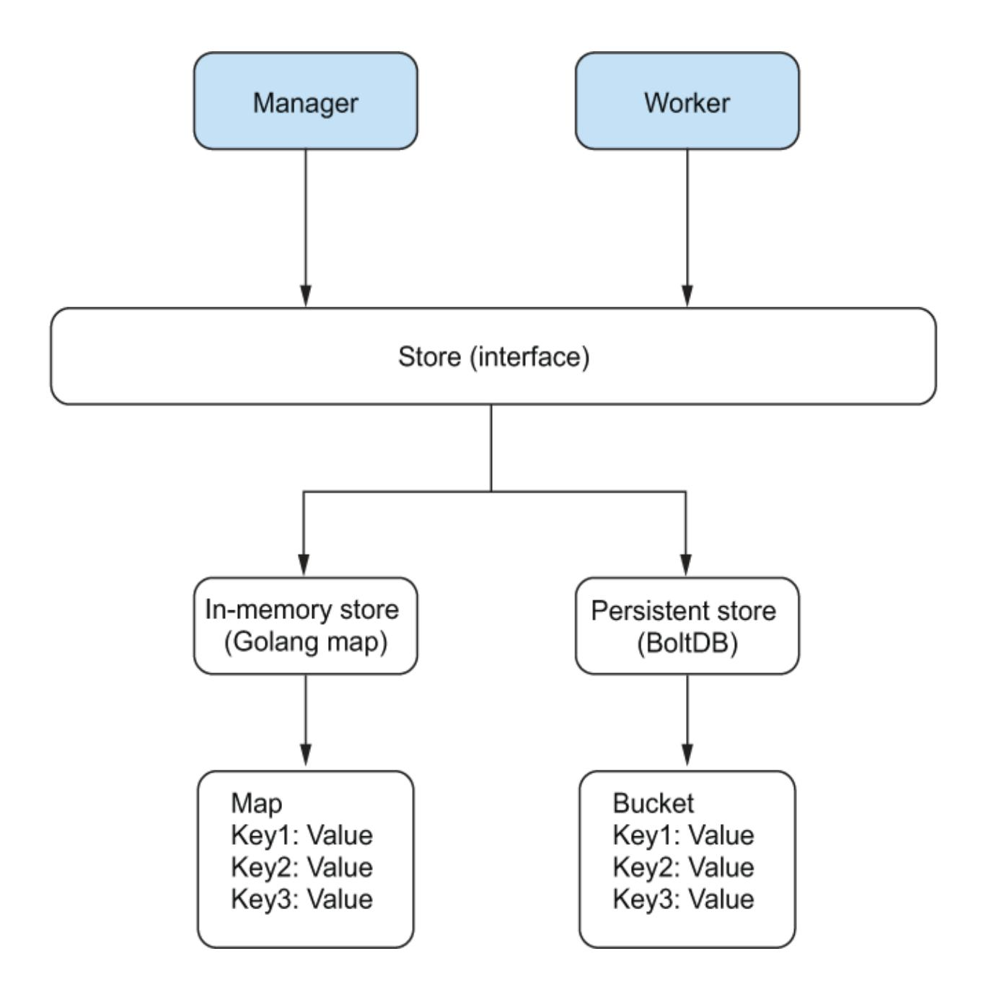

**Figure 11.1 The mental model of our store interface**

If we think about the operations we have been using to store and retrieve tasks and task events, we can identify four methods to create an interface. Those four methods are

Put(key string, value interface{})

- Get(key)
- List()
- Count()

**NOTE** You might be wondering why the list doesn't include a Remove or Delete method. Theoretically, the datastore serves as a historical record of the tasks in an orchestration system, so it doesn't make sense to provide a method to remove history. In practice, however, it could be useful to provide such a method. For example, over time, an orchestration system would build up a datastore containing tens of thousands of tasks, if not hundreds of thousands or more. If the datastore supports the Remove operation, it could be used to perform maintenance on the datastore itself.

<span id="page-309-0"></span>The Put method, as its name suggests, puts an item, identified by a key, into the store. Until now, we have been interacting with our store by saving tasks and task events directly in a map. For example, in the manager's SendWork method, we can see several examples of interacting directly with the TaskDb and EventDb stores. In the first example, we pop a task event off the manager's Pending queue, convert it to the task .TaskEvent type, and then store a pointer to the task.TaskEvent in the EventDb using the task event's ID as the key. In the second example, we extract the task from the task event and then store a pointer to it in the TaskDb using the task's ID as the key.

<span id="page-309-1"></span>**Listing 11.1 Examples of using Go's built-in map to store tasks and events**

```
e := m.Pending.Dequeue()
te := e.(task.TaskEvent)
m.EventDb[te.ID] = &te ❶
t := te.Task
// code hidden for the sake of brevity
t.State = task.Scheduled
m.TaskDb[t.ID] = &t ❷
```

- ❶ Putting a task event directly into the EventDb map
- ❷ Putting a task directly into the TaskDb map

There is nothing technically wrong with how we've implemented the task and task event stores up to now. It is quick and easy. More importantly, it just works. One downside to this implementation, however, is that it is dependent on the underlying data structure underpinning the store. In this case, the manager must know how to put items into and retrieve them from Go's built-in map. In other words, we have tightly coupled the manager to the built-in map type. We cannot easily change out this implementation of the store for some other implementation. For example, what if we wanted to use SQLite, a popular SQL-based embedded datastore?

To make it easier for us to use different implementations of a datastore, let's create the Store interface seen in the next listing. The interface includes the four methods we listed previously, Put, Get, List, and Count.

#### **Listing 11.2 The Store interface**

```
type Store interface {
 Put(key string, value interface{}) error
 Get(key string) (interface{}, error)
 List() (interface{}, error)
```

```
 Count() (int, error)
}
```

One thing to note in our Store interface is that we have declared several values in the method signatures as being of type interface{}. The *empty interface*, as this is called, means that the value can be of any type. For example, the Put method takes a key that is a string and a value that is an empty interface or any type. This means the Put method can accept a value that is a task.Task, task.TaskEvent, or some other type.

<span id="page-311-2"></span><span id="page-311-1"></span>With the Store interface defined, let's move on and implement an in-memory store that can replace our existing one.

# <span id="page-311-0"></span>*11.3 Implementing an in-memory store for tasks*

<span id="page-311-3"></span>We're going to start with an implementation of the task store, and then we'll move on to the task events store. Both the manager and worker use task stores, but only the manager uses an event store. The new implementations of the task and event stores will both wrap Go's built-in map type. By wrapping the built-in map type, we can remove the manager's coupling to the underlying data structure. Instead of needing to understand the mechanics of a map, the manager will simply call the methods of the Store interface, and the implementation of the interface will handle all the lower-level details of how to interact with the underlying data structure.

For our purposes, we're going to implement separate types for the task and event stores. We could create a generate store that is able to operate on both tasks and events, but that is more complex and would involve additional concepts that are beyond the scope of this book.

The first implementation is the InMemoryTaskStore, which provides a wrapper around Go's built-in map type for the purpose of storing tasks. We start by defining a struct and giving it a single field called Db. Not surprisingly, this field is of type map[string]\*task.Task, the same as the current implementation. Next, let's define a helper function that will return an instance of the InMemoryTaskStore. We'll call this helper function NewInMemoryTaskStore, and it takes no arguments and returns a pointer to an InMemoryTaskStore that has its Db field initialized to an empty map of type map[string]\*task.Task.

#### <span id="page-312-0"></span>**Listing 11.3 The InMemoryTaskStore struct**

```
type InMemoryTaskStore struct {
 Db map[string]*task.Task
}
func NewInMemoryTaskStore() *InMemoryTaskStore {
 return &InMemoryTaskStore{
 Db: make(map[string]*task.Task),
 }
}
```

Let's move on and implement the Put method. The sequence diagram in figure 11.2 shows how the Put method will be used. When a user calls the manager's API to start a task (POST

<span id="page-313-0"></span>/tasks), the manager will call the Put method to store the task in its own datastore. Then the manager sends the task to the worker by calling the worker's API. The worker, in turn, calls the Put method to store the task in its datastore.

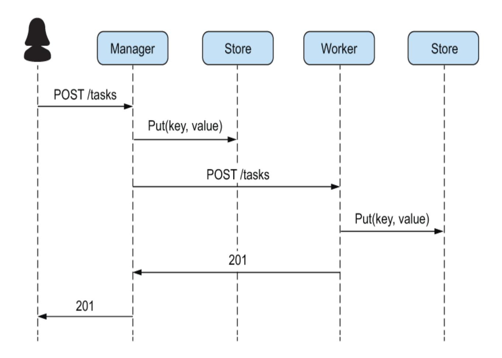

**Figure 11.2 Sequence diagram illustrating how the manager and worker save tasks to their respective datastores using the Put method**

The implementation of the Put method, seen in listing 11.4, is fairly straightforward. The method takes two arguments: a key that is of type string and a value that is of the empty interface type. In the body of the method, we first attempt to convert the value to a

concrete type using a *type assertion*. What we are doing is asserting that value is not nil and that the value in value is a pointer to a task.Task. We also capture a Boolean named ok, which tells us whether the assertion was successful. If the assertion is not successful, we return an error; otherwise, we store the task t in the map.

#### <span id="page-314-0"></span>**Listing 11.4 The Put method**

```
func (i *InMemoryTaskStore) Put(key string, value interface{}) error {
 t, ok := value.(*task.Task)
 if !ok {
 return fmt.Errorf("value %v is not a task.Task type", value)
 }
 i.Db[key] = t
 return nil
}
```

<span id="page-314-1"></span>Next, we'll implement the Get method. The sequence diagram in figure 11.3 shows how the Get method will be used. When a user calls the manager's API to get a task (Get /tasks/{taskID}), the manager will call the Get method to retrieve the task from its datastore and return it.

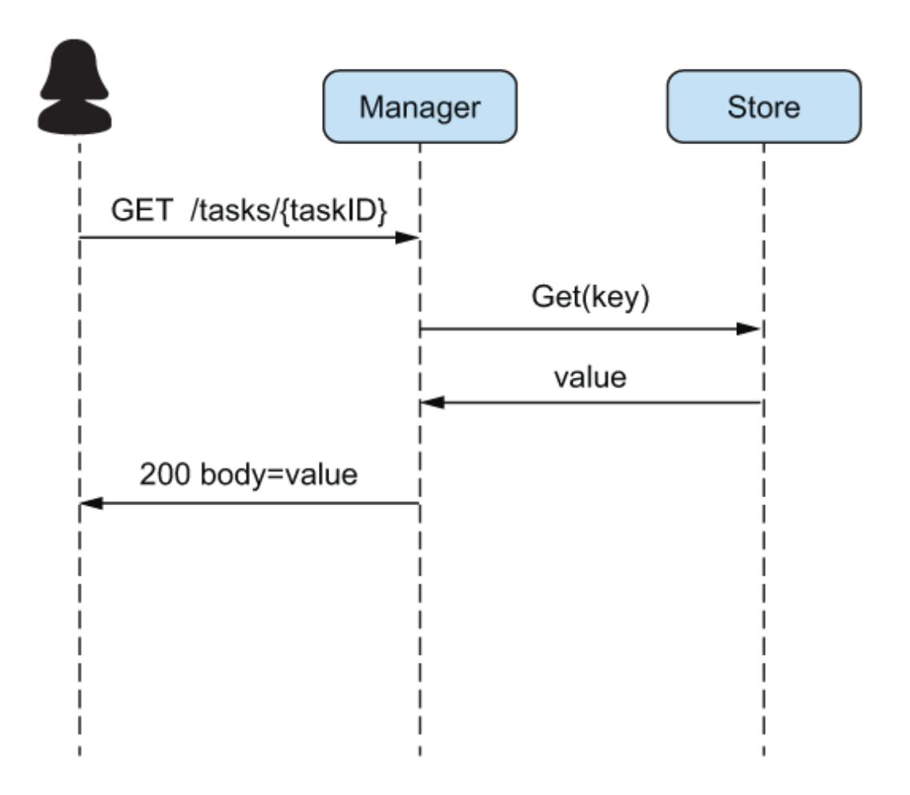

**Figure 11.3 Sequence diagram illustrating how the manager retrieves tasks from its datastore using the Get method**

The implementation of the Get method takes a key of type string and returns an empty interface and potentially an error. We start by looking for the key in the store's Db. Notice that we're using the "comma ok" idiom here too. If the key exists in Db, t will contain the task identified by the key, and we will return it. If it does not exist, t will be nil, ok will be false, and we will return an error.

#### **Listing 11.5 The Get method**

```
func (i *InMemoryTaskStore) Get(key string) (interface{}, error) {
 t, ok := i.Db[key]
```

```
 if !ok {
 return nil, fmt.Errorf("task with key %s does not exist", key)
 }
 return t, nil
}
```

The next method we'll implement is the List method. The List method builds up a slice of tasks by ranging over the map. This method always returns nil for the error value. This is necessary in order to conform to the contract specified by the Store interface.

<span id="page-316-1"></span>Unlike the Get method, which returns a single task, this method returns all the tasks in the store. As you can see in listing 11.6, we start by creating a variable called tasks as a slice of pointers to task.Task. This slice will hold all the tasks in the store. Then we range over the map in the Db field and append each task to the tasks slice. Once we've ranged over all the tasks and appended them to the slice, we return it.

#### **Listing 11.6 The List method**

```
func (i *InMemoryTaskStore) List() (interface{}, error) {
 var tasks []*task.Task
 for _, t := range i.Db {
 tasks = append(tasks, t)
 }
 return tasks, nil
}
```

<span id="page-316-0"></span>The final method in our task store is Count. As its name implies, this method returns the number of tasks contained in the store's Db field. Because Db is a map, we can get the count of items using the built-in len function.

#### **Listing 11.7 The Count function**

```
func (i *InMemoryTaskStore) Count() (int, error) {
 return len(i.Db), nil
}
```

<span id="page-317-2"></span>Now that we've implemented an in-memory version of the task store, let's move on and do the same thing for task events.

# <span id="page-317-0"></span>*11.4 Implementing an in-memory store for task events*

The store for the task events will be identical to the one for tasks. The obvious difference will be that the task events store will operate on the task.TaskEvent type and not task.Task. Because the differences are minor, we won't go into the details.

## <span id="page-317-1"></span>**Listing 11.8 The InMemoryTaskEventStore**

```
type InMemoryTaskEventStore struct {
 Db map[string]*task.TaskEvent
}
func NewInMemoryTaskEventStore() *InMemoryTaskEventStore {
 return &InMemoryTaskEventStore{
 Db: make(map[string]*task.TaskEvent),
 }
}
func (i *InMemoryTaskEventStore) Put(key string, value interface{}) error {
 e, ok := value.(*task.TaskEvent)
 if !ok {
 return fmt.Errorf("value %v is not a task.TaskEvent type", value)
 }
 i.Db[key] = e
 return nil
}
func (i *InMemoryTaskEventStore) Get(key string) (interface{}, error) {
```

```
 e, ok := i.Db[key]
 if !ok {
 return nil, fmt.Errorf("task event with key %s does not exist", key)
 }
 return e, nil
}
func (i *InMemoryTaskEventStore) List() (interface{}, error) {
 var events []*task.TaskEvent
 for _, e := range i.Db {
 events = append(events, e)
 }
 return events, nil
}
func (i *InMemoryTaskEventStore) Count() (int, error) {
 return len(i.Db), nil
}
```

# <span id="page-318-0"></span>*11.5 Refactoring the manager to use the new in-memory stores*

At this point, we have defined an interface that will allow us to store tasks and events. We have also implemented two concrete types of our store interface, both of which wrap Go's built-in map type and remove the need for the manager and worker to interact with it directly. Let's make some changes to the manager and worker so they can make use of our new code.

<span id="page-318-1"></span>Starting with the manager, we need to update the TaskDb and EventDb fields on the Manager struct. Instead of these fields being of type map[uuid.UUID]\*task.Task and map[uuid.UUID]\*task.TaskEvent, let's change them both to be of type store.Store. With this change, our manager can

<span id="page-319-1"></span>now use any kind of store that implements the store.Store interface:

```
type Manager struct {
 // fields omitted for convenience
 TaskDb store.Store
 EventDb store.Store
 // fields omitted
```

Changing the TaskDb and EventDb fields to an interface type should look familiar to you. If you remember, in chapter 10, we did something similar when we introduced the Scheduler field, which was of type scheduler.Scheduler, also an interface. That change allowed us to configure the manager to use different types of schedulers, and now we have configured it to use different types of stores.

<span id="page-319-3"></span>Next, let's modify the New function in the manager package. In the last chapter, we updated it so it accepted a schedulerType in addition to a slice of workers. Now let's add another argument to the New function, one called dbType. The new signature will look like the following:

```
func New(workers []string, schedulerType string, dbType string) *Manager
```

<span id="page-319-2"></span>There are several changes to the body of the New function that we'll need to make next. The first of these changes is to remove the initialization of the taskDb and eventDb variables using the make() built-in function. Just delete those two lines for now. We're going to do something slightly different here in a bit.

<span id="page-320-1"></span>Now we want to change how we're returning from the function. We are currently returning a pointer to the Manager type like this:

```
return &Manager{ ... }
```

<span id="page-320-2"></span>Instead of returning a pointer using what's called a *struct literal*, let's assign it to a variable named m. It will look like the following listing.

## **Listing 11.9 Assigning a struct literal to the m variable instead of returning it**

```
m := Manager{
 Pending: *queue.New(),
 Workers: workers,
 WorkerTaskMap: workerTaskMap,
 TaskWorkerMap: taskWorkerMap,
 WorkerNodes: nodes,
 Scheduler: s,
}
```

<span id="page-320-0"></span>At this point, we have an instance of our Manager type, but it does not have any stores for tasks and events. We're going to use the dbType variable we added to the New function's signature as part of a switch statement to allow us to set up different types of datastores based on the value of dbType. Because we've only implemented in-memory stores, we're going to start by only supporting the case where the value of dbType is memory. In this case, we call the NewInMemoryTaskStore function to create an instance of our in-memory task store, and we call the NewInMemoryTaskEventStore function to create an instance of our in-memory event store.

<span id="page-321-0"></span>All that's left to do now is to assign the value of the ts variable to the manager's TaskDb field and assign the es value to the manager's EventDb field. Then return a pointer to the manager:

```
var ts store.Store ❶
var es store.Store
switch dbType { ❷
case "memory": ❸
 ts = store.NewInMemoryTaskStore()
 es = store.NewInMemoryTaskEventStore()
}
m.TaskDb = ts ❹
m.EventDb = es ❺
return &m ❻
```

- ❶ Creates variables called ts and es to hold store.Store types
- ❷ Uses a switch statement on the dbType variable
- ❸ Adds the "memory" case, which assigns the value of the NewInMemoryTaskStore call to the ts variable and the NewInMemoryTaskEventStore to the es variable
- ❹ Assigns the ts variable to the manager's TaskDb field
- ❺ Assigns the es variable to the manager's EventDb field
- ❻ Returns a pointer to the manager m

Now we're ready for the substantive changes! We need to change the manager's methods so it interacts with the datastore using the methods of our new Store interface instead of operating directly on the map structures. The first method we'll work on is updateTasks.

<span id="page-321-1"></span>All of the changes we need to make in the updateTasks method occur inside the for loop that ranges over a slice of pointers to task.Task types. The first change to make involves replacing the block of code that checks whether an individual task reported by a worker exists in the manager's task store. The current code uses the

"comma ok" idiom to perform this check. We'll replace this block with a call to the store interface's Get method and check the err value to indicate that the task doesn't exist in the manager's store.

<span id="page-322-1"></span>We can see this change in listing 11.10. The existing code is commented out, and its replacement follows just afterward. Now our updated code is calling the Get method on the manager's TaskDb store, passing it the ID of the task as a string. If the task exists in the manager's store, it will be assigned to the result variable, and if there is an error, it will be assigned to the err variable. Next, we perform the usual error checking, and if there is an error, we log it and move on to the next task using the continue statement. Finally, we use a type assertion to convert the result, which is of type interface{} to the concrete task.Task type (actually a pointer to a task.Task). If the type assertion fails, we log a message and continue to the next task.

<span id="page-322-0"></span>

## **Listing 11.10 Using the new datastore interface to get a task from TaskDb**

```
for _, t := range tasks {
 // previous code omitted for convenience
 // existing code to be replaced
 // _, ok := m.TaskDb[t.ID]
 // if !ok {
 // log.Printf("[manager] Task with ID %s not found\n", t.ID)
 // continue
 // }
 result, err := m.TaskDb.Get(t.ID.String())
 if err != nil {
 log.Printf("[manager] %s\n", err)
 continue
 }
 taskPersisted, ok := result.(*task.Task)
```

```
 if !ok {
 log.Printf("cannot convert result %v to task.Task type\n", result)
 continue
 }
```

The last set of changes to make in the updateTasks method involves replacing the remaining direct operations on the existing map structure with calls to the appropriate methods of the Store interface. The existing code can be seen in the next listing. Here we are modifying a task by directly changing its fields in the map.

#### **Listing 11.11 Existing code directly accessing the TaskDB map**

```
if m.TaskDb[t.ID].State != t.State {
 m.TaskDb[t.ID].State = t.State
}
m.TaskDb[t.ID].StartTime = t.StartTime
m.TaskDb[t.ID].FinishTime = t.FinishTime
m.TaskDb[t.ID].ContainerID = t.ContainerID
m.TaskDb[t.ID].HostPorts = t.HostPorts
```

We want to replace the previous code with that shown in listing 11.12. Since we have already retrieved the task from the manager's task store and converted it from an empty interface type to a pointer to the concrete task.Task type, we can simply update the necessary fields on the taskPersisted variable. Then we finish up by calling the store's Put method to save the updated task.

<span id="page-323-0"></span>

## **Listing 11.12 Using the new datastore interface to put a task in the TaskDb**

```
if taskPersisted.State != t.State {
 taskPersisted.State = t.State
```

```
}
taskPersisted.StartTime = t.StartTime
taskPersisted.FinishTime = t.FinishTime
taskPersisted.ContainerID = t.ContainerID
taskPersisted.HostPorts = t.HostPorts
m.TaskDb.Put(taskPersisted.ID.String(), taskPersisted)
```

The GetTasks method is the next method we need to update. It uses a for loop to range over all the tasks in the manager's task store. Up to now, this method has been ranging directly over the map of tasks. So we need to change GetTasks to use the Store interface's List method, convert the result from a slice of empty interfaces to a slice of pointers to task.Task types, and return that slice.

#### <span id="page-324-0"></span>**Listing 11.13 The GetTasks method**

```
func (m *Manager) GetTasks() []*task.Task {
 taskList, err := m.TaskDb.List() ❶
 if err != nil { ❷
 log.Printf("error getting list of tasks: %v\n", err)
 return nil
 }
 return taskList.([]*task.Task) ❸
}
```

- ❶ Calls the List method on the manager's TaskDb, assigning the returned value to taskList and any error to the err variable
- ❷ Handles any errors from the List method
- ❸ Returns the slice of tasks, converting from the empty interface returned by List to a slice of pointers to the task.Task type

The next method that needs updating is the restartTask method. This one is easy. It currently has a single interaction with the map

<span id="page-325-1"></span>built-in, so all we need to do is replace it with a call to the store's Put method. So it's just a matter of replacing the first line with the second:

```
// m.TaskDb[t.ID] = t
m.TaskDb.Put(t.ID.String(), t)
```

The final method to update is the SendWork method. Despite being a long method that encompasses a multistep process to send tasks to workers, we have only a few updates to make here. The first update involves our first interaction with the new EventDb store. We want to change from interacting directly with the old task events map to using the new EventDb store. Early on in the SendWork method, we popped an event off the manager's Pending queue and converted it to task.TaskEvent type. Now we want to call the Put method on the events store, passing it the event ID as a string and a pointer to the task event te. If the call to Put returns an error, we log it and return.

<span id="page-325-0"></span>

## **Listing 11.14 The first change to the SendWork method, using the new Put method**

```
e := m.Pending.Dequeue()
te := e.(task.TaskEvent)
err := m.EventDb.Put(te.ID.String(), &te)
if err != nil {
 log.Printf("error attempting to store task event %s: %s\n",
 ➥ te.ID.String(), err)
 return
}
```

The second update involves this method's use of the tasks store. In listing 11.15, we can see the existing code where we are again interacting directly with the TaskDb map. Since this code is getting a <span id="page-326-0"></span>task from the map, we want to convert the code to use the store interface's Get method as we've done previously.

## **Listing 11.15 Existing code that gets a task from the store by operating directly on the map**

```
taskWorker, ok := m.TaskWorkerMap[te.Task.ID]
if ok {
 persistedTask := m.TaskDb[te.Task.ID]
 if te.State == task.Completed && task.ValidStateTransition(
 ➥ persistedTask.State, te.State) {
 m.stopTask(taskWorker, te.Task.ID.String())
 return
 }
}
```

To change the code to use our new Get method on the store interface, we need to rearrange our code a little:

```
result, err := m.TaskDb.Get(te.Task.ID.String()) ❶
if err != nil { ❷
 log.Printf("unable to schedule task: %s", err)
 return
}
persistedTask, ok := result.(*task.Task) ❸
if !ok { ❹
 log.Printf("unable to convert task to task.Task type")
 return
}
```

- ❶ Calls the task store's Get method and assigns the returned task and any error to appropriately named variables
- ❷ Handles any errors returned from the call to Get
- ❸ Uses a type assertion to convert the result to a pointer to a task.Task
- ❹ Checks that the type assertion was successful

The final update to the SendWork method, and our final update to the manager, involves another change to use the task store's Put

<span id="page-327-3"></span>method instead of inserting a task directly in a map:

```
t.State = task.Scheduled
// m.TaskDb[t.ID] = &t
m.TaskDb.Put(t.ID.String(), &t)
```

In addition to the changes we just made on the Manager struct, we need to make one small change to the manager's StopTaskHandler method on the API struct. There is one line where we are accessing the manager's TaskDb map directly. Instead, we simply need to change this line to use the Store interface's Get method.

#### <span id="page-327-1"></span>**Listing 11.16 Calling the Store interface's Get method**

```
// taskToStop, ok := a.Manager.TaskDb[tID]
taskToStop, err := a.Manager.TaskDb.Get(tID.String())
```

# <span id="page-327-0"></span>*11.6 Refactoring the worker*

At this point, our manager is using the new Store interface. Our worker, however, is not. It's still operating directly on the built-in map type. Let's perform the same refactoring on the worker so it, too, uses the Store interface.

<span id="page-327-4"></span><span id="page-327-2"></span>Like the manager, the first order of business is to change the worker's Db type from a map[uuid.UUID]\*task.Task to the store.Store interface type. By doing so, it can use any type of store that implements the store.Store interface:

```
type Worker struct {
 // fields omitted
 Db store.Store
 // fields omitted
}
```

Next, we need to update the New helper function in the worker package. Let's update its function signature to take another argument. This new argument is named taskDbType and is a string. We then create a variable s that is of the new store.Store type. Now we use a switch statement on the taskDbType argument and assign the result of the NewInMemoryTaskStore function call to the variable s. Finally, we assign s to the worker's Db field. We can then return a pointer to the worker w, which will include the store interface.

<span id="page-328-0"></span>

## **Listing 11.17 The New helper function creating an instance of the InMemoryTaskStore**

```
func New(name string, taskDbType string) *Worker {
 w := Worker{
 Name: name,
 Queue: *queue.New(),
 }
 var s store.Store
 switch taskDbType {
 case "memory":
 s = store.NewInMemoryTaskStore()
 }
 w.Db = s
 return &w
}
```

With the change to the New helper function, let's move on to the worker's methods. The first to modify is the GetTasks method. Remember, this method was previously operating directly on the

worker's Db map field. Since we've moved the logic that operates directly on the underlying store (in this case, a built-in map), we want GetTasks to use the store interface instead. We want to replace the body of GetTasks with the simplified version seen in the following listing.

<span id="page-329-0"></span>

## **Listing 11.18 The GetTasks method using the store interface's List method**

```
func (w *Worker) GetTasks() []*task.Task {
 taskList, err := w.Db.List()
 if err != nil {
 log.Printf("error getting list of tasks: %v\n", err)
 return nil
 }
 return taskList.([]*task.Task)
```

Next, we need to modify the runTask method. Like all of the previous code, it has been operating directly on the Db map. The beginning steps of this method are the following:

- <span id="page-329-1"></span>1. Pop a task off the worker's Queue.
- 2. Convert the task from an empty interface to a task.Task type.
- 3. Get the task from the Db map.
- 4. If the task doesn't exist, create it.

Notice steps 3 and 4. The process attempts to get the task from the map by looking it up using the task's ID. This operation, however, doesn't return an error if the task isn't in the map. Our InMemoryTaskStore implements the Store interface's Get method, which returns an error. That error could be due to any number of factors. It could be because the task simply didn't exist in

the store or because there was some problem with interacting with the underlying store itself. So if we were to use the same order of operations when we switch to using the new Store interface, we'd have a problem. If the call to the store's Get method returns an error, how do we distinguish whether it's because the task didn't exist or there was an error with the underlying store itself? In the former case, we want to create the task; in the latter case, we want to return an error.

<span id="page-330-0"></span>As we've done in the past, our solution is making a tradeoff. We're going to switch the order of operations so that we call the store's Put method first, which will effectively overwrite the task if it exists. If the call to Put does not return an error, then we call the store's Get method to retrieve the task from the store. The runTask method changes the order of operations to account for our Store interface, including errors in return values.

#### <span id="page-330-1"></span>**Listing 11.19 The modified runTask method**

```
func (w *Worker) runTask() task.DockerResult {
 // previous code omitted
 err := w.Db.Put(taskQueued.ID.String(), &taskQueued)
 if err != nil {
 msg := fmt.Errorf("error storing task %s: %v",
 ➥ taskQueued.ID.String(), err)
 log.Println(msg)
 return task.DockerResult{Error: msg}
 }
 queuedTask, err := w.Db.Get(taskQueued.ID.String())
 if err != nil {
 msg := fmt.Errorf("error getting task %s from database: %v",
 ➥ taskQueued.ID.String(), err)
 log.Println(msg)
 return task.DockerResult{Error: msg}
 }
 taskPersisted := *queuedTask.(*task.Task)
```

The StartTask method is the next one that requires changes. It performs two operations on the task store. Each one is updating the state of the task and storing the updated task in the Db. In these cases, we can simply swap the direct operation on the map with a call to the new Put method, as seen in the following listing.

<span id="page-331-1"></span>

## **Listing 11.20 Using the Put method instead of directly operating on a map**

```
func (w *Worker) StartTask(t task.Task) task.DockerResult {
 config := task.NewConfig(&t)
 d := task.NewDocker(config)
 result := d.Run()
 if result.Error != nil {
 log.Printf("Err running task %v: %v\n", t.ID, result.Error)
 t.State = task.Failed
 w.Db.Put(t.ID.String(), &t)
 return result
 }
 t.ContainerID = result.ContainerId
 t.State = task.Running
 w.Db.Put(t.ID.String(), &t)
```

Next, the StopTask method operates on the task store just once. Similar to the StartTask method, it updates the state of the task and saves it to the map. Again, we can simply swap out the direct interaction with the map and replace it with a call to the store's Put method:

```
func (w *Worker) StopTask(t task.Task) task.DockerResult {
 config := task.NewConfig(&t)
 d := task.NewDocker(config)
 stopResult := d.Stop(t.ContainerID)
 if stopResult.Error != nil {
```

```
 log.Printf("%v\n", stopResult.Error)
 }
 removeResult := d.Remove(t.ContainerID)
 if removeResult.Error != nil {
 log.Printf("%v\n", removeResult.Error)
 }
 t.FinishTime = time.Now().UTC()
 t.State = task.Completed
 w.Db.Put(t.ID.String(), &t)
 log.Printf("Stopped and removed container %v for task %v\n",
 ➥ t.ContainerID, t.ID)
 return removeResult
}
```

Finally, the updateTasks method operates on the task store four times. The first operation is a for loop that ranges over the worker's Db map. Because Go supports iterating over a map, we were able to loop over the store directly. Go doesn't support iterating over function call—it only returns once:

```
func (w *Worker) updateTasks() {
 tasks, err := w.Db.List() 
❶
 if err != nil {
 log.Printf("error getting list of tasks: %v\n", err)
 return
 }
 for _, t := range tasks.([]*task.Task) { ❷
 if t.State == task.Running {
 resp := w.InspectTask(*t)
 if resp.Error != nil {
 fmt.Printf("ERROR: %v\n", resp.Error)
 }
 if resp.Container == nil {
 log.Printf("No container for running task %s\n", t.ID)
 t.State = task.Failed
 w.Db.Put(t.ID.String(), t) ❸
 }
 if resp.Container.State.Status == "exited" {
 log.Printf("Container for task %s in non-running state %s\n", t.ID,
 ➥ resp.Container.State.Status)
```

```
 t.State = task.Failed
 w.Db.Put(t.ID.String(), t) ❹
 }
 t.HostPorts = resp.Container.NetworkSettings.NetworkSettingsBase.Ports❺
 w.Db.Put(t.ID.String(), t) ❻
 }
 }
}
```

- ❶ Calls the List method and assigns the results to variables
- ❷ Ranges over the tasks, which are converted from an empty interface to a slice of pointers to task.Task
- ❸ Updates the task's state to task.Failed if it doesn't have a container, calling Put to store the change
- ❹ Updates the task's state to task.Failed if the task's container status isn't "exited", calling Put to store the change
- ❺ Updates the task's network ports
- ❻ Calls the Put method to store the change

Similar to the changes we made to the manager, we also need to update the worker's API handlers to use the Store interface. There are two changes we need to make, one to the InspectTaskHandler and one to the StopTaskHandler.

<span id="page-333-1"></span><span id="page-333-0"></span>In the InspectTaskHandler, we need to call the Store interface's Get method instead of directly accessing the task map:

```
// t, ok := a.Worker.Db[tID]
t, err := a.Worker.Db.Get(tID.String())
```

We need to make a similar change in the StopTaskHandler:

```
// taskToStop, ok := a.Worker.Db[tID]
taskToStop, err := a.Worker.Db.Get(tID.String())
```

<span id="page-334-3"></span>With those last two changes, we have completed the refactoring of the worker and the manager. Both now use the methods from our new Store interface.

# <span id="page-334-0"></span>*11.7 Putting it all together*

<span id="page-334-2"></span>At this point, we're almost ready to spin up our manager and workers and have them use the new Store interface. All that's needed are a few minor tweaks to our main.go program.

The first tweak to make involves how we create our workers. If you recall, we had been creating them by assigning a struct literal to a variable:

```
w1 := worker.Worker{
 Queue: *queue.New(),
 Db: store.NewInMemoryTaskStore(),
}
```

<span id="page-334-1"></span>Now, however, we can simplify this part of our code by using the New helper function in the worker package. We'll replace the three lines with a single call to the New function:

```
w1 := worker.New("worker-1", "memory")
w2 := worker.New("worker-2", "memory")
w3 := worker.New("worker-3", "memory")
```

The second tweak involves how we're creating the manager. We already had a New helper function that we were using. We now need to add an argument to our call to New that specifies what type of datastore the manager should use:

```
m := manager.New(workers, "epvm", "memory")
```

With these changes, we can now run our main program and see what we get:

```
$ CUBE_WORKER_HOST=localhost CUBE_WORKER_PORT=5556
 ➥ CUBE_MANAGER_HOST=localhost CUBE_MANAGER_PORT=5555 go run main.go
Starting Cube worker
Starting Cube manager
2023/03/04 16:19:38 No tasks to process currently.
2023/03/04 16:19:38 Sleeping for 10 seconds.
2023/03/04 16:19:38 Checking status of tasks
2023/03/04 16:19:38 Task updates completed
2023/03/04 16:19:38 Sleeping for 15 seconds
2023/03/04 16:19:38 Checking status of tasks
2023/03/04 16:19:38 Task updates completed
2023/03/04 16:19:38 Sleeping for 15 seconds
2023/03/04 16:19:38 Processing any tasks in the queue
2023/03/04 16:19:38 No work in the queue
2023/03/04 16:19:38 Sleeping for 10 seconds
2023/03/04 16:19:38 No tasks to process currently.
2023/03/04 16:19:38 Sleeping for 10 seconds.
2023/03/04 16:19:38 Checking for task updates from workers
2023/03/04 16:19:38 Checking worker localhost:5556 for task updates
```

As you can see, not much has changed. The workers and manager start up as expected and do their respective jobs.

Let's send a task to the manager:

```
$ curl -X POST localhost:5555/tasks -d @task1.json
2023/03/04 16:19:42 Add event {a7aa1d44-08f6-443e-9378-f5884311019e
2023/03/04 16:19:48 Pulled {a7aa1d44-08f6-443e-9378-f5884311019e
2023/03/04 16:19:57 [manager] selected worker localhost:5556 for task
 ➥ bb1d59ef-9fc1-4e4b-a44d-db571eeed203
2023/03/04 16:19:57 [worker] Added task bb1d59ef-9fc1-4e4b-a44d-db571eeed203
2023/03/04 16:19:57 [manager] received response from worker
[worker] Found task in queue: {bb1d59ef-9fc1-4e4b-a44d-db571eeed203
2023/03/04 21:19:59 Listening on http://localhost:7777
```

It works! We have successfully refactored the manager and worker to use an interface representing a datastore instead of operating directly on the datastore itself. There is still one problem. If we stop and restart either the manager or the worker, they will forget about any tasks they have previously seen. We can solve this problem by implementing a persistent datastore.

# <span id="page-336-3"></span><span id="page-336-0"></span>*11.8 Introducing BoltDB*

In moving from an in-memory datastore to a persistent one, there are some high-level questions we have to ask ourselves. First, do we need a *server-based* datastore? A server-based datastore is like PostgreSQL, MySQL, Cassandra, Mongo, or any other datastore that runs as its own process. For our purposes, a server-based datastore is overkill. It would be another process we'd have to start and then manage, and most server-based systems can get complex quickly.

<span id="page-336-1"></span>Instead, we're going to choose an *embedded* datastore. It's called an *embedded* datastore because it uses a library that you embed directly in your application.

<span id="page-336-2"></span>The second question involves the data model that we want to use. The most popular data model is the relational model, which systems like PostgreSQL and MySQL use. There is even an embedded relational datastore, SQLite. While such datastores are popular and robust, they also require the use of the *Structured Query Language*, or SQL, to insert and query data. SQL datastores are highly structured and require strict schemas defining tables and columns.

<span id="page-336-4"></span>Another data model that has become popular in the last decade is the key-value datastore, sometimes also referred to as NoSQL. Popular

open source key-value datastores include Cassandra and Redis.

If you recall our in-memory datastore using Go's built-in map type, it had a simple interface: we *put* data into the datastore, and we *got* data out of it. The main mechanism by which we put or got tasks into this datastore was the key—in our case, a UUID. Our tasks are the *values* to which the *keys* refer.

<span id="page-337-0"></span>Because we are already using a key-value datastore, it makes sense to pick a persistent datastore that uses the same paradigm. And to keep this as simple as possible, we're going to use an embedded library called BoltDB ([https://github.com/boltdb/ bolt](https://github.com/boltdb/bolt)). As mentioned in BoltDB's README, it is "a pure Go key/value store" and the "goal of the project is to provide a simple, fast, and reliable database for projects that don't require a full database server such as Postgres or MySQL."

To use the BoltDB library, we will need to install it. From your project directory, install the library using the following command:

```
$ go get github.com/boltdb/bolt/...
```

As we did with the in-memory version of the task and event datastores, we are now going to implement persistent versions of each store.

# <span id="page-338-0"></span>*11.9 Implementing a persistent task store*

<span id="page-338-2"></span>The first persistent store we will implement is the TaskStore. It will implement the Store interface, the same as the in-memory stores do. The only difference will be in the implementation details.

The first thing to do is to create the TaskStore struct, as shown in listing 11.21. There are several differences from the in-memory version to note. The first is that the TaskStore struct uses a different type for its Db field. Whereas the InMemoryTaskStore used a map[string]\*task.Task type, here the field is a pointer to the bolt.DB type. This type is defined in the BoltDB library. Next, the TaskStore struct defines the DbFile and FileMode fields. BoltDB uses a file on disk to persist data, the DbFile field tells BoltDB the name of the file it will operate on, and the FileMode ensures we have the necessary permissions to read and write to the file. In BoltDB, key-value pairs are stored in collections called *buckets*, so the struct's Bucket field defines the name of the bucket we want to use for the TaskStore.

<span id="page-338-1"></span>

## **Listing 11.21 The persistent version of our task store, called TaskStore**

```
import (
 // previous imports omitted
 "github.com/boltdb/bolt"
)
type TaskStore struct {
 Db *bolt.DB
```

```
 DbFile string
 FileMode os.FileMode
 Bucket string
}
```

The next thing to do is to create a helper function to create an instance of our persistent datastore. We did the same thing with our in-memory datastores. The NewTaskStore helper takes three arguments: a string file that provides the name of the file we want to use, the mode of the file as an os.FileMode type, and a string that provides the name of the bucket in which we want to store our tasks.

#### <span id="page-339-0"></span>**Listing 11.22 The NewTaskStore helper function**

```
func NewTaskStore(file string, mode os.FileMode, bucket string)
 ➥ (*TaskStore, error) {
 db, err := bolt.Open(file, mode, nil) ❶
 if err != nil {
 return nil, fmt.Errorf("unable to open %v", file)
 }
 t := TaskStore{ ❷
 DbFile: file,
 FileMode: mode,
 Db: db,
 Bucket: bucket,
 }
 err = t.CreateBucket() ❸
 if err != nil {
 log.Printf("bucket already exists, will use it instead
 ➥ of creating new one")
 }
 return &t, nil ❹
}
```

- ❶ Creates a datastore by calling the BoltDB library's Open function, passing in the file, mode, and bucket from our function signature, and checks for any errors
- ❷ Creates an instance of the TaskStore and assigns it to the variable t
- ❸ Creates the bucket by calling the CreateBucket method and checks for any errors

#### ❹ Returns a pointer to the newly created task store

With the TaskStore struct defined and our helper function created, let's turn our attention to the methods of the TaskStore. In addition to the methods defined by the Store interface—Put, Get, List, and Count—we're going to define a Close method. Why do we need such a method? Remember, our persistent datastore is writing its data to a file on disk. Moreover, in the NewTaskStore helper function, we called the Open function to open the file. The Close method will close the file when we're done with it:

```
func (t *TaskStore) Close() {
 t.Db.Close()
}
```

The first method of the Store interface to implement is Count. As with the in-memory stores, the persistent version will return the number of tasks in the datastore. Unlike the in-memory versions, this one is a little more involved.

Similar to relational datastores like PostgreSQL and MySQL, BoltDB supports transactions. Per the BoltDB README, each transaction in BoltDB "has a consistent view of the data as it existed when the transaction started." BoltDB supports three types of transactions:

- Read-write
- Read-only
- Batch read-write

For our purposes, we will only be using the first two.

Since our Count method needs to get the number of tasks, we can use a read-only transaction. Unlike the in-memory stores, where we were able to use Go's built-in len method on Go's map type, here we have to iterate over all the keys in the bucket to construct our count. BoltDB provides the ForEach method to simplify this process.

<span id="page-341-1"></span>To perform a read-only transaction, we use Bolt's View function. This method takes a function, which itself takes an argument of a pointer to a bolt.Tx type and returns an error. This is the mechanism that provides the transaction. Inside the transaction, we identify the bucket on which we want to operate, then iterate over each key in that bucket and increment the taskCount value. After iterating over all the keys, we check for any errors before finally returning the taskCount:

```
func (t *TaskStore) Count() (int, error) {
 taskCount := 0
 err := t.Db.View(func(tx *bolt.Tx) error { ❶
 b := tx.Bucket([]byte("tasks")) ❷
 b.ForEach(func(k, v []byte) error { ❸
 taskCount++ ❹
 return nil
 })
 return nil
 })
 if err != nil { ❺
 return -1, err
 }
 return taskCount, nil ❻
}
```

- ❶ The View function sets up a read-only transaction and returns an error.
- ❷ The tx.Bucket() function identifies the bucket on which we will operate.
- ❸ The ForEach function iterates over all the keys in our bucket.

- ❹ For each key, we iterate the taskCount variable by 1.
- ❺ Checks for errors returned from the View function
- ❻ Returns the number of tasks counted

Let's move on and implement another method that is specific to the persistent store and is thus not part of the Store interface. The method, CreateBucket, as seen in listing 11.22, is a wrapper around a function of the same name in the BoltDB library. It takes no arguments and returns an error. In this method, we create the bucket that will hold all of our tasks as key-value pairs. Because we are creating a bucket, we need to use a read-write transaction, and we do this with the Update function. Using Update works similarly to View. It takes a function that takes a pointer to a bolt.Tx type and returns an error. We then call the CreateBucket function and pass in the name of the bucket to create. We then check for any errors. Our CreateBucket method is shown in the next listing.

#### <span id="page-342-0"></span>**Listing 11.23 The CreateBucket method**

```
func (t *TaskStore) CreateBucket() error {
 return t.Db.Update(func(tx *bolt.Tx) error {
 _, err := tx.CreateBucket([]byte(t.Bucket))
 if err != nil {
 return fmt.Errorf("create bucket %s: %s", t.Bucket, err)
 }
 return nil
 })
}
```

Now let's return to the methods of the Store interface and implement the second of these methods, Put. The signature of this Put method is the same as for the in-memory versions, so there is nothing new here. What is new is how we store the key-value pair. As we did in the CreateBucket method, we will use the Update

function to get a read-write transaction. We identify the bucket where we will store the key-value pair using the tx.Bucket function, passing it the name as a string. To store the value in the BoltDB bucket, we have to convert the value to a slice of bytes. We do this by calling the Marshal function from the json package and passing it the value converted to a pointer to the task.Task type. Once the value has been converted to a slice of bytes, we call the Put function on the bucket, passing it the key and value (both as slices of bytes), as shown in the following listing.

#### <span id="page-343-0"></span>**Listing 11.24 The Put method for the persistent task store**

```
func (t *TaskStore) Put(key string, value interface{}) error {
 return t.Db.Update(func(tx *bolt.Tx) error {
 b := tx.Bucket([]byte(t.Bucket))
 buf, err := json.Marshal(value.(*task.Task))
 if err != nil {
 return err
 }
 err = b.Put([]byte(key), buf)
 if err != nil {
 return err
 }
 return nil
 })
}
```

The third method of the Store interface to implement is the Get method. It takes a string, which is the key we want to retrieve. It returns an interface{}, which is the task we wanted, and an error. We start by defining the variable task of type task.Task. Next, we use a read-only transaction by way of the View function, which we've previously seen. Again, we identify the bucket on which we want to operate. Then we look up the task using the Get function, passing it the key as a slice of bytes. Notice that we do not check the Get call for any errors. The reason for this is that the BoltDB library guarantees Get will work unless there is a system failure (e.g., the datastore file is deleted from disk). If there is no task in the bucket for the key, Get returns nil. Once we have the task, we have to decode it from a slice of bytes back into a task.Type, which we do using the Unmarshal function from the json package. Finally, we do some error checking and then return a pointer to the task.

## <span id="page-344-1"></span>**Listing 11.25 The Get method for the persistent task store**

```
func (t *TaskStore) Get(key string) (interface{}, error) {
 var task task.Task
 err := t.Db.View(func(tx *bolt.Tx) error {
 b := tx.Bucket([]byte(t.Bucket))
 t := b.Get([]byte(key))
 if t == nil {
 return fmt.Errorf("task %v not found", key)
 }
 err := json.Unmarshal(t, &task)
 if err != nil {
 return err
 }
 return nil
 })
 if err != nil {
 return nil, err
 }
 return &task, nil
}
```

<span id="page-344-0"></span>The fourth and final method to implement is the List method. Like Get, List uses a read-only transaction. Instead of getting a single task, however, it iterates over all the tasks in the bucket and creates a slice of tasks. In this, it is similar to the Count method:

```
func (t *TaskStore) List() (interface{}, error) {
 var tasks []*task.Task
 err := t.Db.View(func(tx *bolt.Tx) error {
 b := tx.Bucket([]byte(t.Bucket))
 b.ForEach(func(k, v []byte) error {
 var task task.Task
 err := json.Unmarshal(v, &task)
 if err != nil {
 return err
 }
 tasks = append(tasks, &task)
 return nil
 })
 return nil
 })
 if err != nil {
 return nil, err
 }
 return tasks, nil
}
```

# <span id="page-345-0"></span>*11.10 Implementing a persistent task event store*

The persistent store for task events will look almost the same as the one for tasks. The obvious differences will be in naming. Our struct is named EventStore instead of TaskStore, and it will operate on the task.TaskEvent type instead of task.Task.

<span id="page-345-2"></span><span id="page-345-1"></span>The EventStore struct and NewEventStore helper functions should look familiar. There isn't much to discuss here:

```
type EventStore struct {
 DbFile string
 FileMode os.FileMode
 Db *bolt.DB
 Bucket string
}
```

```
func NewEventStore(file string, mode os.FileMode, bucket string)
 ➥ (*EventStore, error) {
 db, err := bolt.Open(file, mode, nil)
 if err != nil {
 return nil, fmt.Errorf("unable to open %v", file)
 }
 e := EventStore{
 DbFile: file,
 FileMode: mode,
 Db: db,
 Bucket: bucket,
 }
 err = e.CreateBucket()
 if err != nil {
 log.Printf("bucket already exists, will use it instead
 ➥ of creating new one")
 }
 return &e, nil
}
```

Likewise, the Close and CreateBucket methods on the EventStore type should also look familiar. The former is closing the datastore file opened in NewEventStore, and the latter is creating a bucket to store events:

```
func (e *EventStore) Close() {
 e.Db.Close()
}
func (e *EventStore) CreateBucket() error {
 return e.Db.Update(func(tx *bolt.Tx) error {
 _, err := tx.CreateBucket([]byte(e.Bucket))
 if err != nil {
 return fmt.Errorf("create bucket %s: %s", e.Bucket, err)
 }
 return nil
 })
}
```

<span id="page-346-1"></span>The Count method counts the number of events in the persistent store, returning the Count:

```
func (e *EventStore) Count() (int, error) {
 eventCount := 0
 err := e.Db.View(func(tx *bolt.Tx) error {
 b := tx.Bucket([]byte(e.Bucket))
 b.ForEach(func(k, v []byte) error {
 eventCount++
 return nil
 })
 return nil
 })
 if err != nil {
 return -1, err
 }
 return eventCount, nil
}
```

The Put and Get methods are also identical to their counterparts in the TaskStore type. Put takes a key and a value, writes it to the datastore, and returns any errors. Get takes a key, looks it up in the datastore, and returns the value if found:

```
func (e *EventStore) Put(key string, value interface{}) error {
 return e.Db.Update(func(tx *bolt.Tx) error {
 b := tx.Bucket([]byte(e.Bucket))
 buf, err := json.Marshal(value.(*task.TaskEvent))
 if err != nil {
 return err
 }
 err = b.Put([]byte(key), buf)
 if err != nil {
 log.Printf("unable to save item %s", key)
 return err
 }
 return nil
 })
}
func (e *EventStore) Get(key string) (interface{}, error) {
 var event task.TaskEvent
 err := e.Db.View(func(tx *bolt.Tx) error {
 b := tx.Bucket([]byte(e.Bucket))
 t := b.Get([]byte(key))
 if t == nil {
```

```
 return fmt.Errorf("event %v not found", key)
 }
 err := json.Unmarshal(t, &event)
 if err != nil {
 return err
 }
 return nil
 })
 if err != nil {
 return nil, err
 }
 return &event, nil
}
```

<span id="page-348-0"></span>And last but not least, the List method builds a list of all the events in the datastore and returns it:

```
func (e *EventStore) List() (interface{}, error) {
 var events []*task.TaskEvent
 err := e.Db.View(func(tx *bolt.Tx) error {
 b := tx.Bucket([]byte(e.Bucket))
 b.ForEach(func(k, v []byte) error {
 var event task.TaskEvent
 err := json.Unmarshal(v, &event)
 if err != nil {
 return err
 }
 events = append(events, &event)
 return nil
 })
 return nil
 })
 if err != nil {
 return nil, err
 }
 return events, nil
}
```

<span id="page-348-1"></span>With the persistent versions of our task and event stores implemented, we can change our main program to use them instead of their in-memory counterparts.

# <span id="page-349-0"></span>*11.11 Switching out the in-memory stores for permanent ones*

We need to make a couple of minor changes in our manager and worker code to use the new persistent stores. Both changes involve adding cases for creating persistent datastores in the New helper functions in the manager and worker packages.

<span id="page-349-2"></span>Let's start with the manager. We need to add the persistent case to our switch statement, seen in listing 11.26. Thus, when a caller of the New function passes in persistent as the value of dbType, we call the NewTaskStore and NewEventStore functions instead of their in-memory equivalents. Notice that each function takes three arguments: the name of the file to use for the datastore, the filemode of the file, and the name of the bucket that will store the key-value pairs. The 0600 in the function calls represents the filemode argument, which means only the owner of the file can read and write it.

<span id="page-349-1"></span>

## **Listing 11.26 Adding the persistent case to the manager's New function**

```
var err error
switch dbType {
case "memory":
 ts = store.NewInMemoryTaskStore()
 es = store.NewInMemoryTaskEventStore()
case "persistent":
 ts, err = store.NewTaskStore("tasks.db", 0600, "tasks")
 es, err = store.NewEventStore("events.db", 0600, "events")
}
```

The changes in the worker's New function are similar. We add a persistent case, which calls the NewTaskStore helper function. We're starting three workers, so we use the filename variable to create a unique filename for each worker. Because the worker only operates on tasks, there is no need to set up an event store.

#### <span id="page-350-0"></span>**Listing 11.27 Changing workers to use the persistent store**

```
case "persistent":
 filename := fmt.Sprintf("%s_tasks.db", name)
 s, err = store.NewTaskStore(filename, 0600, "tasks")
}
```

At this point, changing our main program to use the new persistent store is just a matter of changing four lines of existing code. In all four lines, we simply change the string memory to persistent:

```
//w1 := worker.New("worker-1", "memory")
w1 := worker.New("worker-1", "persistent")
//w2 := worker.New("worker-2", "memory")
w2 := worker.New("worker-2", "persistent")
// w3 := worker.New("worker-3", "memory")
w3 := worker.New("worker-3", "persistent")
//m := manager.New(workers, "epvm", "memory")
m := manager.New(workers, "epvm", "persistent")
```

With these changes, start up the main program and perform the same operations we performed earlier in the chapter. You should notice that everything looks the same from the outside as when we used the inmemory stores. The only difference is that you will now see several files with the .db extension in the working directory. These are the

files BoltDB is using to persist the system's tasks and events. The files you should see are

- tasks.db
- worker-1\_tasks.db
- worker-2\_tasks.db
- worker-3\_tasks.db

# *Summary*

- Storing the orchestrator's tasks and events in persistent datastores allows the system to keep track of task and event state, to make informed decisions about scheduling, and to help recover from failures.
- <span id="page-351-0"></span>The store.Store interface lets us swap out datastore implementations based on our needs. For example, while doing development work, we can use an in-memory store, while we use a persistent store for production.
- <span id="page-351-1"></span>While we adapted our old stores that were based on Go's built-in map type to the new store.Store interface, these in-memory implementations suffer the same problem—that is, the manager and worker will still lose their tasks when they restart.

- With the store.Store interface and a concrete implementation, we made changes to the manager and worker to remove their operating directly on the datastore. For example, instead of operating on a map of map[uuid.UUID]\*task .Task, we changed them to operate on the store.Store interface. In doing this, we decoupled the manager and worker from the underlying datastore implementation. They no longer needed to know the internal workings of the specific datastore; they only needed to know how to call the methods of the interface while all the technical details were handled by an implementation.
- The BoltDB library provides an embedded key-value datastore on top of which we built our TaskStore and EventStore stores. These datastores persist their data to files on disk, thus allowing the manager and worker to gracefully restart without losing their tasks.
- <span id="page-352-0"></span>Once we created the store.Store interface and two implementations (one in-memory, one persistent), we could switch between the implementations by simply passing a string of either memory or persistent to the New helper functions.

<span id="page-352-1"></span>*[OceanofPDF.com](https://oceanofpdf.com/)*

# <span id="page-353-0"></span>*Part 5 CLI*

The fifth and final part of the book implements a command-line interface (CLI) for Cube. The CLI replaces the main.go program that we've been using to operate Cube in previous parts of the book.

Chapter 12 implements commands for starting the manager and worker, starting and stopping tasks, and getting the status of tasks.

Chapter 13 provides a summary of what we've accomplished and provides some suggestions for where to go from here.

*[OceanofPDF.com](https://oceanofpdf.com/)*

# <span id="page-354-0"></span>*12 Building a command-line interface*

## **This chapter covers**

- <span id="page-354-1"></span>Core components of command-line interfaces
- Introducing the Cobra framework
- Creating command skeletons
- Producing a CLI that replaces the combined use of the main.go and curl programs

Throughout the book, we have been using a crude main program to operate our orchestration system (figure 12.1). This program is a single monolith that does it all: starts the workers, starts the workers' API servers, starts the manager, and starts the manager's API server. If we want to stop the manager for any reason, we also stop the workers, and vice versa. When we want to interact with the orchestrator, however, we do this separately via the curl command.

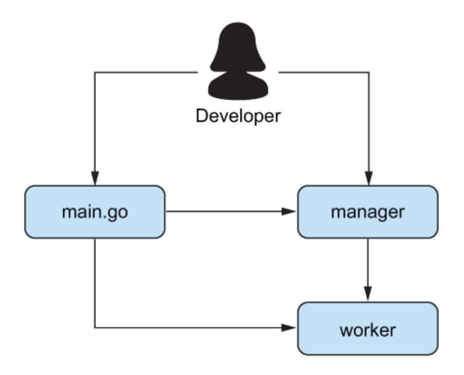

**Figure 12.1 The old way of operating and interacting with our orchestrator**

Now that we have our orchestration system implemented, let's turn our attention to how we operate it. Popular orchestration systems like Kubernetes and Nomad are operated by command-line interfaces (CLIs). Kubernetes uses multiple binaries to implement its CLI:

- <span id="page-355-0"></span>kubeadm bootstraps a Kubernetes cluster.
- kubelet performs the same function as our worker (i.e., it runs tasks).
- <span id="page-355-1"></span>kubectl provides an interface to interact with the cluster.

Nomad, on the other hand, implements its CLI with a single binary called nomad but otherwise provides a similar interface.

Our task in this chapter will be to implement a CLI for the Cube orchestrator. This CLI will support the following operations:

- Starting the worker
- Starting the manager
- Starting and stopping tasks
- <span id="page-356-1"></span>Getting the status of tasks

<span id="page-356-0"></span>

### *12.1 The core components of CLIs*

Many of the best CLIs are made up of common elements. They use a consistent pattern for each command and provide built-in help messages. The pattern we'll use for our CLI takes the form of APPNAME COMMAND ARG --FLAG. For example, the worker command implemented later in this chapter will look like this:

```
$ cube worker --name worker-1 --dbtype memory
```

Built-in help messages make it easy for a user to get contextual help by passing a --help or -h flag along with the command. The output from passing --help typically consists of a short summary of the command, a more detailed description that provides deeper explanations and possible examples, and a list of the flags the command accepts. In the case of our worker, passing the --help flag will result in this message:

```
$ cube worker --help
cube worker command.
The worker runs tasks and responds to the manager's requests about task
➥ state.
```

```
Usage:
 cube worker [flags]
Flags:
 -d, --dbtype string Type of datastore to use for tasks ("memory" or
 ➥ "persistent") (default "memory")
 -h, --help help for worker
 -H, --host string Hostname or IP address (default "0.0.0.0")
 -n, --name string Name of the worker (default
 ➥ "worker-9a385171-f980-47c4-a250-75736d3eb6f0")
 -p, --port int Port on which to listen (default 5556)
```

Each command we'll implement in this chapter will follow this pattern and provide a similarly useful help message (figure 12.2).

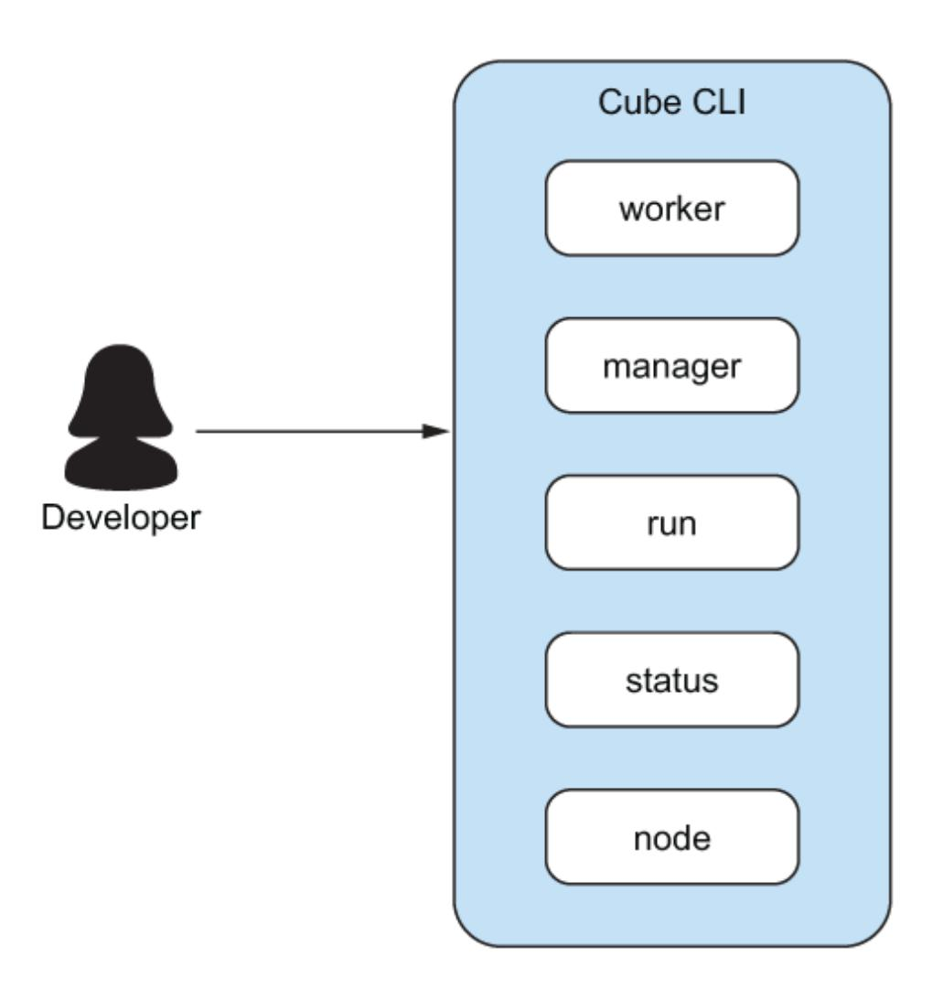

**Figure 12.2 The new way of operating and interacting with our orchestrator**

<span id="page-358-0"></span>

### *12.2 Introducing the Cobra framework*

<span id="page-358-1"></span>We are going to use a framework to implement our CLI. Specifically, we will use the Cobra framework [\(https://github.com/spf13/cobra](https://github.com/spf13/cobra)). Cobra powers popular projects like Kubernetes, Helm, Hugo, Moby (Docker), and the GitHub CLI. (For a fuller list of projects using Cobra, see <http://mng.bz/XqBE>.)

Why use a framework? Technically, we don't need a framework. We could build our CLI from the ground up using just the Go standard library.

In its most basic form, a CLI performs these functions:

- Parses arguments and flags passed on the command line
- Calls a handler that matches the command, passing the arguments and flags as parameters
- <span id="page-359-4"></span><span id="page-359-3"></span>Presents any output from the handler to the user

While this list is short and appears simple, there is quite a bit of work involved. Just handling flags, for example, can turn into thousands of lines of code (see flag.go in the flag package in Go's standard library or flag.go in the pflag library). A CLI framework provides standard building blocks, similar to web frameworks.

Let's get started by installing Cobra:

```
go get -u github.com/spf13/cobra@latest
```

We also want to install the cobra-cli:

```
go install github.com/spf13/cobra-cli@latest
```

<span id="page-359-0"></span>

### *12.3 Setting up our Cobra application*

<span id="page-359-2"></span>We have now installed the Cobra library, which provides the framework we will use in our CLI, and the cobra-cli tool, which <span id="page-360-0"></span>gives us some handy shortcuts for initializing our CLI application and adding commands as we move forward.

Before we get started, make a backup copy of the main.go program from past chapters. We will be overwriting it with the output from the cobra-cli tool. Then, from the root of your project directory, let's initialize our Cobra CLI:

```
$ cobra-cli init
Your Cobra application is ready at
/home/t/workspace/personal/manning/code/ch12
```

The init command performs several tasks for us:

- <span id="page-360-1"></span>Generates a new main.go
- Creates a cmd directory in our project
- Create a root.go file inside the new cmd directory

The new cmd directory should look like this:

```
$ tree cmd
cmd
└── root.go
```

At this point, we have bootstrapped everything we need to build our CLI. We can run the main program to see what we have to start with:

```
$ go run main.go
A longer description that spans multiple lines and likely contains
examples and usage of using your application. For example:
Cobra is a CLI library for Go that empowers applications.
This application is a tool to generate the needed files
to quickly create a Cobra application.
```

<span id="page-361-0"></span>

### *12.4 Understanding the new main.go*

After running cobra-cli init, we should have a new main.go file in the root of our project. As we can see in listing 12.1, this new version of our main program is much smaller, and it performs the following functions:

- <span id="page-361-2"></span>Declares the main package
- Imports the cube/cmd package
- <span id="page-361-3"></span>Defines the main function, which runs the Execute function from the cmd package

## **Listing 12.1 The new main.go generated by cobra-cli**

```
/*
Copyright © 2023 NAME HERE <EMAIL ADDRESS>
*/
package main
import "cube/cmd"
func main() {
 cmd.Execute()
}
```

<span id="page-361-1"></span>

### *12.5 Understanding root.go*

Let's explore the cmd/root.go file before delving into our own commands. At the top of the file, the cobra-cli init command has added a copyright notice. This is convenient if you're planning to publish your CLI as open source software, but it's not necessary for our purposes. Feel free to remove it. Next, there is the package

declaration, which gives the package the name cmd. Then there are a couple of imports, notably the importing of the Cobra library, github.com/spf13/cobra:

```
/*
Copyright © 2023 NAME HERE <EMAIL ADDRESS>
*/
package cmd
import (
 "os"
 "github.com/spf13/cobra"
)
```

The meat of the file comes next, and it contains the rootCmd. As its name suggests, this is the *root* of our CLI. The important thing to note is how commands are built with Cobra. Each command is a pointer to the cobra.Command type, and we're creating an instance of it and assigning it to a variable.

<span id="page-362-2"></span><span id="page-362-1"></span>In creating this instance of cobra.Command to assign to the rootCmd variable, several fields are defined. The Use field provides a one-line usage message. The Short field defines a brief description of the CLI. Finally, the Long field provides a more detailed description of the CLI. All three of these fields are used in the CLIs help system (i.e., when running go run main.go --help). The most important field, commented out in the generated root.go, is the Run field. It is defined as a function type that takes two arguments: a pointer to a Command type and a slice of strings. This function performs the work when a user invokes the command. We will see this function in action shortly:

```
// rootCmd represents the base command when called without any subcommands
var rootCmd = &cobra.Command{
 Use: "cube",
 Short: "A brief description of your application",
 Long: `A longer description that spans multiple lines and likely
 ➥ contains
examples and usage of using your application. For example:
Cobra is a CLI library for Go that empowers applications.
This application is a tool to generate the needed files
to quickly create a Cobra application.`,
 // Uncomment the following line if your bare application
 // has an action associated with it:
 // Run: func(cmd *cobra.Command, args []string) { },
}
```

The next piece of the generated root.go file is the Execute command. As the comment above the function says, this function is called by main.main() and occurs only once:

```
// Execute adds all child commands to the root command and sets flags
➥ appropriately.
// This is called by main.main(). It only needs to happen once to the
➥ rootCmd.
func Execute() {
 err := rootCmd.Execute()
 if err != nil {
 os.Exit(1)
 }
}
```

The final piece of root.go is the definition of the init function. The init function is special in Go. It is predefined by the Go language and is used to perform configuration. In Cobra applications, the definition of flags and other configuration settings are done in an init function.

<span id="page-363-1"></span>In the Cobra framework, there are two types of flags: *persistent* and *local*. Persistent flags persist from the parent command where they are defined through to any children. Local flags exist only for the

<span id="page-364-2"></span>command where they are defined. The init function in the generated root.go file includes one of each type of flag:

```
func init() {
 // Here you will define your flags and configuration settings.
 // Cobra supports persistent flags, which, if defined here,
 // will be global for your application.
 // rootCmd.PersistentFlags().StringVar(&cfgFile, "config", "",
 ➥ "config file (default is $HOME/.cube.yaml)")
 // Cobra also supports local flags, which will only run
 // when this action is called directly.
 rootCmd.Flags().BoolP("toggle", "t", false, "Help message for toggle")
}
```

<span id="page-364-0"></span>

### *12.6 Implementing the worker command*

Now that we have a basic understanding of the Cobra framework, let's start implementing our commands. The first command we'll build is the worker command. To get started, we can use the cobracli command to create a skeleton for us:

```
$ cobra-cli add worker
```

This command creates the worker.go file in the cmd directory:

```
$ tree cmd
cmd
├── root.go
└── worker.go
```

The skeleton created by the cobra-cli add command should look like that shown in listing 12.2. One thing to note in this skeleton is that the add command included a functional Run field. The field value is a function that simply prints out worker called. And as we saw with the root command, the skeleton includes an init function where we can define flags. Also, note that the init function calls the rootCmd.AddCommand method, passing it the workerCmd. This call, as its name suggests, adds our worker command to the root, thus making it available to the CLI application.

<span id="page-365-0"></span>

#### **Listing 12.2 The skeleton worker command created by the cobra-cli add command**

```
/*
Copyright © 2023 NAME HERE <EMAIL ADDRESS>
*/
package cmd
import (
 "fmt"
 "github.com/spf13/cobra"
)
// workerCmd represents the worker command
var workerCmd = &cobra.Command{
 Use: "worker",
 Short: "A brief description of your command",
 Long: `A longer description that spans multiple lines and likely
 ➥ contains examples
and usage of using your command. For example:
Cobra is a CLI library for Go that empowers applications.
This application is a tool to generate the needed files
to quickly create a Cobra application.`,
 Run: func(cmd *cobra.Command, args []string) {
 fmt.Println("worker called")
 },
}
func init() {
 rootCmd.AddCommand(workerCmd)
 // Here you will define your flags and configuration settings.
```

```
 // Cobra supports Persistent Flags which will work for this command
 // and all subcommands, e.g.:
 // workerCmd.PersistentFlags().String("foo", "", "A help for foo")
 // Cobra supports local flags which will only run when this command
 // is called directly, e.g.:
 // workerCmd.Flags().BoolP("toggle", "t", false, "Help message for
 ➥ toggle")
}
```

Once we have this skeleton in place, we can run it and see that it works. If we run it with the --help flag, we see the usage message:

```
$ go run main.go worker --help
A longer description that spans multiple lines and likely contains examples
and usage of using your command. For example:
Cobra is a CLI library for Go that empowers applications.
This application is a tool to generate the needed files
to quickly create a Cobra application.
Usage:
 cube worker [flags]
Flags:
 -h, --help help for worker
```

And if we run the command, we see the output worker called:

```
$ go run main.go worker
worker called
```

Let's start modifying this skeleton by defining the necessary flags for the worker command. If we recall our old main.go program, we were reading environment variables to get the hostname and the port on which the worker would listen.

**Listing 12.3 Getting the worker's host and port from environment variables**

```
whost := os.Getenv("CUBE_WORKER_HOST")
wport, _ := strconv.Atoi(os.Getenv("CUBE_WORKER_PORT"))
```

Instead of reading environment variables, let's use flags. In listing 12.4, we add the host and port flags. We create the host flag using the StringP method, and we create the port flag using the IntP method. Both methods take the following arguments (all as strings):

- <span id="page-367-0"></span>The name of the flag
- A shorthand letter that can be used after a single dash
- A default value
- A description of the flag's usage

#### **Listing 12.4 Defining the host and port flags in the generated init method**

```
package cmd
import (
 "cube/worker"
 "fmt"
 "log"
 "github.com/google/uuid"
 "github.com/spf13/cobra"
)
func init() {
 rootCmd.AddCommand(workerCmd)
 workerCmd.Flags().StringP("host", "H", "0.0.0.0",
 ➥ "Hostname or IP address") ❶
 workerCmd.Flags().IntP("port", "p", 5556, "Port on
 ➥ which to listen") ❷
}
```

- ❶ The host flag can be used as either --host or -H.
- ❷ The port flag can be used as either --port or -p.

**NOTE** Under the hood, Cobra uses the pFlag ([https://github.com/spf13/pflag\)](https://github.com/spf13/pflag) library. It is written by the same author as Cobra and is advertised as a "drop-in replacement for Go's flag package."

<span id="page-368-1"></span>Next, let's add two more flags. The name flag will be used as the name of the worker. Once again, we are creating it using the StringP method, and we're using the Sprintf function from the fmt package to build a string that creates a unique name as a default. The dbytpe flag will be used to create the worker with the specified type of task storage, either memory or persistent, with memory being the default. The name flag can be used as either --name or -n, and the dbtype flag can be used as either - dbtype or -d.

#### <span id="page-368-0"></span>**Listing 12.5 The name flag**

```
workerCmd.Flags().StringP("name", "n", fmt.Sprintf("worker-%s",
 ➥ uuid.New().String()), "Name of the worker")
 workerCmd.Flags().StringP("dbtype", "d", "memory", "Type of datastore
 ➥ to use for tasks (\"memory\" or \"persistent\")")
}
```

<span id="page-368-3"></span><span id="page-368-2"></span>At this point, we have a functional worker command. Let's check the help message:

```
$ go run main.go worker --help
A longer description that spans multiple lines and likely contains examples
and usage of using your command. For example:
Cobra is a CLI library for Go that empowers applications.
This application is a tool to generate the needed files
to quickly create a Cobra application.
Usage:
 cube worker [flags]
```

```
Flags:
 -d, --dbtype string Type of datastore to use for tasks ("memory" or
 ➥ "persistent") (default "memory")
 -h, --help help for worker
 -H, --host string Hostname or IP address (default "0.0.0.0")
 -n, --name string Name of the worker
 ➥ (default "worker-ed9b23bf-3070-4da6-a163-ef16bdae8c22")
 -p, --port int Port on which to listen (default 5556)
```

As we can see, running worker --help prints out a message about the command, and it lists the flags we defined with their individual usage messages.

We can also call the command:

```
$ go run main.go worker
worker called
```

Calling the worker command doesn't do anything useful. It does, however, demonstrate a working command printing out worker called.

With our flags defined, we can move on to the workerCmd. As we saw when we ran the command with the --help flag, the usage message was about Cobra itself. Let's customize the help message to be more relevant. To do this, we modify the Use, Short, and Long fields on the workerCmd, as seen in the following listing.

<span id="page-369-0"></span>

## **Listing 12.6 Modifying the workerCmd for a more useful help message**

```
var workerCmd = &cobra.Command{
 Use: "worker",
 Short: "Worker command to operate a Cube worker node.",
 Long: `cube worker command.
```

```
The worker runs tasks and responds to the manager's requests about task
➥ state.`,
```

Now, if we run the command with the --help flag, we should see a more useful help message:

```
$ go run main.go worker --help
cube worker command.
The worker runs tasks and responds to the manager's requests about task
➥ state.
Usage:
 cube worker [flags]
Flags:
 -d, --dbtype string Type of datastore to use for tasks ("memory" or
 ➥ "persistent") (default "memory")
 -h, --help help for worker
 -H, --host string Hostname or IP address (default "0.0.0.0")
 -n, --name string Name of the worker
 ➥ (default "worker-bd7dc7dc-abf7-4cea-943b-11f13f128208")
 -p, --port int Port on which to listen (default 5556)
```

#### That looks much better!

<span id="page-370-1"></span>Finally, let's modify the Run field of our workerCmd. The first thing we need to do is get the values of the command's flags. We do this by calling the appropriate method on the cmd passed into the function. In our case, we call GetString to get the host, name, and dbtype flags, and we call GetInt to get the port flag. Notice that we are using the blank identifier in each of these calls. Each call returns two values: the value of the flag and an error. In our case, we are not storing the error because we have set default values for each of the flags.

<span id="page-370-0"></span>

## **Listing 12.7 The Run field, the core of a Cobra command**

```
Run: func(cmd *cobra.Command, args []string) {
 host, _ := cmd.Flags().GetString("host")
 port, _ := cmd.Flags().GetInt("port")
 name, _ := cmd.Flags().GetString("name")
 dbType, _ := cmd.Flags().GetString("dbtype")
},
```

Next, we need to create the worker and its API and then start everything up. When we performed these tasks in our old main.go program, we were doing it for three workers. If you recall, it looked like this:

```
w1 := worker.New("worker-1", "persistent")
wapi1 := worker.Api{Address: whost, Port: wport, Worker: w1}
w2 := worker.New("worker-2", "persistent")
wapi2 := worker.Api{Address: whost, Port: wport + 1, Worker: w2}
w3 := worker.New("worker-3", "persistent")
wapi3 := worker.Api{Address: whost, Port: wport + 2, Worker: w3}
go w1.RunTasks()
go w1.UpdateTasks()
go wapi1.Start()
go w2.RunTasks()
go w2.UpdateTasks()
go wapi2.Start()
go w3.RunTasks()
go w3.UpdateTasks()
go wapi3.Start()
```

Because we're creating a command that can be run multiple times, we only need to perform these tasks once. The workerCmd starts a worker using a simplified version of the code in our old main.go program.

## **Listing 12.8 The workerCmd starting a worker**

```
Run: func(cmd *cobra.Command, args []string) {
 // previous code omitted
```

```
 log.Println("Starting worker.")
 w := worker.New(name, dbType)
 api := worker.Api{Address: host, Port: port, Worker: w}
 go w.RunTasks()
 go w.CollectStats()
 go w.UpdateTasks()
 log.Printf("Starting worker API on http://%s:%d", host, port)
 api.Start()
},
```

Now, if we run our command, we should end up with a running, fully functioning worker:

```
$ go run main.go worker
2023/04/29 14:36:34 Starting worker.
2023/04/29 14:36:34 Starting worker API on http://0.0.0.0:5556
2023/04/29 14:36:34 No tasks to process currently.
2023/04/29 14:36:34 Sleeping for 10 seconds.
2023/04/29 14:36:34 Checking status of tasks
2023/04/29 14:36:34 Task updates completed
2023/04/29 14:36:34 Sleeping for 15 seconds
2023/04/29 14:36:34 Collecting stats
2023/04/29 14:36:44 No tasks to process currently.
2023/04/29 14:36:44 Sleeping for 10 seconds.
```

Before moving on, try to start two more workers in separate terminals. You will need to specify a different port for each one using the - port flag, but otherwise the defaults should work.

<span id="page-372-0"></span>

### *12.7 Implementing the manager command*

<span id="page-372-1"></span>With the worker command complete, let's move on and implement the manager command. We'll follow a similar process used for the worker command. We'll start by creating our skeleton using the cobracli add command:

```
$ cobra-cli add manager
manager created at /home/t/workspace/personal/manning/code/ch12
```

<span id="page-373-0"></span>Again, the add command will create a skeleton for us in the cmd directory:

```
$ tree cmd
cmd
├── manager.go
├── root.go
└── worker.go
```

Let's start modifying our manager skeleton by defining the flags we'll need in the init function. As with the worker command, we need to define the host and port flags to tell the manager where it should listen for traffic. Next, we define the workers flag, which is a list of workers identified by strings in the form of host:port. We did something similar in our old main.go program, but we built up the list of workers manually. Here, we can use the StringSliceP method that will allow a user to specify the workers on the command line as a string. With the workers flag defined, we move on and define the scheduler flag. Finally, we define the dbType flag, which will identify the type of datastore the manager will use for its tasks and events.

<span id="page-373-1"></span>

## **Listing 12.9 Customizing the init method of the managerCmd to define flags**

```
package cmd
import (
 "cube/manager"
 "log"
 "github.com/spf13/cobra"
```

```
)
func init() {
 rootCmd.AddCommand(managerCmd)
 managerCmd.Flags().StringP("host", "H", "0.0.0.0",
 ➥ "Hostname or IP address")
 managerCmd.Flags().IntP("port", "p", 5555, "Port on which to listen")
 managerCmd.Flags().StringSliceP("workers", "w",
 ➥ []string{"localhost:5556"}, "List of workers on which the manager
 ➥ will schedule tasks.")
 managerCmd.Flags().StringP("scheduler", "s", "epvm", "Name
 ➥ of scheduler to use.")
 managerCmd.Flags().StringP("dbType", "d", "memory", "Type of datastore
 ➥ to use for events and tasks (\"memory\" or \"persistent\")")
}
```

The next step to modifying the manager skeleton is to customize the usage message that gets displayed when running the command with the --help flag:

```
var managerCmd = &cobra.Command{
 Use: "manager", ❶
 Short: "Manager command to operate a Cube manager
 ➥ node.", ❷
 Long: `cube manager command. ❸
The manager controls the orchestration system and is responsible for:
- Accepting tasks from users
- Scheduling tasks onto worker nodes
- Rescheduling tasks in the event of a node failure
- Periodically polling workers to get task updates`,
```

- ❶ Changes the Use field to "manager"
- ❷ Changes the Short field to a more informative short version of the help message
- ❸ Changes the Long field to a more descriptive help message

At this point, we have a functioning manager command. If we run the manager command now with the --help flag, we see the following output:

```
$ go run main.go manager --help
cube manager command.
```

```
The manager controls the orchestration system and is responsible for:
- Accepting tasks from users
- Scheduling tasks onto worker nodes
- Rescheduling tasks in the event of a node failure
- Periodically polling workers to get task updates
Usage:
 cube manager [flags]
Flags:
 -d, --dbType string Type of datastore to use for events and tasks
 ➥ ("memory" or "persistent") (default "memory")
 -h, --help help for manager
 -H, --host string Hostname or IP address (default "0.0.0.0")
 -p, --port int Port on which to listen (default 5555)
 -s, --scheduler string Name of scheduler to use. (default "epvm")
 -w, --workers strings List of workers on which the manager will schedule
➥ tasks. (default [localhost:5556])
```

As with the worker command, the only thing left to implement now is the Run field of our managerCmd. Again, we start by getting the values of the flags passed on the command line. And once again, we don't check for errors because we have set default values for all our flags. Notice that the functions we use to retrieve the flag values are a combination of the word Get and the type, so a flag defined as a StringP type is retrieved via the GetString() function, a flag defined as a StringSliceP is retrieved by the GetStringSlice() function, and an IntP type is retrieved using the GetInt() function.

<span id="page-375-0"></span>

#### **Listing 12.10 Implementing the Run field of our managerCmd**

```
Run: func(cmd *cobra.Command, args []string) {
 host, _ := cmd.Flags().GetString("host")
 port, _ := cmd.Flags().GetInt("port")
 workers, _ := cmd.Flags().GetStringSlice("workers")
 scheduler, _ := cmd.Flags().GetString("scheduler")
 dbType, _ := cmd.Flags().GetString("dbType")
```

Finally, we create the manager and its API and then start it up. This should look familiar, as we're simply performing the same calls as we did in our old main.go program.

## **Listing 12.11 Starting up the manager with the same calls as the old main.go program**

```
log.Println("Starting manager.")
 m := manager.New(workers, scheduler, dbType)
 api := manager.Api{Address: host, Port: port, Manager: m}
 go m.ProcessTasks()
 go m.UpdateTasks()
 go m.DoHealthChecks()
 go m.UpdateNodeStats()
 log.Printf("Starting manager API on http://%s:%d", host, port)
 api.Start()
 },
}
```

#### Now let's start up the manager:

```
$ go run main.go manager -w 'localhost:5556,localhost:5557,localhost:5558'
2023/04/29 15:03:40 Starting manager.
2023/04/29 15:03:40 Starting manager API on http://0.0.0.0:5555
2023/04/29 15:03:40 Checking for task updates from workers
2023/04/29 15:03:40 Checking worker localhost:5556 for task updates
2023/04/29 15:03:40 Processing any tasks in the queue
2023/04/29 15:03:40 No work in the queue
2023/04/29 15:03:40 Sleeping for 10 seconds
2023/04/29 15:03:40 Collecting stats for node localhost:5556
2023/04/29 15:03:40 Performing task health check
2023/04/29 15:03:40 Task health checks completed
2023/04/29 15:03:40 Sleeping for 60 seconds
2023/04/29 15:03:40 Checking worker localhost:5557 for task updates
2023/04/29 15:03:40 Collecting stats for node localhost:5557
2023/04/29 15:03:40 Checking worker localhost:5558 for task updates
2023/04/29 15:03:40 Task updates completed
2023/04/29 15:03:40 Sleeping for 15 seconds
```

<span id="page-376-0"></span>And voila! At this point, we have replaced our old main.go program from previous chapters with individual commands to start the worker and manager independently.

<span id="page-377-0"></span>

### *12.8 Implementing the run command*

We have replaced our main.go program with separate commands to start up our manager and worker components. But let's not congratulate ourselves just yet. There is more we can do to make our orchestration system feel more real.

<span id="page-377-1"></span>If you recall, in past chapters, we have started and stopped tasks by manually calling the manager's API using the curl command. In case you've forgotten, this is how we have been starting tasks:

```
$ curl -X POST localhost:5555/tasks -d @task1.json
```

And here is how we have been stopping them:

```
$ curl -X DELETE localhost:5555/tasks/bb1d59ef-9fc1-4e4b-a44d-db571eeed203
```

There is nothing technically wrong with the way we have been starting and stopping tasks up to now. It has gotten the job done. If, however, we think about existing orchestration systems like Kubernetes or Nomad, we know we don't start and stop tasks by calling their APIs using curl. Instead, we use a command-line tool like kubectl or nomad.

So let's create a command that will allow us to start a task. For our purposes, we'll call this command run. Create the skeleton for it by using the cobra-cli add command:

<span id="page-377-2"></span>\$ cobra-cli add run run created at /home/t/workspace/personal/manning/code/ch12-experimental <span id="page-378-0"></span>Afterward, you should see the new file in the cmd directory:

```
$ tree cmd/
cmd/
├── manager.go
├── root.go
├── run.go
└── worker.go
```

#### Again, we have a skeleton to start from:

```
/*
Copyright © 2023 NAME HERE <EMAIL ADDRESS>
*/
package cmd
import (
 "fmt"
 "github.com/spf13/cobra"
)
// runCmd represents the run command
var runCmd = &cobra.Command{
 Use: "run",
 Short: "A brief description of your command",
 Long: `A longer description that spans multiple lines and likely
 ➥ contains examples
and usage of using your command. For example:
Cobra is a CLI library for Go that empowers applications.
This application is a tool to generate the needed files
to quickly create a Cobra application.`,
 Run: func(cmd *cobra.Command, args []string) {
 fmt.Println("run called")
 },
}
func init() {
 rootCmd.AddCommand(runCmd)
 // Here you will define your flags and configuration settings.
 // Cobra supports Persistent Flags which will work for this command
 // and all subcommands, e.g.:
 // runCmd.PersistentFlags().String("foo", "", "A help for foo")
```

```
 // Cobra supports local flags which will only run when this command
 // is called directly, e.g.:
 // runCmd.Flags().BoolP("toggle", "t", false, "Help message for toggle")
}
```

By now, the skeleton and framework should be familiar to us, so we're going to move a little faster.

To start, let's define two flags in our init function. The first flag is named manager, and it will allow a user to specify the manager to talk to. We provide a default value of localhost:5555 since that is what we have been using. The second flag is named filename, and this flag allows the user to specify the name of the file containing the task definition.

<span id="page-379-0"></span>

## **Listing 12.12 The Run command defines the manager and filename flags**

```
package cmd
import (
 "bytes"
 "errors"
 "fmt"
 "io/fs"
 "log"
 "net/http"
 "os"
 "path/filepath"
 "github.com/spf13/cobra"
)
func init() {
 rootCmd.AddCommand(runCmd)
 runCmd.Flags().StringP("manager", "m", "localhost:5555", "Manager to
 ➥ talk to")
 runCmd.Flags().StringP("filename", "f", "task.json", "Task specification
 ➥ file")
}
```

So we allow a user to specify a filename holding their task definition. What happens, however, if that file doesn't exist? Let's create the fileExists function in listing 12.13 to check that a file actually exists before we attempt to read it. To do this, we call the Stat function in the os package, passing it the name of the file. We discard the value returned and only store any errors. Then we use the errors.Is function to check whether the err returned from the call to Stat is of type fs.ErrNotExist. We use the ! (not) operator to return true when errors.Is returns false, and false when it returns true.

#### <span id="page-380-0"></span>**Listing 12.13 The fileExists function**

```
func fileExists(filename string) bool {
 _, err := os.Stat(filename)
 return !errors.Is(err, fs.ErrNotExist)
}
```

Now on to the meat of our new command, runCmd. Replace the skeleton values for the Use, Short, and Long fields, as seen in the following listing.

<span id="page-380-1"></span>

## **Listing 12.14 Updating the text used in the command's help message**

```
var runCmd = &cobra.Command{
 Use: "run",
 Short: "Run a new task.",
 Long: `cube run command.
The run command starts a new task.`,
```

<span id="page-381-2"></span>If we run the command with the --help flag at this point, we will see the following:

```
$ go run main.go run --help
cube run command.
The run command starts a new task.
Usage:
 cube run [flags]
Flags:
 -f, --filename string Task specification file (default "task.json")
 -h, --help help for run
 -m, --manager string Manager to talk to (default "localhost:5555")
```

The last bit of the command to implement is the Run field. As with the worker and manager commands, we start by getting the values from the manager and filename flags passed on the command line and storing them in variables.

<span id="page-381-1"></span>

## **Listing 12.15 Retrieving the values of the manager and filename flags**

```
Run: func(cmd *cobra.Command, args []string) {
 manager, _ := cmd.Flags().GetString("manager")
 filename, _ := cmd.Flags().GetString("filename")
```

<span id="page-381-0"></span>Once we have the manager and filename variables defined, we move on and check that the file specified by filename actually exists. We do this by first getting the absolute path of the filename using the Abs function from the filepath package. Then we pass the fullFilePath to our fileExists function, and if the file does not exist, we log a message and exit. Checking for the existence of the task file allows us to do some sanity checking and provide the user with a relevant error message.

#### **Listing 12.16 Checking for the existence of the task file**

```
fullFilePath, err := filepath.Abs(filename)
 if err != nil {
 log.Fatal(err)
 }
 if !fileExists(fullFilePath) {
 log.Fatalf("File %s does not exist.", filename)
 }
```

Having confirmed that the filename passed into the command exists, we can move on and start the task. We'll use the following process:

- Log helpful messages about the manager and absolute file path.
- Read the contents of the task definition file, printing out another log message.
- Call the manager's API (the equivalent of curl -X POST localhost:5555/ tasks).
- Handle any errors.

The bulk of the Run field's function deals with calling the manager's API and handling any errors.

## **Listing 12.17 The remainder of the Run field**

```
log.Printf("Using manager: %v\n", manager) ❶
 log.Printf("Using file: %v\n", fullFilePath)
 data, err := os.ReadFile(filename) ❷
 if err != nil {
 log.Fatalf("Unable to read file: %v", filename)
 }
 log.Printf("Data: %v\n", string(data))
 url := fmt.Sprintf("http://%s/tasks", manager)
 resp, err := http.Post(url, "application/json",
```

```
 ➥ bytes.NewBuffer(data)) ❸
 if err != nil {
 log.Panic(err)
 }
 if resp.StatusCode != http.StatusCreated { ❹
 log.Printf("Error sending request: %v", resp.StatusCode)
 }
 defer resp.Body.Close()
 log.Println("Successfully sent task request to manager")
 },
}
```

- ❶ Logs helpful errors that tell a user the manager being used and the path to the task file
- ❷ Reads the contents of the task file and checks for errors
- ❸ Calls the manager's API via the POST method and passes the task in the request body
- ❹ Checks that the request was successful and the task was created

<span id="page-383-0"></span>With this code, we're ready to start a task! If you stopped your workers and manager from the previous sections, start them back up. Then run the run command:

```
$ go run main.go run --filename task1.json
2023/04/30 15:51:40 Using manager: localhost:5555
2023/04/30 15:51:40 Using file:
➥ /home/t/workspace/personal/manning/code/ch12-experimental/task1.json
2023/04/30 15:51:40 Data: {
 "ID": "a7aa1d44-08f6-443e-9378-f5884311019e",
 "State": 2,
 "Task": {
 "State": 1,
 "ID": "bb1d59ef-9fc1-4e4b-a44d-db571eeed203",
 "Name": "test-chapter-9.1",
 "Image": "timboring/echo-server:latest",
 "ExposedPorts": {
 "7777/tcp": {}
 },
 "PortBindings": {
 "7777/tcp": "7777"
 },
 "HealthCheck": "/health"
 }
}
```

```
2023/04/30 15:51:40 Successfully sent task request to manager
```

Watching the output from the manager, you should see it start up the task. And you can confirm it by running docker ps:

```
$ docker ps
CONTAINER ID IMAGE CREATED STATUS
99b32646ef35 timboring/echo-server:latest 1 second ago Up 1 second
```

We can also query the manager's API directly to verify the task is running:

```
$ curl localhost:5555/tasks|jq
[
 {
 "ID": "bb1d59ef-9fc1-4e4b-a44d-db571eeed203",
 "ContainerID":
 ➥ "99b32646ef35ed3819196b0b890bebd94ae6d9085dce7914e742e133c8a86fdd",
 "Name": "test-chapter-9.1",
 "State": 2,
 "Image": "timboring/echo-server:latest",
 // output truncated
 }
]
```

<span id="page-384-1"></span>Nice! But let's not stop here. Now that we've created a command to start tasks, let's create one to stop them.

<span id="page-384-0"></span>

### *12.9 Implementing the stop command*

<span id="page-384-2"></span>By now, you should know what's coming next. We start by creating a skeleton:

```
$ cobra-cli add stop
stop created at /home/t/workspace/personal/manning/code/ch12-experimental
```

```
$ tree cmd
cmd/
├── manager.go
├── root.go
├── run.go
├── stop.go
└── worker.go
```

<span id="page-385-1"></span>Next, we add our flags to the skeleton in the cmd/stop.go file. We only need a single flag, manager, for the Stop command.

#### **Listing 12.18 Using the manager flag for the Stop command**

```
package cmd
import (
 "fmt"
 "log"
 "net/http"
 "github.com/spf13/cobra"
)
func init() {
 rootCmd.AddCommand(stopCmd)
 stopCmd.Flags().StringP("manager", "m", "localhost:5555", "Manager to
 ➥ talk to")
}
```

With our flags defined, we replace the boilerplate usage strings generated by the cobra-cli add command with more relevant ones:

```
var stopCmd = &cobra.Command{
 Use: "stop",
 Short: "Stop a running task.",
 Long: `cube stop command.
The stop command stops a running task.`,
```

<span id="page-386-1"></span>At this point, we can run our command with the --help flag and verify that our command works:

```
$ go run main.go stop --help
cube stop command.
The stop command stops a running task.
Usage:
 cube stop [flags]
Flags:
 -h, --help help for stop
 -m, --manager string Manager to talk to (default "localhost:5555")
```

With our stop command, notice that we did not define a flag to specify the task we want to stop. Instead, the user will pass the task as an argument to the command. Here is what this will look like:

```
$ go run main.go stop bb1d59ef-9fc1-4e4b-a44d-db571eeed203
```

To read the argument, we define the Args field on our stopCmd variable. We give this variable a value of cobra.MinimumNArgs(1) to say that we expect the user to pass one argument to our command. The Run field should look familiar at this point. We're performing the equivalent of calling curl -X DELETE localhost:5555/tasks/ {taskID}.

<span id="page-386-0"></span>

## **Listing 12.19 The Stop command using arguments in addition to flags**

```
Args: cobra.MinimumNArgs(1),
 Run: func(cmd *cobra.Command, args []string) {
 manager, _ := cmd.Flags().GetString("manager")
 url := fmt.Sprintf("http://%s/tasks/%s", manager, args[0])
 client := &http.Client{} ❶
 req, err := http.NewRequest("DELETE", url, nil) ❷
```

```
 if err != nil {
 log.Printf("Error creating request %v: %v", url, err)
 }
 resp, err := client.Do(req) ❸
 if err != nil {
 log.Printf("Error connecting to %v: %v", url, err)
 }
 if resp.StatusCode != http.StatusNoContent { ❹
 log.Printf("Error sending request: %v", err)
 return
 }
 log.Printf("Task %v has been stopped.", args[0])
 },
}
```

- ❶ Creates an HTTP client
- ❷ Creates a request with the method set to DELETE. This is necessary because the client itself only has methods for Post() and Get().
- ❸ Makes the request by calling the client's Do(req) method, passing in the request
- ❹ Checks whether the request was successful

Let's try to stop the task we started using our new stop command:

```
$ go run main.go stop bb1d59ef-9fc1-4e4b-a44d-db571eeed203
2023/04/30 16:13:44 Task bb1d59ef-9fc1-4e4b-a44d-db571eeed203 has been
➥ stopped.
```

Now let's verify it stopped our task by checking the output of docker ps:

```
$ docker ps
```

<span id="page-387-0"></span>Nice! With our stop command, we have successfully replaced the manual processes we had been using in previous chapters. Now we can perform everything by the way of commands: starting the worker(s), starting the manager, and starting and stopping tasks.

<span id="page-388-0"></span>

### *12.10 Implementing the status command*

As long as we're already in the headspace of our command-line tool, let's create two more commands. The first will be the status command. If you recall, throughout this book, we have used the docker ps command to get a list of our running Docker containers after starting tasks:

```
$ docker ps
CONTAINER ID IMAGE CREATED STATUS
a4a7028e5463 timboring/echo-server:latest 19 seconds ago Up 18 seconds
92462d09ee98 timboring/echo-server:latest 50 seconds ago Up 49 seconds
e29a26176fcb timboring/echo-server:latest 15 minutes ago Up 15 minutes
```

For our purposes, we want output similar to docker ps, but we want it to contain information about our tasks instead of our containers. That is, we want the output to come from the source of truth for our orchestration system (i.e., our manager).

<span id="page-388-1"></span>So let's create the skeleton for our status command using the cobra-cli add command:

```
$ cobra-cli add status
status created at /home/t/workspace/personal/manning/code/ch12-experimental
$ tree cmd
cmd
├── manager.go
├── root.go
├── run.go
├── status.go
├── stop.go
└── worker.go
```

With our skeleton created, we can start our customization by defining our flags in its init function. In this case, we are only defining a single flag, manager, to tell the command the address of the manager from which it will get the status of our tasks.

<span id="page-389-1"></span>

## **Listing 12.20 Defining the manager flag in the init method**

```
package cmd
import (
 "cube/task"
 "encoding/json"
 "fmt"
 "io"
 "log"
 "net/http"
 "os"
 "text/tabwriter"
 "time"
 "github.com/docker/go-units"
 "github.com/spf13/cobra"
)
func init() {
 rootCmd.AddCommand(statusCmd)
 statusCmd.Flags().StringP("manager", "m", "localhost:5555",
 ➥ "Manager to talk to")
}
```

Next, let's customize our help output to make it more useful:

```
var StatusCmd = &cobra.Command{
 Use: "status",
 Short: "Status command to list tasks.",
 Long: `cube status command.
The status command allows a user to get the status of tasks from
➥ the Cube manager.`,
```

<span id="page-389-0"></span>And as we've seen before, we can now run the command with the - help flag:

```
$ go run main.go status --help
cube status command.
The status command allows a user to get the status of tasks from the Cube
➥ manager.
Usage:
 cube status [flags]
Flags:
 -h, --help help for status
 -m, --manager string Manager to talk to (default "localhost:5555")
```

Last, but not least, we can implement the function for our Run field. The function will perform the following operations:

- Retrieves the manager address passed on the command line
- Uses the manager address to build the URL for the manager's API
- Makes a GET request to the manager's API to retrieve all tasks
- Unmarshals the JSON body sent in the response and converts it to a slice of pointers to task.Task
- Prints out a portion of each task's info in a formatted table (similar to the output of docker ps)

The Run field's function is responsible for calling the manager's API and printing out the response in a readable format. One thing to note is that we use the tabwriter [\(https://pkg.go.dev/text/tabwriter](https://pkg.go.dev/text/tabwriter)) package from Go's standard library to create our output.

<span id="page-390-0"></span>

#### **Listing 12.21 The Run function**

```
Run: func(cmd *cobra.Command, args []string) {
 manager, _ := cmd.Flags().GetString("manager")
 url := fmt.Sprintf("http://%s/tasks", manager)
```

```
 resp, _ := http.Get(url)
 body, err := io.ReadAll(resp.Body)
 if err != nil {
 log.Fatal(err)
 }
 defer resp.Body.Close()
 var tasks []*task.Task
 err = json.Unmarshal(body, &tasks)
 if err != nil {
 log.Fatal(err)
 }
 w := tabwriter.NewWriter(os.Stdout, 0, 0, 5, ' ', tabwriter.TabIndent)
 fmt.Fprintln(w, "ID\tNAME\tCREATED\tSTATE\tCONTAINERNAME\tIMAGE\t")
 for _, task := range tasks {
 var start string
 if task.StartTime.IsZero() {
 start = fmt.Sprintf("%s ago",
 ➥ units.HumanDuration(time.Now().UTC().Sub(time.Now().UTC())))
 } else {
 start = fmt.Sprintf("%s ago",
 ➥ units.HumanDuration(time.Now().UTC().Sub(task.StartTime)))
 }
 state := task.State.String()[task.State]
 fmt.Fprintf(w, "%s\t%s\t%s\t%s\t%s\t%s\t\n", task.ID, task.Name,
 ➥ start, state, task.Name, task.Image)
 }
 w.Flush()
 },
}
```

<span id="page-391-0"></span>With that, we can run the status command in figure 12.3.

**Figure 12.3 Result of running the status command**

<span id="page-392-0"></span>

### *12.11 Implementing the node command*

The last command we'll implement is the node command. The purpose of this command is to provide a summary of the nodes in our orchestration system. It will list the following:

- <span id="page-392-1"></span>Node name
- Memory
- Disk
- Role
- <span id="page-392-2"></span>Number of tasks

Now, technically, we don't really need this command. Like the status command, we can use the manager's API and query the /nodes endpoint directly. Here's what it looks like using the curl command and piping the output to jq to make it more readable:

```
$ curl localhost:5555/nodes|jq
[
 {
 "Name": "localhost:5556",
 "Ip": "",
 "Api": "http://localhost:5556",
 "Memory": 32793076,
 "MemoryAllocated": 0,
 "Disk": 20411170816,
 "DiskAllocated": 0,
 "Stats": {
 "MemStats": {...},
 "DiskStats": {...},
 "CpuStats": {...},
 "LoadStats": {...},
 "TaskCount": 0
 },
 "Role": "worker",
```

```
 "TaskCount": 0
 }
]
```

This output should look familiar to you. It's a list of Node types, which we implemented in chapter 10 while working on the scheduler. Notice that there is a single node in the list of nodes and that it has the Stats field, which should also look familiar, as it is the Stats type we implemented in chapter 6.

<span id="page-393-2"></span>While we can get information about the nodes in our system using curl to query the manager's /nodes endpoint, it's not the easiest on the eyes. This is why we're going to implement the node command. We'll condense the information down to the most essential and output it in a more readable manner.

<span id="page-393-1"></span><span id="page-393-0"></span>Again, we'll use the cobra-cli add command to create our skeleton:

```
$ cobra-cli add node
node created at /home/t/workspace/personal/manning/code/ch12-experimental
$ tree cmd
cmd
├── manager.go
├── node.go
├── root.go
├── run.go
├── status.go
├── stop.go
└── worker.go
```

Like the status command we implemented, the node command will have only a single flag.

## **Listing 12.22 The node command defining a single flag of type StringP**

```
package cmd
import (
 "cube/node"
 "encoding/json"
 "fmt"
 "io"
 "net/http"
 "os"
 "text/tabwriter"
 "github.com/spf13/cobra"
)
func init() {
 rootCmd.AddCommand(nodeCmd)
 nodeCmd.Flags().StringP("manager", "m", "localhost:5555", "Manager to
 ➥ talk to")
}
```

Next, let's update the Use, Short, and Long fields on our nodeCmd struct. nodeCmd provides information about the nodes in the orchestration system.

<span id="page-394-0"></span>

#### **Listing 12.23 The nodeCmd struct**

```
var NodeCmd = &cobra.Command{
 Use: "node",
 Short: "Node command to list nodes.",
 Long: `cube node command.
The node command allows a user to get the information about the nodes in the
➥ cluster.`,
```

At this point, we should have a working command, which we can once again confirm by running the command with the --help flag:

```
$ go run main.go node --help
cube node command.
```

```
The node command allows a user to get the information about the nodes in the
➥ cluster.
Usage:
 cube node [flags]
Flags:
 -h, --help help for node
 -m, --manager string Manager to talk to (default "localhost:5555")
```

Finally, we'll implement the Run field. Again, this process should look familiar, as it's similar to the status command:

- <span id="page-395-0"></span>Retrieves the manager address passed on the command line
- Uses the manager address to build the URL for the manager's API
- Makes a GET request to the manager's /nodes endpoint to retrieve all nodes
- Unmarshals the JSON body sent in the response and converts it to a slice of pointers to node.Node
- Prints out a portion of each node's info in a formatted table (similar to the output of docker ps)

Like the status command, the node command talks to the manager's API and formats the response in a concise manner that is easy to read.

<span id="page-395-1"></span>

## **Listing 12.24 The node command**

```
Run: func(cmd *cobra.Command, args []string) {
 manager, _ := cmd.Flags().GetString("manager")
 url := fmt.Sprintf("http://%s/nodes", manager)
 resp, _ := http.Get(url)
 defer resp.Body.Close()
 body, _ := io.ReadAll(resp.Body)
```

```
 var nodes []*node.Node
 json.Unmarshal(body, &nodes)
 w := tabwriter.NewWriter(os.Stdout, 0, 0, 5, ' ',
 ➥ tabwriter.TabIndent)
 fmt.Fprintln(w, "NAME\tMEMORY (MiB)\tDISK (GiB)\tROLE\tTASKS\t")
 for _, node := range nodes {
 fmt.Fprintf(w, "%s\t%d\t%d\t%s\t%d\t\n", node.Name,
 ➥ node.Memory/1000,
 ➥ node.Disk/1000/1000/1000, node.Role, node.TaskCount)
 }
 w.Flush()
 },
}
```

#### Let's give it a try!

```
$ go run main.go node
NAME MEMORY (MiB) DISK (GiB) ROLE TASKS
localhost:5556 32793 20 worker 0
localhost:5557 32793 20 worker 0
localhost:5558 32793 20 worker 0
```

Nice! As you can see, I have three nodes running. Since I'm running all three workers on the same machine, the MEMORY and DISK fields will be the same. Now let's start up the same three tasks that we've used in past chapters and see how the output of the node command changes:

```
$ go run main.go node
NAME MEMORY (MiB) DISK (GiB) ROLE TASKS
localhost:5556 32793 20 worker 1
localhost:5557 32793 20 worker 1
localhost:5558 32793 20 worker 1
```

<span id="page-396-0"></span>As expected, the output of the node command has changed after starting three tasks, with each node running one of those tasks. With that, we have implemented all of our commands.

# *Summary*

- The Cobra framework helps build CLIs by providing standardized components, similar to web frameworks.
- Cobra provides its own CLI, cobra-cli, that allows developers to initialize a new command-line project and to add commands to an existing one.
- Commands follow the pattern of APPNAME COMMAND ARG -- FLAG.
- Commands provide built-in help.
- We replaced the old main.go program with the new worker and manager commands, giving us more flexibility to start the worker and manager components independently.
- We created additional commands that made it easier to interact with our orchestration system. Instead of starting, stopping, and getting the status of tasks by calling the manager's API using curl, we provided the commands run, stop, and status. We also provided the node command, which gives a user an overview of the current state of the nodes in the cluster.

*[OceanofPDF.com](https://oceanofpdf.com/)*

# <span id="page-398-0"></span>*13 Now what?*

## **This chapter covers**

- <span id="page-398-2"></span>Reviewing what we've accomplished
- Where to go next

Chapter 12 concluded our work to build the Cube orchestrator. Let's review what we've accomplished:

- 1. We designed and implemented the worker component.
- 2. We designed and implemented the manager component.
- 3. We created a Storage interface that allowed us to implement in-memory and persistent data stores for storing tasks and events. This interface is then used by both the worker and manager components.
- <span id="page-398-4"></span>4. We built a Scheduler interface and then refactored our original round-robin implementation to adhere to this interface. We also wrote a more sophisticated scheduler, called E-PVM.
- <span id="page-398-3"></span><span id="page-398-1"></span>5. Finally, we replaced our crude main.go program with a proper command-line interface (CLI). This CLI allowed us to run the worker and manager components independently, even on different machines. The CLI also provides us with the ability to perform management operations: we can start and stop tasks, query the state of tasks, and get an overview of the state of each node in the orchestration system.

While this is all "neat," so what? What can we do with the knowledge that we've gained? Well, a theoretical answer to these questions would be that we can write a new production-quality orchestrator, something to compete with or replace the likes of Kubernetes or Nomad. Personally, I find this answer unrealistic. Kubernetes has a strong foothold in the industry, and Nomad is a reasonable alternative if, for some reason, you or your company doesn't want to use Kubernetes. There are, however, more practical answers.

<span id="page-399-0"></span>

### *13.1 Working on Kubernetes and related tooling*

While you may not write your own general-purpose orchestrator, you could contribute to Kubernetes. Remember, the Kubernetes project is open source, and it's also written in Go. As of this writing, there have been more than 3,500 contributors to its codebase. Similarly, maybe you're interested in contributing to the K3s project. Packaged as a single binary, K3s advertises itself as a lightweight version of Kubernetes targeted to edge, IoT, development, and other smaller types of deployments (i.e., those that are not "web scale"). K3s is also written in Go.

Or maybe you want to work on tools for Kubernetes or Nomad. With your knowledge of how orchestration systems work, you could contribute to projects like K9s (<https://github.com/derailed/k9s>) or Wander [\(https://github.com/robinovitch61/wander\)](https://github.com/robinovitch61/wander). Both K9s and Wander provide terminal UIs (or TUIs) for managing and working with Kubernetes (K9s) and Nomad (Wander) clusters.

Why would you want to contribute to any of these projects? What would you get out of it? Perhaps you have a need that these projects don't currently meet. By contributing to the project, you can have your individual need satisfied as well as help others who might also find your contribution useful. Or perhaps you simply want to contribute to an open source project. There is satisfaction in seeing your name listed as one of the contributors on a project's repo.

<span id="page-400-0"></span>

### *13.2 Manager-worker pattern and workflow systems*

Kubernetes and Nomad are examples of general-purpose orchestration systems, and they make use of what is sometimes called the manager-worker pattern. As we saw in our implementation of the Cube orchestrator, the manager-worker pattern has a manager component that manages a pool of workers for the purpose of running tasks. In the case of Cube (and Kubernetes and Nomad), those tasks just happen to be applications that can be used to build complex distributed systems. There are, however, other types of systems that also use this manager-worker pattern.

<span id="page-400-1"></span>One of these other types of systems is the workflow system. A workflow system provides a programmatic way for users to define and run a sequence of tasks. While this sounds similar to an orchestration system, workflow systems are more specialized, focusing on automating the steps in a well-defined process. One popular workflow system is Apache Airflow ([https://github.com/apache/airflow\)](https://github.com/apache/airflow).

If you work on a DevOps or site reliability engineering (SRE) team, you are likely already using one or more workflow systems. Your team may be responsible for managing many services that provide the infrastructure to your development teams, who are writing code for user-facing products. The infrastructure services may be things like databases, virtual machines, Kubernetes or Nomad clusters, build tools, and more. All of these services have processes for managing them. And those processes almost certainly are broken down into discrete steps that can be automated. So one option to help you automate the management of these services could be to write your own special-purpose workflow system.

<span id="page-401-2"></span><span id="page-401-0"></span>

### *13.3 Manager-worker pattern and integration systems*

There are other places where knowledge of the manager-worker pattern can be used. For example, on my current team, we realized that the original version of our integration service was brittle and difficult to extend to meet the company's needs as we looked into the near future. This integration service is pretty straightforward: it needs to ingest data from IoT devices, apply some transformations to that data, and then forward the data on to other destinations (databases, monitoring systems, financial systems, etc.). Our original implementation supported only a few hard-coded transformations. Moreover, we built it into our monolithic backend system and did not provide any reasonable means for scaling it over time.

<span id="page-401-1"></span>Thus, we started down the path of designing a new integration service. While working on the design for this new service, I realized that what I was describing was, in fact, a service that could use the manager-worker pattern. Instead of tasks, as in a general-purpose orchestration system, the subject of our integration system was workflows. We have a worker component that is responsible for performing the individual steps of each workflow. And we have a manager component that is responsible for administrative tasks, like creating, updating, and deleting workflows in the system, as well as dispatching incoming requests from devices to individual workers.

With this new design, we have much more flexibility in how we operate our integration system. We can run it inside our existing monolith, choosing to rip out the original integration service and replace it with this new one. We can run it as a separate microservice with all of the components running in a single process on a single machine (great for development purposes). Or we can run individual components of the system as separate processes, either on a single or separate machines. This is great for production and allows us to scale as necessary.

<span id="page-402-1"></span><span id="page-402-0"></span>

### *13.4 In closing*

The previous examples are just a few ways in which you can take the knowledge you've gained from this book and apply it in realworld situations. Thus, the time you spent writing the Cube orchestrator was not simply an academic exercise.

At the end of the day, I hope you also had fun!

Here is a review of what we have covered:

- To organize code into Go types based on a mental model, see chapter 2.
- To use the Docker API to start and stop containers, see chapter 3.
- To manage the state of tasks over the course of their lifetime, see chapter 4.
- To write an HTTP API using the chi router, see chapters 5 and 8.
- To schedule tasks onto a pool of workers, see chapters 7 and 10.
- To store tasks in a key-value datastore using the BoltDB library, see chapter 11.
- To write a command-line application using the Cobra library, see chapter 12.

<span id="page-403-0"></span>*[OceanofPDF.com](https://oceanofpdf.com/)*

<span id="page-404-0"></span>

## *Appendix. Environment setup*

### *A.1 Installing Go*

Installing a version of Go is as easy as downloading it and untarring it. The latest version can be downloaded from [https://go.dev/doc/install.](https://go.dev/doc/install)

The Go language spec is currently at version 1. In general, "programs written to the Go 1 specification will continue to compile and run correctly, unchanged, over the lifetime of that specification" ([https://tip.golang.org/doc/go1compat\)](https://tip.golang.org/doc/go1compat). This means that any version of Go should work.

The code in this book has been tested with the following versions:

- 1.20
- 1.19
- 1.16

#### *A.1.1 Installing on Linux*

The default instructions for installing Go recommend removing previous installations. If you want to work with multiple versions of Go, see the doc "Managing Go Installations" (<https://go.dev/doc/manage-install>).

#### **Listing A.1 Installing a version of Go on Linux**

```
$ curl -L -O https://go.dev/dl/go1.21.6.linux-amd64.tar.gz
# Remove previous Go installations
$ rm -rf /usr/local/go && tar -C /usr/local -xzf go1.21.6.linux-amd64.tar.gz
# Add /usr/local/go/bin to your $PATH
$ export PATH=$PATH:/usr/local/go/bin
# check version
$ go version
```

### *A.2 Project structure and initialization*

<span id="page-405-0"></span>Create a directory to hold the source code and other files for your work.

#### **Listing A.2 Creating a directory named cube for our project**

```
$ cd $HOME
$ mkdir cube
```

Once you have created your project directory, change into it and initialize the module:

```
$ cd $HOME/cube
$ go mod init cube
go: creating new go.mod: module cube
```

Once initialized, you should see a single file in the root of the project:

```
$ ls
go.mod
```

Next, to save some time while working through the book, you can install the dependencies we'll use:

```
$ go get \
github.com/boltdb/bolt \
github.com/c9s/goprocinfo/linux \
github.com/docker/go-connections \
github.com/go-chi/chi/v5 \
github.com/golang-collections/collections \
github.com/google/go-cmp \
github.com/google/uuid \
github.com/moby/moby \
github.com/docker/docker/api/types \
github.com/docker/docker/api/types/container \
github.com/docker/docker/client \
github.com/docker/go-units \
github.com/spf13/cobra
```

*[OceanofPDF.com](https://oceanofpdf.com/)*

# <span id="page-407-0"></span>*index*

#### **Symbols**

[! \(not\) operator 238](#page-380-0)

#### **Numerics**

[404 status code 79](#page-154-0)

#### **A**

```
Abs function 239
Action field 43
add command 227, 233
Address field 76, 126
AddTask method 62, 68, 114, 126
agent 12
AIX (proprietary Unix OS) 7
An Introduction to High Availability Computing: Concepts and Theory (Siewiorek) 20
API (application programming interface) 71
  exposing metrics on 98 – 99
  manager API
  API struct 126 – 128
  handling requests 126 – 128
  putting together 131 – 136
  refactorings 129 – 131
  serving 129 – 131
  starting, stopping, and inspecting containers from Docker API 40 – 41
  worker
  API struct 76 – 80
  handling requests 77 – 80
  serving worker API 80 – 81
API Security in Action (Mittal) 21
API struct 80 – 81, 126, 201
Api type 186
append function 170
Args field 242
```

[BoltDB 16,](#page-54-0) [207](#page-336-1) – [212](#page-344-0) [BoltDB library 217](#page-352-0) [bolt.DB type 208](#page-338-1) [bolt.Tx type 210](#page-341-0) [Borglet 11](#page-44-0) [BorgMaster 11,](#page-44-0) [106](#page-183-0) [Bucket field 208](#page-338-1) [buckets 208](#page-338-1)

#### **C**

```
calculateCpuUsage function 180 – 182, 185
calculateLoad function 180, 182
candidates variable 171
cgroups (control groups) 6
checkTaskHealth method 150
chi 16
chi.URLParam 79
CLI (command-line interface) 26, 221 – 222, 224, 251
 building
  implementing worker command 227 – 232
  run command 236 – 241
 Cobra, setting up application 224
 cobra-cli add command 227, 236, 242 – 243, 247
 cobra-cli init command 225
 Cobra framework 223 – 224
 defined 11 – 13
 implementing manager command 233 – 235
 implementing node command 246 – 249
 implementing worker command 227 – 232
 main.go file 224 – 226
  root.go file 225 – 226
 setting up 224
 status command 243 – 246
 stop command 241 – 243
client 13
Client field 43
Close() function 213
Close method 209
clusters 11
cmd directory 236
cmd package 225
cobra.Command type 225
Cobra framework 223 – 224
CollectStats() method 28, 30, 98, 116
comma, ok 193
Command type 226
Completed state 24, 63, 65, 151
composition 59
```

[Config field 43](#page-101-1) [Config struct 42,](#page-98-2) [45](#page-104-0) [Config type 45](#page-104-1) ["Consensus: Reaching Agreement" 20](#page-61-1) [container.Config type 45](#page-104-1) [ContainerCreateCreatedBody type 46](#page-106-0) [ContainerCreate method 41,](#page-97-0) [45](#page-104-1) – [47](#page-107-0) [Container field 146](#page-243-0) [container.HostConfig type 45](#page-104-1) [ContainerId field 43](#page-101-0) [ContainerInspect\(\) method 146](#page-242-1) – [147](#page-244-0) [ContainerInspect API call 146](#page-243-0) [ContainerLogs method 47](#page-108-0) [ContainerRemove method 48](#page-109-0) [container.Resources type 45](#page-105-0) [container.RestartPolicy type 45](#page-104-0) [containers 5](#page-33-1) – [7](#page-36-1) [overview of 6](#page-34-0) – [7](#page-36-1) [starting, stopping, and inspecting from command line 37](#page-91-1) – [39](#page-93-0) [starting, stopping, and inspecting from Docker API 40](#page-95-0) – [41](#page-98-1) [ContainerStart method 41,](#page-97-0) [46](#page-107-1) – [47](#page-107-0) [ContainerStop method 48](#page-109-0) [Contains function 65](#page-134-1) [Content-Type header 78](#page-153-0), [98](#page-175-2) [context.Context 45](#page-104-1) [continue statement 198](#page-322-0) [control groups \(cgroups\) 6](#page-35-0) [control plane 12](#page-47-0), [107](#page-184-1) [Count\(\) function 213](#page-346-1) [count counter 184](#page-298-0) [Count method 194,](#page-316-0) [209](#page-340-0), [212](#page-344-0) [CpuStats field 93,](#page-170-0) [96](#page-173-0) [CPUStat type 93](#page-170-0), [95](#page-172-0) [CreateBucket\(\) function 213](#page-346-0) [CreateBucket method 210](#page-342-0) – [211](#page-343-0) [createContainer\(\) function 48](#page-110-0) – [50](#page-111-0) [createResult.Error 50](#page-111-0) [createResult variable 50](#page-111-0) [Cube 13](#page-48-2) – [16](#page-55-1) [tools and libraries 15](#page-52-1) – [16](#page-55-1) [CUBE\\_HOST environment variable 110](#page-190-1), [119](#page-204-0), [131](#page-221-0) [CUBE\\_MANAGER\\_HOST environment variable 131](#page-221-0) [CUBE\\_MANAGER\\_PORT environment variable 131](#page-221-0) [cube orchestrator, manager](#page-400-1) – worker pattern 252 [CUBE\\_PORT environment variable 110](#page-190-1), [119,](#page-204-0) [131](#page-221-0) [CUBE\\_WORKER\\_HOST environment variable 131](#page-221-0)

[CUBE\\_WORKER\\_PORT environment variable 131](#page-221-0) [curl command 4](#page-30-1), [40](#page-95-0) – [41,](#page-95-1) [83](#page-159-0) – [84](#page-160-0), [120,](#page-205-0) [156,](#page-257-0) [236,](#page-377-3) [246](#page-392-2)

[CurrentState column 64](#page-133-0)

#### **D**

```
data format, requests, and responses 74 – 76
data plane 107
DBA (database administrator) 5
DB (database)
 counting tasks 60
 implementing worker's methods 60 – 67
  RunTask method 66 – 67
  StartTask method 61 – 62
  StopTask method 60 – 61
  task state 63 – 65
Db field 27 – 28, 60, 63, 67, 79, 208
DbFile field 208
Db type 201
dbType argument 196
dbType flag 229, 233
dbType variable 197
Delete method 190
DELETE request 85, 124
Dequeue() method 67
Designing Data-Intensive Applications (Kleppmann) 18
Designing Distributed Systems (Brendan Burns) 18
Disk attribute 26
Disk field 42, 249
DiskFree method 94
DiskStats field 93, 96
DiskTotal method 94
Disk type 93 – 94
DiskUsed method 94
distributed computing 18
Docker
 starting, stopping, and inspecting containers from API 40 – 41
 tasks and 58 – 59
docker binary 48
docker command 120
docker inspect command 39 – 40
docker inspect cube-book command 39
DockerInspectResponse struct 146 – 147
Docker object 62
docker ps command 69, 136, 147, 243
DockerResult struct 43 – 44, 61
DockerResult type 46
docker rm command 48
docker run command 38, 48
docker stop command 48, 158
docker stop cube-book command 39
Docker struct 43, 58, 60 – 62, 68, 146 – 148
dockerTask variable 50
Docker type 148
```

#### **E**

```
Effective Go (Pike) 31
embedded datastores 207
empty interface 191
Encode method 78
Env field 42, 45
E-PVM (Enhanced PVM) scheduler 10, 178 – 183, 186 – 187
 in practice 179 – 183
 theory 178
Epvm struct 179
Error field 43, 67, 146
errors.Is function 238
err value 198
err variable 44, 46, 48, 198
Event column 64
Event DB 107
EventDb field 196 – 197
EventDb store 200
eventDb variable 115, 196
EventsDB database 112
EventStore store 217
EventStore struct 212
Execute command 226
ExposedPorts attribute 26
```

#### **F**

```
Failed state 24, 63 – 65, 151
failure scenarios 139 – 142
  application bugs 140
  application startup failure 139 – 140
  manager failures 142
  task failures due to Docker daemon crashes and restarts 141
  task failures due to machine crashes and restarts 141
  task startup failures due to resource issues 140 – 141
  worker failures 141 – 142
feasibility phase 15
FIFO (first-in, first-out) 27
fileExists function 238 – 239
FileMode field 208
filename flag 237, 239
filename variable 216, 239
filepath package 239
FinishTime field 26
```

[flag package 223](#page-359-3) [fmt package 229](#page-368-0) [fmt.Sprintf function 81](#page-156-0) [ForEach method 209](#page-341-1) [for loop 4,](#page-30-1) [184,](#page-298-0) [199](#page-324-0) [framework 12](#page-46-0) [fullFilePath 239](#page-381-0)

#### **G**

[Get\(\) function 214](#page-347-0) [GET call 183](#page-297-0) [GetDiskInfo\(\) function 97](#page-173-1) [getHostPort method 150](#page-249-0) – [151](#page-250-1) [GetInt\(\) function 234](#page-375-0) [GetInt method 231](#page-370-0) [Get method 113,](#page-194-0) [193,](#page-314-1) [198,](#page-322-1) [200](#page-326-0) – [201](#page-327-1), [203](#page-330-0), [205](#page-333-0), [209](#page-340-0), [211](#page-344-1) – [212](#page-344-0) [getNodeStats function 182](#page-294-0) – [185](#page-299-0) *[Get Programming with Go](#page-53-0)* (Nathan Youngman) 15 [GET request 85](#page-161-0), [124](#page-211-2) – [125](#page-212-0) [GetStats\(\) function 96,](#page-173-0) [98](#page-175-1) [GetStatsHandler method 98](#page-175-2) [GetStats helper 186](#page-301-1) [GetStats method 185](#page-299-0) [GetString\(\) function 234](#page-375-0) [GetString method 231](#page-370-0) [GetTasks\(\) function 127](#page-215-1) [GetTasks\(\) method 75,](#page-148-0) [78](#page-153-3), [127,](#page-215-2) [199](#page-324-0), [202](#page-329-0) [GetTasksHandler method 77](#page-151-2) – [78](#page-153-0) [github.com/google/uuid package 60](#page-124-2) [go keyword 116,](#page-199-0) [132](#page-221-1) [golang-collections package 33](#page-83-0) [goprocinfo library 16,](#page-54-2) [93,](#page-169-1) [96](#page-173-2) – [97](#page-173-1) [collecting metrics with 93](#page-169-1) – [97](#page-173-1) [goroutines 81](#page-157-1)

#### **H**

[HA \(high availability\) 11](#page-43-4) [handlers 72,](#page-144-1) [123](#page-208-2) [handlers.go file 126](#page-214-4) [HealthCheck field 149](#page-247-1) [health checks 145](#page-241-1) – [153](#page-253-0) [and restarts 149](#page-247-1) – [153](#page-253-0) [implementing task updates on workers 148](#page-245-1) – [149](#page-246-0) [inspecting tasks on workers 146](#page-242-2) – [148](#page-244-1) [putting together 153](#page-254-1) – [159](#page-261-0)

[/health endpoint 154](#page-254-2) [/healthfail endpoint 154](#page-255-1) [- -help flag 222](#page-356-2), [228](#page-366-0), [230](#page-369-0), [234](#page-374-0), [238](#page-381-2), [242,](#page-386-1) [244](#page-389-0) [high availability \(HA\) 11](#page-43-4), [19](#page-59-1) – [20](#page-61-2) [host flag 229,](#page-367-0) [233](#page-373-1) [http package 77](#page-151-3), [81,](#page-156-0) [173](#page-282-0) [http.ReponseWriter type 77](#page-151-3) [http.Request type 77](#page-151-3) [HTTPWithRetry helper function 184](#page-298-1) – [185](#page-299-0)

#### **I**

[Image attribute 26](#page-71-0) [Image field 42](#page-99-2) [ImagePull method 41](#page-97-0), [44](#page-102-1) – [46](#page-106-0) [ImagePull operation 47](#page-108-0) [init command 224](#page-360-1) [init function 226](#page-363-1) – [227](#page-365-0), [233](#page-373-1), [237](#page-379-0), [244](#page-389-1) [initRouter\(\) method 80](#page-156-1) – [81](#page-156-0) [In-memory Store 189](#page-307-1) [in-memory stores, for task events 195](#page-317-1) – [201](#page-327-1) [refactoring manager to use new in-memory stores 196](#page-318-1) – [201](#page-327-1) [InMemoryTaskStore 192,](#page-312-0) [208](#page-338-1) [Inspect method 147](#page-244-0) – [148](#page-245-1) [InspectTaskHandler 205](#page-333-1) [InspectTask method 148](#page-245-1) – [149](#page-246-0) [integration systems 253](#page-401-1) [interfaces.](#page-270-1) *See* scheduler interface [IntP method 229](#page-367-0) [io.Copy function 44](#page-102-2) [io package 44](#page-102-2) [io.ReadCloser interface 44](#page-102-1)

#### **J**

[jobs, defined 9](#page-40-1) – [10](#page-41-2) [jq command 41](#page-95-1) [json.Encoder object 78](#page-153-2) [json.Encoder type 78](#page-153-4) [JSON \(Javascript Object Notation\) 74](#page-147-2) [json.NewEncoder\(\) method 78](#page-153-4) [json package 211](#page-343-0)

#### **K**

[kubeadm 221](#page-355-0)

```
kubectl 221
kubelet 12, 221
Kubernetes, contributing to 152
 and concept of job 9
 architecture 13
 manager-worker pattern and integration systems 253
 manager – worker pattern and workflow systems 252
 scheduler interface 165 – 166
 terminology 12
Kubernetes objects 12
```

#### **L**

[leader 20](#page-61-3) *[Learn Amazon Web Services in a Month of Lunches](#page-61-0)* (Butler) 20 [List\(\) method 194](#page-316-1), [199,](#page-324-0) [209](#page-340-0), [212,](#page-344-0) [214](#page-348-0) [ListenAndServe function 73](#page-145-0), [81](#page-156-0) [LoadAvg type 93](#page-169-1) [load balancing 20](#page-62-1) – [21](#page-62-2) [LoadStats field 93](#page-170-0), [96](#page-173-0) [Long field 226,](#page-362-2) [230](#page-369-0), [238,](#page-380-1) [248](#page-394-0) [lowestScore variable 182](#page-296-2)

#### **M**

```
main() function 49, 70
main.go file 48 – 49, 224 – 226
 root.go file 225 – 226
main.go program 48
make() function 196
manager 105 – 121
 Cube manager 106 – 108
  components that make up 107 – 108
 defined 10
 manager skeleton 29 – 30
 Manager struct 108 – 115
  implementing methods 109 – 115
 putting it all together 116 – 120
 serving API 129 – 131
manager API 122 – 137
 API struct 126 – 128
 data format 124 – 125
 handling requests 126 – 128
 overview of 123 – 125
 putting together 131 – 136
 requests 124 – 125
 responses 124 – 125
```

```
routes 124
manager command 233 – 235, 239
Manager component 23, 29, 51, 106
manager directory 126
manager failures 142 – 145
Manager field 126
manager flag 237, 239, 241
manager.go file 29, 126
Manager struct 29 – 30, 108 – 115, 130, 166, 196, 201
 adding new fields to 169
 implementing methods 109 – 115
  SelectWorker method 109 – 110
  SendWork method 110 – 111
  UpdateTasks method 112 – 114
Manager type 196 – 197
manager variable 239
manager – worker pattern 252 – 253
map type 188, 207
marginal_cost 178
Marshal function 211
master 12
maxJobs variable 180
MemAvailableKb method 94
MemAvailable method 94
MemInfo type 93
Memory attribute 26
MEMORY field 42, 249
memory storage 229
MemStats field 93 – 94, 96
MemStats.MemTotal field 94
MemTotalKb method 94
MemUsedKb method 94
MemUsedPercent method 94
Message struct 139
metrics 88 – 101
 collecting 89 – 90
 collecting with goprocinfo 93 – 97
 exposing on API 98 – 99
 putting together 99 – 100
multiplexer (mux) 77, 123
Mux object 80
```

#### **N**

[Name attribute 25](#page-70-0) [Name field 42](#page-98-3), [173](#page-281-1) [name flag 229](#page-368-0) [namespaces 6](#page-35-0) [nat package 33](#page-83-0)

```
net/http package 111, 113, 184
networking argument 46
network.NetworkingConfig type 45
// new code comment 174
NewEventStore() function 212, 215
New function 115, 176, 186, 196 – 197, 206, 215 – 217
New helper function 202
 modifying 170 – 173
NewInMemoryTaskEventStore function 197
NewInMemoryTaskStore function 197
NewInMemoryTaskStore function call 202
NewInMemoryTaskStore helper function 192
NewNode function 170
NewRequest function 173
NewTaskStore function 215 – 216
NewTaskStore helper 208 – 209
newWorker variable 168
NextState column 64
Node, completing implementation 183 – 186
NodeCmd struct 248
node command 246 – 249
node.GetStats method 185
node.go file 185
node.NewNode function 170
node.Node type 170, 183, 185
node/ package directory 185
nodeScores variable 167, 180
/nodes endpoint 246 – 247
Node struct 32
Node type 183, 185, 247
node variable 183
nomad binary 222
```

#### **O**

```
Open function 209
orchestration system
 creating skeletons
  other 31 – 32
  testing 32 – 35
 starting, stopping, and inspecting containers from Docker API 40 – 41
orchestrator 3 – 21 251 – 254
 building command-line interface, run command 236 – 241
 components of 8 – 13
  clusters 11
  command-line interface 11 – 13
  jobs 9 – 10
  managers 10
  schedulers 10
```

```
tasks 8
containers 6 – 7
overview of 6 – 7
starting, stopping, and inspecting from command line 37 – 39
containers, starting, stopping, and inspecting from command line 37 – 39
Cube 13 – 16
tools and libraries 15 – 16
environment setup, project structure and initialization 256
exposing metrics on API 98 – 99
failure scenarios 138 – 142
application bugs 140
application startup failure 139 – 140
manager failures 142
overview of new scenario 139
task failures due to Docker daemon crashes and restarts 141
task failures due to machine crashes and restarts 141
task startup failures due to resource issues 140 – 141
worker failures 141 – 142
from mental model to skeleton code, scheduler skeleton 30 – 31
hardware 16 – 21
health checks, putting together 153 – 159
history of 4 – 5
implementing health checks 145 – 153
health checks and restarts 149 – 153
implementing task updates on workers 148 – 149
inspecting tasks on workers 146 – 148
implementing more sophisticated scheduler
adapting round-robin scheduler to scheduler interface 166 – 169
putting it all together 175 – 178
implementing persistent storage for tasks
implementing in-memory store for task events 195 – 201
switching out in-memory stores for permanent ones 215 – 216
manager skeleton 29 – 30
not implementing or discussing 18 – 21
distributed computing 18
high availability 19 – 20
load balancing 20 – 21
security 21
service discovery 18 – 19
recovery options 142 – 145
recovering from environmental failures 142 – 144
recovering from manager failures 145
recovering from worker failures 144 – 145
recovery from application failures 142
starting, stopping, and inspecting containers from command line 37 – 39
task configuration 42 – 51
starting and stopping tasks 43 – 51
task skeleton 36 – 37
worker API
API struct 76 – 80
```

[handling requests 77](#page-151-1) – [80](#page-155-1) [workers 10](#page-42-3) [tasks and Docker 58](#page-122-1) – [59](#page-124-3) [os.FileMode type 208](#page-339-0) [os package 238](#page-380-0) [OSPF \(Open Shortest Path First\) 107](#page-184-3)

#### **P**

[parameterized routes 72](#page-145-1) *[Paxos Made Simple](#page-61-1)* (Lamport) 20 [pending field 29](#page-76-2) [Pending queue 174,](#page-283-0) [190,](#page-309-1) [200](#page-325-0) [Pending state 24](#page-69-0), [63](#page-131-0), [65,](#page-134-0) [151](#page-250-0) [persistent case 215](#page-349-1) [persistent storage 229](#page-368-0) persistent storage for tasks [implementing persistent task store 208](#page-338-2) – [212](#page-344-0) [introducing BoltDB 207](#page-336-1) – [212](#page-344-0) [putting it all together 205](#page-334-2) – [207](#page-336-3) [Persistent Store 189](#page-307-1) [pFlag library 223](#page-359-4), [229](#page-368-1) [picking phase 15](#page-52-2) [Pick method 168](#page-274-0) – [169](#page-275-2), [177](#page-288-1), [182](#page-296-2) – [183](#page-296-1) [platform argument 46](#page-106-1) [PortBindings attribute 26](#page-71-0) [Port field 76](#page-150-1), [126](#page-214-2), [175](#page-285-0) [--port flag 229](#page-367-0), [232](#page-370-1) – [233](#page-373-1) [Post function 111](#page-192-0) [POSTGRES\\_PASSWORD environment variable 38](#page-92-0) [POSTGRES\\_USER environment variable 38](#page-92-0) [POST request 85,](#page-161-0) [124](#page-211-2) – [125](#page-212-0), [152](#page-252-0) [POST /tasks route 84](#page-161-1) [practice, E-PVM scheduler 179](#page-291-0) – [183](#page-296-1) [ProcessTasks method 131](#page-220-2) – [132](#page-222-0) [/proc filesystem 93](#page-169-1) [project structure and initialization 256](#page-405-0) [proprietary Unix OS \(AIX\) 7](#page-37-0) [psql command-line client 38](#page-92-1) [PublishAllPorts field 45](#page-105-2) [Put\(\) function 214](#page-347-0) [Put method 190](#page-309-1) – [192,](#page-313-0) [199](#page-323-0) – [201](#page-327-3), [203](#page-330-1) – [204](#page-331-0), [209,](#page-340-0) [211](#page-343-0) [PVM \(Parallel Virtual Machine\) 178](#page-289-3)

#### **Q**

[queue, role of 59](#page-123-1)

[Queue field 27](#page-74-0), [59,](#page-123-2) [62](#page-129-2) – [63,](#page-130-2) [67](#page-138-1) [Queue implementation 33](#page-83-0) *[Quick Introduction to Load Balancing and Load Balancers](#page-62-3)* (Bonte) 21

#### **R**

```
ReadDisk() method 93
reader variable 44
ReadLoadAvg() method 93
ReadMemInfo() method 93
ReadStat() method 93
recovery options 142 – 145
 recovering from environmental failures 142 – 144
 recovering from manager failures 145
 recovering from worker failures 144 – 145
 recovery from application failures 142
refactoring, workers 201 – 205
Remove method 190
Remove operation 190
request router 77
requests
 handling 77 – 80
 manager API 124 – 125
responses, manager API 124 – 125
resp variable 46 – 47
RestartCount field 149, 152, 159
- -restart flag 143
restart policy 8
RestartPolicy attribute 26
RestartPolicy field 42
restartTask method 152, 200
REST (representational state transfer) 74
Result field 43
result variable 67, 198
RetryCount field 158
retry.go file 184
rootCmd 225
rootCmd.AddCommand method 227
rootCmd variable 226
root.go file 225 – 226
RoundRobin scheduler 167, 178
round-robin scheduler, adapting to scheduler interface 166 – 169
RoundRobin struct 166
RoundRobin type 170
router 72
Router field 76, 80, 126
routes 72, 123
 manager API 124
rp variable 45
```

```
Run() method 41, 48, 62
runCmd command 238
run command 236, 240 – 241
Run field 226 – 227, 231, 234, 239, 242, 248
Run method 43 – 45, 48, 62
Running state 24, 63 – 65, 151, 158
runTask method 28, 60, 63 – 64, 66 – 68, 129, 202 – 203
runTasks function 116, 129, 132
RunTasks method 129, 131 – 132
runTasks method 100, 129
r variable 45
```

#### **S**

```
scalability 11
Scheduled state 24, 63 – 65, 67, 151
scheduler 163 – 187
 bug in 173 – 174
 completing Node implementation 183 – 186
 implementing more sophisticated
  putting it all together 175 – 178
 interface 169 – 173
  adding new fields to Manager struct 169
  modifying New helper function 170 – 173
 scheduling problem 163 – 164
Scheduler field 170, 196
scheduler flag 233
scheduler.go file 185
scheduler interface 169 – 173, 175, 183, 189, 251
 adapting round-robin scheduler to 166 – 169
 adding new fields to Manager struct 169
 modifying New helper function 170 – 173
Scheduler.Pick method 171
schedulers
 defined 10
 E-PVM scheduler 178 – 183, 186 – 187
  in practice 179 – 183
  theory 178
scheduler.Scheduler interface 169
Scheduler.Score method 171
Scheduler.SelectCandidateNodes method 171
scheduler skeleton 30 – 31
schedulerType argument 196
schedulerType parameter 170
Score method 167 – 168, 177, 179
scoring phase 15
security 21
Security by Design (Mittal) 21
SelectCandidateNodes method 167 – 168, 171, 177, 179
```

```
selectedNode 171
SelectWorker method 30, 109 – 110, 167, 171, 173, 177
SendWork method 110 – 111, 117, 131, 172 – 174, 190, 200 – 201
separation of concerns 106
server 13
service discovery 18 – 19
Service Discovery in a Microservices Architecture 19
Short field 226, 230, 238, 248
skeleton code 22 – 35
  task skeleton 24 – 27
  worker skeleton 27 – 29
skeletons
  other 31 – 32
  testing 32 – 35
specs.Platform type 45
SQL (Structured Query Language) 207
SRE (site reliability engineering) 253
Start() method 81, 116, 129, 132
StartTaskHandler 126
StartTaskHandler method 77
StartTask method 28, 60 – 62, 67, 74, 203 – 204
StartTime field 26
State field 25, 146, 158
StateString struct 147
State struct 147
stateTransitionMap type 65
State type 24
Stat function 238
/stats endpoint 183 – 184
Stats field 247
stats.go file 93
/stats route 99
stats.Stats type 183
Stats struct 93
Stats type 93 – 94, 96, 247
status command 243 – 248
stdcopy.StdCopy(os.stdout, os.stderr, out) call 47
Stdout 44
Stop() method 60
stopCmd variable 242
stop command 241 – 243
stopContainer function 49
Stop method 48, 62
StopTaskHandler 128, 205
StopTaskHandler method 77, 79, 201
StopTask method 28, 60 – 62, 67, 173 – 174, 204
storage, persistent
  for tasks, storage problem 189
  refactoring workers 201 – 205
  Store interface 189 – 191
```

[switching out in-memory stores for permanent ones 215](#page-349-2) – [216](#page-351-0) [Storage interface 251](#page-398-4) [Store interface 189](#page-307-2) – [191](#page-311-2), [197](#page-321-1) – [199,](#page-324-0) [201,](#page-327-1) [203,](#page-330-0) [205](#page-333-1), [208](#page-338-2) – [211](#page-343-0) [stores, in-memory, for task events 195](#page-317-1) – [201](#page-327-1) [refactoring manager to use new in-memory stores 196](#page-318-1) – [201](#page-327-1) [store.Store interface 196](#page-319-1), [201](#page-327-4), [217](#page-351-1) [map 208](#page-338-1) [StringP method 229](#page-367-0) [StringSliceP function 234](#page-375-0) [StringSliceP method 233](#page-373-1) [struct\\_literal 196](#page-320-2) [switch statement 170,](#page-277-2) [186,](#page-302-0) [197](#page-320-0), [215](#page-349-1) [syscall package 93](#page-169-1), [97](#page-173-1)

#### **T**

[tabwriter package 245](#page-390-0) [t argument 148,](#page-245-1) [150](#page-248-0) [task 152](#page-252-0) [task1.json file 156](#page-257-0) [task.Completed state 79](#page-154-0) – [80](#page-155-1) [task component 23](#page-66-0) [Task concept 51](#page-113-0) [task configuration 42](#page-98-4) – [51](#page-113-0) [starting and stopping tasks 43](#page-100-1) – [51](#page-113-0) [TaskCount field 32,](#page-81-0) [60](#page-125-2), [98](#page-175-1) [taskCount value 210](#page-341-0) [TaskDb 107](#page-184-2), [112](#page-193-1), [115,](#page-197-1) [151](#page-250-2) [TaskDb datastore 152](#page-252-0) [TaskDb field 196](#page-319-1) – [197](#page-321-0) [TaskDb map 200](#page-326-0) – [201](#page-327-1) [TaskDb store 198](#page-322-0) [taskDbType argument 202](#page-328-0) [taskDb variable 196](#page-319-2) [task.DockerResult type 61](#page-127-2) [TaskEvent 152](#page-252-0) [task events, implementing in-memory store for 195](#page-317-1) – [201](#page-327-1) [refactoring manager to use new in-memory stores 196](#page-318-1) – [201](#page-327-1) [task event store, implementing persistent 212](#page-345-2) – [215](#page-348-1) [TaskEvent struct 27,](#page-72-1) [29](#page-76-2) [task.go file 42](#page-100-2) – [43](#page-101-1) [taskID 124](#page-211-2) [taskID argument 173](#page-282-0) [task.ID field 152](#page-252-0) [Task implementation 51](#page-113-0) [task-level failures 143](#page-236-0) – [144](#page-237-0) [task package 60](#page-124-2) [taskPersisted.State state 67](#page-138-1) [taskPersisted variable 199](#page-323-0)

```
Task Queue 108
taskQueued.State state 67
task runtime 15
tasks 58 – 59
 counting 60
 defined 8
 health checks and restarts 149 – 153
 implementing updates on workers 148 – 149
 inspecting on workers 146 – 148
 persistent storage, Store interface 189 – 191
 persistent storage for
  implementing persistent task store 208 – 212
  introducing BoltDB 207 – 212
  putting it all together 205 – 207
  storage problem 189
 role of queue 59
/tasks endpoint 134, 156
task skeleton 24 – 27
Tasks struct 149
task starting and stopping 43 – 51
task startup failures 140 – 141
task state 63 – 65
Task Storage layer 15
TaskStore 208
task stores, in-memory store for tasks 191 – 194
TaskStore store 217
TaskStore struct 208 – 209
Task struct 25 – 27, 29, 58, 68, 90, 149
task.TaskEvent 152
task.TaskEvent type 74, 77, 190, 195, 200, 212
*task.Task type 208
task.Task type 66 – 67, 74, 80, 148, 150, 195, 199, 211 – 212
task templates, implementing persistent storage for 212 – 215
TaskWorkerMap 29, 150, 152
taskWorkerMap map 115
templates, implementing persistent task event store 212 – 215
The Go Programming Language (Donovan and Kernighan) 15
The Raft Consensus Algorithm (Ongaro and Ousterhout) 20
tmux 18
ts variable 197
tx.Bucket function 211
type assertion 193
types.ContainerJSON struct 146
types.ContainerStartOptions 47
Types of Load Balancing Algorithms (Bonte) 21
```

```
- -unix-socket flag 41
Unmarshal function 211
Update function 210 – 211
UpdateTasks method 30, 112 – 114, 118 – 119, 130, 132, 148, 155
updateTasks method 130, 148 – 149, 197 – 198, 204
uptime command 95
URLParam function 79
Use field 226, 230, 238, 248
utils directory 184
UUID package 33
uuid.Parse() method 79
UUID (universally unique identifier) 25
uuid.UUID type 79
```

#### **V**

[ValidStateTransition function 65,](#page-134-1) [67](#page-138-1) [View function 210](#page-341-0) – [211](#page-344-1) [VMs \(virtual machines\) 5](#page-33-2) – [6](#page-34-0)

#### **W**

```
Web Application Security (Gupta) 21
worker API 71 – 87
 API struct 76 – 80
 data format, requests, and responses 74 – 76
 handling requests 77 – 80
 overview of 72 – 76
 putting together 81 – 86
 serving 80 – 81
worker argument 173
worker command 227, 230 – 232, 239
Worker component 27, 29, 51, 105
worker component 23
worker failures 141 – 145
Worker field 76, 80, 126
WorkerNodes field 169 – 170
Worker object 129
worker package 202
workers 55 – 70
 DB (database)
  counting tasks 60
  implementing worker's methods 60 – 67
 defined 10
 health checks and restarts 149 – 153
 implementing task updates on 148 – 149
 inspecting tasks on 146 – 148
```

[overview of 56](#page-117-1) – [57](#page-121-0) [putting together 67](#page-138-3) – [70](#page-141-0) [refactoring 201](#page-327-4) – [205](#page-334-3) [tasks and Docker, role of queue 59](#page-123-1) [Workers field 109](#page-188-1) [workers field 29](#page-77-1) [workers flag 233](#page-373-1) [worker skeleton 27](#page-73-2) – [29](#page-76-3) [Workers subcomponent 108](#page-186-3) [Worker struct 27](#page-74-0) – [28](#page-75-0), [59](#page-123-1) – [60](#page-125-3) [worker subdirectory 27](#page-74-1) [WorkerTaskMap field 29](#page-77-1) [workerTaskMap map 115](#page-197-1) [Worker type 80](#page-155-2) [wport variable 175](#page-285-0)

*[OceanofPDF.com](https://oceanofpdf.com/)*

# *inside back cover*

## The expanded mental model of the Cube architecture

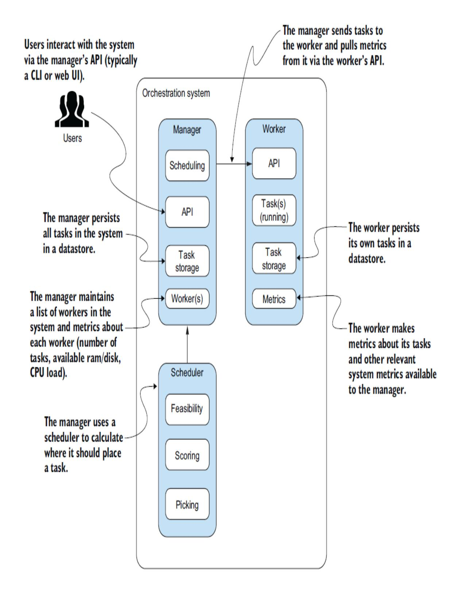

#### *[OceanofPDF.com](https://oceanofpdf.com/)*