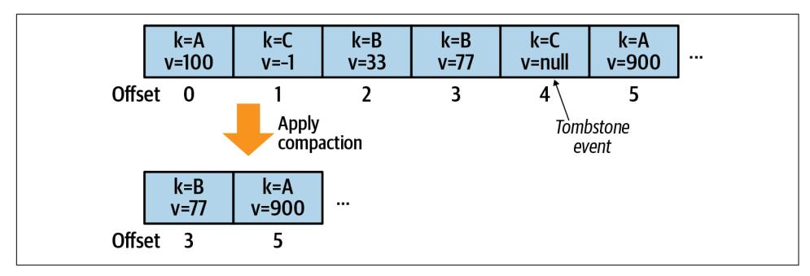
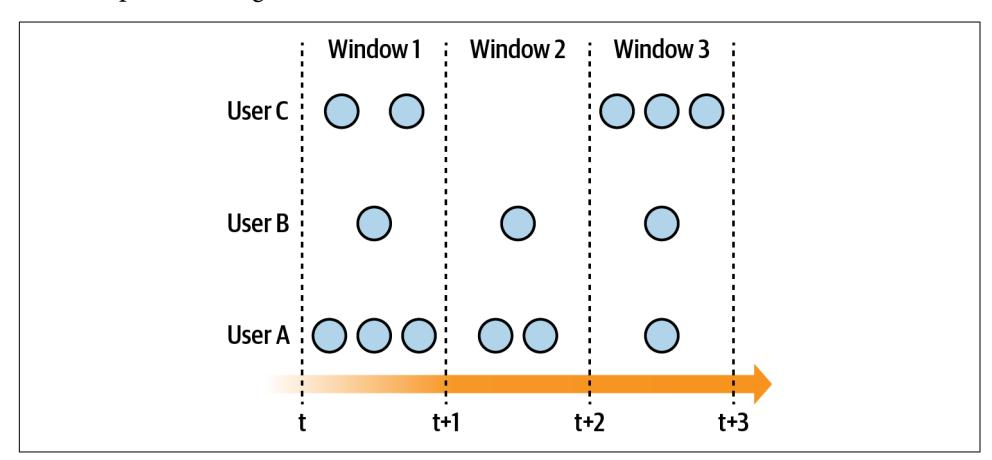
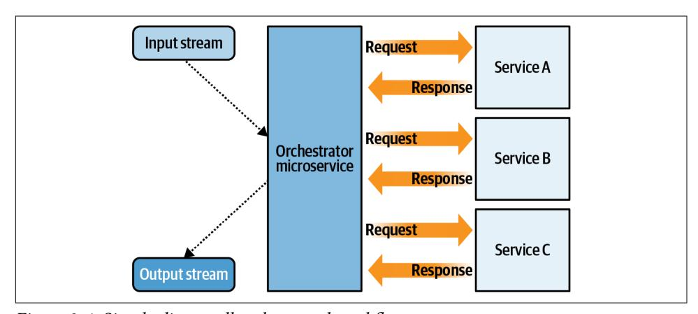
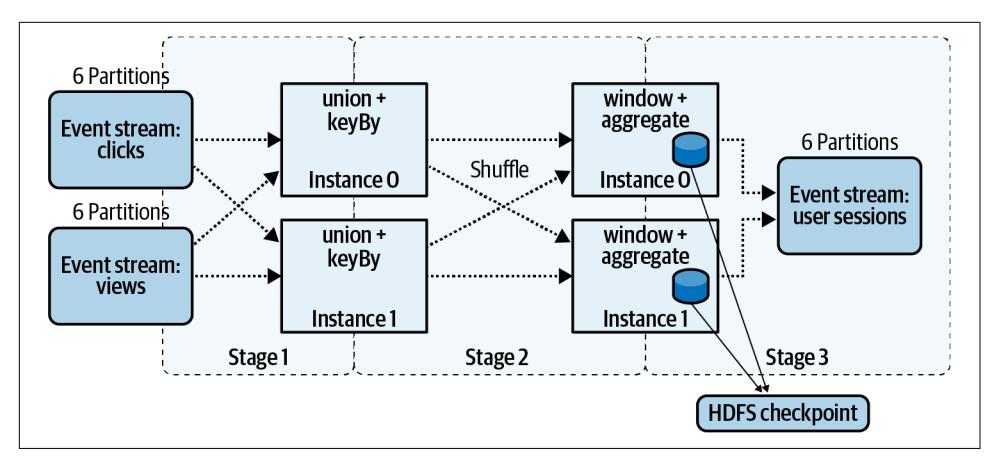
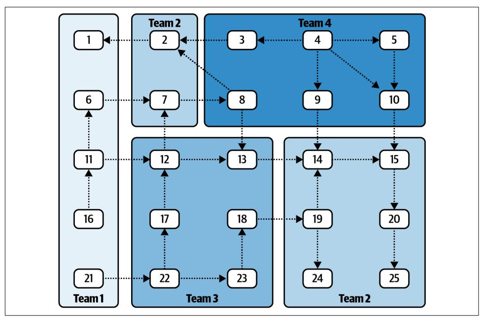
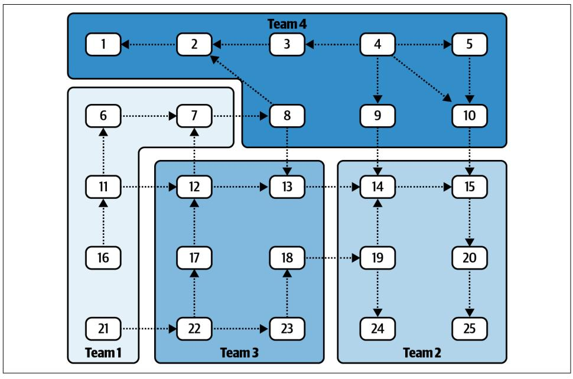

# Building Event-Driven Microservices

Leveraging Organizational Data at Scale


# **Building Event-Driven Microservices**

Organizations today often struggle to balance business requirements with ever-increasing volumes of data. Additionally, the demand for leveraging large-scale, real-time data is growing rapidly among the most competitive digital industries. Conventional system architectures may not be up to the task. With this practical guide, you'll learn how to leverage large-scale data usage across the business units in your organization using the principles of event-driven microservices.

Author Adam Bellemare takes you through the process of building an event-driven microservice-powered organization. You'll reconsider how data is produced, accessed, and propagated across your organization. Learn powerful yet simple patterns for unlocking the value of this data. Incorporate event-driven design and architectural principles into your own systems. And completely rethink how your organization delivers value by unlocking near-real-time access to data at scale.

#### You'll learn:

- How to leverage event-driven architectures to deliver exceptional business value
- The role of microservices in supporting event-driven designs
- Architectural patterns to ensure success both within and between teams in your organization
- Application patterns for developing powerful event-driven microservices
- Components and tooling required to get your microservice ecosystem off the ground

"The insider's secret to managing scale and taming complexity."

-K. Scott Morrison

Chief Technology Officer, PHEMI Systems

"Invaluable for anyone interested in event-driven systems. This book couldn't come soon enough."

-Ben Stopford

Lead Technologist at Confluent, Author of *Designing Event-Driven Systems* 

Adam Bellemare is a data engineer at Shopify, where he builds products and platforms to enable event-driven architectures. He previously worked at Flipp, where he drove the migration to microservices and promoted distributed, asynchronous designs. His expertise includes architectural and technical leadership, distributed computing, and reshaping how organizations store, access, and use their data.

**PROGRAMMING** 

US \$59.99 CAN \$79.99 ISBN: 978-1-492-05789-5


Twitter: @oreillymedia facebook.com/oreilly

# **Building Event-Driven Microservices**

*Leveraging Organizational Data at Scale*

*Adam Bellemare*


#### **Building Event-Driven Microservices**

by Adam Bellemare

Copyright © 2020 Adam Bellemare. All rights reserved.

Printed in the United States of America.

Published by O'Reilly Media, Inc., 1005 Gravenstein Highway North, Sebastopol, CA 95472.

O'Reilly books may be purchased for educational, business, or sales promotional use. Online editions are also available for most titles (*<http://oreilly.com>*). For more information, contact our corporate/institutional sales department: 800-998-9938 or *corporate@oreilly.com*.

**Acquisitions Editor:** Melissa Duffield **Development Editor:** Corbin Collins **Production Editor:** Christopher Faucher

**Copyeditor:** Rachel Monaghan **Proofreader:** Kim Wimpsett

August 2020: First Edition

**Revision History for the First Edition** 2020-07-02: First Release

**Indexer:** Potomac Indexing, LLC **Interior Designer:** David Futato **Cover Designer:** Karen Montgomery **Illustrator:** O'Reilly Media, Inc.

See *<http://oreilly.com/catalog/errata.csp?isbn=9781492057895>* for release details.

The O'Reilly logo is a registered trademark of O'Reilly Media, Inc. *Building Event-Driven Microservices*, the cover image, and related trade dress are trademarks of O'Reilly Media, Inc.

The views expressed in this work are those of the author, and do not represent the publisher's views. While the publisher and the author have used good faith efforts to ensure that the information and instructions contained in this work are accurate, the publisher and the author disclaim all responsibility for errors or omissions, including without limitation responsibility for damages resulting from the use of or reliance on this work. Use of the information and instructions contained in this work is at your own risk. If any code samples or other technology this work contains or describes is subject to open source licenses or the intellectual property rights of others, it is your responsibility to ensure that your use thereof complies with such licenses and/or rights.

# **Table of Contents**

| Preface.                                    |                                                                         | xii |
|---------------------------------------------|-------------------------------------------------------------------------|-----|
| <b>1.</b> Why Event-Driven Microservices... |                                                                         | 1   |
|                                             | What Are Event-Driven Microservices?                                    | 2   |
|                                             | Introduction to Domain-Driven Design and Bounded Contexts               | 3   |
|                                             | Leveraging Domain Models and Bounded Contexts                           | 4   |
|                                             | Aligning Bounded Contexts with Business Requirements                    | 5   |
|                                             | Communication Structures                                                | 6   |
|                                             | Business Communication Structures                                       | 7   |
|                                             | Implementation Communication Structures                                 | 7   |
|                                             | Data Communication Structures                                           | 8   |
|                                             | Conway's Law and Communication Structures                               | 9   |
|                                             | Communication Structures in Traditional Computing                       | 10  |
|                                             | Option 1: Make a New Service                                            | 10  |
|                                             | Option 2: Add It to the Existing Service                                | 11  |
|                                             | Pros and Cons of Each Option                                            | 11  |
|                                             | The Team Scenario, Continued                                            | 12  |
|                                             | Conflicting Pressures                                                   | 13  |
|                                             | Event-Driven Communication Structures                                   | 13  |
|                                             | Events Are the Basis of Communication                                   | 14  |
|                                             | Event Streams Provide the Single Source of Truth                        | 14  |
|                                             | Consumers Perform Their Own Modeling and Querying                       | 14  |
|                                             | Data Communication Is Improved Across the Organization                  | 15  |
|                                             | Accessible Data Supports Business Communication Changes                 | 15  |
|                                             | Asynchronous Event-Driven Microservices                                 | 15  |
|                                             | Example Team Using Event-Driven Microservices                           | 16  |
|                                             | Synchronous Microservices                                               | 17  |
|                                             | Drawbacks of Synchronous Microservices                                  | 17  |
|                                             | Benefits of Synchronous Microservices                                   | 19  |
|                                             | Summary                                                                 | 20  |
| 2.                                          | Event-Driven Microservice Fundamentals 21                               |     |
|                                             | Building Topologies                                                     | 21  |
|                                             | Microservice Topology                                                   | 21  |
|                                             | Business Topology                                                       | 22  |
|                                             | The Contents of an Event                                                | 23  |
|                                             | The Structure of an Event                                               | 23  |
|                                             | Unkeyed Event                                                           | 24  |
|                                             | Entity Event                                                            | 24  |
|                                             | Keyed Event                                                             | 24  |
|                                             | Materializing State from Entity Events                                  | 25  |
|                                             | Event Data Definitions and Schemas                                      | 27  |
|                                             | Microservice Single Writer Principle                                    | 28  |
|                                             | Powering Microservices with the Event Broker                            | 28  |
|                                             | Event Storage and Serving                                               | 29  |
|                                             | Additional Factors to Consider                                          | 30  |
|                                             | Event Brokers Versus Message Brokers                                    | 31  |
|                                             | Consuming from the Immutable Log                                        | 32  |
|                                             | Providing a Single Source of Truth                                      | 34  |
|                                             | Managing Microservices at Scale                                         | 34  |
|                                             | Putting Microservices into Containers                                   | 35  |
|                                             | Putting Microservices into Virtual Machines                             | 35  |
|                                             | Managing Containers and Virtual Machines                                | 35  |
|                                             | Paying the Microservice Tax                                             | 36  |
|                                             | Summary                                                                 | 37  |
| 3.                                          | Communication and Data Contracts 39                                     |     |
|                                             | Event-Driven Data Contracts                                             | 39  |
|                                             | Using Explicit Schemas as Contracts                                     | 40  |
|                                             | Schema Definition Comments                                              | 41  |
|                                             | Full-Featured Schema Evolution                                          | 41  |
|                                             | Code Generator Support                                                  | 42  |
|                                             | Breaking Schema Changes                                                 | 43  |
|                                             | Selecting an Event Format                                               | 45  |
|                                             | Designing Events                                                        | 46  |
|                                             | Tell the Truth, the Whole Truth, and Nothing but the Truth              | 46  |
|                                             | Use a Singular Event Definition per Stream                              | 46  |
|                                             | Use the Narrowest Data Types                                            | 47  |
|                                             | Keep Events Single-Purpose                                              | 47  |
|                                             | Minimize the Size of Events                                             | 51  |
|                                             | Involve Prospective Consumers in the Event Design                       | 51  |
|                                             | Avoid Events as Semaphores or Signals                                   | 51  |
|                                             | Summary                                                                 | 52  |
| 4.                                          | Integrating Event-Driven Architectures with Existing Systems            | 53  |
|                                             | What Is Data Liberation?                                                | 54  |
|                                             | Compromises for Data Liberation                                         | 55  |
|                                             | Converting Liberated Data to Events                                     | 57  |
|                                             | Data Liberation Patterns                                                | 57  |
|                                             | Data Liberation Frameworks                                              | 58  |
|                                             | Liberating Data by Query                                                | 58  |
|                                             | Bulk Loading                                                            | 59  |
|                                             | Incremental Timestamp Loading                                           | 59  |
|                                             | Autoincrementing ID Loading                                             | 59  |
|                                             | Custom Querying                                                         | 59  |
|                                             | Incremental Updating                                                    | 59  |
|                                             | Benefits of Query-Based Updating                                        | 60  |
|                                             | Drawbacks of Query-Based Updating                                       | 61  |
|                                             | Liberating Data Using Change-Data Capture Logs                          | 61  |
|                                             | Benefits of Using Data Store Logs                                       | 63  |
|                                             | Drawbacks of Using Data Base Logs                                       | 63  |
|                                             | Liberating Data Using Outbox Tables                                     | 64  |
|                                             | Performance Considerations                                              | 65  |
|                                             | Isolating Internal Data Models                                          | 65  |
|                                             | Ensuring Schema Compatibility                                           | 67  |
|                                             | Capturing Change-Data Using Triggers                                    | 70  |
|                                             | Making Data Definition Changes to Data Sets Under Capture               | 74  |
|                                             | Handling After-the-Fact Data Definition Changes for the Query and CDC   |     |
|                                             | Log Patterns                                                            | 75  |
|                                             | Handling Data Definition Changes for Change-Data Table Capture Patterns | 75  |
|                                             | Sinking Event Data to Data Stores                                       | 75  |
|                                             | The Impacts of Sinking and Sourcing on a Business                       | 76  |
|                                             | Summary                                                                 | 78  |
| 5.                                          | Event-Driven Processing Basics 79                                       |     |
|                                             | Composing Stateless Topologies                                          | 80  |
|                                             | Transformations                                                         | 80  |
|                                             | Branching and Merging Streams                                           | 81  |
|                                             | Repartitioning Event Streams                                            | 81  |
|                                             | Example: Repartitioning an Event Stream                                 | 82  |
|                                             | Copartitioning Event Streams                                            | 83  |
|                                             | Example: Copartitioning an Event Stream                                 | 83  |
|                                             | Assigning Partitions to a Consumer Instance                             | 84  |
|                                             | Assigning Partitions with the Partition Assignor                        | 84  |
|                                             | Assigning Copartitioned Partitions                                      | 85  |
|                                             | Partition Assignment Strategies                                         | 85  |
|                                             | Recovering from Stateless Processing Instance Failures                  | 87  |
|                                             | Summary                                                                 | 87  |
| 6.                                          | Deterministic Stream Processing                                         | 89  |
|                                             | Determinism with Event-Driven Workflows                                 | 90  |
|                                             | Timestamps                                                              | 90  |
|                                             | Synchronizing Distributed Timestamps                                    | 92  |
|                                             | Processing with Timestamped Events                                      | 92  |
|                                             | Event Scheduling and Deterministic Processing                           | 93  |
|                                             | Custom Event Schedulers                                                 | 94  |
|                                             | Processing Based on Event Time, Processing Time, and Ingestion Time     | 94  |
|                                             | Timestamp Extraction by the Consumer                                    | 95  |
|                                             | Request-Response Calls to External Systems                              | 95  |
|                                             | Watermarks                                                              | 95  |
|                                             | Watermarks in Parallel Processing                                       | 96  |
|                                             | Stream Time                                                             | 97  |
|                                             | Stream Time in Parallel Processing                                      | 98  |
|                                             | Out-of-Order and Late-Arriving Events                                   | 99  |
|                                             | Late Events with Watermarks and Stream Time                             | 101 |
|                                             | Causes and Impacts of Out-of-Order Events                               | 101 |
|                                             | Time-Sensitive Functions and Windowing                                  | 103 |
|                                             | Handling Late Events                                                    | 105 |
|                                             | Reprocessing Versus Processing in Near-Real Time                        | 106 |
|                                             | Intermittent Failures and Late Events                                   | 107 |
|                                             | Producer/Event Broker Connectivity Issues                               | 108 |
|                                             | Summary and Further Reading                                             | 109 |
| 7.                                          | Stateful Streaming 111                                                  |     |
|                                             | State Stores and Materializing State from an Event Stream               | 111 |
|                                             | Recording State to a Changelog Event Stream                             | 112 |
|                                             | Materializing State to an Internal State Store                          | 113 |
|                                             | Materializing Global State                                              | 114 |
|                                             | Advantages of Using Internal State                                      | 114 |
|                                             | Disadvantages of Using Internal State                                   | 116 |
|                                             | Scaling and Recovery of Internal State                                  | 116 |
|                                             | Materializing State to an External State Store                          | 120 |
|                                             | Advantages of External State                                            | 120 |
|                                             | Drawbacks of External State                                             | 121 |
|                                             | Scaling and Recovery with External State Stores                         | 122 |
|                                             | Rebuilding Versus Migrating State Stores                                | 124 |
|                                             | Rebuilding                                                              | 124 |
|                                             | Migrating                                                               | 124 |
|                                             | Transactions and Effectively Once Processing                            | 125 |
|                                             | Example: Stock Accounting Service                                       | 126 |
|                                             | Effectively Once Processing with Client-Broker Transactions             | 127 |
|                                             | Effectively Once Processing Without Client-Broker Transactions          | 128 |
|                                             | Summary                                                                 | 133 |
| 8.                                          | Building Workflows with Microservices                                   | 135 |
|                                             | The Choreography Pattern                                                | 136 |
|                                             | A Simple Event-Driven Choreography Example                              | 137 |
|                                             | Creating and Modifying a Choreographed Workflow                         | 138 |
|                                             | Monitoring a Choreographed Workflow                                     | 139 |
|                                             | The Orchestration Pattern                                               | 139 |
|                                             | A Simple Event-Driven Orchestration Example                             | 141 |
|                                             | A Simple Direct-Call Orchestration Example                              | 142 |
|                                             | Comparing Direct-Call and Event-Driven Orchestration                    | 142 |
|                                             | Creating and Modifying an Orchestration Workflow                        | 143 |
|                                             | Monitoring the Orchestration Workflow                                   | 144 |
|                                             | Distributed Transactions                                                | 144 |
|                                             | Choreographed Transactions: The Saga Pattern                            | 145 |
|                                             | Orchestrated Transactions                                               | 146 |
|                                             | Compensation Workflows                                                  | 149 |
|                                             | Summary                                                                 | 149 |
| 9.                                          | Microservices Using Function-as-a-Service                               | 151 |
|                                             | Designing Function-Based Solutions as Microservices                     | 151 |
|                                             | Ensure Strict Membership to a Bounded Context                           | 151 |
|                                             | Commit Offsets Only After Processing Has Completed                      | 152 |
|                                             | Less Is More                                                            | 153 |
|                                             | Choosing a FaaS Provider                                                | 153 |
|                                             | Building Microservices Out of Functions                                 | 153 |
|                                             | Cold Start and Warm Starts                                              | 155 |
|                                             | Starting Functions with Triggers                                        | 155 |
|                                             | Triggering Based on New Events: The Event-Stream Listener               | 155 |
|                                             | Triggering Based on Consumer Group Lag                                  | 157 |
|                                             | Triggering on a Schedule                                                | 158 |
|                                             | Triggering Using Webhooks                                               | 159 |
|                                             | Triggering on Resource Events                                           | 159 |
|                                             | Performing Business Work with Functions                                 | 159 |
|                                             | Maintaining State                                                       | 160 |
|                                             | Functions Calling Other Functions                                       | 160 |
|                                             | Event-Driven Communication Pattern                                      | 161 |
|                                             | Direct-Call Pattern                                                     | 162 |
|                                             | Termination and Shutdown                                                | 165 |
|                                             | Tuning Your Functions                                                   | 165 |
|                                             | Allocating Sufficient Resources                                         | 165 |
|                                             | Batch Event-Processing Parameters                                       | 166 |
|                                             | Scaling Your FaaS Solutions                                             | 166 |
|                                             | Summary                                                                 | 167 |
| 10.                                         | Basic Producer and Consumer Microservices.                              | 169 |
|                                             | Where Do BPCs Work Well?                                                | 170 |
|                                             | Integration with Existing and Legacy Systems                            | 170 |
|                                             | Stateful Business Logic That Isn't Reliant Upon Event Order             | 171 |
|                                             | When the Data Layer Does Much of the Work                               | 172 |
|                                             | Independent Scaling of the Processing and Data Layer                    | 173 |
|                                             | Hybrid BPC Applications with External Stream Processing                 | 174 |
|                                             | Example: Using an External Stream-Processing Framework to Join Event    |     |
|                                             | Streams                                                                 | 174 |
|                                             | Summary                                                                 | 176 |
| 11.                                         | Heavyweight Framework Microservices.                                    | 177 |
|                                             | A Brief History of Heavyweight Frameworks                               | 178 |
|                                             | The Inner Workings of Heavyweight Frameworks                            | 179 |
|                                             | Benefits and Limitations                                                | 181 |
|                                             | Cluster Setup Options and Execution Modes                               | 183 |
|                                             | Use a Hosted Service                                                    | 183 |
|                                             | Build Your Own Full Cluster                                             | 183 |
|                                             | Create Clusters with CMS Integration                                    | 184 |
|                                             | Application Submission Modes                                            | 186 |
|                                             | Driver Mode                                                             | 186 |
|                                             | Cluster Mode                                                            | 186 |
|                                             | Handling State and Using Checkpoints                                    | 186 |
|                                             | Scaling Applications and Handling Event Stream Partitions               | 188 |
|                                             | Scaling an Application While It Is Running                              | 189 |
|                                             |                                                                         |     |
|                                             | Scaling an Application by Restarting It                                 | 191 |
|                                             | Autoscaling Applications                                                | 192 |
|                                             | Recovering from Failures                                                | 192 |
|                                             | Multitenancy Considerations                                             | 192 |
|                                             | Languages and Syntax                                                    | 193 |
|                                             | Choosing a Framework                                                    | 193 |
|                                             | Example: Session Windowing of Clicks and Views                          | 194 |
|                                             | Summary                                                                 | 197 |
| 12.                                         | Lightweight Framework Microservices.                                    | 199 |
|                                             | Benefits and Limitations                                                | 199 |
|                                             | Lightweight Processing                                                  | 200 |
|                                             | Handling State and Using Changelogs                                     | 201 |
|                                             | Scaling Applications and Recovering from Failures                       | 201 |
|                                             | Event Shuffling                                                         | 202 |
|                                             | State Assignment                                                        | 202 |
|                                             | State Replication and Hot Replicas                                      | 203 |
|                                             | Choosing a Lightweight Framework                                        | 203 |
|                                             | Apache Kafka Streams                                                    | 203 |
|                                             | Apache Samza: Embedded Mode                                             | 204 |
|                                             | Languages and Syntax                                                    | 204 |
|                                             | Stream-Table-Table Join: Enrichment Pattern                             | 205 |
|                                             | Summary                                                                 | 209 |
| 13.                                         | Integrating Event-Driven and Request-Response Microservices.            | 211 |
|                                             | Handling External Events                                                | 211 |
|                                             | Autonomously Generated Events                                           | 212 |
|                                             | Reactively Generated Events                                             | 212 |
|                                             | Handling Autonomously Generated Analytical Events                       | 213 |
|                                             | Integrating with Third-Party Request-Response APIs                      | 214 |
|                                             | Processing and Serving Stateful Data                                    | 216 |
|                                             | Serving Real-Time Requests with Internal State Stores                   | 217 |
|                                             | Serving Real-Time Requests with External State Stores                   | 220 |
|                                             | Handling Requests Within an Event-Driven Workflow                       | 223 |
|                                             | Processing Events for User Interfaces                                   | 224 |
|                                             | Micro-Frontends in Request-Response Applications                        | 231 |
|                                             | The Benefits of Microfrontends                                          | 232 |
|                                             | Composition-Based Microservices                                         | 232 |
|                                             | Easy Alignment to Business Requirements                                 | 232 |
|                                             | Drawbacks of Microfrontends                                             | 233 |
|                                             | Potentially Inconsistent UI Elements and Styling                        | 233 |
|                                             | Varying Microfrontend Performance                                       | 233 |
|                                             | Example: Experience Search and Review Application                       | 234 |
|                                             | Summary                                                                 | 237 |
| 14.                                         | Supportive Tooling 239                                                  |     |
|                                             | Microservice-to-Team Assignment System                                  | 239 |
|                                             | Event Stream Creation and Modification                                  | 240 |
|                                             | Event Stream Metadata Tagging                                           | 240 |
|                                             | Quotas                                                                  | 241 |
|                                             | Schema Registry                                                         | 241 |
|                                             | Schema Creation and Modification Notifications                          | 243 |
|                                             | Offset Management                                                       | 243 |
|                                             | Permissions and Access Control Lists for Event Streams                  | 244 |
|                                             | State Management and Application Reset                                  | 245 |
|                                             | Consumer Offset Lag Monitoring                                          | 246 |
|                                             | Streamlined Microservice Creation Process                               | 247 |
|                                             | Container Management Controls                                           | 247 |
|                                             | Cluster Creation and Management                                         | 248 |
|                                             | Programmatic Bringup of Event Brokers                                   | 248 |
|                                             | Programmatic Bringup of Compute Resources                               | 248 |
|                                             | Cross-Cluster Event Data Replication                                    | 249 |
|                                             | Programmatic Bringup of Tooling                                         | 249 |
|                                             | Dependency Tracking and Topology Visualization                          | 250 |
|                                             | Topology Example                                                        | 251 |
|                                             | Summary                                                                 | 254 |
| 15.                                         | Testing Event-Driven Microservices                                      | 255 |
|                                             | General Testing Principles                                              | 255 |
|                                             | Unit-Testing Topology Functions                                         | 256 |
|                                             | Stateless Functions                                                     | 256 |
|                                             | Stateful Functions                                                      | 256 |
|                                             | Testing the Topology                                                    | 257 |
|                                             | Testing Schema Evolution and Compatibility                              | 258 |
|                                             | Integration Testing of Event-Driven Microservices                       | 258 |
|                                             | Local Integration Testing                                               | 259 |
|                                             | Create a Temporary Environment Within the Runtime of Your Test Code     | 261 |
|                                             | Create a Temporary Environment External to Your Test Code               | 262 |
|                                             | Integrate Hosted Services Using Mocking and Simulator Options           | 263 |
|                                             | Integrate Remote Services That Have No Local Options                    | 264 |
|                                             | Full Remote Integration Testing                                         | 265 |
|                                             | Programmatically Create a Temporary Integration Testing Environment     | 265 |
|                                             | Testing Using a Shared Environment                                      | 268 |
|                                             | Testing Using the Production Environment                                | 269 |
|                                             | Choosing Your Full-Remote Integration Testing Strategy                  | 270 |
|                                             | Summary                                                                 | 270 |
| 16.                                         | Deploying Event-Driven Microservices.                                   | 273 |
|                                             | Principles of Microservice Deployment                                   | 273 |
|                                             | Architectural Components of Microservice Deployment                     | 274 |
|                                             | Continuous Integration, Delivery, and Deployment Systems                | 275 |
|                                             | Container Management Systems and Commodity Hardware                     | 276 |
|                                             | The Basic Full-Stop Deployment Pattern                                  | 276 |
|                                             | The Rolling Update Pattern                                              | 278 |
|                                             | The Breaking Schema Change Pattern                                      | 279 |
|                                             | Eventual Migration via Two Event Streams                                | 280 |
|                                             | Synchronized Migration to the New Event Stream                          | 281 |
|                                             | The Blue-Green Deployment Pattern                                       | 282 |
|                                             | Summary                                                                 | 283 |
| 17.                                         | Conclusion.                                                             | 285 |
|                                             | Communication Layers                                                    | 285 |
|                                             | Business Domains and Bounded Contexts                                   | 286 |
|                                             | Shareable Tools and Infrastructure                                      | 286 |
|                                             | Schematized Events                                                      | 287 |
|                                             | Data Liberation and the Single Source of Truth                          | 287 |
|                                             | Microservices                                                           | 288 |
|                                             | Microservice Implementation Options                                     | 288 |
|                                             | Testing                                                                 | 289 |
|                                             | Deploying                                                               | 289 |
|                                             | Final Words                                                             | 290 |
|                                             | Index.                                                                  | 297 |

# **Preface**

<span id="page-14-0"></span>I wrote this book to be the book that I wish I'd had when I started out on my journey into the world of event-driven microservices. This book is a culmination of my own personal experiences, discussions with others, and the countless blogs, books, posts, talks, conferences, and documentation related to one part or another of the eventdriven microservice world. I found that many of the works I read mentioned eventdriven architectures either only in passing or with insufficient depth. Some covered only a specific aspect of the architecture and, while helpful, provided only a small piece of the puzzle. Other works proved to be reductive and dismissive, asserting that event-driven systems are really only useful for one system to send an asynchronous message directly to another as a replacement for synchronous request-response sys‐ tems. As this book details, there is far more to event-driven architectures than this.

The tools that we use shape and influence our inventions significantly. Event-driven microservice architectures are made possible by a whole host of technologies that have only recently become readily accessible. Distributed, fault-tolerant, highcapacity, and high-speed event brokers underpin the architectures and design pat‐ terns in this book. These technological solutions are based on the convergence of big data with the need for near-real-time event processing. Microservices are facilitated by the ease of containerization and the requisitioning of compute resources, allowing for simplified hosting, scaling, and management of hundreds of thousands of micro‐ services.

The technologies that support event-driven microservices have a significant impact on how we think about and solve problems, as well as on how our businesses and organizations are structured. Event-driven microservices change how a business works, how problems can be solved, and how teams, people, and business units com‐ municate. These tools give you a truly new way of doing things that has not been pos‐ sible until only recently.

# **Conventions Used in This Book**

The following typographical conventions are used in this book:

*Italic*

Indicates new terms, URLs, email addresses, filenames, and file extensions.

#### Constant width

Used for program listings, as well as within paragraphs to refer to program ele‐ ments such as variable or function names, databases, data types, environment variables, statements, and keywords.

#### **Constant width bold**

Shows commands or other text that should be typed literally by the user.

#### *Constant width italic*

Shows text that should be replaced with user-supplied values or by values deter‐ mined by context.


This element signifies a tip or suggestion.


This element signifies a general note.


This element indicates a warning or caution.

# **O'Reilly Online Learning**


For more than 40 years, *[O'Reilly Media](http://oreilly.com)* has provided technol‐ ogy and business training, knowledge, and insight to help companies succeed.

Our unique network of experts and innovators share their knowledge and expertise through books, articles, and our online learning platform. O'Reilly's online learning platform gives you on-demand access to live training courses, in-depth learning paths, interactive coding environments, and a vast collection of text and video from O'Reilly and 200+ other publishers. For more information, visit *<http://oreilly.com>*.

# **How to Contact Us**

Please address comments and questions concerning this book to the publisher:

O'Reilly Media, Inc. 1005 Gravenstein Highway North Sebastopol, CA 95472 800-998-9938 (in the United States or Canada) 707-829-0515 (international or local) 707-829-0104 (fax)

We have a web page for this book, where we list errata, examples, and any additional information. You can access this page at *[https://oreil.ly/building-event-driven](https://oreil.ly/building-event-driven-microservices)[microservices](https://oreil.ly/building-event-driven-microservices)*.

Email *[bookquestions@oreilly.com](mailto:bookquestions@oreilly.com)* to comment or ask technical questions about this book.

For news and information about our books and courses, visit *<http://oreilly.com>*.

Find us on Facebook: *<http://facebook.com/oreilly>* Follow us on Twitter: *<http://twitter.com/oreillymedia>* Watch us on YouTube: *<http://youtube.com/oreillymedia>*

# **Acknowledgments**

I'd like to express my respect and gratitude for the people at Confluent, who, along with inventing Apache Kafka, are some of the first people who particularly "get it" when it comes to event-driven architectures. I have been fortunate enough to have one of their members, Ben Stopford (lead technologist, Office of the CTO), provide ample and valuable feedback. Scott Morrison, CTO of PHEMI Systems, has also pro‐ vided me with valuable insights, feedback, and recommendations. I offer my thanks and gratitude to both Scott and Ben for helping make this book what it is today. As primary proofreaders and technical experts, they have helped me refine ideas, chal‐ lenged me to improve the content quality, prevented me from promoting incorrect information, and helped me tell the story of event-driven architectures.

I would also like to extend my thanks to my friends Justin Tokarchuk, Gary Graham, and Nick Green, who proofread and edited a number of my drafts. Along with Scott and Ben, they helped me to identify the most significant weak points in my narrative, suggested ways to improve them, and provided their insights and personal experience in relation to the material.

My thanks also goes out to the folks at O'Reilly for helping me in innumerable ways. I have worked with a number of excellent people during this experience, but in partic‐ ular I would like to thank my editor, Corbin Collins, for supporting me through some difficult times and helping keep me on track. He has been a great collaborator during this endeavor, and I appreciate the efforts he has put into supporting me.

Rachel Monaghan, my copyeditor, reminded me of my high school days, when my essays would be returned colored with red highlights. I am extremely grateful for her sharp eye and knowledge of the English language—she helped make this book far easier to read and understand. Thank you, Rachel.

Christopher Faucher has been very patient with me, providing me with excellent feedback and allowing me to make a number of nontrivial, last-minute changes to the book without blinking an eye. Thank you, Chris.

Mike Loukides, VP of Content Strategy, was one of my first contacts at O'Reilly. When I approached him with my exceptionally verbose and lengthy proposal, he patiently worked with me to refocus it and refine it into the basis of the book before you today. I am grateful that he took the time to work with me and eventually move forward with this work. I have tried my best to heed his caution to avoid producing a tome that rivals the dictionary in length.

To my mother and father, I thank you for giving me appreciation for the written word. I am grateful for their love and support. My father introduced me to Marshall McLuhan, and though I have largely failed to read most of his works, I have gained an immense appreciation for his evaluation on how the medium affects the message. This has transformed the way that I view and evaluate system architectures.

Finally, thanks to everyone else who contributed in some way large or small to sup‐ porting me and this work. There are so many people who have contributed in their own way—through conversations, blog posts, presentations, open source code, anec‐ dotes, personal experiences, stories, and impromptu rants. Thank you, each and every one of you.

It has been both a pleasure and a frustration to work on this book. There have been many times where I cursed myself for starting it, but thankfully there were many more times that I was glad I did. I hope that this book helps you, dear reader, in some way to learn and grow.

# <span id="page-18-0"></span>**Why Event-Driven Microservices**

The medium is the message.

—Marshall McLuhan

McLuhan argues that it is not the *content* of media, but rather engagement with its medium, that impacts humankind and introduces fundamental changes to society. Newspapers, radio, television, the internet, instant messaging, and social media have all changed human interaction and social structures thanks to our collective engagement.

The same is true with computer system architectures. You need only look at the his‐ tory of computing inventions to see how network communications, relational data‐ bases, big-data developments, and cloud computing have significantly altered how architectures are built and how work is performed. Each of these inventions changed not only the way that technology was used within various software projects, but also the way that organizations, teams, and people communicated with one another. From centralized mainframes to distributed mobile applications, each new medium has fundamentally changed people's relationship with computing.

The medium of the asynchronously produced and consumed event has been funda‐ mentally shifted by modern technology. These events can now be persisted indefi‐ nitely, at extremely large scale, and be consumed by any service as many times as necessary. Compute resources can be easily acquired and released on-demand, ena‐ bling the easy creation and management of microservices. Microservices can store and manage their data according to their own needs, and do so at a scale that was previously limited to batch-based big-data solutions. These improvements to the humble and simple event-driven medium have far-reaching impacts that not only change computer architectures, but also completely reshape how teams, people, and organizations create systems and businesses.

**1**

# <span id="page-19-0"></span>**What Are Event-Driven Microservices?**

Microservices and microservice-style architectures have existed for many years, in many different forms, under many different names. Service-oriented architectures (SOAs) are often composed of multiple microservices synchronously communicating directly with one another. Message-passing architectures use consumable events to asynchronously communicate with one another. Event-based communication is cer‐ tainly not new, but the need for handling big data sets, at scale and in real time, *is* new and necessitates a change from the old architectural styles.

In a modern event-driven microservices architecture, systems communicate by issu‐ ing and consuming events. These events are not destroyed upon consumption as in message-passing systems, but instead remain readily available for other consumers to read as they require. This is an important distinction, as it allows for the truly power‐ ful patterns covered in this book.

The services themselves are small and purpose-built, created to help fulfill the neces‐ sary business goals of the organization. A typical definition of "small" is something that takes no more than two weeks to write. By another definition, the service should be able to (conceptually) fit within one's own head. These services consume events from input event streams; apply their specific business logic; and may emit their own output events, provide data for request-response access, communicate with a thirdparty API, or perform other required actions. As this book will detail, these services can be stateful or stateless, complex or simple; and they might be implemented as long-running, standalone applications or executed as a function using Functions-asa-Service.

This combination of event streams and microservices forms an interconnected graph of activity across a business organization. Traditional computer architectures, com‐ posed of monoliths and intermonolith communications, have a similar graph struc‐ ture. Both of these graphs are shown in [Figure 1-1](#page-20-0).

<span id="page-20-0"></span>

*Figure 1-1. The graph structures of microservices and monoliths*

Identifying how to make this graph structure operate efficiently involves looking at the two major components: the nodes and connections. This chapter will examine each in turn.

### **Introduction to Domain-Driven Design and Bounded Contexts**

Domain-driven design, [as coined by Eric Evans in his book of the same title](https://oreil.ly/3fGwK), introdu‐ ces some of the necessary concepts for building event-driven microservices. [Given](https://oreil.ly/zAXqd) [the wealth of articles,](https://oreil.ly/zAXqd) [books,](https://oreil.ly/XwjR3) and blogs-of-the-month readily available to talk about this subject, I will keep this section brief.

The following concepts underpin domain-driven design:

### *Domain*

The problem space that a business occupies and provides solutions to. This encompasses everything that the business must contend with, including rules, processes, ideas, business-specific terminology, and anything related to its prob‐ lem space, *regardless of whether or not the business concerns itself with it*. The domain exists regardless of the existence of the business.

### *Subdomain*

A component of the main domain. Each subdomain focuses on a specific subset of responsibilities and typically reflects some of the business's organizational structure (such as Warehouse, Sales, and Engineering). A subdomain can be seen as a domain in its own right. Subdomains, like the domain itself, belong to the problem space.

<span id="page-21-0"></span>

### *Domain (and subdomain) model*

An abstraction of the actual domain useful for business purposes. The pieces and properties of the domain that are most important to the business are used to gen‐ erate the model. The main domain model of an business is discernible through the products the business provides its customers, the interfaces by which custom‐ ers interact with the products, and the various other processes and functions by which the business fulfills its stated goals. Models often need to be refined as the domain changes and as business priorities shift. A domain model is part of the solution space, as it is a construct the business uses to solve problems.

### *Bounded context*

The logical boundaries, including the inputs, outputs, events, requirements, pro‐ cesses, and data models, relevant to the subdomain. While ideally a bounded context and a subdomain will be in complete alignment, legacy systems, technical debt, and third-party integrations often create exceptions. Bounded contexts are also a property of the solution space and have a significant impact on how micro‐ services interact with one another.

Bounded contexts should be highly cohesive. The internal operations of the context should be intensive and closely related, with the vast majority of communication occurring internally rather than cross-boundary. Having highly cohesive responsibili‐ ties allows for reduced design scope and simpler implementations.

Connections between bounded contexts should be loosely coupled, as changes made within one bounded context should minimize or eliminate the impact on neighbor‐ ing contexts. A loose coupling can ensure that requirement changes in one context do not propagate a surge of dependent changes to neighboring contexts.

### **Leveraging Domain Models and Bounded Contexts**

Every organization forms a single domain between itself and the outside world. Everyone working within the organization is operating to support the needs of its domain.

This domain is broken down into subdomains—perhaps, for a technology-centric company, an Engineering department, a Sales department, and a Customer Support department. Each subdomain has its own requirements and duties and may itself be subdivided. This division process repeats until the subdomain models are granular and actionable and can be translated into small and independent services by the implementing teams. Bounded contexts are established around these subdomains and form the basis for the creation of microservices.

### <span id="page-22-0"></span>**Aligning Bounded Contexts with Business Requirements**

It is common for the business requirements of a product to change during its lifetime, perhaps due to organizational changes or new feature requests. In contrast, it's rare for a company to need to change the underlying implementation of any given prod‐ uct without accompanying business requirement changes. This is why bounded con‐ texts should be built around business requirements and not technological requirements.

Aligning bounded contexts on business requirements allows teams to make changes to microservice implementations in a loosely coupled and highly cohesive way. It pro‐ vides a team with the autonomy to design and implement a solution for the specific business needs, which greatly reduces interteam dependencies and enables each team to focus strictly on its own requirements.

Conversely, aligning microservices on technical requirements is problematic. This pattern is often seen in improperly designed synchronous point-to-point microservi‐ ces and in traditional monolith-style computing systems where teams own specific technical layers of the application. The main issue with technological alignment is that it distributes the responsibility of fulfilling the business function across multiple bounded contexts, which may involve multiple teams with differing schedules and duties. Because no team is solely responsible for implementing a solution, each ser‐ vice becomes coupled to another across both team and API boundaries, making changes difficult and expensive. A seemingly innocent change, a bug, or a failed ser‐ vice can have serious ripple effects to the business-serving capabilities of all services that use the technical system. Technical alignment is seldomly used in event-driven microservice (EDM) architectures and should be avoided completely whenever possi‐ ble. Eliminating cross-cutting technological and team dependencies will reduce a sys‐ tem's sensitivity to change.

[Figure 1-2](#page-23-0) shows both scenarios: sole ownership on the left and cross-cutting owner‐ ship on the right. With sole ownership, the team is fully organized around the two independent business requirements (bounded contexts) and has complete control over its application code and the database layer. On the right, the teams have been organized via technical requirements, where the application layer is managed separate from the data layer. This creates explicit dependencies between the teams, as well as implicit dependencies between the business requirements.

<span id="page-23-0"></span>

*Figure 1-2. Alignment on business contexts versus on technological contexts*

Modeling event-driven microservices architectures around business requirements is preferred, though there are tradeoffs with this approach. Code may be replicated a number of times, and many services may use similar data access patterns. Product developers may try to reduce repetition by sharing data sources with other products or by coupling on boundaries. In these cases, the subsequent tight coupling may be far more costly in the long run than repeating logic and storing similar data. These tradeoffs will be examined in greater detail throughout this book.


Keep loose coupling between bounded contexts, and focus on min‐ imizing intercontext dependencies. This will allow bounded con‐ text implementations to change as necessary, without subsequently breaking many (or any) other systems.

Additionally, each team may be required to have full stack expertise, which can be complicated by the need for specialized skill sets and access permissions. The organi‐ zation should operationalize the most common requirements such that these vertical teams can support themselves, while more specialized skill sets can be provided on a cross-team, as-needed basis. These best practices are covered in more detail in [Chapter 14.](#page-256-0)

# **Communication Structures**

An organization's teams, systems, and people all must communicate with one another to fulfill their goals. These communications form an interconnected topology of dependencies called a *communication structure*. There are three main communication structures, and each affects the way businesses operate.

### <span id="page-24-0"></span>**Business Communication Structures**

The business communication structure (Figure 1-3) dictates communication between teams and departments, each driven by the major requirements and responsibilities assigned to it. For example, Engineering produces the software products, Sales sells to customers, and Support ensures that customers and clients are satisfied. The organi‐ zation of teams and the provisioning of their goals, from the major business units down to the work of the individual contributor, fall under this structure. Business requirements, their assignment to teams, and team compositions all change over time, which can greatly impact the relationship between the business communication structure and the implementation communication structure.


*Figure 1-3. Sample business communications structure*

### **Implementation Communication Structures**

The *implementation communication structure* [\(Figure 1-4\)](#page-25-0) is the data and logic per‐ taining to the subdomain model as dictated by the organization. It formalizes busi‐ ness processes, data structures, and system design so that business operations can be performed quickly and efficiently. This results in a tradeoff in flexibility for the busi‐ ness communication structure, as redefining the business requirements that must be satisfied by the implementation requires a rewrite of the logic. These rewrites are most often iterative modifications to the subdomain model and associated code, which over time reflect the evolution of the implementation to fulfill the new busi‐ ness requirements.

<span id="page-25-0"></span>The quintessential example of an implementation communication structure for soft‐ ware engineering is the monolithic database application. The business logic of the application communicates internally via either function calls or shared state. This monolithic application, in turn, is used to satisfy the business requirements dictated by the business communication structure.


*Figure 1-4. Sample implementation communication structure*

### **Data Communication Structures**

The data communication structure [\(Figure 1-5](#page-26-0)) is the process through which data is communicated across the business and particularly between implementations. Although a data communication structure comprising email, instant messaging, and meetings is often used for communicating business changes, it has largely been neglected for software implementations. Its role has usually been fulfilled ad hoc, from system to system, with the implementation communication structure often playing double duty by including data communication functions in addition to its own requirements. This has caused many problems in how companies grow and change over time, the impact of which is evaluated in the next section.

<span id="page-26-0"></span>

*Figure 1-5. Sample ad hoc data communication structure*

### **Conway's Law and Communication Structures**

*Organizations which design systems...are constrained to produce designs which are copies of the communication structures of these organizations.*

—Melvin Conway—*How Do Committees Invent?* (April 1968)

This quote, known as *Conway's law*, implies that a team will build products according to the communication structures of its organization. Business communication struc‐ tures organize people into teams, and these teams typically produce products that are delimited by their team boundaries. Implementation communication structures pro‐ vide access to the subdomain data models for a given product, but also restrict access to other products due to the weak data communication capabilities.

Because domain concepts span the business, domain data is often needed by other bounded contexts within an organization. Implementation communication structures are generally poor at providing this communication mechanism, though they excel at supplying the needs of their own bounded context. They influence the design of products in two ways. First, due to the inefficiencies of communicating the necessary domain data across the organization, they discourage the creation of new, logically separate products. Second, they provide easy access to existing domain data, at the risk of continually expanding the domain to encompass the new business require‐ ments. This particular pattern is embodied by monolithic designs.

Data communication structures play a pivotal role in how an organization designs and builds products, but for many organizations this structure has long been missing. As noted, implementation communication structures frequently play this role in addition to their own.

<span id="page-27-0"></span>Some organizations attempt to mitigate the inability to access domain data from other implementations, but these efforts have their own drawbacks. For example, shared databases are often used, though these frequently promote anti-patterns and often cannot scale sufficiently to accommodate all performance requirements. Data‐ bases may provide read-only replicas; however, this can expose their inner data mod‐ els unnecessarily. Batch processes can dump data to a file store to be read by other processes, but this approach can create issues around data consistency and multiple sources of truth. Lastly, all of these solutions result in a strong coupling between implementations and further harden an architecture into direct point-to-point relationships.


If you find that it is too hard to access data in your organization or that your products are scope-creeping because all the data is loca‐ ted in a single implementation, you're likely experiencing the effects of poor data communication structures. This problem will be magnified as the organization grows, develops new products, and increasingly needs to access commonly used domain data.

# **Communication Structures in Traditional Computing**

An organization's communication structures greatly influence how engineering implementations are created. This is true at the team level as well: the communication structures of the team affect the solutions it builds for the specific business require‐ ments assigned to it. Let's see how this works in practice.

Consider the following scenario. A single team has a single service backed by a single data store. They are happily providing their business function, and all is well in the world. One day the team lead comes in with a new business requirement. It's some‐ what related to what the team is already doing and could possibly just be added on to their existing service. However, it's also different enough that it could go into its own new service.

The team is at a crossroads: do they implement the new business requirement in a new service or simply add it to their existing service? Let's take a look at their options in a bit more detail.

### **Option 1: Make a New Service**

The business requirement is different enough that it could make sense to put it into a new service. But what about data? This new business function needs some of the old data, but that data is currently locked up in the existing service. Additionally, the team doesn't really have a process for launching new, fully independent services. On the other hand, the team is getting to be a bit big, and the company is growing

<span id="page-28-0"></span>quickly. If the team has to be divided in the future, having modular and independent systems may make divvying up ownership much easier.

There are risks associated with this approach. The team must figure out a way to source data from their original data store and copy it to their new data store. They need to ensure that they don't expose the inner workings and that the changes they make to their data structures won't affect any other teams copying their data. Addi‐ tionally, the data being copied will always be somewhat stale, as they can only afford to copy production data in real time every 30 minutes so as not to saturate the data store with queries. This connection will need to be monitored and maintained to ensure that it is running correctly.

There is also a risk in spinning up and running a new service. They will need to man‐ age two data stores, and two services, and establish logging, monitoring, testing, deployment, and rollback processes for them. They must also take care to synchron‐ ize any data structure changes so as not to affect the dependent system.

### **Option 2: Add It to the Existing Service**

The other option is to create the new data structures and business logic within the existing service. The required data is already in the data store, and the logging, moni‐ toring, testing, deployment, and rollback processes are already defined and in use. The team is familiar with the system and can get right to work on implementing the logic, and their monolithic patterns support this approach to service design.

There are also risks associated with this approach, though they are a bit more subtle. Boundaries within the implementation can blur as changes are made, especially since modules are often bundled together in the same codebase. It is far too easy to quickly add features by crossing those boundaries and directly couple across the module. There is a major boon to moving quickly, but it comes at the cost of tight couplings, reduced cohesion, and a lack of modularity. Though teams can guard against this, it requires excellent planning and strict adherence to boundaries, which often fall by the wayside in the face of tight schedules, inexperience, and shifting service ownership.

### **Pros and Cons of Each Option**

Most teams would choose the second option—adding the functionality to the existing system. There is nothing wrong with this choice; monolithic architectures are useful and powerful structures and can provide exceptional value to a business. The first option runs head first into the two problems associated with traditional computing:

• Accessing another system's data is difficult to do reliably, especially at scale and in real time.

• Creating and managing new services has substantial overhead and risk associated with it, especially if there is no established way to do so within the organization.

Accessing local data is always easier than accessing data in another data store. Any data encapsulated in another team's data store is difficult to obtain, as it requires crossing both implementation and business communication boundaries. This becomes increasingly difficult to maintain and scale as data, connection count, and performance requirements grow.

Though copying the necessary data over is a worthy approach, it's not foolproof. This model encourages many direct point-to-point couplings, which become problematic to maintain as an organization grows, business units and ownership change, and products mature and phase out. It creates a strict technical dependency the imple‐ mentation communication structures of both teams (the team storing the data and the team copying it), requiring them to work in synchronicity whenever a data change is made. Special care must be taken to ensure that the internal data model of an implementation is not unduly exposed, lest other systems tightly couple to it. Scal‐ ability, performance, and system availability are often issues for both systems, as the data replication query may place an unsustainable load on the source system. Failed sync processes may not be noticed until an emergency occurs. Tribal knowledge may result in a team copying a copy of data, thinking that it's the original source of truth.

Copied data will always be somewhat stale by the time the query is complete and the data is transferred. The larger the data set and the more complex its sourcing, the more likely a copy will be out of sync with the original. This is problematic when sys‐ tems expect each other to have perfect, up-to-date copies, particularly when commu‐ nicating with one another about that data. For instance, a reporting service may report different values than a billing service due to staleness. This can have serious downstream consequences for service quality, reporting, analytics, and monetarybased decision making.

The inability to correctly disseminate data throughout a company is not due to a fun‐ damental flaw in the concept. Quite the contrary: it's due to a weak or nonexistent data communication structure. In the preceding scenario, the team's implementation communication structure is performing double duty as an extremely limited data communication structure.


One of the tenets of event-driven microservices is that core busi‐ ness data should be easy to obtain and usable by any service that requires it. This replaces the ad hoc data communication structure in this scenario with a formalized data communication structure. For the hypothetical team, this data communication structure could eliminate most of the difficulties of obtaining data from other systems.

### <span id="page-30-0"></span>**The Team Scenario, Continued**

Fast-forward a year. The team decided to go with option 2 and incorporate the new features within the same service. It was quick, it was easy, and they have implemented a number of new features since then. As the company has grown, the team has grown, and now it is time for it to be reorganized into two smaller, more focused teams.

Each new team must now be assigned certain business functions from the previous service. The business requirements of each team are neatly divided based on areas of the business that need the most attention. Dividing the implementation communica‐ tion structure, however, is not proving to be easy. Just as before, it seems that the teams both require large amounts of the same data to fulfill their requirements. New sets of questions arise:

- Which team should own which data?
- Where should the data reside?
- What about data where both teams need to modify the values?

The team leads decide that it may be best to just share the service instead, and both of them can work on different parts. This will require a lot more cross-team communi‐ cation and synchronization of efforts, which may be a drag on productivity. And what about in the future, if they double in size again? Or if the business requirements change enough that they're no longer able to fulfill everything with the same data structure?

### **Conicting Pressures**

There are two conflicting pressures on the original team. It was influenced to keep all of its data local in one service to make adding new business functions quicker and easier, at the cost of expanding the implementation communication structure. Even‐ tually the growth of the team necessitated splitting up the business communication structure—a requirement followed by the reassignment of business requirements to the new teams. The implementation communication structure, however, cannot sup‐ port the reassignments in its current form and needs to be broken down into suitable components. Neither approach is scalable, and both point to a need to do things dif‐ ferently. These problems all stem from the same root cause: a weak, ill-defined means of communicating data between implementation communication structures.

# **Event-Driven Communication Structures**

The event-driven approach offers an alternative to the traditional behavior of imple‐ mentation and data communication structures. Event-based communications are not a drop-in replacement for request-response communications, but rather a completely

<span id="page-31-0"></span>different way of communicating between services. An event-streaming data commu‐ nication structure decouples the production and ownership of data from the access to it. Services no longer couple directly through a request-response API, but instead through event data defined within event streams (this process is covered more in [Chapter 3\)](#page-56-0). Producers' responsibilities are limited to producing well-defined data into their respective event streams.

### **Events Are the Basis of Communication**

All shareable data is published to a set of event streams, forming a continuous, can‐ onical narrative detailing everything that has happened in the organization. This becomes the channel by which systems communicate with one another. Nearly any‐ thing can be communicated as an event, from simple occurrences to complex, stateful records. Events *are* the data; they are not merely signals indicating data is ready else‐ where or just a means of direct data transfer from one implementation to another. Rather, they act both as data storage and as a means of asynchronous communication between services.

### **Event Streams Provide the Single Source of Truth**

Each event in a stream is a statement of fact, and together these statements form the single source of truth—the basis of communication for all systems within the organi‐ zation. A communication structure is only as good as the veracity of its information, so it's critical that the organization adopts the event stream narrative as a single source of truth. If some teams choose instead to put conflicting data in other loca‐ tions, the event stream's function as the organization's data communications back‐ bone is significantly diminished.

### **Consumers Perform Their Own Modeling and Querying**

The event-based data communication structure differs from an overextended imple‐ mentation communication structure in that it is incapable of providing any querying or data lookup functionality. All business and application logic must be encapsulated within the producer and consumer of the events.

Data access and modeling requirements are completely shifted to the consumer, with consumers each obtaining their own copy of events from the source event streams. Any querying complexity is also shifted from the implementation communication structure of the data owner to that of the consumer. The consumer remains fully responsible for any mixing of data from multiple event streams, special query func‐ tionality, or other business-specific implementation logic. Both producers and con‐ sumers are otherwise relieved of their duty to provide querying mechanisms, data transfer mechanisms, APIs (application programming interfaces), and cross-team <span id="page-32-0"></span>services for the means of communicating data. They are now limited in their respon‐ sibility to only solving the needs of their immediate bounded context.

### **Data Communication Is Improved Across the Organization**

The usage of a data communications structure is an inversion, with all shareable data being exposed outside of the implementation communication structure. Not all data must be shared, and thus not all of it needs to be published to the set of event streams. However, any data that is of interest to any other team or service must be published to the common set of event streams, such that the production and ownership of data becomes fully decoupled. This provides the formalized data communication structure that has long been missing from system architectures and better adheres to the boun‐ ded context principles of loose coupling and high cohesiveness.

Applications can now access data that would otherwise have been laborious to obtain via point-to-point connections. New services can simply acquire any needed data from the canonical event streams, create their own models and state, and perform any necessary business functions without depending on direct point-to-point connec‐ tions or APIs with any other service. This unlocks the potential for an organization to more effectively use its vast amounts of data in any product, and even mix data from multiple products in unique and powerful ways.

### **Accessible Data Supports Business Communication Changes**

Event streams contain core domain events that are central to the operation of the business. Though teams may restructure and projects may come and go, the impor‐ tant core domain data remains readily available to any new product that requires it, *independent of any specific implementation communication structure*. This gives the business unparalleled flexibility, as access to core domain events no longer relies upon any particular implementation.

# **Asynchronous Event-Driven Microservices**

Event-driven microservices enable the business logic transformations and operations necessary to meet the requirements of the bounded context. These applications are tasked with fulfilling these requirements and emitting any of their own necessary events to other downstream consumers. Here are a few of the primary benefits of using event-driven microservices:

### *Granularity*

Services map neatly to bounded contexts and can be easily rewritten when busi‐ ness requirements change.

### *Scalability*

Individual services can be scaled up and down as needed.

<span id="page-33-0"></span>

### *Technological flexibility*

Services use the most appropriate languages and technologies. This also allows for easy prototyping using pioneering technology.

### *Business requirement flexibility*

Ownership of granular microservices is easy to reorganize. There are fewer crossteam dependencies compared to large services, and the organization can react more quickly to changes in business requirements that would otherwise be impe‐ ded by barriers to data access.

### *Loosely coupling*

Event-driven microservices are coupled on domain data and not on a specific implementation API. Data schemas can be used to greatly improve how data changes are managed, as will be discussed in [Chapter 3](#page-56-0).

### *Continuous delivery support*

It's easy to ship a small, modular microservice, and roll it back if needed.

### *High testability*

Microservices tend to have fewer dependencies than large monoliths, making it easier to mock out the required testing endpoints and ensure proper code coverage.

### **Example Team Using Event-Driven Microservices**

Let's revisit the team from earlier but with an event-driven data communication structure.

A new business requirement is introduced to the team. It's somewhat related to what their current products do, but it's also different enough that it could go into its own service. Does adding it to an existing service violate the single responsibility principle and overextend the currently defined bounded context? Or is it a simple extension, perhaps the addition of some new related data or functionality, of an existing service?

Previous technical issues—such as figuring out where to source the data and how to sink it, handling batch syncing issues, and implementing synchronous APIs—are largely removed now. The team can spin up a new microservice and ingest the neces‐ sary data from the event streams, all the way back to the beginning of time if needed. It is entirely possible that the team mixes in common data used in their other services, so long as that data is used solely to fulfill the needs of the new bounded context. The storage and structure of this data are left entirely up to the team, which can choose which fields to keep and which to discard.

Business risks are also alleviated, as the small, finer-grained services allow for single team ownership, enabling the teams to scale and reorganize as necessary. When the team grows too large to manage under a single business owner, they can split up as

<span id="page-34-0"></span>required and reassign the microservice ownership. The ownership of the event data moves with the producing service, and organizational decisions can be made to reduce the amount of cross-team communication required to perform future work.

The nature of the microservice prevents spaghetti code and expansive monoliths from taking hold, provided that the overhead for creating new services and obtaining the necessary data is minimal. Scaling concerns are now focused on individual eventprocessing services, which can scale their CPU, memory, disk, and instance count as required. The remaining scaling requirements are offloaded onto the data communi‐ cation structure, which must ensure that it can handle the various loads of services consuming from and producing to its event streams.

To do all of this, however, the team needs to ensure that the data is indeed present in the data communication structure, and they must have the means for easily spinning up and managing a fleet of microservices. This requires an organization-wide adop‐ tion of EDM architecture.

# **Synchronous Microservices**

Microservices can be implemented asynchronously using events (the approach this book advocates) or synchronously, which is common in service-oriented architec‐ tures. Synchronous microservices tend to be fulfilled using a request-response approach, where services communicate directly through APIs to fulfill business requirements.

### **Drawbacks of Synchronous Microservices**

There are a number of issues with synchronous microservices that make them diffi‐ cult to use at large scale. This is not to say that a company cannot succeed by using synchronous microservices, as evidenced by the achievements of companies such as Netflix, Lyft, Uber, and Facebook. But many companies have also made fortunes using archaic and horribly tangled spaghetti-code monoliths, so do not confuse the ultimate success of a company with the quality of its underlying architecture. There are a number of books that describe how to implement synchronous microservices, so I recommend that you read those to get a better understanding of synchronous approaches.<sup>1</sup>

Furthermore, note that neither point-to-point request-response microservices nor asynchronous event-driven microservices are strictly better than the other. Both have their place in an organization, as some tasks are far better suited to one over the

<sup>1</sup> See, for example, *Building Microservices* [by Sam Newman \(O'Reilly, 2015\)](https://www.oreilly.com/library/view/building-microservices/9781491950340) and *[Microservices for the Enterprise](https://oreil.ly/FPtLm)* [by Kasun Indrasiri and Prabath Siriwardena \(Apress, 2018\)](https://oreil.ly/FPtLm).

<span id="page-35-0"></span>other. However, my own experience, as well as that of many of my peers and collea‐ gues, indicates that EDM architectures offer an unparalleled flexibility that is absent in synchronous request-response microservices. Perhaps you'll come to agree as you proceed through this book, but at the very least, you'll gain an understanding of their strengths and drawbacks.

Here are some of the biggest shortcomings of synchronous request-response micro‐ services.

### **Point-to-point couplings**

Synchronous microservices rely on other services to help them perform their busi‐ ness tasks. Those services, in turn, have their own dependent services, which have their own dependent services, and so on. This can lead to excessive fanout and diffi‐ cultly in tracing which services are responsible for fulfilling specific parts of the busi‐ ness logic. The number of connections between services can become staggeringly high, which further entrenches the existing communication structures and makes future changes more difficult.

### **Dependent scaling**

The ability to scale up your own service depends on the ability of all dependent serv‐ ices to scale up as well and is directly related to the degree of communications fanout. Implementation technologies can be a bottleneck on scalability. This is further com‐ plicated by highly variable loads and surging request patterns, which all need to be handled synchronously across the entire architecture.

### **Service failure handling**

If a dependent service is down, then decisions must be made about how to handle the exception. Deciding how to handle the outages, when to retry, when to fail, and how to recover to ensure data consistency becomes increasingly difficult the more services there are within the ecosystem.

### **API versioning and dependency management**

Multiple API definitions and service versions will often need to exist at the same time. It is not always possible or desirable to force clients to upgrade to the newest API. This can add a lot of complexity in orchestrating API change requests across multiple services, especially if they are accompanied by changes to the underlying data structures.

### **Data access tied to the implementation**

Synchronous microservices have all the same problems as traditional services when it comes to accessing external data. Although there are service design strategies for <span id="page-36-0"></span>mitigating the need to access external data, microservices will often still need to access commonly used data from other services. This puts the onus of data access and scalability back on the implementation communication structure.

### **Distributed monoliths**

Services may be composed such that they act as a distributed monolith, with many intertwining calls being made between them. This situation often arises when a team is decomposing a monolith and decides to use synchronous point-to-point calls to mimic the existing boundaries within their monolith. Point-to-point services make it easy to blur the lines between the bounded contexts, as the function calls to remote systems can slot in line-for-line with existing monolith code.

### **Testing**

Integration testing can be difficult, as each service requires fully operational depend‐ ents, which require their own in turn. Stubbing them out may work for unit tests, but seldom proves sufficient for more extensive testing requirements.

### **Benefits of Synchronous Microservices**

There are a number of undeniable benefits provided by synchronous microservices. Certain data access patterns are favorable to direct request-response couplings, such as authenticating a user and reporting on an AB test. Integrations with external thirdparty solutions almost always use a synchronous mechanism and generally provide a flexible, language-agnostic communication mechanism over HTTP.

Tracing operations across multiple systems can be easier in a synchronous environ‐ ment than in an asynchronous one. Detailed logs can show which functions were called on which systems, allowing for high debuggability and visibility into business operations.

Services hosting web and mobile experiences are by and large powered by requestresponse designs, regardless of their synchronous or asynchronous nature. Clients receive a timely response dedicated entirely to their needs.

The experience factor is also quite important, especially as many developers in today's market tend to be much more experienced with synchronous, monolithic-style cod‐ ing. This makes acquiring talent for synchronous systems easier, in general, than acquiring talent for asynchronous event-driven development.


A company's architecture could only rarely, if ever, be based entirely on event-driven microservices. Hybrid architectures will certainly be the norm, where synchronous and asynchronous solu‐ tions are deployed side-by-side as the problem space requires.

# <span id="page-37-0"></span>**Summary**

Communication structures direct how software is created and managed through the life of an organization. Data communication structures are often underdeveloped and ad hoc, but the introduction of a durable, easy-to-access set of domain events, as embodied by event-driven systems, enables smaller, purpose-built implementations to be used.

# <span id="page-38-0"></span>**Event-Driven Microservice Fundamentals**

An *event-driven microservice* is a small application built to fulfill a specific bounded context. *Consumer* microservices consume and process events from one or more input event streams, whereas *producer* microservices produce events to event streams for other services to consume. It is common for an event-driven microservice to be a consumer of one set of input event streams and a producer of another set of output event streams. These services may be stateless (see [Chapter 5](#page-96-0)) or stateful (see [Chap‐](#page-128-0) [ter 7\)](#page-128-0) and may also contain synchronous request-response APIs (see [Chapter 13\)](#page-228-0). These services all share the common functionality of consuming events from or pro‐ ducing events to the event broker. Communication between event-driven microservi‐ ces is completely asynchronous.

Event streams are served by an *event broker*, which is covered in more detail in the second half of this chapter. Running microservices at any meaningful scale often necessitates using deployment pipelines and container management systems, also dis‐ cussed near the end of this chapter.

# **Building Topologies**

The term *topology* comes up frequently in discussions of event-driven microservices. This term is often used to mean the processing logic of an individual microservice. It may also be used to refer to the graph-like relationship between individual microser‐ vices, event streams, and request-response APIs. Let's look at each definition in turn.

### **Microservice Topology**

A microservice topology is the event-driven topology internal to a single microser‐ vice. This defines the data-driven operations to be performed on incoming events, including transformation, storage, and emission.

<span id="page-39-0"></span>Figure 2-1 shows a single microservice topology ingesting from two input event streams.


*Figure 2-1. A simple microservice topology*

The microservice topology ingests events from event stream A and materializes them into a data store. The materialization operation is covered in greater detail later in this chapter. Meanwhile, event stream B is ingested, and certain events are filtered out, transformed, and then joined against the stored state. The results are output to a new event stream. The ingestion, processing, and output of the microservice are part of its topology.

### **Business Topology**

A business topology is the set of microservices, event streams, and APIs that fulfill complex business functions. It is an arbitrary grouping of services and may represent the services owned by a single team or department or those that fulfill a superset of complex business functionality. The business communication structures detailed in Chapter 1 compose the business topology. Microservices implement the business bounded contexts, and event streams provide the data communication mechanism for sharing cross-context domain data.


A *microservice topology* details the inner workings of a single microservice. A *business topology*, on the other hand, details the relationships *between* services.

[Figure 2-2](#page-40-0) shows a business topology with three independent microservices and event streams. Note that the business topology does not detail the inner workings of a microservice.

<span id="page-40-0"></span>

*Figure 2-2. A simple business topology*

Microservice 1 consumes and transforms data from event stream A and produces the results to event stream B. Microservice 2 and microservice 3 both consume from event stream B. Microservice 2 acts strictly as a consumer and provides a REST API in which data can be accessed synchronously. Meanwhile, microservice 3 performs its own transformations according to its bounded context requirements and outputs to event stream C. New microservices and event streams can be added to the business topology as needed, coupled asynchronously through event streams.

# **The Contents of an Event**

An event can be *anything* that has happened within the scope of the business commu‐ nication structure. Receiving an invoice, booking a meeting room, requesting a cup of coffee (yes, you can hook a coffee machine up to an event stream), hiring a new employee, and successfully completing arbitrary code are all examples of events that happen within a business. It is important to recognize that events can be anything that is important to the business. Once these events start being captured, event-driven systems can be created to harness and use them across the organization.

An event is a *recording* of what happened, much like how an application's information and error logs record what takes place in the application. Unlike these logs, however, events are *also* the single source of truth, as covered in [Chapter 1.](#page-18-0) As such, they must contain all the information required to accurately describe what happened.

# **The Structure of an Event**

Events are typically represented using a key/value format. The value stores the com‐ plete details of the event, while the key is used for identification purposes, routing, and aggregation operations on events *with the same key*. The key is not a required field for all event types.

<span id="page-41-0"></span>

| Key       | Value                               |
|-----------|-------------------------------------|
| Unique ID | Details pertaining to the Unique ID |

There are three main event types, which will be used throughout this book and which you'll inevitably encounter in your own domains.

### **Unkeyed Event**

Unkeyed events are used to describe an event as a singular statement of fact. An example could be an event indicating that a customer interacted with a product, such as a user opening a book entity on a digital book platform. As the name implies, there is no key involved in this event.

| Key | Value                               |
|-----|-------------------------------------|
| N/A | ISBN: 372719, Timestamp: 1538913600 |

### **Entity Event**

An entity is a *unique thing* and is keyed on the unique ID of that thing. The entity event describes the properties and state of an entity—most commonly an object in the business context—at a given point in time. For a book publisher, an example could be a book entity, keyed on ISBN. The value field contains all the necessary information related to the unique entity.

| Key          | Value                  |
|--------------|------------------------|
| ISBN: 372719 | Author: Adam Bellemare |

Entity events are particularly important in event-driven architectures. They provide a continual history of the state of an entity and can be used to materialize state (covered in the next section). Only the latest entity event is needed to determine the current state of an entity.

### **Keyed Event**

A keyed event contains a key but does *not represent an entity*. Keyed events are usually used for partitioning the stream of events to guarantee data locality within a single partition of an event stream (more on this later in the chapter). An example could be a stream of events, keyed on ISBN, indicating which user has interacted with the book.

<span id="page-42-0"></span>

| Key          | Value          |
|--------------|----------------|
| ISBN: 372719 | UserId: A537FE |
| ISBN: 372719 | UserId: BB0012 |

Note that the events could be aggregated by key such that a list of users can be com‐ posed for each ISBN, resulting in a single *entity* event keyed on ISBN..

# **Materializing State from Entity Events**

You can *materialize* a stateful table by applying entity events, in order, from an entity event stream. Each entity event is upserted into the key/value table, such that the most recently read event for a given key is represented. Conversely, you can convert a table into a stream of entity events by publishing each update to the event stream. This is known as the *table-stream duality*, and it is fundamental to the creation of state in an event-driven microservice. This is illustrated in Figure 2-3, where AA and CC both have the newest values in their materialized table.


*Upserting* means inserting a new row if it doesn't already exist in the table, or updating it if it does.


*Figure 2-3. Materializing an event stream into a table*

In the same way, you can have a table record all updates and in doing so produce a stream of data representing the table's state over time. In the following example, BB is upserted twice, while DD is upserted just once. The output stream in [Figure 2-4](#page-43-0) shows three upsert events representing these operations.

<span id="page-43-0"></span>

*Figure 2-4. Generating an event stream from the changes applied to a table*

A relational database table, for instance, is created and populated through a series of data insertion, update, and deletion commands. These commands can be produced as events to an immutable log, such as a local append-only file (like the binary log in MySQL) or an external event stream. By playing back the entire contents of the log, you can exactly reconstruct the table and all of its data contents.


This table-stream duality is used for communicating state between event-driven microservices. Any consumer client can read an event stream of keyed events and materialize it into its own local state store. This simple yet powerful pattern allows microservices to share state through events alone, without any direct coupling between producer and consumer services.

The deletion of a keyed event is handled by producing a tombstone. A tombstone is a keyed event with its value set to null. This is a convention that indicates to the con‐ sumer that the event with that key should be removed from the materialized data store, as the upstream producer has declared that it is now deleted.

Append-only immutable logs may grow indefinitely unless they are compacted. Com‐ paction is performed by the event broker to reduce the size of its internal logs by retaining only the most recent event for a given key. Older events of the same key will be deleted, and the remaining events compacted down into a new and smaller set of files. The event stream offsets are maintained such that no changes are required by the consumers. [Figure 2-5](#page-44-0) illustrates the logical compaction of an event stream in the event broker, including the total deletion of the tombstone record.

<span id="page-44-0"></span>

*Figure 2-5. After a compaction, only the most recent record is kept for a given key—all tombstone records and their predecessors of the same key are deleted*

Compaction reduces both disk usage and the number of events that must be pro‐ cessed to reach the current state, at the expense of eliminating the history of events otherwise provided by the event stream.

Maintaining state for the processing of business logic is an extremely common pat‐ tern in an event-driven architecture. It is a near-certainty that your entire business model will not be able to fit in a purely stateless streaming domain, as past business decisions will influence decisions you make today. As a specific example, if your busi‐ ness is retail, you will need to know your stock level to identify when you need to reorder and to avoid selling customers items you do not have. You also want to be able to keep track of your accounts payable and accounts receivable. Perhaps you want to have a weekly promotion sent to all the customers who have provided you their email addresses. All of these systems require that you have the ability to materi‐ alize streams of events into current state representations.

# **Event Data Definitions and Schemas**

Event data serves as the means of long term and implementation agnostic data stor‐ age, as well as the communication mechanism between services. Therefore, it is important that both the producers and consumers of events have a common under‐ standing of the meaning of the data. Ideally, the consumer must be able to interpret the contents and meaning of an event without having to consult with the owner of the producing service. This requires a common language for communication between producers and consumers and is analogous to an API definition between synchro‐ nous request-response services.

Schematization selections such as [Apache Avro](https://avro.apache.org) and [Google's Protobuf](https://oreil.ly/zth68) provide two features that are leveraged heavily in event-driven microservices. First, they provide an evolution framework, where certain sets of changes can be safely made to the sche‐ mas without requiring downstream consumers to make a code change. Second, they also provide the means to generate typed classes (where applicable) to convert the <span id="page-45-0"></span>schematized data into plain old objects in the language of your choice. This makes the creation of business logic far simpler and more transparent in the development of microservices. [Chapter 3](#page-56-0) covers these topics in greater detail.

# **Microservice Single Writer Principle**

Each event stream has one and only one producing microservice. This microservice is the owner of each event produced to that stream. This allows for the authoritative source of truth to always be known for any given event, by permitting the tracing of data lineage through the system. Access control mechanisms, as discussed in [Chap‐](#page-256-0) [ter 14](#page-256-0), should be used to enforce ownership and write boundaries.

# **Powering Microservices with the Event Broker**

At the heart of every production-ready event-driven microservice platform is the event broker. This is a system that receives events, stores them in a queue or parti‐ tioned event stream, and provides them for consumption by other processes. Events are typically published to different streams based on their underlying logical mean‐ ing, similar to how a database will have many tables, each logically separated to con‐ tain a specific type of data.

Event broker systems suitable for large-scale enterprises all generally follow the same model. Multiple, distributed event brokers work together in a cluster to provide a platform for the production and consumption of event streams. This model provides several essential features that are required for running an event-driven ecosystem at scale:

### *Scalability*

Additional event broker instances can be added to increase the cluster's produc‐ tion, consumption, and data storage capacity.

### *Durability*

Event data is replicated between nodes. This permits a cluster of brokers to both preserve and continue serving data when a broker fails.

### *High availability*

A cluster of event broker nodes enables clients to connect to other nodes in the case of a broker failure. This permits the clients to maintain full uptime.

### *High-performance*

Multiple broker nodes share the production and consumption load. In addition, each broker node must be highly performant to be able to handle hundreds of thousands of writes or reads per second.

<span id="page-46-0"></span>Though there are different ways in which event data can be stored, replicated, and accessed behind the scenes of an event broker, they all generally provide the same mechanisms of storage and access to their clients.

### **Event Storage and Serving**

These are the minimal requirements of the underlying storage of the data by the broker:

### *Partitioning*

Event streams can be partitioned into individual substreams, the number of which can vary depending on the needs of the producer and consumer. This par‐ titioning mechanism allows for multiple instances of a consumer to process each substream in parallel, allowing for far greater throughput. Note that *queues* do not require partitioning, though it may be useful to partition them anyway for performance purposes.

### *Strict ordering*

Data in an event stream partition is strictly ordered, and it is served to clients in the exact same order that it was originally published.

### *Immutability*

All event data is completely immutable once published. There is no mechanism that can modify event data once it is published. You can alter previous data only by publishing a new event with the updated data.

### *Indexing*

Events are assigned an index when written to the event stream. This is used by the consumers to manage data consumption, as they can specify which offset to begin reading from. The difference between the consumer's current index and the tail index is the consumer lag. This metric can be used to scale up the number of consumers when it is high, and scale them down when it is low. Additionally, it can also be used to awaken Functions-as-a-Service logic.

### *Infinite retention*

Event streams must be able to retain events for an infinite period of time. This property is foundational for maintaining state in an event stream.

### *Replayability*

Event streams must be replayable, such that any consumer can read whatever data it requires. This provides the basis for the single source of truth and is foun‐ dational for communicating state between microservices.

### <span id="page-47-0"></span>**Additional Factors to Consider**

There are a number of additional factors to consider in the selection of an event broker.

### **Support tooling**

Support tools are essential for effectively developing event-driven microservices. Many of these tools are bound to the implementation of the event broker itself. Some of these include:

- Browsing of event and schema data
- Quotas, access control, and topic management
- Monitoring, throughput, and lag measurements

See [Chapter 14](#page-256-0) for more information regarding tooling you may need.

### **Hosted services**

Hosted services allow you to outsource the creation and management of your event broker.

- Do hosted solutions exist?
- Will you purchase a hosted solution or host it internally?
- Does the hosting agent provide monitoring, scaling, disaster recovery, replica‐ tion, and multizone deployments?
- Does it couple you to a single specific service provider?
- Are there professional support services available?

### **Client libraries and processing frameworks**

There are multiple event broker implementations to select from, each of which has varying levels of client support. It is important that your commonly used languages and tools work well with the client libraries.

- Do client libraries and frameworks exist in the required languages?
- Will you be able to build the libraries if they do not exist?
- Are you using commonly used frameworks or trying to roll your own?

<span id="page-48-0"></span>

### **Community support**

Community support is an extremely important aspect of selecting an event broker. An open source and freely available project, such as [Apache Kafka](https://kafka.apache.org), is a particularly good example of an event broker with large community support.

- Is there online community support?
- Is the technology mature and production-ready?
- Is the technology commonly used across many organizations?
- Is the technology attractive to prospective employees?
- Will employees be excited to build with these technologies?

### **Long-term and tiered storage**

Depending on the size of your event streams and the duration of retention, it may be preferable to store older data segments in slower but cheaper storage. Tiered storage provides multiple layers of access performance, with a dedicated disk local to the event broker or its data-serving nodes providing the highest performance tier. Subse‐ quent tiers can include options such as dedicated large-scale storage layer services (e.g., Amazon's S3, Google Cloud Storage, and Azure Storage).

- Is tiered storage automatically supported?
- Can data be rolled into lower or higher tiers based on usage?
- Can data be seamlessly retrieved from whichever tier it is stored in?

# **Event Brokers Versus Message Brokers**

I have found that people may be confused about what constitutes a message broker and what constitutes an event broker. Event brokers can be used in place of a message broker, but a message broker cannot fulfill all the functions of an event broker. Let's compare them in more depth.

Message brokers have a long history and have been used in large-scale messageoriented middleware architectures by numerous organizations. Message brokers enable systems to communicate across a network through publish/subscribe message queues. Producers write messages to a queue, while a consumer consumes these mes‐ sages and processes them accordingly. Messages are then acknowledged as consumed and deleted either immediately or shortly thereafter. Message brokers are designed to handle a different type of problem than event brokers.

Event brokers, on the other hand, are designed around providing an ordered log of facts. Event brokers meet two very specific needs that are not satisfied by the message broker. For one, the message broker provides only *queues* of messages, where the

<span id="page-49-0"></span>consumption of the message is handled on a per-queue basis. Applications that share consumption from a queue will each receive only a subset of the records. This makes it impossible to correctly communicate state via events, since each consumer is unable to obtain a full copy of all events. Unlike the message broker, the event broker maintains a single ledger of records and manages individual access via indices, so each independent consumer can access all required events. Additionally, a message broker deletes events after acknowledgment, whereas an event broker retains them for as long as the organization needs. The deletion of the event after consumption makes a message broker insufficient for providing the indefinitely stored, globally accessible, replayable, single source of truth for all applications.


Event brokers enable an immutable, append-only log of facts that preserves the state of event ordering. The consumer can pick up and reprocess from anywhere in the log at any time. This pattern is essential for enabling event-driven microservices, but it is not available with message brokers.

Keep in mind that queues, as used in message brokers, still have a role in event-driven microservices. Queues provide useful access patterns that may be awkward to imple‐ ment with strictly partitioned event streams. The patterns introduced by message broker systems are certainly valid patterns for EDM architectures, but they are not *sufficient* for the full scope of duties such architectures require. The remainder of the book focuses not on any message broker architectures or application design, but instead on the usage of event brokers in EDM architectures.

### **Consuming from the Immutable Log**

Though not a definitive standard, commonly available event brokers use an appendonly *immutable* log. Events are appended at the end of the log and given an autoincre‐ menting index ID. Consumers of the data use a reference to the index ID to access data. Events can then be consumed as either an event stream or a queue, depending on the needs of the business and the available functionality of the event broker.

### **Consuming as an event stream**

Each consumer is responsible for updating its own pointers to previously read indices within the event stream. This index, known as the *offset*, is the measurement of the current event from the beginning of the event stream. Offsets permit multiple con‐ sumers to consume and track their progress independently of one another, as shown in [Figure 2-6](#page-50-0).

<span id="page-50-0"></span>

*Figure 2-6. Consumer groups and their per-partition offsets*

The *consumer group* allows for multiple consumers to be viewed as the same logical entity and can be leveraged for horizontal scaling of message consumption. A new consumer joins the consumer group, causing a redistribution of event stream parti‐ tion assignments. The new consumer consumes events only from its assigned parti‐ tions, just as older consumer instances previously in the group continue to consume only from their remaining assigned partitions. In this way, event consumption can be balanced across the same consumer group, while ensuring that all events for a given partition are exclusively consumed by a single consumer instance. The number of active consumer instances in the group is limited to the number of partitions in the event stream.

### **Consuming as a queue**

In queue-based consumption, each event is consumed by one and only one microser‐ vice instance. Upon being consumed, that event is marked as "consumed" by the event broker and is no longer provided to any other consumer. Partition counts do not matter when consuming as a queue, as any number of consumer instances can be used for consumption.


Event order is not maintained when processing from a queue. Par‐ allel consumers consume and process events out of order, while a single consumer may fail to process an event, return it to the queue for processing at a later date, and move on to the next event.

Queues are not supported by all event brokers. For instance, [Apache Pulsar](https://pulsar.apache.org) currently supports queues while Apache Kafka does not. [Figure 2-7](#page-51-0) shows the implementation of a queue using individual offset acknowledgment.

<span id="page-51-0"></span>

*Figure 2-7. Consuming from an immutable log as a queue*

### **Providing a Single Source of Truth**

The durable and immutable log provides the storage mechanism for the single source of truth, with the event broker becoming the only location in which services consume and produce data. This way, every consumer is guaranteed to be given an identical copy of the data.

Adopting the event broker as the single source of truth requires a culture shift in the organization. Whereas previously a team may simply have written direct SQL queries to access data in a monolith's database, now the team must also publish the monolith's data to the event broker. The developers managing the monolith must ensure that the data produced is fully accurate, because any disagreement between the event streams and the monolith's database will be considered a failure of the producing team. Con‐ sumers of the data no longer couple directly on the monolith, but instead consume directly from the event streams.

The adoption of event-driven microservices enables the creation of services that use only the event broker to store and access data. While local copies of the events may certainly be used by the business logic of the microservice, the event broker remains the single source of truth for all data.

# **Managing Microservices at Scale**

Managing microservices can become increasingly difficult as the number of services grows. Each microservice requires specific compute resources, data stores, configura‐ tions, environment variables, and a whole host of other microservice-specific proper‐ ties. Each microservice must also be manageable and deployable by the team that owns it. Containerization and virtualization, along with their associated management systems, are common ways to achieve this. Both options allow individual teams to customize the requirements of their microservices through a single unit of deployability.

### <span id="page-52-0"></span>**Putting Microservices into Containers**

Containers, as recently popularized by [Docker,](https://www.docker.com) isolate applications from one another. Containers leverage the existing host operating system via a shared kernel model. This provides basic separation between containers, while the container itself isolates environment variables, libraries, and other dependencies. Containers provide most of the benefits of a virtual machine (covered next) at a fraction of the cost, with fast startup times and low resource overhead.

Containers' shared operating system approach does have some tradeoffs. Container‐ ized applications must be able to run on the host OS. If an application requires a spe‐ cialized OS, then an independent host will need to be set up. Security is one of the major concerns, since containers share access to the host machine's OS. A vulnerabil‐ ity in the kernel can put all the containers on that host at risk. With friendly work‐ loads this is unlikely to be a problem, but current shared tenancy models in cloud computing are beginning to make it a bigger consideration.

### **Putting Microservices into Virtual Machines**

Virtual machines (VMs) address some of the shortcomings of containers, though their adoption has been slower. Traditional VMs provide full isolation with a selfcontained OS and virtualized hardware specified for each instance. Although this alternative provides higher security than containers, it has historically been much more expensive. Each VM has higher overhead costs compared to containers, with slower startup times and larger system footprints.


Efforts are under way to make VMs cheaper and more efficient. Current initiatives include [Google's gVisor](https://oreil.ly/0GwA4), [Amazon's Firecracker,](https://oreil.ly/tqVmO) and [Kata Containers,](https://katacontainers.io) to mention just a few. As these technologies improve, VMs will become a much more competitive alternative to containers for your microservice needs. It is worth keeping an eye on this domain should your needs be driven by security-first requirements.

### **Managing Containers and Virtual Machines**

Containers and VMs are managed through a variety of purpose-built software known as *container management systems* (CMSes). These control container deployment, resource allocation, and integration with the underlying compute resources. Popular and commonly used CMSes include [Kubernetes](https://oreil.ly/GHaef), [Docker Engine](https://www.docker.com), [Mesos Marathon,](https://oreil.ly/a5y5V) [Amazon ECS](https://aws.amazon.com/ecs), and [Nomad.](https://www.nomadproject.io)

Microservices must be able to scale up and down depending on changing workloads, service-level agreements (SLAs), and performance requirements. Vertical scaling must be supported, in which compute resources such as CPU, memory, and disk are <span id="page-53-0"></span>increased or decreased on each microservice instance. Horizontal scaling must also be supported, with new instances added or removed.

Each microservice should be deployed as a single unit. For many microservices, a sin‐ gle executable is all that is needed to perform its business requirements, and it can be deployed within a single container. Other microservices may be more complex, with multiple containers and external data stores requiring coordination. This is where something like Kubernetes's pod concept comes into play, allowing for multiple con‐ tainers to be deployed and reverted as a single action. Kubernetes also allows for single-run operations; for example, database migrations can be run during the execu‐ tion of the single deployable.

VM management is supported by a number of implementations, but is currently more limited than container management. Kubernetes and Docker Engine support Google's gVisor and Kata Containers, while Amazon's platform supports AWS Fire‐ cracker. The lines between containers and VMs will continue to blur as development continues. Make sure that the CMS you select will handle the containers and VMs that you require of it.


There are rich sets of resources available for [Kubernetes,](http://shop.oreilly.com/product/0636920043874.do) [Docker,](http://shop.oreilly.com/product/0636920153566.do) [Mesos](http://shop.oreilly.com/product/0636920039952.do), [Amazon ECS](https://aws.amazon.com/ecs), and [Nomad](https://www.nomadproject.io). The information they provide goes far beyond what I can present here. I encourage you to look into these materials for more information.

# **Paying the Microservice Tax**

The *microservice tax* is the sum of costs, including financial, manpower, and opportu‐ nity, associated with implementing the tools and components of a microservice archi‐ tecture. This includes the cost of managing, deploying, and operating the event broker, CMS, deployment pipelines, monitoring solutions, and logging services. These expenses are unavoidable and are paid either centrally by the organization or independently by each team implementing microservices. The former results in a scalable, simplified, and unified framework for developing microservices, while the latter results in excessive overhead, duplicate solutions, fragmented tooling, and unsustainable growth.

Paying the microservice tax is not a trivial matter, and it is one of the largest impedi‐ ments to getting started with EDM. Small organizations would likely do best to stick with an architecture that better suits their business needs, such as a modular mono‐ lith. Larger organizations need to account for the total costs of both the implementation and maintenance of a microservice platform and determine if the long-term roadmap of their business can accommodate the predicted work efforts.

<span id="page-54-0"></span>Fortunately, both open source and hosted services have become far more available and easy to use in recent years. The microservice tax is being steadily reduced with new integrations between CMSes, event brokers, and other commonly needed tools. Be sure that your organization is prepared to devote the necessary resources to pay these up-front costs.

# **Summary**

This chapter covered the basic requirements behind event-driven microservices. The event broker is the main mechanism of data communication, providing real-time event streams at scale for other services to consume. Containerization and container management systems allow for running microservices at scale. Lastly, this chapter also covered the important principles underlying events and event-driven logic and provided a first look at managing state in an distributed event-driven world.

# <span id="page-56-0"></span>**Communication and Data Contracts**

*The fundamental problem of communication is that of reproducing at one point either exactly or approximately a message selected at another point.*

—Claude Shannon

Shannon, known as the Father of Information Theory, identified the largest hurdle of communication: ensuring that a consumer of a message can accurately reproduce the producer's message, such that both the content and meaning are correctly conveyed. The producer and consumer must have a common understanding of the message; otherwise, it may be misinterpreted, and the communication will be incomplete. In the event-driven ecosystem, the event is the message and the fundamental unit of communication. An event must describe as accurately as possible *what* happened and *why*. It is a statement of fact and, when combined with all the other events in a sys‐ tem, provides a complete history of what has happened.

# **Event-Driven Data Contracts**

The format of the data to be communicated and the logic under which it is created form the *data contract*. This contract is followed by both the producer and the con‐ sumer of the event data. It gives the event meaning and form beyond the context in which it is produced and extends the usability of the data to consumer applications.

There are two components of a well-defined data contract. First is the *data definition*, or what will be produced (i.e., the fields, types, and various data structures). The sec‐ ond component is the *triggering logic*, or why it is produced (i.e., the specific business logic that triggered the event's creation). Changes can be made to both the data defi‐ nition and the triggering logic as the business requirements evolve.

<span id="page-57-0"></span>You must take care when changing the data definition, so as not to delete or alter fields that are being used by downstream consumers. Similarly, you must also be care‐ ful when modifying the triggering logic. It is far more common to change the data definition than the triggering mechanism, as altering the latter often breaks the meaning of the original event definition.

### **Using Explicit Schemas as Contracts**

The best way to enforce data contracts and provide consistency is to define a schema for each event. The producer defines an explicit schema detailing the data definition and the triggering logic, with all events of the same type adhering to this format. In doing so, the producer provides a mechanism for communicating its event format to all prospective consumers. The consumers, in turn, can confidently build their micro‐ service business logic against the schematized data.


Any implementation of event-based communication between a producer and consumer that lacks an *explicit* predefined schema will inevitably end up relying on an *implicit* schema. Implicit data contracts are brittle and susceptible to uncontrolled change, which can cause much undue hardship to downstream consumers.

A consumer must be able to extract the data necessary for its business processes, and it cannot do that without having a set of expectations about what data should be available. Consumers must often rely on tribal knowledge and interteam communica‐ tion to resolve data issues, a process that is not scalable as the number of event streams and teams increases. There is also substantial risk in requiring each con‐ sumer to independently interpret the data, as a consumer may interpret it differently than its peers, which leads to inconsistent views of the single source of truth.


It may be tempting to build a common library that interprets any given event for all services, but this creates problems with multiple language formats, event evolutions, and independent release cycles. Duplicating efforts across services to ensure a consistent view of implicitly defined data is nontrivial and best avoided completely.

Producers are also at a disadvantage with implicit schemas. Even with the best of intentions, a producer may not notice (or perhaps their unit tests don't reveal) that they have altered their event data definition. Without an explicit check of their serv‐ ice's event format, this situation may go unnoticed until it causes downstream con‐ sumers to fail. Explicit schemas give security and stability to both consumers and producers.

### <span id="page-58-0"></span>**Schema Definition Comments**

Support for integrated comments and arbitrary metadata in the schema definition is essential for communicating the meaning of an event. The knowledge surrounding the production and consumption of events should be kept as close as possible to the event definition. Schema comments help remove ambiguity about the data's meaning and reduce the chance of misinterpretation by consumers. There are two main areas where comments are particularly valuable:

- Specifying the triggering logic of the event. This is typically done in a block header at the top of the schema definition and should clearly state *why* an event has been generated.
- Giving context and clarity about a particular field within the structured schema. For example, a datetime field's comments could specify if the format is UTC, ISO, or Unix time.

### **Full-Featured Schema Evolution**

The schema format must support a full range of schema evolution rules. Schema evo‐ lution enables producers to update their service's output format while allowing con‐ sumers to continue consuming the events uninterrupted. Business changes may require that new fields be added, old fields be deprecated, or the scope of a field be expanded. A schema evolution framework ensures that these changes can occur safely and that producers and consumers can be updated independently of one another.

Updates to services become prohibitively expensive without schema evolution sup‐ port. Producers and consumers are forced to coordinate closely, and old, previously compatible data may no longer be compatible with current systems. It is unreasonable to expect consumers to update their services whenever a producer changes the data schema. In fact, a core value proposition of microservices is that they should be inde‐ pendent of the release cycles of other services except in exceptional cases.

An explicit set of schema evolution rules goes a long way in enabling both consumers and producers to update their applications in their own time. These rules are known as *compatibility types*.

### *Forward compatibility*

Allows for data produced with a newer schema to be read as though it were pro‐ duced with an older schema. This is a particularly useful evolutionary require‐ ment in an event-driven architecture, as the most common pattern of system change begins with the producer updating its data definition and producing data with the newer schema. The consumer is required only to update its copy of the schema and code should it need access to the new fields.

<span id="page-59-0"></span>

### *Backward compatibility*

Allows for data produced with an older schema to be read as though it were pro‐ duced with a newer schema. This enables a consumer of data to use a newer schema to read older data. There are several scenarios where this is particularly useful:

- The consumer is expecting a new feature to be delivered by the upstream team. If the new schema is already defined, the consumer can release its own update prior to the producer release.
- Schema-encoded data is sent by a product deployed on customer hardware, such as a cell phone application that reports on user metrics. Updates can be made to the schema format for new producer releases, while maintaining the compatibility with previous releases.
- The consumer application may need to reprocess data in the event stream that was produced with an older schema version. Schema evolution ensures that the consumer can translate it to a familiar version. If backward compati‐ bility is not followed, the consumer will only be able to read messages with the latest format.

### *Full compatibility*

The union of forward compatibility and backward compatibility, this is the stron‐ gest guarantee and the one you should use whenever possible. You can always loosen the compatibility requirements at a later date, but it is often far more diffi‐ cult to tighten them.

### **Code Generator Support**

A *code generator* is used to turn an event schema into a class definition or equivalent structure for a given programming language. This class definition is used by the pro‐ ducer to create and populate new event objects. The producer is required by the com‐ piler or serializer (depending on the implementation) to respect data types and populate all non-nullable fields that are specified in the original schema. The objects created by the producer are then converted into their serialized format and sent to the event broker, as shown in Figure 3-1.


*Figure 3-1. Producer event production workflow using a code generator*

<span id="page-60-0"></span>The consumer of the event data maintains its own version of the schema, which is often the same version as the producer's but could be an older or newer schema, depending on the usage of schema evolution. If full compatibility is being observed, the service can use any version of the schema to generate its definitions. The con‐ sumer reads the event and deserializes it using the schema version that it was enco‐ ded with. The event format is stored either alongside the message, which can be prohibitively expensive at scale, or in a schema registry and accessed on-demand (see ["Schema Registry" on page 241\)](#page-258-0). Once deserialized into its original format, the event can be converted to the version of the schema supported by the consumer. Evolution rules come into play at this point, with defaults being applied to missing fields, and unused fields dropped completely. Finally, the data is converted into an object based on the schema-generated class. At this point, the consumer's business logic may begin its operations. This process is shown in Figure 3-2.


*Figure 3-2. Consumer event consumption and conversion workflow using a code genera‐ tor; note that the consumer converts events from schema v2, as created by the producer, to v1, the schema format used by the consumer*

The biggest benefit of code generator support is being able to write your application against a class definition in the language of your choice. If you are using a compiled language, the code generator provides compiler checks to ensure that you aren't mis‐ handling event types or missing the population of any given non-null data field. Your code will not compile unless it adheres to the schema, and therefore your application will not be shipped without adhering to the schema data definition. Both compiled and noncompiled languages benefit from having a class implementation to code against. A modern IDE will notify you when you're trying to pass the wrong types into a constructor or setter, whereas you would receive no notification if you're instead using a generic format such as an object key/value map. Reducing the risk of mishandling data provides for much more consistent data quality across the ecosystem.

### **Breaking Schema Changes**

There are times when the schema definition must change in a way that results in a breaking evolutionary change. This can happen for a number of reasons, including evolving business requirements that alter the model of the original domain, improper scoping of the original domain, and human error while defining the schema. While the producing service can be fairly easily changed to accommodate the new schema, the impacts to downstream consumers vary and need to be taken into account.

<span id="page-61-0"></span>

The most important thing when dealing with breaking schema changes is to communicate early and clearly with downstream con‐ sumers. Ensure that any migration plans have the understanding and approval of everyone involved and that no one is caught unprepared.

While it may seem heavy-handed to require intense coordination between producers and consumers, the renegotiation of the data contract and the alteration of the domain model require buy-in from everyone. Aside from renegotiating the schema, you need to take some additional steps to accommodate the new schema and new event streams that are created from it. Breaking schema changes tend to be quite impactful for entities that exist indefinitely, but less so for events that expire after a given period of time.

#### **Accommodating breaking schema changes for entities**

Breaking changes to an entity schema are fairly rare, as this circumstance typically requires a redefinition of the original domain model such that the current model can‐ not simply be extended. New entities will be created under the new schema, while previous entities were generated under the old schema. This divergence of data defi‐ nition leaves you with two choices:

- Contend with both the old and new schemas.
- Re-create all entities in the new schema format (via migration, or by re-creating them from source).

The first option is the easiest for the producer, but it simply pushes off the resolution of the different entity definitions onto the consumer. This contradicts the goal of *reducing* the need for consumers to interpret the data individually and increases the risk of misinterpretation, inconsistent processing between services, and significantly higher complexity in maintaining systems.


The reality is that the consumer will never be in a better position than the producer for resolving divergent schema definitions. It is bad practice to defer this responsibility to the consumer.

The second option is more difficult for the producer, but ensures that the business entities, both old and new, are redefined consistently. In practice, the producer must reprocess the source data that led to the generation of the old entities and apply the new business logic to re-create the entities under the new format. This approach forces the organization as a whole to resolve what these entities mean and how they should be understood and used by producer and consumer alike.

<span id="page-62-0"></span>

Leave the old entities under the old schema in their original event stream, because you may need them for reprocessing validation and forensic investigations. Produce the new and updated entities using the new schema to a new stream.

#### **Accommodating breaking schema changes for events**

Nonentity events tend to be simpler to deal with when you are incorporating break‐ ing changes. The simplest option is to create a new event stream and begin producing the new events to that stream. The consumers of the old stream must be notified so that they can register themselves as consumers of the new event stream. Each con‐ suming service must also account for the divergence in business logic between the two event definitions.


Don't mix different event types in an event stream, especially event types that are evolutionarily incompatible. Event stream overhead is cheap, and the logical separation is important in ensuring that consumers have full information and explicit definitions when dealing with the events they need to process.

Given that the old event stream no longer has new events being produced to it, the consumers of each consuming service will eventually catch up to the latest record. As time goes on, the stream's retention period will eventually result in a full purging of the stream, at which point all consumers can unregister themselves and the event stream can be deleted.

# **Selecting an Event Format**

While there are many options available for formatting and serializing event data, data contracts are best fulfilled with strongly defined formats such as Avro, Thrift, or Pro‐ tobuf. Some of the most popular event broker frameworks have support for serializ‐ ing and deserializing events encoded with these formats. For example, both [Apache](https://oreil.ly/oVUly) [Kafka](https://oreil.ly/oVUly) and [Apache Pulsar](https://oreil.ly/UjE7L) support JSON, Protobuf, and Avro schema formats. The mechanism of support for both of the technologies is the schema registry, which is covered in more detail in ["Schema Registry" on page 241.](#page-258-0) Though a detailed evalua‐ tion and comparison of these serialization options is beyond the scope of this book, there are a number of online resources available that can help you decide among these particular options.

You may be tempted to choose a more flexible option in the form of plain-text events using simple key/value pairs, which still offers some structure but provides no explicit schema or schema evolution frameworks. Proceed cautiously with this approach,

<span id="page-63-0"></span>however, as it can compromise microservices' ability to remain isolated from one another via a strong data contract, requiring far more interteam communication.


Unstructured plain-text events usually become a burden to both the producer and the consumer, particularly as use cases and data changes over time. As mentioned, I recommend instead choosing a strongly defined, explicit schema format that supports controlled schema evolution, such as Apache Avro or Protobuf. I do not rec‐ ommend JSON, as it does not provide full-compatibility schema evolution.

# **Designing Events**

There are a number of best practices to follow when you are creating event defini‐ tions, as well as several anti-patterns to avoid. Keep in mind that as the number of architectures powered by event-driven microservices expands, so does the number of event definitions. Well-designed events will minimize the otherwise repetitive pain points for both consumers and producers. With that being said, none of the following are hard-and-fast rules. You can break them as you see fit, though I recommend that you think very carefully about the full scope of implications and the tradeoffs for your problem space before proceeding.

### **Tell the Truth, the Whole Truth, and Nothing but the Truth**

A good event definition is not simply a message indicating that *something* happened, but rather the complete description of *everything* that happened during that event. In business terms, this is the resultant data that is produced when input data is ingested and the business logic is applied. This output event must be treated as the single source of truth and must be recorded as an immutable fact for consumption by downstream consumers. It is the full and total authority on what actually occurred, and consumers should not need to consult any other source of data to know that such an event took place.

### **Use a Singular Event Definition per Stream**

An event stream should contain events representing a single logical event. It is not advisable to mix different types of events within an event stream, because doing so can muddle the definitions of what the event is and what the stream represents. It is difficult to validate the schemas being produced, as new schemas may be added dynamically in such a scenario. Though there are special circumstances where you may wish to ignore this principle, the vast majority of event streams produced and consumed within your architectural workflow should each have a strict, single definition.

### <span id="page-64-0"></span>**Use the Narrowest Data Types**

Use the narrowest types for your event data. This lets you rely on the code generators, language type checking (if supported), and serialization unit tests to check the boundaries of your data. It sounds simple, but there are many cases where ambiguity can creep in when you don't use the proper types. Here are a few easily avoidable realworld examples:

### *Using* string *to store a numeric value*

This requires the consumer to parse and convert the string to a numeric value and often comes up with GPS coordinates. This is error prone and subject to fail‐ ures, especially when a null value or an empty string is sent.

### *Using* integer *as a boolean*

While 0 and 1 can be used to denote false and true, respectively, what does 2 mean? How about -1?

### *Using* string *as an enum*

This is problematic for producers, as they must ensure that their published values match an accepted pseudo-enum list. Typos and incorrect values will inevitably be introduced. A consumer interested in this field will need to know the range of possible values, and this will require talking to the producing team, unless it's specified in the comments of the schema. In either case, this is an *implicit* defini‐ tion, since the producers are not guarded against any changes to the range of val‐ ues in the string. This whole approach is simply bad practice.

Enums are often avoided because producers fear creating a new enum token that isn't present in the consumer's schema. However, the consumer has a responsibility to consider enum tokens that it does not recognize, and determine if it should process them using a default value or simply throw a fatal exception and halt processing until someone can work out what needs to be done. Both Protobuf and Avro have elegant ways of handling unknown enum tokens and should be used if either is selected for your event format.

### **Keep Events Single-Purpose**

One common anti-pattern is adding a type field to an event definition, where differ‐ ent type values indicate specific subfeatures of the event. This is generally done for data that is "similar yet different" and is often a result of the implementer incorrectly identifying the events as single-purpose. Though it may seem like a time-saving measure or a simplification of a data access pattern, overloading events with type parameters is rarely a good idea.

There are several problems with this approach. Each type parameter value usually has a fundamentally different business meaning, even if its technical representation is

<span id="page-65-0"></span>nearly identical to the others. It is also possible for these meanings to change over time and for the scope that an event covers to creep. Some of these types may require the addition of new parameters to track type-specific information, whereas other types require separate parameters. Eventually you could have a situation where there are several very distinct events all inhabiting the same event schema, making it diffi‐ cult to reason about what the event truly represents.

This complexity affects not only the developers who must maintain and populate these events, but also the data's consumers, who need to have a consistent under‐ standing about what data is published and why. If the data contract changes, they expect to be able to isolate themselves from those changes. Adding extra field types requires them to filter for only data that they care about. There is a risk that the con‐ sumer will fail to fully understand the various meanings of the types, leading to incorrect consumption and logically wrong code. For each consumer, additional pro‐ cessing must also be done to discard events that aren't relevant to that consumer.


It is very important to note that adding type fields does not reduce or eliminate the underlying complexity inherent in the data being produced. In fact, this complexity is merely shifted from multiple distinct event streams with distinct schemas to a union of all the schemas merged into one event stream. It could be argued that this actually *increases* the complexity. Future evolution of the schema becomes more difficult, as does maintaining the code that produces the events.

Remember the principles of the data contract definition. Events should be related to a single business action, not a generic event that records large assortments of data. If it seems like you need a generic event with various type parameters, that's usually a telltale sign that your problem space and bounded context is not well defined.

### **Example: Overloading event definitions**

Imagine a simple website where a user can read a book or watch a movie. When the user first engages the website, say by opening the book or starting the movie, a back‐ end service publishes an event of this engagement, named ProductEngagement, into an event stream. The data structure of this cautionary tale event may look something like this:

```
TypeEnum: Book, Movie
ActionEnum: Click
ProductEngagement {
 productId: Long,
 productType: TypeEnum,
 actionType: ActionEnum
}
```

Now imagine a new business requirement comes in: you need to track who watched the movie trailer before watching the movie. There are no previews for books, and though a boolean would suit the movie-watching case, it must be nullable to allow for book engagements.

```
ProductEngagement {
 productId: Long,
 productType: TypeEnum,
 actionType: ActionEnum,
 //Only applies to type=Movie
 watchedPreview: {null, Boolean}
}
```

At this point, watchedPreview has nothing to do with Books, but it's added into the event definition anyway since we're already capturing product engagements this way. If you're feeling particularly helpful to your downstream consumers, you can add a comment in the schema to tell them that this field is only related to type=Movie.

Another new business requirement comes in: you need to track users who place a bookmark in their book, and log what page it is on. Again, because there is only a single defined structure of events for product engagements, your course of action is constrained to adding a new action entity (Bookmark) and adding a nullable PageId field.

```
TypeEnum: Book, Movie
ActionEnum: Click, Bookmark
ProductEngagement {
 productId: Long,
 productType: TypeEnum,
 actionType: ActionEnum,
 //Only applies to productType=Movie
 watchedPreview: {null, Boolean},
 //Only applies to productType=Book,actionType=Bookmark
 pageId: {null, Int}
}
```

As you can see by now, just a few changes in business requirements can greatly com‐ plicate a schema that is trying to serve multiple business purposes. This adds com‐ plexity for the producer and the consumer of the data, as they both must check for the validity of the data logic. The data to be collected and represented will always be complex, but by following single responsibility principles you can decompose the schema into something more manageable. Let's see what this example would look like if you split up each schema according to single responsibilities:

```
MovieClick {
 movieId: Long,
 watchedPreview: Boolean
}
```

```
BookClick {
 bookId: Long
}
BookBookmark {
 bookId: Long,
 pageId: Int
}
```

The productType and actionType enumerations are now gone, and the schemas have been flattened out accordingly. There are now three event definitions instead of just a single one, and while the schema definition count has increased, the internal com‐ plexity of each schema is greatly reduced. Following the recommendation of one event definition per stream would see the creation of a new stream for each event type. Event definitions would not drift over time, the triggering logic would not change, and consumers could be secure in the stability of the single-purpose event definition.

The takeaway from this example is not that the original creator of the event definition made a mistake. In fact, at the time, the business cared about *any* product engage‐ ments but no *specific* product engagement, so the original definition is quite reason‐ able. As soon as the business requirements changed to include tracking moviespecific events, the owner of the service needed to re-evaluate whether the event definition was still serving a single purpose, or if it was instead now covering multiple purposes. Due to the business requiring lower-level details of an event, it became clear that, while the event could serve multiple purposes, it soon would become com‐ plex and unwieldy to do so.


Avoid adding type fields in your events that overload the meaning of the event. This can cause significant difficulty in evolving and maintaining the event format.

Take some time to consider how your schemas may evolve. Identify the main busi‐ ness purpose of the data being produced, the scope, the domain, and whether you're building it as single-purpose. Validate that the schemas accurately reflect business concerns, especially for systems that cover a broad scope of business function respon‐ sibility. It could be that the business scope and the technical implementation are mis‐ aligned. Finally, evolving business requirements may require you to revisit the event definitions and potentially change them beyond just incremental definitions of a sin‐ gle schema. Events may need to be split up and redefined completely should sufficient business changes occur.

### <span id="page-68-0"></span>**Minimize the Size of Events**

Events work well when they're small, well defined, and easily processed. Large events can and do happen, though. Generally these larger events represent a lot of contextual information. Perhaps they comprise many data points that are related to the given event, and are simply a very large measurement of something that occurred.

There are several considerations when you're looking at a design that produces a very large event. Make sure that the data is directly related and relevant to the event. Addi‐ tional data may have been added to an event "just in case," but it may not be of any real use to the downstream consumers. If you find that all the event data is indeed directly related, take a step back and look at your problem space. Does your microser‐ vice require access to the data? You may want to evaluate the bounded context to see if the service is performing a reasonable amount of work. Perhaps the service could be reduced in scope with additional functionality split off into its own service.

This scenario is not always avoidable, though—some event processors produce very large output files (perhaps a large image) that are much too big to fit into a single message of an event stream. In these scenarios you can use a pointer to the actual data, but do this sparingly. This approach adds risk in the form of multiple sources of truth and payload mutability, as an immutable ledger cannot ensure the preservation of data outside of its system.

### **Involve Prospective Consumers in the Event Design**

When designing a new event, it is important to involve any anticipated consumers of this data. Consumers will understand their own needs and anticipated business func‐ tions better than the producers and may help in clarifying requirements. Consumers will also get a better understanding of the data coming their way. A joint meeting or discussion can shake out any issues around the data contract between the two systems.

### **Avoid Events as Semaphores or Signals**

Avoid using events as a semaphore or a signal. These events simply indicate that something has occurred without being the single source of truth for the results.

Consider a very simple example where a system outputs an event indicating that work has been completed for an arbitrary job. Although the event itself indicates the work is done, the actual result of the work is not included in the event. This means that to consume this event properly, you must find where the completed work actually resides. Once there are two sources of truth for a piece of data, consistency problems arise.

# <span id="page-69-0"></span>**Summary**

Asynchronous event-driven architectures rely heavily upon event quality. Highquality events are explicitly defined with an evolvable schema, have well-defined trig‐ gering logic, and include full schema definitions with comments and documentation. Implicit schemas, while easier to implement and maintain for the producer, offload much of the interpretation work onto the consumer. They are also more prone to unexpected failures due to missing event data and unintentional changes. Explicit schemas are an essential component for widespread adoption of event-driven archi‐ tectures, particularly as an organization grows and it becomes impossible to commu‐ nicate tribal knowledge organization-wide.

Event definitions should be narrow and closely focused on the domain of the event. An event should represent a specific *business* occurrence and contain the appropriate data fields to record what has happened. These events form the official narrative about business operations and can be consumed by other microservices for their own needs.

Schema evolution is a very important aspect of explicit schemas, as it allows for a controlled mechanism of change for the event domain model. It is common for a domain model to evolve, particularly as new business requirements emerge and the organization expands. Schema evolution allows producers and consumers to isolate themselves from changes that aren't essential to their operations, while permitting those services that *do* care about the changes to update themselves accordingly.

In some cases schema evolution is not possible, and a breaking change must occur. The producer and consumer stakeholders must communicate the reasons behind the breaking changes and come together to redefine the domain model going forward. Migration of old events may or may not be necessary.

# <span id="page-70-0"></span>**Integrating Event-Driven Architectures with Existing Systems**

Transitioning an organization to an event-driven architecture requires the integration of existing systems into the ecosystem. Your organization may have one or more monolithic relational database applications. Point-to-point connections between vari‐ ous implementations are likely to exist. Perhaps there are already event-like mecha‐ nisms for transferring bulk data between systems, such as regular syncing of database dumps via an intermediary file store location. In the case that you are building an event-driven microservice architecture from the ground up and have no legacy sys‐ tems, great! You can skip this section (though perhaps you should consider that EDM may not be right for your new project). However, if you have existing legacy systems that need to be supported, read on.

In any business domain, there are entities and events that are commonly required across multiple subdomains. For example, an ecommerce retailer will need to supply product information, prices, stock, and images to various bounded contexts. Perhaps payments are collected by one system but need to be validated in another, with ana‐ lytics on purchase patterns performed in a third system. Making this data available in a central location as the new single source of truth allows each system to consume it as it becomes available. Migrating to event-driven microservices requires making the necessary business domain data available in the event broker, consumable as event streams. Doing so is a process known as *data liberation*, and involves *sourcing* the data from the existing systems and state stores that contain it.

Data produced to an event stream can be accessed by any system, event-driven or otherwise. While event-driven applications can use streaming frameworks and native consumers to read the events, legacy applications may not be able to access them as easily due to a variety of factors, such as technology and performance limitations. In

<span id="page-71-0"></span>this case, you may need to *sink* the events from an event stream into an existing state store.

There are a number of patterns and frameworks for sourcing and sinking event data. For each technique, this chapter will cover why it's necessary, how to do it, and the tradeoffs associated with different approaches. Then, we'll review how data liberation and sinking fit in to the organization as a whole, the impacts they have, and ways to structure your efforts for success.

# **What Is Data Liberation?**

Data liberation is the identification and publication of cross-domain data sets to their corresponding event streams and is part of a *migration strategy* for event-driven architectures. Cross-domain data sets include any data stored in one data store that is required by other external systems. Point-to-point dependencies between existing services, and data stores often highlight the cross-domain data that should be liber‐ ated, as shown in Figure 4-1, where three dependent services are querying the legacy system directly.


*Figure 4-1. Point-to-point dependencies, accessing data directly from the underlying service*

Data liberation enforces two primary features of event-driven architecture: the single source of truth and the elimination of direct coupling between systems. The liberated event streams allow new event-driven microservices to be built as consumers, with existing systems migrated in due time. Reactive event-driven frameworks and serv‐ ices may now be used to consume and process data, and downstream consumers are no longer required to directly couple on the source data system.

By serving as a single source of truth, these streams also standardize the way in which systems across the organization access data. Systems no longer need to couple directly to the underlying data stores and applications, but instead can couple solely on the data contracts of event streams. The post-liberation workflow is shown in [Figure 4-2](#page-72-0).

<span id="page-72-0"></span>

*Figure 4-2. Post-data-liberation workflow*

### **Compromises for Data Liberation**

A data set and its liberated event stream must be kept fully in sync, although this requirement is limited to eventual consistency due to the latency of event propaga‐ tion. A stream of liberated events must materialize back into an exact replica of the source table, and this property is used extensively for event-driven microservices (as covered in [Chapter 7](#page-128-0)). In contrast, legacy systems do not rebuild their data sets from any event streams, but instead typically have their own backup and restore mecha‐ nisms and read absolutely nothing back from the liberated event stream.

In the perfect world, all state would be created, managed, maintained, and restored from the single source of truth of the event streams. Any shared state should be pub‐ lished to the event broker *first* and materialized back to any services that need to materialize the state, including the service that produced the data in the first place, as shown in Figure 4-3.


*Figure 4-3. Publish to stream before materializing*

While the ideal of maintaining state in the event broker is accessible for new micro‐ services and refactored legacy applications, it is *not* necessarily available or practical for all applications. This is particularly true for services that are unlikely to ever be <span id="page-73-0"></span>refactored or changed beyond initial integration with change-data capture mecha‐ nisms. Legacy systems can be both extremely important to the organization and pro‐ hibitively difficult to refactor, with the worst offenders being considered [a big ball of](https://oreil.ly/8bJcw) [mud.](https://oreil.ly/8bJcw) Despite the complexity of a system, their internal data will still need to be accessed by other new systems. While refactoring may absolutely be desirable, there are a number of issues that prevent this from happening in reality:

### *Limited developer support*

Many legacy systems have minimal developer support and require low-effort sol‐ utions to generate liberated data.

### *Expense of refactoring*

Reworking the preexisting application workflows into a mix of asynchronous event-driven and synchronous MVC (Model-View-Controller) web application logic may be prohibitively expensive, especially for complex legacy monoliths.

### *Legacy support risk*

Changes made to legacy systems may have unintended consequences, especially when the system's responsibilities are unclear due to technical debt and unidenti‐ fied point-to-point connections with other systems.

There is an opportunity for compromise here. You can use data liberation patterns to extract the data out of the data store and create the necessary event streams. This is a form of unidirectional event-driven architecture, as the legacy system will *not* be reading back from the liberated event stream, as shown in [Figure 4-3](#page-72-0). Instead, the fundamental goal is to keep the internal data set synchronized with the external event stream through strictly controlled publishing of event data. The event stream will be eventually consistent with the internal data set of the legacy application, as shown in Figure 4-4.


*Figure 4-4. Liberating and materializing state between two services*

### <span id="page-74-0"></span>**Converting Liberated Data to Events**

Liberated data, much like any other event, is subject to the same recommendations of schematization that were introduced in [Chapter 3.](#page-56-0) One of the properties of a welldefined event stream is that there is an explicitly defined and evolutionarily compati‐ ble schema for the events it contains. You should ensure that consumers have basic data quality guarantees as part of the data contract defined by the schema. Changes to the schema can only be made according to evolutionary rules.


Use the same standard format for both liberated event data and native event data across your organization.

By definition, the data that is most relevant and used across the business is the data that is most necessary to liberate. Changes made to the data definitions of the source, such as creating new fields, altering existing ones, or dropping others, can result in dynamically changing data being propagated downstream to consumers. Failing to use an explicitly defined schema for liberated data will force downstream consumers to resolve any incompatibilities. This is extremely problematic for the provision of the single source of truth, as downstream consumers should not be attempting to parse or interpret data on their own. It is extremely important to provide a reliable and upto-date schema of the produced data and to carefully consider the evolution of the data over time.

# **Data Liberation Patterns**

There are three main data liberation patterns that you can use to extract data from the underlying data store. Since liberated data is meant to form the new single source of truth, it follows that it must contain the entire set of data from the data store. Addi‐ tionally, this data must be kept up to date with new insertions, updates, and deletes.

### *Query-based*

You extract data by querying the underlying state store. This can be performed on any data store.

### *Log-based*

You extract data by following the append-only log for changes to the underlying data structures. This option is available only for select data stores that maintain a log of the modifications made to the data.

### *Table-based*

In this pattern, you first push data to a table used as an output queue. Another thread or separate process queries the table, emits the data to the relevant event

<span id="page-75-0"></span>stream, and then deletes the associated entries. This method requires that the data store support both transactions and an output queue mechanism, usually a standalone table configured for use as a queue.

While each pattern is unique, there is one commonality among the three. Each should produce its events in sorted timestamp order, using the source record's most recent updated\_at time in its output event record header. This will generate an event stream timestamped according to the event's occurrence, not the time that the pro‐ ducer published the event. This is particularly important for data liberation, as it accurately represents when events actually happened in the workflow. Timestampbased interleaving of events is discussed further in [Chapter 6.](#page-106-0)

# **Data Liberation Frameworks**

One method of liberating data involves the usage of a dedicated, centralized frame‐ work to extract data into event streams. Examples of centralized frameworks for cap‐ turing event streams include [Kafka Connect \(exclusively for the Kafka platform\),](https://oreil.ly/v0cpx) [Apache Gobblin,](https://oreil.ly/pFRM_) and [Apache NiFi.](https://oreil.ly/9sDb1) Each framework allows you to execute a query against the underlying data set with the results piped through to your output event streams. Each option is also scalable, such that you can add further instances to increase the capacity for executing change-data capture (CDC) jobs. They support various levels of integration with the [schema registry offered by Confluent \(Apache](https://oreil.ly/BkxyW) [Kafka\)](https://oreil.ly/BkxyW), but customization can certainly be performed to support other schema regis‐ tries. See ["Schema Registry" on page 241](#page-258-0) for more information.

Not all data liberation processes require a dedicated framework, and many systems are better suited to taking direct ownership of their own event stream data produc‐ tion. In fact, these frameworks inadvertently encourage data access anti-patterns. One of the most common anti-patterns is the exposure of internal data models to external systems, further increasing coupling instead of decreasing it, as is one of the major benefits of event-driven architectures. This will be covered further in the remainder of the chapter.

# **Liberating Data by Query**

Query-based data liberation involves querying the data store and emitting selected results to an associated event stream. A client is used to request the specific data set from the data store using the appropriate API, SQL, or SQL-like language. A data set must be bulk-queried to provide the history of events. Periodic updates then follow, ensuring that changes are produced to the output event stream.

There are several types of queries used in this pattern.

### <span id="page-76-0"></span>**Bulk Loading**

Bulk loading queries and loads all of the data from the data set. Bulks loads are per‐ formed when the entire table needs to be loaded at each polling interval, as well as prior to ongoing incremental updates.

Bulk loading can be expensive, as it requires obtaining the entire data set from the data store. For smaller data sets this tends not to be a problem, but large data sets, especially those with millions or billions of records, may be difficult to obtain. For querying and processing very large data sets I recommend you research best practices for your particular data store, since these can vary significantly with implementation.

### **Incremental Timestamp Loading**

With incremental timestamp loading, you query and load all data since the highest timestamp of the previous query's results. This approach uses an updated-at column or field in the data set that keeps track of the time when the record was last modified. During each incremental update, only records with updated-at timestamps later than the last processed time are queried.

### **Autoincrementing ID Loading**

Autoincrementing ID loading involves querying and loading all data larger than the last value of the ID. This requires a strictly ordered autoincrementing Integer or Long field. During each incremental update, only records with an ID larger than the last processed ID are queried. This approach is often used for querying tables with immutable records, such as when using the outbox tables (see ["Liberating Data Using](#page-78-0) [Change-Data Capture Logs" on page 61](#page-78-0)).

### **Custom Querying**

A custom query is limited only by the client querying language. This approach is often used when the client requires only a certain subset of data from a larger data set, or when joining and denormalizing data from multiple tables to avoid over-exposure of the internal data model. For instance, a user could filter business partner data according to a specific field, where each partner's data is sent to its own event stream.

### **Incremental Updating**

The first step of any incremental update is to ensure that the necessary timestamp or autoincrementing ID is available in the records of your data set. There must be a field that the query can use to filter out records it has already processed from those it has yet to process. Data sets that lack these fields will need to have them added, and the data store will need to be configured to populate the necessary updated\_at

<span id="page-77-0"></span>timestamp or the autoincrementing ID field. If the fields cannot be added to the data set, then incremental updates will not be possible with a query-based pattern.

The second step is to determine the frequency of polling and the latency of the updates. Higher-frequency updates provide lower latency for data updates down‐ stream, though this comes at the expense of a larger total load on the data store. It's also important to consider whether the interval between requests is sufficient to finish loading all of the data. Beginning a new query while the old one is still loading can lead to race conditions, where older data overwrites newer data in the output event streams.

Once the incremental update field has been selected and the frequency of updates determined, the final step is to perform a single bulk load before enabling incremen‐ tal updates. This bulk load must query and produce all of the existing data in the data set prior to further incremental updates.

### **Benefits of Query-Based Updating**

Query-based updating has a number of advantages, including:

### *Customizability*

Any data store can be queried, and the entire range of client options for querying is available.

### *Independent polling periods*

Specific queries can be executed more frequently to meet tighter SLAs (servicelevel agreements), while other more expensive queries can be executed less fre‐ quently to save resources.

### *Isolation of internal data models*

Relational databases can provide isolation from the internal data model by using views or materialized views of the underlying data. This technique can be used to hide domain model information that should not be exposed outside of the data store.


Remember that the liberated data will be the single source of truth. Consider whether any concealed or omitted data should instead be liberated, or if the source data model needs to be refactored. This often occurs during data liberation from legacy systems, where business data and entity data have become intertwined over time.

### <span id="page-78-0"></span>**Drawbacks of Query-Based Updating**

There are some downsides to query-based updating as well:

### *Required* updated-at *timestamp*

The underlying table or namespace of events to query must have a column con‐ taining their updated-at timestamp. This is essential for tracking the last update time of the data and for making incremental updates.

### *Untraceable hard deletions*

Hard deletions will not show up in the query results, so tracking deletions is limi‐ ted to flag-based soft deletions, such as a boolean is\_deleted column.

### *Brittle dependency between data set schema and output event schema*

Data set schema changes may occur that are incompatible with downstream event format schema rules. Breakages are increasingly likely if the liberation mechanism is separate from the code base of the data store application, which is usually the case for query-based systems.

### *Intermittent capture*

Data is synced only at polling intervals, and so a series of individual changes to the same record may only show up as a single event.

### *Production resource consumption*

Queries use the underlying system resources to execute, which can cause unac‐ ceptable delays on a production system. This issue can be mitigated by the use of a read-only replica, but additional financial costs and system complexity will apply.

### *Variable query performance due to data changes*

The quantity of data queried and returned varies depending on changes made to the underlying data. In the worst-case scenario, the entire body of data is changed each time. This can result in race conditions when a query is not finished before the next one starts.

# **Liberating Data Using Change-Data Capture Logs**

Another pattern for liberating data is using the data store's underlying *change-data* capture logs (*binary* logs in MySQL, *write-ahead* logs for PostgreSQL) as the source of information. This is an append-only data logging structure that details everything that has happened to the tracked data sets over time. These changes include the cre‐ ation, deletion, and updating of individual records, as well as the creation, deletion, and altering of the individual data sets and their schemas.

The technology options for change-data capture are narrower than those for querybased capturing. Not all data stores implement an immutable logging of changes, and <span id="page-79-0"></span>of those that do, not all of them have off-the-shelf connectors available for extracting the data. This approach is mostly applicable to select relational databases, such as MySQL and PostgreSQL, though any data store with a set of comprehensive change‐ logs is a suitable candidate. Many other modern data stores expose event APIs that act as a proxy for a physical write-ahead log. For example, MongoDB provides a [Change](https://oreil.ly/v9gd0) [Streams](https://oreil.ly/v9gd0) interface, whereas Couchbase provides replication access via its internal rep‐ lication protocol.

The data store log is unlikely to contain all changes since the beginning of time, as it can be a huge amount of data and is usually not necessary to retain. You will need to take a snapshot of the existing data prior to starting the change-data capture process from the data store's log. This snapshot usually involves a large, performanceimpacting query on the table and is commonly referred to as *bootstrapping*. You must ensure that there is overlap between the records in the bootstrapped query results and the records in the log, such that you do not accidentally miss any records.

You must checkpoint progress when capturing events from the changelogs, though depending on the tooling you use, this may already be built in. In the event that the change-data capture mechanism fails, the checkpoint is used to restore the last stored changelog index. This approach can only provide *at-least-once* production of records, which tends to be suitable for the entity-based nature of data liberation. The produc‐ tion of an additional record is inconsequential since updating entity data is idempotent.

There are a number of options available for sourcing data from changelogs. [Debezium](https://debezium.io) is one of the most popular choices for relational databases, as it [supports](https://oreil.ly/oFSax) [the most common ones](https://oreil.ly/oFSax). Debezium can produce records to both Apache Kafka and Apache Pulsar with its existing implementations. Support for additional brokers is certainly possible, though it may require some in-house development work. [Maxwell](https://oreil.ly/Rr4Kp) is another example of a binary log reader option, though it is currently limited in sup‐ port to just MySQL databases and can produce data only to Apache Kafka.


*Figure 4-5. The end-to-end workflow of a Debezium capturing data from a MySQL database's binary log, and writing it to event streams in Kafka*

<span id="page-80-0"></span>[Figure 4-5](#page-79-0) shows a MySQL database emitting its binary changelog. A Kafka Connect service, running a Debezium connector, is consuming the raw binary log. Debezium parses the data and converts it into discrete events. Next, an event router emits each event to a specific event stream in Kafka, depending on the source table of that event. Downstream consumers are now able to access the database content by consuming the relevant event streams from Kafka.

### **Benefits of Using Data Store Logs**

Some benefits of using data store logs include:

### *Delete tracking*

Binary logs contain hard record deletions. These can be converted into delete events without the need for soft deletes as in query-based updates.

### *Minimal effect on data store performance*

For data stores that use write-ahead and binary logs, change-data capture can be performed without any impact to the data store's performance. For those that use change tables, such as in SQL Server, the impact is related to the volume of data.

### *Low-latency updates*

Updates can be propagated as soon as the event is written to the binary and write-ahead logs. This results in very low latency when compared to other data liberation patterns.

### **Drawbacks of Using Data Base Logs**

The following are some of the downsides to using data base logs:

### *Exposure of internal data models*

The internal data model is completely exposed in the changelogs. Isolation of the underlying data model must be carefully and selectively managed, unlike querybased updating, where views can be used to provide isolation.

### *Denormalization outside of the data store*

Changelogs contain only the event data. Some CDC mechanisms can extract from materialized views, but for many others, denormalization must occur out‐ side of the data store. This may lead to the creation of highly normalized event streams, requiring downstream microservices to handle foreign-key joins and denormalization.

### *Brittle dependency between data set schema and output event schema*

Much like the query-based data liberation process, the binary-log-based process exists outside of the data store application. Valid data store changes, such as alter‐ ing a data set or redefining a field type, may be completely incompatible for the specific evolution rules of the event schema.

# <span id="page-81-0"></span>**Liberating Data Using Outbox Tables**

An outbox table contains notable changes made to the internal data of a data store, with each significant update stored as its own row. Whenever an insert, update, or delete is made to one of the data store tables marked for change-data capture, a corre‐ sponding record can be published to the outbox table. Each table under change-data capture can have its own outbox table, or a single outbox can be used for all changes (more on this shortly).

Both the internal table updates and the outbox updates must be bundled into a *single transaction*, such that each occurs only if the entire transaction succeeds. A failure to do may eventually result in divergence with the event stream as the single source of truth, which can be difficult to detect and repair. This pattern is a more invasive approach to change-data capture as it requires modification to either the data store or the application layer, both of which require the involvement of the data store develop‐ ers. The outbox table pattern leverages the durability of the data store to provide a write-ahead log for events awaiting to be published to external event streams.

### **Built-in Change-Data Tables**

Some databases, such as SQL Server, do not provide change-data capture logs, but instead provide change-data tables. These tables are often used to audit the operations of the database and come as a built-in option. External services, such as the afore‐ mentioned Kafka Connect and Debezium, can connect to databases that use a CDC table instead of a CDC log and use the query-based pattern to extract events and pro‐ duce them to event streams.

The records in outbox tables must have a strict ordering identifier, for the same pri‐ mary key may be updated many times in short order. Alternatively, you could over‐ write the previous update for that primary key, though this requires finding the previous entry first and introduces additional performance overhead. It also means that the overwritten record will not be emitted downstream.

An autoincrementing ID, assigned at insertion time, is best used to determine the order in which the events are to be published. A created\_at timestamp column should also be maintained, as it reflects the event time that the record was created in the data store and can be used instead of the wall-clock time during publishing to the event stream. This will allow accurate interleaving by the event scheduler as discussed in [Chapter 6](#page-106-0).

<span id="page-82-0"></span>

*Figure 4-6. The end-to-end workflow of an outbox table CDC solution*

Figure 4-6 shows the end-to-end workflow. Updates to internal tables made by the data store client are wrapped in a transaction with an update to the outbox table, such that any failures ensures data remains consistent between the two. Meanwhile, a sepa‐ rate application thread or process is used to continually poll the outboxes and pro‐ duce the data to the corresponding event streams. Once successfully produced, the corresponding records in the outbox are deleted. In the case of any failure, be it the data store, the consumer/producer, or the event broker itself, outbox records will still be retained without risk of loss. This pattern provides at-least-once delivery guarantees.

### **Performance Considerations**

The inclusion of outbox tables introduces additional load on the data store and its request-handling applications. For small data stores with minimal load, the overhead may go completely unnoticed. Alternately, it may be quite expensive with very large data stores, particularly those with significant load and many tables under capture. The cost of this approach should be evaluated on a case-by-case basis and balanced against the costs of a reactive strategy such as parsing the change-data capture logs.

### **Isolating Internal Data Models**

An outbox does not need to map 1:1 with an internal table. In fact, one of the major benefits of the outbox is that the data store client can isolate the internal data model from downstream consumers. The internal data model of the domain may use a number of highly normalized tables that are optimized for relational operations but are largely unsuitable for consumption by downstream consumers. Even simple domains may comprise multiple tables, which if exposed as independent streams, would require reconstruction for usage by downstream consumers. This quickly becomes extremely expensive in terms of operational overhead, as multiple down‐ stream teams will have to reconstruct the domain model and deal with handling rela‐ tional data in event streams.

<span id="page-83-0"></span>

Exposing the internal data model to downstream consumers is an anti-pattern. Downstream consumers should only access data for‐ matted with public-facing data contracts as described in [Chapter 3](#page-56-0).

The data store client can instead denormalize data upon insertion time such that the outbox mirrors the intended public data contract, though this does come at the expense of additional performance and storage space. Another option is to maintain the 1:1 mapping of changes to output event streams and denormalize the streams with a downstream event processor dedicated to just this task. This is a process that I call *eventification*, as it converts highly normalized relational data into easy-toconsume single event updates. This mimics what the data store client *could* do but does it externally to the data store to reduce load. An example of this is shown in Figure 4-7, where a User is denormalized based on User, Location, and Employer.


*Figure 4-7. Eventification of public User events using private User, Location, and Employer event streams*

In this example, the User has a foreign-key reference to the city, state/province, and country they live in, as well as a foreign-key reference to their current employer. It is reasonable that a downstream consumer of a User event may simply want everything about each user in a single event, instead of being forced to materialize each stream into a state store and use relational tooling to denormalize it. The raw, normalized events are sourced from the outboxes into their own event streams, but these streams are kept in a private namespace from the rest of the organization (covered in ["Event](#page-257-0) [Stream Metadata Tagging" on page 240\)](#page-257-0) to protect the internal data model.

Eventification of the user is performed by denormalizing the User entity and shed‐ ding any internal data model structures. This process requires maintaining material‐ ized tables of User, Location, and Employer, such that any updates can re-exercise the join logic and emit updates for all affected Users. The final event is emitted to the public namespace of the organization for any downstream consumer to consume.

The extent to which the internal data models are isolated from external consumers tends to become a point of contention in organizations moving toward event-driven <span id="page-84-0"></span>microservices. Isolating the internal data model is essential for ensuring decoupling and independence of services and to ensure that systems need only change due to new business requirements, and not upstream internal data-model changes.

### **Ensuring Schema Compatibility**

Schema serialization (and therefore, validation) can also be built into the capture workflow. This may be performed either before or after the event is written to the outbox table. Success means the event can be proceed in the workflow, whereas a fail‐ ure may require manual intervention to determine the root cause and avoid data loss.

Serializing prior to committing the transaction to the outbox table provides the strongest guarantee of data consistency. A serialization failure will cause the transac‐ tion to fail and roll back any changes made to the internal tables, ensuring that the outbox table and internal tables stay in sync. This process is shown in Figure 4-8. A successful validation will see the event serialized and ready for event stream publish‐ ing. The main advantage of this approach is that data inconsistencies between the internal state and the output event stream are significantly reduced. The event stream data is treated as a first-class citizen, and publishing correct data is considered just as important as maintaining consistent internal state.


*Figure 4-8. Serializing change-data before writing to outbox table*

Serializing before writing to the outbox also provides you with the option of using a single outbox for all transactions. The format is simple, as the content is predomi‐ nantly serialized data with the target output event stream mapping. This is shown in Figure 4-9.

| Outbox table       |                     |                |                  |               |  |
|--------------------|---------------------|----------------|------------------|---------------|--|
| id (autoincrement) | created_at          | serialized_key | serialized_value | output_stream |  |
| 8273               | 2020-07-07T07:43:10 | A0 FB 24       | 0112 C5 BB D4    | Accounts      |  |
| 8274               | 2020-07-07T07:43:10 | DE A8 EF       | 25 6B EA F9 76   | Users         |  |

*Figure 4-9. A single output table with events already validated and serialized (note the output\_stream entry for routing purposes)*

One drawback of serializing before publishing is that performance may suffer due to the serialization overhead. This may be inconsequential for light loads but could have more significant implications for heavier loads. You will need to ensure your perfor‐ mance needs remain met.

Alternately, serialization can be performed after the event has been written to the out‐ box table, as is shown in [Figure 4-8](#page-84-0).


*Figure 4-10. Serializing change-data after writing to outbox table, as part of the publish‐ ing process*

With this strategy you typically have independent outboxes, one for each domain model, mapped to the public schema of the corresponding output event stream. The publisher process reads the unserialized event from the outbox and attempts to serial‐ ize it with the associated schema prior to producing it to the output event stream. Figure 4-11 shows an example of multiple outboxes, one for a User entity and one for an Account entity.

| User table outbox    |                     |            |               |         |
|----------------------|---------------------|------------|---------------|---------|
| id (autoincrement)   | created_at          | name       | address       | country |
| 23                   | 2020-05-20T16:30:00 | Justin T.  | 123 Road Lane | Canada  |
| 24                   | 2020-05-20T16:30:01 | Robert O.  | 60 3rd Street | USA     |
| Account table outbox |                     |            |               |         |
| id (autoincrement)   | created_at          | account_id | user_id       | type    |
| 45                   | 2020-06-02T09:10:10 | 623        | 2729          | Cash    |

*Figure 4-11. Multiple outbox tables (note that the data is not serialized, which means that it may not be compatible with the schema of the output event stream)*

A failure to serialize indicates that the data of the event does not comply with its defined schema and so cannot be published. This is where the serialization-afterwrite option becomes more difficult to maintain, as an already completed transaction

<span id="page-86-0"></span>will have pushed incompatible data into the outbox table, and there is no guarantee that the transaction can be reversed.

In reality, you will typically end up with a large number of unserializable events in your outbox. Human intervention will most likely be required to try to salvage some of the data, but resolving the issue will be time-consuming and difficult and may even require downtime to prevent additional issues. This is compounded by the fact that *some* events may indeed be compatible and have already been published, leading to possible incorrect ordering of events in output streams.


Before-the-fact serialization provides a stronger guarantee against incompatible data than after-the-fact and prevents propagation of events that violate their data contract. The tradeoff is that this implementation will also prevent the business process from com‐ pleting should serialization fail, as the transaction must be rolled back.

Validating and serializing before writing ensures that the data is being treated as a first-class citizen and offers a guarantee that events in the output event stream are eventually consistent with the data inside the source data store, while also preserving the isolation of the source's internal data model. This is the strongest guarantee that a change-data capture solution can offer.

### **Benefits of event-production with outbox tables**

Producing events via outbox tables allow for a number of significant advantages:

### *Multilanguage support*

This approach is supported by any client or framework that exposes transactional capabilities.

### *Before-the-fact schema enforcement*

Schemas can be validated by serialization before being inserted into the outbox table.

### *Isolation of the internal data model*

Data store application developers can select which fields to write to the outbox table, keeping internal fields isolated.

### *Denormalization*

Data can be denormalized as needed before being written to the outbox table.

<span id="page-87-0"></span>

### **Drawbacks of event production with outbox tables**

Producing events via outbox tables has several disadvantages as well:

### *Required application code changes*

The application code must be changed to enable this pattern, which requires development and testing resources from the application maintainers.

### *Business process performance impact*

The performance impact to the business workflow may be nontrivial, particularly when validating schemas via serialization. Failed transactions can also prevent business operations from proceeding.

### *Data store performance impact*

The performance impact to the data store may be nontrivial, especially when a significant quantity of records are being written, read, and deleted from the outbox.


Performance impacts must be balanced against other costs. For instance, some organizations simply emit events by parsing change-data capture logs and leave it up to downstream teams to clean up the events after the fact. This incurs its own set of expen‐ ses in the form of computing costs for processing and standardiz‐ ing the events, as well as human-labor costs in the form of resolving incompatible schemas and attending to the effects of strong coupling to internal data models. Costs saved at the pro‐ ducer side are often dwarfed by the expenses incurred at the con‐ sumer side for dealing with these issues.

### **Capturing Change-Data Using Triggers**

Trigger support predates many of the auditing, binlog, and write-ahead log patterns examined in the previous sections. Many older relational databases use triggers as a means of generating audit tables. As their name implies, triggers are set up to occur automatically on a particular condition. If it fails, the command that caused the trig‐ ger to execute also fails, ensuring update atomicity.

You can capture row-level changes to an audit table by using an AFTER trigger. For example, after any INSERT, UPDATE, or DELETE command, the trigger will write a cor‐ responding row to the change-data table. This ensures that changes made to a specific table are tracked accordingly.

Consider the example shown in [Figure 4-12](#page-88-0). User data is being upserted to a user table, with a trigger capturing the events as they occur. Note that the trigger is also capturing the time at which the insertion occurred as well as an autoincrementing sequence ID for the event publisher process to use.

<span id="page-88-0"></span>

*Figure 4-12. Using a trigger to capture changes to a user table*

You generally cannot validate the change-data with the event schema during the exe‐ cution of a trigger, though it is not impossible. One main issue is that it may simply not be supported, as triggers execute within the database itself, and many are limited to the forms of language they can support. While PostgreSQL supports C, Python, and Perl, which may be used to write user-defined functions to perform schema vali‐ dation, many other databases do not provide multilanguage support. Finally, even if a trigger is supported, it may simply be too expensive. Each trigger fires independently and requires a nontrivial amount of overhead to store the necessary data, schemas, and validation logic, and for many system loads the cost is too high.

[Figure 4-13](#page-89-0) shows a continuation of the previous example. After-the-fact validation and serialization is performed on the change-data, with successfully validated data produced to the output event stream. Unsuccessful data would need to be errorhandled according to business requirements, but would likely require human intervention.

The change-data capture table schema is the bridge between the internal table schema and the output event stream schema. Compatibility among all three is essential for ensuring that data can be produced to the output event stream. Because output schema validation is typically not performed during trigger execution, it is best to keep the change-data table in sync with the format of the output event schema.

<span id="page-89-0"></span>

*Figure 4-13. After-the-fact validation and production to the output event stream*


Compare the format of the output event schema with the changedata table during testing. This can expose incompatibilities before production deployment.

That being said, triggers can work great in many legacy systems. Legacy systems tend to use, by definition, old technology; triggers have existed for a very long time and may very well be able to provide the necessary change-data capture mechanism. The access and load patterns tend to be well defined and stable, such that the impact of adding triggering can be accurately estimated. Finally, although schema validation is unlikely to occur during the triggering process itself, it may be equally unlikely that the schemas themselves are going to change, simply due to the legacy nature of the system. After-the-fact validation is only an issue if schemas are expected to change frequently.


Try to avoid the use of triggers if you can instead use more modern functionality for generating or accessing change-data. You should not underestimate the overhead performance and management required for a trigger-based solution, particularly when many doz‐ ens or hundreds of tables and data models are involved.

<span id="page-90-0"></span>

### **Benefits of using triggers**

Benefits of using triggers include the following:

*Supported by most databases*

Triggers exist for most relational databases.

*Low overhead for small data sets*

Maintenance and configuration is fairly easy for a small number of data sets.

### *Customizable logic*

Trigger code can be customized to expose only a subset of specific fields. This can provide some isolation into what data is exposed to downstream consumers.

### **Drawbacks of using triggers**

Some cons of using triggers are:

### *Performance overhead*

Triggers execute inline with actions on the database tables and can consume nontrivial processing resources. Depending on the performance requirements and SLAs of your services, this approach may cause an unacceptable load.

### *Change management complexity*

Changes to application code and to data set definitions may require correspond‐ ing trigger modifications. Necessary modifications to underlying triggers may be overlooked by the system maintainers, leading to data liberation results that are inconsistent with the internal data sets. Comprehensive testing should be per‐ formed to ensure the trigger workflows operate as per expectations.

### *Poor scaling*

The quantity of triggers required scales linearly with the number of data sets to be captured. This excludes any additional triggers that may already exist in the business logic, such as those used for enforcing dependencies between tables.

### *After-the-fact schema enforcement*

Schema enforcement for the output event occurs only after the record has been published to the outbox table. This can lead to unpublishable events in the out‐ box table.


Some databases allow for triggers to be executed with languages that can validate compatibility with output event schemas during the trigger's execution (e.g., Python for PostgreSQL). This can increase the complexity and expense, but significantly reduces the risk of downstream schema incompatibilities.

### <span id="page-91-0"></span>**Making Data Definition Changes to Data Sets Under Capture**

Integrating data definition changes can be difficult in a data liberation framework. Data migrations are a common operation for many relational database applications and need to be supported by capture. Data definition changes for a relational data‐ base can include adding, deleting, and renaming columns; changing the type of a col‐ umn; and adding or removing defaults. While all of these operations are valid data set changes, they can create issues for the production of data to liberated event streams.


*Data definition* is the formal description of the data set. For exam‐ ple, a table in a relational database is defined using a *data definition language* (DDL). The resultant table, columns, names, types, and indices are all part of its data definition.

For example, if full schema evolution compatibility is required, you cannot drop a non-nullable column without a default value from the data set under capture, as con‐ sumers using the previously defined schema expect a value for that field. Consumers would be unable to fall back to any default because none was specified at contract def‐ inition time, so they would end up in an ambiguous state. If an incompatible change is absolutely necessary and a breach of data contract is inevitable, then the producer and consumers of the data must agree upon a new data contract.


Valid alterations to the data set under capture may not be valid changes for the liberated event schema. This incompatibility will cause breaking schema changes that will impact all downstream consumers of the event stream.

Capturing DDL changes depends on the integration pattern used to capture changedata. As DDL changes can have a significant impact on downstream consumers of the data, it's important to determine if your capture patterns detect changes to the DDL before or after the fact. For instance, the query pattern and CDC log pattern can detect DDL changes only after the fact—that is, once they have already been applied to the data set. Conversely, the change-data table pattern is integrated with the devel‐ opment cycle of the source system, such that changes made to the data set require validation with the change-data table prior to production release.

### <span id="page-92-0"></span>**Handling After-the-Fact Data Definition Changes for the Query and CDC Log Patterns**

For the query pattern, the schema can be obtained at query time, and an event schema can be inferred. The new event schema can be compared with the output event stream schema, with schema compatibility rules used to permit or prohibit publishing of the event data. This mechanism of schema generation is used by numerous query connectors, such as those provided with the [Kafka Connect](https://oreil.ly/9XRDv) framework.

For the CDC log pattern, data definition updates are typically captured to their own part of the CDC log. These changes need to be extracted from the logs and inferred into a schema representative of the data set. Once the schema is generated, it can be validated against the downstream event schema. Support for this functionality, how‐ ever, is limited. Currently, the Debezium connector supports only MySQL's data defi‐ nition changes.

### **Handling Data Definition Changes for Change-Data Table Capture Patterns**

The change-data table acts as a bridge between the output event stream schema and the internal state schema. Any incompatibilities in the application's validation code or the database's trigger function will prevent the data from being written to the changedata table, with the error sent back up the stack. Alterations made to the change-data capture table will require a schema evolution compatible with the output event stream, according to its schema compatibility rules. This involves a two-step process, which significantly reduces the chance of unintentional changes finding their way into production.

# **Sinking Event Data to Data Stores**

Sinking data from event streams consists of consuming event data and inserting it into a data store. This is facilitated either by the centralized framework or by a stand‐ alone microservice. Any type of event data, be it entity, keyed events, or unkeyed events, can be sunk to a data store.

Event sinking is particularly useful for integrating non-event-driven applications with event streams. The sink process reads the event streams from the event broker and inserts the data into the specified data store. It keeps track of its own consumption offsets and writes event data as it arrives at the input, acting completely independ‐ ently of the non-event-driven application.

A typical use of event sinking is replacing direct point-to-point couplings between legacy systems. Once the data of the source system is liberated into event streams, it <span id="page-93-0"></span>can be sunk to the destination system with few other changes. The sink process oper‐ ates both externally and invisibly to the destination system.

Data sinking is also employed frequently by teams that need to perform batch-based big-data analysis. They usually do this by sinking data to a Hadoop Distributed File System, which provides big-data analysis tools.

Using a common platform like Kafka Connect allows you to specify sinks with simple configurations and run them on the shared infrastructure. Standalone microservice sinks provide an alternative solution. Developers can create and run them on the microservice platform and manage them independently.

# **The Impacts of Sinking and Sourcing on a Business**

A centralized framework allows for lower-overhead processes for liberating data. This framework may be operated at scale by a single team, which in turn supports the data liberation needs of other teams across the organization. Teams looking to integrate then need only concern themselves with the connector configuration and design, not with any operational duties. This approach works best in larger organizations where data is stored in multiple data stores across multiple teams, as it allows for a quick start to data liberation without each team needing to construct its own solution.

There are two main traps that you can fall into when using a centralized framework. First, the data sourcing/sinking responsibilities are now shared between teams. The team operating the centralized framework is responsible for the stability, scaling, and health of both the framework and each connector instance. Meanwhile, the team operating the system under capture is independent and may make decisions that alter the performance and stability of the connector, such as adding and removing fields, or changing logic that affects the volume of data being transmitted through the con‐ nector. This introduces a direct dependency between these two teams. These changes can break the connectors, but may be detected only by the connector management team, leading to linearly scaling, cross-team dependencies. This can become a difficult-to-manage burden as the number of changes grows.

The second issue is a bit more pervasive, especially in an organization where eventdriven principles are only partially adopted. Systems can become too reliant upon frameworks and connectors to do their event-driven work for them. Once data has been liberated from the internal state stores and published to event streams, the orga‐ nization may become complacent about moving onward into microservices. Teams can become overly reliant upon the connector framework for sourcing and sinking data, and choose not to refactor their applications into native event-driven applica‐ tions. In this scenario they instead prefer to just requisition new sources and sinks as necessary, leaving their entire underlying application completely ignorant to events.

<span id="page-94-0"></span>

CDC tools are *not* the final destination in moving to an eventdriven architecture, but instead are primarily meant to help boot‐ strap the process. The real value of the event broker as the data communication layer is in providing a robust, reliable, and truthful source of event data decoupled from the implementation layers, and the broker is only as good as the quality and reliability of its data.

Both of these issues can be mitigated through a proper understanding of the role of the change-data capture framework. Perhaps counterintuitively, it's important to min‐ imize the usage of the CDC framework and have teams implement their own changedata capture (such as the outbox pattern) despite the additional up-front work this may require. Teams become solely responsible for publishing and their system's events, eliminating cross-team dependencies and brittle connector-based CDC. This minimizes the work that the CDC framework team needs to do and allows them to focus on supporting products that truly need it.

Reducing the reliance on the CDC framework also propagates an "event-first" mindset. Instead of thinking of event streams as a way to shuffle data between monoliths, you view each system as a direct publisher and consumer of events, joining in on the event-driven ecosystem. By becoming an active participant in the EDM ecosystem, you begin to think about *when* and *how* the system needs to produce events, about the data *out there* instead of just the data *in here*. This is an important part of the cul‐ tural shift toward successful implementation of EDM.

For products with limited resources and those under maintenance-only operation, a centralized source and sink connector system can be a significant boon. For other products, especially those that are more complex, have significant event stream requirements, and are under active development, ongoing maintenance and support of connectors is unsustainable. In these circumstances it is best to schedule time to refactor the codebase as necessary to allow the application to become a truly native event-driven application.

Finally, carefully consider the tradeoffs of each of the CDC strategies. This often becomes an area of discussion and contention within an organization, as teams try to figure out their new responsibilities and boundaries in regard to producing their events as the single source of truth. Moving to an event-driven architecture requires investment into the data communication layer, and the usefulness of this layer can only ever be as good as the quality of data within it. Everyone within the organization must shift their thinking to consider the impacts of their liberated data on the rest of the organization and come up with clear service-level agreements as to the schemas, data models, ordering, latency, and correctness for the events they are producing.

# <span id="page-95-0"></span>**Summary**

Data liberation is an important step toward providing a mature and accessible data communication layer. Legacy systems frequently contain the bulk of the core business domain models, stored within some form of centralized implementation communica‐ tion structure. This data needs to be liberated from these legacy systems to enable other areas of the organization to compose new, decoupled products and services.

There are a number of frameworks, tools, and strategies available to extract and transform data from their implementation data stores. Each has its own benefits, drawbacks, and tradeoffs. Your use cases will influence which options you select, or you may find that you must create your own mechanisms and processes.

The goal of data liberation is to provide a clean and consistent single source of truth for data important to the organization. Access to data is decoupled from the produc‐ tion and storage of it, eliminating the need for implementation communication struc‐ tures to serve double duty. This simple act reduces the boundaries for accessing important domain data from the numerous implementations of legacy systems and directly promotes the development of new products and services.

There is a full spectrum of data liberation strategies. On one end you will find careful integration with the source system, where events are emitted to the event broker as they are written to the implementation data store. Some systems may even be able to produce to the event stream first before consuming it back for their own needs, fur‐ ther reinforcing the event stream as the single source of truth. The producer is cogni‐ zant of its role as a good data-producing citizen and puts protections in place to prevent unintentional breaking changes. Producers seek to work with the consumers to ensure a high-quality, well-defined data stream, minimize disruptive changes, and ensure changes to the system are compatible with the schemas of the events they are producing.

On the other end of the spectrum, you'll find the highly reactive strategies. The own‐ ers of the source data in the implementation have little to no visibility into the pro‐ duction of data into the event broker. They rely completely on frameworks to either pull the data directly from their internal data sets or parse the change-data capture logs. Broken schemas that disrupt downstream consumers are common, as is expo‐ sure of internal data models from the source implementation. This model is unsus‐ tainable in the long run, as it neglects the responsibility of the owner of the data to ensure clean, consistent production of domain events.

The culture of the organization dictates how successful data liberation initiatives will be in moving toward an event-driven architecture. Data owners must take seriously the need to produce clean and reliable event streams, and understand that data cap‐ ture mechanisms are insufficient as a final destination for liberating event data.

# <span id="page-96-0"></span>**Event-Driven Processing Basics**

Most event-driven microservices follow, at a minimum, the same three steps:

- 1. Consume an event from an input event stream.
- 2. Process that event.
- 3. Produce any necessary output events.

There are also event-driven microservices that derive their input *event* from a syn‐ chronous request-response interaction, which is covered more in [Chapter 13](#page-228-0). This chapter covers only microservices that source their events from event streams.

In stream-sourced event-driven microservices, the microservice instance will create a producer client and a consumer client and register itself with any necessary consumer groups, if applicable. The microservice starts a loop to poll the consumer client for new events, processing them as they come in and emitting any required output events. This workflow is shown in the following pseudocode. (Your implementation will of course vary according to your language, stream-processing framework, eventbroker selection, and other technical factors.)

```
Consumer consumerClient = new consumerClient(consumerGroupName, ...);
Producer producerClient = new producerClient(...);
while(true) {
 InputEvent event = consumerClient.pollOneEvent(inputEventStream);
 OutputEvent output = processEvent(event);
 producerClient.produceEventToStream(outputEventStream, output);
 //At-least-once processing.
 consumerClient.commitOffsets();
}
```

<span id="page-97-0"></span>The processEvent function is of particular interest. This is where the real eventprocessing work gets done, primarily the application of business logic and which events, if any, to emit. This processing function is best thought of as the entry point to the *processing topology* of the microservice. From here, data-driven patterns trans‐ form and process the data for your bounded context's business needs.

# **Composing Stateless Topologies**

Building a microservice topology requires thinking in an event-driven way, as the code executes in response to an event arriving at the consumer input. The topology of the microservice is essentially a sequence of operations to perform on the event. It requires choosing the necessary filters, routers, transformations, materializations, aggregations, and other functions required to perform the necessary business logic of the microservice. Those familiar with functional programming and big data mapreduce-style frameworks may feel quite at home here. For others, this may be a bit of a new concept.

Consider the topology in Figure 5-1. Events are consumed one at a time and are pro‐ cessed according to the transformations in stages 1 and 2.


*Figure 5-1. A simple event processing topology*

The events with key A and C both traverse the entire topology. They're both larger than 10.0, which gets them through stage 1, and stage 2 simply drops the decimal point from the value of the event. The event keyed on B, however, is filtered out and dropped because it does not meet the stage 1 criteria.

### **Transformations**

A transform processes a single event and emits zero or more output events. Trans‐ forms, as you might guess, provide the bulk of the business logic operations requiring transformations. Events may need to be repartitioned depending on the operations (more on this shortly). Common transformations include, but are not limited to, the following:

*Filter*

Propagate the event if it meets the necessary criteria. Emits zero or one events.

<span id="page-98-0"></span>

### *Map*

Changes the key and/or value of the event, emitting exactly one event. Note that if you change the key, you may need to repartition to ensure data locality.

### *MapValue*

Change only the value of the event, not the key. Emits exactly one event. Reparti‐ tioning will not be required.

### *Custom transforms*

Apply custom logic, look up state, and even communicate with other systems synchronously.

### **Branching and Merging Streams**

A consumer application may need to *branch* event streams—that is, apply a logical operator to an event and then output it to a new stream based on the result. One rela‐ tively common scenario is consuming a "firehose" of events and deciding where to route them based on particular properties (e.g., country, time zone, origin, product, or any number of features). A second common scenario is emitting results to differ‐ ent output event streams—for example, outputting events to a dead-letter stream in case of a processing error, instead of dropping them completely.

Applications may also need to *merge* streams, where events from multiple input streams are consumed, possibly processed in some meaningful way, and then output to a single output stream. There aren't too many scenarios where it's important to merge multiple streams into just one, since it is common for microservices to con‐ sume from as many input streams as necessary to fulfill their business logic. [Chap‐](#page-106-0) [ter 6](#page-106-0) discusses how to handle consuming and processing events from multiple input streams in a consistent and reproducible order.


If you do end up merging event streams, define a new unified schema representative of the merged event steam domain. If this domain doesn't make sense, then it may be best to leave the streams unmerged and reconsider your system design.

# **Repartitioning Event Streams**

Event streams are partitioned according to the event key and the event partitioner logic. For each event, the event partitioner is applied, and a partition is selected for the event to be written to. *Repartitioning* is the act of producing a new event stream with one or more of the following properties:

<span id="page-99-0"></span>

### *Different partition count*

Increase an event stream's partition count to increase downstream parallelism or to match the number of partitions of another stream for copartitioning (covered later in this chapter).

### *Different event key*

Change the event key to ensure that events with the same key are routed to the same partition.

### *Different event partitioner*

Change the logic used to select which partition an event will be written to.

It's rare that a purely stateless processor will need to repartition an event stream, bar‐ ring the case of increasing the partition count for increased downstream parallelism. That being said, a stateless microservice may be used to repartition events that are consumed by a downstream *stateful* processor, which is the subject of the next example.


The partitioner algorithm deterministically maps an event's key to a specific partition, typically by using a hash function. This ensures that all events with the same key end up in the same partition.

### **Example: Repartitioning an Event Stream**

Suppose there is a stream of user data coming in from a web-facing endpoint. The user actions are converted into events, with the payload of the events containing both a user ID and other arbitrary event data, labeled x.

Consumers of this state are interested in ensuring that all of the data belonging to a particular user is contained within the *same partition*, regardless of how the source event stream is partitioned. This stream can be repartitioned to ensure this is the case, as shown in [Figure 5-2](#page-100-0).

Producing all events for a given key into a single partition provides the basis for *data locality*. A consumer need only consume events from a single partition to build a complete picture of events pertaining to that key. This enables consumer microservi‐ ces to scale up to many instances, each consuming from a single partition, while maintaining a complete stateful account of all events pertaining to that key. Reparti‐ tioning and data locality are essential parts of performing stateful processing at scale.

<span id="page-100-0"></span>

*Figure 5-2. Repartitioning an event stream*

# **Copartitioning Event Streams**

*Copartitioning* is the repartition of an event stream into a new one with the same par‐ tition count and partition assignor logic as another stream. This is required when keyed events from one event stream need to be colocated (for data locality) with the events of another stream. This is an important concept for stateful stream processing, as numerous stateful operations (such as streaming joins) require that all events for a given key, regardless of which stream they're from, be processed through the same node. This is covered in more detail in [Chapter 7](#page-128-0).

### **Example: Copartitioning an Event Stream**

Consider again the repartition example of Figure 5-2. Say that you now need to join the repartitioned user event stream with a user entity stream, keyed on that same ID. These joining of these streams is shown in [Figure 5-3.](#page-101-0)

Both streams have the same partition count, and both have been partitioned using the same partitioner algorithm. Note that the key distribution of each partition matches the distribution of the other stream and that each join is performed by its own con‐ sumer instance. The next section covers how partitions are assigned to a microservice instance to leverage copartitioned streams, as was done in this join example.

<span id="page-101-0"></span>

*Figure 5-3. Copartitioned user event and user entity streams*

# **Assigning Partitions to a Consumer Instance**

Each microservice maintains its own unique consumer group representing the collec‐ tive offsets of its input event streams. The first consumer instance that comes online will register with the event broker using its consumer group name. Once registered, the consumer instance will then need to be assigned partitions.

Some event brokers, such as Apache Kafka, delegate partition assignment to the first online client for each consumer group. As consumer group leader, this instance is responsible for performing the partition assignor duties, ensuring that input eventstream partitions are correctly assigned whenever new instances join that consumer group.

Other event brokers, such as Apache Pulsar, maintain a centralized ownership of par‐ tition assignment within the broker. In this case, the partition assignment and reba‐ lancing are done by the broker, but the mechanism of identification via consumer group remains the same. Partitions are assigned, and work can begin from the last known offsets of consumed events.

Work is usually momentarily suspended while partitions are reassigned to avoid assignment race conditions. This ensures that any revoked partitions are no longer being processed by another instance before assignment to the new instance, eliminat‐ ing any potential duplicate output.

### **Assigning Partitions with the Partition Assignor**

Multiple instances of a consumer microservice are typically required for processing large volumes of data, whether it's a dedicated stream-processing framework or a <span id="page-102-0"></span>basic producer/consumer implementation. A *partition assignor* ensures that parti‐ tions are distributed to the processing instances in a balanced and equitable manner.

This partition assignor is also responsible for reassigning partitions whenever new consumer instances are added or removed from the consumer group. Depending on your event broker selection, this component may be built into the consumer client or maintained within the event broker.

### **Assigning Copartitioned Partitions**

The partition assignor is also responsible for ensuring that any copartitioning requirements are met. All partitions marked as copartitioned must be assigned to the same single consumer instance. This ensures that a given microservice instance will be assigned the correct subset of event data to perform its business logic. It is good practice to have the partition assignor implementation check to see that the event streams have an equal partition count and throw an exception on inequality.

### **Partition Assignment Strategies**

The goal of a partition assignment algorithm is to ensure that partitions are evenly distributed across the consumer instances, assuming that the consumer instances are equal in processing capabilities. A partition assignment algorithm may also have sec‐ ondary goals, such as reducing the number of partitions reassigned during a reba‐ lance. This is particularly important when you are dealing with materialized state sharded across multiple data store instances, as the reassignment of a partition can cause future updates to go to the wrong shard. [Chapter 7](#page-128-0) explores this concept fur‐ ther with regard to internal state stores.

There are a number of common strategies for assigning partitions. The default strat‐ egy may vary depending on your framework or implementation, but the following three tend to be the most commonly used.

#### **Round-robin assignment**

All partitions are tallied into a list and assigned in a round-robin manner to each consumer instance. A separate list is kept for copartitioned streams to ensure proper copartitioned assignment.

[Figure 5-4](#page-103-0) shows two consumer instances, each with its own set of assigned parti‐ tions. C0 has two sets of copartitioned partitions compared to one for C1, since assignment both began and ended on C0.

<span id="page-103-0"></span>

*Figure 5-4. Round-robin partition assignments for two consumer instances*

When the number of consumer instances for the given consumer group increases, partition assignments should be rebalanced to spread the load among the newly added resources. Figure 5-5 shows the effects of adding two more consumer instances.


*Figure 5-5. Round-robin partition assignments for four consumer instances*

C2 is now assigned the copartitioned P2s, as well as stream A's P2. C3, on the other hand, only has partition P3 from stream A because there are no additional partitions to assign. Adding any further instances will not result in any additional parallelization.

#### <span id="page-104-0"></span>**Static assignment**

Static assignment protocols can be used when specific partitions must be assigned to specific consumers. This option is most useful when large volumes of stateful data are materialized on any given instance, usually for internal state stores. When a con‐ sumer instance leaves the consumer group, a static assignor will not reassign the par‐ titions, but will instead wait until the missing consumer instance comes back online. Depending on the implementation, partitions may be dynamically reassigned anyway, should the original consumer fail to rejoin the consumer group within a designated period of time.

#### **Custom assignment**

By leveraging external signals and tooling, custom assignments can be tailored to the needs of the client. For example, assignment could be based on the current lag in the input event streams, ensuring an equal distribution of work across all of your con‐ sumer instances.

# **Recovering from Stateless Processing Instance Failures**

Recovering from stateless failures is effectively the same as simply adding a new instance to a consumer group. Stateless processors do not require any state restora‐ tion, which means they can immediately go back to processing events as soon as they're assigned partitions and establish their stream time.

# **Summary**

The basic stateless event-driven microservice consumes events, processes them, and emits any new subsequent events. Each event is processed independently of the oth‐ ers. Basic transformations allow you to change events into more useful formats, which you can then repartition into a newly keyed event stream with a new partition count. Event streams with the same key, the same partitioner algorithm, and the same partition count are said to be *copartitioned*, which guarantees data locality for a given consumer instance. The partition assignor is used to ensure that partitions between consumer instances are evenly distributed and that copartitioned event streams are correctly coassigned.

Copartitioning and partition assignment are important concepts for understanding stateful processing, which is covered in [Chapter 7.](#page-128-0) First, though, you must consider how to handle processing multiple partitions from multiple event streams. Out-oforder events, late events, and the order in which events are selected for processing all have a significant impact on the design of your services. This will be the topic of the next chapter.

# <span id="page-106-0"></span>**Deterministic Stream Processing**

Event-driven microservices usually have topologies that are more complex than those introduced in the previous chapter. Events are consumed and processed from multi‐ ple event streams, while stateful processing (covered in the next chapter) is required to solve many business problems. Microservices are also subject to the same faults and crashes as nonmicroservice systems. It is not uncommon to have a mixture of microservices processing events in near–real time while other, newly started micro‐ services are catching up by processing historical data.

Here are the three main questions addressed in this chapter:

- How does a microservice choose the order of events to process when consuming from multiple partitions?
- How does a microservice handle out-of-order and late-arriving events?
- How do we ensure that our microservices produce deterministic results when processing streams in near–real time versus when processing from the beginning of the streams?

We can answer these questions by examining timestamps, event scheduling, water‐ marks, and stream times, and how they contribute to deterministic processing. Bugs, errors, and changes in business logic will also necessitate reprocessing, making deter‐ ministic results important. This chapter also explores how out-of-order and latearriving events can occur, strategies for handling them, and mitigating their impact on our workflows.

<span id="page-107-0"></span>

This chapter is fairly information-dense despite my best efforts to find a simple and concise way to explain the key concepts. There are a number of sections where I will refer you to further resources to explore on your own, as the details often go beyond the scope of this book.

# **Determinism with Event-Driven Workows**

An event-driven microservice has two main processing states. It may be processing events at near–real time, which is typical of long-running microservices. Alternately, it may be processing events from the past in an effort to catch up to the present time, which is common for underscaled and new services.

If you were to rewind the consumer group offsets of the input event streams to the beginning of time and start the microservice run again, would it generate the same output as the first time it was run? The overarching goal of deterministic processing is that a microservice should produce the same output whether it is processing in real time or catching up to the present time.

Note that there are workflows that are explicitly nondeterministic, such as those based on the current wall-clock time and those that query external services. External services may provide different results depending on when they are queried, especially if their internal state is updated independently of that from the services issuing the query. In these cases there is no promise of determinism, so be sure to pay attention to any nondeterministic operations in your workflow.

Fully deterministic processing is the ideal case, where every event arrives on time and there is no latency, no producer or consumer failures, and no intermittent network issues. Since we have no choice but to deal with these scenarios, the reality is that our services can only achieve a best effort at determinism. There are a number of compo‐ nents and processes that work together to facilitate this attempt, and in most cases best-effort determinism will be sufficient for your requirements. There are a few things you need to achieve this: consistent timestamps, well-selected event keys, par‐ tition assignment, event scheduling, and strategies to handle late-arriving events.

# **Timestamps**

Events can happen anywhere and at any time and often need to be reconciled with events from other producers. Synchronized and consistent timestamps are a hard requirement for comparing events across distributed systems.

An event stored in an event stream has both an offset and a timestamp. The offset is used by the consumer to determine which events it has already read, while the time‐ stamp, which indicates when that event was created, is used to determine when an

<span id="page-108-0"></span>event occurred relative to other events and to ensure that events are processed in the correct order.

The following timestamp-related concepts are illustrated in Figure 6-1, which shows their temporal positions in the event-driven workflow:

### *Event time*

The local timestamp assigned to the event by the producer at the time the event occurred.

### *Broker ingestion time*

The timestamp assigned to the event by the event broker. You can configure this to be either the event time or the ingestion time, with the former being much more common. In scenarios where the producer's event time is unreliable, broker-ingestion time can provide a sufficient substitute.

### *Consumer ingestion time*

The time in which the event is ingested by the consumer. This can be set to the event time specified in the broker record, or it can be the wall-clock time.

### *Processing time*

The wall-clock time at which the event has been processed by the consumer.


*Figure 6-1. Event scheduler ordering the input events by timestamp*

You can see that it's possible to propagate the event time through the event broker to the consumer, enabling the consumer logic to make decisions based on *when* an event happened. This will help answer the three questions posed at the start of the chapter. Now that we've mapped out the types of timestamps, let's take a look at how they're generated.

### <span id="page-109-0"></span>**Synchronizing Distributed Timestamps**

A fundamental limitation of physics is that two independent systems cannot be guar‐ anteed to have precisely the same system-clock time. Various physical properties limit how precise system clocks can be, such as material tolerances in the underlying clock circuitry, variations in the operating temperature of the chip, and inconsistent net‐ work communication delays during synchronization. However, it is possible to estab‐ lish local system clocks that are *nearly* in sync and end up being good enough for most computing purposes.

Consistent clock times are primarily accomplished by synchronizing with Network Time Protocol (NTP) servers. Cloud service providers such as Amazon and Google offer redundant satellite-connected and atomic clocks in their various regions for instant synchronization.

Synchronization with NTP servers within a local area network can provide very accu‐ rate local system clocks, [with a drift of only a few mS after 15 minutes](https://oreil.ly/J6Zmo). This can be reduced to [1 mS or less with more frequent synchronizations in best-case scenarios](https://oreil.ly/oLEEs) according to David Mills, NTP's inventor, though intermittent network issues may prevent this target from being reached in practice. Synchronization across the open internet can result in much larger skews, with accuracy being reduced to ranges of +/ − 100mS, and is a factor to be considered if you're trying to resynchronize events from different areas of the globe.

NTP synchronization is also prone to failure, as network outages, misconfiguration, and transient issues may prevent instances from synchronizing. The NTP servers themselves may also otherwise become unreliable or unresponsive. The clock within an instance may be affected by multitenancy issues, just as in VM-based systems sharing the underlying hardware.

For the vast majority of business cases, frequent synchronization to NTP servers can provide sufficient consistency for system event time. Improvements to NTP servers [and GPS usage](https://oreil.ly/lBHD1) have begun to push NTP synchronization accuracy consistently into the submillisecond range. The creation time and ingestion time values assigned as the timestamps can be highly consistent, though minor out-of-order issues will still occur. Handling of late events is covered later in this chapter.

### **Processing with Timestamped Events**

Timestamps provide a way to process events distributed across multiple event streams and partitions in a consistent temporal order. Many use cases require you to maintain order between events based on time, and need consistent, reproducible results regardless of when the event stream is processed. Using offsets as a means of compar‐ ison works only for events within a single event stream partition, while events quite commonly need to be processed from multiple different event streams.

#### <span id="page-110-0"></span>**Example: Selecting order of events when processing multiple partitions**

A bank must ensure that both deposit and withdrawal event streams are processed in the correct temporal order. It keeps a stateful running tally of withdrawals and depos‐ its, applying an overdraft penalty when a client's account balance drops below \$0. For this example, the bank has its deposits in one event stream and its withdrawals in another stream, as shown in Figure 6-2.


*Figure 6-2. In which order should events be processed?*

A naive approach to consuming and processing records, perhaps a round-robin pro‐ cessor, might process the \$10 deposit first, the \$25 withdrawal second (incurring a negative balance and overdraft penalties), and the \$20 deposit third. This is incorrect, however, and does not represent the temporal order in which the events occurred. This example makes clear that you must consider the event's timestamp when con‐ suming and processing events. The next section discusses this in greater detail.

# **Event Scheduling and Deterministic Processing**

Deterministic processing requires that events be processed consistently, such that the results can be reproduced at a later date. Event scheduling is the process of selecting the next events to process when consuming from multiple input partitions. For an immutable log-based event stream, records are consumed in an offset-based order. However, as Figure 6-2 demonstrates, the processing order of events must be inter‐ leaved based on the *event time* provided in the record, regardless of which input par‐ tition it comes from, to ensure correct results.


The most common event-scheduling implementation selects and dispatches the event with the oldest timestamp from all assigned input partitions to the downstream processing topology.

<span id="page-111-0"></span>Event scheduling is a feature of many stream-processing frameworks, but is typically absent from basic consumer implementations. You will need to determine if it is required for your microservice implementation.


Your microservice will need event scheduling if the order in which events are consumed and processed matters to the business logic.

### **Custom Event Schedulers**

Some streaming frameworks allow you to implement custom event schedulers. For example, Apache Samza lets you implement a MessageChooser class, where you select which event to process based on a number of factors, such as prioritization of certain event streams over others, the wall-clock time, event time, event metadata, and even content within the event itself. You should take care when implementing your own event scheduler, however, as many custom schedulers are nondeterministic in nature and won't be able to generate reproducible results if reprocessing is required.

### **Processing Based on Event Time, Processing Time, and Ingestion Time**

A time-based order of event processing requires you to select *which* point in time to use as the event's timestamp, as per [Figure 6-1.](#page-108-0) The choice is between the locally assigned event time and broker ingestion time. Both timestamps occur only once each in a produce-consume workflow, whereas the wall-clock and consumer inges‐ tion time change depending on when the application is executed.

In most scenarios, particularly when all consumers and all producers are healthy and there is no event backlog for any consumer group, all four points in time will be within a few seconds of each other. Contrarily, for a microservice processing historic events, event time and consumer ingestion time will differ significantly.

For the most accurate depiction events in the real world, it is best to use the locally assigned event time *provided you can rely on its accuracy*. If the producer has unrelia‐ ble timestamps (and you can't fix it), your next best bet is to set the timestamps based on when the events are ingested into the event broker. It is only in rare cases where the event broker and the producer cannot communicate that there may be a substan‐ tial delay between the true event time and the one assigned by the broker.

### <span id="page-112-0"></span>**Timestamp Extraction by the Consumer**

The consumer must know the timestamp of the record before it can decide how to order it for processing. At consumer ingestion time, a *timestamp extractor* is used to extract the timestamp from the consumed event. This extractor can take information from any part of the event's payload, including the key, value, and metadata.

Each consumed record has a designated event-time timestamp that is set by this extractor. Once this timestamp has been set, it is used by the consumer framework for the duration of its processing.

### **Request-Response Calls to External Systems**

Any non-event-driven requests made to external systems from within an eventdriven topology may introduce nondeterministic results. By definition, external sys‐ tems are managed externally to the microservice, meaning that at any point in time their internal state and their responses to the requesting microservice may differ. Whether this is significant depends entirely on the business requirements of your microservice and is up to you to assess.

# **Watermarks**

Watermarking is used to track the progress of event time through a processing topol‐ ogy and to declare that all data of a given event time (or earlier) has been processed. This is a common technique used by many of the leading stream-processing frame‐ works, such as Apache Spark, Apache Flink, Apache Samza, and Apache Beam. [A](https://oreil.ly/WO2OC) [whitepaper from Google](https://oreil.ly/WO2OC) describes watermarks in greater detail and provides a good starting point for anyone who would like to learn more about it.

A watermark is a declaration to downstream nodes *within the same processing topol‐ ogy* that all events of time *t* and prior have been processed. The node receiving the watermark can then update its own internal event time and propagate its own water‐ mark downstream to its dependent topology nodes. This process is shown in Figure 6-3.


*Figure 6-3. Watermark propagation between nodes in a single topology*

<span id="page-113-0"></span>In this figure, the consumer node has the highest watermark time because it's con‐ suming from the source event stream. New watermarks are generated periodically, such as after a period of wall-clock or event time has elapsed or after some minimum number of events has been processed. These watermarks propagate downstream to the other processing nodes in the topology, which update their own event time accordingly.


This chapter only touches on watermarks to give you an under‐ standing of how they're used for deterministic processing. If you would like to dig deeper into watermarks, consider Chapters 2 and 3 of the excellent book *[Streaming Systems](https://learning.oreilly.com/library/view/streaming-systems/9781491983867)*, by Tyler Akidau, Slava Chernyak, and Reuven Lax (O'Reilly, 2018).

### **Watermarks in Parallel Processing**

Watermarks are particularly useful for coordinating event time between multiple independent consumer instances. Figure 6-4 shows a simple processing topology of two consumer instances. Each consumer instance consumes events from its own assigned partition, applies a groupByKey function, followed by an aggregate func‐ tion. This requires a *shuffle*, where all events with the same key are sent to a single downstream aggregate instance. In this case, events from instance 0 and instance 1 are sent to each other based on the key to ensure all events of the same key are in the same partition.


*Figure 6-4. Watermark propagation between nodes in a single topology with multiple processors*

<span id="page-114-0"></span>There is a fair bit to unpack in this diagram, so let's take a look at it from the start.

Watermarks are generated at the source function, where the events are consumed from the event stream partition. The watermarks define the event time at that con‐ sumer and are propagated downstream as the event time of the consumer node is incremented (#1 in [Figure 6-4](#page-113-0)).

Downstream nodes update their event time as the watermarks arrive, and in turn generate their own new watermark to propagate downstream to its successors. Nodes with multiple inputs, such as aggregate, consume events and watermarks from mul‐ tiple upstream inputs. The node's event time is the *minimum* of all of its input sour‐ ces' event times, which the node keeps track of internally (#2 in [Figure 6-4\)](#page-113-0).

In the example, both aggregate nodes will have their event time updated from 13 to 15 once the watermark from the groupByKey-1 node arrives (#3 in [Figure 6-4\)](#page-113-0). Note that the watermark does not affect the event scheduling of the node; it simply notifies the node that it should consider any events with a timestamp earlier than the water‐ mark to be considered late. Handling late events is covered later in this chapter.

Spark, Flink, and Beam, among other heavyweight processing frameworks, require a dedicated cluster of processing resources to perform stream processing at scale. This is particularly relevant because this cluster also provides the means for cross-task communications and centralized coordination of each processing task. Repartitioning events, such as with the groupByKey + aggregate operation in this example, use cluster-internal communications and *not* event streams in the event broker.

# **Stream Time**

A second option for maintaining time in a stream processor, known simply as *stream time*, is the approach favored by Apache Kafka Streams. A consumer application reading from one or more event streams maintains a stream time for its topology, which is the highest timestamp of processed events. The consumer instance con‐ sumes and buffers events from each event stream partition assigned to it, applies the event-scheduling algorithm to select the next event to process, and then updates the stream time if it is larger than the previous stream time. Stream time will never be decreased.

[Figure 6-5](#page-115-0) shows an example of stream time. The consumer node maintains a single stream time based on the highest event-time value it has received. The stream time is currently set to 20 since that was the event time of the most recently processed event. The next event to be processed is the smallest value of the two input buffers—in this case, it's the event with event time 30. The event is dispatched down to the processing topology, and the stream time will be updated to 30.

<span id="page-115-0"></span>

*Figure 6-5. Stream time when consuming from multiple input streams*

Stream time is maintained by processing each event completely through the topology before processing the next one. In cases where a topology contains a repartition stream, each topology is split into two, and each subtopology maintains its own dis‐ tinct stream time. Events are processed in a depth-first manner, such that only one event is being processed in a subtopology at any given time. This is different than the watermark-based approach where events can be buffered at the inputs of each pro‐ cessing node, with each node's event time independently updated.

### **Stream Time in Parallel Processing**

Consider again the same two-instance consumer example from [Figure 6-4](#page-113-0), but this time with the stream time approach championed by Kafka Streams (see [Figure 6-6\)](#page-116-0). A notable difference is that the Kafka Streams approach sends the repartitioned events *back* to the event broker using what's known as an *internal event stream*. This stream is then reconsumed by the instances, with all repartitioned data colocated by key within single partitions. This is functionally the same as the shuffle mechanism within the heavyweight cluster, but does not require a dedicated cluster (note: Kafka Streams is very microservice friendly).

<span id="page-116-0"></span>

*Figure 6-6. Shuffling events via a repartition event stream*

In this example, events from the input stream are repartitioned according to their key and are written into the repartition event stream. The events keyed on A and B end up in P1, while the events keyed on X and Z end up in P0. Also note that the event time has been maintained for each event, and not overwritten by the current wall-clock time. Recall that the repartition should be treated only as a logical shuffling of exist‐ ing event data. Rewriting the event time of an event would completely destroy the original temporal ordering.

Notice the subtopologies shown in the figure. Because of the repartition event stream, the processing topology is effectively cut in half, meaning that work on each subto‐ pology can be done in parallel. Subtopologies 1 and 3 consume from the repartition stream and group events together, while subtopologies 0 and 2 produce the reparti‐ tioned events. Each subtopology maintains its own stream time, since both are con‐ suming from independent event streams.


Watermarking strategies can also use repartition event streams. Apache Samza offers a standalone mode that is similar to Kafka Streams, but uses watermarking instead of stream time.

# **Out-of-Order and Late-Arriving Events**

In an ideal world, all events are produced without issue and available to the consumer with zero latency. Unfortunately for all of us living in the real world, this is never the case, so we must plan to accommodate out-of-order events. An event is said to be out of order if its timestamp isn't equal to or greater than the events ahead of it in the <span id="page-117-0"></span>event stream. In Figure 6-7, event F is out of order because its timestamp is lower than G's, just as event H is out of order as its timestamp is lower than I's.

Bounded data sets, such as historical data processed in batch, are typically fairly resil‐ ient to out-of-order data. The entire batch can be thought of as one large window, and an event arriving out of order by many minutes or even hours is not really relevant provided that the processing for that batch has not yet started. In this way, a bounded data set processed in batch can produce results with high determinism. This comes at the expense of high latency, especially for the traditional sorts of nightly batch bigdata processing jobs where the results are available only after the 24-hour period, plus batch processing time.

For unbounded data sets, such as those in ever-updating event streams, the developer must consider the requirements of latency and determinism when designing the microservice. This extends beyond the technological requirements into the business requirements, so any event-driven microservice developer must ask, "Does my microservice handle out-of-order and late-arriving events according to business requirements?" Out-of-order events require the business to make specific decisions about how to handle them, and to determine whether latency or determinism takes priority.

Consider the previous example of the bank account. A deposit followed by an imme‐ diate withdrawal must be processed in the correct order lest an overdraft charge be incorrectly applied, regardless of the ordering of events or how late they may be. To mitigate this, the application logic may need to maintain state to handle out-of-order data for a time period specified by the business, such as a one-hour grace window.


*Figure 6-7. Out-of-order events in an event stream partition*


Events from a single partition should always be processed accord‐ ing to their offset order, regardless of their timestamp. This can lead to out-of-order events.

<span id="page-118-0"></span>An event can be considered *late* only when viewed from the perspective of the con‐ suming microservice. One microservice may consider *any* out-of-order events as late, whereas another may be fairly tolerant and require many hours of wall-clock or event time to pass before considering an event to be late.

### **Late Events with Watermarks and Stream Time**

Consider two events, one with time *t*, the other with time *t*′. Event *t*′ has an *earlier* timestamp than event *t*.

### *Watermarks*

The event *t*′ is considered late when it arrives *after* the watermark *W(t)*. It is up to the specific node how to handle this event.

### *Stream time*

The event *t*′ is considered late when it arrives *after* the stream time has been incremented past *t*′. It is up to each operator in the subtopology how to handle this event.


An event is late only when it has missed a deadline specific to the consumer.

### **Causes and Impacts of Out-of-Order Events**

There are several ways that out-of-order events can occur.

### **Sourcing from out-of-order data**

The most obvious, of course, is when events are sourced from out-of-order data. This can occur when data is consumed from a stream that is already out of order or when events are being sourced from an external system with existing out-of-order timestamps.

### **Multiple producers to multiple partitions**

Multiple producers writing to multiple output partitions can introduce out-of-order events. Repartitioning an existing event stream is one way in which this can happen. [Figure 6-8](#page-119-0) shows the repartitioning of two partitions by two consumer instances. In this scenario the source events indicate which product the user has interacted with. For instance, Harry has interacted with products ID12 and ID77. Say that a data ana‐ lyst needs to rekey these events on the user ID, such that they can perform sessionbased analysis of the user's engagements. The resultant output streams may end up with some out-of-order events.

<span id="page-119-0"></span>

*Figure 6-8. Shuffling events via a repartition event stream*

Note that each instance maintains its own internal stream time and that there is no synchronization between the two instances. This can cause a time skew that produces out-of-order events, as shown in Figure 6-9.


*Figure 6-9. Shuffling events via a repartition event stream*

Instance 0 was only slightly ahead of instance 1 in stream time, but because of their independent stream times, the events of time *t* = 90 and *t* = 95 are considered out of order in the repartitioned event stream. This issue is exacerbated by unbalanced par‐ tition sizes, unequal processing rates, and large backlogs of events. The impact here is that the previously *in-order* event data is now *out of order*, and thus as a consumer you cannot depend on having consistently incrementing time in each of your event streams.


A single-threaded producer will not create out-of-order events in normal operation unless it is sourcing its data from an out-of-order source.

<span id="page-120-0"></span>Since the stream time is incremented whenever an event with a higher timestamp is detected, it is possible to end up in a scenario where a large number of events are con‐ sidered late due to reordering. This may have an effect on processing depending on how the consumers choose to handle out-of-order events.

### **Time-Sensitive Functions and Windowing**

Late events are predominantly the concern of time-based business logic, such as aggregating events in a particular time period or triggering an event after a certain period of time has passed. A late event is one that arrives after the business logic has already finished processing for that particular period of time. Windowing functions are an excellent example of time-based business logic.

*Windowing* means grouping events together by time. This is particularly useful for events with the same key, where you want to see *what happened* with events of that key in that period of time. There are three main types of event windows, but again, be sure to check your stream-processing framework for more information.


Windowing can be done using either event time or processing time, though event-time windowing typically has more business applications.

### **Tumbling windows**

A tumbling window is a window of a fixed size. Previous and subsequent windows do not overlap. Figure 6-10 shows three tumbling windows, each aligned on *t*, *t* + 1, and so on. This sort of windowing can help answer questions such as "When is the peak hour for product usage?"



*Figure 6-10. Tumbling windows*

<span id="page-121-0"></span>

### **Sliding windows**

A sliding window has a fixed window size and incremental step known as the *window slide*. It must reflect only the aggregation of events currently in the window. A sliding window can help answer questions such as "How many users clicked on my product in the past hour?" Figure 6-11 shows an example of the sliding window, including the size of the window and the amount that it slides forward.


*Figure 6-11. Sliding windows*

### **Session windows**

A session window is a dynamically sized window. It is terminated based on a timeout due to inactivity, with a new session started for any activity happening after the time‐ out. [Figure 6-12](#page-122-0) shows an example of session windows, with a session gap due to inactivity for user C. This sort of window can help answer questions such as "What does a user look at in a given browsing session?"

<span id="page-122-0"></span>

*Figure 6-12. Session windows*

Each of these window functions must deal with out-of-order events. You must decide how long to wait for any out-of-order events before deeming them too late for con‐ sideration. One of the fundamental issues in stream processing is that you can never be sure that you have received all of the events. Waiting for out-of-order events can work, but eventually your service will need to give up, as it cannot wait indefinitely. Other factors to consider include how much state to store, the likelihood of late events, and the business impact of not using the late events.

# **Handling Late Events**

The strategy for handling out-of-order and late-arriving events should be determined at a *business level* prior to developing an engineering solution, as strategies will vary depending on the importance of the data. Critical events such as financial transac‐ tions and system failures may be required to be handled regardless of their position in the stream. Alternately, measurement-style events, such as temperature or force met‐ rics, may simply be discarded as no longer relevant.

Business requirements also dictate how much latency is acceptable, as waiting for events to arrive may increase determinism but at the expense of higher latency. This can negatively affect the performance characteristics of time-sensitive applications or those with tight service-level agreements. Thankfully, microservices provide the flexi‐ bility necessary to tailor determinism, latency, and out-of-order event handling char‐ acterstics on a per-service basis.

There are several ways in which a late-arriving event can be handled, regardless of whether your framework uses watermarks or stream time.

### *Drop event*

Simply drop the event. The window is closed, and any time-based aggregations are already complete.

<span id="page-123-0"></span>

### *Wait*

Delay output of the window results until a fixed amount of time has passed. This incurs higher determinism at the expense of increased latency. The old win‐ dow(s) need to remain available for updating until the predetermined amount of time has passed.

### *Grace period*

Output the windowed result as soon as the window is deemed complete. Then, keep the window(s) around and available for the predetermined grace period. Whenever a late event arrives for that window, update the aggregation and out‐ put the newly updated aggregation. This is similar to the wait strategy, except updates are generated as late events arrive.

Regardless of how long a microservice waits, eventually events will simply be too late and will need to be discarded. There is no cut-and-dry technical rule for how your microservice should handle late events; just ensure that your business requirements are sufficiently met. If the protocol for handling late events is not specified in the microservice's business requirements, then the business must work to resolve that.

Here are a few questions to help you determine good guidelines for handling late events:

- How likely are late events to occur?
- How long does your service need to guard against late events?
- What are the business impacts of dropping late events?
- What are the business benefits of waiting a long time to capture late events?
- How much disk or memory does it take to maintain state?
- Do the expenses incurred in waiting for late events outweigh the benefits?

# **Reprocessing Versus Processing in Near-Real Time**

Immutable event streams provide the ability to rewind consumer group offsets and replay processing from an arbitrary point in time. This is known as *reprocessing*, and it's something that every event-driven microservice needs to consider in its design. Reprocessing is typically performed only on event-driven microservices that use event time for processing events, and not those that rely on wall-clock time aggrega‐ tions and windowing.

Event scheduling is an important part of being able to correctly reprocess historical data from event streams. It ensures that microservices process events in the same order that they did during near–real time. Handling out-of-order events is also an important part of this process, as repartitioning an event stream through the event

<span id="page-124-0"></span>broker (instead of using a heavyweight framework like Spark, Flink, or Beam) can cause out-of-order events.

Here are the steps to follow when you want to reprocess your event streams:

- 1. *Determine the starting point*. As a best practice, all stateful consumers should reprocess events from the very beginning of *each* event stream that they are sub‐ scribed to. This applies to entity event streams in particular, as they contain important facts about the entities under question.
- 2. *Determine which consumer offsets to reset*. Any streams that contain events used in stateful processing should be reset to the very beginning, as it is difficult to ensure that you will end up with a correct state if you start in the wrong location (consider what would happen if you reprocessed someone's bank balance and accidentally omitted previous paychecks).
- 3. *Consider the volume of data*. Some microservices may process huge quantities of events. Consider how long it may take to reprocess the events, and any bottle‐ necks that may exist. Quotas (see ["Quotas" on page 241\)](#page-258-0) may be needed to ensure that your microservice doesn't overwhelm the event broker with I/O. Addition‐ ally, you may need to notify any downstream consumers if you are expecting to generate large amounts of reprocessed output data. They may need to scale their services accordingly if autoscaling (see ["Autoscaling Applications" on page 192](#page-209-0)) is not enabled.
- 4. *Consider the time to reprocess*. It is possible that reprocessing may take many hours to do, so it's worth calculating how much downtime you may need. Ensure that your downstream consumers are also okay with possibly stale data while your service reprocesses. Scaling the number of consumer instances to maximum parallelism can significantly reduce this downtime and can be scaled down once reprocessing has completed.
- 5. *Consider the impact*. Some microservices perform actions that you may not want to occur when reprocessing. For instance, a service that emails users when their packages have shipped should *not* re-email users when reprocessing events, as it would be a terrible user experience and completely nonsensical from a business perspective. Carefully consider the impact of reprocessing on the business logic of your system, as well as potential issues that may arise for downstream consumers.

# **Intermittent Failures and Late Events**

An event may be late during near-real-time processing (watermark or stream time is incremented) but may be available as expected within the event stream during eventstream reprocessing. This issue can be hard to detect, but it really illustrates the con‐ <span id="page-125-0"></span>nected nature of event-driven microservices and how upstream problems can affect downstream consumers. Let's take a quick look at how this can occur.

# **Producer/Event Broker Connectivity Issues**

In this scenario, records are *created* in timestamp order but can't be *published* until a later time (see Figure 6-13). During normal operation, producers send their events as they occur, and consumers consume them in near-real-time. This scenario is tricky to identify when it's happening and can go unnoticed even in retrospect.


*Figure 6-13. Normal operation prior to producer/broker connection outage*

Say a producer has a number of records ready to send, but it is unable to connect to the event broker. The records are timestamped with the *local* time that the event occurred. The producer will retry a number of times and either eventually succeed or give up and fail (ideally a noisy failure so that the faulty connection can be identified and rectified). This scenario is shown in Figure 6-14. Events from stream A are still consumed, with the watermark/stream time incremented accordingly. However, upon consuming from stream B, the consumer ends up with no new events, so it can sim‐ ply assume that no new data is available.


*Figure 6-14. Temporary producer/broker connection outage*

<span id="page-126-0"></span>Eventually the producer will be able to write records to the event stream. These events are published in the correct event-time order that they actually occurred, but because of the wall-clock delay, near-real-time consumers will have marked them as late and treat them as such. This is shown in Figure 6-15.


*Figure 6-15. The producer is able to reconnect and publish its temporarily delayed events, while the consumer has already incremented its event time*

One way to mitigate this is to wait a predetermined amount of time before processing events, though this approach does incur a latency cost and will only be useful when production delays are shorter than the wait time. Another option is to use robust lateevent-handling logic in your code such that your business logic is not impacted by this scenario.

# **Summary and Further Reading**

This chapter looked at determinism and how best to approach it with unbounded streams. It also examined how to select the next events to process between multiple partitions to ensure best-effort determinism when processing in both near-real-time and when reprocessing. The very nature of an unbounded stream of events combined with intermittent failures means that full determinism can never be completely achieved. Reasonable, best-effort solutions that work most of the time provide the best tradeoff between latency and correctness.

Out-of-order and late-arriving events are factors that you must consider in your designs. This chapter explored how watermarks and stream time can be used to iden‐ tify and handle these events. If you would like to read more about watermarks, check out Tyler Akidau's excellent articles, ["The World Beyond Batch Streaming 101"](https://oreil.ly/XoqNE) and [102](https://oreil.ly/pkbAF). Additional considerations and insights into distributed system time can be found in Mikito Takada's online book *[Distributed Systems for Fun and Profit](https://oreil.ly/IDT4D)*.

# **Stateful Streaming**

<span id="page-128-0"></span>Stateful streaming underpins the most important components of an event-driven microservice, as most applications will need to maintain some degree of state for their processing requirements. ["Materializing State from Entity Events" on page 25](#page-42-0) briefly covered the principles of materializing an event stream into local state. This chapter takes a much deeper look at how to build, manage, and use state for event-driven microservices.

### **State Stores and Materializing State from an Event Stream**

Let's start with some definitions:

*Materialized state*

A projection of events from the source event stream (immutable)

*State store*

Where your service's business state is stored (mutable)

Both materialized state and state stores are required and used extensively in stateful microservices, but it's important to distinguish between them. Materialized states enable you to use common business entities in your microservice applications, whereas state stores enable you to store business state and intermediate computations.

Each microservice design must also take into account where the service will store its data. There are two main options for storing and accessing state:

• Internally, such that the data is stored in the same container as the processor, allocated in memory or on disk.

<span id="page-129-0"></span>• Externally, such that the data is stored outside of the processor's container, in some form of external storage service. This is often done across a network.

Figure 7-1 shows examples of both internal and external state storage.


*Figure 7-1. Internal and external state stores*

The choice of internal or external storage depends primarily on the microservice's business responsibilities and technical requirements. But before evaluating these two options in greater depth, you'll need to consider the role of the changelog.

# **Recording State to a Changelog Event Stream**

A *changelog* is a record of all changes made to the data of the state store. It is the stream in the table-stream duality, with the table of state transformed into a stream of individual events. As a permanent copy of the state maintained *outside* of the micro‐ service instance, the changelog can be used to rebuild state, as shown in [Figure 7-2,](#page-130-0) and serve as a way of checkpointing event processing progress.


Changelogs optimize the task of rebuilding failed services because they store the results of previous processing, allowing a recovering processor to avoid reprocessing all input events.

<span id="page-130-0"></span>

*Figure 7-2. A state store with changelogging enabled*

Changelog streams are stored in the event broker just like any other stream and, as noted, provide a means of rebuilding the state store. Changelog streams should be compacted since they only need the most recent key/value pair to rebuild the state.

Changelogs can scale and recover state in a highly performant manner, especially for internal state stores. In both cases, the newly created application instance just needs to load the data from the associated changelog partitions, as shown in Figure 7-3.


*Figure 7-3. State store being restored from a changelog*

Changelogs are either provided as a built-in feature, such as in [the Kafka Streams cli‐](https://oreil.ly/4hh3y) [ent,](https://oreil.ly/4hh3y) or implemented by the application developer. Basic producer/consumer clients tend not to provide any changelogging or stateful support.

# **Materializing State to an Internal State Store**

Internal state stores coexist in the same container or VM environment as the micro‐ service's business logic. Specifically, the existence of the internal state store is tied to the existence of the microservice instance, with both running on the same underlying hardware.

Each microservice instance materializes the events from its assigned partitions, keep‐ ing each partition's data logically separate within the store. These logically separate <span id="page-131-0"></span>materialized partitions permit a microservice instance to simply drop the state for a revoked partition after a consumer group rebalance. This avoids resource leaks and multiple sources of truth by ensuring that materialized state exists only on the instance that owns the partition. New partition assignments can be rebuilt by con‐ suming the input events from the event stream or from the changelog.

High-performance key/value stores, such as RocksDB, are typically used to imple‐ ment internal state stores and are optimized to be highly efficient with local solidstate drives (SSDs), enabling performant operations on data sets that exceed main memory allocation. While key/value stores tend to be the most common implemen‐ tation for internal state stores, any form of data store can be used. A relational or document data store implementation would not be unheard of, but again, it would need to be instantiated and contained within each individual microservice instance.

### **Materializing Global State**

A *global state store* is a special form of the internal state store. Instead of materializing only the partitions assigned to it, a global state store materializes the data of *all* parti‐ tions for a given event stream, providing a complete copy of the event data to each microservice instance. Figure 7-4 illustrates the difference between global and non‐ global materialized state.


*Figure 7-4. Global materialized state and nonglobal materialized state*

Global state stores are useful when a full data set is required by each instance, and tend to comprise small, commonly used, and seldom-changing data sets. Global materialization cannot be effectively used as the driver for event-driven logic, as each microservice instance possesses a full copy of the data and thus would produce dupli‐ cate outputs and nondeterministic results. For this reason, it is best to reserve global materialization for common data set lookup and dimension tables.

### **Advantages of Using Internal State**

#### **Scalability requirements are offloaded from the developer**

A major benefit of using internal state stores on local disk is that all scalability requirements are fully offloaded to the event broker and compute resource clusters. <span id="page-132-0"></span>This allows the application development team to focus strictly on writing application logic while relying on the microservices capability teams to provide the scaling mech‐ anisms common to all event-driven microservices. This approach ensures a single unit of scalability, where each application can be scaled simply by increasing and decreasing the instance count.

It's important to understand your application's performance requirements when you're considering internal state storage. With modern cloud computing, local disk does not necessarily mean disk that is physically attached, as network-attached stor‐ age can mimic local disk and provide the same logical support for your applications. A high-throughput stateful streaming microservice can easily consume hundreds of thousands of events per second. You must carefully consider the performance charac‐ teristics required by the application to ensure it can meet its latency requirements.

#### **High-performance disk-based options**

Maintaining all state within main memory is not always possible in an event-driven microservice, especially if costs are to be kept low. Physically attached local disk can be quite performant for the majority of modern microservice use cases. Local disk implementations tend to favor high random-access patterns, generally supported by SSDs. For instance, the latency for a random-access read from an SSD using RocksDB [is approximately 65 microseconds](https://oreil.ly/60t6J), which means a single thread will have a sequential access ceiling of approximately 15.4k requests/second. In-memory performance is significantly faster, [serving millions of random-access requests per second](https://oreil.ly/QEbW3) as the norm. The local-disk and local-memory approach allows for extremely high through‐ put and significantly reduces the data-access bottleneck.

#### **Flexibility to use network-attached disk**

Microservices may also use network-attached disk instead of local disk, which signifi‐ cantly increases the read/write latency. Since events typically must be processed one at a time to maintain temporal and offset order, the single processing thread will spend a lot of time awaiting read/write responses, resulting in significantly lower through‐ put per processor. This is generally fine for any stateful service that doesn't need highperformance processing, but can be problematic if event volumes are high.

Accessing "local" data stored on network-attached disk has a much higher latency than accessing physically local data stored in the system's memory or attached disk. While RocksDB paired with a local SSD has an estimated throughput of 15.4k request/second, [introducing a network latency of only 1 mS round-trip time](https://oreil.ly/rsl6a) to an identical access pattern reduces the throughput cap to just 939 requests/second. While you might be able to do some work to parallelize access and reduce this gap, remember that events must be processed in the offset sequence in which they are con‐ sumed and that parallelization is not possible in many cases.

<span id="page-133-0"></span>One major benefit of network-attached disk is that the state can be maintained in the volume and migrated to new processing hardware as needed. When the processing node is brought back up, the network disk can be reattached and processing can resume where it left off, instead of being rebuilt from the changelog stream. This greatly reduces downtime since the state is no longer completely ephemeral as with a local disk, and also increases the flexibility of microservices to migrate across com‐ pute resources, such as when you are using inexpensive on-demand nodes.

### **Disadvantages of Using Internal State**

#### **Limited to using runtime-defined disk**

Internal state stores are limited to using only disk that is defined and attached to the node at the service's runtime. Changing either the size or quantity of attached vol‐ umes typically requires that the service be halted, the volumes adjusted, and the ser‐ vice restarted. In addition, many compute resource management solutions allow only for volume size to be *increased*, as decreasing a volume's size means that data would need to be deleted.

#### **Wasted disk space**

Data patterns that are cyclical in nature, such as the traffic generated to a shopping website at 3 p.m. versus 3 a.m., can require cyclical storage volume. That is, these pat‐ terns may require a large maximum disk for peak traffic but only a small amount otherwise. Reserving full disk for the entire time can waste both space and money when compared to using external services that charge you only per byte of data stored.

### **Scaling and Recovery of Internal State**

Scaling processing up to multiple instances and recovering a failed instance are iden‐ tical processes from a state recovery perspective. The new or recovered instance needs to materialize any state defined by its topology before it can begin processing new events. The quickest way to do so is to reload the changelog topic for each state‐ ful store materialized in the application.

### **Using hot replicas**

While it is most common to have only a single replica of materialized state for each partition, additional replicas can be created through some careful state management or leveraged directly by the client framework. [Apache Kafka has this functionality](https://oreil.ly/VGbuo) [built into its Streams framework](https://oreil.ly/VGbuo) via a simple configuration setting. This setting pro‐ vides highly available state stores and enables the microservice to tolerate instance failures with zero downtime.

Figure 7-5 shows a three-instance deployment with an internal state store replication factor of 2. Each stateful partition is materialized twice, once as the leader and once as a replica. Each replica must manage its own offsets to ensure that it is keeping up with the offsets of the leader replica. Instance 0 and instance 1 are processing stream B events and joining them on the copartitioned materialized state. Instance 1 and instance 2 are also maintaining hot replicas of stream A-P0 and A-P1, respectively, with instance 2 otherwise not processing any other events.


*Figure 7-5. Stream-table join with three instances and two hot replicas per materialized input partition*

When the leader is terminated, the consumer group must rebalance the assignment of partitions. The partition assignor determines the location of the hot replica (it previ‐ ously assigned all partitions and knows all partition-to-instance mappings) and reas‐ signs the partitions accordingly. In Figure 7-6, instance 1 has terminated, and the remaining microservice instances are forced to rebalance their partition assignments. Instances with hot replicas are given priority to claim partition ownership and resume processing immediately. The partition assignor has selected instance 2 to resume processing of stream B-P1.


*Figure 7-6. Rebalance due to instance 1 termination*

Once processing has resumed, new hot replicas must be built from the changelog to maintain the minimum replica count. The new hot replicas are built and added to the remaining instances, as shown in [Figure 7-7.](#page-136-0)

<span id="page-136-0"></span>

*Figure 7-7. Normal processing with two instances and two hot replicas per materialized input partition*


One of the main tradeoffs with a hot-replica approach is the use of additional disk to maintain the replicas in exchange for the reduc‐ tion in downtime due to an instance failure.

#### **Restoring and scaling from changelogs**

When a newly created microservice instance joins the consumer group, any stateful partitions that it is assigned can be reloaded simply by consuming from its changelog. During this time the instance should not be processing new events, as doing so could produce nondeterministic and erroneous results.

#### **Restoring and scaling from input event streams**

If no changelog is maintained, the microservice instance can rebuild its state stores from the input streams. It must re-consume all of its input events from the very beginning of its assigned event stream partitions. Each event must be consumed and processed in strict incrementing order, its state updated, and any subsequent output events produced.

<span id="page-137-0"></span>

Consider the impact of events produced during a full reprocessing. Downstream consumers may need to process these idempotently or eliminate them as duplicates.

This process can take much longer to rebuild state than restoring from a changelog. So, it's best to employ this strategy only for simple topologies where duplicate output is not a concern, input event stream retention is short, and the entity event streams are sparse.

# **Materializing State to an External State Store**

External state stores exist outside of a microservice's container or virtual machine, but are typically located within the same local network. You can implement an external data store using your preferred technology, but you should select it based on the needs of the microservice's problem space. Some common examples of external store services include relational databases; document databases; a Lucene-based geospatial search system; and distributed, highly available key/value stores.

Keep in mind that while a specific microservice's external state store may use a com‐ mon data storage platform, the data set itself must remain logically isolated from all other microservice implementations. Sharing materialized state between microservi‐ ces is a common anti-pattern for implementers of external data stores who seek to use a common materialized data set to serve multiple business needs. This can lead to tight coupling between otherwise completely unrelated products or features and should be avoided.


Do not share direct state access with other microservices. Instead, all microservices must materialize their own copy of state. This eliminates direct couplings and isolates microservices against unin‐ tentional changes, but at the expense of extra processing and data storage resources.

### **Advantages of External State**

#### **Full data locality**

Unlike internal state stores, external state stores can provide access to all materialized data for each microservice instance, though each instance is still responsible for materializing its own assigned partitions. A single materialized data set eliminates the need for partition locality when you are performing lookups, relational queries on foreign keys, and geospatial queries between a large number of elements.

<span id="page-138-0"></span>

Use state stores with strong read-after-write guarantees to elimi‐ nate inconsistent results when using multiple instances.

#### **Technology**

External data stores can leverage technology that the organization is already familiar with, reducing the time and effort it takes to deliver a microservice to production. Basic consumer/producer patterns are especially good candidates for using external data stores, as covered in [Chapter 10](#page-186-0). Function-as-a-Service solutions are also excel‐ lent external data store candidates, as covered in [Chapter 9](#page-168-0).

### **Drawbacks of External State**

#### **Management of multiple technologies**

External state stores are managed and scaled independently of the microservice busi‐ ness logic solution. One of the risks of an external data store is that the microservice owner is now on the hook for ensuring that it is maintained and scaled appropriately. Each team must implement proper resource allocation, scaling policies, and system monitoring to ensure that their data service is suitable and resilient for the microser‐ vice's load. Having managed data services provided by the organization's capabilities team or by a third-party cloud platform vendor can help distribute some of this responsibility.


Each team must fully manage the external state stores for its micro‐ services. Do not delegate responsibility of external state store man‐ agement to its own team, as this introduces a technical cross-team dependency. Compose a list of acceptable external data services with guides on how to properly manage and scale them. This will prevent each team from having to independently discover its own management solutions.

#### **Performance loss due to network latency**

Accessing data stored in an external state store has a much higher latency than accessing data stored locally in memory or on disk. In ["Advantages of Using Internal](#page-131-0) [State" on page 114,](#page-131-0) you saw that using a network-attached disk introduces a slight network delay and can significantly reduce throughput and performance.

While caching and parallelization may reduce the impact of the network latency, the tradeoff is often added complexity and an increased cost for additional memory and CPU. Not all microservice patterns support caching and parallelization efforts either,

<span id="page-139-0"></span>with many requiring the processing thread to simply block and wait for a reply from the external data store.

#### **Financial cost of external state store services**

Financial costs tend to be higher with external data stores than with similarly sized internal data stores. Hosted external state store solutions often charge by the number of transactions, the size of the data payload, and the retention period for the data. They may also require over-provisioning to handle bursty and inconsistent loads. On-demand pricing models with flexible performance characteristics may help reduce costs, but you must be sure they still meet your performance needs.

#### **Full data locality**

Though also listed as a benefit, full data locality can present some challenges. The data available in the external state store originates from multiple processors and mul‐ tiple partitions, each of which is processing at its own rate. It can be difficult to reason about (and debug) the contributions of any particular processing instance to the col‐ lective shared state.

Race conditions and nondeterministic behavior must also be carefully avoided, as each microservice instance operates on its own independent stream time. The stream time guarantees of a single microservice instance do not extend to all of them.

For example, one instance may attempt to join an event on a foreign key that has not yet been populated by a separate instance. Reprocessing the same data at a later time may execute the join. Because the stream processing of each instance is completely separate from the others, any results obtained through this approach are likely to be nondeterministic and nonreproducible.

### **Scaling and Recovery with External State Stores**

Scaling and recovery of microservices using an external state store simply require that you add a new instance with the necessary credentials to access the state store. In contrast, scaling and recovery of the underlying state store are dependent completely upon the selected technology and are much more complicated.

To reiterate an earlier point, having a list of acceptable external data services with guides on how to properly manage, scale, back up, and restore them is essential for providing developers a sustainable way forward. Unfortunately, the number of state store technologies is prohibitively large and effectively impossible to discuss in this book. Instead, I'll simply generalize the strategies of building state into three main techniques: rebuilding from the source streams, using changelogs, and creating snapshots.

#### <span id="page-140-0"></span>**Using the source streams**

Created by consuming events from the beginning of time from the source streams creates a fresh copy of the state store. The consumer group input offsets are rewound to the beginning of time for all input streams. This method incurs the longest down‐ time of all options, but is easily reproducible and relies only on the persistent storage of the event broker to maintain the source data. Keep in mind that this option is really a full application reset and will also result in the reproduction of any output events according to the business logic of the microservice.

#### **Using changelogs**

External state stores typically do not rely on using broker-stored changelogs to record and restore state, though there is no rule preventing this. Much like an internal state store, external state stores can be repopulated from a changelog. Just like when rebuilding from source streams, you must create a fresh copy of the state store. If rebuilding from changelogs, the microservice consumer instances must ensure they rebuild the entire state as stored in the changelog before resuming processing.


Rebuilding external state stores from source event streams or changelogs can be prohibitively time-consuming due to network latency overhead. Make sure you can still meet the microservice SLAs in such a scenario.

#### **Using snapshots**

It is far more typical for external state stores to provide their own backup and restora‐ tion process, and many hosted state store services provide simple "one-click" solu‐ tions to do so. Best practices for capturing and restoring state should be followed depending on the given state store implementation.

If the stored state is idempotent, there is no need to ensure that the offsets are pre‐ cisely in line with the materialized state. In this case, setting the consumer offsets to values from a few minutes before the snapshot was taken should ensure that no data is missed. This also ensures that events are processed with an "at-least-once" guarantee.

If the stored state is not idempotent and any duplicate events are not acceptable, then you should store your consumer's partition offsets alongside the data within the data store. This ensures that the consumer offsets and the associated state are consistent. When state is restored from the snapshot, the consumer can set its consumer group offsets to those found in the snapshot from the exact time that the snapshot was cre‐ ated. This is covered in more detail in ["Maintaining consistent state" on page 132.](#page-149-0)

# <span id="page-141-0"></span>**Rebuilding Versus Migrating State Stores**

Changes to existing state store data structures frequently need to accompany new business requirements. A microservice may need to add new information to existing events, perform some extra join steps with another materialized table, or otherwise store newly derived business data. In such an event, the existing state store will need to be updated to reflect the data, either through rebuilding or migration.

### **Rebuilding**

Rebuilding the microservice's state stores is typically the most common method of updating the internal state of an application. The microservice is first stopped, with the consumer input stream offsets reset to the beginning. Any intermediate state, such as that stored in a changelog or located in the external state store, must be deleted. Lastly, the new version of the microservice is started up, and the state is rebuilt as events are read back in from the input event streams. This approach ensures that the state is built exactly as specified by the new business logic. All new output events are also created and propagated downstream to the subscribing consumers. These are not considered duplicate events, as the business logic and output format may have changed, and these changes must be propagated downstream.

Rebuilding state requires that all necessary input event stream events still exist, par‐ ticularly anything that requires materialization of state and aggregations. If your application is critically reliant upon a set of input data, you must ensure that such source data is readily available outside of your microservice implementation's data store.


Rebuilding takes time, and it's important to account for that in the microservice's SLA. One of the main benefits of practicing rebuild‐ ing is that it helps you test your disaster recovery preparedness by running through the recovery process required when a microser‐ vice fails and all state is lost.

Finally, some business requirements absolutely require you to reprocess data from the beginning of time, such as those that extract fields that are present only in the input events. You cannot obtain this data in any other way than replaying the input events, at which point rebuilding the state store is the only viable option.

### **Migrating**

Large state stores can take a long time to rebuild or can result in prohibitively expen‐ sive data transfer costs when compared to the impact of the change. For instance, consider a business requirement change where an additional, yet optional, field is to be added to a microservice's output event stream. This change may require you to add <span id="page-142-0"></span>another column or field to the microservice's state store. However, it could be that the business has no need to reprocess older data and wants only to apply the logic to new input events going forward. For a state store backed by a relational database, you'd just need to update the business logic alongside the associated table definition. You can perform a simple insertion of a new column with a nullable default, and after a quick series of tests you can redeploy the application.

Migrations become much riskier when the business need and the data being changed are more complex. Complex migrations are error-prone and can yield results that are incorrect compared to the results of a complete rebuild of the data store. The data‐ base migration logic is not a part of the business logic, so inconsistencies can be introduced that would otherwise not arise during a full rebuild of the application. These types of migration errors can be hard to detect if not caught during testing and can lead to inconsistent data. When following a migration-based approach, be sure to perform strict testing and use representative test data sets to compare that approach with a rebuild-based one.

# **Transactions and Effectively Once Processing**

*Effectively once processing* ensures that any updates made to the single source of truth are consistently applied, regardless of any failure to the producer, the consumer, or the event broker. Effectively once processing is also sometimes described as *exactly once processing*, though this is not quite accurate. A microservice may process the same data multiple times, say due to a consumer failure and subsequent recovery, but fail to commit its offsets and increment its stream time. The processing logic will be executed each time the event is processed, *including any side effects that the code may create*, such as publishing data to external endpoints or communicating with a thirdparty service. That being said, for most event brokers and most use cases, the terms *exactly once* and *effectively once* are used interchangeably.

*Idempotent writes* are one commonly supported feature among event broker imple‐ mentations such as Apache Kafka and Apache Pulsar. They allow for an event to be written once, and only once, to an event stream. In the case that the producer or event broker fails during the write, the idempotent write feature ensures that a dupli‐ cate of that event is not created upon retry.

*Transactions* may also be supported by your event broker. Currently, full transactional support is offered only by Apache Kafka, though Apache Pulsar is making progress towards its own implementation. Much like a relational database can support multita‐ ble updates in a single transaction, an event broker implementation may also support the atomic writing of multiple events to multiple separate event streams. This allows a producer to publish its events to multiple event streams in a single, atomic transac‐ tion. Competing event broker implementations that lack transactional support require that the client ensure its own effectively once processing. The next section <span id="page-143-0"></span>covers both of these options and evaluates how you can leverage them for your own microservices.


Transactions are extremely powerful and give Apache Kafka a sig‐ nificant advantage over its competitors. In particular, they can accommodate new business requirements that would otherwise require a complex refactoring to ensure atomic production.

### **Example: Stock Accounting Service**

The stock accounting service is responsible for issuing a notification event when stock of any given item is low. The microservice must piece together the current stock available for each product based on a chain of additions and subtractions made over time. Selling items to customers, losing items to damage, and losing items to theft are all events that reduce stock, whereas receiving shipments and accepting customer returns increase it. These events are shown in the same event stream for simplicity in this example, as illustrated in Figure 7-8.


*Figure 7-8. A simple stock accounting service*

This stock accounting service is quite simple. It calculates the current running total of stock based off of the event stream changes and stores it in its data store. The busi‐ ness logic filters on a threshold value and decides whether to issue a notification to stock management about low or oversold stock. It must be ensured that each input

<span id="page-144-0"></span>event is applied effectively once to the aggregated state, as applying it more than once is incorrect, as is not applying it at all. This is where effectively once processing comes into play.

### **Effectively Once Processing with Client-Broker Transactions**

Effectively once processing can be facilitated by any event broker that supports trans‐ actions. With this approach, any output events, updates made to *internal state backed by a changelog*, and the incrementing of the consumer offsets are wrapped together within a single atomic transaction. This is possible only if all three of these updates are stored within their own specific event stream in the broker. The offset update, the changelog update, and the output event are committed atomically within a single transaction as shown in Figure 7-9.


*Figure 7-9. Client-broker transactions—committing offsets and changelogs*

The atomic transaction between the producer client and the event broker will publish all events to their corresponding event streams. In the case of permanent failure by the producer, as in [Figure 7-10,](#page-145-0) the broker will ensure that none of the events in the transaction is committed. Event stream consumers typically abstain from processing events that are in uncommitted transactions. The consumer must respect offset order, and so it will block, wait for the transaction to complete, and then proceed to process the event. In the case of transient errors, the producer can simply retry committing its transaction, as it is an idempotent operation.

<span id="page-145-0"></span>

*Figure 7-10. Failed commit for a client-broker transaction*

In the case that the producer suffers a fatal exception during a transaction, its replace‐ ment instance can simply be rebuilt by restoring from the changelogs as shown in Figure 7-11. The consumer group offsets of the input event streams are also reset according to the last known good position stored in the offset event stream.

New transactions can begin once the producer is recovered, and all previous incom‐ plete transactions are failed and cleaned up by the event broker. The transactional mechanisms will vary to some extent depending on the broker implementation, so make sure to familiarize yourself with the one you are using.


*Figure 7-11. Restoring the state from the broker using changelogs and previous offsets*

### **Effectively Once Processing Without Client-Broker Transactions**

Effectively once processing of events is also possible for implementations that do not support client-broker transactions, though it requires more work and a careful con‐ sideration of duplicate events. First, if upstream services are not able to provide effec‐ tively once event production guarantees, then it is possible that they may produce <span id="page-146-0"></span>duplicate records. Any duplicate events created by upstream processes need to be identified and filtered out. Second, state and offset management need to be updated in a *local transaction* to ensure that the event processing is applied only once to the system state. By following this strategy, clients can be assured that the internal state generated by their processor is consistent with the logical narrative of the input event streams. Let's take a look at these steps in more detail.


It is better to use an event broker and client that support idempo‐ tent writes than it is to try to solve deduplication after the fact. The former method scales well to all consumer applications, whereas the latter is expensive and difficult to scale.

#### **Generating duplicate events**

Duplicate events are generated when a producer successfully writes the events to an event stream, but either fails to receive a write acknowledgment and retries, or crashes before updating its own consumer offsets. These scenarios are slightly different:

*Producer fails to receive acknowledgment from broker and retries*

In this scenario, the producer still has the copies of the events to produce in its memory. These events, if published again, may have the same timestamps (if they use event creation time) and same event data, but will be assigned new offsets.

*Producer crashes immediately after writing, before updating its own consumer offsets* In this case, the producer will have successfully written its events, but will *not* have updated its consumer offsets yet. This means that when the producer comes back up, it will repeat the work that it had previously done, creating logically identical copies of the events but with new timestamps. If processing is determin‐ istic, then the events will have the same data. New offsets will also be assigned.


*Idempotent production* is supported by numerous event brokers and can mitigate failures due to crashes and retries, such as in the two preceding scenarios. It cannot mitigate duplicates introduced through faulty business logic.

#### **Identifying duplicate events**

If idempotent production of events is *not* available and there are duplicates (with unique offsets and unique timestamps) in the event stream, then it is up to you to mitigate their impact. First, determine if the duplicates actually cause any problems. In many cases duplicates have a minor, if not negligible, effect and can simply be ignored. For those scenarios where duplicate events *do* cause problems, you will need to figure out how to identify them. One way to do this is to have the producer <span id="page-147-0"></span>generate a unique ID for each event, such that any duplicates will generate the same unique hash.

This hash function is often based on the properties of the internal event data, includ‐ ing the key, values, and creation time of the event. This approach tends to work well for events that have a large data domain, but poorly for events that are logically equiv‐ alent to one another. Here are a few scenarios where you could generate a unique ID:

- A bank account transfer, detailing the source, destination, amount, date, and time
- An ecommerce order, detailing each product, the purchaser, date, time, total amount, and payment provider
- Stock debited for shipment purposes, where each event has an associated orderId (uses an existing unique data ID)

One factor these examples have in common is that each ID is composed of elements with a very high cardinality (that is, uniqueness). This significantly reduces the chan‐ ces of duplicates between the IDs. The deduplication ID (dedupe ID) can either be generated with the event or be generated by the consumer upon consumption, with the former being preferable for distribution to all consumers.


Guarding against duplicate events produced without a key is extremely challenging, as there is no guarantee of partition locality. Produce events with a key, respect partition locality, and use idem‐ potent writes whenever possible.

#### **Guarding against duplicates**

Any effectively once consumer must either identify and discard duplicates, perform idempotent operations, or consume from event streams that have idempotent pro‐ ducers. Idempotent operations are not possible for all business cases, and without idempotent production you must find a way to guard your business logic against duplicate events. This can be an expensive endeavor, as it requires that each consumer maintain a state store of previously processed dedupe IDs. The store can grow very large depending on the volume of events and the offset or time range that the applica‐ tion must guard against.

Perfect deduplication requires that each consumer indefinitely maintain a lookup of each dedupe ID already processed, but time and space requirements can become pro‐ hibitively expensive if an attempt is made to guard against too large a range. In prac‐ tice, deduplication is generally only performed for a specific rolling time-window or offset-window as a best-effort attempt.

<span id="page-148-0"></span>

Keep deduplication stores small by using time-to-live (TTL), a maximum cache size, and periodic deletions. The specific settings needed will vary depending on the sensitivity of your application to duplicates and the impact of duplicates occurring.

Deduplication should be attempted only within a single event stream partition, as deduplication between partitions will be prohibitively expensive. Keyed events have an added benefit over unkeyed events, since they will consistently be distributed to the same partition.

Figure 7-12 shows a deduplication store in action. In this figure you can see the work‐ flow that an event goes through before being passed off to the actual business logic. In this example the TTL is arbitrarily set to 8,000 seconds, but in practice would need to be established based on business requirements.


*Figure 7-12. Deduplication using persisted state*


A maximum cache size is used in the deduplication store to limit the number of events maintained, particularly during reprocessing.

Note that you are responsible for maintaining durable backups of the deduplication table, just as for any other materialized table. In the case of a failure, the table must be rebuilt prior to resuming the processing of new events.

#### <span id="page-149-0"></span>**Maintaining consistent state**

A microservice can leverage the transactional capabilities of its state store instead of the event broker to perform effectively once processing. This requires moving the consumer group's offset management from the event broker and into the data service, allowing a single stateful transaction to atomically update both the state and input offsets. Any changes made to the state coincide completely with those made to the consumer offsets, which maintains consistency within the service.

In the case of a service failure, such as a timeout when committing to the data service, the microservice can simply abandon to transaction and revert to the last known good state. All consumption is halted until the data service is responsive, at which point consumption is restored from the last known good offset. By keeping the offi‐ cial record of offsets synchronized with the data in the data service, you have a con‐ sistent view of state that the service can recover from. This process is illustrated in Figures 7-13, 7-14, and [7-15.](#page-150-0)


*Figure 7-13. Normal transactional processing of events*


*Figure 7-14. Failure occurs in transactional processing*

<span id="page-150-0"></span>

*Figure 7-15. Recovery of offsets during state restoration process*

Note that this approach gives your processor effectively once *processing*, but not effec‐ tively once event *production*. Any events produced by this service are subject to the limitations of at-least-once production, as the nontransactional client-broker produc‐ tion of events is subject to the creation of duplicates.

If you must have events transactionally produced alongside updates to the state store, refer to [Chapter 4](#page-70-0). Using a change-data table can provide eventually consistent, effec‐ tively once updates to the state store with at-least-once production to the output event stream.

# **Summary**

This chapter looked at internal and external state stores, how they work, their advan‐ tages, their disadvantages, and when to use them. Data locality plays a large role in the latency and throughput of systems, allowing them to scale up in times of heavy load. Internal state stores can support high-performance processing, while external state stores can provide a range of flexible options for supporting the business needs of your microservices.

Changelogs play an important role in the backup and restoration of microservice state stores, though this role may also be performed by transaction-supporting data‐ bases and regularly scheduled snapshots. Event brokers that support transactions can enable extremely powerful effectively once processing, offloading the responsibility of duplication prevention from the consumer, while deduplication efforts can enable effectively once processing in systems without such support.

# <span id="page-152-0"></span>**Building Workows with Microservices**

Microservices, by their very definition, operate on only a small portion of the overall business workflow of an organization. A *workflow* is a particular set of actions that compose a business process, including any logical branching and compensatory actions. Workflows commonly require multiple microservices, each with its own bounded context, performing its tasks and emitting new events to downstream con‐ sumers. Most of what we've looked at so far has been how single microservices oper‐ ate under the hood. Now we're going to take a look at how multiple microservices can work together to fulfill larger business workflows, and some of the pitfalls and issues that arise from an event-driven microservice approach.

Here are some of the main considerations for implementing EDM workflows.

### *Creating and modifying workflows*

- How are the services related within the workflow?
- How can I modify existing workflows without:
  - Breaking work already in progress?
  - Requiring changes to multiple microservices?
  - Breaking monitoring and visibility?

### *Monitoring workflows*

- How can I tell when the workflow is completed for an event?
- How can I tell if an event has failed to process or is stuck somewhere in the workflow?
- How can I monitor the overall health of a workflow?

<span id="page-153-0"></span>*Implementing distributed transactions*

- Many workflows require that a number of actions happen together or not at all. How do I implement distributed transactions?
- How do I roll back distributed transactions?

This chapter covers the two main workflow patterns, choreography and orchestra‐ tion, and evaluates them against these considerations.

# **The Choreography Pattern**

The term *choreographed architectures* (also known as *reactive architectures*) commonly refers to highly decoupled microservice architectures. Microservices react to their input events as they arrive, without any blocking or waiting, in a manner fully inde‐ pendent from any upstream producers or subsequent downstream consumers. This is much like a dance performance, where each dancer must know his or her own role and perform it independently, without being controlled or told what to do during the dance.

Choreography is common in event-driven microservice architectures. Event-driven architectures focus strictly on providing *reusable event streams* of relevant business information, where consumers can come and go without any disruption to the upstream workflow. All communications are done strictly through the input and out‐ put event streams. A producer in a choreographed system does not know who the consumers of its data are, nor what business logic or operations they intend to per‐ form. The upstream business logic is fully isolated from the downstream consumers.

Choreography is desirable in the majority of interteam communications, as it allows for loosely coupled systems and reduces coordination requirements. Many business workflows are independent of one another and do not require strict coordination, which makes a choreographed approach ideal for communication. New microservi‐ ces can be easily added to a choreographed architecture, while existing ones can be removed just as easily.

The relationships between the microservices define the workflow of a choreographed architecture. A series of microservices operating together can be responsible for pro‐ viding the business functionality of the workflow. This choreographed workflow is a form of *emergent behavior*, where it is not just the individual microservices that dic‐ tate the workflow, but the relationships between them as well.

<span id="page-154-0"></span>

Direct-call microservice architectures focus on providing reusable *services*, to be used as building blocks for business workflows. Event-driven microservice architectures, on the other hand, focus on providing reusable *events*, with no foreknowledge of down‐ stream consumption. The latter architecture enables the usage of highly decoupled, choreographed architectures.

It is important to note that choreography belongs to the domain of event-driven architectures, because the decoupling of the producer and consumer services allows them to carry out their responsibilities independently. Contrast this with the directcall microservice architecture, where the focus is on providing *reusable services* to compose more extensive business functionality and workflows, and where one micro‐ service directly calls the API of another. By definition, this means the calling micro‐ service must know two things:

- *Which* service needs to be called
- *Why* the service needs to be called (the expected business value)

As you can see, a direct-call microservice is tightly coupled and fully dependent on the existing microservice's bounded contexts.

### **A Simple Event-Driven Choreography Example**

Figure 8-1 shows the output of a choreographed workflow in which service A feeds directly into service B, which in turn feeds into service C. In this particular case, you can infer that the services have a dependent workflow of A → B → C. The output of service C indicates the result of the workflow as a whole.


*Figure 8-1. Simple event-driven choreographed workflow*

Now, say that the workflow needs to be rearranged such that the business actions in service C must be performed before those in service B, as shown in [Figure 8-2](#page-155-0).

<span id="page-155-0"></span>

*Figure 8-2. Business changes required by the simple event-driven choreographed workflow*

Both services C and B must be edited to consume from streams 1 and 2, respectively. The format of the data within the streams may no longer suit the needs of the new workflow, requiring breaking schema changes that may significantly affect other con‐ sumers (not shown) of event stream 2. A whole new event schema may need to be created for event stream 2, with the old data in the event stream ported over to the new format, deleted, or left in place. Finally, you must ensure that processing has completed for all of the output events of services A, B, and C before swapping the topology around, lest some events be incompletely processed and left in an inconsis‐ tent state.

### **Creating and Modifying a Choreographed Workow**

While choreography allows for simple addition of new steps at the end of the work‐ flow, it may be problematic to insert steps into the middle or to change the order of the workflow. The relationships between the services may also be difficult to under‐ stand outside the context of the workflow, a challenge that is exacerbated as the num‐ ber of services in the workflow increases. Choreographed workflows can be brittle, particularly when business functions cross multiple microservice instances. This can be mitigated by carefully respecting the bounded contexts of services and ensuring that full business functionality remains local to a single service. However, even when correctly implemented, small business logic changes may require you to modify or rewrite numerous services, especially those that change the order of the workflow itself.

### <span id="page-156-0"></span>**Monitoring a Choreographed Workow**

When monitoring a choreographed workflow, you need to take into account its scale and scope. In isolation, distributed choreographed workflows can make it difficult to discern the processing progress of a specific event. For event-driven systems, moni‐ toring business-critical workflows may necessitate listening to each output event stream and materializing it into a state store, to account for where an event may have failed to process or have gotten stuck in processing.

For example, modifying the workflow order in [Figure 8-2](#page-155-0) requires also changing the workflow visibility system. This assumes that observers care about *each* event stream in that workflow and want to know everything about each event. But what about visi‐ bility into workflows where you may *not* care about each event stream in the work‐ flow? What about workflows spread out across an entire organization?

Consider now a much larger-scale example, such as an order fulfillment process at a large multinational online retailer. A customer views items, selects some for purchase, makes a payment, and awaits a shipping notification. There may be many dozens or even hundreds of services involved in supporting this customer workflow. Visibility into this workflow will vary depending on the needs of the observer.

The customer may only really care where the order is in the progression from pay‐ ment to fulfillment to shipping notification. You could reasonably monitor this by tapping off events from three separate event streams. It would be sufficiently resilient to change due to both the "public" nature and the low number of event streams it is consuming from. Meanwhile, a view into the full end-to-end workflow could require consuming from dozens of event streams. This may be more challenging to accom‐ plish due to both the volume of events and the independence of event streams, partic‐ ularly if the workflow is subject to regular change.


Be sure you know what it is you're trying to make visible in the choreographed workflow. Different observers have different requirements, and not all steps of a workflow may require explicit exposure.

# **The Orchestration Pattern**

In the orchestration pattern a central microservice, the orchestrator, issues com‐ mands to and awaits responses from subordinate worker microservices. Orchestra‐ tion can be thought of much like a musical orchestra, where a single conductor commands the musicians during the performance. The orchestrator microservice contains the entire workflow logic for a given business process and sends specific events to worker microservices to tell them what to do.


The orchestrator awaits responses from the instructed microservi‐ ces and handles the results according to the workflow logic. This is in contrast to the choreographed workflow, in which there is no centralized coordination.

The orchestration pattern allows for a flexible definition of the workflow within a sin‐ gle microservice. The orchestrator keeps track of which parts of the workflow have been completed, which are in process, and which have yet to be started. The work‐ flow orchestrator issues command events to subordinate microservices, which per‐ form the required task and provide the results back to the orchestrator, typically by issuing requests and responses through an event stream.

If a payment microservice attempts to fulfill payment three times before failing, it must make those three attempts *internal* to the payment microservice. It does *not* make one attempt and notify the orchestrator that it failed and wait to be told to try again or not. The orchestrator should have no say about how payments are processed, including how many attempts to make, as that is part of the bounded context of the payment microservice. The only thing the orchestrator needs to know is if the pay‐ ment has *completely* succeeded or if it has *completely* failed. From there, it may act accordingly based on the workflow logic.


Ensure the orchestrator's bounded context is limited strictly to workflow logic and that it contains minimal business fulfillment logic. The orchestrator contains only the workflow logic, while the services under orchestration contain the bulk of the business logic.

Note that the business responsibilities of a nonorchestrator microservice in an orch‐ estrated pattern are identical to those of the same microservice in the choreographed pattern. The orchestrator is responsible only for orchestration and workflow logic, and not at all for the fulfillment of business logic of any of the microservices them‐ selves. Let's look at a simple example that illustrates these boundaries.

### <span id="page-158-0"></span>**A Simple Event-Driven Orchestration Example**

Figure 8-3 shows an orchestration version of the architecture in [Figure 8-1.](#page-154-0)


*Figure 8-3. Simple orchestrated event-driven workflow*

The orchestrator keeps a materialization of the events issued to services A, B, and C, and updates its internal state based on the results returned from the worker microser‐ vice (see Table 8-1).

*Table 8-1. Materialization of events issued from orchestration service*

| Input event ID | Service A           | Service B           | Service C           | Status     |
|----------------|---------------------|---------------------|---------------------|------------|
| 100            | <results></results> | <results></results> | <results></results> | Done       |
| 101            | <results></results> | <results></results> | Dispatched          | Processing |
| 102            | Dispatched          | null                | null                | Processing |

Event ID 100 has been successfully processed, while event IDs 101 and 102 are in dif‐ ferent stages of the workflow. The orchestrator can make decisions based on these results and select the next step according to the workflow logic. Once the events are processed, the orchestrator can also take the necessary data from service A, B, and C's results and compose the final output. Assuming the operations in services A, B, and C are independent of one another, you can make changes to the workflow simply by changing the order in which events are sent. In the following orchestration code, events are simply consumed from each input stream and processed according to the workflow business logic:

```
while (true) {
 Event[] events = consumer.consume(streams)
 for (Event event : events) {
 if (event.source == "Input Stream") {
 //process event + update materialized state
```

```
 producer.send("Stream 1", ...) //Send data to stream 1
 } else if (event.source == "Stream 1-Response") {
 //process event + update materialized state
 producer.send("Stream 2", ...) //Send data to stream 2
 } else if (event.source == "Stream 2-Response") {
 //process event + update materialized state
 producer.send("Stream 3", ...) //Send data to stream 3
 } else if (event.source == "Stream 3-Response") {
 //process event, update materialized state, and build output
 producer.send("Output", ...) //Send results to output
 }
 }
 consumer.commitOffsets()
}
```

### **A Simple Direct-Call Orchestration Example**

Orchestration can also use a request-response pattern, where the orchestrator syn‐ chronously calls the microservice's API and awaits a response for results. The topol‐ ogy shown in Figure 8-4 is nearly identical to the one in [Figure 8-3](#page-158-0), aside from substitution of direct calls.



*Figure 8-4. Simple direct-call orchestrated workflow*

The normal benefits and restrictions of direct-call services apply here as well. That being said, this pattern is particularly useful for implementing workflows with Function-as-a-Service solutions (see [Chapter 9](#page-168-0)).

### **Comparing Direct-Call and Event-Driven Orchestration**

Direct-call and event-driven orchestration workflows are fairly similar when exam‐ ined close-up. For instance, it might seem that the event-driven system is really just a request-response system, and in these simple examples, it certainly is. But when you <span id="page-160-0"></span>zoom out a bit, there are a number of factors to consider when choosing which option to use.

### Event-driven workflows:

- Can use the same I/O monitoring tooling and lag scaling functionality as other event-driven microservices
- Allow event streams to still be consumed by other services, including those out‐ side of the orchestration
- Are generally more durable, as both the orchestrator and the dependent services are isolated from each other's intermittent failures via the event broker
- Have a built-in retry mechanism for failures, as events can remain in the event stream for retrying

### Direct-call workflows:

- Are generally faster, as there's no overhead in producing to and consuming from event streams
- Have intermittent connectivity issues that may need to be managed by the orchestrator

To summarize, direct-call aka synchronous request-response workflows are generally faster than event-driven ones, provided all dependent services are operating within their SLAs. They tend to work well when very quick responses are required, such as in real-time operations. Meanwhile, event-driven workflows have more durable I/O streams, producing slower but more robust operations, and are particularly good at handling intermittent failures.

Keep in mind that there's quite a lot of opportunity to mix and match these two options. For example, an orchestration workflow may be predominantly eventdriven, but require that a request-response call be made directly to an external API or preexisting service. When mixing these two options together, make sure that each service's failure modes are handled as expected.

### **Creating and Modifying an Orchestration Workow**

The orchestrator can keep track of events in the workflow by materializing each of the incoming and outgoing event streams and response-request results. The work‐ flow itself is defined solely within the orchestration service, allowing a single point of change for altering the workflow. In many cases, you can incorporate changes to a workflow without disrupting partially processed events.

Orchestration results in a tight coupling between services. The relationship between the orchestrator and the dependent worker services must be explicitly defined.

<span id="page-161-0"></span>It is important to ensure that the orchestrator is responsible only for orchestrating the business workflow. A common anti-pattern is creating a single "God" service that issues granular commands to many weak minion services. This anti-pattern spreads workflow business logic between the orchestrator and the worker services, making for poor encapsulation, ill-defined bounded contexts, and difficulty in scaling owner‐ ship of the workflow microservices beyond a single team. The orchestrator should delegate full responsibility to the dependent worker services to minimize the amount of business logic it performs.

### **Monitoring the Orchestration Workow**

You gain visibility into the orchestration workflow by querying the materialized state, so it's easy to see the progress of any particular event and any issues that may have arisen in the workflow. You can implement monitoring and logging at the orchestra‐ tor level to detect any events that result in workflow failures.

# **Distributed Transactions**

A *distributed* transaction is a transaction that spans two or more microservices. Each microservice is responsible for processing its portion of the transaction, as well as reversing that processing in the case that the transaction is aborted and reverted. Both the fulfillment and reversal logic must reside within the same microservice, both for maintainability purposes and to ensure that new transactions cannot be started if they can't also be rolled back.


It is best to avoid implementing distributed transactions whenever possible, as they can add significant risk and complexity to a work‐ flow. You must account for a whole host of concerns, such as syn‐ chronizing work between systems, facilitating rollbacks, managing transient failures of instances, and network connectivity, to name just a few.

While it is still best to avoid implementing distributed transactions whenever possi‐ ble, they still have their uses and may be required in some circumstances, particularly when such avoidance would otherwise result in even more risk and complexity.

Distributed transactions in an event-driven world are often known as *sagas* and can be implemented through either a choreographed pattern or an orchestrator pattern. The saga pattern requires that the participating microservices be able to process reversal actions to revert their portion of the transaction. Both the regular processing actions and the reverting actions should be idempotent, such that any intermittent failures of the participating microservices do not leave the system in an inconsistent state.

### <span id="page-162-0"></span>**Choreographed Transactions: The Saga Pattern**

Distributed transactions with choreographed workflows can be complex affairs, as each service needs to be able to roll back changes in the event of a failure. This creates strong coupling between otherwise loosely coupled services and can result in some unrelated services having strict dependencies on one another.

The choreographed saga pattern is suitable for simple distributed transactions, partic‐ ularly those with strong workflow ordering requirements that are unlikely to change over time. Monitoring the progress of a choreographed transaction can be difficult, because it requires a full materialization of each participating event stream, as in the orchestrated approach.

#### **Choreography Example**

Continuing with the previous choreographed workflow example, consider the series of microservices A, B, C. The input event stream to service A kicks off a transaction, with the work of services A, B, and C being fully completed, or consequently canceled and rolled back. A failure at any step in the chain aborts the transaction and begins the rollback. The resultant workflow is shown in Figure 8-5.


*Figure 8-5. Choreographed transaction success*

Suppose now that service C is unable to complete its part of the transaction. It must now reverse the workflow, either by issuing events or by responding to the previous service's request. Services B and A must revert their portion of the transaction, in order, as shown in Figure 8-6.


*Figure 8-6. Choreographed transaction failure with rollbacks*

<span id="page-163-0"></span>Service A, the original consumer of the input event, must now decide what to do with the failed transaction results. A curious situation is already evident in the preceding two figures. The status of a successful transaction comes from the output of microser‐ vice C. However, the status of the aborted transaction comes out of microservice A, so a consumer would need to listen to both the output of C and the failed transaction stream from A to get a complete picture of finalized transactions.


Remember the single-writer principle. No more than one service should publish to an event stream.

Even when consuming from both the output and failed transactions streams, the con‐ sumer will still not be able to get the status of ongoing transactions or of transactions that have gotten stuck in processing. This would require that each event stream be materialized, or that the internal state of each microservice be exposed via API, as discussed earlier in this chapter. Making changes to the workflow of a choreographed transaction requires dealing with the same challenges as a nontransactional workflow, but with the added overhead of rolling back changes made by the previous microser‐ vice in the workflow.

Choreographed transactions can be somewhat brittle, generally require a strict order‐ ing, and can be problematic to monitor. They work best in services with a very small number of microservices, such as a pair or a trio with very strict ordering and a low likelihood of needing workflow changes.

### **Orchestrated Transactions**

Orchestrated transactions build on the orchestrator model, with the addition of logic to revert the transaction from any point in the workflow. You can roll back these transactions by reversing the workflow logic and ensuring that each worker microser‐ vice can provide a complementary reversing action.

Orchestrated transactions can also support a variety of signals, such as timeouts and human inputs. You can use timeouts to periodically check the local materialized state to see how long a transaction has been processing. Human inputs via a REST API (see [Chapter 13](#page-228-0)) can be processed alongside other events, handling cancellation instruc‐ tions as required. The centralized nature of the orchestrator allows for close monitor‐ ing of the progress and state of any given transaction.

The transaction can be aborted at any point in the workflow due to a return value from one of the worker microservices, a timeout, or an interrupt sent from a human operator.

<span id="page-164-0"></span>A simple two-stage orchestrated transaction topology is shown in Figure 8-7.


*Figure 8-7. Simple orchestrated transaction topology*

Events are consumed from the input stream and processed by the orchestrator. In this example, the orchestrator is using direct request-response calls to the workflow's microservices. A request is made to service A, and the orchestrator blocks while awaiting a response. Once it obtains the response, the orchestrator updates its inter‐ nal state and calls service B, as shown in Figure 8-8.


*Figure 8-8. Simple orchestrated transaction with a failure in the transaction*

Service B cannot perform the necessary operation and, after exhausting its own retries and error-handling logic, eventually returns a failure response to the orches‐ trator. The orchestrator must now enact its rollback logic based on the current state of that event, ensuring that it issues rollback commands to all required microservices.


Each microservice is fully responsible for ensuring its own retry policy, error handling, and intermittent failure management. The orchestrator does not manage any of these.

<span id="page-165-0"></span>Figure 8-9 demonstrates the orchestrator issuing a rollback command to service A (service B's failure response indicates it did not write anything to its internal data store). In this example, Service A performs the rollback successfully, but if it were to fail during its rollback, it would be up to the orchestrator to determine what to do next. The orchestrator could reissue the command a number of times, issue alerts via monitoring frameworks, or terminate the application to prevent further issues.


*Figure 8-9. Issuing the rollback commands in an orchestrated transaction*

Once the transaction has been rolled back, it is up to the orchestrator to decide what to do next to finalize the processing of that event. It may retry the event a number of times, discard it, terminate the application, or output a failure event. The orchestra‐ tor, being the single producer, publishes the transaction failure to the output stream and lets a downstream consumer handle it. This differs from choreography, where there is no single stream from which to consume all output without discarding the single writer principle.


Just as each microservice is fully responsible for its own state changes, it is also responsible for ensuring that its state is consistent after a rollback. The orchestrator's responsibility in this scenario is limited to issuing the rollback commands and awaiting confirma‐ tions from the dependent microservices.

The orchestrator can also expose the status of transactions in progress in the same output stream, updating the transaction entity as worker services return results. This can provide high visibility into the state of underlying transactions and allows for stream-based monitoring.

Orchestrated transactions offer better visibility into workflow dependencies, more flexibility for changes, and clearer monitoring options than choreographed transac‐ tions. The orchestrator instance adds overhead to the workflow and requires <span id="page-166-0"></span>management, but can provide to complex workflows the clarity and structure that choreographed transactions cannot provide.

# **Compensation Workows**

Not all workflows need to be perfectly reversible and constrained by transactions. There are many unforeseen issues that can arise in a given workflow, and in many cases you might just have to do your best to complete it. In case of failure, there are actions you can take after the fact to remedy the situation.

Ticketing and inventory-based systems often use this approach. For example, a web‐ site that sells physical products may not have sufficient inventory at the time of pur‐ chase to handle a number of concurrent transactions. Upon settling the payments and evaluating its available inventory, the retailer may discover that there is insufficient stock to fulfill the orders. It has several options at this point.

A strict transaction-based approach would require that the most recent transactions be rolled back—that is, the money returned to the payment provider, and the cus‐ tomer alerted that the item is now out of stock and the order has been cancelled. While technically correct, this could lead to a poor customer experience and a lack of trust between the customer and the retailer. A *compensating workflow* can remedy the situation based on the business's customer satisfaction policies.

As a form of compensation, the business could order new stock, notify the customer that there has been a delay, and offer a discount code for the next purchase as an apology. The customer could be given the option to cancel the order or wait for the new stock to arrive. Music, sport, and other performance venues often use this approach in the case of oversold tickets, as do airlines and other ticket-based travel agencies. Compensation workflows are not always possible, but they are often useful for handling distributed workflow operations with customer-facing products.

# **Summary**

Choreography allows for loose coupling between business units and independent workflows. It is suitable for simple distributed transactions and simple nontransac‐ tional workflows, where the microservice count is low and the order of business oper‐ ations is unlikely to ever change.

Orchestrated transactions and workflows provide better visibility and monitoring into workflows than choreography. They can handle more complicated distributed transactions than choreography and can often be modified in just a single location. Workflows that are subject to changes and contain many independent microservices are well suited to the orchestrator pattern.

| Finally, not all systems require distributed transactions to successfully operate. Some<br>workflows can provide compensatory actions in the case of failure, relying on non‐<br>technical parts of the business to solve customer-facing issues. |  |  |  |  |
|---------------------------------------------------------------------------------------------------------------------------------------------------------------------------------------------------------------------------------------------------|--|--|--|--|
|                                                                                                                                                                                                                                                   |  |  |  |  |
|                                                                                                                                                                                                                                                   |  |  |  |  |
|                                                                                                                                                                                                                                                   |  |  |  |  |
|                                                                                                                                                                                                                                                   |  |  |  |  |
|                                                                                                                                                                                                                                                   |  |  |  |  |
|                                                                                                                                                                                                                                                   |  |  |  |  |
|                                                                                                                                                                                                                                                   |  |  |  |  |
|                                                                                                                                                                                                                                                   |  |  |  |  |
|                                                                                                                                                                                                                                                   |  |  |  |  |

# <span id="page-168-0"></span>**Microservices Using Function-as-a-Service**

Functions-as-a-Service (FaaS) is a "serverless" solution that has become increasingly popular in recent years. FaaS solutions enable individuals to build, manage, deploy, and scale application functionality without having to manage infrastructural over‐ head. They can provide significant value in event-driven systems as a means of imple‐ menting simple to moderately complex solutions.

A *function* is a piece of code that is executed when a specific triggering condition occurs. The function starts up, runs until completion, and then terminates once its work is completed. FaaS solutions can easily scale the number of function executions up and down depending on load, providing close tracking for highly variable loads.

It may be helpful to think of a FaaS solution as a basic consumer/producer implemen‐ tation that regularly fails. A function will always end after a predetermined amount of time, and any connections and state associated with it will go away. Keep this in mind as you design your functions.

# **Designing Function-Based Solutions as Microservices**

FaaS solutions may comprise many different functions, with the sum of their opera‐ tions constituting the solution to the business bounded context. There are many ways to create function-based solutions, far more than this chapter can cover, but there are a few general design principles that will help guide you through the process.

### **Ensure Strict Membership to a Bounded Context**

The functions and internal event streams composing a solution must strictly belong to a bounded context, such that the owner of the function and data is clearly identi‐ fied. It is common for an organization to have ownership questions around functions, services, and event streams when implementing microservice solutions in large

<span id="page-169-0"></span>numbers. While many microservice solutions map 1:1 to a bounded context, an *n*:1 mapping is not uncommon, as multiple functions may be used for a single bounded context. It's important to identify *which* function belongs to *which* bounded context, because the high granularity of functions can blur those lines.

Some practical ways of maintaining bounded contexts with functions include:

- Ensure that data stores are kept private from external contexts.
- Use standard request-response or event-driven interfaces when coupling to other contexts.
- Maintain strict metadata around which function belongs to which context (a 1:1 mapping of function to product).
- Maintain function code within a repository mapped to the bounded context.

### **Commit Offsets Only After Processing Has Completed**

Offsets are committed at one of two times: when the function starts or when the function has completed its processing. Committing offsets only after processing has completed for a given event or batch of events is a FaaS best practice. It is important for you to understand how offsets for your specific function-based solutions are han‐ dled, so let's take a look at the implications of each approach.

### **When the function has completed its processing**

The approach of committing offsets after processing has completed aligns with how other microservice implementations commit offsets, whether they're based on a basic producer/consumer or stream-processing framework. This strategy provides the strongest guarantee that events will be processed at least once and is equivalent to the offset management strategies used with non-FaaS solutions.

### **When the function has first started**

Offsets may be committed once the batch of events to process has been passed off to the function. This simple approach is used in many FaaS frameworks that rely on framework-specific retry mechanisms and alerting to mitigate repetitive event pro‐ cessing failures. Functions that call other functions in a choreography pattern often rely on this strategy, as it greatly simplifies the tracking of event processing.

Committing offsets before processing has completed can be problematic, however. If the function is unable to successfully process an event, and numerous retries fail, then data loss is likely. The event will typically be shunted into a dead-letter queue or sim‐ ply discarded. While many function-based microservices are not sensitive to data loss, those that are should not use this strategy.

### <span id="page-170-0"></span>**Less Is More**

An often-cited feature of FaaS frameworks is that they make it easy to write a single function and reuse it in multiple services. Following this approach, however, can lead to a highly fragmented solution that makes it difficult to discern exactly what is going on within the bounded context. Additionally, ownership of a given function becomes ambiguous, and it may not be clear if changes to a function could negatively affect other services. While versioning of functions can help with this issue, it can also lead to conflicts when multiple products need to maintain and improve different versions of a function.

FaaS solutions may incorporate multiple functions to solve the business requirements of the bounded context, and while this is not an uncommon or bad practice, a good rule of thumb for FaaS solutions is that fewer functions are better than many granular functions. Testing, debugging, and managing just one function is much easier than doing the same for multiple functions.

# **Choosing a FaaS Provider**

Just like the event brokers and container management systems (CMSes), FaaS frame‐ works are available as both free-to-use open source solutions and paid third-party cloud providers. An organization that runs its own in-house CMS for its microservice operations can also benefit from using an in-house FaaS solution. There are a number of free open source options available, such as OpenWhisk, OpenFaaS, and Kubeless, that can leverage existing container management services. Apache Pulsar offers its own built-in FaaS solution that runs alongside its event broker. By leveraging a com‐ mon resource-provisioning framework, your FaaS solution can align with your microservice solution.

Third-party service providers such as Amazon Web Services (AWS), Google Cloud Platform (GCP), and Microsoft Azure also have their own proprietary FaaS frame‐ works, each of which offers attractive features and functionality but remains tightly integrated with its provider's proprietary event broker. This is a significant issue only because currently all three providers limit retention within their event brokers to seven days. Integrations between cloud providers and open source event brokers do exist (such as [Kafka Connect](https://oreil.ly/74sum)), but may require additional effort to set up and man‐ age. That being said, if your organization is already a subscriber to AWS, GCP, or Azure services, then the overhead to start experimenting is low.

# **Building Microservices Out of Functions**

There are four main components you must consider when working with functionbased solutions, regardless of your FaaS framework or event broker:

- <span id="page-171-0"></span>• The function
- Input event stream
- Triggering logic
- Error and scaling policies, with metadata

The first component of a FaaS implementation is the function itself. It can be imple‐ mented in any code supported by the FaaS framework.

```
 public int myfunction(Event[] events, Context context) {
 println ("hello world!");
 return 0;
 }
```

The events parameter contains the array of individual events to be processed, with each event containing a key, value, timestamp, offset, and partition\_id. The Con text parameter contains information about the function and its context, such as its name, the event stream ID, and the function's remaining lifespan.

Next, you need to wire up some triggering logic for the function. This will be covered in greater detail in the next section, but for now, say that the function is triggered whenever a new event arrives in one of its subscribed event streams. The triggering logic is often associated with a function by way of a *function-trigger map*, which is usually concealed behind the scenes of your FaaS framework. Here is an example:

| Function   | Event stream(s) | Trigger    | Policies and metadata |
|------------|-----------------|------------|-----------------------|
| myFunction | myInputStream   | onNewEvent | < … >                 |

You can see that myFunction is set to trigger when a new event is delivered to myInput Stream. You'll also notice that there is a column named Policies and Metadata, which is a bit of a catch all that includes configurations such as the following:

- Consumer group
- Consumer properties, such as batch size and batch window
- Retry and error handling policies
- Scaling policies

Once the triggers, metadata, and policies are established, the function is ready to pro‐ cess incoming events. When a new event arrives in its input event stream, the func‐ tion will be started by the FaaS framework, get passed a batch of events, and begin processing. Upon completion, the function will terminate and wait for more events to come in. This is a typical implementation of the event-stream listener pattern, which is discussed more in the next section.

<span id="page-172-0"></span>

Each function-based microservice implementation must have its own independent consumer group, just as with other non-FaaS microservices.

Now keep in mind that this is just a logical representation of the components needed to successfully trigger and operate a function. A FaaS framework's function coding requirements, function management, and triggering mechanisms vary by provider and implementation, so be sure to refer to the documentation for your FaaS framework.

There is also a moderately complex interplay between triggering mechanisms, event consumption, consumer offsets, nested functions, failures, and at-least-once event processing. These are the subject of the remainder of this chapter.

# **Cold Start and Warm Starts**

A *cold start* is the default state of the function upon starting for the first time, or after a sufficient period of inactivity. A container must be started and the code loaded, event broker connections may need to be created, and any other client connections to external resources need to be established. Once everything is stable and ready to pro‐ cess, the function is now in a warm state and ready to process events. The warm func‐ tion begins processing events, and upon expiry or completion, is suspended and put into hibernation.

Most FaaS frameworks attempt to reuse terminated functions whenever possible. In many scenarios, a function processing a steady stream of events will hit the timeout expiry and be briefly terminated, just to be brought back a moment later by a trigger‐ ing mechanism. The suspended instance is simply reused, and provided that the con‐ nections to the event broker and any state stores haven't expired during the interim, processing can resume immediately.

# **Starting Functions with Triggers**

Triggers are used to tell a function to start up and begin processing. The supported triggers vary depending on your FaaS framework, but tend to all fall into the same general categories, as described shortly. For now, let's take a look at which signals can be used to kick off functions, to give you an idea of when you may want to use them.

### **Triggering Based on New Events: The Event-Stream Listener**

Functions can be triggered when an event is produced into an event stream. The *event-stream listener trigger* isolates event consumption behind a predefined con‐ sumer, reducing the amount of overhead code that a developer must write. Events are <span id="page-173-0"></span>injected directly into the function in a form of an array of events, in sequential order from an event stream, or as a cluster of unordered events if consuming from a queue. You can create multiple mappings from event streams to functions, such that a func‐ tion can consume events from many different streams.

FaaS solutions from Google, Microsoft, and Amazon provide this trigger for usage with their proprietary event brokers, but currently do not support triggering directly from open source brokers. The generalized structure of this approach is shown in Figure 9-1.


*Figure 9-1. Integrated event-stream listener with FaaS framework*

Conversely, open source solutions such as OpenFaaS, Kubeless, Nuclio, and others provide a variety of triggering plug-ins with various event brokers, such as Kafka, Pulsar, and NATS, to name a few. For instance, Apache Kafka Connect allows you to [trigger the functions of third-party FaaS frameworks](https://oreil.ly/y6zYz). Since Kafka Connect runs out‐ side of the FaaS framework, you would end up with an event-stream listener as per Figure 9-2.


*Figure 9-2. External event-stream listener application provided by Kafka Connect*

Though not shown in the previous examples, function results can be output to their own event streams, not just for the purpose of outputting data but also for tracking the function's success.

*Synchronous* triggers require the function to complete before they issue the next events. This is particularly important for maintaining the processing order and is limited by the parallelism of the event stream being processed. Conversely, *asynchro‐ nous* triggering can issue multiple events to multiple functions, each one reporting <span id="page-174-0"></span>back as it is completed. This will *not* maintain the processing order, however, and should be used only when processing order is not important to the business logic.

*Batch size* and *batch window* are two important properties to consider in streamlistener triggers. The batch size dictates the maximum number of events to dispatch for processing, while the batch window indicates the maximum amount of time to wait for additional events, instead of triggering the function immediately. Both of these parameters are used to ensure that the overhead of starting the function is spread among the batch of records to reduce costs.

A function executed by a stream-listener trigger looks something like the following:

```
 public int myEventfunction(Event[] events, Context context) {
 for(Event event: events)
 try {
 println (event.key + ", " + event.value);
 } catch (Exception e) {
 println ("error printing " + event.toString);
 }
 //Indicates to the FaaS framework that batch processing was completed.
 context.success();
 return 0;
 }
```


Much like a containerized microservice, triggers for the eventstream listener pattern can be configured to start processing events from a stream's latest offsets, earliest offsets, or anywhere in between.

### **Triggering Based on Consumer Group Lag**

A consumer group's lag metric is another way to trigger functions. You can detect lag by periodically polling the offsets of an individual application's consumer groups and computing the delta between the current consumer offset and the head offset of the stream (see ["Consumer Offset Lag Monitoring" on page 246](#page-263-0) for more on lag moni‐ toring). While similar to the stream listener trigger, lag monitoring can also be used for scaling non-FaaS microservices.

Lag monitoring typically involves computing and reporting lag metrics to your moni‐ toring framework of choice. The monitoring framework can then call the FaaS frame‐ work to tell it to start up the functions registered on the event stream. A high lag value can indicate that multiple function instances can be started to more quickly process the load, while a low lag value may require only a single function instance to process the backlog. You can tailor the relationship between lag quantity and function startup on a microservice-by-microservice basis, ensuring compliance with SLAs.

<span id="page-175-0"></span>One of the major differences between the previously mentioned event-stream listener trigger and this one is that with lag triggering, the function does *not* consume the events until *after* it is started. Functions started by the lag trigger have a wider domain of responsibilities, including establishing a client connection with the event broker, consuming the events, and committing back any offset updates. This makes functions triggered by lag much more similar to basic producer/consumer clients, albeit with a limited lifespan. The following example function illustrates this workflow:

```
 public int myLagConsumerfunction(Context context) {
 String consumerGroup = context.consumerGroup;
 String streamName = context.streamName;
 EventBrokerClient client = new EventBrokerClient(consumerGroup, ...);
 Event[] events = client.consumeBatch(streamName, ...);
 for(Event event: events) {
 // Do event processing work
 doWork(event);
 }
 //Commit the offsets back to the event broker
 client.commitOffsets();
 //Indicates to the FaaS framework that the function succeeded.
 context.success();
 //Return, letting the lag-triggering system know it was a success
 return 0;
 }
```

The consumer group and stream name are passed in as parameters in the context. The client is created, events are consumed and processed, and the offsets are commit‐ ted back to the event broker. The function indicates a success result back to the FaaS framework and then returns.

If the function is frequently triggered by the lag monitor, there is a good chance that it will still be warm from the last iteration, and the overhead of connecting to the event broker client may not be a factor. This, of course, depends on the timeouts used by the client and event broker configurations. For longer periods of inactivity, con‐ sumer group rebalancing and client cold starts will slightly reduce the amount of work that a function instance can process.

### **Triggering on a Schedule**

Functions can also be scheduled to start up periodically and at specific datetimes. The scheduled functions start up at the specified interval, poll the source event-streams for new events, and process them or shut down as necessary. The polling period

<span id="page-176-0"></span>should be kept low so that SLAs are maintained, but polling too frequently may put undue load on both the FaaS framework and event broker.

Client code for a time-based trigger looks identical to that of the consumer group lag trigger example.

### **Triggering Using Webhooks**

Functions can also be triggered by direct invocation, allowing custom integration with monitoring frameworks, schedulers, and other third-party applications.

### **Triggering on Resource Events**

Changes made to resources can also be a source of triggers. For instance, creating, updating, or deleting a file in a filesystem can trigger functions, as can the same mod‐ ifications made to a row in a data store. Since most of the events in the event-driven microservice domain are generated via event streams, this particular resource trigger isn't often used in most business workflows. It is, however, quite useful when you are integrating with external sources of data that require an FTP or other file service to drop their files into.

# **Performing Business Work with Functions**

FaaS approaches work particularly well for solutions that can leverage the ondemand, flexible nature of processing resource provisioning. Simple topologies are a great candidate, as are those that are stateless, those that do not require deterministic processing of multiple event streams, and those that scale very wide, such as queuebased processing. Anything with a highly variable volume can benefit from FaaS solu‐ tions, as their horizontal scaling capabilities and on-demand characteristics allow for rapid provisioning and release of compute resources.

FaaS solutions can perform extremely well when concurrency and determinism are not concerns. However, once determinism comes into play, you must take great care to ensure correctness and consistency in the event stream processing. Much like the basic consumer solutions in the next chapter, FaaS solutions require that you provide an event scheduler to ensure consistent processing results. Copartitioned data can only be successfully and consistently processed by a single function at a time, similar to how the full-featured lightweight and heavyweight frameworks must use only a single thread.

# <span id="page-177-0"></span>**Maintaining State**

Given the short lifespan of functions, most stateful FaaS-based solutions require the use of an external stateful service. Part of the reason is the goal of many FaaS provid‐ ers to supply quick, highly scalable units of processing power independent of the data's location. Having functions that require local state from previous executions limits current execution to the nodes that have that state co-located. This greatly reduces the flexibility of FaaS providers, so they often enforce a "no local state" policy and require that everything stateful be stored external to the executors.

Although previous local state may be available if a function starts in a warm state, there is no guarantee that this will always be the case. Functions connect to external state stores exactly as any other client would—by creating a connection to the state store and using the corresponding API. Any state must be persisted and retrieved explicitly by the function.


Be sure to use strict access permissions for your function's state, such that nothing outside of its bounded context is allowed access.

Some FaaS frameworks have added durable stateful function support, such as [Micro‐](https://oreil.ly/ShsMl) [soft Azure's Durable Functions](https://oreil.ly/ShsMl), which abstracts away the explicit management of state and allows you to use local memory, which is automatically persisted to external state. This allows developers to suspend functions and bring them back to life without needing to write code to explicitly store and retrieve the state. This greatly simplifies stateful workflows and provides the option to standardize state manage‐ ment across function implementations.

FaaS frameworks will continue to grow and include new features. Simple manage‐ ment of state is a common need in function-based solutions, so keep a lookout for state handling improvements in the FaaS frameworks of your choice.

# **Functions Calling Other Functions**

Functions are often used to execute other functions and may also be used for both choreographed and orchestrated workflows. Communication between functions can be facilitated asynchronously through events, via request-response calls, or with a combination of both. These choices depend highly on the FaaS framework and the problem space of the bounded context. It's common to use choreography and orches‐ tration design patterns when implementing a multifunction solution.

<span id="page-178-0"></span>

To avoid out-of-order processing issues, ensure that all processing is completed for one event before processing the next event.

### **Event-Driven Communication Pattern**

The output of one function can be produced into an event stream for another con‐ suming function. A bounded context may be made up of many functions and many internal event streams, with varying triggering and scaling logic for each function definition. Each function processes incoming events at its own rate, with events being consumed, work being performed, and outputs produced accordingly. An example of this design is shown in Figure 9-3.


*Figure 9-3. Multifunction event-driven FaaS topology representing a single microservice*

In this example, function A is triggered independently of the triggers for functions B and C. Event streams 2 and 3 are considered internal event streams, with access to their contents completely restricted to any functions outside of the bounded context. Each function consumes events from its source stream using the same consumer group, as the functions are all colocated within the same bounded context. This ensures that the functions are effectively operating in the same way as a non-FaaSbased microservice.

There are several benefits of using an event-based communication pattern. Each function within the topology can manage its own consumer offsets, committing each offset once its work is done. No coordination between functions needs to occur out‐ side of the event stream processing. The preceding figure shows a choreographybased design pattern, though orchestration can also be used. Additionally, any failures in the event processing will not result in any data loss, as the events are durably stored in the event broker and will simply be reprocessed by the next function instance.

### <span id="page-179-0"></span>**Direct-Call Pattern**

In the direct-call pattern, a function can call other functions directly from its own code. Direct invocation of other functions can be performed asynchronously, which is essentially a "fire-and-forget" approach, or synchronously, where the calling function awaits for a return value.

### **Choreography and asychronous function calling**

Asychronous direct calls lead to a choreography-based FaaS solution. One function simply invokes the next one based on its business logic, leaving it up to that function and the FaaS framework to handle the next steps, including any failures or errors. An asynchronous direct-call function topology is a simple way to chain function calls together. Figure 9-4 illustrates an example.


*Figure 9-4. Choreographed asynchronous function calls within a bounded context*

Function A invokes function B as it processes its batch of events, and once done, function A can simply update its consumer offsets and terminate. Meanwhile, func‐ tion B continues its processing and produces any outputs to the output event stream.

One major downside to asynchronous direct calls is in ensuring that the consumer offsets are updated only in the case of successful processing. In the example, function B has no feedback to function A, and so only errors in function A will prevent the workflow from incorrectly committing the consumer group offsets. However, losing events may not matter to some workflows, and in those cases this problem can be dismissed.

Another potentially major issue is that events may be processed out of order due to multiple invocations of function B. Consider the code for function A:

```
 public int functionA(Event[] events, Context context) {
 for(Event event: events) {
 //Do function A's processing work
 //Invoke function B asynchronously per event
 //Does not wait for return value
 asyncfunctionB(event);
 }
 context.success();
 return 0;
 }
```

<span id="page-180-0"></span>Function B is called inline with the work from function A. Depending on your FaaS framework, this may result in multiple instances of function B being created, each of which runs independently of the others. This will create a race condition where some executions of function B will finish before others, potentially leading to out-of-order processing of events.

Similarly, writing your code as follows will not solve ordering problems either. Pro‐ cessing will still happen out of order, as function A's processing work will be executed for all events in the batch prior to function B's execution.

```
 public int functionA(Event[] events, Context context) {
 for(Event event: events) {
 //Do function A's processing work
 }
 //Invoke function B asynchronously with entire batch of events
 asyncFunctionB(events);
 context.success()
 return 0;
 }
```

In-order processing requires strictly executing function A before B, for each event, before processing the next event. An event must be completely processed before the next one can be started; otherwise, nondeterministic behavior will likely result. This is particularly true if functions A and B are acting on the same external data store, as function B may rely on data written by function A.

In many cases, asynchronous calls are not sufficient for the needs of the bounded context. In these cases, consider whether using synchronous calls in an orchestrated manner is more suitable.

### **Orchestration and synchronous function calling**

Synchronous function calls allow you to invoke other functions and await the results before proceeding with the remaining business logic. This allows for the implementa‐ tion of the orchestration pattern, as covered in [Chapter 8](#page-152-0).

**Event stream—triggered processing.** In the following example, a single orchestration function is triggered when new events arrive in a partitioned event stream. The func‐ tion starts up and begins processing the input batch of events, dispatching event sequentially for each function. [Figure 9-5](#page-181-0) shows an example of function-based orchestration within a single bounded context.

<span id="page-181-0"></span>

*Figure 9-5. Orchestrated synchronous function calls within a bounded context*

Here is an example of the orchestration code:

```
 public int orchestrationFunction(Event[] events, Context context) {
 for(Event event: events) {
 //Synchronous function Calls
 Result resultFromA = invokeFunctionA(event);
 Result resultFromB = invokeFunctionB(event, resultFromA);
 Output output = composeOutputEvent(resultFromA, resultFromB);
 //Write to the output stream
 producer.produce("Output Stream", output);
 }
 //This will tell the FaaS framework to update the consumer offsets
 context.success();
 return 0;
 }
```

The orchestration function invokes functions A and B in order and awaits the results from each function. The output of function A can be sent to B if needed. Each event is fully processed through the workflow before the next one is started, ensuring that offset order is respected. Once the consumer function has completed processing each event in the batch, it can issue a success message and update the offsets accordingly.

**Queue-triggered event processing.** If you use a queue with individual commit capabili‐ ties, the triggering mechanism can simply trigger an individual orchestration func‐ tion for each event. The orchestrator will need to commit the processing confirmation back to the queue after it has completed its work. In the case that the orchestrator fails to process the work, it will simply be picked up by the next orches‐ trator instance created.

# <span id="page-182-0"></span>**Termination and Shutdown**

A function is terminated once it has completed its work or it reaches the end of its allocated lifespan, generally in the range of 5–10 minutes. The function instance is suspended and enters a state of hibernation, where it may be immediately revived. The suspended function may also eventually be evicted from the hibernation cache due to resource or time constraints.

You will need to decide how to handle any open connections and resource assign‐ ments made to a function prior to its termination. In the case of a consumer client, the function instance may be assigned specific event stream partitions. Terminating the function instance without revoking these assignments may result in processing delays, as ownership in the consumer group won't be reassigned until a timeout is reached. Events from those partitions won't be processed until a consumer group rebalance is performed, or the terminated function instance comes back online and resumes processing.

If your function is almost always online and processing events, closing connections and rebalancing the consumer group may not be necessary. The function will likely only be momentarily suspended at the end of it lifespan, go briefly into hibernation, and be restored to runtime immediately. Conversely, for a consumer function that runs only intermittently, it is best to close down all connections and relinquish assignment of the event stream partitions. The next function instance will have to recreate the connection regardless of whether it's a warm start or cold start. When in doubt, cleaning up connections is generally a good idea; it lightens the load on exter‐ nal data stores and on the event broker and reduces the chances that suspended func‐ tions are laying claim to partition ownership.

# **Tuning Your Functions**

Each function has specific needs based on its workload. Optimizing the resources that a function uses during its execution can ensure that performance remains high while costs remain low. There are a few things to consider when establishing the resources and tuning the parameters of your functions.

### **Allocating Sucient Resources**

Each function can be allocated a specific amount of CPU and memory. It is important to tune these parameters to the needs of your function; overallocation can be expen‐ sive, while underallocation may result in your functions crashing or taking too long to complete.

<span id="page-183-0"></span>Maximum execution time is another factor, as it limits how long a function may run. This parameter is closely related to the batch size, as the time a function needs to pro‐ cess events is very often linearly related, on average, with the number of events to process. Set the maximum execution time higher than the maximum expected time to process a specific batch size of events to avoid unnecessary function timeout errors.

Lastly, you must consider any external I/O to state stores belonging within the boun‐ ded context of the function-based solution. The workload of a function varies with the flow of input events, with some workloads requiring consistent I/O to external state, and other workloads requiring only sporadic I/O. A failure to provide sufficient I/O resources can result in degraded throughput and performance.

### **Batch Event-Processing Parameters**

If a function is unable to process its assigned batch of events during its execution life‐ span, the execution of the function is considered to have failed and the batch must be processed again. However, barring any changes to the function's allocated execution time or the batch size of input events, it is likely to simply fail again. Therefore, one of two things must occur:

- Increase the maximum execution time of the function.
- Decrease the maximum batch size of events processed by the function.


Functions that establish their own connections to the event broker and manage the consumption of events can also periodically com‐ mit offsets during execution, ensuring partial completion of the batch. This does not work when the function is passed the batch of consumed events, as it has no way to update the consumer offsets during processing.

Additionally, some event-listener triggering systems, such as those provided by Ama‐ zon and Microsoft, give you the option to automatically halve the batch size on fail‐ ure and re-execute the failed function. Subsequent errors result in the input batch being halved again and the function re-executed, until it reaches the point where it can complete its processing on time.

# **Scaling Your FaaS Solutions**

FaaS solutions provide exceptional capabilities for the parallelization of work, espe‐ cially for queues and event streams where the order in which data is processed is not important. For partitioned event streams, if the order of events is indeed important, <span id="page-184-0"></span>the maximum level of parallelization is limited by the number of partitions in your event streams, just as it is for all microservice implementations.

Scaling policies are typically the domain of the FaaS framework, so check your frame‐ work documentation to see what options are offered. Typical options involve scaling based on consumer input lag, time of day, processing throughput, and performance characteristics.

For functions that instantiate and manage their own event broker connections, beware the impact of partition assignment rebalancing when a consumer enters or leaves the consumer group. A consumer group can end up in a state of near-constant rebalancing if consumers are frequently joining and leaving the consumer group, pre‐ venting progress from being made. In extreme circumstances it is possible to get stuck in a virtual deadlock of rebalancing, where the functions spend their life cycle repeatedly having partitions assigned and removed. This problem can occur when you use many short-lived functions with small consumer batch sizes and can be made worse by scaling policies that are overly sensitive to delay. Instituting a step-based scaling policy or using a hysteresis loop can provide sufficient scaling responsiveness without putting the consumer group into a state of excessive rebalancing.

Static partition assignments eliminate the rebalancing overhead of dynamically assigned consumer groups and can also be used to copartition event streams. Func‐ tions will start with the foreknowledge of which partitions they will consume from; there will be no rebalancing, and events can simply be consumed whenever the func‐ tion is triggered. This approach does require a more careful consideration of the work that your function is performing, as you need to ensure that each partition is being consumed.


Be careful about thrashing triggers and scaling policy. Frequent rebalancing of partition assignments can be expensive for event brokers. Try to scale your function count up or down at most once every few minutes.

# **Summary**

Function-as-a-Service is an area of cloud computing that is growing rapidly. Many FaaS frameworks offer a variety of function development, management, deployment, triggering, testing, and scalability tools that allow you to build your microservices using functions. Functions can be triggered by new events in an event stream, con‐ sumer group lag status, wall-clock time, or custom logic.

Function-based solutions are particularly useful in handling stateless and simple stateful business problems that do not require event scheduling. The orchestration pattern allows multiple functions to be called in strict sequential order, while also


# <span id="page-186-0"></span>**Basic Producer and Consumer Microservices**

Basic producer and consumer (BPC) microservices ingest events from one or more event streams, apply any necessary transformations or business logic, and emit any necessary events to output event streams. Synchronous request-response I/O may also be a part of this workflow, but that topic is covered in more detail in [Chapter 13.](#page-228-0) This chapter focuses strictly on event-driven components.

BPC microservices are characterized by the use of basic consumer and producer cli‐ ents. Basic consumer clients do not include any event scheduling, watermarks, mech‐ anisms for materialization, changelogs, or horizontal scaling of processing instances with local state stores. These capabilities typically belong only to more full-featured frameworks, which Chapters [11](#page-194-0) and [12](#page-216-0) will discuss in more depth. While it is cer‐ tainly possible for you to develop your own libraries to provide these features, doing this is quite beyond the scope of this chapter. Thus, you must carefully consider if the BPC pattern will work for your business requirements.

Producer and consumer clients are readily available in most commonly used lan‐ guages, lowering the cognitive overhead in getting started with event-driven micro‐ services. The entire workflow of the bounded context is contained within the code of the single microservice application, keeping the responsibilities of the microservice localized and easy to understand. The workflow can also easily be wrapped into one or more containers (depending on the complexity of the implementation), which can then be deployed and executed with the microservice's container management solution.

# <span id="page-187-0"></span>**Where Do BPCs Work Well?**

BPC microservices can fulfill a wide range of business requirements despite lacking most of the full-featured framework components. Simple patterns such as stateless transformations are easily implemented, as are stateful patterns where deterministic event scheduling is not required.

External state stores are more commonly used than internal state stores in BPC implementations, as scaling local state between multiple instances and recovering from instance failures is difficult without a full-featured streaming framework. Exter‐ nal state stores can provide multiple microservice instances with uniform access as well as data backup and recovery mechanisms.

Let's look at a few use cases in which basic BPC implementations work particularly well.

### **Integration with Existing and Legacy Systems**

Legacy systems can participate in event-driven architectures by integrating a basic producer/consumer client into their codebase. This integration often begins early in the adoption of event-driven microservices and may even be part of your strategy for bootstrapping legacy systems into the event-driven ecosystem (see [Chapter 4\)](#page-70-0). Legacy systems produce their own data to the event broker's single source of truth as required and consume back any events that they need from other event streams.

In some scenarios it's not possible to safely modify the legacy codebase to produce and consume data from event streams. The *sidecar* pattern is particularly applicable to this scenario, as it enables some event-driven functionality without affecting the source codebase.

### **Example: Sidecar pattern**

An ecommerce store has a frontend that displays all the stock and product data it contains. Previously, the frontend service would source all of its data by synchroniz‐ ing with a read-only subordinate data store using a scheduled batch job, as in Figure 10-1.


*Figure 10-1. Scheduled batch between monoliths*

<span id="page-188-0"></span>Today, there are two event streams, one with product information and one with prod‐ uct stock levels. You can use a sidecar implementation to sink this data into the data store, where a BPC consumes the events and upserts them into the associated data sets. The frontend gains access to a near-real time data feed of product updates, without having to change any of the system code, as in Figure 10-2.


*Figure 10-2. Using the sidecar to upsert data into the frontend data store*

The sidecar resides inside its own container but must be part of the single deployable of the frontend service. Additional tests must be performed to ensure that the integra‐ ted sidecar operates as expected. The sidecar pattern allows you to add new function‐ ality to a system without requiring significant changes to the legacy codebase.

### **Stateful Business Logic That Isn't Reliant Upon Event Order**

Many business processes do not have any requirements regarding the order in which events arrive, but do require that *all* necessary events *eventually* arrive. This is known as a gating pattern and is one in which the BPC works well as an implementation.

### **Example: Book publishing**

Say that you work for a book publisher and there are three things that must be done before a book is ready to be sent to the printer. It is not important in which order these events occur, but it is important that each one occurs prior to releasing the book to the printers:

### *Contents*

The contents of the book must have been written.

### *Cover art*

The cover art for the book must have been created.

### *Pricing*

The prices must be set according to regions and formats.

Each of these event streams acts as a driver of logic. When a new event comes in on any of these streams, it is first materialized in its proper table and subsequently used to look up every other table to see if the other events are present. [Figure 10-3](#page-189-0) illus‐ trates an example.

<span id="page-189-0"></span>

*Figure 10-3. Gating the readiness of a book*

In this example, the book ending with ISBN 0010 will already have been published to the output book event stream. Meanwhile, the book ending with ISBN 0011 is cur‐ rently waiting for cover art to be available and has not been published to the output stream.


Explicit approval from a human being may also be required in the gating pattern. This is covered in more detail in ["Example: News‐](#page-242-0) [paper publishing workflow \(approval pattern\)" on page 225](#page-242-0).

### **When the Data Layer Does Much of the Work**

The BPC is also a suitable approach when the underlying data layer performs most of the business logic, such as a geospatial data store; free-text search; and machine learn‐ ing, AI, and neural network applications. An ecommerce company may ingest new products scraped from websites and perform classification using a BPC microservice, with the backend data layer being a batch-trained machine learning categorizer. Alternately, user behavior events, such as opening the application, may be correlated with a geospatial data store to determine the nearest retailers from which to show advertisements. In these scenarios, the complexity of processing the event is offloaded entirely to the underlying data layer, with the producer and consumer components acting as simple integration mechanisms.

### <span id="page-190-0"></span>**Independent Scaling of the Processing and Data Layer**

The processing needs and the data storage needs of a microservice are not always lin‐ early related. For instance, the volume of events that a microservice must process may vary with time. One common load pattern, which is incorporated into the following example, mirrors the sleep/wake cycle of a local population, with intensive activity during the day and very low activity during the night.

### **Example: Perform aggregations on event data to build user engagement profiles**

Consider a scenario where user behavior events are aggregated into 24-hour sessions. The data from these sessions is used to determine which products are the most recently popular and in turn used to drive advertisements for sales. Once the 24-hour aggregation session is completed, it is flushed from the data store and emitted to an output event stream, freeing up the data storage space. Each user has an aggregation maintained in an external data store, which looks something like this:

| Key               | Value           |
|-------------------|-----------------|
| userId, timestamp | List(productId) |

The processing needs of the service change with the sleep/wake cycles of the people using the product. At nighttime, when most users are asleep, very little processing power is needed to perform the aggregations compared to what's required during the day. In the interest of saving money on processing power, the service is scaled down in the night.

The partition assignor can reassign the input event stream partitions to a single pro‐ cessor instance, as it can handle the consumption and processing of all user events. Note that despite the volume of events being low, the domain of potential users remains constant and so the service requires full access to all user aggregations. Scal‐ ing down the processing has no impact on the size of state that the service must maintain.

During the day, additional processing instances can be brought online to handle the increased event load. The query rate of the data store will also increase in this particu‐ lar scenario, but caching, partitioning, and batching can help keep the load lighter than the linear increase in processing requirements.


Service providers such as Google, Amazon, and Microsoft offer highly scalable pay-per-read/write data stores that accommodate this pattern very well.

# <span id="page-191-0"></span>**Hybrid BPC Applications with External Stream Processing**

BPC microservices can also leverage external stream-processing systems to do work that may otherwise be too difficult to do locally. This is a hybrid application pattern, with business logic spread between the BPC and the external stream-processing framework. The heavyweight frameworks of [Chapter 11](#page-194-0) are excellent candidates for this, as they can provide large-scale stream processing with simple integrations.

The BPC implementation can perform operations that would otherwise be unavail‐ able to it, while still having access to any necessary language features and libraries. For example, you could use the external stream-processing framework to perform complex aggregations across multiple event streams, while using the BPC microser‐ vice to populate a local data store with the results and serve up request-response queries.

### **Example: Using an External Stream-Processing Framework to Join Event Streams**

Say your BPC service needs to leverage the joining capabilities of a stream-processing framework, which is particularly good at joining large sets of materialized event streams. The external stream processor will simply materialize event streams into tables and join those rows together that have the same key. This simple join operation is shown in Figure 10-4.


*Figure 10-4. A typical outsourceable operation performed at scale by a stream-processing framework*

<span id="page-192-0"></span>The hybrid BPC needs to use a compatible client to start up the work on the external stream processing framework. This client will transform the code into instructions for the framework, which will itself handle consuming, joining, and producing events into the joined output event stream. This design outsources the work to an external processing service that will return the results in the form of an event stream. The workflow for this would look like Figure 10-5.


*Figure 10-5. A hybrid workflow showing an external stream-processing application sending results back to the BPC via an intermediate event stream*


The BPC instantiates a client to run the external stream processing work. When the BPC is terminated, the external stream processing instance should also be terminated to ensure that no ghost pro‐ cesses are left running.

The major advantage of this pattern is that it unlocks stream-processing features that may otherwise be unavailable to your microservice. Availability is limited to lan‐ guages with corresponding stream-processing clients, and not all features may be supported for all languages. This pattern is frequently used in tandem with both lightweight and heavyweight frameworks; for example, it's one of the primary use cases for SQL-based stream operations, such as those provided by [Confluent's KSQL.](https://oreil.ly/iSLYt) Technology options like these provide a way to *augment* the offerings of the BPC, giv‐ ing it access to powerful stream-processing options that it would not have otherwise.

The main drawbacks of this pattern relate to the increase in complexity. Testing the application becomes much more complex, as you must also find a way to integrate the external stream-processing framework into your testing environment (see [Chapter 15](#page-272-0)). Debugging and development complexity also increase, because the <span id="page-193-0"></span>introduction of the streaming framework increases the number of moving parts and potential for bugs. Finally, handling the bounded context of the microservice may become more difficult, as you need to ensure that you can easily manage the deploy‐ ment, rollback, and operations with hybrid application deployments.

# **Summary**

The BPC pattern is simple yet powerful. It forms the foundation of many stateless and stateful event-driven microservice patterns. You can easily implement stateless streaming and simple stateful applications using the BPC pattern.

The BPC pattern is also flexible. It pairs well with implementations where the data storage layer does most of the business work. You can use it as an interfacing layer between event streams and legacy systems, as well as leverage external stream pro‐ cessing systems to augment its capabilities.

Due to its basic nature, however, it does require you to invest in libraries to access mechanisms such as simple state materialization, event scheduling, and timestampbased decision making. These components intersect with the offerings found in Chapters [11](#page-194-0) and [12,](#page-216-0) and thus you will need to decide how much in-house develop‐ ment you would like to do versus adopting more purpose-built solutions.

# <span id="page-194-0"></span>**Heavyweight Framework Microservices**

This chapter and the next cover the full-featured frameworks most commonly used in event-driven processing. Frequently referred to as *streaming frameworks*, they provide mechanisms and APIs for handling streams of data and are often used for consuming and producing events to an event broker. These frameworks can be roughly divided into heavyweight frameworks, which are covered in this chapter, and lightweight frameworks, covered in the next. These chapters aren't meant to compare the tech‐ nologies, but rather to provide a generalized overview of how these frameworks work. However, some sections examine framework-specific features, especially as they per‐ tain to implementing applications in a microservice-like way. For the purposes of evaluating heavyweight frameworks, this chapter covers aspects of [Apache Spark,](https://spark.apache.org) [Apache Flink,](https://flink.apache.org) [Apache Storm,](https://storm.apache.org) [Apache Heron,](https://heron.apache.org) and the [Apache Beam model](https://beam.apache.org) as exam‐ ples of the sorts of technology and operations commonly provided.

One defining characteristic of a heavyweight streaming framework is that it requires an independent cluster of processing resources to perform its operations. This cluster typically constitutes a number of shareable worker nodes, along with some master nodes that schedule and coordinate work. Additionally, the leading Apache solutions traditionally rely on Apache Zookeeper, another clustered service, to provide highavailability support and coordinate cluster leader elections. Though Zookeeper is not absolutely essential for bringing a heavyweight cluster to production, you should carefully evaluate whether you need it should you create your own cluster.

A second defining characteristic is that the heavyweight framework uses its own internal mechanisms for handling failures, recovery, resource allocation, task distri‐ bution, data storage, communication, and coordination between processing instances and tasks. This is in contrast to the lightweight framework, FaaS, and BPC implementations that rely heavily on the container management system (CMS) and the event broker for these functions.

<span id="page-195-0"></span>These two characteristics are the main reasons why these frameworks are dubbed "heavyweight." Having to manage and maintain additional clustered frameworks independently of the event broker and the CMS is no small task.


Some heavyweight frameworks are moving toward lightweight-like execution modes. These lightweight modes integrate well with the CMS used to operate other microservice implementations.

You may have noticed that the heavyweight framework does a lot of things that are already handled by the CMS and event broker. The CMS can manage resource alloca‐ tion, failures, recovery, and scaling of systems, while the event broker can provide event-based communication between the instances of a single microservice. The heavyweight framework is a single solution that merges those capabilities of the CMS and event broker. We'll explore this topic a bit further in the next chapter on light‐ weight frameworks.

# **A Brief History of Heavyweight Frameworks**

Heavyweight stream-processing frameworks are directly descended from their heavy‐ weight batch-processing predecessors. One of the most widely known, Apache Hadoop, was released in 2006, providing open source big-data technologies for any‐ one to use. Hadoop bundled a number of technologies together to offer massive par‐ allel processing, failure recovery, data durability, and internode communication, allowing users to access commodity hardware cheaply and easily to solve problems requiring many thousands of nodes (or more).

MapReduce was one of the first widely available means of processing extremely large batches of data (aka big data), but, while powerful, it executes slowly in comparison to many of today's options. The size of big data has steadily increased over time; although workloads of hundreds (or thousands) of gigabytes were common in the early days, workloads today have scaled to sizes in the terabyte and petabyte range. As these data sets have grown so has the demand for faster processing, more powerful options, simpler execution options, and solutions that can provide near-real-time stream-processing capabilities.

<span id="page-196-0"></span>This is where Spark, Flink, Storm, Heron, and Beam come in. These solutions were developed to process streams of data and provide actionable results much sooner than those provided by batch-based MapReduce jobs. Some of these, like Storm and Heron, are streaming-only technologies and do not currently provide batch process‐ ing. Others, like Spark and Flink, merge batch and streaming processing into a single solution.

These technologies are undoubtedly familiar to most big-data aficionados and are likely already being used to some extent in the data science and analytics branches of many organizations. In fact, this is how many organizations start dabbling in eventdriven processing, as these teams convert their existing batch-based jobs into streaming-based pipelines.

# **The Inner Workings of Heavyweight Frameworks**

The aforementioned heavyweight open source Apache frameworks all operate in a fairly similar manner. Proprietary solutions, like Google's Dataflow, which executes applications written using Apache Beam's API, probably operate in a similar fashion, but this is only an assumption, given that the source is closed and the backend is not described in detail. One of the challenges of describing heavyweight frameworks in detail is that each has its own operational and design nuances, and full coverage of each framework is far beyond the scope of this chapter.


Make sure that you thoroughly read and understand the docu‐ ments detailing how your specific heavyweight framework operates.

A heavyweight stream processing cluster is a grouping of dedicated processing and storage resources, broken down into two primary roles. The first role is the master node, which prioritizes, assigns, and manages executors and tasks performed by the workers. The second role, the executor, completes these tasks using the processing power, memory, local, and remote disk available to that worker node. In event-driven processing, these tasks will connect to the event broker and consume events from event streams. [Figure 11-1](#page-197-0) shows a rough breakdown of how this works.

<span id="page-197-0"></span>

*Figure 11-1. A generic view of a heavyweight stream-processing framework*

This figure also shows Apache Zookeeper, which plays a supporting role for this streaming cluster. Zookeeper provides highly reliable distributed coordination and is used to determine which master node is in charge (as it is not uncommon for nodes to fail, be they workers, masters, or Zookeeper nodes). Upon failure of a master node, Zookeeper helps decide which of the remaining masters is the new leader to ensure continuity of operations.


Zookeeper has historically been a major component in providing coordination of distributed heavyweight frameworks. Newer frameworks may or may not use Zookeeper. In either case, dis‐ tributed coordination is essential for reliably running distributed workloads.

A *job* is a stream-processing topology that is built using the framework's software development kit (SDK) and designed to solve problems of the particular bounded context. It runs on the cluster indefinitely, processing events as they arrive, just like any other microservice described in this book.

Upon acceptance by the cluster, the defined stream processing topology is broken down into tasks and assigned to the worker nodes. The task manager monitors the tasks and ensures that they are completed. When a failure occurs, the task manager restarts the work in one of the available executors. Task managers are usually set up

<span id="page-198-0"></span>with high-availability, such that if the node on which the task manager is operating fails, a backup can take over, preventing all running jobs from failing.

Figure 11-2 shows a job being submitted to the cluster via master node 1, which in turn is translated into tasks for processing by the executors. These long-running tasks establish connections to the event broker and begin to consume events from the event stream.


*Figure 11-2. Submitting a stream processing job to read from an event stream*

Though this example shows a 1:1 mapping between tasks and stream partitions, you can configure the amount of parallelism that you would like your application to use. One tasks can consume from all the partitions, or many tasks could consume from the same partition, say in the case of a queue.

# **Benefits and Limitations**

The heavyweight frameworks discussed in this chapter are predominantly *analytical* technologies. They provide significant value around analyzing large volumes of events in near–real time to enable quicker decision making. Some fairly common pat‐ terns of usage include the following:

- Extract data, transform it, and load it into a new data store (ETL)
- Perform session- and window-based analysis
- Detect abnormal patterns of behavior

- <span id="page-199-0"></span>• Aggregate streams and maintain state
- Perform any sort of stateless streaming operations

These frameworks are powerful and fairly mature, with many organizations using them and contributing back to their source code. There are numerous books and blog posts, excellent documentation, and many sample applications available to you.

There are, however, several fairly significant shortcomings that limit, but not com‐ pletely preclude, microservice applications based on these frameworks.

First, these heavyweight frameworks were not originally designed with microservicestyle deployment in mind. Deploying these applications requires a dedicated resource cluster beyond that of the event broker and CMS, adding to the complexity of manag‐ ing large numbers of applications at scale. There are ways to mitigate this complexity, along with new technological developments for deployment, some of which are cov‐ ered in detail later in this chapter.

Second, most of these frameworks are JVM (Java Virtual Machine)-based, which lim‐ its the implementation languages you can use to create singular microservice applica‐ tions. A common workaround is to use the heavyweight framework to perform transformations as its own standalone application, while another standalone applica‐ tion in another language serves the business functionality from the transformed state store.

Third, materializing an entity stream into an indefinitely retained table is not sup‐ ported out of the box by all frameworks. This can preclude creating table-table joins and stream-table joins and implementing patterns such as the gating pattern shown earlier in [Figure 10-3.](#page-189-0)

Even when heavyweight frameworks do support stream materialization and joins, that is often not immediately apparent in the documentation. A number of these frameworks focus heavily on time-based aggregations, with examples, blog posts, and advertisements emphasizing time-series analysis and aggregations based on limited window sizes. Some careful digging reveals that the leading frameworks provide a *global window*, which allows for the materialization of event streams. From here, you can implement your own custom join features, though I find that these are still far less well documented and exhibited than they should be, considering their impor‐ tance in handling event streams at scale in an organization.

<span id="page-200-0"></span>Again, these shortcomings are indicative of the types of analytical workloads that were envisioned for these frameworks when they were being designed and imple‐ mented. Technological improvements to individual implementations and investment into common APIs that are independent of implementation ([e.g., Apache Beam](https://beam.apache.org)) are driving continual changes in the heavyweight framework domain, and it is worth keeping an eye on the leaders to see what new releases bring.

# **Cluster Setup Options and Execution Modes**

There are a number of options when it comes to building and managing your heavy‐ weight stream processing cluster, each with its own benefits and drawbacks.

### **Use a Hosted Service**

The first, and simplest, way to manage a cluster is to just pay someone to do it for you. Just as there are a number of compute service providers, there are also providers who will be happy to host and possibly manage most of your operational needs for you. This is usually the most expensive option in terms of dollars spent when com‐ pared to the projected costs of starting your own cluster, but it significantly reduces the operational overhead and removes the need for in-house expertise. For example, Amazon offers both managed Flink and Spark services; Google, [Databricks,](https://databricks.com) and Microsoft offer their own bundling of Spark; and Google offers Dataflow, its own implementation of an Apache Beam runner.

One thing to note about these services is that they seem to be continually moving toward a full serverless-style approach, where the entire physical cluster is invisible to you as a subscriber. This may or may not be acceptable depending on your security, performance, and data isolation needs. Be sure that you understand what is and is not offered by these service providers, as they may not include all of the features of an independently operated cluster.

### **Build Your Own Full Cluster**

A heavyweight framework may have its own dedicated scalable resource cluster inde‐ pendent of the CMS. This deployment is the historical norm for heavyweight clusters, as it closely models the original Hadoop distributions. It is common in situations where the heavyweight framework will be used by services requiring a large number (hundreds or thousands) of worker nodes.

### <span id="page-201-0"></span>**Create Clusters with CMS Integration**

A cluster can also be created in conjunction with the container management system. The first mode involves just deploying the cluster on CMS-provisioned resources, whereas the second mode involves leveraging the CMS itself as the means of scaling and deploying individual jobs. Some of the major benefits of deploying your cluster on the CMS is that you gain the monitoring, logging, and resource management it provides. Scaling the cluster then becomes a matter of simply adding or removing the necessary node types.

### **Deploying and running the cluster using the CMS**

Deploying the heavyweight cluster using the CMS has many benefits. The master nodes, worker nodes, and Zookeeper (if applicable) are brought up within their own container or virtual machines. These containers are managed and monitored like any other container, providing visibility into failures as well as the means to automatically restart these instances.


You can enforce static assignment of master nodes and any other services that you require to be highly available, to prevent the CMS from shuffling them around as it scales the underlying compute resources. This prevents excessive alerts from the cluster monitor about missing master nodes.

### **Specifying resources for a single job using the CMS**

Historically, the heavyweight cluster has been responsible for assigning and managing resources for each submitted application. The introduction of the CMS in recent years gives you an option that can do the same thing, but that can *also* manage all of other microservice implementations. When the heavyweight cluster requires more resources to scale up, it must first request and obtain the resources from the CMS. These can then be added to the cluster's pool of resources and finally assigned as needed to the applications.

Spark and Flink enable you to directly leverage Kubernetes for scalable application deployment beyond their original dedicated cluster configuration, where each appli‐ cation has its own set of dedicated worker nodes. For example, [Apache Flink allows](https://oreil.ly/bAydL) [for applications to run independently within their own isolated session cluster](https://oreil.ly/bAydL) using Kubernetes. [Apache Spark offers a similar option](https://oreil.ly/sQGkQ), allowing Kubernetes to play the role of the master node and maintain isolated worker resources for each application. A basic overview of how this works is shown in [Figure 11-3](#page-202-0).

<span id="page-202-0"></span>

*Figure 11-3. Single job deployed on and managed by Kubernetes cluster*


This deployment mode is nearly identical to how you would deploy non-heavyweight microservices and merges lightweight and BPC deployment strategies.

There are several advantages to this deployment pattern:

- It leverages the CMS resource acquisition model, including scaling needs.
- There is complete isolation between jobs.
- You can use different frameworks and versions.
- Heavyweight streaming applications can be treated just like microservices and use the same deployment processes.

And of course, there are also several disadvantages:

- Support is not available for all leading heavyweight streaming frameworks.
- Integration is not available for all leading CMSes.
- Features available in full cluster mode, such as automatic scaling, may not yet be supported.

# <span id="page-203-0"></span>**Application Submission Modes**

Applications can be submitted to the heavyweight cluster for processing in one of two main ways: driver mode and cluster mode.

### **Driver Mode**

Driver mode is supported by Spark and Flink. The *driver* is simply a single, local, standalone application that helps coordinate and execute the application, though the application itself is still executed within the cluster resources. The driver coordinates with the cluster to ensure the progress of the application and can be used to report on errors, perform logging, and complete other operations. Notably, termination of the driver will result in termination of the application, which provides a simple mecha‐ nism for deploying and terminating heavyweight streaming applications. The applica‐ tion driver can be deployed as a microservice using the CMS, and the worker resources can be acquired from the heavyweight cluster. To terminate the driver, sim‐ ply halt it as if it were any other microservice.

### **Cluster Mode**

Cluster mode is supported by Spark and Flink and is the default mode of deployment for Storm and Heron jobs. In cluster mode, the entire application is submitted to the cluster for management and execution, whereupon a unique ID is returned to the calling function. This unique ID is necessary for identifying the application and issu‐ ing orders to it through the cluster's API. With this deployment mode, commands must be directly communicated to the cluster to deploy and halt applications, which may not be suitable for your microservice deployment pipeline.

# **Handling State and Using Checkpoints**

Stateful operations may be persisted using either internal or external state ([Chap‐](#page-128-0) [ter 7\)](#page-128-0), though most heavyweight frameworks favor internal state for its high perfor‐ mance and scalability. Stateful records are kept in memory for fast access, but are also spilled to disk for data durability purposes and when state grows beyond available memory. Using internal state does carry some risks, such as state loss due to disk fail‐ ure, node failures, and temporary state outages due to aggressive scaling by the CMS. However, the performance gains tend to far outweigh the potential risks, which can be mitigated with careful planning.

*Checkpoints*, snapshots of the application's current internal state, are used to rebuild state after scaling or node failures. A checkpoint is persisted to durable storage exter‐ nal to the application worker nodes to guard against data loss. Checkpointing can be done using any sort of store that is compatible with the framework, such as Hadoop Distributed File System (HDFS, a common option) or a highly available external data <span id="page-204-0"></span>store. Each partitioned state store can then restore itself from the checkpoint, provid‐ ing both full restoration capabilities in the case of a total application failure, and par‐ tial restoration capabilities in the case of scaling and worker node failures.

There are two main states that the checkpointing mechanism must consider when consuming and processing partitioned event streams:

### *Operator state*

The pairs of <partitionId, offset>. The checkpoint must ensure that the inter‐ nal key state (see next item) matches up with the consumer offsets of each parti‐ tion. Each partitionId is unique among all input topics.

### *Key state*

The pairs of <key, state>. This is the state pertaining to a keyed entity, such as during aggregations, reductions, windowing, joins, and other stateful operations.

Both the operator and keyed state must be synchronously recorded such that the keyed state accurately represents the processing of all the events marked as consumed by the operator state. A failure to do so may result in events either not being pro‐ cessed at all or being processed multiple times. An example of this state as recorded into a checkpoint is shown in Figure 11-4.

| Operat       | or state                    | Keye          | ed state                |
|--------------|-----------------------------|---------------|-------------------------|
| Key (ID)     | O) Value (Offset) Key Value |               |                         |
| PartitionA_0 | 3122                        | User-Jacques  | <user-info></user-info> |
| PartitionA_1 | 3344                        | User-Adam     | <user-info></user-info> |
| PartitionB_0 | 121                         | User-Gustav   | <user-info></user-info> |
| PartitionB_1 | 423                         | User-Felicity | <user-info></user-info> |
|              |                             |               |                         |
| Checkpoint   |                             |               |                         |

*Figure 11-4. A checkpoint with operator and key state*


Restoring from a checkpointed state is functionally equivalent to using snapshots to restore external state stores, as covered in ["Using snapshots" on page 123.](#page-140-0)

The state associated with the application task must be completely loaded from the checkpoint before you can process any new data. The heavyweight framework must also verify that the operator state and the associated keyed state match for each task, <span id="page-205-0"></span>ensuring the correct assignment of partitions among tasks. Each of the major heavy‐ weight frameworks discussed at the start of this chapter implements checkpoints in its own way, so be sure to check the corresponding documentation for the particulars.

### **Scaling Applications and Handling Event Stream Partitions**

The maximum parallelism of a heavyweight application is constrained by the same factors discussed in [Chapter 5.](#page-96-0) A typical stateful stream processor will be limited by the input count of the lowest partitioned stream. Because heavyweight processing frameworks are particularly well suited for computing massive amounts of usergenerated data, it is quite common to see cyclical patterns with significant computa‐ tional requirements during the day and very few in the middle of the night. An example of a daily cyclical pattern is shown in Figure 11-5.


*Figure 11-5. Sample of daily cyclical data volume*

Applications that process such data benefit greatly from the ability to scale up with increasing demand and down with decreasing demand. Proper scaling can ensure that the application has sufficient capacity to process all events in a timely manner, without wasting resources by overprovisioning. Ideally, the latency between when an event is received and when it is fully processed should be minimized, though many applications are not that sensitive to temporarily increased latency.


Scaling an application is separate from scaling a cluster. All scaling discussed here assumes that there are sufficient cluster resources to increase parallelism for the application. Refer to your framework's documentation for scaling of cluster resources.

Stateless streaming applications are very easily scaled up or down. New processing resources for an application can simply join or leave the consumer group, upon which resources are rebalanced and streaming is resumed. Stateful applications can be more difficult to handle; not only does state need to be loaded into the workers <span id="page-206-0"></span>assigned to the application, but the loaded state needs to match the input event stream partition assignments.

There are two main strategies for scaling stateful applications, and while the specifics vary depending on the technology, they share a common goal of minimizing applica‐ tion downtime.

### **Scaling an Application While It Is Running**

The first strategy allows you to remove, add, or reassign application instances without stopping the application or affecting processing accuracy. It is available only in some heavyweight streaming frameworks, as it requires careful handling of both state and shuffled events. The addition and removal of instances requires redistributing any assigned stream partitions and reloading state from the last checkpoint. Figure 11-6 shows a regular shuffle, where each downstream reduce operation sources its shuffled events from the upstream groupByKey operations. If one of the instances were abruptly terminated, the reduce nodes would no longer know where to source the shuffled events from, leading to a fatal exception.


*Figure 11-6. Logical representation of a regular shuffle*

[Spark's dynamic resource allocation](https://oreil.ly/RvBg2) implements this scaling strategy. However, it requires using coarse-grained mode for cluster deployment and using an *external shuffle service* (ESS) as an isolation layer. The ESS receives the shuffled events from the upstream tasks and stores them for consumption by the downstream tasks, as shown in [Figure 11-7.](#page-207-0) The downstream consumers access the events by asking the ESS for the data that is assigned to them.

<span id="page-207-0"></span>

*Figure 11-7. Logical representation of a shuffle using an external shuffle service*

Executor/instances of tasks can now be terminated, since the downstream operations are no longer dependent on a specific upstream instance. The shuffled data remains within the ESS, and a scaled-down service, as shown in Figure 11-8, can resume pro‐ cessing. In this example, instance 0 is the only remaining processor and takes on both partitions, while the downstream operations seamlessly continue processing via the interface with the ESS.


*Figure 11-8. Downscaled application using an external shuffle service (note instance 1 is gone)*

<span id="page-208-0"></span>

Shuffles in real-time event stream continue to be an area of devel‐ opment for heavyweight frameworks. In the next chapter, we take a look at how lightweight frameworks directly leverage the event broker to play the role of the external shuffle service.

Google Dataflow, which executes applications written with the Beam API, [provides](https://oreil.ly/T_rsI) [built-in scaling](https://oreil.ly/T_rsI) of both resources and worker instances. [Heron provides a \(currently](https://oreil.ly/-E6bm) [experimental\) Health Manager](https://oreil.ly/-E6bm) that can make a topology dynamic and self-regulating. This feature is still under development but is meant to enable real-time, stateful scal‐ ing of topologies.

### **Ongoing Improvements of Heavyweight Frameworks**

Shortly before this book went to press, Apache Spark 3.0.0 release was announced. One of the major changes of this release is the ability to dynamically scale the instance count *without* the use of an ESS.

This mode works by tracking the stages that generate shuffle files, and keeping execu‐ tors that generate that data alive while downstream jobs that use them are still active. In effect, the sources play the role of their own external shuffle service. They also allow themselves to be cleaned up once all downstream jobs no longer require their shuffle files.

Having dedicated and persistent separate storage for the ESS prevents the CMS from fully scaling the job, as it must always dedicate enough resources to ensuring the ESS is available. This new dynamic scaling option in Spark illustrates the further integra‐ tion of heavyweight frameworks with CMSs like Kubernetes, and in fact, is one of the main use-cases mentioned in the [JIRA ticket describing the new feature.](https://oreil.ly/Bvygj)

### **Scaling an Application by Restarting It**

The second strategy, scaling an application by restarting it, is supported by all heavy‐ weight streaming frameworks. Consumption of streams is paused, the application is checkpointed, and then it is stopped. Next, the application is reinitialized with the new resources and parallelism, with stateful data reloaded from the checkpoints as required. For example, [Flink provides a simple REST mechanism](https://oreil.ly/ivlYe) for these purposes, while [Storm provides its own rebalance command.](https://oreil.ly/g6Q3y)

### <span id="page-209-0"></span>**Autoscaling Applications**

Autoscaling is the process of automatically scaling applications in response to specific metrics. These metrics may include processing latency, consumer lag, memory usage, and CPU usage, to name a few. Some frameworks may have autoscaling options built in, such as Google's Dataflow engine, Heron's Health Manager, and Spark Streaming's dynamic allocation functionality. Others may require you to collect your own perfor‐ mance and resource utilization metrics and wire them up to the scaling mechanism of your framework, such as the lag monitor tooling discussed in ["Consumer Offset](#page-263-0) [Lag Monitoring" on page 246](#page-263-0).

# **Recovering from Failures**

Heavyweight clusters are designed to be highly tolerant to the inevitable failures of long-running jobs. Failures of the master nodes, worker nodes, and Zookeeper nodes (if applicable) can all be mitigated to allow applications to continue virtually uninter‐ rupted. These fault-tolerance features are built into the cluster framework, but can require you to configure additional steps when deploying your cluster.

In the case of a worker node failure, the tasks that were being executed on that node are moved to another available worker. Any required internal state is reloaded from the most recent checkpoint along with the partition assignments. Master node fail‐ ures should be transparent to applications already being executed, but depending on your cluster's configuration you may be unable to deploy new jobs during a master node outage. High-availability mode backed by Zookeeper (or similar technology) can mitigate the loss of a master node.


Make sure you have proper monitoring and alerting for your mas‐ ter and worker nodes. While a single cluster node failure won't nec‐ essarily halt processing, it can still degrade performance and prevent applications from recovering from successive failures.

# **Multitenancy Considerations**

Aside from the overhead of cluster management, you must account for multitenancy issues as the number of applications on a given cluster grows. Specifically, you should consider the priority of resource acquisition, the ratio of spare to committed resour‐ ces, and the rate at which applications can claim resources (i.e., scaling). For instance, a new streaming application starting from the beginning of time on its input topics may request and acquire the majority of free cluster resources, restricting any cur‐ rently running applications from acquiring their own. This can cause applications to miss their service-level objectives (SLOs) and create downstream business issues.

<span id="page-210-0"></span>Here are a couple of methods to mitigate these challenges:

### Event-driven workflows:

Each team or business unit can have its own cluster, and these can be kept fully separate from one another. This approach works best when you can requisition clusters programmatically to keep operational overhead low, either through inhouse development work or by using a third-party service provider. This approach may incur higher financial costs due to the overhead of running a clus‐ ter, both in terms of coordinating nodes (e.g., master and Zookeeper nodes) and monitoring/managing the clusters.

### Namespacing

A single cluster can be divided into namespaces with specific resource allocation. Each team or business group can be assigned its own resources within their own namespace. Applications executed within that namespace can acquire only those resources, preventing them from starving applications outside of the namespace through aggressive acquisition. A downside to this option is that spare resources must be allocated to each namespace even when they're not needed, potentially leading to a larger fragmented pool of unused resources.

# **Languages and Syntax**

### Direct-call workflows:

SQL-like languages are also becoming more common. These allow for topologies to be expressed in terms of SQL transformations, and reduce the cognitive overhead of learning the specific API for a new framework. [Spark](https://spark.apache.org/sql), [Flink,](https://oreil.ly/jskNu) [Storm,](https://oreil.ly/kKg_M) and [Beam](https://oreil.ly/ijfYX) all provide SQL-like languages, though they differ in features and syntax and not all operations are supported.

# **Choosing a Framework**

Choosing a heavyweight stream-processing framework is much like selecting a CMS and event broker. You must determine how much operational overhead your organi‐ zation is willing to authorize, and if that support is sufficient for running a full pro‐ duction cluster at scale. This overhead includes regular operational duties such as monitoring, scaling, troubleshooting, debugging, and assigning costs, all of which are peripheral to implementing and deploying the actual applications.

<span id="page-211-0"></span>Software service providers may offer these platforms as a service, though the options tend to be more limited than selecting providers for your CMS and event broker. Evaluate the options available to you and choose accordingly.

Lastly, the popularity of a framework will inform your decision. Spark is extremely popular, with Flink and Storm being less popular but still actively used. Applications can be written [independently of heavyweight framework runtime execution through](https://oreil.ly/-_HDF) [Apache Beam](https://oreil.ly/-_HDF), though this may not be of use or concern to your organization. Heron, a revised form of Storm that offers more advanced features, appears to be the least popular of the options. Apply the same considerations you gave to the selection of your CMS and event broker to the selection of, or abstention from, a heavyweight framework.


Keep in mind that a heavyweight streaming framework is not rea‐ sonably capable of implementing *all* event-driven microservices. Verify that it is the correct solution for your problem space before committing to it.

# **Example: Session Windowing of Clicks and Views**

Imagine that you are running a simple online advertising company. You purchase ad space across the internet and resell it to your own customers. These customers want to see their return on investment, which in this case is measured by the click-through rate of users who are shown an advertisement. Additionally, customers can be billed on a per-session basis, with a session defined as continuous user activity with breaks no longer than 30 minutes.

In this example there are two event streams: user advertisement views and user adver‐ tisement clicks. The goal is to aggregate these two streams into session windows and emit them once an *event time* (not wall-clock time) of 30 minutes has passed without the user performing any new actions. Refer to [Chapter 6](#page-106-0) for a refresher on stream time and watermarks.

Normally when collecting these behavioral events, you could expect to see additional information in the value field, such as where the advertisement was published, the user's web browser or device information, or other various contexts or metadata. For the sake of this example, both the view and click event streams have been simplified down into this basic schema format:

| Key           | Value                | Timestamp                                                       |
|---------------|----------------------|-----------------------------------------------------------------|
| String userId | Long advertisementId | Long createdEventTime<br>(the local time the event was created) |

You need to perform the following operations:

- 1. Group all of the keys together, such that all events for a given user are local to a processing instance.
- 2. Aggregate the events together using a window with a 30-minute timeout.
- 3. Emit the window of events once the 30-minute limit has been reached.

The output stream adheres to the following format:

| Key                                                | Value                          |
|----------------------------------------------------|--------------------------------|
| <window string="" userid="" windowid,=""></window> | Action[] sequentialUserActions |

The Window object indicates the time that the window started and the time that it ended. This is part of the composite key, as users will have multiple session windows over time, and session windows may be duplicated between users. This composite key ensures uniqueness. The Action object array in the value is used to store the actions in sequential order and permits the microservice to calculate which advertisement views lead its users to billable click-throughs. This Action class can be represented as:

```
Action {
 Long eventTime;
 Long advertisementId;
 Enum action; //one of Click, View
```

This abbreviated Apache Flink source code shows the topology using its MapReducestyle API:

```
DataStream clickStream = ... //Create stream of click events
DataStream viewStream = ... //Create stream of view events
clickStream
 .union(viewStream)
 .keyBy(<key selector>)
 .window(EventTimeSessionWindows.withGap(Time.minutes(30)))
 .aggregate(<aggregator function>)
 .addSink(<producer to output stream>)
```

A visual representation of this topology is shown in [Figure 11-9,](#page-213-0) with a parallelism of 2 (note the 2 separate instances).

<span id="page-213-0"></span>

*Figure 11-9. Session-generating processing topology from user views and clicks*

#### *Stage 1*

The executors for each instance are assigned their tasks, which are in turn assigned the input event stream partitions for processing. Both the click and view streams are unioned into a single stream logical stream, and then grouped by the userId key.

#### *Stage 2*

The keyBy operator, in conjunction with the downstream window and aggregate operators, requires shuffling the now-merged events to the correct downstream instances. All events for a given key are consumed into the same instance, pro‐ viding the necessary data locality for the remaining operations.

#### *Stage 3*

Session windows for each user can be generated now that each user's events are local to a single instance. Events are added to the local state store in sequential timestamp order, with the aggregation function applied to each event, until a break of 30 minutes or more is detected. At this point the event store evicts the completed session and purges the memory of the <windowId,userId> key and value.


Your framework may allow for additional control over windowing and time-based aggregations. This can include retaining sessions and windows that have closed for a period of time, so that latearriving events can be applied and an update emitted to the output stream. Check the documentation of your framework for more information.

<span id="page-214-0"></span>Next, Figure 11-10 illustrates the effects of scaling down to just a single degree of par‐ allelism. Assuming no dynamic scaling, you would need to halt the stream processor before restoring it from a checkpoint with the new parallelism setting. Upon startup, the service reads the stateful keyed data back from the last known good checkpoint and restores the operator state to the assigned partitions. Once state is restored, the service can resume normal stream processing.


*Figure 11-10. Session-generating processing topology with no parallelism*

Stage 1 operates as before, though in this case all of the partitions are assigned for consumption by tasks in instance 0. Grouping and shuffling are still performed, though the source and destination remain the same instance as seen in stage 2. Keep in mind that the individual tasks running on instance 0 must each consume their assigned shuffled events, though all communication here is entirely local. The last stage of the topology, stage 3, windows and aggregates the events as normal.

# **Summary**

This chapter introduced heavyweight stream processing frameworks, including a brief history of their development and the problems they were created to help solve. These systems are highly scalable and allow you to process streams according to a variety of analytical patterns, but they may not be sufficient for the requirements of some stateful event-driven microservice application patterns.

Heavyweight frameworks operate using centralized resource clusters, which may require additional operational overhead, monitoring, and coordination to integrate successfully into a microservice framework. Recent innovations in cluster and appli‐ cation deployment models have provided better integration with container manage‐ ment solutions such as Kubernetes, allowing for more granular deployment of heavyweight stream processors similar to that of fully independent microservices.

# <span id="page-216-0"></span>**Lightweight Framework Microservices**

Lightweight frameworks provide similar functionality to heavyweight frameworks, but in a way that heavily leverages the event broker and the container management system (CMS). Unlike heavyweight frameworks, lightweight frameworks have no additional dedicated resource cluster for managing framework-specific resources. Horizonal scaling, state management, and failure recovery are provided by the event broker and the CMS. Applications are deployed as individual microservices, just as any BPC microservice would be deployed. Parallelism is controlled by consumer group membership and partition ownership. Partitions are redistributed as new application instances join and leave the consumer group, including copartitioned assignments.

# **Benefits and Limitations**

Lightweight frameworks offer stream processing features that rival those of heavy‐ weight frameworks, and in a number of cases, exceed them. Materialization of streams into tables, along with simple out-of-the-box join functionality, makes it easy to handle streams and the relational data that inevitably ends up in them. Note that while table materializing functionality is not unique to lightweight frameworks, its ready inclusion and ease of use are indicative of the complex stateful problems that lightweight frameworks can address.

The lightweight model relies upon the event broker to provide the mechanisms for data locality and copartitioning through the use of internal event streams. The event broker also acts as the mechanism of durable storage for a microservice's internal state via the use of changelogs, as discussed in ["Recording State to a Changelog Event](#page-129-0) [Stream" on page 112](#page-129-0). By leveraging the CMS, you deploy lightweight microservices like any other event-driven application. You handle application parallelism simply by adding and removing instances, using the CMS to provide the scaling and failure

<span id="page-217-0"></span>management mechanisms. Figure 12-1 illustrates the basic lightweight model, includ‐ ing an internal event stream used to communicate between instances.


*Figure 12-1. The lightweight framework model, showcasing the usage of internal event streams for repartitioning data*

The main limitations for lightweight frameworks relate mostly to the currently avail‐ able options, covered later in this chapter.

# **Lightweight Processing**

The lightweight framework closely mirrors the processing methodology of the heavy‐ weight framework. Individual instances process events according to the topology, with the event broker providing an inter-instance communication layer for scalability beyond a single instance.

Data of the same key must be local to a given processing instance for any key-based operations, such as a join, or a groupByKey operation followed by a subsequent reduce/aggregation. These shuffles involve sending the events through an internal event stream, with each event of a given key written into a single partition (see ["Copartitioning Event Streams" on page 83\)](#page-100-0), instead of using direct instance-toinstance communication.

The lightweight framework leverages the event broker to provide this communication path and illustrates the deeper integration of the lightweight application with the event broker. Contrast this with the heavyweight framework, where shuffling requires extensive coordination directly between the nodes. When combined with application management options provided by the CMS, the lightweight framework is much more aligned than the heavyweight framework with the application deployment and man‐ agement required of modern-day microservices.

# <span id="page-218-0"></span>**Handling State and Using Changelogs**

The default mode of operation for lightweight frameworks is to use internal state backed by changelogs stored in the event broker. Using internal state allows for each microservice to control the resources it acquires using deployment configurations.


Since every lightweight application is fully independent of the oth‐ ers, one application could request to run on instances with very high-performance local disk, while another could request to run on instances with extremely large, albeit perhaps much slower, harddisk drives.

Different storage engines can also be plugged in, allowing you to use external state stores with alternative models and querying engines. This reaps all the benefits of the lightweight framework functionality, while also enabling options such as graph data‐ bases and document stores.

In contrast to the checkpoint model of the heavyweight frameworks, lightweight frameworks using internal state stores leverage the event broker to store their change‐ logs. These changelogs provide the durability required for both scaling and failure recovery.

# **Scaling Applications and Recovering from Failures**

Scaling a microservice and recovering from failures are effectively the same process. Adding an application instance, due to intentional scaling of a long-running process or due to a failed instance recovering, requires that partitions be correctly assigned alongside any accompanying state. Similarly, removing an instance, deliberately or due to failure, requires that partition assignments and state be reassigned to another live instance so that processing can continue uninterrupted.

One of the main benefits of the lightweight framework model is that applications can be dynamically scaled as they are under execution. There is no need to restart an application just to change parallelism, though there may be a delay in processing due to consumer group rebalancing and rematerialization of state from the changelog. [Figure 12-2](#page-219-0) illustrates the process of scaling an application up. The assigned input partitions are rebalanced (including any internal streams) and the state is restored from the changelogs prior to continuation of work.

<span id="page-219-0"></span>

*Figure 12-2. Scaling up a lightweight microservice*

Let's look at the main considerations of scaling a lightweight application.

### **Event Shuffling**

Event shuffling in lightweight framework microservices is simple, as events are repar‐ titioned into an internal event stream for downstream consumption. This internal event stream isolates the upstream instances that create the shuffled events from the downstream ones that consume them, acting as a shuffle service similar to that required by heavyweight frameworks to perform dynamic scaling. Any dynamic scal‐ ing requires only that the consumers be reassigned to the internal event stream, regardless of the producers.

### **State Assignment**

Upon scaling, an instance with new internal state assignments must load the data from the changelog before processing any new events. This process is similar to how checkpoints are loaded from durable storage in heavyweight solutions. The operator state (the mappings of <partitionId, offset>) for all event stream partitions, both input and internal, is stored within the consumer group for the individual applica‐ tion. The keyed state (pairs of <key, state>) is stored within the changelog for each state store in the application.

When reloading from a changelog, the application instance must prioritize consump‐ tion and loading of all internal stateful data prior to processing any new events. This is the state restoration phase, and any processing of events before state is fully restored risks creating nondeterministic results. Once state has been fully restored for each state store within the application topology, consumption of both input and internal streams may be safely resumed.

### <span id="page-220-0"></span>**State Replication and Hot Replicas**

A hot replica, as introduced in ["Using hot replicas" on page 116,](#page-133-0) is a copy of a state store materialized off of the changelog. It provides a standby fallback for when the primary instance serving that data fails, but can also be used to gracefully scale down stateful applications. When an instance is terminated and a consumer group is reba‐ lanced, partitions can be assigned to leverage the hot replica's state and continue pro‐ cessing without interruption. Hot replicas allow you to maintain high availability during scaling and failures, but they do come at the cost of additional disk and pro‐ cessor usage.

Similarly, you can use hot replicas to seamlessly scale up the instance count without having to suffer through processing pauses due to state rematerialization on the new node. One of the current issues facing lightweight frameworks is that scaling an instance up typically follows the current workflow:

- 1. Start a new instance.
- 2. Join the consumer group and rebalance partition ownership.
- 3. Pause while state is materialized from the changelog (this can take some time).
- 4. Resume processing.

One option is to populate a replica of the state on the new instance, wait until it's caught up to the head of the changelog, and then rebalance to assign it ownership of the input partitions. This mode reduces outages due to materializing the changelog streams and only requires extra bandwidth from the event broker to do so. [This func‐](https://oreil.ly/pGqFs) [tionality is currently under development for Kafka Streams](https://oreil.ly/pGqFs).

# **Choosing a Lightweight Framework**

Currently, there are two main options that fit the lightweight framework model, both of which require the use of the Apache Kafka event broker. Both frameworks provide indefinitely retained materialized streams in their high-level APIs, unlocking options such as primary-key joins and foreign-key joins. These join patterns permit you to handle relational data without having to materialize to external state stores and there‐ fore reduce the cognitive overhead of writing join-based applications.

### **Apache Kafka Streams**

Kafka Streams is a feature-rich stream processing library that is embedded within an individual application, where the input and output events are stored in the Kafka cluster. It combines the simplicity of writing and deploying standard JVM-based applications with a powerful stream-processing framework leveraging deep integra‐ tion with the Kafka cluster.

### <span id="page-221-0"></span>**Apache Samza: Embedded Mode**

Samza offers many of the same features as Kafka Streams, though it lags behind in some features related to independent deployment. Samza predates Kafka Streams, and its original deployment model is based on using a heavyweight cluster. It is only relatively recently that Samza released an embedded mode, which closely mirrors Kafka Streams' application writing, deployment, and management lifecycle.

[Samza's embedded mode allows you to embed this functionality within individual](https://oreil.ly/Dv6Ov) [applications,](https://oreil.ly/Dv6Ov) just like any other Java library. This deployment mode removes the need for a dedicated heavyweight cluster, instead relying on the lightweight framework model discussed in the previous section. By default, Samza does rely on using Apache Zookeeper for coordination across individual instances, but you can modify this to use other coordination mechanisms such as Kubernetes.


Apache Samza's embedded mode may not provide all of the func‐ tionality that it has in cluster mode.

Lightweight frameworks are not as common as heavyweight frameworks or con‐ sumer/producer libraries for the basic consumer/producer pattern. Lightweight frameworks do rely extensively on integration with the event broker, which limits their portability to other event broker technologies. The lightweight framework domain is still fairly young, but is sure to grow and develop as the EDM space matures.

# **Languages and Syntax**

Both Kafka Streams and Samza are based in Java, which limits their use to JVM-based languages. The high-level APIs are expressed as a form of MapReduce syntax, as is the case in the heavyweight framework languages. Those who are experienced with functional programming, or any of the heavyweight frameworks discussed in the pre‐ vious chapter, will feel right at home using either of these frameworks.

[Apache Samza supports a SQL-like language out of the box](https://oreil.ly/qeLIK), though its functionality is currently limited to simple stateless queries. Kafka Streams doesn't have first-party SQL support, though its enterprise sponsor, [Confluent](https://oreil.ly/LJVOv), provides KSQL under its own community license. Much like the heavyweight solutions, these SQL solutions are wrappers on top of the underlying stream libraries and may not provide the entirety of functions and features that would otherwise be available from the stream libraries directly.

# <span id="page-222-0"></span>**Stream-Table-Table Join: Enrichment Pattern**

Say you are working for the same large-scale advertising company as in ["Example:](#page-211-0) [Session Windowing of Clicks and Views" on page 194,](#page-211-0) but you are a downstream consumer of the session windows. As a quick reminder, the format of the windowed session events is shown in Table 12-1.

*Table 12-1. Advertisement-Sessions stream key/value definitions*

| Key                                                          | Value                          |
|--------------------------------------------------------------|--------------------------------|
| WindowKey <window string="" userid="" windowid,=""></window> | Action[] sequentialUserActions |

Here, an action constitutes the following:

```
Action {
 Long eventTime;
 Long advertisementId;
 Enum action; //one of Click, View
}
```

Your team's goal is to take the Advertisement-Sessions stream and do the following:

1. For each advertisement view action, determine if there is a click that comes after it. Sum each view-click pair and output as a conversion event, as formatted by Table 12-2:

*Table 12-2. Advertisement-Conversions stream key/value definitions*

| Key                  | Value              |
|----------------------|--------------------|
| Long advertisementId | Long conversionSum |

- 2. Group all of the advertisement conversion events by advertisementId, and sum their values into a grand total.
- 3. Join all conversion events by advertisementId on the materialized advertisement entity stream so that your service can determine which customer owns the adver‐ tisement for billing purposes, as shown in Table 12-3:

*Table 12-3. Advertisement entity stream key/value definitions*

| Key                  | Value                                                               |
|----------------------|---------------------------------------------------------------------|
| Long advertisementId | Advertisement <string address,="" name,="" string="" …=""></string> |

Here's an example of some Kafka Streams source code that you could expect to see for this operation. A KStream is the high-level abstraction of a stream, while a KTable is a high-level abstraction of a table, generated by materializing the advertisement entity stream.

```
KStream<WindowKey,Actions> userSessions = ...
//Transform 1 userSession into 1 to N conversion events, rekey on AdvertisementId
KTable<AdvertisementId,Long> conversions = userSessions
 .transform(...) //transform userSessions into conversion events
 .groupByKey()
 .aggregate(...) //Creates an aggregate KTable
//Materialize the advertisement entities
KTable<AdvertisementId,Advertisement> advertisements = ...
//The tables are automatically co-partitioned by including
//the join operation in the topology.
conversions
 .join(advertisements, joinFunc) //See stage 4 for more details.
 .to("AdvertisementEngagements")
```

The topology represented by the code is as follows, illustrated in Figure 12-3.


*Figure 12-3. Processing topology for advertising engagement-sessions*

### *Stage 1a and 2a*

The Advertisement-Sessions stream contains too many events for a single instance to process, so the code needs to parallelize using multiple processing instances. In this example, the maximum level of parallelization is initially 3, as that is the partition count of the Advertisements entity stream. During off-peak hours it may be possible to just use one or two instances, but during periods of heavy user activity the application will fall behind.

Fortunately, the Advertisements entity stream can be repartitioned up to a matching 12 partitions by means of an internal stream. The events are simply consumed and repartitioned into a new 12-partition internal stream. The adver‐ tisement entities are colocated based on advertisementId with the conversion events from stages 1b and 2b.

### *Stage 1b and 2b*

Events are consumed from the Advertisement-Sessions event stream, with con‐ version events tabulated and emitted (key = Long advertisementId, value = Long conversionSum). Note that for a given session event there can be multiple conversion events created, one for each pair of view-click events per advertise mentId. These events are colocated based on advertisementId with the adver‐ tisement entities from stages 1a and 2a.

### *Stage 3*

The Advertisement-Conversions events must now be aggregated into the mate‐ rialized table format shown in Table 12-4, since the business is interested in keep‐ ing an indefinitely retained record of the engagements with each Advertisement entity. The aggregation is a simple sum of all values for a given advertisementId.

| Table 12-4. Total-Advertisement-Conversions stream key/value definition |  |  |
|-------------------------------------------------------------------------|--|--|
|                                                                         |  |  |

| Long advertisementId | Long conversionSum |
|----------------------|--------------------|
| AdKey1               | 402                |
| AdKey2               | 600                |
| AdKey3               | 38                 |

Thus, a new Advertisement-Conversions event of key (AdKey1, 15) processed by this aggregation operator would increment the internal state store value of AdKey1 from 402 to 417.

### *Stage 4*

The last step of this topology is to join the materialized Total-Advertisement-Conversions table created in stage 3 with the repartitioned Advertisement entity stream. You've already established the groundwork for this join by copartitioning the input streams in stages 2a and 2b, ensuring that all advertisementId data is local to its processing instance. The entities in the Advertisement stream are materialized into their own partition-local state stores and subsequently joined with the Total-Advertisement-Conversions.

A *join function* is used to specify the desired results from the join, much like a select statement is used in SQL to select only the fields that the application requires. A Java join function for this scenario may look something like this:

```
public EnrichedAd joinFunction (Long sum, Advertisement ad) {
 if (sum != null || ad != null)
 return new EnrichedAd(sum, ad.name, ad.type);
 else
 //Return a tombstone, as one of the inputs is null,
 //possibly indicating a deletion.
 return null;
}
```

The preceding joinFunction assumes that either input may be null, indicating an upstream deletion of that event. Accordingly, you need to ensure that your code out‐ puts a corresponding tombstone downstream to its consumers. Thankfully, most frameworks (both lightweight and heavyweight) differentiate between inner, left, right, outer, and foreign-key joins, and do some behind-the-scenes operations to save you from propagating tombstones through your join functions. However, for the pur‐ poses of instruction, it's important that you consider the effects of tombstone events in your microservice topology.

The Kafka Streams topology and joinFunction is identical to the selection expres‐ sion in SQL:

```
SELECT adConversionSumTable.sum, adTable.name, adTable.type
FROM adConversionSumTable FULL OUTER JOIN adTable
ON adConversionSumTable.id = adTable.id
```

In this case, the materialized view of the Enriched-Advertising-Engagements out‐ put event stream looks like Table 12-5.

*Table 12-5. Enriched-Advertising-Engagements stream key/value definitions*

| AdvertisementId (Key) | Enriched advertisements (value)                     |
|-----------------------|-----------------------------------------------------|
| AdKey1                | sum=402, name="Josh's Gerbils", type="Pets"         |
| AdKey2                | sum=600, name="David's Ducks", type="Pets"          |
| AdKey3                | sum=38, name="Andrew's Anvils", type="Metalworking" |
| AdKey4                | sum=10, name="Gary's Grahams", type="Food"          |
| AdKey5                | sum=10, name=null, type=null                        |

<span id="page-226-0"></span>This sample table shows the expected aggregations from stage 3, joined with the Advertising entity data. AdKey4 and AdKey5 each show the results of a full outer join: no conversions have yet occurred for AdKey4, while there is no advertising entity data yet available for AdKey5.


Check your documentation to validate which types of joins are available for your framework. Kafka Streams supports foreign-key table-table joins, which can be extremely useful for handling rela‐ tional event data.

# **Summary**

This chapter introduced lightweight stream processing frameworks, including their major benefits and tradeoffs. These are highly scalable processing frameworks that rely extensively on integration with the event broker to perform large-scale data pro‐ cessing. Heavy integration with the container management system provides the scala‐ bility requirements for each individual microservice.

Lightweight frameworks are still relatively new compared to heavyweight frame‐ works. However, the features they provide tend to be well suited for building longrunning, independent, stateful microservices, and are certainly worth exploring for your own business use cases.

# <span id="page-228-0"></span>**Integrating Event-Driven and Request-Response Microservices**

As powerful as event-driven microservice patterns are, they cannot serve all of the business needs of an organization. Request-response endpoints provide the means to serve important data in real time, particularly when you are:

- Collecting metrics from external sources, such as an application on a user's cell phone or Internet of Things (IoT) devices
- Integrating with existing request-response applications, particularly third-party ones outside of the organization
- Serving content in real time to web and mobile device users
- Serving dynamic requests based on real-time information, such as location, time, and weather

Event-driven patterns still play a large role in this domain, and integrating them with request-response solutions will help you leverage the best features of both.


For the purposes of this chapter, the term *request-response services* refers to services that communicate with each other directly, typi‐ cally through a synchronous API. Two services communicating via HTTP is a prime example of request-response communication.

# **Handling External Events**

Due to history, precedence, familiarity, convenience, and a whole host of other rea‐ sons, external events are predominantly sent from the outside via a request-response API. While it is possible to expose an event broker and its streams to an external

<span id="page-229-0"></span>client, it is largely unreasonable to do so, as you would need to resolve a number of issues relating to access and security. And that is fine. Request-response APIs work wonderfully for these scenarios, just as they have for many decades before. There are two main types of externally generated events to consider.

### **Autonomously Generated Events**

The first type of events are those sent from client to server *autonomously* by your products. These requests are usually defined as a metric or measurement from the product, such as information about what a user is doing, periodic measurements of activity, or sensor readings of some sort. Collectively known as *analytical events*, these describe measurements and statements of fact about the operation of the product (["Example: Overloading event definitions" on page 48](#page-65-0) shows such an event in action). An application installed on a customer's cell phone is a good example of an external event source. Consider a media streaming service like Netflix, where analytical events can be independently sent back to measure things such as which movies you have started and how much of them you've watched. Any request from an external prod‐ uct, based on actions originating from that product, counts as an externally generated event.

Now, you may be wondering if, say, requests to load the next 60s of the current movie count as an externally generated event. Absolutely, they do. But the real question to ask is, "Are these events important enough to the business such that they must go into their own event stream for additional processing?" In many cases the answer is no, and you would not collect and store those events in an event stream. But for those cases where the answer is yes, you can simply parse the request into an event and route it into its own event stream.

### **Reactively Generated Events**

The second type of externally generated event is a *reactive* event, which is generated *in response* to a request from one of your services. Your service composes a request, sends it to the endpoint, and awaits a response. In some cases, it's really only impor‐ tant that the request is received, and the requesting client doesn't need any other details from the response. For example, if you need to issue requests to send adver‐ tisement emails, collecting the response from the third-party service handling the requests may not be useful if turned into events. Once the request is successfully issued (HTTP 202 response), you can assume that the third-party email application will make it happen. Collecting the responses and converting them into events may not be necessary if there is no action to take from the results.

<span id="page-230-0"></span>On the other hand, your business requirements may expect significant detail from the response of the request. A prime example of this is the use of a third-party payment service, where the input event states the amount that is due to be paid by the cus‐ tomer. The response payload from the third-party API is *extremely* important, as it specifies whether the payment succeeded or not, any error messages, and any addi‐ tional details such as a unique, traceable number indicating the payment information. This data is important to put into an event stream, as it allows downstream account‐ ing services to reconcile accounts payable with received payments.

# **Handling Autonomously Generated Analytical Events**

Analytical events may be bundled together and periodically sent in a batch or they may be sent as they occur. In either case, they will be sent to a request-response API, where they can then be routed on to the appropriate event streams. This is illustrated in Figure 13-1, where an external client application sends analytical events to an event receiver service that routes them to the correct output event stream.


*Figure 13-1. Collecting analytical events from an external source*


Use schemas to encode events when generating them on the client side. This ensures a high-fidelity source that reduces misinterpreta‐ tion by downstream consumers, while giving producers detailed requirements for creating and populating their events.

Schematized events are essential for consuming analytical events at scale. Schemas clarify exactly what is collected so users can make sense of the event at a later date. They also provide a mechanism for version control and evolution, and put the onus of populating, validating, and testing the event on the producer of that data (the application developers) and not the consumers (backend recipients and analysts). Ensuring that the event adheres to a schema *at creation time* means that the receiver service no longer needs to interpret and parse the event, as could be the case with a format such as plain text.

<span id="page-231-0"></span>There are a number of restrictions that you must account for when ingesting analyti‐ cal events from devices running multiple versions of code. For instance, this is a par‐ ticularly common scenario for any application running on an end user's moble device. Adding new fields to collect new data, or ceasing the collection of other event data is certainly reasonable. However, while you could force users to upgrade their applications by locking out older versions, it's not realistic to make them update their application for every small change. Plan for multiple versions of analytical events, as shown in Figure 13-2.


*Figure 13-2. External sources generating analytical events with different versions*


Think of external event sources as a set of microservice instances. Each instance produces schematized events into the event stream via the event receiver service.

Finally, it's important to sort the incoming events into their own defined event streams based on their schemas and event definitions. Separate these events according to business purposes just as you would the event streams of any other microservice.

# **Integrating with Third-Party Request-Response APIs**

Event-driven microservices often need to communicate with third-party APIs via request-response protocols. The request-response pattern fits in nicely with eventdriven processing; the request and response are treated simply as a remote function call. The microservice calls the API based on the event-driven logic and awaits the reply. Upon receipt of the reply, the microservice parses it, ensures it adheres to an expected schema, and continues applying business logic as though it were any other event. A generalized example of this process is shown in [Figure 13-3.](#page-232-0)

<span id="page-232-0"></span>

*Figure 13-3. Integrating request-response APIs into event-driven workflows*

The following source code illustrates the logical operation of the microservice using a blocking call:

```
while (true) { //endless processing loop
 Event[] eventsToProcess = Consumer.consume("input-event-stream");
 for (Event event: eventsToProcess) {
 // Apply business logic to current event to generate whatever
 // request is necessary
 Request request = generateRequest(event, ...);
 // Make a request to the external endpoint. Indicate timeouts,
 // retries, etc.
 // This code uses a blocking call to wait for a response.
 Response response =
 RequestService.makeBlockingRequest(request, timeout, retries, ...);
 // HTTP response. If success, parse + apply business logic.
 if (response.code == 200) {
 // Parse the results into an object for use in this application
 <Class Type> parsedObj = parseResponseToObject(response);
 // Apply any more business logic if necessary.
 OutputEvent outEvent = applyBusinessLogic(parsedObj, event, ...);
 // Write results to the output event stream.
 Producer.produce("output-stream-name", outEvent);
 } else {
 // Response is not 200.
 // You must decide how to handle these conditions.
 // Retry, fail, log, and skip, etc.
 }
 }
// Commit the offsets only when you are satisfied with the processing results.
consumer.commitOffsets();
```

<span id="page-233-0"></span>There are a number of benefits to using this pattern. For one, it allows you to mix event processing with request-response APIs while applying business logic. Second, your service can call whatever external APIs it needs, however it needs to. You can also process events in parallel by making many nonblocking requests to the end‐ points. Only when each of the requests has been sent does the service wait for the results; once it obtains them, it updates the offsets and proceeds to the next event batch. Note that parallel processing is valid only for queue-style streams, since pro‐ cessing order is not preserved.

There are also a number of drawbacks to this approach. As discussed in [Chapter 6,](#page-106-0) making requests to an external service introduces nondeterministic elements into the workflow. Reprocessing events, even just a failed batch, may give different results than the call made during original processing. Make sure to account for this when designing the application. In cases where the request-response endpoint is controlled by a third party external to your organization, making changes to the API or the response format can cause the microservice to fail.

Finally, consider the frequency at which you make requests to an endpoint. For instance, say that you discover a bug in your microservice and need to rewind the input stream for reprocessing. Event-driven microservices typically consume and process events as fast as they can execute the code, which could lead to a massive surge in requests going to the external API. This can cause the remote service to fail or perhaps reactively block traffic coming from your IP addresses, resulting in many failed requests and tight retry loops by your microservice. You can somewhat address this issue by using quotas (see ["Quotas" on page 241](#page-258-0)) to limit consumption and pro‐ cessing rates, but it will also require tight throttling by the microservice handling the requests. In the case of an external API outside of your organization's control, the throttling responsibility may lie with you and may need to be implemented in your microservice. This is particularly common when the external API is capable of pro‐ viding high-volume burst service, but charges you disproportionately for the volume exceeding the baseline, as can be the case with some logging and metric services.

# **Processing and Serving Stateful Data**

You can also create event-driven microservices that provide a request-response end‐ point for the random access of state by using the EDM principles discussed so far in this book. The microservice consumes events from input event streams, processes them, applies any business logic, and stores state either internally or externally according to application needs. The request-response API, which is often contained within the application (more on this later in the chapter), provides access to these underlying state stores. This approach can be broken down into two major sections: serving state from internal state stores, and serving state from external state stores.

### <span id="page-234-0"></span>**Serving Real-Time Requests with Internal State Stores**

Microservices can serve the results sourced from their internal state, as demonstrated in Figure 13-4. The client's request is delivered to a load balancer that routes the request on to one of the underlying microservice instances. In this case, there is only one microservice instance, and since it is materializing all of the state data for this application, all of its application data is available within the instance. This state is materialized via the consumption of the two input event streams (A and B), with the changelog backed up to the event broker.


*Figure 13-4. Overview of an EDM with a REST API serving content to a client*

Now, it is quite common that multiple microservice instances are required to handle the load and that internal state may be split up between instances. When using multi‐ ple microservice instances, you must route requests for state to the correct instance hosting that data, as all internal state is sharded according to key, and a keyed value can only ever be assigned to one partition. [Figure 13-5](#page-235-0) shows a client making a request that is then forwarded to the correct instance containing the necessary state.

<span id="page-235-0"></span>

*Figure 13-5. Using partition assignments to determine where materialized state for a given key is located*


Hot replicas of state stores (see ["Using hot replicas" on page 116\)](#page-133-0) may also be used to serve direct-call requests, should your frame‐ work support their use. Keep in mind that hot-replica data may be stale in proportion to the replication lag from the primary state store.

There are two properties of event-driven processing that you can rely on to deter‐ mine which instance contains a specific key/value pair:

- A key can only be mapped to a single partition (see ["Repartitioning Event](#page-98-0) [Streams" on page 81](#page-98-0))
- A partition can only be assigned to a single consumer instance (see ["Consuming](#page-49-0) [as an event stream" on page 32](#page-49-0))

A microservice instance within a consumer group knows its partition assignments and those of its peers. All events of a given key must reside inside a single partition for an event stream to be materialized. By applying the partitioner logic to the key of the request, the microservice can generate the partition ID assignment of that key. It can then cross-reference that partition ID with the partition assignments of the <span id="page-236-0"></span>consumer group to determine which instance contains the materialized data associ‐ ated with the key (if the data for that key exists at all).

For example, Figure 13-6 illustrates using the properties of the partitioner assignment to route a REST GET request.


*Figure 13-6. Workflow illustrating the routing of a request to the correct instance*

The partitioner indicates that the key is in P1, which is assigned to instance 1. If a new instance is added and the partitions are rebalanced, subsequent routing may need to go to a different instance, which is why the consumer group assignments are instrumental in determining the location of the partition assignments.

One drawback of serving sharded internal state is that the larger the microservice instance count, the more spread out the state between individual instances. This reduces the odds of a request hitting the correct instance on the first try, without needing a redirect. If the load balancer is simply operating on a round-robin distribu‐ tion pattern and assuming an even distribution of keys, then the chance of a request being a hit on the first try can be expressed as:

```
success‐rate = 1/ number of instances
```

In fact, for a very large number of instances, almost all requests will result in a miss followed by a redirect, increasing the latency of the response and load on the applica‐ tion (as each request will likely require up to two network calls to process it, instead of one). Luckily, a smart load balancer can perform the routing logic *before* sending the initial request to the microservices, as demonstrated in [Figure 13-7](#page-237-0).

<span id="page-237-0"></span>

*Figure 13-7. Using the load balancer to correctly forward requests based on consumer group ownership and partitioner logic*

The smart load balancer applies the partitioner logic to obtain the partition ID, com‐ pares it against its internal table of consumer group assignments, and then forwards the request accordingly. Partition assignments will need to be inferred from the inter‐ nal repartition streams or the changelog streams for a given state store. This approach *does* entangle the logic of your application with the load balancer, such that renaming state stores or changing the topology will cause the forwarding to fail. It's best if any smart load balancers are part of the single deployable and testing process of your microservice so that you can catch these errors prior to production deployment.


Using a smart load balancer is just a best effort to reduce latency. Due to race conditions and dynamic rebalancing of internal state stores, each microservice instance must still be able to redirect incorrectly forwarded requests.

### **Serving Real-Time Requests with External State Stores**

Serving from an external state store has two advantages over the internal state store approach. For one, all state is available to each instance, meaning that the request does not need to be forwarded to the microservice instance hosting the data as per the internal storage model. Second, consumer group rebalances also don't require the microservice to rematerialize the internal state in the new instance, since again, all state is maintained external to the instance. This allows the microservice to provide seamless scaling and zero-downtime options that can be difficult to provide with internal state stores.

<span id="page-238-0"></span>

Ensure that state is accessed via the request-response API of the microservice and *not* through a direct coupling with the state store. Failure to do so introduces a shared data store, resulting in tight coupling between services, and makes changes difficult and risky.

#### **Serving requests via the materializing event-driven microservice**

Each microservice instance consumes and processes events from its input event streams and materializes the data to the external state store. Each instance also pro‐ vides the request-response API for serving the materialized data back to the request‐ ing client. This pattern, shown in Figure 13-8, mirrors that of serving state from an internal state store. Note that each microservice instance can serve the entire domain of keyed data from the state store and thus can handle any request passed to it.


*Figure 13-8. An all-in-one microservice serving from external state store; note that either instance could serve the request*

Both input event stream processing and request-response serving capacity scale by increasing or decreasing the instance count, as with internal state store microservices. The number of instances can be scaled beyond the count of the event stream parti‐ tions. These extra instances won't be assigned partitions to process, but they can still process external requests from the request-response API. Furthermore, they exist as standby instances ready to be assigned a partition in the case that one of the other instances is lost.

One of the main advantages of this pattern is that it doesn't require much in the way of deployment coordination. This is a single all-in-one microservice that can con‐ tinue to serve state from the external state store regardless of the current instance count.

#### <span id="page-239-0"></span>**Serving requests via a separate microservice**

In this pattern, the request-response API is completely separate from the executable of the event-driven microservice that materializes the state to the external state store. The request-response API remains independent from the event processor, though both have the same bounded context and deployment patterns. This pattern is exem‐ plified in Figure 13-9. You can see how the requests are served via a single REST API endpoint, while events are processed using two event processing instances.


*Figure 13-9. A microservice composed of separate executables—one for serving requests, the other for processing events*


While this pattern has two microservices operating on a single data store, there's still just a single bounded context. These two micro‐ services are treated as a single *composite service*. They reside within the same code repository and are tested, built, and deployed together.

One of the main advantages of this model is that because the request-response API is fully independent of the event processor, you can choose the implementation lan‐ guages and scaling needs independently. For instance, you could use a lightweight stream framework to populate the materialized state, but use a language and associ‐ ated libraries that are already commonly used in your organization to deliver a con‐ sistent web experience to your customers. This approach can give you the best of both worlds, though it does come with the additional overhead of managing multiple components in your codebase.

A second major advantage of this pattern is that it isolates any failures in the event processing logic from the request-response handling application. This eliminates the chance that any bugs or data-driven issues in the event processing code could bring down the request-response handling instance, thereby reducing downtime (note that the state will become stale).

<span id="page-240-0"></span>The main disadvantages of this pattern are complexity and risk. Coordinating changes between two otherwise independent applications is risky, as altering the data structures, topologies, and request patterns can necessitate dependent changes in both services. Additionally, coupling services invalidates some of the EDM principles, such as not sharing state via common data stores and using singular deployables for a bounded context.

All that being said, this is still a useful pattern for serving data in real time, and it is often successfully used in production. Careful management of deployments and com‐ prehensive integration testing is key for ensuring success.

# **Handling Requests Within an Event-Driven Workow**

Request-response APIs form the basis of communications between many systems, and as a result, you need to ensure that your applications can handle these data inputs in a way that integrates with event-driven microservice principles. One way to handle requests is just as you would with any non-event-driven system: perform the reques‐ ted operation immediately and return the response to the client. Alternately, you can also *convert* the request into an event, inject it into its own event stream, and process it just as any other event in the system. Finally, the microservice may also perform a mix of these operations, by turning only requests that are important to the business into events (that can be shared outside the bounded context), while handling other requests synchronously. Figure 13-10 illustrates this concept, which will be expanded on shortly in ["Example: Newspaper publishing workflow \(approval pattern\)" on page](#page-242-0) [225](#page-242-0).


*Figure 13-10. Handling requests directly versus turning them into events first*

The leftmost portion of the preceding figure shows a traditional object creation oper‐ ation being performed, with the results written directly to the database. Alternately, the rightmost portion shows an event-first solution, where the request is parsed into

<span id="page-241-0"></span>an event and published to a corresponding event stream, prior to the event-driven workflow consuming it, applying business logic, and storing it in the database.

The major benefit of first writing to the event stream is that it provides a durable record of the event, and allows any service to materialize off of that data. The biggest tradeoff, however, is the latency incurred, and that the service must wait for the result to be materialized into the data store to be used (eventually-consistent read-afterwrite). One way to mitigate this delay is to keep the value in memory after success‐ fully writing it to the object stream, allowing you to use it in application-side operations. This will not, however, work for operations that require the data to be present in the database (e.g., joins), as the event must be materialized first.

### **Processing Events for User Interfaces**

A user interface (UI) is the means by which people interact with the bounded context of a service. Request-response frameworks are exceedingly common for a UI applica‐ tion, with many options and languages available to serve users' needs. Integrating these frameworks into the event-driven domain is important for unlocking their intrinsic value.

There are a number of concerns to address when processing user input as an event stream. Application designs that process requests as events must incorporate an *asyn‐ chronous UI*. You must also ensure that the application behavior manages user expect‐ ations. For example, in a synchronous system, a user that clicks a button may expect to receive a failure or success response in very short order, perhaps in 100 ms or less. In an asynchronous event processing system, it may take the processing service longer than 100 ms to process and handle the response, especially if the event stream has a large number of records to process.


Research and implement best practices for asynchronous UIs when handling user input as events. Proper UI design prepares the user to expect asynchronous results.

There are certain asynchronous UI techniques you can use to help manage your users' expectations. For example, you can update the UI to indicate that their request has been sent, while simultaneously discouraging them from performing any more actions until it has completed. Airline booking and automobile rental websites often display a "please wait" message with a spinning wheel symbol, blanking out the rest of the web page from user input. This informs users that the backend service is process‐ ing the event and that they can't do anything else until it has completed.

Another factor to consider is that the microservice may need to continually process incoming nonuser events while awaiting further user input. You must decide when <span id="page-242-0"></span>the service's event processing has progressed sufficiently for an update to be pushed to the UI. In fact, you must also decide when the *initial* processing of events from the beginning of time has caught up to the present, despite the ongoing updates that most EDM services must handle.

There are no hard-and-fast rules dictating when you must update your interface. The business rules of the bounded context can certainly guide you, predominantly around the impact of users making decisions based on the current state. Answering the fol‐ lowing questions may help you decide how and when to update your UI:

- What is the impact of the user making a decision based on stale state?
- What is the performance/experience impact of pushing a UI update?


Intermittent network failures causing request retries can introduce duplicate events. Ensure that your consumers can handle dupli‐ cates idempotently, as covered in ["Generating duplicate events" on](#page-146-0) [page 129.](#page-146-0)

This next example demonstrates some of the benefits of converting requests directly to events prior to processing.

#### **Example: Newspaper publishing workow (approval pattern)**

A newspaper publisher has an application that manages the layout of its publications. Each publication relies upon customizable templates to determine how and where articles and advertisements are placed.

A graphical user interface (GUI) allows the newspaper designers to arrange and place articles according to the publisher's business logic. The hottest news is placed on the front pages, with less important articles placed further in. Advertisements are also positioned according to their own specific rules, usually dependent on size, content, budget, and placement agreements. For example, some advertisers may not want their ads placed next to specific types of stories (e.g., a children's toy company would want to avoid having its ad placed alongside a story about a kidnapping).

The newspaper designer is responsible for placing the articles and advertisements according to the layout template. The newspaper editor is responsible for ensuring that the newspaper is cohesive, that the articles are ordered by category and projected importance to the reader, and that the advertisements are placed according to the contracts. The newspaper editor must approve the work performed by the designer before it can be published, or reject the work in the case that a re-organization is required. [Figure 13-11](#page-243-0) illustrates this workflow.

<span id="page-243-0"></span>

*Figure 13-11. Workflow for populating a newspaper, with gating based on approval by editor and advertiser*

Both the editor and the advertiser can reject a proposed newspaper, though the advertiser will get the chance to do so only if the editor has already approved the lay‐ out. Furthermore, the newspaper is interested only in obtaining approval from the most important advertisers, those whose ad spend is a significant source of revenue.

The design and the approval of the newspaper are two separate bounded contexts, each concerned with its own business functionality. This can be mirrored by two microservices, as shown in Figure 13-12. For simplicity's sake, the figure omits accounts, account management, authentication, and login details.


*Figure 13-12. Newspaper design and approval workflow as microservices*

There is a fair bit to unpack in this example, so let's start with the newspaper popula‐ tor microservice. This service consumes layout templates, advertisements, and arti‐ cles streams into a relational database. Here, the employee responsible for layout performs their tasks, and when the newspaper is ready for approval, they compile the populated newspaper into a PDF, save it to an external store, and produce it to the populated newspaper event stream. The format for the populated newspaper event is as follows:

```
//Populated newspaper event
```

```
Key: String pn_key //Populated newspaper key
Value: {
 String pdf_uri //Location of the stored PDF
 int version //Version of the populated newspaper
 Pages[] page_metadata //Metadata about what is on each page
 - int page_number
 - Enum content //Ad, article
 - String id //ID of the ad or article
}
```


Because the PDF may be too large to store in an event, it can be stored in an external file store, with access provided via a universal resource identifier, or URI (see ["Minimize the Size of Events" on](#page-68-0) [page 51\)](#page-68-0).

You may have noticed that this microservice does *not* translate the human interac‐ tions of the newspaper populator GUI into events—why is this? Despite "human interactions as events" being one of the main themes of this example, it is not neces‐ sary to convert *all* human interaction into events. This particular bounded context is really only concerned with producing the final populated newspaper event, but it isn't particularly important *how* it came to be. This encapsulation of responsibility allows you to leverage a monolithic framework with synchronous GUI patterns for building this microservice, and to use patterns and software technologies that you or your developers may already be familiar with.


The populated newspaper stream might get out of sync with the state within the newspaper populator microservice. See ["Data Lib‐](#page-74-0) [eration Patterns" on page 57](#page-74-0) for details on atomic production from a monolith, particularly using the outbox table pattern or changedata capture logs.

Approvals are handled by a separate microservice, where the populated newspaper event is loaded by the editor to view and approve. The editor can mark up a copy of the PDF as necessary, add comments, and provide tentative approval to move it on to the next step: advertiser approval. The editor may also reject it at any point of the workflow, before, during, or after obtaining advertiser review. The event structure is as follows:

```
//Editor approval event
Key: String pn_key //Populated newspaper key
Value: {
 String marked_up_pdf_uri //Optional URI of the marked-up PDF
 int version //Version of the populated newspaper
```

```
 Enum status //awaiting_approval, approved, rejected
 String editor_id
 String editor_comments
 RejectedAdvertisements[] rejectedAds //Optional, if rejected
 - int page_number
 - String advertisement_id
 - String advertiser_id
 - String advertiser_comments
}
```

Advertisers are provided with a UI for approving their advertisement size and place‐ ment. This service is responsible for determining *which* advertisements require approval and which do not, and for cutting up the PDF into appropriate pieces for the advertiser to view. It is important to not leak information about news stories or competitors' advertisements. Approval events are written to an advertiser's approval stream, similar to that of the editor:

```
//Advertiser approval event
Key: String pn_key //Populated newspaper key
Value: {
 String advertiser_pdf_uri //The PDF piece shown to the advertiser
 int version //Version of the populated newspaper
 int page_number
 boolean approved //Approved or not
 String advertisement_id
 String advertiser_id //ID of the approver
 String advertiser_comments
}
```

You may have noticed that the advertiser approvals are keyed on pn\_key and that there will be multiple advertiser events with this same key per newspaper. In this case the advertiser approvals are being treated as *events* and not *entities*, and it is the *aggre‐ gate* of these events that determines the complete approval by an advertiser for the newspaper. Keep in mind that each advertiser logs into their GUI and approves their ads separately, and it's not until they have all replied (or perhaps, failed to reply in time) that the process can move on to the final approval. If you take a look at the edi‐ tor approval event definition, you can see that the aggregation of rejected events is represented as an array of RejectedAdvertisements objects.

One benefit of having populated newspaper, editor approval, and advertiser approval as events is that together they form the canonical narrative of newspapers, rejections, comments, and approvals. You can audit this narrative at any point in time to see the history of submissions and approvals, and pinpoint where things may have gone wrong. Another benefit is that by writing directly to events, the approval microser‐ vice can use a pure stream processing library, like Apache Kafka or Samza, to materi‐ alize the state directly from the event stream whenever the application starts up. There is no need to create an external state store for managing this data.

#### **Separating the editor and advertiser approval services**

Business requirements demand that the editor approval service and advertiser appro‐ val service be separated. Each of these serves a related, though separate, business con‐ text. In particular, the advertiser components of the currently combined service are responsible for:

- Determining which advertisers to ask for approval
- Slicing up the PDF into viewable chunks
- Managing advertiser-facing components, controls, and branding
- Handling public-facing exposure to the wider internet, particularly around secu‐ rity practices and software patches

The editor components of the combined service, on the other hand, do not need to address public-facing concerns such as image, branding, and security. It is primarily concerned with:

- Approving overall layout, design, and flow
- Assessing the *summary* of retailer responses (not each one individually)
- Providing suggestions to the newspaper designer on how to accommodate adver‐ tiser rejections

A mock-up of the new microservice layout is shown in Figure 13-13.


*Figure 13-13. Independent advertiser and editor approval services*

<span id="page-247-0"></span>There are *two* new event streams to consider. The first is in step 2, the editorapproved p.n. stream. The format of this stream is identical to that of the populated newspaper stream, but this event is produced only after the editor is satisfied with the overall newspaper and releases it for advertiser approval.


The populated newspaper stream is the single source of truth for all *candidate* newspapers. The editor-approved p.n. stream is the sin‐ gle source of truth *only for newspapers that have been approved for advertiser review*, having been filtered by the editor system's logic. The two event streams do not have the same business meaning.

A major advantage of this design is that *all* editor gating logic stays completely within the editor approval service. Note that updates to the populated newspaper stream are *not* automatically forwarded on, but rely on the editor releasing them for approval. Multiple versions of the same newspaper (pn\_key) are contained entirely within the editor service. This arrangement lets the editor control which versions are sent on for approval, while gating any further revisions until they are satisfied with the initial advertiser feedback.

The second new event stream is in step 3, the ad-approvals summary stream. It con‐ tains the summaries of the results from the advertiser approval service, designed to provide both a historical record and the current status of each of the responses for a given newspaper. Keep in mind that as a separate service, the editor approval service has no way to know which advertisers have been sent instructions to approve their advertisements. That information is strictly the domain of the advertising approval system, though it can communicate a summary of the results to the editor. The for‐ mat of the ad-approval summary event is as follows:

```
//Ad-approval summary event
Key: String pn_key
Value: {
 int version //Version of the populated newspaper
 AdApprovalStatus[] ad_app_status
 - Enum status //Waiting, Approved, Rejected, Timedout
 - int page_number
 - String advertisement_id
 - String advertiser_id
 - String advertiser_comments
}
```

This ad-approval summary event definition demonstrates the encapsulation of adver‐ tiser approval state into the advertiser approval service. The editor can make deci‐ sions on the approval of the newspaper based on the statuses of the ad-approval summary event, without having to manage or handle any of the work of obtaining those results.

# <span id="page-248-0"></span>**Micro-Frontends in Request-Response Applications**

Frontend and backend services coordinate in three primary ways to bring business value to users. Monolithic backends are common in many organizations of any size. Microservice backends have become more popular with the growing adoption of microservices, both synchronous and event-driven. In both of these first two approaches, the frontend and backend services are owned and operated by separate teams, such that the end-to-end business functionality crosses team boundaries. In contrast, a microfrontends approach aligns implementations completely on business concerns, from backend to frontend. These three approaches are illustrated in Figure 13-14.


*Figure 13-14. Three main approaches to organizing products and teams for customerfacing content*

The monolithic backend approach is one that most software developers are familiar with, at least to some extent. In many cases, a dedicated backend team, usually com‐ posed of many subteams for very large monoliths, performs most of the work on the monolith. Head count increases as the monolith grows.

The frontend team is completely separate from the backend, and they communicate via a request-response API to obtain the necessary data for rendering the customer's UI. A product implemented in this architecture has to coordinate efforts between teams and across technical implementations, making it potentially one of the most expensive ways of delivering functionality.

The microservice backend approach is one where many teams migrating to microser‐ vices eventually end up, and for better or worse, it is where many of them stay. The major advantage of this approach is that the backend is now composed of independ‐ ent, *product-focused* microservices, with each microservice (or set of productsupporting microservices) independently owned by a single team. Each microservice

<span id="page-249-0"></span>materializes the necessary data, performs its business logic, and exposes any neces‐ sary request-response APIs and event streams up to the aggregation layer.

A major downside of the microservice backend approach is that it still depends heav‐ ily on an aggregation layer, where numerous problems can pop up. Business logic can creep into this layer due to attempts to resolve product boundary issues, or to achieve "quick wins" by merging features of otherwise separate products. This layer often suf‐ fers from the tragedy of the commons, whereby everyone relies on it but no one is responsible for it. While this can be resolved to some extent by a strict stewardship model, accumulations of minor, seemingly innocent changes can still let an inappro‐ priate amount of business logic leak through.

The third approach, the microfrontend, splits up the monolithic frontend into a ser‐ ies of independent components, each backed by supporting backend microservices.

# **The Benefits of Microfrontends**

Microfrontend patterns match up very well with event-driven microservice backends, and inherit many of their advantages, such as modularity; separation of business con‐ cerns; autonomous teams; and deployment, language, and code-base independence.

Let's look at some of the other notable benefits of microfrontends.

### **Composition-Based Microservices**

Microfrontends are a compositional pattern, meaning you can add services as needed to an existing UI. Notably, microfrontends pair extremely well with event-driven backends, which are also intrinsically composition-based. Event streams enable the microservice to pull in the events and entities needed to support the backend boun‐ ded context. The backend service can construct the necessary state and apply busi‐ ness logic specifically for the business needs of the product provided by the microfrontend. The state store implementation can be selected to specifically suit the requirements of the service. This form of composition provides tremendous flexibil‐ ity in how frontend services can be built, as you'll see in ["Example: Experience Search](#page-251-0) [and Review Application" on page 234](#page-251-0).

### **Easy Alignment to Business Requirements**

By aligning microfrontends strictly on business bounded contexts, just as you'd do with other microservices operating in the backend, you can trace specific business requirements directly to their implementations. This way, you can easily inject experi‐ mental products into an application without adversely affecting the codebase of existing core services. And should their performance or user uptake not be as expected, you can just as easily remove them. This alignment and isolation ensures that product requirements from various workflows do not bleed into one another.

# <span id="page-250-0"></span>**Drawbacks of Microfrontends**

While microfrontends enable separation of business concerns, you have to account for features that you may take for granted in a monolithic frontend, such as consis‐ tent UI elements and total control over each element's layout. Microfrontends also inherit some of the issues common to all microservices, such as potential for duplica‐ ted code and the operational concerns of managing and deploying microservices. This section covers a few microfrontend-specific considerations.

### **Potentially Inconsistent UI Elements and Styling**

It's important that the applications' visual style remains consistent, and this can be challenging when a frontend experience is composed of many independent micro‐ frontends. Each microfrontend is another potential point of failure—that is, where the UI design might be inconsistent with the desired user experience. One method to remedy this is to provide a strong style guide, in conjunction with a lean library of common UI elements to be used in each microfrontend.

The downside to this approach is that it requires closely maintaining ownership of both the style guide and the elements. Adding new elements and modifying existing ones can be a bit difficult to coordinate across multiple teams using the element library in their products. Accommodating these assets using a stewardship model, similar to that used in many popular open source projects, can help ensure that changes are done in a measured and deliberate way. This requires participation and dialogue between the asset users and, as a result, incurs an overhead cost.


Ensure common UI element libraries are free of any boundedcontext-specific business logic. Keep all business logic encapsulated within its own proper bounded context.

Finally, making changes to the common UI elements of the application may require that each microfrontend be recompiled and redeployed. This can be operationally expensive, as each microfrontend team will need to update its application, test to ensure that the UI adheres to the new requirements, and verify that it integrates as expected with the UI layer that stitches it together (more on this next). This expense is somewhat mitigated by the infrequency of sweeping UI changes.

### **Varying Microfrontend Performance**

Microfrontends, as pieces of a composite framework, can be problematic at times. These separate frontends may load at different rates, or worse, may not load anything at all during a failure. You must ensure that the composite frontend can handle these

<span id="page-251-0"></span>scenarios gracefully and still provide a consistent experience for the parts of it that are still working. For example, you may want to use spinning "loading" signs for ele‐ ments that are still awaiting results from slow microfrontends. Stitching these micro‐ frontends together is an exercise in proper UI design, but the deeper details and nuances of this process are beyond the scope of this book.

### **Example: Experience Search and Review Application**

"An experience is something you'll never forget!" claim the makers of the application, which connects vacationers with local guides, attractions, entertainment, and culi‐ nary delights. Users can search for local experiences, obtain details and contact infor‐ mation, and leave reviews.

The first version of this application has a single service that materializes both the experience entities and customer reviews into a single endpoint. Users can input their city name to see a list of available experiences in their area. Once they select an option, the experience information along with any associated reviews are displayed, as in the simple mockup in Figure 13-15.


*Figure 13-15. Experiences search and review application, GUI mockup version 1 with monolithic frontend*

In the first version of the application, data is stored in a basic key/value state store that offers only limited searching capabilities. Searching based on the user's geoloca‐ tion is not yet available, though it is something your users have been requesting. Additionally, it would be a good idea for version 2 to split off reviews into their own microservice, as they have sufficiently distinct business responsibilities to form their own bounded context. Finally, you should create the product microfrontend to stitch these two products together and act as the aggregation layer for each business service. Each of these three microfrontends may be owned and managed by their own team, or the same team, though the separation of concerns allows for scaling ownership just

as in backend microservices. A new mockup of the GUI showing the separated front‐ end responsibilities is shown in Figure 13-16.


*Figure 13-16. Experiences search and review application, GUI mockup version 2 with microfrontends*

Now the product boundary encapsulates both the search and review microfrontends and contains all the logic necessary to stitch these two services together. It does not, however, contain any business logic pertaining to these services. This updated UI also illustrates how the microfrontend's responsibilities have changed, as it must now sup‐ port geolocation search functionality. The user's address is transposed into lat-lon coordinates, which can be used to compute the distance to nearby experiences. Mean‐ while, the review microfrontend's responsibilities remain the same, but it is freed of its coupling to the search service. [Figure 13-17](#page-253-0) shows how this migration into micro‐ frontends could look.

<span id="page-253-0"></span>

*Figure 13-17. The flexibility of microfrontends paired with backend event-driven micro‐ services*

There are a few notable points about this figure. First, as discussed earlier in this chapter, the reviews are being published *first* as events to the review event stream, and *then* subsequently ingested back into the data store. This is true for both versions of the service, and it illustrates the importance of keeping core business data external to the implementation. In this way you can easily break out the review service into its own microservice, without performing unnecessary and error-prone operations with data synchronization.

If the reviews were kept internal to version 1's data store, you would instead have to look into liberating them for version 2's use ([Chapter 4\)](#page-70-0) and then come up with a migration plan for its long-term storage in an event stream.


The ability to materialize and consume any stream of business events, however the service needs them, is what makes event-driven microservice backends pair so effectively with microfrontends.

Second, the review service has been broken out into its own microservice, fully sepa‐ rating its bounded context and implementation from those of search. Third, the search service has replaced its state store with one capable of both plain-text and geolocation search functionality. This change supports the business requirements of the search service, which can now be addressed independently of the review service business requirements. This solution illustrates how composition-based backends <span id="page-254-0"></span>give development teams the flexibility to use the best tools to support the microfron‐ tend product.

In this new version, the search microservice consumes events from the user profile entity stream to personalize search results. While version 1 of the backend service could certainly also consume and use this data, the increased granularity of the serv‐ ices in version 2 clarifies which business functions are using the user data. An observer can tell which streams are consumed and used for each part of the frontend just by looking at the input streams for the bounded contexts. Conversely, in version 1, without digging into the code, an observer would have no idea whether it's the search or the review portion using the user events.

Finally, note that all necessary data for both the old and new versions are sourced from the exact same event streams. Because these event streams are the single source of truth you can change the application backends without having to worry about maintaining a specific state store implementation or about migrating data. This is in stark contrast to a monolithic backend, where the database also plays the role of data communication layer and cannot be easily swapped out. The combination of an event-driven backend paired with a microfrontend is limited only by the granularity and detail of the available event data.

# **Summary**

This chapter has covered the integration of event-driven microservices with requestresponse APIs. External systems predominantly communicate via request-response APIs, be they human or machine driven, and their requests and responses may have to be converted into events. Machine input can be schematized ahead of time, to emit events that can be collected server-side via the request-response API. Third-party APIs typically require parsing and wrapping the responses into their own event defi‐ nition and tend to be more brittle with change.

Human interactions can also be converted into events, to be processed asynchro‐ nously by the consuming event-driven microservice. This requires an integrated design, where the user interface cues the user that their request is being handled asyn‐ chronously. By treating all essential user inputs as streams of events, the implementa‐ tion of the bounded context is effectively decoupled from the user data. This allows for significant flexibility in the architectural evolution of the design and permits com‐ ponents to be altered without undue hardship.

Finally, microfrontends provide an architecture for full-stack development of prod‐ ucts based on event-driven microservices. Backend event-driven microservices are compositional by nature, drawing together events and entities to apply business logic. This pattern is extended to the frontend, where user experiences need not be one large monolithic application, but instead can compromise a number of purpose-built

microfrontends. Each microfrontend serves its particular business logic and func‐ tionality, with an overall compositional layer to stitch the various applications together. This architectural style mirrors the autonomy and deployment patterns of the backend microservices, providing full product alignment and allowing flexible frontend options for experimentation, segmentation, and delivery of custom user experiences.

# **Supportive Tooling**

<span id="page-256-0"></span>Supportive tooling enables you to efficiently manage event-driven microservices at scale. While many of these tools can be provided by command-line interfaces exe‐ cuted by administrators, it is best to have a gamut of self-serve tools. These provide the DevOps capabilities that are essential for ensuring a scalable and elastic business structure. The tools covered in this chapter are by no means the only ones available, but they are tools that I and others have found useful in our experience. Your organi‐ zation will need to decide what to adopt for its own use cases.

Unfortunately, there is a dearth of freely available open source tooling for managing event-driven microservices. Where applicable, I have listed specific implementations that are available, but many of them have been privately written for the businesses I have worked for. You will likely need to write your own specific tools, but I encourage you to use open source tooling when available and to contribute back to it when possible.

# **Microservice-to-Team Assignment System**

When a company has a small number of systems, it's easy to use tribal knowledge or informal methods to keep track of who owns which systems. In the microservice world, however, it is important to explicitly track ownership of microservice imple‐ mentations and event streams. By following the single writer principle (see ["Micro‐](#page-45-0) [service Single Writer Principle" on page 28\)](#page-45-0), you can attribute event stream ownership back to the microservice that owns the write permissions.

You can use a simple microservice developed in-house to track and manage all of the dependencies between people, teams, and microservices. This system is the founda‐ tion for many of the other tools within this chapter, so I strongly suggest that you look into finding or developing it. Assigning microservice ownership this way helps

<span id="page-257-0"></span>ensure that fine-grained DevOps permissions are correctly assigned to the teams that need them.

# **Event Stream Creation and Modification**

Teams will need the ability to create new event streams and modify them accordingly. Microservices should have the right to automatically create their own internal event streams and have full control over important properties such as the partition count, retention policy, and replication factor.

For instance, a stream that contains highly important, extremely sensitive data that cannot be lost under any circumstances may have an infinite retention policy and a high replication factor. Alternately, a stream containing a high volume of individually unimportant updates may have a high partition count with a low replication factor and a short retention policy. Upon creating an event stream, it is customary to assign ownership of it to a particular microservice or even an external system. This is cov‐ ered in the next section.

# **Event Stream Metadata Tagging**

One useful technique for assigning ownership is to tag streams with metadata. Then, only teams that own the production rights to a stream can add, modify, or remove metadata tags. Some examples of useful metadata include, but are not limited to, the following:

#### *Stream owner (service)*

The service that owns a stream. This metadata is regularly used when communi‐ cating change requests or auditing which streams belong to which services. It adds clarity to ownership and the business communications structure of any microservice or event stream in your organization.

#### *Personally identifiable information (PII)*

Information that requires stricter security handling because it can identify users either directly or indirectly. One of the basic use cases of this metadata is to restrict access to any event stream marked as PII unless the team owning the data explicitly gives approval.

#### *Financial information*

Anything pertaining to money, billing, or other important revenue-generating events. Similar but not identical to PII.

#### *Namespace*

A descriptor aligned with the nested bounded context structures of the business. A stream with a namespace assigned could be hidden from services outside of the namespace, but available for services within the namespace. This helps reduce <span id="page-258-0"></span>data discovery overload by concealing inaccessible event streams to a user brows‐ ing through available event streams.

#### *Deprecation*

A way of indicating that a stream is outdated or has been superseded for some reason. Tagging an event stream as deprecated allows for grandfathered systems to continue using it while new microservices are blocked from requesting a sub‐ scription. This tag is generally used when breaking changes must be made to the data format of an existing event stream. The new events can be put into the new stream, while the old stream is maintained until dependent microservices can be migrated over. Finally, the deprecated event stream owner can be notified when there are no more registered consumers of the deprecated stream, at which point it may be safely deleted.

#### *Custom tags*

Any other metadata that may be suitable to your business can and should be tracked with this tool. Consider which tags may be important to your organiza‐ tion and ensure they are available.

# **Quotas**

Quotas are generally established by the event broker at a universal level. For instance, an event broker may be set to allow only 20% of its CPU processing time to go toward serving a single producer or consumer group. This quota prevents accidental denial of service due to an unexpectedly chatty producer or a highly parallelized consumer group beginning from the start of a very large event stream. In general, you want to ensure at the very least that your entire cluster won't be saturated by one service's I/O requests. You can simply limit how many resources a consumer or producer can use, resulting in it being throttled.

You may need to set up quotas at a more granular level, preventing surge-prone sys‐ tems from being throttled while still ensuring a minimum amount of processing power and network I/O for steady-state consumers. You may want to set up different quotas or remove them entirely for producers producing data from sources outside the event broker cluster. For instance, a producer publishing events based on thirdparty input streams or external synchronous requests may simply end up dropping data or crashing if its production rate is throttled below the incoming message rate.

# **Schema Registry**

Explicit schemas provide a strong framework for modeling events. Precise definitions of data, including names, types, defaults, and documentation, provide clarity to both producers and consumers of the event. The *schema registry* is a service that allows

<span id="page-259-0"></span>your producers to register the schemas they have used to write the event. This pro‐ vides several distinct benefits:

- The event schema does not need to be transported with the event. A simple placeholder ID can be used, significantly reducing bandwidth usage.
- The schema registry provides the single point of reference for obtaining the sche‐ mas for an event.
- Schemas enable data discovery, particularly with free-text search.

The workflow for a schema registry is shown in Figure 14-1.


*Figure 14-1. Schema registry workflow for producing and consuming an event*

The producer, upon serializing the event prior to production, registers the schema with the schema registry to obtain the schema's ID (step 1). It then appends the ID to the serialized event (step 2) and caches the information in the producer cache (step 3) to avoid querying the registry again for that schema. Remember, the producer must complete this process for each event, so eliminating the external query for known event formats is essential.

The consumer receives the event and gets the schema (step 4) for that specific ID from either its cache or the schema registry. It then swaps the ID out for the schema (step 5) and deserializes the event into the known format. The schema is cached if new (step 6), and the deserialized event can now be used by the consumer's business logic. At this stage the event could also have schema evolution applied.

Confluent has provided an [excellent implementation of a schema registry for Apache](https://oreil.ly/5HT00) [Kafka.](https://oreil.ly/5HT00) It supports Apache Avro, Protobuf, and JSON formats and is freely available for production use.

<span id="page-260-0"></span>

Registering the schemas to a dedicated event stream frees the schema registry implementation from having to provide durable storage. This is the design choice Confluent made with its schema registry.

# **Schema Creation and Modification Notifications**

Event stream schemas are important in terms of standardizing communication. One issue that can arise, particularly with large numbers of event streams, is that it can be problematic to notify other teams that a schema they depend on has evolved (or will be evolving). This is where schema creation and modification notifications come into play.

The goal of a notification system is simply to alert consumers when their input sche‐ mas have evolved. Access control lists (ACLs, discussed later in this chapter) are a great way to determine which microservice consumes from which event stream and, by association, which schemas it depends on.

Schema updates can be consumed from the schema stream (if you're using the Con‐ fluent schema registry) and cross-referenced to their associated event streams. From here, the ACLs provide information about which services are consuming which event streams and then notify the corresponding teams that own the services via the microservice-to-team assignment system.

There are a number of benefits to a notification system. While in a perfect world, every consumer would be able to fully review every upstream change to the schema, a notification system provides a safety net for identifying detrimental or breaking changes before they become a crisis. Lastly, a consumer may want to just follow all publicly available schema changes across a company, allowing them greater insight into the data as new event streams come online.

# **Offset Management**

Event-driven microservices require that you manage offsets before they proceed with data processing. In normal operation, the microservice will advance its consumer off‐ set as it processes messages. There are, however, cases where you'll have to manually adjust the offset.

*Application reset: Resetting the offset*

Changing the logic of the microservice may require that you reprocess events from a previous point in time. Usually reprocessing requires starting at the begin‐ ning of the stream, but your selection point may vary depending on your service's needs.

<span id="page-261-0"></span>*Application reset: Advancing the offset*

Alternately, perhaps your microservice doesn't need old data and should con‐ sume only the newest data. You can reset the application offset to be the latest offset, instead of the earliest.

*Application recovery: Specifying the offset*

You may want to reset the offset to a specific point in time. This often comes into play with multicluster failover, where you want to ensure you haven't missed any messages but don't want to start at the beginning. One strategy includes resetting the offset to a time *N* minutes prior to the crash, ensuring that no replicated mes‐ sages are missed.

For production-grade DevOps, a team must own the microservice in order to modify its offsets, a feature provided by the microservice-to-team assignment system.

# **Permissions and Access Control Lists for Event Streams**

Access control to data is important not only from a business security standpoint, but also as a means of enforcing the single writer principle. Permissions and access con‐ trol lists ensure that bounded contexts can enforce their boundaries. Access permis‐ sions to a given event stream should be granted only by the team that owns the producing microservice, a restriction you can enforce by using the microservice-toteam assignment system. Permissions usually fall into these common categories (depending, of course, on the event broker implementation): READ, WRITE, CREATE, DELETE, MODIFY, and DESCRIBE.


ACLs rely on individual identification for each consumer and pro‐ ducer. Ensure that you enable and enforce identification for your event broker and services as soon as possible, preferably from day one. Adding identification after the fact is extremely painful, as it requires updating and reviewing every single service that connects to the event broker.

ACLs enforce bounded contexts. For instance, a microservice should be the only owner of CREATE, WRITE, and READ permissions for its internal and changelog event streams. At no point should a microservice couple on the internal event streams of another microservice. Additionally, this microservice should be the only service assigned WRITE permissions to its output stream, according to the single writer principle. The output streams may be made publicly available such that any other sys‐ tem can consume the data, or it may have restricted access because it contains sensi‐ tive financial or PII data or is part of a nested bounded context.

<span id="page-262-0"></span>A typical microservice will be individually assigned a set of permissions following the format shown in Table 14-1.

*Table 14-1. Typical event stream permissions for a given microservice*

| Component                            | Permissions for microservice                       |
|--------------------------------------|----------------------------------------------------|
| Input event streams                  | READ                                               |
| Output event streams                 | CREATE, WRITE (and maybe READ, if used internally) |
| Internal and changelog event streams | CREATE, WRITE, READ                                |

One particularly helpful feature is to provide individual teams with the means of requesting consumer access for a specific microservice, offloading the responsibilities of access control enforcement to them. Alternately, depending on business require‐ ments and metadata tags, you could centralize this process so that teams go through a security review whenever requesting access to sensitive information. The granting and revoking of permissions can be kept as its own stream of events, providing a durable and immutable record of data access for auditing purposes.

### **Discovering Orphaned Streams and Microservices**

In the normal course of business growth, new microservices and streams will be cre‐ ated, and deprecated ones will be removed. Cross-referencing the list of access per‐ missions with the existing streams and microservices can help in detecting orphans. If a stream has no consumers, it may be marked for deletion. If the producing micro‐ service of that event stream produces no other data in other event streams under active consumption, it too may be removed. In this way you can leverage the permis‐ sions list to keep the event stream and business topology healthy and up to date.

# **State Management and Application Reset**

It is common to reset the internal state of the application when changing a stateful application's implementation. Any changes to the data structures stored in the inter‐ nal and changelog event streams, as well as any changes to the topology workflow, will require that the streams be deleted and re-created according to the new application.

Some of the stateful microservice patterns discussed in [Chapter 7](#page-128-0) use state stores external to the processing node. Depending on the capabilities supported by your company's microservice platform organization, it may be possible (and is certainly advisable) to reset these external state stores when requested by the microservice owner. For example, if a microservice is using an external state store, such as Ama‐ zon's DynamoDB or Google's Bigtable, it would be best to purge the associated state <span id="page-263-0"></span>when resetting the application. This reduces operational overhead and ensures that any stale or erroneous data is automatically removed. Any external stateful services outside the domain of "officially supported capabilities" will likely need to be man‐ ually reset.

It's important to note that while this tool should be self-serve, in no way should another team be able to delete the event streams and state owned by another team. Again, I recommend using the microservice-to-team assignment system discussed in this chapter to ensure that an application can be reset only by its owner or an admin.

In summary, this tool needs to:

- Delete a microservice's internal streams and changelog streams
- Delete any external state store materializations (if applicable)
- Reset the consumer group offsets to the beginning for each input stream

# **Consumer Offset Lag Monitoring**

Consumer lag is one of the best indicators that an event-driven microservice needs to scale up. You can monitor for this by using a tool that periodically computes the lag of consumer groups in question. Though the mechanism may vary between broker implementations, the definition of lag is the same: the difference in event count between the most recent event and the last processed event for a given microservice consumer group. Basic measurements of lag, such as a threshold measurement, are fairly straightforward and easy to implement. For instance, if a consumer's offset lag is greater than *N* events for *M* minutes, trigger a doubling of consumer processors and rebalance the workload. If the lag is resolved and the number of processors cur‐ rently running is higher than the minimum required, scale the processor count down.

Some monitoring systems, such as Burrow for Apache Kafka, consider the history of offset lag when computing the lag state. This approach can be useful in cases where you have a large volume of events entering a stream, such that the amount of lag is only ever at 0 for a split second before the next event arrives. Since lag measurements tend to be periodic in nature, it is possible that the system will always appear to be lagging by a conventional measurement. Therefore, using deviation from historical norms can be a useful mechanism for determining if a system is falling behind or catching up.

Remember that while microservices should be free to scale up and down as required, generally some form of hysteresis—a tolerance threshold—is used to prevent a system from scaling up and down endlessly. This hysteresis loop needs to be part of the logic that evaluates the signal and can often be accommodated by modern cloud platforms such as AWS CloudWatch and Google Cloud Operations (formerly Stackdriver).

# <span id="page-264-0"></span>**Streamlined Microservice Creation Process**

Creating a code repository for a new business requirement is a typical task in a microservice environment. Automating this task into a streamlined process will ensure that everything fits together and integrates into the common tooling provided by the capabilities teams.

Here is a typical microservice creation process:

- 1. Create a repository.
- 2. Create any necessary integrations with the continuous integration pipeline (dis‐ cussed in ["Continuous Integration, Delivery, and Deployment Systems"](#page-292-0) on page [275](#page-292-0)).
- 3. Configure any webhooks or other dependencies.
- 4. Assign ownership to a team using the microservice-to-team assignment system.
- 5. Register for access permissions from input streams.
- 6. Create any output streams and apply ownership permissions.
- 7. Provide the option for applying a template or code generator to create the skele‐ ton of the microservice.

Teams will complete this process many times over, so streamlining it in this way will save significant time and effort. The newly automated workflow includes an injection point for up-to-date templates and code generators, ensuring that new projects include the latest supported code and tools instead of simply copying an older project.

# **Container Management Controls**

Container management is handled by the container management service (CMS), as discussed in [Chapter 2](#page-38-0). I recommend exposing certain aspects of the CMS so teams can provide their own DevOps capabilities, such as:

- Setting environment variables for their microservices
- Indicating which cluster to run a microservice on (e.g., testing, integration, production)
- Managing CPU, memory, and disk resources, depending on the needs of their microservices
- Increasing and decreasing service count manually, or depending on service-level agreements and processing lag
- Autoscaling on CPU, memory, disk or lag metrics

<span id="page-265-0"></span>The business will need to determine how many container management options should be exposed to developers, versus how many should be managed by a dedicated operations team. This typically depends on the culture of DevOps within the organization.

# **Cluster Creation and Management**

Cluster creation and management tends to come up as a company scales around event-driven microservices. Generally speaking, a small to medium-sized company can often get away with using a single event broker cluster for all of its serving needs. However, larger companies often find themselves under pressure to provide multiple clusters for various technical and legal reasons. International companies may need to keep certain data within the country of origin. Data sizes may grow so large that it cannot all be practically kept within a single cluster, despite modern event brokers' excellent horizontal scaling qualities. Various business units in an organization may require their own clusters for isolation purposes. Perhaps most commonly, data must be replicated across multiple clusters in multiple regions to provide redundancy in case of a total cluster outage.

Multicluster management, including dynamic cross-region communication and dis‐ aster recovery, is a complex topic that could very well fill its own book. It is also highly dependent on the services in question and the prevention and recovery strate‐ gies being used. Some businesses, like Capital One, have significant custom libraries and code built around their Apache Kafka implementations to allow for native multi‐ cluster replication. As a bank, the company cannot afford to lose any financial trans‐ action events whatsoever. Your needs may vary. For these reasons, this book doesn't cover multicluster service and data management strategies.

### **Programmatic Bringup of Event Brokers**

The team responsible for managing the event broker clusters will often also provide tooling for creating and managing new clusters. That being said, commercial cloud providers are also moving into this domain; for instance, Apache Kafka clusters can now be created on-demand in AWS (as of November 2018), joining a number of other cloud service providers. Different event broker technologies may require vary‐ ing amounts of work to support and should be examined closely by your domain experts. In either case, the goal is to have an event broker cluster management tool that the entire organization can use to easily create and scale event brokers.

### **Programmatic Bringup of Compute Resources**

You'll often need to bring up a set of compute resources that are independent of all other resources. It is not always necessary to create an entirely new container man‐ agement service, as usually the existing one can serve multiple namespaces. As with <span id="page-266-0"></span>event brokers, cloud computing providers commonly provide hosted services that can give you these capabilities on-demand, such as Google's and Amazon's hosted Kubernetes solutions.

The same technical and legal requirements that apply to event brokers extend to com‐ pute resources. Avoid regional failures by distributing processing across data centers, process data locally if it cannot leave the country, and save money by dynamically shifting compute-heavy workloads to cheaper service providers.

Generally you can use the same continuous integration and continuous delivery (CI and CD) tools to perform this task, but you will need a selection mechanism to deter‐ mine where to deploy the microservices. Additionally, you will need to ensure that the required event data is available to the compute resources, generally through colo‐ cation within the same region or availability zone. Cross-region communication is always possible, but it tends to be expensive and slow.

### **Cross-Cluster Event Data Replication**

Replicating event data between clusters is important for scaling up event-driven microservices beyond the confines of a single cluster—examples include for the pur‐ poses of disaster recovery, regular cross-cluster communication, and programmati‐ cally generated testing environments.

The specifics of how data is replicated between clusters vary with event broker and replication tool implementations. When selecting a replication tool implementation, consider the following:

- Does it replicate newly added event streams automatically?
- How does it handle the replication of deleted or modified event streams?
- Is the data replicated exactly, with the same offsets, partitions, and timestamps, or approximately?
- What is the latency in replication? Is it acceptable to the business needs?
- What are the performance characteristics? Can it scale according to business needs?

### **Programmatic Bringup of Tooling**

Last, but certainly not least, the same sets of tools discussed thus far should also be programmatically brought up for new clusters. This provides a common set of tools you can deploy to any cluster deployment without relying on any data stores besides the event broker itself. There are a number of benefits to using tooling in this manner. First, the tooling gets used far more often and helps reveal bugs or necessary features to be added. Second, it lowers the barrier to entry for using new clusters, as users will <span id="page-267-0"></span>already be familiar with the tooling interfaces. Lastly, when the cluster is terminated, the tools can be terminated alongside it with no additional cleanup required.

# **Dependency Tracking and Topology Visualization**

Tracking the data dependencies between microservices can be extremely useful in helping run an event-driven microservice organization. The only requirement is that the organization must know which microservices are reading and writing to which event streams. To achieve this, it could employ a self-reporting system where con‐ sumers and producers report on their own consumption and production patterns. The problem with any sort of self-reporting solution, however, is that it is effectively voluntary, and there will always be a number of teams that forget, opt out, or simply are unwilling to report. Determining dependencies without full compliance is not particularly useful, as gaps in the communication structure and incomplete topolo‐ gies limit insight. This is where the permissions structure and ACLs discussed earlier in this chapter come into play.

Leveraging the permissions structure to determine dependencies guarantees two things. First, a microservice cannot operate without registering its permissions requirements, as it would not be able to read from or write to any event streams. Sec‐ ond, if any changes are made to the permissions structure, the associated permissions used to determine dependencies and topology generation are also updated. No other changes are required to ensure proper dependency tracking.

Here are some other uses of such a tool:

#### *Determine data lineage*

One problem that data scientists and data engineers regularly encounter is how to determine where data came from and which route it took. With a full graph of the permissions structure, they can identify each ancestor service and stream of any given event. This can help them trace bugs and defects back to the source and determine all services involved in a given data transformation. Remember that it is possible to go back in time in the permissions event stream and the microservice-to-team assignment event streams to generate a view of the topol‐ ogy at that point in time. This is often quite useful when you are auditing old data.

#### *Overlay team boundaries*

The teams owning the microservices and streams can be mapped onto the topol‐ ogy. When rendered with a proper visualization tool, the topology will clearly show which teams are directly responsible for which services.

#### <span id="page-268-0"></span>*Discover data sources*

Visualizers are a useful tool for data discovery. A prospective consumer can see which streams are available and who their producers and consumers are. If more information is needed about the stream data, the prospective consumer can con‐ tact the producers.

#### *Measure interconnectedness and complexity*

Just as it is ideal for microservices to be highly cohesive and loosely coupled, so too it is for teams. With this tooling in place, a team can measure how many internal connections between microservices and how many cross-boundary con‐ nections it has. A general rule of thumb is that the fewer external connections, the better; but a simple count of connections is a very basic metric. However, even a consistent application of a basic metric can reveal the relative interde‐ pendence between teams.

#### *Map business requirements to microservices*

Aligning microservices along business requirements enables a mapping of imple‐ mentation to business requirement. It is reasonable to explicitly state each micro‐ service's business requirements alongside its code, perhaps in the repository *README* or in the microservice metadata store. In turn, this can be mapped to the owning teams.

A business owner could look at this overlay and ask themselves, "Does this imple‐ mentation structure align with the goals and priorities of this team?" This is one of the most important tools a business can have at its disposal to ensure that its technical teams are aligned with the business communication structure.

### **Topology Example**

[Figure 14-2](#page-269-0) shows a topology with 25 microservices, overlaid with the ownership of four teams. For purposes of clarity, each arrow represents the production of data to an event stream as well as consumption by the consuming process. Thus, microser‐ vice 3 is consuming a stream of data from microservice 4.

<span id="page-269-0"></span>

*Figure 14-2. Topology map of service connections*

The mapping shows that team 2 is responsible for two microservices that are not part of its main bounded context (bottom right). This may be of concern if the business goals of team 2 do not align with the functions being served by microservices 2 and 7. Additionally, both microservices 2 and 7 have a number of dependencies on teams 1, 3, and 4, which increases the "surface area" that team 2 exposes to the outside world. A measure of interconnectedness is shown in Table 14-2.

*Table 14-2. Topology graph measure of interconnectedness*

|        | Incoming<br>streams | Outgoing<br>streams | Incoming team<br>connections | Outgoing team<br>connections | Services<br>owned |
|--------|---------------------|---------------------|------------------------------|------------------------------|-------------------|
| Team 1 | 1                   | 3                   | 1 (Team 2)                   | 2 (Teams 2,3)                | 5                 |
| Team 2 | 8                   | 2                   | 3 (Teams 1,3,4)              | 2 (Teams 1,4)                | 8                 |
| Team 3 | 3                   | 3                   | 2 (Teams 1,4)                | 1 (Team 2)                   | 6                 |
| Team 4 | 1                   | 5                   | 1 (Team 1)                   | 2 (Teams 2,3)                | 8                 |

Let's see what happens if we reduce the number of interteam connections and the number of incoming and outgoing streams at the team boundary. Microservices 2 and 7 are good candidates for being reassigned simply due to their ownership island in the topology, and can be reassigned to reduce the number of cross-team dependen‐ cies. Microservice 7 can be assigned to team 1 (or to team 3), and microservice 2 can be assigned to team 4. It is also more apparent now that microservice 1 may also be

assigned to team 4 to further reduce the cross-boundary communication. This result is shown in Figure 14-3 and Table 14-3.



*Figure 14-3. Topology map of service connections after reassignment of microservices*

*Table 14-3. New measure of interconnectedness; differences are shown in brackets*

|        | Incoming<br>streams | Outgoing<br>streams | Incoming team<br>connections | Outgoing team<br>connections | Services<br>owned |
|--------|---------------------|---------------------|------------------------------|------------------------------|-------------------|
| Team 1 | 1                   | 3                   | 1 (Team 3)                   | 1 (Team 3) (–1)              | 5                 |
| Team 2 | 4 (–4)              | 0 (–2)              | 2 (Teams 3,4) (–1)           | 0 (–2)                       | 6 (–2)            |
| Team 3 | 3                   | 3                   | 2 (Teams 1,4)                | 2 (Teams 1,2) (+1)           | 6                 |
| Team 4 | 1                   | 3 (–2)              | 1 (Team 1)                   | 2 (Teams 3,4)                | 8 (+2)            |

Computing the cross-boundary dependencies has a positive result: cross-team incoming and outgoing stream counts are reduced, with a net decrease of three con‐ nections between teams. Minimizing the number of cross-boundary connections helps optimize the assignment of microservices to teams. This is not sufficient, how‐ ever, for determining the assignment of microservices to a team. You must also take into account a variety of factors, such as the team's head count, areas of expertise, and implementation complexities.

Most importantly of all, though, you must account for the business functions that a microservice is performing. Consider a scenario where one team produces a whole host of event data, perhaps consumed from a number of external sources. It could be <span id="page-271-0"></span>that the business responsibility of that team is limited simply to sourcing and organ‐ izing the data into events, with business logic being performed downstream by other consumers. In this case, the team would have many stream connections and team connections. This is where it is useful to be able to view the business functions associ‐ ated with the microservices owned by the team.

In the preceding example, there are a number of questions worth asking. For one, do the business function implementations of microservice 2 align closer to the goals of team 2 or team 4? What about microservice 7: is it aligned closer with team 1's goals than team 2's? And in general, which services align best with which team? These answers tend to be qualitative and must be carefully evaluated against the goals of the team. It is natural that team goals change as business needs evolve, and it is important to ensure that the microservices assigned to those teams align with the overarching business goals. This tooling provides insight into these allocations and helps provide clarity to business owners.

# **Summary**

Having multiple autonomous services requires that you carefully consider how you're going to manage these systems. The tools described in this chapter are designed to help your organization manage its services.

As the number of services increases, the ability of any one person to know how every‐ thing works and how each service and stream fit into the big picture diminishes. Keeping explicit track of properties such as service and stream ownership, schemas, and metadata allows organizations to organize and track change across time. Reduc‐ ing tribal knowledge and formally codifying otherwise simple stream and service properties should be priorities for your organization. After all, any ambiguity around the properties of a service or stream will be amplified for each additional instance created.

Autonomy and control over your team's services are important aspects of managing microservices at scale. In accordance with DevOps principles, you should be able to reset consumer group offsets and microservice state stores.

Schemas foster a common understanding of the meaning of events. The schema reg‐ istry provides a mechanism for streamlining schema management and can be used to notify interested parties about any changes to a particular schema.

# <span id="page-272-0"></span>**Testing Event-Driven Microservices**

One of the great things about testing event-driven microservices is that they're very modular. Input to the service is provided by event streams or by requests from a request-response API. State is materialized to its own independent state store, and output events are written to a service's output streams. Microservices' small and purpose-built nature make them far easier to test than larger and more complex serv‐ ices. There are fewer moving parts, a relatively standard methodology of handling I/O and state, and plenty of opportunity to reuse testing tooling with other microser‐ vices. This chapter covers testing principles and strategies, including unit testing, integration testing, and performance testing.

# **General Testing Principles**

Event-driven microservices share the testing best practices that are common to all applications. *Functional* testing, such as unit, integration, system, and regression test‐ ing, ensures that the microservice does what it is supposed to and that it doesn't do what it should not do. *Nonfunctional* testing, such as performance, load, stress, and recovery testing, ensures that it behaves as expected under various environmental scenarios.

Now, before going much further, it's important to note that this chapter is meant to be a companion to more extensive works on the principles and how-tos of testing. After all, many books, blogs, and documents have been written on testing, and I certainly can't cover testing to the extent that they do. This chapter primarily looks at eventdriven-specific testing methodologies and principles and how they integrate into the overall testing picture. Consult your own sources on language-specific testing frame‐ works and testing best practices to complement this chapter.

# <span id="page-273-0"></span>**Unit-Testing Topology Functions**

Unit tests are used to test the smallest pieces of code in an application to ensure that they work as expected. These small testing units provide a foundation for which larger, more comprehensive tests can be written to test higher functionality of the application. Event-driven topologies often apply transformation, aggregation, map‐ ping, and reduction functions to events, making these functions ideal candidates for unit testing.


Make sure to test boundary conditions, such as null and maximum values, for each of your functions.

## **Stateless Functions**

Stateless functions do not require any persistent state from previous function calls, and so are quite easy to test independently. The following code shows an example of an EDM topology similar to one that you would find in a map-reduce-style framework:

```
myInputStream
 .filter(myFilterFunction)
 .map(myMapFunction)
 .to(outputStream)
```

myMapFunction and myFilterFunction are independent functions, neither of which keeps state. Each function should be unit-tested to ensure that it correctly handles the range of expected input data, particularly corner cases.

## **Stateful Functions**

Stateful functions are generally more complicated to test than stateless ones. State can vary with both time and input events, so you must take care to test all of the necessary stateful edge cases. Stateful unit testing also requires that persistent state, whether in the form of a mocked external data store or a temporary internal data store, is avail‐ able for the duration of the test.

Here is an example of a stateful aggregation function that might be found in a basic producer-consumer implementation:

```
public Long addValueToAggregation(String key, Long eventValue) {
 //The data store needs to be made available to the unit-test environment
 Long storedValue = datastore.getOrElse(key, 0L);
 //Sum the values and load them back into the state store
 Long sum = storedValue + eventValue;
 datastore.upsert(key, sum);
 return sum;
}
```

This function is used to sum all eventValues for each key. Mocking the endpoint is one way of providing a reliable implementation of the data store for the duration of the test. Another option is creating a locally available version of the data store, though this is more akin to integration testing, which will be covered in more detail shortly. In either case, you must carefully consider what this data store needs to do and how it relates to the actual implementation used at runtime. Mocking tends to work well, because it allows for very high-performance unit testing that isn't burdened by the overhead of spinning up a full implementation of the data store.

# **Testing the Topology**

The full-featured lightweight and heavyweight frameworks typically provide the means to locally test your entire topology. If your framework does not, the commu‐ nity of users and contributors may have created a third-party option that provides this functionality (this is another reason to choose a framework with a strong com‐ munity). For example, Apache Spark has two separate third-party options for unit tests, [StreamingSuiteBase](https://oreil.ly/1e4lr) and [spark-fast-tests,](https://oreil.ly/jkoI5) in addition to providing a [built-in](https://oreil.ly/5Ao0U) [MemoryStream](https://oreil.ly/5Ao0U) class for fine-grained control over stream input and output. [Apache](https://oreil.ly/dHZb5) [Flink provides its own topology testing](https://oreil.ly/dHZb5) options, as does [Apache Beam.](https://oreil.ly/hnMRJ) As for light‐ weight stream frameworks, [Kafka Streams provides the means to test topologies](https://oreil.ly/R0fg9) using the [TopologyTestDriver](https://oreil.ly/R0fg9), which mocks out the functionality of the framework without requiring you to set up an entire event broker.

Topology testing is more complex than a single unit test and exercises the entire top‐ ology as specified by your business logic. You can think of your topology as a single, large, complex function with many moving parts. The topology testing frameworks allow you to fully control *which* events are produced to the input streams as well as *when* they are created. You can generate events with specific values; events that are out of order, contain invalid timestamps, or include invalid data; and events that are used to exercise corner-case logic. By doing so, you can ensure that operations such as time-based aggregations, event scheduling, and stateful functions perform as expected.

<span id="page-275-0"></span>For example, consider the following map-reduce-style topology definition:

```
myInputStream
 .map(myMapFunction)
 .groupByKey()
 .reduce(myReduceFunction)
```

In this topology, consumed events are represented by the variable myInputStream. A mapping function is applied, the results are grouped together by key, and then finally they are reduced into a single event per key. While unit tests can be implemented for myMapFunction and myReduceFunction, they can't easily reproduce the framework operations of map, groupByKey, and reduce, as these operations (among others) are inherently part of the framework.

This is where topology testing comes into play. Each stream framework has varying levels of support for testing the topology, and you must explore the options available to you. These testing frameworks *do not* require you to create an event broker to hold input events or to set up a heavyweight framework cluster for processing.

# **Testing Schema Evolution and Compatibility**

To ensure that any output schemas are compatible with previous schemas according to any event stream schema evolutionary rules (see ["Full-Featured Schema Evolution"](#page-58-0) [on page 41](#page-58-0)), you can pull in the schemas from the schema registry and perform evo‐ lutionary rule checking as part of the code submission process. Some applications may use schema-generating tools to automatically generate the schemas from the classes or structs defined in the code at compile time, resulting in a programmatically generated schema that can be compared to previous versions.

# **Integration Testing of Event-Driven Microservices**

Microservice integration testing comes in two main flavors: *local* integration testing, where testing is performed on a localized replica of the production environment, and *remote* integration testing, where the microservice is executed on an environment external to the local system. Each of these solutions has a number of advantages and disadvantages, which we will explore shortly.

A third flavor is a hybrid option, where certain parts of your microservice and its test environment are hosted or executed locally and others done remotely. Since it's tech‐ nically impossible to evaluate all combinations and permutations of this hybrid pat‐ tern, I'll just focus on the two main cases and leave it up to you to determine your own requirements should they differ.

<span id="page-276-0"></span>There are several overarching questions that you should keep in mind for the remain‐ der of this chapter:

- What are you hoping to get out of your integration testing? Is it as simple as "does this run?" Is it a smoke test with production data? Or are there more com‐ plex workflows that need to be tested and validated?
- Does your microservice need to support restarting from the beginning of input stream time, as in the case of full data loss or reprocessing due to a bug? If so, what do you need to know to test if this functionality works as expected? You may also need to validate that your input event streams are capable of supporting this requirement.
- What data do you need to determine success or failure? Is manually crafted event data sufficient? Programmatically created? Does it need to be real production data? If so, how much?
- Do you have any performance, load, throughput, or scaling concerns that need to be tested?
- How will you go about ensuring that each microservice you build doesn't require a full home-grown solution to integration testing?

The next sections will help you understand some of the options available to you, so you can formulate your own answers to these questions.

# **Local Integration Testing**

Local integration testing allows for a significant range of functional and nonfunc‐ tional testing. This form of testing uses a local copy of the production environment where the microservice will be deployed. At a minimum this means creating an event broker, schema registry, any microservice-specific data stores, the microservice itself, and any required processing framework, such as when you are using a heavyweight framework or FaaS. You could also introduce containerization, logging, and even the container management system, but they are not strictly related to the business logic of the microservice and so are not absolutely necessary.

The biggest benefit of spinning up your own locally controllable environment is that you get to control each system independently. You can programmatically create sce‐ narios that replicate actual production situations, such as intermittent failures, outof-order events, and loss of network access. You also get to test the integration of the framework with your business logic. Local integration testing also provides the means to test the basic functionality of horizontal scaling, particularly where copartitioning and state are concerned.

<span id="page-277-0"></span>Another significant benefit of local integration testing is that you can effectively test both event-driven and request-response logic at the same time, in the same work‐ flows. You have full control over when events are injected into the input streams, and can issue requests at any point before, during, or after the events have been processed. It may be helpful to think of the request-response API as just another source of events for the purposes of testing your microservice.

Let's take a look at some of the options provided by each system component.

### *The event broker*

- Create and delete event streams
- Apply selective event ordering for input streams to exercise time-based logic, out-of-order events, and upstream producer failures
- Modify partition counts
- Induce broker failures and recovery
- Induce event stream availability failures and recovery

### *The schema registry*

- Publish evolutionary-compatible schemas for a given event stream and use them to produce input events
- Induce failures and recovery

### *The data stores*

- Make schema changes to existing tables (if applicable)
- Make changes to stored procedures (if applicable)
- Rebuild internal state (if applicable) when the application instance count is modified
- Induce failures and recovery

### *The processing framework (if applicable)*

The application and the processing framework are typically intertwined, and you may need to provide a full-framework implementation for testing, as in the case of FaaS and heavyweight framework solutions. The framework provides func‐ tionality such as:

- Shuffling via internal event streams (lightweight) or shuffle mechanism (heavyweight) to ensure proper copartitioning and data locality
- Checkpointing, failures, and recovery from checkpoints
- Inducing a worker instance failure to mimic losing an application instance (heavyweight frameworks)

<span id="page-278-0"></span>

### *The application*

Application-level control predominantly involves managing the number of instances running at any given time. Integration testing should include scaling the instance count (dynamically, if supported) to ensure that:

- Rebalancing occurs as expected
- Internal state is restored from checkpoints or changelog streams, and data locality is preserved
- External state access is unaffected
- Request-response access to the stateful data is unaffected by changes in application instance count

The point of having full control over all of these systems is to ensure that your micro‐ service will still work as intended through various failure modes, adverse conditions, and with varying processing capacity.

There are two main ways to perform local integration tests. The first involves embed‐ ding testing libraries that can live strictly in your code. These are not available for all microservice solutions and tend to depend heavily on both language and framework support. The second option involves creating a local environment where each of the necessary components is installed and can be controlled as required. We'll take a look at these first, then follow up by investigating options for testing microservices that rely on hosted services.

### **Create a Temporary Environment Within the Runtime of Your Test Code**

Embedding testing libraries into your code is by far the narrowest of the options, though it can work very well depending on how your client, broker, and framework programming language compatibilities line up. In this approach, the test code starts the necessary components within the same executable as the application.

For example, the test code of a Kafka Streams application starts its own Kafka broker, schema registry, and microservice topology instances. The test code can then start and stop topology instances, publish events, await responses, incur broker outages, and induce other failure modes. Upon termination, all of the components are termi‐ nated, and the state is cleaned up. Consider the following pseudocode (declarations and instantiations skipped for brevity):

```
broker.start(brokerUrl, brokerPort, ...);
schemaRegistry.start(schemaRegistryUrl, srPort, ...);
//The first instance of the microservice
topologyOne.start(brokerUrl, schemaRegistryUrl,
 inputStreamOne, inputStreamTwo ...);
```

```
//A second instance of the same microservice
topologyTwo.start(brokerUrl, schemaRegistryUrl,
 inputStream, inputStreamTwo, ...);
//Publish some test data to input stream 1
producer.publish(inputStreamOne, ...);
//Publish some test data to input stream 2
producer.publish(inputStreamTwo, ...);
//Wait a short amount of time. Not the best way to do it, but you get the idea
Thread.sleep(5000);
//Now mimic topologyOne failing
topologyOne.stop();
//Check the output of the output topic. Is it as expected?
event = consumer.consume(outputTopic, ...)
//Shut down the remaining components if no more testing is to be done
topologyTwo.stop()
schemaRegistry.stop()
broker.stop()
if (event ...) //validate the consumer output
 //pass the test if correct
else
 //fail the test.
```

Kafka Streams is a particularly relevant example because it illustrates the limited nature of this approach. The application code, the broker, and the Confluent schema registry are all JVM-based, so you need a JVM-based application to programmatically control everything within the same runtime. Other open source heavyweight frame‐ works may also work, though some extra overhead is required to handle creating both the master instance and the worker instance. Keep in mind that because these heavyweight frameworks are also almost universally JVM-based, this strategy is pre‐ dominantly a JVM-only approach at the time of this writing. While it is certainly pos‐ sible to use workarounds to test non-JVM-based applications in this manner, that process is not nearly as simple.

### **Create a Temporary Environment External to Your Test Code**

One option for setting up an environment to perform these tests is simply to install and configure all required systems locally. This is a low-overhead approach particu‐ larly if you're just starting out with microservices, but if every teammate must do the same, it becomes expensive and complex to debug if they're each running slightly dif‐ ferent versions. As with most things microservices, it's often best to avoid duplicating steps and instead provide supportive tooling that eliminates the overhead.

A more flexible option is to create a single container that has all of the necessary components installed and configured. This container can be used by any team that <span id="page-280-0"></span>wants to test its application in this way. You can maintain an open source contribu‐ tion model (even if internal to the organization), allowing fixes, updates, and new features to be added back for the benefit of all teams. This model is flexible enough to be used with any programming language, though it's far easier to use with a program‐ matic API that allows for easy communication with the system components in the container. A lightweight processing framework example is shown in Figure 15-1, with the schema registry, event broker, and necessary topics created internally to the con‐ tainer. The microservice instance itself is executed externally to the container, and simply references the addresses of the broker and schema registry from its testing config file.


*Figure 15-1. Lightweight microservice using containerized testing dependencies for local integration testing*

### **Integrate Hosted Services Using Mocking and Simulator Options**

A local integration testing environment may also need to provide hosted services, such as a hosted event broker, heavyweight framework, or FaaS platform. While some hosted services may have open source options you can run instead (such as open source Kafka instead of hosted Kafka), not all hosted services have these alternatives. For example, Microsoft's Event Hubs, Google's PubSub, and Amazon's Kinesis are all proprietary and closed, with full implementations unavailable for download. In this situation, the best you can do is use whatever emulators, libraries, or components *are* available from these companies or open source initiatives.

Google's PubSub, for example, has an [emulator](https://oreil.ly/pC5GC) that can provide sufficient local test‐ ing functionality, as does [an open source version of Kinesis \(and many other Amazon](https://oreil.ly/PqA9b) [services\) provided by LocalStack.](https://oreil.ly/PqA9b) Unfortunately, Microsoft Azure's Event Hubs does not currently have an emulator, nor is an implementation of it available in the open source world. Azure Event Hub clients do, however, [allow you to use Apache Kafka in](https://oreil.ly/Mkx2b) [its place,](https://oreil.ly/Mkx2b) though not all features are supported.

Applications using FaaS platforms can leverage local testing libraries provided by the hosting service. [Google Cloud functions](https://oreil.ly/sNCP4) can be tested locally, as can [Amazon's](https://oreil.ly/PmNyT) <span id="page-281-0"></span>[Lambda functions](https://oreil.ly/PmNyT) and [Microsoft Azure's functions](https://oreil.ly/G-MZz). The open source solutions Open‐ Whisk, OpenFaaS, and Kubeless, as discussed in [Chapter 9,](#page-168-0) provide similar testing mechanisms, which you can find via a quick web search. These options allow you to configure a complete FaaS environment locally, such that you can test on a platform configured to be as similar to production as possible.

Establishing an integration testing environment for applications using heavyweight frameworks is similar to the process of establishing one for FaaS frameworks. Each requires that the framework be installed and configured, with the application submit‐ ting the processing job directly to the framework. With heavyweight frameworks, a typical single-container installation will just need to run the master and worker instances side-by-side along with the event broker and any other dependencies. With the heavyweight framework set up, you simply need to submit the processing job to the master and await test output on the output event streams. An example is illustra‐ ted in Figure 15-2, where the entire set of dependencies has been containerized for easy distribution among developers.


*Figure 15-2. Heavyweight microservice using containerized testing dependencies for local integration testing*

### **Integrate Remote Services That Have No Local Options**

Some services used in production may simply not have any locally available options, and this is a disadvantage for both development and integration testing. A current example is the absence of any emulator for Microsoft Azure's Event Hub. The lack of a locally available implementation means that remote environments must be provi‐ sioned for each developer, in addition to integration testing environments for these applications. This is also where lines can begin to blur, as integration testing up to this point has been primarily about isolating a single application instance in a disposable, easily managed, local environment. The overhead incurred in this scenario can be a real impediment to independent development and integration testing efforts, so be sure to give it careful consideration before moving forward.

<span id="page-282-0"></span>Alleviating this issue generally requires close coordination with infrastructure teams to ensure either that independent testing environments can be independently provi‐ sioned via access controls or that a large, common environment can be created for all to use (this has its own issues, as discussed later in the chapter). Security issues may arise from developers having to connect their local staging environment to remote resources. Cleanup and management of the remote staging environment(s) can also become problematic. There are many ways to approach this challenge, but the prob‐ lems that the situation may pose are too large to comprehensively tackle here.

The good news is that most of the biggest closed source service providers are making strong efforts to provide local options for development and testing, so in time the forerunners will all have these available. In the meantime, be cautious about your selection of services and consider whether a local option for development and inte‐ gration testing is available.

# **Full Remote Integration Testing**

Full remote integration testing enables you to perform specific tests that are difficult to conduct in local environments. For example, performance and load testing are essential for ensuring that the microservice under test achieves its service-level objec‐ tives. Event processing throughput, request-response latency, instance scaling, and failure recovery are all enabled by full integration testing.


The goal of full integration testing is to create an environment as close to possible as that of production, including event streams, event data volume, event schemas, and request-response patterns (if applicable), in which to run the application.

Full integration testing is generally done in one of three following ways. You can use a temporary integration environment and discard it once testing is complete. You can use a common testing environment, which persists between integration tests and is used by multiple teams. Finally, you can use the production environment itself for testing.

### **Programmatically Create a Temporary Integration Testing Environment**

["Cluster Creation and Management" on page 248](#page-265-0) examined the advantages of having programmatically generated event brokers and compute resource managers. You can leverage these tools to generate temporary environments for your integration testing. A separate set of brokers can be created along with individually reserved compute resources to run the containerized microservices under test. One added benefit of using this approach for full integration testing is that it regularly exercises the process

<span id="page-283-0"></span>of creating new brokers and compute environments. This ensures that any breakages that occur in the scripts or any bugs in the configuration will be exposed at the next integration test.

The next issue in a newly brought-up environment is that it lacks both event streams and event data. These are, of course, both essential for testing your microservice. You can obtain the names of the event streams to create either by directly asking the user or by using a configuration file within the microservice codebase to be accessed by the tooling. The partition count must mirror that of the production system to ensure that the microservice's scaling, copartitioning, and repartitioning logic is correctly exercised.

Once the event streams have been generated, the next step is to populate them with events. This can be done using production data, specially curated testing data sets, or ad hoc, programmatically generated data.

### **Populating with events from production**

Events can be copied from the production cluster over to the newly created event streams in the testing cluster. This is where the replication tooling described in ["Cross-Cluster Event Data Replication" on page 249](#page-266-0) comes into play, as this same tooling can be used to replicate specific event streams from production and load the events. You must account for any security and access restrictions that may prevent production from obtaining the data.

### *Advantages*

- It accurately reflects production data.
- You can copy as many or as few events as required.
- The fully isolated environment prevents other microservices under test from inadvertently affecting your testing.

### *Disadvantages*

- Copying data may affect production performance unless you have adequately planned and established broker quotas.
- It may require copying substantial amounts of data, especially in the case of longlived entities.
- You must account for event streams containing sensitive information.
- It requires significant investment in streamlining the creation and copying pro‐ cess to reduce barriers to usage.
- It may expose sensitive production events.

<span id="page-284-0"></span>

### **Populating with events from a curated testing source**

Curated events allow you to use events with specific properties, values, and relation‐ ships to other events in integration testing. These events need to be stored somewhere stable and secure, where they can't be accidentally or inadvertently overwritten, cor‐ rupted, or lost. This strategy is often used in *single shared testing environments* (more on this later), but you can also apply it by loading the events out of a durable data store into the user-specified streams, similar to copying events from production.

### *Advantages*

- It involves a smaller set of data.
- It's carefully curated to ensure specific values and relationships.
- It has no impact on production.

### *Disadvantages*

- There's significant overhead to maintain.
- Data can become stale.
- New event streams must be handled.
- Schema changes must be handled.
- Lesser-used event streams may not be available.

While many of these disadvantages can be mitigated through strict operational pro‐ cesses, this strategy often ends up following the same pathway that documentation tends to at many organizations. It is well intentioned but remains out-of-date, not necessarily relevant, and seemingly always a lower priority than other work.

### **Creating mock events using schemas**

Programmatic creation of mock events is another possibility for populating event streams. You can obtain the schema from the schema registry and generate events that adhere to this schema definition. You can even take older versions of that schema and generate events for those too.

The complexity of this approach comes from ensuring that there are events with the proper relationships to other events, particularly if any of the services are doing joins between streams or aggregations across different types of events. A microservice that joins multiple events together will require that events with matching primary/foreign keys have been created to properly exercise the joining logic of the service. While this is not typically a significant issue (especially since the microservice code expresses *which* relationships the business logic requires), it does leave it up to the creators of this data to ensure that it is properly scoped and that all data falls into the expected ranges and values.

<span id="page-285-0"></span>

### *Advantages*

- It doesn't require the production cluster to provide any data and can't negatively affect production performance.
- You can use fuzzing tools to create event data, testing boundary conditions, and other potential malformed and semiformed fields.
- You can create specific test cases that aren't available in production data, ensuring corner cases are covered.
- It allows you to leverage third-party tools for programmatically creating testing data (for example, [Confluent Avro tools\)](https://oreil.ly/HTQhX).

### *Disadvantages*

- It requires much more attention to creating realistic data than other options.
- The created data is still not fully accurate when compared to the production dis‐ tribution. For example, production data may have a serious disparity in data vol‐ ume due to key distribution that doesn't show up in mock data.
- The created data may inaccurately represent certain fields. For example, parsing a string field in a particular way for business operations may pass with the created test data, but fail in a subset of production data.

### **Testing Using a Shared Environment**

Another option involves creating a single testing environment with a shared pool of event streams all residing within the same event broker. These streams are populated by testing data that represents a subset of production data, or carefully crafted testing data as previously discussed. This option provides a low-overhead a testing environ‐ ment, but offloads the management of the event streams and the data onto the appli‐ cation developers.

### *Advantages*

- It's easy to get started.
- You only need to maintain infrastructure for one testing environment.
- It is isolated from production workloads.

### *Disadvantages*

- It is subject to the "tragedy of the commons." Fragmented and abandoned event streams can make it difficult to distinguish which streams are valid for testing input and which are simply the output of previous tests that were not cleaned up.
- Systems under test are not necessarily isolated. For example, services running simultaneous large-scale performance testing can affect each other's results.
- Incompatible events may be produced to other services' input event streams.

- <span id="page-286-0"></span>• Event stream data inevitably becomes stale and must be updated with newer events.
- It inaccurately represents the entire range of events found in production.


This strategy is the worst of the options in terms of usability, as the event broker eventually becomes a dumping ground of confusing event streams and broken data.

Isolation from other application testing is difficult to achieve, particularly as the out‐ put stream of one microservice is usually the input to another service. Careful cura‐ tion of data streams, strict naming conventions, and restrictions to writing to event streams can help mitigate the disadvantages, but environment maintainers and users will need to exercise diligence and discipline.

### **Testing Using the Production Environment**

You can also test microservices in the production environment (note: be careful). The microservice can be spun up, consume from its input event streams, apply business logic, and produce output. The most common approach is to have the microservice use its own designated output event streams and state stores, such that it doesn't affect the existing production systems. This is particularly important when a previous ver‐ sion of the same microservice is running alongside the new one under test.

### *Advantages*

- You have complete access to production events.
- It leverages production security models to ensure proper access protocols are followed.
- It is excellent for smoke-testing an application.
- You do not need to maintain a separate testing environment.

### *Disadvantages*

- There's a risk of affecting production capacity, especially if workload is high. It's not suitable for load and performance testing.
- You must carefully clean up any resources created during testing, such as event streams, consumer groups, access control permissions, and state stores. This is similar to the requirements for the common staging environment option.
- It requires tooling support to keep microservices and event streams under test separate from "true production" microservices, particularly when you are testing over a long period of time. This includes the resources used to manage and deploy microservices, as each observer to the production environment must be

<span id="page-287-0"></span>able to identify which services are the true production ones and which are those under test.

# **Choosing Your Full-Remote Integration Testing Strategy**

The nice thing about the modularity of microservices is that you don't have to choose just one way to perform your tests. You can use any option as needed switch to a dif‐ ferent one for other projects, and update your testing methodology as requirements change. Investments in supportive tooling for multicluster event brokers and event copying capabilities will largely determine your testing options.

If you have little to no supportive tooling, you're most likely going to end up with a single, shared testing event broker with a hodge-podge of event streams generated by various teams and systems. You'll likely see a mixture of "good" event streams that you can use for testing, and event streams with suffixes like "-testing-01," " testing-02," "-testing-02-final," and "-testing-02-final-v2." Event data may or may not be reliable, up-to-date, or in the correct schema format. Tribal knowledge plays a large role in this world, and it can be difficult to ensure your testing sufficiently reflects your service's production environment. In addition, costs are much higher for a continuously available staging cluster that must also enable performance testing, load large amounts of data, and provide event stores with indefinite duration.

With proper investment in tooling, each microservice can bring up its own dedicated cluster, populate it with event streams, copy some production data into it, and run the test in a nearly identical production environment. The cluster can be torn down once testing is completed, eliminating testing artifacts that would otherwise stick around in a shared cluster. The overhead for getting to this stage is significant, but the invest‐ ment unlocks multicluster efforts, redundancy, and disaster recovery options that are difficult to obtain otherwise (see [Chapter 14](#page-256-0) for more details).

This isn't to say a single shared testing cluster is inherently bad. Diligence in marking clean and reliable source streams is important, as is deleting unused testing artifacts. Specific, codified responsibilities can ensure that expectations around staging eventdata reliability are managed by the teams that own the production event data. Teams must also coordinate performance and load testing to ensure they do not affect each other's results. As your team improves its multicluster and event copying tooling, teams can begin to migrate to their own dynamically created testing clusters.

# **Summary**

Event-driven microservices predominantly source their input data from event streams. You can create and populate these streams in a variety of ways, including copying data from production, curating specific data sets, and automatically generat‐ ing events based on the schema. Each method has its own advantages and disadvan‐

tages, but all of them rely on supportive tooling to create, populate, and manage these event streams.

Establishing an environment in which to test your microservice should be a collabo‐ rative effort. Other developers and engineers in your organization will undoubtedly benefit from a common testing platform, so you should consider investing in tooling to streamline your testing processes. Programmatic bringup of environments, includ‐ ing the population of event streams, can significantly reduce the overhead of setting up environments for each microservice under test.

A single shared testing environment is a common strategy to employ when invest‐ ment in tooling is low. The tradeoff is the increased difficulty in managing the event data, ensuring validity, and clarifying ownership. Disposable environments are a pref‐ erable alternative, as they provide isolation for services under test and reduce the risks and shortcomings caused by multiple tenancy issues. These options tend to require more investment in common supportive tooling, but save significant time and effort in the long run. As an added benefit, using programmatic environment bringup and event copying tooling can better prepare your organization for disaster recovery.

# <span id="page-290-0"></span>**Deploying Event-Driven Microservices**

Deploying event-driven microservices can be challenging. As the number of micro‐ services within an organization increases, so does the importance of having standard‐ ized deployment processes in place. An organization managing only a few dozen services can get away with a few custom deployment processes, but any organization seriously invested in microservices, event-driven or otherwise, must invest in stand‐ ardization and streamlining its deployment processes.

# **Principles of Microservice Deployment**

There are a number of principles that drive deployment processes:

#### *Give teams deployment autonomy*

Teams should control their own testing and deployment process and have the autonomy to deploy their microservices at their discretion.

#### *Implement a standardized deployment process*

The deployment process should be consistent between services. A new microser‐ vice should be created with a deployment process already available to it. This is commonly accomplished with a *continuous integration* framework, as is discussed shortly.

#### *Provide necessary supportive tooling*

Deployments may require teams to reset consumer group offsets, purge state stores, check and update schema evolution, and delete internal event streams. Supportive tooling provides these functions to enable further automation of deployment and support team autonomy.

#### <span id="page-291-0"></span>*Consider event stream reprocessing impacts*

Reconsuming input event streams can be time-consuming, leading to stale results for downstream consumers. Additionally, this microservice may subsequently generate a large volume of output events, causing another high load for down‐ stream consumers. Very large event streams and those with large amounts of consumers may see nontrivial surges in processing power requirements. You must also consider side effects, particularly those that can be disruptive to cus‐ tomers (e.g., resending multiple years' worth of promotional emails).

#### *Adhere to service-level agreements (SLAs)*

Deployments may be disruptive to other services. For instance, rebuilding state stores can result in a significant amount of downtime, while reprocessing input event streams may generate a significant number of events. Ensure that all SLAs are honored during the deployment process.

#### *Minimize dependent service changes*

Deployments may require that other services change their APIs or data models, such as when interacting with a REST API or introducing a domain schema change. These changes should be minimized whenever possible, as they violate the other team's autonomy for deploying their services only when required by shifting business requirements.

#### *Negotiate breaking changes with downstream consumers*

Breaking schema changes may be inevitable in some circumstances, requiring the creation of new event streams and a renegotiation of the data contract with downstream consumers. Ensure that these discussions happen before any deployment and that a migration plan for consumers is in place.


Microservices should be independently deployable, and it is an anti-pattern if they are not. If a particular microservice deployment regularly requires other microservices to synchronize their deploy‐ ments, it is an indicator that their bounded contexts are ill-defined and should be reviewed.

# **Architectural Components of Microservice Deployment**

There are several major components of the microservice deployment architecture, each of which plays a pivotal role. This architecture can be roughly broken down into two main components: the system used to build and deploy the code, and the com‐ pute resources used by the microservices.

### <span id="page-292-0"></span>**Continuous Integration, Delivery, and Deployment Systems**

Continuous integration, delivery, and deployment systems allow for microservices to be built, tested, and deployed as code changes are committed to the repository. This is part of the microservice tax that you must pay to successfully manage and deploy microservices at scale. These systems allow microservice owners to decide when to deploy their microservices, which is essential for scaling up the number of microser‐ vices used in an organization.

*Continuous integration* (CI) is the practice of automating the integration of code changes from multiple contributors into a single software project. Changes from code are integrated at the discretion of the team managing the microservice, with the intent of reducing the amount of time between when code changes are made to when they are deployed in production. CI frameworks allow for processes to be executed automatically when code is merged into the main branch, including build operations, unit testing, and integration testing operations. Other CI processes may include vali‐ dating code style and performing schema evolution validation. A ready-to-deploy container or virtual machine is the final output of the CI pipeline.

*Continuous delivery* is the practice of keeping your codebase deployable. Microservi‐ ces that adhere to continuous delivery principles use a CI pipeline to validate that the build is ready for deployment. The deployment itself is *not* automated, however, and requires some manual intervention on the service owner's part.

*Continuous deployment* is the automated deployment of the build. In an end-to-end continuous deployment, a committed code change propagates through the CI pipe‐ line, reaches a deliverable state, and is automatically deployed to production accord‐ ing to the deployment configuration. This contributes to a tight development loop with a short turnaround time, as committed changes quickly enter production.


*Figure 16-1. A CI pipeline showcasing the difference between continuous delivery and continuous deployment*


Continuous deployment is difficult to do in practice. Stateful serv‐ ices are particularly challenging, as deployments may require rebuilding state stores and reprocessing event streams, which are especially disruptive to dependent services.

### <span id="page-293-0"></span>**Container Management Systems and Commodity Hardware**

The container management system (CMS) provides the means of managing, deploy‐ ing, and controlling the resource use of containerized applications (see ["Managing](#page-52-0) [Containers and Virtual Machines" on page 35](#page-52-0)). The container built during the CI process is deposited into a repository, where it awaits deployment instructions from the CMS. Integration between your CI pipeline and the CMS is essential to a stream‐ lined deployment process and is usually provided by all of the leading CMS provid‐ ers, as discussed in [Chapter 2.](#page-38-0)

Commodity hardware is typically used for the deployment of event-driven microser‐ vices, as it is inexpensive, performs reliably, and enables horizontal scaling of services. You can add and remove hardware to and from the resource pools as required, while recovery from failed instances requires only that you redeploy the failed microservice instances to the new hardware. Though your microservice implementations may vary, many event-driven microservices do not require any specialized hardware to operate. For those that do, you can allocate specialized resources into their own inde‐ pendent pools, such that the associated microservices can be deployed accordingly. Examples might include memory-intensive computing instances for caching purpor‐ ses, or processor-intensive computing instances for applications demanding signifi‐ cant processing power.

# **The Basic Full-Stop Deployment Pattern**

The basic full-stop deployment pattern is the basis of all other patterns, and this sec‐ tion outlines the steps involved (illustrated in [Figure 16-1\)](#page-292-0). You may have additional steps in your pipeline depending on the specific requirements of your domain, but I am keeping these steps lean for space purposes. Use your own judgment and domain knowledge to insert any steps specific to your use cases.

- 1. **Commit code.** Merge the latest code into the master branch, kicking off the CI pipeline. The specifics depend upon your repository and CI pipeline, but you typically do this using commit hooks that can execute arbitrary logic when code is committed to the repository.
- 2. **Execute automated unit and integration tests.** This step is part of the CI pipe‐ line to validate that the committed code passes all the unit and integration tests necessary for merging. Integration tests may require that you spin up transient environments and populate them with data to perform more complex tests. This requires integration of the CI pipeline with the tooling described in ["Local Inte‐](#page-276-0) [gration Testing" on page 259](#page-276-0) so that each service can bring up its own integration testing environment.

<span id="page-294-0"></span>

It's best to have independent integration testing environments for any sort of automated integration, as it allows you to run tests for a given service in isolation from other services. This significantly reduces multitenancy issues that arise from hav‐ ing a long-running and shared integration test environment.

3. **Run predeployment validation tests.** This step ensures that your microservice will deploy properly by validating common issues before release. Validations may include:

#### *Event stream validation*

Validate that input event streams exist, output streams exist (or can be cre‐ ated, if automatic creation is enabled), and your microservice has the proper read/write permissions to access them.

#### *Schema validation*

Validate that both the input and output schemas follow schema evolution rules. A simple way to do this is by convention, with your input and output schemas contained within a specific directory structure, along with a map of schemas to event streams. This step of the pipeline can simply ingest the schemas and run the comparisons for you, detecting any incompatibilities.

- 4. **Deployment.** The currently deployed microservice needs to be halted before the new one can be deployed. This process consists of two major steps:
  - a. **Stop instances and perform any clean-up before deploying.** Stop the micro‐ service instances. Perform any necessary state store resets and/or consumer group resets, and delete any internal streams. If rebuilding state in the case deployment failure is expensive, you may instead want to leave your state, consumer group, and internal topics alone, and instead deploy as a new ser‐ vice. This will enable you to roll back quickly in the case of a failure.
  - b. **Deploy.** Perform the actual deployment. Deploy the containerized code and start the required number of microservice instances. Wait for them to boot up and signal that they are ready before moving on to the next step. In the case of a failure, abandon this step and deploy the previous working version of the code.
- 5. **Run post-deployment validation tests.** Validate that the microservice is operat‐ ing normally, that consumer lag is returning to normal, that there are no logging errors, and that endpoints are working as expected.

<span id="page-295-0"></span>

Consider the impacts to all dependent services, including SLAs, downtime, stream processing catch-up time, output event load, new event streams, and breaking schema changes. Communicate with dependent service owners to ensure that the impacts are acceptable.

# **The Rolling Update Pattern**

The rolling update pattern can be used to keep a service running while updating the individual microservice instances. Its prerequisites include the following:

- No breaking changes to any state stores
- No breaking changes to the internal microservice topology (particularly relevant for implementations using lightweight frameworks)
- No breaking changes to internal event schemas

So long as the prerequisites are met, this deployment pattern works well for scenarios such as when:

- New fields have been added to the input events and need to be reflected in the business logic
- New input streams are to be consumed
- Bugs need to be fixed but don't require reprocessing


Inadvertently altering the internal microservice topology is one of the most common mistakes people make when trying to use this deployment pattern. Doing so is a breaking change and will require a full application reset instead of a rolling update.

During a rolling update, only step 4 of ["The Basic Full-Stop Deployment Pattern"](#page-293-0) on [page 276](#page-293-0) is changed. Instead of stopping each instance at the same time, only one instance at a time is stopped. The stopped instance is then updated and started back up, such that a mixture of new and old instances are running during the deployment process. This rolling update means that for a short period of time, both old and new logic will be operating simultaneously.


Smart implementations will run a test that checks compatibility of a release to notify you if the rolling update is valid. Doing this man‐ ually is quite error-prone and should be avoided.

<span id="page-296-0"></span>The main benefit of this pattern is that services can be updated while near-real-time processing continues uninterrupted, eliminating downtime. The main drawback of this pattern is its prerequisites, which limits its usage to specific scenarios.

# **The Breaking Schema Change Pattern**

A breaking schema change is sometimes inevitable, as covered in ["Breaking Schema](#page-60-0) [Changes" on page 43.](#page-60-0) Deployments involving breaking schema changes must take into account a number of dependencies, including both consumer and producer responsibilities, coordination of migration efforts, and reprocessing downtime.

Deploying a breaking schema change is a fairly straightforward technical process. The difficult part is renegotiating the schema definition, communicating that with stakeholders, and coordinating deployment and migration plans. Each of these steps requires clear communication between parties and well-defined timelines for action.

The impacts of a breaking schema change vary depending on the type of event. Breaking *entity* schema changes are more complex than those of *nonentity events*, as entities require a consistent definition for consumer materialization. Entities are also, by definition, *durable* units of data that will be reconsumed whenever a consumer rematerializes the entity stream from its source. Entity streams must be re-created under the new schema, incorporating both the new business logic and schema definitions.

Re-creating the entities for the new stream will require reprocessing the necessary source data for the producer, whether a batch source or its own input event streams. This logic can be built into the same producer, or a new producer can be built and deployed alongside it. The former option keeps all logic encapsulated within its own service, whereas the latter option allows the original producer to continue its opera‐ tions uninterrupted, reducing impact to downstream consumers. These options are illustrated in [Figure 16-2](#page-297-0).

Breaking schema changes often reflect a fundamental shift in the domain of an entity or event. These usually don't happen too often, but when they do, the change is usu‐ ally significant enough that consumers must be updated to reflect the shifted business meaning of the domain.

<span id="page-297-0"></span>

*Figure 16-2. Breaking schema change producer options for re-creating events with new schema*

Breaking changes for *nonentity events*, on the other hand, may not require reprocess‐ ing. This is predominantly because many event streaming applications don't regularly reprocess event streams in the same way that a service may need to rematerialize its entity streams. Consumers can often simply add the new event definition as a new event stream and modify their business logic to handle both old and new events. Once the old events expire out of the event stream, the old event stream can simply be dropped from the business logic.

There are two main options for migrating a breaking schema change:

- Eventual migration via two event streams, one with the old schema and one with the new schema
- Synchronized migration to a single new stream, with the old one removed

### **Eventual Migration via Two Event Streams**

Eventual migration via two event streams requires that the producer write events with both the old and new format, each to its respective stream. The old stream is marked as deprecated, and the consumers of it will, in their own time, migrate to the new

<span id="page-298-0"></span>stream instead. Once all of the consumers have migrated, the old stream can be removed or offloaded into long-term data storage.

This strategy makes a couple of assumptions:

- **Events can be produced to both the old and new streams.** The producer must have the necessary data available to create events of both the old and new format. The domain of the produced event will have changed significantly enough to require a breaking change, while remaining similar enough that a 1:1 mapping of old to new event format still makes sense. This may not be the case with all breaking schema changes.
- **Eventual migration will not cause downstream inconsistencies.** Downstream services will continue consuming two different definitions, but there will not be consequential effects, or those effects will be limited. Again, the breaking change in the schema suggests the domain has been altered enough that the redefinition was necessary to the organization. It is seldom the case that the breaking change is necessary for the business but largely inconsequential to the consumers that use the events.


One of the main risks of eventual migration is that the migration is never finished, and similar-yet-different data streams remain in use indefinitely. Additionally, new services created during the migra‐ tion may inadvertently register themselves as consumers on the old stream instead of the new one. Use metadata tagging (see ["Event](#page-257-0) [Stream Metadata Tagging" on page 240\)](#page-257-0) to mark streams as depre‐ cated and keep migration windows small.

### **Synchronized Migration to the New Event Stream**

Another option is to update the producer to create events strictly with the new format and to cease providing updates to the old stream. This is a simpler option—techno‐ logically speaking—than maintaining two event streams, but it requires more inten‐ sive communication between the producer and consumers of the data. Consumers must update their definitions to accommodate breaking changes introduced by the producer.

This strategy also makes a few assumptions:

- **The event definition change is significant enough that the old format is no longer usable.** The domain of the entity or event has changed so much that the old and new format cannot be maintained concurrently.
- **Migration must happen synchronously to eliminate downstream inconsisten‐ cies.** The domain has changed so significantly that services need to update to

<span id="page-299-0"></span>ensure that business requirements can be met. Downstream services could have major inconsistencies otherwise. For example, consider an entity where the selec‐ tion criteria for creation of the event has changed.

The biggest risk of this deployment plan is that consumers may fail in their migration to the new event stream, but be unable to gracefully fall back to the old source of data as they would using the eventual migration strategy. Integration testing (preferably using programmatically generated environments and source data) can reduce this risk by providing an environment in which to completely exercise the migration pro‐ cess. You can create and register the producer and the consumers together in the test environment to validate the migration prior to performing it in production.


Synchronized migrations tend to be rare in practice, as they require significant breaking changes or even the destruction of the event's previous domain model. Core business entities usually have very stable domain models, but when major breaking changes occur, a synchronous migration may be unavoidable.

# **The Blue-Green Deployment Pattern**

The main goal of blue-green deployment is to provide zero downtime while deploy‐ ing new functionality. This pattern is predominantly used in synchronous requestresponse microservice deployments, as it allows for synchronous requests to continue while the service is updated. An example of this pattern is shown in Figure 16-3.


*Figure 16-3. Blue-green deployment pattern*

<span id="page-300-0"></span>In this example, a full copy of the new microservice (blue) is brought up in parallel with the old microservice (green). The blue service has a fully isolated instance of its external data store, its own event stream consumer group, and its own IP addresses for remote access. It consumes input events until monitoring indicates that it is suffi‐ ciently caught up to the green service, at which point traffic from the green instances can begin to be rerouted.

The switchover of traffic is performed by the router in front of the services. A small amount of traffic can be diverted to the new blue instance, such that the deployment can be validated in real time. If the deployment process detects no failures or abnor‐ malities, more and more traffic can be diverted until the green side is no longer receiving any traffic.

At this point, depending on the sensitivity of your application and the need to pro‐ vide a quick fallback, the green instances can be turned off immediately or left to idle until sufficient time without incident has passed. In the case that an error occurs dur‐ ing this cooldown period, the router can quickly reroute the traffic back to the green instances.


Monitoring and alerting—including resource usage metrics, con‐ sumer group lag, autoscaling triggers, and system alerts—need to be integrated as part of the color switching process.

Blue-green deployments work well for microservices that consume from event streams. They can also work well when events are produced *only* due to requestresponse activity, such as when the request is converted directly into an event (see ["Handling Requests Within an Event-Driven Workflow" on page 223\)](#page-240-0).


Blue-green deployments *do not work* when the microservice pro‐ duces events to an output stream in reaction to an input event stream. The two microservices will overwrite each other's results in the case of entity streams or will create duplicated events in the case of event streams. Use either the [rolling update pattern](#page-295-0) or the [basic](#page-293-0) [full-stop deployment pattern](#page-293-0) instead.

# **Summary**

Streamlining the deployment of microservices requires your organization to pay the microservice tax and invest in the necessary deployment systems. Due to the large number of microservices that may need to be managed, it is best to delegate deploy‐ ment responsibilities to the teams that own the microservices. These teams will need supportive tooling to control and manage their deployments.

Continuous integration pipelines are an essential part of the deployment process. They provide the framework for setting up and executing tests, validating builds, and ensuring that the containerized services are ready to deploy to production. The con‐ tainer management system provides the means for managing the deployment of the containers into the compute clusters, allocating resources, and providing scalability.

There are a number of ways to deploy services, with the simplest being to stop the microservice fully and redeploy the newest code. This can incur significant down‐ time, however, and may not be suitable depending on the SLAs. There are several other deployment patterns, each with its own benefits and drawbacks. The patterns discussed in this chapter are by no means a comprehensive list, but should give you a good starting point for determining the needs of your own services.

# **Conclusion**

<span id="page-302-0"></span>Event-driven microservice architectures provide a powerful, flexible, and welldefined approach to solving business problems. Here is a quick recap of the things that have been covered in this book, as well as some final words.

# **Communication Layers**

The data communication structure allows for universal access of important business events across the organization. Event brokers fulfill this need extremely well, as they permit the strict organization of data, can propagate updates in near–real time, and can operate at big-data scale. The communication of data remains strictly decoupled from the business logic that transforms and utilizes it, offloading these requirements into individual bounded contexts. This separation of concerns allows the event broker to remain largely agnostic of the business logic requirements (aside from sup‐ porting reads and writes), enabling it focus strictly on storing, preserving, and dis‐ tributing the event data to consumers.

A mature data communication layer decouples the ownership and production of data from the access and consumption of it. Applications no longer need to perform dou‐ ble duty by serving internal business logic while also providing synchronization mechanisms and outside direct access for other services.

Any service can leverage the durability and resiliency of the event broker to makes its data highly available, including those that use the event broker to store changelogs of its internal state. A failed service instance no longer means that data is inaccessible, but simply that new data will be delayed until the producer is back online. Mean‐ while, consumers are free to consume from the event broker during any producer outages, decoupling the failure modes between the services.

# <span id="page-303-0"></span>**Business Domains and Bounded Contexts**

Businesses operate in a specific domain, which can be broken down into subdomains. Solutions to business problems are informed by bounded contexts, which identify the boundaries—including the inputs, outputs, events, requirements, processes, and data models—relevant to the subdomain.

Microservice implementations can be built to align with these bounded contexts. The resultant services and workflows thus align with the problems and business require‐ ments. The universal data communication layer helps facilitate these alignments by ensuring that the microservice implementations are flexible enough to adapt to changes within the business domain and subsequent bounded contexts.

# **Shareable Tools and Infrastructure**

Event-driven microservices require an investment in the systems and tools that per‐ mit its operation at scale, known as the microservice tax. The event broker is at the heart of the system, as it provides the fundamental communication between services and absolves each service from managing its own data communication solution.

Microservice architectures amplify all of the issues surrounding creating, managing, and deploying applications, and benefit from a standardization and streamlining of these processes. This becomes more critical as the number of microservices grow, because while each new microservice incurs an overhead, the nonstandardized ones can incur significantly more than those following a protocol.

The essential services that make up the microservice tax include:

- The event broker
- Schema registry and data exploration service
- Container management system
- Continuous integration, delivery, and deployment service
- Monitoring and logging service

Paying the microservice tax is unlikely to be an all-or-nothing process. An organiza‐ tion will typically start with either an event broker service or a container management system, and work toward adding other pieces as needed. Fortunately, a number of computing service providers, such as Google, Microsoft, and Amazon, have created services that significantly reduce the overhead. You must weigh your options and choose between outsourcing these operations to a service provider or building your own systems in-house.

# <span id="page-304-0"></span>**Schematized Events**

Schemas play a pivotal role in communicating the meaning of events. Strongly typed events force both producers and consumers to contend with the realities of the data. Producers must ensure that they produce events according to the schema, while con‐ sumers must ensure that they handle the types, ranges, and definitions of the con‐ sumed events. Strongly defined schemas significantly reduce the chance of consumers misinterpreting events and provide a contract for future changes.

Schema evolution provides a mechanism for events and entities to change in response to new business requirements. It enables the producer to generate data with new and altered fields, while also allowing consumers that don't care about the change to con‐ tinue using older schemas. This significantly reduces the frequency and risk of nones‐ sential change. Meanwhile, the remaining consumers can independently upgrade their code to consume and process events using the latest schema format, enabling them to access the latest data fields.

Finally, schemas also allow for useful features such as code generation and data dis‐ covery. Code generators can create classes/structures relevant to producing and con‐ suming applications. These strongly defined classes/structures can help detect formatting errors in production and consumption either at compile time or during local testing, ensuring that events can be seamlessly produced and consumed. This allows developers to focus strictly on the business logic of handling and transforming these events, and far less on the plumbing. Meanwhile, a schema registry provides a searchable means of figuring out which data is attributed to which event stream, ena‐ bling easier discovery of the stream's contents.

# **Data Liberation and the Single Source of Truth**

Once the data communication layer is available, it's time to get the business-critical data into it. Liberating data from the various services and data stores in your organi‐ zation can be a lengthy process, and it will take some time to get all necessary data into the event broker. This is an essential step in decoupling systems from one another and for moving toward an event-driven architecture. Data liberation decou‐ ples the production and ownership of data from the accessing of it by downstream consumers.

Start by liberating the data that is most commonly used and most critical to your organization's next major goals. There are various ways to extract information from the various services and data stores, and each method has benefits and drawbacks. It's important to weigh the impact on the existing service against the risks of stale data, lack of schemas, and exposure of internal data models in the liberated event streams.

<span id="page-305-0"></span>

Having readily available business data in the form of event streams allows for services to be built by *composition*. A new service needs only to subscribe to the event streams of interest via the event broker, rather than directly connecting to each service that would otherwise provide the data.

# **Microservices**

As the implementation of the bounded context, microservices are focused on solving the *business* problems of the bounded context, and aligned accordingly. Business requirement changes are the primary driver of updates to a microservice, with all other unrelated microservices remaining unchanged.

Avoid implementing microservices based on technical boundaries. These are gener‐ ally created as a short-term optimization for serving multiple business workflows, but in doing so, they couple themselves to each workflow. The technical microservice becomes sensitive to business changes and couples otherwise unrelated workflows together. A failure or inadvertent change in the technical microservice can bring down multiple business workflows. Steer clear of technical alignment whenever pos‐ sible, and focus instead on fulfilling the business's bounded context.

Lastly, not all microservices need be "micro." It is reasonable for an organization to instead use several larger services, particularly if it has not paid the microservice tax, in part or in full. This is a normal evolution of an organization's architecture. If your business is using numerous large services, following these principles will help enable the creation of new, fine-grained services decoupled from the existing large services:

- Put important business entities and events into the event broker.
- Use the event broker as the single source of truth.
- Avoid using direct calls between services.

# **Microservice Implementation Options**

There's a wide range of options available, all with pros and cons, for building eventdriven microservices. Currently, lightweight frameworks tend to have the greatest out-of-the-box functionality. Streams can be materialized to tables and maintained indefinitely. Joins, including those on foreign keys, can be performed for numerous streams and tables. Hot replicas, durable storage, and changelogs provide resiliency and scalability.

Heavyweight frameworks provide similar functionality to lightweight frameworks, but fall short in terms of processing independence because they require a separate dedicated cluster of resources. New cluster management options are becoming more popular, such as direct integration with Kubernetes, one of the leading container

<span id="page-306-0"></span>management systems. Heavyweight frameworks are often already in use in mid-sized and larger organizations, typically by the individuals performing big-data analysis.

Basic producer/consumer (BPC) and Function-as-a-Service (FaaS) solutions provide flexible options for many languages and runtimes. Both options are limited to basic consumption and production patterns. Ensuring deterministic behavior is difficult, as neither option comes with built-in event scheduling, so complex operations require either a significant investment in your own custom libraries to provide that function‐ ality, or limiting the usage to simple use-case patterns.

# **Testing**

Event-driven microservices lend themselves very well to full integration and unit test‐ ing. As the predominant form of inputs to an event-driven microservice, events can be easily composed to cover whatever cases may arise. Event schemas constrain the range of values that need to be tested and provide the necessary structure for com‐ posing input test streams.

Local testing can include both unit and integration testing, with the latter relying on the dynamic creation of an event broker, schema registry, and any other dependencies required by the service under test. For example, an event broker can be created to run within the same executable as the test, as is the case with numerous JVM-based solu‐ tions, or to run within its own container alongside the application under test. With full control of the event broker, you can simulate load, timing conditions, outages, failures, or any other broker-application interactions.

You can conduct production integration testing by dynamically creating a temporary event broker cluster, populating it with copies of production event streams and events (barring information-security concerns) and executing the application against it. This can provide a smoke test prior to production deployment to ensure that nothing has been overlooked. You can also execute performance tests in this environment, testing both the performance of a single instance and the ability of the application to hori‐ zontally scale. The environment can simply be discarded once testing is complete.

# **Deploying**

Deploying microservices at scale requires that microservice owners can quickly and easily deploy and roll back their services. This autonomy allows for teams to move and act independently and to eliminate bottlenecks that would otherwise exist in an infrastructural team responsible solely for deployments. Continuous integration, delivery, and deployment pipelines are essential in providing this functionality, as they allow a streamlined yet customizable deployment process that reduces manual steps and intervention, and can be scaled out to other microservices. Depending on

<span id="page-307-0"></span>your selection, the container management system may provide additional functional‐ ity to help with deployments and rollbacks, further simplifying the process.

The deployment process must take into account service-level agreements (SLAs), rebuilding of state, and reconsumption of input event streams. SLAs are not simply matters of downtime, but also must take into account the impact of deployment on all downstream consumers, and the health of the event broker service. A microservice that must rebuild its entire state and propagate new output events may place a con‐ siderable load on the event broker, as well as cause downstream consumers to sud‐ denly need to scale up to many more processing instances. It is not uncommon for a rebuilding service to process millions or billions of events in short order. Quotas can mitigate the impact, but depending on downstream service requirements, a rebuild‐ ing service may be in an inconsistent state for an unacceptable period of time.

There are always tradeoffs between SLAs, impact to downstream consumers, impact to the event broker, and impact to monitoring and alerting frameworks. For instance, a blue-green deployment requires two consumer groups, which must be considered for monitoring and alerting, including lag-based autoscaling. While you can certainly perform the work necessary to accommodate this deployment pattern, another option is to simply change the application's design. An alternative to blue-green deployments is to use a thin, always-on serving layer to serve synchronous requests, while the backend event processor can be swapped out and reprocess in its own time. While your service layer may serve stale data for a period of time, it doesn't require any augmentations to tooling or more complex swapping operations and can possibly still meet the SLAs of dependent services.

# **Final Words**

Event-driven microservices require you to rethink what data really is and how serv‐ ices go about accessing and using it. The amount of data attributed to any specific domain grows in leaps and bounds every year and shows no signs of stopping. Data is becoming larger and more ubiquitous, and gone are the days when it could simply be shoved into one large data store and used for all purposes. A robust and well-defined data communication layer relieves services of performing double duty and allows them to focus instead on serving just their own business functionality, not the data and querying needs of other bounded contexts.

Event-driven microservices are a natural evolution of computing to handle these large and diverse data sets. The compositional nature of event streams lends itself to unparalleled flexibility and allows individual business units to focus on using what‐ ever data is necessary to accomplish their business goals. Organizations running a handful of services can benefit greatly from the data communications provided by the event broker, which paves the way for building new services, fully decoupled from old business requirements and implementations.

Regardless of the future of event-driven microservices themselves, this much is clear: The data communication layer extends the power of an organization's data to any ser‐ vice or team that requires it, eliminates access boundaries, and reduces unnecessary complexity related to the production and distribution of important business information.

# **Index**

<span id="page-310-0"></span>

| A                                                                                                                                                                                                                                                                                                                                                                                                                                                                                                                                                                                                                                                                                                                                                                                                                                                                                                                                                                                                                                                                                                                                                                                                                                                                                                                                                                                                                                                                                                                                              | B                                                                                                                                                                                                                                                                                                                                                                                                                                                                                                                                                                                                                                                                                                                                                                                                                                                                                                                                                                                                                                                                                                                                                                                                                                                                                                                                                                                                                                                                                                                                                        |
|------------------------------------------------------------------------------------------------------------------------------------------------------------------------------------------------------------------------------------------------------------------------------------------------------------------------------------------------------------------------------------------------------------------------------------------------------------------------------------------------------------------------------------------------------------------------------------------------------------------------------------------------------------------------------------------------------------------------------------------------------------------------------------------------------------------------------------------------------------------------------------------------------------------------------------------------------------------------------------------------------------------------------------------------------------------------------------------------------------------------------------------------------------------------------------------------------------------------------------------------------------------------------------------------------------------------------------------------------------------------------------------------------------------------------------------------------------------------------------------------------------------------------------------------|----------------------------------------------------------------------------------------------------------------------------------------------------------------------------------------------------------------------------------------------------------------------------------------------------------------------------------------------------------------------------------------------------------------------------------------------------------------------------------------------------------------------------------------------------------------------------------------------------------------------------------------------------------------------------------------------------------------------------------------------------------------------------------------------------------------------------------------------------------------------------------------------------------------------------------------------------------------------------------------------------------------------------------------------------------------------------------------------------------------------------------------------------------------------------------------------------------------------------------------------------------------------------------------------------------------------------------------------------------------------------------------------------------------------------------------------------------------------------------------------------------------------------------------------------------|
| ACLs (access control lists) for event streams, 244, 250                                                                                                                                                                                                                                                                                                                                                                                                                                                                                                                                                                                                                                                                                                                                                                                                                                                                                                                                                                                                                                                                                                                                                                                                                                                                                                                                                                                                                                                                                        | autoscaling applications, 192                                                                                                                                                                                                                                                                                                                                                                                                                                                                                                                                                                                                                                                                                                                                                                                                                                                                                                                                                                                                                                                                                                                                                                                                                                                                                                                                                                                                                                                                                                                            |
| AFTER trigger, 70                                                                                                                                                                                                                                                                                                                                                                                                                                                                                                                                                                                                                                                                                                                                                                                                                                                                                                                                                                                                                                                                                                                                                                                                                                                                                                                                                                                                                                                                                                                              | AWS (Amazon Web Services) ECS, 35                                                                                                                                                                                                                                                                                                                                                                                                                                                                                                                                                                                                                                                                                                                                                                                                                                                                                                                                                                                                                                                                                                                                                                                                                                                                                                                                                                                                                                                                                                                        |
| aggregation layer, challenges of, 232, 234                                                                                                                                                                                                                                                                                                                                                                                                                                                                                                                                                                                                                                                                                                                                                                                                                                                                                                                                                                                                                                                                                                                                                                                                                                                                                                                                                                                                                                                                                                     | AWS (Amazon Web Services) Firecracker, 36                                                                                                                                                                                                                                                                                                                                                                                                                                                                                                                                                                                                                                                                                                                                                                                                                                                                                                                                                                                                                                                                                                                                                                                                                                                                                                                                                                                                                                                                                                                |
| Akidau, Tyler<br>Streaming Systems, 96<br>Amazon Web Services (see AWS)<br>analytical events, 212-214<br>Apache Avro, 45<br>Apache Beam, 177, 179, 194, 257<br>Apache Flink, 177, 179, 184, 191, 257<br>Apache Gobblin, 58<br>Apache Hadoop, 178<br>Apache Heron, 177, 179, 191<br>Apache Kafka, 31, 33, 45, 58, 62, 84, 125, 153, 242<br>Apache NiFi, 58<br>Apache Pulsar, 33, 45, 84, 125, 153<br>Apache Samza, 94, 99, 204<br>Apache Spark, 177, 179, 184, 189, 194, 257<br>Apache Storm, 177, 179, 191<br>Apache Zookeeper, 177, 180, 192<br>API versioning and dependency management, 18<br>application layer, testing, 261<br>asynchronous direct-function calling, 162-163<br>asynchronous microservices, 15-17, 224<br>asynchronous triggers, FaaS, 156<br>asynchronous UI, 224<br>autoincrementing ID, 59, 64<br>autonomously generated events, 212-214                                                                                                                                                                                                                                                                                                                                                                                                                                                                                                                                                                                                                                                                               | AWS (Amazon Web Services) Kinesis, 263<br>AWS (Amazon Web Services) Lambda, 263<br>B<br>backend and frontend services, coordination of, 231-237<br>backward compatibility, schema evolution rules, 42<br>basic full-stop deployment pattern, 276-278<br>basic producer and consumer (BPC) microservices (see BPC)<br>batch event-processing parameters, tuning your functions, 166<br>batch size and batch window in event-stream listener triggers, 157<br>big data, 178<br>binary logs, 61, 63<br>blue-green deployment pattern, 282-283, 290<br>bootstrapping, 62<br>bounded contexts, 4<br>ACLs as enforcers of, 244<br>aligning microservice implementation to, 5, 151, 286, 288<br>business domains, 3-6, 286<br>consumer responsibilities in communication structure, 14<br>FaaS and designing solutions as microservices, 151<br>function access permissions, 160                                                                                                                                                                                                                                                                                                                                                                                                                                                                                                                                                                                                                                                                                |
| autonomy, microservices' role in providing design, 5                                                                                                                                                                                                                                                                                                                                                                                                                                                                                                                                                                                                                                                                                                                                                                                                                                                                                                                                                                                                                                                                                                                                                                                                                                                                                                                                                                                                                                                                                           | introduction, 4<br>leveraging domain models, 4                                                                                                                                                                                                                                                                                                                                                                                                                                                                                                                                                                                                                                                                                                                                                                                                                                                                                                                                                                                                                                                                                                                                                                                                                                                                                                                                                                                                                                                                                                           |
| loose coupling of, 5, 6, 16                                                                                                                                                                                                                                                                                                                                                                                                                                                                                                                                                                                                                                                                                                                                                                                                                                                                                                                                                                                                                                                                                                                                                                                                                                                                                                                                                                                                                                                                                                                    |                                                                                                                                                                                                                                                                                                                                                                                                                                                                                                                                                                                                                                                                                                                                                                                                                                                                                                                                                                                                                                                                                                                                                                                                                                                                                                                                                                                                                                                                                                                                                          |
| bounded versus unbounded data sets, out-of-order event processing, 100                                                                                                                                                                                                                                                                                                                                                                                                                                                                                                                                                                                                                                                                                                                                                                                                                                                                                                                                                                                                                                                                                                                                                                                                                                                                                                                                                                                                                                                                         |                                                                                                                                                                                                                                                                                                                                                                                                                                                                                                                                                                                                                                                                                                                                                                                                                                                                                                                                                                                                                                                                                                                                                                                                                                                                                                                                                                                                                                                                                                                                                          |
| BPC (basic producer and consumer) microservices, 169-176, 289                                                                                                                                                                                                                                                                                                                                                                                                                                                                                                                                                                                                                                                                                                                                                                                                                                                                                                                                                                                                                                                                                                                                                                                                                                                                                                                                                                                                                                                                                  |                                                                                                                                                                                                                                                                                                                                                                                                                                                                                                                                                                                                                                                                                                                                                                                                                                                                                                                                                                                                                                                                                                                                                                                                                                                                                                                                                                                                                                                                                                                                                          |
| branching of event streams, 81                                                                                                                                                                                                                                                                                                                                                                                                                                                                                                                                                                                                                                                                                                                                                                                                                                                                                                                                                                                                                                                                                                                                                                                                                                                                                                                                                                                                                                                                                                                 |                                                                                                                                                                                                                                                                                                                                                                                                                                                                                                                                                                                                                                                                                                                                                                                                                                                                                                                                                                                                                                                                                                                                                                                                                                                                                                                                                                                                                                                                                                                                                          |
| breaking schema change pattern, 43-45, 279-282                                                                                                                                                                                                                                                                                                                                                                                                                                                                                                                                                                                                                                                                                                                                                                                                                                                                                                                                                                                                                                                                                                                                                                                                                                                                                                                                                                                                                                                                                                 |                                                                                                                                                                                                                                                                                                                                                                                                                                                                                                                                                                                                                                                                                                                                                                                                                                                                                                                                                                                                                                                                                                                                                                                                                                                                                                                                                                                                                                                                                                                                                          |
| broker ingestion time, 91                                                                                                                                                                                                                                                                                                                                                                                                                                                                                                                                                                                                                                                                                                                                                                                                                                                                                                                                                                                                                                                                                                                                                                                                                                                                                                                                                                                                                                                                                                                      |                                                                                                                                                                                                                                                                                                                                                                                                                                                                                                                                                                                                                                                                                                                                                                                                                                                                                                                                                                                                                                                                                                                                                                                                                                                                                                                                                                                                                                                                                                                                                          |
| bulk loading of data by query, 59                                                                                                                                                                                                                                                                                                                                                                                                                                                                                                                                                                                                                                                                                                                                                                                                                                                                                                                                                                                                                                                                                                                                                                                                                                                                                                                                                                                                                                                                                                              |                                                                                                                                                                                                                                                                                                                                                                                                                                                                                                                                                                                                                                                                                                                                                                                                                                                                                                                                                                                                                                                                                                                                                                                                                                                                                                                                                                                                                                                                                                                                                          |
| business domains                                                                                                                                                                                                                                                                                                                                                                                                                                                                                                                                                                                                                                                                                                                                                                                                                                                                                                                                                                                                                                                                                                                                                                                                                                                                                                                                                                                                                                                                                                                               |                                                                                                                                                                                                                                                                                                                                                                                                                                                                                                                                                                                                                                                                                                                                                                                                                                                                                                                                                                                                                                                                                                                                                                                                                                                                                                                                                                                                                                                                                                                                                          |
| and bounded contexts, 3-6, 286, 288                                                                                                                                                                                                                                                                                                                                                                                                                                                                                                                                                                                                                                                                                                                                                                                                                                                                                                                                                                                                                                                                                                                                                                                                                                                                                                                                                                                                                                                                                                            |                                                                                                                                                                                                                                                                                                                                                                                                                                                                                                                                                                                                                                                                                                                                                                                                                                                                                                                                                                                                                                                                                                                                                                                                                                                                                                                                                                                                                                                                                                                                                          |
| centralized frameworks for CDC, 76-77                                                                                                                                                                                                                                                                                                                                                                                                                                                                                                                                                                                                                                                                                                                                                                                                                                                                                                                                                                                                                                                                                                                                                                                                                                                                                                                                                                                                                                                                                                          |                                                                                                                                                                                                                                                                                                                                                                                                                                                                                                                                                                                                                                                                                                                                                                                                                                                                                                                                                                                                                                                                                                                                                                                                                                                                                                                                                                                                                                                                                                                                                          |
| communication structures, 7-15, 40, 285                                                                                                                                                                                                                                                                                                                                                                                                                                                                                                                                                                                                                                                                                                                                                                                                                                                                                                                                                                                                                                                                                                                                                                                                                                                                                                                                                                                                                                                                                                        |                                                                                                                                                                                                                                                                                                                                                                                                                                                                                                                                                                                                                                                                                                                                                                                                                                                                                                                                                                                                                                                                                                                                                                                                                                                                                                                                                                                                                                                                                                                                                          |
| FaaS advantages for, 159, 289                                                                                                                                                                                                                                                                                                                                                                                                                                                                                                                                                                                                                                                                                                                                                                                                                                                                                                                                                                                                                                                                                                                                                                                                                                                                                                                                                                                                                                                                                                                  |                                                                                                                                                                                                                                                                                                                                                                                                                                                                                                                                                                                                                                                                                                                                                                                                                                                                                                                                                                                                                                                                                                                                                                                                                                                                                                                                                                                                                                                                                                                                                          |
| topology of, 22                                                                                                                                                                                                                                                                                                                                                                                                                                                                                                                                                                                                                                                                                                                                                                                                                                                                                                                                                                                                                                                                                                                                                                                                                                                                                                                                                                                                                                                                                                                                |                                                                                                                                                                                                                                                                                                                                                                                                                                                                                                                                                                                                                                                                                                                                                                                                                                                                                                                                                                                                                                                                                                                                                                                                                                                                                                                                                                                                                                                                                                                                                          |
| business logic                                                                                                                                                                                                                                                                                                                                                                                                                                                                                                                                                                                                                                                                                                                                                                                                                                                                                                                                                                                                                                                                                                                                                                                                                                                                                                                                                                                                                                                                                                                                 |                                                                                                                                                                                                                                                                                                                                                                                                                                                                                                                                                                                                                                                                                                                                                                                                                                                                                                                                                                                                                                                                                                                                                                                                                                                                                                                                                                                                                                                                                                                                                          |
| in event processing, 80                                                                                                                                                                                                                                                                                                                                                                                                                                                                                                                                                                                                                                                                                                                                                                                                                                                                                                                                                                                                                                                                                                                                                                                                                                                                                                                                                                                                                                                                                                                        |                                                                                                                                                                                                                                                                                                                                                                                                                                                                                                                                                                                                                                                                                                                                                                                                                                                                                                                                                                                                                                                                                                                                                                                                                                                                                                                                                                                                                                                                                                                                                          |
| freeing UI element libraries from bounded-context-specific, 233                                                                                                                                                                                                                                                                                                                                                                                                                                                                                                                                                                                                                                                                                                                                                                                                                                                                                                                                                                                                                                                                                                                                                                                                                                                                                                                                                                                                                                                                                |                                                                                                                                                                                                                                                                                                                                                                                                                                                                                                                                                                                                                                                                                                                                                                                                                                                                                                                                                                                                                                                                                                                                                                                                                                                                                                                                                                                                                                                                                                                                                          |
| not reliant on event order, 171                                                                                                                                                                                                                                                                                                                                                                                                                                                                                                                                                                                                                                                                                                                                                                                                                                                                                                                                                                                                                                                                                                                                                                                                                                                                                                                                                                                                                                                                                                                |                                                                                                                                                                                                                                                                                                                                                                                                                                                                                                                                                                                                                                                                                                                                                                                                                                                                                                                                                                                                                                                                                                                                                                                                                                                                                                                                                                                                                                                                                                                                                          |
| windowing, 103-105                                                                                                                                                                                                                                                                                                                                                                                                                                                                                                                                                                                                                                                                                                                                                                                                                                                                                                                                                                                                                                                                                                                                                                                                                                                                                                                                                                                                                                                                                                                             |                                                                                                                                                                                                                                                                                                                                                                                                                                                                                                                                                                                                                                                                                                                                                                                                                                                                                                                                                                                                                                                                                                                                                                                                                                                                                                                                                                                                                                                                                                                                                          |
| business requirements                                                                                                                                                                                                                                                                                                                                                                                                                                                                                                                                                                                                                                                                                                                                                                                                                                                                                                                                                                                                                                                                                                                                                                                                                                                                                                                                                                                                                                                                                                                          |                                                                                                                                                                                                                                                                                                                                                                                                                                                                                                                                                                                                                                                                                                                                                                                                                                                                                                                                                                                                                                                                                                                                                                                                                                                                                                                                                                                                                                                                                                                                                          |
| aligning bounded contexts with, 5-6                                                                                                                                                                                                                                                                                                                                                                                                                                                                                                                                                                                                                                                                                                                                                                                                                                                                                                                                                                                                                                                                                                                                                                                                                                                                                                                                                                                                                                                                                                            |                                                                                                                                                                                                                                                                                                                                                                                                                                                                                                                                                                                                                                                                                                                                                                                                                                                                                                                                                                                                                                                                                                                                                                                                                                                                                                                                                                                                                                                                                                                                                          |
| BPC microservices' capabilities, 171-173                                                                                                                                                                                                                                                                                                                                                                                                                                                                                                                                                                                                                                                                                                                                                                                                                                                                                                                                                                                                                                                                                                                                                                                                                                                                                                                                                                                                                                                                                                       |                                                                                                                                                                                                                                                                                                                                                                                                                                                                                                                                                                                                                                                                                                                                                                                                                                                                                                                                                                                                                                                                                                                                                                                                                                                                                                                                                                                                                                                                                                                                                          |
| data definitions and triggering logic, 39                                                                                                                                                                                                                                                                                                                                                                                                                                                                                                                                                                                                                                                                                                                                                                                                                                                                                                                                                                                                                                                                                                                                                                                                                                                                                                                                                                                                                                                                                                      |                                                                                                                                                                                                                                                                                                                                                                                                                                                                                                                                                                                                                                                                                                                                                                                                                                                                                                                                                                                                                                                                                                                                                                                                                                                                                                                                                                                                                                                                                                                                                          |
| EDM's flexibility and, 16                                                                                                                                                                                                                                                                                                                                                                                                                                                                                                                                                                                                                                                                                                                                                                                                                                                                                                                                                                                                                                                                                                                                                                                                                                                                                                                                                                                                                                                                                                                      |                                                                                                                                                                                                                                                                                                                                                                                                                                                                                                                                                                                                                                                                                                                                                                                                                                                                                                                                                                                                                                                                                                                                                                                                                                                                                                                                                                                                                                                                                                                                                          |
| mapping to microservices, 251                                                                                                                                                                                                                                                                                                                                                                                                                                                                                                                                                                                                                                                                                                                                                                                                                                                                                                                                                                                                                                                                                                                                                                                                                                                                                                                                                                                                                                                                                                                  |                                                                                                                                                                                                                                                                                                                                                                                                                                                                                                                                                                                                                                                                                                                                                                                                                                                                                                                                                                                                                                                                                                                                                                                                                                                                                                                                                                                                                                                                                                                                                          |
| out-of-order and late event handling, 105                                                                                                                                                                                                                                                                                                                                                                                                                                                                                                                                                                                                                                                                                                                                                                                                                                                                                                                                                                                                                                                                                                                                                                                                                                                                                                                                                                                                                                                                                                      |                                                                                                                                                                                                                                                                                                                                                                                                                                                                                                                                                                                                                                                                                                                                                                                                                                                                                                                                                                                                                                                                                                                                                                                                                                                                                                                                                                                                                                                                                                                                                          |
| rebuilding state stores, 124                                                                                                                                                                                                                                                                                                                                                                                                                                                                                                                                                                                                                                                                                                                                                                                                                                                                                                                                                                                                                                                                                                                                                                                                                                                                                                                                                                                                                                                                                                                   |                                                                                                                                                                                                                                                                                                                                                                                                                                                                                                                                                                                                                                                                                                                                                                                                                                                                                                                                                                                                                                                                                                                                                                                                                                                                                                                                                                                                                                                                                                                                                          |
| request-response and EDM integration, 232                                                                                                                                                                                                                                                                                                                                                                                                                                                                                                                                                                                                                                                                                                                                                                                                                                                                                                                                                                                                                                                                                                                                                                                                                                                                                                                                                                                                                                                                                                      |                                                                                                                                                                                                                                                                                                                                                                                                                                                                                                                                                                                                                                                                                                                                                                                                                                                                                                                                                                                                                                                                                                                                                                                                                                                                                                                                                                                                                                                                                                                                                          |
| schema evolution rules for, 41                                                                                                                                                                                                                                                                                                                                                                                                                                                                                                                                                                                                                                                                                                                                                                                                                                                                                                                                                                                                                                                                                                                                                                                                                                                                                                                                                                                                                                                                                                                 |                                                                                                                                                                                                                                                                                                                                                                                                                                                                                                                                                                                                                                                                                                                                                                                                                                                                                                                                                                                                                                                                                                                                                                                                                                                                                                                                                                                                                                                                                                                                                          |
| temporal order, 93                                                                                                                                                                                                                                                                                                                                                                                                                                                                                                                                                                                                                                                                                                                                                                                                                                                                                                                                                                                                                                                                                                                                                                                                                                                                                                                                                                                                                                                                                                                             |                                                                                                                                                                                                                                                                                                                                                                                                                                                                                                                                                                                                                                                                                                                                                                                                                                                                                                                                                                                                                                                                                                                                                                                                                                                                                                                                                                                                                                                                                                                                                          |
| C                                                                                                                                                                                                                                                                                                                                                                                                                                                                                                                                                                                                                                                                                                                                                                                                                                                                                                                                                                                                                                                                                                                                                                                                                                                                                                                                                                                                                                                                                                                                              |                                                                                                                                                                                                                                                                                                                                                                                                                                                                                                                                                                                                                                                                                                                                                                                                                                                                                                                                                                                                                                                                                                                                                                                                                                                                                                                                                                                                                                                                                                                                                          |
| CDC (change data capture), 61-77                                                                                                                                                                                                                                                                                                                                                                                                                                                                                                                                                                                                                                                                                                                                                                                                                                                                                                                                                                                                                                                                                                                                                                                                                                                                                                                                                                                                                                                                                                               |                                                                                                                                                                                                                                                                                                                                                                                                                                                                                                                                                                                                                                                                                                                                                                                                                                                                                                                                                                                                                                                                                                                                                                                                                                                                                                                                                                                                                                                                                                                                                          |
| business considerations, 76-77                                                                                                                                                                                                                                                                                                                                                                                                                                                                                                                                                                                                                                                                                                                                                                                                                                                                                                                                                                                                                                                                                                                                                                                                                                                                                                                                                                                                                                                                                                                 |                                                                                                                                                                                                                                                                                                                                                                                                                                                                                                                                                                                                                                                                                                                                                                                                                                                                                                                                                                                                                                                                                                                                                                                                                                                                                                                                                                                                                                                                                                                                                          |
| change-data capture logs, 61-63                                                                                                                                                                                                                                                                                                                                                                                                                                                                                                                                                                                                                                                                                                                                                                                                                                                                                                                                                                                                                                                                                                                                                                                                                                                                                                                                                                                                                                                                                                                |                                                                                                                                                                                                                                                                                                                                                                                                                                                                                                                                                                                                                                                                                                                                                                                                                                                                                                                                                                                                                                                                                                                                                                                                                                                                                                                                                                                                                                                                                                                                                          |
| change-data tables, 75                                                                                                                                                                                                                                                                                                                                                                                                                                                                                                                                                                                                                                                                                                                                                                                                                                                                                                                                                                                                                                                                                                                                                                                                                                                                                                                                                                                                                                                                                                                         |                                                                                                                                                                                                                                                                                                                                                                                                                                                                                                                                                                                                                                                                                                                                                                                                                                                                                                                                                                                                                                                                                                                                                                                                                                                                                                                                                                                                                                                                                                                                                          |
| data definition changes, 74-75                                                                                                                                                                                                                                                                                                                                                                                                                                                                                                                                                                                                                                                                                                                                                                                                                                                                                                                                                                                                                                                                                                                                                                                                                                                                                                                                                                                                                                                                                                                 |                                                                                                                                                                                                                                                                                                                                                                                                                                                                                                                                                                                                                                                                                                                                                                                                                                                                                                                                                                                                                                                                                                                                                                                                                                                                                                                                                                                                                                                                                                                                                          |
| data liberation benefits and drawbacks, 63                                                                                                                                                                                                                                                                                                                                                                                                                                                                                                                                                                                                                                                                                                                                                                                                                                                                                                                                                                                                                                                                                                                                                                                                                                                                                                                                                                                                                                                                                                     |                                                                                                                                                                                                                                                                                                                                                                                                                                                                                                                                                                                                                                                                                                                                                                                                                                                                                                                                                                                                                                                                                                                                                                                                                                                                                                                                                                                                                                                                                                                                                          |
| outbox tables, 64-73                                                                                                                                                                                                                                                                                                                                                                                                                                                                                                                                                                                                                                                                                                                                                                                                                                                                                                                                                                                                                                                                                                                                                                                                                                                                                                                                                                                                                                                                                                                           |                                                                                                                                                                                                                                                                                                                                                                                                                                                                                                                                                                                                                                                                                                                                                                                                                                                                                                                                                                                                                                                                                                                                                                                                                                                                                                                                                                                                                                                                                                                                                          |
| strategy tradeoffs, 77                                                                                                                                                                                                                                                                                                                                                                                                                                                                                                                                                                                                                                                                                                                                                                                                                                                                                                                                                                                                                                                                                                                                                                                                                                                                                                                                                                                                                                                                                                                         |                                                                                                                                                                                                                                                                                                                                                                                                                                                                                                                                                                                                                                                                                                                                                                                                                                                                                                                                                                                                                                                                                                                                                                                                                                                                                                                                                                                                                                                                                                                                                          |
| changelogs, 112                                                                                                                                                                                                                                                                                                                                                                                                                                                                                                                                                                                                                                                                                                                                                                                                                                                                                                                                                                                                                                                                                                                                                                                                                                                                                                                                                                                                                                                                                                                                |                                                                                                                                                                                                                                                                                                                                                                                                                                                                                                                                                                                                                                                                                                                                                                                                                                                                                                                                                                                                                                                                                                                                                                                                                                                                                                                                                                                                                                                                                                                                                          |
| lightweight framework, 201                                                                                                                                                                                                                                                                                                                                                                                                                                                                                                                                                                                                                                                                                                                                                                                                                                                                                                                                                                                                                                                                                                                                                                                                                                                                                                                                                                                                                                                                                                                     |                                                                                                                                                                                                                                                                                                                                                                                                                                                                                                                                                                                                                                                                                                                                                                                                                                                                                                                                                                                                                                                                                                                                                                                                                                                                                                                                                                                                                                                                                                                                                          |
| recording state to, 112-113                                                                                                                                                                                                                                                                                                                                                                                                                                                                                                                                                                                                                                                                                                                                                                                                                                                                                                                                                                                                                                                                                                                                                                                                                                                                                                                                                                                                                                                                                                                    |                                                                                                                                                                                                                                                                                                                                                                                                                                                                                                                                                                                                                                                                                                                                                                                                                                                                                                                                                                                                                                                                                                                                                                                                                                                                                                                                                                                                                                                                                                                                                          |
| restoring and scaling internal state from, 119                                                                                                                                                                                                                                                                                                                                                                                                                                                                                                                                                                                                                                                                                                                                                                                                                                                                                                                                                                                                                                                                                                                                                                                                                                                                                                                                                                                                                                                                                                 |                                                                                                                                                                                                                                                                                                                                                                                                                                                                                                                                                                                                                                                                                                                                                                                                                                                                                                                                                                                                                                                                                                                                                                                                                                                                                                                                                                                                                                                                                                                                                          |
| scaling and recovery with external state stores, 123                                                                                                                                                                                                                                                                                                                                                                                                                                                                                                                                                                                                                                                                                                                                                                                                                                                                                                                                                                                                                                                                                                                                                                                                                                                                                                                                                                                                                                                                                           |                                                                                                                                                                                                                                                                                                                                                                                                                                                                                                                                                                                                                                                                                                                                                                                                                                                                                                                                                                                                                                                                                                                                                                                                                                                                                                                                                                                                                                                                                                                                                          |
| sourcing data for, 62                                                                                                                                                                                                                                                                                                                                                                                                                                                                                                                                                                                                                                                                                                                                                                                                                                                                                                                                                                                                                                                                                                                                                                                                                                                                                                                                                                                                                                                                                                                          |                                                                                                                                                                                                                                                                                                                                                                                                                                                                                                                                                                                                                                                                                                                                                                                                                                                                                                                                                                                                                                                                                                                                                                                                                                                                                                                                                                                                                                                                                                                                                          |
| checkpoints                                                                                                                                                                                                                                                                                                                                                                                                                                                                                                                                                                                                                                                                                                                                                                                                                                                                                                                                                                                                                                                                                                                                                                                                                                                                                                                                                                                                                                                                                                                                    |                                                                                                                                                                                                                                                                                                                                                                                                                                                                                                                                                                                                                                                                                                                                                                                                                                                                                                                                                                                                                                                                                                                                                                                                                                                                                                                                                                                                                                                                                                                                                          |
| changelog progress, 62                                                                                                                                                                                                                                                                                                                                                                                                                                                                                                                                                                                                                                                                                                                                                                                                                                                                                                                                                                                                                                                                                                                                                                                                                                                                                                                                                                                                                                                                                                                         |                                                                                                                                                                                                                                                                                                                                                                                                                                                                                                                                                                                                                                                                                                                                                                                                                                                                                                                                                                                                                                                                                                                                                                                                                                                                                                                                                                                                                                                                                                                                                          |
| in heavyweight framework, 186                                                                                                                                                                                                                                                                                                                                                                                                                                                                                                                                                                                                                                                                                                                                                                                                                                                                                                                                                                                                                                                                                                                                                                                                                                                                                                                                                                                                                                                                                                                  |                                                                                                                                                                                                                                                                                                                                                                                                                                                                                                                                                                                                                                                                                                                                                                                                                                                                                                                                                                                                                                                                                                                                                                                                                                                                                                                                                                                                                                                                                                                                                          |
| Chernyak, Slava                                                                                                                                                                                                                                                                                                                                                                                                                                                                                                                                                                                                                                                                                                                                                                                                                                                                                                                                                                                                                                                                                                                                                                                                                                                                                                                                                                                                                                                                                                                                |                                                                                                                                                                                                                                                                                                                                                                                                                                                                                                                                                                                                                                                                                                                                                                                                                                                                                                                                                                                                                                                                                                                                                                                                                                                                                                                                                                                                                                                                                                                                                          |
| Streaming Systems, 96                                                                                                                                                                                                                                                                                                                                                                                                                                                                                                                                                                                                                                                                                                                                                                                                                                                                                                                                                                                                                                                                                                                                                                                                                                                                                                                                                                                                                                                                                                                          |                                                                                                                                                                                                                                                                                                                                                                                                                                                                                                                                                                                                                                                                                                                                                                                                                                                                                                                                                                                                                                                                                                                                                                                                                                                                                                                                                                                                                                                                                                                                                          |
| choreography design pattern, 136-139                                                                                                                                                                                                                                                                                                                                                                                                                                                                                                                                                                                                                                                                                                                                                                                                                                                                                                                                                                                                                                                                                                                                                                                                                                                                                                                                                                                                                                                                                                           |                                                                                                                                                                                                                                                                                                                                                                                                                                                                                                                                                                                                                                                                                                                                                                                                                                                                                                                                                                                                                                                                                                                                                                                                                                                                                                                                                                                                                                                                                                                                                          |
| asynchronous function calling, 162-163                                                                                                                                                                                                                                                                                                                                                                                                                                                                                                                                                                                                                                                                                                                                                                                                                                                                                                                                                                                                                                                                                                                                                                                                                                                                                                                                                                                                                                                                                                         |                                                                                                                                                                                                                                                                                                                                                                                                                                                                                                                                                                                                                                                                                                                                                                                                                                                                                                                                                                                                                                                                                                                                                                                                                                                                                                                                                                                                                                                                                                                                                          |
| distributed systems, 138, 145-146                                                                                                                                                                                                                                                                                                                                                                                                                                                                                                                                                                                                                                                                                                                                                                                                                                                                                                                                                                                                                                                                                                                                                                                                                                                                                                                                                                                                                                                                                                              |                                                                                                                                                                                                                                                                                                                                                                                                                                                                                                                                                                                                                                                                                                                                                                                                                                                                                                                                                                                                                                                                                                                                                                                                                                                                                                                                                                                                                                                                                                                                                          |
| multifunction solutions, 161                                                                                                                                                                                                                                                                                                                                                                                                                                                                                                                                                                                                                                                                                                                                                                                                                                                                                                                                                                                                                                                                                                                                                                                                                                                                                                                                                                                                                                                                                                                   |                                                                                                                                                                                                                                                                                                                                                                                                                                                                                                                                                                                                                                                                                                                                                                                                                                                                                                                                                                                                                                                                                                                                                                                                                                                                                                                                                                                                                                                                                                                                                          |
| transactions, 145-146                                                                                                                                                                                                                                                                                                                                                                                                                                                                                                                                                                                                                                                                                                                                                                                                                                                                                                                                                                                                                                                                                                                                                                                                                                                                                                                                                                                                                                                                                                                          |                                                                                                                                                                                                                                                                                                                                                                                                                                                                                                                                                                                                                                                                                                                                                                                                                                                                                                                                                                                                                                                                                                                                                                                                                                                                                                                                                                                                                                                                                                                                                          |
| CI (continuous integration), 275, 289                                                                                                                                                                                                                                                                                                                                                                                                                                                                                                                                                                                                                                                                                                                                                                                                                                                                                                                                                                                                                                                                                                                                                                                                                                                                                                                                                                                                                                                                                                          |                                                                                                                                                                                                                                                                                                                                                                                                                                                                                                                                                                                                                                                                                                                                                                                                                                                                                                                                                                                                                                                                                                                                                                                                                                                                                                                                                                                                                                                                                                                                                          |
| cluster mode, for heavyweight cluster, 186                                                                                                                                                                                                                                                                                                                                                                                                                                                                                                                                                                                                                                                                                                                                                                                                                                                                                                                                                                                                                                                                                                                                                                                                                                                                                                                                                                                                                                                                                                     |                                                                                                                                                                                                                                                                                                                                                                                                                                                                                                                                                                                                                                                                                                                                                                                                                                                                                                                                                                                                                                                                                                                                                                                                                                                                                                                                                                                                                                                                                                                                                          |
| clusters                                                                                                                                                                                                                                                                                                                                                                                                                                                                                                                                                                                                                                                                                                                                                                                                                                                                                                                                                                                                                                                                                                                                                                                                                                                                                                                                                                                                                                                                                                                                       |                                                                                                                                                                                                                                                                                                                                                                                                                                                                                                                                                                                                                                                                                                                                                                                                                                                                                                                                                                                                                                                                                                                                                                                                                                                                                                                                                                                                                                                                                                                                                          |
| application submission modes, 186                                                                                                                                                                                                                                                                                                                                                                                                                                                                                                                                                                                                                                                                                                                                                                                                                                                                                                                                                                                                                                                                                                                                                                                                                                                                                                                                                                                                                                                                                                              |                                                                                                                                                                                                                                                                                                                                                                                                                                                                                                                                                                                                                                                                                                                                                                                                                                                                                                                                                                                                                                                                                                                                                                                                                                                                                                                                                                                                                                                                                                                                                          |
| in heavyweight framework, 177-192                                                                                                                                                                                                                                                                                                                                                                                                                                                                                                                                                                                                                                                                                                                                                                                                                                                                                                                                                                                                                                                                                                                                                                                                                                                                                                                                                                                                                                                                                                              |                                                                                                                                                                                                                                                                                                                                                                                                                                                                                                                                                                                                                                                                                                                                                                                                                                                                                                                                                                                                                                                                                                                                                                                                                                                                                                                                                                                                                                                                                                                                                          |
| multicluster management, 248                                                                                                                                                                                                                                                                                                                                                                                                                                                                                                                                                                                                                                                                                                                                                                                                                                                                                                                                                                                                                                                                                                                                                                                                                                                                                                                                                                                                                                                                                                                   |                                                                                                                                                                                                                                                                                                                                                                                                                                                                                                                                                                                                                                                                                                                                                                                                                                                                                                                                                                                                                                                                                                                                                                                                                                                                                                                                                                                                                                                                                                                                                          |
| replication with cross-cluster event data, 249, 266                                                                                                                                                                                                                                                                                                                                                                                                                                                                                                                                                                                                                                                                                                                                                                                                                                                                                                                                                                                                                                                                                                                                                                                                                                                                                                                                                                                                                                                                                            |                                                                                                                                                                                                                                                                                                                                                                                                                                                                                                                                                                                                                                                                                                                                                                                                                                                                                                                                                                                                                                                                                                                                                                                                                                                                                                                                                                                                                                                                                                                                                          |
| setup options and execution modes, 183-185                                                                                                                                                                                                                                                                                                                                                                                                                                                                                                                                                                                                                                                                                                                                                                                                                                                                                                                                                                                                                                                                                                                                                                                                                                                                                                                                                                                                                                                                                                     |                                                                                                                                                                                                                                                                                                                                                                                                                                                                                                                                                                                                                                                                                                                                                                                                                                                                                                                                                                                                                                                                                                                                                                                                                                                                                                                                                                                                                                                                                                                                                          |
| supportive tooling, 248-250                                                                                                                                                                                                                                                                                                                                                                                                                                                                                                                                                                                                                                                                                                                                                                                                                                                                                                                                                                                                                                                                                                                                                                                                                                                                                                                                                                                                                                                                                                                    |                                                                                                                                                                                                                                                                                                                                                                                                                                                                                                                                                                                                                                                                                                                                                                                                                                                                                                                                                                                                                                                                                                                                                                                                                                                                                                                                                                                                                                                                                                                                                          |
| CMSes (container management systems), 35                                                                                                                                                                                                                                                                                                                                                                                                                                                                                                                                                                                                                                                                                                                                                                                                                                                                                                                                                                                                                                                                                                                                                                                                                                                                                                                                                                                                                                                                                                       |                                                                                                                                                                                                                                                                                                                                                                                                                                                                                                                                                                                                                                                                                                                                                                                                                                                                                                                                                                                                                                                                                                                                                                                                                                                                                                                                                                                                                                                                                                                                                          |
| deployment role of, 276                                                                                                                                                                                                                                                                                                                                                                                                                                                                                                                                                                                                                                                                                                                                                                                                                                                                                                                                                                                                                                                                                                                                                                                                                                                                                                                                                                                                                                                                                                                        |                                                                                                                                                                                                                                                                                                                                                                                                                                                                                                                                                                                                                                                                                                                                                                                                                                                                                                                                                                                                                                                                                                                                                                                                                                                                                                                                                                                                                                                                                                                                                          |
| in heavyweight framework, 183-185                                                                                                                                                                                                                                                                                                                                                                                                                                                                                                                                                                                                                                                                                                                                                                                                                                                                                                                                                                                                                                                                                                                                                                                                                                                                                                                                                                                                                                                                                                              |                                                                                                                                                                                                                                                                                                                                                                                                                                                                                                                                                                                                                                                                                                                                                                                                                                                                                                                                                                                                                                                                                                                                                                                                                                                                                                                                                                                                                                                                                                                                                          |
| in lightweight framework, 177, 199                                                                                                                                                                                                                                                                                                                                                                                                                                                                                                                                                                                                                                                                                                                                                                                                                                                                                                                                                                                                                                                                                                                                                                                                                                                                                                                                                                                                                                                                                                             |                                                                                                                                                                                                                                                                                                                                                                                                                                                                                                                                                                                                                                                                                                                                                                                                                                                                                                                                                                                                                                                                                                                                                                                                                                                                                                                                                                                                                                                                                                                                                          |
| as supportive tool, 247                                                                                                                                                                                                                                                                                                                                                                                                                                                                                                                                                                                                                                                                                                                                                                                                                                                                                                                                                                                                                                                                                                                                                                                                                                                                                                                                                                                                                                                                                                                        |                                                                                                                                                                                                                                                                                                                                                                                                                                                                                                                                                                                                                                                                                                                                                                                                                                                                                                                                                                                                                                                                                                                                                                                                                                                                                                                                                                                                                                                                                                                                                          |
| code generator support for event schema, 42                                                                                                                                                                                                                                                                                                                                                                                                                                                                                                                                                                                                                                                                                                                                                                                                                                                                                                                                                                                                                                                                                                                                                                                                                                                                                                                                                                                                                                                                                                    |                                                                                                                                                                                                                                                                                                                                                                                                                                                                                                                                                                                                                                                                                                                                                                                                                                                                                                                                                                                                                                                                                                                                                                                                                                                                                                                                                                                                                                                                                                                                                          |
| cold start and warm start, FaaS, 155                                                                                                                                                                                                                                                                                                                                                                                                                                                                                                                                                                                                                                                                                                                                                                                                                                                                                                                                                                                                                                                                                                                                                                                                                                                                                                                                                                                                                                                                                                           |                                                                                                                                                                                                                                                                                                                                                                                                                                                                                                                                                                                                                                                                                                                                                                                                                                                                                                                                                                                                                                                                                                                                                                                                                                                                                                                                                                                                                                                                                                                                                          |
| comments, in schema definition, 41                                                                                                                                                                                                                                                                                                                                                                                                                                                                                                                                                                                                                                                                                                                                                                                                                                                                                                                                                                                                                                                                                                                                                                                                                                                                                                                                                                                                                                                                                                             |                                                                                                                                                                                                                                                                                                                                                                                                                                                                                                                                                                                                                                                                                                                                                                                                                                                                                                                                                                                                                                                                                                                                                                                                                                                                                                                                                                                                                                                                                                                                                          |
| committing code, deployment, 276                                                                                                                                                                                                                                                                                                                                                                                                                                                                                                                                                                                                                                                                                                                                                                                                                                                                                                                                                                                                                                                                                                                                                                                                                                                                                                                                                                                                                                                                                                               |                                                                                                                                                                                                                                                                                                                                                                                                                                                                                                                                                                                                                                                                                                                                                                                                                                                                                                                                                                                                                                                                                                                                                                                                                                                                                                                                                                                                                                                                                                                                                          |
| commodity hardware in deployment, 276                                                                                                                                                                                                                                                                                                                                                                                                                                                                                                                                                                                                                                                                                                                                                                                                                                                                                                                                                                                                                                                                                                                                                                                                                                                                                                                                                                                                                                                                                                          |                                                                                                                                                                                                                                                                                                                                                                                                                                                                                                                                                                                                                                                                                                                                                                                                                                                                                                                                                                                                                                                                                                                                                                                                                                                                                                                                                                                                                                                                                                                                                          |
| communication structures, 6-15, 40, 285                                                                                                                                                                                                                                                                                                                                                                                                                                                                                                                                                                                                                                                                                                                                                                                                                                                                                                                                                                                                                                                                                                                                                                                                                                                                                                                                                                                                                                                                                                        |                                                                                                                                                                                                                                                                                                                                                                                                                                                                                                                                                                                                                                                                                                                                                                                                                                                                                                                                                                                                                                                                                                                                                                                                                                                                                                                                                                                                                                                                                                                                                          |
| community support, function of, 31                                                                                                                                                                                                                                                                                                                                                                                                                                                                                                                                                                                                                                                                                                                                                                                                                                                                                                                                                                                                                                                                                                                                                                                                                                                                                                                                                                                                                                                                                                             |                                                                                                                                                                                                                                                                                                                                                                                                                                                                                                                                                                                                                                                                                                                                                                                                                                                                                                                                                                                                                                                                                                                                                                                                                                                                                                                                                                                                                                                                                                                                                          |
| compaction of changelogs, 112                                                                                                                                                                                                                                                                                                                                                                                                                                                                                                                                                                                                                                                                                                                                                                                                                                                                                                                                                                                                                                                                                                                                                                                                                                                                                                                                                                                                                                                                                                                  |                                                                                                                                                                                                                                                                                                                                                                                                                                                                                                                                                                                                                                                                                                                                                                                                                                                                                                                                                                                                                                                                                                                                                                                                                                                                                                                                                                                                                                                                                                                                                          |
| compatibility types, schema evolution rules, 4                                                                                                                                                                                                                                                                                                                                                                                                                                                                                                                                                                                                                                                                                                                                                                                                                                                                                                                                                                                                                                                                                                                                                                                                                                                                                                                                                                                                                                                                                                 |                                                                                                                                                                                                                                                                                                                                                                                                                                                                                                                                                                                                                                                                                                                                                                                                                                                                                                                                                                                                                                                                                                                                                                                                                                                                                                                                                                                                                                                                                                                                                          |
| compensation workflows, 149                                                                                                                                                                                                                                                                                                                                                                                                                                                                                                                                                                                                                                                                                                                                                                                                                                                                                                                                                                                                                                                                                                                                                                                                                                                                                                                                                                                                                                                                                                                    |                                                                                                                                                                                                                                                                                                                                                                                                                                                                                                                                                                                                                                                                                                                                                                                                                                                                                                                                                                                                                                                                                                                                                                                                                                                                                                                                                                                                                                                                                                                                                          |
| composite service, multiple microservices as, 222                                                                                                                                                                                                                                                                                                                                                                                                                                                                                                                                                                                                                                                                                                                                                                                                                                                                                                                                                                                                                                                                                                                                                                                                                                                                                                                                                                                                                                                                                              |                                                                                                                                                                                                                                                                                                                                                                                                                                                                                                                                                                                                                                                                                                                                                                                                                                                                                                                                                                                                                                                                                                                                                                                                                                                                                                                                                                                                                                                                                                                                                          |
| composition-based microservices, 232, 288                                                                                                                                                                                                                                                                                                                                                                                                                                                                                                                                                                                                                                                                                                                                                                                                                                                                                                                                                                                                                                                                                                                                                                                                                                                                                                                                                                                                                                                                                                      |                                                                                                                                                                                                                                                                                                                                                                                                                                                                                                                                                                                                                                                                                                                                                                                                                                                                                                                                                                                                                                                                                                                                                                                                                                                                                                                                                                                                                                                                                                                                                          |
| compute resources, programmatic bringup of, 248                                                                                                                                                                                                                                                                                                                                                                                                                                                                                                                                                                                                                                                                                                                                                                                                                                                                                                                                                                                                                                                                                                                                                                                                                                                                                                                                                                                                                                                                                                |                                                                                                                                                                                                                                                                                                                                                                                                                                                                                                                                                                                                                                                                                                                                                                                                                                                                                                                                                                                                                                                                                                                                                                                                                                                                                                                                                                                                                                                                                                                                                          |
| Confluent KSQL, 175, 204                                                                                                                                                                                                                                                                                                                                                                                                                                                                                                                                                                                                                                                                                                                                                                                                                                                                                                                                                                                                                                                                                                                                                                                                                                                                                                                                                                                                                                                                                                                       |                                                                                                                                                                                                                                                                                                                                                                                                                                                                                                                                                                                                                                                                                                                                                                                                                                                                                                                                                                                                                                                                                                                                                                                                                                                                                                                                                                                                                                                                                                                                                          |
| consumer group, 33                                                                                                                                                                                                                                                                                                                                                                                                                                                                                                                                                                                                                                                                                                                                                                                                                                                                                                                                                                                                                                                                                                                                                                                                                                                                                                                                                                                                                                                                                                                             |                                                                                                                                                                                                                                                                                                                                                                                                                                                                                                                                                                                                                                                                                                                                                                                                                                                                                                                                                                                                                                                                                                                                                                                                                                                                                                                                                                                                                                                                                                                                                          |
| consumer group lag, 157                                                                                                                                                                                                                                                                                                                                                                                                                                                                                                                                                                                                                                                                                                                                                                                                                                                                                                                                                                                                                                                                                                                                                                                                                                                                                                                                                                                                                                                                                                                        |                                                                                                                                                                                                                                                                                                                                                                                                                                                                                                                                                                                                                                                                                                                                                                                                                                                                                                                                                                                                                                                                                                                                                                                                                                                                                                                                                                                                                                                                                                                                                          |
| consumer ingestion time, 91                                                                                                                                                                                                                                                                                                                                                                                                                                                                                                                                                                                                                                                                                                                                                                                                                                                                                                                                                                                                                                                                                                                                                                                                                                                                                                                                                                                                                                                                                                                    |                                                                                                                                                                                                                                                                                                                                                                                                                                                                                                                                                                                                                                                                                                                                                                                                                                                                                                                                                                                                                                                                                                                                                                                                                                                                                                                                                                                                                                                                                                                                                          |
| consumer offset lag monitoring, 246                                                                                                                                                                                                                                                                                                                                                                                                                                                                                                                                                                                                                                                                                                                                                                                                                                                                                                                                                                                                                                                                                                                                                                                                                                                                                                                                                                                                                                                                                                            |                                                                                                                                                                                                                                                                                                                                                                                                                                                                                                                                                                                                                                                                                                                                                                                                                                                                                                                                                                                                                                                                                                                                                                                                                                                                                                                                                                                                                                                                                                                                                          |
| consumers, 21                                                                                                                                                                                                                                                                                                                                                                                                                                                                                                                                                                                                                                                                                                                                                                                                                                                                                                                                                                                                                                                                                                                                                                                                                                                                                                                                                                                                                                                                                                                                  | data layer performing business logic, using<br>BPC, 172                                                                                                                                                                                                                                                                                                                                                                                                                                                                                                                                                                                                                                                                                                                                                                                                                                                                                                                                                                                                                                                                                                                                                                                                                                                                                                                                                                                                                                                                                                  |
| access data limitations in data model, 66                                                                                                                                                                                                                                                                                                                                                                                                                                                                                                                                                                                                                                                                                                                                                                                                                                                                                                                                                                                                                                                                                                                                                                                                                                                                                                                                                                                                                                                                                                      | data liberation, 54-73                                                                                                                                                                                                                                                                                                                                                                                                                                                                                                                                                                                                                                                                                                                                                                                                                                                                                                                                                                                                                                                                                                                                                                                                                                                                                                                                                                                                                                                                                                                                   |
| assigning partitions to consumer instance,<br>84-87                                                                                                                                                                                                                                                                                                                                                                                                                                                                                                                                                                                                                                                                                                                                                                                                                                                                                                                                                                                                                                                                                                                                                                                                                                                                                                                                                                                                                                                                                            | change-data capture logs, 61-63                                                                                                                                                                                                                                                                                                                                                                                                                                                                                                                                                                                                                                                                                                                                                                                                                                                                                                                                                                                                                                                                                                                                                                                                                                                                                                                                                                                                                                                                                                                          |
| in BPC microservices, 169-176                                                                                                                                                                                                                                                                                                                                                                                                                                                                                                                                                                                                                                                                                                                                                                                                                                                                                                                                                                                                                                                                                                                                                                                                                                                                                                                                                                                                                                                                                                                  | converting to events, 57                                                                                                                                                                                                                                                                                                                                                                                                                                                                                                                                                                                                                                                                                                                                                                                                                                                                                                                                                                                                                                                                                                                                                                                                                                                                                                                                                                                                                                                                                                                                 |
| breaking schema changes, 44                                                                                                                                                                                                                                                                                                                                                                                                                                                                                                                                                                                                                                                                                                                                                                                                                                                                                                                                                                                                                                                                                                                                                                                                                                                                                                                                                                                                                                                                                                                    | data definition changes, 74-75                                                                                                                                                                                                                                                                                                                                                                                                                                                                                                                                                                                                                                                                                                                                                                                                                                                                                                                                                                                                                                                                                                                                                                                                                                                                                                                                                                                                                                                                                                                           |
| and communication layers, 285                                                                                                                                                                                                                                                                                                                                                                                                                                                                                                                                                                                                                                                                                                                                                                                                                                                                                                                                                                                                                                                                                                                                                                                                                                                                                                                                                                                                                                                                                                                  | frameworks, 58                                                                                                                                                                                                                                                                                                                                                                                                                                                                                                                                                                                                                                                                                                                                                                                                                                                                                                                                                                                                                                                                                                                                                                                                                                                                                                                                                                                                                                                                                                                                           |
| data access and modeling requirements<br>based on, 14                                                                                                                                                                                                                                                                                                                                                                                                                                                                                                                                                                                                                                                                                                                                                                                                                                                                                                                                                                                                                                                                                                                                                                                                                                                                                                                                                                                                                                                                                          | outbox tables, 64-73                                                                                                                                                                                                                                                                                                                                                                                                                                                                                                                                                                                                                                                                                                                                                                                                                                                                                                                                                                                                                                                                                                                                                                                                                                                                                                                                                                                                                                                                                                                                     |
| decoupling of services, 136                                                                                                                                                                                                                                                                                                                                                                                                                                                                                                                                                                                                                                                                                                                                                                                                                                                                                                                                                                                                                                                                                                                                                                                                                                                                                                                                                                                                                                                                                                                    | patterns of, 57                                                                                                                                                                                                                                                                                                                                                                                                                                                                                                                                                                                                                                                                                                                                                                                                                                                                                                                                                                                                                                                                                                                                                                                                                                                                                                                                                                                                                                                                                                                                          |
| in EDM process, 79                                                                                                                                                                                                                                                                                                                                                                                                                                                                                                                                                                                                                                                                                                                                                                                                                                                                                                                                                                                                                                                                                                                                                                                                                                                                                                                                                                                                                                                                                                                             | query-based, 58-61                                                                                                                                                                                                                                                                                                                                                                                                                                                                                                                                                                                                                                                                                                                                                                                                                                                                                                                                                                                                                                                                                                                                                                                                                                                                                                                                                                                                                                                                                                                                       |
| implicit versus explicit data contracts, 40                                                                                                                                                                                                                                                                                                                                                                                                                                                                                                                                                                                                                                                                                                                                                                                                                                                                                                                                                                                                                                                                                                                                                                                                                                                                                                                                                                                                                                                                                                    | and single source of truth, 60, 287                                                                                                                                                                                                                                                                                                                                                                                                                                                                                                                                                                                                                                                                                                                                                                                                                                                                                                                                                                                                                                                                                                                                                                                                                                                                                                                                                                                                                                                                                                                      |
| involvement in designing events, 51                                                                                                                                                                                                                                                                                                                                                                                                                                                                                                                                                                                                                                                                                                                                                                                                                                                                                                                                                                                                                                                                                                                                                                                                                                                                                                                                                                                                                                                                                                            | sinking event data to data stores, 76-77                                                                                                                                                                                                                                                                                                                                                                                                                                                                                                                                                                                                                                                                                                                                                                                                                                                                                                                                                                                                                                                                                                                                                                                                                                                                                                                                                                                                                                                                                                                 |
| negotiating breaking changes with, 274                                                                                                                                                                                                                                                                                                                                                                                                                                                                                                                                                                                                                                                                                                                                                                                                                                                                                                                                                                                                                                                                                                                                                                                                                                                                                                                                                                                                                                                                                                         | data lineage, determining, 250                                                                                                                                                                                                                                                                                                                                                                                                                                                                                                                                                                                                                                                                                                                                                                                                                                                                                                                                                                                                                                                                                                                                                                                                                                                                                                                                                                                                                                                                                                                           |
| notifications of schema creation and modi-<br>fication, 243                                                                                                                                                                                                                                                                                                                                                                                                                                                                                                                                                                                                                                                                                                                                                                                                                                                                                                                                                                                                                                                                                                                                                                                                                                                                                                                                                                                                                                                                                    | data models<br>benefit of event-production with outbox<br>tables, 69                                                                                                                                                                                                                                                                                                                                                                                                                                                                                                                                                                                                                                                                                                                                                                                                                                                                                                                                                                                                                                                                                                                                                                                                                                                                                                                                                                                                                                                                                     |
| in queue-based consumption, 31, 33, 216                                                                                                                                                                                                                                                                                                                                                                                                                                                                                                                                                                                                                                                                                                                                                                                                                                                                                                                                                                                                                                                                                                                                                                                                                                                                                                                                                                                                                                                                                                        | exposure from change-data log data libera-<br>tion pattern, 58, 63                                                                                                                                                                                                                                                                                                                                                                                                                                                                                                                                                                                                                                                                                                                                                                                                                                                                                                                                                                                                                                                                                                                                                                                                                                                                                                                                                                                                                                                                                       |
| responsibilities for using event stream, 32                                                                                                                                                                                                                                                                                                                                                                                                                                                                                                                                                                                                                                                                                                                                                                                                                                                                                                                                                                                                                                                                                                                                                                                                                                                                                                                                                                                                                                                                                                    | graph, 2                                                                                                                                                                                                                                                                                                                                                                                                                                                                                                                                                                                                                                                                                                                                                                                                                                                                                                                                                                                                                                                                                                                                                                                                                                                                                                                                                                                                                                                                                                                                                 |
| timestamp extraction by, 95                                                                                                                                                                                                                                                                                                                                                                                                                                                                                                                                                                                                                                                                                                                                                                                                                                                                                                                                                                                                                                                                                                                                                                                                                                                                                                                                                                                                                                                                                                                    | isolating with outbox tables, 66                                                                                                                                                                                                                                                                                                                                                                                                                                                                                                                                                                                                                                                                                                                                                                                                                                                                                                                                                                                                                                                                                                                                                                                                                                                                                                                                                                                                                                                                                                                         |
| container management systems (see CMSes)                                                                                                                                                                                                                                                                                                                                                                                                                                                                                                                                                                                                                                                                                                                                                                                                                                                                                                                                                                                                                                                                                                                                                                                                                                                                                                                                                                                                                                                                                                       | data source discovery, determining, 251                                                                                                                                                                                                                                                                                                                                                                                                                                                                                                                                                                                                                                                                                                                                                                                                                                                                                                                                                                                                                                                                                                                                                                                                                                                                                                                                                                                                                                                                                                                  |
| continuous delivery, 275, 289                                                                                                                                                                                                                                                                                                                                                                                                                                                                                                                                                                                                                                                                                                                                                                                                                                                                                                                                                                                                                                                                                                                                                                                                                                                                                                                                                                                                                                                                                                                  | data stores<br>change-data capture logs for data liberation<br>61                                                                                                                                                                                                                                                                                                                                                                                                                                                                                                                                                                                                                                                                                                                                                                                                                                                                                                                                                                                                                                                                                                                                                                                                                                                                                                                                                                                                                                                                                        |
| continuous deployment, 275, 289                                                                                                                                                                                                                                                                                                                                                                                                                                                                                                                                                                                                                                                                                                                                                                                                                                                                                                                                                                                                                                                                                                                                                                                                                                                                                                                                                                                                                                                                                                                | in EDM topology, 22                                                                                                                                                                                                                                                                                                                                                                                                                                                                                                                                                                                                                                                                                                                                                                                                                                                                                                                                                                                                                                                                                                                                                                                                                                                                                                                                                                                                                                                                                                                                      |
| continuous integration (see CI)                                                                                                                                                                                                                                                                                                                                                                                                                                                                                                                                                                                                                                                                                                                                                                                                                                                                                                                                                                                                                                                                                                                                                                                                                                                                                                                                                                                                                                                                                                                | mocked external data store, for testing, 256                                                                                                                                                                                                                                                                                                                                                                                                                                                                                                                                                                                                                                                                                                                                                                                                                                                                                                                                                                                                                                                                                                                                                                                                                                                                                                                                                                                                                                                                                                             |
| Conway's Law, 9                                                                                                                                                                                                                                                                                                                                                                                                                                                                                                                                                                                                                                                                                                                                                                                                                                                                                                                                                                                                                                                                                                                                                                                                                                                                                                                                                                                                                                                                                                                                | sinking event data to, 76-77                                                                                                                                                                                                                                                                                                                                                                                                                                                                                                                                                                                                                                                                                                                                                                                                                                                                                                                                                                                                                                                                                                                                                                                                                                                                                                                                                                                                                                                                                                                             |
| copartitioning event streams, 83, 85                                                                                                                                                                                                                                                                                                                                                                                                                                                                                                                                                                                                                                                                                                                                                                                                                                                                                                                                                                                                                                                                                                                                                                                                                                                                                                                                                                                                                                                                                                           | testing, 260                                                                                                                                                                                                                                                                                                                                                                                                                                                                                                                                                                                                                                                                                                                                                                                                                                                                                                                                                                                                                                                                                                                                                                                                                                                                                                                                                                                                                                                                                                                                             |
| Couchbase, 62                                                                                                                                                                                                                                                                                                                                                                                                                                                                                                                                                                                                                                                                                                                                                                                                                                                                                                                                                                                                                                                                                                                                                                                                                                                                                                                                                                                                                                                                                                                                  | data types<br>keeping single purpose, 47-50                                                                                                                                                                                                                                                                                                                                                                                                                                                                                                                                                                                                                                                                                                                                                                                                                                                                                                                                                                                                                                                                                                                                                                                                                                                                                                                                                                                                                                                                                                              |
| created-at timestamp, 64                                                                                                                                                                                                                                                                                                                                                                                                                                                                                                                                                                                                                                                                                                                                                                                                                                                                                                                                                                                                                                                                                                                                                                                                                                                                                                                                                                                                                                                                                                                       | maintaining respect for, 42                                                                                                                                                                                                                                                                                                                                                                                                                                                                                                                                                                                                                                                                                                                                                                                                                                                                                                                                                                                                                                                                                                                                                                                                                                                                                                                                                                                                                                                                                                                              |
| cross-cluster event data replication, 249, 266                                                                                                                                                                                                                                                                                                                                                                                                                                                                                                                                                                                                                                                                                                                                                                                                                                                                                                                                                                                                                                                                                                                                                                                                                                                                                                                                                                                                                                                                                                 | database logs (see CDC)                                                                                                                                                                                                                                                                                                                                                                                                                                                                                                                                                                                                                                                                                                                                                                                                                                                                                                                                                                                                                                                                                                                                                                                                                                                                                                                                                                                                                                                                                                                                  |
| cross-cutting versus sole ownership of applica-<br>tion, 5                                                                                                                                                                                                                                                                                                                                                                                                                                                                                                                                                                                                                                                                                                                                                                                                                                                                                                                                                                                                                                                                                                                                                                                                                                                                                                                                                                                                                                                                                     | DDL (data definition language), 74                                                                                                                                                                                                                                                                                                                                                                                                                                                                                                                                                                                                                                                                                                                                                                                                                                                                                                                                                                                                                                                                                                                                                                                                                                                                                                                                                                                                                                                                                                                       |
| curated testing source, 267                                                                                                                                                                                                                                                                                                                                                                                                                                                                                                                                                                                                                                                                                                                                                                                                                                                                                                                                                                                                                                                                                                                                                                                                                                                                                                                                                                                                                                                                                                                    | Debezium, 62, 75                                                                                                                                                                                                                                                                                                                                                                                                                                                                                                                                                                                                                                                                                                                                                                                                                                                                                                                                                                                                                                                                                                                                                                                                                                                                                                                                                                                                                                                                                                                                         |
| custom event schedulers, 94                                                                                                                                                                                                                                                                                                                                                                                                                                                                                                                                                                                                                                                                                                                                                                                                                                                                                                                                                                                                                                                                                                                                                                                                                                                                                                                                                                                                                                                                                                                    | decoupling of producer and consumer services,<br>136                                                                                                                                                                                                                                                                                                                                                                                                                                                                                                                                                                                                                                                                                                                                                                                                                                                                                                                                                                                                                                                                                                                                                                                                                                                                                                                                                                                                                                                                                                     |
| custom partition assignment strategy, 87                                                                                                                                                                                                                                                                                                                                                                                                                                                                                                                                                                                                                                                                                                                                                                                                                                                                                                                                                                                                                                                                                                                                                                                                                                                                                                                                                                                                                                                                                                       | dedicated versus shared databases, 10                                                                                                                                                                                                                                                                                                                                                                                                                                                                                                                                                                                                                                                                                                                                                                                                                                                                                                                                                                                                                                                                                                                                                                                                                                                                                                                                                                                                                                                                                                                    |
| custom querying of data, 59                                                                                                                                                                                                                                                                                                                                                                                                                                                                                                                                                                                                                                                                                                                                                                                                                                                                                                                                                                                                                                                                                                                                                                                                                                                                                                                                                                                                                                                                                                                    | dedup ID (deduplication ID), 130                                                                                                                                                                                                                                                                                                                                                                                                                                                                                                                                                                                                                                                                                                                                                                                                                                                                                                                                                                                                                                                                                                                                                                                                                                                                                                                                                                                                                                                                                                                         |
| custom tags, metadata tag, 241                                                                                                                                                                                                                                                                                                                                                                                                                                                                                                                                                                                                                                                                                                                                                                                                                                                                                                                                                                                                                                                                                                                                                                                                                                                                                                                                                                                                                                                                                                                 | deduplication of events, 129-131                                                                                                                                                                                                                                                                                                                                                                                                                                                                                                                                                                                                                                                                                                                                                                                                                                                                                                                                                                                                                                                                                                                                                                                                                                                                                                                                                                                                                                                                                                                         |
| Custom transforms, 81                                                                                                                                                                                                                                                                                                                                                                                                                                                                                                                                                                                                                                                                                                                                                                                                                                                                                                                                                                                                                                                                                                                                                                                                                                                                                                                                                                                                                                                                                                                          | deletions                                                                                                                                                                                                                                                                                                                                                                                                                                                                                                                                                                                                                                                                                                                                                                                                                                                                                                                                                                                                                                                                                                                                                                                                                                                                                                                                                                                                                                                                                                                                                |
| D                                                                                                                                                                                                                                                                                                                                                                                                                                                                                                                                                                                                                                                                                                                                                                                                                                                                                                                                                                                                                                                                                                                                                                                                                                                                                                                                                                                                                                                                                                                                              | database log updating pattern, 63                                                                                                                                                                                                                                                                                                                                                                                                                                                                                                                                                                                                                                                                                                                                                                                                                                                                                                                                                                                                                                                                                                                                                                                                                                                                                                                                                                                                                                                                                                                        |
| data access, EDM versus request-response<br>microservices, 18                                                                                                                                                                                                                                                                                                                                                                                                                                                                                                                                                                                                                                                                                                                                                                                                                                                                                                                                                                                                                                                                                                                                                                                                                                                                                                                                                                                                                                                                                  | tracking with query-based updating, 61                                                                                                                                                                                                                                                                                                                                                                                                                                                                                                                                                                                                                                                                                                                                                                                                                                                                                                                                                                                                                                                                                                                                                                                                                                                                                                                                                                                                                                                                                                                   |
| data communication structure, 6-15, 40, 285                                                                                                                                                                                                                                                                                                                                                                                                                                                                                                                                                                                                                                                                                                                                                                                                                                                                                                                                                                                                                                                                                                                                                                                                                                                                                                                                                                                                                                                                                                    | denormalization, 63, 66, 69                                                                                                                                                                                                                                                                                                                                                                                                                                                                                                                                                                                                                                                                                                                                                                                                                                                                                                                                                                                                                                                                                                                                                                                                                                                                                                                                                                                                                                                                                                                              |
| data contracts, 39-45                                                                                                                                                                                                                                                                                                                                                                                                                                                                                                                                                                                                                                                                                                                                                                                                                                                                                                                                                                                                                                                                                                                                                                                                                                                                                                                                                                                                                                                                                                                          | dependency, data, 18, 61, 63, 250-254                                                                                                                                                                                                                                                                                                                                                                                                                                                                                                                                                                                                                                                                                                                                                                                                                                                                                                                                                                                                                                                                                                                                                                                                                                                                                                                                                                                                                                                                                                                    |
| data definition language (see DDL)                                                                                                                                                                                                                                                                                                                                                                                                                                                                                                                                                                                                                                                                                                                                                                                                                                                                                                                                                                                                                                                                                                                                                                                                                                                                                                                                                                                                                                                                                                             | dependent scaling, request-response microser-<br>vices, 18                                                                                                                                                                                                                                                                                                                                                                                                                                                                                                                                                                                                                                                                                                                                                                                                                                                                                                                                                                                                                                                                                                                                                                                                                                                                                                                                                                                                                                                                                               |
| data definitions, 39, 74<br>changing, 40, 40, 57, 74-75<br>events, 27<br>in schema, 40, 44<br>updating, 41                                                                                                                                                                                                                                                                                                                                                                                                                                                                                                                                                                                                                                                                                                                                                                                                                                                                                                                                                                                                                                                                                                                                                                                                                                                                                                                                                                                                                                     | dependent service changes<br>deployment considerations, 278<br>minimizing, 274                                                                                                                                                                                                                                                                                                                                                                                                                                                                                                                                                                                                                                                                                                                                                                                                                                                                                                                                                                                                                                                                                                                                                                                                                                                                                                                                                                                                                                                                           |
| data dependency, 18, 61, 63, 250-254                                                                                                                                                                                                                                                                                                                                                                                                                                                                                                                                                                                                                                                                                                                                                                                                                                                                                                                                                                                                                                                                                                                                                                                                                                                                                                                                                                                                                                                                                                           |                                                                                                                                                                                                                                                                                                                                                                                                                                                                                                                                                                                                                                                                                                                                                                                                                                                                                                                                                                                                                                                                                                                                                                                                                                                                                                                                                                                                                                                                                                                                                          |
| deployment considerations, 273-283<br>architectural components, 274-276<br>basic full-stop deployment pattern, 276-278<br>blue-green deployment pattern, 282-283<br>breaking schema change pattern, 279-282<br>heavyweight framework cluster, 182, 184<br>principles, 273-274<br>rolling update pattern, 278<br>summary, 289<br>deprecation, metadata tag, 241<br>designing events, 46-51<br>deterministic processing, 89-109<br>connectivity issues, 108-109<br>event scheduling and, 93-95<br>FaaS caution, 159<br>late-arriving events, 101, 105<br>out-of-order events, 99-100, 101-103<br>reprocessing historical data, 106-107<br>stream time, 97-99<br>timestamps, 90-93<br>watermarks, 95-97<br>DevOps capabilities, 239<br>direct coupling, avoiding, 54, 120, 221<br>direct-call communication pattern<br>functions calling other functions, 162-164<br>microservice architectures, 137<br>orchestration workflow, 142-143<br>distributed systems<br>choreographed workflows, 138, 145-146<br>heavyweight framework, 180<br>lightweight framework, 199<br>monoliths, request-response microservices, 19<br>orchestrated workflows, 146-149<br>timestamps, 90, 92, 92<br>transactions, 136, 144-149<br>Docker, 35<br>Docker Engine, 35<br>domain, 3<br>domain models, 4, 4<br>domain-driven design, 3, 15<br>Domain-Driven Design (Evans), 3<br>driver mode, heavyweight cluster, 186<br>duplicate events, processing, 128-131, 225<br>durable and immutable log, consuming from, 32-33, 93<br>durable stateful function support, 160 | E<br>EDM (event-driven microservice) architecture 2-3<br>advantages of, 15<br>asynchronous, 15-17, 224<br>BPC microservices, 169-176<br>communication structures, 6-15, 40, 285<br>costs of, 36<br>data contracts, 39-45<br>deployment, 273-283<br>designing events, 46-51<br>deterministic stream processing, 89-109<br>versus direct-call, 142-144<br>event format, 45<br>existing systems, integrating with, 53-77<br>FaaS, 151-167<br>fundamentals, 21-37<br>heavyweight framework, 177-197<br>implementation options, 288<br>lightweight framework, 199-209<br>processing basics, 79-87<br>request-response, integrating with, 211-237<br>stateful streaming, 111-133<br>supportive tooling, 239-254<br>synchronous, 17-19, 19<br>testing, 255-270<br>workflows, building, 135-149<br>effectively once processing, 125-133<br>emergent behavior, 136<br>encapsulation, 14, 227, 233, 279<br>entities, accommodating breaking schema changes for, 44, 279<br>entity events, 24, 25-27<br>ESS (external shuffle service), 189<br>Evans, Eric, 3<br>event brokers, 21<br>client libraries and processing frameworks, 30<br>community support, 31<br>connectivity issues for, 108-109<br>deployment impacts, 290<br>differences in queue support, 33<br>features for running EDM ecosystem, 28-29<br>heavyweight versus lightweight frameworks 177, 199, 204<br>hosted services, 30<br>ingestion time in deterministic processing, 94<br>long-term and tiered storage 31                                                                                |
| versus message brokers, 31-34                                                                                                                                                                                                                                                                                                                                                                                                                                                                                                                                                                                                                                                                                                                                                                                                                                                                                                                                                                                                                                                                                                                                                                                                                                                                                                                                                                                                                                                                                                                  | contents of, 23                                                                                                                                                                                                                                                                                                                                                                                                                                                                                                                                                                                                                                                                                                                                                                                                                                                                                                                                                                                                                                                                                                                                                                                                                                                                                                                                                                                                                                                                                                                                          |
| programmatic bringup of, 248                                                                                                                                                                                                                                                                                                                                                                                                                                                                                                                                                                                                                                                                                                                                                                                                                                                                                                                                                                                                                                                                                                                                                                                                                                                                                                                                                                                                                                                                                                                   | converting liberated data to, 57                                                                                                                                                                                                                                                                                                                                                                                                                                                                                                                                                                                                                                                                                                                                                                                                                                                                                                                                                                                                                                                                                                                                                                                                                                                                                                                                                                                                                                                                                                                         |
| and quotas, 241                                                                                                                                                                                                                                                                                                                                                                                                                                                                                                                                                                                                                                                                                                                                                                                                                                                                                                                                                                                                                                                                                                                                                                                                                                                                                                                                                                                                                                                                                                                                | converting requests into, 223, 225-230                                                                                                                                                                                                                                                                                                                                                                                                                                                                                                                                                                                                                                                                                                                                                                                                                                                                                                                                                                                                                                                                                                                                                                                                                                                                                                                                                                                                                                                                                                                   |
| role of, 285                                                                                                                                                                                                                                                                                                                                                                                                                                                                                                                                                                                                                                                                                                                                                                                                                                                                                                                                                                                                                                                                                                                                                                                                                                                                                                                                                                                                                                                                                                                                   | data definitions, 27, 46-51                                                                                                                                                                                                                                                                                                                                                                                                                                                                                                                                                                                                                                                                                                                                                                                                                                                                                                                                                                                                                                                                                                                                                                                                                                                                                                                                                                                                                                                                                                                              |
| as single sources of truth for all data, 34                                                                                                                                                                                                                                                                                                                                                                                                                                                                                                                                                                                                                                                                                                                                                                                                                                                                                                                                                                                                                                                                                                                                                                                                                                                                                                                                                                                                                                                                                                    | designing, 46-51                                                                                                                                                                                                                                                                                                                                                                                                                                                                                                                                                                                                                                                                                                                                                                                                                                                                                                                                                                                                                                                                                                                                                                                                                                                                                                                                                                                                                                                                                                                                         |
| storage and serving of events, 29                                                                                                                                                                                                                                                                                                                                                                                                                                                                                                                                                                                                                                                                                                                                                                                                                                                                                                                                                                                                                                                                                                                                                                                                                                                                                                                                                                                                                                                                                                              | formatting, 45                                                                                                                                                                                                                                                                                                                                                                                                                                                                                                                                                                                                                                                                                                                                                                                                                                                                                                                                                                                                                                                                                                                                                                                                                                                                                                                                                                                                                                                                                                                                           |
| support tooling, 30                                                                                                                                                                                                                                                                                                                                                                                                                                                                                                                                                                                                                                                                                                                                                                                                                                                                                                                                                                                                                                                                                                                                                                                                                                                                                                                                                                                                                                                                                                                            | materializing state from entity events, 25-27                                                                                                                                                                                                                                                                                                                                                                                                                                                                                                                                                                                                                                                                                                                                                                                                                                                                                                                                                                                                                                                                                                                                                                                                                                                                                                                                                                                                                                                                                                            |
| testing, 260, 265                                                                                                                                                                                                                                                                                                                                                                                                                                                                                                                                                                                                                                                                                                                                                                                                                                                                                                                                                                                                                                                                                                                                                                                                                                                                                                                                                                                                                                                                                                                              | mock events using schemas, 267                                                                                                                                                                                                                                                                                                                                                                                                                                                                                                                                                                                                                                                                                                                                                                                                                                                                                                                                                                                                                                                                                                                                                                                                                                                                                                                                                                                                                                                                                                                           |
| transactional support and effectively once                                                                                                                                                                                                                                                                                                                                                                                                                                                                                                                                                                                                                                                                                                                                                                                                                                                                                                                                                                                                                                                                                                                                                                                                                                                                                                                                                                                                                                                                                                     | scheduling, 93-95, 106-107                                                                                                                                                                                                                                                                                                                                                                                                                                                                                                                                                                                                                                                                                                                                                                                                                                                                                                                                                                                                                                                                                                                                                                                                                                                                                                                                                                                                                                                                                                                               |
| processing, 125, 127-128                                                                                                                                                                                                                                                                                                                                                                                                                                                                                                                                                                                                                                                                                                                                                                                                                                                                                                                                                                                                                                                                                                                                                                                                                                                                                                                                                                                                                                                                                                                       | shuffling, 96, 99, 102, 200, 202                                                                                                                                                                                                                                                                                                                                                                                                                                                                                                                                                                                                                                                                                                                                                                                                                                                                                                                                                                                                                                                                                                                                                                                                                                                                                                                                                                                                                                                                                                                         |
| event keys                                                                                                                                                                                                                                                                                                                                                                                                                                                                                                                                                                                                                                                                                                                                                                                                                                                                                                                                                                                                                                                                                                                                                                                                                                                                                                                                                                                                                                                                                                                                     | as single source of truth, 14, 23, 34, 46, 287                                                                                                                                                                                                                                                                                                                                                                                                                                                                                                                                                                                                                                                                                                                                                                                                                                                                                                                                                                                                                                                                                                                                                                                                                                                                                                                                                                                                                                                                                                           |
| in repartitioning, 81                                                                                                                                                                                                                                                                                                                                                                                                                                                                                                                                                                                                                                                                                                                                                                                                                                                                                                                                                                                                                                                                                                                                                                                                                                                                                                                                                                                                                                                                                                                          | storage and serving of, 29                                                                                                                                                                                                                                                                                                                                                                                                                                                                                                                                                                                                                                                                                                                                                                                                                                                                                                                                                                                                                                                                                                                                                                                                                                                                                                                                                                                                                                                                                                                               |
| selecting, 96-97                                                                                                                                                                                                                                                                                                                                                                                                                                                                                                                                                                                                                                                                                                                                                                                                                                                                                                                                                                                                                                                                                                                                                                                                                                                                                                                                                                                                                                                                                                                               | structure of, 23-25                                                                                                                                                                                                                                                                                                                                                                                                                                                                                                                                                                                                                                                                                                                                                                                                                                                                                                                                                                                                                                                                                                                                                                                                                                                                                                                                                                                                                                                                                                                                      |
| event streams                                                                                                                                                                                                                                                                                                                                                                                                                                                                                                                                                                                                                                                                                                                                                                                                                                                                                                                                                                                                                                                                                                                                                                                                                                                                                                                                                                                                                                                                                                                                  | types of, 24                                                                                                                                                                                                                                                                                                                                                                                                                                                                                                                                                                                                                                                                                                                                                                                                                                                                                                                                                                                                                                                                                                                                                                                                                                                                                                                                                                                                                                                                                                                                             |
| ACLs and permissions for, 244, 250                                                                                                                                                                                                                                                                                                                                                                                                                                                                                                                                                                                                                                                                                                                                                                                                                                                                                                                                                                                                                                                                                                                                                                                                                                                                                                                                                                                                                                                                                                             | evolution rules, schema, 41-42, 50, 287                                                                                                                                                                                                                                                                                                                                                                                                                                                                                                                                                                                                                                                                                                                                                                                                                                                                                                                                                                                                                                                                                                                                                                                                                                                                                                                                                                                                                                                                                                                  |
| assigning partitions to a consumer instance,                                                                                                                                                                                                                                                                                                                                                                                                                                                                                                                                                                                                                                                                                                                                                                                                                                                                                                                                                                                                                                                                                                                                                                                                                                                                                                                                                                                                                                                                                                   | exactly once processing (see effectively once                                                                                                                                                                                                                                                                                                                                                                                                                                                                                                                                                                                                                                                                                                                                                                                                                                                                                                                                                                                                                                                                                                                                                                                                                                                                                                                                                                                                                                                                                                            |
| 84-87                                                                                                                                                                                                                                                                                                                                                                                                                                                                                                                                                                                                                                                                                                                                                                                                                                                                                                                                                                                                                                                                                                                                                                                                                                                                                                                                                                                                                                                                                                                                          | processing)                                                                                                                                                                                                                                                                                                                                                                                                                                                                                                                                                                                                                                                                                                                                                                                                                                                                                                                                                                                                                                                                                                                                                                                                                                                                                                                                                                                                                                                                                                                                              |
| branching and merging stateless topologies,                                                                                                                                                                                                                                                                                                                                                                                                                                                                                                                                                                                                                                                                                                                                                                                                                                                                                                                                                                                                                                                                                                                                                                                                                                                                                                                                                                                                                                                                                                    | executor, heavyweight stream processing clus‐                                                                                                                                                                                                                                                                                                                                                                                                                                                                                                                                                                                                                                                                                                                                                                                                                                                                                                                                                                                                                                                                                                                                                                                                                                                                                                                                                                                                                                                                                                            |
| 81                                                                                                                                                                                                                                                                                                                                                                                                                                                                                                                                                                                                                                                                                                                                                                                                                                                                                                                                                                                                                                                                                                                                                                                                                                                                                                                                                                                                                                                                                                                                             | ter, 179                                                                                                                                                                                                                                                                                                                                                                                                                                                                                                                                                                                                                                                                                                                                                                                                                                                                                                                                                                                                                                                                                                                                                                                                                                                                                                                                                                                                                                                                                                                                                 |
| consumer role in using, 32                                                                                                                                                                                                                                                                                                                                                                                                                                                                                                                                                                                                                                                                                                                                                                                                                                                                                                                                                                                                                                                                                                                                                                                                                                                                                                                                                                                                                                                                                                                     | existing systems, integration with, 53-77                                                                                                                                                                                                                                                                                                                                                                                                                                                                                                                                                                                                                                                                                                                                                                                                                                                                                                                                                                                                                                                                                                                                                                                                                                                                                                                                                                                                                                                                                                                |
| creating and modifying, 240                                                                                                                                                                                                                                                                                                                                                                                                                                                                                                                                                                                                                                                                                                                                                                                                                                                                                                                                                                                                                                                                                                                                                                                                                                                                                                                                                                                                                                                                                                                    | BPC microservices, 170                                                                                                                                                                                                                                                                                                                                                                                                                                                                                                                                                                                                                                                                                                                                                                                                                                                                                                                                                                                                                                                                                                                                                                                                                                                                                                                                                                                                                                                                                                                                   |
| data liberation, 55                                                                                                                                                                                                                                                                                                                                                                                                                                                                                                                                                                                                                                                                                                                                                                                                                                                                                                                                                                                                                                                                                                                                                                                                                                                                                                                                                                                                                                                                                                                            | data liberation, 54-73                                                                                                                                                                                                                                                                                                                                                                                                                                                                                                                                                                                                                                                                                                                                                                                                                                                                                                                                                                                                                                                                                                                                                                                                                                                                                                                                                                                                                                                                                                                                   |
| deterministic processing, 89-109                                                                                                                                                                                                                                                                                                                                                                                                                                                                                                                                                                                                                                                                                                                                                                                                                                                                                                                                                                                                                                                                                                                                                                                                                                                                                                                                                                                                                                                                                                               | sinking event data to data stores, 76-77                                                                                                                                                                                                                                                                                                                                                                                                                                                                                                                                                                                                                                                                                                                                                                                                                                                                                                                                                                                                                                                                                                                                                                                                                                                                                                                                                                                                                                                                                                                 |
| joining with external stream processing,                                                                                                                                                                                                                                                                                                                                                                                                                                                                                                                                                                                                                                                                                                                                                                                                                                                                                                                                                                                                                                                                                                                                                                                                                                                                                                                                                                                                                                                                                                       | explicit versus implicit data contracts, 40                                                                                                                                                                                                                                                                                                                                                                                                                                                                                                                                                                                                                                                                                                                                                                                                                                                                                                                                                                                                                                                                                                                                                                                                                                                                                                                                                                                                                                                                                                              |
| 174-176                                                                                                                                                                                                                                                                                                                                                                                                                                                                                                                                                                                                                                                                                                                                                                                                                                                                                                                                                                                                                                                                                                                                                                                                                                                                                                                                                                                                                                                                                                                                        | external events, handling with request                                                                                                                                                                                                                                                                                                                                                                                                                                                                                                                                                                                                                                                                                                                                                                                                                                                                                                                                                                                                                                                                                                                                                                                                                                                                                                                                                                                                                                                                                                                   |
| materializing a state from, 25-27, 55,                                                                                                                                                                                                                                                                                                                                                                                                                                                                                                                                                                                                                                                                                                                                                                                                                                                                                                                                                                                                                                                                                                                                                                                                                                                                                                                                                                                                                                                                                                         | response, 211-213                                                                                                                                                                                                                                                                                                                                                                                                                                                                                                                                                                                                                                                                                                                                                                                                                                                                                                                                                                                                                                                                                                                                                                                                                                                                                                                                                                                                                                                                                                                                        |
| 113-123, 182, 199, 221, 236                                                                                                                                                                                                                                                                                                                                                                                                                                                                                                                                                                                                                                                                                                                                                                                                                                                                                                                                                                                                                                                                                                                                                                                                                                                                                                                                                                                                                                                                                                                    | external services, nondeterministic, 90                                                                                                                                                                                                                                                                                                                                                                                                                                                                                                                                                                                                                                                                                                                                                                                                                                                                                                                                                                                                                                                                                                                                                                                                                                                                                                                                                                                                                                                                                                                  |
| metadata tagging, 240                                                                                                                                                                                                                                                                                                                                                                                                                                                                                                                                                                                                                                                                                                                                                                                                                                                                                                                                                                                                                                                                                                                                                                                                                                                                                                                                                                                                                                                                                                                          | external shuffle service (see ESS)                                                                                                                                                                                                                                                                                                                                                                                                                                                                                                                                                                                                                                                                                                                                                                                                                                                                                                                                                                                                                                                                                                                                                                                                                                                                                                                                                                                                                                                                                                                       |
| migration of, 280, 281                                                                                                                                                                                                                                                                                                                                                                                                                                                                                                                                                                                                                                                                                                                                                                                                                                                                                                                                                                                                                                                                                                                                                                                                                                                                                                                                                                                                                                                                                                                         | external state store, 112                                                                                                                                                                                                                                                                                                                                                                                                                                                                                                                                                                                                                                                                                                                                                                                                                                                                                                                                                                                                                                                                                                                                                                                                                                                                                                                                                                                                                                                                                                                                |
| partitioning of, 29, 81-87, 101, 188-192                                                                                                                                                                                                                                                                                                                                                                                                                                                                                                                                                                                                                                                                                                                                                                                                                                                                                                                                                                                                                                                                                                                                                                                                                                                                                                                                                                                                                                                                                                       | application reset, 245                                                                                                                                                                                                                                                                                                                                                                                                                                                                                                                                                                                                                                                                                                                                                                                                                                                                                                                                                                                                                                                                                                                                                                                                                                                                                                                                                                                                                                                                                                                                   |
| processing basics, 79-87                                                                                                                                                                                                                                                                                                                                                                                                                                                                                                                                                                                                                                                                                                                                                                                                                                                                                                                                                                                                                                                                                                                                                                                                                                                                                                                                                                                                                                                                                                                       | BPC microservices, 170                                                                                                                                                                                                                                                                                                                                                                                                                                                                                                                                                                                                                                                                                                                                                                                                                                                                                                                                                                                                                                                                                                                                                                                                                                                                                                                                                                                                                                                                                                                                   |
| repartitioning of, 81-83, 97, 98, 101-103                                                                                                                                                                                                                                                                                                                                                                                                                                                                                                                                                                                                                                                                                                                                                                                                                                                                                                                                                                                                                                                                                                                                                                                                                                                                                                                                                                                                                                                                                                      | lightweight framework, 201                                                                                                                                                                                                                                                                                                                                                                                                                                                                                                                                                                                                                                                                                                                                                                                                                                                                                                                                                                                                                                                                                                                                                                                                                                                                                                                                                                                                                                                                                                                               |
| reprocessing historical data from, 106-107                                                                                                                                                                                                                                                                                                                                                                                                                                                                                                                                                                                                                                                                                                                                                                                                                                                                                                                                                                                                                                                                                                                                                                                                                                                                                                                                                                                                                                                                                                     | materializing state from an event stream,                                                                                                                                                                                                                                                                                                                                                                                                                                                                                                                                                                                                                                                                                                                                                                                                                                                                                                                                                                                                                                                                                                                                                                                                                                                                                                                                                                                                                                                                                                                |
| role in microservice processes, 21                                                                                                                                                                                                                                                                                                                                                                                                                                                                                                                                                                                                                                                                                                                                                                                                                                                                                                                                                                                                                                                                                                                                                                                                                                                                                                                                                                                                                                                                                                             | 120-123                                                                                                                                                                                                                                                                                                                                                                                                                                                                                                                                                                                                                                                                                                                                                                                                                                                                                                                                                                                                                                                                                                                                                                                                                                                                                                                                                                                                                                                                                                                                                  |
| as single source of truth, 14                                                                                                                                                                                                                                                                                                                                                                                                                                                                                                                                                                                                                                                                                                                                                                                                                                                                                                                                                                                                                                                                                                                                                                                                                                                                                                                                                                                                                                                                                                                  | serving real-time requests, 220-223                                                                                                                                                                                                                                                                                                                                                                                                                                                                                                                                                                                                                                                                                                                                                                                                                                                                                                                                                                                                                                                                                                                                                                                                                                                                                                                                                                                                                                                                                                                      |
| single writer principle, 28                                                                                                                                                                                                                                                                                                                                                                                                                                                                                                                                                                                                                                                                                                                                                                                                                                                                                                                                                                                                                                                                                                                                                                                                                                                                                                                                                                                                                                                                                                                    | external systems, request-response calls to, 95                                                                                                                                                                                                                                                                                                                                                                                                                                                                                                                                                                                                                                                                                                                                                                                                                                                                                                                                                                                                                                                                                                                                                                                                                                                                                                                                                                                                                                                                                                          |
| singular event definition per stream, 46                                                                                                                                                                                                                                                                                                                                                                                                                                                                                                                                                                                                                                                                                                                                                                                                                                                                                                                                                                                                                                                                                                                                                                                                                                                                                                                                                                                                                                                                                                       | external to test code, temporary environment,                                                                                                                                                                                                                                                                                                                                                                                                                                                                                                                                                                                                                                                                                                                                                                                                                                                                                                                                                                                                                                                                                                                                                                                                                                                                                                                                                                                                                                                                                                            |
| sinking event data to data stores, 76                                                                                                                                                                                                                                                                                                                                                                                                                                                                                                                                                                                                                                                                                                                                                                                                                                                                                                                                                                                                                                                                                                                                                                                                                                                                                                                                                                                                                                                                                                          | 262                                                                                                                                                                                                                                                                                                                                                                                                                                                                                                                                                                                                                                                                                                                                                                                                                                                                                                                                                                                                                                                                                                                                                                                                                                                                                                                                                                                                                                                                                                                                                      |
| state stores from, 111-125                                                                                                                                                                                                                                                                                                                                                                                                                                                                                                                                                                                                                                                                                                                                                                                                                                                                                                                                                                                                                                                                                                                                                                                                                                                                                                                                                                                                                                                                                                                     |                                                                                                                                                                                                                                                                                                                                                                                                                                                                                                                                                                                                                                                                                                                                                                                                                                                                                                                                                                                                                                                                                                                                                                                                                                                                                                                                                                                                                                                                                                                                                          |
| validating, 277                                                                                                                                                                                                                                                                                                                                                                                                                                                                                                                                                                                                                                                                                                                                                                                                                                                                                                                                                                                                                                                                                                                                                                                                                                                                                                                                                                                                                                                                                                                                | F                                                                                                                                                                                                                                                                                                                                                                                                                                                                                                                                                                                                                                                                                                                                                                                                                                                                                                                                                                                                                                                                                                                                                                                                                                                                                                                                                                                                                                                                                                                                                        |
| event time, 91, 93, 94, 97                                                                                                                                                                                                                                                                                                                                                                                                                                                                                                                                                                                                                                                                                                                                                                                                                                                                                                                                                                                                                                                                                                                                                                                                                                                                                                                                                                                                                                                                                                                     | FaaS (Function-as-a-Service), 151-167                                                                                                                                                                                                                                                                                                                                                                                                                                                                                                                                                                                                                                                                                                                                                                                                                                                                                                                                                                                                                                                                                                                                                                                                                                                                                                                                                                                                                                                                                                                    |
| event-driven communication pattern, 161                                                                                                                                                                                                                                                                                                                                                                                                                                                                                                                                                                                                                                                                                                                                                                                                                                                                                                                                                                                                                                                                                                                                                                                                                                                                                                                                                                                                                                                                                                        | building microservices out of functions,                                                                                                                                                                                                                                                                                                                                                                                                                                                                                                                                                                                                                                                                                                                                                                                                                                                                                                                                                                                                                                                                                                                                                                                                                                                                                                                                                                                                                                                                                                                 |
| event-driven microservices (see EDM)                                                                                                                                                                                                                                                                                                                                                                                                                                                                                                                                                                                                                                                                                                                                                                                                                                                                                                                                                                                                                                                                                                                                                                                                                                                                                                                                                                                                                                                                                                           | 153-155                                                                                                                                                                                                                                                                                                                                                                                                                                                                                                                                                                                                                                                                                                                                                                                                                                                                                                                                                                                                                                                                                                                                                                                                                                                                                                                                                                                                                                                                                                                                                  |
| event-stream listener, 155-157                                                                                                                                                                                                                                                                                                                                                                                                                                                                                                                                                                                                                                                                                                                                                                                                                                                                                                                                                                                                                                                                                                                                                                                                                                                                                                                                                                                                                                                                                                                 | business solutions with, 159, 289                                                                                                                                                                                                                                                                                                                                                                                                                                                                                                                                                                                                                                                                                                                                                                                                                                                                                                                                                                                                                                                                                                                                                                                                                                                                                                                                                                                                                                                                                                                        |
| eventification, 66                                                                                                                                                                                                                                                                                                                                                                                                                                                                                                                                                                                                                                                                                                                                                                                                                                                                                                                                                                                                                                                                                                                                                                                                                                                                                                                                                                                                                                                                                                                             | choosing a provider, 153                                                                                                                                                                                                                                                                                                                                                                                                                                                                                                                                                                                                                                                                                                                                                                                                                                                                                                                                                                                                                                                                                                                                                                                                                                                                                                                                                                                                                                                                                                                                 |
| events                                                                                                                                                                                                                                                                                                                                                                                                                                                                                                                                                                                                                                                                                                                                                                                                                                                                                                                                                                                                                                                                                                                                                                                                                                                                                                                                                                                                                                                                                                                                         | cold start and warm start, 155                                                                                                                                                                                                                                                                                                                                                                                                                                                                                                                                                                                                                                                                                                                                                                                                                                                                                                                                                                                                                                                                                                                                                                                                                                                                                                                                                                                                                                                                                                                           |
| accommodating breaking schema changes                                                                                                                                                                                                                                                                                                                                                                                                                                                                                                                                                                                                                                                                                                                                                                                                                                                                                                                                                                                                                                                                                                                                                                                                                                                                                                                                                                                                                                                                                                          | designing solutions as microservices,                                                                                                                                                                                                                                                                                                                                                                                                                                                                                                                                                                                                                                                                                                                                                                                                                                                                                                                                                                                                                                                                                                                                                                                                                                                                                                                                                                                                                                                                                                                    |
| for, 45                                                                                                                                                                                                                                                                                                                                                                                                                                                                                                                                                                                                                                                                                                                                                                                                                                                                                                                                                                                                                                                                                                                                                                                                                                                                                                                                                                                                                                                                                                                                        | 151-153                                                                                                                                                                                                                                                                                                                                                                                                                                                                                                                                                                                                                                                                                                                                                                                                                                                                                                                                                                                                                                                                                                                                                                                                                                                                                                                                                                                                                                                                                                                                                  |
| as basis of communication, 14, 39                                                                                                                                                                                                                                                                                                                                                                                                                                                                                                                                                                                                                                                                                                                                                                                                                                                                                                                                                                                                                                                                                                                                                                                                                                                                                                                                                                                                                                                                                                              | functions calling other functions, 160-164                                                                                                                                                                                                                                                                                                                                                                                                                                                                                                                                                                                                                                                                                                                                                                                                                                                                                                                                                                                                                                                                                                                                                                                                                                                                                                                                                                                                                                                                                                               |
| maintaining state, 160<br>scaling your solutions, 166                                                                                                                                                                                                                                                                                                                                                                                                                                                                                                                                                                                                                                                                                                                                                                                                                                                                                                                                                                                                                                                                                                                                                                                                                                                                                                                                                                                                                                                                                          | recovering from failures, 192<br>scaling applications, 188-192                                                                                                                                                                                                                                                                                                                                                                                                                                                                                                                                                                                                                                                                                                                                                                                                                                                                                                                                                                                                                                                                                                                                                                                                                                                                                                                                                                                                                                                                                           |
| termination and shutdown, 165                                                                                                                                                                                                                                                                                                                                                                                                                                                                                                                                                                                                                                                                                                                                                                                                                                                                                                                                                                                                                                                                                                                                                                                                                                                                                                                                                                                                                                                                                                                  | session windowing example, 194-197                                                                                                                                                                                                                                                                                                                                                                                                                                                                                                                                                                                                                                                                                                                                                                                                                                                                                                                                                                                                                                                                                                                                                                                                                                                                                                                                                                                                                                                                                                                       |
| testing libraries, 264                                                                                                                                                                                                                                                                                                                                                                                                                                                                                                                                                                                                                                                                                                                                                                                                                                                                                                                                                                                                                                                                                                                                                                                                                                                                                                                                                                                                                                                                                                                         | state and checkpoints, 186-188                                                                                                                                                                                                                                                                                                                                                                                                                                                                                                                                                                                                                                                                                                                                                                                                                                                                                                                                                                                                                                                                                                                                                                                                                                                                                                                                                                                                                                                                                                                           |
| triggering logic, starting functions with,<br>155-159                                                                                                                                                                                                                                                                                                                                                                                                                                                                                                                                                                                                                                                                                                                                                                                                                                                                                                                                                                                                                                                                                                                                                                                                                                                                                                                                                                                                                                                                                          | testing, 257                                                                                                                                                                                                                                                                                                                                                                                                                                                                                                                                                                                                                                                                                                                                                                                                                                                                                                                                                                                                                                                                                                                                                                                                                                                                                                                                                                                                                                                                                                                                             |
|                                                                                                                                                                                                                                                                                                                                                                                                                                                                                                                                                                                                                                                                                                                                                                                                                                                                                                                                                                                                                                                                                                                                                                                                                                                                                                                                                                                                                                                                                                                                                | testing applications, 264                                                                                                                                                                                                                                                                                                                                                                                                                                                                                                                                                                                                                                                                                                                                                                                                                                                                                                                                                                                                                                                                                                                                                                                                                                                                                                                                                                                                                                                                                                                                |
| tuning your functions, 165                                                                                                                                                                                                                                                                                                                                                                                                                                                                                                                                                                                                                                                                                                                                                                                                                                                                                                                                                                                                                                                                                                                                                                                                                                                                                                                                                                                                                                                                                                                     | high availability                                                                                                                                                                                                                                                                                                                                                                                                                                                                                                                                                                                                                                                                                                                                                                                                                                                                                                                                                                                                                                                                                                                                                                                                                                                                                                                                                                                                                                                                                                                                        |
| Filter transformations, 80                                                                                                                                                                                                                                                                                                                                                                                                                                                                                                                                                                                                                                                                                                                                                                                                                                                                                                                                                                                                                                                                                                                                                                                                                                                                                                                                                                                                                                                                                                                     | cluster task manager's role in providing, 180                                                                                                                                                                                                                                                                                                                                                                                                                                                                                                                                                                                                                                                                                                                                                                                                                                                                                                                                                                                                                                                                                                                                                                                                                                                                                                                                                                                                                                                                                                            |
| financial cost of materializing state from exter-<br>nal store, 122                                                                                                                                                                                                                                                                                                                                                                                                                                                                                                                                                                                                                                                                                                                                                                                                                                                                                                                                                                                                                                                                                                                                                                                                                                                                                                                                                                                                                                                                            | enforcing static master node assignment in<br>cluster, 184                                                                                                                                                                                                                                                                                                                                                                                                                                                                                                                                                                                                                                                                                                                                                                                                                                                                                                                                                                                                                                                                                                                                                                                                                                                                                                                                                                                                                                                                                               |
| financial information, metadata tag, 240                                                                                                                                                                                                                                                                                                                                                                                                                                                                                                                                                                                                                                                                                                                                                                                                                                                                                                                                                                                                                                                                                                                                                                                                                                                                                                                                                                                                                                                                                                       | event broker's role in providing, 28                                                                                                                                                                                                                                                                                                                                                                                                                                                                                                                                                                                                                                                                                                                                                                                                                                                                                                                                                                                                                                                                                                                                                                                                                                                                                                                                                                                                                                                                                                                     |
| formatting events, 23, 45                                                                                                                                                                                                                                                                                                                                                                                                                                                                                                                                                                                                                                                                                                                                                                                                                                                                                                                                                                                                                                                                                                                                                                                                                                                                                                                                                                                                                                                                                                                      | high performance                                                                                                                                                                                                                                                                                                                                                                                                                                                                                                                                                                                                                                                                                                                                                                                                                                                                                                                                                                                                                                                                                                                                                                                                                                                                                                                                                                                                                                                                                                                                         |
| forward compatibility, schema evolution rules,<br>41                                                                                                                                                                                                                                                                                                                                                                                                                                                                                                                                                                                                                                                                                                                                                                                                                                                                                                                                                                                                                                                                                                                                                                                                                                                                                                                                                                                                                                                                                           | in disk-based options, 115                                                                                                                                                                                                                                                                                                                                                                                                                                                                                                                                                                                                                                                                                                                                                                                                                                                                                                                                                                                                                                                                                                                                                                                                                                                                                                                                                                                                                                                                                                                               |
| frontend and backend services, coordination of,<br>231-237                                                                                                                                                                                                                                                                                                                                                                                                                                                                                                                                                                                                                                                                                                                                                                                                                                                                                                                                                                                                                                                                                                                                                                                                                                                                                                                                                                                                                                                                                     | event broker's role in providing, 28                                                                                                                                                                                                                                                                                                                                                                                                                                                                                                                                                                                                                                                                                                                                                                                                                                                                                                                                                                                                                                                                                                                                                                                                                                                                                                                                                                                                                                                                                                                     |
| full compatibility, schema evolution rules, 42                                                                                                                                                                                                                                                                                                                                                                                                                                                                                                                                                                                                                                                                                                                                                                                                                                                                                                                                                                                                                                                                                                                                                                                                                                                                                                                                                                                                                                                                                                 | historical event processing, 90, 99                                                                                                                                                                                                                                                                                                                                                                                                                                                                                                                                                                                                                                                                                                                                                                                                                                                                                                                                                                                                                                                                                                                                                                                                                                                                                                                                                                                                                                                                                                                      |
| full date locality in materializing state from<br>external store, 120, 122                                                                                                                                                                                                                                                                                                                                                                                                                                                                                                                                                                                                                                                                                                                                                                                                                                                                                                                                                                                                                                                                                                                                                                                                                                                                                                                                                                                                                                                                     | hosted services (see managed services)                                                                                                                                                                                                                                                                                                                                                                                                                                                                                                                                                                                                                                                                                                                                                                                                                                                                                                                                                                                                                                                                                                                                                                                                                                                                                                                                                                                                                                                                                                                   |
| full remote integration testing, 265-270                                                                                                                                                                                                                                                                                                                                                                                                                                                                                                                                                                                                                                                                                                                                                                                                                                                                                                                                                                                                                                                                                                                                                                                                                                                                                                                                                                                                                                                                                                       | hot replicas, 116-119, 203, 218                                                                                                                                                                                                                                                                                                                                                                                                                                                                                                                                                                                                                                                                                                                                                                                                                                                                                                                                                                                                                                                                                                                                                                                                                                                                                                                                                                                                                                                                                                                          |
| function, 151                                                                                                                                                                                                                                                                                                                                                                                                                                                                                                                                                                                                                                                                                                                                                                                                                                                                                                                                                                                                                                                                                                                                                                                                                                                                                                                                                                                                                                                                                                                                  | hybrid BPC applications with external stream<br>processing, 174-176                                                                                                                                                                                                                                                                                                                                                                                                                                                                                                                                                                                                                                                                                                                                                                                                                                                                                                                                                                                                                                                                                                                                                                                                                                                                                                                                                                                                                                                                                      |
| Function-as-a-Service (see FaaS)                                                                                                                                                                                                                                                                                                                                                                                                                                                                                                                                                                                                                                                                                                                                                                                                                                                                                                                                                                                                                                                                                                                                                                                                                                                                                                                                                                                                                                                                                                               | hybrid integration testing, 258                                                                                                                                                                                                                                                                                                                                                                                                                                                                                                                                                                                                                                                                                                                                                                                                                                                                                                                                                                                                                                                                                                                                                                                                                                                                                                                                                                                                                                                                                                                          |
| function-trigger map, 154                                                                                                                                                                                                                                                                                                                                                                                                                                                                                                                                                                                                                                                                                                                                                                                                                                                                                                                                                                                                                                                                                                                                                                                                                                                                                                                                                                                                                                                                                                                      | hybrid microservice architectures, 19                                                                                                                                                                                                                                                                                                                                                                                                                                                                                                                                                                                                                                                                                                                                                                                                                                                                                                                                                                                                                                                                                                                                                                                                                                                                                                                                                                                                                                                                                                                    |
| functional testing, 255, 258-265                                                                                                                                                                                                                                                                                                                                                                                                                                                                                                                                                                                                                                                                                                                                                                                                                                                                                                                                                                                                                                                                                                                                                                                                                                                                                                                                                                                                                                                                                                               | idempotent writes, 125, 129                                                                                                                                                                                                                                                                                                                                                                                                                                                                                                                                                                                                                                                                                                                                                                                                                                                                                                                                                                                                                                                                                                                                                                                                                                                                                                                                                                                                                                                                                                                              |
| gating pattern, 171                                                                                                                                                                                                                                                                                                                                                                                                                                                                                                                                                                                                                                                                                                                                                                                                                                                                                                                                                                                                                                                                                                                                                                                                                                                                                                                                                                                                                                                                                                                            | immutability of event data, 29<br>(see also durable and immutable log)                                                                                                                                                                                                                                                                                                                                                                                                                                                                                                                                                                                                                                                                                                                                                                                                                                                                                                                                                                                                                                                                                                                                                                                                                                                                                                                                                                                                                                                                                   |
| GCP (Google Cloud Platform), 153, 263                                                                                                                                                                                                                                                                                                                                                                                                                                                                                                                                                                                                                                                                                                                                                                                                                                                                                                                                                                                                                                                                                                                                                                                                                                                                                                                                                                                                                                                                                                          | implementation communication structures,<br>7-10, 13, 15                                                                                                                                                                                                                                                                                                                                                                                                                                                                                                                                                                                                                                                                                                                                                                                                                                                                                                                                                                                                                                                                                                                                                                                                                                                                                                                                                                                                                                                                                                 |
| global state store, 114                                                                                                                                                                                                                                                                                                                                                                                                                                                                                                                                                                                                                                                                                                                                                                                                                                                                                                                                                                                                                                                                                                                                                                                                                                                                                                                                                                                                                                                                                                                        | implicit versus explicit data contracts, 40                                                                                                                                                                                                                                                                                                                                                                                                                                                                                                                                                                                                                                                                                                                                                                                                                                                                                                                                                                                                                                                                                                                                                                                                                                                                                                                                                                                                                                                                                                              |
| global window, 182                                                                                                                                                                                                                                                                                                                                                                                                                                                                                                                                                                                                                                                                                                                                                                                                                                                                                                                                                                                                                                                                                                                                                                                                                                                                                                                                                                                                                                                                                                                             | incremental timestamp data loading by query,<br>59                                                                                                                                                                                                                                                                                                                                                                                                                                                                                                                                                                                                                                                                                                                                                                                                                                                                                                                                                                                                                                                                                                                                                                                                                                                                                                                                                                                                                                                                                                       |
| Google Cloud Platform (see GCP)                                                                                                                                                                                                                                                                                                                                                                                                                                                                                                                                                                                                                                                                                                                                                                                                                                                                                                                                                                                                                                                                                                                                                                                                                                                                                                                                                                                                                                                                                                                | incremental updating of data sets, 59                                                                                                                                                                                                                                                                                                                                                                                                                                                                                                                                                                                                                                                                                                                                                                                                                                                                                                                                                                                                                                                                                                                                                                                                                                                                                                                                                                                                                                                                                                                    |
| Google Dataflow, 179, 191                                                                                                                                                                                                                                                                                                                                                                                                                                                                                                                                                                                                                                                                                                                                                                                                                                                                                                                                                                                                                                                                                                                                                                                                                                                                                                                                                                                                                                                                                                                      | indexing of events, 29, 32                                                                                                                                                                                                                                                                                                                                                                                                                                                                                                                                                                                                                                                                                                                                                                                                                                                                                                                                                                                                                                                                                                                                                                                                                                                                                                                                                                                                                                                                                                                               |
| Google gVisor, 36                                                                                                                                                                                                                                                                                                                                                                                                                                                                                                                                                                                                                                                                                                                                                                                                                                                                                                                                                                                                                                                                                                                                                                                                                                                                                                                                                                                                                                                                                                                              | infinite retention of events, 29                                                                                                                                                                                                                                                                                                                                                                                                                                                                                                                                                                                                                                                                                                                                                                                                                                                                                                                                                                                                                                                                                                                                                                                                                                                                                                                                                                                                                                                                                                                         |
| Google PubSub, 263                                                                                                                                                                                                                                                                                                                                                                                                                                                                                                                                                                                                                                                                                                                                                                                                                                                                                                                                                                                                                                                                                                                                                                                                                                                                                                                                                                                                                                                                                                                             | ingestion time, 94                                                                                                                                                                                                                                                                                                                                                                                                                                                                                                                                                                                                                                                                                                                                                                                                                                                                                                                                                                                                                                                                                                                                                                                                                                                                                                                                                                                                                                                                                                                                       |
| GPS and NTP synchronization, 92                                                                                                                                                                                                                                                                                                                                                                                                                                                                                                                                                                                                                                                                                                                                                                                                                                                                                                                                                                                                                                                                                                                                                                                                                                                                                                                                                                                                                                                                                                                | integrations                                                                                                                                                                                                                                                                                                                                                                                                                                                                                                                                                                                                                                                                                                                                                                                                                                                                                                                                                                                                                                                                                                                                                                                                                                                                                                                                                                                                                                                                                                                                             |
| graph data models, 2                                                                                                                                                                                                                                                                                                                                                                                                                                                                                                                                                                                                                                                                                                                                                                                                                                                                                                                                                                                                                                                                                                                                                                                                                                                                                                                                                                                                                                                                                                                           | capturing DDL changes, 74                                                                                                                                                                                                                                                                                                                                                                                                                                                                                                                                                                                                                                                                                                                                                                                                                                                                                                                                                                                                                                                                                                                                                                                                                                                                                                                                                                                                                                                                                                                                |
| groupByKey operation, 96                                                                                                                                                                                                                                                                                                                                                                                                                                                                                                                                                                                                                                                                                                                                                                                                                                                                                                                                                                                                                                                                                                                                                                                                                                                                                                                                                                                                                                                                                                                       | CMS in heavyweight framework, 184-185                                                                                                                                                                                                                                                                                                                                                                                                                                                                                                                                                                                                                                                                                                                                                                                                                                                                                                                                                                                                                                                                                                                                                                                                                                                                                                                                                                                                                                                                                                                    |
| H                                                                                                                                                                                                                                                                                                                                                                                                                                                                                                                                                                                                                                                                                                                                                                                                                                                                                                                                                                                                                                                                                                                                                                                                                                                                                                                                                                                                                                                                                                                                              | continuous, 275, 289<br>with existing systems, 53-77, 170                                                                                                                                                                                                                                                                                                                                                                                                                                                                                                                                                                                                                                                                                                                                                                                                                                                                                                                                                                                                                                                                                                                                                                                                                                                                                                                                                                                                                                                                                                |
| HDFS (Hadoop Distributed File System), 76                                                                                                                                                                                                                                                                                                                                                                                                                                                                                                                                                                                                                                                                                                                                                                                                                                                                                                                                                                                                                                                                                                                                                                                                                                                                                                                                                                                                                                                                                                      | with request-response, 211-237                                                                                                                                                                                                                                                                                                                                                                                                                                                                                                                                                                                                                                                                                                                                                                                                                                                                                                                                                                                                                                                                                                                                                                                                                                                                                                                                                                                                                                                                                                                           |
| heavyweight framework, 177-197                                                                                                                                                                                                                                                                                                                                                                                                                                                                                                                                                                                                                                                                                                                                                                                                                                                                                                                                                                                                                                                                                                                                                                                                                                                                                                                                                                                                                                                                                                                 | testing environment, 258-270, 276, 282, 289                                                                                                                                                                                                                                                                                                                                                                                                                                                                                                                                                                                                                                                                                                                                                                                                                                                                                                                                                                                                                                                                                                                                                                                                                                                                                                                                                                                                                                                                                                              |
| application submission modes, 186                                                                                                                                                                                                                                                                                                                                                                                                                                                                                                                                                                                                                                                                                                                                                                                                                                                                                                                                                                                                                                                                                                                                                                                                                                                                                                                                                                                                                                                                                                              | interconnectedness and complexity measure-<br>ment, 251                                                                                                                                                                                                                                                                                                                                                                                                                                                                                                                                                                                                                                                                                                                                                                                                                                                                                                                                                                                                                                                                                                                                                                                                                                                                                                                                                                                                                                                                                                  |
| benefits and limitations, 181-183, 288                                                                                                                                                                                                                                                                                                                                                                                                                                                                                                                                                                                                                                                                                                                                                                                                                                                                                                                                                                                                                                                                                                                                                                                                                                                                                                                                                                                                                                                                                                         | intermittent capture, query-based updating, 61                                                                                                                                                                                                                                                                                                                                                                                                                                                                                                                                                                                                                                                                                                                                                                                                                                                                                                                                                                                                                                                                                                                                                                                                                                                                                                                                                                                                                                                                                                           |
| choosing a framework, 193                                                                                                                                                                                                                                                                                                                                                                                                                                                                                                                                                                                                                                                                                                                                                                                                                                                                                                                                                                                                                                                                                                                                                                                                                                                                                                                                                                                                                                                                                                                      | intermittent failures and late events, 107                                                                                                                                                                                                                                                                                                                                                                                                                                                                                                                                                                                                                                                                                                                                                                                                                                                                                                                                                                                                                                                                                                                                                                                                                                                                                                                                                                                                                                                                                                               |
| clusters, 177-192                                                                                                                                                                                                                                                                                                                                                                                                                                                                                                                                                                                                                                                                                                                                                                                                                                                                                                                                                                                                                                                                                                                                                                                                                                                                                                                                                                                                                                                                                                                              | intermonolith communication, 2                                                                                                                                                                                                                                                                                                                                                                                                                                                                                                                                                                                                                                                                                                                                                                                                                                                                                                                                                                                                                                                                                                                                                                                                                                                                                                                                                                                                                                                                                                                           |
| history, 178                                                                                                                                                                                                                                                                                                                                                                                                                                                                                                                                                                                                                                                                                                                                                                                                                                                                                                                                                                                                                                                                                                                                                                                                                                                                                                                                                                                                                                                                                                                                   | internal data model, isolating with outbox, 66                                                                                                                                                                                                                                                                                                                                                                                                                                                                                                                                                                                                                                                                                                                                                                                                                                                                                                                                                                                                                                                                                                                                                                                                                                                                                                                                                                                                                                                                                                           |
| inner workings, 179-181                                                                                                                                                                                                                                                                                                                                                                                                                                                                                                                                                                                                                                                                                                                                                                                                                                                                                                                                                                                                                                                                                                                                                                                                                                                                                                                                                                                                                                                                                                                        | internal state store, 111                                                                                                                                                                                                                                                                                                                                                                                                                                                                                                                                                                                                                                                                                                                                                                                                                                                                                                                                                                                                                                                                                                                                                                                                                                                                                                                                                                                                                                                                                                                                |
| languages and syntax, 193                                                                                                                                                                                                                                                                                                                                                                                                                                                                                                                                                                                                                                                                                                                                                                                                                                                                                                                                                                                                                                                                                                                                                                                                                                                                                                                                                                                                                                                                                                                      |                                                                                                                                                                                                                                                                                                                                                                                                                                                                                                                                                                                                                                                                                                                                                                                                                                                                                                                                                                                                                                                                                                                                                                                                                                                                                                                                                                                                                                                                                                                                                          |
| multitenancy considerations, 192                                                                                                                                                                                                                                                                                                                                                                                                                                                                                                                                                                                                                                                                                                                                                                                                                                                                                                                                                                                                                                                                                                                                                                                                                                                                                                                                                                                                                                                                                                               | I                                                                                                                                                                                                                                                                                                                                                                                                                                                                                                                                                                                                                                                                                                                                                                                                                                                                                                                                                                                                                                                                                                                                                                                                                                                                                                                                                                                                                                                                                                                                                        |
| application reset, 245                                                                                                                                                                                                                                                                                                                                                                                                                                                                                                                                                                                                                                                                                                                                                                                                                                                                                                                                                                                                                                                                                                                                                                                                                                                                                                                                                                                                                                                                                                                         | Map transformations, 81                                                                                                                                                                                                                                                                                                                                                                                                                                                                                                                                                                                                                                                                                                                                                                                                                                                                                                                                                                                                                                                                                                                                                                                                                                                                                                                                                                                                                                                                                                                                  |
| lightweight framework, 201                                                                                                                                                                                                                                                                                                                                                                                                                                                                                                                                                                                                                                                                                                                                                                                                                                                                                                                                                                                                                                                                                                                                                                                                                                                                                                                                                                                                                                                                                                                     | mapping of business requirements to microservices, 251                                                                                                                                                                                                                                                                                                                                                                                                                                                                                                                                                                                                                                                                                                                                                                                                                                                                                                                                                                                                                                                                                                                                                                                                                                                                                                                                                                                                                                                                                                   |
| materializing state from an event stream, 113-120                                                                                                                                                                                                                                                                                                                                                                                                                                                                                                                                                                                                                                                                                                                                                                                                                                                                                                                                                                                                                                                                                                                                                                                                                                                                                                                                                                                                                                                                                              | MapReduce, 178, 193                                                                                                                                                                                                                                                                                                                                                                                                                                                                                                                                                                                                                                                                                                                                                                                                                                                                                                                                                                                                                                                                                                                                                                                                                                                                                                                                                                                                                                                                                                                                      |
| serving real-time requests, 217-220                                                                                                                                                                                                                                                                                                                                                                                                                                                                                                                                                                                                                                                                                                                                                                                                                                                                                                                                                                                                                                                                                                                                                                                                                                                                                                                                                                                                                                                                                                            | MapValue transformations, 81                                                                                                                                                                                                                                                                                                                                                                                                                                                                                                                                                                                                                                                                                                                                                                                                                                                                                                                                                                                                                                                                                                                                                                                                                                                                                                                                                                                                                                                                                                                             |
| J                                                                                                                                                                                                                                                                                                                                                                                                                                                                                                                                                                                                                                                                                                                                                                                                                                                                                                                                                                                                                                                                                                                                                                                                                                                                                                                                                                                                                                                                                                                                              | master node, heavyweight stream processing cluster, 179, 184, 192                                                                                                                                                                                                                                                                                                                                                                                                                                                                                                                                                                                                                                                                                                                                                                                                                                                                                                                                                                                                                                                                                                                                                                                                                                                                                                                                                                                                                                                                                        |
| Java (JVM) microservice, 182, 193, 203, 204                                                                                                                                                                                                                                                                                                                                                                                                                                                                                                                                                                                                                                                                                                                                                                                                                                                                                                                                                                                                                                                                                                                                                                                                                                                                                                                                                                                                                                                                                                    | materialized state, 111                                                                                                                                                                                                                                                                                                                                                                                                                                                                                                                                                                                                                                                                                                                                                                                                                                                                                                                                                                                                                                                                                                                                                                                                                                                                                                                                                                                                                                                                                                                                  |
| K                                                                                                                                                                                                                                                                                                                                                                                                                                                                                                                                                                                                                                                                                                                                                                                                                                                                                                                                                                                                                                                                                                                                                                                                                                                                                                                                                                                                                                                                                                                                              | materializing state from an event stream<br>data liberation compromise, 55                                                                                                                                                                                                                                                                                                                                                                                                                                                                                                                                                                                                                                                                                                                                                                                                                                                                                                                                                                                                                                                                                                                                                                                                                                                                                                                                                                                                                                                                               |
| Kafka Connect, 75, 76, 156                                                                                                                                                                                                                                                                                                                                                                                                                                                                                                                                                                                                                                                                                                                                                                                                                                                                                                                                                                                                                                                                                                                                                                                                                                                                                                                                                                                                                                                                                                                     | external state store, 120-123                                                                                                                                                                                                                                                                                                                                                                                                                                                                                                                                                                                                                                                                                                                                                                                                                                                                                                                                                                                                                                                                                                                                                                                                                                                                                                                                                                                                                                                                                                                            |
| Kafka Streams, 98, 116, 203, 261                                                                                                                                                                                                                                                                                                                                                                                                                                                                                                                                                                                                                                                                                                                                                                                                                                                                                                                                                                                                                                                                                                                                                                                                                                                                                                                                                                                                                                                                                                               | from entity events, 25-27                                                                                                                                                                                                                                                                                                                                                                                                                                                                                                                                                                                                                                                                                                                                                                                                                                                                                                                                                                                                                                                                                                                                                                                                                                                                                                                                                                                                                                                                                                                                |
| Kata Containers, 36                                                                                                                                                                                                                                                                                                                                                                                                                                                                                                                                                                                                                                                                                                                                                                                                                                                                                                                                                                                                                                                                                                                                                                                                                                                                                                                                                                                                                                                                                                                            | frontend/backend coordination, 236                                                                                                                                                                                                                                                                                                                                                                                                                                                                                                                                                                                                                                                                                                                                                                                                                                                                                                                                                                                                                                                                                                                                                                                                                                                                                                                                                                                                                                                                                                                       |
| key state, checkpointing mechanism, 187                                                                                                                                                                                                                                                                                                                                                                                                                                                                                                                                                                                                                                                                                                                                                                                                                                                                                                                                                                                                                                                                                                                                                                                                                                                                                                                                                                                                                                                                                                        | heavyweight framework, 182                                                                                                                                                                                                                                                                                                                                                                                                                                                                                                                                                                                                                                                                                                                                                                                                                                                                                                                                                                                                                                                                                                                                                                                                                                                                                                                                                                                                                                                                                                                               |
| key/value format for events, 23, 114                                                                                                                                                                                                                                                                                                                                                                                                                                                                                                                                                                                                                                                                                                                                                                                                                                                                                                                                                                                                                                                                                                                                                                                                                                                                                                                                                                                                                                                                                                           | internal state store, 113-120                                                                                                                                                                                                                                                                                                                                                                                                                                                                                                                                                                                                                                                                                                                                                                                                                                                                                                                                                                                                                                                                                                                                                                                                                                                                                                                                                                                                                                                                                                                            |
| keyed event, 24                                                                                                                                                                                                                                                                                                                                                                                                                                                                                                                                                                                                                                                                                                                                                                                                                                                                                                                                                                                                                                                                                                                                                                                                                                                                                                                                                                                                                                                                                                                                | lightweight framework, 199                                                                                                                                                                                                                                                                                                                                                                                                                                                                                                                                                                                                                                                                                                                                                                                                                                                                                                                                                                                                                                                                                                                                                                                                                                                                                                                                                                                                                                                                                                                               |
| Kubernetes, 36, 184                                                                                                                                                                                                                                                                                                                                                                                                                                                                                                                                                                                                                                                                                                                                                                                                                                                                                                                                                                                                                                                                                                                                                                                                                                                                                                                                                                                                                                                                                                                            | serving requests via, 221                                                                                                                                                                                                                                                                                                                                                                                                                                                                                                                                                                                                                                                                                                                                                                                                                                                                                                                                                                                                                                                                                                                                                                                                                                                                                                                                                                                                                                                                                                                                |
|                                                                                                                                                                                                                                                                                                                                                                                                                                                                                                                                                                                                                                                                                                                                                                                                                                                                                                                                                                                                                                                                                                                                                                                                                                                                                                                                                                                                                                                                                                                                                | Maxwell, 62                                                                                                                                                                                                                                                                                                                                                                                                                                                                                                                                                                                                                                                                                                                                                                                                                                                                                                                                                                                                                                                                                                                                                                                                                                                                                                                                                                                                                                                                                                                                              |
| L                                                                                                                                                                                                                                                                                                                                                                                                                                                                                                                                                                                                                                                                                                                                                                                                                                                                                                                                                                                                                                                                                                                                                                                                                                                                                                                                                                                                                                                                                                                                              | MemoryStream class, 257                                                                                                                                                                                                                                                                                                                                                                                                                                                                                                                                                                                                                                                                                                                                                                                                                                                                                                                                                                                                                                                                                                                                                                                                                                                                                                                                                                                                                                                                                                                                  |
| lag monitoring/triggering, 157, 246                                                                                                                                                                                                                                                                                                                                                                                                                                                                                                                                                                                                                                                                                                                                                                                                                                                                                                                                                                                                                                                                                                                                                                                                                                                                                                                                                                                                                                                                                                            | merging of event streams, 81                                                                                                                                                                                                                                                                                                                                                                                                                                                                                                                                                                                                                                                                                                                                                                                                                                                                                                                                                                                                                                                                                                                                                                                                                                                                                                                                                                                                                                                                                                                             |
| late-arriving events, 101, 105                                                                                                                                                                                                                                                                                                                                                                                                                                                                                                                                                                                                                                                                                                                                                                                                                                                                                                                                                                                                                                                                                                                                                                                                                                                                                                                                                                                                                                                                                                                 | Mesos Marathon, 35                                                                                                                                                                                                                                                                                                                                                                                                                                                                                                                                                                                                                                                                                                                                                                                                                                                                                                                                                                                                                                                                                                                                                                                                                                                                                                                                                                                                                                                                                                                                       |
| Lax, Reuven<br>Streaming Systems, 96                                                                                                                                                                                                                                                                                                                                                                                                                                                                                                                                                                                                                                                                                                                                                                                                                                                                                                                                                                                                                                                                                                                                                                                                                                                                                                                                                                                                                                                                                                           | message brokers versus event brokers, 31-34                                                                                                                                                                                                                                                                                                                                                                                                                                                                                                                                                                                                                                                                                                                                                                                                                                                                                                                                                                                                                                                                                                                                                                                                                                                                                                                                                                                                                                                                                                              |
| legacy systems, integration with EDMs, 53-77, 170                                                                                                                                                                                                                                                                                                                                                                                                                                                                                                                                                                                                                                                                                                                                                                                                                                                                                                                                                                                                                                                                                                                                                                                                                                                                                                                                                                                                                                                                                              | message-passing architectures, 2                                                                                                                                                                                                                                                                                                                                                                                                                                                                                                                                                                                                                                                                                                                                                                                                                                                                                                                                                                                                                                                                                                                                                                                                                                                                                                                                                                                                                                                                                                                         |
| lightweight framework, 199-209<br>benefits and limitations, 199, 288<br>changelog usage, 201<br>choosing a framework, 203<br>languages and syntax, 204<br>processing, 200<br>scaling applications, 201-203<br>state handling, 201<br>stream-table-table join, 205-209<br>testing, 257, 262<br>load balancers, 217<br>local integration testing, 258, 289<br>LocalStack, 263<br>log-based data liberation, 57<br>long-term tiered storage, function of, 31<br>loose coupling of bounded contexts, 5, 6, 16                                                                                                                                                                                                                                                                                                                                                                                                                                                                                                                                                                                                                                                                                                                                                                                                                                                                                                                                                                                                                                      | MessageChooser class, 94<br>metadata tagging of event streams, 240<br>metadata, in schema definition, 41<br>micro-frontends in request-response applications, 231-237<br>microservice tax, 36, 275, 286<br>microservice-to-team assignment system, 239<br>microservices (see EDM)<br>Microsoft Azure, 153, 160, 263<br>Microsoft Azure Event Hub, 263, 264<br>migration, 287<br>(see also data liberation)<br>data definition changes to data sets, 74<br>eventual migration via two event streams, 280<br>versus rebuilding state stores, 124-125<br>synchronized migration to new event<br>stream, 281<br>Mills, David, 92<br>mock events using schemas, 267<br>mocked external data store, 256<br>mocking and simulator options for hosted services, 263<br>MongoDB, 62<br>monolith communication, 2, 11, 227, 231<br>multicluster management, 248                                                                                                                                                                                                                                                                                                                                                                                                                                                                                                                                                                                                                                                                                                    |
| M                                                                                                                                                                                                                                                                                                                                                                                                                                                                                                                                                                                                                                                                                                                                                                                                                                                                                                                                                                                                                                                                                                                                                                                                                                                                                                                                                                                                                                                                                                                                              |                                                                                                                                                                                                                                                                                                                                                                                                                                                                                                                                                                                                                                                                                                                                                                                                                                                                                                                                                                                                                                                                                                                                                                                                                                                                                                                                                                                                                                                                                                                                                          |
| managed services (hosted services)<br>cloud computing, 248<br>function of, 30<br>heavyweight framework cluster setup, 183<br>mocking and simulator options, 263                                                                                                                                                                                                                                                                                                                                                                                                                                                                                                                                                                                                                                                                                                                                                                                                                                                                                                                                                                                                                                                                                                                                                                                                                                                                                                                                                                                |                                                                                                                                                                                                                                                                                                                                                                                                                                                                                                                                                                                                                                                                                                                                                                                                                                                                                                                                                                                                                                                                                                                                                                                                                                                                                                                                                                                                                                                                                                                                                          |
| multilanguage support, outbox tables, 69<br>multitenancy considerations, 92, 192<br>MySQL, 62, 75<br><br>N<br>namespace, metadata tag, 240<br>namespacing, heavyweight framework clusters, 193<br>near-real-time event processing, 90<br>network latency, performance loss due to, 121<br>Network Time Protocol (see NTP)<br>network-attached disk, materializing state to internal state store, 115<br>Nomad, 35<br>nondeterministic workflows, 90<br>nonentity events, accommodating breaking schema changes for, 280<br>nonfunctional testing, 255<br>notifications of schema creation and modification, 243<br>NTP (Network Time Protocol) synchronization, 92<br><br>O<br>offsets, 32<br>batch event-processing with FaaS, 166<br>choreographed asynchronous function calls, 162<br>committing offsets, timing of, 152<br>deterministic processing, 90, 93<br>manual adjustment of, 243<br>offset lag monitoring, 246<br>reprocessing event streams, 107<br>operator state, checkpointing mechanism, 187<br>orchestration design pattern, 139-144<br>direct-call workflow in request-response, 142-144<br>multifunction solutions, 161<br>synchronous function calling, 163<br>transactions, 146-149<br>orphaned streams and microservices, 245<br>out-of-order events, 33, 99-100, 101-103, 162<br>overlay team boundaries, determining, 250<br><br>P<br>partition assignment<br>to consumer instance, 84-87<br>deterministic processing, 93, 96, 97                                                                                     | lightweight framework, 202<br>request-response microservices integration 217, 220<br>scaling of FaaS solutions, 167<br>partition assignor, 84<br>partition count, 82<br>partitioning of event streams, 81-87<br>copartitioning, 83, 85<br>out-of-order events and multiple partitions 101<br>repartitioning, 81-83, 97, 98, 101-103<br>scaling in heavyweight framework, 188-192<br>strict ordering of partitions, 29<br>permissions for event streams, 244, 250<br>PII (personally identifiable information), metadata tag, 240<br>point-to-point couplings, request-response microservices, 18<br>post-deployment validation tests, 277<br>PostgreSQL, 62, 71<br>predeployment validation tests, 277<br>processing logic (see topologies)<br>processing of events, 21<br>(see also event streams)<br>deterministic, 89-109<br>duplicate events, 128-131, 225<br>effectively once processing, 125-133<br>overview, 79-87<br>versus reprocessing, 106-107, 216, 274<br>testing framework, 260<br>for user interface, 224-230<br>processing time, 91<br>producers, 21<br>BPC microservices, 169-176<br>breaking schema changes, 44, 279<br>connectivity issues for, 108-109<br>decoupling of services, 136<br>duplicate event generation, 129<br>event-driven role of, 14, 79<br>implicit versus explicit data contracts, 40<br>out-of-order event impact for multiple, 101<br>product-focused microservices, 231<br>production environment, for testing, 266, 269, 289<br>Protobuf, 45<br>Python, 193<br><br>Q<br>query-based data liberation, 57, 58-61 |
| after-the-fact data definition changes in, 75                                                                                                                                                                                                                                                                                                                                                                                                                                                                                                                                                                                                                                                                                                                                                                                                                                                                                                                                                                                                                                                                                                                                                                                                                                                                                                                                                                                                                                                                                                  | production challenges in query-based                                                                                                                                                                                                                                                                                                                                                                                                                                                                                                                                                                                                                                                                                                                                                                                                                                                                                                                                                                                                                                                                                                                                                                                                                                                                                                                                                                                                                                                                                                                     |
| autoincrementing ID, 59                                                                                                                                                                                                                                                                                                                                                                                                                                                                                                                                                                                                                                                                                                                                                                                                                                                                                                                                                                                                                                                                                                                                                                                                                                                                                                                                                                                                                                                                                                                        | updating, 61                                                                                                                                                                                                                                                                                                                                                                                                                                                                                                                                                                                                                                                                                                                                                                                                                                                                                                                                                                                                                                                                                                                                                                                                                                                                                                                                                                                                                                                                                                                                             |
| benefits of, 60                                                                                                                                                                                                                                                                                                                                                                                                                                                                                                                                                                                                                                                                                                                                                                                                                                                                                                                                                                                                                                                                                                                                                                                                                                                                                                                                                                                                                                                                                                                                | programmatic bringup of, 248                                                                                                                                                                                                                                                                                                                                                                                                                                                                                                                                                                                                                                                                                                                                                                                                                                                                                                                                                                                                                                                                                                                                                                                                                                                                                                                                                                                                                                                                                                                             |
| bulk loading of data by query, 59                                                                                                                                                                                                                                                                                                                                                                                                                                                                                                                                                                                                                                                                                                                                                                                                                                                                                                                                                                                                                                                                                                                                                                                                                                                                                                                                                                                                                                                                                                              | specifying for CMS heavyweight framework<br>job, 184                                                                                                                                                                                                                                                                                                                                                                                                                                                                                                                                                                                                                                                                                                                                                                                                                                                                                                                                                                                                                                                                                                                                                                                                                                                                                                                                                                                                                                                                                                     |
| custom querying of data, 59                                                                                                                                                                                                                                                                                                                                                                                                                                                                                                                                                                                                                                                                                                                                                                                                                                                                                                                                                                                                                                                                                                                                                                                                                                                                                                                                                                                                                                                                                                                    | triggering logic, starting functions with, 159                                                                                                                                                                                                                                                                                                                                                                                                                                                                                                                                                                                                                                                                                                                                                                                                                                                                                                                                                                                                                                                                                                                                                                                                                                                                                                                                                                                                                                                                                                           |
| drawbacks of, 61                                                                                                                                                                                                                                                                                                                                                                                                                                                                                                                                                                                                                                                                                                                                                                                                                                                                                                                                                                                                                                                                                                                                                                                                                                                                                                                                                                                                                                                                                                                               | restarting applications for scaling, 191                                                                                                                                                                                                                                                                                                                                                                                                                                                                                                                                                                                                                                                                                                                                                                                                                                                                                                                                                                                                                                                                                                                                                                                                                                                                                                                                                                                                                                                                                                                 |
| timestamp data loading by query, 59                                                                                                                                                                                                                                                                                                                                                                                                                                                                                                                                                                                                                                                                                                                                                                                                                                                                                                                                                                                                                                                                                                                                                                                                                                                                                                                                                                                                                                                                                                            | reusable event streams, 136                                                                                                                                                                                                                                                                                                                                                                                                                                                                                                                                                                                                                                                                                                                                                                                                                                                                                                                                                                                                                                                                                                                                                                                                                                                                                                                                                                                                                                                                                                                              |
| updating of data sets, 59                                                                                                                                                                                                                                                                                                                                                                                                                                                                                                                                                                                                                                                                                                                                                                                                                                                                                                                                                                                                                                                                                                                                                                                                                                                                                                                                                                                                                                                                                                                      | rollback command, orchestrated transactions,<br>147                                                                                                                                                                                                                                                                                                                                                                                                                                                                                                                                                                                                                                                                                                                                                                                                                                                                                                                                                                                                                                                                                                                                                                                                                                                                                                                                                                                                                                                                                                      |
| queue-based event consumption, 32, 33, 216                                                                                                                                                                                                                                                                                                                                                                                                                                                                                                                                                                                                                                                                                                                                                                                                                                                                                                                                                                                                                                                                                                                                                                                                                                                                                                                                                                                                                                                                                                     | rolling update pattern, 278                                                                                                                                                                                                                                                                                                                                                                                                                                                                                                                                                                                                                                                                                                                                                                                                                                                                                                                                                                                                                                                                                                                                                                                                                                                                                                                                                                                                                                                                                                                              |
| queue-triggered event processing, 164                                                                                                                                                                                                                                                                                                                                                                                                                                                                                                                                                                                                                                                                                                                                                                                                                                                                                                                                                                                                                                                                                                                                                                                                                                                                                                                                                                                                                                                                                                          | round-robin partition assignment strategy, 85                                                                                                                                                                                                                                                                                                                                                                                                                                                                                                                                                                                                                                                                                                                                                                                                                                                                                                                                                                                                                                                                                                                                                                                                                                                                                                                                                                                                                                                                                                            |
| quotas, 216, 241, 290                                                                                                                                                                                                                                                                                                                                                                                                                                                                                                                                                                                                                                                                                                                                                                                                                                                                                                                                                                                                                                                                                                                                                                                                                                                                                                                                                                                                                                                                                                                          | runtime of test code, temporary environment<br>within, 261                                                                                                                                                                                                                                                                                                                                                                                                                                                                                                                                                                                                                                                                                                                                                                                                                                                                                                                                                                                                                                                                                                                                                                                                                                                                                                                                                                                                                                                                                               |
| <b>R</b>                                                                                                                                                                                                                                                                                                                                                                                                                                                                                                                                                                                                                                                                                                                                                                                                                                                                                                                                                                                                                                                                                                                                                                                                                                                                                                                                                                                                                                                                                                                                       |                                                                                                                                                                                                                                                                                                                                                                                                                                                                                                                                                                                                                                                                                                                                                                                                                                                                                                                                                                                                                                                                                                                                                                                                                                                                                                                                                                                                                                                                                                                                                          |
| reactive architectures (see choreography design<br>pattern)                                                                                                                                                                                                                                                                                                                                                                                                                                                                                                                                                                                                                                                                                                                                                                                                                                                                                                                                                                                                                                                                                                                                                                                                                                                                                                                                                                                                                                                                                    |                                                                                                                                                                                                                                                                                                                                                                                                                                                                                                                                                                                                                                                                                                                                                                                                                                                                                                                                                                                                                                                                                                                                                                                                                                                                                                                                                                                                                                                                                                                                                          |
| reactively generated events, 212                                                                                                                                                                                                                                                                                                                                                                                                                                                                                                                                                                                                                                                                                                                                                                                                                                                                                                                                                                                                                                                                                                                                                                                                                                                                                                                                                                                                                                                                                                               |                                                                                                                                                                                                                                                                                                                                                                                                                                                                                                                                                                                                                                                                                                                                                                                                                                                                                                                                                                                                                                                                                                                                                                                                                                                                                                                                                                                                                                                                                                                                                          |
| rebuilding versus migrating state stores,<br>124-125, 290                                                                                                                                                                                                                                                                                                                                                                                                                                                                                                                                                                                                                                                                                                                                                                                                                                                                                                                                                                                                                                                                                                                                                                                                                                                                                                                                                                                                                                                                                      |                                                                                                                                                                                                                                                                                                                                                                                                                                                                                                                                                                                                                                                                                                                                                                                                                                                                                                                                                                                                                                                                                                                                                                                                                                                                                                                                                                                                                                                                                                                                                          |
| recovery (see scaling and scalability)                                                                                                                                                                                                                                                                                                                                                                                                                                                                                                                                                                                                                                                                                                                                                                                                                                                                                                                                                                                                                                                                                                                                                                                                                                                                                                                                                                                                                                                                                                         |                                                                                                                                                                                                                                                                                                                                                                                                                                                                                                                                                                                                                                                                                                                                                                                                                                                                                                                                                                                                                                                                                                                                                                                                                                                                                                                                                                                                                                                                                                                                                          |
| refactoring of legacy systems, challenges of, 56                                                                                                                                                                                                                                                                                                                                                                                                                                                                                                                                                                                                                                                                                                                                                                                                                                                                                                                                                                                                                                                                                                                                                                                                                                                                                                                                                                                                                                                                                               |                                                                                                                                                                                                                                                                                                                                                                                                                                                                                                                                                                                                                                                                                                                                                                                                                                                                                                                                                                                                                                                                                                                                                                                                                                                                                                                                                                                                                                                                                                                                                          |
| relational databases<br>events in, 26                                                                                                                                                                                                                                                                                                                                                                                                                                                                                                                                                                                                                                                                                                                                                                                                                                                                                                                                                                                                                                                                                                                                                                                                                                                                                                                                                                                                                                                                                                          |                                                                                                                                                                                                                                                                                                                                                                                                                                                                                                                                                                                                                                                                                                                                                                                                                                                                                                                                                                                                                                                                                                                                                                                                                                                                                                                                                                                                                                                                                                                                                          |
| sourcing of data options for, 62                                                                                                                                                                                                                                                                                                                                                                                                                                                                                                                                                                                                                                                                                                                                                                                                                                                                                                                                                                                                                                                                                                                                                                                                                                                                                                                                                                                                                                                                                                               |                                                                                                                                                                                                                                                                                                                                                                                                                                                                                                                                                                                                                                                                                                                                                                                                                                                                                                                                                                                                                                                                                                                                                                                                                                                                                                                                                                                                                                                                                                                                                          |
| remote integration testing, 258, 264-270                                                                                                                                                                                                                                                                                                                                                                                                                                                                                                                                                                                                                                                                                                                                                                                                                                                                                                                                                                                                                                                                                                                                                                                                                                                                                                                                                                                                                                                                                                       |                                                                                                                                                                                                                                                                                                                                                                                                                                                                                                                                                                                                                                                                                                                                                                                                                                                                                                                                                                                                                                                                                                                                                                                                                                                                                                                                                                                                                                                                                                                                                          |
| repartitioning event streams, 81-83, 97, 98,<br>101-103                                                                                                                                                                                                                                                                                                                                                                                                                                                                                                                                                                                                                                                                                                                                                                                                                                                                                                                                                                                                                                                                                                                                                                                                                                                                                                                                                                                                                                                                                        |                                                                                                                                                                                                                                                                                                                                                                                                                                                                                                                                                                                                                                                                                                                                                                                                                                                                                                                                                                                                                                                                                                                                                                                                                                                                                                                                                                                                                                                                                                                                                          |
| replayability of events, 29                                                                                                                                                                                                                                                                                                                                                                                                                                                                                                                                                                                                                                                                                                                                                                                                                                                                                                                                                                                                                                                                                                                                                                                                                                                                                                                                                                                                                                                                                                                    |                                                                                                                                                                                                                                                                                                                                                                                                                                                                                                                                                                                                                                                                                                                                                                                                                                                                                                                                                                                                                                                                                                                                                                                                                                                                                                                                                                                                                                                                                                                                                          |
| replication<br>cross-cluster event data, 249, 266<br>event broker's role in, 28<br>hot replicas, 116-119, 203, 218                                                                                                                                                                                                                                                                                                                                                                                                                                                                                                                                                                                                                                                                                                                                                                                                                                                                                                                                                                                                                                                                                                                                                                                                                                                                                                                                                                                                                             |                                                                                                                                                                                                                                                                                                                                                                                                                                                                                                                                                                                                                                                                                                                                                                                                                                                                                                                                                                                                                                                                                                                                                                                                                                                                                                                                                                                                                                                                                                                                                          |
| reprocessing, 106-107, 216, 274                                                                                                                                                                                                                                                                                                                                                                                                                                                                                                                                                                                                                                                                                                                                                                                                                                                                                                                                                                                                                                                                                                                                                                                                                                                                                                                                                                                                                                                                                                                |                                                                                                                                                                                                                                                                                                                                                                                                                                                                                                                                                                                                                                                                                                                                                                                                                                                                                                                                                                                                                                                                                                                                                                                                                                                                                                                                                                                                                                                                                                                                                          |
| request-response microservices, 211-237                                                                                                                                                                                                                                                                                                                                                                                                                                                                                                                                                                                                                                                                                                                                                                                                                                                                                                                                                                                                                                                                                                                                                                                                                                                                                                                                                                                                                                                                                                        |                                                                                                                                                                                                                                                                                                                                                                                                                                                                                                                                                                                                                                                                                                                                                                                                                                                                                                                                                                                                                                                                                                                                                                                                                                                                                                                                                                                                                                                                                                                                                          |
| autonomously generated events, 212-214<br>calls to external systems in event scheduling,<br>95                                                                                                                                                                                                                                                                                                                                                                                                                                                                                                                                                                                                                                                                                                                                                                                                                                                                                                                                                                                                                                                                                                                                                                                                                                                                                                                                                                                                                                                 |                                                                                                                                                                                                                                                                                                                                                                                                                                                                                                                                                                                                                                                                                                                                                                                                                                                                                                                                                                                                                                                                                                                                                                                                                                                                                                                                                                                                                                                                                                                                                          |
| direct-call orchestration workflow, 142-144<br>versus event-driven structures, 13, 17, 19<br>event-driven workflow to handle requests,<br>223-230                                                                                                                                                                                                                                                                                                                                                                                                                                                                                                                                                                                                                                                                                                                                                                                                                                                                                                                                                                                                                                                                                                                                                                                                                                                                                                                                                                                              |                                                                                                                                                                                                                                                                                                                                                                                                                                                                                                                                                                                                                                                                                                                                                                                                                                                                                                                                                                                                                                                                                                                                                                                                                                                                                                                                                                                                                                                                                                                                                          |
| external event handling, 211-213<br>integrations with, 214-216<br>local testing of logic, 260<br>microfrontends, 231-237<br>stateful data processing and serving,<br>216-223<br>testing, 19                                                                                                                                                                                                                                                                                                                                                                                                                                                                                                                                                                                                                                                                                                                                                                                                                                                                                                                                                                                                                                                                                                                                                                                                                                                                                                                                                    |                                                                                                                                                                                                                                                                                                                                                                                                                                                                                                                                                                                                                                                                                                                                                                                                                                                                                                                                                                                                                                                                                                                                                                                                                                                                                                                                                                                                                                                                                                                                                          |
| resources<br>allocating function, 165                                                                                                                                                                                                                                                                                                                                                                                                                                                                                                                                                                                                                                                                                                                                                                                                                                                                                                                                                                                                                                                                                                                                                                                                                                                                                                                                                                                                                                                                                                          |                                                                                                                                                                                                                                                                                                                                                                                                                                                                                                                                                                                                                                                                                                                                                                                                                                                                                                                                                                                                                                                                                                                                                                                                                                                                                                                                                                                                                                                                                                                                                          |
|                                                                                                                                                                                                                                                                                                                                                                                                                                                                                                                                                                                                                                                                                                                                                                                                                                                                                                                                                                                                                                                                                                                                                                                                                                                                                                                                                                                                                                                                                                                                                | <b>S</b>                                                                                                                                                                                                                                                                                                                                                                                                                                                                                                                                                                                                                                                                                                                                                                                                                                                                                                                                                                                                                                                                                                                                                                                                                                                                                                                                                                                                                                                                                                                                                 |
|                                                                                                                                                                                                                                                                                                                                                                                                                                                                                                                                                                                                                                                                                                                                                                                                                                                                                                                                                                                                                                                                                                                                                                                                                                                                                                                                                                                                                                                                                                                                                | sagas (distributed transactions), 136, 144-149<br>Scala, 193                                                                                                                                                                                                                                                                                                                                                                                                                                                                                                                                                                                                                                                                                                                                                                                                                                                                                                                                                                                                                                                                                                                                                                                                                                                                                                                                                                                                                                                                                             |
|                                                                                                                                                                                                                                                                                                                                                                                                                                                                                                                                                                                                                                                                                                                                                                                                                                                                                                                                                                                                                                                                                                                                                                                                                                                                                                                                                                                                                                                                                                                                                | scaling and scalability<br>dependent scaling, 18<br>event broker's role in, 28<br>FaaS, 166<br>heavyweight framework cluster, 183,<br>188-192<br>independent scaling of processing and data<br>layer, 173<br>with internal state stores, 114, 116-120<br>lightweight framework, 201-203<br>managing microservices at scale, 15, 34-36<br>materializing state to internal state store,<br>114<br>offset lag monitoring, 246<br>recovery with external state stores, 122-123<br>request-response API and EDM, 18, 221<br>as trigger disadvantage, 73<br>scheduling<br>events, 93-95, 106-107<br>functions for triggering logic, 158<br>schema registry, 58, 241-243, 258, 260<br>schemas<br>breaking schema change pattern, 43-45,<br>279-282<br>brittle dependency consideration, 61, 63<br>code generator support for, 42, 287<br>creating mock events using, 267<br>creation and modification notifications, 243<br>data definitions and, 27, 287<br>defining for data contracts, 40-45<br>for event encoding in generating events, 213                                                                                                                                                                                                                                                                                                                                                                                                                                                                                                                 |
| evolution rules, 41-42, 50, 287                                                                                                                                                                                                                                                                                                                                                                                                                                                                                                                                                                                                                                                                                                                                                                                                                                                                                                                                                                                                                                                                                                                                                                                                                                                                                                                                                                                                                                                                                                                |                                                                                                                                                                                                                                                                                                                                                                                                                                                                                                                                                                                                                                                                                                                                                                                                                                                                                                                                                                                                                                                                                                                                                                                                                                                                                                                                                                                                                                                                                                                                                          |
| merged event streams, 81                                                                                                                                                                                                                                                                                                                                                                                                                                                                                                                                                                                                                                                                                                                                                                                                                                                                                                                                                                                                                                                                                                                                                                                                                                                                                                                                                                                                                                                                                                                       |                                                                                                                                                                                                                                                                                                                                                                                                                                                                                                                                                                                                                                                                                                                                                                                                                                                                                                                                                                                                                                                                                                                                                                                                                                                                                                                                                                                                                                                                                                                                                          |
| outbox table compatibility, 67-70                                                                                                                                                                                                                                                                                                                                                                                                                                                                                                                                                                                                                                                                                                                                                                                                                                                                                                                                                                                                                                                                                                                                                                                                                                                                                                                                                                                                                                                                                                              |                                                                                                                                                                                                                                                                                                                                                                                                                                                                                                                                                                                                                                                                                                                                                                                                                                                                                                                                                                                                                                                                                                                                                                                                                                                                                                                                                                                                                                                                                                                                                          |
| serializing, 67-69                                                                                                                                                                                                                                                                                                                                                                                                                                                                                                                                                                                                                                                                                                                                                                                                                                                                                                                                                                                                                                                                                                                                                                                                                                                                                                                                                                                                                                                                                                                             |                                                                                                                                                                                                                                                                                                                                                                                                                                                                                                                                                                                                                                                                                                                                                                                                                                                                                                                                                                                                                                                                                                                                                                                                                                                                                                                                                                                                                                                                                                                                                          |
| summary, 287                                                                                                                                                                                                                                                                                                                                                                                                                                                                                                                                                                                                                                                                                                                                                                                                                                                                                                                                                                                                                                                                                                                                                                                                                                                                                                                                                                                                                                                                                                                                   |                                                                                                                                                                                                                                                                                                                                                                                                                                                                                                                                                                                                                                                                                                                                                                                                                                                                                                                                                                                                                                                                                                                                                                                                                                                                                                                                                                                                                                                                                                                                                          |
| testing, 72, 258                                                                                                                                                                                                                                                                                                                                                                                                                                                                                                                                                                                                                                                                                                                                                                                                                                                                                                                                                                                                                                                                                                                                                                                                                                                                                                                                                                                                                                                                                                                               |                                                                                                                                                                                                                                                                                                                                                                                                                                                                                                                                                                                                                                                                                                                                                                                                                                                                                                                                                                                                                                                                                                                                                                                                                                                                                                                                                                                                                                                                                                                                                          |
| validating, 67-69, 277                                                                                                                                                                                                                                                                                                                                                                                                                                                                                                                                                                                                                                                                                                                                                                                                                                                                                                                                                                                                                                                                                                                                                                                                                                                                                                                                                                                                                                                                                                                         |                                                                                                                                                                                                                                                                                                                                                                                                                                                                                                                                                                                                                                                                                                                                                                                                                                                                                                                                                                                                                                                                                                                                                                                                                                                                                                                                                                                                                                                                                                                                                          |
| semaphores or signals, avoiding events as, 51                                                                                                                                                                                                                                                                                                                                                                                                                                                                                                                                                                                                                                                                                                                                                                                                                                                                                                                                                                                                                                                                                                                                                                                                                                                                                                                                                                                                                                                                                                  |                                                                                                                                                                                                                                                                                                                                                                                                                                                                                                                                                                                                                                                                                                                                                                                                                                                                                                                                                                                                                                                                                                                                                                                                                                                                                                                                                                                                                                                                                                                                                          |
| separate microservices and request-response<br>API, 222                                                                                                                                                                                                                                                                                                                                                                                                                                                                                                                                                                                                                                                                                                                                                                                                                                                                                                                                                                                                                                                                                                                                                                                                                                                                                                                                                                                                                                                                                        |                                                                                                                                                                                                                                                                                                                                                                                                                                                                                                                                                                                                                                                                                                                                                                                                                                                                                                                                                                                                                                                                                                                                                                                                                                                                                                                                                                                                                                                                                                                                                          |
| serialization options for events, 45                                                                                                                                                                                                                                                                                                                                                                                                                                                                                                                                                                                                                                                                                                                                                                                                                                                                                                                                                                                                                                                                                                                                                                                                                                                                                                                                                                                                                                                                                                           |                                                                                                                                                                                                                                                                                                                                                                                                                                                                                                                                                                                                                                                                                                                                                                                                                                                                                                                                                                                                                                                                                                                                                                                                                                                                                                                                                                                                                                                                                                                                                          |
| serializing schemas, 67-69                                                                                                                                                                                                                                                                                                                                                                                                                                                                                                                                                                                                                                                                                                                                                                                                                                                                                                                                                                                                                                                                                                                                                                                                                                                                                                                                                                                                                                                                                                                     |                                                                                                                                                                                                                                                                                                                                                                                                                                                                                                                                                                                                                                                                                                                                                                                                                                                                                                                                                                                                                                                                                                                                                                                                                                                                                                                                                                                                                                                                                                                                                          |
| service failure handling, request-response<br>microservices, 18                                                                                                                                                                                                                                                                                                                                                                                                                                                                                                                                                                                                                                                                                                                                                                                                                                                                                                                                                                                                                                                                                                                                                                                                                                                                                                                                                                                                                                                                                |                                                                                                                                                                                                                                                                                                                                                                                                                                                                                                                                                                                                                                                                                                                                                                                                                                                                                                                                                                                                                                                                                                                                                                                                                                                                                                                                                                                                                                                                                                                                                          |
| service-level agreements (see SLAs)                                                                                                                                                                                                                                                                                                                                                                                                                                                                                                                                                                                                                                                                                                                                                                                                                                                                                                                                                                                                                                                                                                                                                                                                                                                                                                                                                                                                                                                                                                            |                                                                                                                                                                                                                                                                                                                                                                                                                                                                                                                                                                                                                                                                                                                                                                                                                                                                                                                                                                                                                                                                                                                                                                                                                                                                                                                                                                                                                                                                                                                                                          |
| service-oriented architectures (see SOAs)                                                                                                                                                                                                                                                                                                                                                                                                                                                                                                                                                                                                                                                                                                                                                                                                                                                                                                                                                                                                                                                                                                                                                                                                                                                                                                                                                                                                                                                                                                      |                                                                                                                                                                                                                                                                                                                                                                                                                                                                                                                                                                                                                                                                                                                                                                                                                                                                                                                                                                                                                                                                                                                                                                                                                                                                                                                                                                                                                                                                                                                                                          |
| session windows, 104, 194-197                                                                                                                                                                                                                                                                                                                                                                                                                                                                                                                                                                                                                                                                                                                                                                                                                                                                                                                                                                                                                                                                                                                                                                                                                                                                                                                                                                                                                                                                                                                  |                                                                                                                                                                                                                                                                                                                                                                                                                                                                                                                                                                                                                                                                                                                                                                                                                                                                                                                                                                                                                                                                                                                                                                                                                                                                                                                                                                                                                                                                                                                                                          |
| Shannon, Claude, 39                                                                                                                                                                                                                                                                                                                                                                                                                                                                                                                                                                                                                                                                                                                                                                                                                                                                                                                                                                                                                                                                                                                                                                                                                                                                                                                                                                                                                                                                                                                            |                                                                                                                                                                                                                                                                                                                                                                                                                                                                                                                                                                                                                                                                                                                                                                                                                                                                                                                                                                                                                                                                                                                                                                                                                                                                                                                                                                                                                                                                                                                                                          |
| shared environment for testing, 268, 270                                                                                                                                                                                                                                                                                                                                                                                                                                                                                                                                                                                                                                                                                                                                                                                                                                                                                                                                                                                                                                                                                                                                                                                                                                                                                                                                                                                                                                                                                                       |                                                                                                                                                                                                                                                                                                                                                                                                                                                                                                                                                                                                                                                                                                                                                                                                                                                                                                                                                                                                                                                                                                                                                                                                                                                                                                                                                                                                                                                                                                                                                          |
| shared versus dedicated databases, 10                                                                                                                                                                                                                                                                                                                                                                                                                                                                                                                                                                                                                                                                                                                                                                                                                                                                                                                                                                                                                                                                                                                                                                                                                                                                                                                                                                                                                                                                                                          |                                                                                                                                                                                                                                                                                                                                                                                                                                                                                                                                                                                                                                                                                                                                                                                                                                                                                                                                                                                                                                                                                                                                                                                                                                                                                                                                                                                                                                                                                                                                                          |
| shuffling, event, 96, 99, 102, 200, 202                                                                                                                                                                                                                                                                                                                                                                                                                                                                                                                                                                                                                                                                                                                                                                                                                                                                                                                                                                                                                                                                                                                                                                                                                                                                                                                                                                                                                                                                                                        |                                                                                                                                                                                                                                                                                                                                                                                                                                                                                                                                                                                                                                                                                                                                                                                                                                                                                                                                                                                                                                                                                                                                                                                                                                                                                                                                                                                                                                                                                                                                                          |
| sidecar pattern, 170                                                                                                                                                                                                                                                                                                                                                                                                                                                                                                                                                                                                                                                                                                                                                                                                                                                                                                                                                                                                                                                                                                                                                                                                                                                                                                                                                                                                                                                                                                                           |                                                                                                                                                                                                                                                                                                                                                                                                                                                                                                                                                                                                                                                                                                                                                                                                                                                                                                                                                                                                                                                                                                                                                                                                                                                                                                                                                                                                                                                                                                                                                          |
| single source of truth                                                                                                                                                                                                                                                                                                                                                                                                                                                                                                                                                                                                                                                                                                                                                                                                                                                                                                                                                                                                                                                                                                                                                                                                                                                                                                                                                                                                                                                                                                                         |                                                                                                                                                                                                                                                                                                                                                                                                                                                                                                                                                                                                                                                                                                                                                                                                                                                                                                                                                                                                                                                                                                                                                                                                                                                                                                                                                                                                                                                                                                                                                          |
| contents of event, 23, 46                                                                                                                                                                                                                                                                                                                                                                                                                                                                                                                                                                                                                                                                                                                                                                                                                                                                                                                                                                                                                                                                                                                                                                                                                                                                                                                                                                                                                                                                                                                      |                                                                                                                                                                                                                                                                                                                                                                                                                                                                                                                                                                                                                                                                                                                                                                                                                                                                                                                                                                                                                                                                                                                                                                                                                                                                                                                                                                                                                                                                                                                                                          |
| designing events, 46                                                                                                                                                                                                                                                                                                                                                                                                                                                                                                                                                                                                                                                                                                                                                                                                                                                                                                                                                                                                                                                                                                                                                                                                                                                                                                                                                                                                                                                                                                                           |                                                                                                                                                                                                                                                                                                                                                                                                                                                                                                                                                                                                                                                                                                                                                                                                                                                                                                                                                                                                                                                                                                                                                                                                                                                                                                                                                                                                                                                                                                                                                          |
| event broker as, 34                                                                                                                                                                                                                                                                                                                                                                                                                                                                                                                                                                                                                                                                                                                                                                                                                                                                                                                                                                                                                                                                                                                                                                                                                                                                                                                                                                                                                                                                                                                            |                                                                                                                                                                                                                                                                                                                                                                                                                                                                                                                                                                                                                                                                                                                                                                                                                                                                                                                                                                                                                                                                                                                                                                                                                                                                                                                                                                                                                                                                                                                                                          |
| legacy database challenge for, 57                                                                                                                                                                                                                                                                                                                                                                                                                                                                                                                                                                                                                                                                                                                                                                                                                                                                                                                                                                                                                                                                                                                                                                                                                                                                                                                                                                                                                                                                                                              |                                                                                                                                                                                                                                                                                                                                                                                                                                                                                                                                                                                                                                                                                                                                                                                                                                                                                                                                                                                                                                                                                                                                                                                                                                                                                                                                                                                                                                                                                                                                                          |
| liberated data as, 60, 287                                                                                                                                                                                                                                                                                                                                                                                                                                                                                                                                                                                                                                                                                                                                                                                                                                                                                                                                                                                                                                                                                                                                                                                                                                                                                                                                                                                                                                                                                                                     |                                                                                                                                                                                                                                                                                                                                                                                                                                                                                                                                                                                                                                                                                                                                                                                                                                                                                                                                                                                                                                                                                                                                                                                                                                                                                                                                                                                                                                                                                                                                                          |
| single writer principle, 28, 239                                                                                                                                                                                                                                                                                                                                                                                                                                                                                                                                                                                                                                                                                                                                                                                                                                                                                                                                                                                                                                                                                                                                                                                                                                                                                                                                                                                                                                                                                                               |                                                                                                                                                                                                                                                                                                                                                                                                                                                                                                                                                                                                                                                                                                                                                                                                                                                                                                                                                                                                                                                                                                                                                                                                                                                                                                                                                                                                                                                                                                                                                          |
| singular event definition per stream, 46                                                                                                                                                                                                                                                                                                                                                                                                                                                                                                                                                                                                                                                                                                                                                                                                                                                                                                                                                                                                                                                                                                                                                                                                                                                                                                                                                                                                                                                                                                       |                                                                                                                                                                                                                                                                                                                                                                                                                                                                                                                                                                                                                                                                                                                                                                                                                                                                                                                                                                                                                                                                                                                                                                                                                                                                                                                                                                                                                                                                                                                                                          |
| sinking event data to data stores, 76-77                                                                                                                                                                                                                                                                                                                                                                                                                                                                                                                                                                                                                                                                                                                                                                                                                                                                                                                                                                                                                                                                                                                                                                                                                                                                                                                                                                                                                                                                                                       |                                                                                                                                                                                                                                                                                                                                                                                                                                                                                                                                                                                                                                                                                                                                                                                                                                                                                                                                                                                                                                                                                                                                                                                                                                                                                                                                                                                                                                                                                                                                                          |
| SLAs (service-level agreements), 274, 290                                                                                                                                                                                                                                                                                                                                                                                                                                                                                                                                                                                                                                                                                                                                                                                                                                                                                                                                                                                                                                                                                                                                                                                                                                                                                                                                                                                                                                                                                                      |                                                                                                                                                                                                                                                                                                                                                                                                                                                                                                                                                                                                                                                                                                                                                                                                                                                                                                                                                                                                                                                                                                                                                                                                                                                                                                                                                                                                                                                                                                                                                          |
| sliding windows, 104                                                                                                                                                                                                                                                                                                                                                                                                                                                                                                                                                                                                                                                                                                                                                                                                                                                                                                                                                                                                                                                                                                                                                                                                                                                                                                                                                                                                                                                                                                                           |                                                                                                                                                                                                                                                                                                                                                                                                                                                                                                                                                                                                                                                                                                                                                                                                                                                                                                                                                                                                                                                                                                                                                                                                                                                                                                                                                                                                                                                                                                                                                          |
| smart load balancer, 219                                                                                                                                                                                                                                                                                                                                                                                                                                                                                                                                                                                                                                                                                                                                                                                                                                                                                                                                                                                                                                                                                                                                                                                                                                                                                                                                                                                                                                                                                                                       |                                                                                                                                                                                                                                                                                                                                                                                                                                                                                                                                                                                                                                                                                                                                                                                                                                                                                                                                                                                                                                                                                                                                                                                                                                                                                                                                                                                                                                                                                                                                                          |
| snapshots, in scaling and recovery with external<br>state stores, 123                                                                                                                                                                                                                                                                                                                                                                                                                                                                                                                                                                                                                                                                                                                                                                                                                                                                                                                                                                                                                                                                                                                                                                                                                                                                                                                                                                                                                                                                          |                                                                                                                                                                                                                                                                                                                                                                                                                                                                                                                                                                                                                                                                                                                                                                                                                                                                                                                                                                                                                                                                                                                                                                                                                                                                                                                                                                                                                                                                                                                                                          |
| SOAs (service-oriented architectures), 2, 17                                                                                                                                                                                                                                                                                                                                                                                                                                                                                                                                                                                                                                                                                                                                                                                                                                                                                                                                                                                                                                                                                                                                                                                                                                                                                                                                                                                                                                                                                                   |                                                                                                                                                                                                                                                                                                                                                                                                                                                                                                                                                                                                                                                                                                                                                                                                                                                                                                                                                                                                                                                                                                                                                                                                                                                                                                                                                                                                                                                                                                                                                          |
| sole versus cross-cutting ownership of applica‐<br>tion, 5                                                                                                                                                                                                                                                                                                                                                                                                                                                                                                                                                                                                                                                                                                                                                                                                                                                                                                                                                                                                                                                                                                                                                                                                                                                                                                                                                                                                                                                                                     |                                                                                                                                                                                                                                                                                                                                                                                                                                                                                                                                                                                                                                                                                                                                                                                                                                                                                                                                                                                                                                                                                                                                                                                                                                                                                                                                                                                                                                                                                                                                                          |
| source streams, in scaling and recovery with<br>external state stores, 123                                                                                                                                                                                                                                                                                                                                                                                                                                                                                                                                                                                                                                                                                                                                                                                                                                                                                                                                                                                                                                                                                                                                                                                                                                                                                                                                                                                                                                                                     |                                                                                                                                                                                                                                                                                                                                                                                                                                                                                                                                                                                                                                                                                                                                                                                                                                                                                                                                                                                                                                                                                                                                                                                                                                                                                                                                                                                                                                                                                                                                                          |
| spark-fast-tests, 257                                                                                                                                                                                                                                                                                                                                                                                                                                                                                                                                                                                                                                                                                                                                                                                                                                                                                                                                                                                                                                                                                                                                                                                                                                                                                                                                                                                                                                                                                                                          |                                                                                                                                                                                                                                                                                                                                                                                                                                                                                                                                                                                                                                                                                                                                                                                                                                                                                                                                                                                                                                                                                                                                                                                                                                                                                                                                                                                                                                                                                                                                                          |
| SQL and related languages, 61, 71, 75, 175, 193,<br>204                                                                                                                                                                                                                                                                                                                                                                                                                                                                                                                                                                                                                                                                                                                                                                                                                                                                                                                                                                                                                                                                                                                                                                                                                                                                                                                                                                                                                                                                                        |                                                                                                                                                                                                                                                                                                                                                                                                                                                                                                                                                                                                                                                                                                                                                                                                                                                                                                                                                                                                                                                                                                                                                                                                                                                                                                                                                                                                                                                                                                                                                          |
| SQL Server, 64                                                                                                                                                                                                                                                                                                                                                                                                                                                                                                                                                                                                                                                                                                                                                                                                                                                                                                                                                                                                                                                                                                                                                                                                                                                                                                                                                                                                                                                                                                                                 |                                                                                                                                                                                                                                                                                                                                                                                                                                                                                                                                                                                                                                                                                                                                                                                                                                                                                                                                                                                                                                                                                                                                                                                                                                                                                                                                                                                                                                                                                                                                                          |
| state                                                                                                                                                                                                                                                                                                                                                                                                                                                                                                                                                                                                                                                                                                                                                                                                                                                                                                                                                                                                                                                                                                                                                                                                                                                                                                                                                                                                                                                                                                                                          |                                                                                                                                                                                                                                                                                                                                                                                                                                                                                                                                                                                                                                                                                                                                                                                                                                                                                                                                                                                                                                                                                                                                                                                                                                                                                                                                                                                                                                                                                                                                                          |
| changelogs, 112-113, 119, 123, 201                                                                                                                                                                                                                                                                                                                                                                                                                                                                                                                                                                                                                                                                                                                                                                                                                                                                                                                                                                                                                                                                                                                                                                                                                                                                                                                                                                                                                                                                                                             |                                                                                                                                                                                                                                                                                                                                                                                                                                                                                                                                                                                                                                                                                                                                                                                                                                                                                                                                                                                                                                                                                                                                                                                                                                                                                                                                                                                                                                                                                                                                                          |
| consistency of, 132-133                                                                                                                                                                                                                                                                                                                                                                                                                                                                                                                                                                                                                                                                                                                                                                                                                                                                                                                                                                                                                                                                                                                                                                                                                                                                                                                                                                                                                                                                                                                        |                                                                                                                                                                                                                                                                                                                                                                                                                                                                                                                                                                                                                                                                                                                                                                                                                                                                                                                                                                                                                                                                                                                                                                                                                                                                                                                                                                                                                                                                                                                                                          |
| handling in heavyweight framework,<br>186-188                                                                                                                                                                                                                                                                                                                                                                                                                                                                                                                                                                                                                                                                                                                                                                                                                                                                                                                                                                                                                                                                                                                                                                                                                                                                                                                                                                                                                                                                                                  |                                                                                                                                                                                                                                                                                                                                                                                                                                                                                                                                                                                                                                                                                                                                                                                                                                                                                                                                                                                                                                                                                                                                                                                                                                                                                                                                                                                                                                                                                                                                                          |
| maintaining, 27, 55, 160                                                                                                                                                                                                                                                                                                                                                                                                                                                                                                                                                                                                                                                                                                                                                                                                                                                                                                                                                                                                                                                                                                                                                                                                                                                                                                                                                                                                                                                                                                                       |                                                                                                                                                                                                                                                                                                                                                                                                                                                                                                                                                                                                                                                                                                                                                                                                                                                                                                                                                                                                                                                                                                                                                                                                                                                                                                                                                                                                                                                                                                                                                          |
| management and application reset, 245                                                                                                                                                                                                                                                                                                                                                                                                                                                                                                                                                                                                                                                                                                                                                                                                                                                                                                                                                                                                                                                                                                                                                                                                                                                                                                                                                                                                                                                                                                          |                                                                                                                                                                                                                                                                                                                                                                                                                                                                                                                                                                                                                                                                                                                                                                                                                                                                                                                                                                                                                                                                                                                                                                                                                                                                                                                                                                                                                                                                                                                                                          |
| replication, 203                                                                                                                                                                                                                                                                                                                                                                                                                                                                                                                                                                                                                                                                                                                                                                                                                                                                                                                                                                                                                                                                                                                                                                                                                                                                                                                                                                                                                                                                                                                               |                                                                                                                                                                                                                                                                                                                                                                                                                                                                                                                                                                                                                                                                                                                                                                                                                                                                                                                                                                                                                                                                                                                                                                                                                                                                                                                                                                                                                                                                                                                                                          |
| scaling applications and recovering from<br>failures, 202                                                                                                                                                                                                                                                                                                                                                                                                                                                                                                                                                                                                                                                                                                                                                                                                                                                                                                                                                                                                                                                                                                                                                                                                                                                                                                                                                                                                                                                                                      |                                                                                                                                                                                                                                                                                                                                                                                                                                                                                                                                                                                                                                                                                                                                                                                                                                                                                                                                                                                                                                                                                                                                                                                                                                                                                                                                                                                                                                                                                                                                                          |
| state stores, 111                                                                                                                                                                                                                                                                                                                                                                                                                                                                                                                                                                                                                                                                                                                                                                                                                                                                                                                                                                                                                                                                                                                                                                                                                                                                                                                                                                                                                                                                                                                              |                                                                                                                                                                                                                                                                                                                                                                                                                                                                                                                                                                                                                                                                                                                                                                                                                                                                                                                                                                                                                                                                                                                                                                                                                                                                                                                                                                                                                                                                                                                                                          |
| effectively once processing to maintain<br>state, 132                                                                                                                                                                                                                                                                                                                                                                                                                                                                                                                                                                                                                                                                                                                                                                                                                                                                                                                                                                                                                                                                                                                                                                                                                                                                                                                                                                                                                                                                                          |                                                                                                                                                                                                                                                                                                                                                                                                                                                                                                                                                                                                                                                                                                                                                                                                                                                                                                                                                                                                                                                                                                                                                                                                                                                                                                                                                                                                                                                                                                                                                          |
| external, 112, 120-123, 170, 201, 220-223,<br>245                                                                                                                                                                                                                                                                                                                                                                                                                                                                                                                                                                                                                                                                                                                                                                                                                                                                                                                                                                                                                                                                                                                                                                                                                                                                                                                                                                                                                                                                                              |                                                                                                                                                                                                                                                                                                                                                                                                                                                                                                                                                                                                                                                                                                                                                                                                                                                                                                                                                                                                                                                                                                                                                                                                                                                                                                                                                                                                                                                                                                                                                          |
| global, 114                                                                                                                                                                                                                                                                                                                                                                                                                                                                                                                                                                                                                                                                                                                                                                                                                                                                                                                                                                                                                                                                                                                                                                                                                                                                                                                                                                                                                                                                                                                                    |                                                                                                                                                                                                                                                                                                                                                                                                                                                                                                                                                                                                                                                                                                                                                                                                                                                                                                                                                                                                                                                                                                                                                                                                                                                                                                                                                                                                                                                                                                                                                          |
| internal, 111, 113-120, 201, 217-220, 245                                                                                                                                                                                                                                                                                                                                                                                                                                                                                                                                                                                                                                                                                                                                                                                                                                                                                                                                                                                                                                                                                                                                                                                                                                                                                                                                                                                                                                                                                                      |                                                                                                                                                                                                                                                                                                                                                                                                                                                                                                                                                                                                                                                                                                                                                                                                                                                                                                                                                                                                                                                                                                                                                                                                                                                                                                                                                                                                                                                                                                                                                          |
| rebuilding versus migrating, 124-125                                                                                                                                                                                                                                                                                                                                                                                                                                                                                                                                                                                                                                                                                                                                                                                                                                                                                                                                                                                                                                                                                                                                                                                                                                                                                                                                                                                                                                                                                                           |                                                                                                                                                                                                                                                                                                                                                                                                                                                                                                                                                                                                                                                                                                                                                                                                                                                                                                                                                                                                                                                                                                                                                                                                                                                                                                                                                                                                                                                                                                                                                          |
| stateful streaming, 111-133                                                                                                                                                                                                                                                                                                                                                                                                                                                                                                                                                                                                                                                                                                                                                                                                                                                                                                                                                                                                                                                                                                                                                                                                                                                                                                                                                                                                                                                                                                                    |                                                                                                                                                                                                                                                                                                                                                                                                                                                                                                                                                                                                                                                                                                                                                                                                                                                                                                                                                                                                                                                                                                                                                                                                                                                                                                                                                                                                                                                                                                                                                          |
| business logic not reliant on event order, use<br>of BPC for, 171                                                                                                                                                                                                                                                                                                                                                                                                                                                                                                                                                                                                                                                                                                                                                                                                                                                                                                                                                                                                                                                                                                                                                                                                                                                                                                                                                                                                                                                                              |                                                                                                                                                                                                                                                                                                                                                                                                                                                                                                                                                                                                                                                                                                                                                                                                                                                                                                                                                                                                                                                                                                                                                                                                                                                                                                                                                                                                                                                                                                                                                          |
| effectively once processing of transactions,<br>125-133                                                                                                                                                                                                                                                                                                                                                                                                                                                                                                                                                                                                                                                                                                                                                                                                                                                                                                                                                                                                                                                                                                                                                                                                                                                                                                                                                                                                                                                                                        |                                                                                                                                                                                                                                                                                                                                                                                                                                                                                                                                                                                                                                                                                                                                                                                                                                                                                                                                                                                                                                                                                                                                                                                                                                                                                                                                                                                                                                                                                                                                                          |
| FaaS, 160                                                                                                                                                                                                                                                                                                                                                                                                                                                                                                                                                                                                                                                                                                                                                                                                                                                                                                                                                                                                                                                                                                                                                                                                                                                                                                                                                                                                                                                                                                                                      |                                                                                                                                                                                                                                                                                                                                                                                                                                                                                                                                                                                                                                                                                                                                                                                                                                                                                                                                                                                                                                                                                                                                                                                                                                                                                                                                                                                                                                                                                                                                                          |
| heavyweight framework, 186-192                                                                                                                                                                                                                                                                                                                                                                                                                                                                                                                                                                                                                                                                                                                                                                                                                                                                                                                                                                                                                                                                                                                                                                                                                                                                                                                                                                                                                                                                                                                 |                                                                                                                                                                                                                                                                                                                                                                                                                                                                                                                                                                                                                                                                                                                                                                                                                                                                                                                                                                                                                                                                                                                                                                                                                                                                                                                                                                                                                                                                                                                                                          |
| lightweight framework, 202                                                                                                                                                                                                                                                                                                                                                                                                                                                                                                                                                                                                                                                                                                                                                                                                                                                                                                                                                                                                                                                                                                                                                                                                                                                                                                                                                                                                                                                                                                                     |                                                                                                                                                                                                                                                                                                                                                                                                                                                                                                                                                                                                                                                                                                                                                                                                                                                                                                                                                                                                                                                                                                                                                                                                                                                                                                                                                                                                                                                                                                                                                          |
| materializing from event stream, 25-27, 55,<br>113-123, 182, 199, 221, 236                                                                                                                                                                                                                                                                                                                                                                                                                                                                                                                                                                                                                                                                                                                                                                                                                                                                                                                                                                                                                                                                                                                                                                                                                                                                                                                                                                                                                                                                     |                                                                                                                                                                                                                                                                                                                                                                                                                                                                                                                                                                                                                                                                                                                                                                                                                                                                                                                                                                                                                                                                                                                                                                                                                                                                                                                                                                                                                                                                                                                                                          |
| request-response microservices, 216-223                                                                                                                                                                                                                                                                                                                                                                                                                                                                                                                                                                                                                                                                                                                                                                                                                                                                                                                                                                                                                                                                                                                                                                                                                                                                                                                                                                                                                                                                                                        |                                                                                                                                                                                                                                                                                                                                                                                                                                                                                                                                                                                                                                                                                                                                                                                                                                                                                                                                                                                                                                                                                                                                                                                                                                                                                                                                                                                                                                                                                                                                                          |
| state stores from an event stream, 111-125                                                                                                                                                                                                                                                                                                                                                                                                                                                                                                                                                                                                                                                                                                                                                                                                                                                                                                                                                                                                                                                                                                                                                                                                                                                                                                                                                                                                                                                                                                     |                                                                                                                                                                                                                                                                                                                                                                                                                                                                                                                                                                                                                                                                                                                                                                                                                                                                                                                                                                                                                                                                                                                                                                                                                                                                                                                                                                                                                                                                                                                                                          |
| testing, 256                                                                                                                                                                                                                                                                                                                                                                                                                                                                                                                                                                                                                                                                                                                                                                                                                                                                                                                                                                                                                                                                                                                                                                                                                                                                                                                                                                                                                                                                                                                                   |                                                                                                                                                                                                                                                                                                                                                                                                                                                                                                                                                                                                                                                                                                                                                                                                                                                                                                                                                                                                                                                                                                                                                                                                                                                                                                                                                                                                                                                                                                                                                          |
| stateless streaming                                                                                                                                                                                                                                                                                                                                                                                                                                                                                                                                                                                                                                                                                                                                                                                                                                                                                                                                                                                                                                                                                                                                                                                                                                                                                                                                                                                                                                                                                                                            |                                                                                                                                                                                                                                                                                                                                                                                                                                                                                                                                                                                                                                                                                                                                                                                                                                                                                                                                                                                                                                                                                                                                                                                                                                                                                                                                                                                                                                                                                                                                                          |
| composing topologies, 80-82                                                                                                                                                                                                                                                                                                                                                                                                                                                                                                                                                                                                                                                                                                                                                                                                                                                                                                                                                                                                                                                                                                                                                                                                                                                                                                                                                                                                                                                                                                                    |                                                                                                                                                                                                                                                                                                                                                                                                                                                                                                                                                                                                                                                                                                                                                                                                                                                                                                                                                                                                                                                                                                                                                                                                                                                                                                                                                                                                                                                                                                                                                          |
| limitations of, 27                                                                                                                                                                                                                                                                                                                                                                                                                                                                                                                                                                                                                                                                                                                                                                                                                                                                                                                                                                                                                                                                                                                                                                                                                                                                                                                                                                                                                                                                                                                             |                                                                                                                                                                                                                                                                                                                                                                                                                                                                                                                                                                                                                                                                                                                                                                                                                                                                                                                                                                                                                                                                                                                                                                                                                                                                                                                                                                                                                                                                                                                                                          |
| recovering from processing instance fail‐<br>ures, 87                                                                                                                                                                                                                                                                                                                                                                                                                                                                                                                                                                                                                                                                                                                                                                                                                                                                                                                                                                                                                                                                                                                                                                                                                                                                                                                                                                                                                                                                                          |                                                                                                                                                                                                                                                                                                                                                                                                                                                                                                                                                                                                                                                                                                                                                                                                                                                                                                                                                                                                                                                                                                                                                                                                                                                                                                                                                                                                                                                                                                                                                          |
| scaling of, 188                                                                                                                                                                                                                                                                                                                                                                                                                                                                                                                                                                                                                                                                                                                                                                                                                                                                                                                                                                                                                                                                                                                                                                                                                                                                                                                                                                                                                                                                                                                                |                                                                                                                                                                                                                                                                                                                                                                                                                                                                                                                                                                                                                                                                                                                                                                                                                                                                                                                                                                                                                                                                                                                                                                                                                                                                                                                                                                                                                                                                                                                                                          |
| testing functions, 256                                                                                                                                                                                                                                                                                                                                                                                                                                                                                                                                                                                                                                                                                                                                                                                                                                                                                                                                                                                                                                                                                                                                                                                                                                                                                                                                                                                                                                                                                                                         |                                                                                                                                                                                                                                                                                                                                                                                                                                                                                                                                                                                                                                                                                                                                                                                                                                                                                                                                                                                                                                                                                                                                                                                                                                                                                                                                                                                                                                                                                                                                                          |
| transformations, 80                                                                                                                                                                                                                                                                                                                                                                                                                                                                                                                                                                                                                                                                                                                                                                                                                                                                                                                                                                                                                                                                                                                                                                                                                                                                                                                                                                                                                                                                                                                            |                                                                                                                                                                                                                                                                                                                                                                                                                                                                                                                                                                                                                                                                                                                                                                                                                                                                                                                                                                                                                                                                                                                                                                                                                                                                                                                                                                                                                                                                                                                                                          |
| static partition assignment strategy, 87                                                                                                                                                                                                                                                                                                                                                                                                                                                                                                                                                                                                                                                                                                                                                                                                                                                                                                                                                                                                                                                                                                                                                                                                                                                                                                                                                                                                                                                                                                       |                                                                                                                                                                                                                                                                                                                                                                                                                                                                                                                                                                                                                                                                                                                                                                                                                                                                                                                                                                                                                                                                                                                                                                                                                                                                                                                                                                                                                                                                                                                                                          |
| stream owner (service), metadata tag, 240                                                                                                                                                                                                                                                                                                                                                                                                                                                                                                                                                                                                                                                                                                                                                                                                                                                                                                                                                                                                                                                                                                                                                                                                                                                                                                                                                                                                                                                                                                      |                                                                                                                                                                                                                                                                                                                                                                                                                                                                                                                                                                                                                                                                                                                                                                                                                                                                                                                                                                                                                                                                                                                                                                                                                                                                                                                                                                                                                                                                                                                                                          |
| stream time, 97-99, 101, 122                                                                                                                                                                                                                                                                                                                                                                                                                                                                                                                                                                                                                                                                                                                                                                                                                                                                                                                                                                                                                                                                                                                                                                                                                                                                                                                                                                                                                                                                                                                   |                                                                                                                                                                                                                                                                                                                                                                                                                                                                                                                                                                                                                                                                                                                                                                                                                                                                                                                                                                                                                                                                                                                                                                                                                                                                                                                                                                                                                                                                                                                                                          |
| stream-table-table join, 205-209                                                                                                                                                                                                                                                                                                                                                                                                                                                                                                                                                                                                                                                                                                                                                                                                                                                                                                                                                                                                                                                                                                                                                                                                                                                                                                                                                                                                                                                                                                               |                                                                                                                                                                                                                                                                                                                                                                                                                                                                                                                                                                                                                                                                                                                                                                                                                                                                                                                                                                                                                                                                                                                                                                                                                                                                                                                                                                                                                                                                                                                                                          |
| streaming frameworks, 177-197, 199-209                                                                                                                                                                                                                                                                                                                                                                                                                                                                                                                                                                                                                                                                                                                                                                                                                                                                                                                                                                                                                                                                                                                                                                                                                                                                                                                                                                                                                                                                                                         |                                                                                                                                                                                                                                                                                                                                                                                                                                                                                                                                                                                                                                                                                                                                                                                                                                                                                                                                                                                                                                                                                                                                                                                                                                                                                                                                                                                                                                                                                                                                                          |
| Streaming Systems (O'Reilly), 96                                                                                                                                                                                                                                                                                                                                                                                                                                                                                                                                                                                                                                                                                                                                                                                                                                                                                                                                                                                                                                                                                                                                                                                                                                                                                                                                                                                                                                                                                                               |                                                                                                                                                                                                                                                                                                                                                                                                                                                                                                                                                                                                                                                                                                                                                                                                                                                                                                                                                                                                                                                                                                                                                                                                                                                                                                                                                                                                                                                                                                                                                          |
| StreamingSuiteBase, 257                                                                                                                                                                                                                                                                                                                                                                                                                                                                                                                                                                                                                                                                                                                                                                                                                                                                                                                                                                                                                                                                                                                                                                                                                                                                                                                                                                                                                                                                                                                        |                                                                                                                                                                                                                                                                                                                                                                                                                                                                                                                                                                                                                                                                                                                                                                                                                                                                                                                                                                                                                                                                                                                                                                                                                                                                                                                                                                                                                                                                                                                                                          |
| streamlined microservice creation process, 247                                                                                                                                                                                                                                                                                                                                                                                                                                                                                                                                                                                                                                                                                                                                                                                                                                                                                                                                                                                                                                                                                                                                                                                                                                                                                                                                                                                                                                                                                                 |                                                                                                                                                                                                                                                                                                                                                                                                                                                                                                                                                                                                                                                                                                                                                                                                                                                                                                                                                                                                                                                                                                                                                                                                                                                                                                                                                                                                                                                                                                                                                          |
| strict ordering of partitions, 29                                                                                                                                                                                                                                                                                                                                                                                                                                                                                                                                                                                                                                                                                                                                                                                                                                                                                                                                                                                                                                                                                                                                                                                                                                                                                                                                                                                                                                                                                                              |                                                                                                                                                                                                                                                                                                                                                                                                                                                                                                                                                                                                                                                                                                                                                                                                                                                                                                                                                                                                                                                                                                                                                                                                                                                                                                                                                                                                                                                                                                                                                          |
| subdomain, 3, 4                                                                                                                                                                                                                                                                                                                                                                                                                                                                                                                                                                                                                                                                                                                                                                                                                                                                                                                                                                                                                                                                                                                                                                                                                                                                                                                                                                                                                                                                                                                                |                                                                                                                                                                                                                                                                                                                                                                                                                                                                                                                                                                                                                                                                                                                                                                                                                                                                                                                                                                                                                                                                                                                                                                                                                                                                                                                                                                                                                                                                                                                                                          |
| supportive tooling, 239-254                                                                                                                                                                                                                                                                                                                                                                                                                                                                                                                                                                                                                                                                                                                                                                                                                                                                                                                                                                                                                                                                                                                                                                                                                                                                                                                                                                                                                                                                                                                    |                                                                                                                                                                                                                                                                                                                                                                                                                                                                                                                                                                                                                                                                                                                                                                                                                                                                                                                                                                                                                                                                                                                                                                                                                                                                                                                                                                                                                                                                                                                                                          |
| cluster creation and management, 248-250                                                                                                                                                                                                                                                                                                                                                                                                                                                                                                                                                                                                                                                                                                                                                                                                                                                                                                                                                                                                                                                                                                                                                                                                                                                                                                                                                                                                                                                                                                       |                                                                                                                                                                                                                                                                                                                                                                                                                                                                                                                                                                                                                                                                                                                                                                                                                                                                                                                                                                                                                                                                                                                                                                                                                                                                                                                                                                                                                                                                                                                                                          |
| consumer offset lag monitoring, 246                                                                                                                                                                                                                                                                                                                                                                                                                                                                                                                                                                                                                                                                                                                                                                                                                                                                                                                                                                                                                                                                                                                                                                                                                                                                                                                                                                                                                                                                                                            |                                                                                                                                                                                                                                                                                                                                                                                                                                                                                                                                                                                                                                                                                                                                                                                                                                                                                                                                                                                                                                                                                                                                                                                                                                                                                                                                                                                                                                                                                                                                                          |
| container management controls, 247                                                                                                                                                                                                                                                                                                                                                                                                                                                                                                                                                                                                                                                                                                                                                                                                                                                                                                                                                                                                                                                                                                                                                                                                                                                                                                                                                                                                                                                                                                             | time-based aggregations, heavyweight framework, 182                                                                                                                                                                                                                                                                                                                                                                                                                                                                                                                                                                                                                                                                                                                                                                                                                                                                                                                                                                                                                                                                                                                                                                                                                                                                                                                                                                                                                                                                                                      |
| dependency tracking and topology visualization, 250-254                                                                                                                                                                                                                                                                                                                                                                                                                                                                                                                                                                                                                                                                                                                                                                                                                                                                                                                                                                                                                                                                                                                                                                                                                                                                                                                                                                                                                                                                                        | time-sensitive functions and windowing, late arriving events, 103-105                                                                                                                                                                                                                                                                                                                                                                                                                                                                                                                                                                                                                                                                                                                                                                                                                                                                                                                                                                                                                                                                                                                                                                                                                                                                                                                                                                                                                                                                                    |
| event streams, creating and modifying, 240                                                                                                                                                                                                                                                                                                                                                                                                                                                                                                                                                                                                                                                                                                                                                                                                                                                                                                                                                                                                                                                                                                                                                                                                                                                                                                                                                                                                                                                                                                     | timestamp extractor, 95                                                                                                                                                                                                                                                                                                                                                                                                                                                                                                                                                                                                                                                                                                                                                                                                                                                                                                                                                                                                                                                                                                                                                                                                                                                                                                                                                                                                                                                                                                                                  |
| function of, 30                                                                                                                                                                                                                                                                                                                                                                                                                                                                                                                                                                                                                                                                                                                                                                                                                                                                                                                                                                                                                                                                                                                                                                                                                                                                                                                                                                                                                                                                                                                                | timestamps                                                                                                                                                                                                                                                                                                                                                                                                                                                                                                                                                                                                                                                                                                                                                                                                                                                                                                                                                                                                                                                                                                                                                                                                                                                                                                                                                                                                                                                                                                                                               |
| metadata tagging event streams, 240                                                                                                                                                                                                                                                                                                                                                                                                                                                                                                                                                                                                                                                                                                                                                                                                                                                                                                                                                                                                                                                                                                                                                                                                                                                                                                                                                                                                                                                                                                            | deterministic stream processing, 90-93                                                                                                                                                                                                                                                                                                                                                                                                                                                                                                                                                                                                                                                                                                                                                                                                                                                                                                                                                                                                                                                                                                                                                                                                                                                                                                                                                                                                                                                                                                                   |
| and microservice deployment, 273                                                                                                                                                                                                                                                                                                                                                                                                                                                                                                                                                                                                                                                                                                                                                                                                                                                                                                                                                                                                                                                                                                                                                                                                                                                                                                                                                                                                                                                                                                               | in distributed systems, 90, 92, 92                                                                                                                                                                                                                                                                                                                                                                                                                                                                                                                                                                                                                                                                                                                                                                                                                                                                                                                                                                                                                                                                                                                                                                                                                                                                                                                                                                                                                                                                                                                       |
| microservice-to-team assignment system, 239                                                                                                                                                                                                                                                                                                                                                                                                                                                                                                                                                                                                                                                                                                                                                                                                                                                                                                                                                                                                                                                                                                                                                                                                                                                                                                                                                                                                                                                                                                    | incremental data loading by query, 59                                                                                                                                                                                                                                                                                                                                                                                                                                                                                                                                                                                                                                                                                                                                                                                                                                                                                                                                                                                                                                                                                                                                                                                                                                                                                                                                                                                                                                                                                                                    |
| offset management, 243                                                                                                                                                                                                                                                                                                                                                                                                                                                                                                                                                                                                                                                                                                                                                                                                                                                                                                                                                                                                                                                                                                                                                                                                                                                                                                                                                                                                                                                                                                                         | outbox pattern, 64                                                                                                                                                                                                                                                                                                                                                                                                                                                                                                                                                                                                                                                                                                                                                                                                                                                                                                                                                                                                                                                                                                                                                                                                                                                                                                                                                                                                                                                                                                                                       |
| permissions and ACLs for event streams, 244                                                                                                                                                                                                                                                                                                                                                                                                                                                                                                                                                                                                                                                                                                                                                                                                                                                                                                                                                                                                                                                                                                                                                                                                                                                                                                                                                                                                                                                                                                    | topologies, 21                                                                                                                                                                                                                                                                                                                                                                                                                                                                                                                                                                                                                                                                                                                                                                                                                                                                                                                                                                                                                                                                                                                                                                                                                                                                                                                                                                                                                                                                                                                                           |
| quotas, 241                                                                                                                                                                                                                                                                                                                                                                                                                                                                                                                                                                                                                                                                                                                                                                                                                                                                                                                                                                                                                                                                                                                                                                                                                                                                                                                                                                                                                                                                                                                                    | business, 22                                                                                                                                                                                                                                                                                                                                                                                                                                                                                                                                                                                                                                                                                                                                                                                                                                                                                                                                                                                                                                                                                                                                                                                                                                                                                                                                                                                                                                                                                                                                             |
| schema creation and modification notifications, 243                                                                                                                                                                                                                                                                                                                                                                                                                                                                                                                                                                                                                                                                                                                                                                                                                                                                                                                                                                                                                                                                                                                                                                                                                                                                                                                                                                                                                                                                                            | composing stateless, 80-82                                                                                                                                                                                                                                                                                                                                                                                                                                                                                                                                                                                                                                                                                                                                                                                                                                                                                                                                                                                                                                                                                                                                                                                                                                                                                                                                                                                                                                                                                                                               |
| schema registry, 241-243                                                                                                                                                                                                                                                                                                                                                                                                                                                                                                                                                                                                                                                                                                                                                                                                                                                                                                                                                                                                                                                                                                                                                                                                                                                                                                                                                                                                                                                                                                                       | microservice, 21                                                                                                                                                                                                                                                                                                                                                                                                                                                                                                                                                                                                                                                                                                                                                                                                                                                                                                                                                                                                                                                                                                                                                                                                                                                                                                                                                                                                                                                                                                                                         |
| state management and application reset, 245                                                                                                                                                                                                                                                                                                                                                                                                                                                                                                                                                                                                                                                                                                                                                                                                                                                                                                                                                                                                                                                                                                                                                                                                                                                                                                                                                                                                                                                                                                    | processing topology, 80                                                                                                                                                                                                                                                                                                                                                                                                                                                                                                                                                                                                                                                                                                                                                                                                                                                                                                                                                                                                                                                                                                                                                                                                                                                                                                                                                                                                                                                                                                                                  |
| streamlined microservice creation process, 247                                                                                                                                                                                                                                                                                                                                                                                                                                                                                                                                                                                                                                                                                                                                                                                                                                                                                                                                                                                                                                                                                                                                                                                                                                                                                                                                                                                                                                                                                                 | recovering from instance failures, 87                                                                                                                                                                                                                                                                                                                                                                                                                                                                                                                                                                                                                                                                                                                                                                                                                                                                                                                                                                                                                                                                                                                                                                                                                                                                                                                                                                                                                                                                                                                    |
| synchronized migration to new event stream, 281                                                                                                                                                                                                                                                                                                                                                                                                                                                                                                                                                                                                                                                                                                                                                                                                                                                                                                                                                                                                                                                                                                                                                                                                                                                                                                                                                                                                                                                                                                | testing of, 256-258                                                                                                                                                                                                                                                                                                                                                                                                                                                                                                                                                                                                                                                                                                                                                                                                                                                                                                                                                                                                                                                                                                                                                                                                                                                                                                                                                                                                                                                                                                                                      |
| synchronizing distributed timestamps, 92                                                                                                                                                                                                                                                                                                                                                                                                                                                                                                                                                                                                                                                                                                                                                                                                                                                                                                                                                                                                                                                                                                                                                                                                                                                                                                                                                                                                                                                                                                       | visualization tool, 250-254                                                                                                                                                                                                                                                                                                                                                                                                                                                                                                                                                                                                                                                                                                                                                                                                                                                                                                                                                                                                                                                                                                                                                                                                                                                                                                                                                                                                                                                                                                                              |
| synchronous function calling, 163                                                                                                                                                                                                                                                                                                                                                                                                                                                                                                                                                                                                                                                                                                                                                                                                                                                                                                                                                                                                                                                                                                                                                                                                                                                                                                                                                                                                                                                                                                              | transactional support for event processing distributed systems, 136, 144-149                                                                                                                                                                                                                                                                                                                                                                                                                                                                                                                                                                                                                                                                                                                                                                                                                                                                                                                                                                                                                                                                                                                                                                                                                                                                                                                                                                                                                                                                             |
| synchronous microservices, 17-19, 19                                                                                                                                                                                                                                                                                                                                                                                                                                                                                                                                                                                                                                                                                                                                                                                                                                                                                                                                                                                                                                                                                                                                                                                                                                                                                                                                                                                                                                                                                                           | effectively once processing, 125, 127-128, 132                                                                                                                                                                                                                                                                                                                                                                                                                                                                                                                                                                                                                                                                                                                                                                                                                                                                                                                                                                                                                                                                                                                                                                                                                                                                                                                                                                                                                                                                                                           |
| synchronous triggers, FaaS, 156                                                                                                                                                                                                                                                                                                                                                                                                                                                                                                                                                                                                                                                                                                                                                                                                                                                                                                                                                                                                                                                                                                                                                                                                                                                                                                                                                                                                                                                                                                                | transformations, stateless topologies, 80                                                                                                                                                                                                                                                                                                                                                                                                                                                                                                                                                                                                                                                                                                                                                                                                                                                                                                                                                                                                                                                                                                                                                                                                                                                                                                                                                                                                                                                                                                                |
| T                                                                                                                                                                                                                                                                                                                                                                                                                                                                                                                                                                                                                                                                                                                                                                                                                                                                                                                                                                                                                                                                                                                                                                                                                                                                                                                                                                                                                                                                                                                                              | triggering logic, 39                                                                                                                                                                                                                                                                                                                                                                                                                                                                                                                                                                                                                                                                                                                                                                                                                                                                                                                                                                                                                                                                                                                                                                                                                                                                                                                                                                                                                                                                                                                                     |
| table-based data liberation, 57                                                                                                                                                                                                                                                                                                                                                                                                                                                                                                                                                                                                                                                                                                                                                                                                                                                                                                                                                                                                                                                                                                                                                                                                                                                                                                                                                                                                                                                                                                                | capturing change-data using triggers, 70-73                                                                                                                                                                                                                                                                                                                                                                                                                                                                                                                                                                                                                                                                                                                                                                                                                                                                                                                                                                                                                                                                                                                                                                                                                                                                                                                                                                                                                                                                                                              |
| table-stream duality, 25-27                                                                                                                                                                                                                                                                                                                                                                                                                                                                                                                                                                                                                                                                                                                                                                                                                                                                                                                                                                                                                                                                                                                                                                                                                                                                                                                                                                                                                                                                                                                    | comments in, 41                                                                                                                                                                                                                                                                                                                                                                                                                                                                                                                                                                                                                                                                                                                                                                                                                                                                                                                                                                                                                                                                                                                                                                                                                                                                                                                                                                                                                                                                                                                                          |
| task manager, heavyweight stream processing cluster, 180                                                                                                                                                                                                                                                                                                                                                                                                                                                                                                                                                                                                                                                                                                                                                                                                                                                                                                                                                                                                                                                                                                                                                                                                                                                                                                                                                                                                                                                                                       | consumer group lag, 157                                                                                                                                                                                                                                                                                                                                                                                                                                                                                                                                                                                                                                                                                                                                                                                                                                                                                                                                                                                                                                                                                                                                                                                                                                                                                                                                                                                                                                                                                                                                  |
| tax, microservice, 36, 275, 286                                                                                                                                                                                                                                                                                                                                                                                                                                                                                                                                                                                                                                                                                                                                                                                                                                                                                                                                                                                                                                                                                                                                                                                                                                                                                                                                                                                                                                                                                                                | event-stream listener pattern, 155-157                                                                                                                                                                                                                                                                                                                                                                                                                                                                                                                                                                                                                                                                                                                                                                                                                                                                                                                                                                                                                                                                                                                                                                                                                                                                                                                                                                                                                                                                                                                   |
| technological versus business requirements, 5                                                                                                                                                                                                                                                                                                                                                                                                                                                                                                                                                                                                                                                                                                                                                                                                                                                                                                                                                                                                                                                                                                                                                                                                                                                                                                                                                                                                                                                                                                  | orchestration function calling, 164                                                                                                                                                                                                                                                                                                                                                                                                                                                                                                                                                                                                                                                                                                                                                                                                                                                                                                                                                                                                                                                                                                                                                                                                                                                                                                                                                                                                                                                                                                                      |
| temporary integration testing environment, 261-263, 265-268                                                                                                                                                                                                                                                                                                                                                                                                                                                                                                                                                                                                                                                                                                                                                                                                                                                                                                                                                                                                                                                                                                                                                                                                                                                                                                                                                                                                                                                                                    | on resource events, 159                                                                                                                                                                                                                                                                                                                                                                                                                                                                                                                                                                                                                                                                                                                                                                                                                                                                                                                                                                                                                                                                                                                                                                                                                                                                                                                                                                                                                                                                                                                                  |
| termination and shutdown of functions, 165                                                                                                                                                                                                                                                                                                                                                                                                                                                                                                                                                                                                                                                                                                                                                                                                                                                                                                                                                                                                                                                                                                                                                                                                                                                                                                                                                                                                                                                                                                     | on schedule, 158                                                                                                                                                                                                                                                                                                                                                                                                                                                                                                                                                                                                                                                                                                                                                                                                                                                                                                                                                                                                                                                                                                                                                                                                                                                                                                                                                                                                                                                                                                                                         |
| testing, 255-270                                                                                                                                                                                                                                                                                                                                                                                                                                                                                                                                                                                                                                                                                                                                                                                                                                                                                                                                                                                                                                                                                                                                                                                                                                                                                                                                                                                                                                                                                                                               | with webhooks, 159                                                                                                                                                                                                                                                                                                                                                                                                                                                                                                                                                                                                                                                                                                                                                                                                                                                                                                                                                                                                                                                                                                                                                                                                                                                                                                                                                                                                                                                                                                                                       |
| deployment pattern, 276, 282                                                                                                                                                                                                                                                                                                                                                                                                                                                                                                                                                                                                                                                                                                                                                                                                                                                                                                                                                                                                                                                                                                                                                                                                                                                                                                                                                                                                                                                                                                                   | tumbling windows, 103                                                                                                                                                                                                                                                                                                                                                                                                                                                                                                                                                                                                                                                                                                                                                                                                                                                                                                                                                                                                                                                                                                                                                                                                                                                                                                                                                                                                                                                                                                                                    |
| high testability characteristic of EDM, 16                                                                                                                                                                                                                                                                                                                                                                                                                                                                                                                                                                                                                                                                                                                                                                                                                                                                                                                                                                                                                                                                                                                                                                                                                                                                                                                                                                                                                                                                                                     | U                                                                                                                                                                                                                                                                                                                                                                                                                                                                                                                                                                                                                                                                                                                                                                                                                                                                                                                                                                                                                                                                                                                                                                                                                                                                                                                                                                                                                                                                                                                                                        |
| local integration, 259-264                                                                                                                                                                                                                                                                                                                                                                                                                                                                                                                                                                                                                                                                                                                                                                                                                                                                                                                                                                                                                                                                                                                                                                                                                                                                                                                                                                                                                                                                                                                     | UI (user interface)                                                                                                                                                                                                                                                                                                                                                                                                                                                                                                                                                                                                                                                                                                                                                                                                                                                                                                                                                                                                                                                                                                                                                                                                                                                                                                                                                                                                                                                                                                                                      |
| remote integration, 258, 265-270                                                                                                                                                                                                                                                                                                                                                                                                                                                                                                                                                                                                                                                                                                                                                                                                                                                                                                                                                                                                                                                                                                                                                                                                                                                                                                                                                                                                                                                                                                               | inconsistent elements or styling in microfrontend, 233                                                                                                                                                                                                                                                                                                                                                                                                                                                                                                                                                                                                                                                                                                                                                                                                                                                                                                                                                                                                                                                                                                                                                                                                                                                                                                                                                                                                                                                                                                   |
| schemas, 72, 258                                                                                                                                                                                                                                                                                                                                                                                                                                                                                                                                                                                                                                                                                                                                                                                                                                                                                                                                                                                                                                                                                                                                                                                                                                                                                                                                                                                                                                                                                                                               | processing events for, 224-230                                                                                                                                                                                                                                                                                                                                                                                                                                                                                                                                                                                                                                                                                                                                                                                                                                                                                                                                                                                                                                                                                                                                                                                                                                                                                                                                                                                                                                                                                                                           |
| summary, 289                                                                                                                                                                                                                                                                                                                                                                                                                                                                                                                                                                                                                                                                                                                                                                                                                                                                                                                                                                                                                                                                                                                                                                                                                                                                                                                                                                                                                                                                                                                                   | unit-testing of topology functions, 256-257, 276                                                                                                                                                                                                                                                                                                                                                                                                                                                                                                                                                                                                                                                                                                                                                                                                                                                                                                                                                                                                                                                                                                                                                                                                                                                                                                                                                                                                                                                                                                         |
| topology (as a whole), 257                                                                                                                                                                                                                                                                                                                                                                                                                                                                                                                                                                                                                                                                                                                                                                                                                                                                                                                                                                                                                                                                                                                                                                                                                                                                                                                                                                                                                                                                                                                     | unkeyed event, 24                                                                                                                                                                                                                                                                                                                                                                                                                                                                                                                                                                                                                                                                                                                                                                                                                                                                                                                                                                                                                                                                                                                                                                                                                                                                                                                                                                                                                                                                                                                                        |
| unit-testing of topology functions, 256-257                                                                                                                                                                                                                                                                                                                                                                                                                                                                                                                                                                                                                                                                                                                                                                                                                                                                                                                                                                                                                                                                                                                                                                                                                                                                                                                                                                                                                                                                                                    | updated-at timestamp, 59, 61                                                                                                                                                                                                                                                                                                                                                                                                                                                                                                                                                                                                                                                                                                                                                                                                                                                                                                                                                                                                                                                                                                                                                                                                                                                                                                                                                                                                                                                                                                                             |
| third-party request-response APIs, integrating with, 214-216                                                                                                                                                                                                                                                                                                                                                                                                                                                                                                                                                                                                                                                                                                                                                                                                                                                                                                                                                                                                                                                                                                                                                                                                                                                                                                                                                                                                                                                                                   | upserting, 25                                                                                                                                                                                                                                                                                                                                                                                                                                                                                                                                                                                                                                                                                                                                                                                                                                                                                                                                                                                                                                                                                                                                                                                                                                                                                                                                                                                                                                                                                                                                            |
| tight coupling, avoiding, 6, 11, 120, 143, 221                                                                                                                                                                                                                                                                                                                                                                                                                                                                                                                                                                                                                                                                                                                                                                                                                                                                                                                                                                                                                                                                                                                                                                                                                                                                                                                                                                                                                                                                                                 | V                                                                                                                                                                                                                                                                                                                                                                                                                                                                                                                                                                                                                                                                                                                                                                                                                                                                                                                                                                                                                                                                                                                                                                                                                                                                                                                                                                                                                                                                                                                                                        |
|                                                                                                                                                                                                                                                                                                                                                                                                                                                                                                                                                                                                                                                                                                                                                                                                                                                                                                                                                                                                                                                                                                                                                                                                                                                                                                                                                                                                                                                                                                                                                | validation of data                                                                                                                                                                                                                                                                                                                                                                                                                                                                                                                                                                                                                                                                                                                                                                                                                                                                                                                                                                                                                                                                                                                                                                                                                                                                                                                                                                                                                                                                                                                                       |
|                                                                                                                                                                                                                                                                                                                                                                                                                                                                                                                                                                                                                                                                                                                                                                                                                                                                                                                                                                                                                                                                                                                                                                                                                                                                                                                                                                                                                                                                                                                                                | outbox tables, 67-69                                                                                                                                                                                                                                                                                                                                                                                                                                                                                                                                                                                                                                                                                                                                                                                                                                                                                                                                                                                                                                                                                                                                                                                                                                                                                                                                                                                                                                                                                                                                     |
|                                                                                                                                                                                                                                                                                                                                                                                                                                                                                                                                                                                                                                                                                                                                                                                                                                                                                                                                                                                                                                                                                                                                                                                                                                                                                                                                                                                                                                                                                                                                                | testing, 277                                                                                                                                                                                                                                                                                                                                                                                                                                                                                                                                                                                                                                                                                                                                                                                                                                                                                                                                                                                                                                                                                                                                                                                                                                                                                                                                                                                                                                                                                                                                             |
|                                                                                                                                                                                                                                                                                                                                                                                                                                                                                                                                                                                                                                                                                                                                                                                                                                                                                                                                                                                                                                                                                                                                                                                                                                                                                                                                                                                                                                                                                                                                                | trigger execution challenge to, 71, 73                                                                                                                                                                                                                                                                                                                                                                                                                                                                                                                                                                                                                                                                                                                                                                                                                                                                                                                                                                                                                                                                                                                                                                                                                                                                                                                                                                                                                                                                                                                   |

version accommodation, analytical events, [213](#page-230-0) visibility system, workflow, [139,](#page-156-0) [144](#page-161-0), [148](#page-165-0) VMs (virtual machines), [35-](#page-52-0)[36](#page-53-0)

### **W**

warm start and cold start, FaaS, [155](#page-172-0) wasted disk space, materializing state to inter‐ nal state store, [116](#page-133-0) watermarks, [95](#page-112-0)[-97,](#page-114-0) [101](#page-118-0) webhooks, [159](#page-176-0)

worker nodes, heavyweight stream processing cluster, [179-](#page-196-0)[181](#page-198-0), [192](#page-209-0) workflows, [135](#page-152-0)[-149](#page-166-0) choreography pattern, [136-](#page-153-0)[139,](#page-156-0) [145-](#page-162-0)[146](#page-163-0) compensation, [149](#page-166-0) distributed transactions, [144](#page-161-0)-[149](#page-166-0) orchestration pattern, [139](#page-156-0)[-144](#page-161-0), [146](#page-163-0)-[149](#page-166-0), [163](#page-180-0) request-response, [142](#page-159-0)[-144](#page-161-0), [223](#page-240-0)-[230](#page-247-0) write-ahead logs, [62](#page-79-0)

### **About the Author**

**Adam Bellemare** is a staff engineer for the data platform at Shopify. He's held this position since 2020. Previously, he worked at Flipp from 2014 to 2020 as a staff engi‐ neer. Prior to that, he held a software developer position at BlackBerry, where he first got started in event-driven systems.

His expertise includes DevOps (Kafka, Spark, Mesos, Kubernetes, Solr, Elasticsearch, HBase, and Zookeeper clusters, programmatic building, scaling, monitoring); techni‐ cal leadership (helping businesses organize their data communication layer, integrate existing systems, develop new systems, and focus on delivering products); software development (building event-driven microservices in Java and Scala using Beam, Flink, Spark, and Kafka Streams libraries); and data engineering (reshaping the way that behavioral data is collected from user devices and shared within the organization).

### **Colophon**

The animal on the cover of *Building Event-Driven Microservices* is a yellow-cheeked tit (*Machlolophus spilonotus*). This bird can be found in the broadleaf and mixed-hill forests, as well as in the human-made parks and gardens, of southeast Asia.

The striking bright yellow face and nape of the yellow-cheeked tit in contrast with its black crest, throat, and breast make it easily identifiable. The male, depicted on the cover, has a gray body and black wings peppered with white spots and bars; the female has an olive-colored body and pale yellow wing-bars.

Yellow-cheeked tits dine on small invertebrates, spiders, and some fruits and berries, foraging in the low- and mid-levels of the forest. Like other birds in the chickadee, tit, and titmice family, the yellow-cheeked tit travels via short, undulating flights with rapidy fluttering wings.

While the yellow-cheeked tit's conversation status is listed as of Least Concern, many of the animals on O'Reilly covers are endangered; all of them are important to the world.

The cover illustration is by Karen Montgomery, based on a black and white engraving from *Pictorial Museum of Animated Nature*. The cover fonts are Gilroy Semibold and Guardian Sans. The text font is Adobe Minion Pro; the heading font is Adobe Myriad Condensed; and the code font is Dalton Maag's Ubuntu Mono.

# **There's much more [where this came from.](https://oreilly.com/online-learning)**

Experience books, videos, live online training courses, and more from O'Reilly and our 200+ partners—all in one place.

Learn more at oreilly.com/online-learning