**Second Edition**

# **Building Microservices**

Designing Fine-Grained Systems


Sam Newman


## **Building Microservices**

As organizations shift from monolithic applications to smaller, self-contained microservices, distributed systems have become more fine-grained. But developing these new systems brings its own host of problems. This expanded second edition takes a holistic view of topics that you need to consider when building, managing, and scaling microservices architectures.

Through clear examples and practical advice, author Sam Newman gives everyone from architects and developers to testers and IT operators a firm grounding in the concepts. You'll dive into the latest solutions for modeling, integrating, testing, deploying, and monitoring your own autonomous services. Real-world cases reveal how organizations today manage to get the most out of these architectures.

Microservices technologies continue to move quickly. This book brings you up to speed.

- Get new information on user interfaces, container orchestration, and serverless
- Align system design with your organization's goals
- Explore options for integrating a service with your system
- Understand how to independently deploy microservices
- Examine the complexities of testing and monitoring distributed services
- Manage security with expanded content around user-toservice and service-to-service models

Sam Newman is an independent consultant with over 20 years in the industry. With a focus on microservices, cloud, and continuous delivery, Sam works with companies to help them deliver software faster and more reliably. Sam is the author of *Monolith to Microservices* (O'Reilly).

"Microservices architecture has many appealing qualities, but the road toward it has painful traps for the unwary. This book will help you figure out if this path is for you, and how to avoid those traps on your journey."

-Martin Fowler

"The definitive guide to all things microservices. Fantastic coverage of a wide-ranging topic."

-Daniel Bryant

Director of DevRel, Ambassador Lab

"A comprehensive and practical guide on what it takes to adopt a microservices architecture successfully. Sam has articulated exactly what you need to know to make the right decisions."

-Sarah Wells

Technical Director for Engineering Enablement, the *Financial Time*.

SOFTWARE ARCHITECTURE

US \$69.99 CAN \$92.99 ISBN: 978-1-492-03402-5

7 8 1 4 9 2 1 0 3 4 0 2 5


Twitter: @oreillymedia facebook.com/oreilly

## **Building Microservices**

*Designing Fine-Grained Systems*

*Sam Newman*


#### **Building Microservices**

by Sam Newman

Copyright © 2021 Sam Newman. All rights reserved.

Printed in the United States of America.

Published by O'Reilly Media, Inc., 1005 Gravenstein Highway North, Sebastopol, CA 95472.

O'Reilly books may be purchased for educational, business, or sales promotional use. Online editions are also available for most titles (*<http://oreilly.com>*). For more information, contact our corporate/institu‐ tional sales department: 800-998-9938 or *corporate@oreilly.com*.

**Acquisitions Editor:** Melissa Duffield **Indexer:** Judith McConville **Development Editor:** Nicole Taché **Interior Designer:** David Futato **Production Editor:** Deborah Baker **Cover Designer:** Karen Montgomery **Copyeditor:** Arthur Johnson **Illustrator:** Kate Dullea **Proofreader:** Charles Roumeliotis

February 2015: First Edition August 2021: Second Edition

**Revision History for the Second Edition**

2021-07-23: First Release 2022-07-08: Second Release

See *<http://oreilly.com/catalog/errata.csp?isbn=9781492034025>* for release details.

The O'Reilly logo is a registered trademark of O'Reilly Media, Inc. *Building Microservices*, the cover image, and related trade dress are trademarks of O'Reilly Media, Inc.

The views expressed in this work are those of the author, and do not represent the publisher's views. While the publisher and the author have used good faith efforts to ensure that the information and instructions contained in this work are accurate, the publisher and the author disclaim all responsibility for errors or omissions, including without limitation responsibility for damages resulting from the use of or reliance on this work. Use of the information and instructions contained in this work is at your own risk. If any code samples or other technology this work contains or describes is subject to open source licenses or the intellectual property rights of others, it is your responsibility to ensure that your use thereof complies with such licenses and/or rights.

## **Table of Contents**

| Preface                                                  | xvi                                                         |            |
|----------------------------------------------------------|-------------------------------------------------------------|------------|
| Part I.                                                  | Foundation                                                  |            |
| 1.                                                       | What Are Microservices?                                     | 3          |
|                                                          | Microservices at a Glance                                   | 6          |
|                                                          | Key Concepts of Microservices                               | 6          |
|                                                          | Independent Deployability                                   | 6          |
|                                                          | Modeled Around a Business Domain                            | 7          |
|                                                          | Owning Their Own State                                      | 8          |
|                                                          | Size                                                        | 9          |
|                                                          | Flexibility                                                 | 10         |
|                                                          | Alignment of Architecture and Organization                  | 10         |
|                                                          | The Monolith                                                | 14         |
|                                                          | The Single-Process Monolith                                 | 15         |
|                                                          | The Modular Monolith                                        | 16         |
|                                                          | The Distributed Monolith                                    | 17         |
|                                                          | Monoliths and Delivery Contention                           | 17         |
|                                                          | Advantages of Monoliths                                     | 18         |
|                                                          | Enabling Technology                                         | 18         |
|                                                          | Log Aggregation and Distributed Tracing                     | 19         |
|                                                          | Containers and Kubernetes                                   | 20         |
|                                                          | Streaming                                                   | 21         |
|                                                          | Public Cloud and Serverless                                 | 21         |
|                                                          | Advantages of Microservices                                 | 22         |
| Technology Heterogeneity                                 | 22                                                          |            |
| Robustness                                               | 23                                                          |            |
| Scaling                                                  | 24                                                          |            |
| Ease of Deployment                                       | 25                                                          |            |
| Organizational Alignment                                 | 25                                                          |            |
| Composability                                            | 26                                                          |            |
| Microservice Pain Points                                 | 26                                                          |            |
| Developer Experience                                     | 26                                                          |            |
| Technology Overload                                      | 27                                                          |            |
| Cost                                                     | 28                                                          |            |
| Reporting                                                | 28                                                          |            |
| Monitoring and Troubleshooting                           | 29                                                          |            |
| Security                                                 | 29                                                          |            |
| Testing                                                  | 30                                                          |            |
| Latency                                                  | 30                                                          |            |
| Data Consistency                                         | 31                                                          |            |
| Should I Use Microservices?                              | 31                                                          |            |
| Whom They Might Not Work For                             | 31                                                          |            |
| Where They Work Well                                     | 33                                                          |            |
| Summary                                                  | 34                                                          |            |
| <b>2. How to Model Microservices.</b>                    | <b>35</b>                                                   |            |
| Introducing MusicCorp                                    | 35                                                          |            |
| What Makes a Good Microservice Boundary?                 | 36                                                          |            |
| Information Hiding                                       | 36                                                          |            |
| Cohesion                                                 | 38                                                          |            |
| Coupling                                                 | 38                                                          |            |
| The Interplay of Coupling and Cohesion                   | 39                                                          |            |
| Types of Coupling                                        | 39                                                          |            |
| Domain Coupling                                          | 41                                                          |            |
| Pass-Through Coupling                                    | 43                                                          |            |
| Common Coupling                                          | 46                                                          |            |
| Content Coupling                                         | 49                                                          |            |
| Just Enough Domain-Driven Design                         | 51                                                          |            |
| Ubiquitous Language                                      | 52                                                          |            |
| Aggregate                                                | 53                                                          |            |
| Bounded Context                                          | 56                                                          |            |
| Mapping Aggregates and Bounded Contexts to Microservices | 58                                                          |            |
| Event Storming                                           | 60                                                          |            |
| The Case for Domain-Driven Design for Microservices      | 62                                                          |            |
|                                                          | Volatility                                                  | 63         |
|                                                          | Data                                                        | 64         |
|                                                          | Technology                                                  | 65         |
|                                                          | Organizational                                              | 66         |
|                                                          | Mixing Models and Exceptions                                | 68         |
|                                                          | Summary                                                     | 69         |
| 3.                                                       | Splitting the Monolith                                      | 71         |
|                                                          | Have a Goal                                                 | 71         |
|                                                          | Incremental Migration                                       | 72         |
|                                                          | The Monolith Is Rarely the Enemy                            | 73         |
|                                                          | The Dangers of Premature Decomposition                      | 73         |
|                                                          | What to Split First?                                        | 74         |
|                                                          | Decomposition by Layer                                      | 76         |
|                                                          | Code First                                                  | 77         |
|                                                          | Data First                                                  | 78         |
|                                                          | Useful Decompositional Patterns                             | 79         |
|                                                          | Strangler Fig Pattern                                       | 79         |
|                                                          | Parallel Run                                                | 80         |
|                                                          | Feature Toggle                                              | 80         |
|                                                          | Data Decomposition Concerns                                 | 81         |
|                                                          | Performance                                                 | 81         |
|                                                          | Data Integrity                                              | 84         |
|                                                          | Transactions                                                | 84         |
|                                                          | Tooling                                                     | 85         |
|                                                          | Reporting Database                                          | 85         |
|                                                          | Summary                                                     | 86         |
| 4.                                                       | Microservice Communication Styles 89                        |            |
|                                                          | From In-Process to Inter-Process                            | 89         |
|                                                          | Performance                                                 | 90         |
|                                                          | Changing Interfaces                                         | 91         |
|                                                          | Error Handling                                              | 91         |
|                                                          | Technology for Inter-Process Communication: So Many Choices | 93         |
|                                                          | Styles of Microservice Communication                        | 93         |
|                                                          | Mix and Match                                               | 95         |
|                                                          | Pattern: Synchronous Blocking                               | 95         |
|                                                          | Advantages                                                  | 96         |
|                                                          | Disadvantages                                               | 96         |
|                                                          | Where to Use It                                             | 96         |
|                                                          | Pattern: Asynchronous Nonblocking                           | 98         |
| Advantages                                               | 99                                                          |            |
| Disadvantages                                            | 100                                                         |            |
| Where to Use It                                          | 101                                                         |            |
| Pattern: Communication Through Common Data               | 101                                                         |            |
| Implementation                                           | 102                                                         |            |
| Advantages                                               | 103                                                         |            |
| Disadvantages                                            | 103                                                         |            |
| Where to Use It                                          | 104                                                         |            |
| Pattern: Request-Response Communication                  | 104                                                         |            |
| Implementation: Synchronous Versus Asynchronous          | 106                                                         |            |
| Where to Use It                                          | 108                                                         |            |
| Pattern: Event-Driven Communication                      | 108                                                         |            |
| Implementation                                           | 110                                                         |            |
| What's in an Event?                                      | 111                                                         |            |
| Where to Use It                                          | 115                                                         |            |
| Proceed with Caution                                     | 116                                                         |            |
| Summary                                                  | 117                                                         |            |
| Part II. Implementation                                  |                                                             |            |
| 5. Implementing Microservice Communication.              | 121                                                         |            |
| Looking for the Ideal Technology                         | 121                                                         |            |
| Make Backward Compatibility Easy                         | 121                                                         |            |
| Make Your Interface Explicit                             | 122                                                         |            |
| Keep Your APIs Technology Agnostic                       | 122                                                         |            |
| Make Your Service Simple for Consumers                   | 122                                                         |            |
| Hide Internal Implementation Detail                      | 123                                                         |            |
| Technology Choices                                       | 123                                                         |            |
| Remote Procedure Calls                                   | 123                                                         |            |
| REST                                                     | 127                                                         |            |
| GraphQL                                                  | 133                                                         |            |
| Message Brokers                                          | 135                                                         |            |
| Serialization Formats                                    | 140                                                         |            |
| Textual Formats                                          | 140                                                         |            |
| Binary Formats                                           | 141                                                         |            |
| Schemas                                                  | 141                                                         |            |
| Structural Versus Semantic Contract Breakages            | 142                                                         |            |
| Should You Use Schemas?                                  | 143                                                         |            |
|                                                          | Avoiding Breaking Changes                                   | 144        |
|                                                          | Expansion Changes                                           | 145        |
|                                                          | Tolerant Reader                                             | 145        |
|                                                          | Right Technology                                            | 146        |
|                                                          | Explicit Interface                                          | 146        |
|                                                          | Catch Accidental Breaking Changes Early                     | 148        |
|                                                          | Managing Breaking Changes                                   | 149        |
|                                                          | Lockstep Deployment                                         | 149        |
|                                                          | Coexist Incompatible Microservice Versions                  | 149        |
|                                                          | Emulate the Old Interface                                   | 150        |
|                                                          | Which Approach Do I Prefer?                                 | 152        |
|                                                          | The Social Contract                                         | 152        |
|                                                          | Tracking Usage                                              | 153        |
|                                                          | Extreme Measures                                            | 154        |
|                                                          | DRY and the Perils of Code Reuse in a Microservice World    | 154        |
|                                                          | Sharing Code via Libraries                                  | 155        |
|                                                          | Service Discovery                                           | 157        |
|                                                          | Domain Name System (DNS)                                    | 157        |
|                                                          | Dynamic Service Registries                                  | 159        |
|                                                          | Don't Forget the Humans!                                    | 161        |
|                                                          | Service Meshes and API Gateways                             | 162        |
|                                                          | API Gateways                                                | 163        |
|                                                          | Service Meshes                                              | 166        |
|                                                          | What About Other Protocols?                                 | 169        |
|                                                          | Documenting Services                                        | 169        |
|                                                          | Explicit Schemas                                            | 169        |
|                                                          | The Self-Describing System                                  | 170        |
|                                                          | Summary                                                     | 173        |
| 6.                                                       | Workflow 175                                                |            |
|                                                          | Database Transactions                                       | 175        |
|                                                          | ACID Transactions                                           | 176        |
|                                                          | Still ACID, but Lacking Atomicity?                          | 177        |
|                                                          | Distributed Transactions—Two-Phase Commits                  | 179        |
|                                                          | Distributed Transactions—Just Say No                        | 181        |
|                                                          | Sagas                                                       | 182        |
|                                                          | Saga Failure Modes                                          | 184        |
|                                                          | Implementing Sagas                                          | 189        |
|                                                          | Sagas Versus Distributed Transactions                       | 195        |
|                                                          | Summary                                                     | 196        |
|                                                          |                                                             |            |
| 7.                                                       | Build.                                                      | 197        |
|                                                          | A Brief Introduction to Continuous Integration              | 197        |
|                                                          | Are You Really Doing CI?                                    | 198        |
|                                                          | Branching Models                                            | 199        |
|                                                          | Build Pipelines and Continuous Delivery                     | 201        |
|                                                          | Tooling                                                     | 203        |
|                                                          | Trade-Offs and Environments                                 | 203        |
|                                                          | Artifact Creation                                           | 204        |
|                                                          | Mapping Source Code and Builds to Microservices             | 205        |
|                                                          | One Giant Repo, One Giant Build                             | 205        |
|                                                          | Pattern: One Repository per Microservice (aka Multirepo)    | 207        |
|                                                          | Pattern: Monorepo                                           | 210        |
|                                                          | Which Approach Would I Use?                                 | 217        |
|                                                          | Summary                                                     | 217        |
| 8.                                                       | Deployment.                                                 | 219        |
|                                                          | From Logical to Physical                                    | 219        |
|                                                          | Multiple Instances                                          | 220        |
|                                                          | The Database                                                | 222        |
|                                                          | Environments                                                | 225        |
|                                                          | Principles of Microservice Deployment                       | 228        |
|                                                          | Isolated Execution                                          | 228        |
|                                                          | Focus on Automation                                         | 231        |
|                                                          | Infrastructure as Code (IAC)                                | 232        |
|                                                          | Zero-Downtime Deployment                                    | 233        |
|                                                          | Desired State Management                                    | 234        |
|                                                          | Deployment Options                                          | 237        |
|                                                          | Physical Machines                                           | 238        |
|                                                          | Virtual Machines                                            | 239        |
|                                                          | Containers                                                  | 241        |
|                                                          | Application Containers                                      | 247        |
|                                                          | Platform as a Service (PaaS)                                | 248        |
|                                                          | Function as a Service (FaaS)                                | 249        |
|                                                          | Which Deployment Option Is Right for You?                   | 257        |
|                                                          | Kubernetes and Container Orchestration                      | 259        |
|                                                          | The Case for Container Orchestration                        | 259        |
|                                                          | A Simplified View of Kubernetes Concepts                    | 260        |
|                                                          | Multitenancy and Federation                                 | 262        |
|                                                          | The Cloud Native Computing Federation                       | 265        |
|                                                          | Platforms and Portability                                   | 265        |
|                                                          | Helm, Operators, and CRDs, Oh My!                           | 266        |
|                                                          | And Knative                                                 | 267        |
|                                                          | The Future                                                  | 268        |
|                                                          | Should You Use It?                                          | 268        |
|                                                          | Progressive Delivery                                        | 269        |
|                                                          | Separating Deployment from Release                          | 270        |
|                                                          | On to Progressive Delivery                                  | 270        |
|                                                          | Feature Toggles                                             | 271        |
|                                                          | Canary Release                                              | 271        |
|                                                          | Parallel Run                                                | 272        |
|                                                          | Summary                                                     | 273        |
| 9.                                                       | Testing                                                     | 275        |
|                                                          | Types of Tests                                              | 276        |
|                                                          | Test Scope                                                  | 278        |
|                                                          | Unit Tests                                                  | 279        |
|                                                          | Service Tests                                               | 280        |
|                                                          | End-to-End Tests                                            | 281        |
|                                                          | Trade-Offs                                                  | 282        |
|                                                          | Implementing Service Tests                                  | 283        |
|                                                          | Mocking or Stubbing                                         | 283        |
|                                                          | A Smarter Stub Service                                      | 284        |
|                                                          | Implementing (Those Tricky) End-to-End Tests                | 285        |
|                                                          | Flaky and Brittle Tests                                     | 286        |
|                                                          | Who Writes These End-to-End Tests?                          | 287        |
|                                                          | How Long Should End-to-End Tests Run?                       | 289        |
|                                                          | The Great Pile-Up                                           | 290        |
|                                                          | The Metaversion                                             | 291        |
|                                                          | Lack of Independent Testability                             | 291        |
|                                                          | Should You Avoid End-to-End Tests?                          | 292        |
|                                                          | Contract Tests and Consumer-Driven Contracts (CDCs)         | 292        |
|                                                          | The Final Word                                              | 295        |
|                                                          | Developer Experience                                        | 296        |
|                                                          | From Preproduction to In-Production Testing                 | 297        |
|                                                          | Types of In-Production Testing                              | 298        |
|                                                          | Making Testing in Production Safe                           | 298        |
|                                                          | Mean Time to Repair over Mean Time Between Failures?        | 299        |
|                                                          | Cross-Functional Testing                                    | 300        |
|                                                          | Performance Tests                                           | 301        |
|                                                          | Robustness Tests                                            | 302        |
|                                                          | Summary                                                     | 303        |
| <b>10.</b>                                               | <b>From Monitoring to Observability</b>                     | <b>305</b> |
|                                                          | Disruption, Panic, and Confusion                            | 305        |
|                                                          | Single Microservice, Single Server                          | 306        |
|                                                          | Single Microservice, Multiple Servers                       | 307        |
|                                                          | Multiple Services, Multiple Servers                         | 308        |
|                                                          | Observability Versus Monitoring                             | 309        |
|                                                          | The Pillars of Observability? Not So Fast                   | 310        |
|                                                          | Building Blocks for Observability                           | 311        |
|                                                          | Log Aggregation                                             | 312        |
|                                                          | Metrics Aggregation                                         | 321        |
|                                                          | Distributed Tracing                                         | 324        |
|                                                          | Are We Doing OK?                                            | 327        |
|                                                          | Alerting                                                    | 329        |
|                                                          | Semantic Monitoring                                         | 333        |
|                                                          | Testing in Production                                       | 335        |
|                                                          | Standardization                                             | 337        |
|                                                          | Selecting Tools                                             | 338        |
|                                                          | Democratic                                                  | 338        |
|                                                          | Easy to Integrate                                           | 339        |
|                                                          | Provide Context                                             | 339        |
|                                                          | Real-Time                                                   | 339        |
|                                                          | Suitable for Your Scale                                     | 340        |
|                                                          | The Expert in the Machine                                   | 340        |
|                                                          | Getting Started                                             | 341        |
|                                                          | Summary                                                     | 342        |
| <b>11.</b>                                               | <b>Security</b>                                             | <b>345</b> |
|                                                          | Core Principles                                             | 346        |
|                                                          | Principle of Least Privilege                                | 347        |
|                                                          | Defense in Depth                                            | 347        |
|                                                          | Automation                                                  | 349        |
|                                                          | Build Security into the Delivery Process                    | 349        |
|                                                          | The Five Functions of Cybersecurity                         | 350        |
|                                                          | Identify                                                    | 351        |
|                                                          | Protect                                                     | 352        |
|                                                          | Detect                                                      | 353        |
|                                                          | Respond                                                     | 353        |
|                                                          | Recover                                                     | 354        |
|                                                          | Foundations of Application Security                         | 354        |
|                                                          | Credentials                                                 | 354        |
|                                                          | Patching                                                    | 360        |
|                                                          | Backups                                                     | 363        |
|                                                          | Rebuild                                                     | 364        |
|                                                          | Implicit Trust Versus Zero Trust                            | 365        |
|                                                          | Implicit Trust                                              | 366        |
|                                                          | Zero Trust                                                  | 366        |
|                                                          | It's a Spectrum                                             | 367        |
|                                                          | Securing Data                                               | 369        |
|                                                          | Data in Transit                                             | 369        |
|                                                          | Data at Rest                                                | 372        |
|                                                          | Authentication and Authorization                            | 375        |
|                                                          | Service-to-Service Authentication                           | 375        |
|                                                          | Human Authentication                                        | 376        |
|                                                          | Common Single Sign-On Implementations                       | 376        |
|                                                          | Single Sign-On Gateway                                      | 377        |
|                                                          | Fine-Grained Authorization                                  | 379        |
|                                                          | The Confused Deputy Problem                                 | 380        |
|                                                          | Centralized, Upstream Authorization                         | 381        |
|                                                          | Decentralizing Authorization                                | 382        |
|                                                          | JSON Web Tokens                                             | 382        |
|                                                          | Summary                                                     | 386        |
| 12.                                                      | Resiliency 387                                              |            |
|                                                          | What Is Resiliency?                                         | 387        |
|                                                          | Robustness                                                  | 388        |
|                                                          | Rebound                                                     | 389        |
|                                                          | Graceful Extensibility                                      | 390        |
|                                                          | Sustained Adaptability                                      | 390        |
|                                                          | And Microservice Architecture                               | 391        |
|                                                          | Failure Is Everywhere                                       | 391        |
|                                                          | How Much Is Too Much?                                       | 392        |
|                                                          | Degrading Functionality                                     | 394        |
|                                                          | Stability Patterns                                          | 395        |
|                                                          | Time-Outs                                                   | 397        |
|                                                          | Retries                                                     | 399        |
|                                                          | Bulkheads                                                   | 400        |
|                                                          | Circuit Breakers                                            | 401        |
|                                                          |                                                             | 404        |
|                                                          |                                                             |            |
|                                                          | Isolation                                                   |            |
|                                                          | Redundancy<br>Middleware                                    | 405<br>405 |
|                                                          | Spreading Your Risk                                         | 407        |
|                                                          | CAP Theorem                                                 | 408        |
|                                                          | Sacrificing Consistency                                     | 410        |
|                                                          | Sacrificing Availability                                    | 410        |
|                                                          | Sacrificing Partition Tolerance?                            | 411        |
|                                                          | AP or CP?                                                   | 411        |
|                                                          | It's Not All or Nothing                                     | 412        |
|                                                          | And the Real World                                          | 412        |
|                                                          | Chaos Engineering                                           | 413        |
|                                                          | Game Days                                                   | 414        |
|                                                          | Production Experiments                                      | 415        |
|                                                          | From Robustness to Beyond                                   | 415        |
|                                                          | Blame                                                       | 415        |
|                                                          | Summary                                                     | 417        |
| 13.                                                      | Scaling.                                                    | 419        |
|                                                          | The Four Axes of Scaling                                    | 419        |
|                                                          | Vertical Scaling                                            | 420        |
|                                                          | Horizontal Duplication                                      | 422        |
|                                                          | Data Partitioning                                           | 426        |
|                                                          | Functional Decomposition                                    | 430        |
|                                                          | Combining Models                                            | 432        |
|                                                          | Start Small                                                 | 433        |
|                                                          | Caching                                                     | 435        |
|                                                          | For Performance                                             | 436        |
|                                                          | For Scale                                                   | 436        |
|                                                          | For Robustness                                              | 436        |
|                                                          | Where to Cache                                              | 437        |
|                                                          | Invalidation                                                | 442        |
|                                                          | The Golden Rule of Caching                                  | 447        |
|                                                          | Freshness Versus Optimization                               | 448        |
|                                                          | Cache Poisoning: A Cautionary Tale                          | 448        |
|                                                          | Autoscaling                                                 | 449        |
|                                                          | Starting Again                                              | 450        |
|                                                          | Summary                                                     | 451        |
| 14.                                                      | User Interfaces.                                            | 455        |
|                                                          | Toward Digital                                              | 456        |
|                                                          | Ownership Models                                            | 456        |
|                                                          | Drivers for Dedicated Frontend Teams                        | 458        |
|                                                          | Toward Stream-Aligned Teams                                 | 459        |
|                                                          | Sharing Specialists                                         | 460        |
|                                                          | Ensuring Consistency                                        | 461        |
|                                                          | Working Through Technical Challenges                        | 462        |
|                                                          | Pattern: Monolithic Frontend                                | 463        |
|                                                          | When to Use It                                              | 464        |
|                                                          | Pattern: Micro Frontends                                    | 464        |
|                                                          | Implementation                                              | 465        |
|                                                          | When to Use It                                              | 465        |
|                                                          | Pattern: Page-Based Decomposition                           | 467        |
|                                                          | Where to Use It                                             | 468        |
|                                                          | Pattern: Widget-Based Decomposition                         | 469        |
|                                                          | Implementation                                              | 470        |
|                                                          | When to Use It                                              | 473        |
|                                                          | Constraints                                                 | 474        |
|                                                          | Pattern: Central Aggregating Gateway                        | 475        |
|                                                          | Ownership                                                   | 476        |
|                                                          | Different Types of User Interfaces                          | 477        |
|                                                          | Multiple Concerns                                           | 478        |
|                                                          | When to Use It                                              | 479        |
|                                                          | Pattern: Backend for Frontend (BFF)                         | 480        |
|                                                          | How Many BFFs?                                              | 481        |
|                                                          | Reuse and BFFs                                              | 483        |
|                                                          | BFFs for Desktop Web and Beyond                             | 486        |
|                                                          | When to Use                                                 | 487        |
|                                                          | GraphQL                                                     | 488        |
|                                                          | A Hybrid Approach                                           | 489        |
|                                                          | Summary                                                     | 490        |
| 15.                                                      | Organizational Structures                                   | 491        |
|                                                          | Loosely Coupled Organizations                               | 491        |
|                                                          | Conway's Law                                                | 493        |
|                                                          | Evidence                                                    | 493        |
|                                                          | Team Size                                                   | 495        |
|                                                          | Understanding Conway's Law                                  | 496        |
|                                                          | Small Teams, Large Organization                             | 496        |
|                                                          | On Autonomy                                                 | 498        |
|                                                          | Strong Versus Collective Ownership                          | 499        |
|                                                          | Strong Ownership                                            | 500        |
|                                                          | Collective Ownership                                        | 501        |
|                                                          | At a Team Level Versus an Organizational Level              | 502        |
|                                                          | Balancing Models                                            | 502        |
|                                                          | Enabling Teams                                              | 503        |
|                                                          | Communities of Practice                                     | 505        |
|                                                          | The Platform                                                | 506        |
|                                                          | Shared Microservices                                        | 509        |
|                                                          | Too Hard to Split                                           | 509        |
|                                                          | Cross-Cutting Changes                                       | 509        |
|                                                          | Delivery Bottlenecks                                        | 510        |
|                                                          | Internal Open Source                                        | 511        |
|                                                          | Role of the Core Committers                                 | 511        |
|                                                          | Maturity                                                    | 512        |
|                                                          | Tooling                                                     | 512        |
|                                                          | Pluggable, Modular Microservices                            | 513        |
|                                                          | Change Reviews                                              | 515        |
|                                                          | The Orphaned Service                                        | 518        |
|                                                          | Case Study: realestate.com.au                               | 519        |
|                                                          | Geographical Distribution                                   | 521        |
|                                                          | Conway's Law in Reverse                                     | 522        |
|                                                          | People                                                      | 523        |
|                                                          | Summary                                                     | 524        |
| 16.                                                      | The Evolutionary Architect 525                              |            |
|                                                          | What's in a Name?                                           | 525        |
|                                                          | What Is Software Architecture?                              | 527        |
|                                                          | Making Change Possible                                      | 529        |
|                                                          | An Evolutionary Vision for the Architect                    | 529        |
|                                                          | Defining System Boundaries                                  | 530        |
|                                                          | A Social Construct                                          | 533        |
|                                                          | Habitability                                                | 534        |
|                                                          | A Principled Approach                                       | 536        |
|                                                          | Strategic Goals                                             | 536        |
|                                                          | Principles                                                  | 536        |
|                                                          | Practices                                                   | 537        |
|                                                          | Combining Principles and Practices                          | 537        |
|                                                          |                                                             |            |
| A Real-World Example                                     | 538                                                         |            |
| Guiding an Evolutionary Architecture                     | 539                                                         |            |
| Architecture in a Stream-Aligned Organization            | 540                                                         |            |
| Building a Team                                          | 542                                                         |            |
| The Required Standard                                    | 543                                                         |            |
| Monitoring                                               | 543                                                         |            |
| Interfaces                                               | 543                                                         |            |
| Architectural Safety                                     | 544                                                         |            |
| Governance and the Paved Road                            | 544                                                         |            |
| Exemplars                                                | 545                                                         |            |
| Tailored Microservice Template                           | 545                                                         |            |
| The Paved Road at Scale                                  | 547                                                         |            |
| Technical Debt                                           | 547                                                         |            |
| Exception Handling                                       | 548                                                         |            |
| Summary                                                  | 548                                                         |            |
| Afterword: Bringing It All Together.                     | 551                                                         |            |
| Bibliography.                                            | 563                                                         |            |
| Glossary.                                                | 569                                                         |            |
| Index.                                                   | 575                                                         |            |

### **Part III. [People](#page-478-0)**

## **Preface**

<span id="page-18-0"></span>Microservices are an approach to distributed systems that promote the use of finely grained services that can be changed, deployed, and released independently. For organizations that are moving toward more loosely coupled systems, with autono‐ mous teams delivering user-facing functionality, microservices work incredibly well. Beyond this, microservices provide us with a huge number of options for building out systems, giving us a lot of flexibility to ensure our system can change to meet the needs of the users.

Microservices aren't without significant downsides, though. As a distributed system, they bring a host of complexity, much of which may be new even to experienced developers.

The experiences of people all over the world, along with the emergence of new tech‐ nologies, are having a profound effect on how microservices are used. This book brings these ideas together, along with concrete, real-world examples, to help you understand whether microservices are right for you.

## **Who Should Read This Book**

The scope of *Building Microservices* is broad, as the implications of microservice architectures are also broad. As such, this book should appeal to people interested in aspects of design, development, deployment, testing, and maintenance of systems. Those of you who have already embarked on the journey toward finer-grained archi‐ tectures, whether for a greenfield application or as part of decomposing an existing, more monolithic system, will find plenty of practical advice to help you. This book will also help those of you who want to know what all the fuss is about, so that you can determine whether microservices are right for you.

## **Why I Wrote This Book**

At one level, I wrote this book because I wanted to make sure that the information in the first edition remained up to date, accurate, and useful. I wrote the first edition because there were really interesting ideas that I wanted to share. I was fortunate that I was in a place where I had the time and support to write the first edition, and that I could do so from a fairly unbiased viewpoint because I didn't work for a big technol‐ ogy vendor. I wasn't selling a solution, and I hoped I wasn't *selling* microservices either—I just found the ideas fascinating, and I loved unpacking the concept of microservices and finding ways of sharing it more broadly.

When I really break it down, I wrote a second edition for two main reasons. Firstly, I felt I could do a better job this time. I've learned more, and I am hopefully a bit better as a writer. But I also wrote this second edition because I played a small part in help‐ ing these ideas hit the mainstream, and as such I have a duty of care to make sure they are presented in a sensible, balanced way. Microservices have become, for many, the default architectural choice. This is something that I think is hard to justify, and I wanted a chance to share why.

This book isn't *pro* microservices, nor is it *anti* microservices. I just want to make sure that I've properly explored the context in which these ideas work well and shared the problems they can cause.

## **What's Changed Since the First Edition?**

I wrote the first edition of *Building Microservices* in around a year, starting at the beginning of 2014, with the book being released in February 2015. This was early in the microservices story, at least in terms of the wider industry's awareness of the term. Since then, microservices have gone mainstream in a way that I couldn't have predicted. With that growth has come a much wider set of experiences to draw on, and more technology to explore.

As I worked with more teams in the wake of the first edition, I started to refine my thinking around some of the ideas associated with microservices. In some cases, this meant that ideas that were only at the periphery of my thinking, like information hid‐ ing, started to become more clear as foundational concepts that needed to be better highlighted. In other areas, new technology presented both new solutions and new problems for our systems. Seeing so many people flock to Kubernetes in the hope that it would solve all their issues with microservice architectures certainly gave me pause for thought.

Additionally, I'd written the first edition of *Building Microservices* to provide not just an explanation of microservices, but also a broad overview of how this architectural approach changes aspects of software development. So as I looked more deeply at

<span id="page-20-0"></span>aspects around security and resiliency, I found myself wanting to go back and expand on those topics that are increasingly important to modern software development.

Thus in this second edition, I spend more time sharing explicit examples to better explain the ideas. Every chapter has been reexamined, and every sentence reviewed. Not a lot of the first edition remains in terms of concrete prose, but the ideas are all still here. I've tried to be clearer in my own opinions, while still recognizing that there are often multiple ways of solving a problem. This has meant expanding the discus‐ sion of inter-process communication, which is now split across three chapters. I also spend more time looking at the implications of technologies such as containers, Kubernetes, and serverless; as a result, there are now separate build and deployment chapters.

My hope had been to create a book around the same size as the first edition, while finding a way to pack in more ideas. As you can see, I've failed to achieve my goal this edition is bigger! But I think I've succeeded in being clearer in how I articulate the ideas.

## **Navigating This Book**

This book is primarily organized in a topic-based format. I have structured and writ‐ ten the book as though you will read it from beginning to end, but of course you may want to jump to the specific topics that most interest you. If you do decide to dive right into a specific chapter, you may find the [Glossary](#page-594-0) toward the end of the book helpful in explaining new or unfamiliar terms. On the topic of terminology, I use microservice and service interchangeably throughout the book; you can assume that the two terms refer to the same thing unless I explicitly state otherwise. I also summa‐ rize some of the book's key advice in the [Bibliography](#page-588-0) if you *really* just want to jump to the end—just remember you'll be missing a *lot* of detail if you do that!

The main body of the book is broken into three separate parts—Foundation, Imple‐ mentation, and People. Let's look at what each part covers.

## **[Part I, "Foundation"](#page-26-0)**

In this part, I detail some of the core ideas behind microservices.

#### *[Chapter 1, "What Are Microservices?"](#page-28-0)*

This is a general introduction to microservices in which I briefly discuss a num‐ ber of topics that I'll expand on later in the book.

#### *[Chapter 2, "How to Model Microservices"](#page-60-0)*

This chapter examines the importance of concepts like information hiding, cou‐ pling, cohesion, and domain-driven design in helping find the right boundaries for your microservices.

#### *[Chapter 3, "Splitting the Monolith"](#page-96-0)*

This chapter provides some guidance on how to take an existing monolithic application and break it apart into microservices.

#### *[Chapter 4, "Microservice Communication Styles"](#page-114-0)*

The last chapter in this part offers a discussion of the different types of microser‐ vice communication, including asynchronous versus synchronous calls and request-response and event-driven collaboration styles.

## **[Part II, "Implementation"](#page-144-0)**

Moving from higher-level concepts to implementation detail, in this part we look at techniques and technologies that can help you get the most out of microservices.

#### *[Chapter 5, "Implementing Microservice Communication"](#page-146-0)*

In this chapter we take a deeper look at the specific technologies used to imple‐ ment inter-microservice communication.

#### *[Chapter 6, "Workflow"](#page-200-0)*

This chapter offers a comparison of sagas and distributed transactions and dis‐ cusses their usefulness in modeling business processes involving multiple microservices.

#### *[Chapter 7, "Build"](#page-222-0)*

This chapter explains mapping from a microservice to repositories and builds.

#### *[Chapter 8, "Deployment"](#page-244-0)*

In this chapter you'll find discussion of the myriad options around deploying a microservice, including a look at containers, Kubernetes, and FaaS.

### *[Chapter 9, "Testing"](#page-300-0)*

Here I discuss the challenges of testing microservices, including the issues caused by end-to-end tests, and how consumer-driven contracts and in-production test‐ ing can help.

#### *[Chapter 10, "From Monitoring to Observability"](#page-330-0)*

This chapter covers the shift from focusing on static monitoring activities to thinking more broadly about how to improve the observability of microservice architectures, along with some specific recommendations regarding tooling.

#### *[Chapter 11, "Security"](#page-370-0)*

Microservice architectures can increase the surface area of attack but also give us more opportunity to defend in depth. In this chapter, we explore this balance.

#### *[Chapter 12, "Resiliency"](#page-412-0)*

This chapter offers a wider look at what resiliency is and at the part that micro‐ services can play in improving the resiliency of your applications.

#### <span id="page-22-0"></span>*[Chapter 13, "Scaling"](#page-444-0)*

In this chapter I outline the four axes of scaling and show how they can be used in combination to scale a microservice architecture.

## **[Part III, "People"](#page-478-0)**

Ideas and technology don't mean anything without the people and organization to back them up.

#### *[Chapter 14, "User Interfaces"](#page-480-0)*

From moving away from dedicated frontend teams to the use of BFFs and GraphQL, this chapter explores how microservices and user interfaces can work together.

#### *[Chapter 15, "Organizational Structures"](#page-516-0)*

This penultimate chapter focuses on how stream-aligned and enabling teams can work in the context of microservice architectures.

#### *[Chapter 16, "The Evolutionary Architect"](#page-550-0)*

Microservice architectures aren't static, so your view of system architecture may need to change—a topic that this chapter explores in depth.

## **Conventions Used in This Book**

The following typographical conventions are used in this book:

*Italic*

Indicates new terms, URLs, email addresses, filenames, and file extensions.

#### Constant width

Used for program listings, as well as within paragraphs to refer to program ele‐ ments such as variable or function names, databases, data types, environment variables, statements, and keywords.


This element signifies a tip or suggestion.


This element signifies a general note.

This element indicates a warning or caution.

<span id="page-23-0"></span>

## **O'Reilly Online Learning**


For more than 40 years, *[O'Reilly Media](http://oreilly.com)* has provided technol‐ ogy and business training, knowledge, and insight to help companies succeed.

Our unique network of experts and innovators share their knowledge and expertise through books, articles, and our online learning platform. O'Reilly's online learning platform gives you on-demand access to live training courses, in-depth learning paths, interactive coding environments, and a vast collection of text and video from O'Reilly and 200+ other publishers. For more information, visit *<http://oreilly.com>*.

## **How to Contact Us**

Please address comments and questions concerning this book to the publisher:

O'Reilly Media, Inc. 1005 Gravenstein Highway North Sebastopol, CA 95472 800-998-9938 (in the United States or Canada) 707-829-0515 (international or local) 707-829-0104 (fax)

We have a web page for this book, where we list errata, examples, and any additional information. You can access this page at *[https://oreil.ly/Building\\_Microservices2](https://oreil.ly/Building_Microservices2)*.

Email *[bookquestions@oreilly.com](mailto:bookquestions@oreilly.com)* to comment or ask technical questions about this book.

For news and information about our books and courses, visit *<http://oreilly.com>*.

Find us on Facebook: *<http://facebook.com/oreilly>*

Follow us on Twitter: *<http://twitter.com/oreillymedia>*

Watch us on YouTube: *<http://youtube.com/oreillymedia>*

## **Acknowledgments**

I am continually amazed by the support I get from my family, especially that of my wife, Lindy Stephens, who puts up with so much with amazing good grace. To say this book wouldn't exist without her is an understatement, even if she doesn't always believe me when I tell her that. This is for her. It's also for my dad, Jack, Josie, Kane, and the wider Gilmanco Staynes clan.

Much of this book was written during a global pandemic, which as I write these acknowledgments is still ongoing. It may not mean much, but I want to extend my thanks to the NHS here in the UK, and to all the people worldwide who are keeping us safe by working on vaccines, treating the sick, delivering our food, and helping in a thousand other ways I wouldn't understand. This is also for all of you.

This second edition wouldn't exist without the first, so I'd like to reiterate my thanks to everyone who helped me during the challenging process of writing my first book, include the technical reviewers Ben Christensen, Martin Fowler, and Venkat Subra‐ maniam; James Lewis for our many enlightening conversations; the O'Reilly team of Brian MacDonald, Rachel Monaghan, Kristen Brown, and Betsy Waliszewski; and excellent review feedback from readers Anand Krishnaswamy, Kent McNeil, Charles Haynes, Chris Ford, Aidy Lewis, Will Thames, Jon Eaves, Rolf Russell, Badrinath Janakiraman, Daniel Bryant, Ian Robinson, Jim Webber, Stewart Gleadow, Evan Bottcher, Eric Sword, and Olivia Leonard. And thank to Mike Loukides, I guess, for getting me into this mess in the first place!

For the second edition, Martin Fowler once again returned as technical reviewer and was joined by Daniel Bryant and Sarah Wells, who were generous with their time and feedback. I'd also like to thank Nicky Wrightson and Alexander von Zitzerwitz for helping push the technical review over the finishing line. On the O'Reilly front, the whole process was overseen by my awesome editor, Nicole Taché, without whom I would certainly have gone insane; Melissa Duffield, who seems to do a better job of managing my workload than I do; Deb Baker, Arthur Johnson, and the rest of the production team (I'm sorry I don't know all your names, but thank you!); and Mary Treseler, for steering the ship through some difficult times.

In addition, the second edition has benefited hugely from help and insights from a number of people, including (in no particular order) Dave Coombes and the team at Tyro, Dave Halsey and the team at Money Supermarket, Tom Kerkhove, Erik Doer‐ nenburg, Graham Tackley, Kent Beck, Kevlin Henney, Laura Bell, Adrian Mouat, Sarah Taraporewalla, Uwe Friedrichse, Liz Fong-Jones, Kane Stephens, Gilmanco Staynes, Adam Tornhill, Venkat Subramaniam, Susanne Kaiser, Jan Schaumann, Grady Booch, Pini Reznik, Nicole Forsgren, Jez Humble, Gene Kim, Manuel Pais, Matthew Skelton, and the South Sydney Rabbitohs. Finally, I'd like to thank the awe‐ some readers of the early access version of the book, who provided invaluable feedback; they include Felipe de Morais, Mark Gardner, David Lauzon, Assam Zafar, Michael Bleterman, Nicola Musatti, Eleonora Lester, Felipe de Morais, Nathan DiMauro, Daniel Lemke, Soner Eker, Ripple Shah, Joel Lim, and Himanshu Pant. And finally, hello to Jason Isaacs.

I wrote the bulk of this book throughout the whole of 2020 and in the first half of 2021. I used Visual Studio Code on macOS for most of the writing, although on rare occasions I also used Working Copy on iOS. OmniGraffle was used to create all the diagrams in the book. AsciiDoc was used to format the book and on the whole was excellent, with O'Reilly's Atlas toolchain doing the magic of making a book appear on the other side.

## **PART I**

## <span id="page-26-0"></span>**Foundation**

## <span id="page-28-0"></span>**What Are Microservices?**

Microservices have become an increasingly popular architecture choice in the half decade or more since I wrote the first edition of this book. I can't claim credit for the subsequent explosion in popularity, but the rush to make use of microservice archi‐ tectures means that while many of the ideas I captured previously are now tried and tested, new ideas have come into the mix at the same time that earlier practices have fallen out of favor. So it's once again time to distill the essence of microservice archi‐ tecture while highlighting the core concepts that make microservices work.

This book as a whole is designed to give a broad overview of the impact that micro‐ services have on various aspects of software delivery. To start us off, this chapter will take a look at the core ideas behind microservices, the prior art that brought us here, and some reasons why these architectures are used so widely.

## **Microservices at a Glance**

*Microservices* are independently releasable services that are modeled around a busi‐ ness domain. A service encapsulates functionality and makes it accessible to other services via networks—you construct a more complex system from these building blocks. One microservice might represent inventory, another order management, and yet another shipping, but together they might constitute an entire ecommerce system. Microservices are an architecture choice that is focused on giving you many options for solving the problems you might face.

They are a *type* of service-oriented architecture, albeit one that is opinionated about how service boundaries should be drawn, and one in which independent deployabil‐ ity is key. They are technology agnostic, which is one of the advantages they offer.

From the outside, a single microservice is treated as a black box. It hosts business functionality on one or more network endpoints (for example, a queue or a REST <span id="page-29-0"></span>API, as shown in Figure 1-1), over whatever protocols are most appropriate. Con‐ sumers, whether they're other microservices or other sorts of programs, access this functionality via these networked endpoints. Internal implementation details (such as the technology the service is written in or the way data is stored) are entirely hidden from the outside world. This means microservice architectures avoid the use of shared databases in most circumstances; instead, each microservice encapsulates its own database where required.


*Figure 1-1. A microservice exposing its functionality over a REST API and a topic*

Microservices embrace the concept of information hiding.<sup>1</sup> *Information hiding* means hiding as much information as possible inside a component and exposing as little as possible via external interfaces. This allows for clear separation between what can change easily and what is more difficult to change. Implementation that is hidden from external parties can be changed freely as long as the networked interfaces the microservice exposes don't change in a backward-incompatible fashion. Changes inside a microservice boundary (as shown in Figure 1-1) shouldn't affect an upstream

<sup>1</sup> This concept was first outlined by David Parnas in ["Information Distribution Aspects of Design Methodol‐](https://oreil.ly/rDPWA) [ogy",](https://oreil.ly/rDPWA) *Information Processing: Proceedings of the IFIP Congress 1971* (Amsterdam: North-Holland, 1972), 1:339–44.

<span id="page-30-0"></span>consumer, enabling independent releasability of functionality. This is essential in allowing our microservices to be worked on in isolation and released on demand. Having clear, stable service boundaries that don't change when the internal imple‐ mentation changes results in systems that have looser coupling and stronger cohesion.

While we're talking about hiding internal implementation detail, it would be remiss of me not to mention the *Hexagonal Architecture* pattern, first detailed by Alistair Cockburn.<sup>2</sup> This pattern describes the importance of keeping the internal implemen‐ tation separate from its external interfaces, with the idea that you might want to interact with the same functionality over different types of interfaces. I draw my microservices as hexagons partly to differentiate them from "normal" services, but also as an homage to this piece of prior art.

### **Are Service-Oriented Architecture and Microservices Different Things?**

*Service-oriented architecture* (SOA) is a design approach in which multiple services collaborate to provide a certain end set of capabilities. (A *service* here typically means a completely separate operating system process.) Communication between these serv‐ ices occurs via calls across a network rather than method calls within a process boundary.

SOA emerged as an approach to combat the challenges of large, monolithic applica‐ tions. This approach aims to promote the reusability of software; two or more enduser applications, for example, could use the same services. SOA aims to make it easier to maintain or rewrite software, as theoretically we can replace one service with another without anyone knowing, as long as the semantics of the service don't change too much.

SOA at its heart is a sensible idea. However, despite many efforts, there is a lack of good consensus on how to do SOA *well*. In my opinion, much of the industry failed to look holistically enough at the problem and present a compelling alternative to the narrative set out by various vendors in this space.

Many of the problems laid at the door of SOA are actually problems with things like communication protocols (e.g., SOAP), vendor middleware, a lack of guidance about service granularity, or the wrong guidance on picking places to split your system. A cynic might suggest that vendors co-opted (and in some cases drove) the SOA move‐ ment as a way to sell more products, and those selfsame products in the end under‐ mined the goal of SOA.

<sup>2</sup> Alistair Cockburn, "Hexagonal Architecture," January 4, 2005, *<https://oreil.ly/NfvTP>*.

<span id="page-31-0"></span>I've seen plenty of examples of SOA in which teams were striving to make the services smaller, but they still had everything coupled to a database and had to deploy every‐ thing together. Service oriented? Yes. But it's not microservices.

The microservice approach has emerged from real-world use, taking our better understanding of systems and architecture to do SOA well. You should think of microservices as being a specific approach for SOA in the same way that Extreme Programming (XP) or Scrum is a specific approach for Agile software development.

## **Key Concepts of Microservices**

A few core ideas must be understood when you are exploring microservices. Given that some aspects are often overlooked, it's vital to explore these concepts further to help ensure that you understand just what it is that makes microservices work.

## **Independent Deployability**

*Independent deployability* is the idea that we can make a change to a microservice, deploy it, and release that change to our users, without having to deploy any other microservices. More important, it's not just the fact that we can do this; it's that this is *actually* how you manage deployments in your system. It's a discipline you adopt as your default release approach. This is a simple idea that is nonetheless complex in execution.


If you take only one thing from this book and from the concept of microservices in general, it should be this: ensure that you embrace the concept of independent deployability of your microservices. Get into the habit of deploying and releasing changes to a single microservice into production without having to deploy anything else. From this, many good things will follow.

To ensure independent deployability, we need to make sure our microservices are *loosely coupled*: we must be able to change one service without having to change any‐ thing else. This means we need explicit, well-defined, and stable contracts between services. Some implementation choices make this difficult—the sharing of databases, for example, is especially problematic.

Independent deployability in and of itself is clearly incredibly valuable. But to achieve independent deployability, there are so many other things you have to get right that in turn have their own benefits. So you can also see the focus on independent deploy‐ ability as a forcing function—by focusing on this as an outcome, you'll achieve a number of ancillary benefits.

<span id="page-32-0"></span>The desire for loosely coupled services with stable interfaces guides our thinking about how we find our microservice boundaries in the first place.

## **Modeled Around a Business Domain**

Techniques like domain-driven design can allow you to structure your code to better represent the real-world domain that the software operates in.<sup>3</sup> With microservice architectures, we use this same idea to define our service boundaries. By modeling services around business domains, we can make it easier to roll out new functionality and to recombine microservices in different ways to deliver new functionality to our users.

Rolling out a feature that requires changes to more than one microservice is expen‐ sive. You need to coordinate the work across each service (and potentially across sep‐ arate teams) and carefully manage the order in which the new versions of these services are deployed. That takes a lot more work than making the same change inside a single service (or inside a monolith, for that matter). It therefore follows that we want to find ways to make cross-service changes as infrequent as possible.

I often see layered architectures, as typified by the three-tiered architecture in [Figure 1-2](#page-33-0). Here, each layer in the architecture represents a different service bound‐ ary, with each service boundary based on related technical functionality. If I need to make a change to just the presentation layer in this example, that would be fairly effi‐ cient. However, experience has shown that changes in functionality typically span multiple layers in these types of architectures—requiring changes in presentation, application, and data tiers. This problem is exacerbated if the architecture is even more layered than the simple example in [Figure 1-2;](#page-33-0) often each tier is split into fur‐ ther layers.

By making our services end-to-end slices of business functionality, we ensure that our architecture is arranged to make changes to business functionality as efficient as possible. Arguably, with microservices we have made a decision to prioritize high cohesion of business functionality over high cohesion of technical functionality.

<sup>3</sup> For an in-depth introduction to domain-driven design, see *[Domain-Driven Design](https://www.oreilly.com/library/view/domain-driven-design-tackling/0321125215)* by Eric Evans (Addison-Wesley)—or for a more condensed overview, see *[Domain-Driven Design Distilled](https://www.oreilly.com/library/view/domain-driven-design-distilled/9780134434964)* by Vaughn Vernon (Addison-Wesley).

<span id="page-33-0"></span>

*Figure 1-2. A traditional three-tiered architecture*

We will come back to the interplay of domain-driven design and how it interacts with organizational design later in this chapter.

## **Owning Their Own State**

One of the things I see people having the hardest time with is the idea that microser‐ vices should avoid the use of shared databases. If a microservice wants to access data held by another microservice, it should go and ask that second microservice for the data. This gives the microservices the ability to decide what is shared and what is hid‐ den, which allows us to clearly separate functionality that can change freely (our internal implementation) from the functionality that we want to change infrequently (the external contract that the consumers use).

If we want to make independent deployability a reality, we need to ensure that we limit backward-incompatible changes to our microservices. If we break compatibility with upstream consumers, we will force them to change as well. Having a clean delin‐ eation between internal implementation detail and an external contract for a micro‐ service can help reduce the need for backward-incompatible changes.

Hiding internal state in a microservice is analogous to the practice of encapsulation in object-oriented (OO) programming. Encapsulation of data in OO systems is an example of information hiding in action.

<span id="page-34-0"></span>

Don't share databases unless you really need to. And even then do everything you can to avoid it. In my opinion, sharing databases is one of the worst things you can do if you're trying to achieve inde‐ pendent deployability.

As discussed in the previous section, we want to think of our services as end-to-end slices of business functionality that, where appropriate, encapsulate user interface (UI), business logic, and data. This is because we want to reduce the effort needed to change business-related functionality. The encapsulation of data and behavior in this way gives us high cohesion of business functionality. By hiding the database that backs our service, we also ensure that we reduce coupling. We come back to coupling and cohesion in [Chapter 2.](#page-60-0)

## **Size**

"How big should a microservice be?" is one of the most common questions I hear. Considering the word "micro" is right there in the name, this comes as no surprise. However, when you get into what makes microservices work as a type of architecture, the concept of size is actually one of the least interesting aspects.

How do you measure size? By counting lines of code? That doesn't make much sense to me. Something that might require 25 lines of code in Java could be written in 10 lines of Clojure. That's not to say Clojure is better or worse than Java; some languages are simply more expressive than others.

James Lewis, technical director at Thoughtworks, has been known to say that "a microservice should be as big as my head." At first glance, this doesn't seem terribly helpful. After all, how big is James's head exactly? The rationale behind this statement is that a microservice should be kept to the size at which it can be easily understood. The challenge, of course, is that different people's ability to understand something isn't always the same, and as such you'll need to make your own judgment regarding what size works for you. An experienced team may be able to better manage a larger codebase than another team could. So perhaps it would be better to read James's quote here as "a microservice should be as big as *your* head."

I think the closest I get to "size" having any meaning in terms of microservices is something that Chris Richardson, the author of *Microservice Patterns* (Manning Pub‐ lications), once said—the goal of microservices is to have "as small an interface as possible." That aligns with the concept of information hiding again, but it does repre‐ sent an attempt to find meaning in the term "microservices" that wasn't there initially. When the term was first used to define these architectures, the focus, at least initially, was not specifically on the size of the interfaces.

Ultimately, the concept of size is highly contextual. Speak to a person who has worked on a system for 15 years, and they'll feel that their system with 100,000 lines <span id="page-35-0"></span>of code is really easy to understand. Ask the opinion of someone brand-new to the project, and they'll feel it's much too big. Likewise, ask a company that has just embarked on its microservice transition and has perhaps 10 or fewer microservices, and you'll get a different answer than you would from a similar-sized company for which microservices have been the norm for many years and that now has hundreds.

I urge people not to worry about size. When you are first starting out, it's much more important that you focus on two key things. First, how many microservices can you handle? As you have more services, the complexity of your system will increase, and you'll need to learn new skills (and perhaps adopt new technology) to cope with this. A move to microservices will introduce new sources of complexity, with all the chal‐ lenges this can bring. It's for this reason that I am a strong advocate for incremental migration to a microservice architecture. Second, how do you define microservice boundaries to get the most out of them, without everything becoming a horribly cou‐ pled mess? These topics are much more important to focus on when you start your journey.

## **Flexibility**

Another quote from James Lewis is that "microservices buy you options." Lewis was being deliberate with his words—they *buy* you *options*. They have a cost, and you must decide whether the cost is worth the options you want to take up. The resulting flexibility on a number of axes—organizational, technical, scale, robustness—can be incredibly appealing.

We don't know what the future holds, so we'd like an architecture that can theoreti‐ cally help us solve whatever problems we might face down the road. Finding a bal‐ ance between keeping your options open and bearing the cost of architectures like this can be a real art.

Think of adopting microservices as less like flipping a switch, and more like turning a dial. As you turn up the dial, and you have more microservices, you have increased flexibility. But you likely ramp up the pain points too. This is yet another reason I strongly advocate incremental adoption of microservices. By turning up the dial gradually, you are better able to assess the impact as you go, and to stop if required.

## **Alignment of Architecture and Organization**

MusicCorp, an ecommerce company that sells CDs online, uses the simple threetiered architecture shown earlier in [Figure 1-2.](#page-33-0) We've decided to move MusicCorp kicking and screaming into the 21st century, and as part of that, we're assessing the existing system architecture. We have a web-based UI, a business logic layer in the form of a monolithic backend, and data storage in a traditional database. These lay‐ ers, as is common, are owned by different teams. We'll be coming back to the trials and tribulations of MusicCorp throughout the book.

<span id="page-36-0"></span>We want to make a simple update to our functionality: we want to allow our custom‐ ers to specify their favorite genre of music. This update requires us to change the UI to show the genre choice UI, the backend service to allow for the genre to be surfaced to the UI and for the value to be changed, and the database to accept this change. These changes will need to be managed by each team and deployed in the correct order, as outlined in Figure 1-3.


*Figure 1-3. Making a change across all three tiers is more involved*

Now this architecture isn't bad. All architecture ends up getting optimized around a set of goals. Three-tiered architecture is so common partly because it is universal everyone has heard about it. So the tendency to pick a common architecture that you might have seen elsewhere is often one reason we keep seeing this pattern. But I think the biggest reason we see this architecture again and again is because it is based on how we organize our teams.

The now famous Conway's law states the following:

Organizations which design systems...are constrained to produce designs which are copies of the communication structures of these organizations.

—Melvin Conway, ["How Do Committees Invent?"](https://oreil.ly/NhE86)

The three-tiered architecture is a good example of this law in action. In the past, the primary way IT organizations grouped people was in terms of their core competency: <span id="page-37-0"></span>database admins were in a team with other database admins; Java developers were in a team with other Java developers; and frontend developers (who nowadays know exotic things like JavaScript and native mobile application development) were in yet another team. We group people based on their core competency, so we create IT assets that can be aligned to those teams.

That explains why this architecture is so common. It's not bad; it's just optimized around one set of forces—how we traditionally grouped people, around familiarity. But the forces have changed. Our aspirations around our software have changed. We now group people in poly-skilled teams to reduce handoffs and silos. We want to ship software much more quickly than ever before. That is driving us to make different choices about the way we organize our teams, so that we organize them in terms of the way we break our systems apart.

Most changes that we are asked to make to our system relate to changes in business functionality. But in [Figure 1-3](#page-36-0), our business functionality is in effect spread across all three tiers, increasing the chance that a change in functionality will cross layers. This is an architecture that has high cohesion of related technology but low cohesion of business functionality. If we want to make it easier to make changes, instead we need to change how we group code, choosing cohesion of business functionality rather than technology. Each service may or may not end up containing a mix of these three layers, but that is a local service implementation concern.

Let's compare this with a potential alternative architecture, illustrated in [Figure 1-4.](#page-38-0) Rather than a horizontally layered architecture and organization, we instead break down our organization and architecture along vertical business lines. Here we see a dedicated team that has full-end-to-end responsibility for making changes to aspects of the customer profile, which ensures that the scope of change in this example is limited to one team.

As an implementation, this could be achieved through a single microservice owned by the profile team that exposes a UI to allow customers to update their information, with state of the customer also stored within this microservice. The choice of a favor‐ ite genre is associated with a given customer, so this change is much more localized. In [Figure 1-5](#page-38-0), we also show the list of available genres being fetched from a Catalog microservice, something that would likely already be in place. We also see a new Rec ommendation microservice accessing our favorite genre information, something that could easily follow in a subsequent release.

<span id="page-38-0"></span>

*Figure 1-4. The UI is broken apart and is owned by a team that also manages the serv‐ erside functionality that supports the UI*


*Figure 1-5. A dedicated Customer microservice can make it much easier to record the favorite musical genre for a customer*

In such a situation, our Customer microservice encapsulates a thin slice of each of the three tiers—it has a bit of UI, a bit of application logic, and a bit of data storage. Our business domain becomes the primary force driving our system architecture, hope‐ fully making it easier to make changes, as well as making it easier for us to align our teams to lines of business within the organization.

<span id="page-39-0"></span>Often, the UI is not provided directly by the microservice, but even if this is the case, we would expect the portion of the UI related to this functionality to still be owned by the Customer Profile Team, as [Figure 1-4](#page-38-0) indicates. This concept of a team own‐ ing an end-to-end slice of user-facing functionality is gaining traction. The book *Team Topologies*<sup>4</sup> introduces the idea of a stream-aligned team, which embodies this concept:

A stream-aligned team is a team aligned to a single, valuable stream of work...[T]he team is empowered to build and deliver customer or user value as quickly, safely, and independently as possible, without requiring hand-offs to other teams to perform parts of the work.

The teams shown in [Figure 1-4](#page-38-0) would be stream-aligned teams, a concept we'll explore in more depth in Chapters [14](#page-480-0) and [15,](#page-516-0) including how these types of organiza‐ tional structures work in practice, and how they align with microservices.

### **A Note on "Fake" Companies**

Throughout the book, at different stages, we will meet MusicCorp, FinanceCo, FoodCo, AdvertCo, and PaymentCo.

FoodCo, AdvertCo, and PaymentCo are real companies whose names I have changed for confidentiality reasons. In addition, when sharing information about these com‐ panies, I have often omitted certain details to provide more clarity. The real world is often messy. I've always strived, though, to remove only extraneous detail that wouldn't be helpful, while still ensuring that the underlying reality of the situation remains.

MusicCorp, on the other hand, is a fake company that is a composite of many organi‐ zations I have worked with. The stories I share around MusicCorp are reflections of real things I have seen, but they haven't all happened to the same company!

## **The Monolith**

We've spoken about microservices, but microservices are most often discussed as an architectural approach that is an alternative to monolithic architecture. To more clearly distinguish the microservice architecture, and to help you better understand whether microservices are worth considering, I should also discuss what exactly I mean by *monoliths*.

When I talk about monoliths throughout this book, I am primarily referring to a unit of deployment. When all functionality in a system must be deployed together, I

<sup>4</sup> Matthew Skelton and Manuel Pais, *Team Topologies* (Portland, OR: IT Revolution, 2019).

<span id="page-40-0"></span>consider it a monolith. Arguably, multiple architectures fit this definition, but I'm going to discuss those I see most often: the single-process monolith, the modular monolith, and the distributed monolith.

## **The Single-Process Monolith**

The most common example that comes to mind when discussing monoliths is a sys‐ tem in which all of the code is deployed as a *single process*, as in Figure 1-6. You may have multiple instances of this process for robustness or scaling reasons, but funda‐ mentally all the code is packed into a single process. In reality, these single-process systems can be simple distributed systems in their own right because they nearly always end up reading data from or storing data into a database, or presenting infor‐ mation to web or mobile applications.


*Figure 1-6. In a single-process monolith, all code is packaged into a single process*

Although this fits most people's understanding of a classic monolith, most systems I encounter are somewhat more complex than this. You may have two or more mono‐ liths that are tightly coupled to one another, potentially with some vendor software in the mix.

A classic single-process monolithic deployment can make sense for many organiza‐ tions. David Heinemeier Hansson, the creator of Ruby on Rails, has made the case effectively that such an architecture makes sense for smaller organizations.<sup>5</sup> Even as the organization grows, however, the monolith can potentially grow with it, which brings us to the modular monolith.

<sup>5</sup> David Heinemeier Hansson, "The Majestic Monolith," Signal v. Noise, February 29, 2016, *[https://oreil.ly/](https://oreil.ly/WwG1C) [WwG1C](https://oreil.ly/WwG1C)*.

## <span id="page-41-0"></span>**The Modular Monolith**

As a subset of the single-process monolith, the *modular monolith* is a variation in which the single process consists of separate modules. Each module can be worked on independently, but all still need to be combined together for deployment, as shown in Figure 1-7. The concept of breaking software into modules is nothing new; modular software has its roots in work done around structured programming in the 1970s, and even further back than that. Nonetheless, this is an approach that I still don't see enough organizations properly engage with.


*Figure 1-7. In a modular monolith, the code inside the process is divided into modules*

For many organizations, the modular monolith can be an excellent choice. If the module boundaries are well defined, it can allow for a high degree of parallel work, while avoiding the challenges of the more distributed microservice architecture by having a much simpler deployment topology. Shopify is a great example of an organization that has used this technique as an alternative to microservice decompo‐ sition, and it seems to work really well for that company.<sup>6</sup>

One of the challenges of a modular monolith is that the database tends to lack the decomposition we find in the code level, leading to significant challenges if you want to pull apart the monolith in the future. I have seen some teams attempt to push the idea of the modular monolith further by having the database decomposed along the same lines as the modules, as shown in [Figure 1-8](#page-42-0).

<sup>6</sup> For some useful insights into the thinking behind Shopify's use of a modular monolith rather than microser‐ vices, watch ["Deconstructing the Monolith"](https://oreil.ly/Rpi1e) by Kirsten Westeinde.

<span id="page-42-0"></span>

*Figure 1-8. A modular monolith with a decomposed database*

## **The Distributed Monolith**

*A distributed system is one in which the failure of a computer you didn't even know existed can render your own computer unusable.<sup>7</sup>*

—Leslie Lamport

A *distributed monolith* is a system that consists of multiple services, but for whatever reason, the entire system must be deployed together. A distributed monolith might well meet the definition of an SOA, but all too often, it fails to deliver on the promises of SOA. In my experience, a distributed monolith has all the disadvantages of a dis‐ tributed system, *and* the disadvantages of a single-process monolith, without having enough of the upsides of either. Encountering a number of distributed monoliths in my work has in large part influenced my own interest in microservice architecture.

Distributed monoliths typically emerge in an environment in which not enough focus was placed on concepts like information hiding and cohesion of business functionality. Instead, highly coupled architectures cause changes to ripple across service boundaries, and seemingly innocent changes that appear to be local in scope break other parts of the system.

## **Monoliths and Delivery Contention**

As more and more people work in the same place, they get in one another's way—for example, different developers wanting to change the same piece of code, different teams wanting to push functionality live at different times (or to delay deployments), and confusion around who owns what and who makes decisions. A multitude of

<sup>7</sup> [Leslie Lamport, email message](https://oreil.ly/2nHF1) to a DEC SRC bulletin board at 12:23:29 PDT on May 28, 1987.

<span id="page-43-0"></span>studies have shown the challenges of confused lines of ownership.<sup>8</sup> I refer to this problem as *delivery contention*.

Having a monolith doesn't mean you will definitely face the challenges of delivery contention any more than having a microservice architecture means that you won't ever face the problem. But a microservice architecture does give you more concrete boundaries around which ownership lines can be drawn in a system, giving you much more flexibility when it comes to reducing this problem.

## **Advantages of Monoliths**

Some monoliths, such as the single-process or modular monoliths, have a whole host of advantages too. Their much simpler deployment topology can avoid many of the pitfalls associated with distributed systems. This can result in much simpler devel‐ oper workflows, and monitoring, troubleshooting, and activities like end-to-end test‐ ing can be greatly simplified as well.

Monoliths can also simplify code reuse within the monolith itself. If we want to reuse code within a distributed system, we need to decide whether we want to copy code, break out libraries, or push the shared functionality into a service. With a monolith, our choices are much simpler, and many people like that simplicity—all the code is there; just use it!

Unfortunately, people have come to view the monolith as something to be avoided as something inherently problematic. I've met multiple people for whom the term *monolith* is synonymous with *legacy*. This is a problem. A monolithic architecture is a choice, and a valid one at that. I'd go further and say that in my opinion it is the sen‐ sible default choice as an architectural style. In other words, I am looking for a reason to be convinced to use microservices, rather than looking for a reason not to use them.

If we fall into the trap of systematically undermining the monolith as a viable option for delivering our software, we're at risk of not doing right by ourselves or by the users of our software.

## **Enabling Technology**

As I touched on earlier, I don't think you need to adopt lots of new technology when you first start using microservices. In fact, that can be counterproductive. Instead, as you ramp up your microservice architecture, you should constantly be looking for

<sup>8</sup> Microsoft Research has carried out studies in this space, and I recommend all of them, but as a starting point, I suggest ["Don't Touch My Code! Examining the Effects of Ownership on Software Quality"](https://oreil.ly/0ahXX) by Christian Bird et al.

<span id="page-44-0"></span>issues caused by your increasingly distributed system, and then for technology that might help.

That said, technology has played a large part in the adoption of microservices as a concept. Understanding the tools that are available to help you get the most out of this architecture is going to be a key part of making any implementation of microser‐ vices a success. In fact, I would go as far to say that microservices require an under‐ standing of the supporting technology to such a degree that previous distinctions between logical and physical architecture can be problematic—if you are involved in helping shape a microservice architecture, you'll need a breadth of understanding of these two worlds.

We'll be exploring a lot of this technology in detail in subsequent chapters, but before that, let's briefly introduce some of the enabling technology that might help you if you decide to make use of microservices.

## **Log Aggregation and Distributed Tracing**

With the increasing number of processes you are managing, it can be difficult to understand how your system is behaving in a production setting. This can in turn make troubleshooting much more difficult. We'll be exploring these ideas in more depth in [Chapter 10](#page-330-0), but at a bare minimum, I strongly advocate the implementation of a log aggregation system as a prerequisite for adopting a microservice architecture.


Be cautious about taking on too much new technology when you start off with microservices. That said, a log aggregation tool is so essential that you should consider it a prerequisite for adopting microservices.

These systems allow you to collect and aggregate logs from across all your services, providing you a central place from which logs can be analyzed, and even made part of an active alerting mechanism. Many options in this space cater to numerous situa‐ tions. I'm a big fan of [Humio](https://www.humio.com) for several reasons, but the simple logging services pro‐ vided by the main public cloud vendors might be good enough to get you started.

You can make these log aggregation tools even more useful by implementing correla‐ tion IDs, in which a single ID is used for a related set of service calls—for example, the chain of calls that might be triggered due to user interaction. By logging this ID as part of each log entry, isolating the logs associated with a given flow of calls becomes much easier, which in turn makes troubleshooting much easier.

As your system grows in complexity, it becomes essential to consider tools that allow you to better explore what your system is doing, providing the ability to analyze traces across multiple services, detect bottlenecks, and ask questions of your system

<span id="page-45-0"></span>that you didn't know you would want to ask in the first place. Open source tools can provide some of these features. One example is [Jaeger,](https://www.jaegertracing.io) which focuses on the dis‐ tributed tracing side of the equation.

But products like [Lightstep](https://lightstep.com) and [Honeycomb](https://honeycomb.io) (shown in Figure 1-9) take these ideas further. They represent a new generation of tools that move beyond traditional moni‐ toring approaches, making it much easier to explore the state of your running system. You might already have more conventional tools in place, but you really should look at the capabilities these products provide. They've been built from the ground up to solve the sorts of problems that operators of microservice architectures have to deal with.


*Figure 1-9. A distributed trace shown in Honeycomb, allowing you to identify where time is being spent for operations that can span multiple microservices*

## **Containers and Kubernetes**

Ideally, you want to run each microservice instance in isolation. This ensures that issues in one microservice can't affect another microservice—for example, by gob‐ bling up all the CPU. Virtualization is one way to create isolated execution environ‐ ments on existing hardware, but normal virtualization techniques can be quite heavy when we consider the size of our microservices. *Containers*, on the other hand, pro‐ vide a much more lightweight way to provision isolated execution for service instan‐ ces, resulting in faster spin-up times for new container instances, along with being much more cost effective for many architectures.

<span id="page-46-0"></span>After you begin playing around with containers, you'll also realize that you need something to allow you to manage these containers across lots of underlying machines. Container orchestration platforms like Kubernetes do exactly that, allow‐ ing you to distribute container instances in such a way as to provide the robustness and throughput your service needs, while allowing you to make efficient use of the underlying machines. In [Chapter 8](#page-244-0) we'll explore the concepts of operational isolation, containers, and Kubernetes.

Don't feel the need to rush to adopt Kubernetes, or even containers for that matter. They absolutely offer significant advantages over more traditional deployment tech‐ niques, but their adoption is difficult to justify if you have only a few microservices. After the overhead of managing deployment begins to become a significant headache, start considering containerization of your service and the use of Kubernetes. But if you do end up doing that, do your best to ensure that someone else is running the Kubernetes cluster for you, perhaps by making use of a managed service on a public cloud provider. Running your own Kubernetes cluster can be a significant amount of work!

## **Streaming**

Although with microservices we are moving away from monolithic databases, we still need to find ways to share data between microservices. This is happening at the same time that organizations are wanting to move away from batch reporting operations and toward more real-time feedback, allowing them to react more quickly. Products that allow for the easy streaming and processing of what can often be large volumes of data have therefore become popular with people using microservice architectures.

For many people, [Apache Kafka](https://kafka.apache.org) has become the de facto choice for streaming data in a microservice environment, and for good reason. Capabilities such as message per‐ manence, compaction, and the ability to scale to handle large volumes of messages can be incredibly useful. Kafka has started adding stream-processing capabilities in the form of KSQLDB, but you can also use it with dedicated stream-processing solu‐ tions like [Apache Flink](https://flink.apache.org). [Debezium](https://debezium.io) is an open source tool developed to help stream data from existing datasources over Kafka, helping ensure that traditional datasour‐ ces can become part of a stream-based architecture. In [Chapter 4](#page-114-0) we'll look at how streaming technology can play a part in microservice integration.

## **Public Cloud and Serverless**

Public cloud providers, or more specifically the main three providers—Google Cloud, Microsoft Azure, and Amazon Web Services (AWS)—offer a huge array of managed services and deployment options for managing your application. As your microser‐ vice architecture grows, more and more work will be pushed into the operational space. Public cloud providers offer a host of managed services, from managed <span id="page-47-0"></span>database instances or Kubernetes clusters to message brokers or distributed filesys‐ tems. By making use of these managed services, you are offloading a large amount of this work to a third party that is arguably better able to deal with these tasks.

Of particular interest among the public cloud offerings are the products that sit under the banner of *serverless*. These products hide the underlying machines, allowing you to work at a higher level of abstraction. Examples of serverless products include mes‐ sage brokers, storage solutions, and databases. Function as a Service (FaaS) platforms are of special interest because they provide a nice abstraction around the deployment of code. Rather than worrying about how many servers you need to run your service, you just deploy your code and let the underlying platform handle spinning up instan‐ ces of your code on demand. We'll look at serverless in more detail in [Chapter 8](#page-244-0).

## **Advantages of Microservices**

The advantages of microservices are many and varied. Many of these benefits can be laid at the door of any distributed system. Microservices, however, tend to achieve these benefits to a greater degree primarily because they take a more opinionated stance in the way service boundaries are defined. By combining the concepts of infor‐ mation hiding and domain-driven design with the power of distributed systems, microservices can help deliver significant gains over other forms of distributed architectures.

## **Technology Heterogeneity**

With a system composed of multiple, collaborating microservices, we can decide to use different technologies inside each one. This allows us to pick the right tool for each job rather than having to select a more standardized, one-size-fits-all approach that often ends up being the lowest common denominator.

If one part of our system needs to improve its performance, we might decide to use a different technology stack that is better able to achieve the required performance lev‐ els. We might also decide that the way we store our data needs to change for different parts of our system. For example, for a social network, we might store our users' interactions in a graph-oriented database to reflect the highly interconnected nature of a social graph, but perhaps the posts the users make could be stored in a document-oriented data store, giving rise to a heterogeneous architecture like the one shown in [Figure 1-10.](#page-48-0)

<span id="page-48-0"></span>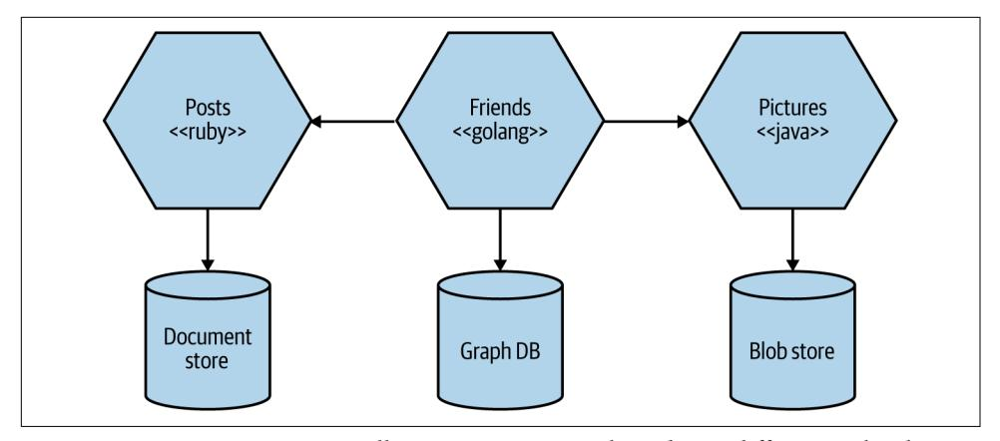

*Figure 1-10. Microservices can allow you to more easily embrace different technologies*

With microservices, we are also able to more quickly adopt technologies and to understand how new advancements might help us. One of the biggest barriers to try‐ ing out and adopting a new technology is the risks associated with it. With a mono‐ lithic application, if I want to try a new programming language, database, or framework, any change will affect much of my system. With a system consisting of multiple services, I have multiple new places to try out a new piece of technology. I can pick a microservice with perhaps the lowest risk and use the technology there, knowing that I can limit any potential negative impact. Many organizations find this ability to more quickly absorb new technologies to be a real advantage.

Embracing multiple technologies doesn't come without overhead, of course. Some organizations choose to place some constraints on language choices. Netflix and Twitter, for example, mostly use the Java Virtual Machine (JVM) as a platform because those companies have a very good understanding of the reliability and per‐ formance of that system. They also develop libraries and tooling for the JVM that make operating at scale much easier, but the reliance on JVM-specific libraries makes things more difficult for non-Java-based services or clients. But neither Twitter nor Netflix uses only one technology stack for all jobs.

The fact that internal technology implementation is hidden from consumers can also make upgrading technologies easier. Your entire microservice architecture might be based on Spring Boot, for example, but you could change JVM version or framework versions for just one microservice, making it easier to manage the risk of upgrades.

## **Robustness**

A key concept in improving the robustness of your application is the bulkhead. A component of a system may fail, but as long as that failure doesn't cascade, you can isolate the problem, and the rest of the system can carry on working. Service <span id="page-49-0"></span>boundaries become your obvious bulkheads. In a monolithic service, if the service fails, everything stops working. With a monolithic system, we can run on multiple machines to reduce our chance of failure, but with microservices, we can build sys‐ tems that handle the total failure of some of the constituent services and degrade functionality accordingly.

We do need to be careful, however. To ensure that our microservice systems can properly embrace this improved robustness, we need to understand the new sources of failure that distributed systems have to deal with. Networks can and will fail, as will machines. We need to know how to handle such failures and the impact (if any) those failures will have on the end users of our software. I have certainly worked with teams who have ended up with a less robust system after their migration to microser‐ vices due to their not taking these concerns seriously enough.

## **Scaling**

With a large, monolithic service, we need to scale everything together. Perhaps one small part of our overall system is constrained in performance, but if that behavior is locked up in a giant monolithic application, we need to handle scaling everything as a piece. With smaller services, we can scale just those services that need scaling, allow‐ ing us to run other parts of the system on smaller, less powerful hardware, as illustra‐ ted in Figure 1-11.


*Figure 1-11. You can target scaling at just the microservices that need it*

<span id="page-50-0"></span>Gilt, an online fashion retailer, adopted microservices for this exact reason. Having started in 2007 with a monolithic Rails application, by 2009 Gilt's system was unable to cope with the load being placed on it. By splitting out core parts of its system, Gilt was better able to deal with its traffic spikes, and today it has more than 450 micro‐ services, each one running on multiple separate machines.

When embracing on-demand provisioning systems like those provided by AWS, we can even apply this scaling on demand for those pieces that need it. This allows us to control our costs more effectively. It's not often that an architectural approach can be so closely correlated to an almost immediate cost savings.

Ultimately, we can scale our applications in a multitude of ways, and microservices can be an effective part of this. We'll look at the scaling of microservices in more detail in [Chapter 13](#page-444-0).

## **Ease of Deployment**

A one-line change to a million-line monolithic application requires the entire appli‐ cation to be deployed in order to release the change. That could be a large-impact, high-risk deployment. In practice, deployments such as these end up happening infrequently because of understandable fear. Unfortunately, this means that our changes continue to build up between releases, until the new version of our applica‐ tion entering production has masses of changes. And the bigger the delta between releases, the higher the risk that we'll get something wrong!

With microservices, we can make a change to a single service and deploy it independ‐ ently of the rest of the system. This allows us to get our code deployed more quickly. If a problem does occur, it can be quickly isolated to an individual service, making fast rollback easy to achieve. It also means that we can get our new functionality out to customers more quickly. This is one of the main reasons organizations like Ama‐ zon and Netflix use these architectures—to ensure that they remove as many impedi‐ ments as possible to getting software out the door.

## **Organizational Alignment**

Many of us have experienced the problems associated with large teams and large codebases. These problems can be exacerbated when the team is distributed. We also know that smaller teams working on smaller codebases tend to be more productive.

Microservices allow us to better align our architecture to our organization, helping us minimize the number of people working on any one codebase to hit the sweet spot of team size and productivity. Microservices also allow us to change ownership of serv‐ ices as the organization changes—enabling us to maintain the alignment between architecture and organization in the future.

## <span id="page-51-0"></span>**Composability**

One of the key promises of distributed systems and service-oriented architectures is that we open up opportunities for reuse of functionality. With microservices, we allow for our functionality to be consumed in different ways for different purposes. This can be especially important when we think about how our consumers use our software.

Gone is the time when we could think narrowly about either our desktop website or our mobile application. Now we need to think of the myriad ways that we might want to weave together capabilities for the web, native application, mobile web, tablet app, or wearable device. As organizations move away from thinking in terms of narrow channels to embracing more holistic concepts of customer engagement, we need architectures that can keep up.

With microservices, think of us opening up seams in our system that are addressable by outside parties. As circumstances change, we can build applications in different ways. With a monolithic application, I often have one coarse-grained seam that can be used from the outside. If I want to break that up to get something more useful, I'll need a hammer!

## **Microservice Pain Points**

Microservice architectures bring a host of benefits, as we've already seen. But they also bring a host of complexity. If you are considering adopting a microservice archi‐ tecture, it's important that you be able to compare the good with the bad. In reality, most microservice points can be laid at the door of distributed systems and thus would just as likely be evident in a distributed monolith as in a microservice architecture.

We'll be covering many of these issues in depth throughout the rest of the book—in fact, I'd argue that the bulk of this book is about dealing with the pain, suffering, and horror of owning a microservice architecture.

## **Developer Experience**

As you have more and more services, the developer experience can begin to suffer. More resource-intensive runtimes like the JVM can limit the number of microservi‐ ces that can be run on a single developer machine. I could probably run four or five JVM-based microservices as separate processes on my laptop, but could I run 10 or 20? Most likely not. Even with less taxing runtimes, there is a limit to the number of things you can run locally, which inevitably will start conversations about what to do when you can't run the entire system on one machine. This can become even more complicated if you are using cloud services that you cannot run locally.

<span id="page-52-0"></span>Extreme solutions can involve "developing in the cloud," where developers move away from being able to develop locally anymore. I'm not a fan of this, because feed‐ back cycles can suffer greatly. Instead, I think limiting the scope of which parts of a system a developer needs to work on is likely to be a much more straightforward approach. However, this might be problematic if you want to embrace more of a "col‐ lective ownership" model in which any developer is expected to work on any part of the system.

## **Technology Overload**

The sheer weight of new technology that has sprung up to enable the adoption of microservice architectures can be overwhelming. I'll be honest and say that a lot of this technology has just been rebranded as "microservice friendly," but some advan‐ ces have legitimately helped in dealing with the complexity of these sorts of architec‐ tures. There is a danger, though, that this wealth of new toys can lead to a form of technology fetishism. I've seen so many companies adopting microservice architec‐ ture who decided that it was also the best time to introduce vast arrays of new and often alien technology.

Microservices may well give you the *option* for each microservice to be written in a different programming language, to run on a different runtime, or to use a different database—but these are options, not requirements. You have to carefully balance the breadth and complexity of the technology you use against the costs that a diverse array of technology can bring.

When you start adopting microservices, some fundamental challenges are inescapa‐ ble: you'll need to spend a lot of time understanding issues around data consistency, latency, service modeling, and the like. If you're trying to understand how these ideas change the way you think about software development at the same time that you're embracing a huge amount of new technology, you'll have a hard time of it. It's also worth pointing out that the bandwidth taken up by trying to understand all of this new technology will reduce the time you have for actually shipping features to your users.

As you (gradually) increase the complexity of your microservice architecture, look to introduce new technology as you need it. You don't need a Kubernetes cluster when you have three services! In addition to ensuring that you're not overloaded with the complexity of these new tools, this gradual increase has the added benefit of allowing you to gain new and better ways of doing things that will no doubt emerge over time.

## <span id="page-53-0"></span>**Cost**

It's highly likely that in the short term at least you'll see an increase in costs from a number of factors. Firstly, you'll likely need to run more things—more processes, more computers, more network, more storage, and more supporting software (which will incur additional license fees).

Secondly, any change you introduce into a team or an organization will slow you down in the short term. It takes time to learn new ideas, and to work out how to use them effectively. While this is going on, other activities will be impacted. This will result in either a direct slowdown in delivery of new functionality or the need to add more people to offset this cost.

In my experience, microservices are a poor choice for an organization primarily con‐ cerned with reducing costs, as a cost-cutting mentality—where IT is seen as a cost center rather than a profit center—will constantly be a drag on getting the most out of this architecture. On the other hand, microservices can help you make more money if you can use these architectures to reach more customers or develop more functionality in parallel. So are microservices a way to drive more profits? Perhaps. Are microservices a way to reduce costs? Not so much.

## **Reporting**

With a monolithic system, you typically have a monolithic database. This means that stakeholders who want to analyze all the data together, often involving large join operations across data, have a ready-made schema against which to run their reports. They can just run them directly against the monolithic database, perhaps against a read replica, as shown in Figure 1-12.


*Figure 1-12. Reporting carried out directly on the database of a monolith*

<span id="page-54-0"></span>With a microservice architecture, we have broken up this monolithic schema. That doesn't mean that the need for reporting across all our data has gone away; we've just made it much more difficult, because now our data is scattered across multiple logi‐ cally isolated schemas.

More modern approaches to reporting, such as using streaming to allow for real-time reporting on large volumes of data, can work well with a microservice architecture but typically require the adoption of new ideas and associated technology. Alterna‐ tively, you might simply need to publish data from your microservices into central reporting databases (or perhaps less structured data lakes) to allow for reporting use cases.

## **Monitoring and Troubleshooting**

With a standard monolithic application, we can have a fairly simplistic approach to monitoring. We have a small number of machines to worry about, and the failure mode of the application is somewhat binary—the application is often either all up or all down. With a microservice architecture, do we understand the impact if just a sin‐ gle instance of a service goes down?

With a monolithic system, if our CPU is stuck at 100% for a long time, we know it's a big problem. With a microservice architecture with tens or hundreds of processes, can we say the same thing? Do we need to wake someone up at 3 a.m. when just one process is stuck at 100% CPU?

Luckily, there are a whole host of ideas in this space that can help. If you'd like to explore this concept in more detail, I recommend *[Distributed Systems Observability](https://www.oreilly.com/library/view/distributed-systems-observability/9781492033431/)* by Cindy Sridharan (O'Reilly) as an excellent starting point, although we'll also be taking our own look at monitoring and observability in [Chapter 10](#page-330-0).

## **Security**

With a single-process monolithic system, much of our information flowed within that process. Now, more information flows over networks between our services. This can make our data more vulnerable to being observed in transit and also to poten‐ tially being manipulated as part of man-in-the-middle attacks. This means that you might need to direct more care to protecting data in transit and to ensuring that your microservice endpoints are protected so that only authorized parties are able to make use of them. [Chapter 11](#page-370-0) is dedicated entirely to looking at the challenges in this space.

## <span id="page-55-0"></span>**Testing**

With any type of automated functional test, you have a delicate balancing act. The more functionality a test executes—i.e., the broader the scope of the test—the more confidence you have in your application. On the other hand, the larger the scope of the test, the harder it is to set up test data and supporting fixtures, the longer the test can take to run, and the harder it can be to work out what is broken when it fails. In [Chapter 9](#page-300-0) I'll share a number of techniques for making testing work in this more challenging environment.

End-to-end tests for any type of system are at the extreme end of the scale in terms of the functionality they cover, and we are used to them being more problematic to write and maintain than smaller-scoped unit tests. Often this is worth it, though, because we want the confidence that comes from having an end-to-end test use our systems in the same way a user might.

But with a microservice architecture, the scope of our end-to-end tests becomes *very* large. We would now need to run tests across multiple processes, all of which need to be deployed and appropriately configured for the test scenarios. We also need to be prepared for the false negatives that occur when environmental issues, such as service instances dying or network time-outs of failed deployments, cause our tests to fail.

These forces mean that as your microservice architecture grows, you will get a dimin‐ ishing return on investment when it comes to end-to-end testing. The testing will cost more but won't manage to give you the same level of confidence that it did in the past. This will drive you toward new forms of testing, such as contract-driven testing or testing in production, as well as the exploration of progressive delivery techniques such as parallel runs or canary releases, which we'll look at in [Chapter 8](#page-244-0).

## **Latency**

With a microservice architecture, processing that might previously have been done locally on one processor can now end up being split across multiple separate micro‐ services. Information that previously flowed within only a single process now needs to be serialized, transmitted, and deserialized over networks that you might be exer‐ cising more than ever before. All of this can result in worsening latency of your system.

Although it can be difficult to measure the exact impact on latency of operations at the design or coding phase, this is another reason it's important to undertake any microservice migration in an incremental fashion. Make a small change and then measure the impact. This assumes that you have some way of measuring the end-toend latency for the operations you care about—distributed tracing tools like Jaeger can help here. But you also need to have an understanding of what latency is

<span id="page-56-0"></span>acceptable for these operations. Sometimes making an operation slower is perfectly acceptable, as long as it is still fast enough!

## **Data Consistency**

Shifting from a monolithic system, in which data is stored and managed in a single database, to a much more distributed system, in which multiple processes manage state in different databases, causes potential challenges with respect to consistency of data. Whereas in the past you might have relied on database transactions to manage state changes, you'll need to understand that similar safety cannot easily be provided in a distributed system. The use of distributed transactions in most cases proves to be highly problematic in coordinating state changes.

Instead, you might need to start using concepts like sagas (something I'll detail at length in [Chapter 6\)](#page-200-0) and eventual consistency to manage and reason about state in your system. These ideas can require fundamental changes in the way you think about data in your systems, something that can be quite daunting when migrating existing systems. Yet again, this is another good reason to be cautious in how quickly you decompose your application. Adopting an incremental approach to decomposi‐ tion, so that you are able to assess the impact of changes to your architecture in pro‐ duction, is really important.

## **Should I Use Microservices?**

Despite the drive in some quarters to make microservice architectures the default approach for software, I feel that because of the numerous challenges I've outlined, adopting them still requires careful thought. You need to assess your own problem space, skills, and technology landscape and understand what you are trying to achieve before deciding whether microservices are right for you. They are *an* architectural approach, not *the* architectural approach. Your own context should play a huge part in your decision whether to go down that path.

That said, I want to outline a few situations that would typically tip me away from or toward—picking microservices.

## **Whom They Might Not Work For**

Given the importance of defining stable service boundaries, I feel that microservice architectures are often a bad choice for brand-new products or startups. In either case, the domain that you are working with is typically undergoing significant change as you iterate on the fundamentals of what you are trying to build. This shift in domain models will, in turn, result in more changes being made to service bound‐ aries, and coordinating changes across service boundaries is an expensive

undertaking. In general, I feel it's more appropriate to wait until enough of the domain model has stabilized before looking to define service boundaries.

I do see a temptation for startups to go microservice first, the reasoning being, "If we're really successful, we'll need to scale!" The problem is that you don't necessarily know if anyone is even going to want to use your new product. And even if you do become successful enough to require a highly scalable architecture, the thing you end up delivering to your users might be very different from what you started building in the first place. Uber initially focused on limos, and Flickr spun out of attempts to cre‐ ate a multiplayer online game. The process of finding product market fit means that you might end up with a very different product at the end than the one you thought you'd build when you started.

Startups also typically have fewer people available to build the system, which creates more challenges with respect to microservices. Microservices bring with them sour‐ ces of new work and complexity, and this can tie up valuable bandwidth. The smaller the team, the more pronounced this cost will be. When working with smaller teams with just a handful of developers, I'm very hesitant to suggest microservices for this reason.

The challenge of microservices for startups is compounded by the fact that normally your biggest constraint is people. For a small team, a microservice architecture can be difficult to justify because there is work required just to handle the deployment and management of the microservices themselves. Some people have described this as the "microservice tax." When that investment benefits lots of people, it's easier to justify. But if one person out of your five-person team is spending their time on these issues, that's a lot of valuable time not being spent building your product. It's much easier to move to microservices later, after you understand where the constraints are in your architecture and what your pain points are—then you can focus your energy on using microservices in the most sensible places.

Finally, organizations creating software that will be deployed and managed by their customers may struggle with microservices. As we've already covered, microservice architectures can push a lot of complexity into the deployment and operational domain. If you are running the software yourself, you are able to offset this new com‐ plexity by adopting new technology, developing new skills, and changing working practices. This isn't something you can expect your customers to do. If they are used to receiving your software as a Windows installer, it's going to come as an awful shock to them when you send out the next version of your software and say, "Just put these 20 pods on your Kubernetes cluster!" In all likelihood, they will have no idea what a pod, Kubernetes, or a cluster even is.

## <span id="page-58-0"></span>**Where They Work Well**

In my experience, probably the single biggest reason that organizations adopt micro‐ services is to allow for more developers to work on the same system without getting in each other's way. Get your architecture and organizational boundaries right, and you allow more people to work independently of each other, reducing delivery con‐ tention. A five-person startup is likely to find a microservice architecture a drag. A hundred-person scale-up that is growing rapidly is likely to find that its growth is much easier to accommodate with a microservice architecture properly aligned around its product development efforts.

Software as a Service (SaaS) applications are, in general, also a good fit for a microser‐ vice architecture. These products are typically expected to operate 24-7, which creates challenges when it comes to rolling out changes. The independent releasability of microservice architectures is a huge boon in this area. Furthermore, the microservi‐ ces can be scaled up or down as required. This means that as you establish a sensible baseline for your system's load characteristics, you get more control over ensuring that you can scale your system in the most cost-effective way possible.

The technology-agnostic nature of microservices ensures that you can get the most out of cloud platforms. Public cloud vendors provide a wide array of services and deployment mechanisms for your code. You can much more easily match the requirements of specific services to the cloud services that will best help you imple‐ ment them. For example, you might decide to deploy one service as a set of functions, another as a managed virtual machine (VM), and another on a managed Platform as a Service (PaaS) platform.

Although it's worth noting that adopting a wide range of technology can often be a problem, being able to try out new technology easily is a good way to rapidly identify new approaches that might yield benefits. The growing popularity of FaaS platforms is one such example. For the appropriate workloads, an FaaS platform can drastically reduce the amount of operational overhead, but at present, it's not a deployment mechanism that would be suitable in all cases.

Microservices also present clear benefits for organizations looking to provide services to their customers over a variety of new channels. A lot of digital transformation efforts seem to involve trying to unlock functionality hidden away in existing sys‐ tems. The desire is to create new customer experiences that can support the needs of users via whatever interaction mechanism makes the most sense.

Above all, a microservice architecture is one that can give you a lot of flexibility as you continue to evolve your system. That flexibility has a cost, of course, but if you want to keep your options open regarding changes you might want to make in the future, it could be a price worth paying.

## <span id="page-59-0"></span>**Summary**

Microservice architectures can give you a huge degree of flexibility in choosing tech‐ nology, handling robustness and scaling, organizing teams, and more. This flexibility is in part why many people are embracing microservice architectures. But microser‐ vices bring with them a significant degree of complexity, and you need to ensure that this complexity is warranted. For many, they have become a default system architec‐ ture, to be used in virtually all situations. However, I still think that they are an archi‐ tectural choice whose use must be justified by the problems you are trying to solve; often, simpler approaches can deliver much more easily.

Nonetheless, many organizations, especially larger ones, have shown how effective microservices can be. When the core concepts of microservices are properly under‐ stood and implemented, they can help create empowering, productive architectures that can help systems become more than the sum of their parts.

I hope this chapter has served as a good introduction to these topics. Next, we're going to look at how we define microservice boundaries, exploring the topics of structured programming and domain-driven design along the way.

## <span id="page-60-0"></span>**How to Model Microservices**

*My opponent's reasoning reminds me of the heathen, who, being asked on what the world stood, replied, "On a tortoise." But on what does the tortoise stand? "On another tortoise."* —Rev. Joseph Frederick Berg (1854)

So you know what microservices are and, I hope, have a sense of their key benefits. You're probably eager now to go and start making them, right? But where to start? In this chapter, we'll look at some foundational concepts such as information hiding, coupling, and cohesion and understand how they'll shift our thinking about drawing boundaries around our microservices. We'll also look at different forms of decompo‐ sition you might use, as well as focusing more deeply on domain-driven design being a hugely useful technique in this space.

We'll look at how to think about the boundaries of your microservices so as to maxi‐ mize the upsides and avoid some of the potential downsides. But first, we need some‐ thing to work with.

## **Introducing MusicCorp**

Books about ideas work better with examples. Where possible, I'll be sharing stories from real-world situations, but I've found it's also useful to have a fictional scenario to work with. Throughout the book, we'll be returning to this scenario, seeing how the concept of microservices works within this world.

So let's turn our attention to the cutting-edge online retailer MusicCorp. MusicCorp was until recently just a brick-and-mortar retailer, but after the bottom dropped out of the vinyl record business, it focused more and more of its efforts online. The com‐ pany has a website but feels that now is the time to double-down on the online world. After all, those smartphones for music are just a passing fad (Zunes are way better, obviously), and music fans are quite happy to wait for CDs to arrive at their

<span id="page-61-0"></span>doorsteps. Quality over convenience, right? And while it may have just learned that Spotify is in fact a digital music service rather than some sort of skin treatment for teenagers, MusicCorp is pretty happy with its own focus and is sure all of this stream‐ ing business will blow over soon.

Despite being a little behind the curve, MusicCorp has grand ambitions. Luckily, it has decided that its best chance of taking over the world is to make sure it can make changes as easily as possible. Microservices for the win!

## **What Makes a Good Microservice Boundary?**

Before the team from MusicCorp tears off into the distance, creating service after ser‐ vice in an attempt to deliver eight-track tapes to all and sundry, let's put the brakes on and talk a bit about the most important underlying idea we need to keep in mind. We want our microservices to be able to be changed and deployed, and their func‐ tionality released to our users, in an independent fashion. The ability to change one microservice in isolation from another is vital. So what things do we need to bear in mind when we think about how we draw the boundaries around them?

In essence, microservices are just another form of modular decomposition, albeit one that has network-based interaction between the models and all the associated chal‐ lenges that brings. Luckily, this means we can rely on a lot of prior art in the space of modular software and structured programming to help guide us in terms of working out how to define our boundaries. With that in mind, let's look more deeply at three key concepts that we touched on briefly in [Chapter 1](#page-28-0) and that are vital to grasp when it comes to working out what makes for a good microservice boundary—information hiding, cohesion, and coupling.

## **Information Hiding**

Information hiding is a concept developed by David Parnas to look at the most effec‐ tive way to define module boundaries.<sup>1</sup> Information hiding describes a desire to hide as many details as possible behind a module (or, in our case, microservice) boundary. Parnas looked at the benefits that modules should theoretically give us, namely:

*Improved development time*

By allowing modules to be developed independently, we can allow for more work to be done in parallel and reduce the impact of adding more developers to a project.

<sup>1</sup> David, Parnas, "On the Criteria to Be Used in Decomposing Systems into Modules," (journal contribution, Carnegie Mellon University, 1971), *<https://oreil.ly/BnVVg>*.

#### *Comprehensibility*

Each module can be looked at in isolation and understood in isolation. This in turn makes it easier to understand what the system as a whole does.

#### *Flexibility*

Modules can be changed independently from one another, allowing for changes to be made to the functionality of the system without requiring other modules to change. In addition, modules can be combined in different ways to deliver new functionality.

This list of desirable characteristics nicely complements what we are trying to achieve with microservice architectures—and indeed I now see microservices as just another form of modular architecture. Adrian Colyer has actually looked back at a number of David Parnas's papers from this period and examined them with respect to microser‐ vices, and his summaries are well worth reading.<sup>2</sup>

The reality, as Parnas explored throughout much of his work, is that having modules doesn't result in your actually achieving these outcomes. A lot depends on *how* the module boundaries are formed. From his own research, information hiding was a key technique to help get the most out of modular architectures, and with a modern eye, the same applies to microservices too.

From another of Parnas's papers,<sup>3</sup> we have this gem:

The connections between modules are the assumptions which the modules make about each other.

By reducing the number of assumptions that one module (or microservice) makes about another, we directly impact the connections between them. By keeping the number of assumptions small, it is easier to ensure that we can change one module without impacting others. If a developer changing a module has a clear understand‐ ing as to how the module is used by others, it will be easier for the developer to make changes safely in such a way that upstream callers won't also have to change.

This applies with microservices, as well, except that we also have the opportunity to deploy that changed microservice without having to deploy anything else, arguably amplifying the three desirable characteristics that Parnas describes of improved development time, comprehensibility, and flexibility.

The implications of information hiding play out in so many ways, and I'll pick up this theme throughout the book.

<sup>2</sup> The obvious starting point is Adrian's summary of ["On the Criteria…",](https://oreil.ly/cCtSV) but Adrian's coverage of Parnas's earlier work, ["Information Distribution Aspects of Design Methodology"](https://oreil.ly/6JyKv), contains some great insights along with commentary from Parnas himself.

<sup>3</sup> Parnas, "Information Distribution Aspects."

## <span id="page-63-0"></span>**Cohesion**

One of the most succinct definitions I've heard for describing cohesion is this: "the code that changes together, stays together."<sup>4</sup> For our purposes, this is a pretty good definition. As we've already discussed, we're optimizing our microservice architec‐ ture around ease of making changes in business functionality—so we want the func‐ tionality grouped in such a way that we can make changes in as few places as possible.

We want related behavior to sit together, and unrelated behavior to sit elsewhere. Why? Well, if we want to change behavior, we want to be able to change it in one place, and to release that change as soon as possible. If we have to change that behav‐ ior in lots of different places, we'll have to release lots of different services (perhaps at the same time) to deliver that change. Making changes in lots of different places is slower, and deploying lots of services at once is risky—thus we want to avoid both.

So we want to find boundaries within our problem domain that help ensure related behavior is in one place and that communicate with other boundaries as loosely as possible. If the related functionality is spread across the system, we say that cohesion is weak—whereas for our microservice architectures we're aiming for strong cohesion.

## **Coupling**

When services are loosely coupled, a change to one service should not require a change to another. The whole point of a microservice is being able to make a change to one service and deploy it without needing to change any other part of the system. This is really quite important.

What sorts of things cause tight coupling? A classic mistake is to pick an integration style that tightly binds one service to another, causing changes inside the service to require a change to consumers.

A loosely coupled service knows as little as it needs to about the services with which it collaborates. This also means we probably want to limit the number of different types of calls from one service to another, because beyond the potential performance prob‐ lem, chatty communication can lead to tight coupling.

Coupling, though, comes in many forms, and I've seen a number of misunderstand‐ ings about the nature of coupling as it pertains to a service-based architecture. With that in mind, I think it's important that we explore this topic in more detail, some‐ thing we'll do shortly.

<sup>4</sup> Annoyingly, I cannot find the original source of this definition.

## <span id="page-64-0"></span>**The Interplay of Coupling and Cohesion**

As we've already touched on, the concepts of coupling and cohesion are obviously related. Logically, if related functionality is spread across our system, changes to this functionality will ripple across those boundaries, implying tighter coupling. Constan‐ tine's law, named for structured design pioneer Larry Constantine, sums this up neatly:

A structure is stable if cohesion is strong and coupling is low.<sup>5</sup>

The concept here of stability is important to us. For our microservice boundaries to deliver on the promise of independent deployability, allowing us to work on micro‐ services in parallel and reduce the amount of coordination between teams working on these services, we need some degree of stability in the boundaries themselves. If the contract that a microservice exposes is constantly changing in a backwardincompatible fashion, then this will cause upstream consumers to constantly have to change too.

Coupling and cohesion are strongly related and, at some level at least, are arguably the same in that both concepts describe the relationship between things. Cohesion applies to the relationship between things *inside* a boundary (a microservice in our context), whereas coupling describes the relationship between things *across* a bound‐ ary. There is no absolute *best* way to organize our code; coupling and cohesion are just one way to articulate the various trade-offs we make around where we group code, and why. All we can strive to do is to find the right balance between these two ideas, one that makes the most sense for your given context and the problems you are currently facing.

Remember, the world isn't static—it's possible that as your system requirements change, you'll find reasons to revisit your decisions. Sometimes parts of your system may be going through so much change that stability might be impossible. We'll look at an example of this in [Chapter 3](#page-96-0) when I share the experiences of the product devel‐ opment team behind Snap CI.

## **Types of Coupling**

You could infer from the preceding overview above that all coupling is bad. That isn't strictly true. Ultimately, some coupling in our system will be unavoidable. What we want to do is reduce how much coupling we have.

<sup>5</sup> In my book *[Monolith to Microservices](https://www.oreilly.com/library/view/monolith-to-microservices/9781492047834)* (O'Reilly) I attributed this to Larry Constantine himself. While the statement neatly sums up much of Constantine's work in this space, the quote should really be attributed to Albert Endres and Dieter Rombach, from their 2003 book *A Handbook of Software and Systems Engineering* (Addison-Wesley).

<span id="page-65-0"></span>A lot of work has been done to look at the different forms of coupling in the context of structured programming, which was largely considering modular (nondistributed, monolithic) software. Many of these different models for assessing cou‐ pling overlap or clash, and in any case they speak primarily about things at the code level, rather than considering service-based interactions. As microservices are a style of modular architecture (albeit with the added complexity of distributed systems), we can use a lot of these original concepts and apply them in the context of our microservice-based systems.

### **Prior Art in Structured Programming**

Much of our work in computing involves building on the work that came before. It is sometimes impossible to recognize everything that came before, but with this second edition I have aimed to highlight prior art where I can—partly to give credit where credit is due, partly as a way of ensuring that I lay down some breadcrumbs for those readers who want to explore certain topics in more detail, but also to show that many of these ideas are tried and tested.

When it comes to building on the work that came before, there are few subject areas in this book that have quite as much prior art as structured programming. I've already mentioned Larry Constantine; his book with Edward Yourdon, *Structured Design*, 6 is considered one of the most important texts in this area. Meilir Page-Jones's *The Practical Guide to Structured Systems Design*<sup>7</sup> is also useful. Unfortu‐ nately, one thing these books have in common is how hard they can be to get hold of, as they are out of print and aren't available in ebook format. Yet another reason to support your local library!

Not all the ideas map cleanly, so I have done my best to synthesize a working model for the different types of coupling for microservices. Where these ideas map cleanly to previous definitions, I've stuck with those terms. In other places I have had to come up with new terms or blend in ideas from elsewhere. So please consider what follows to be built on top of a lot of prior art in this space, which I am attempting to give more meaning in the context of microservices.

In [Figure 2-1](#page-66-0) we see a brief overview of the different types of coupling, organized from low (desirable) to high (undesirable).

Next, we'll examine each form of coupling in turn, and look at examples that show how these forms may manifest themselves in our microservice architecture.

<sup>6</sup> Edward Yourdon and Larry L. Constantine, *Structured Design* (New York: Yourdon Press, 1976).

<sup>7</sup> Meilir Page-Jones, *The Practical Guide to Structured Systems Design* (New York: Yourdon Press Computing, 1980).

<span id="page-66-0"></span>

*Figure 2-1. The different types of coupling, from loose (low) to tight (high)*

## **Domain Coupling**

Domain coupling describes a situation in which one microservice needs to interact with another microservice, because the first microservice needs to make use of the functionality that the other microservice provides.<sup>8</sup>

In Figure 2-2, we see part of how orders for CDs are managed inside MusicCorp. In this example, Order Processor calls the Warehouse microservice to reserve stock, and the Payment microservice to take payment. The Order Processor is therefore dependent on, and coupled to, the Warehouse and Payment microservices for this operation. We see no such coupling between Warehouse and Payment, though, as they don't interact.


*Figure 2-2. An example of domain coupling, where Order Processor needs to make use of the functionality provided by other microservices*

<sup>8</sup> This concept is similar to the domain application protocol, which defines the rules by which components interact in a REST-based system.

<span id="page-67-0"></span>In a microservice architecture, this type of interaction is largely unavoidable. A microservice-based system relies on multiple microservices collaborating in order for it to do its work. We still want to keep this to a minimum, though; whenever you see a single microservice depending on multiple downstream services in this way, it can be a cause for concern—it might imply a microservice that is doing too much.

As a general rule, domain coupling is considered to be a loose form of coupling, although even here we can hit problems. A microservice that needs to talk to lots of downstream microservices might point to a situation in which too much logic has been centralized. Domain coupling can also become problematic as more complex sets of data are sent between services—this can often point to the more problematic forms of coupling we'll explore shortly.

Just remember the importance of information hiding. Share only what you absolutely have to, and send only the absolute minimum amount of data that you need.

### **A Brief Note on Temporal Coupling**

Another form of coupling you may have heard of is *temporal coupling*. From a codecentric view of coupling, temporal coupling refers to a situation in which concepts are bundled together purely because they happen at the same time. Temporal coupling has a subtly different meaning in the context of a distributed system, where it refers to a situation in which one microservice needs another microservice to do something at the same time for the operation to complete.

Both microservices need to be up and available to communicate with each other at the same time for the operation to complete. So in Figure 2-3, where MusicCorp's Order Processor is making a synchronous HTTP call to the Warehouse service, Ware house needs to be up and available at the same time the call is made.


*Figure 2-3. An example of temporal coupling, in which Order Processor makes a syn‐ chronous HTTP call to the Warehouse microservice*

If for some reason Warehouse can't be reached by the Order Processor, then the operation fails, as we can't reserve the CDs to be sent out. Order Processor will also have to block and wait for a response from Warehouse, potentially causing issues in terms of resource contention.

<span id="page-68-0"></span>Temporal coupling isn't always bad; it's just something to be aware of. As you have more microservices, with more complex interactions between them, the challenges of temporal coupling can increase to such a point that it becomes more difficult to scale your system and keep it working. One of the ways to avoid temporal coupling is to use some form of asynchronous communication, such as a message broker.

## **Pass-Through Coupling**

"Pass-through coupling"<sup>9</sup> describes a situation in which one microservice passes data to another microservice purely because the data is needed by some other microser‐ vice further downstream. In many ways it's one of the most problematic forms of implementation coupling, as it implies not only that the caller knows not just that the microservice it is invoking calls yet another microservice, but also that it potentially needs to know how that one-step-removed microservice works.

As an example of pass-through coupling, let's look more closely now at part of how MusicCorp's order processing works. In Figure 2-4, we have an Order Processor, which is sending a request to Warehouse to prepare an order for dispatch. As part of the request payload, we send along a Shipping Manifest. This Shipping Manifest contains not only the address of the customer but also the shipping type. The Ware house just passes this manifest on to the downstream Shipping microservice.

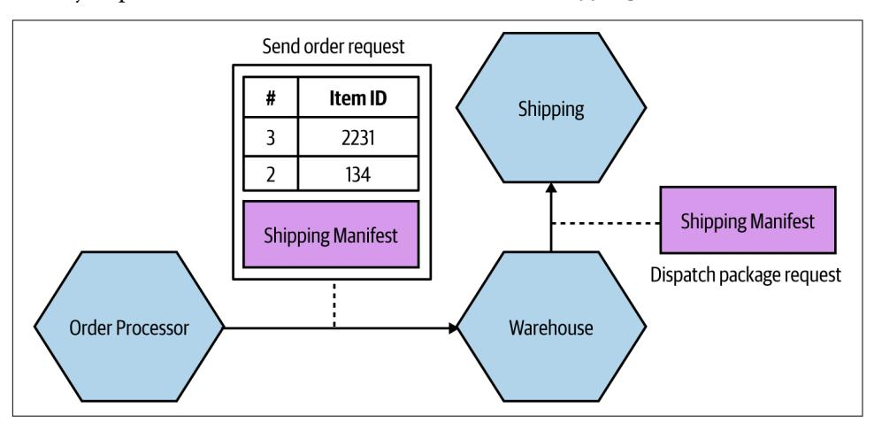

*Figure 2-4. Pass-through coupling, in which data is passed to a microservice purely because another downstream service needs it*

<sup>9</sup> Pass-through coupling is my name for what was originally described as "tramp coupling" by Meilir Page-Jones in *The Practical Guide to Structured Systems Design*. I chose to use a different term here due to the fact that I found the original term to be somewhat problematic and not terribly meaningful to a wider audience.

The major issue with pass-through coupling is that a change to the required data downstream can cause a more significant upstream change. In our example, if Shipping now needs the format or content of the data to be changed, then both Warehouse and Order Processor would likely need to change.

There are a few ways this can be fixed. The first is to consider whether it makes sense for the calling microservice to just bypass the intermediary. In our example, this might mean Order Processor speaks directly to Shipping, as in Figure 2-5. How‐ ever, this causes some other headaches. Our Order Processor is increasing its domain coupling, as Shipping is yet another microservice it needs to know about—if that was the only issue, this might still be fine, as domain coupling is of course a looser form of coupling. This solution gets more complex here, though, as stock has to be reserved with Warehouse before we dispatch the package using Shipping, and after the shipping has been done we need to update the stock accordingly. This pushes more complexity and logic into Order Processor that was previously hidden inside Warehouse.


*Figure 2-5. One way to work around pass-through coupling involves communicating directly with the downstream service*

For this specific example, I might consider a simpler (albeit more nuanced) change namely, to totally hide the requirement for a Shipping Manifest from Order Pro cessor. The idea of delegating the work of both managing stock and arranging for dispatch of the package to our Warehouse service makes sense, but we don't like the fact that we have leaked some lower-level implementation—namely, the fact that the Shipping microservice wants a Shipping Manifest. One way to hide this detail would be to have Warehouse take in the required information as part of its contract, and then have it construct the Shipping Manifest locally, as we see in Figure 2-6. This means that if the Shipping service changes its service contract, this change will be invisible from the viewpoint of Order Processor, as long as Warehouse collects the required data.


*Figure 2-6. Hiding the need for a Shipping Manifest from the Order Processor*

While this will help protect the Warehouse microservice from some changes to Ship ping, there are some things that would still require all parties to change. Let's con‐ sider the idea that we want to start shipping internationally. As part of this, the Shipping service needs a Customs Declaration to be included in the Shipping Mani fest. If this is an optional parameter, then we could deploy a new version of the Shipping microservice without issue. If this is a required parameter, however, then Warehouse would need to create one. It might be able to do this with existing infor‐ mation that it has (or is given), or it might require that additional information be passed to it by the Order Processor.

Although in this case we haven't eliminated the need for changes to be made across all three microservices, we have been given much more power over when and how these changes could be made. If we had the tight (pass-through) coupling of the ini‐ tial example, adding this new Customs Declaration might require a lockstep rollout of all three microservices. At least by hiding this detail we could much more easily phase deployment.

One final approach that could help reduce the pass-through coupling would be for the Order Processor to still send the Shipping Manifest to the Shipping microser‐ vice via the Warehouse, but to have the Warehouse be totally unaware of the structure of the Shipping Manifest itself. The Order Processor sends the manifest as part of <span id="page-71-0"></span>the order request, but the Warehouse makes no attempt to look at or process the field—it just treats it like a blob of data and doesn't care about the contents. Instead, it just sends it along. A change in the format of the the Shipping Manifest would still require a change to both the Order Processor and the Shipping microservice, but as the Warehouse doesn't care about what is actually in the manifest, it doesn't need to change.

## **Common Coupling**

Common coupling occurs when two or more microservices make use of a common set of data. A simple and common example of this form of coupling would be multi‐ ple microservices making use of the same shared database, but it could also manifest itself in the use of shared memory or a shared filesystem.

The main issue with common coupling is that changes to the structure of the data can impact multiple microservices at once. Consider the example of some of MusicCorp's services in Figure 2-7. As we discussed earlier, MusicCorp operates around the world, so it needs various bits of information about the countries in which it operates. Here, multiple services are all reading static reference data from a shared database. If the schema of this database changed in a backward-incompatible way, it would require changes to each consumer of the database. In practice, shared data like this tends to be very difficult to change as a result.


*Figure 2-7. Multiple services accessing shared static reference data related to countries from the same database*

The example in Figure 2-7 is, relatively speaking, fairly benign. This is because by its very nature static reference data doesn't tend to change often, and also because this data is read-only—as a result I tend to be relaxed about sharing static reference data in this way. Common coupling becomes more problematic, though, if the structure of the common data changes more frequently, or if multiple microservices are reading and writing to the same data.

Figure 2-8 shows us a situation in which the Order Processor and Warehouse service are both reading and writing from a shared Order table to help manage the process of dispatching CDs to MusicCorp's customers. Both microservices are updating the Status column. The Order Processor can set the PLACED, PAID, and COMPLETED sta‐ tuses, whereas the Warehouse will apply PICKING or SHIPPED statuses.


*Figure 2-8. An example of common coupling in which both Order Processor and Ware house are updating the same order record*

Although you might consider Figure 2-8 to be somewhat contrived, this nonetheless straightforward example of common coupling helps illustrate a core problem. Con‐ ceptually, we have both the Order Processor and Warehouse microservices manag‐ ing different aspects of the life cycle of an order. When making changes in Order Processor, can I be sure that I am not changing the order data in such a way that it breaks Warehouse's view of the world, or vice versa?

One way to ensure that the state of something is changed in a correct fashion would be to create a finite state machine. A state machine can be used to manage the transi‐ tion of some entity from one state to another, ensuring invalid state transitions are prohibited. In [Figure 2-9](#page-73-0), you can see the allowed transitions of state for an order in MusicCorp. An order can go directly from PLACED to PAID, but not straight from PLACED to PICKING (this state machine likely wouldn't be sufficient for the real-world business processes involved in full end-to-end buying and shipping of goods, but I wanted to give a simple example to illustrate the idea).

<span id="page-73-0"></span>

*Figure 2-9. An overview of the allowable state transitions for an order in MusicCorp*

The problem in this specific example is that both Warehouse and Order Processor share responsibilities for managing this state machine. How do we ensure that they are in agreement as to what transitions are allowed? There are ways to manage pro‐ cesses like this across microservice boundaries; we will return to this topic when we discuss sagas in [Chapter 6](#page-200-0).

A potential solution here would be to ensure that a single microservice manages the order state. In [Figure 2-10](#page-74-0), either Warehouse or Order Processor can send status update requests to the Order service. Here, the Order microservice is the source of truth for any given order. In this situation, it is really important that we see the requests from Warehouse and Order Processor as just that—*requests*. In this sce‐ nario, it is the job of the Order service to manage the acceptable state transitions asso‐ ciated with an order aggregate. As such, if the Order service received a request from Order Processor to move a status straight from PLACED to SHIPPED, it is free to reject that request if that is an invalid change.


Make sure you see a request that is sent to a microservice as some‐ thing that the downstream microservice can reject if it is invalid.

An alternative approach I see in such cases is to implement the Order service as little more than a wrapper around database CRUD operations, where requests just map directly to database updates. This is akin to an object having private fields but public getters and setters—the behavior has leaked from the microservice to upstream con‐ sumers (reducing cohesion), and we're back in the world of managing acceptable state transitions across multiple different services.


If you see a microservice that just looks like a thin wrapper around database CRUD operations, that is a sign that you may have weak cohesion and tighter coupling, as logic that should be in that ser‐ vice to manage the data is instead spread elsewhere in your system.

<span id="page-74-0"></span>

*Figure 2-10. Both Order Processor and Warehouse can request that changes be made to an order, but the Order microservice decides which requests are acceptable*

Sources of common coupling are also potential sources of resource contention. Mul‐ tiple microservices making use of the same filesystem or database could overload that shared resource, potentially causing significant problems if the shared resource becomes slow or even entirely unavailable. A shared database is especially prone to this problem, as multiple consumers can run arbitrary queries against the database itself, which in turn can have wildly different performance characteristics. I've seen more than one database brought to its knees by an expensive SQL query—I may have even been the culprit once or twice.<sup>10</sup>

So common coupling is *sometimes* OK, but often it's not. Even when it's benign, it means that we are limited in what changes can be made to the shared data, but it often speaks to a lack of cohesion in our code. It can also cause us problems in terms of operational contention. It's for those reasons that we consider common coupling to be one of the least desirable forms of coupling—but it can get worse.

## **Content Coupling**

Content coupling describes a situation in which an upstream service reaches into the internals of a downstream service and changes its internal state. The most common

<sup>10</sup> OK, more than once or twice. A *lot* more than once or twice…

manifestation of this is an external service accessing another microservice's database and changing it directly. The differences between content coupling and common coupling are subtle. In both cases, two or more microservices are reading and writing to the same set of data. With common coupling, you understand that you are making use of a shared, external dependency. You know it's not under your control. With content coupling, the lines of ownership become less clear, and it becomes more dif‐ ficult for developers to change a system.

Let's revisit our earlier example from MusicCorp. In Figure 2-11, we have an Order service that is supposed to manage the allowable state changes to orders in our sys‐ tem. The Order Processor is sending requests to the Order service, delegating not just the exact change in state that will be made but also responsibility for deciding what state transitions are allowable. On the other hand, the Warehouse service is directly updating the table in which order data is stored, bypassing any functionality in the Order service that might check for allowable changes. We have to hope that the Warehouse service has a consistent set of logic to ensure that only valid changes are made. At best, this represents a duplication of logic. In the worst case, the checking around allowable changes in Warehouse is different from that in the Order service, and as a result we could end up with orders in very odd, confusing states.


*Figure 2-11. An example of content coupling in which the Warehouse is directly access‐ ing the internal data of the Order service*

<span id="page-76-0"></span>In this situation, we also have the issue that the internal data structure of our order table is exposed to an outside party. When changing the Order service, we now have to be extremely careful about making changes to that particular table—that's even assuming it's obvious to us that this table is being directly accessed by an outside party. The easy fix here is to have the Warehouse send requests to the Order service itself, where we can vet the request but also hide the internal detail, making subse‐ quent changes to the Order service much easier.

If you are working on a microservice, it's vital that you have a clear separation between what can be changed freely and what cannot. To be explicit, as a developer you need to know when you are changing functionality that is part of the contract your service exposes to the outside world. You need to ensure that if you make changes, that you will not break upstream consumers. Functionality that doesn't impact the contract your microservice exposes can be changed without concern.

It's certainly the case that the problems that occur with common coupling also apply with content coupling, but content coupling has some additional headaches that make it problematic enough that some people refer to it as *pathological coupling*.

When you allow an outside party to directly access *your* database, the database in effect becomes part of that external contract, albeit one where you cannot easily rea‐ son about what can or cannot be changed. You've lost the ability to define what is shared (and therefore cannot be changed easily) and what is hidden. Information hiding has gone out of the window.

In short, avoid content coupling.

## **Just Enough Domain-Driven Design**

As I introduced in [Chapter 1,](#page-28-0) the primary mechanism we use for finding microser‐ vice boundaries is around the domain itself, making use of domain-driven design (DDD) to help create a model of our domain. Let's now extend our understanding of how DDD works in the context of microservices.

The desire to have our programs better represent the real world in which they will operate is not new. Object-oriented programming languages like Simula were devel‐ oped to allow us to model real domains. But it takes more than program language capabilities for this idea to really take shape.

Eric Evans's *Domain-Driven Design*<sup>11</sup> presented a series of important ideas that hel‐ ped us better represent the problem domain in our programs. A full exploration of

<sup>11</sup> Eric Evans, *Domain-Driven Design: Tackling Complexity in the Heart of Software* (Boston: Addison-Wesley, 2004).

<span id="page-77-0"></span>these ideas is outside the scope of this book, but there are some core concepts of DDD that are worth highlighting, including:

#### *Ubiquitous language*

Defining and adopting a common language to be used in code and in describing the domain, to aid communication.

#### *Aggregate*

A collection of objects that are managed as a single entity, typically referring to real-world concepts.

#### *Bounded context*

An explicit boundary within a business domain that provides functionality to the wider system but that also hides complexity.

## **Ubiquitous Language**

Ubiquitous language refers to the idea that we should strive to use the same terms in our code as the users use. The idea is that having a common language between the delivery team and the actual people will make it easier to model the real-world domain and also should improve communication.

As a counterexample, I recall a situation when working at a large, global bank. We were working in the area of corporate liquidity, a fancy term that basically refers to the ability to move cash among different accounts held by the same corporate entity. The product owner was really great to work with, and she had a fantastically deep understanding of the various products that she wanted to bring to market. When working with her, we'd have discussions about things like haircuts and end-of-day sweeps, all things that made a lot of sense in her world and that had meaning to her customers.

The code, on the other hand, had none of this language in there. At some point previ‐ ously, a decision had been made to use a standard data model for the database. It was widely referred to as "the IBM banking model," but I came to grips with whether this was a standard IBM product or just the creation of a consultant from IBM. By defin‐ ing the loose concept of an "arrangement," the theory went that any banking opera‐ tion could be modeled. Taking out a loan? That was an arrangement. Buying a share? That's an arrangement! Applying for a credit card? Guess what—that's an arrange‐ ment too!

The data model had polluted the code to such an extent that the codebase was shorn of all real understanding of the system we were building. We weren't building a generic banking application. We were building a system specifically to manage cor‐ porate liquidity. The problem was that we had to map the rich domain language of the product owner to the generic code concepts—meaning a lot of work in helping <span id="page-78-0"></span>translate. Our business analysts were often just spending their time explaining the same concepts over and over again as a result.

By working the real-world language into the code, things became much easier. A developer picking up a story written using the terms that had come straight from the product owner was much more likely to understand their meaning and work out what needed to be done.

## **Aggregate**

In DDD, an *aggregate* is a somewhat confusing concept, with many different defini‐ tions out there. Is it just an arbitrary collection of objects? The smallest unit that should be taken out of a database? The model that has always worked for me is to first consider an aggregate as a representation of a real domain concept—think of something like an Order, an Invoice, a Stock Item, and so on. Aggregates typically have a life cycle around them, which opens them up to being implemented as a state machine.

As an example in the MusicCorp domain, an Order aggregate might contain multiple line items that represent the items in the order. Those line items have meaning only as part of the overall Order aggregate.

We want to treat aggregates as self-contained units; we want to ensure that the code that handles the state transitions of an aggregate are grouped together, along with the state itself. So one aggregate should be managed by one microservice, although a sin‐ gle microservice might own management of multiple aggregates.

In general, though, you should think of an aggregate as something that has state, identity, a life cycle that will be managed as part of the system. Aggregates typically refer to real-world concepts.

A single microservice will handle the life cycle and data storage of one or more differ‐ ent types of aggregates. If functionality in another service wants to change one of these aggregates, it needs to either directly request a change in that aggregate or else have the aggregate itself react to other things in the system to initiate its own state transitions, perhaps by subscribing to events issued by other microservices.

The key thing to understand here is that if an outside party requests a state transition in an aggregate, the aggregate can say no. You ideally want to implement your aggre‐ gates in such a way that illegal state transitions are impossible.

Aggregates can have relationships with other aggregates. In [Figure 2-12,](#page-79-0) we have a Customer aggregate that is associated with one or more Orders and one or more Wishlists. These aggregates could be managed by the same microservice or by differ‐ ent microservices.

<span id="page-79-0"></span>

*Figure 2-12. One Customer aggregate may be associated with one or more Order or Wishlist aggregates*

If these relationships between aggregates exist inside the scope of a single microser‐ vice, they could easily be stored using something like a foreign key relationship if using a relational database. If the relationships between these aggregates span micro‐ service boundaries, though, we need some way to model the relationships.

Now, we could simply store the ID of the aggregate directly in our local database. For example, consider a Finance microservice that manages a financial ledger, which stores transactions against a customer. Locally, within the Finance microservice's database we could have a CustID column that contains the ID of that customer. If we wanted to get more information about that customer, we'd have to do a lookup against the Customer microservice using that ID.

The problem with this concept is that it isn't very explicit—in fact, the relationship between the CustID column and the remote customer is entirely implicit. To know how that ID was being used, we'd have to look at the code of the Finance microser‐ vice itself. It would be nice if we could store a reference to a foreign aggregate in a way that is more obvious.

In [Figure 2-13,](#page-80-0) we have changed things to make the relationship explicit. Rather than a vanilla ID for the customer reference, we instead store a URI, which we might use if building a REST-based system.<sup>12</sup>

<sup>12</sup> I know some people object to the use of templated URIs in REST systems, and I understand why—I just want to keep things simple for this example.

<span id="page-80-0"></span>

*Figure 2-13. An example of how a relationship between two aggregates in different microservices can be implemented*

The benefits of this approach are twofold. The nature of the relationship is explicit, and in a REST system we could directly dereference this URI to look up the associ‐ ated resource. But what if you aren't building a REST system? Phil Calçado describes a variation of this approach in use at SoundCloud,13 where they developed a pseudo-URI scheme for cross-service references. For example, soundcloud:tracks:123 would be a reference to a track with the ID of 123. This is much more explicit for a human looking at this identifier, but it is also a useful enough scheme that it would be easy to imagine creating code that could ease cross-microservice aggregate lookups if needed.

There are lots of ways to break a system into aggregates, with some choices being highly subjective. You may decide, for performance reasons or for ease of implemen‐ tation, to reshape aggregates over time. I consider implementation concerns to be secondary, however; I begin by letting the mental model of the system users be my guiding light on initial design until other factors come into play.

<sup>13</sup> Phil Calçado, "Pattern: Using Pseudo-URIs with Microservices," *<https://oreil.ly/xOYMr>*.

## <span id="page-81-0"></span>**Bounded Context**

A *bounded context* typically represents a larger organizational boundary. Within the scope of that boundary, explicit responsibilities need to be carried out. That's all a bit woolly, so let's look at another specific example.

At MusicCorp, our warehouse is a hive of activity—managing orders being shipped out (and the odd return), taking delivery of new stock, having forklift truck races, and so on. Elsewhere, the finance department is perhaps less fun-loving but still has an important function inside our organization, handling payroll, paying for shipments, and the like.

Bounded contexts hide implementation detail. There are internal concerns—for example, the types of forklift trucks used are of little interest to anyone other than the folks in the warehouse. These internal concerns should be hidden from the outside world, which doesn't need to know, nor should it care.

From an implementation point of view, bounded contexts contain one or more aggregates. Some aggregates may be exposed outside the bounded context; others may be hidden internally. As with aggregates, bounded contexts may have relation‐ ships with other bounded contexts—when mapped to services, these dependencies become inter-service dependencies.

Let's return for a moment to the MusicCorp business. Our domain is the whole busi‐ ness in which we are operating. It covers everything from the warehouse to the recep‐ tion desk, from finance to ordering. We may or may not model all of that in our software, but that is nonetheless the domain in which we are operating. Let's think about parts of that domain that look like the bounded contexts to which Eric Evans refers.

#### **Hidden models**

For MusicCorp, we can consider the finance department and the warehouse to be two separate bounded contexts. They both have an explicit interface to the outside world (in terms of inventory reports, pay slips, etc.), and they have details that only they need to know about (forklift trucks, calculators).

The finance department doesn't need to know about the detailed inner workings of the warehouse. It does need to know *some* things, however; for example, it needs to know about stock levels to keep the accounts up to date. [Figure 2-14](#page-82-0) shows an exam‐ ple context diagram. We see concepts that are internal to the warehouse, like a picker (someone who picks orders), shelves that represent stock locations, and so on. Like‐ wise, entries in the general ledger are integral to finance but are not shared externally here.

<span id="page-82-0"></span>

*Figure 2-14. A shared model between the finance department and the warehouse*

To be able to work out the valuation of the company, though, the finance employees need information about the stock we hold. The stock item then becomes a shared model between the two contexts. However, note that we don't need to blindly expose everything about the stock item from the warehouse context. In Figure 2-15, we see how Stock Item inside the warehouse bounded context contains references to the shelf locations, but the shared representation contains only a count. So there is the internal-only representation and the external representation we expose. Often, when you have different internal and external representations, it may be beneficial to name them differently to avoid confusion—in this situation, one approach could be to call the shared Stock Item a Stock Count instead.


*Figure 2-15. A model that is shared can decide to hide information that should not be shared externally*

#### **Shared models**

We can also have concepts that appear in more than one bounded context. In Figure 2-14 we saw that a Stock Item exists in both locations. What does this mean?

<span id="page-83-0"></span>Is the Stock Item copied? The way to think about this is that conceptually, both finance and the warehouse need to know something about the same Stock Item. Finance needs to know about the value of our stock to be able to determine our com‐ pany valuation, whereas the warehouse needs to know about the stock item to know where the physical thing can be found in the warehouse for the purpose of packaging orders to be sent out.

When you have a situation like this, a shared model like stock item can have different meanings in the different bounded contexts and therefore might be called different things. We might be happy to keep the name "stock item" in warehouse, but in finance we might refer to it more generically as an "asset," as that is the role they play in that context. We store information about the stock item in both locations, but the information is different. Finance stores information about the stock item's value; the warehouse stores information related in what location(s) the item is to be found. We still may need to link both local concepts to a global concept of the item, and we may want to look up common, shared information about that stock item like their name or supplier—we could use a technique like that shown in [Figure 2-13](#page-80-0) to manage these lookups.

## **Mapping Aggregates and Bounded Contexts to Microservices**

Both the aggregate and the bounded context give us units of cohesion with welldefined interfaces with the wider system. The aggregate is a self-contained state machine that focuses on a single domain concept in our system, with the bounded context representing a collection of associated aggregates, again with an explicit interface to the wider world.

Both can therefore work well as service boundaries. When starting out, as I've already mentioned, you want to reduce the number of services you work with. As a result, you should probably target services that encompass entire bounded contexts. As you find your feet and decide to break these services into smaller services, you need to remember that aggregates themselves don't want to be split apart—one microservice can manage one or more aggregates, but we don't want one aggregate to be managed by more than one microservice.

#### **Turtles all the way down**

At the start, you will probably identify a number of coarse-grained bounded contexts. But these bounded contexts can in turn contain further bounded contexts. For exam‐ ple, you could decompose the warehouse into capabilities associated with order ful‐ fillment, inventory management, or goods receiving. When considering the boundaries of your microservices, first think in terms of the larger, coarser-grained contexts, and then subdivide along these nested contexts when you're looking for the benefits of splitting out these seams.

A trick here is that even if you decide to split a service that models an entire bounded context into smaller services later on, you can still hide this decision from the outside world—perhaps by presenting a coarser-grained API to consumers. The decision to decompose a service into smaller parts is arguably an implementation decision, so we might as well hide it if we can. In Figure 2-16 we see an example of this. We've split Warehouse down into Inventory and Shipping. As far as the outside world is con‐ cerned, there is still just the Warehouse microservice. Internally though, we've further decomposed things to allow Inventory to manage Stock Items and have Shipping manage Shipments. Remember, we want to keep the ownership of a single aggregate inside a single microservice.


*Figure 2-16. The Warehouse service internally has been split into Inventory and Ship ping microservices*

This is another form of information hiding—we've hidden a decision about internal implementation in such a way that if this implementation detail changes again in the future, our consumers will be unaware.

Another reason to prefer the nested approach could be to chunk up your architecture to simplify testing. For example, when testing services that consume the warehouse, I don't have to stub each service inside the warehouse context—just the more coarsegrained API. This can also give you a unit of isolation when considering largerscoped tests. I may, for example, decide to have end-to-end tests in which I launch all services inside the warehouse context, but for all other collaborators I might stub them out. We'll explore more about testing and isolation in [Chapter 9.](#page-300-0)

## <span id="page-85-0"></span>**Event Storming**

*Event storming*, a technique developed by Alberto Brandolini, is a collaborative brain‐ storming exercise designed to help surface a domain model. Rather than having an architect sit in a corner and come up with their own representation of what the domain model is,<sup>14</sup> event storming brings together technical and nontechnical stake‐ holders in a joint exercise. The idea is that, by making the development of the domain model a joint activity, you end up with a shared, joined-up view of the world.

It's worth mentioning at this point that while the domain models defined through event storming can be used to implement event-driven systems—and indeed, the mapping is very straightforward—you can also use such a domain model to build a more request/response-oriented system.

#### **Logistics**

Alberto has some very specific views as to how event storming should be run, and on some of these points I am very much in agreement. Firstly, get everyone in a room together. This is often the most difficult step—getting people's calendars to line up can be a problem, as can finding a big enough room. Those issues were all true in a pre-COVID world, but as I write this during the virus-related lockdown in the UK, I'm aware that this step might be even more problematic in the future. The key, though, is to have all stakeholders present at the same time. You want representatives of all parts of the domain that you plan to model: users, subject matter experts, prod‐ uct owners—whoever is best placed to help represent each part of the domain.

Once everyone is in a room together, Alberto suggests the removal of all chairs to make sure everyone gets up and is involved. As someone with a bad back, while this strategy is something I understand, I recognize that it may not work for everyone. One thing I do agree with Alberto about is the need to have a large space where the modeling can be done. A common solution is to pin large rolls of brown paper to the walls of the room, allowing for all the walls to be used for capturing information.

The main modeling tool is sticky notes to capture the various concepts, with differ‐ ently colored notes representing different concepts.

#### **The process**

The exercise starts with the participants identifying the *domain events*. These repre‐ sent things that happen in the system—they are the facts that you care about. "Order Placed" would be an event that we would care about in the context of MusicCorp, as would "Payment Received." These are captured on orange sticky notes. It is at this

<sup>14</sup> I mean no disrespect if this is you—I've done this myself more than once.

<span id="page-86-0"></span>point that I have another disagreement with Alberto's structure, as the events are far and away the most numerous things you'll be capturing, and orange sticky notes are surprisingly hard to get hold of.<sup>15</sup>

Next, participants identify the commands that cause these events to happen. A com‐ mand is a decision made by a human (a user of the software) to do something. Here you are trying to understand the system's boundary, and identify the key human actors in the system. Commands are captured on blue sticky notes.

The techies in the event storming session should be listening to what their nontechni‐ cal colleagues come up with here. A key part of this exercise is not to let any current implementation warp the perception of what the domain is (that comes later). At this stage you want to create a space in which you can get the concepts out of the heads of the key stakeholders and out in the open.

With events and commands captured, aggregates come next. The events you have at this stage not only are useful for sharing not just what happens in the system, but they also start to highlight what the potential aggregates might be. Think of the afore‐ mentioned domain event "Order Placed." The noun here—"Order"—could well be a potential aggregate. And "Placed" describes something that can happen to an order, so this may well be part of the life cycle of the aggregate. Aggregates are represented by yellow sticky notes, and the commands and events associated with that aggregate are moved and clustered around the aggregate. This also helps you understand how aggregates are related to each other—events from one aggregate might trigger behav‐ ior in another.

With the aggregates identified, they are grouped into bounded contexts. Bounded contexts most commonly follow a company's organizational structure, and the par‐ ticipants of the exercise are well placed to understand what aggregates are used by which parts of the organization.

There is more to event storming than what I've just described—this was just meant as a brief overview. For a more detailed look at event storming, I'd suggest you read the (currently in progress) book *EventStorming* by Alberto Brandolini (Leanpub).<sup>16</sup>

<sup>15</sup> I mean, why not yellow? It's the most common color!

<sup>16</sup> Alberto Brandolini, *EventStorming* (Victoria, BC: Leanpub, forthcoming).

## <span id="page-87-0"></span>**The Case for Domain-Driven Design for Microservices**

We've explored how DDD can work in the context of microservices, so let's summa‐ rize how this approach is useful to us.

Firstly, a big part of what makes DDD so powerful is that bounded contexts, which are so important to DDD, are explicitly about hiding information—presenting a clear boundary to the wider system while hiding internal complexity that is able to change without impacting other parts of the system. This means that when we follow a DDD approach, whether we realize it or not, we are also adopting information hiding—and as we've seen, this is vital in helping to find stable microservice boundaries.

Secondly, the focus on defining a common, ubiquitous language helps greatly when it comes to defining microservice endpoints. It neatly gives us a shared vocabulary to draw on when coming up with APIs, event formats, and the like. It also helps solve the problem of how far the standardization of APIs needs to go in terms of allowing language to change within bounded contexts—change inside a boundary impacting that boundary itself.

The changes we implement to our system are often about changes the business wants to make in how the system behaves. We are changing functionality—capabilities that are exposed to our customers. If our systems are decomposed along the bounded contexts that represent our domain, any changes we want to make are more likely to be isolated to a single microservice boundary. This reduces the number of places we need to make a change and allows us to deploy that change quickly.

Fundamentally, DDD puts the business domain at the heart of the software we are building. The encouragement that it gives us to pull the language of the business into our code and service design helps improve domain expertise among the people who build the software. This in turn helps build understanding and empathy for the users of our software and builds greater communication among technical delivery, product development, and the end users. If you are interested in moving toward streamaligned teams, DDD fits in neatly as a mechanism to help align the technical architec‐ ture with the wider organizational structure. In a world in which we are increasingly trying to tear down the silos between IT and "the business," this is no bad thing.

## **Alternatives to Business Domain Boundaries**

As I've outlined, DDD can be incredibly useful when building microservice architec‐ tures, but it would be a mistake to think that this is the only technique you should consider when finding microservice boundaries. In fact, I often use multiple methods in conjunction with DDD to help identify how (and if) a system should be split. Let's look at some of the other factors we might consider when finding boundaries.

## <span id="page-88-0"></span>**Volatility**

I've increasingly heard of pushback against domain-oriented decomposition, often by advocates for volatility being the primary driver for decomposition. Volatility-based decomposition has you identify the parts of your system going through more fre‐ quent change and then extract that functionality into their own services, where they can be more effectively worked on. Conceptually, I don't have a problem with this, but promoting it as the only way to do things isn't helpful, especially when we con‐ sider the different drivers that might be pushing us toward microservices. If my big‐ gest issue is related to the need to scale my application, for example, a volatility-based decomposition is unlikely to deliver much of a benefit.

The mindset behind volatility-based decomposition is also evident in approaches like bimodal IT. A concept put forward by Gartner, bimodal IT neatly breaks the world down into the snappily named "Mode 1" (aka Systems of Record) and "Mode 2" (aka Systems of Innovation) categories based on how fast (or slow) different systems need to go. Mode 1 systems, we are told, don't change much and don't need much business involvement. Mode 2 is where the action is, with systems that need to change quickly and that require close involvement from the business. Putting aside for one moment the drastic oversimplification inherent in such a categorization scheme, it also implies a very fixed view of the world, and belies the sorts of transformations that are evident across industry as companies look to "go digital." Parts of companies' sys‐ tems that didn't need to change much in the past suddenly do, in order to open up new market opportunities and provide services to their customers in ways that they previously didn't imagine.

Let's come back to MusicCorp. Its first foray into what we now call digital was just having a web page; all it offered back in the mid-nineties was a listing of what was for sale, but you had to phone MusicCorp to place the order. It was little more than an advert in a newspaper. Then online ordering became a thing, and the entire ware‐ house, which up until that point had just been handled with paper, had to be digi‐ tized. Who knows—perhaps MusicCorp will at some stage have to consider making music available digitally! Although you might consider that MusicCorp is behind the times, you can still appreciate the amount of upheaval that companies have been going through as they understand how changing technology and customer behavior can require significant changes in parts of a business that couldn't easily be foreseen.

I dislike bimodal IT as a concept, as it becomes a way for people to dump stuff that is hard to change into a nice neat box and say "we don't need to deal with the issues in there—that's Mode 1." It's yet another model that a company can adopt to ensure that nothing actually has to change. It also avoids the fact that quite often changes in functionality require changes in "Systems of Record" (Mode 1) to allow for changes in "Systems of Innovation" (Mode 2). In my experience, organizations adopting bimodal IT do end up having two speeds—slow and slower.

<span id="page-89-0"></span>To be fair to proponents of volatility-based decomposition, many of them aren't nec‐ essarily recommending such simplistic models as bimodal IT. In fact, I find this tech‐ nique to be highly useful in helping to determine boundaries if the main driver is about fast time to market—extracting functionality that is changing or needs to change frequently makes perfect sense in such a situation. But again, the goal deter‐ mines the most appropriate mechanism.

## **Data**

The nature of the data you hold and manage can drive you toward different forms of decomposition. For example, you might want to limit which services handle person‐ ally identifiable information (PII), both to reduce your risk of data breaches and to simplify oversight and implementation of things like GDPR.

For one of my recent clients, a payment company we'll call PaymentCo, the use of certain types of data directly influenced the decisions we made about system decom‐ position. PaymentCo handles credit card data, which means that its system needs to comply with various requirements set down by Payment Card Industry (PCI) stand‐ ards for how this data needs to be managed. As part of this compliance, the com‐ pany's system and processes needed to be audited. PaymentCo had a need to handle the full credit card data, and at a volume that meant its system had to comply with PCI Level 1, which is the most stringent level and which requires quarterly external assessment of the systems and practices related to how the data is managed.

Many of the PCI requirements are common sense, but ensuring that the whole sys‐ tem complied with these requirements, not least the need for the system to be audited by an external party, was proving to be quite onerous. As a result, the company wanted to split out the part of the system that handled the full credit card data meaning that only a subset of the system required this additional level of oversight. In [Figure 2-17,](#page-90-0) we see a simplified form of the design we came up with. Services operat‐ ing in the green zone (enclosed by a dotted green line) never see any credit card information—that data is limited to processes (and networks) in the red zone (sur‐ rounded by red dashes). The gateway diverts calls to the appropriate services (and the appropriate zone); as the credit card information passes through this gateway, it is in effect also in the red zone.

As credit card information never flows into the green zone, all services in this area can be exempted from a full PCI audit. Services in the red zone are in scope for such oversight. When working through the design, we did everything we could to limit what has to be in this red zone. It's key to note that we had to make sure that the credit card information never flows to the green zone at all—if a microservice in the green zone could request this information, or if that information could be sent back to the green zone by a microservice in the red zone, then the clear lines of separation would break down.

<span id="page-90-0"></span>Segregation of data is often driven by a variety of privacy and security concerns; we'll come back to this topic and the example of PaymentCo in [Chapter 11.](#page-370-0)


*Figure 2-17. PaymentCo, which segregates processes based on its use of credit card information to limit the scope of PCI requirements*

## **Technology**

The need to make use of different technology can also be a factor in terms of finding a boundary. You can accommodate different databases in a single running microser‐ vice, but if you want to mix different runtime models, you may face a challenge. If you determine that part of your functionality needs to be implemented in a language like Rust, which enables you to eke out additional performance improvements, that ends up being a major forcing factor.

Of course, we have to be aware of where this can drive us if adopted as a general means of decomposition. The classic three-tiered architecture that we discussed in the opening chapter, and that we show again in [Figure 2-18,](#page-91-0) is an example of related technology being grouped together. As we've already explored, this is often a less than ideal architecture.

<span id="page-91-0"></span>

*Figure 2-18. A traditional three-tiered architecture is often driven by technological boundaries*

## **Organizational**

As we established when I introduced Conway's law back in [Chapter 1](#page-28-0), there is an inherent interplay between organizational structure and the system architecture you end up with. Quite aside from the studies that have shown this link, in my own anec‐ dotal experience I have seen this play out time and time again. How you organize yourself ends up driving your systems architecture, for good or for ill. When it comes to helping us define our service boundaries, we have to consider this as a key part of our decision making.

Defining a service boundary whose ownership would cut across multiple different teams is unlikely to yield the outcomes we would desire—as we'll explore further in [Chapter 15](#page-516-0), shared ownership of microservices is a fraught affair. It therefore follows that we must take into account the existing organizational structure when consider‐ ing where and when to define boundaries, and in some situations we should perhaps even consider changing the organizational structure to support the architecture we want.

Of course, we also have to consider what happens if our organizational structure changes too. Does that mean we now have to rearchitect our software? Well, in the worst case, it might cause us to examine an existing microservice that now needs to be split, as it contains functionality that now may be owned by two separate teams, whereas before a single team was responsible for both parts. On the other hand, often

<span id="page-92-0"></span>organizational changes would just require that the owner of an existing microservice changes. Consider a situation in which the team in charge of warehousing operations previously also handled functionality around working out how many items should be ordered from suppliers. Let's say that we decide to move this responsibility to a dedi‐ cated forecasting team that wants to pull information from current sales and planned promotions to work out what needs to be ordered. If the warehousing team had a dedicated Supplier Ordering microservice, this could just be moved to the new forecasting team. On the other hand, if this functionality was previously integrated into a larger-scoped system owned by warehousing, then it might need to be split out.

Even when we work within an existing organizational structure, there is a danger that we won't get our boundaries in the right place. Many years ago, a few colleagues and I were working with a client in California, helping the company adopt some cleaner code practices and move more toward automated testing. We'd started with some of the low-hanging fruit, such as service decomposition, when we noticed something much more worrying. I can't go into too much detail as to what the application did, but it was a public-facing application with a large, global customer base.

The team, and system, had grown. Originally one person's vision, the system had taken on more and more features, and more and more users. Eventually, the organi‐ zation decided to increase the capacity of the team by having a new group of develop‐ ers based in Brazil take on some of the work. The system got split up, with the front half of the application being essentially stateless, implementing the public-facing website, as shown in [Figure 2-19.](#page-93-0) The back half of the system was simply a remote procedure call (RPC) interface over a data store. Essentially, imagine you'd taken a repository layer in your codebase and made this a separate service.

Changes frequently had to be made to both services. Both services spoke in terms of low-level, RPC-style method calls, which were overly brittle (we'll discuss this further in [Chapter 4\)](#page-114-0). The service interface was very chatty as well, resulting in performance issues. This led to the need for elaborate RPC-batching mechanisms. I called this "onion architecture," as it had lots of layers and made me cry when we had to cut through it.

Now on the face of it, the idea of splitting the previously monolithic system along geographical/organizational lines makes perfect sense, as we'll expand on in [Chap‐](#page-516-0) [ter 15](#page-516-0). Here, however, rather than taking a vertical, business-focused slice through the stack, the team picked what was previously an in-process API and made a hori‐ zontal slice. A better model would have been for the team in California to have one end-to-end vertical slice, consisting of the related parts of the frontend and data access functionality, with the team in Brazil taking another slice.

<span id="page-93-0"></span>

*Figure 2-19. A service boundary split across technical seams*

### **Layering Inside Versus Layering Outside**

As I hope you can see by now, I'm not a fan of horizontally layered architecture. Layering can have its place, though. Within a microservice boundary, it can be totally sensible to delineate between different layers to make the code easier to manage. The problem occurs when this layering becomes the mechanism by which your microser‐ vice and ownership boundaries are drawn.

## **Mixing Models and Exceptions**

As I hope is clear so far, I am not dogmatic in terms of how you find these bound‐ aries. If you follow the guidelines of information hiding and appreciate the interplay of coupling and cohesion, then chances are you'll avoid some of the worst pitfalls of whatever mechanism you pick. I happen to think that by focusing on these ideas you are *more* likely to end up with a domain-oriented architecture, but that is by the by. The fact is, though, that there can often be reasons to mix models, even if "domainoriented" is what you decide to pick as your main mechanism for defining microser‐ vice boundaries.

The different mechanisms we've outlined so far also have a lot of potential interplay between them. Being too narrow in your choices here will cause you to follow the dogma rather than doing the right thing. Volatility-based decomposition can make a

<span id="page-94-0"></span>lot of sense if your focus is on improving the speed of delivery, but if this causes you to extract a service that crosses organizational boundaries, then expect your pace of change to suffer due to delivery contention.

I might define a nice Warehouse service based on my understanding of the business domain, but if one part of that system needs to be implemented in C++ and another part in Kotlin, then you'll have to decompose further along those technical lines.

Organizational and domain-driven service boundaries are my own starting point. But that's just my default approach. Typically, a number of the factors I've outlined here come into play, and which ones influence your own decisions will be based on the problems you are trying to solve. You need to look at your own specific circumstan‐ ces to determine what works best for you—and hopefully I've given you a few differ‐ ent options to consider. Just remember, if someone says "The only way to do this is X!" they are likely just selling you more dogma. You can do better than that.

With all that said, let's dive deeper into the topic of domain modeling by exploring domain-driven design in a little more detail.

## **Summary**

In this chapter, you've learned a bit about what makes a good microservice boundary, and how to find seams in our problem space that give us the dual benefits of both low coupling and strong cohesion. Having a detailed understanding of our domain can be a vital tool in helping us find these seams, and by aligning our microservices to these boundaries we ensure that the resulting system has every chance of keeping those vir‐ tues intact. We've also gotten a hint about how we can subdivide our microservices further.

The ideas presented in Eric Evans's *Domain-Driven Design* are very useful to us in finding sensible boundaries for our services, and I've just scratched the surface here— Eric's book goes into much more detail. If you want to go deeper, I can recommend Vaughn Vernon's book *Implementing Domain-Driven Design*<sup>17</sup> to help you under‐ stand the practicalities of this approach, while Vernon's *Domain-Driven Design Dis‐ tilled*<sup>18</sup> is a great condensed overview if you're looking for something more brief.

Much of this chapter has described how we'd find the boundary for our microservi‐ ces. But what happens if you already have a monolithic application and are looking to migrate toward a microservice architecture? That's something we'll explore in more detail in the next chapter.

<sup>17</sup> Vaughn Vernon, *Implementing Domain-Driven Design* (Upper Saddle River, NJ: Addison-Wesley, 2013).

<sup>18</sup> Vaughn Vernon, *Domain-Driven Design Distilled* (Boston: Addison-Wesley, 2016).

## **Splitting the Monolith**

<span id="page-96-0"></span>Many of you reading this book likely don't have a blank slate on which to design your system, and even if you did, starting with microservices might not be a great idea, for reasons we explored in [Chapter 1.](#page-28-0) Many of you will already have an existing system, perhaps some form of monolithic architecture, which you are looking to migrate to a microservice architecture.

In this chapter I'll outline some first steps, patterns, and general tips to help you navi‐ gate the transition to a microservice architecture.

## **Have a Goal**

Microservices are not the goal. You don't "win" by having microservices. Adopting a microservice architecture should be a conscious decision, one based on rational deci‐ sion making. You should be thinking of migrating to a microservice architecture only if you can't find any easier way to move toward your end goal with your current architecture.

Without a clear understanding as to what you are trying to achieve, you could fall into the trap of confusing activity with outcome. I've seen teams obsessed with creat‐ ing microservices without ever asking why. This is problematic in the extreme given the new sources of complexity that microservices can introduce.

Fixating on microservices rather than on the end goal also means you will likely stop thinking of other ways in which you might bring about the change you are looking for. For example, microservices can help you scale your system, but there are often a number of alternative scaling techniques that should be looked at first. Spinning up a few more copies of your existing monolithic system behind a load balancer may well help you scale your system much more effectively than going through a complex and lengthy decomposition to microservices.


<span id="page-97-0"></span>

Finally, without a clear goal, it becomes difficult to know where to start. Which microservice should you create first? Without an overarching understanding of what you are trying to achieve, you're flying blind.

So be clear about what change you are trying to achieve, and consider easier ways to achieve that end goal before considering microservices. If microservices really are the best way to move forward, then track your progress against that end goal and change course as necessary.

## **Incremental Migration**

*If you do a big-bang rewrite, the only thing you're guaranteed of is a big bang.* —Martin Fowler

If you get to the point of deciding that breaking apart your existing monolithic sys‐ tem is the right thing to do, I strongly advise you to chip away at the monolith, extracting a bit at a time. An incremental approach will help you learn about micro‐ services as you go and will also limit the impact of getting something wrong (and you will get things wrong!). Think of our monolith as a block of marble. We could blow the whole thing up, but that rarely ends well. It makes much more sense to just chip away at it incrementally.

Break the big journey into lots of little steps. Each step can be carried out and learned from. If it turns out to be a retrograde step, it was only a small one. Either way, you learn from it, and the next step you take will be informed by those steps that came before.

Breaking things into smaller pieces also allows you to identify quick wins and learn from them. This can help make the next step easier and can help build momentum. By splitting out microservices one at a time, you also get to unlock the value they bring incrementally, rather than having to wait for some big bang deployment.

All of this leads to what has become my stock advice for people looking at microser‐ vices: if you think microservices are a good idea, start somewhere small. Choose one or two areas of functionality, implement them as microservices, get them deployed into production, and then reflect on whether creating your new microservices helped you get closer to your end goal.

<span id="page-98-0"></span>

You won't appreciate the true horror, pain, and suffering that a microservice architecture can bring until you are running in production.

## **The Monolith Is Rarely the Enemy**

While I already made the case at the start of the book that some form of monolithic architecture can be a totally valid choice, it warrants repeating that a monolithic architecture isn't inherently *bad* and therefore shouldn't be viewed as the enemy. Don't focus on "not having the monolith"; focus instead on the benefits you expect your change in architecture to bring.

It is common for the existing monolithic architecture to remain after a shift toward microservices, albeit often in a diminished capacity. For example, a move to improve the ability of the application to handle more load might be satisfied by removing the 10% of functionality that is currently bottlenecked, leaving the remaining 90% in the monolithic system.

Many people find the reality of a monolith and microservices coexisting to be "messy"—but the architecture of a real-world running system is never clean or pris‐ tine. If you want a "clean" architecture, by all means laminate a printout of an ideal‐ ized version of the system architecture you might have had, if only you had perfect foresight and limitless funds. Real system architecture is a constantly evolving thing that must adapt as needs and knowledge change. The skill is in getting used to this idea, something I'll come back to in [Chapter 16.](#page-550-0)

By making your migration to microservices an incremental journey, you are able to chip away at the existing monolithic architecture, delivering improvements along the way, while also, importantly, knowing when to stop.

In surprisingly rare circumstances, the demise of the monolith might be a hard requirement. In my experience, this is often limited to situations in which the exist‐ ing monolith is based on dead or dying technology, is tied to infrastructure that needs to be retired, or is perhaps an expensive third-party system that you want to ditch. Even in these situations, an incremental approach to decomposition is warran‐ ted for the reasons I've outlined.

## **The Dangers of Premature Decomposition**

There is danger in creating microservices when you have an unclear understanding of the domain. An example of the problems this can cause comes from my previous company, Thoughtworks. One of its products was Snap CI, a hosted continuous inte‐ gration and continuous delivery tool (we'll discuss those concepts in [Chapter 7\)](#page-222-0). The

<span id="page-99-0"></span>team had previously worked on a similar tool, GoCD, a now open source continuous delivery tool that can be deployed locally rather than being hosted in the cloud.

Although there was some code reuse very early on between the Snap CI and GoCD projects, in the end Snap CI turned out to be a completely new codebase. Nonethe‐ less, the previous experience of the team in the domain of CD tooling emboldened them to move more quickly in identifying boundaries and building their system as a set of microservices.

After a few months, though, it became clear that the use cases of Snap CI were subtly different enough that the initial take on the service boundaries wasn't quite right. This led to lots of changes being made across services, and an associated high cost of change. Eventually, the team merged the services back into one monolithic system, giving the team members time to better understand where the boundaries should exist. A year later, the team was able to split the monolithic system into microservi‐ ces, whose boundaries proved to be much more stable. This is far from the only example of this situation I have seen. Prematurely decomposing a system into micro‐ services can be costly, especially if you are new to the domain. In many ways, having an existing codebase you want to decompose into microservices is much easier than trying to go to microservices from the beginning for this very reason.

## **What to Split First?**

Once you have a firm grasp on *why* you think microservices are a good idea, you can use this understanding to help prioritize which microservices to create first. Want to scale the application? Functionality that currently constrains the system's ability to handle load is going to be high on the list. Want to improve time to market? Look at the system's volatility to identify those pieces of functionality that change most fre‐ quently, and see if they would work as microservices. You can use static analysis tools like [CodeScene](https://www.codescene.com) to quickly find volatile parts of your codebase. You can see an exam‐ ple of a view from CodeScene in [Figure 3-1,](#page-100-0) where we see hotspots in the open source Apache Zookeeper project.

But you also have to consider what decompositions are viable. Some functionality can be so deeply baked into the existing monolithic application that it is impossible to see how it can be detangled. Or perhaps the functionality in question is so critical to the application that any changes are considered high risk. Alternatively, the functionality you want to migrate might already be somewhat self-contained, and so the extraction seems very straightforward.

<span id="page-100-0"></span>

*Figure 3-1. The hotspot view in CodeScene, helping identify parts of the codebase that change frequently*

Fundamentally, the decision about which functionality to split into a microservice will end up being a balance between these two forces—how easy the extraction is ver‐ sus the benefit of extracting the microservice in the first place.

My advice for the first couple of microservices would be to pick things that lean a bit more toward the "easy" end of the spectrum—a microservice that we think has some impact in terms of achieving our end-to-end goal, certainly, but something we'd con‐ sider to be low-hanging fruit. It is important with a transition like this, especially one that could take months or years, to gain a sense of momentum early on. So you need some quick wins under your belt.

On the other hand, if you try to extract what you consider to be the easiest microser‐ vice and aren't able to make it work, it might be worth reconsidering whether micro‐ services are really right for you and your organization.

<span id="page-101-0"></span>With a few successes and some lessons learned, you'll be much better placed to tackle more complex extractions, which may also be operating in more critical areas of functionality.

## **Decomposition by Layer**

So you've identified your first microservice to extract; what next? Well, we can break that decomposition down into further, smaller steps.

If we consider the traditional three tiers of a web-based services stack, then we can look at the functionality we want to extract in terms of its user interface, backend application code, and data.

The mapping from a microservice to a user interface is often not 1:1 (this is a topic we explore in a lot more depth in [Chapter 14\)](#page-480-0). As such, extracting user interface functionality related to the microservice could be considered a separate step. I will sound a note of caution here about ignoring the user interface part of the equation. I've seen far too many organizations look only at the benefits of decomposing the backend functionality, which often results in an overly siloed approach to any archi‐ tectural restructuring. Sometimes the biggest benefits can come from decomposition of the UI, so ignore this at your peril. Often decomposition of the UI tends to lag behind decomposition of the backend into microservices, since until the microservi‐ ces are available, it's difficult to see the possibilities for UI decomposition; just make sure it doesn't lag too much.

If we then look at the backend code and related storage, it's vital for both to be in scope when extracting a microservice. Let's consider [Figure 3-2,](#page-102-0) where we are looking to extract functionality related to managing a customer's wishlist. There is some application code that lives in the monolith, and some related data storage in the data‐ base. So which bit should we extract first?

<span id="page-102-0"></span>

*Figure 3-2. The wishlist code and data in the existing monolithic application*

## **Code First**

In Figure 3-3, we have extracted the code associated with the wishlist functionality into a new microservice. The data for the wishlist remains in the monolithic database at this stage—we haven't completed the decomposition until we've also moved out the data related to the new Wishlist microservice.


*Figure 3-3. Moving the wishlist code into a new microservice first, leaving the data in the monolithic database*

<span id="page-103-0"></span>In my experience, this tends to be the most common first step. The main reason for this is that it tends to deliver more short-term benefit. If we left the data in the mono‐ lithic database, we're storing up lots of pain for the future, so that does need to be addressed too, but we have gained a lot from our new microservice.

Extracting the application code tends to be easier than extracting things from the database. If we found that it was impossible to extract the application code cleanly, we could abort any further work, avoiding the need to detangle the database. If, how‐ ever, the application code is cleanly extracted but extracting the data proves to be impossible, we could be in trouble—thus it's essential that even if you decide to extract the application code before the data, you need to have looked at the associated data storage and have some idea as to whether extraction is viable and how you will go about it. So do the legwork to sketch out how both application code and data will be extracted before you start.

## **Data First**

In Figure 3-4, we see the data being extracted first, before the application code. I see this approach less often, but it can be useful in situations in which you are unsure whether the data can be separated cleanly. Here, you prove that this can be done before moving on to the hopefully easier application code extraction.


*Figure 3-4. The tables associated with the wishlist functionality are extracted first*

The main benefit of this approach in the short term is in derisking the full extraction of the microservice. It forces you to deal up front with issues like loss of enforced data integrity in your database or lack of transactional operations across both sets of data. We'll touch briefly on the implications of both issues later in this chapter.

## <span id="page-104-0"></span>**Useful Decompositional Patterns**

A number of patterns can be useful in helping break apart an existing system. Many of these are explored in detail in my book *Monolith to Microservices*; 1 rather than repeat them all here, I will share an overview of some of them to give you an idea of what is possible.

## **Strangler Fig Pattern**

A technique that has seen frequent use during system rewrites is the *strangler fig pat‐ tern*, a term [coined by Martin Fowler](https://oreil.ly/u33bI). Inspired by a type of plant, the pattern describes the process of wrapping an old system with the new system over time, allowing the new system to take over more and more features of the old system incrementally.

The approach as shown in Figure 3-5 is straightforward. You intercept calls to the existing system—in our case the existing monolithic application. If the call to that piece of functionality is implemented in our new microservice architecture, it is redi‐ rected to the microservice. If the functionality is still provided by the monolith, the call is allowed to continue to the monolith itself.


*Figure 3-5. An overview of the strangler fig pattern*

<sup>1</sup> Sam Newman, *[Monolith to Microservices](https://www.oreilly.com/library/view/monolith-to-microservices/9781492047834)* (Sebastopol: O'Reilly, 2019).

<span id="page-105-0"></span>The beauty of this pattern is that it can often be done without making any changes to the underlying monolithic application. The monolith is unaware that it has even been "wrapped" with a newer system.

## **Parallel Run**

When switching from functionality provided by an existing tried and tested applica‐ tion architecture to a fancy new microservice-based one, there may be some nervous‐ ness, especially if the functionality being migrated is critical to your organization.

One way to make sure the new functionality is working well without risking the exist‐ ing system behavior is to make use of the parallel run pattern: running both your monolithic implementation of the functionality and the new microservice implemen‐ tation side by side, serving the same requests, and comparing the results. We'll explore this pattern in more detail in ["Parallel Run" on page 272.](#page-297-0)

## **Feature Toggle**

A feature toggle is a mechanism that allows a feature to be switched off or on, or to switch between two different implementations of some functionality. The feature tog‐ gle is a pattern that has good general applicability, but it can be especially useful as part of a microservice migration.

As I outlined with the strangler fig application, we'll often leave the existing function‐ ality in place in the monolith during the transition, and we'll want the ability to switch between versions of the functionality—the functionality in the monolith and that in the new microservice. With the strangler fig pattern example of using an HTTP proxy, we could implement the feature toggle in the proxy layer to allow for a simple control to switch between implementations.

For a broader introduction to feature toggles, I recommend Pete Hodgson's article "Feature Toggles (aka Feature Flags)."<sup>2</sup>

<sup>2</sup> Pete Hodgson, "Feature Toggles (aka Feature Flags)," martinfowler.com, October 9, 2017, *[https://oreil.ly/](https://oreil.ly/XiU2t) [XiU2t](https://oreil.ly/XiU2t)*.

## <span id="page-106-0"></span>**Data Decomposition Concerns**

When we start breaking databases apart, we can cause a number of issues. Here are a few of the challenges you might face, and some tips to help.

## **Performance**

Databases, especially relational databases, are good at joining data across different tables. Very good. So good, in fact, that we take this for granted. Often, though, when we split databases apart in the name of microservices, we end up having to move join operations from the data tier up into the microservices themselves. And try as we might, it's unlikely to be as fast.

Consider [Figure 3-6](#page-107-0), which illustrates a situation we find ourselves in regarding MusicCorp. We've decided to extract our catalog functionality—something that can manage and expose information about artists, tracks, and albums. Currently, our catalog-related code inside the monolith uses an Albums table to store information about the CDs that we might have available for sale. These albums end up getting ref‐ erenced in our Ledger table, which is where we track all sales. The rows in the Ledger table record the date on which something is sold, along with an identifier that refers to the item sold; the identifier in our example is called a SKU (stock keeping unit), a common practice in retail systems.<sup>3</sup>

At the end of each month, we need to generate a report outlining our best-selling CDs. The Ledger table helps us understand which SKU sold the most copies, but the information about that SKU is over in the Albums table. We want to make the reports nice and easy to read, so rather than saying, "We sold 400 copies of SKU 123 and made \$1,596," we'd add more information about what was sold, saying instead, "We sold 400 copies of *Now That's What I Call Death Polka* and made \$1,596." To do this, the database query triggered by our finance code needs to join information from the Ledger table to the Albums table, as [Figure 3-6](#page-107-0) shows.

<sup>3</sup> Obviously, this is a simplification of what a real-world system would look like. It seems reasonable, for exam‐ ple, that we would record how much we sold an item for in a financial ledger!

<span id="page-107-0"></span>

*Figure 3-6. A join operation in the monolithic database*

In our new microservice-based world, our new Finance microservice has the respon‐ sibility of generating the bestsellers report but doesn't have the album data locally. So it will need to fetch this data from our new Catalog microservice, as shown in [Figure 3-7.](#page-108-0) When generating the report, the Finance microservice first queries the Ledger table, extracting the list of best-selling SKUs for the last month. At this point, the only information we have locally is a list of SKUs and the number of copies sold for each SKU.

<span id="page-108-0"></span>

*Figure 3-7. Replacing a database join operation with service calls*

Next, we need to call the Catalog microservice, requesting information on each of these SKUs. This request in turn will cause the Catalog microservice to make its own local SELECT on its own database.

Logically, the join operation is still happening, but it is now happening inside the Finance microservice rather than in the database. The join has gone from the data tier to the application code tier. Unfortunately, this operation isn't going to be any‐ where near as efficient as it would have been had the join remained in the database. We've gone from a world in which we have a single SELECT statement, to a new world in which we have a SELECT query against the Ledger table, followed by a call to the Catalog microservice, which in turn triggers a SELECT statement against the Albums table, as we see in Figure 3-7.

In this situation, I'd be *very* surprised if the overall latency of this operation didn't increase. That may not be a significant problem in this particular case, as this report is generated monthly and could therefore be aggressively cached (we'll explore this topic in more detail in ["Caching" on page 435](#page-460-0)). But if this is a frequent operation, that could be more problematic. We can mitigate the likely impact of this increase in latency by allowing for SKUs to be looked up in the Catalog microservice in bulk, or perhaps even by caching the required album information locally.

## <span id="page-109-0"></span>**Data Integrity**

Databases can be useful in ensuring integrity of our data. Coming back to [Figure 3-6,](#page-107-0) with both the Album and Ledger tables being in the same database, we could (and likely would) define a foreign key relationship between the rows in the Ledger table and the Album table. This would ensure that we'd always be able to navigate from a record in the Ledger table back to information about the album sold, as we wouldn't be able to delete records from the Album table if they were referenced in Ledger.

With these tables now living in different databases, we no longer have enforcement of the integrity of our data model. There is nothing to stop us from deleting a row in the Album table, causing an issue when we try to work out exactly what item was sold.

To an extent, you'll simply need to get used to the fact that you can no longer rely on your database to enforce the integrity of inter-entity relationships. Obviously, for data that remains inside a single database, this isn't an issue.

There are a number of work-arounds, although "coping patterns" would be a better term for ways we might deal with this problem. We could use a soft delete in the Album table so that we don't actually remove a record but just mark it as deleted. Another option could be to copy the name of the album into the Ledger table when a sale is made, but we would have to resolve how we wanted to handle synchronizing changes in the album name.

## **Transactions**

Many of us have come to rely on the guarantees we get from managing data in trans‐ actions. Based on that certainty, we've built applications in a certain way, knowing that we can rely on the database to handle a number of things for us. Once we start splitting data across multiple databases, though, we lose the safety of the ACID trans‐ actions we are used to. (I explain the acronym ACID and discuss ACID transactions in more depth in [Chapter 6.](#page-200-0))

For people moving from a system in which all state changes could be managed in a single transactional boundary, the shift to distributed systems can be a shock, and often the reaction is to look to implement distributed transactions to regain the guar‐ antees that ACID transactions gave us with simpler architectures. Unfortunately, as we'll cover in depth in ["Database Transactions" on page 175,](#page-200-0) distributed transactions are not only complex to implement, even when done well, but they also don't actually give us the same guarantees that we came to expect with more narrowly scoped data‐ base transactions.

As we go on to explore in ["Sagas" on page 182](#page-207-0), there are alternative (and preferable) mechanisms to distributed transactions for managing state changes across multiple microservices, but they come with new sources of complexity. As with data integrity,

<span id="page-110-0"></span>we have to come to terms with the fact that by breaking apart our databases for what may be very good reasons, we will encounter a new set of problems.

## **Tooling**

Changing databases is difficult for many reasons, one of which is that limited tools remain available to allow us to make changes easily. With code, we have refactoring tooling built into our IDEs, and we have the added benefit that the systems we are changing are fundamentally stateless. With a database, the things we are changing have state, and we also lack good refactoring-type tooling.

There are many tools out there to help you manage the process of changing the schema of a relational database, but most follow the same pattern. Each schema change is defined in a version-controlled delta script. These scripts are then run in strict order in an idempotent manner. Rails migrations work in this way, as did DBDeploy, a tool I helped create many years ago.

Nowadays I point people to either [Flyway](https://flywaydb.org) or [Liquibase](https://www.liquibase.org) to achieve the same outcome, if they don't already have a tool that works in this way.

## **Reporting Database**

As part of extracting microservices from our monolithic application, we also break apart our databases, as we want to hide access to our internal data storage. By hiding direct access to our databases, we are better able to create stable interfaces, which make independent deployability possible. Unfortunately, this causes us issues when we do have legitimate use cases for accessing data from more than one microservice, or when that data is better made available in a database, rather than via something like a REST API.

With a reporting database, we instead create a dedicated database that is designed for external access, and we make it the responsibility of the microservice to push data from internal storage to the externally accessible reporting database, as seen in [Figure 3-8](#page-111-0).

The reporting database allows us to hide internal state management, while still pre‐ senting the data in a database—something which can be very useful. For example, you might want to allow people to run off ad hoc defined SQL queries, run large-scale joins, or make use of existing toolchains that expect to have access to a SQL endpoint. The reporting database is a nice solution to this problem.

<span id="page-111-0"></span>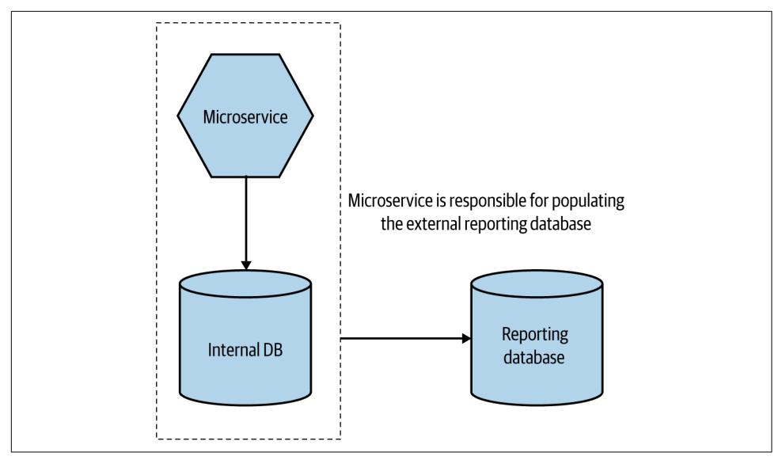

*Figure 3-8. An overview of the reporting database pattern*

There are two key points to highlight here. Firstly, we still want to practice informa‐ tion hiding. So we should expose only the bare minimum of data in the reporting database. This means that what is in the reporting database may be only a subset of the data the microservice stores. However, as this is not a direct mapping, it creates the opportunity to come up with a schema design for the reporting database that is tailored exactly to the requirements of the consumers—this could involve using a radically different schema, or perhaps even a different type of database technology altogether.

The second key point is that the reporting database should be treated like any other microservice endpoint, and it is the job of the microservice maintainer to ensure that compatibility of this endpoint is maintained even if the microservice changes its internal implementation detail. The mapping from internal state to reporting data‐ base is the responsibility of the people who develop the microservice itself.

## **Summary**

So, to distill things down, when embarking on work to migrate functionality from a monolithic architecture to a microservice architecture, you must have a clear under‐ standing of *what* you expect to achieve. This goal will shape how you go about the work and will also help you understand whether you're moving in the right direction.

Migration should be incremental. Make a change, roll that change out, assess it, and go again. Even the act of splitting out one microservice can itself be broken down into a series of small steps.

If you want to explore any of the concepts in this chapter in more detail, another book I have written, *[Monolith to Microservices](https://www.oreilly.com/library/view/monolith-to-microservices/9781492047834)* (O'Reilly), is a deep dive into this topic.

Much of this chapter has been somewhat high level in its overview. In the next chap‐ ter, though, we're going to start getting more technical when we look at how micro‐ services communicate with one another.

## <span id="page-114-0"></span>**Microservice Communication Styles**

Getting communication between microservices right is problematic for many due in great part, I feel, to the fact that people gravitate toward a chosen technological approach without first considering the different types of communication they might want. In this chapter, I'll try and tease apart the different styles of communication to help you understand the pros and cons of each, as well as which approach will best fit your problem space.

We'll be looking at synchronous blocking and asynchronous nonblocking communi‐ cation mechanisms, as well as comparing request-response collaboration with eventdriven collaboration.

By the end of this chapter you should be much better prepared to understand the dif‐ ferent options available to you and will have a foundational knowledge that will help when we start looking at more detailed implementation concerns in the following chapters.

## **From In-Process to Inter-Process**

OK, let's get the easy stuff out of the way first—or at least what I *hope* is the easy stuff. Namely, calls *between* different processes across a network (inter-process) are *very* different from calls *within* a single process (in-process). At one level, we can ignore this distinction. It's easy, for example, to think of one object making a method call on another object and then just map this interaction to two microservices communicat‐ ing via a network. Putting aside the fact that microservices aren't just objects, this thinking can get us into a lot of trouble.

Let's look at some of these differences and how they might change how you think about the interactions between your microservices.

## <span id="page-115-0"></span>**Performance**

The performance of an in-process call is fundamentally different from that of an inter-process call. When I make an in-process call, the underlying compiler and run‐ time can carry out a whole host of optimizations to reduce the impact of the call, including inlining the invocation so it's as though there was never a call in the first place. No such optimizations are possible with inter-process calls. Packets have to be sent. Expect the overhead of an inter-process call to be significant compared to the overhead of an in-process call. The former is very measurable—just round-tripping a single packet in a data center is measured in milliseconds—whereas the overhead of making a method call is something you don't need to worry about.

This can often lead you to want to rethink APIs. An API that makes sense in-process may not make sense in inter-process situations. I can make one thousand calls across an API boundary in-process without concern. Do I want to make one thousand net‐ work calls between two microservices? Perhaps not.

When I pass a parameter into a method, the data structure I pass in typically doesn't move—what's more likely is that I pass around a pointer to a memory location. Pass‐ ing in an object or data structure to another method doesn't necessitate more mem‐ ory being allocated in order to copy the data.

When making calls between microservices over a network, on the other hand, the data actually has to be serialized into some form that can be transmitted over a net‐ work. The data then needs to be sent and deserialized at the other end. We therefore may need to be more mindful about the size of payloads being sent between pro‐ cesses. When was the last time you were aware of the size of a data structure that you were passing around inside a process? The reality is that you likely didn't need to know; now you do. This might lead you to reduce the amount of data being sent or received (perhaps not a bad thing if we think about information hiding), pick more efficient serialization mechanisms, or even offload data to a filesystem and pass around a reference to that file location instead.

These differences may not cause you issues straight away, but you certainly need to be aware of them. I've seen a lot of attempts to hide from the developer the fact that a network call is even taking place. Our desire to create abstractions to hide detail is a big part of what allows us to do more things more efficiently, but sometimes we cre‐ ate abstractions that hide too much. A developer needs to be aware if they are doing something that will result in a network call; otherwise, you should not be surprised if you end up with some nasty performance bottlenecks further down the line caused by odd inter-service interactions that weren't visible to the developer writing the code.

## <span id="page-116-0"></span>**Changing Interfaces**

When we consider changes to an interface inside a process, the act of rolling out the change is straightforward. The code implementing the interface and the code calling the interface are all packaged together in the same process. In fact, if I change a method signature using an IDE with refactoring capability, often the IDE itself will automatically refactor calls to this changing method. Rolling out such a change can be done in an atomic fashion—both sides of the interface are packaged together in a single process.

With communication between microservices, however, the microservice exposing an interface and the consuming microservices using that interface are separately deploy‐ able microservices. When making a backward-incompatible change to a microservice interface, we either need to do a lockstep deployment with consumers, making sure they are updated to use the new interface, or else find some way to phase the rollout of the new microservice contract. We'll explore this concept in more detail later in this chapter.

## **Error Handling**

Within a process, if I call a method, the nature of the errors tends to be pretty straightforward. Simplistically, the errors either are expected and easy to handle, or they are catastrophic to the point that we just propagate the error up the call stack. Errors, on the whole, are deterministic.

With a distributed system, the nature of errors can be different. You are vulnerable to a host of errors that are outside your control. Networks time out. Downstream microservices might be temporarily unavailable. Networks get disconnected, contain‐ ers get killed due to consuming too much memory, and in extreme situations, bits of your data center can catch fire.<sup>1</sup>

In their book *Distributed Systems*, Andrew Tanenbaum and Maarten Steen break down the five types of failure modes you can see when looking at an inter-process communication. Here's a simplified version:

*Crash failure*

Everything was fine till the server crashed. Reboot!

<sup>1</sup> True story.

<sup>2</sup> Maarten van Steen and Andrew S. Tanenbaum, *Distributed Systems*, 3rd ed. (Scotts Valley, CA: CreateSpace Independent Publishing Platform, 2017).

#### <span id="page-117-0"></span>*Omission failure*

You sent something, but you didn't get a response. Also includes situations in which you expect a downstream microservice to be firing messages (perhaps including events), and it just stops.

#### *Timing failure*

Something happened too late (you didn't get it in time), or something happened too early!

#### *Response failure*

You got a response, but it just seems wrong. For example, you asked for an order summary, but needed pieces of information are missing in the response.

#### *Arbitrary failure*

Otherwise known as Byzantine failure, this is when something has gone wrong, but participants are unable to agree if the failure has occurred (or why). As it sounds like, this is a bad time all around.

Many of these errors are often transient in nature—they are short-lived problems that might go away. Consider the situation in which we send a request to a microservice but don't hear back (a type of omission failure). This could mean that the down‐ stream microservice never got the request in the first place, so we need to send it again. Other problems can't be dealt with easily and might need a human operator to intervene. As a result, it can become important to have a richer set of semantics for returning errors in a way that can allow clients to take appropriate action.

HTTP is an example of a protocol that understands the importance of this. Every HTTP response has a code, with the 400 and 500 series codes being reserved for errors. 400 series error codes are request errors—essentially, a downstream service is telling the client that there is something wrong with the original request. As such, it's probably something you should give up on—is there any point retrying a 404 Not Found, for example? The 500 series response codes relate to downstream issues, a sub‐ set of which indicate to the client that the issue might be temporary. A 503 Service Unavailable, for example, indicates that the downstream server is unable to handle the request, but it may be a temporary state, in which case an upstream client might decide to retry the request. On the other hand, if a client receives a 501 Not Imple mented response, a retry is unlikely to help much.

Whether or not you pick an HTTP-based protocol for communication between microservices, if you have a rich set of semantics around the nature of the error, you'll make it easier for clients to carry out compensating actions, which in turn should help you build more robust systems.

## <span id="page-118-0"></span>**Technology for Inter-Process Communication: So Many Choices**

*And in a world where we have too many choices and too little time, the obvious thing to do is just ignore stuff.*

—Seth Godin

The range of technology available to us for inter-process communication is vast. As a result, we can often be overburdened with choice. I often find that people gravitate to technology that is familiar to them, or perhaps just to the latest hot technology they learned about from a conference. The problem with this is that when you buy into a specific technology choice, you are often buying into a set of ideas and constraints that come along for the ride. These constraints might not be the right ones for you and the mindset behind the technology may not actually line up with the problem you are trying to solve.

If you're trying to build a website, single page app technology like Angular or React is a bad fit. Likewise, trying to use Kafka for request-response really isn't a good idea, as it was designed for more event-based interactions (topics we'll get to in just a moment). And yet I see technology used in the wrong place time and time again. People pick the shiny new tech (like microservices!) without considering whether it actually fits their problem.

Thus when it comes to the bewildering array of technology available to us for com‐ munication between microservices, I think it's important to talk first about the style of communication you want, and only then look for the right technology to imple‐ ment that style. With that in mind, let's take a look at a model I've been using for several years to help distinguish between the different approaches for microserviceto-microservice communication, which in turn can help you filter the technology options you'll want to look at.

## **Styles of Microservice Communication**

In [Figure 4-1](#page-119-0) we see an outline for the model I use for thinking about different styles of communication. This model is not meant to be entirely exhaustive (I'm not trying to present a grand unified theory of inter-process communication here), but it pro‐ vides a good high-level overview for considering the different styles of communica‐ tion that are most widely used for microservice architectures.

<span id="page-119-0"></span>

*Figure 4-1. Different styles of inter-microservice communication along with example implementing technologies*

We'll look at the different elements of this model in more detail shortly, but first I'd like to briefly outline them:

#### *Synchronous blocking*

A microservice makes a call to another microservice and blocks operation wait‐ ing for the response.

#### *Asynchronous nonblocking*

The microservice emitting a call is able to carry on processing whether or not the call is received.

#### *Request-response*

A microservice sends a request to another microservice asking for something to be done. It expects to receive a response informing it of the result.

#### *Event-driven*

Microservices emit events, which other microservices consume and react to accordingly. The microservice emitting the event is unaware of which microser‐ vices, if any, consume the events it emits.

#### *Common data*

Not often seen as a communication style, microservices collaborate via some shared data source.

When using this model to help teams decide on the right approach, I spend a lot of time understanding the context in which they are operating. Their needs in terms of reliable communication, acceptable latency, and volume of communication are all going to play a part in making a technology choice. But in general, I tend to start with deciding whether a request-response or an event-driven style of collaboration is more appropriate for the given situation. If I'm looking at request-response, then both syn‐ chronous and asynchronous implementations are still available to me, so I have a

<span id="page-120-0"></span>second choice to make. If picking an event-driven collaboration style, however, my implementation choices will be limited to nonblocking asynchronous choices.

A host of other considerations come into play when picking the right technology that go beyond the style of communication—for example, the need for lower-latency communication, security-related aspects, or the ability to scale. It's unlikely that you can make a reasoned technology choice without taking into account the requirements (and constraints) of your specific problem space. When we look at technology options in [Chapter 5,](#page-146-0) we'll discuss some of these issues.

## **Mix and Match**

It's important to note that a microservice architecture as a whole may have a mix of styles of collaboration, and this is typically the norm. Some interactions just make sense as request-response, while others make sense as event-driven. In fact, it's com‐ mon for a single microservice to implement more than one form of collaboration. Consider an Order microservice that exposes a request-response API that allows for orders to be placed or changed and then fires events when these changes are made.

With that said, let's look at these different styles of communication in more detail.

## **Pattern: Synchronous Blocking**

With a synchronous blocking call, a microservice sends a call of some kind to a downstream process (likely another microservice) and blocks until the call has com‐ pleted, and potentially until a response has been received. In Figure 4-2, the Order Processor sends a call to the Loyalty microservice to inform it that some points should be added to a customer's account.


*Figure 4-2. Order Processor sends a synchronous call to the Loyalty microservice, blocks, and waits for a response*

Typically, a synchronous blocking call is one that is waiting for a response from the downstream process. This may be because the result of the call is needed for some further operation, or just because it wants to make sure the call worked and to carry out some sort of retry if not. As a result, virtually every synchronous blocking call I see would also constitute being a request-response call, something we'll look at shortly.

## <span id="page-121-0"></span>**Advantages**

There is something simple and familiar about a blocking, synchronous call. Many of us learned to program in a fundamentally synchronous style—reading a piece of code like a script, with each line executing in turn, and with the next line of code waiting its turn to do something. Most of the situations in which you would have used interprocess calls were probably done in a synchronous, blocking style—running a SQL query on a database, for example, or making an HTTP request of a downstream API.

When moving from a less distributed architecture, like that of a single process mono‐ lith, sticking with those ideas that are familiar when there is so much else going on that is brand-new can make sense.

## **Disadvantages**

The main challenge with synchronous calls is the inherent temporal coupling that occurs, a topic we explored briefly in [Chapter 2](#page-60-0). When the Order Processor makes a call to Loyalty in the preceding example, the Loyalty microservice needs to be reachable for the call to work. If the Loyalty microservice is unavailable, then the call will fail, and Order Processor needs to work out what kind of compensating action to carry out—this might involve an immediate retry, buffering the call to retry later, or perhaps giving up altogether.

This coupling is two-way. With this style of integration, the response is typically sent over the same inbound network connection to the upstream microservice. So if the Loyalty microservice wants to send a response back to Order Processor, but the upstream instance has subsequently died, the response will get lost. The temporal coupling here isn't just between two microservices; it's between two specific instances of these microservices.

As the sender of the call is blocking and waiting for the downstream microservice to respond, it also follows that if the downstream microservice responds slowly, or if there is an issue with the latency of the network, then the sender of the call will be blocked for a prolonged period of time waiting for a response. If the Loyalty micro‐ service is under significant load and is responding slowly to requests, this in turn will cause the Order Processor to respond slowly.

Thus the use of synchronous calls can make a system vulnerable to cascading issues caused by downstream outages more readily than can the use of asynchronous calls.

## **Where to Use It**

For simple microservice architectures, I don't have a massive problem with the use of synchronous, blocking calls. Their familiarity for many people is an advantage when coming to grips with distributed systems.

For me, these types of calls begin to be problematic when you start having more chains of calls—in Figure 4-3, for instance, we have an example flow from MusicCorp, where we are checking a payment for potentially fraudulent activity. The Order Processor calls the Payment service to take payment. The Payment service in turn wants to check with the Fraud Detection microservice as to whether or not this should be allowed. The Fraud Detection microservice in turn needs to get informa‐ tion from the Customer microservice.


*Figure 4-3. Checking for potentially fraudulent behavior as part of order processing flow*

If all of these calls are synchronous and blocking, there are a number of issues we might face. An issue in any of the four involved microservices, or in the network calls between them, could cause the whole operation to fail. This is quite aside from the fact that these kinds of long chains can cause significant *resource contention*. Behind the scenes, the Order Processor likely has a network connection open waiting to hear back from Payment. Payment in turn has a network connection open waiting for a response from Fraud Detection, and so on. Having a lot of connections that need to be kept open can have an impact on the running system—you are much more likely to experience issues in which you run out of available connections or suffer from increased network congestion as a result.

To improve this situation, we could reexamine the interactions between the micro‐ services in the first place. For example, maybe we take the use of Fraud Detection out of the main purchase flow, as shown in [Figure 4-4,](#page-123-0) and instead have it run in the background. If it finds a problem with a specific customer, their records are updated accordingly, and this is something that could be checked earlier in the payment pro‐ cess. Effectively, this means we're doing some of this work in parallel. By reducing the length of the call chain, we'll see the overall latency of the operation improve, and we'll take one of our microservices (Fraud Detection) out of the critical path for the purchase flow, giving us one fewer dependency to worry about for what is a critical operation.

<span id="page-123-0"></span>

*Figure 4-4. Moving Fraud Detection to a background process can reduce concerns around the length of the call chain*

Of course, we could also replace the use of blocking calls with some style of non‐ blocking interaction without changing the workflow here, an approach we'll explore next.

## **Pattern: Asynchronous Nonblocking**

With asynchronous communication, the act of sending a call out over the network doesn't block the microservice issuing the call. It is able to carry on with any other processing without having to wait for a response. Nonblocking asynchronous com‐ munication comes in many forms, but we'll be looking in more detail at the three most common styles I see in microservice architecture. They are:

#### *Communication through common data*

The upstream microservice changes some common data, which one or more microservices later make use of.

#### *Request-response*

A microservice sends a request to another microservice asking it to do some‐ thing. When the requested operation completes, whether successfully or not, the upstream microservice receives the response. Specifically, *any* instance of the upstream microservice should be able to handle the response.

#### *Event-driven interaction*

A microservice broadcasts an event, which can be thought of as a factual state‐ ment about something that has happened. Other microservices can listen for the events they are interested in and react accordingly.

## <span id="page-124-0"></span>**Advantages**

With nonblocking asynchronous communication, the microservice making the initial call and the microservice (or microservices) receiving the call are decoupled tempo‐ rally. The microservices that receive the call do not need to be reachable at the same time the call is made. This means we avoid the concerns of temporal decoupling that we discussed in [Chapter 2](#page-60-0) (see ["A Brief Note on Temporal Coupling" on page 42](#page-67-0)).

This style of communication is also beneficial if the functionality being triggered by a call will take a long time to process. Let's come back to our example of MusicCorp, and specifically the process of sending out a package. In Figure 4-5, the Order Pro cessor has taken payment and has decided that it is time to dispatch the package, so it sends a call to the Warehouse microservice. The process of finding the CDs, taking them off the shelf, packaging them up, and having them picked up could take many hours, and potentially even days, depending on how the actual dispatch process works. It makes sense, therefore, for the Order Processor to issue a nonblocking asynchronous call to the Warehouse and have the Warehouse call back later to inform the Order Processor of its progress. This is a form of asynchronous requestresponse communication.


*Figure 4-5. The Order Processor kicks off the process to package and ship an order, which is done in an asynchronous fashion*

If we tried doing something similar with synchronous blocking calls, then we'd have to restructure the interactions between Order Processor and Warehouse—it wouldn't be feasible for Order Processor to open a connection, send a request, block any further operations in calling the thread, and wait for a response for what might be hours or days.

## <span id="page-125-0"></span>**Disadvantages**

The main downsides of nonblocking asynchronous communication, relative to blocking synchronous communication, are the level of complexity and the range of choice. As we've already outlined, there are different styles of asynchronous commu‐ nication to choose from—which one is right for you? When we start digging into how these different styles of communication are implemented, there is a potentially bewildering list of technology we could look at.

If asynchronous communication doesn't map to your mental models of computing, adopting an asynchronous style of communication will be challenging at first. And as we'll explore further when we look in detail at the various styles of asynchronous communication, there are a lot of different, interesting ways in which you can get yourself into a *lot* of trouble.

## **Async/Await and When Asynchronous Is Still Blocking**

As with many areas of computing, we can use the same term in different contexts to have very different meanings. A style of programming that appears to be especially popular is the use of constructs like async/await to work with a potentially asynchro‐ nous source of data but in a blocking, synchronous style.

In Example 4-1, we see a very simple JavaScript example of this in action. The cur‐ rency exchange rates fluctuate frequently through the day, and we receive these via a message broker. We define a Promise. Generically, a promise is something that will resolve to a state at some point in the future. In our case, our eurToGbp will eventually resolve to being the next euro-to-GBP exchange rate.

*Example 4-1. An example of working with a potentially asynchronous call in a blocking, synchronous fashion*

```
async function f() {
 let eurToGbp = new Promise((resolve, reject) => {
 //code to fetch latest exchange rate between EUR and GBP
 ...
 });
 var latestRate = await eurToGbp; 
 process(latestRate); 
}
```

- Wait until the latest EUR-to-GBP exchange rate is fetched.
- Won't run until the promise is fulfilled.

<span id="page-126-0"></span>When we reference eurToGbp using await, we block until latestRate's state is fulfil‐ led—process isn't reached until we resolve the state of eurToGbp. 3

Even though our exchange rates are being received in an asynchronous fashion, the use of await in this context means we are *blocking* until the state of latestRate is resolved. So even if the underlying technology we are using to get the rate could be considered asynchronous in nature (for example, waiting for the rate), from the point of our code, this is inherently a synchronous, blocking interaction.

## **Where to Use It**

Ultimately, when considering whether asynchronous communication is right for you, you also have to consider which *type* of asynchronous communication you want to pick, as each type has its own trade-offs. In general, though, there are some specific use cases that would have me reaching for some form of asynchronous communica‐ tion. Long-running processes are an obvious candidate, as we explored in [Figure 4-5.](#page-124-0) Also, situations in which you have long call chains that you can't easily restructure could be a good candidate. We'll dive deeper into this when we look at three of the most common forms of asynchronous communication—request-response calls, event-driven communication, and communication through common data.

## **Pattern: Communication Through Common Data**

A style of communication that spans a multitude of implementations is communica‐ tion through common data. This pattern is used when one microservice puts data into a defined location, and another microservice (or potentially multiple microservi‐ ces) then makes use of the data. It can be as simple as one microservice dropping a file in a location, and at some point later on another microservice picks up that file and does something with it. This integration style is fundamentally asynchronous in nature.

An example of this style can be seen in [Figure 4-6](#page-127-0), where the New Product Importer creates a file that will then be read by the downstream Inventory and Catalog microservices.

<sup>3</sup> Please note, this is very simplified—I've completely omitted error-handling code, for example. If you want to know more about async/await, specifically in JavaScript, the [Modern JavaScript Tutorial](https://javascript.info) is a great place to start.

<span id="page-127-0"></span>

*Figure 4-6. One microservice writes out a file that other microservices make use of*

This pattern is in some ways the most common general inter-process communication pattern that you'll see, and yet we sometimes fail to see it as a communication pattern at all—I think largely because the communication between processes is often so indi‐ rect as to be hard to spot.

## **Implementation**

To implement this pattern, you need some sort of persistent store for the data. A file‐ system in many cases can be enough. I've built many systems that just periodically scan a filesystem, note the presence of a new file, and react on it accordingly. You could use some sort of robust distributed memory store as well, of course. It's worth noting that any downstream microservice that is going to act on this data will need its own mechanism to identify that new data is available—polling is a frequent solution to this problem.

Two common examples of this pattern are the data lake and the data warehouse. In both cases, these solutions are typically designed to help process large volumes of data, but arguably they exist at opposite ends of the spectrum regarding coupling. With a data lake, sources upload raw data in whatever format they see fit, and down‐ stream consumers of this raw data are expected to know how to process the informa‐ tion. With a data warehouse, the warehouse itself is a structured data store. Microservices pushing data to the data warehouse need to know the structure of the data warehouse—if the structure changes in a backward-incompatible way, then these producers will need to be updated.

With both the data warehouse and the data lake, the assumption is that the flow of information is in a single direction. One microservice publishes data to the common data store, and downstream consumers read that data and carry out appropriate actions. This unidirectional flow can make it easier to reason about the flow of <span id="page-128-0"></span>information. A more problematic implementation would be the use of a shared data‐ base in which multiple microservices both read and write to the same data store, an example of which we discussed in [Chapter 2](#page-60-0) when we explored common coupling— Figure 4-7 shows both Order Processor and Warehouse updating the same record.


*Figure 4-7. An example of common coupling in which both Order Processor and Ware house are updating the same order record*

## **Advantages**

This pattern can be implemented very simply, using commonly understood technol‐ ogy. If you can read or write to a file or read and write to a database, you can use this pattern. The use of prevalent and well-understood technology also enables interoper‐ ability between different types of systems, including older mainframe applications or customizable off-the-shelf (COTS) software products. Data volumes are also less of a concern here—if you're sending lots of data in one big go, this pattern can work well.

## **Disadvantages**

Downstream consuming microservices will typically be aware that there is new data to process via some sort of polling mechanism, or else perhaps through a periodically triggered timed job. That means that this mechanism is unlikely to be useful in lowlatency situations. You can of course combine this pattern with some other sort of call informing a downstream microservice that new data is available. For example, I could write a file to a shared filesystem and then send a call to the interested micro‐ service informing it that there is new data that it may want. This can close the gap between data being published and data being processed. In general, though, if you're using this pattern for very large volumes of data, it's less likely that low latency is high <span id="page-129-0"></span>on your list of requirements. If you are interested in sending larger volumes of data and having them processed more in "real time," then using some sort of streaming technology like Kafka would be a better fit.

Another big disadvantage, and something that should be fairly obvious if you remember back to our exploration of common coupling in [Figure 4-7,](#page-128-0) is that the common data store becomes a potential source of coupling. If that data store changes structure in some way, it can break communication between microservices.

The robustness of the communication will also come down to the robustness of the underlying data store. This isn't a disadvantage strictly speaking, but it's something to be aware of. If you're dropping a file on a filesystem, you might want to make sure that the filesystem itself isn't going to fail in interesting ways.

## **Where to Use It**

Where this pattern really shines is in enabling interoperability between processes that might have restrictions on what technology they can use. Having an existing system talk to your microservice's GRPC interface or subscribe to its Kafka topic might well be more convenient from the point of view of the microservice, but not from the point of view of a consumer. Older systems may have limitations on what technology they can support and may have high costs of change. On the other hand, even old mainframe systems should be able to read data out of a file. This does of course all depend on using data store technology that is widely supported—I could also imple‐ ment this pattern using something like a Redis cache. But can your old mainframe system talk to Redis?

Another major sweet spot for this pattern is in sharing large volumes of data. If you need to send a multigigabyte file to a filesystem or load a few million rows into a database, then this pattern is the way to go.

## **Pattern: Request-Response Communication**

With request-response, a microservice sends a request to a downstream service ask‐ ing it to do something and expects to receive a response with the result of the request. This interaction can be undertaken via a synchronous blocking call, or it could be implemented in an asynchronous nonblocking fashion. A simple example of this interaction is shown in [Figure 4-8,](#page-130-0) where the Chart microservice, which collates the best-selling CDs for different genres, sends a request to the Inventory service asking for the current stock levels for some CDs.

<span id="page-130-0"></span>

*Figure 4-8. The Chart microservice sends a request to Inventory asking for stock levels*

Retrieving data from other microservices like this is a common use case for a requestresponse call. Sometimes, though, you just need to make sure something gets done. In Figure 4-9, the Warehouse microservice is sent a request from Order Processor asking it to reserve stock. The Order Processor just needs to know that stock has been successfully reserved before it can carry on with taking payment. If the stock can't be reserved—perhaps because an item is no longer available—then the payment can be cancelled. Using request-response calls in situations like this where calls need to be completed in a certain order is commonplace.

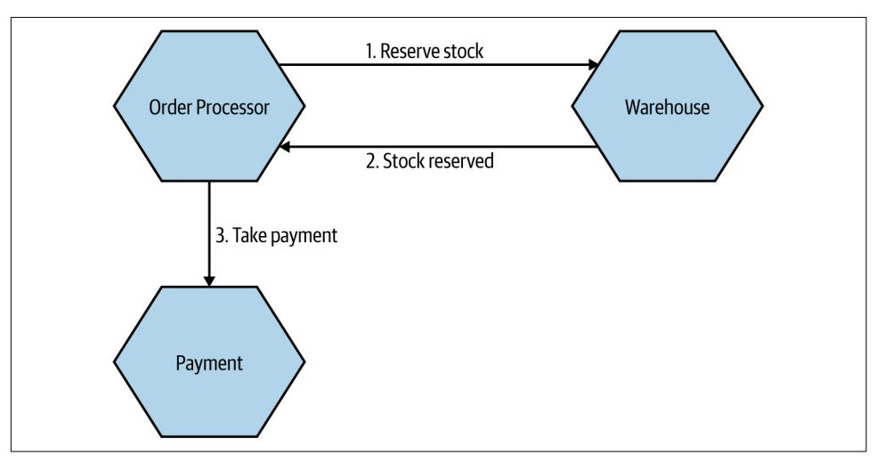

*Figure 4-9. Order Processor needs to ensure stock can be reserved before payment can be taken*

### **Commands Versus Requests**

<span id="page-131-0"></span>I've heard some people talk about sending commands, rather than requests, specifi‐ cally in the context of asynchronous request-response communication. The intent behind the term *command* is arguably the same as that of *request*—namely, an upstream microservice is asking a downstream microservice to do something.

Personally speaking, though, I much prefer the term *request*. A command implies a directive that must be obeyed, and it can lead to a situation in which people feel that the command has to be acted on. A request implies something that can be rejected. It is right that a microservice examines each request on its merits and, based on its own internal logic, decides whether the request should be acted on. If the request it has been sent violates internal logic, the microservice should reject it. Although it's a sub‐ tle difference, I don't feel that the term *command* conveys the same meaning.

I'll stick to using *request* over *command*, but whatever term you decide to use, just remember that a microservice gets to reject the request/command if appropriate.

## **Implementation: Synchronous Versus Asynchronous**

Request-response calls like this can be implemented in either a blocking synchronous or a nonblocking asynchronous style. With a synchronous call, what you'd typically see is a network connection being opened with the downstream microservice, with the request being sent along this connection. The connection is kept open while the upstream microservice waits for the downstream microservice to respond. In this case, the microservice sending the response doesn't really need to know anything about the microservice that sent the request—it's just sending stuff back over an inbound connection. If that connection dies, perhaps because either the upstream or the downstream microservice instance dies, then we might have a problem.

With an asynchronous request-response, things are less straightforward. Let's revisit the process associated with reserving stock. In [Figure 4-10](#page-132-0), the request to reserve stock is sent as a message over some sort of message broker (we'll explore message brokers later in this chapter). Rather than the message going directly to the Inven tory microservice from Order Processor, it instead sits in a queue. The Inventory consumes messages from this queue when it is able. It reads the request, carries out the associated work of reserving the stock, and then needs to send the response back to a queue that Order Processor is reading from. The Inventory microservice needs to know where to route the response. In our example, it sends this response back over another queue that is in turn consumed by Order Processor.

<span id="page-132-0"></span>

*Figure 4-10. Using queues to send stock reservation requests*

So with a nonblocking asynchronous interaction, the microservice that receives the request needs either to know implicitly where to route the response or else to be told where the response should go. When using a queue, we have the added benefit that multiple requests could be buffered up in the queue waiting to be handled. This can help in situations in which the requests can't be handled quickly enough. The micro‐ service can consume the next request when it is ready, rather than being over‐ whelmed by too many calls. Of course, a lot then depends on the queue absorbing these requests.

When a microservice receives a response in this way, it might need to relate the response to the original request. This can be challenging, as a lot of time may have passed, and depending on the nature of the protocol being used, the response may not come back to the same instance of the microservice that sent the request. In our example of reserving stock as part of placing an order, we'd need to know how to associate the "stock reserved" response with a given order so we can carry on process‐ ing that particular order. An easy way to handle this would be to store any state asso‐ ciated with the original request into a database, such that when the response comes in, the receiving instance can reload any associated state and act accordingly.

One last note: all forms of request-response interaction are likely going to require some form of time-out handling to avoid issues where the system gets blocked wait‐ ing for something that may never happen. How this time-out functionality is imple‐ mented can vary based on the implementation technology, but it will be needed. We'll look at time-outs in more detail in [Chapter 12](#page-412-0).

## **Parallel Versus Sequential Calls**

<span id="page-133-0"></span>When working with request-response interactions, you'll often encounter a situation in which you will need to make multiple calls before you can continue with some processing.

Consider a situation in which MusicCorp needs to check on the price for a given item from three different stockists, which we do by issuing API calls. We want to get the prices back from all three stockists before deciding which one we want to order new stock from. We could decide to make the three calls in sequence—waiting for each one to finish before proceeding with the next. In such a situation, we'd be waiting for the sum of latencies of each of the calls. If the API call to each provider took one sec‐ ond to return, we'd be waiting three seconds before we can decide who we should order from.

A better option would be to run these three requests in parallel; then the overall latency of the operation would be based on the slowest API call, rather than on the sum of latencies of each API call.

Reactive extensions and mechanisms like async/await can be very useful in helping to run calls in parallel, and this can result in significant improvements in the latency of some operations.

## **Where to Use It**

Request-response calls make perfect sense for any situation in which the result of a request is needed before further processing can take place. They also fit really well in situations where a microservice wants to know if a call didn't work so that it can carry out some sort of compensating action, like a retry. If either aligns with your situation, then request-response is a sensible approach; the only remaining question is to decide on a synchronous versus asynchronous implementation, with the same trade-offs we discussed earlier.

## **Pattern: Event-Driven Communication**

Event-driven communication looks quite odd compared to request-response calls. Rather than a microservice asking some other microservice to do something, a microservice emits events that may or may not be received by other microservices. It is an inherently asynchronous interaction, as the event listeners will be running on their own thread of execution.

An event is a statement about something that has occurred, nearly always something that has happened inside the world of the microservice that is emitting the event. The microservice emitting the event has no knowledge of the intent of other

microservices to use the event, and indeed it may not even be aware that other micro‐ services exist. It emits the event when required, and that is the end of its responsibili‐ ties.

In Figure 4-11, we see the Warehouse emitting events related to the process of packag‐ ing up an order. These events are received by two microservices, Notifications and Inventory, and they react accordingly. The Notifications microservice sends an email to update our customer about changes in order status, while the Inventory microservice can update stock levels as items are packaged into the customer's order.


*Figure 4-11. The Warehouse emits events that some downstream microservices subscribe to*

The Warehouse is just broadcasting events, assuming that interested parties will react accordingly. It is unaware of who the recipients of the events are, making eventdriven interactions much more loosely coupled in general. When you compare this to a request-response call, it may take you a while to get your head around the inversion of responsibility. With request-response, we might instead expect Warehouse to tell the Notifications microservice to send emails when appropriate. In such a model, Warehouse would need to know what events require customer notification. With an event-driven interaction, we are instead pushing that responsibility into the Notifica tions microservice.

The intent behind an event could be considered the opposite of a request. The event emitter is leaving it up to the recipients to decide what to do. With request-response, the microservice sending the request knows what should be done and is telling the other microservice what it thinks needs to happen next. This of course means that in request-response, the requester has to have knowledge of what the downstream recipient can do, implying a greater degree of domain coupling. With event-driven <span id="page-135-0"></span>collaboration, the event emitter doesn't need to know what any downstream microservices are able to do, and in fact may not even know they exist—as a result, coupling is greatly reduced.

The distribution of responsibility we see with our event-driven interactions can mir‐ ror the distribution of responsibility we see with organizations trying to create more autonomous teams. Rather than holding all the responsibility centrally, we want to push it into the teams themselves to allow them to operate in a more autonomous fashion—a concept we will revisit in [Chapter 15](#page-516-0). Here, we are pushing responsibility from Warehouse into Notifications and Inventory—this can help us reduce the complexity of microservices like Warehouse and lead to a more even distribution of "smarts" in our system. We'll explore that idea in more detail when we compare choreography and orchestration in [Chapter 6.](#page-200-0)

### **Events and Messages**

On occasion I've seen the terms *messages* and *events* get confused. An event is a fact a statement that something happened, along with some information about exactly what happened. A message is a thing we send over an asynchronous communication mechanism, like a message broker.

With event-driven collaboration, we want to broadcast that event, and a typical way to implement that broadcast mechanism would be to put the event into a message. The message is the medium; the event is the payload.

Likewise, we might want to send a request as the payload of a message—in which case we would be implementing a form of asynchronous request-response.

## **Implementation**

There are two main aspects we need to consider here: a way for our microservices to emit events, and a way for our consumers to find out those events have happened.

Traditionally, message brokers like RabbitMQ try to handle both problems. Produc‐ ers use an API to publish an event to the broker. The broker handles subscriptions, allowing consumers to be informed when an event arrives. These brokers can even handle the state of consumers—for example, by helping keep track of what messages they have seen before. These systems are normally designed to be scalable and resil‐ ient, but that doesn't come for free. It can add complexity to the development pro‐ cess, because it is another system you may need to run to develop and test your services. Additional machines and expertise may also be required to keep this infra‐ structure up and running. But once it is, it can be an incredibly effective way to implement loosely coupled, event-driven architectures. In general, I'm a fan.

<span id="page-136-0"></span>Do be wary, though, about the world of middleware, of which the message broker is just a small part. Queues in and of themselves are perfectly sensible, useful things. However, vendors tend to want to package lots of software with them, which can lead to more and more smarts being pushed into the middleware, as evidenced by things like the enterprise service bus. Make sure you know what you're getting: keep your middleware dumb, and keep the smarts in the endpoints.

Another approach is to try to use HTTP as a way of propagating events. Atom is a REST-compliant specification that defines semantics (among other things) for pub‐ lishing feeds of resources. Many client libraries exist that allow us to create and con‐ sume these feeds. So our customer service could just publish an event to such a feed whenever our customer service changes. Our consumers simply poll the feed, looking for changes. On one hand, the fact that we can reuse the existing Atom specification and any associated libraries is useful, and we know that HTTP handles scale very well. However, this use of HTTP is not good at low latency (where some message brokers excel), and we still must deal with the fact that the consumers need to keep track of what messages they have seen and manage their own polling schedule.

I have seen people spend ages implementing more and more of the behaviors that you get out of the box with an appropriate message broker to make Atom work for some use cases. For example, the *competing consumer pattern* describes a method whereby you bring up multiple worker instances to compete for messages, which works well for scaling up the number of workers to handle a list of independent jobs (we'll come back to that in [the next chapter](#page-160-0)). However, we want to avoid the case in which two or more workers see the same message, as we'll end up doing the same task more than we need to. With a message broker, a standard queue will handle this. With Atom, we now need to manage our own shared state among all the workers to try to reduce the chances of reproducing effort.

If you already have a good, resilient message broker available to you, consider using it to handle publishing and subscribing to events. If you don't already have one, give Atom a look, but be aware of the sunk cost fallacy. If you find yourself wanting more and more of the support that a message broker gives you, at a certain point you might want to change your approach.

In terms of what we actually send over these asynchronous protocols, the same con‐ siderations apply as with synchronous communication. If you are currently happy with encoding requests and responses using JSON, stick with it.

## **What's in an Event?**

In [Figure 4-12,](#page-137-0) we see an event being broadcast from the Customer microservice, informing interested parties that a new customer has registered with the system. Two of the downstream microservices, Loyalty and Notifications, care about this event. The Loyalty microservice reacts to receiving the event by setting up an account for

<span id="page-137-0"></span>the new customer so that they can start earning points, whereas the Notifications microservice sends an email to the newly registered customer welcoming them to the wondrous delights of MusicCorp.


*Figure 4-12. Notifications and Loyalty microservices receive an event when a new customer is registered*

With a request, we are asking a microservice to do something and providing the required information for the requested operation to be carried out. With an event, we are broadcasting a fact that other parties *might* be interested in, but as the microser‐ vice emitting an event can't and shouldn't know who receives the event, how do we know what information other parties might need from the event? What, exactly, should be inside the event?

#### **Just an ID**

One option is for the event to just contain an identifier for the newly registered cus‐ tomer, as shown in [Figure 4-13.](#page-138-0) The Loyalty microservice needs only this identifier to create the matching loyalty account, so it has all the information it needs. How‐ ever, while the Notifications microservice knows that it needs to send a welcome email when this type of event is received, it will need additional information to do its job—at least an email address, and probably the name of the customer as well to give the email that personal touch. As this information isn't in the event that the Notifica tions microservice receives, it has no choice but to fetch this information from the Customer microservice, something we see in [Figure 4-13](#page-138-0).

<span id="page-138-0"></span>

*Figure 4-13. The Notifications microservice needs to request further details from the Customer microservice that aren't included in the event*

There are some downsides with this approach. Firstly, the Notifications microser‐ vice now has to know about the Customer microservice, adding additional domain coupling. While domain coupling, as we discussed in [Chapter 2,](#page-60-0) is on the looser end of the coupling spectrum, we'd still like to avoid it where possible. If the event that the Notifications microservice received contained all the information it needed, then this callback wouldn't be required. The callback from the receiving microservice can also lead to the other major downside—namely, that in a situation with a large number of receiving microservices, the microservice emitting the event might get a barrage of requests as a result. Imagine if five different microservices all received the same customer creation event, and all needed to request additional information they'd all have to immediately send a request to the Customer microservice to get what they needed. As the number of microservices interested in a particular event increases, the impact of these calls could become significant.

#### **Fully detailed events**

The alternative, which I prefer, is to put everything into an event that you would be happy otherwise sharing via an API. If you'd let the Notifications microservice ask for the email address and name of a given customer, why not just put that informa‐ tion in the event in the first place? In [Figure 4-14](#page-139-0), we see this approach—Notifica tions is now more self-sufficient and is able to do its job without needing to communicate with the Customer microservice. In fact, it might never need to know the Customer microservice exists.

<span id="page-139-0"></span>

*Figure 4-14. An event with more information in it can allow receiving microservices to act without requiring further calls to the source of the event*

In addition to the fact that events with more information can allow for looser cou‐ pling, events with more information can also double as a historical record of what happened to a given entity. This could help you as part of implementing an auditing system, or perhaps even provide the ability to reconstitute an entity at given points in time—meaning that these events could be used as part of an event sourcing, a con‐ cept we'll explore briefly in a moment.

While this approach is definitely my preference, it's not without downsides. Firstly, if the data associated with an event is large, we might have concerns about the size of the event. Modern message brokers (assuming you're using one to implement your event broadcast mechanism) have fairly generous limits for message size; the default maximum size for a message in Kafka is 1 MB, and the latest release of RabbitMQ has a theoretical upper limit of 512 MB for a single message (down from the previous limit of 2 GB!), even though one could expect there to be some interesting perfor‐ mance issues with large messages like this. But even the 1 MB afforded to us as the maximum size of a message on Kafka gives us a lot of scope to send quite a bit of data. Ultimately, if you're venturing into a space in which you are starting to worry about the size of your events, then I'd recommend a hybrid approach in which some information is in the event but other (larger) data can be looked up if required.

In Figure 4-14, Loyalty doesn't need to know the email address or name of the cus‐ tomer, and yet it nonetheless receives it via the event. This could lead to concerns if we are trying to limit the scope of which microservices can see what kind of data—for example, I might want to limit which microservices can see personally identifiable information (or PII), payment card details, or similar sensitive data. A way to solve this could be to send two different types of events—one that contains PII and can be seen by some microservices, and another that excludes PII and can be broadcast

<span id="page-140-0"></span>more widely. This adds complexity in terms of managing visibility of different events and ensuring that both events actually get fired. What happens when a microservice sends the first type of event but dies before the second event can be sent?

Another consideration is that once we put data into an event, it becomes part of our contract with the outside world. We have to be aware that if we remove a field from an event, we may break external parties. Information hiding is still an important con‐ cept in event-driven collaboration—the more data we put into an event, the more assumptions external parties will have about the event. My general rule is that I am OK putting information into an event if I'd be happy sharing the same data over a request-response API.

## **Where to Use It**

Event-driven collaboration thrives in situations in which information wants to be broadcast, and in situations in which you are happy to invert intent. Moving away from a model of telling other things what to do and instead letting downstream microservices work this out for themselves has a great deal of attraction.

In a situation in which you are focusing on loose coupling more than other factors, event-driven collaboration is going to have obvious appeal.

The cautionary note is that there are often new sources of complexity that come to the fore with this style of collaboration, especially if you've had limited exposure to it. If you are unsure about this form of communication, remember that our microser‐ vice architecture can (and likely will) contain a mix of different styles of interaction. You don't have to go all in with event-driven collaboration; perhaps start with just one event and take it from there.

Personally, I find myself gravitating toward event-driven collaboration almost as a default. My brain seems to have rewired itself in such a way that these types of com‐ munication just seem *obvious* to me. This isn't entirely helpful, as it can be tricky to try and explain *why* this is the case, other than to say it *feels* right. But that is just my own built-in bias—I naturally gravitate to what *I* know, based on my own experien‐ ces. There is a strong possibility that my attraction to this form of interaction is driven almost entirely by my previous bad experiences with overly coupled systems. I might just be the general fighting the last battle over and over again without consid‐ ering that perhaps this time it really is different.

What I will say, putting my own biases aside, is that I see far more teams replacing request-response interactions with event-driven interactions than the reverse.

## <span id="page-141-0"></span>**Proceed with Caution**

Some of this asynchronous stuff seems fun, right? Event-driven architectures seem to lead to significantly more decoupled, scalable systems. And they can. But these com‐ munication styles do lead to an increase in complexity. This isn't just the complexity required to manage publishing and subscribing to messages, as we just discussed, but also complexity in the other problems we might face. For example, when considering long-running async request-response, we have to think about what to do when the response comes back. Does it come back to the same node that initiated the request? If so, what happens if that node is down? If not, do I need to store information some‐ where so I can react accordingly? Short-lived async can be easier to manage if you've got the right APIs, but even so, it is a different way of thinking for programmers who are accustomed to intra-process synchronous message calls.

It's time for a cautionary tale. Back in 2006, I was working on building a pricing sys‐ tem for a bank. We would look at market events and work out which items in a port‐ folio needed to be repriced. Once we determined the list of things to work through, we put these all onto a message queue. We were making use of a grid to create a pool of pricing workers, allowing us to scale up and down the pricing farm on request. These workers used the competing consumers pattern, each one gobbling messages as fast as possible until there was nothing left to process.

The system was up and running, and we were feeling rather smug. One day, though, just after we pushed a release out, we hit a nasty problem: our workers kept dying. And dying. And dying.

Eventually, we tracked down the problem. A bug had crept in whereby a certain type of pricing request would cause a worker to crash. We were using a transacted queue: as the worker died, its lock on the request timed out, and the pricing request was put back on the queue—only for another worker to pick it up and die. This was a classic example of what Martin Fowler calls a [catastrophic failover](https://oreil.ly/8HwcP).

Aside from the bug itself, we'd failed to specify a maximum retry limit for the job on the queue. So we fixed the bug, and configured a maximum retry. But we also realized we needed a way to view and potentially replay these bad messages. We ended up having to implement a message hospital (or dead letter queue), where messages got sent if they failed. We also created a UI to view those messages and retry them if needed. These sorts of problems aren't immediately obvious if you are familiar only with synchronous point-to-point communication.

The associated complexity with event-driven architectures and asynchronous pro‐ gramming in general leads me to believe that you should be cautious in how eagerly you start adopting these ideas. Ensure you have good monitoring in place, and strongly consider the use of correlation IDs, which allow you to trace requests across process boundaries, as we'll cover in depth in [Chapter 10.](#page-330-0)

<span id="page-142-0"></span>I also strongly recommend checking out *Enterprise Integration Patterns* by Gregor Hohpe and Bobby Woolf,<sup>4</sup> which contains a lot more detail on the different messag‐ ing patterns that you may want to consider in this space.

We also have to be honest, though, about the integration styles that we might con‐ sider "simpler"—the problems associated with knowing whether things worked or not is not limited to asynchronous forms of integration. With a synchronous, block‐ ing call, if you get a time-out, did this happen because the request got lost and the downstream party didn't receive it? Or did the request get through, but the response got lost? What do you do in that situation? If you retry, but the original request did get through what then? (Well, this is where idempotency comes in, a topic we cover in [Chapter 12.](#page-412-0))

Arguably, with regard to failure handling, synchronous blocking calls can cause us just as many headaches when it comes to working out if things have happened (or not). It's just that those headaches may be more familiar to us!

## **Summary**

In this chapter, I broke down some of the key styles of microservice communication and discussed the various trade-offs. There isn't always a single *right* option, but hopefully I've detailed enough information regarding synchronous and asynchro‐ nous calls and event-driven and request-response styles of communication to help you make the correct call for your given context. My own biases toward asynchro‐ nous, event-driven collaboration are a function not just of my experiences but also of my aversion to coupling in general. But this style of communication comes with sig‐ nificant complexity that cannot be ignored, and every situation is unique.

In this chapter, I briefly mentioned a few specific technologies that can be used to implement these interaction styles. We're now ready to begin the second part of this book—implementation. In the next chapter, we'll explore implementing microservice communication in more depth.

<sup>4</sup> Gregor Hohpe and Bobby Woolf, *Enterprise Integration Patterns* (Boston: Addison-Wesley, 2003).

## <span id="page-144-0"></span>**Implementation**

## <span id="page-146-0"></span>**Implementing Microservice Communication**

As we discussed in the previous chapter, your choice of technology should be driven in large part by the style of communication you want. Deciding between blocking synchronous or nonblocking asynchronous calls, request-response or event-driven collaboration, will help you whittle down what might otherwise be a very long list of technology. In this chapter, we're going to look at some of the technology commonly used for microservice communication.

## **Looking for the Ideal Technology**

There is a bewildering array of options for how one microservice can talk to another. But which is the right one—SOAP? XML-RPC? REST? gRPC? And new options are always coming out. So before we discuss specific technology, let's think about what we want out of which technology we pick.

## **Make Backward Compatibility Easy**

When making changes to our microservices, we need to make sure we don't break compatibility with any consuming microservices. As such, we want to ensure that whatever technology we pick makes it easy to make backward-compatible changes. Simple operations like adding new fields shouldn't break clients. We also ideally want the ability to validate that the changes we have made are backward-compatible—and have a way to get that feedback before we deploy our microservice into production.

## <span id="page-147-0"></span>**Make Your Interface Explicit**

It is important that the interface that a microservice exposes to the outside world is explicit. This means that it is clear to a consumer of a microservice as to what func‐ tionality that microservice exposes. But it also means that it is clear to a developer working on the microservice what functionality needs to remain intact for external parties—we want to avoid a situation in which a change to a microservice causes an accidental breakage in compatibility.

Explicit schemas can go a long way in helping ensure that the interface a microservice exposes is explicit. Some of the technology we can look at requires the use of a schema; for other technology, the use of a schema is optional. Either way, I strongly encourage the use of an explicit schema, as well as there being enough supporting documentation to be clear about what functionality a consumer can expect a micro‐ service to provide.

## **Keep Your APIs Technology Agnostic**

If you have been in the IT industry for more than 15 minutes, you don't need me to tell you that we work in a space that is changing rapidly. The one certainty *is* change. New tools, frameworks, and languages are coming out all the time, implementing new ideas that can help us work faster and more effectively. Right now, you might be a .NET shop. But what about a year from now, or five years from now? What if you want to experiment with an alternative technology stack that might make you more productive?

I am a big fan of keeping my options open, which is why I am such a fan of microser‐ vices. It is also why I think it is very important to ensure that you keep the APIs used for communication between microservices technology agnostic. This means avoiding integration technology that dictates what technology stacks we can use to implement our microservices.

## **Make Your Service Simple for Consumers**

We want to make it easy for consumers to use our microservice. Having a beautifully factored microservice doesn't count for much if the cost of using it as a consumer is sky high! So let's think about what makes it easy for consumers to use our wonderful new service. Ideally, we'd like to allow our clients full freedom in their technology choice; on the other hand, providing a client library can ease adoption. Often, how‐ ever, such libraries are incompatible with other things we want to achieve. For exam‐ ple, we might use client libraries to make it easy for consumers, but this can come at the cost of increased coupling.

## <span id="page-148-0"></span>**Hide Internal Implementation Detail**

We don't want our consumers to be bound to our internal implementation, as it leads to increased coupling; that in turn means that if we want to change something inside our microservice, we can break our consumers by requiring them to also change. That increases the cost of change—exactly what we are trying to avoid. It also means we are less likely to want to make a change for fear of having to upgrade our consum‐ ers, which can lead to increased technical debt within the service. So any technology that pushes us to expose internal representation detail should be avoided.

## **Technology Choices**

There is a whole host of technology we could look at, but rather than looking broadly at a long list of options, I will highlight some of the most popular and interesting choices. Here are the options we'll be looking at:

#### *Remote procedure calls*

Frameworks that allow for local method calls to be invoked on a remote process. Common options include SOAP and gRPC.

#### *REST*

An architectural style where you expose resources (Customer, Order, etc.) that can be accessed using a common set of verbs (GET, POST). There is a bit more to REST than this, but we'll get to that shortly.

#### *GraphQL*

A relatively new protocol that allows consumers to define custom queries that can fetch information from multiple downstream microservices, filtering the results to return only what is needed.

#### *Message brokers*

Middleware that allows for asynchronous communication via queues or topics.

## **Remote Procedure Calls**

*Remote procedure call* (RPC) refers to the technique of making a local call and having it execute on a remote service somewhere. There are a number of different RPC implementations in use. Most of the technology in this space requires an explicit schema, such as SOAP or gRPC. In the context of RPC, the schema is often referred to as an interface definition language (IDL), with SOAP referring to its schema for‐ mat as a web service definition language (WSDL). The use of a separate schema makes it easier to generate client and server stubs for different technology stacks—so, for example, I could have a Java server exposing a SOAP interface, and a .NET client generated from the same WSDL definition of the interface. Other technology, such as Java RMI, calls for a tighter coupling between the client and the server, requiring that

<span id="page-149-0"></span>both use the same underlying technology but avoid the need for an explicit service definition, as the service definition is implicitly provided by the Java type definitions. All these technologies, however, have the same core characteristic: they make a remote call look like a local call.

Typically, using an RPC technology means you are buying into a serialization proto‐ col. The RPC framework defines how data is serialized and deserialized. For instance, gRPC uses the protocol buffer serialization format for this purpose. Some implemen‐ tations are tied to a specific networking protocol (like SOAP, which makes nominal use of HTTP), whereas others might allow you to use different types of networking protocols, which can provide additional features. For example, TCP offers guarantees about delivery, whereas UDP doesn't but has a much lower overhead. This can allow you to use different networking technology for different use cases.

RPC frameworks that have an explicit schema make it very easy to generate client code. This can avoid the need for client libraries, as any client can just generate their own code against this service specification. For client-side code generation to work, though, the client needs some way to get the schema out of band—in other words, the consumer needs to have access to the schema before it plans to make calls. Avro RPC is an interesting outlier here, as it has the option to send the full schema along with the payload, allowing clients to dynamically interpret the schema.

The ease of generation of client-side code is one of the main selling points of RPC. The fact that I can just make a normal method call and theoretically ignore the rest is a huge boon.

#### **Challenges**

As we've seen, RPC offers some great advantages, but it's not without its downsides and some RPC implementations can be more problematic than others. Many of these issues can be dealt with, but they deserve further exploration.

**Technology coupling.** Some RPC mechanisms, like Java RMI, are heavily tied to a spe‐ cific platform, which can limit which technology can be used in the client and server. Thrift and gRPC have an impressive amount of support for alternative languages, which can reduce this downside somewhat, but be aware that RPC technology some‐ times comes with restrictions on interoperability.

In a way, this technology coupling can be a form of exposing internal technical implementation details. For example, the use of RMI ties not only the client to the JVM but the server as well.

To be fair, there are a number of RPC implementations that don't have this restric‐ tion—gRPC, SOAP, and Thrift are all examples that allow for interoperability between different technology stacks.

<span id="page-150-0"></span>**Local calls are not like remote calls.** The core idea of RPC is to hide the complexity of a remote call. However, this can lead to hiding too much. The drive in some forms of RPC to make remote method calls look like local method calls hides the fact that these two things are very different. I can make large numbers of local, in-process calls without worrying too much about the performance. With RPC, though, the cost of marshaling and unmarshaling payloads can be significant, not to mention the time taken to send things over the network. This means you need to think differently about API design for remote interfaces versus local interfaces. Just taking a local API and trying to make it a service boundary without any more thought is likely to get you in trouble. In some of the worst examples, developers may be using remote calls without knowing it, if the abstraction is overly opaque.

You need to think about the network itself. Famously, the first of the fallacies of dis‐ tributed computing is ["The network is reliable"](https://oreil.ly/8J4Vh). Networks *aren't* reliable. They can and will fail, even if your client and the server you are speaking to are fine. They can fail fast, they can fail slow, and they can even malform your packets. You should assume that your networks are plagued with malevolent entities ready to unleash their ire on a whim. Therefore, you can expect to encounter types of failure modes that you may never have had to deal with in simpler, monolithic software. A failure could be caused by the remote server returning an error, or by you making a bad call. Can you tell the difference, and if so, can you do anything about it? And what do you do when the remote server just starts responding slowly? We'll cover this topic when we talk about resiliency in [Chapter 12.](#page-412-0)

**Brittleness.** Some of the most popular implementations of RPC can lead to some nasty forms of brittleness, Java RMI being a very good example. Let's consider a very simple Java interface that we have decided to make a remote API for our Customer service. Example 5-1 declares the methods we are going to expose remotely. Java RMI then generates the client and server stubs for our method.

*Example 5-1. Defining a service endpoint using Java RMI*

```
import java.rmi.Remote;
import java.rmi.RemoteException;
public interface CustomerRemote extends Remote {
 public Customer findCustomer(String id) throws RemoteException;
 public Customer createCustomer(
 String firstname, String surname, String emailAddress)
 throws RemoteException;
}
```

In this interface, createCustomer takes the first name, surname, and email address. What happens if we decide to allow the Customer object to also be created with just an email address? We could add a new method at this point pretty easily, like so:

```
...
public Customer createCustomer(String emailAddress) throws RemoteException;
...
```

The problem is that now we need to regenerate the client stubs too. Clients that want to consume the new method need the new stubs, and depending on the nature of the changes to the specification, consumers that don't need the new method may also need to have their stubs upgraded. This is manageable, of course, but only to a point. The reality is that changes like this are fairly common. RPC endpoints often end up having a large number of methods for different ways of creating or interacting with objects. This is due in part to the fact that we are still thinking of these remote calls as local ones.

There is another sort of brittleness, though. Let's take a look at what our Customer object looks like:

```
public class Customer implements Serializable {
 private String firstName;
 private String surname;
 private String emailAddress;
 private String age;
}
```

What if it turns out that, although we expose the age field in our Customer objects, none of our consumers ever use it? We decide we want to remove this field. But if the server implementation removes age from its definition of this type, and we don't do the same to all the consumers, then even though they never used the field, the code associated with deserializing the Customer object on the consumer side will break. To roll out this change, we'd need to make changes to the client code to support the new definition and deploy these updated clients at the same time as we roll out the new version of the server. This is a key challenge with any RPC mechanism that promotes the use of binary stub generation: you don't get to separate client and server deploy‐ ments. If you use this technology, lockstep releases may be in your future.

Similar problems occur if we want to restructure the Customer object, even if we didn't remove fields—for example, if we wanted to encapsulate firstName and sur name into a new naming type to make it easier to manage. We could, of course, fix this by passing around dictionary types as the parameters of our calls, but at that point, we lose many of the benefits of the generated stubs because we'll still have to man‐ ually match and extract the fields we want.

In practice, objects used as part of binary serialization across the wire can be thought of as "expand-only" types. This brittleness results in the types being exposed over the <span id="page-152-0"></span>wire and becoming a mass of fields, some of which are no longer used but can't be safely removed.

#### **Where to use it**

Despite its shortcomings, I actually quite like RPC, and the more modern implemen‐ tations, such as gRPC, are excellent, whereas other implementations have significant issues that would cause me to give them a wide berth. Java RMI, for example, has a number of issues regarding brittleness and limited technology choices, and SOAP is pretty heavyweight from a developer perspective, especially when compared with more modern choices.

Just be aware of some of the potential pitfalls associated with RPC if you're going to pick this model. Don't abstract your remote calls to the point that the network is completely hidden, and ensure that you can evolve the server interface without hav‐ ing to insist on lockstep upgrades for clients. Finding the right balance for your client code is important, for example. Make sure your clients aren't oblivious to the fact that a network call is going to be made. Client libraries are often used in the context of RPC, and if not structured right they can be problematic. We'll talk more about them shortly.

If I was looking at options in this space, gRPC would be at the top of my list. Built to take advantage of HTTP/2, it has some impressive performance characteristics and good general ease of use. I also appreciate the ecosystem around gRPC, including tools like [Protolock,](https://protolock.dev) which is something we'll discuss later in this chapter when we discuss schemas.

gRPC fits a synchronous request-response model well but can also work in conjunc‐ tion with reactive extensions. It's high on my list whenever I'm in situations where I have a good deal of control over both the client and server ends of the spectrum. If you're having to support a wide variety of other applications that might need to talk to your microservices, the need to compile client-side code against a server-side schema can be problematic. In that case, some form of REST over HTTP API would likely be a better fit.

## **REST**

Representational State Transfer (REST) is an architectural style inspired by the web. There are many principles and constraints behind the REST style, but we are going to focus on those that really help us when we face integration challenges in a microser‐ vices world, and when we're looking for an alternative to RPC for our service interfaces.

Most important when thinking about REST is the concept of resources. You can think of a resource as a thing that the service itself knows about, like a Customer. The <span id="page-153-0"></span>server creates different representations of this Customer on request. How a resource is shown externally is completely decoupled from how it is stored internally. A client might ask for a JSON representation of a Customer, for example, even if it is stored in a completely different format. Once a client has a representation of this Customer, it can then make requests to change it, and the server may or may not comply with them.

There are many different styles of REST, and I touch only briefly on them here. I strongly recommend you take a look at the [Richardson Maturity Model,](https://oreil.ly/AlDzu) where the different styles of REST are compared.

REST itself doesn't really talk about underlying protocols, although it is most com‐ monly used over HTTP. I have seen implementations of REST using very different protocols before, although this can require a lot of work. Some of the features that HTTP gives us as part of the specification, such as verbs, make implementing REST over HTTP easier, whereas with other protocols you'll have to handle these features yourself.

#### **REST and HTTP**

HTTP itself defines some useful capabilities that play very well with the REST style. For instance, the HTTP verbs (e.g., GET, POST, and PUT) already have wellunderstood meanings in the HTTP specification as to how they should work with resources. The REST architectural style actually tells us that these verbs should behave the same way on all resources, and the HTTP specification happens to define a bunch of verbs we can use. GET retrieves a resource in an idempotent way, for example, and POST creates a new resource. This means we can avoid lots of different createCustomer or editCustomer methods. Instead, we can simply POST a customer representation to request that the server create a new resource, and then we can ini‐ tiate a GET request to retrieve a representation of a resource. Conceptually, there is one *endpoint* in the form of a Customer resource in these cases, and the operations we can carry out on it are baked into the HTTP protocol.

HTTP also brings a large ecosystem of supporting tools and technology. We get to use HTTP caching proxies like Varnish and load balancers like mod\_proxy, and many monitoring tools already have lots of support for HTTP out of the box. These build‐ ing blocks allow us to handle large volumes of HTTP traffic and route them smartly, and in a fairly transparent way. We also get to use all the available security controls with HTTP to secure our communications. From basic auth to client certs, the HTTP ecosystem gives us lots of tools to make the security process easier, and we'll explore that topic more in [Chapter 11](#page-370-0). That said, to get these benefits, you have to use HTTP well. Use it badly, and it can be as insecure and hard to scale as any other technology out there. Use it right, though, and you get a lot of help.

<span id="page-154-0"></span>Note that HTTP can be used to implement RPC too. SOAP, for example, gets routed over HTTP, but it unfortunately uses very little of the specification. Verbs are ignored, as are simple things like HTTP error codes. On the other hand, gRPC has been designed to take advantage of the capabilities of HTTP/2, such as the ability to send multiple request-response streams over a single connection. But of course, when using gRPC, you're not doing REST just because you're using HTTP!

#### **Hypermedia as the engine of application state**

Another principle introduced in REST that can help us avoid the coupling between client and server is the concept of *hypermedia as the engine of application state* (often abbreviated as HATEOAS, and boy, did it need an abbreviation). This is fairly dense wording and a fairly interesting concept, so let's break it down a bit.

Hypermedia is a concept wherein a piece of content contains links to various other pieces of content in a variety of formats (e.g., text, images, sounds). This should be pretty familiar to you, as it's what happens in the average web page: you follow links, which are a form of hypermedia controls, to see related content. The idea behind HATEOAS is that clients should perform interactions with the server (potentially leading to state transitions) via these links to other resources. A client doesn't need to know where exactly customers live on the server by knowing which URI to hit; instead, the client looks for and navigates links to find what it needs.

This is a bit of an odd concept, so let's first step back and consider how people inter‐ act with a web page, which we have already established is rich with hypermedia controls.

Think of the Amazon.com shopping site. The location of the shopping cart has changed over time. The graphic has changed. The link has changed. But as humans we are smart enough to still see a shopping cart, know what it is, and interact with it. We have an understanding of what a shopping cart means, even if the exact form and underlying control used to represent it have changed. We know that if we want to view the cart, this is the control we want to interact with. This is how web pages can change incrementally over time. As long as these implicit contracts between the cus‐ tomer and the website are still met, changes don't need to be breaking changes.

With hypermedia controls, we are trying to achieve the same level of "smarts" for our electronic consumers. Let's look at a hypermedia control that we might have for MusicCorp. We've accessed a resource representing a catalog entry for a given album in [Example 5-2](#page-155-0). Along with information about the album, we see a number of hyper‐ media controls.

#### <span id="page-155-0"></span>*Example 5-2. Hypermedia controls used on an album listing*

```
<album>
 <name>Give Blood</name>
 <link rel="/artist" href="/artist/theBrakes" /> 
 <description>
 Awesome, short, brutish, funny and loud. Must buy!
 </description>
 <link rel="/instantpurchase" href="/instantPurchase/1234" /> 
</album>
```

- This hypermedia control shows us where to find information about the artist.
- And if we want to purchase the album, we now know where to go.

In this document, we have two hypermedia controls. The client reading such a docu‐ ment needs to know that a control with a relation of artist is where it needs to navi‐ gate to get information about the artist, and that instantpurchase is part of the protocol used to purchase the album. The client has to understand the semantics of the API in much the same way that a human needs to understand that on a shopping website the cart is where the items to be purchased will be.

As a client, I don't need to know which URI scheme to access to *buy* the album; I just need to access the resource, find the buy control, and navigate to that. The buy con‐ trol could change location, the URI could change, or the site could even send me to another service altogether, and as a client I wouldn't care. This gives us a huge amount of decoupling between the client and the server.

We are greatly abstracted from the underlying detail here. We could completely change the implementation of how the control is presented as long as the client can still find a control that matches its understanding of the protocol, in the same way that a shopping cart control might go from being a simple link to a more complex JavaScript control. We are also free to add new controls to the document, perhaps representing new state transitions that we can perform on the resource in question. We would end up breaking our consumers only if we fundamentally changed the semantics of one of the controls so it behaved very differently, or if we removed a control altogether.

The theory is that, by using these controls to decouple the client and server, we gain significant benefits over time that hopefully offset the increase in the time it takes to get these protocols up and running. Unfortunately, although these ideas all seem sen‐ sible in theory, I've found that this form of REST is rarely practiced, for reasons I've not entirely come to grips with. This makes HATEOAS in particular a much harder concept for me to promote for those already committed to the use of REST. Funda‐ mentally, many of the ideas in REST are predicated on creating distributed hyperme‐ dia systems, and this isn't what most people end up building.

#### <span id="page-156-0"></span>**Challenges**

In terms of ease of consumption, historically you wouldn't be able to generate clientside code for your REST over HTTP application protocol like you can with RPC implementations. This has often lead to people creating REST APIs that provide cli‐ ent libraries for consumers to make use of. These client libraries give you a binding to the API to make client integration easier. The problem is that client libraries can cause some challenges with regards to coupling between the client and the server, something we'll discuss in ["DRY and the Perils of Code Reuse in a Microservice](#page-179-0) [World" on page 154.](#page-179-0)

In recent years this problem has been somewhat alleviated. The [OpenAPI specifica‐](https://oreil.ly/Idr1p) [tion](https://oreil.ly/Idr1p) that grew out of the Swagger project now provides you with the ability to define enough information on a REST endpoint to allow for the generation of client-side code in a variety of languages. In my experience, I haven't seen many teams actually making use of this functionality, even if they were already using Swagger for docu‐ mentation. I have a suspicion that this may be due to the difficulties of retrofitting its use into current APIs. I do also have concerns about a specification that was previ‐ ously used just for documentation now being used to define a more explicit contract. This can lead to a much more complex specification—comparing an OpenAPI schema with a protocol buffer schema, for example, is quite a stark contrast. Despite my reservations, though, it's good that this option now exists.

Performance may also be an issue. REST over HTTP payloads can actually be more compact than SOAP because REST supports alternative formats like JSON or even binary, but it will still be nowhere near as lean a binary protocol as Thrift might be. The overhead of HTTP for each request may also be a concern for low-latency requirements. All mainstream HTTP protocols in current use require the use of the Transmission Control Protocol (TCP) under the hood, which has inefficiencies com‐ pared with other networking protocols, and some RPC implementations allow you to use alternative networking protocols to TCP such as the User Datagram Protocol (UDP).

The limitations placed on HTTP due to the requirement to use TCP are being addressed. HTTP/3, which is currently in the process of being finalized, is looking to shift over to using the newer QUIC protocol. QUIC provides the same sorts of capa‐ bilities as TCP (such as improved guarantees over UDP) but with some significant enhancements that have been shown to deliver improvements in latency and reduc‐ tions in bandwidth. It's likely to be several years before HTTP/3 has a widespread impact on the public internet, but it seems reasonable to assume that organizations can benefit earlier than this within their own networks.

With respect to HATEOAS specifically, you can encounter additional performance issues. As clients need to navigate multiple controls to find the right endpoints for a given operation, this can lead to very chatty protocols—multiple round trips may be

<span id="page-157-0"></span>required for each operation. Ultimately, this is a trade-off. If you decide to adopt a HATEOAS-style of REST, I would suggest you start by having your clients navigate these controls first and then optimize later if necessary. Remember that using HTTP provides us with a large amount of help out of the box, which we discussed earlier. The evils of premature optimization have been well documented before, so I don't need to expand on them here. Also note that a lot of these approaches were devel‐ oped to create distributed hypertext systems, and not all of them fit! Sometimes you'll find yourself just wanting good old-fashioned RPC.

Despite these disadvantages, REST over HTTP is a sensible default choice for serviceto-service interactions. If you want to know more, I recommend *[REST in Practice:](https://www.oreilly.com/library/view/rest-in-practice/9781449383312/) [Hypermedia and Systems Architecture](https://www.oreilly.com/library/view/rest-in-practice/9781449383312/)* (O'Reilly) by Jim Webber, Savas Parastatidis, and Ian Robinson, which covers the topic of REST over HTTP in depth.

#### **Where to use it**

Due to its widespread use in the industry, a REST-over-HTTP-based API is an obvi‐ ous choice for a synchronous request-response interface if you are looking to allow access from as wide a variety of clients as possible. It would be a mistake to think of a REST API as just being a "good enough for most things" choice, but there is some‐ thing to that. It's a widely understood style of interface that most people are familiar with, and it guarantees interoperability from a huge variety of technologies.

Due in large part to the capabilities of HTTP and the extent to which REST builds on these capabilities (rather than hiding them), REST-based APIs excel in situations in which you want large-scale and effective caching of requests. It's for this reason that they are the obvious choice for exposing APIs to external parties or client interfaces. They may well suffer, though, when compared to more efficient communication pro‐ tocols, and although you can construct asynchronous interaction protocols over the top of REST-based APIs, that's not really a great fit compared to the alternatives for general microservice-to-microservice communication.

Despite intellectually appreciating the goals behind HATEOAS, I haven't seen much evidence that the additional work to implement this style of REST delivers worth‐ while benefits in the long run, nor can I recall in the last few years talking to any teams implementing a microservice architecture that can speak to the value of using HATEOAS. My own experiences are obviously only one set of data points, and I don't doubt that for some people HATEOAS may have worked well. But this concept does not seem to have caught on as much as I thought it would. It could be that the concepts behind HATEOAS are too alien for us to grasp, or it could be the lack of tools or standards in this space, or perhaps the model just doesn't work for the sorts of systems we have ended up building. It's also possible, of course, that the concepts behind HATEOAS don't really mix well with how we build microservices.

<span id="page-158-0"></span>So for use at the perimeter, it works fantastically well, and for synchronous requestresponse-based communication between microservices, it's great.

## **GraphQL**

In recent years, [GraphQL](https://graphql.org) has gained more popularity, due in large part to the fact that it excels in one specific area. Namely, it makes it possible for a client-side device to define queries that can avoid the need to make multiple requests to retrieve the same information. This can offer significant improvements in terms of the perfor‐ mance of constrained client-side devices and can also avoid the need to implement bespoke server-side aggregation.

To take a simple example, imagine a mobile device that wants to display a page show‐ ing an overview of a customer's latest orders. The page needs to contain some infor‐ mation about the customer, along with information about the customer's five most recent orders. The screen needs only a few fields from the customer record, and only the date, value, and shipped status of each order. The mobile device could issue calls to two downstream microservices to retrieve the required information, but this would involve making multiple calls, including pulling back information that isn't actually required. Especially with mobile devices, this can be wasteful—it uses up more of a mobile device's data plan than is needed, and it can take longer.

GraphQL allows the mobile device to issue a single query that can pull back all the required information. For this to work, you need a microservice that exposes a GraphQL endpoint to the client device. This GraphQL endpoint is the entry for all client queries and exposes a schema for the client devices to use. This schema exposes the types available to the client, and a nice graphical query builder is also available to make creating these queries easier. By reducing the number of calls and the amount of data retrieved by the client device, you can deal neatly with some of the challenges that occur when building user interfaces with microservice architectures.

#### **Challenges**

Early on, one challenge was lack of language support for the GraphQL specification, with JavaScript being your only choice initially. This has improved greatly, with all major technologies now having support for the specification. In fact, there have been significant improvements in GraphQL and the various implementations across the board, making GraphQL a much less risky prospect than it might have been a few years ago. That said, you might want to be aware of a few remaining challenges with the technology.

For one, the client device can issue dynamically changing queries, and I've heard of teams who have had issues with GraphQL queries causing significant load on the server side as a result of this capability. When we compare GraphQL with something like SQL, we see a similar issue. An expensive SQL statement can cause significant

problems for a database and potentially have a large impact on the wider system. The same problem applies with GraphQL. The difference is that with SQL we at least have tools like query planners for our databases, which can help us diagnose problematic queries, whereas a similar problem with GraphQL can be harder to track down. Server-side throttling of requests is one potential solution, but as the execution of the call may be spread across multiple microservices, this is far from straightforward.

Compared with normal REST-based HTTP APIs, caching is also more complex. With REST-based APIs, I can set one of many response headers to help client-side devices, or intermediate caches like content delivery networks (CDNs), cache respon‐ ses so they don't need to be requested again. This isn't possible in the same way with GraphQL. The advice I've seen on this issue seems to revolve around just associating an ID with every returned resource (and remember, a GraphQL query could contain multiple resources) and then having the client device cache the request against that ID. As far as I can tell, this makes using CDNs or caching reverse proxies incredibly difficult without additional work.

Although I've seen some implementation-specific solutions to this problem (such as those found in the JavaScript Apollo implementation), caching feels like it was either consciously or unconsciously ignored as part of the initial development of GraphQL. If the queries you are issuing are highly specific in nature to a particular user, then this lack of request-level caching may not be a deal breaker, of course, as your cachehit ratio is likely to be low. I do wonder, though, if this limitation means that you'll still end up with a hybrid solution for client devices, with some (more generic) requests going over normal REST-based HTTP APIs and other requests going over GraphQL.

Another issue is that while GraphQL theoretically can handle writes, it doesn't seem to fit as well as for reads. This leads to situations in which teams are using GraphQL for read but REST for writes.

The last issue is something that may be entirely subjective, but I still think it's worth raising. GraphQL makes it feel like you are just working with data, which can rein‐ force the idea that the microservices you are talking to are just wrappers over data‐ bases. In fact, I've seen multiple people compare GraphQL to OData, a technology that is designed as a generic API for accessing data from databases. As we've already discussed at length, the idea of treating microservices just as wrappers over databases can be very problematic. Microservices expose functionality over networked inter‐ faces. Some of that functionality might require or result in data being exposed, but they should still have their own internal logic and behavior. Just because you are using GraphQL, don't slip into thinking of your microservices as little more than an API on a database—it's essential that your GraphQL API isn't coupled to the under‐ lying datastores of your microservices.

#### <span id="page-160-0"></span>**Where to use it**

GraphQL's sweet spot is for use at the perimeter of the system, exposing functionality to external clients. These clients are typically GUIs, and it's an obvious fit for mobile devices given their constraints in terms of their limited ability to surface data to the end user and the nature of mobile networks. But GraphQL has also seen use for external APIs, GitHub being an early adopter of GraphQL. If you have an external API that often requires external clients to make multiple calls to get the information they need, then GraphQL can help make the API much more efficient and friendly.

Fundamentally, GraphQL is a call aggregation and filtering mechanism, so in the context of a microservice architecture it would be used to aggregate calls over multi‐ ple downstream microservices. As such, it's not something that would replace general microservice-to-microservice communication.

An alternative to the use of GraphQL would be to consider an alternative pattern like the backend for frontend (BFF) pattern—we'll look at that and compare it with GraphQL and other aggregation techniques in [Chapter 14.](#page-480-0)

## **Message Brokers**

Message brokers are intermediaries, often called middleware, that sit between pro‐ cesses to manage communication between them. They are a popular choice to help implement asynchronous communication between microservices, as they offer a vari‐ ety of powerful capabilities.

As we discussed earlier, a message is a generic concept that defines the thing that a message broker sends. A message could contain a request, a response, or an event. Rather than one microservice directly communicating with another microservice, the microservice instead gives a message to a message broker, with information about how the message should be sent.

#### **Topics and queues**

Brokers tend to provide either queues or topics, or both. Queues are typically point to point. A sender puts a message on a queue, and a consumer reads from that queue. With a topic-based system, multiple consumers are able to subscribe to a topic, and each subscribed consumer will receive a copy of that message.

A consumer could represent one or more microservices—typically modeled as a con‐ sumer group. This would be useful when you have multiple instances of a microser‐ vice, and you want any one of them to be able to receive a message. In [Figure 5-1](#page-161-0), we see an example in which the Order Processor has three deployed instances, all as part of the same consumer group. When a message is put into the queue, only one member of the consumer group will receive that message; this means the queue

<span id="page-161-0"></span>works as a load distribution mechanism. This is an example of the competing con‐ sumers pattern we touched on briefly in [Chapter 4.](#page-114-0)


*Figure 5-1. A queue allows for one consumer group*

With topics, you can have multiple consumer groups. In [Figure 5-2](#page-162-0), an event repre‐ senting an order being paid for is put onto the Order Status topic. A copy of that event is received by both the Warehouse microservice and the Notifications micro‐ service, which are in separate consumer groups. Only one instance of each consumer group will see that event.

At first glance, a queue just looks like a topic with a single consumer group. A large part of the distinction between the two is that when a message is sent over a queue, there is knowledge of what the message is being sent to. With a topic, this informa‐ tion is hidden from the sender of the message—the sender is unaware of who (if any‐ one) will end up receiving the message.

Topics are a good fit for event-based collaboration, whereas queues would be more appropriate for request/response communication. This should be considered as gen‐ eral guidance rather than a strict rule, however.

<span id="page-162-0"></span>

*Figure 5-2. Topics allow for multiple subscribers to receive the same messages, which is useful for event broadcast*

#### **Guaranteed delivery**

So why use a broker? Fundamentally, they provide some capabilities that can be very useful for asynchronous communication. The properties they provide vary, but the most interesting feature is that of guaranteed delivery, something that all widely used brokers support in some way. Guaranteed delivery describes a commitment by the broker to ensure that the message is delivered.

From the point of view of the microservice sending the message, this can be very use‐ ful. It's not a problem if the downstream destination is unavailable—the broker will hold on to the message until it can be delivered. This can reduce the number of things an upstream microservice needs to worry about. Compare that to a synchro‐ nous direct call—for example, an HTTP request: if the downstream destination isn't reachable, the upstream microservice will need to work out what to do with the request; should it retry the call or give up?

For guaranteed delivery to work, a broker will need to ensure that any messages not yet delivered are going to be held in a durable fashion until they can be delivered. To deliver on this promise, a broker will normally run as some sort of cluster-based sys‐ tem, ensuring that the loss of a single machine doesn't cause a message to be lost. There is typically a lot involved in running a broker correctly, partly due to the chal‐ lenges in managing cluster-based software. Often, the promise of guaranteed delivery <span id="page-163-0"></span>can be undermined if the broker isn't set up correctly. As an example, RabbitMQ requires instances in a cluster to communicate over relatively low-latency networks; otherwise the instances can start to get confused about the current state of messages being handled, resulting in data loss. I'm not highlighting this particular limitation as a way of saying that RabbitMQ is in any way bad—all brokers have restrictions as to how they need to be run to deliver the promise of guaranteed delivery. If you plan to run your own broker, make sure you read the documentation carefully.

It's also worth noting that what any given broker means by guaranteed delivery can vary. Again, reading the documentation is a great start.

#### **Trust**

One of the big draws of a broker is the property of guaranteed delivery. But for this to work, you need to trust not only the people who created the broker but also the way that broker has operated. If you've built a system that is based on the assumption that delivery is guaranteed, and that turns out not to be the case due to an issue with the underlying broker, it can cause significant issues. The hope, of course, is that you are offloading that work to software created by people who can do that job better than you can. Ultimately, you have to decide how much you want to trust the broker you are making use of.

#### **Other characteristics**

Besides guaranteed delivery, brokers can provide other characteristics that you may find useful.

Most brokers can guarantee the order in which messages will be delivered, but this isn't universal, and even then the scope of this guarantee can be limited. With Kafka, for example, ordering is guaranteed only within a single partition. If you can't be cer‐ tain that messages will be received in order, your consumer may need to compensate, perhaps by deferring processing of messages that are received out of order until any missing messages are received.

Some brokers provide transactions on write—for instance, Kafka allows you to write to multiple topics in a single transaction. Some brokers can also provide read transac‐ tionality, something I've taken advantage of when using a number of brokers via the Java Message Service (JMS) APIs. This can be useful if you want to ensure the mes‐ sage can be processed by the consumer before removing it from the broker.

Another, somewhat controversial feature promised by some brokers is that of exactly once delivery. One of the easier ways to provide guaranteed delivery is allowing the message to be resent. This can result in a consumer seeing the same message more than once (even if this is a rare situation). Most brokers will do what they can to reduce the chance of this, or hide this fact from the consumer, but some brokers go further by guaranteeing exactly once delivery. This is a complex topic, as I've spoken

<span id="page-164-0"></span>to some experts who state that guaranteeing exactly once delivery in all cases is impossible, while other experts say you basically can do so with a few simple work‐ arounds. Either way, if your broker of choice claims to implement this, then pay *really* careful attention to how it is implemented. Even better, build your consumers in such a way that they are prepared for the fact that they might receive a message more than once and can handle this situation. A very simple example would be for each message to have an ID, which a consumer can check each time a message is received. If a message with that ID has already been processed, the newer message can be ignored.

#### **Choices**

A variety of message brokers exist. Popular examples include RabbitMQ, ActiveMQ, and Kafka (which we'll explore further shortly). The main public cloud vendors also provide a variety of products that play this role, from managed versions of those brokers that you can install on your own infrastructure to bespoke implementations that are specific to a given platform. AWS, for example, has Simple Queue Service (SQS), Simple Notification Service (SNS), and Kinesis, all of which provide different flavors of fully managed brokers. SQS was in fact the second-ever product released by AWS, having been launched back in 2006.

#### **Kafka**

Kafka is worth highlighting as a specific broker, due in large part to its recent popu‐ larity. Part of that popularity is due to Kafka's use in helping move large volumes of data around as part of implementing stream processing pipelines. This can help move from batch-oriented processing to more real-time processing.

There are a few characteristics of Kafka that are worth highlighting. Firstly, it is designed for very large scale—it was built at LinkedIn to replace multiple existing message clusters with a single platform. Kafka is built to allow for multiple consum‐ ers and producers—I've spoken to one expert at a large technology company who had over fifty thousand producers and consumers working on the same cluster. To be fair, very few organizations have problems at that level of scale, but for some organi‐ zations, the ability to scale Kafka easily (relatively speaking) can be very useful.

Another fairly unique feature of Kafka is message permanence. With a normal mes‐ sage broker, once the last consumer has received a message, the broker no longer needs to hold on to that message. With Kafka, messages can be stored for a configu‐ rable period. This means that messages can be stored forever. This can allow consum‐ ers to reingest messages that they had already processed, or allow newly deployed consumers to process messages that were sent previously.

Finally, Kafka has been rolling out built-in support for stream processing. Rather than using Kafka to send messages to a dedicated stream processing tool like Apache <span id="page-165-0"></span>Flink, some tasks can instead be done inside Kafka itself. Using KSQL, you can define SQL-like statements that can process one or more topics on the fly. This can give you something akin to a dynamically updating materialized database view, with the source of data being Kafka topics rather than a database. These capabilities open up some very interesting possibilities for how data is managed in distributed systems. If you'd like to explore these ideas in more detail, I can recommend *[Designing Event-](https://www.oreilly.com/library/view/designing-event-driven-systems/9781492038252/)[Driven Systems](https://www.oreilly.com/library/view/designing-event-driven-systems/9781492038252/)* (O'Reilly) by Ben Stopford. (I have to recommend Ben's book, as I wrote the foreword for it!) For a deeper dive into Kafka in general, I'd suggest *[Kafka:](https://learning.oreilly.com/library/view/kafka-the-definitive/9781491936153/) [The Definitive Guide](https://learning.oreilly.com/library/view/kafka-the-definitive/9781491936153/)* (O'Reilly) by Neha Narkhede, Gwen Shapira, and Todd Palino.

## **Serialization Formats**

Some of the technology choices we've looked at—specifically, some of the RPC implementations—make choices for you regarding how data is serialized and deseri‐ alized. With gRPC, for example, any data sent will be converted into protocol buffer format. Many of the technology options, though, give us a lot of freedom in terms of how we covert data for network calls. Pick Kafka as your broker of choice, and you can send messages in a variety of formats. So which format should you choose?

## **Textual Formats**

The use of standard textual formats gives clients a lot of flexibility in how they con‐ sume resources. REST APIs most often use a textual format for the request and response bodies, even if theoretically you can quite happily send binary data over HTTP. In fact, this is how gRPC works—using HTTP underneath but sending binary protocol buffers.

JSON has usurped XML as the text serialization format of choice. You can point to a number of reasons why this has occurred, but the primary reason is that one of the main consumers of APIs is often a browser, where JSON is a great fit. JSON became popular partly as a result of the backlash against XML, and proponents cite its rela‐ tive compactness and simplicity when compared to XML as another winning factor. The reality is that there's rarely a massive differential between the size of a JSON pay‐ load and that of an XML payload, especially as these payloads are typically com‐ pressed. It's also worth pointing out that some of the simplicity of JSON comes at a cost—in our rush to adopt simpler protocols, schemas went out of the window (more on that later).

Avro is an interesting serialization format. It takes JSON as an underlying structure and uses it to define a schema-based format. Avro has found a lot of popularity as a format for message payloads, partly due to its ability to send the schema as part of the payload, which can make supporting multiple different messaging formats much easier.

<span id="page-166-0"></span>Personally, though, I am still a fan of XML. Some of the tool support is better. For example, if I want to extract only certain parts of the payload (a technique we'll dis‐ cuss more in ["Handling Change Between Microservices"](#page-169-0) on page 144), I can use XPATH, which is a well-understood standard with lots of tool support, or even CSS selectors, which many find even easier. With JSON, I have JSONPath, but this is not as widely supported. I find it odd that people pick JSON because it is nice and light‐ weight but then try to push concepts into it like hypermedia controls that already exist in XML. I accept, though, that I am probably in the minority here and that JSON is the format of choice for many people!

## **Binary Formats**

While textual formats have benefits such as making it easy for humans to read them and provide a lot of interoperability with different tools and technologies, the world of binary serialization protocols is where you want to be if you start getting worried about payload size or about the efficiencies of writing and reading the payloads. Pro‐ tocol buffers have been around for a while and are often used outside the scope of gRPC—they probably represent the most popular binary serialization format for microservice-based communication.

This space is large, however, and a number of other formats have been developed with a variety of requirements in mind. [Simple Binary Encoding,](https://oreil.ly/p8UbH) [Cap'n Proto](https://capnproto.org), and [FlatBuffers](https://oreil.ly/VdqVB) all come to mind. Although benchmarks abound for each of these for‐ mats, highlighting their relevant benefits compared to protocol buffers, JSON, or other formats, benchmarks suffer from a fundamental problem in that they may not necessarily represent how you are going to use them. If you're looking to eke the last few bytes out of your serialization format, or to shave microseconds off the time taken to read or write these payloads, I strongly suggest you carry out your own com‐ parison of these various formats. In my experience, the vast majority of systems rarely have to worry about such optimizations, as they can often achieve the improve‐ ments they are looking for by sending less data or by not making the call at all. How‐ ever, if you are building an ultra-low-latency distributed system, make sure you're prepared to dive headfirst into the world of binary serialization formats.

## **Schemas**

A discussion that comes up time and again is whether we should use schemas to define what our endpoints expose and what they accept. Schemas can come in lots of different types, and picking a serialization format will typically define which schema technology you can use. If you're working with raw XML, you'd use XML Schema Definition (XSD); if you're working with raw JSON, you'd use JSON Schema. Some of the technology choices we've touched on (specifically, a sizable subset of the RPC options) require the use of explicit schemas, so if you picked those technologies you'd

<span id="page-167-0"></span>have to make use of schemas. SOAP works through the use of a WSDL, while gRPC requires the use of a protocol buffer specification. Other technology choices we've explored make the use of schemas optional, and this is where things get more interesting.

As I've already discussed, I am in favor of having explicit schemas for microservice endpoints, for two key reasons. Firstly, they go a long way toward being an explicit representation of what a microservice endpoint exposes and what it can accept. This makes life easier both for developers working on the microservice and for their con‐ sumers. Schemas may not replace the need for good documentation, but they cer‐ tainly can help reduce the amount of documentation required.

The other reason I like explicit schemas, though, is how they help in terms of catch‐ ing accidental breakages of microservice endpoints. We'll explore how to handle changes between microservices in a moment, but it's first worth exploring the differ‐ ent types of breakages and the role schemas can play.

## **Structural Versus Semantic Contract Breakages**

Broadly speaking, we can break contract breakages down into two categories—*struc‐ tural* breakages and *semantic* breakages. A structural breakage is a situation in which the structure of the endpoint changes in such a way that a consumer is now incom‐ patible—this could represent fields or methods being removed, or new required fields being added. A semantic breakage refers to a situation in which the structure of the microservices endpoint remains the same but the behavior changes in such a way as to break consumers' expectations.

Let's take a simple example. You have a highly complex Hard Calculations micro‐ service that exposes a calculate method on its endpoint. This calculate method takes two integers, both of which are required fields. If you changed Hard Calcula tions such that the calculate method now takes only one integer, then consumers would break—they'd be sending requests with two integers that the Hard Calcula tions microservice would reject. This is an example of a structural change, and in general such changes can be easier to spot.

A semantic changes is more problematic. This is where the structure of the endpoint doesn't change but the behavior of the endpoint does. Coming back to our calculate method, imagine that in the first version, the two provided integers are added together and the results returned. So far, so good. Now we change Hard Calcula tions so that the calculate method multiplies the integers together and returns the result. The semantics of the calculate method have changed in a way that could break expectations of the consumers.

## <span id="page-168-0"></span>**Should You Use Schemas?**

By using schemas and comparing different versions of schemas, we can catch struc‐ tural breakages. Catching semantic breakages requires the use of testing. If you don't have schemas, or if you have schemas but decide not to compare schema changes for compatibility, then the burden of catching structural breakages before you get to pro‐ duction also falls on testing. Arguably, the situation is somewhat analogous with static versus dynamic typing in programming languages. With a statically typed lan‐ guage, the types are fixed at compile time—if your code does something with an instance of a type that isn't allowed (like calling a method that doesn't exist), then the compiler can catch that mistake. This can leave you to focus testing efforts on other sorts of problems. With a dynamically typed language, though, some of your testing will need to catch mistakes that a compiler picks up for statically typed languages.

Now, I'm pretty relaxed about static versus dynamically typed languages, and I've found myself to be very productive (relatively speaking) in both. Certainly, dynami‐ cally typed languages give you some significant benefits that for many people justify giving up on compile-time safety. Personally speaking, though, if we bring the discus‐ sion back to microservice interactions, I haven't found that a similarly balanced trade-off exists when it comes to schema versus "schemaless" communication. Put simply, I think that having an explicit schema more than offsets any perceived benefit of having schemaless communication.

Really, the question isn't actually whether you have a schema or not—it's whether or not that schema is *explicit*. If you are consuming data from a schemaless API, you still have expectations as to what data should be in there and how that data should be structured. Your code that will handle the data will be written with a set of assump‐ tions in mind as to how that data is structured. In such a case, I'd argue that you do have a schema, but it's just totally implicit rather than explicit.<sup>1</sup> A lot of my desire for an explicit schema is driven by the fact that I think it's important to be as explicit as possible about what a microservice does (or doesn't) expose.

The main argument for schemaless endpoints seems to be that schemas need more work and don't give enough value. This, in my humble opinion, is partly a failure of imagination and partly a failure of good tooling to help schemas have more value when it comes to using them to catch structural breakages.

Ultimately, a lot of what schemas provide is an explicit representation of part of the structure contract between a client and a server. They help make things explicit and can greatly aid communication between teams as well as work as a safety net. In sit‐ uations in which the cost of change is reduced—for example, when both client and server are owned by the same team—I am more relaxed about not having schemas.

<sup>1</sup> Martin Fowler explores this in more detail in the context of [schemaless data storage](https://oreil.ly/Ew8Jq).

## <span id="page-169-0"></span>**Handling Change Between Microservices**

Probably the most common question I get about microservices, after "How big should they be?" is "How do you handle versioning?" When this question gets asked, it's rarely a query regarding what sort of numbering scheme you should use and more about how you handle changes in the contracts between microservices.

How you handle change really breaks down into two topics. In a moment, we'll look at what happens if you need to make a breaking change. But before that, let's look at what you can do to avoid making a breaking change in the first place.

## **Avoiding Breaking Changes**

If you want to avoid making breaking changes, there are a few key ideas worth exploring, many of which we already touched on at the start of the chapter. If you can put these ideas into practice, you'll find it much easier to allow for microservices to be changed independently from one another.

#### *Expansion changes*

Add new things to a microservice interface; don't remove old things.

#### *Tolerant reader*

When consuming a microservice interface, be flexible in what you expect.

#### *Right technology*

Pick technology that makes it easier to make backward-compatible changes to the interface.

#### *Explicit interface*

Be explicit about what a microservice exposes. This makes things easier for the client and easier for the maintainers of the microservice to understand what can be changed freely.

#### *Catch accidental breaking changes early*

Have mechanisms in place to catch interface changes that will break consumers in production before those changes are deployed.

These ideas do reinforce each other, and many build on that key concept of informa‐ tion hiding that we've discussed frequently. Let's look at each idea in turn.

## <span id="page-170-0"></span>**Expansion Changes**

Probably the easiest place to start is by adding only new things to a microservice con‐ tract and not removing anything else. Consider the example of adding a new field to a payload—assuming the client is in some way tolerant of such changes, this shouldn't have a material impact. Adding a new dateOfBirth field to a customer record should be fine, for example.

## **Tolerant Reader**

How the consumer of a microservice is implemented can bring a lot to bear on mak‐ ing backward-compatible changes easy. Specifically, we want to avoid client code binding too tightly to the interface of a microservice. Let's consider an Email micro‐ service whose job it is to send out emails to our customers from time to time. It gets asked to send an "order shipped" email to a customer with the ID 1234; it goes off and retrieves the customer with that ID and gets back something like the response shown in Example 5-3.

*Example 5-3. Sample response from the Customer service*

```
<customer>
 <firstname>Sam</firstname>
 <lastname>Newman</lastname>
 <email>sam@magpiebrain.com</email>
 <telephoneNumber>555-1234-5678</telephoneNumber>
</customer>
```

Now, to send the email, the Email microservice needs only the firstname, lastname, and email fields. We don't need to know the telephoneNumber. We want to simply pull out those fields we care about and ignore the rest. Some binding technology, especially that used by strongly typed languages, can attempt to bind *all* fields whether the consumer wants them or not. What happens if we realize that no one is using the telephoneNumber and we decide to remove it? This could cause consumers to break needlessly.

Likewise, what if we wanted to restructure our Customer object to support more details, perhaps adding some further structure, as in [Example 5-4](#page-171-0)? The data our Email service wants is still there, with the same name, but if our code makes very explicit assumptions as to where the firstname and lastname fields will be stored, then it could break again. In this instance, we could instead use XPath to pull out the fields we care about, allowing us to be ambivalent about where the fields are as long as we can find them. This pattern—of implementing a reader able to ignore changes we don't care about—is what Martin Fowler calls a [tolerant reader.](https://oreil.ly/G65yf)

<span id="page-171-0"></span>*Example 5-4. A restructured Customer resource: the data is all still there, but can our consumers find it?*

```
<customer>
 <naming>
 <firstname>Sam</firstname>
 <lastname>Newman</lastname>
 <nickname>Magpiebrain</nickname>
 <fullname>Sam "Magpiebrain" Newman</fullname>
 </naming>
 <email>sam@magpiebrain.com</email>
</customer>
```

The example of a client trying to be as flexible as possible in consuming a service demonstrates [Postel's law](https://oreil.ly/GVqeI) (otherwise known as the *robustness principle*), which states: "Be conservative in what you do, be liberal in what you accept from others." The original context for this piece of wisdom was the interaction of devices over net‐ works, where you should expect all sorts of odd things to happen. In the context of microservice-based interactions, it leads us to try and structure our client code to be tolerant of changes to payloads.

## **Right Technology**

As we've already explored, some technology can be more brittle when it comes to allowing us to change interfaces—I've already highlighted my own personal frustra‐ tions with Java RMI. On the other hand, some integration implementations go out of their way to make it as easy as possible for changes to be made without breaking cli‐ ents. At the simple end of the spectrum, protocol buffers, the serialization format used as part of gRPC, have the concept of field number. Each entry in a protocol buffer has to define a field number, which client code expects to find. If new fields are added, the client doesn't care. Avro allows for the schema to be sent along with the payload, allowing clients to potentially interpret a payload much like a dynamic type.

At the more extreme end of the spectrum, the REST concept of HATEOAS is largely all about enabling clients to make use of REST endpoints even when they change by making use of the previously discussed hypermedia links. This does call for you to buy into the entire HATEOAS mindset, of course.

## **Explicit Interface**

I am a *big* fan of a microservice exposing an explicit schema that denotes what its endpoints do. Having an explicit schema makes it clear to consumers what they can expect, but it also makes it much clearer to a developer working on a microservice as to what things should remain untouched to ensure you don't break consumers. Put another way, an explicit schema goes a long way toward making the boundaries of

<span id="page-172-0"></span>information hiding more explicit—what's exposed in the schema is by definition not hidden.

Having an explicit schema for RPC is long established and is in fact a requirement for many RPC implementations. REST, on the other hand, has typically viewed the con‐ cept of a schema as optional, to the point that I find explicit schemas for REST end‐ points to be vanishingly rare. This is changing, with things like the aforementioned OpenAPI specification gaining traction, and with the JSON Schema specification also gaining in maturity.

Asynchronous messaging protocols have struggled more in this space. You can have a schema for the payload of a message easily enough, and in fact this is an area in which Avro is frequently used. However, having an explicit interface needs to go fur‐ ther than this. If we consider a microservice that fires events, which events does it expose? A few attempts at making explicit schemas for event-based endpoints are now underway. One is [AsyncAPI,](https://www.asyncapi.com) which has picked up a number of big-name users, but the one gaining most traction seems to be [CloudEvents,](https://cloudevents.io) a specification which is backed by the Cloud Native Computing Foundation (CNCF). Azure's event grid product supports the CloudEvents format, a sign of different vendors supporting this format, which should help with interoperability. This is still a fairly new space, so it will be interesting to see how things shake out over the next few years.

## **Semantic Versioning**

Wouldn't it be great if as a client you could look just at the version number of a ser‐ vice and know whether you can integrate with it? *[Semantic versioning](http://semver.org)* is a specifica‐ tion that allows just that. With semantic versioning, each version number is in the form MAJOR.MINOR.PATCH. When the MAJOR number increments, it means that backward-incompatible changes have been made. When MINOR increments, new functionality has been added that should be backward compatible. Finally, a change to PATCH states that bug fixes have been made to existing functionality.

To see how useful semantic versioning can be, let's look at a simple use case. Our helpdesk application is built to work against version 1.2.0 of the Customer service. If a new feature is added, causing the Customer service to change to 1.3.0, our helpdesk application should see no change in behavior and shouldn't be expected to make any changes. We couldn't guarantee that we could work against version 1.1.0 of the Cus tomer service, though, as we may rely on functionality added in the 1.2.0 release. We could also expect to have to make changes to our application if a new 2.0.0 release of the Customer service comes out.

You may decide to have a semantic version for the service, or even for an individual endpoint on a service if you are coexisting them, as detailed in the next section.

<span id="page-173-0"></span>This versioning scheme allows us to pack a lot of information and expectations into just three fields. The full specification outlines in very simple terms the expectations clients can have of changes to these numbers, and it can simplify the process of com‐ municating about whether changes should impact consumers. Unfortunately, I haven't seen this approach used enough in distributed systems to understand its effectiveness in that context—something that hasn't really changed since the first edi‐ tion of this book.

## **Catch Accidental Breaking Changes Early**

It's crucial that we pick up changes that will break consumers as soon as possible, because even if we choose the best possible technology, an innocent change of a microservice could cause consumers to break. As we've already touched on, using schemas can help us pick up structural changes, assuming we use some sort of tooling to help compare schema versions. There is a wide range of tooling out there to do this for different schema types. We have [Protolock](https://oreil.ly/wwxBx) for protocol buffers, [json-schema-diff](https://oreil.ly/COSIr)[validator](https://oreil.ly/COSIr) for JSON Schema, and openapi-diff for the OpenAPI specification.<sup>2</sup> More tools seem to be cropping up all the time in this space. What you're looking for, though, is something that won't just report on the differences between two schemas but will pass or fail based on compatibility; this would allow you to fail a CI build if incompatible schemas are found, ensuring that your microservice won't get deployed.

The open source [Confluent Schema Registry](https://oreil.ly/qcggd) supports JSON Schema, Avro, and pro‐ tocol buffers and is capable of comparing newly uploaded versions for backward compatibility. Although it was built to help as part of an ecosystem in which Kafka is being used, and needs Kafka to run, there is nothing to stop you from using it to store and validate schemas being used for non-Kafka-based communication.

Schema comparison tools can help us catch structural breakages, but what about semantic breakages? Or what if you aren't making use of schemas in the first place? Then we're looking at testing. This is a topic we'll explore in more detail in ["Contract](#page-317-0) [Tests and Consumer-Driven Contracts \(CDCs\)" on page 292](#page-317-0), but I wanted to highlight consumer-driven contract testing, which explicitly helps in this area—Pact being an excellent example of a tool aimed specifically at this problem. Just remember, if you don't have schemas, expect your testing to have to do more work to catch breaking changes.

If you're supporting multiple different client libraries, running tests using each library you support against the latest service is another technique that can help. Once you realize you are going to break a consumer, you have the choice to either try to

<sup>2</sup> Note that there are actually three different tools in this space with the same name! The openapi-diff tool at *<https://github.com/Azure/openapi-diff>* seems to get closest to a tool that actually passes or fails compatibility.

<span id="page-174-0"></span>avoid the break altogether or else embrace it and start having the right conversations with the people looking after the consuming services.

## **Managing Breaking Changes**

So you've gone as far as you can to ensure that the changes you're making to a micro‐ service's interface are backward compatible, but you've realized that you just have to make a change that will constitute a breaking change. What can you do in such a sit‐ uation? You've got three main options:

#### *Lockstep deployment*

Require that the microservice exposing the interface and all consumers of that interface are changed at the same time.

#### *Coexist incompatible microservice versions*

Run old and new versions of the microservice side by side.

#### *Emulate the old interface*

Have your microservice expose the new interface and also emulate the old interface.

## **Lockstep Deployment**

Of course, lockstep deployment flies in the face of independent deployability. If we want to be able to deploy a new version of our microservice with a breaking change to its interface but still do this in an independent fashion, we need to give our con‐ sumers time to upgrade to the new interface. That leads us on to the next two options I'd consider.

## **Coexist Incompatible Microservice Versions**

Another versioning solution often cited is to have different versions of the service live at once and for older consumers to route their traffic to the older version, with newer consumers seeing the new version, as shown in [Figure 5-3](#page-175-0). This is the approach used sparingly by Netflix in situations in which the cost of changing older consumers is too high, especially in rare cases in which legacy devices are still tied to older versions of the API. I am not a fan of this idea personally, and understand why Netflix uses it rarely. First, if I need to fix an internal bug in my service, I now have to fix and deploy two different sets of services. This would probably mean I have to branch the codebase for my service, and that is always problematic. Second, it means I need smarts to handle directing consumers to the right microservice. This behavior inevitably ends up sitting in middleware somewhere, or in a bunch of nginx scripts, making it harder to reason about the behavior of the system. Finally, consider any persistent state our service might manage. Customers created by either version of the <span id="page-175-0"></span>service need to be stored and made visible to all services, no matter which version was used to create the data in the first place. This can be an additional source of complexity.


*Figure 5-3. Running multiple versions of the same service to support old endpoints*

Coexisting concurrent service versions for a short period of time can make perfect sense, especially when you're doing something like a canary release (we'll be discus‐ sing this pattern more in ["On to Progressive Delivery" on page 270\)](#page-295-0). In these situations, we may be coexisting versions for only a few minutes or perhaps hours, and we nor‐ mally will have only two different versions of the service present at the same time. The longer it takes for you to get consumers upgraded to the newer version and released, the more you should look to coexist different endpoints in the same micro‐ service rather than coexist entirely different versions. I remain unconvinced that this work is worthwhile for the average project.

## **Emulate the Old Interface**

If we've done all we can to avoid introducing a breaking interface change, our next job is to limit the impact. The thing we want to avoid is forcing consumers to upgrade in lockstep with us, as we always want to maintain the ability to release microservices independently of each other. One approach I have used successfully to handle this is to coexist both the old and new interfaces in the same running service. So if we want to release a breaking change, we deploy a new version of the service that exposes both the old and new versions of the endpoint.

This allows us to get the new microservice out as soon as possible, along with the new interface, while giving time for consumers to move over. Once all the consumers are no longer using the old endpoint, you can remove it along with any associated code, as shown in Figure 5-4.


*Figure 5-4. One microservice emulating the old endpoint and exposing the new backward-incompatible endpoint*

When I last used this approach, we had gotten ourselves into a bit of a mess with the number of consumers we had and the number of breaking changes we had made. This meant that we were actually coexisting three different versions of the endpoint. This is not something I'd recommend! Keeping all the code around and the associ‐ ated testing required to ensure they all worked was absolutely an additional burden. To make this more manageable, we internally transformed all requests to the V1 end‐ point to a V2 request, and then V2 requests to the V3 endpoint. This meant we could clearly delineate what code was going to be retired when the old endpoint(s) died.

This is in effect an example of the expand and contract pattern, which allows us to phase in breaking changes. We *expand* the capabilities we offer, supporting both old and new ways of doing something. Once the old consumers do things in the new way, we *contract* our API, removing the old functionality.

If you are going to coexist endpoints, you need a way for callers to route their requests accordingly. For systems making use of HTTP, I have seen this done with both version numbers in request headers and also in the URI itself—for example, */v1/ customer/* or */v2/customer/*. I'm torn as to which approach makes the most sense. On the one hand, I like URIs being opaque to discourage clients from hardcoding URI <span id="page-177-0"></span>templates, but on the other hand, this approach does make things very obvious and can simplify request routing.

For RPC, things can be a little trickier. I have handled this with protocol buffers by putting my methods in different namespaces—for example, v1.createCustomer and v2.createCustomer—but when you are trying to support different versions of the same types being sent over the network, this approach can become really painful.

## **Which Approach Do I Prefer?**

For situations in which the same team manages both the microservice and all con‐ sumers, I am somewhat relaxed about a lockstep release in limited situations. Assum‐ ing it really is a one-off situation, then doing this when the impact is limited to a single team can be justifiable. I am very cautious about this, though, as there is the danger that a one-off activity becomes business as usual, and there goes independent deployability. Use lockstep deployments too often, and you'll end up with a dis‐ tributed monolith before long.

Coexisting different versions of the same microservice can be problematic, as we dis‐ cussed. I'd consider doing this only in situations in which we planned to run the microservice versions side by side for only a short period of time. The reality is that when you need to give consumers time to upgrade, you could be looking at weeks or more. In other situations in which you might coexist microservice versions, perhaps as part of a blue-green deployment or canary release, the durations involved are much shorter, offsetting the downsides of this approach.

My general preference is to use emulation of old endpoints wherever possible. The challenges of implementing emulation are in my opinion much easier to deal with than those of coexisting microservice versions.

## **The Social Contract**

Which approach you pick will be due in large part to the expectations consumers have of how these changes will be made. Keeping the old interface lying around can have a cost, and ideally you'd like to turn it off and remove associated code and infrastructure as soon as possible. On the other hand, you want to give consumers as much time as possible to make a change. And remember, in many cases the backward-incompatible changes you are making are often things that have been asked for by the consumers and/or will actually end up benefiting them. There is a balancing act, of course, between the needs of the microservice maintainers and those of the consumers, and this needs to be discussed.

I've found that in many situations, how these changes will be handled has never been discussed, leading to all sorts of challenges. As with schemas, having some degree of <span id="page-178-0"></span>explicitness in how backward-incompatible changes will be made can greatly simplify things.

You don't necessarily need reams of paper and huge meetings to reach agreement on how changes will be handled. But assuming you aren't going down the route of lock‐ step releases, I'd suggest that both the owner and the consumer of a microservice need to be clear on a few things:

- How will you raise the issue that the interface needs to change?
- How will the consumers and microservice teams collaborate to agree on what the change will look like?
- Who is expected to do the work to update the consumers?
- When the change is agreed on, how long will consumers have to shift over to the new interface before it is removed?

Remember, one of the secrets to an effective microservice architecture is to embrace a consumer-first approach. Your microservices exist to be called by other consumers. The consumers' needs are paramount, and if you are making changes to a microser‐ vice that are going to cause upstream consumers problems, this needs to be taken into account.

In some situations, of course, it might not be possible to change the consumers. I've heard from Netflix that they had issues (at least historically) with old set-top boxes using older versions of the Netflix APIs. These set-top boxes cannot be upgraded easily, so the old endpoints have to remain available unless and until the number of older set-top boxes drops to a level at which they can have their support disabled. Decisions to stop old consumers from being able to access your endpoints can some‐ times end up being financial ones—how much money does it cost you to support the old interface, balanced against how much money you make from those consumers.

## **Tracking Usage**

Even if you do agree on a time by which consumers should stop using the old inter‐ face, would you know if they had actually stopped using it? Making sure you have logging in place for each endpoint your microservice exposes can help, as can ensuring that you have some sort of client identifier so you can chat to the team in question if you need to work with them to get them to migrate away from your old interface. This could be something as simple as asking consumers to put their identi‐ fier in the user-agent header when making HTTP requests, or you could require that all calls go via some sort of API gateway where clients need keys to identify themselves.

## <span id="page-179-0"></span>**Extreme Measures**

So assuming you know that a consumer is still using an old interface that you want to remove, and they are dragging their heels about moving to the new version, what can you do about it? Well, the first thing to do is talk to them. Perhaps you can lend them a hand to make the changes happen. If all else fails, and they still don't upgrade even after agreeing to do so, there are some extreme techniques I've seen used.

At one large tech company, we discussed how it handled this issue. Internally, the company had a very generous period of one year before old interfaces would be retired. I asked how it knew if consumers were still using the old interfaces, and the company replied that it didn't really bother tracking that information; after one year it just turned the old interface off. It was recognized internally that if this caused a consumer to break, it was the fault of the consuming microservice's team—they'd had a year to make the change and hadn't done so. Of course, this approach won't work for many (I said it was extreme!). It also leads to a large degree of inefficiency. By not knowing if the old interface was used, the company denied itself the opportu‐ nity to remove it before the year had passed. Personally, even if I was to suggest just turning the endpoint off after a certain period of time, I'd still definitely want track‐ ing of who was going to be impacted.

Another extreme measure I saw was actually in the context of deprecating libraries, but it could also theoretically be used for microservice endpoints. The example given was of an old library that people were trying to retire from use inside the organization in favor of a newer, better one. Despite lots of work to move code over to use the new library, some teams were still dragging their heels. The solution was to insert a sleep in the old library so that it responded more slowly to calls (with logging to show what was happening). Over time, the team driving the deprecation just kept increasing the duration of the sleep, until eventually the other teams got the message. You obviously have to be extremely sure that you've exhausted other reasonable efforts to get con‐ sumers to upgrade before considering something like this!

## **DRY and the Perils of Code Reuse in a Microservice World**

One of the acronyms we developers hear a lot is DRY: don't repeat yourself. Though its definition is sometimes simplified as trying to avoid duplicating code, DRY more accurately means that we want to avoid duplicating our system *behavior and knowledge*. This is very sensible advice in general. Having lots of lines of code that do the same thing makes your codebase larger than needed and therefore harder to rea‐ son about. When you want to change behavior, and that behavior is duplicated in many parts of your system, it is easy to forget everywhere you need to make a change, which can lead to bugs. So using DRY as a mantra in general makes sense.

<span id="page-180-0"></span>DRY is what leads us to create code that can be reused. We pull duplicated code into abstractions that we can then call from multiple places. Perhaps we go as far as mak‐ ing a shared library that we can use everywhere! It turns out, though, that sharing code in a microservice environment is a bit more involved than that. As always, we have more than one option to consider.

## **Sharing Code via Libraries**

One thing we want to avoid at all costs is overly coupling a microservice and con‐ sumers such that any small change to the microservice itself can cause unnecessary changes to the consumer. Sometimes, however, the use of shared code can create this very coupling. For example, at one client we had a library of common domain objects that represented the core entities in use in our system. This library was used by all the services we had. But when a change was made to one of them, all services had to be updated. Our system communicated via message queues, which also had to be drained of their now *invalid* contents, and woe betide you if you forgot.

If your use of shared code ever leaks outside your service boundary, you have intro‐ duced a potential form of coupling. Using common code like logging libraries is fine, as they are internal concepts that are invisible to the outside world. The website real‐ estate.com.au makes use of a tailored service template to help bootstrap new service creation. Rather than make this code shared, the company copies it for every new ser‐ vice to ensure that coupling doesn't leak in.

The really important point about sharing code via libraries is that you cannot update all uses of the library at once. Although multiple microservices might all use the same library, they do so typically by packaging that library into the microservice deploy‐ ment. To upgrade the version of the library being used, you'd therefore need to rede‐ ploy the microservice. If you want to update the same library everywhere at exactly the same time, it could lead to a widespread deployment of multiple different micro‐ services all at the same time, with all the associated headaches.

So if you are using libraries for code reuse across microservice boundaries, you have to accept that multiple different versions of the same library might be out there at the same time. You can of course look to update all of these to the last version over time, but as long as you are OK with this fact, then by all means reuse code via libraries. If you really do need to update that code for all users at exactly the same time, then you'll actually want to look at reusing code via a dedicated microservice instead.

There is one specific use case associated with reuse through libraries that is worth exploring further, though.

#### <span id="page-181-0"></span>**Client libraries**

I've spoken to more than one team that has insisted that creating client libraries for your services is an essential part of creating services in the first place. The argument is that this makes it easy to use your service and avoids the duplication of code required to consume the service itself.

The problem, of course, is that if the same people create both the server API and the client API, there is a danger that logic that should exist on the server will start leaking into the client. I should know: I've done this myself. The more logic that creeps into the client library, the more cohesion starts to break down, and you find yourself hav‐ ing to change multiple clients to roll out fixes to your server. You also limit technol‐ ogy choices, especially if you mandate that the client library has to be used.

A model I like for client libraries is the one for Amazon Web Services (AWS). The underlying SOAP or REST web service calls can be made directly, but everyone ends up using just one of the various existing software development kits (SDKs), which provide abstractions over the underlying API. These SDKs, though, are written by the wider community, or else by people inside AWS other than those who work on the API itself. This degree of separation seems to work and avoids some of the pitfalls of client libraries. Part of the reason this works so well is that the client is in charge of when the upgrade happens. If you go down the path of client libraries yourself, make sure this is the case.

Netflix in particular places special emphasis on the client library, but I worry that people view that purely through the lens of avoiding code duplication. In fact, the cli‐ ent libraries used by Netflix are as much if not more about ensuring reliability and scalability of their systems. The Netflix client libraries handle service discovery, fail‐ ure modes, logging, and other aspects that aren't actually about the nature of the ser‐ vice itself. Without these shared clients, it would be hard to ensure that each piece of client/server communications behaved well at the massive scale at which Netflix operates. Their use at Netflix has certainly made it easy to get up and running and increase productivity while also ensuring the system behaves well. However, accord‐ ing to at least one person at Netflix, over time this has led to a degree of coupling between client and server that has been problematic.

If the client library approach is something you're thinking about, it can be important to separate out client code to handle the underlying transport protocol, which can deal with things like service discovery and failure, from things related to the destina‐ tion service itself. Decide whether or not you are going to insist on the client library being used, or if you'll allow people using different technology stacks to make calls to the underlying API. And finally, make sure that the clients are in charge of when to upgrade their client libraries: we need to ensure we maintain the ability to release our services independently of each other!

## <span id="page-182-0"></span>**Service Discovery**

Once you have more than a few microservices lying around, your attention inevitably turns to knowing where on earth everything is. Perhaps you want to know what is running in a given environment so you know what you should be monitoring. Maybe it's as simple as knowing where your Accounts microservice is so that its consumers know where find it. Or perhaps you just want to make it easy for developers in your organization to know what APIs are available so they don't reinvent the wheel. Broadly speaking, all of these use cases fall under the banner of *service discovery*. And as always with microservices, we have quite a few different options at our disposal for dealing with it.

All of the solutions we'll look at handle things in two parts. First, they provide some mechanism for an instance to register itself and say, "I'm here!" Second, they provide a way to find the service once it's registered. Service discovery gets more complicated, though, when we are considering an environment in which we are constantly destroying and deploying new instances of services. Ideally, we'd want whatever solu‐ tion we pick to cope with this.

Let's look at some of the most common solutions to service delivery and consider our options.

## **Domain Name System (DNS)**

It's nice to start simple. DNS lets us associate a name with the IP address of one or more machines. We could decide, for example, that our Accounts microservice is always found at *accounts.musiccorp.net*. We would then have that entry point to the IP address of the host running that microservice, or perhaps we'd have it resolve to a load balancer that is distributing load across a number of instances. This means we'd have to handle updating these entries as part of deploying our service.

When dealing with instances of a service in different environments, I have seen a convention-based domain template work well. For example, we might have a tem‐ plate defined as *<servicename>-<environment>.musiccorp.net*, giving us entries like *accounts-uat.musiccorp.net* or *accounts-dev.musiccorp.net*.

A more advanced way of handling different environments is to have different domain name servers for these environments. So I could assume that *accounts.musiccorp.net* is where I always find the Accounts microservice, but it could resolve to different hosts depending on where I do the lookup. If you already have your environments sitting in different network segments and are comfortable with managing your own DNS servers and entries, this could be quite a neat solution, but it is a lot of work if you aren't getting other benefits from this setup.

<span id="page-183-0"></span>DNS has a host of advantages, the main one being it is such a well-understood and well-used standard that almost any technology stack will support it. Unfortunately, while a number of services exist for managing DNS inside an organization, few of them seem designed for an environment in which we are dealing with highly disposa‐ ble hosts, making updating DNS entries somewhat painful. Amazon's Route 53 ser‐ vice does a pretty good job of this, but I haven't seen a self-hosted option that is as good yet, although (as we'll discuss shortly) some dedicated service discovery tools like Consul may help us here. Aside from the problems in updating DNS entries, the DNS specification itself can cause us some issues.

DNS entries for domain names have a *time to live* (TTL). This is how long a client can consider the entry fresh. When we want to change the host to which the domain name refers, we update that entry, but we have to assume that clients will be holding on to the old IP for *at least* as long as the TTL states. DNS entries can get cached in multiple places (even the JVM will cache DNS entries unless you tell it not to), and the more places they are cached in, the more stale the entry can be.

One way to work around this problem is to have the domain name entry for your service point to a load balancer, which in turn points to the instances of your service, as shown in Figure 5-5. When you deploy a new instance, you can take the old one out of the load-balancer entry and add the new one. Some people use DNS roundrobining, where the DNS entries themselves refer to a group of machines. This tech‐ nique is extremely problematic, as the client is hidden from the underlying host and therefore cannot easily stop routing traffic to one of the hosts should it become sick.


*Figure 5-5. Using DNS to resolve to a load balancer to avoid stale DNS entries*

As mentioned, DNS is well understood and widely supported. But it does have one or two downsides. I would suggest you investigate whether it is a good fit for you before <span id="page-184-0"></span>picking something more complex. For a situation in which you have only single nodes, having DNS refer directly to hosts is probably fine. But for those situations in which you need more than one instance of a host, have DNS entries resolve to load balancers that can handle putting individual hosts into and out of service as appropriate.

## **Dynamic Service Registries**

The downsides of DNS as a way of finding nodes in a highly dynamic environment have led to a number of alternative systems, most of which involve the service regis‐ tering itself with some central registry, which in turn offers the ability to look up these services later on. Often, these systems do more than just providing service reg‐ istration and discovery, which may or may not be a good thing. This is a crowded field, so we'll just look at a few options to give you a sense of what is available.

#### **ZooKeeper**

[ZooKeeper](http://zookeeper.apache.org) was originally developed as part of the Hadoop project. It is used for an almost bewildering array of use cases, including configuration management, synchro‐ nizing data between services, leader election, message queues, and (usefully for us) as a naming service.

Like many similar types of systems, ZooKeeper relies on running a number of nodes in a cluster to provide various guarantees. This means you should expect to be run‐ ning at least three Zookeeper nodes. Most of the smarts in ZooKeeper are around ensuring that data is replicated safely between these nodes, and that things remain consistent when nodes fail.

At its heart, ZooKeeper provides a hierarchical namespace for storing information. Clients can insert new nodes in this hierarchy, change them, or query them. Further‐ more, they can add watches to nodes to be told when they change. This means we could store the information about where our services are located in this structure and as a client be told when they change. ZooKeeper is often used as a general configura‐ tion store, so you could also store service-specific configuration in it, allowing you to do tasks like dynamically changing log levels or turning off features of a running system.

In reality, better solutions exist for dynamic service registration, to the extent that I would actively avoid ZooKeeper for this use case nowadays.

#### **Consul**

Like ZooKeeper, [Consul](http://www.consul.io) supports both configuration management and service dis‐ covery. But it goes further than ZooKeeper in providing more support for these key use cases. For example, it exposes an HTTP interface for service discovery, and one of Consul's killer features is that it actually provides a DNS server out of the box; <span id="page-185-0"></span>specifically, it can serve SRV records, which give you both an IP and a port for a given name. This means if part of your system uses DNS already and can support SRV records, you can just drop in Consul and start using it without any changes to your existing system.

Consul also builds in other capabilities that you might find useful, such as the ability to perform health checks on nodes. Thus Consul could well overlap the capabilities provided by other dedicated monitoring tools, although you would more likely use Consul as a source of this information and then pull it into a more comprehensive monitoring setup.

Consul uses a RESTful HTTP interface for everything from registering a service to querying the key/value store or inserting health checks. This makes integration with different technology stacks very straightforward. Consul also has a suite of tools that work well with it, further improving its usefulness. One example is [consul-template,](https://oreil.ly/llwVQ) which provides a way to update text files based on entries in Consul. At first glance, this doesn't seem that interesting, until you consider the fact that with consultemplate you can now change a value in Consul—perhaps the location of a microser‐ vice, or a configuration value—and have configuration files all across your system dynamically update. Suddenly, any program that reads its configuration from a text file can have its text files updated dynamically without needing to know anything about Consul itself. A great use case for this would be dynamically adding or remov‐ ing nodes to a load balancer pool using a software load balancer like HAProxy.

Another tool that integrates well with Consul is Vault, a secrets management tool we'll revisit in ["Secrets" on page 356](#page-381-0). Secrets management can be painful, but the com‐ bination of Consul and Vault can certainly make life easier.

#### **etcd and Kubernetes**

If you're running on a platform that manages container workloads for you, chances are you already have a service discovery mechanism provided for you. Kubernetes is no different, and it comes partly from [etcd,](https://etcd.io) a configuration management store bun‐ dled with Kubernetes. etcd has capabilities similar to those of Consul, and Kuber‐ netes uses it for managing a wide array of configuration information.

We'll explore Kubernetes in more detail in ["Kubernetes and Container Orchestra‐](#page-284-0) [tion" on page 259](#page-284-0), but in a nutshell, the way service discovery works on Kubernetes is that you deploy a container in a pod, and then a service dynamically identifies which pods should be part of a service by pattern matching on metadata associated with the pod. It's a pretty elegant mechanism and can be very powerful. Requests to a service will then get routed to one of the pods that make up that service.

The capabilities that you get out of the box with Kubernetes may well result in you just wanting to make do with what comes with the core platform, eschewing the use of dedicated tools like Consul, and for many this makes a lot of sense, especially if the <span id="page-186-0"></span>wider ecosystem of tooling around Consul isn't of interest to you. However, if you're running in a mixed environment, where you have workloads running on Kubernetes and elsewhere, then having a dedicated service discovery tool that could be used across both platforms may be the way to go.

#### **Rolling your own**

One approach I have used myself and seen used elsewhere is to roll your own system. On one project, we were making heavy use of AWS, which offers the ability to add tags to instances. When launching service instances, I would apply tags to help define what the instance was and what it was used for. These allowed for some rich meta‐ data to be associated with a given host—for example:

- service = accounts
- environment = production
- version = 154

I then used the AWS APIs to query all the instances associated with a given AWS account so I could find the machines I cared about. Here, AWS itself is handling the storing of the metadata associated with each instance and providing us with the abil‐ ity to query it. I then built command-line tools for interacting with these instances and provided graphical interfaces to view instance status at a glance. All of this becomes quite a simple undertaking if you can programmatically gather information about the service interfaces.

The last time I did this we didn't go as far as having services use the AWS APIs to find their service dependencies, but there is no reason why you couldn't. Obviously, if you want upstream services to be alerted when the location of a downstream service changes, you're on your own.

Nowadays, this is not the route I would go. The crop of tooling in this space is mature enough that this would be a case of not just reinventing the wheel but recreating a much worse wheel.

## **Don't Forget the Humans!**

The systems we've looked at so far make it easy for a service instance to register itself and look up other services it needs to talk to. But as humans we sometimes want this information too. Making the information available in ways that allow for humans to consume it, perhaps by using APIs to pull this detail into humane registries (a topic we'll look at in a moment), can be vital.

## <span id="page-187-0"></span>**Service Meshes and API Gateways**

Few areas of technology associated with microservices have had as much attention, hype, and confusion around them as that of service meshes and API gateways. Both have their place, but confusingly, they can also overlap in responsibilities. The API gateway in particular is prone to misuse (and mis-selling), so it's important that we understand how these types of technology can fit into our microservice architecture. Rather than attempt to deliver a detailed view as to what you can do with these prod‐ ucts, I instead want to provide an overview of where they fit in, how they can help, and some pitfalls to avoid.

In typical data center speak, we'd talk about "east-west" traffic as being inside a data center, with "north-south" traffic relating to interactions that enter or leave the data center from the outside world. From the point of view of networking, what a data center is has become a somewhat blurry concept, so for our purposes we'll talk more broadly about a networked perimeter. This could relate to an entire data center, a Kubernetes cluster, or perhaps just a virtual networking concept like a group of machines running on the same virtual LAN.

Speaking generally, an API gateway sits on the perimeter of your system and deals with north-south traffic. Its primary concerns are managing access from the outside world to your internal microservices. A service mesh, on the other hand, deals very narrowly with communication between microservices inside your perimeter—the east-west traffic—as Figure 5-6 shows.


*Figure 5-6. An overview of where API gateways and service meshes are used*

<span id="page-188-0"></span>Service meshes and API gateways can potentially allow microservices to share code without requiring the creation of new client libraries or new microservices. Put (very) simply, service meshes and API gateways can work as proxies between microservices. This can mean that they may be used to implement some microservice-agnostic behavior that might otherwise have to be done in code, such as service discovery or logging.

If you are using an API gateway or a service mesh to implement shared, common behavior for your microservices, it's essential that this behavior is totally generic—in other words, that the behavior in the proxy bears no relation to any specific behavior of an individual microservice.

Now, after explaining that, I also have to explain that the world isn't always as clearcut as that. A number of API gateways attempt to provide capabilities for east-west traffic too, but that's something we'll discuss shortly. Firstly, let's look at API gate‐ ways and the sorts of things they can do.

## **API Gateways**

Being focused more on north-south traffic, the API gateway's main concern in a microservices environment is mapping requests from external parties to internal microservices. This responsibility is akin to what you could achieve with a simple HTTP proxy, and in fact API gateways typically build more features on top of exist‐ ing HTTP proxy products, and they largely function as reverse proxies. In addition, API gateways can be used to implement mechanisms like API keys for external par‐ ties, logging, rate limiting, and the like. Some API gateway products will also provide developer portals, often targeted at external consumers.

Part of the confusion around the API gateway has to do with history. A while back, there was a huge amount of interest in what was called "the API economy." The industry had started to understand the power of offering APIs to managed solutions, from SaaS products like Salesforce to platforms like AWS, as it was clear that an API gave customers a lot more flexibility in how their software was used. This caused a number of people to start looking at the software they already had and consider the benefits of exposing that functionality to their customers not just via a GUI but also via an API. The hope was that this would open up larger market opportunities, and, well, make more money. Amid this interest, a crop of API gateway products emerged to help make achieving those goals possible. Their featureset leaned heavily on man‐ aging API keys for third parties, enforcing rate limits, and tracking use for charge‐ back purposes. The reality is that while APIs have absolutely been shown to be an excellent way to deliver services to some customers, the size of the API economy wasn't quite as big as some had hoped, and a lot of companies found that they had purchased API gateway products laden with features they never actually needed.

Much of the time, all an API gateway is actually being used for is to manage access to an organization's microservices from its own GUI clients (web pages, native mobile applications) via the public internet. There is no "third party" in the mix here. The need for some form of an API gateway for Kubernetes is essential, as Kubernetes natively handles networking only within the cluster and does nothing about handling communication to and from the cluster itself. But in such a use case, an API gateway designed for external third-party access is huge overkill.

So if you want an API gateway, be really clear in what you expect from it. In fact, I'd go a bit further and say that you should probably avoid having an API gateway that does too much. But we'll get to that next.

#### **Where to use them**

Once you start to understand what sort of use cases you have, it becomes a bit easier to see what type of gateway you need. If it's just a case of exposing microservices run‐ ning in Kubernetes, you could run your own reverse proxies—or better yet, you could look at a focused product like Ambassador, which was built from the ground up with that use case in mind. If you really find yourself needing to manage large numbers of third-party users accessing your API, then there are likely other products to look at. It's possible, in fact, that you may end up with more than one gateway in the mix to better handle separation of concerns, and I can see that being sensible in many situations, although the usual caveats around increasing the overall system complexity and increasing network hops still apply.

I have been involved from time to time in working directly with vendors to help with tool selection. I can say without any hesitation that I have experienced more misselling and poor or cutthroat behavior in the API gateway space than in any other and as a result you won't find references to some vendor products in this chapter. I've put a lot of that down to VC-backed companies that had built a product for the boom times of the API economy, only to find that market doesn't exist, and so they are fighting on two fronts: they are fighting over the small number of users that actually need what the more complex gateways are offering, while also losing business to more focused API gateway products that are built for the vast majority of simpler needs.

#### **What to avoid**

Partly due to the apparent desperation of some API gateway vendors, all sorts of claims have been made for what these products can do. This has led to a lot of misuse of these products, and in turn to an unfortunate distrust of what is fundamentally quite a simple concept. Two key examples I've seen of misuse of API gateways is for call aggregation and protocol rewriting, but I've also seen a wider push to use API gateways for in-perimeter (east-west) calls too.

In this chapter we've already briefly looked at the usefulness of a protocol like GraphQL to help us in a situation in which we need to make a number of calls and then aggregate and filter the results, but people are often tempted to solve this prob‐ lem in API gateway layers too. It starts off innocently enough: you combine a couple of calls and return a single payload. Then you start making another downstream call as part of the same aggregated flow. Then you start wanting to add conditional logic, and before long you realize that you've baked core business processes into a thirdparty tool that is ill suited to the task.

If you find yourself needing to do call aggregation and filtering, then look at the potential of GraphQL or the BFF pattern, which we'll cover in [Chapter 14.](#page-480-0) If the call aggregation you are performing is fundamentally a business process, then this is bet‐ ter done through an explicitly modeled saga, which we'll cover in [Chapter 6.](#page-200-0)

Aside from the aggregation angle, protocol rewriting is also often pushed as some‐ thing API gateways should be used for. I remember one unnamed vendor very aggressively promoting the idea that its product could "change any SOAP API into a REST API." Firstly, REST is an entire architectural mindset that cannot simply be implemented in a proxy layer. Secondly, protocol rewriting, which is fundamentally what this is trying to do, shouldn't be done in intermediate layers, as it's pushing too much behavior to the wrong place.

The main problem with both the protocol rewriting capability and the implementa‐ tion of call aggregation inside API gateways is that we are violating the rule of keep‐ ing the pipes dumb, and the endpoints smart. The "smarts" in our system want to live in our code, where we can have full control over them. The API gateway in this example is a pipe—we want it as simple as possible. With microservices, we are push‐ ing for a model in which changes can be made and more easily released through independent deployability. Keeping smarts in our microservices helps this. If we now also have to make changes in intermediate layers, things become more problematic. Given the criticality of API gateways, changes to them are often tightly controlled. It seems unlikely that individual teams will be given free rein to self-service change these often centrally managed services. What does that mean? Tickets. To roll out a change to your software, you end up having the API gateway team make changes for you. The more behavior you leak into API gateways (or into enterprise service buses), the more you run the risk of handoffs, increased coordination, and slowed delivery.

The last issue is the use of an API gateway as an intermediary for all intermicroservice calls. This can be extremely problematic. If we insert an API gateway or a normal network proxy between two microservices, then we have normally added at least a single network hop. A call from microservice A to microservice B first goes from A to the API gateway and then from the API gateway to B. We have to consider the latency impact of the additional network call and the overhead of whatever the <span id="page-191-0"></span>proxy is doing. Service meshes, which we explore next, are much better placed to solve this problem.

## **Service Meshes**

With a service mesh, common functionality associated with inter-microservice com‐ munication is pushed into the mesh. This reduces the functionality that a microser‐ vice needs to implement internally, while also providing consistency across how certain things are done.

Common features implemented by service meshes include mutual TLS, correlation IDs, service discovery and load balancing, and more. Often this type of functionality is fairly generic from one microservice to the next, so we'd end up making use of a shared library to handle it. But then you have to deal with what happens if different microservices have different versions of the libraries running, or what happens if you have microservices written in different runtimes.

Historically at least, Netflix would mandate that all nonlocal network communication had to be done JVM to JVM. This was to ensure that the tried and tested common libraries that are a vital part of managing effective communication between microser‐ vices could be reused. With the use of a service mesh, though, we have the possibility of reusing common inter-microservice functionality across microservices written in different programming languages. Service meshes can also be incredibly useful in implementing standard behavior across microservices created by different teams and the use of a service mesh, especially on Kubernetes, has increasingly become an assumed part of any given platform you might create for self-service deployment and management of microservices.

Making it easy to implement common behavior across microservices is one of the big benefits of a service mesh. If this common functionality was implemented solely through shared libraries, changing this behavior would require every microservice to pull in a new version of said libraries and be deployed before that change is live. With a service mesh, you have much more flexibility in rolling out changes in terms of inter-microservice communication without requiring a rebuild and redeploy.

#### **How they work**

In general, we'd expect to have less north-south traffic than east-west traffic with a microservice architecture. A single north-south call—placing an order, for example could result in multiple east-west calls. This means that when considering any sort of proxy for in-perimeter calls, we have to be aware of the overhead these additional calls can cause, and this is a core consideration in terms of how service meshes are built.

Service meshes come in different shapes and sizes, but what unites them is that their architecture is based on trying to limit the impact caused by calls to and from the proxy. This is achieved primarily by distributing the proxy processes to run on the same physical machines as the microservice instances, to ensure that the number of remote network calls is limited. In Figure 5-7 we see this in action—the Order Pro cessor is sending a request to the Payment microservice. This call is first routed locally to a proxy instance running on the same machine as Order Processor, before continuing to the Payment microservice via its local proxy instance. The Order Pro cessor thinks it's making a normal network call, unaware that the call is routed locally on the machine, which is significantly faster (and also less prone to partitions).


*Figure 5-7. A service mesh is deployed to handle all direct inter-microservice communication*

A control plane would sit on top of the local mesh proxies, acting as both a place in which the behavior of these proxies can be changed and a place in which you can col‐ lect information about what the proxies are doing.

When deploying on Kubernetes, you would deploy each microservice instance in a pod with its own local proxy. A single pod is always deployed as a single unit, so you always know that you have a proxy available. Moreover, a single proxy dying would impact only that one pod. This setup also allows you to configure each proxy differ‐ ently for different purposes. We'll look at these concepts in more detail in ["Kuber‐](#page-284-0) [netes and Container Orchestration" on page 259.](#page-284-0)

Many service mesh implementations use the [Envoy](https://www.envoyproxy.io) proxy for the basis of these locally running processes. Envoy is a lightweight C++ proxy often used as the <span id="page-193-0"></span>building block for service meshes and other types of proxy-based software—it is an important building block for Istio and Ambassador, for example.

These proxies are in turn managed by a control plane. This will be a set of software that helps you see what is going on and control what is being done. When using a service mesh to implement mutual TLS, for example, the control plane would be used to distribute client and server certificates.

#### **Aren't service meshes smart pipes?**

So all this talk of pushing common behavior into a service mesh might have alarm bells ringing for some of you. Isn't this approach open to the same sorts of problems as enterprise service buses or overly bloated API gateways? Aren't we at risk of push‐ ing too many "smarts" into our service mesh?

The key thing to remember here is that the common behavior we are putting into the mesh is not specific to any one microservice. No business functionality has leaked to the outside. We're configuring generic things like how request time-outs are handled. In terms of common behavior that might want to be tweaked on a per-microservice basis, that's typically something that is well catered for, without the need for work to be done on a central platform. For example, with Istio, I can define my time-out requirements on a self-service basis just by changing my service definition.

#### **Do you need one?**

When the use of service meshes first started becoming popular, just after the release of the first edition of this book, I saw a lot of merit in the idea but also saw a lot of churn in the space. Different deployment models were suggested, built, and then dropped, and the number of companies offering solutions in this space increased drastically; but even for those tools that had been around for a long time, there was an apparent lack of stability. [Linkerd](https://linkerd.io), which arguably did as much as anyone to pio‐ neer this space, totally rebuilt its product from scratch in the shift from v1 to v2. [Istio,](https://istio.io) which was the Google-anointed service mesh, took years to get to an initial 1.0 release, and even still it had significant subsequent changes in its architecture (mov‐ ing somewhat ironically, although sensibly, to a more monolithic deployment model for its control plane).

For much of the last five years, when I have been asked "Should we get a service mesh?" my advice has been "If you can afford to wait six months before making a choice, then wait six months." I was sold on the idea but concerned about the stabil‐ ity. And something like a service mesh is not where I personally want to take a lot of risks—it's so key, so essential to everything working well. You're putting it on your critical path. It's up there with selecting a message broker or cloud provider in terms of how seriously I'd take it.

<span id="page-194-0"></span>Since then, I'm happy to say, this space has matured. The churn to some extent has slowed, but we still have a (healthy) plurality of vendors. That said, service meshes aren't for everyone. Firstly, if you aren't on Kubernetes, your options are limited. Sec‐ ondly, they do add complexity. If you have five microservices, I don't think you can easily justify a service mesh (it's arguable as to whether you can justify Kubernetes if you only have five microservices!). For organizations that have more microservices, especially if they want the option for those microservices to be written in different programming languages, service meshes are well worth a look. Do your homework, though—switching between service meshes is painful!

Monzo is one organization that has spoken openly about how its use of a service mesh was essential in allowing it to run its architecture at the scale it does. Its use of version 1 of Linkerd to help manage inter-microservice RPC calls proved hugely ben‐ eficial. Interestingly, [Monzo had to handle](https://oreil.ly/5dLGC) the pain of a service mesh migration to help it achieve the scale it needed when the older architecture of Linkerd v1 no longer met its requirements. In the end it moved effectively to an in-house service mesh making use of the Envoy proxy.

## **What About Other Protocols?**

API gateways and service meshes are primarily used to handle HTTP-related calls. So REST, SOAP, gRPC, and the like can be managed via these products. Things get a bit more murky, though, when you start looking at communication via other protocols, like the use of message brokers such as Kafka. Typically, at this point the service mesh gets bypassed—communication is done directly with the broker itself. This means that you cannot assume your service mesh is able to work as an intermediary for all calls between microservices.

## **Documenting Services**

By decomposing our systems into finer-grained microservices, we're hoping to expose lots of seams in the form of APIs that people can use to do many hopefully wonderful things. If you get our discovery right, we know where things are. But how do we know what those things do or how to use them? One option is obviously to have documentation about the APIs. Of course, documentation can often be out of date. Ideally, we'd ensure that our documentation is always up to date with the microservice API and make it easy to see this documentation when we know where a service endpoint is.

## **Explicit Schemas**

Having explicit schemas does go a long way toward making it easier to understand what any given endpoint exposes, but by themselves they are often not enough. As we've already discussed, schemas help show the structure, but they don't go very far

<span id="page-195-0"></span>in helping communicate the behavior of an endpoint, so good documentation could still be required to help consumers understand how to use an endpoint. It's worth noting, of course, that if you decide not to use an explicit schema, your documenta‐ tion will end up doing *more* work. You'll need to explain what the endpoint does and also document the structure and detail of the interface. Moreover, without an explicit schema, detecting whether your documentation is up to date with the real endpoints is more difficult. Stale documentation is an ongoing problem, but at least an explicit schema gives you more chance of it being up to date.

I've already introduced OpenAPI as a schema format, but it also is very effective in providing documentation, and a lot of open source and commercial tools now exist that can support consuming the OpenAPI descriptors to help create useful portals to allow developers to read the documentation. It's worth noting that the open source portals for viewing OpenAPI seem somewhat basic—I struggled to find one that sup‐ ported search functionality, for example. For those on Kubernetes, Ambassador's [developer portal](https://oreil.ly/8pg12) is especially interesting. Ambassador is already a popular choice as an API gateway for Kubernetes, and its Developer Portal has the ability to autodis‐ cover available OpenAPI endpoints. The idea of deploying a new microservice and having its documentation automatically available greatly appeals to me.

In the past we've lacked good support for documenting event-based interfaces. Now at least we have options. The AsyncAPI format started off as an adaptation of Open‐ API, and we also now have CloudEvents, which is a CNCF project. I've not used either in anger (that is, in a real setting), but I'm more drawn to CloudEvents purely because it seems to have a wealth of integration and support, due in large part to its association with the CNCF. Historically, at least, CloudEvents seemed to be more restrictive in terms of the event format compared to AsyncAPI, with only JSON being properly supported, until protocol buffer support was recently reintroduced after previously being removed; so that may be a consideration.

## **The Self-Describing System**

During the early evolution of SOA, standards like Universal Description, Discovery, and Integration (UDDI) emerged to help us make sense of what services were run‐ ning. These approaches were fairly heavyweight, which led to alternative techniques to try to make sense of our systems. Martin Fowler has discussed the concept of the [humane registry](https://oreil.ly/UI0YJ), a much more lightweight approach in which humans can record information about the services in the organization in something as basic as a wiki.

<span id="page-196-0"></span>Getting a picture of our system and how it is behaving is important, especially when we're at scale. We've covered a number of different techniques that will help us gain understanding directly from our system. By tracking the health of our downstream services together with correlation IDs to help us see call chains, we can get real data in terms of how our services interrelate. Using service discovery systems like Consul, we can see where our microservices are running. Mechanisms like OpenAPI and CloudEvents can help us see what capabilities are being hosted on any given end‐ point, while our health check pages and monitoring systems let us know the health of both the overall system and individual services.

All of this information is available programmatically. All of this data allows us to make our humane registry more powerful than a simple wiki page that will no doubt get out of date. Instead, we should use it to harness and display all the information our system will be emitting. By creating custom dashboards, we can pull together the vast array of information that is available to help us make sense of our ecosystem.

By all means, start with something as simple as a static web page or wiki that perhaps scrapes in a bit of data from the live system. But look to pull in more and more infor‐ mation over time. Making this information readily available is a key tool for manag‐ ing the emerging complexity that will come from running these systems at scale.

I've spoken with a number of companies that have had these issues and that ended up creating simple in-house registries to help collate metadata around services. Some of these registries simply crawl source code repositories, looking for metadata files to build up a list of services out there. This information can be merged with real data coming from service discovery systems like Consul or etcd to build up a richer pic‐ ture of what is running and whom you could speak to about it.

The *Financial Times* created Biz Ops to help address this problem. The company has several hundred services developed by teams all over the world. The Biz Ops tool ([Figure 5-8](#page-197-0)) gives the company a single place where you can find out lots of useful information about its microservices, in addition to information about other IT infra‐ structure services such as networks and file servers. Built on top of a graph database, Biz Ops has a lot of flexibility about what data it gathers and how the information can be modeled.

<span id="page-197-0"></span>

*Figure 5-8. The Financial Times Biz Ops tool, which collates information about its microservices*

The Biz Ops tool goes further than most of the similar tools I have seen, however. The tool calculates what it calls a System Operability Score, as shown in [Figure 5-9.](#page-198-0) The idea is that there are certain things that services and their teams should do to ensure the services can be easily operated. This can range from making sure the teams have provided the correct information in the registry to ensuring the services have proper health checks. The System Operability Score, once calculated, allows teams to see at a glance if there are things that need to be fixed.

This is a growing space. In the open source world, Spotify's [Backstage](https://backstage.io) tool offers a mechanism for building a service catalog like Biz Ops, with a plug-in model to allow for sophisticated additions, such as being able to trigger the creation of a new micro‐ service or pulling in live information from a Kubernetes cluster. Ambassador's own [Service Catalog](https://oreil.ly/7o649) is more narrowly focused on visibility of services in Kubernetes, which means it might not have as much general appeal as something like the FT's

<span id="page-198-0"></span>Biz Ops, but it's nonetheless good to see some new takes on this idea that are more generally available.


*Figure 5-9. An example of the Service Operability Score for a microservice at the Financial Times*

## **Summary**

So we've covered a lot of ground in this chapter—let's break some of it down:

• To begin with, ensure that the problem you are trying to solve guides your tech‐ nology choice. Based on your context and your preferred communication style, select the technology that is most appropriate for you—don't fall into the trap of picking the technology first. The summary of styles of inter-microservice com‐ munication, first introduced in [Chapter 4](#page-114-0) and shown again in [Figure 5-10](#page-199-0), can help guide your decision making, but just following this model isn't a replace‐ ment for sitting down and thinking about your own situation.

<span id="page-199-0"></span>

*Figure 5-10. Different styles of inter-microservice communication, along with example implementing technologies*

- Whatever choice you make, consider the use of schemas, in part to help make your contracts more explicit but also to help catch accidental breaking changes.
- Where possible, strive to make changes that are backward compatible to ensure that independent deployability remains a possibility.
- If you do have to make backward-incompatible changes, find a way to allow con‐ sumers time to upgrade to avoid lockstep deployments.
- Think about what you can do to help surface information about your endpoints to humans—consider the use of humane registries and the like to help make sense of the chaos.

We've looked at how we can implement a call between two microservices, but what happens when we need to coordinate operations between multiple microservices? That will be the focus of our next chapter.

## **Workflow**

<span id="page-200-0"></span>In the previous two chapters, we've looked at aspects of microservices related to how one microservice talks to another. But what happens when we want multiple micro‐ services to collaborate, perhaps to implement a business process? How we model and implement these sorts of workflows in distributed systems can be a tricky thing to get right.

In this chapter, we'll look at the pitfalls associated with using distributed transactions to solve this problem, and we'll also look at sagas—a concept that can help us model our microservice workflows in a much more satisfactory manner.

## **Database Transactions**

Generically speaking, when we think of a transaction in the context of computing, we think of one or more actions that are going to occur that we want to treat as a single unit. When making multiple changes as part of the same overall operation, we want to confirm whether all the changes have been made. We also want a way to clean up after ourselves if an error occurs while these changes are happening. Typically, this results in us using something like a database transaction.

With a database, we use a transaction to ensure that one or more state changes have been made successfully. This could include data being removed, inserted, or changed. In a relational database, this could involve multiple tables being updated within a sin‐ gle transaction.

## <span id="page-201-0"></span>**ACID Transactions**

Typically when we talk about database transactions, we are talking about ACID transactions. ACID is an acronym outlining the key properties of database transac‐ tions that lead to a system we can rely on to ensure the durability and consistency of our data storage. *ACID* stands for *atomicity, consistency, isolation, and durability*, and here is what these properties give us:

#### *Atomicity*

Ensures that the operations attempted within the transaction either all complete or all fail. If any of the changes we're trying to make fail for some reason, then the whole operation is aborted, and it's as though no changes were ever made.

#### *Consistency*

When changes are made to our database, we ensure it is left in a valid, consistent state.

#### *Isolation*

Allows multiple transactions to operate at the same time without interfering. This is achieved by ensuring that any interim state changes made during one transaction are invisible to other transactions.

#### *Durability*

Makes sure that once a transaction has been completed, we are confident the data won't get lost in the event of some system failure.

It's worth noting that not all databases provide ACID transactions. All relational database systems I've ever used do, as do many of the newer NoSQL databases like Neo4j. MongoDB for many years supported ACID transactions only on changes being made to a single document, which could cause issues if you wanted to make an atomic update to more than one document.<sup>1</sup>

This isn't the book for a detailed exploration into these concepts; I've certainly sim‐ plified some of these descriptions for the sake of brevity. For those who would like to explore these concepts further, I recommend *Designing Data-Intensive Applications*. We'll mostly concern ourselves with atomicity in what follows. That's not to say that the other properties aren't also important, but grappling with how to deal with the atomicity of database operations tends to be the first issue we hit when we start breaking apart functionality into microservices.

<sup>1</sup> This has changed, with support for multidocument ACID transactions being released as part of Mongo 4.0. I haven't used this feature of Mongo myself; I just know it exists!

<sup>2</sup> Martin Kleppmann, *[Designing Data-Intensive Applications](https://www.oreilly.com/library/view/designing-data-intensive-applications/9781491903063/)* (Sebastopol: O'Reilly, 2017).

## <span id="page-202-0"></span>**Still ACID, but Lacking Atomicity?**

I want to be clear that we can still use ACID-style transactions when using microser‐ vices. A microservice is free to use an ACID transaction for operations to its own database, for example. It's just that the scope of these transactions is reduced to state change that happens locally within that single microservice. Consider Figure 6-1. Here, we are keeping track of the process involved in onboarding a new customer to MusicCorp. We've reached the end of the process, which involves changing the Sta tus of customer 2346 from PENDING to VERIFIED. As the enrollment is now complete, we also want to remove the matching row from the PendingEnrollments table. With a single database, this is done in the scope of a single ACID database transaction either both of these state changes occur, or neither occurs.


*Figure 6-1. Updating two tables in the scope of a single ACID transaction*

Compare this with [Figure 6-2](#page-203-0), where we're making exactly the same change, but each change is made in a different database. This means there are two transactions to con‐ sider, each of which could work or fail independently of the other.

<span id="page-203-0"></span>

*Figure 6-2. Changes made by the Customer and Enrollments microservices are now done in the scope of two different transactions*

We could decide to sequence these two transactions, of course, removing a row from the PendingEnrollments table only if we could change the row in the Customer table. But we'd still have to reason about what to do if the deletion from the PendingEnroll ments table then failed—all logic that we'd need to implement ourselves. Being able to reorder steps to better handle these use cases can be a really useful idea, though (one we'll come back to when we explore sagas). But fundamentally, we have to accept that by decomposing this operation into two separate database transactions, we've lost guaranteed atomicity of the operation as a whole.

This lack of atomicity can start to cause significant problems, especially if we are migrating systems that previously relied on this property. Normally, the first option that people start considering is still using a single transaction, but one that now spans multiple processes—a distributed transaction. Unfortunately, as we'll see, distributed transactions may not be the right way forward. Let's look at one of the most common algorithms for implementing distributed transactions, the two-phase commit, as a way of exploring the challenges associated with distributed transactions as a whole.

## <span id="page-204-0"></span>**Distributed Transactions—Two-Phase Commits**

The *two-phase commit algorithm* (sometimes shortened to *2PC*) is frequently used in an attempt to give us the ability to make transactional changes in a distributed sys‐ tem, where multiple separate processes may need to be updated as part of the overall operation. Distributed transactions, and two-phased commits more specifically, are frequently considered by teams moving to microservice architectures as a way of solving challenges they face. But as we'll see, they might not solve your problems and may bring even more confusion to your system.

The 2PC is broken into two phases (hence the name *two-phase commit*): a voting phase and a commit phase. During the *voting phase*, a central coordinator contacts all the workers who are going to be part of the transaction and asks for confirmation as to whether or not some state change can be made. In Figure 6-3, we see two requests: one to change a customer status to VERIFIED, and another to remove a row from our PendingEnrollments table. If all workers agree that the state change they are asked for can take place, the algorithm proceeds to the next phase. If any worker says the change cannot take place, perhaps because the requested state change violates some local condition, the entire operation aborts.


*Figure 6-3. In the first phase of a two-phase commit, workers vote to decide if they can carry out some local state change*

It's important to highlight that the change does not take effect immediately after a worker indicates that it can make the change. Instead, the worker is guaranteeing that it will be able to make that change at some point in the future. How would the worker

make such a guarantee? In [Figure 6-3,](#page-204-0) for example, Worker A has said it will be able to change the state of the row in the Customer table to update that specific customer's status to VERIFIED. What if a different operation at some later point deletes the row, or makes some other smaller change that nonetheless means that a change to VERI FIED later is invalid? To guarantee that the change to VERIFIED can be made later, Worker A will likely have to lock the record to ensure that other changes cannot take place.

If any workers didn't vote in favor of the commit, a rollback message needs to be sent to all parties to ensure that they can clean up locally, which allows the workers to release any locks they may be holding. If all workers agreed to make the change, we move to the commit phase, as in Figure 6-4. Here, the changes are actually made, and associated locks are released.


*Figure 6-4. In the commit phase of a two-phase commit, changes are actually applied*

It's important to note that in such a system, we cannot in any way guarantee that these commits will occur at exactly the same time. The Coordinator needs to send the commit request to all participants, and that message could arrive and be pro‐ cessed at different times. This means that it's possible we could see the change made to Worker A but not yet to Worker B, if we could directly observe the state of either worker. The more latency there is between the Coordinator and the participants in the two-phase commit, and the more slowly the workers process the response, the wider this window of inconsistency might be. Coming back to our definition of <span id="page-206-0"></span>ACID, *isolation* ensures that we don't see intermediate states during a transaction. But with this two-phase commit, we've lost that guarantee.

When a two-phase commit works, at its heart it is very often just coordinating dis‐ tributed locks. The workers need to lock local resources to ensure that the commit can take place during the second phase. Managing locks and avoiding deadlocks in a single-process system isn't fun. Now imagine the challenges of coordinating locks among multiple participants. It's not pretty.

There are a host of failure modes associated with two-phase commits that we don't have time to explore. Consider the problem of a worker voting to proceed with the transaction but then not responding when asked to commit. What should we do then? Some of these failure modes can be handled automatically, but some can leave the system in such a state that things need to be fixed manually by an operator.

The more participants you have, and the more latency you have in the system, the more issues a two-phase commit will have. 2PC can be a quick way to inject huge amounts of latency into your system, especially if the scope of locking is large, or if the duration of the transaction is large. It's for this reason two-phase commits are typically used only for very short-lived operations. The longer the operation takes, the longer you've got resources locked!

## **Distributed Transactions—Just Say No**

For all the reasons outlined so far, I strongly suggest you avoid the use of distributed transactions like the two-phase commit to coordinate changes in state across your microservices. So what else can you do?

Well, the first option could be to just not split the data apart in the first place. If you have pieces of state that you want to manage in a truly atomic and consistent way, and you cannot work out how to sensibly get these characteristics without an ACIDstyle transaction, then leave that state in a single database, and leave the functionality that manages that state in a single service (or in your monolith). If you're in the pro‐ cess of working out where to split your monolith and what decompositions might be easy (or hard), then you could well decide that splitting apart data that is currently managed in a transaction is just too difficult to handle right now. Work on some other area of the system, and come back to this later.

But what happens if you really do need to break this data apart, but you don't want all the pain of managing distributed transactions? How can you carry out operations in multiple services but avoid locking? What if the operation is going to take minutes, days, or perhaps even months? In cases like this, you may consider an alternative approach: sagas.

### **Database Distributed Transactions**

<span id="page-207-0"></span>I am arguing against the general use of distributed transactions to coordinate state change across microservices. In such situations, each microservice is managing its own local durable state (e.g., in its database). Distributed transactional algorithms are being used successfully for some large-scale databases, Google's Spanner being one such system. In this situation, the distributed transaction is being applied transpar‐ ently from an application's point of view by the underling database, and the dis‐ tributed transaction is just being used to coordinate state changes within a single logical database (albeit one that might be distributed across multiple machines, and potentially across multiple data centers).

What Google has managed to achieve with Spanner is impressive, but it's also worth noting that what it had to do to make this work gives you an idea of the challenges involved. Let's just say it involves very expensive data centers and satellite-based atomic clocks (really). For a good overview of how Spanner makes this work, I rec‐ ommend the presentation "Google Cloud Spanner: Global Consistency at Scale."<sup>3</sup>

## **Sagas**

Unlike a two-phase commit, a *saga* is by design an algorithm that can coordinate multiple changes in state, but avoids the need for locking resources for long periods of time. A saga does this by modeling the steps involved as discrete activities that can be executed independently. Using sagas comes with the added benefit of forcing us to explicitly model our business processes, which can have significant benefits.

The core idea, first outlined in "Sagas" by Hector Garcia-Molina and Kenneth Salem,<sup>4</sup> addresses how best to handle operations known as *long lived transactions* (LLTs). These transactions might take a long time (minutes, hours, or perhaps even days) and as part of that process require changes to be made to a database.

If you directly mapped an LLT to a normal database transaction, a single database transaction would span the entire life cycle of the LLT. This could result in multiple rows or even full tables being locked for long periods of time while the LLT is taking place, causing significant issues if other processes are trying to read or modify these locked resources.

<sup>3</sup> Robert Kubis, "Google Cloud Spanner: Global Consistency at Scale," Devoxx, November 7, 2017, YouTube video, 33:22, *<https://oreil.ly/XHvY5>*.

<sup>4</sup> Hector Garcia-Molina and Kenneth Salem, "Sagas," *ACM Sigmod Record* 16, no. 3 (1987): 249–59.

<span id="page-208-0"></span>Instead, the authors of the paper suggest we should break down these LLTs into a sequence of transactions, each of which can be handled independently. The idea is that the duration of each of these "sub" transactions will be shorter, and will modify only part of the data affected by the entire LLT. As a result, there will be far less con‐ tention in the underlying database as the scope and duration of locks is greatly reduced.

While sagas were originally envisaged as a mechanism to help with LLTs acting against a single database, the model works just as well for coordinating change across multiple services. We can break a single business process into a set of calls that will be made to collaborating services—this is what constitutes a saga.


Before we go any further, you need to understand that a saga does *not* give us atomicity in ACID terms such as we are used to with a normal database transaction. As we break the LLT into individual transactions, we don't have atomicity at the level of the saga itself. We do have atomicity for each individual transaction inside the overall saga, as each one of them can relate to an ACID transac‐ tional change if needed. What a saga gives us is enough informa‐ tion to reason about which state it's in; it's up to us to handle the implications of this.

Let's take a look at a simple order fulfillment flow for MusicCorp, outlined in [Figure 6-5,](#page-209-0) which we can use to further explore sagas in the context of a microservice architecture.

Here, the order fulfillment process is represented as a single saga, with each step in this flow representing an operation that can be carried out by a different service. Within each service, any state change can be handled within a local ACID transac‐ tion. For example, when we check and reserve stock using the Warehouse service, internally the Warehouse service might create a row in its local Reservation table recording the reservation; this change would be handled within a normal database transaction.

<span id="page-209-0"></span>

*Figure 6-5. An example order fulfillment flow, along with the services responsible for carrying out the operation*

## **Saga Failure Modes**

With a saga being broken into individual transactions, we need to consider how to handle failure—or, more specifically, how to recover when a failure happens. The original saga paper describes two types of recovery: backward recovery and forward recovery.

*Backward recovery* involves reverting the failure and cleaning up afterwards—a roll‐ back. For this to work, we need to define compensating actions that allow us to undo previously committed transactions. *Forward recovery* allows us to pick up from the point where the failure occurred and keep processing. For that to work, we need to be able to retry transactions, which in turn implies that our system is persisting enough information to allow this retry to take place.

<span id="page-210-0"></span>Depending on the nature of the business process being modeled, you may expect that any failure mode triggers a backward recovery, a forward recovery, or perhaps a mix of the two.

It's really important to note that a saga allows us to recover from *business* failures, not *technical* failures. For example, if we try and take payment from the customer but the customer has insufficient funds, then this is a business failure that the saga should be expected to handle. On the other hand, if the Payment Gateway times out or throws a 500 Internal Service Error, then this is a technical failure that we need to handle separately. The saga assumes the underlying components are working properly—that the underlying system is reliable, and that we are then coordinating the work of relia‐ ble components. We'll explore some of the ways we can make our technical compo‐ nents more reliable in [Chapter 12,](#page-412-0) but for more on this limitation of sagas, I recommend ["The Limits of the Saga Pattern"](https://oreil.ly/II0an) by Uwe Friedrichsen.

#### **Saga rollbacks**

With an ACID transaction, if we hit a problem, we trigger a rollback before a commit occurs. After the rollback, it is like nothing ever happened: the change we were trying to make didn't take place. With our saga, though, we have multiple transactions involved, and some of those may have already committed before we decide to roll back the entire operation. So how can we roll back transactions after they have already been committed?

Let's come back to our example of processing an order, as outlined in [Figure 6-5.](#page-209-0) Consider a potential failure mode. We've gotten as far as trying to package the item, only to find the item can't be found in the warehouse, as shown in [Figure 6-6.](#page-211-0) Our system thinks the item exists, but it's just not on the shelf!

Now, let's assume that we decide we want to just roll back the entire order, rather than giving the customer the option for the item to be placed on back order. The problem is that we've already taken payment and awarded loyalty points for the order.

If these steps had all been done in a single database transaction, a simple rollback would clean it all up. However, each step in the order fulfillment process was handled by a different service call, each of which operated in a different transactional scope. There is no simple "rollback" for the entire operation.

<span id="page-211-0"></span>

*Figure 6-6. We've tried to package our item, but we can't find it in the warehouse*

Instead, if you want to implement a rollback, you need to implement a compensating transaction. A *compensating transaction* is an operation that undoes a previously committed transaction. To roll back our order fulfillment process, we would trigger the compensating transaction for each step in our saga that has already been commit‐ ted, as shown in [Figure 6-7](#page-212-0).

It's worth calling out the fact that these compensating transactions may not behave exactly as those of a normal database rollback. A database rollback happens before the commit, and after the rollback, it is as though the transaction never happened. In this situation, of course, these transactions *did* happen. We are creating a new trans‐ action that reverts the changes made by the original transaction, but we can't roll back time and make it as though the original transaction didn't occur.

<span id="page-212-0"></span>

*Figure 6-7. Triggering a rollback of the entire saga*

Because we cannot always cleanly revert a transaction, we say that these compensat‐ ing transactions are *semantic rollbacks*. We cannot always clean up everything, but we do enough for the context of our saga. As an example, one of our steps may have involved sending an email to a customer to tell them their order was on the way. If we decide to roll that back, we can't unsend an email!<sup>5</sup> Instead, our compensating trans‐ action could cause a second email to be sent to the customer, informing them that there was a problem with the order and it has canceled.

It is totally appropriate for information related to the rollback to persist in the sys‐ tem. In fact, this may be very important information. You may want to keep a record in the Order service for this aborted order, along with information about what hap‐ pened, for a whole host of reasons.

<sup>5</sup> We really can't. I've tried!

#### <span id="page-213-0"></span>**Reordering workflow steps to reduce rollbacks**

In [Figure 6-7,](#page-212-0) we could have made our likely rollback scenarios somewhat simpler by reordering the steps in our original workflow. A simple change would be to award points only when the order is actually dispatched, as seen in Figure 6-8.


*Figure 6-8. Moving steps later in the saga can reduce what has to be rolled back in case of a failure*

In this way we would avoid having to worry about that stage being rolled back if we were to have a problem while trying to package and send the order. Sometimes you can simplify your rollback operations just by tweaking how your workflow is carried out. By pulling forward those steps that are most likely to fail and failing the process earlier, you avoid having to trigger later compensating transactions, as those steps weren't even triggered in the first place.

<span id="page-214-0"></span>These changes, if they can be accommodated, can make your life much easier, avoid‐ ing the need to even create compensating transactions for some steps. This can be especially important if implementing a compensating transaction is difficult. You may be able to move a step later in the process to a stage at which it never needs to be rolled back.

#### **Mixing fail-backward and fail-forward situations**

It is totally appropriate to have a mix of failure recovery modes. Some failures may require a rollback (fail backward); others may be fail forward. For the order process‐ ing, for example, once we've taken money from the customer, and the item has been packaged, the only step left is to dispatch the package. If for whatever reason we can't dispatch the package (perhaps the delivery firm we use doesn't have space in its vans to take an order today), it seems very odd to roll the whole order back. Instead, we'd probably just retry the dispatch (perhaps queuing it for the following day), and if that fails, we'd require human intervention to resolve the situation.

## **Implementing Sagas**

So far we've looked at the logical model for how sagas work, but we need to go a bit deeper to examine ways of implementing the saga itself. We can look at two styles of saga implementation. *Orchestrated sagas* more closely follow the original solution space and rely primarily on centralized coordination and tracking. These can be com‐ pared to *choreographed sagas*, which avoid the need for centralized coordination in favor of a more loosely coupled model but can make tracking the progress of a saga more complicated.

#### **Orchestrated sagas**

Orchestrated sagas use a central coordinator (what we'll call an *orchestrator* from now on) to define the order of execution and to trigger any required compensating action. You can think of orchestrated sagas as a command-and-control approach: the orchestrator controls what happens and when, and with that comes a good degree of visibility into what is happening with any given saga.

Taking the order fulfillment process in [Figure 6-5](#page-209-0), let's see how this central coordina‐ tion process would work as a set of collaborating services, as shown in [Figure 6-9](#page-215-0).

<span id="page-215-0"></span>

*Figure 6-9. An example of how an orchestrated saga may be used to implement our order fulfillment process*

Here, our central Order Processor, playing the role of the orchestrator, coordinates our fulfillment process. It knows what services are needed to carry out the operation, and it decides when to make calls to those services. If the calls fail, it can decide what to do as a result. In general, orchestrated sagas tend to make heavy use of requestresponse interactions between services: the Order Processor sends a request to serv‐ ices (such as a Payment Gateway) and expects a response to let it know if the request was successful and provide the results of the request.

Having our business process explicitly modeled inside the Order Processor is extremely beneficial. It allows us to look at one place in our system and understand how this process is supposed to work. That can make the onboarding of new people easier and help impart a better understanding of the core parts of the system.

There are a few downsides to consider, though. First, by its nature, this is a somewhat coupled approach. Our Order Processor needs to know about all the associated services, resulting in a higher degree of domain coupling. While domain coupling is not inherently bad, we'd still like to keep it to a minimum, if possible. Here, our Order Processor needs to know about and control so many things that this form of coupling is hard to avoid.

The other issue, which is more subtle, is that logic that should otherwise be pushed into the services can start to become absorbed in the orchestrator instead. If this begins to happen, you may find that your services become anemic, with little behav‐ ior of their own, just taking orders from orchestrators like the Order Processor. It's

<span id="page-216-0"></span>important you still consider the services that make up these orchestrated flows as entities that have their own local state and behavior. They are in charge of their own local state machines.


If logic has a place where it can be centralized, it will become centralized!

One way to avoid too much centralization with orchestrated flows is to ensure you have different services playing the role of the orchestrator for different flows. You might have an Order Processor microservice that handles placing an order, a Returns microservice to handle the return and refund process, a Goods Receiving microservice that handles new stock arriving and being put on the shelves, and so on. Something like our Warehouse microservice may be used by all those orchestrators; such a model makes it easier for you to keep functionality in the Warehouse microser‐ vice itself, allowing you to reuse functionality across all those flows.

### **BPM Tools**

Business process modeling (BPM) tools have been available for many years. By and large, they are designed to allow nondevelopers to define business process flows, often using visual drag-and-drop tools. The idea is that developers would create the building blocks of these processes, and then nondevelopers would wire these building blocks together into the larger process flows. The use of such tools seems to line up really nicely as a way of implementing orchestrated sagas, and indeed, process orches‐ tration is pretty much the main use case for BPM tools (or, in reverse, the use of BPM tools results in you having to adopt orchestration).

In my experience, I've come to greatly dislike BPM tools. The main reason is that the central conceit—that nondevelopers will define the business process—has in my experience almost never been true. The tooling aimed at nondevelopers ends up get‐ ting used by developers, and unfortunately these tools often work in ways that are alien to how developers like to work. They often require the use of GUIs to change the flows, the flows they create may be difficult (or impossible) to version control, the flows themselves may not be designed with testing in mind, and more.

If your developers are going to be implementing your business processes, let them use tooling that they know and understand and that is fit for their workflows. In general, this means just letting them use code to implement these things! If you need visibility into how a business process has been implemented or how it is operating, then it is far easier to project a visual representation of a workflow from code than it is to use a visual representation of your workflow to describe how your code should work.

<span id="page-217-0"></span>There are efforts to create more developer-friendly BPM tools. Feedback on these tools from developers seems to be mixed, but the tools have worked well for some, and it's good to see people trying to improve on these frameworks. If you feel the need to explore these tools further, do take a look at [Camunda](https://camunda.com) and [Zeebe,](https://github.com/camunda-cloud/zeebe) both of which are open source orchestration frameworks targeting microservice developers, and which would be at the top of my list if I decided that a BPM tool was for me.

#### **Choreographed sagas**

A choreographed saga aims to distribute responsibility for the operation of the saga among multiple collaborating services. If orchestration is a command-and-control approach, choreographed sagas represent a trust-but-verify architecture. As we'll see in our example in Figure 6-10, choreographed sagas will often make heavy use of events for collaboration between services.


*Figure 6-10. An example of a choreographed saga for implementing order fulfillment*

There's quite a bit going on here, so it's worth exploring in more detail. First, these microservices are reacting to events being received. Conceptually, events are broad‐ cast in the system, and interested parties are able to receive them. Remember, as we discussed in [Chapter 4](#page-114-0), you don't send events *to* a microservice; you just fire them out, and the microservices that are interested in these events are able to receive them and act accordingly. In our example, when the Warehouse service receives that first

Order Placed event, it knows its job is to reserve the appropriate stock and fire an event once that is done. If the stock couldn't be received, the Warehouse would need to raise an appropriate event (an Insufficient Stock event, perhaps), which might lead to the order being aborted.

We also see in this example how events can facilitate parallel processing. When the Payment Taken event is fired by the Payment Gateway, it causes reactions in both the Loyalty and Warehouse microservices. The Warehouse reacts by dispatching the package, while the Loyalty microservice reacts by awarding points.

Typically, you'd use some sort of message broker to manage the reliable broadcast and delivery of events. It's possible that multiple microservices may react to the same event, and that is where you would use a topic. Parties interested in a certain type of event would subscribe to a specific topic without having to worry about where these events came from, and the broker ensures the durability of the topic and that the events on it are successfully delivered to subscribers. As an example, we might have a Recommendation service that also listens to Order Placed events and uses that to con‐ struct a database of music choices you might like.

In the preceding architecture, no one service knows about any other microservice. They need to know only what to do when a certain event is received—we've drasti‐ cally reduced the amount of domain coupling. Inherently, this makes for a much less coupled architecture. As the implementation of the process is decomposed and dis‐ tributed among the three microservices here, we also avoid the concerns about cen‐ tralization of logic (if you don't have a place where logic can be centralized, then it won't be centralized!).

The flip side of this is that it can be harder to work out what is going on. With orchestration, our process was explicitly modeled in our orchestrator. Now, with this architecture as it is presented, how would you build up a mental model of what the process is supposed to be? You'd have to look at the behavior of each service in isola‐ tion and reconstitute this picture in your own head—far from straightforward, even with a simple business process like this one.

The lack of an explicit representation of our business process is bad enough, but we also lack a way of knowing what state a saga is in, which can deny us the chance to attach compensating actions when required. We can push some responsibility to the individual services for carrying out compensating actions, but fundamentally we need a way of knowing what state a saga is in for some kinds of recovery. The lack of a central place to interrogate around the status of a saga is a big problem. We get that with orchestration, so how do we solve that here?

One of the easiest ways of doing this is to project a view regarding the state of a saga by consuming the events being emitted. If we generate a unique ID for the saga, what is known as a *correlation ID*, we can put it into all of the events that are emitted as <span id="page-219-0"></span>part of this saga. When one of our services reacts to an event, the correlation ID is extracted and used for any local logging processes, and it's also passed downstream with any further calls or events that are fired. We could then have a service whose job it is to just vacuum up all these events and present a view of what state each order is in, and perhaps programmatically carry out actions to resolve issues as part of the ful‐ fillment process if the other services couldn't do it themselves. I consider some form of correlation ID essential for choreographed sagas like this, but correlation IDs also have a lot of value more generally, something we explore in more depth in [Chap‐](#page-330-0) [ter 10](#page-330-0).

#### **Mixing styles**

While it may seem that orchestrated and choreographed sagas are diametrically opposing views of how sagas could be implemented, you could easily consider mixing and matching models. You may have some business processes in your system that more naturally fit one model or another. You may also have a single saga that has a mix of styles. In the order fulfillment use case, for example, inside the boundary of the Warehouse service, when managing the packaging and dispatch of an order, we may use an orchestrated flow even if the original request was made as part of a larger choreographed saga.<sup>6</sup>

If you do decide to mix styles, it's important that you still have a clear way to under‐ stand what state a saga is in, and what activities have already happened as part of a saga. Without this, understanding failure modes becomes complex, and recovery from failure is difficult.

### **Tracing Calls**

Whether you chose choreography or orchestration, when implementing a business process using multiple microservices, it's common to want to be able to trace all the calls related to the process. This can sometimes be just to help you understand if the business process is working correctly, or it could be to help you diagnose a problem. In [Chapter 10](#page-330-0) we'll look at concepts such as correlation IDs and log aggregation and how they can help in this regard.

<sup>6</sup> It's outside the scope of this book, but Hector Garcia-Molina and Kenneth Salem went on to explore how multiple sagas could be "nested" to implement more complex processes. To read more on this topic, see Hec‐ tor Garcia-Molina et al., "Modeling Long-Running Activities as Nested Sagas," *Data Engineering* 14, no. 1 (March 1991: 14–18).

#### <span id="page-220-0"></span>**Should I use choreography or orchestration (or a mix)?**

The implementation of choreographed sagas can bring with it ideas that may be unfamiliar to you and your team. They typically assume heavy use of event-driven collaboration, which isn't widely understood. However, in my experience, the extra complexity associated with tracking the progress of a saga is almost always out‐ weighed by the benefits associated with having a more loosely coupled architecture.

Stepping aside from my own personal tastes, though, the general advice I give regard‐ ing orchestration versus choreography is that I am very relaxed in the use of orches‐ trated sagas when one team owns implementation of the entire saga. In such a situation, the more inherently coupled architecture is much easier to manage within the team boundary. If you have multiple teams involved, I greatly prefer the more decomposed choreographed saga, as it is easier to distribute responsibility for imple‐ menting the saga to the teams, with the more loosely coupled architecture allowing these teams to work more in isolation.

It's worth noting that as a general rule, you'll be more likely to gravitate toward request-response–based calls with orchestration, whereas choreography tends to make heavier use of events. This isn't a hard rule, just a general observation. My own general leaning toward choreography is likely a function of the fact that I tend to gravitate toward event-driven interaction models—if you are finding the use of event-driven collaboration difficult to get your head around, choreography might not be for you.

## **Sagas Versus Distributed Transactions**

As I hope I have broken down by now, distributed transactions come with some sig‐ nificant challenges, and outside of some very specific situations I tend to avoid them. Pat Helland, a pioneer in distributed systems, distills the fundamental challenges that come with implementing distributed transactions for the kinds of applications we build today:<sup>7</sup>

In most distributed transaction systems, the failure of a single node causes transaction commit to stall. This in turn causes the application to get wedged. In such systems, the larger it gets, the more likely the system is going to be down. When flying an airplane that needs all of its engines to work, adding an engine reduces the availability of the airplane.

<sup>7</sup> See Pat Helland, "Life Beyond Distributed Transactions: An Apostate's Opinion," *acmqueue* 14, no. 5 (December 12, 2016).

<span id="page-221-0"></span>In my experience, explicitly modeling business processes as a saga avoids many of the challenges of distributed transactions, while having the added benefit of making what might otherwise be implicitly modeled processes much more explicit and obvious to your developers. Making the core business processes of your system a first-class con‐ cept will have a host of advantages.

## **Summary**

So as we can see, the path to implementing workflows in our microservice architec‐ ture comes down to explicitly modeling the business process we are trying to imple‐ ment. This brings us back to the idea of modeling aspects of our business domain in our microservice architecture—explicitly modeling business processes makes sense if our microservice boundaries are also defined primarily in terms of our business domain.

Whether you decide to gravitate more toward orchestration or toward choreography, hopefully you're much better placed to know what model will fit your problem space better.

If you want to explore this space in more detail, although sagas aren't *explicitly* cov‐ ered, *Enterprise Integration Patterns* by Gregor Hohpe and Bobby Woolf has a num‐ ber of patterns that can be incredibly useful when implementing different types of workflow.<sup>8</sup> I can also heartily recommend *Practical Process Automation* by Bernd Ruecker.<sup>9</sup> Bernd's book focuses much more on the orchestration side of sagas, but it is packed with useful information that makes it a natural following-on point for this topic.

Now we have a sense of how our microservices can communicate and coordinate with each other, but how do we build them in the first place? In our next chapter, we'll look at how to apply source control, continuous integration, and continuous delivery in the context of a microservice architecture.

<sup>8</sup> Gregor Hohpe and Bobby Woolf, *Enterprise Integration Patterns* (Boston: Addison-Wesley, 2003).

<sup>9</sup> Bernd Ruecker, *[Practical Process Automation](https://www.oreilly.com/library/view/practical-process-automation/9781492061441/)* (Sebastopol: O'Reilly, 2021).

## **Build**

<span id="page-222-0"></span>We've spent a lot of time covering the design aspects of microservices, but we need to start getting a bit deeper into how your development process may need to change to accommodate this new style of architecture. In the following chapters, we'll look at how we deploy and test our microservices, but before that we need to look at what comes first—what happens when a developer has a change ready to check in?

We'll start this exploration by reviewing some foundational concepts—continuous integration and continuous delivery. They're important concepts no matter what kind of systems architecture you might be using, but microservices open up a host of unique questions. From there we'll look at pipelines and at different ways of manag‐ ing source code for your services.

## **A Brief Introduction to Continuous Integration**

*Continuous integration* (CI) has been around for a number of years. However, it's worth spending a bit of time going over the basics, as there are some different options to consider, especially when we think about the mapping between microservices, builds, and version control repositories.

With CI, the core goal is to keep everyone in sync with each other, which we achieve by frequently making sure that newly checked-in code properly integrates with exist‐ ing code. To do this, a CI server detects that the code has been committed, checks it out, and carries out some verification such as making sure that the code compiles and that tests pass. As a bare minimum, we expect this integration to be done on a daily basis, although in practice I've worked in multiple teams in which a developer has in fact integrated their changes multiple times per day.

As part of this process, we often create artifacts that are used for further validation, such as deploying a running service to run tests against it (we'll explore testing in <span id="page-223-0"></span>depth in [Chapter 9\)](#page-300-0). Ideally, we want to build these artifacts once and once only and use them for all deployments of that version of the code. This is so we can avoid doing the same thing over and over again, and so we can confirm that the artifacts we deploy are the ones we tested. To enable these artifacts to be reused, we place them in a repository of some sort, either provided by the CI tool itself or in a separate system.

We'll be looking at the role of artifacts in more depth shortly, and we'll look in depth at testing in [Chapter 9](#page-300-0).

CI has a number of benefits. We get fast feedback as to the quality of our code, through the use of static analysis and testing. CI also allows us to automate the cre‐ ation of our binary artifacts. All the code required to build the artifact is itself version controlled, so we can re-create the artifact if needed. We can also trace from a deployed artifact back to the code, and, depending on the capabilities of the CI tool itself, we can see what tests were run on the code and artifact too. If embracing infra‐ structure as code, we can also version control all the code needed to configure the infrastructure for our microservice alongside the code for the microservice itself, improving transparency around changes and making it even easier to reproduce builds. It's for these reasons that CI has been so successful.

## **Are You Really Doing CI?**

CI is a key practice that allows us to make changes quickly and easily, and without which the journey into microservices will be painful. I suspect you are probably using a CI tool in your own organization, but that might not be the same thing as actually doing CI. I've seen many people confuse adopting a CI tool with actually embracing CI. A CI tool, used well, will help you do CI—but using a tool like Jenkins, CircleCI, Travis, or one of the many other options out there doesn't guarantee you're actually doing CI right.

So how do you know if you're actually practicing CI? I really like Jez Humble's three questions he asks people to test if they really understand what CI is about—it might be interesting to ask yourself these same questions:

*Do you check in to mainline once per day?*

You need to make sure your code integrates. If you don't check your code together with everyone else's changes frequently, you end up making future inte‐ gration harder. Even if you are using short-lived branches to manage changes, integrate as frequently as you can into a single mainline branch—at least once a day.

*Do you have a suite of tests to validate your changes?*

Without tests, we just know that syntactically our integration has worked, but we don't know if we have broken the behavior of the system. CI without some verifi‐ cation that our code behaves as expected isn't CI.

<span id="page-224-0"></span>*When the build is broken, is it the #1 priority of the team to fix it?*

A passing green build means our changes have safely been integrated. A red build means the last change possibly did not integrate. You need to stop all fur‐ ther check-ins that aren't involved in fixing the builds to get it passing again. If you let more changes pile up, the time it takes to fix the build will increase drasti‐ cally. I've worked with teams where the build has been broken for days, resulting in substantial efforts to eventually get a passing build.

## **Branching Models**

Few topics around build and deployment seem to cause as much of a controversy as that of using source code branching for feature development. Branching in source code allows for development to be done in isolation without disrupting the work being done by others. On the surface, creating a source code branch for each feature being worked on—otherwise known as feature branching—seems like a useful concept.

The problem is that when you work on a feature branch, you aren't regularly inte‐ grating your changes with everyone else. Fundamentally, you are *delaying* integra‐ tion. And when you finally decide to integrate your changes with everyone else, you'll have a much more complex merge.

The alternative approach is to have everyone check in to the same "trunk" of source code. To keep changes from impacting other people, techniques like feature flags are used to "hide" incomplete work. This technique of everyone working off the same trunk is called *trunk-based development*.

The discussion around this topic is nuanced, but my own take is that the benefits of frequent integration—and validation of that integration—are significant enough that trunk-based development is my preferred style of development. Moreover, the work to implement feature flags is frequently beneficial in terms of progressive delivery, a concept we'll explore in [Chapter 8.](#page-244-0)


#### **Be Careful About Branches**

Integrate early, and integrate often. Avoid the use of long-lived branches for feature development, and consider trunk-based devel‐ opment instead. If you really have to use branches, keep them short!

<span id="page-225-0"></span>Quite aside from my own anecdotal experience, there is a growing body of research that shows the efficacy of reducing the number of branches and adopting trunkbased development. The 2016 State of DevOps report by DORA and Puppet<sup>1</sup> carries out rigorous research into the delivery practices of organizations around the world and studies which practices are commonly used by high-performing teams:

We found that having branches or forks with very short lifetimes (less than a day) before being merged into trunk, and less than three active branches in total, are impor‐ tant aspects of continuous delivery, and all contribute to higher performance. So does merging code into trunk or master on a daily basis.

The State of DevOps report has continued to explore this topic in more depth in sub‐ sequent years, and has continued to find evidence for the efficacy of this approach.

A branch-heavy approach is still common in open source development, often through adopting the "GitFlow" development model. It's worth noting that open source development is not the same as normal day-to-day development. Open source development is characterized by a large number of ad hoc contributions from timepoor "untrusted" committers, whose changes require vetting by a smaller number of "trusted" contributors. Typical day-to-day closed source development is normally done by a tight-knit team whose members all have commit rights, even if they decide to adopt some form of code review process. So what might work for open source development may not work for your day job. Even then, the State of DevOps report for 2019,<sup>2</sup> further exploring this topic, found some interesting insights into open source development and the impact of "long lived" branches:

Our research findings extend to open source development in some areas:

- Committing code sooner is better: In open source projects, many have observed that merging patches faster to prevent rebases helps developers move faster.
- Working in small batches is better: Large "patch bombs" are harder and slower to merge into a project than smaller, more readable patchsets since maintainers need more time to review the changes.

Whether you are working on a closed-source code base or an open source project, short-lived branches; small, readable patches; and automatic testing of changes make everyone more productive.

<sup>1</sup> Alanna Brown, Nicole Forsgren, Jez Humble, Nigel Kersten, and Gene Kim, *2016 State of DevOps Report*, *<https://oreil.ly/YqEEh>*.

<sup>2</sup> Nicole Forsgren, Dustin Smith, Jez Humble, and Jessie Frazelle, *Accelerate: State of DevOps* 2019, *[https://](https://oreil.ly/mfkIJ) [oreil.ly/mfkIJ](https://oreil.ly/mfkIJ)*.

## <span id="page-226-0"></span>**Build Pipelines and Continuous Delivery**

Very early on in doing CI, my then-colleagues at Thoughtworks and I realized the value in sometimes having multiple stages inside a build. Tests are a very common case in which this comes into play. I may have a lot of fast, small-scoped tests, and a small number of slow, large-scoped tests. If we run all the tests together, and if we're waiting for our large-scoped slow tests to finish, we may not be able to get fast feed‐ back when our fast tests fail. And if the fast tests fail, there probably isn't much sense in running the slower tests anyway! A solution to this problem is to have different stages in our build, creating what is known as a *build pipeline*. So we can have a dedi‐ cated stage for all the fast tests, which we run first, and if they all pass, we then run a separate stage for the slower tests.

This build pipeline concept gives us a nice way of tracking the progress of our soft‐ ware as it clears each stage, helping give us insight into the quality of our software. We create a deployable artifact, the thing that will ultimately be deployed into pro‐ duction, and use this artifact throughout the pipeline. In our context, this artifact will relate to a microservice we want to deploy. In Figure 7-1, we see this happening—the same artifact is used in each stage of the pipeline, giving us more and more confi‐ dence that the software will work in production.


*Figure 7-1. A simple release process for our Catalog service modeled as a build pipeline*

*Continuous delivery* (CD) builds on this concept, and then some. As outlined in Jez Humble and Dave Farley's book of the same name,<sup>3</sup> CD is the approach whereby we get constant feedback on the production readiness of each and every check-in, and furthermore treat each and every check-in as a release candidate.

To fully embrace this concept, we need to model all the processes involved in getting our software from check-in to production, and we need to know where any given version of the software is in terms of being cleared for release. In CD, we do this by

<sup>3</sup> For more details, see Jez Humble and David Farley, *Continuous Delivery: Reliable Software Releases Through Build, Test, and Deployment Automation* (Upper Saddle River, NJ: Addison-Wesley, 2010).

<span id="page-227-0"></span>modeling each and every stage our software has to go through, both manual and automated, an example of which I shared for our Catalog service in [Figure 7-1](#page-226-0). Most CI tools nowadays provide some support for defining and visualizing the state of build pipelines like this.

If the new Catalog service passes whatever checks are carried out at a stage in the pipeline, it can then move on to the next step. If it doesn't pass a stage, our CI tool can let us know which stages the build has passed and can get visibility about what failed. If we need to do something to fix it, we'd make a change and check it in, allow‐ ing the new version of our microservice to try and pass all the stages before being available for deployment. In Figure 7-2, we see an example of this: build-120 failed the fast test stage, build-121 failed at the performance tests, but build-122 made it all the way to production.


*Figure 7-2. Our Catalog microservice can get deployed only if it passes each step in our pipeline*

### **Continuous Delivery Versus Continuous Deployment**

I have on occasion seen some confusion around the terms *continuous delivery* and *continuous deployment*. As we've already discussed, continuous delivery is the con‐ cept whereby each check-in is treated as a release candidate, and whereby we can assess the quality of each release candidate to decide if it's ready to be deployed. With continuous deployment on the other hand, all check-ins have to be validated using automated mechanisms (tests for example), and any software that passes these verifi‐ cation checks is deployed automatically, without human intervention. Continuous deployment can therefore be considered an extention of continuous delivery. Without continuous delivery, you can't do continuous deployment. But you *can* do continuous delivery *without* doing continuous deployment.

Continuous deployment isn't right for everyone—many people want some human interaction to decide whether software should be deployed, something that is totally compatible with continuous delivery. However, adopting continuous delivery does imply continual focus on optimizing your path to production, the increased visibility making it easier to see where optimizations should be made. Often human involve‐ ment in the post-check-in process is a bottleneck that needs addressing—see the shift <span id="page-228-0"></span>from manual regression testing to automated functional testing, for example. As a result, as you automate more and more of your build, deployment, and release pro‐ cess, you may find yourself getting closer and closer to continuous deployment.

## **Tooling**

Ideally, you want a tool that embraces continuous delivery as a first-class concept. I have seen many people try to hack and extend CI tools to make them do CD, often resulting in complex systems that are nowhere near as easy to use as tools that build in CD from the beginning. Tools that fully support CD allow you to define and visu‐ alize these pipelines, modeling the entire path to production for your software. As a version of our code moves through the pipeline, if it passes one of these automated verification stages, it moves to the next stage.

Some stages may be manual. For example, if we have a manual user acceptance test‐ ing (UAT) process, I should be able to use a CD tool to model it. I can see the next available build ready to be deployed into our UAT environment and then deploy it, and then if it passes our manual checks, mark that stage as being successful so it can move to the next one. If the subsequent stage is automated, it will then get triggered automatically.

## **Trade-Offs and Environments**

As we move our microservice artifact through this pipeline, our microservice gets deployed into different environments. Different environments serve different pur‐ poses, and they may have different characteristics.

Structuring a pipeline, and therefore working out what environments you'll need, is in and of itself a balancing act. Early on in the pipeline, we're looking for fast feed‐ back on the production readiness of our software. We want to let developers know as soon as possible if there is a problem—the sooner we get feedback about a problem occurring, the quicker it is to fix it. As our software gets closer to production, we want more certainty that the software will work, and we'll therefore be deploying into increasingly production-like environments—we can see this trade-off in Figure 7-3.


*Figure 7-3. Balancing a build pipeline for fast feedback and production-like execution environments*

<span id="page-229-0"></span>You get the fastest feedback on your development laptop—but that is far from production-like. You could roll out every commit to an environment that is a faithful reproduction of your actual production environment, but that will likely take longer and cost more. So finding the balance is key, and continuing to review the trade-off between fast feedback and the need for production-like environments can be an incredibly important ongoing activity.

The challenges of creating a production-like environment are also part of why more people are doing forms of testing in production, including techniques such as smoke testing and parallel runs. We'll come back to this topic in [Chapter 8](#page-244-0).

## **Artifact Creation**

As we move our microservice into different environments, we actually have to have something to deploy. It turns out there are a number of different options for what type of deployment artifact you can use. In general, which artifact you create will depend greatly on the technology you have chosen to adopt for deployment. We'll be looking at that in depth in the next chapter, but I wanted to give you some very important tips about how artifact creation should fit into your CI/CD build process.

To keep things simple, we'll sidestep exactly what type of artifact we are creating just consider it a single deployable blob for the moment. Now, there are two impor‐ tant rules we need to consider. Firstly, as I mentioned earlier, we should build an arti‐ fact once and once only. Building the same thing over and over again is a waste of time and bad for the planet, and it can theoretically introduce problems if the build configuration isn't exactly the same each time. On some programming languages, a different build flag can make the software behave quite differently. Secondly, the arti‐ fact you verify should be the artifact you deploy! If you build a microservice, test it, say "yes, it's working," and then build it again for deployment into production, how do you know that the software you validated is the same software you deployed?

Taking these two ideas together, we have a pretty simple approach. Build your deployable artifact once and once only, and ideally do it pretty early in the pipeline. I would typically do this after compiling the code (if required) and running my fast tests. Once created, this artifact is stored in an appropriate repository—this could be something like Artifactory or Nexus, or perhaps a container registry. Your choice of deployment artifact likely dictates the nature of the artifact store. This same artifact can then be used for all stages in the pipeline that follow, up to and including deploy‐ ment into production. So coming back to our earlier pipeline, we can see in [Figure 7-4](#page-230-0) that we create an artifact for our Catalog service during the first stage of the pipeline and then deploy the same build-123 artifact as part of the slow tests, performance tests, and production stages.

<span id="page-230-0"></span>

*Figure 7-4. The same artifact is deployed into each environment*

If the same artifact is going to be used across multiple environments, any aspects of configuration that vary from environment to environment need to be kept outside the artifact itself. As a simple example, I might want to configure application logs so that everything at DEBUG level and above is logged when running the Slow Tests stage, giving me more information to diagnose why a test fails. I might decide, though, to change this to INFO to reduce the log volume for the Performance Tests and Produc‐ tion deployment.


#### **Artifact Creation Tips**

Build a deployment artifact for your microservice once. Reuse this artifact everywhere you want to deploy that version of your micro‐ service. Keep your deployment artifact environment-agnostic store environment-specific configuration elsewhere.

## **Mapping Source Code and Builds to Microservices**

We've already looked at one topic that can excite warring factions—feature branch‐ ing versus trunk-based development—but it turns out that the controversy isn't over for this chapter. Another topic that is likely to elicit some pretty diverse opinions is the organization of code for our microservices. I have my own preferences, but before we get to those, let's explore the main options for how we organize code for our microservices.

## **One Giant Repo, One Giant Build**

If we start with the simplest option, we could lump everything in together. We have a single, giant repository storing all our code, and we have a single build, as we see in [Figure 7-5](#page-231-0). Any check-in to this source code repository will cause our build to trigger,

<span id="page-231-0"></span>where we will run all the verification steps associated with all our microservices and produce multiple artifacts, all tied back to the same build.


*Figure 7-5. Using a single source code repository and CI build for all microservices*

Compared to other approaches, this seems much simpler on the surface: fewer repo‐ sitories to be concerned about, and a conceptually simpler build. From a developer point of view, things are pretty straightforward too. I just check code in. If I have to work on multiple services at once, I just have to worry about one commit.

This model can work perfectly well if you buy into the idea of lockstep releases, where you don't mind deploying multiple services at once. In general, this is absolutely a pattern to avoid, but very early on in a project, especially if only one team is working on everything, this model might make sense for short periods of time.

Now let me explain some of the significant downsides to this approach. If I make a one-line change to a single service—for example, changing behavior in the User ser‐ vice in Figure 7-5—*all* the other services get verified and built. This could take more time than needed—I'm waiting for things that probably don't need to be tested. This impacts our cycle time, the speed at which we can move a single change from devel‐ opment to live. More troubling, though, is knowing what artifacts should or shouldn't be deployed. Do I now need to deploy all the build services to push my small change into production? It can be hard to tell; trying to guess which services *really* changed just by reading the commit messages is difficult. Organizations using this approach often fall back to just deploying everything together, which we really want to avoid.

Furthermore, if my one-line change to the User service breaks the build, no other changes can be made to the other services until that break is fixed. And think about a <span id="page-232-0"></span>scenario in which you have multiple teams all sharing this giant build. Who is in charge?

Arguably, this approach is a form of monorepo. In practice, however, most of the monorepo implementations I've seen map multiple builds to different parts of the repo, something we'll explore in more depth shortly. So you could see this pattern of one repo mapping to a single build as the *worst* form of monorepo for those wanting to build multiple independently deployable microservices.

In practice, I almost never see this approach used, except in the earliest stages of projects. To be honest, either of the two following approaches are significantly pref‐ erable, so we'll focus on those instead.

## **Pattern: One Repository per Microservice (aka Multirepo)**

With the one repository per microservice pattern (more commonly referred to as the *multirepo* pattern when being compared to the monorepo pattern), the code for each microservice is stored in its own source code repository, as we see in Figure 7-6. This approach leads to a straightforward mapping between source code changes and CI builds.


*Figure 7-6. The source code for each microservice is stored in a separate source code repository*

Any change to the User source code repository triggers the matching build, and if that passes, I'll have a new version of my User microservice available for deployment. Having a separate repository for each microservice also allows you to change owner‐ ship on a per-repository basis, something that makes sense if you want to consider a strong ownership model for your microservices (more on that shortly).

The straightforward nature of this pattern does create some challenges, however. Specifically, developers may find themselves working with multiple repositories at a time, which is especially painful if they are trying to make changes across multiple

<span id="page-233-0"></span>repositories at once. Additionally, changes cannot be made in an atomic fashion across separate repositories, at least not with Git.

#### **Reusing code across repositories**

When using this pattern, there is nothing to stop a microservice from depending on other code that is managed in different repositories. A simple mechanism for doing this is to have the code you want to reuse packaged into a library that then becomes an explicit dependency of the downstream microservices. We can see an example of that in Figure 7-7, where the Invoice and Payroll services both make use of the Connection library.


*Figure 7-7. Reusing code across different repositories*

If you wanted to roll out a change to the Connection library, you'd have to make the changes in the matching source code repository and wait for its build to complete, giving you a new versioned artifact. To actually deploy new versions of the Invoice or Payroll services using this new version of the library, you'd need to change the version of the Connection library they use. This might require a manual change (if you are depending on a specific version), or it could be configured to happen dynam‐ ically, depending on the nature of the CI tooling you are using. The concepts behind this are outlined in more detail in the book *Continuous Delivery* by Jez Humble and Dave Farley.<sup>4</sup>

The important thing to remember, of course, is that if you want to roll out the new version of the Connection library, then you also need to deploy the newly built Invoice and Payroll services. Remember, all the caveats we explored in ["DRY and](#page-179-0)

<sup>4</sup> See "Managing Dependency Graphs" in *Continuous Delivery*, pp. 363–73.

[the Perils of Code Reuse in a Microservice World" on page 154](#page-179-0) regarding reuse and microservices still apply—if you choose to reuse code via libraries, then you must be OK with the fact that these changes cannot be rolled out in an atomic fashion, or else we undermine our goal of independent deployability. You also have to be aware that it can be more challenging to know if some microservices are using a specific version of a library, which may be problematic if you're trying to deprecate the use of an old version of the library.

#### **Working across multiple repositories**

So, aside from reusing code via libraries, how else can we make a change across more than one repository? Let's look at another example. In Figure 7-8, I want to change the API exposed by the Inventory service, and I also need to update the Shipping service so it can make use of the new change. If the code for both Inventory and Shipping was in the same repository, I could commit the code once. Instead, I'll have to break the changes into two commits—one for Inventory and another for Shipping.

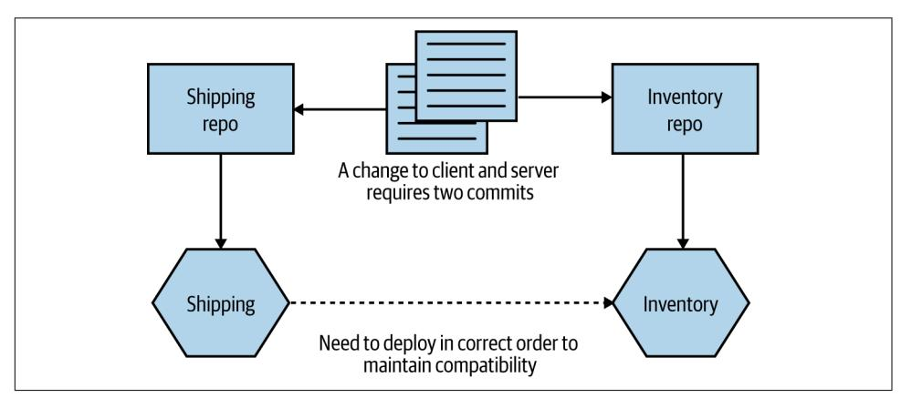

*Figure 7-8. Changes across repository boundaries require multiple commits*

Having these changes split could cause problems if one commit fails but the other works—I may need to make two changes to roll back the change, for example, and that could be complicated if other people have checked in in the meantime. The real‐ ity is that in this specific situation, I'd likely want to stage the commits somewhat, in any case. I'd want to make sure the commit to change the Inventory service worked before I change any client code in the Shipping service—if the new functionality in the API isn't present, there is no point having client code that makes use of it.

I've spoken to multiple people who find the lack of atomic deployment with this to be a significant problem. I can certainly appreciate the complexity this brings, but I think that in most cases it points to a bigger underlying issue. If you are continually

<span id="page-235-0"></span>making changes across multiple microservices, then your service boundaries might not be in the right place, and it could imply too much coupling between your serv‐ ices. As we've already discussed, we're trying to optimize our architecture, and our microservice boundaries, so that changes are more likely going to apply within a microservice boundary. Cross-cutting changes should be the exception, not the norm.

In fact, I'd argue that the pain of working across multiple repos can be useful in help‐ ing enforce microservice boundaries, as it forces you to think carefully about where these boundaries are, and about the nature of the interactions between them.


If you are constantly making changes across multiple microservi‐ ces, it's likely that your microservice boundaries are in the wrong place. It may be worth considering merging microservices back together if you spot this happening.

Then there is the hassle of having to pull from multiple repos and push to multiple repos as part of your normal workflow. In my experience, this can be simplified either by using an IDE that supports multiple repositories (this is something that all IDEs I've used over the last five years can handle) or by writing simple wrapper scripts to simplify things when working on the command line.

#### **Where to use this pattern**

Using the one repository per microservice approach works just as well for small teams as it does for large teams, but if you find yourself making lots of changes across microservice boundaries, then it may not be for you, and the monorepo pattern we discuss next may be a better fit—although making lots of changes across service boundaries can be considered a warning sign that something isn't right, as we've dis‐ cussed previously. It can also make code reuse more complex than using a monorepo approach, as you need to depend on code being packaged into version artifacts.

## **Pattern: Monorepo**

With a monorepo approach, code for multiple microservices (or other types of projects) is stored in the same source code repository. I have seen situations in which a monorepo is used just by one team to manage source control for all its services, although the concept has been popularized by some very large tech companies where multiple teams and hundreds if not thousands of developers can all work on the same source code repository.

By having all the source code in the same repository, you allow for source code changes to be made across multiple projects in an atomic fashion, and for finergrained reuse of code from one project to the next. Google is probably the

<span id="page-236-0"></span>best-known example of a company using a monorepo approach, although it's far from the only one. Although there are some other benefits to this approach, such as improved visibility of other people's code, the ability to reuse code easily and to make changes that impact multiple different projects is often cited as the major reason for adopting this pattern.

If we take the example we just discussed, where we want to make a change to the Inventory so that it exposes some new behavior and also update the Shipping ser‐ vice to make use of this new functionality that we've exposed, then these changes can be made in a single commit, as we see in Figure 7-9.


*Figure 7-9. Using a single commit to make changes across two microservices using a monorepo*

Of course, as with the multirepo pattern discussed previously, we still need to deal with the deployment side of this. We'd likely need to carefully consider the order of deployment if we want to avoid a lockstep deployment.


#### **Atomic Commits Versus Atomic Deploy**

Being able to make an atomic commit across multiple services doesn't give you atomic rollout. If you find yourself wanting to change code across multiple services at once and roll it out into production all at the same time, this violates the core principle of independent deployability. For more on this, see ["DRY and the](#page-179-0) [Perils of Code Reuse in a Microservice World" on page 154.](#page-179-0)

#### **Mapping to build**

With a single source code repository per microservice, mapping from the source code to a build process is straightforward. Any change in that source code repository can trigger a matching CI build. With a monorepo, it gets a bit more complex.

A simple starting point is to map folders inside the monorepo to a build, as shown in Figure 7-10. A change made to the user-service folder would trigger the User ser‐ vice build, for example. If you checked in code that changed files both in the userservice folder and the catalog-service folder, then both the User build and the Catalog build would get triggered.


*Figure 7-10. A single source repo with subdirectories mapped to independent builds*

This gets more complex as you have more involved folder structures. On larger projects you can end up with multiple different folders wanting to trigger the same build, and with some folders triggering more than one build. At the simple end of the spectrum, you might have a "common" folder used by all microservices, a change to which causes all microservices to be rebuilt. At the more complex end, teams end up needing to adopt more graph-based build tools like the open source [Bazel](https://bazel.build) tool to manage these dependencies more effectively (Bazel is an open source version of Google's own internal build tool). Implementing a new build system can be a signifi‐ cant undertaking, so it is not something to be done lightly—but Google's own mono‐ repo would be impossible without tools like this.

One of the benefits of a monorepo approach is that we can practice finer-grained reuse across projects. With a multirepo model, if I want to reuse someone else's code, it will likely have to be packaged as a versioned artifact that I can then include as part of my build (such as a Nuget package, a JAR file, or an NPM). With our unit of reuse being a library, we are potentially pulling in more code than we really want. Theoreti‐ cally, with a monorepo I could just depend on a single source file from another <span id="page-238-0"></span>project—although this of course will cause me to have a more complex build mapping.

#### **Defining ownership**

With smaller team sizes and small codebase sizes, monorepos can likely work well with the traditional build and source code management tools that you are used to. However, as your monorepo gets bigger, you'll likely need to start looking at different types of tools. We'll explore ownership models in more detail in [Chapter 15](#page-516-0), but in the meantime it's worth exploring briefly how this plays out when we think about source control.

Martin Fowler has [previously written](https://oreil.ly/nNNWd) about different ownership models, outlining a sliding scale of ownership from *strong ownership* through *weak ownership* and on to *collective ownership*. Since Martin captured those terms, development practices have changed, so it's perhaps worth revisiting and redefining these terms.

With strong ownership, some code is owned by a specific group of people. If some‐ one from outside that group wants to make a change, they have to ask the owners to make the change for them. Weak ownership still has the concept of defined owners, but people outside the ownership group are allowed to make changes, although any of these changes must be reviewed and accepted by someone in the ownership group. This would cover a pull request being sent to the core ownership team for review, before the pull request is merged. With collective ownership, any developer can change any piece of code.

With a small number of developers (20 or fewer, as a general guide), you can afford to practice collective ownership—where any developer can change any other micro‐ service. As you have more people, though, you're more likely to want to move toward either a strong or weak ownership model to create more defined boundaries of responsibility. This can cause a challenge for teams using monorepos if their source control tool doesn't support finer-grained ownership controls.

Some source code tools allow you to specify ownership of specific directories or even specific filepaths inside a single repository. Google initially implemented this system on top of Perforce for its own monorepo before developing its own source control system, and it's also [something that GitHub has supported](https://oreil.ly/zxmXn) since 2016. With GitHub, you create a CODEOWNERS file, which lets you map owners to directories or filepaths. You can see some examples in [Example 7-1,](#page-239-0) drawn from GitHub's own documenta‐ tion, that show the kinds of flexibility these systems can bring.

<span id="page-239-0"></span>*Example 7-1. Examples of how to specify ownership in specific directories in a GitHub CODEOWNERS file*

```
# In this example, @doctocat owns any files in the build/logs
# directory at the root of the repository and any of its
# subdirectories.
/build/logs/ @doctocat
# In this example, @octocat owns any file in an apps directory
# anywhere in your repository.
apps/ @octocat
# In this example, @doctocat owns any file in the `/docs`
# directory in the root of your repository.
/docs/ @doctocat
```

GitHub's own code ownership concept ensures that code owners for source files are requested for review whenever a pull request is raised for the relevant files. This could be a problem with larger pull requests, as you could end up needing sign-off from multiple reviewers, but there are lots of good reasons to aim for smaller pull requests, in any case.

#### **Tooling**

Google's own monorepo is massive, and it takes significant amounts of engineering to make it work at scale. Consider things like a graph-based build system that has gone through multiple generations, a distributed object linker to speed up build times, plug-ins for IDEs and text editors that can dynamically keep dependency files in check—it's an enormous amount of work. As Google grew, it increasingly hit limi‐ tations on its use of Perforce and ended up having to create its own proprietary source control tool called Piper. When I worked in this part of Google back in 2007– 2008, there were over a hundred people maintaining various developer tools, with a significant part of this effort given over to dealing with implications of the monorepo approach. That's something that you can justify if you have tens of thousands of engi‐ neers, of course.

For a more detailed overview of the rationale behind Google's use of a monorepo, I recommend ["Why Google Stores Billions of Lines of Code in a Single Repository"](https://oreil.ly/wMyH3) by Rachel Potvin and Josh Levenberg.<sup>5</sup> In fact, I'd suggest it is required reading for any‐ one thinking, "We should use a monorepo, because Google does!" Your organization probably isn't Google and probably doesn't have Google-type problems, constraints,

<sup>5</sup> Rachel Potvin and Josh Levenberg, "Why Google Stores Billions of Lines of Code in a Single Repository," *Communications of the ACM* 59, no. 7 (July 2016): 78–87.

<span id="page-240-0"></span>or resources. Put another way, whatever monorepo you end up with probably won't be Google's.

Microsoft experienced similar issues with scale. It adopted Git to help manage the main source code repository for Windows. A full working directory for this codebase is around 270 GB of source files.<sup>6</sup> Downloading all of that would take an age, and it's also not necessary—developers will end up working on just one small part of the overall system. So Microsoft had to create a dedicated virtual file system, VFS for Git (previously known as GVFS), that ensures only the source files that a developer needs are actually downloaded.

VFS for Git is an impressive achievement, as is Google's own toolchain, although jus‐ tifying these kinds of investments in this sort of technology is much easier for compa‐ nies like this. It's also worth pointing out that although VFS for Git is open source, I've yet to meet a team outside Microsoft using it—and the vast bulk of Google's own toolchain supporting its monorepo is closed source (Bazel is a notable exception, but it's unclear to what extent the open source Bazel actually mirrors what is used inside Google itself).

Markus Oberlehner's piece ["Monorepos in the Wild"](https://oreil.ly/1SR0A) introduced me to [Lerna,](https://lerna.js.org) a tool created by the team behind the Babel JavaScript compiler. Lerna is designed to make it easier to produce multiple versioned artifacts from the same source code reposi‐ tory. I can't speak directly to how effective Lerna is at this task (in addition to a num‐ ber of other notable deficiencies, I am not an experienced JavaScript developer), but it seems from a surface examination to simplify this approach somewhat.

#### **How "mono" is mono?**

Google doesn't store *all* of its code in a monorepo. There are some projects, especially those being developed in the open, that are held elsewhere. Nonetheless, at least based on the previously mentioned ACM article, 95% of Google's code was stored in the monorepo as of 2016. In other organizations, a monorepo may be scoped to only one system, or to a small number of systems. This means a company could have a small number of monorepos for different parts of the organization.

I've also spoken to teams that practice per-team monorepos. While technically speak‐ ing this probably doesn't match up to the original definition of this pattern (which typically talks in terms of multiple teams sharing the same repository), I still think it's more "monorepo" than anything else. In this situation, each team has its own mono‐ repo that is fully under its control. All microservices owned by that team have their code stored in that team's monorepo, as shown in [Figure 7-11.](#page-241-0)

<sup>6</sup> See [Git Virtual File System Design History](https://oreil.ly/SM7d4).

<span id="page-241-0"></span>

*Figure 7-11. A pattern variation in which each team has its own monorepo*

For teams practicing collective ownership, this model has a lot of benefits, arguably providing most of the advantages of a monorepo approach while sidestepping some of the challenges that occur at larger scale. This halfway house can make a lot of sense in terms of working within existing organizational ownership boundaries, and it can somewhat mitigate the concerns about the use of this pattern at larger scale.

#### **Where to use this pattern**

Some organizations working at very large scale have found the monorepo approach to work very well for them. We've already mentioned Google and Microsoft, and we can add Facebook, Twitter, and Uber to the list. These organizations all have one thing in common—they are big, tech-focused companies that are able to dedicate sig‐ nificant resources to getting the best out of this pattern. Where I see monorepos work well is at the other end of the spectrum, with smaller numbers of developers and teams. With 10 to 20 developers, it is easier to manage ownership boundaries and keep the build process simple with the monorepo approach. Pain points seem to emerge for organizations in the middle—those with the scale to start hitting issues that require new tooling or ways of working, but without the spare bandwidth to invest in these ideas.

## <span id="page-242-0"></span>**Which Approach Would I Use?**

In my experience, the main advantages of a monorepo approach—finer-grained reuse and atomic commits—don't seem to outweigh the challenges that emerge at scale. For smaller teams, either approach is fine, but as you scale, I feel that the one repository per microservice (multirepos) approach is more straightforward. Funda‐ mentally, I'm concerned about the encouragement of cross-service changes, the more confused lines of ownership, and the need for new tooling that monorepos can bring.

A problem I've seen repeatedly is that organizations that started small, where collec‐ tive ownership (and therefore monorepos) worked well initially, have struggled to move to different models later on, as the concept of the monorepo is so ingrained. As the delivery organization grows, the pain of the monorepo increases, but so too does the cost of migrating to an alternative approach. This is even more challenging for organizations that grew rapidly, as it's often only after that rapid growth has occurred that the problems become evident, at which point the cost of migration to a multi‐ repo approach looks too high. This can lead to the sunk cost fallacy: you've invested so much in making the monorepo work up to this point—just a bit more investment will make it work as well as it used to, right? Perhaps not—but it's a brave soul who can recognize that they are throwing good money after bad and make a decision to change course.

The concerns about ownership and monorepos can be alleviated through the use of fine-grained ownership controls, but that tends to require tooling and/or an increased level of diligence. My opinion on this might change as the maturity of tool‐ ing around monorepos improves, but despite a lot of work being done in regard to the open source development of graph-based build tools, I'm still seeing very low take-up of these toolchains. So it's multirepos for me.

## **Summary**

We've covered some important ideas in this chapter that should stand you in good stead whether or not you end up using microservices. There are many more aspects to explore around these ideas, from continuous delivery to trunk-based development, monorepos to multirepos. I've given you a host of resources and further reading, but it's time for us to move on to a subject that is important to explore in some depth deployment.

## **Deployment**

<span id="page-244-0"></span>Deploying a single-process monolithic application is a fairly straightforward process. Microservices, with their interdependence and wealth of technology options, are a different kettle of fish altogether. When I wrote the first edition of this book, this chapter already had a lot to say about the huge variety of options available to you. Since then, Kubernetes has come to the fore, and Function as a Service (FaaS) plat‐ forms have given us even more ways to think about how to actually ship our software.

Although the technology may have changed over the last decade, I think many of the core principles associated with building software haven't changed. In fact, I think it's all the more important that we thoroughly understand these foundational ideas, as they can help us understand how to navigate this chaotic landscape of new technol‐ ogy. With that in mind, this chapter will highlight some core principles related to deployment that are important to understand, while also showing how the different tools available to you may help (or hinder) in regard to putting these principles into practice.

To start off with, though, let's peek behind the curtain a bit and look at what happens as we move from a logical view of our systems architecture toward a real physical deployment topology.

## **From Logical to Physical**

To this point, when we've discussed microservices, we've spoken about them in a log‐ ical sense rather than in a physical sense. We could talk about how our Invoice microservice communicates with the Order microservice, as shown in [Figure 8-1,](#page-245-0) without actually looking at the physical topology of how these services are deployed. A logical view of an architecture typically abstracts away underlying physical deploy‐ ment concerns—that notion needs to change for the scope of this chapter.

<span id="page-245-0"></span>

*Figure 8-1. A simple, logical view of two microservices*

This logical view of our microservices can hide a wealth of complexity when it comes to actually running them on real infrastructure. Let's take a look at what sorts of details might be hidden by a diagram like this.

## **Multiple Instances**

When we think about the deployment topology of the two microservices (in Figure 8-2), it's not as simple as one thing talking to another. To start with, it seems quite likely that we'll have more than one instance of each service. Having multiple instances of a service allows you to handle more load and can also improve the robustness of your system, as you can more easily tolerate the failure of a single instance. So we potentially have one or more instances of Invoice talking to one or more instances of Order. Exactly how the communication between these instances is handled will depend on the nature of the communication mechanism, but if we assume that in this situation we're using some form of HTTP-based API, a load bal‐ ancer would be enough to handle routing of requests to different instances, as we see in Figure 8-2.


*Figure 8-2. Using a load balancer to map requests to specific instances of the Order microservice*

<span id="page-246-0"></span>The number of instances you'll want will depend on the nature of your application you'll need to assess the required redundancy, expected load levels, and the like to come up with a workable number. You may also need to take into account where these instances will run. If you have multiple instances of a service for robustness rea‐ sons, you likely want to make sure that these instances aren't all on the same underly‐ ing hardware. Taken further, this might require that you have different instances distributed not only across multiple machines but also across different data centers, to give you protection against a whole data center being made unavailable. This might lead to a deployment topology like the one in Figure 8-3.


*Figure 8-3. Distributing instances across multiple different data centers*

This might seem overly cautious—what are the chances of an entire data center being unavailable? Well, I can't answer that question for every situation, but at least when dealing with the main cloud providers, this is absolutely something you have to take account of. When it comes to something like a managed virtual machine, neither AWS nor Azure nor Google will give you an SLA for a single machine, nor do they give you an SLA for a single availability zone (which is the closest equivalent to a data center for these providers). In practice, this means that any solution you deploy should be distributed across multiple availability zones.

## <span id="page-247-0"></span>**The Database**

Taking this further, there is another major component that we've ignored up until this point—the database. As I've already discussed, we want a microservice to hide its internal state management, so any database used by a microservice for managing its state is considered to be hidden inside the microservice. This leads to the oft-stated mantra of "don't share databases," the case for which I hope has already been made sufficiently by now.

But how does this work when we consider the fact that I have multiple microservice instances? Should each microservice *instance* have its own database? In a word, no. In most cases, if I go to any instance of my Order service, I want to be able to get infor‐ mation about the same order. So we need some degree of shared state between differ‐ ent instances of the same logical service. This is shown in Figure 8-4.


*Figure 8-4. Multiple instances of the same microservice can share a database*

But doesn't this violate our "don't share databases" rule? Not really. One of our major concerns is that when sharing a database across multiple different microservices, the logic associated with accessing and manipulating that state is now spread across dif‐ ferent microservices. But here the data is being shared by different instances of the *same* microservice. The logic for accessing and manipulating state is still held within a single logical microservice.

#### <span id="page-248-0"></span>**Database deployment and scaling**

As with our microservices, we've so far mostly talked about a database in a logical sense. In [Figure 8-3](#page-246-0), we ignored any concerns about the redundancy or scaling needs of the underlying database.

Broadly speaking, a physical database deployment might be hosted on multiple machines, for a host of reasons. A common example would be to split load for reads and writes between a primary node and one or more nodes that are designated for read-only purposes (these nodes are typically referred to as read replicas). If we were implementing this idea for our Order service, we might end up with a situation like the one shown in Figure 8-5.


*Figure 8-5. Using read replicas to distribute load*

All read-only traffic goes to one of the read replica nodes, and you can further scale read traffic by adding additional read nodes. Due to the way that relational databases work, it's more difficult to scale writes by adding additional machines (typically sharding models are required, which adds additional complexity), so moving readonly traffic to these read replicas can often free up more capacity on the write node to allow for more scaling.

Added to this complex picture is the fact that the same database infrastructure can support multiple logically isolated databases. So the databases for Invoice and Order might both be served by the same underlying database engine and hardware, as shown in [Figure 8-6.](#page-249-0) This can have significant benefits—it allows you to pool <span id="page-249-0"></span>hardware to serve multiple microservices, it can reduce licensing costs, and it can also help reduce the work around management of the database itself.


*Figure 8-6. The same physical database infrastructure hosting two logically isolated databases*

The important thing to realize here is that although these two databases might be run from the same hardware and database engine, they are still logically isolated data‐ bases. They cannot interfere with each other (unless you allow that). The one major thing to consider is that if this shared database infrastructure fails, you might impact multiple microservices, which could have catastrophic impact.

In my experience, organizations that manage their own infrastructure and run in an "on-prem" fashion tend to be much more likely to have multiple different databases hosted from shared database infrastructure, for the cost reasons I outlined before. Provisioning and managing hardware is painful (and historically at least, databases are less likely to run on virtualized infrastructure), so you want less of that.

On the other hand, teams that run on public cloud providers are much *more* likely to provision dedicated database infrastructure on a per-microservice basis, as shown in [Figure 8-7](#page-250-0). The costs of provisioning and managing this infrastructure are much lower. AWS's Relational Database Service (RDS), for example, can automatically han‐ dle concerns like backups, upgrades, and multiavailability zone failover, and similar products are available from the other public cloud providers. This makes it much more cost effective to have more isolated infrastructure for your microservice, giving each microservice owner more control rather than having to rely on a shared service.

<span id="page-250-0"></span>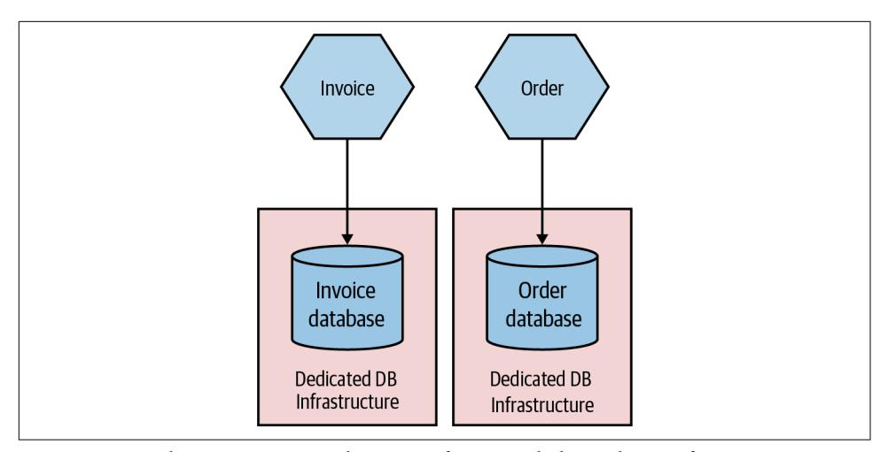

*Figure 8-7. Each microservice making use of its own dedicated DB infrastructure*

## **Environments**

When you deploy your software, it runs in an environment. Each environment will typically serve different purposes, and the exact number of environments you might have will vary greatly based on how you develop software and how your software is deployed to your end user. Some environments will have production data, while oth‐ ers won't. Some environments may have all services in them; others might have just a small number of services, with any nonpresent services replaced with fake ones for the purposes of testing.

Typically, we think of our software as moving through a number of preproduction environments, with each one serving some purpose to allow the software to be devel‐ oped and its readiness for production to be tested—we explored this in ["Trade-Offs](#page-228-0) [and Environments" on page 203.](#page-228-0) From a developer laptop to a continuous integra‐ tion server, an integrated test environment, and beyond—the exact nature and num‐ ber of your environments will depend on a host of factors but will be driven primarily by how you choose to develop software. In [Figure 8-8,](#page-251-0) we see a pipeline for MusicCorp's Catalog microservice. The microservice moves through different envi‐ ronments before it finally gets into a production environment, where our users will get to use the new software.

<span id="page-251-0"></span>

*Figure 8-8. Different environments used for different parts of the pipeline*

The first environment our microservice runs in is wherever the developer was work‐ ing on the code prior to check-in—probably their local laptop. After committing the code, the CI process kicks off with the fast tests. Both the fast and slow test stages deploy into our CI environment. If the slow tests pass, the microservice is deployed into the preproduction environment to allow for manual verification (which is entirely optional but still important for many). If this manual verification passes, the microservice is then deployed into production.

Ideally, each environment in this process would be an exact copy of the production environment. This would give us even more confidence that our software will work when it reaches production. However, in reality, we often can't afford to run multiple copies of our entire production environment due to how expensive this is.

We also want to tune environments earlier in this process to allow for fast feedback. It's vital that we know as early as possible whether or not our software works so that we can fix things quickly, if needed. The earlier we know about a problem with our software, the faster it is to fix it, and the lower the impact of the break. It's much bet‐ ter to find a problem on our local laptop than pick it up in preproduction testing, but likewise picking up a problem in preproduction testing might be much better for us than picking something up in production (although we will explore some important trade-offs around this in [Chapter 9\)](#page-300-0).

This means that environments closer to the developer will be tuned to provide fast feedback, which may compromise how "production-like" they are. But as environ‐ ments get closer to production, we will want them to be more and more like the end production environment to ensure that we catch problems.

As a simple example of this in action, let's revisit our earlier example of the Catalog service and take a look at the different environments. In Figure 8-9, the local devel‐ oper laptop has our service deployed as a single instance running locally. The soft‐ ware is fast to build but is deployed as a single instance running on very different hardware from what we expect in production. In the CI environment, we deploy two copies of our service to test against, making sure our load balancing logic is working OK. We deploy both instances to the same machine—this keeps costs down and makes things faster, and it still gives us enough feedback at this stage in the process.


*Figure 8-9. A microservice can vary in how it is deployed from one environment to the next*

Finally, in production, our microservice is deployed as four instances, spread across four machines, which in turn are distributed across two different data centers.

This is just an example of how you might use environments; exactly what setup you'll need will vary greatly depending on what you are building and how you deploy it. You might, for example, have multiple production environments if you need to deploy one copy of your software for each customer.

The key thing, though, is that the exact topology of your microservice will change from environment to environment. You therefore need to find ways to change the number of instances from one environment to another, along with any environmentspecific configuration. You also want to build your service instances once and once only, so it follows that any environment-specific information needs to be separate from the deployed service artifact.

How you go about varying the topology of your microservice from one environment to another will depend greatly on the mechanism you use for deployment, and also <span id="page-253-0"></span>on how much the topologies vary. If the only thing that changes from one environ‐ ment to another is the number of microservice instances, this might be as simple as parameterizing this value to allow for different numbers to be passed in as part of the deployment activity.

So, to summarize, a single logical microservice can be deployed into multiple envi‐ ronments. From one environment to the next, the number of instances of each microservice can vary based on the requirements of each environment.

## **Principles of Microservice Deployment**

With so many options before you for how to deploy your microservices, I think it's important that I establish some core principles in this area. A solid understanding of these principles will stand you in good stead no matter the choices you end up mak‐ ing. We'll look at each principle in detail shortly, but just to get us started, here are the core ideas we'll be covering:

#### *Isolated execution*

Run microservice instances in an isolated fashion such that they have their own computing resources, and their execution cannot impact other microservice instances running nearby.

#### *Focus on automation*

As the number of microservices increases, automation becomes increasingly important. Focus on choosing technology that allows for a high degree of auto‐ mation, and adopt automation as a core part of your culture.

#### *Infrastructure as code*

Represent the configuration for your infrastructure to ease automation and pro‐ mote information sharing. Store this code in source control to allow for environ‐ ments to be re-created.

#### *Zero-downtime deployment*

Take independent deployability further and ensure that deploying a new version of a microservice can be done without any downtime to users of your service (be they humans or other microservices).

#### *Desired state management*

Use a platform that maintains your microservice in a defined state, launching new instances if required in the event of outages or traffic increases.

## **Isolated Execution**

You may be tempted, especially early on in your microservices journey, to just put all of your microservice instances on a single machine (which could be a single physical

machine or a single VM), as shown in Figure 8-10. Purely from a host management point of view, this model is simpler. In a world in which one team manages the infra‐ structure and another team manages the software, the infrastructure team's workload is often a function of the number of hosts it has to manage. If more services are packed on to a single host, the host management workload doesn't increase as the number of services increases.


*Figure 8-10. Multiple microservices per host*

There are some challenges with this model, though. First, it can make monitoring more difficult. For example, when tracking CPU, do I need to track the CPU of one service independent of the others? Or do I care about the CPU of the host as a whole? Side effects can also be hard to avoid. If one service is under significant load, it can end up reducing the resources available to other parts of the system. This was an issue that [Gilt](https://oreil.ly/yRrWG), an online fashion retailer, encountered. Starting with a Ruby on Rails monolith, Gilt decided to move to microservices to make it easier to scale the applica‐ tion and also to better accomodate a growing number of developers. Initially Gilt coexisted many microservices on a single box, but uneven load on one of the micro‐ services would have an adverse impact on everything else running on that host. This made impact analysis of host failures more complex as well—taking a single host out of commission can have a large ripple effect.

Deployment of services can be somewhat more complex too, as ensuring one deploy‐ ment doesn't affect another leads to additional headaches. For example, if each microservice has different (and potentially contradictory) dependencies that need to be installed on the shared host, how can I make that work?

This model can also inhibit the autonomy of teams. If services for different teams are installed on the same host, who gets to configure the host for their services? In all likelihood, this ends up getting handled by a centralized team, meaning it takes more coordination to get services deployed.

Fundamentally, running lots of microservice instances on the same machine (virtual or physical) ends up drastically undermining one of the key principles of microservi‐ ces as a whole—independent deployability. It follows, therefore, that we really want to run microservice instances in isolation, as we see in Figure 8-11.

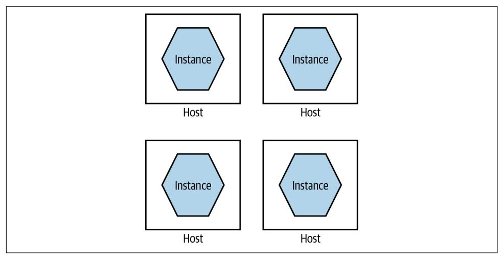

*Figure 8-11. A single microservice per host*

Each microservice instance gets its own isolated execution environment. It can install its own dependencies, and have its own set of ring-fenced resources.

As my old colleague Neal Ford puts it, many of our working practices around deploy‐ ment and host management are an attempt to optimize for scarcity of resources. In the past, if we wanted another machine to achieve isolation, our only option was to buy or rent another physical machine. This often had a large lead time to it and resul‐ ted in a long-term financial commitment. In my experience, it's not uncommon for clients to provision new servers only every two to three years, and trying to get addi‐ tional machines outside of these timelines is difficult. But on-demand computing platforms have drastically reduced the costs of computing resources, and improve‐ ments in virtualization technology mean there is more flexibility, even for in-house hosted infrastructure.

With containerization joining the mix, we have more options than ever before for provisioning an isolated execution environment. As [Figure 8-12](#page-256-0) shows, broadly speaking, we go from the extreme of having dedicated physical machines for our services, which gives us the best isolation but probably the highest cost, to containers at the other end, which gives us weaker isolation but tends to be more cost effective and much faster to provision. We'll come back to some of the specifics around tech‐ nology such as containerization later in this chapter.

<span id="page-256-0"></span>

*Figure 8-12. Different trade-offs around isolation models*

If you were deploying your microservices onto more abstracted platforms such as AWS Lambda or Heroku, this isolation would be provided for you. Depending on the nature of the platform itself, you could likely expect your microservice instance to end up running inside a container or dedicated VM behind the scenes.

In general, the isolation around containers has improved sufficiently to make them a more natural choice for microservice workloads. The difference in isolation between containers and VMs has reduced to the point that for the vast majority of workloads, containers are "good enough," which is in large part why they are such a popular choice and why they tend to be my default choice in most situations.

## **Focus on Automation**

As you add more microservices, you'll have more moving parts to deal with—more processes, more things to configure, more instances to monitor. Moving to microser‐ vices pushes a lot of complexity into the operational space, and if you are managing your operational processes in a mostly manual way, this means that more services will require more and more people to do things.

Instead, you need a relentless focus on automation. Select tooling and technology that allows for things to be done in an automatic fashion, ideally with a view to work‐ ing with infrastructure as code (which we'll cover shortly).

As the number of microservices increases, automation becomes increasingly impor‐ tant. Give serious consideration to technology that allows for a high degree of auto‐ mation, and adopt automation as a core part of your culture.

Automation is also how you can make sure that your developers still remain produc‐ tive. Giving developers the ability to self-service-provision individual services or groups of services is the key to making their lives easier.

Picking technology that enables automation starts with the tools used to manage hosts. Can you write a line of code to launch a virtual machine, or shut one down? Can you deploy the software you have written automatically? Can you deploy <span id="page-257-0"></span>database changes without manual intervention? Embracing a culture of automation is key if you want to keep the complexities of microservice architectures in check.

#### **Two case studies on the power of automation**

It will probably be helpful to give you a couple of concrete examples that explain the power of good automation. The Australian company realestate.com.au (REA) pro‐ vides real estate listings for retail and commercial customers in Australia and else‐ where in the Asia-Pacific region. Over a number of years, it had been moving its platform toward a distributed microservices design. When it started on this journey, it had to spend a lot of time getting the tooling around the services just right—mak‐ ing it easy for developers to provision machines, deploy their code, and monitor their services. This caused a front-loading of work to get things started.

In the first three months of this exercise, REA was able to move just two new micro‐ services into production, with the development team taking full responsibility for the entire build, deployment, and support of the services. In the next three months, between 10 to 15 services went live in a similar manner. By the end of an 18-month period, REA had more than 70 services in production.

This sort of pattern is also borne out by the experiences of Gilt, which we mentioned earlier. Again, automation, especially tooling to help developers, drove the explosion in Gilt's use of microservices. A year after starting its migration to microservices, Gilt had around 10 microservices live; by 2012, over 100; and in 2014, over 450 microser‐ vices were live—or around three microservices for every developer in Gilt. This sort of ratio of microservices to developers is not uncommon among organizations that are mature in their use of microservices, the *Financial Times* being a company with a similar ratio.

## **Infrastructure as Code (IAC)**

Taking the concept of automation further, infrastructure as code (IAC) is a concept whereby your infrastructure is configured by using machine-readable code. You might define your service configuration in a chef or puppet file, or perhaps write some bash scripts to set things up—but whatever tool you end up using, your system can be brought into a known state through the use of source code. Arguably, the con‐ cept of IAC could be considered one way to implement automation. I think, though, that it's worth calling it out as its own thing, because it speaks to *how* automation should be done. Infrastructure as code has brought concepts from software develop‐ ment into the operations space. By defining our infrastructure via code, this

<span id="page-258-0"></span>configuration can be version controlled, tested, and repeated at will. For more on this topic, I recommend *Infrastructure as Code*, 2nd edition, by Kief Morris.<sup>1</sup>

Theoretically, you could use any programming language to apply the ideas of infra‐ structure as code, but there are specialist tools in this area such as Puppet, Chef, Ansi‐ ble, and others, all of which took their lead from the earlier CFEngine. These tools are declarative—they allow you to define in textual form what you expect a machine (or other set of resources) to look like, and when these scripts are applied, the infrastruc‐ ture is brought into that state. More recent tools have gone beyond looking at config‐ uring a machine and moved into looking at how to configure entire sets of cloud resources—Terraform has been very successful in this space, and I'm excited to see the potential of Pulumi, which is aiming to do something similar, albeit by allowing people to use normal programming languages rather than the domain-specific lan‐ guages that often get used by these tools. AWS CloudFormation and the AWS Cloud Development Kit (CDK) are examples of platform-specific tools, in this case support‐ ing only AWS—although it's worth noting that even if I was working only with AWS, I'd prefer the flexibility of a cross-platform tool like Terraform.

Version controlling your infrastructure code gives you transparency over who has made changes, something that auditors love. It also makes it easier to reproduce an environment at a given point in time. This is something that can be especially useful when trying to track down defects. In one memorable example, one of my clients, as part of a court case, had to re-create an entire running system as of a specific time some years before, down to the patch levels of the operating systems and the contents of message brokers. If the environment configuration had been stored in version con‐ trol, their job would have been much easier—as it was, they ended up spending over three months painstakingly trying to rebuild a mirror image of an earlier production environment by wading through emails and release notes to try and work out what was done by whom. The court case, which had already been going for a long period of time, was still not resolved by the time I ended my work with the client.

## **Zero-Downtime Deployment**

As you are probably sick and tired of hearing me say, independent deployability is really important. It is, however, also not an absolute quality. How independent is something exactly? Before this chapter, we'd primarily looked at independent deploy‐ ability in terms of avoiding implementation coupling. Earlier in this chapter, we spoke about the importance of providing a microservice instance with an isolated execution environment, to ensure it has a degree of independence at the physical deployment level. But we can go further.

<sup>1</sup> Kief Morris, *[Infrastructure as Code](https://learning.oreilly.com/library/view/infrastructure-as-code/9781098114664/)*, 2nd edition (Sebastopol: O'Reilly, 2020).

<span id="page-259-0"></span>Implementing the ability for zero-downtime deployment can be a huge step up in allowing microservices to be developed and deployed. Without zero-downtime deployment, I may have to coordinate with upstream consumers when I release soft‐ ware to alert them of a potential outage.

Sarah Wells at the *Financial Times* cites the ability to implement zero-downtime deployment as being the single biggest benefit in terms of improving the speed of delivery. With the confidence that releases wouldn't interrupt its users, the *Financial Times* was able to drastically increase the frequency of releases. In addition, a zerodowntime release can be much more easily done during working hours. Quite aside from the fact that doing so improves the quality of life of the people involved with the release (compared to working evenings and weekends), a well-rested team working during the day is less likely to make mistakes and will have support from many of their colleagues when they need to fix issues.

The goal here is that upstream consumers shouldn't notice at all when you do a release. Making this possible can depend greatly on the nature of your microservice. If you're already making use of middleware-backed asynchronous communication between your microservice and your consumers, this might be trivial to implement messages sent to you will be delivered when you are back up. If you're making use of synchronous-based communication, though, this can be more problematic.

Concepts like rolling upgrades can be handy here, and this is one area where the use of a platform like Kubernetes makes your life much easier. With a rolling upgrade, your microservice isn't totally shut down before the new version is deployed, instead instances of your microservice are slowly ramped down as new instances running new versions of your software are ramped up. It's worth noting, though, that if the only thing you are looking for is something to help with zero-downtime deploy‐ ments, then implementing Kubernetes is likely huge overkill. Something simple like a blue-green deployment mechanism (which we'll explore more in ["Separating Deploy‐](#page-295-0) [ment from Release" on page 270\)](#page-295-0) can work just as effectively.

There can be additional challenges in terms of dealing with problems like long-lived connections and the like. It's certainly true that if you build a microservice with zerodowntime deployment in mind, you'll likely have a much easier time of it than if you took an existing systems architecture and attempted to retrofit this concept after‐ wards. Whether or not you are able to implement a zero-downtime deployment for your services initially, if you can get there you'll certainly appreciate that increased level of independence.

## **Desired State Management**

*Desired state management* is the ability to specify the infrastructure requirements you have for your application, and for those requirements to be maintained without man‐ ual intervention. If the running system changes in such a way that your desired state

<span id="page-260-0"></span>is no longer maintained, the underlying platform takes the required steps to bring the system back into desired state.

As a simple example of how desired state management might work, you could specify the number of instances your microservice requires, perhaps also specifying how much memory and CPU those instances need. Some underlying platform takes this configuration and applies it, bringing the system into the desired state. It's up to the platform to, among other things, identify which machines have spare resources that can be allocated to run the requested number of instances. As Figure 8-13 shows, if one of those instances dies, the platform recognizes that the current state doesn't match the desired state and takes appropriate action by launching a replacement instance.


*Figure 8-13. A platform providing desired state management, spinning up a new instance when one dies*

The beauty of desired state management is that the platform itself manages how the desired state is maintained. It frees development and operations people alike from having to worry about exactly how things are being done—they just have to focus on getting the desired state definition right in the first place. It also means that in the event of a problem occurring, such as an instance dying, the underlying hardware failing, or a data center shutting down, the platform can handle the issue for you without human intervention being required.

While it's possible to build your own toolchain to apply desired state management, typically you use a platform that already supports it. Kubernetes is one such tool that embraces this idea, and you can also achieve something similar using concepts such as autoscaling groups on a public cloud provider like Azure or AWS. Another plat‐ form that can provide this capability is [Nomad.](https://nomadproject.io) Unlike Kubernetes, which is focused on deploying and managing container-based workloads, Nomad has a very flexible model around running other sorts of application workloads as well, such as Java <span id="page-261-0"></span>applications, VMs, Hadoop jobs, and more. It may be worth a look if you want a plat‐ form for managing mixed workloads that still makes use of concepts like desired state management.

These platforms are aware of the underlying availability of resources and are able to match the requests for desired state to the available resources (or else tell you this isn't possible). As an operator, you are distanced from the low-level configuration you can say something simple like "I want four instances spread across both data cen‐ ters" and rely on your platform to ensure this is done for you. Different platforms provide different levels of control—you can get much more complex with your desired state definition if you want.

The use of desired state management can occasionally cause you problems if you for‐ get you're making use of it. I remember a situation in which I was shutting down a development cluster on AWS before I went home. I was shutting down the managed virtual machine instances (provided by AWS's EC2 product) to save money—they weren't going to be used overnight. However, I found that as soon as I killed one of the instances, another instance popped back up. It took me a while to realize that I had configured an autoscaling group to ensure that there was a minimum number of machines. AWS was seeing an instance die and spinning up a replacement. It took me 15 minutes of playing whack-a-mole like this before I realized what was up. The problem was that we were charged for EC2 on a per-hour basis. Even if an instance ran for only a minute, we got charged for the full hour. So my flailing around at the end of the day ended up being quite costly. In a way, this was a sign of success (at least that's what I told myself)—we'd set up the autoscaling group some time before, and they had just worked to the point that we had forgotten they were there. It was simply a matter of writing a script to disable the autoscaling group as part of the clus‐ ter shutdown to fix the problem in the future.

#### **Prerequisites**

To take advantage of desired state management, the platform needs some way to automatically launch instances of your microservice. So having a fully automated deployment for microservice instances is a clear prerequisite for desired state man‐ agement. You may also need to give careful thought to how long it takes your instan‐ ces to launch. If you are using desired state management to ensure there are enough computing resources to handle user load, then if an instance dies, you'll want a replacement instance as quickly as possible to fill the gap. If provisioning a new instance takes a long time, you may need to have excess capacity in place to handle the load in the event of an instance dying so as to give yourself enough breathing room to bring up a new copy.

Although you could hack together a desired state management solution for yourself, I'm not convinced it's a good use of your time. If you want to embrace this concept, I <span id="page-262-0"></span>think you are better off adopting a platform that embraces it as a first-class concept. As this means coming to grips with what might represent a new deployment platform and all the associated ideas and tooling, you might want to delay adopting desired state management until you already have a few microservices up and running. This will allow you to get familiar with the basics of microservices before becoming over‐ loaded with new technology. Platforms like Kubernetes really help when you have lots of things to manage—if you only have a few processes to worry about, you could wait till later on to adopt these tools.

#### **GitOps**

GitOps, a fairly recent concept pioneered by Weaveworks, brings together the con‐ cepts of desired state management and infrastructure as code. GitOps was originally conceived in the context of working with Kubernetes, and this is where the related tooling is focused, although arguably it describes a workflow that others have used before.

With GitOps, your desired state for your infrastructure is defined in code and stored in source control. When changes are made to this desired state, some tooling ensures that this updated desired state is applied to the running system. The idea is to give developers a simplified workflow for working with their applications.

If you've used infrastructure configuration tools like Chef or Puppet, this model is familiar for managing infrastructure. When using Chef Server or Puppet Master, you had a centralized system capable of pushing out changes dynamically when they were made. The shift with GitOps is that this tooling is making use of capabilities inside Kubernetes to help manage applications rather than just infrastructure.

Tools like [Flux](https://oreil.ly/YWS1T) are making it much easier to embrace these ideas. It's worth noting, of course, that while tools can make it easier for you to change the way you work, they can't force you into adopting new working approaches. Put differently, just because you have Flux (or another GitOps tool), it doesn't mean you're embracing the ideas of desired state management or infrastructure as code.

If you're in the world of Kubernetes, adopting a tool like Flux and the workflows it promotes may well speed up the introduction of concepts like desired state manage‐ ment and infrastructure as code. Just make sure you don't lose sight of the goals of the underlying concepts and get blinded by all the new technology in this space!

## **Deployment Options**

When it comes to the approaches and tooling we can use for our microservice work‐ loads, we have *loads* of options. But we should look at these options in terms of the principles I just outlined. We want our microservices to run in an isolated fashion and to ideally be deployed in a way that avoids downtime. We want the tooling we <span id="page-263-0"></span>pick to allow us to embrace a culture of automation, define our infrastructure and application configuration in code, and ideally also manage desired state for us.

Let's briefly summarize the various deployment options before looking at how well they deliver on these ideas:

#### *Physical machine*

A microservice instance is deployed directly onto a physical machine, with no virtualization.

#### *Virtual machine*

A microservice instance is deployed on to a virtual machine.

#### *Container*

A microservice instance runs as a separate container on a virtual or physical machine. That container runtime may be managed by a container orchestration tool like Kubernetes.

#### *Application container*

A microservice instance is run inside an application container that manages other application instances, typically on the same runtime.

#### *Platform as a Service (PaaS)*

A more highly abstracted platform is used to deploy microservice instances, often abstracting away all concepts of the underlying servers used to run your microservices. Examples include Heroku, Google App Engine, and AWS Beanstalk.

#### *Function as a Service (FaaS)*

A microservice instance is deployed as one or more functions, which are run and managed by an underlying platform like AWS Lambda or Azure Functions. Arguably, FaaS is a specific type of PaaS, but it deserves exploration in its own right given the recent popularity of the idea and the questions it raises about mapping from a microservice to a deployed artifact.

## **Physical Machines**

An increasingly rare option, you may find yourself deploying microservices *directly* onto physical machines. By "directly," I mean that there are no layers of virtualization or containerization between you and the underlying hardware. This has become less and less common for a few different reasons. Firstly, deploying directly onto physical hardware can lead to lower utilization across your estate. If I have a single instance of a microservice running on a physical machine and I use only half the CPU, memory, or I/O provided by the hardware, then the remaining resources are wasted. This problem has led to the virtualization of most computing infrastructure, allowing you to coexist multiple virtual machines on the same physical machine. It gives you much <span id="page-264-0"></span>higher utilization of your infrastructure, which has some obvious benefits in terms of cost effectiveness.

If you have direct access to physical hardware without the option for virtualization, the temptation is to then pack multiple microservices on the same machine—of course, this violates the principle we talked about regarding having an *isolated execu‐ tion environment* for your services. You could use tools like Puppet or Chef to config‐ ure the machine—helping implement infrastructure as code. The problem is that if you are working only at the level of a single physical machine, implementing con‐ cepts like desired state management, zero-downtime deployment, and so on requires us to work at a higher level of abstraction, using some sort of management layer on top. These types of systems are more commonly used in conjunction with virtual machines, something we'll explore further in a moment.

In general, directly deploying microservices onto physical machines is something I almost never see nowadays, and you'll likely need to have some very specific require‐ ments (or constraints) in your situation to justify this approach over the increased flexibility that either virtualization or containerization may bring.

## **Virtual Machines**

Virtualization has transformed data centers, by allowing us to chunk up existing physical machines into smaller, virtual machines. Traditional virtualization like VMware or that used by the main cloud providers, managed virtual machine infra‐ structure (such as AWS's EC2 service) has yielded huge benefits in increasing the uti‐ lization of computing infrastructure, while at the same time reducing the overhead of host management.

Fundamentally, virtualization allows you to split up an underlying machine into mul‐ tiple smaller "virtual" machines that act just like normal servers to the software run‐ ning inside the virtual machines. You can assign portions of the underlying CPU, memory, I/O, and storage capability to each virtual machine, which in our context allows you to cram many more isolated execution environments for your microser‐ vice instances onto a single physical machine.

Each virtual machine contains a full operating system and set of resources that can be used by the software running inside the VM. This ensures that you have a very good degree of isolation between instances when each instance is deployed onto a separate VM. Each microservice instance can fully configure the operating system in the VM to its own local needs. We still have the issue, though, that if the underlying hardware running these virtual machines fails, we can lose multiple microservice instances. There are ways to help solve that particular problem, including things like desired state management, which we discussed earlier.

#### <span id="page-265-0"></span>**Cost of virtualization**

As you pack more and more virtual machines onto the same underlying hardware, you will find that you get diminishing returns in terms of the computing resources available to the VMs themselves. Why is this?

Think of our physical machine as a sock drawer. If we put lots of wooden dividers into our drawer, can we store more socks or fewer? The answer is fewer: the dividers themselves take up room too! Our drawer might be easier to deal with and organize, and perhaps we could decide to put T-shirts in one of the spaces now rather than just socks, but more dividers means less overall space.

In the world of virtualization, we have a similar overhead as our sock drawer dividers. To understand where this overhead comes from, let's look at how most virtualization is done. Figure 8-14 shows a comparison of two types of virtualization. On the left, we see the various layers involved in what is called *type 2 virtualization*, and on the right we see *container-based virtualization*, which we'll explore more shortly.

Type 2 virtualization is the sort implemented by AWS, VMware, vSphere, Xen, and KVM. (Type 1 virtualization refers to technology in which the VMs run directly on hardware, not on top of another operating system.) On our physical infrastructure we have a host operating system. On this OS we run something called a *hypervisor*, which has two key jobs. First, it maps resources like CPU and memory from the vir‐ tual host to the physical host. Second, it acts as a control layer, allowing us to manip‐ ulate the virtual machines themselves.


*Figure 8-14. Comparison of standard type 2 virtualization and lightweight containers*

Inside the VMs, we get what look like completely different hosts. They can run their own operating systems, with their own kernels. They can be considered almost her‐ metically sealed machines, kept isolated from the underlying physical host and the other virtual machines by the hypervisor.

<span id="page-266-0"></span>The problem with type 2 virtualization is that the hypervisor here needs to set aside resources to do its job. This takes away CPU, I/O, and memory that could be used elsewhere. The more hosts the hypervisor manages, the more resources it needs. At a certain point, this overhead becomes a constraint in slicing up your physical infra‐ structure any further. In practice, this means that there are often diminishing returns in slicing up a physical box into smaller and smaller parts, as proportionally more and more resources go into the overhead of the hypervisor.

#### **Good for microservices?**

Coming back to our principles, virtual machines do very well in terms of isolation, but at a cost. Their ease of automation can vary based on the exact technology being used—managed VMs on Google Cloud, Azure, or AWS, for example, are all easy to automate via well-supported APIs and an ecosystem of tools that build on these APIs. In addition, these platforms provide concepts like autoscaling groups, helping imple‐ ment desired state management. Implementing zero-downtime deployment is going to take more work, but if the VM platform you are using gives you a good API, the building blocks are there. The issue is that many people are making use of managed VMs provided by traditional virtualization platforms like the ones provided by VMware, which, while they may theoretically allow for automation, are typically not used in this context. Instead these platforms tend to be under the central control of a dedicated operations team, and the ability to directly automate against them can be restricted as a result.

Although containers are proving to be more popular in general for microservice workloads, many organizations have used virtual machines for running large-scale microservice systems, to great effect. Netflix, one of the poster children for microser‐ vices, built out much of its microservices on top of AWS's managed virtual machines via EC2. If you need the stricter isolation levels that they can bring, or you don't have the ability to containerize your application, VMs can be a great choice.

## **Containers**

Since the first edition of this book, containers have become a dominant concept in server-side software deployment and for many are the de facto choice for packaging and running microservice architectures. The container concept, popularized by Docker, and allied with a supporting container orchestration platform like Kuber‐ netes, has become many people's go-to choice for running microservice architectures at scale.

Before we get to why this has happened and to the relationship between containers, Kubernetes, and Docker, we should first explore what a container is exactly, and look specifically at how it differs from virtual machines.

#### <span id="page-267-0"></span>**Isolated, differently**

Containers first emerged on UNIX-style operating systems and for many years were really only a viable prospect on those operating systems, such as Linux. Although Windows containers are very much a thing, it has been Linux operating systems that containers have had the biggest impact on so far.

On Linux, processes are run by a given user and have certain capabilities based on how the permissions are set. Processes can spawn other processes. For example, if I launch a process in a terminal, that process is generally considered a child of the ter‐ minal process. The Linux kernel's job is maintaining this tree of processes, ensuring that only permitted users can access the processes. Additionally, the Linux kernel is capable of assigning resources to these different processes—this is all part and parcel of building a viable multiuser operating system, where you don't want the activities of one user to kill the rest of the system.

Containers running on the same machine make use of the same underlying kernel (although there are exceptions to this rule that we'll explore shortly). Rather than managing processes directly, you can think of a container as an abstraction over a subtree of the overall system process tree, with the kernel doing all the hard work. These containers can have physical resources allocated to them, something the kernel handles for us. This general approach has been around in many forms, such as Solaris Zones and OpenVZ, but it was with LXC that this idea made its way into the main‐ stream of Linux operating systems. The concept of Linux containers was further advanced when Docker provided yet a higher level of abstraction over containers, ini‐ tially using LXC under the hood and then replacing it altogether.

If we look at the stack diagram for a host running a container in [Figure 8-14](#page-265-0), we see a few differences when comparing it with type 2 virtualization. First, we don't need a hypervisor. Second, the container doesn't seem to have a kernel—that's because it makes use of the kernel of the underlying machine. In Figure 8-15 we see this more clearly. A container can run its own operating system, but that operating system makes use of a part of the shared kernel—it's in this kernel that the process tree for each container lives. This means that our host operating system could run Ubuntu, and our containers CentOS, as long as they could both run as part of the same under‐ lying kernel.


*Figure 8-15. Normally, containers on the same machine share the same kernel*

<span id="page-268-0"></span>With containers, we don't just benefit from the resources saved by not needing a hypervisor; we also gain in terms of feedback. Linux containers are *much* faster to provision than full-fat virtual machines. It isn't uncommon for a VM to take many minutes to start—but with Linux containers, startup can take just a few seconds. You also have finer-grained control over the containers themselves in terms of assigning resources to them, which makes it much easier to tweak the settings to get the most out of the underlying hardware.

Due to the more lightweight nature of containers, we can have many more of them running on the same hardware than would be possible with VMs. By deploying one service per container, as in Figure 8-16, we get a degree of isolation from other con‐ tainers (although this isn't perfect) and can do so much more cost-effectively than would be possible if we wanted to run each service in its own VM. Coming back to our sock drawer analogy from earlier, with containers the sock drawer dividers are much thinner than they are for VMs, meaning a higher proportion of the sock drawer gets used for socks.


*Figure 8-16. Running services in separate containers*

Containers can be used well with full-fat virtualization too; in fact, this is common. I've seen more than one project provision a large AWS EC2 instance and run multi‐ ple containers on it to get the best of both worlds: an on-demand ephemeral compute platform in the form of EC2, coupled with highly flexible and fast containers running on top of it.

#### <span id="page-269-0"></span>**Not perfect**

Linux containers aren't without some problems, however. Imagine I have lots of microservices running in their own containers on a host. How does the outside world see them? You need some way to route the outside world through to the underlying containers, something many of the hypervisors do for you with normal virtualization. With earlier technology like LXC, this was something you had to handle yourself this is one area where Docker's take on containers has helped hugely.

Another point to bear in mind is that these containers can be considered isolated from a resource point of view—I can allocate ring-fenced sets of CPU, memory, and so on to each container—but this is not necessarily the same degree of isolation as you get from virtual machines, or for that matter by having separate physical machines. Early on, there were a number of documented and known ways in which a process from one container could bust out and interact with other containers or the underlying host.

A huge amount of work has gone into resolving these issues, and the container orchestration systems and underlying container runtimes have done a good job of examining how to better run container workloads so this isolation is improved, but you will need to give due thought to the sorts of workloads you want to run. My own guidance here is that in general you should view containers as a great way of isolating execution of trusted software. If you are running code written by others and are con‐ cerned about a malicious party trying to bypass container-level isolation, then you'll want to do some deeper examination yourself regarding the current state of the art for handling such situations—some of which we'll touch on in a moment.

#### **Windows containers**

Historically, Windows users would look longingly at their Linux-using contempora‐ ries, as containers were something denied to the Windows operating system. Over the last few years, however, this has changed, with containers now being a fully sup‐ ported concept. The delay was really about the underlying Windows operating sys‐ tem and kernel supporting the same kinds of capabilities as existed in the land of Linux to make containers work. It was with the delivery of Windows Server 2016 that a lot of this changed, and since then Windows containers have continued to evolve.

One of the initial stumbling blocks in the adoption of Windows containers has been the size of the Windows operating system itself. Remember that you need to run an operating system inside each container, so when downloading a container image, you're also downloading an operating system. Windows, though, is *big*—so big that it made containers very heavy, not just in terms of the size of the images but also in terms of the resources required to run them.

Microsoft reacted to this by creating a cut-down operating system called Windows Nano Server. The idea is that Nano Server should have a small-footprint OS and be <span id="page-270-0"></span>capable of running things like microservice instances. Alongside this, Microsoft also support a larger Windows Server Core, which is there to support running legacy Windows applications as containers. The issue is that these things are still pretty big when compared to their Linux equivalents—early versions of Nano Server would still be well over 1 GB in size, compared to small-footprint Linux operating systems like Alpine that would take up only a few megabytes.

While Microsoft has continued to try and reduce the size of Nano Server, this size disparity still exists. In practice, though, due to the way that common layers across container images can be cached, this may not be a massive issue.

Of special interest in the world of Windows containers is the fact that they support different levels of isolation. A standard Windows container uses process isolation, much like its Linux counterparts. With process isolation, each container runs in part of the same underlying kernel, which manages the isolation between the containers. With Windows containers, you also have the option of providing more isolation by running containers inside their own Hyper-V VM. This gives you something closer to the isolation level of full virtualization, but the nice thing is that you can choose between Hyper-V or process isolation when you launch the container—the image doesn't need to change.

Having flexibility about running images in different types of isolation can have its benefits. In some situations, your threat model may dictate that you want stronger isolation between your running processes than simple process-level isolation. For example, you might be running "untrusted" third-party code alongside your own processes. In such a situation, being able to run those container workloads as Hyper-V containers is very useful. Note, of course, that Hyper-V isolation is likely to have an impact in terms of spin-up time and a runtime cost closer to that of normal virtualization.

## **Blurred Lines**

There is a growing trend of people looking for solutions that provide the stronger iso‐ lation provided by VMs while having the lightweight nature of containers. Examples include Microsoft's Hyper-V containers, which allow for separate kernels, and [Fire‐](https://oreil.ly/o9rBz) [cracker,](https://oreil.ly/o9rBz) which is confusingly called a kernel-based VM. Firecracker has proved popu‐ lar as an implementation detail of service offerings like AWS Lambda, where there is a need to fully isolate workloads from different customers while still trying to keep spin-up time down and reduce the operational footprint of the workloads.

#### <span id="page-271-0"></span>**Docker**

Containers were in limited use before the emergence of Docker pushed the concept mainstream. The Docker toolchain handles much of the work around containers. Docker manages the container provisioning, handles some of the networking prob‐ lems for you, and even provides its own registry concept that allows you to store Docker applications. Before Docker, we didn't have the concept of an "image" for containers—this aspect, along with a much nicer set of tools for working with con‐ tainers, helped containers become much easier to use.

The Docker image abstraction is a useful one for us, as the details of how our micro‐ service is implemented are hidden. We have the builds for our microservice create a Docker image as a build artifact and store the image in the Docker registry, and away we go. When you launch an instance of a Docker image, you have a generic set of tools for managing that instance, no matter the underlying technology used—micro‐ services written in Go, Python, NodeJS, or whatever can all be treated the same.

Docker can also alleviate some of the downsides of running lots of services locally for dev and test purposes. Previously, I might have used a tool like Vagrant that allows me to host multiple independent VMs on my development machine. This would allow me to have a production-like VM running my service instances locally. This was a pretty heavyweight approach, though, and I'd be limited in how many VMs I could run. With Docker, it's easy just to run Docker directly on my developer machine, probably using [Docker Desktop.](https://oreil.ly/g19BE) Now I can just build a Docker image for my microservice instance, or pull down a prebuilt image, and run it locally. These Docker images can (and should) be identical to the container image that I will even‐ tually run in production.

When Docker first emerged, its scope was limited to managing containers on one machine. This was of limited use—what if you wanted to manage containers across multiple machines? This is something that is essential if you want to maintain system health, if you have a machine die on you, or if you just want to run enough containers to handle the system's load. Docker came out with two totally different products of its own to solve this problem, confusingly called "Docker Swarm" and "Docker Swarm Mode"—who said naming stuff was hard again? Really, though, when it comes to managing lots of containers across many machines, Kubernetes is king here, even if you might use the Docker toolchain for building and managing individual containers.

#### **Fitness for microservices**

Containers as a concept work wonderfully well for microservices, and Docker made containers significantly more viable as a concept. We get our isolation but at a man‐ ageable cost. We also hide underlying technology, allowing us to mix different tech

<span id="page-272-0"></span>stacks. When it comes to implementing concepts like desired state management, though, we'll need something like Kubernetes to handle it for us.

Kubernetes is important enough to warrant a more detailed discussion, so we'll come back to it later in the chapter. But for now just think of it as a way of managing con‐ tainers across lots of machines, which is enough for the moment.

## **Application Containers**

If you're familiar with deploying .NET applications behind IIS or Java applications into something like Weblogic or Tomcat, you will be well acquainted with the model in which multiple distinct services or applications sit inside a single application con‐ tainer, which in turn sits on a single host, as we see in Figure 8-17. The idea is that the application container your services live in gives you benefits in terms of improved manageability, such as clustering support to handle grouping multiple instances together, monitoring tools, and the like.


*Figure 8-17. Multiple microservices per application container*

This setup can also yield benefits in terms of reducing overhead of language run‐ times. Consider running five Java services in a single Java servlet container. I have the overhead of only a single JVM. Compare this with running five independent JVMs on the same host when using containers. That said, I still feel that these application containers have enough downsides that you should challenge yourself to see whether they are really required.

First among the downsides is that they inevitably constrain technology choice. You have to buy into a technology stack. This can limit not only the technology choices for the implementation of the service itself but also the options you have in terms of

<span id="page-273-0"></span>automation and management of your systems. As we'll discuss shortly, one of the ways we can address the overhead of managing multiple hosts is with automation, and so constraining our options for resolving this may well be doubly damaging.

I would also question some of the value of the features provided by these application containers. Many of them tout the ability to manage clusters to support shared inmemory session state, something we absolutely want to avoid in any case due to the challenges this creates when scaling our services. And the monitoring capabilities they provide won't be sufficient when we consider the sorts of joined-up monitoring we want to do in a microservices world, as we'll see in [Chapter 10](#page-330-0). Many of them also have quite slow spin-up times, impacting developer feedback cycles.

There are other sets of problems too. Attempting to do proper life-cycle management of applications on top of platforms like the JVM can be problematic and more com‐ plex than simply restarting a JVM. Analyzing resource use and threads is also much more complex, as you have multiple applications sharing the same process. And remember, even if you do get value from technology-specific containers, they aren't free. Aside from the fact that many of them are commercial and thus have a cost implication, they add a resource overhead in and of themselves.

Ultimately, this approach is again an attempt to optimize for scarcity of resources that simply may not hold up anymore. Whether or not you decide to have multiple services per host as a deployment model, I would strongly suggest looking at selfcontained deployable microservices as artifacts, with each microservice instance run‐ ning as its own isolated process.

Fundamentally, the lack of isolation this model provides is one of the main reasons why this model is increasingly rare for people adopting microservice architectures.

## **Platform as a Service (PaaS)**

When using Platform as a Service (PaaS), you are working at a higher-level abstrac‐ tion than a single host. Some of these platforms rely on taking a technology-specific artifact, such as a Java WAR file or Ruby gem, and automatically provisioning and running it for you. Some of these platforms will transparently attempt to handle scal‐ ing the system up and down for you; others will allow you some control over how many nodes your service might run on, but they handle the rest.

As was the case when I wrote the first edition, most of the best, most polished PaaS solutions are hosted. Heroku set the benchmark for delivering a developer-friendly interface and arguably has remained the gold standard for PaaS, despite limited growth in terms of its featureset over the last few years. Platforms like Heroku don't just run your application instance; they also provide capabilities such as running database instances for you—something that can be very painful to do yourself.

<span id="page-274-0"></span>When PaaS solutions work well, they work very well indeed. However, when they don't quite work for you, you often don't have much control in terms of getting under the hood to fix things. This is part of the trade-off you make. I would say that in my experience the smarter the PaaS solutions try to be, the more they go wrong. I've used more than one PaaS that attempts to autoscale based on application use, but does it badly. Invariably the heuristics that drive these smarts tend to be tailored for the average application rather than your specific use case. The more nonstandard your application, the more likely it is that it might not play nicely with a PaaS.

As the good PaaS solutions handle so much for you, they can be an excellent way of handling the increased overhead we get with having many more moving parts. That said, I'm still not sure that we have all the models right in this space yet, and the limi‐ ted self-hosted options mean that this approach might not work for you. When I wrote the first edition, I was hopeful that we'd see more growth in this space, but it hasn't happened in the way that I expected. Instead, I think the growth of serverless products offered primarily by the public cloud providers has started to fill this need. Rather than offering black-box platforms for hosting an application, they instead provide turnkey managed solutions for things like message brokers, databases, stor‐ age, and such that allow us to mix and match the parts we like to build what we need. It is against this backdrop that Function as a Service, a specific type of serverless product, has been getting a lot of traction.

Assessing the suitability of PaaS offerings for microservices is difficult, as they come in many shapes and sizes. Heroku looks quite different from Netlify, for example, but both could work for you as a deployment platform for your microservices, depending on the nature of your application.

## **Function as a Service (FaaS)**

In the last few years, the only technology to get even close to Kubernetes in terms of generating hype (at least in the context of microservices) is serverless. Serverless is actually an umbrella term for a host of different technologies where, from the point of view of the person using them, the underlying computers don't matter. The detail of managing and configuring machines is taken away from you. In the [words of Ken](https://oreil.ly/hM2uq) [Fromm](https://oreil.ly/hM2uq) (who as far as I can tell coined the term *serverless*):

The phrase "serverless" doesn't mean servers are no longer involved. It simply means that developers no longer have to think that much about them. Computing resources get used as services without having to manage around physical capacities or limits. Ser‐ vice providers increasingly take on the responsibility of managing servers, data stores and other infrastructure resources. Developers could set up their own open source sol‐ utions, but that means they have to manage the servers and the queues and the loads.

—Ken Fromm, "Why the Future of Software and Apps Is Serverless"

<span id="page-275-0"></span>Function as a Service, or FaaS, has become such a major part of serverless that for many the two terms are interchangeable. This is unfortunate, as it overlooks the importance of other serverless products like databases, queues, storage solutions, and the like. Nonetheless, it speaks to the excitement that FaaS has generated that it's dominated the discussion.

It was AWS's Lambda product, launched in 2014, that ignited the excitement around FaaS. At one level, the concept is delightfully simple. You deploy some code (a "func‐ tion"). That code is dormant, until something happens to trigger that code. You're in charge of deciding what that trigger might be—it could be a file arriving in a certain location, an item appearing on a message queue, a call coming in via HTTP, or some‐ thing else.

When your function triggers, it runs, and when it finishes, it shuts down. The under‐ lying platform handles spinning these functions up or down on demand and will handle concurrent executions of your functions so that you can have multiple copies running at once where appropriate.

The benefits here are numerous. Code that isn't running isn't costing you money you pay only for what you use. This can make FaaS a great option for situations in which you have low or unpredictable load. The underlying platform handles spinning the functions up and down for you, giving you some degree of implicit high availabil‐ ity and robustness without you having to do any work. Fundamentally, the use of a FaaS platform, as with many of the other serverless offerings, allows you to drastically reduce the amount of operational overhead you need to worry about.

#### **Limitations**

Under the hood, all the FaaS implementations I'm aware of make use of some sort of container technology. This is hidden from you—typically you don't have to worry about building a container that will be run, you just provide some packaged form of the code. This means, though, that you lack a degree of control over what exactly can be run; as a result you need the FaaS provider to support your language of choice. Azure Functions have done the best here in terms of the major cloud vendors, sup‐ porting a wide variety of different runtimes, whereas Google Cloud's own Cloud Functions offering supports very few languages by comparison (at the time of writ‐ ing, Google supports only Go, some Node versions, and Python). It's worth noting that AWS does now allow you to define your own custom runtime for your func‐ tions, theoretically enabling you to implement support for languages that aren't pro‐ vided out of the box, although this then becomes another piece of operational overhead you have to maintain.

This lack of control over the underlying runtime also extends to the lack of control over the resources given to each function invocation. Across Google Cloud, Azure, and AWS, you can only control the memory given to each function. This in turn

<span id="page-276-0"></span>seems to imply that a certain amount of CPU and I/O is given to your function run‐ time, but you can't control those aspects directly. This may mean that you end up having to give more memory to a function even if it doesn't need it just to get the CPU you need. Ultimately, if you feel that you need to do a lot of fine tuning around resources available to your functions, then I feel that, at this stage at least, FaaS is probably not a great option for you.

Another limitation to be aware of is that function invocations can provide limits in terms of how long they can run for. Google Cloud functions, for example, are cur‐ rently capped at 9 minutes of execution, while AWS Lambda functions can run for up to 15 minutes. Azure functions can run forever if you want (depending on the type of plan you are on). Personally, I think if you have functions running for long periods of time, this probably points to the sort of problem that functions aren't a good fit for.

Finally, most function invocations are considered to be stateless. Conceptually, this means that a function cannot access state left by a previous function invocation unless that state is stored elsewhere (for example, in a database). This has made it hard to have multiple functions chained together—consider one function orchestrat‐ ing a series of calls to other downstream functions. A notable exception is [Azure](https://oreil.ly/I6ZSc) [Durable Functions,](https://oreil.ly/I6ZSc) which solves this problem in a really interesting way. Durable Functions supports the ability to suspend the state of a given function and allow it to restart where the invocation left off—this is all handled transparently through the use of reactive extensions. This is a solution that I think is significantly more developer friendly than AWS's own Step Functions, which ties together multiple functions using JSON-based configuration.

### **WebAssembly (Wasm)**

Wasm is an official standard that was originally defined to give developers a way of running sandboxed programs written in a variety of programming languages on cli‐ ent browsers. Defining both a packaging format and a runtime environment, the goal of Wasm is to allow arbitrary code to run in a safe and efficient manner on client devices. This can allow for far more sophisticated client-side applications to be cre‐ ated when using normal web browsers. As a concrete example, eBay used Wasm to deliver barcode scanner software, the core of which was written in C++ and which was previously available only to native Android or iOS applications, to the web.<sup>2</sup>

The WebAssembly System Interface (WASI) was defined as a way to let Wasm move from the browser and work anywhere a compatible WASI implementation can be found. An example of this is the ability to run Wasm on content delivery networks like Fastly or Cloudflare.

<sup>2</sup> Senthil Padmanabhan and Pranav Jha, "WebAssembly at eBay: A Real-World Use Case," eBay, May 22, 2019, *<https://oreil.ly/SfvHT>*.

<span id="page-277-0"></span>Due to its lightweight nature and the strong sandboxing concepts built in to its core specification, Wasm has the potential to challenge the use of containers as the go-to deployment format for server-side applications. In the short term, what is holding it back is likely the server-side platforms available to run Wasm. While you can theoret‐ ically run Wasm on Kubernetes, for example, you end up embedding Wasm inside containers, which arguably ends up being somewhat pointless, as you're running a more lightweight deployment inside a (comparatively) more heavyweight container.

A server-side deployment platform with native support for WASI would likely be needed to get the most out of Wasm's potential. Theoretically at least, a scheduler like Nomad would be better placed to support Wasm, as it supports a pluggable driver model. Time will tell!

#### **Challenges**

Aside from the limitations we've just looked at, there are some other challenges you may experience when using FaaS.

Firstly, it's important to address a concern that is often raised with FaaS, and that is the notion of spin-up time. Conceptually, functions are not running at all unless they are needed. This means they have to be launched to serve an incoming request. Now, for some runtimes, it takes a long time to spin up a new version of the runtime often called a "cold start" time. JVM and .NET runtimes suffer a lot from this, so a cold start time for functions using these runtimes can often be significant.

In reality, though, these runtimes rarely cold start. On AWS at least, the runtimes are kept "warm," so that requests that come in are served by already launched and run‐ ning instances. This happens to such an extent that it can be difficult to gauge the impact of a "cold start" nowadays due to the optimizations being done under the hood by the FaaS providers. Nonetheless, if this is a concern, sticking to languages whose runtimes have fast spin-up times (Go, Python, Node, and Ruby come to mind) can sidestep this issue effectively.

Finally, the dynamic scaling aspect of functions can actually end up being an issue. Functions are launched when triggered. All the platforms I've used have a hard limit on the maximum number of concurrent function invocations, which is something you might have to take careful note of. I've spoken to more than one team that has had the issue of functions scaling up and overwhelming other parts of its infrastruc‐ ture that didn't have the same scaling properties. Steve Faulkner from Bustle [shared](https://oreil.ly/tFdCk) one such example, where scaling functions overloaded Bustle's Redis infrastructure, causing production issues. If one part of your system can dynamically scale but the other parts of your system don't, then you might find that this mismatch can cause significant headaches.

#### **Mapping to microservices**

So far in our discussions of the various deployment options, the mapping from a microservice instance to a deployment mechanism has been pretty straightforward. A single microservice instance could be deployed onto a virtual machine, packaged as a single container, or even dropped onto an application container like Tomcat or IIS. With FaaS, things get a bit more confused.

**Function per microservice.** Now obviously a single microservice instance can be deployed as a single function, as shown in Figure 8-18. This is probably a sensible place to start. This keeps the concept of a microservice instance as a unit of deploy‐ ment, which is the model we've been exploring the most so far.


*Figure 8-18. Our Expenses service is implemented as a single function*

When invoked, the FaaS platform will trigger a single entry point in your deployed function. This means that if you're going to have a single function deployment for your entire service, you'll need to have some way of dispatching from that entry point to the different pieces of functionality in your microservice. If you were implement‐ ing the Expenses service as a REST-based microservice, you might have various resources exposed, like /receipt, /claim, or /report. With this model, a request for any of these resources would come in through this same entry point, so you'd need to direct the inbound call to the appropriate piece of functionality based on the inbound request path.

**Function per aggregate.** So how would we break up a microservice instance into smaller functions? If you're making use of domain-driven design, you may already have explicitly modeled your aggregates (a collection of objects that are managed as a single entity, typically referring to real-world concepts). If your microservice instance handles multiple aggregates, one model that makes sense to me is to break out a func‐ tion for each aggregate, as shown in [Figure 8-19.](#page-279-0) This ensures that all the logic for a <span id="page-279-0"></span>single aggregate is self-contained inside the function, making it easier to ensure a consistent implementation of the life-cycle management of the aggregate.


*Figure 8-19. An Expenses service being deployed as multiple functions, each one han‐ dling a different aggregate*

With this model, our microservice instance no longer maps to a single unit of deploy‐ ment. Instead, our microservice is now more of a logical concept consisting of multi‐ ple different functions that can theoretically be deployed independently of each other.

A few caveats here. Firstly, I would strongly urge you to maintain a coarser-grained external interface. To upstream consumers, they are still talking to the Expenses ser‐ vice—they are unaware that requests get mapped to smaller-scoped aggregates. This ensures that should you change your mind and want to recombine things or even restructure the aggregate model, you won't impact upstream consumers.

The second issue relates to data. Should these aggregates continue to use a shared database? On this issue, I am somewhat relaxed. Assuming that the same team man‐ ages all these functions, and that conceptually it remains a single "service," I'd be OK with them still using the same database, as [Figure 8-20](#page-280-0) shows.

Over time, though, if the needs of each aggregate function diverge, I'd be inclined to look to separate out their data usage, as seen in [Figure 8-21,](#page-280-0) especially if you start to see coupling in the data tier impair your ability to change them easily. At this stage, you could argue that these functions would now be microservices in their own right—although as I've just explained, there may be value in still representing them as a single microservice to upstream consumers.

<span id="page-280-0"></span>

*Figure 8-20. Different functions using the same database, as they are all logically part of the same microservice and are managed by the same team*

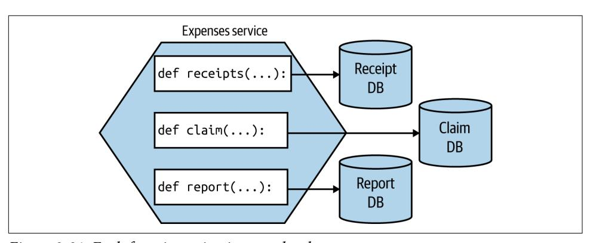

*Figure 8-21. Each function using its own database*

This mapping from a single microservice to multiple finer-grained deployable units warps our previous definition of a microservice somewhat. We normally consider a microservice as being an independently deployable unit—now one microservice is made up of *multiple different* independently deployable units. Conceptually, in this example, the microservice moves toward being more of a logical than a physical concept.

**Get even more fine-grained.** If you wanted to go even smaller, there is a temptation to break down your functions per aggregate into smaller pieces. I am much more cau‐ tious here. Aside from the explosion of functions this will likely create, it also violates one of the core principles of an aggregate—that we want to treat it as a single unit to ensure we can better manage the integrity of the aggregate itself.

<span id="page-281-0"></span>I've previously entertained the idea of making each state transition of an aggregate its own function, but I've backed out of this idea due to the problems associated with inconsistency. When you have different independently deployable things, each man‐ aging a different part of an overall state transition, ensuring things are done properly gets really quite difficult. It puts us into the space of sagas, which we discussed in [Chapter 6.](#page-200-0) When implementing complex business processes, concepts like sagas are important, and the work is justifiable. I struggle, though, to see the value in adding this complexity at the level of managing a single aggregate that could easily be han‐ dled by a single function.

#### **The way forward**

I remain convinced that the future for most developers is using a platform that hides much of the underlying detail from them. For many years, Heroku was the closest thing I could point to in terms of something that found the right balance, but now we have FaaS and the wider ecosystem of turnkey serverless offerings that chart a differ‐ ent path.

There are still issues to be ironed out with FaaS, but I feel that, while the current crop of offerings still need to change to resolve the issues with them, this is the sort of plat‐ form that most developers will end up using. Not all applications will fit neatly into a FaaS ecosystem given the constraints, but for those that do, people are already seeing significant benefits. With more and more work going into Kubernetes-backed FaaS offerings, people who are unable to make direct use of the FaaS solutions provided by the main cloud providers will increasingly be able to take advantage of this new way of working.

So, while FaS may not work for everything, it's certainly something I urge people to explore. And for my clients who are looking at moving to cloud-based Kubernetes solutions, I've been urging many of them to explore FaaS first, as it may give them everything they need while hiding significant complexity and offloading a lot of work.

I'm seeing more organizations making use of FaaS as part of a wider solution, picking FaaS for specific use cases where it fits well. A good example would be the BBC, which makes use of Lambda functions as part of its core technology stack that pro‐ vides the BBC News website. The overall system uses a mix of Lambda and EC2 instances—with the EC2 instances often being used in situations in which Lambda function invocations would be too expensive.<sup>3</sup>

<sup>3</sup> Johnathan Ishmael, "Optimising Serverless for BBC Online," Technology and Creativity at the BBC (blog), BBC, January 26, 2021, *<https://oreil.ly/gkSdp>*.

## <span id="page-282-0"></span>**Which Deployment Option Is Right for You?**

Yikes. So we have a lot of options, right? And I probably haven't helped too much by going out of my way to share loads of pros and cons for each approach. If you've got‐ ten this far, you might be a bit bewildered about what you should do.


Well, before I go any further, I really hope that it goes without say‐ ing that if what you are currently doing works for you, then *keep doing it!* Don't let fashion dictate your technical decisions.

If you think you do need to change how you deploy microservices, then let me try and distill down much of what we've already discussed and come up with some useful guidance.

Revisiting our principles of microservice deployment, one of the most important aspects we focused on was that of ensuring isolation of our microservices. But just using that as a guiding principle might guide us toward using dedicated physical machines for each microservice instance! That of course would likely be very expen‐ sive, and as we've already discussed, there are some very powerful tools that we wouldn't be able to use if we went down this route.

Trade-offs abound here. Balancing cost against ease of use, isolation, familiarity…it can become overwhelming. So let's review a set of rules I like to call Sam's Really Basic Rules of Thumb for Working Out Where to Deploy Stuff:

- 1. If it ain't broke, don't fix it.<sup>4</sup>
- 2. Give up as much control as you feel happy with, and then give away just a little bit more. If you can offload all your work to a good PaaS like Heroku (or a FaaS platform), then do it and be happy. Do you really need to tinker with every last setting?
- 3. Containerizing your microservices it is not pain-free, but is a really good com‐ promise around cost of isolation and has some fantastic benefits for local devel‐ opment, while still giving you a degree of control over what happens. Expect Kubernetes in your future.

Many people are proclaiming "Kubernetes or bust!" which I feel is unhelpful. If you're on the public cloud, and your problem fits FaaS as a deployment model, do that instead and skip Kubernetes. Your developers will likely end up being much

<sup>4</sup> I might not have come up with this rule.

<span id="page-283-0"></span>more productive. As we'll discuss more in [Chapter 16](#page-550-0), don't let the fear of lock-in keep you trapped in a mess of your own making.

Found an awesome PaaS like Heroku or Zeit, and have an application that fits the constraints of the platform? Push all the work to the platform and spend more time working on your product. Both Heroku and Zeit are pretty fantastic platforms with awesome usability from a developer point of view. Don't your developers deserve to be happy after all?

For the rest of you, containerization is the way to go, which means we need to talk about Kubernetes.

### **Role for Puppet, Chef, and Other Tools?**

This chapter has changed significantly since the first edition. This is due in part to the industry as a whole evolving, but also to new technology that has become increasingly useful. The emergence of new technology has also led to a diminished role for other technology—and so we see tools like Puppet, Chef, Ansible, and Salt playing a much smaller role in deploying microservice architectures than we did back in 2014.

The main reason for this is fundamentally the rise of the container. The power of tools like Puppet and Chef is that they give you a way to bring a machine to a desired state, with that desired state defined in some code form. You can define what run‐ times you need, where configuration files need to be, etc., in a way that can determin‐ istically be run time and again on the same machine, ensuring it can always be brought to the same state.

The way most people build up a container is by defining a Dockerfile. This allows you to define the same requirements as you would with Puppet or Chef, with some differ‐ ences. A container is blown away when redeployed, so each container creation is done from scratch (I'm simplifying somewhat here). This means that a lot of the complexity inherent in Puppet and Chef to handle those tools being run over and over on the same machines isn't needed.

Puppet, Chef, and similar tools are still incredibly useful, but their role has now been pushed out of the container and further down the stack. People use tools like these for managing legacy applications and infrastructure, or for building up the clusters that container workloads now run on. But developers are even less likely to come into contact with these tools than they were in the past.

The concept of infrastructure as code is still vitally important. It's just that the type of tools developers are likely to use has changed. For those working with the cloud, for example, things like [Terraform](http://terraform.io) can be very useful for provisioning cloud infrastruc‐ ture. Recently, I've become a big fan of [Pulumi,](http://pulumi.com) which eschews the use of domainspecific languages (DSLs) in favor of using normal programming languages to help developers manage their cloud infrastructure. I see big things ahead for Pulumi as delivery teams take more and more ownership of the operational world, and I suspect <span id="page-284-0"></span>that Puppet, Chef, and the like, while they will continue to play a useful role in opera‐ tions, will likely move further and further away from day-to-day development activities.

## **Kubernetes and Container Orchestration**

As containers started gaining traction, many people started looking at solutions for how to manage containers across multiple machines. Docker had two attempts at this (with Docker Swarm and Docker Swarm Mode, respectively); companies like Rancher and CoreOS came up with their own takes; and more general purpose plat‐ forms like Mesos were used to run containers alongside other sorts of workloads. Ultimately, though, despite a lot of effort on these products, Kubernetes has in the last couple of years come to dominate this space.

Before we speak to Kubernetes itself, we should discuss why there's a need for a tool like it in the first place.

## **The Case for Container Orchestration**

Broadly speaking, Kubernetes can variously be described as a container orchestration platform or, to use a term that has fallen out of favor, a container scheduler. So what are these platforms, and why might we want them?

Containers are created by isolating a set of resources on an underlying machine. Tools like Docker allow us to define what a container should look like and create an instance of that container on a machine. But most solutions require that our software be defined on multiple machines, perhaps to handle sufficient load, or to ensure that the system has redundancy in place to tolerate the failure of a single node. Container orchestration platforms handle how and where container workloads are run. The term "scheduling" starts to make more sense in this context. The operator says, "I want this thing to run," and the orchestrator works out how to schedule that job finding available resources, reallocating them if necessary, and handling the details for the operator.

The various container orchestration platforms also handle desired state management for us, ensuring that the expected state of a set of containers (microservice instances, in our case) is maintained. They also allow us to specify how we want these workloads to be distributed, allowing us to optimize for resource utilization, latency between processes, or robustness reasons.

Without such a tool, you'll have to manage the distribution of your containers, some‐ thing that I can tell you from firsthand experience gets old very fast. Writing scripts to manage launching and networking container instances is not fun.

<span id="page-285-0"></span>Broadly speaking, all of the container orchestration platforms, including Kubernetes, provide these capabilities in some shape or form. If you look at general purpose schedulers like Mesos or Nomad, managed solutions like AWS's ECS, Docker Swarm Mode, and so on, you'll see a similar featureset. But for reasons we'll explore shortly, Kubernetes has won this space. It also has one or two interesting concepts that are worth exploring briefly.

## **A Simplified View of Kubernetes Concepts**

There are many other concepts in Kubernetes, so you'll forgive me for not going into all of them (that would definitely justify a book in itself). What I'll try to do here is outline the key ideas you'll need to engage with when you first start working with the tool. Let's look into the concept of a cluster first, as shown in Figure 8-22.


*Figure 8-22. A simple overview of Kubernetes topology*

Fundamentally, a Kubernetes cluster consists of two things. First, there's a set of machines that the workloads will run on called the nodes. Secondly, there's a set of controlling software that manages these nodes and is referred to as the control plane. These nodes could be running physical machines or virtual machines under the hood. Rather than scheduling a container, Kubernetes instead schedules something it calls a *pod*. A pod consists of one or more containers that will be deployed together.

Commonly, you'll have only one container in a pod—for example, an instance of your microservice. There are some occasions (rare, in my experience) where having <span id="page-286-0"></span>multiple containers deployed together can make sense though. A good example of this is the use of sidecar proxies such as Envoy, often as part of a service mesh—a topic we discussed in ["Service Meshes and API Gateways" on page 162](#page-187-0).

The next concept that is useful to know about is called a *service*. In the context of Kubernetes, you can think of a service as a stable routing endpoint—basically, a way to map from the pods you have running to a stable network interface that is available within the cluster. Kubernetes handles routing within the cluster, as we see in Figure 8-23.

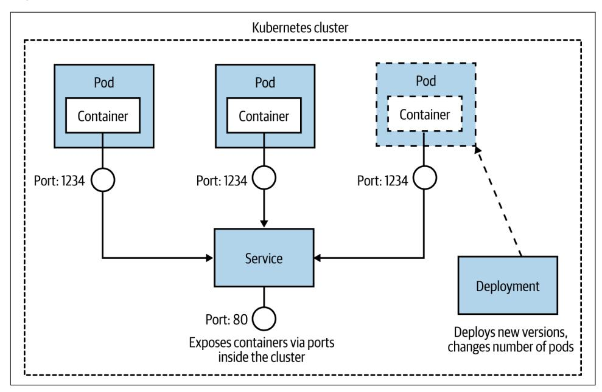

*Figure 8-23. How a pod, a service, and a deployment work together*

The idea is that a given pod can be considered ephemeral—it be might shut down for any number of reasons—whereas a service as a whole lives on. The service exists to route calls to and from the pods and can handle pods being shut down or new pods being launched. Purely from a terminology point of view, this can be confusing. We talk more generally about deploying a service, but in Kubernetes you don't deploy a service—you deploy pods that map to a service. It can take a while to get your head around this.

Next, we have a *replica set*. With a replica set, you define the desired state of a set of pods. This is where you say, "I want four of these pods," and Kubernetes handles the rest. In practice, you are no longer expected to work with replica sets directly; instead, they are handled for you via a *deployment*, the last concept we'll look at. A deploy‐ ment is how you apply changes to your pods and replica sets. With a deployment,

<span id="page-287-0"></span>you can do things like issue rolling upgrades (so you replace pods with a newer ver‐ sion in a gradual fashion to avoid downtime), rollbacks, scaling up the number of nodes, and more.

So, to deploy your microservice, you define a *pod*, which will contain your microser‐ vice instance inside it; you define a *service*, which will let Kubernetes know how your microservice will be accessed; and you apply changes to the running pods using a *deployment*. It seems easy when I say that, doesn't it? Let's just say I've left out quite a bit of stuff here for the sake of brevity.

## **Multitenancy and Federation**

From an efficiency point of view, you'd want to pool all the computing resources available to you in a single Kubernetes cluster and have all workloads run there from all across your organization. This would likely give you a higher utilization of the underlying resources, as unused resources could be freely reallocated to whomever needs them. This in turn should reduce costs accordingly.

The challenge is that while Kubernetes is well able to manage different microservices for different purposes, it has limitations regarding how "multitenanted" the platform is. Different departments in your organization might want different degrees of con‐ trol over various resources. These sorts of controls were not built into Kubernetes, a decision that seems sensible in terms of trying to keep the scope of Kubernetes some‐ what limited. To work around this problem, organizations seem to explore a couple of different paths.

The first option is to adopt a platform built on top of Kubernetes that provides these capabilities—OpenShift from Red Hat, for example, has a rich set of access controls and other capabilities that are built with larger organizations in mind and can make the concept of multitenancy somewhat easier. Aside from any financial implication of using these sorts of platforms, for them to work you'll sometimes have to work with the abstractions given to you by the vendor you chose—meaning your developers need to know not only how to use Kubernetes but also how to use that specific ven‐ dor's platform.

Another approach is to consider a federated model, outlined in [Figure 8-24.](#page-288-0) With federation, you have multiple separate clusters, with some layer of software that sits on top allowing you to make changes across all the clusters if needed. In many cases, people would work directly against one cluster, giving them a pretty familiar Kuber‐ netes experience, but in some situations, you may want to distribute an application across multiple clusters, perhaps if those clusters were in different geographies and you wanted your application deployed with some ability to handle the loss of an entire cluster.

<span id="page-288-0"></span>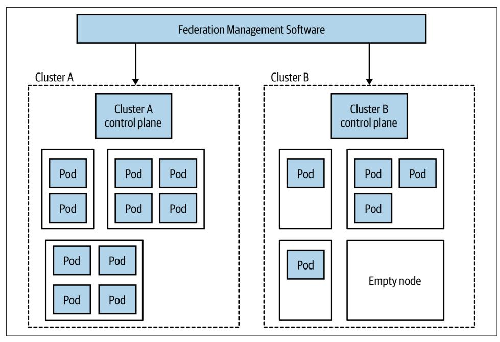

*Figure 8-24. An example of federation in Kubernetes*

The federated nature makes resource pooling more challenging. As we see in Figure 8-24, Cluster A is fully utilized, whereas Cluster B has lots of unused capacity. If we wanted to run more workloads on Cluster A, doing so would be possible only if we could give it more resources, such as moving the empty node on Cluster B over to Cluster A. How easy it will be to move the node from one cluster to the other will depend on the nature of the federation software being used, but I can well imagine this being a nontrivial change. Bear in mind that a single node can be part of either one cluster or another and so cannot run pods for both Cluster A and Cluster B.

It's worth noting that having multiple clusters can be beneficial when we consider the challenges of upgrading the cluster itself. It may be easier and safer to move a micro‐ service over to a newly upgraded cluster than to upgrade the cluster in-place.

Fundamentally, these are challenges of scale. For some organizations, you'll never have these issues, as you're happy to share a single cluster. For other organizations looking to get efficiencies at larger scale, this is certainly an area that you'll want to explore in more detail. It should be noted that there are a number of different visions for what Kubernetes federation should look like, and a number of different tool‐ chains out there for managing them.

## **The Background Behind Kubernetes**

<span id="page-289-0"></span>Kubernetes started as an open source project at Google, which drew its inspiration from the earlier container management systems Omega and Borg. Many of the core concepts in Kubernetes are based on concepts around how container workloads are managed inside Google, albeit with a slightly different target in mind. Borg runs sys‐ tems at a massive global scale, handling tens if not hundreds of thousands of contain‐ ers across data centers globally. If you want more detail about how the different mindsets behind these three Google platforms compare, albeit from a Google-centric viewpoint, I recommend ["Borg, Omega, and Kubernetes"](https://oreil.ly/fVCSS) by Brendan Burns et al. as a good overview.

While Kubernetes shares some DNA with Borg and Omega, working at massive scale has not been a main driver behind the project. Both Nomad and Mesos (each of which took a cue from Borg) have found a niche in situations in which clusters of thousands of machines are needed, as demonstrated in Apple's use of Mesos for Siri<sup>5</sup> or [Roblox's use of Nomad](https://oreil.ly/tyWof).

Kubernetes wanted to take ideas from Google but provide a more developer-friendly experience than that delivered by Borg or Omega. It's possible to look at Google's decision to invest a lot of engineering effort in creating an open source tool in a purely altruistic light, and while I'm sure that was the intention of some people, the reality is that this is as much about the risk Google was seeing from competition in the public cloud space, specifically AWS.

In the public cloud market, Google Cloud has gained ground but is still a distant third behind Azure and AWS (who are out in front), and some analysis has it being edged into fourth place by Alibaba Cloud. Despite the improving market share, it is still nowhere near where Google wants it to be.

It seems likely that a major concern was that the clear market leader, AWS, could eventually have a near monopoly in the cloud computing space. Moreover, concerns regarding the cost of migration from one provider to another meant that such a posi‐ tion of market dominance would be hard to shift. And then along comes Kubernetes, with its promise of being able to deliver a standard platform for running container workloads that could be run by multiple vendors. The hope was that this would enable migration from one provider to another and avoid an AWS-only future.

So you can see Kubernetes as a generous contribution from Google to the wider IT industry, or as an attempt by Google to remain relevant in the fast-moving public cloud space. I have no problem seeing both things as equally true.

<sup>5</sup> Daniel Bryant, "Apple Rebuilds Siri Backend Services Using Apache Mesos," InfoQ, May 3, 2015, *[https://](https://oreil.ly/NLUMX) [oreil.ly/NLUMX](https://oreil.ly/NLUMX)*.

## <span id="page-290-0"></span>**The Cloud Native Computing Federation**

The Cloud Native Computing Foundation (CNCF for short) is an offshoot of the nonprofit Linux Foundation. The CNCF focuses on curating the ecosystem of projects to help promote cloud native development, although in practice this means supporting Kubernetes and projects that work with or build on Kubernetes itself. The projects themselves aren't created or directly developed by the CNCF; instead, you can see the CNCF as a place where these projects that might otherwise be developed in isolation can be hosted together in the same place, and where common standards and interoperability can be developed.

In this way, the CNCF reminds me of the role of the Apache Software Foundation as with the CNCF, a project being part of the Apache Software Foundation normally implies a level of quality and wider community support. All of the projects hosted by the CNCF are open source, although the development of these projects may well be driven by commercial entities.

Aside from helping guide the development of these associated projects, the CNCF also runs events, provides documentation and training materials, and defines the var‐ ious certification programs around Kubernetes. The group itself has members from across the industry, and although it can be difficult for smaller groups or independ‐ ents to play much of a role in the organization itself, the degree of cross-industry sup‐ port (including many companies who are competitors with each other) is impressive.

As an outsider, the CNCF seems to have had great success in helping spread the word regarding the usefulness of the projects it curates. It's also acted as a place where the evolution of major projects can be discussed in the open, ensuring a lot of broad input. The CNCF has played a huge part in the success of Kubernetes—it's easy to imagine that without it, we'd still have a fragmented landscape in this area.

## **Platforms and Portability**

You'll often hear Kubernetes described as a "platform." It's not really a platform in the sense that a developer would understand the term, though. Out of the box, all it really gives you is the ability to run container workloads. Most folks using Kubernetes end up assembling their own platform by installing supporting software such as ser‐ vice meshes, message brokers, log aggregation tools, and more. In larger organiza‐ tions, this ends up being the responsibility of a platform engineering team, who put this platform together and manage it, and help developers use the platform effectively.

This can be both a blessing and a curse. This pick-and-mix approach is made possible due to a fairly compatible ecosystem of tools (thanks in large part to the work by the CNCF). This means you can select your favorite tools for specific tasks if you want. But it can also lead to the tyranny of choice—we can easily become overwhelmed

<span id="page-291-0"></span>with so many options. Products like Red Hat's OpenShift partly take this choice away from us, as they give us a ready-made platform with some decisions already made for us.

What this means is that although at the base level Kubernetes offers a portable abstraction for container execution, in practice it's not as simple as taking an applica‐ tion that works on one cluster and expecting it will work elsewhere. Your application, your operations and developer workflow, may well rely on your own custom plat‐ form. Moving from one Kubernetes cluster to another may well also require that you rebuild that platform on your new destination. I've spoken to many organizations that have adopted Kubernetes primarily because they're worried about being locked in to a single vendor, but these organizations haven't understood this nuance—appli‐ cations built on Kubernetes are portable across Kubernetes clusters in theory, but not always in practice.

## **Helm, Operators, and CRDs, Oh My!**

One area of continuing confusion in the space of Kubernetes is how to manage the deployment and life cycle of third-party applications and subsystems. Consider the need to run Kafka on your Kubernetes cluster. You could create your own pod, ser‐ vice, and deployment specifications and run them yourself. But what about managing an upgrade to your Kafka setup? What about other common maintenance tasks you might want to deal with, like upgrading running stateful software?

A number of tools have emerged that aim to give you the ability to manage these types of applications at a more sensible level of abstraction. The idea is that someone creates something akin to a package for Kafka, and you run it on your Kubernetes cluster in a more black-box manner. Two of the best-known solutions in this space are Operator and Helm. Helm bills itself as "the missing package manager" for Kubernetes, and while Operator can manage initial installation, it seems to be focused more on the ongoing management of the application. Confusingly, while you can see Operator and Helm as being alternatives to one another, you can also use both of them together in some situations (Helm for initial install, Operator for lifecycle operations).

A more recent evolution in this space is something called custom resource defini‐ tions, or CRDs. With CRDs you can extend the core Kubernetes APIs, allowing you to plug in new behavior to your cluster. The nice thing about CRDs is that they inte‐ grate fairly seamlessly into the existing command-line interface, access controls, and more—so your custom extension doesn't feel like an alien addition. They basically allow you to implement your own Kubernetes abstractions. Think of the pod, replica set, service, and deployment abstractions we discussed earlier—with CRDs, you could add your own into the mix.

<span id="page-292-0"></span>You can use CRDs for everything from managing small bits of configuration to con‐ trolling service meshes like Istio or cluster-based software like Kafka. With such a flexible and powerful concept, I find it difficult to understand where CRDs would best be used, and there doesn't seem to be a general consensus out there among the experts I've chatted to either. This whole space still doesn't seem to be settling down as quickly as I'd hoped, and there isn't as much consensus as I'd like—a trend in the Kubernetes ecosystem.

## **And Knative**

[Knative](https://knative.dev) is an open source project that aims to provide FaaS-style workflows to devel‐ opers, using Kubernetes under the hood. Fundamentally, Kubernetes isn't terribly developer friendly, especially if we compare it to the usability of things like Heroku or similar platforms. The aim with Knative is to bring the developer experience of FaaS to Kubernetes, hiding the complexity of Kubernetes from developers. In turn, this should mean development teams are able to more easily manage the full life cycle of their software.

We've already discussed service meshes, and specifically mentioned Istio, back in [Chapter 5](#page-146-0). A service mesh is essential for Knative to run. While Knative theoretically allows you to plug in different service meshes, only Istio is considered stable at this time (with support for other meshes like Ambassador and Gloo still in alpha). In practice, this means that if you want to adopt Knative, you'll also already have to have bought into Istio.

With both Kubernetes and Istio, projects driven largely by Google, it took a very long time for them to get to a stage where they could be considered stable. Kubernetes still had major shifts after its 1.0 release, and only very recently Istio, which is going to underpin Knative, was completely rearchitected. This track record of delivering sta‐ ble, production-ready projects makes me think that Knative may well take a lot longer to be ready for use by most of us. While some organizations are using it, and you could probably use it too, experience says it will be only so long before some major shift will take place that will require painful migration. It's partly for this rea‐ son that I've suggested that more conservative organizations who are considering an FaaS-like offering for their Kubernetes cluster look elsewhere—projects like Open‐ FaaS are already being used in production by organizations all over the world and don't require an underlying service mesh. But if you do jump on the Knative train right now, don't be surprised if you have the odd derailment in your future.

One other note: it's been a shame to see that Google has decided not to make Knative a part of the CNCF—one can only assume this is because Google wants to drive the direction of the tool itself. Kubernetes was a confusing prospect for many when launched, partly because it reflected Google's mindset around how containers should be managed. It benefited hugely from involvement from a broader set of the industry,

<span id="page-293-0"></span>and it's too bad that at this stage at least, Google has decided it isn't interested in the same broad industry involvement for Knative.

## **The Future**

Going forward, I see no signs that the rampaging juggernaut of Kubernetes will halt any time soon, and I fully expect to see more organizations implementing their own Kubernetes clusters for private clouds or making use of managed clusters in public cloud settings. However, I think what we're seeing now, with developers having to learn how to use Kubernetes directly, will be a relatively short-lived blip. Kubernetes is great at managing container workloads and providing a platform for other things to be built on. It isn't what could be considered a developer-friendly experience, though. Google itself has shown us that with the push behind Knative, and I think we'll continue to see Kubernetes hidden under higher-level abstraction layers. So in the future, I expect Kubernetes to be everywhere. You just won't know it.

This isn't to say that developers can forget they are building a distributed system. They'll still need to understand the myriad challenges that this type of architecture brings. It's just that they won't have to worry as much about the detail of how their software is mapped to underlying computing resources.

## **Should You Use It?**

So for those of you who aren't already fully paid-up members of the Kubernetes club, should you join? Well, let me share a few guidelines. Firstly, implementing and man‐ aging your own Kubernetes cluster is not for the faint of heart—it is a significant undertaking. So much of the quality of experience that your developers will have using your Kubernetes install will depend on the effectiveness of the team running the cluster. For this reason, a number of the larger organizations I've spoken to who have gone down the Kubernetes on-prem path have outsourced this work to special‐ ized companies.

Even better, use a fully managed cluster. If you can make use of the public cloud, then use fully managed solutions like those provided by Google, Azure, and AWS. What I would say, though, is that if you are able to use the public cloud, then consider whether Kubernetes is actually what you want. If you're after a developer-friendly platform for handling the deployment and life cycle of your microservices, then the FaaS platforms we've already looked at could be a great fit. You could also look at the other PaaS-like offerings, like Azure Web Apps, Google App Engine, or some of the smaller providers like Zeit or Heroku.

Before you decide to start using Kubernetes, get some of your administrators and developers using it. The developers can get started running something lightweight locally, such as minikube or MicroK8s, giving them something pretty close to a full Kubernetes experience, but on their laptops. The people you'll have managing the

<span id="page-294-0"></span>platform may need a deeper dive. [Katacoda](https://www.katacoda.com) has some great online tutorials for com‐ ing to grips with the core concepts, and the CNCF helps put out a lot of training materials in this space. Make sure the people who will actually use this stuff get to play with it before you make up your mind.

Don't get trapped into thinking that you have to have Kubernetes "because everyone else is doing it." This is just as dangerous a justification for picking Kubernetes as it is for picking microservices. As good as Kubernetes is, it isn't for everyone—carry out your own assessment. But let's be frank—if you've got a handful of developers and only a few microservices, Kubernetes is likely to be huge overkill, even if using a fully managed platform.

## **Progressive Delivery**

Over the last decade or so, we've become smarter at deploying software to our users. New techniques have emerged that were driven by a number of different use cases and came from many different parts of the IT industry, but primarily they were all focused around making the act of pushing out new software much less risky. And if releasing software becomes less risky, we can release software more frequently.

There are a host of activities we carry out before sending our software live that can help us pick up problems before they impact real users. Preproduction testing is a huge part of this, although, as we'll discuss in [Chapter 9](#page-300-0), this can only take us so far.

In their book *Accelerate*, 6 Nicole Forsgren, Jez Humble, and Gene Kim show clear evidence drawn from extensive research that high-performing companies deploy more frequently than their low-performing counterparts and at the same time have *much lower change failure rates*.

The idea that you "go fast and break stuff" doesn't really seem to apply when it comes to shipping software—shipping frequently and having lower failure rates goes hand in hand, and organizations that have realized this have changed how they think about releasing software.

These organizations make use of techniques like feature toggles, canary releases, par‐ allel runs, and more, which we'll detail in this section. This shift in how we think about releasing functionality falls under the banner of what is called *progressive delivery*. Functionality is released to users in a controlled manner; instead of a bigbang deployment, we can be smart about who sees what functionality—for example, by rolling out a new version of our software to a subset of our users.

<sup>6</sup> Nicole Forsgren, Jez Humble, and Gene Kim, *Accelerate: The Science of Building and Scaling High Performing Technology Organizations* (Portland, OR: IT Revolution, 2018).

<span id="page-295-0"></span>Fundamentally, what all these techniques have at their heart is a simple shift in how we think about shipping software. Namely, that we can separate the concept of deployment from that of release.

## **Separating Deployment from Release**

Jez Humble, coauthor of *Continuous Delivery*, makes the case for separating these two ideas, and he [makes this a core principle for low-risk software releases:](https://oreil.ly/VzpLc)

Deployment is what happens when you install some version of your software into a particular environment (the production environment is often implied). Release is when you make a system or some part of it (for example, a feature) available to users.

Jez argues that by separating these two ideas, we can ensure that our software works in its production setting without failures being seen by our users. Blue-green deploy‐ ment is one of the simplest examples of this concept in action—you have one version of your software live (blue), and then you deploy a new version alongside the old ver‐ sion in production (green). You check to make sure that the new version is working as expected, and if it is, you redirect customers to see the new version of your soft‐ ware. If you find a problem before the switchover, no customer is impacted.

While blue-green deployments are among the simplest examples of this principle, there are a number of more sophisticated techniques we can use when we embrace this concept.

## **On to Progressive Delivery**

James Governor, cofounder of developer-focused industry analyst firm RedMonk, [first coined](https://oreil.ly/1nFrg) the term *progressive delivery* to cover a number of different techniques being used in this space. He has gone on to describe progressive delivery as ["continu‐](https://oreil.ly/opHOq) [ous delivery with fine-grained control over the blast radius"—](https://oreil.ly/opHOq)so it's an extension of continuous delivery but also a technique that gives us the ability to control the poten‐ tial impact of our newly released software.

Picking up this theme, Adam Zimman from LaunchDarkly [describes](https://oreil.ly/zeeNc) how progressive delivery impacts "the business." From that point of view, we require a shift in think‐ ing about how new functionality reaches our customers. It's no longer a single rollout —it can now be a phased activity. Importantly, though, progressive delivery can empower the product owner by, as Adam puts it, "delegating the control of the fea‐ ture to the owner that is most closely responsible for the outcome." For this to work, however, the product owner in question needs to understand the mechanics of the progressive delivery technique being used, implying a somewhat technically savvy product owner, or else support from a suitably savvy set of people.

We've already touched on blue-green deployments as one progressive delivery tech‐ nique. Let's briefly take a look at a few more.

## <span id="page-296-0"></span>**Feature Toggles**

With feature toggles (otherwise known as feature flags), we hide deployed functional‐ ity behind a toggle that can be used to switch functionality off or on. This is most commonly used as part of trunk-based development, where functionality that isn't yet finished can be checked in and deployed but still hidden from end users, but it has lots of applications outside of this. This could be useful to turn on a feature at a specified time, or turn off a feature that is causing problems.

You can also use feature toggles in a more fine-grained manner, perhaps allowing a flag to have a different state based on the nature of the user making a request. So you could for example have a group of customers that see a feature turned on (perhaps a beta test group), whereas most people see the feature as being turned off—this could help you implement a canary rollout, something we discuss next. Fully managed sol‐ utions exist for managing feature toggles, including [LaunchDarkly](http://launchdarkly.com) and [Split](https://www.split.io). Impres‐ sive as these platforms are, I think you can get started with something much simpler —just a configuration file can do for a start, then look at these technologies as you start pushing how you want to use the toggles.

For a much deeper dive into the world of feature toggles, I can heartily recommend Pete Hodgson's writeup ["Feature Toggles \(aka Feature Flags\)"](https://oreil.ly/5B9ie), which goes into a lot of detail regarding how to implement them and the many different ways they can be used.

## **Canary Release**

*To err is human, but to really foul things up you need a computer.<sup>7</sup>*

We all make mistakes, and computers can let us make mistakes faster and at larger scale than ever before. Given that mistakes are unavoidable (and trust me, they are), then it makes sense to do things that allow us to limit the impact of these mistakes. Canary releases are one such technique.

Named for the canaries taken into mines as an early warning system for miners to warn them of the presence of dangerous gases, with a canary rollout the idea is that a limited subset of our customers see new functionality. If there is a problem with the rollout, then only that portion of our customers is impacted. If the feature works for that canary group, then it can be rolled out to more of your customers until everyone sees the new version.

For a microservice architecture, a toggle could be configured at an individual micro‐ service level, turning functionality on (or off) for requests to that functionality from the outside world or other microservices. Another technique is to have two different

<sup>7</sup> This quote is often attributed to biologist Paul Ehrlich, but its actual origins [are unclear](https://oreil.ly/3SOop).

<span id="page-297-0"></span>versions of a microservice running side by side, and use the toggle to route to either the old or the new version. Here, the canary implementation has to be somewhere in the routing/networking path, rather than being in one microservice.

When I first did a canary release we controlled the rollout manually. We could con‐ figure the percentage of our traffic seeing the new functionality, and over a period of a week we gradually increased this until everyone saw the new functionality. Over the week, we kept an eye on our error rates, bug reports, and the like. Nowadays, it's more common to see this process handled in an automated fashion. Tools like [Spin‐](https://www.spinnaker.io) [naker](https://www.spinnaker.io) for example have the ability to automatically ramp up calls based on metrics, such as increasing the percentage of calls to a new microservice version if the error rates are at an acceptable level.

## **Parallel Run**

With a canary release, a request to a piece of functionality will be served by either the old or the new version. This means we can't compare how the two versions of func‐ tionality would handle the same request, something that can be important if you want to make sure that the new functionality works in exactly the same way as the old version of functionality.

With a parallel run you do exactly that—you run two different implementations of the same functionality side by side, and send a request to the functionality to both implementations. With a microservice architecture, the most obvious approach might be to dispatch a service call to two different versions of the same service and compare the results. An alternative is to coexist both implementations of the func‐ tionality inside the same service, which can often make comparison easier.

When executing both implementations, it's important to realize that you likely only want the results of one of the invocations. One implementation is considered the source of truth—this is the implementation you currently trust, and is typically the existing implementation. Depending on the nature of the functionality you are com‐ paring with a parallel run, you might have to give this nuance careful thought—you wouldn't want to send two identical order updates to a customer, or pay an invoice twice for example!

I explore the parallel run pattern in a lot more detail in Chapter 3 of my book *Mono‐ lith to Microservices*. 8 There I explore its use in helping migrate functionality from a monolithic system to a microservice architecture, where we want to ensure that our new microservice behaves in the same way as the equivalent monolith functionality. In another context, GitHub makes use of this pattern when reworking core parts of its codebase, and have released an open source tool [Scientist](https://oreil.ly/LXtNJ) to help with this process.

<sup>8</sup> Sam Newman, *Monolith to Microservices* (Sebastopol: O'Reilly, 2019).

<span id="page-298-0"></span>Here, the parallel run is done within a single process, with Scientist helping to com‐ pare the invocations.


With blue-green deployment, feature toggles, canary releases, and parallel runs we've just scratched the surface of the field of progres‐ sive delivery. These ideas can work well together (we've already touched on how you could use feature toggles to implement a can‐ ary rollout for example), but you probably want to ease yourself in. To start off, just remember to separate the two concepts of deploy‐ ment and release. Next, start looking for ways to help you deploy your software more frequently, but in a safe manner. Work with your product owner or other business stakeholders to understand how some of these techniques can help you go faster, but also help reduce failures too.

## **Summary**

OK, so we covered a lot of ground here. Let's briefly recap before we move on. Firstly, let's remind ourselves of the principles for deployment that I outlined earlier:

#### *Isolated execution*

Run microservice instances in an isolated fashion where they have their own computing resources, and their execution cannot impact other microservice instances running nearby.

#### *Focus on automation*

Choose technology that allows for a high degree of automation, and adopt auto‐ mation as a core part of your culture.

#### *Infrastructure as code*

Represent the configuration for your infrastructure to ease automation and pro‐ mote information sharing. Store this code in source control to allow for environ‐ ments to be re-created.

#### *Aim for zero-downtime deployment*

Take independent deployability further, and ensure that deploying a new version of a microservice can be done without any downtime to users of your service (be it humans or other microservices).

#### *Desired state management*

Use a platform that maintains your microservice in a defined state, launching new instances if required in the event of outage or traffic increases.

In addition, I shared my own guidelines for selecting the right deployment platform:

- 1. If it ain't broke, don't fix it.<sup>9</sup>
- 2. Give up as much control as you feel happy with, then give away just a little bit more. If you can offload all your work to a good PaaS like Heroku (or FaaS plat‐ form), then do it and be happy. Do you really need to tinker with every last setting?
- 3. Containerizing your microservices is not pain-free, but is a really good compro‐ mise around cost of isolation and has some fantastic benefits for local develop‐ ment, while still giving you a degree of control over what happens. Expect Kubernetes in your future.

It's also important to understand *your* requirements. Kubernetes could be a great fit for you, but perhaps something simpler would work just as well. Don't feel ashamed for picking a simpler solution, and also don't worry too much about offloading work to someone else—if I can push work to the public cloud, then I'll do it, as it lets me focus on my own work.

Above all, this space is going through a lot of churn. I hope I've given you some insights into the key technology in this space, but also shared some principles that are likely to outlive the current crop of hot technology. Whatever comes next, hopefully you're much more prepared to take it in stride.

In the next chapter, we'll be going deeper into a topic we touched on briefly here: testing our microservices to make sure they actually work.

<sup>9</sup> I might not have come up with this rule.

## **Testing**

<span id="page-300-0"></span>The world of automated testing has advanced significantly since I first started writing code, and every month there seems to be some new tool or technique to make it even better. But challenges remain regarding how to effectively and efficiently test our code's functionality when it spans a distributed system. This chapter breaks down the problems associated with testing finer-grained systems and presents some solutions to help you make sure you can release your new functionality with confidence.

Testing covers a lot of ground. Even when we are talking *only* about automated tests, there are a large number to consider. With microservices, we have added another level of complexity. Understanding what different types of tests we can run is impor‐ tant to help us balance the sometimes-opposing forces of getting our software into production as quickly as possible versus making sure our software is of sufficient quality. Given the scope of testing as a whole, I am not going to attempt a broad exploration of the topic. Instead, this chapter is primarily focused on looking at how testing of a microservice architecture is different when compared to less-distributed systems such as single-process monolithic applications.

Where testing is done has also shifted since the first edition of this book. Previously, testing was predominantly carried out before the software got to production. Increas‐ ingly, though, we look at testing our applications once they arrive in production further blurring the lines between development and production-related activities; this is something we'll explore in this chapter before exploring testing in production more fully in [Chapter 10.](#page-330-0)

## <span id="page-301-0"></span>**Types of Tests**

Like many consultants, I'm guilty of occasionally using quadrants as a way of catego‐ rizing the world, and I was starting to worry this book wouldn't have one. Luckily, Brian Marick came up with a fantastic categorization system for tests that fits right in. Figure 9-1 shows a variation of Marick's quadrant from Lisa Crispin and Janet Greg‐ ory's book *Agile Testing*<sup>1</sup> that helps categorize the different types of tests.


*Figure 9-1. Brian Marick's testing quadrant. Lisa Crispin and Janet Gregory, Agile Testing: A Practical Guide for Testers and Agile Teams, © 2009*

At the bottom of the quadrant, we have tests that are *technology facing*—that is, tests that aid the developers in creating the system in the first place. Property tests such as performance tests and small-scoped unit tests fall into this category; all are typically automated. The top half of the quadrant includes those tests that help the nontechni‐ cal stakeholders understand how your system works, which we call *business-facing* tests. These could be large-scoped, end-to-end tests, as shown in the Acceptance Testing quadrant at top left; or manual testing (as typified by user testing done against a UAT system), as shown in the Exploratory Testing quadrant.

At this point it's worth calling out the fact that the vast majority of these tests focus on *preproduction validation*. Specifically, we are using these tests to ensure that the software is of sufficient quality before it is deployed into a production environment. Typically, these tests passing (or failing) would be a gating condition for deciding whether the software should be deployed.

Increasingly, we are seeing the value of testing our software once we actually get into a production environment. We'll talk more about the balance between these two ideas later in the chapter, but for now it's worth highlighting a limitation of Marick's quadrant in this regard.

<sup>1</sup> Lisa Crispin and Janet Gregory, *[Agile Testing: A Practical Guide for Testers and Agile Teams](https://www.oreilly.com/library/view/agile-testing-a/9780321616944/)* (Upper Saddle River, NJ: Addison-Wesley, 2008).

<span id="page-302-0"></span>Each type of test shown in this quadrant has a place. Exactly how much of each test you want to do will depend on the nature of your system, but the key point to under‐ stand is that you have multiple choices in terms of how to test your system. The trend recently has been away from any large-scale manual testing in favor of automating as much repetitive testing as possible, and I certainly agree with this approach. If you currently carry out large amounts of manual testing, I would suggest you address that before proceeding too far down the path of microservices, as you won't get many of their benefits if you are unable to validate your software quickly and efficiently.

### **Manual Exploratory Testing**

In general, the shift from a monolithic architecture to a microservice architecture will have minimal impact on exploratory testing, aside from any wider organizational shift that might occur. As we'll explore in ["Toward Stream-Aligned Teams"](#page-484-0) on page [459,](#page-484-0) we'd expect the user interface for the application to also be broken down along team lines. In such a context, the ownership of manual testing may well change.

The ability to automate some tasks, such as verifying how something looks, was pre‐ viously limited exclusively to manual exploratory testing. The maturing of tooling that enables visual assertions has allowed us to start automating tasks that were previ‐ ously done manually. You shouldn't see this as a reason to have no manual testing, though; you should instead see it as a chance to free up testers' time to focus on less repetitive, *exploratory* testing.

When done well, manual exploratory testing is to a great extent about discovery. Set‐ ting aside time to explore the application as an end user can unearth issues that otherwise wouldn't be evident. Manual testing can also be vital in situations in which an automated test is infeasible to implement, perhaps because of the cost of writing the test. Automation is about removing repetitive tasks to free up humans to do the more creative, ad hoc activities. So think of automation as a way of freeing up our brainpower for the things we do best.

For the purposes of this chapter, we mostly ignore manual exploratory testing. This isn't to say that this type of testing isn't important, but just that the scope of this chapter is to focus primarily on how testing microservices differs from testing more typical monolithic applications. But when it comes to automated tests, how many of each test do we want? Another model will help us answer this question and under‐ stand what the different trade-offs might be.

## <span id="page-303-0"></span>**Test Scope**

In his book *Succeeding with Agile*, 2 Mike Cohn outlines a model called the test pyra‐ mid to help explain what types of automated tests are needed. The pyramid helps us think about not only the scope of the tests, but also the proportions of the different types of tests we should aim for. Cohn's original model split automated tests into unit tests, service tests, and UI tests, as illustrated in Figure 9-2.


*Figure 9-2. Mike Cohn's test pyramid. Mike Cohn, Succeeding with Agile: Software Development Using Scrum, 1st ed., © 2010*

The key thing to take away when reading the pyramid is that as we go up the pyra‐ mid, the test scope increases, as does our confidence that the functionality being tested works. On the other hand, the feedback cycle time increases as the tests take longer to run, and when a test fails, it can be harder to determine which functionality has broken. As we go down the pyramid, in general the tests become much faster, so we get much faster feedback cycles. We find broken functionality faster, our continu‐ ous integration builds are faster, and we are less likely to move on to a new task before finding out we have broken something. When those smaller-scoped tests fail, we also tend to know what broke, often down to the exact line of code—each test is better *isolated*, making it easier for us to understand and fix breakages. On the flip side, we don't get a lot of confidence that our system as a whole works if we've tested only one line of code!

The problem with this model is that all these terms mean different things to different people. *Service* is especially overloaded, and there are many definitions of a unit test out there. Is a test a unit test if I test only one line of code? I'd say it is. Is it still a unit test if I test multiple functions or classes? I'd say no, but many would disagree! I tend

<sup>2</sup> Mike Cohn, *[Succeeding with Agile](https://www.oreilly.com/library/view/succeeding-with-agile/9780321660534)* (Upper Saddle River, NJ: Addison-Wesley, 2009).

<span id="page-304-0"></span>to stick with the *unit* and *service* names despite their ambiguity, but much prefer call‐ ing *UI* tests *end-to-end* tests, which I'll do from this point forward.

Virtually every team I've worked on has used different names for tests than the ones that Cohn uses in the pyramid. Whatever you call them, the key takeaway is that you will want functional automated tests of different scope for different purposes.

Given the confusion, it's worth looking at what these different layers mean.

Let's look at a worked example. In Figure 9-3, we have our helpdesk application and our main website, both of which are interacting with our Customer microservice to retrieve, review, and edit customer details. Our Customer microservice is in turn talk‐ ing to our Loyalty microservice, where our customers accrue points by buying Justin Bieber CDs. Probably. This is obviously a sliver of our overall MusicCorp system, but it is a good enough slice for us to dive into a few different scenarios we may want to test.


*Figure 9-3. Part of our music shop under test*

## **Unit Tests**

Unit tests typically test a single function or method call. The tests generated as a side effect of *test-driven design* (TDD) will fall into this category, as do the sorts of tests generated by techniques such as property-based testing. We're not launching micro‐ services here and are limiting the use of external files or network connections. In gen‐ eral, you want a large number of these sorts of tests. Done right, they are very, very fast, and on modern hardware you could expect to run many thousands of these in less than a minute. I know many people who have these tests running automatically when files are changed locally—especially with interpreted languages, this can give very fast feedback cycles.

Unit tests help us developers and thus would be technology facing, not business fac‐ ing, in Marick's terminology. They are also where we hope to catch most of our bugs. <span id="page-305-0"></span>So in our example, when we think about the Customer microservice, unit tests would cover small parts of the code in isolation, as shown in Figure 9-4.


*Figure 9-4. Scope of unit tests on our example system*

The primary goal of these tests is to give us very fast feedback about whether our functionality is good. Unit tests are also important for supporting refactoring of code, allowing us to restructure our code as we go secure in the knowledge that our smallscoped tests will catch us if we make a mistake.

## **Service Tests**

Service tests are designed to bypass the user interface and test our microservices directly. In a monolithic application, we might just be testing a collection of classes that provide a *service* to the UI. For a system comprising a number of microservices, a service test would test an individual microservice's capabilities.

By running tests against a single microservice in this way, we get increased confi‐ dence that the service will behave as we expect, but we still keep the scope of the test somewhat isolated. The cause of the test failure should be limited to just the micro‐ service under test. To achieve this isolation, we need to stub out all external collabo‐ rators so only the microservice itself is in scope, as [Figure 9-5](#page-306-0) shows.

Some of these tests could be as fast as our small-scoped unit tests, but if you decide to test against a real database or to go over networks to stubbed downstream collabora‐ tors, test times can increase. These tests also cover more scope than a simple unit test, so when they fail, it can be harder to detect what is broken than with a unit test. How‐ ever, they have considerably fewer moving parts and are therefore less brittle than larger-scoped tests.

<span id="page-306-0"></span>

*Figure 9-5. Scope of service tests on our example system*

## **End-to-End Tests**

End-to-end tests are tests run against your entire system. Often they will be driving a GUI through a browser, but they could easily be mimicking other sorts of user inter‐ action, such as uploading a file.

These tests cover a lot of production code, as we see in Figure 9-6. Thus when they pass, you feel good: you have a high degree of confidence that the code being tested will work in production. But this increased scope comes with downsides, and as we'll see shortly, end-to-end tests can be very tricky to do well in a microservices context.


*Figure 9-6. Scope of end-to-end tests on our example system*

## **What About Integration Tests?**

<span id="page-307-0"></span>You may notice that I haven't explicitly described integration tests. This is on pur‐ pose. I've found that the term is often used by different people to describe different types of tests. For some, an integration test might only look at the interactions between two services, or perhaps the binding between code and a database. For oth‐ ers, integration tests end up being the same as full end-to-end tests. I've tried to use more explicit terms in this chapter; I hope it will be easy for you to match whatever you refer to as an "integration test" to the terms I use here.

## **Trade-Offs**

What we are striving for with the different types of tests that the pyramid covers is a sensible balance. We want fast feedback, and we want confidence that our system works.

Unit tests are small in scope, so when they fail we can find the problem quickly. They are also quick to write and *really* quick to run. As our tests get larger in scope, we get more confidence in our system, but our feedback starts to suffer as the tests take longer to run. They are also more costly to write and maintain,

You'll frequently be balancing how many of each type of test you need to find that sweet spot. Finding that your test suite is taking too long to run? When broaderscoped tests like our service or end-to-end tests fail, write a smaller-scoped unit test to pick up that breakage sooner. Look to replace some larger-scoped (and slower) tests with faster, smaller-scoped unit tests. On the other hand, when a bug slips through to production, it may be a sign that you're missing a test.

So if these tests all have trade-offs, how many of each test type do you want? A good rule of thumb is that you probably want an order of magnitude more tests as you descend the pyramid. It's important to know that you do have different types of auto‐ mated tests, and it's important to understand if your current balance gives you a problem!

I worked on one monolithic system, for example, where we had 4,000 unit tests, 1,000 service tests, and 60 end-to-end tests. We decided that from a feedback point of view, we had way too many service and end-to-end tests (the latter of which were the worst offenders in impacting feedback loops), so we worked hard to replace the test cover‐ age with smaller-scoped tests.

A common antipattern is what is often referred to as a *test snow cone*, or inverted pyramid. Here, there are little to no small-scoped tests, with all the coverage in largescoped tests. These projects often have glacially slow test runs and very long feedback cycles. If these tests are run as part of continuous integration, you won't get many

<span id="page-308-0"></span>builds, and the nature of the build times means that the build can stay broken for a long period when something does break.

## **Implementing Service Tests**

Implementing unit tests is a fairly simple affair in the grand scheme of things, and there is plenty of documentation out there explaining how to write them. The service and end-to-end tests are the ones that are more interesting, especially in the context of microservices, so that's what we'll focus on next.

Our service tests want to test a slice of functionality across the whole microservice, and only that microservice. So if we wanted to write a service test for the Customer microservice from [Figure 9-3,](#page-304-0) we would deploy an instance of the Customer micro‐ service—and as discussed earlier, we would want to stub out the Loyalty microser‐ vice to better ensure that a test breakage can be mapped to an issue with the Customer microservice itself.

As we explored in [Chapter 7,](#page-222-0) once we check in our software, one of the first things our automated build will do is create a binary artifact for our microservice for example, creating a container image for that version of the software. So deploying that is pretty straightforward. But how do we handle faking the downstream collaborators?

Our service test suite needs to stub out downstream collaborators and configure the microservice under test to connect to the stub services. We then need to configure the stubs to send back responses to mimic the real-world microservices.

## **Mocking or Stubbing**

When I talk about stubbing downstream collaborators, I mean that we create a stub microservice that responds with canned responses to known requests from the microservice under test. For example, I might tell my stubbed Loyalty microservice that when asked for the balance of customer 123, it should return 15,000. The test doesn't care if the stub is called 0, 1, or 100 times. A variation on this is to use a mock instead of a stub.

When using a mock, I actually go further and make sure the call was made. If the expected call is not made, the test fails. Implementing this approach requires more smarts in the fake collaborators that we create, and if overused it can cause tests to become brittle. As noted, however, a stub doesn't care if it is called 0, 1, or many times.

Sometimes, though, mocks can be very useful to ensure that the expected side effects happen. For example, I might want to check that when I create a customer, a new points balance is set up for that customer. The balance between stubbing and

<span id="page-309-0"></span>mocking calls is a delicate one and is just as fraught in service tests as in unit tests. In general, though, I use stubs far more than mocks for service tests. For a more indepth discussion of this trade-off, take a look at *Growing Object-Oriented Software, Guided by Tests* by Steve Freeman and Nat Pryce.<sup>3</sup>

In general, I rarely use mocks for this sort of testing. But having a tool that can imple‐ ment both mocks and stubs is useful.

While I feel that stubs and mocks are actually fairly well differentiated, I know the distinction can be confusing to some, especially when some people throw in other terms like *fakes*, *spies*, and *dummies*. Gerard Meszaros calls all of these things, includ‐ ing stubs and mocks, ["Test Doubles"](https://oreil.ly/8Pp2y).

## **A Smarter Stub Service**

Normally, for stub services, I've rolled them myself. I've used everything from the Apache web server or nginx to embedded Jetty containers or even command-linelaunched Python web servers to launch stub servers for such test cases. I've probably reproduced the same work time and time again in creating these stubs. An old Thoughtworks colleague of mine, Brandon Byars, has potentially saved many of us a chunk of work with his stub/mock server called [mountebank.](http://www.mbtest.org)

You can think of mountebank as a small software appliance that is programmable via HTTP. The fact that it happens to be written in NodeJS is completely opaque to any calling service. When mountebank launches, you send it commands telling it to cre‐ ate one or more "imposters," which will respond on a given port with a specific pro‐ tocol (currently TCP, HTTP, HTTPS, and SMTP are supported), and what responses these imposters should send when requests are sent. It also supports setting expecta‐ tions if you want to use it as a mock. Because a single mountebank instance can sup‐ port the creation of multiple imposters, you can use it to stub out multiple downstream microservices.

mountebank does have uses outside of automated functional testing. Capital One made use of mountebank to replace existing mocking infrastructure for their largescale performance tests, for example.<sup>4</sup>

One limitation of mountebank is that it doesn't support stubbing for messaging pro‐ tocols—for example, if you wanted to make sure that an event was properly sent (and

<sup>3</sup> Steve Freeman and Nat Pryce, *Growing Object-Oriented Software, Guided by Tests* (Upper Saddle River, NJ: Addison-Wesley, 2009).

<sup>4</sup> Jason D. Valentino, "Moving One of Capital One's Largest Customer-Facing Apps to AWS," Capital One Tech, May 24, 2017, *<https://oreil.ly/5UM5W>*.

<span id="page-310-0"></span>maybe received) via a broker, you'll have to look elsewhere for a solution. This is one area where Pact might be able to help—that's something we'll look at more shortly.

So if we want to run our service tests for just our Customer microservice, we can launch the Customer microservice and a mountebank instance that acts as our Loy alty microservice on the same machine. And if those tests pass, I can deploy the Cus tomer service straightaway! Or can I? What about the services that call the Customer microservice—the helpdesk and the web shop? Do we know if we have made a change that may break them? Of course, we have forgotten the important tests at the top of the pyramid: the end-to-end tests.

## **Implementing (Those Tricky) End-to-End Tests**

In a microservice system, the capabilities we expose via our user interfaces are deliv‐ ered by a number of microservices. The point of the end-to-end tests as outlined in Mike Cohn's pyramid is to drive functionality through these user interfaces against everything underneath to give us some feedback on the quality of the system as a whole.

So, to implement an end-to-end test, we need to deploy multiple microservices together, and then run a test against all of them. Obviously, this test has a much larger scope, resulting in more confidence that our system works! On the other hand, these tests are liable to be slower and make it harder to diagnose failure. Let's dig into them a bit more using our previous example to see how these tests can fit in.

Imagine we want to push out a new version of the Customer microservice. We want to deploy our changes into production as soon as possible but are concerned that we may have introduced a change that could break either the helpdesk or the web shop. No problem—let's deploy all our services together and run some tests against the helpdesk and web shop to see if we've introduced a bug. Now, a naive approach would be to just add these tests onto the end of our customer service pipeline, as in Figure 9-7.


*Figure 9-7. Adding our end-to-end tests stage: the right approach?*

So far, so good. But the first question we have to ask ourselves is, which version of the other microservices should we use? Should we run our tests against the versions of helpdesk and web shop that are in production? It's a sensible assumption—but what if a new version of either the helpdesk or the web shop is queued up to go live? What should we do then?

<span id="page-311-0"></span>Here's another problem: if we have a set of Customer end-to-end tests that deploy lots of microservices and run tests against them, what about the end-to-end tests that the other microservices run? If they are testing the same thing, we may find ourselves covering lots of the same ground and may duplicate much of the effort to deploy all those microservices in the first place.

We can deal with both of these problems elegantly by having multiple pipelines "fanin" to a single end-to-end test stage. Here, when one of a number of different builds is triggered, it can result in shared build steps being triggered. For example, in Figure 9-8, a successful build for any of the four microservices would end up trigger‐ ing the shared end-to-end tests stage. Some CI tools with better build pipeline sup‐ port will enable fan-in models like this out of the box.


*Figure 9-8. A standard way to handle end-to-end tests across services*

So any time one of our services changes, we run the tests local to that service. If those tests pass, we trigger our integration tests. Great, eh? Well, there are unfortunately many disadvantages to end-to-end testing.

## **Flaky and Brittle Tests**

As test scope increases, so too does the number of moving parts. These moving parts can introduce test failures that do not show that the functionality under test is broken but indicate that some other problem has occurred. As an example, if we have a test to verify that we can place an order for a single CD and we are running that test against four or five microservices, if any of them is down, we could get a failure that has nothing to do with the nature of the test itself. Likewise, a temporary network glitch could cause a test to fail without saying anything about the functionality under test.

<span id="page-312-0"></span>The more moving parts there are, the more brittle our tests may be and the less deter‐ ministic they are. If you have tests that *sometimes* fail, but everyone just reruns them because they may pass again later, then you have flaky tests. And tests covering lots of different processes are not the only culprit. Tests that cover functionality being exer‐ cised on multiple threads (and across multiple processes) are also often problematic; a failure could mean a race condition or a time-out, or that the functionality is actually broken. Flaky tests are the enemy. When they fail, they don't tell us much. We rerun our CI builds in the hope that they will pass again later, only to see checkins pile up, and suddenly we find ourselves with a load of broken functionality.

When we detect flaky tests, it is essential that we do our best to remove them. Other‐ wise, we start to lose faith in a test suite that "always fails like that." A test suite with flaky tests can become a victim of what Diane Vaughan calls the *normalization of deviance*—the idea that over time we can become so accustomed to things being wrong that we start to accept them as being normal and not a problem.<sup>5</sup> This very human tendency means we need to find and eliminate these flaky tests as soon as we can before we start to assume that failing tests are OK.

In "Eradicating Non-Determinism in Tests,"<sup>6</sup> Martin Fowler advocates the approach that if you have flaky tests, you should track them down and—if you can't immedi‐ ately fix them—remove them from the suite so you can treat them. See if you can rewrite them to avoid testing code running on multiple threads. See if you can make the underlying environment more stable. Better yet, see if you can replace the flaky test with a smaller-scoped test that is less likely to exhibit problems. In some cases, changing the software under test to make it easier to test can also be the right way forward.

## **Who Writes These End-to-End Tests?**

With the tests that run as part of the pipeline for a specific microservice, the sensible starting point is for the team that owns that service to write those tests (we'll talk more about service ownership in [Chapter 15\)](#page-516-0). But if we consider that we might have multiple teams involved, and the end-to-end tests step is now effectively shared among the teams, who writes and looks after these tests?

I have seen a number of problems caused here. These tests become a free-for-all, with all teams granted access to add tests without any understanding of the health of the whole suite. This can often result in an explosion of test cases, sometimes

<sup>5</sup> Diane Vaughan, *The Challenger Launch Decision: Risky Technology, Culture, and Deviance at NASA* (Chi‐ cago: University of Chicago Press, 1996).

<sup>6</sup> Martin Fowler, "Eradicating Non-Determinism in Tests," martinfowler.com, April 14, 2011, *[https://oreil.ly/](https://oreil.ly/7Ve7e) [7Ve7e](https://oreil.ly/7Ve7e)*.

culminating in the test snow cone we talked about earlier. I have also seen situations in which, because there was no real obvious ownership of these tests, their results get ignored. When they break, everyone assumes it is someone else's problem, so they don't care whether the tests are passing.

One solution I've seen here is to designate certain end-to-end tests as being the responsibility of a given team, even though they might cut across microservices being worked on by multiple different teams. I first learned of this approach from Emily Bache.<sup>7</sup> The idea is that even though we make use of a "fan in" stage in our pipeline, they would then split the end-to-end test suite into groups of functionality that were owned by different teams, as we'll see in Figure 9-9.


*Figure 9-9. A standard way to handle end-to-end tests across services*

In this particular example, a change to the Web Shop that passes the service test stage would trigger the associated end-to-end tests, with the suite being owned by the same team that owns the Web Shop. Likewise, any changes to the Helpdesk only will trigger the associated end-to-end tests. But changes to either Customer or Loyalty trigger *both* sets of tests. This can lead us to a situation in which a change made to the Loy alty microservice could break both sets of end-to-end tests, potentially requiring the teams who own these two test suites to chase the owner of the Loyalty microservice for a fix. Although this model helped in Emily's case, as we can see, it still has its

<sup>7</sup> Emily Bache, "End-to-End Automated Testing in a Microservices Architecture—Emily Bache," NDC Confer‐ ences, July 5, 2017, YouTube video, 56:48, NDC Oslo 2017, *<https://oreil.ly/QX3EK>*.

<span id="page-314-0"></span>challenges. Fundamentally, it's problematic to have a team own responsibility for tests where people from a different team can cause these tests to break.

Sometimes organizations react by having a dedicated team write these tests. This can be disastrous. The team developing the software becomes increasingly distant from the tests for its code. Cycle times increase, as service owners end up waiting for the test team to write end-to-end tests for the functionality it just wrote. Because another team writes these tests, the team that wrote the service is less involved with, and therefore less likely to know, how to run and fix these tests. Although it is unfortu‐ nately still a common organizational pattern, I see significant harm done whenever a team is distanced from writing tests for the code it wrote in the first place.

Getting this aspect right is really hard. We don't want to duplicate effort, nor do we want to completely centralize this to the extent that the teams building services are too far removed from things. If you can find a clean way to assign end-to-end tests to a specific team, then do it. If not, and if you can't find a way to remove end-to-end tests and replace them with something else, then you'll likely need to treat the end-toend test suite as a shared codebase, but with joint ownership. Teams are free to check in to this suite, but ownership of the health of the suite has to be shared between the teams developing the services themselves. If you want to make extensive use of endto-end tests with multiple teams, I think this approach is essential, and yet I have seen it done only rarely, and never without issues. Ultimately, I am convinced that at a certain level of organizational scale, you need to move away from cross-team end-toend tests for this reason.

## **How Long Should End-to-End Tests Run?**

These end-to-end tests can take a while. I have seen them take up to a day to run, if not longer, and on one project I worked on, a full regression suite took six weeks! I rarely see teams actually curate their end-to-end test suites to reduce overlap in test coverage, or spend enough time in making them fast.

This slowness, combined with the fact that these tests can often be flaky, can be a major problem. A test suite that takes all day and often has breakages that have noth‐ ing to do with broken functionality is a disaster. Even if your functionality *is* broken, it could take you many hours to find out—at which point you likely would have already moved on to other activities, and the context switch in shifting your brain back to fix the issue would be painful.

We can ameliorate some of this by running tests in parallel—for example, making use of tools like Selenium Grid. However, this approach is not a substitute for actually understanding what needs to be tested and actively *removing* tests that are no longer needed.

<span id="page-315-0"></span>Removing tests is sometimes a fraught exercise, and I suspect those who attempt it have much in common with people who want to remove certain airport security measures. No matter how ineffective the security measures might be, any conversa‐ tion about removing them is often countered with knee-jerk reactions about not car‐ ing about people's safety or wanting terrorists to win. It is hard to have a balanced conversation about the value something adds versus the burden it entails. It can also be a difficult risk/reward trade-off. Do you get thanked if you remove a test? Maybe. But you'll certainly get blamed if a test you removed lets a bug through. When it comes to the larger-scoped test suites, however, this is exactly what we need to be able to do. If the same feature is covered in 20 different tests, perhaps we can get rid of half of them, as those 20 tests take 10 minutes to run! What this requires is a better understanding of risk, which is something humans are famously bad at. As a result, this intelligent curation and management of larger-scoped, high-burden tests happens incredibly infrequently. Wishing people did this more isn't the same thing as making it happen.

## **The Great Pile-Up**

The long feedback cycles associated with end-to-end tests aren't just a problem when it comes to developer productivity. With a long test suite, any breaks take a while to fix, which reduces the amount of time that the end-to-end tests can be expected to be passing. If we deploy only software that has passed through all our tests successfully (which we should!), it means fewer of our services get through to the point of being deployable into production.

This can lead to a pile-up. While a broken integration test stage is being fixed, more changes from upstream teams can pile in. Aside from the fact that this can make fix‐ ing the build harder, it means the scope of changes to be deployed increases. The ideal way to handle this is to not let people check in if the end-to-end tests are failing, but given a long test suite time, that is often impractical. Try saying, "You 30 develop‐ ers: no check-ins until we fix this seven-hour-long build!" Allowing check-ins on a broken end-to-end test suite, though, is really fixing the wrong problem. If you allow check-ins on a broken build, the build may stay broken for longer, undermining its effectiveness as a way to give you fast feedback about the quality of the code. The right answer is to make the test suite faster.

The larger the scope of a deployment and the higher the risk of a release, the more likely we are to break something. So we want to make sure we can release small, welltested changes frequently. When end-to-end tests slow down our ability to release small changes, they can end up doing more harm than good.

## <span id="page-316-0"></span>**The Metaversion**

With the end-to-end tests step, it is easy to start thinking, *I know all these services at these versions work together, so why not deploy them all together?* This very quickly becomes a conversation along the lines of, *So why not use a version number for the whole system?* To quote [Brandon Byars](https://oreil.ly/r7Mzz), "Now you have 2.1.0 problems."

By versioning together changes made to multiple services, we effectively embrace the idea that changing and deploying multiple services at once is acceptable. It becomes the norm; it becomes OK. In doing so, we cede one of the main advantages of a microservice architecture: the ability to deploy one service by itself, independently of other services.

All too often, the approach of accepting multiple services being deployed together drifts into a situation in which services become coupled. Before long, nicely separate services become increasingly tangled with others, and you never notice, because you never try to deploy them by themselves. You end up with a tangled mess where you have to orchestrate the deployment of multiple services at once, and as we discussed previously, this sort of coupling can leave us in a worse place than we would be with a single monolithic application.

This is bad.

## **Lack of Independent Testability**

We've come back frequently to the topic of independent deployability being an important property to facilitate teams working in a more autonomous way, allowing for software to be shipped more effectively. If your teams work independently, it fol‐ lows that they should be able to test independently. As we've seen, end-to-end tests can reduce the autonomy of teams and can force increased levels of coordination, with the associated challenges that can bring.

The drive toward independent testability extends to our use of the infrastructure associated with testing. Often, I see people having to make use of shared testing envi‐ ronments in which tests from multiple teams are executed. Such an environment is often highly constrained, and any issue can cause significant problems. Ideally, if you want your teams to be able to develop and test in an independent fashion, they should have their own test environments too.

<span id="page-317-0"></span>The research summarized in *Accelerate* found that high-performing teams were more likely to "do most of their testing on demand, without requiring an integrated test environment."<sup>8</sup>

## **Should You Avoid End-to-End Tests?**

Despite the disadvantages just outlined, for many users end-to-end tests can still be manageable with a small number of microservices, and in these situations they still make a lot of sense. But what happens with 3, 4, 10, or 20 services? Very quickly these test suites become hugely bloated, and in the worst case they can result in a Cartesian-like explosion in the scenarios under test.

In fact, even with a small number of microservices, these tests become difficult when you have multiple teams sharing end-to-end tests. With a shared end-to-end test suite, you undermine your goal of independent deployability. Your ability as a team to deploy a microservice now requires that a test suite shared by multiple teams passes.

What is one of the key problems we are trying to address when we use the end-to-end tests outlined previously? We are trying to ensure that when we deploy a new service to production, our changes won't break consumers. Now, as we covered in detail in ["Structural Versus Semantic Contract Breakages" on page 142](#page-167-0), having explicit sche‐ mas for our microservice interfaces can help us catch structural breakages, and that can definitely reduce the need for more complex end-to-end tests.

However, schemas can't pick up semantic breakages, namely changes in *behavior* that cause breakages due to backward incompatibility. End-to-end tests absolutely can help catch these semantic breakages, but they do so at a great cost. Ideally, we'd want to have some type of test that can pick up semantic breaking changes and run in a reduced scope, improving test isolation (and therefore speed of feedback). This is where contract tests and consumer-driven contracts come in.

## **Contract Tests and Consumer-Driven Contracts (CDCs)**

With *contract tests*, a team whose microservice consumes an external service writes tests that describe how it expects an external service will behave. This is less about testing your own microservice and more about specifying how you expect an external service to behave. One of the main reasons that these contract tests can be useful is that they can be run against any stubs or mocks you are using that represent external

<sup>8</sup> Nicole Forsgren, Jez Humble, and Gene Kim, *Accelerate: The Science of Building and Scaling High Performing Technology Organizations* (Portland, OR: IT Revolution, 2018).

<span id="page-318-0"></span>services—your contract tests should pass when you run your own stubs, just as they should the real external service.

Contract tests become very useful when used as part of *consumer-driven contracts* (CDCs). The contract tests are in effect an explicit, programmatic representation of how the consumer (upstream) microservice expects the producer (downstream) microservice to behave. With CDCs, the consumer team ensures that these contract tests are shared with the producer team to allow the producer team to ensure that its microservice meets these expectations. Typically, this is done by having the down‐ stream producer team run the consumer contracts for each consuming microservice as part of its test suite that would be run on every build. Very importantly from a test feedback point of view, these tests need to be run only against a single producer in isolation, so they can be faster and more reliable than the end-to-end tests they might replace.

As an example, let's revisit our scenario from earlier. The Customer microservice has two separate consumers: the helpdesk and the web shop. Both of these consuming applications have expectations for how the Customer microservice will behave. In this example, you create a set of tests for each consumer: one representing the helpdesk's expectations of the Customer microservice, and another set representing the expecta‐ tions that the web shop has.

Because these CDCs are expectations for how the Customer microservice should behave, we need only to run the Customer microservice itself, meaning we have the same effective test scope as our service tests. They'd have similar performance charac‐ teristics and would require us to run only the Customer microservice itself, with any external dependencies stubbed out.

A good practice here is to have someone from the producer and consumer teams col‐ laborate on creating the tests, so perhaps people from the web shop and helpdesk teams pair with people from the customer service team. Arguably, consumer-driven contracts are as much about fostering clear lines of communication and collabora‐ tion, where needed, between microservices and the teams that consume them. It could be argued, in fact, that implementing CDCs is just making more explicit the communication between the teams that must already exist. In cross-team collabora‐ tion, CDCs are an explicit reminder of Conway's law.

CDCs sit at the same level in the test pyramid as service tests, albeit with a very differ‐ ent focus, as shown in [Figure 9-10](#page-319-0). These tests are focused on how a consumer will use the service, and the trigger if they break is very different when compared with service tests. If one of these CDCs breaks during a build of the Customer service, it becomes obvious which consumer would be impacted. At this point, you can either fix the problem or else start the discussion about introducing a breaking change in the manner we discussed in ["Handling Change Between Microservices" on page 144.](#page-169-0) <span id="page-319-0"></span>So with CDCs, we can identify a breaking change prior to our software going into production without having to use a potentially expensive end-to-end test.


*Figure 9-10. Integrating consumer-driven tests into the test pyramid*

#### **Pact**

[Pact](https://pact.io) is a consumer-driven testing tool that was originally developed in-house at realestate.com.au but is now open source. Originally just for Ruby and focused only on HTTP protocols, Pact now supports multiple languages and platforms, such as the JVM, JavaScript, Python, and .NET, and can also be used with messaging interactions.

With Pact, you start by defining the expectations of the producer using a DSL in one of the supported languages. Then you launch a local Pact server and run this expecta‐ tion against it to create the Pact specification file. The Pact file is just a formal JSON specification; you could obviously handcode this, but using the language-specific SDK is much easier.

A really nice property of this model is that the locally running mock server used to generate the Pact file also works as a local stub for downstream microservices. By defining your expectations locally, you are defining how this local stub service should respond. This can replace the need for tools like mountebank (or your own handrolled stubbing or mocking solutions).

On the producer side, you then verify that this consumer specification is met by using the JSON Pact specification to drive calls against your microservice and verify responses. For this to work, the producer needs access to the Pact file. As we dis‐ cussed earlier in ["Mapping Source Code and Builds to Microservices" on page 205,](#page-230-0) we expect the consumer and producer to be in different builds. This means that we need some way for this JSON file, which will be generated to the consumer build, to be made available by the producer.

<span id="page-320-0"></span>You could store the Pact file in your CI/CD tool's artifact repository, or else you could use the [Pact Broker](https://oreil.ly/kHTkY), which allows you to store multiple versions of your Pact specifications. This could let you run your consumer-driven contract tests against multiple different versions of the consumers, if you wanted to test against, say, the version of the consumer in production and the version of the consumer that was most recently built.

The Pact Broker actually has a host of useful capabilities. Aside from acting as a place where contracts can be stored, you can also find out when those contracts were vali‐ dated. Also, because the Pact Broker knows about the relationship between the con‐ sumer and producer, it's able to show you which microservices depend on which other microservices.

#### **Other options**

Pact isn't the only option for tooling around consumer-driven contracts. [Spring](https://oreil.ly/fjufx) [Cloud Contract](https://oreil.ly/fjufx) is one such example. However, it's worth noting that—unlike Pact, which was designed from the beginning to support different technology stacks— Spring Cloud Contract is really only useful in a pure JVM ecosystem.

#### **It's about conversations**

In Agile, stories are often referred to as a placeholder for a conversation. CDCs are just like that. They become the codification of a set of discussions about what a ser‐ vice API should look like, and when they break, they become a trigger point to have conversations about how that API should evolve.

It is important to understand that CDCs require good communication and trust between the consumer and producing service. If both parties are in the same team (or are the same person!), then this shouldn't be hard. However, if you are consuming a service provided with a third party, you may not have the frequency of communica‐ tion, or trust, to make CDCs work. In these situations, you may have to make do with limited larger-scoped integration tests just around the *untrusted* component. Alter‐ natively, if you are creating an API for thousands of potential consumers, such as with a publicly available web service API, you may have to play the role of the con‐ sumer yourself (or perhaps work with a subset of your consumers) in defining these tests. Breaking huge numbers of external consumers is a pretty bad idea, so if any‐ thing the importance of CDCs is increased!

## **The Final Word**

As outlined in detail earlier in the chapter, end-to-end tests have a large number of disadvantages that grow significantly as you add more moving parts under test. From speaking to people who have been implementing microservices at scale for a while now, I have learned that most of them over time remove the need entirely for end-to<span id="page-321-0"></span>end tests in favor of other mechanisms to validate the quality of their software—for example, the use of explicit schemas and CDCs, in-production testing, or perhaps some of the progressive delivery techniques we've discussed, such as canary releases.

You can view the running of end-to-end tests prior to production deployment as training wheels. While you are learning how CDCs work and improving your pro‐ duction monitoring and deployment techniques, these end-to-end tests may form a useful safety net, where you are trading off cycle time for decreased risk. But as you improve those other areas, and as the relative cost of creating the end-to-end tests increases, you can start to reduce your reliance on end-to-end tests to the point that they are no longer needed. Ditching end-to-end tests without fully understanding what you've lost is probably a bad idea.

Obviously you'll have a better understanding of your own organization's risk profile than I, but I would challenge you to think long and hard about how much end-to-end testing you really need to do.

## **Developer Experience**

One of the significant challenges that can emerge as developers find the need to work on more and more microservices is that the developer experience can start to suffer, for the simple reason that they are trying to run more and more microservices locally. This often arises in situations in which a developer needs to run a large-scoped test that bridges multiple nonstubbed microservices.

How quickly this becomes an issue will depend on a number of factors. How many microservices a developer needs to run locally, which technology stack those micro‐ services are written in, and the power of the local machine can all play a part. Some technology stacks are more resource intensive in terms of their initial footprint— JVM-based microservices come to mind. On the other hand, some tech stacks can result in microservices with a faster and more lightweight resource footprint, perhaps allowing you to run many more microservices locally.

One approach to dealing with this challenge is to instead have developers do their development and test work in a cloud environment. The idea is that you can have many more resources available to you to run the microservices you need. Aside from the fact that this model requires that you always have connectivity to your cloud resources, the other main issue is that your feedback cycles can suffer. If you need to make a code change locally and upload the new version of this code (or a locally built artifact) to the cloud, it can add significant delay to your development and test cycles, especially if you are operating in a part of the world with more constrained internet connectivity.

Full in-the-cloud development is one possibility for addressing the issue of feedback cycles; cloud-based IDEs like Cloud9, now owned by AWS, have shown that this is <span id="page-322-0"></span>possible. However, while something like this might be the future for development, it's certainly not the present for the vast majority of us.

Fundamentally, I do think that the use of cloud environments to allow a developer to run more microservices for their development and test cycles is missing the point, resulting in more complexity than is needed, in addition to higher costs. Ideally, you want to aim for a developer needing to run only the microservices they actually work on. If a developer is part of a team that owns five microservices, then that developer needs to be able to run those microservices as effectively as possible, and for fast feed‐ back my preference would always be for them to run locally.

But what if the five microservices your team owns want to call out to other systems and microservices that are owned by other teams? Without them, the local develop‐ ment and test environment won't function, will it? Here again, stubbing comes to the rescue. I should be able to stand up local stubs that mimic the microservices that are out of scope for my team. The only real microservices you should be running locally are the ones you are working on. If you are working in an organization where you are expected to work on hundreds of different microservices, well then, you've got much bigger problems to deal with—this is a topic we'll explore in more depth in ["Strong](#page-524-0) [Versus Collective Ownership" on page 499.](#page-524-0)

## **From Preproduction to In-Production Testing**

Historically, most of the focus of testing has been around testing our systems *before* we get to production. With our tests, we are defining a series of models with which we hope to prove whether our system works and behaves as we would like, both func‐ tionally and nonfunctionally. But if our models are not perfect, we will encounter problems when our systems are used in anger. Bugs slip into production, new failure modes are discovered, and our users use the system in ways we could never expect.

One reaction to this is often to define more and more tests, and refine our models, to catch more issues early and reduce the number of problems we encounter with our running production system. However, at a certain point we have to accept that we hit diminishing returns with this approach. With testing prior to deployment, we cannot reduce the chance of failure to zero.

The complexity of a distributed system is such that it can be infeasible to catch all potential problems that might occur before we hit production itself.

Generically speaking, the purpose of a test is to give us feedback as to whether or not our software is of sufficient quality. Ideally, we want that feedback as soon as possible, and we'd like to be able to spot if there is a problem with our software before an end user experiences that issue. This is why a lot of testing is done before we release our software.

<span id="page-323-0"></span>Limiting ourselves to testing only in a preproduction environment, though, is ham‐ stringing us. We are reducing the places in which we can pick up issues, and we're also eliminating the possibility of testing the quality of our software in the most important location—where it is going to be used.

We can and should also look to apply testing in a production environment. This can be done in a safe manner, can provide higher-quality feedback than preproduction testing, and, as we see, is likely something you're already doing, whether you realize it or not.

## **Types of In-Production Testing**

There is a long list of different tests that we can carry out in production, ranging from the simple to the complex. To start off with, let's think about something as simple as a ping check to make sure that a microservice is live. Simply checking to see if a microservice instance is running is a type of test—we just don't see it as that, as it is an activity that is typically handled by "operations" people. But fundamentally, some‐ thing as simple as determining whether or not a microservice is up can be viewed as a test—one that we run frequently on our software.

Smoke tests are another example of in-production testing. Typically done as part of the deployment activities, a smoke test ensures that the deployed software is operat‐ ing correctly. These smoke tests will normally be done on the real, running software before it is released to the users (more on that shortly).

Canary releases, which we covered in [Chapter 8,](#page-244-0) are also a mechanism that is argua‐ bly about testing. We release a new version of our software to a small portion of users to "test" that it works correctly. If it does, we can roll out the software to a larger part of our user base, perhaps in a fully automated way.

Another example of in-production testing is injecting fake user behavior into the sys‐ tem to make sure it works as expected—for example, placing an order for a fake cus‐ tomer, or registering a new (fake) user in the real production system. This type of test can sometimes get pushback, because people are worried about the impact it might have on the production system. So if you create tests like this, be sure to make them safe.

## **Making Testing in Production Safe**

If you decide to do testing in production (and you should!), it's important that the tests not cause production issues, either by introducing system instability or by taint‐ ing production data. Something as simple as pinging a microservice instance to make sure it is live is likely to be a safe operation—if this causes system instability, you likely have pretty serious issues that need addressing, unless you've accidentally made your health check system an internal denial of service attack.

<span id="page-324-0"></span>Smoke tests are typically safe, as the operations they carry out are often done on soft‐ ware before it is released. As we explored in ["Separating Deployment from Release"](#page-295-0) [on page 270](#page-295-0), separating the concept of deployment from release can be incredibly useful. When it comes to in-production testing, tests carried out on software that is deployed into production, before it is released, should be safe.

People tend to get most concerned about the safety of things like injecting fake user behavior into the system. We don't really want the order to be shipped, or the pay‐ ment made. This is something that needs due care and attention, and despite the challenges, this type of testing can be hugely beneficial. We'll return to this in ["Semantic Monitoring" on page 333.](#page-358-0)

## **Mean Time to Repair over Mean Time Between Failures?**

So by looking at techniques like blue-green deployment or canary releasing, we find a way to test closer to (or even in) production, and we also build tools to help us man‐ age a failure if it occurs. Using these approaches is a tacit acknowledgment that we cannot spot and catch all problems before we actually release our software.

Sometimes expending the same effort on getting better at fixing problems when they occur can be significantly more beneficial than adding more automated functional tests. In the web operations world, this is often referred to as the trade-off between optimizing for *mean time between failures (MTBF)* and optimizing for *mean time to repair (MTTR)*.

Techniques to reduce the time to recovery can be as simple as very fast rollbacks cou‐ pled with good monitoring (which we'll discuss in [Chapter 10\)](#page-330-0). If we can spot a prob‐ lem in production early and roll back early, we reduce the impact on our customers.

For different organizations, the trade-off between MTBF and MTTR will vary, and much of this lies with understanding the true impact of failure in a production envi‐ ronment. However, most organizations that I see spending time creating functional test suites often expend little to no effort on better monitoring or recovering from failure. So while they may reduce the number of defects that occur in the first place, they can't eliminate all of them, and are unprepared for dealing with them if they pop up in production.

Trade-offs other than those between MTBF and MTTR exist. For example, whether you are trying to work out if anyone will actually use your software, it may make much more sense to get something out now, to prove the idea or the business model before building robust software. In an environment where this is the case, testing may be overkill, as the impact of not knowing if your idea works is much higher than having a defect in production. In these situations, it can be quite sensible to avoid testing prior to production altogether.

## <span id="page-325-0"></span>**Cross-Functional Testing**

The bulk of this chapter has been focused on testing specific pieces of functionality, and how this differs when you are testing a microservice-based system. However, there is another category of testing that is important to discuss. *Nonfunctional requirements* is an umbrella term used to describe those characteristics your system exhibits that cannot simply be implemented like a normal feature. They include aspects like the acceptable latency of a web page, the number of users a system should support, how accessible your user interface should be to people with disabilities, or how secure your customer data should be.

The term *nonfunctional* never sat well with me. Some of the things that get covered by this term seem very functional in nature! A previous colleague of mine, Sarah Taraporewalla, coined the phrase *cross-functional requirements* (CFR) instead, which I greatly prefer. It speaks more to the fact that these system behaviors really only emerge as the result of lots of cross-cutting work.

Many if not most CFRs can really only be met in production. That said, we can define test strategies to help us see if we are at least moving toward meeting these goals. These sorts of tests fall into the Property Testing quadrant. A great example of this type of test is the performance test, which we'll discuss in more depth shortly.

You may want to track some CFRs at an individual microservice level. For example, you may decide that the durability of service you require from your payment service is significantly higher, but you are happy with more downtime for your music recom‐ mendation service, knowing that your core business can survive if you are unable to recommend artists similar to Metallica for 10 minutes or so. These trade-offs will end up having a large impact on how you design and evolve your system, and once again the fine-grained nature of a microservice-based system gives you many more chances to make these trade-offs. When looking at the CFRs a given microservice or team might have to take responsibility for, it's common for them to surface as part of a team's service-level objectives (SLOs), a topic we explore further in ["Are We Doing](#page-352-0) [OK?" on page 327.](#page-352-0)

Tests around CFRs should follow the pyramid too. Some tests will have to be end-toend, like load tests, but others won't. For example, once you've found a performance bottleneck in an end-to-end load test, write a smaller-scoped test to help you catch the problem in the future. Other CFRs fit faster tests quite easily. I remember work‐ ing on a project for which we had insisted on ensuring that our HTML markup was using proper accessibility features to help people with disabilities use our website. Checking the generated markup to make sure that the appropriate controls were there could be done very quickly without the need for any networking round trips.

All too often, considerations about CFRs come far too late. I strongly suggest looking at your CFRs as early as possible and reviewing them regularly.

## <span id="page-326-0"></span>**Performance Tests**

Performance tests are worth calling out explicitly as a way of ensuring that some of our cross-functional requirements can be met. When decomposing systems into smaller microservices, we increase the number of calls that will be made across net‐ work boundaries. Where previously an operation might have involved one database call, it may now involve three or four calls across network boundaries to other serv‐ ices, with a matching number of database calls. All of this can decrease the speed at which our systems operate. Tracking down sources of latency is especially important. When you have a call chain of multiple synchronous calls, if any part of the chain starts acting slowly, everything is affected, potentially leading to a significant impact. This makes having some way to performance test your applications even more important than it might be with a more monolithic system. Often the reason this sort of testing gets delayed is because initially there isn't enough of the system there to test. I understand this problem, but all too often it leads to kicking the can down the road, with performance testing often only being done just before going live for the first time, if at all! Don't fall into this trap.

As with functional tests, you may want a mix. You may decide that you want perfor‐ mance tests that isolate individual services, but start with tests that check core journeys in your system. You may be able to take end-to-end journey tests and sim‐ ply run these at volume.

To generate worthwhile results, you'll often need to run given scenarios with gradu‐ ally increasing numbers of simulated customers. This allows you to see how latency of calls varies with increasing load. This means that performance tests can take a while to run. In addition, you'll want the system to match production as closely as possible, to ensure that the results you see will be indicative of the performance you can expect on the production systems. This can mean that you'll need to acquire a more production-like volume of data and may need more machines to match the infrastructure—tasks that can be challenging. Even if you struggle to make the per‐ formance environment truly production-like, the tests may still have value in track‐ ing down bottlenecks. Just be aware that you may get false negatives—or, even worse, false positives.

Due to the time it takes to run performance tests, it isn't always feasible to run them on every check-in. It is a common practice to run a subset every day, and a larger set every week. Whatever approach you pick, make sure you run tests as regularly as you can. The longer you go without running performance tests, the harder it can be to track down the culprit. Performance problems are especially difficult to resolve, so if you can reduce the number of commits you need to look at to see a newly introduced problem, your life will be much easier.

And make sure you also look at the results! I've been very surprised by the number of teams I have encountered who have put in a lot of work implementing tests and <span id="page-327-0"></span>running them but never actually check the numbers. Often this is because people don't know what a "good" result looks like. You really need to have targets. When you provide a microservice to be used as part of a wider architecture, it's common to have specific expectations that you commit to deliver—the SLOs I mentioned earlier. If as part of this you commit to deliver a certain level of performance, then it makes sense for any automated test to give you feedback as to whether or not you're likely to meet (and hopefully exceed) that target.

In lieu of specific performance targets, automated performance tests can still be very useful in helping you see how the performance of your microservice varies as you make changes. It can be a safety net to catch you if you make a change that causes a drastic degradation in performance. So an alternative to a specific target might be to fail the test if the delta in performance from one build to the next varies too much.

Performance testing needs to be done in concert with understanding the real system performance (which we'll discuss more in [Chapter 10\)](#page-330-0), and ideally you would use the same tools in your performance test environment for visualizing system behavior as those you use in production. This approach can make it much easier to compare like with like.

## **Robustness Tests**

A microservice architecture is often only as reliable as its weakest link, and as a result it's common for our microservices to build in mechanisms to allow them to improve their robustness in order to improve system reliability. We'll explore this topic more in ["Stability Patterns" on page 395,](#page-420-0) but examples include running multiple instances of a microservice behind a load balancer to tolerate the failure of an instance, or using circuit breakers to programmatically handle situations in which downstream micro‐ services cannot be contacted.

In such situations it can be useful to have tests that allow you to re-create certain fail‐ ures to ensure that your microservice keeps operating as a whole. By their nature these tests can be a bit more tricky to implement. For example, you might need to create an artificial network time-out between a microservice under test and an exter‐ nal stub. That said, they can be worthwhile, especially if you are creating shared func‐ tionality that will be used across multiple microservices—for example, using a default service mesh implementation to handle circuit breaking.

## <span id="page-328-0"></span>**Summary**

Bringing this all together, what I have outlined in this chapter is a holistic approach to testing that hopefully gives you some general guidance on how to proceed when testing your own systems. To reiterate the basics:

- Optimize for fast feedback, and separate types of tests accordingly.
- Avoid the need for end-to-end tests that span more than one team—consider using consumer-driven contracts instead.
- Use consumer-driven contracts to provide focus points for conversations between teams.
- Try to understand the trade-off between putting more effort into testing and detecting issues faster in production (optimizing for MTBF versus optimizing for MTTR).
- Give testing in production a try!

If you are interested in reading more about testing, I recommend *Agile Testing* by Lisa Crispin and Janet Gregory (Addison-Wesley), which among other things covers the use of the testing quadrant in more detail. For a deeper dive into the test pyramid, along with some code samples and more tool references, I also recommend "The Practical Test Pyramid" by Ham Vocke.<sup>9</sup>

This chapter focused mostly on making sure our code works before it hits produc‐ tion, but we also started to look at testing our application once it reaches production. This is something we need to explore in a lot more detail. It turns out that microser‐ vices cause a multitude of challenges for understanding how our software is behaving in production—a topic we'll cover in more depth next.

<sup>9</sup> Ham Vocke, "The Practical Test Pyramid," martinfowler.com, February 26, 2018, *<https://oreil.ly/J7lc6>*.

## <span id="page-330-0"></span>**From Monitoring to Observability**

As I've shown so far, I hope, breaking our system up into smaller, fine-grained microservices results in multiple benefits. It also, as we've also covered in some depth, adds significant sources of new complexity. In no situation is this increased complexity more evident than when it comes to understanding the behavior of our systems in a production environment. Very early on, you'll find that the tools and techniques that worked well for relatively simpler single-process monolithic applica‐ tions don't work as well for your microservice architecture.

In this chapter, we'll look at the challenges associated with monitoring our microser‐ vice architecture, and I'll show that although new tools can help, fundamentally you may need to shift your entire mindset when it comes to working out what the hell is going on in production. We'll also talk about the increased focus on the concept of observability—understanding how to make it possible to ask questions of our system so we can work out what is going wrong.


#### **Production Pain**

You won't truly appreciate the potential pain, suffering, and anguish caused by a microservice architecture until you have it running in production and serving real traffic.

## **Disruption, Panic, and Confusion**

Picture the scene: it's a quiet Friday afternoon, and the team is looking forward to slipping out early to the pub as a way to start a weekend away from work. Then sud‐ denly the emails arrive. The website is misbehaving! Twitter is ablaze with your com‐ pany's failings, your boss is chewing your ear off, and the prospects of a quiet weekend vanish.

<span id="page-331-0"></span>Few things sum up the problem up as well as the following tweet:

We replaced our monolith with micro services so that every outage could be more like a murder mystery.<sup>1</sup>

Tracking down what's gone wrong, and what caused it, is our first port of call. But this gets difficult if we have a long list of suspects.

In the world of the single-process monolithic application, we at least have a very obvious place to start our investigations. Website slow? It's the monolith. Website giving odd errors? It's the monolith. CPU at 100%? Monolith. A burning smell? Well, you get the idea.<sup>2</sup> Having a single point of failure makes failure investigation some‐ what simpler!

Now let's think about our own microservice-based system. The capabilities we offer our users are served from multiple microservices, some of which communicate with yet more microservices to accomplish their tasks. There are lots of advantages to such an approach (which is good, as otherwise this book would be a waste of time), but in the world of monitoring, we have a more complex problem on our hands.

We now have multiple servers to monitor, multiple log files to sift through, and mul‐ tiple places where network latency could cause problems. Our surface area of failure has increased, and so have the things that need to be investigated. So how do we approach this? We need to make sense of what otherwise might be a chaotic, tangled mess—the last thing any of us wants to deal with on a Friday afternoon (or at any time, come to that!).

Firstly, we need to monitor the small things and provide aggregation to allow us to see the bigger picture. Then, we need to make sure we have tools available to us to slice and dice this data as part of our investigation. Finally, we need to get smarter about how we think about system health, by embracing concepts like testing in pro‐ duction. We'll discuss each of these necessities in this chapter. Let's get started.

## **Single Microservice, Single Server**

[Figure 10-1](#page-332-0) presents a very simple setup: one host that is running one instance of a microservice. Now we need to monitor it in order to know when something goes wrong, so we can fix it. So what should we look for?

<sup>1</sup> Honestly Black Lives Matter (@honest\_update), October 7, 2015, 7:10 p.m., [https://oreil.ly/Z28BA.](https://oreil.ly/Z28BA)

<sup>2</sup> Fire as a cause of system outage isn't a totally far-fetched idea. I once helped in the aftermath of a production outage caused by a storage area network (SAN) catching fire. That it took several days for us to be told a fire had occurred is a story for another day.

<span id="page-332-0"></span>

*Figure 10-1. A single microservice instance on a single host*

First, we'll want to get information from the host itself. CPU, memory—all of these things can be useful. Next, we'll want to have access to the logs from the microservice instance itself. If a user reports an error, we should be able to see the error in these logs, hopefully giving us a way to work out what went wrong. At this point, with our single host, we can probably get by with just logging locally to the host and using command-line tools to look at the log.

Finally, we might want to monitor the application itself—observing it from the out‐ side. At a bare minimum, monitoring the response time of the microservice is a good idea. If you have a web server fronting your microservice instance, you could perhaps just look at the logs of the web server. Or perhaps you can get a bit more advanced, using something like a health check endpoint to see if the microservice is up and "healthy" (we'll explore what this means later).

Time passes, loads increase, and we find ourselves needing to scale…

## **Single Microservice, Multiple Servers**

Now we have multiple copies of the service running on separate hosts, as shown in [Figure 10-2,](#page-333-0) with requests to the different instances distributed via a load balancer. Things start to get a bit trickier now. We still want to monitor all the same things as before, but we need to do so in such a way that we can isolate the problem. When the CPU is high, is it a problem we are seeing on all hosts, which would point to an issue with the service itself? Or is it isolated to a single host, implying that the host itself has the problem—perhaps a rogue OS process?

At this point, we still want to track the host-level metrics, and perhaps maybe even alert on them when they pass some sort of threshold. But now we want to see what they are across all hosts, as well as individual hosts. In other words, we want to aggre‐ gate them up and still be able to drill down. So we need something that can collect all these metrics from across the hosts and allow us to slice and dice them.

<span id="page-333-0"></span>

*Figure 10-2. A single service distributed across multiple hosts*

Then we have our logs. With our service running on more than one server, we'll probably get tired of logging into each box to look at it. With just a few hosts, though, we can use tools like SSH multiplexers, which allow us to run the same commands on multiple hosts. With the help of a big monitor, and running grep "Error" on our microservice log, we can find our culprit. I mean, this isn't great, but it can be *good enough* for a while. It will get old pretty fast though.

For tasks like response time tracking, we can capture response times at the load bal‐ ancer for downstream calls to microservices. However, we also have to consider what happens if the load balancer is turning out to be the bottleneck in our system—cap‐ turing response times both at the load balancer and at the microservices themselves could be needed. At this point, we probably also care a lot more about what a healthy service looks like, as we'll configure our load balancer to remove unhealthy nodes from our application. Hopefully by the time we get here, we have at least some idea of what healthy looks like.

## **Multiple Services, Multiple Servers**

In [Figure 10-3](#page-334-0), things get much more interesting. Multiple services are collaborating to provide capabilities to our users, and those services are running on multiple hosts, be they physical or virtual. How do you find the error you're looking for in thousands of lines of logs on multiple hosts? How do you determine if a server is misbehaving, or if it is a systemic issue? And how do you track back an error found deep down in a call chain between multiple hosts and work out what caused it?

<span id="page-334-0"></span>

*Figure 10-3. Multiple collaborating services distributed across multiple hosts*

Aggregation of information—metrics and logs—play a vital part in making this hap‐ pen. But this is not the only thing we need to consider. We need to work out how to sift this huge influx of data and try to make sense of it all. Above all, this is largely about a mindset shift, from a fairly static landscape of monitoring to the more active world of observability and testing in production.

## **Observability Versus Monitoring**

We're going to start delving into how we begin solving some of the problems we've just outlined, but before we do, I think it's important that we explore a term that has gained a lot of popularity since I wrote the first edition of this book—*observability*.

As is often the case, the concept of observability has been around for decades but has only recently come to software development. The observability of a system is the extent to which you can understand the internal state of the system from external outputs. It typically requires a more holistic understanding of your software—seeing it more as a *system* rather as than a set of disparate entities.

<span id="page-335-0"></span>In practice, the more observable a system is, the easier it will be for us to understand what the problem is when something goes wrong. Our understanding of the external outputs helps us track down the underlying issue more quickly. The challenge is that often we will need to create these external outputs, and use different types of tools to understand the outputs.

Monitoring, on the other hand, is something we do. We *monitor* the system. We look at it. Things will start to go wrong if you focus on just the monitoring—the activity without thinking about what you expect that activity to achieve.

More traditional approaches to monitoring would have you think in advance about what could go wrong and define alerting mechanisms to tell you when these things happened. But as the system becomes increasingly distributed, you'll encounter issues that would never have occurred to you. With a highly observable system, you'll have a collection of external outputs that you can interrogate in different ways—the con‐ crete outcome of having an observable system is that you can ask questions of your production system that you never would have thought to ask before.

We can therefore see monitoring as an activity—something we do—with observabil‐ ity being a property of the system.

## **The Pillars of Observability? Not So Fast**

Some people have attempted to distill down the idea of observability to a few core concepts. Some have focused on "the three pillars" of observability in the form of metrics, logging, and distributed tracing. New Relic even coined the term MELT (metrics, event, logs, and traces), which hasn't really caught on, but at least New Relic is trying. Although this simple model initially appealed to me greatly (and I'm a sucker for an acronym!), over time I've really moved away from this thinking as being overly reductive but also potentially missing the point.

Firstly, reducing a property of a system to implementation details in this way seems backward to me. Observability is a property, and there are many ways I might be able to achieve that property. Focusing too much on specific implementation details runs the risk of focusing on activity versus outcome. It's analogous to the current world of IT, where hundreds if not thousands of organizations have fallen in love with build‐ ing microservice-based systems without really understanding what they are trying to achieve!

Secondly, are there always concrete lines between these concepts? I'd argue that many of them overlap. I can put metrics in a logfile if I want. Likewise, I can construct a distributed trace from a series of log lines, something that is commonly done.

<span id="page-336-0"></span>

Observability is the extent to which you can understand what the system is doing based on external outputs. Logs, events, and met‐ rics might help you make things observable, but be sure to focus on making the system understandable rather than throwing in lots of tools.

Cynically, I could suggest that the pushing of this simplistic narrative is a way to sell you tools. You need one tool for metrics, a different tool for logs, and yet another tool for traces! And you need to send all that information differently! It's much easier to sell features by way of a box-ticking exercise when trying to market a product, rather than talking about outcomes. As I said, I *could* suggest this with a cynical view, but it's 2021, and I'm trying to be a bit more positive in my thinking.<sup>3</sup>

It's arguable all these three (or four!) concepts are really just specific examples of a more generic concept. Fundamentally, we can see any piece of information we can get from our system—any of these external outputs—generically as an event. A given event might contain a small or large amount of information. It could contain a CPU rate, information about a failed payment, the fact that a customer has logged in, or any number of things. We can project from this event stream a trace (assuming we can correlate these events), a searchable index, or an aggregation of numbers. Although at present we chose to collect this information in different ways, using dif‐ ferent tools and different protocols, our current toolchains shouldn't limit our think‐ ing in terms of how best to get the information we need.

When it comes to making your system observable, think about the outputs you need from your system in terms of events that you can collect and interrogate. You might need to use different tooling to expose different types of events right now, but that may not be the case in the future.

## **Building Blocks for Observability**

So what do we need? We need to know that the users of our software are happy. If there is a problem, we want to know about it—ideally before our users find an issue themselves. When a problem does occur, we need to work out what we can do to get the system up and running again, and once the dust has settled we want to have enough information in hand to work out what the hell went wrong and what we can do to avoid the problem happening again.

In the rest of this chapter we will be looking at how to make this all happen. We will be covering a number of building blocks that can help improve the observability of your system architecture:

<sup>3</sup> I didn't say I was succeeding.

#### <span id="page-337-0"></span>*Log aggregation*

Collecting information across multiple microservices, a vital building block of any monitoring or observability solution

#### *Metrics aggregation*

Capturing raw numbers from our microservices and infrastructure to help detect problems, drive capacity planning, and perhaps even scale our applications

#### *Distributed tracing*

Tracking a flow of calls across multiple microservice boundaries to work out what went wrong and derive accurate latency information

#### *Are you doing OK?*

Looking at error budgets, SLAs, SLOs, and so on to see how they can be used as part of making sure our microservice is meeting the needs of its consumers

#### *Alerting*

What should you alert on? What does a good alert look like?

#### *Semantic monitoring*

Thinking differently about the health of our systems, and about what should wake us up at 3 a.m.

#### *Testing in production*

A summary of various testing in production techniques

Let's start with perhaps the simplest thing to get up and running, but something that will pay for itself many times over: log aggregation.

## **Log Aggregation**

With many servers and microservice instances in even a modest microservice archi‐ tecture, logging into machines or SSH-multiplexing to retrieve logs doesn't really cut it. Instead, we're looking to use specialized subsystems to grab our logs and make them available centrally.

Logs will very quickly become one of the most vital mechanisms to help you under‐ stand what is happening in your production system. With simpler deployment archi‐ tectures, our logfiles, what we put into them, and how we treat them are often an afterthought. With an increasingly distributed system, they will become a vital tool, not only helping you diagnose what went wrong when you find out you have a prob‐ lem but also telling you that there was an issue that needed your attention in the first place.

As we'll discuss shortly, there are a variety of tools in this space, but they all largely operate in the same way, as outlined in [Figure 10-4](#page-338-0). Processes (like our microservice instances) log to their local filesystem. A local daemon process periodically collects

<span id="page-338-0"></span>and forwards this log to some sort of store that can be queried by operators. One of the nice aspects of these systems is that your microservice architecture can be largely unaware of them. You don't need to change your code to use some sort of special API; you just log to a local filesystem. You do need to understand the failure modes around this log shipping process, though, especially if you want to understand the sit‐ uations logs can get lost in.


*Figure 10-4. An overview of how logs are collected as part of log aggregation*

Now, I hope you've perceived that I try to avoid being dogmatic about things. Rather than just saying you *must* do X or Y, I've tried to give you context and guidance and explain the nuances of certain decisions—that is, I've tried to give you the tools to make the right choice for your context. But on the subject of log aggregation, I'll come as close I get to giving one-size-fits-all advice: you should view implementing a log aggregation tool as a *prerequisite* for implementing a microservice architecture.

My reasons for this point of view are twofold. Firstly, log aggregation is incredibly useful. For those of you who treat your logfiles as a dumping ground for misinforma‐ tion, this will come as a surprise. But trust me—when done right, log aggregation can be incredibly valuable, especially when used with another concept we'll cover shortly, correlation IDs.

Secondly, implementing a log aggregation, when compared to the other sources of pain and suffering that a microservice architecture can bring, isn't that difficult. If your organization is unable to successfully implement a simple log aggregation solu‐ tion, it will likely find the other aspects of a microservice architecture too much to handle. So consider using implementation of such a solution as a way of testing your organization's readiness for the rest of the horror that will follow.

<span id="page-339-0"></span>

#### **Before Anything Else**

Before you do anything else to build out your microservice archi‐ tecture, get a log aggregation tool up and running. Consider it a prerequisite for building a microservice architecture. You'll thank me later.

Now, it's also true to say that log aggregation has its limitations, and over time you may well want to look at more sophisticated tooling to augment or even replace some of what log aggregation provides. All that being said, it's still an excellent place to start.

#### **Common format**

If you are going to aggregate your logs, you'll want to be able to run queries across them to extract useful information. For this to work, it's important that you pick a sensible standard log format—otherwise your queries will end up being difficult or perhaps impossible to write. You want the date, time, microservice name, log level, and so on in consistent places in each log.

Some log forwarding agents give you the ability to reformat logs prior to forwarding them to your central log store. Personally, I'd avoid this wherever possible. The issue is that reformatting logs can be computationally intensive, to the point where I've seen real production issues caused by CPU being tied up carrying out this task. It's much better to change the logs as they are written by your microservice itself. I'd keep the use of log forwarding agents to do log reformatting to places where I am unable to change the source log format—for example, legacy or third-party software.

I would have thought that in the time since I wrote the first edition of this book a common industry standard for logging would have gained traction, but that doesn't seem to have happened. Lots of variations seem to exist; they normally involve taking the standard access log format supported by web servers like Apache and nginx and expanding on it by adding more columns of data. The key thing is that within your own microservice architecture you pick a format that you standardize on internally.

If you are using a fairly simple log format, you'll just be emitting simple lines of text that have specific pieces of information at specific places in the log line. In Example 10-1, we see an example format.

#### *Example 10-1. Some example logs*

15-02-2020 16:00:58 Order INFO [abc-123] Customer 2112 has placed order 988827 15-02-2020 16:01:01 Payment INFO [abc-123] Payment \$20.99 for 988827 by cust 2112 <span id="page-340-0"></span>The log aggregation tool will need to know how to parse this string to extract the information we might want to query on—the timestamp, microservice name, or log level, for example. In this example, that is workable, as these pieces of data occur in static places across our logs—the date is the first column, the time is the second col‐ umn, and so on. This is more problematic, though, if we want to find log lines related to a given customer—the customer ID is in both log lines but is shown in different locations. This is where we might start thinking about writing out more structured log lines, perhaps using a JSON format, so we can find information like a customer or order ID in a consistent location. Again, the log aggregation tool will need to be con‐ figured to parse and extract the required information from the log. The other thing to note is that if you log JSON, that might make it more difficult to be directly read by a human without additional tooling to parse out the required values—simply reading the log in a plain text viewer may not be terribly useful.

#### **Correlating log lines**

With a large number of services interacting to provide any given end-user capability, a single initiating call can end up generating multiple downstream service calls. For example, let's consider an example in MusicCorp, as shown in [Figure 10-5](#page-341-0). We are signing up a customer to our new streaming service. The customer selects their chosen streaming package and clicks submit. Behind the scenes, when the button is clicked in the UI, it hits the Gateway that sits on the perimeter of our system. This in turn passes the call on to the Streaming microservice. This microservice communi‐ cates with Payment to take the first payment, uses the Customer microservice to update the fact that this customer now has streaming enabled, and sends an email to the customer using our Email microservice confirming they are now subscribed.

What happens if the call to the Payment microservice ends up generating an odd error? We'll talk at length about handling failures in [Chapter 12,](#page-412-0) but consider the dif‐ ficulty of diagnosing what happened.

The problem is that the only microservice registering an error is our Payment micro‐ service. If we are lucky, we can work out what request caused the problem, and we may even be able to look at the parameters of the call. But we can't see this error in the wider context in which it occurs. In this particular example, even if we assume that each interaction generates only a single log line, we'd have five log lines with information about this flow of calls. Being able to see these log lines grouped together can be incredibly useful.

<span id="page-341-0"></span>

*Figure 10-5. A series of calls across multiple microservices related to registering a customer*

One approach that can be useful here is to use correlation IDs—something we first mentioned in [Chapter 6](#page-200-0) when discussing sagas. When the first call is made, you gen‐ erate a unique ID that will be used to correlate all subsequent calls related to the request. In [Figure 10-6,](#page-342-0) we generate this ID in the Gateway, and it is then passed along as a parameter to all subsequent calls.

Logging of any activity by a microservice caused by this incoming call will be recor‐ ded along with the same correlation ID, which we place in a consistent location in each log line, as shown in Example 10-2. This makes it easy to extract all logs associ‐ ated with a given correlation ID at a later date.

*Example 10-2. Using a correlation ID in a fixed location in a log line*

```
15-02-2020 16:01:01 Gateway INFO [abc-123] Signup for streaming
15-02-2020 16:01:02 Streaming INFO [abc-123] Cust 773 signs up ...
15-02-2020 16:01:03 Customer INFO [abc-123] Streaming package added ...
15-02-2020 16:01:03 Email INFO [abc-123] Send streaming welcome ...
15-02-2020 16:01:03 Payment ERROR [abc-123] ValidatePayment ...
```

<span id="page-342-0"></span>

*Figure 10-6. Generating a correlation ID for a set of calls*

You will, of course, need to ensure that each service knows to pass on the correlation ID. This is where you need to standardize and be stronger in enforcing this across your system. But once you have done this, you can actually create tooling to track all sorts of interactions. Such tooling can be useful in tracking down event storms or odd corner cases, or even in identifying especially costly transactions, as you can picture the whole cascade of calls.

Correlation IDs in logs are the sorts of things that don't seem that useful initially, but trust me—over time, they can be *incredibly* useful. Unfortunately, they can be a pain to retrofit into a system. It's for this reason I strongly suggest that you implement correlation IDs in logging as early as possible. Logs can of course only take you so far in this regard—some sorts of problems are better solved by distributed tracing tools, which we'll explore shortly. But a simple correlation ID in a logfile can be incredibly useful initially, meaning you can defer the use of a dedicated tracing tool until your system is complex enough to warrant it.


Once you have log aggregation, get correlation IDs in as soon as possible. Easy to do at the start and hard to retrofit later, they will drastically improve the value of your logs.

#### <span id="page-343-0"></span>**Timing**

When looking at a list of log lines, we can be fooled into thinking we are seeing an accurate chronology that will help us understand what happened and in what order. After all, each line of our logs includes a date and time—so why can't we use this as a way to determine the order in which things occurred? In the sequence of calls in [Example 10-2,](#page-341-0) we see a log line from Gateway, followed by logs from Streaming, Customer, Email, and then the Payment microservice. We might conclude that this is the order in which calls actually happened. Unfortunately, we can't always count on that to be true.

The log lines are generated on the machines where these microservice instances are running. After being written locally, at some point these logs are forwarded. This means that the date stamps in the log lines are generated on the machines where the microservices are running. Unfortunately, we cannot guarantee that the clocks on these different machines are in sync. This means that the clock on the machine where the Email microservice is running might be a few seconds ahead of the clock on the machine where Payment is running—this could result in it looking like something happened in the Email microservice before it happened in the Payment microservice, but that could just be because of this clock skew.

The problem of clock skew causes all sorts of issues in distributed systems. Protocols do exist to try and reduce clock skew in systems—the Network Time Protocol (NTP) being the most widely used example. NTP, however, isn't guaranteed to work, and even when it does work, all it can do is reduce skew, not eliminate it. If you have a sequence of calls that happen quite close together, you may find that even a second of skew across machines is enough for your understanding of the sequence of calls to be totally changed.

Fundamentally, this means we have two limitations when it comes to time in logs. We can't get fully accurate timing information for the overall flow of calls, nor can we understand causality.

In terms of helping to solve this problem so we can understand the true order of things, Leslie Lamport<sup>4</sup> has proposed a logical clock system, where a counter is used to keep track of the order of calls. You could implement a similar scheme if you wanted to, and a number of variations to this scheme exist. Personally, though, if I wanted more accurate information regarding the order of calls, and I also wanted more accurate timing, I'd be more inclined to make use of a distributed tracing tool, which will address both issues for me. We'll look at distributed tracing in more depth later in this chapter.

<sup>4</sup> Leslie Lamport, "Time, Clocks, and the Ordering of Events in a Distributed System," *Communications of the ACM* 21, no. 7 (July 1978): 558–65, *<https://oreil.ly/qzYmh>*.

#### <span id="page-344-0"></span>**Implementations**

Few spaces in our industry are as contested as that of log aggregation, and a large variety of solutions exist in this space.

A popular open source toolchain for log aggregation has been to make use of a log forwarding agent like [Fluentd](https://www.fluentd.org) to send logs to [Elasticsearch,](https://oreil.ly/m0Evo) using [Kibana](https://oreil.ly/zw8ds) as a way to slice and dice the resulting stream of logs. The biggest challenge with this stack tends to be the overhead of managing Elasticsearch itself, but this may be less of an issue if you need to run Elasticsearch for other purposes, or if you make use of a managed provider. I will sound two additional notes of caution about the use of this toolchain. Firstly, a lot of effort has gone into marketing Elasticsearch as a database. Personally, this has always sat uneasily with me. Taking something that was always billed as a search index and rebadging it as a database can be highly problematic. We implicitly make assumptions about how databases act and behave, and we treat them accord‐ ingly, regarding them as a source of truth for vital data. But by design, a search index isn't the source of truth; it's a projection of the source of truth. Elasticsearch has suf‐ fered from problems in the past that give me pause for thought.<sup>5</sup> While I'm sure many of these issues have been resolved, my own reading of these problems has made me cautious regarding the use of Elasticseach in certain situations, and certainly when considering it as a database. Having a search index that might occasionally lose data isn't an issue if you can already re-index. But treating it like a database is another thing entirely. If I were using this stack and couldn't afford to lose log information, I would want to ensure that I can re-index the original logs if anything went wrong.

The second set of concerns is less about the technical aspects of Elasticsearch and Kibana and more about the behaviors of Elastic, the company behind these projects. Recently, Elastic made a decision to change the license for the source code for both the core Elasticsearch database and Kibana from a widely used and accepted open source license (Apache 2.0) to a non–open source Server Side Public License (SSPL).<sup>6</sup> The driver for this change in license seems to have been the fact that Elastic is frustra‐ ted that organizations like AWS have made successful commercial offerings building on this technology that have undercut Elastic's own commercial offerings. Aside from the concerns that the SSPL can be "viral" in nature (in a similar way to the GNU General Public License), this decision has left many incensed. Well over a thousand people contributed code to Elasticsearch under the expectation that they were donat‐ ing to an open source product. There is the added irony that Elasticsearch itself, and therefore much of the Elastic company as a whole, was built on technology from the

<sup>5</sup> See the analysis Kyle Kingsbury did on Elasticsearch 1.1.0 in "Jepsen: Elasticsearch," *<https://oreil.ly/uO9wU>* and on Elasticsearch 1.5.0 in "Jepsen: Elasticsearch 1.5.0," *<https://oreil.ly/8fBCt>*.

<sup>6</sup> Renato Losio, "Elastic Changes Licences for Elasticsearch and Kibana: AWS Forks Both," InfoQ, January 25, 2021, *<https://oreil.ly/VdWzD>*.

<span id="page-345-0"></span>[Lucene](https://lucene.apache.org) open source project. At the time of writing, AWS had predictably committed to creating and maintaining an open source fork of both Elasticsearch and Kibana under the previously used open source Apache 2.0 license.

In many ways, Kibana was a laudable attempt to create an open source alternative to expensive commercial options like Splunk. As good as Splunk seems to be, every Splunk customer I've spoken to has also told me that it can be eye-wateringly expen‐ sive, in terms of both the licensing fees and the hardware costs. Many of these cus‐ tomers do see its value, though. That said, there are a wealth of commercial options out there. I'm personally a big fan of [Humio,](https://www.humio.com) many people like to use [Datadog](https://www.datadoghq.com) for log aggregation, and you have basic but workable out-of-the-box solutions for log aggre‐ gation with some public cloud providers, such as CloudWatch for AWS or Applica‐ tion Insights for Azure.

The reality is that you have a huge array of options in this space, from open source to commercial, and from self-hosted to fully hosted. If you want to build a microservice architecture, this isn't one of the things you should find difficult to get sorted out.

#### **Shortcomings**

Logs are a fantastic and easy way to rapidly get information out of your running sys‐ tems. I remain convinced that for an early-stage microservice architecture, there are few places that will return investment more than logs when it comes to improving visibility of your application in production. They'll become the lifeblood for informa‐ tion gathering and diagnosis. That said, you do need to be aware of some potentially significant challenges with logs.

Firstly, as we've already touched on, due to clock skew they can't always be relied on to help you understand the order in which calls occurred. This clock skew between machines also means the accurate timing of a sequence of calls will be problematic, potentially limiting the logs' usefulness in tracking down latency bottlenecks.

The main issue with logs, though, is that as you have more microservices and more calls, you end up generating a LOT of data. Loads. Huge quantities. This can result in higher costs in terms of requiring more hardware, and it can also increase the fee you pay to your service provider (some providers charge by use). And depending on how your log aggregation toolchain is built, this can also result in scaling challenges. Some log aggregation solutions try and create an index when receiving log data to make queries faster. The problem is that maintaining an index is computationally expen‐ sive—and the more logs you receive, and the larger the index grows, the more prob‐ lematic this can become. This results in the need to be more tailored in what you log to reduce this issue, which in turn can generate more work and which runs the risk that you might put off logging information that would otherwise be valuable. I spoke to a team that managed the Elasticsearch cluster for SaaS-based developer tooling; it found that the largest Elasticsearch cluster it could happily run would only be able to <span id="page-346-0"></span>handle six weeks of logging for one of its products, causing the team to constantly have to shift data around to keep things manageable. Part of the reason I like Humio is that this was something its developers built for—rather than maintaining an index, they focus on efficient and scalable ingestion of data with some smart solutions to try and keep query times down.

Even if you do have a solution that can store the volume of logs you want, these logs can end up containing a lot of valuable and sensitive information. This means that you might have to limit access to the logs (which could further complicate your efforts to have collective ownership of your microservices in production), and the logs could be a target for malicious parties. You might therefore need to consider not logging certain types of information (as we'll touch on in ["Be frugal" on page 373,](#page-398-0) if you don't store data, it can't be stolen) to reduce the impact of access by unauthor‐ ized parties.

## **Metrics Aggregation**

As with the challenge of looking at logs for different hosts, we need to look at better ways to gather and view data about our systems. It can be hard to know what "good" looks like when we're looking at metrics for a more complex system. Our website is seeing nearly 50 4XX HTTP error codes per second. Is that bad? The CPU load on the catalog service has increased by 20% since lunch; has something gone wrong? The secret to knowing when to panic and when to relax is to gather metrics about how your system behaves over a long-enough period of time that clear patterns emerge.

In a more complex environment, we'll be provisioning new instances of our micro‐ services pretty frequently, so we want the system we pick to make it very easy to col‐ lect metrics from new hosts. We'll want to be able to look at a metric aggregated for the whole system—for example, the average CPU load—but we'll also want to aggre‐ gate that metric for all the instances of a given service, or even for a single instance of that service. That means we'll need to be able to associate metadata with the metric to allow us to infer this structure.

Another key benefit of understanding your trends is when it comes to capacity plan‐ ning. Are we reaching our limit? How long until we need more hosts? In the past when we bought physical hosts, this was often an annual job. In the new age of ondemand computing provided by infrastructure as a service (IaaS) vendors, we can scale up or down in minutes, if not seconds. This means that if we understand our usage patterns, we can make sure we have just enough infrastructure to serve our needs. The smarter we are in tracking our trends and knowing what to do with them, the more cost effective and responsive our systems can be.

<span id="page-347-0"></span>Due to the nature of this sort of data, we may want to store and report these metrics at different resolutions. For example, I might want a CPU sample for my servers at the resolution of one sample every 10 seconds for the last 30 minutes, in order to bet‐ ter react to a situation that is currently unfolding. On the other hand, the CPU sam‐ ples from my servers from last month are likely needed only for general trend analysis, so I might be happy with calculating an average CPU sample on a per-hour basis. This is often done on standard metrics platforms to help keep query times down and also reduce data storage. For something as simple as a CPU rate this might be fine, but the process of aggregating old data does cause us to lose information. The issue with the need for this data to be aggregated is that you often have to decide what to aggregate beforehand—you have to guess in advance as to what information it's OK to lose.

Standard metrics tools can be absolutely fine for understanding trends or simple fail‐ ure modes. They can be vital, in fact. But they often don't help us make our systems more observable, as they restrict the sorts of questions we want to ask. Things start getting interesting when we go from simple pieces of information like response time, CPU, or disk space use to thinking more broadly about the types of information we want to capture.

#### **Low versus high cardinality**

Many tools, especially the more recent ones, have been built to accommodate the storage and retrieval of high-cardinality data. There are a number of ways to describe cardinality, but you can think of it as the number of fields that can be easily queried in a given data point. The more potential fields we might want to query of our data, the higher the cardinality we need to support. Fundamentally, this gets more prob‐ lematic with time-series databases for reasons that I won't expand on here but which are related to the way many of these systems are built.

For example, I might want to capture and query on the name of the microservice, customer ID, request ID, build number of software, and product ID, all over time. Then I decide to capture information about the machine at that stage—the OS, system architecture, cloud provider, and so on. I could need to capture all of that information for each data point I collect. As I increase the number of things I might want to query on, the cardinality increases, and the more problems systems will have that aren't built with this use case in mind. As Charity Majors,<sup>7</sup> founder of Honey‐ comb, explains:

<sup>7</sup> Charity Majors, "Metrics: Not the Observability Droids You're Looking For," Honeycomb (blog), October 24, 2017, *<https://oreil.ly/TEETp>*.

<span id="page-348-0"></span>It boils down, essentially, to the metric. The metric is a dot of data, a single number with a name and some identifying tags. All of the context you can get has to be stuffed into those tags. But the write explosion of writing all those tags is expensive because of how metrics are stored on disk. Storing a metric is dirt cheap, but storing a tag is expensive; and storing lots of tags per metric will bring your storage engine to a halt fast.

Practically speaking, systems built with low cardinality in mind will struggle greatly if you try to put higher-cardinality data into them. Systems like Prometheus, for exam‐ ple, were built to store fairly simple pieces of information, such as the CPU rate for a given machine. In many ways, we can see Prometheus and similar tools as being a great implementation of traditional metrics storage and querying. But the lack of ability to support higher-cardinality data can be a limiting factor. The Prometheus devs are quite [open about this limitation:](https://oreil.ly/LCoVM)

Remember that every unique combination of key-value label pairs represents a new time series, which can dramatically increase the amount of data stored. Do not use labels to store dimensions with high cardinality (many different label values), such as user IDs, email addresses, or other unbounded sets of values.

Systems that are capable of handling high cardinality are more able to allow you to ask a host of different questions of your systems—often questions you didn't know you needed to ask beforehand. Now, this might be a hard concept to grasp, especially if you've been managing your single-process monolithic system quite happily with more "conventional" tools. Even those people with larger systems have made do with lower-cardinality systems, often because they had no choice. But as your system increases in complexity, you'll need to improve the quality of the outputs your system provides to allow you to improve its observability. This means collecting more infor‐ mation and having tooling that allows you to slice and dice this data.

#### **Implementations**

Since the first edition of this book, Prometheus has become a popular open source tool for the use of gathering and aggregating metrics, and in cases in which I might have previously recommended the use of Graphite (which got my recommendation in the first edition), Prometheus can be a sensible replacement. The commercial space has also greatly expanded in this area, with new vendors and old vendors alike building or retooling existing solutions to target microservice users.

Bear in mind, though, my concerns regarding low- versus high-cardinality data. Sys‐ tems built to handle low-cardinality data will be very difficult to retrofit to support high-cardinality storage and processing. If you are looking for systems that are able to store and manage high cardinality data, allowing for much more sophisticated obser‐ vation (and questioning) of your system's behavior, I'd strongly suggest looking at either [Honeycomb](https://www.honeycomb.io/visualize) or [Lightstep](https://lightstep.com). Although these tools are often seen as solutions to <span id="page-349-0"></span>distributed tracing (which we'll explore more later), they are highly capable at stor‐ ing, filtering, and querying high-cardinality data.

### **Monitoring and Observability Systems Are Production Systems**

With a growing set of tools to help us manage our microservice architecture, we must remember that these tools are themselves production systems. Log aggregation plat‐ forms, distributed tracing tools, alerting systems—they all are mission-critical appli‐ cations that are just as vital as our own software, if not more so. The same degree of diligence needs to be applied in terms of maintaining our production monitoring tools as we apply to the software that we write and maintain.

We should also recognize that these tools can become potential vectors of attack from outside parties. At the time of writing, the US government and other organizations around the world are dealing with the discovery of a breach in network management software from SolarWinds. Although the exact nature of the breach is still being explored, it is believed that this is what's known as a supply chain attack. Once installed on customer sites (and SolarWinds is used by 425 of the US Fortune 500 companies), this software allowed malicious parties to gain external access to custom‐ ers' networks, including the US Treasury's network.

## **Distributed Tracing**

So far, I've primarily been talking about collecting information in isolation. Yes, we're aggregating that information, but understanding the wider context in which this information has been captured can be key. Fundamentally, a microservice archi‐ tecture is a set of processes that work together to carry out some kind of task—we explored the various different ways we can coordinate these activities in [Chapter 6.](#page-200-0) Thus it makes sense, when wanting to understand how our system is actually behav‐ ing in a production environment, that we are able to see the relationships between our microservices. This can help us better understand how our system is behaving, assess the impact of an issue, or get better at figuring out what exactly is not working as we'd expect.

As our systems become more complex, it therefore becomes important to have a way of seeing these traces through our systems. We need to be able to pull this disparate data to give us a joined-up view of a set of correlated calls. As we've already seen, doing something simple like putting correlation IDs into our logfiles is a good start, but it's a fairly unsophisticated solution, especially as we'll end up having to create our own custom tooling to help visualize, slice, and dice this data. This is where dis‐ tributed tracing comes in.

#### <span id="page-350-0"></span>**How it works**

Although the exact implementations vary, broadly speaking, distributed tracing tools all work in a similar way. Local activity within a thread is captured in a *span*. These individual spans are correlated using some unique identifier. The spans are then sent to a central collector, which is able to construct these related spans into a single *trace*. In Figure 10-7, we see a picture from Honeycomb that shows a trace across a micro‐ service architecture.


*Figure 10-7. A distributed trace shown in Honeycomb, allowing you to identify where time is being spent for operations that can span multiple microservices*

These spans allow you to collect a host of information. Exactly what data you collect will depend on the protocol you are using, but in the case of the OpenTracing API, each span contains a start and end time, a set of logs associated with the span, and an arbitrary set of key-value pairs to help with later querying (these could be used to send things like a customer ID, an order ID, a hostname, a build number, and the like).

Collecting enough information to allow us to trace calls in our system can have a direct impact on the system itself. This results in the need for some form of sampling, in which some information is explicitly excluded from our trace collection to ensure the system can still operate. The challenge is ensuring that the right information is dropped, and that we still collect sufficient samples to allow us to correctly extrapo‐ late observations.

<span id="page-351-0"></span>Sampling strategies can be very basic. Google's Dapper system, which inspired many of the distributed tracing tools that came afterwards, performed a highly aggressive random sampling. A certain percentage of calls were sampled, and that was it. Jaeger, for example, will capture only 1 in 1,000 calls in its default setting. The idea here is to capture enough information to understand what our system is doing but not capture so much information that the system itself cannot cope. Tools like Honeycomb and Lightstep can provide more nuanced, dynamic sampling than this simple randombased sampling. An example of dynamic sampling could be where you want more samples for certain types of events—for example, you might want to sample anything that generates an error but would be happy sampling only 1 in 100 successful opera‐ tions if they are all pretty similar.

#### **Implementing distributing tracing**

Getting distributed tracing up and running for your system requires a few things. Firstly, you need to capture span information inside your microservices. If you are using a standard API like OpenTracing or the newer OpenTelemetry API, you might find that some of the third-party libraries and frameworks will come with support for these APIs built in and will already send useful information (for example, automati‐ cally capturing information about HTTP calls). But even if they do, chances are you'll still want to instrument your own code, providing useful information about what your microservice is doing at any given point of time.

Next, you'll need some way to send this span information to your collector—it may be that you send this data directly from your microservice instance to the central col‐ lector, but it's much more common to use a local forwarding agent. So as with log aggregation, you run an agent locally to your microservice instance, which will peri‐ odically send the span information to a central collector. The use of a local agent typi‐ cally allows for some more advanced capabilities, such as changing sampling or adding additional tags, and can also more effectively buffer information being sent.

Lastly, of course, you need a collector able to receive this information and make sense of it all.

In the open source space, Jaeger has emerged as a popular choice for distributed trac‐ ing. For commercial tooling, I'd start by looking at the already mentioned Lightstep and Honeycomb. I'd urge you, though, to pick something that is committed to sup‐ porting the OpenTelemetry API. [OpenTelemetry](https://opentelemetry.io) is an open API specification that makes it much easier to have code such as database drivers or web frameworks come out of the box with support for tracing, and it can also give you easier portability across different vendors on the collection side. Based on work done by the earlier OpenTracing and OpenConsensus APIs, this API now has broad industry support.

## <span id="page-352-0"></span>**Are We Doing OK?**

We've talked a lot about the things you could be doing as the operator of a system the mindset you need, the information you might need to gather. But how do you know if you're doing too much—or not enough? How do you know if you are doing a good enough job, or that your system is working well enough?

Binary concepts of a system being "up" or "down" start to have less and less meaning as the system becomes more complex. With a single-process monolithic system, it's easier to see system health as a black-and-white quality. But what about a distributed system? If one instance of a microservice is unreachable, is that a problem? Is a microservice "healthy" if it is reachable? What about a situation in which our Returns microservice is available, but half the functionality it provides requires the use of the downstream Inventory microservice, which is currently experiencing issues? Does that mean we consider the Returns microservice healthy or not healthy?

As things become more complex, it becomes increasingly important to take a step back and think about things from a different vantage point. Think of a beehive. You could look at an individual bee and determine that it's not happy. Perhaps it's lost one of its wings and thus can no longer fly. This is certainly a problem for that indi‐ vidual bee, but can you extend from that any observation about the health of the hive itself? No—you'd need to look at the health of the hive in a more holistic fashion. One bee being sick doesn't mean the whole hive is sick.

We can try to work out if a service is *healthy* by deciding, for example, what a good CPU level is, or what makes for an acceptable response time. If our monitoring sys‐ tem detects that the actual values fall outside this safe level, we can trigger an alert. However, in many ways, these values are one step removed from what we actually want to track—namely, *is the system working?* The more complex the interactions between the services, the further removed we are from actually answering that ques‐ tion by just looking at one metric in isolation.

So we can gather a lot of information, but by itself that doesn't help us answer the question of whether the system is working properly. For that, we need to start think‐ ing a bit more in terms of defining what acceptable behavior looks like. Much work has been done in the space of *site reliability engineering* (SRE), the focus of which is how we can ensure that our systems can be reliable while still allowing for change. From this space, we have a few useful concepts to explore.

Strap in—we're about to enter acronym city.

#### **Service-level agreement**

A *service-level agreement* (SLA) is an agreement reached between the people building the system and the people using the system. It describes not only what the users can expect but also what happens if the system doesn't reach this level of acceptable

<span id="page-353-0"></span>behavior. SLAs tend to be very much at the "bare minimum" level of things, often to the point that if the system only just achieved its targets, the end user would still be unhappy. As an example, AWS has an SLA for its compute service. It makes it clear there is no effective guarantee for uptime for a single EC2 instance (a managed vir‐ tual machine<sup>8</sup> ). AWS states that it makes its best efforts to ensure 90% uptime for a given instance, but if that isn't achieved, then it just doesn't charge you for the given hour in which the instance was unavailable. Now, if your EC2 instances were con‐ stantly failing to reach 90% availability in a given hour, causing significant system instability, you might not be getting charged, but you also wouldn't be very happy. In my experience, AWS in practice achieves far in excess of what the SLA outlines, as is often the case with SLAs.

#### **Service-level objectives**

Mapping an SLA down to a team is problematic, especially if the SLA is somewhat broad and cross-cutting. At a team level, we instead talk about *service-level objectives* (SLOs). SLOs define what the team signs up to provide. Achieving the SLOs of every team across the organization will satisfy (and likely greatly exceed) the requirements of the organization's SLAs. Example SLOs could include things like expected uptime or acceptable response times for a given operation.

It is too simplistic to think of SLOs as being what a team needs to do for the organiza‐ tion to achieve its SLAs. Yes, if the entire organization achieves all of its SLOs, we would assume that all the SLAs have also been achieved, but SLOs can speak to other goals not outlined in the SLA—or they might be aspirational, they could be inward facing (trying to carry out some internal change). SLOs can often reflect something that the team itself wants to achieve that may have no relation to an SLA.

#### **Service-level indicators**

To determine if we are meeting our SLOs, we need to gather real data. This is what our *service-level indicators* (SLI) are. An SLI is a measure of something our software does. It could, for example, be a response time from a process, a customer being reg‐ istered, an error being raised to the customer, or an order being placed. We need to collect and surface these SLIs to make sure we are meeting our SLOs.

#### **Error budgets**

When we try new things, we inject more potential instability into our systems. As such, a desire to maintain (or improve) system stability could result in change being discouraged. *Error budgets* are an attempt to avoid this problem by being clear about how much error is acceptable in a system.

<sup>8</sup> Mostly. AWS does now provide bare metal instances, which messes with my brain a bit.

<span id="page-354-0"></span>If you have already decided on an SLO, then working out your error budget should be pretty clear. For example, you might say that your microservice needs to be avail‐ able 99.9% of the time per quarter, on a 24/7 basis. That means you are actually allowed to be down for 2 hours and 11 minutes per quarter. In terms of that SLO, this is your error budget.

Error budgets help give you a clear understanding of how well you are achieving (or not) an SLO, allowing you to make better decisions about what risks to take. If you are well under your error budget for the quarter, perhaps you are OK with rolling out that microservice written in a new programming language. If you've already exceeded your error budget, maybe you put off that rollout, and instead focus more of the team's time on improving the reliability of your system.

Error budgets are as much about giving teams breathing room to try new things as anything.

## **Alerting**

On occasion (hopefully rarely, but likely more than we'd like), something will happen in our systems that will require a human operator to be notified to take action. A microservice may have unexpectedly become unavailable, we might be seeing a larger number of errors than we'd expect, or perhaps the entire system has become unavail‐ able for our users. In these situations, we need people to be made aware of what's happening so they can try and fix things.

The problem is that with a microservice architecture, given the larger number of calls, the larger number of processes, and the more complex underlying infrastruc‐ ture, there will often be things going wrong. The challenge in a microservice environ‐ ment is working out exactly what types of problems should cause a human to be informed and exactly how they should be told.

#### **Some problems are worse than others**

When something goes wrong, we want to know about it. Or do we? Are all problems the same? As the sources of problems increase, it can become more important to be able to prioritize these issues to decide if, and how, a human operator should be involved. Often the biggest question I find myself asking when it comes to alerting is, "Should this problem cause someone to be woken up at 3 a.m.?"

I saw one example of this thinking while spending some time on the Google campus many years ago. In the reception area of one of the buildings in Mountain View was an old rack of machines, there as a sort of exhibit. I noticed a couple of things. First, these servers weren't in server enclosures; they were just bare motherboards slotted into the rack. The main thing I noticed, though, was that the hard drives were attached by Velcro. I asked one of the Googlers why that was. "Oh," he said, "the

<span id="page-355-0"></span>hard drives fail so much we don't want them screwed in. We just rip them out, throw them in the bin, and velcro in a new one."

The systems Google built assumed that hard drives would fail. It optimized the design of these servers to ensure that hard drive replacement was as easy as possible. As the system had been built to tolerate the failure of a hard drive, while it was important that the drive was replaced eventually, chances are a single hard drive fail‐ ure wasn't going to cause any significant issues that would be visible to the user. With thousands of servers in a Google data center, it would be someone's daily task to just walk along a row of racks and replace hard drives as they went. Sure, the drive failure was an issue, but one that could be dealt with in a routine fashion. A hard drive fail‐ ure was considered routine—not worth calling someone about outside of regular work hours, but perhaps just something they needed to be told about during their normal working day.

As your sources of potential issues increase, you'll need to get better at prioritizing what things cause what types of alerts. Otherwise, you may well find yourself strug‐ gling to separate the trivial from the urgent.

#### **Alert fatigue**

Often, too many alerts can cause significant issues. In 1979, there was a partial melt‐ down of a reactor at the Three Mile Island nuclear power station in the US. The investigation into the incident highlighted the fact that the operators of the facility were so overwhelmed by the alerts they were seeing that it was impossible to deter‐ mine what action needed to be taken. There was an alert indicating the fundamental problem that needed to be addressed, but this wasn't something that was obvious to the operators, as so many other alerts were going off at the same time. During the public hearing into the incident, one of the operators, Craig Faust, recalled that "I would have liked to have thrown away the alarm panel. It wasn't giving us any useful information." The report into the incident concluded that the control room "was greatly inadequate for managing an accident."<sup>9</sup>

More recently, we have seen this issue of too many alerts being raised in the context of a series of incidents with the 737 Max aircraft that included two separate air crashes that killed 346 people in total. The initial report<sup>10</sup> into the issues by the US National Transportation Safety Board (NTSB) drew attention to the confusing alerts

<sup>9</sup> United States President's Commission on the Accident at Three Mile Island, *The Need for Change, the Legacy of TMI: Report of the President's Commission on the Accident at Three Mile Island* (Washington, DC: The Commission, 1979).

<sup>10</sup> National Transportation Safety Board, *Safety Recommendation Report: Assumptions Used in the Safety Assess‐ ment Process and the Effects of Multiple Alerts and Indications on Pilot Performance* (Washington, DC: NTSB, 2019).

<span id="page-356-0"></span>that were triggered in real-world conditions and were considered to be contributing factors in the crashes. From the report:

Human factors research has identified that, for non-normal conditions, such as those involving a system failure with multiple alerts, where there may be multiple flight crew actions required, providing pilots with understanding as to which actions must take priority is a critical need. This is particularly true in the case of functions implemented across multiple airplane systems because a failure in one system within highly integra‐ ted system architectures can present multiple alerts and indications to the flight crew as each interfacing system registers the failure...Thus, it is important that system inter‐ actions and the flight deck interface be designed to help direct pilots to the highest pri‐ ority action(s).

So here we're talking about operating a nuclear reactor and flying an aircraft. I sus‐ pect that many of you right now are wondering what this has to do with the system you are building. Now it's possible (if not likely) that you aren't building safetycritical systems like this, but there is a lot we can learn from these examples. Both involve highly complex, interrelated systems in which a problem in one area can cause a problem in another. And when we generate too many alerts, or we don't give operators the ability to prioritize what alerts should be focused on, disaster can fol‐ low. Overwhelming an operator with alerts can cause real issues. From the report again:

In addition, research into pilot responses to multiple/simultaneous anomalous situa‐ tions, along with data from accidents, indicates that multiple competing alerts may exceed available mental resources and narrow attentional focus leading to delayed or inadequately prioritized responses.

So think twice about simply throwing up more alerts to an operator—you might not get what you want.

### **Alarm Versus Alert**

When looking more broadly into the topic of alerting, I found a lot of incredibly use‐ ful research and practice from a number of contexts, many of which were not specifi‐ cally talking about alerting in IT systems. The term *alarm* is commonly encountered when looking into this topic in engineering and beyond, whereas we tend to use the term *alert* more commonly in IT. I spoke to a few people who see a distinction between these two terms, but oddly enough, what distinctions people drew between these two terms didn't seem consistent. Based on the fact that most people seem to see the terms *alert* and *alarm* as practically the same, and on the fact that where a distinction was drawn between the two it wasn't consistent, I have decided to stand‐ ardize on the term *alert* for this book.

#### <span id="page-357-0"></span>**Toward better alerting**

So we want to avoid having too many alerts, as well as having alerts that aren't useful. What guidelines can we look at to help us create better alerts?

Steven Shorrock expands on this subject in his article "Alarm Design: From Nuclear Power to WebOps,"<sup>11</sup> which is a great read and a good jumping-off point for more reading in this area. From the article:

The purpose of [alerts] is to direct the user's attention towards significant aspects of the operation or equipment that require timely attention.

Drawing on work from outside software development, we have a useful set of rules from, of all places, the Engineering Equipment and Materials Users Association (EEMUA), which has come up with as good a description of what makes for a good alert as I've seen:

#### *Relevant*

Make sure the alert is of value.

#### *Unique*

Ensure that the alert isn't duplicating another.

#### *Timely*

We need to get the alert quickly enough to make use of it.

#### *Prioritized*

Give the operator enough information to decide in what order the alerts should be dealt with.

#### *Understandable*

The information in the alert needs to be clear and readable.

#### *Diagnostic*

It needs to be clear what is wrong.

#### *Advisory*

Help the operator understand what actions need to be taken.

#### *Focusing*

Draw attention to the most important issues.

Looking back over my career to times when I've worked in production support, it's depressing to think how rarely the alerts I've had to deal with follow any of these rules.

<sup>11</sup> Steven Shorrock, "Alarm Design: From Nuclear Power to WebOps," Humanistic Systems (blog), October 16, 2015, *<https://oreil.ly/RCHDL>*.

<span id="page-358-0"></span>All too often, unfortunately, the people providing information to our alerting systems and the people actually on the receiving ends of our alerts are different people. From Shorrock again:

Understanding the nature of alarm handling, and the associated design issues, can help you—the expert in your work—to be a more informed user, helping to bring about the best alarm systems to support your work.

One technique that can help reduce the number of alerts vying for our attention involves shifting how we think about which issues require us to bring them to opera‐ tors' attention in the first place. Let's explore this topic next.

## **Semantic Monitoring**

With semantic monitoring, we are defining a model for what the acceptable seman‐ tics of our system are. What are the properties the system has to have for us to think it is operating within acceptable means? To a great extent, semantic monitoring requires a shift in our behavior. Rather than looking for the presence of errors, we instead need to be constantly asking one question: is the system behaving the way that we expect? If it is behaving correctly, then this better helps us understand how to prioritize dealing with the errors we are seeing.

The next thing to work out is how do you define a model for a correctly behaving system. You can get super formal with this approach (quite literally, with some organizations making use of formal methods for this), but making some simple value statements can get you a long way. For example, in the case of MusicCorp, what has to be true for us to be satisfied that the system is working correctly? Well, perhaps we say that:

- New customers can register to join.
- We are selling at least \$20,000 worth of products per hour during our peak time.
- We are shipping orders out at a rate that is normal.

If these three statements can prove to be correct, then broadly speaking we feel that the system is operating well enough. Coming back to our earlier discussions of SLAs and SLOs, our model for semantic correctness would be expected to greatly exceed our obligations in an SLA, and we would expect to have concrete SLOs that allow us to track against this model. Put another way, making these statements about how we expect our software to be acting will go a long way toward our identifying SLOs.

One of the biggest challenges is in getting agreement as to what this model is. As you can see, we aren't talking about low level things like "disk usage shouldn't exceed 95%"; we're making higher-level statements about our system. As the operator of the system, or the person who wrote and tested the microservice, you may not be in a position to decide what these value statements should be. In a product-driven <span id="page-359-0"></span>delivery organization, this is where the product owner should come in—but it might be your job as the operator to make sure the discussion with the product owner actually happens.

Once you've decided on what your model is, then it comes down to working out if the current system behavior meets this model. Broadly speaking, we have two key ways to do this—real user monitoring and synthetic transactions. We'll look at syn‐ thetic transactions in a moment, as they fall under the umbrella of testing in produc‐ tion, but let's look at real user monitoring first.

#### **Real user monitoring**

With real user monitoring, we look at what is actually happening in our production system and compare that with our semantic model. In MusicCorp, we'd look at how many customers signed up, how many orders we sent, and so on

The challenge with real user monitoring is that often the information we need isn't available to us in a timely manner. Consider the expectation that MusicCorp should be selling at least \$20,000 in products per hour. If this information is locked away in a database somewhere, we may not be able to collect this information and act on it accordingly. This is why you may need to get better at exposing access to information that you would previously consider to be "business" metrics to your production tool‐ ing. If you can emit a CPU rate to your metrics store, and this metric store could be used to alert on this condition, then why can't you also record a sale and a dollar value into this same store?

One of the main drawbacks of real user monitoring is that it is fundamentally noisy. You are getting a lot of information—sifting through it to find out if there is a prob‐ lem can be difficult. It's also worth realizing that real user monitoring tells you what already happened, and as a result you may not catch an issue til after it occurred. If a customer failed to get registered, that is an unhappy customer. With synthetic trans‐ actions, another form of testing in production that we'll look at in a moment, we have the opportunity to not just cut down on the noise but also catch issues before our users are aware of them.

## <span id="page-360-0"></span>**Testing in Production**

*Not testing in prod is like not practicing with the full orchestra because your solo sounded fine at home.<sup>12</sup>*

—Charity Majors

As we've covered multiple times throughout the book, from our discussion of con‐ cepts like canary deployments in ["Canary Release" on page 271](#page-296-0) to our look at the bal‐ ancing act with regard to pre- and post-production testing, carrying out some form of testing in production can be an incredibly useful—and safe—activity. We've looked at a number of different types of in-production testing in this book, and there are more forms besides, so I felt that it would be useful to summarize some of the different types of testing in production we've already looked at and also share some other examples of testing in production that are commonly used. It surprises me how many people who are scared by the concept of testing in production are already doing it without really realizing they are.

All forms of testing in production are arguably a form of "monitoring" activity. We are carrying out these forms of testing in production to ensure that our production system is running as we expect, and many forms of testing in production can be incredibly effective in picking up problems before our users even notice.

#### **Synthetic transactions**

With synthetic transactions, we inject fake user behavior into our production system. This fake user behavior has known inputs and expected outputs. For MusicCorp, for example, we could artificially create a new customer and then check that the cus‐ tomer was successfully created. These transactions would be fired on a regular basis, giving us the chance to pick up problems as quickly as possible.

I first did this back in 2005. I was part of a small Thoughtworks team that was build‐ ing a system for an investment bank. Throughout the trading day, lots of events came in that represented changes in the market. Our job was to react to these changes and look at the impact on the bank's portfolio. We were working under some fairly tight deadlines, a sour goal was to complete all our calculations less than 10 seconds after the event arrived. The system itself consisted of around five discrete services, at least one of which was running on a computing grid that, among other things, was scav‐ enging unused CPU cycles on around 250 desktop hosts in the bank's disaster recov‐ ery center.

The number of moving parts in the system meant a lot of noise was being generated from many of the lower-level metrics we were gathering. We also didn't have the

<sup>12</sup> Charity Majors (@mipsytipsy), Twitter, July 7, 2019, 9:48 a.m., *<https://oreil.ly/4VUAX>*.

<span id="page-361-0"></span>benefit of scaling gradually or having the system run for a few months to understand what "good" looked like in terms of low-level metrics like CPU rate or response time. Our approach was to generate fake events to price part of the portfolio that was not booked into the downstream systems. Every minute or so, we used a tool called Nagios to run a command-line job that inserted a fake event into one of our queues. Our system picked it up and ran all the various calculations just like any other job, except the results appeared in the "junk" book, which was used only for testing. If a repricing wasn't seen within a given time, Nagios reported this as an issue.

In practice, I've found the use of synthetic transactions to perform semantic monitor‐ ing like this to be a far better indicator of issues in systems than alerting on the lowerlevel metrics. They don't replace the need for the lower-level detail, though—we'll still want that information when we need to find out *why* a synthetic transaction failed.

**Implementing synthetic transactions.** In the past, implementing synthetic transactions was a fairly daunting task. But the world has moved on, and the means to implement them is at our fingertips! You are running tests for your systems, right? If not, go read [Chapter 9](#page-300-0) and come back. All done? Good!

If we look at the tests we have that test a given service end to end, or even our whole system end to end, we have much of what we need to implement semantic monitor‐ ing. Our system already exposes the hooks needed to launch the test and check the result. So why not just run a subset of these tests, on an ongoing basis, as a way of monitoring our system?

There are some things we need to do, of course. First, we need to be careful about the data requirements of our tests. We may need to find a way for our tests to adapt to different live data if it changes over time, or else set a different source of data. For example, we could have a set of fake users we use in production with a known set of data.

Likewise, we have to make sure we don't accidentally trigger unforeseen side effects. A friend told me a story about an ecommerce company that accidentally ran its tests against its production ordering systems. It didn't realize its mistake until a large number of washing machines arrived at the head office.

#### **A/B testing**

With an A/B test, you deploy two different versions of the same functionality, with users seeing either the "A" or the "B" functionality. You are then able to see which version of the functionality performs best. This is commonly used when trying to decide between two different approaches for how something should be done—for example, you might try two different customer registration forms to see which one is more effective in driving sign-ups.

#### <span id="page-362-0"></span>**Canary release**

A small portion of your user base gets to see the new release of functionality. If this new functionality works well, you can increase the portion of your user base that sees the new functionality to the point that the new version of the functionality is now used by all users. On the other hand, if the new functionality doesn't work as intended, you've impacted only a small portion of your user base and can either revert the change or try to fix whatever problem you have identified.

#### **Parallel run**

With a parallel run, you execute two different equivalent implementations of the same functionality side by side. Any user request is routed to both versions, and their results can be compared. So instead of directing a user to either the old or the new version, as in a canary release we execute both versions—but the user sees only one. This allows for a full comparison between the two different versions, which is incred‐ ibly useful when we want a better understanding of aspects like the load characteris‐ tics of a new implementation of some key functionality.

#### **Smoke tests**

Used after the software is deployed into production but before it is released, smoke tests are run against the software to make sure it is working appropriately. These tests are normally fully automated and can range from very simple activities like making sure a given microservice is up and running to actually executing full-blown synthetic transactions.

#### **Synthetic transactions**

A full-blown, fake user interaction is injected into the system. It's often very close to the sort of end-to-end test you might write.

#### **Chaos engineering**

A topic we'll discuss more in [Chapter 12](#page-412-0), chaos engineering can involve injection of faults into a production system to ensure that it is able to handle these expected issues. The best-known example of this technique is probably Netflix's Chaos Mon‐ key, which is able to turn off virtual machines in production, with the expectation that the system is robust enough that these shutdowns don't interrupt the end-user functionality.

## **Standardization**

As we've covered previously, one of the ongoing balancing acts you'll need to pull off is where to allow for decisions to be made narrowly for a single microservice versus where you need to standardize across your system. In my opinion, monitoring and <span id="page-363-0"></span>observability is one area in which standardization can be incredibly important. With microservices collaborating in lots of different ways to provide capabilities to users using multiple interfaces, you need to view the system in a holistic way.

You should try to write your logs out in a standard format. You definitely want to have all your metrics in one place, and you may want to have a list of standard names for your metrics too; it would be very annoying for one service to have a metric called ResponseTime, and another to have one called RspTimeSecs, when they mean the same thing.

As always with standardization, tools can help. As I've said before, the key is to make it easy to do the right thing—so having a platform with many of the basic building blocks in place, like log aggregation, makes a lot of sense. Increasingly, much of this falls to the platform team, the role of which we explore more fully in [Chapter 15](#page-516-0).

## **Selecting Tools**

As we've already covered, there are potentially a host of different tools you may need to bring to bear to help improve the observability of your system. But as I've already touched on, this is a fast-emerging space, and it's highly likely that the tooling we'll be using in the future will look very different from what we have now. With platforms like Honeycomb and Lightstep leading the way in terms of what observability tooling for microservices looks like, and with the rest of the market to an extent playing catch-up, I fully expect this space to see a lot of churn in the future.

So it's quite possible you'll need different tools from what you have right now if you're only just embracing microservices, and it's possible you'll want different tool‐ ing in the future too, as the solutions in this space continue to improve. With that in mind, I want to share a few thoughts about criteria that I think are important for any tooling in this area to have.

## **Democratic**

If you have tools that are so hard to work with only experienced operators can make use of them, then you limit the number of people who can participate in production activities. Likewise, if you pick tools that are so expensive as to prohibit their use in any situation other than critical production environments, then developers will not have exposure to these tools until it's too late.

Pick tools that consider the needs of all the people whom you will want using them. If you really want to move to a model of more collective ownership of your software, then the software needs to be usable by everyone in the team. Making sure that what‐ ever tooling you pick will also be used in development and test environments will go a long way toward making this goal a reality.

## <span id="page-364-0"></span>**Easy to Integrate**

Getting the right information out of your application architecture and the systems you run on is vital, and as we've already covered, you may need to be extracting more information than before, and in different formats. Making this process as easy as pos‐ sible is crucial. Initiatives such as [OpenTracing](https://opentracing.io) have helped in terms of providing standard APIs that client libraries and platforms can support, making integration and portability across toolchains easier. Of special interest, as I've discussed, is the new OpenTelemetry initiative, which is being driven by a large number of parties.

Picking tools that support these open standards will ease integration efforts and also perhaps help make it easier to change vendors later on.

## **Provide Context**

When looking at a piece of information, I need the tool to provide me with as much context as possible to help me understand what needs to happen next. I really like the following categorization system for different types of context that I found via a Light‐ step blog post:<sup>13</sup>

*Temporal context*

How does this look compared to a minute, hour, day, or month ago?

*Relative context*

How has this changed in relation to other things in the system?

*Relational context*

Is something depending on this? Is this depending on something else?

*Proportional context*

How bad is this? Is it large or small scoped? Who is impacted?

## **Real-Time**

You can't wait ages for this information. You need it now. Your definition of "now" can of course vary somewhat, but in the context of your systems, you need informa‐ tion quickly enough that you have a chance of spotting a problem before a user does, or at the very least of having the information at hand when someone does complain. In practice, we're talking about seconds, not minutes or hours.

<sup>13</sup> "Observability: A Complete Overview for 2021," Lightstep, accessed June 16, 2021, *<https://oreil.ly/a1ERu>*.

## <span id="page-365-0"></span>**Suitable for Your Scale**

Much of the work in the space of distributed systems observability has been inspired by work done in large-scale distributed systems. This unfortunately can lead to us trying to re-create solutions for systems of much larger scale than our own without understanding the trade-offs.

Systems with massive scale will often have to make specific trade-offs to reduce the functionality of their systems in order to handle the scale they operate at. Dapper, for example, had to make use of a highly aggressive random sampling of data (effectively "dropping" a lot of information) to be able to cope with Google scale. As Ben Sigel‐ man, founder of LightStep and creator of Dapper, puts it:<sup>14</sup>

Google's microservices generate about 5 billion RPCs per second; building observabil‐ ity tools that scale to 5B RPCs/sec therefore boils down to building observability tools that are profoundly feature poor. If your organization is doing more like 5 million RPCs/sec, that's still quite impressive, but you should almost certainly not use what Google uses: at 1/1000th the scale, you can afford much more powerful features.

You also ideally want a tool that *can* scale as you scale. Again, cost effectiveness can come into play here. Even if your tool of choice can technically scale to support the expected growth of your system, can you afford to keep paying for it?

## **The Expert in the Machine**

I've talked a lot about tools in this chapter, perhaps more than in any other chapter in the book. This is partly due to the fundamental shift from viewing the world purely in terms of monitoring to instead thinking about how to make our systems more observable; this change in behavior requires tooling to help support it. It would be a mistake, however, to see this shift as being purely about new tools, as I hope I've already explained. Nonetheless, with a large number of different vendors vying for our attention, we also have to be cautious.

For over a decade now, I have seen multiple vendors claim some degree of smarts in terms of how their system will be the one that will magically detect problems and tell us exactly what we need to do to fix things. This seems to come in waves, but with the recent buzz around machine learning (ML) and artificial intelligence (AI) only increasing, I'm seeing more claims around automated anomaly detection being made. I am dubious as to how effective this can be in a fully automated fashion, and even then it would be problematic to assume that all the expertise you need could be auto‐ mated away.

<sup>14</sup> Ben Sigelman, "Three Pillars with Zero Answers—Towards a New Scorecard for Observability," Lightstep (blog post), December 5, 2018, *<https://oreil.ly/R3LwC>*.

<span id="page-366-0"></span>Much of the drive around AI has always been to try and codify expert knowledge into an automated system. The idea that we can automate away expertise might be attrac‐ tive to some, but it's also a potentially dangerous idea in this space, at least with our current understanding. Why automate away expertise? So then you don't have to invest in having expert operators run your system. I'm not trying to make some point here about the upheaval of labor caused by technological advancement—more that people are selling this idea now, and companies are buying this idea now, in the hope that these are fully solvable (and automatable) problems. The reality is that right now, they aren't.

I worked recently with a data science–focused startup in Europe. The startup was working with a company that provided bed-monitoring hardware, which could gather various pieces of data about a patient. The data scientists were able to help see patterns in the data, showing odd clusters of patients that could be determined by correlating various facets of the data. The data scientists could say "these patients seem related" but had no awareness as to what the meaning of that relationship was. It took a clinician to explain that some of these clusters referred to patients who were, in general, more sick than others. It required expertise to identify the cluster, and a different expertise to understand what this cluster meant and put that knowledge into action. Coming back to our tooling for monitoring and observability tooling, I could see such a tool alerting someone to the fact that "something looks odd," but knowing what to do with that information still requires a degree of expertise.

While I'm sure that features such as "automated anomaly detection" may well con‐ tinue to improve, we have to recognize that right now, the expert in the system is, and will remain for some time, a human. We can create tools that can better inform the operator of what needs to be done, and we can provide automation to help the opera‐ tor carry out their decisions in a more effective manner. But the fundamentally varied and complicated environment of a distributed system means that we need skilled and supported human operators. We want our experts to use their expertise in asking the right questions and making the best decisions they can. We shouldn't be asking them to use their expertise to deal with the shortcomings of poor tools. Nor should we suc‐ cumb to the convenient notion that some fancy new tool will solve all our problems.

## **Getting Started**

As I've outlined, there is a lot to think about here. But I want to provide a basic start‐ ing point for a simple microservice architecture in terms of what and how you should capture things.

To start off with, you want to be able to capture basic information about the hosts your microservices are running on—CPU rate, I/O, and so on—and make sure you can match a microservice instance back to the host it is running on. For each micro‐ service instance, you want to capture response times for its service interfaces and

<span id="page-367-0"></span>record all downstream calls in logs. Get correlation IDs into your logs from the start. Log other major steps in your business processes. This will require that you have at least a basic metric and log aggregation toolchain in place.

I'd hesitate to say that you need to start with a dedicated distributed tracing tool. If you have to run and host the tool yourself, this can add significant complexity. On the other hand, if you can make use of a fully managed service offering easily, instru‐ menting your microservices from the start can make a lot of sense.

For key operations, strongly consider creating synthetic transactions as a way of bet‐ ter understanding if the vital aspects of your system are working properly. Build your system with this capability in mind.

All of this is just the basic information gathering. More importantly, you need to make sure you can sift this information to ask questions of the running system. Are you able to say with confidence that the system is properly working for your users? Over time, you'll need to collect more information and improve your tooling (and the way you use it) to better improve the observability of your platform.

## **Summary**

Distributed systems can be complicated to understand, and the more distributed they are, the more difficult the task of production troubleshooting becomes. When the pressure is on, alerts are blazing, and customers are screaming, it's important you have the right information available to you to work out what the hell is going on and what you need to do to fix it.

As your microservice architecture becomes more complex, it becomes less easy to know in advance what problems may happen. Instead, you will frequently be sur‐ prised by the types of problems you will encounter. It thus becomes essential to shift your thinking away from the mostly (passive) activity of monitoring and toward actively making your system observable. This involves not just potentially changing your toolset but also shifting away from static dashboards to more dynamic slicing and dicing activities.

With a simple system, the basics will get you a long way. Get log aggregation in from the start, and get correlation IDs in your log lines too. Distributed tracing can follow later, but be on the lookout for when the time comes to put that into place.

Shift your understanding of system or microservice health away from a binary state of "happy" or "sad"; realize instead that the truth is always more nuanced than that. Switch from having every little problem generating an alert to thinking more holisti‐ cally about what is acceptable. Strongly consider embracing SLOs and alerting based on these precepts to reduce alert fatigue and properly focus attention.

Above all, this is about accepting that not all things are knowable before you hit pro‐ duction. Get good at handling the unknown.

We've covered a lot, but there is more to dig into here. If you want to explore the concepts of observability in more detail, then I recommend *Observability Engineering* by Charity Majors, Liz Fong-Jones, and George Miranda.<sup>15</sup> I also recommend both *Site Reliability Engineering*<sup>16</sup> and *The Site Reliability Workbook*<sup>17</sup> as good jumping-off points for a wider discussion around SLOs, SLIs, and the like. It's worth noting that these last two books are very much written from a viewpoint of how things are (or were) done at Google, and that means these concepts won't always translate. You probably aren't Google and probably don't have Google-sized problems. That said, there is still a lot to recommend in these books.

In the next chapter, we'll take a different, albeit still holistic view of our systems and consider some of the unique advantages—and challenges—that fine-grained architec‐ tures can provide in the area of security.

<sup>15</sup> Charity Majors, Liz Fong-Jones, and George Miranda, *[Observability Engineering](https://www.oreilly.com/library/view/observability-engineering/9781492076438/)* (Sebastopol: O'Reilly, 2022). At the time of writing, this book is in early release.

<sup>16</sup> Betsy Beyer et al., eds., *[Site Reliability Engineering: How Google Runs Production Systems](https://www.oreilly.com/library/view/site-reliability-engineering/9781491929117/)* (Sebastopol: O'Reilly, 2016).

<sup>17</sup> Betsy Beyer et al., eds., *[The Site Reliability Workbook](https://www.oreilly.com/library/view/the-site-reliability/9781492029496/)* (Sebastopol: O'Reilly, 2018).

## **Security**

<span id="page-370-0"></span>I want to preface this chapter by saying that I do not consider myself to be an expert in the space of application security. I aim simply to be a *conscious incompetent*—in other words, I want to understand what I don't know and be aware of my limits. Even as I learn more about this space, I learn that there is still more to know. This isn't to say that educating yourself about topics like this is pointless—I feel that everything I've learned about this space over the last ten years has made me a more effective developer and architect.

In this chapter, I highlight those aspects of security that I consider worthwhile for a general developer, architect, or operations person working on a microservice archi‐ tecture to understand. There is still a need to have the support of experts in the space of application security—but even if you have access to such people, it's still important for you to have some grounding in these topics. In the same way that developers have learned more about testing or data management, topics previously restricted to spe‐ cialists, having a general awareness of security topics can be vital in terms of building security into our software from the beginning.

When comparing microservices to less distributed architectures, it turns out we are presented with an interesting dichotomy. On the one hand, we now have more data flowing over networks that previously would stay on a single machine, and we have more complex infrastructure running our architecture—our surface area of attack is much greater. On the other hand, microservices give us more opportunity to defend in depth and limit the scope of access, potentially increasing the projection of our system while also reducing the impact of an attack should it occur. This apparent paradox—that microservices can make our systems both *less* secure and *more* secure—is really just a delicate balancing act. My hope is that by the end of this chap‐ ter you'll end up on the right side of this equation.

<span id="page-371-0"></span>To help you find the right balance when it comes to security of your microservice architecture, we'll cover the following topics:

#### *Core principles*

Fundamental concepts that are useful to embrace when looking to build more secure software

#### *The five functions of cybersecurity*

Identify, protect, detect, respond, and recover—an overview of the five key func‐ tion areas for application security

#### *Foundations of application security*

Some specific fundamental concepts of application security and how they apply to microservices, including credentials and secrets, patching, backups, and rebuild

#### *Implicit trust versus zero trust*

Different approaches for trust in our microservice environment and how this impacts security-related activities

#### *Securing data*

How we protect data as it travels over networks and as it rests on disk

#### *Authentication and authorization*

How single sign-on (SSO) works in a microservice architecture, centralized ver‐ sus decentralized authorization models, and the role of JWT tokens as part of this

## **Core Principles**

Often when the topic of microservice security comes up, people want to start talking about reasonably sophisticated technological issues like the use of JWT tokens or the need for mutual TLS (topics we will explore later in this chapter). However, the prob‐ lem with security is that you're only as secure as your least secure aspect. To use an analogy, if you're looking to secure your home, it would be a mistake to focus all your efforts on having a front door that is pick resistant, with lights and cameras to deter malicious parties, if you leave your back door open.

Thus, there are some fundamental aspects of application security that we need to look at, however briefly, to highlight the plethora of issues you need to be aware of. We will look at how these core issues are made more (or less) complex in the context of microservices, but they should also be generally applicable to software development as a whole. For those of you who want to jump ahead to all that "good stuff," please just make sure you aren't focusing too much on securing your front door while leav‐ ing the back door open.

## <span id="page-372-0"></span>**Principle of Least Privilege**

When granting application access to individuals, external or internal systems, or even our own microservices, we should pay careful attention to what access we grant. The principle of least privilege describes the idea that when granting access we should grant the minimum access a party needs to carry out the required functionality, and only for the time period they need it. The main benefit of this is to ensure that if cre‐ dentials are compromised by an attacker, those credentials will give the malicious party as limited access as possible.

If a microservice only has read-only access to a database, then an attacker gaining access to those database credentials will only gain read-only access, and only to that database. If the credential to the database expires before it is compromised, then the credential becomes useless. This concept can be extended to limit which microservi‐ ces can be communicated with by specific parties.

As we'll see later in this chapter, the principle of least privilege can extend to ensuring that access controls are only granted for limited timeframes as well, further limiting any bad outcomes that can occur in the event of a compromise.

## **Defense in Depth**

The UK, where I live, is full of castles. These castles are a partial reminder of our country's history (not least a reminder of a time before the United Kingdom was, well, united to some degree). They remind us of a time when people felt the need to defend their property from foes. Sometimes the perceived foes were different—many of the castles near where I live in Kent were designed to defend against coastal inva‐ sions from France.<sup>1</sup> Whatever the reason, castles can be a great example of the princi‐ ple of defense in depth.

Having only one protection mechanism is a problem if an attacker finds a way to breach that defense, or if the protection mechanism defends against only certain types of attackers. Think of a coastal defense fort whose only wall faces the sea, leav‐ ing it totally defenseless against an attack by land. If you look at Dover Castle, which is very close to where I live, there are multiple protections that are easy to see. Firstly, it is on a large hill, making an approach to the castle by land difficult. It has not one wall but two—a breach in the first wall still requires that an attacker deals with the second one. And once you're through the final wall, you have a large and imposing keep (tower) to deal with.

The same principle must apply when we build protections into our application secu‐ rity. Having multiple protections in place to defend against attackers is vital. With

<sup>1</sup> Please, let's not make everything about Brexit.

<span id="page-373-0"></span>microservice architectures, we have many more places where we are able to protect our systems. By breaking our functionality apart into different microservices and lim‐ iting the scope of what those microservices can do, we're already applying defense in depth. We can also run microservices on different network segments, apply networkbased protections at more places, and even make use of a mix of technology for building and running these microservices such that a single zero-day exploit may not impact everything we have.

Microservices provide more ability to defend in depth than equivalent single-process monolithic applications, and as a result, they can help organizations build more secure systems.

### **Types of Security Controls**

When considering the security controls we might put in place to secure our system, we can categorize them as:<sup>2</sup>

#### *Preventative*

Stopping an attack from happening. This includes storing secrets securely, encrypting data at rest and in transit, and implementing proper authentication and authorization mechanisms.

#### *Detective*

Alerting you to the fact that an attack is happening/has happened. Application firewalls and intrusion detection services are good examples.

#### *Responsive*

Helping you respond during/after an attack. Having an automated mechanism to rebuild your system, working backups to recover data, and a proper comms plan in place in the wake of an incident can be vital.

A combination of all three will be required to properly secure a system, and you may have multiples of each type. Coming back to our castle example, we might have mul‐ tiple walls, which represent multiple preventative controls. We could have watchtow‐ ers in place and a beacon system so we can see if an attack is happening. Finally, we might have some carpenters and stonemasons on standby in case we need to strengthen the doors or walls in the wake of an attack. Obviously, you are unlikely to be building castles for a living, so we'll look at examples of these controls for a micro‐ service architecture later in this chapter.

<sup>2</sup> Try as I might, I can't find the original source for this categorization scheme.

## <span id="page-374-0"></span>**Automation**

A recurring theme of this book is automation. As we have so many more moving parts with microservice architectures, automation becomes key to helping us manage the growing complexity of our system. At the same time, we have a drive toward increasing the speed of delivery, and automation is essential here. Computers are way better at doing the same thing over and over again than humans are—they do it faster and more efficiently than we can (and with less variability as well). They can also reduce human error and make it easier to implement the principle of least privilege we can assign specific privileges to specific scripts, for example.

As we'll see throughout this chapter, automation can help us recover in the wake of an incident. We can use it to revoke and rotate security keys and also make use of tooling to help detect potential security issues more easily. As with other aspects of microservice architecture, embracing a culture of automation will help you immensely when it comes to security.

## **Build Security into the Delivery Process**

Like so many other aspects of software delivery, security is all too often considered an afterthought. Historically at least, addressing security aspects of a system is some‐ thing that is done after the code has been written, potentially leading to significant reworking later on. Security has often been looked at as something of a blocker to getting software out the door.

Over the last 20 years, we've seen similar issues with testing, usability, and operations. These aspects of software delivery were frequently delivered in siloed fashion, often after the bulk of the code was finished. An old colleague of mine, Jonny Schneider, once likened the approach toward usability of software in terms of a "Do you want fries with that?" mentality. In other words, usability is an afterthought—something you sprinkle on top of the "main meal."<sup>3</sup>

The reality, of course, is that software that isn't usable, isn't secure, can't operate properly in production, and is riddled with bugs isn't in any way shape or form a "main meal"—it's a flawed offering at best. We've gotten better at pulling testing for‐ ward into the main delivery process, as we've done with operational aspects (DevOps, anyone?) and usability—security should be no different. We need to ensure that developers have a more general awareness of security-related concerns, that special‐ ists find a way to embed themselves into delivery teams when required, and that tool‐ ing improves to allow us to build security-related thinking into our software.

<sup>3</sup> I recommend Jonny's *[Understanding Design Thinking, Lean, and Agile](https://www.oreilly.com/library/view/understanding-design-thinking/9781491998410)* (O'Reilly) for more of his insights.

<span id="page-375-0"></span>This can create challenges in organizations adopting stream-aligned teams with increased degrees of autonomy around the ownership of their microservices. What is the role of security experts? In ["Enabling Teams" on page 503,](#page-528-0) we'll look at how specialists like security experts can work to support stream-aligned teams and help microservice owners build more security thinking into their software, but also to make sure that you have the right deep expertise on hand when you need it.

There are automated tools that can probe our systems for vulnerabilities, such as by looking for cross-site scripting attacks. The Zed Attack Proxy (aka ZAP) is a good example. Informed by the work of OWASP, ZAP attempts to re-create malicious attacks on your website. Other tools exist that use static analysis to look for common coding mistakes that can open up security holes, such as [Brakeman](https://brakemanscanner.org) for Ruby; there are also tools like [Snyk](https://snyk.io), which among other things can pick up dependencies on third-party libraries that have known vulnerabilities. Where these tools can be easily integrated into normal CI builds, integrating them into your standard check-ins is a great place to start. Of course, it's worth noting that many of these types of tools can address only local issues—for example, a vulnerability in a specific piece of code. They don't replace the need to understand the security of your system at a wider, sys‐ temic level.

## **The Five Functions of Cybersecurity**

With those core principles at the back of our minds, let's now consider the broadranging security-related activities that we need to perform. We'll then go on to understand how these activities vary in the context of a microservice architecture. The model I prefer for describing the universe of application security comes from the US National Institute of Standards and Technology (NIST), which outlines a [useful](https://oreil.ly/MSAuU) [five-part model](https://oreil.ly/MSAuU) for the various activities involved in cybersecurity:

- *Identify* who your potential attackers are, what targets they are trying to acquire, and where you are most vulnerable.
- *Protect* your key assets from would-be hackers.
- *Detect* if an attack has happened, despite your best efforts.
- *Respond* when you've found out something bad has occurred.
- *Recover* in the wake of an incident.

I find this model to be especially useful due to its holistic nature. It's very easy to put all your effort into protecting your application without first considering what threats you might actually face, let alone working out what you might do if a clever attacker does slip past your defenses.

<span id="page-376-0"></span>Let's explore each of these functions in a bit more depth and look at how a microser‐ vice architecture might change how you approach these ideas in comparison to a more traditional monolithic architecture.

## **Identify**

Before we can work out what we should protect, we need to work out who might be after our stuff and what exactly they might be looking for. It's often hard to put our‐ selves into the mindset of an attacker, but that's exactly what we need to do to ensure that we focus our efforts in the right place. Threat modeling is the first thing you should look at when addressing this aspect of application security.

As human beings, we are quite bad at understanding risk. We often fixate on the wrong things while ignoring the bigger problems that can be just out of sight. This of course extends into the field of security. Our understanding about what security risks we might be exposed to is often largely colored by our limited view of the system, our skills, and our experiences.

When I chat with developers about security risks in the context of microservice archi‐ tecture, they immediately start talking about JWTs and mutual TLS. They reach for technical solutions to technical problems they have some visibility of. I don't mean to point the finger just at developers—all of us have a limited view of the world. Coming back to the analogy we used earlier, this is how we can end up with an incredibly secure front door and a wide-open back door.

At one company I worked at, there had been a number of discussions around the need to install closed-circuit TV (CCTV) cameras in the reception areas of the com‐ pany's offices all over the world. This was due to an incident in which an unauthor‐ ized person had gained access to the front office area and then the corporate network. The belief was that a CCTV camera system would not only deter others from trying the same thing again but also help identify the individuals involved after the fact.

The specter of corporate surveillance unleashed a wave of anguish in the company regarding "big brother"–type concerns. Depending on which side of the argument you were on, this was either about spying on employees (if you were "pro" cameras) or about being happy for intruders to gain access to the buildings (if you were "anti" cameras). Putting aside the problematic nature of such a polarized discussion,<sup>4</sup> one employee spoke up in a rather sheepish manner to suggest that perhaps the discus‐ sion was a bit misguided as we were missing some bigger issues—namely the fact that people seemed unconcerned that the front door of one of the main offices had a faulty lock, and that for years people would arrive in the morning to find the door unlocked.

<sup>4</sup> It was more of a passive-aggressive argument, often without the "passive" bit.

<span id="page-377-0"></span>This extreme (but true) story is a great example of a common problem we face when trying to secure our systems. Without having time to take in all the factors and understand just where your biggest risks are, you may well end up missing the places where your time is better spent. The goal of threat modeling is about helping you understand what an attacker might want from your system. What are they after? Will different types of malicious actors want to gain access to different assets? Threat modeling, when done right, is largely about putting yourself in the mind of the attacker, thinking from the outside in. This outsider view is important, and it's one reason why having an external party help drive a threat modeling exercise can be very useful.

The core idea of threat modeling doesn't change much when we look at microservice architectures, aside from the fact that any architecture being analyzed may now be more complex. What shifts is how we take the outcome of a threat model and put it into action. One of the outputs of a threat modeling exercise would be a list of recom‐ mendations for what security controls need to be put in place—these controls can include things like a change in process, a shift in technology, or perhaps a modifica‐ tion in system architecture. Some of these changes may be cross-cutting and could impact multiple teams and their associated microservices. Others might result in more targeted work. Fundamentally, though, when undertaking threat modeling, you do need to look holistically—focusing this analysis on too small a subset of your sys‐ tem, such as one or two microservices, may result in a false sense of security. You may end up focusing your time on building a fantastically secure front door, only to have left the window open.

For a deeper dive into this topic, I can recommend *Threat Modeling: Designing for Security*<sup>5</sup> by Adam Shostack.

## **Protect**

Once we've identified our most valuable—and most vulnerable—assets, we need to ensure that they are properly protected. As I've noted, microservice architectures arguably give us a much wider surface area of attack, and we therefore have more things that may need to be protected, but they also give us more options to defend in depth. We'll spend most of this chapter focusing on various aspects of protection, primarily because this is the area where microservice architectures create the most challenges.

<sup>5</sup> Adam Shostack, *Threat Modeling: Designing for Security* (Indianapolis: Wiley, 2014).

## <span id="page-378-0"></span>**Detect**

With a microservice architecture, detecting an incident can be more complex. We have more networks to monitor and more machines to keep an eye on. The sources of information are greatly increased, which can make detecting problems all the more difficult. Many of the techniques we explored in [Chapter 10,](#page-330-0) such as log aggregation, can help us gather information that will help us detect that something bad might be happening. In addition to those, there are special tools like intrusion detection sys‐ tems that you might run to spot bad behavior. The software to deal with the increas‐ ing complexity of our systems is improving, especially in the space of container workloads with tools like [Aqua](https://oreil.ly/OQn0O).

## **Respond**

If the worst has happened and you've found out about it, what should you do? Work‐ ing out an effective incident response approach is vital to limiting the damage caused by a breach. This normally starts with understanding the scope of the breach and what data has been exposed. If the data exposed includes personally identifiable information (PII), then you need to follow both security and privacy incident response and notification processes. This may well mean that you have to talk to dif‐ ferent parts of your organization, and in some situations you may be legally obliged to inform an appointed data protection officer when certain types of breach occur.

Many an organization has compounded the impact of a breach through its mishan‐ dling of the aftermath, often leading to increased financial penalties quite aside from the damage caused to its brand and its relationship with customers. It's important, therefore, to understand not just what you have to do because of legal or compliance reasons but also what you should do in terms of looking after the users of your soft‐ ware. The GDPR, for example, requires that personal data breaches are reported to the relevant authorities within 72 hours—a timeline that doesn't seem overly oner‐ ous. That doesn't mean you couldn't strive to let people know earlier if a breach of their data has occurred.

Aside from the external communication aspects of response, how you handle things internally is also critical. Organizations that have a culture of blame and fear are likely going to fare badly in the wake of a major incident. Lessons won't be learned, and contributing factors won't come to light. On the other hand, an organization that focuses on openness and safety will be best placed to learn the lessons that ensure that similar incidents are less likely to happen. We'll come back to this in ["Blame" on page](#page-440-0) [415](#page-440-0).

## <span id="page-379-0"></span>**Recover**

Recovery refers to our ability to get the system up and running again in the wake of an attack, and also our ability to implement what we have learned to ensure problems are less likely to happen again. With a microservice architecture, we have many more moving parts, which can make recovery more complex if an issue has a broad impact. So later in this chapter we will look at how simple things like automation and back‐ ups can help you rebuild a microservice system on demand and get your system back up and running as quickly as possible.

## **Foundations of Application Security**

OK, now that we have some core principles in place and some sense of the wide world that security activities can cover, let's look at a few foundational security topics in the context of a microservice architecture if you want to build a more secure sys‐ tem—credentials, patching, backups, and rebuild.

## **Credentials**

Broadly speaking, credentials give a person (or computer) access to some form of restricted resource. This could be a database, a computer, a user account, or some‐ thing else. With a microservice architecture, in terms of how it compares to an equiv‐ alent monolithic architecture, we likely have the same number of humans involved, but we have *lots* more credentials in the mix representing different microservices, (virtual) machines, databases, and the like. This can lead to a degree of confusion around how to restrict (or not restrict) access, and in many cases it can lead to a "lazy" approach in which a small number of credentials with broad privileges are used in an attempt to simplify things. This can in turn lead to more problems if cre‐ dentials are compromised.

We can break the topic of credentials down into two key areas. Firstly, we have the credentials of the users (and operators) of our system. These are often the weakest point of our system and are commonly used as an attack vector by malicious parties, as we'll see in a moment. Secondly, we can consider secrets—pieces of information that are critical to running our microservices. Across both sets of credentials, we have to consider the issues of rotation, revocation, and limiting scope.

#### <span id="page-380-0"></span>**User credentials**

User credentials, such as email and password combinations, remain essential to how many of us work with our software, but they also are a potential weak spot when it comes to our systems being accessed by malicious parties. Verizon's [2020 Data](https://oreil.ly/hqXfM) [Breach Investigations Report](https://oreil.ly/hqXfM) found that some form of credential theft was used in 80% of cases caused by hacking. This includes situations in which credentials were stolen through mechanisms like phishing attacks or where passwords were bruteforced.

There is some excellent advice out there about how to properly handle things like passwords—advice that despite being simple and clear to follow is still not being adopted widely enough. Troy Hunt has an excellent overview of the latest advice from both NIST and the UK's National Cyber Security Centre.<sup>6</sup> This advice includes recommendations to use password managers and long passwords, to avoid the use of complex password rules, and—somewhat surprisingly—to avoid mandated regular password changes. Troy's full post is worth reading in detail.

In the current era of API-driven systems, our credentials also extend to managing things like API keys for third-party systems, such as accounts for your public cloud provider. If a malicious party gains access to your root AWS account, for example, they could decide to destroy everything running in that account. In one extreme example, such an attack resulted in a company called Code Spaces<sup>7</sup> going out of busi‐ ness—all of their resources were running in a single account, backups and all. The irony of Code Spaces offering "Rock Solid, Secure and Affordable Svn Hosting, Git Hosting and Project Management" is not lost on me.

Even if someone gets hold of your API keys for your cloud provider and doesn't decide to destroy everything you've built, they might decide to spin up some expen‐ sive virtual machines to run some bitcoin mining in the hope that you won't notice. This happened to one of my clients, who discovered that someone had spent over \$10K doing just this before the account was shut down. It turns out that attackers know how to automate too—there are bots out there that will just scan for credentials and try to use them to launch machines for cryptocurrency mining.

<sup>6</sup> Troy Hunt, "Passwords Evolved: Authentication Guidance for the Modern Era," July 26, 2017, *[https://oreil.ly/](https://oreil.ly/T7PYM) [T7PYM](https://oreil.ly/T7PYM)*.

<sup>7</sup> Neil McAllister, "Code Spaces Goes Titsup FOREVER After Attacker NUKES Its Amazon-Hosted Data," *The Register*, June 18, 2014, *<https://oreil.ly/mw7PC>*.

#### <span id="page-381-0"></span>**Secrets**

Broadly speaking, secrets are critical pieces of information that a microservice needs to operate and that are also sensitive enough that they require protecting from mali‐ cious parties. Examples of secrets that a microservice might need include:

- Certificates for TLS
- SSH keys
- Public/private API keypairs
- Credentials for accessing databases

If we consider the life cycle of a secret, we can start to tease apart the various aspects of secrets management that might require different security needs:

#### *Creation*

How do we create the secret in the first place?

#### *Distribution*

Once the secret is created, how do we make sure it gets to the right place (and only the right place)?

#### *Storage*

Is the secret stored in a way that ensures only authorized parties can access it?

#### *Monitoring*

Do we know how this secret is being used?

#### *Rotation*

Are we able to change the secret without causing problems?

If we have a number of microservices, each of which might want different sets of secrets, we're going to need to use tooling to help manage all of this.

Kubernetes provides a built-in secrets solution. It is somewhat limited in terms of functionality but does come as part of a basic Kubernetes install, so it could be good enough for many use cases.<sup>8</sup>

If you were looking for a more sophisticated tool in this space, Hashicorp's [Vault](https://www.vaultproject.io) is worth a look. An open source tool with commercial options available, it's a veritable Swiss Army knife of secrets management, handling everything from the basic aspects of distributing secrets to generating time-limited credentials for databases and cloud

<sup>8</sup> Some people are concerned about the fact that secrets are stored in plain text. Whether or not this is an issue for you depends largely on your threat model. For the secrets to be read, an attacker would have to have direct access to the core systems running your cluster, at which point it's arguable that your cluster is already hope‐ lessly compromised.

<span id="page-382-0"></span>platforms. Vault has the added benefit that the supporting [consul-template](https://oreil.ly/qNmAZ) tool is able to dynamically update secrets in a normal configuration file. This means parts of your system that want to read secrets from a local filesystem don't need to change to support the secrets management tool. When a secret is changed in Vault, consultemplate can update this entry in the configuration file, allowing your microservices to dynamically change the secrets they are using. This is fantastic for managing cre‐ dentials at scale.

Some public cloud providers also offer solutions in this space; for example, [AWS](https://oreil.ly/cuwRX) [Secrets Manager](https://oreil.ly/cuwRX) or [Azure's Key Vault](https://oreil.ly/rV3Sb) come to mind. Some people dislike the idea of storing critical secret information in a public cloud service like this, however. Again, this comes down to your threat model. If it is a serious concern, there is nothing to stop you from running Vault on your public cloud provider of choice and handling that system yourself. Even if data at rest is stored on the cloud provider, with the appropriate storage backend you can ensure that the data is encrypted in such a way that even if an outside party got hold of the data they couldn't do anything with it.

#### **Rotation**

Ideally, we want to rotate credentials frequently to limit the damage someone can do if they gain access to the credentials. If a malicious party gains access to your AWS API public/private keypair but that credential is changed once a week, they have only one week in which to make use of the credentials. They can still do a lot of damage in a week of course, but you get the idea. Some types of attackers like to gain access to systems and then stay undetected, allowing them to collect more valuable data over time and find ways into other parts of your system. If they used stolen credentials to gain access, you may be able to stop them in their tracks if the credentials they use expire before they can make much use of them.

A great example of rotation for operator credentials would be the generation of timelimited API keys for using AWS. Many organizations now generate API keys on the fly for their staff, with the public and private keypair being valid only for a short period of time—typically less than an hour. This allows you to generate the API keys you need to carry out whatever operation is needed, safe in the knowledge that even if a malicious party subsequently gains access to these keys, they will be unable to make use of them. Even if you did accidentally check that keypair into public GitHub, it would be no use to anyone once it's expired.

The use of time-limited credentials can be useful for systems too. Hashicorp's Vault can generate time-limited credentials for databases. Rather than your microservice instance reading database connection details from a configuration store or a text file, they can instead be generated on the fly for a specific instance of your microservice.

Moving to a process of frequent rotation of credentials like keys can be painful. I've spoken to companies that have experienced incidents as a result of key rotation,

<span id="page-383-0"></span>where systems stop working when keys are changed. This is often due to the fact that it can be unclear as to what is using a particular credential. If the scope of the creden‐ tial is limited, the potential impact of rotation is significantly reduced. But if the cre‐ dential has broad use, working out the impact of a change can be difficult. This isn't to put you off rotation but just to make you aware of the potential risks, and I remain convinced it is the right thing to do. The most sensible way forward would likely be to adopt tooling to help automate this process while also limiting the scope of each set of credentials at the same time.

#### **Revocation**

Having a policy in place to ensure that key credentials are rotated on a regular basis can be a sensible way to limit the impact of credential leakage, but what happens if you *know* that a given credential has fallen into the wrong hands? Do you have to wait until a scheduled rotation kicks in for that credential to no longer be valid? That may not be practical—or sensible. Instead, you'd ideally like to be able to automati‐ cally revoke and potentially regenerate credentials when something like this happens.

The use of tools that allow for centralized secrets management can help here, but this may require that your microservices are able to reread newly generated values. If your microservice is directly reading secrets from something like the Kubernetes secrets store or Vault, it can be notified when these values have changed, allowing your microservice to make use of the changed values. Alternatively, if your microservice reads these secrets only on startup, then you may need to do a rolling restart of your system to reload these credentials. If you are regularly rotating credentials, though, chances are you've already had to solve the problem of your microservices being able to reread this information. If you're comfortable with regular rotation of credentials, chances are you're already set up to handle emergency revocation as well.

### **Scanning for Keys**

Accidentally checking in private keys to source code repositories is a common way for credentials to be leaked to unauthorized parties—it happens a surprising amount. GitHub automatically scans repositories for some types of secrets, but you can also run your own scanning too. It would be great if you could pick up secrets before you check in, and [git-secrets](https://oreil.ly/Ra9ii) lets you do just that. It can scan existing commits for poten‐ tial secrets, but by setting it up as a commit hook, it can stop commits even being made. There is also the similar [gitleaks,](https://oreil.ly/z8xrf) which, in addition to supporting pre-commit hooks and general scanning of commits, has a few features that make it potentially more useful as a general tool for scanning local files.

#### <span id="page-384-0"></span>**Limiting scope**

Limiting the scope of credentials is core to the idea of embracing the principle of least privilege. This can apply across all forms of credentials, but limiting the scope of what a given set of credentials gives you access to can be incredibly useful. For example, in Figure 11-1, each instance of the Inventory microservice is given the same username and password for the supporting database. We also provide read-only access to the supporting [Debezium](https://debezium.io) process that will be used to read data and send it out via Kafka as part of an existing ETL process. If the username and password for the microservi‐ ces are compromised, an external party could theoretically gain read and write access to the database. If they gained access to the Debezium credentials, though, they'd only have read-only access.


*Figure 11-1. Limiting scope of credentials to limit the impact of misuse*

Limiting scope can apply in terms of both what the set of credentials can access and also who has access to that set of credentials. In [Figure 11-2](#page-385-0), we've changed things such that each instance of Inventory gets a different set of credentials. This means that we could rotate each credential independently, or just revoke the credential for

<span id="page-385-0"></span>one of the instances if that is what becomes compromised. Moreover, with more spe‐ cific credentials it can be easier to find out from where and how the credential was obtained. There are obviously other benefits that come from having a uniquely iden‐ tifiable username for a microservice instance here; it might be easier to track down which instance caused an expensive query, for example.


*Figure 11-2. Each instance of Inventory has its own access credentials for the database, further limiting access*

As we've already covered, managing fine-grained credentials at scale can be complex, and if you did want to adopt an approach like this, some form of automation would be essential—secret stores like Vault come to mind as perfect ways to implement schemes like this.

## **Patching**

The 2017 Equifax data breach is a great example of the importance of patching. A known vulnerability in Apache Struts was used to gain unauthorized access to data held by Equifax. Because Equifax is a credit bureau, this information was especially sensitive. In the end it was found that the data of more than 160 million people was compromised in the breach. Equifax ended up having to pay a \$700 million settlement.

Months before the breach, the vulnerability in Apache Struts had been identified, and a new release had been made by the maintainers fixing the issue. Unfortunately, Equifax hadn't updated to the new version of the software, despite it being available for months before the attack. Had Equifax updated this software in a timely manner, it seems probable that the attack wouldn't have been possible.

The issue of keeping on top of patching is becoming more complex as we deploy increasingly complex systems. We need to become more sophisticated in how we handle this fairly basic concept.

Figure 11-3 shows an example of the layers of infrastructure and software that exist underneath a typical Kubernetes cluster. If you run all of that infrastructure yourself, you're in charge of managing and patching all those layers. How confident are you that you are up to date with your patching? Obviously, if you can offload some of this work to a public cloud provider, you can offload part of this burden too.


*Figure 11-3. The different layers in a modern infrastructure that all require mainte‐ nance and patching*

<span id="page-387-0"></span>If you were to use a managed Kubernetes cluster on one of the main public cloud vendors, for example, you'd drastically reduce your scope of ownership, as we see in Figure 11-4.


*Figure 11-4. Offloading responsibility for some layers of this stack can reduce complexity*

Containers throw us an interesting curveball here. We treat a given container instance as immutable. But a container contains not just our software but also an operating system. And do you know where that container has come from? Contain‐ ers are based on an image, which in turn can extend other images—are you sure the base images you are using don't already have backdoors in them? If you haven't changed a container instance in six months, that's six months worth of operating sys‐ tem patches that haven't been applied. Keeping on top of this is problematic, which is why companies like [Aqua](https://www.aquasec.com) provide tooling to help you analyze your running produc‐ tion containers so you can understand what issues need to be addressed.

<span id="page-388-0"></span>At the very top of this set of layers, of course, is our application code. Is that up to date? It's not just the code *we* write; what about the third-party code we use? A bug in a third-party library can leave our application vulnerable to attack. In the case of the Equifax breach, the unpatched vulnerability was actually in Struts—a Java web framework.

At scale, working out which microservices are linking to libraries with known vulner‐ abilities can be incredibly difficult. This is an area in which I strongly recommend the use of tools like Snyk or GitHub code scanning, which is able to automatically scan your third-party dependencies and alert you if you are linking to libraries with known vulnerabilities. If it finds any, it can send you a pull request to help update to the latest patched versions. You can even build this into your CI process and have a microservice build fail if it links to libraries with issues.

## **Backups**

So I sometimes think that taking backups is like flossing, in that lots more people say they do it than actually do. I don't feel the need to restate the argument for backups too much here, other than to say: you should take backups, because data is valuable, and you don't want to lose it.

Data is more valuable than ever, and yet I sometimes wonder if improvements in technology have caused us to deprioritize backups. Disks are more reliable than they used to be. Databases are more likely to have built-in replication to avoid data loss. With such systems, we may convince ourselves that we don't need backups. But what if a catastrophic error occurs and your entire Cassandra cluster is wiped out? Or what if a coding bug means your application actually deletes valuable data? Backups are as important as ever. So please, back up your critical data.

With the deployment of our microservices being automated, we don't need to take full machine backups, as we can rebuild our infrastructure from source code. So we're not trying to copy the state of entire machines; we instead target our backups to the state that is most valuable. This means that our focus for backups is limited to things like the data in our databases, or perhaps our application logs. With the right filesys‐ tem technology, it's possible to take near-instantaneous block-level clones of a data‐ base's data without noticeably interrupting service.

<span id="page-389-0"></span>

#### **Avoid the Schrödinger Backup**

When creating backups, you want to avoid what I call the Schrö‐ dinger backup.<sup>9</sup> This is a backup that may or may not actually be a backup. Until you actually try and restore it, you really don't know if it's actually a backup use,<sup>10</sup> or if it's just a bunch of 1s and 0s written to disk. The best way to avoid this problem is to ensure that the backup is real by actually restoring it. Find ways to build regu‐ lar restoration of backups into your software development process —for example, by using production backups to build your perfor‐ mance test data.

The "old" guidance about backups is that they should be kept off-site, the idea being that an incident in your offices or data center wouldn't affect your backups if they were elsewhere. What does "off-site" mean, though, if your application is deployed in a public cloud? What matters is that your backups are stored in a way that they are as isolated as possible from your core systems, so that a compromise in the core system won't also put your backups at risk. Code Spaces, which we mentioned earlier, had backups—but they were stored on AWS in the same account that was compromised. If your application runs on AWS, you could still store your backups there too, but you should do so on a separate account on separate cloud resources—you might even want to consider putting them into a different cloud region to mitigate the risk of a region-wide issue, or you could even store them with another provider.

So make sure you back up critical data, keep those backups in a system separate to your main production environment, and make sure the backups actually work by regularly restoring them.

## **Rebuild**

We can do our best to ensure that a malicious party doesn't gain access to our sys‐ tems, but what happens if they do? Well, often the most important thing you can do in the initial aftermath is get the system up and running again, but in such a way that you have removed access from the unauthorized party. This isn't always straightfor‐ ward, though. I recall one of our machines being hacked many years ago by a rootkit. A rootkit is a bundle of software that is designed to hide the activities of an unauthor‐ ized party, and it's a technique commonly used by attackers who want to remain undetected, allowing them time to explore the system. In our case, we found that the rootkit had altered core system commands like ls (listing files) or ps (to show

<sup>9</sup> I definitely came up with this term, but I also think it highly probable that I'm not the only one.

<sup>10</sup> Just as Niels Bohr argued that Schrödinger's cat was both alive and dead until you actually opened the box to check.

<span id="page-390-0"></span>process listings) to hide traces of the external attacker. We spotted this only when we were able to check the hashes of the programs running on the machine against the official packages. In the end, we basically had to reinstall the entire server from scratch.

The ability to simply wipe a server from existence and totally rebuild can be incredi‐ bly effective not just in the wake of a known attack but also in terms of reducing the impact of persistent attackers. You might not be aware of the presence of a malicious party on your system, but if you are routinely rebuilding your servers and rotating credentials, you may be drastically limiting the impact of what they can do without your realizing it.

Your ability to rebuild a given microservice, or even an entire system, comes down to the quality of your automation and backups. If you can deploy and configure each microservice from scratch based on information stored in source control, you're off to a good start. Of course, you need to combine that with a rock-solid backup resto‐ ration process for the data. As with backups, the best way to make sure automated deployment and configuration of your microservices works is to do it a lot—and the easiest way to achieve that is just to use the same process for rebuilding a microser‐ vice as you do for every deployment. This is of course how most container-based deployment processes work. You deploy a new set of containers running the new ver‐ sion of your microservice and shut down the old set. Making this normal operating procedure makes a rebuild almost a nonevent.

There is one caveat here, especially if you are deploying on a container platform like Kubernetes. You might be frequently blowing away and redeploying container instances, but what about the underlying container platform itself? Do you have the ability to rebuild that from scratch? If you're using a fully managed Kubernetes pro‐ vider, spinning up a new cluster might not be too difficult, but if you've installed and manage the cluster yourself, then this may be a nontrivial amount of work.


Being able to rebuild your microservice and recover its data in an automated fashion helps you recover in the wake of an attack and also has the advantage of making your deployments easier across the board, having positive benefits for development, test, and pro‐ duction operations activities.

## **Implicit Trust Versus Zero Trust**

Our microservice architecture consists of lots of communication between things. Human users interact with our system via user interfaces. These user interfaces in turn make calls to microservices, and microservices end up calling yet more micro‐ services. When it comes to application security, we need to consider the issue of trust among all those points of contact. How do we establish an acceptable level of trust? <span id="page-391-0"></span>We'll explore this topic shortly in terms of authentication and authorization of both humans and microservices, but before that we should consider some fundamental models around trust.

Do we trust everything running in our network? Or do we view everything with sus‐ picion? Here, we can consider two mindsets—implicit trust and zero trust.

## **Implicit Trust**

Our first option could be to just assume that any calls to a service made from inside our perimeter are implicitly trusted.

Depending on the sensitivity of the data, this might be fine. Some organizations attempt to ensure security at the perimeter of their networks, and they therefore assume they don't need to do anything else when two services are talking together. However, should an attacker penetrate your network, all hell could break loose. If the attacker decides to intercept and read the data being sent, change the data without you knowing, or even in some circumstances pretend to be the thing you are talking to, you may not know much about it.

This is by far the most common form of inside-perimeter trust I see in organizations. I'm not saying that is a good thing! For most of the organizations I see using this model, I worry that the implicit trust model is not a conscious decision; rather, peo‐ ple are unaware of the risks in the first place.

## **Zero Trust**

```
"Jill, we've traced the call—it's coming from inside the house!"
   —When a Stranger Calls
```

When operating in a zero-trust environment, you have to *assume* that you are operat‐ ing in an environment that has already been compromised—the computers you are talking to could have been compromised, the inbound connections could be from hostile parties, the data you are writing could be read by bad people. Paranoid? Yes! Welcome to zero trust.

Zero trust, fundamentally, is a mindset. It's not something you can magically imple‐ ment using a product or tool; it's an idea and that idea is that if you operate under the assumption that you are operating in a hostile environment in which bad actors could already be present, then you have to carry out precautions to make sure that you can still operate safely. In effect, the concept of a "perimeter" is meaningless with zero trust (for this reason, zero trust is often also known as "perimeterless computing").

Since you are assuming your system has been compromised, all inbound calls from other microservices have to be properly assessed. *Is this really a client I should trust?*

<span id="page-392-0"></span>Likewise, all data should be stored safely and all encryption keys held securely, and as we have to assume someone is listening, all sensitive data in transit within our system needs to be encrypted.

Interestingly, if you have properly implemented a zero-trust mindset, you can start to do things that seem pretty odd:

[With zero trust] you can actually make certain counter-intuitive access decisions and for example allow connections to internal services from the internet because you treat your "internal" network as equally trustworthy as the internet (i.e., not at all).

—Jan Schaumann<sup>11</sup>

Jan's argument here is that if you assume that nothing inside your network is to be trusted, and that trust has to be reestablished, you can be much more flexible about the environment in which your microservice lives—you aren't expecting the wider environment to be secure. But remember, zero trust isn't something you turn on with a switch. It's an underlying principle for how you decide to do things. It has to drive your decision making about how you build and evolve your system—it's going to be something that you have to constantly invest in to get the rewards.

## **It's a Spectrum**

I don't mean to imply that you have a stark choice between implicit and zero trust. The extent to which you trust (or don't) other parties in your system could change based on the sensitivity of the information being accessed. You might decide, for example, to adopt a concept of zero trust for any microservices handling PII but be more relaxed in other areas. Again, the cost of any security implementation should be justified (and driven) by your threat model. Let your understanding of your threats and their associated impact drive your decision making around whether or not zero trust is worth it to you.

As an example, lets look at MedicalCo, a company I worked with that managed sensi‐ tive healthcare data pertaining to individuals. All information it held was classified based on a fairly sensible and straightforward approach:

#### *Public*

Data that could be freely shared with any external party. This information is effectively in the public domain.

#### *Private*

Information that should be available only to logged-in users. Access to this infor‐ mation could be further limited due to authorization restrictions. This might include things such as which insurance plan a customer was on.

<sup>11</sup> Jan Schaumann (@jschauma), Twitter, November 5, 2020, 4:22 p.m., *<https://oreil.ly/QaCm2>*.

*Secret*

Incredibly sensitive information about individuals that could be accessed by peo‐ ple other than the individual in question only in extremely specific situations. This includes information about an individual's health data.

Microservices were then categorized based on the most sensitive data they used and had to run in a matching environment (zone) with matching controls, as we see in Figure 11-5. A microservice would have to run in the zone matching the most sensi‐ tive data it made use of. For example, a microservice running in the public zone could use only public data. On the other hand, a microservice that used public and private data had to run in the private zone, and a microservice that accessed secret information always had to run in the secret zone.


*Figure 11-5. Deploying microservices into different zones based on the sensitivity of the data they handle*

Microservices within each zone could communicate with each other but were unable to directly reach across to access data or functionality in the lower, more secure zones. Microservices in the more secure zones could reach up to access functionality running in the less secure zones, though.

<span id="page-394-0"></span>Here, MedicalCo has given itself the flexibility to vary its approach in each zone. The less secure public zone can operate in something closer to an implicit trust environ‐ ment, whereas the secret zone assumes zero trust. Arguably, if MedicalCo were to adopt a zero-trust approach across its entire system, having microservices deployed into separate zones wouldn't be required, as all inter-microservice calls would require additional authentication and authorization. That said, thinking of defense in depth once again, I can't help thinking I'd still consider this zoned approach given the sen‐ sitivity of the data!

## **Securing Data**

As we break our monolithic software apart into microservices, our data moves around our systems more than before. It doesn't just flow over networks; it also sits on disk. Having more valuable data spread around more places can be a nightmare when it comes to securing our application, if we aren't careful. Let's look in more detail at how we can protect our data as it moves over networks, and as it sits at rest.

## **Data in Transit**

The nature of the protections you have will depend largely on the nature of the com‐ munication protocols you have picked. If you are using HTTP, for example, it would be natural to look at using HTTP with Transport Layer Security (TLS), a topic we'll expand on more in the next section; but if you're using alternative protocols such as communication via a message broker, you may have to look at that particular tech‐ nology's support for protecting data in transit. Rather than look at the details of a large range of technology in this space, I think instead it is important to consider more generically the four main areas of interest when it comes to securing data in transit, and to look at how these concerns could be addressed with HTTP as an example. Hopefully, it shouldn't be too difficult for you to map these ideas to what‐ ever communication protocol you are picking.

In [Figure 11-6](#page-395-0) we can see the four key concerns of data in transit.

<span id="page-395-0"></span>

*Figure 11-6. The four main concerns when it comes to data in transit*

Let's look at each concern in a bit more detail.

#### **Server identity**

One of the simplest things to check is that the server you are talking to is exactly who it claims to be. This is important because a malicious party could theoretically imper‐ sonate an endpoint—and vacuum up any useful data that you send it. Validating server identity has long been a concern on the public internet, leading to the push for more widespread use of HTTPS—and to an extent, we are able to benefit from the work done to help secure the public internet when it comes to managing internal HTTP endpoints.

When people talk about "HTTPS," they are typically referring to using HTTP with TLS.<sup>12</sup> With most communication over the public internet, due to the various poten‐ tial attack vectors out there (unsecured WiFi, DNS poisoning, and the like), it is vital to ensure that when we go to a website it really is the website it claims to be. With HTTPS, our browser can look at the certificate for that website and make sure it is valid. It is a highly sensible safety mechanism—"HTTPS Everywhere" has become a rallying cry for the public internet, and with good reason.

<sup>12</sup> The "S" in "HTTPS" used to relate to the older Secure Socket Layer (SSL), which has been replaced with TLS for a number of reasons. Confusingly, the term *SSL* still lingers even when TLS is actually being used. The OpenSSL library, for example, is actually widely used to implement TLS, and when you are issued an SSL certificate, it will actually be for TLS. We don't make things easy for ourselves, do we?

<span id="page-396-0"></span>It's worth noting that some communication protocols that use HTTP under the hood can take advantage of HTTPS—so we can easily run SOAP or gRPC over HTTPS without issue. HTTPS also gives us additional protections over and above simply confirming that we are talking to whom we expect. We'll come to that shortly.

#### **Client identity**

When we refer to client identity in this context, we are referring to the microservice making a call—so we are trying to confirm and authenticate the identity of the upstream microservice. We will be looking at how we authenticate humans (users!) a bit later on.

We can verify the identity of a client in a number of ways. We could ask that the cli‐ ent send us some information in the request telling us who they are. An example might be to use some sort of shared secret or a client-side certificate to sign the request. When the server has to verify the client identity, we want this to be as effi‐ cient as possible—I've seen some solutions (including those pushed by API gateway vendors) that involve the server having to make calls to central services to check cli‐ ent identity, which is pretty nuts when you consider the latency implications.

I struggle to think of a situation in which I would verify client identity without also verifying server identity—to verify both, you would typically end up implementing some form of *mutual authentication*. With mutual authentication, both parties authenticate each other. So in [Figure 11-6,](#page-395-0) the Order Processor authenticates the Payment microservice, and the Payment microservice authenticates the Order Processor.

We can do this through the use of *mutual TLS*, in which case both the client and server make use of certificates. On the public internet, verifying the identity of a cli‐ ent device is typically less important than verifying the identity of the human using that device. As such, mutual TLS is rarely used. In our microservice architecture, though, especially where we might be operating in a zero-trust environment, this is much more common.

The challenge with implementing schemes like mutual TLS has historically been tool‐ ing. Nowadays this is less of an issue. Tools like Vault can make distributing certifi‐ cates much easier, and wanting to simplify the use of mutual TLS is one of the main reasons for people to implement service meshes, which we explored in ["Service](#page-187-0) [Meshes and API Gateways" on page 162.](#page-187-0)

#### **Visibility of data**

When we send data from one microservice to another, can someone view the data? For some information, such as the price of Peter Andre albums, we might not care much since the data is already in the public domain. On the other hand, some data might include PII, which we need to make sure is protected.

<span id="page-397-0"></span>When you use either plain old HTTPS or mutual TLS, data won't be visible to inter‐ mediate parties—this is because TLS encrypts the data being sent. This can be prob‐ lematic if you explicitly want the data sent in the open—for example, reverse proxies like Squid or Varnish are able to cache HTTP responses, but that isn't possible with HTTPS.

#### **Manipulation of data**

We could imagine a number of situations in which manipulating data being sent could be bad—changing the amount of money being sent, for example. So in [Figure 11-6](#page-395-0), we need to make sure the potential attacker is unable to change the request being sent to Payment from the Order Processor.

Typically, the types of protections that make data invisible will also ensure that the data can't be manipulated (HTTPS does that, for instance). However, we could decide to send data in the open but still want to ensure it cannot be manipulated. For HTTP, one such approach is to use a *hash-based message authentication code* (HMAC) to sign the data being sent. With HMAC, a hash is generated and sent with the data, and the receiver can check the hash against the data to confirm that the data hasn't been changed.

## **Data at Rest**

Data lying about is a liability, especially if it is sensitive. Hopefully we've done every‐ thing we can to ensure attackers cannot breach our network, and also that they can‐ not breach our applications or operating systems to get access to the underlying data. However, we need to be prepared in case they do—defense in depth is key.

Many of the high-profile security breaches we hear of involve data at rest being acquired by an attacker, and that data being readable by the attacker. This happens either because the data was stored in an unencrypted form or because the mechanism used to protect the data had a fundamental flaw.

The mechanisms by which data at rest can be protected are many and varied, but there are some general things to bear in mind.

#### **Go with the well known**

In some cases, you can offload the job of encrypting data to existing software—for example, by making use of your database's built-in support for encryption. However, if you find a need to encrypt and decrypt data in your own system, make sure you're going with well-known and tested implementations. The easiest way you can mess up data encryption is to try to implement your own encryption algorithms, or even try to implement someone else's. Whatever programming language you use, you'll have access to reviewed, regularly patched implementations of well-regarded encryption <span id="page-398-0"></span>algorithms. Use those! And subscribe to the mailing lists/advisory lists for the tech‐ nology you choose to make sure you are aware of vulnerabilities as they are found, so you can keep them patched and up to date.

For securing passwords, you should absolutely be using a technique called *[salted](https://oreil.ly/kXUbY) [password hashing](https://oreil.ly/kXUbY)*. This ensures that passwords are never held in plain text, and that even if an attacker brute-forces one hashed password they cannot then automatically read other passwords.<sup>13</sup>

Badly implemented encryption could be worse than having none, as the false sense of security (pardon the pun) can lead you to take your eye off the ball.

#### **Pick your targets**

Assuming everything should be encrypted can simplify things somewhat. There is no guesswork about what should or should not be protected. However, you'll still need to think about what data can be put into logfiles to help with problem identification, and the computational overhead of encrypting everything can become pretty onerous and require more powerful hardware as a result. This is even more challenging when you're applying database migrations as part of refactoring schemas. Depending on the changes that are being made, the data may need to be decrypted, migrated, and reencrypted.

By subdividing your system into more fine-grained services, you might identify an entire data store that can be encrypted wholesale, but that is unlikely. Limiting this encryption to a known set of tables is a sensible approach.

#### **Be frugal**

As disk space becomes cheaper and the capabilities of databases improve, the ease with which bulk amounts of information can be captured and stored is improving rapidly. This data is valuable—not only to businesses themselves, which increasingly see data as a valuable asset, but equally to the users who value their own privacy. The data that pertains to an individual or that could be used to derive information about an individual must be the data that we are most careful with.

However, what if we made our lives a bit easier? Why not scrub as much information as possible that can be personally identifiable, and do it as soon as possible? When logging a request from a user, do we need to store the entire IP address forever, or could we replace the last few digits with *x*? Do we need to store someone's name, age, gender, and date of birth in order to provide them with product offers, or is their age range and postal code enough information?

<sup>13</sup> We don't encrypt passwords at rest, as encryption means that anyone with the right key can read the pass‐ word back.

<span id="page-399-0"></span>The advantages to being frugal with data collection are manifold. First, if you don't store it, no one can steal it. Second, if you don't store it, no one (e.g., a governmental agency) can ask for it either!

The German phrase *Datensparsamkeit* represents this concept. Originating from German privacy legislation, it encapsulates the concept of storing only as much infor‐ mation as is *absolutely required* to fulfill business operations or satisfy local laws.

This is obviously in direct tension with the move toward storing more and more information, but realizing that this tension even exists is a good start!

#### **It's all about the keys**

Most forms of encryption involves making use of some key in conjunction with a suitable algorithm to create encrypted data. To decrypt the data so it can be read, authorized parties will need access to a key—either the same key or a different key (in the case of public-key encryption). So where are your keys stored? Now, if I am encrypting my data because I am worried about someone stealing my whole database, and I store the key I use in the same database, then I haven't really achieved much! Therefore, we need to store the keys somewhere else. But where?

One solution is to use a separate security appliance to encrypt and decrypt data. Another is to use a separate key vault that your service can access when it needs a key. The life-cycle management of the keys (and access to change them) can be a vital operation, and these systems can handle this for you. This is where HashiCorp's Vault can also come in very handy.

Some databases even include built-in support for encryption, such as SQL Server's Transparent Data Encryption, which aims to handle this in a transparent fashion. Even if your database of choice does include such support, research how the keys are handled and understand if the threat you are protecting against is actually being mitigated.

Again, this stuff is complex. Avoid implementing your own encryption, and do some good research!


Encrypt data when you first see it. Only decrypt on demand, and ensure that data is never stored anywhere.

#### <span id="page-400-0"></span>**Encrypt backups**

Backups are good. We want to back up our important data. And it may seem like an obvious point, but if the data is sensitive enough that we want it to be encrypted in our running production system, then we will probably also want to make sure that any backups of the same data are also encrypted!

## **Authentication and Authorization**

Authentication and authorization are core concepts when it comes to people and things that interact with our system. In the context of security, *authentication* is the process by which we confirm that a party is who they say they are. We typically authenticate a human user by having them type in their username and password. We assume that only the actual user has access to this information, and therefore the per‐ son entering this information must be them. Other, more complex systems exist as well, of course. Our phones now let us use our fingerprint or face to confirm that we are who we say we are. Generally, when we're talking abstractly about who or what is being authenticated, we refer to that party as the *principal*.

*Authorization* is the mechanism by which we map from a principal to the action we are allowing them to do. Often, when a principal is authenticated, we will be given information about them that will help us decide what we should let them do. We might, for example, be told what department or office they work in—a piece of infor‐ mation that our system can use to decide what the principal can and cannot do.

Ease of use is important—we want to make it easy for our users to access our system. We don't want everyone to have to log in separately to access different microservices, using a different username and password for each one. So we also need to look at how we can implement single sign-on (SSO) in a microservices environment.

## **Service-to-Service Authentication**

Earlier we discussed mutual TLS, which, aside from protecting data in transit, also allows us to implement a form of authentication. When a client talks to a server using mutual TLS, the server is able to authenticate the client, and the client is able to authenticate the server—this is a form of service-to-service authentication. Other authentication schemes can be used besides mutual TLS. A common example is the use of API keys, where the client needs to use the key to hash a request in such a way that the server is able to verify that the client used a valid key.

## <span id="page-401-0"></span>**Human Authentication**

We're accustomed to humans authenticating themselves with the familiar username and password combination. Increasingly, though, this is being used as part of a multi‐ factor authentication approach, where a user may need more than one piece of knowledge (a *factor*) to authenticate themselves. Most commonly, this takes the form of multifactor authentication (MFA),<sup>14</sup> where more than one factor is needed. MFA would most commonly involve the use of a normal username and password combo, in addition to providing at least one additional factor.

The different types of authentication factors have grown in recent years—from codes sent over SMS and magic links sent via email to dedicated mobile apps like [Authy](https://authy.com) and USB and NFC hardware devices like the [YubiKey.](https://www.yubico.com) Biometric factors are more commonly used now as well, as users have more access to hardware that supports things like fingerprint or face recognition. While MFA has shown itself to be much more secure as a general approach, and many public services support it, it hasn't caught on as a mass market authentication scheme, although I do expect that to change. For managing authentication of key services that are vital to the running of your software or allow access to especially sensitive information (e.g., source code access), I'd consider the use of MFA to be a must.

## **Common Single Sign-On Implementations**

A common approach to authentication is to use some sort of single sign-on (SSO) solution to ensure that a user has only to authenticate themselves only once per ses‐ sion, even if during that session they may end up interacting with multiple down‐ stream services or applications. For example, when you log in with your Google account, you are logged in on Google Calendar, Gmail, and Google Docs, even though these are separate systems.

When a principal tries to access a resource (like a web-based interface), they are directed to authenticate with an *identity provider*. The identity provider may ask them to provide a username and password or might require the use of something more advanced like MFA. Once the identity provider is satisfied that the principal has been authenticated, it gives information to the *service provider*, allowing it to decide whether to grant them access to the resource.

<sup>14</sup> Previously we would talk about two-factor authentication (2FA). MFA is the same concept but introduces the idea that we often now allow our users to provide an additional factor from a variety of devices, such as a secure token, a mobile authentication app, or perhaps biometrics. You can consider 2FA to be a subset of MFA.

<span id="page-402-0"></span>This identity provider could be an externally hosted system or something inside your own organization. Google, for example, provides an OpenID Connect identity pro‐ vider. For enterprises, though, it is common to have your own identity provider, which may be linked to your company's *directory service*. A directory service could be something like the Lightweight Directory Access Protocol (LDAP) or Active Direc‐ tory. These systems allow you to store information about principals, such as what roles they play in the organization. Often the directory service and the identity provider are one and the same, while at other times they are separate but linked. Okta, for example, is a hosted SAML identity provider that handles tasks like twofactor authentication but can link to your company's directory services as the source of truth.

So the identity provider gives the system information about who the principal is, but the system decides what that principal is allowed to do.

SAML is a SOAP-based standard and is known for being fairly complex to work with despite the libraries and tooling available to support it, and since the first edition of this book it has rapidly fallen out of favor.<sup>15</sup> OpenID Connect is a standard that has emerged as a specific implementation of OAuth 2.0, based on the way Google and others handle SSO. It uses simpler REST calls, and due in part to its relative simplicity and widespread support, it is the dominant mechanism for end-user SSO, and has gained significant inroads into enterprises.

## **Single Sign-On Gateway**

We could decide to handle the redirection to, and handshaking with, the identity provider within each microservice, so that any unauthenticated request from an out‐ side party is properly dealt with. Obviously, this could mean a lot of duplicated func‐ tionality across our microservices. A shared library could help, but we'd have to be careful to avoid the coupling that can come from shared code (see ["DRY and the Per‐](#page-179-0) [ils of Code Reuse in a Microservice World" on page 154](#page-179-0) for more). A shared library also wouldn't help if we had microservices written in different technology stacks.

Rather than having each service manage handshaking with our identity provider, a more common approach is to use a gateway to act as a proxy, sitting between your services and the outside world (as shown in [Figure 11-7](#page-403-0)). The idea is that we can cen‐ tralize the behavior for redirecting the user and perform the handshake in only one place.

<sup>15</sup> I can't take credit for that!

<span id="page-403-0"></span>

*Figure 11-7. Using a gateway to handle SSO*

However, we still need to solve the problem of how the downstream service receives information about principals, such as their username or what roles they play. If you're using HTTP, you could configure your gateway to populate headers with this information. Shibboleth is one tool that can do this for you, and I've seen it used with the Apache web server to handle integration with SAML-based identity providers, to great effect. An alternative, which we'll look at in more detail shortly, is to create a JSON Web Token (JWT) containing all the information about the principal; this has a number of benefits, including being something we can more easily pass from microservice to microservice.

Another consideration with using a single sign-on gateway is that if we have decided to offload responsibility for authentication to a gateway, it can be harder to reason about how a microservice behaves when looking at it in isolation. Remember in [Chapter 9](#page-300-0) when we explored some of the challenges of reproducing production-like environments? If you decide to use a gateway, make sure your developers can launch their services behind one without too much work.

<span id="page-404-0"></span>One final problem with this approach is that it can lull you into a false sense of secu‐ rity. Again, I like to return to the idea of defense in depth—from network perimeter to subnet, firewall, machine, operating system, and the underlying hardware. You have the ability to implement security measures at all of these points. I have seen some people put all their eggs in one basket, relying on the gateway to handle every step for them. And we all know what happens when we have a single point of failure…

Obviously you could use this gateway to do other things. For example, you could also decide to terminate HTTPS at this level, run intrusion detection, and so on. Do be careful, though. Gateway layers tend to take on more and more functionality, which itself can end up being a giant coupling point. And the more functionality something has, the greater the attack surface.

## **Fine-Grained Authorization**

A gateway may be able to provide fairly effective coarse-grained authentication. For example, it could prevent any non-logged-in users from accessing the helpdesk appli‐ cation. Assuming our gateway can extract attributes about the principal as a result of the authentication, it may be able to make more nuanced decisions. For example, it is common to place people in groups or assign them to roles. We can use this informa‐ tion to understand what they can do. So for the helpdesk application, we might allow access only to principals with a specific role (e.g., STAFF). Beyond allowing (or disal‐ lowing) access to specific resources or endpoints, though, we need to leave the rest to the microservice itself; it will need to make further decisions about what operations to allow.

Back to our helpdesk application: do we allow any staff member to see any and all details? More likely, we'll have different roles at work. For example, a principal in the CALL\_CENTER group might be allowed to view any piece of information about a cus‐ tomer except their payment details. This principal might also be able to issue refunds, but that amount might be capped. Someone who has the CALL\_CENTER\_TEAM\_LEADER role, however, might be able to issue larger refunds.

These decisions need to be local to the microservice in question. I have seen people use the various attributes supplied by identity providers in horrible ways, using really fine-grained roles like CALL\_CENTER\_50\_DOLLAR\_REFUND, where they end up putting information specific to one piece of microservice functionality into their directory services. This is a nightmare to maintain and gives very little scope for our services to have their own independent life cycle, as suddenly a chunk of information about how a service behaves lives elsewhere, perhaps in a system managed by a different part of the organization.

<span id="page-405-0"></span>Making sure the microservice has the information it needs to assess finer-grained authorization requests is worthy of further discussion—we'll revisit this when we look at JWTs in a moment.

Instead, favor coarse-grained roles modeled around how your organization works. Going all the way back to the early chapters, remember that we are building software to match how our organization works. So use your roles in this way too.

## **The Confused Deputy Problem**

Having a principal authenticate with the system as a whole using something like an SSO gateway is simple enough, and this could be enough to control access to a given microservice. But what happens if that microservice then needs to make additional calls to complete an operation? This can leave us open to a type of vulnerability known as the confused deputy problem. This occurs when an upstream party tricks an intermediate party into doing things it shouldn't be doing. Let's look at a concrete example in Figure 11-8, which illustrates MusicCorp's online shopping site. Our browser-based JavaScript UI talks to the server-side Web Shop microservice, which is a type of backend for frontend. We'll explore this in more depth in ["Pattern: Backend](#page-505-0) [for Frontend \(BFF\)" on page 480](#page-505-0), but for the moment, think of it as a server-side com‐ ponent that performs call aggregation and filtering for a specific external interface (in our case, our browser-based JavaScript UI). Calls made between the browser and the Web Shop can be authenticated using OpenID Connect. So far, so good.


*Figure 11-8. An example where a confused deputy could come into play*

<span id="page-406-0"></span>When a user is logged in, they can click on a link to view details of an order. To dis‐ play the information, we need to pull back the original order from the Order service, but we also want to look up shipping information for the order. So when a logged-in customer clicks a link for /orderStatus/12345, this request is routed to Web Shop, which then needs to make calls to the downstream Order and Shipping microservices asking for the details for order 12345.

But should these downstream services accept the calls from the Web Shop? We could adopt a stance of implicit trust: because the call came from within our perimeter, it is OK. We could even use certificates or API keys to confirm that it really is the Web Shop asking for this information. But is this enough? For example, a customer who is logged into the online shopping system can see their personal account details. What if the customer could trick the web shop's UI into making a request for *someone else's* details, maybe by making a call with their own logged-in credentials?

In this example, what is to stop the customer from asking for orders that are not theirs? Once logged in, they could start sending requests for other orders that aren't theirs to see if they could get useful information. They could start guessing order IDs to see if they could extract other people's information. Fundamentally, what has hap‐ pened here is that while we have *authenticated* the user in question, we aren't provid‐ ing sufficient *authorization*. What we want is some part of our system to be able to judge that a request to see User A's details can be granted only if it's User A asking to see them. Where does this logic live, though?

## **Centralized, Upstream Authorization**

One option for avoiding the confused deputy problem is to perform all required authorization as soon as the request is received in our system. In [Figure 11-8](#page-405-0), this would mean that we would aim to authorize the request either in the SSO gateway itself or in the Web Shop. The idea is that by the time the calls are sent to the Order or Shipping microservice, we assume that the requests are allowed.

This form of upstream authorization effectively implies that we are accepting some form of implicit trust (as opposed to zero trust)—the Shipping and Order microser‐ vices have to assume they are only being sent requests that they are allowed to fulfill. The other issue is that an upstream entity—for example, a gateway or something sim‐ ilar—needs to have knowledge of what functionality downstream microservices pro‐ vide, and it needs to know how to limit access to that functionality.

Ideally, though, we want our microservices to be as self-contained as possible, to make it as easy as possible to make changes and roll out new functionality. We want our releases to be as simple as possible—we want independent deployability. If the act of deployment now involves both deploying a new microservice and applying some <span id="page-407-0"></span>authorization-related configuration to an upstream gateway, then that doesn't seem terribly "independent" to me.

Therefore, we'd want to push the decision about whether or not the call should be authorized into the same microservice where the functionality being requested lives. This makes the microservice more self-contained and also gives us the option to implement zero trust if we want.

## **Decentralizing Authorization**

Given the challenges of centralized authorization in a microservices environment, we'd like to push this logic to the downstream microservice. The Order microservice is where the functionality for accessing order details lives, so it would make logical sense for that service to decide if the call is valid. In this specific case, though, the Order microservice needs information about what human is making the request. So how do we get that information to the Order microservice?

At the simplest level, we could just require that the identifier for the person making the request be sent to the Order microservice. If using HTTP, for example, we could just stick the username in a header. But in such a case, what's to stop a malicious party from inserting just any old name into the request to get the information they need? Ideally, we want a way to make sure that the request is *really* being made on behalf of an authenticated user and that we can pass along additional information about that user—for example, the groups that user might fall in.

Historically, there are a variety of different ways that this has been handled (including techniques like nested SAML assertions, which, yes, are as painful as they sound), but recently the most common solution to this particular problem has been to use JSON Web Tokens.

## **JSON Web Tokens**

JWTs allow you to store multiple claims about an individual into a string that can be passed around. This token can be signed to ensure that the structure of the token hasn't been manipulated, and it can also optionally be encrypted to provide crypto‐ graphic guarantees around who can read the data. Although JWTs can be used for generic exchanges of information where it is important to ensure that the data hasn't been tampered with, they are most commonly used to help transmit information to aid authorization.

Once signed, the JWTs can easily be passed via a variety of protocols, and the tokens can optionally be configured to expire after a certain period of time. They are widely supported, with a number of identity providers that support generating JWTs, and a large number of libraries for using JWTs inside your own code.

#### <span id="page-408-0"></span>**Format**

The main payload of a JWT is a JSON structure, which broadly speaking can contain anything you want. We can see an example token in Example 11-1. The JWT stan‐ dard does [describe](https://oreil.ly/2Yo5X) some specifically named fields ("public claims") that you should use if they relate to you. For example, exp defines the expiration date of a token. If you use these public claim fields correctly, there is a good chance that the libraries you use will be able to make use of them appropriately—rejecting a token, for exam‐ ple, if the exp field states that the token has already expired.<sup>16</sup> Even if you won't use all of these public claims, it's worth being aware of what they are to ensure you don't end up using them for your own application-specific uses, as this could cause some odd behavior in supporting libraries.

*Example 11-1. An example of the JSON payload of a JWT*

```
{
 "sub": "123",
 "name": "Sam Newman",
 "exp": 1606741736,
 "groups": "admin, beta"
}
```

In Example 11-2, we see the token from Example 11-1 encoded. This token is really just a single string, but it is split into three parts delineated with a "."—the header, payload, and signature.

*Example 11-2. The result of encoding a JWT payload*

```
eyJhbGciOiJIUzI1NiIsInR5cCI6IkpXVCJ9. 
eyJzdWIiOiIxMjMiLCJuYW1lIjoiU2FtIE5ld21hbiIsImV4cCI6MTYwNjc0MTczNiwiZ3J... . 
Z9HMH0DGs60I0P5bVVSFixeDxJjGovQEtlNUi__iE_0
```

- The header
- The payload (truncated)
- The signature

For the benefit of the example here, I have split the line at each part, but in reality this would be a single string with no line breaks. The header contains information about the signing algorithm being used. This allows the program decoding the token to support different signing schemes. The payload is where we store information about

<sup>16</sup> The [JWT site](https://jwt.io) has an excellent overview of which libraries support which public claims—it's a great resource in general for all things JWT.

<span id="page-409-0"></span>the claims that the token is making—this is just the result of encoding the JSON structure in [Example 11-1.](#page-408-0) The signature is used to ensure that the payload hasn't been manipulated, and it can also be used to ensure that the token was generated by whom you think it was (assuming the token is signed with a private key).

As a simple string, this token can be easily passed along via different communication protocols—as a header in HTTP (in the Authorization header), for example, or per‐ haps as a piece of metadata in a message. This encoded string can of course be sent over encrypted transport protocol—for example, TLS over HTTP—in which case the token wouldn't be visible to people observing the communication.

#### **Using tokens**

Let's take a look at a common way to use JWT tokens in a microservice architecture. In Figure 11-9, our customer logs in as normal, and once authenticated we generate some sort of token to represent their logged-in session (likely an OAuth token), which is stored on the client device. Subsequent requests from that client device hit our gateway, which generates a JWT token that will be valid for the duration of that request. It is this JWT token that is then passed to the downstream microservices. They are able to validate the token and extract claims from the payload to determine what sort of authorization is appropriate.


*Figure 11-9. A JWT token is generated for a specific request and passed to downstream microservices*

A variation to this approach is to generate a JWT token when the user initially authenticates themselves with the system and then have that JWT token stored on the client device. It's worth considering, though, that such a token will have to be valid for the duration of the logged-in session; as we've already discussed, we'd like to limit the period of validity for system-generated credentials to reduce the chances of them being misused, and to reduce the impact if we need to change the keys that are used for generating the encoded token. Generating a JWT token on a per-request basis seems to be the most common solution to this problem, as we show in [Figure 11-9.](#page-409-0) Having some sort of token exchange done in the gateway can also make it much eas‐ ier to adopt the use of JWT tokens without having to change any part of the authenti‐ cation flow that involves communication with the client device—if you already have a working SSO solution in place, hiding the fact that JWT tokens are even used from the main user authentication flow will make such a change less disruptive.

So with suitable JWT token generation, our downstream microservices are able to get all the information they need to confirm the identity of the user making the request, as well as additional information such as the groups or roles that user is in. The valid‐ ity of this token can also be checked by the microservice simply by checking the sig‐ nature of the JWT token as well. Compared to the previous solutions in this space (such as nested SAML assertions), JWT tokens have made the process of decentraliz‐ ing authorization in a microservice architecture much simpler.

#### **Challenges**

There are a few issues around JWT tokens that are worth bearing in mind. The first is the issue of keys. In the case of signed JWT tokens, to verify a signature, the receiver of a JWT token is going to need some information that will need to be communicated out of band—normally a public key. All the issues of key management apply in this case. How does the microservice get the public key? What happens if the public key needs to change? Vault is an example of a tool that could be used by a microservice to retrieve (and handle rotation of) public keys, and it is already designed to work in a highly distributed environment. You could of course just hardcode a public key in a configuration file for the receiving microservice, but you would then have the issue of dealing with the public key changing.

Secondly, getting the expiration right for a token can be tricky if long processing times are involved. Consider a situation in which a customer has placed an order. This kicks off a set of asynchronous processes that could take hours if not days to complete, without any subsequent involvement from the customer (taking payment, sending notification emails, getting the item packaged and shipped, etc.). Do you therefore have to generate a token with a matching period of validity? The question here is, at what point is having a longer-lived token more problematic than having no token? I've spoken to a few teams that have dealt with this issue. Some have generated a special longer-lived token that is scoped to work in only this specific context; others

<span id="page-411-0"></span>have just stopped using the token at a certain point in the flow. I've not yet looked at enough examples of this problem to determine the right solution here, but it is an issue to be aware of.

Finally, in some situations you can end up needing so much information in the JWT token that the token size itself becomes a problem. Although this situation is rare, it does happen. Several years ago I was chatting to one team about using a token to manage authorization for a particular aspect of its system that handled rights man‐ agement for music. The logic around this was incredibly complex—my client worked out that for any given track it could potentially need up to 10,000 entries in a token to deal with the different scenarios. We realized, though, that at least in that domain, it was only one particular use case that needed this large amount of information, whereas the bulk of the system could make do with a simple token with fewer fields. In such a situation, it made sense to deal with the more complex rights management authorization process in a different way—essentially using the JWT token for the ini‐ tial "simple" authorization, and then doing a subsequent lookup on a data store to fetch the additional fields as required. This meant the bulk of the system could just work off the tokens.

## **Summary**

As I hope I've articulated in this chapter, building a secure system isn't about doing one thing. It necessitates a holistic view of your system, using some sort of threat modeling exercise, to understand what type of security controls need to be put in place.

When thinking of these controls, a mix is essential to building a secure system. Defense in depth doesn't just mean having multiple protections in place; it also means you have a multifaceted approach to building a more secure system.

We also return again to a core theme of the book: having a system decomposed into finer-grained services gives us many more options for solving problems. Not only can having microservices potentially reduce the impact of any given breach, but it also allows us to consider trade-offs between the overhead of more complex and secure approaches, where data is sensitive, and a more lightweight approach when the risks are lower.

For a broader look at application security in general, I recommend *[Agile Application](https://www.oreilly.com/library/view/agile-application-security/9781491938836) [Security](https://www.oreilly.com/library/view/agile-application-security/9781491938836)* by Laura Bell et al.<sup>17</sup>

Next, we'll look at how we can make our systems more reliable, as we turn to the topic of resilience.

<sup>17</sup> Laura Bell et al., *Agile Application Security* (Sebastopol: O'Reilly, 2017).

## **Resiliency**

<span id="page-412-0"></span>As software becomes an increasingly vital part of our users' lives, we need to continu‐ ally improve the quality of service we offer. Software failing can have a significant impact on people's lives, even if the software doesn't fall into the category of "safety critical" in the way that things like aircraft control systems do. During the COVID-19 pandemic, which was ongoing at the time of writing, services like online grocery shopping went from being a convenience to becoming a necessity for many people who were unable to leave their homes.

Against this backdrop, we are often being tasked with creating software that is more and more *reliable*. The expectations of our users have shifted in terms of what the software can do and when it should be available. The days of only having to support software during office hours are increasingly rare, and there is decreasing tolerance for downtime due to maintenance.

As we covered at the start of this book, there is a host of reasons as to why microser‐ vice architectures are being chosen by organizations around the world. But for many, the prospects of improving the *resilience* of their service offerings is cited as a major reason.

Before we get into the details of how a microservice architecture can enable resil‐ iency, it's important to step back and consider what resiliency actually is. It turns out that when it comes to improving the resiliency of our software, adopting a microser‐ vice architecture is only part of the puzzle.

## **What Is Resiliency?**

We use the term *resiliency* in many different contexts and in many different ways. This can lead to confusion about what the term means and can also result in us thinking too narrowly about the field. Outside the confines of IT, there is a broader

<span id="page-413-0"></span>area of resilience engineering, which looks at the concept of resiliency as it applies to a host of systems—from firefighting to air traffic control, biological systems, and operating theaters. Drawing on this field, David D. Woods has attempted to catego‐ rize the different aspects of resilience to help us think more widely about what resil‐ iency actually means.<sup>1</sup> These four concepts are:

#### *Robustness*

The ability to absorb expected perturbation

#### *Rebound*

The ability to recover after a traumatic event

#### *Graceful extensibility*

How well we deal with a situation that is unexpected

#### *Sustained adaptability*

The ability to continually adapt to changing environments, stakeholders, and demands

Let's look at each of these concepts in turn and examine how these ideas might (or might not) translate into our world of building microservice architectures.

## **Robustness**

Robustness is the concept whereby we build mechanisms into our software and pro‐ cesses to accommodate expected problems. We have an advanced understanding of the kinds of perturbations we might face, and we put measures in place so that when these issues arise, our system can deal with them. In the context of our microservice architecture, we have a whole host of perturbations that we might expect: a host can fail, a network connection can time out, a microservice might be unavailable. We can improve the robustness of our architecture in a number of ways to deal with these perturbations, such as automatically spinning up a replacement host, performing retries, or handling failure of a given microservice in a graceful manner.

Robustness goes beyond software, though. It can apply to people. If you have a single person on call for your software, what happens if that person gets sick or isn't reacha‐ ble at the time of an incident? This is a fairly easy thing to consider, and the solution might be to have a backup on-call person.

Robustness by definition requires prior knowledge—we are putting measures into place to deal with known perturbations. This knowledge could be based on foresight: we could draw on our understandings of the computer system we are building, its

<sup>1</sup> David D. Woods, "Four Concepts for Resilience and the Implications for the Future of Resilience Engineer‐ ing," *Reliability Engineering & System Safety* 141 (September 2015): 5–9, doi.org/10.1016/j.ress.2015.03.018.

<span id="page-414-0"></span>supporting services, and our people to consider what might go wrong. But robustness can also come from hindsight—we may improve the robustness of our system after something we didn't expect happens. Perhaps we never considered the fact that our global filesystem could become unavailable, or perhaps we underestimated the impact of our customer service representatives not being available outside working hours.

One of the challenges around improving the robustness of our system is that as we increase the robustness of our application, we introduce more complexity to our sys‐ tem, which can be the source of new issues. Let's say you're moving your microser‐ vice architecture to Kubernetes, because you want it to handle desired state management for your microservice workloads. You may have improved some aspects of the robustness of your application as a result, but you've also introduced new potential pain points as well. As such, any attempt to improve the robustness of an application has to be considered, not just in terms of a simple cost/benefit analysis but also in terms of whether or not you're happy with the more complex system you'll have as a result of this.

Robustness is one area in which microservices give you a host of options, and much of what follows in this chapter will focus on what you can do in your software to improve the system's robustness. Just remember that not only is this only one facet of resiliency as a whole, but there is also a host of other nonsoftware-related robustness you might need to consider.

## **Rebound**

How well we recover—rebound—from disruption is a key part of building a resilient system. All too often I see people focusing their time and energy on trying to elimi‐ nate the possibility of an outage, only to be totally unprepared once an outage actually occurs. By all means, do your best to protect against the bad things that you think might happen—improving your system's *robustness*—but also understand that as your system grows in scale and complexity, eliminating any potential problem becomes unsustainable.

We can improve our ability to rebound from an incident by putting things into place in advance. For example, having backups in place can allow us to better rebound in the aftermath of data loss (assuming our backups are tested, of course!). Improving our ability to rebound could also include having a playbook we can run through in the wake of a system outage: Do people understand what their role is when an outage occurs? Who will be the point person for handling the situation? How quickly do we need to let our users know what is happening? How will we communicate with our users? Trying to think clearly about how to handle an outage while the outage is going on will be problematic due to the inherent stress and chaos of the situation. <span id="page-415-0"></span>Having an agreed plan of action in place in anticipation of this sort of problem can help you better rebound.

## **Graceful Extensibility**

With rebound and robustness, we are primarily dealing with the expected. We are putting mechanisms in place to deal with problems that we can foresee. But what happens when we are surprised? If we aren't prepared for surprise—for the fact that our expected view of the world might be wrong—we end up with a brittle system. As we approach the limits of what we expect our system to be able to handle, things fall apart—we are unable to perform adequately.

Flatter organizations—where responsibility is distributed into the organization rather than held centrally—will often be better prepared to deal with surprise. When the unexpected occurs, if people are restricted in what they have to do, if they have to adhere to a strict set of rules, their ability to deal with surprise will be critically curtailed.

Often, in a drive to optimize our system, we can as an unfortunate side effect increase the brittleness of our system. Take automation as an example. Automation is fantas‐ tic—it allows us to do more with the people we have, but it can also allow us to *reduce* the people we have, as more can be done with automation. This reduction in staff can be concerning, though. Automation can't handle surprise—our ability to gracefully extend our system, to handle surprise, comes from having people in place with the right skills, experience, and responsibility to handle these situations as they arise.

## **Sustained Adaptability**

Having sustained adaptability requires us to not be complacent. As David Woods puts it: "No matter how good we have done before, no matter how successful we've been, the future could be different, and we might not be well adapted. We might be precarious and fragile in the face of that new future."<sup>2</sup> That we haven't yet suffered from a catastrophic outage doesn't mean that it cannot happen. We need to challenge ourselves to make sure we are constantly adapting what we do as an organization to ensure future resiliency. Done right, a concept like chaos engineering—which we'll explore briefly later in this chapter—can be a useful tool in helping build sustained adaptability.

Sustained adaptability often requires a more holistic view of the system. This is, para‐ doxically, where a drive toward smaller, autonomous teams with increased local, focused responsibility can end with us losing sight of the bigger picture. As we'll

<sup>2</sup> Jason Bloomberg, "Innovation: The Flip Side of Resilience," *Forbes*, September 23, 2014, *[https://oreil.ly/](https://oreil.ly/avSmU) [avSmU](https://oreil.ly/avSmU)*.

<span id="page-416-0"></span>explore in [Chapter 15,](#page-516-0) there is a balancing act between global and local optimization when it comes to organizational dynamics, and that balance isn't static. In that chap‐ ter we'll look at the role of focused, stream-aligned teams who own the microservices they need to deliver user-facing functionality and have increased levels of responsibil‐ ity to make this happen. We'll also look at the role of enabling teams, who support these stream-aligned teams in doing their work, and at how enabling teams can be a big part of helping achieve sustained adaptability at an organizational level.

Creating a culture that prioritizes creating an environment in which people can share information freely, without fear of retribution, is vital to encourage learning in the wake of an incident. Having the bandwidth to really examine such surprises and extract the key learnings requires time, energy, and people—all things that will reduce the resources available to you to deliver features in the short term. Deciding to embrace sustained adaptability is partly about finding the balancing point between short-term delivery and longer-term adaptability.

To work toward sustained adaptability means that you are looking to discover what you don't know. This requires continuing investment, not one-off transactional activities—the term *sustained* is important here. It's about making sustained adapta‐ bility a core part of your organizational strategy and culture.

## **And Microservice Architecture**

As we've discussed, we can see a way in which a microservice architecture can help us achieve the property of robustness, but it is not enough if you want *resiliency*.

Taken more broadly, the ability to deliver resiliency is a property not of the software itself but of the people building and running the system. Given the focus of this book, much of what follows in this chapter will focus primarily on what a microservice architecture can help deliver in terms of resiliency—which is almost entirely limited to improving the *robustness* of applications.

## **Failure Is Everywhere**

We understand that things can go wrong. Hard disks can fail. Our software can crash. And as anyone who has read the [fallacies of distributed computing](https://oreil.ly/aYIjx) can tell you, the network is unreliable. We can do our best to try to limit the causes of failure, but at a certain scale, failure becomes inevitable. Hard drives, for example, are more reliable now than ever before, but they'll break eventually. The more hard drives you have, the higher the likelihood of failure for an individual unit on any given day; failure becomes a statistical certainty at scale.

<span id="page-417-0"></span>Even for those of us not thinking at extreme scale, if we can embrace the possibility of failure we will be better off. For example, if we can handle the failure of a microser‐ vice gracefully, then it follows that we can also do in-place upgrades of a service, as a planned outage is much easier to deal with than an unplanned one.

We can also spend a bit less of our time trying to stop the inevitable and a bit more of our time dealing with it gracefully. I'm amazed at how many organizations put pro‐ cesses and controls in place to try to stop failure from occurring but put little to no thought into actually making it easier to recover from failure in the first place. Understanding the things that are likely to fail is key to improving the *robustness* of our system.

Baking in the assumption that everything can and will fail leads you to think differ‐ ently about how you solve problems. Remember the story of the Google servers we discussed in [Chapter 10](#page-330-0)? The Google systems were built in such a way that if a machine failed, it would not lead to interruption of service—improving the *robust‐ ness* of the system as a whole. Google goes further in attempting to improve the robustness of its servers in other ways—it has discussed how each server contains its own local power supply to ensure it can keep operating if the data center has an out‐ age.<sup>3</sup> As you'll recall from [Chapter 10,](#page-330-0) the hard drives in these servers were attached with Velcro rather than screws to make it easy to replace drives—helping Google get the machine up and running quickly when a drive failed, and in turn helping that component of the system *rebound* more effectively.

So let me repeat: at scale, even if you buy the best kit, the most expensive hardware, you cannot avoid the fact that things can and will fail. Therefore, you need to assume failure can happen. If you build this thinking into everything you do and plan for fail‐ ure, you can make informed trade-offs. If you know your system can handle the fact that a server can and will fail, there may be diminishing returns from spending more and more money on individual machines. Instead, having a larger number of cheaper machines (perhaps using cheaper components and some Velcro!) like Google did may make a lot more sense.

## **How Much Is Too Much?**

We touched on the topic of cross-functional requirements in [Chapter 9.](#page-300-0) Understand‐ ing cross-functional requirements is all about considering aspects like durability of data, availability of services, throughput, and acceptable latency of operations. Many of the techniques covered in this chapter talk about approaches to implement these

<sup>3</sup> See ["Google Uncloaks Once-Secret Server"](https://oreil.ly/k7b3h) by Stephen Shankland for more information on this, including an interesting overview of why Google thinks this approach can be superior to traditional UPS systems.

<span id="page-418-0"></span>requirements, but only you know exactly what the requirements themselves might be. So keep your own requirements in mind as you read on.

Having an autoscaling system capable of reacting to increased load or the failure of individual nodes might be fantastic, but it could be overkill for a reporting system that needs to run only twice a month, where being down for a day or two isn't that big of a deal. Likewise, figuring out how to do zero-downtime deployments to elimi‐ nate interruption of service might make sense for your online ecommerce system, but for your corporate intranet knowledge base, it's probably a step too far.

How much failure you can tolerate or how fast your system needs to be is driven by the users of your system. That information in turn helps you understand which tech‐ niques will make the most sense for you. That said, your users won't always be able to articulate what their exact requirements are. So you need to ask questions to help extract the right information and help them understand the relative costs of provid‐ ing different levels of service.

As I mentioned previously, these cross-functional requirements can vary from service to service, but I would suggest defining some general cross-functionals and then overriding them for particular use cases. When it comes to considering if and how to scale out your system to better handle load or failure, start by trying to understand the following requirements:

#### *Response time/latency*

How long should various operations take? It can be useful to measure this with different numbers of users to understand how increasing load will impact the response time. Given the nature of networks, you'll always have outliers, so set‐ ting targets for a given percentile of the responses monitored can be useful. The target should also include the number of concurrent connections/users you will expect your software to handle. So you might say, "We expect the website to have a 90th-percentile response time of 2 seconds when handling 200 concurrent con‐ nections per second."

#### *Availability*

Can you expect a service to be down? Is this considered a 24/7 service? Some people like to look at periods of acceptable downtime when measuring availabil‐ ity, but how useful is this to someone calling your service? Either I should be able to rely on your service responding or I shouldn't. Measuring periods of down‐ time is really more useful from a historical reporting angle.

#### *Durability of data*

How much data loss is acceptable? How long should data be kept for? This is highly likely to change on a case-by-case basis. For example, you might choose to keep user session logs for a year or less to save space, but your financial transac‐ tion records might need to be kept for many years.

<span id="page-419-0"></span>Taking these ideas and articulating them as service-level objectives (SLOs), which we covered in [Chapter 10](#page-330-0), can be a good way to enshrine these requirements as a core part of your software delivery process.

## **Degrading Functionality**

An essential part of building a resilient system, especially when your functionality is spread over a number of different microservices that may be up or down, is the abil‐ ity to safely degrade functionality. Let's imagine a standard web page on our ecom‐ merce site. To pull together the various parts of that website, we might need several microservices to play a part. One microservice might display the details about the item being offered for sale. Another might show the price and stock level. And we'll probably be showing shopping cart contents too, which may be yet another microser‐ vice. If one of those services goes down, and that results in the whole web page being unavailable, then we have arguably made a system that is less resilient than one that requires only one service to be available.

What we need to do is understand the impact of each outage and work out how to properly degrade functionality. From a business point of view, we would want our order-taking workflow to be as robust as possible, and we might be happy to accept some degradation of functionality to ensure this still works. If the stock levels are unavailable, we might make the decision to still go ahead with the sale and work out the details later. If the shopping cart microservice is unavailable, we're probably in a lot of trouble, but we could still show the web page with the listing. Perhaps we just hide the shopping cart or replace it with an icon saying "Be Back Soon!"

With a single-process monolithic application, we don't have many decisions to make. System health is, to an extent, binary in this context—the process is either up or down. But with a microservice architecture, we need to consider a much more nuanced situation. The right thing to do in any situation is often not a technical deci‐ sion. We might know what is technically possible when the shopping cart is down, but unless we understand the business context we won't understand what action we should be taking. For example, perhaps we close the entire site, still allow people to browse the catalog of items, or replace the part of the UI containing the cart control with a phone number for placing an order. But for every customer-facing interface that uses multiple microservices, or every microservice that depends on multiple downstream collaborators, you need to ask yourself, "What happens if this is down?" and know what to do.

By thinking about the criticality of each of our capabilities in terms of our crossfunctional requirements, we'll be much better positioned to know what we can do. Now let's consider some things we can do from a technical point of view to make sure that when failure occurs, we can handle it gracefully.

## <span id="page-420-0"></span>**Stability Patterns**

There are a few patterns we can make use of to ensure that if something does go wrong, it doesn't cause nasty ripple-out effects. It is essential you understand these ideas, and you should strongly consider making use of them in your system to ensure that one bad citizen doesn't bring the whole world crashing down around your ears. In a moment, we'll take a look at a few key safety measures you should consider, but before we do, I'd like to share a brief story to outline the sort of thing that can go wrong.

Many years ago, I was a technical lead on a project for AdvertCorp. AdvertCorp (the company name and details are changed to protect the innocent!) provided online classified ads through a very popular website. The website itself handled fairly high volumes and generated a good deal of income for the business. The project I was working on was tasked with consolidating a number of existing services that were used to deliver similar functionality for different types of advertisements. Existing functionality for the different types of ads was slowly being migrated into the new system we were building, with a number of different types of ads still served up from older services. To make this transition transparent to the end customer, we intercep‐ ted all calls to the different types of ads in our new system, diverting them to the old systems where required, as outlined in Figure 12-1. This is actually an example of a *strangler fig pattern*, which we discussed briefly in ["Useful Decompositional Patterns"](#page-104-0) [on page 79](#page-104-0).


*Figure 12-1. A strangler fig pattern being used to direct calls to older legacy systems*

We had just moved over the highest-volume and biggest-earning product to the new system, but much of the rest of the ads were still being served by a number of older applications. In terms of both the number of searches and the money made by these applications, there was a very long tail—many of these older applications received small amounts of traffic and generated small amounts of revenue. The new system had been live for a while and was behaving very well, handling a not insignificant load. At that time we must have been handling around 6,000–7,000 requests per sec‐ ond during peak, and although most of that was very heavily cached by reverse prox‐ ies sitting in front of our application servers, the searches for products (the most important aspect of the site) were mostly uncached and required a full server round trip.

One morning, just before we hit our daily lunchtime peak, the system started behav‐ ing slowly, and then it started failing. We had some level of monitoring on our new core application, enough to tell us that each of our application nodes was hitting a 100% CPU spike, well above the normal levels even at peak. In a short period of time, the entire site went down.

We managed to track down the culprit and bring the site back up. It turned out to be one of the downstream ad systems, which for the sake of this anonymous case study we'll say was responsible for turnip-related ads. The turnip ad service, one of the old‐ est and least actively maintained services, had started responding very slowly. Responding very slowly is one of the worst failure modes you can experience. If a sys‐ tem is just not there, you find out pretty quickly. When it's just *slow*, you end up waiting around for a while before giving up—that process of waiting around can slow the entire system down, cause resource contention, and, as happened in our case, result in a cascading failure. But whatever the cause of the failure, we had created a system that was vulnerable to a downstream issue cascading to cause a system-wide failure. A downstream service, over which we had little control, was able to take down our whole system.

While one team looked at the problems with the turnip system, the rest of us started looking at what had gone wrong in our application. We found a few problems, which are outlined in [Figure 12-2.](#page-422-0) We were using an HTTP connection pool to handle our downstream connections. The threads in the pool itself had time-outs configured for how long they would wait when making the downstream HTTP call, which is good. The problem was that the workers were all taking a while to time out due to the slow downstream service. While they were waiting, more requests went to the pool asking for worker threads. With no workers available, these requests themselves hung. It turned out the connection pool library we were using did have a time-out for waiting for workers, but this was *disabled by default*! This led to a huge buildup of blocked threads. Our application normally had 40 concurrent connections at any given time. In the space of five minutes, this situation caused us to peak at around 800 connec‐ tions, bringing the system down.

<span id="page-422-0"></span>

*Figure 12-2. An outline of the issues that caused the outage*

What was worse was that the downstream service we were talking to represented functionality that less than 5% of our customer base used, and it generated even less revenue than that. When you get down to it, we discovered the hard way that systems that just act slow are *much* harder to deal with than systems that just fail fast. In a distributed system, latency kills.

Even if we'd had the time-outs on the pool set correctly, we were also sharing a single HTTP connection pool for all outbound requests. This meant that one slow down‐ stream service could exhaust the number of available workers all by itself, even if everything else was healthy. Lastly, it was clear due to the frequent time-outs and errors that the downstream service in question wasn't healthy, but despite this we kept sending traffic its way. In our situation, this meant we were actually making a bad situation worse, as the downstream service had no chance to recover. We ended up implementing three fixes to avoid this happening again: getting our *time-outs* right, implementing *bulkheads* to separate out different connection pools, and imple‐ menting a *circuit breaker* to avoid sending calls to an unhealthy system in the first place.

## **Time-Outs**

Time-outs are easy to overlook, but in a distributed system they are important to get right. How long can I wait before I should give up on a call to a downstream service? If you wait too long to decide that a call has failed, you can slow the whole system down. Time out too quickly, and you'll consider a call that might have worked as failed. Have no time-outs at all, and a downstream service being down could hang your whole system.

In the case of AdvertCorp, we had two time-out related issues. Firstly, we had a miss‐ ing time-out on the HTTP request pool, meaning that when asking for a worker to make a downstream HTTP request, the request thread would block forever until a worker became available. Secondly, when we finally had an HTTP worker available to make a request to the turnip ad system, we were waiting way too long before giving up on the call. So as Figure 12-3 shows, we needed to add one new time-out and change an existing one.


*Figure 12-3. Changing time-outs on AdvertCorp system*

The time-outs for the downstream HTTP requests had been set to 30 seconds—so we would wait 30 seconds for a response from the turnip system before giving up. The issue is that in the wider context that this call was being made, waiting that long made no sense. The turnip-related ads were being requested as a result of one of our users looking at our website using a browser. Even back when this happened, no one wai‐ ted 30 seconds for a page to load. Think about what happens if a web page doesn't load after 5, 10, or perhaps 15 seconds. What do you do? You refresh the page. So we were waiting 30 seconds for the turnip ad system to respond, but well before that the original request was no longer valid as the user had just refreshed, causing an addi‐ tional inbound request. This in turn caused another request to come in for the ad sys‐ tem, and so it went.

When looking at the normal behavior of the turnip ad system, we could see that we would normally expect a response in much less than a second, so waiting for 30 sec‐ onds was overkill. Furthermore, we had a target to render a page to the user within 4–6 seconds. Based on this, we made the time-out much more aggressive, setting it to 1 second. We also put a 1 second time-out on waiting for an HTTP worker to be <span id="page-424-0"></span>available. This meant that in the worst case, we would expect to wait around 2 sec‐ onds for information from the turnip system.


Time-outs are incredibly useful. Put time-outs on all out-ofprocess calls, and pick a default time-out for everything. Log when time-outs occur, look at what happens, and change them accord‐ ingly. Look at "normal" healthy response times for your down‐ stream services, and use that to guide where you set the time-out threshold.

Setting a time-out for a single service call might not be enough. What happens if this time-out is happening as part of a wider set of operations that you might want to give up on even before the time-out occurs? In the case of AdvertCorp, for example, there is no point waiting for the latest turnip prices if there is a good chance the user has already given up asking. In such a situation, it can make sense to have a time-out for the overall operation and to give up if this time-out is exceeded. For that to work, the current time left for the operation would need to be passed downstream. For exam‐ ple, if the overall operation to render a page had to complete within 1,000 ms, and by the time we made the call to the downstream turnip ad service 300 ms had already passed, we would then need to make sure we waited no longer than 700 ms for the rest of the calls to complete.


Don't just think about the time-out for a single service call; also think about a time-out for the overall operation, and abort the operation if this overall time-out budget is exceeded.

## **Retries**

Some issues with downstream calls are temporary. Packets can get misplaced, or gate‐ ways can have an odd spike in load, causing a time-out. Often, retrying the call can make a lot of sense. Coming back to what we just talked about, how often have you refreshed a web page that didn't load, only to find the second attempt worked fine? That's a retry in action.

It can be useful to consider what sort of downstream call failures should even be retried. If using a protocol like HTTP, for example, you may get back some useful information in the response codes that can help you determine if a retry is warranted. If you got back a 404 Not Found, a retry is unlikely to be a useful idea. On the other hand, a 503 Service Unavailable or a 504 Gateway Time-out could be considered temporary errors and could justify a retry.

<span id="page-425-0"></span>You will likely need to have a delay before retrying. If the initial time-out or error was caused by the fact that the downstream microservice was under load, then bombard‐ ing it with additional requests may well be a bad idea.

If you are going to retry, you need to take this into account when considering your time-out threshold. If the time-out threshold for a downstream call is set to 500 ms, but you allow up to three retries with one second between each retry, then you could end up waiting for up to 3.5 seconds before giving up. As mentioned earlier, having a budget for how long an operation is allowed to take can be a useful idea—you might not decide to do the third (or even second) retry if you've already exceeded the over‐ all time-out budget. On the other hand, if this is happening as part of a non-userfacing operation, waiting longer to get something done might be totally acceptable.

## **Bulkheads**

In *Release It!*, 4 Michael Nygard introduces the concept of a *bulkhead* as a way to iso‐ late yourself from failure. In shipping, a bulkhead is a part of the ship that can be sealed off to protect the rest of the ship. So if the ship springs a leak, you can close the bulkhead doors. You lose part of the ship, but the rest of it remains intact.

In software architecture terms, there are lots of different bulkheads we can consider. Returning to my own experience with AdvertCorp, we actually missed the chance to implement a bulkhead with regard to the downstream calls. We should have used dif‐ ferent connection pools for each downstream connection. That way, if one connec‐ tion pool got exhausted, the other connections wouldn't be impacted, as we see in Figure 12-4.


*Figure 12-4. Using a connection pool per downstream service to provide bulkheads*

<sup>4</sup> Michael T. Nygard, *Release It! Design and Deploy Production-Ready Software*, 2nd ed. (Raleigh: Pragmatic Bookshelf, 2018).

<span id="page-426-0"></span>Separation of concerns can also be a way to implement bulkheads. By teasing apart functionality into separate microservices, we reduce the chance of an outage in one area affecting another.

Look at all the aspects of your system that can go wrong, both inside your microservi‐ ces and between them. Do you have bulkheads in place? I'd suggest starting with sep‐ arate connection pools for each downstream connection, at the very least. You may want to go further, however, and consider using circuit breakers too, which we'll look at in a moment.

In many ways, bulkheads are the most important of the patterns we've looked at so far. Time-outs and circuit breakers help you free up resources when they are becom‐ ing constrained, but bulkheads can ensure they don't become constrained in the first place. They can also give you the ability to reject requests in certain conditions to ensure that resources don't become even more saturated; this is known as *load shed‐ ding*. Sometimes rejecting a request is the best way to stop an important system from becoming overwhelmed and being a bottleneck for multiple upstream services.

## **Circuit Breakers**

In your own home, circuit breakers exist to protect your electrical devices from spikes in power. If a spike occurs, the circuit breaker gets blown, protecting your expensive home appliances. You can also manually disable a circuit breaker to cut the power to part of your home, allowing you to work safely on the electrical system. In another pattern from *Release It!*, Nygard shows how the same idea can work wonders as a protection mechanism for our software.

We can think of our circuit breakers as an automatic mechanism to seal a bulkhead, not only to protect the consumer from the downstream problem but also to poten‐ tially protect the downstream service from more calls that may be having an adverse impact. Given the perils of cascading failure, I'd recommend mandating circuit breakers for all your synchronous downstream calls. You don't have to write your own, either—in the years since I wrote the first edition of this book, circuit breaker implementations have become widely available.

Coming back to AdvertCorp, consider the problem we had with the turnip system responding very slowly before eventually returning an error. Even if we'd gotten the time-outs right, we'd be waiting a long time before we got the error. And then we'd try it again the next time a request came in, and wait. It was bad enough that the downstream service was malfunctioning, but it was slowing down the entire system too.

With a circuit breaker, after a certain number of requests to the downstream resource have failed (due either to error or to a time-out), the circuit breaker is blown. All fur‐ ther requests that go through that circuit breaker fail fast while the breaker is in its

blown (open) state,<sup>5</sup> as you can see in Figure 12-5. After a certain period of time, the client sends a few requests through to see if the downstream service has recovered, and if it gets enough healthy responses it resets the circuit breaker.


*Figure 12-5. An overview of circuit breakers*

How you implement a circuit breaker depends on what a "failed" request means, but when I've implemented them for HTTP connections, I've commonly taken failure to mean either a time-out or a subset of the 5XX HTTP return codes. In this way, when a downstream resource is timing out or returning errors, after a certain threshold is reached we automatically stop sending traffic and start failing fast. And we can auto‐ matically start again when things are healthy.

Getting the settings right can be a little tricky. You don't want to blow the circuit breaker too readily, nor do you want to take too long to blow it. Likewise, you really want to make sure that the downstream service is healthy again before sending traffic. As with time-outs, I'd pick some sensible defaults and stick with them everywhere, and then change them for specific cases.

While the circuit breaker is blown, you have some options. One is to queue up the requests and retry them later on. For some use cases, this might be appropriate, espe‐ cially if you're carrying out some work as part of an asynchronous job. If this call is

<sup>5</sup> The terminology of an "open" breaker, meaning requests can't flow, can be confusing, but it comes from elec‐ trical circuits. When the breaker is "open," the circuit is broken and current cannot flow. Closing the breaker allows the circuit to be completed and current to flow once again.

being made as part of a synchronous call chain, however, it is probably better to fail fast. This could mean propagating an error up the call chain, or a more subtle degrad‐ ing of functionality.

In the case of AdvertCorp, we wrapped downstream calls to the legacy systems with circuit breakers, as Figure 12-6 shows. When these circuit breakers blew, we pro‐ grammatically updated the website to show that we couldn't currently show ads for, say, turnips. We kept the rest of the website working and clearly communicated to the customers that there was an issue restricted to one part of our product, all in a fully automated way.


*Figure 12-6. Adding circuit breakers to AdvertCorp*

We were able to scope our circuit breakers so that we had one for each of the down‐ stream legacy systems—this lined up well with the fact that we had decided to have different request worker pools for each downstream service.

If we have this mechanism in place (as with the circuit breakers in our home), we could use them manually to make it safer to do our work. For example, if we wanted to take a microservice down as part of routine maintenance, we could manually open all the circuit breakers of the upstream consumers so they fail fast while the microser‐ vice is offline. Once it's back, we can close the circuit breakers, and everything should

<span id="page-429-0"></span>go back to normal. Scripting the process to manually open and close a circuit breaker as part of an automated deployment process could be a sensible next step.

Circuit breakers help our application fail fast—and failing fast is always better than failing slow. The circuit breakers allow us to fail before wasting valuable time (and resources) waiting for an unhealthy downstream microservice to respond. Rather than waiting until we try to use the downstream microservice to fail, we could check the status of our circuit breakers earlier. If a microservice we will rely on as part of an operation is currently unavailable, we can abort the operation before we even start.

## **Isolation**

The more one microservice depends on another microservice being available, the more the health of one impacts the ability of the other to do its job. If we can use technology that allows a downstream server to be offline, for example, through the use of middleware or some other type of call buffering system, upstream microservi‐ ces are less likely to be affected by outages, planned or unplanned, of downstream microservices.

There is another benefit to increasing isolation between services. When services are isolated from each other, much less coordination is needed between service owners. The less coordination needed between teams, the more autonomy those teams have, as they are able to operate and evolve their services more freely.

Isolation also applies in terms of how we move from the logical to the physical. Con‐ sider two microservices that appear to be entirely isolated from one another. They don't communicate with each other in any way. A problem with one of them shouldn't impact the other, right? But what if both microservices are running on the same host, and one of the microservices starts using up all the CPU, causing that host to have issues?

Consider another example. Two microservices each have their own, logically isolated database. But both databases are deployed onto the same database infrastructure. A failure in that database infrastructure would impact both microservices.

When we consider how we want to deploy our microservices, we also want to strive to ensure a degree of failure isolation to avoid problems like this. For example, ensur‐ ing that microservices are running on independent hosts with their own ring-fenced operating system and computing resources is a sensible step—this is what we achieve when we run microservice instances in their own virtual machine or container. This kind of isolation, though, can have a cost.

We can isolate our microservices from each other more effectively by running them on different machines. This means we need more infrastructure, and tooling to man‐ age that infrastructure. This has a direct cost and can also add to the complexity of our system exposing new avenues of potential failure. Each microservice could have

<span id="page-430-0"></span>its own totally dedicated database infrastructure, but that is more infrastructure to manage. We could use middleware to provide temporal decoupling between two microservices, but now we have a broker to worry about.

Isolation, like so many of the other techniques we have looked at, can help improve the robustness of our applications, but it's rare that it does so for free. Deciding on the acceptable trade-offs around isolation versus cost and increased complexity, like so many other things, can be vital.

## **Redundancy**

Having more of something can be a great way to improve the robustness of a compo‐ nent. Having more than one person who knows how the production database works seems sensible, in case someone leaves the company or is away on leave. Having more than one microservice instance makes sense as it allows you to tolerate the fail‐ ure of one of those instances and still have a chance of delivering the required functionality.

Working out how much redundancy you need, and where, will depend on how well you understand potential failure modes of each component, the impact of that func‐ tionality being unavailable, and the cost of adding the redundancy.

On AWS, for example, you do not get an SLA for the uptime of a single EC2 (virtual machine) instance. You have to work on the assumption that it can and will die on you. So it makes sense to have more than one. But going further, EC2 instances are deployed into availability zones (virtual data centers), and you also have no guaran‐ tees regarding the availability of a single availability zone, meaning you'd want that second instance to be on a *different* availability zone to spread the risk.

Having more copies of something can help when it comes to implementing redun‐ dancy, but it can also be beneficial when it comes to scaling our applications to han‐ dle increased load. In the next chapter we'll look at examples of system scaling, and see how scaling for redundancy or scaling for load can differ.

## **Middleware**

In ["Message Brokers" on page 135,](#page-160-0) we looked at the role of middleware in the form of message brokers to help with implementing both request-response and event-based interactions. One of the useful properties of most message brokers is their ability to provide guaranteed delivery. You send a message to a downstream party, and the broker guarantees to deliver it, with some caveats that we explored earlier. Internally, to provide this guarantee, the message broker software will have to implement things like retries and time-outs on your behalf—the same sorts of operations are being car‐ ried out as you would have to do yourself, but they are being done in software written

<span id="page-431-0"></span>by experts with a deep focus on this sort of thing. Having smart people do work for you is often a good idea.

Now, in the case of our specific example with AdvertCorp, using middleware to man‐ age request-response communication with the downstream turnip system might not actually have helped much. We would still not be getting responses back to our cus‐ tomers. The one potential benefit would be that we'd be relieving resource contention on our own system, but this would just shift to an increasing number of pending requests being held in the broker. Worse still, many of these requests asking for the latest turnip prices might relate to user requests that are no longer valid.

An alternative could be to instead invert the interaction and use middleware to have the turnip system broadcast the last turnip ads, and we could then consume them. But if the downstream turnip system had a problem, we still wouldn't be able to help the customer looking for the best turnip prices.

So using middleware like message brokers to help offload some robustness concerns can be useful, but not in every situation.

## **Idempotency**

In *idempotent* operations, the outcome doesn't change after the first application, even if the operation is subsequently applied multiple times. If operations are idempotent, we can repeat the call multiple times without adverse impact. This is very useful when we want to replay messages that we aren't sure have been processed, a common way of recovering from error.

Let's consider a simple call to add some points as a result of one of our customers placing an order. We might make a call with the sort of payload shown in Example 12-1.

*Example 12-1. Crediting points to an account*

```
<credit>
 <amount>100</amount>
 <forAccount>1234</account>
</credit>
```

If this call is received multiple times, we would add 100 points multiple times. As it stands, therefore, this call is not idempotent. With a bit more information, though, we allow the points bank to make this call idempotent, as shown in [Example 12-2](#page-432-0).

<span id="page-432-0"></span>*Example 12-2. Adding more information to the points credit to make it idempotent*

```
<credit>
 <amount>100</amount>
 <forAccount>1234</account>
 <reason>
 <forPurchase>4567</forPurchase>
 </reason>
</credit>
```

We know that this credit relates to a specific order, 4567. Assuming that we could receive only one credit for a given order, we could apply this credit again without increasing the overall number of points.

This mechanism works just as well with event-based collaboration and can be espe‐ cially useful if you have multiple instances of the same type of service subscribing to events. Even if we store which events have been processed, with some forms of asyn‐ chronous message delivery there may be small windows in which two workers can see the same message. By processing the events in an idempotent manner, we ensure this won't cause us any issues.

Some people get quite caught up with this concept and assume it means that subse‐ quent calls with the same parameters can't have *any* impact, which then leaves us in an interesting position. We really would still like to record the fact that a call was received in our logs, for example. We want to record the response time of the call and collect this data for monitoring. The key point here is that it is the underlying busi‐ ness operation that we are considering idempotent, not the entire state of the system.

Some of the HTTP verbs, such as GET and PUT, are defined in the HTTP specifica‐ tion to be idempotent, but for that to be the case, they rely on your service handling these calls in an idempotent manner. If you start making these verbs nonidempotent, but callers think they can safely execute them repeatedly, you may get yourself into a mess. Remember, just because you're using HTTP as an underlying protocol doesn't mean you get everything for free!

## **Spreading Your Risk**

One way to scale for resilience is to ensure that you don't put all your eggs in one basket. A simplistic example of this is making sure that you don't have multiple serv‐ ices on one host, where an outage would impact multiple services. But let's consider what *host* means. In most situations nowadays, a "host" is actually a virtual concept. So what if I have all of my services on different hosts, but all those hosts are actually virtual hosts, running on the same physical box? If that box goes down, I could lose multiple services. Some virtualization platforms enable you to ensure that your hosts <span id="page-433-0"></span>are distributed across multiple different physical boxes to reduce the chance of this happening.

For internal virtualization platforms, it is a common practice to have the virtual machine's root partition mapped to a single SAN (storage area network). If that SAN goes down, it can take down all connected VMs. SANs are big, expensive, and designed not to fail. That said, I have had big, expensive SANs fail on me at least twice in the last 10 years, and each time the results were fairly serious.

Another common form of separation to reduce failure is to ensure that not all your services are running in a single rack in the data center, or that your services are dis‐ tributed across more than one data center. If you're using an underlying service pro‐ vider, it is important to know if an SLA is offered and to plan accordingly. If you need to ensure your services are down for no more than four hours every quarter, but your hosting provider can only guarantee a maximum downtime of eight hours per quarter, you have to change the SLA or else come up with an alternative solution.

AWS, for example, is split into regions, which you can think of as distinct clouds. Each region is in turn split into two or more availability zones, as we discussed ear‐ lier. These availability zones are AWS's equivalent of a data center. It is essential to have services distributed across multiple availability zones, as AWS does not offer any guarantees about the availability of a single node, or even an entire availability zone. For its compute service, it offers only a 99.95% uptime over a given monthly period of the region as a whole, so you'll want to distribute your workloads across multiple availability zones inside a single region. For some people, this isn't good enough, and they run their services across multiple regions as well.

It should be noted, of course, that because providers give you an SLA "guarantee," they will tend to limit their liability! If them missing their targets results in you losing customers and a large amount of money, you might find yourself searching through contracts to see if you can claw anything back from them. Therefore, I would strongly suggest you understand the impact of a supplier failing in its obligations to you, and work out if you need to have a plan B (or C) in your pocket. More than one client I've worked with has had a disaster recovery hosting platform with a different supplier, for example, to ensure they weren't too vulnerable to the mistakes of one company.

## **CAP Theorem**

We'd like to have it all, but unfortunately we know we can't. And when it comes to distributed systems like those we build using microservice architectures, we even have a mathematical proof that tells us we can't. You may well have heard about the CAP theorem, especially in discussions about the merits of various different types of data stores. At its heart it tells us that in a distributed system, we have three things we

can trade off against each other: *consistency*, *availability*, and *partition tolerance*. Specifically, the theorem tells us that we get to keep two in a failure mode.

Consistency is the system characteristic by which we will get the same answer if we go to multiple nodes. Availability means that every request receives a response. Partition tolerance is the system's ability to handle the fact that communication between its parts is sometimes impossible.

Since Eric Brewer published his original conjecture, the idea has gained a mathemati‐ cal proof. I'm not going to dive into the math of the proof itself, as not only is this not that sort of book, but I can also guarantee that I would get it wrong. Instead, let's use some worked examples that will help us understand that under it all, the CAP theo‐ rem is a distillation of a very logical set of reasoning.

Let's imagine that our Inventory microservice is deployed across two separate data centers, as shown in Figure 12-7. Backing our service instance in each data center is a database, and these two databases talk to each other to try to synchronize data between them. Reads and writes are done via the local database node, and replication is used to synchronize the data between the nodes.


*Figure 12-7. Using multiprimary replication to share data between two database nodes*

<span id="page-435-0"></span>Now let's think about what happens when something fails. Imagine that something as simple as the network link between the two data centers stops working. The synchro‐ nization at this point fails. Writes made to the primary database in DC1 will not propagate to DC2, and vice versa. Most databases that support these setups also sup‐ port some sort of queuing technique to ensure that we can recover from this after‐ ward, but what happens in the meantime?

## **Sacrificing Consistency**

Let's assume that we don't shut the Inventory microservice down entirely. If I make a change now to the data in DC1, the database in DC2 doesn't see it. This means any requests made to our inventory node in DC2 see potentially stale data. In other words, our system is still *available* in that both nodes are able to serve requests, and we have kept the system running despite the *partition*, but we have lost *consistency*; we don't get to keep all three traits. This is often called an *AP* system, because of its availability and partition tolerance.

During this partition, if we keep accepting writes, then we accept the fact that at some point in the future they have to be resynchronized. The longer the partition lasts, the more difficult this resynchronization can become.

The reality is that even if we don't have a network failure between our database nodes, replication of data is not instantaneous. As touched on earlier, systems that are happy to cede consistency to keep partition tolerance and availability are said to be *eventually consistent*; that is, we expect at some point in the future that all nodes will see the updated data, but it won't happen at once, so we have to live with the possibility that users see old data.

## **Sacrificing Availability**

What happens if we need to keep consistency and want to drop something else instead? Well, to keep consistency, each database node needs to know the copy of the data it has is the same as the other database node. Now in the partition, if the data‐ base nodes can't talk to each other, they cannot coordinate to ensure consistency. We are unable to guarantee consistency, so our only option is to refuse to respond to the request. In other words, we have sacrificed availability. Our system is consistent and partition tolerant, or CP. In this mode our service would have to work out how to degrade functionality until the partition is healed and the database nodes can be resynchronized.

Consistency across multiple nodes is really hard. There are few things (perhaps noth‐ ing) harder in distributed systems. Think about it for a moment. Imagine I want to read a record from the local database node. How do I know it is up to date? I have to go and ask the other node. But I also have to ask that database node to not allow it to be updated while the read completes; in other words, I need to initiate a transactional <span id="page-436-0"></span>read across multiple database nodes to ensure consistency. But in general people don't do transactional reads, do they? Because transactional reads are slow. They require locks. A read can block an entire system.

As we've already discussed, distributed systems have to expect failure. Consider our transactional read across a set of consistent nodes. I ask a remote node to lock a given record while the read is initiated. I complete the read and ask the remote node to release its lock, but now I can't talk to it. What happens now? Locks are really hard to get right even in a single process system and are significantly more difficult to imple‐ ment well in a distributed system.

Remember when we talked about distributed transactions in [Chapter 6](#page-200-0)? The core reason they are challenging is because of this problem with ensuring consistency across multiple nodes.

Getting multinode consistency right is so hard that I would strongly, *strongly* suggest that if you need it, don't try to invent it yourself. Instead, pick a data store or lock service that offers these characteristics. Consul, for example, which we discussed in ["Dynamic Service Registries" on page 159,](#page-184-0) implements a strongly consistent keyvalue store designed to share configuration between multiple nodes. Along with "Friends don't let friends write their own crypto" should go "Friends don't let friends write their own distributed consistent data store." If you think you need to write your own CP data store, read all the papers on the subject first, then get a PhD, and then look forward to spending a few years getting it wrong. Meanwhile, I'll be using some‐ thing off the shelf that does it for me, or more likely trying *really hard* to build even‐ tually consistent AP systems instead.

## **Sacrificing Partition Tolerance?**

We get to pick two, right? So we've got our eventually consistent AP system. We have our consistent but hard-to-build-and-scale CP system. Why not a CA system? Well, how can we sacrifice partition tolerance? If our system has no partition tolerance, it can't run over a network. In other words, it needs to be a single process operating locally. CA systems don't exist in distributed systems.

## **AP or CP?**

Which is right, AP or CP? Well, the reality is that *it depends*. As the people building the system, we know the trade-off exists. We know that AP systems scale more easily and are simpler to build, and we know that a CP system will require more work due to the challenges in supporting distributed consistency. But we may not understand the business impact of this trade-off. For our inventory system, if a record is out of date by five minutes, is that OK? If the answer is yes, an AP system might be the answer. But what about the balance held for a customer in a bank? Can that be out of date? Without knowing the context in which the operation is being used, we can't <span id="page-437-0"></span>know the right thing to do. Knowing about the CAP theorem helps you understand that this trade-off exists and what questions to ask.

## **It's Not All or Nothing**

Our system as a whole doesn't need to be either AP or CP. Our catalog for Musi‐ cCorp could be AP, as we don't worry too much about a stale record. But we might decide that our inventory service needs to be CP, as we don't want to sell a customer something we don't have and then have to apologize later.

But individual services don't even need to be CP or AP.

Let's think about our Points Balance microservice, where we store records of how many loyalty points our customers have built up. We could decide that we don't care if the balance we show for a customer is stale, but that when it comes to updating a balance we need it to be consistent to ensure that customers don't use more points than they have available. Is this microservice CP, or AP, or both? Really, what we have done is push the trade-offs around the CAP theorem down to individual micro‐ service capabilities.

Another complexity is that neither consistency nor availability is all or nothing. Many systems allow us a far more nuanced trade-off. For example, with Cassandra I can make different trade-offs for individual calls. So if I need strict consistency, I can perform a read that blocks until all replicas have responded, confirming the value is consistent, or until a specific quorum of replicas have responded, or even just a single node. Obviously, if I block waiting for all replicas to report back and one of them is unavailable, I'll be blocking for a long time. On the other hand, if I wanted my read to respond as quickly as possible, I might wait to hear back from only a single node—in which case there is a possibility that this might be an inconsistent view of my data.

You'll often see posts about people "beating" the CAP theorem. They haven't. What they have done is create a system in which some capabilities are CP, and some are AP. The mathematical proof behind the CAP theorem holds.

## **And the Real World**

Much of what we've talked about is the electronic world—bits and bytes stored in memory. We talk about consistency in an almost childlike fashion; we imagine that within the scope of the system we have created, we can stop the world and have it all make sense. And yet so much of what we build is just a reflection of the real world, and we don't get to control that, do we?

Let's revisit our inventory system. This maps to real-world, physical items. We keep a count in our system of how many albums we have in MusicCorp's warehouses. At the start of the day we had 100 copies of *Give Blood* by the Brakes. We sold one. Now we have 99 copies. Easy, right? But what happens if when the order is being sent out,

<span id="page-438-0"></span>someone knocks a copy of the album onto the floor and it gets stepped on and bro‐ ken? What happens now? Our systems say there are 99 copies on the shelf, but there are actually only 98.

What if we made our inventory system AP instead, and we occasionally had to con‐ tact a user later on and tell him that one of his items is actually out of stock? Would that be the worst thing in the world? It would certainly be much easier to build and scale it and ensure it is correct.

We have to recognize that no matter how consistent our systems might be in and of themselves, they cannot know everything that happens, especially when we're keep‐ ing records of the real world. This is one of the main reasons that AP systems end up being the right call in many situations. Aside from the complexity of building CP sys‐ tems, they can't fix all our problems anyway.

### **Antifragility**

In the first edition, I talked about the concept of antifragile, as popularized by Nassim Taleb. This concept describes how systems actually benefit from failure and disorder and was highlighted as being inspiration for how some parts of Netflix operated, specifically with respect to concepts like chaos engineering. When looking more broadly at the concept of resiliency, though, we realize that antifragility is just a sub‐ set of the concept of resiliency. When we consider the concepts of graceful extensibil‐ ity and sustained adaptability, which we introduced earlier, this becomes clear.

I think that when antifragility became, briefly, a hyped concept in IT, it did so against a backdrop of us thinking narrowly about resiliency—where we thought only about robustness, and maybe about rebound, but ignored the rest. With the field of resil‐ ience engineering now gaining more recognition and traction, it seems appropriate to move beyond the term *antifragile*, while still ensuring that we highlight some of the ideas behind it that are well and truly part of resiliency as a whole.

## **Chaos Engineering**

Since the first edition of this book, another technique that has gained more attention is *chaos engineering*. Named for practices used at Netflix, it can be a useful approach to help improve your resiliency—either in terms of ensuring your systems are as *robust* as you think they are, or else as part of an approach toward the *sustained adaptability* of your system.

Originally inspired by work that Netflix was doing internally, the term *chaos engi‐ neering* struggles somewhat due to confusing explanations of what it means. For many, it means "run a tool on my software and see what it says," something arguably not helped by the fact that many of the most vocal proponents of chaos engineering <span id="page-439-0"></span>are often themselves selling tools to run on your software to do, well, chaos engineer‐ ing.

Getting a clear definition of what chaos engineering means to its practitioners is diffi‐ cult. The best definition (at least to my mind) that I've come across is this:

Chaos Engineering is the discipline of experimenting on a system in order to build confidence in the system's capability to withstand turbulent conditions in production.

#### —*[Principles of Chaos Engineering](https://principlesofchaos.org)*

Now the word *system* here is doing a lot of work. Some will view this narrowly as the software and hardware components. But in the context of resiliency engineering, it's important that we see the *system* as being the entirety of the people, the processes, the culture, and yes, the software and infrastructure that go into creating our product. This means we should view chaos engineering more broadly than just "let's turn off some machines and see what happens."

## **Game Days**

Well before chaos engineering had its name, people would run Game Day exercises to test people's preparedness for certain events. Planned in advance but ideally launched in surprise (for the participants), this gives you the chance to test your peo‐ ple and processes in the wake of a realistic but fictional situation. During my time at Google, this was a fairly common occurrence for various systems, and I certainly think that many organizations could benefit from having these sorts of exercises reg‐ ularly. Google goes beyond simple tests to mimic server failure, and as part of its DiRT (Disaster Recovery Test) exercises it has simulated large-scale disasters such as earthquakes.<sup>6</sup>

Game Days can be used to probe suspected sources of weakness in the system. In his book, *Learning Chaos Engineering*, 7 Russ Miles shares the example of a Game Day exercise he facilitated that had been designed to examine, in part, the overreliance on a single staff member named Bob. For the Game Day, Bob was sequestered in a room and unable to help the team during the simulated outage. Bob was observing, though, and ended up having to step in when the team, in its attempt to fix issues with the "fake" system, ended up logging into production by mistake and was in the process of destroying production data. One can only assume that lots of lessons were learned in the aftermath of that exercise.

<sup>6</sup> Kripa Krishnan, "Weathering the Unexpected," acmqueue 10, no. 9 (2012), *<https://oreil.ly/BCSQ7>*.

<sup>7</sup> Russ Miles, *[Learning Chaos Engineering](https://www.oreilly.com/library/view/learning-chaos-engineering/9781492050995/)* (Sebastopol: O'Reilly, 2019).

## <span id="page-440-0"></span>**Production Experiments**

The scale at which Netflix operates is well known, as is the fact that Netflix is based entirely on the AWS infrastructure. These two factors mean that it has to embrace failure well. Netflix realized that planning for failure and actually *knowing* your soft‐ ware will handle that failure when it occurs are two different things. To that end, Netflix actually *incites* failure to ensure that its systems are tolerant of failure by run‐ ning tools on its systems.

The most famous of these tools is Chaos Monkey, which during certain hours of the day turns off random machines in production. Knowing that this can and will hap‐ pen in production means that the developers who create the systems really have to be prepared for it. Chaos Monkey is just one part of Netflix's Simian Army of failure bots. Chaos Gorilla is used to take out an entire availability zone (the AWS equivalent of a data center), whereas Latency Monkey simulates slow network connectivity between machines. For many, the ultimate test of whether your system really is robust might be unleashing your very own Simian Army on your production infrastructure.

## **From Robustness to Beyond**

Applied in its narrowest form, chaos engineering could be a useful activity in terms of improving the robustness of our application. Remember, robustness in the context of resilience engineering means the extent to which our system can handle expected problems. Netflix knew it couldn't rely on any given virtual machine being available in its production environment, so it built Chaos Monkey to ensure that its system could survive this *expected* issue.

If you make use of chaos engineering tooling as part of an approach to continually question the resilience of your system, however, it can have far greater applicability. Using tools in this space to help answer the "what if" questions you might have, con‐ tinually questioning your understanding, can have a much bigger impact. The [Chaos](https://chaostoolkit.org) [Toolkit](https://chaostoolkit.org) is an open source project to help you run experiments on your system, and it has proved very popular. [Reliably](https://reliably.com), the company founded by the creators of the Chaos Toolkit, offers a broader range of tools to help with chaos engineering in general, although perhaps the best-known vendor in this space is [Gremlin.](https://www.gremlin.com)

Just remember, running a chaos engineering tool doesn't make you resilient.

## **Blame**

When things go wrong, there are lots of ways we can handle it. Obviously, in the immediate aftermath, our focus is on getting things back up and running, which is sensible. After that, all too often, come the recriminations. There is a default position to look for something or someone to blame. The concept of "root cause analysis"

implies there *is* a root cause. It's surprising how often we want that root cause to be a human.

A few years ago, back when I was working in Australia, Telstra, the main telco (and previous monopoly) had a major outage that impacted both voice and telephony services. This incident was especially problematic due to the scope and duration of the outage. Australia has many very isolated rural communities, and outages like this tend to be especially serious. Almost immediately after the outage, Telstra's COO put out a statement that made it clear they knew exactly what had caused the problem:<sup>8</sup>

"We took that node down, unfortunately the individual that was managing that issue did not follow the correct procedure, and he reconnected the customers to the mal‐ functioning node, rather than transferring them to the nine other redundant nodes that he should have transferred people to," Ms. McKenzie told reporters on Tuesday afternoon.

"We apologise right across our customer base. This is an embarrassing human error."

So firstly, note that this statement came out hours after the outage. And yet Telstra had already unpacked what must be a vastly complex system to know exactly what was to blame—one person. Now, if it's true that one person making a mistake can really bring an entire telco to its knees, you'd think that would say more about the telco than the individual. In addition, Telstra clearly signaled to its staff at the time that it was very happy to point fingers and apportion blame.<sup>9</sup>

The problem with blaming people in the aftermath of incidents like this is that what starts as a short-term passing of the buck ends up creating a culture of fear, where people will be unwilling to come forward to tell you when things go wrong. As a result, you will lose the opportunity to learn from failure, setting yourself up for the same problems happening again. Creating an organization in which people have the safety to admit when mistakes are made is essential in creating a learning culture, and in turn can go a long way toward creating an organization that is able to create more robust software, quite aside from the obvious benefits of creating a happier place to work in.

Coming back to Telstra, with the cause of the blame clearly established in the indepth investigation that was carried out mere hours after the nationwide outage, we'd clearly expect no subsequent outages, right? Unfortunately, Telstra suffered a string

<sup>8</sup> Kate Aubusson and Tim Biggs, "Major Telstra Mobile Outage Hits Nationwide, with Calls and Data Affec‐ ted," *Sydney Morning Herald*, February 9, 2016, *<https://oreil.ly/4cBcy>*.

<sup>9</sup> I wrote more about the Telstra incident at the time—"Telstra, Human Error and Blame Culture," *[https://](https://oreil.ly/OXgUQ) [oreil.ly/OXgUQ](https://oreil.ly/OXgUQ)*. When I wrote that blog post, I neglected to realize that the company I worked for had Telstra as a client; my then-employer actually handled the situation extremely well, even though it did make for an uncomfortable few hours when some of my comments got picked up by the national press.

<span id="page-442-0"></span>of subsequent outages. More human error? Perhaps Telstra thought so—in the wake of the series of incidents, the COO resigned.

For a more informed take on how to create an organization where you can get the best out of mistakes and create a nicer environment for your staff as well, John All‐ spaw's "Blameless Post-Mortems and a Just Culture" is a great jumping-off point.<sup>10</sup>

Ultimately, as I've already highlighted numerous times in this chapter, *resiliency* requires a questioning mind—a drive to constantly examine the weaknesses in our system. This requires a culture of learning, and often the best learning can come in the wake of an incident. It's therefore vital that you ensure that when the worst hap‐ pens, you do your best to create an environment in which you can maximize the information you gather in the aftermath to reduce the chances of it happening again.

## **Summary**

As our software becomes more vital to the lives of our users, the drive toward improving the resiliency of the software we create increases. As we've seen in this chapter, though, we cannot achieve resiliency *just* by thinking about our software and infrastructure; we also have to think about our people, processes, and organizations. In this chapter we looked at the four core concepts of resiliency, as described by David Woods:

*Robustness*

The ability to absorb expected perturbation

*Rebound*

The ability to recover after a traumatic event

*Graceful extensibility*

How well we deal with a situation that is unexpected

*Sustained adaptability*

The ability to continually adapt to changing environments, stakeholders, and demands

Looking more narrowly at microservices, they give us a host of ways in which we can improve the *robustness* of our systems. But this improved robustness is not free—you still have to decide which options to use. Key stability patterns like circuit breakers, time-outs, redundancy, isolation, idempotency, and the like are all tools at your dis‐ posal, but you have to decide when and where to use them. Beyond these narrow

<sup>10</sup> John Allspaw, "Blameless Post-Mortems and a Just Culture," Code as Craft (blog), Etsy, May 22, 2012, *[https://](https://oreil.ly/7LzmL) [oreil.ly/7LzmL](https://oreil.ly/7LzmL)*.

<span id="page-443-0"></span>concepts, though, we also need to be constantly on the lookout for what we don't know.

You also have to work out how much resiliency you want—and this is nearly always something defined by the users and business owners of your system. As a technolo‐ gist, you can be in charge of how things are done, but knowing what resiliency is needed will require good, frequent close communication with users and product owners.

Let's come back to David Woods's quote from earlier in the chapter, which we used when discussing sustained adaptability:

No matter how good we have done before, no matter how successful we've been, the future could be different, and we might not be well adapted. We might be precarious and fragile in the face of that new future.

Asking the same questions over and over again doesn't help you understand if you are prepared for the uncertain future. You don't know what you don't know—adopt‐ ing an approach in which you are constantly learning, constantly questioning, is key to building resiliency.

One type of stability pattern we looked at, redundancy, can be very effective. This idea segues quite nicely into our next chapter, where we'll look at different ways to scale our microservices, which as well as helping us handle more load can also be an effective way to help us implement redundancy in our systems, and therefore also improve the robustness of our systems.

## **Scaling**

```
"You're gonna need a bigger boat."
   —Chief Brody, Jaws
```

When we scale our systems, we do so for one of two reasons. Firstly, it allows us to improve the performance of our system, perhaps by allowing us to handle more load or by improving latency. Secondly, we can scale our system to improve its robustness. In this chapter, we'll look at a model to describe the different types of scaling, and then we'll look in detail at how each type of scaling can be implemented using a microservice architecture. At the end of this chapter, you should have an array of techniques to handle the scaling issues that may come your way.

To start with, though, let's look at the different types of scaling you might want to apply.

## **The Four Axes of Scaling**

There isn't one right way to scale a system, as the technique used will depend on the type of constraint you might have. We have a number of different types of scaling we can bring to bear to help with performance, robustness, or perhaps both. A model I've often used to describe the different types of scaling is the Scale Cube from *The Art of Scalability*, <sup>1</sup> which breaks scaling down into three categories that in the context of computer systems cover functional decomposition, horizontal duplication, and data partitioning. The value of this model is that it helps you understand that you can scale a system along one, two, or all three of these axes, depending on your needs.

<sup>1</sup> Martin L. Abbott and Michael T. Fisher, *[The Art of Scalability: Scalable Web Architecture, Processes, and](https://www.oreilly.com/library/view/the-art-of/9780134031408/) [Organizations for the Modern Enterprise](https://www.oreilly.com/library/view/the-art-of/9780134031408/)*, 2nd ed. (New York: Addison-Wesley, 2015).

<span id="page-445-0"></span>However, especially in a world of virtualized infrastructure, I've always felt that this model lacked a fourth axis of vertical scaling, though that would have the somewhat unfortunate property of making it no longer a cube. Nonetheless, I think it's a useful set of mechanisms for us to determine how best to scale our microservice architec‐ tures. Before we look at these types of scaling in detail, along with the relative pros and cons, a brief summary is in order:

#### *Vertical scaling*

In a nutshell, this means getting a bigger machine.

#### *Horizontal duplication*

Having multiple things capable of doing the same work.

#### *Data partitioning*

Dividing work based on some attribute of the data, e.g., customer group.

#### *Functional decomposition*

Separation of work based on the type, e.g., microservice decomposition.

Understanding what combination of these scaling techniques is most appropriate will fundamentally come down to the nature of the scaling issue you are facing. To explore this in more detail, as well as look at examples of how these concepts could be implemented for MusicCorp, we'll also examine their suitability for a real-world company, FoodCo.<sup>2</sup> FoodCo provides food delivery direct to customers across a number of countries around the world.

## **Vertical Scaling**

Some operations can just benefit from more grunt. Getting a bigger box with faster CPU and better I/O can often improve latency and throughput, allowing you to pro‐ cess more work in less time. So if your application isn't going fast enough for you or can't handle enough requests, why not get a bigger machine?

In the case of FoodCo, one of the challenges it is suffering from is increasing write contention on its primary database. Normally, vertical scaling is an absolute go-to option to quickly scale writes on a relational database, and indeed FoodCo has already upgraded the database infrastructure multiple times. The problem is that FoodCo has really already pushed this as far as it is comfortable with. Vertical scaling worked for many years, but given the company's growth projections, even if FoodCo could get a bigger machine, that isn't likely to solve the problem in the longer term.

Historically, when vertical scaling required purchasing hardware, this technique was more problematic. The lead time to buying hardware meant that this wasn't

<sup>2</sup> As before, I have anonymized the company—FoodCo isn't its real name!

<span id="page-446-0"></span>something that could be entered into lightly, and if it turned out that having a bigger machine didn't solve your problems, then you had likely spent a bunch of money you didn't need to. In addition, it was typical to oversize the machine you needed due to the hassle of getting budgetary sign-offs, waiting for the machine to arrive and so on, which in turn led to significant unused capacity in data centers.

The move to virtualization and the emergence of the public cloud have helped immensely with this form of scaling, though.

#### **Implementation**

Implementation will vary depending on whose infrastructure you are running on. If running on your own virtualized infrastructure, you may be able to just resize the VM to use more of the underlying hardware—this is something that should be quick and fairly risk-free to implement. If the VM is as big as the underlying hardware can handle, this option is of course a nonstarter—you may have to buy more hardware. Likewise, if you're running on your own bare metal servers and don't have any spare hardware lying around that is bigger than what you are currently running on, then again, you're looking at having to buy more machines.

In general, if I've gotten to the point where I'd have to purchase new infrastructure to try out vertical scaling, due to the increased cost (and time) for this to have an impact I might well skip this form of scaling for the moment and look instead at horizontal duplication, which we'll come to next.

But the emergence of the public cloud has also allowed us to easily rent, on a perhour basis (and in some cases on an even shorter-term basis), fully managed machines through public cloud vendors. Moreover, the main cloud providers offer a wider variety of machines for different types of problems. Is your workload more memory intensive? Treat yourself to an AWS u-24tb1.metal instance, which pro‐ vides 24 TB of memory (yes, you read that right). Now, the number of workloads that might actually need this much memory seem pretty rare, but you have that option. You also have machines tailored to high I/O, CPU, or GPU uses as well. If your exist‐ ing solution is already on the public cloud, this is such a trivial form of scaling to try that if you're after a quick win, it's a bit of a no-brainer.

#### **Key benefits**

On virtualized infrastructure, especially on a public cloud provider, implementing this form of scaling will be *fast*. A lot of the work around scaling applications comes down to experimentation—having an idea about something that can improve your system, making the change, and measuring the impact. Activities that are quick and fairly risk-free to try out are always worth doing early on. And vertical scaling fits the bill here.

<span id="page-447-0"></span>It's also worth noting that vertical scaling can make it easier to perform other types of scaling. As a concrete example, moving your database infrastructure to a larger machine may allow it to host the logically isolated databases for newly created micro‐ services as part of functional decomposition.

Your code or database is unlikely to need any changes to make use of the larger underlying infrastructure, assuming the operating system and chipsets remain the same. Even if changes are needed to your application to make use of the change of hardware, they might be limited to things like increasing the amount of memory available to your runtime through runtime flags.

#### **Limitations**

As we scale up the machines we are running on, our CPUs often don't actually get faster; we just have more cores. This has been a shift over the last 5–10 years. It used to be that each new generation of hardware would deliver big improvements in CPU clock speed, meaning our programs got big jumps in performance. Clock speed improvements have drastically trailed off, though, and instead we get more and more CPU cores to play with. The problem is that often our software has not been written to take advantage of multicore hardware. This could mean that the shift of your application from a 4- to 8-core system may deliver little if any improvement, even if your existing system is CPU-bound. Changing the code to take advantage of multi‐ core hardware can be a significant undertaking and can require a complete shift in programming idioms.

Having a bigger machine is also likely to do little to improve robustness. A larger, newer server might have improved reliability, but ultimately if that machine is down, then the machine is down. Unlike the other forms of scaling we'll look at, vertical scaling is unlikely to have much impact in improving your system's robustness.

Finally, as the machines get larger, they get more expensive—but not always in a way that is matched by the increased resources available to you. Sometimes this means it can be more cost effective to have a larger number of small machines, rather than a smaller number of large machines.

## **Horizontal Duplication**

With horizontal duplication, you duplicate part of your system to handle more work‐ loads. The exact mechanisms vary—we'll look at implementations shortly—but fun‐ damentally horizontal duplication requires you to have a way of distributing the work across these duplicates.

As with vertical scaling, this type of scaling is on the simpler end of the spectrum and is often one of the things I'll try early on. If your monolithic system can't handle the load, spin up multiple copies of it and see if that helps!

#### **Implementations**

Probably the most obvious form of horizontal duplication that comes to mind is making use of a load balancer to distribute requests across multiple copies of your functionality, as we see in Figure 13-1, where we are load balancing across multiple instances of MusicCorp's Catalog microservice. Load balancer capabilities differ, but you'd expect them all to have some mechanism to distribute load across the nodes, and to detect when a node is unavailable and remove it from the load balancer pool. From the consumer's point of view, the load balancer is an entirely transparent implementation concern—we can view it as part of the logical boundary of the microservice in this regard. Historically, load balancers would be thought of primar‐ ily in terms of dedicated hardware, but this has long since ceased to be common instead, more load balancing is done in software, often running on the client side.


*Figure 13-1. The Catalog microservice deployed as multiple instances, with a load bal‐ ancer to spread requests*

Another example of horizontal duplication could be the competing consumer pat‐ tern, as detailed in *Enterprise Integration Patterns*. 3 In [Figure 13-2](#page-449-0), we see new songs being uploaded to MusicCorp. These new songs need to be transcoded into different files to be used as part of MusicCorp's new streaming offering. We have a common queue of work in which these jobs are placed, and a set of Song Transcoder instances all consume from the queue—the different instances are competing over the jobs. To

<sup>3</sup> Gregor Hohpe and Bobby Woolf, *Enterprise Integration Patterns* (Boston: Addison-Wesley, 2003).

<span id="page-449-0"></span>increase the throughput of the system, we can increase the number of Song Trans coder instances.


*Figure 13-2. Transcoding for streaming being scaled up using the competing consumer pattern*

In the case of FoodCo, a form of horizontal duplication has been used to reduce the read load on the primary database through the use of read replicas, as we see in [Figure 13-3.](#page-450-0) This has reduced read load on the primary database node, freeing up resources to handle writes, and has worked very effectively, as a lot of the load on the main system was read-heavy. These reads could easily be redirected to these read rep‐ licas, and it's common to use a load balancer over multiple read replicas.

The routing to either the primary database or a read replica is handled internally in the microservice. It's transparent to consumers of this microservice as to whether or not a request they send ends up hitting the primary or read replica database.

<span id="page-450-0"></span>

*Figure 13-3. FoodCo making use of read replicas to scale read traffic*

#### **Key benefits**

Horizontal duplication is relatively straightforward. It's rare that the application needs to be updated, as the work to distribute the load can often be done elsewhere for example, through a queue running on a message broker or perhaps in a load bal‐ ancer. If vertical scaling isn't available to me, this form of scaling is typically the next thing I'd look at.

Assuming the work can be easily spread across the duplicates, it's an elegant way of spreading the load and reducing contention for raw computing resources.

#### **Limitations**

As with virtually all the scaling options we'll look at, horizontal duplication requires more infrastructure, which can of course cost more money. It can be a bit of a blunt instrument too—you might run multiple full copies of your monolithic application, for example, even if only part of that monolith is actually experiencing scaling issues.

Much of the work here is in implementing your load distribution mechanisms. These can range from the simple, such as HTTP load balancing, to the more complex, such as using a message broker or configuring database read replicas. You are relying on this load distribution mechanism to do its job—coming to grips with how it works and with any limitations of your specific choice will be key.

Some systems might place additional requirements on the load distribution mecha‐ nism. For example, they might require that each request associated with the same user session gets directed to the same replica. This can be solved through the use of a <span id="page-451-0"></span>load balancer that requires sticky session load balancing, but that might in turn limit what load distribution mechanisms you could consider. It's worth noting that sys‐ tems that require sticky load balancing like this are prone to other problems, and in general I'd avoid building systems that have this requirement.

## **Data Partitioning**

Having begun with the simpler forms of scaling, we're now entering into more diffi‐ cult territory. Data partitioning requires that we distribute load based on some aspect of data—perhaps distributing load based on the user, for example.

#### **Implementation**

The way data partitioning works is that we take a key associated with the workload and apply a function to it, and the result is the *partition* (sometimes called a shard) we will distribute the work to. In Figure 13-4, we have two partitions, and our func‐ tion is quite simple—we send the request to one database if the family name starts with A to M, or to a different database if the family name starts with N to Z. Now, this is actually a bad example of a partitioning algorithm (we'll get to why that is shortly), but hopefully this is straightforward enough to illustrate the idea.


*Figure 13-4. Customer data is partitioned across two different databases*

In this example, we're partitioning at the database level. A request to the Customer microservice can hit any microservice instance. But when we perform an operation that requires the database (reads or writes), that request is directed to the appropriate database node based on the name of the customer. In the case of a relational database, the schema of both database nodes would be identical, but the contents of each would apply only to a subset of the customers.

<span id="page-452-0"></span>Partitioning at the database level often makes sense if the database technology you are using supports this concept natively, as you can then offload this problem to an existing implementation. We could, however, partition instead at the microservice instance level, as we see in Figure 13-5. Here, we need to be able to work out from the inbound request what partition the request should be mapped to—in our example, this is being done via some form of proxy. In the case of our customer-based parti‐ tioning model, if the name of the customer is in the request headers, then that would be sufficient. This approach makes sense if you want dedicated microservice instan‐ ces for partitioning, which could be useful if you are making use of in-memory cach‐ ing. It also means you are able to scale each partition at both the database level and the microservice instance level.


*Figure 13-5. Requests are directed to the appropriate microservice instance*

As with the example of read replicas, we would want this scaling to be done in such a way that consumers of the microservice are unaware of this implementation detail. When a consumer makes a request to the Customer microservice in Figure 13-5, we would want their request to be dynamically routed to the right partition. The fact that we have implemented data partitioning should be treated as an internal implementa‐ tion detail of the microservice in question—this gives us freedom to change the parti‐ tioning scheme, or perhaps replace partitioning altogether.

Another common example of data partitioning is to do it on a geographic basis. You might have one partition per country, or one per region.

For FoodCo, one option to handle the contention on its primary database is to parti‐ tion data based on country. So customers in Ghana hit one database, and customers in Jersey hit another. This model wouldn't make sense for FoodCo due to a number of factors. The main problem is that FoodCo has plans to continue geographic expan‐ sion and is hoping to drive efficiencies by being able to serve multiple geographical locales from the same system. The idea of having to continually spin up new parti‐ tions for each country would drastically increase the cost of moving into new coun‐ tries.

More often than not, partitioning will be done by the subsystem you rely on. For example, Cassandra uses partitions to distribute both reads and writes across the nodes in a given "ring," and Kafka supports distributing messages across partitioned topics.

#### **Key benefits**

Data partitioning scales really nicely for transactional workloads. If your system is write-constrained, for example, data partitioning can deliver huge improvements.

The creation of multiple partitions can also make it easier to reduce the impact and scope of maintenance activities. Rolling out updates can be done on a per-partition basis, and operations that would otherwise require downtime can have reduced impact, as they'll affect only a single partition. For example, if partitioning around geographic regions, operations that might result in interruption of service could be done at the least impactful time of day, perhaps in the early hours of the morning. Geographical partitioning can also be very useful if you need to ensure that data can‐ not leave certain jurisdictions—making sure that data associated with EU citizens remains stored inside the EU, for example.

Data partitioning can work well with horizontal duplication—each partition could consist of multiple nodes able to handle that work.

#### **Limitations**

It's worth pointing out that data partitioning has limited utility in terms of improving system robustness. If a partition fails, that portion of your requests will fail. For example, if your load is distributed evenly across four partitions, and one partition fails, then 25% of your requests will end up failing. This isn't as bad as a total failure, but it's still pretty bad. This is why, as outlined earlier, it is common to combine data partitioning with a technique like horizontal duplication to improve the robustness of a given partition.

Getting the partition key right can be difficult. In [Figure 13-5](#page-452-0), we used a fairly simple partitioning scheme, where we partitioned workload based on the family name of the customer. Customers with a family name starting with A–M go to partition 1, and customers with a name that starts with N–Z go to partition 2. As I pointed out when I shared that example, this is not a good partitioning strategy. With data partitioning, we want even distribution of load. But we cannot expect even distribution with the scheme I have outlined. In China, for example, there historically have been a very small number of surnames, and even today there are reckoned to be fewer than 4,000. The most popular 100 surnames, which account for over 80% of the population, skew heavily toward those family names starting with N–Z in Mandarin. This is an exam‐ ple of a scaling scheme that is unlikely to give even distribution of load, and across different countries and cultures could give wildly varying results.

A more sensible alternative might be to partition based on a unique ID given to each customer when they signed up. This is much more likely to give us an even distribu‐ tion of load and would also deal with the situation in which someone changes their name.

Adding new partitions to an existing scheme can often be done without too much trouble. For example, adding a new node to a Cassandra ring doesn't require any manual rebalancing of the data; instead, Cassandra has built-in support for dynami‐ cally distributing data across the nodes. Kafka also makes it fairly easy to add new partitions after the fact, although messages already in a partition won't move—but producers and consumers can be dynamically notified.

Things get more tricky when you realize your partitioning scheme is just not fit for purpose, as in the case of our family name–based scheme outlined earlier. In that sit‐ uation, you may have a painful road ahead. I remember chatting with a client many years ago who ended up having to take their main production system offline for three days to change the partitioning scheme for their main database.

We can also hit an issue with queries. Looking up an individual record is easy, as I can just apply the hashing function to find which instance the data should be on and then retrieve it from the correct shard. But what about queries that span the data in multiple nodes—for example, finding all the customers who are over 18? If you want to query all shards, you need to either query each individual shard and join in mem‐ ory or else have an alternative read store where both data sets are available. Often querying across shards is handled by an asynchronous mechanism, using cached results. Mongo uses map/reduce jobs, for example, to perform these queries.

As you may have inferred from this brief overview, scaling databases for writes is where things get very tricky, and where the capabilities of the various databases really start to become differentiated. I often see people changing database technology when they start hitting limits on how easily they can scale their existing write volume. If this happens to you, buying a bigger box is often the quickest way to solve the <span id="page-455-0"></span>problem, but in the background you might want to look at other types of databases that might better handle your requirements. With the wealth of different types of databases available, selecting a new database can be a daunting activity, but as a start‐ ing point I thoroughly recommend the pleasingly concise *NoSQL Distilled*, <sup>4</sup> which gives you an overview of the different styles of NoSQL databases available to you from highly relational stores like graph databases to document stores, column stores, and key-value stores.

Fundamentally, data partitioning is more work, especially as it may likely require extensive changes to the data of your existing system. The application code is proba‐ bly going to be only lightly impacted, though.

## **Functional Decomposition**

With functional decomposition, you extract functionality and allow it to be scaled independently. Extracting functionality from an existing system and creating a new microservice is almost the canonical example of functional decomposition. In Figure 13-6, we see an example from MusicCorp in which the order functionality is extracted from the main system to allow us to scale this functionality separately from the rest.


*Figure 13-6. The Order microservice is extracted from the existing MusicCorp system*

In the case of FoodCo, this is its forward direction. The company has exhausted verti‐ cal scaling, used horizontal duplication as far as it can, discounted data partitioning what is left is to start to move toward functional decomposition. Key data and work‐ loads are being removed from the core system and core database to make this change

<sup>4</sup> Pramod J. Sadalage and Martin Fowler, *[NoSQL Distilled: A Brief Guide to the Emerging World of Polyglot Per‐](https://www.oreilly.com/library/view/nosql-distilled-a/9780133036138/) [sistence](https://www.oreilly.com/library/view/nosql-distilled-a/9780133036138/)* (Upper Saddle River, NJ: Addison-Wesley 2012).

happen. A few quick wins were identified, including data associated with deliveries and menus being moved out of the primary database into dedicated microservices. This has the added benefit that it creates opportunities for FoodCo's growing delivery team to start to organize itself around the ownership of these new microservices.

#### **Implementation**

I won't dwell too much on this scaling mechanism, as we've already covered the fun‐ damentals of microservices extensively within this book. For a more detailed discus‐ sion of how we can make a change like this happen, see [Chapter 3.](#page-96-0)

#### **Key benefits**

The fact that we have split out different types of workloads means we can now right‐ size the underlying infrastructure needed for our system. Decomposed functionality that is only occasionally used could be turned off when not needed. Functionality that only has modest load requirements could be deployed onto small machines. On the other hand, functionality that is currently constrained could have more hardware thrown at it, perhaps combining functional decomposition with one of the other scal‐ ing axes—such as running multiple copies of our microservice.

This ability to rightsize the infrastructure required to run these workloads gives us more flexibility around optimizing the cost of the infrastructure we need to run the system. This is a key reason why large SaaS providers make such heavy use of micro‐ services, as being able to find the right balance of infrastructure costs can help drive profitability.

By itself, functional decomposition isn't going to make our system more robust, but it at least opens up the opportunity for us to build a system that can tolerate a partial failure of functionality, something we explored in more detail in [Chapter 12](#page-412-0).

Assuming you've taken the microservices route to functional decomposition, you'll have increased opportunity to use different technologies that can scale the decom‐ posed microservice. For example, you could move the functionality to a program‐ ming language and runtime that is more efficient for the type of work you are doing, or perhaps you could migrate the data to a database better suited for your read or write traffic.

Although in this chapter we're focusing primarily on scale in the context of our soft‐ ware system, functional decomposition also makes it easier to scale our organization as well, a topic we'll come back to in [Chapter 15.](#page-516-0)

#### <span id="page-457-0"></span>**Limitations**

As we explored in detail in [Chapter 3,](#page-96-0) splitting apart functionality can be a complex activity and is unlikely to deliver benefits in the short term. Of all the forms of scaling we've looked at, this is the one that will likely have the biggest impact on your appli‐ cation code—on both the frontend and the backend. It can also require a significant amount of work in the data tier if you make the choice to move to microservices as well.

You'll end up increasing the number of microservices you are running, which will increase the overall complexity of the system—potentially leading to more things that need to be maintained, made robust, and scaled. In general, when it comes to scaling a system, I try and exhaust the other possibilities before considering functional decomposition. My view on that may change if the shift to microservices potentially brings with it a host of other things that the organization is looking for. In the case of FoodCo, for example, its drive to grow its development team to both support more countries and deliver more features is key, so a migration toward microservices offers the company a chance to solve not only some of its system scaling issues but also its organizational scaling issues as well.

## **Combining Models**

One of the main drivers behind the original Scale Cube was to stop us from thinking narrowly in terms of one type of scaling, and to help us understand that it often makes sense to scale our application along multiple axes, depending on our need. Let's come back to the example outlined in [Figure 13-6](#page-455-0). We've extracted our Order functionality so it can now run on its own infrastructure. As a next step, we could scale the Order microservice in isolation by having multiple copies of it, as we see in Figure 13-7.


*Figure 13-7. The extracted Order microservice is now duplicated for scale*

<span id="page-458-0"></span>Next, we could decide to run different shards of our Order microservice for different geographical locales, as in Figure 13-8. Horizontal duplication applies within each geographic boundary.

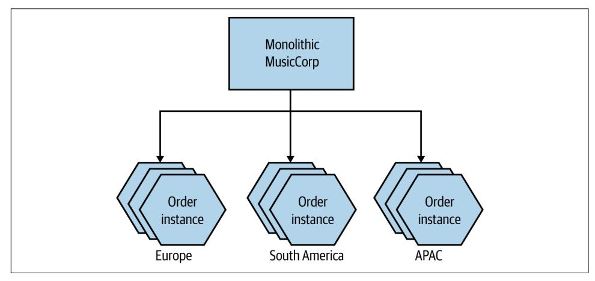

*Figure 13-8. MusicCorp's Order microservice is now partitioned across geography, with duplication in each group*

It's worth noting that by scaling along one axis, other axes might be easier to make use of. For example, the functional decomposition of Order enables us to then spin up multiple duplicates of the Order microservice, and also to partition the load on order processing. Without that initial functional decomposition, we'd be limited to applying those techniques on the monolith as a whole.

The goal when scaling isn't necessarily to scale along all axes, but we should be aware that we have these different mechanisms at our disposal. Given this choice, it's important we understand the pros and cons of each mechanism to work out which ones make the most sense.

## **Start Small**

In *The Art of Computer Programming* (Addison-Wesley), Donald Knuth famously said:

The real problem is that programmers have spent far too much time worrying about efficiency in the wrong places and at the wrong times; premature optimization is the root of all evil (or at least most of it) in programming.

Optimizing our system to solve problems we don't have is a great way to waste time that could be better spent on other activities, and also to ensure that we have a system that is needlessly more complex. Any form of optimization should be driven by real need. As we talked about in ["Robustness" on page 388](#page-413-0), adding new complexity to our <span id="page-459-0"></span>system can introduce new sources of fragility as well. By scaling one part of our appli‐ cation, we create a weakness elsewhere. Our Order microservice may now be running on its own infrastructure, helping us better handle the load of the system, but we've got yet another microservice that we need to make sure is available if we want our system to function, and yet more infrastructure that has to be managed and made robust.

Even if you think you have identified a bottleneck, a process of experimentation is essential to make sure that you are right and that further work is justified. It's amaz‐ ing to me how many people who would happily describe themselves as computer sci‐ entists seem not to have even a basic understanding of the scientific method.<sup>5</sup> If you've identified what you think is a problem, try to identify a small amount of work that can be done to confirm whether or not your proposed solution will work. In the context of scaling systems to handle load, having a suite of automated load tests, for example, can be incredibly useful. Run the tests to get a baseline and to re-create the bottleneck you are experiencing, make a change, and observe the difference. This isn't rocket science, but it is, even in a very small way, attempting to be at least vaguely scientific.

### **CQRS and Event Sourcing**

The Command Query Responsibility Segregation (CQRS) pattern refers to an alter‐ nate model for storing and querying information. Rather than our having a single model for how we both manipulate and retrieve data, as is common, responsibilities for reads and writes are instead handled by separate models. These separate read and write models, implemented in code, could be deployed as separate units, giving us the ability to scale reads and writes independently. CQRS is often, though not always, used in conjunction with *event sourcing*, where—rather than storing the current state of an entity as a single record—we instead project the state of an entity by looking at the history of events related to that entity.

Arguably, CQRS is doing something very similar in our application tier to what read replicas can do in the data tier, although due to the large number of different ways CQRS can be implemented, this is a simplification.

Personally, although I see value in the CQRS pattern in some situations, it's a com‐ plex pattern to execute well. I've spoken to very smart people who have hit not insig‐ nificant issues in making CQRS work. As such, if you are considering CQRS as a way to help scale your application, regard it as one of the harder forms of scaling you'd need to implement, and perhaps try some of the easier stuff first. For example, if you are simply read-constrained, a read replica may well be a significantly less risky and

<sup>5</sup> Don't get me started on people who start talking about hypotheses and then go about cherry-picking infor‐ mation to confirm their already-held beliefs.

<span id="page-460-0"></span>faster approach to start with. My concerns about the complexity of implementation extend to event sourcing—there are some situations it fits really well, but it comes with a host of headaches that need to be accommodated. Both patterns require quite a shift in thinking for developers, which always makes things more challenging. If you decide to use either of these patterns, just make sure this increased cognitive load on your developers is worth it.

One final note on CQRS and event sourcing: from the point of view of a microservice architecture, the decision to use or not use these techniques is an internal implemen‐ tation detail of a microservice. If you've decided to implement a microservice by split‐ ting responsibility for reads and writes across different processes and models, for example, this should be invisible to consumers of the microservice. If inbound requests need to be redirected to the appropriate model based on the request being made, make this the responsibility of the microservice implementing CQRS. Keeping these implementation details hidden from consumers gives you a lot of flexibility to change your mind later, or to change how you are using these patterns.

## **Caching**

Caching is a commonly used performance optimization whereby the previous result of some operation is stored so that subsequent requests can use this stored value rather than spending time and resources recalculating the value.

As an example, consider a Recommendation microservice that needs to check stock levels before recommending an item—there isn't any point in recommending some‐ thing we don't have in stock! But we've decided to keep a local copy of stock levels in Recommendation (a form of client-side caching) to improve the latency of our opera‐ tions—we avoid the need to check stock levels whenever we need to recommend something. The source of truth for stock levels is the Inventory microservice, which is considered to be the *origin* for the client cache in the Recommendation microser‐ vice. When Recommendation needs to look up a stock level, it can first look in its local cache. If the entry it needs is found, this is considered a *cache hit*. If the data is not found, it's a *cache miss*, which results in the need to fetch information from the downstream Inventory microservice. As the data in the origin can of course change, we need some way to *invalidate* entries in Recommendation's cache so we know when the locally cached data is so out of date that it can no longer be used.

Caches can store the results of simple lookups, as in this example, but really they can store any piece of data, such as the result of a complex calculation. We can cache to help improve the performance of our system as part of helping reduce latency, to scale our application, and in some cases even to improve the robustness of our sys‐ tem. Taken together with the fact that there are a number of invalidation mechanisms we could use, and multiple places where we can cache, it means we have a lot of

<span id="page-461-0"></span>aspects to discuss when it comes to caching in a microservice architecture. Let's start by talking about what sorts of problems caches can help with.

## **For Performance**

With microservices, we are often concerned about the adverse impact of network latency and about the cost of needing to interact with multiple microservices to get some data. Fetching data from a cache can help greatly here, as we avoid the need for network calls to be made, which also has the impact of reducing load on downstream microservices. Aside from avoiding network hops, it reduces the need to create the data on each request. Consider a situation in which we are asking for the list of the most popular items by genre. This might involve an expensive join query at the data‐ base level. We could cache the results of this query, meaning we'll need to regenerate the results only when the cached data becomes invalidated.

## **For Scale**

If you can divert reads to caches, you can avoid contention on parts of your system to allow it to better scale. An example of this that we've already covered in this chapter is the use of database read replicas. The read traffic is served by the read replicas, reducing the load on the primary database node and allowing reads to be scaled effec‐ tively. The reads on a replica are done against data that might be stale. The read rep‐ lica will eventually get updated by the replication from primary to replica node—this form of cache invalidation is handled automatically by the database technology.

More broadly, caching for scale is useful in any situation in which the origin is a point of contention. Putting caches between clients and the origin can reduce the load on the origin, better allowing it to scale.

## **For Robustness**

If you have an entire set of data available to you in a local cache, you have the poten‐ tial to operate even if the origin is unavailable—this in turn could improve the robustness of your system. There are a few things to note about caching for robust‐ ness. The main thing is that you'd likely need to configure your cache invalidation mechanism to not automatically evict stale data, and to keep data in the cache until it can be updated. Otherwise, as data gets invalidated, it will be removed from the cache, resulting in a cache miss and a failure to get any data, as the origin is unavail‐ able. This means you need to be prepared to read data that could be quite stale if the origin is offline. In some situations this might be fine, while in others it might be highly problematic.

<span id="page-462-0"></span>Fundamentally, using a local cache to enable robustness in a situation in which the origin is unavailable means you are favoring availability over consistency.

A technique I saw used at the *Guardian*, and subsequently elsewhere, was to crawl the existing "live" site periodically to generate a static version of the website that could be served in the event of an outage. Although this crawled version wasn't as fresh as the cached content served from the live system, in a pinch it could ensure that a version of the site would get displayed.

## **Where to Cache**

As we have covered multiple times, microservices give you options. And this is abso‐ lutely the case with caching. We have lots of different places where we could cache. The different cache locations I'll outline here have different trade-offs, and what sort of optimization you're trying to make will likely point you toward the cache location that makes the most sense for you.

To explore our caching options, let's revisit a situation that we looked at back in ["Data Decomposition Concerns" on page 81,](#page-106-0) where we were extracting information about sales in MusicCorp. In [Figure 13-9](#page-463-0), the Sales microservice maintains a record of items that have been sold. It tracks only the ID of the item sold and the timestamp of the sale. Occasionally, we want to ask the Sales microservice for a list of the top ten best sellers over the previous seven days.

The problem is that the Sales microservice doesn't know the names of the records, just the IDs. It's not much use to say, "The best seller this week had the ID 366548, and we sold 35,345 copies!" We want to know the name of the CD with the ID 366548 as well. The Catalog microservice stores that information. This means, as [Figure 13-9](#page-463-0) shows, that when responding to the request for the top ten best sellers, the Sales microservice needs to request the names of the top ten IDs. Let's look at how caching might help us and at what types of caches we could use.

<span id="page-463-0"></span>

*Figure 13-9. An overview of how MusicCorp works out the best sellers*

#### **Client-side**

With client-side caching, the data is cached outside the scope of the origin. In our example, this could be done as simply as holding an in-memory hashtable with a mapping between ID and name of album inside the running Sales process, as in [Figure 13-10.](#page-464-0) This means that generating our top ten takes any interaction with Cata log out of scope, assuming we get a cache hit for each lookup we need to make. It's important to note that our client cache could decide to cache only some of the infor‐ mation we get from the microservice. For example, we might get back lots of infor‐ mation about a CD when we ask for information about it, but if all we care about is the name of the album, that's all we have to store in our local cache.

<span id="page-464-0"></span>

*Figure 13-10. Sales holds a local copy of Catalog data*

In general, client-side caches tend to be pretty effective, as they avoid the network call to the downstream microservice. This makes them suitable not only for caching for improved latency but also for caching for robustness.

Client-side caching has a few downsides, though. Firstly, you tend to be more restric‐ ted in your options around invalidation mechanisms—something we'll explore more shortly. Secondly, when there's a lot of client-side caching going on, you can see a degree of inconsistency between clients. Consider a situation in which Sales, Recom mendation, and Promotions microservices all have a client-side cache of data from Catalog. When the data in Catalog changes, whatever invalidation mechanism we are likely to use will be unable to guarantee that the data is refreshed at the exact same moment of time in each of those three clients. This means that you could see a different view of the cached data in each of those clients at the same time. The more clients you have, the more problematic this is likely to be. Techniques such as notification-based invalidation, which we'll look at shortly, can help reduce this prob‐ lem, but they won't eliminate it.

Another mitigation for this is to have a shared client-side cache, perhaps making use of a dedicated caching tool like Redis or memcached, as we see in [Figure 13-11.](#page-465-0) Here, we avoid the problem of inconsistency between the different clients. This can also be more efficient in terms of resource use, as we are reducing the number of copies of this data we need to manage (caches often end up being in memory, and memory is often one of the biggest infrastructural constraints). The flip side is that our clients now need to make a round trip to the shared cache.

<span id="page-465-0"></span>

*Figure 13-11. Multiple consumers of Catalog making use of a single shared cache*

Another thing to consider here is who is responsible for this shared cache. Depending on who owns it and how it is implemented, a shared cache like this can blur the lines between client-side caching and server-side caching, which we explore next.

#### **Server-side**

In [Figure 13-12](#page-466-0), we see our top ten sales example making use of caching on the server side. Here, the Catalog microservice itself maintains a cache on behalf of its consum‐ ers. When the Sales microservice makes its request for the names of the CDs, this information is transparently served up by a cache.

Here, the Catalog microservice has full responsibility for managing the cache. Due to the nature of how these caches are typically implemented—such as an in-memory data structure, or a local dedicated caching node—it's easier to implement more sophisticated cache invalidation mechanisms. Write-through caches, for example (which we'll look at shortly), would be much simpler to implement in this situation. Having a server-side cache also makes it easier to avoid the issue with different con‐ sumers seeing different cached values that can occur with client-side caching.

It's worth noting that, although from the consumer point of view this caching is invisible (it's an internal implementation concern), that doesn't mean we'd have to implement this by caching in code in a microservice instance. We could, for example, <span id="page-466-0"></span>maintain a reverse proxy within our microservice's logical boundary, use a hidden Redis node, or divert read queries to read replicas of a database.


*Figure 13-12. The Catalog implements caching internally, making it invisible to consumers*

The major issue with this form of caching is that it has reduced scope for optimizing for latency, as a round trip by consumers to the microservice is still needed. By cach‐ ing at or near to the perimeter of a microservice, the cache can ensure that we don't need to carry out further expensive operations (like database queries), but the call needs to be made. This also reduces the effectiveness of this form of caching for any form of robustness.

This might make this form of caching seem less useful, but there is huge value to transparently improving performance for all consumers of a microservice just by making a decision to implement caching internally. A microservice that is widely used across an organization may benefit hugely by implementing some form of inter‐ nal caching, helping perhaps to improve response times for a number of consumers while also allowing the microservice to scale more effectively.

In the case of our top ten scenario, we'd have to consider whether or not this form of caching might help. Our decision would come down to what our main worry is. If it's about the end-to-end latency of the operation, how much time would a server-side cache save? Client-side caching would likely give us a better performance benefit.

#### <span id="page-467-0"></span>**Request cache**

With a request cache, we store a cached answer for the original request. So in Figure 13-13 for example, we store the actual top ten entries. Subsequent requests for the top ten best sellers result in the cached result being returned. No lookups in the Sales data needed, no round trips to Catalog—this is far and away the most effective cache in terms of optimizing for speed.


*Figure 13-13. Caching the results of the top 10 request*

The benefits here are obvious. This is super efficient, for one thing. However, we need to recognize that this form of caching is highly specific. We've only cached the result of this specific request. This means that other operations that hit Sales or Catalog won't be hitting a cache and thus won't benefit in any way from this form of optimization.

## **Invalidation**

*There are only two hard things in Computer Science: cache invalidation and naming things.* —Phil Karlton

Invalidation is the process by which we evict data from our cache. It's an idea that is simple in concept but complex in execution, if for no other reason than there are a wealth of options in terms of how to implement it, and numerous trade-offs to con‐

<span id="page-468-0"></span>sider in terms of making use of data that might be out of date. Fundamentally, though, it comes down to deciding in which situations a piece of cached data should be removed from your cache. Sometimes this happens because we are told a new ver‐ sion of a piece of data is available; at other times it might require us to assume our cached copy is stale and fetch a new copy from the origin.

Given the options around invalidation, I think it's a good idea to look at a few of the options you could make use of in a microservice architecture. Please don't consider this to be an exhaustive overview of every option, though!

#### **Time to live (TTL)**

This is one of the simplest mechanisms to use for cache invalidation. Each entry in the cache is assumed to be valid for only a certain duration in time. After that time has passed, the data is invalidated, and we fetch a new copy. We can specify the dura‐ tion of validity using a simple time to live (TTL) duration—so a TTL of five minutes means our cache would happily provide the cache data for up to five minutes, after which the cached entry is considered to be invalidated and a fresh copy is required. Variations on this theme can include using a timestamp for expiration, which in some situations can be more effective, especially if you are reading through multiple levels of cache.

HTTP supports both a TTL (via the Cache-Control header) and the ability to set a timestamp for expiration through the Expires header on responses, which can be incredibly useful. This means that the origin itself is able to tell downstream clients how long they should assume data is fresh for. Coming back to our Inventory micro‐ service, we could imagine a situation in which the Inventory microservice gives a shorter TTL for stock levels of fast-selling items, or for items for which we are almost out of stock. For items that we don't sell much of, it could provide a longer TTL. This represents a somewhat advanced use of HTTP cache controls, and tuning cache con‐ trols on a per-response basis like this is something I'd do only when tuning the effec‐ tiveness of a cache. A simple one-size-fits-all TTL for any given resource type is a sensible starting point.

Even if you're not using HTTP, the idea of the origin giving hints to the client as to how (and if) data should be cached is a really powerful concept. This means you don't have to guess about these things on the client side; you can actually make an informed choice about how to handle a piece of data.

HTTP does have more advanced caching capabilities than this, and we'll look at con‐ ditional GETs as an example of that in a moment.

One of the challenges of TTL-based invalidation is that although it is simple to imple‐ ment, it is a pretty blunt instrument. If we request a fresh copy of the data that has a five-minute TTL, and a second later the data at the origin changes, then our cache

<span id="page-469-0"></span>will be operating on out-of-date data for the remaining four minutes and 59 seconds. So the simplicity of implementation needs to be balanced against how much toler‐ ance you have around operating on out-of-date data.

#### **Conditional GETs**

Worth a mention, as this is overlooked, is the ability to issue conditional GET requests with HTTP. As we've just touched on, HTTP provides the ability to specify Cache-Control and Expires headers on responses to enable smarter client-side cach‐ ing. But if we're working directly with HTTP, we have another option in our arsenal of HTTP goodies: entity tags, or ETags. An ETag is used to determine whether the value of a resource has changed. If I update a customer record, the URI to the resource is the same but the value is different, so I would expect the ETag to change. This becomes powerful when we're using what is called a *conditional GET*. When making a GET request, we can specify additional headers, telling the service to send us the resource only if certain criteria are met.

For example, let's imagine we fetch a customer record, and its ETag comes back as o5t6fkd2sa. Later on, perhaps because a Cache-Control directive has told us the resource should be considered stale, we want to make sure we get the latest version. When issuing the subsequent GET request, we can pass in an If-None-Match: o5t6fkd2sa. This tells the server that we want the resource at the specified URI, unless it already matches this ETag value. If we already have the up-to-date version, the service sends us a 304 Not Modified response, telling us we have the latest ver‐ sion. If there is a newer version available, we get a 200 OK with the changed resource and a new ETag for the resource.

Of course, with a conditional GET, we still make the request from client to server. If you are caching to reduce network round trips, this may not help you much. Where it is useful is in avoiding the cost of needlessly regenerating resources. With TTL-based invalidation, the client asks for a new copy of the resource, even if the resource hasn't changed—the microservice receiving this request then has to regenerate that resource, even if it ends up being exactly the same as what the client already has. If the cost of creating the response is high, perhaps requiring an expensive set of data‐ base queries, then conditional GET requests can be an effective mechanism.

#### **Notification-based**

With notification-based invalidation, we use events to help subscribers know if their local cache entries need to be invalidated. To my mind, this is the most elegant mech‐ anism for invalidation, though that is balanced by its relative complexity with respect to TTL-based invalidation.

In [Figure 13-14,](#page-470-0) our Recommendation microservice is maintaining a client-side cache. Entries in that cache are invalidated when the Inventory microservice fires a <span id="page-470-0"></span>Stock Change event, letting Recommendation (or any other subscribers to this event) know that the stock level has increased or decreased for a given item.


*Figure 13-14. Inventory fires Stock Change events, which Recommendation can use to update its local cache*

The main benefit of this mechanism is that it reduces the potential window wherein the cache is serving stale data. The window in which a cache might now be serving stale data is limited to the time taken for the notification to be sent and processed. Depending on the mechanism you use to send the notification, this could be pretty fast.

The downside here is the complexity of implementation. We need the origin to be able to emit notifications, and we need interested parties to be able to respond to these notifications. Now, this is a natural place to make use of something like a mes‐ sage broker, as this model fits neatly into the typical pub/sub-style interactions that many brokers provide. The additional guarantees that the broker might be able to give us could also be helpful. That said, as we've already discussed in ["Message Brok‐](#page-160-0) [ers" on page 135,](#page-160-0) there is an overhead to managing messaging middleware, and it might be overkill if you were using it only for this purpose. If you were using brokers for other forms of inter-microservice communication, however, it would make sense to make use of technology that you already had on hand.

One problem to be aware of when using notification-based invalidation is that you may want to know whether the notification mechanism is actually working or not. Consider a situation in which we haven't received any Stock Changed events from Inventory for a while. Does that mean we haven't sold items or had items restocked during that time? Perhaps. It could also mean our notification mechanism is down and that we aren't being sent updates any more. If this is a concern, then we could send a heartbeat event via the same notification mechanism—Recommendation, in our case—to let subscribers know that notifications are still coming, but nothing has <span id="page-471-0"></span>actually changed. If a heartbeat event isn't received, the client can assume an issue and could do whatever is most appropriate—perhaps informing a user that they are seeing stale data, or perhaps just turning off functionality.

You also need to consider what the notification contains. If the notification just says "this thing has changed" without saying what the change is, then when receiving the notification, a consumer would need to go the origin and fetch the new data. On the other hand, if the notification contains the current state of the data, then consumers can load that directly into their local cache. Having a notification containing more data can cause issues regarding size and also carries a risk of potentially exposing sen‐ sitive data too broadly. We previously explored this trade-off in more depth when looking at event-driven communication in ["What's in an Event?" on page 111.](#page-136-0)

#### **Write-through**

With a write-through cache, the cache is updated at the same time as the state in the origin. "At the same time" is where write-through caches get tricky, of course. Imple‐ menting a write-through mechanism on a server-side cache is somewhat straightfor‐ ward, as you could update a database and an in-memory cache within the same transaction without too much difficulty. If the cache is elsewhere, it's more difficult to reason about what "at the same time" means in terms of these entries being updated.

Due to this difficulty, you'd typically see write-through caching being used in a microservice architecture on the server side. The benefits are pretty clear—the win‐ dow in which a client might see stale data could be practically eliminated. This is bal‐ anced against the fact that server-side caches may well be less generally useful, limiting the circumstances in which a write-through cache would be effective in microservices.

#### **Write-behind**

With a write-behind cache, the cache itself is updated *first*, and then the origin is updated. Conceptually, you can think of the cache as a buffer. Writing into the cache is faster than updating the origin. So we write the result into the cache, allowing faster subsequent reads, and trust that the origin will be updated afterward.

The main concern around write-behind caches is going to be the potential for data loss. If the cache itself isn't durable, we could lose the data before the data is written to the origin. Additionally, we're now in an interesting spot—what is the *origin* in this context? We'd expect the origin to be the microservice where this data is sourced from—but if we update the cache first, is that really the origin? What is our source of truth? When making use of caching, it's important to separate out what data is cached (and potentially out of date) and what data can actually be considered to be

<span id="page-472-0"></span>up to date. Write-behind caches in the context of microservices makes this much less clear.

While write-behind caches are often used for in-process optimization, I've seen them much more rarely used for microservice architectures, partly due to the fact that other, more straightforward forms of caching are good enough, but largely due to the complexity of handling the loss of unwritten cached data.

## **The Golden Rule of Caching**

Be careful about caching in too many places! The more caches between you and the source of fresh data, the more stale the data can be, and the harder it can be to deter‐ mine the freshness of the data that a client eventually sees. It can also be more difficult to reason about where data needs to be invalidated. The trade-off around caching—balancing freshness of data against optimization of your system for load or latency—is a delicate one, and if you cannot easily reason about how fresh (or not) data might be, this becomes difficult.

Consider a situation in which the Inventory microservice is caching stock levels. Requests to Inventory for stock levels may get served out of this server-side cache, speeding up the request accordingly. Let's also now assume we've set a TTL for this internal cache to be one minute, meaning our server-side cache could be up to one minute behind the actual stock level. Now, it turns out we are also caching on the client side inside Recommendation, where we're also using a TTL of one minute. When an entry in the client-side cache expires, we make a request from Recommenda tion to Inventory to get an up-to-date stock level, but unbeknownst to us, our request hits the server-side cache, which at this point could also be up to one minute old. So we could end up storing a record in our client-side cache that is already up to one minute old from the start. This means that the stock levels Recommendation is using could potentially be up to *two* minutes out of date, even though from the point of view of Recommendation, we think they could be only up to one minute out of date.

There are a number of ways to avoid problems like this. Using a timestamp-based expiration for a start would be better than TTLs, but it's also an example of what hap‐ pens when caching is effectively nested. If you cache the result of an operation that in turn is based on cached inputs, how clear can you be about how up to date the end result is?

Coming back to the famous quote from Knuth earlier, premature optimization can cause issues. Caching adds complexity, and we want to add as little complexity as possible. The ideal number of places to cache is zero. Anything else should be an optimization you *have* to make—but be aware of the complexity it can bring.

<span id="page-473-0"></span>

Treat caching primarily as a performance optimization. Cache in as few places as possible to make it easier to reason about the fresh‐ ness of data.

## **Freshness Versus Optimization**

Coming back to our example of TTL-based invalidation, I explained earlier that if we request a fresh copy of the data that has a five-minute TTL, and a second later the data at the origin changes, then our cache will be operating on out-of-date data for the remaining four minutes and 59 seconds. If this is unacceptable, one solution would be to reduce the TTL, thereby reducing the duration in which we could oper‐ ate on stale data. So perhaps we reduce the TTL to one minute. This means that our window of staleness is reduced to one-fifth of what it was, but we've made five times as many calls to the origin, so we have to consider the associated latency and load impact.

Balancing these forces is going to come down to understanding the requirements of the end user and of the wider system. Users will obviously always want to operate on the freshest data, but not if that means the system falls down under load. Likewise, sometimes the safest thing to do is to turn off features if a cache fails, in order to avoid an overload on the origin causing more serious issues. When it comes to finetuning what, where, and how to cache, you'll often find yourself having to balance along a number of axes. This is just another reason to try to keep things as simple as possible—the fewer the caches, the easier it can be to reason about the system.

## **Cache Poisoning: A Cautionary Tale**

With caching, we often think that if we get it wrong, the worst thing that can happen is we serve stale data for a bit. But what happens if you end up serving stale data for‐ ever? Back in [Chapter 12](#page-412-0) I introduced AdvertCorp, where I was working to help migrate a number of existing legacy applications over to a new platform making use of the strangler fig pattern. This involved intercepting calls to multiple legacy applica‐ tions and, where these applications had been moved to the new platform, diverting the calls. Our new application operated effectively as a proxy. Traffic for the older legacy applications that we hadn't yet migrated was routed through our new applica‐ tion to the downstream legacy applications. For the calls to legacy applications, we did a few housekeeping things; for example, we made sure that the results from the legacy application had proper HTTP cache headers applied.

One day, shortly after a normal routine release, something odd started happening. A bug had been introduced whereby a small subset of pages were falling through a logic condition in our cache header insertion code, resulting in us not changing the header at all. Unfortunately, this downstream application had also been changed sometime <span id="page-474-0"></span>previously to include an Expires: Never HTTP header. This hadn't had any effect earlier, as we were overriding this header. Now we weren't.

Our application made heavy use of Squid to cache HTTP traffic, and we noticed the problem quite quickly, as we were seeing more requests bypassing Squid itself to hit our application servers. We fixed the cache header code and pushed out a release, and we also manually cleared the relevant region of the Squid cache. However, that wasn't enough.

As we just discussed, you can cache in multiple places—but sometimes having lots of caches makes your life harder, not easier. When it comes to serving up content to users of a public-facing web application, you could have multiple caches between you and your customer. Not only might you be fronting your website with something like a content delivery network, but some ISPs make use of caching. Can you control those caches? And even if you could, there is one cache that you have little control over: the cache in a user's browser.

Those pages with Expires: Never stuck in the caches of many of our users and would never be invalidated until the cache became full or the user cleaned them out manually. Clearly we couldn't make either thing happen; our only option was to change the URLs of these pages so they were refetched.

Caching can be very powerful indeed, but you need to understand the full path of data that is cached from source to destination to really appreciate its complexities and what can go wrong.

## **Autoscaling**

If you are lucky enough to have fully automatable provisioning of virtual hosts and can fully automate the deployment of your microservice instances, then you have the building blocks to allow you to automatically scale your microservices.

For example, you could have the scaling triggered by well-known trends. You might know that your system's peak load is between 9 a.m. and 5 p.m., so you bring up additional instances at 8:45 a.m., and turn them off at 5:15 p.m. If you're using some‐ thing like AWS (which has very good support for autoscaling built in), turning off instances you don't need any longer will help save money. You'll need data to under‐ stand how your load changes over time, from day to day, and from week to week. Some businesses have obvious seasonal cycles too, so you may need data going back a fair way to make proper judgment calls.

On the other hand, you could be reactive, bringing up additional instances when you see an increase in load or an instance failure, and removing instances when you no longer need them. Knowing how fast you can scale up once you spot an upward trend is key. If you know you'll get only a couple of minutes' notice about an increase in

<span id="page-475-0"></span>load, but scaling up will take you at least 10 minutes, then you know you'll need to keep extra capacity around to bridge this gap. Having a good suite of load tests is almost essential here. You can use them to test your autoscaling rules. If you don't have tests that can reproduce different loads that will trigger scaling, then you're only going to find out in production if you got the rules wrong. And the consequences of failure aren't great!

A news site is a great example of a type of business in which you may want a mix of predictive and reactive scaling. On the last news site I worked on, we saw very clear daily trends, with views climbing from the morning to lunchtime and then starting to decline. This pattern was repeated day in and day out, with traffic generally lower on the weekend. That gave us a fairly clear trend that could drive proactive scaling of resources, whether up or down. On the other hand, a big news story would cause an unexpected spike, requiring more capacity and often at short notice.

I actually see autoscaling used much more for handling failure of instances than for reacting to load conditions. AWS lets you specify rules like "There should be at least five instances in this group," so that if one instance goes down a new one is automati‐ cally launched. I've seen this approach lead to a fun game of whack-a-mole when someone forgets to turn off the rule and then tries to take down the instances for maintenance, only to see them keep spinning up!

Both reactive and predictive scaling are very useful and can help you be much more cost effective if you're using a platform that allows you to pay only for the computing resources you use. But they also require careful observation of the data available to you. I'd suggest using autoscaling for failure conditions first while you collect the data. Once you want to start autoscaling for load, make sure you are very cautious about scaling down too quickly. In most situations, having more computing power at hand than you need is much better than not having enough!

## **Starting Again**

The architecture that gets you started may not be the architecture that keeps you going when your system has to handle very different volumes of load. As we've already seen, there are some forms of scaling that can have extremely limited impact on the architecture of your system—vertical scaling and horizontal duplication, for example. At certain points, though, you need to do something pretty radical to change the architecture of your system to support the next level of growth.

Recall the story of Gilt, which we touched on in ["Isolated Execution" on page 228.](#page-253-0) A simple monolithic Rails application did well for Gilt for two years. Its business became increasingly successful, which meant more customers and more load. At a certain tipping point, the company had to redesign the application to handle the load it was seeing.

<span id="page-476-0"></span>A redesign may mean splitting apart an existing monolith, as it did for Gilt. Or it might mean picking new data stores that can handle the load better. It could also mean adopting new techniques, such as moving from synchronous request-response to event-based systems, adopting new deployment platforms, changing whole tech‐ nology stacks, or everything in between.

There is a danger that people will see the need to rearchitect when certain scaling thresholds are reached as a reason to build for massive scale from the beginning. This can be disastrous. At the start of a new project, we often don't know exactly what we want to build, nor do we know if it will be successful. We need to be able to rapidly experiment and understand what capabilities we need to build. If we tried building for massive scale up front, we'd end up front-loading a huge amount of work to pre‐ pare for load that may never come, while diverting effort away from more important activities, like understanding if anyone will actually want to use our product. Eric Ries tells the story of spending six months building a product that no one ever down‐ loaded. He reflected that he could have put up a link on a web page that 404'd when people clicked on it to see if there was any demand, spent six months on the beach instead, and learned just as much!

The need to change our systems to deal with scale isn't a sign of failure. It is a sign of success.

## **Summary**

As we can see, whatever type of scaling you're looking for, microservices give you a lot of different options in terms of how you approach the problem.

The scaling axes can be a useful model to use when considering what types of scaling are available to you:

*Vertical scaling*

In a nutshell, this means getting a bigger machine.

*Horizontal duplication*

Having multiple things capable of doing the same work.

*Data partitioning*

Dividing work based on some attribute of the data, e.g., customer group.

*Functional decomposition*

Separation of work based on the type, e.g., microservice decomposition.

Key to a lot of this is understanding what it is you want—techniques that are effective at scaling to improve latency may not be as effective in helping scale for volume.

I hope I have also shown, though, that many of the forms of scaling we have dis‐ cussed result in increased complexity in your system. So being targeted in terms of what you are trying to change and avoiding the perils of premature optimization are important.

Next up, we move from looking at what happens behind the scenes to the most visi‐ ble parts of our system—the user interface.

## **PART III**

## <span id="page-478-0"></span>**People**

## **User Interfaces**

<span id="page-480-0"></span>So far, we haven't really touched on the world of the user interface. A few of you out there might just be providing a cold, hard, clinical API to your customers, but many of us find ourselves wanting to create beautiful, functional user interfaces that will delight our customers. The user interface, after all, is where we'll be pulling all these microservices together into something that makes sense to our customers.

When I first started computing, we were mostly talking about big, fat clients that ran on our desktops. I spent many hours with Motif and then Swing trying to make my software as nice to use as possible. Often these systems were just for the creation and manipulation of local files, but many of them had a server-side component. My first job at Thoughtworks involved creating a Swing-based electronic point-of-sale system that was just one of a large number of moving parts, most of which were on the server.

Then came the web. We instead started thinking of our UIs as being "thin," with more logic on the server side. In the beginning, our server-side programs rendered the entire page and sent it to the client browser, which did very little. Any interac‐ tions were handled on the server side via GETs and POSTs triggered by the user clicking on links or filling in forms. Over time, JavaScript became a more popular option to add dynamic behavior to the browser-based UI, and some applications could arguably be as "fat" as the old desktop clients. We subsequently had the rise of the mobile application, and today we have a varied landscape for delivering graphical user interfaces to our users—different platforms, and different technologies for those platforms. This range of technologies gives us a host of options for how we can make effective user interfaces backed by microservices. We'll be exploring all of this and more in this chapter.

## <span id="page-481-0"></span>**Toward Digital**

Over the last couple of years, organizations have started to move away from thinking that web or mobile should be treated differently; they are instead thinking about digi‐ tal more holistically. What is the best way for our customers to use the services we offer? And what does that do to our system architecture? The understanding that we cannot predict exactly how a customer might end up interacting with our products has driven adoption of more granular APIs, like those delivered by microservices. By combining the capabilities our microservices expose in different ways, we can curate different experiences for our customers on their desktop application, mobile device, and wearable device and even in physical form if they visit our brick-and-mortar store.

So think of user interfaces as the places where we weave together the various strands of the capabilities we want to offer our users. With that in mind, how do we pull all these strands together? We need to look at this problem from two sides: the who and the how. Firstly, we'll consider the organizational aspects—who owns what responsi‐ bilities when it comes to delivering user interfaces? Secondly, we'll look at a set of patterns that can be used to implement these interfaces.

## **Ownership Models**

As we discussed way back in [Chapter 1](#page-28-0), the traditional layered architecture can cause issues when it comes to delivering software effectively. In [Figure 14-1,](#page-482-0) we see an example in which responsibility for the user interface layer is owned by a single front‐ end team, with the backend services work done by another. In this example, adding a simple control involves work being done by three different teams. These sorts of tiered organizational structures can significantly impact our speed of delivery due to the need to constantly coordinate changes and hand off work between teams.

<span id="page-482-0"></span>

*Figure 14-1. Making a change across all three tiers is more involved*

The model that I greatly prefer and feel is better aligned to achieving the goal of inde‐ pendent deployability is to have the UI broken apart and managed by a team that also manages the server-side components, as we see in [Figure 14-2](#page-483-0). Here, a single team ends up being responsible for all the changes we need to make to add our new control.

Teams with full ownership of the end-to-end functionality are able to make changes more quickly. Having full ownership encourages each team to have a direct contact point with an end user of the software. With backend teams, it's easy to lose track of who the end user is.

Despite the drawbacks, I (unfortunately) still see the dedicated frontend team as being the more common organizational pattern among companies who make use of microservices. Why is this?

<span id="page-483-0"></span>

*Figure 14-2. The UI is broken apart and is owned by a team that also manages the server-side functionality that supports the UI*

## **Drivers for Dedicated Frontend Teams**

The desire for dedicated frontend teams seems to come down to three key factors: scarcity of specialists, a drive for consistency, and technical challenges.

Firstly, delivering a user interface requires a degree of specialized skills. There are the interaction and graphical design aspects, and then there is the technical know-how required to deliver a great web or native application experience. Specialists with these skills can be hard to come by, and as these folks are such a rare commodity, the temp‐ tation is to stick them all together so you can make sure they are focusing only on their specialty.

The second driver for a separate frontend team is consistency. If you have one team responsible for delivering your customer-facing user interface, you can ensure your UI has a consistent look and feel. You use a consistent set of controls to solve similar problems so that the user interface looks and feels like a single, cohesive entity.

<span id="page-484-0"></span>Finally, some user interface technology can be challenging to work with in a nonmonolithic fashion. Here I'm thinking specifically of single-page applications (SPAs), which historically at least haven't been easy to break apart. Traditionally, a web user interface would consist of multiple web pages, and you would navigate from one page to another. With SPAs, the entire application is instead served up inside a single web page. Frameworks like Angular, React, and Vue theoretically allow for the creation of more sophisticated user interfaces than "old-fashioned" websites. We'll be looking at a set of patterns that can give you different options for how to decompose a user interface later in this chapter, and in terms of SPAs I will show how the micro front‐ end concept can allow you to use SPA frameworks while still avoiding the need for a monolithic user interface.

## **Toward Stream-Aligned Teams**

I think that having a dedicated frontend team is in general a mistake if you are trying to optimize for good throughput—it creates new handoff points in your organization, slowing things down. Ideally, our teams are aligned around end-to-end slices of func‐ tionality, allowing each team to deliver new features to its customers while reducing the amount of coordination needed. My preferred model is a team owning the endto-end delivery of functionality in a specific part of the domain. This matches what Matthew Skelton and Manuel Pais describe as *stream-aligned teams* in their book *Team Topologies*. 1 As they describe it:

A stream-aligned team is a team aligned to a single, valuable stream of work...[T]he team is empowered to build and deliver customer or user value as quickly, safely, and independently as possible, without requiring hand-offs to other teams to perform parts of the work.

In a sense, we are talking about *full stack teams* (rather than full stack developers).<sup>2</sup> A team with end-to-end responsibility for delivery of user-facing functionality is also going to have a more obvious, direct connection to the end user as well. All too often I've seen "backend" teams with a hazy idea of what the software does or what the users need, which can cause all sorts of misunderstandings when it comes to imple‐ menting new functionality. On the other hand, the end-to-end teams will find it much easier to build a direct connection with the people using the software they cre‐ ate—they can be more focused on making sure that the people they are serving are getting what they need.

As a concrete example, I spent some time working with FinanceCo, a successful and growing Fintech firm based in Europe. At FinanceCo, virtually all teams work on

<sup>1</sup> Matthew Skelton and Manuel Pais, *Team Topologies* (Portland, OR: IT Revolution, 2019).

<sup>2</sup> As Charity Majors says, "You're not a full stack developer unless you build the chips."

<span id="page-485-0"></span>software that directly impacts the customer experience and have customer-oriented key performance indicators (KPIs)—the success of a given team is driven less by how many features it has shipped and more by helping to improve the experience of the people using the software. It becomes very clear as to how a change can impact cus‐ tomers. This is only possible due to the fact that the majority of the teams have direct, customer-facing responsibilities in terms of the software they deliver. When you are more removed from the end user, it becomes harder to understand whether your contributions are successful, and you can end up focusing on goals that are a long way removed from things the people using your software care about.

Let's revisit the reasons why dedicated frontend teams exist—specialists, consistency, and technical challenges—and now let's look at how these issues can be addressed.

## **Sharing Specialists**

Good developers can be hard to find, and finding them is further complicated when you need developers with a certain specialty. In the area of user interfaces, for exam‐ ple, if you are providing native mobile as well as web interfaces, you could find your‐ self needing people who are experienced with iOS and Android as well as with modern web development. This is quite aside from the fact that you may want dedi‐ cated interaction designers, graphic designers, accessibility experts, and the like. Peo‐ ple with the right depth of skills for these more "narrow" fields may be thin on the ground, and they may always have more work than there is time for.

As we've touched on previously, the traditional approach to organizational structures would have you putting all the people who possess the same skill set in the same team, allowing you to tightly control what they work on. But as we've also discussed, this leads to siloed organizations.

Putting people with specialized skills in their own dedicated team also deprives you of opportunities for other developers to pick up these in-demand skills. You don't need every developer to learn to become an expert iOS developer, for example, but it can still be useful for some of your developers to learn enough skills in that area to help out with the easy stuff, leaving your specialists free to tackle the really hard tasks. Skill sharing can also be helped by establishing communities of practice—you might consider having a UI community that cuts across your teams, enabling people to share ideas and challenges with their peers.

I remember when all database changes had to be done by a central pool of database administrators (DBAs). Developers had little awareness of how databases worked as a result, and would more frequently create software that used the database poorly. Fur‐ thermore, much of the work the experienced DBAs were being asked to do consisted of trivial changes. As more database work got pulled into delivery teams, developers in general got a better appreciation for databases and could start doing the trivial work themselves, freeing up the valuable DBAs to focus on more complex database

<span id="page-486-0"></span>issues, which made better use of their deeper skills and experience. A similar shift has happened in the space of operations and testers, with more of this work being pulled into teams.

So, on the contrary, moving specialists out of dedicated teams won't inhibit the spe‐ cialists' ability to do their job; in fact, it will likely increase the bandwidth they have to focus on the difficult problems that really need their attention.

The trick is to find a more effective way to deploy your specialists. Ideally, they would be embedded in the teams. Sometimes, though, there might not be enough work to justify their full-time presence in a given team, in which case they may well split their time between multiple teams. Another model is to have a dedicated team with these skills whose explicit job is to *enable* other teams. In *Team Topologies*, Skelton and Pais describe these teams as *enabling teams*. Their job is to go out and help other teams who are focused on delivering new features to do their job. You can think of these teams as a bit more like an internal consultancy—they can come in and spend targeted time with a stream-aligned team, helping it become more self-sufficient in a particular area or else providing some dedicated time to help roll out a particularly difficult piece of work.

So whether your specialists are embedded full-time in a given team, or work to enable others to do the same work, you can remove organizational silos and also help skill up your colleagues at the same time.

## **Ensuring Consistency**

The second issue often cited as a reason for dedicated frontend teams is that of con‐ sistency. By having a single team responsible for a user interface, you ensure that the UI has a consistent look and feel. This can extend from easy things like using the same colors and fonts to solving the same interface problems in the same way—using a consistent design and interaction language that helps users interact with the system. This consistency doesn't just help communicate a degree of polish regarding the product itself but also ensures that users will find it easier to use new functionality when it is delivered.

There are ways, though, to help ensure a degree of consistency across teams. If you are using the enabling team model, with specialists spending time with multiple teams, they can help ensure that the work done by each team is consistent. The creation of shared resources like a living CSS style guide or shared UI components can also help.

As a concrete example of an enabling team being used to help with consistency, the *Financial Times* Origami team builds web components in collaboration with the design team, which encapsulates the brand identity—ensuring a consistent look and feel across the stream-aligned teams. This type of enabling team provides two forms <span id="page-487-0"></span>of aid—firstly, it shares its expertise in delivering already-built components, and sec‐ ondly, it helps ensure that the UIs deliver a consistent user experience.

It's worth noting, however, that the driver for consistency shouldn't be considered universally right. Some organizations make seemingly conscious decisions to not require consistency in their user interfaces, because they feel that allowing for more autonomy of teams is preferable. Amazon is one such organization. Earlier versions of its main shopping site had large degrees of inconsistency, with widgets using quite different styles of controls.

This is shown to an even greater degree when you look at the web control panel for Amazon Web Services (AWS). Different products in AWS have massively different interaction models, making the user interface quite bewildering. This, however, seems to be a logical extension of Amazon's drive to reduce internal coordination between teams.

The increased autonomy of product teams in AWS appears to manifest itself in other ways as well, not just in terms of an often disjointed user experience. There fre‐ quently are multiple different ways to achieve the same task (by running a container workload, for example), with different product teams inside AWS often overlapping with one another with similar but incompatible solutions. You might criticize the end result, but AWS has shown that by having these highly autonomous product-oriented teams, it has created a company that has a clear market lead. Speed of delivery trumps a consistency of user experience, at least as far as AWS is concerned.

## **Working Through Technical Challenges**

We've gone through some interesting evolutions when it comes to the development of user interfaces—from green-screen terminal-based textual user interfaces to rich desktop applications, the web, and now native mobile experiences. In many ways, we have gone full circle and then some—our client applications are now built with such complexity and sophistication that they absolutely rival the complexity of the rich desktop applications that were the mainstay of user interface development well into the first decade of the twenty-first century.

To some degree, the more things change, the more they stay the same. We often are still working with the same UI controls as 20 years ago—buttons, checkboxes, forms, combo boxes, and the like. We've added a few more components to this space, but far fewer than you might think. What has changed is the technology we use to create these graphical user interfaces in the first place.

Some newer technology in this space, specifically single-page applications, cause us issues when it comes to decomposing a user interface. In addition, the wider variety of devices on which we expect the same user interface to be delivered cause other problems that need to be solved.

<span id="page-488-0"></span>Fundamentally, our users want to engage with our software in as seamless a way as possible. Be that through a browser on a desktop, or through a native or web mobile app, the result is the same—users interact with our software through a single pane of glass. They shouldn't care whether the user interface is built in a modular or mono‐ lithic way. So we have to look at ways to break apart our user interface functionality and bring it all back together again, all while resolving the challenges caused by single-page applications, mobile devices, and more. These issues will occupy us for the rest of this chapter.

## **Pattern: Monolithic Frontend**

The *monolithic frontend* pattern describes an architecture in which all the UI state and behavior is defined in the UI itself, with calls made to backing microservices to get required data or carry out required operations. Figure 14-3 shows an example of this. Our screen wants to display information about an album and its track listing, so the UI makes a request to pull this data from the Album microservice. We also display information about the most recent special offers by requesting information from the Promotions microservice. In this example, our microservices return JSON that the UI uses to update the displayed information.


*Figure 14-3. Our Album details screen pulls information from downstream microservi‐ ces to render the UI*

<span id="page-489-0"></span>This model is the most common one for people building monolithic single-page applications, often with a dedicated frontend team. The requirements of our micro‐ services are pretty straightforward—they just need to share information in a form that can be easily interpreted by the UI. In the case of a web-based UI, this means our microservices would likely need to provide data in a textual format, JSON being the most likely choice. The UI would then need to create the various components that make up the interface, handling synchronization of state and the like with the back‐ end. Using a binary protocol for service-to-service communication would be more difficult for web-based clients but could be fine for native mobile devices or "thick" desktop applications.

## **When to Use It**

There are some downsides to this approach. Firstly, by its nature as a monolithic entity, it can become a driver for (or be caused by) a dedicated frontend team. Having multiple teams share responsibility for this monolithic frontend can be challenging due to the multiple sources of contention. Secondly, we have little ability to tailor the responses for different sorts of devices. If using web technology, we can change the layout of a screen to accommodate different device constraints, but this doesn't nec‐ essarily extend to changing the calls being made to the supporting microservices. My mobile client may only be able to display 10 fields of an order, but if the microservice pulls back all one hundred fields of the order, we end up retrieving unnecessary data. One solution to this approach is for the user interface to specify what fields to pull back when it makes a request, but this assumes that each supporting microservice supports this form of interaction. In ["GraphQL" on page 488,](#page-513-0) we'll look at how the use of both the backend for frontend pattern and GraphQL can help in this case.

Really, this pattern works best when you *want* all of the implementation and behavior of your UI in one deployable unit. For a single team developing both the frontend and all supporting microservices, that might be fine. Personally, if you have more than one team working on your software, I think you should fight against that urge, as it can result in you slipping into a layered architecture with the associated organi‐ zational silos. If, however, you are unable to avoid a layered architecture and match‐ ing organizational structure, this is probably the pattern you'll end up using.

## **Pattern: Micro Frontends**

The *micro frontend* approach is an organizational pattern whereby different parts of a frontend can be worked on and deployed independently. To quote from a highly rec‐ ommended article by Cam Jackson on the topic,<sup>3</sup> we can define *micro frontends* as

<sup>3</sup> Cam Jackson, "Micro Frontends," martinfowler.com, June 19, 2019, *<https://oreil.ly/U3K40>*.

<span id="page-490-0"></span>follows: "An architectural style where independently deliverable frontend applica‐ tions are composed into a greater whole."

It becomes an essential pattern for stream-aligned teams who want to own delivery of both backend microservices and the supporting UI. Where microservices deliver independent deployability for the backend functionality, micro frontends deliver independent deployability for the frontend.

The micro frontend concept has gained popularity due to the challenges created by monolithic, JavaScript-heavy web UIs, as typified by single-page applications. With a micro frontend, different teams can work on and make changes to different parts of the frontend. Coming back to [Figure 14-2,](#page-483-0) the stock team, purchase flow team, and customer profile team are each able to change the frontend functionality associated with their stream of work independent of the other teams.

## **Implementation**

For web-based frontends, we can consider two key decompositional techniques that can aid implementation of the micro frontend pattern. Widget-based decomposition involves splicing different parts of a frontend together into a single screen. Pagebased decomposition, on the other hand, has the frontend split apart into independ‐ ent web pages. Both approaches are worthy of further exploration, which we'll get to shortly.

## **When to Use It**

The micro frontend pattern is essential if you want to adopt end-to-end, streamaligned teams where you are trying to move away from a layered architecture. I could also imagine it being useful in a situation in which you want to retain a layered archi‐ tecture, but the functionality of the frontend is now so large that multiple dedicated frontend teams are required.

There is one key problem with this approach that I'm not sure can be solved. Some‐ times the capabilities offered by a microservice do not fit neatly into a widget or a page. Sure, I might want to surface recommendations in a box on a page on our web‐ site, but what if I want to weave in dynamic recommendations elsewhere? When I search, I want the type ahead to automatically trigger fresh recommendations, for example. The more cross-cutting a form of interaction is, the less likely this model will fit, and the more likely it is that we'll fall back to just making API calls.

### **Self-Contained Systems**

<span id="page-491-0"></span>A *self-contained system* (SCS) is a style of architecture that arose, arguably, out of the lack of focus on UI concerns during the early years of microservices. An SCS could consist of multiple moving parts (potentially microservices) that when taken together constitute a single SCS.

As defined, a self-contained system has to comply with some specific criteria that we can see overlap with some of the same things we are trying to achieve with microser‐ vices. You can find more information about self-contained systems on the very clear [SCS website](https://scs-architecture.org), but here are some highlights:

- Each SCS is an autonomous web application with no shared UI.
- Each SCS is owned by one team.
- Async communication should be used whenever possible.
- No business code can be shared between SCSs.

The SCS approach hasn't caught on to the same extent as microservices, and it's not a concept I encounter much, despite the fact that I agree with many of the principles it outlines. I especially like calling out that a self-contained system should be owned by one team. I do wonder if this lack of wider use explains why some aspects of the SCS approach seem overly narrow and prescriptive. For example, the insistence on each SCS being an "autonomous web application" implies that many types of user inter‐ face couldn't ever be considered an SCS. Does that mean the native iOS application I've built that uses gRPC can be part of an SCS or not?

So is the SCS approach in conflict with microservices? Not really. I've worked on many microservices that, when considered in isolation would fit the definition of an SCS all by themselves. There are some interesting ideas in the SCS approach that I agree with, and many of them we've already covered in this book. I just find the approach to be overly prescriptive, to the extent that someone interested in SCSs might find adopting the approach to be incredibly challenging, as it might require wholesale changes to so many aspects of their software delivery.

I do worry that manifestos like the SCS concept can guide us down the path of focus‐ ing too much on activity, rather than on principles and outcomes. You could follow every SCS characteristic and still potentially miss the point. On reflection, I feel that the SCS approach is a tech-focused approach to promote an organizational concept. As such, I'd rather focus on the importance of stream-aligned teams with reduced coordination, and let the technology and architecture flow from that.

## <span id="page-492-0"></span>**Pattern: Page-Based Decomposition**

In page-based decomposition, our UI is decomposed into multiple web pages. Differ‐ ent sets of pages can be served from different microservices. In Figure 14-4, we see an example of this pattern for MusicCorp. Requests for pages in /albums/ are routed directly to the Albums microservice, which handles serving up those pages, and we do something similar with /artists/. A common navigation is used to help stitch together these pages. These microservices in turn might fetch information that is needed to construct these pages—for example, fetching stock levels from the Inven tory microservice to show on the UI what items are in stock.


*Figure 14-4. The user interface consists of multiple pages, with different groups of pages served up from different microservices*

With this model, a team owning the Albums microservice would be able to render a full UI end to end, making it easy for the team to understand how its changes would impact the user.

### **The Web**

<span id="page-493-0"></span>Before single-page apps, we had the web. Our interaction with the web was based on visiting URLs and clicking on links that caused new pages to be loaded into our browser. Our browsers were built to allow for navigation around these pages, with bookmarks to mark pages of interest and backward and forward controls to revisit previously accessed pages. You might all be rolling your eyes and thinking, "Of course I know how the web works!"; however, it is a style of user interface that seems to have fallen out of favor. Its simplicity is something I miss when I see our current web-based user interface implementations—we've lost a lot by automatically assum‐ ing that a web-based UI means single-page apps.

In terms of dealing with different types of clients, there is nothing to stop the page adapting what it shows based on the nature of the device requesting the page. The concepts of progressive enhancement (or graceful degradation) should be well under‐ stood by now.

The simplicity of page-based decomposition from a technical implementation point of view is a real appeal here. You don't need any fancy JavaScript running in the browser, nor do you need to use problematic iFrames. The user clicks a link, and a new page is requested.

## **Where to Use It**

Useful for either a monolithic frontend or a micro frontend approach, page-based decomposition would be my default choice for user-interface decomposition if my user interface was a website. The web page as a unit of decomposition is such a core concept of the web as a whole that it becomes a simple and obvious technique for breaking down a large web-based user interface.

I think the problem is that in the rush to use single-page application technology, these user interfaces are becoming increasingly rare, to the extent that user experien‐ ces that in my opinion would better fit a website implementation end up being shoe‐ horned into a single-page application.<sup>4</sup> You can of course combine page-based decomposition with some of the other patterns we have covered. I could have a page that contains widgets, for example—something we'll look at next.

<sup>4</sup> I'm looking at you, *Sydney Morning Herald*!

## <span id="page-494-0"></span>**Pattern: Widget-Based Decomposition**

With widget-based decomposition, a screen in a graphical interface contains widgets that can be independently changed. In Figure 14-5, we see an example of Music Corp's frontend, with two widgets providing the UI functionality for the shopping basket and the recommendations.


*Figure 14-5. Basket and recommendation widgets being used on MusicCorp*

The recommendation widget for MusicCorp pulls back a carousel of recommenda‐ tions that can be cycled through and filtered. As we see in [Figure 14-6,](#page-495-0) when the user interacts with the recommendation widget—cycling through to the next set of recom‐ mendations, for example, or adding items to their wishlist—it may result in calls being made to backing microservices, perhaps in this case the Recommendations and Wishlist microservices. This could align well with a team that owns both those back‐ ing microservices and the component itself.

<span id="page-495-0"></span>

*Figure 14-6. Interactions between the recommendation micro frontend and supporting microservices*

Generally speaking, you'll need a "container" application that defines things like the core navigation for the interface and which widgets need to be included. If we were thinking in terms of end-to-end stream-oriented teams, we could imagine a single team providing the recommendation widget and also being responsible for a support‐ ing Recommendations microservice.

This pattern is found a lot in the real world. The Spotify user interface, for example, makes heavy use of this pattern. One widget might hold a playlist, another might hold information about an artist, and a third widget might hold information about the artists and other Spotify users that you follow. These widgets are combined in dif‐ ferent ways in different situations.

You still need some sort of assembly layer to pull these parts together. This could be as simple as making use of server-side or client-side templates, though.

## **Implementation**

How to splice a widget into your UI will depend largely on how your UI is created. With a simple website, including widgets as HTML fragments using either client-side or server-side templating can be pretty straightforward, although you can incur prob‐ lems if the widgets have more complex behavior. As an example, if our recommenda‐ tion widget contains lots of JavaScript functionality, how would we ensure that this doesn't clash with behavior loaded into the rest of the web page? Ideally, the whole widget could be packaged in such a way that it wouldn't break other aspects of the UI.

The issue of how to deliver self-contained functionality into a UI without breaking other functionality has historically been especially problematic with single-page apps, partly because the concept of modularization doesn't appear to have been a prime concern for how the supporting SPA frameworks were created. These challenges are worth exploring in more depth.

#### **Dependencies**

Although iFrames have been a heavily used technique in the past, we tend to avoid using them to splice different widgets into a single web page. iFrames have a host of challenges regarding sizing and in terms of making it difficult to communicate between the different parts of the frontend. Instead, widgets are normally either spliced into the UI using server-side templating or else dynamically inserted into the browser on the client side. In both cases, the challenge is that the widget is running in the same browser page with other parts of the frontend, meaning that you need to be careful that the different widgets don't conflict with one another.

For example, our recommendation widget might make use of React v16, whereas the basket widget is still using React v15. This can be a blessing, of course, as it can help us try out different technology (we could use different SPA frameworks for different widgets), but it can also help when it comes to updating the versions of frameworks being used. I've spoken to a number of teams that have had challenges in moving between Angular or React versions, largely due to the differences in conventions used in the newer framework versions. Upgrading an entire monolithic UI could be daunting, but if you can do it incrementally, updating parts of your frontend piece by piece, you can break the work up and also mitigate the risk of the upgrade introduc‐ ing new problems.

The downside is that you can end up with a lot of duplication between dependencies, which in turn can lead to a large bloat in terms of page load size. I could end up including multiple different versions of the React framework and its associated tran‐ sitive dependencies, for example. It is unsurprising that many websites now have a page load size several times greater than the size of some operating systems. As a quick unscientific study, I checked the page load of the CNN website at the time of writing, and it was 7.9 MB, which is a great deal larger than the 5 MB for Alpine Linux for example. 7.9 MB is actually at the small end of some of the page load sizes I see.

#### **Communication between in-page widgets**

Although our widgets can be built and deployed independently, we still want them to be able to interact with one another. As an example from MusicCorp, when a user selects one of the albums in the best seller chart, we want other parts of the UI to update based on the selection, as shown in Figure 14-7.


*Figure 14-7. The charts widget can emit events that other parts of the UI listen to*

The way we'd achieve this would be to have the charts widget emit a custom event. Browsers already support a number of standard events that we can use to trigger behavior. These events allow us to react to buttons being pressed, the mouse being scrolled, and the like, and you've probably already made heavy use of such event han‐ dling if you've spent any time building JavaScript frontends. It's a simple step to cre‐ ate your own custom events.

So in our case, when an item is selected in the chart, that widget raises a custom Album Selected event. The recommendation and album details widgets both sub‐ scribe to the event and react accordingly, with the recommendations updating based on the selection, and the album details being loaded up. This interaction should of course already be familiar to us, as it mimics the event-driven interaction between microservices that we discussed in ["Pattern: Event-Driven Communication" on page](#page-133-0) [108](#page-133-0). The only real difference is that these event interactions happen inside the browser.

### **Web Components**

<span id="page-498-0"></span>At first glance, the Web Component Standard should be an obvious way to imple‐ ment these widgets. The Web Component Standard describes how you can create a UI component that can sandbox its HTML, CSS, and JavaScript aspects. Unfortu‐ nately, the web components standard seems to have taken a long time to settle down, and a longer time to be properly supported by browsers. Much of the initial work around them seems to have stalled, which has obviously impacted adoption. I have yet to meet an organization that uses web components served up from microservices, for example.

Given that the Web Component Standard is now fairly well supported, its possible that we'll see them emerge as a common way to implement sandboxed widgets or larger micro frontends in the future, but after years of waiting for this to come about, I'm not holding my breath.

## **When to Use It**

This pattern makes it easy for multiple stream-aligned teams to contribute to the same UI. It allows for more flexibility than does page-based decomposition, as the widgets delivered by different teams can all coexist in the UI at the same time. It also creates the opportunity for enabling teams to provide reusable widgets that can be used by stream-aligned teams—an example of which I shared earlier when mention‐ ing the role of the *Financial Times* Origami team.

The widget decomposition pattern is incredibly useful if you are building a rich webbased user interface, and I would strongly suggest the use of widgets in any situation in which you are making use of a SPA framework and want to break up responsibili‐ ties for the frontend, moving toward a micro frontend approach. The techniques and supporting technology around this concept have improved markedly over the last few years, to the extent that, when building an SPA-based web interface, breaking down my UI into micro frontends would be my default approach.

My main concerns around widget decomposition in the context of SPAs have to do with the work required to set up the separate bundling of components and the issues around payload size. The former issue is likely a one-time cost and just involves working out what style of packaging best suits your existing toolchain. The latter issue is more problematic. A simple small change in the dependencies of one widget could result in a whole host of new dependencies being included in the application, drastically inflating the page size. If you are building a user interface where page weight is a concern, I'd suggest putting some automated checks in place to alert you if the page weight goes above a certain acceptable threshold.

<span id="page-499-0"></span>On the other hand, if the widgets are simpler in nature and are largely static compo‐ nents, the ability to include them using something as simple as client-side or serverside templating is very straightforward by comparison.

## **Constraints**

Before moving on to discuss our next pattern, I want to address the topic of con‐ straints. Increasingly, the users of our software interact with it from a variety of dif‐ ferent devices. Each of these devices imposes different constraints that our software has to accommodate. On a desktop web application, for example, we consider con‐ straints such as what browser visitors are using, or their screen resolution. People with impaired sight may make use of our software via screen readers, and people with restricted mobility may be more likely to use keyboard-style inputs to navigate the screen.

So although our core services—our core offering—might be the same, we need a way to adapt them for the different constraints that exist for each type of interface, and for the different needs of our users. This can be driven purely from a financial standpoint if you want—more happy customers means more money. But there is also a human, ethical consideration that comes to the fore: when we ignore customers that have spe‐ cific needs, we deny them the chance to use our services. In some contexts, making it impossible for people to navigate a UI due to design decisions has led to legal action and fines—for example, the UK, with a number of other countries, rightly has legisla‐ tion in place to ensure access to websites for people with disabilities.<sup>5</sup>

Mobile devices have brought a whole host of new constraints. The way our mobile applications communicate with a server can have an impact. It isn't just about pure bandwidth concerns, where the limitations of mobile networks can play a part. Dif‐ ferent sorts of interactions can drain battery life, leading to some angry customers.

The nature of interactions changes according to the device, too. I can't easily rightclick on a tablet. On a mobile phone, I may want to design my interface for mostly one-handed use, with most operations being controlled by a thumb. Elsewhere, I might allow people to interact with services via SMS in places where bandwidth is at a premium—the use of SMS as an interface is huge in the global south, for example.

A wider discussion on the accessibility of user interfaces is outside the scope of this book, but we can at least explore the specific challenges caused by different types of clients, such as mobile devices. A common solution to handling the different needs of client devices is to perform some sort of filtering and call aggregation on the client

<sup>5</sup> I hope it goes without saying that I am not a lawyer, but should you wish to look at the legislation that covers this in the UK, it's the Equality Act 2010, specifically section 20. The W3C also has a [good overview of acces‐](https://www.w3.org/TR/WCAG) [sibility guidelines](https://www.w3.org/TR/WCAG).

<span id="page-500-0"></span>side. Data that isn't required can be stripped and doesn't need to be sent to the device, and multiple calls can be combined into a single call.

Next, we'll look at two patterns that can be useful in this space—the central aggregat‐ ing gateway and the backend for frontend pattern. We'll also look at how GraphQL is being used to help tailor responses for different types of interfaces.

## **Pattern: Central Aggregating Gateway**

A central-purpose aggregating gateway sits between external user interfaces and downstream microservices and performs call filtering and aggregation for all user interfaces. Without aggregation, a user interface may have to make multiple calls to fetch required information, often throwing away data that was retrieved but not needed.

In Figure 14-8, we see such a situation. We want to display a screen with information about a customer's recent orders. The screen needs to display some general informa‐ tion about a customer and then list a number of their orders in date order, along with summary information, showing the date and status of each order as well as the price.


*Figure 14-8. Making multiple calls to fetch information for a single screen*

We make a direct call to the Customer microservice, pulling back the full information about the customer, even though we need only a few fields. We then fetch the order details from the Order microservice. We could improve the situation somewhat, per‐ haps by changing the Customer or Order microservice to return data that better fits our requirements in this specific case, but that would still require two calls to be made.

With an aggregating gateway, we can instead issue a single call from the user inter‐ face to the gateway. The aggregating gateway then carries out all the required calls, <span id="page-501-0"></span>combines the results into a single response, and throws away any data that the user interface doesn't require (Figure 14-9).


*Figure 14-9. The server-side central gateway handles filtering and aggregation of calls to downstream microservices*

Such a gateway could also help batch calls as well. For example, rather than needing to look up 10 order IDs via separate calls, I could send one batch request to the aggre‐ gating gateway, and it could handle the rest.

Fundamentally, having some sort of aggregating gateway can reduce the number of calls that the external client needs to make and reduce the amount of data that needs to be sent back. This can lead to significant benefits in terms of reducing bandwidth use and improving the latency of the application.

## **Ownership**

As more user interfaces make use of the central gateway, and as more microservices need call aggregation and filtering logic for those user interfaces, the gateway becomes a potential source of contention. Who owns the gateway? Is it owned by the people creating the user interfaces, or by the people who own the microservices? Often I find that the central aggregating gateway does so much that it ends up being owned by a dedicated team. Hello, siloed layered architecture!

<span id="page-502-0"></span>Fundamentally, the nature of the call aggregation and filtering is largely driven by the requirements of the external user interfaces. As such, it would make natural sense for the gateway to be owned by the team(s) creating the UI. Unfortunately, especially in an organization in which you have a dedicated frontend team, that team may not have the skills to build such a vital backend component.

Regardless of who ends up owning the central gateway, it has the potential to become a bottleneck for delivery. If multiple teams need to make changes to the gateway, development on it will require coordination between those teams, slowing things down. If one team owns it, that team can become a bottleneck when it comes to delivery. We'll see how the backend for frontend pattern can help resolve these issues shortly.

## **Different Types of User Interfaces**

If the challenges around ownership can be managed, a central aggregating gateway might still work well, until we consider the issue of different devices and their differ‐ ent needs. As we've discussed, the affordances of a mobile device are very different. We have less screen real estate, which means we can display less data. Opening lots of connections to server-side resources can drain battery life and limited data plans. Additionally, the nature of the interactions we want to provide on a mobile device can differ drastically. Think of a typical bricks-and-mortar retailer. On a desktop app, I might allow you to look at the items for sale and order them online or reserve them in a store. On the mobile device, though, I might want to allow you to scan bar codes to do price comparisons or give you context-based offers while in store. As we've built more and more mobile applications, we've come to realize that people use them very differently, and therefore the functionality we need to expose will differ too.

So in practice, our mobile devices will want to make different and fewer calls and will want to display different (and probably less) data than their desktop counterparts. This means that we need to add additional functionality to our API backend to sup‐ port different types of user interfaces. In [Figure 14-10,](#page-503-0) we see MusicCorp's web inter‐ face and mobile interface both using the same gateway for the customer summary screen, but each client wants a different set of information. The web interface wants more information about the customer and also has a brief summary of the items in each order. This leads us to implement two different aggregating and filtering calls in our backend gateway.

<span id="page-503-0"></span>

*Figure 14-10. Supporting different aggregating calls for different devices*

This can lead to a lot of bloat in the gateway, especially if we consider different native mobile applications, customer-facing websites, internal administration interfaces, and the like. We also have the problem, of course, that while these different UIs might be owned by different teams, the gateway is a single unit—we have the same old problems of multiple teams having to work on the same deployed unit. Our single aggregating backend can become a bottleneck, as so many changes are trying to be made to the same deployable artifact.

## **Multiple Concerns**

There are a whole host of concerns that may need to be addressed on the server side when it comes to handling API calls. Aside from the call aggregation and filtering, we can think of more generic concerns like API key management, user authentication, or call routing. Often these generic concerns can be handled by API gateway products, which are available in many sizes and for many different price points (some of which are eye-wateringly high!). Depending on the sophistication you require, it can make a lot of sense to purchase a product (or license a service) to handle some of these con‐ cerns for you. Do you really want to manage API key issuing, tracking, rate limiting, and so on yourself? By all means, look at products in this space to solve these generic <span id="page-504-0"></span>concerns, but be wary about also trying to use these products to do your call aggrega‐ tion and filtering, even if they claim they can.

When customizing a product built by someone else, you often have to work in their world. Your toolchain is restricted because you may not be able to use your program‐ ming language and your development practices. Rather than writing Java code, you're configuring routing rules in some odd product-specific DSL (probably using JSON). It can be a frustrating experience, and you are baking some of the smarts of your system into a third-party product. This can reduce your ability to move this behavior later. It's common to realize that a pattern of call aggregation actually relates to some domain functionality that could justify a microservice in its own right (something we'll explore more shortly when we talk about BFFs). If this behavior is in a vendor-specific configuration, moving this functionality can be more problematic, as you'd likely have to reinvent it.

The situation can become even worse if the aggregating gateway becomes complex enough to require a dedicated team to own and manage it. At worst, adopting more horizontal team ownership can lead to a situation in which to roll out some new functionality you have to get a frontend team to make changes, the aggregating gate‐ way team to make changes, and the team(s) that owns the microservice to also make its changes. Suddenly everything starts going much more slowly.

So if you want to make use of a dedicated API gateway, go ahead—but strongly con‐ sider having your filtering and aggregation logic elsewhere.

## **When to Use It**

For a solution owned by a single team, where one team develops the user interface and the backend microservices, I would be OK with having a single central aggregat‐ ing gateway. That said, this team sounds like it is doing a LOT of work—in such sit‐ uations, I tend to see a large degree of conformity across the user interfaces, which often removes the need for these aggregation points in the first place.

If you do decide to adopt a single central aggregating gateway, please be careful to limit what functionality you put inside it. I'd be extremely wary of pushing this func‐ tionality into a more generic API gateway product, for example, for reasons outlined previously.

The concept of doing some form of call filtering and aggregation on the backend can be really important, though, in terms of optimizing the user's experience of our user interfaces. The issue is that in a delivery organization with multiple teams, a central gateway can lead to requirements for lots of coordination among those teams.

So if we still want do to aggregation and filtering on the backend but want to remove the problems associated with the ownership model of a central gateway, what can we do? That's where the *backend for frontend* pattern comes in.

## <span id="page-505-0"></span>**Pattern: Backend for Frontend (BFF)**

The main distinction between a BFF and a central aggregating gateway is that a BFF is single purpose in nature—it is developed for a specific user interface. This pattern has proved to be very successful in helping handle the differing concerns of user interfaces, and I've seen it work well at a number of organizations, including Sound‐ Cloud<sup>6</sup> and REA. As we see in Figure 14-11, where we revisit MusicCorp, the web and mobile shopping interfaces now have their own aggregating backends.


*Figure 14-11. Each user interface has its own BFF*

Due to its specific nature, the BFF sidesteps some of the concerns around the central aggregating gateway. As we aren't trying to be all things to all people, a BFF avoids becoming a bottleneck for development, with multiple teams all trying to share own‐ ership. We are also less worried about coupling with the user interface, as coupling is much more acceptable. A given BFF is for a specific user interface—assuming they are owned by the same team, then the inherent coupling is far easier to manage. I

<sup>6</sup> See the article ["BFF @ SoundCloud"](https://oreil.ly/DdnzN) by Lukasz Plotnicki for a great overview of how SoundCloud uses the BFF pattern.

<span id="page-506-0"></span>often describe the use of a BFF with a user interface as though the UI is actually split into two parts. One part sits on the client device (the web interface or native mobile application), with the second part, the BFF, being embedded on the server side.

The BFF is tightly coupled to a specific user experience and will typically be main‐ tained by the same team as the user interface, thereby making it easier to define and adapt the API as the UI requires, while also simplifying the process of lining up release of both the client and server components.

## **How Many BFFs?**

When it comes to delivering the same (or similar) user experience on different plat‐ forms, I have seen two different approaches. The model I prefer (and the model I see most often) is to strictly have a single BFF for each different type of client—this is a model I saw used at REA, as outlined in Figure 14-12. The Android and iOS applica‐ tions, while covering similar functionality, each had their own BFF.


*Figure 14-12. The REA iOS and Android applications have different BFFs*

A variation is to look for opportunities to use the same BFF for more than one type of client, albeit for the same type of user interface. SoundCloud's Listener application allows people to listen to content on their Android or iOS devices. SoundCloud uses a single BFF for both Android and iOS, as shown in Figure 14-13.


*Figure 14-13. SoundCloud sharing a BFF between iOS and Android applications*

My main concern with this second model is that the more types of clients you have using a single BFF, the more temptation there may be for the BFF to become bloated by handling multiple concerns. The key thing to understand here, though, is that even when clients share a BFF, it is for the same class of user interface—so while SoundCloud's native Listener applications for iOS and Android use the same BFF, other native applications would use different BFFs. I'm more relaxed about using this model if the same team owns both the Android and iOS applications and owns the BFF too—if these applications are maintained by different teams, I'm more inclined to recommend the more strict model. So you can see your organizational structure as being one of the main drivers for deciding which model makes the most sense (Con‐ way's law wins again).

<span id="page-508-0"></span>Stewart Gleadow from REA has suggested the guideline "one experience, one BFF." So if the iOS and Android experiences are very similar, then it is easier to justify hav‐ ing a single BFF.<sup>7</sup> If, however, they diverge greatly, then having separate BFFs makes more sense. In the case of REA, although there was overlap between the two experi‐ ences, different teams owned them and rolled out similar features in different ways. Sometimes the same feature might be deployed differently on a different mobile device—what amounts to a native experience for an Android application might need to be reworked to feel native on iOS.

Another lesson from the REA story (and one we've covered many times already) is that software often works best when aligned around team boundaries, and BFFs are no exception. SoundCloud having a single mobile team makes having a single BFF seem sensible at first glance, as does REA having two different BFFs for the two sepa‐ rate teams. It's worth noting that the SoundCloud engineers I spoke to suggested that having one BFF for the Android and iOS listener applications was something they might reconsider—they had a single mobile team, but in reality they were a mix of Android and iOS specialists, and they found themselves mostly working on one or the other application, which implies they were really two teams in effect.

Often the driver toward having a smaller number of BFFs is a desire to reuse serverside functionality to avoid too much duplication, but there are other ways to handle this, which we'll cover next.

## **Reuse and BFFs**

One of the concerns of having a single BFF per user interface is that you can end up with lots of duplication among the BFFs. For example, they may end up performing the same types of aggregation, have the same or similar code for interfacing with downstream services, and so on. If you are looking to extract common functionality, then often one of the challenges is in finding it. That duplication may occur in the BFFs themselves, but it can also end up being baked into the different clients. Due to the fact that these clients use very different technology stacks, identifying the fact that this duplication is occurring can be difficult. With organizations tending to have a common technology stack for server-side components, having multiple BFFs with duplication may be easier to spot and factor out.

Some people react to this by wanting to merge the BFFs back together, and they end up with a general-purpose aggregating gateway. My concern around regressing to a single aggregating gateway is that we can end up losing more than we gain, especially as there can be other ways to approach this duplication.

<sup>7</sup> Stewart has in turn credited Phil Calçado and Mustafa Sezgin for this recommendation.

As I have said before, I am fairly relaxed about duplicated code across microservices. Which is to say that, while in a single microservice boundary I will typically do what‐ ever I can to refactor out duplication into suitable abstractions, I don't have the same reaction when confronted by duplication across microservices. This is mostly because I am often more worried about the potential for the extraction of shared code to lead to tight coupling between services (a topic we explored in ["DRY and the Perils of](#page-179-0) [Code Reuse in a Microservice World" on page 154\)](#page-179-0). That said, there are certainly cases where this is warranted.

When the time does arise to extract common code to enable reuse between BFFs, there are two obvious options. The first, which is often cheaper but more fraught, is to extract a shared library of some sort. The reason this can be problematic is that shared libraries are a prime source of coupling, especially when used to generate cli‐ ent libraries for calling downstream services. Nonetheless, there are situations in which this feels right—especially when the code being abstracted is purely a concern inside the service.

The other option is to extract the shared functionality into a new microservice. This can work well if the functionality being extracted represents business domain func‐ tionality. A variation of this approach might be to push aggregation responsibilities to microservices further downstream. Let's consider a situation in which we want to display a list of the items in a customer's wishlist, along with information about whether or not those items are in stock and the current price, as shown in Table 14-1.

*Table 14-1. Displaying the wishlist for a customer of MusicCorp*

| The Brakes, Give Blood     | In Stock!            | \$5.99 |
|----------------------------|----------------------|--------|
| Blue Juice, Retrospectable | Out of Stock         | \$7.50 |
| Hot Chip, Why Make Sense?  | Going Fast! (2 left) | \$9.99 |

The Customer microservice stores information about the wishlist and the ID of each item. The Catalog microservice stores the name and price of each item, and the stock levels are stored in our Inventory microservice. To display this same control on both the iOS and Android applications, each BFF would need to make the same three calls to the supporting microservices, as shown in [Figure 14-14](#page-510-0).

<span id="page-510-0"></span>

*Figure 14-14. Both BFFs are performing the same operations to display a wishlist*

A way to reduce the duplication in functionality here would be to extract this com‐ mon behavior into a new microservice. In [Figure 14-15,](#page-511-0) we see our new dedicated Wishlist microservice that our Android and iOS applications can both make use of.

I have to say that the same code being used in two places wouldn't automatically cause me to want to extract out a service in this way, but I'd certainly be considering it if the transaction cost of creating a new service was low enough, or if I was using the code in more than a couple of places—in this specific situation, if we were also showing wishlists on our web interface, for example, a dedicated microservice would start to look even more appealing. I think the old adage of creating an abstraction when you're about to implement something for the third time still feels like a good rule of thumb, even at the service level.

<span id="page-511-0"></span>

*Figure 14-15. Common functionality is extracted into a Wishlist microservice, allow‐ ing for reuse across BFFs*

## **BFFs for Desktop Web and Beyond**

You can think of BFFs as just having a use in solving the constraints of mobile devi‐ ces. The desktop web experience is typically delivered on more powerful devices with better connectivity, where the cost of making multiple downstream calls is managea‐ ble. This can allow your web application to make multiple calls directly to down‐ stream services without the need for a BFF.

I have seen situations, though, in which the use of a BFF for the web too can be use‐ ful. When you are generating a larger portion of the web UI on the server side (e.g., using server-side templating), a BFF is the obvious place where this can be done. This approach can also simplify caching somewhat, as you can place a reverse proxy in front of the BFF, allowing you to cache the results of aggregated calls.

<span id="page-512-0"></span>I've seen at least one organization use BFFs for other external parties that need to make calls. Coming back to my perennial example of MusicCorp, I might expose a BFF to allow third parties to extract royalty payment information, or to allow stream‐ ing to a range of set-top box devices, as we see in Figure 14-16. These aren't really BFFs anymore, as the external parties aren't presenting a "user interface," but this is an example of the same pattern being used in a different context, so I thought it worth sharing.


*Figure 14-16. Using BFFs to manage external APIs*

This approach can be especially effective, as third parties often have limited to no ability (or desire) to use or change the API calls they make. With a central API back‐ end, you may have to keep old versions of the API around just to satisfy a small sub‐ set of your outside parties unable to make a change; with a BFF, this problem is substantially reduced. It also limits the impact of breaking changes. You could change the API for Facebook in a way that would break compatibility with other parties, but as they use a different BFF, they aren't impacted by this change.

## **When to Use**

For an application that is only providing a web UI, I suspect a BFF will make sense only if and when you have a significant amount of aggregation required on the server side. Otherwise, I think some of the other UI composition techniques we've already covered can work just as well without requiring an additional server-side component.

<span id="page-513-0"></span>The moment that you need to provide specific functionality for a mobile UI or third party, though, I would strongly consider using BFFs for each client from the outset. I might reconsider if the cost of deploying additional services is high, but the separa‐ tion of concerns that a BFF can bring make it a fairly compelling proposition in most cases. I'd be even more inclined to use a BFF if there is significant separation between the people building the UI and downstream services, for reasons I've outlined.

We then come to the question of how to implement the BFF—let's look at GraphQL and the role it can play.

## **GraphQL**

GraphQL is a query language that allows clients to issue queries to access or mutate data. Like SQL, GraphQL allows these queries to be changed dynamically, allowing the client to define exactly what information it wants back. With a standard REST over HTTP call, for example, when issuing a GET request for an Order resource you'd get back all the fields for that order. But what if, in that particular situation, you only wanted the total amount of the order? You could just ignore the other fields, of course, or else provide an alternative resource (an Order Summary, perhaps) that con‐ tains just the information you need. With GraphQL, you could issue a request asking for only the fields you need, as we see in Example 14-1.

*Example 14-1. A example GraphQL query being used to fetch order information*

```
{
 order(id: 123) {
 date
 total
 status
 delivery {
 company
 driver
 duedate
 }
 }
}
```

In this query, we've asked for order 123, and we've asked for the total price and the status of the order. We've gone further and asked for information about the delivery of this order, so we can get information on the name of the driver who will deliver our package, the company they work for, and when the package is expected to arrive. With a normal REST API, unless the delivery information was contained inside the Order resource, we may have to make an additional call to fetch this information. So not only is GraphQL helping us ask for exactly the fields we want, but it can also <span id="page-514-0"></span>reduce round trips. A query like this requires that we define the various data types we are accessing—explicitly defining types is a key part of GraphQL.

To implement GraphQL, we need a *resolver* to handle the queries. A GraphQL resolver sits on the server side and maps the GraphQL queries into calls to actually fetch the information. So in the case of a microservice architecture, we'd need a resolver that would be capable of mapping the request for the order with ID 123 into an equivalent call to a microservice.

In this way, we can use GraphQL to implement an aggregating gateway, or even a BFF. The benefit of GraphQL is that we can easily change the aggregation and filter‐ ing we want simply by changing the query from the client; no changes are needed at the GraphQL server side of things as long as the GraphQL types support the query we want to make. If we no longer wanted to see the driver name in the example query, we could just omit this from the query itself and it would no longer be sent. On the other hand, if we wanted to see the number of points we were awarded for this order, assuming this information is available in the order type, we could just add this to the query and the information would be returned. This is a significant advantage over BFF implementations that require changes in aggregation logic to also be applied to the BFF itself.

The flexibility that GraphQL gives for the client device to dynamically change the queries being made without server-side changes means that there is less chance of your GraphQL server becoming a shared, contended resource, as we discussed with the general-purpose aggregating gateway. That said, server-side changes will still be needed if you need to expose new types or add fields to existing types. As such, you may still want multiple GraphQL server backends to align along team boundaries so GraphQL becomes a way of implementing a BFF.

I do have concerns around GraphQL, which I outlined in detail in [Chapter 5](#page-146-0). That said, it is a neat solution allowing for dynamic querying to suit the needs of different types of user interfaces.

## **A Hybrid Approach**

Many of the aforementioned options don't need to be one-size-fits-all. I could see an organization adopting the approach of widget-based decomposition to create a web‐ site but using a backend for frontend approach when it comes to its mobile applica‐ tion. The key point is that we need to retain cohesion of the underlying capabilities that we offer our users. We need to ensure that logic associated with ordering music or changing customer details lives inside those services that handle those operations and doesn't get smeared all over our system. Avoiding the trap of putting too much behavior into any intermediate layers is a tricky balancing act.

## <span id="page-515-0"></span>**Summary**

As I hope I have shown, decomposition of functionality doesn't have to stop at the server side, and having dedicated frontend teams isn't inevitable. I've shared a num‐ ber of different ways to construct a user interface that can make use of supporting microservices while enabling focused end-to-end delivery.

In our next chapter, we move from the technical to the people side of things when we explore in greater detail the interplay of microservices and organizational structures.

## <span id="page-516-0"></span>**Organizational Structures**

While much of the book so far has focused on the technical challenges in moving toward a fine-grained architecture, we've also looked at the interplay between our microservice architecture and how we organize our teams. In ["Toward Stream-](#page-484-0)[Aligned Teams" on page 459](#page-484-0), we looked at the concept of stream-aligned teams, which have end-to-end responsibility for delivery of user-facing functionality, and at how microservices can help make such team structures a reality.

We now need to flesh out these ideas and look at other organizational considerations. As we'll see, if you want to get the most out of microservices, you ignore your com‐ pany's organization chart at your peril!

## **Loosely Coupled Organizations**

Throughout the book, I've made the case for a loosely coupled architecture and argued that alignment with more autonomous, loosely coupled, stream-aligned teams is likely going to deliver the best outcomes. A shift to a microservice architecture without a shift in organizational structure will blunt the usefulness of microservices you may end up paying the (considerable) cost for the architectural change, without getting the return on your investment. I've written generally about the need to reduce coordination between teams to help speed up delivery, which in turn enables teams to make more decisions for themselves. These are ideas we'll explore more fully in this chapter, and we'll flesh out some of these organizational and behavioral shifts that are required, but before that, I think it's important to share my vision for what a loosely coupled organization looks like.

<span id="page-517-0"></span>In their book *Accelerate*, 1 Nicole Forsgren, Jez Humble, and Gene Kim looked at the characteristics of autonomous, loosely coupled teams to better understand which behaviors are most important to achieving optimum performance. According to the authors, what is key is whether teams can:

- Make large-scale changes to the design of their system without the permission of somebody outside the team
- Make large-scale changes to the design of their system without depending on other teams to make changes in their systems or creating significant work for other teams
- Complete their work without communicating and coordinating with people out‐ side their team
- Deploy and release their product or service on demand, regardless of other serv‐ ices it depends upon
- Do most of their testing on demand, without requiring an integrated test environ‐ ment
- Perform deployments during normal business hours with negligible downtime

The stream-aligned team, a concept we first encountered in [Chapter 1,](#page-28-0) aligns with this vision for a loosely coupled organization. If you are trying to move toward a stream-aligned team structure, these characteristics make for a fantastic checklist to ensure you are going in the right direction.

Some of these characteristics look more technical in nature—for example, being able to deploy during normal business hours could be enabled through an architecture that supports zero-downtime deployments. But all of these in fact require a behavio‐ ral change. To allow teams to have a fuller sense of ownership around their systems, a move away from centralized control is required, including how architectural decision making is done (something we explore in [Chapter 16\)](#page-550-0). Fundamentally, achieving loosely coupled organizational structures requires that power and accountability are *decentralized*.

The majority of this chapter will discuss how we make this all work, looking at team sizes, types of ownership models, the role of the platform, and more. There are a host of changes you can consider making to move your organization in the right direction.

Before all that, though, let's explore the interplay between organization and architec‐ ture a bit more.

<sup>1</sup> Nicole Forsgren, Jez Humble, and Gene Kim, *Accelerate: The Science of Building and Scaling High Performing Technology Organizations* (Portland, OR: IT Revolution, 2018).

## <span id="page-518-0"></span>**Conway's Law**

Our industry is young and seems to be constantly reinventing itself. And yet a few key "laws" have stood the test of time. Moore's law, for example, states that the den‐ sity of transistors on integrated circuits doubles every two years, and it has proved to be uncannily accurate (although that trend has been slowing). One law that I have found to be almost universally true, and to be far more useful in my day-to-day work, is Conway's law.

Melvin Conway's paper "How Do Committees Invent?," published in *Datamation* magazine in April 1968, observed that:

Any organization that designs a system (defined more broadly here than just informa‐ tion systems) will inevitably produce a design whose structure is a copy of the organi‐ zation's communication structure.

This statement is often quoted, in various forms, as Conway's law. Eric S. Raymond summarized this phenomenon in *The New Hacker's Dictionary* (MIT Press) by stat‐ ing, "If you have four groups working on a compiler, you'll get a 4-pass compiler."

Conway's law shows us that a loosely coupled organization results in a loosely cou‐ pled architecture (and vice versa), reinforcing the idea that hoping to gain the bene‐ fits of a loosely coupled microservice architecture will be problematic without also considering the organization building the software.

## **Evidence**

The story goes that when Melvin Conway submitted his paper on this topic to the *Harvard Business Review*, the magazine rejected it, claiming he hadn't proved his the‐ sis. I've seen his theory borne out in so many different situations that I've accepted it as true. But you don't have to take my word for it: since Conway's original submis‐ sion, a lot of work has been done in this area. A number of studies have been carried out to explore the interrelation of organizational structure and the systems they create.

#### **Loosely and tightly coupled organizations**

In "Exploring the Duality Between Product and Organizational Architectures,"<sup>2</sup> the authors look at a number of different software systems, loosely categorized as being created either by "loosely coupled organizations" or by "tightly coupled organiza‐ tions." For tightly coupled organizations, think commercial product firms that are

<sup>2</sup> Alan MacCormack, Carliss Baldwin, and John Rusnak, "Exploring the Duality Between Product and Organi‐ zational Architectures: A Test of the *Mirroring* Hypothesis," *Research Policy* 41, no. 8 (October 2012): 1309–24.

<span id="page-519-0"></span>typically colocated with strongly aligned visions and goals, while loosely coupled organizations are well represented by distributed open source communities.

In their study, in which they matched similar product pairs from each type of organi‐ zation, the authors found that the more loosely coupled organizations actually cre‐ ated more modular, less coupled systems, whereas the more tightly coupled organization's software was less modularized.

#### **Windows Vista**

Microsoft carried out an empirical study<sup>3</sup> in which it looked at how its own organiza‐ tional structure impacted the quality of a specific software product, Windows Vista. Specifically, the researchers looked at multiple factors to determine how error-prone a component in the system would be.<sup>4</sup> After looking at multiple metrics, including commonly used software quality metrics like code complexity, they found that the metrics associated with organizational structures (such as the number of engineers who have worked on a piece of code) proved to be the most statistically relevant measures.

So here we have another example of an organization's structure impacting the nature of the system that organization creates.

#### **Netflix and Amazon**

Probably the two poster children for the idea that organizations and architecture should be aligned are Amazon and Netflix. Early on, Amazon started to understand the benefits of teams owning the whole life cycle of the systems they managed. It wanted teams to own and operate the systems they looked after, managing the entire life cycle. But Amazon also knew that small teams can work faster than large teams. This led to its infamous *two-pizza teams*, where no team should be so big that it could not be fed by two pizzas. This is, of course, not a totally useful metric—we never find out if we're eating pizza for lunch or dinner (or breakfast!), nor how big the pizzas are—but again, the general idea is that the optimum team size is 8–10 people, and that this team should be customer facing. This driver for small teams owning the whole life cycle of their services is a major reason why Amazon developed Amazon Web Services. It needed to create the tooling to allow its teams to be self-sufficient.

<sup>3</sup> Nachiappan Nagappan, Brendan Murphy, and Victor Basili, "The Influence of Organizational Structure on Software Quality: An Empirical Case Study" *ICSE '08: Proceedings of the 30th International Conference on Software Engineering* (New York: ACM, 2008).

<sup>4</sup> And we all know Windows Vista was quite error-prone!

<span id="page-520-0"></span>Netflix learned from this example and ensured that from the beginning it structured itself around small, independent teams, so that the services they created would also be independent from each other. This ensured that the architecture of the system was optimized for speed of change. Effectively, Netflix designed the organizational struc‐ ture for the system architecture it wanted. I've also heard that this extended into the seating plans for teams at Netflix—teams whose services would talk to each other would sit closely together. The idea being that you would want to have more frequent communication with teams that use your services, or whose services you yourself use.

## **Team Size**

Ask any developer how big a team should be, and while you'll get varying answers, there will be general consensus that, to a point, smaller is better. If you push them to put a number on the "ideal" team size, you'll largely get answers in the range of 5 to 10 people.

I did some research into the best team size for software development. I found many studies, but a lot of them are flawed in such a way that drawing conclusions for the broader world of software development is too difficult. The best study I found, "Empirical Findings on Team Size and Productivity in Software Development,"<sup>5</sup> was at least able to draw from a large corpus of data, albeit not one that is necessarily rep‐ resentative of software development as a whole. The researchers' findings indicated that, "as expected from the literature, productivity is worst for those projects with (an average team size) larger or equal to 9 people." This research at least appears to back up my own anecdotal experience.

We like working in small teams, and it's not hard to see why. With a small group of people all focused on the same outcomes, it's easier to stay aligned, and easier to coordinate on work. I do have an (untested) hypothesis that being geographically dis‐ persed or having large time-zone differences among team members will cause chal‐ lenges that might further limit the optimum team size, but that thinking is likely better explored by someone other than me.

So small teams good, large teams bad. That seems pretty straightforward. Now, if you can do all the work you need to do with a single team, then great! Your world is a simple one, and you could probably skip much of the rest of this chapter. But what if you have more work than you have time for? An obvious reaction to that is to add people. But as we know, adding people may not necessarily help you get more done.

<sup>5</sup> Daniel Rodriguez et al., "Empirical Findings on Team Size and Productivity in Software Development," *Jour‐ nal of Systems and Software* 85, no. 3 (2012), doi.org/10.1016/j.jss.2011.09.009.

## <span id="page-521-0"></span>**Understanding Conway's Law**

Anecdotal and empirical evidence suggests our organizational structure has a strong influence on the nature (and quality) of the systems we create. We also know we want smaller teams too. So how does this understanding help us? Well, fundamentally, if we want a loosely coupled architecture to allow for changes to be made more easily, we want a loosely coupled organization too. Put a different way, the reason we often want a more loosely coupled organization is that we want different parts of the orga‐ nization to be able to decide and act more quickly and efficiently, and a loosely cou‐ pled systems architecture helps hugely with that.

In *Accelerate*, the authors found a significant correlation between those organizations that had loosely coupled architecture and their ability to more effectively make use of larger delivery teams:

If we achieve a loosely coupled, well-encapsulated architecture with an organizational structure to match, two important things happen. First, we can achieve better delivery performance, increasing both tempo and stability while reducing the burnout and the pain of deployment. Second, we can substantially grow the size of our engineering organization and increase productivity linearly—or better than linearly—as we do so.

Organizationally, the shift that has been coming for a while now, especially for organ‐ izations that operate at scale, is a move away from centralized command and control models. With centralized decision making, the speed at which our organization can react is significantly blunted. This is compounded as the organization grows—the bigger it becomes, the more its centralized nature reduces the efficiency of decision making and the speed of action.

Organizations have increasingly recognized that if you want to scale your organiza‐ tion but still want to move quickly, you need to distribute responsibility more effec‐ tively, breaking down central decision making and pushing decisions into parts of the organization that can operate with increased autonomy.

The trick, then, is to create large organizations out of smaller, autonomous teams.

## **Small Teams, Large Organization**

*Adding manpower to a late software project makes it later.* —Fred Brooks (Brooks's Law)

In his famous essay, "The Mythical Man-Month,"<sup>6</sup> author Fred Brooks attempts to explain why using "a man-month" as an estimation technique is problematic, due to

<sup>6</sup> Frederick P. Brooks Jr, *The Mythical Man-Month: Essays on Software Engineering*, Anniversary ed. (Boston: Addison-Wesley, 1995).

<span id="page-522-0"></span>the fact it causes us to fall into the trap of thinking we can throw more people at the problem to go faster. The theory goes like this: if a piece of work will take a developer six months, then if we add a second developer, it will only take three months. If we add five developers, so we now have six in total, the work should be done in just one month! Of course, software doesn't work like that.

For you to be able to throw more people (or teams) at a problem to go faster, the work needs to be able to be split apart into tasks that can be worked on, to some degree, in parallel. If one developer is doing some work that another developer is waiting for, the work cannot be done in parallel, it must be done sequentially. Even if the work can be done in parallel, there is often a need to coordinate between the peo‐ ple doing the different streams of work, resulting in additional overhead. The more intertwined the work, the less effective it is to add more people.

If you cannot break the work apart into subtasks that can be worked on independ‐ ently, then you cannot just throw people at the problem. Worse, doing so will likely make you slower—adding new people or spinning up new teams has a cost. Time is needed to help these people be fully productive, and often the developers who have too much work to do are the same developers who will need to spend time helping get people up to speed.

The biggest cost to working efficiently at scale in software delivery is the need for coordination. The more coordination between teams working on different tasks, the slower you will be. Amazon, as a company, has recognized this, and structures itself in a way to reduce the need for coordination between its small two-pizza teams. In fact there has been a conscious drive to limit the amount of coordination between teams for this very reason, and restrict this coordination, where possible, to areas where it was absolutely required—between teams that share a boundary between microservices. From *Think Like Amazon*, 7 by ex-Amazon executive John Rossman:

The Two-Pizza Team is autonomous. Interaction with other teams is limited, and when it does occur, it is well documented, and interfaces are clearly defined. It owns and is responsible for every aspect of its systems. One of the primary goals is to lower the communications overhead in organizations, including the number of meetings, coordination points, planning, testing, or releases. Teams that are more independent move faster.

Working out how a team fits into the larger organization is essential. *Team Topolo‐ gies* defines the concept of a *team API*, which defines broadly how that team interacts with the rest of the organization, not just in terms of microservice interfaces but also in terms of working practices:<sup>8</sup>

<sup>7</sup> John Rossman, *Think Like Amazon: 50 1/2 Ideas to Become a Digital Leader* (New York: McGraw-Hill, 2019).

<sup>8</sup> Matthew Skelton and Manuel Pais, *Team Topologies* (Portland, OR: IT Revolution, 2019).

<span id="page-523-0"></span>The team API should explicitly consider usability by other teams. Will other teams find it easy and straightforward to interact with us, or will it be difficult and confusing? How easy will it be for a new team to get on board with our code and working practi‐ ces? How do we respond to pull requests and suggestions from other teams? Is our team backlog and product roadmap easily visible and understandable by other teams?

## **On Autonomy**

*Whatever industry you operate in, it is all about your people, and catching them doing things right, and providing them with the confidence, the motivation, the freedom and desire to achieve their true potential.*

—John Timpson

Having lots of small teams isn't by itself going to help if these teams just become more silos that are still dependent on other teams to get things done. We need to ensure that each of these small teams has the autonomy to do the job it is responsible for. This means we need to give the teams more power to make decisions, and the tools to ensure they can get as much done as possible without having to constantly coordinate work with other teams. So enabling autonomy is key.

Many organizations have shown the benefits of creating autonomous teams. Keeping organizational groups small, allowing them to build close bonds and work effectively together without bringing in too much bureaucracy, has helped many organizations grow and scale more effectively than some of their peers. W. L. Gore and Associates<sup>9</sup> has found great success by making sure none of its business units ever gets to more than 150 people, to make sure that everyone knows each other. For these smaller business units to work, they have to be given power and responsibility to work as autonomous units.

Many of these organizations seem to have drawn from the work done by anthropolo‐ gist Robin Dunbar, who looked at humans' ability to form social groupings. His theory was that our cognitive capacity places limits on how effectively we can main‐ tain different forms of social relationships. He estimated 150 people as how big a group could grow to before it would need to split off or else it would collapse under its own weight.

Timpson, a highly successful UK retailer, has achieved massive scale by empowering its workforce, reducing the need for central functions, and allowing local stores to make decisions for themselves, such as how much to refund unhappy customers. Now chairman of the company, John Timpson is famous for scrapping internal rules and replacing them with just two:

<sup>9</sup> Famous for the development of the waterproof material Gore-Tex.

- <span id="page-524-0"></span>• Look the part.
- Put money in the till.

Autonomy works at the smaller scale too, and most modern companies I work with are looking to create more autonomous teams within their organizations, often trying to copy models from other organizations, such as Amazon's two-pizza team model, or the "Spotify model" that popularized the concept of guilds and chapters.<sup>10</sup> I should sound a note of caution here, of course—by all means, learn from what other organi‐ zations do, but understand that copying what someone else does and expecting the same results, without actually understanding *why* the other organization does the things it does, may not result in the outcome you want.

If done right, team autonomy can empower people, help them step up and grow, and get the job done faster. When teams own microservices and have full control over those microservices, they can have greater autonomy within a larger organization.

The concept of autonomy starts to shift our understanding of ownership in a micro‐ service architecture. Let's explore this in more detail.

## **Strong Versus Collective Ownership**

In ["Defining ownership" on page 213](#page-238-0), we discussed different types of ownership and explored the implications of these styles of ownership in the context of making code changes. As a brief recap, the two primary forms of code ownership we described are:

#### *Strong ownership*

A microservice is owned by a team, and that team decides what changes to make to that microservice. If an external team wants to make changes, it either needs to ask the owning team to make the change on its behalf or else might be required to send a pull request—it would then be entirely up to the owning team to decide under what circumstances the pull request model is accepted. A team may own more than one microservice.

#### *Collective ownership*

Any team can change any microservice. Careful coordination is needed to ensure that teams don't get in each other's way.

Let's further explore the implications of these ownership models and how they can help (or hinder) a drive toward increased team autonomy.

<sup>10</sup> Which famously even Spotify doesn't use anymore.

## <span id="page-525-0"></span>**Strong Ownership**

With strong ownership, the team owning the microservice calls the shots. At the most basic level, it is in full control of what code changes are made. Taken further, the team may be able to decide on coding standards, programming idioms, when to deploy the software, what technology is used to build the microservice, the deploy‐ ment platform, and more. By having more responsibility for the changes that happen to the software, teams with strong ownership will have a higher degree of autonomy, with all the benefits that entails.

Strong ownership is ultimately all about optimizing for that team's autonomy. Com‐ ing back to the Amazon way of doing things from *Think Like Amazon*:

When it comes to Amazon's famous Two-Pizza Teams, most people miss the point. It's not about the team's size. It's about the team's autonomy, accountability, and entrepreneurial mindset. The Two-Pizza Team is about equipping a small team within an organization to operate independently and with agility.

Strong ownership models can allow for more local variation. You may be relaxed, for example, about one team deciding to create its microservice in a functional style of Java, as that is a decision that should only impact them. Of course, this variation does need to be tempered somewhat, as some decisions warrant a degree of consistency around them. For example, if everyone else makes use of REST-over-HTTP-based APIs for their microservice endpoints but you decide to use GRPC, you may be caus‐ ing some issues for other people who want to make use of your microservice. On the other hand, if that GRPC endpoint was only used internally within your team, this might not be problematic. So when making decisions locally that have impact on other teams, coordination may still be needed. Working out when and how to engage a wider organization is something we'll explore shortly when we look at balancing local versus global optimization.

Fundamentally, the stronger the ownership model a team can adopt, the less coordi‐ nation is needed, and therefore the more productive the team can be.

#### **How far does strong ownership go?**

Up until this stage, we've talked primarily about aspects like making code changes or choosing technology. But the concept of ownership can go much deeper. Some organizations adopt a model that I describe as *full life-cycle ownership*. With full lifecycle ownership, a single team comes up with the design, makes the changes, deploys the microservice, manages it in production, and ultimately decommissions the microservice when it is no longer required.

This full life-cycle ownership model further increases the autonomy the team has, as the requirements for external coordination are reduced. Tickets aren't raised with

<span id="page-526-0"></span>operations teams to get things deployed, no external parties sign off on changes, and the team decides what changes are to be made and when to ship.

For many of you, such a model may be fanciful, as you already have a number of existing procedures in place regarding how things must be done. You may also not have the right skills in the team to take on full ownership, or you may require new tooling (for example, self-service deployment mechanisms). It's worth noting, of course, that you don't get to full life-cycle ownership overnight, even if you consider it to be an aspirational goal. Don't be surprised if this change can take years to fully embrace, especially with a larger organization. Many aspects of full life-cycle owner‐ ship can require cultural changes and significant adjustments in terms of the expecta‐ tions you have of some of your people, such as the need to support their software outside office hours. But as you can pull more responsibility for aspects of your microservice into your team, you will further increase the autonomy you have.

I don't want to suggest that this model is in any way essential to using microservices —I am a firm believer that strong ownership for multiteam organizations is the most sensible model to get the most out of microservices. A strong ownership model around code changes is a good place to start—you can work to move toward full lifecycle ownership over time.

## **Collective Ownership**

With a collective ownership model, a microservice can be changed by any one of a number of teams. One of the main benefits of collective ownership is that you can move people where they are needed. This can be useful if your bottleneck in terms of delivery is caused by a lack of people. For example, several changes require some updates to be made to the Payment microservice to allow for automated monthly bill‐ ing—you could just assign extra people to implement this change. Of course, throw‐ ing people at a problem doesn't always make you go faster, but with collective ownership you certainly do have more flexibility in this regard.

With teams—and people—moving more frequently from microservice to microser‐ vice, we require a higher degree of consistency about how things are done. You can't afford a broad range of technology choices or different types of deployment models if you expect a developer to work on a different microservice each week. To get any degree of effectiveness out of a collective ownership model with microservices, you will end up needing to ensure that working on one microservice is much the same as working on any other.

Inherently, this can undermine one of the key benefits of microservices. Coming back to a quote we used at the start of the book, James Lewis has said that "microservices buy you options." With a more collective ownership model, you are likely going to need to *reduce* options in order to introduce a stronger degree of consistency across what teams do and how microservices are implemented.

<span id="page-527-0"></span>Collective ownership requires a high degree of coordination among individuals and among the teams those individuals are in. This higher degree of coordination results in an increased degree of coupling at an organizational level. Coming back to the paper by MacCormack et al., mentioned at the beginning of this chapter, we have this observation:

In tightly-coupled organizations...even if not an explicit managerial choice, the design naturally becomes more tightly-coupled.

More coordination can lead to more organizational coupling which in turn leads to more coupled system designs. Microservices work best when they can fully embrace the concept of independent deployability—and a tightly coupled architecture will be the opposite of what you want.

If you have a small number of developers, and perhaps only a single team, a collective ownership model may be totally fine. But as the number of developers increase, the fine-grained coordination needed to make collective ownership work will end up becoming a significant negative factor in terms of getting the benefits of adopting microservice architectures.

## **At a Team Level Versus an Organizational Level**

The concepts of strong and collective ownership can be applied at different levels of an organization. Within a team, you want people to be on the same page, able to effi‐ ciently collaborate with each other, and you want to ensure a high degree of collective ownership as a result. As an example, this would manifest itself in terms of all mem‐ bers of a team being able to directly make changes to the codebase. A poly-skilled team focused on the end-to-end delivery of customer-facing software will need to be very good at having collective ownership. At an organizational level, if you want teams to have a high degree of autonomy, then it is important that they also have a strong ownership model.

## **Balancing Models**

Ultimately, the more you tend toward collective ownership, the more important it becomes to have consistency in how things are done. The more your organization tends toward strong ownership, the more you can allow for local optimization, as we see in [Figure 15-1](#page-528-0). This balance doesn't need to be fixed—you will likely shift this at different times and around different factors. You may, for example, give teams full freedom around choosing a programming language but still require them to deploy onto the same cloud platform for example.

<span id="page-528-0"></span>

*Figure 15-1. The balance between global consistency and local optimization*

Fundamentally, though, with a collective ownership model you'll nearly always be forced toward the left end of this spectrum—that is, toward requiring a higher degree of global consistency. In my experience, organizations that get the most out of micro‐ services are constantly trying to find ways to shift the balance more to the right. That said, for the best organizations this isn't something that is set in stone but is more something that is constantly being evaluated.

The reality is that you cannot perform any balancing unless you are aware, to some extent, of what is going on across your organization. Even if you push a great deal of responsibility into the teams themselves, there can still be value in having a function in your delivery organization that can perform this balancing act.

## **Enabling Teams**

We last looked at enabling teams in ["Sharing Specialists" on page 460](#page-485-0) in the context of user interfaces, but they have broader applicability than that. As described in *Team Topologies*, these are the teams that work to support our stream-aligned teams. Wherever our microservice-owning, end-to-end focused stream-aligned teams are focusing on delivering user-facing functionality, they need help from others to do their job. When discussing the user interface we talked about the idea of having an enabling team that can help support other teams in terms of creating effective, con‐ sistent user experiences. As shown in [Figure 15-2](#page-529-0), we can envision this as enabling teams working to support multiple stream-aligned teams in some cross-cutting aspect.

<span id="page-529-0"></span>

*Figure 15-2. Enabling teams support multiple stream-aligned teams*

But enabling teams can come in different shapes and sizes.

Consider [Figure 15-3.](#page-530-0) Each team has decided to pick a different programming lan‐ guage. When looked at in isolation, each of these decisions seems to make sense each team has chosen the programming language that it is happiest with. But what about the organization as a whole? Do you want to have to support multiple different programming languages within your organization? How does that complicate rota‐ tion between teams, and how does it affect hiring, for that matter?

You may decide that you actually don't want this much local optimization—but you need to be aware of these different choices being made and have some ability to dis‐ cuss these changes if you want some degree of control. This is typically where I see a very small supporting group working across the teams to help connect people so these discussions can happen properly.

It's in these cross-cutting supporting groups that I can see the obvious place for architects to be based, at least part of their time. An old-fashioned architect would tell people what to do. In the new, modern, decentralized organization, architects are surveying the landscape, spotting trends, helping connect people, and acting as a sounding board to help other teams get stuff done. They aren't a unit of control in this world; they are yet another enabling function (often with a new name—I've seen terms like *principal engineer* used for people playing the role of what I would con‐ sider an architect). We'll explore the role of architects more in [Chapter 16.](#page-550-0)

<span id="page-530-0"></span>

*Figure 15-3. Each team has picked a different programming language*

An enabling team can help identify problems that would be better fixed outside of the teams as well. Consider a scenario in which each team was finding it painful to spin up databases with test data in them. Each team had worked around this issue in dif‐ ferent ways, but the issue was never important enough for any team to fix it properly. But then we look across multiple teams and find that many of them might benefit from a proper solution to the problem, and it suddenly becomes obvious that it needs to be addressed.

## **Communities of Practice**

A *community of practice* (CoP) is a cross-cutting group that fosters sharing and learn‐ ing between peers. When done well, communities of practice are a fantastic way to create an organization in which people are able to continually learn and grow. In her excellent book on the subject, *Building Successful Communities of Practice*, <sup>11</sup> Emily Webber writes:

Communities of practice create the right environment for social learning, experiential learning and a rounded curriculum, leading to accelerated learning for members...It can encourage a learning culture where people seek better ways to do things, rather than only using existing models.

<sup>11</sup> Emily Webber, *Building Successful Communities of Practice* (San Francisco: Blurb, 2016).

<span id="page-531-0"></span>Now, I believe that in some cases the same group could be both a CoP *and* an ena‐ bling team, but in my own experience this is rare. There is definite overlap, though. Both enabling teams and communities of practice give you insight into what's hap‐ pening in different teams across your organization. This insight can help you under‐ stand whether you need to rebalance your global versus local optimization, or help you identify the need for some more central help, but the divide here is in the respon‐ sibilities and capabilities of the group.

Members of an enabling team are often working full-time as part of the team, or else they have a significant amount of their time ring-fenced for such a purpose. As such, they have more bandwidth to put changes into action—to actually work with other teams and help them. Communities of practice are focused more on enabling learn‐ ing—the individuals in the group are often participating in a forum for a few hours a week at most, and the membership of such a group is often fluid.

CoPs and enabling teams can work very effectively together, of course. Often, a CoP is able to provide valuable insights that can help an enabling team better understand what is needed. Consider a Kubernetes CoP sharing its experience of how painful it was to work on its company's development cluster with the platform team that man‐ ages the cluster. On the subject of platform teams, that is a topic worth looking into in more detail.

## **The Platform**

To return to our loosely coupled, stream-aligned teams, we expect them to do their own testing in isolated environments, manage deployments in such a way that they can be done during the day, and make changes to their system architecture when needed. All of this seems to be pushing more and more responsibility—and work into these teams. Enabling teams as a general concept can help here, but ultimately stream-aligned teams need a self-service set of tools that allows them to do their job—this is the platform.

Without a platform, in fact, you may find it difficult to change the organization. In his article "Convergence to Kubernetes,"<sup>12</sup> RVU's CTO Paul Ingles shares the experi‐ ence of price comparison website Uswitch moving away from the direct use of lowlevel AWS services toward a more highly abstracted platform based on Kubernetes. The idea was that this platform allowed RVU's stream-aligned teams to focus more on delivering new features and spend less time on managing infrastructure. As Paul puts it:

We didn't change our organisation because we wanted to use Kubernetes; we used Kubernetes because we wanted to change our organization.

<sup>12</sup> Paul Ingles, "Convergence to Kubernetes," Medium, June 18, 2018, *<https://oreil.ly/Ho7kY>*.

<span id="page-532-0"></span>A platform that can implement common functionality, such as the ability to handle desired state management for microservices, log aggregation, and inter-microservice authorization and authentication, can deliver huge improvements in productivity and enable teams to take on more responsibility without also having to drastically increase the amount of work they do. In fact, a platform should give teams more bandwidth to focus on delivering features.

#### **The platform team**

A platform needs someone to run and manage it. These technology stacks can be complex enough to warrant some specific expertise. My concern, though, is that on occasion it can be too easy for platform teams to lose sight of why they exist.

A platform team has users, in the same way that any other team has users. The users of the platform team are other developers—your job, if you are in a platform team, is to make their lives easier (this of course is the job of any enabling team). That means that the platform you create needs to fit the needs of the teams using it. It also means that you need to work with the teams using your platform not only to help them use it well but also to take on board their feedback and requirements to improve the plat‐ form you deliver.

In the past, I've preferred calling such a team something like "delivery services" or "delivery support" to better articulate its goal. Really, the job of a platform team *isn't* to build a platform; it's to make developing and shipping functionality easy. Building a platform is just one way that the members of a platform team can achieve this. I do worry that by calling themselves a platform team they will see all problems as things that can and should be solved by the platform, rather than thinking more widely about other ways to make developers' lives easier.

Like any good enabling team, a platform team needs to operate almost like an inter‐ nal consultancy to some extent. If you are in a platform team, you need to be going out to find out what problems people are facing and working with them to help them get these problems fixed. But as you also end up building the platform too, you need to have a heavy dose of product development work in there as well. In fact, taking a product development approach to how you build out your platform is a great idea and could be a great place to help grow new product owners.

#### **The paved road**

A concept that has become popular in software development is that of "the paved road." The idea is that you clearly communicate how you want things to be done and then provide mechanisms whereby these things can be done easily. For example, you might want to ensure that all microservices communicate via mutual TLS. You could then back this up by providing a common framework or deployment platform that

would automatically deliver mutual TLS for the microservices running on it. A plat‐ form can be a great way to deliver on that paved road.

The key concept behind a paved road is that using the paved road isn't enforced—it just provides an easier way of getting to your destination. So if a team wanted to ensure its microservices communicated via mutual TLS without using the common framework, it would have to find some other way of doing this, but it would still be allowed. The analogy here is that while we might want everyone to get to the same destination, people are free to find their own paths there—the hope is that the paved road is the easiest way of getting where you need.

The paved road concept aims to make the common cases easy, while leaving room for exceptions where warranted.

If we think of the platform as a paved road, by making it optional, you incentivize the platform team to make the platform easy to use. Here is Paul Ingles again, on meas‐ uring the effectiveness of the platform team:<sup>13</sup>

We'd set [objectives and key results (OKRs)] around the number of teams we'd want to adopt the platform, the number of applications using the platform autoscaling ser‐ vice, the proportion of applications switched to the platform dynamic credentials ser‐ vice, and so on. Some of those we'd track over longer periods of time, and others were helpful to guide progress for a quarter and then we'd drop them in favor of something else.

We never mandated the use of the platform, so setting key results for the number of onboarded teams forced us to focus on solving problems that would drive adoption. We also look for natural measures of progress: the proportion of traffic served by the platform, and the proportion of revenue served through platform services are both good examples of that.

When you place barriers in people's way that seem arbitrary and capricious, those people will find ways of working around the barriers to get a job done. So in general, I find it much more effective to explain why things should be done in a certain way, and then make it easy to do things in that way, rather than attempting to make the things you don't like impossible.

The shift to more autonomous, stream-aligned teams doesn't eliminate the need for having a clear technical vision or for being clear about certain things that all teams are required to do. If there are concrete restrictions (the need to be cloud-vendor agnostic, for example) or specific requirements that all teams need to obey (all PII needs to be encrypted at rest using specific algorithms), then those still need to be clearly communicated, and the reasons for them made clear. The platform can then

<sup>13</sup> "Organizational Evolution for Accelerating Delivery of Comparison Services at Uswitch," Team Topologies, June 24, 2020, *<https://oreil.ly/zoyvv>*.

<span id="page-534-0"></span>play a role in making these things easy to do. By using the platform, you are on the paved road—you'll end up doing a lot of the right things without having to expend much effort.

On the other hand, I see some organizations try to govern via the platform. Rather than clearly articulate what needs to be done and why, instead they simply say "you must use this platform." The problem with this is that if the platform isn't easy to use or doesn't suit a particular use case, people will find ways to bypass the platform itself. When teams work outside the platform, they have no clear sense of what restrictions are important to the organization and will find themselves doing the "wrong" thing without realizing it.

## **Shared Microservices**

As I've already discussed, I'm a big proponent of strong ownership models for micro‐ services. In general, one microservice should be owned by a single team. Despite that, I still find it common for microservices to be owned by multiple teams. Why is this? And what can (or should) you do about it? The drivers that cause people to have microservices shared by multiple teams are important to understand, especially as we may be able to find some compelling alternative models that can address people's underlying concerns.

## **Too Hard to Split**

Obviously, one of the reasons you may find yourself with a microservice owned by more than one team is that the cost of splitting the microservice into pieces that can be owned by different teams is too high, or perhaps your organization might not see the point of it. This is a common occurrence with large, monolithic systems. If this is the main challenge you face, then I hope some of the advice given in [Chapter 3](#page-96-0) will be of use. You could also consider merging teams to align more closely with the archi‐ tecture itself.

FinanceCo, a FinTech company that we previously met in ["Toward Stream-Aligned](#page-484-0) [Teams" on page 459](#page-484-0), largely operate a strong ownership model with a high degree of team autonomy. However, it still has an existing monolithic system that was slowly being split apart. That monolithic application was to all intents and purposes shared by multiple teams, and the increased cost of working in this shared codebase was obvious.

## **Cross-Cutting Changes**

Much of what we've discussed so far in this book regarding the interplay of organiza‐ tional structure and architecture is aimed toward reducing the need for coordination between teams. Most of this is about trying to reduce cross-cutting changes as much <span id="page-535-0"></span>as we can. We do, though, have to recognize that some cross-cutting changes may be unavoidable.

FinanceCo hit one such issue. When it originally started, one account was tied to one user. As the company grew and took on more business users (being previously more focused on consumers), this became a limitation. The company wanted to move to a model in which a single account with FinanceCo could accommodate multiple users. This was a fundamental change, as up until that point the assumption across the sys‐ tem had been one account = one user.

A single team had been formed to make this change happen. The problem was that a vast amount of the work involved making changes to microservices already owned by other teams. This meant that the team's work was partly about making changes and submitting pull requests, or asking other teams to make the changes happen. Coordi‐ nating these changes was very painful, as a significant number of microservices needed to be modified to support the new functionality.

By restructuring our teams and architecture to eliminate one set of cross-cutting changes, we may in fact expose ourselves to a different set of cross-cutting changes that may have a more significant impact. This was the case with FinanceCo—the type of reorganization that would be required to reduce the cost of the multiuser function‐ ality would have increased the cost of making other, more common changes. Finan‐ ceCo understood that this particular change was going to be very painful, but that it was such an exceptional type of change that this pain was acceptable.

## **Delivery Bottlenecks**

One key reason people move toward collective ownership, with microservices being shared between teams, is to avoid delivery bottlenecks. What if there is a large back‐ log of changes that need to be made in a single service? Let's return to MusicCorp, and let's imagine that we are rolling out the ability for a customer to see the genre of a track across our products, as well as adding a brand new type of stock: virtual musical ringtones for the mobile phone. The website team needs to make a change to surface the genre information, with the mobile app team working to allow users to browse, preview, and buy the ringtones. Both changes need to be made to the Catalog micro‐ service, but unfortunately half the team is stuck diagnosing a production failure, with the other half out with food poisoning after a recent team outing to a pop-up food truck being run out of an alley.

We have a few options we could consider to avoid the need for both the website and mobile teams to share the Catalog microservice. The first is to just wait. The website and mobile application teams move on to something else. Depending on how impor‐ tant the feature is or how long the delay is likely to be, this may be fine, or it may be a major problem.

<span id="page-536-0"></span>You could instead add people to the catalog team to help them move through their work faster. The more standardized the technology stack and programming idioms in use across your system, the easier it is for other people to make changes in your serv‐ ices. The flip side, of course, as we discussed earlier, is that standardization tends to reduce a team's ability to adopt the right solution for the job and can lead to different sorts of inefficiencies.

Another option that would avoid the need for a shared Catalog microservice could be to split the catalog into a separate general music catalog and a ringtone catalog. If the change being made to support ringtones is fairly small, and the likelihood of this being an area in which we will develop heavily in the future is also quite low, this may well be premature. On the other hand, if there are 10 weeks of ringtone-related fea‐ tures stacked up, splitting out the service could make sense, with the mobile team taking ownership.

There are a couple of other models we could consider, however. In a moment, we'll look at what can be done in terms of making the shared microservice more "plugga‐ ble," allowing other teams to either contribute their code via libraries or else extend from a common framework. First, though, we should explore the potential to bring some ideas from the world of open source development into our company.

## **Internal Open Source**

Many organizations have decided to implement some form of internal open source, both to help manage the issue of shared codebases, and to make it easier for people outside a team to contribute changes to a microservice they may be making use of.

With normal open source, a small group of people are considered core committers. They are the custodians of the code. If you want a change to an open source project, either you ask one of the committers to make the change for you or you make the change yourself and send them a pull request. The core committers are still in charge of the codebase; they are the owners.

Inside an organization, this pattern can work well too. Perhaps the people who worked on the service originally are no longer on a team together; perhaps they are now scattered across the organization. If they still have commit rights, you can find them and ask for their help, perhaps pairing up with them; or if you have the right tooling, you can send them a pull request.

## **Role of the Core Committers**

We still want our services to be sensible. We want the code to be of decent quality, and the microservice itself to exhibit some sort of consistency in how it is put together. We also want to make sure that changes being made now don't make future planned changes much harder than they need to be. This means that we need to <span id="page-537-0"></span>adopt the same patterns used in normal open source internally too, which means sep‐ arating out trusted committers (the core team) from untrusted committers (people from outside the team submitting changes).

The core ownership team needs to have some way of vetting and approving changes. It needs to make sure changes are idiomatically consistent—that is, that they follow the general coding guidelines of the rest of the codebase. The people doing the vetting are therefore going to have to spend time working with submitters to make sure each change is of sufficient quality.

Good gatekeepers put a lot of work into this, communicating clearly with submitters and encouraging good behavior. Bad gatekeepers can use this as an excuse to exert power over others or have religious wars about arbitrary technical decisions. Having seen both sets of behavior, I can tell you one thing is clear: either way takes time. When considering allowing untrusted committers to submit changes to your code‐ base, you have to decide if the overhead of being a gatekeeper is worth the trouble: could the core team be doing better things with the time it spends vetting patches?

## **Maturity**

The less stable or mature a service is, the harder it will be to allow people outside the core team to submit patches. Before the key spine of a service is in place, the team may not know what "good" looks like and therefore may struggle to know what a good submission looks like. During this stage, the service itself is undergoing a high degree of change.

Most open source projects tend to not take submissions from a wider group of untrusted committers until the core of the first version is done. Following a similar model for your own organization makes sense. If a service is pretty mature and is rarely changed—for example, our cart service—then perhaps that is the time to open it up for other contributions.

## **Tooling**

To best support an internal open source model, you'll need some tooling in place. The use of a distributed version control tool with the ability for people to submit pull requests (or something similar) is important. Depending on the size of the organiza‐ tion, you may also need tooling to allow for a discussion and evolution of patch requests; this may or may not mean a full-blown code review system, but the ability to comment inline on patches is very useful. Finally, you'll need to make it very easy for a committer to build and deploy your software and make it available for others. Typically this involves having well-defined build and deployment pipelines and cen‐ tralized artifact repositories. The more standardized your technology stack is, the eas‐ ier it will be for people in other teams to make edits and provide patches to a microservice.

## <span id="page-538-0"></span>**Pluggable, Modular Microservices**

At FinanceCo, I saw an interesting challenge associated with a particular microser‐ vice that was becoming a bottleneck for many teams. For each country, FinanceCo had dedicated teams focusing on functionality specific to that country. This made a lot of sense, as each country had specific requirements and challenges. But it caused issues for this central service, which needed specific functionality to be updated for each country. The team owning the central microservice was overwhelmed by pull requests being sent to it. The team was doing an excellent job of processing these pull requests quickly, and in fact it focused on this being a core part of its responsibilities, but structurally the situation wasn't really sustainable.

This is an example of where a team having a large number of pull requests can be a sign of many different potential issues. Are pull requests from other teams being taken seriously? Or are these pull requests a sign that the microservice should poten‐ tially change ownership?


If a team has a lot of inbound pull requests, it could be a sign that you really have a microservice that is being shared by multiple teams.

#### **Changing ownership**

Sometimes the right thing to do is to change who owns a microservice. Consider an example in MusicCorp. The Customer Engagement team is having to send a large number of pull requests related to the Recommendation microservice to the Marketing and Promotions team. This is because that a number of changes are happening as far as how customer information is managed, and also because we need to surface these recommendations in different ways.

In this situation, it may make sense for the Customer Engagement team to just take ownership of the Recommendation microservice. In the example of FinanceCo, though, no such option existed. The problem was that the sources of pull requests were coming from *multiple* different teams. So what else could be done?

#### **Run multiple variations**

One option we explored was that each country team would run its own variation of the shared microservice. So the US team would run its version, the Singapore team its own variation, and so on.

Of course, the issue with this approach is code duplication. The shared microservice implemented a set of standard behaviors and common rules but also wanted some of this functionality to change for each country. We didn't want to duplicate the <span id="page-539-0"></span>common functionality. The idea was for the team that currently managed the shared microservice to instead provide a framework, which really just consisted of the exist‐ ing microservice with only the common functionality. Each country-specific team could launch its own instance of the skeleton microservice, plugging in its own cus‐ tom functionality, as shown in Figure 15-4.


*Figure 15-4. A common framework could allow multiple variations of the same micro‐ service to be operated by different teams*

The important thing to note here is that although we can share the common func‐ tionality in this example across each country-specific variation of the microservice, this common functionality cannot be updated in all variations of the microservice at the same time without requiring a large-scale lockstep release. The core team that manages the framework might make a new version available, but it would be up to each team to pull in the latest version of the common code and redeploy it. In this specific situation, FinanceCo was OK with this restriction.

It is worth highlighting that this specific situation was pretty rare, and something I'd encountered only once or twice before. My initial focus was on finding ways to either split apart the responsibilities of this central shared microservice or else reassign ownership. My concern was that creating internal frameworks can be a fraught activ‐ ity. It's all too easy for the framework to become overly bloated or to constrain the development of the teams using it. This is the sort of problem that doesn't manifest itself on day one. When creating an internal framework, it all starts with the best intentions. Although in FinanceCo's situation I felt it was the right way forward, I'd caution against adopting this approach too readily unless you've exhausted your other options.

#### **External contribution through libraries**

A variation of this approach would be to instead have each country-specific team contribute a library with its country-specific functionality inside it, and then have <span id="page-540-0"></span>these libraries packaged together into a single shared microservice, as shown in Figure 15-5.


*Figure 15-5. Teams contribute libraries with their custom behavior to a central microservice*

The idea here is that if the US team needs to implement US-specific logic, it makes a change in a library that is then included as part of the build of the central microservice.

This approach reduces the need to run additional microservices. We don't need to run one service per country—we can run one central microservice that handles the custom functionality for *each* country. The challenge here is that the country teams aren't in charge of deciding when their custom functionality goes live. They can make the change and request that this new change be deployed, but the central team would have to schedule this deployment.

Furthermore, it's possible that a bug in one of these country-specific libraries could cause a production issue that the central team may then be responsible for resolving. This could make production troubleshooting more complex as a result.

Nonetheless, this option might be worth considering if it helps you move away from a central microservice being under collective ownership, especially when you cannot justify running multiple variations of the same microservice.

## **Change Reviews**

When adopting an internal open source approach, the concept of the review is a core principle—the change has to be reviewed before the change can be accepted. But even when working inside a team on a codebase where you have direct commit permis‐ sions, there is still value in having your changes reviewed.

I am a big fan of having my changes reviewed. I've always felt that my code has bene‐ fited from a second pair of eyes. By far my most preferred form of review is the type of immediate review you get as part of pair programming. You and another devel‐ oper write the code together and discuss the changes with each other. It gets reviewed before you check in.

You don't have to take my word for it. Coming back to *Accelerate*, a book we've already referenced a number of times now:

We found that approval only for high-risk changes was not correlated with software delivery performance. Teams that reported no approval process or used peer review achieved higher software delivery performance. Finally, teams that required approval by an external body achieved lower performance.

Here we see a distinction drawn between peer-review and external change review. A peer change review is done by someone who is in all likelihood in the same team as you, and who works on the same codebase as you. They are obviously better placed to assess what makes for a good change and are also likely to carry out the review more quickly (more on that shortly). An external review, though, is always more fraught. As the individual is external to your team, they will likely be assessing the change against a list of criteria that may or may not make sense, and as they are in a separate team, they might not get to your changes for a while. As the authors of *Accelerate* note:

What are the chances that an external body, not intimately familiar with the internals of a system, can review tens of thousands of lines of code change by potentially hun‐ dreds of engineers and accurately determine the impact on a complex production system?

So, in general, we want to make use of peer change reviews and avoid the need for external code reviews.

#### **Synchronous versus asynchronous code reviews**

With pair programming, the code review happens inline at the time the code is being written. In fact, it's more than that. When pairing, you have the driver (the person at the keyboard) and the navigator (who is acting as a second pair of eyes). Both partici‐ pants are in a constant dialogue about the changes they are making—the act of review and the act of making the changes are happening at the same time. The review becomes an implicit, continual aspect of the pairing relationship. That means that as things are spotted, they are immediately fixed.

If you aren't pairing, the ideal would be for the review to happen very quickly after writing the code. Then you'd like the review itself to be as synchronous as possible. You want to be able to discuss directly with the reviewer any issues they have, agree together on a way forward, make the changes, and move on.

The faster you get feedback on a code change, the faster you can look at the feedback, assess it, ask for clarification, discuss the issue further if needed, and ultimately make

<span id="page-542-0"></span>any necessary changes. The longer it takes between submitting the code change for review and the review actually happening, the longer and more difficult things become.

If you submit a code change for review and don't get feedback about that change until several days later, you've likely moved on to other work. To process the feed‐ back, you'll need to switch context and re-engage with the work you did previously. You might agree with the reviewer's changes (if required), in which case you can make them and resubmit the change for approval. Worst case, you might need to have a further discussion about the points being raised. This asynchronous back and forth between submitter and reviewer can add *days* to the process of getting changes made.


#### **Do Code Reviews Promptly!**

If you want to do code reviews and aren't pair programming, do the review as quickly as possible after the change is submitted, and go through the feedback in as synchronous a way as possible, ide‐ ally face to face with the reviewer.

#### **Ensemble programming**

Ensemble programming (aka mob programming<sup>14</sup>) is sometimes discussed as a way of doing inline code review. With ensemble programming, a larger group of people (perhaps the whole team) work together on a change. It's primarily about collectively working on a problem and taking input from a large number of individuals.

Of the teams I've spoken to that make use of ensemble programming, most only use it occasionally for specific, tricky problems or important changes, but a lot of devel‐ opment gets done outside the ensemble exercise as well. As such, while the ensemble programming exercise would likely provide sufficient review of the changes being made during the ensemble itself, and in a very synchronous manner at that, you'd still need a way to ensure a review of changes made outside the mob.

Some would argue that you just need to do a review of high-risk changes, and there‐ fore doing reviews only as part of an ensemble is sufficient. It's worth noting that the authors of *Accelerate* surprisingly found *no* correlation between software delivery performance and reviewing only high-risk changes, compared with a positive correla‐ tion when all changes are peer reviewed. So if you do want to ensemble program, go

<sup>14</sup> Although the term *mob programming* is more widespread, I dislike the picture this paints, preferring instead the term *ensemble*, as it makes clear that we have a collection of people working together, rather than a collec‐ tion of people throwing Molotov cocktails and breaking windows. I'm not 100% sure who came up with this renaming, but I think it was Maaret Pyhäjärvi.

<span id="page-543-0"></span>ahead! But you might want to consider reviewing other changes made outside the ensemble too.

Personally, I have some deep reservations around some aspects of ensemble pro‐ gramming. You'll find your team is in fact a neurodiverse bunch, and power imbal‐ ances in the ensemble can further undermine the goal of collective problem solving. Not everyone is comfortable working in a group, and an ensemble is definitely that. Some people will thrive in such an environment, while others will feel totally unable to contribute. When I've raised this issue with some proponents of ensemble pro‐ gramming, I've gotten a variety of responses, many of which boil down to the belief that if you create the right ensemble environment, anyone will be able to "come out of their shell and contribute." Let's just say that after that particular set of conversa‐ tions, I rolled my eyes so much I nearly went blind. To be fair, these same concerns can be raised about pair programming as well!

While I have no doubt that many ensemble programming proponents won't be as unaware or tone-deaf as this, it's important to remember that creating an inclusive workspace is in part about understanding how to create an environment in which all members of the team are able to fully contribute in a way that is safe and comfortable for them. And don't kid yourself that just because you've got everyone in a room everyone is actually contributing. If you'd like some concrete tips on ensemble pro‐ gramming, then I'd suggest reading Maaret Pyhäjärvi's self-published and concise *Ensemble Programming Guidebook*. 15

## **The Orphaned Service**

So what about services that are no longer being actively maintained? As we move toward finer-grained architectures, the microservices themselves become smaller. One of the advantages of smaller microservices, as we have discussed, is the fact that they are simpler. Simpler microservices with less functionality may not need to change for a while. Consider the humble Shopping Basket microservice, which pro‐ vides some fairly modest capabilities: Add to Basket, Remove from Basket, and so on. It is quite conceivable that this microservice may not have to change for months after first being written, even if active development is still going on. What happens here? Who owns this microservice?

If your team structures are aligned along the bounded contexts of your organization, then even services that are not changed frequently still have a de facto owner. Imag‐ ine a team that is aligned with the consumer web sales context. It might handle the web-based user interface and the Shopping Basket and Recommendation microservi‐

<sup>15</sup> Maaret Pyhäjärvi, *Ensemble Programming Guidebook* (self-pub., 2015–2020), *[https://ensembleprogram](https://ensembleprogramming.xyz) [ming.xyz](https://ensembleprogramming.xyz)*.

<span id="page-544-0"></span>ces. Even if the cart service hasn't been changed in months, it would naturally fall to this team to make changes if required. One of the benefits of microservices, of course, is that if the team needs to change the microservice to add a new feature and does not find the feature to its liking, rewriting it shouldn't take too long at all.

That said, if you've adopted a truly polyglot approach and are making use of multiple technology stacks, then the challenges of making changes to an orphaned service could be compounded if your team doesn't know the tech stack any longer.

## **Case Study: realestate.com.au**

For the first edition of this book, I spent some time chatting with realestate.com.au (REA) about its use of microservices, and a lot of what I learned helped greatly in terms of sharing real-world examples of microservices in action. I also found REA's interplay of organizational structure and architecture to be especially fascinating. This overview of its organizational structure is based on our discussions back in 2014.

I am certain that what REA looks like today is quite different. This overview repre‐ sents a snapshot, a point in time. I'm not suggesting that this is the best way to struc‐ ture an organization—just that it is what worked best for REA at the time. Learning from other organizations is sensible; copying what they do without understanding why they do it is foolish.

As it does today, REA's core business of real estate encompassed different facets. In 2014, REA was split into independent lines of business (LOBs). For example, one line of business dealt with residential property in Australia, another with commercial property, and another line handled one of REA's overseas businesses. These lines of business had IT delivery teams (or "squads") associated with them; only some had a single squad, while the biggest line had four squads. So for residential property, there were multiple teams involved with creating the website and listing services to allow people to browse property. People rotated between these teams every now and then but tended to stay within that line of business for extended periods, ensuring that the team members could build up a strong awareness of that part of the domain. This in turn helped the communication between the various business stakeholders and the team delivering features for them.

Each squad inside a line of business was expected to own the entire life cycle of each service it created, including building, testing and releasing, supporting, and even decommissioning. The core delivery services team had the job of providing advice, guidance, and tooling to the squads in the LOBs, helping these squads deliver more effectively. Using our newer terminology, the core delivery services team was playing the role of an enabling team. A strong culture of automation was key, and REA made heavy use of AWS as an important part of enabling the teams to be more autono‐ mous. [Figure 15-6](#page-545-0) illustrates how this all worked.

<span id="page-545-0"></span>

*Figure 15-6. An overview of realestate.com.au's organizational and team structure and alignment with architecture*

It wasn't just the delivery organization that was aligned to how the business operated. This model extended to the architecture too. One example of this was the integration methods. Within an LOB, all services were free to talk to each other in any way they saw fit, as decided by the squads who act as their custodians. But communication between LOBs was mandated to be asynchronous batch, one of the few cast-iron rules of the very small architecture team. This coarse-grained communication matched that which existed between the different parts of the business too. By insist‐ ing on it being batch, each LOB had a lot of freedom in how it acted and how it man‐ aged itself. It could afford to take its services down whenever it wanted, knowing that as long as it could satisfy the batch integration with other parts of the business and its own business stakeholders, no one would care.

This structure allowed for significant autonomy not only among the teams but also among the different parts of the business, and the ability to deliver change helped the company achieve significant success in the local market. This more autonomous structure also helped grow the company from a handful of services in 2010 to hun‐ dreds by 2014, facilitating the ability to deliver change faster.

Those organizations that are adaptive enough to change not only their system archi‐ tecture but also their organizational structure can reap huge benefits in terms of improved autonomy of teams and faster time to market for new features and func‐ tionality. REA is just one of a number of organizations that have realized that system architecture doesn't exist in a vacuum.

## <span id="page-546-0"></span>**Geographical Distribution**

Colocated teams will find synchronous communication to be very simple, especially as they are typically in the same place at the same time. If your team is distributed, synchronous communication can be more difficult, but it is still achievable if the team members are in the same or similar time zones. When communicating with people in various different time zones, the cost of coordination can increase drasti‐ cally. In one of my previous roles I worked as an architect, helping support teams based in India, the UK, Brazil, and the US, while I myself was based in Australia. Set‐ ting up a meeting between myself and the leads of the various teams was incredibly difficult. This meant that we held these meetings infrequently (typically monthly), and we also had to make sure to discuss only the most important issues during these sessions, as often more than half of the attendees would be working outside their core working hours.

Outside of these sessions, we would have asynchronous communication, largely via email, about other less time-critical issues. But with me in Australia, the delay in this form of communication was significant. I would wake up on a Monday morning to have a pretty quiet start to the week, as most of the world hadn't woken up—this would give me time to process the emails I had received from teams in the UK, Brazil, and the US on their Friday afternoon, which was my Saturday morning.

I recall one client project I worked on in which ownership of a single microservice was shared between two geographical locations. Eventually, each site started special‐ izing the work it handled. This allowed it to take ownership of part of the codebase, within which it could have an easier cost of change. The teams then had more coarsegrained communication about how the two parts interrelated; effectively, the com‐ munication pathways made possible within the organizational structure matched the coarse-grained API that formed the boundary between the two halves of the codebase.

So where does this leave us when considering evolving our own service design? Well, I would suggest that geographical boundaries between people involved with the development should be a strong consideration when looking to define both team boundaries and software boundaries. It's much easier for a single team to form when its members are colocated. If colocation isn't possible, and you are looking to form a distributed team, then ensuring that team members are in the same or very similar time zones will aid communication within that team, as it will reduce the need for asynchronous communication.

Perhaps your organization decides that it wants to increase the number of people working on your project by opening up an office in another country. At this point, you should think actively about what parts of your system can be moved over. Per‐ haps this is what drives your decisions about what functionality to split out next.

<span id="page-547-0"></span>It is also worth noting at this point that, at least based on the observations of the authors of the "Exploring the Duality Between Product and Organizational Architec‐ tures" report I referenced earlier, if the organization building the system is more loosely coupled (e.g., it consists of geographically distributed teams), the systems being built will tend to be more modular, and therefore hopefully less coupled. The tendency of a single team that owns many services to lean toward tighter integration is very hard to maintain in a more distributed organization.

## **Conway's Law in Reverse**

So far, we've spoken about how the organization impacts the system design. But what about the reverse? Namely, can a system design change the organization? While I haven't been able to find the same quality of evidence to support the idea that Con‐ way's law works in reverse, I've seen it anecdotally.

Probably the best example was a client I worked with many years ago. Back in the days when the web was fairly nascent, and the internet was seen as something that arrived on an AOL floppy disk through the door, this company was a large print firm with a small, modest website. It had a website because that was the thing to do, but in the grand scheme of things the website was fairly unimportant to how the business operated. When the original system was created, a fairly arbitrary technical decision was made as to how the system would work.

The content for this system was sourced in multiple ways, but most of it came from third parties that were placing ads for viewing by the general public. There was an input system that allowed content to be created by the paying third parties, a central system that took that data and enriched it in various ways, and an output system that created the final website that the general public could browse.

Whether the original design decisions were right at the time is a conversation for his‐ torians, but many years on the company had changed quite a bit, and I and many of my colleagues were starting to wonder if the system design was fit for the company's present state. Its physical print business had diminished significantly, and the reve‐ nues and therefore business operations of the organization were now dominated by its online presence.

What we saw at that time was an organization tightly aligned to this three-part sys‐ tem. Three channels or divisions in the IT side of the business aligned with each of the input, core, and output parts of the business. Within those channels, there were separate delivery teams. What I didn't realize at the time was that these organiza‐ tional structures didn't predate the system design but actually grew up around it. As the print side of the business diminished and the digital side of the business grew, the system design inadvertently laid the path for how the organization grew.

<span id="page-548-0"></span>In the end we realized that whatever the shortcomings of the system design were, we would have to make changes to the organizational structure to make a shift. The company is now much changed, but it happened over a period of many years.

## **People**

*No matter how it looks at first, it's always a people problem.* —Gerry Weinberg, The Second Law of Consulting

We have to accept that in a microservice environment, it is harder for a developer to think about writing code in their own little world. They have to be more aware of the implications of things like calls across network boundaries or the implications of fail‐ ure. We've also talked about the ability of microservices to make it easier to try out new technologies, from data stores to languages. But if you're moving from a world in which you have a monolithic system, where the majority of your developers have had to use only one language and have remained completely oblivious to the opera‐ tional concerns, throwing them into the world of microservices may be a rude awak‐ ening for them.

Likewise, pushing power into development teams to increase autonomy can be fraught. People who in the past have thrown work over the wall to someone else are accustomed to having someone else to blame and may not feel comfortable being fully accountable for their work. You may even find contractual barriers to having your developers carry pagers for the systems they support! These changes can be made in a gradual way, and initially it will make sense to look to change responsibili‐ ties for people who are most willing and able to make the change.

Although this book has mostly been about technology, people are not just a side con‐ sideration; they are the people who built what you have now and will build what hap‐ pens next. Coming up with a vision for how things should be done without considering how your current staff will feel about it and without considering what capabilities they have is likely to lead to a bad place.

Each organization has its own set of dynamics around this topic. Understand your staff's appetite for change. Don't push them too fast! Maybe you can have a separate team handle frontline support or deployment for a short period, giving your develop‐ ers time to adjust to new practices. You may, however, have to accept that you need different sorts of people in your organization to make this all work. You will likely need to change how you hire—in fact, it might be easier to show what is possible by bringing in new people from outside who already have experience in working the way you want. The right new hires may well go a long way toward showing others what is possible.

Whatever your approach, understand that you need to be clear in articulating the responsibilities of your people in a microservices world, and also be clear about why <span id="page-549-0"></span>those responsibilities are important to you. This can help you see what your skill gaps might be and think about how to close them. For many, this will be a pretty scary journey. Just remember that without people on board, any change you might want to make could be doomed from the start.

## **Summary**

Conway's law highlights the perils of trying to enforce a system design that doesn't match the organization. This points us, for microservices at least, toward a model where strong ownership of microservices is the norm. Sharing microservices or attempting to practice collective ownership at scale can often result in us undermin‐ ing the benefits of microservices.

When organization and architecture are not in alignment, we get tension points, as outlined throughout this chapter. By recognizing the link between the two, we'll make sure the system we are trying to build makes sense for the organization we're building it for.

If you would like to explore this topic further, in addition to the previously men‐ tioned *Team Topologies*, I can also thoroughly recommend the talk "Scale, Microser‐ vices and Flow," by James Lewis,<sup>16</sup> from which I gained many insights that helped shape this chapter. It is well worth a watch if you are interested in delving more deeply into some of the ideas I have covered in this chapter.

In our next chapter, we will explore in more depth a topic I've already touched on the role of the architect.

<sup>16</sup> James Lewis, "Scale, Microservices and Flow," YOW! Conferences, February 10, 2020, YouTube video, 51:03, *<https://oreil.ly/ON81J>*.

## <span id="page-550-0"></span>**The Evolutionary Architect**

As we have seen so far, microservices give us a lot of choices, and accordingly a lot of decisions to make. For example, how many different technologies should we use, should we let different teams use different programming idioms, and should we split or merge a microservice? How do we go about making these decisions? With the faster pace of change and the more fluid environment that these architectures allow, the role of the architect also has to change. In this chapter, I'll take a fairly opinion‐ ated view of what the role of an architect is and hopefully launch one final assault on the ivory tower.

## **What's in a Name?**

*You keep using that word. I do not think it means what you think it means.* —Inigo Montoya, from *The Princess Bride*

Architects have an important job. They are in charge of making sure the system has a joined-up technical vision, one that should help deliver the software that customers need. In some places, they may have to work with only one team, in which case the role of the architect and that of the technical lead are often one and the same. In other places, they may be defining the vision for an entire program of work, coordi‐ nating with multiple teams across the world, or perhaps even an entire organization. At whatever level architects operate, their role is a tricky one to pin down, and despite it often being the obvious career progression for developers in enterprise organizations, it is also a role that gets more criticism than virtually any other in our field. More than any other role, architects can have a direct impact on the quality of the systems built, on the working conditions of their colleagues, and on their organi‐ zation's ability to respond to change, and yet their role seems very poorly understood. Why is that?

<span id="page-551-0"></span>Our industry is a young one. We seem to forget sometimes that we have been creat‐ ing programs that run on what we recognize as computers for only 75 years or so. Our profession doesn't fit into a nice neat box that society as a whole understands. We aren't like electricians, plumbers, medical doctors, or engineers. How many times have you told someone what you do at a party, only for the conversation to stop? The world as a whole struggles to understand software development—as I've outlined multiple times throughout this book, we frequently don't seem to understand it ourselves.

So we borrow from other professions. We call ourselves software "engineers," or "architects." But we aren't architects or engineers in the way that society understands those professions. Architects and engineers have a rigor and discipline we could only dream of, and their importance in society is well understood. I remember talking to a friend of mine the day before he became a qualified architect. "Tomorrow," he said, "if I give you advice down at the pub about how to build something and it's wrong, I get held to account. I could get sued, as in the eyes of the law I am now a qualified architect and I should be held responsible if I get it wrong." The importance of these jobs to society means that there are required qualifications people have to meet. In the UK, for example, a minimum of seven years' study is required before you can be called an architect. But these jobs are also based on a body of knowledge going back thousands of years. And software architects? Not quite. Which is partly why I view many forms of IT certification as worthless, as we know so little about what "good" looks like.

I don't say this to belittle the term *software engineering*, 1 coined back in the 1960s by Margaret Hamilton, but it was as much aspirational as it was about the current real‐ ity. The term emerged as a call to improve the quality of the software being created, and in recognition of the fact that software projects often failed and yet were increas‐ ingly being used in vital mission- and safety-critical fields. Much work has been done to improve the situation since then, but my own take after 20 years in the industry is that we've still got a lot to learn about doing a good (or at least a better) job.

Part of us wants recognition, so we borrow names from other professions that already have the recognition we crave. But this can prove problematic, if we borrow *working practices* from those professions without understanding the mindset behind them or taking into account how software development is different from, say, civil engineer‐ ing. None of this should be taken as an argument that we shouldn't aim to have more rigor in our work—just that we cannot simply borrow ideas from elsewhere and assume they will work for us. Our industry is very young, and the challenge is that we have far fewer absolutes around which we agree as an industry.

<sup>1</sup> For several reasons, not the least of which is that I have a degree in software engineering…

<span id="page-552-0"></span>Perhaps the term *architect*, or at least the common understanding of what architects do, has done the most harm in this way: the idea of someone who draws up detailed plans for others to interpret and expects them to be carried out; the balance of part artist, part engineer, overseeing the creation of what is often a singular vision, with all other viewpoints being subservient, except for the occasional objection from the structural engineer regarding the laws of physics. In our industry, this view of the architect leads to some terrible practices, with architects creating diagram after dia‐ gram, page after page of documentation, with a view to inform the construction of the perfect system, while failing to take into account the fundamentally unknowable future, and utterly devoid of any understanding of how hard their plans will be to implement, or whether or not they will actually work, let alone having any ability to change as we learn more.

But architects of the built environment are operating in a different realm from that of software architects. Their constraints are different, the end product different. The cost of change is so much higher in construction than it is in software development. You can't unpour concrete, but you can change code, and even the infrastructure we run our code on is much more malleable than before, thanks to virtualization. Build‐ ings are fairly fixed once built—they can be changed, or expanded, or torn down, but the associated costs are very high. But we expect our software to continually change to suit our needs.

So if software architecture is different from the architecture of the built environment, perhaps we should be a bit clearer in terms of what software architecture actually is.

## **What Is Software Architecture?**

One of the most famous definitions of software architecture comes via an email from Ralph Johnson: "Architecture is about the important stuff. Whatever that is."<sup>2</sup> So does this mean that anything important is done by the architect? Does that mean that all other work being done is *not* important? The issue with this oft-quoted statement is that it's often used in isolation, without any understanding of the wider response in which Ralph shared it. Firstly, it's clear that he is talking from the perspective of a software developer. He goes on to say:

<sup>2</sup> This is from an email exchange on the extreme programming mailing list, which Martin Fowler then shared in his [article "Who Needs an Architect?".](https://oreil.ly/6C0cI)

So, a better definition would be "In most successful software projects, the expert devel‐ opers working on that project have a shared understanding of the system design. This shared understanding is called 'architecture.' This understanding includes how the sys‐ tem is divided into components and how the components interact through interfaces. These components are usually composed of smaller components, but the architecture only includes the components and interfaces that are understood by all the developers."

This would be a better definition because it makes clear that architecture is a social construct (well, software is too, but architecture is even more so) because it doesn't just depend on the software, but on what part of the software is considered important by group consensus.

Here Ralph is using the term *components* in its most general sense. In the context of this book, we can think of the components as our microservices, and perhaps the modules inside those microservices.

Software architecture is the shape of the system. Architecture happens, by design or accident. We make a series of ad hoc decisions, and we end up with the results without thinking about things in terms of architecture, we end up with architecture nonetheless. Architecture can sometimes be what happens while we're busy making other plans.

A dedicated architect is someone who should see and understand that whole system, understand the forces acting on it. They need to ensure there is a vision for the archi‐ tecture that is fit for purpose and is clearly understood—an architectural vision that satisfies the needs of the system and its users, as well as those of the people who work on the system itself. Looking at only one facet—e.g., logical but not physical, shape but not developer experience—limits an architect's effectiveness. If you accept that architecture is about understanding the system, then limiting the scope of what you care about limits your ability to reason and make changes.

Architecture can be invisible to the people living with it. It can be so slight as to not really be there. It can be something that guides and helps achieve the right outcome. It can be suffocating and overbearing. It can delight without you realizing it is even a thing, and crush the spirit from you without any malice being intended. So whether or not architecture is "about the important stuff," it's certainly *important*.

Another pithy quote that is often used to define software architecture comes from the same article where Martin shares Ralph's views: "So you might end up defining archi‐ tecture as *things that people perceive as hard to change.*" Martin's idea that architec‐ ture is the stuff that's hard to change makes sense at some level and brings us back to the concept of architecture in the built environment. Where things are harder to change, they need a bit more up-front thought to really make sure we are going in the right direction. But there is a problem with taking a simple definition of a complex idea and running with that as a working definition—if this statement were entirely

<span id="page-554-0"></span>how you thought about software architecture, you'd miss out on a lot. Yes, a lot of software architecture is about thinking about the things that will be hard to change, but it is also about creating space to allow change in the design.

## **Making Change Possible**

Coming back to the world of buildings rather than software systems: architect Mies van der Rohe arguably did more to pioneer what we now think of as the modern sky‐ scraper than any other architect—his famous Seagram Building became the blueprint for much of what followed. The Seagram Building differs from a lot of what came before. The outer walls of the building are nonstructural—they wrap a steel outer frame. The main building services—lifts,<sup>3</sup> stairways, air conditioning, water and waste, and the electrical system—run through a central concrete core. Watch a modern high-rise being constructed today, and it's this central concrete core that is built first, a giant crane often seen perching on top. Each floor of the Seagram Build‐ ing has no interior structural walls—this means that you have total flexibility in terms of how the space is used. You can reconfigure the space as you see fit, routing electri‐ cal wiring and air conditioning to different parts of each floor via suspended ceilings and ducts in the floor itself.

It's interesting to note that the Seagram Building was developed using a process in which the design of the building evolved while the construction was carried out. Now where have we seen that idea before?

The idea with this design was to deliver what Mies van der Rohe called "universal space"—a large, single-span volume that could be reconfigured to suit different needs. The use of buildings changes, so the idea was to deliver space that is as flexible as possible in terms of how it can be used. In this way, Mies van der Rohe not only had to focus on the fundamental aesthetics of the building, finding a space for core services that would be difficult if not impossible to change later, but he also had to ensure that the building could be used in different ways than originally envisaged. Shortly, we'll look at how we allow for change in the space of a microservice architec‐ ture.

## **An Evolutionary Vision for the Architect**

Our requirements as architects of software shift more rapidly than they do for people who design and build buildings—as do the tools and techniques at our disposal. The things we create are not fixed points in time. Once launched into production, our software will continue to evolve as the way it is used changes. For most things we

<sup>3</sup> Elevators, for my North American readers.

<span id="page-555-0"></span>create, we have to accept that once the software gets into the hands of our users, we will have to react and adapt rather than expect a never-changing artifact. Thus, soft‐ ware architects need to shift their thinking away from creating the perfect end prod‐ uct and focus instead on helping create a *framework* in which the right systems can emerge and continue to grow as we learn more.

Although I have spent much of the chapter discouraging comparisons to other pro‐ fessions, there is an analogy that I like when it comes to the role of the IT architect and that I think encapsulates this aspect of the role well. Erik Doernenburg at Thoughtworks first shared with me the idea that we should think of the architect's role more as town planner than architect of the built environment. The role of the town planner should be familiar to any of you who have played SimCity or Cities: Skylines before. A town planner's role is to look at a multitude of sources of informa‐ tion and then attempt to optimize the layout of a city to best suit the needs of present-day citizens, while also taking into account future use. The way they influ‐ ence how the city evolves, though, is interesting. They do not say, "Build this specific building there"; instead, they define zones that allow for local decision making within certain constraints. So, as in SimCity, you might designate part of your city as an industrial zone, and another part as a residential zone. It is then up to other people to decide what buildings get created, but there are restrictions: if you want to build a factory, it will need to be in an industrial zone. Rather than worrying too much about what happens in one zone, the town planner will instead spend far more time work‐ ing out how people and utilities move from one zone to another.

More than one person has likened a city to a living creature. The city changes over time. It shifts and evolves as its occupants use it in different ways, or as external forces shape it. The town planner does their best to anticipate these changes but accepts that trying to exert direct control over all aspects of what happens is futile. So our architects as town planners need to set direction in broad strokes and get involved in being highly specific about implementation detail only in limited cases. They need to ensure that the system is fit for purpose now but also a platform for the future.

The comparison with software should be obvious. As our users use our software, we need to react and change. We cannot foresee everything that will happen, and so rather than plan for each and every eventuality, we should plan to allow for change by avoiding the urge to overspecify every last thing. Our city—the system—needs to be a good, happy place for everyone who uses it.

## **Defining System Boundaries**

To continue with the metaphor of the architect as town planner for a moment, what are our zones? These are our microservice boundaries, or perhaps coarse-grained groups of microservices. As architects, we need to worry much less about what

happens *inside* a zone and more about what happens *between* the zones. That means we need to spend time thinking about how our microservices talk to each other and ensuring that we can properly monitor the overall health of our system. From an architecture space, this is how we create our own *universal space*—by defining some specific boundaries, we highlight to our colleagues building the system those areas where changes can be made more freely without breaking some fundamental aspect of our architecture.

To look at a very simple example, in Figure 16-1 we see the Recommendations micro‐ service accessing information from the Promotions and Sales microservices. As we've already covered at length, we are free to change the functionality hidden inside these three microservices without worrying about breaking the overall system—I can change whatever I want in Sales or Promotions as long as I continue to maintain the expectations that Recommendations has about how it will interact with these down‐ stream microservices.


*Figure 16-1. Changes inside a microservice boundary are easy to make, as long as the interactions between microservices don't change*

We can create space for change at larger-scope levels as well. In [Figure 16-2,](#page-557-0) we see the microservices from Figure 16-1 actually exist in a marketing zone that maps to a specific team's responsibility. We've defined an expected behavior in terms of how the marketing functionality interacts with the larger system. Inside the marketing zone, we can make any changes we like, as long as compatibility with the larger sys‐ tem is maintained. Coming back to the idea of understanding what things are hard to change, organizational structures often fall into this category, and as such existing team structures can help define these zones for you. Coordinating changes within a

<span id="page-557-0"></span>team across microservices owned by that team will be easier than changing the inter‐ actions that are exposed to other teams.


*Figure 16-2. Changes within a zone are easier to make than changes between zones*

This ties in nicely with the concept of a team API, which we discussed in ["Small](#page-521-0) [Teams, Large Organization" on page 496.](#page-521-0) An architect can help facilitate creation of a team API, making sure the team's microservices and working practices fit in with the wider organization.

By defining spaces in which these changes can be made without compromising the system as a whole, we make developers' lives easier and also focus our attention on parts of the system that are harder to change. Remember the concept of information hiding that we explored in [Chapter 2](#page-60-0)? As we explored there, hiding information inside a microservice boundary makes it much easier to create a stable interface for consumers. When we make changes to the microservice, it is easier to ensure we haven't broken compatibility with external consumers. Here, we can define an archi‐ tecture to provide information hiding at the team level, rather than just at the micro‐ service level. This gives us another level of information hiding and creates a larger safe space in which a team can make local changes without breaking the wider system.

Within each microservice or larger zone, you may be OK with the team that owns that zone picking a different technology stack or data store. Other concerns may kick <span id="page-558-0"></span>in here, of course. Your inclination to let teams pick the right tool for the job may be tempered by the fact that it becomes harder to hire people or move them between teams if you have 10 different technology stacks to support. Similarly, if each team picks a completely different data store, you may find yourself lacking enough experi‐ ence to run any of them at scale. Netflix, for example, has mostly standardized on Cassandra as a data-store technology. Although it may not be the best fit for all of its cases, Netflix feels that the value gained by building tooling and expertise around Cassandra is more important than having to support and operate at scale multiple other platforms that may be a better fit for certain tasks. Netflix is an extreme exam‐ ple, where scale is likely the strongest overriding factor, but you get the idea.

Between microservices is where things can get messy, however. If one microservice decides to expose REST over HTTP, another makes use of gRPC, and a third uses Java RMI, then integration can become a nightmare, as consuming microservices have to understand and support multiple styles of interchange. This is why I try to stick to the guideline that we should "be worried about what happens between the boxes, and be liberal in what happens inside."

So a successful architecture is as much about allowing for change to suit the needs of our users as anything. But one thing people often forget is that our system doesn't just accommodate users; it also accommodates the people that actually build the soft‐ ware themselves. A successful architecture also helps create a nice environment in which to do our work.

## **A Social Construct**

*No plan survives contact with the enemy.* —Helmuth von Moltke (heavily paraphrased)

So you've thought about the vision, about the constraints, and about what you need to accomplish. You think you understand what will be hard to change, and the spaces where you need to make change possible. Now what? Well, the architecture is what happens, not what you think should happen—this is the difference between vision and reality. Architects of the built environment need to work with the people con‐ structing the building to help them understand what the vision is, but also to change the plan when reality challenges that vision. It's possible that what you think is possi‐ ble fundamentally isn't. If an architect isn't embedded to some extent with the people creating the system, then they will be unable to help communicate the vision to the people doing the work, nor will the architect understand where that vision is no longer fit for purpose. The construction crew may encounter things on the ground that weren't foreseen, or perhaps a supply shortage might cause a rethink in terms of the design.

<span id="page-559-0"></span>Architecture is what happens, not what is planned. If as an architect you remove yourself from the process of putting this vision into place, then you're not an archi‐ tect—you're a dreamer. The architecture that will emerge may or may not bear any relationship to what you want. It will happen with or without you. Implementing an architecture requires the work of many people and a host of decisions, large and small.

#### As Grady Booch put it:<sup>4</sup>

In the beginning, the architecture of a software-intensive system is a statement of vision. In the end, the [a]rchitecture of every such system is a reflection of the billions upon billions of small and large, intentional and accidental design decisions made along the way.

This means that even if you have a dedicated individual who is ultimately accounta‐ ble for the architecture, there are many people responsible for putting this vision into practice. Implementing a successful architecture is going to be a team effort. Coming back to Ralph Johnson's quote from earlier, "architecture is a social construct." A great example of this comes from Comcast, which has shared its experiences of how it decentralized decision making through the use of an architecture guild.<sup>5</sup> Given its scale, Comcast decided to leverage experiences from industry steering groups, where collective decision making is key:

At Comcast we realized this problem looked very similar to the way open standards bodies work: getting multiple autonomous groups to agree on technical approaches. We designed an internal Architecture Guild explicitly modeled after a very successful standards body, the Internet Engineering Task Force (IETF) that defines many impor‐ tant Internet protocols.

—Jon Moore, chief software architect at Comcast Cable

Comcast's approach has a level of formality that some organizations might find oner‐ ous, but it seems to work well for the company, given its size and distribution.

## **Habitability**

Yet another concept that comes from the built environment and has resonance in the field of software development is *habitability*. I first learned of this term from Frank Buschmann—he explained that an architect has responsibility for ensuring that the environment they create is nice to work in. If the architecture is the framing of the system, which describes how the hard-to-change things fit together, then there are

<sup>4</sup> Grady Booch (@Grady\_Booch), Twitter, September 4, 2020, 5:12 a.m., *<https://oreil.ly/ZgPRZ>*.

<sup>5</sup> Jon Moore, "Architecture with 800 of My Closest Friends: The Evolution of Comcast's Architecture Guild," InfoQ, May 14, 2019, *<https://oreil.ly/aIvbi>*.

also times when constraints may need to be put in place. Get this wrong, though, and working in the system can become painful and error-prone.

As Richard Gabriel, author of *Patterns of Software*, 6 explains:

Habitability is the characteristic of source code that enables programmers coming to the code later in its life to understand its construction and intentions and to change it comfortably and confidently.

A modern software development ecosystem consists of more than just code, however —it extends beyond this to the technologies we use and the working practices we adopt. All too frequently I've seen developers cursing the technology they are told to use—often technology selected by people who don't ever have to make use of it. The more you make the evolution of your architecture and the selection of the tools and technology you use a collaborative process, the easier it will be for you to ensure that the end result is a habitable environment in which the people building the system feel happy and productive in their work.

If we are to ensure that the systems we create are habitable for our developers, then our architects and other decision makers need to understand the impact of their deci‐ sions. At the very least, this means spending time with the team, and ideally actually spending time coding with the team. For those of you who practice pair program‐ ming, it becomes a simple matter for an architect to join a team for a short period as one member of a pair. Participating in ensemble programming exercises could also yield significant benefits, although an architect taking part in such a group activity needs to be aware how their presence may change the dynamic of the ensemble.

Ideally, you should work on normal tasks to really understand what "normal" work is like. I cannot emphasize how important it is for the architect to actually spend time with the teams building the system! This is significantly more effective than having a call or just looking at their code. As for how often you should do this, that depends greatly on the size of the team(s) you are working with. But the key is that it should be a routine activity. If you are working with four teams, for example, perhaps make sure you spend half a day with each team every four weeks, working with them on their delivery tasks to ensure you build awareness and improved communications with the teams you are working with.

<sup>6</sup> Richard Gabriel, *Patterns of Software: Tales from the Software Community* (New York: Oxford University Press, 1996).

## <span id="page-561-0"></span>**A Principled Approach**

*Rules are for the obedience of fools and the guidance of wise men.* —Generally attributed to Douglas Bader

Making decisions in system design is all about trade-offs, and microservice architec‐ tures give us lots of trade-offs to make! When picking a data store, do we pick a plat‐ form that we have less experience with but that gives us better scaling? Is it OK for us to have two different technology stacks in our system? What about three? Some deci‐ sions can be made completely on the spot with the information available to us, and these are the easiest to make. But what about those decisions that might have to be made on incomplete information?

Framing can help here, and a great way to help frame our decision making is to define a set of principles and practices that guide it, based on goals that we are trying to achieve. Let's look at each of these aspects of framing in turn.

## **Strategic Goals**

The role of the architect is already daunting enough, so luckily we usually don't have to also define strategic goals! Strategic goals should speak to where your company is going and to how it sees itself as best making its customers happy. These will be highlevel goals and may not include technology at all. They could be defined at a com‐ pany level or a division level. They might be things like "Expand into Southeast Asia to unlock new markets," or "Let the customer achieve as much as possible using selfservice." The key is that they define where your organization is headed, so you need to make sure the technology is aligned to that.

If you're the person defining the company's technical vision, this may mean you'll need to spend more time with the nontechnical parts of your organization (or "the business," as they are often called). What is the driving vision for the business? And how does it change?

## **Principles**

Principles are rules you have made in order to align what you are doing to some larger goal, and they will sometimes change. For example, if one of your strategic goals as an organization is to decrease the time to market for new features, you may define a principle that says that delivery teams have full control throughout the life cycle of their software to ship whenever they are ready, independently of any other team. If another goal is that your organization is moving to aggressively grow its offerings in other countries, you may decide to implement a principle that the entire system must be portable to allow for it to be deployed locally in order to respect sov‐ ereignty of data.

<span id="page-562-0"></span>You probably don't want loads of these. Fewer than 10 principles is a good number small enough for people to remember them, or to fit on small posters. The more principles you have, the greater the chance that they overlap or contradict each other.

Heroku's [Twelve Factors](http://www.12factor.net) is a set of design principles structured around the goal of helping you create applications that work well on the Heroku platform. These princi‐ ples may also make sense in other contexts. Some of them are actually constraints based on behaviors your application needs to exhibit in order to work on Heroku. A constraint is really something that is very hard (or virtually impossible) to change, whereas principles are things we decide to choose. You may decide to explicitly call out those things that are principles versus those that are constraints to help highlight those things you really can't change. Personally, I think there can be some value in keeping them in the same list, to encourage challenging constraints every now and then and see if they really are immovable!

## **Practices**

Our practices are how we ensure our principles are being carried out. They are a set of detailed, practical guidelines for performing tasks. They will often be technology specific and should be low level enough that any developer can understand them. Practices could include coding guidelines, the fact that all log data needs to be cap‐ tured centrally, or the fact that HTTP/REST is the standard integration style. Due to their technical nature, practices will typically change more often than principles.

As with principles, sometimes practices reflect constraints within your organization. For example, if you have decided to pick Azure as your cloud platform, this will need to be reflected in your practices.

Practices should underpin your principles. A principle stating that delivery teams control the full life cycle of their systems may mean you have a practice stating that all microservices are deployed into isolated AWS accounts, providing self-service management of the resources and isolation from other teams.

## **Combining Principles and Practices**

One person's principles are another's practices. You might decide to call the use of HTTP/REST a principle rather than a practice, for example. And that would be fine. The key point is that there is value in having overarching ideas that guide how the system evolves, and in having enough detail so that people know how to implement those ideas. For a small enough group, perhaps a single team, combining principles and practices might be OK. However, for larger organizations, where the technology and working practices may differ from place to place, you may want a different set of practices in different places, as long as they all map to a common set of principles. A .NET team, for example, might have one set of practices, and a Java team another. The principles, though, could be the same for both.

## <span id="page-563-0"></span>**A Real-World Example**

An old colleague of mine, Evan Bottcher, developed the diagram shown in Figure 16-3 in the course of working with one of his clients. The figure shows the interplay of goals, principles, and practices in a very clear format. Over the course of a couple of years, the practices on the far right will change fairly regularly, whereas the principles remain fairly static. A diagram such as this can be printed nicely on a single sheet of paper and shared, and each idea is simple enough for the average developer to remember. There is, of course, more detail behind each point here, but being able to articulate this in summary form is very useful.


*Figure 16-3. A real-world example of principles and practices*

It makes sense to have documentation supporting some of these items, and even bet‐ ter is having working code that shows how these practices can be implemented. In ["The Platform" on page 506,](#page-531-0) we looked at how the creation of a common set of tools can make it easy for developers to do the right thing—ideally, the platform should make following these practices as easy as possible, and as the practices change, the platform should change accordingly.

## <span id="page-564-0"></span>**Guiding an Evolutionary Architecture**

So if our architecture is not static but is ever-changing and evolving, how do we make sure it is growing and changing in the way we want, rather than just mutating into some unmanageable giant blob of pain, suffering, and recriminations? In *Building Evolutionary Architectures*, 7 the authors outline fitness functions to help collect infor‐ mation about the relative "fitness" of the architecture in order to help architects decide if they need to take action. From the book:

Evolutionary computing includes a number of mechanisms that allow a solution to gradually emerge via small changes in each generation of the software. At each genera‐ tion of the solution, the engineer assesses the current state: Is it closer to or further away from the ultimate goal? For example, when using a genetic algorithm to optimize wing design, the fitness function assess[es] wind resistance, weight, air flow, and other characteristics desirable to good wing design. Architects define a fitness function to explain what better is and to help measure when the goal is met. In software, fitness functions check that developers preserve important architectural characteristics.

The idea of a fitness function is that it is used to understand the current state of some important property, such that if that property changes outside of some allowable bounds, then the change needs to be looked into. Typically, fitness functions will be used to ensure that the architecture is being built to follow the principles and con‐ straints that have been laid down.

To borrow an example from *Building Evolutionary Architectures*, consider the requirement that the response from a given service must be received in 100 ms or less. You could implement a fitness function to collect performance data from this service, perhaps either in a performance test environment or from a real-world run‐ ning system to ensure that the actual behavior of the system meets the requirements. *Building Evolutionary Architectures* goes into a lot more detail on this topic, and I thoroughly recommend it if you want to explore this concept further.

Fitness functions for architecture can come in many shapes and forms. The funda‐ mental concept, though, is that you collect real-world data to understand whether or not your architecture is achieving "fitness" against that criteria. This could relate to system performance, code coupling, cycle time, or a host of other aspects. These fit‐ ness functions act as another source of information to help an architect understand where they might need to get involved. Please note, however, that for me, fitness functions work best when combined with close collaboration with the people build‐ ing the system. Fitness functions should be a useful way to help you understand if the architecture is moving in the right direction, but they don't replace the need to

<sup>7</sup> Neal Ford, Rebecca Parsons, and Patrick Kua, *[Building Evolutionary Architectures](https://www.oreilly.com/library/view/building-evolutionary-architectures/9781491986356/)* (Sebastopol: O'Reilly, 2017).

<span id="page-565-0"></span>actually speak with people on the ground. In fact, I'd suggest that defining the right fitness functions will require close collaboration.

## **Architecture in a Stream-Aligned Organization**

In [Chapter 15](#page-516-0), we looked at how modern software delivery organizations are shifting toward a more stream-aligned model in which autonomous independent teams focus on the end-to-end delivery of functionality, with their priorities being product driven. We also talked about cross-cutting teams—*enabling teams* that support stream-aligned teams. Where does the architect fit into this world? Well, sometimes the scope of a stream-aligned team is complex enough to require a dedicated archi‐ tect (here again we often see a blurring of the lines between the traditional technical lead and architect roles). In many cases, though, architects are asked to work across multiple teams.

Many of the responsibilities of the architect can be seen as enabling responsibilities clearly communicating technical vision, understanding challenges as they emerge, and helping adapt the technical vision accordingly. The architect helps connect peo‐ ple, keeping an eye on the bigger picture and helping teams understand how what they are doing fits into the greater whole. This fits neatly into the idea of an architect being part of an enabling team, as we see in Figure 16-4. Such an enabling team could consist of a mix of people—perhaps folks who are dedicated to the team full-time, and others who pitch in to help from time to time.


*Figure 16-4. An architecture function as an enabling team*

A model I greatly favor is to have a small number of dedicated architects in this team (perhaps just one or two people in many cases), but having this team augmented over time with technologists from each delivery team—the technical leads of each team at a minimum. The architect is responsible for making sure the group works. This <span id="page-566-0"></span>distributes the work and ensures that there is a higher level of buy-in. It also ensures that information flows freely from the teams into the group, and as a result, the deci‐ sion making is much more sensible and informed.

Sometimes the group may make decisions that the architect disagrees with. At this point, what is the architect to do? Having been in this position before, I can tell you this is one of the most challenging situations to face. Often I take the approach that I should go with the group decision. I take the view that I've done my best to convince people, but ultimately I wasn't convincing enough. The group is often much wiser than the individual, and I've been proven wrong more than once! And imagine how disempowering it can be for a group to have been given space to come up with a deci‐ sion and then ultimately be ignored. But sometimes I have overruled the group. But why, and when? How do you draw the lines?

Think about teaching a child to ride a bike. You can't ride it for them. You watch them wobble, but if you step in every time it looks like they might fall off, then they'll never learn, and in any case they fall off far less than you think they will! But if you see them about to veer into traffic or into a nearby duck pond, then you have to step in. Of course, I've frequently been proven wrong in such situations—I've let the team go off and do something that I felt was wrong, and what they did worked! Likewise, as an architect, you need to have a firm grasp of when, figuratively, your team is steering into a duck pond. You also need to be aware that even if you know you are right and overrule the team, this can undermine your position and also make the team feel that they don't have a say. Sometimes the right thing is to go along with a decision you don't agree with. Knowing when to do this and when not to is tough but sometimes vital.

Where things get interesting, as we'll discuss shortly, is when an architect also has to get involved in governance activities. This can cause some confusion about the role of any cross-cutting architecture team. What happens when one team diverges from the technical strategy? Is that OK? Perhaps it's a sensible exception, but it might also cause more fundamental issues. A short-term decision made in the name of expedi‐ ency might compromise bigger changes that are trying to be made. Imagine that the architecture group is trying to help shift the organization away from the use of cen‐ tralized data due to the coupling and operational issues it causes, but one of the teams decides to just throw some new data into a shared database, as it is under pressure to deliver quickly. What happens then?

In my experience, this all comes down to good, clear communication and an under‐ standing of responsibilities. If I saw a product owner making decisions that I felt were going to undermine some sort of cross-cutting activities I was working toward, I'd go and have a chat with them. Perhaps the answer is that the short-term decision is right (and arguably this ends up being some sort of technical debt that we have consciously taken onboard). In other cases, perhaps the product owner is able to change what <span id="page-567-0"></span>they are planning to help work with the overall strategy. In the worst cases, the issue might need to be escalated.

At REA, the online real-estate company I've talked about in a few earlier chapters, product owners would occasionally make decisions to prioritize work in such a way that it caused technical debt to build up, leading to subsequent problems. The issue was that the product owners were primarily held to account in regard to their ability to deliver features and make customers happy—whereas often the issues around technical debt were laid at the feet of the technical leaders. A shift was made to make the product owners also responsible for aspects of the software that were technical in nature—this meant that they had to take a more active role in understanding the more technical aspects of the system (security or performance, for example) and work more collaboratively with the technical experts in terms of prioritizing work to be done. The act of making nontechnical product owners more accountable for pri‐ oritization around technical activities is nontrivial, but it is absolutely worth it in my experience.

## **Building a Team**

Being the main point person for the technical vision of your system and ensuring that you're executing on this vision isn't just about making sure the right technology deci‐ sions get made. It's the people you work with who will be doing the work. It is the role of any technical leader to help these people grow—to help them be part of creat‐ ing that vision—and to ensure that they can be active participants in shaping and implementing the vision too.

Helping the people around you with their own career growth can take many forms, most of which are outside the scope of this book. There is one aspect, though, in which a microservice architecture is especially relevant. With larger, monolithic sys‐ tems, there are fewer opportunities for people to step up and "own" something. With microservices, on the other hand, we have multiple autonomous codebases that will have their own independent life cycles. Helping people step up by having them take ownership of individual microservices before accepting more responsibility can be a great way to help them achieve their own career goals, and at the same time it light‐ ens the load on whomever is in charge!

I am a strong believer that great software comes from great people. If you worry only about the technology side of the equation, you're missing way more than half the picture.

## <span id="page-568-0"></span>**The Required Standard**

When you're working through your practices and thinking about the trade-offs you need to make, one of the most important balances to find is how much variability to allow in your system. One of the key ways to identify what should be constant from microservice to microservice is to define what a well-behaved, good microservice looks like. What is a "good citizen" microservice in your system? What capabilities does it need to have to ensure that your system is manageable, and that one bad microservice doesn't bring down the whole system? As with people, what a "good citizen" microservice is in one context does not reflect what it looks like somewhere else. Nonetheless, there are some common characteristics of well-behaved microser‐ vices that I think are fairly important to observe. These are the few key areas in which allowing too much divergence can result in a pretty horrid time. As Ben Christensen from Facebook puts it, when you think about the bigger picture, "it needs to be a cohesive system made of many small parts with autonomous life cycles but all com‐ ing together." So you need to find a balance in which you optimize for the autonomy of individual microservices without losing sight of the bigger picture. Defining clear attributes that each microservice should have is one way of being clear as to where that balance sits. Let's touch on some of those attributes.

## **Monitoring**

It is essential that we are able to draw up coherent, cross-service views of our system health. This has to be a system-wide view, not a microservice-specific view. As we discussed in [Chapter 10](#page-330-0), knowing the health of an individual microservice is useful, but often only when you're trying to diagnose a wider problem or understand a larger trend. To make this as easy as possible, I would suggest ensuring that all microservi‐ ces emit health-related and general-monitoring-related metrics in the same way.

You might choose to adopt a push mechanism, where each microservice needs to push this data into a central location. Whatever you pick, try to keep it standardized. Make the technology inside the box opaque, and don't require that your monitoring systems change in order to support it. Logging falls into the same category here: we need it in one place.

## **Interfaces**

Picking a small number of defined interface technologies helps integrate new con‐ sumers. Having one standard is good. Two isn't too bad, either. Having twenty differ‐ ent styles of integration is not good. This isn't just about picking the technology and the protocol. If you pick HTTP/REST, for example, will you use verbs or nouns? How will you handle pagination of resources? How will you handle versioning of endpoints?

## <span id="page-569-0"></span>**Architectural Safety**

We cannot afford for one badly behaved microservice to ruin the party for everyone. We have to ensure that our microservices shield themselves accordingly from unheal‐ thy, downstream calls. The more microservices we have that do not properly handle the potential failure of downstream calls, the more fragile our systems will be. This might mean, for example, that you want to mandate certain practices around interservice communication, such as requiring the use of circuit breakers (a topic we explored in ["Stability Patterns" on page 395](#page-420-0)).

Playing by the rules is important when it comes to response codes, too. If your circuit breakers rely on HTTP codes, and one microservice decides to send back 2XX codes for errors or confuses 4XX codes with 5XX codes, then these safety measures can fall apart. Similar concerns would apply even if you're not using HTTP; we need to know the difference between a request that was OK and processed correctly, a request that was bad and thus prevented the microservice from doing anything with it, and a request that might be OK but we can't tell because the server was down. Knowing this is key to ensuring we can fail fast and track down issues. If our microservices play fast and loose with these rules, we end up with a more vulnerable system.

## **Governance and the Paved Road**

Part of what architects need to handle is governance. What do I mean by *governance*? It turns out the COBIT (Control Objectives for Information Technologies) frame‐ work has a pretty good definition:<sup>8</sup>

Governance ensures that enterprise objectives are achieved by evaluating stakeholder needs, conditions and options; setting direction through prioritization and decision making; and monitoring performance, compliance and progress against agreed-on direction and objectives.

In a nutshell, we can consider governance as agreeing how things should be done, making sure people know how things should be done, and making sure things are done that way. In some environments, governance just happens informally, as part of normal software development activities. In other environments, especially within larger organizations, this might need to be a more concrete function.

Governance can apply to multiple things in the forum of IT. We want to focus on the aspect of technical governance, something I feel is the job of the architect. If one of the architect's jobs is ensuring there is a technical vision, then governance is about

<sup>8</sup> *COBIT 5: A Business Framework for the Governance and Management of Enterprise IT* (Rolling Meadows, IL: ISACA, 2012).

<span id="page-570-0"></span>ensuring that what we are building matches this vision, and evolving the vision if needed.

Fundamentally, governance should be a group activity. A properly functioning gover‐ nance group can work together to share the work and shape the vision. It could be an informal chat with a small enough team, or a more structured regular meeting with formal group membership for a larger scope. This is where I think the principles we covered earlier should be discussed and changed as required. If a formal group is required, this group needs to consist predominantly of people who are executing the work being governed. This group should also be responsible for tracking and manag‐ ing technical risks.

Getting together and agreeing on how things can be done is a good idea. But spend‐ ing time making sure people are following these guidelines is less fun, as is placing a burden on developers to implement all these standard things you expect each micro‐ service to do. I am a great believer in making it easy to do the right thing—and as we discussed in [Chapter 15](#page-516-0), the paved road is a really useful concept here. The architect has a role to clearly articulate the vision—where you are going—and to make it easy to get there. As such, they should be involved in helping shape the requirements of whatever paved road you build. For many, the platform will be the biggest example of this—the architect ends up being an important stakeholder for the platform team.

We've already looked at the role of the platform in some depth, so let's look at a cou‐ ple of other techniques we can use to make it as easy as possible for people to do the right thing.

## **Exemplars**

Written documentation is good and useful. I clearly see the value in it; after all, I've written this book. But developers also like code—code they can run and explore. If you have a set of standards or best practices you would like to encourage, then having exemplars you can point people to is useful. The idea is that people can't go far wrong just by imitating some of the better parts of your system.

Ideally, these should be real-world microservices running in your system that get things right, rather than isolated microservices that are implemented merely as "per‐ fect examples." By ensuring your exemplars are actually being used, you ensure that all the principles you have actually make sense.

## **Tailored Microservice Template**

Wouldn't it be great if you could make it really easy for all developers to follow most of the guidelines you have with very little work? What if, out of the box, the develop‐ ers had most of the code in place to implement the core attributes that each microser‐ vice needs?

Many frameworks exist for different programming languages that attempt to give you the building blocks for your own microservice template. [Spring Boot](https://oreil.ly/KYWe5) is probably the most successful example of such a framework for the JVM. The core Spring Boot framework is fairly light, but you can then decide to pull together a set of libraries to provide features like checking health, serving HTTP, or exposing metrics. So right out of the box, you have a simple "Hello World" microservice that can be launched from the command line.

Many people then take these frameworks and standardize this setup for their com‐ pany. For example, when spinning up a new microservice, they may script things so that they get a Spring Boot template with the core libraries their organization uses already wired in; it might already pull in the libraries to handle circuit breakers and be configured to handle JWT authentication for inbound calls. Normally, such an automated template creation would create a matching build pipeline as well.

#### **Caution warranted**

The selection and configuration of these tailored microservices templates is com‐ monly a task for the platform team. They might, for example, provide a template for each supported language, ensuring that when using the template the resulting micro‐ services work well with the platform itself. This can cause challenges, however.

I have seen many a team's morale and productivity destroyed by having a mandated framework thrust upon it. In a drive to improve code reuse, more and more work is placed into a centralized framework until it becomes an overwhelming monstrosity. If you decide to use a tailored microservice template, think very carefully about what its job is. Ideally, its use should be purely optional, but if you are going to be more forceful in its adoption, you need to understand that ease of use for the developers has to be a prime guiding force. Allowing the developers who use the template to rec‐ ommend and even contribute changes to the framework, perhaps as part of an inter‐ nal open source model, can help greatly here.

As we discussed in ["DRY and the Perils of Code Reuse in a Microservice World" on](#page-179-0) [page 154](#page-179-0), we have to be aware of the perils of shared code. In our desire to create reusable code, we can introduce sources of coupling between microservices. At least one organization I spoke to is so worried about this that it actually copies its micro‐ service template code manually into each microservice. This means that an upgrade to the core microservice template takes longer to be applied across its system, but this is less concerning to the organization than the danger of coupling. Other teams I've spoken to have simply treated the microservice template as a shared binary depend‐ ency, although they have to be very diligent in not letting the tendency for DRY (don't repeat yourself) result in an overly coupled system!

## <span id="page-572-0"></span>**The Paved Road at Scale**

The use of in-house internal microservice templates and frameworks is often found in organizations that have large numbers of microservices. Netflix and Monzo are two such organizations. Each has decided to standardize on its technology stack to some degree (the JVM in the case of Netflix, Go in terms of Monzo), allowing it to speed up the creation of a new microservice with standard, expected behavior by using a common set of tools. With a more divergent technology stack, having a stan‐ dard microservice template for your own needs becomes more difficult.

If you were to embrace multiple disparate technology stacks, you'd need a matching microservice template for each. This could be a way you subtly constrain language choices in your teams, though. If the in-house microservice template supports only the JVM, then people may be discouraged from picking alternative stacks if they have to do lots more work themselves. Netflix, for example, is especially concerned with aspects like fault tolerance to ensure that the outage of one part of its system cannot take everything down. To handle this, a large amount of work has been done to ensure that there are client libraries on the JVM to provide teams with the tools they need to keep their microservice well behaved. Introducing a new technology stack would mean having to reproduce all this effort. The main concern for Netflix is less about the duplicated effort and more about the fact that it is so easy to get this wrong. The risk of a microservice getting newly implemented fault tolerance wrong is high if it could impact more of the system. Netflix mitigates this by using "sidecar services," which communicate locally with a JVM that is using the appropriate libraries.

Service meshes have given us another potential way to offload common behavior. Some functionality that was commonly seen as an internal microservice's responsibil‐ ity can now be pushed to a microservice mesh. This can ensure more consistency of behavior across microservices written in different programming languages and also reduce the responsibilities of these microservice templates.

## **Technical Debt**

We are often put in situations in which we cannot follow through to the letter on our technical vision. Often, we need to make a choice to cut a few corners to get some urgent features out. This is just one more trade-off that we'll find ourselves having to make. Our technical vision exists for a reason. If we deviate from this reason, it might have a short-term benefit but a long-term cost. A concept that helps us understand this trade-off is technical debt. When we accrue technical debt, just like debt in the real world it has an ongoing cost and is something we want to pay down.

Sometimes technical debt isn't just something we cause by taking shortcuts. What happens if our vision for the system changes, but not all of our system matches? In this situation, too, we have created new sources of technical debt.

<span id="page-573-0"></span>The architect's job is to look at the bigger picture and understand this balance. Hav‐ ing some view as to the level of debt and where to get involved is important. Depend‐ ing on your organization, you might be able to provide gentle guidance, but have the teams themselves decide how to track and pay down the debt. For other organiza‐ tions, you may need to be more structured, perhaps maintaining a debt log that is reviewed regularly.

## **Exception Handling**

So our principles and practices guide how our systems should be built. But what hap‐ pens when our system deviates from that? Sometimes we make a decision that is just an exception to the rule. In these cases, it might be worth capturing such a decision in a log somewhere for future reference. If enough *exceptions* are found, it may eventu‐ ally make sense to change the applicable principle or practice to reflect a new under‐ standing of the world. For example, we might have a practice that states that we will always use MySQL for data storage. But then we see compelling reasons to use Cas‐ sandra for highly scalable storage, at which point we change our practice to say, "Use MySQL for most storage requirements, unless you expect large growth in volumes, in which case use Cassandra."

It's worth reiterating, though, that every organization is different. I've worked with some companies at which the development teams have a high degree of trust and autonomy, and the principles are lightweight (and the need for overt exception han‐ dling is greatly reduced, if not eliminated). In more structured organizations in which developers have less freedom, tracking exceptions may be vital to ensuring that the rules in place properly reflect the challenges people are facing. With all that said, I am a fan of microservices as a way of optimizing for autonomy of teams, giving them as much freedom as possible to solve the problem at hand. If you are working in an organization that places lots of restrictions on how developers can do their work, then microservices may not be for you.

## **Summary**

To summarize this chapter, here are what I see as the core responsibilities of the evo‐ lutionary architect:

*Vision*

Ensure there is a clearly communicated technical vision for the system that will help it meet the requirements of your customers and organization.

#### *Empathy*

Understand the impact of your decisions on your customers and colleagues.

#### <span id="page-574-0"></span>*Collaboration*

Engage with as many of your peers and colleagues as possible to help define, refine, and execute the vision

#### *Adaptability*

Make sure that the technical vision changes as required by your customers or organization.

#### *Autonomy*

Find the right balance between standardizing and enabling autonomy for your teams.

#### *Governance*

Ensure that the system being implemented fits the technical vision, and make sure it is easy for people to do the right thing.

The evolutionary architect is one who understands that demonstrating these core responsibilities is a constant balancing act. Forces are always pushing us one way or another, and understanding where to push back or where to go with the flow is often something that comes only with experience. But the worst reaction to all these forces that push us toward change is to become more rigid or fixed in our thinking.

While much of the advice in this chapter can apply to any systems architect, micro‐ services give us many more decisions to make. Therefore, being better able to balance all of these trade-offs is essential. If you want to explore this topic in more depth, I can recommend the already quoted *Building Evolutionary Architectures*, as well as Gregor Hohpe's *The Software Architect Elevator*, 9 which helps architects understand how they can bridge the gap between high-level strategic thinking and on-the-ground delivery.

We're almost at the end of the book, and we've covered a lot of ground. In the After‐ word, we'll now summarize what we've learned.

<sup>9</sup> Gregor Hohpe, *[The Software Architect Elevator](https://www.oreilly.com/library/view/the-software-architect/9781492077534/)* (Sebastopol: O'Reilly, 2020).

## <span id="page-576-0"></span>**Afterword: Bringing It All Together**

This book has covered a lot of ground, and I've shared a lot of advice along the way. Given the breadth of coverage, I thought it sensible to summarize some of my key advice regarding microservice architectures. For those of you who have read the whole book, this should be a great refresher. For those of you who are impatient and jumped to the end, be aware that there is a *lot* of detail behind this advice, and I'd urge you read up on the detail behind some of these ideas rather than just adopting these ideas blindly.

With all that said, I'm aiming to keep this last chapter as brief as possible, so let's get started.

## **What Are Microservices?**

As introduced in [Chapter 1](#page-28-0), *microservices* are a type of service-oriented architecture that focuses on independent deployability. *Independent deployability* means that you can make a change to a microservice, deploy that microservice, and release its func‐ tionality to the end users without requiring other microservices to change. Getting the most out of a microservice architecture means embracing this concept. Normally, each microservice is deployed as a process, with communication with other microser‐ vices being done over some form of network protocol. It's common to deploy multi‐ ple instances of a microservice, perhaps so that you can provide more scale, or else to improve robustness by having redundancy.

To deliver independent deployability, we need to make sure when changing one microservice that we don't break interactions with other microservices. This requires that our interfaces with other microservices are stable, and that changes be made in a backward-compatible way. *Information hiding*, which I expanded on in [Chapter 2,](#page-60-0) describes an approach in which as much information as possible (code, data) is hid‐ den behind an interface. You should expose only the bare minimum over your ser‐ vice interfaces to satisfy your consumers. The less you expose, the easier it is to ensure the changes you make are going to be backward compatible. Information <span id="page-577-0"></span>hiding also allows us to make technological changes within a microservice boundary in a way that won't impact consumers.

One of the key ways we implement independent deployability is by *hiding the data‐ base*. If a microservice needs to store state in a database, this should be entirely hid‐ den from the outside world. Internal databases should not be directly exposed to external consumers, as this causes too much coupling between the two, which under‐ mines independent deployability. In general, avoid situations in which multiple microservices all access the same database.

Microservices work very well with *domain-driven design* (DDD). DDD gives us con‐ cepts that help us find our microservice boundaries, with the resulting architecture being aligned around the business domain. This is extremely helpful in situations where organizations are creating more business-centric IT teams. With a team focused on one part of the business domain, it can now take ownership of the micro‐ services that match this part of the business.

## **Moving to Microservices**

Microservices bring a *lot* of complexity—enough complexity that the reasons for using them need to be seriously considered. I remain convinced that a simple singleprocess monolith is a totally sensible starting point for a new system. Over time, though, we learn things, and we start to see the ways in which our current system architecture is no longer fit for purpose. At that point, looking to change is appropriate.

It is important to understand *what* you are trying to get out of a microservice archi‐ tecture. What is the goal? What positive outcome do you expect a shift to microservi‐ ces to bring? The outcome you are aiming for will directly impact *how* you break your monolith apart. If you are trying to change your system architecture to better handle scale, you'll end up making different changes than if your main driver is to improve organizational autonomy. I cover this more in [Chapter 3,](#page-96-0) and in even more detail in my book *[Monolith to Microservices](https://www.oreilly.com/library/view/monolith-to-microservices/9781492047834)*.

Many of the problems with microservices are evident only after you hit production. Therefore, I strongly recommend an incremental, evolutionary decomposition of an existing monolith rather than a "big bang" rewrite. Identify a microservice you want to create, extract the appropriate functionality from the monolith, deploy the new microservice into production, and start using it in anger. Based on that, you'll see if you are helping move toward your goal, but you'll also learn a lot that will make the next microservice extraction easier—or perhaps it will suggest to you that microservi‐ ces might not be the way forward after all!

## <span id="page-578-0"></span>**Communication Styles**

We summarized the main forms of inter-microservice communication in [Chapter 4,](#page-114-0) shared again in Figure A-1. This isn't meant to be a universal model but is intended to just give an overview of the different types of communication that are most common.


*Figure A-1. Different styles of inter-microservice communication along with example implementing technologies*

With *request-response* communication, a microservice sends a request to a down‐ stream microservice and expects a response. With synchronous request-response, we would expect the response to come back to the microservice instance that sent the request. With asynchronous request-response, it's possible for the response to come back to a different instance of the upstream microservices.

With *event-driven* communication, a microservice emits an event, and other micro‐ services, if they are interested in that event, can react to it. Events are just statements of fact—information that is shared about something that has happened. With eventdriven communication, a microservice doesn't tell another microservice what to do; it just shares events. It's up to downstream microservices to make a judgment call as to what they do with that information. Event-driven communication is by definition asynchronous in nature.

One microservice may communicate over more than one protocol. For example, in [Figure A-2](#page-579-0) we see a Shipping microservice providing a REST interface for requestresponse interaction, which also fires events when changes are made.

<span id="page-579-0"></span>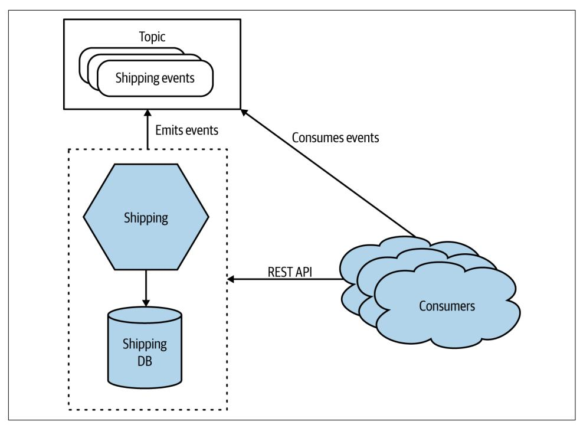

*Figure A-2. A microservice exposing its functionality over a REST API and a topic*

Event-driven collaboration can make it easier to build more loosely coupled architec‐ tures, but it can require more work to understand how the system is behaving. This type of communication also often requires the use of specialist technology such as message brokers, which can further complicate matters. If you can use a fully man‐ aged message broker, that can help lower the cost of these types of systems.

Request-response and event-driven interaction models both have their place, and often which one you use will be a personal preference. Some problems just fit one model more than another, and it's common for a microservice architecture to have a mix of styles.

## **Workflow**

When looking to get multiple microservices collaborating to perform some overarch‐ ing operation, look to explicitly model the process using *sagas*, a topic we explored in [Chapter 6.](#page-200-0)

In general, distributed transactions should be avoided in situations where you can use a saga instead. Distributed transactions add significant complexity to systems, have problematic failure modes, and often don't deliver what you expect even when they <span id="page-580-0"></span>work. Sagas are in virtually all cases a better fit for implementing business processes that span multiple microservices.

There are two different styles of sagas to consider: *orchestrated* sagas and *choreo‐ graphed* sagas. Orchestrated sagas use a centralized orchestrator to coordinate with other microservices and ensure that things are done. In general, this is a simple and straightforward approach, but the central orchestrator can end up doing too much if you aren't careful, and it can become a source of contention when multiple teams are working on the same business process. With choreographed sagas, there is no central coordinator; instead, the responsibility for the business process is distributed into a number of collaborating microservices. This can be a more complex architecture to implement, and it requires more work to ensure that the right things are happening, but on the flip side it is much less prone to coupling and works well for multiple teams.

Personally, I love choreographed sagas, but then I've used them a lot and made a lot of mistakes implementing them. My general advice is that orchestrated sagas work fine when a single team owns responsibility for the whole process, but they become more problematic with multiple teams. Choreographed sagas can justify their increased complexity in situations in which multiple teams are expected to collabo‐ rate on a process.

## **Build**

Each microservice should have its own build, its own CI pipeline. When I make a change to a microservice, I expect to be able to build that microservice by itself. Avoid situations in which you have to build all your microservices together, as this makes independent deployability much harder.

For reasons outlined in [Chapter 7,](#page-222-0) I am not a fan of monorepos. If you really want to use them, then please understand the challenges they cause around clear lines of ownership and potential complexity of builds. But definitely make sure that, whether you use a monorepo or a multirepo approach, each microservice has its own CI build process that can be triggered independently of any other builds.

## **Deployment**

Microservices are normally deployed as a process. This process can be deployed onto a physical machine, a virtual machine, a container, or an FaaS platform. Ideally, we want microservices to be as isolated from one another as possible in a deployed envi‐ ronment. We don't want a situation in which one microservice using up lots of com‐ puting resources can impact a different microservice. In general, this means we want to have each microservice using its own ring-fenced operating system and set of com‐ puting resources. Containers are especially effective at giving each microservice <span id="page-581-0"></span>instance its own ring-fenced set of resources, making them a great choice for micro‐ service deployments.

Kubernetes can be very useful if you are looking to run container workloads across multiple machines. It's not something I'd recommend for just a few microservices, as it brings with it its own sources of complexity. Where possible, use a managed Kuber‐ netes cluster, as this allows you to avoid some of this complexity.

FaaS is an interesting emerging pattern in deploying code. Rather than having to specify how many copies of something you want, you just give your code to the FaaS platform and say, "When this happens, run this code." This is *really* nice from a developer point of view, and I think an abstraction like this is likely the future for a large amount of server-side development. The current implementations aren't without problems, though. In terms of microservices, deploying a whole microservice as a single "function" on a FaaS platform is a totally fine way to start.

One final note: separate in your mind the concepts of deployment and release. Just because you've deployed something to production doesn't mean it has to be released to your users. By separating these concepts, you open up the opportunity to roll out your software in different ways—for example, by using canary releases or parallel runs. All of this and more is covered in depth in [Chapter 8](#page-244-0).

## **Testing**

It makes a lot of sense to have a suite of automated functional tests to give you fast feedback on the quality of your software before the users see it, and this is absolutely something you should do. Microservices give you a lot of options in terms of the dif‐ ferent types of tests you can write, as we explored in [Chapter 9.](#page-300-0)

When compared to other types of architectures, though, end-to-end tests can be especially problematic for microservice architectures. They can end up being more expensive to write and maintain for microservice architectures than for simpler non‐ distributed architectures, and the tests themselves can end up having a lot more fail‐ ures that don't necessarily point to a problem with your code. End-to-end tests that span multiple teams are particularly challenging.

Over time, look to reduce your reliance on end-to-end tests; consider replacing some of the effort put into this form of testing with consumer-driven contracts, schema compatibility checking, and testing in production. These activities can deliver much more effectively than end-to-end tests on quickly catching issues on more distributed systems.

## <span id="page-582-0"></span>**Monitoring and Observability**

In [Chapter 10](#page-330-0), I explained how *monitoring* is an activity, something we do *to* a sys‐ tem, but that focusing on an activity rather than an outcome is problematic, a thread that has run through this book. Instead, we should focus on the *observability* of our systems. Observability is the extent to which we can understand what a system is doing by examining external outputs. Making a system that has good observability requires that we build this thinking into our software and ensure that the right types of external outputs are available.

Distributed systems can fail in strange ways, and microservices are no different. We cannot predict all causes of system failure, so it can be hard to know what informa‐ tion we'll need ahead of time to diagnose and fix issues. Using tooling that can help you interrogate these external outputs in ways that you cannot expect becomes increasingly important. I suggest that you look at tools like Lightstep and Honey‐ comb that were built with this thinking in mind.

Finally, as your system grows in scale, it becomes more and more likely that there will always be an error somewhere. But in a large-scale system, one machine having a problem isn't necessarily cause for everyone to jump into action, nor should this nec‐ essarily result in a rude awakening for anyone at 3 a.m. Using "test in production" techniques like parallel runs and synthetic transactions can be much more effective for picking up problems that might actually be impacting the end users.

## **Security**

Microservices give us more opportunity to defend our application in depth, which in turn can lead to more secure systems. On the other hand, they often have a larger attack surface area, which can leave us more exposed to attack! This balancing act is why it's so important to have a holistic understanding of security, something I shared in [Chapter 11.](#page-370-0)

With more information flowing over networks, it becomes more important to con‐ sider the protection of data in transit. The increased number of moving parts also means that automation is a vital part of microservice security. Managing patching, certificates, and secrets using manual, error-prone processes can leave you vulnerable to attack. So use tools that allow for ease of automation.

JWTs can be used to decentralize authorization logic in a way that also avoids the need for additional round trips. This can help protect you from issues like the con‐ fused deputy problem, while at the same time ensuring your microservice can run in a more independent fashion.

Finally, increasing numbers of people are adopting a *zero-trust* mindset. With zero trust, you operate as though your system has already been compromised and you <span id="page-583-0"></span>need to build your microservices accordingly. It may seem like a paranoid stance, but I'm increasingly of the opinion that embracing this principle can actually simplify how you view the security of your system.

## **Resiliency**

In [Chapter 12](#page-412-0), we looked at resiliency as a whole, and I shared with you the four key concepts that need to be considered when thinking about resiliency:

*Robustness*

The ability to absorb expected perturbation

*Rebound*

The ability to recover after a traumatic event

*Graceful extensibility*

How well we deal with a situation that is unexpected

*Sustained adaptability*

The ability to continually adapt to changing environments, stakeholders, and demands

Taken as a whole, microservice architectures can help with some of these things (namely robustness and rebound), but as we see from this list, that by itself doesn't make you resilient. Much of being resilient is about team and organizational behavior and culture.

Fundamentally, you have to explicitly do things to make your application more robust. Robustness isn't free—microservices give us the option to improve the resil‐ iency of our systems, but we have to make that choice. For example, we have to understand that any call we make to another microservice might fail, that machines might die, and that bad things happen to good network packets. Stability patterns like bulkheads, circuit breakers, and properly configured time-outs can help greatly.

## **Scaling**

Microservices give us a number of different ways to scale an application. In [Chap‐](#page-444-0) [ter 13](#page-444-0), I explore the four axes of scaling, which I share below:

*Vertical scaling*

In a nutshell, this means getting a bigger machine.

*Horizontal duplication*

Having multiple things capable of doing the same work.

<span id="page-584-0"></span>*Data partitioning*

Dividing work based on some attribute of the data, e.g., customer group.

*Functional decomposition*

Separation of work based on the type, e.g., microservice decomposition.

With scaling, do the easy stuff first. Vertical scaling and horizontal duplication are quick and easy compared with the other two axes presented here. If they work, great! If not, you can look at the other mechanisms. It's common as well to mix the differ‐ ent types of scaling—partitioning your traffic based on customers, for example, and then having each partition scaled horizontally.

## **User Interfaces**

All too often, the user interface is an afterthought when it comes to system decompo‐ sition—we break apart our microservices but leave a monolithic user interface. This in turn leads to the problems of having separate frontend and backend teams. Instead, we want stream-aligned teams, where one team owns all the functionality associated with an end-to-end slice of user functionality. To make that change hap‐ pen and get rid of siloed frontend and backend teams, we need to break apart our user interfaces.

In [Chapter 14,](#page-480-0) I share how we can use *micro frontends* to deliver decomposed user interfaces using single-page app frameworks like React. User interfaces often face problems in terms of the number of calls they need to make, or because they need to perform call aggregation and filtering to suit mobile devices. The *backend for front‐ end* (BFF) pattern can help provide server-side aggregation and filtering in these sit‐ uations, although if you are able to use GraphQL, you may be able to sidestep the use of BFFs.

## **Organization**

In [Chapter 15](#page-516-0), we looked at the shift away from horizontally aligned, siloed teams toward team structures that are organized around end-to-end slices of functionality. These *stream-aligned* teams, as the authors of *Team Topologies* describe them, are supported by *enabling* teams, as [Figure A-3](#page-585-0) shows. Enabling teams will often have a specific cross-cutting focus, such as focusing on security or usability, and support the stream-aligned teams in these aspects.

<span id="page-585-0"></span>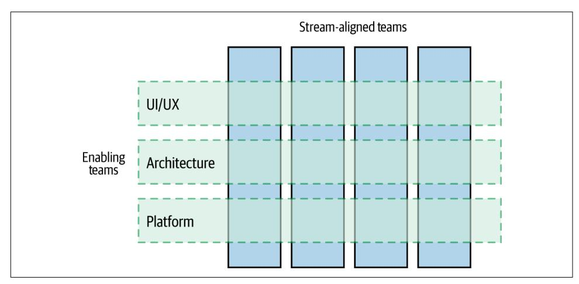

*Figure A-3. Enabling teams support multiple stream-aligned teams*

Making these stream-aligned teams as autonomous as possible means that they need self-service tools to avoid having to constantly ask other teams to do things for them. As part of this, a platform can be incredibly useful. It's important, though, that we see a platform as a type of *paved road*—that is, as something that makes it easy to do the right thing, without requiring that it *must* be used. Making a platform optional ensures that making the platform easy to use remains a key focus of the team owning it, while also allowing teams to make a different choice when warranted.

## **Architecture**

It's important that we don't see the architecture of our system as fixed and unchang‐ ing. Instead, we should view our system architecture as something that should be able to continually change as circumstances require. For you to get the most out of micro‐ service architectures, moving to an organization where more autonomy is pushed into teams means that responsibility for the technical vision needs to become a more collaborative process. The architect sitting in an ivory tower will either be a signifi‐ cant blocker to a microservice architecture or else will become an ignored irrelevance.

The role of shepherding the architecture of a system can be entirely distributed into the teams, and at a certain level of scale this can work well. However, as the organiza‐ tion grows, having people with dedicated time to look across the system as a whole becomes essential. Call them principal engineers, technical product owners, or archi‐ tects, it doesn't really matter—the role that they need to play is the same. As I showed in [Chapter 16,](#page-550-0) architects in a microservice organization need to support teams, con‐ nect people, spot patterns emerging, and spend enough time embedded with teams to see how the big picture stuff plays out in reality.

## <span id="page-586-0"></span>**Further Reading**

Throughout this book, I have referenced many papers, presentations, and books that I have learned a great deal from, and I have made sure to list them in [Bibliography.](#page-588-0) Since the first edition, though, the two books that have had the biggest impact on my thinking, and as a result have been referenced extensively in this new edition, are worth calling out here as "must reads." The first is *Accelerate* by Nicole Forsgren, Jez Humble, and Gene Kim. The second is *Team Topologies* by Matthew Skelton and Manuel Pais. These two books are, in my opinion, the two most useful books on soft‐ ware development written in the last ten years, and I consider them essential reading whether you are into microservices or not.

As a companion to this book, my own *Monolith to Microservices* goes into more depth on how to break apart existing system architectures.

## **Looking Forward**

In the future, I suspect the technology that makes microservices easier to build and run will continue to improve, and I am especially keen to see what the second- (and third-) generation FaaS products look like. Whether or not FaaS takes off, Kubernetes will become even more widespread, even if it will increasingly be hidden behind more developer-friendly abstraction layers. Kubernetes has won, but in a way that I think most application developers shouldn't have to worry about. I remain very interested in seeing how Wasm changes how we think about deployments, and I still have a sus‐ picion that unikernels may have a second coming as well.

Since this book's first edition, microservices have well and truly gone mainstream in a way that has surprised me, and that has concerned me too. It seems that a lot of peo‐ ple adopting microservices are doing so more because everyone else is doing it, rather than microservices being right for them. As such, I fully expect us to hear more hor‐ ror stories about failed microservice implementations, which I will digest with relish to see what can be learned. I also fully expect a wider industry backlash against microservices at some point when the microservice disaster case studies reach critical mass. Applying critical thinking to work out what approach makes the most sense in any given situation isn't very sexy or marketable, and I don't expect that will change in a world where selling technology is more profitable than selling ideas.

I don't mean to sound pessimistic! We are, as an industry, still very young, and we are still finding our place in the world. The amount of energy and ingenuity that gets put into software development continues to keep me interested, and I can't wait to see what the next decade brings.

## **Final Words**

Microservice architectures give you more options, and more decisions to make. Mak‐ ing decisions in this world is a far more common activity than in simpler, monolithic systems. You won't get all of these decisions right, I can guarantee that. So, knowing you are going to get some things wrong, what are your options? Well, I would suggest finding ways to make each decision small in scope; that way, if you get one wrong, you impact only a small part of your system. Learn to embrace the concept of evolu‐ tionary architecture, in which your system bends and flexes and changes over time as you learn new things. Think not of big-bang rewrites, but instead of a series of changes made to your system over time to keep it supple.

I hope by now I've shared with you enough information and experiences to help you decide whether microservices are for you. If they are, I hope you think of this as a journey, not a destination. Go incrementally. Break your system apart piece by piece, learning as you go. And get used to it: in many ways, the discipline to continually change and evolve our systems is a far more important lesson to learn than any other I have shared with you through this book. Change is inevitable. Embrace it.

## **Bibliography**

<span id="page-588-0"></span>2020 Data Breach Investigations Report. Verizon, 2020. *<https://oreil.ly/ps0Cx>*.

Abbott, Martin L., and Michael T. Fisher. *The Art of Scalability: Scalable Web Archi‐ tecture, Processes, and Organizations for the Modern Enterprise*. 2nd ed. Boston: Addison-Wesley, 2015.

Allspaw, John. "Blameless Post-Mortems and a Just Culture." *Code as Craft* (blog). Etsy, May 22, 2012. *<https://oreil.ly/P1BcX>*.

Bache, Emily. "End-to-End Automated Testing in a Microservice Architecture." NDC Conferences. July 5, 2017. YouTube video, 56:48. *<https://oreil.ly/DbFdR>*.

Bell, Laura, Michael Brunton-Spall, Rich Smith, and Jim Bird. *Agile Application Secu‐ rity*. Sebastopol: O'Reilly, 2017.

Beyer, Betsy, Chris Jones, Jennifer Petoff, and Niall Richard Murphy, eds. *Site Relia‐ bility Engineering: How Google Runs Production Systems*. Sebastopol: O'Reilly, 2016.

Beyer, Betsy, Niall Richard Murphy, David K. Rensin, Kent Kawahara, and Stephen Thorne, eds. *The Site Reliability Workbook: Practical Ways to Implement SRE*. Sebas‐ topol: O'Reilly, 2018.

Bird, Christian, Nachi Nagappan, Brendan Murphy, Harald Gall, and Premkumar Devanbu. "Don't Touch My Code! Examining the Effects of Ownership on Software Quality." In *ESEC/FSE '11: Proceedings of the 19th ACM SIGSOFT Symposium and the 13th European Conference on Foundations of Software Engineering*, 4–14. New York: ACM, 2011. doi.org/10.1145/2025113.2025119.

Brandolini, Alberto. *EventStorming*. Victoria, BC: Leanpub, forthcoming.

Brooks, Frederick P., Jr. *The Mythical Man-Month: Essays on Software Engineering*, Anniversary ed. Boston: Addison-Wesley, 1995.

Brown, Alanna, Nicole Forsgren, Jez Humble, Nigel Kersten, and Gene Kim. *2016 State of DevOps Report*. *<https://oreil.ly/WJjhA>*.

Bryant, Daniel. "Apple Rebuilds Siri Backend Services Using Apache Mesos." InfoQ, May 3, 2015. *<https://oreil.ly/NsjEQ>*.

Burns, Brendan, Brian Grant, David Oppenheimer, Eric Brewer, and John Wilkes. "Borg, Omega, and Kubernetes." *acmqueue* 14, no. 1 (2016). *<https://oreil.ly/2TlYG>*.

Calçado, Phil. "Pattern: Using Pseudo-URIs with Microservices." May 22, 2017. *<https://oreil.ly/uZuto>*.

Cockburn, Alistair. "Hexagonal Architecture." alistair.cockburn.us, January 4, 2005. *<https://oreil.ly/0JeIm>*.

Cohn, Mike. *Succeeding with Agile*. Upper Saddle River, NJ: Addison-Wesley, 2009.

Colyer, Adrian. "Information Distribution Aspects of Design Methodology." *The Morning Paper* (blog), October 17, 2016. *<https://oreil.ly/qxj2m>*.

Crispin, Lisa, and Janet Gregory. *Agile Testing: A Practical Guide for Testers and Agile Teams*. Upper Saddle River, NJ: Addison-Wesley, 2008.

Evans, Eric. *Domain-Driven Design: Tackling Complexity in the Heart of Software*. Boston: Addison-Wesley, 2004.

Ford, Neal, Rebecca Parsons, and Patrick Kua. *Building Evolutionary Architectures*. Sebastopol: O'Reilly, 2017.

Forsgren, Nicole, Dustin Smith, Jez Humble, and Jessie Frazelle. *Accelerate: State of DevOps Report 2019*. *<https://oreil.ly/A3zGn>*.

Forsgren, Nicole, Jez Humble, and Gene Kim. *Accelerate: The Science of Building and Scaling High Performing Technology Organizations*. Portland, OR: IT Revolution, 2018.

Fowler, Martin. "CodeOwnership." martinfowler.com, May 12, 2006. *[https://oreil.ly/](https://oreil.ly/a42c7) [a42c7](https://oreil.ly/a42c7)*.

Fowler, Martin. "Eradicating Non-Determinism in Tests." martinfowler.com, April 14, 2011. *<https://oreil.ly/sqPOD>*.

Fowler, Martin. "StranglerFigApplication." martinfowler.com, June 29, 2004. *[https://](https://oreil.ly/foti0) [oreil.ly/foti0](https://oreil.ly/foti0)*.

Freeman, Steve, and Nat Pryce. *Growing Object-Oriented Software, Guided by Tests*. Upper Saddle River, NJ: Addison-Wesley, 2009.

Friedrichsen, Uwe. "The Limits of the Saga Pattern." ufried.com (blog). February 19, 2021. *<https://oreil.ly/X1BfK>*.

Garcia-Molina, Hector, Dieter Gawlick, Johannes Klein, and Karl Kleissner. "Model‐ ing Long-Running Activities as Nested Sagas." *Data Engineering* 14, no. 1 (March 1991): 14–18. *<https://oreil.ly/RVp7A1>*.

Garcia-Molina, Hector, and Kenneth Salem. "Sagas." *ACM Sigmod Record* 16, no. 3 (1987): 249–59.

Governor, James. "Towards Progressive Delivery." *James Governor's MonkChips* (blog). RedMonk, August 6, 2018. *<https://oreil.ly/OlkEY>*.

Heinemeier Hansson, David. "The Majestic Monolith." Signal v. Noise, February 29, 2016. *<https://oreil.ly/fN5CR>*.

Hodgson, Pete. "Feature Toggles (aka Feature Flags)." martinfowler.com, October 9, 2017. *<https://oreil.ly/pSPrd>*.

Hohpe, Gregor. *The Software Architect Elevator: Redefining the Architect's Role in the Digital Enterprise*. Sebastopol: O'Reilly, 2020.

Hohpe, Gregor, and Bobby Woolf. *Enterprise Integration Patterns*. Boston: Addison-Wesley, 2003.

Humble, Jez, and David Farley. *Continuous Delivery: Reliable Software Releases Through Build, Test, and Deployment Automation*. Upper Saddle River, NJ: Addison-Wesley, 2010.

Hunt, Troy. "Passwords Evolved: Authentication Guidance for the Modern Era." troyhunt.com, July 26, 2017. *<https://oreil.ly/r4ava>*.

Ingles, Paul. "Convergence to Kubernetes." Medium, June 18, 2018. *[https://oreil.ly/](https://oreil.ly/oB2FI) [oB2FI](https://oreil.ly/oB2FI)*.

Ishmael, Johnathan. "Optimising Serverless for BBC Online." *Technology and Crea‐ tivity at the BBC* (blog), BBC, January 26, 2021. *<https://oreil.ly/mPp2L>*.

Jackson, Cam. "Micro Frontends." martinfowler.com, June 19, 2019. *[https://oreil.ly/](https://oreil.ly/nYu15) [nYu15](https://oreil.ly/nYu15)*.

Kingsbury, Kyle. "Jepsen: Elasticsearch." Aphyr, June 15, 2014. *<https://oreil.ly/6l2sR>*.

Kingsbury, Kyle. "Jepsen: Elasticsearch 1.5.0." Aphyr, April 27, 2015. *[https://oreil.ly/](https://oreil.ly/jlu8p) [jlu8p](https://oreil.ly/jlu8p)*.

Kleppmann, Martin. *Designing Data-Intensive Applications*. Sebastopol: O'Reilly, 2017.

Krishnan, Kripa. "Weathering the Unexpected." *acmqueue* 10, no. 9 (2012). *[https://](https://oreil.ly/BN2Ek) [oreil.ly/BN2Ek](https://oreil.ly/BN2Ek)*.

Kubis, Robert. "Google Cloud Spanner: Global Consistency at Scale by Robert Kubis." Devoxx. November 7, 2017. YouTube video, 33:22. *<https://oreil.ly/fwbMD>*.

Lamport, Leslie. "Time, Clocks, and the Ordering of Events in a Distributed System." *Communications of the ACM*. 21, no. 7 (July 1978): 558–65. *<https://oreil.ly/Y07gU>*.

Lewis, James. "Scale, Microservices and Flow." YOW! Conferences. February 10, 2020. YouTube video, 51:03. *<https://oreil.ly/nzXqX>*.

Losio, Renato. "Elastic Changes Licences for Elasticsearch and Kibana: AWS Forks Both." InfoQ, January 25, 2021. *<https://oreil.ly/PClFv>*.

MacCormack, Alan, Carliss Y. Baldwin, and John Rusnak. "Exploring the Duality Between Product and Organizational Architectures: A Test of the *Mirroring* Hypoth‐ esis." *Research Policy* 41, no. 8 (October 2012): 1309–24.

Majors, Charity. "Metrics: Not the Observability Droids You're Looking For." *Honey‐ comb* (blog), October 24, 2017. *<https://oreil.ly/RpZaZ>*.

Majors, Charity, Liz Fong-Jones, and George Miranda. *Observability Engineering*. Sebastopol: O'Reilly, 2022.

McAllister, Neil. "Code Spaces Goes Titsup FOREVER After Attacker NUKES Its Amazon-Hosted Data." The Register, June 18, 2014. *<https://oreil.ly/IUOD0>*.

Miles, Russ. *Learning Chaos Engineering*. Sebastopol: O'Reilly, 2019.

Moore, Jon. "Architecture with 800 of My Closest Friends: The Evolution of Com‐ cast's Architecture Guild." InfoQ, May 14, 2019. *<https://oreil.ly/dVfhi>*.

Morris, Kief. *Infrastructure as Code*. 2nd ed. Sebastopol: O'Reilly, 2016.

Nagappan, Nachiappan, Brendan Murphy, and Victor Basili. "The Influence of Organizational Structure on Software Quality: An Empirical Case Study." *ICSE '08: Proceedings of the 30th International Conference on Software Engineering*. New York: ACM, 2008.

Newman, Sam. *Monolith to Microservices*. Sebastopol: O'Reilly, 2019.

Noursalehi, Saeed. "Git Virtual File System Design History." *[https://t.co/](https://t.co/mIQR4uzWKS?amp=1) [mIQR4uzWKS?amp=1](https://t.co/mIQR4uzWKS?amp=1)*.

Nygard, Michael. *Release It!* 2nd ed. Raleigh: Pragmatic Bookshelf, 2018.

Oberlehner, Markus. "Monorepos in the Wild." Medium, June 12, 2017. *[https://](https://oreil.ly/Sk6am) [oreil.ly/Sk6am](https://oreil.ly/Sk6am)*.

Padmanabhan, Senthil, and Pranav Jha. "WebAssembly at eBay: A Real-World Use Case." eBay, May 22, 2019. *<https://oreil.ly/rlr7d>*.

Page-Jones, Meilir. *Practical Guide to Structured Systems Design*, 2nd ed. New York: Yourdon Press, 1980.

Palino, Todd, Neha Narkhede, and Gwen Shapira. *Kafka: The Definitive Guide*. Sebastopol: O'Reilly, 2017.

Parnas, David. "Information Distribution Aspects of Design Methodology." In *Infor‐ mation Processing: Proceedings of the IFIP Congress*, 339–44. Vol. 1. Amsterdam: North Holland, 1972.

Parnas, David. "On the Criteria to Be Used in Decomposing Systems into Modules." Journal contribution, Carnegie Mellon University, 1971. *<https://oreil.ly/nWtQA>*.

Plotnicki, Lukasz. "BFF @ Soundcloud." ThoughtWorks, December 9, 2015. *[https://](https://oreil.ly/ZyR0l) [oreil.ly/ZyR0l](https://oreil.ly/ZyR0l)*.

Potvin, Rachel, and Josh Levenberg. "Why Google Stores Billions of Lines of Code in a Single Repository." *Communications of the ACM* 59, no. 7 (July 2016): 78–87. *<https://oreil.ly/Eupyi>*.

Pyhäjärvi, Maaret. *Ensemble Programming Guidebook*. Self-published, 2015–2020. *<https://ensembleprogramming.xyz>*.

Riggins, Jennifer. "The Rise of Progressive Delivery for Systems Resilience." The New Stack, April 1, 2019. *<https://oreil.ly/merIs>*.

Rodriguez, Daniel, M. Ángel Sicilia, Elena García Barriocanal, and Rachel Harrison. "Empirical Findings on Team Size and Productivity in Software Development." *Jour‐ nal of Systems and Software* 85, no. 3 (2012). doi.org/10.1016/j.jss.2011.09.009.

Rossman, John. *Think Like Amazon: 50 1/2 Ideas to Become a Digital Leader*. New York: McGraw-Hill, 2019.

Ruecker, Bernd. *Practical Process Automation*. Sebastopol: O'Reilly, 2021.

Sadalage, Pramod, and Martin Fowler. *NoSQL Distilled: A Brief Guide to the Emerg‐ ing World of Polyglot Persistence*. Upper Saddle River, NJ: Addison-Wesley, 2012.

Schneider, Jonny. *Understanding Design Thinking, Lean, and Agile*. Sebastopol: O'Reilly, 2017.

Shankland, Stephen. "Google Uncloaks Once-Secret Server." CNET, December 11, 2009. *<https://oreil.ly/hHKvE>*.

Shorrock, Steven. "Alarm Design: From Nuclear Power to WebOps." *Humanistic Sys‐ tems* (blog), October 16, 2015. *<https://oreil.ly/AiJ5i>*.

Shostack, Adam. *Threat Modeling: Designing for Security*. Indianapolis: Wiley, 2014.

Sigelman, Ben. "Three Pillars with Zero Answers—Towards a New Scorecard for Observability." Lightstep (blog post), December 5, 2018. *<https://oreil.ly/qdtSS>*.

Skelton, Matthew, and Manuel Pais. *Team Topologies*. Portland, OR: IT Revolution, 2019.

Steen, Maarten van, and Andrew Tanenbaum. *Distributed Systems*. 3rd ed. Scotts Valley, CA: CreateSpace Independent Publishing Platform, 2017.

Stopford, Ben. *Designing Event-Driven Systems*. Sebastopol: O'Reilly, 2017.

Valentino, Jason D. "Moving One of Capital One's Largest Customer-Facing Apps to AWS." Medium/Capital One Tech, May 24, 2017. *<https://oreil.ly/IEIC3>*.

Vaughan, Diane. *The Challenger Launch Decision: Risky Technology, Culture, and Deviance at NASA*. Chicago: University of Chicago Press, 1996.

Vernon, Vaughn. *Domain-Driven Design Distilled*. Boston: Addison-Wesley, 2016.

Vernon, Vaughn. *Implementing Domain-Driven Design*. Upper Saddle River, NJ: Addison-Wesley, 2013.

Vocke, Ham. "The Practical Test Pyramid." martinfowler.com, February 26, 2018. *<https://oreil.ly/6rRoU>*.

Webber, Emily. *Building Successful Communities of Practice*. San Francisco: Blurb, 2016.

Webber, Jim, Savas Parastatidis, and Ian Robinson. *REST in Practice: Hypermedia and Systems Architecture*. Sebastopol: O'Reilly, 2010.

Woods, David D. "Four Concepts for Resilience and the Implications for the Future of Resilience Engineering." *Reliability Engineering & System Safety* 141 (September 2015): 5–9. doi.org/10.1016/j.ress.2015.03.018.

Yourdon, Edward, and Larry L. Constantine. *Structured Design*. New York: Yourdon Press, 1976.

Zimman, Adam. "Progressive Delivery, a History…Condensed." *Industry Insights* (blog). LaunchDarkly, August 6, 2018. *<https://oreil.ly/4pVY7>*.

## **Glossary**

#### <span id="page-594-0"></span>**aggregate**

A collection of objects that are managed as a single entity, typically referring to real-world concepts. A concept from DDD.

#### **Amazon Web Services (AWS)**

The public cloud offering from Amazon.

#### **API gateway**

A component that normally sits on the perimeter of a system and routes calls from external sources (such as user inter‐ faces) to microservices, amongst many other things.

#### **authentication**

The process whereby a principal proves that they are who they say they are. This could be as simple as a person providing their username and password.

#### **authorization**

The process that determines if an author‐ ized principal is allowed to access a given piece of functionality.

#### **Azure**

The public cloud offering from Microsoft.

#### **backend for frontend (BFF)**

A server-side component that provides aggregation and filtering for a specific user interface. An alternative to a generalpurpose API gateway.

#### **bounded context**

An explicit boundary within a business domain that provides functionality to the wider system, but which also hides com‐ plexity. Often maps to organizational boundaries. A concept from DDD.

#### **bulkhead**

A part of the system in which a failure can be isolated, so that the rest of the system can keep operating even if a failure occurs.

#### **choreography**

A style of saga, where responsibility for what should happen when is distributed across multiple microservices, rather than managed by a single entity.

#### **circuit breaker**

A mechanism placed around a connection to a downstream service that can allow you to fail fast if the downstream service is suffering from problems.

#### **cohesion**

The extent to which the code that changes together stays together.

#### **collective ownership**

A style of ownership in which any devel‐ oper is allowed to change any part of the system.

#### <span id="page-595-0"></span>**container**

A package of code and dependencies that can be run in an isolated way on a machine. Conceptually similar to virtual machines, although much more light‐ weight.

#### **continuous delivery (CD)**

A delivery approach in which you explic‐ itly model the path to production, treat every check-in as a release candidate, and can easily assess the suitability of any release candidate to be deployed into pro‐ duction.

#### **continuous deployment**

An approach wherein any build that passes all automated steps is automatically deployed into production.

#### **continuous integration (CI)**

The regular (daily) integration of changes with the rest of the codebase, along with a suite of tests to validate that the integra‐ tion has worked.

#### **Conway's law**

The observation that the communication structures of organizations end up driving the design of the computer systems that these organizations build.

#### **coupling**

The extent to which changing one part of the system requires a change in another. Low coupling is normally desirable.

#### **cross-functional requirement (CFR)**

A general property of the system, such as the required latency for operations, secu‐ rity of data at rest, etc. Also known as nonfunctional requirement (but I greatly prefer cross-functional as a description).

#### **customizable off the shelf software (COTS)**

Third-party software that is heavily cus‐ tomized by the end user and is also nor‐ mally run on their own infrastructure. Typical examples include content man‐ agement systems and customer relation‐ ship management platforms.

#### **data partitioning**

Scaling a system by distributing load based on some facet of the data. For example splitting load based on customer or product type.

#### **detective controls**

A security control that will help you iden‐ tify if an attack is underway/has hap‐ pened.

#### **domain coupling**

A form of coupling where one microser‐ vice is "coupled" to the domain protocol exposed by another microservice.

#### **domain-driven design (DDD)**

A concept whereby the fundamental problem/business domain is explicitly modeled in the software.

#### **Docker**

A set of tooling to help build and manage containers.

#### **enabling team**

A team that supports stream-aligned teams in doing their job. Typically, an enabling team has a specific focus—e.g., usability, architecture, security.

#### **error budget**

Relates to the acceptable level to which an SLO can be out of bound, typically defined in an acceptable degree of down‐ time for a service.

#### **event**

Something that happens in the system that other parts of the system might care about—for example "Order Placed" or "User Logs In."

#### **feature branching**

Creating a new branch for each feature that is being worked on, merging that branch back into mainline once the fea‐ ture is complete. Something I discourage.

#### **Function as a Service (FaaS)**

A type of serverless platform that invokes arbitrary code based on certain types of triggers—for example, launching code in

<span id="page-596-0"></span>reaction to an HTTP call, or a message being received.

#### **governance**

Agreeing how things should be done, and making sure they are done that way.

#### **graceful extensibility**

How well we deal with a situation that is unexpected.

#### **GraphQL**

A protocol that allows the client to issue custom queries that can result in calls being made to multiple downstream microservices. Useful to aid call aggrega‐ tion and filtering for external clients without requiring the use of BFF or API gateways.

#### **horizontal duplication**

Scaling a system by having multiple copies of a thing.

#### **idempotency**

The property of a function where even if it is called multiple times, the result is the same. Useful to allow operations on microservices to be safely retried.

#### **independent deployability**

The ability to make a change to a micro‐ service and deploy it into production without having to change or deploy any‐ thing else.

#### **information hiding**

An approach wherein all information is hidden by default inside a boundary, and only the bare minimum is exposed to sat‐ isfy external consumers.

#### **infrastructure as code**

Modeling your infrastructure in code form, allowing for infrastructure manage‐ ment to be automated and the code to be version controlled.

#### **JSON Web Token**

A standard for creating a JSON data structure that can be optionally encrypted. It is typically used for transmitting infor‐ mation about authenticated principals.

#### **Kubernetes**

An open source platform that manages container workloads across multiple underlying machines.

#### **library**

A set of code that is packaged in such a way that it can be reused in multiple pro‐ grams.

#### **lockstep deployment**

The need to deploy two or more things at the same time, because a change has occurred that requires it. The opposite of independent deployability. In general, avoid.

#### **message**

Something sent to one or more down‐ stream microservices via an asynchronous communication mechanism like a broker. Could contain a variety of payloads, such as a request, response, or an event.

#### **message broker**

Dedicated software that manages the asynchronous communication between processes, typically providing capabilities like guaranteed delivery (for some defini‐ tion of the word *guaranteed*).

#### **microservice**

An independently deployable service that communicates with other microservices via one or more communication proto‐ cols.

#### **monorepo**

A single repository that contains all the source code for all your microservices.

#### **multirepo**

An approach in which each microservice has its own source code repository.

#### **orchestration**

A style of saga wherein a central unit (aka the orchestrator) manages the operation of other microservices to carry out a busi‐ ness process.

#### <span id="page-597-0"></span>**personally identifiable information (PII)**

Data that when used in isolation, or in addition with other information, could be used to identify an individual.

#### **preventative control**

A security control that aims to stop an attack from happening.

#### **principal**

Something—typically a person, though it could also be a program—that is request‐ ing to be authenticated and authorized to gain access.

#### **request**

Sent by one microservice to another ask‐ ing the downstream microservice to do something.

#### **response**

Transmitted back as the result of a request.

#### **responsive control**

A security control that helps you respond during/after an attack.

#### **robustness**

The ability of a system to keep operating even when something bad happens.

#### **saga**

A way of modeling long-lived operations in such a way that resources don't need to be locked for extended periods of time. Preferred over distributed transactions when implementing business processes.

#### **serverless**

An umbrella term for cloud products that from the user's point of view abstract away the underlying computers, to the extent that the user no longer needs to care about them. Examples of these prod‐ ucts include AWS Lambda, AWS S3, and Azure Cosmos.

#### **service-level agreement (SLA)**

An agreement between an end user and a service provider (e.g., customer and ven‐ dor) that defines the bare minimum acceptable service offering, and the penal‐ ties that apply if the agreement isn't met.

#### **service-level indicator (SLI)**

A measure of how your system is behav‐ ing—for example, a response time.

#### **service-level objective (SLO)**

An agreement as to what the acceptable range of a given SLI is.

#### **service mesh**

A distributed type of middleware that provides cross-cutting functionality pri‐ marily for synchronous point-to-point calls—for example, mutual TLS, service discovery, or circuit breakers.

#### **service-oriented architecture (SOA)**

A type of architecture wherein the system is broken apart into services that can run on different machines. Microservices are a *type* of SOA that prioritizes independent deployability.

#### **single-page application (SPA)**

A type of graphical user interface wherein the UI is delivered in a single browser pane, without the need for navigation to other web pages.

#### **stream-aligned team**

A team focused on the end-to-end deliv‐ ery of a valuable stream of work. This is a long-lived team that will normally be directly customer focused and cut across data and backend and frontend code.

#### **strong ownership**

A style of ownership in which parts of the system are owned by specific teams, and changes to a particular part of the system can be made only by the team that owns it.

#### **sustained adaptability**

The ability to continually adapt to chang‐ ing environments, stakeholders, and demands.

#### **threat modeling**

The process in which you understand the threats that might be brought to bear on <span id="page-598-0"></span>your system and prioritize which threats need to be addressed.

#### **trunk-based development**

A style of development wherein all changes are made directly into the main trunk of the source control system, including changes that aren't yet com‐ plete.

#### **ubiquitous language**

Defining and adopting a common lan‐ guage to be used in code and in describing the domain, to aid communication. A concept from DDD.

#### **vertical scaling**

Improving the scale of the system by get‐ ting a more powerful machine.

#### **virtual machine (VM)**

An emulation of a machine wherein the machine appears to all intents and pur‐ poses to be a dedicated physical machine.

#### **widget**

A component of a graphical user interface.

## **Index**

<span id="page-600-0"></span>

| Symbols                                                                                                                                                                                                                                                |                                                                                                                                                                                                                                                                              |
|--------------------------------------------------------------------------------------------------------------------------------------------------------------------------------------------------------------------------------------------------------|------------------------------------------------------------------------------------------------------------------------------------------------------------------------------------------------------------------------------------------------------------------------------|
| 2PC (two-phase commit algorithms), 179-181                                                                                                                                                                                                             | managed VMs on, 241                                                                                                                                                                                                                                                          |
|                                                                                                                                                                                                                                                        | market share of, 264                                                                                                                                                                                                                                                         |
| A                                                                                                                                                                                                                                                      | message brokers, 139                                                                                                                                                                                                                                                         |
| A/B tests, 336                                                                                                                                                                                                                                         | on-demand provisioning systems, 25                                                                                                                                                                                                                                           |
| ACID (atomicity, consistency, isolation, and durability), 176                                                                                                                                                                                          | platform-specific tools, 233                                                                                                                                                                                                                                                 |
| Active Directory, 377                                                                                                                                                                                                                                  | Relational Database Service (RDS), 224                                                                                                                                                                                                                                       |
| adaptability, 390, 413, 418, 549                                                                                                                                                                                                                       | selecting, 268                                                                                                                                                                                                                                                               |
| aggregate, 53-55, 58, 569                                                                                                                                                                                                                              | SLA availability, 221, 328, 405                                                                                                                                                                                                                                              |
| alarms, versus alerts, 331                                                                                                                                                                                                                             | type 2 virtualization, 240                                                                                                                                                                                                                                                   |
| alert fatigue, 330                                                                                                                                                                                                                                     | vertical scaling, 421                                                                                                                                                                                                                                                        |
| alerting, 329-333                                                                                                                                                                                                                                      | anomaly detection, 340                                                                                                                                                                                                                                                       |
| Amazon Web Services (AWS)                                                                                                                                                                                                                              | Ansible, 258                                                                                                                                                                                                                                                                 |
| API gateways, 162                                                                                                                                                                                                                                      | antifragility, 413                                                                                                                                                                                                                                                           |
| autonomous product-oriented teams, 462                                                                                                                                                                                                                 | Apache Flink, 21                                                                                                                                                                                                                                                             |
| autoscaling in, 236, 449-450                                                                                                                                                                                                                           | Apache Kafka, 21                                                                                                                                                                                                                                                             |
| availability zones, 408                                                                                                                                                                                                                                | API gateways, 122, 162-166, 569                                                                                                                                                                                                                                              |
| AWS Lambda, 245                                                                                                                                                                                                                                        | application containers, 247                                                                                                                                                                                                                                                  |
| AWS Secrets Manager, 357                                                                                                                                                                                                                               | application security (see also security)                                                                                                                                                                                                                                     |
| Beanstalk, 238                                                                                                                                                                                                                                         | ability to rebuild, 364                                                                                                                                                                                                                                                      |
| client libraries, 156                                                                                                                                                                                                                                  | backups, 363                                                                                                                                                                                                                                                                 |
| CloudWatch, 320                                                                                                                                                                                                                                        | credentials, 354-360                                                                                                                                                                                                                                                         |
| containers and, 243                                                                                                                                                                                                                                    | patching, 360-363                                                                                                                                                                                                                                                            |
| credentials and security, 355, 357, 364                                                                                                                                                                                                                | application state, hypermedia as the engine of 129                                                                                                                                                                                                                           |
| defined, 569                                                                                                                                                                                                                                           | architects, 526                                                                                                                                                                                                                                                              |
| desired state management and, 235                                                                                                                                                                                                                      | (see also evolutionary architects)                                                                                                                                                                                                                                           |
| dynamic service registries, 161                                                                                                                                                                                                                        | architectural principles                                                                                                                                                                                                                                                     |
| Elasticsearch and, 319                                                                                                                                                                                                                                 | defining standards for microservices, 543-544                                                                                                                                                                                                                                |
| embracing failure, 415                                                                                                                                                                                                                                 | guiding evolutionary architecture, 539                                                                                                                                                                                                                                       |
| FaaS services, 238, 252                                                                                                                                                                                                                                | heterogeneous architecture, 22                                                                                                                                                                                                                                               |
| in-the-cloud development, 296                                                                                                                                                                                                                          | layering inside versus outside, 68                                                                                                                                                                                                                                           |
| isolated execution, 231                                                                                                                                                                                                                                | principles and practices, 536-538                                                                                                                                                                                                                                            |
| limitations of, 250                                                                                                                                                                                                                                    | self-contained systems (SCSs), 466                                                                                                                                                                                                                                           |
| software architecture defined, 527                                                                                                                                                                                                                     | Backstage tool, 172                                                                                                                                                                                                                                                          |
| three-tiered architecture, 10-12                                                                                                                                                                                                                       | backups, 363, 375                                                                                                                                                                                                                                                            |
| vertical architecture, 12                                                                                                                                                                                                                              | backward compatibility, 121 (see also breaking<br>changes)                                                                                                                                                                                                                   |
| architectural safety, 544                                                                                                                                                                                                                              | backward recovery, versus forward, 184                                                                                                                                                                                                                                       |
| artifact creation, 204                                                                                                                                                                                                                                 | Biz Ops tool, 171                                                                                                                                                                                                                                                            |
| async/await construct, 100                                                                                                                                                                                                                             | blameless post-mortems, 415                                                                                                                                                                                                                                                  |
| AsyncAPI, 147                                                                                                                                                                                                                                          | blue-green deployment, 273                                                                                                                                                                                                                                                   |
| asynchronous nonblocking calls, 98-101                                                                                                                                                                                                                 | bounded context                                                                                                                                                                                                                                                              |
| atomic commits, versus atomic deployment,<br>211                                                                                                                                                                                                       | alternatives to business domain boundaries<br>62-67                                                                                                                                                                                                                          |
| atomicity, consistency, isolation, and durability<br>(ACID), 176                                                                                                                                                                                       | defined, 56, 569                                                                                                                                                                                                                                                             |
| authentication and authorization                                                                                                                                                                                                                       | defining system boundaries, 530-533                                                                                                                                                                                                                                          |
| centralized, upstream authorization, 381                                                                                                                                                                                                               | hidden models, 56                                                                                                                                                                                                                                                            |
| common single sign-on (SSO), 376                                                                                                                                                                                                                       | mapping to microservices, 58                                                                                                                                                                                                                                                 |
| confused deputy problem, 380-381                                                                                                                                                                                                                       | shared models, 57                                                                                                                                                                                                                                                            |
| decentralized authorization, 382                                                                                                                                                                                                                       | BPM (business process modeling) tools, 191                                                                                                                                                                                                                                   |
| defined, 375, 569                                                                                                                                                                                                                                      | Brakeman, 350                                                                                                                                                                                                                                                                |
| fine-grained authorization, 379                                                                                                                                                                                                                        | branching, 199                                                                                                                                                                                                                                                               |
| human authentication, 376                                                                                                                                                                                                                              | breaking changes                                                                                                                                                                                                                                                             |
| JSON Web Token (JWT), 382-386                                                                                                                                                                                                                          | avoiding, 144-149                                                                                                                                                                                                                                                            |
| mutual authentication, 371                                                                                                                                                                                                                             | managing, 149-154                                                                                                                                                                                                                                                            |
| service-to-service authentication, 375                                                                                                                                                                                                                 | brittle tests, 286                                                                                                                                                                                                                                                           |
| single sign-on gateways, 377-379                                                                                                                                                                                                                       | brittleness, 125                                                                                                                                                                                                                                                             |
| automation                                                                                                                                                                                                                                             | build pipelines, 201-201                                                                                                                                                                                                                                                     |
| in anomaly detection, 340                                                                                                                                                                                                                              | bulkheads, 397, 400, 569                                                                                                                                                                                                                                                     |
| as essential to security, 349                                                                                                                                                                                                                          | business functionality, aligning architecture<br>with, 10-14                                                                                                                                                                                                                 |
| during deployment, 231                                                                                                                                                                                                                                 | business process modeling (BPM) tools, 191                                                                                                                                                                                                                                   |
| autonomy, 498, 549                                                                                                                                                                                                                                     | business-facing tests, 276                                                                                                                                                                                                                                                   |
| autoscaling, 449                                                                                                                                                                                                                                       |                                                                                                                                                                                                                                                                              |
| availability, 393, 410                                                                                                                                                                                                                                 | C                                                                                                                                                                                                                                                                            |
| Azure                                                                                                                                                                                                                                                  | caching                                                                                                                                                                                                                                                                      |
| Application Insights, 320                                                                                                                                                                                                                              | basics of, 435                                                                                                                                                                                                                                                               |
| Azure Functions, 238, 250                                                                                                                                                                                                                              | cache poisoning, 448                                                                                                                                                                                                                                                         |
| Azure Web Apps, 268                                                                                                                                                                                                                                    | invalidation, 442-447                                                                                                                                                                                                                                                        |
| Azure's Key Vault, 357                                                                                                                                                                                                                                 | performance benefits, 436                                                                                                                                                                                                                                                    |
| benefits of, 268                                                                                                                                                                                                                                       | robustness benefits, 436                                                                                                                                                                                                                                                     |
| defined, 569                                                                                                                                                                                                                                           | scaling benefits, 436                                                                                                                                                                                                                                                        |
| desired state management, 235                                                                                                                                                                                                                          | trade-offs between freshness and optimiza‐<br>tion, 447-448                                                                                                                                                                                                                  |
| event grid product, 147                                                                                                                                                                                                                                | where to cache, 437-442                                                                                                                                                                                                                                                      |
| limitations of, 250-251                                                                                                                                                                                                                                | canary releases, 271, 337                                                                                                                                                                                                                                                    |
| managed VMs on, 241                                                                                                                                                                                                                                    | CAP theorem                                                                                                                                                                                                                                                                  |
| market share of, 264                                                                                                                                                                                                                                   | availability, 410                                                                                                                                                                                                                                                            |
| openapi-diff tool, 148                                                                                                                                                                                                                                 | combined approach, 412                                                                                                                                                                                                                                                       |
| public cloud services offered by, 21                                                                                                                                                                                                                   | components of, 408-410                                                                                                                                                                                                                                                       |
| SLA availability, 221                                                                                                                                                                                                                                  | consistency, 410                                                                                                                                                                                                                                                             |
|                                                                                                                                                                                                                                                        | partition tolerance, 411                                                                                                                                                                                                                                                     |
| B                                                                                                                                                                                                                                                      |                                                                                                                                                                                                                                                                              |
| backend for frontend (BFF) pattern, 480-488                                                                                                                                                                                                            |                                                                                                                                                                                                                                                                              |
|                                                                                                                                                                                                                                                        |                                                                                                                                                                                                                                                                              |
| real-world application of, 412                                                                                                                                                                                                                         | complexity introduced by, 116                                                                                                                                                                                                                                                |
| selecting your approach, 411                                                                                                                                                                                                                           | event-driven, 108-115                                                                                                                                                                                                                                                        |
| cardinality, low versus high, 322                                                                                                                                                                                                                      | in-process versus inter-process calls, 89-92                                                                                                                                                                                                                                 |
| CDCs (consumer-driven contracts), 148,                                                                                                                                                                                                                 | mixing styles, 95                                                                                                                                                                                                                                                            |
| 293-295                                                                                                                                                                                                                                                | overview of, 93, 553                                                                                                                                                                                                                                                         |
| central aggregating gateway pattern, 475-479                                                                                                                                                                                                           | parallel versus sequential calls, 108                                                                                                                                                                                                                                        |
| CFR (cross-functional requirements), 300, 392,                                                                                                                                                                                                         | request-response, 104-108                                                                                                                                                                                                                                                    |
| 570                                                                                                                                                                                                                                                    | synchronous blocking, 95-98                                                                                                                                                                                                                                                  |
| change reviews, 515                                                                                                                                                                                                                                    | technology supporting, 93                                                                                                                                                                                                                                                    |
| chaos engineering, 337, 413-415                                                                                                                                                                                                                        | communication, defined, 541                                                                                                                                                                                                                                                  |
| Chaos Monkey, 415                                                                                                                                                                                                                                      | community of practice (CoP) groups, 505                                                                                                                                                                                                                                      |
| Chaos Toolkit, 415                                                                                                                                                                                                                                     | compatibility, assuring backward, 121 (see also                                                                                                                                                                                                                              |
| Chef, 258                                                                                                                                                                                                                                              | breaking changes)                                                                                                                                                                                                                                                            |
| choreographed sagas, 189, 192-195, 555                                                                                                                                                                                                                 | compensating transactions, 186                                                                                                                                                                                                                                               |
| choreography, 569                                                                                                                                                                                                                                      | composability, 26                                                                                                                                                                                                                                                            |
| circuit breakers, 397, 401-404, 569                                                                                                                                                                                                                    | conditional GETs, 444                                                                                                                                                                                                                                                        |
| client identity, 371                                                                                                                                                                                                                                   | Confluent Schema Registry, 148                                                                                                                                                                                                                                               |
| client libraries, 156                                                                                                                                                                                                                                  | confused deputy problem, 380-381                                                                                                                                                                                                                                             |
| client-side caching, 438-440                                                                                                                                                                                                                           | consistency, 410, 461                                                                                                                                                                                                                                                        |
| closed source development, 200                                                                                                                                                                                                                         | Consul, 159                                                                                                                                                                                                                                                                  |
| Cloud Native Computing Foundation (CNCF),                                                                                                                                                                                                              | consumer-driven contracts (CDCs), 148,                                                                                                                                                                                                                                       |
| 265                                                                                                                                                                                                                                                    | 293-296                                                                                                                                                                                                                                                                      |
| CloudEvents, 147                                                                                                                                                                                                                                       | consumer-first approach, 153                                                                                                                                                                                                                                                 |
| COBIT (Control Objectives for Information                                                                                                                                                                                                              | container orchestration, 259 (see also Kubernetes)                                                                                                                                                                                                                           |
| Technologies), 544                                                                                                                                                                                                                                     |                                                                                                                                                                                                                                                                              |
| code branching, 199                                                                                                                                                                                                                                    | container-based virtualization, 240                                                                                                                                                                                                                                          |
| code organization                                                                                                                                                                                                                                      | containers (see also application containers)                                                                                                                                                                                                                                 |
| one repository for multiple microservices,                                                                                                                                                                                                             | basics of, 242-243                                                                                                                                                                                                                                                           |
| 210-216                                                                                                                                                                                                                                                | defined, 570                                                                                                                                                                                                                                                                 |
| one repository per microservice, 207-210                                                                                                                                                                                                               | Docker, 246                                                                                                                                                                                                                                                                  |
| single, giant repository, 205-207                                                                                                                                                                                                                      | drawbacks of, 244                                                                                                                                                                                                                                                            |
| code reuse, 154-156, 208                                                                                                                                                                                                                               | fitness for microservices, 246                                                                                                                                                                                                                                               |
| code reviews, 515-517                                                                                                                                                                                                                                  | role in microservices, 20, 241                                                                                                                                                                                                                                               |
| cohesion                                                                                                                                                                                                                                               | security concerns, 362                                                                                                                                                                                                                                                       |
| coupling and, 39                                                                                                                                                                                                                                       | Windows and, 244                                                                                                                                                                                                                                                             |
| defined, 38, 569                                                                                                                                                                                                                                       | content coupling, 49-51                                                                                                                                                                                                                                                      |
| collaboration, 549                                                                                                                                                                                                                                     | context, monitoring tools providing, 339                                                                                                                                                                                                                                     |
| collective ownership, 501-502, 569                                                                                                                                                                                                                     | continuous delivery (CD), 201-203, 570                                                                                                                                                                                                                                       |
| Command Query Responsibility Segregation                                                                                                                                                                                                               | continuous deployment, 202, 570                                                                                                                                                                                                                                              |
| (CQRS) pattern, 434                                                                                                                                                                                                                                    | continuous integration (CI), 197-200, 570                                                                                                                                                                                                                                    |
| commands, versus requests, 106                                                                                                                                                                                                                         | contract breakages                                                                                                                                                                                                                                                           |
| comments and questions, xxii                                                                                                                                                                                                                           | avoiding breaking changes, 144-149                                                                                                                                                                                                                                           |
| common coupling, 46-49                                                                                                                                                                                                                                 | managing, 149-154                                                                                                                                                                                                                                                            |
| common single sign-on (SSO), 376                                                                                                                                                                                                                       | structural versus semantic, 142                                                                                                                                                                                                                                              |
| communication styles                                                                                                                                                                                                                                   | contract tests, 292                                                                                                                                                                                                                                                          |
| asynchronous nonblocking, 98-101                                                                                                                                                                                                                       | Control Objectives for Information Technolo-                                                                                                                                                                                                                                 |
| commands versus requests, 106                                                                                                                                                                                                                          | gies (COBIT), 544                                                                                                                                                                                                                                                            |
| communicating through common data,                                                                                                                                                                                                                     | Conway's law, 11, 493-495, 522, 570                                                                                                                                                                                                                                          |
| 101-104                                                                                                                                                                                                                                                | CoP (community of practice) groups, 505                                                                                                                                                                                                                                      |
| core committers, 511-512                                                                                                                                                                                                                               | defined, 175                                                                                                                                                                                                                                                                 |
| costs, 28                                                                                                                                                                                                                                              | lacking atomicity, 177-178                                                                                                                                                                                                                                                   |
| COTS (customizable off the shelf software),                                                                                                                                                                                                            | databases                                                                                                                                                                                                                                                                    |
| 103, 570                                                                                                                                                                                                                                               | deployment concerns, 222-225                                                                                                                                                                                                                                                 |
| coupling                                                                                                                                                                                                                                               | hiding, 552                                                                                                                                                                                                                                                                  |
| cohesion and, 39                                                                                                                                                                                                                                       | integrity concerns, 84                                                                                                                                                                                                                                                       |
| common coupling, 46-49                                                                                                                                                                                                                                 | performance concerns, 81-83                                                                                                                                                                                                                                                  |
| content coupling, 49-51                                                                                                                                                                                                                                | reporting databases, 85                                                                                                                                                                                                                                                      |
| defined, 570                                                                                                                                                                                                                                           | shared, 8                                                                                                                                                                                                                                                                    |
| domain coupling, 41                                                                                                                                                                                                                                    | tooling concerns, 85                                                                                                                                                                                                                                                         |
| loose versus tight, 38                                                                                                                                                                                                                                 | transaction concerns, 84                                                                                                                                                                                                                                                     |
| pass-through coupling, 43-46                                                                                                                                                                                                                           | Debezium, 21                                                                                                                                                                                                                                                                 |
| pathological coupling, 51                                                                                                                                                                                                                              | decentralization, 492                                                                                                                                                                                                                                                        |
| technology coupling, 124                                                                                                                                                                                                                               | decentralized authorization, 382                                                                                                                                                                                                                                             |
| temporal coupling, 42                                                                                                                                                                                                                                  | decomposition (see also under user interfaces                                                                                                                                                                                                                                |
| types of, 39                                                                                                                                                                                                                                           | (UIs))                                                                                                                                                                                                                                                                       |
| CQRS (Command Query Responsibility Segre-                                                                                                                                                                                                              | combined approach to, 73                                                                                                                                                                                                                                                     |
| gation) pattern, 434                                                                                                                                                                                                                                   | dangers of premature, 73                                                                                                                                                                                                                                                     |
| credentials                                                                                                                                                                                                                                            | data concerns, 81-86                                                                                                                                                                                                                                                         |
| accidentally including keys in source code,                                                                                                                                                                                                            | goal setting, 71, 536                                                                                                                                                                                                                                                        |
| 358                                                                                                                                                                                                                                                    | incremental migrations, 72                                                                                                                                                                                                                                                   |
| challenges of microservices, 354                                                                                                                                                                                                                       | influence of data on, 64                                                                                                                                                                                                                                                     |
| limiting scope of, 359-360                                                                                                                                                                                                                             | layers of, 76-78                                                                                                                                                                                                                                                             |
| revoking, 358                                                                                                                                                                                                                                          | patterns for, 79                                                                                                                                                                                                                                                             |
| rotating frequently, 357                                                                                                                                                                                                                               | selecting a starting point, 74-76                                                                                                                                                                                                                                            |
| secrets, 356-357                                                                                                                                                                                                                                       | volatility-based, 63                                                                                                                                                                                                                                                         |
| user credentials, 355                                                                                                                                                                                                                                  | defense in depth, 347                                                                                                                                                                                                                                                        |
| cross-functional requirements (CFR), 300, 392,                                                                                                                                                                                                         | delivery bottlenecks, 510, 513                                                                                                                                                                                                                                               |
| 570                                                                                                                                                                                                                                                    | delivery contention, 17                                                                                                                                                                                                                                                      |
| cross-functional testing, 300-302                                                                                                                                                                                                                      | deployment                                                                                                                                                                                                                                                                   |
| custom resource definitions (CRDs), 266                                                                                                                                                                                                                | application containers, 247                                                                                                                                                                                                                                                  |
| customizable off the shelf software (COTS),                                                                                                                                                                                                            | blue-green deployment, 273                                                                                                                                                                                                                                                   |
| 103, 570                                                                                                                                                                                                                                               | container orchestration and Kubernetes,                                                                                                                                                                                                                                      |
| cybersecurity, five functions of, 350-354                                                                                                                                                                                                              | 259-269                                                                                                                                                                                                                                                                      |
| (see also security)                                                                                                                                                                                                                                    | containers, 241-247                                                                                                                                                                                                                                                          |
|                                                                                                                                                                                                                                                        | continuous deployment, 202, 570                                                                                                                                                                                                                                              |
| D                                                                                                                                                                                                                                                      | database concerns, 222                                                                                                                                                                                                                                                       |
|                                                                                                                                                                                                                                                        | ease of with microservices, 25                                                                                                                                                                                                                                               |
| data                                                                                                                                                                                                                                                   | environments, 225-228                                                                                                                                                                                                                                                        |
| communicating through common data,                                                                                                                                                                                                                     | Function as a Service (FaaS), 249-256                                                                                                                                                                                                                                        |
| 101-104                                                                                                                                                                                                                                                | in Kubernetes, 261                                                                                                                                                                                                                                                           |
| decomposition concerns, 81-86                                                                                                                                                                                                                          | lockstep deployment, 149                                                                                                                                                                                                                                                     |
| durability of, 393                                                                                                                                                                                                                                     | moving from logical to physical, 219                                                                                                                                                                                                                                         |
| high-cardinality data, 322                                                                                                                                                                                                                             | multiple instances of each service, 220                                                                                                                                                                                                                                      |
| influence on decomposition, 64                                                                                                                                                                                                                         | options for, 237                                                                                                                                                                                                                                                             |
| maintaining consistency of, 31                                                                                                                                                                                                                         | overview of, 555                                                                                                                                                                                                                                                             |
| securing, 369-375                                                                                                                                                                                                                                      | physical machines, 238                                                                                                                                                                                                                                                       |
| data partitioning, 426-430, 570                                                                                                                                                                                                                        | Platform as a Service (PaaS), 248                                                                                                                                                                                                                                            |
| database transactions                                                                                                                                                                                                                                  | principles of, 228-237, 273                                                                                                                                                                                                                                                  |
| ACID transactions, 176                                                                                                                                                                                                                                 |                                                                                                                                                                                                                                                                              |
| progressive delivery, 269-273                                                                                                                                                                                                                          | Engineering Equipment and Materials Users                                                                                                                                                                                                                                    |
| role of Puppet, Chef, and other tools, 258                                                                                                                                                                                                             | Association (EEMUA), 332                                                                                                                                                                                                                                                     |
| selecting the right deployment platform,                                                                                                                                                                                                               | engineers, 526                                                                                                                                                                                                                                                               |
| 257, 273                                                                                                                                                                                                                                               | (see also evolutionary architects)                                                                                                                                                                                                                                           |
| virtual machines (VMs), 239-241                                                                                                                                                                                                                        | ensemble programming, 517                                                                                                                                                                                                                                                    |
| zero-downtime deployment, 233                                                                                                                                                                                                                          | environments                                                                                                                                                                                                                                                                 |
| desired state management, 234-237                                                                                                                                                                                                                      | during deployment, 225-228                                                                                                                                                                                                                                                   |
| detective controls, 348, 570                                                                                                                                                                                                                           | during development, 203                                                                                                                                                                                                                                                      |
| development                                                                                                                                                                                                                                            | error budgets, 328, 570                                                                                                                                                                                                                                                      |
| artifact creation, 204                                                                                                                                                                                                                                 | error handling, 91, 548                                                                                                                                                                                                                                                      |
| build pipelines, 201-201                                                                                                                                                                                                                               | etcd, 160                                                                                                                                                                                                                                                                    |
| building security into software delivery, 349                                                                                                                                                                                                          | event sourcing, 434                                                                                                                                                                                                                                                          |
| challenges of, 26                                                                                                                                                                                                                                      | event storming, 60-61                                                                                                                                                                                                                                                        |
| code organization, 205-217                                                                                                                                                                                                                             | event-driven communication, 108-115, 553                                                                                                                                                                                                                                     |
| continuous delivery (CD), 201-203, 570                                                                                                                                                                                                                 | events                                                                                                                                                                                                                                                                       |
| continuous integration (CI), 197-200, 570                                                                                                                                                                                                              | components of, 111-115                                                                                                                                                                                                                                                       |
| tooling, 203                                                                                                                                                                                                                                           | defined, 570                                                                                                                                                                                                                                                                 |
| trade-offs and environments, 203                                                                                                                                                                                                                       | versus messages, 110                                                                                                                                                                                                                                                         |
| directory services, 377                                                                                                                                                                                                                                | evolutionary architects                                                                                                                                                                                                                                                      |
| distributed monoliths, 17                                                                                                                                                                                                                              | architecture in stream-aligned organiza- tions, 540                                                                                                                                                                                                                          |
| distributed tracing, 19, 324-326                                                                                                                                                                                                                       | building teams, 542                                                                                                                                                                                                                                                          |
| distributed transactions                                                                                                                                                                                                                               | concept of, 560                                                                                                                                                                                                                                                              |
| avoiding, 181                                                                                                                                                                                                                                          | core responsibilities of, 548                                                                                                                                                                                                                                                |
| versus sagas, 195                                                                                                                                                                                                                                      | defining standards for microservices, 543-544                                                                                                                                                                                                                                |
| two-phase commits, 179-181                                                                                                                                                                                                                             | defining system boundaries, 530-533                                                                                                                                                                                                                                          |
| DNS (Domain Name System), 157                                                                                                                                                                                                                          | exception handling, 548                                                                                                                                                                                                                                                      |
| Docker, 246, 570                                                                                                                                                                                                                                       | governance and the paved road, 544-547                                                                                                                                                                                                                                       |
| Dockerfiles, 258                                                                                                                                                                                                                                       | guiding evolutionary architecture, 539                                                                                                                                                                                                                                       |
| documentation, of services, 169-173                                                                                                                                                                                                                    | habitability and, 534                                                                                                                                                                                                                                                        |
| domain coupling, 41, 570                                                                                                                                                                                                                               | making change possible, 529                                                                                                                                                                                                                                                  |
| domain events, 60                                                                                                                                                                                                                                      | principles and practices, 536-538                                                                                                                                                                                                                                            |
| Domain Name System (DNS), 157                                                                                                                                                                                                                          | role of, 525-527                                                                                                                                                                                                                                                             |
| domain-driven design (DDD), 7, 51-62, 552, 570                                                                                                                                                                                                         | social construct of, 533                                                                                                                                                                                                                                                     |
| DRY (don't repeat yourself), 154                                                                                                                                                                                                                       | software architecture defined, 527                                                                                                                                                                                                                                           |
| dynamic service registries, 159-161                                                                                                                                                                                                                    | technical debt and, 547                                                                                                                                                                                                                                                      |
| E                                                                                                                                                                                                                                                      | vision for, 529                                                                                                                                                                                                                                                              |
| ease of deployment, 25                                                                                                                                                                                                                                 | explicit schemas, 122, 143, 146, 169                                                                                                                                                                                                                                         |
| EEMUA (Engineering Equipment and Materi- als Users Association), 332                                                                                                                                                                                   | exploratory testing, 277                                                                                                                                                                                                                                                     |
| Elasticsearch, 319                                                                                                                                                                                                                                     | extensibility, graceful, 390                                                                                                                                                                                                                                                 |
| empathy, 548                                                                                                                                                                                                                                           |                                                                                                                                                                                                                                                                              |
| enabling teams, 461, 503-509, 540                                                                                                                                                                                                                      | F                                                                                                                                                                                                                                                                            |
| end-to-end tests                                                                                                                                                                                                                                       | feature branching, 199, 570                                                                                                                                                                                                                                                  |
| alternatives to, 292-296                                                                                                                                                                                                                               | feature toggles, 80, 271                                                                                                                                                                                                                                                     |
| implementing, 285-292                                                                                                                                                                                                                                  | federation (Kubernetes), 262-263                                                                                                                                                                                                                                             |
| scope of, 281                                                                                                                                                                                                                                          | fine-grained authorization, 379                                                                                                                                                                                                                                              |
|                                                                                                                                                                                                                                                        | Firecracker, 245                                                                                                                                                                                                                                                             |
|                                                                                                                                                                                                                                                        | fitness functions, 539                                                                                                                                                                                                                                                       |
| flaky tests, 286                                                                                                                                                                                                                                       | hypervisors, 240                                                                                                                                                                                                                                                             |
| flexibility, 10                                                                                                                                                                                                                                        |                                                                                                                                                                                                                                                                              |
| Fluentd, 319                                                                                                                                                                                                                                           | I                                                                                                                                                                                                                                                                            |
| focus on automation, 231                                                                                                                                                                                                                               |                                                                                                                                                                                                                                                                              |
| forward recovery, versus backward, 184                                                                                                                                                                                                                 | idempotency, 406, 571                                                                                                                                                                                                                                                        |
| fragility, 413                                                                                                                                                                                                                                         | identity providers, 376                                                                                                                                                                                                                                                      |
| frameworks, 545                                                                                                                                                                                                                                        | implementation                                                                                                                                                                                                                                                               |
| frontend teams, 458                                                                                                                                                                                                                                    | API gateways, 162-166                                                                                                                                                                                                                                                        |
| full stack teams, 459                                                                                                                                                                                                                                  | code reuse, 154-156                                                                                                                                                                                                                                                          |
| full-fat virtualization, 243                                                                                                                                                                                                                           | documenting services, 169-173                                                                                                                                                                                                                                                |
| Function as a Service (FaaS), 22, 249-256, 570                                                                                                                                                                                                         | goal setting, 121-123, 536                                                                                                                                                                                                                                                   |
| functional decomposition, 430-432                                                                                                                                                                                                                      | handling change between microservices,<br>144                                                                                                                                                                                                                                |
|                                                                                                                                                                                                                                                        | schemas, 141-143                                                                                                                                                                                                                                                             |
| G                                                                                                                                                                                                                                                      | serialization formats, 140                                                                                                                                                                                                                                                   |
| game day exercises, 414                                                                                                                                                                                                                                | service discovery, 157-161                                                                                                                                                                                                                                                   |
| GitFlow development model, 200                                                                                                                                                                                                                         | service meshes, 162-163, 166-169                                                                                                                                                                                                                                             |
| GitOps, 237                                                                                                                                                                                                                                            | technology choices, 123-140                                                                                                                                                                                                                                                  |
| global consistency, 502                                                                                                                                                                                                                                | implicit trust, 366                                                                                                                                                                                                                                                          |
| golden rule of caching, 447                                                                                                                                                                                                                            | in-process versus inter-process calls, 89-92                                                                                                                                                                                                                                 |
| governance, 544-547, 549, 571                                                                                                                                                                                                                          | in-production testing, 298, 335-337                                                                                                                                                                                                                                          |
| graceful extensibility, 390, 571                                                                                                                                                                                                                       | independent deployability, 6, 8, 291, 551, 571                                                                                                                                                                                                                               |
| Graphite, 323                                                                                                                                                                                                                                          | information hiding, 4, 8, 36, 551, 571                                                                                                                                                                                                                                       |
| GraphQL, 133-135, 488-489, 571                                                                                                                                                                                                                         | infrastructure as code (IAC), 232, 571                                                                                                                                                                                                                                       |
| guaranteed delivery, 137                                                                                                                                                                                                                               | integration tests, 282                                                                                                                                                                                                                                                       |
|                                                                                                                                                                                                                                                        | interfaces, exposing explicit, 122, 143, 146, 169                                                                                                                                                                                                                            |
| H                                                                                                                                                                                                                                                      | internal open source structure, 511-512                                                                                                                                                                                                                                      |
| habitability, 534                                                                                                                                                                                                                                      | invalidation                                                                                                                                                                                                                                                                 |
|                                                                                                                                                                                                                                                        | conditional GETs, 444                                                                                                                                                                                                                                                        |
| hash-based message authentication code                                                                                                                                                                                                                 | notification-based, 444                                                                                                                                                                                                                                                      |
| (HMAC), 372                                                                                                                                                                                                                                            | time to live (TTL), 443                                                                                                                                                                                                                                                      |
| HATEOAS (hypermedia as the engine of appli‐                                                                                                                                                                                                            | write-behind caches, 446                                                                                                                                                                                                                                                     |
| cation state), 129                                                                                                                                                                                                                                     | write-through caches, 446                                                                                                                                                                                                                                                    |
| Helm, 266                                                                                                                                                                                                                                              | isolated execution, 228-231                                                                                                                                                                                                                                                  |
| Heroku's Twelve Factors, 537                                                                                                                                                                                                                           | isolation, 404                                                                                                                                                                                                                                                               |
| heterogeneous architectures, 22                                                                                                                                                                                                                        | Istio, 168, 267                                                                                                                                                                                                                                                              |
| Hexagonal Architecture pattern, 5                                                                                                                                                                                                                      | IT architects, 530                                                                                                                                                                                                                                                           |
| hidden models, 56                                                                                                                                                                                                                                      | (see also evolutionary architects)                                                                                                                                                                                                                                           |
| high-cardinality data, 322                                                                                                                                                                                                                             |                                                                                                                                                                                                                                                                              |
| HMAC (hash-based message authentication                                                                                                                                                                                                                |                                                                                                                                                                                                                                                                              |
| code), 372                                                                                                                                                                                                                                             | J                                                                                                                                                                                                                                                                            |
| Honeycomb, 20, 323                                                                                                                                                                                                                                     | Jaeger, 19                                                                                                                                                                                                                                                                   |
| horizontal architecture, 68                                                                                                                                                                                                                            | JSON Web Token (JWT), 382-386, 571                                                                                                                                                                                                                                           |
| horizontal duplication, 422-426, 571                                                                                                                                                                                                                   | json-schema-diff-validator, 148                                                                                                                                                                                                                                              |
| HTTP (Hyper Text Transfer Protocol)<br>REST and, 128                                                                                                                                                                                                   |                                                                                                                                                                                                                                                                              |
| human authentication, 376                                                                                                                                                                                                                              | K                                                                                                                                                                                                                                                                            |
| humane registry, 170                                                                                                                                                                                                                                   | Kafka, 139                                                                                                                                                                                                                                                                   |
| Hyper-V containers, 245                                                                                                                                                                                                                                | key performance indicators (KPIs), 459                                                                                                                                                                                                                                       |
| hypermedia as the engine of application state<br>(HATEOAS), 129                                                                                                                                                                                        | keys<br>accidentally including in source code, 358                                                                                                                                                                                                                           |
| scanning for, 358                                                                                                                                                                                                                                      | M                                                                                                                                                                                                                                                                            |
| secure storage of, 374                                                                                                                                                                                                                                 | managed brokers, 139                                                                                                                                                                                                                                                         |
| Kibana, 319                                                                                                                                                                                                                                            | manual exploratory testing, 277                                                                                                                                                                                                                                              |
| Kinesis, 139                                                                                                                                                                                                                                           | mean time between failures (MTBF), 299                                                                                                                                                                                                                                       |
| Knative, 267                                                                                                                                                                                                                                           | mean time to repair (MTTR), 299                                                                                                                                                                                                                                              |
| KSQLDB, 21                                                                                                                                                                                                                                             | MELT (metrics, event, logs, and traces), 310                                                                                                                                                                                                                                 |
| Kubernetes                                                                                                                                                                                                                                             | message brokers, 135-140, 571                                                                                                                                                                                                                                                |
| background of, 264                                                                                                                                                                                                                                     | messages, 571                                                                                                                                                                                                                                                                |
| basics of, 260-262                                                                                                                                                                                                                                     | metrics aggregation, 321-324                                                                                                                                                                                                                                                 |
| benefits and drawbacks of, 268                                                                                                                                                                                                                         | micro frontend pattern, 464-466                                                                                                                                                                                                                                              |
| Cloud Native Computing Foundation<br>(CNCF), 265                                                                                                                                                                                                       | microservices (see also modeling microservices)                                                                                                                                                                                                                              |
| configuration management in, 160                                                                                                                                                                                                                       | approach to learning, xix-xxi                                                                                                                                                                                                                                                |
| defined, 571                                                                                                                                                                                                                                           | benefits of, xvii, 22-26, 391                                                                                                                                                                                                                                                |
| future development, 268                                                                                                                                                                                                                                | best uses for, 31-33                                                                                                                                                                                                                                                         |
| Knative and, 267                                                                                                                                                                                                                                       | challenges of, 26-31                                                                                                                                                                                                                                                         |
| managing third-party applications, 266                                                                                                                                                                                                                 | defined, 551, 571                                                                                                                                                                                                                                                            |
| multitenancy and federation, 262-263                                                                                                                                                                                                                   | defining standards for, 543-544                                                                                                                                                                                                                                              |
| platforms and portability, 265                                                                                                                                                                                                                         | future directions, 561                                                                                                                                                                                                                                                       |
| role in microservices, 20                                                                                                                                                                                                                              | goal setting, 71, 536, 552                                                                                                                                                                                                                                                   |
| secrets management with, 356                                                                                                                                                                                                                           | key concepts, 6-14                                                                                                                                                                                                                                                           |
| L                                                                                                                                                                                                                                                      | monolithic systems, 14-18                                                                                                                                                                                                                                                    |
| latency, 30, 393                                                                                                                                                                                                                                       | overview of, 3-6                                                                                                                                                                                                                                                             |
| libraries                                                                                                                                                                                                                                              | role of technology in, 18-22                                                                                                                                                                                                                                                 |
| client libraries, 156                                                                                                                                                                                                                                  | versus service-oriented architecture, 5                                                                                                                                                                                                                                      |
| defined, 571                                                                                                                                                                                                                                           | middleware, 405                                                                                                                                                                                                                                                              |
| external contributions through, 514                                                                                                                                                                                                                    | mob programming, 517                                                                                                                                                                                                                                                         |
| sharing code via, 155                                                                                                                                                                                                                                  | mocking downstream collaborators, 283                                                                                                                                                                                                                                        |
| Lightstep, 20, 323                                                                                                                                                                                                                                     | modeling microservices (see also development<br>microservices)                                                                                                                                                                                                               |
| Lightweight Directory Access Protocol (LDAP),<br>377                                                                                                                                                                                                   | alternatives to business domain boundaries,<br>62-67                                                                                                                                                                                                                         |
| load shedding, 401                                                                                                                                                                                                                                     | domain-driven design, 51-62                                                                                                                                                                                                                                                  |
| local calls, versus remote calls, 125                                                                                                                                                                                                                  | microservice boundaries, 36-39                                                                                                                                                                                                                                               |
| local optimization, 502                                                                                                                                                                                                                                | mixing models and exceptions, 68                                                                                                                                                                                                                                             |
| lockstep deployment, 149, 571                                                                                                                                                                                                                          | types of coupling, 39-51                                                                                                                                                                                                                                                     |
| log aggregation                                                                                                                                                                                                                                        | models                                                                                                                                                                                                                                                                       |
| basics of, 312-314                                                                                                                                                                                                                                     | branching during development, 199                                                                                                                                                                                                                                            |
| common format for, 314                                                                                                                                                                                                                                 | hidden, 56                                                                                                                                                                                                                                                                   |
| correlating log lines, 315-317                                                                                                                                                                                                                         | shared, 57                                                                                                                                                                                                                                                                   |
| implementations, 319                                                                                                                                                                                                                                   | modular microservices, 513-518                                                                                                                                                                                                                                               |
| role in microservices, 19                                                                                                                                                                                                                              | modular monoliths, 16                                                                                                                                                                                                                                                        |
| shortcomings of, 320                                                                                                                                                                                                                                   | monitoring (see also observability)                                                                                                                                                                                                                                          |
| timing, 318                                                                                                                                                                                                                                            | automated anomaly detection, 340                                                                                                                                                                                                                                             |
| long lived transactions (LLTs), 182                                                                                                                                                                                                                    | challenges of microservices, 29, 305                                                                                                                                                                                                                                         |
| loose coupling, 6, 38                                                                                                                                                                                                                                  | defining standards for, 543                                                                                                                                                                                                                                                  |
| loosely coupled organizations, 491, 493                                                                                                                                                                                                                | getting started, 341                                                                                                                                                                                                                                                         |
|                                                                                                                                                                                                                                                        | multiple servers, multiple servers design,<br>308                                                                                                                                                                                                                            |
| versus observability, 309-311, 557                                                                                                                                                                                                                     | Operator, 266                                                                                                                                                                                                                                                                |
| real user monitoring, 334                                                                                                                                                                                                                              | orchestrated sagas, 189-192, 194-195, 555                                                                                                                                                                                                                                    |
| semantic monitoring, 333-334                                                                                                                                                                                                                           | orchestration, 571                                                                                                                                                                                                                                                           |
| single microservice, single server design, 306                                                                                                                                                                                                         | organizational alignment, 25, 66-67                                                                                                                                                                                                                                          |
| single service, multiple servers design, 307                                                                                                                                                                                                           | organizational structures                                                                                                                                                                                                                                                    |
| standardization, 337                                                                                                                                                                                                                                   | benefits of autonomy, 498                                                                                                                                                                                                                                                    |
| tool selection, 338-340                                                                                                                                                                                                                                | benefits of loosely coupled organizations, 496                                                                                                                                                                                                                               |
| monolithic frontend pattern, 463-464                                                                                                                                                                                                                   | case study, 519-520                                                                                                                                                                                                                                                          |
| monolithic systems (see also decomposition) advantages of, 18                                                                                                                                                                                          | Conway's law, 493-495                                                                                                                                                                                                                                                        |
| coexisting with microservices, 73                                                                                                                                                                                                                      | enabling teams, 503-509                                                                                                                                                                                                                                                      |
| defined, 14                                                                                                                                                                                                                                            | geographical distribution, 521                                                                                                                                                                                                                                               |
| delivery contention and, 17                                                                                                                                                                                                                            | human dynamics and, 523                                                                                                                                                                                                                                                      |
| distributed, 17                                                                                                                                                                                                                                        | impact of system design on organizations, 522                                                                                                                                                                                                                                |
| versus legacy architecture, 18                                                                                                                                                                                                                         | internal open source, 511-512                                                                                                                                                                                                                                                |
| modular, 16                                                                                                                                                                                                                                            | loosely coupled organizations, 491                                                                                                                                                                                                                                           |
| single-process, 15                                                                                                                                                                                                                                     | orphaned services, 518                                                                                                                                                                                                                                                       |
| monorepo approach, 210-216, 571                                                                                                                                                                                                                        | overview of, 559                                                                                                                                                                                                                                                             |
| mountebank stub/mock server, 284                                                                                                                                                                                                                       | pluggable, modular microservices, 513-518                                                                                                                                                                                                                                    |
| MTBF (mean time between failures), 299                                                                                                                                                                                                                 | shared microservices, 509-511                                                                                                                                                                                                                                                |
| MTTR (mean time to repair), 299                                                                                                                                                                                                                        | small teams, large organization, 496-497                                                                                                                                                                                                                                     |
| multirepo approach, 207-210, 571                                                                                                                                                                                                                       | strong versus collective ownership, 499-503                                                                                                                                                                                                                                  |
| multitenancy (Kubernetes), 262-263                                                                                                                                                                                                                     | team size, 495                                                                                                                                                                                                                                                               |
| mutual authentication, 371                                                                                                                                                                                                                             | orphaned services, 518                                                                                                                                                                                                                                                       |
| mutual TLS, 371                                                                                                                                                                                                                                        | ownership models                                                                                                                                                                                                                                                             |
| N                                                                                                                                                                                                                                                      | changing ownership, 513                                                                                                                                                                                                                                                      |
| National Institute of Standards and Technology (NIST), 350                                                                                                                                                                                             | overview of, 456-459                                                                                                                                                                                                                                                         |
| nonfunctional requirements, 300                                                                                                                                                                                                                        | pair programming, 515-517                                                                                                                                                                                                                                                    |
| notification-based invalidation, 444                                                                                                                                                                                                                   | strong versus collective ownership, 569, 572                                                                                                                                                                                                                                 |
| O                                                                                                                                                                                                                                                      | P                                                                                                                                                                                                                                                                            |
| observability (see also monitoring)                                                                                                                                                                                                                    | Pact testing tool, 294                                                                                                                                                                                                                                                       |
| alerting, 329-333                                                                                                                                                                                                                                      | page-based decomposition, 467-468                                                                                                                                                                                                                                            |
| building blocks for, 311                                                                                                                                                                                                                               | pair programming, 515-517                                                                                                                                                                                                                                                    |
| distributed tracing, 324-326                                                                                                                                                                                                                           | parallel run pattern, 80, 272, 337                                                                                                                                                                                                                                           |
| log aggregation, 312-321                                                                                                                                                                                                                               | parallel, versus sequential calls, 108                                                                                                                                                                                                                                       |
| metrics aggregation, 321-324                                                                                                                                                                                                                           | partition tolerance, 411                                                                                                                                                                                                                                                     |
| versus monitoring, 309-311, 557                                                                                                                                                                                                                        | partitions, 426                                                                                                                                                                                                                                                              |
| semantic monitoring, 333-334                                                                                                                                                                                                                           | pass-through coupling, 43-46                                                                                                                                                                                                                                                 |
| system health, 327-329                                                                                                                                                                                                                                 | passwords, salted password hashing, 373                                                                                                                                                                                                                                      |
| testing in production, 335-337                                                                                                                                                                                                                         | patching, 360-363                                                                                                                                                                                                                                                            |
| on-demand provisioning systems, 25                                                                                                                                                                                                                     | pathological coupling, 51                                                                                                                                                                                                                                                    |
| open source development, 200, 511                                                                                                                                                                                                                      | paved road concept, 507, 544-547                                                                                                                                                                                                                                             |
| OpenAPI, 131, 147, 170                                                                                                                                                                                                                                 | performance tests, 301                                                                                                                                                                                                                                                       |
| openapi-diff, 148                                                                                                                                                                                                                                      | personally identifiable information (PII), 572                                                                                                                                                                                                                               |
| OpenID Connect, 377                                                                                                                                                                                                                                    | Platform as a Service (PaaS), 248                                                                                                                                                                                                                                            |
|                                                                                                                                                                                                                                                        | platform teams, 507                                                                                                                                                                                                                                                          |
|                                                                                                                                                                                                                                                        | pods (Kubernetes), 260                                                                                                                                                                                                                                                       |
|                                                                                                                                                                                                                                                        |                                                                                                                                                                                                                                                                              |
| preproduction validation, 276                                                                                                                                                                                                                          |                                                                                                                                                                                                                                                                              |
| preventative control, 348, 572                                                                                                                                                                                                                         |                                                                                                                                                                                                                                                                              |
| principal, 375, 572                                                                                                                                                                                                                                    |                                                                                                                                                                                                                                                                              |
| principle of defense in depth, 347                                                                                                                                                                                                                     |                                                                                                                                                                                                                                                                              |
| principle of least privilege, 347                                                                                                                                                                                                                      |                                                                                                                                                                                                                                                                              |
| private keys, scanning for, 358                                                                                                                                                                                                                        |                                                                                                                                                                                                                                                                              |
| production experiments, 415                                                                                                                                                                                                                            |                                                                                                                                                                                                                                                                              |
| production monitoring tools, 324<br>(see also monitoring)                                                                                                                                                                                              |                                                                                                                                                                                                                                                                              |
| programming approaches                                                                                                                                                                                                                                 |                                                                                                                                                                                                                                                                              |
| ensemble programming, 517                                                                                                                                                                                                                              |                                                                                                                                                                                                                                                                              |
| mob programming, 517                                                                                                                                                                                                                                   |                                                                                                                                                                                                                                                                              |
| structured programming, 40                                                                                                                                                                                                                             |                                                                                                                                                                                                                                                                              |
| progressive delivery, 269-273                                                                                                                                                                                                                          |                                                                                                                                                                                                                                                                              |
| Prometheus, 323                                                                                                                                                                                                                                        |                                                                                                                                                                                                                                                                              |
| Protolock, 148                                                                                                                                                                                                                                         |                                                                                                                                                                                                                                                                              |
| Puppet, 258                                                                                                                                                                                                                                            |                                                                                                                                                                                                                                                                              |
| Q                                                                                                                                                                                                                                                      |                                                                                                                                                                                                                                                                              |
| questions and comments, xxii                                                                                                                                                                                                                           |                                                                                                                                                                                                                                                                              |
| queue-based systems, 136                                                                                                                                                                                                                               |                                                                                                                                                                                                                                                                              |
| R                                                                                                                                                                                                                                                      |                                                                                                                                                                                                                                                                              |
| real user monitoring, 334                                                                                                                                                                                                                              |                                                                                                                                                                                                                                                                              |
| real-time monitoring, 339                                                                                                                                                                                                                              |                                                                                                                                                                                                                                                                              |
| rebound, ability to, 389                                                                                                                                                                                                                               |                                                                                                                                                                                                                                                                              |
| redundancy, 405                                                                                                                                                                                                                                        |                                                                                                                                                                                                                                                                              |
| remote procedure calls (RPCs), 123-127                                                                                                                                                                                                                 |                                                                                                                                                                                                                                                                              |
| replica sets (Kubernetes), 261                                                                                                                                                                                                                         |                                                                                                                                                                                                                                                                              |
| reporting databases, 85                                                                                                                                                                                                                                |                                                                                                                                                                                                                                                                              |
| reporting, challenges of microservices, 28                                                                                                                                                                                                             |                                                                                                                                                                                                                                                                              |
| Representational State Transfer (REST),<br>127-133                                                                                                                                                                                                     |                                                                                                                                                                                                                                                                              |
| request caches, 442                                                                                                                                                                                                                                    |                                                                                                                                                                                                                                                                              |
| request-response communication, 104-108, 553                                                                                                                                                                                                           |                                                                                                                                                                                                                                                                              |
| requests                                                                                                                                                                                                                                               |                                                                                                                                                                                                                                                                              |
| versus commands, 106                                                                                                                                                                                                                                   |                                                                                                                                                                                                                                                                              |
| defined, 572                                                                                                                                                                                                                                           |                                                                                                                                                                                                                                                                              |
| resiliency                                                                                                                                                                                                                                             |                                                                                                                                                                                                                                                                              |
| blameless post-mortems, 415                                                                                                                                                                                                                            |                                                                                                                                                                                                                                                                              |
| CAP theorem, 408-413                                                                                                                                                                                                                                   |                                                                                                                                                                                                                                                                              |
| challenges of, 391                                                                                                                                                                                                                                     |                                                                                                                                                                                                                                                                              |
| chaos engineering, 413-415                                                                                                                                                                                                                             |                                                                                                                                                                                                                                                                              |
| core concepts of, 387-391                                                                                                                                                                                                                              |                                                                                                                                                                                                                                                                              |
| cross-functional requirements and, 392                                                                                                                                                                                                                 |                                                                                                                                                                                                                                                                              |
| impact on functionality, 394                                                                                                                                                                                                                           |                                                                                                                                                                                                                                                                              |
| overview of, 558                                                                                                                                                                                                                                       |                                                                                                                                                                                                                                                                              |
| risk management, 407                                                                                                                                                                                                                                   |                                                                                                                                                                                                                                                                              |
| stability patterns, 395-407                                                                                                                                                                                                                            |                                                                                                                                                                                                                                                                              |
| response time, 393                                                                                                                                                                                                                                     |                                                                                                                                                                                                                                                                              |
| responses, 572                                                                                                                                                                                                                                         |                                                                                                                                                                                                                                                                              |
| responsibilities, understanding, 541                                                                                                                                                                                                                   |                                                                                                                                                                                                                                                                              |
| responsive control, 348, 572                                                                                                                                                                                                                           |                                                                                                                                                                                                                                                                              |
| REST-over-HTTP-based APIs, 132                                                                                                                                                                                                                         |                                                                                                                                                                                                                                                                              |
| retries, 399                                                                                                                                                                                                                                           |                                                                                                                                                                                                                                                                              |
| risk management, 407                                                                                                                                                                                                                                   |                                                                                                                                                                                                                                                                              |
| robustness                                                                                                                                                                                                                                             |                                                                                                                                                                                                                                                                              |
| assuring, 23                                                                                                                                                                                                                                           |                                                                                                                                                                                                                                                                              |
| benefits of caching, 436                                                                                                                                                                                                                               |                                                                                                                                                                                                                                                                              |
| challenges of improving, 388                                                                                                                                                                                                                           |                                                                                                                                                                                                                                                                              |
| chaos engineering and, 413                                                                                                                                                                                                                             |                                                                                                                                                                                                                                                                              |
| defined, 572                                                                                                                                                                                                                                           |                                                                                                                                                                                                                                                                              |
| determining which options to use, 417                                                                                                                                                                                                                  |                                                                                                                                                                                                                                                                              |
| principle of, 146                                                                                                                                                                                                                                      |                                                                                                                                                                                                                                                                              |
| robustness tests, 302                                                                                                                                                                                                                                  |                                                                                                                                                                                                                                                                              |
| rollbacks                                                                                                                                                                                                                                              |                                                                                                                                                                                                                                                                              |
| reducing, 188                                                                                                                                                                                                                                          |                                                                                                                                                                                                                                                                              |
| semantic rollbacks, 187                                                                                                                                                                                                                                |                                                                                                                                                                                                                                                                              |
| when using sagas, 185-189                                                                                                                                                                                                                              |                                                                                                                                                                                                                                                                              |
| root cause analysis, 415                                                                                                                                                                                                                               |                                                                                                                                                                                                                                                                              |
| RPCs (remote procedure calls), 123-127                                                                                                                                                                                                                 |                                                                                                                                                                                                                                                                              |
| S                                                                                                                                                                                                                                                      |                                                                                                                                                                                                                                                                              |
| sagas                                                                                                                                                                                                                                                  |                                                                                                                                                                                                                                                                              |
| benefits of, 182                                                                                                                                                                                                                                       |                                                                                                                                                                                                                                                                              |
| core concept of, 182                                                                                                                                                                                                                                   |                                                                                                                                                                                                                                                                              |
| defined, 572                                                                                                                                                                                                                                           |                                                                                                                                                                                                                                                                              |
| versus distributed transactions, 195                                                                                                                                                                                                                   |                                                                                                                                                                                                                                                                              |
| failure modes, 184-189                                                                                                                                                                                                                                 |                                                                                                                                                                                                                                                                              |
| implementing, 189-195                                                                                                                                                                                                                                  |                                                                                                                                                                                                                                                                              |
| lack of atomicity in, 183                                                                                                                                                                                                                              |                                                                                                                                                                                                                                                                              |
| limitations of, 185                                                                                                                                                                                                                                    |                                                                                                                                                                                                                                                                              |
| role in microservices, 183, 554                                                                                                                                                                                                                        |                                                                                                                                                                                                                                                                              |
| Salt, 258                                                                                                                                                                                                                                              |                                                                                                                                                                                                                                                                              |
| salted password hashing, 373                                                                                                                                                                                                                           |                                                                                                                                                                                                                                                                              |
| scaling                                                                                                                                                                                                                                                |                                                                                                                                                                                                                                                                              |
| autoscaling, 449                                                                                                                                                                                                                                       |                                                                                                                                                                                                                                                                              |
| avoiding premature optimization, 433                                                                                                                                                                                                                   |                                                                                                                                                                                                                                                                              |
| benefits of, 24                                                                                                                                                                                                                                        |                                                                                                                                                                                                                                                                              |
| caching, 435-449                                                                                                                                                                                                                                       |                                                                                                                                                                                                                                                                              |
| CQRS and event sourcing, 434                                                                                                                                                                                                                           |                                                                                                                                                                                                                                                                              |
| data partitioning, 426-430                                                                                                                                                                                                                             |                                                                                                                                                                                                                                                                              |
| databases during deployment, 223                                                                                                                                                                                                                       |                                                                                                                                                                                                                                                                              |
| four axes of, 419                                                                                                                                                                                                                                      |                                                                                                                                                                                                                                                                              |
| functional decomposition, 430-432                                                                                                                                                                                                                      |                                                                                                                                                                                                                                                                              |
| horizontal duplication, 422-426                                                                                                                                                                                                                        |                                                                                                                                                                                                                                                                              |
| microservice templates and, 547                                                                                                                                                                                                                        |                                                                                                                                                                                                                                                                              |
| monitoring and, 340                                                                                                                                                                                                                                    |                                                                                                                                                                                                                                                                              |
| overview of, 558                                                                                                                                                                                                                                       | shards, 426                                                                                                                                                                                                                                                                  |
| system redesigns and, 450                                                                                                                                                                                                                              | shared models, 57, 509-511                                                                                                                                                                                                                                                   |
| using combined models for, 432                                                                                                                                                                                                                         | Simple Notification Service (SNS), 139                                                                                                                                                                                                                                       |
| vertical scaling, 420-422                                                                                                                                                                                                                              | Simple Queue Service (SQS), 139                                                                                                                                                                                                                                              |
| schemas, 122, 141-143                                                                                                                                                                                                                                  | single sign-on (SSO), 376-379                                                                                                                                                                                                                                                |
| Schrödinger backup, 364                                                                                                                                                                                                                                | single-page application (SPA), 572                                                                                                                                                                                                                                           |
| SCSs (self-contained systems), 466                                                                                                                                                                                                                     | single-process monoliths, 15                                                                                                                                                                                                                                                 |
| secrets                                                                                                                                                                                                                                                | size, 9                                                                                                                                                                                                                                                                      |
| aspects requiring management, 356                                                                                                                                                                                                                      | smoke tests, 337                                                                                                                                                                                                                                                             |
| examples of, 356                                                                                                                                                                                                                                       | Snyk, 350                                                                                                                                                                                                                                                                    |
| tooling to manage, 356                                                                                                                                                                                                                                 | social contract, 152                                                                                                                                                                                                                                                         |
| security                                                                                                                                                                                                                                               | software architecture, 527                                                                                                                                                                                                                                                   |
| areas of concern, 346                                                                                                                                                                                                                                  | Software as a Service (SaaS), 33                                                                                                                                                                                                                                             |
| authentication and authorization, 375-386                                                                                                                                                                                                              | software engineering, 526                                                                                                                                                                                                                                                    |
| challenges of microservices, 29, 345                                                                                                                                                                                                                   | source code branching, 199                                                                                                                                                                                                                                                   |
| core principles, 346-350                                                                                                                                                                                                                               | SPA (single-page application), 572                                                                                                                                                                                                                                           |
| five functions of cybersecurity, 350-354                                                                                                                                                                                                               | spans (distributed tracing), 325                                                                                                                                                                                                                                             |
| foundations of application security, 354-365                                                                                                                                                                                                           | Spring Cloud Contract, 295                                                                                                                                                                                                                                                   |
| implicit versus zero trust, 365-369                                                                                                                                                                                                                    | SSO (single sign-on), 376-379                                                                                                                                                                                                                                                |
| overview of, 557                                                                                                                                                                                                                                       | stability patterns                                                                                                                                                                                                                                                           |
| securing data, 369-375                                                                                                                                                                                                                                 | bulkheads, 400                                                                                                                                                                                                                                                               |
| types of security controls, 348                                                                                                                                                                                                                        | case study, 395                                                                                                                                                                                                                                                              |
| self-contained systems (SCSs), 466                                                                                                                                                                                                                     | circuit breakers, 401-404                                                                                                                                                                                                                                                    |
| self-describing systems, 170                                                                                                                                                                                                                           | idempotency, 406                                                                                                                                                                                                                                                             |
| semantic breakages, 142                                                                                                                                                                                                                                | isolation, 404                                                                                                                                                                                                                                                               |
| semantic monitoring, 333-334                                                                                                                                                                                                                           | middleware, 405                                                                                                                                                                                                                                                              |
| semantic rollbacks, 187                                                                                                                                                                                                                                | redundancy, 405                                                                                                                                                                                                                                                              |
| semantic versioning, 147                                                                                                                                                                                                                               | retries, 399                                                                                                                                                                                                                                                                 |
| sequential, versus parallel calls, 108                                                                                                                                                                                                                 | time-outs, 397-399                                                                                                                                                                                                                                                           |
| serialization                                                                                                                                                                                                                                          | strangler fig pattern, 79, 395                                                                                                                                                                                                                                               |
| binary formats, 141                                                                                                                                                                                                                                    | strategic goals, 536                                                                                                                                                                                                                                                         |
| textual formats, 140                                                                                                                                                                                                                                   | stream-aligned teams, 14, 459-463, 492,                                                                                                                                                                                                                                      |
| server identity, 370                                                                                                                                                                                                                                   | 540-542, 572                                                                                                                                                                                                                                                                 |
| server-side caching, 440-441                                                                                                                                                                                                                           | streaming, role in microservices, 21                                                                                                                                                                                                                                         |
| serverless                                                                                                                                                                                                                                             | strong ownership, 500-501, 572                                                                                                                                                                                                                                               |
| benefits of, 22                                                                                                                                                                                                                                        | structural breakages, 142                                                                                                                                                                                                                                                    |
| defined, 249, 572                                                                                                                                                                                                                                      | structured programming, 40                                                                                                                                                                                                                                                   |
| Function as a Service (FaaS), 249-256                                                                                                                                                                                                                  | stubbing downstream collaborators, 283                                                                                                                                                                                                                                       |
| service discovery, 157-161                                                                                                                                                                                                                             | sustained adaptability, 390, 413, 418, 572                                                                                                                                                                                                                                   |
| service meshes, 162-163, 166-169, 267, 572                                                                                                                                                                                                             | synchronous blocking calls, 95-98                                                                                                                                                                                                                                            |
| service providers, 376                                                                                                                                                                                                                                 | synthetic transactions, 335-336                                                                                                                                                                                                                                              |
| service tests, 280, 283-285                                                                                                                                                                                                                            | system health, 327-329                                                                                                                                                                                                                                                       |
| service-level agreement (SLA), 327, 572                                                                                                                                                                                                                | systems architects (see evolutionary architects)                                                                                                                                                                                                                             |
| service-level indicator (SLI), 328, 572                                                                                                                                                                                                                |                                                                                                                                                                                                                                                                              |
| service-level objective (SLO), 328, 394, 572                                                                                                                                                                                                           |                                                                                                                                                                                                                                                                              |
| service-oriented architecture (SOA), 5, 572                                                                                                                                                                                                            | T                                                                                                                                                                                                                                                                            |
| service-to-service authentication, 375                                                                                                                                                                                                                 | tailored microservices templates, 545                                                                                                                                                                                                                                        |
| services (Kubernetes), 261                                                                                                                                                                                                                             | target audience, xvii                                                                                                                                                                                                                                                        |
| services, documenting, 169-173                                                                                                                                                                                                                         | teams                                                                                                                                                                                                                                                                        |
|                                                                                                                                                                                                                                                        | building, 542                                                                                                                                                                                                                                                                |
| community of practice (CoP) groups, 505                                                                                                                                                                                                                |                                                                                                                                                                                                                                                                              |
| enabling teams, 461, 503-509, 540                                                                                                                                                                                                                      |                                                                                                                                                                                                                                                                              |
| ensuring consistency across, 461                                                                                                                                                                                                                       |                                                                                                                                                                                                                                                                              |
| full stack teams, 459                                                                                                                                                                                                                                  |                                                                                                                                                                                                                                                                              |
| geographical distribution, 521                                                                                                                                                                                                                         |                                                                                                                                                                                                                                                                              |
| platform teams, 507                                                                                                                                                                                                                                    |                                                                                                                                                                                                                                                                              |
| size of, 495                                                                                                                                                                                                                                           |                                                                                                                                                                                                                                                                              |
| small teams, large organization, 496-497                                                                                                                                                                                                               |                                                                                                                                                                                                                                                                              |
| stream-aligned teams, 459-463, 492, 540-542                                                                                                                                                                                                            |                                                                                                                                                                                                                                                                              |
| strong versus collective ownership, 502                                                                                                                                                                                                                |                                                                                                                                                                                                                                                                              |
| team APIs, 497                                                                                                                                                                                                                                         |                                                                                                                                                                                                                                                                              |
| two-pizza teams, 494                                                                                                                                                                                                                                   |                                                                                                                                                                                                                                                                              |
| understanding responsibilities, 541                                                                                                                                                                                                                    |                                                                                                                                                                                                                                                                              |
| technical debt, 547                                                                                                                                                                                                                                    |                                                                                                                                                                                                                                                                              |
| technology choices                                                                                                                                                                                                                                     |                                                                                                                                                                                                                                                                              |
| GraphQL, 133-135                                                                                                                                                                                                                                       |                                                                                                                                                                                                                                                                              |
| message brokers, 135-140                                                                                                                                                                                                                               |                                                                                                                                                                                                                                                                              |
| options explored, 123                                                                                                                                                                                                                                  |                                                                                                                                                                                                                                                                              |
| remote procedure calls (RPCs), 123-127                                                                                                                                                                                                                 |                                                                                                                                                                                                                                                                              |
| Representational State Transfer (REST), 127-133                                                                                                                                                                                                        |                                                                                                                                                                                                                                                                              |
| stream-aligned teams and, 462                                                                                                                                                                                                                          |                                                                                                                                                                                                                                                                              |
| technology coupling, 124                                                                                                                                                                                                                               |                                                                                                                                                                                                                                                                              |
| technology heterogeneity, 22, 65                                                                                                                                                                                                                       |                                                                                                                                                                                                                                                                              |
| technology overload, 27                                                                                                                                                                                                                                |                                                                                                                                                                                                                                                                              |
| technology-facing tests, 276                                                                                                                                                                                                                           |                                                                                                                                                                                                                                                                              |
| templates, 545                                                                                                                                                                                                                                         |                                                                                                                                                                                                                                                                              |
| temporal coupling, 42                                                                                                                                                                                                                                  |                                                                                                                                                                                                                                                                              |
| testing                                                                                                                                                                                                                                                |                                                                                                                                                                                                                                                                              |
| A/B tests, 336                                                                                                                                                                                                                                         |                                                                                                                                                                                                                                                                              |
| canary releases, 337                                                                                                                                                                                                                                   |                                                                                                                                                                                                                                                                              |
| challenges of microservices, 30                                                                                                                                                                                                                        |                                                                                                                                                                                                                                                                              |
| chaos engineering, 337                                                                                                                                                                                                                                 |                                                                                                                                                                                                                                                                              |
| consumer-driven contract testing, 148                                                                                                                                                                                                                  |                                                                                                                                                                                                                                                                              |
| consumer-driven contracts (CDCs), 293-296                                                                                                                                                                                                              |                                                                                                                                                                                                                                                                              |
| contract tests, 292                                                                                                                                                                                                                                    |                                                                                                                                                                                                                                                                              |
| cross-functional testing, 300-302                                                                                                                                                                                                                      |                                                                                                                                                                                                                                                                              |
| developer experience, 296                                                                                                                                                                                                                              |                                                                                                                                                                                                                                                                              |
| end-to-end test alternatives, 292-296                                                                                                                                                                                                                  |                                                                                                                                                                                                                                                                              |
| end-to-end test implementation, 285-292                                                                                                                                                                                                                |                                                                                                                                                                                                                                                                              |
| holistic approach to, 303                                                                                                                                                                                                                              |                                                                                                                                                                                                                                                                              |
| manual exploratory testing, 277                                                                                                                                                                                                                        |                                                                                                                                                                                                                                                                              |
| overview of, 556                                                                                                                                                                                                                                       |                                                                                                                                                                                                                                                                              |
| Pact testing tool, 294                                                                                                                                                                                                                                 |                                                                                                                                                                                                                                                                              |
| parallel run pattern, 337                                                                                                                                                                                                                              |                                                                                                                                                                                                                                                                              |
| performance tests, 301                                                                                                                                                                                                                                 |                                                                                                                                                                                                                                                                              |
| preproduction to in-production testing, 297-299, 335-337                                                                                                                                                                                               |                                                                                                                                                                                                                                                                              |
| robustness tests, 302                                                                                                                                                                                                                                  |                                                                                                                                                                                                                                                                              |
| service test implementation, 283-285                                                                                                                                                                                                                   |                                                                                                                                                                                                                                                                              |
| smoke tests, 337                                                                                                                                                                                                                                       |                                                                                                                                                                                                                                                                              |
| synthetic transactions, 335-336                                                                                                                                                                                                                        |                                                                                                                                                                                                                                                                              |
| test scope, 278-283                                                                                                                                                                                                                                    |                                                                                                                                                                                                                                                                              |
| types of tests, 276-277                                                                                                                                                                                                                                |                                                                                                                                                                                                                                                                              |
| threat modeling, 572                                                                                                                                                                                                                                   |                                                                                                                                                                                                                                                                              |
| three pillars of observability, 310                                                                                                                                                                                                                    |                                                                                                                                                                                                                                                                              |
| tight coupling, 38                                                                                                                                                                                                                                     |                                                                                                                                                                                                                                                                              |
| tightly coupled organizations, 493                                                                                                                                                                                                                     |                                                                                                                                                                                                                                                                              |
| time to live (TTL), 158, 443                                                                                                                                                                                                                           |                                                                                                                                                                                                                                                                              |
| time-outs, 397-399                                                                                                                                                                                                                                     |                                                                                                                                                                                                                                                                              |
| tooling, 203                                                                                                                                                                                                                                           |                                                                                                                                                                                                                                                                              |
| topic-based systems, 135                                                                                                                                                                                                                               |                                                                                                                                                                                                                                                                              |
| traces (distributed tracing), 325                                                                                                                                                                                                                      |                                                                                                                                                                                                                                                                              |
| transactions (see database transactions)                                                                                                                                                                                                               |                                                                                                                                                                                                                                                                              |
| trunk-based development, 199, 573                                                                                                                                                                                                                      |                                                                                                                                                                                                                                                                              |
| trust, 138                                                                                                                                                                                                                                             |                                                                                                                                                                                                                                                                              |
| two-phase commit algorithms (2PCs), 179-18                                                                                                                                                                                                             |                                                                                                                                                                                                                                                                              |
| two-pizza teams, 494                                                                                                                                                                                                                                   |                                                                                                                                                                                                                                                                              |
| type 2 virtualization, 240                                                                                                                                                                                                                             |                                                                                                                                                                                                                                                                              |
| <b>U</b>                                                                                                                                                                                                                                               |                                                                                                                                                                                                                                                                              |
| ubiquitous language, 52, 573                                                                                                                                                                                                                           |                                                                                                                                                                                                                                                                              |
| unit tests, 279                                                                                                                                                                                                                                        |                                                                                                                                                                                                                                                                              |
| upstream authorization, 381                                                                                                                                                                                                                            |                                                                                                                                                                                                                                                                              |
| usage, tracking, 153                                                                                                                                                                                                                                   |                                                                                                                                                                                                                                                                              |
| user credentials, 355                                                                                                                                                                                                                                  |                                                                                                                                                                                                                                                                              |
| user experience, 122                                                                                                                                                                                                                                   |                                                                                                                                                                                                                                                                              |
| user interfaces (UIs)                                                                                                                                                                                                                                  |                                                                                                                                                                                                                                                                              |
| adapting to device constraints, 474                                                                                                                                                                                                                    |                                                                                                                                                                                                                                                                              |
| backend for frontend (BFF) pattern, 480-488                                                                                                                                                                                                            |                                                                                                                                                                                                                                                                              |
| central aggregating gateway pattern, 475-479                                                                                                                                                                                                           |                                                                                                                                                                                                                                                                              |
| developments over time, 455                                                                                                                                                                                                                            |                                                                                                                                                                                                                                                                              |
| GraphQL, 488-489                                                                                                                                                                                                                                       |                                                                                                                                                                                                                                                                              |
| hybrid approach, 489                                                                                                                                                                                                                                   |                                                                                                                                                                                                                                                                              |
| melding of digital and mobile UIs, 456                                                                                                                                                                                                                 |                                                                                                                                                                                                                                                                              |
| micro frontend pattern, 464-466                                                                                                                                                                                                                        |                                                                                                                                                                                                                                                                              |
| monolithic frontend pattern, 463-464                                                                                                                                                                                                                   |                                                                                                                                                                                                                                                                              |
| overview of, 559                                                                                                                                                                                                                                       |                                                                                                                                                                                                                                                                              |
| ownership models, 456-459                                                                                                                                                                                                                              |                                                                                                                                                                                                                                                                              |
| page-based decomposition, 467-468                                                                                                                                                                                                                      |                                                                                                                                                                                                                                                                              |
| stream-aligned teams, 459-463, 492                                                                                                                                                                                                                     |                                                                                                                                                                                                                                                                              |
| widget-based decomposition, 469-474                                                                                                                                                                                                                    |                                                                                                                                                                                                                                                                              |
| <b>V</b><br>variations, running multiple, 513<br>Vault, 356<br>versioning, 144, 147, 149, 233<br>vertical scaling, 420-422, 573<br>VFS for Git, 215<br>virtual machines (VMs), 239-241, 573<br>volatility-based decomposition, 63<br>voting phase, 179 | Windows containers, 244<br>workflow<br>database transactions, 175-178<br>distributed transactions, avoiding, 181<br>distributed transactions, two-phase com-<br>mits, 179-181<br>overview of, 554<br>sagas, 182-196<br>write-behind caches, 446<br>write-through caches, 446 |
| <b>W</b><br>Wasm (WebAssembly), 251<br>Web Component Standard, 473<br>WebAssembly System Interface (WASI), 251<br>widget-based decomposition, 469-474<br>widgets, 573                                                                                  | <b>Z</b><br>Zed Attack Proxy (ZAP), 350<br>zero trust, 366<br>zero-downtime deployment, 233<br>ZooKeeper, 159                                                                                                                                                                |

## **About the Author**

**Sam Newman** is an independent consultant, an author, and a speaker. In over 20 years in the industry, he has worked across different technology stacks and in differ‐ ent domains with companies all over the world. His main focus is in helping organi‐ zations get software into production more quickly and safely, and helping them navigate the complexities of microservices. He is also the author of *[Monolith to](https://learning.oreilly.com/library/view/monolith-to-microservices/9781492047834/) [Microservices](https://learning.oreilly.com/library/view/monolith-to-microservices/9781492047834/)*, also from O'Reilly.

## **Colophon**

The animals on the cover of *Building Microservices*, Second Edition, are honeybees (of the genus *Apis*). Of the more than 20,000 species of bees, there are only eight spe‐ cies of honeybees. These social-nesting bees are unique in how they collectively pro‐ duce and store honey, as well as build hives from wax. Beekeeping to collect honey has been a human pursuit around the world for thousands of years.

Honeybee hives contain thousands of individuals and have a very organized social structure comprising a queen, drones, and workers. Each hive has one queen, which remains fertile for 3–5 years after her mating flight and lays up to 2,000 eggs per day. Drones are male bees that mate with the queen (and die in the act because of their barbed sex organs). Worker bees are sterile females that fill many roles during their lifetime, such as nursemaid, construction worker, grocer, guard, undertaker, and for‐ ager. Pollen-laden worker bees returning to the hive "dance" in set patterns to com‐ municate information about nearby food.

Though queens are a bit larger, honeybees are otherwise similar in appearance, with transparent wings, six legs, and a body segmented into a head, thorax, and abdomen. They have short fuzzy hairs in a striped yellow and black pattern. The adults' diet is made up exclusively of honey, which is created by a process of partially digesting and then regurgitating sugar-rich flower nectar.

Bees are crucial to agriculture; as they collect their food, they pollinate crops. Com‐ mercial bee hives are transported by beekeepers to where crops need to be pollinated. On average, each hive of bees gathers 66 pounds of pollen a year. In recent years, however, colony collapse disorder, brought about by a variety of diseases and other stressors, has caused an alarming decline among honeybee species.

Honeybees are vulnerable to the same pesticides and introduced parasites and disea‐ ses that have driven down numbers of wild bees and other pollinators, but honeybees do have some human support and protection because they are key in agriculture. Many of the animals on O'Reilly covers are endangered; all of them are important to the world.

The cover color illustration is by Karen Montgomery, based on a black and white engraving from *The Pictorial Museum of Animated Nature*. The cover fonts are Gil‐ roy and Guardian Sans. The text font is Adobe Minion Pro; the heading font is Adobe Myriad Condensed; and the code font is Dalton Maag's Ubuntu Mono.

## **Learn from experts. [Become one yourself.](https://oreilly.com)**

Books | Live online courses Instant Answers | Virtual events Videos | Interactive learning

Get started at oreilly.com.