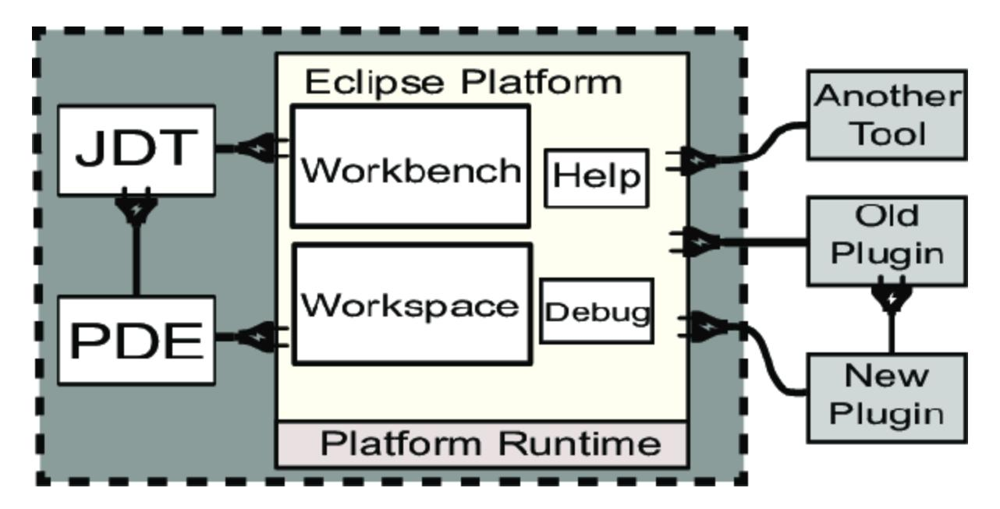
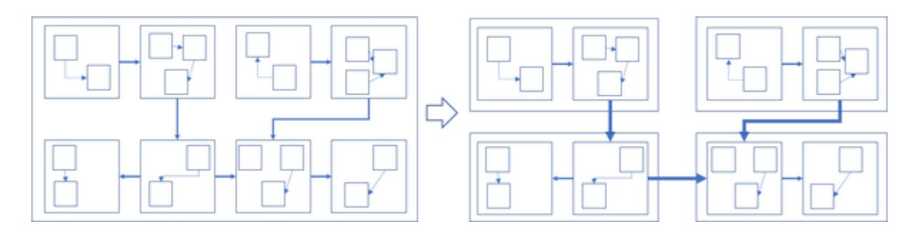

# Cloud Application Architecture Patterns

Designing, Building, and Modernizing for the Cloud

Kyle Brown, Bobby Woolf & Joe Yoder

# Cloud Application Architecture Patterns

Designing, Building, and Modernizing for the Cloud

With Early Release ebooks, you get books in their earliest form—the authors' raw and unedited content as they write—so you can take advantage of these technologies long before the official release of these titles.

Kyle Brown, Bobby Woolf, and Joseph Yoder


Beijing • Boston • Farnham • Sebastopol • Tokyo

*[OceanofPDF.com](https://oceanofpdf.com/)*

# Cloud Application Architecture Patterns

Designing, Building, and Modernizing for the Cloud

by Kyle Brown, Bobby Woolf, and Joe Yoder

Copyright © 2024 O'Reilly Media. All rights reserved.

Printed in the United States of America.

Published by O'Reilly Media, Inc., 1005 Gravenstein Highway North, Sebastopol, CA 95472.

O'Reilly books may be purchased for educational, business, or sales promotional use. Online editions are also available for most titles ([http://oreilly.com](http://oreilly.com/)). For more information, contact our corporate/institutional sales department: 800-998-9938 or *corporate@oreilly.com*.

Editors: Melissa Potter and Megan Laddusaw

Production Editor: Ashley Stussy

Copyeditor: FILL IN COPYEDITOR

Proofreader: FILL IN PROOFREADER

Indexer: FILL IN INDEXER

Interior Designer: David Futato

Cover Designer: Karen Montgomery

Illustrator: Kate Dullea

June 2025: First Edition

# Revision History for the Early Release

2024-06-06: First Release

See <http://oreilly.com/catalog/errata.csp?isbn=9781098116903> for release details.

The O'Reilly logo is a registered trademark of O'Reilly Media, Inc. *Cloud Application Architecture Patterns*, the cover image, and related trade dress are trademarks of O'Reilly Media, Inc.

The views expressed in this work are those of the authors and do not represent the publisher's views. While the publisher and the authors have used good faith efforts to ensure that the information and instructions contained in this work are accurate, the publisher and the authors disclaim all responsibility for errors or omissions, including without limitation responsibility for damages resulting from the use of or reliance on this work. Use of the information and instructions contained in this work is at

your own risk. If any code samples or other technology this work contains or describes is subject to open source licenses or the intellectual property rights of others, it is your responsibility to ensure that your use thereof complies with such licenses and/or rights.

978-1-098-11684-2

[FILL IN]

*[OceanofPDF.com](https://oceanofpdf.com/)*

# Brief Table of Contents (*Not Yet Final*)

Preface (available)

Introduction (available)

Chapter 1: Cloud Applications (available)

Chapter 2: Application Architecture (available)

Chapter 3: Cloud-Native Application (available)

*Chapter 4: Microservices Architecture (unavailable)*

*Chapter 5: Microservice Design (unavailable)*

*Chapter 6: Event-Driven Architecture (unavailable)*

*Chapter 7: Cloud-Native Storage (unavailable)*

*Chapter 8: Cloud Application Clients (unavailable)*

*Chapter 9: Application Migration and Modernization (unavailable)*

*Chapter 10: Strangling the Monolith (unavailable)*

#### *[OceanofPDF.com](https://oceanofpdf.com/)*

# <span id="page-7-0"></span>Preface

#### **A NOTE FOR EARLY RELEASE READERS**

With Early Release ebooks, you get books in their earliest form—the author's raw and unedited content as they write—so you can take advantage of these technologies long before the official release of these titles.

This will be the Preface of the final book. Please note that the GitHub repo will be made active later on.

If you have comments about how we might improve the content and/or examples in this book, or if you notice missing material within this chapter, please reach out to the editor at [mpotter@oreilly.com.](mailto:mpotter@oreilly.com)

This is a book about how to architect applications so that they will run well in the cloud. It is not based on any particular technology or product. Rather, it is designed for application architects using a variety of cloud platforms and technologies. Because the concepts in this book are product- and vendor-neutral, the concepts will remain relevant even as technologies evolve and as old products fall out of favor and are replaced by newer better products. A book focused on a single product will become obsolete when the product does, but one focused on architectural concepts remains

relevant as long as the architecture does, potentially even outlasting the usefulness of the platforms that host the architecture.

Because this book focuses on designing applications to be deployed on the cloud, we do assume a fundamental set of technologies that have become a de facto standard stack that applications make use of to take advantage of cloud computing:

- *Linux* Cloud computing's operating system developed by an open community and freely available
- *Containerization* Packaging an application with the environment it needs to run in the Linux kernel
- *Container orchestration* Grid computing that autonomically manages large numbers of containers
- *Cloud-native application* An application architecture that separates stateless business logic from stateful middleware functionality accessed as backend services

These technologies and ones like them are assumed in this book.

To get the discussion rolling, we'll explain why we wrote this book and who we intend to read it. Adopting cloud is a very broad topic, more than can fit in one book, so we'll discuss what you can expect to learn and what is outside the scope of this book. Lastly, we'll give a quick overview of how this book is organized.

# Why We Wrote This Book

There are more applications running in the cloud than there are ones that run well in the cloud. This may be because architects do not realize that applications should be designed differently for the cloud than for traditional IT, or because they realize the need but don't know how. We (the author team) have hard-earned experience in making applications work well in the cloud, usually through making mistakes and thereby realizing what does and does not work. We have also successfully taught others these lessons, and have captured that experience in this book. We hope that we can convince you that the cloud is different from traditional approaches and teach you how to architect your applications differently, thereby making cloud adoption much easier for you than it has been for us.

# Who Should Read This Book

This book is for application architects and developers who want to learn best practices about how to design applications for the cloud. Architects who want their applications to run well in the cloud need to know these best practices and employ them. These practices apply to any application that will run in the cloud. We assume most developers are writing business applications for commercial enterprises — let's face it, that's where the money is — but these techniques apply equally well to other fields like

research and science, government, non-profits - any field where users have requirements for what an application should do and the organization wants to deploy their applications on the cloud.

# What You Will Learn

This book treads lightly on explaining what the cloud is and does not justify the business case for using the cloud. We assume the reader wants to use the cloud and focus on how to make applications that run well in the cloud. You will learn how to architect applications for the cloud by understanding the following:

- The advantages and limitations of cloud computing architecture compared to traditional IT architecture, and the consequences for application architecture
- How to make an application cloud-native so that it will run well in the cloud
- How an application can be comprised of collaborating microservices and how to design a set of microservices for a particular domain of functionality
- How to make multiple microservices and other software components collaborate, both through orchestration as well as via choreography
- How to apply agile development techniques to designing a cloud application

Strategies to rehost and replatform an existing IT application to run in the cloud, and to refactor an existing application while it is running in production

# What This Book Does Not Cover

This is a book on application architecture, specifically for cloud applications. One might be tempted to think that once you've designed the architecture for an application, you're finished. Instead, architecture is only the beginning. Architecture is the foundation for developing applications for the cloud, but there is a lot more to do that is beyond the scope of this book.

Once the architecture and design for an application is established, that leads to additional work to make the application usable and useful. It must be developed to create the application from its design, and then deployed to become a running application. The application needs a custom environment defined in the cloud platform for the application to be deployed into, an environment that may be distributed geographically to enable the application to be more scalable and reliable. That application running in production must be monitored and managed to keep it running and ensure it is running correctly. The production application needs updates to fix bugs and add features. All of this is beyond the architecture and design of the application and is beyond the scope of this book.

This book does not focus on particular cloud platform hyperscalers, it is vendor-, product-, and language-neutral. For specific technologies, it focuses on widely-used open-source standards that most vendors incorporate into their platforms and tooling. Some of the examples do cite specific languages and products, but only to illustrate how the pattern can be used and is used, not how it must be implemented. As such, this book is not a tutorial on specific products, platforms, or even open-source technologies. This book focused on the design decisions that apply to using any of those, both ones that exist currently as well as many that may be invented in the future.

# How This Book Is Organized

As the title says, most of the content in this book is structured as patterns. Patterns are a proven and efficient technique for experts to capture knowledge and convey it to novices, enabling them to gain expertise quickly. Patterns encapsulate knowledge as reusable solutions to common problems, named so those solutions can be used to discuss design alternatives. Because reusable knowledge is rarely one size fits all, patterns capture not just what to do but when and why, enabling the reader to customize how to apply the pattern each time they use it. Patterns are harvested from experience and proven success, based not just on one person's opinion but on consensus amongst industry experts. Readers with expertise in this field have already internalized these practices and so should find the patterns very familiar. Novices are not familiar with these patterns, but learning them will help a novice rapidly advance their knowledge. An expert may point a novice to this book as an efficient way to learn the basics without needing an expert's years of experience.

This book organizes its patterns into a pattern language, which interconnects the patterns to form pathways for combining multiple related patterns to solve more complex problems. More than just a catalog of solutions within the same problem space, the patterns in a pattern language build upon one another into a blend the reader customizes for a particular design.

Sets of patterns address a common topic, and we've organized each of those sets of closely related patterns into a chapter. A pattern in the pattern language may well refer to other patterns in other chapters, but will refer primarily to other patterns in the same chapter because they all address problems for the same topic.

# Acknowledgements

*[OceanofPDF.com](https://oceanofpdf.com/)*

# <span id="page-16-0"></span>Introduction

#### **A NOTE FOR EARLY RELEASE READERS**

With Early Release ebooks, you get books in their earliest form—the author's raw and unedited content as they write—so you can take advantage of these technologies long before the official release of these titles.

This will be the Introduction of the final book. Please note that the GitHub repo will be made active later on.

If you have comments about how we might improve the content and/or examples in this book, or if you notice missing material within this chapter, please reach out to the editor at [mpotter@oreilly.com.](mailto:mpotter@oreilly.com)

Almost everything runs in the cloud now. Music and television stream from the cloud, documents are stored and edited in the cloud, and cars' navigation systems use the cloud to calculate the route to a destination. Today, we can't imagine using a personal computer that isn't connected to the Internet. Put a smartphone in airplane mode and it suddenly does much less because it doesn't have cloud access.

Most applications either run in the cloud or on a device that connects to applications running in the cloud, but many of the applications running in the cloud don't run as well as they could because they were never designed for the cloud. We begin with [Cloud Applications,](#page-47-0) which will explore why we architect applications differently to deploy them to the cloud.

Before we get to that, to set the scope for this book, let's consider the phases of adopting the cloud, some newer application development techniques and how the cloud can help, as well as the many aspects of managing a cloud application through its full lifecycle—bearing in mind that many of these phases, techniques, and aspects, while important, are beyond how to architect the application and therefore beyond the scope of this book. We'll take a walk down memory lane to review how computer hardware architecture has evolved and application architecture right along with it, bringing us to today's cloud platform hardware and cloud-native applications. Then we will review the pattern format used to structure most of the content in this book and how it documents best practices to make them reusable. Next, we will review how this book is organized, containing chapters that explore different aspects of how to architect an application for the cloud, with each chapter anchored by a root pattern—an overall best practice that leads to the other more detailed best practices in the chapter. Lastly, we'll present some strategies for how to get started reading this book. With that, you'll have a pretty good idea of what these best practices are going to teach you.

# Phases of cloud adoption

Fundamentally, cloud applications run in these technologies: Linux, containers, and container orchestrators, all in a cloud-native architecture. In putting these fundamental technologies to work, IT professionals can adopt cloud computing in three main phases:

- *Application Architecture and Design* Structure an application such that it will work well when deployed to the cloud
- *Application Development and Deployment* Create an application incrementally, configure an application environment in the cloud to host the application, and deploy the application in the environment frequently to make the increments available to users
- *Cloud Operations and Non-functional Requirements* Monitor and manage a deployed application to keep it running reliably, distribute it geographically to avoid single points of failure, and build in compliance and security

Cloud applications are designed for and deployed using the fundamental cloud technologies, then the operations team uses these technologies to keep the applications running.

This book focuses on the first phase of adopting the cloud (shown in bold), how to architect and design applications to work well in the cloud. The

explanation for how to do that will start with the root pattern for this entire book, [Cloud Application.](#page-55-0)

# Modern Application Development

Let's consider how applications are developed. Modern application development incorporates several desirable software development techniques:

- *Modular code* Code should be developed in modules, each developed by a separate team working fairly independently from the others. The team for developing a module should be about 6-12 people, often described as a two-pizza team because the team is small enough that two pizzas are enough to feed everyone. Modules lend themselves to the integration of external services (that are also modular), which rather than duplicating/recreating code that already exists, encourages not only the reuse of existing code but also the integration of existing services.
- *Polyglot development* All of an application's modules shouldn't need to be developed in a single computer language or technology. Some developers prefer one language over another, and some problems are more easily solved by some languages instead of others. Each module can be written in any preferred language regardless of what languages are used to implement the other modules.

- *Incremental development* One of the main tenets of agile development is that code should be developed in small batches that can be developed in short sprints of 1-4 weeks. Large code changes should be deconstructed into these smaller batches and performed incrementally.
- *Continuous delivery* User functionality, bug fixes, and other improvements should be delivered frequently. When users report a bug or request a new feature, once it is fixed or developed, that code change should be quickly deployed into production so that the users can benefit from it immediately. When code in production hasn't been updated in weeks or months, it apparently must have no bugs and the users don't want any improvements, which probably means no one is using this functionality.
- *Automated builds* When a team produces a new or revised set of code, an automated system should build it into deployment artifacts, run automated tests on it, and ultimately deploy it into production. Frequent builds are known as *continuous integration* (CI) and frequent deployment is known as *continuous deployment* (CD). Together they're known as a CI/CD pipeline. An important part of achieving continuous delivery — making code improvements frequently and available to users as soon as possible — is running code changes through the pipeline as soon as they're available. In addition, CI/CD pipelines can be instrumented with automated evidence collection to provide auditors and

security teams with significant pipeline events and results that might be needed for enterprise or regulatory compliance.

These techniques can be accomplished without cloud computing, but the cloud greatly facilitates this style of development. The first two techniques (shown in bold) impact an application's architecture, so this book incorporates them.

# Aspects of Software Development

So far, we've talked about modern application development techniques that can be performed better using the cloud. Yet creating the application is just the beginning. The full software development lifecycle (SDLC) for a cloud application includes many stages, from architecture, development, and testing the application to deploying and operating it. The lifecycle incorporates several aspects of software development, including:

- *Application architecture* Architect and design a new application to fulfill users' functional requirements and run well in the cloud. Delegate common tasks to a set of backend services such as databases and messaging systems.
- *Application migration and modernization* Migrate an existing application to rehost it in the cloud and modernize it to make it run better

in the cloud, such as adopting a cloud-native architecture and refactoring to microservices.

- *Application development* Continuously deliver the application with small development teams developing independent modules in short, agile iterations.
- *Build pipeline* Automate building source code into deployment artifacts, including enforcing quality controls and building images for virtual servers and containers.
- *Application deployment* Design deployment strategies such as virtual server management and container orchestration, service mesh, external access, and the means to automate the strategies such as GitOps.
- *Environment creation* Infrastructure as code (IaC) to build the application environment (aka landing zone) the application will be deployed into.
- *Application operations* Augment the environment with tooling for site reliability engineering (SRE), observability capabilities such as monitoring, log aggregation, activity tracking, and autonomic capabilities such as failover, restart, and elastic autoscaling.
- *Cloud topology* Architecture and strategy for deploying an application across more than one data center, including public cloud zones and regions, private cloud, hybrid cloud, and multicloud.
- *Security* Protecting data and functionality in a multitenant, public environment, as well as enforcing and auditing compliance.

All of these aspects are too broad and too numerous to cover adequately in a single book. This book will cover the first two aspects (shown in bold), with an eye towards enabling these other aspects that will come later in the lifecycle.

# Evolution of Application Architecture

Some people describe the cloud like it's a completely new technology, totally different from anything IT has done before. Others derisively dismiss the cloud as nothing new, just someone else's computer, but with better marketing. The truth lies somewhere in between, that the cloud is an evolution from earlier computing technologies that have culminated in bringing those technologies together and making them more widely accessible. We can see how the industry has gotten to cloud computing by looking at how application architectures have evolved.

The architectural structure of a computer application has evolved over time until it became what today we call a cloud application. Here's a whirlwind overview of some key milestones in the evolution of computer hardware architecture and how application architectures evolved along with it, which shows how the IT industry has ended up with today's cloud-native architecture. This won't teach you how to architect applications, but it is an interesting history of how we got to where we are today.

## **Mainframe Application**

Starting in the 1950's, the first computers were mainframe computers. The 1960s added minicomputers, so called because whereas a mainframe took up all the space in a raised-floor computer room, what was at the time considered a miniature computer took up only half of a room. Users in their offices accessed the mainframe using dumb terminals, so-called because the terminal was just a display and keyboard with no computing or storage, just a dedicated connection to the mainframe that served as a hardline network.

<span id="page-24-0"></span>

Figure I-1. Mainframe Application Structure

As shown in [Figure](#page-24-0) I-1, a mainframe application was a monolith that ran entirely on the mainframe in the computer room. All of the CPU, memory, and storage was on the mainframe. Therefore, the entire computer program and all of its program logic ran on the mainframe. The terminal just provided input and output for people, but no computation. It could be housed in the office where the people were located, but still needed to be

near the computer room because the terminal required a connection to the mainframe via a dedicated network cable that was short and slow with very low bandwidth.

## **Desktop Application**

In the 1970s and '80s came the advent of the personal computer. Like a dumb terminal, a personal computer sat on the desktop, and it provided input and output via a display, keyboard, and eventually a mouse. What made the personal computer a much much smarter terminal is that it contained a CPU, memory, and storage. This gave the computer the ability to run its own programs; while it looked like a terminal, it worked like a very small mainframe. The computer was self-contained, performing all tasks, even backup. If the storage on the computers was backed up, each computer had its own backup device that backed up its computer only.

Personal computers originally didn't have network connections. In the late '80s, companies developed LANs (local area networks), but initially, those did not connect to computers outside the building. Some home computers had modems that dialed up over a telephone line, the same networking was eventually incorporated into fax (facsimile) machines and point-of-sale credit card payment terminals. Eventually, offices were interconnected with WANs (wide-area networks), but modems remained the more universal approach for connecting to any other computer with a modem. Within the company, offices with LAN networks added file servers so that users could

<span id="page-26-0"></span>store files centrally and share them more easily (as long as only one user at a time edited a file). The central file server could be backed up with a single backup device.


Figure I-2. Desktop Application Structure

A personal computer application was a monolith that ran entirely on the user's desktop computer. [\(Figure](#page-26-0) I-2.) Structurally, its architecture was very much like a mainframe application, but even simpler. Whereas a mainframe application might support multiple users through batch processing, a personal computer application was highly interactive but supported just one user. Multiple users in the same office each had their own computer on their own desk. If they were all using the same application, each user had their own copy of the application installed on their computer, where it ran separately from all of the others, each copy using its own data stored locally on the computer. With a LAN and file server, the application could use centrally-stored files as well, but each desktop computer still ran its own copy of the application.

## **Client/Server Application**

In the 1990's, computing capacity became centralized once more. LANs added server computers with compute and storage that could be shared by all of the users on the LAN. Unlike the mainframe, the office workers didn't use dumb terminals, they used the personal computers they already had on their desktops. So each worker had their own compute and storage capacity on their desktop, as well as access to shared compute and storage capacity on the server computers.

Companies first used server computers to host database servers. The application still ran on the desktop computer, but it could access not just centralized files but also managed data. This enabled multiple workers to use data at the same time, even editing data at the same time without overwriting each other and always having access to the data with the latest changes.

Databases on centralized servers were a big improvement over sharing files on file servers, but what office workers really needed was applications that run on the server computers. The application server emerged to centrally host applications so that running applications could be shared much the way files and data were, as shown in [Figure](#page-28-0) I-3. Meanwhile, offices and homes became connected to the Internet. Application servers were hosted in centralized data centers that workers' personal computers connected to through their LAN and the Internet.

<span id="page-28-0"></span>

Figure I-3. Client/Server Application Structure

With application servers, many of the applications that office workers relied on became centralized and shared once more, much like the mainframe applications before them. While simple applications for tasks like word processing still ran entirely on the desktop, many applications became hosted in a centralized application server. Multiple workers using the same application could all share a single application running in the application server. But these workers weren't using dumb terminals, they had compute capacity on their desktops in their personal computers.

This led to the advent of client/server computing, where shared program logic and data ran on the server and were accessed by personalized program logic running on the client. As logic was spread across computers throughout the network, a slogan emerged: The network is the computer. In other words, the computer isn't one machine, it's all of the computers connected by the network. The desktop computers hosted thick client applications, full mini-applications that used the shared applications in the

application server to perform the complex work that needed to be shared with other users. Server computers were much more powerful and expensive, so they performed complex work. But networks had limited bandwidth, so the thick client application performed as much of its individual user's work as possible to avoid the network.

The application server didn't eliminate the need for a centralized database server, it changed the purpose of a database. The application server and the database server ran side-by-side on one or more server computers. An application running in an application server didn't need to manage its data, it could delegate that responsibility to the database server. Multiple applications and multiple users in an application could all share the same data in the database.

Service-oriented architecture (SOA) applied the client/server architecture to the server application, dividing it into components that perform work for other components. Service components within the application that model business domain entities are able to vary independently and be maintained by separate development teams.

## **Cloud-Native Application**

In the 2000s, application servers evolved into cloud computing. Whereas application servers were typically specialized to run a particular programming language or technology, cloud computers were generalized to run any program in a virtual machine. The virtual machine acted logically like a server computer—a virtual server instance—with not just virtualized compute capacity but also virtual storage and virtual networking. The cloud also hosted databases; whereas data center operations personnel who installed application servers also installed the database servers, cloud could host databases as a service so that application developers could easily create their own databases without needing help from operations or a database administrator (DBA).

Cloud extended this database-as-a-service model to make everything a service, which became known as software-as-a-service (SaaS). Workflow engines, messaging systems, authentication directories, and anything else an application needed became hosted as a service, as shown in [Figure](#page-30-0) I-4.

<span id="page-30-0"></span>

Figure I-4. Cloud-Native Application Structure

With the cloud, the application running on the server could focus entirely on domain logic. It accessed any of the capabilities common to multiple applications—database, workflow, messaging, authentication, etc.—as shared backend services. The application server simplified into a virtual

machine with the technology to run the code the application was implemented in—a runtime for a language like Java, Node.js, Python, and so on. While the server was no longer necessarily an application server, the client was no longer necessarily a desktop computer or even a laptop computer. With the popularity of the Word Wide Web (WWW), web browsers became universal, and application developers learned to create user interfaces for their server applications that could run in any web browser. A user could access an application without having to install a thick client, they could just use a single web browser to access any server application. Furthermore, the client doesn't even have to run on a desktop. With the advent of the smartphone and tablet, mobile devices became practical. They could also run web browsers, then quickly evolved to also run small thick client apps for accessing the server applications, often via a wireless network connection.

The cloud is mainframe-like compute capacity distributed across multiple server computers running generalized application servers with built-in SaaS services for common capabilities. Therefore the structure of a cloud application is a client/server application. The server application only runs the logic for user requirements and delegates all shared functionality to backend services. The client application can be a web browser, mobile app, or even a kiosk or a chatbot.

A cloud-native application is one written or modernized specifically for the cloud, to take full advantage of the cloud computing model. The application is designed to run well in the cloud, to take advantage of the strengths of cloud computing while avoiding and compensating for its limitations. Cloud native has become the defacto best practice for designing many applications, even those to be deployed on traditional IT, and so somewhat ironically refers less to where an application resides and more to how it is built and deployed.

Cloud facilitates a new world of massive computing power available on demand cheaply. Cloud-native applications are designed to take advantage of this on demand computing power, resulting in applications that are highly scalable, always available, and that any user can access with a device and an Internet connection.

# Patterns and Pattern Format

This book documents best practices as patterns. We use the pattern format because we don't want to simply enumerate *what* tasks an application architect should perform, we want to teach *why* these practices work well and *how* to apply them. While explaining how to solve a problem, a pattern teaches a reader about the problem, why it is difficult to solve, and why this solution solves it well. Each pattern is a decision that can be made. A set of patterns is a very efficient way for an expert to document their expertise and for a novice to not only learn that expertise but also how to apply that expertise.

Simply put, a *pattern* is a solution to a problem in a context. More specifically, it's a structured way of representing design information in prose and diagrams that facilitate communicating time-tested solutions to common problems. Developing complex solutions requires applying multiple related concepts, which is where a pattern language becomes important. A *pattern language* is a set of related patterns that shows how the patterns are interconnected, how they fit together to form a whole greater than the sum of the parts, and how each pattern leads to others. A pattern language is generative, showing when and how to apply patterns to build solutions.

Learning a new domain of knowledge is difficult, especially in domains that are just "inside" the bleeding edge of a field of study. One of the issues with traditional academic approaches is that they aren't up to the problem of conveying "common" knowledge. There can be limited enthusiasm for documenting know-how if "everyone knows it." Yet not documenting what experts know makes it difficult for a novice to gain all of the information they need to be able to start working on something that uses ideas from the bleeding edge. When something is just "relatively" new, it's often hard to distinguish good ideas from bad ones, especially when you don't have the experience in a field to make that distinction.

The pattern idea came to computer science not from software architecture, but instead from the brick-and-mortar architecture world. The architect Christopher Alexander published two important books, *A Pattern Language* and *A Timeless Way of Building*. In the bricks-and-mortar world, Alexander uses patterns to express the interaction of forces in a problem and shows how you can resolve those forces to arrive at an elegant solution. He is also concerned with demonstrating how each pattern fits in with other patterns to convey to a novice architect the broader scope of how all the different issues come together. Several computer scientists in the late 1980s and early 1990s picked up these techniques from Alexander and found that they can also be applied successfully for developing computer software.

This book uses a modified Alexander style for the patterns. Each pattern consists of these sections:

- *Name* An identifier the pattern that describes the solution in a short phrase, usually a noun, that can easily be used in a sentence to describe applying the pattern as part of a design.
- *Context* A description of the sort of work you might have been performing that caused you to encounter this problem. The context often refers to other patterns that you may already have applied.
- *Problem* Formatted in bold, this describes the difficulty you are facing, expressed as a question. The problem statement should quickly tell you whether this pattern is currently relevant to where you are in your design.
- *Forces* This elaborates on the problem and the opposing constraints that make it difficult to solve, exploring possible solutions and showing their shortcomings. This is where an expert can teach a novice about the

- problem, why it is difficult to solve, and help them appreciate that a solution isn't necessarily easy.
- *Solution* Specific guidance that you can apply to solve the problem, not just in your current situation but in the range of situations where the problem can occur. The solution answers the question posed by the Problem. The Name, Problem, and Solution are the core of the pattern.
- *Sketch* An illustration of the solution and how it's typically applied. This being a book on architecture, the sketch is often a part of an architectural diagram.
- *Results* How the design changes because of applying the solution, how the solution resolves the forces and balances them, improving the design better than the other possible solutions.
- *Consequences* After a divider, a consideration of the strengths of the solution and its challenges.
- *Related Patterns* Guidance on other patterns to consider after this one, especially because solving one problem can lead to new ones. The links to patterns in the Context and Related Patterns sections are what make the patterns into a pattern language.
- *Examples* Optional sections showing the pattern in use, often citing well-known solutions and explaining how they embody the pattern.

The patterns in a pattern language form a methodology for designing complex solutions in a domain and a vocabulary for discussing those designs. Once a team has internalized the patterns, design discussions become much more efficient. The team no longer needs to explain what they mean by an Adapter, Intention Revealing Interface, Data Transfer Object, or Message Channel - those concepts are well-known patterns, so the team's discussion can focus on how the concept contributes to the design. In the seemingly endless quest to make components reusable, capturing knowledge as patterns in pattern languages has proven to be more reusable than any executable code.

# Organization of This Book

The pattern language in this book forms a web of patterns referencing each other. At the same time, some patterns are more fundamental than others, forming a hierarchy of patterns introducing big concepts that lead to more finely detailed patterns. The big-concept patterns form the load-bearing members of the pattern language. They are the main ones, the *root patterns* that provide the foundation of the language and support the other patterns.

[Table](#page-37-0) I-1 lists the root patterns in this book.

<span id="page-37-0"></span>Table I-1. Root Patterns

| Chapter                                               | Root Pattern                 |
|-------------------------------------------------------|------------------------------|
| Chapter 1: Cloud Applications                         | Cloud Application            |
| Chapter 2: Application Architecture                   | (none)                       |
| Chapter 3: Cloud-Native Application                   | Cloud-Native<br>Architecture |
| Chapter 4: Microservices Architecture                 | Microservice                 |
| Chapter 5: Microservice Design                        | Model around Domain          |
| Chapter 6: Event-Driven Architecture                  | Reactive Component           |
| Chapter 7: Cloud-Native Storage                       | Cloud Database               |
| Chapter 8: Cloud Application Clients                  | Client Application           |
| Chapter 9: Application Migration and<br>Modernization | (none)                       |
| Chapter 10: Strangle the Monolith                     | Strangler Application        |

This book groups patterns into chapters by level of abstraction and by topic area. [Figure](#page-38-0) I-5 shows the primary relationships between the chapters in this book.

<span id="page-38-0"></span>

Figure I-5. Book Organization diagram

Now we've seen the chapters in this book, how they relate to each other, and their root patterns. Next, let's look at what the chapters are about.

## **Relationship of Root Patterns and Chapters**

The pattern language is divided into eleven chapters, which follow the relationships shown in the diagram. The relationships are among these chapters:

- Chapter 1: [Cloud Applications](#page-47-0)  The pattern language begins with this [chapter. It introduces the root pattern for the entire book, Cloud](#page-55-0) Application.
  - The way to adopt cloud is to host applications on the cloud. The architecture and design of an application that works well in the cloud are significantly different from one that works well in traditional IT. Cloud also facilitates adding many great capabilities to applications.
- Chapter 2: [Application Architecture](#page-73-0)  This chapter is a tangential discussion that applies to traditional IT as much as the cloud. It explores [three of the main approaches to architect an application: Big Ball of](#page-84-0) Mud, [Modular Monolith](#page-95-0), and [Distributed Architecture.](#page-111-0) Application architectures have evolved to make applications easier to develop and to run more efficiently. We will discuss common architectures and how they have evolved over time.
- Chapter 3: [Cloud-Native Application](#page-136-0) This chapter explores how to design an application to work the way the cloud works. It starts with the root pattern [Cloud-Native Architecture.](#page-147-0) Architect a cloud application to take advantage of the strengths of cloud computing while avoiding and compensating for its limitations. This requires designing a cloud application differently to give it advantages beyond any traditional IT application.
- Chapter 4: Microservices Architecture This chapter explores how to model an application as a set of individually deployable units that can be developed by separate teams. It starts with the root pattern Microservice.

- The traditional IT application architecture is one big monolith, which makes it difficult for a large team to develop and cumbersome to deploy. To avoid the same challenges in one big cloud application, break it into many small applications that each performs a separate responsibility.
- Chapter 5: Microservice Design This chapter shows a strategy for discovering and scoping individual microservices in an architecture. It starts with the root pattern Model around Domain. How can developers design one big application as many small applications that each perform a separate responsibility? Analyze interactions with the application to discover where one wellencapsulated responsibility ends and another begins.
- Chapter 6: Event-Driven Architecture This chapter explains how to choreograph microservices that react dynamically to each other and to external events. It starts with the root pattern Reactive Component. Complex functionality is often decomposed into a predefined set of orchestrated steps. However, some components interact indirectly through dynamically discovered relationships that are more easily modeled as choreography.
- Chapter 7: Cloud-Native Storage This chapter explains how to model data the way the application works and manage it the way the cloud works. It starts with the root pattern Cloud Database. Enterprise IT has embraced the relational database as the best and only way to store and access the data the enterprise depends on. Newer databases have emerged that model data more flexibly and simplify the

- applications using the data. These databases not only run better on the cloud but often are also included as part of the cloud platform.
- Chapter 8: Cloud Application Clients This chapter explores how users outside the cloud will interact with applications in the cloud. It starts with the root pattern Client Application.
  - Cloud applications run in the cloud, but their users do not. Users need to be able to access the cloud application from the device they're using, via user interfaces that are simple to install and update, and that support an increasingly widevariety of device types.
- Chapter 9: Application Migration and Modernization This chapter explores how to transform and modernize existing applications into cloud applications. Strategies include Lift and Shift, Virtualize the Application>>, Containerize the Application, and Refactor the Monolith. Cloud applications can be developed from scratch, but often they start as traditional IT applications that the enterprise later decides to host on cloud. Simply moving a traditional IT application onto the cloud as-is has limited success. The enterprise can achieve greater success by updating the application to make it work well on the cloud. It is best to Start Small and Pave the Road when you are migrating and modernizing existing applications to run in the cloud.
- Chapter 10: Strangle the Monolith This chapter shows how to iteratively transform an application from a monolith into microservices. It starts with the root pattern Strangler Application.

A traditional IT application can be updated for the cloud in one big bang, but a complex application that is already running in production can be converted more easily by doing so incrementally. The trick is to keep the application running when it is half traditional IT and half cloud.

# Getting Started

The standard way to read most books is straight through following the page numbers and chapter numbers. That will certainly work with this book as well and will help you gain familiarity with the patterns. While that can be the most effective way to read a book, it is not necessarily the most efficient way to use a pattern language.

Initially, to learn the material in a book of patterns and a pattern language, you may read it more like a user manual. Once you're familiar with the material, you'll tend to use it more like a reference manual. A computer program used to include two books of documentation, a user manual, and a reference manual. The user manual explained how the software worked and how to use it, and was intended to be read in order, more like the story in a novel. The reference manual explains all the random details about the software that you might need to know at some time, which is more like a dictionary or encyclopedia than a novel. For example, the reference manual explained the error messages, and while you could read all of the error messages in order, that probably wasn't very helpful. It was more helpful to

jump to the part of the reference manual that covered what you needed at that moment. A pattern language is like that - jump in where you need to and follow the path through the patterns that are helpful to you. No two readers may read the same pattern language exactly the same way, and a single reader may not read the same pattern language exactly the same way twice.

The best place to start reading a new pattern language is with the first pattern. That's true for this book's pattern language, so a good place to start is with Chapter 1: [Cloud Applications](#page-47-0) and the root pattern for the entire book, [Cloud Application.](#page-55-0) From there, the *Related Patterns* section at the end of the pattern lists other patterns you might want to read next. And those patterns also have *Related Patterns* sections. Following these pattern links will eventually lead to most of the book, though often not in page or chapter order.

This pattern language is designed to facilitate learning it at a high level before diving into all of the details. To get a good feel for the pattern language overall, read only the root patterns. They are listed in [Figure](#page-38-0) I-5, and are the first pattern in each of the chapters. Some chapters don't have root patterns and it's OK to skip those chapters for this overview, they're not as key to the pattern language as the chapters with root patterns. The root patterns don't have to be read in chapter order, but that's a pretty good way to understand them. In fact, the book presents the chapters in this order because it is a logical progression through the main topics of the book and

likewise for the topics' root patterns. As with any pattern language, this ordering isn't the only path through and may not always be the best for all audiences, but like a user manual, it is a good way to get started.

Keep in mind the chapter relationships shown in [Figure](#page-38-0) I-5, which are also a good order for following the root patterns. It is a good idea to start with Chapter 1 [Cloud Application.](#page-55-0) After this, you have a choice where to proceed from there. If you are interested in continuiing with cloud applications you might read Chapter 3 Cloud-Native Architecture and skip Chapter 2, which is more general information about architectures that aren't necessarily cloud-specific.

After this you could read about Microservices Architecture in Chapter 4. Chapter 2 present ideas about [Distributed Architectures,](#page-111-0) which is a foundational concept for understanding microservice architecture, so you may want to read that pattern first if you need to become more familiar with that prerequisite. On the other hand, rather than microservices, if you're most interested in data persistence, after Chapter 3, go to Cloud Database in Chapter 7. Or if you're most interested in learning about the application clients that run on users' devices, after Chapter 3, go to Chapter 8 and Client Application. Eventually, you'll want to read and learn all of those patterns, the question is which you feel like learning first. The order of the chapters in this book is one suggested ordering, but only one of many useful approaches, and some readers will find other orderings more helpful for focusing on the material most relevant to them.

Beyond reading the patterns just to learn them, once you're familiar with a pattern language, the best way to apply it is to think about the design you're working on and the biggest design problem you're facing currently. Read through patterns that seem like they may help you solve that problem, pick one that seems promising, apply it, and then see if and how it helps. Its *Related Patterns* section will lead to more patterns you should consider. Once you've applied all of the patterns that seem relevant and improved the original problem as much as you can, step back and repeat the process to consider what is now the biggest problem you're facing in your design and look for patterns that may apply. In this way, you'll bounce all around throughout the book, sometimes focusing on many patterns in the same chapter, but also jumping from a pattern in one chapter to one in a different chapter, a chapter that may be earlier in the book and may be later. In this way, you'll use the pattern language to figure out how to create the particular design you're working on and will discover a custom set of patterns to apply in a custom order to create that design.

This is how the act of reading a pattern language customizes it for each reader and each particular application. As you get used to navigating the patterns in this way, you'll find the chapter order is pretty irrelevant, and you may find that some of the patterns are never relevant to your design and so may never read those pages of the book. That is OK, each reader will use the patterns differently, and how you use the patterns is the right way for your design.

#### *[OceanofPDF.com](https://oceanofpdf.com/)*

# <span id="page-47-0"></span>Chapter 1. Cloud Applications

#### **A NOTE FOR EARLY RELEASE READERS**

With Early Release ebooks, you get books in their earliest form—the author's raw and unedited content as they write—so you can take advantage of these technologies long before the official release of these titles.

This will be the 1st chapter of the final book. Please note that the GitHub repo will be made active later on.

If you have comments about how we might improve the content and/or examples in this book, or if you notice missing material within this chapter, please reach out to the editor at [mpotter@oreilly.com.](mailto:mpotter@oreilly.com)

Cloud computing is revolutionizing information technology. As the IT environment evolves, application architectures need to evolve to take advantage of the new technology, and IT professionals need to evolve their skills to succeed with the new technology. These cloud application techniques apply to developing a new application so that it will run well on cloud as well as migrating an existing application from traditional IT to cloud computing.

Some readers may wonder why applications need to be structured differently for cloud. To explain why, let's cover a couple of background topics:

- *Cloud computing* What do we mean by cloud computing
- *Cloud computing practices* IT practices for making applications work with cloud computing

Then, once we're all on the same page, we'll go to the first pattern, which is the root pattern for this entire book, ["Cloud Application"](#page-55-0).

# Cloud computing

Let's begin with what we mean by "the cloud."

As the saying goes, the cloud is just someone else's computer [\[1\]](#page-72-0). However, a cloud is way more useful than just a computer. What makes a cloud valuable is that someone made a bunch of their computers available for you to use, enabled you to manage your own usage, and enabled their computers to be shared by others as well as you.

The National Institute of Standards and Technology (NIST) provides this [definition of cloud computing](https://www.nist.gov/publications/nist-definition-cloud-computing) [[2\]](#page-72-0):

*Cloud computing is a model for enabling ubiquitous, convenient, ondemand network access to a shared pool of configurable computing resources (e.g., networks, servers, storage, applications, and services) that can be rapidly provisioned and released with minimal management effort or service provider interaction.*

Cloud computing has several qualities that make a pool of configurable computing resources easy to share:

- *Universal access* A cloud can be accessed from any network connection, typically the internet but an enterprise may host its own private cloud internally and public clouds can support private network connections.
- *Shared resources* A cloud enables multiple applications to run on the same hardware. Capacity that is not being used by one application is available to be used by others.
- *Distributed computing* A cloud isn't just one computer, it's lots of computers, plus storage and networking. An application doesn't run on just one computer, it runs on several and the parts need to work together over the network.
- *Virtualized computing* The cloud's compute, storage, and networking hardware is managed by a layer of virtualization that can divvy up one computer to act like many smaller ones as well as combine many computers to behave like one large computer—the cloud—with a giant pool of capacity.

- *Elastic computing* An application is not limited to a fixed amount of capacity. The capacity can grow and shrink dynamically as the client load on the application changes.
- *Multitenant* Multiple users and organizations share a cloud. The cloud controls who has access to which applications and resources and enforces isolation between them.
- *Self-service* When an organization wants to provision some capacity or deploy a workload, they don't send a request to the cloud's central administration staff. Users are able to perform these tasks themselves.
- *API-driven* The resources and services that comprise the cloud are used and managed via APIs. Some APIs are only available internally, enabling the cloud provider to monitor and manage the cloud. Other APIs are available externally, enabling self-service by the customers.
- *Multicloud* As much as it's convenient to think of "the cloud," there isn't just one cloud, there are lots of them: Ones for different stages of the software development lifecycle (SDLC), for different geographies, and for different lines of business. Multiple vendors host different public clouds, and enterprises host their own private clouds.

These qualities are what make a cloud more than just someone else's computer.

Now we have a basic idea of what the cloud is. Next, to understand why cloud applications are different and need to be developed differently, let's review how cloud computing compares with traditional IT.

# Cloud computing practices

As developers create applications to be deployed on traditional IT, they bake into the application a number of assumptions about how the hardware works, and therefore how the application can and should work. When an application is going to be deployed on cloud computing, many of these assumptions are significantly different.

Cloud computing has certain characteristics that differ from traditional IT and affect how cloud applications need to work:

- *Unreliable infrastructure* A traditional IT application is only as reliable as its hardware, so developers tasked with making their applications reliable expect either 100% reliable hardware or accept downtime as unavoidable. Cloud computing embraces inexpensive commodity hardware that lacks the redundancies to attempt 100% reliability, along with the reality that planned outages are necessary for maintenance and unplanned outages can't be avoided completely. To run reliably on unreliable infrastructure, a cloud application must be more reliable than its infrastructure.
- *Eventual consistency* A traditional IT application uses ACID transactions to enforce immediate consistency, even distributed across multiple resources, requiring the complexity and overhead of a transaction manager, concurrency locking, rollback, recovery, and retry.

Cloud computing does not provide a transaction manager and cloud services employ eventual consistency. Cloud application developers cannot depend on transactions and must design for eventual consistency, which counterintuitively actually makes the applications more reliable.

- *Generic hardware* A traditional IT application typically requires specific hardware, whereas cloud computing provides generic hardware that will evolve in the future. A cloud application must be infrastructure neutral so that it can run anywhere.
- *Application mobility* Traditional IT developers assume that once an application is deployed on a computer, it will always run on that computer. Cloud computing moves a running application from one computer to another to balance load and avoid outages. A cloud application must be transportable so that that cloud platform can easily relocate it and it will keep working after relocation.
- *Multitenant* Developers design a traditional IT application to be the only one running on a computer and use all of its resources, whereas cloud computing often runs multiple applications on the same computer and isolates each one to control the resources it can use. A cloud application must be designed to share its hardware.
- *Horizontal scaling* A traditional IT application runs on a single computer and scales by growing on that computer, whereas cloud computing scales a cloud's capacity by adding more computers and scales a workload by running it on multiple computers. To support scaling across multiple computers, a cloud application must be able to

- run as multiple copies that act like a single bigger application running on one big computer. Multiple copies also makes the application more reliable by avoiding a single point of failure.
- *Stateless* A traditional IT application stores user data for long-term use by multiple units of work. A cloud application loads data to perform a unit of work but must not store data between units of work.
- *Immutable* When bugs are found in a traditional IT application, fixes are applied by patching the running application. A cloud application is deployed as a release that does not change while running.
- *Componentized* A traditional IT application is often a single complex set of code with little separation of concerns, all deployed in a large process that requires a large computer. Cloud computing hosts workloads on parts of multiple smaller computers. A cloud application runs better when designed as multiple components with limited interdependencies that can each run on a different computer.
- *Service catalog* Many traditional IT applications either implement their own low-level services like data persistence and multithreading, or must be deployed into an application server that includes middleware services the applications require. Many cloud computing platforms provide a catalog of reusable middleware services. A cloud application that needs middleware functionality should delegate to it as a shared service.
- *Cloud database* A traditional IT application stores all of its data in a single relational database that the application must force fit its data into,

whereas cloud computing platforms often provide a variety of database types that are easy to provision and can fit different types of data more naturally. A cloud application should provision databases from the cloud platform's service catalog and should use the best database for each set of data.

*Self-provisioning* - When a development team needs a traditional IT environment provisioned for their application, they submit requests and the IT's central operations team performs the provisioning. For a cloud environment, that same development team can perform the provisioning themselves. A cloud application should be designed to deploy into a cloud environment that is self-provisioned.

These differences explain how an application developed for cloud needs to work differently than one developed for traditional IT. They also show how a traditional IT application moved as-is to the cloud doesn't work as well in the cloud as an application designed specifically for the cloud. The more an application's design takes advantage of these cloud capabilities, the better it will run in the cloud. As you can see, adopting the cloud means that application developers need to adopt a new mindset embodying a new set of practices.

# What's Next

We've now seen what the cloud is and how cloud computing differs from traditional IT. With all of that under our belts, it's time to begin discussing how to architect applications for the cloud. We'll start with the root pattern for this entire book, [Cloud Application.](#page-55-0)

# <span id="page-55-0"></span>Cloud Application

You are developing a new application or modernizing an existing application. You want your application to take advantage of cloud technology, both so that it will run better and so that your team will be able to follow better development practices.

## **How can I build applications to take the maximum advantage of all the features of the cloud for the best future proofing and agility?**

Experienced application developers who are new to cloud are used to developing traditional IT applications and tend to fall back on those practices out of habit. Those practices tend to develop an application that doesn't work well on cloud, so even a newly developed application doesn't work much better on cloud than a traditional IT application migrated onto cloud with minimal changes. The developers either ignore these limitations

or get into a game of whack-a-mole trying to fix problems in code that wasn't implemented well for cloud.

Traditional IT applications run into limitations in cloud. Cloud offers highly-desirable capabilities that traditional IT applications cannot take advantage of:

- *Low cost, commodity hardware* Traditional IT applications expect hardware to be specialized and highly reliable, but cloud infrastructure usually is not.
- *Grid computing* Traditional IT applications hardcode assumptions about the hardware they will be deployed on, whereas cloud is a looselydefined pool of hardware and the application could be deployed anywhere.
- *Unlimited scalability* Traditional IT applications are not designed to take advantage of the seemingly infinite compute capacity of cloud.

Traditional IT applications are unable to take advantage of these cloud capabilities. These characteristics that work fine for traditional IT applications work poorly in the cloud:

- *Monolithic* A traditional IT application is typically architected as one big program that runs on a single computer.
- *Complex transactions* A traditional IT application typically performs several steps that must all complete successfully or none of them should,

- requiring that all of the steps are performed in a transaction and each step can roll back.
- *Platform dependent* A traditional IT application is typically designed for a particular operating system with device drivers for specific hardware.
- *Stationary* A traditional IT application is typically deployed once to run forever on a computer that is expected to run forever.
- *Vertical scaling* A traditional IT application can scale only as much as its computer is able, becoming constrained by its computer's limits on CPU, memory, storage and network bandwidth.
- *Stateful* A traditional IT application stores data in memory long term to avoid database transactions.
- *Patchable* In a traditional IT application, as bugs are fixed and features are added, they are deployed by patching the running application, perhaps because a new version of the application that includes the fixes would be too difficult to redeploy.
- *Exclusive resources* A traditional IT application is typically designed to be the only application running on a computer, such that two applications may conflict.
- *Homogeneous data* A traditional IT application typically stores all of its data in a single enterprise database of record with a strictly defined onesize-fits-all schema.

Developers may naturally design traditional IT applications with these characteristics, but these characteristics will make an application work

badly in the cloud. Developers designing applications for cloud need newer approaches that work better in cloud.

*Therefore,*

**Architect an application as a** *cloud application***, designing it to take maximum advantage of the capabilities of cloud while avoiding its shortcomings.**

Structure a cloud application as a distributed set of microservices that takes advantage of backend services provided by the cloud platform, accessed by client applications that run outside the cloud. (See [Figure](#page-58-0) 1-1.)

<span id="page-58-0"></span>

Figure 1-1. Cloud Application

Developers adopting cloud need to make a conscious effort to develop applications with these qualities, to design the application to take advantage of the strengths of cloud while working around its weaknesses.

Cloud application design avoids the characteristics that make traditional IT applications run on cloud less effectively and instead embodies these

#### corresponding characteristics:

- *Modular and distributed* A cloud application is composed of multiple components that can run on multiple computers.
- *Simple transactions* A cloud application performs tasks as units that can succeed or fail independently.
- *Platform independent* A cloud application can run unchanged on a range of commodity hardware that evolves over time.
- *Movable* The cloud can relocate a cloud application from one computer to another to balance load and avoid outages.
- *Horizontal scaling* A cloud application can run across multiple computers, each with its own resources and bandwidth, avoiding bottlenecks.
- *Stateless* A cloud application works best when the databases always contain all of the latest data.
- *Immutable* A cloud application does not change after it is deployed and can always easily be redeployed.
- *Shared resources* Multiple cloud applications often run on a single computer.
- *Data persistence flexibility* A cloud application often uses multiple databases designed for different tasks with varying approaches to storing data.

These characteristics of a more flexible application can be nice to have on traditional IT and are practically required to run well on cloud.

Some of the main benefits of building *Cloud Applications* are availability, scalability, and flexibility. An application developed for the cloud tends to more modular, modules that can be deployed and scaled independently of other parts of the application.

As explained in this chapter's introduction, designing applications for cloud is fairly different from the way traditional IT applications are designed. Organizations accustomed to developing applications for traditional IT may find cloud difficult to adopt until they adopt these new architectural approaches for cloud applications.

Follow these best practices and related patterns to architect an application that works well in cloud:

- *Cloud native* The application is a [Cloud-Native Application](#page-136-0), embodying a [Cloud-Native Architecture](#page-147-0) that takes advantage of cloud capabilities.
- *Microservices* The application is not just cloud native but can be implemented as a [Distributed Architecture](#page-111-0), usually incorporating a Microservices Architecture composed of Microservices that modularize the application into decoupled components that limit the boundaries of code changes and can run distributed across multiple computers. This supports Polyglot Development so that each module can be implemented in a different language. The microservices incorporate a Microservice

- Design that models the enterprise's business domain and the user requirements.
- *Event driven* While it is typical for a business process or microservice to orchestrate preplanned work of other microservices, it can also be helpful to use an Event-Driven Architecture of Reactive Components to choreograph ad hoc interactions between microservices.
- *Cloud storage* The application takes advantage of Cloud-Native Storage that is scalable and reliable in the cloud. A cloud platform typically includes a variety of Cloud Databases, each of which is optimized for a particular data structure and usage, so an application can take advantage of Polyglot Persistence to segment data into encapsulated sets and store each set of data in the storage technology that works best for that data.
- *Client applications* The application running on the servers in the cloud supports a variety of Cloud Application Clients, with different Client Applications for different platforms such as computers, mobile devices, and even other applications.

Cloud applications facilitate an Application Development Process that makes agile development easier to achieve. A cloud application can be the goal of developing a new application from scratch, or can be the result of Application Migration and Modernization that transforms an existing traditional IT application into a cloud application.

One of the most difficult aspects of modernization can be transforming an application while it is already being used in production. One way to address this is to Strangle the Monolith to transform an application incrementally while keeping the existing application running.

## **Examples**

Some examples of applications hosted on the cloud using a cloud application architecture:

- *E-commerce*: A customer self-service website which enables customers to purchase products for mail-order delivery.
- *Banking*: A customer self-service website which enables customers to view their accounts, deposit checks, and transfer money.
- *High performance computing (HPC)*: An enterprise uploads data to cloud for analysis and processing by artificial intelligence.

#### **E-commerce: Three-tier architecture**

An e-commerce application enables its users to order products, often by placing them in a shopping cart and checking out to make payment and place the order for delivery. Purchasing mail-order products was first performed by telephone, then later by website. The telephone customer service representative used an application hosted on traditional IT, often hosted in the computer on their desk. The first websites, though accessible over the web, were hosted in traditional IT on servers that were little more

than fancy desktop computers. As cloud became commonplace, these applications became hosted on the cloud.

Whether the user is the customer buying products or a representative facilitating the purchase, the architecture for the cloud application is the same. The application has functionality and databases for customers purchasing products. Both the customer and representative access the cloud application via client applications that run in web browsers, on mobile devices, and even as thick clients deployed on desktop computers.

<span id="page-63-0"></span>

Figure 1-2. E-commerce Cloud Application

As [Figure](#page-63-0) 1-2 shows, the business logic for purchasing products runs as a program hosted in the cloud. In this example, the business logic and its corresponding data consists of product catalogs, warehouse inventories, customers, and orders. The enterprise has an existing payment processing system still hosted on traditional IT that is PCI (payment card industry) compliant, so the cloud application uses it to manage payments. The warehouse has an existing inventory management system hosted on-site on traditional IT, which the cloud application uses to query product

availability. Customers can make self-service purchases by accessing the website in a web browser or using a mobile application. If the customer calls to place their order, the customer service representative uses the same cloud application but accesses it via a thick client application running on their desktop terminal.

#### **Banking: System of engagement**

Many enterprises have existing systems of record (SoRs) that cannot be moved to cloud (or at last haven't been moved so far). Yet cloud can still be helpful for making those systems accessible to large numbers of users across a variety of user interfaces. To do so, the enterprise implements a system of engagement (SoE) deployed in cloud that provides controlled access to functionality in the SoRs. In both a three-tier cloud application and an SoE cloud application, the middle tier runs in the cloud. In a threetier application, the middle tier contains the majority of the business logic, relying on existing SoRs relatively little. In an SoE, the middle tier is mainly a facade that delegates to the SoRs for all business logic and computation. Whereas the SoRs are difficult to use because of their legacy technology–such as COBOL copybooks, a limited number of concurrent network connections, batch processing–SoEs use modern technology–such as JSON and XML, web services, huge numbers of concurrent users. The SoE adapts the SoRs so users can access them as a unified, modern application.

Consider a bank that wants to make its customers and partners able to interact directly with its financial services. Those services are often provided by systems of record that almost certainly do not run in cloud and will not be migrated anytime soon. Rather than rewrite these businesscritical systems, and rather than giving public Internet users direct access to these business-critical systems, an SoE running in the cloud can scale to support numerous concurrent users on a variety of devices with security to control access to the SoRs via a limited number of shared connections. The SoE provides the external functionality while reusing the existing systems to implement much of that functionality.

The bank may rely on existing systems to manage different types of accounts–such as checking, savings, mortgages, credit cards. These systems may not even know that multiple accounts are owned by the same customer, or that two customers with separate accounts also own a joint account. Part of the goal for an SoE is to enable a customer to see all of their accounts and manage them together, such as transferring funds between accounts.

Another driver for a system of engagement is supporting new types of client applications made possible by the Internet and World Wide Web. Whereas bank tellers used to access the bank's systems of record via dumb terminals, customers today want self-service access to their accounts using websites and mobile apps. Meanwhile, other devices like ATMs (automatic teller machines) need access. Telephone customer service representatives, bank tellers, and even telephone voice prompt systems and Internet chatbots need

access to these systems and need to be able to see all of the accounts for a customer. This system of engagement is a new application and should be developed for the cloud.

<span id="page-66-0"></span>

Figure 1-3. Banking Cloud Application

Notice that this banking architecture diagram ([Figure](#page-66-0) 1-3) looks a lot like the e-commerce architecture diagram [\(Figure](#page-63-0) 1-2). This is the basic architecture of a cloud application. The business domains–e-commerce and banking–are very different, but the cloud architectures are very similar.

#### [Figure](#page-66-0) 1-3 shows a bank with:

- Systems of record (SoRs): Existing applications in the enterprise, such as ones for different types of accounts like checking, savings, mortgages, and credit cards
- Client applications: New client types such as web browsers and mobile apps, and support for new and existing roles like tellers, ATMs, and customer service agents

System of engagement (SoE): A program in the middle, hosted in the cloud, that integrates with the SoRs to reuse their functionality, and that is able to support the range of client applications and large numbers of concurrent users

An SoE can be thought of as a facade for the SoRs, but it's a very powerful facade. It implements security to protect the SoRs and control which users can access what. Most SoRs were never designed to handle very many concurrent users, but SoEs scale to handle large numbers of users connecting at the same time over the Internet and internal networks, managing a small number of connections to the SoRs and sharing them amongst a large number of users.

The cloud makes it possible for many old school businesses–such as banks, insurance companies, airlines, hotels, phone companies, utility companies, hospitals, ticket sellers–to make their old technology new again without changing it by adding a system of engagement that reuses what they already have and exposes it in new ways.

#### **Data analytics: Cloud-scale job management**

High performance computing (HPC) hardware such as high performance GPU (graphics processing unit) CPUs can greatly accelerate performing analytics and artificial intelligence on data. An enterprise can avoid the expense of installing HPC hardware in their own data center by instead

using the compute capacity in a cloud. Not only will the cloud vendor incur the expense of continuously installing the latest model GPUs, it can also provide large capacities that enable more data to be analyzed concurrently. If the enterprise only needs the capacity at specific times, rather than own capacity that often sits idle, it can pay-as-you-go: rent cloud capacity only when needed and pay for only what they use.

To facilitate this model, the enterprise doesn't have to store its data in the cloud. Instead, it can break its data into sets and sends them to the cloud to process in batches. [Figure](#page-68-0) 1-4 shows the architecture.

<span id="page-68-0"></span>

Figure 1-4. HPC Cloud Application

The client application runs where the data is stored, often in its own data center. That application breaks the data into jobs, then uploads each job for the cloud to perform and receives the results. Each job is managed in the cloud serverlessly. The cloud may have the capacity to manage large numbers of jobs concurrently, perhaps in multiple data centers in multiple

locations. Multiple enterprises can submit jobs to be managed, all sharing the cloud's capacity and each paying only for the capacity they use. The data is not stored in the cloud long-term, so access to it in the cloud is limited.

Some public clouds make uploading data expensive. If multiple jobs will upload the same data, it can be stored on the cloud instead so that it only has to be uploaded once. If all of the on-prem data will eventually be processed as jobs, the cloud database can be a replica of the on-prem database, such that synchronizing the replica keeps the data current.

A domain-specific example of cloud-scale job performance: A user's survey equipment could take numerous photographs of a large terrain over time and upload them to the cloud for visual analysis using artificial intelligence. The AI could identify the photos that show interesting anomalies and send their IDs back to the user, filtering for the interesting photos far faster than people could. When the equipment takes lots of photos, the cloud can scale to process them all at the same time and the user only pays for the capacity they use.

# Conclusion: Wrapping Up Cloud Applications

In this chapter, we've examined the fundamental pattern for this whole book, [Cloud Application.](#page-55-0) For an application to work well in the cloud, it needs to be designed for the cloud. The rest of this book expands on how to do that.

As we have seen in this chapter, there are important considerations that should be addressed when developing a new application or modernizing an existing application for the cloud. The [Preface](#page-7-0) explained the pattern format and how this book is organized. The [Introduction](#page-16-0) explored how application development practices have evolved, reviewed the software development lifecycle for cloud applications, and showed that cloud computing is not something brand new but rather has evolved from previous computing architectures. This chapter addressed the latest iteration of computing architecture - the cloud - as well as what the cloud is and how cloud computing differs from traditional IT.

Cloud applications are different from traditional IT applications. Cloud has newer, better qualities that traditional IT does not, qualities that make a set of computers easy to share. While traditional IT incorporates several practices that don't work well on shared computing, cloud incorporates rather opposite practices that make shared computing useful. Meanwhile,

the industry is adopting several newer application development practices and cloud helps facilitate applying those practices. The cloud application topic space is vast, with a lifecycle including numerous aspects that range from application architecture to deployment to complex topologies, more subject matter than can fit in one book, so this book focuses on the first part, the application's architecture.

We've seen that while cloud applications may seem completely new and unknown, their structure has evolved from earlier technologies–from mainframe computers to desktop computers to client/server computing to what is now cloud-native computing. We've reviewed the pattern format, how this book is organized with a root pattern in most chapters, and how the chapters are related.

We've also reviewed the basic structure of a cloud application, how it solves the challenge of designing an application to work well on cloud. We reviewed examples for e-commerce, banking, and high performance computing (HPC), showing that this cloud application solution can be applied across a range of industries using several architectural variations.

## **What's Next**

The next chapter will explore that although traditional IT and cloud applications are different, they both run on computers and therefore both embody the same fundamental [Application Architectures](#page-73-0). Then we'll

discuss about the basic capabilities an application should include to make it run well on cloud, best practices for designing a [Cloud-Native Application.](#page-136-0)

# <span id="page-72-0"></span>Cloud Applications References

- [1] Graham Cluley in 2013 wrote "Don't call it 'the cloud'. Call it 'someone else's computer'," *[https://grahamcluley.com/cloud-someone](https://grahamcluley.com/cloud-someone-elses-computer/)elses-computer/*.
- [2] Mell, P., Grance, T., *The NIST Definition of Cloud Computing*, Special Publication (NIST SP), National Institute of Standards and Technology, Gaithersburg, MD, [online], *<https://doi.org/10.6028/NIST.SP.800-145>*, 2011
- [3] Alexander, C., Ishikawa, S., Silverstein, M. (1977). *A Pattern Language*, Oxford University Press.
- [4] Alexander (1979). *The Timeless Way of Building*, Oxford University Press.

*[OceanofPDF.com](https://oceanofpdf.com/)*

# <span id="page-73-0"></span>Chapter 2. Application Architecture

#### **A NOTE FOR EARLY RELEASE READERS**

With Early Release ebooks, you get books in their earliest form—the author's raw and unedited content as they write—so you can take advantage of these technologies long before the official release of these titles.

This will be the 2nd chapter of the final book. Please note that the GitHub repo will be made active later on.

If you have comments about how we might improve the content and/or examples in this book, or if you notice missing material within this chapter, please reach out to the editor at [mpotter@oreilly.com.](mailto:mpotter@oreilly.com)

Cloud applications can seem exotic, but their fundamentals evolved from traditional IT. The architectures for applications are largely the same for traditional IT and cloud. Some of what can make cloud applications seem advanced is that they incorporate advanced architectures that are used less commonly in traditional IT.

The three patterns in this chapter embody three broad approaches for how to architect an entire application. These architectures are not specific to the cloud, they apply equally well to traditional IT and to the cloud. Developers experienced with developing architectures for traditional IT applications may well already be familiar with these patterns.

Before we dive to the architectures, we'll review some background information that is helpful for understanding them. An application architecture is a kind of software architecture, so first we will define that. Architectures are all about trade-offs, so we will discuss the design constraints these architectures resolve and the trade-offs they balance. Architectures arrange functionality into components, so we'll introduce some terminology for describing the components in an architecture. And finally we'll introduce the patterns and discuss the evolution they embody.

# Software architecture

In the software industry, there are various opinions on what "software architecture" means. For example, one definition states that architecture is the system's structure that comprises software elements with their visible properties and the relationships between them [[1](#page-132-0)]. IEEE defines software architecture as: "Fundamental concepts or properties of a system in its environment embodied in its elements, relationships, and in the principles of its design and evolution" [\[2](#page-132-0)]. In general, many of these definitions view software architecture as the "big picture" of a system which shows the fundamental structures and the organization of a software system. Less formally, the architecture of a system is, as Ralph Johnson puts it, "those

parts which are harder to change" or "the decisions you wish you could get right early in a project" [[3](#page-132-0)].

One of the most important yet difficult decisions that teams make early on in a project is deciding which application architecture they will use. An application's architecture does not change its functionality, rather it changes how that functionality is developed and how it runs. An architecture organizes the code that implements an application into a set of components, a collection of parts that form a whole. Components can operate with relative independence from each other, interact with each other, can be reused, and can be implemented and maintained by developers and small squads working relatively independently from one another.

# Architectural trade-offs

There are always trade-offs when making decisions about architecture. When developing an application, you must resolve competing business and technical drivers such as performance, availability, security, maintainability, modifiability, time to market, developer skill-set, and more. Each architecture embodies decisions that address these drivers by balancing these trade-offs.

A common trade-off that needs to be made early on for any application is development time. Teams and organizations need to decide if they need to develop something quickly and refactor it later—or if they should think hard and try to do it right the first time. Building something quickly does allow teams to release sooner, thus providing user value earlier with the opportunity for needed feedback. Doing "exploratory programming" to experiment in order to find a good solution is sometimes the right choice. However, this comes at a cost in areas such as maintainability, performance, reliability, or developer experience to name a few.

Another common architectural trade-off is technical debt. *Technical debt* is the implied cost of future effort required to keep a solution's existing functionality working and extend it with new functionality. Architectural decisions can avoid technical debt or incur it intentionally. The development effort to maintain conformance with an architecture can choose to completely eliminate existing technical debt, make a minimal effort to keep it under control, or ignore it entirely.

Figuring out how to budget your development effort over time is another important trade-off we will examine. Functionality developed quickly may require less effort but incur greater technical debt. Repairing the debt or at least keeping it contained will require greater development effort down the line.

If an important consideration for an application is to minimize risks and make the system easier to change, a team will need to think about an application architecture with these advantages. Doing something quick and dirty will not work well for minimizing risks and maintainability. For example, if there are many teams that need to work independently on different parts of the application without affecting other teams or parts of the system, then having an architecture where you have pieces (modules) that can be developed independently is a good decision. Ultimately, this could lead to a requirement that the architecture enable different parts of the application to be bundled and deployed in separate processes or computers and able to scale independently and be run concurrently.

This chapter will examine some of these trade-offs and characteristics for deciding on an application architecture, and when to choose one architectural style over another.

# Component terminology

This book uses the following terms for different types of components in an architecture:

- Module A cohesive set of code that implements a unit of functionality.
- Service A module designed to run in a different process than the clients that use it.
- Program A set of modules and services that implement a complete set of useful functionality to accomplish a particular domain purpose.

- Workload A deployable component, deployed on a physical or virtual server. A monolithic application is a single workload, whereas a distributed application is composed of multiple workloads.
- Application A program and the external dependencies it needs to run, such as a web server and a database.
- Architecture A strategy for decomposing functionality into components and how they collaborate. A single application can have different parts with different architectures, such as a single application with a combination of cloud-native architecture, microservices architecture, and event-driven architecture.

An application's architecture is an architecture that applies to the entire application. It defines what its components represent and how they are organized into these component types.

## **Components structure solutions**

The component types in an application architecture define how the architecture structures solutions.

In an object-oriented architecture, each component is an object and functionality is divided into classes that can each be implemented by different developers. In a service-oriented architecture, each component is a service, functionality is divided into services, and separate teams can work independently to develop each service provider and each service consumer.

Functional programming architects an application as a set of functions. Languages that incorporate functional programming aspects (often together with object-oriented aspects) such as JavaScript and Scala often explicitly declare modules as part of the language definition or through language or platform extensions. For example, Node.js adds modules for organizing JavaScript programs in Node.js, and Require.js is a commonly used module loader for use in both Node and browser-based programs.

Similarly, a layered architecture organizes components into layers, where the dependencies between one layer and the next are all unidirectional, such that the upper layer is optional and the lower layer can operate without it. Like a module, each layer has a purpose, the components in that layer all fit that purpose, and each layer can be developed by a different team with welldefined dependencies on the lower layers. For example, a three-layer architecture is comprised of a user interface layer that depends on a domain layer that depends on a data persistence layer.

Application architectures are independent of programming language. An application can be implemented in assembler, FORTRAN, C, Java, Lisp, Clojure, or Go and still have the same architecture. Some architectures can be implemented more easily with some languages than others. For example, an application with an object-oriented architecture can be implemented more easily with a language that includes built-in features for method invocation, inheritance, and polymorphism.

# Architectural patterns

Although there are many architectural styles and patterns, an application is commonly structured with one of three fundamental architectures:

- 1. [Big Ball of Mud](#page-84-0)  A monolithic application with no discernable modularity or structure, where any component has access to all other components, and where any code can access any variables
- 2. ["Modular Monolith"](#page-95-0)  A monolithic application composed of modules whose code is cohesive, well-encapsulated, and loosely-coupled
- 3. Distributed Architecture An application composed of code modules built as separately deployable workloads

The first two architectures are monoliths where the application is a single workload that runs in a single executable process. Often a monolithic application is packaged as a single deployment artifact that runs in an application server. The monolith consists of many components that may contain domain logic for various functionality, which have dependencies among themselves, and code maintenance over the years often increases these dependencies. In an application with a *Distributed Architecture*, each module is a service that runs in a separate process, possibly on a separate computer.

## **Architectural evolution**

These application architectures are milestones in application evolution, increasing the application's sophistication. We see this in [Figure](#page-82-0) 2-1.

<span id="page-82-0"></span>

Figure 2-1. Application Architecture Evolution

Over two centuries, bicycles have evolved to become more sophisticated, to work better, and to be easier to ride. Likewise, over time, application architectures evolved from *Big Ball of Mud* to *Modular Monolith* to

*Distributed Architecture*. Developers may evolve an individual application through these stages over its lifetime. As developers maintain and extend an application, they must reinvest into the architecture of the application throughout its life, otherwise even a *Modular Monolith* and a *Distributed Architecture* can devolve into a *Big Ball of Mud*.

The key is knowing how far to take the evolution of the architecture of an application based on the requirements of the particular application, which we will discuss later in the Migration and Modernization chapter.

# What's Next

This introduction has covered several topics that are helpful to be familiar with to understand the patterns in this chapter. We've talked about the industry perspective on what software architecture is, enumerated architectural trade-offs that these architectures balance, defined terminology for the components in an architecture, and introduced the patterns and how they evolve an application's architecture.

With this background in mind, let's explore patterns for how to architect an [application. Those three application architecture patterns are Big Ball of](#page-84-0) Mud, [Modular Monolith](#page-95-0), and [Distributed Architecture.](#page-111-0)

# <span id="page-84-0"></span>Big Ball of Mud

You are developing an application to be deployed on traditional IT or on the cloud. Perhaps you are in the early stages of development and therefore some or all of the requirements are provisional or evolving quickly. For business reasons, the team needs to get the software working and out the door quickly. You might need to engage in exploratory programming in order to learn about the requirements, get needed feedback, and understand the best ways to approach the problem.

## **What is the simplest possible architecture for an application that helps get something working quickly to get needed feedback?**

Often an application needs to be developed quickly and at limited cost to explore novel functionality. It can be a bare-bones implementation described as a demonstration, prototype, or proof-of-concept. Agile development techniques encourage starting a new project by first developing a minimum viable product (MVP). Lean startup methodologies for software show an application's viability by rapidly developing a simple version and using it to gather customer feedback.

Many application architectural practices make code difficult to develop rapidly. Function headers and method signatures create barriers between units of code that need to work together. Scoping variables makes them inaccessible to other code that needs them. A reusable component takes

time to design and requires coordination between the developers that will reuse it.

Many developers aspire to create a well-designed system with clean code, applying proven design patterns. Clean code and a well-designed architecture take significant effort and time. However, teams in the early stages of development often need to experiment with concepts to validate them and strive to find simple ways to develop applications without a lot of overhead.

Developers differ in their levels of skill, as well as in expertise and experience. Such variation of experience covers domains, languages, and tools. These different levels of skills lead to a large variation in implementation especially in larger systems with many teams.

*Therefore,*

**Focus on features and functionality before focusing on architecture and performance. Develop an application as a Big Ball of Mud—building the system by any means available: produce simple, expedient, disposable code that adequately addresses just the problem at hand.**

Long before cloud computing, *Big Ball of Mud* (BBoM) [[4](#page-132-0)] was already recognized as the most common, de facto standard software architecture. A BBoM can be considered a lack-of-architecture architecture, the architectural equivalent of the number zero or the empty set. The telltale

sign of a BBoM is that everything talks to everything else with circular dependencies, as shown in [Figure](#page-86-0) 2-2. Every shred of important state data might be global. Variable and function names might be terse, uninformative, or even misleading. Some BBoM architectures are the result of wellintentioned design ideas gone wrong or evolve from an accretion of expedient implementation hacks.

<span id="page-86-0"></span>

Figure 2-2. *Big Ball of Mud* Entangled

A BBoM architecture defies structured code practices. Function signatures might include long lists of poorly defined parameters while their function bodies make extensive use of global variables. Variables seemingly intended as constants have changing values; variables seemingly intended as variables remain constant. Many functions are lengthy and convoluted, each performing several unrelated tasks instead of a single, well-defined

task. The code is duplicated and each copy is slightly different. The flow of control is difficult to follow. The programmer's intent is next to impossible to discern. The code is simply unreadable and borders on indecipherable. The code exhibits the unmistakable signs of patch after patch at the hands of multiple maintainers, each of whom seems to have barely understood the consequences of what they were doing. Did we mention documentation? What documentation? Any code comments might be as indecipherable as the code, and the code and its comments might not match.

Although a BBoM is a mess, sometimes intentionally developing an application as a BBoM is exactly the *right thing* to do. The simplest application architecture is no architecture. Rather than wasting time designing for encapsulation, reuse, brevity, and efficiency, simply implement each new feature with the simplest brand-new code that might work. This is the easiest way for a developer to make progress quickly, and enables a group of developers working concurrently to all work independently. When a new feature has functionality in common with an existing feature, copy-and-paste code from the old feature into the new one and make changes. Make variables global so they can be accessed by any code that needs them. Don't worry about which values are constant, just store them all as variables. It can always be refactored later.

A common misconception about BBoM is that it is always an anti-pattern [[7](#page-132-0)]. However, a good pattern in one context can be an anti-pattern in another. A BBoM can be an *anti-pattern* [[7](#page-132-0)] in an application that needs to be maintained long-term, but it can be advantageous in the short term. The BBoM pattern can help make sense of complex systems, whether your ultimate goal is to clean up or contain the mud or not. Many good reasons can lead to overly complex architectures. In fact, architects and development teams doing exactly the right thing can end up with some mud and unnecessary complexity in their systems. For example, consider the often-used approach of a "minimal viable product" (MVP): teams work toward building the smallest possible product—with the fewest extraneous features—that can meet their business needs. Given the narrow focus on only the current product release, teams building with an MVP approach usually end up either unintentionally or quite possibly intentionally building a big ball of mud. Only if the MVP is successful will a team be able to move on to later releases, in which considerations of extension or expansion become more important than immediate practical value. However, teams following this approach easily get locked into a cycle of repeatedly doing "just enough" and as a result, technical debt (and mud) accumulates. What was a good decision at the beginning ends up becoming less so over time.

'Foote and Yoder' present patterns that start to clean up a BBoM when it starts to get out of control, such as: *Shearing Layers*, *Sweep It Under The Rug*, and *Reconstruction* [[4\]](#page-132-0). *Shearing Layers* says to factor your system to group together artifacts that change at similar rates. *Sweep It Under The Rug*, says that if you can't easily make a mess go away, at least cordon it off. This restricts the disorder to a fixed area, keeps it out of sight, and

perhaps sets the stage for additional refactoring. You are at least not adding to the mess.

'Wirfs-Brock and Yoder' outlines some patterns for sustaining an architecture: *Paving Over The Wagon Trail* and *Wiping Your Feet At The Door* [[9\]](#page-132-0). These patterns can help prevent your system from getting out of control and keep existing components in your system clean. They help prevent mud from creeping into your design and help you deal with improving evolving systems that might already have muddy parts. They capture proven practices for sustaining complex and typically muddy systems. They do so by shoring up architectural boundaries, identifying and preserving core functionality, and providing easier ways to accomplish repetitive programming tasks.

The main advantage of a BBoM is that you are able to quickly develop something that works, and thus are able to promptly show progress and get feedback. In many cases getting a system up and working can be achieved without expending (wasted) time and effort designing what might turn out to be the wrong architecture, undermining the system's grander architectural potential. A casual approach to architecture is emblematic of the early phases of a system's evolution when programmers, architects, and users are learning their way around the domain. Perfection can be the enemy of "good enough," and it is often the case that something not as good wins [\[5\]](#page-132-0). Richard Gabriel's "Worse is Better" argues that in making software (and perhaps in other arenas as well), it is better to start with a

minimal working program or system and grow it as needed. In other words, do what is expedient and build what you need; do not worry about the architecture or clean code until later, but use the running system to learn what is needed next. Also, in spite of the best intentions, good decisions can lead to muddy architecture. Only in hindsight can you see what might be a better, less muddy solution.

Kent Beck is known for this mantra: "Make it work. Make it right. Make it fast" [\[6\]](#page-132-0) . "Make it work" means that we should focus on functionality upfront, and get something running; "Make it right" means that we should concern ourselves with how to structure the system only after we've figured out the pieces we need to solve the problem in the first place; "Make it fast" means that we should be concerned about optimizing performance only after we've learned how to solve the problem, and after we've worked out an architecture to elegantly encompass this functionality. Problems arise when there is not enough attention given to the "Make it right" phase, thus leading to substantial technical debt which if not addressed might lead to a bad BBoM.

A BBoM can be difficult to maintain because the parts of a BBoM are interdependent. Changes in one part can break other parts, requiring them to be changed accordingly, and so on, causing a cascade of changes throughout various seemingly unrelated sections of code. Multiple developers working on the same *Big Ball of Mud* might need to coordinate their changes to prevent code collisions. Michael Feathers outlines some

useful techniques that are helpful for dealing with BBoMs in his "Working Effectively with Legacy Code" book [\[8\]](#page-132-0).

A *Big Ball of Mud* application is deceptively easy to build but can be riddled with technical debt. To manage this technical debt, code can be better organized by Refactoring the Monolith into components to become a [Modular Monolith](#page-95-0) that is easier to maintain.

A *Big Ball of Mud* executable that runs in traditional IT will also run in the cloud. If it ain't broke, don't use the cloud as an unnecessary excuse to fix it, just Lift and Shift it onto the cloud as is. Developers can Virtualize the Application or Containerize the Application as a *Big Ball of Mud*, packaging it more like a cloud application. Once it's replatformed onto the cloud, demo the success and deploy it into production. If needed, refactor it later after moving it to the cloud. Alternatively, Refactor the Monolith before moving it to the cloud. A good way to modernize a BBoM incrementally while moving it to the cloud is to Strangle the Monolith, which is an evolutionary approach to moving functionality out of the monolith and into the cloud.

A [Cloud Application](#page-55-0) can be developed incredibly quickly by developing each additional feature with yet more code, resulting in a *Big Ball of Mud* application.

## **Examples**

A general example of an application with a *Big Ball of Mud* architecture looks like spaghetti code, with many parts connected to many others.

PayPal has publicly documented their application's *Big Ball of Mud* architecture and how they refactored it to make it modular, to make those distributed, and to make them into microservices.

#### **E-commerce application**

Consider an e-commerce system developed quickly as a BBoM monolith as outlined in [Figure](#page-93-0) 2-3. E-commerce systems have functionality for *buying products* which includes functionality for putting items into a "Shopping Cart" and ways to "Checkout" and pay for those items. A BBoM monolith might have many dependencies, shared global information, and coupling between different functions. Notice that in this example, the "Buying Functionality" which includes the *Shopping Cart* and *Checkout* to pay for items are overlapped and tightly coupled with many parts of the monolith.

<span id="page-93-0"></span>

Figure 2-3. E-commerce *Big Ball of Mud*

Functionality such as Shopping Cart and Checkout should each be encapsulated within a single part of the application, but this diagram shows how the functionality is spread across multiple parts and how some overlapping parts provide multiple units of functionality. It also shows how each part depends on many others and the dependencies can become circular. No wonder a change in one part may have unintended consequences in other, seemingly unrelated parts.

#### **PayPal**

One of the most intriguing published stories of refactoring a *Big Ball of Mud* is Matt Cole's 2019 POST/CON presentation [\[10\]](#page-132-0) about how PayPal was refactored from a complex set of monolithic applications, each of them a *Big Ball of Mud*, into a more modern Microservices Architecture over a period of several years.

PayPal launched the initial web version of its electronic payments system (what we now know and recognize as PayPal) in 1999. This version was written as a CGI application, which grew substantially over time as more features were added. By 2007 it consisted of over 70 linked monolithic applications, providing significant business value to PayPal at the time. Big-bang releases were scheduled once a month and the release process often took an entire night or weekend, with accompanying problems in supporting and maintaining the code.

The PayPal team began changing this code into something much more like a [Modular Monolith](#page-95-0) around 2007 with their "isolated releases" idea. This concept essentially made each monolith a module and provided mechanisms to release only those parts of the monolith affected by the changes in the release.

Around that time, they also abandoned a language-specific remote communication technology and moved to a more generic XML-based communication mechanism. There was a single C++ class that embodied most of the domain logic of the system, and they even referred to it as a "big ball of mud"! That one class had well over 5,000 methods and over 500,000 lines of code, and each application that used it had to pull in that enormous class and all of its dependencies, making it difficult to change or maintain. This class included much of PayPal's core functionality and it became critical to refactor this class to make it easier to change.

The team spent parts of 2007 and 2008 breaking up that class and reorganizing things in a more modular way. That set the stage for a later reorganization to a fully [Distributed Architecture](#page-111-0) that was essentially a Microservices Architecture. They used REST for everything, adopted a more Polyglot Development approach (for example, using Node.js for some modules), and finally refactored the system as a set of Microservices. They now have over 2,500 microservices and 750 externally published APIs.

# <span id="page-95-0"></span>Modular Monolith

You are developing an application for either traditional IT or the cloud. Maybe you've performed some exploratory programming that developed a [Big Ball of Mud](#page-84-0) that has been successful and you now need to maintain it. Or perhaps you want to develop an application from scratch that should be more maintainable than a BBoM. The system is important for your organization and therefore requires you to be able to maintain and add features reliably and cleanly.

**How can I architect my application to make it easier to maintain and evolve quickly?**

While many projects fail before the application ever gets deployed into production, the applications that do get deployed tend to get used for the long run. Many that are developed quickly to meet an immediate need end up still in use years later. Having developed a prototype, the enterprise may decide to ship the prototype and deploy it into production. Describing an application as a legacy is conceding that the application is still useful. Because useful applications get used for a long time, most of the development effort goes not into initially developing an application but into maintaining it.

The easier an application is to maintain and evolve, the more valuable it is to an enterprise. Not only does it provide useful functionality, but developers can efficiently fix and expand that functionality to keep making the application even more valuable, even as requirements and circumstances change. An application that doesn't need bug fixes and doesn't need new features is one that no one's using. Applications need to be designed not only to provide the desired user functionality but also to be maintainable.

When an application starts as a [Big Ball of Mud,](#page-84-0) once it proves viable, maintaining and evolving it becomes a problem. Convoluted code with complex interdependencies causes a fix for one thing to break several other things and cause code changes that work for each individual developer to fail when integrated into the same build. Crosscutting concerns such as security are difficult to implement because the hidden dependencies

complicate both code reviews and security scans. To make the application useful in the long run, developers must spend additional effort making it maintainable. It contains a lot of technical debt that needs to be paid down: making code reusable, removing duplicate code, encapsulating code within functions and classes, limiting variables' scope, etc.

When a project starts with a clear understanding of the requirements, exploratory programming may not be necessary. In this case, starting it as a [Big Ball of Mud](#page-84-0) may ultimately slow down the project. Developers should strive to create maintainable code from the beginning rather than have to dedicate time later to make it maintainable.

The question then is what sort of application architecture to morph a BBoM into to make it maintainable, or to use to structure an application from the beginning so that it is always maintainable. Developers need a way to structure an application into parts that can be maintained, built, tested, and validated more independently.

*Therefore,*

**Architect an application as a** *Modular Monolith***—a single executable composed of separate encapsulated modules designed with limited dependencies between them.**

In an application with a *Modular Monolith* architecture, the code has been structured by dividing it into modules. Each unit of functionality is

implemented in a single module or small set of modules. Each module implements just one unit of functionality or a set of closely related units. The architecture creates limited dependencies between one module and other modules and avoids circular dependencies. See [Figure](#page-98-0) 2-4.

<span id="page-98-0"></span>

Figure 2-4. Modular Monolith

The industry uses the term "module" broadly but definitions vary. Generally, a module is a set of code that does "one thing," that is unified by a single concept. In *Structured Design* [\[11](#page-132-0)], Larry Constantine introduced two important concepts about modules: modules should have high cohesion and low adhesion. That is, one module should contain all of the code to implement one unified thing and only that code and multiple modules should be loosely coupled so that one doesn't overly rely on others. This led to object-oriented programming, which groups multiple related routines

together into classes that hide implementation to enforce loose coupling. That information hiding evolved into APIs that define the boundaries of modules.

This book uses this definition:

*A module is a cohesive set of code that implements a unit of functionality.*

Each module can be designed to work fairly independently, with an explicit interface that defines the module's boundaries and encapsulates its responsibilities, as shown in the diagram above by the larger blocks with the heavier lines between the blocks. The interfaces declare and limit dependencies between modules and therefore limit the impact of changes in one on the others. Each module can be developed by a separate team of developers working independently of the other teams, needing to coordinate primarily to design the interfaces.

This difference in organizing the code within a monolith makes a world of difference for a team of developers trying to work together to develop an application. Individual developers and small teams can work on different modules at the same time and avoid interfering with each other. This enables the codebase for an application to grow in scale and capability beyond what a single developer can produce.

Because the modules are parts of a single monolithic unit, the application as a whole can be built as a single executable that is easy to run. It is also easy to deploy to the cloud and run in the cloud. Because all of the modules run in a single process, their interfaces can share data using pass-by-reference (e.g. pointers), so the parameters don't have to be serialized. All of the modules are implemented in the same language, with built-in capabilities for function lookup and method invocation. A single executable process is easy to monitor and restart.

There are many *Design Patterns* [\[12\]](#page-132-0) that can help with creating modular monoliths. Patterns such as *Adapter*, *Bridge*, *Decorator*, *Facade*, *Proxy*, and *Strategy* are useful for making reusable components that help create separate modules within your monolith. Additionally, there are many *Pattern-Oriented Software Architecture* [[14\]](#page-132-0) patterns that assist with evolving your monolith to a more modular system such as: *Layers*, *Masterslave*, *Pipes and Filters*, *Broker*, *Model-View-Controller*, *Blackboard*, and *Interpreter*.

Individual modules within a monolith are easier to develop and maintain. A large development team can work in small squads assigned to individual modules. The modules are still a single code base built into a single deployment artifact and run as a single executable. They can make the application easier to deploy, test, debug, and deal with crosscutting concerns such as security. It is also easier to change individual modules without affecting other parts of the monolith.

However, there are many challenges to building a modular monolith. It can take quite a bit of experience and effort to properly design modules around the domain. There is a need for extra time and budget to properly develop and maintain modules in modular programming. It is a challenging task to get the design right and to be able to combine all the modules. It also requires good documentation so that developers can properly use and extend modules without affecting other modules. Getting reusable modules without partly repeating the tasks performed by other modules can also be challenging. However, with well-designed modules, it can be easier to build, test, and deploy into production. Well-designed systems also become easier to maintain.

A modular monolith that runs in traditional IT will also run in the cloud, just Lift and Shift it onto the cloud as-is. Developers can Virtualize the Application or Containerize the Application of a modular monolith, packaging it more like a cloud application.

A [Cloud Application](#page-55-0) can be developed more methodically by organizing its functionality as a set of modules and assigning each module to a different team to develop it. The teams' work will be better organized, the outcome more predictable, and the result more maintainable.

To enable the modules in an application to scale and fail independently, develop it with a [Distributed Architecture](#page-111-0), which is a step towards building a Microservices Architecture. A good design principle to practice for

modular programming is to design your modules by Modeling Around the Domain.

## **Examples**

Here are several typical examples of a *Modular Monolith*:

- Transformation from Big Ball of Mud to Modular Monolith The general approach for refactoring a BBoM into a modular monolith
- E-commerce application The e-commerce example from the BBoM pattern, refactored into modules
- Java Built-in support for modules implemented as JAR, WAR, and EAR files
- Eclipse An open-source IDE with a pluggable architecture
- Firefox An open-source web browser with a pluggable architecture

The first two are general techniques, the third is a language feature, then the last two are public applications with documented modular architectures.

#### **Transformation from Big Ball of Mud to Modular Monolith**

A common way to create a *Modular Monolith* is to refactor an application with a [Big Ball of Mud](#page-84-0) architecture. [Figure](#page-103-0) 2-5 shows the contrast between a BBoM and modules with well-defined interfaces.

<span id="page-103-0"></span>

Figure 2-5. BBoM to Modular Monolith

In both architectures, the number of components is the same, but the modules reduce the number of dependencies and make them more orderly with no circular dependencies. The modules help limit technical debt, or at least scope it into smaller parts that can be cleaned up more easily.

To transform a BBoM into a modular monolith, extract functionality into modules that model the domain. Each module can then evolve independently without affecting other parts of the system.

#### **E-commerce application**

In the e-commerce example, the "Buy Functionality" is separated into two smaller separate functions such as "Shopping Cart" and "Checkout" (see [Figure](#page-104-0) 2-6).

<span id="page-104-0"></span>

Figure 2-6. E-commerce BBoM to Modular Monolith

Once these functions have been extracted into separate modules, different teams can now work on them and deploy them with a much lower risk of breaking other parts of the system.

#### **Java**

In Java, each module can be compiled as a separate JAR file, and then the collection of JAR files can be built into a single WAR file. Running the application is one simple action that runs the WAR file in an application server.

In Jakarta EE, several WARs can be packaged together into an EAR along with other JAR files. In this way, the specification encourages one form of a modular monolith by making it possible to package together multiple WAR and JAR files. While the basic specification encourages these WAR and EAR files to be loosely coupled, in practice, this often devolved into a Big

Ball of Mud through tight coupling between classes packaged in different JAR files. This was exacerbated by the fact that the standard specification does not declare versions of classes or packages that are exported, often leading to issues when multiple modules are integrated.

#### **Eclipse**

One of the best, and most well-studied, examples of a modular monolith is the venerable Eclipse open-source Integrated Development Environment (IDE). Eclipse was released to open source in 2001, having been originally internally developed by IBM, and control was turned over to the new Eclipse Foundation in 2004.

The key design principle that defined Eclipse from its inception is that everything in Eclipse is defined as a plugin. In the original version of Eclipse, a plugin was a JAR file, together with a manifest file (plug-in.xml) that described the dependencies of that plugin and what APIs were available for extension or consumption. A plugin is essentially, as we have described it above, a module. Eclipse runs inside a JVM - when Eclipse starts, it scans a set of directories for the manifest descriptors and then builds an inmemory plugin registry of the available plugins. Plugins can then be built on top of the existing extension points of other plugins. We show this in [Figure](#page-106-0) 2-7:

<span id="page-106-0"></span>

Figure 2-7. Eclipse Plugin Architecture

This very flexible modular architecture has allowed Eclipse to be extended well beyond its original heritage as a Java IDE to provide support for languages and environments from Ada to XTest, covering nearly every letter of the alphabet in between. One of the key things that the Eclipse architecture has addressed that has often plagued other modular monolith systems is that it fixed the issue of isolation between modules when modules share common code elements (such as nested jar files). This was addressed in the Eclipse 3.0 release, which adopted the OSGi framework, turning plugins into OSGi bundles.

OSGi is a set of specifications, implementations, and test compatibility kits that comprise a dynamic module system for Java that goes well beyond the standard Java jar specification. In OSGi, the unit of deployment (the module) is called a bundle. A bundle addresses the shortcoming of the Java

class loader by only providing visibility to Java packages that are explicitly exported from a bundle, and by declaring its package dependencies explicitly. What's more, it also provides a versioning mechanism for only exporting and importing packages at a specific version level or range of levels.

#### **Firefox**

This concept of a plugin architecture - that is an architecture of a platform that is specifically designed for extension - is one of the most common ways that a modular monolith can survive over the long term without becoming too unwieldy. However, even when an extension architecture becomes unmanageable due to accumulated technical debt, you can refactor it to bring the architecture back to a more manageable state. An excellent example of this is the evolution of the Mozilla (Firefox) extension architecture, which underwent a similar transformation.

Firefox is another venerable open-source project - it was originally released in 2004, and the project was originally named "Firebird" to signify it is rising from the ashes of the older Netscape browser. One of the design decisions made in the original Firefox project was to build it using a component architecture - in particular, the architects of Firefox designed one specifically for this project. That was XPCOM (The Cross-Platform Component Object Model).

XPCOM was a cross-language component model developed by Mozilla which was similar to both Microsoft COM and Open Group's CORBA. Nearly all of the internal capabilities of Firefox were developed as XPCOM components. That was important to the original extension architecture of Firefox, in which third-party extensions to the platform were called "addons". [Figure](#page-108-0) 2-8 shows the main components of this architecture.

<span id="page-108-0"></span>

Figure 2-8. Original Firefox Architecture

The key here is that the developer of an add-on could use nearly all of the internal XPCOM components within the platform from their extensions. The extensions themselves were also built using XPCOM components. However, over time this turned out to create some issues. One was that the performance of the communication between the core platform modules was hampered by the requirements (such as parameter marshaling) of the XPCOM standard. Another was that the broad set of capabilities made

available to Add-on developers resulted in them using services that probably should have remained private to the platform - making it hard for platform developers to make changes without breaking the extensions. In other words, tight coupling between the code within the platform and the code in the extensions made changes difficult.

Those factors, among others, led to a major change in the architecture in 2016. Motivated by the newer extension architecture of Chromium-based browsers (Chromium was released as open source in 2008) Firefox released a new extension architecture in 2016. This led to the deprecation of XPCOM in 2017.

This new architecture consists of a simpler approach where extensions are written using the exact same technologies as are used in building Web pages - HTML, CSS, and Javascript. For the most part, a browser extension is simply a collection of HTML and CSS pages and Javascript code. An extension is defined as a directory containing a JSON Manifest, Pages (in HTML and CSS), Actions (button icons with optional HTML and Javascript), scripts (in JavaScript), and web-accessible resources. The final piece of this architecture is that scripts and actions can call the Web Extensions API, which defines a much more narrow, tightly controlled public API that limits the access that extensions have to the browser internet. This is shown in [Figure](#page-110-0) 2-9:

<span id="page-110-0"></span>

Figure 2-9. Post-2016 Firefox Architecture

Web Extensions are standard APIs that cover browser functions like cookie manipulation, setting bookmarks, adding to menus, reading the DOM or taking actions based on the content of a page, setting notifications, manipulating tabs, and much more. This API is broadly compatible with the extension API supported by chromium-based brokers, which makes it easier to write extensions for both sets of browsers. This new architecture is loosely coupled, based on languages and tools that are already in use by web developers, and aligned with the rest of the industry for greater portability. We will see all of these requirements and features again when [we start to examine how to evolve component models into a Distributed](#page-111-0) Architecture. The fact that they are still required even when building a Modular Monolith is very telling.

# <span id="page-111-0"></span>Distributed Architecture

You are developing an application for either traditional IT or the cloud. If any development has occurred so far, the application has been architected either as a [Big Ball of Mud](#page-84-0) or a ["Modular Monolith"](#page-95-0). Parts of the system need to evolve independently and possibly by different teams. Various parts of the system have different resource requirements and some parts of the system can possibly run concurrently with other parts.

## **How can I architect my application so that parts of it can be developed, deployed, and run independently?**

A monolithic application is built, deployed, and run as one big application. A single executable can be easier to test and debug because there are fewer moving pieces to keep track of. However, over time as a monolith increases in size, testing becomes cumbersome, because a change in one part requires retesting all of it. As a monolith gets bigger, running it requires computers with greater capacity. An application running as a single monolith runs on a single computer and is a single point of failure.

Deploying a new version of a monolith, even a ["Modular Monolith",](#page-95-0) is a big bang. Parts cannot be deployed independently; to deploy one part, developers must redeploy the entire application. To change one part of the application, all of it needs to be rebuilt, retested, and redeployed. Developers and teams may be able to independently improve different

modules, but rebuilding and redeploying cannot be done independently. This means that development teams working on the various modules must coordinate to reach a stopping point and all be ready at the same time to build the application. Deploying a monolith requires testing all the modules together and ensuring that the modules are integrated properly. Therefore everyone (all the teams) must be ready for a new build, and improvements in one module won't be deployed until all of the modules are rebuilt and redeployed. The bigger a monolith gets, the more complex and burdensome it may be to redeploy, often requiring an outage while the old version is shut down and uninstalled, then the new version is installed and started. If the redeploy fails, the entire application is down until recovery is successful.

Even if you have spent the time to refactor a monolith into modules, it is still a single unit. Development teams would prefer an architecture that not only allows them to develop the modules independently, but also to deploy them independently and have them run independently.

*Therefore,*

**Architect an application with a** *Distributed Architecture***, which creates a composite application that is a collection of modules, each designed to run separately in its own process.**

A *Distributed Architecture* structures the modules in a ["Modular Monolith"](#page-95-0) to each run as a workload in a separate process and to be able to invoke

each other remotely over the network. The architecture enables modules in a single application to run distributed across multiple computers and still connect to operate as a unified application, as shown in [Figure](#page-113-0) 2-10.

<span id="page-113-0"></span>

Figure 2-10. Distributed Architecture

A *Distributed Architecture* enables the modules in a single application not only to be developed independently, but to also be built and deployed as separate workloads that run in their own processes. A distributed architecture application runs as a composite application, a collection of workloads - each a module running in a process - often called services. One service invokes another remotely via its interface. Multiple services can run on the same computer, and they can each run on different computers.

A *service* is a coherent, ready-to-use software component that is designed to provide a unit of domain functionality. Services are modules that clients

access through APIs that encapsulate and hide the underlying implementation and technology. A service is implemented by a service provider that performs automated tasks, responds to events, or listens for data requests from other software. A service consumer invokes a service to request information or perform a task. The consumer passes parameter values in the request and the provider passes a result value or error in the response.

A service consumer and provider communicate over a network connection via either a remote call or message distribution technology. Most commonly today, that will mean an RPC technology like gRPC or a more general remote technology like REST. Message passing with a queueing system like RabbitMQ or an Event Backbone like Kafka is also common. All of these remote technologies transmit parameters and result values across the network by marshaling or serializing each values' data. Remote invocation and value marshalling can create performance overhead, which an API should limit by defining course-grained tasks that reduce the roundtrip interactions between the consumer and provider. (See [Session Facade](https://www.oracle.com/java/technologies/session-facade.html) and [Remote Facade.](https://www.martinfowler.com/eaaCatalog/remoteFacade.html))

The services in a *Distributed Architecture* can scale and fail independently. When one service becomes a bottleneck, it can be scaled without the others needing to scale. If one service's process crashes, the others running in their own processes keep running. When an infrastructure component fails, only

the services running on that component fail with it, the services on other components keep running.

A distributed application may run more efficiently not only on multiple computers but even on a single CPU. Today, the CPUs in most devices are multi-core CPUs. When combined with modern operating systems, any such device can multitask concurrently both by multithreading within a process as well as by running multiple processes simultaneously in multiple CPU cores.

Making an application distributed does increase design complexity by introducing challenges such as concurrency, failure handling, and crosscutting concerns such as performance, logging, security, debugging, and testing. To distribute components effectively, the data the components use must be stored in a database that is also distributed, otherwise a database shared by multiple components will become a bottleneck and single point of failure.

A *Distributed Architecture* is often built by extending a "Modular [Monolith", where the services are modules that can be deployed](#page-95-0) independently, so the design patterns for developing modules also apply to developing services. Many distributed computing patterns [[14](#page-132-0)] are also helpful for designing services, including *Publisher–Subscriber*, *Presentation–Abstraction–Control*, *Message Channel*, *Message endpoint*, *Message translator*, *Message route*, and *Client request handler*.

There are many advantages to building a Distributed Architecture. The most obvious, as discussed above, is scalability across multiple computers. Resilience and redundancy are also key advantages. Each module in a Distributed Architecture scales and fails independently. When one module becomes a bottleneck, it can be scaled without the others needing to scale. If one module's process crashes, the others running in their own processes keep running. However, there is another advantage in modern systems that may not be as obvious. With almost no exceptions, all CPUs in desktops, mobile devices, and even embedded devices are multi-core. That means that, when combined with modern operating systems, nearly any device can not only handle multithreading within a process but will easily handle multiple processes running simultaneously. Using all of those cores effectively almost always requires running multiple processes. Thus, even in a single CPU, building a Distributed Architecture of multiple cooperating processes may be advantageous. Likewise, even on a single CPU, there are advantages in that each process has its own memory space. Splitting across multiple processes that communicate therefore limits the "blast radius" of some sorts of memory issues.

There are many challenges to building a distributed architecture such as concurrency, failure handling, and crosscutting concerns such as performance and logging. A serious challenge is related to data. A monolithic application typically uses a centralized database, whereas distributed architecture can follow the Database per Service pattern [2]. The simplest alternative is for an extracted service to directly access the monolith database, but that alternative creates undesirable coupling and, if applied, should be temporary. A common alternative requires replicating the data across dedicated service data stores and any monolith data store. This option increases the design complexity, requires the implementation and constant overseeing of a data synchronization mechanism, and may cause the services to access stale data due to the eventual consistency setup. Additionally, there is the challenge of dealing with crosscutting concerns such as security. It is much harder to ensure security when you have multiple services running in different memory spaces. It is difficult to provide adequate security in distributed systems because the services and their connections need to be secured as well. This can also make debugging and testing more difficult.

An application with a *Distributed Architecture* that runs in traditional IT will also run in the cloud. To move these to the cloud, simply Lift and Shift each of its services to the cloud as is. Developers can apply the Virtualize the Application or Containerize the Application patterns for each of the services in a distributed architecture, packaging them into components in a cloud application.

A [Cloud Application](#page-55-0) can be developed for more flexible deployment by organizing its functionality as a set of services that run independently. The application can more easily take advantage of cloud capacity if it can

distribute its components. An important design principle for services is to Model Around the Domain.

A Microservice Architecture is a *Distributed Architecture* where each service is a Microservice.

Services are often developed as an Event Driven Architecture where the services can be a Reactive Component.

## **Examples**

Here are several typical examples of a *Distributed Architecture*:

- Transformation from Modular Monolith to Distributed Architecture The general approach for repackaging modules for distributed deployment
- E-commerce application The e-commerce example from the BBoM and *Modular Monolith* patterns, repackaged into workloads
- Airline reservation system Three applications in one with differing requirements
- AJAX Frameworks and Node.js Distributed architecture for user interfaces hosted in web browsers
- Visual Studio Code Distributed architecture that deploys support for each computer language as a "Language Server"
- Eclipse Theia Distributed architecture with separate IDE front-ends and backends

The first two are general techniques, the third is domain-specific, the fourth is a language feature, then the last two are public applications with documented distributed architectures.

## **Transformation from Modular Monolith to Distributed Architecture**

A common way to create a *Distributed Architecture* is to transform each module in a ["Modular Monolith"](#page-95-0) by augmenting it with a remote API and packaging it to run in its own separate runtime. [Figure](#page-119-0) 2-11 shows the contrast between an application composed of modules and the same one composed of processes.

<span id="page-119-0"></span>

Figure 2-11. Modular Monolith to Distributed Architecture Evolution

In both architectures, the number of components is the same, but the modules packaged in one process can be deployed separately from the modules in another process. Whereas the monolith can only be deployed on one computer, the processes in the distributed application can be deployed on the same computer or different computers.

#### **E-commerce application**

Expanding on our example from the BBoM evolution to the *Modular Monolith*, we can take a step towards a distributed architecture by extracting (*refactoring*) the "Buy Service" which includes both the "Shopping Cart" and "Checkout" modules into a separate service (see [Figure](#page-120-0) 2-12).

<span id="page-120-0"></span>

Figure 2-12. e-Commerce Distributed Architecture

This new service can then be deployed independently of the monolith, either on the same virtual computer or a completely separate computer running in its own process. Ultimately, this buy service can be *refactored* further into two separate services for the "Shopping Cart" and "Checkout" functionality each running independently of the other and the monolith.

Rather than deploy a new version of a monolith as one big bang, each new version of a module can be deployed as its own little bang. An outage still occurs, but it only affects one part of the application rather than the entire

application. Compared to redeploying an entire application, a smaller deployment goes faster and can be performed more reliably.

#### **Airline reservation system**

As an example of this separation of services, let's consider an airline frontend reservation system. Airlines in general are interesting in that they are the intersection of two different businesses:

- Product sales The process of selling seats, which is much more like an e-commerce problem than anything else
- Transportation management Moving passengers (who hold tickets to those seats) from point A to point B safely, efficiently and on time, which is a classic logistics problem

The result of this is that different parts of the backend of the same mobile app or website have different scalability needs. Most customers, especially during busy times of the year like holidays, are just browsing for flight prices—they may specify a pair of dates and an origin and destination, and then "abandon the cart" if nothing looks attractive from a price or time perspective. A much smaller number of customers will actually complete the transaction and purchase tickets on a particular flight. An even smaller number of customers are the elite fliers who want to check their account status or redeem points or miles for a ticket.

This means that the different parts of this application (browsing, purchase, and frequent fliers) have vastly different scalability needs. The system may need 10X the computing power to handle the browsing transaction load than it needs for the purchase load, which is again 10X larger than the frequent flier load. Developers deploying a monolith only have one option: deploy the entire monolith as many times as needed to cover the compute load of the most loaded part of the entire application. But that also means tying together the deployment process of all of these different pieces.

If the system had a shopping service, a reservation service, and a frequent flier service that are each implemented by distributing the relevant modules behind a remote interface or messaging system, then it becomes easy to see how the shopping service could scale independently of the reservation service, if each is deployed as its own workload. The downside is that the system will still need to coordinate between these services. For example, the shopping service may need to pass the selected flight off to the reservation service to enable the customer to complete the reservation and purchase the ticket. This may only amount to a few pieces of information in our example (perhaps a few K of XML or JSON text), but this would expand in a more complex area of the domain, for example in managing the complexity of the inventory of spare parts that would be involved in servicing an airplane. That is why it is critical to carefully craft interfaces and limit the amount of information transmitted between parts of a distributed architecture.

#### **AJAX Frameworks and Node.js**

A hallmark of a true pattern is that when it becomes so common, so ingrained into the way that people think about a problem, no one talks about the particular solution as a pattern anymore.

When developing a new application with JavasScript, nearly 100% of developers will assume the solution will be developed with Node.JS together with a front-end Javascript AJAX framework like Angular or Axios. These are, of course, based on AJAX (Asynchronous Javascript and XML), a feature that is such a common part of modern Web Development that an entire generation of developers has grown up through the industry assuming that user interfaces always worked this way. AJAX was added to Javascript as the XMLHttpRequest class, which wasn't even supported in all browsers until as late as 2007, and not made an official W3C standard until 2008 [[17](#page-132-0)]. XMLHttpRequest was a revolution in how developers wrote Javascript code in the browser, introducing the idea of fine-grained server calls within the Javascript running on a web page, enabling one part of a page to be updated while another part rendered, and enabling for controls that changed the content of the page based on a server-side query [when the control was activated. The basic flow of this is shown in Figure](#page-124-0) 2- 13.

<span id="page-124-0"></span>

Figure 2-13. AJAX as a Distributed System

That revolution led to the introduction of all of the client-side AJAX frameworks we now have today, beginning with now-venerable libraries like jQuery and Backbone, and leading up to more modern frameworks like Angular and Axios. This idea of now having Javascript in both places - in the client code running in the browser, and also in the Node.js server code, usually seamlessly communicating via JSON (which is nothing more or less than a method for marshaling JavaScript objects) - is so much a part of Web Development that few developers stop to think that they are actually building their web browser user interface as a *Distributed Architecture*.

#### **Visual Studio Code**

One of the interesting evolutions of this idea is that the newest generation of development tools has evolved out from traditional desktop IDEs like Eclipse to systems rooted in the *Distributed Architecture* paradigm promoted through JavaScript in the Browser and JavaScript in Node.JS described above. The first of this generation, and still by far the most popular, is Microsoft Visual Studio Code (VSCode).

At this point, if you've ever installed VSCode, you may be saying "Wait a minute! VSCode is a desktop application, not a Browser application - how is it a distributed System based on JavaScript and Node.JS?" That is one of the interesting and unique design features of VSCode - how it is based on the Electron Framework and the way it is architected to be in some ways the best of both worlds. Electron is a framework for building desktop applications that combines both an Embedded Chromium and Node.JS as part of its [Application Package\)](#page-154-0) [[18\]](#page-132-0). Thus it allows you to build desktop applications that use all the same technologies - and patterns - as *Distributed Architectures*. There are several communicating processes in VSCode, which often confuses people when they first look at VSCode in tools like the Windows Task Manager or Mac Activity Manager and see it represented as several processes.

One simple and straightforward example of this is how VSCode handles support for different languages. The way in which they have implemented multi-language support is to have the Developer Tool (which hosts the Code Editor) separated from the "Language Server" for each computer language that can be edited in VSCode [[19\]](#page-132-0). This is shown in [Figure](#page-126-0) 2-14.

<span id="page-126-0"></span>

Figure 2-14. VS Code Language Server

The two processes communicate via a specialization of JSON-RPC that they call the "Language Server Protocol". This allows the Language Server (which actually understands the Abstract Syntax Tree of the program in the target language) to respond to changes in the document being edited and send back diagnostic information in the form of errors and warnings that are displayed in the code editor as the document is being edited.

#### **Eclipse Theia**

Not to be outdone, the Eclipse Foundation responded to the advances in Visual Studio Code by starting new projects that ended up adopting many of the patterns and design principles, and even protocols that were introduced in Visual Studio Code. For instance, the Eclipse Theia project parallels Visual Studio Code in that it is also comprised of several

cooperating processes in a *Distributed Architecture* that each handles different aspects of the development process. Eclipse Theia adopted the Language Server Protocol from Visual Studio Code and has the same separation of code editing from language-specific syntax understanding. Where Eclipse Theia goes even further than Visual Studio Code is that it allows for several different styles of packaging, starting with the same local packaging of Front-end and Back-End using Electron that Visual Studio Code follows, but also including a Web Client Front-End and remote Back-End (a cloud IDE) and a local Electron-based Front-end that is combined with a remote Back-End [[20\]](#page-132-0).

These options are shown in [Figure](#page-127-0) 2-15:

<span id="page-127-0"></span>

Figure 2-15. Eclipse Theia Deployment Options

A simplified component diagram of Eclipse Theia is shown in [Figure](#page-128-0) 2-16 it demonstrates how you can combine modularity in several ways - both in the idea of packaging things as a **Modular Monolith** (which we can see in the packaging of the Front-End) and as a Distributed System, especially in considering the Back-End packaging.

<span id="page-128-0"></span>

Figure 2-16. Eclipse Theia Architecture

Eclipse Theia has been used as the basis of several products from a number of companies including Red Hat Code Ready Workspaces.

# Conclusion: Wrapping Up Application

# Architecture

In this chapter, we've examined a set of patterns related to application architecture. Although there are many architectural styles and patterns, applications are generally structured with one of three fundamental architectures:

- [Big Ball of Mud:](#page-84-0) a monolithic application with no discernible modularity or structure, where any code has access to all other code and variables
- ["Modular Monolith":](#page-95-0) a monolithic application composed of loosely coupled, well-encapsulated code modules
- Distributed Architecture: an application composed of code modules that can run on separate computers

The first two architectures are monoliths where the application is a single workload that runs in a single executable process whereas a Distributed Architecture has many pieces that can run independently in their own processes.

The three architectures all balance the same set of trade-offs but each one balances them differently. Which architecture is better for a particular application at a particular point in its lifetime depends on how the development team wants to balance those trade-offs. There is no one right answer for how to solve these trade-offs, which is why there are multiple

solutions embodied in multiple architectures. The generic answer is that *it depends*. It depends on context, and selecting the important criteria and qualities for your solution allows you to capture and describe them. Architecture and design is always about making trade-offs. When you are designing, you are making a design decision. For every architecture or design decision, you are compromising on some factors. When you choose one thing, you are going to sacrifice something else.

Sometimes a monolithic architecture is the right approach. If an existing monolithic solution works fine, is understandable, and helps the organization to promptly address new requirements, there's no pressing reason to change it. [Big Ball of Mud](#page-84-0) (BBoM) architectures are still seen today. BBoMs can be a mix of doing what it takes to meet business requirements along with obliviousness to technical debt when business drivers do not allow time to address such debt. Sometimes it is difficult to know the best design or even how to approach a problem. In these situations, doing some exploratory programming to experiment to find a good solution is exactly the right approach.

Over time, technical debt can accumulate in parts of the system that are integral to the business, especially parts of the system that require regular maintenance. When this happens, refactoring these parts of the monolith to make it easier to change is a good decision. This can lead to a better design that is easier to change: a ["Modular Monolith"](#page-95-0). Modular systems make changes less risky, facilitate reuse, and most importantly, enable teams of

developers to work independently with each team focusing on separate modules.

Distributed Architecture is the next step of this evolution. It extends the idea of modules as well-encapsulated units of independent development to execution bundles deployable in separate processes or computers and able to be run concurrently.

Even though an architecture can evolve from a [Big Ball of Mud](#page-84-0) to a ["Modular Monolith"](#page-95-0) to a Distributed Architecture, in practice it can be much more complicated. When building complex systems, it can be all too easy to primarily focus on features and overlook software qualities, specifically those related to the architecture and dealing with technical debt. Some believe that a clean architecture will magically emerge by simply following *agile* practices—starting as fast as possible, keeping code clean, and having lots of tests. Indeed, an architecture will emerge, but if not enough attention is paid to the architecture and the code, technical debt and design problems will creep in until the overall system becomes muddy, making it hard to deliver new features quickly and reliably. Often a Modular Monolith devolves into a [Big Ball of Mud,](#page-84-0) making it difficult to add new features or maintain the system. This even becomes worse and scarier when you have a distributed [Big Ball of Mud](#page-84-0).

Of these three main strategies to architect a complete application, [Distributed Architecture is the most fundamental one for Cloud](#page-55-0)

[Applications. While a Cloud Applications can be a monolith, m](#page-55-0)ost are distributed because cloud computing is distributed.

Next we will discuss best practices for designing a Cloud-Native [Application. Then we'll explore two specializations of Distribute](#page-136-0)d [Architecture, Microservices Architecture and Event Driven Archite](#page-111-0)cture. Like [Distributed Architecture,](#page-111-0) neither of these requires cloud computing.

# <span id="page-132-0"></span>Application Architecture References

- [1] Clements, P., Garlan, D., Little, R., Nord, R., & Stafford, J. (2003, May). Documenting Software Architectures: Views and Beyond. In 25th International Conference on Software Engineering, 2003. Proceedings. (pp. 740-741). IEEE.
- [2] IEEE Standards Association. (2000). 1471-2000-IEEE Recommended Practice for Architectural Description for Software-Intensive Systems.
- [3] Fowler, M. (2019, August 1). Software Architecture Guide. Martin Fowler. Retrieved July 12, 2022, from *<https://martinfowler.com/architecture/>*
- [4] Foote B., Yoder J., "Big Ball of Mud," 4th Patterns Languages of Programming Conference (PLoP 1997), Monticello, Illinois, USA 1997.

Pattern Languages of Programs Design 4, Harrison N., Foote B., and Rohnert H., eds. Addison-Wesley, 2000.

- [5] Gabriel R. P., Worse is Better, *<https://www.dreamsongs.com/WorseIsBetter.html>*.
- [6] Beck K., Smalltalk Best Practice Patterns, Prentice Hall, Upper Saddle River, NJ, 1997.
- [7] Brown W. J., Malveau R. C., McCormick III H. W., Mobray, T. J., Antipatterns: Refactoring, Software Architectures, and Projects in Crisis, Wiley Computer Publishing, John Wiley & Sons, Inc., 1998
- [8] Feathers M. C., Working Effectively with Legacy Code, Pearsons Education, Inc. 2005
- [9] Wirfs-Brock R., Yoder, J., "Patterns for Sustaining Architectures", 19th Patterns Languages of Programming Conference (PLoP 2012), Tucson, Arizona, USA 2012.
- [10] Cole, M. "PayPal's History of Microservices Architecture [Video]." Postman API Platform. Accessed May 16, 2023.

*[https://www.postman.com/post-con-2019/paypal-microservices](https://www.postman.com/post-con-2019/paypal-microservices-architecture/)architecture/*.

- [11] Yourdon, Edward and Constantine, Larry L., Structured Design: Fundamentals of a Discipline of Computer Program and Systems Design, Prentice Hall, 1979.
- [12] Gamma, E., Helm R., Johnson R., Vlissides, J., Design Patterns: Elements of Reusable Object-Oriented Software, Addison-Wesley, 1995.
- [13] Buschmann F., Meunier R., Rohnert H., Sommerlad P., Stal M., Pattern-Oriented Software Architecture—A System of Patterns, John Wiley and Sons, 1996.
- [14] Buschmann F., Henney, K., Schmidt D.C, Pattern-Oriented Software Architecture Volume 4: A Pattern Language for Distributed Computing, John Wiley and Sons, 2007.
- [15]Evans, E., Domain-Driven Design: Tackling Complexity in the Heart of Software, Addison-Wesley, 2003.
- [16] Richardson, C. Microservices Patterns: With Examples in Java, Manning, 2018.
- [17] "XMLHttpRequest." Wikipedia, May 18, 2023. *<https://en.wikipedia.org/wiki/XMLHttpRequest>*.
- [18] Delftswa. "VSCode.", Delft Students on Software Architecture: DESOSA 2017, delftswa.gitbooks.io/desosa-

2017/content/vscode/chapter.html. Accessed 21 May 2023.

[19] Microsoft, VSCode Team. "Common Language Server Protocol." RSS, November 3, 2021.

*[https://code.visualstudio.com/blogs/2016/06/27/common-language](https://code.visualstudio.com/blogs/2016/06/27/common-language-protocol)protocol*.

[20] "Multi-Language IDE Implemented in JS", Eclipse Theia Project Documentation, Accessed May 21, 2023,

*[https://docs.google.com/document/d/1aodR1LJEF\\_zu7xBis2MjpHRyv7JKJz](https://docs.google.com/document/d/1aodR1LJEF_zu7xBis2MjpHRyv7JKJzW7EWI9XRYCt48/edit) W7EWI9XRYCt48/edit*

*[OceanofPDF.com](https://oceanofpdf.com/)*

# <span id="page-136-0"></span>Chapter 3. Cloud-Native Application

#### **A NOTE FOR EARLY RELEASE READERS**

With Early Release ebooks, you get books in their earliest form—the author's raw and unedited content as they write—so you can take advantage of these technologies long before the official release of these titles.

This will be the 3rd chapter of the final book. Please note that the GitHub repo will be made active later on.

If you have comments about how we might improve the content and/or examples in this book, or if you notice missing material within this chapter, please reach out to the editor at [mpotter@oreilly.com.](mailto:mpotter@oreilly.com)

We've discussed how cloud computing enables you to run your applications on someone else's computer, how it incorporates practices that are different from traditional IT, and how those practices impact the way that applications work. With that in mind, let's look at how to architect an application to incorporate these cloud computing practices. To make an application run well on the cloud, architect and design it as a cloud-native application.

We need to distinguish between these two separate but closely related topics:

- *cloud computing* The infrastructure provided by the cloud and the functionality it produces
- *cloud native* How to architect and design an application to work well with cloud

These two topics are two different sides of the same coin: The compute infrastructure that the cloud provides and the application that works well within that infrastructure. These topics are counterparts because to understand why cloud native works the way it does, it is helpful to first understand how cloud computing works.

This chapter will introduce seven patterns that provide guidance on how to architect and design cloud-native applications. Those patterns assume some background on how the cloud works, so let's review that first. Let's take a look at how the industry defines cloud computing and cloud-native applications, along with a widely accepted methodology of twelve practices for building modern applications. Then we'll introduce the patterns and briefly review how they fit together.

# Cloud computing

"The cloud" is shorthand, how we refer to the infrastructure provided by cloud computing. Beyond the definition of what cloud computing is, there are multiple dimensions to how cloud infrastructure embodies itself as "the cloud."

As we've already seen in [Cloud Applications,](#page-47-0) the National Institute of Standards and Technology (NIST) provides a [definition of cloud computing](https://www.nist.gov/publications/nist-definition-cloud-computing) [[1](#page-250-0)] that says it's a shared pool of computing resources, widely available with self-service provisioning. The NIST definition elaborates further to say that the cloud model is composed of five essential characteristics, three service models, and four deployment models.

The NIST's five essential characteristics of cloud computing are:

- *On-demand self-service* A consumer can provision computing capabilities as needed without requiring human interaction with the service providers
- *Broad network access* Capabilities are available over the network
- *Resource pooling* The provider's computing resources are pooled to serve multiple consumers using a multi-tenant model
- *Rapid elasticity* Capabilities can be elastically provisioned and released to scale rapidly outward and inward commensurate with demand

*Measured service* — Cloud systems automatically control and optimize resource use by leveraging a metering capability

The NIST's three service models of cloud computing are:

- *Software as a Service (SaaS)* The capability provided to the consumer is to use the provider's applications running on a cloud infrastructure
- *Platform as a Service (PaaS)* The capability provided to the consumer is to deploy onto the cloud infrastructure consumer-created or acquired applications created using programming languages, libraries, services, and tools supported by the provider
- *Infrastructure as a Service (IaaS)* The capability provided to the consumer is to provision processing, storage, networks, and other fundamental computing resources where the consumer is able to deploy and run arbitrary software, which can include operating systems and applications

The NIST's four deployment models of cloud computing are:

- *Private cloud* The cloud infrastructure is provisioned for exclusive use by a single organization comprising multiple consumers (e.g., business units)
- *Community cloud* The cloud infrastructure is provisioned for exclusive use by a specific community of consumers from organizations

- that have shared concerns (e.g., mission, security requirements, policy, and compliance considerations)
- *Public cloud* The cloud infrastructure is provisioned for open use by the general public
- *Hybrid cloud* The cloud infrastructure is a composition of two or more distinct cloud infrastructures (private, community, or public) that remain unique entities, but are bound together by standardized or proprietary technology that enables data and application portability (e.g., cloud bursting for load balancing between clouds)

This NIST perspective has been widely adopted by the industry.

These definitions from NIST help us understand what the cloud is and introduce a lot of terminology used to describe aspects of the cloud. Clearly, the cloud is rather different from traditional IT. The IT industry has perfected techniques for producing applications that run well on traditional IT, but many of those techniques don't work as well for producing applications that run well on the cloud because the cloud works so differently. Instead, we need to learn new techniques to develop applications for the cloud, techniques that are generally known as "cloud native."

# Cloud native

The IT industry commonly uses the term "cloud native," yet while the industry has generally accepted the NIST definition of cloud computing, there is no one highly agreed upon definition of what it specifically means for an application to be cloud native. The industry refers to a cloud-native application to describe one that works better in cloud than one that is not so cloud native, but that's a self-referential definition at best, and those using the term otherwise tend to assume its meaning. Let's look at some authoritative sources that offer their own definitions.

Ironically, a so-called cloud-native application doesn't necessarily have to run in the cloud. But if it were deployed to the cloud, it would run well. [Cloud Native Applications](https://www.ibm.com/cloud/learn/cloud-native) by IBM [\[2](#page-250-0)] points out: > Cloud native refers less to where an application resides and more to how it is built and deployed.

Cloud native does not mean an application runs on the cloud, but that it is built to be deployed on the cloud and to run well, which also makes it run better on traditional IT. Explaining cloud native further, Microsoft's *[Architecting Cloud Native .NET](https://docs.microsoft.com/en-us/dotnet/architecture/cloud-native/definition) Applications for Azure* [[3\]](#page-250-0) elaborates: > Cloud-native architecture and technologies are an approach to designing, constructing, and operating workloads that are built in the cloud and take full advantage of the cloud computing model.

For this book, we'll introduce our own working definition, one consistent with a range of industry perspectives:

*Cloud native* **is an approach that designs an application to run well in the cloud, to take advantage of the strengths of cloud computing while avoiding and compensating for its limitations.**

The patterns in this chapter will articulate practices that make an application cloud native, that is, to make it run well in the cloud.

## **Cloud Native Maturity**

It's tempting to think that cloud native is just about developing an application with a cloud-centric architecture and design. However, making the application work well in the cloud is just one aspect of adopting cloud into an organization.

Developing cloud-native applications involves more than just modernizing technology, it permeates how the IT department works and how it supports the business. The Cloud Native Computing Foundation (CNCF), part of the Linux Foundation, developed the [Cloud Native Maturity Model 2.0](https://www.cncf.io/blog/2022/05/18/cloud-native-maturity-model-2-0/) [\[4](#page-250-0)] that elaborates on these five aspects of maturity: > 1. *People* - How do we work, what skills do we require, what does our organization look like as we move through this process, and how do we weave security into how people work? > 1. *Process* - What processes do we need, what technology is required and how do we map workflows and CI/CD using infrastructure as code (IaC)

and how do we shift security as "far left" as possible? > 1. *Policy* - What internal and external policies are required to achieve security and compliance mandates? Do these policies reflect your business's operating environment? > 1. *Technology* - What technology is required for you to deliver on the benefits of cloud native and support people, processes, and policy as well as the technology for CI/CD, adoption of GitOps, observability, security, storage, networking, etc. > 1. *Business outcomes* - What can the business expect to achieve from cloud native? How are you going to communicate the benefits to the CXO and/or business leadership?

Cloud native embraces the cloud, and that affects all IT practices.

While these definitions and goals are aspirational, they don't provide actionable steps that guide a development team on what to do. Teams want to follow a specific set of technology practices, ones that remove obstacles to gaining benefits from the cloud, ones that they can focus on to achieve these goals more easily. Next, let's look at a well-known methodology that you can apply to make your application more cloud native.

# The Twelve-Factor App

Ask a developer how to make an application cloud native and often they will point to the Twelve-Factor App practices. Heroku developed these practices to explain how to develop applications that work better on

Heroku's PaaS cloud platform. Although the practices were discovered while developing cloud applications, a twelve-factor app does not have to be deployed on a cloud and the approach has become recognized as advantageous for developing applications for traditional IT as well as the cloud. Nevertheless, because these twelve factors help make applications work better in the cloud, they are often used to explain cloud-native architecture.

[The Twelve-Factor App](https://12factor.net/) [[5](#page-250-0)] is a definitive guide to developing modern applications. Twelve-factor is a methodology for building software-as-aservice applications that are very scalable and can deploy easily on modern cloud platforms: they are declarative, offer maximum portability between operating systems, enable continuous delivery, and minimize the differences between development and production environments. Twelve-factor apps help developers collaborate more effectively, evolve well over time, and avoid technical debt.

As the name implies, the methodology consists of twelve practices:

- I. Codebase One codebase tracked in revision control, many deploys
- b. Dependencies Explicitly declare and isolate dependencies
- c. Config Store config in the environment
- d. Backing services Treat backing services as attached resources
- V. Build, release, run Strictly separate build and run stages
- f. Processes Execute the app as one or more stateless processes

- g. Port binding Export services via port binding
- h. Concurrency Scale out via the process model
- i. Disposability Maximize robustness with fast startup and graceful shutdown
- X. Dev/prod parity Keep development, staging, and production as similar as possible
- k. Logs Treat logs as event streams
- l. Admin processes Run admin/management tasks as one-off processes

To make an application cloud native, these twelve practices are a good start. Next, let's see an overview of this chapter's patterns for how to develop cloud-native applications.

# Designing applications for the cloud

This chapter defines a collection of seven patterns that together explain how to design cloud-native applications. [Figure](#page-146-0) 3-1 shows the patterns and their relationships.

<span id="page-146-0"></span>

Figure 3-1. Cloud Native Architecture Patterns

A Cloud-Native Architecture is the foundation of a cloud-native application. The architecture structures the application in two parts that lead to several other practices:

- 1. *Application*: This is the program part of the application that a development team implements using a programming language. It is built into and deployed as an Application Package, exposes its functionality to clients via a Service API, runs as a Stateless Application that is also a Replicable Application, and is configured with an External Configuration.
- 2. *Services*: The program reuses functionality from Backend Services, specialized SaaS services which are reusable across applications, typically stateful, and often part of the cloud platform or otherwise developed by third-party vendors. A common example is a database service hosted on the cloud platform and managed by either the cloud vendor or the database vendor.

Follow these best practices to produce an application that runs well in the cloud, taking advantage of the strengths of cloud computing while avoiding and compensating for its limitations.

# What's Next

This introduction has covered several topics that are helpful to be familiar with to understand the patterns in this chapter. We've talked about the industry perspective on what cloud computing is, presented an explicit definition of what the industry generally means when it describes an application as cloud native, and summarized the Twelve-Factor App methodology for creating applications that work well on the cloud.

With this background in mind, let's discuss patterns for how to architect and design cloud-native applications. We'll start with the root pattern for this chapter, [Cloud-Native Architecture](#page-147-0).

# <span id="page-147-0"></span>Cloud-Native Architecture

You are developing a [Cloud Application](#page-55-0) or perhaps refactoring a piece of a larger application to run on the cloud. You may be tempted to architect this application the same way you've always architected traditional IT applications. Yet cloud offers new capabilities and imposes new challenges.

## **How can I architect an application to take maximum advantage of the cloud platform it will run on?**

Developing an application to run in the cloud has some significant differences from developing one for traditional IT. You might think, "How different can cloud be? Isn't an application designed for cloud pretty much the same as ones I've designed for traditional IT?" A cloud application works differently in some respects.

One difference is application mobility. A traditional IT application is installed on a computer and runs there for the rest of its lifetime. Often a traditional IT application is designed for a specific hardware architecture and operating system version, so if it can be redeployed to a different computer, the new one must be exactly like the old one.

A traditional IT application that expects to always run on the same computer in cloud is in for a shock. Cloud moves an application around from one computer to another, to balance load and avoid outages. An application must be a simple unit which can be moved easily. It must have limited dependencies on the computer so that it can run on lots of them.

Another difference is middleware functionality. A traditional IT application that needs a business process engine or a rules engine is deployed in a middleware server which provides that functionality. The functionality is built-in, easy to access, and reliable. The application becomes very

dependent on that functionality and can only move to another server with that same middleware.

Cloud doesn't include middleware servers. Instead, it includes a catalog of built-in services that provide middleware functionality. An application which relies on that functionality must delegate to these services. The services are remote, which makes accessing them more complicated.

A cloud application must incorporate an architecture that facilitates mobility and delegating to services.

*Therefore,*

**Structure the application with a** *cloud-native architecture* **by implementing the custom domain logic in an application separate from the reusable services.**

The basic architecture of a cloud-native application looks like [Figure](#page-150-0) 3-2. This representation is intentionally very high-level, a starting point for understanding the overall structure of an application that is cloud native. The rest of this book will go into much greater detail.

<span id="page-150-0"></span>

Figure 3-2. Cloud-Native Architecture

As the diagram shows, an application with a cloud-native architecture fundamentally consists of two main parts:

- *Application*: This is the part created by the application development team. It implements the user requirements, or at least all of those that the application has been unable to delegate to the services. It is typically implemented in a computer language, which can be almost almost any language. Popular ones include Java, Node.js, and Python.
- *Services*: These are solutions from the platform's service catalog, or other third-party services, which are specialized software-as-a-service (SaaS) services that are reusable across applications. They are already written, so the application development team can buy rather than build. They are managed by the cloud platform, so the application's operations team can outsource managing the services and focus on managing the application.

A cloud-native application also has one or more clients running outside of the cloud that use the application. See [Figure](#page-151-0) 3-3.

<span id="page-151-0"></span>

Figure 3-3. Cloud-Native Architecture With Client

The client is typically a user interface, such as a web browser or mobile application. The client can also be another application, where someone else's application is invoking this one.

The application runs separately from the services and the clients. The application can run on any computer as long as it can access the services and the clients can access it.

Separating the application from its middleware facilitates mobility within the cloud. The application is smaller and easier to deploy. It can run on a simple server without having to first install middleware on that server. The application and its services can move around independently.

Separating the application from its middleware facilitates reusing services from the service catalog. When an application requires middleware functionality, it can't delegate to functionality built into its server, it must

delegate to functionality built into services from the catalog. This separates the part the custom application developers create from the reusable parts created by third-party vendors.

An application with a cloud-native architecture splits the application from the services that it uses, separating the part that implements unique user requirements from the parts that provide reusable functionality. This enables the application to incorporate several features that make it run better on cloud–particularly packaging, statelessness, and replicability.

However, developers who are used to implementing traditional IT applications can find cloud-native development practices difficult to adopt. An application that runs in a middleware server has built-in middleware functionality that's simple to access via local function calls. The application is easy to deploy, just add it to the server, no need to bind to remote services, no need to authenticate to use them. Traditional IT developers must learn new skills to develop cloud-native applications.

A cloud-native application incorporates many best practices to help it work well with cloud computing:

*Virtualized, multitenant computing with shared infrastructure* – The application is deployed as an [Application Package](#page-154-0) so that it can be deployed anywhere and keeps itself isolated from anything else running there.

- *Distributed computing with universal access* The application exposes its functionality as a [Service API](#page-169-0) that makes it remotely accessible for client/server computing across the network.
- *Elastic scaling* The application runs as a [Stateless Application](#page-187-0) that is also a [Replicable Application,](#page-203-0) which makes the application able to replicate across multiple computers, making the application more reliable than any one of the computers.
- *Deployment to multiple environments* The application has an External [Configuration, enabling it to be deployed unchanged in different](#page-221-0) environments for multiple lifecycle stages, geographical regions, and cloud platforms.
- *Service catalog* The application uses multiple [Backend Service](#page-237-0)s to implement stateful functionality that can be built into the cloud platform and reused across applications.

By following these practices, a cloud-native application architecture takes advantage of the strengths of cloud computing while avoiding and compensating for its limitations.

An application with a cloud-native architecture serves as the foundation for the rest of a cloud application. That creates the opportunity for additional decisions:

Microservices Architecture – A microservices architecture is a special kind of a [Distributed Architecture](#page-111-0) that breaks up a monolithic application into multiple components, to improve reliability of each component and to simplify the development and testing of each component. Each component is a microservice–a small, specialized cloud-native application.

- Event-Driven Architecture Another kind of [Distributed Architecture,](#page-111-0) often composed of microservices, where the services are coordinated through event choreography rather than service invocation.
- Cloud-Native Storage Cloud-native applications are stateless, but applications use data. The data tier of an application needs to be as scalable and reliable as the application tier.
- Cloud Application Clients Users need to be able to access the application, which they do using applications that run on client computers that access the cloud application remotely over the network.

However complex a cloud application becomes, it all begins with being cloud native.

# <span id="page-154-0"></span>Application Package

You are implementing an application with a [Cloud-Native Architecture.](#page-147-0) You have a choice of computer languages to use to implement the application and want to choose one that will work well in the cloud.

## **What computer language should you use to implement a cloud application?**

Cloud is very flexible and able to run pretty much any program implemented in any language that can run in a standard operating system such as Linux or Windows. Yet for a program to run well in the cloud, some conventions must be followed to remove dependencies the cloud may not be able to provide.

Traditional IT applications tend to be highly dependent on their hardware and operating system. A program written in a language like assembler or C would only run correctly on a certain hardware model running a specific operating system version, and even then often required installing optional features and otherwise configuring the OS very specifically. Before the application could be installed, the operating system had to be customized for the application. The program might even be dependent on a specific version of the operating system. When a new version of the OS was released, some programs that worked in the old version wouldn't work in the new one. Programs needed complicated installers to verify all of these dependencies and perform the necessary configuration.

Not only can programs be dependent on a specific operating system with optional features and a specific configuration, they often have other dependencies as well. Programs often require additional libraries, and each program requires different libraries. At best, these libraries have to be

installed on the operating system as part of installing the program. A way to avoid this complexity is to have the program dynamically load the required libraries from elsewhere. At startup, the program downloads the libraries from a central catalog. This creates a major dependency on the catalog that can cause problems for starting the program. If the program cannot access the catalog, it cannot run. If the catalog doesn't contain the right libraries or contains the wrong versions of the libraries, the program cannot run.

Traditional IT applications often customize their platform so much that two applications cannot be installed on the same platform. One application requires an extensive set of configuration settings, another requires its own incompatible settings. Two applications delegate to the same library, but require two different versions of the library, yet only one can be installed on the platform. Each application must be run on a separate computer so that it can uniquely customize its computer.

For a program to run in cloud, it needs to be portable. It needs to be isolated from the operating system, able to run on a range of compatible versions. It needs to include everything needed to run, with no dependencies on outside catalogs or other resources. It needs to be able to install on the same computer as other programs–none of them can customize it.

*Therefore,*

**Implement an application's program in a language that encapsulates the application as an** *application package***. Package the application with all dependencies that the program requires to run.**

<span id="page-157-0"></span>An application package contains a program and everything else needed to run the program. [Figure](#page-157-0) 3-4 shows an application package that contains a program and two libraries.


Figure 3-4. Application Package

An application package is specific to a particular language. It contains a program implemented in that language, includes code libraries implemented in that same language, and includes configuration settings meaningful to that language.

An application package is not a running application, but the cloud platform can deploy it as an application.

<span id="page-158-0"></span>

Figure 3-5. Application Deployer

As [Figure](#page-158-0) 3-5 shows, the cloud platform's management functionality includes an application deployer, which performs the function of creating a new workload instance of an application from its application package.

Modern programming languages like Java, Node.js, and Go are cloudfriendly because they encapsulate a program in an application package. To build and run a program as an application package, the language uses two features:

- *Runtime environment* A separately installable, language-specific runtime that executes the program. Any program written in this language can reuse the runtime environment. The runtime isolates the program from the operating system, so that the program has no direct dependencies on the operating system and the same program can run unchanged on multiple operating systems. The runtime environment may be a different executable for each operating system and hardware architecture.
- *Package manager* Packages the program with all of the libraries, dependencies, and configuration that the program specifies. This packaged program will run in the runtime environment on any operating system. The package manager needs access to a registry of libraries to build the package, but the runtime environment does not need access to the library registry because the package contains the libraries. The package manager may be part of the runtime environment or may be separate.

An application package runs in its runtime environment, which runs in the operating system. [Figure](#page-160-0) 3-6 shows that stack for running the program.

<span id="page-160-0"></span>

Figure 3-6. Running Program

Programs that run in a runtime environment are more portable because they can run anywhere the runtime environment is installed. Java was one of the first programming languages to introduce a runtime environment. The Java Runtime Environment (JRE) that incorporates the Java Virtual Machine (JVM) provides a standard set of functionality for running a program. Different implementations of the JVM run on different operating systems such as Windows, Mac OS, and Linux. The Java slogan was "write once, run anywhere," meaning that the same Java program can run on any platform that has the JRE installed. Other languages such as Node.js and Python adopted this convention of running programs in a runtime environment.

While a runtime environment enables the same program to run on different platforms, an application package enables deploying the program in a runtime environment simply and reliably. The runtime environment is standard and every application package runs in equivalent runtime environments. The package is immutable; once it is built, it can be deployed repeatedly without changes.

The program is implemented in a language that can build it as an application package. A package manager builds the application package for a program, as shown in [Figure](#page-162-0) 3-7.

<span id="page-162-0"></span>

Figure 3-7. Package Manager

The package manager has access to a registry of code libraries for the language it packages. The program includes a configuration that lists the program's dependencies, including the code libraries the program requires. The package manager packages the program with its libraries and other dependencies.

As explained in [The Twelve-Factor App: II. Dependencies:](https://12factor.net/dependencies) > **A twelvefactor app never relies on implicit existence of system-wide packages.** It declares all dependencies, completely and exactly, via a dependency declaration manifest. Furthermore, it uses a dependency isolation tool during execution to ensure that no implicit dependencies "leak in" from the surrounding system. The full and explicit dependency specification is applied uniformly to both production and development.

To deploy an application to run in the cloud, install the runtime environment for the application's programming language onto the cloud platform's operating system (usually Linux, but possibly Windows), then simply deploy the application package into the runtime environment. Once deployed, the cloud can start and stop the application as needed.

An application package makes a program simple and reliable to deploy anywhere a runtime environment is installed. The package has no external dependencies other than the runtime environment. Anywhere cloud can run the runtime environment, it can run the program in its application package.

However, not all programming languages support packaging applications and running them in runtime environments. Programs written in those languages will be more difficult if not impossible to run on cloud.

Each application package is deployed to its own copy of the runtime environment, so each application can be implemented in a different

language using Polyglot Development.

Cloud management's application deployer typically does not actually deploy copies of the application package, but rather deploys copies of a virtual machine image or container image that include the application package. One advantage of packaging an application as an application package is that the package makes it easier for the cloud platform's application deployer to deploy the application simply and reliably. By packaging the application package as a virtual machine or container, that is even easier for the application deployer to deploy.

The program in an application package to be deployed on cloud should be a cloud-native application, which means it exposes its functionality via a [Service API](#page-169-0), is implemented as a [Stateless Application](#page-187-0) that is also a [Replicable Application,](#page-203-0) and has an [External Configuration](#page-221-0). The program uses [Backend Services](#page-237-0), specialized SaaS services which are reusable across applications, typically stateful, and often part of the cloud platform or otherwise developed by third-party vendors. A typical example is a database service hosted in the cloud.

## **Examples**

Some examples of popular languages with runtime environments and package managers include:

- *Java*: The runtime environment is the Java Runtime Environment (JRE), which includes the Java Virtual Machine (JVM). Server environments such as Spring Boot, Open Liberty, and Quarkus, incorporate the JRE plus additional code libraries. A Java program is packaged as a web application archive (WAR or .war ) file or an enterprise application archive (EAR or .ear ) file. The Java JDK (Java Development Kit), which includes the JRE, doesn't include a built-in package manager, but Maven and Gradle are optional third-party package managers for Java.
- *JavaScript*: The server runtime environment is Node.js. TypeScript extends Node.js with additional code libraries to support type-safe JavaScript. The Node Package Manager (NPM) packages the program with the libraries specified in the program's configuration, and can then run the package.
- *Go*: The runtime environment can run a Go source code file on any system architecture. It can also build a compiled Go package that runs natively in the system architecture used to build it.

Python, PHP, Ruby, and even COBOL have runtime environments. On the other hand, C, C++, assembler, and shell scripts don't have separate runtimes; those programs are highly dependent on the underlying operating system.

#### **Java**

Java is a particularly interesting example for a package manager because the Java JDK (Java Development Kit) doesn't include a built-in package manager, but there are two commonly used third-party package managers available for Java, Maven and Gradle. This separation shows clearly where the language ends and the package manager begins, and also shows alternative approaches for achieving the same application packaging goal.

A Java program runs in the Java Runtime Environment (JRE), which is run using the java command. The command java <program> runs a program contained in a class file in the JRE, and java -jar <program>.jar runs a program contained in a Java Archive (JAR) file. The runtime environment contains a catalog of code libraries. When running a program, more code libraries can be added to those in the JRE by specifying them on the class path. The JRE includes the Java Virtual Machine (JVM). There are JVM implementations for Linux, Windows, and macOS, and even Unix distributions such as Solaris, any of which can run any Java program.

The JRE is part of the JDK for developing Java applications. The JDK does not include a package manager, but Maven and Gradle are optional package managers for Java.

Maven specifies a project's configuration in the pom.xml file. The project specifies the libraries a program requires in the dependencies section. Run mvn clean compile to build the runtime artifacts. Run mvn package to create a JAR file containing the runtime artifacts, which can easily be deployed and run on any computer with the JRE installed.

Gradle specifies a project's build script in the build.gradle file. The project specifies the libraries a program requires in the dependencies section, which also specifies how to find those libraries in the catalogs specified in the repositories section. The items in the plugins section add tasks that assemble the package using the dependencies. Run gradlew assemble to run the set of tasks to build the runtime artifacts in a JAR file that can run anywhere the JRE is installed.

#### **Open Liberty**

Open Liberty is an application server that implements Java Platform, Enterprise Edition (Java EE) and Jakarta EE. A program that runs in Open Liberty uses the server.xml file to configure its environment. It includes a section to configure the Feature Manager to load the features (which are Java libraries) that the program requires. The configured program runs in Java's JRE.

For example, the server.xml in [Example](#page-168-0) 3-1 configures the server with the library for REST web services (see [Service API\)](#page-169-0).

#### <span id="page-168-0"></span>**Example 3-1. Open Liberty server.xml**

```
<server description="Sample Liberty server">
 <featureManager>
 <feature>restfulWS-3.0</feature>
 ...
 </featureManager>
 ...
</server>
```

Then build a server starting with the openliberty-kernel package, which is the Liberty server with the minimum set of features possible. The build will load only the features specified in the server configuration, ensuring that the application has access to the features it needs and that the server is as small as possible because it only contains features that the application requires.

#### **Node.js**

A Node.js program specifies the libraries it requires as dependencies in the package.json file. For example, to specify that the program requires the upper-case module, include the configuration in [Example](#page-169-1) 3-2.

#### <span id="page-169-1"></span>**Example 3-2. Node.js package.json**

```
{
 "dependencies": {
 "upper-case": "^2.0.0",
 ...
 },
 ...
}
```

Use NPM to package and run the program. Node is just a runtime environment, but NPM is both a package manager and a runtime environment that uses Node to run the packages it creates.

# <span id="page-169-0"></span>Service API

You are developing an application with a [Cloud-Native Architecture](#page-147-0) that runs in an an [Application Package](#page-154-0). You want clients to be able to connect to your application in a way that makes both of them easier to write and maintain, that supports connecting remotely over a network, that performs well over the network, and that supports the Internet–the universal network.

**How should an application expose its functionality to clients that want to use the application?**

An application on a client device invoking behavior in a cloud application is fundamentally a client/server relationship: The client application is invoking behavior on the server. Making client/server interactions work well for cloud encounters four levels of difficulty:

- *Clean separation of client functionality from server functionality* To separate the client from the server, both must be well encapsulated. The code in a traditional IT application often defies separation into components. Spaghetti code, which is code that depends on any and all [other code in the application, is difficult to separate into parts. \(See Big](#page-84-0) Ball of Mud.) What is needed is a wall between the client code and the server code that separates the two sets of code, encapsulates the server, prevents the server from depending on the client, and restricts and controls the dependencies the client has on the server. Yet this wall must enable the server to expose its functionality to the client so that they can still work together. This wall will enable the client and server to evolve independently. It will also enable the two development teams working on the client and server to work independently, only needing to coordinate on the design the wall itself.
- *Remote access to the server from the client* The code in a single application runs in a single process, but a client and a server are more useful when they can run in different processes–perhaps on different computers–connected by a network. However, interprocess communication (IPC) is a lot more complicated than one function calling another within the same process. The [Fallacies of distributed computing](https://en.wikipedia.org/wiki/Fallacies_of_distributed_computing)

by L Peter Deutsch explain how remote invocation is more complex than [it appears. Martin Fowler summarized them as his First Law of](https://www.martinfowler.com/articles/distributed-objects-microservices.html) Distributed Object Design: "Don't distribute your objects!" (*PofEAA*, p. 89) What is so complicated about [remote procedure invocation](https://www.enterpriseintegrationpatterns.com/patterns/messaging/EncapsulatedSynchronousIntegration.html) (aka remote procedure calls (RPC) and remote method invocation (RMI))? First, invocations between processes need a synchronous network protocol. Options abound–including CORBA, RMI, XML-RPC, DCOM, and .NET Remoting–but all have disadvantages, which is why there are so many to choose from. Second, to use the protocol, applications need a method to serialize complex objects so they can be sent across the wire, such as Java Serializable or .NET Serialization. While there are many network protocols and serialization implementations to choose from, in order to communicate, the client and server have to agree on the option they're going to use.

*Efficient communication between the client and server* – Practices that work well for function calls in the same process can become incredibly inefficient when used between processes. Communication between functions can be very chatty, implementing behavior with lots of small, frequent calls between the participants. These participants also like to share data, often pass by reference where all the participants share pointers to a single copy of the data, but also pass by value where the caller receives its own copy of the data. Since pointers are difficult to use between processes, remote calls usually share data between processes using pass by value. But passing copies of large objects or data sets

across the network harms performance as serialization takes time to perform and consumes memory and bandwidth. To make the communication efficient, the remote procedures need to be invoked less frequently and exchange less data.

*Access over common networks* – For cloud computing to be truly ubiquitous, the client and server need to support connecting over the public Internet, since that is the network that connects everything. At the same time, when components in a cloud application are distributed, those need to support connecting over internal networks as well as the Internet. The internal networks and the Internet need to work the same so that clients and servers can connect over either as needed. Internet Protocol (IP) is universally used by modern networks, yet has limited capabilities for connecting applications. Protocols like DCOM and CORBA work better for application integration but don't work well with standard IP networks.

An application integration approach that makes clients and servers work well together over the Internet needs to overcome these challenges.

*Therefore,*

**An application should expose a** *service API* **comprised of tasks the application can perform. Implement the API as a web service to make the application easy to use in a cloud-native architecture.**

The service API is a contract between a service provider (i.e. the service application) and a service consumer (i.e. the client). The provider implements the contract and the consumers depend on it. The consumers can invoke any of the tasks in the service API but do not know how the provider implements those tasks. The provider can change its implementation of the tasks without impacting the consumer as long as the provider does not change the API.

<span id="page-173-0"></span>

Figure 3-8. Application Package

As [Figure](#page-173-0) 3-8 shows, the service API defines a set of tasks that are the use cases the service application can perform. The service application implements each of those tasks so that each one performs the behavior it's supposed to. The client can invoke any of the tasks, but it only has access to the definitions of the tasks, not to the service application's internal implementations of the tasks. The set of tasks in the service API is a contract between the client and service application. It is implemented as a web service so that the client and application can connect across the

Internet or any network built on Internet technology, such as a data center's internal network.

A service API combines the application functionality of a service-oriented interface with the network protocol of a web service. It exposes a serviceoriented interface as a web service that clients on the Internet can invoke efficiently. This solution resolves all of the challenges of enabling a client and server to communicate effectively and efficiently over the Internet, incorporating solutions that have already been developed for technologies other than cloud computing:

*Clean separation of client functionality from server functionality* – How can a client and server be separated into two separate sets of code? As computer programs have grown in complexity, the need to encapsulate functionality and make it reusable has become well understood. Procedural programming evolved into object-oriented programming, where the only way to interact with an object is through its interface, which is the set of messages to which the object can respond. (*Smalltalk-80: The Language*, 1989) A Facade (*Design Patterns*, 1995) defines a unified, higher-level interface for a set of interfaces in a subsystem, making the subsystem easier to use. An application programming interface (API) is an interface that is designed to be invoked by client code (rather than used by a human). An API makes an application easier to work with, enabling the application to expose a set of behaviors for clients to invoke while also enabling the

application to hide its implementation. The API creates a clear separation between the client and application, acting as a contract between them. By using the API to hide its implementation, the application preserves its ability to change its implementation without impacting the clients, so long as it maintains its API. The client and server can evolve independently, and the client and server development teams can work independently, only needing to coordinate to develop the API itself. Often, the server team designs the API and the client team uses whatever the server team designed, so even that coordination can be pretty minimal.

*Remote access to the server from the client* – How can a client invoke a server remotely across a network?

A procedural programming language supports function calls within a process, and an object-oriented language supports invoking methods on objects within a process, but something more is needed for a client to invoke a server remotely across a network between processes. A Remote Procedure Invocation (*Enterprise Integration Patterns*, 2004) enables one application to invoke behavior in another application across a network. The behavior could be procedural, invoked via a remote procedure call (RPC); or it could be object-oriented, invoked via remote method invocation (RMI).

Remote procedure invocation enables a client to invoke a server remotely. However, as the pattern explains, the fact that remote procedure invocation works so much like local procedure calls can actually become more of a disadvantage than an advantage. There are big differences in performance and reliability between local and remote procedure calls because the later occur over a network. Remote access enables a client and server to work remotely, but they will achieve rather poor performance.

*Efficient communication between the client and server* – How can a server expose its functionality so that a client can invoke it efficiently? A Session Facade (*Core J2EE Patterns*, 2001) or Remote Facade (*Patterns of Enterprise Application Architecture*, 2003) improves efficiency over a network by providing a course-grained facade on finegrained objects. A Service Layer (*Patterns of Enterprise Application Architecture*, 2003) gathers multiple remote facades as services in a layer that encapsulates a domain model as a set of available operations that can also be made remotely accessible. Service Facade (*SOA Design Patterns*, 2009) generalizes services in a service-oriented architecture (SOA) that abstracts a part of the service architecture and increases its decoupling from the rest of the architecture.

An API implemented as a set of service tasks encapsulates a set of use cases for what the application can do as well as for how clients will use the application. With a service interface, the application exposes its behaviors as a set of tasks it can perform for clients, enabling the client to treat the application as a service. When a client invokes a service task in the application, it can pass any context necessary as parameters in the invocation. When the application produces a result or error while

performing the task, the invocation can return that result or error back to the client. Because large objects are expensive to transfer (that is, copy) across the network, the parameters and return values for each service task should be primitives and simple objects that are easy to serialize. Often a primitive is a unique identifier–a [claim check–](https://www.enterpriseintegrationpatterns.com/patterns/messaging/StoreInLibrary.html)for a complex object, so that when the receiver wants to use the object, it can use the primitive to find the object in a shared data store and load it for use.

*Access over common networks* – How can a server expose its efficient application interface for use over the Internet and similar internal networks?

As the Internet evolved into the World Wide Web (WWW), the hypertext transfer protocol (HTTP) became the common protocol of choice for web-based applications. HTTP enables a caller to specify not just the application listening on a port but also individual endpoints within that application. The firewalls, routers, browsers, and the rest of the backbone of the global internet support HTTP since it is already used to access web pages. This enables simpler connections between the user's desktop and servers running back end code since new ports do not need to be opened for each application. Applications thus evolved to expose their functionality via HTTP as web services.

While web services has become a fairly stable concept, the protocol for performing web services has evolved over time. All of the protocols use HTTP as the universal transport, but they differ in the format of the data on that transport and in the schema to describe the protocol's API and its data formats. The first major web service protocol was Simple Object Access Protocol (SOAP), which used Extensible Markup Language (XML) to define application interfaces expressed as Web Services Description Language (WSDL) that work much like the objects in object-oriented programming. SOAP was eventually replaced by Representational State Transfer (REST) protocol, which makes parts of an application available as resources that the client specifies using HTTP Uniform Resource Identifiers (URIs) and operates on using HTTP methods (such as GET, PUT, POST, and DELETE to CRUD resources as units of data). REST APIs can be published as Swagger documents that define the API as a contract. The service application implements the Swagger API's contract and the client depends on the Swagger API's contract to invoke service behavior. Specifications such as OpenAPI and gRPC standardize web service protocols for universal integration by development teams who are then able to otherwise work independently.

Thus a service API resolves the difficulties of making client/server interactions work well.

[Service API incorporates and expands upon the practice explained in The](https://12factor.net/port-binding) Twelve-Factor App: VII. Port binding: > The web app exports HTTP as a service by binding to a port, and listening to requests coming in on that port. … the port-binding approach means that one app can become the backing service for another app, by providing the URL to the backing app as a resource handle in the config for the consuming app.

A service API not only binds to an HTTP port, it also defines a serviceoriented API that clients must adhere to as they access the service via that HTTP port.

A service API can be easily implemented as a border for remote access, making the application accessible across a network connection by any client running in a separate process. HTTP is the network protocol typically used on the Internet and therefore on intranets as well.

A *Service API* creates a clean separation between an application and the clients that use it, reducing coupling between them, making both easier to implement, and enabling them to evolve independently as long as they preserve the API. It can support remote access, providing course-grained tasks that make remote invocation more efficient.

One of the biggest challenges to applying *Service API* is designing the API. It must make the producer's functionality available while hiding the implementation details. Once an API is put into use, it can be difficult to evolve, often requiring an API versioning strategy.

A service can be stateful or stateless. A cloud-native application with a service API is typically implemented to run as a [Stateless Application](#page-187-0).

These services are often part of a Microservices Architecture. Services with broad responsibilities can be implemented by a Service Orchestrator that

orchestrates other services with more specialized responsibilities. Services can also be choreographed more loosely in an Event Driven Architecture.

## **Examples**

An easy way to understand APIs is as the interface feature in languages such as Java. The interface's functionality should be abstracted as a service capability comprised of service tasks. An interface is a contract between the object and its client that separates what the object needs to be able to do from the class that implements how it's done.

OpenAPI is the prevailing industry standard to publish a web service API as a contract. It's typically implemented using Swagger to create a REST over HTTP web service. The service application implements the OpenAPI contract and the client depends on the OpenAPI contract to invoke service behavior. gRPC is an alternative to REST that defines a web service API as remote procedure calls (RPC) instead of resources.

#### **Java interface**

Here is a service that converts money from one currency to another. It has a very simple service API that performs a single task, convert .

First, let's specify the money conversion service API as a Java interface. [Example](#page-181-0) 3-3 shows the code to create a Java interface named MoneyConverter that declares a single convert method.

#### <span id="page-181-0"></span>**Example 3-3. Java Interface for MoneyConverter**

```
import java.math.BigDecimal;
import java.util.Currency;
public interface MoneyConverter {
 public BigDecimal convert(BigDecimal amount, Cu
}
```

The convert method accepts an amount of money in one currency ( from ) and returns the amount in another currency ( to ). It is an interface, so it does not implement the method, just declares its signature. Each method in a Java interface is essentially a Template Method (*Design Patterns*, 1995), except that rather than implement the skeleton of an algorithm, an interface method implements no algorithm at all. This sort of interface that defines methods for performing tasks is the essence of a service API.

A class that actually performs the conversion implements the interface. [Example](#page-182-0) 3-4 shows MyConverter , which implements the MoneyConverter shown in [Example](#page-181-0) 3-3.

#### <span id="page-182-0"></span>**Example 3-4. Java Class for MyConverter**

```
import java.math.BigDecimal;
import java.util.Currency;
public class MyConverter implements MoneyConverte
 public BigDecimal convert(BigDecimal amount, Cu
 /* Code that converts the amount from one cur
 }
}
```

A client that needs the conversion performed delegates the work to an instance of MoneyConverter . [Example](#page-182-1) 3-5 shows how the converter object, myConverter , is initialized as an instance of MyConverter , the concrete class with code that actually performs the conversion.

<span id="page-182-1"></span>**Example 3-5. Java Client Code using MyConverter as a MoneyConverter**

```
BigDecimal unconvertedMoney = 1000.0;
Currency originalCurrency = Currency.getInstance(
Currency newCurrency = Currency.getInstance("USD"
BigDecimal convertedMoney = null;
MoneyConverter myConverter = new MyConverter();
```

```
convertedMoney = myConverter.convert(unconvertedM
// For example, 1000.00 Indian Rupee equals 12.23
System.out.println(unconvertedMoney + " " + origi
```

After myConverter is initialized, all subsequent code treats it as a MoneyConverter , not knowing whether the converter object is actually an instance of MyConverter or some other concrete class. This makes the code able to handle any concrete class that implements the MoneyConverter interface. The interface, MoneyConverter , is a contract between the client and the concrete class, MyConverter . The majority of the client code just knows the object implements the contract represented by the interface, so it can use an instance of any concrete class that implements the interface.

#### **JAX-RS interface**

The MoneyConverter service can only be used locally within a Java program. Let's use the Java API for RESTful Web Services (JAX-RS) to expose this local service as a web service.

[Example](#page-184-0) 3-6 shows the web service declaration. Its root URI is /api .

#### <span id="page-184-0"></span>**Example 3-6. JAX-RS Web Service Declaration**

```
import javax.ws.rs.*;
import javax.ws.rs.core.*;
@ApplicationPath("/api")
 public class RestApplication extends Applicatio
}
```

[Example](#page-184-1) 3-7 shows the resource CurrencyResource , which has a convert method. It's implemented using the MyConverter class from the Java example [Example](#page-182-0) 3-4.

#### <span id="page-184-1"></span>**Example 3-7. JAX-RS Web Resource**

```
import java.math.BigDecimal;
import java.util.Currency;
import javax.ws.rs.*;
import javax.ws.rs.core.*;
@Path("/currency")
public class CurrencyResource {
 @POST
 @Path("/convert/")
 @Consumes(MediaType.APPLICATION_FORM_URLENCODED
 @Produces(MediaType.TEXT_PLAIN)
 public String convert(@FormParam("amount") Stri
```

```
 @FormParam("from") String
 @FormParam("to") String t
 BigDecimal unconvertedMoney = new BigDecimal(
 Currency originalCurrency = Currency.getInsta
 Currency newCurrency = Currency.getInstance(t
 BigDecimal convertedMoney = null;
 MoneyConverter myConverter = new MyConverter(
 convertedMoney = myConverter.convert(unconver
 return convertedMoney.toString();
 }
}
```

When a web service client invokes

<domain>/api/currency/convert with an HTML form containing the three parameters, it gets a response containing the converted money.

#### **Go interface**

Like Java, the Go language also has an interface feature. The code in [Example](#page-186-0) 3-8 declares a MoneyConverter interface using the types Float and Currency.

<

#### <span id="page-186-0"></span>**Example 3-8. Go Interface for MoneyConverter**

```
type MoneyConverter interface{
 Convert(amount Float, from Currency, to Currenc
}
```

#### **OpenAPI interface**

A Swagger document for our API would include a /convert path. It requires the usual three input parameters: amount , from , and to . And it returns a number. (See [Example](#page-186-1) 3-9.)

#### <span id="page-186-1"></span>**Example 3-9. OpenAPI Document for Convert Task**

```
openapi: 3.0.0
. . .
paths:
 /convert:
 post:
 description: Convert money from one currenc
 requestBody:
 required: true
 content:
 application/json:
 schema:
 type: object
```

```
 required:
 - amount
 - from
 - to
 properties:
 amount:
 type: number
 from:
 type: string
 to:
 type: string
 responses:
 '200':
 description: Successfully converted the
 content:
 application/json:
 schema:
 type: number
```

# <span id="page-187-0"></span>Stateless Application

You are developing an application with a [Cloud-Native Architecture](#page-147-0) that has a [Service API](#page-169-0). You want it to scale easily, shut down cleanly, and recover from failures easily.

## **How can an application support concurrent requests efficiently and recover from failures without losing data?**

Developers creating applications for traditional IT have learned that they can improve application performance by loading domain data into the application and keeping it there. Applications store domain data–data that is available to all applications and services across all transactions–in databases to keep it safe and so they can share it. When database access is slow–due to overloaded data center networks, inefficient disk drives, and data locking and contention–an application can provide better throughput by prefetching any data that might be needed, caching it in memory, and never letting go because it might eventually be needed again.

Storing domain data read-only in an application causes a couple of problems:

*Performance* – Caching data helps improve performance by responding to client requests faster without having to retrieve data from a slow database, but hurts performance by making the application start slower and spend CPU managing the cache. Prefetching data takes time, which makes the application's startup take longer. The application can avoid prefetching by only caching data the first time it's retrieved, but that hurts the throughput for users waiting for uncached data to be retrieved the first time.

*Scalability* – Each object will cache its own copy of the same data. Storing so much data in memory causes the application to run out of memory sooner, limiting scalability. Multiple objects could try to share the same data, but then they have to implement a shared cache, which gets complicated. To avoid running out of memory, the objects could limit how much data they will cache, but then they need to implement an eviction policy for removing data from the cache so that more data can be added.

An application that delays persisting the changes it makes to domain data can suffer even bigger issues:

- *Consistency* When multiple objects each cache their own copy of the same data and one of them changes that data, only one copy gets updated. The other objects continue to use old copies that haven't been updated. Stale copies of data mean that different users get different answers based on what is supposed to be the same data.
- *Graceful shutdown* To shut down a stateful application cleanly, before the application can shut down, any changes in its data must be persisted first by writing all of the data–or at least the data that has changed, if the application knows which data that is–to that slow database that the application has been avoiding. If the application crashes, all those data changes are lost.
- *Recoverability* A stateful application's tendency to lose data changes when it crashes wrecks havoc on disaster recovery (DR). A DR strategy

tries to minimize the recovery point objective (RPO), which is the point before the application crashed that can be recovered. All changes in the application after the RPO are lost, which is why a DR strategy strives to keep the RPO short. A stateful application is an RPO tragedy waiting to happen. If an application enables users to make data changes but only persists those changes once an hour, the RPO effectively becomes an hour. When the application crashes, all of those changes the users thought they had made as long as an hour ago are lost. When DR restarts the application, it will not have those users' changes.

An application can avoid these issues by not caching domain data in memory.

An application that stores session data limits how many users it can support. When an application ran on a user's desktop computer, it only needed to support that one user. But when client/server computing technologies like Java 2, Enterprise Edition (J2EE) moved the application's business logic back onto the server, multiple users became able to access a single copy of the application.

How can an application on the server support multiple users? A client interacts with the application repeatedly via a session that associates the client's calls. The session includes session data–data gathered from the history of what the client has done. In J2EE, one option is to store that data in a stateful session bean, a type of Enterprise JavaBean (EJB) that doesn't

represent a domain object, but that nevertheless stores data to keep track of what the user is doing with the domain objects. (Entity EJBs represent domain objects, with state that is domain data.) However, because each stateful session bean stores data for a particular user's session, the server needs a session bean for each user, and each session bean consumes memory storing the session state. A server, no matter how large, can only run a limited number of stateful session beans, and therefore can only support a limited number of users.

Stateless session beans are much more scalable than stateful ones because one session bean can support multiple users when it is stateless. Thanks to multithreading in Java, each user's request is processed in its own thread, and all of those threads can run in the same session bean as long as it is stateless. However, where did the session data go? A user still interacts with the server repeatedly, and that historical session data has to go somewhere. For web browser clients, that somewhere becomes an HTTP session object, server objects that servlets use to support web browsers running on the client. Each user's browser has its own HTTP session that keeps session data on the server, which greatly improves performance because it avoids sending data back to the browser using what is (or used to be) often a very slow internet connection.

While HTTP sessions enable multiuser stateless session beans, they don't solve the scalability problem, they just move it. Each user's browser has its own HTTP session object, so a server is limited in how many browsers it

can support by how many HTTP sessions it can host. Furthermore, each browser has to send its series of requests to its own HTTP session, not some other. The browser stores its HTTP session's identifier in a cookie named JSESSIONID, which the server uses to implement sticky sessions where a browser's requests are always routed not just to any HTTP session but to the specific HTTP session with that session ID. While keeping session data on the server helps avoid performance problems caused by slow network bandwidth, the tradeoff is scalability problems that limit how many concurrent users an application on the server can handle.

As long as session data is stored on the server, that will always limit how many concurrent users an application on the server can handle. As long as an application stores domain data in memory, the application will run into problems with performance, scalability, consistency, graceful shutdown, and recoverability.

*Therefore,*

**Design the application as a** *stateless application* **that stores its domain state in databases and receives its session state as parameters passed from the client.**

What makes an application stateless is not that it has no state but that it stores its state elsewhere, which makes it more scalable and resilient.

<span id="page-193-0"></span>

Figure 3-9. Stateless Application

As shown in [Figure](#page-193-0) 3-9, a stateless application has three parts: the stateless application, its domain databases where it stores its state, and its clients which each store their own session state. The application still operates on domain state, but it stores that state in databases, not in the application. The application uses session state to decide what to do, but it doesn't store session state, it gets the context for performing requests as parameters to the request. Each application client maintains its own session state and uses it to populate the parameters in each of its requests. For example, the client might pass in a bank account number or a product ID from its session state, then the stateless application uses that parameter to load the bank account or product details from it domain database.

Making an application stateless resolves the problems with a stateful application:

- *Performance* The stateless application doesn't spend bandwidth populating the cache and CPU managing the cache.
- *Scalability* The stateless application doesn't spend memory duplicating data that is already stored in databases.

- *Consistency* The stateless application doesn't duplicate data from the database and so it cannot get out of sync, it is always in sync with the database.
- *Graceful shutdown* The stateless application is always ready to shut down cleanly between business transactions. The application can be quiesced to finish performing business transactions before shutting down.
- *Recoverability* When a stateless application crashes, the only data lost is changes in any business transactions that did not complete successfully. The application can minimize these by keeping its business transactions brief. All other domain data is persisted to the databases and can be recovered easily.

A stateless application can perform requests concurrently for multiple clients because they each have the same state, which is no state. It performs each business transaction in its own thread with its own context from the request that loads the domain data it needs from the database. When the application finishes performing the business transaction, the thread ends and the data is discarded, making the application stateless once again.

The drive towards applications with no session state came with web services, which work the way the World Wide Web (WWW) does, accessed via faster internet connections. Each web service is stateless; the cloud application client–be it a web application, a mobile application, a CLI, or a chatbot–is responsible for maintaining session state and passing it to the

web service as parameters. Each client typically runs on its own computer, so the solution scales quite well.

Most applications have domain state, so if the program is stateless, where does the state go? The application stores domain data in [Backend Service](#page-237-0)s, such as databases. Cloud platforms typically provide numerous different Cloud Database services.

A stateless application loads its domain state from storage while it performs work for a client. Each call to the service API defines a logical transaction. The application can cache data temporarily during the transaction but not between transactions. Concurrent transactions in the same stateless application each run in a separate thread that caches its own data. At the beginning of a transaction, a stateless application uses the context in the request parameters to find and load the relevant domain data from the database to perform business logic. At the end of a successful transaction, a stateless application stores any updates to the data back to the database before returning a result to the client. After a transaction, a stateless application effectively flushes all of its data before starting the next transaction.

As explained in [The Twelve-Factor App: VI. Processes](https://12factor.net/processes), applications should persist their data: > Twelve-factor processes are stateless and share-nothing. Any data that needs to persist must be stored in a stateful backing service,

typically a database. The memory space or filesystem of the process can be used as a brief, single-transaction cache.

The practice goes on to say that an application also should not store session data: > Sticky sessions are a violation of twelve-factor and should never be used or relied upon. Session state data is a good candidate for a datastore that offers time-expiration, such as Memcached or Redis.

Stateless services are the building blocks for service-oriented architecture (SOA). "Service Statelessness," chapter 11 in *SOA: Principles of Service Design* (2008), discusses at length how to design stateless services.

Statelessness enables an application to start quickly, shut down cleanly, and makes simplifies crash recovery. To shut down a stateful workload cleanly, the platform must first persist the state. To restart a stateful workload, the platform must start the workload and then load its persisted state before making the workload available to handle client requests. When a stateful workload crashes rather than being shut down cleanly, the platform doesn't have the opportunity to persist its state first, so that state is lost. These problems go away when the workload is stateless. A stateless workload is much easier to quiesce and shut down with no data loss because it doesn't have any state that needs to be persisted. It is easier to restart because it doesn't have any state that needs to be reloaded. When a stateless workload crashes, the only state that is lost is the intermediate state of logical

transactions that haven't yet completed, so the lesson is to keep those transactions brief and that intermediate state small and persist it quickly.

A challenge for a *Stateless Application* is that retrieving the same domain data repeatedly may degrade network performance between the application and its database. This can be remedied with a caching service, which keeps the application stateless. Likewise, if a client's session state becomes extensive, that may degrade network performance between the application and its client. This encourages designing an API with parameters that are few and simple, limiting the session state that is necessary.

Statelessness makes scalability much easier. Making an application into a [Replicable Application–](#page-203-0)one that scales the way cloud scales–is much more complex when the replicas have state. When the replicas are stateful, the platform must use sticky sessions, a technique from traditional IT that should be avoided in cloud. Furthermore, each replica's state has to be duplicated or persisted so that it's not lost if the replica crashes or needs to fail over. With a stateless application, all of the application's replicas are equivalent because they're all stateless. All replicas have the same data because it's all stored in a shared database. Routing is simpler–any replica can serve any client request because they're all equivalent. When scaling in, it does not matter which replicas the platform selects to shut down because they're all equivalent.

A stateless application is easier to implement when it has a [Service API.](#page-169-0) The workload doesn't expose its state via the API–it doesn't have any state to expose. Rather than expose the domain state that it manages, the workload should use its API to provide tasks that keep the state encapsulated and hidden from the client and limit the scope of the session state.

A stateless application with a service API is a stateless service, which is the preferred model to implement functionality in a cloud-native architecture. It is the basis for implementing a Microservice.

If an application still wants to cache domain data to improve performance, it should use a [Backend Service](#page-237-0) that is an in-memory database such as Redis or Memcached.

## **Examples**

When a team that is new to cloud-native architecture is told that their application needs to be able to run statelessly, their first reaction typically is to say that their application won't work that way. "You don't understand," they explain, "our application has state." No kidding, every application more complicated than a calculator has state. The trick is to figure out what in the application's implementation is storing data and move the data *outside* your program. In a sense, this is a form of functional programming, and if your language of choice supports functional programming constructs,

it may be easier to implement these approaches in that way. Two common ways of storing data in your application can be addressed with these fixes:

- 1. Make domain state external
- 2. Make session state external

#### **Make domain state external**

With traditional IT, it is common to cache data from the database so that it only has to be fetched once. The most common way to do this is to define an instance variable to keep cached data. When retrieving a piece of data, retrieve it from the cache; if it's not already in the cache, first load it from the database into the cache, then retrieve it from the cache. A very simple version of the code (in Java) looks like [Example](#page-199-0) 3-10.

**Example 3-10. Stateful ProductManager stores products**

```
public class ProductManager {
 private Map<Product> products; // products i
 private Database getDatabase() {
 Database database;
 database = /* Get the database connection
 return database;
 }
```

```
 public getProductNamed(String name) {
 Product product = products.getOrDefault(n
 if (product == null) {
 product = this.getDatabase().get(name
 products.put(product.name(), product)
 }
 return product;
 }
}
```

If you want your application to be stateless, the object should be stateless, so don't cache the data. Instead, retrieve it from the database every time. As shown in [Example](#page-200-0) 3-11, the class no longer declares an instance variable and the getProductNamed() method becomes much simpler.

**Example 3-11. Stateless ProductManager does not store products**

```
public class ProductManager {
 // Do NOT declare a products instance variabl
 private Database getDatabase() {
 Database database;
 database = /* Get the database connection
 return database;
 }
```

```
 public getProductNamed(String name) {
 Product product = null; // products is a 
 product = this.getDatabase().get(name);
 return product;
 }
}
```

But won't this stateless version be inefficient? In the cloud, databases have gotten faster, especially if they're NoSQL databases, and have their own caches. Network connections have gotten faster. Run multiple replicas of the database so that each replica has less work to do and can do it faster; see Cloud Database. If data still needs to be cached in memory, use a backend service specialized for that purpose, such as Redis or Memcached. Making the database faster and the application stateless will ultimately be a much better solution.

#### **Make session state external**

Session state refers to that an application's data that is unique to a particular user. When processing multiple requests that are related through a common interaction with a user, session state is that data that needs to be carried across all of those requests. An example of this might be the identity of a user so that the right records could be fetched back from the database using the approach described above. The user identity can't only be in the

database, because it's part of the key that's used to find the right data. Luckily, there are approaches to externalize session state as well.

The most common involve storing a key (such as the user's identity) in something that is attached to every user request. In the example of a request carried over HTTP, this could be in the contents of an HTTP Cookie, or in the parameters of the request itself. Regardless of which protocol or framework you are using, that's the usual approach - make sure that there is a top-level key that is associated with the user gets passed in with each request.

However, even in this case, there is the temptation to store this information within the program, typically in a **Singleton** or in a class variable. Similar to the example above, classes should use temporary variables, not instance variables. Temporary variables passed as parameters are part of the thread running the method, so each thread gets its own copy, and the variables' lifetime ends when the thread does. That means that your class can be completely threadsafe, which makes debugging easier.

The side benefit of following these approaches is that the application is now a *Replicable Application*. Not only does it not matter if any particular copy of the application fails and is restarted (because no state is stored in the application) but it also does not matter how many copies of the application are running and receiving requests at any time, because all copies can handle any request equally well. Statelessness is difficult to achieve in that

it takes more work to think about developing applications in this way, but the benefits are often well worth the trouble.

# Replicable Application

<span id="page-203-0"></span>(aka Horizontally Scalable Application)

## **Sidebar**

**replicable** *adjective*

*rep·li·ca·ble (*ˈ*re-pl*ə*-k*ə*-b*ə*l) - that which can be replicated - that which can be produced again to be exactly the same as before*

You are developing an application with a [Cloud-Native Architecture](#page-147-0) encapsulated in an [Application Package](#page-154-0). You want your application to always be available, even though cloud can be unreliable and client load can grow greater than the application can handle.

**How can an application run reliably on an unreliable platform and scale to handle greater client load the way the platform scales?**

When developers of applications for traditional IT are asked how reliable their application is, they often reply "my application is as reliable as the hardware it's running on." In this way, traditional IT applications punt

responsibility for reliability and make it the responsibility of the hardware engineers and operations staff to make their IT environments reliable. This also avoids the uncomfortable truth that sometimes applications fail even when the hardware is functioning properly–such as failures caused by memory leaks, deadlocked threads, blocked i/o connections, or running out of storage.

There are limits to how reliable hardware can be, not to mention the reliability of the operating system and other system services the application depends on. As the reliability of hardware goes up, the price tag rises even faster–mainframes cost more than commodity computers, RAID arrays cost more than simple storage. Even if hardware can be made to fail infrequently, that only lowers the frequency of unplanned outages, it doesn't eliminate them completely. Furthermore, there are also planned outages– from operating system patches to system upgrades–that cause the ubiquitous "system is currently unavailable because of maintenance" status that systems frequently display on weekends and holidays. (Not to mention that planning maintenance outages at times that avoid inconveniencing the users requires that the operations staff spend their weekends and holidays at work upgrading systems. And they do so with the ever-present threat that they'd better have their work completed and the system functioning again by Monday morning!)

Cloud computing embraces a new perspective that nothing is truly reliable, including computer systems. Rather than wasting money on trying to make

them infinitely reliable, it's more practical and cost effective to design them to be redundant in the hope that even as some parts fail–or are intentionally shut down for maintenance–other parts will keep operating, thereby keeping the overall system reliable even while failures inevitably occur in parts at times. This approach enabled one vendor who embraced cloud techniques to intentionally purchase RAM chips with a greater failure rate because they were cheaper. If the vendor found that a batch of RAM chips was too reliable, they assumed that they were being overcharged and they should be able to get less-reliable chips instead at a significantly better price.

Accepting that hardware is unreliable recognizes the problem but doesn't solve it: How can a cloud-native application run reliably even when a cloud platform is less reliable? The key is to not only structure the hardware as redundant parts, but to structure the application as redundant parts as well.

Meanwhile, an application running in the cloud is shared by numerous users. When many of them start using the application at the same time, it can become overloaded with more client requests than it can handle. Some user requests may still get processed efficiently, and to them the application will still seem reliable. But for others, either their requests suffer very poor performance, or requests get lost and ignored completely, or the application becomes overloaded and crashes. Whatever the problems, the application becomes less reliable, even on reliable hardware, when too many users create too much load.

Ideally, the application should be reliable for all users at all times. With traditional IT, there are two main approaches for providing capacity for client requests:

- *Vertical scaling* Grow the application to use more of its computer's capacity.
- *Maximum sizing* Size the application to handle the maximum client load that can occur.

Vertical scaling requires that the application is able to access additional CPU and memory capacity in its computer, additional capacity that the application uses to serve more concurrent client requests. The application can only grow until the computer runs out of CPU or memory, and can also become constrained when it is using all of the computer's network bandwidth or storage. While an application can scale up vertically, it often cannot scale down again–memory and storage, once acquired, can be difficult to release, often at a minimum requiring the process to restart.

Maximum sizing ensures reliability at all times by determining the maximum client load that is likely to occur, then sizing the application for that. The problem is that most of the time the client load is much less and the application uses only a fraction of its capacity. An application that reserves a lot of capacity but uses much less of it is wasting money paying for capacity that it is not using. And however big the application is to

handle maximum client load, there's always the possibility it could receive even greater load and still become unreliable.

How can a cloud application reserve a lot of capacity when it has a lot of client load, but less capacity when it has less load, so that its capacity is always proportional to the current level of client load? And how can the application always be able to grow more and more if it needs to? The key is to structure the application to scale bigger and smaller as client load increases and decreases.

The application should run as redundant parts for reliability and should be able to scale bigger and smaller as client load changes.

*Therefore,*

**Design the application as a** *replicable application* **that is able to run as multiple redundant application replicas that all provide the same functionality without interfering with each other.**

By designing a cloud-native application to be replicable, the cloud platform will be able deploy replicas of the application.

<span id="page-208-0"></span>

Figure 3-10. Replicable Application

As [Figure](#page-208-0) 3-10 shows, the cloud platform's management functionality includes an application deployer, which performs the function of creating a new workload instance of an application from its application package. When cloud management runs the deployer repeatedly, it creates multiple replicas of the application.

Because a cloud-native application is encapsulated as an application package, the cloud platform can easily create new replicas of the application by deploying the package repeatedly. Each replica is a deployment of the same application package, so all of the new replicas are equivalent. The replicas run independently of each other, do not even know about each other, and do not interfere with each other.

Application replication is a fundamental feature in most cloud platforms. Platforms that provide autoscaling use replication for that as well, but autoscaling isn't a requirement of replication. Some examples include:

- Amazon EC2 EC2 Auto Scaling adds EC2 instances when demand spikes
- Kubernetes ReplicaSet guarantees the availability of a specified number of identical Pods
- Azure Functions as requests increase, Azure automatically runs more functions
- IBM Cloud Auto Scale for VPC dynamically creates virtual server instances to improve performance based on metrics like CPU, memory, and network usage

With each of these examples, the platform is able to deploy new replica instances of the application that are equivalent to existing replica instances, such as to start an application by deploying redundant replicas or to replace a replica that has crashed or become unresponsive.

The cloud platform treats multiple replicas of an application as a group and makes the group behave like one big copy of the application. Running multiple replicas rather than one big replica solves both of the challenges of making an application more reliable than its hardware:

- *Scalability* Each replica can run on a different computer, providing the capacity of multiple computers, which is greater than the capacity of any single one of those computers.
- *Reliability* If one computer fails, only the replicas running on that computer fail, the rest of the replicas keep running.

The multiple replicas provide greater capacity for serving more concurrent client requests than a single replica could. While all of the replicas could run on a single computer, by running on multiple computers, they can use the capacity of multiple computers. When a computer fails, only the replicas running on that computer fail, the rest of the replicas keep running, making the application more highly available and providing greater reliability for the clients.

[The application can run as a single replica, but as explained in The Twelve-](https://12factor.net/concurrency)Factor App: VIII. Concurrency, "the application must also be able to span multiple processes running on multiple physical machines." A significant advantage of this approach is that scalability becomes much simpler. "The process model truly shines when it comes time to scale out. The sharenothing, horizontally partitionable nature of twelve-factor app processes

means that adding more concurrency is a simple and reliable operation." Each workload replica can still also employ other techniques for scaling: "An individual process can handle its own internal multiplexing, via threads inside the runtime, can support the async/evented model, and vertical scaling is possible."

The application can not only scale out to add capacity, it can also scale in and reduce capacity simply by shutting down some of the replicas. As explained in [The Twelve-Factor App: IX. Disposability](https://12factor.net/disposability): > The twelvefactor app's processes are disposable, meaning they can be started or stopped at a moment's notice. This facilitates fast elastic scaling, rapid deployment of code or config changes, and robustness of production deploys.

For an application to be replicable, avoid anything that fits the Singleton pattern (Gamma, 1993), where an object has only a single instance that cannot be replicated and must be shared globally. Avoid any design details that mean the application can only run as a single workload and therefore on a single computer, such as components with shared memory, concurrency semaphores, or a fixed IP address or domain name. Such designs were common with traditional IT but cannot support multiple copies in cloud.

Fortunately, business applications and many multiuser environments typically replicate easily. When the user buys a book, views a bank account, or browses movies to stream, the business transaction is implemented by a logical thread performed in a slice of the application architecture from the GUI through the business logic to the database and back. A replica may have capacity to handle tens or hundreds of such transactions in isolated, concurrent threads. Multiple replicas can handle that many more, each handling its share of the total concurrent transactions, none of them interacting with one another except for updating shared backend services.

A *Replicable Application* can run multiple redundant copies of itself without them interfering with each other. The cloud platform is what deploys the replicas. The cloud platform makes multiple replicas of the same application work like one big application, which improves the application's scalability and reliability. Replication works well for typical business applications.

However, developers who have never designed an application to be replicable often find doing so to be a challenge. Traditional IT developers are accustomed to designing an application with a single replica that scales vertically. The number one enemy of replication is the Singleton pattern and variations thereof such as block storage and fixed IP addresses, so these should be avoided.

The cloud platform will have an easier time distributing requests across replicas and scaling them in if the application is a [Stateless Application.](#page-187-0) Stateful replicas require that the load balancer implement sticky sessions, a technique that cloud avoids. By making replicas stateless, they are all equivalent, not only when new replicas are created from the same application package but throughout their lifetimes. To scale in, any stateless replica is an equally valid candidate to be shut down because they are all equivalent.

While replicas do not know about each other, they do coordinate via shared [Backend Service](#page-237-0)s. Because all of the replicas of an application share the same set of backend service instances, they all have access to the same external functionality and state, helping them all work the same way.

Replicas often share a common set of domain data in a shared Cloud Database. Many cloud databases are able to replicate across multiple computers and storage, thereby scaling the same way the application does. A distributed database has better high availability and throughput than a database running in a single server. The application should avoid managing its own storage directly, such as a file system or especially block storage which typically cannot be shared, as that can break the equivalency of the replicas.

This ability to dynamically replicate on demand is a key advantage of a Microservice, which enables part of an application to scale rather than the entire monolith.

Application replicas typically are not simply copies of the application package, but rather are copies of a virtual machine image or container image that includes the application package. One advantage of packaging an application as an application package is that the package makes it easier for the cloud platform's application deployer to deploy the application simply and reliably. By packaging the application package as a virtual machine or container, that is even easier for the application deployer to deploy repeatedly.

## **Examples**

When a team that is new to cloud-native architecture is told that their application needs to be able to run multiple copies simultaneously, often their first reaction is to say that their application won't work that way. The trick is to figure out what in the application's implementation prevents multiple replicas running at the same time from working correctly. Some typical problem scenarios that would occur if multiple replicas of the application run at the same time include:

- The application depends on a singleton. Managing a singleton within a replica may be straightforward, but managing it across replicas is complex.
- They will interfere with each other–such as overwriting each other's data–and keep any of them from working.

- They will each store their own data–such as in their own disk storage– and each will work but will not know about the data in the other replicas.
- The first replica will establish a lock on a resource and the others will block while waiting to establish their own locks on the same resource.
- To establish a lock on a resource only once, all of the replicas will coordinate to elect one replica that will establish the lock that they will all then share. This might work until the replica that established the lock crashes without releasing the lock, and then none of the replicas work, including the replacement for the replica that crashed.
- A scenario similar to a resource lock is an application that can only run on a particular IP address. The first replica reserves that IP address and assigns it to its network interface, then the other replicas cannot.

A theme here is that typically multiple replicas work OK internally, the problem is how they use external resources and the program was designed with the assumption that it would be the only replica using the external resource. The trick is to discover where these problem scenarios occur in the program, discover the design assumptions that led to the problem, and redesign that part of the program with better assumptions that eliminate the problem and enable replication.

Here is some detail about a couple of specific examples:

- 1. Avoid singletons
- 2. Store data in a shared database service, not in disk storage

#### 3. Manage a connection pool using an integration service

#### **Avoid singletons**

An application that uses the Singleton pattern will have difficulty running application replicas. When the application runs, it will create a single instance of an object that all of the application will share. If the application is run twice, each replica of the application will create its own singleton. Two threads running in an application replica will share the same singleton, but two threads running in two separate replicas will each access its replica's singleton, which usually defeats the purpose of making the object a singleton. If two threads can successfully use two different singleton copies, the object doesn't need to be a singleton.

Perhaps the application can be structured such that the first replica creates the singleton, then subsequent replicas will all access the singleton in the first one. This creates a couple of problems. First, it is complex to implement, with each new replica needing to know that the original replica already exists and how to access it and its singleton. Second, any network problems between the replicas will make accessing the singleton slow and unreliable. Third, if the first replica–the one with the singleton–crashes, none of the other replicas will work because they have lost access to the singleton. The surviving replicas need to detect that the singleton is lost and create a new one, working together to ensure that only one of the surviving replicas creates the replacement and they all know how to access it.

Rather than confront this coding complexity, a much simpler approach is to design an application to avoid any singletons. Then it is easy to run as a replicable application.

#### **Store data in a shared database service, not in disk storage**

An application that stores data directly in block or file storage will be difficult to replicate. It should instead use a database that the replicas can share.

An application has some data to persist, so it creates a block storage volume and stores blocks of data. The problem with running multiple replicas of the application is that each one creates its own storage volume and stores its own data, but each replica only knows the data it stores in its volume and has no access to the data the other replicas have stored in their volumes. This is an even bigger problem if any replicas shut down or crash–the data in those replicas' volumes becomes inaccessible, effectively lost.

Rather than each replica creating its own volume, they could create one volume and share it. The first replica does not find the volume so creates it, then subsequent replicas find the existing volume and also attach to it. This will not work because block storage volumes typically cannot be shared by more than one workload process. Even if they could, how would each replica know about the blocks stored by the other replicas while avoiding overwriting each other's data? The application might be able to implement

enough functionality to solve all of these constraints, but in doing so would end up implementing is own database.

While traditional IT applications used to implement their own data persistence, cloud applications don't have to. Instead, the solution for a cloud application is to store its data in a database, one created in a platformmanaged database service, one that multiple replicas of the application can share. This can even be a relational database or some other database running in a single server. The database coordinates requests from multiple threads, whether they are running in the same application replica or in different replicas, and coordinates writing data to blocks, remembering where the blocks are and avoiding overwriting blocks in use. As new application replicas are started and old ones are shut down, they all continue to share the same database. Such database services already exist, so no application should write its own. See the Cloud-Native Storage chapter.

#### **Manage a connection pool using an integration service**

A replicable application can grow big enough to overwhelm a legacy system of record (SoR). Care must be taken in the application's design to avoid this problem.

When an application accesses an SoR, typically the SoR can only handle a limited number of concurrent connections, any more than that and it crashes. If the SoR can only handle ten concurrent connections, then the

application creates a connection pool with ten connections, perhaps using a programming language's connection pooling framework such as Java EE Connector Architecture (JCA). It channels all access through the pool so that it only uses up to ten connections at the same time. The problem with running multiple replicas of the application is that each one creates its own connection pool, each with ten connections. Multiple application replicas using ten connections each can create more than ten concurrent connections to the SoR and crash it.

Again, maybe the application replicas can solve the problem by coordinating. Each replica only adds a few connections to its pool so that they all have only ten connections total. This won't scale for more than ten application replicas. Even with ten or fewer, how are they going to coordinate to know how many connections each one has and make sure each gets a fair proportion of the connections to use? When a replica shuts down, how do the others know so that they can start using its connections? Implementing a shared, distributed connection pool will not be easy.

The solution is for the application to not implement a shared connection pool at all, much less one distributed across multiple replicas of the application. Rather, the application should use an integration solution to connect to the SoR and let it manage the connection pool. An integration solution such as IBM App Connect Enterprise or MuleSoft can manage connections to the SoR and be shared by multiple workload replicas.

<span id="page-220-0"></span>

Figure 3-11. Replicable Application with a Connection Pool

[Figure](#page-220-0) 3-11 shows a replicable application that accesses an SoR. Rather than connect to it directly, the replicas share a connection pool managed by an integration service. The integration service enforces the constraints for connecting to the SoR, such as a limited pool of connections that it creates and shares. The workload replicas then share the integration service. Much like a database service coordinates multiple replicas accessing the same data, the integration service coordinates multiple replicas accessing the same SoR.

# External Configuration

<span id="page-221-0"></span>You are developing an application with a [Cloud-Native Architecture](#page-147-0). You want to be able to deploy the same [Application Package](#page-154-0) to multiple environments without rebuilding it.

**How can I build my application once and yet be able to deploy it to multiple environments that are configured differently?**

An application is not deployed only once to a single environment, it is deployed multiple times to different environments. Each of these environments may be set up and operated differently, possibly requiring the application to work differently in each environment.

[Cloud Applications](#page-47-0) are portable, designed to run on whatever hardware is available. Developers should be able to deploy a cloud application to different environments as long as they are equivalent. One common environment is the developer's local computer, where the developer may test out their latest changes. Other common environments are the stages in the software development lifecycle (SDLC) (such as dev , test , stage , and prod ), which are separate but equivalent environments. An enterprise may also encompass multiple production environments, perhaps for different geographies (such as north america and europe ) or different lines of business in the enterprise (such as marketing and accounts receivable ). Equivalency of these separate environments

is the principle behind [The Twelve-Factor App: X. Dev/prod parity.](https://12factor.net/dev-prod-parity) The application must be able to run equally well in any of these equivalent environments.

While various environments are equivalent, they are not the same. A developer's laptop is not running the same services as a cloud platform. The cloud environments for testing should include equivalent but separate service instances from those for production. For example, if the application requires a relational database with a particular schema, the database is provided as one installation on the developer's laptop, another service instance for the testing environments full of fake test data, and at least one more service instance for production full of proprietary enterprise data. The equivalent databases are hosted on separate network endpoints (e.g. IP address, domain, or URL) and certainly have different authentication credentials. These databases are equivalent, but because they're separate servers, they're accessed differently.

An application only has access to the services in its environment. When the application is deployed to a development environment, it should only have access to the development database. Only when it is deployed to the production environment should it have access to the production database.

The application should be built to be immutable. This is a principle behind [The Twelve-Factor App: V. Build, release, run,](https://12factor.net/build-release-run) as well as both a [consequence and benefit of packaging an application as an application](https://opencontainers.org/)

[container image such as a Docker image. An immutable application me](https://opencontainers.org/)ans that the exact same deployment artifacts are deployed into each environment. Deployment should not recompile or rebuild an application to deploy it into a new environment. When the application is immutable, the exact same artifacts that were used for testing are also deployed into production. Otherwise, if an application must be changed and rebuilt to deploy it into production, then what's running in production is not what was tested and approved in the testing environment.

How can the same application use a different service instance (e.g. a different database) depending on the environment it's deployed into? One approach is to hardcode literals for the service instance's endpoint and credentials. But then every time the application is deployed into a new environment with a new service instance, the application's code needs to be modified to change those literals and recompiled. An immutable application cannot be modified and recompiled between environments.

Another approach might be for the application to hardcode the endpoint and credential literals for all of the service instances in all of the environments. This assumes that the developers know all of the environments the application will ever be deployed into, that the service instances' connection properties can never change, and that the developers should have access to all of these settings. That would mean giving developers access to the authentication credentials for the production services, settings that the production operations team should treat as a closely guarded secret. Even if

this would work, the unchanged application has no way to know which environment it has been deployed into and therefore which set of literals to use.

Another problem with hardcoding settings comes with committing code into the source code management (SCM) system. An SCM is widely shared with all developers who need access to the code. Environment settings should not be widely shared because anyone who knows the settings gains insight into how the enterprise's internal environments are set up. Secret credentials should be even more closely guarded, not stored someplace widely shared.

In traditional IT, a common approach to avoid hardcoding settings within an application is to store them in a properties file. That way, to change the settings, developers can edit the file without having to recompile the rest of the application. But this approach doesn't work well in cloud. A cloudnative application is stateless, and a properties file is state. Even if properties are an exception, a cloud environment may not even have a file system to store the properties file into. Also, the properties file is deployed with the rest of the application, so the application still cannot deploy to multiple environments unchanged.

Cloud applications support polyglot development, where an application's modules don't all need to be developed in a single computer language. Settings need to be stored in a way that is language-independent, using an approach that will work for all languages and all environments, including cloud environments.

#### *Therefore,*

**Store an application's settings in an** *external configuration* **separate from the application's code so that the settings can be changed without changing the application artifacts. Configuration is typically stored in environment variables.**

An application accesses its configuration as an internal set of variables, populated from values that are stored externally. Because these configuration values are stored externally from the application, the values can be changed without having to change the application's code and recompile it. An application can be deployed to different environments with different configurations without having to change the code, just change its set of external configuration values in each environment.

<span id="page-225-0"></span>

Figure 3-12. External Configuration

As shown in [Figure](#page-225-0) 3-12, the application stores its configuration internally as variables, and sets their values from a configuration that is stored externally.

<span id="page-226-0"></span>

| Operating System<br>External Configuration<br>Environment Variables |         |
|---------------------------------------------------------------------|---------|
| Key                                                                 | Value   |
| variable 1                                                          | value 1 |
| variable 2                                                          | value 2 |
| variable 3                                                          | value 3 |

Figure 3-13. Environment Variables

The external configuration values are typically stored in the operating system as environment variables, as shown in [Figure](#page-226-0) 3-13. Most operating systems include environment variables as a feature. Most programming languages have features for reading environment variables, so the program just needs to use those features. For each configuration variable the program needs to read, the program just needs to know the name of the corresponding environment variable.

<span id="page-227-0"></span>

Figure 3-14. External Configuration Usage

As [Figure](#page-227-0) 3-14 shows, configuration for the application is stored in environment variables in the operating system's environment. The deployment process, whether manual or automated, declares the environment variables and sets their values when it deploys the application into the operating system. When the application runs in the operating system, the program reads its configuration from the environment variables, optionally stores these values in its own internal variables, and uses the values as needed.

In this example, the configuration specifies the credentials to access and authenticate with an external MySQL database containing Products data. The deployer can set this configuration for one database in the development environment and a different database in production without having to change the program code, so the same application package can be deployed without modification in both environments.

As explained in [The Twelve-Factor App: III. Config](https://12factor.net/config): > **The twelve-factor app stores config in** *environment variables* (often shortened to *env vars* or *env*). Env vars are easy to change between deploys without changing any code; unlike config files, there is little chance of them being checked into the code repo accidentally; and unlike custom config files, or other config mechanisms such as Java System Properties, they are a language- and OSagnostic standard.

Environment variables are a very good place to store the configuration settings for an application. They are not specific to any one language or operating system. Unlike a properties file, environment variables do not require a local file system. If needed, each variable can be shared by multiple applications, as long as that doesn't create an unnatural coupling between the applications. If multiple applications always need the same setting, such as sharing the same database, they should share a single environment variable. If they may eventually need different settings, such as each using its own database, they should use separate environment variables that may or may not contain the same value.

Application settings may include private data such as credentials that should not be stored in a public source code management system (SCM). Whereas properties files may accidentally get checked into an SCM, environment variables will not.

While storing an application's configuration in the operating system's environment solves many issues, setting an environment's variables can be a chicken-and-egg problem. Before the application is deployed into an environment, something must set the environment's variables with the configuration settings. An easy way to do that is to store the settings in a properties file that a deployment script can use to set the variables before deploying that app. However, that properties file shouldn't be checked into SCM. Or settings should be stored in two files, sensitive and non-sensitive, where only the non-sensitive file is checked into SCM. The sensitive settings should be stored in a secrets vault.

Rather than storing the external configuration in environment variables, it is sometimes stored in a database. While convenient, this approach requires that the application have access to a database, an extra middleware service that is not built into an operating system like environment variables, but one that most applications are likely to need anyway. This database approach also creates its own chicken-and-egg problem for initializing the application: the application needs settings for accessing the database that contains the settings.

Externalizing an application's configuration into environment variables makes the settings part of the environment the application is deployed into. Each environment independently sets the variables for its configuration. The application is able to run unchanged in multiple environments and use a different configuration in each environment. Cloud environments and their operating systems support storing environment variables, and modern programming languages support reading environment variables. Unlike with a properties file, environment variables do not require a file system and cannot accidentally get checked into an SCM.

When an application externalizes its configuration as a set of environment variables, the cloud environment must provide a way to set environment variable values when running the application. Each platform handles that differently. Setting these environment variables' values can be a chickenand-egg problem. The configuration for the code that initializes the variables should not be checked into SCM, and credentials should be stored in a secrets vault.

When the application is a [Replicable Application](#page-203-0), the platform sets the environment once so that all of the replicas share the same configuration.

Once you have externalized your configuration, this enables other design principles. For example, a developer may choose to test locally with a local copy of a database like Postgres and then connect to an AWS or Azure database service when testing in the cloud. This kind of toggling of features and environment-specific configuration choice is critical when testing applications built using a Microservices Architecture to enable each component to be tested individually and before testing it integrated within the system, rather than always having to test a component with all of its dependencies which can lead to having to test an entire system just to test one component in the system.

## **Examples**

Application languages that support deployment techniques like application packaging also support accessing environment variables. Likewise, cloud technologies like containers and container orchestrators provide features for setting environment variables. Cloud platforms provide services for storing credentials securely and making them available to applications by setting them in environment variables.

#### **Read environment variables in Java**

As Oracle documents in [Environment Variables,](https://docs.oracle.com/javase/tutorial/essential/environment/env.html) a Java application can read environment variables using the System.getenv static methods.

An application can read all of its environment's variables into a Map , as shown in [Example](#page-232-0) 3-12.

#### **Example 3-12. Java code for reading all of an environment's variables**

```
Map<String, String> env = System.getenv();
for (String envName : env.keySet()) {
 System.out.format("%s=%s%n", envName, env.get
}
```

An application can also read an individual environment variable's value by specifying its name, as shown in [Example](#page-232-1) 3-13.

#### **Example 3-13. Java code for reading one of an environment's variables**

```
String name = "PORT";
String value = System.getenv(name);
if (value != null) {
 System.out.format("%s=%s%n", name, value);
} else {
 System.out.format("%s is" + " not assigned.%n
}
```

A deployment tool that the Java application doesn't even know about can set the values of environment variables and the application can read them simply by knowing the variables' names. This works on a range of platforms and so helps keep the application platform-independent.

#### **Read environment variables in Node.js**

A Node.js process makes all environment variables accessible using a global env process object. [Example](#page-233-0) 3-14 show how an application can read all of its environment's variables from this object.

### **Example 3-14. Node.js code for reading all of an environment's variables**

```
const process = require('process');
var env = process.env;
for (var key in env) {
 console.log(key + ":\t\t\t" + env[key]);
}
```

An application can also read an individual environment variable's value by specifying its name, as shown in [Example](#page-233-1) 3-15.

#### **Example 3-15. Node.js code for reading one of an environment's variables**

```
const app = require('http').createServer((req, re
const PORT = process.env.PORT || 3000;
app.listen(PORT, () => {
```

```
 console.log(`Server is listening on port ${PORT
});
```

A deployment tool that sets the values of environment variables and the application that reads them do not need to know about each other. The setter doesn't need to know the language used to implement the application–Java, Node.js, or another–only that the application is able to read environment variables.

#### **Docker container environment variables**

Like application programs and packages, container images should also be built with an external configuration so that their containers can be deployed to a number of environments. The running container will read the environment variables and make them available to its processes. For example, when [running a container using Docker,](https://docs.docker.com/engine/reference/run/#env-environment-variables) use -e flags in the docker run command to specify environment variable settings.

#### **Kubernetes Configuration Map and Secret**

Kubernetes, a popular container orchestrator, enables an application to access settings as environment variables using two features: [ConfigMap](https://kubernetes.io/docs/concepts/configuration/configmap/) and [Secret.](https://kubernetes.io/docs/concepts/configuration/secret/) Both a configuration map and a secret store a set of data as keyvalue pairs. The data in a configuration map is stored as plain text and so

should not be confidential. The data stored in a secret is encoded and so can be as confidential as the encoding method.

For example, the YAML code in [Example](#page-235-0) 3-16 creates a ConfigMap named game-demo that sets the values for two properties.

#### **Example 3-16. Kubernetes Configuration Map**

```
apiVersion: v1
kind: ConfigMap
metadata:
 name: game-demo
data:
 # property-like keys; each key maps to a simple
 player_initial_lives: "3"
 ui_properties_file_name: "user-interface.proper
```

An application in a pod that reads this configuration map has access to those two values named player\_initial\_lives and ui\_properties\_file\_name .

The YAML code in [Example](#page-236-0) 3-17 creates a Secret named mysecret that sets the values for two properties:

#### **Example 3-17. Kubernetes Secret**

<span id="page-236-0"></span>apiVersion: v1

kind: Secret

metadata:

name: mysecret

type: Opaque

data:

USER\_NAME: YWRtaW4=

PASSWORD: MWYyZDFlMmU2N2Rm

An application in a pod that reads this secret has access to the plain text data for the values named USER\_NAME and PASSWORD .

#### **Secrets storage and encryption**

An enterprise should store the sensitive settings in a secrets vault such as [HashiCorp Vault](https://www.vaultproject.io/), or better yet a hardware security module (HSM) that only the enterprise can access. If sensitive settings must be stored in SCM, they should be encrypted using tools like [git-crypt.](https://www.agwa.name/projects/git-crypt/)

#### **AWS Systems Manager Parameter Store**

[AWS Systems Manager Parameter Store](https://docs.aws.amazon.com/systems-manager/latest/userguide/systems-manager-parameter-store.html) stores configuration data and secrets. This data can be accessed as environment variables in compute services such as Amazon Elastic Compute Cloud (Amazon EC2), Amazon Elastic Container Service (Amazon ECS), and AWS Lambda.

#### **IBM Cloud Secrets Manager**

[IBM Cloud Secrets Manager](https://www.ibm.com/cloud/secrets-manager), built on HashiCorp Vault, stores configuration settings that should not be stored in source code management. It manages their lifecycle, controls access to them, records their usage history, and optionally encrypts them with user-provided keys. It can also be configured to create Kubernetes secrets, and those secrets can be encrypted with userprovided keys. Applications can use these secrets to authenticate to databases and storage, and continuous delivery services can use them to gain access to deployment environments.

# Backend Service

<span id="page-237-0"></span>You are developing an application with a [Cloud-Native Architecture](#page-147-0). The application implements custom business logic that deploys as an [Application Package.](#page-154-0) The application needs some functionality that is common amongst many applications, such as data persistence or messaging, and doesn't want to implement that functionality itself.

**How can multiple applications share the same reusable functionality?**

A common approach in traditional IT to make functionality reusable has been to implement it as a reusable code library. Any application that needed the functionality would compile and link in the library as part of its executable process. For example, a Java program can include separate Jar files, Node.js programs can include modules, and a C# program can use the .NET libraries.

The library approach has several limitations:

- *Language* An application implemented in a particular language typically can only use libraries written in the same language.
- *Distribution* The libraries are part of the application process and therefore can only run on the same computer as the rest of the application.
- *Scalability* The library scales with the application process. The library cannot scale independently of the rest of the application.
- *Failure* If the library fails, it causes the rest of the application to fail, perhaps causing the entire application process to crash.
- *Composable* To reuse multiple libraries, an application must be able to include them all in its process. This can be a problem for libraries unless they were designed to work together.
- *Duplication* Multiple applications that embed the same library each load their own copy, causing bloat that limits scalability.

Traditional IT applications typically run in middleware servers that provide capabilities like automating business processes, running rules, and queuing messages. Middleware that also hosts the application is essentially a giant code library, with the same code library limitations.

Cloud needs to be able to vary the application independently of code libraries.

*Therefore,*

**A cloud-native application should connect to reusable functionality remotely as a** *backend service***. The service can be stateful, reused by multiple applications, and managed by the cloud platform.**

A single cloud-native application can delegate to multiple backend services. A single backend service can be used by multiple applications.

<span id="page-240-0"></span>

Figure 3-15. Backend Services

As shown in [Figure](#page-240-0) 3-15, a cloud application can delegate to several backend services, such as a database, a messaging system, and a process automation engine. Many cloud platforms include a catalog of services hosted as software-as-a-service (SaaS) that applications can reuse as backend services. Many backend services perform the sort of functionality provided by middleware servers on traditional IT.

While cloud applications can embed reusable code libraries the way a traditional IT application can, they gain even greater flexibility by being able to connect to backend services remotely. A cloud application can even reuse other applications by treating them as backend services.

In cloud, reusing code libraries as a backend service overcomes the limitations of a library:

- *Language* The application and the service can be implemented in different languages and technologies.
- *Distribution* The application and the service run in different processes, so they can run on the same computer or on separate computers.
- *Scalability* The application and the service run in different processes, so they can scale independently.
- *Failure* The application and the service run in different processes, so a failure that crashes one does not crash the other.
- *Composable* An application can connect to multiple services and combine their functionality.
- *Duplication* Multiple applications that reuse the same service share a single copy, thereby consuming just one set of capacity.

The role of a backend service is distinct from that of the application program. Backend services are specialized for reusable application functionality whereas an application's program is specialized for the business logic that implements a particular set of user requirements. A backend service performs a single capability that many applications need, such as data persistence, messaging, rules processing, or event processing. Whereas business logic is often industry-specific and gives an enterprise competitive advantage, backend services are usually industry-neutral. The backend service does not give an enterprise competitive advantage as-is, the advantage to the enterprise is in how they use the service and the fact that they could buy the service rather than build it themselves. An application program typically runs on behalf of a single enterprise, whereas a backend

service is typically used by multiple enterprises while enabling an enterprise to isolate its usage by creating its own instance of the service.

As explained in [The Twelve-Factor App: IV. Backing services](https://12factor.net/backing-services): > A *backing service* is any service the app consumes over the network as part of its normal operation. … Backing services like the database are traditionally managed by the same systems administrators who deploy the app's runtime. In addition to these locally-managed services, the app may also have services provided and managed by third parties.

The backend service paradigm works so well that cloud platforms tend to make all functionality into services, yet some of the services in a service catalog are more backend than others. The services in a catalog come in two broad varieties:

- *Application service* The application connects directly to the service as a backend service. Its implementation includes client code that invokes the service's API, such that the service is required for the application to work. For example, for an application to work with a database or a messaging system, it must be written to do so.
- *Platform service* The cloud platform environment is configured to include the application and services that enhance how it runs. The application does not depend on these services directly, they are optional. For example, an application usually does not interact with a key vault directly, the database does. Observability services can be added to the

environment and gather information about the application without changing the application.

The concept of backend services existed before cloud. Even in traditional IT, most databases and messaging systems run in separate servers that applications connect to remotely. Cloud takes this to an extreme, whereby a program is only the code implemented by the development team and perhaps some embedded code libraries, and everything else in the application is backend services the program connects to remotely.

Backend services can be developed by third-party vendors so that application developers can focus on the user functionality that makes their application unique. Many cloud platforms provide a catalog of backend services, available for applications deployed on that platform to use. Many software vendors make their products available as software-as-a-service (SaaS) that applications can use as backend services. OperatorHub.io and Red Hat Marketplace make libraries of Kubernetes operators available which can be installed in application environments so that applications can use them as backend services.

A single application can delegate to multiple backend services, and a backend service can be shared by multiple applications. Each backend service can be written in a different language and used by applications written in different languages. An application and its backend service can run on different computers and they are able to scale independently. Each

backend service focuses on a specific set of functionality that is highly reusable by multiple applications. Applications can connect to application services directly and indirectly make use of platform services embedded in the cloud platform. Backend Services can be developed by third-party vendors and made available built into a cloud platform in a service catalog.

However, backend services can complicate an application architecture. The application must be able to access the service remotely via a network connection that can be slow and unreliable. It is not always clear where and how a backend service is hosted, which can be a challenge for applications with data sovereignty restrictions. It is not always clear whether a backend service is single-tenant or multitenant, and how multiple tenants are isolated. A backend service's reliability can be lower than an application requires, effectively lowering the application's reliability. Each backend service should include a user agreement that stipulates its service-level agreements (SLAs), which the application developer must confirm are compatible with their application's requirements.

If an application is designed as a [Replicable Application,](#page-203-0) all of its replicas will share the same Backend Services. These shared services help the otherwise unrelated replicas coordinate to act like one big application.

Any Cloud Database can be a Backend Service, as long as it runs in a separate process from the application. Some databases can be embedded within an application–Apache Derby in Java programs, SQLite as a C

library, eXtremeDB for C and C++ programs. When embedded, a database is not a Backend System. When the database server runs independently of the application and can be shared by multiple applications, cloud applications use it as a Backend Service.

A *Backend Service* is part of a [Distributed Architecture](#page-111-0) that can be implemented as a Microservice Architecture.

An Event Backbone is a Backend Service. It connects event consumers to event producers, all of which use it as a shared Backend Service.

## **Examples**

A compelling advantage of many public cloud platforms is that the platform is chock full of backend services. These services are designed for applications to use as backend services or otherwise to add capabilities to an application that the development team doesn't have to implement itself. IaaS and PaaS services such as virtual servers and container orchestrators host applications but are not backend services for applications. An application can connect directly to application services, which are SaaS services for adding functionality to the application, such as data persistance, caching, messaging, and process automation. An application's environment can be configured to include platform services that the application doesn't connect to directly, such as API gateways, authentication, key management, monitoring, and log aggregation.

#### **Database services (application service)**

A cloud-native application runs as a [Stateless Application](#page-187-0). A problem with making an application stateless is that most applications have state, so where does the state go? It goes in databases and other data stores, which the application uses as backend services. The database server runs as a service, available for any client application that wants to use it to create a database and store data. Cloud platforms provide numerous different cloudnative storage services.

Examples of database backend services include Amazon Relational Database Service (Amazon RDS) and Amazon DocumentDB, Azure Cosmos DB (document) and Azure Cache for Redis (key/value), and IBM Db2 on Cloud (relational) and IBM Cloudant (document). Object storage services–such as Amazon Simple Storage Service (Amazon S3), Azure Storage, and IBM Cloud Object Storage–are also backend services.

#### **Integration services (application service)**

Messaging services connect applications; each application connects to a messaging service as a backend service. Examples include Kafka, Amazon Managed Streaming for Apache Kafka (MSK), Azure Event Hubs, and IBM Event Streams; IBM MQ on Cloud, Azure Service Bus, Amazon MQ, RabbitMQ, and Apache ActiveMQ; and IBM App Connect on IBM Cloud.

An API gateway exposes internal application APIs as external endpoints and can authorize their use. An application doesn't try to manage this itself. The gateway runs as a service, but rather than connect to the gateway as a backend service, the deployment process publishes the application's APIs as endpoints in the gateway. Examples include Amazon API Gateway, Azure API Management, and IBM API Connect.

#### **Security services (platform service)**

A key management service (KMS) or key vault that stores cryptographic keys securely is a backend service. Keys are stored in the KMS for safe keeping. When a database or storage service needs a key, it retrieves it from the KMS. Examples include Azure Key Vault Managed HSM (Hardware Security Module), AWS Key Management Service (AWS KMS), and IBM Cloud Hyper Protect Crypto Services.

[External Configuration](#page-221-0) talks about storing secrets in a secrets vault. Like a key vault, a secrets vault is typically hosted as a backend service. The application may interact with the secrets vault directly, making it an application service. Or the application may be able to interact with the secrets vault indirectly, such as by sharing Kubernetes secrets, making it a platform service.

A user authentication service enables the user to log in to the application. Rather than the application implementing this functionality itself, multiple applications can all share a service that actually sits in front of the applications and authenticates users on behalf of the applications. Examples include IBM Cloud App ID and Azure Front Door.

#### **Observability services (platform service)**

Monitoring services and log aggregators gather events from applications while they are running to display to the operations staff. Rather than each application performing this functions itself, separate services perform this work. The application may not even know these services are connected to it. Examples include Prometheus for monitoring and Fluentd for log aggregation.

# Conclusion: Wrapping Up Cloud-Native Application

This chapter discussed how best to build applications that not only run in the cloud but work well in the cloud. A cloud-native application is an application that is designed for the cloud. It incorporates a Cloud-Native [Architecture that takes advantage of the cloud computing model by divid](#page-147-0)ing an application into an application program and services. A cloud-native application is built and deployed as an [Application Package](#page-154-0). It exposes its functionality to clients via a [Service API](#page-169-0), runs as a [Stateless Application](#page-187-0) [that is also a](#page-221-0) [Replicable Applicatio](#page-203-0)[n, and is configured with an External](#page-221-0)

[Configuration. It delegates to reusable functionality provided by Backe](#page-221-0)[nd](#page-237-0) Services.

The program part of a cloud-native application implements the custom domain logic for the application's desired user functionality. The program is built into an application package that can be deployed on any cloud platform. It runs as a stateless, replicable workload that clients access as a service via an API. This makes a single program able to support concurrent requests from multiple clients and able to run multiple replicas that share the same data. The interface hides the program's implementation, enabling the implementation to evolve without requiring code changes in the clients. Once built, the package is immutable with an externalized configuration, enabling it to be configured differently for deployment to multiple environments without requiring modification to the immutable package. The cloud platform can relocate the application to maintain availability even while outages occur in the platform.

Separating the program from the backend services achieves several advantages. It separates the stateless parts of the application from the stateful parts, which makes the program lighter weight, less error-prone, able to start quickly, shut down cleanly, and able to recover from crashes more easily. It separates the services that can be reused by multiple applications from the custom domain logic unique to a single application. It enables the application development team to implement the program in almost any computer language they choose, regardless of the technologies

used to implement the backend services. It enables the program to scale independently of the backend services and enables the backend services to be topologically and geographically dispersed from the program and each other.

## **What's Next**

The patterns in this chapter for making an application cloud native can be applied to any of these architectures to make the applications embodying the architectures run well on the cloud. Nowadays, most cloud applications are built using the Microservices Architecture and Event Driven Architecture styles which will be discussed in the next two chapters.

Later in Cloud-Native Storage, we'll explore how a cloud-native application can persist data that is distributed and replicated just like the application. We'll also discuss Cloud Application Clients that enable users and other applications to interact with the application hosted in the cloud.

# Cloud-Native Application References

<span id="page-250-0"></span>[1] Mell, P., Grance, T., The NIST Definition of Cloud Computing, Special Publication (NIST SP), National Institute of Standards and Technology, Gaithersburg, MD, [online], *<https://doi.org/10.6028/NIST.SP.800-145>*, 2011

- [2] IBM-CloudNative, What is Cloud Native?, *<https://www.ibm.com/topics/cloud-native>* accessed 2023.
- [3] Vetter, R., Smith S., Architecting Cloud Native .NET Applications for Azure, Microsoft Developer Division, .NET, and Visual Studio product teams. 2023.
- [4] CloudNativeComputingFoundation, Cloud Native Maturity Model 2.0, *<https://www.cncf.io/blog/2022/05/18/cloud-native-maturity-model-2-0/>*, accessed 2023.
- [5] Wiggins, A., The Twelve Factor App, *<https://12factor.net/>*, 2017.

*[OceanofPDF.com](https://oceanofpdf.com/)*