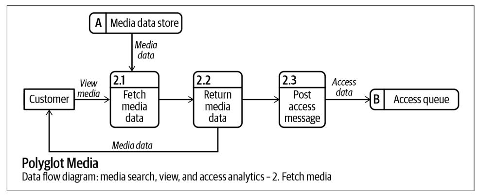
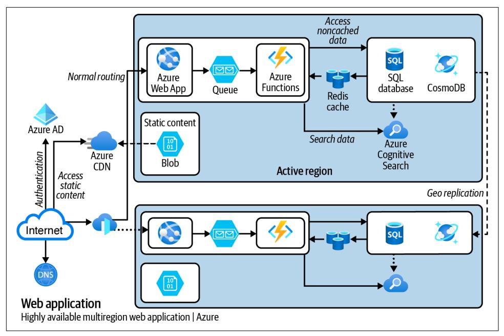

# **Communication Patterns**


## **Communication Patterns**

Having a great idea or design is not enough to achieve success. You must communicate your vision effectively to gain stakeholder support for your design and secure collaboration and contribution from your teams. In this practical book, author Jacqui Read shows you how to successfully present your architecture and gain the commitment and understanding you need from stakeholders.

Discover how to effectively communicate to avoid misunderstandings that can lead to increasing costs, unmet requirements, and an architecture that is not what you intended. Through constructive examples and patterns, this book teaches you soft skills you can use to express your message clearly to the different audiences you'll face.

This book shows you how to:

- **•** Design diagrams and documentation suitable for your expected audience, intended message, and project stage
- **•** Create artifacts that are accessible to those with varying roles, needs, or disabilities
- **•** Master written, verbal, and nonverbal communication to succeed in technical settings
- **•** Communicate and collaborate with distributed teams to successfully design and document software and technical projects
- **•** Apply the communication patterns presented in this book in real-world projects and software designs

"*Communication Patterns*  is a masterful guide that unlocks the complexity behind the language of human interaction. A must-read!"

—Mark Richards

Software Architect, Founder of DeveloperToArchitect.com

"They might be called soft skills, but they're not easy to learn since they are so infrequently taught. This book remedies that gap."

—Rebecca Parsons,

Chief Technology Officer Emerita, Thoughtworks

Jacqui Read is an internationally recognized solution and enterprise architect with hands-on experience and expertise coding and architecting software systems. She is a specialist in developing architecture practices, constructing evolutionary architectures, and extracting business value from data and knowledge.

SOFTWARE ENGINEERING

US \$65.99 CAN \$82.99 ISBN: 978-1-098-14054-0


Twitter: @oreillymedia linkedin.com/company/oreilly-media youtube.com/oreillymedia


## **Praise for** *Communication Patterns*

This book covers one of the most important aspects of software development, the so-called "soft skills," which ironically present the biggest challenges for many developers. It is chock-full of patterns and advice, some of which are obvious in hindsight, which are often the hardest to see beforehand. Highly useful and recommended for technologists at all levels.

> *—Neal Ford, Director/Software Architect/Meme Wrangler, Thoughtworks, Inc.*

Jacqui shows that the skill of communication is not black magic for the lucky few: it can be learned, practiced and polished. This complete overview full of practical insights will help anyone improve and be more successful in achieving what they want.

*—Kim van Wilgen, Customer Director, Schuberg Philis*

Effectively communicating ideas and solutions is an essential skill for software developers and architects. However, very few resources show you how—until now. *Communication Patterns* is a masterful guide that unlocks the intricate web of verbal, written, visual, and non-verbal communications. Through patterns and practical techniques, Jacqui untangles the complex world of communication and helps us better understand the language behind human interaction. This book promises to be one of the most important books of the decade, one that should be on every technologist's bookshelf.

> *—Mark Richards, Software Architect, Founder of DeveloperToArchitect.com*

Jacqui Read's unique approach to communication is empowering, insightful, and imbued with practical wisdom. *Communication Patterns* is the definitive guide to enhancing communication skills in the tech industry.

*—David R. Oliver, Principal Architect, Actica Consulting*

We could all be better at communicating our technical decisions, designs, and architectures. This book covers all the aspects you need to improve your communication, all the way from the high-level concepts down to the practical details.

*—Alistair Jones, Founder, nifdi.app*

*Communication Patterns* is a great book that helps you communicate and illustrate architecture better with anybody in so many ways. The patterns described by Jacqui Read are helpful in improving communicative collaboration in your teams.

> *—Jonah Andersson, DevOps Engineer Lead, Microsoft MVP and MCT, Author of* Learning Microsoft Azure

What we think and communicate is what we build. Our communication skills define, for better or worse, our software architectures. This book will improve both.

*—Diana Montalion, Systems Architect, Founder, Mentrix*

Practice alone does not make perfect. *Communication Patterns* covers common mistakes and guides you toward more effective visual, verbal, and written communication.

> *—Stefan Hofer, Author of* Domain Storytelling*, Workplace Solutions (WPS)*

Communication is a skill all possess, but very few master. Starting with simple concepts and ramping up to advanced skills, *Communication Patterns* is an invaluable aid for engineers to become master communicators and wow the audience with crisp visuals, engaging storytelling, and clear argumentation.

> *—Sonya Natanzon, Senior Director, Enterprise Software Engineering*

Jacqui gives us a treasure map in *Communication Patterns*. Her book addresses the different layers, communication modes, and communication nuances in our craft, no matter the formal position. She describes and gives names to my unspoken challenges, and her experience as an architect and developer is translated to this book, where you can leverage her knowledge to create inclusive and effective communication within your team, department, and organization.

> *—João Rosa, Independent Consultant and Team Topologies Valued Practitioner, Impactfulness*

The subtitle might say this book is for developers and architects, but anyone, particularly in a leadership position, should read this book to become more effective. And they might be called soft skills, but they're not easy to learn since they are so infrequently taught. This book remedies that gap and helps demystify successful communication approaches.

> *—Rebecca Parsons, Chief Technology Ocer Emerita, Thoughtworks*

In this book author Jacqui Read has collected a set of small, surprisingly sense-making patterns, that will often leave the reader with the "Why didn't I think of this before?" question. *Communication Patterns* is an excellent read for architects, modelers, and developers. While reading through the extensive set of patterns in this book, I often had a warm, deja vu feeling. Jacqui puts her finger on the right spots and adds useful details for architects, modelers, and developers.

> *—Sander Hoogendoorn, CTO at iBOOD.com, International Keynote Speaker, and Author of* Microteams*,* This Is Agile*, and* Pragmatic Modeling with UML

Finally, a book about communication in the world of developers, bridging the gap between complex code and meaningful conversations.

*—Cecilia Wirén, Senior Developer, Microsoft MVP*

In *Communication Patterns*, Jacqui Read doesn't just lay out patterns for effective communication with various stakeholders; she provides a compass for every developer and architect. Each chapter reminds me that merely designing software collaboratively with stakeholders isn't enough; the real power lies in how we present it. Every time I embark on a new software project or collaborate with teams and stakeholders, I turn to this book for guidance on the best approach and how to structure our conversations.

> *—Kenny Baas-Schwegler, Software Consultant and Software Architect, Weave IT b.v.*

Communicating ideas effectively is not a skill that many developers and architects are formally taught, so we go through our careers doing it badly and learning via trial and error. What Jacqui has put together in this book should be foundational knowledge for any aspiring software developer and will fill in many gaps for seasoned practitioners.

*—Nick Tune, Principal Consultant, Empathy Software*

I got into programming because of computers. Then I learned that programming is just as much about people as it is about bits and bytes. Jacqui shows in this book how we programmers can communicate with people—with each other and with domain experts in a very programmer-friendly way: by describing the patterns that lie behind it.

*—Henning Schwentner, Coding Storyteller, WPS*

# **Communication Patterns**

*A Guide for Developers and Architects*

*Jacqui Read*


### **Communication Patterns**

by Jacqui Read

Copyright © 2024 Read the Architecture, Ltd. All rights reserved.

Printed in the United States of America.

Published by O'Reilly Media, Inc., 1005 Gravenstein Highway North, Sebastopol, CA 95472.

O'Reilly books may be purchased for educational, business, or sales promotional use. Online editions are also available for most titles (*<http://oreilly.com>*). For more information, contact our corporate/institutional sales department: 800-998-9938 or *corporate@oreilly.com*.

> **Indexer:** BIM Creatives, LLC **Interior Designer:** David Futato **Cover Designer:** Karen Montgomery

**Illustrator:** Kate Dullea

**Acquisitions Editor:** Louise Corrigan **Development Editor:** Corbin Collins **Production Editor:** Katherine Tozer

**Copyeditor:** Amnet Systems LLC, Sharon Wilkey

**Proofreader:** Sharon Wilkey

October 2023: First Edition

**Revision History for the First Edition** 2023-10-06: First Release

See *<http://oreilly.com/catalog/errata.csp?isbn=9781098140540>* for release details.

The O'Reilly logo is a registered trademark of O'Reilly Media, Inc. *Communication Patterns*, the cover image, and related trade dress are trademarks of O'Reilly Media, Inc.

The views expressed in this work are those of the author and do not represent the publisher's views. While the publisher and the author have used good faith efforts to ensure that the information and instructions contained in this work are accurate, the publisher and the author disclaim all responsibility for errors or omissions, including without limitation responsibility for damages resulting from the use of or reliance on this work. Use of the information and instructions contained in this work is at your own risk. If any code samples or other technology this work contains or describes is subject to open source licenses or the intellectual property rights of others, it is your responsibility to ensure that your use thereof complies with such licenses and/or rights.

# **Table of Contents**

|          | Preface xiii                          |     |
|----------|---------------------------------------|-----|
| Part I.  | Visual Communication                  |     |
| 1.       | Communication Essentials 3            |     |
|          | Know Your Audience                    | 3   |
|          | Mixing Levels of Abstraction          | 7   |
|          | Representational Consistency          | 11  |
|          | Summary                               | 16  |
| 2.       | Clarify the Clutter                   | 17  |
|          | Color Overload                        | 17  |
|          | Boxes in Boxes in Boxes               | 19  |
|          | Relationship Spiderweb                | 22  |
|          | Balance Text                          | 26  |
|          | Summary                               | 29  |
| 3.       | Accessibility 31                      |     |
|          | Relying on Color to Communicate       | 31  |
|          | Include a Legend                      | 37  |
|          | Appropriate Labels                    | 39  |
|          | Summary                               | 42  |
| 4.       | Narrative 43                          |     |
|          | The Big Picture Comes First           | 43  |
|          | Match Diagram Flow to Expectations    | 47  |
|          | Clear Relationships                   | 51  |
|          |                                       |     |
|          | Summary                               | 54  |
| 5.       | Notation                              | 55  |
|          | Using Icons to Convey Meaning         | 55  |
|          | Using UML for UML's Sake              | 57  |
|          | Mixing Behavior and Structure         | 61  |
|          | Going Against Expectations            | 64  |
|          | Summary                               | 66  |
| 6.       | Composition                           | 67  |
|          | Illegible Diagrams                    | 67  |
|          | Style Communicates                    | 74  |
|          | Misleading Composition                | 75  |
|          | Create a Visual Balance               | 81  |
|          | Summary                               | 84  |
|          | Part II. Multimodal Communication     |     |
| 7.       | Written Communication                 | 87  |
|          | Simple Language                       | 87  |
|          | Acronym Hell                          | 90  |
|          | Structured Writing                    | 92  |
|          | Syntax of Technical Writing           | 95  |
|          | Strong Verbs                          | 95  |
|          | Short Sentences                       | 96  |
|          | Precise Paragraphs                    | 96  |
|          | Consistent Vocabulary                 | 97  |
|          | Audience Empathy                      | 97  |
|          | Summary                               | 99  |
| 8.       | Verbal and Nonverbal Communication    | 101 |
|          | Encoding Messages                     | 101 |
|          | Using the Acceptance Prophecy         | 101 |
|          | Giving Your Full Attention            | 102 |
|          | Using Body Language and Gestures      | 103 |
|          | Decoding Messages                     | 105 |
|          | Battling Bias                         | 106 |
|          | Being Present                         | 108 |
|          | Awareness of Cultural Differences     | 109 |
|          | Influence and Persuasion              | 110 |
|          | Summary                               | 114 |
| 9.       | The Rhetoric Triangle                 | 115 |
|          | Ethos                                 | 116 |
|          | Establish Your Credentials            | 116 |
|          | Use Trustworthy Sources               | 118 |
|          | Be Transparent                        | 119 |
|          | Demonstrate Your Knowledge            | 121 |
|          | Pathos                                | 122 |
|          | Tell a Story                          | 122 |
|          | Speak from the Heart                  | 125 |
|          | Use Vivid Language and Strong Imagery | 126 |
|          | Logos                                 | 128 |
|          | Use Data and Facts                    | 128 |
|          | Make Logical Connections              | 129 |
|          | Use Reasoning and Argumentation       | 129 |
|          | Summary                               | 131 |
|          | Part III. Communicating Knowledge     |     |
| 10.      | Knowledge Management Principles       | 135 |
|          | Products over Projects                | 135 |
|          | Project Mindset                       | 136 |
|          | Product Mindset                       | 136 |
|          | Abstractions over Text                | 140 |
|          | Lists                                 | 140 |
|          | Tables                                | 141 |
|          | Visual Abstractions                   | 142 |
|          | Word Clouds                           | 143 |
|          | Charts, Graphs, and Diagrams          | 145 |
|          | Other Abstractions                    | 145 |
|          | Perspective-Driven Documentation      | 146 |
|          | DRY Perspectives                      | 147 |
|          | Fractal Perspectives                  | 148 |
|          | Implementing Perspectives             | 149 |
|          | Summary                               | 152 |
|          |                                       |     |
| 11.      | Knowledge and People                  | 153 |
|          | Get Feedback Early and Often          | 153 |
|          | Share the Load                        | 157 |
|          | Nonproprietary Formats                | 157 |
|          | Accessibility                         | 159 |
|          | Collaboration                         | 161 |
|          | Roles and Responsibilities            | 162 |
|          | Further Techniques                    | 162 |
|          | Just-in-Time Architecture             | 163 |
|          | Summary                               | 167 |
| 12.      | Effective Practices                   | 169 |
|          | ADRs                                  | 169 |
|          | ADR Structure                         | 171 |
|          | ADR Content                           | 174 |
|          | ADR Storage                           | 179 |
|          | ADR Culture                           | 180 |
|          | Architecture Characteristics          | 183 |
|          | All Documentation as Code             | 187 |
|          | Technical Documentation               | 187 |
|          | Automatically Generated Documentation | 190 |
|          | Other Documentation                   | 192 |
|          | Summary                               | 194 |
| Part IV. | Communicating Remotely                |     |
| 13.      | Remote Time                           | 197 |
|          | Synchronize Time                      | 198 |
|          | Time Zone                             | 198 |
|          | Empathy and Compromise                | 201 |
|          | Split Shifts                          | 202 |
|          | Respect Working Patterns              | 204 |
|          | Communicate Availability              | 205 |
|          | Defend Part-Time Hours                | 205 |
|          | Plan for Holidays                     | 206 |
|          | Account for Geography and Culture     | 208 |
|          | Recognize Real Working Capacity       | 209 |
|          | Improve Energy and Productivity       | 210 |
|          | Control Notifications                 | 210 |
|          | Automate Tasks                        | 211 |
|          | Work with Others' Rhythms             | 212 |
|          | Schedule for Energy                   | 212 |
|          | Summary                               | 214 |
| 14.      | Remote Principles                     | 215 |
|          | Meetings to Sync                      | 215 |
|          | Synchronous Versus Asynchronous       | 215 |
|          | Enhance Meetings                      | 218 |
|          | Async to Think                        | 223 |
|          | Async Advantages                      | 223 |
|          | Async Obstacles                       | 223 |
|          | Direction Matters                     | 224 |
|          | Async Methods                         | 226 |
|          | Enhance Async                         | 229 |
|          | Remote-First Working                  | 230 |
|          | Remote-First Versus Remote-Friendly   | 230 |
|          | Remote-First Benefits                 | 232 |
|          | Evolving to Remote-First              | 234 |
|          | Summary                               | 237 |
| 15.      | Remote Channels                       | 239 |
|          | Symmetrical Email                     | 239 |
|          | Email Reasons                         | 240 |
|          | Email Expectations                    | 240 |
|          | Email Clarity                         | 241 |
|          | Email Tips                            | 242 |
|          | Online Presentations                  | 244 |
|          | Audience Engagement                   | 244 |
|          | Presentation Content                  | 246 |
|          | Screen Shares                         | 247 |
|          | Remote Tools and Governance           | 248 |
|          | Selection Techniques                  | 248 |
|          | Remote Tools                          | 250 |
|          | Data Proliferation                    | 252 |
|          | Security                              | 254 |
|          | Tool Efficiency                       | 254 |
|          | Tool Governance                       | 255 |
|          | Summary                               | 262 |
|          | Epilogue                              | 263 |
|          | Appendix: ADR Templates               | 265 |
|          | Index 267                             |     |
|          |                                       |     |

# **Preface**

<span id="page-14-0"></span>Communication underlies pretty much everything you do, from your facial expres‐ sion showing disapproval or enjoyment, to your email about the latest project update, to what you say in a meeting or presentation. But what is communication, and how do you make it *successful*?

The *Oxford English Dictionary* defines *communication* as "the activity or process of expressing ideas and feelings or of giving people information." This encompasses many of the important aspects of communication but doesn't indicate what would make it successful. The same dictionary defines *communicate* as "to share or exchange information, news, ideas, feelings, etc." This definition provides more detail, but we still need to go further to work out how to make communication successful.

The *Merriam-Webster Dictionary* adds that communication is "through a common system of symbols, signs, or behavior," introducing the idea of commonality and *how* the ideas or information is conveyed.

Here's what we have so far:

- Expresses ideas and feelings
- Gives people information
- Shares or exchanges information, news, and so on
- Uses a common system of symbols, signs, or behavior

That gives a good idea of what communication is, but what makes communication successful?

The polyglot linguist Michel Thomas put it simply when he [said](https://oreil.ly/aoO-E) the aim of commu‐ nication is to "get the ball over the net." None of the definitions we've seen so far cover this critical element of *understanding*.

<span id="page-15-0"></span>Let me take a stab, then:

Successful communication is the art and science of sharing or exchanging ideas and information, using a common set of symbols, signs, or behaviors, resulting in shared understanding.

The cost of miscommunication is high, whether it's cumulative wasted time or the price of putting things right. So why is there not more emphasis on making commu‐ nication successful, or at least improving it? That is the focus of this book.

Software development and architecture have *patterns* and *antipatterns* that can be applied (or recognized) in writing code and architecting systems. A *pattern* is a reusa‐ ble solution that has been shown to be effective when used to solve a problem. The biggest benefit is that someone else has done the hard work for you, and you just need to apply the solution to your particular situation and problem.

*Antipatterns* are not the direct opposite of patterns. They are solutions that look like they solve a problem but have consequences that outweigh any potential benefits. Learning about antipatterns means that you can recognize them in designs or existing systems, or recognize situations where they might occur so that you can avoid or mit‐ igate them.

This book applies the concept of patterns and antipatterns to communication.

People often quote Brian Foote and Joseph Yoder's 1997 paper ["Big Ball of Mud"](https://oreil.ly/LO2bq) (and for good reason): "If you think good architecture is expensive, try bad architecture." It means that creating good architecture requires an investment, but *not* investing will result in bad architecture that costs more in the long run. The same thing should be said for communication: *If you think good communication is expensive, try bad com‐ munication*. Investing in good (successful) communication is less expensive than bearing the costs of bad (unsuccessful) communication.

## **Why I Wrote This Book**

Throughout my career in software development and software architecture, I have fre‐ quently discovered that the principles and techniques I apply naturally do not come naturally to others. In some cases, I have applied knowledge I learned from some‐ where else to the technology domain, and in others, my approach just seemed to me the right way to do it.

I realized that I had built up many patterns and antipatterns in my toolbox, and not all were the type that can be applied to code or architecture. Some were applicable to what many would describe as *soft skills*, like creating diagrams and documentation. Even some that were designed to be used in code or architecture, I was applying out‐ side of their intended use.

It turned out that these *soft* patterns and antipatterns could all be categorized as *com‐ munication patterns* and, recognizing that my tool kit was not widely accessible to others, I determined to make it available. The result is this book and the training courses that I provide through O'Reilly and privately (along with other architectural courses and consulting).

My intention in writing this book is to improve communication of teams and organi‐ zations within the technology sector so that individuals can increase their productiv‐ ity and general happiness, and organizations see an improvement in their return on investment (ROI) and even their bottom line.

Investing in your soft skills will enhance your technical skills and make you a standout technical star.

I consider myself to be a lifelong learner and would love to hear your experiences of applying the patterns and antipatterns in this book, and of any other methods you use to optimize the way you and your colleagues communicate. You can contact me via O'Reilly (["How to Contact Us" on page xix\)](#page-20-0), [my website,](https://jacquiread.com) or social media.

## **Who Should Read This Book**

This book is intended for developers, engineers, and all types of architects (solution, software, data, enterprise, and so forth) at any point in their careers. Because the skills this book presents are not formally or traditionally taught, even the most seasoned technologist can benefit.

Applying this book's patterns to your communication will set you apart as someone who not only has the technical skills but also the *soft* skills to get things done and be understood by technical and nontechnical audiences alike. For those aspiring to move from development to architecture, or into a senior or tech-lead role, improving your communication will remove at least some of the hurdles between you and the role you desire.

Although principally tailored to developers and architects, the patterns in this book can be applied by, and provide benefits to, anyone in the software and technology industries (and other industries besides). The relevancy of each pattern and antipat‐ tern will depend on your role.

For example, [Part I](#page-22-0) will be useful to business analysts (BAs), and [Part IV](#page-216-0) will be use‐ ful to anyone working in a remote or hybrid environment, or with customers in another time zone. Managers and leaders will greatly benefit from Parts [II,](#page-106-0) [III](#page-154-0), and [IV,](#page-216-0) with the added benefit of being able to disseminate the techniques and principles to their reports and teams.

Many patterns and principles in this book come from domains very different from software, and I wouldn't be surprised if they can be applied in still more domains.

## **How to Read This Book**

The book is structured into four parts, each covering one major aspect of communi‐ cation in the software and technology domain. You are free to start wherever you feel would most benefit you, or with whatever piques your interest the most. Otherwise, [Part I](#page-22-0) is the place to start.

[Part I](#page-22-0) covers patterns and antipatterns for diagrams and other visuals. [Chapter 1](#page-24-0) lays the foundations that the other chapters in [Part I](#page-22-0) build upon. Ensure you understand and are applying the patterns in [Chapter 1](#page-24-0) before you start adding the other patterns from [Part I](#page-22-0) to your tool kit.

[Part II](#page-106-0) includes patterns and techniques for written, verbal (spoken), and nonverbal communication, which you can apply to remote and in-person interactions. [Part III](#page-154-0) contains principles, practices, and patterns to improve knowledge management and sharing, including documentation. [Part IV](#page-216-0) offers many strategies and patterns for you to use when communicating with people in other time zones and with different work‐ ing hours, particularly in hybrid and remote environments.

## **Images and Color**

Some of the figures in this book need to be viewed in color. In the printed version, all images are grayscale, so we've included links to color versions of any images that need to be viewed in color. All images are available on the [accompanying website](https://communicationpatternsbook.com).

## **Software Tools**

You do not need to use any specific software tools to put the patterns and techniques in this book into practice, but I do mention various tools. When citing tools that could be used for a particular purpose, I usually refer to those that are well-known. The recommendations I make are mostly open source options. Remember to check the license required for your situation and ensure that the terms of service meet your needs.

To create my original diagrams and illustrations for this book, I used [draw.io,](https://drawio.com) for a time known as Diagrams.net. I encourage participants to use draw.io when complet‐ ing exercises in the workshops I run. It is free, open source, requires no login, and can be used as a desktop application or via a web browser. Draw.io has many integra‐ tions for other applications, and the desktop version is available for Windows, macOS, Linux, and ChromeOS.

## **Polyglot Media**

#### **E X AMP LE**

#### **E X AMP LE**

## **Polyglot Media Examples**

Throughout the book, I used Polyglot Media in examples. You will see that lots of the diagrams are based on Polyglot Media systems, and other examples are presented in a box just like this one. All examples are fictitious but based on my own or others' expe‐ riences and learning.

## **Conventions Used in This Book**

The following typographical conventions are used in this book:

*Italic*

Indicates new terms, URLs, email addresses, filenames, file extensions, and pat‐ tern or antipattern names.

### Constant width

Used for program listings, as well as within paragraphs to refer to program ele‐ ments such as variable or function names, databases, data types, environment variables, statements, and keywords.


This element signifies a tip or suggestion.


This element signifies a general note.

This element indicates a warning or caution.


## **Using Code Examples**

Supplemental material (code examples, exercises, etc.) is available for download at *<https://communicationpatternsbook.com>*.

If you have a technical question or a problem using the code examples, please email *[bookquestions@oreilly.com](mailto:bookquestions@oreilly.com)*.

This book is here to help you get your job done. In general, if example code is offered with this book, you may use it in your programs and documentation. You do not need to contact us for permission unless you're reproducing a significant portion of the code. For example, writing a program that uses several chunks of code from this book does not require permission. Selling or distributing examples from O'Reilly books does require permission. Answering a question by citing this book and quoting example code does not require permission. Incorporating a significant amount of example code from this book into your product's documentation does require permission.

We appreciate, but generally do not require, attribution. An attribution usually includes the title, author, publisher, and ISBN. For example: "*Communication Patterns* by Jacqui Read (O'Reilly). Copyright 2024 Read the Architecture, Ltd., 978-1-098-14054-0."

If you feel your use of code examples falls outside fair use or the permission given above, feel free to contact us at *[permissions@oreilly.com](mailto:permissions@oreilly.com)*.

## **O'Reilly Online Learning**


For more than 40 years, *[O'Reilly Media](https://oreilly.com)* has provided technol‐ ogy and business training, knowledge, and insight to help companies succeed.

Our unique network of experts and innovators share their knowledge and expertise through books, articles, and our online learning platform. O'Reilly's online learning platform gives you on-demand access to live training courses, in-depth learning paths, interactive coding environments, and a vast collection of text and video from O'Reilly and 200+ other publishers. For more information, visit *<https://oreilly.com>*.

## <span id="page-20-0"></span>**How to Contact Us**

Please address comments and questions concerning this book to the publisher:

O'Reilly Media, Inc. 1005 Gravenstein Highway North Sebastopol, CA 95472 800-889-8969 (in the United States or Canada) 707-829-7019 (international or local) 707-829-0104 (fax) *[support@oreilly.com](mailto:support@oreilly.com) <https://www.oreilly.com/about/contact.html>*

We have a web page for this book, where we list errata, examples, and any additional information. You can access this page at *<https://oreil.ly/communication-patterns>*.

For news and information about our books and courses, visit *<https://oreilly.com>*.

Find us on LinkedIn: *<https://linkedin.com/company/oreilly-media>*.

Follow us on Twitter: *<https://twitter.com/oreillymedia>*. Watch us on YouTube: *<https://youtube.com/oreillymedia>*.

## **Acknowledgments**

This book would never have been written without the assistance and enduring stam‐ ina of one person: my husband Steve. His unending support enabled me to tackle the adventure that is writing a technical book. From encouragement to technical proof‐ reading, from making sure I ate real food to taking on most of the jobs of running a house while working a full-time job *and* parenting two neurodivergent children almost single-handedly, he has allowed me the time and space to write this book. He has also contributed a few good ideas himself. Thank you, Steve, for your belief, back‐ ing, and back-breaking efforts.

This book has greatly benefited from my technical reviewers, who put so much effort into reading my drafts and giving valuable feedback. My thanks to Emily Bache, Ali Greene, Alistair Jones, David R. Oliver, and Steve Read (yes, him again). I would also like to thank David J. Oliver for his input into Chapters [10](#page-156-0) and [11](#page-174-0). Any mistakes you may find in this book are certainly my own.

Many people have contributed to this book indirectly, through conversations, blog posts, talks at conferences, books, and other interactions. Thank you to everyone who has shared my journey so far and shared their experiences through events and publi‐ cations. Thank you also to those who have organized the conferences and events that

I have spoken at or attended, and to all my speaker and author friends who I have met at these conferences and who have accepted me as one of their own.

Thank you to all those who have shown support and encouragement for this book before it was even published. I have received many kind and emboldening comments and responses via social media and at conferences when I have talked about my upcoming book and the prerelease. These messages have shown me that people do want to read what I write, which has spurred me on when editing has been tough.

I also want to thank all those I have worked with at O'Reilly, particularly Louise Cor‐ rigan and Melissa Duffield, for their encouragement and belief in my proposal, writ‐ ing, and courses. I would also like to thank Corbin Collins for his sterling editing and for pointing out how many commas I had missed. The production and illustration team also deserve my thanks, including Katie Tozer and Kate Dullea, particularly for working patiently with me on reproducing my diagrams for print.

My journey of working with O'Reilly started back in 2021, when I led a team to win the autumn/fall 2021 Software Architecture Kata.<sup>1</sup> I owe thanks to Neal Ford and Mark Richards for that opportunity to practice my skills and show what I could do, and particularly to Mark for his encouragement to go further. He said it would change my career, and it did. Thank you, Mark, for your encouragement then and your mentoring and friendship since.

Finally, I would like to thank my children, Matilda and Hugo, for their patience and support while Mummy has been hidden away in her office writing some book that they have no interest in at their age. Sorry for all the time Mummy had to "work." We can go and play now.

<sup>1</sup> You can see all the finalist entries (including mine, The Archangels) for all the past katas in my [GitHub repo](https://oreil.ly/doiQ_).

# <span id="page-22-0"></span>**Visual Communication**

Visual elements in software architecture and design communicate key information. Your audience's eyes are naturally drawn to these elements, which may be the only thing they look at in any detail. Despite this, little guidance or training is available on creating diagrams and visuals (except notation-specific courses, such as ArchiMate), especially on how to effectively and successfully communicate your message to your audience.

*Visual literacy*, the ability to understand and create visuals, is a skill architecture and software training courses are missing. I wrote Part I to fill that knowledge gap. These patterns and antipatterns guide you to create diagrams that serve your audience's needs and produce the outcomes you want. You will learn to strike a balance between the need for information and for accessibility.

For any diagram or visual you create, Part I offers many patterns that you can apply to successfully convey your message to your audience and get what you need in return.

# <span id="page-24-0"></span>**Communication Essentials**

This chapter provides the foundation that you will build upon with the other patterns in [Part I](#page-22-0). When I refer to patterns and antipatterns, I mean the following:

### *Pattern*

A reusable solution known to be effective when used to solve a specific or more general problem, which may otherwise be known as techniques, practices, meth‐ ods, or rules.

### *Antipattern*

A solution that is not recommended. It looks like it is the right way to solve a problem when in reality its consequences outweigh any benefits.

I highly recommend making sure you are employing the patterns and antipatterns in this chapter before building on them with all the others. Think of it the same way as architecting a building: you need to get the foundation right before you can build the walls, floors, and roof. Don't start building on sand, or your construction will sink. Get this groundwork right first.

## **Know Your Audience**

The *know your audience* pattern is also known as *understanding your customer*. One of the essential factors to keep in mind when creating and editing a diagram is who is going to be viewing and reading it. Your diagram's purpose is to communicate suc‐ cessfully with this audience. Knowing who they are and designing the diagram to their needs are key to this purpose.

**3**

<span id="page-25-0"></span>People who view your diagram could have the following roles:

- Developers (full-stack, frontend, backend…)
- Architects (technical, solution, security…)
- Business analysts

- Product owners
- Project managers
- Customers
- Support teams


Make a list of the roles that view your diagrams and then group the roles based on the types of diagrams you create. You will likely find that you have a different audience mix for different diagrams. Use these lists with the questions near the end of this section.

The following diagrams have been created for different audiences, and the type of diagram and notation have been chosen to suit the audience.

Figure 1-1 shows a Unified Modeling Language (UML) class diagram aimed at a tech‐ nical audience, including developers, architects, and database administrators. A prod‐ uct owner or project manager would be unlikely to need the information in this diagram or be able to understand it without help.


*Figure 1-1. UML class diagram, aimed at a technical audience*

[Figure 1-2](#page-26-0) is a C4 context diagram. This is a versatile diagram, useful for both techni‐ cal and business audiences to get an overview of a system. This diagram is equally <span id="page-26-0"></span>readable and useful to roles such as product owner, project manager, architect, devel‐ oper, and business analyst.


*Figure 1-2. C4 context diagram, useful to most audiences*

The *domain story* shown in [Figure 1-3](#page-27-0) is aimed more at business roles, but also those technical roles that are involved in translating business needs into technical solutions. Domain stories are created to improve communication between business stakehold‐ ers and technical roles so that the solution meets the needs of the business and users. Domain or subject matter experts (SMEs) would be involved in creating and verifying a domain story, along with roles such as product owner (if not the SME), business analyst, and architect.

<span id="page-27-0"></span>

*Figure 1-3. Domain story diagram, aimed at business roles and technical translator roles such as architects and business analysts*

After identifying your audience, ask yourself the following about them:

### *What do they want from you?*

Consider your audience's expectations and needs. Meeting their needs is key to successful communication. Is your audience looking for specific information so they can make a decision or report back to someone else? Keep your audience happy by sending them away with the information and understanding they need to do their jobs.

### *What do you want from them?*

This question is often missed: what you need from your audience. Do you need agreement or sign-off on your design decisions? Do you need them to make a decision based on your diagrams? Make sure the audience understands what you need from them and by when, and has all they need in order to meet your expectations.

### *What is their technical understanding?*

Your audience's technical understanding will determine the type of diagram they will benefit from. Consider how technical your project manager is. Does your product owner want to know about the selected technology, or just about how well the selection meets the requirements?

### *What level of detail do they need?*

Whether the content is technical or not, you need to consider the appropriate level of detail. Is this diagram for an architectural review board that will expect a

<span id="page-28-0"></span>lot of detail? Does the development team need implementation details, or is determining those details part of their job?<sup>1</sup> Ask teams what they want, rather than going by any written or unwritten guides the company gives you. If there are rules that don't meet the team's needs, bring it up with the appropriate person.

Besides these questions, consider that members of your audience may not be native speakers of the language you are using and may have a different cultural background from you (see ["Simple Language" on page 87](#page-108-0)).

Once you've identified your audience and their needs, you can begin your diagram.

## **Mixing Levels of Abstraction**

*Mixing levels of abstraction* is a communication antipattern that has a counterpart in the coding world. If you have ever coded, you will likely know *mixing levels of abstrac‐ tion* as a *sin* or a *code smell*. Although putting all the information someone could need into one diagram might seem appropriate, this leads to clutter and confusion from the audience's perspective.


*Levels of abstraction* refers to the granularity or generality of the information you present in a diagram. Abstraction levels range from high-level views showing the major components of a system and their relationships to one another down to low-level diagrams detailing the code's structure.

Using different levels of abstraction across multiple diagrams allows you to communicate appropriately for the audience, while still ensuring that all relevant information is captured.

All software is an abstraction, but in essence, levels of abstraction let you hide lowlevel details from high-level concepts. Developers do not write software using ones and zeros (binary or machine code); they develop by writing in higher-level lan‐ guages that abstract away the complexities of machine code and all the levels between (interpreters, compilers, and so forth).

Take a look at [Figure 1-4.](#page-29-0) If you think of the process of going to work as one level of abstraction, the next level could contain the concepts of getting up, having a shower, getting dressed, having breakfast, leaving the house, and so on. The next level for get‐ ting up would contain pushing back the covers, sitting up, and standing up. There you have three levels of abstraction (going to work, getting up, pushing back the

<sup>1</sup> The level of detail in designs for development teams can be controversial, leading to clashes between develop‐ ment and those creating the designs.

<sup>2</sup> A characteristic of the code that possibly indicates a deeper problem.

<span id="page-29-0"></span>covers), but in software terms, these should all be separate (such as in different meth‐ ods or classes) to avoid confusion and unneeded complexity, and to aid readability.


*Figure 1-4. Levels of abstraction in everyday life*

Using levels of abstraction applies to software architecture and diagrams in the same way. In code, you apply this principle to methods, classes, layers in a layered applica‐ tion (such as a presentation layer, the business logic, a persistence layer, and the data store), and more. In diagrams and software architecture, you apply this principle to the content of diagrams and to the structure of services, microservices, and so forth.

The *[C4 model](https://c4model.com)* is a hierarchy of abstractions. It uses an *abstraction first* approach (pri‐ oritizing abstraction and building everything else around it). Its four abstraction lay‐ ers define its core diagrams:<sup>3</sup>

- 1. The *system context* shows an overview of the system and how it fits into its envi‐ ronment, including interactions between the system and other entities.
- 2. The *container* level zooms in on the software system in scope, showing the highlevel components or building blocks and how they interact with each other and external entities.
- 3. The *component* level zooms in further on an individual container from the previ‐ ous level. It shows the components inside the container and their interactions with each other and with external entities.
- 4. The *code* level zooms in still further on a component from the previous level. It shows how the component is implemented. (This level is often more detail than is necessary in your documentation).

You can think of these four levels as maps that you can zoom in on to reveal increas‐ ing levels of detail. The C4 abstraction layers can illustrate the need for varying levels of detail.

<sup>3</sup> C4 also has some supplementary diagrams such as a deployment diagram.

<span id="page-30-0"></span>Figure 1-5 isn't a context diagram and it isn't a container diagram. It is a mix of two levels of abstraction. If you look at the diagram closely, it doesn't make sense. The sys‐ tem in focus (Polyglot Media's software system) seems to have been partially divided into containers, and the relationship between the software system and containers doesn't make sense. The software system and the containers belong in different con‐ ceptual levels. In reality, containers within the software system will be interacting with the containers shown.


*Figure 1-5. C4 diagram showing both context and container levels of abstraction (antipattern)*

[Figure 1-6](#page-31-0) shows how the context diagram for Figure 1-5 should look. This is where the software system in focus (Polyglot Media) belongs, with its related external sys‐ tems and actors.

<span id="page-31-0"></span>

*Figure 1-6. C4 context diagram*

[Figure 1-7](#page-32-0) shows how the container abstraction layer information in [Figure 1-5](#page-30-0) should be shown in a C4 container diagram. The system in focus (Polyglot Media) is shown as a dashed box with the containers inside it.

C4 models, based around a hierarchy of abstractions, are an excellent way to illustrate the need to keep levels of abstraction separate in diagrams. This separation rule applies to all types of diagrams. Apply it to your sequence diagrams, data flow dia‐ grams, diagrams with no formal notation, and all the other types of diagrams you use. All your diagrams should follow this rule; it is essential for communication.

Once you have split up any mixed diagrams so that each has only one level of abstrac‐ tion, read on to find out how to make them easily navigable.

<span id="page-32-0"></span>

*Figure 1-7. C4 container diagram*

## **Representational Consistency**

Using the *representational consistency* pattern is the next step after checking levels of abstraction: linking discrete diagrams together so that your audience can navigate between them easily and see how they fit together. Understanding how your diagrams relate to one another should be easy for your audience. You risk unsuccessful com‐ munication if your audience has to think too much, or remember a key or pivotal <span id="page-33-0"></span>detail, to understand relationships between diagrams (each an individual level of abstraction).

Many notations, such as C4 and data flow diagrams, have formal and explicit ways of communicating *representational consistency*. As noted previously, C4 diagrams also have explicit levels of abstraction (context, container, component, and code). Take a look at Figure 1-8, which shows the system in scope (Polyglot Media) in the center of the diagram. This context level is the highest in C4 diagrams.


*Figure 1-8. C4 context diagram*

The next level down is a C4 *container diagram* ([Figure 1-9\)](#page-34-0). The method of connect‐ ing these diagrams is a dashed box in [Figure 1-9,](#page-34-0) which is labeled (in the bottom left) the same as the central box (Polyglot Media) in Figure 1-8. This allows the audience to see the connection between these two diagrams, whichever one they see first.

<span id="page-34-0"></span>

*Figure 1-9. C4 container diagram for Polyglot Media (showing the high-level interactions within the Polyglot Media system)*

<span id="page-35-0"></span>In a *data flow diagram*, you use numbers and letters to indicate the identity of its ele‐ ments, and then you can use those same numbers and letters to guide your audience through different levels (shown in different diagrams). For example, in Figure 1-10 the processes are numbered 1 through 3 to indicate the order in which they occur, and if those processes are further divided in another diagram, they can be identified by that number.


*Figure 1-10. Level 1 data flow diagram*

In Figure 1-11, process 2 from Figure 1-10 is divided into three subprocesses. You can tell this because they are numbered 2.1 through 2.3. The processes are again ordered, but relative to the higher-level diagram in Figure 1-10.


*Figure 1-11. Level 2 data flow diagram*

<span id="page-36-0"></span>If you compare the data stores in Figures [1-10](#page-35-0) and [1-11](#page-35-0), you will notice that the data stores labeled *A* and *B* in [Figure 1-10](#page-35-0) also appear in [Figure 1-11](#page-35-0) with the same identities.<sup>4</sup>

If the notation you're using doesn't provide a formal way of connecting diagrams, you will need to make the connection explicit yourself. For example, Figure 1-12 shows another way to connect process 2 (Fetch media) in [Figure 1-10](#page-35-0) and its subprocesses 2.1 through 2.3 in [Figure 1-11](#page-35-0) using a similar method to the one employed by C4 dia‐ grams (shown previously in [Figure 1-9\)](#page-34-0). You could use a similar technique in many types of diagrams.


*Figure 1-12. Level 2 data flow diagram with explicit representational consistency*


When including diagrams in documentation, refer to them in the text of that documentation. Use hyperlinks if possible, and label your diagrams (for example, "Figure 1: System X context diagram") and then reference that label explicitly.

Make *representational consistency* explicit in your diagrams and documentation to reduce your audience's cognitive load.<sup>5</sup>

<sup>4</sup> Notice that the data store identities (A, B, and so on) are ordered in the same sequence as the data stores are accessed in the flow of the diagram.

<sup>5</sup> *Cognitive load* is the amount of effort a person has to exert to reason or think about something.

## <span id="page-37-0"></span>**Summary**

This chapter covered the essentials of visual communication, giving you a foundation on which to build with the remaining patterns and antipatterns in [Part I.](#page-22-0) As you con‐ tinue through the book, think about how you could apply these essentials along with the other patterns and antipatterns explored.

Having thought about what your audience needs from your diagram, it is time to consider the amount of information that you are presenting in it. Keeping this to the bare minimum needed to communicate your message will improve your audience's understanding.

# **Clarify the Clutter**

<span id="page-38-0"></span>Your chances of communicating successfully are drastically reduced if an audience has to work hard to understand your message. This chapter explores the patterns and antipatterns that will help you reduce your audience's cognitive load. You will identify and eliminate elements of your diagram that obscure your message, and split that message across multiple diagrams where needed.

## **Color Overload**

When talking about the *color overload* antipattern, I often refer to it as an *explosion of unicorns*. In most cases, the colors used in diagrams are not given much, if any, thought at all. When too many colors are used, the audience may have difficulty matching them to their meaning without a lot of mental effort (even if a legend is included). Even worse, colors that are used without any meaning at all cause the audi‐ ence to waste mental energy deciphering a detail that's irrelevant to your intended message.

This antipattern usually occurs because the diagram's author had no motivation to consider color or no idea that color is important in visual communication. The author might use default colors or randomly selected colors in a diagramming appli‐ cation because that is quicker than taking the time to think about color selection or because that individual or business has always used those colors.

<span id="page-39-0"></span>

Failing to consider color in a visual presentation is an example of being "penny-wise but pound-foolish." You may save time creating the diagram but will spend more time (and therefore money) later by having to explain to audiences, redo the diagram, or even clear up a mess resulting from miscommunication. Just as fixing bugs in code early saves money and time in the long run, so does getting communication right early.

This antipattern applies not just to diagrams but to all visuals, except those purely in black-and-white (that is black-and-white only, and not grayscale). But don't think the answer is to create all visuals in black-and-white. The way to combat this antipattern is to consider color and use it to communicate.


If you're reading this book in print, all the images are in grayscale. Where color is important, the image caption includes a link to the [book's website](https://communicationpatternsbook.com), which contains all color versions.

In Figure 2-1, an overpowering array of bright colors shows that each component in the diagram is different, but without any consideration for communicating any fur‐ ther details. Think about how you would fix this before reading on.


*Figure 2-1. Rainbow sequence diagram [\(https://communicationpatternsbook.com](https://communicationpatternsbook.com))*

To fix Figure 2-1, you must minimize the color palette, using only the number of col‐ ors needed to convey your message. You don't need a different color for every compo‐ nent. When selecting colors, consider which colors go well together (that is, they <span id="page-40-0"></span>don't clash) as well as the luminosity of the colors; too many bright colors may over‐ whelm your audience.

Next you need to consider what you are trying to communicate to your audience via these selected colors. You can use them to communicate aspects of the components like function or type by using the same color for each category. For example, Figure 2-2 uses four colors to differentiate the UI, data store, APIs, and service, and a key communicates the meaning of the colors.


*Figure 2-2. Colors used to group by type [\(https://communicationpatternsbook.com\)](https://communicationpatternsbook.com)*

Grouping colors by type isn't the only option for improving [Figure 2-1](#page-39-0), but it imple‐ ments the fixes just mentioned to minimize distraction from the message of the dia‐ gram. Avoiding distractions from your message is key to successful communication.

## **Boxes in Boxes in Boxes**

Boxes are often used to communicate where a component in the diagram is situated (conceptually, logically, physically…) as well as to group components. When you have too many boxes, their many lines become visually confusing, meaning the audience must spend precious attention and brainpower working out which line belongs to which box. You need a lot of whitespace to make a diagram with many boxes legible, leaving less space for what you actually want to communicate.

The *boxes in boxes in boxes* antipattern emerges as the diagram author uses the same form of delineation to represent different meanings in a diagram. Maybe the author is <span id="page-41-0"></span>unaware of other ways of expressing meaning or ends up trapped in the *this is the way it has always been done* way of thinking.


Whitespace is just as important as the content of your diagram. It gives the eye a place to rest, reducing cognitive load, as well as making the diagram easier to scan and more legible.

Whatever the reason, this antipattern disrupts communication and usually wastes time or money. Your audience will not appreciate having to expend effort on deci‐ phering your diagram and will either not expend this effort or do so but still not receive the message you are trying to communicate.

Many types of diagrams can fall prey to this antipattern, but structural diagrams that convey situation or location (for example, logical location) are the most common vic‐ tims. Data flow or sequence diagrams can end up with lines and boxes too close together, and the fixes discussed in this section will still apply.


Keep your background color subtle compared to the colors used for borders and text. You must create high contrast between ele‐ ments in your diagram and the background so that your audience can clearly differentiate everything in the diagram.

[Figure 2-3](#page-42-0) is a cloud resources diagram that uses dashed-line boxes to indicate vari‐ ous logical constructs like virtual network boundaries, storage accounts, and policy application. The difference in line type (dashed versus solid) between boxes and rela‐ tionships is good, but a lot more can be done to make this diagram more readable. How could you improve [Figure 2-3?](#page-42-0)

<span id="page-42-0"></span>

*Figure 2-3. Boxes in boxes in boxes cloud resources diagram (antipattern)*

When you create diagrams, consider alternatives to boxes.<sup>1</sup> Labels on components are a good alternative. If you do use boxes, differentiate between them by using color and pattern of both the box outline and background. Removing unnecessary detail and splitting the diagram into multiple diagrams are also good techniques.

[Figure 2-4](#page-43-0) shows one example of how the diagram in Figure 2-3 can be improved:

- Some boxes have been replaced with labels or notes, reducing the number of meanings boxes are used to communicate.
- Other boxes have been merged because their separation was not required to con‐ vey the message.
- Those boxes that remain have been differentiated using color and pattern (solid line and a shaded background).

<sup>1</sup> Boxes hark back to the Windows 3.1 era when they are used by themselves. Far fewer colors could be dis‐ played on a screen.

<span id="page-43-0"></span>

*Figure 2-4. Decluttered cloud resources diagram*

Remember that boxes are just one way to communicate meaning in a diagram, and the nesting of boxes is often visually confusing. Whitespace is your friend, along with the other strategies discussed in this antipattern.

## **Relationship Spiderweb**

Connections (or relationships) in diagrams are typically shown as lines, but the way those lines are styled and arranged determines whether the relationships are clear.

When relationships cross over each other or even cross over other components in the diagram, you end up with a spiderweb of confusion. It is not clear whether this cross‐ ing has meaning. If relationships are labeled, it is not clear which line the label applies to as there are so many lines and labels close together. A spider would feel at home and catch a good dinner if it lived in a diagram suffering from this antipattern.

The *relationship spiderweb* antipattern often occurs when not much thought, if any, has been given to the layout of the components in a diagram or their relationships. Some diagramming applications provide unhelpful defaults, such as arrows with unclear line crossings. However, as the saying goes, "It's a bad craftsperson who blames their tools." Change those defaults or change the tools you use.<sup>2</sup>

<sup>2</sup> Most diagramming applications will remember your updated default settings, so you should need to set your defaults only once.

<span id="page-44-0"></span>Any diagram that shows relationships can suffer from this antipattern, but structural diagrams are more prone to it than behavioral ones. Even C4 diagrams, which pro‐ mote many good practices in creating diagrams, can fall foul of the *relationship spi‐ derweb* antipattern.

In [Figure 2-5](#page-45-0), relationships cross each other and even over containers, adding to the audience's mental load. To add further burden, it is not clear to which relationship some of the labels apply.

[Figure 2-6](#page-46-0) shows an example of how [Figure 2-5](#page-45-0) can be improved. The arrows (rela‐ tionships) have been made *orthogonal* (using right angles) instead of straight. This allows the diagram's author to manipulate the relationship much more easily to ensure higher clarity. It is now obvious to the audience which label applies to each relationship. If required for further clarity, you can use pattern or color to distinguish between different types of relationships.


The position of labels indicating relationships should be standard‐ ized in a diagram—for example, close to the beginning of the rela‐ tionship or in the middle of the line. Make exceptions to this rule when moving the label would clarify the relationship or label, such as away from a right angle or farther away from another label.

None of the components in [Figure 2-5](#page-45-0) had to be removed when creating [Figure 2-6,](#page-46-0) but if components such as a logging service were present, they could be moved into a separate diagram so that its relationships would be clear in that separate diagram.

When two lines cross in a diagram, it is ambiguous whether they are right angled or straight. Make it clear that they do not intersect by using a *line jump* (typically an arc that jumps the line it crosses). No line jumps are required in [Figure 2-6,](#page-46-0) but [Figure 15-2](#page-274-0) has one.


Remember that diagrams are free; you should use as many as you need to successfully communicate your message to the audience. Multiple diagrams, each with a single purpose, are much more effective than one diagram with multiple purposes (as discussed in ["Mixing Levels of Abstraction" on page 7\)](#page-28-0).

<span id="page-45-0"></span>

*Figure 2-5. Spiderweb C4 container diagram for Polyglot Media (antipattern)*

<span id="page-46-0"></span>

*Figure 2-6. Untangled C4 diagram*

## <span id="page-47-0"></span>**Balance Text**

Having too much information in a diagram obfuscates the intended message but sometimes you really need to add extra information to completely convey the mes‐ sage. In that case, you can apply the *balance text* pattern. You are balancing having enough information for the audience to understand the message against having so much clutter that the message is lost or only partially understood.


Information that isn't best displayed in a diagram should be moved to text or tabular form alongside the diagram. Information written as sentences is a good candidate to abridge or remove from a dia‐ gram into separate text. Relational data is a good candidate to be displayed in table form.

Some notations and types of diagrams, such as flow diagrams, have built-in ways of adding more information—a standard format to add extra text without becoming vis‐ ually confusing. For other diagrams, notes or footnotes can add more information without cluttering the main content.


If you do use notes, be wary of separating them entirely (for exam‐ ple, as text alongside the diagram), because if the notes get lost or the diagram is viewed without them, the diagram could be misun‐ derstood.

The flow diagram in [Figure 2-7](#page-48-0) has too much text. The word *customer*, which has been introduced through the subtitle, is repeated unnecessarily in the diagram boxes. Note that some of the text doesn't even fit within the flowchart components.


In general, it is better to follow an existing convention for adding extra information to a diagram, such as the annotation shown in [Figure 2-8](#page-49-0) (rather than separate notes). Using a common or expected approach will aid the audience's understanding, although exceptions will exist.

<span id="page-48-0"></span>

*Figure 2-7. Flow diagram with too much text (antipattern)*

Look to [Figure 2-8](#page-49-0) for an example of how to apply this pattern and two ways to include extra text in the diagram (one method is usually enough, but two are illustra‐ ted here). Excess text, like the repetition of *customer*, has been completely removed or shortened. Information that is required has been placed into a flowchart annotation (explaining "Select consumer mode") and into four numbered notes (with superscript references in the diagram), making the main flow much clearer.

<span id="page-49-0"></span>

*Figure 2-8. Flow diagram with excess text removed or moved to annotations and references*

Besides removing the repeated word *customer*, the text has been changed from full sentences to short phrases. The subject, *customer*, can be inferred from the title and context. You are not repeating information that can be deduced from the structure of the diagram itself.

Deciding how to display information stripped from the main diagram will depend on the type of diagram, your message, and the format of the delivery (presentation, doc‐ umentation, or other forms).

<span id="page-50-0"></span>You may be tempted to move all excess information into notes or footnotes, but this just moves the problem rather than solving it. The audience will still suffer from hav‐ ing to wade through excess information. Make sure to remove any information that is not required to convey your message. Move it to another diagram if needed.

## **Summary**

Your diagrams should now be free of clutter and have a single purpose. Look out for *scope-creep* (where the scope of your diagram grows and grows), which will likely make your diagram multipurpose and allow clutter to creep back in. Don't be afraid to split a diagram into multiple diagrams to clarify your message.

Your next stop on this diagramming journey is accessibility. In the following chapter, you will see how default or common practices can make it much harder for some of your audience to understand your visuals. You will find that what you have learned about decluttering your diagrams has begun the process of making them more accessible.

# **Accessibility**

<span id="page-52-0"></span>When most people hear the word *accessibility* in the world of software, they immedi‐ ately think of screen readers (for those who are blind or have reduced vision), but they don't think much further than this. Accessibility in the technology arena encom‐ passes much more.

When you create a diagram, you should consider whether your audience can fully access it. If a stakeholder doesn't fully understand your message, you both lose out.

Accessibility isn't just for those with temporary or permanent disabilities or special needs. Your diagrams and visuals need to be accessible to people with different levels of knowledge, business functions, and familiarity with your product or domain. Your audience's environment also affects the level to which they can access your diagram, including the screen size they are using and amount of time they have to consume your information.

This chapter will help you consider accessibility beyond screen readers and produce diagrams that can be accessed by a much wider audience.


Anyone can be disabled. It is their environment that disables them. Your aim is to put everyone on an equal footing.

## **Relying on Color to Communicate**

You are *relying on color to communicate* when you use color alone to represent mean‐ ing, such as different colored boxes to represent new or changed items in a diagram. The most obvious and common form of the *relying on color to communicate* antipat‐ tern is to use color to represent positive and negative without providing any other

<span id="page-53-0"></span>indication of meaning (such as a legend) for those who can't distinguish the colors. For example, green is used to show *good* or *go*, and red for *bad* or *stop*. A traffic light at least uses position as an indicator of color meaning, but red and green are often used in diagrams without even this sort of cue.

Having said that, there has been a movement away from using just the colors red and green. For example, a diff in GitHub's UI shows additions in green *with plus signs*, and deletions in red *with minus signs*. <sup>1</sup> That hasn't happened for other colors, though, and this is affecting the accessibility of diagrams and other visuals.


*EventStorming* (a collaborative modeling technique) uses colored sticky notes to represent different elements. The notes also have different shapes to ensure that everyone can see the difference between any two elements.

You cannot rely on color to be perceived the same way by everyone for several rea‐ sons. Of the total population, 4.5% have some form of color blindness (color vision deficiency). It is more prevalent in men (affecting 1 in 12 men) than women (1 in 200). So, sadly, as the tech industry is still dominated by men, more than 4.5% of your audience likely cannot perceive the difference between two or more colors in your visual.

Along with color vision deficiency, some people struggle to perceive low contrast for example, those who are partially sighted. Other conditions that might affect how well your audience can view your diagram and its colors include photophobia, kera‐ toconus, and glaucoma.<sup>2</sup> In addition to color, you need to consider contrast to make your diagrams accessible.

## **Contrast**

All of your audience needs to be able to easily perceive the content of your diagram, and this doesn't just include text. Arrows, icons, and patterns also need to have ade‐ quate contrast.

You can calculate a *contrast ratio*, the perceived difference in luminance between a foreground and background color; for example, pure red (hex value #FF0000) on a white background has a contrast ratio of 4:1. The ratio remains the same even if the foreground and background colors are swapped. The ratio required changes depending on the size of the text, icon, pattern, and so on (smaller requires a higher

<sup>1</sup> A *diff* is a visual of the differences between an original and an updated file or list of files.

<sup>2</sup> *Photophobia* is light intolerance. *Keratoconus* is a disorder of the cornea. *Glaucoma* is damage caused to the optical nerve, usually due to a buildup of fluid.

<span id="page-54-0"></span>ratio). [WhoCanUse](https://www.whocanuse.com) is one tool you can use to check the contrast ratio between two colors.

The *Web Content Accessibility Guidelines* (WCAG) provide best practices and require‐ ments, along with success criteria, for making digital content accessible to people with disabilities. For more information see [the WCAG website,](https://wcag.com) and [WebAIM](https://oreil.ly/9agAc) specifically for contrast.

Another factor that affects the perception of colors in a diagram is format. The moni‐ tor or projector your audience is using may be calibrated very differently from the monitor the diagram was prepared on. Similar colors may end up fairly indistin‐ guishable or unidentifiable. If a green color looks yellow to the audience, but you refer to a "green" component, for example, the audience will be confused.


When using diagrams in multiple mediums—for example, a wiki/web page or a presentation using a projector—you should consider using different color palettes. This is especially true if the background color will be different across mediums (for example, white in a web page and black in a slide deck). Consider how the audience will perceive the colors and how the background color will change the contrast ratio of elements and labels.

Diagrams or visuals may be viewed in printed form, such as in a document (paper, pamphlet, and so on) or a book, and could be printed in grayscale (a book is likely to be printed in grayscale). All the colors are lost in grayscale, and only the saturation (lightness/darkness) remains. In this case, *all* the colors in a diagram could appear to be the same shade of gray.

If colors are indistinguishable, any meaning ascribed to them is lost. A legend is meaningless if the audience cannot tell one color from another. When presenting a diagram and referring to a component by color, part of your audience is likely to be unable to tell which component you are referring to, whether the diagram is in color or grayscale. Don't think because it looks good to you that your message will be suc‐ cessfully communicated to the audience.

You have several options for avoiding the *relying on color to communicate* antipattern and giving audiences a cue besides color. One method is to use patterns. By using a suitably contrasting pattern, like the one shown in [Figure 3-1](#page-55-0), colors that may look similar in grayscale or to someone with color vision deficiency can still be differenti‐ ated easily. This is a valuable technique when you can't vary the color palette in your diagram.

<span id="page-55-0"></span>

*Figure 3-1. Even in grayscale, pattern can differentiate two colors*

Don't refer to components of a diagram, either in speech or text, using only color as a reference, such as "The red boxes in the diagram show…" This is the sort of situation that can be solved by using patterns: "The red boxes with dashed borders show…"

Symbols are another useful tool for distinguishing between components or colors. You can use symbols on their own or with color to clarify your message; for example, when using red, yellow, and green for status, you could add a + (plus) to the green and a – (minus) to the red.


Consider what colors and symbols mean, especially in cultural terms, before using them in your diagram. Ensure that they com‐ municate your intended message and do not cause confusion or offense.

You can also create an accessible color palette. The easiest way to check whether a color palette is accessible is to use a tool. Many free options exist; you can install some as an extension in your internet browser, which is particularly useful for check‐ ing website palettes.

## **Design Tools for Color Vision Deficiency**

Here are some tools I recommended to help you create an accessible color palette:

• [Color Oracle](https://colororacle.org) is a free application for Windows, Mac, and Linux that can simulate four types of color vision deficiency (including grayscale/monochromacy).

- <span id="page-56-0"></span>• [Coblis](https://oreil.ly/SFkO2) is a free online tool that allows you to upload an image and simulate eight types of color vision deficiency.
- [Sim Daltonism](https://oreil.ly/3l4Iy) is a better option than Color Oracle if you have a Mac or iPhone because it simulates eight forms of color blindness and on Mac has a draggable and resizable window.
- [Chromatic Vision Simulator](https://oreil.ly/UCeqZ) is a free application for Android and iOS, and also has a web version. It simulates up to three types of color blindness live from a phone camera or by using a saved photo or image.
- [Viz Palette](https://oreil.ly/j_H8U) is a free tool for selecting color palettes for data and other visualiza‐ tions. It produces a color report to highlight colors which could be confused and is optimized for copying and pasting in and out of JavaScript.

Figure 3-2 shows some of the standard colors from [draw.io](https://drawio.com), a free diagramming and drawing application. For those reading this book in print, the elements in Figure 3-2 look like the same shade in grayscale. For those reading a digital version, the colors are all pastel tones, which are the same or similar luminosity. This indicates that the color palette is not accessible. Draw.io offers several palettes, and you can select your own colors. Assuming that a default palette is accessible could lead you to exclude some of your audience.


*Figure 3-2. Flow diagram showing some of the standard colors from draw.io ([https://](https://communicationpatternsbook.com) [communicationpatternsbook.com](https://communicationpatternsbook.com))*

[Figure 3-3](#page-57-0) is a simulation of Figure 3-2 for a person with deuteranopia, a type of color blindness preventing the perception of green. Although the original diagram has four colors, the simulation shown in [Figure 3-3](#page-57-0) appears to have only three (at <span id="page-57-0"></span>least without looking closely). There is hardly any difference between the color of *Customer UI* and *Customer API* in Figure 3-3.


*Figure 3-3. Deuteranopia (green-blind) simulation of [Figure 3-2](#page-56-0) ([https://communication](https://communicationpatternsbook.com) [patternsbook.com\)](https://communicationpatternsbook.com)*

When considering a color palette, in addition to checking it with a simulator tool, look to include colors with different levels of saturation. Contrast between colors will improve differentiation for someone who requires high contrast or is color blind.

Don't trust that a diagramming application's palette or a corporate color scheme has been checked for compatibility with grayscale or color blindness. It would be nice to think that designers and companies (especially larger ones with bigger budgets) have considered accessibility when it comes to the colors they choose for an official palette or the default colors in an app, but you cannot count on this. Test your corporate color palette, or the default colors of the diagramming application you use most often, using a color blindness simulator. Make sure you give feedback on what you discover, whether good or bad!


*Alternate text* (alt text) offers a text description of an image or dia‐ gram. Especially for public content (for example, documentation for users), you should consider carefully crafting alt text for any diagrams or other visuals.

Ask for feedback on your diagrams, especially from those with color blindness or a disability, and incorporate this feedback into the diagram and your other future visuals.

## <span id="page-58-0"></span>**Include a Legend**

Including a legend, or a key, with your diagram is a valuable technique to aid success‐ ful communication. Not including one assumes that the audience has specific knowl‐ edge, be that a full understanding of the notation, knowledge of all the terms and acronyms in a diagram, or knowledge of all the symbols and icons contained in the diagram. Don't rely on your audience to have this knowledge unless you wish to risk how well your diagram communicates its message.

It's a balancing act: we all know that you cannot please everyone all of the time. But you can put guides in for those who need them without getting in the way of those who don't. Getting this balance right results in successful communication. Consider ramps and steps as a metaphor for a legend (see Figure 3-4). People who need the ramp are enabled to get to where they need to go, while those who don't need it can choose to take the steps.


*Figure 3-4. Ramps for those who need or want to use them, and steps for anyone who wants to take them*

<span id="page-59-0"></span>You don't always need a legend and, sometimes, including one can mean you fall foul of clutter antipatterns. The intention of the legend is to clarify, not obscure, the mes‐ sage of the diagram. To fight clutter, where a legend is required, you can link to it and therefore save all the space it would have taken up. For example, on a web page, your legend could have a hide or show option (see Figure 3-5). But make sure the link is explicit and obvious. You could also include a legend for one or more diagrams at the top of a page.


Look out for cases where it would be simpler to use labels instead of a legend. For many charts and graphs, reading a label for a col‐ umn or line is much easier than referencing a legend.


*Figure 3-5. Including a link to a legend in a web page or document*

A legend such as the one in [Figure 3-6](#page-60-0) can be particularly useful to an audience faced with a UML diagram because many people do not know the UML notation or cannot remember all its eccentricities. If a full legend like this takes up too much space, you could include a partial legend, containing just the parts relevant to the diagram it is explaining, or include a link to the legend, as previously mentioned (See Figure 3-5).


Be explicit, not implicit. Most diagrams will benefit from a legend. If you aren't including one, have a good reason not to (for example, for a very simple diagram or chart, labels are a better choice).

<span id="page-60-0"></span>

*Figure 3-6. A UML legend showing the eccentricities of UML*

## **Appropriate Labels**

When creating a diagram, remember that what is written is as important as what is not written. It is easy to include too much or too little information, or the wrong information entirely. The *appropriate labels* pattern is about making sure text and labels clearly communicate your message.

Besides the content of the text, you should consider its placement. Ensure that your labels are close to the component or relationship you are labeling, and balance the components and text with whitespace. The text should make the message of the dia‐ gram explicit through clarity of content and placement.

Interestingly, coders often put emphasis on writing code with thoughtful naming and structuring so that it does not require *comments* (explanatory text that is not part of the program). With diagrams, the emphasis is more on making the message explicit via composition (arrangement), the chosen components, and the carefully crafted labels and other text. You often need to include explanation (like comments in code) to fully convey a message in a diagram because its primary aim is to communicate.<sup>3</sup>

<sup>3</sup> And that is not the primary aim of code, although good code does communicate.

<span id="page-61-0"></span>

The art of creating a diagram involves balancing the competing fac‐ tors of all the information you need to communicate and the clarity you need to communicate successfully.

Figure 3-7 shows a C4 context diagram with not enough labels or descriptive text. This gives you some idea of how your audience may feel when they see a diagram that doesn't give them enough information to understand the meaning. This context dia‐ gram doesn't give enough context!


*Figure 3-7. A C4 context diagram with few labels or text, providing little context (antipattern)*

[Figure 3-8](#page-62-0) adds descriptive text to the diagram's components and descriptive labels to their relationships. The diagram now successfully conveys the context of the illustra‐ ted system, without muddling the message with too much information or badly placed labels.

<span id="page-62-0"></span>

*Figure 3-8. A C4 context diagram with an appropriate level of information in labels and descriptions*

With any diagram, it is important to clearly describe what each component (system, person, and so forth) is or does, but also the relationships between them. How you do this, and to what level of detail, will depend on your audience and the overall goal of your diagram.


Take care to make your text legible to the widest audience possible when selecting a font in your diagrams. Aim for no smaller than 12 pt. [Atkinson Hyperlegible](https://oreil.ly/2n9se) is a free font the Braille Institute of America designed to be legible for low vision readers.

A diagram with insufficient text, too much text, or misplaced text and labels will leave your audience struggling to understand. Do not make your audience work to under‐ stand your diagram.

## <span id="page-63-0"></span>**Summary**

I did say it wasn't all about screen readers! You have a lot to consider when it comes to accessibility and won't always get it right, but every little thing you do to make your diagrams more accessible makes a bigger difference than you think. Coping with inaccessibility is incredibly draining, especially for those who have to do so con‐ tinually on a daily basis. Reducing this burden and making people who have disabili‐ ties and other conditions feel seen offers a huge uplift.

The next chapter takes you on a journey and shows you how narrative can improve accessible diagrams even further.

# **Narrative**

<span id="page-64-0"></span>*After nourishment, shelter, and companionship, stories are the thing we need most in the world.*

—Philip Pullman

The term *narrative* may remind you of an English literature class, but stories serve as a means for so much more, including social bonding, problem-solving, and entertain‐ ment among others. As humans, we thrive on stories.

The other chapters in this part are more about *what* to show your audience to com‐ municate successfully; this one is more about the *how*. This chapter will help you tell your audience a story to get your message across.

## **The Big Picture Comes First**

*When you look at the cover of a box of LEGOs you don't see a picture of each individual brick that's inside. Instead, you see the picture of an exciting, fully assembled model…posi‐ tioned in a life-like pirate's bay with cliffs and sharks.*

—Gregor Hohpe, *The Software Architect Elevator*

Diagrams do not exist in isolation; they are part of a narrative, and *the big picture comes first* pattern helps order that narrative. Most diagrams are not the beginning of the story, and many are very much down in the nitty-gritty details of design.

Even if your audience is interested in the fine details, that is not what you should show them first. They need the context and to be engaged and hooked into your nar‐ rative. Fine details are boring and confusing when you don't know the big picture. The levels of abstraction discussed in ["Mixing Levels of Abstraction" on page 7](#page-28-0) need to be ordered to make sense. When you've been delving deep into the details of a

<span id="page-65-0"></span>project, it's easy to forget that you should first give your audience context and explain the big why.

Imagine creating a presentation or document about a customer viewing media in an online system. Would you start with Figure 4-1 or 4-2?



*Figure 4-1. Data flow diagram—level 2*


*Figure 4-2. Data flow diagram—level 1*

Figure 4-1 shows the detailed process of viewing the media. That is where you want to get to eventually, but it is not where the document or presentation should start. <span id="page-66-0"></span>Before going to a level 2 data flow diagram, you need to give context and show the level 1 data flow diagram, such as [Figure 4-2.](#page-65-0) 1

## **Data Flow Diagrams**

A level 1 data flow diagram is actually the second level of data flow diagrams, after level 0, which is a very high level of an entire system, possibly showing flows to and from external systems (a similar view to a C4 context diagram). Level 1 then shows a more detailed view of the system, breaking down significant processes. Level 2 pro‐ vides an even more detailed view, and level 3 is the most detailed level for data flow diagrams.

At levels 2 and 3, you should have one diagram per process (from the preceding level); otherwise, your one diagram will end up too large and complex to be useful. Depending on your system's size and complexity, you may not need to use all four lev‐ els, but for a large or complex system, you should consider creating multiple diagrams per level, even at level 1.

Starting with level 1 is a move in the right direction but still doesn't provide context. A high-level architecture or context diagram, such as the one in [Figure 4-3](#page-67-0), is where to start. You should also include other supporting materials such as business context and benefits (or at least a summary and links to the full versions in the document or presentation appendix).


You may not need to spend much time on the context and buildup to the main subject or diagram you need to discuss. The amount of time and detail will depend on your audience and what they already know.

You can then move on in the narrative to a diagram such as a C4 container diagram, if needed, to explain the next conceptual link to the audience, before moving on to the data flow diagrams. You are leading them through a story via the diagrams, with each level adding more understanding.

When you don't give any context, you lose your audience and are unlikely to get your desired response. Your diagrams and supporting materials (such as requirements, business context, and business benefits) need to be ordered in such a way as to create a narrative, starting with the big picture (like Gregor's LEGO pirate bay with sharks).

<sup>1</sup> See Figures [1-10](#page-35-0), [1-11](#page-35-0), and [1-12](#page-36-0) in ["Mixing Levels of Abstraction" on page 7](#page-28-0) for more on levels of abstraction such as these.

<span id="page-67-0"></span>

Put all your diagrams into a narrative order. Are there any holes in your narrative? Fill in those holes before you fall into them in front of others.


*Figure 4-3. C4 context diagram*

## <span id="page-68-0"></span>**Match Diagram Flow to Expectations**

The *match diagram flow to expectations* pattern enables you to create a diagram that is easy for your audience to read from start to finish. Many people create diagrams without thinking about how the audience will read them. All diagrams have a flow of information, whether they communicate structure or behavior, that you want to match as closely as possible to the audience's expectations. While other patterns have covered what to include or exclude from a diagram, this pattern is about using those components to order a story in a way that makes sense to your audience.

When you pick up a book, you expect the text to start in the top left and finish in the bottom right (or top right to bottom left if you are reading a right to left language). So why would this not be so with a diagram? Successful communication breaks down as many barriers as possible between you and your audience.

The flow isn't quite as simple with a diagram as with a book, but having a focus or the *start* of your diagram in or near the top left, or middle left, makes a lot more sense than starting somewhere else on the canvas for those using languages written from left to right. Follow this with a general flow top to bottom and left to right to aid your audience in consuming the diagram's message.


To avoid confusion, especially in a diagram that you cannot edit and rearrange, you can add a label or symbol to show where the audience should start reading. *Start here*, or a symbol such as an arrow, pointing finger, or Play button are all options. You can also use numbered labels to draw the audience through the diagram in the correct order.

[Figure 4-4](#page-69-0) illustrates how a data flow diagram could end up if you don't consider how the audience will read it. Where should they start? The top left is the natural place, but the *start* is actually closer to the bottom right at the Customer box. The flow is then right to left and bottom to top, going against the audience's expectation.


Like a story, your diagram should have a beginning (where the audience should start to read), a middle (the rest of the content in an appropriate order), and an end (the conclusions you want the audience to draw).

<span id="page-69-0"></span>

*Figure 4-4. Data flow diagram with no consideration of how the audience will read it (antipattern)*

[Figure 4-5](#page-70-0) rearranges Figure 4-4 to better indicate the direction of flow. Read through to see how much easier this is to follow. The start of the diagram is on the left (Cus‐ tomer) with requests flowing left to right and responses flowing right to left. The numbered events acting on the data flow top to bottom and left to right, along with the letter identifiers (A–C) of the databases.

<span id="page-70-0"></span>

*Figure 4-5. Data flow diagram matching the left-to-right, top-to-bottom flow of English text*

Another aspect of a visual's flow to consider is the interactions it depicts (for example, labeled relationship arrows). A request should follow the same direction as text (left to right in English), and a response should flow in the opposite direction.


Ensure that a response from a component always flows in the opposite direction of any requests. Visually differentiating types of interactions helps your audience understand your diagram more easily.

Getting the flow correct is easy in sequence diagrams. The flow starts in the top left and requests flow left to right and responses right to left. [Figure 4-6](#page-71-0) illustrates a sequence diagram with a flow that meets audience expectations. The order of the components along the top is critical to allowing the flow from left to right and then right to left.

<span id="page-71-0"></span>

*Figure 4-6. Sequence diagram showing requests flowing left-to-right and responses flow‐ ing right-to-left*


Explain your diagram to someone (or even to a rubber duck) to check whether your explanation flows across the diagram or jumps about.

Structural diagrams should have a similar flow of information, but require additional considerations. When creating a diagram that includes infrastructure, such as data‐ bases, the general expectation is that the infrastructure elements will be placed at the bottom of the diagram, with elements such as systems and containers above, and then elements such as actors or users at the top. This is not a hard-and-fast rule, but it should be followed unless doing so means you fall foul of antipatterns.

Logical diagrams showing, for example, a layered architecture should follow the leftto-right and top-to-bottom flow but also take into account the layers. Similar to other structural diagrams, layers should be arranged logically from top to bottom, with the user-facing layer at the top (such as the user interface or API layer). Within the layers, consider the most logical way to lay out elements from left to right.

<span id="page-72-0"></span>

Layout expectations differ a little for a hexagonal architecture dia‐ grams. Think of the diagram more like the face of a clock. The top left is still a good place to start because this is where people's eyes may naturally fall, but you could also draw their attention to the center. Use color, bold/larger text, or thicker lines to draw their eyes to where you want them to start and lay diagram elements out logi‐ cally in a clockwise direction.

## **Clear Relationships**

A diagram has two main elements: components (containers, processes, and so on) and the relationships between them (arrows, groupings, and so on). Both are critical to the message in a diagram, but relationships lead the audience through a story, and that is why the *clear relationships* pattern is important.

Without clear relationships, your message gets lost or confused, which could lead to consequences such as:

- The design you give developers is not implemented the way you wanted it to be.
- You don't get budget approval for the changes you want to make to the system because key stakeholders did not understand how those changes would add value.

It is best to have unidirectional (one-direction) relationships, and the label on any arrow between two components should describe the relationship in the direction shown. A line with arrowheads at both ends should be used only when the same pro‐ cess truly does happen in both directions. This is fairly rare.

Relationships can also be made clearer using pattern and color—for example, a dot‐ ted or dashed line for an arrow or a box.<sup>2</sup> You'll then need to include a legend.<sup>3</sup>

Sequence diagrams, such as [Figure 4-7](#page-73-0), are a good example of unidirectional relation‐ ships and flows. Don't create a sequence diagram like [Figure 4-8](#page-73-0), which combines each pair of unidirectional relationships into one bidirectional relationship. Compare the labels in Figures [4-7](#page-73-0) and [4-8](#page-73-0) to see how much information is lost. The message of the diagram is not clear when bidirectional relationships are used, and adding more information to the labels would reduce whitespace and clarity.

<sup>2</sup> Ensure you avoid the *relying on color to communicate* antipattern (see ["Relying on Color to Communicate" on](#page-52-0) [page 31](#page-52-0)).

<sup>3</sup> See ["Include a Legend" on page 37](#page-58-0) for more on this.

<span id="page-73-0"></span>

*Figure 4-7. Sequence diagram showing unidirectional relationships*


*Figure 4-8. Sequence diagram showing ambiguous bidirectional relationships (antipattern)*

*[ArchiMate](https://oreil.ly/AZlW0)*, an open modeling language for enterprise architecture, defines many types of relationship via various combinations of patterns and shapes. This notation is good for communicating a large amount of information in a small space, but it requires a legend because the audience might not be familiar with the notation or remember every detail.

[Figure 4-9](#page-74-0) shows a key to the types of ArchiMate relationships. Including a key (showing at least the types used in the displayed diagram) is needed whenever you <span id="page-74-0"></span>create an ArchiMate diagram, to ensure that your audience understands the many types.


*Figure 4-9. ArchiMate relationship key*

ArchiMate is a perfectly valid notation to use, but consider your audience's needs. Another notation, such as C4, could communicate your message in a much simpler way without a key (although including a key is nearly always a good idea). I'll discuss trade-offs with regard to notation further in [Chapter 5.](#page-76-0) Make the story that your rela‐ tionships tell clear and easy for your audience to understand.

## **Types of Relationships**

You can convey many types of relationships via visuals. Here are five relationship types to consider:

### *Hierarchical*

Illustrates the parent-child connection between elements. It often represents organizational structures or classification systems. Examples include organiza‐ tional charts, family trees, and taxonomies.

### *Sequential*

Shows a linear progression or a series of steps. It indicates an order or a process that must be followed. Examples include flowcharts, timelines, and step-by-step guides.

### *Causal*

Depicts cause and effect, as one element leads to or influences another. This type of relationship is often seen in flowcharts, system diagrams, and decision trees.

### *Proportional*

Illustrates the relative size, quantity, or scale of elements in comparison to one another. Examples include bar graphs, pie charts, and treemaps.

<span id="page-75-0"></span>*Spatial*

Shows the physical arrangement or relative position of elements. This type of relationship can be seen in maps, floor plans, and network diagrams.

## **Summary**

Throughout this chapter, you have learned techniques for creating flow and narrative in your diagrams to improve audience understanding and keep their attention. Along with the patterns and antipatterns from previous chapters, you now have a large tool‐ box to draw from when creating diagrams, but there is still more to add.

In this chapter, I introduced *notation*, which is the system of symbols used to create your diagram and convey your message. The next chapter dives into some antipat‐ terns to help you spot when, and when not, to apply some of the common notations in use today.

# **Notation**

<span id="page-76-0"></span>When you create diagrams, you might use a standard notation, such as Unified Mod‐ eling Language (UML) or Business Process Model and Notation (BPMN), or a non‐ standard notation (for example, your own, or a corporate standard of boxes and lines).<sup>1</sup>

You may not think much about the notation you use or, conversely, spend far too long deciding on one. This chapter covers several antipatterns that will guide you to see where a standard or nonstandard notation could reduce the likelihood of successful communication with your audience.

## **Using Icons to Convey Meaning**

*Using icons to convey meaning* is an antipattern that has arisen from cloud provider icons becoming an almost formal notation. Before the cloud, people rarely created diagrams using technology icons such as SQL Server, Java, or Python and definitely did not do so without using labels. But now cloud provider documentation is full of diagrams showing icons representing their versions of data stores, serverless func‐ tions, and platform-as-a-service (PaaS) offerings, among other things.


Cloud provider icon sets are frequently updated for various rea‐ sons, including for new services. Different versions are available to use directly in diagramming applications, such as draw.io. Use clear labels and be explicit about the version or type of the service to avoid confusion if the icon changes in the future.

<sup>1</sup> [UML](https://uml.org) is a general-purpose modeling language originally developed in 1994 in an attempt to standardize the diverse set of notational systems and approaches to software design of the time. [BPMN](https://bpmn.org) is a graphical notation for specifying business processes.

<span id="page-77-0"></span>Using technology icons in a diagram isn't bad in itself, but using them as the only form of communication (or alongside very little textual information) can confuse your audience. Diagrams following this antipattern could be seen as a *test* of the audi‐ ence's knowledge of cloud provider icons. If they don't know what the icon repre‐ sents, they can't understand the message the diagram is trying to convey.

When considering icons for a diagram, ask yourself why you'd include them. The answer should not be to convey information, because you cannot trust that everyone in your audience has a perfect understanding of the icons you use. It is like adding labels in another language and expecting everyone in your audience to know this additional language, or using acronyms without defining them.<sup>2</sup>

Use icons only *in addition to* the information you want to convey. Use labels, and make sure the text you use is clear too. You should be able to remove the icons and have the message remain understandable. If you have a diagram containing icons without labels and you cannot (or don't have time to) edit it, then add a legend with definitions of each icon. Consider whether your icons are cluttering your diagram and making it harder to understand, rather than adding to the message.


To test whether your icons or logos are being used to communicate information, try removing them completely from the diagram and check that the message is still communicated effectively by labels and other methods.

If you are using icons to symbolize information, including descriptive text as well is good practice. For example, to show a score or rating, you might include *3.5/5* next to three and a half stars, to make the information explicit and accessible.<sup>3</sup>

[Figure 5-1](#page-78-0) shows the difference between adding labels to both icons and relationships (at the top of the diagram) and not adding them (at the bottom of the diagram). You can see why internet traffic would be routed to the Azure CDN, but why would it be routed to the component below that, and what is that component? It is *Azure Front Door*, but you cannot assume your audience knows this or that they would know that all the requests for nonstatic content would be routed this way.


Cloud provider documentation is usually somewhere between the examples shown in [Figure 5-1](#page-78-0) (top and bottom): better than no labels at all, but still assuming the audience knows what the icons mean. Avoid using diagrams lifted straight from cloud documenta‐ tion for this reason.

<sup>2</sup> See ["Acronym Hell" on page 90](#page-111-0) for more on acronyms.

<sup>3</sup> See ["Abstractions over Text" on page 140](#page-161-0) for more on using stars and other abstractions.

<span id="page-78-0"></span>

*Figure 5-1. Cloud provider diagram with labels (top) and without (bottom)*

## **Using UML for UML's Sake**

UML is a useful notation when used appropriately, but many get into the mindset that it should always be used, whatever the audience or reason for the diagram. The key to deciding whether to use UML (or another standard) is to define the goal or objective of the diagram and the audience. What are you trying to communicate? Who are you communicating with? What knowledge do they have?

UML has 14 diagram types, which are split evenly between structural and behavioral categories. Only a few of these diagrams are used regularly, and many professionals don't use them at all, so many people have little to no knowledge of the UML notation and would not understand a UML diagram without help. Even a very technical audi‐ ence will not reliably have the knowledge needed to understand a UML diagram.

Another downside to UML is that creating and updating UML diagrams can be a lengthy process and the content of a diagram can go out-of-date very quickly (espe‐ cially in an Agile environment). Although UML has gone through many formal relea‐ ses since the 1990s, its roots are in the time of waterfall development—a time when releases, and therefore documentation updates, happened in terms of months or years, not hours or days (or even minutes), as they can now.

One big consideration for any formal notation is comprehension not only of the audience but also of the author(s). The person who creates or updates the diagram <span id="page-79-0"></span>has to understand the notation very well. This limits who can create or update a dia‐ gram if a formal notation is used or if a person cannot get up to speed quickly, creat‐ ing a bottleneck and increasing the likelihood of out-of-date documentation.


Be consistent with symbols, colors, and fonts in your diagrams. This is important within a diagram, but consistency between dia‐ grams also reduces your audience's cognitive load; they won't have to relearn how to read each new diagram.

Upon deciding that UML, or another notation such as BPMN, is not appropriate for your audience, you need to decide what to use instead or how to adapt to the audi‐ ence. One alternative is to provide a legend, as I have mentioned before. This is an especially useful technique if you cannot edit the diagram (maybe you have only an exported image), but many people may need more than this to fully understand what you are trying to communicate. You could also use another notation, either a simple notation such as C4 or simply lines and boxes (a legend is still a good idea with either of these options).

Figure 5-2 is an example of a UML component diagram.


*Figure 5-2. UML component diagram*

<span id="page-80-0"></span>A UML component diagram is not an easy diagram to create. Most people would require a legend to understand all the symbols. Who would need this type of techni‐ cal interface detail in a diagram? Even developers, who would be implementing this design, would not find this more useful than the C4 diagram in Figure 5-3.


*Figure 5-3. C4 container diagram*

The C4 container diagram in Figure 5-3 shows most of the same information as [Figure 5-2](#page-79-0) but would be useful to both technical and business audiences, and likely effective even without a legend. Throw in a legend and you have given yourself a very

<span id="page-81-0"></span>high chance of successful communication. The information conveyed by the symbols in [Figure 5-2](#page-79-0) is replaced by labels on the relationships in [Figure 5-3](#page-80-0). The diagram is easier to understand and needs less technical knowledge and time to create and update.

Yet another option, which is often forgotten, is to simplify the UML notation. You do not need to use UML exactly as specified if it does not meet your needs. Adapt it to the audience, making sure they will understand what you create.

The UML sequence diagram in Figure 5-4 contains a lot of information and even includes method names in the calls (relationships) between components. This kind of detail goes out-of-date very quickly, and an audience is better served by a simplified version such as [Figure 5-5](#page-82-0).


*Figure 5-4. UML sequence diagram*

In this simplified version [\(Figure 5-5](#page-82-0)), details such as method names have been replaced by much more descriptive labels, meaning the information will remain cur‐ rent for longer but also be easier to understand by those who are not familiar with the codebase itself.

<span id="page-82-0"></span>

*Figure 5-5. Simplified sequence diagram*

Carefully consider your choice of formal or informal notation and adapt to your audience and the goals of your diagram.

## **Mixing Behavior and Structure**

UML diagrams fall into two categories, structural and behavioral, and there is logic to this separation. Including behavior and structure in the same diagram can be confus‐ ing, but many diagrams end up trying to communicate more than they should.

## **The Single Responsibility Principle**

The *single responsibility principle* is the first of the SOLID principles and common practice in object-oriented coding.<sup>4</sup> It states that a piece of code (such as a method or module) should have only one reason to change. In other words, do one thing and only one thing.

Some of the benefits of abiding by this principle are easier-to-understand and more maintainable code. These benefits also apply to diagrams that follow the singleresponsibility principle.

<sup>4</sup> *SOLID* stands for the single-responsibility principle, open-closed principle, Liskov substitution principle, interface segregation principle, and dependency inversion principle.

<span id="page-83-0"></span>This rule of separating behavior and structure applies not just to UML, but to all dia‐ grams, whatever their notation. Apply the single responsibility principle to a diagram to push the single message you aim to convey to the forefront to increase the likeli‐ hood of successful communication with your audience.

Structural diagrams communicate the *what* and the *where*, such as showing systems and their relationships, or the physical location of hardware or running software. Behavioral diagrams communicate the *how* and *to whom*, such as the flow of data or state change within a system. If a diagram tries to communicate a mix of these, the message will most likely be lost.

Figure 5-6 shows the *mixing structure and behavior* antipattern. It is cluttered and conveys no clear message.


*Figure 5-6. Don't mix structure and behavior, as in this diagram (antipattern)*

The information in Figure 5-6 can be split into a structural diagram ([Figure 5-7\)](#page-84-0) and a behavioral diagram [\(Figure 5-8](#page-84-0)) so that each has one clear message. [Figure 5-7](#page-84-0) communicates the conceptual structure of the system, and [Figure 5-8](#page-84-0) communicates the data flow (the behavior of the data) in the system.

<span id="page-84-0"></span>

*Figure 5-7. Structural diagram at the conceptual level of abstraction*


*Figure 5-8. Behavioral data flow diagram*

<span id="page-85-0"></span>I have mentioned before that it is usually better to have more than just one diagram. Splitting structure and behavior is another example of how to best split up your diagrams.

## **Going Against Expectations**

When communicating about software architecture, *going against expectations* is best avoided. It can be effective in other situations, but this is an antipattern for our pur‐ poses. We're not trying to be Steve Jobs (well, not every day).<sup>5</sup> The unexpected can be a useful tool to get people's attention, but it detracts from your message when used without thought.

Throughout their lives, your audience has developed *mental models*: internal repre‐ sentations of the way something works in the real world. These mental models affect their interactions with the physical world (for instance, understanding the meaning of traffic lights) but also with the digital world (like knowing how website menus work). For example, the *burger* menus used in interfaces on smaller screens are a newer mental model. You must take care to not break any mental models in your dia‐ grams, presentations, and so on, or risk causing misunderstanding.

Color is used in many diagrams but often without thought as to how the audience will perceive it, as I've mentioned. Colors can have different meanings across cultures, such as red being a sign of danger or meaning stop, but also a sign of luck (such as in Asia). Avoid the *going against expectations* antipattern when it comes to color. It will confuse your audience. Instead, use their expectations to your advantage, using the colors in their mental model to communicate meaning. But be wary of using color on its own when communicating (see ["Relying on Color to Communicate" on page 31\)](#page-52-0).


Some colors that you know may not even be considered separate colors in some cultures. For example, in Japan, the color green (*midori*) is often considered a shade of blue (*ao*), and the name for green in Japanese has not existed very long compared to other names for colors. Consider also that English words for shades of colors, such as lilac, may not have equivalents in other languages or may refer to a different shade.

People have expectations about the meaning of shapes and symbols too, which can vary from culture to culture. Be especially aware of those that have a religious signifi‐ cance (such as some star shapes); you do not want to offend or suggest any link with the significance of a religious symbol. But even geometric shapes can have meaning; for example, a triangle can represent action or dynamic tension, and a square or

<sup>5</sup> Steve Jobs was known for wowing audiences with the unexpected in his public presentations for Apple.

<span id="page-86-0"></span>rectangle can represent trust, order, or formality. You may recognize the symbols in Figure 5-9 from remote controls or music and video streaming websites, among others.


*Figure 5-9. An example of conventional symbols*

Triangles are seen as dynamic and represent action. They are the symbol used at the end of a line to create an arrow. The triangles in Figure 5-9 point to the right, symbol‐ izing *play* and *fast-forward*. The square and rectangles in Figure 5-9 represent *stop* and *pause*. Although these symbols have not been around for long historically, they have become ubiquitous.

Consider technology when avoiding this antipattern. There are conventions in tech‐ nology selection and how you implement them. Breaking these conventions can be good and innovative, but you will need to have your justifications ready if you are breaking convention for a reason. If you are breaking technological conventions, make sure you have fully considered all the implications. Why does everyone else fol‐ low these conventions?

Then there is conventional notation. You do not always have to use a formal notation. As long as your audience understands it, you can create your own notation, but that notation should meet the audience's expectations rather than clash with them.

Your audience may have expectations about the notation you will use in your dia‐ gram(s). Maybe they expect UML, C4, or a nonstandard notation that is used within a company. You may find that by applying the patterns and avoiding the antipatterns in this book, you need to change or adapt the notation that your audience expects to see. Changing your notation is not a bad thing, but you may need to do so carefully. Introduce your audience to the adapted or new notation you are using, rather than slipping it in and hoping they don't notice. Show them the benefits. Point out prob‐ lems that the notation you were using previously was creating.

When using a standard notation, make sure to stick to the expectations about that notation, and clearly communicate any variations from those expectations. Your audi‐ ence needs to know if any assumptions they make, because of the notation, are incor‐ rect. It may be better to use another formal notation or a custom one instead to avoid confusion.

<span id="page-87-0"></span>

Your audience has expectations of direction at more than one level. Meet those expectations by following ["Match Diagram Flow to](#page-68-0) [Expectations" on page 47](#page-68-0) within your diagrams and ["The Big Pic‐](#page-64-0) [ture Comes First" on page 43](#page-64-0) for multiple diagrams, documenta‐ tion, and presentations.

Don't be afraid to be unconventional when you have a good reason, but make sure you are consciously choosing to deviate from expectations. There is always an excep‐ tion to the rule.

## **Summary**

You now have some understanding of what you need to consider before selecting a notation for your diagrams. Applying what you have learned so far, you can use these notations to their full effect.

The next and final chapter on visual communication will show you how to arrange your carefully and thoughtfully constructed diagrams to take them to the next level for your audience.

# **Composition**

<span id="page-88-0"></span>Visual composition is an essential aspect of software architecture diagrams; it helps you convey the structure, relationships, and dependencies of the system being docu‐ mented. Effective visual composition ensures that diagrams are legible and improves the ease with which the audience can understand them.

In this chapter, you will explore how the composition of your diagrams can increase audience comprehension, how to avoid misleading your audience, and how to guide them through the narrative of your diagrams.

## **Illegible Diagrams**

When you create a diagram, you need to consider how it will be consumed and who will consume it. This section covers how to avoid the *illegible diagrams* antipattern.

When creating a diagram in a tool such as draw.io or Visio, most people accept the default canvas to work on. That default is typically something like A4 or Letter paper size in portrait orientation. Is your audience going to view your diagram on a printed piece of paper in portrait? These days, that is unlikely.

Maybe your audience will consume the diagram within a document in Microsoft Word or Apache OpenOffice Writer (where the defaults, again, are A4 or Letter in portrait), but if your diagram is created on a portrait canvas, the audience is unlikely to be able to view it in its entirety on a computer screen (which is landscape) without having to zoom out and risk not being able to read the text or other details.

The majority of diagramming tools, including draw.io and Visio, allow you to select the canvas size, and draw.io specifically has options for a 16:9 or 16:10 ratio (along <span id="page-89-0"></span>with many others, which may vary according to the platform—see Figure 6-1).<sup>1</sup> Selecting the appropriate canvas/page size and ratio is the first thing you should do when creating a diagram from scratch. Some tools, such as draw.io, will then remem‐ ber your preferences.


*Figure 6-1. Example canvas/page options in draw.io*


Most diagrams are consumed on a computer or presentation screen, so unless you need to adhere to a specific format (such as a printed book, poster, or document), you should create your dia‐ gram for a viewing ratio of 16:9 or 16:10 (the typical ratio of most screens).<sup>2</sup>

<sup>1</sup> Ensure you choose the landscape option so that 16 is the horizontal ratio.

<sup>2</sup> 4:3 was the typical ratio of screens in years gone by.

<span id="page-90-0"></span>Designing your diagram to fit the audience's viewing format, as well as their needs, will mean your audience can read and understand your diagram without having to zoom, move around, or squint. The data flow diagram in Figure 6-2 is in portrait ori‐ entation and therefore will not display optimally on monitors or projectors because roughly two-thirds of the screen will be whitespace. This wastes expensive screen real estate and makes it highly likely that text or other details in the diagram are illegible to at least some of your audience.


*Figure 6-2. A portrait version of a data flow diagram displayed on a 16:9 ratio screen*

[Figure 6-3](#page-91-0) shows a landscape version of Figure 6-2 also displayed on a 16:9 ratio screen; you can see that the details are much easier to read.


Legibility also applies to the text in your diagram. Ensure that you have selected easy-to-read fonts and that they are readable when your audience views them. This might be on a projector or large screen during a presentation, printed, on a small laptop screen, and so on.

<span id="page-91-0"></span>

*Figure 6-3. A landscape version of a data flow diagram displayed on a 16:9 ratio screen*

Sometimes you will need to use an existing diagram that is oriented incorrectly, and you won't have time to edit or re-create it. There are techniques you can use to help your audience in this scenario too.

When presenting a diagram, or any image, that isn't oriented correctly (or is just too ridiculously big to fit on a slide), you can show your audience an overview, such as the one in [Figure 6-4](#page-92-0), and then *zoom in* on the elements you are talking about by inserting cropped and enlarged versions of the diagram on subsequent slides.

When cropping the diagram, make sure you include any required information like a legend or repeat an element from a previous crop to give the audience context. [Figure 6-5](#page-93-0) shows a cropped version of [Figure 6-4.](#page-92-0) The audience has all the informa‐ tion they need to read this part of the diagram.

<span id="page-92-0"></span>

*Figure 6-4. Portrait version of a flow diagram that will not display well on a landscape screen*

<span id="page-93-0"></span>

*Figure 6-5. Example crop of [Figure 6-4](#page-92-0)*

When you duplicate notes, as in Figures 6-5 and [6-4,](#page-92-0) you can differentiate between labels shown in the complete diagram and those that are cropped. One way to do this is to change black text to gray; for example, you can place a white box over the top and reduce its opacity (but make sure the text is still legible).

[Figure 6-6](#page-94-0) shows the second and final crop of [Figure 6-4](#page-92-0) (note you may need more than two for some diagrams). The title is retained so that the audience has all the information needed to understand this part of the diagram.


In general, create diagrams in landscape format unless you know that only portrait format is needed. Landscape can always be rota‐ ted to fit in a printed portrait document if needed.

<span id="page-94-0"></span>

*Figure 6-6. Second example crop of [Figure 6-4](#page-92-0) with caption and notes retained*

During a presentation, the audience either looks or listens. Most people can't do both well at the same time, so you need to make the content as clear as possible so that your audience can pay attention to you for longer and take in your message.

## <span id="page-95-0"></span>**Style Communicates**

The *style communicates* pattern is also known as *metastyle*. You have likely heard of *metadata* (data that provides information about other data, such as image file dimen‐ sions, categories, or author names), but what about metastyle?

You are bombarded with visual messages all the time through branding and advertis‐ ing. Think about your favorite drink. Its branding has been designed to appeal to people—to make them feel a certain way and think of certain things. The design of the packaging and the brand are communicating to you without words.

Diagrams and visuals in software do exactly the same thing, whether you consciously design them to or not, just as software architecture happens whether someone with the title *architect* is working on the software or not. Consider the top and bottom dia‐ grams in Figure 6-7. What do the different styles say about the stage of the project? Early, late? What do they make you think about the design and thought processes? These visuals form part of your marketing materials, which communicate to and influence your audience.


*Figure 6-7. Sketch and solid-line style comparison*

The style of a diagram is typically a result of personal preference and the application used to draw it, rather than any conscious choice about how the audience will per‐ ceive the diagram. Open your preferred diagramming application (such as draw.io or Visio) and create something similar using the default settings. Now ask yourself the questions I asked before Figure 6-7. In addition, what do the default settings commu‐ nicate to your audience? What do you truly want to communicate to your audience?

When it comes to metastyle, neither one of these styles is always better than the other; in the same way, you can't say that any particular style of architecture is always the best choice for a project, or indeed any type of diagram.

Style choice can be influenced by the domain or company you work in. Consider which of the two styles in Figure 6-7 you might choose if you were designing systems for a theme park. Would you select the same style if you were designing systems for a hospital or bank?

You should consider what you are trying to communicate to your audience and then style your diagram to support it.

### **E X AMP LE**

## **Style over Substance**

<span id="page-96-0"></span>Nikki, an architect at Polyglot Media, needs approval for an architectural change and sets up a meeting with the decision maker, Kaspar. It doesn't go well. Nikki presents the proposal, supported by diagrams, but Kaspar is having none of it. He pushes back on almost every aspect of the proposed architecture. It is a hard "no."

After the meeting, Kaspar asks if he can run through some ideas with Nikki and pulls out some diagrams in a distinctive visual style. The next day, Nikki redraws the pro‐ posal diagrams in the same distinctive style and, a week later, presents the same pro‐ posal to Kaspar, with the same diagrams but in Kaspar's visual style. The response is completely different—enthusiastic approval, even though the content is the same.

Could Kaspar understand the proposal better? Could he imagine the proposed dia‐ grams fitting well with his own? He sees what he wants to see; he sees style over substance.

## **Misleading Composition**

In software architecture, you of course don't want to mislead your audience, but you can create misleading visuals by accident. Many examples of misleading diagrams and charts exist, and understanding how they have been manipulated (intentionally or unintentionally) can help you avoid misleading your audience in your own content.

Making changes to the baseline is one way to manipulate a chart. [Figure 6-8](#page-97-0) shows the number of votes cast in an election. Setting the baseline at 450 has enabled the Cool Party to exaggerate the difference in the numbers and encourage its supporters to vote for it again. The manipulation especially targets supporters of the Bloop Party, who may feel they have to vote for one of the other parties for their vote to make a difference.


The general rule is to always leave the baseline at 0. Exceptions exist, and a different type of visual might be better in those cases (such as a table, rather than a chart or diagram).

<span id="page-97-0"></span>

*Figure 6-8. Chart with baseline set at 450 (antipattern)*

Now take a look at Figure 6-9. This shows the same numbers as Figure 6-8, but the Cool Party lead doesn't look as good now.


*Figure 6-9. Chart with baseline set at 0*

<span id="page-98-0"></span>In fact, by manipulating the baseline, two opposing parties could use the same statis‐ tics to show their own messages. Take a look at Figure 6-10, which again uses the same numbers and same baseline as [Figure 6-9](#page-97-0) but has now been changed to be used by an opposing political party. The Funky Party could use this chart to persuade sup‐ porters of the Bloop Party and unlikely voters to vote for the Funky Party so that the Cool Party doesn't win again.


*Figure 6-10. Chart with the same baseline and figures as [Figure 6-9](#page-97-0) but rearranged to promote another party's message*

[Figure 6-11](#page-99-0) shows an example of using comparison to mislead (intentionally or unin‐ tentionally). By putting the two charts side by side, the audience may be misled into thinking that the bars in each chart represent the same scale, but they do not. The bars in the ANZ chart on the right actually represent about half the value of those on the left. The audience could end up with the mistaken belief that sales in Australia and New Zealand are comparable to sales in the USA and Canada, but actually, sales in New Zealand are about half those of the USA.

<span id="page-99-0"></span>

*Figure 6-11. Charts showing how comparison can mislead the audience (antipattern)*

When charts and diagrams are in close proximity, use the same scale or make the dif‐ ferent scales explicit and obvious to the audience. When creating software diagrams, it is important to think about both the accuracy of the information you include as well as how it could be read by the audience.


Diagrams are an abstraction of reality because the reality is usually far too complex to communicate. You need to balance abstraction with accuracy where it matters, accepting the aphorism "all models are wrong, but some are useful" and aiming for the *useful*. 3

[Figure 6-12](#page-100-0) shows a deployment diagram that doesn't communicate the true message to the audience. This C4 deployment diagram attempts to describe the horizontal scaling of instances of each container or group of containers (see the number in the top right of each of the three boxes inside the main Polyglot Media cloud infrastruc‐ ture box, such as *x3*), but if you look at [Figure 6-13,](#page-101-0) you will see the true reality of the scaling.

<sup>3</sup> An aphorism is a pithy observation which contains a general truth.

<span id="page-100-0"></span>

*Figure 6-12. Misleading deployment diagram*

In Figure 6-12, scaling was communicated for each group, and the maximum number of containers is stated as if there will always be that many instances. However, the reality, shown in [Figure 6-13,](#page-101-0) is that either there can be fewer instances or the ele‐ ments of the group can have different scaling.

<span id="page-101-0"></span>

*Figure 6-13. True deployment diagram*

An audience seeing [Figure 6-14](#page-102-0) could easily think that the enterprise service bus in the diagram has more resources or hardware or has better scalability or a larger capacity than other elements shown.

<span id="page-102-0"></span>

*Figure 6-14. Easy-to-misinterpret service bus diagram*

Changing the scale of the enterprise service bus to match other elements, as in Figure 6-15, is less likely to mislead your audience. Keep elements the same size in logical diagrams unless there is a reason not to, like showing different capacities. The consistent sizing in Figure 6-15 does have trade-offs, though; the arrows and lines are potentially harder to read because of the smaller size of the box. If this were a prob‐ lem, you could consider splitting the diagram into different types of services, for example, or addressing a particular concern.


*Figure 6-15. Closer-to-reality service bus diagram*

## **Create a Visual Balance**

The *create a visual balance* pattern is often overlooked and can set your diagram apart from others. Balance is a key element in visual design, and it applies to diagrams as well as photography and other visuals. Balance is an innate human expectation and therefore an expectation of your audience. Giving your audience what they want is fundamental to successful communication. (Of course, there is an exception to every rule; what your audience thinks they want may not be what they really need.)

<span id="page-103-0"></span>Balancing a diagram does not make a bad diagram good, but it will enhance a good diagram. One element of balance is symmetry. The diagram in Figure 6-16 is a per‐ fectly valid C4 container diagram, but it doesn't have the satisfying effect of [Figure 6-17](#page-104-0). Compare the two and you will find yourself drawn more to [Figure 6-17.](#page-104-0)


*Figure 6-16. Unbalanced C4 container diagram (antipattern)*

<span id="page-104-0"></span>

*Figure 6-17. Balanced C4 container diagram*

Figures [6-16](#page-103-0) and 6-17 contain all the same information and elements, but in different places on the canvas. You do not need (and will not always be able) to make some‐ thing completely symmetrical (this is called *bilateral symmetry*), but you should be able to apply another type of symmetry, such as *approximate symmetry* (where there are small differences) as in Figure 6-17.

Symmetry can be applied to part of a diagram instead of the whole to improve read‐ ability. For example, when creating a diagram in which elements fan out and/or

<span id="page-105-0"></span>reduce, you can use symmetry at those expansion and contraction points when arranging elements.

If symmetry is not possible, you may be able to employ asymmetry to achieve a simi‐ larly satisfying effect. In that case, you need to balance your elements by using posi‐ tion, weight/size, and direction. Think of your canvas as a seesaw and aim to get the balance correct for a given axis or fulcrum on that canvas.


Diagrams do not have to be pretty, but consistency within a dia‐ gram and a set of diagrams makes them easier on the eye.

## **Summary**

This chapter has given you tools to create legible, honest, and balanced diagrams that communicate via their style as well as the information contained within them.

Now that you're at the end of [Part I](#page-22-0), you should have a huge toolbox for creating and using diagrams and other visuals. These last techniques of composition add the gleaming tiles to the roof, whereas the essentials in the first chapter provided a strong foundation.

But you know that diagrams alone don't communicate everything you need to share about software architecture and design. Technical writing is a skill in itself, some of it separate from visual communication and some of it overlapping. Verbal and nonver‐ bal communication further complement written and visual communication, whether you are speaking in person or remotely.

[Part II](#page-106-0) explores technical written, verbal, and nonverbal communication and the techniques you can apply to all three, as well as techniques for getting your audience to put their trust in you and what you say.

# <span id="page-106-0"></span>**Multimodal Communication**

Part II covers patterns, antipatterns, techniques, and frameworks for written, verbal (spoken), and nonverbal communication. Whether you work remotely, in an office, or a mixture of the two, you use all these types of communication regularly. Putting some extra thought into how you write, speak, and use body language and other non‐ verbal communication will make your message more understandable and increase your chances of receiving your desired response.

The sections within the chapters in Part II are organized as collections of patterns and antipatterns. You can apply the patterns for written communication to whatever you write, including emails, documentation, and instant messages. The verbal and non‐ verbal techniques can be applied whether you are talking to someone (or a group) face-to-face or remotely.

[Chapter 9,](#page-136-0) the final chapter in this part, contains patterns and techniques for using rhetoric, which you can apply to all types of communication. Originally developed by Aristotle over two millennia ago, you might not think rhetoric would apply to com‐ munication in the modern technical world, but the techniques of *ethos*, *pathos*, and *logos* have stood the test of time for a good reason.

Apply all these patterns and techniques to strengthen your message, whatever format (or multiple formats) it takes.

# <span id="page-108-0"></span>**Written Communication**

As a professional, you understand the importance of clear and effective written com‐ munication. Whether you're sending emails to colleagues, documenting require‐ ments, or creating reports, written communication is a critical aspect of your job.

This chapter explores various tips and techniques to help you write clear, concise, and impactful communications. You'll look at patterns that will help you improve your writing and antipatterns that will help you avoid common pitfalls. Whether you're a seasoned writer or just starting out, this chapter provides practical guidance to help you take your writing skills to the next level.

## **Simple Language**

To make your language clear, you need to take many factors into account. The *simple language* pattern can help you. It is easy to fall into the trap of thinking everyone understands all the words you say or write. Trying to sound clever by using complex vocabulary usually leads to confusion. Rather than people thinking more of you, they are likely to think less of you because they have not understood.

For those who struggle with visual processing, such as people with dyslexia or atten‐ tion deficit hyperactivity disorder (ADHD), complex words and sentences may be an even larger hindrance than for a neurotypical person. Large amounts of text, grouped together, can also cause problems, especially if little whitespace remains. Those with autism often struggle to understand sarcasm and idioms,<sup>1</sup> so these are best kept out of your diagrams and presentations.

<sup>1</sup> An *idiom* is a group of words in a fixed order that has a particular meaning that is different from the mean‐ ings of each word on its own.

## **Neurodiversity**

<span id="page-109-0"></span>Here are some quick definitions concerning neurodiversity:

### *Neurodivergent*

Describes someone whose brain processes, learns, or behaves differently than what is considered typical.

## *Neurotypical*

Describes someone whose cognitive functioning is considered typical of the gen‐ eral population.

Nonnative speakers of a language have a smaller vocabulary than native speakers, who typically have a vocabulary in that language of around 15,000–20,000 word fami‐ lies (groups of words with a common root). According to a [2022 study,](https://oreil.ly/a8Uiq) a vocabulary of around 4,000 word families is required to understand around 95% of news stories written in English. Particularly when communicating in a native language, you need to take into account that some of your audience may not be native speakers, especially in today's international and online society.


Consider that some of your audience may use translation software to read your writing. Using simple language without idioms will help them get a better translation.

Vocabularies vary from person to person, sometimes corresponding to education, social standing, or age (older people having been exposed to more vocabulary over the years, and different generations using different jargon). Vocabulary still varies widely within these demographics because of factors like interests, culture, and geog‐ raphy. Common vocabulary also differs from business, domain, and technical vocab‐ ularies. Take into account that your audience's vocabulary will vary, even if their demographic doesn't.

As with acronyms,<sup>2</sup> it is a good idea to include a glossary for business, technical, and domain vocabulary in your diagrams and documentation. If everyone knows the exact definition of *order details*, for example, mismatches in meaning, where a name means something different in different parts of the codebase, become far less likely. Naming is hard, and a glossary and ubiquitous language helps with this.

<sup>2</sup> See ["Acronym Hell" on page 90](#page-111-0).

<span id="page-110-0"></span>Table 7-1 shows some options for simplifying your writing. Domain-driven design (DDD), a software development approach, creates a ubiquitous vocabulary that can be used within the domain you are modeling. As the ubiquitous language originates from the business, and not your technical team, you have only so much control over it. Create your own glossary to add to as needed.

*Table 7-1. Examples of simplified vocabulary and phrases*

| Complex/less used         | Simple/regularly used |
|---------------------------|-----------------------|
| acquire                   | buy                   |
| toward                    | to                    |
| adopt                     | use                   |
| dispatch                  | send                  |
| locate                    | find                  |
| patron                    | customer              |
| a majority of             | most                  |
| as a result of            | because of/due to     |
| is able to                | can                   |
| determine the location of | find                  |
| for the purpose of        | for                   |
| have a tendency to        | tend to               |
| on two occasions          | twice                 |
| make decisions about      | decide on             |
| is of the opinion         | thinks/believes       |
| in order to               | to                    |

When speaking or presenting to an audience who is not familiar with your domain vocabulary, you should explain the terms that your audience needs to understand. You can do this by specifically defining a term, or by providing a synonym they may understand (for example, a nonnative speaker of English may not understand *locate* but may understand *find*).


Keep your language simple and define any necessary complex and domain vocabulary to smooth the learning curve for your audience.

## <span id="page-111-0"></span>**Acronym Hell**

You enter the state of *acronym hell* when a diagram, table, or any accompanying text contains acronyms that are not defined for the audience. You cannot expect your audience to understand an acronym as you intend. Acronyms can mean different things to different people, even if your audience is aware of the context you are describing.

It's easy to assume that others share your understanding. This is often called the *curse of knowledge*. Your brain has a lot of information that you reference without realizing it, and this information is not necessarily in the brains of your audience.

## **The Curse of Knowledge**

The more of an expert you become on a subject, the harder it is to remember what it is like to be inexperienced, making communication with nonexperts more difficult.

Here is an example of the curse of knowledge: you mention a concept to someone and they ask you to explain, but when you try to explain, you realize that they don't know other things you mention in your explanation, and a tree of missing knowledge branches out. Explaining your original concept is going to take more than a few minutes of conversation.

Using idioms without realizing that some of your audience may not understand them is another example of the curse of knowledge.

Not defining your acronyms leaves them open to interpretation, which is not going to help you communicate successfully. You are aiming for your audience to have the same understanding as you, which they can't if they don't understand an acronym at all or believe it have an alternate definition. Every industry or domain has its own versions of acronyms, and the difference between business and technical people's understanding of the same acronym can vary widely even in the same domain.


Some words have become so ubiquitous that people have forgotten they were originally acronyms. Examples include RADAR (radio detection and ranging), LASER (light amplification by stimulated emission of radiation), and self-contained underwater breathing apparatus (SCUBA). The acronyms Joseph Cyril Bamford (JCB) and Bayerische Motoren Werke (BMW) are ubiquitous in Europe.<sup>3</sup>

<sup>3</sup> Notice how I define acronyms I use.

<span id="page-112-0"></span>DDD provides a way of creating a ubiquitous language, which can be used to enable successful communication. Even if you don't employ DDD, you can still help create a ubiquitous language by defining all the acronyms you use.

The main way to avoid the *acronym hell* antipattern is to ensure that your acronyms are defined, and you can do that in many ways. When speaking, say the acronym and the full version (this helps people learn the acronym for when others don't include the definition). In text, you should typically include the acronym in parentheses after the definition the first time you use it, or vice versa (and, if needed, again after the first use in each section or chapter).


Wherever you include definitions of your acronyms, make sure that they are easily accessible to your audience.

Acronyms can be spelled out in a legend or footnote if they are used in a diagram or other visual. You can also include them in a glossary in your document, slide deck, or documentation, along with definitions of other words (your ubiquitous language).

## **Many Possible Meanings**

If you think an acronym has only one possible information technology meaning, con‐ sider these:

## *DFD*

Data flow diagram, deployment flow diagram, Document Freedom Day, disk fail‐ ure diagnostic, Development Finance Division, decision feedback detection, detailed functional design, design for discard, design for development…

### *SPA*

Single-page application, single point of access, special protocol assessment, serial port adapter, smart process application, sales and purchase agreement, solution provider agreement, software process assessment, systems and process assurance, scalable processing architecture, service provider architecture, simple processing application, system performance analysis…

## *BLT*

Business leadership team, basic language translator, bulk loading tool, business liaison team, bottom line technology, build load test, binary large object, bit-level tracing…and even bacon, lettuce, and tomato!

## <span id="page-113-0"></span>**Structured Writing**

Many forms of writing work best when they are planned and structured, including technical writing. You often need to communicate complex concepts or show how various concepts fit together, and this cannot be done effectively without considering the structure of your writing.

It can help to think about structuring technical writing as you would think about structuring a computer program. Program structures often take the form of a tree, or pyramid.

Graph data is now much more commonplace, but navigating a graph with many pos‐ sible routes and navigating a pyramid structure are very different. In technical writ‐ ing, the pyramid structure, is much more efficient (graph structures are more efficient for other scenarios, such as searching highly related data).

The *Minto pyramid principle*, developed by Barbara Minto in the 1960s as a method for ordering and structuring information, is a useful tool for technical writing. The principle became a standard at McKinsey & Company, where Minto worked when she developed the principle.

The overall concept of the Minto pyramid principle is to start with what you have identified as the key idea or message, break that into logical arguments, and order those ideas logically, then break down each of those ideas and order them logically until you have broken down all the elements of what you need to say. In her own words:

The easiest order for a reader is to receive the major, more abstract ideas before he is required to take in the minor supporting ones. And since the major ideas are always derived from the minor ones, the ideal structure of the ideas will always be a pyramid of groups of ideas tied together by a single overall thought.

In this way, each idea or element of your writing is linked vertically to an idea before it, which will always be a summary of the ideas that follow it, and horizontally linked to other ideas making up the logical argument.

As you move down the pyramid, you end up with a pattern of stating a major idea and then answering the reader's questions about that idea as you progress. [Figure 7-1](#page-114-0) is an example of this structure: traversing the pyramid begins with the key message, followed by the first supporting arguments, and then the supporting data or argu‐ ments for the first argument. The next step in the traversal is supporting argument 2.

<span id="page-114-0"></span>

*Figure 7-1. Minto pyramid principle example structure*

A pyramid structure is useful for your everyday communication as well as your tech‐ nical writing. In Example 7-1, an email is structured as the information came into the author's head. Example 7-2 shows the same information, but structured as a pyramid.

*Example 7-1. Email structured as the ideas came into the author's head*

Dear all,

Our 3rd-party supplier has informed me that they can no longer make the planned kick-off meeting and also cannot make Friday or before 3 p.m. on Monday. I have checked the diary, and it seems that some development team members are on leave from Wednesday.

What with school pick-up and drop-off affecting several of us, Tuesday at 10 a.m. looks like the best time at the moment. Does that work for you? Please let me know ASAP.

Kind regards,

*Example 7-2. Email structured as a pyramid*

Dear all,

We need to reschedule the project kick-off meeting. Can you let me know ASAP if Tuesday at 10 a.m. works for you?

The team from our 3rd-party supplier can no longer make the original date and time, and two of our developers are on leave from Wednesday until Friday. I also want to avoid school drop-off and collection times as I know this affects several people involved.

Kind regards,

This comparison shows the power of the pyramid structure. In Example 7-2, the intention of the email is clear from the start, as well as the desired response of the

<span id="page-115-0"></span>reader, and further explanation follows. Some readers might ignore the information after the first paragraph if they didn't need it, and simply follow the request.

[Example 7-2](#page-114-0) shows how you can apply this pyramid structure to a simple email. Applying it to your technical writing (and the structure of slide decks) will take prac‐ tice but will pay dividends in the improvement of your communication.

Consider Example 7-3, which introduces a project. Compare it to Example 7-4 to see how applying the pyramid structure enhances the readability and understandability of the introduction. Would you structure this any differently to further improve its readability?

## *Example 7-3. Unstructured program introduction*

To identify any problem areas or bottlenecks in the systems and processes within Polyglot Media, collaborative modeling, such as EventStorming, will be used to map current systems and processes.

An initial cross-functional working group will create this map, with further cross-functional groups assigned to break down problems identified and design optimizations in an ongoing and iterative process.

This will all lead to better-optimized systems and processes to better meet the needs of a rapidly growing customer base (including internal customers), with Polyglot Media having seen better-than-expected growth in the last financial year.

### *Example 7-4. Pyramid structured program introduction*

Polyglot Media has seen better-than-expected growth in the last financial year, leading to the need to optimize systems and processes to better meet the needs of a rapidly growing customer base.

To meet these needs, there is a requirement for a map of the current systems and processes as they are, with any problem areas or bottlenecks identified. This will be the output of an initial cross-functional working group, which will assess the current situation using techniques such as EventStorming and other types of collaborative modeling.

The optimization process is expected to be ongoing and iterative, finding solutions to the current problem areas identified and continually optimizing for both internal and external customers.

This section has given a very high-level overview of the pyramid structure, which you can begin to apply to your writing, documentation, and presentations. For more information, see *The Minto Pyramid Principle* by Barbara Minto (Prentice Hall, 2010) and [Barbara Minto's official website](https://www.barbaraminto.com).

<span id="page-116-0"></span>

The pyramid principle can be compared to headlines and the struc‐ ture of articles in a newspaper. The headline gives you an under‐ standing of the whole story. Each sentence and paragraph you read gives you more detail, but you can stop at any time and still know the key points of the story.

## **Syntax of Technical Writing**

Technical writing differs from creative types of writing. Technical writing is intended for a specific audience (such as developers or customers of the product), whereas cre‐ ative writing usually has no particular audience in mind, except possibly an age range or genre preference. The purpose of technical writing is to inform or instruct, whereas creative writing exists to entertain.

Because of these two main differences, technical and creative writing differ signifi‐ cantly in format, style, and structure. The syntax of technical writing is important to ensure that your writing is clear and informative. Clarity is the most fundamental rule of technical writing.

## **Strong Verbs**

Choose strong, precise, active verbs (words that describe actions, states, or occur‐ rences). Verbs such as *be*, *was*, and *happen* are examples of weak, or inactive, verbs. Limiting these in your technical writing and using carefully chosen strong verbs means your content is more specific and clear.

Balance the use of strong verbs with your audience's familiarity with the verbs you are choosing. Weaker verbs are appropriate when your audience may not understand a stronger verb, and you do not need to eliminate *all* weak verbs from your writing.

Here are some examples of changing a verb to create a more precise and concise sentence:

*The error notification happens when…*

The service **generates** the notification when…

*There are three things that have made us decide to…*

Three issues **convinced** us to decide to…

*I am very careful to ensure…*

I carefully **ensure**…

*Once the vector is entered, it is changed…*

Once the service **receives** the vector, it **transforms**…

Examples of strong verbs include *govern*, *amend*, *extract*, *realize*, *notify*, *convince*, *inspect*, *guide*, *scan*, *serve*, *transform*, *raise*, *generate*, and *ensure*.

<span id="page-117-0"></span>

Avoid the phrases *there is* or *there are*. These can often be deleted with minor additional changes to the sentence. Consider how *You should know three critical things about cloud computing* is a lot clearer and more persuasive than *There are three critical things you should know about cloud computing*.

## **Short Sentences**

We read short sentences faster. Removing superfluous words reduces the length of sentences and the document as a whole. Short documents are also faster to read.

Just as with code, it is easier to maintain and avoid bugs (mistakes) in shorter documentation.

Short sentences are also easier to read and deliver a more powerful message. This is another application of the single responsibility principle. Your sentences should have only one reason to exist.

## **Precise Paragraphs**

The opening sentence of your paragraph is the most important. Your audience may scan your content and choose which parts to read based on the first sentence. The first sentence, therefore, needs to grab the reader's attention either by covering the central point of the paragraph (as discussed in ["Structured Writing" on page 92](#page-113-0)) or by using a tool such as a rhetorical question.

Paragraphs are another opportunity to apply the single responsibility principle. Their content typically includes more than a single sentence, but each paragraph should exist for one overall reason. You can compare a sentence to a method, and a para‐ graph to a class, in code.

Your paragraphs should cover one topic and include *what* you are telling the reader, *why* what you are saying is important, and *how* the reader can use that knowledge or know it to be true. Sometimes these details may be covered across more than one paragraph.

Whereas sentences should generally be short, paragraphs should not be too short or too long. The sweet spot is at around three to five sentences. Go over seven sentences, and your paragraph becomes a wall of text that your audience is likely to avoid. Rear‐ range and split up longer paragraphs to avoid reader fatigue. If you find that you have many short paragraphs in your writing, you should consider reorganizing the content into coherent three-to-five-sentence paragraphs or changing your paragraphs into a list.

## <span id="page-118-0"></span>**Consistent Vocabulary**

Use vocabulary consistently throughout the piece that you are writing. Switching between different words when you have the same intended meaning is the same as changing the name of a variable in the middle of a method. Your code will not com‐ pile and, in writing, nor will your audience's understanding.

Many words are used interchangeably in technical writing (even if they don't really share the exact same definition: application, program, or software; engineer or devel‐ oper; user, client, or customer). Pick one and stick to it when you mean the same thing, and explicitly call out the difference if you use a similar word to refer to some‐ thing different.

When you first mention a name for something quite long, you can also introduce a shortened version or acronym and then continue to use the shorter version. Once you have begun using the shorter version, do not cycle back and forth between the long and short versions. Consistently use one or the other.

If you will use the longer version only a few times, you may not want to bother defin‐ ing and then using the shorter version. You should consider whether your audience would appreciate you using the opportunity to teach them the connection between the long name and short or acronym version.


Make sure to always define any acronyms you use (see ["Acronym](#page-111-0) [Hell" on page 90](#page-111-0)).

## **Audience Empathy**

Defining your audience is one of the fundamentals of communication (as discussed in ["Know Your Audience" on page 3\)](#page-24-0). Your audience affects how you write and how you structure your writing. Asking yourself these questions about your audience's knowledge will help you set a baseline that you will build on in your writing:

*How much does your audience know about what you are writing about?*

Your audience may have some knowledge that you can build on. Stating basic facts that your audience knows may put them off reading.

*Does your audience know of something similar?*

If your audience already knows something similar, you can make comparisons to help them understand your topic.

<span id="page-119-0"></span>*Does your audience have knowledge they haven't used in a long time?*

If your audience hasn't used knowledge in a long time (maybe they learned it at college over 10 years ago), you should provide an overview with more detailed information that they can choose to consume as needed.

*Does your audience have out-of-date knowledge?*

Technology moves incredibly fast. If information has changed, provide compari‐ sons of new and old and explain the advantages and disadvantages of these changes.

In addition, asking yourself questions about what your audience needs will help you plan and structure your article or documentation:

*What is your audience trying to accomplish?*

This is what you will enable them to do through your writing. Are they develop‐ ers needing to know how to implement your architecture? Customers wanting to learn to use a new feature in your software? You can structure your answer to this question by completing this sentence: *After reading, the audience will be able to…*

*What does your audience need to learn to accomplish their goal?*

This is the difference between their current knowledge and what they need to know to accomplish their goal (the answer to the previous question). The answer to this question is what you must teach in your writing. You can structure your answer by completing this sentence: *After reading, the audience will have learned…*

*Does your audience need to do this in a certain order?*

Your answer will determine how you structure your writing. If your audience needs to follow steps in a certain order, you will need to use a numbered list and put instructions in that order. If your audience needs to know one step before they can be taught another, you should sequence your writing with that in mind.

With these answers, you can decide what information to include in your writing and how to structure it to meet the needs of your audience.

## **Tips for Technical Documents**

Besides all the tips and techniques in this chapter that you can apply to the writing of your documents, here are some tips about the content to include in a technical document:

*Begin with the key points*

Put your key points or takeaways up front. Readers may read only the first page or first few paragraphs but should still leave knowing the most important information.

<span id="page-120-0"></span>

### *State the scope*

By stating the scope of the technical document, you set the reader's expectations of what will be included if they read on. This can save the reader time by helping them to find the document with the information they want and to avoid reading a document that they are not interested in.

### *State the nonscope*

If the reader might expect a topic to be included, but it isn't, telling them so right from the start will save them time or disappointment later. If the topic not cov‐ ered is available somewhere else, you can link to it for reference.

### *State the intended audience*

This information helps the reader decide whether they should be reading the document. Without this, some intended readers may skip the document, and other readers may waste time reading something that doesn't meet their needs.

### *State required prerequisite knowledge or reading*

Tell the reader anything that is out of this document's scope that they will need to know or understand before reading the document. Link to resources and required reading if possible.

## **Summary**

The techniques you have learned in this chapter can be applied to all your writing, including emails and other communications, documentation, and the labels and other text in your diagrams. Improving your writing affects a lot more of your com‐ munication than you might think.

The other main ways that you communicate are verbally and nonverbally, which complement each other and your written skills. In the next chapter, you will discover techniques to improve verbal and nonverbal communication, both in your under‐ standing of others and others' understanding of you.

# <span id="page-122-0"></span>**Verbal and Nonverbal Communication**

Verbal and nonverbal communication are important aspects of any technical profes‐ sional's job, whether you are working onsite or remotely. Nonverbal communication covers not just body language, gestures, and facial expressions, but also eye contact, tone of voice, personal space, touch, appearance, and the use of tools and props.

Communication is essentially *encoding* a message to send and *decoding* a message received. Just like in a software system, the decoded message needs to match the encoded one for communication to be considered successful. The patterns in this chapter will improve your encoding and decoding skills, along with your skills of per‐ suasion and influence, which are often the goals of your communication.

## **Encoding Messages**

Communication can be one-way, when a response is not required, or two-way, when the recipient responds to the initial message. In both cases, that message must always be encoded, or packaged, so that the recipient can then decode it. The trick is getting the encoding right so that your message is understood as you want it to be.

## **Using the Acceptance Prophecy**

Start thinking about how your message will be packaged up for your recipient to understand before you begin communicating. The *acceptance prophecy* is one of the first patterns you can put into practice. It states that when you think others will like you, you behave more warmly toward them and, therefore, they like you more. The opposite is also true: if you think someone won't like you, you will behave more coldly toward them, making them less inclined to like you.

It's a self-fulfilling prophecy, and it makes a lot of sense if you think about how friends or enemies act toward each other. Some people care more about others'

<span id="page-123-0"></span>acceptance of them, and some are naturally more accepting, but research has shown both that people respond better to others who are genuinely warm toward them and that people anticipating others' acceptance act more warmly toward them.<sup>1</sup>,<sup>2</sup>

Becoming a *social optimist*, as opposed to a *social pessimist*, is a technique that can boost your credibility and the likelihood of you succeeding in your communication goals. When presenting your architecture designs to stakeholders, you should start by convincing yourself that the people in your audience are your friends and will approve of your design (of course, it is also important to plan for questions or misgiv‐ ings they may have). If you are talking to a customer in presales, you can follow the same pattern, convincing yourself that they will like the product and want to buy it.

This won't come naturally to many and won't happen overnight, but you can keep practicing until this self-fulfilling prophecy regularly comes true.

## **Giving Your Full Attention**

Another way to connect with the person or people you are talking to is to ensure you are giving your full attention. This has many benefits, including making them feel more respected and appreciated, which boosts the likelihood that they'll agree with you, or do what you want them to. Your audience is also more likely to reciprocate and give their full attention back to you and what you are saying, making them more likely to understand your message. You boost your credibility and build an emotional connection with them. You can also benefit by picking up more of their body lan‐ guage and other signals, and what they are saying themselves.

When you have a 1:1 meeting with your manager or direct report, this technique is particularly useful. The goals of a 1:1 meeting may be to give or receive support, or to convince your manager of the promotion you think you are due. To show that you are giving someone your full attention, try the following:

- Give eye contact (unless it's not appreciated, in which case, focus on something like notes instead), and don't let your gaze wander into the distance.
- Don't use your phone or laptop while they are talking.
- Take notes using a pen and paper.

<sup>1</sup> Ambady et al. "Toward a Histology of Social Behavior: Judgmental Accuracy from Thin Slices of the Behavio‐ ral Stream," *Advances in Experimental Social Psychology* 32 (2000): 201–71, *[https://doi.org/10.1016/](https://doi.org/10.1016/S0065-2601(00)80006-4) [S0065-2601\(00\)80006-4](https://doi.org/10.1016/S0065-2601(00)80006-4)*.

<sup>2</sup> Danu Stinson et al., "Deconstructing the *Reign of Error*: Interpersonal Warmth Explains the Serl-Fulfilling prophecy of Anticipated Acceptance," *Personality and Social Psychology Bulletin* 35, no. 9 (July 2009), *[https://](https://doi.org/10.1177/0146167209338629) [doi.org/10.1177/0146167209338629](https://doi.org/10.1177/0146167209338629)*.

- <span id="page-124-0"></span>• If you have to take notes on a device such as a tablet or laptop, tell them that this is what you are doing so they don't think your attention is elsewhere
- Turn off notifications on your devices.
- Don't interrupt when they are speaking.
- Ask clarifying questions when needed.
- Repeat your understanding back to them to ensure you have understood.

Other situations when these techniques are particularly useful include talking to stakeholders or customers about their requirements, to potential investors, or to cus‐ tomers about potential sales.

## **Using Body Language and Gestures**

Body language plays a large part in communication when you are visible to your audience. This includes facial expressions, posture, and gestures. Keeping this in mind, you can use deliberate body language to add to the message you are communicating.

Gestures, which are mostly made with your hands, are one of the easiest aspects of body language to control and use to your advantage. Hand gestures come naturally and are used even by blind people talking to other blind people. Gestures can help you remember what you say and encourage others to listen to you.


Besides using body language to express yourself, you should be monitoring others' body language and adapting to it. For example, if you see a nervous reaction, you can provide reassurances and explain further.

*Explanatory gestures* (such as holding your hands out wide when communicating that something is large) can help people better understand what you say, whereas *power gestures* (such as stabbing a finger forward for emphasis) express dominance and authority. It is important to use all gestures carefully so that they work toward your goals and not against them. Here are some tips for doing so:

- Keep gestures within the rectangular space from the top of your chest to your hips and about half your body width to either side of you (see [Figure 8-1](#page-125-0)). Ges‐ tures outside of this can be seen as over-the-top, aggressive, or out of control.
- Match your gestures to what you are saying and make them purposeful.
- Be wary of different cultural meanings of hand gestures.
- Find a balance between being stiff and being too fast or gesturing too often.

<span id="page-125-0"></span>• When using gestures remotely, consider the framing of your camera. Make your gestures even smaller than you would in person; they can look more exaggerated on a screen.


*Figure 8-1. Keep gestures within the rectangular space from the top of your chest to your hips and about half your body width to either side of you*

Here are some gestures you can use and examples of when you might want to use them. The first three are illustrated in [Figure 8-2](#page-126-0):

- A clenched fist shows intensity. You may want to use this when communicating the success of a project or pleasure at something going well. Be careful to not use it when sounding irritated; that would signify anger or aggression.
- Using your index finger and thumb to indicate a small gap is a great way to emphasize that something is small, has little effect, or was "so close." Use this to emphasize small problems or trade-offs, or when a goal was nearly met or a dis‐ aster was close but averted.
- As you are listing things, you can use your fingers to count them off. This is par‐ ticularly appropriate when you have said something like "We found three impor‐ tant benefits…"
- A sweeping motion with both hands, from one side of your body to the other, can be used to indicate *wiping the slate clean* to start again. You might want to use this when communicating the need to rearchitect a product when moving to the cloud, for example.
- Putting both your hands up can indicate concession or apology. This is useful when you want to emphasize the sincerity of your verbal concession or apology. When you are saying something sarcastically, you can pair this gesture with wide eyes.

<span id="page-126-0"></span>

*Figure 8-2. Examples of hand gestures*


Use gestures even when others cannot see you, such as in a phone call or audio-only meeting. Your body movement impacts the sound of your voice, so using gestures will make you sound more natural and better convey your meaning.

Aim to implement these encoding techniques one or two at a time, and they will become natural as you practice them more and more.

## **Decoding Messages**

Receiving a message is not enough. To understand it, you need to decode it. And to do that, you will use your senses and your brain.

In *Thinking, Fast and Slow* (Farrar, Straus and Giroux, 2011), Daniel Kahneman explains that the brain has two systems, which he calls *system 1* and *system 2*. <sup>3</sup> Your system 1 does most of your thinking subconsciously, driven by your experiences and instinct, and will act on and decode the messages you receive and pass the results to your system 2. System 2 is the rational and logical part of your brain, but it is influ‐ enced by the decisions made in system 1.

You can end up acting on the decisions of system 1 without engaging system 2 much, which happens more often when you are communicating in real time and need to decode messages faster and respond. When you are not communicating in real time, you have more time to engage system 2 and make a more reasoned response.


Overreliance on system 1 can lead to biases and errors in judg‐ ment, while overuse of system 2 can lead to *analysis paralysis* (over‐ analyzing or overthinking). We need both systems to function well.

<sup>3</sup> The two-system model is an abstraction of the more complex and nuanced human cognition system.

## <span id="page-127-0"></span>**Battling Bias**

Cognitive bias can affect your decision making and reasoning even if you do engage your system 2, but it can have a profound effect if you use only your system 1. *Cogni‐ tive biases* are unconscious errors in thinking, essentially simplification errors, in the same way that you may find early optimization of your code causes errors later. These biases can affect your interactions with others, your judgments, and even your own safety.

It is unlikely you can ever be free of cognitive bias, but being aware of your biases is the first step toward lessening their effects on your decision making. You can train yourself to use new patterns of thinking by doing the following:

- Recognize and learn about your biases. Research the types of cognitive bias and how they affect people.<sup>4</sup>
- Slow down your decision making. For example, document important decisions by using architecture decision records (ADRs) so that the template forces you to think carefully and not make a rushed decision.<sup>5</sup>
- Consider when biases might affect you and create prompts to remind yourself to pause and consider how you are being affected (for example, you could add prompts to an ADR template or interview feedback form).
- Minimize distractions when you are making decisions or decoding messages; for example, don't read an email while listening to a podcast.
- Ask for feedback and advice from others so that you can take other perspectives into account.


When considering feedback or advice from others, remember that they also have cognitive biases. If they are the same as yours, you can both fall prey to confirmation bias!

I encourage you to learn more about all the types of cognitive biases, but let's briefly look at three of the most common ones.

<sup>4</sup> I recommend reading these books on cognitive bias: *Thinking, Fast and Slow* by Daniel Kahneman, *The Art of Thinking Clearly* by Rolf Dobelli (Harper Collins, 2013), and *Nudge: The Final Edition* by Richard H. Thaler and Cass R. Sunstein (Penguin, 2021).

<sup>5</sup> ADRs are a type of documentation for recording architectural decisions, which I will cover more in [Chap‐](#page-190-0) [ter 12](#page-190-0). See ["ADRs" on page 169](#page-190-0) for templates and examples.

## <span id="page-128-0"></span>**Confirmation bias**

In *confirmation bias*, you interpret new information as confirmation of your existing beliefs and opinions. Your brain is more likely to process information that supports your beliefs and label it as true. You should be very aware of this when you're online because many search and social media algorithms have developed to show you exactly what you want to see, creating a *search bubble* or *echo chamber* in which you rarely, if ever, see anything that challenges what you already believe. It is easy to see how people can be fooled by misinformation when it is echoed back at them from all sides.


Be aware of confirmation bias when researching new technology, creating an ADR, or attending a conference. Just being aware that a conference could become an echo chamber can help you to be more discerning about the information you take in. Look for per‐ spectives that you don't agree with and make a note of them. They may turn into an interesting new avenue for you.

### **Hindsight bias**

*Hindsight bias* is the tendency to perceive past events as more predictable than they were. This bias can affect you at the following different intensities:

- Predictability is a low-intensity hindsight bias. If you're thinking "I knew that upgrade would make things worse," you might be exhibiting this bias.
- Inevitability is a mid-intensity hindsight bias. It could manifest in thoughts like "That upgrade just had to make things worse."
- Memory distortion is a high-intensity hindsight bias. For example, "I said apply‐ ing that upgrade would make things worse" when no one said anything of the sort indicates a distorted memory.

It can be easy to fall prey to this bias when things go horribly wrong or incredibly well, or when a client changes their mind about something.

## **Groupthink**

*Groupthink* occurs among a group of people in which the desire for harmony or con‐ formity results in a flawed or irrational decision making. Members of the group may not express dissenting viewpoints, fail to critically analyze alternatives, or ignore out‐ side perspectives to reach a consensus. Groupthink can hinder creativity and innova‐ tion and is often associated with poor decision making.

<span id="page-129-0"></span>

The training of large language models can be easily affected by bias. Consider that these models *know* only what they have been trained on, and so any bias in the training data will lead to bias in outputs from the model.

### **E X AMP LE**

## **Gino Embraces Disagreement**

When creating ADRs at Polyglot Media, Gino always adds the heading "Consultation" and asks for input from a range of people on the rest of the content of the ADR.

He selects a diverse group of people in hopes of recognizing more biases, but who he selects varies depending on the type of decision. The diversity covers role (such as architects, product owners, or developers) but also demographic differences such as age, gender, experience, and tenure in the organization.

Gino has seen how these factors, and others, can lead to new perspectives on a tech‐ nology or a decision that will affect a downstream team. He says the worst thing that can happen is everyone agreeing with him.

## **Being Present**

To give yourself the best chance of decoding a message, stay present in the moment and put your own views and biases aside (such as dislike of an architectural style or cognitive biases). This is a skill you will need to practice but is incredibly useful when you need to understand someone (such as a customer, internal user, your report, or a colleague).

To be present in a situation, follow these tips:

- Don't assume you know what someone is going to say. This can mean you miss what they actually say and figuratively "put words in their mouth."
- Put aside any ideas about their intentions or judgments about them. This can help avoid confirmation bias.
- Use listening noises such as *mmm* and body language such as nodding, smiling, or putting your head to one side to emphasize you are listening closely.
- Let go of your own viewpoint and ego to better focus on them and their message.
- Don't interrupt or seek to challenge what they say, and instead use clarification questions once they have finished to clear up anything you don't understand or think is missing. Asking questions and fully exploring a person's ideas can be a way of taking them through the thought processes that support your own argument.

- <span id="page-130-0"></span>• Pay attention to their body language to understand their message more clearly. Look for mismatches between body language and their words to identify any‐ thing that may not be true or the whole truth. This could warn you when some‐ one is being manipulative or when they are scared of telling you something.
- When they have finished, and you have asked any clarifying questions, summa‐ rize what they have said to you to make sure you have understood correctly.
- Finally, decide the next steps to take, depending on the message you have been given.


Many of these techniques fall under the heading of *active listening*, where you go beyond just hearing what is said. You become an active participant and seek to understand what is said. Active lis‐ tening can improve the comprehension of all participants, not only your own.

## **Awareness of Cultural Dierences**

Cultural differences can disrupt the accurate decoding of verbal and nonverbal com‐ munication. It can be hard to remember that not everyone is like you and that even people from the same country can have very different cultural backgrounds. Age, gender, gender identity, sexuality, and race are among the factors that make us differ‐ ent from one another. Our backgrounds influence how we communicate—how we encode and decode messages. Differences in the interpretation of a word or gesture can make a huge difference in whether communication is successful.

When you are communicating with people whose background differs from yours, which is more and more likely as workforces become more distributed and diverse, find out about important differences and things that may inadvertently offend. You can do this by researching, but asking questions of the people you are communicating with will often get you there faster.

In some cultures, confrontation or expressing disagreement in public is seen as rude or aggressive, whereas in others it is perfectly normal. Another cultural business dif‐ ference revolves around *the boss*; some people support their manager at every step and never contradict them, whereas other cultures support a much flatter hierarchy that encourages speaking your view.

From this, you may think that diversity negatively affects a team or its output, but research and analysis has shown that "contextual diversity can positively affect task <span id="page-131-0"></span>performance."<sup>6</sup> Taras et al. found that teams with members who had been exposed to a diversity of institutions, politics, and economics (termed *contextual diversity*) had advantages in problem solving, decision making, and creativity.

In contrast, the same research showed that "personal diversity"—differing character‐ istics like age, culture, and language—"can negatively affect team climate." This shows that culture and other personal diversity must be taken into account for communica‐ tion to be successful, but diversity of experience is overall positive.

Aim to create relationships with offshore teams, colleagues in other countries, and colleagues who differ from you to foster an environment of understanding. Keep in mind that differences in culture can affect a team's success. Learning about each other and each other's cultures will help to mitigate this.

Diversity has been shown to improve creativity and even a company's bottom line, so avoiding miscommunication with others who have a different personal background from you will help your company in the long run by making it a place where diversity can thrive.

## **Influence and Persuasion**

The art of influence and persuasion is useful not only to sales and marketing. When you communicate with stakeholders, customers, and colleagues, you are often trying to influence them or persuade them of something. Maybe you think that something needs to be changed, that your designs meet their requirements, or that their require‐ ments need to change. You need to persuade and influence others to gain support, implement your ideas, and achieve your goals. You will also have others aiming to persuade and influence you.

Although many techniques of persuasion exist, it is important to realize that they must be used with a foundation of demonstrating value, listening to people's needs and feedback, and coming up with useful ideas and compromises. Your ideas and sol‐ utions need to be aligned with your audience's goals to be persuasive. Aligning the goals of the project, program, and so on to others' goals will incline people to agree without the need for many (if any) persuasive tactics.


Ideally, you should do as much discovery work in advance as possi‐ ble so that you can develop your ideas before being in a live situa‐ tion with your audience.

<sup>6</sup> Vasyl Taras et al. "Research: How Cultural Differences Can Impact Global Teams," *Harvard Business Review*, June 9, 2021, *<https://oreil.ly/5y22b>*.

<span id="page-132-0"></span>People will generally resist your proposals and suggestions if they think you haven't understood their problems and needs. You must understand their needs and con‐ cerns as well as communicate that you have this understanding. Ask open-ended questions to get this information and be explicit about how you will solve their prob‐ lems. You need to show them what they will gain (for example, a reduction in techni‐ cal debt).

Remember that persuasion is a process rather than an event. Listening, generating ideas, and demonstrating alignment of goals and value to your audience all happen across conversations, meetings, presentations, and other communications. Apply *influence and persuasion* techniques throughout your communications with your audience to improve the likelihood of gaining their approval or agreement.

Stating the most important message first in the form of a headline statement is a good technique. You can think of it like a newspaper headline, and it should be a similar length. Use this statement to begin your conversation or meeting, or directly after the title slide of a talk or presentation. You can also do this in writing—for example, as the subject of an email or at the top of an agenda.


A startling statistic or fact can be used to create impact, such as "Every year our software saves thousands of lives" or "This release increased transaction throughput by 150%."

Another technique is to use bold words and statements. You need to make an explicit commitment and demonstrate self-belief to get your audience to also invest in that belief. To strengthen your language:

- Begin statements with phrases like *The plan is…* and *We will…* that contain strong verbs like *influence* and *optimize*. (See ["Strong Verbs" on page 95.](#page-116-0))
- Avoid words such as *try*, *maybe*, and *hopefully*.
- Use concise sentences and deliberate pauses while avoiding *thinking noises* such as *um* and *er*.

To put these techniques into practice, say, "The plan is to see results by Q2 next year" rather than "We will hopefully see results by Q2 next year" when explaining your designs to stakeholders.

Boost your credibility to gain your audience's trust. One tool to do this is a *credibility statement* or *position*, which is generally used to introduce yourself and establish authority from the start. You can see written examples in people's profiles on sites <span id="page-133-0"></span>such as LinkedIn or Mastodon. You can also use a verbal credibility statement when networking or in an external meeting or presentation.<sup>7</sup>

Include your name and role and then highlight your expertise. Use strong words like *specialist*, *experienced*, or *internationally recognized* (see Example 8-1). Aim for around 10 seconds in length when you are speaking at a networking event or in a meeting and around 60 seconds for an event or conference introduction.

### *Example 8-1. Start of a credibility statement*

My name is Jacqui Read, and I am an internationally recognized consultant, software architect, and O'Reilly author with over 15 years of experience in software architecture and development across a range of domains.

When you are communicating to persuade, it is good practice to identify some likely audience questions or pushback and to plan responses. You will inevitably get ques‐ tions that you haven't anticipated, so it is important to plan for when that happens. Here are some things you can do to give yourself time to think:

- Pause and take a breath to give everyone time to process the question.
- Show appreciation that the question was asked. "Thank you, that is an important topic…" (but don't overdo this if there are lots of questions—rehearse a few ways of saying this; for example, "I'm glad you brought that up…").
- Repeat the question to make sure that you and the rest of the audience heard it.
- Ask a clarifying question if you need to, such as "What recovery time objective were you looking to achieve?" You can use the answer to improve your response.

You can then give a concise answer, making sure not to show annoyance or defen‐ siveness. If you don't have the answer, say that you will find out and get back to them at a later time. Don't forget to follow through on this promise.

Here are some further techniques for influencing and persuading peers, stakeholders, and customers:

### *Reciprocity*

People often feel an internal need to reciprocate generous gestures as well as an external need to be seen repaying a debt. You can take advantage of the expecta‐ tion of reciprocity by being generous; for example, if you offer a free trial of your software product, your customers might feel like they should give something in

<sup>7</sup> Credibility statements are generally overkill in internal meetings or presentations, but a short version may be useful when in meetings with senior people who don't know you (such as C-suite executives).

<span id="page-134-0"></span>return (subscribe or pay). If you offer to help your peer or manager review their presentation, you give them reason to do you a favor in the future.

### *Thoughtful pauses*

Many people feel uncomfortable with silence and will try to fill it. Pause and you may find that silence filled either with useful information or agreement with what you have said. Silence also gives your audience time to digest what you have said. You can also use it to emphasize a point.

## *Give options*

Instead of a yes or no (all or nothing) question, give options that will all benefit you so that you do not mind which option is chosen. Many software licensing models offer several tiers, giving options to customers. When getting buy-in from stakeholders on your designs, you could offer two options instead of one. This gives a sense of control to your audience or recipient. Give only a few options; the more options someone has, the less satisfied they are by their choice.

### *Repetition*

The more someone hears or thinks something, the more they believe it to be true. This is related to *confirmation bias*. Keep repeating what you want others to believe—for example, about your abilities (to boost your credibility) or the bene‐ fits of your software (to persuade customers). You can build your position itera‐ tively by introducing your position gently and coming back to it again and again.

## *Cognitive reframing*

Cognitive reframing means altering your mindset to look at something from a different perspective in order to shift thinking and behavior.<sup>8</sup> Use cognitive reframing to take an event or situation (that might be unpleasant or unsatisfac‐ tory) and guide others to think about it differently to move forward or generate new ideas. For example, "We've found that serverless doesn't meet our needs, and it's taken a long time to come to this conclusion, but what have we learned that will help us to identify what does meet our requirements?" Summarize the situa‐ tion and encourage your audience to think about potential next steps.

### *Redefining*

This is similar to reframing but leads your audience from what they are con‐ cerned with to what you want them to focus on. For example, a stakeholder may say, "That option will take a huge chunk of our budget," and you can counter with, "Yes, this option is costly, but that's not the priority in this situation. Our security and compliance requirements are not fully met by the other options and would leave us open to attack and possibly legal prosecution."

<sup>8</sup> Cognitive reframing is also a technique used by some therapists.

<span id="page-135-0"></span>

Sometimes your efforts to influence and persuade won't work because of underlying reasons that you cannot control. A marking scheme when bidding for a contract may mean you don't get the highest score, despite your efforts. The decision maker may have set end-of-year objectives that conflict with your position. You may be suggesting the right thing but at the wrong time.

It is possible to combine many of the techniques in this section to become a more convincing and highly regarded communicator, enhancing your scope of influence in your organization and beyond. The next chapter discusses more patterns for increas‐ ing your influence in the context of Aristotle's rhetoric triangle.

## **Summary**

Both verbal and nonverbal communication are important even in *individual contribu‐ tor* roles (those without management duties). Enhancing these skills with the tech‐ niques in this chapter will help set you apart from others when it comes to recruitment, promotion, and avoiding redundancy.

You should have a formidable tool set for written, verbal, and nonverbal communica‐ tion from Chapters [7](#page-108-0) and [8](#page-122-0). [Chapter 9](#page-136-0) adds further techniques that apply to all of your communication.

# **The Rhetoric Triangle**

<span id="page-136-0"></span>You may have heard of Aristotle's *rhetoric triangle* or its constituent terms ethos, pathos, and logos. The rhetoric triangle was central to Aristotle's teachings on the art of persuasion and was a fundamental tool for effective communication in ancient Greece. But how is it relevant to an architect or developer today?

At its core, the rhetoric triangle is a framework for understanding the three key ele‐ ments of persuasive communication: ethos, logos, and pathos (see Figure 9-1). *Ethos* refers to the credibility and trustworthiness of the speaker, *pathos* to the emotional appeal used to engage the audience, and *logos* to the logical and rational argument presented. By mastering the balance and interplay between these three elements, you effectively engage your audience and achieve your desired outcome. Studying the rhetoric triangle was considered essential for ancient Greek students and remains a valuable tool nearly 2,500 years later for anyone looking to improve their ability to communicate persuasively.


*Figure 9-1. Aristotle's rhetoric triangle*

## <span id="page-137-0"></span>**Ethos**

*Ethos* refers to the credibility, reliability, and trustworthiness of the speaker or author. In verbal and written communication, ethos can play a significant role in how the audience perceives the speaker or author and the message they are communicating.

## **Establish Your Credentials**

One way to use ethos in your speaking and writing is to communicate your credibility to your audience. This can be done in various ways but will involve highlighting your relevant qualifications, experience, awards, publications, and so forth.

Within your company, you typically do not need to communicate your credibility directly—for example, with a credibility statement (as discussed in ["Influence and](#page-131-0) [Persuasion" on page 110\)](#page-131-0). Your job title communicates much of what your coworkers need to know. Building credibility internally is more about the actions you take and the more subtle things that you say, such as the outcomes of projects you have worked on or the technologies or techniques you have read about or seen at a conference.

It is important to avoid coming across as bragging or name-dropping. Talking about approaches and outcomes is much more subtle than direct statements about work on a product or at a company. The result of subtle statements should be that colleagues form good opinions of you.

### **E X AMP LE**

## **Establishing Credentials at Polyglot Media**

When Nikki starts working at Polyglot Media as a software architect, she doesn't know any of her coworkers. Only her line manager knows anything about her experi‐ ence from her interview.

As she absorbs information from meetings and conversations, Nikki makes relevant comments about her previous experience. For example, in a meeting where a col‐ league mentions issues with scaling data stores, Nikki shares a particular method she used to resolve something similar in a previous role and offers to chat more. She also posts reading recommendations in a virtual chat channel on other relevant topics.

As Nikki shares information, her new colleagues build a good impression of her expe‐ rience and knowledge. Nikki never has to express her credibility formally.

When giving a presentation, you can establish your credentials with a biography that you can deliver yourself or have someone use to introduce you. If presenting at a con‐ ference or formal talk, the event's website and literature would likely also include this

<span id="page-138-0"></span>biography. You may want to repeat some of this information when introducing your‐ self during the talk, if someone else introduced you.

Whether you present publicly or not, it is a good idea to have a short biography to use in your social media.<sup>1</sup> This can be a headline about yourself and a paragraph of infor‐ mation, a list of the things you do (separated by pipes), and so on.

Credentials aren't limited to academic qualifications. As a life-long learner in the technology arena, you might also include the following credentials in a biography:

- Professional qualifications
- Blog posts you have authored
- User groups, meet-ups, or conferences you have spoken at
- Mentorships you have participated in (as mentor or mentee)
- Groups or events you run or organize
- Open source projects you contribute to
- Volunteer work you do
- Recommendations and testimonials from others
- Honors, awards, and competition wins
- Publications you have contributed to


If you are networking, either 1:1 or in a small group, you can estab‐ lish your credentials with a short introduction you prepare and rehearse in advance. What impression do you want to make? The answer will help you design an effective introduction.

You can also communicate credibility in some forms of writing. A blog post or article typically has a short author biography. A book usually has an author biography inside and on the back cover, establishing ethos as it is perused in a bookshop. When brows‐ ing books online, the buyer is often greeted by a short biography or introduction along with a description of the book.

<sup>1</sup> You may want to disassociate any nonprofessional social media accounts from professional ones. For example, add a professional biography to your LinkedIn account, but give your Mastodon account (where you post about personal topics) a completely different biography.

## <span id="page-139-0"></span>**Use Trustworthy Sources**

Another way to establish credibility is to use trustworthy sources for your informa‐ tion and to cite those sources. This has the added benefit of enabling your audience to find out more. Giving them more value can also improve their impression of you.


When citing sources, it is easy to come across as saying, "I have read and interpreted these sources for you so you don't need to bother," which can sound patronizing. To avoid this, you can tie in personal experiences or anecdotes with a sprinkling of quotes, sta‐ tistics, or references. You can also title your citations "Further Reading" rather than "References." Show you are open to challenge and collaboration.

Trustworthy sources include academic journals, reputable experts in the field, gov‐ ernment agencies, and more; for example:

- Books (physical or ebooks) written by respected authors and published by repu‐ table publishers
- News articles from well-established newspapers or news websites
- Professional organizations, such as trade associations or professional societies
- Online databases of academic and scholarly articles, as well as historical docu‐ ments and data, such as [ProQuest](https://proquest.com) or [JSTOR](https://jstor.org)
- Government agencies that publish reports and whitepapers, such as the [Office of](https://ons.gov.uk) [National Statistics in the UK](https://ons.gov.uk)
- Papers or slide presentations presented at conferences or academic events
- Blogs or articles written by reputable people
- Your own experiences and those of credible people you know


Using a variety of sources to back up your message is another way to add credibility. If more than one trustworthy source supports your message or argument, your audience will have more confi‐ dence in what you say or write.

To cite your sources in presentations, you can add footnotes to the appropriate slides and name your sources as you speak. This is preferable to an appendix in a slide deck because you want your audience to sense your credibility as you speak, not afterward (and they might not read slide handouts).

<span id="page-140-0"></span>In writing, you can also make citations in footnotes or, as with speaking, in the text itself (whether in the main text or parentheses like these). If your writing appears online, it is good practice to link directly to any online sources.


When citing online sources, you are referencing content that can change, whereas a published book or scientific paper will remain the same. To avoid outdated citations, you can use tools such as [the](http://web.archive.org) [Wayback Machine.](http://web.archive.org) To cite a preserved version of your source (as long as it allows crawlers), visit the Wayback Machine and enter the address under Save Page Now. Update your citation with the address to your preserved web page in the archive. [Archive.is](https://archive.is) is a similar alternative service.

Anecdotes and real-life stories are effective ways to demonstrate your ideas, designs, and warnings. People accept narratives much more easily than facts and bullet points, so use stories as examples when you can to create a bigger impact than you would with references to studies, books, and so on.<sup>2</sup>

## **Be Transparent**

Being transparent about your motivations, biases, and conflicts of interest can help build trust with the audience. You may think that you would need to declare an inter‐ est only if you stand to gain from it, but transparency is also about explaining your perspective to your audience so that they understand where you are coming from. Transparency can enhance credibility by, for example, revealing how you or someone close to you has been affected by the subject you are talking about.

Transparency is more applicable when communicating with those outside your com‐ pany but can still be important within your company. For example, you should make it clear if you worked for a company that you are now recommending or marking in a procurement process.

When speaking or writing, you should communicate your motivations to your audi‐ ence. Once they know why you are trying to communicate something to them, they can use this information to determine the amount of trust to put in you and the cred‐ ibility of your message.

Citations can also improve transparency. In addition to citing sources that back up your views, cite sources that do *not*. Doing so communicates that you think your audience is intelligent enough to form their own opinion and reinforces your confi‐ dence in your position; you think the audience will still agree with you even if they consume an opposing opinion.

<sup>2</sup> See [Chapter 4](#page-64-0) for more on narrative.

<span id="page-141-0"></span>Whether spoken or written, stating your motivations may be a good introduction or attention-getter. They might also impress or further engage your audience later as a dramatic reveal. Imagine revealing that the protagonist or villain of your narrative is yourself or someone close to you. That would dramatically reveal your motivations.

It is highly important to communicate any biases or conflicts of interest to your audi‐ ence. If they know or find out later that you have an incentive, financial or otherwise, to argue a certain way, then they will lose trust in you.


Declaring a conflict of interest is often a legal requirement in busi‐ ness, finance, and politics, so be very careful to abide by the law.

One way to declare a bias or conflict of interest is up front in your introduction or early on. This is a good way to make sure that your audience doesn't get any incorrect ideas about how you fit in with your message or argument before revealing your con‐ nection. Otherwise, they may feel they have already been misled, and you will lose their trust.


Avoiding a conflict of interest may be better than having to declare it. The audience may decide that you are too biased for them to accept what you say. Would someone else be better placed to write this blog post or give this presentation?

If you have several topics or subsections in your writing or speaking, but your bias or conflict of interest applies to only one or a group, you may want to reveal this just before you speak or write about the relevant topic. Your audience will then know exactly what your bias or conflict of interest applies to. It is especially important in a written piece, as your audience might skip to the topic and miss your declaration if it were at the beginning.

You could also communicate bias via a disclaimer or in your biography. A disclaimer could appear in your content (such as a statement about earning commission from clicks on product links in your blog posts) or in your biography (for example, declar‐ ing who you or a close family member works for).

## **Bias and Conflict of Interest**

You may need to declare a bias or conflict of interest about a wide range of things, including the following:

### <span id="page-142-0"></span>*Employment or employment relationship*

If you have a current or former employment relationship with an organization, company, or individual that is relevant to the topic you are discussing, you need to declare it. For example, if you are promoting a product and work for the com‐ pany that makes it, you need to declare your employment relationship.

### *Financial interests*

If you have financial interests that could be impacted by the topic you are discus‐ sing, you need to declare them. For example, if you own stocks in a company that is involved in a bid you are working on, you need to declare it.

### *Personal relationships*

If you have a personal relationship with someone or an organization that is rele‐ vant to the topic you are discussing, you need to declare it. For example, if you are presenting a topic that is relevant to a friend's business, you need to declare your relationship with them.

### *Ideological or political bias*

If you have a strong ideological or political bias that could impact the impartiality of your presentation or writing, you need to declare it. For example, if you are discussing a political topic and have a strong partisan bias, you need to declare it.

### *Professional association*

If you belong to a professional association that could be relevant to the topic you are discussing, you need to declare it. For example, if you are a member of an association such as Sherwood Applied Business Security Architecture (SABSA) and you are discussing security frameworks, you need to declare it.

## **Demonstrate Your Knowledge**

Demonstrating a deep understanding of the topic can help establish credibility and show that you are an expert in the field. One way to demonstrate knowledge is to use specific examples or case studies to support your message or argument, showing how you have applied your knowledge in practice. It is one thing to quote your theories to your audience but quite another to show your theories working in the real world.

When using technical terms, make sure to use them correctly. A technical review of your writing or slide deck could help make sure you haven't mixed up your *frame‐ works* and your *libraries* or written the wrong abbreviation or acronym.

Explaining complex concepts on a level that your audience can understand demon‐ strates your ability to translate technical information and shows that you understand the topic deeply enough to break it into easy-to-understand terms. Trying to make yourself look clever by bamboozling your audience with technical terminology and concepts will only lead to miscommunication, which could in turn lead to making the wrong decisions.

<span id="page-143-0"></span>As a technical professional, you know the importance of keeping your skills and knowledge up-to-date to do your job well. Demonstrate that knowledge to your audi‐ ence by discussing developments in the field and the impacts on your work. Showing a commitment to ongoing learning and professional development reveals the type of person you are. Dropping references to, and examples of, up-to-date information into your conversations, talks, slide decks, and writing will show that you are keeping abreast of current topics.


If you have only a superficial knowledge of a topic, it will likely come across. When you don't have much knowledge of a subject, asking questions and making comparisons may be better than try‐ ing to look like you know more.

Conferences and user groups aren't just ways to keep your knowledge up-to-date; they also improve your ethos and demonstrate knowledge. By participating in rele‐ vant events and networking with others, you will absorb more knowledge of new developments and trends and build your personal brand. Other people who attend will see that you are improving yourself. You can also refer to and cite talks you've attended or conversations you've had. Events, both in person and online, can be a good source of anecdotes for your speaking and writing. Online conferences and meetups are examples (and can be great places to start presenting), as are sites such as [LinkedIn](https://linkedin.com) and [Dribbble.](https://dribbble.com)

## **Pathos**

*Pathos* refers to an emotional appeal, which can be used to connect with the audience. In verbal and written communication, pathos can play a significant role in making a message more memorable, relatable, and persuasive.

## **Tell a Story**

Telling a story can be an effective way to make a message more relatable and memo‐ rable, while also connecting with the audience emotionally. You may think that sto‐ ries don't fit in with your technical writing or speaking, but they can capture your audience's attention, keep that attention, communicate concepts, and more (see [Chapter 4](#page-64-0) for more on narrative). User stories often include personas, which provide a background story.

You can use stories to provide real-world examples that support your message. Tell how another company has used the technology you are proposing to create a success‐ ful product or improve its deployment pipelines. Use the story to illustrate the bene‐ fits and show how shortcomings have been overcome.

<span id="page-144-0"></span>Stories can also help explain complex concepts. Like a longer version of an analogy, a story can clarify and simplify an idea. A well-crafted story can help the audience bet‐ ter understand the technical concepts by putting them in a relatable and memorable context.


For good examples of using storytelling in presentations, watch some [TED Talks](https://ted.com/talks). They cover a huge variety of topics, including technical and software topics. Many are short and easy to fit into a small gap in your busy day.

You can also use stories to give context and background to your message. By setting the stage for the technical details with a narrative, the audience is better able to understand the significance and relevance of those details. Why are you communicat‐ ing with your audience? Are you solving a problem? How did that problem present itself? How does it affect your audience or others? Once you have given your audi‐ ence context, move on to the technical details and how you will solve the problem.

Storytelling builds empathy. Share stories that highlight the challenges and struggles of users, developers, and other stakeholders. In this way, you humanize your technical information and make it more relatable to the audience.

Your stories should engage and inspire. Illustrate your message's affect on the world and the business to motivate your audience to take the action that you want them to take (such as signing off on a decision, approving a request for funding, or buying your product). Stories are a valuable tool in getting what you need from your audience.

Here are a few types of stories you can use:

- *Success stories* can demonstrate how a particular solution or technology was suc‐ cessfully implemented by another team or company. These stories can build cred‐ ibility by showing that your recommendations are based on experience and a track record.
- *Failure stories* might discuss how a project or solution failed and offer lessons learned from the experience. You can use this type of story to steer your audience away from a solution, or as the basis for a lessons-learned session. Communicate why the failure happened so that your audience is clear on this. See ["Lessons](#page-145-0) [Learned at Polyglot Media" on page 124](#page-145-0) for an example of a failure story.
- *Use case scenarios* describe a typical situation in which the technology or solution would be used. You can use a use case scenario to help your audience visualize how the technology would be applied in a real-world situation (preferably the sit‐ uation you want to apply it to, such as within your business).

- <span id="page-145-0"></span>• *Clarity stories* explain why a decision was made. You can structure these in four parts:
  - 1. What happened in the past
  - 2. The turning point where change was needed
  - 3. What will be done now
  - 4. What will happen in the future

#### **E X AMP LE**

## **Lessons Learned at Polyglot Media**

The main software system at Polyglot Media was once a big ball of mud: one mono‐ lithic system that had grown organically and sat on top of one huge relational data‐ base. The Polyglot Media system was prone to bottlenecks, and responsiveness was becoming an issue for customers. Development teams struggled to squash all the bugs and get new features into production within a reasonable time window.

The architects at the time, Vlad and Libby, had learned from reading and conferences that jumping to a microservices architecture was not a silver bullet. After a lot of research and prototyping, they decided serverless would meet their needs, along with polyglot persistence (multiple types of databases). It was a huge undertaking, but the monolith was broken into many small functions, and the relational database became eight smaller data stores of varying types.

To avoid having to pause the development of new functionality, they used the stran‐ gler fig methodology to migrate to the new system. At first, the development process seemed a lot easier; developers could quickly identify where they needed to make changes and deploy only code that had been changed. But teams started having prob‐ lems coordinating changes with one another, causing merge problems and breaking changes between functions.

Although serverless yielded cost savings on resources, it turned out that functions were talking to many other functions, creating a spiderweb of dependencies (an anti‐ pattern known as *serverless pinball*). The system was distributed, but still tightly cou‐ pled, and the problem with responsiveness had not been solved either. Polyglot Media now had a distributed ball of mud.

Libby and Vlad were already working on solving the new and preexisting problems when Nikki joined Polyglot Media to bolster the architecture team. She brought new ideas about team topologies and agreed that reducing coupling as much as possible was a good idea.<sup>3</sup>

<sup>3</sup> See [Team Topologies](https://teamtopologies.com) for further information.

<span id="page-146-0"></span>The transition is still an ongoing process, but the architecture team realized that, like microservices, serverless was not a silver bullet. Functions were too small and needed to talk to too many other functions for it to work for the whole Polyglot Media sys‐ tem. The development teams have become a prototype for applying team topologies in Polyglot Media, and the inverse Conway maneuver has been applied to support the composing of functions into larger services that are maintained by one crossfunctional team per service.<sup>4</sup> Services and data stores are being composed based on dependencies, the need for scaling, and other integrators and disintegrators.

An event-based architecture using queues is being rolled out, to reduce the level of coupling between services and increase responsiveness.<sup>5</sup> The first responsiveness bot‐ tleneck tackled using this approach was media activity logging, which was hogging required resources in the media service.

## **Speak from the Heart**

In verbal or written communication *speaking from the heart* means being authentic and sincere. It involves connecting with your audience on an emotional level and conveying your message with passion and conviction.

An effective method of connecting with your audience emotionally is one we've already discussed: telling personal stories. Stories are important to humans, and shar‐ ing one that is personal to you but also relevant to your message will demonstrate your authenticity while connecting emotionally. The story doesn't need to have involved you directly but should have a connection to you. Do not make something up and pass it off as true. That is a sure way to lose credibility with your audience.

You can use your voice, body language, and writing to show emotion and communi‐ cate vulnerability. By showing your audience how you feel about your message or argument, or showing them how you have been affected, they will feel a stronger con‐ nection to both you and your views. The strongest messages are those that show a personal vulnerability or failure, as opposed to those that make you feel or look good.


Some people put on a pretense and try to be someone they are not in an attempt to convey their message. Audiences are likely to see through this and question your authenticity. Be yourself, speak in your own voice, and avoid using scripted or rehearsed lines that are not natural to you to make that connection with your audience.

<sup>4</sup> Conway's law states that "any organization that designs a system (defined broadly) will produce a design whose structure is a copy of the organization's communication structure." The idea of the *inverse Conway maneuver* is to create your team and communication structure in the way you want to design your system so that the system the teams produce will be as designed.

<sup>5</sup> See [Figure 12-3](#page-197-0) for the ADR for this decision.

<span id="page-147-0"></span>Another method is to use concrete examples or anecdotes such as case studies or interesting use cases. These bring your message to life and make it easier for your audience to relate to what you are saying or writing. Use this technique along with a display of emotion to really pack a punch.

You can practice active listening to help connect with your audience emotionally dur‐ ing a conversation, meeting, or talk in front of an audience. You must be fully present, not daydreaming, glancing at your phone, or checking email on your laptop. When you show that you are actively listening, you convey the sincerity of your message and show that you care about what they are saying.

To show you are actively listening, try the following:

- 1. Listen in full, without interrupting.
- 2. Ask clarifying questions once they have finished.
- 3. Summarize their view to them, and let them correct anything you have misunderstood.
- 4. Decide what you need to do and how to respond.

Consider implementing these additional active listening tips:

- Make listening noises (*uh huh*, *mmm*, and so forth) and use listening body lan‐ guage (head nods, eye contact, and so on).
- Don't fill their silence; wait for them to continue.
- Read their body language.
- Mirror (copy) their body language.
- Spot inconsistencies, such as saying "yes" while frowning.

## **Use Vivid Language and Strong Imagery**

Using vivid language and strong imagery can help paint a picture in the audience's mind and evoke emotions, adding to the emotional appeal of your message or argu‐ ment and also making it more memorable.

One technique is to use sensory language—language that appeals to the five senses (sight, sound, smell, touch, and taste). As your audience experiences your message through each of their senses, it becomes more real and far more memorable. When presenting, you can use sound and visuals along with sensory language.

Metaphors, similes, and analogies, which compare one thing to something else, are also useful tools. When communicating with stakeholders, you may wish to convey a strong idea, feeling, or complex concept, and using a metaphor, simile, or analogy is <span id="page-148-0"></span>an effective approach. Consider the context and audience to make sure that your comparison makes sense and communicates the idea that you intend.

## **Metaphors, Similes, and Analogies**

Metaphors compare something the audience doesn't know with something they do know by saying that something *is* something else. For example, *the development team is a well-oiled machine*.

Similes compare two dissimilar things by saying that something *is like* something else. For example, *the connections between microservices are like a spiderweb* or *are as tan‐ gled as a spiderweb*.

Analogies compare two things to make a point, but also explain the comparison. For example, *maintaining software is like taking care of a car. You need to keep up with reg‐ ular maintenance tasks to keep the software running smoothly and fix any problems that arise before they become bigger issues.*

Visual aids are another method you can employ. When speaking, you can use visuals on slides, including videos and animations, but also physical props to demonstrate a concept. Humans remember visuals better than spoken or verbal ones, so using pho‐ tos, videos, GIFs, or other visuals is more effective than just words.


Physical props can be even more effective than animations or vid‐ eos when presenting to an audience. One of the most memorable talks I can think of, by [Jules May](https://julesmay.co.uk), used physical balls and sticks to explain how a quantum computer works.

Other useful tools for creating vivid language and strong imagery include the following:

### *Personification*

Giving human characteristics to nonhuman things can increase empathy with your audience: *the server was so overloaded that it was begging for a break*.

### *Hyperbole*

Exaggerated language can evoke strong emotions in your audience: *this code is older than the internet!*

### *Strong action words*

Strong active verbs engage your audience in many ways, keeping attention but also communicating what you really mean (for example, *implement*, *build*, *test*, *debug*, *optimize*, *integrate*…) instead of weak action verbs (for example, *work*, *make*, *show*, *try*…). See ["Strong Verbs" on page 95.](#page-116-0)

### <span id="page-149-0"></span>*Emotional words*

Words that have strong emotional connotations can elicit emotions in the audi‐ ence and make them more likely to rise to your call to action (such as *lifechanging*, *transformative*, *innovative*, *cutting-edge*, *phenomenal*, *unmatched*, and *unrivaled*).

## **Logos**

*Logos* refers to an appeal to reason and logic that makes a message more convincing. In verbal and written communication, logos can play a significant role in building a strong argument and making a message more persuasive.

## **Use Data and Facts**

When presenting your message or argument, you should use data or facts to support your views. You could include concrete data from reliable research studies, statistics published by trustworthy sources, or historical facts and figures.


Make sure that any data or facts that you base your views on are from credible and reliable sources, or that you state any biases, lim‐ itations, or problems with your sources (see ["Establish Your Cre‐](#page-137-0) [dentials" on page 116](#page-137-0)).

When stating facts or data, cite your sources. When speaking, you may want to just state the facts or data, but showing the statement or an illustration of the statement at the same time as stating it can add a huge impact when using visuals such as slides.

In writing, you can state facts and data within text or slides, add data or citations in footnotes (see Example 9-1), or refer to them in examples, illustrations, or appen‐ dixes. If the amount of data is large, including an appendix is a good way to avoid breaking the flow of the main text.

*Example 9-1. Using footnotes to cite the source of data in the main text*

A journal article published in 2020 proposes the creation of a "Phish Scale" to rate the difficulty of phishing training exercises.¹ As a company, we can...

```
---
[1] Michelle Steves et. al, "Categorizing Human Phishing Difficulty: A Phish
Scale," Journal of Cybersecurity, 6, no. 1. 2020,
https://doi.org/10.1093/cybsec/tyaa009
```

Presenting data and facts can help support your argument and increase the validity of your message.

## <span id="page-150-0"></span>**Make Logical Connections**

Making logical connections between points can help build a strong argument and show that your message is reasoned. Besides using varied sources of reliable informa‐ tion as a basis for your message or argument, you should make connections between them, and between the topics or points you're describing. This is a similar concept to connecting data points on a graph to show a pattern.

By making these connections, you show your thought processes and that the basis for your message or argument is not just disparate data points, but a network of support‐ ing information. It's like completing a dot-to-dot puzzle for the audience so that they don't have to.

The connections you offer must make logical sense to your audience; otherwise, they will lose faith in your message or even in you. You can do this in several ways:

- Organize your content in a structured and logical manner to help your audience understand the connection between ideas and how they relate to each other.
- Use transition words and phrases to connect ideas and show relationships. For example, *therefore*, *consequently*, and *in conclusion* can be used to show the logical connections between ideas.
- Give examples to illustrate the logical connections between ideas and make con‐ tent more relatable. Narrative and storytelling can be employed here.
- Use visuals such as diagrams and flowcharts to illustrate logical connections between ideas and make content easier to understand. In a slide deck, you can add animations and transitions to show connections, alongside other visuals.

## **Use Reasoning and Argumentation**

Using clear reasoning and argumentation can show that your message is rational. It is one thing to present your audience with the data to support your views, but that data also requires explanation. Your audience needs to understand your reasoning.

When justifying important choices such as architectural decisions, your reasoning is important. A couple of techniques are particularly useful here:

## *Trade-off analysis*

When comparing options for a solution, each always has pros and con. By com‐ municating these to your audience, you can show the benefits of the choice made and the trade-offs that have been accepted as a consequence. You also show how the other options considered were not the best option.

## *ADRs*

ADRs can be a good place to document your trade-off analysis but also commu‐ nicate more of your reasoning and argumentation. ADRs allow you to document

<span id="page-151-0"></span>a decision with its options and consequences and can be a method for getting input before a decision is made. In writing, you can include a link to the full ADR, and in speaking, you can talk about the ADR or show it in parts in a slide deck. Example 9-2 shows how to structure an ADR, created from personal expe‐ rience and the experiences of others passed on to me (for a full example of an ADR, see ["ADRs" on page 169](#page-190-0)).

### *Example 9-2. ADR structure*

#### **# Identifier & Title - a statement of the decision made**

#### **## Status**

Draft/Decided/Superseded by ADR-XXX

#### **## Context**

Why you need to make the decision. Assumptions, constraints, and decision drivers.

#### **## Evaluation Criteria**

What is important to you in making this decision? Which of your architectural characteristics apply to making this decision? Should any constraints or decision drivers become a criterion?

#### **## Options**

Outlines of the options considered against the evaluation criteria (usually using a score or rating), and trade-offs outside of the evaluation criteria.

### **## Decision**

The choice that was made and why.

#### **## Implications**

The positive and negative consequences of the decision made.

#### **## Consultation**

If taking input from others, they should document it here. Details of those invited to give input can be recorded, whether they provide input or not. Although consultation takes place before a decision is made, it is documented at the end because it can become long and obscure the decision itself.

These techniques are also useful for addressing counterarguments and responding to objections. By explaining your reasoning, you demonstrate a thorough understanding of the topic and increase the credibility of your message.


Consider objections and counterarguments that your audience may have and be prepared to respond using reasoning and argumenta‐ tion. You will not be able to predict all the issues that are brought up, but being prepared for most of them will give you the thinking space for any surprises.

<span id="page-152-0"></span>ADRs and trade-off analyses highlight counterarguments or issues to your audience before someone else can bring them up. Preempting counterarguments strengthens your arguments by showing why alternative solutions were discounted. ADRs have value long after the decision in question is made. They are the story of the decision, which can be retold however many times and to whoever needs to understand it.

In writing, you could respond to counterarguments by using the previously men‐ tioned trade-off analyses and ADRs. Another option is to include a frequently asked questions (FAQ) list with your own counterarguments to questions and objections that you predict. This has the added advantage of not having readers ask the same question of you over and over again.

When speaking, you should script and rehearse answers to the objections that you predict. How much preparation you put into this will depend on how important the outcome is to you.


Objections can be subjective. An objection such as "it is too slow to implement" may prompt you to revisit your decision criteria, but it could also represent a difference of opinion.

## **Summary**

You now have techniques to increase your trustworthiness and the value of what you communicate. Did you think, before you read this chapter, that knowledge from over two thousand years ago could be so helpful to you today? Recording and sharing knowledge has been key to developing human civilization, and yet it is not given pri‐ ority when it comes to architecting and writing software.

The word *documentation* often causes people to involuntarily shudder or show some similar form of body language (which you may pick up on better now that you've read [Part II\)](#page-106-0). [Part III](#page-154-0) will help you feel differently, reduce this reaction in others, and curb anxiety over how to document, what to document, and how to create a reserve of knowledge that is useful and accessible.

# <span id="page-154-0"></span>**Communicating Knowledge**

Most people think that *knowledge management* in organizations and technical teams means *documentation*, but that is only part of what you need to communicate knowl‐ edge. Your team and organization's collective knowledge, including knowledge about your product or project, must be managed and guided to remain up-to-date, avail‐ able, and accessible to the right people.

In Part III, you will learn the overarching principles of good knowledge development and management. Properly capturing and maintaining knowledge, and leveraging people, will enable you to get the best return on your investment in knowledge and documentation.

[Chapter 10](#page-156-0) will take you through some high-level patterns and principles to enhance your knowledge management and documentation. [Chapter 11](#page-174-0) gives you patterns and techniques to leverage people to improve knowledge development and management. [Chapter 12](#page-190-0) has patterns and methods for making the architecture practices that you use for knowledge management more effective so that you aren't just going through the motions without reaping the benefits.

Apply the patterns, principles, and practices in Part III to your team, department, and organization to optimize your collective knowledge and improve productivity and innovation.

# <span id="page-156-0"></span>**Knowledge Management Principles**

When creating software architecture, you adhere to principles both explicitly and implicitly. Your company may have explicit principles that you need to comply with, such as security and architecture principles or coding patterns and principles, or you may be following a *well-architected framework* such as those from Azure, Amazon Web Services (AWS), or Google Cloud Platform (GCP).<sup>1</sup> Other principles are implicit and may not be adhered to uniformly or even well-known. These tend to be individu‐ als' lessons learned.

This chapter discusses principles for improving your knowledge management and documentation, which I hope you will make explicit in your work.

## **Products over Projects**

You have probably noticed that many companies organize their people and work around projects. Budgets are allocated to projects, and knowledge management is based on projects as well. But projects are transitory—a lot more transitory than products, which often have contributions from more than one project.

What happens to all the knowledge associated with your project when it ends? If doc‐ umentation is organized by *project*, that knowledge is likely difficult to find and easily forgotten or even lost. But if your documentation is organized by *product*, you should be able to find the knowledge easily and reference or reuse it in other projects. This is a major difference between a *project mindset* and a *product mindset*.

<sup>1</sup> The frameworks from [Azure,](https://oreil.ly/DfBrq) [AWS](https://oreil.ly/-1k0j), and [GCP](https://oreil.ly/V3tY3) allow you to consistently evaluate your architectures against cloud best practices and are maintained by cloud providers.

## <span id="page-157-0"></span>**Project Mindset**

During the initial development of a product or capability, you will collect many arti‐ facts that contain key information, including high-level requirements, domain analy‐ sis, ADRs, and other important knowledge.

Now imagine a new project is created for a new iteration of this product. Then after that, another project. If your knowledge is stored by project, you will have several problems:

### *Finding the documentation*

At the very least, you will need to find the documentation for the previous project(s). Depending on how documentation is stored at your company, this could take anywhere from a few minutes to several weeks.

## *Knowing whether prior documentation exists*

The team working on the new project may not know if documentation exists from the past project(s) or even if a previous project existed. This is particularly common beyond the second iteration of the product. How do you know there is knowledge to be found?

Imagine your new project is changing your product, but the team has no information as to why certain decisions were made, what the original requirements were, how the CI/CD pipeline works, and so on. Because of this lack of information, the new project will likely break something without the team realizing, be that code- or requirementbased.


Some knowledge and documentation are pertinent to only a partic‐ ular project. This type of information should still be stored in line with the product; you never know when it may be relevant. You don't want to be hunting around for it when needed.

## **Product Mindset**

Switching to a product mindset and organizing knowledge by product improves the discoverability of documentation. Teams working on new projects can find all prior documentation about the product they are working on.

Besides improved discoverability, organizing knowledge by product has other advantages:

## *Long-term focus*

A product-centric approach encourages thinking beyond the immediate project and focusing on a long-term view. This can mean the software is designed to bet‐ ter meet changing needs. In a project mindset, the focus is more on meeting <span id="page-158-0"></span>deadlines. You may end up working on the next project, so you can thank your‐ self later for planning for the long term.

### *Collaboration and reusability*

Collaboration and reusability improve with a product mindset, especially when there is more than one project or team working concurrently on a product, but also across sequential projects and product portfolios. People working on other products or in other parts of the business can more easily reference knowledge that is organized by product rather than multiple projects.

### *Consistency across products and projects*

Templates and standards can emerge from best practices when everyone has visi‐ bility into products, including those they are not directly working on. This leads to consistency across products and projects, reducing both the learning curve when people move between them and the costs through solution and tool reuse.

### *Visibility*

Organizing knowledge by product gives a holistic view of a product, rather than blinkered snapshots (or duplication of artifacts), which is what you get from a project-centered approach. With a holistic view, you can better see the impact of changes and identify areas for improvement.

### *Customer focus*

Focusing on the product also lends focus to the customer who uses the product. Knowledge of customer needs does not get lost when a project ends; it gets picked up by all projects or teams working on the product.

### *Continuous improvement*

A product-centric approach encourages continuous improvement and evolution of software over time because of the holistic nature of the information. It is easier to identify areas for improvement and make incremental changes over time.

The way you go about organizing knowledge by product will depend on the tools available to you, the size of your company, and other factors, but the key is to have a consistent and easily accessible method so that all relevant information is available, up-to-date, and easy to maintain.

Organizing knowledge artifacts by product doesn't mean you lose the link to projects. Take a look at [Figure 10-1](#page-159-0) to see some artifacts organized by product. They are also referenced by projects and can be referenced by more than one project where required to create a constellation of artifacts. ["Abstractions over Text" on page 140](#page-161-0) will go further into referencing and reuse.

<span id="page-159-0"></span>

*Figure 10-1. Knowledge artifacts organized by product and referenced by projects*


When considering the structure and classification of documenta‐ tion, you should integrate relevant concepts and standards used across your organization, such as internal product IDs or terminol‐ ogy from an ISO accreditation.

Here are some suggestions for methods of organizing knowledge by product:

### *Centralize documentation*

Create a centralized documentation portal to ensure that all knowledge is stored together, and organize this by product. If any knowledge cannot be stored there,<sup>2</sup> ensure that the documentation portal links to it, and link to the portal from the external documentation too, if possible.

### *Tag*

Folders are an outdated system because they force an artifact to belong in only one place. An artifact can have multiple categories and therefore can have multi‐ ple tags. You can add tags to group artifacts by product. You can then add other tags, such as the project name or the artifact type, to group artifacts in other ways. Tags can be used in many knowledge management systems available at the moment. Avoid systems that allow only folders and hierarchies.

<sup>2</sup> This might include a knowledge base, documentation of code that is stored in a repository, or user documen‐ tation published online.

### <span id="page-160-0"></span>*Use folders and hierarchies strategically*

If you are using folders, or don't have the option to use tags, organize by product at the highest level possible to gain the most holistic view of your products. If you have to organize your products under another level of folders, such as by depart‐ ment, you lose that overview.

### *Use metadata*

Metadata is information that describes other data, such as the content of a web page, a document, or image. Tags are a common type of metadata, but should be used along with other types where possible. If you use tags to describe every aspect related to your artifact (products, projects, type of artifact, author, and so forth), it can become a big mess. If you have metadata that specifically states these pieces of information as keys and values, the information is much clearer. Many knowledge management applications, wikis, or file systems, such as Con‐ fluence, Microsoft SharePoint, and Obsidian, either use metadata behind the scenes or allow you to add and edit it. (See Example 10-1.)

### *Use a perspective-driven approach*

Organize documentation into perspectives that address a stakeholder concern (see ["Perspective-Driven Documentation" on page 146](#page-167-0) for more on perspectives).

### *Example 10-1. YAML metadata*

```
---
product: "My Cool Product"
author: "Kate"
project: "Project Trilby"
type: "requirements"
tags:
 - tag1
 - tag2
---
```


If you are working on a project that spans products, you can still apply *product over project* by using tags and/or a perspective-driven approach. At a basic level, you can create a project dashboard that links to knowledge in each product involved. This could be a page in Confluence, links in a Markdown document, a SharePoint page, or links to files in a folder.

## <span id="page-161-0"></span>**Abstractions over Text**

When communicating about software architecture, presenting information visually while abstracting some of the detail is usually more effective than presenting para‐ graphs of text. Even if all your information could be text, it isn't the most effective way to communicate. Visuals cannot, and should not, replace all textual information, but humans process visuals and text very differently.


Accommodating all of your audience's needs in documentation can be hard. Even when your audience is quite narrow, individuals can have different objectives (such as learning from scratch or refresh‐ ing their knowledge). Making detailed content optional, along with abstractions, can help. See ["Tips for Technical Documents" on page](#page-119-0) [98](#page-119-0) for more tips on documentation content.

## **Lists**

Some information is most effectively presented in bullet points or an ordered (num‐ bered) list. List items are useful for summarizing information. They can be short and to the point, pushing important ideas to the forefront.

Readers will often read lists even if they scan the rest of the content. Lists can also persuade the reader to read the paragraphs around them. The space around list items also provides readers with a visual break, encouraging them to read on, which can be useful if you need to communicate a lot of information (such as in a whitepaper) and keep your reader interested.

Here are some tips for using lists:

- Start with your most important point. If your reader doesn't finish reading your list or is scanning it, they should still consume your most important statement.
- Begin each list item with the same part of speech for smooth reading (such as all nouns, verbs, or adjectives). It doesn't really matter which part of speech as long as it is the same.
- Use numbers only when order is important—for example, to indicate steps in a process or recipe, or to count. The reader will ascribe meaning to numbers even if there is none.
- Aim for each list item to be around the same length as the others in the list. Var‐ iation stands out as a distraction.
- Emphasize the first statement or sentence when a list item is a few sentences long or when the first statement is being expanded upon (for example, by italicizing it) so it stands out for a reader who is scanning.

- <span id="page-162-0"></span>• Limit each list item to a few sentences. Any more than that and you should con‐ sider either summarizing to make it shorter or using paragraphs instead.
- Add extra space around list items if you have more than two. Negative space is a visual break, which readers need more when a list is long.
- Use consistent capitalization, punctuation, and grammar for list items. Failure to do so will make it harder for your reader to consume the information.
- Use sublists carefully because they can become visually confusing. Sublists should do the following:
  - Abide by the same rules as the main list
  - Use a different symbol or numbering system than the main list, and/or be obviously indented


You may be thinking that it would be nice to see some examples of these tips on lists. Look more carefully at the preceding list; it fol‐ lows all the advice given, except for emphasizing the first statement (which is done using italics with indentation elsewhere in this book when the list items are more than a couple of sentences long).

## **Tables**

Tables are a useful way to present information that would take a lot of paragraph text to explain, isn't appropriate to make into a diagram, or is relational. They are also an alternative to including a chart or graph. You may not be restricted to using a simple table with text and could highlight data by using color and/or pattern to add to or emphasize your message.


Tables are inappropriate when the information could be quickly summarized or when the table would require too much explana‐ tion in accompanying text to be efficient. Tables are good for dis‐ playing repeated information; use paragraphs for irregular (nonrepetitive) content.

Tables are efficient in the following situations:

- Presenting data with details that would be lost in a chart or graph
- Showing exact values, which would not be seen on a chart or graph
- Comparing data points, because your reader can do a side-by-side analysis
- Considering accessibility, when graphs and charts may not be readable by some of your audience

<span id="page-163-0"></span>Here are some examples of appropriate table use in software architecture:

*Requirements traceability matrix*

Connecting requirements to the component that satisfies them

*Component interface specification*

Documenting the interfaces between design components

*Performance metrics report*

Showing data such as response time, resource utilization, and so on

*Testing matrix*

Documenting testing scenarios and results for each component or subsystem

*Stakeholder analysis matrix*

Documenting stakeholders along with their interests, concerns, and so on

*Communicating metrics*

Displaying metrics in groups or multiple units

Here are some tips for creating tables:

- Introduce the table with a sentence that gives the audience context, ending with a colon.
- Give columns meaningful and concise headers that visually contrast with the table content (such as using bold or a larger font). Apply this to row headers where needed.
- Restrict each column to one type of data (such as price or country).
- Limit table cells to two sentences (consider using a list instead if you need to include more information).


Remember that your audience may access your documentation in different ways. A table that is easy to consume on a typical com‐ puter monitor may not work well on a tablet, phone, or even laptop.

## **Visual Abstractions**

One reason for using visuals is to abstract away information to make your message easier to consume. You might use a star rating alongside a numerical score, for example.

Stars are usually used to show an integer score of 0 to 5 (as in [Figure 10-2\)](#page-164-0) but can be adapted to show a floating-point score (for example, 3.6/5) by showing partial stars, <span id="page-164-0"></span>or show a score out of 10 by representing each number as half a star. Showing more than five stars isn't effective as it is hard to see the numerical meaning at a glance.


*Figure 10-2. Star rating of four out of five*


The stars in Figure 10-2 are designed to meet WCAG guidelines for nontext contrast. Notice that the border on the colored stars is thicker than on the empty (white) star. This is to ensure that any‐ one who cannot see the difference between yellow (or gray) and white can still see that four stars are highlighted. For more infor‐ mation, see the [WCAG Non-text Contrast guidelines.](https://oreil.ly/Cs_9V)

Harvey balls (shown in Figure 10-3) are another method of visually abstracting a score or five-point scale. They are commonly used to show the degree to which some‐ thing meets a criterion, so they can be a useful tool when evaluating options (for example, in an ADR). An important benefit to Harvey balls is that you use only one to communicate a value. This makes them much easier to fit into a table or restricted space than five stars. Bear in mind that determining which color is representing which data can be confusing. To make the meaning less ambiguous, fill the ball in a clockwise direction (as shown in Figure 10-3) and make sure that Harvey balls are used consistently across your organization.


*Figure 10-3. Harvey balls*

Traffic lights are a common way of representing negative, neutral, and positive infor‐ mation. When using red, amber, and green, ensure that you either place them in the same position as an actual traffic light (in the UK and US, this is red at the top and green at the bottom) or use another symbol along with the color (such as a + on the green and a – on the red) so that the meaning is still communicated if the reader is color vision deficient or the colors are represented in grayscale.

## **Word Clouds**

Word clouds are another method for presenting text and can be more efficient at communicating your message than paragraphs of text or tables of data. A *word cloud* is a collection of words drawn from a particular source and depicted in different sizes

<span id="page-165-0"></span>(and usually colors). The larger (and possibly bolder) the word, the more often it appears in the source text. The source text is typically free text, such as open questions from market research, but could also be answers to a multiple-choice ques‐ tion (in which case a word's prominence signifies the number of times an answer was chosen).

In software architecture, the most common way to use word clouds is in a presenta‐ tion, but they can be embedded in other documents too. One example might be to illustrate your chosen architectural characteristics and emphasize the most important ones (see ["Architecture Characteristics" on page 183](#page-204-0) for more on these). Some inter‐ active presentation software even allows for creating word clouds on the fly, with your audience typing in answers and seeing them almost instantly on your presenta‐ tion screen. This can be highly engaging, whether creating them spontaneously or beforehand. It is easy to see trends and important words, and they are useful to a reader who is scanning a document too.

Figure 10-4 was created using text from the [Wikipedia entry on tag \(word\) clouds](https://oreil.ly/9qWFy). It is general practice to remove common words (such as *the*, *a*, *as*, and *if*). Many genera‐ tors offer display options like color, shape, and spacing.<sup>3</sup>


*Figure 10-4. A word cloud, generated at <https://simplewordcloud.com>*

<sup>3</sup> Search for *word cloud generator* online to find a selection.

<span id="page-166-0"></span>

An interactive word cloud is a good way to make requirements solicitation more engaging or to present open-ended data collected from users or stakeholders. If you were aiming to get stakeholder buy-in for a change to a product, a word cloud that illustrates rationale for the change (such as a summary of customer com‐ plaints) would be a good persuasive tool.

## **Charts, Graphs, and Diagrams**

You have likely heard the phrase *a picture is worth a thousand words*. Charts, graphs, and diagrams are great ways to summarize information and can often communicate a message without accompanying text at all (except labels and titles). For example, a graph with an obvious trend and a headline stating what you want your audience to take from the graph can speak for itself. Although tables of data are useful for show‐ ing precise figures, a chart or graph can give clarity quickly to patterns and trends.

Charts and graphs are also good choices for comparing data, particularly if you are including all the comparative data in one chart, such as a line graph or a bar chart. They are also more engaging and generally quicker to read and understand than a table of data.

## **Other Abstractions**

Other ways to create engaging content that communicates efficiently include the following:

## *Infographics*

These are often used in reports, marketing, and digital documentation for sum‐ marizing complex information in an easy-to-consume format. Infographics can be particularly useful for making user documentation more interesting and con‐ sumable, but they should be accompanied by an accessible text version.

### *Images, illustrations, and animations*

Memes, comic strips, and cartoons are often used to illustrate or emphasize a point or just create a visual break.

### *Video and audio*

These can be used in digital content to present information in a different way from text. Some in your audience may absorb information better from a video than from reading, and these formats can be good ways to communicate emotion when needed.

Using a variety of methods to communicate generally improves communication with your audience. It makes your message more memorable and engaging and easier to understand.

<span id="page-167-0"></span>

When creating graphical, video, and audio content, beware of accessibility. You may need to create an alternative format or alter‐ native text so that the information is accessible to those with vision impairments, those who may need to translate the text, those who may not be able to access content because of audio or firewall restrictions, and so on. Ensure that the content is legible and understandable to all.

## **Perspective-Driven Documentation**

*Perspective-driven documentation* is a pattern that focuses on who you are communi‐ cating with and why. The word *perspective*, in the general sense, can be defined as a particular way of looking at something. You *put things in perspective*. In *perspectivedriven documentation*, a *perspective* is a collection of one or more artifacts that address one or more (typically related) concerns of a particular stakeholder. Those perspectives could be web pages, diagrams, or tables (more on this in ["Implementing](#page-170-0) [Perspectives" on page 149](#page-170-0)).

## **How to Define a Perspective**

The process of defining a perspective is a collaboration between the stakeholder and the perspective author (such as an architect or developer). The perspective must address the stakeholder's concerns, but the stakeholder likely doesn't know which artifacts or information will address those concerns.

The perspective author should work with the stakeholder to identify the artifacts (text, diagrams, tables, and so on) that must be created and curated into a perspective to address a concern.

The definition process can be refined into templates, checklists, or forms, which become an anticorruption layer between the stakeholder and the documentation or artifact author, and the basis for creating perspectives in documentation across the company.

Documentation exists for stakeholders (developers, architects, product owners, project managers, a security team, DevOps, customers, and so forth) to find the information they need when they need it. Stakeholders' needs and concerns vary widely. A developer is going to need completely different information (and likely need it at a different time) than a product owner, who will also need completely dif‐ ferent information than a customer will.

Traditional documentation, which is stored in long word processing documents and spreadsheets (or something similar), does not allow stakeholders to easily access or maintain the information they need. It is either hard to find the information or hard

<span id="page-168-0"></span>to maintain duplicated artifacts. A wiki or other knowledge management application is an improvement on traditional documentation but can be enhanced immensely using perspectives.

## **DRY Perspectives**

One of the key principles of perspective-driven documentation is don't repeat your‐ self (DRY). Although a particular artifact may be useful to more than one stakeholder, and therefore used in multiple perspectives, you do not want to duplicate artifacts because that impacts the maintainability of the documentation.

This principle affects how you implement perspective-driven documentation and which tools can be used. The tools and applications must allow you to embed an arti‐ fact in more than one perspective and for that artifact to automatically update every‐ where when the original is updated.


Andy Hunt and Dave Thomas define the DRY principle in terms of *knowledge* even though its application is for code: "every piece of knowledge must have a single, unambiguous, authoritative repre‐ sentation within a system."<sup>4</sup> This principle discourages duplication of information, for example, defining a commonly used string as a variable and then referencing that variable when needed, instead of duplicating the string.

In documentation and knowledge management, you can avoid duplicating any arti‐ fact (diagram, table of data, paragraphs of text, and so on) by embedding it into a page or document (or referencing it, for example, using a hyperlink, but this is less accessible).


When linking to an artifact, be aware that some systems and appli‐ cations can create dynamic links but many create brittle links. A *brittle link* will break if the artifact you have linked to is moved or the name is changed. A *dynamic link* will still work if the artifact is updated within the system that created the link. Check whether your links are brittle or dynamic and take this into account, espe‐ cially when choosing a new knowledge management system.

The trade-off to the DRY principle is that you do not always want all the instances of your artifact to update automatically. You may want your artifact to represent a frozen point in time, or you may need to make small changes for a particular instance. Be

<sup>4</sup> Andrew Hunt and David Thomas, *The Pragmatic Programmer*, 1st edition (Reading, MA: Addison-Wesley, 1999).

<span id="page-169-0"></span>aware of whether you prefer a static or altered version of an artifact; then create an explicit copy, named in a way that the reasons for its creation are obvious. Some examples include an artifact related to a specific software release or a particular ver‐ sion of a standard or license.

## **Fractal Perspectives**

Another key principle of perspective-driven documentation is that perspectives are *fractal*. This means that one perspective can be embedded into another perspective, in the same way that an artifact (such as a diagram) can be. Because of this, you can cre‐ ate a reusable grouping of artifacts as a perspective, embed that perspective in another perspective, and then embed that perspective in yet another perspective (see Figure 10-5). Further, an artifact or perspective can be embedded in multiple other perspectives. The DRY principle is adhered to because all the perspectives and arti‐ facts are not copies, but the same instance embedded in multiple perspectives.


*Figure 10-5. Fractal perspectives illustrated: multiple artifacts and two other perspectives embedded in a perspective*

Creating templates or checklists for perspectives is a good idea once you have identi‐ fied patterns and arrangements that work for you. Once you know which artifacts are generally needed to address a particular concern (for example, that a system be responsive) or that generally apply to a particular stakeholder, you can document that <span id="page-170-0"></span>knowledge in templates or checklists. Those tools will speed up the creation of per‐ spectives the next time you need them.

Templates may be applicable across projects, products, programs, or even across departments or organizational units within the larger company. They can also be use‐ ful in determining which artifacts to create once you know the stakeholders and concerns.

## **Layering Diagrams**

When creating diagrams, it is good practice to split the information into layers. Many applications that are used to create diagrams, such as draw.io or Visio, support layers.

Layers are useful for following the DRY and single responsibility principles. You can create several artifacts from one layered master diagram, with different combinations of layers visible in each. If you need documentation to be available in more than one language, you can create a layer for labels and other text in each language. This is good practice and creates less-cluttered diagrams that follow the single responsibility principle.

The single responsibility principle introduced in [Chapter 5](#page-76-0) states that a class, in code, should have one (and only one) reason to change. When your code needs modifica‐ tion, only the parts of the code that need to be changed will be changed, and unrela‐ ted code will stay the same. Following this principle reduces the risk of inadvertently introducing a bug or regression into an unrelated part of the code, and testing can focus on the code that has changed.

This principle can also be applied to the artifacts you create for documentation. If the security of your architecture changes, you need to find and update only securityrelated artifacts. That will save you a lot of time, both for finding and updating those artifacts.

## **Implementing Perspectives**

Now let's discuss the practice of implementing these principles and ideas. Support varies widely among knowledge management applications (such as wikis, Notion, SharePoint, Confluence, Obsidian, Logseq, and so on), but you can look out for a few key features in these and other supporting applications (or a custom knowledge man‐ agement app):

## *Tags and metadata*

These are key features for organizing your artifacts, especially when using one artifact in many perspectives. Tags are also useful for maintaining artifacts, allow‐ ing you to easily find a particular type of artifact, or artifacts belonging to a par‐ ticular product or project. Add metadata and/or tags to artifacts to define them,

<span id="page-171-0"></span>the product they belong to, and so on. Some applications may allow you to add metadata to perspectives themselves (such as pages) to define which artifacts should be shown and in what order, rather than manually adding artifacts and perspectives to the page.<sup>5</sup>

### *Embedding and referencing*

To keep knowledge DRY and create perspectives, you need to be able to embed artifacts. You could embed them into a wiki or web page, or use a proprietary tool like Confluence or SharePoint to create a page and then embed the artifact. Ideally, you want the type of embedding that won't require your audience to leave the current page or context to view the embedded artifact, rather than a link to click. If embedding is not possible, linking to the artifact is a good backup. Ideally, the link should be durable, but at a bare minimum, the reference should allow the reader to find and view that artifact.

### *Flat structure*

When organizing artifacts, most people create some sort of folder hierarchy, but in truth, many artifacts need to sit in more than one folder. By using tags, you can use a flat structure for your files. Everything is in one place, so you always know where to find things. Tags should enable you to find what you need, and when they don't, you know where to look.

## *Templates and checklists*

At the very minimum, most tools should allow you to create a page or something similar that contains definitions and checklists for creating types of perspectives; the items in a checklist or template would be artifacts (or perspectives) included to address a concern of a particular stakeholder. Some tools may allow you to create a template for a layout of a perspective.

### *Layers*

The tool you use to create diagrams or other visuals should support layers so that you can separate different concerns into different layers—for example, security protocols on one layer and communication patterns, such as sync and async, on another. This arrangement enables you to create several assets from one diagram file and helps keep them in sync.

<sup>5</sup> Using Obsidian with the DataView plug-in would allow you to add metadata to pages to automate building of perspectives.

<span id="page-172-0"></span>

*Knowledge graphs* improve the discoverability of information by linking it together. Whereas storing information in folders creates a hierarchy, a graph allows a piece of information to be linked to one or many other pieces of information. Backlinks make it easy to tra‐ verse links in either direction. [Obsidian](https://obsidian.md) is a fantastic tool for exper‐ imenting with knowledge graphs.

## **Perspectives and Views in Architecture**

You may have heard the term *perspective* or *view* in other areas of architecture. Here are some places you may have heard these terms:

- [The Open Group Architecture Framework \(TOGAF\),](https://oreil.ly/IXn62) an enterprise architecture framework, contains the concept of viewpoints and views, which are similar but more limited concepts compared to perspective-driven documentation.
- Both the [SABSA](https://oreil.ly/agq_6) and [Zachman](https://oreil.ly/S6A42) frameworks also contain the concept of levels or perspectives, creating a matrix of models or assets within each perspective across classifications of *what*, *why*, *how*, *who*, *where*, and *when*. This is a much more rigid idea compared to perspective-driven documentation.
- The [Diátaxis framework](https://diataxis.fr) divides documentation into four quadrants (tutorials, how-to guides, explanation, and reference) based on the needs of the audience. These quadrants can be considered higher-level perspectives.
- The [4+1 Model](https://oreil.ly/IStQP) also contains the concept of views—in this case, the logical, pro‐ cess, development, physical, and scenarios views. These views combine the con‐ cepts of addressing the needs of a particular audience and levels of abstraction. The 4+1 views could be considered high-level perspectives.
- The perspectives in *Software Systems Architecture*, 2nd edition, by Nick Rozanski and Eoin Woods (Addison-Wesley, 2011) are more like architecture characteris‐ tics, such as security, performance and scalability, and availability and resilience.

I chose the term *perspective* rather than *view* to name *perspective-driven documenta‐ tion* because the term *view* is overloaded with multiple meanings in software develop‐ ment and architecture. *Perspective* also fits better with its intention; to address a stakeholder's wants and needs. A perspective is personal.

## <span id="page-173-0"></span>**Summary**

You now have a set of higher-level principles for recording, communicating, and stor‐ ing knowledge that you can apply to your company's knowledge and your personal knowledge. But applying these principles to your knowledge processes and documen‐ tation is just one aspect of knowledge management.

What underlies everything in software is people. You will discover in the next chapter that people are a huge part of knowledge management and can be an incredible aid to improving the development, communication, and recording of your knowledge.

# **Knowledge and People**

<span id="page-174-0"></span>Software and architecture ultimately come down to people. People use software, soft‐ ware helps people, and people architect, design, and code software. You should there‐ fore not be surprised that some of these knowledge patterns revolve around people.

Your peers, team members, and other colleagues are assets not just to the company but also to you. Utilize them wisely, and they can help improve your knowledge man‐ agement, documentation, and software architecture overall.

## **Get Feedback Early and Often**

One mistake that many people make is putting a lot of time and effort into their work before they get any feedback on it. This can waste effort and money as well as impact the architectural design of a system. This applies both to individuals and teams.

If you have experience with Agile and the reasons behind it, you probably know that Agile is all about getting feedback early with the fastest feedback loop you can get. Iterative and incremental changes. Fail fast or fail hard. You should follow these same principles when creating artifacts and documentation.

If you are not getting feedback on your ideas and designs, you are missing out on changing requirements and that second pair of eyes to help you with a sanity check. Consider the *butterfly effect*: one incorrect assumption early on could steer the archi‐ tecture in a completely wrong direction.

Not getting feedback can mean you play into the hands of your own personal *sunk cost fallacy*: the longer you work on something, the less you want to make changes to it. It's your baby. If you haven't gotten feedback early on, you are less likely to seek it and may miss out on key input to your design, diagram, and so on.

## **The Sunk Cost Fallacy**

<span id="page-175-0"></span>The *sunk cost fallacy* is a cognitive bias in which individuals continue to invest resources (such as time, money, and effort) in a project or decision, despite evidence that the investment is no longer justified or that the project is unlikely to succeed. This bias is rooted in the belief that, because resources have already been invested, continued investment is necessary to ensure that the initial investment was not for nothing. You have invested too much to quit.

In technical projects, the sunk cost fallacy can manifest in several ways. For example, a company may continue to push forward with a project that has already exceeded its original budget or timeline, even if evidence indicates that the project is no longer feasible or that it will not deliver the intended value. Alternatively, a team may con‐ tinue (or be forced) to use a technology or tool that is no longer effective or efficient, simply because resources have already been invested in it.

Get feedback on small parts of your architecture design and the overall design. Some‐ times creating a diagram or set of diagrams for part of an architecture can take a long time, maybe days. Imagine putting three days of your effort into diagrams only to find out that an assumption you made was wrong or an understanding you had was false. In the worst case, you may have to start again from scratch, or even tell a devel‐ opment team to stop work that is based on your diagrams. Even the best case means you have to put more time and effort into changing your diagrams.

Consider these additional benefits to individuals and teams that get feedback early and often:

### *Identify issues and errors early*

The more time between a decision or action and the time it is challenged, the higher the cost to make the change. You want to identify issues before they become more costly to fix.<sup>1</sup> [Figure 11-1](#page-176-0) illustrates a situation that you can avoid by getting feedback.

## *Identify potential improvements and optimizations*

Involving more people with different backgrounds and experiences means you get a more holistic and diverse analysis of your designs, making it more likely that you spot room for improvement with feedback than without.

### *Ensure alignment with business needs*

Business stakeholders or others closer to the business can provide you with feed‐ back on the business needs to be met by your design.

<sup>1</sup> ADRs are a good technique to help identify issues before a big decision is made.

### <span id="page-176-0"></span>*Establish a dialogue*

Stakeholders will appreciate being involved and alerted to to trade-offs and nega‐ tives that result from their requirements. They may even change their require‐ ments based on your feedback, which you would want to happen earlier rather than later.

## *Identify risks and challenges and take appropriate action*

The earlier risks are identified, the better. These risks or challenges can be proac‐ tively mitigated, and further feedback can be sought to accept any residual risk (that couldn't be mitigated).


Getting feedback from peers who are not involved in your project is a good idea. They can give you an outside perspective to help you avoid the curse of knowledge and break down the walls of any echo chamber you may be stuck in.


*Figure 11-1. Not getting feedback on decision 1 leads to costly changes later*

So when should you get feedback? The overall answer is *early and often*, but when exactly will depend on the situation. One key time to get feedback is while document‐ ing assumptions (to make sure you do document all assumptions).

You need to get sign-off (confirmation) on your assumptions as soon as possible, before those assumptions affect the design of your system or product. This is not always possible, so if you cannot get sign-off on an assumption, state that clearly in your documentation. Give your assumptions IDs in your documentation to reference effectively so you will know where changes may be needed if an assumption is found to be false.

If you are new to a product or role, I advise you to get feedback from technical and business colleagues as often as you can. This will save you time and improve your reputation in the long run. Consider any frustration at your requests for input to be short-term, whereas the cost to your reputation of producing something that is ulti‐ mately "wrong" or costly will be more lasting.

<span id="page-177-0"></span>But don't think just because you are senior, or even in charge, that you should not be seeking feedback from your peers, subordinates, and business colleagues. Even the most junior member of your team is likely to know something you do not or have a different perspective than you. Never let rank get in the way of receiving wisdom.


Playing back assumptions and your understanding of stakeholders' needs builds confidence in your designs and solutions by showing that you have been listening. Rarely will a design become reality if there is a lack of confidence in it.

Now that you know why and when to get feedback, you also want to know *how*. Keep in mind that you *don't* explicitly have to ask for feedback. You can just show people what you have been working on to allow them to give feedback if they want to. Be aware that more junior members of the team, or those junior to yourself, may need encouragement to give their opinion, so it is best to explicitly ask for their input.

Lots of methods are available for getting feedback. Here are a few examples:

- The easiest approach is to simply ask or to show your work without applying any pressure to provide feedback.
- Feedback can be incorporated into formal processes, such as pull requests or at checkpoints in your personal or team workflow.
- ADRs are a great tool for getting feedback on proposed draft decisions.<sup>2</sup> Includ‐ ing a feedback or consultation section where others can share advice and setting a deadline for input will enable others to view the decision and reasoning and give their feedback.
- Your existing meetings, stand-ups, and reviews are good opportunities to bring up what you have been working on to get informal or formal feedback.
- If you have a *request for change* (RFC) process at your company, this may be the expected method for getting feedback on your ideas for changes to a product or system.

<sup>2</sup> See ["ADRs" on page 169](#page-190-0) for more information on ADRs.

### **E X AMP LE**

## **Feedback Is Part of the Process**

<span id="page-178-0"></span>In the development, architecture, and technical writing teams at Polyglot Media, feed‐ back is built into the workflows. Design and documentation tasks are split into small and logical chunks, in the same way that coding tasks or user stories are. As a result, the publishing and feedback cycle for artifacts and documentation is quick and agile.

Each team member can ask for a review via a dedicated review channel in their mes‐ saging system, and feedback is expected within a short time frame. All are encouraged to seek feedback in this way before the task is deemed finished.

Formal feedback is sought at the following checkpoints:

- When a pull request is made for documentation in a repository, or when an arti‐ fact is deemed to be ready, feedback is sought from peers, and technical feedback is sought from developers and architects if needed.
- When documentation is in *preview* (for example, the documentation website is published in a nonproduction environment), feedback is sought from stakehold‐ ers, such as a product owner.
- Once documentation and artifacts have been published, feedback comes from customers, the support team, and other colleagues.

At Polyglot Media, feedback is considered an ongoing and agile process.

## **Share the Load**

The creation and maintenance of documentation (and the general communication of software architecture itself) should never fall to one person alone (unless you truly are a one-person band). No role is solely responsible; each role is usually responsible for different types or elements of documentation. Both the creation and maintenance of documentation must be shared for it to be effective and up-to-date. Let's look at how you can share the load.

## **Nonproprietary Formats**

Using nonproprietary applications and file formats is a great way to expand the num‐ ber of people who can create and update (and even view) your documentation. Using nonproprietary formats and applications results in the following:

*Fewer license woes*

You don't need to worry about licenses (as much)—for example, who on the team needs a full Visio license or who needs an Atlassian account and what

<span id="page-179-0"></span>permissions they need (both of these licenses are very costly and come with fur‐ ther costs for managing the licenses). But do make sure to check the license of any product that is being used.

## *Higher editor accessability*

It is easier to gain permission to use one of the many possible editors, for anyone who needs to create or edit the documentation. Many nonproprietary applica‐ tions are free to use, even commercially. There are often several options for apps that can read and write a nonproprietary file format. Some apps even work in the browser, like draw.io, so they don't need to be installed by the user.

### *Higher interoperability*

As the file format is not owned by a company or person, and is open and publicly documented, anyone can develop an app that can read and write the format, meaning you can use your artifacts in more than just one app.

## *Reduced vendor lock-in*

Having all your documentation in Markdown (or another plain-text format)<sup>3</sup> means that anyone with a text editor can create, read, and update it. Anyone who needs to has many application options to read and write the nonproprietary for‐ mat. This is not true of documentation in Word, Notion, or another proprietary format.

You do not need to avoid all proprietary software, and probably can't, but it should be a consideration for anything durable (for example, documentation you will need in the future). Nonproprietary software is likely more future-proof than proprietary would be. As with anything, trade-offs exist, such as a lack of support for many non‐ proprietary and open source applications. You need to weigh all the trade-offs when selecting your tools.

## **Nonproprietary Formats**

Nonproprietary software and file formats are not owned or controlled by a specific company or individual. Nonproprietary software is typically developed and dis‐ tributed under an open source license.

Nonproprietary file formats are open and publicly documented, allowing anyone to create software that can read and write the format. Some examples of nonproprietary software and file formats include the following:

### *Markdown*

A plain-text format supported by many editors and build tools

<sup>3</sup> For more on Markdown, see ["All Documentation as Code" on page 187.](#page-208-0)

### <span id="page-180-0"></span>*AsciiDoc*

A plain-text format that can be built by tools such as Asciidoctor and Antora into formatted documents

### *Git*

A free and open source distributed version control system

### *ODF (Open Document Format)*

An open format for word processing documents, spreadsheets, presentations, and graphics

### *draw.io*

An open source application and file format for graphics

### *PNG (Portable Network Graphics)*

An open raster graphics alternative to GIF (Graphics Interchange Format)

### *PDF (Portable Document Format)*

A file format for presenting text and graphics independent of software and hard‐ ware

### *YAML (YAML Ain't Markup Language)*

An open human-readable data serialization language often used for metadata and configuration files

## *HTML (Hypertext Markup Language)*

The standard markup language for documents designed to be viewed in a web browser

## **Accessibility**

When choosing a format or notation for your documentation, you need to take into account whether it can be used by all the people who need to read, create, and update your artifacts. As well as selecting a nonproprietary format, you should consider both the audience and the author's understanding.

A standard such as UML or ArchiMate may end up reducing access. The number of people with a full understanding or qualification in these standards is small.<sup>4</sup> You would need to invest time and money into training to increase the pool of people who can maintain your documentation and repeat this every time someone new joins the team (see [Figure 11-2\)](#page-181-0).

<sup>4</sup> You will find the same problem when adopting a proprietary tool or standard for most situations, not just for diagramming.

<span id="page-181-0"></span>

*Figure 11-2. Choosing a notation or format affects who can understand or maintain your documentation*


Paying for proprietary tools, such as Microsoft Word and Google Docs, can easily melt into the background in the same way as filling your vehicle with fuel. It's the price of utility, but it all adds up. Moving to a nonproprietary format that is widely supported, like Markdown, means that you can stop paying and start using the myriad of free tools available. You save money and gain many more benefits, such as better compatibility.<sup>5</sup>

A simple custom notation that you develop in-house would be simpler for anyone to pick up. Some standards, such as the C4 Model, also are far easier to understand without prior knowledge and are easy to learn to create and update documentation. Using standards that are simple, such as flow diagrams or simplified sequence dia‐ grams, will increase your pool of maintainers.

This selection of formats and standards applies to all your documentation. Imagine if everyone who creates and maintains documentation had to be able to write HTML and Cascading Style Sheets (CSS). That would be a tall order, involving a lot of syntax

<sup>5</sup> If you have ever been in a situation where one person is using Microsoft Word and another is using an appli‐ cation such as LibreOffice Writer to edit the same document, you will understand that the Word format *docx* does not have high compatibility.

<span id="page-182-0"></span>and logic. Now consider writing your documentation in Markdown or Asciidoc. Both formats allow a lot of control over the appearance of text on-screen but are far sim‐ pler to understand and learn how to use.


Email is not a knowledge repository. It is accessible to only its sender and recipient. It is hard to search. Email is usually deleted when someone leaves an organization, and many organizations purge old email regularly. Move knowledge from email to a loca‐ tion it will be safe, searchable, secure, and accessible to all who need it.

## **Collaboration**

Another way to enhance the maintenance of documentation is to use collaboration tools. Tools such as Google Docs, Microsoft Teams, Slack, and online whiteboards allow you to easily share the creation and maintenance of artifacts and documenta‐ tion. Collaboration with tools like these might be done synchronously (at the same time) or asynchronously (at varying times). Both methods are useful in different circumstances.

By working together on creating or maintaining an artifact, you can lighten the load by getting input from more than one person at a time and even change who is *driving* (in control of the keyboard, mouse, or other input device) in the same way developers do when pair or ensemble programming. If no one wants to do a particular task, do it together.

Working together also means that you can coach or teach one another, which can be especially useful for newer team members. If you are looking to delegate a task that only you currently understand, using a collaborative tool is an excellent option especially if any participants are working remotely.

Collaboration tools such as Slack and Microsoft Teams are also excellent ways to notify or prompt people. It may be useful to have an automatic notification for a channel or team when documentation has been updated or created.<sup>6</sup> If nothing else, this helps create expectations around maintaining documentation. You may also want an automatic notification of changes (whether for code, such as a new release, or a part of the documentation, such as the requirements) that prompts the team to check for downstream effects (for example, does a business analyst's change to requirements require changes to the architecture by an architect or developer?).

<sup>6</sup> The notification could be manual, but you want to automate everything you can.

## <span id="page-183-0"></span>**Roles and Responsibilities**

Assigning specific documentation and communication roles to each individual on your team can be useful, but don't fall into the trap of creating bottlenecks (for exam‐ ple, a few people being responsible for most of the work), or single points of failure (for example, a team member is ill or leaves). Ensure that you at least have an under‐ study for each role so that someone could step in to take over or help when needed. Consider the workload of any particular role and assign the appropriate number of people to it.

One way to consider creating roles around documentation is by the type of documen‐ tation, such as recording requirements or the output from an EventStorming session. Another way is to assign the role of creating a type of documentation to one person and the role of reviewing that type of documentation to someone else. Some types of documentation will naturally align to a role on your team, but some may be more aligned to who has the skills or time.


Never assume you will have a handover period with any of the members of your team. Ensure you do not have a single point of failure (one person responsible for something) when it comes to documentation and communication. You never know when some‐ one might go on long-term sick leave, be made redundant, or be put on gardening leave.<sup>7</sup>

## **Further Techniques**

Knowledge sharing, or lunch-and-learn, sessions are a great way to spread knowledge throughout the team or organization and should be based around (or the preparation of such sessions should involve the creation of) documentation or other resources from which the same information can be learned. These sessions can be live or recor‐ ded, but if live, they should create artifacts for future team members or employees to learn from. The amount of preparation that goes into one of these sessions should not be wasted by making it a one-off learning opportunity. Sessions such as these don't just share knowledge but also contribute to a culture of sharing and learning.

It makes sense to use a template for a particular artifact that is created multiple times for a product or project, or across multiple projects and products. Templates are simi‐ lar to patterns: a template is a reusable solution that has been shown to be effective.

<sup>7</sup> *Gardening leave* is a widely used term in the UK meaning a time period where an employee is suspended from work on full pay until the end of their notice period. A company typically does this when it thinks the employee may negatively influence the organization or aid a competitor.

<span id="page-184-0"></span>Using templates has many advantages. One is to make sharing the load easier. Even someone new to a project has somewhere to start when a template is available, and, if templates are shared across products or projects, anyone switching products or projects will be off to a flying start because of their prior experience with the template.

Whether you work in an Agile system or not, a documentation sprint or simply a dedicated time block is another way to share the work of documentation and com‐ munication. This dedicated time means that people who may normally be too busy have no excuse to not be creating or maintaining documentation. You can combine techniques such as knowledge-sharing or collaboration sessions with dedicated time for extra impact, especially if these sessions don't typically happen outside of this dedicated space.


If you ever hope to allow members of your team to share and dele‐ gate communicating and documenting your software architecture and product, you need to be proactive in your approach to docu‐ mentation. Share the load and make documentation and communi‐ cation a collaborative effort.

## **Just-in-Time Architecture**

*You aren't gonna need it* (YAGNI) is a principle in coding that encourages developing only functionality that is needed now and does not try to predict future needs.<sup>8</sup> This is another coding principle that should be applied to knowledge management and documentation.


YAGNI is based on the idea that predictions may not come true and you are therefore wasting effort now and possibly creating problems in the future when changes need to be made.

Another principle (of software architecture this time) that also fits in nicely with YAGNI is that of deferring architectural decisions for as long as possible. Combining this with YAGNI, you get *just-in-time architecture* and documentation: don't decide and document what you think you will need in the future but only what you know you need *now*.

Following the just-in-time pattern has the following benefits, whether you are work‐ ing in a waterfall, Agile, or somewhere-in-between environment:

<sup>8</sup> YAGNI is not an excuse not to follow best practices, though.

### <span id="page-185-0"></span>*Reduction of waste*

When you produce architecture or documentation just in time, you are produc‐ ing it for a reason and with all the knowledge available at the time. If you produce an artifact ahead of time, something will likely change that requires you to revise it. If another decision, artifact, or actual coding/designing is based on that revised artifact, you'll have a chain of artifacts, decisions, and code that needs to change as well. That is a lot of wasted effort that becomes costly.

### *Greater agility and flexibility*

Requirements change, and by using the *just-in-time architecture* pattern, you can be highly responsive to these changes. When doing the work, you have the latest information on requirements and decisions. Also, having a just-in-time system in place puts you in a good position to respond to changes that may require updates to previous artifacts because your planning is based on need rather than predic‐ tion. You reduce the number of artifacts that will need to be changed and are therefore more likely to have the resources and ability to adapt.

### *Ecient use of resources*

By focusing on what is needed now, not tomorrow, you prioritize your team's activities. All team members, technical and business, are focused on the current most important aspect of the product or project. Less time and effort are wasted by all when artifacts are as up-to-date as they can be. And because everyone's time is used more efficiently, more flexibility exists for research, proof-of-concept work, and unexpected work.

## *Up-to-date information*

Not only will you have the most up-to-date information and feedback to make a decision or create an artifact, but your artifact will also be used as soon as you produce it and therefore be up-to-date when it is used. By deferring the creation of an artifact or the making of a decision, you know more than you did before. In general, you will be in a good position to maintain any artifacts that do require change with your just-in-time processes in place.

## *Improved time-to-market*

*Just-in-time* means that all effort is being put into what is most important right now, rather than what might be important in the future. Therefore, the changes or features that are important now can be tested and released more quickly than if focus were diluted across other changes that don't matter now.

## *Improved fit with Agile practices*

Although *just-in-time architecture* can be used in a waterfall environment, it molds your architecture processes into something a lot more Agile. It allows those involved in the architecture and documentation to fit into the Agile pro‐ cesses of the development team and improves the overall Agile feedback cycle

<span id="page-186-0"></span>because the architecture is more responsive to change. *Just-in-time architecture* even lends itself to adding architecture tasks to a Kanban or Scrum board.

### *Improved clarity*

The phrase *can't see the forest for the trees* could be applied to many sets of docu‐ mentation. When only what is important now (or before now) is included in the documentation, you have less to search through to find what you need.


When documentation is incorrect, or its maintenance costs much more than it delivers, the net overall value of the documentation will be negative.

If you are working in a waterfall environment, or an environment that is not suited to regular incremental changes, it is possible and beneficial to apply *just-in-time archi‐ tecture*. You may be in the position of needing to architect the whole system before any code is written, but you can still prioritize and order the decisions that need to be made and the artifacts that need to be created. These can be interspersed with research or proof-of-concept activities to get more up-to-date information. Defer as much as you can and you may find everyone's processes becoming a little more agile.


You can combine *just-in-time architecture* with *just-long-enough* architecture: retire documentation and artifacts that have served their purpose and make it obvious that they're no longer up-todate. Just-long-enough architecture saves time you would have spent maintaining content that is no longer useful and prevents readers from consuming out-of-date information.

Of course, trade-offs always exist. Here are some to take into account when produc‐ ing *just-in-time architecture*:

### *People who want the information* now

There will always be someone who wants all the information as soon as possible. These are the people you need to convince by *doing*. Tell them as well, but show them the benefits by practicing *just-in-time architecture* as much as possible. If they insist, you can give them an artifact that is very obviously marked as a *draft* or *pending* and let them decide whether to base any of their own work on draft or pending information.

### *People who want you to predict the future*

You are probably asked to make predictions all the time. How long will this take? Will we have the information we need by this date? Rally, an Agile software

<span id="page-187-0"></span>provider, has shown that the teams who estimate the least produce the most.<sup>9</sup> Your project manager needs to create their budget and report on their mile‐ stones, but it is all just guesswork. *Just-in-time architecture* can help with things like resource management in the long run because, in general, everyone is more flexible to be able to take on unexpected work. Aim to break down milestones into decisions and tasks to create artifacts to help you determine if things are on track.

### *Losing important information because it isn't relevant now*

If you are focusing on making decisions and creating artifacts that are needed now, you could easily lose important ideas and information that could be relevant later. Create a place to record information that could be relevant in the future (such as a page in a wiki). This should be checked when working on subsequent artifacts and decisions.

## **Why Defer Decisions?**

Deferring architecture decisions for as long as possible is good practice for a few reasons:

### *Increased flexibility*

By putting off a decision, you can more easily adapt to changing requirements and circumstances.

### *Improved learning*

Delaying a decision means more time for learning and experimentation.

## *Reduced risk*

You reduce the risk of making incorrect or suboptimal decisions based on incomplete or inaccurate information.

### *Improved collaboration*

Having more time to collect information and advice means you are more likely to gain input from a diverse set of people, and from people critical to the decision.

### *Reduced complexity*

Deferring decisions generally reduces complexity because you focus on only what is currently needed and don't have to rewrite things that need to be changed after decisions have been made. Refactoring to add something is easier than rewriting to remove or make a change.

<sup>9</sup> Jeff Sutherland, inventor and cocreator of Scrum, [says](https://oreil.ly/43kV2) "estimating tasks will slow you down. Don't do it. We gave it up over 10 years ago. Today we have good data from Rally on 60,000 teams. The slowest estimate tasks in hours. No estimation at all will improve team performance over hour estimation."

### <span id="page-188-0"></span>*Increased eciency*

Deferring decisions leads to a more streamlined process and less wasted effort. When a decision is made earlier than needed, it is more likely that changes will affect that decision, meaning updates to code or designs based on that decision. You may avoid needing to make some decisions all together, when requirements or information change.

## **Summary**

Your colleagues and peers are essential resources when it comes to managing knowl‐ edge and documentation, and the techniques and patterns you have learned in this chapter will enable you to utilize one another.

Now that you have higher-level principles in your toolbox and can leverage people to support you, it is time to look at some common practices for knowledge management and documentation and how you can make them *effective* practices in your work.

# **Eective Practices**

<span id="page-190-0"></span>Many methods, techniques, and practices for architecting and designing software exist, but it is not enough to just follow them, create the outputs, and move on. The artifacts you create must be constructed and used effectively to be of any use in the overall architecture. The patterns in this chapter will enable you to put the techniques discussed into effective practice.

## **ADRs**

An *architecture decision record* (ADR) is a record of an architectural decision and the reasoning behind it that can be used in the decision-making process itself. ADRs are key to communicating architectural decisions made and the outcome of the decision, not only to architects but to *all stakeholders*. Many decisions are made throughout the life of a product or project, but without documenting these decisions, they (and the reasoning that supports them) are easily lost and forgotten.


ADRs were originally envisioned by Michael Nygard in 2011, and [his introductory blog post](https://oreil.ly/ZTjcC) is structured as an ADR. His original ADR template is now often extended to record the decisionmaking process as well as the decision made.

Here are some situations that ADRs help you avoid:

• A decision is made early in the life of a product. Later, an individual or team decides to change that decision. Without knowing how and why the initial deci‐ sion was made, the change may cause huge problems. Maybe a particular tech‐ nology was chosen to meet one or more requirements, and overriding that choice

- <span id="page-191-0"></span>means those requirements are no longer met. You may not realize this until a lot of time and money have been wasted.
- What Birgitta Böckeler of Thoughtworks calls "whack-a-mole" decisions: a deci‐ sion is regularly brought up again and again, wasting time reinvestigating only to discover that the original decision was made for good reasons.
- When onboarding, a new team member should have lots of questions about how your team has done things and why. Current team members likely do not have all the answers in their heads or want to spend their time explaining things over and over again.
- Someone leaves the company and takes all the architectural decision knowledge and reasoning with them because it's all in their head.

## **Which Decisions Need an ADR?**

Write an ADR for the decision you are making in the following situations:

- The decision will impact the way developers write the software.
- The decision will be hard or expensive to change; therefore, it is important to get the best option (and for everyone to understand why it was made before it is pos‐ sibly overturned in the future ).
- The decision keeps being revisited, wasting time working out that there were good reasons for the original decision.
- The decision keeps coming up in questions from new team members.
- You are adopting a decision made by another team or company (yes, you should create your own ADR and reference the original ADR).
- The decision will have a long-lasting impact and/or affect multiple components or systems.
- The decision will have an effect outside of your team (in this case, it is wise to use the Consultation section to gather advice—see [ADR Stucture\)](#page-192-0).
- The decision is complex or hard to understand.
- You are proposing a change informally or using a request for change (RFC). An ADR can be used to collect feedback (in the Consultation section) and either replace a formal RFC or document the decision made in an RFC (if the RFC is rejected, you can use *rejected* as your status).

## <span id="page-192-0"></span>**ADR Structure**

A quick internet search will show you many opinions on how an ADR should be structured. They are usually structured as individual files for each decision and writ‐ ten in Markdown or Asciidoc, although you can use other methods (such as a list in SharePoint or pages in a wiki). Adjust the style of your ADR template to the storage method you are using.

My suggested structure for an ADR is shown in Example 12-1 (and was also shown in [Example 9-2](#page-151-0) from ["Use Reasoning and Argumentation" on page 129\)](#page-150-0). The headings in this structure are expanded upon in the following pages. You can see examples of ADRs from Polyglot Media in ["ADR Content" on page 174](#page-195-0).

### *Example 12-1. ADR structure*

#### **# Identifier and Title (a statement of the decision made)**

#### **## Status**

Draft/Decided/Superseded by ADR-XXX

#### **## Context**

Why you need to make the decision. Assumptions, constraints, and decision drivers.

### **## Evaluation Criteria**

What is important to you in making this decision? Which of your architectural characteristics apply to making this decision? Should any constraints or decision drivers become a criterion?

#### **## Options**

Outlines of the options considered against the evaluation criteria (usually using a score or rating), and trade-offs outside of the evaluation criteria.

### **## Decision**

The choice that was made and why.

#### **## Implications**

The positive and negative consequences of the decision made.

#### **## Consultation**

If taking input from others, they should document it here. Details of those invited to give input can be recorded, whether they provide input or not. Although consultation takes place before a decision is made, it is documented at the end because it can become long and obscure the decision itself.

### **Title and filename**

The title and filename should start with an identifier and then the decision made (for example, *001 Use event-driven architecture*). Naming the file and top header with the <span id="page-193-0"></span>actual decision means that someone can read through the list of ADRs and know what decisions were made, then read the file if they need more information.

### **Status**

This section tells the reader the current condition of the decision. You can define a set of statuses to fit your workflow, but I recommend keeping the workflow simple (as in Figure 12-1). Figure 12-2 is not recommended; it is unnecessarily complex.


*Figure 12-1. A simple (recommended) set of statuses for ADRs*


*Figure 12-2. A complex (not recommended) set of statuses for ADRs*

Use the *Draft* status when the decision has not been finalized. *Decided* is the next sta‐ tus, once the decision has been finalized.

A decision can also be changed. The original ADR should be *immutable* (*not* changed) except for the status because maintaining a history of the decision-making process is important. If, for example, ADR 021 is given a status like *Decided, Super‐ sedes ADR 001*, then the status of ADR 001 should be changed to something like *Superseded by ADR 021*. You may also want to include a date the status was last changed.


I recommend using *Decided* instead of *Accepted* and *Rejected* sta‐ tuses for ADRs. The decision is always made and, most of the time, it is about selecting one of multiple options rather than a yes/no decision. *Decided* simplifies the set of statuses and can be used for all types of decisions. The actual decision will be reflected in the name of the ADR and under the Decision heading.

## <span id="page-194-0"></span>**Context**

This section is where many other templates expect you to add things like the options considered and any criteria. [Example 12-1](#page-192-0) breaks those out into their own sections explicitly to make sure they are not left out. I have seen many ADRs missing this key information. So the Context section should answer: why does this decision need to be made, and in what environment is it being made? You should include any assump‐ tions, constraints, or decision drivers here as further context.

## **Evaluation Criteria**

This section is often left out of ADRs, but this is important so the reader understands how the options were analyzed and compared. What is important to consider in this decision?

If you have selected architecture characteristics (and if you haven't, see ["Architecture](#page-204-0) [Characteristics" on page 183](#page-204-0)), the ones applicable to this decision can be used here to help you and your stakeholders make the decision. Your architecture characteristics are your priorities, so they are a sensible place to start.

Other criteria you might consider are as follows:

- Enterprise (or business) considerations (such as technological alignment)
- Constraints (such as applicable laws, General Data Protection Regulation [GDPR], licenses, cost, and so on)
- Particular security considerations or requirements (for example, data residency and encryption at rest)
- Other applicable functional requirements

## **Options**

This section is fairly self-explanatory: which options are you considering when mak‐ ing this decision? If this were a decision about the overall architecture style, you might include modular monolith, event-driven, and pure microservices as options. State these options and evaluate them using the evaluation criteria (see ["ADR Con‐](#page-195-0) [tent" on page 174](#page-195-0) for an example of how to do this with a table). Visual scoring, such as a star rating or Harvey balls, is a useful abstraction of your decision-making pro‐ cess for quick reference later on (see ["Visual Abstractions" on page 142](#page-163-0)).

You should also state the trade-offs of each option and their pros and cons. All tradeoffs should be stated and considered, whether they apply to your evaluation criteria or not. You may find something important that influences the evaluation criteria dur‐ ing the decision-making process or affects a revisit to this decision in the future.

## <span id="page-195-0"></span>**Decision**

A simple statement of the decision made and why should be included in the Decision section. This doesn't need to be long and complicated because most details about the decision are included under the other headings.

### **Implications**

This section is important; you will state here both the positive and negative conse‐ quences of your decision. There are no silver bullets in software architecture, so there will always be a downside to your decision. The negatives are warnings to the reader about what to look out for, and they show that you took negative consequences into account. The positives will tell the reader why you are accepting the negative conse‐ quences. Trade-offs will always be necessary.

### **Consultation**

This section is optional, but architecture decisions are rarely made in isolation. This is the place to note advice (not opinions). Either you or your contributors can add it here. You can also add research and references here, such as a blog post or article on the subject and the conclusion you drew from it.

Having this record of consultation keeps you accountable for making an informed decision. You do not have to follow all the advice you receive (of course, some of it may be conflicting), but you should have reasons (and state them in the Decision section).


The Consultation section is used *during* the decision process despite it being last in the template. It comes last because it can become quite long and would obscure other information if placed earlier in the template.

## **ADR Content**

When creating your ADR, it is important to remember what your teachers always told you about *showing your work*. Don't just state costs that you have calculated, but include the figures you entered into the calculation and how you calculated them (for example, the calculations themselves, or a link to an online calculator and the date you used it—prices change).

The reader should not have to simply accept your calculated answer, and you do not want to have to field questions about how you came to your answers if you aren't pre‐ pared. Remember that things can change over time, so it is important that calcula‐ tions can be repeated with new inputs or changes in prices.

<span id="page-196-0"></span>

The trade-off to showing your work is that your ADR can become long and noisy. Mitigate this by linking to external data or calcula‐ tions, or by using methods in the ADR file format you have chosen to hide extra information (such as <details> and <summary> tags in HTML or Markdown).

The amount of detail included in your ADR should match the ramifications of the decision. More important decisions should require more effort, but make sure that all ADRs contain the necessary information to understand *why* an option was chosen. The amount of detail in your ADR also depends on the purpose of the record. Is it being used simply as a record or as a living document for collaboration, persuasion, and decision making?


You should reference ADRs from your code and other documenta‐ tion, including diagrams. Make it easy for someone reading your documentation or diagram to find the ADR you reference. Use links or references to ADRs to explain the reasoning behind the design or code choices you have made.

Figures [12-3](#page-197-0) and [12-4](#page-198-0) show an example of an ADR used to influence stakeholders and make a decision. The ADR is detailed, showing the reasoning behind the scoring, and contains input from people involved in the consultation.

[Figure 12-5](#page-199-0) shows how the same decision might be recorded if the purpose were to record the decision for future reference. You will need to decide what to include based on the purpose of your ADR.<sup>1</sup>


Not all decisions are made openly, although they should be in most cases. If you have a problem with individuals or groups making decisions without consulting others, ADRs can help. You will need to ensure ADRs are part of a process, such as not signing off on a budget until an ADR with suitable consultation has been decided. But beware of adding too much red tape to the process or it will be circumnavigated.

<sup>1</sup> Templates for ADRs are available in the [Appendix](#page-286-0) and on the [book's website,](https://communicationpatternsbook.com) where text versions of Figures [12-3](#page-197-0), [12-4](#page-198-0), and [12-5](#page-199-0) are also available.

## <span id="page-197-0"></span>ADR-044 Use an Event-Driven Distributed Architecture Status

Decided, 2023-10-04

Supersedes [ADR-031 Use serverless functions]

#### Context

The Polyglot Media system is currently a distributed system consisting mostly of serverless functions. Moving from a monolith to a distributed serverless architecture was done to tackle problems with the responsiveness of the live system and a long lead time between functionality and bug fixes being coded and deployed to production.

Serverless architecture has not solved the problems with responsiveness or maintainability to the degree required, with functions being tightly coupled with many other functions.

A solution to the problems of responsiveness and time-to-market must be found.

#### **Evaluation Criteria**

See [ADR-002 Select Architecture Characteristics]

- Responsiveness: Customers have been complaining about the responsiveness
  of the system, and this must be addressed. This is deemed the most
  important criterion.
- Maintainability: The serverless functions improved the time-to-market of bug fixes and new functionality but not to the extent needed.
- Deployability: Alongside maintainability, deployability is important to improve time-to-market for bug fixes and new functionality.
- Scalability. Most complaints from customers about responsiveness have been around peak use times, so the system must handle peak numbers of users without impacting users.

#### **Options**

#### 1. Microservices

| Criteria        | Score        | Rationale                                                                                                                                                     |
|-----------------|--------------|---------------------------------------------------------------------------------------------------------------------------------------------------------------|
| Responsiveness  | ★★★☆☆ 3/5    | [Not inherently performant] but optimizations can be put in place at bottlenecks, e.g. scaling                                                                |
| Maintainability | ★★★☆☆ 3/5    | Dependencies can be an issue, many data stores to maintain                                                                                                    |
| Deployability   | ★★★★★ 5/5    | Deploy only what has changed                                                                                                                                  |
| Scalability     | ★★★★★ 5/5    | Scale on per-service basis                                                                                                                                    |
|                 | Total: 16/20 | Other Trade-offs<br>- Must split data into [one data store per service]<br>- Costs are usually high for building<br>- Complex and is hard to create workflows |

#### 2. Service-based

| Criteria        | Score     | Rationale                                                                                           |
|-----------------|-----------|-----------------------------------------------------------------------------------------------------|
| Responsiveness  | ★★★☆☆ 3/5 | [Not inherently performant] but optimizations can be put in place at bottlenecks, e.g. scaling      |
| Maintainability | ★★★★☆ 4/5 | Fewer data stores to maintain than microservices                                                    |
| Deployability   | ★★★★☆ 4/5 | Deploy only what has changed, make sure changes to shared data store(s) don't affect other services |

Figure 12-3. ADR-044 Use an Event-Driven Distributed Architecture, part 1

<span id="page-198-0"></span>

| Scalability | ★★★☆☆ 3/5 | Scale individual services, harder to scale shared data store(s) unless using [caching] |
|-------------|-----------|----------------------------------------------------------------------------------------|
|-------------|-----------|----------------------------------------------------------------------------------------|

Total: 14/20 Other Trade-offs

- Reasonably complex & hard to create workflows
- Not as evolvable as microservices

#### 3. Event-driven

| Criteria        | Score        | Rationale                                                                                                                          |
|-----------------|--------------|------------------------------------------------------------------------------------------------------------------------------------|
| Responsiveness  | ★★★★★ 5/5    | Generally [fire-and-forget], event processing can be scaled/optimized                                                              |
| Maintainability | ★★★★☆ 4/5    | Must manage event processing as well as<br>services and data stores, events decouple<br>services to be managed by individual teams |
| Deployability   | ★★★☆☆ 3/5    | Manage event processing deployment and changes as well as services                                                                 |
| Scalability     | ★★★★★ 5/5    | Services and message processing can both be scaled                                                                                 |
|                 | Total: 17/20 | Other Trade-offs<br>- [Integration testing can be harder]                                                                          |

#### Decision

We will use event-driven architecture, based on the total score against the decision criteria and the fact that options 1 and 2 did not score well on the most important criterion—responsiveness.

#### **Implications**

#### Positive

- We gain overall higher responsiveness, maintainability, and scalability than the current serverless functions.
- Processing of events is scalable by spinning up additional instances of services to process queued events.
- Processing within services is scalable by spinning up additional instances of services to handle the need for processing within the services.

#### Negative

- Teams or individuals may need to learn new skills or technologies (such as event queues).
- Event management (such as queues) adds extra complexity to development and deployment.
- Integration testing and DevOps will need to be overhauled.

#### Consultation

- Vlad: Neither microservices nor service-based are [inherently performant], so likely will not boost responsiveness as much as we want.
- *Nikki*: I have experience in event-driven architecture, using queues. We monitored the length of queues and spun up extra instances of services to process long queues when needed.
- Libby: Queues and channels can be used to prioritize the processing of events, for example with the [ambulance pattern].
- Mark: Responsiveness needs to be the top priority due to customer complaints.
- Libby: Pure microservices would require that services do not share data stores. Splitting our data like this would require a lot of effort.

Figure 12-4. ADR-044 Use an Event-Driven Distributed Architecture, part 2

## <span id="page-199-0"></span>**ADR-044 Change to Event-Driven Architecture**

#### **Status**

Decided, 2023-10-04

Supersedes [ADR-031 Use serverless functions]

#### Context

The Polyglot Media system is currently a distributed system consisting mostly of serverless functions. Moving from a monolith to a distributed serverless architecture was done to tackle problems with the responsiveness of the live system and a long lead time between functionality and bug fixes being coded and deployed to production.

Serverless architecture has not solved the problems with responsiveness or maintainability to the degree required, with functions being tightly coupled with many other functions.

A solution to the problems of responsiveness and time-to-market must be found.

### **Decision**

We will use Event-Driven architecture, based on its high scalability and responsiveness. Microservices and service-based don't support the most important criterion—responsiveness.

### **Implications**

#### **Positive**

- We gain overall higher responsiveness, maintainability, and scalability than the current serverless functions.
- Processing of events is scalable by spinning up additional instances of services to process queued events.
- Processing within services is scalable by spinning up additional instances of services to handle the need for processing within the services.

#### Negative

- Teams or individuals may need to learn new skills or technologies (such as event queues).
- Event management (such as queues) adds extra complexity to development and deployment.
- Integration testing and DevOps will need to be overhauled.

Figure 12-5. ADR-044 Change to Event-Driven Architecture

## <span id="page-200-0"></span>**ADR Storage**

The storage location of your ADRs is important because all stakeholders need to have access, whether they are contributing to ADRs or reading them. This access isn't just for developers and architects.

Access needs to be permitted *and* easy. You may find it useful to have a central place for all ADRs in the company. This approach allows everyone access to learn from others' decisions.


Your ADRs are related to, but should be kept separate from, any RAID log used for a project or product.<sup>2</sup> If *D* in your RAID log stands for *decisions*, you should link to where ADRs are recorded from this part of your log. If *D* in your RAID log stands for *depen‐ dencies*, I recommend adding a further D for *decisions* (turning it into a RAIDD log) and linking to your ADRs. Keeping ADRs sepa‐ rate means they are easier to find and access.

The storage location and mechanism (for example, written in Markdown in a wiki) must fit within the workflow of those who need to write, edit, and read ADRs. For those who normally access a code repository, consider linking to the ADR storage space in the Readme file and referencing specific ADRs from documentation stored with the code when appropriate. Some people will never touch a code repository or documentation stored there, and it should also be easy for them find and edit ADRs.

The other consideration for storing ADRs is maintaining the data. If you are hyper‐ linking between ADRs or to ADRs from other documentation and assets, these links should never be broken. Ensure that you have a process in place to find and fix bro‐ ken links if ADRs are moved or renamed. Better still, use a tool that does this for you.


Don't lose your ADRs when a project ends. ADRs are specific to the product or system they are made for, not a project that works on a product. Store ADRs against the product, not a project (see ["Products over Projects" on page 135](#page-156-0)).

<sup>2</sup> RAID, sometimes called DAIR, can stand for different things depending on who is using the log. *R* is usually *risks*, *A* can be *actions* or *assumptions*, *I* is usually *issues*, and *D* can be *decisions* or *dependencies*. To include all of these, some people use a RAAIDD log.

## <span id="page-201-0"></span>**ADR Culture**

The final part of ADR creation and maintenance is to create a culture and expectation of creating and reading ADRs. How do you get your team or colleagues to start creat‐ ing ADRs? As with everything in software, it always comes down to people. The answer to this question has two parts: educate them and make it easy.

The first part is education: show them the benefits by creating ADRs for past and new decisions. Telling people is one thing; showing them is quite another. It is important to show them that ADRs apply to them, even if they are not architects themselves:

- When others ask a question, you can direct them to an ADR you have written to find the answer.
- If a discussion starts about making a change, you can mention an ADR of the original decision to support the discussion.

The second part is making it easy: create ADRs using the systems and applications your colleagues are already using. If your colleagues are using Visual Studio Code or another IDE, use that to create the ADRs. If everyone uses Notion, use that. You need to make it as effortless as possible for people to add writing, contributing, and refer‐ ring to ADRs to their usual processes. The ADR template should be easy to fill in and understand, and everyone should understand which parts are mandatory and which are not.

To help ADRs become part of your team and company culture, try these approaches:

- Add discussion of decisions to your weekly review meeting so that an ADR can be created for a decision if required.
- Make reviewing ADRs related to the product part of the onboarding process to bring new team members up to speed quickly.
- When someone asks a question that isn't answered by an existing ADR, consider whether a new ADR is needed. (See ["Which Decisions Need an ADR?" on page](#page-191-0) [170](#page-191-0).)

Bear in mind that behavior change takes time. Don't give up early when introducing ADRs to your team and company.

## **Decision-Making Myths**

<span id="page-202-0"></span>Quashing some myths around decision making can lead to a clearer and faster decision-making process.

## *Myth 1: Decision making is linear*

Decision making should be an agile process, iterating over the ADR or proposal until it is decided and revisiting past decisions as needed.

The longer you put off a decision, the more information you have to base that decision on, but decisions cannot be put off forever. New information arises and circumstances change, which may affect decisions in progress or that have already been decided. This is a very good reason to record decisions using ADRs. You want to be able to revisit ADRs and reuse the information and analysis in them, saving effort on new decisions.

### *Myth 2: Giving more choices is better for making decisions*

Although you might think that presenting or gathering more options improves your chances of finding the best one, research shows that people are less likely to make a decision when given lots of options and less likely to be happy with the result.<sup>3</sup> All options have pros and cons, and evaluating many options, each with its own pros and cons, is a much higher mental load than fewer options.

Where possible, create an ADR or proposal with no more than three options and use abstractions such as star ratings and tables to help readers compare them.

### *Myth 3: The decision should be made by the most senior person*

The most senior person, or person with the most authority, is not necessarily the best person to have the final say. The person with the most expertise, or who will be affected the most by the outcome, should be the *decision owner* and own the decision and the process of making it.

The decision owner should understand the problem space and possible solutions and use research and contributions from others to bolster their knowledge. They will take the decision process through to a conclusion.

### *Myth 4: All stakeholders should be involved in the feedback process*

Each stakeholder will be affected differently by the decision. The decision owner should ensure that stakeholders who are important to the success of implement‐ ing the decision have the chance to give input and commit to whatever the out‐ come is.

Some stakeholders are useful to consult as you draft the ADR, helping to identify concerns or holes in the proposed options. You will find that some stakeholders

<sup>3</sup> This is often referred to as *the paradox of choice*, which is also the name of a book by Barry Schwartz on the subject (Harper Perennial, 2004).

<span id="page-203-0"></span>do not need to be involved in the decision-making process but will need to be informed of the outcome.

### *Myth 5: You should ask for all kinds of feedback*

Be specific and tailor your requests for feedback to each stakeholder. Generic feedback is often not useful for making a decision and can mean relevant feed‐ back is harder to find and use. Ask involved stakeholders to do the following:

- Let you know if anything in your ADR or proposal is unclear.
- Ask clarifying questions if they need to.
- Provide feedback only when they are sure they understand fully.

You can update the ADR (before it is decided) to answer questions from stake‐ holders or to improve clarity. Once the decision is made, communicate it to all stakeholders.

### *Myth 6: All stakeholders must agree on the outcome*

Stakeholders need to commit to the outcome to make it successful but do not all need to agree that the outcome is the best solution.

Once all relevant stakeholders have been consulted, it is the decision owner who will make the decision. The decision owner must then ask all relevant stakehold‐ ers to either commit or not. Any stakeholder who thinks the outcome is unsafe needs to explain why, and the decision owner must work with them to address their concerns. Stakeholders can also indicate if they agree or disagree with the decision, but commitment is key to success.

When all relevant stakeholders have committed to the outcome, the decision can be finalized. Then the decision will not be revisited unless new information emerges, at which point a new decision process will start, the outcome of which will override the original decision. In this case, your original ADR's status would change from *Decided* to *Superseded*.

### *Myth 7: The decision owner can make a rational decision*

In ["Battling Bias" on page 106](#page-127-0), I covered some of the biases that everyone is sub‐ ject to. The decision owner gets input from relevant stakeholders in an attempt to mitigate at least some of these biases. You must be aware of the biases you and others involved hold. Keeping these in mind will help, but you can never totally eliminate bias.

As mentioned, requiring that the stakeholders involved commit rather than agree is a way to mitigate groupthink. When members of the group are not expecting full group consensus, they are more likely to express dissenting viewpoints and critically analyze the options in front of them.

## <span id="page-204-0"></span>**Architecture Characteristics**

*Architecture characteristics*, also known as *system quality attributes* or *quality charac‐ teristics*, are the priorities for your system or product. Taking the time to pull these characteristics out of your analysis can enable you to design your architecture to meet your stakeholders' priorities. Recording them so they can be used *effectively* will put you on the road to actually meeting these priorities.


This section looks at how to create and record *effective* architecture characteristics. For a deeper dive into architecture characteristics themselves, I recommend Chapter 4 of *[Fundamentals of Software](https://learning.oreilly.com/library/view/fundamentals-of-software/9781492043447/) [Architecture](https://learning.oreilly.com/library/view/fundamentals-of-software/9781492043447/)* by Mark Richards and Neal Ford (O'Reilly, 2020).

Architecture characteristics can be created and applied whether you are practicing an approach such as DDD or another formal or informal method for analyzing the problem space and creating an architecture that solves that problem. The docu‐ mented requirements are a good place to start drawing out the architectural charac‐ teristics, and this includes functional and nonfunctional requirements. Architecture characteristics are often associated with *nonfunctional requirements* (requirements for the operation of a system rather than the behavior) and are like high-level forms of nonfunctional requirements.

Nonfunctional requirements can cause confusion and headaches for even the most seasoned architect, business analyst, or project manager. They can seem intangible, and it is hard to know where to start. Effective architecture characteristics will become a compass when making project, architecture, and design decisions. They communicate the priorities of the system or product to all stakeholders and become the cornerstone of decision making.

Defining one ultimate list of architecture characteristics is impossible because every situation is different; as with so many things in software architecture, *it depends*. But although a definitive list doesn't exist, you can create a *good enough* list that fits your company and/or product. Here are some examples that you can take and develop into a custom list of characteristics for your situation:

*Accessibility*

The ability of users of all abilities to successfully use the system

*Availability*

The ability of the system to be usable by users when they need it

*Configurability*

The ability of the end user to make easy changes to elements of the software

<span id="page-205-0"></span>*Continuity*

The ability to recover from disaster

*Extensibility*

The ease of adding new functionality

*Portability*

The ability of the system to run on multiple platforms

*Privacy*

The ability of the system to hide data from internal and external users

*Scalability*

The ability of the system to operate consistently as the number of users increases

## **Examples of Architecture Characteristic Lists**

For more ideas on what to consider for your list of architecture characteristics, the following define their own lists:

- [Wikipedia](https://oreil.ly/HGqaw) defines a list of system quality attributes.
- [ISO/IEC 25010](https://oreil.ly/Bbl4o) defines a list of quality characteristics.
- Mark Richards defines a list of architecture characteristics in his *[Architecture](https://oreil.ly/wlYHL) [Characteristics Worksheet](https://oreil.ly/wlYHL)* online.
- Mark Richards and Neal Ford define a (partial) list of architecture characteristics in Chapter 4 of *Fundamentals of Software Architecture*.

Mark Richards and Neal Ford recommend choosing no more than seven architecture characteristics for your product or system. Your product owner would likely choose everything from a list presented to them, but your design cannot meet every single architecture characteristic, so you need to prioritize.


When you list architecture characteristics for your company, make sure to define each one so that everyone has a clear understanding of what each means.

The good news is that some architecture characteristics can be considered *implicit* because they are always important. These do not need to be counted toward your seven, but you can include them in your top seven if you think they are critical enough to prioritize for your product or system.

Here are some architecture characteristics that you can consider implicit:

### <span id="page-206-0"></span>*Feasibility*

Whether the solution is possible given the constraints present (money, time, resources, and so on)

### *Maintainability*

The ability to efficiently maintain the system

### *Security*

The ability of the system to remain inaccessible to those without authorization

## *Simplicity*

Whether the system is simple and uncomplicated


*Cost* can also be considered separately from *feasibility* as an implicit architecture characteristic. Most businesses aim to save money in one way or another, so cost is always going to be an important con‐ sideration, especially if shareholders are in the equation.

Consider defining architecture characteristics to be an agile process. It is important to note that they can change with time. Scalability may not make the top seven priorities at the beginning of a product's life, but it could become more important as the user base grows. Security is not likely to become less important, but it may become more important if the product starts to store personally identifiable information or new legislation comes into effect. In that case, security may need to be bumped from the implicit characteristics into the top seven for design changes to be prioritized and effective.

As the product or system moves through the phases of *initial product*, *growth*, and *optimization*, you should revisit the architectural characteristics and assess whether their importance has changed (see Figure 12-6). Defined business milestones could trigger this review, or a review could be set for every *x* months, depending on the timescales you are working within.


*Figure 12-6. Using architecture characteristics as the product lifecycle progresses*

<span id="page-207-0"></span>

Once you have defined architecture characteristics for the product or system, you should use them to develop and back up the rest of your design for the system's architecture. One example of this is using architecture characteristics as criteria in decision making in ADRs.

How you record your architecture characteristics, and the analysis that got you there, will impact their effectiveness. Writing a list of your top seven characteristics and any implicit characteristics is the bare minimum. Table 12-1 shows an example of how to record effective architecture characteristics in a table.

*Table 12-1. Effective architecture characteristics sample from Polyglot Media*

| ID   | Characteristic  | Applicable to                                                                | Source                                                                          |
|------|-----------------|------------------------------------------------------------------------------|---------------------------------------------------------------------------------|
| AC01 | Auditability    | Media Service                                                                | REQ 014 The system will record access and use of all media for<br>analysis      |
| AC02 | Fault-tolerance | Payment Interface, External<br>Media Interface, Customer API,<br>Customer UI | REQ 025 and REQ 026                                                             |
| AC03 | Extensibility   | External Media Interface                                                     | REQ 029 It should be simple to add a new external media<br>source to the system |

To record effective architecture characteristics, try the following:

### *Indicate which area(s) of the system the characteristics apply to*

This might be all areas but is more likely a subset. This can be a general statement initially and can be updated to specific services, data stores, or components when these are identified.

### *Record the source(s) of the architecture characteristic*

This may be a requirement (it is good practice for requirements to have an iden‐ tity and for you to reference this), or it might be a record of your analysis or ref‐ erence to the output of an EventStorming or domain storytelling session. You can also document any reasoning for including this characteristic that is not included in the sources you have indicated.

### *Give each characteristic an identity*

The identity can be used to refer to the characteristic in other parts of your docu‐ mentation. This includes ADRs, where characteristics can be used as decision cri‐ teria, and diagrams.

### *State all characteristics that were considered*

List all the characteristics that were considered and/or link to the master list of architecture characteristics. It is good practice to document any characteristics

<span id="page-208-0"></span>that nearly entered the top seven so that they can be considered easily when reviewing the characteristics at a later date.

### *Record a history using dates*

Include the original date, last updated date, and next review date so that anyone referencing the characteristics knows whether they are up-to-date and still valid.

### *Identify the top three priorities*

It can help to identify a top three from your selected architecture characteristics (not necessarily in order) to help prioritize decisions made based on these char‐ acteristics. If you do this, work with stakeholders to discuss and choose the top three and document the chosen priorities and reasoning.


An ADR is an effective structure for recording your decisions about architecture characteristics.<sup>4</sup> If you are using ADRs to record decisions, you could use one to record your architecture character‐ istic selection. When reviewing your architectural characteristics, you can supersede the original ADR with a new one if changes are made.

## **All Documentation as Code**

*Documentation as code* as a set of principles can be applied to all documentation, not just technical documentation. The standard definition of documentation as code is to create your documentation in the same environment or IDE that you use to create your code, using a markup language such as Markdown, and store it in version con‐ trol, automating most processes. Documentation as code can also mean that your documentation is automatically generated.

## **Technical Documentation**

For documentation that naturally sits near the code, such as documentation *of* the code that is written by the same people who write the code, using documentation-ascode processes has many benefits:

### *A documentation culture*

When documentation is easy and part of the standard workflow, it is much more likely to be created and kept up-to-date.

### *Improved accuracy*

If you subject documentation to the same quality control processes as code, such as pull requests, code reviews, and tests, you reduce the risk of errors.

<sup>4</sup> See ["ADRs" on page 169.](#page-190-0)

### <span id="page-209-0"></span>*More ecient workflows*

Integrating documentation as code into your workflows streamlines your techni‐ cal documentation process, compared to writing it separately.

## *Easier maintenance*

As long as you don't add too much red tape to your documentation process, such as over-the-top approvals, it is easier to maintain technical documentation as code because of simpler formats, like Markdown, and not having to change tools.

## *Increased flexibility*

Formats such as Markdown and Asciidoc can be easily and automatically con‐ verted (either using a specialist tool or a pipeline) into a range of formats (such as HTML or PDF) if you need to publish the documentation.

### *Better documentation discoverability*

When documentation is stored in the same place as the code, or in a known repository, it is easy to find what you need.

## *Better collaboration*

Storing documentation in version control makes it simple for multiple people to make changes to a single file and merge all the changes. An approval process adds more automated collaboration.


Why should you produce technical documentation? In addition to making upskilling any developer on a part of your codebase much easier and more efficient, external users or customers often need it. How well a software product or API is documented can be a huge factor for those choosing vendors, even outweighing cost and per‐ formance factors.

The documentation process generally follows the steps shown in [Figure 12-7](#page-210-0): author‐ ing, conversion, and publishing. Authoring is done using your IDE and the review process in your version control system. Verification can be a part of the review pro‐ cess or be performed separately in your pipeline. Conversion (for example, from Markdown to HTML) is performed either automatically by your pipeline or man‐ ually, usually using a third-party tool. Publishing is then handled, either automatically or manually, by your pipeline.

<span id="page-210-0"></span>

*Figure 12-7. Documentation-as-code overview*


Consider whether you need to *draft* a version of the documentation for review before deployment. The choice will depend on how rig‐ orous your review and verification process is, how well your con‐ version process works (for instance, does something look bad or break if not formatted in a certain way?), and whether your docu‐ mentation is public. A static site generator, such as [Hugo,](https://gohugo.io) can be useful for conversion and deployment in this situation because you can take advantage of its *draft* status for pages and the ability for a test build to include draft pages.

You can put documentation as code into practice in a way that suits your processes and environment based on the following principles:

- Documentation source files (like Markdown) are stored in a version control sys‐ tem (like Git).
- Documentation is reviewed by a trusted set of reviewers (such as developers and technical writers).
- Documentation is verified both by reviewers (for accuracy and sense) and auto‐ matically (for syntax and similar), for example, using tests.
- Documentation artifacts are built automatically (for example, an HTML version of the documentation).
- Artifacts are published without much human intervention.

Automate a documentation-as-code process with the same system(s) that automate the testing, building, and deployment of code. This means that you are not duplicat‐ ing anything and are therefore saving time and effort. Reviews should be handled in the same way as a code review for the same reason.

<span id="page-211-0"></span>The simplest form of documentation as code is to include documentation as Mark‐ down files in the same repository as the code. The documentation is then available to anyone who clones the repository and can be viewed in a text editor, browser, or any application that supports Markdown. If you use GitHub to manage your Git reposi‐ tory, you can take advantage of [GitHub Pages,](https://pages.github.com) which displays your documentation in your chosen theme and makes it easily accessible.

Treating your documentation as code means that you can write tests that will run automatically in the same way as for your code (and you can include these tests in the same place as your code tests for extra efficiency and easier determination of build success). Two tests useful in most documentation are checking for broken links and readability issues.

When adding diagrams in documentation as code, use a text-based diagram tool, such as [Mermaid](https://mermaid.js.org) or [PlantUML.](https://plantuml.com) Creating diagrams using a text-based tool makes it easier to use version control because the diagrams can be compared in the same way as plain text.<sup>5</sup> When deciding which tool to use, bear in mind the types of output that can be produced, whether your conversion and publishing tools support it, and how easy it is to write the language required by the diagram tool.<sup>6</sup>


When generating and deploying documentation along with code, consider the automation you need to make it practical. If you sup‐ port five versions of your product, do you need to maintain five versions of documentation? Should a pull request involving only documentation be automatically approved if it blocks the deploy‐ ment pipeline? Consider your unique situation to find the balance.

## **Automatically Generated Documentation**

For code that changes regularly (and any documentation that refers to the details of the code, like variable or method names), automatic generation is the best way to handle documentation. Depending on your code language and environment, you have many options for automatically generating code documentation.

When deploying an API with automatically generated documentation, the whole deployment process is much faster because the documentation doesn't have to be manually updated for end users, whether those are customers or internal users. Auto‐ generation can also help developers understand a part of the codebase that they are not familiar with (and maybe no one currently on the team is familiar with).

<sup>5</sup> Some diagramming applications also save data in a text-based format (for example, draw.io).

<sup>6</sup> For example, PlantUML has its own domain-specific language whereas Mermaid uses "Markdown-inspired text definitions."

<span id="page-212-0"></span>Documentation generators do have trade-offs and limitations. They can tell you only about the code. A documentation generator cannot tell you about business require‐ ments or why something was or wasn't implemented in a certain way. It cannot tell you *why*. Important code will be given the same precedence as unimportant or boiler‐ plate code. Depending on the generator, some of these limitations can be minimized by using appropriate comments or settings, but in general, you will need more than automatically generated code for your technical documentation.

Some generators use *static analysis* of the code (examining the source code without executing the program), and some require comments or inline documentation in the code to generate the documentation. This is something to bear in mind when select‐ ing a tool. If you can find a tool that meets your documentation needs and doesn't require you to add anything to your code, that is likely preferable to one that requires you to annotate all your current and future code. If an annotation is missing, that code will be missing from the documentation. Add checks to code reviews or pull requests to ensure the annotations are present or write automatic fitness functions to catch this.

When choosing a tool, keep your audience in mind. What do they need? Why are you creating this documentation? Your audience for automatically generated code is going to be technical. If it isn't, consider another way to create documentation because auto‐ matically generated documentation is all about the code. It will be optimized for developers who need to work with the code or API that is being documented.


As Kevlin Henney supposedly put it, "Six hours of debugging can save you five minutes of reading documentation."<sup>7</sup> Let's optimize that documentation and make it accessible so that those hours are not wasted.

AI is one of the newest ways of generating documentation. If you use tools such as Visual Studio Code, you can find extensions that use AI to add documentation to code. GitHub Copilot is another tool that can generate comment documentation in code.


When using AI to generate documentation or anything else, you should check the output carefully. AI tools are still in their infancy, even compared to standard automatic documentation generation tools, and confidently produce convincing outputs that are com‐ pletely wrong.

<sup>7</sup> This quote is often attributed to Kevlin Henney, but the origin is unclear, and it may have been said or written by others as well.

## <span id="page-213-0"></span>**Other Documentation**

Much documentation is business related, or technical but not related directly to the code, including requirements, architecture characteristics, and ADRs. These types of documentation have many trade-offs when it comes to documentation as code, but you can still get the benefits if you apply the principles and bear these trade-offs in mind.

The people who write business-related documentation and artifacts don't necessarily know how to use the IDE the developers use and are unlikely to know the ins and outs of version control. You want to make documentation an easy process so it becomes part of the culture of your team and company, and forcing people to upskill in areas not particularly connected to their job does not accomplish that goal. You need to apply the principles without forcing nondevelopers into the developer world.


Don't treat all documentation the same. It has different audiences, different authors, and different reasons for existing. You can still apply the documentation-as-code principles, but don't make the documentation process harder for anyone.

All documentation can be written using plain text, and Markdown is an excellent option for nontechnical writers to pick up easily. Many *what you see is what you get* (WYSIWYG) editor options are available for Markdown, giving a more Microsoft Word–like experience.

Nontechnical writers can be introduced to concepts such as writing in small chunks, getting feedback, and then integrating the new work into their current work. These processes can be applied even without version control to content that is not plain text. If using Google Docs or Microsoft Word, you can use comments to get feedback and accept or reject changes to a document.

You can apply version control to all documentation if you use the appropriate tools. Nontechnical authors won't want to use the command line, but it would likely not take much training to get them to use a tool such as [GitHub Desktop](https://desktop.github.com) or a tool with Git or another form of versioning built in, such as [GitBook](https://gitbook.com). Developers or technical writers could easily create meta documentation on how to use a version control tool and your documentation-as-code process.

Behind the scenes, without intervention from nontechnical authors, you can apply the principle of building and publishing documentation. If version control is used, it can be a pipeline similar to the one used for technical documentation. If version con‐ trol is not used, you can, for example, design a batch process that runs on the files in a folder.

<span id="page-214-0"></span>Diagrams in technical documentation-as-code would normally be created using [Mer‐](https://mermaid.js.org) [maid](https://mermaid.js.org) or a similar text-to-diagram tool. Although text-based diagrams lend them‐ selves better to being stored in version control, they are not the only way to version diagrams. For nontechnical writers, learning to write diagrams as text is likely a step too far. Instead, you can include the original diagram files with any generated files, such as PNGs, and the documentation text files. Anyone with access to the files (be they in a repository or just a folder) will be able to maintain those diagrams. Some formats, such as draw.io, are stored as text so can even be compared in a similar way to plain text.


You should be able to integrate technical writers into the same sys‐ tem that your developers are using if they are authoring documen‐ tation. Learning version control, Asciidoc or Markdown, and Mermaid or a similar tool, has a smaller learning curve and is much more relevant to a technical writer's role than to a business analyst or project manager, for example.

## **Open Source Tools for Docs as Code**

I recommend the following open source tools for generating documentation:

### *[Docusaurus](https://docusaurus.io)*

Creates documentation sites from Markdown files.

## *[MkDocs](http://www.mkdocs.org)*

Builds project documentation.

### *[Docsify](https://docsify.js.org)*

Generates your documentation website on the fly from Markdown files.

### *[Backstage](https://backstage.io)*

Builds developer portals and was originally developed at Spotify.

## *[docToolchain](http://doctoolchain.org)*

A collection of scripts that makes it easy to create and maintain powerful techni‐ cal documentation.

The following are automatic documentation generators:

### *[Doxygen](https://doxygen.nl)*

Generates documentation from various popular coding languages.

### *[Swagger](https://swagger.io)*

An open source (and professional) tool set for developing and documenting APIs.

### <span id="page-215-0"></span>*[docfx](https://dotnet.github.io/docfx)*

Converts .Net assembly, XML code comments, REST API Swagger files, and Markdown into HTML, JSON, or PDF files.

### *[phpDocumentor](https://phpdoc.org)*

Generates documentation automatically for PHP projects, including UML class diagrams.

### *[Slate](https://github.com/slatedocs/slate)*

Generates responsive API documentation.

## *[Magidoc](https://magidoc.js.org/introduction/welcome)*

A static documentation website generator for GraphQL.

And these tools help you write diagrams as code:

### *[Mermaid](https://mermaid.js.org)*

A JavaScript-based diagramming and charting tool.

### *[PlantUML](https://plantuml.com)*

Creates UML diagrams with support for many non-UML diagrams too.

### *[GraphViz](https://graphviz.org)*

Represents structural information as diagrams of abstract graphs and networks.

### *[Kroki](https://kroki.io)*

Creates diagrams from text descriptions.

## **Summary**

You may have already used the practices in this chapter, but now you know how to use them effectively and get the best return on investment for your time and energy. Others may be reticent to try what you have learned, especially in this area of knowl‐ edge management and documentation, which many people seem to dislike. Show (rather than tell) how things can be better, and they should come around to this bet‐ ter way of working.

What you have learned about knowledge management in [Part III](#page-154-0) applies to inperson, hybrid, and fully remote methods of working. In [Part IV,](#page-216-0) you will find many patterns, antipatterns, and techniques that will enhance your hybrid, fully remote, and in-person communication.

# <span id="page-216-0"></span>**Communicating Remotely**

Many modern teams are distributed in nature, either fully remote or hybrid, and can be spread across the globe. Creating software products in this environment requires different communication patterns than for a group of people sharing the same room and whiteboard. Whether you are communicating with colleagues, customers, or other businesses, you need to consider many factors, including time, work patterns, culture, inclusivity, and the channels you use to communicate.

Distributed communication has advantages and disadvantages compared to inperson. You can exploit or mitigate these to get the best outcomes for your teams and organization by applying the patterns and techniques presented in Part IV.

Before you dive in, I want to define *synchronous* and *asynchronous* communication, which are covered in depth throughout the following chapters:

- *Asynchronous* communication does not assume or expect the recipient to pick up or respond to the message as soon as it is received. This type of communication usually completes within hours or days, as opposed to seconds or minutes.<sup>1</sup>
- *Synchronous* communication relies on all parties being available at the same time and responding in real time. This type of communication completes within sec‐ onds or minutes.

<sup>1</sup> By *completes*, I mean that the message is received and understood, and any needed response is sent, received, and understood.

# **Remote Time**

<span id="page-218-0"></span>Taking both time and energy into consideration is necessary when communicating with colleagues, other businesses, and customers. Whether you are working remotely or in an office, you likely need to communicate with someone in another time zone or who works different hours.

Working across time zones and with multiple working patterns has benefits and downsides. For example, you could hand over work to a team in a time zone behind yours at the end of your working day so that it does not sit idle until you start work again. You will also find that you end up with a more diverse set of ideas and practices from a more diverse group of colleagues, escaping from local *echo chambers* to see things differently. On the other hand, you may get frustrated when someone you need a response from has already finished work for the day, or expend a lot of effort find‐ ing a time that all required meeting attendees are available for a meeting, due to lack of overlapping working hours.


Whether you are communicating asynchronously or synchro‐ nously, you should aim to communicate regularly to keep everyone updated.

This chapter explores patterns that will help you overcome hurdles with time, work‐ ing patterns, and your and others' energy and productivity so that your remote and hybrid communication becomes more efficient.

## <span id="page-219-0"></span>**Synchronize Time**

For those who live in a country that falls completely within one time zone, it is easy to forget that some countries have many time zones, and it is therefore more common to need to consider time zones than you might think. Companies are increasingly taking advantage of a global talent pool, which results in ever-increasing differences in start and end times for people working at the same company or on the same team.


Besides time-zone confusion, consider date confusion. In the US, it is most common to specify dates as month-day-year, whereas the most common format globally is day-month-year.<sup>1</sup> Depending on your location, the date 10-11-2023 could be read as November 10, 2023 or October 11, 2023. To avoid confusion, use a word or abbre‐ viation for the month (10-Nov 2023) or use the ISO 8601 yearmonth-day (2023-11-10).<sup>2</sup>

## **Time Zone**

If multiple time zones are involved, communicating clearly about time-zone and working-hour boundaries becomes critical. These boundaries must be respected for everyone, including the need for breaks. Encourage everyone to communicate about issues with scheduling so that these can be addressed. When everyone feels respected and listened to, you will have a happier and more productive team.

When scheduling or discussing deadlines, all parties must understand exactly *when* you are talking about. If you don't specify a time zone, you may end up with various assumptions. One person may think you mean their time zone, another might think you mean the time zone you are currently in, and another might think you mean UTC (coordinated universal time).


In some countries, it is far less common to use the 24-hour clock. To avoid confusion, specify a.m. and p.m. and only the hours 1–12 (for example, 1 p.m. UTC rather than 13:00 UTC).

<sup>1</sup> See [Wikipedia](https://oreil.ly/cRv64) for a breakdown of date format by country.

<sup>2</sup> The format year-day-month is not used anywhere, so if you see the year first, you can be sure it is supposed to be year-month-day.

<span id="page-220-0"></span>For an idea of how much confusion not specifying a time zone could cause, look at Figure 13-1. The world has many time zones, and the implementation of zone bor‐ ders varies immensely (a person's longitude can't necessarily be used to work out which time zone they are in).


*Figure 13-1. Map of current de facto time zones, courtesy of [Wikimedia](https://oreil.ly/YtkMs)*

Make sure you specify the time zone (and, conversely, ask for clarification if someone else doesn't specify the time zone). It is good practice to do this even if you know everyone involved is in the same time zone as you. It creates an expectation and means you are less likely to forget to do it when needed. You also never know when someone in another time zone might become involved in the discussion.

To improve communication across time zones, specify *the recipient's* time zone rather than your own (or include both). When communicating with a group covering more than one time zone, you can either specify each time zone (for example, 9 a.m. PST/12 p.m. EST/5 p.m. GMT) or use one reference time zone (such as 5 p.m. UTC).


You and your company should consider which reference time zone is the best standard to use and review that decision as needed. UTC is a good option; it doesn't change, and other time zones are often expressed in terms of UTC (such as EST: UTC-5:00 and IST: UTC +5:30). Some time zones observe summer time or daylight saving time, and don't necessarily switch over at the same time, adding to possible miscommunication twice per year.

Keeping time zones in mind helps avoid accidents like scheduling a stand-up meeting at 6:30 a.m. for your colleague that seems to be perfectly reasonable at 9:30 a.m. in <span id="page-221-0"></span>your time zone. Or scheduling a video call with a colleague when it is 10 p.m. for them.


Identify your colleagues' availability. You may think that 6:30 a.m. is not appropriate for your colleague in another time zone, but they may have shifted their working hours and therefore be working then and happy to meet. Don't make assumptions.

Here are some useful techniques and tools for keeping time zones front-of-mind:

- Add others' time zones to your calendar application. Google Calendar allows you to add a secondary time zone and edit the labels of your primary and secondary time zones. Outlook Calendar allows you to add up to two additional time zones and change their labels.
- [World Time Buddy](https://worldtimebuddy.com) is a website and mobile app that allows you to add multiple time zones and easily compare times or periods of time between them. You can view specific dates, which is useful for scheduling around times of the year when time zones are switching to summer or back to standard time. You can add your Google Calendar to see your events alongside time zones and use tabs to create groups of time zones for easy reference.
- [World Clock Meeting Planner](https://oreil.ly/KEy72) is a website with lots of features to help you orga‐ nize events across multiple time zones. It uses colors to show morning, daytime, evening, and nighttime in each time zone, including red to indicate weekends and public holidays. You can create calendar invitations and polls so attendees can vote on their preference from the times you select.
- To avoid putting unintended pressure on colleagues to reply to emails or accept meetings during nonworking hours, add a statement to your email signature and the bottom of your meeting request indicating you do not expect them to reply or accept the meeting outside of their normal working hours. Ask for suggested times if they need to reject a meeting.
- Add your time zone(s), along with your working hours, to your email signature so that others can use this information when communicating and setting up meetings with you.
- Set up office hours in any applications you use, such as Outlook, Google Calen‐ dar, and Slack. Encourage colleagues to do the same. This will make it less likely that you will try to schedule something outside their working hours.
- When looking for free time in a colleague's calendar, check to make sure it is an acceptable time in their time zone, in case they haven't set up office hours in their calendar, before sending the meeting request.

- <span id="page-222-0"></span>• Instant messaging tools such as Teams or Slack show the status of each user. Pay attention to these when sending messages to manage your expectations, and state that you don't expect a response outside of their office hours if they are not online (as they still may be notified). Many apps allow you to customize the status or message shown, so you can help others manage their expectations when communicating with you.
- Embrace and coordinate virtual tools for project management, processes, and communication. Those working together should use the same tools in these cases as far as possible. It is OK to use a different IDE to code in, or a different app to draw diagrams, but for communication and ticket or task management, it is criti‐ cal to use the same apps to coordinate.


When setting up automatic alerts or other notifications from appli‐ cations or cloud infrastructure, you can take both time zone and urgency of the notification into account. If the notification doesn't need immediate attention, it could be scheduled to be sent during the receiver's working hours to avoid unnecessary disturbance. Email notifications could be sent to a shared mailbox so that those who are online at the time can deal with the message.

If you commonly have meetings or calls in a particular time zone or group of time zones, make a note of the best times to have those meetings. This can be a reference for all those involved in scheduling and can prompt negotiations if scheduling the meeting within everyone's working hours is not possible.

If time zones are far apart, communicate asynchronously as much as possible, but bear in mind the pitfalls: this type of communication is not a silver bullet (see ["Async](#page-244-0) [to Think" on page 223](#page-244-0)).

## **Empathy and Compromise**

Empathy is hugely important when it comes to coordinating across time zones. If a synchronous meeting is required and one or more people will be inconvenienced, you can show empathy and increase fairness in the following ways:

- Compromise by taking turns. If one person or team ends up working late for one meeting, another person or team could work early for the next meeting.
- Inconvenience should be compensated, especially for company-wide or company-mandated meetings, but also for regular meetings. This could be paid

<span id="page-223-0"></span>overtime, time off in lieu/comp time,<sup>3</sup> expensed meal, or another type of com‐ pensation. Giving people more than one option for compensation is another way to show empathy and create goodwill.

- Record the meeting so that those who cannot attend can catch up during their working hours.
- If one or more people cannot attend, make sure that they have input into any decisions that come out of the meeting.
- Use asynchronous communication before and after the meeting to keep everyone in the loop.


Plan ahead for meetings that involve two or more time zones, par‐ ticularly if the time zones are far apart. Take extra care to make sure everyone has the authorization to access any documents, tools, or other resources. If someone can't gain access, they may have to wait a long time for you to be available to fix the problem, possibly delaying the meeting itself.

To show respect for others' working hours, and to also protect your own, automate messages and emails so that they arrive during the receivers' office hours. This way you do not accidentally disturb your colleagues if they have left their notifications on, or put pressure on them to reply outside of their working hours.

Protect your own time by not logging in outside of your working hours to send a message at a good time for your colleague, and set an example of how others should respect your working hours. Outlook and Gmail both offer a scheduling feature for email. Teams, Slack, Telegram, and Signal allow you to schedule messages.

## **Split Shifts**

Split shifts are an option to help with time-zone coverage. If you need someone to be available for at least some of the time that others are working in another time zone, a standard 9 a.m.–5 p.m. schedule may not work.

For some employees, a split shift for either some or all workdays could help overcome time-zone challenges. It is important to be inclusive and remember that some people have other commitments, such as children. A split shift might work well for someone with a commitment within standard office hours for their time zone. For example, a parent may benefit from working in the morning, then caring for children until their

<sup>3</sup> *Time off in lieu* and *comp time* refer to taking overtime accrued as extra holiday or vacation time.

<span id="page-224-0"></span>bedtime, and then working their remaining hours in the evening, at the same time as colleagues in another time zone.

A manager living and working on the US East Coast may have a team in India, for example. Because of the 10.5-hour time difference, 5:30 p.m. for the team in India is 7 a.m. for the manager in the US. Although most communication could take place asynchronously, in this case, the manager might choose to work one or two days per week beginning at 6 a.m. and schedule meetings with the team in India from 6 to 7 a.m. US Eastern time.

When working a split shift, it is important to block out your nonworking hours in your calendar on any split or shifted days. Then you won't get booked into meetings during your nonworking hours (which are working hours for others in your time zone).


If you need a quick reply from someone in another time zone, aim to contact them as early in their working hours as possible so that they have more opportunity to see your message and respond. It is also a good idea to mark the urgency in the subject line if sending an email, or early in the message if instant messaging.

Regardless of time zone, showing respect, empathy, and inclusiveness when commu‐ nicating with others is important. A lack of work-life balance impairs health and risks burnout, potentially affecting your own work and that of your colleagues. To get the best contribution from all, create boundaries and establish etiquette. Your teams will be welcoming and more diverse, and you and your company will benefit.

## **Daylight Saving Time/Summer Time**

Some countries observe daylight saving time (DST), also known as summer time, which means that relative time differences change when these observances come into effect. The switch can be especially confusing because some countries, such as Canada and the US, don't uniformly observe DST; some states or provinces remain in the same time zone year-round. Increasing the complexity, different countries switch over on different dates.

The best way to avoid confusion is to check the regions that you work with to identify any times of the year that might become confusing and add a recurring event to your calendar (like "US DST starts") that will serve as a reminder to you. Ensure that reminder does not mark you as unavailable or out of office. Adding time zones to your calendar and using time-zone comparison tools will also help.

Suppose you have teams working in the US and European Union (EU). Most US states observe DST from the second Sunday in March at 2 a.m. until the first Sunday in November at 2 a.m. The EU, UK, Norway, and Switzerland observe DST from the <span id="page-225-0"></span>last Sunday in March at 1 a.m. UTC until the last Sunday in October at 1 a.m. UTC. Therefore, for several weeks each year, the time difference between multiple time zones in the US and multiple time zones in the EU varies.

For example, the Eastern US is four hours behind the UK when the UK is not yet observing DST in March, but the Eastern US is five hours behind when the UK starts observing DST as well. The time difference between the two time zones changes by one hour for the week spanning from the end of October to the beginning of Novem‐ ber also.

And remember that you can't just rely on the time zone to work out whose time will change relative to yours. If your team in London works with one team in Salt Lake City, Utah, and one team in Phoenix, Arizona, the two US teams will have an hour's time difference for roughly half the year beacuse Arizona does not observe DST (Figure 13-2).

Many countries that have observed DST in the past have since abolished the observ‐ ance, either settling for permanent standard time or permanent DST. Countries that observe DST now could stop doing so in the future too.

All these factors underscore why it is best practice to include the time zone when storing time and date in a data store.


*Figure 13-2. Relative time differences between London, Phoenix, and Salt Lake City when London and Salt Lake City are observing DST (World Time Buddy)*

## **Respect Working Patterns**

Your colleagues, whatever time zone they work in, may have a different working pat‐ tern than you. This may be their preference, to fit around family commitments, to align with colleagues working in another time zone, or to accommodate business and customer needs. Working patterns can change daily and are affected by leave and public holidays. Resist assuming that others are available at the same times as you.

You and your colleagues have various commitments outside of work that may mean planned or unplanned changes to working hours. Picking up children from school could mean a regular break in afternoon hours, or an occasional need to take that break if a partner or regular childcare is not available. Plan for schedules to change and you will not be disappointed.

## <span id="page-226-0"></span>**Communicate Availability**

As discussed earlier in this section, you should encourage everyone to block out time in their calendars when they are not available and set office hours in calendar and messaging apps. Simply marking the time as "Not Available" rather than giving full details is perfectly acceptable and will make everyone more comfortable.

Stating your working hours and days in the signature of your email, as recom‐ mended, is extremely helpful if your working hours differ from the norm. Example 13-1 shows how you can do this. Noting that you do not expect replies out‐ side of the recipient's working hours implicitly communicates that they should not expect a reply from you outside of your working hours.

*Example 13-1. Email signature indicating working hours*

```
---
I understand that your working hours may differ from mine and I
do not expect a reply outside of your working hours.
My working hours (GMT/BST):
Mon-Thu 9 a.m. to 3 p.m. and 4.30 p.m. to 6.30 p.m.
Fri 10 a.m. to 2 p.m.
```

Think about key times in the day that could be hot spots for conflict and try to avoid these for important synchronous meetings and events. Consider when your collea‐ gues might be dropping off or picking up from school, when they may need to pre‐ pare lunch or dinner for a dependent, or when religious activities may be happening (especially around religious holidays). This reduces the likelihood that someone will decline a meeting because of a time conflict.

## **Defend Part-Time Hours**

You, or some of your colleagues, may work part-time hours. Part-time workers can feel left out if important meetings and decisions happen when they are not working or feel pressured to attend and work more hours than they are paid for. Diversity (as well as nondiscrimination) is key to a successful business. You need the input of parttime workers and must plan to accommodate this.

Aim to schedule most, or at least important, events and meetings within the working hours of part-time employees. When you need to schedule events and meetings out‐ side of this time, try the following:

- Make it clear they are not expected to attend during nonworking hours.
- If they are happy to attend and want to do so, give time-in-lieu (comp time), overtime payments, or similar compensation without the part-time worker hav‐ ing to ask.

- <span id="page-227-0"></span>• Record the meeting so they can catch up during their working hours. If recording is not possible, carefully document important points and decisions and send them to nonattendees.
- If a decision is being made or feedback sought, ensure that nonattendees are informed and have time, within their working hours, to respond.

## **Plan for Holidays**

National holidays and observances vary from country to country, and even between areas within a country. Knowing when your colleagues will not be working, and informing them when you will not be working, will mean less rescheduling and fewer no-shows at meetings and events. Encourage everyone to put these days off into their calendar and consider having a shared calendar with all holidays blocked out.


Don't assume that people won't be working on their national holi‐ days or weekends. Contractors in another country might work all or some of their national holidays to line up with the national holi‐ days of the main business. It is also common for customer-facing or site reliability teams to supply some level of service during national holidays or weekends. Check with your colleagues.

Remember, others may be working when you are not, so make sure they have what they need from you as well as notice of your availability. You do not want a develop‐ ment team in another country to be short of work or to have unanswered questions, and then discover that their manager or an architect in another country is not working.

## **Public Holidays and Observances**

Some holidays are celebrated internationally, and others are national or even regional. Here are a few examples of differences you may come across:

- Some regions within countries have extra or different holidays:
  - In the UK holidays may differ across regions. For example, Scotland has a summer bank holiday on the first Monday in August, which the rest of the UK observes on the last Monday in August. Northern Ireland observes St. Patrick's Day and the Battle of the Boyne as public holidays.
  - In Spain many holidays are specific to autonomous communities. For exam‐ ple, Shrove Tuesday is celebrated only in Extremadura, and each autonomous community observes its national day at different times of the year.

- <span id="page-228-0"></span>— In Canada public holidays vary among provinces and territories. For example, Good Friday is observed across Canada, but Easter Monday is observed only in Quebec and the Northwest Territories.
- When a holiday lands on a weekend, the observance day is often, but not always, moved to the Monday or Friday.
- Some holidays are on set dates (such as December 25), some on set days (for example, the last Monday in May), and some change based on the moon or other calendars (including Good Friday and Eid al-Fitr).

Plan ahead with all your colleagues so you know when everyone will be available.

Besides public holidays, you and your colleagues are likely entitled to *personal leave* or *statutory leave*. Some workers are entitled to a certain amount of leave by law, and many companies contractually give more time off. A total of 20 to 30 days of personal leave is typical in the EU, for example.

Some companies specify unlimited leave but require the worker to put in enough days to do their job. Some workers are entitled to statutory leave such as maternity/ paternity or adoption leave, which can last for more than a year.


Block out any leave you are taking in your calendar as soon as you plan to take it. You can mark it as *pending* or *to be confirmed* (TBC) if you need approval or are unsure for some reason, but put in the dates to give your colleagues advance notice of your unavailability.

Be aware of and plan around hot spots in the year where more people will be taking leave (for example, around public holidays, school holidays, and better weather). Also bear in mind regional patterns; for example, most leave in Spain is typically taken in August.

Encourage everyone to put their leave into their calendar as far in advance as possible and to discuss future plans openly, so that milestones, deadlines, meetings, and events can be planned or adjusted.


Turn on out-of-office replies in your email, and set your status in chat applications to let colleagues know you are unavailable, when you will be back, and who to contact in your absence. You may also want to turn on this feature for people outside your organization if you are customer-facing or work closely with business partners.

## <span id="page-229-0"></span>**Account for Geography and Culture**

Colleagues working in other countries or areas may also have different standard working hours, which may also vary by industry. The actual times worked and the number of hours worked per week may vary a little or a lot. Although the number of working hours in a week may be specified by law, the actual expectation of working hours may be different. In the EU, workers are protected by the *working time direc‐ tive*, which says they cannot work more than 48 hours per week, although individuals can choose to opt out.

In many parts of the world, a typical full-time work week is 40 hours (8 hours per day over five days), but many employers now see the benefit of a good work-life balance to their business and expect 37.5 or even a 35-hour week or less.<sup>4</sup> In some areas, a four-day week is becoming popular. This can look different depending on the com‐ pany but is another factor to take into account when considering others' availability.

Start and finish times are another element of schedules that can vary by country or region. In many places, the standard day is 9 a.m. to 5 p.m. But in Spain, for example, a typical workday can be from 8:30 a.m. to 1:30 p.m., and then from 4:30 p.m. to 8 p.m., with a siesta break in between to avoid the hottest part of the day. Those who work from home often vary their hours more than those who work in an office.

Understanding the working patterns of your colleagues is key to effective scheduling and to setting appropriate expectations around asynchronous communication. Take the time to develop this understanding—in part, by learning about cultural differ‐ ences—and use that knowledge to save time and reduce frustration (even increase happiness) in the long run. You may discover that you have more working hours in common than you thought.

## **Working with Other Cultures**

You should be very clear on expectations and processes when working with teams or individuals from other countries and cultures. Besides different working practices, cultural differences may affect the implementation of these practices and techniques.

If you expect to use *test-driven development* (TDD) or have a certain level of code cov‐ erage for tests, make this explicit from the beginning. Make clear any other practices or patterns you expect to be adhered to, such as factory methods, DRY, and so on.

<sup>4</sup> Working hours should not be reduced to avoid legislation, such as employee benefit requirements. Don't take advantage; give the better work-life balance along with the full-time benefits, and you will have happier and more productive employees.

<span id="page-230-0"></span>If your local colleagues are expected to automatically adhere to laws and standards, communicate this to remote colleagues who may not be aware of the same regula‐ tions, such as GDPR, HIPPA, OWASP, and NIST.

In some cultures, people will follow designs to the letter, which might or might not be what you want. If you have included example or prototype code, specify whether it should be followed exactly. People in other cultures may use designs as a starting point and then do their own thing. You need to communicate how much they need to stick to the designs they have been given.

Make sure to document your practices and expectations and share these with local and remote colleagues. Having to redo work or to work around problems later can be costly.

## **Recognize Real Working Capacity**

It is important to know how much time each person you work with is available and to take into account that the entire workday will not be spent on meaningful work (tasks like meetings, emailing, and filling in time sheets have a larger impact on capacity than you might think).

If you estimate tasks in hours for your sprints, you need to know how many produc‐ tive hours are available from developers working in that sprint. Don't assume an 8 hour working day. Communicate to work out productive hours per day and use that in your calculations.

## **Book Meetings Efficiently**

When working with customers or partner businesses, use a service that allows them to book a meeting with you based on your availability. This eliminates the back-andforth of trying to find a mutually convenient time.

Many versions of this type of service are available—including [Cal.com](https://cal.com), [Easy!Appoint‐](https://easyappointments.org) [ments,](https://easyappointments.org) and [Microsoft Bookings—](https://oreil.ly/7oWj3)that allow you to customize the meeting length, minimum buffer time before and after the meeting, how far into the future they can book, and the time periods they can book (for example, any time in your standard office hours, or just Thursday mornings).

Give a link to the tech lead of a partner so that they can book up to an hour with you to discuss an architecture query, or to a customer so they can book an hour's training session on your software or a 30-minute initial consultation on a project.

<span id="page-231-0"></span>To protect everyone's personal time and mental health, you can set the expectation that everyone will have notifications turned off outside of their work hours (unless they're on call or under a contractual requirement). This expectation sets a precedent for a more healthy work-life balance and respects everyone's boundaries—including for breaks, such as lunchtime.


When you're communicating with others who may not share the same first language as you, being clear and concise is even more important than usual. Use plain language and avoid idioms and cultural references to avoid misunderstandings and back-and-forth clarifications (see ["Simple Language" on page 87](#page-108-0) for more details).

## **Improve Energy and Productivity**

In addition to considering time zones and working hours in your communications, you should take energy and productivity into account. These vary with a person's cir‐ cadian rhythm but are also affected by the amount of time they have been working, work-life balance, and the interruptions they receive.<sup>5</sup>

## **Control Notifications**

Notifications are probably the most common form of communication because you receive them to tell you about most other forms of communication. But they are not necessarily useful or productive; they can distract you.

Turning off notifications could be one of your most effective productivity improve‐ ments. You may be worried you will miss something important, but you can put pro‐ cesses in place to avoid this. Instead of switching your attention to every email notification, schedule times throughout the day to check for important emails and times to process and respond.

You can combine switching off notifications with listening to your circadian rhythm and energy levels. Email is a relatively low-energy task, so scheduling it for a time when you have low energy will mean you can do high-energy tasks when you have higher levels of energy.

You can apply the same pattern to instant messages and other forms of communica‐ tion, such as tasks being assigned to you. If you do have specific communications that need instant responses, most tools will allow you to apply a filter to notifications. Microsoft Teams, for example, allows you to still receive notifications from specific

<sup>5</sup> *Circadian rhythms* are the cycles of your internal body clock and run over a period of around 24 hours (such as the sleep-wake cycle). Not everyone's rhythm is the same (for example, some people prefer to work earlier in the day than others).

<span id="page-232-0"></span>people when other notifications are turned off, and it also lets you mute specific chats or teams.

Turning off and customizing notifications allows you to take control of your commu‐ nication tools rather than letting the tools control you.


Reducing the number of tools you use for communication and understanding which tools to use for which type of communication will decrease the mental load of your team. See ["Remote Tools and](#page-269-0) [Governance" on page 248](#page-269-0) for more on governing tools.

## **Automate Tasks**

Automating repetitive communication tasks is another way to make your communi‐ cation more productive. Here are some ways to save time and reduce distractions when communicating:

- Set up auto-replies for common emails or messages (and for times that you are out of the office or otherwise unavailable). Use the auto-reply to direct people to other sources; for example, a FAQ page or point of contact. Automating these replies enables people to help themselves or at least stay informed of when you will be able to help them.
- Many email programs allow you to set rules that can be applied to emails when they arrive. Set these rules to make your life easier, such as flagging emails that are important or moving newsletters to another folder to look at later (making processing your inbox faster).
- You may be able to automate many communication tasks by using a service like [IFTTT](https://ifttt.com), [Zapier,](https://zapier.com) or [Microsoft Power Automate](https://oreil.ly/pp-_o). Examples include being assigned a task in one app and automatically adding it to your list of to-dos in another app, or automatically emailing a reminder to colleagues who have yet to add their update to a team status page.
- Messaging apps such as Teams and Slack allow you to set up bots to automati‐ cally manage aspects of messaging. A bot could remind everyone in a chat of an upcoming deadline or meeting. A bot could also answer a query typed into the chat, such as "What is the app ID of the service named Widget?"
- Unsubscribe from all the emails that you don't read. You've probably signed up for many newsletters in good faith but never read them. You may also end up on many email lists that you never really wanted to be subscribed to. Unsubscribe via the link that should be in every email. If you have trouble unsubscribing, set up a filter to send those emails straight to junk or trash.

<span id="page-233-0"></span>

Don't be tempted to sort all your read email into folders. This makes it harder to find what you need in the future. Most read emails can be sent straight to *Archive*, where you know they will be if you need them. You might have a few types of important emails that warrant their own folder, but this should be the rare exception. Also, bear in mind that you should not use email as a storage sys‐ tem. If your company purges old email, you will lose it all. Move important information to a wiki or personal notes.

## **Work with Others' Rhythms**

It can be hard to be patient when waiting on someone in another time zone or with a working pattern different from yours. It can be even more frustrating when waiting for a response from a person who works the same hours as you. Keeping energy and productive times in mind can help. Many people are most productive in the late morning, least productive around 3 p.m., and increasingly productive again until about 6 p.m.

If you know that the response you need will require a higher amount of energy from your colleague, allow them to respond during their more productive times or prompt them just before these times. Conversely, if the response won't take much thought, you can prompt them at a lower energy time of day.


Synchronous remote communication requires more energy than asynchronous, so replace meetings with asynchronous updates as much as possible. See [Chapter 14](#page-236-0) for more on synchronous and asynchronous approaches.

## **Schedule for Energy**

Another way you can use circadian rhythm to your advantage is when scheduling meetings. Picking a low-energy time of day to discuss a problem or generate ideas is going to be a disaster.

Time zones can put pressure on when you can schedule a meeting, but you can focus on meeting at a higher energy time for key people or the majority of people to improve your synchronous communication time.

Your and your colleagues' energy levels are also affected by the amount of time you have been doing a certain task. Consider this when planning effective meetings and events. You should plan for a break if the meeting is more than 60 minutes, ideally at least every 45 minutes. Breaking up the time with different activities, a change in vis‐ ual focus (for example, a blank slide or something funny like a meme in a presenta‐ tion), or some type of movement will also improve your meeting outcomes.

<span id="page-234-0"></span>As people approach the end of a meeting or the end of the day, they have less energy. Plan to take this into account. Higher-energy activities should be scheduled earlier in the agenda, or after a break, as much as possible.

Ensure that your agenda prioritizes time for eating (enough time for healthy food rather than rushed fast food) and that your scheduling is not detrimental to attendees' sleep. All of these considerations put together maximize your synchronous commu‐ nication.

In addition, you can improve attendees' concentration by providing a comfortable and appropriately lit environment when meeting in-person. Provide good equipment and encourage your colleagues to set up their desks ergonomically and to move around during remote meetings.

## **Communicating Focus Time**

*Focus time*, time that you've blocked out in your calendar for uninterrupted work, is an excellent tool for productivity. The best times to block out are your most produc‐ tive, high-energy times, but if that isn't possible, go for your least busy times. A twohour block two or three times per week is usually more doable than you think.

If you struggle to find time slots, block out one definite slot and others that are marked as *tentative* and labeled "book over if necessary." You are then more available if need be, but most people will not book this time. You can always swap your definite and tentative slots if something urgent comes up.

Turn off all notifications during this time. Your computer's operating system may have a focus setting that does this automatically for you, or you may be able to install an app to manage this (at the very least, you can mute your computer). You should also close tabs and apps that you aren't using.

To communicate your focus time to others, try the following:

- Block out the time in your calendar and mark it as *busy* or *working elsewhere*.
- Having your time blocked out as busy should mean that messaging apps such as Teams show your status as busy as well, but if not, set your status at the begin‐ ning of a focus session.
- Communicate the reasons for your focus time (actually getting the things done that others want from you) so that they understand why you are unavailable.

## <span id="page-235-0"></span>**Summary**

Time is highly important to coordinating remote and hybrid work, and even to peo‐ ple's happiness. When you consider that time is the one resource you can never get back or make more of, you can start to appreciate how valuable it is.

These techniques around time lead neatly into the principles of communication. In the next chapter, you will discover the appropriate use of asynchronous and synchro‐ nous communications and how making the correct choice can determine success.

# **Remote Principles**

<span id="page-236-0"></span>Knowing when to use different types of communication is essential to achieve your goals efficiently and with the best chance of success. To increase the effectiveness of remote communication in fully remote and hybrid environments, you can apply some overarching principles and the patterns within them.

This chapter explores how and when to use the various types of synchronous and asynchronous communication to synchronize your expectations and workflows and put all workers on an equal footing, wherever you are working.

## **Meetings to Sync**

Meetings are often seen as a time-sink, taking time away from your actual work. The act of synchronously coming together can be extremely productive for some types of work, but when the wrong people are attending or the focus is on activities that could be done much better asynchronously, it's time to make changes to meetings.


If you struggle to optimize the number of people invited to a meet‐ ing, think about how much an hour of their time is worth and how much you want to *spend* on the meeting.

## **Synchronous Versus Asynchronous**

Remote synchronous communication takes more energy than in-person. You have probably felt this yourself, but it is also backed up by research from Stanford Univer‐ sity (see ["Why Do You Get Zoom Fatigue?" on page 222](#page-243-0)).

<span id="page-237-0"></span>When you are in the same room with colleagues, you can more easily hear their tones of voice and see their body language and facial expressions. You subconsciously read all these cues without thinking and use them to understand what others are saying (or not saying).

Remote meetings disrupt the normal flow of conversation and prevent you from reading body language and facial expressions as easily, or at all. You have to work much harder to understand one another.

In *Thinking, Fast and Slow*, Daniel Kahneman explores the idea that your brain is split into *system 1*, which does 98% of your thinking and is involved in reading body language and facial expressions, and *system 2*, which does just 2% of your thinking and is used to make rational decisions. In person, your system 1 makes fast and cheap decisions about body language, tone of voice, and facial expressions (using heuris‐ tics).<sup>1</sup> In a remote situation, at least some decoding has to be done by your system 2, which requires much more energy.

Synchronous meetings and events should occur only when needed, communicating asynchronously as much as possible (see ["Async to Think" on page 223\)](#page-244-0). This improves communication and productivity in several ways:

- Finding a good time for everyone to meet can be difficult, especially when attendees are in more than one time zone. With asynchronous communication, everyone can process the message at a good time for them.
- A lot of time is wasted in meetings because not everyone is engaged or needed for the whole session. Ten people in a meeting for one hour is *10 hours* of work time used in just one hour.
- Meetings and other synchronous events are interruptions in your workday, meaning you waste time switching context at the beginning of each meeting and when you go back to your other work.
- It is harder to keep in-person and remote attendees of a hybrid synchronous meeting on an equal footing, with in-person attendees likely to dominate.
- Unless a synchronous meeting is recorded, everything that is said can be heard only once. Some discussion might be missed by all or some attendees and is gone forever unless someone takes minutes. Asynchronous communications are there for reference afterward.

<sup>1</sup> Heuristics are practical methods that are not guaranteed to be optimal.

<span id="page-238-0"></span>Both synchronous and asynchronous approaches have benefits and drawbacks, but which is best depends on the reason for your communication (and to a degree, your team's location).


It is a commonly held misconception that communication needs to be *either* synchronous or asynchronous. Mixing both can be effi‐ cient. You may decide that a synchronous meeting is the best way to make a final decision, but use asynchronous communication to brief people on the context and the need to make the decision, to brainstorm ideas, and to vote to narrow choices before the meeting starts. You are also likely to use asynchronous communication after the meeting to document and communicate the decision made.

Synchronous communication is typically better when communication aims to do the following:

- *Build rapport*, such as team-building or a project kickoff
- *Generate ideas*, such as coming up with solutions to a problem, or new ideas for a product

Asynchronous communication is typically better when communication aims to accomplish one of these:

- *Report progress*, such as a stand-up or project progress
- *Gather feedback*, such as on a draft ADR
- *Disseminate information*, such as announcing a change to team structure

#### **E X AMP LE**

## **Synchronous Interruptions at Polyglot Media**

Sander, a product owner at Polyglot Media, has problems balancing the expectations of the development team for his product with their actual output. The development team responds that their working time is constantly being interrupted and taken up by meetings. How are they supposed to get any coding done?

When he looks at the team's calendar, Sander can see they are right. Synchronous meetings are dotted throughout their week, so they are constantly switching between tasks and wasting time refocusing. Many of these meetings are set by Sander and the project manager (PM). So Sander and the PM remove, combine, or change nearly all the synchronous meetings to asynchronous. They leave the Monday morning standup meeting as synchronous, but change all other progress reports to asynchronous <span id="page-239-0"></span>updates in the team's project management software. The team is also given the power to schedule a synchronous meeting if needed.

Retrospective meetings are changed to an asynchronous collection that the team can add to as things arise and a shorter synchronous meeting. Sander and the PM are notified when items are added so they can take action if needed. If something urgent requires the team to come together to discuss or fix, the team can schedule a synchro‐ nous meeting.

After a few weeks, the development team is a lot happier and a lot more productive. Sander is happier because of their improved results and starts to spread the word to other product owners and PMs at Polyglot Media.

## **Enhance Meetings**

Getting the most out of a meeting and improving the outcomes starts before the meeting even begins. Here are some ways to organize and structure a remote or hybrid meeting for the best experience for all attendees:

- Choose and state the goal(s) for the meeting carefully to get the outcomes you desire. The goals for a stand-up are to remove roadblocks, receive help with issues, and understand if you are on track. It is not just to hear everyone's pro‐ gress report, which is one of the most common outcomes and could be done more easily asynchronously.
- Ensure that all meeting activities connect with these goals. You can explain or point out the link between each activity and the goal(s) to encourage interest and participation; for example, hearing everyone's input at a postmortem meeting connects to the goals of gaining a full understanding of what went wrong, whether the event can be prevented from happening again, and how disaster recovery from the event can be improved.
- Set an agenda, including timings, and keep to it as much as possible. Your agenda will help you define how to accomplish the meeting goal(s) and bring tangents to a close quickly. Use a method to put aside items that need attention but aren't rel‐ evant to the meeting goal(s) for a later time, such as a *car park* or *parking lot*. 2
- Set expectations to support the meeting and create a safe space. Send these out with the agenda so everyone is forewarned. If attendees aren't normally expected to have their video on, you may want to specify that you would like everyone to turn on their video to support goals like team-building or onboarding new

<sup>2</sup> The car park or parking lot technique is an efficient tool to keep meetings on track, placing topics that are not on the agenda aside so that they can be discussed later. Participants interested in the topics should be content to go back to the meeting agenda, knowing their topic will not be forgotten.

<span id="page-240-0"></span>members. Other expectations could include not interrupting and keeping infor‐ mation discussed confidential.

- Make sure you invite *only* the correct attendees to achieve the meeting goal(s). If a decision needs to be made in the meeting, a person with authority to make it needs to be there. If a technical opinion is required, someone with the appropriate technical background should be there. Don't invite people *just in case*; it is a waste of their time. Instead, ask if they can be available to be called into the meeting on short notice or to answer a question via messaging.
- If someone is presenting or facilitating a part of the meeting, brief them before‐ hand on how much time they have. Don't rely on them to check the timing in the agenda; specify the time period clearly so they can prepare appropriately.
- Plan and put in place any asynchronous communications needed for before or after the meeting. If supporting documents are needed, send links to these with the agenda and specify whether they should be consumed before the meeting starts. Make sure that all attendees have access to any documents or other refer‐ ence material you link to by asking them to check.
- Document decisions and actions from the meeting and send them out to all rele‐ vant stakeholders as well as attendees after the meeting. This is a useful way to keep anyone who couldn't attend in the loop, and it makes sure everyone is aware of actions they need to take and any other outcomes.
- Manage attendees' energy by planning breaks every 45–60 minutes and planning tasks that require more energy early on or soon after a break.

## **Reducing Synchronous Meetings**

If you have too many synchronous meetings right now, you may be thinking it will be impossible to get people to cancel their precious meetings and change completely or partially to asynchronous communication. Reducing synchronous and increasing asynchronous communication is about behavior change. Don't give up quickly; it will take time.

Here are some ideas to help you convince others:

- Meetings are often called because someone feels they don't know enough about what is happening. Put in place asynchronous methods, such as status updates in a project or knowledge management app or a dashboard for a project, and give the person access. That person can then likely be persuaded to cancel or reduce the duration of the meeting once they have the information they want by other means.
- Meetings are waterfall. If you hold a stand-up at 9 a.m. each day, by 10 a.m. the situation could have changed. Introduce a place for new updates, such as a

<span id="page-241-0"></span>project or knowledge management app. Once this is being used, you can tackle reducing the stand-up meetings themselves. The asynchronous updates fit much better with Agile and happen as and when you have the information. Your remaining meetings can then be used for what they are more optimal for: bidir‐ ectional communication. You will likely need more bidirectional communication in a team with less-experienced members.

- Asynchronous communication enables those who can't attend a synchronous meeting to add their update or information when they are available. For example, when someone is going on leave, they can make sure to contribute before they go. If updates and information are added as and when they occur, it is more likely that someone who has fallen sick has still contributed.
- Trialing or implementing no-meeting blocks or days is a good way to allow peo‐ ple to focus on their work. When the overall time available for meetings is reduced, people are more likely to push back on meetings they don't think are productive and to reduce the time a meeting runs. There will be enough time for the meetings that are required. Block out nonmeeting periods on everyone's cal‐ endar to help everyone respect this focus time.
- Even necessary meetings can be redesigned. The duration of the meeting can often be shortened without other changes, or some of the meeting content can be shifted to asynchronous communication before or after the meeting. Try ending the meeting early and telling attendees that this is the aim. When this works, you can change the meeting length in everyone's calendars to make it official. You may find you can reduce the meeting length even further.
- Stress that the content is still important but that the synchronous meeting format is not the best approach. Once people have been shown they can get the same or better results from asynchronous communication, they will be happier to move away from meetings.

You can employ the following practices during a remote or hybrid meeting to improve it and its outcomes:

*Prompt those who have not contributed as much by asking them open-ended questions* This can help even up participation so that people who are colocated (in the same room) don't dominate the meeting, and can result in a diversity of input from those who otherwise may not feel they can speak up.

### *Encourage use of the chat feature*

This is another way to foster equal contribution because those who may not feel they can speak (or get a word in!) can use the chat to give their input. Be aware that the chat feature can also replace the side conversations that would naturally happen if everyone were in the same room, which may become a distraction.

### <span id="page-242-0"></span>*Monitor the chat and Q&A*

You, or someone on your behalf, should be monitoring the chat and Q&A fea‐ tures to make sure that nothing pertinent is missed.

### *Encourage everyone to interrupt if they cannot hear something*

Set this expectation at the beginning of the meeting so that everyone can hear all contributions and have their contributions heard.

*Use breakout rooms in larger meetings so that attendees can participate in activities in smaller groups*

In one large online group, some people's opinions likely won't be heard. Breakout rooms could be used to simultaneously work on the same task or different tasks before coming back together to consolidate or report back on outputs.

### *Use interactivity tools*

Polls, votes, whiteboard activities, and other exercises will encourage contribu‐ tion and keep participants' attention.

### *Keep to time as much as possible*

Monitor time against your agenda and use tools such as a parking lot to stop tan‐ gents before they go too far and without upsetting anyone. On-screen countdown times are another useful tool for managing time.


The time of day can affect how well an activity goes in your meet‐ ing. Because of different time zones, you may not be able to opti‐ mize the time for everyone, but thinking and decision-based activities are usually done best early in the day.

In addition, the following are ways you can improve your contribution to a remote meeting while also boosting your credibility:

- Put energy into your voice and make it *bright*. You are not trying to go as far as a children's TV presenter, but the way you speak will affect the amount of attention your colleagues give you.
- Turn on your camera and use purposeful and exaggerated gestures and facial expressions. Make it as easy as possible for others to understand you by empha‐ sizing your body language, which is harder to understand remotely compared to in person.

## **Why Do You Get Zoom Fatigue?**

<span id="page-243-0"></span>Professor Jeremy Bailenson, founding director of the Stanford Virtual Human Inter‐ action Lab (VHIL), has been studying the effects of spending hours on platforms like Zoom.<sup>3</sup> Rather than say you shouldn't use video conferencing, he hopes his research will enable video conferencing organizations to improve workflows and interfaces.

Bailenson summarizes four main reasons video conferencing drains your energy more than in-person interaction:

*The amount of close-up eye contact is intense and unnatural*

Everyone is looking at everyone all the time, and a close and large face is like having someone in your immediate personal space.

### *Seeing yourself constantly is fatiguing*

He cites a study that concludes that you are more critical of yourself when you see your reflection.

### *Video calls drastically reduce your mobility*

In person and on the phone, you move around, but the narrow camera view lim‐ its your movement.

### *Cognitive load is much higher*

Nonverbal communication is picked up easily and subconsciously in person, but you have to work hard to both send and receive signals online.

To counteract these challenges, Bailenson suggests the following:

- Reducing the size of others' faces by coming out of full-screen.
- Increasing the space between you and the screen by, for example, using an exter‐ nal keyboard and mouse when using a laptop.
- Turning off the self-view after you have checked you are centered and in focus.
- Using an external camera, farther away when possible, to increase the field of view and then aiming to move around.
- Turning away from the screen for a break from sending and receiving visual cues.

<sup>3</sup> See ["Nonverbal Overload: A Theoretical Argument for the Causes of Zoom Fatigue"](https://doi.org/10.1037/tmb0000030) by Jeremy Bailenson.

## <span id="page-244-0"></span>**Async to Think**

Asynchronous communication has many benefits, but you should also look out for its pitfalls. Every type of communication has trade-offs.

Whether communication is asynchronous does not depend on the tool used but rather on the expectations of the way the tool is used. Instant messaging can be asyn‐ chronous, but if people are chatting back and forth or expect that messages will be replied to right away, then it is synchronous.

## **Async Advantages**

The most obvious benefit of asynchronous communication is that the recipient choo‐ ses when to consume the message (and respond if required). Related to this is the *built-in silence*, or time to think, before responding. This can lead to a higher caliber of response, likely better thought through or more researched.

Because the recipient chooses when to consume the message, they are not interrupted at the time the message is received. This leads to higher levels of focus on work and means the recipient can focus better on the response to the message as well. During this *focus time*, the recipient can put all their effort and attention into what they are working on, and focus can lead to deep work.<sup>4</sup>

In addition, communicating with a colleague in a different time zone is much easier with asynchronous communication. You do not need to worry about what time it is for them or find mutual free time. However, it is important to bear in mind time dif‐ ferences so that you don't have unreasonable expectations of when the recipient will act on your message.


When sending asynchronous communications, make it clear that you do not expect a response right away, or outside of the recipi‐ ent's working hours. This can be done with shared expectations or communication agreements (for example, notifications expected to be off out of work hours), and via specific notices (such as a note in your email signature).

## **Async Obstacles**

Beware of jumping into asynchronous communication without knowing the prob‐ lems that can occur. Many people blame synchronous meetings for all their produc‐ tivity problems, but the cost of bad asynchronous communication is harder to see.

<sup>4</sup> For more on *deep work*, see Cal Newport's *Deep Work: Rules for Focused Success in a Distracted World* (Grand Central Publishing, 2016).

<span id="page-245-0"></span>As with synchronous communication, make sure that you are communicating with the right people. It is still possible to include people who should not be included in asynchronous communications, which can add confusion and waste their time (and yours when they ask you questions). Make sure to include the people required for the goal of your communication.

Online tools can cause more friction than in-person communication. You and your colleagues may now all be conversant in your choice of online whiteboard, project management software, and instant messaging, but bear in mind that these tools often take more mental energy than the equivalent in-person communication.

A remote conversation in Slack or Teams would likely be a face-to-face conversation in an office. In person, it is much simpler to speak and to read each other's body lan‐ guage. Over chat, you need to type (which can be much more cumbersome than speech), and all the body language and tone of voice are lost. It is easy to misunder‐ stand a typed message, which requires a lot more mental energy to decode.

The internet and instant messaging have been flooded with emojis for a long time, but remote work has made emojis first-class citizens in business communications too. One reason is the loss of body language and tone of voice in written communication. Although emojis can help communicate, be aware that not everyone will interpret them in the same way. If you encounter problems with this, you may want to develop an emoji dictionary together as a team. This will help avoid miscommunication and is also a good team-building activity that can be done asynchronously.

## **Direction Matters**

Communication can be classified into two general categories: one-way (unidirec‐ tional) and two-way (bidirectional). Both of these can be from one person or system to many, from one to one, from many to one, or from many to many (see [Figure 14-1](#page-246-0)).

Unidirectional communication includes personal or progress updates, announce‐ ments, and other information sharing. Unidirectional communication typically works well asynchronously and has problems when done synchronously. A positive or neu‐ tral company-wide announcement, for example, works well asynchronously. Bringing everyone together at the same time to make this type of announcement can have huge downsides, including people not having time to digest the information.

Progress updates from your team are often also best done asynchronously to avoid interrupting everyone and trying to find time. Dedicate synchronous time for getting instant feedback (bidirectional), like help with the task you are working on.

<span id="page-246-0"></span>

*Figure 14-1. Communication relationships*

In bidirectional communication, you expect a response to a message, whether that is a quick confirmation, a long-form answer, or an artifact. Bidirectional communica‐ tion varies more as to whether asynchronous, synchronous, or a mixture works best. Here are some examples:

- When you need feedback or comments on something, such as an ADR or docu‐ mentation, asynchronous works well. Many tools, such as Google Docs, Micro‐ soft Word, and wikis have a built-in commenting features. Linking to the document and asking for feedback is easy. Make sure contributors have access, the ability to comment or edit, and reasonable deadlines based on working hours to ensure you get the widest and most diverse set of feedback.
- Getting an answer to a question is usually not a planned activity that can be put off until later. If the person or people you need information from are in another time zone or have a working pattern different from your own, asynchronous is likely the best way to communicate. But sometimes quick questions can balloon into many messages back and forth, whereas a simple synchronous audio or video call would have been much quicker.
- Discussions are another form of bidirectional communication that can get out of hand if not managed well asynchronously. When team members cannot all be present at the same time, you may have no choice, but consider whether a syn‐ chronous discussion, such as a meeting, could work better for the goal and the

- <span id="page-247-0"></span>content. A mixture of gathering information and ideas asynchronously and then meeting synchronously to discuss may work best.
- Synchronous communication is the better option for a project kick-off meeting if its goal is for team members to become familiar with one another. That doesn't mean that some of the communication involved can't be done asynchronously before or after the meeting. Creating templates and standards that support the planning processes you use can enable more of your planning activities to be done asynchronously. Prework, such as adding ideas to an online whiteboard or reading a document or spreadsheet, can be asynchronous so that time in the meeting is not used waiting for people to complete these tasks.


When using purely asynchronous communication, make sure to give everyone time to contribute and encourage those who have not contributed as any deadline approaches. It is easy to end up with the same people dominating asynchronous communication, which lowers diversity and innovation. The *highest paid person's opinion* (HiPPO) or the loudest person's opinion is not the only thing you want to hear.

## **Async Methods**

You can communicate asynchronously in many ways. Here are some examples:

### *Email*

This is one of the most-used communication methods, often used within compa‐ nies and for business to business (B2B) and business to customer (B2C) transac‐ tions. Use email when you don't have an alternative method for messages of any length with suppliers or external teams. To communicate with colleagues, it is generally best to use email only for longer text-based messages. Meeting invites are usually sent via email. See ["Symmetrical Email" on page 239](#page-260-0) for more on using email effectively.

### *Instant messaging*

This comes in two main forms: walled-garden options, such as Slack and Teams (which are often extensible and integratable with other apps), and messaging apps based on phone numbers, such as WhatsApp, Signal, and plain old text mes‐ sages (which are limited to—or started life as apps on—mobile devices, used to contact anyone with the app or a mobile phone number). Professionally, you are much more likely to use a walled-garden option, which is useful for communica‐ tion within specific teams or on a 1:1 basis with colleagues. Many also have the option of adding external users, which is useful for adding external development teams or other partners. The ability to create a *channel* or *team* to communicate with multiple people makes it easy to include only those who need to be

<span id="page-248-0"></span>included, but this feature should be managed so that you don't end up with an endless proliferation of what are essentially multiple inboxes.<sup>5</sup>

### *Prerecorded video and audio*

These can capture a live event, such as a meeting or training session, and then be shared afterward, or created specifically for sharing asynchronously. Podcasts, vlogs, and prerecorded videos on platforms such as Vimeo and YouTube are all asynchronous. These are great for sharing an update or making an announce‐ ment, especially when you want to convey things via your body language and tone of voice in an asynchronous way. You can also create videos or training material for colleagues or customers.

### *Forums and Q&A platforms*

These can be internal and private to the company, external with controlled access, or public. One of the most common uses of forums is to ask for help or share tips on a particular topic. Internally, you can use a tool like [Microsoft Viva](https://oreil.ly/CVsXc) [Engage](https://oreil.ly/CVsXc) (formerly Yammer). This tool is often used as a more informal method of communication within organizations, usually on nonwork-related topics. These types of environments help create a sense of belonging and alleviate loneliness, which can be a problem with remote work. An example of a Q&A platform is [Stack Overflow](https://stackoverflow.com), a public platform for people to ask and answer technical ques‐ tions. You can also set up a private Q&A platform for your company (other options are available, but Stack Overflow offers a software as a service [SaaS] ver‐ sion), for content including company and product-specific information, or sensi‐ tive private information. The main advantage of these platforms is that knowledge is preserved and searchable, whereas the answer to a question in an email or chat is easily lost.

### *Project management tools*

These tools come in many forms, including open source options like [Redmine,](https://redmine.org) [Taiga](https://taiga.io), and [WeKan,](https://wekan.github.io) and proprietary options like [Asana](https://oreil.ly/uAmm8) and [Jira](https://oreil.ly/_OH49). The best use for these tools is managing communication of status updates, assignment of tasks, and other project- or product-related communications. If you use a Kanban or Scrum board, your team can update items on these boards so that everyone can see the status of each item at a time that suits them.

### *Wikis and knowledge management systems*

Information needs to be accessible and searchable to those with authority to read it and editable to those with permission to add to or update it. Storing informa‐ tion in digital documents (such as slide decks or word processor documents) is

<sup>5</sup> I know of one organization that had a greater number of Microsoft Teams *teams* than people working in the whole organization.

<span id="page-249-0"></span>not an efficient way to do this, but wikis and knowledge management systems can provide the required access and permissions. Policies and a technology radar (discussed further in ["Remote Tools and Governance" on page 248](#page-269-0)) can be com‐ municated in this way, so they are always accessible when needed. Open source options include [AppFlowy](https://appflowy.io), [MediaWiki](https://oreil.ly/XaiXK), [XWiki,](https://xwiki.org) and [BookStack.](https://bookstackapp.com) Proprietary options include [Notion](https://notion.so), [Confluence,](https://oreil.ly/Wj8Fz) and [Nuclino](https://nuclino.com). These tools are good options for asynchronous status and progress updates. Besides adding your update, often you can comment on or react to an update, such as with an emoji.

## *Surveys and polls*

An often overlooked form of communication, surveys and polls are good for gaining information in a more structured way. You can include open-ended ques‐ tions (the answer will be free-form text) as well as closed questions (the answer will be a score, single choice, multiple choices, and so on). These are particularly good for eliciting information from those who may not speak up or contribute in a synchronous discussion or even in an asynchronous chat, especially if the answers are anonymous. You can use surveys and polls to collect information from stakeholders or to ask customers for feedback on an existing or proposed product.

### *Whiteboards and collaborative drawing tools*

Digital versions of office whiteboards have benefits compared to their physical counterparts: the digital versions have effectively infinite space, allow many more people to view them at the same time, and enable items to be moved around easily. Once everyone is familiar with using the tool, it can be used either syn‐ chronously or asynchronously. Drawing tools such as [draw.io](https://drawio.com) and [Excalidraw](https://excalidraw.com) can be shared and used similarly. These tools can be employed in many ways, with the most common being to collect ideas or information, create and get feedback on diagrams, and allow voting and other interaction (such as collaborative mod‐ eling).

### *Files, feedback, and comments*

Collecting feedback and comments on a document or diagram lends itself well to asynchronous communication. The document or diagram itself can also be cre‐ ated collaboratively, either synchronously or asynchronously. Both Google and Microsoft provide these features in their document tools and similar products.


To avoid wasting time on asynchronous communication that is going nowhere fast, develop rules for switching to synchronous communication and then use these as a team. For example, if an email or instant message has gone back and forth four or more times, switch to a video or audio call to clarify.

## <span id="page-250-0"></span>**Enhance Async**

Asynchronous communication can be improved by automating as much as possible. There are many ways to do this, including:

- Automate access to documents and resources by using single-sign-on options, security groups, or built-in permissions models in the software you use.
- Prepopulate a person's status update with information from their last update so that they can make changes rather than having to write it from scratch.
- Use tools such as [Power Automate,](https://oreil.ly/5StrA) [Zapier,](https://zapier.com) and [IFTTT](https://ifttt.com) to automatically populate information among your tools.

Many activities that need to be done synchronously can be improved by moving some of the communication to asynchronous options before and after the synchro‐ nous event. This creates an *asynchronous sandwich*: the asynchronous activities are like the bread, and the synchronous activity is the filling.<sup>6</sup>

## **Setting and Handling Expectations for Async Communication**

To avoid or minimize problems that occur with asynchronous communication, it is important to set expectations. In their book *[Remote Works](https://learning.oreilly.com/library/view/remote-works/9781523003334/)* (Berrett-Koehler, 2023), Ali Greene and Tamara Sanderson describe a useful model to help with this: *the 4 Ws*. Here is an overview of their 4 Ws:

## *Who?*

- Who should and shouldn't be included in the communication? Don't overburden people with unnecessary information or leave out the person who has the author‐ ity to make the decision.
- Who is responsible for responding? Is a response needed, and if so, from whom? Explicitly state what you need from each person involved.
- Ensure that the discussion or decision doesn't move forward until the person or people you need a response from have responded.

### *What?*

- What are you expecting in return? If you are expecting a response, what form are you expecting that response to take? Explicitly state this in your communication.
- What tool and workflow should be used? Do you have a communication agree‐ ment that specifies this? Ensure that the tool and workflow meet the goals of the communication.

<sup>6</sup> This is similar to the *async-sync-async sandwich* in coding, but the second async element in code is processing the response to the first async element, which may not be the case for meetings and pre- and postwork.

## <span id="page-251-0"></span>*When?*

- Specify the date, time, and time zone every time. Using statements such as *end of day tomorrow* or *asap* is meaningless, especially when people have different work hours or are in different time zones.
- Set a deadline for responses that takes into account recipients' working hours and time zones. Hold people accountable and make sure the communication doesn't stall.

### *Wah-wah!*

- What happens if you receive no response? State what will happen if the deadline is missed.
- Make the reasons for response clear. State the impact on the team/solution/ project, so that everyone knows why they are putting effort into the response. For example: "If I don't hear back from you by the date and time above, I will assume no changes need to be made and send the document to the client as is."

To these *4 Ws*, I will add a 5th: *Why?* Why are you sending the communication? What are the goals? Understanding why will help you answer the other 4 Ws. *Why* will help you to do the following:

- Select the people who are needed to meet the goals (*who*).
- Work out what response you need (*what*).
- Decide on an appropriate deadline (*when*).
- Understand the effects of missing the deadline (*wah-wah*).

## **Remote-First Working**

In this section, you'll learn all about remote-first working, but first let's untangle some of the terminology. Although the terms *remote-first* and *remote-friendly* are often used interchangeably, the outcomes of these approaches differ significantly.

## **Remote-First Versus Remote-Friendly**

Both remote-first and remote-friendly are hybrid approaches to working, meaning an organization's workforce may be working remotely or in the organization's offices. In a remote-first approach, processes and decisions are based on optimizing remote work, and all workers are given the same chance of success. It doesn't mean remoteonly or fully distributed but has the same principles.

In a remote-friendly approach, the business allows remote work but does not opti‐ mize for it. The organization is office-centric and sees remote working as a benefit to workers.


One of the key differences is that remote-first values outcomes over hours worked, and remote-friendly values hours worked over outcomes.

The remote-first model is characterized by the following:

- Remote work is not just supported but encouraged, with managers also encour‐ aged to work remotely.
- Organizational processes and decisions are based on optimizing for remote work, such as taking different time zones into account, with everything designed around supporting remote working.
- Asynchronous communication is emphasized, and key decisions are made and communicated this way.
- Synchronous meetings are kept to a minimum and recorded, with attendance being optional (based on the assumption that some people cannot attend).
- Virtual team-building is given a high priority. The difficulty of bonding virtually is taken into account, and more effort is put into this activity to compensate.
- All employee voices are equal, regardless of where they are working; for example, all attendees of synchronous meetings are expected to attend virtually, whether they are working remotely or happen to be colocated in an office.
- All employees have the same flexibility of schedule, whether working remotely or in an office, which is supported by asynchronous communication.
- Praise and promotions are awarded based on contribution and not on proximity to the office.
- People, information, and resources are equally accessible whether someone is working remotely or in an office.
- Recruitment does not focus on where a potential employee lives, but whether they are right for the role and company.
- Output is valued over hours worked. Employees do not gain points with manage‐ ment for being seen working late in the office. The output of their work is what matters.


Employees' work-life balance must be maintained via explicit expectations from the organization and managers, such as that notifications will be turned off outside working hours. It is easy for work and home to blur when your office is in your home. Remote workers need to be protected from burnout.

<span id="page-253-0"></span>The remote-friendly model is quite different, being more of a supplement to tradi‐ tional office-based work, and brings with it more collaboration challenges when it comes to remote workers:

- Remote work is allowed, such as for certain roles or a specified number of days per week, and is seen as an employee benefit rather than the organization actively seeking to employ remote workers.
- The organization is office-centric, with managers typically working in the office full-time or rarely remotely.
- The business relies heavily on synchronous communication, such as team or project meetings, and attendance is expected.
- When synchronous meetings take place, those who are colocated attend together in a meeting room, while remote workers attend virtually.
- Key decisions are made synchronously and in person, without taking remote working into account much, if at all.
- The business usually provides little to no support for remote workers in other time zones.
- Remote workers end up on a lower tier than office-based employees, with officebased employees praised and promoted over remote employees.
- Hours worked are valued over output. Value is given to those seen to work over‐ time, whether they are recompensed for this or not.

## **Remote-First Benefits**

Remote-first has many benefits, even to organizations that have a minority of employees working remotely, with some benefits coming from the ability to employ a workforce that is not dependent on the availability of office space or location. Bene‐ fits of remote-first include the following:

## *Long-term flexibility*

The organization can scale up or down without worrying about having to also scale office space or physical infrastructure.

## *Business continuity planning*

A distributed workforce decreases the likelihood that a large percentage of employees would be affected by an issue that would stop them from working, such as a power cut, lost internet access, weather conditions, or public transport strikes.

### <span id="page-254-0"></span>*People and productivity are put first*

Irrespective of location, time zone, or work pattern, people are enabled to do their best work via processes, tools, and so on. Everyone is enabled to work effec‐ tively, without wasting the potential of remote employees.

### *A larger talent pool is available*

The organization is not restricted to people who live within commuting distance of an office and can find the best person for the job regardless of location.<sup>7</sup> Many companies now employ people who don't live in a fixed location or country, com‐ monly known as *digital nomads*.

### *Costs are reduced*

Less office space is needed, along with less lighting, heating, and cooling. There is less need for a travel subsidy for commuters, and employees also reduce or elimi‐ nate their commuting costs.

### *A reduced carbon footprint*

Less commuting, office space, lighting, heating, and cooling mean lower emissions.

### *Increased employee productivity and engagement*

All employees feel valued, enjoy a better work-life balance, and experience fewer interruptions because they have less synchronous communication and are not in an office environment.

### *More and better documentation*

Asynchronous communication promotes documentation by default, which sup‐ ports onboarding new people and enables everyone to find the information they need independently.

### *Improved personal management skills*

Because employees know they might not receive a response to their asynchro‐ nous communication within a few minutes, they become better at managing their work and planning ahead.


Some of the benefits of remote-first are similar to the benefits of moving from on-premises servers to the cloud. Not having to worry about scaling office space up or down is similar to moving servers and services onto the cloud provider. A distributed work‐ force is similar to using multiregion or zonal options in the cloud for high availability and business continuity.

<sup>7</sup> Legal or other restrictions might limit where employees of a company can live.

<span id="page-255-0"></span>In person work has some advantages over remote working, although these benefits are only fully realized in a remote-first or fully in-person environment. Some of the benefits of in person working can be adjusted for remote working:

- Building rapport or team-building is much easier in person. Remote-first and fully remote organizations need to focus on virtual team-building and/or fund retreats to support these activities.
- Social accountability is built in when working in person. It needs to be planned and built remotely.
- Chance encounters and conversations can lead to new ideas or fixing problems when working in person. This is very hard to replicate remotely.
- Some employees need or want to work in an office environment. Remote-first or fully remote companies would need to have flexible workspace near the employee or offer a stipend for coworking.
- When working in person, collaborating and communicating requires less reli‐ ance on technology. Coworkers can still communicate face-to-face if there were a technology issue in an office (although they might not be able to do their jobs without it).


Personal user manuals, or readme files, are an effective tool for remote team-building. Each team member's user manual, based on a template, is shared asynchronously among the team and other colleagues. It should include how you like to work, a bit about yourself, your goals, and so on.

## **Evolving to Remote-First**

Becoming a remote-first organization (also known as an *anywhere organization*) makes sense. It supports short- and long-term business goals, such as scalability, busi‐ ness continuity, and reducing costs, while supporting employee wellness and produc‐ tivity. As with many adoptions, the hardest part is often culture change and convincing people of the need for change.

The change required will be a mixture of business and technical aspects. From your perspective as a technical professional, enterprise architecture (EA) will play a key role (even if you don't have anyone with the role of *enterprise architect*). Approach the change from an enterprise architecture perspective, considering both business and technology. Here are some ways EA will support you in evolving to remote-first:

### <span id="page-256-0"></span>*Impact analysis*

Identifies potential impacts on the wide-ranging aspects of the organization (for example, data, systems, HR, and finance). You can use it to analyze the benefits and risks to enable or mitigate them.

### *Business process modeling*

Models the current processes to help identify the changes needed and design the future state of these processes.

### *Gap analysis*

Works out what needs to be implemented, migrated, and deprecated when mov‐ ing from the current state to the planned future state or milestone.

### *Capability mapping*

Helps you identify the capabilities that need to change or be created to support remote working as a priority.

## *EventStorming*

Facilitates assessing your current state, planning, and moving toward remotefirst using the process-modeling level.

### *Domain storytelling*

Elicits the high-level current state of processes and systems and to design how these need to change.

The following are some business- and process-centered ways to implement remotefirst in your organization or team and can be applied to the architecture techniques:

### *Consider every employee to be a remote worker*

Those working in an office just happen to be colocated.

## *Plan and create support systems for remote work*

You need to understand the challenges faced by remote workers. Work with them (and their office-based colleagues) to identify challenges and compensate for them. This might involve changing expectations or providing software or hard‐ ware tools.

### *Adopt asynchronous communication*

Put in place expectations and agreements on how communication will happen and the tools that will be used (see ["Async to Think" on page 223\)](#page-244-0).

### *Make key decisions asynchronously*

Allow time for everyone involved to contribute on an equal footing. Underlay these decisions with a remote-first bias.<sup>8</sup>

<sup>8</sup> Note this is a *remote-first* bias, not a bias toward remote workers.

### <span id="page-257-0"></span>*Encourage those who work in oces to work remotely*

When everyone works remotely, at least occasionally, empathy is built for those who usually work remotely.

## *Give the same flexibility to all*

Those working in an office should be given the same flexibility as remote work‐ ers; for example, if remote workers can choose their start and finish time, so should office workers.

## *Treat all employees equally, but not the same*

Take into account time zones, personal circumstances, disabilities, and so forth, to put everyone on an equal footing.

### *Tailor remuneration to whether the role is remote or not*

Benefits offered to employees who work in an office are often useless to a remote employee, such as free lunch, on-site gym, or travel subsidies. Remote benefits could include a stipend for coworking space, a gym membership, or a certain amount of expensed groceries. Where it is difficult to offer benefits such as healthcare and pensions to employees in other countries, a stipend toward these can work well.

### *Embrace documentation by default and invest time and money into knowledge management*

Asynchronous communication means that many things are documented auto‐ matically, but this documentation needs to be managed so that it is accessible and efficient. See [Part III](#page-154-0) for more on knowledge management.

## *Consider creating a head of remote<sup>9</sup>*

A head of remote or similar position within the company can improve internal adoption of remote-first and/or promote the practice outside of your company (marketing and promotion).

## *Move away from traditional KPIs and OKRs*

Key performance indicators (KPIs) and objectives and key results (OKRs) typi‐ cally measure performance over time and value hours worked over output. Change to managing by output and productivity.

## *Plan for and put into action digital team- and rapport-building activities*

Those joining these activities from an office should join in the same way as those joining remotely.

<sup>9</sup> A head-of-remote role was originally suggested by Andreas Klinger, who was Head of Remote at AngelList.

<span id="page-258-0"></span>*Remember that remote working can increase loneliness*

Remind remote employees that camaraderie does not have to come from collea‐ gues alone and that they should take social opportunities. You can help by paying for remote employees to visit offices or each other, to attend retreats for all employees, or to go to in-person conferences and training.


SaaS tools support remote work well, as they can be accessed from anywhere and usually via single sign-on (SSO). This simplifies access management and removes the need to allow external access to an on-prem or cloud-based resource (reducing attack vectors on your systems).

In *Remote Works*, Greene and Sanderson write, "In the future, we believe the lines we draw today—in person, remote, or hybrid—will blur, and all knowledge work will be digital-first." The future does look to be moving toward a digital-first, asynchronous, and global business world.

## **Summary**

You have now seen that successful communication is, in part, about accessibility and inclusion. Leveling the playing field for all colleagues, and diagrams that don't shut out part of your audience (see [Chapter 3\)](#page-52-0), contribute to a better working environ‐ ment and better communication overall.

In this chapter, you saw how using asynchronous or synchronous communication appropriately can make your colleagues happier by improving their work life and helping them to communicate. In the previous chapter, you saw how respecting peo‐ ple's time also improves contentment and work-life balance. I bet you didn't think this was a book about happiness.

To round out [Part IV,](#page-216-0) you will now learn how to more effectively use email and pre‐ sentations (some of the most common channels of communication), as well as govern remote communication and the tools your company uses.

# **Remote Channels**

<span id="page-260-0"></span>Methods of communication can be classified as asynchronous, synchronous, or a combination of both. Identifying the best method in a particular situation can be hard, especially if you don't know the pros and cons of each.

This chapter explores how to get the best out of email communication, presenting and screen-sharing online, and communication tools you can use with remote and hybrid teams.

## **Symmetrical Email**

Many see email as a necessary evil, but it doesn't have to be that way. *Symmetrical email* is a pattern to help govern the process of sending and responding to emails and address the problems and inequalities email can cause. Here are the three main prob‐ lems with email that this pattern addresses:

- Different people deal with and respond to emails in different ways.
- When to use email and when to use another form of communication, such as instant messaging, isn't always clear.
- Expectations and clarity are usually missing from the emails themselves.

Your company or team may or may not have set expectations for email, but some of your colleagues likely check their email constantly, while others check it once a day or less. You also receive many types of communications in email form: newsletters, noti‐ fications, requests, tasks, and so on.

Without shared and respected expectations and processes around email, no one can reliably communicate. You need to know when to use email over another method of

<span id="page-261-0"></span>communication, how quickly you are expected to respond to different types of email, and how to communicate effectively via email using shared standards.

You can solve these problems by structuring and augmenting email based around the reasons for sending emails, setting expectations for how email is used, and improving clarity in email messages and subjects.

## **Email Reasons**

A shared *communication agreement* within your team, department, or company is a good way to enact shared standards. You may find it useful to set up agreements at all these levels. You can even share the agreement with other businesses you work with so that they are aware and can hopefully reciprocate, or create formal internal or external service level agreements.

Decide what email should be used for. Some uses might include sending updates about projects to stakeholders or communicating with people outside of your busi‐ ness. Your communication agreement should state which types of communication should be emailed and which types should be conveyed in another way.


To decide which types of communication to email, it is useful to first create a list of all the typical types of (and reasons for) commu‐ nication within your team, department, or company. Then work out which are better suited to synchronous or asynchronous meth‐ ods and use that to help decide which channel of communication to use, such as email, instant message, wiki page update, and so forth.

## **Email Expectations**

Once you have decided the reasons for using email, create a shared standard for effi‐ ciently communicating the urgency of a message and the response you expect. The *subject line* of the email is the best place to communicate this information so that it is front and center for the receiver.

For an urgent email, a subject line might be "[URGENT, response required by 1 p.m. CET today, 24th July] Request for telemetry data." If an email requires no response and is only for information, you might use "[FYI] Minor update to project budget," and if a response is required by one recipient only you might include something like "[Response required - Libby] Architecture meeting update."


Don't overuse phrases like *urgent*. If messages are marked urgent that are not urgent, people will stop reacting quickly to messages that really are urgent. This is the same advice as the fable ["The Boy](https://oreil.ly/hXzgg) [Who Cried Wolf ".](https://oreil.ly/hXzgg)

<span id="page-262-0"></span>Add examples to your communication agreement and ensure that the agreement is part of onboarding so that new team members understand emails sent to them and can use the standard themselves. The examples just mentioned are clear to anyone who reads them and so can be sent to people outside of your communication agree‐ ment too.

It is a good idea to review your communication agreement around 2 to 4 weeks after it is first created, when issues arise, and regularly, for example, every 6 to 12 months.

## **Email Clarity**

Problems arise in email communication in part because email is easy to send (even to multiple recipients) but is not always quick to read and respond to.


The *symmetrical email* pattern can be applied to automated emails and notifications to ensure that recipients are clear about the urgency and response required from them.

If it is not clear what is required of the recipient, they need to spend time and mental energy working out what they need to do and on what time scale. This happens every time there is a reply to the email thread, which may happen many times, especially if more than two people are involved. Part of this can be solved with the subject line examples mentioned earlier in this chapter, but you can go further. Spending a little more time and thought on the creation of an email can save hours for everyone involved, including the original author.

It is good practice to include any specifics from the subject line in the email body also, such as the time and date a response is required. Then the recipient doesn't need to refer back to the subject line at the top when they finish reading, and you have made the response requirement obvious.

When you send an email to multiple recipients, explicitly state your expectations for each one. Don't expect recipients to work this out based on whether they are in the To, Cc, or Bcc field. Indicate who you expect a response from and who you don't, and what you expect in the response, as shown in Example 15-1.

*Example 15-1. Email with clear expectations for all recipients*

from: kim@polyglotmedia.com to: gino@polyglotmedia.com cc: sander@polyglotmedia.com, elissa@glidani.com subject: [Response required by Friday - Gino] Change of plan for kick-off meeting Hi Gino, Elissa, and Sander,

<span id="page-263-0"></span>The kick-off meeting arranged for next Thursday needs to be moved. Elissa has suggested Friday at 10 a.m.-12 p.m. CET or 2 p.m.-4 p.m. CET.

@Gino, can you please let me know by 4 p.m. (CET) this Friday which one of Elissa's suggestions is preferred by you and your team, or any days and times your team can make it the following Monday or Tuesday if Friday is not possible.

@Sander, this is FYI but please let me know if you have any concerns.

@Elissa please let me know if the availability you gave me for the following Monday and Tuesday changes.

Kind regards, Kim

Making your expectations of recipients clear is useful for helping you decide who should be included and who shouldn't be. Excluding people who would not benefit from receiving the email will save you both time.

When you ask someone to spend time on something, you should specify the amount of time or at least an estimate:

- If you ask someone to meet with you, specify a duration. For example, "Can we please meet for 30 minutes?"
- If you are asking them to complete a survey or similar task, give them an esti‐ mate. For example, "The form should take no longer than 5–7 mins to complete."
- Or when asking for a review of a document or something similar, specify a limit on their time. For example, "Please spend no longer than 30 minutes reviewing the draft architecture decision."


Email is not the only option for communicating with customers and people outside of your company. Many tools have B2B options for inviting external users, such as adding them to a chat or team in a messaging app. Online forums and web-based chat are other options for communicating with customers. Pick the communica‐ tion channel that best fits the purpose of your message.

## **Email Tips**

Here are some extra tips to improve your email communication:

*Start with your main point*

This makes sure that all recipients see the most important point, even if they don't read the whole email (see ["Structured Writing" on page 92](#page-113-0) for more details).

### <span id="page-264-0"></span>*Stick to one topic per email*

Send separate emails for separate reasons or requirements to avoid miscommuni‐ cation.

### *Use hyperlinks*

Link to any documents, web pages, or other resources you reference; otherwise, your recipients will waste time trying to find the content you are referring to.

### *Link to documents rather than attach copies*

Every time you attach a document to an email, it creates a copy for every recipi‐ ent. Linking to a document as your single source of truth can help avoid confu‐ sion and having to merge copies with updates.

### *Default to Reply instead of Reply All*

Change the default in your email program to Reply so that you have to make a conscious effort to reply to everyone included in an email. Typically, you need to reply only to the sender.

## *Turn on Undo Send*

Many email programs, including Gmail and Outlook, have a feature that delays sending the email for 10 to 20 seconds so that you can cancel the send and make changes if you change your mind in that time frame.

### *Be polite and assume good intent*

When writing an email to others, be polite. If an email you receive seems to be impolite, assume that it was sent with good intent and has come across wrong. It is easy to seem brash or impolite in writing.

## *Be as concise as possible*

Get to the point quickly.

### *Proofread before hitting Send*

Get into the habit of at least scanning through your email before sending to avoid the easy-to-spot errors.

## **Avoiding Robotic Language**

Emails written by humans often contain robotic and unnatural language, which can be jarring to the recipient. Consider the following when writing emails or crafting templates for automatic notifications in emails and software:

### *Make it personal*

Use *you* and *I* to make the message more personal and easy to understand. Write "You should be proud of the effort you put into the design" rather than "The design is an effort to be proud of."

<span id="page-265-0"></span>*Write as you speak*

Imagine you are talking to someone you know and think about the language you would use to express your message: "Can you please give me feedback on the context diagram by 4 p.m. IST?" rather than "Feedback on the context diagram should be returned by 4 p.m. IST, please."

A good way to check your message is to read it aloud before clicking Send.

## **Online Presentations**

Presenting online, whether using a slide deck or sharing your screen, is different from presenting in person and can be much harder. This section covers patterns and tech‐ niques to enhance online presenting and screensharing. It also shows how to update in-person presentations for an online audience.

## **Audience Engagement**

In a remote presentation, engaging with your audience is difficult. You don't tend to see them, which makes gauging their reactions and feelings tricky. You also get the added complication of having to keep an eye on a chat or Q&A feature for questions and possibly trying to spot a digitally raised hand. Your audience is much less likely to call out a question than they would in person if you had missed their raised hand.

You can use a few techniques to help with these challenges. First, ask your audience to offer questions in the way you want to receive them. If you want to control when you answer questions, using the Q&A or chat is the best idea. If you are happy to answer questions as they come, raising virtual hands may be more appropriate. If possible, ask someone else to keep an eye out for questions and alert you or read them out so you can focus on your presentation. Even if you ask your audience to use only the Q&A, it's a good idea to look for raised hands or other questions because someone will miss or ignore your instruction.


You aren't likely to impress or influence anyone as an icon on a screen. Turn on your camera to better engage with your audience.

In addition to dealing with questions, you need to read audience reactions. Many pre‐ senting tools have a feature that allows your audience to react to you in real-time, usually with emojis. Ask your audience to use these throughout and keep an eye out for them so that you can respond to them as you would people's facial expressions in a room. You can also ask your audience to give a thumbs up or down, in answer to a question you ask them, to gauge understanding or conduct a vote.

<span id="page-266-0"></span>Getting and keeping your audience's attention is more difficult because online inter‐ actions take more of your audience's energy and each audience member has their own set of distractions. Here are some ways to help you gain and keep your audience's attention:

- If you are using a slide deck, use more slides than you would in person. Advanc‐ ing through slides more quickly helps keep attention. Spreading your informa‐ tion across more slides has other advantages as well, such as allowing you to make content larger and clearer, and more negative space is easier for your audi‐ ence to look at (see [Figure 15-1](#page-267-0) for an overview). Slides are free, so add as many as you need.
- Aim to split your message into shorter segments and add visual breaks. These might be a blank slide or an image such as a photo, meme, or cartoon. It is hard to sustain concentration on one subject for long (the average attention span is no more than 20 minutes), so breaking up the content gives your audience a rest, which they need for online interaction.
- Use a *presenter mode* (picture-in-picture), if available, when showing slides or sharing your screen so that your audience can see you. Make sure to use exagger‐ ated facial expressions and gestures so they are easier to see in the small view you will be providing. Seeing your facial expressions and gestures will make it much easier for your audience to understand you.
- Besides visual breaks, give your audience actual breaks at least every 45 to 60 minutes. This will help them concentrate better afterward.
- Enable your audience to participate by using polls and similar tools such as creat‐ ing a word cloud using live responses. Many third-party options offer this func‐ tionality for a presentation, such as [Claper](https://claper.co) and [Mentimeter,](https://mentimeter.com) and simple polls are often built into the presentation tool, such as Microsoft Teams or Zoom.
- Try to minimize presentation time and maximize discussion, group activities, and interactions. Asynchronous communication before the presentation can pro‐ vide some of the information to reduce the presentation time during the event.


Remember that your audience's bandwidth and screen size will probably vary. Keep this in mind if you are using media such as video. When designing your slides, remember that many of your audience may be viewing them on a small laptop screen.

<span id="page-267-0"></span>

*Figure 15-1. Improving a slide deck by splitting up slides*

## **Presentation Content**

A common fallacy of presenting is that an agenda slide is required. This comes from the premise that you should tell your audience what you are going to tell them, tell them, and then tell them what you told them. You can follow this premise, but *telling your audience what you are going to tell them* rarely translates to an agenda slide, which is usually boring and unnecessary. You may want to include an overview if you are teaching a training course or workshop, but you should not spend much time on this. In most cases, you should focus on the challenge or pain point you are address‐ ing and let your audience know that you are going to talk about solving this for them.

Good ways to begin your presentation include showing an image, bold statement or statistic, or starting with a story. Use these techniques to frame your main message or takeaway. You can also end with that same main message or takeaway for emphasis.


You may think that you don't need to use techniques like this when you are presenting to your architecture review board, but you will find that you get your message across much better by getting and keeping your audience's attention and interest. An agenda slide will not do that.

And finally, at the end of a presentation, consider the next steps or actions that you want your audience to take. This is where a remote presentation has some benefits as it is easy for you to share a link that you want the audience to click, or ask for feed‐ back or some sort of input via the chat or poll feature.

You can send asynchronous communication afterward with more information, follow-up actions, and so forth. Use these techniques to meet the goals(s) of your presentation.

## **Infodecks Versus Slide Decks Versus Slideuments**

<span id="page-268-0"></span>When is a slide deck not a slide deck? When it contains all the information that the presenter is going to say. This sort of slide deck, when delivered by a presenter, is called a *slideument*. It is a cross between a slide deck and a document. The audience spends most of the presentation reading the slides rather than listening to the pre‐ senter and not giving enough attention to either.

Slideuments often happen when the same deck is used for the slides and as a handout to the audience, or when the presenter doesn't know their material and needs to read it off the slides. This never works as a presentation.

*Infodecks* are slide decks that are created specifically to communicate information and not to use alongside a presenter. They are stand-alone. Infodecks can be more useful than a document, allowing diagrams to be shown full-screen and in landscape and giving you more control over layout. They also encourage a multimedia approach with less text and so are easier to read than long paragraphs in a document. When distributing an infodeck, it is best to convert it to a PDF document, or distribute it within a web page, so that more people can easily access it.

The slide deck that you create to be used by a presenter should be considered the vis‐ ual element of your presentation. The presenter provides the audio element. One doesn't work without the other, and together they make the presentation. The pre‐ senter controls time during the presentation, using this to gain and keep attention, emphasize, and allow the message to sink in.

## **Screen Shares**

When collaborating with colleagues, you can share information visually by sharing various applications on your screen, not just slides. For presenting finished work, you will often share full-screen and in presentation mode so that everyone is focused on your content and sees it at its largest.

When you want input and collaboration, a good technique is to share your content in editing mode. This emphasizes that you are happy to make changes. To make sure everyone can still see the content, you can hide toolbars and fit the content to the window.


When sharing your screen, bear in mind that your audience may find it hard to see your cursor. If you use your cursor to indicate anything on your screen, move it slowly and keep it pointed at your focus for at least 5 seconds to help anyone experiencing lag. You can also set your cursor to be larger and a bright color.

## <span id="page-269-0"></span>**Remote Tools and Governance**

The tools needed for remote work differ from those needed in person. You must compensate for the lack of proximity with the tools you use in a hybrid or remote environment.

Physical in-person tools and resources such as sticky notes and whiteboards have online counterparts that can offer more benefits (such as the ability to move an item around a digital whiteboard). It is important to understand when tools for remote work may be a better alternative for in-person working too.

In this section, you will find patterns and techniques to augment and strengthen your use and governance of remote tools. By considering tool selection, data, security, and efficiency, you can enhance your remote and hybrid working practices.

## **Selection Techniques**

When it comes to selecting tools, you have so many options offering so many features that the choice can be overwhelming. Requirements are generally used to assess whether a tool meets the business, technical, and security needs (often using *MoSCoW prioritization*: must, should, could, and won't), along with initial and ongo‐ ing costs. Some software architecture techniques are also useful in this situation.

Architectural characteristics are useful to help prioritize functional requirements (such as assigning must, should, or could) and for forming nonfunctional require‐ ments for the tool (see ["Architecture Characteristics" on page 183](#page-204-0)). This prioritization can make the difference between selecting one tool over another and getting the tool that fits best with the company's priorities.


Functional and nonfunctional requirements that support your architectural characteristics should generally be prioritized higher than those that don't. If you have selected a top 3 architecture char‐ acteristics, the requirements supporting these should be given the highest priority.

ADRs enable you to structure the process of choosing a software tool. Documenting the context along with the reasons you need the software, the decision drivers, and any assumptions or constraints, all contribute to the software requirements.

The Evaluation Criteria section of an ADR documents all the requirements for the software, and the Options section contains each option's scores against that evalua‐ tion criteria. Also note any other trade-offs, pros, or cons for each option that could significantly affect the final decision.

<span id="page-270-0"></span>Some tools are like a Swiss army knife, offering lots of features. At the other end of the spectrum, other tools do one thing (and hopefully do it well). There is no clearcut answer as to which will best fit your needs, but when choosing a tool, it is prudent to consider all its features; some functions might either overlap with other tools you use or fill a gap in your tool set. Follow the YAGNI rule of coding (you aren't gonna need it) for features that you don't need, but tools with overlapping features might be best consolidated.


Just as the style of your diagram can affect how your audience per‐ ceives it (see ["Style Communicates" on page 74](#page-95-0)), so too can the tool you choose affect what your audience thinks of the output. A shared digital whiteboard would likely be perceived as containing transitory material, and the more heavyweight tools (such as [Enter‐](https://oreil.ly/tZ2ed) [prise Architect\)](https://oreil.ly/tZ2ed) can put off a lot of people even though the content may be valuable.

#### **E X AMP LE**

## **Selecting for Cultural Fit**

One of Gino's development teams maintains a custom documentation system (Poly‐ Docs), that all the development teams and the architects at Polyglot Media use. The team pours a lot of effort into PolyDocs, but it causes a great deal of conflict. Other teams feel that the team maintaining PolyDocs prioritizes its own needs for the tool over other teams' requests. It also takes more development time than Gino wants to dedicate to it, with broken builds and deployment issues wasting further time.

Gino asks the architect team members for their thoughts and finds he and the team agree that PolyDocs is not the right fit for the company. Overall it fulfilled its purpose, but the trade-off is unhappy developers.

The problem is cultural conflict, not technical disagreement, and so Gino and the architecture team work with the developers and others to define architectural charac‐ teristics for the documentation system. The architectural characteristics are then used as evaluation criteria in an ADR to assess commercial off-the-shelf options, with stakeholders supplying input.

The replacement for PolyDocs increases happiness among the development teams and other users. An open source option is selected, and any developer can contribute to the project if they want to make a change, subject to Gino's approval for the time spent.

The architecture team adds *cultural fit* to its list of architecture characteristics for assessing software procurement.

## <span id="page-271-0"></span>**Remote Tools**

Developers and architects use many types of tools when working or collaborating remotely, including instant messaging, documents, and wikis. Here is a fairly compre‐ hensive list (including some of the less obvious) of the types of tools and how they can be useful to you and the people you work with:

### *Online diagramming*

Digital diagramming tools have now moved toward a SaaS or online approach, and offer collaboration options to fit with remote work. Some offer built-in col‐ laboration, and others utilize file-sharing services such as OneDrive and Google Drive. These tools are essential for getting feedback on or collaboratively creating diagrams and other visuals for your software architecture. Examples include [draw.io,](https://drawio.com) [Excalidraw](https://excalidraw.com), and [Lucidchart.](https://lucidchart.co)

## *Q&A platforms*

Documentation is even more important when it comes to remote working, and one version uses questions and answers. By using a specific Q&A platform, useful answers don't get lost in chat or email conversations. Public versions exist, but you will want a private version for Q&A related to internal software and pro‐ cesses or containing sensitive information. Examples include [Codidact,](https://codidact.org) [Ques‐](https://question2answer.org) [tion2Answer,](https://question2answer.org) and [Stack Overflow.](https://stackoverflow.com)

### *Wikis and knowledge management*

Wikis and similar forms of knowledge management are particularly important for a distributed workforce. Asynchronous communication creates documenta‐ tion naturally because the information is sent in durable forms (unlike discus‐ sions in a synchronous meeting, unless minutes are taken). Use these tools to organize the information from asynchronous communication and make it acces‐ sible. Document processes and synchronous meetings so that everything is easy to find and in one place. Examples include [AppFlowy,](https://appflowy.io) [TiddlyWiki](https://tiddlywiki.com), [Obsidian,](https://obsidian.md) [XWiki](https://xwiki.org), [Notion](https://notion.so), and [Confluence.](https://oreil.ly/sNb8P)

### *Forums and social tools*

Private social networks and forums are good ways to encourage rapport building among colleagues who might never see each other face-to-face. Topics are typi‐ cally not about work (such as sports, hobbies, and family), or focus on professio‐ nal subjects not necessarily related a work task or project (for example, cloud technology, event sourcing, and DDD). Examples of these tools include [Hum‐](https://humhub.com/en) [Hub,](https://humhub.com/en) [Viva Engage,](https://oreil.ly/REUrA) and [Whaller.](https://whaller.com/en)

### *Video conferencing*

These tools are often used daily for virtual face-to-face conversations and meet‐ ings, presenting slides or sharing your screen, and interactivity in virtual meet‐ ings (for example, polls, and break-out rooms). Use these tools for synchronous <span id="page-272-0"></span>communication. Examples include [Jitsi Meet](https://meet.jit.si), [Zoom](https://zoom.us), [Google Meet](https://meet.google.com), [Skype,](https://oreil.ly/1E5lu) and [Teams.](https://oreil.ly/VAzAi)

### *Instant messaging*

Chat applications usually allow other media as well as plain text, such as images or links to files, to be shared among individuals and groups. Instant messaging can be synchronous or asynchronous, so make sure to set and share expectations for using these tools. Examples include [Mattermost](https://mattermost.com), [Slack](https://slack.com/intl/en-gb), [Teams,](https://oreil.ly/VAzAi) and [Google](https://chat.google.com) [Chat](https://chat.google.com).

### *Email*

Often used for external communication (with customers or other businesses), long-form internal communication, and publishing newsletters, email is flexible but also prone to creating time sinks. Follow the advice in ["Symmetrical Email"](#page-260-0) [on page 239.](#page-260-0) Examples include [Mozilla Thunderbird](https://thunderbird.net/en-GB), [Mailspring](https://getmailspring.com), [Gmail](https://mail.google.com), and [Microsoft Outlook.](https://www.outlook.com)

### *Digital whiteboards*

Online whiteboards aren't often used for free-hand drawing (probably because drawing with a mouse is hard), but they have many other features, including the ability to add sticky notes, images, icons, and so on, and to move these about and link them together with arrows or by drawing a box or other shape around them. Another benefit compared to a standard whiteboard is the size of the online *can‐ vas*. It is much larger or effectively infinite, with benefits such as being able to include multiple EventStorming perspectives on one canvas and show progres‐ sion. Outcomes are also automatically documented, rather than rubbed off a standard whiteboard. Examples include [OpenBoard](https://oreil.ly/p8M_8), [Mural](https://mural.co), [Miro,](https://miro.com) and [Microsoft](https://oreil.ly/qzbxA) [Whiteboard](https://oreil.ly/qzbxA).

### *Project management*

Project management tools have come a long way since the first days of products such as Microsoft Project. Waterfall planning has been largely superseded by Agile methods, with many offerings now being SaaS. These tools are great for asynchronous communication, including assigning tasks and project updates. Examples include [Redmine,](https://redmine.org) [Taiga,](https://taiga.io) [Basecamp,](https://basecamp.com) and [Jira](https://oreil.ly/VemBL).

### *File sharing*

Attaching a document to an email or other communication is well known to be an antipattern, creating another version of the file every time for every recipient. This makes updating everyone with any changes a nightmare. Sharing a link to the file, with appropriate access rights, is the pattern to follow. Examples include [Seafile](https://seafile.com/en/home), [Dropbox,](https://dropbox.com) [Google Drive](https://google.com/drive), and [OneDrive](https://onedrive.live.com).

### <span id="page-273-0"></span>*Collaborative documents*

Those working remotely may need to collaborate, or ask for feedback, on docu‐ ments, spreadsheets, slide decks, and so on. Most online document applications offer live collaboration features if you want to work synchronously on a docu‐ ment and comments for asynchronous collaboration. Examples include [ONLYOFFICE](https://onlyoffice.com); [Microsoft 365](https://office.com), which was formerly Office 365; and [Google Drive,](https://google.com/drive) which offers Docs, Sheets, and Slides.

## **Data Proliferation**

For many, the move to remote working was sudden and unplanned. The need to maintain business continuity, avoid working in silos, and give people the authority to make purchasing decisions has led to a proliferation of software tools for remote working. In addition, entropy has increased applications used within businesses. Everything tends toward chaos if left uncontrolled, so the use of software must be managed within a business to avoid the problems that chaos causes.

One thing often forgotten is that the proliferation of software tools also means the proliferation of data. Each tool contains its own unique data, but also data that is shared with other tools, and data that is a copy of or similar to data in other apps (for example, user accounts and metadata like a list of departments in the business).

[Figure 15-2](#page-274-0) illustrates the proliferation of data as apps multiply. Some apps share data, some store their own data, and some data may be duplicated. Read on for an explanation of these situations and their advantages and trade-offs.

Data that is similar or replicated can cause several issues. For each software tool that manages its own users' authentication and authorization, a user has to create a new user account and may not follow good practices for creating a password. This creates a new attack vector.

If a user changes roles or leaves the company, the user accounts in all the tools they use must be updated to remove or change their permissions. One or more accounts can easily slip through the cracks in this process. One of these accounts with an inse‐ cure password is an excellent opportunity for hacking.

<span id="page-274-0"></span>

*Figure 15-2. Proliferation and sharing of data*

Copies of data can easily go out of sync. A list of departments in the business could end up out-of-date if a new department is added or departments merge. A list of cur‐ rent projects or tools would become out-of-date even quicker.

Tools needing to use the same data often lead to several versions of that data, which may need to be kept in sync somehow. As the number of tools using data increases, synchronization and maintaining a *golden copy* (a single authoritative source of truth, or master copy) becomes harder and harder. Even when the synchronization of data is automated, such as using APIs in the tools or a shared data store, more tools mean more complexity and the likelihood of errors or other problems. Inconsistent or unreliable data can cripple a company.

Then there is the consideration of security and compliance. Is the data transferred securely? When and how is it encrypted? How is access to the data controlled? Where is the data stored? These are all important questions for protecting business intellec‐ tual property but also for complying with laws and standards such as GDPR, HIPAA, PCI, and ISO.

<span id="page-275-0"></span>Any personally identifiable information contained in the data adds a huge amount of complexity to data storage. You'll need to figure out whether the storage of the data (including geographical location and encryption) complies with laws around this type of data, or even if you are allowed to use that data in a particular software tool at all.

## **Security**

Remote teams need the ability to access tools and data from anywhere, meaning a shift toward SaaS products (hosted by the vendor) and the need to control access to on-premises or cloud-based resources. For all its benefits, remote working introduces more attack vectors to an organization, which need to be mitigated by security poli‐ cies such as using SSO, approving vendors, and checking licenses and terms of ser‐ vice, among others.

Data security is not the only problem when managing software tools within a com‐ pany. An attacker could move laterally through company systems once they have breached one software application. Organizations with 500 to 2,000 employees report using on average just over 800 cloud apps each month, with 97% of those being shadow IT apps, according to the [July 2021 Netskope cloud and threat report.](https://oreil.ly/WAoSI)

*Shadow IT* is the software in use that the company is not aware of or in control of. Even the software that is known poses a risk, but having around 780 unknown apps that might be malware or have vulnerabilities is a security nightmare.

## **Tool Efficiency**

The proliferation of software tools often leads to two or more tools that overlap or even provide exactly the same features. Departments or teams that are working in silos may invest in different software to meet their needs, when they could use some‐ thing already in use in the company.

If software capabilities don't overlap, incompatabilities could arise when the systems need to communicate at a later date. This lack of oversight of software tools leads to wasting money on buying duplicate tools or migrating to another compatible system.

Costs can easily spiral with many SaaS and other remote working software tools charging per user, per month. The cost looks innocent when viewed individually, but having many users and many tools can easily lead to thousands of wasted dollars per month.

<span id="page-276-0"></span>

When tools are underutilized, either because they aren't needed or because they are duplicates, the company also misses out on cost savings from bulk discounts and cost-effectiveness across the business.

The efficiency of users and processes is also hampered by having large numbers of software tools. Employees need to know which software they should use for each task or process and where to find information, but having too many options can be confusing.

Each new tool an employee is exposed to also has a learning curve. If an employee is used to using one whiteboard tool but joins a meeting to find a different one is being used, they will need to learn this new tool and cope with switching between the two.

When you identify a need for new software but don't know whether the business already has other software that meets this need, the business could waste time and effort in acquiring the new software and training employees. Identifying who is responsible for the software is also difficult when there are so many software tools. When responsibility *is* known, it is easy for that information to be lost as people leave the company or change roles.

At a certain threshold, the number of tools slows employees down rather than helps or streamlines their work. This threshold will vary, but it is probably lower than you think.

## **Tool Governance**

Remote work has accelerated the increase in software tools used by businesses, but governance and stewardship can steer the situation back and away from chaos. Using asynchronous options to both communicate and make decisions about this gover‐ nance is key for a distributed workforce.

An audit of the current tool landscape is an important place to begin the governance of software tools. Ask what apps are being used, what they are being used for, who uses them, how many people use them, how many licenses the company owns, what the initial and ongoing costs are, and whether the ROI is known.

Then one important question remains, for which the answer is typically lost to time: why is this particular tool being used? If you are lucky, the answer will have been recorded. This information is useful when deciding whether a tool should be kept.

Retaining information about tools is also useful, like the renewal dates for licenses, especially when the renewal period is long, so that you don't need to make a rushed decision on whether to renew. If you know when the vendor will stop supporting the tool, the date should also be recorded so plans for a replacement or upgrade can be made.

<span id="page-277-0"></span>Information about each tool can be used to create an *application portfolio*. Tools in the portfolio should be assessed against business policies to make sure they are com‐ pliant. This should include security and compliance, such as HIPAA or GDPR, or with a policy such as all data being encrypted at rest and in transit. See Table 15-1 for an extract from Polyglot Media's application portfolio summary (which can link to more detailed information).

*Table 15-1. Extract from Polyglot Media's application portfolio summary*

| App<br>name    | Owner                        | Users                     | Licenses            | License<br>uptake            | Renewal<br>date | Initial<br>outlay | Annual<br>cost | Rationale  | Compliance                                         |
|----------------|------------------------------|---------------------------|---------------------|------------------------------|-----------------|-------------------|----------------|------------|----------------------------------------------------|
| Obsidian       | Gino (tech<br>lead)          | Tech dept                 | 50                  | 98% (Q4<br>2023)             | 2024-07-01      | \$150             | \$2,500        | [ADR link] | COMPLIANT                                          |
| draw.io        | Libby<br>(lead<br>architect) | Architects,<br>developers | Free/open<br>source | 25 users<br>(Q3<br>2023)     | N/A             | 0                 | 0              | [ADR link] | Desktop:<br>COMPLIANT,<br>Browser:<br>NONCOMPLIANT |
| Matter<br>most | TBD (by<br>end Q4<br>2023)   | Polyglot<br>Media         | Enterprise          | 148<br>users<br>(Q4<br>2023) | 2024-02-07      | \$200             | \$1,750        | [ADR link] | COMPLIANT                                          |

Inter-tool dependencies should also be added to the application portfolio. These are important when working out which tools will be kept (creating an impact analysis) and for determining data lineage and security. Business data flows should be mapped for all tools, showing integrations and their implementation (for example, an API).

All tools should be evaluated against policies, business objectives, and their pros and cons (for example, pricing and pricing model, effort to use and manage, training availability and learning curve, and so on). The other criteria to evaluate against are the requirements of the tool, bearing in mind that these may have changed over time (such as a platform now needing to provide scalability for products built on top of it).

Once you have evaluated the tools in your portfolio, you can move on to consolida‐ tion. You'll use the results of your analysis to identify tools with the following characteristics:

### *Duplicate features without good reason*

For these, a decision should be made about which tool to keep and which to migrate away from.

### *Can be consolidated into another tool you already use*

Doing this will mean reducing the number of tools and vendors, and therefore reducing your attack surface. You may also save money and will have less man‐ agement overhead.

### <span id="page-278-0"></span>*Don't meet the needs and goals of the business*

These tools may have met business needs when they were originally licensed or may have not taken some business needs into account. They should be marked for replacement or phasing out.

## *Don't comply with policies or laws*

These tools should be marked for replacement or phasing out as a priority, unless a change to the tool can be made so that it does comply, such as changing where data is stored.

### *Have a negative ROI or are not used enough to justify managing*

Mark these for phasing out and migrating users to other options if needed.

### *Have too many licenses for the number of users*

Change the licensing levels on these tools as soon as possible to save money.

When making these decisions, you should also take the following into account:

### *The cost of increasing the number of licenses*

If you are consolidating users to use one tool, you should take into account the new license numbers for each tool to evaluate the price.

## *The license models for each tool*

You may find that one tool is much more cost-effective overall, because of its licensing model, or that using two tools with different models is more costeffective (for example, one repository hosting service charges per repository, and another service charges per user).

### *How and whether migration of data is possible*

For tools that are being considered for phasing out, find out how data can be migrated. If it is not possible, the migration may need to be done manually.

## *The skill sets of your employees*

Which tools do they know how to use already? What is the learning curve for tools you are considering migrating users to? What training is available for tools, and how much does it cost?

### *Compatibility and integration requirements*

Does the tool need to integrate or be compatible with another tool? This could be a deal breaker when it comes to selecting a new tool or choosing which tool to keep.

<span id="page-279-0"></span>Further analysis can then be done on the tools that you plan to keep, and tools avail‐ able on the market, to identify tools with these characteristics:

*Have a cheaper option available*

This may mean changing the licensing tier that you pay for or migrating to a new tool.

*Could be consolidated by replacing several tools with one new tool*

As with consolidating to a tool you already use, this will reduce attack vectors, management overhead, and probably costs as well.

*Have a better option available*

Assessing the current market may bring up options that better fit business needs and goals, or are otherwise more efficient. These can be investigated as replacements.

When it comes to implementing these changes, it is usually best to go for a phased approach and something like the *strangler fig* pattern.


The *strangler fig* pattern (sometimes known as the *Ship of Theseus*) is used to replace a legacy system by gradually replacing legacy functionality with code in a new system. The new system eventu‐ ally replaces the legacy, which can then be decommissioned. Think of the tools you are replacing or phasing out as features of the leg‐ acy system you are deciding whether to migrate.

Migrating users and data in phases allows you to iron out any issues before affecting large numbers of people. Select the people who will be most happy to run into and report issues as your *early adopters*.

With a plan for how your software tool landscape will look when you are done, you can also consider optimizations such as integrating both upstream and downstream services and tools. Many tools have APIs that you can exploit to get better value for money and increase efficiency.

Implementing oversight and governance of your application portfolio is an important step that will keep you from falling back toward chaos. Processes and policies need to be put in place to manage the lifecycle of the software tools used in your company, whether they are used for remote work or not. Training should complement these processes so that everyone knows where to find information on the current tools and the process for requesting that a new tool be added to the portfolio.

<span id="page-280-0"></span>The processes you implement will feed back into your application portfolio, reducing the need to perform audits (although it is good to perform these to identify shadow IT). Processes and policies should also have a lifecycle and be reviewed and updated as needed.

Your application portfolio, processes, and policies can be communicated in various ways, including by the following:

### *Technology radar*

A technology radar describes tools and technologies and categorizes them for use in your organization. A typical visualization looks like a target (or radar), with technology near the center being targeted for use and technology at the edges being on hold, banned, or retired. Technologies and tools are categorized into quadrants on the target. It is good to provide a text-based or searchable version, as well as the visual, for easy access. Figures [15-3](#page-281-0) and [15-4](#page-282-0) show some layouts from the [Thoughtworks technology radar](https://thoughtworks.com/radar).

### *Technical/technology reference model*

A technical reference model (TRM) is similar to a technology radar but categori‐ zes and displays tools differently. You can implement your TRM as specified in the [TOGAF standard](https://opengroup.org/togaf) or in a way that better meets your needs. Technologies and tools are classified into a taxonomy. This is a much heavier option than a technol‐ ogy radar.

### *Searchable and accessible application catalog*

Make sure that all those who should have access do have access to the application catalog. Tagging tools by their features and reasons for use will help those looking for existing tools that meet their needs. Including feature information that may not be currently used will allow you to identify an existing tool for another use.

### *Existing wiki and knowledge management tools*

Define and describe processes and policies in the same place that other business and technical information is documented. Link to any tools, such as a technology radar, from here as well.

## *Bring your own device (BYOD) management*

Use a tool like Microsoft Intune, so that company data and security are controlled on devices that are not fully managed by the company.

<span id="page-281-0"></span>

*Figure 15-3. Thoughtworks [technology radar](https://oreil.ly/lGru8) overview<sup>1</sup>*

When creating policies and processes, it is important to communicate expectations and exceptions for the lifecycle handling of tools. In general, when a new need is identified that is fulfilled by an existing tool, you should expect existing tools to be used, but exceptions will arise and a process should exist for granting these.

<sup>1</sup> "Technology Radar," Thoughtworks, volume 28, 2023, *<https://oreil.ly/lGru8>*.

<span id="page-282-0"></span>

*Figure 15-4. Techniques quadrant of the Thoughtworks [technology radar](https://oreil.ly/lGru8)<sup>2</sup>*


If you see a pattern of exceptions being granted, it may be time to review the policies or the use of software that is causing the excep‐ tions to be requested.

When exceptions are granted, they should be documented as exceptions in your application portfolio so that others know whether to use that tool or the existing tool(s) that could not be used in the case of that exception. An exception may need to be granted each time someone else wants to use any tools added to the portfolio as an exception.

A balance needs to be reached between creating too much *red tape* and making it too easy to add another tool to the application portfolio. Both extremes will negatively affect the business. Make the process as quick and efficient as possible, while still

<sup>2</sup> Thoughtworks, "Technology Radar."

<span id="page-283-0"></span>having checks for policy and process compliance. Automate as much as possible and make everything else self-service.


If your processes for adding a new tool to the application portfolio are too restrictive, you will find that shadow IT creeps in, with peo‐ ple circumnavigating the governance around software tools.

The application portfolio can be used to track application ownership, making one person responsible for the software tool. To make the process of changing the owner as smooth as possible (for example, if the owner leaves the company), assign the own‐ ership to a role, such as *Owner of App X*, and assign that role to a person. That way, reassigning that role to any other person is easy, whatever their actual job role might be.

The whole governance and management process of software tools should be agile. Auditing, analysis, evaluating, consolidating, and managing are all ongoing processes that need to be repeated and reviewed regularly. In addition to this ongoing loop, the processes and governance around the application catalog need to feed back into the application catalog, such as updating the number of licenses when it changes, or adding a new tool with all the required information.

Overall, the processes you put in place should deliver pertinent information to the people who are paying for the tools in the application portfolio. Only then can they make the necessary informed decisions about the case for any tool in the portfolio. Every tool should be proving itself, either directly or indirectly, to be granted space in your portfolio and management processes.

## **Summary**

Now that your email communication is improved (and will hopefully improve that of others by example) and you are communicating more effectively via remote presenta‐ tions, you are well on your way to getting your point across in whatever medium you are using.

The governance of your communication and other tools should be the glue that holds together your new framework for communication in your team, company, and beyond.

# **Epilogue**

<span id="page-284-0"></span>Now we come to the end of this narrative. I hope that I have managed to "get the ball over the net," to borrow a phrase from Michel Thomas that I quoted in the [Preface,](#page-14-0) in conveying the true importance of successful communication in the technology arena and beyond.

You have learned that communication is not simply about getting someone to under‐ stand you. Communication is building relationships, fostering trust, solving prob‐ lems, motivating people, promoting efficiency, and (possibly most important) making people feel seen and respected.

In this book, I have brought together teachings from many diverse areas, mixed them with my own ideas and experience, and applied them to software architecture and business communication. I mentioned that diversity in people and teams has benefits. Learning from diverse areas also has benefits, including finding new understanding and making connections that others cannot see, and I have passed that on to you in this book.

Communication is a part of every job, and in the technology arena, we have perhaps the most diverse set of tools and methods for communication. This wide selection has advantages and disadvantages, and what you have learned in this book will help you maximize the advantages and mitigate the disadvantages.

As we close this book together, remember that communication is a dynamic, everevolving process. Our journey here may be ending, but yours is just beginning. Take the lessons from this book, apply them in your work, and observe the transformation unfold in your professional and personal life.

Put into practice the communication patterns discussed, remain mindful of the anti‐ patterns, and most important, don't be afraid to experiment and explore. Communi‐ cation has no one-size-fits-all approach—your unique experiences and context will dictate your path.

Share your knowledge and your journey with others. You have a unique perspective and experience that can benefit those around you, and in sharing, you strengthen your understanding and create a positive ripple effect.

Remember to revisit the essentials in [Chapter 1](#page-24-0) whenever you need a refresher or find yourself off track. The fundamentals are your guiding light in the realm of effective communication.

I encourage you to reach out with your experiences, insights, and stories. Your jour‐ ney matters, and hearing about your progress and the changes you're fostering is gen‐ uinely exciting. Be part of the conversation, contribute to the community, and let's continue learning together.

> Wishing you successful communication, —Jacqui Read

# **ADR Templates**

<span id="page-286-0"></span>Use these templates to structure your architecture decision records (ADRs). They are also available on the [companion website](https://communicationpatternsbook.com).

## **ADR Structure**

See ["ADR Structure" on page 171](#page-192-0) for instructions on how to use each section. See Fig‐ ures [12-3](#page-197-0), [12-4,](#page-198-0) and [12-5](#page-199-0) for examples of how to use this template.

## **Identifier and Title: A Statement of the Decision Made**

### **Status**

Draft/Decided/Superseded by ADR-*XXX*

### **Context**

Why you need to make the decision. Assumptions, constraints, and decision drivers.

## **Evaluation Criteria**

What is important to you in making this decision? Which of your architectural char‐ acteristics apply to making this decision? Should any constraints or decision drivers become a criterion?

### **Options**

Outlines of the options considered against the evaluation criteria (usually using a score or rating), and trade-offs outside of the evaluation criteria. See ["ADR Options"](#page-287-0) [on page 266](#page-287-0) for a template.

## <span id="page-287-0"></span>**Decision**

The choice that was made and why.

### **Implications**

The positive and negative consequences of the decision made.

### **Consultation**

If taking input from others, document it here. Although consultation takes place before a decision is made, it is documented at the end because it can become long and obscure the decision itself.

## **ADR Options**

Use the ADR Options table (Table A-1) in the Options section of your ADR. For an example of how this table can be used, see Figures [12-3](#page-197-0) and [12-4.](#page-198-0) To use Table A-1:

- Create one table per option considered.
- Add a row for each of your evaluation criteria.
- Give a score out of 5 and represent this visually using stars or a Harvey ball.
- Place notes justifying the score given in the Rationale column.
- Total the score for comparison with other options.
- Add other trade-offs, outside of the evaluation criteria, in the "Other trade-offs" section.

*Table A-1. ADR Options*

| Criteria | Score       | Rationale         |
|----------|-------------|-------------------|
|          | ☆☆☆☆☆ 0/5   |                   |
|          | ☆☆☆☆☆ 0/5   |                   |
|          | ☆☆☆☆☆ 0/5   |                   |
|          | ☆☆☆☆☆ 0/5   |                   |
|          | Total: 0/20 | Other trade-offs: |
|          |             | •                 |
|          |             | •                 |
|          |             | •                 |

# **Index**

<span id="page-288-0"></span>

| A                                                                                                                                  | structure of, 171-174                                                                                                  |
|------------------------------------------------------------------------------------------------------------------------------------|------------------------------------------------------------------------------------------------------------------------|
| abstraction                                                                                                                        | templates for, 265-266                                                                                                 |
| keeping levels in order, 43-45                                                                                                     | agenda slide, 246                                                                                                      |
| mixing levels of, 7-10                                                                                                             | aggression, 104                                                                                                        |
| prioritizing over text, 140-145                                                                                                    | Agile                                                                                                                  |
| academic journals, 118                                                                                                             | feedback, 153                                                                                                          |
| acceptance prophecy, 101-102                                                                                                       | fit of just-in-time architecture with, 164                                                                             |
| accessibility                                                                                                                      | agile                                                                                                                  |
| ADR storage, 179                                                                                                                   | decision making as, 181                                                                                                |
| as architecture characteristic, 183                                                                                                | defining architecture characteristics as, 185                                                                          |
| color, 31-36                                                                                                                       | feedback, 155                                                                                                          |
| labels, 39-41                                                                                                                      | governance of software tools as, 262                                                                                   |
| legends, 37-38                                                                                                                     | meetings clashing with, 220                                                                                            |
| limitations of graphs and charts, 141                                                                                              | agreements, communication, 240                                                                                         |
| providing textual information for icons, 56                                                                                        | AI (artificial intelligence), 191                                                                                      |
| sharing the load, 159-161                                                                                                          | aligning goals, 110                                                                                                    |
| when creating visual abstractions, 146                                                                                             | alternate text (alt text), 36                                                                                          |
| acronyms, 88, 90-91, 97                                                                                                            | analogies, 126                                                                                                         |
| active listening, 109, 126                                                                                                         | analysis paralysis, 105                                                                                                |
| active verbs, 127                                                                                                                  | anecdotes, 119, 122, 126                                                                                               |
| ADHD (attention deficit hyperactivity disorder), 87                                                                                | anger, 104                                                                                                             |
| adoption leave, 207                                                                                                                | animations, 145                                                                                                        |
| ADRs (architecture decision records), 169-180, 248                                                                                 | annotations, 27                                                                                                        |
| avoiding groupthink with, 108                                                                                                      | antipatterns                                                                                                           |
| communicating reasoning and argumentation, 129-131                                                                                 | acronym hell, 90-91                                                                                                    |
| content of, 174-175                                                                                                                | balancing text, 26-29                                                                                                  |
| culture of, 180                                                                                                                    | boxes in boxes, 19-22                                                                                                  |
| identifying issues early, 154                                                                                                      | color overload, 17-19                                                                                                  |
| including feedback section in, 156                                                                                                 | conveying meaning through icons, 55-56                                                                                 |
| preventing rushed decisions by using, 106                                                                                          | defined, 3                                                                                                             |
| storing, 179                                                                                                                       | mixing behavior and structure, 61-64                                                                                   |
| mixing levels of abstraction, 7-10                                                                                                 | unidirectional versus bidirectional communication                                                                      |
| relationship spiderweb, 22-23                                                                                                      | nication, 224-226                                                                                                      |
| relying on color to communicate, 31-36                                                                                             | asynchronous sandwich, 229                                                                                             |
| serverless pinball, 124                                                                                                            | attack vectors, 252                                                                                                    |
| using UML for UML's sake, 57-60                                                                                                    | attention, 102-103                                                                                                     |
| anywhere organizations, 234                                                                                                        | attention deficit hyperactivity disorder                                                                               |
| aphorism, 78                                                                                                                       | (ADHD), 87                                                                                                             |
| APIs, 258                                                                                                                          | audience                                                                                                               |
| apologies, 104                                                                                                                     | accessibility considerations for, 31                                                                                   |
| appendix, 118, 128                                                                                                                 | empathy for, 97-98                                                                                                     |
| AppFlowy, 228, 250                                                                                                                 | engaging via online presentations, 244-245                                                                             |
| application catalog, 259                                                                                                           | knowing, 3-7                                                                                                           |
| application portfolio, 256, 261-262                                                                                                | audio, 145                                                                                                             |
| approximate symmetry, 83                                                                                                           | audio-only meetings, 105                                                                                               |
| ArchiMate notation, 52-53, 159                                                                                                     | prerecorded, 227                                                                                                       |
| architecture characteristics, 183-187, 248                                                                                         | audit, of software tools used, 255, 259                                                                                |
| Architecture Characteristics Worksheet                                                                                             | authenticity, 125                                                                                                      |
| (Richards), 184                                                                                                                    | authoring, 188                                                                                                         |
| Architecture decision records (see ADRs)                                                                                           | auto-replies, 211                                                                                                      |
| Archive.is, 119                                                                                                                    | automatically generated documentation,                                                                                 |
| arcs, 23                                                                                                                           | 190-191                                                                                                                |
| argumentation, 129-131                                                                                                             | automating tasks, 211-212                                                                                              |
| Aristotle (see rhetoric triangle)                                                                                                  | availability                                                                                                           |
| arrows, 22                                                                                                                         | as architecture characteristic, 183                                                                                    |
| (see also relationships and connections)                                                                                           | communicating about, 205                                                                                               |
| describing relationship between compo‐                                                                                             | Azure, 135                                                                                                             |
| nents, 51                                                                                                                          |                                                                                                                        |
| indicating starting point for diagrams, 47                                                                                         | B                                                                                                                      |
| orthogonal, 22                                                                                                                     | background, diagram, 21-22                                                                                             |
| Art of Thinking Clearly, The (Dobelli), 106                                                                                        | contrast ratio for, 32                                                                                                 |
| artificial intelligence (AI), 191                                                                                                  | differing across mediums, 33                                                                                           |
| Asana, 227                                                                                                                         | backlinks, 151                                                                                                         |
| AsciiDoc, 159, 161                                                                                                                 | Backstage, 193                                                                                                         |
| assumptions, documenting, 155                                                                                                      | Basecamp, 251                                                                                                          |
| asymmetry, 84                                                                                                                      | baseline manipulation, 75                                                                                              |
| asynchronous communication                                                                                                         | Battle of the Boyne, 206                                                                                               |
| advantages of, 223                                                                                                                 | behavioral diagrams, mixing structure into,                                                                            |
| after online presentations, 246                                                                                                    | 61-64                                                                                                                  |
| before online presentations, 245                                                                                                   | being present, 108                                                                                                     |
| for documentation, 161, 250                                                                                                        | biases, 121                                                                                                            |
| improving, 229                                                                                                                     | (see also cognitive biases)                                                                                            |
| methods of, 226-228                                                                                                                | decision owner mitigating, 182                                                                                         |
| obstacles to, 223-224                                                                                                              | ideological, declaring, 121                                                                                            |
| overcoming time zone barriers, 201                                                                                                 | inevitability biases, 107                                                                                              |
| setting and handling expectations for,                                                                                             | in language models, 108                                                                                                |
| 229-230                                                                                                                            | political, declaring, 121                                                                                              |
| synchronous communication versus,                                                                                                  | sunk cost fallacy, 154                                                                                                 |
| 215-217                                                                                                                            | transparency about, 119-121                                                                                            |
|                                                                                                                                    | bidirectional communication, 224-226                                                                                   |
| bidirectional relationships, 51-52                                                                                                 | car park (parking lot) method, 218, 221                                                                                |
| big picture, giving priority to, 43-46                                                                                             | carbon footprint, 233                                                                                                  |
| bilateral symmetry, 83                                                                                                             | cartoons, 145                                                                                                          |
| biographies, 116-117, 120                                                                                                          | Cascading Style Sheets (CSS), 160                                                                                      |
| black-and-white visuals, 18                                                                                                        | causal relationships, 53                                                                                               |
| blogs, 118                                                                                                                         | cells, table, 142                                                                                                      |
| blue, 64                                                                                                                           | centralized documentation portal, 138                                                                                  |
| Böckeler, Birgitta, 170                                                                                                            | charts, 145                                                                                                            |
| body language                                                                                                                      | chat, 251                                                                                                              |
| as nonverbal listening cue, 108, 126                                                                                               | checklists, 148, 150                                                                                                   |
| overview, 103-104                                                                                                                  | checkpoints, 157                                                                                                       |
| during remote meetings, 216, 221                                                                                                   | Chromatic Vision Simulator, 35                                                                                         |
| bold words and statements, 111                                                                                                     | circadian rhythms, 210, 212                                                                                            |
| BookStack, 228                                                                                                                     | citing sources                                                                                                         |
| boxes                                                                                                                              | improving transparency by, 119                                                                                         |
| connecting diagrams with dashed-line                                                                                               | using trustworthy sources, 118-119                                                                                     |
| boxes, 12                                                                                                                          | when using data and facts, 128                                                                                         |
| decluttering, 19-22                                                                                                                | Claper tool, 245                                                                                                       |
| BPMN (Business Process Model and Notation),                                                                                        | clarity stories, 124                                                                                                   |
| 55, 58                                                                                                                             | clenched fist gesture, 104                                                                                             |
| breaks, during online presentations, 245                                                                                           | cloud provider documentation, 55, 56                                                                                   |
| bring your own device (BYOD), managing, 259                                                                                        | cloud provider icons, 56-55                                                                                            |
| brittle links, 147                                                                                                                 | cloud resources diagram, 20                                                                                            |
| BST (British Summer Time), 204                                                                                                     | clutter antipatterns, 38                                                                                               |
| built-in silence, 223                                                                                                              | balancing text, 26                                                                                                     |
| bullet points, 140-141                                                                                                             | boxes in boxes, 19-22                                                                                                  |
| business continuity planning, 232                                                                                                  | color overload, 17-19                                                                                                  |
| Business Process Model and Notation (BPMN),                                                                                        | relationship spiderweb, 22-23                                                                                          |
| 55, 58                                                                                                                             | Coblis, 35                                                                                                             |
| business process modeling, 235                                                                                                     | code smell, 7                                                                                                          |
| business-related documentation, 192                                                                                                | Codidact platform, 250                                                                                                 |
| butterfly effect, 153                                                                                                              | coding                                                                                                                 |
| BYOD (bring your own device), managing, 259                                                                                        | example of levels of abstraction in, 8                                                                                 |
|                                                                                                                                    | single responsibility principle, 61, 149                                                                               |
| C                                                                                                                                  | writing code without comments, 39                                                                                      |
| C4 diagrams                                                                                                                        | cognitive biases                                                                                                       |
| context diagrams                                                                                                                   | battling, 106-107                                                                                                      |
| balancing text and labels on, 40-41                                                                                                | confirmation bias, 107, 113                                                                                            |
| versatility of, 4-5                                                                                                                | curse of knowledge, 90, 155                                                                                            |
| levels of abstraction in, 12                                                                                                       | groupthink, 107, 182                                                                                                   |
| overview, 8-10                                                                                                                     | hindsight bias, 107                                                                                                    |
| relationship spiderweb antipattern in, 23-25                                                                                       | sunk cost fallacy, 154                                                                                                 |
| simplicity of, 160                                                                                                                 | cognitive load reduction                                                                                               |
| Cal.com, 209                                                                                                                       | avoiding color overload, 17-19                                                                                         |
| calculations, 174                                                                                                                  | avoiding relationship spiderweb, 22-23                                                                                 |
| calendar applications, 200                                                                                                         | balancing text, 26-29                                                                                                  |
| cameras, in online presentations, 244                                                                                              | decluttering boxes, 19-22                                                                                              |
| canvas size, 67-68                                                                                                                 | cognitive reframing, 113                                                                                               |
| capability mapping, 235                                                                                                            | collaboration                                                                                                          |
|                                                                                                                                    |                                                                                                                        |
| deferring decisions for, 166                                                                                                       | connections (see relationships and connections)                                                                        |
| improving with product mindset, 137                                                                                                | consistency, 137                                                                                                       |
| storing documentation in version control for, 188                                                                                  | consolidation, of software, 256-258                                                                                    |
| tools for, 161, 228                                                                                                                | Consultation section, of ADRs, 174                                                                                     |
| collaborative documents, 252                                                                                                       | context, 43-45                                                                                                         |
| color                                                                                                                              | Context section, of ADRs, 173                                                                                          |
| accessibility and, 31-36                                                                                                           | contextual diversity, 109                                                                                              |
| cultural interpretation of, 64                                                                                                     | continuity, 184                                                                                                        |
| overload of, 17-19                                                                                                                 | continuous improvement, 137                                                                                            |
| color blindness, 32, 36                                                                                                            | continuous learning, 122                                                                                               |
| Color Oracle, 34                                                                                                                   | contrast, 32-33, 143                                                                                                   |
| columns, table, 142                                                                                                                | conversion, 188                                                                                                        |
| comic strips, 145                                                                                                                  | Conway's law, 125                                                                                                      |
| comments, 39                                                                                                                       | coordinated universal time (UTC), 198, 199                                                                             |
| communication, 3                                                                                                                   | copies of data, 253                                                                                                    |
| (see also antipatterns; asynchronous communication; patterns; synchronous communication)                                           | corporate color scheme, 36                                                                                             |
| bidirectional, 224-226                                                                                                             | cost                                                                                                                   |
| controlling notifications, 210                                                                                                     | as architecture characteristic, 185                                                                                    |
| deciding on channel of, 240                                                                                                        | following just-in-time pattern, 164                                                                                    |
| ess                                                                                                                                | of using nonproprietary formats, 157                                                                                   |
| representational consistency, 11-15                                                                                                | showing method for, 174                                                                                                |
| essentials of                                                                                                                      | sunk cost fallacy, 153-154                                                                                             |
| knowing your audience, 3-7                                                                                                         | counterarguments, 130                                                                                                  |
| successful, xiv                                                                                                                    | creative writing, 95                                                                                                   |
| unidirectional, 224-226                                                                                                            | credentials, establishing, 116-117                                                                                     |
| communication agreement, 240                                                                                                       | credibility, 102, 113, 116                                                                                             |
| communication antipattern, 7                                                                                                       | (see also rhetoric triangle)                                                                                           |
| comp time, 201                                                                                                                     | credibility statements, 111                                                                                            |
| comparison, misleading with, 77-78                                                                                                 | cropping diagrams, 70-73                                                                                               |
| compatibility, 160                                                                                                                 | CSS (Cascading Style Sheets), 160                                                                                      |
| composition                                                                                                                        | cultural differences, awareness of, 109                                                                                |
| creating visual balance, 81-84                                                                                                     | cultural diversity                                                                                                     |
| illegible diagrams, 67-73                                                                                                          | interpretations of hand gestures, 103                                                                                  |
| metastyle, 74                                                                                                                      | knowing your audience, 7                                                                                               |
| misleading composition, 75-81                                                                                                      | sensitivity in symbol usage, 34, 64                                                                                    |
| solid line, 20, 74                                                                                                                 | significance of colors, 64                                                                                             |
| compromise, 201-202                                                                                                                | cultural fit, 249                                                                                                      |
| conferences                                                                                                                        | culture, accounting for, 208                                                                                           |
| becoming echo chamber, 107                                                                                                         | curse of knowledge, 90, 155                                                                                            |
| improving ethos, 122                                                                                                               | cursor, during screen sharing, 247                                                                                     |
| as trustworthy sources, 118                                                                                                        | customer focus, 137                                                                                                    |
| configurability, 183                                                                                                               |                                                                                                                        |
| confirmation bias, 107, 113                                                                                                        | D                                                                                                                      |
| conflicts of interest, 120-121                                                                                                     | dashed lines, showing relationships with, 51                                                                           |
| Confluence, 139, 228, 250                                                                                                          | dashed-line boxes as method of connecting diagrams, 12                                                                 |
|                                                                                                                                    | avoiding boxes in boxes antipattern with, 20                                                                           |
|                                                                                                                                    | data                                                                                                                   |
| citing sources of, 128                                                                                                             | disclaimers, 120                                                                                                       |
| copies of, 243, 251                                                                                                                | discussion time, in online presentations, 245                                                                          |
| migration of, 257, 258                                                                                                             | docfx, 194                                                                                                             |
| proliferation of, 252-254                                                                                                          | Docs, 160, 161                                                                                                         |
| relational, 26                                                                                                                     | Docsify, 193                                                                                                           |
| synchronization of, 253                                                                                                            | docToolchain, 193                                                                                                      |
| using to support views, 128                                                                                                        | documentation, 146                                                                                                     |
| versions of, 253                                                                                                                   | (see also perspective-driven documentation)                                                                            |
| data flow diagrams                                                                                                                 | of assumptions, 155                                                                                                    |
| behavioral data flow diagram, 62                                                                                                   | as code, 187-193                                                                                                       |
| boxes in boxes in, 20                                                                                                              | automatically generated documentation,                                                                                 |
| levels of abstraction in, 10, 45                                                                                                   | 190-191                                                                                                                |
| using numbers and letters to guide naviga- tion in, 14-15                                                                          | other documentation, 192-193                                                                                           |
| databases, online, 118                                                                                                             | technical documentation, 187-190                                                                                       |
| dates                                                                                                                              | creation and maintenance of, 157-163                                                                                   |
| confusion with recording, 198                                                                                                      | by default, 233, 236                                                                                                   |
| recording history of, 187                                                                                                          | storing knowledge by product, 136-139                                                                                  |
| daylight saving time (DST), 203-204                                                                                                | storing knowledge by project, 136                                                                                      |
| DDD (domain-driven design), 89, 91                                                                                                 | structure and classification of, 138-139                                                                               |
| deadlines, 198                                                                                                                     | Docusaurus, 193                                                                                                        |
| Decided status, of ADRs, 130, 172, 182                                                                                             | domain story diagrams, 5-6                                                                                             |
| decisions                                                                                                                          | domain storytelling, 235                                                                                               |
| deferring, 163, 166                                                                                                                | domain-driven design (DDD), 89, 91                                                                                     |
| making, myths about, 181-182                                                                                                       | don't repeat yourself (DRY) principle, 147-148                                                                         |
| whack-a-mole, 170                                                                                                                  | dotted lines, 51                                                                                                       |
| decoding messages                                                                                                                  | Doxygen, 193                                                                                                           |
| being present, 108                                                                                                                 | Draft status, of ADRs, 172                                                                                             |
| cognitive biases, 106-107                                                                                                          | drafts, 165, 189                                                                                                       |
| cultural differences, 109                                                                                                          | draw.io, 35, 159, 228, 250                                                                                             |
| demonstrating knowledge, 121-122                                                                                                   | canvas size on, 67-68                                                                                                  |
| dependencies, inter-tool, 256                                                                                                      | icon versions, 55                                                                                                      |
| deuteranopia, 35-36                                                                                                                | stored as text format, 193                                                                                             |
| diagrams, 3                                                                                                                        | Dribbble, 122                                                                                                          |
| (see also visual communication)                                                                                                    | Dropbox, 251                                                                                                           |
| adding to documentation as code, 190                                                                                               | DRY (don't repeat yourself) principle, 147-148                                                                         |
| cropping, 70-73                                                                                                                    | DST (daylight saving time ), 203-204                                                                                   |
| good practices for, 149                                                                                                            | dynamic links, 147                                                                                                     |
| illustrating logical connections with, 129                                                                                         | dyslexia, 87                                                                                                           |
| linking ADRs to, 175                                                                                                               |                                                                                                                        |
| online tools for, 250                                                                                                              | E                                                                                                                      |
| prioritizing abstraction over text, 145                                                                                            | Easter Monday, 207                                                                                                     |
| in slides, 247                                                                                                                     | Easy!Appointments, 209                                                                                                 |
| in technical documentation, 193                                                                                                    | echo chamber, 107, 155                                                                                                 |
| Diátaxis framework, 151                                                                                                            | editing mode, for sharing content, 247                                                                                 |
| diffs, 32                                                                                                                          | editor accessibility, 158                                                                                              |
| digital nomads, 233                                                                                                                | Eid al-Fitr, 207                                                                                                       |
| digital whiteboards, 161, 228, 249                                                                                                 | email, 226, 239-243                                                                                                    |
| disabilities, 31                                                                                                                   | applying pyramid structure to, 93-94                                                                                   |
|                                                                                                                                    | automating tasks for, 211-212                                                                                          |
| clarity in, 241-242                                                                                                                | experts, reputable, 118                                                                                                |
| as low-energy task, 210                                                                                                            | explanatory gestures, 103                                                                                              |
| moving knowledge from, 161                                                                                                         | explosion of unicorns (color overload), 17-19                                                                          |
| sharing time zone and working hours in, 200, 205                                                                                   | extensibility, 184                                                                                                     |
| standards for communicating expectations, 240                                                                                      | eye contact, 102                                                                                                       |
| tips for, 242-243                                                                                                                  | facial expressions, 103, 245                                                                                           |
| uses for, 240                                                                                                                      | facts, using to support views, 128                                                                                     |
| embedding, 150                                                                                                                     | failure stories, 123, 125                                                                                              |
| emojis, 224, 244                                                                                                                   | feasibility, 185                                                                                                       |
| emotional connection, 102                                                                                                          | feedback<br>collecting on documents or diagrams, 228                                                                   |
| emotional words, 128                                                                                                               | getting early and often, 153-156                                                                                       |
| empathy, 97-98                                                                                                                     | shared biases in, 106                                                                                                  |
| storytelling building, 123                                                                                                         | file sharing, 251                                                                                                      |
| time considerations, 201-202                                                                                                       | file systems, 139                                                                                                      |
| employment relationship, declaring, 121                                                                                            | filenames, 171                                                                                                         |
| encoding messages<br>acceptance prophecy, 101-102                                                                                  | financial interests, declaring, 121                                                                                    |
| body language and gestures, 103-104<br>giving full attention, 102-103                                                              | flagging emails, 211                                                                                                   |
| energy and productivity improvements, 210-213                                                                                      | flat structure, 150<br>flexibility, 188<br>flow                                                                        |
| automating tasks, 211-212                                                                                                          | left-to-right, 47-50                                                                                                   |
| by balancing asynchronous and asynchronous, 216                                                                                    | right-to-left, 48-49                                                                                                   |
| controlling notifications, 210                                                                                                     | top-to-bottom, 47-50                                                                                                   |
| remote-first, benefit of, 230-237                                                                                                  | flow diagrams, 26                                                                                                      |
| scheduling for energy, 212                                                                                                         | focus time, 213, 223                                                                                                   |
| working with rhythm of others, 212                                                                                                 | focus, long-term, 136                                                                                                  |
| Enterprise Architect, 234, 249                                                                                                     | folders, 139, 150                                                                                                      |
| estimates<br>of tasks, 209                                                                                                         | footnotes, 26, 119, 128                                                                                                |
| of time to complete requests, 242                                                                                                  | Ford, Neal, 184                                                                                                        |
| ethos<br>defined, 115                                                                                                              | foreground, 32                                                                                                         |
| demonstrating knowledge, 121-122<br>establishing credentials, 116-117<br>transparency, 119-120<br>trustworthy sources, 118-119     | forums, 227, 250<br>4+1 Model, 151<br>fractal perspectives, 148<br>full-time benefits, 208                             |
| Evaluation Criteria section, of ADRs, 173<br>event-based architecture, 125                                                         | Fundamentals of Software Architecture<br>(Richards and Ford), 183, 184                                                 |
| EventStorming, 32, 235<br>Excalidraw, 228, 250                                                                                     | gap analysis, 235<br>gardening leave, 162<br>GDPR, 209                                                                 |
| expectations<br>going against, 64-66<br>matching flow to, 47-51<br>shared, regarding asynchronous communication, 223, 229-230, 240 | geography, accounting for, 208<br>geometric shapes, 64<br>gestures, 103-104, 221, 245<br>Git, 159, 189<br>GitBook, 192 |
| GitHub Copilot, 191                                                                                                                | hyperlinks                                                                                                             |
| GitHub Desktop, 192                                                                                                                | to artifacts, 150                                                                                                      |
| GitHub Pages, 190                                                                                                                  | for diagrams, 15                                                                                                       |
| GitHub, color accessibility in, 32                                                                                                 | in email, 243                                                                                                          |
| glaucoma, 32                                                                                                                       | for external calculations, 175                                                                                         |
| global talent pool, 198                                                                                                            | to legends, 38                                                                                                         |
| glossaries, 88-89                                                                                                                  | to supporting materials, 45                                                                                            |
| Good Friday, 207                                                                                                                   | Hypertext Markup Language (HTML), 159, 160                                                                             |
| Google Calendar, 200                                                                                                               |                                                                                                                        |
| Google Chat, 251                                                                                                                   | I                                                                                                                      |
| Google Docs, 160, 161                                                                                                              |                                                                                                                        |
| Google Drive, 251                                                                                                                  | icons, 55-56                                                                                                           |
| Google Gmail, 202                                                                                                                  | identifiers                                                                                                            |
| Google Meet, 251                                                                                                                   | of ADRs, 130, 171, 265                                                                                                 |
| governance of tools, 255-262                                                                                                       | for characteristics, 186                                                                                               |
| agile, 262                                                                                                                         | for dataflow diagram elements, 14                                                                                      |
| as application portfolio, 256-259                                                                                                  | for requirements, 186                                                                                                  |
| as audit, 255                                                                                                                      | letter, 48                                                                                                             |
| balancing, 261                                                                                                                     | ideological bias, declaring, 121                                                                                       |
| communicating, 259-261                                                                                                             | idioms, 87, 90                                                                                                         |
| implementing, 259-259                                                                                                              | IFTTT, 211                                                                                                             |
| government agencies, 118                                                                                                           | illegible diagrams, 67-73                                                                                              |
| graphs, 145                                                                                                                        | illustrations, 145                                                                                                     |
| GraphViz, 194                                                                                                                      | images, 145                                                                                                            |
| grayscale, 18, 33                                                                                                                  | impact analysis, 235                                                                                                   |
| green, 32, 64                                                                                                                      | Implications section, of ADRs, 174                                                                                     |
| groupthink, 107, 182                                                                                                               | implicit architecture characteristics, 184                                                                             |
|                                                                                                                                    | improvement, continuous, 137                                                                                           |
| H                                                                                                                                  | indentation, 141                                                                                                       |
| hand gestures, 103                                                                                                                 | inevitability bias, 107                                                                                                |
| Harvey balls, 143                                                                                                                  | influence, 110-114                                                                                                     |
| head of remote position, 236                                                                                                       | infodecks, 247                                                                                                         |
| headers                                                                                                                            | infographics, 145                                                                                                      |
| table, 142                                                                                                                         | infrastructure elements, 50                                                                                            |
| headline statement, 111                                                                                                            | instant messaging, 201, 210, 226, 251                                                                                  |
| Henney, Kevlin, 191                                                                                                                | inter-tool dependencies, 256                                                                                           |
| heuristics, 216                                                                                                                    | interactive word clouds, 145                                                                                           |
| hexagonal architecture diagrams, 51                                                                                                | internet browsers, adding color palette exten‐                                                                         |
| hierarchical relationships, 53, 139                                                                                                | sions to, 34                                                                                                           |
| high-level architecture, 45                                                                                                        | inverse Conway maneuver (see Conway's law)                                                                             |
| hindsight bias, 107                                                                                                                | ISO/IEC 25010, 184                                                                                                     |
| HIPPA, 209                                                                                                                         |                                                                                                                        |
| HiPPO (highest paid person's opinion), 226                                                                                         | J                                                                                                                      |
| holidays, planning for, 206-207                                                                                                    | Jira, 227, 251                                                                                                         |
|                                                                                                                                    | Jitsi Meet, 251                                                                                                        |
| HTML (Hypertext Markup Language), 159, 160                                                                                         | Jobs, Steve, 64                                                                                                        |
| Hugo static site generator, 189                                                                                                    | JSTOR, 118                                                                                                             |
| HumHub, 250                                                                                                                        | just-in-time architecture, 163-166                                                                                     |
| Hunt, Andy, 147                                                                                                                    | just-long-enough architecture, 165                                                                                     |
| hyperbole, 127                                                                                                                     |                                                                                                                        |
| K                                                                                                                                  | licenses, 157, 255, 257                                                                                                |
| keratoconus, 32                                                                                                                    | lieu/comp time, 201                                                                                                    |
| key performance indicators (KPIs), 236                                                                                             | line jumps, 23                                                                                                         |
| keys (see legends)                                                                                                                 | line types, 20                                                                                                         |
| knowledge graphs, 151                                                                                                              | dashed lines, 12, 20, 51                                                                                               |
| knowledge management principles                                                                                                    | dotted lines, 51                                                                                                       |
| abstractions over text, 140-145                                                                                                    | LinkedIn, 122                                                                                                          |
| perspective-driven documentation, 146-150                                                                                          | links (see hyperlinks)                                                                                                 |
| products over projects, 135-139                                                                                                    | listening, 108, 126                                                                                                    |
| knowledge management systems, 227                                                                                                  | lists, 104, 140-141                                                                                                    |
| knowledge management tools, 259                                                                                                    | logical connections, 129                                                                                               |
| knowledge, communication of                                                                                                        | logical diagrams, flow of information in, 50                                                                           |
| demonstrating knowledge, 121-122                                                                                                   | logos                                                                                                                  |
| effective practices, 169-193                                                                                                       | data and facts, 128                                                                                                    |
| people and, 153-166                                                                                                                | defined, 115                                                                                                           |
| principles of knowledge management, 135-151                                                                                        | logical connections, 129                                                                                               |
| knowledge-sharing sessions, 162-163                                                                                                | reasoning and argumentation, 129-131                                                                                   |
| KPIs (key performance indicators), 236                                                                                             | long-term focus, 136                                                                                                   |
| Kroki, 194                                                                                                                         | low contrast, 32                                                                                                       |
|                                                                                                                                    | Lucidchart, 250                                                                                                        |
|                                                                                                                                    | luminance, 32                                                                                                          |
|                                                                                                                                    | luminosity, color, 19                                                                                                  |
| L                                                                                                                                  | lunch-and-learn sessions, 162-163                                                                                      |
| labels                                                                                                                             |                                                                                                                        |
| for accessibility, 39-41                                                                                                           | M                                                                                                                      |
| as alternative to boxes, 21                                                                                                        |                                                                                                                        |
| choosing between legends and, 38                                                                                                   | Magidoc, 194                                                                                                           |
| for diagrams, 15                                                                                                                   | maintainability, 185                                                                                                   |
| for icons, 56                                                                                                                      | Markdown, 158, 160, 192                                                                                                |
| indicating starting point for diagrams, 47                                                                                         | maternity leave, 207                                                                                                   |
| numbered, 47                                                                                                                       | Mattermost, 251                                                                                                        |
| standardized positions on relationships, 23                                                                                        | MediaWiki, 228                                                                                                         |
| landscape orientation, 67, 69-70, 72                                                                                               | meetings                                                                                                               |
| language, 88, 149, 210                                                                                                             | using gestures in audio-only, 105                                                                                      |
| language models, bias in, 108                                                                                                      | scheduling                                                                                                             |
| layered architecture, 50, 149, 150                                                                                                 | accommodating part-time workers, 205                                                                                   |
| left-to-right flow, 47-50                                                                                                          | using booking services for, 209                                                                                        |
| legal obligations                                                                                                                  | during high-energy time, 212                                                                                           |
| communicating to remote colleagues, 209                                                                                            | showing empathy and compromise                                                                                         |
| declaring conflict of interest, 120                                                                                                | when, 201-202                                                                                                          |
| legends                                                                                                                            | specifying time frame when, 242                                                                                        |
| for accessibility, 37-38                                                                                                           | synchronous versus asynchronous, 215-222                                                                               |
| for ArchiMate relationships, 52-53                                                                                                 | memes, 145                                                                                                             |
| clarifying relationships in, 51                                                                                                    | memory distortion, 107                                                                                                 |
| cropped diagrams including, 70                                                                                                     | mental health, 210                                                                                                     |
| defining icons in, 56                                                                                                              | mental models, 64                                                                                                      |
| for UML, 38                                                                                                                        | Mentimeter tool, 245                                                                                                   |
| limitations of color, 33                                                                                                           | Mermaid, 190, 193, 194                                                                                                 |
| legibility, 69                                                                                                                     | messaging apps, 226                                                                                                    |
| letter identifiers, 48                                                                                                             | metadata, 74, 139, 149                                                                                                 |
| metaphors, 126                                                                                                                     | nonfunctional requirements, 183                                                                                        |
| metastyle, 74                                                                                                                      | nonnative speakers, 88                                                                                                 |
| Microsoft 365, 252                                                                                                                 | nonproprietary applications and file formats, 157                                                                      |
| Microsoft Azure, 135                                                                                                               | nontext contrast, 143                                                                                                  |
| Microsoft Bookings, 209                                                                                                            | nonverbal communication (see verbal and non verbal communication)                                                      |
| Microsoft Intune, 259                                                                                                              | notations, 159                                                                                                         |
| Microsoft OneDrive, 251                                                                                                            | (see also BPMN; data flow diagrams)                                                                                    |
| Microsoft Power Automate, 211, 229                                                                                                 | ArchiMate, 52-53                                                                                                       |
| Microsoft Teams, 161, 201, 202, 211, 251                                                                                           | C4, 53                                                                                                                 |
| Microsoft Visio, 67-68                                                                                                             | considering accessibility of, 159-161                                                                                  |
| Microsoft Visual Studio Code, 191                                                                                                  | defined, 54                                                                                                            |
| Microsoft Viva Engage, 227, 250                                                                                                    | going against expectations, 64-66                                                                                      |
| Microsoft Whiteboard, 251                                                                                                          | icons, 55-56                                                                                                           |
| Microsoft Word, 160                                                                                                                | mixing behavior and structure, 61-64                                                                                   |
| Microsoft Yammer, 250                                                                                                              | UML, 57-60                                                                                                             |
| migration, data, 257, 258                                                                                                          | notes, in diagrams, 26, 27                                                                                             |
| Minto pyramid principle, 92-95                                                                                                     | notifications, 161                                                                                                     |
| Minto, Barbara, 92                                                                                                                 | controlling, 103, 210                                                                                                  |
| Miro, 251                                                                                                                          | creating culture of expectation with, 161                                                                              |
| misleading composition, 75-81                                                                                                      | time zone considerations for, 201                                                                                      |
| MkDocs, 193                                                                                                                        | Notion, 228, 250                                                                                                       |
| monitors, 33, 69                                                                                                                   | Nuclino, 228                                                                                                           |
| MoSCoW prioritization, 248                                                                                                         | Nudge (Thaler and Sunstein), 106                                                                                       |
| multimodal communication<br>acronyms, 90-91                                                                                        | numbered labels, 47                                                                                                    |
| decoding messages, 105-110                                                                                                         | numbered lists, 140                                                                                                    |
| encoding messages, 101-105                                                                                                         | Nygard, Michael, 169                                                                                                   |
| influence and persuasion, 110-114                                                                                                  |                                                                                                                        |
| rhetoric triangle, 115-131                                                                                                         | O                                                                                                                      |
| simple language, 87-89                                                                                                             | object-oriented coding, 61                                                                                             |
| structure of writing, 92-94                                                                                                        | objections, 130-131                                                                                                    |
| syntax of technical writing, 95-98                                                                                                 | Obsidian, 139, 150, 151                                                                                                |
| Mural, 251                                                                                                                         | ODF (Open Document Format), 159                                                                                        |
|                                                                                                                                    | office hours, 200, 202                                                                                                 |
| N                                                                                                                                  | OKRs (objectives and key results), 236                                                                                 |
| narrative                                                                                                                          | onboarding, communication agreement as part of, 241                                                                    |
| big picture, 43-46                                                                                                                 | one-direction relationships, 51                                                                                        |
| clear relationships, 51-54                                                                                                         | OneDrive, 251                                                                                                          |
| illustrating logical connections with, 129                                                                                         | online databases, 118                                                                                                  |
| matching flow to expectations, 47-51                                                                                               | online presentations                                                                                                   |
| native speakers, 88                                                                                                                | audience engagement, 244-245                                                                                           |
| negative space (see whitespace)                                                                                                    | content of, 246                                                                                                        |
| nesting boxes, in diagrams, 22                                                                                                     |                                                                                                                        |
| networking, 117                                                                                                                    | screen shares, 247                                                                                                     |
|                                                                                                                                    |                                                                                                                        |
| neurodiversity, 88                                                                                                                 | online sources, 119                                                                                                    |
| neurotypicals, 88<br>news articles, 118                                                                                            | online whiteboards, 161, 228, 249                                                                                      |
| next steps, at end of online presentations, 246                                                                                    | ONLYOFFICE, 252                                                                                                        |
| NIST, 209                                                                                                                          | opacity, 72                                                                                                            |
|                                                                                                                                    |                                                                                                                        |
| Open Document Format (ODF), 159                                                                                                    | knowing your audience, 3-7                                                                                             |
| open modeling language, 52                                                                                                         | matching flow to expectations, 47-51                                                                                   |
| open source license, 158                                                                                                           | online presentations, 244-247                                                                                          |
| open source tools, 193-194                                                                                                         | perspective-driven documentation, 146-150                                                                              |
| OpenBoard, 251                                                                                                                     | products over projects, 135-139                                                                                        |
| Options section, of ADRs, 173                                                                                                      | remote-first working approach, 230-237                                                                                 |
| ordered lists, 140                                                                                                                 | representational consistency, 11-15                                                                                    |
| orientation                                                                                                                        | respecting working patterns, 204-210                                                                                   |
| landscape, 67, 69-70, 72                                                                                                           | rhetoric triangle, 115-131                                                                                             |
| portrait, 67, 69                                                                                                                   | sharing the load, 157-162                                                                                              |
| orthogonal arrows, 23                                                                                                              | simple language, 87-89                                                                                                 |
| out-of-date documentation, 58, 60, 165                                                                                             | strangler fig pattern (Ship of Theseus), 124, 258                                                                      |
| out-of-office, 207                                                                                                                 | structured writing, 92-94                                                                                              |
| Outlook Calendar, 200, 202                                                                                                         | style communicates (metastyle), 74                                                                                     |
| overtime, 201                                                                                                                      | symmetrical email, 239-243                                                                                             |
| OWASP, 209                                                                                                                         | synchronizing time, 198-203                                                                                            |
| P                                                                                                                                  | synchronous meetings, 215-221                                                                                          |
|                                                                                                                                    | syntax of technical writing, 95-98                                                                                     |
| palettes, accessible color, 34-36                                                                                                  | pauses, 113                                                                                                            |
| Paradox of Choice, The (Schwartz), 181                                                                                             | PDF (Portable Document Format), 159                                                                                    |
| paragraphs, precision in, 96                                                                                                       | pending information, 165                                                                                               |
| parking lot (car park) method, 218, 221                                                                                            | performance metrics report, 142                                                                                        |
| part-time hours, 205                                                                                                               | personableness, in email, 243                                                                                          |
| paternity leave, 207                                                                                                               | personal diversity, 110                                                                                                |
| pathos                                                                                                                             | personal leave, 207                                                                                                    |
| defined, 115                                                                                                                       | personification, 127                                                                                                   |
| speaking from the heart, 125-126                                                                                                   | perspective-driven documentation, 139, 146-150                                                                         |
| storytelling, 122-123                                                                                                              | DRY principle, 147-148                                                                                                 |
| vivid language and strong imagery, 126-128                                                                                         | fractal perspectives, 148                                                                                              |
| patterns                                                                                                                           | implementing perspectives, 149-150                                                                                     |
| abstractions over text, 140-145                                                                                                    | perspectives, defined, 146                                                                                             |
| appropriate labels, 39-41                                                                                                          | persuasion, 110-114, 145                                                                                               |
| architecture characteristics, 183-187                                                                                              | photophobia, 32                                                                                                        |
| Architecture decision records, 169-180                                                                                             | phpDocumentor, 194                                                                                                     |
| asynchronous communication, 223-229                                                                                                | physical props, 127                                                                                                    |
| balancing text, 26-29                                                                                                              | plain text format, 158, 192                                                                                            |
| big picture comes first, 43-46                                                                                                     | PlantUML, 190, 194                                                                                                     |
| clear relationships, 51-54                                                                                                         | PNG (Portable Network Graphics), 159                                                                                   |
| contrasting colors with, 33-34                                                                                                     | politeness, in email, 243                                                                                              |
| creating visual balance, 81-84                                                                                                     | political bias, declaring, 121                                                                                         |
| decoding messages, 105-110                                                                                                         | polls, 228, 245                                                                                                        |
| defined, 3                                                                                                                         | PolyDocs, 249                                                                                                          |
| documentation as code, 187-193                                                                                                     | portability, 184                                                                                                       |
| encoding messages, 101-105                                                                                                         | Portable Document Format (PDF), 159                                                                                    |
| getting feedback early and often, 153-156                                                                                          | Portable Network Graphics (PNG), 159                                                                                   |
| improving energy and productivity, 210-213                                                                                         | portrait orientation, 67, 69                                                                                           |
| including legends, 37-38                                                                                                           | posture, 103                                                                                                           |
| influence and persuasion, 110-114                                                                                                  |                                                                                                                        |
| just-in-time architecture, 163-166                                                                                                 |                                                                                                                        |
| Power Automate, 229                                                                                                                | icons for, 56                                                                                                          |
| power gestures, 103                                                                                                                | stars for, 142-143                                                                                                     |
| PR (pull request), 156, 157, 191                                                                                                   | ratio (see viewing ratio)                                                                                              |
| predictability, 107                                                                                                                | readme files, 234                                                                                                      |
| predictions (see estimates)                                                                                                        | reasoning, 129-131                                                                                                     |
| prerecorded audio/video, 227                                                                                                       | reciprocity, 112                                                                                                       |
| presentations, online (see online presentations)                                                                                   | recording meetings, 206                                                                                                |
| presenter mode (picture-in-picture), 245                                                                                           | rectangles, 64                                                                                                         |
| printed format, 33                                                                                                                 | red, 32, 64                                                                                                            |
| priorities, 187                                                                                                                    | Redmine, 227, 251                                                                                                      |
| privacy, 184                                                                                                                       | referencing, 150                                                                                                       |
| productivity (see energy and productivity<br>improvement)                                                                          | regulations, 209                                                                                                       |
| products                                                                                                                           | relational data, 26                                                                                                    |
| prioritizing over projects, 135-139                                                                                                | relationships and connections                                                                                          |
| product mindset, 136                                                                                                               | avoiding spiderweb, 22-23                                                                                              |
| revisiting architecture characteristics of, 185                                                                                    | bidirectional, 51-52                                                                                                   |
| storing ADRS against, 179                                                                                                          | clarity in, 51-54                                                                                                      |
| professional association, declaring, 121                                                                                           | communication of, 224                                                                                                  |
| professional development, 122                                                                                                      | labeling of, 51                                                                                                        |
| project management tools, 227, 251                                                                                                 | logical connections, 129                                                                                               |
| projectors, 33, 69                                                                                                                 | one-direction, 51                                                                                                      |
| projects                                                                                                                           | with people, 109                                                                                                       |
| prioritizing products over, 135-139                                                                                                | personal, 121                                                                                                          |
| project mindset, 136                                                                                                               | spatial, 54                                                                                                            |
| pronouns, using in email, 243                                                                                                      | as symbols, 60                                                                                                         |
| proofreading, of email, 243                                                                                                        | types of, 53                                                                                                           |
| proportional relationships, 53                                                                                                     | unidirectional, 51                                                                                                     |
| ProQuest, 118                                                                                                                      | religious symbolism, 64                                                                                                |
| publishing, 188                                                                                                                    | remote communication                                                                                                   |
| pull request (PR), 156, 157, 191                                                                                                   | adjusting gestures for, 104                                                                                            |
| pyramid structure, 92-95                                                                                                           | asynchronous communication, 223-229                                                                                    |
| Q                                                                                                                                  | improving energy and productivity, 210-213<br>online presentations, 244-247                                            |
| Q&A platforms, 227, 250                                                                                                            | remote-first working approach, 230-237                                                                                 |
| quality characteristics (see architecture charac-<br>teristics)                                                                    | respecting working patterns, 204-210                                                                                   |
| Question2Answer platform, 250                                                                                                      | symmetrical email, 239-243                                                                                             |
| questions                                                                                                                          | synchronizing time, 198-203                                                                                            |
| being present by asking, 108                                                                                                       | synchronous meetings, 215-221                                                                                          |
| Q&A platforms, 250                                                                                                                 | tools for, 248-262                                                                                                     |
| received during online presentations, 244                                                                                          | remote presentations (see online presentations)                                                                        |
| strategies for response preparation, 112                                                                                           | remote work tools                                                                                                      |
|                                                                                                                                    | data proliferation, 252-254                                                                                            |
| R                                                                                                                                  | efficiency of, 254-255                                                                                                 |
| RAID/RAAIDD log, 179                                                                                                               | governance and stewardship, 255-262                                                                                    |
| ramps and steps metaphor, 37                                                                                                       | security, 254                                                                                                          |
| ratings                                                                                                                            | selecting, 248-249                                                                                                     |
| Harvey balls for, 143                                                                                                              | types of, 250-252                                                                                                      |
|                                                                                                                                    | remote-first working approach                                                                                          |
|                                                                                                                                    | benefits of, 232-234                                                                                                   |
| defined, 230                                                                                                                       | scope-creep, 29                                                                                                        |
| developing, 234-237                                                                                                                | scores (see ratings)                                                                                                   |
| remote-friendly approach versus, 230-232                                                                                           | screen share, 247                                                                                                      |
| remote-friendly approach, 230-232                                                                                                  | screen size, 31, 245                                                                                                   |
| defined, 230                                                                                                                       | Scrum board, 166                                                                                                       |
| model, 232                                                                                                                         | Seafile file sharing tool, 251                                                                                         |
| remote-first working approach versus,                                                                                              | search bubble, 107                                                                                                     |
| 230-232                                                                                                                            | security, 185                                                                                                          |
| repetition                                                                                                                         | as architecture characteristic, 185                                                                                    |
| using tables for repetitive information, 141                                                                                       | as criteria for ADRs, 173                                                                                              |
| as technique for influencing and persuad‐                                                                                          | frameworks, 121                                                                                                        |
| ing, 113                                                                                                                           | as policies in application portfolio, 256                                                                              |
| of text in diagrams, 26-28                                                                                                         | of remote tools, 253                                                                                                   |
| representational consistency, 11-15                                                                                                | as requirement for selecting tools, 248                                                                                |
| request for change (RFC), 156, 170                                                                                                 | sensory language, 126                                                                                                  |
| requirements traceability matrix, 142                                                                                              | sentences, short, 96                                                                                                   |
| resource management, 165                                                                                                           | sequence diagrams                                                                                                      |
| respect, 102                                                                                                                       | boxes in boxes in, 20                                                                                                  |
| responses                                                                                                                          | flow of information in, 49-50                                                                                          |
| asynchronous, 223, 229-230                                                                                                         | levels of abstraction in, 10                                                                                           |
| direction of flow, 48-50                                                                                                           | showing unidirectional relationships, 51-52                                                                            |
| email, expectations of, 240                                                                                                        | sequential relationships, 53                                                                                           |
| not expecting outside of office hours, 202,                                                                                        | serverless pinball antipattern, 124                                                                                    |
| 223                                                                                                                                | Shadow IT, 254, 262                                                                                                    |
| of live audience, 245                                                                                                              | shapes, 32, 64                                                                                                         |
| strategies for preparation of, 105-112                                                                                             | SharePoint, 139                                                                                                        |
| reusability, 137                                                                                                                   | Ship of Theseus (see strangler fig pattern)                                                                            |
| RFC (request for change), 156, 170                                                                                                 | siesta break, 208                                                                                                      |
| rhetoric triangle, 115-131                                                                                                         | Signal, 202                                                                                                            |
| ethos, 116-122                                                                                                                     | Sim Daltonism, 35                                                                                                      |
| logos, 128-131                                                                                                                     | similes, 126                                                                                                           |
| pathos, 122-128                                                                                                                    | simple language, 87-89                                                                                                 |
| Richards, Mark, 184                                                                                                                | simplicity, 185                                                                                                        |
| right-to-left flow, 48-49                                                                                                          | sincerity, 125                                                                                                         |
| risks, 155, 166                                                                                                                    | single points of failure, 162                                                                                          |
| robotic language, 243                                                                                                              | single responsibility principle, 96                                                                                    |
| roles                                                                                                                              | applying to diagrams, 62, 149                                                                                          |
| creating and assigning, 162                                                                                                        | applying to paragraphs, 96                                                                                             |
| that can view diagrams, 4                                                                                                          | defined, 61                                                                                                            |
|                                                                                                                                    | 16:9 screen ratio, 68, 70                                                                                              |
| S                                                                                                                                  | Skype, 251                                                                                                             |
| SaaS (Software as a Service) tools, 237, 254                                                                                       | Slack, 161, 201, 202, 211, 251                                                                                         |
| SABSA framework, 151                                                                                                               | Slate, 194                                                                                                             |
| sarcasm, 87, 104                                                                                                                   | sleep, 213                                                                                                             |
| saturation, 36                                                                                                                     | slides                                                                                                                 |
| scalability, 184, 256                                                                                                              | citing sources in, 118                                                                                                 |
| scaling, 78-81                                                                                                                     | containing presenter's words, 247                                                                                      |
| scheduling, 198                                                                                                                    | adding disclaimers to, 120                                                                                             |
| Schwartz, Barry, 181                                                                                                               | as infodecks, 247                                                                                                      |
| in online presentations, 245, 246                                                                                                  | on instant messaging tools, 201                                                                                        |
| as slideuments, 247                                                                                                                | statutory leave, 207                                                                                                   |
| technical review of, 121                                                                                                           | storing knowledge                                                                                                      |
| SMEs (subject matter experts), 5                                                                                                   | by product, 136-139                                                                                                    |
| social media, 117                                                                                                                  | by project, 136                                                                                                        |
| social optimist, 102                                                                                                               | storytelling, 119, 122-123                                                                                             |
| social pessimist, 102                                                                                                              | illustrating logical connections with, 129                                                                             |
| social tools, 250                                                                                                                  | sharing personal stories, 125                                                                                          |
| software                                                                                                                           | strangler fig pattern, 124, 258                                                                                        |
| as abstraction, 7-8                                                                                                                | strong and precise verbs, 95                                                                                           |
| nonproprietary versus proprietary, 158-159                                                                                         | strong imagery, 126-128                                                                                                |
| software architecture, 169                                                                                                         | structural diagrams                                                                                                    |
| (see also ADRs; documentation, as code)                                                                                            | boxes in boxes in, 20                                                                                                  |
| abstractions to communicate, 140                                                                                                   | flow of information in, 50                                                                                             |
| architecture characteristics, 183-187, 248                                                                                         | mixing behavior into, 61-64                                                                                            |
| benefits of tables in, 142                                                                                                         | relationship spiderweb antipattern in, 23                                                                              |
| effectiveness of using visual communication                                                                                        | structure of writing, 92-94, 129                                                                                       |
| with, 140                                                                                                                          | style                                                                                                                  |
| getting feedback on, 153-157                                                                                                       | of ADRs, 171                                                                                                           |
| just-in-time, 163-165                                                                                                              | communicates, 74                                                                                                       |
| perspective-driven documentation to com-                                                                                           | over substance, 75                                                                                                     |
| municate, 146                                                                                                                      | subject line, of email, 240, 241                                                                                       |
| perspectives and views in, 151                                                                                                     | subject matter experts (SMEs), 5                                                                                       |
| using word clouds in, 144                                                                                                          | sublists, 141                                                                                                          |
| Software as a Service (SaaS) tools, 237, 254                                                                                       | success stories, 123                                                                                                   |
| Software Systems Architecture (Rozanski and                                                                                        | sunk cost fallacy, 153-154                                                                                             |
| Woods), 151                                                                                                                        | superseded status, of ADRs, 172, 182                                                                                   |
| SOLID principles, 61                                                                                                               | surveys, 228                                                                                                           |
| solid-line boxes, 20                                                                                                               | Sutherland, Jeff, 166                                                                                                  |
| spatial relationships, 54                                                                                                          | Swagger, 193                                                                                                           |
| speaking from the heart, 125-126                                                                                                   | sweeping motion gesture, 104                                                                                           |
| split shifts, 202-203                                                                                                              | symbols, 34                                                                                                            |
| squares, 64                                                                                                                        | cultural sensitivity with, 64                                                                                          |
| St. Patrick's Day, 206                                                                                                             | indicating starting point for diagrams, 47                                                                             |
| Stack Overflow, 227, 250                                                                                                           | symmetry, 82-84                                                                                                        |
| stakeholders, 102                                                                                                                  | synchronization of data, 253                                                                                           |
| (see also audience)                                                                                                                | synchronous communication                                                                                              |
| ADR example used to influence, 175                                                                                                 | asynchronous communication versus,                                                                                     |
| effective communication in influencing,                                                                                            | 215-217                                                                                                                |
| 110, 114                                                                                                                           | energy needed for, 212                                                                                                 |
| getting feedback from, 154, 155                                                                                                    | for documentation, 161                                                                                                 |
| using interactive word clouds with, 145                                                                                            | synchronous meetings                                                                                                   |
| involvement in decision-making, 181-182                                                                                            | improving organization and structure of                                                                                |
| perspective-driven documentation for, 146                                                                                          | meetings, 218-221                                                                                                      |
| star ratings, 142-143                                                                                                              | interruptions caused by, 217-218                                                                                       |
| static analysis, 191                                                                                                               | reducing, 219-220                                                                                                      |
| static site generator, 189                                                                                                         | tools for, 250                                                                                                         |
| statuses                                                                                                                           | Zoom fatigue, 222                                                                                                      |
| for ADRs, 172                                                                                                                      | syntax of technical writing                                                                                            |
| audience empathy, 97-98                                                                                                            | TOGAF (The Open Group Architecture<br>Framework), 151, 259                                                             |
| consistent vocabulary, 97                                                                                                          | tools (see governance of tools)                                                                                        |
| precise paragraphs, 96                                                                                                             | top-left flow, 47                                                                                                      |
| short sentences, 96                                                                                                                | top-to-bottom flow, 47-50                                                                                              |
| strong verbs, 95                                                                                                                   | trade-off analysis, 129                                                                                                |
| system 1 and system 2, 105, 216                                                                                                    | traffic lights, 143                                                                                                    |
| system quality attributes (see architecture char‐<br>acteristics)                                                                  | training, 258                                                                                                          |
|                                                                                                                                    | transition words and phrases, 129                                                                                      |
| T                                                                                                                                  | translation software, 88                                                                                               |
| tables, 141-142                                                                                                                    | transparency, 119-120                                                                                                  |
| tags, 138, 149                                                                                                                     | triangles, 64                                                                                                          |
| Taiga, 227, 251                                                                                                                    | TRM (technical reference model), 259                                                                                   |
| TDD (test-driven development), 208                                                                                                 | trust, 119                                                                                                             |
| team topologies, 124                                                                                                               | trustworthy sources of information, 118-119                                                                            |
| Teams, 161, 201, 202, 211                                                                                                          | 24-hour clock, 198                                                                                                     |
| technical documents, 98                                                                                                            |                                                                                                                        |
| technical jargon, 121                                                                                                              | U                                                                                                                      |
| technical reference model (TRM), 259                                                                                               | ubiquitous language, 89, 91                                                                                            |
| technological conventions, 65                                                                                                      | UML (Unified Modeling Language), 4                                                                                     |
| technology icons, 55                                                                                                               | class diagram, 4                                                                                                       |
| technology radar, 228, 259, 260-261                                                                                                | component diagram, 58                                                                                                  |
| TED Talks, 123                                                                                                                     | deciding whether to use, 57-60, 159                                                                                    |
| Telegram, 202                                                                                                                      | defined, 55                                                                                                            |
| templates, 148, 150, 162                                                                                                           | legend for, 38                                                                                                         |
| testing documentation, 190                                                                                                         | using legends with, 38                                                                                                 |
| testing matrix, 142                                                                                                                | open source tools for, 194                                                                                             |
| text                                                                                                                               | sequence diagram, 60                                                                                                   |
| balanced use of, 26-29, 39-41                                                                                                      | simplifying, 60                                                                                                        |
| legibility of, 69                                                                                                                  | for UML's sake antipattern, 57-61                                                                                      |
| prioritizing abstractions over, 140-145                                                                                            | understanding your customer (knowing your<br>audience), 3-7                                                            |
| reducing opacity of, 72                                                                                                            | unidirectional communication, 224-226                                                                                  |
| The Open Group Architecture Framework<br>(TOGAF), 151, 259                                                                         | unidirectional relationships, 51                                                                                       |
| thinking noises, 111                                                                                                               | Unified Modeling Language (see UML)                                                                                    |
| Thinking, Fast and Slow (Kahneman), 105, 106                                                                                       | unnatural language, in email, 243                                                                                      |
| Thomas, Dave, 147                                                                                                                  | unsubscribing from emails, 211                                                                                         |
| Thoughtworks technology radar, 170, 259,<br>260-261                                                                                | updates                                                                                                                |
| Tiddly‐Wiki, 250                                                                                                                   | cloud provider icons, 55                                                                                               |
| time considerations, 198-203                                                                                                       | UML diagrams, 57                                                                                                       |
| accessibility and, 31                                                                                                              | urgent email, 240                                                                                                      |
| empathy and compromise, 201-202                                                                                                    | use case scenarios, 123                                                                                                |
| split shifts, 202-203                                                                                                              | user accounts, 252                                                                                                     |
| time zones, 198-201                                                                                                                | user manuals, 234                                                                                                      |
| time-off-in-lieu, 201                                                                                                              | UTC (coordinated universal time), 198, 199                                                                             |
| titles                                                                                                                             |                                                                                                                        |
| ADR, 171                                                                                                                           | V                                                                                                                      |
|                                                                                                                                    | vendor lock-in, 158                                                                                                    |
|                                                                                                                                    | verbal and nonverbal communication                                                                                     |
| decoding messages, 105-110                                                                                                         | W                                                                                                                      |
| encoding messages, 101-105                                                                                                         | walled-garden messaging options, 226                                                                                   |
| influence and persuasion, 110-114                                                                                                  | waterfall environment, 163-165                                                                                         |
| verbs, strong and precise, 95, 127                                                                                                 | Wayback Machine, 119                                                                                                   |
| version control, 188, 189, 192                                                                                                     | WCAG (Web Content Accessibility Guide- lines), 33, 143                                                                 |
| versions of data, 253                                                                                                              | web pages                                                                                                              |
| video, 145, 227                                                                                                                    | using different color palettes on, 33                                                                                  |
| video conferencing (see synchronous meetings)                                                                                      | preserving versions of, 119                                                                                            |
| viewing ratios, 68                                                                                                                 | showing and hiding legends on, 38                                                                                      |
| visibility, 137                                                                                                                    | WebAIM website, 33                                                                                                     |
| Visio, 67-68                                                                                                                       | WeKan, 227                                                                                                             |
| visual abstractions, 142-143                                                                                                       | well-architected framework, 135                                                                                        |
| visual balance, creating, 81-84                                                                                                    | "whack-a-mole" decisions, 170                                                                                          |
| visual communication, 17                                                                                                           | Whaller, 250                                                                                                           |
| avoiding color overload, 17-19                                                                                                     | what you see is what you get (WYSIWYG), 192                                                                            |
| avoiding relationship spiderweb, 22-23                                                                                             | white papers, 140                                                                                                      |
| balanced use of text, 26-29                                                                                                        | whiteboards, digital, 161, 228, 249                                                                                    |
| big picture, 43-46                                                                                                                 | whitepapers, 118                                                                                                       |
| clear relationships, 51-54                                                                                                         | whitespace, 19                                                                                                         |
| conveying meaning through icons, 55-56                                                                                             | balancing labels with, 39                                                                                              |
| creating visual balance, 81-84                                                                                                     | bidirectional relationships reducing, 51                                                                               |
| deciding whether to use UML, 57-60                                                                                                 | visual processing of text and, 87                                                                                      |
| decluttering boxes, 19-22                                                                                                          | WhoCanUse website, 33                                                                                                  |
| going against expectations, 64-66                                                                                                  | Wikipedia, 184                                                                                                         |
| illegible diagrams, 67-73                                                                                                          | wikis, 139, 147, 227, 250, 259                                                                                         |
| knowing your audience, 3-7                                                                                                         | Word, 160                                                                                                              |
| labels, 39-41                                                                                                                      | word clouds, 143-144, 245                                                                                              |
| legends, 37-38                                                                                                                     | word families, 88                                                                                                      |
| matching flow to expectations, 47-51                                                                                               | work-life balance, 208                                                                                                 |
| metastyle, 74                                                                                                                      | working capacity, 209-210                                                                                              |
| misleading composition, 75-81                                                                                                      | working patterns, 204-210                                                                                              |
| mixing behavior and structure, 61                                                                                                  | accounting for geography and culture, 208                                                                              |
| mixing levels of abstraction, 7-10                                                                                                 | communicating availability, 205                                                                                        |
| prioritizing abstractions over text, 140-145                                                                                       | defending part-time hours, 205                                                                                         |
| relying on color to communicate, 31-36                                                                                             | planning for holidays, 206-207                                                                                         |
| representational consistency, 11-15                                                                                                | recognizing real working capacity, 209-210                                                                             |
| using strong imagery, 127                                                                                                          | working time directive, 208                                                                                            |
| Visual Studio Code, 191                                                                                                            | working-hour boundaries, 198, 200, 202                                                                                 |
| Viva Engage, 227, 250                                                                                                              | World Clock Meeting Planner, 200                                                                                       |
| vivid language, 126                                                                                                                | World Time Buddy, 200                                                                                                  |
| Viz Palette, 35                                                                                                                    | written communication                                                                                                  |
| vocabulary                                                                                                                         | acronyms, 90-91                                                                                                        |
| complex, problems with, 87-88                                                                                                      | citing sources in, 119                                                                                                 |
| consistency in, 97                                                                                                                 | simple language, 87-89                                                                                                 |
| nonnative, 88                                                                                                                      | structure of writing, 92-94                                                                                            |
| options to simplify, 89                                                                                                            | syntax of technical writing, 95-98                                                                                     |
| variability of, 88                                                                                                                 | technical review of, 121                                                                                               |
| vulnerability, 125                                                                                                                 | WYSIWYG (what you see is what you get), 192                                                                            |

## **X** XWiki, [228,](#page-249-0) [250](#page-271-0)

## **Y**

YAGNI (you aren't gonna need it), [163,](#page-184-0) [249](#page-270-0) YAML (YAML Ain't Markup Language), [159](#page-180-0)

## **Z**

Zachman framework, [151](#page-172-0) Zapier, [211](#page-232-0), [229](#page-250-0) Zoom, [222,](#page-243-0) [251](#page-272-0)

## **About the Author**

**Jacqui Read** is an internationally recognized solution and enterprise architect with hands-on experience and expertise coding and architecting software systems. She specializes in assisting businesses to create and enhance architecture practices, con‐ struct evolutionary architectures, and untangle and extract value from data and knowledge. Alongside consulting, Jacqui teaches public and private workshops and speaks at international conferences on topics such as architecture practices, technical communication, and architecture decisions. Her professional interests include collab‐ orative modeling, knowledge management, domain driven design, sociotechnical architecture, and modernizing enterprise architecture practices. Outside of work she enjoys gardening and attempting to strum her ukulele and sing at the same time. Her website is *[jacquiread.com](https://jacquiread.com)*.

## **Colophon**

The animal on the cover of *Communication Patterns* is a cinnamon-headed green pigeon (*Treron fulvicollis*). This rare bird can be found in subtropical and tropical mangrove forests, swamps, and moist scrublands in Indonesia, Malaysia, Myanmar, Singapore, and Thailand. You might also spot them in rural gardens.

The male cinnamon-headed green pigeon gives the bird its name, sporting green plu‐ mage with a pinkish-orange to chestnut colored head and breast. The females have green heads and breasts. Both sexes have reddish and white bills and white-fringed wing feathers.

The population of cinnamon-headed green pigeons is Vulnerable at the time of this writing, according to the IUCN; their population is decreasing. Many of the animals on O'Reilly covers are endangered; all of them are important to the world.

The cover illustration is by Karen Montgomery, based on an antique line engraving from Shaw's *General Zoology*. The cover fonts are Gilroy Semibold and Guardian Sans. The text font is Adobe Minion Pro; the heading font is Adobe Myriad Con‐ densed; and the code font is Dalton Maag's Ubuntu Mono.

# **Learn from experts. [Become one yourself.](https://www.oreilly.com/)**

Books | Live online courses Instant answers | Virtual events Videos | Interactive learning

Get started at oreilly.com.