# O'REILLY

# Enabling Microservice Success

Managing Technical, Organizational, and Cultural Challenges


Foreword by Sam Newman

## Enabling Microservice Success

Microservices can be a very effective approach for delivering value to your organization and to your customers. If you get them right, microservices help you to move fast by making changes to small parts of your system hundreds of times a day. But if you get them wrong, microservices will just make everything more complicated.

In this book, technical engineering leader Sarah Wells provides practical, in-depth advice for moving to microservices. Having built her first microservice architecture in 2013 for the *Financial Times*, Sarah discusses the approaches you need to take from the start and explains the potential problems most likely to trip you up. You'll also learn how to maintain the architecture as your systems mature while minimizing the time you spend on support and maintenance.

With this book, you will:

- **•** Learn the impact of microservices on software development patterns and practices
- **•** Identify the organizational changes you need to make to successfully build and operate this architecture
- **•** Determine the steps you must take before you move to microservices
- **•** Understand the traps to avoid when you create a microservice architecture—and learn how to recover if you fall into one

"This superb book acts as a reference for what to expect when moving to a 'fast f low' way of working using small, empowered teams. Essential reading for any forward-looking organization."

> —Matthew Skelton Coauthor of *Team Topologies* and CEO at Conflux

Sarah Wells is a technology leader, consultant, and conference speaker with a focus on microservices, engineering enablement, observability, and DevOps. She has over 20 years of experience as a developer, principal engineer, and tech director across product, platform, SRE, and DevOps teams. She spent over a decade working at the *Financial Times* as it transitioned from 12 releases a year to more than 20,000 and adopted the cloud, microservices, and DevOps.

SOFTWARE ARCHITECTURE

US \$65.99 CAN \$82.99 ISBN: 978-1-098-13079-4


linkedin.com/company/oreilly-media youtube.com/oreillymedia

## Praise for *Enabling Microservice Success*

It may be cliché to say this is Sarah's magnum opus, but you won't find a more condensed and inspiring guide to designing, building, and running microservices at scale than this book. The case studies and hard-won experiences jump off the page and allow the reader to avoid many operational traps that are easy to fall into.

> *—Daniel Bryant, architect, technical consultant, and coauthor of* Mastering API Architecture

Small, empowered teams with aligned autonomy are a feature of high-performing organizations because the rapid feedback and agility that this setup provides helps organizations to be nimble and responsive. This superb book acts as a reference for what to expect when moving to a "fast flow" way of working using small, empowered teams. I love the emphasis on healthy organization dynamics as a key factor for success with small decoupled services, because ultimately success with any modern technology initiative rests on a humane approach with people, not just technology. Essential reading for any forward-looking organization.

> *—Matthew Skelton, coauthor of* Team Topologies *and CEO at Conflux*

This book is packed full of great advice and practical tips to give you the best chance of succeeding with microservices.

*—Sam Newman, independent consultant and author*

Sarah Wells has been building and running microservices since before they were cool, and her experience shines through in every chapter. This in-depth book has everything you'll need to go beyond the theory and make microservices work in the messy real world.

> *—Tanya Reilly, senior principal engineer and author of* The Staff Engineer's Path

Sarah distills the core technical and organizational foundations so that the development and management of microservices can be a huge success. When I get asked what a good microservices design and architecture looks like, I can now say: look no further than this book, which is filled to the brim with practitioner guidance.

*—Suhail Patel, staff software engineer at Monzo*

Sarah's hands-on experience permeates this book, providing readers with invaluable insights beyond the fundamentals of building and deploying microservices. Sarah delves into the complexities of evolving and scaling architectures from both technical and organizational perspectives to enable continued delivery and growth of business value. This makes the book essential for engineers and leaders alike embarking on this journey.

*— Nicky Wrightson, head of engineering at topi*

Whether you are thinking about moving to a microservices architecture or have one already, this book is essential reading. Sarah distills many years of running microservices architectures and seeing what works—and what doesn't!—into actionable steps you can take right now, whatever stage you are at.

*—Anna Shipman, CTO at Kooth Digital Health*

# **Enabling Microservice Success**

*Managing Technical, Organizational, and Cultural Challenges*

> *Sarah Wells Foreword by Sam Newman*


### Enabling Microservice Success

by Sarah Wells

Copyright © 2024 Sarah Wells. All rights reserved.

Printed in the United States of America.

Published by O'Reilly Media, Inc., 1005 Gravenstein Highway North, Sebastopol, CA 95472.

O'Reilly books may be purchased for educational, business, or sales promotional use. Online editions are also available for most titles (*<http://oreilly.com>*). For more information, contact our corporate/institutional sales department: 800-998-9938 or *corporate@oreilly.com*.

**Acquisitions Editors:** Melissa Duffield & Louise Corrigan

**Development Editor:** Jill Leonard **Production Editor:** Clare Laylock **Copyeditor:** Kim Cofer

**Proofreader:** Piper Editorial Consulting, LLC

April 2024: First Edition

**Revision History for the First Edition** 2024-03-26: First Release

**Indexer:** nSight, Inc.

**Interior Designer:** David Futato **Cover Designer:** Karen Montgomery

**Illustrator:** Kate Dullea

See *<http://oreilly.com/catalog/errata.csp?isbn=9781098130794>* for release details.

The O'Reilly logo is a registered trademark of O'Reilly Media, Inc. *Enabling Microservice Success*, the cover image, and related trade dress are trademarks of O'Reilly Media, Inc.

The views expressed in this work are those of the author and do not represent the publisher's views. While the publisher and the author have used good faith efforts to ensure that the information and instructions contained in this work are accurate, the publisher and the author disclaim all responsibility for errors or omissions, including without limitation responsibility for damages resulting from the use of or reliance on this work. Use of the information and instructions contained in this work is at your own risk. If any code samples or other technology this work contains or describes is subject to open source licenses or the intellectual property rights of others, it is your responsibility to ensure that your use thereof complies with such licenses and/or rights.

# **Table of Contents**

| Foreword xvii                                                  |                                                                   |            |
|----------------------------------------------------------------|-------------------------------------------------------------------|------------|
| Preface xix                                                    |                                                                   |            |
| Part I.<br>Context                                             |                                                                   |            |
| 1.<br>Understanding Microservices 3                            |                                                                   |            |
| Defining the Microservices Architectural Style                 | 4                                                                 |            |
| A Suite of Services                                            | 4                                                                 |            |
| Each Running in Its Own Process                                | 5                                                                 |            |
| Communicating with Lightweight Mechanisms                      | 5                                                                 |            |
| Built Around Business Capabilities                             | 5                                                                 |            |
| Independently Deployable                                       | 6                                                                 |            |
| "Small"                                                        | 6                                                                 |            |
| With a Bare Minimum of Centralized Management                  | 7                                                                 |            |
| Heterogeneous                                                  | 7                                                                 |            |
| Forerunners and Alternatives                                   | 8                                                                 |            |
| The Monolith                                                   | 8                                                                 |            |
| Modular Monoliths                                              | 10                                                                |            |
| Service-Oriented Architecture                                  | 11                                                                |            |
| The Microservices Ecosystem                                    | 12                                                                |            |
| Infrastructure as Code                                         | 12                                                                |            |
| Continuous Delivery                                            | 13                                                                |            |
| The Public Cloud                                               | 15                                                                |            |
| New Deployment Options                                         | 16                                                                |            |
|                                                                | DevOps                                                            | 20         |
|                                                                | Observability                                                     | 21         |
|                                                                | Advantages of Microservices                                       | 22         |
|                                                                | Independently Scalable                                            | 22         |
|                                                                | Robust                                                            | 23         |
|                                                                | Easy to Release Small Changes Frequently                          | 23         |
|                                                                | Support Flexible Technology Choices                               | 24         |
|                                                                | Challenges of Microservices                                       | 24         |
|                                                                | Latency                                                           | 25         |
|                                                                | Estate Complexity                                                 | 25         |
|                                                                | Operational Complexity                                            | 25         |
|                                                                | Data Consistency                                                  | 27         |
|                                                                | Security                                                          | 28         |
|                                                                | Finding the Right Level of Granularity                            | 28         |
|                                                                | Handling Change                                                   | 30         |
|                                                                | Require Organizational Change                                     | 32         |
|                                                                | Change the Developer Experience                                   | 32         |
|                                                                | In Summary                                                        | 33         |
| 2.                                                             | E€ective Software Delivery 35                                     |            |
|                                                                | Regularly Delivering Business Value                               | 36         |
|                                                                | High Deployment Frequency                                         | 38         |
|                                                                | Short Lead Time for Changes                                       | 39         |
|                                                                | Running Experiments                                               | 40         |
|                                                                | Separating Deploying Code from Releasing Functionality            | 41         |
|                                                                | Handling Work That Goes Across Team Boundaries                    | 42         |
|                                                                | Adapting to Changing Priorities                                   | 44         |
|                                                                | Maintaining Appropriate Service Levels                            | 47         |
|                                                                | When a Release Goes Wrong                                         | 47         |
|                                                                | Knowing When Something Important Is Broken                        | 48         |
|                                                                | Restore Some Level of Service Quickly                             | 51         |
|                                                                | Avoid Failure Cascades                                            | 52         |
|                                                                | Spending Most of Your Time on Meaningful Work                     | 53         |
|                                                                | Not Having to Start Again                                         | 56         |
|                                                                | Keeping Risk at an Acceptable Level                               | 58         |
|                                                                | How Microservices Measure Up                                      | 59         |
|                                                                | In Summary                                                        | 60         |
| 3.                                                             | Are Microservices Right for You? 61                               |            |
|                                                                | Reasons to Choose Microservices                                   | 62         |
|                                                                | Scaling the Organization                                          | 62         |
|                                                                | Developer Experience                                              | 65         |
| Separating Out Areas with Compliance and Security Requirements | 66                                                                |            |
| Scaling for Load                                               | 66                                                                |            |
| Increasing Robustness                                          | 67                                                                |            |
| Increasing Flexibility                                         | 68                                                                |            |
| Conditions for Success                                         | 68                                                                |            |
| Domain Understanding                                           | 69                                                                |            |
| Products Not Projects                                          | 69                                                                |            |
| Leadership Support                                             | 70                                                                |            |
| Teams That Want Autonomy                                       | 70                                                                |            |
| Processes That Enable Autonomy                                 | 71                                                                |            |
| Technical Maturity                                             | 71                                                                |            |
| Managing Change                                                | 72                                                                |            |
| Sticking with a Monolithic Architecture                        | 73                                                                |            |
| Enable Zero-Downtime Deployments                               | 73                                                                |            |
| Build a Modular Monolith                                       | 74                                                                |            |
| Everything Is Distributed Now                                  | 78                                                                |            |
| The Rise of Cloud Native                                       | 79                                                                |            |
| SaaS Makes Sense                                               | 79                                                                |            |
| Recommendations                                                | 80                                                                |            |
| Starting from Scratch                                          | 81                                                                |            |
| Replacing an Existing Monolith                                 | 81                                                                |            |
| Measuring Success                                              | 84                                                                |            |
| In Summary                                                     | 84                                                                |            |
| Part II. Organizational Structure and Culture                  |                                                                   |            |
| 4. Conway's Law and Finding the Right Boundaries.              |                                                                   |            |
| Conway's Law                                                   | 90                                                                |            |
| The Inverse Conway Maneuver                                    | 93                                                                |            |
| Possible Boundaries                                            | 94                                                                |            |
| Business Domains                                               | 95                                                                |            |
| Locations                                                      | 96                                                                |            |
| Technologies                                                   | 97                                                                |            |
| Compliance                                                     | 97                                                                |            |
| Tolerance for Failure                                          | 98                                                                |            |
| Frequency of Changes                                           | 98                                                                |            |
| Recommendations                                                | 99                                                                |            |
| Identifying When Boundaries Are Wrong                          | 100                                                               |            |
| In Summary                                                     | 103                                                               |            |
| 5.                                                             | Building Effective Teams.                                         | 105        |
|                                                                | Organizational Culture                                            | 105        |
|                                                                | Open                                                              | 106        |
|                                                                | Learning                                                          | 107        |
|                                                                | Empowering                                                        | 108        |
|                                                                | Optimized for Change                                              | 108        |
|                                                                | The Westrum Model                                                 | 109        |
|                                                                | Effective Teams                                                   | 111        |
|                                                                | Motivated through Autonomy, Mastery, and Purpose                  | 111        |
|                                                                | Aligned to Business Domain                                        | 112        |
|                                                                | Appropriately Sized                                               | 113        |
|                                                                | Cross-Functional and T-shaped                                     | 114        |
|                                                                | Strong Ownership                                                  | 116        |
|                                                                | Long Lived                                                        | 116        |
|                                                                | Sustainable Cognitive Load                                        | 117        |
|                                                                | High Trust and High Psychological Safety                          | 118        |
|                                                                | Part of a Group                                                   | 119        |
|                                                                | Optimizing for Flow                                               | 119        |
|                                                                | Stream-Aligned                                                    | 121        |
|                                                                | Enabling                                                          | 122        |
|                                                                | Complicated Subsystem                                             | 122        |
|                                                                | Platform                                                          | 122        |
|                                                                | In Summary                                                        | 125        |
| 6.                                                             | Enabling Autonomy.                                                | 127        |
|                                                                | What Is Autonomy?                                                 | 128        |
|                                                                | Why Does Autonomy Matter?                                         | 128        |
|                                                                | Limits to Autonomy                                                | 129        |
|                                                                | The Right Amount of Communication                                 | 129        |
|                                                                | Interaction Styles                                                | 130        |
|                                                                | Collaboration                                                     | 131        |
|                                                                | X-as-a-Service                                                    | 133        |
|                                                                | Facilitating                                                      | 134        |
|                                                                | Ways of Working That Support Autonomy                             | 134        |
|                                                                | Aligning on Outcomes                                              | 135        |
|                                                                | Light Touch Governance                                            | 136        |
|                                                                | Trust but Verify                                                  | 137        |
|                                                                | Agreeing and Aligning on Technology                               | 137        |
|                                                                | The Role of the Individual Contributor                            | 139        |
|                                                                | Minimum Viable Competencies                                       | 140        |
|                                                                | Making Space for Learning                                         | 141        |
|                                                                | Active Ownership                                                  | 142        |
|                                                                | Communication and Cooperation                                     | 143        |
|                                                                | Compliance with Standards                                         | 144        |
|                                                                | Maintaining a Team Page                                           | 144        |
|                                                                | In Summary                                                        | 146        |
| 7.                                                             | Engineering Enablement and Paving the Road..                      | 147        |
|                                                                | What's in a Name?                                                 | 148        |
|                                                                | Building a Platform                                               | 150        |
|                                                                | Platform Services                                                 | 151        |
|                                                                | Organization-Level Concerns                                       | 152        |
|                                                                | Building the Thinnest Viable Platform                             | 154        |
|                                                                | Build for the Needs of the Majority                               | 156        |
|                                                                | Platform as a Product                                             | 157        |
|                                                                | Beyond the Platform                                               | 159        |
|                                                                | Vendor Engineering                                                | 159        |
|                                                                | APIs, Templates, Libraries, and Examples                          | 160        |
|                                                                | A Service Catalog                                                 | 161        |
|                                                                | Insights                                                          | 161        |
|                                                                | Paving the Road                                                   | 163        |
|                                                                | What Capabilities to Include                                      | 165        |
|                                                                | Make It Optional                                                  | 166        |
|                                                                | Keep It Small                                                     | 168        |
|                                                                | How to Go Off Road                                                | 168        |
|                                                                | Bringing the Treasure Back                                        | 170        |
|                                                                | Internal Developer Portals                                        | 170        |
|                                                                | Building a Platform People Actually Use                           | 171        |
|                                                                | Making Sure What You Build Meets a Need                           | 172        |
|                                                                | Market It                                                         | 173        |
|                                                                | Look for Signs You Are Getting It Wrong                           | 174        |
|                                                                | Principles for Building a Paved Road                              | 175        |
|                                                                | Optional                                                          | 176        |
|                                                                | Provides Value                                                    | 176        |
|                                                                | Self-Service                                                      | 177        |
|                                                                | Owned and Supported                                               | 178        |
|                                                                | Easy to Use                                                       | 179        |
|                                                                | Guides People to Do the Right Thing                               | 181        |
|                                                                | Composable and Extendable                                         | 181        |
|                                                                | Measuring Impact                                                  | 182        |
|                                                                | When to Invest in Engineering Enablement                          | 184        |
|                                                                | In Summary                                                        | 187        |
| 8.                                                             | Ensuring "You Build It, You Run It"                               | 189        |
|                                                                | Why Microservices Implies DevOps                                  | 190        |
|                                                                | Release on Demand                                                 | 191        |
|                                                                | Work on Operational Features                                      | 192        |
|                                                                | Building Things Differently                                       | 192        |
|                                                                | Good Runbooks                                                     | 193        |
|                                                                | Running on Someone Else's Servers                                 | 195        |
|                                                                | Getting Comfortable in Production                                 | 195        |
|                                                                | Supporting Your System in Production                              | 196        |
|                                                                | Assign Dedicated In-Hours Ops Support                             | 196        |
|                                                                | Improve Alerts and Documentation                                  | 197        |
|                                                                | Identify the Haunted Forests                                      | 198        |
|                                                                | Practice                                                          | 199        |
|                                                                | Out-of-Hours Support                                              | 201        |
|                                                                | Allow People to Opt Out                                           | 201        |
|                                                                | Formal Rotas Versus Best Endeavors                                | 202        |
|                                                                | Make Sure Calls Are Rare                                          | 203        |
|                                                                | Only for Critical Systems                                         | 204        |
|                                                                | Provide Support and Guidance                                      | 205        |
|                                                                | Incident Management                                               | 205        |
|                                                                | Blameless Culture                                                 | 206        |
|                                                                | Raising an Incident                                               | 208        |
|                                                                | Roles to Assign                                                   | 209        |
|                                                                | During the Incident                                               | 209        |
|                                                                | After the Incident                                                | 210        |
|                                                                | Learning from Incidents                                           | 211        |
|                                                                | In Summary                                                        | 213        |
|                                                                | Part III. Building and Operating                                  |            |
| 9.                                                             | Active Service Ownership                                          | 217        |
|                                                                | Responding to the Log4Shell Vulnerability                         | 218        |
|                                                                | A Counter Example: Equifax and a Struts Vulnerability             | 220        |
|                                                                | Ownership During Active Development                               | 220        |
|                                                                | Strong Ownership                                                  | 221        |
|                                                                | Weak Ownership                                                    | 221        |
|                                                                | Collective Ownership                                              | 222        |
|                                                                | Once a Service Is Feature Complete                                | 223        |
|                                                                | No Ownership                                                      | 224        |
|                                                                | Nominal Ownership                                                 | 225        |
|                                                                | Active Ownership                                                  | 225        |
|                                                                | What Active Ownership Means                                       | 225        |
|                                                                | Code Stewardship                                                  | 226        |
|                                                                | Upgrades and Patching                                             | 226        |
|                                                                | Migrations                                                        | 227        |
|                                                                | Production Support                                                | 228        |
|                                                                | Documentation                                                     | 228        |
|                                                                | Knowing Your Estate                                               | 229        |
|                                                                | Your Own Software                                                 | 229        |
|                                                                | Dependencies                                                      | 230        |
|                                                                | Third-Party Software                                              | 230        |
|                                                                | What You Need from a Service Catalog                              | 232        |
|                                                                | Graph-Based Model                                                 | 233        |
|                                                                | API-Driven                                                        | 234        |
|                                                                | Extensible                                                        | 235        |
|                                                                | Flexible Schema                                                   | 235        |
|                                                                | Provides Different Views Across the Estate                        | 236        |
|                                                                | Transferring Ownership                                            | 237        |
|                                                                | What Does a Good Transfer Look Like?                              | 238        |
|                                                                | Meeting Quality Expectations                                      | 238        |
|                                                                | Operational Handover                                              | 239        |
|                                                                | Replacing                                                         | 239        |
|                                                                | What to Do If You're Struggling                                   | 240        |
|                                                                | Make the Business Case                                            | 240        |
|                                                                | Start with Critical Systems                                       | 241        |
|                                                                | Make Your Best Guess at Owners                                    | 242        |
|                                                                | Deliver Value from the Data                                       | 242        |
|                                                                | Aim for Continuous Improvement                                    | 242        |
|                                                                | Look for Teams That Are Overwhelmed                               | 243        |
|                                                                | Services Shouldn't Live Forever                                   | 244        |
|                                                                | In Summary                                                        | 244        |
| 10.                                                            | Getting Value from Testing                                        | 247        |
|                                                                | Why Do We Test?                                                   | 248        |
|                                                                | Building the Thing Right                                          | 251        |
|                                                                | Building the Right Thing                                          | 252        |
|                                                                | Picking Up Regressions                                            | 253        |
|                                                                | Meeting Quality-of-Service Requirements                           | 254        |
|                                                                | Shifting Testing Left                                             | 254        |
|                                                                | What Makes a Good Test?                                           | 255        |
|                                                                | Fast and Early Feedback                                           | 256        |
|                                                                | Easy to Change                                                    | 256        |
|                                                                | Finds Real Problems                                               | 257        |
|                                                                | Types of Testing                                                  | 257        |
|                                                                | The Testing Pyramid                                               | 258        |
|                                                                | Unit Tests                                                        | 259        |
|                                                                | Service Tests                                                     | 259        |
|                                                                | End-to-End Tests                                                  | 261        |
|                                                                | Contract Tests                                                    | 262        |
|                                                                | Consistency Tests                                                 | 263        |
|                                                                | Exploratory Tests                                                 | 264        |
|                                                                | Cross-Functional Testing                                          | 264        |
|                                                                | Testing in Production                                             | 265        |
|                                                                | Is It Safe?                                                       | 266        |
|                                                                | Staging Is Not Production-Like                                    | 267        |
|                                                                | Your Customers Can Surprise You                                   | 267        |
|                                                                | You Can't Test for Every Variation                                | 268        |
|                                                                | You Don't Have to Roll a Change Out to Everyone                   | 268        |
|                                                                | Monitoring as Testing                                             | 271        |
|                                                                | Testing Your Infrastructure                                       | 273        |
|                                                                | Chaos Engineering                                                 | 274        |
|                                                                | Testing Failovers and Restores                                    | 275        |
|                                                                | Quality Is About More Than Testing                                | 275        |
|                                                                | What to Do If You're Struggling                                   | 276        |
|                                                                | Not Enough Automated Testing                                      | 276        |
|                                                                | Tests That Aren't Providing Value                                 | 276        |
|                                                                | In Summary                                                        | 277        |
| 11.                                                            | Governance and Standardization: Finding the Balance.              | 279        |
|                                                                | Why Governance Matters                                            | 280        |
|                                                                | Know Your Estate                                                  | 280        |
|                                                                | What Sort of Information Is Relevant?                             | 281        |
|                                                                | Guardrails and Policies                                           | 282        |
|                                                                | Automating Guardrails                                             | 283        |
|                                                                | What to Include                                                   | 284        |
|                                                                | The FT's Guardrails                                               | 284        |
|                                                                | Aligning on Guardrails                                            | 293        |
|                                                                | Tech Governance Group                                             | 293        |
|                                                                | Benefits of the TGG                                               | 297        |
|                                                                | Choosing Technologies                                             | 298        |
|                                                                | The Technology Lifecycle                                          | 298        |
|                                                                | Save Innovation for Key Business Outcomes                         | 302        |
|                                                                | Use Boring Technology                                             | 305        |
|                                                                | Limit the Alternatives                                            | 306        |
|                                                                |                                                                   |            |
| Be Clear on Where Duplication Is Acceptable                    | 307                                                               |            |
| Expect Things to Change                                        | 308                                                               |            |
| Insight Leads to Action                                        | 308                                                               |            |
| Governance in Other Organizations                              | 309                                                               |            |
| Governance at Monzo                                            | 309                                                               |            |
| Governance at Skyscanner                                       | 311                                                               |            |
| What to Do If You're Struggling                                | 312                                                               |            |
| In Summary                                                     | 313                                                               |            |
| <b>12. Building Resilience In...</b>                           | <b>315</b>                                                        |            |
| What Is Resilience?                                            | 315                                                               |            |
| Resilience for Distributed Systems                             | 317                                                               |            |
| Resilience for Microservices                                   | 321                                                               |            |
| Understanding Your Service Level Requirements                  | 322                                                               |            |
| Service Level Objectives                                       | 322                                                               |            |
| Error Budgets                                                  | 324                                                               |            |
| Building Resilient Services                                    | 324                                                               |            |
| Redundancy                                                     | 325                                                               |            |
| Fast Startup and Graceful Shutdown                             | 325                                                               |            |
| Set Appropriate Timeouts                                       | 326                                                               |            |
| Back Off and Retry                                             | 326                                                               |            |
| Make Your Requests Idempotent                                  | 327                                                               |            |
| Protect Yourself                                               | 328                                                               |            |
| Testing Service Resilience                                     | 328                                                               |            |
| Make Building Resilient Services Easy                          | 328                                                               |            |
| Building Resilient Systems                                     | 329                                                               |            |
| Caching                                                        | 329                                                               |            |
| Handling Cascading Failures                                    | 330                                                               |            |
| Fallback Behavior                                              | 330                                                               |            |
| Avoiding Unnecessary Work                                      | 331                                                               |            |
| Go Asynchronous                                                | 332                                                               |            |
| Failover                                                       | 332                                                               |            |
| Backup and Restore                                             | 333                                                               |            |
| Disaster Recovery                                              | 334                                                               |            |
| Building a Resilient Platform                                  | 334                                                               |            |
| Resilience to External Issues                                  | 334                                                               |            |
| Internal Tooling                                               | 335                                                               |            |
| Validating Your Resilience Choices                             | 337                                                               |            |
| Chaos Engineering                                              | 337                                                               |            |
| Testing Backup and Restore                                     | 339                                                               |            |
| Practice Makes Perfect                                         | 339                                                               |            |
| Load Testing                                                   | 339                                                               |            |
|                                                                | Learn from Incidents                                              | 340        |
|                                                                | One Thing at a Time                                               | 340        |
|                                                                | What to Do If You're Struggling                                   | 340        |
|                                                                | In Summary                                                        | 341        |
| 13.                                                            | Running Your System in Production                                 | 343        |
|                                                                | Operational Challenges of Microservices                           | 344        |
|                                                                | Different Technologies Mean Different Support Knowledge Is Needed | 345        |
|                                                                | Ephemeral Infrastructure                                          | 346        |
|                                                                | Rapid Change                                                      | 347        |
|                                                                | Alert Overload                                                    | 347        |
|                                                                | Complex Systems Run in Degraded Mode                              | 348        |
|                                                                | Building Observability In                                         | 348        |
|                                                                | Logging                                                           | 349        |
|                                                                | Monitoring and Metrics                                            | 351        |
|                                                                | Log Aggregation                                                   | 352        |
|                                                                | OpenTelemetry                                                     | 354        |
|                                                                | Focus on Events                                                   | 355        |
|                                                                | Distributed Tracing                                               | 355        |
|                                                                | Archiving Observability Data                                      | 356        |
|                                                                | Building Your Own Tools                                           | 356        |
|                                                                | Spotting Issues                                                   | 358        |
|                                                                | Getting Alerting Right                                            | 359        |
|                                                                | Healthchecks                                                      | 359        |
|                                                                | Monitoring Business Outcomes                                      | 364        |
|                                                                | Understanding What Normal Looks Like                              | 365        |
|                                                                | Mitigation                                                        | 365        |
|                                                                | Troubleshooting                                                   | 366        |
|                                                                | Maintaining Useful Documentation                                  | 366        |
|                                                                | Knowing What's Changed                                            | 368        |
|                                                                | Problems with External Systems                                    | 369        |
|                                                                | Tooling Characteristics                                           | 369        |
|                                                                | Learning from Incidents                                           | 370        |
|                                                                | What to Do If You're Struggling<br>In Summary                     | 370<br>371 |
| 14.                                                            | Keeping Things Up-to-Date                                         | 373        |
|                                                                | Why Is This a Challenge?                                          | 374        |
|                                                                | Minimizing the Impact of Change                                   | 375        |
|                                                                | Think About the Long Term                                         | 375        |
|                                                                | A Reason to Be on the Paved Road                                  | 375        |
|                                                                | Choose Managed Services and SaaS Options                          | 376        |
|                                                                |                                                                   |            |
|                                                                | Provide APIs                                                      | 377        |
|                                                                | Immutable and Ephemeral Infrastructure                            | 378        |
|                                                                | Decommission and Deprecate                                        | 378        |
|                                                                | Types of Change                                                   | 378        |
|                                                                | Emergency Changes                                                 | 379        |
|                                                                | Minor Planned Changes                                             | 379        |
|                                                                | Major Planned Changes                                             | 379        |
|                                                                | Responding to Change                                              | 380        |
|                                                                | Understand the Landscape                                          | 380        |
|                                                                | Define Guiding Policies                                           | 382        |
|                                                                | Making a Decision                                                 | 382        |
|                                                                | Who Gets to Decide?                                               | 383        |
|                                                                | Scheduling Work                                                   | 383        |
|                                                                | Managing Change                                                   | 384        |
|                                                                | Clarity                                                           | 385        |
|                                                                | Communication                                                     | 386        |
|                                                                | Empathy                                                           | 389        |
|                                                                | Execution                                                         | 393        |
|                                                                | What to Do If You're Struggling                                   | 394        |
|                                                                | In Summary                                                        | 394        |
|                                                                | Afterword                                                         | 397        |
| A.                                                             | Microservices Assessment.                                         | 401        |
| B.                                                             | Recommended Reading.                                              | 407        |
|                                                                | Index.                                                            | 409        |

# **Foreword**

<span id="page-18-0"></span>People who build software have always been busy, but we seem to be more time poor every year. The expectations of our users and the organizations we work for become greater as software plays a more important role in our day-to-day lives. Against this backdrop, the mantra of "shift left" has pushed more responsibility around things like usability, testing, security, and operations into teams that in the past would be much more limited in their scope. I don't mean to suggest that the dismantling of silos in software delivery is a bad thing. The movement toward teams with more end-to-end responsibility that came to the fore with the Agile Manifesto and was turbocharged through DevOps is definitely moving us to a more effective way of building software. But at the same time, it means we're asking ever more of the people in those teams who are absorbing all these new responsibilities.

With all this going on, it is no wonder that people reach for easy answers. When a bandwagon comes rolling along with promises of a brighter future, better hair, and a more magnetic personality, how can we resist? The issue of course is that so many attractive industry trends don't deliver on that initial hype, and once the bandwagon has disappeared over the horizon, we're left with the legacy of decisions made in haste. Microservice architectures are no different—while they've been great for some people, for others, they've left chaos in their wake.

Microservices are simple in concept, but the devil is in the details. There are so many aspects to getting the most out of this style of architecture, while also dealing with the complexity it brings. The problem is, getting the most out of microservices often is about nuance. The development of any software-based system requires people and technology coming together, and with microservices the people and organizational aspects are often greatly overlooked. People assume the answer must be a new pro‐ gramming language, more Kubernetes clusters, or perhaps a new vendor. But this approach results in an orgy of technological overload that ends up looking at less than half of the story.

Most of my work revolves around helping teams navigate this world, and I know firsthand how maddening it can be for people when I'm asked questions and respond with the dreaded "it depends." In most cases, it's about finding time to stop and think, to break the problem down, to not follow some dogmatic approach but to consider your own context. That's all well and good, but fundamentally people are still time poor. So having someone who has seen firsthand how to get the most out of micro‐ services lay out some home truths for you, in the way Sarah has in this book, can really help speed things up.

This book is all about the nuance, about the multiple different choices that you'll face in getting from early adoption to some degree of maturity with microservices. It's rare we're offered a binary choice in this space, and rarer still that there is one right answer. But what Sarah does so well in this book is lay out the options and explain the context, giving you information to make the right choice for your situation. That doesn't mean that this is a book without opinions—rather, it is one where Sarah shares her own view, but still gives you the space to think, reason, and pick your own path.

In this increasingly busy world, you might find it difficult to justify spending the time to sit down and read a book. But trust me, if you're struggling with the reality of microservices, the time spent learning the lessons this book shares will be paid back several times over.

> *— Sam Newman Independent consultant and author East Kent, February 2024*

# **Preface**

<span id="page-20-0"></span>Microservice architectures can be a very effective approach to speeding up delivery of value to your organization and customers. If you get it right.

Get it wrong and you can end up with a complex mess that makes operation and maintenance very hard and leaves you with small teams trying to support lots of serv‐ ices, some of which they've never touched.

Adopting microservices goes beyond selecting an architectural approach. To be suc‐ cessful at doing microservices, you need to make cultural and organizational changes. You have to move toward autonomous, empowered teams.

That means that many things that used to be someone else's concern are now the responsibility of engineering teams. You need to think beyond system design, archi‐ tecture, and implementation. That includes considering how you will build systems that you can successfully operate in production, and how to maintain and manage them for the long term. You need to understand distributed systems architecture and are likely to be more hands-on with at least some parts of your infrastructure.

This book will help you with all of that. It gives practical advice on how to adopt a microservice architecture and how to make sure it still works for you once you are several years in, maintaining and sustaining your systems as they mature.

## Why I Wrote This Book

The focus of this book is how to benefit from microservices for the long term. I want you to avoid getting several years in and looking around to find lots of accidental complexity, with developers spending their time on things that aren't providing busi‐ ness value. If you're already at that point, I want to help you tackle that.

I built my first microservices in 2013, and I was still there at the same organization building and operating the same systems eight years later. That means I've seen the problems, tried to solve them, and been there long enough to know whether those solutions actually worked.

During that time, I've worked in product development, operations and incident man‐ agement, and engineering enablement. That's given me a wide perspective on how to approach microservices. My aim is to help you get to a point where you are using a microservice architecture successfully and sustainably.

## Who Should Read This Book

This book is for senior engineers, architects, and technical leaders who are moving to microservices and wondering what that means for all the techniques and processes they currently use. It is also for those already using microservices who are struggling with the complexity and want to learn how other people have successfully met some of those challenges.

I assume you are familiar with the fundamental concepts of software development and architecture, but I don't assume you already have experience with microservice architecture.

I won't spend a lot of time on the details of specific technologies, or stepping through how to do things. There are already books that cover these things, and I will recom‐ mend them at the relevant points. This book will focus on practical advice but won't be specific to any one technology, instead focusing on the principles that will help you decide what tools you need.

If you're new to this architectural style, [Chapter 1](#page-30-0) is an introductory chapter where I cover an overview of what microservices are, the advantages and disadvantages, and the enabling technologies that helped them become widely adopted. If you already feel you have a grasp of that, you can skip that chapter and start with [Chapter 2](#page-62-0).

## Navigating This Book

Each chapter in this book covers a different topic. If you want to jump straight to a particular chapter, you should find everything you need, but if you read the book from start to finish you'll see that each chapter builds on those before it.

This book is divided into three main parts: Context; Organizational Structure and Culture; and Building and Operating. Let's look at what they cover.

## Part I: Context

This sets the context—what are microservices, what does success look like, and are microservices the right architectural pattern for you?

### *[Chapter 1, "Understanding Microservices"](#page-30-0)*

We'll start with a full definition of the microservices architectural style. If you are new to microservices, this will give you a grounding, but even if you've been using them for a while, it's worth reminding yourself of the core concepts, including why people adopted microservices in the first place.

### *[Chapter 2, "Effective](#page-62-0) Software Delivery"*

What defines effective software delivery? This chapter discusses the importance of being able to move fast, working on the highest-value features, building stable and resilient systems, keeping control of risk, avoiding having to start again, and finally, providing an environment where people get to spend most of their time on meaningful work. You can think of this chapter as a guide. I'll introduce the concepts I'll be talking about in the remainder of the book to link key themes together before we break them down in detail later.

### *[Chapter 3, "Are Microservices Right for You?"](#page-88-0)*

Microservices can be a very effective architecture, but they are not the only approach. So, are they the right solution for you? This chapter will help you make that assessment, discussing what you need to have in place to be able to tackle a move to microservices.

## Part II: Organizational Structure and Culture

To be successful with microservices, you need to do more than adopt the architec‐ tural patterns. There are organizational and cultural considerations, and these are the first things to focus on because if you can't get these right, you will be taking on a lot of additional complexity for not much benefit. This part explores the organizational and cultural challenges.

### *[Chapter 4, "Conway's Law and Finding the Right Boundaries"](#page-116-0)*

Conway's Law says that organizations ship their organization structure: if you have two development groups, you'll have two systems. This chapter explores the implications. It's important to get your organizational boundaries in the right place.

### *[Chapter 5, "Building Effective Teams"](#page-132-0)*

You need a particular type of organizational culture to be successful with micro‐ services: open, learning, and optimized for change. This chapter discusses the culture needed to build effective teams, ones that are autonomous and crossfunctional, containing all the skills necessary to design, build, and deploy features.

### *[Chapter 6, "Enabling Autonomy"](#page-154-0)*

Teams need to be able to move at their own speed, instead of having to wait for someone outside the team to do something. This chapter covers how to support autonomy in teams, what the expectations are of those teams, and how they interact.

### *[Chapter 7, "Engineering Enablement and Paving the Road"](#page-174-0)*

You can't have every skill on every development team. You need to make some distinction between the platform and infrastructure services everyone needs and the products being built. This isn't a return to dev versus ops: the platform teams should build and run the platform, while the dev teams build and run the serv‐ ices, and the interactions between them need to be as low friction as you can make them, while maintaining a level of security, quality, and cost control that your company would expect. This chapter talks about how to build a paved road: a set of tools and services that make life easy for all your product development teams.

### *[Chapter 8, "Ensuring 'You Build It, You Run It'"](#page-216-0)*

You can't move fast if every service has to be handed over to someone else to run. Services need to be owned in production by the team that wrote the code. That brings benefits: you build things differently when you are the person who might get called at 2 a.m. But it also means that lots of people who've never been on call now will be. And you'll probably have some teams that are too small to run an out-of-hours rota. This chapter discusses how to navigate the changing demands so that on call doesn't suck.

## Part III: Building and Operating

The third part digs into the practicalities of building and operating microservices. Each chapter covers techniques for getting the most out of microservices, explaining where they require a different approach to the monolith, and drawing on nearly a decade of experience.

Each chapter in this section looks at how to avoid running into trouble, but also what to do to recover if you find yourself in the mire.

### *[Chapter 9, "Active Service Ownership"](#page-244-0)*

Services need to be strongly and actively owned. And that needs to be by a team, not by a person. Active ownership means that dependencies are upgraded, alerts are monitored, code is reviewed, and security vulnerabilities are patched. This chapter discusses what active ownership involves, and how to get there.

### *[Chapter 10, "Getting Value from Testing"](#page-274-0)*

This chapter looks at testing microservices. Quick, automated unit tests give a lot of value, but testing in production and good monitoring is often a more effective approach than end-to-end tests in staging, which can turn into fixture mainte‐ nance hell. Manual testing needs to be kept to a minimum: it simply takes too long when you move from releasing once a week to multiple times a day.

### *[Chapter 11, "Governance and Standardization: Finding the Balance"](#page-306-0)*

One of the selling points of microservices is the ability to choose "the right tool for the job." But being flexible on programming languages or data storage layers increases the complexity of your estate, reduces your flexibility in moving people to work on the most important thing, and can increase both cost and risk. This chapter discusses how to find the right balance, with a focus on introducing guardrails, choosing well-established technology, and light touch governance.

### *[Chapter 12, "Building Resilience In"](#page-342-0)*

Microservices are distributed systems and we need to build them differently. This chapter covers how to build resilient services and how to combine them together into a resilient system, covering topics like SLOs, error budgets, caching, time‐ outs and retries, and chaos engineering.

### *[Chapter 13, "Running Your System in Production"](#page-370-0)*

Do you have Slack channels that are unusable from the amount of alerts? Or do you have lots of alerts that everyone ignores? Both are bad news. This chapter looks at the operational challenges of microservices and explains how to build observability in and how to make sure you know when there's a real problem.

### *[Chapter 14, "Keeping ings Up-to-Date"](#page-400-0)*

With so many different technologies, and so many services, you can spend a huge amount of time upgrading dependencies and migrating from old to new versions of software. This is even worse when there is an urgent security patch that hits hundreds of your services. This chapter looks at how to minimize the impact of all these changes, and how to be effective in managing the changes you *do* need to make.

## **Appendixes**

Finally, at the end of the book, I bring things together. I explain why microservices are the right pick in many cases, and provide you with guidance to help assess whether they would be a good match for you, and whether you have the necessary conditions in place, in terms of structure, culture, tools, and processes, to make a suc‐ cess of them. Finally, I include a short list of recommended reading: the books that are within arm's reach on my desk as I write this; the posts that are open in tabs of my web browser.

## **Case Studies**

While I draw on real-life examples throughout the book, I also have some in-depth case studies, from the *Financial Times* and from other organizations:

- ["Case Study: Shopify's Modular Monolith" on page 75](#page-102-0)
- ["Case Study: Finding Our Boundaries at the Financial Times" on page 102](#page-129-0)
- ["Case Study: The Evolution of the Organizational Structure at the Financial](#page-150-0) [Times" on page 123](#page-150-0)
- ["Case Study: Supporting Autonomous Teams at the Financial Times" on page 145](#page-172-0)
- ["Case Study: Engineering Enablement at the Financial Times" on page 185](#page-212-0)
- ["Case Study: Incident Management at the Financial Times" on page 211](#page-238-0)
- ["Governance at Monzo" on page 309](#page-336-0)
- ["Governance at Skyscanner" on page 311](#page-338-0)

## **Conventions Used in This Book**


This element signifies a tip or suggestion.


This element signifies a general note.


This element indicates a warning or caution.

## **O'Reilly Online Learning**


For more than 40 years, *[O'Reilly Media](https://oreilly.com)* has provided technol‐ ogy and business training, knowledge, and insight to help companies succeed.

Our unique network of experts and innovators share their knowledge and expertise through books, articles, and our online learning platform. O'Reilly's online learning platform gives you on-demand access to live training courses, in-depth learning paths, interactive coding environments, and a vast collection of text and video from O'Reilly and 200+ other publishers. For more information, visit *<https://oreilly.com>*.

## **How to Contact Us**

Please address comments and questions concerning this book to the publisher:

O'Reilly Media, Inc. 1005 Gravenstein Highway North Sebastopol, CA 95472 800-889-8969 (in the United States or Canada) 707-827-7019 (international or local) 707-829-0104 (fax) *[support@oreilly.com](mailto:support@oreilly.com) <https://www.oreilly.com/about/contact.html>*

We have a web page for this book, where we list errata, examples, and any additional information. You can access this page at *<https://oreil.ly/enabling-microservice-success>*.

For news and information about our books and courses, visit *<https://oreilly.com>*.

Find us on LinkedIn: *<https://linkedin.com/company/oreilly-media>*.

Watch us on YouTube: *<https://youtube.com/oreillymedia>*.

## **Acknowledgments**

First off, I want to thank the many people I worked with at the *Financial Times*. I learned so much in my time at the *FT*, and was given so many opportunities.

I was there for over a decade and I could name hundreds of people who influenced me, so let me just pick out a few in particular. Cait O'Riordan and John Kundert, who led the department through significant change, and encouraged me to step up and become a leader. Rob Shilston, who challenged me to put a proposal in for Velocity conference in 2015 and set me on the path toward being a published author. My colleagues in the Content Programme, Operations & Reliability, and Engineering Enablement: thanks for all the times you've shared ideas, given feedback, and gener‐ ally been awesome. Thanks to you all!

Thank you to: Daniel Bryant and Sam Newman for feedback on the proposal and for helping at every stage since; Benji Weber, Abby Bangser, Tanya Reilly, Nicky Wright‐ son, and Anna Shipman for great feedback on an early outline for the book and the first draft of the first chapter I wrote. All gave me great course-correcting feedback that has made this a much better book.

Sam, Daniel, Anna, Nicky, Abby, and Suhail Patel have gone on to review the entire book. Thank you! You have all been so generous with your time and your compre‐ hensive feedback has tightened up and improved this book significantly. Obviously any errors that remain are my own.

Thanks to Philip Müller for a fascinating discussion about Shopify and the way their modular monolith works; Matt Clarke, for information on how Spotify does platform engineering; Charles Humble for inviting me to chat on his podcast, *Hacking the Org*, where the discussions about engineering enablement really helped me with the first draft of the chapter on paving the road; Matthew Skelton for feedback on Chapters [4](#page-116-0) and [5,](#page-132-0) which lean heavily on his *Team Topologies* book, and for sharing how his and Manuel Pais's thinking around team types is evolving; and to Simon Brown, for per‐ mission to reuse content from his GOTO 2018 ["Modular Monoliths" talk](https://oreil.ly/8GdXW).

I have been amazed at how many people have answered questions from me, provided details of the way they work, clarified that I've understood something they wrote, or provided general help and encouragement. In no particular order, thanks to Liz Fong-Jones, Charity Majors, Susanne Kaiser, Joe Wardell, Stuart Davidson, Matt Chadburn, Alice Bartlett, Luke Blaney, Rhys Evans, Rob Godfrey, Liz Saling, and Vic‐ toria Morgan-Smith.

Thanks to everyone at O'Reilly. Louise Corrigan, acquisitions editor; my awesome development editor, Jill Leonard; and Melissa Duffield, the commissioning editor who persuaded me that writing this book was exactly what I should do during my "funemployment" after leaving the *FT*: my regular meetings with the three of you have been a lovely highlight of the writing process. Thanks also to everyone who has guided my book through the production process: Clare Laylock, Kim Cofer, Kate Dullea, Johnna VanHoose Dinse, Tonya Trybula, Karen Montgomery, David Futato, Kristen Brown, and others.

And finally, thanks to my husband Steve. From my first steps as a speaker through to many months of writing, thinking, rewriting, and editing, I couldn't have done this without your support.

# **Context**

<span id="page-28-0"></span>Before we look at how to set up an organization to make a success of microservices, and how to change the way you think about building and operating software, let's set the context.

We'll start, in [Chapter 1](#page-30-0), with a full definition of the microservices architectural style, including its benefits and challenges. This chapter will also cover the technologies and processes that tend to go along with microservices, and why they have enabled this style of architecture. I will also look at some of the forerunners and alternatives to microservices. This chapter provides a foundation for the rest of the book, and those already familiar with microservices can go straight to [Chapter 2,](#page-62-0) although it may be worth reading it anyway to make sure we have a shared perspective on what micro‐ services really are.

[Chapter 2](#page-62-0) looks at what high-performing software delivery looks like, and considers where microservices help and where they make things more difficult. This chapter also introduces many of the concepts we'll dig into in the remainder of the book. You can use it to get a quick overview, or to help you skip straight to the aspects of micro‐ services that you are grappling with.

Microservices can be a very effective architecture, but they are not the only approach. In [Chapter 3,](#page-88-0) I'll help you assess whether microservices are the right approach for you.

# <span id="page-30-0"></span>**Understanding Microservices**

If you are new to microservices, this chapter will give you a solid grounding on what they are, where they shine, and where they present challenges. I'll also cover the eco‐ system that tends to go along with microservices—the technologies that enable this architecture.

Let's start by defining what microservices are.

Microservices are *independently releasable services that are modeled around a business domain*. 1

Modeling microservices around a business domain gives a closer alignment between business and IT, and means that most changes are within a microservice, so your team has complete control over making that change. In other words, costly coordina‐ tion can be avoided.

Having independently releasable services means that as soon as a change is ready, you can release it. Typically, this happens multiple times a day.

The separation between these services gives teams more options: they can be more flexible in terms of the technology used, they can build services with different levels of robustness, and they can scale them independently. This flexibility also makes change easier, allowing engineers to solve problems as they hit them.

All of these aspects mean microservices give teams the capability to move fast.

<sup>1</sup> This is the succinct definition Sam Newman uses in his *[Building Microservices](https://learning.oreilly.com/library/view/building-microservices-2nd/9781492034018)* book, 2nd ed. (Sebastopol: O'Reilly, 2022).

## <span id="page-31-0"></span>**Defining the Microservices Architectural Style**

Let's go further than a definition of what microservices are, and look at a definition of the microservices architectural style. A microservice architecture is made up of lots of microservices, communicating over the network, meaning this is a distributed architecture.

Here's what James Lewis and Martin Fowler wrote in their [2014 article](https://oreil.ly/TI-P1) that set out to define the then-new way of architecting software systems:

The microservice architectural style is an approach to developing a single application as a suite of small services, each running in its own process and communicating with lightweight mechanisms… . These services are built around business capabilities and independently deployable by fully automated deployment machinery. There is a bare minimum of centralized management of these services, which may be written in differ‐ ent programming languages and use different data storage technologies.

Let's extract the key elements of that definition:

- A suite of services
- Each running in its own process
- Communicating with lightweight mechanisms
- Built around business capabilities
- Independently deployable
- Small
- With a bare minimum of centralized management
- Heterogeneous (may be written in different programming languages or use dif‐ ferent data storage technologies)

Let's now dig a bit deeper into each of them in turn.

## **A Suite of Services**

For a microservice architecture, rather than deploying all the code for your system as a single monolithic executable, you split your code across multiple services that can be deployed independently. This allows you to release code for just one service, as soon as it's ready, and gives you flexibility in how you build each service.

## <span id="page-32-0"></span>**Each Running in Its Own Process**

A microservice architecture is a distributed architecture. Each microservice runs in its own process, which means that what would be a method or function call within a single process in a monolith now goes over the network. This provides a clear boundary, making it hard to accidentally couple parts of the system together. How‐ ever, calls over the network are much more likely to fail than those that are inprocess. You can't assume that the service you are calling will always be accessible and ready to serve your requests as quickly as you might like.

## **Communicating with Lightweight Mechanisms**

A principle of the microservices architectural style is to keep the communication between services as simple as possible, in contrast to earlier service-oriented architec‐ tures (described later in this chapter) where much of the complexity lived in the mes‐ saging layer.

Keeping communication simple means your services should either make direct calls to other services, for example over HTTPS, or pass messages using a lightweight mes‐ sage bus. The advantages here are that you don't need a deep understanding of a com‐ plicated specification for message format,<sup>2</sup> and you keep the business logic in one place—the service—rather than having some of that logic in a shared messaging layer where changing the logic will require coordination between teams, meaning it will take longer to make those changes.

Languages generally have the ability to make HTTPS calls built in (you can of course use other protocols, for example gRPC), and it is an easy thing to debug—for GET requests you can make a call using a browser.

Keep all the complexity within your services. They should understand what types of messages they need to send or receive.

## **Built Around Business Capabilities**

Teams working on a microservice architecture should own a business domain end to end, from the UI or API layer through the business logic and on to the database.

Most software changes happen within a particular business domain, so as long as you find the right boundaries (discussed further in [Chapter 4\)](#page-116-0), you should find that teams within a microservice architecture can work fairly independently. This avoids the coordination overhead for planning work that you see in an architecture where the presentation, business logic, and data layers are all owned by different teams.

<sup>2</sup> I won't be the only person who was glad to move away from SOAP for sending messages between services!

<span id="page-33-0"></span>

Including the UI within the microservice is the ideal, although I've found it's rarely the case. In general there is still a distinction between the backend code that handles business logic and talks to the data layer and frontend code that displays information to the customer. A good API between the two and the use of [micro](https://learning.oreilly.com/library/view/building-micro-frontends/9781492082989/foreword01.html)[frontends](https://learning.oreilly.com/library/view/building-micro-frontends/9781492082989/foreword01.html) rather than a monolithic frontend application are impor‐ tant here.

## **Independently Deployable**

A microservice should have its own build and deployment pipeline, making it possi‐ ble to release just that service. It should have well-defined endpoints, for example APIs, meaning you should know where you have a change that could impact people outside your team.

Provided that the microservice is highly cohesive, i.e., you found the right boundaries between services (see [Chapter 4](#page-116-0) for more on this), most changes should be internal to the service, because they are specific to the business domain. You should be able to release a new version of a microservice as soon as it's ready, without needing to release other services or coordinate with anyone outside your own team. As a result you naturally move to smaller changes, released often.

To be able to benefit from this, you need to automate your build and deployment pipeline: you can't afford deployment to be a manual process as it will be too much of an overhead. Taking an hour to do a manual deployment once a week might be OK, but taking an hour to do a manual deployment 10 times a day is not a good use of anyone's time. This makes investing in automation crucial.

Independently deployable also means independently scalable. If some parts of your system struggle under load, you can spin up more instances of just that microservice. With a monolith, bottlenecks that constrain throughput generally mean you have to scale the whole thing.

Independently deployable also means that you can make and roll out changes to your architecture service-by-service, so that, for example, changing a programming lan‐ guage version no longer has to be done as a big-bang change for the whole system.

## **"Small"**

Microservices are smaller, because you have multiple services each implementing a specific business capability, rather than having one deployable that includes all busi‐ ness capabilities. How small exactly, though, is a matter for discussion—and I think finding the right level of granularity is one of the challenges of this architectural style (see ["Finding the Right Level of Granularity" on page 28\)](#page-55-0).

## <span id="page-34-0"></span>**With a Bare Minimum of Centralized Management**

Many aspects of microservices act as a decentralizing force. Assigning ownership of particular domains to individual teams, keeping the business logic within the service, and the ability to more easily use different technologies all move an organization away from centralized management.

To really benefit from microservices, teams will need to take on responsibility for things that used to be handled centrally—because coordinating with another team would slow them down too much. For example, they will probably do their own releases, and support their systems when something goes wrong.


Moving to microservices doesn't mean teams will all have to do 24/7 support and carry pagers. My view, though, is that if you are making frequent changes to a system, there will be some problems caused by that code—rather than the underlying infrastructure that only you and your team will be able to quickly fix. I will talk about this in a lot of detail in [Chapter 8](#page-216-0) because this was one of the biggest changes we faced at the *Financial Times* (*FT*) and caused a fair amount of concern to teams.

This can also include high-level decisions about the technologies you use, although different organizations tackle this differently. Personally, I feel there is less space for a central team mandating all the tech that people will use—and more space for teams to make a case for having specific needs that require something else.

## **Heterogeneous**

With independently deployable microservices, you have the option to make different choices for different services. Maybe you want to write the code for your website in Node.js, but use Python for data processing.

Similarly, you can use different types of data stores, depending on how you need to access that data. In the content publishing team at the *FT*, we stored articles in a document store and these were generally retrieved by unique ID as entire documents. We stored the relationships between people, organizations, content, and topics in a graph database, because that supported the kinds of queries we needed to make: for example, retrieving the 10 most recent articles about Google, or all the articles written by a particular author. We could also focus on the data each system cared about: the graph didn't need the full content of an article to be stored in it, for example.

<span id="page-35-0"></span>

It's worth saying that while you can take this polyglot approach, you need to consider the increase in complexity as you add each new thing. I will talk about this much more throughout the book. In general, proceed, but proceed with caution, weighing up whether the benefit of using something that is a better match for your specific needs outweighs that increase of complexity.

## **Forerunners and Alternatives**

Architectural choices involve a trade-off. It's a question of looking at the strengths and weaknesses of a particular approach and comparing them to what matters most to your business.

In [Chapter 3](#page-88-0) I'll talk about how you can assess whether microservices are the right trade-off for you.

For now, I'll briefly cover some of the architectural alternatives, then some of the advantages and disadvantages of microservices. The aim isn't to give a compre‐ hensive assessment of these; it's more about setting the scene. What were microser‐ vices replacing? And what other replacements could you opt for? That means I also need to talk about the technologies and processes that are commonly adopted along‐ side microservices, because they maximize the advantages and minimize the disadvantages.

## **The Monolith**

I want to talk first about the architectural approach that we generally compare micro‐ services with, both because it was widely used before microservices took off, and because it is still generally the first style of architecture used for a system: the monolith.


I'll talk about this more in [Chapter 3,](#page-88-0) but for small teams the cost of adopting microservices is generally not yet worth it. A monolith *should* be your first choice!

A monolith is a software system where all the code is deployed together, for many different business capabilities.

There will likely be some structure within the code to help developers navigate it—for example, having different packages for different business functionality—but gener‐ ally, the code is packaged up, tested, and released together.

<span id="page-36-0"></span>While we say *monolith*, in fact it's common to have multiple tiers in this architecture. Often that is three: one for data, one for business logic, and one for UI. Since commu‐ nication between the tiers may happen over the network, and monoliths may have multiple instances in different availability zones or regions, monoliths are likely to be at least a little bit distributed.

Figure 1-1 shows the kind of diagram interviewers regularly used to ask me to draw on a whiteboard. There are three tiers, and each tier has specialist teams with specific skills working on it. Pretty much any change to business functionality involves changes in each of the tiers, meaning communication and coordination between those teams.

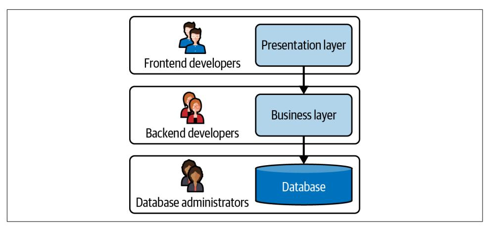

*Figure 1-1. e monolith.*

Because all the code lives together, it is easy for one team to make a change to some code and find it unexpectedly impacts some other business functionality. Also, it is easy to reuse code for different use cases without thinking about the implications. For example, if two teams working in different domains both have the concept of "Account," they should probably model it differently, but in a monolith that may not happen.

Also, a release can be a significant event because of the time it takes to do. You have to run all the tests to be sure there are no accidental impacts of a change. This tends to mean fewer releases, and more changes in each release.

On the plus side, a monolith is simpler to understand and to operate than a more dis‐ tributed system. Most calls are in-process; no network issues to trip you up. The architecture is simple to draw, and it doesn't change rapidly, so you can likely trust the architecture diagram, something I've learned isn't necessarily the case for a microser‐ vice architecture. If something goes wrong, you can jump on a box and tail logs. A monolith is absolutely a valid architectural choice for many organizations, and most

<span id="page-37-0"></span>startups keep a monolith until they scale up to a size where there are too many people working on it and tests are starting to take too long to run.<sup>3</sup>

I want to note that most organizations have more than one monolith. As an example, when the *Financial Times* was using monolithic architectures, we had multiple mono‐ liths. Among them:

- The editorial content management system
- The website, including the publishing flow
- Membership and subscriptions

These monoliths were generally integrated through direct and custom-coded integrations.

## **Modular Monoliths**

There are ways to reduce accidental coupling and speed up releases without giving up on the monolith. One way is to separate the code within a monolith into logical mod‐ ules tied to business domains. This leads to what is known as a *modular monolith*.

Here, the code still lives in a single repository and is deployed as a single deployment unit, through a single build and deployment pipeline. However, the code is split logi‐ cally into components that map to different domains, and the boundaries between those domains are carefully managed.

The logical split should reduce the likelihood that a change made by one team breaks some other feature. However, it can be difficult to catch accidental blurring of the boundaries. This could be down to inexperience or a lack of onboarding, so that people don't recognize they are crossing a boundary. And teams under pressure may decide to deliberately cross the boundary as a form of technical debt. If they are able to pay back the debt quickly, this may be a trade-off worth making, but the danger is that you find your modular monolith is a lot more coupled than you were planning for.

Releases can still take a long time—for example, if they run the whole test suite each time. There are a couple of approaches here. You can run a specific subset of tests for changes in a particular module, which speeds up the release—but may not catch problems where there is coupling you didn't know about.

Alternatively, you can accept that the release takes a while but have mechanisms in place so that by the time your code is merged to main and is going to be released, you have a lot of confidence that it will pass your pipeline—for example, by running a full set of tests on a branch for that release before you merge it. Some companies batch up

<sup>3</sup> *Too many* and *too long* are necessarily vague. They will be different for different organizations.

<span id="page-38-0"></span>a few code changes together to avoid having multiple releases going through the pipe‐ line at the same time. Using canary releases where the code is only live on a small subset of your instances also makes it easier to reverse out changes that have an unex‐ pected impact (I'll talk more about canary releases in [Chapter 10\)](#page-274-0).

A modular monolith is a good approach to take if you are starting to see issues with your monolithic architecture. Best case, it will solve them. Worst case, it will help you find the boundaries where you can extract services if you want to move to a microser‐ vice architecture.

In [Chapter 3](#page-88-0) I give a detailed case study of how Shopify has used a modular monolith approach, so go there for more detail on this.

## **Service-Oriented Architecture**

Integrations between monoliths used to require point-to-point custom integrations, meaning that if two systems needed to get access to the same information, they would both have to create an integration.

Service-oriented architecture (SOA) was a response to this. In SOA, teams create services that provide specific business functionality: for example, retrieving informa‐ tion about a reader's subscription status. They register these services centrally, and any team needing access can find and make use of them. These services might be a thin wrapper around a legacy system: the benefit is to simplify interactions and reduce duplication of effort and code.

SOA emerged in the late 1990s, but it really took off in the early 2000s with the arrival of web service standards, and in particular [SOAP \(simple object access protocol\)](https://oreil.ly/vqmH8), an XML-based message protocol. Often, SOA implementations of the time relied on a centralized software component (the Enterprise Service Bus or ESB) to keep track of the services, perform any necessary transformations, and route messages to the right place.

My experience with SOA was that this middleware could be a bottleneck as it had a lot of logic in it: every application needed to use and configure the ESB, and changes made for one purpose could impact others. In fact, sometimes the ESB would include business logic, which would mean deploying the app and an ESB patch in lock step. I also found that communication protocols like SOAP were fiddly to work with and I spent quite a lot of time managing changes to schemas.

I see microservices as a development of SOA, and a development that relied on other changes to happen in the tech world. When people were getting started with SOA, in general we were setting up our own servers, manually. Our data was in relational databases with many tables, and our release process was slow and also mostly manual. None of those things are still the case.

## <span id="page-39-0"></span>**The Microservices Ecosystem**

Microservices are an evolution of SOA, made possible by new technologies and new ways of working that have become available over the last decade or so.

These changes include the types of infrastructure we can run our applications on: with the availability of new deployment technologies such as containers and orches‐ tration, serverless, and platform as a service (PaaS) as we have moved to the cloud. They include the benefits of automation, both for provisioning of that infrastructure and for the deployment of code. They also include changes in how we work, with the rise of DevOps as an approach to building and operating our systems and a shift from monitoring to the broader concept of observability.

These are enabling technologies and approaches for microservices, meaning that without these it would be hard to do microservices, and I think impossible to be suc‐ cessful at them. If you read this chapter and you don't have these enabling technolo‐ gies in place, they would be a good place to focus your earliest efforts.

Together, these enabling technologies—new deployment options in the cloud, auto‐ mation, DevOps, and observability—allow a cloud native approach: building applica‐ tions that are designed to make the most of the cloud, rather than being a lift and shift of a monolith running in a data center.

Cloud native is about speed and scale. Can you move fast and scale when you need to? Microservices are a good fit here.

Let's dig into these enabling technologies.

## **Infrastructure as Code**

When I first joined the *FT*, in 2011, it was to build the first Content API, giving access to the *FT'*s articles and images for internal teams and specific third parties. For this new project, we needed a server, and it took six months to buy it, build it, rack it, configure it, set up DNS, etc. The whole process was manual.

Over the next few years, the *FT* invested heavily in technologies to speed this process up. First of all, we set up a private cloud in our data centers.

The US National Institute of Standards and Technology (NIST) [defines cloud](https://oreil.ly/oT1kk) as access to a pool of computing resources (servers, storage, networks, services, etc.) that can be rapidly provisioned and made available with minimal overhead.<sup>4</sup>

<sup>4</sup> I found the excellent NIST definition of cloud computing via Martin Fowler's website. I recommend [the full](https://oreil.ly/it5xh) [standards doc from NIST](https://oreil.ly/it5xh) as a really clear explanation of a term that is often a bit...cloudy.

<span id="page-40-0"></span>The *FT* built an [infrastructure-as-a-service \(IaaS\)](https://oreil.ly/Gggmx) platform so that a new virtual machine (VM) could be spun up on demand and an application deployed to it, rather than requiring someone to buy and set up a new physical server and then configure everything required.

Once you can spin up VMs, it makes sense to automate the process so that it can be done in minutes. This has the happy added benefit of ensuring a level of consistency in the VMs you spin up, because you use the same server image template for all of them.

Servers, however, have a tendency to become more different to each other over time (["configuration drift"\)](https://learning.oreilly.com/library/view/infrastructure-as-code/9781098114664/ch02.html#configuration-drift). That might be because people have made manual ad hoc changes, or because you changed that server image template, so new servers will be different than old ones. This inconsistency can lead to unexpected behavior and instability.

[Infrastructure as code](https://learning.oreilly.com/library/view/infrastructure-as-code/9781098114664/ch01.html) is the solution to this. As you might suspect, this is about defining your infrastructure in code and, crucially, continuously rerunning that code so that your infrastructure remains consistent.

As Kief Morris writes in *[Infrastructure as Code](https://learning.oreilly.com/library/view/infrastructure-as-code/9781098114664/ch01.html#:-:text=Infrastructure%20as%20Code%20is,changes%20to%20your%20systems)*: 5

Infrastructure as Code is an approach to infrastructure automation based on practices from software development. It emphasizes consistent, repeatable routines for provi‐ sioning and changing systems and their configuration. You make changes to code, then use automation to test and apply those changes to your systems.

Because the infrastructure configuration is code, it is held in source control, making it easy to see what has changed and who made that change, and to go back to the state at a particular point of time if necessary—for example, if something went wrong.

Because the process of making a change is automated, you can make sure that you create an audit log that shows the changes and who applied them: great for security.

Infrastructure as code means we can create servers, provision them, update them, and tear them down through running software commands, and the results are the same every time. In a microservice architecture, these are things we do frequently, which is why infrastructure as code is important.

## **Continuous Delivery**

Releasing code to our hand-built server in 2011 was also a very manual process. The steps were laid out in an Excel spreadsheet and there were more than 50 of them. Because it was manual, it was error prone.

<sup>5</sup> Kief Morris, *[Infrastructure as Code](https://learning.oreilly.com/library/view/infrastructure-as-code/9781098114664/)*, 2nd ed. (Sebastopol: O'Reilly, 2020).

It was also slow, taking hours, and since journalists couldn't publish any content while it was happening, we couldn't do it during normal working hours. This meant we released our code to production on a Saturday morning,<sup>6</sup> and no more frequently than once a month.

You cannot successfully do microservices unless you automate the process for releas‐ ing code. But that's not all. You also need to be able to release changes with negligible downtime so you can do that at any time. And finally, you need to speed up the time spent on testing, through a focus on automated tests that don't require complex setup or a shared staging environment.

You need to be doing [continuous delivery](https://continuousdelivery.com) (see Figure 1-2).

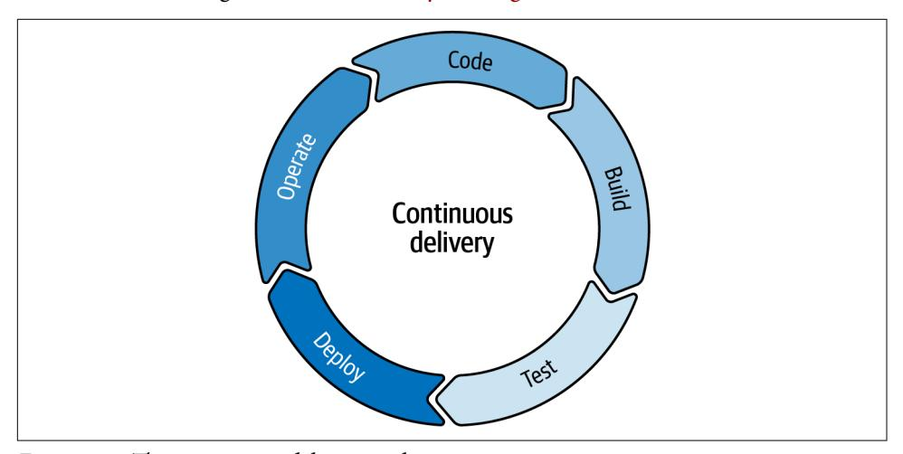

*Figure 1-2. e continuous delivery cycle.*

Continuous delivery is about continuously releasing small changes, through an auto‐ mated build and deploy pipeline that incorporates automated testing.

It's hard to work in small batches—one of the key principles of continuous delivery without a loosely coupled architecture; specifically, one where you can change part of the system and test just those changes.

It's also hard to benefit from a move to microservices unless you are doing continu‐ ous delivery!

<sup>6</sup> The *FT* focuses on business news, meaning weekends are the time when there might be a few hours without much new content.

<span id="page-42-0"></span>

This book is only going to touch briefly on continuous delivery. For in-depth coverage, see Jez Humble and Dave Farley's *Continu‐ ous Delivery: Reliable Software Releases rough Build, Test, and Deployment Automation* (Upper Saddle River, NJ: Addison-Wesley, 2010).

At the *FT*, moving to continuous delivery and adopting microservices for the content publishing platform took us from 12 releases a year to around 2,500. That's around 10 releases per working day—about 200 times as often.

## **The Public Cloud**

The *FT* may have started with a private cloud, but it soon moved to take advantage of the public cloud, using Amazon Web Services (AWS). Public cloud means someone else owns the hardware.

I remember the concerns in the early 2010s about what it meant to run your code on machines owned by someone else—what would happen if they upped the price? Was it safe to keep our data there? Could they go bust? Over time, as more people moved to the public cloud, we got more comfortable about the risks. And there are signifi‐ cant advantages.

First, you no longer have to buy, build, and manage the underlying resources. This can save you money, although you do have to make sure you keep on top of the bill, because provisioning on demand can mean a lot of developers provisioning servers that are more than big enough "to avoid issues," and provisioning things they then forget about. Public cloud also changes the cost model of buying servers from CAPEX (capital expenditure: buying lots of servers up front) to OPEX (operational expenditure: hiring machines when you need them). It is worth talking to your finance department before making this switch because they may have a strong opin‐ ion on whether this is a good thing!

Moving to the public cloud will definitely save you effort. If you run your own private cloud in a data center, you are still having to buy servers and network kit and pay all the associated support and maintenance costs, including an internal ops team to sup‐ port that infrastructure. You have to do the patching and upgrading, and respond to security issues. With the public cloud, the providers handle this for you.

With a private cloud, you still have to do capacity planning to make sure there is an underlying physical server for the new VMs someone needs. With a public cloud, you don't have that constraint. You will rarely if ever be unable to provision a VM when you need it.

Additionally, the public cloud providers do a lot more than supplying elastic com‐ pute. They offer a lot of value-added services. You can spin up a new database, a queue, an API gateway. These are things you need in a microservice architecture, and <span id="page-43-0"></span>it's a lot quicker and easier to use a managed service from your cloud provider than it is to set this up yourself. And because this is quick and easy, you can try out alterna‐ tives to see whether they offer a better solution for your particular use case.

In the content platform team at the *FT*, we introduced multiple new data stores that met specific needs. The difference between installing and managing a database cluster in two regions ourselves versus using database-as-a-service options from AWS was weeks versus days of effort. It's significant.

The combination of infrastructure as code and elastic provisioning allowed us to move to treating our servers as cattle rather than pets.<sup>7</sup> This is a concept first popular‐ ized by Randy Bias, who has [written up the history](https://oreil.ly/LFuOJ). I first heard it, like many others, from Adrian Cockcroft, then at Netflix.

When we hand-built our servers, they were like pets. We gave them names, and lav‐ ished attention on them. They were around for a long time and could have an uptime measured in years. We formed an emotional attachment to them, and if they got sick, we'd nurse them back to health.

In the cloud, virtual machines don't stick around for a long time. They don't have names; instead, they are numbered and tagged with what purpose they serve. And if something goes wrong, we won't nurse them back to health. It's common to terminate a server that is having problems and spin up a new one.

Public cloud mostly enables microservices through the things that you can do on it, and in particular the new deployment options that are available.

## **New Deployment Options**

Many people will immediately think of containers and Kubernetes in the context of microservices. However, this isn't the only way to run a microservice architecture. The *FT* has run microservices on Kubernetes (used for the content publishing plat‐ form), but it has also run them on Heroku (used for ft.com)<sup>8</sup> and makes significant use of serverless too.

I want to take a step away and talk about what things like containers and Kubernetes represent: new deployment options. Containers and orchestrators, serverless, and PaaS options all allow teams to hand off some part of the complexity of running dis‐ tributed systems of small services, and reduce or make more predictable the costs of doing that.

<sup>7</sup> This is a metaphor that in my experience also works very well when explaining modern software development practices to nontechnical folks!

<sup>8</sup> I am not sure I would pick Heroku in 2024, but in 2016 this was a successful choice.

<span id="page-44-0"></span>

### Containers

Early on in our microservices adoption at the *FT*, we were running each service on its own VM. Virtualization lets you split up an underlying physical machine into multi‐ ple smaller *virtual* machines, which, to the applications running on them, seem just like a normal server. This provides isolated execution environments and higher uti‐ lization of the underlying physical hardware.

However, given our tiny microservices, even with the smallest VM these services were overprovisioned, so we were spending more money than we needed to. But more sig‐ nificantly, each new service we set up needed multiple steps to provision, configure, and deploy. It was fiddly and a source of friction.

That made us ripe for early adoption of containers.

A container image is a [lightweight, standalone, executable package of software](https://oreil.ly/gxdvb) that includes everything needed to run an application: code, runtime, system tools, system libraries, and settings.

Containerization involves a standard packaging format, a standard interface for con‐ trolling a running container, and an engine for running containers. Container images become containers at runtime, where the container engine unpacks and runs the application in a way that isolates the software from any other containers running on the same infrastructure. Because this is much more lightweight than a VM, containers are quick to start up. They are also immutable. If you want to change your applica‐ tion, you have to update the container image and deploy a new container.

Although we could likely have changed our previous platform to support running more than one service on a VM, that would not have been a great idea, because we would have lost that isolation between different applications. Containers are smaller, isolated, and built to be stacked, which made this very simple. Adopting containers reduced our AWS costs by 40% because we now ran on eight very large VMs rather than several hundred very small ones. It also meant fewer steps to set up a new ser‐ vice. We no longer had to provision a VM or set up deployment pipelines. Everything was defined in a single version-controlled configuration file.

However, we still had some challenges because we were such early adopters that the container ecosystem wasn't there. We had to build our own system for managing those containers. This included working out how many instances we needed, any constraints on where they should be running, whether they should be deployed sequentially, how to route requests between containers, etc.

We effectively built our own container orchestration, because that's what made con‐ tainers work for us. In general, I'm a big fan of choosing boring technology. As Dan McKinley of Etsy [wrote in favor of this](https://oreil.ly/MbCO8), boring technologies are the ones lots of peo‐ ple have used successfully. New and innovative technology is exciting, but the capa‐ bilities and in particular the ways they can go wrong are not likely to be well <span id="page-45-0"></span>understood. Dan suggests that you limit how much innovative stuff you try to do at any one time by thinking in terms of having a few tokens you can spend: make sure you spend your innovation tokens wisely.

For my team at the *FT* in 2014, building our own container orchestration was an innovation token we were willing to spend. But as soon as we had alternatives we could move to, we did.

### Orchestration

Container orchestrators like Kubernetes will dynamically manage a container cluster for you, handling routing of requests between services, restarting failing applications, moving services around where there are problems with CPU or memory use, and handling deployments.

Kubernetes is not itself a platform: there are a lot of things to consider beyond con‐ tainer management, such as service meshes, API gateways, log aggregation, etc. As the container ecosystem matures, more and more tools exist to make it easier to work with containers and Kubernetes. The Cloud Native Computing Foundation maintains an interactive [Cloud Native Landscape](https://oreil.ly/nKzPe) that is a very helpful guide, but with so many tools available, it can be a bit overwhelming. And even with all these tools, if you opt for using Kubernetes, you are opting for building your own platform with the flexibil‐ ity and complexity that comes with that.

My feeling is that this is another place where we should lean on providers and get them to do the heavy lifting. Most public clouds provide managed Kubernetes serv‐ ices, or you can get third parties to do the management for you. Those are the options I'd be looking at if I was adopting Kubernetes now.

However, I would also be considering whether I needed to go for a Kubernetes-based solution. Kubernetes is powerful, but complex. Cloud providers also offer their own services for managing containers, and those may provide better integration with other parts of that cloud provider's ecosystem.<sup>9</sup>

People often choose Kubernetes for portability. I'm not convinced this is a good rea‐ son. Even if it is easier to move from Amazon's Elastic Kubernetes Service to Google's Kubernetes Engine than it is to move from Amazon's Elastic Compute Service to Google Cloud Run, how likely are you to make that move? I'd rather make the com‐ mitment to using a particular cloud provider and use as many of the managed serv‐ ices they offer as deeply as possible than spend time and effort in trying to stay relatively vendor-neutral.

<sup>9</sup> If you asked your cloud provider for its recommendation, it might well be serverless rather than containers as a starting point. Adrian Cockcroft, previously of Amazon, recommends a serverless-first approach for fast feedback, with a move to containers only if that proves necessary for reasons such as cost.

<span id="page-46-0"></span>

### Platform-as-a-service options

An alternative is to use [platform-as-a-service](https://oreil.ly/nlJxg) (PaaS) options. Here, you deploy your applications to a platform completely run for you that can often also provide things like managed databases.

You lose some flexibility, and the cost to run the application will be higher—but you no longer need to build and maintain a platform yourself, so the overall cost may be lower. Your teams can also focus on delivering business value.

When the *FT* started building microservices, many teams chose to use Heroku and benefited from the ease of use and well-thought-out tools. I don't think we would necessarily make the same choice now—we haven't seen many new features added over the last few years. While there are still many vendors offering PaaS solutions such as Render, fly.io, Netlify, platform.sh—I have heard far more about people run‐ ning relatively simple applications on these, rather than complicated microservice architectures.

These options are definitely worth considering, particularly for organizations that don't have to support high workload or scaling challenges. However, for a compli‐ cated architecture, you may be better off looking at public cloud providers, because you have a lot of options for what you install and run alongside applications: data‐ bases, messages queues, storage, etc.

If you're doing this, you should also consider whether an event-based serverless com‐ pute option is a better match for your requirements.

### Serverless

Serverless is another option for building a loosely coupled architecture. Serverless allows you to build applications without thinking about the servers they run on at all.

Many of the managed services that cloud providers offer are serverless. For example, Amazon offers things like S3 for file storage, SNS for messaging, and Aurora for data storage via PostgreSQL. In all of these cases, you don't have to worry about scaling, backups, clustering, etc.; you configure the service and start using it.

Cloud providers also provide serverless compute (which is what I find people gener‐ ally think about when they hear *serverless*). AWS Lambda is an example of function as a service (FaaS), an event-driven model where your code is invoked when an event happens—a file being written or a message being sent.

You can definitely consider FaaS to be a type of microservice architecture,<sup>10</sup> although you may find that you need to deploy one logical microservice as multiple functions.

<sup>10</sup> As in [this blog post](https://oreil.ly/S8TOl) from Surya Sreedevi Vedula and Ashish Bhalgat of Thoughtworks.

<span id="page-47-0"></span>Sam Newman has a great in-depth discussion of this in his *Building Microservices* book.

What serverless options have in common is that you are charged on usage, i.e., the number of requests made or the amount of storage used.

### Making your choice

In general, I think you should aim to have your cloud provider do as much of what Werner Vogels of Amazon terms "undifferentiated heavy lifting" as possible. Vogels describes undifferentiated heavy lifting as "tasks that must get done but don't provide competitive advantage. For most businesses, these tasks include things like server management, load balancing, and applying security patches." (If you'd like to find out more, check out [this interesting overview of how AWS approaches building](https://oreil.ly/3TNQU) [software.](https://oreil.ly/3TNQU))

In general, you shouldn't be running your own messaging queues or database clus‐ ters. You don't get a lot of value from that extra work. You should use managed serv‐ ices wherever you can.

Whether you deploy your application code as short-lived functions or as longer-lived services or a mix of the two is less clear cut. It depends on what you're doing and the profile of your workload. Responding to events can be a great use case for FaaS. If you have a pretty steady stream of requests to your website, maybe that will be better run‐ ning as a containerized service.

At the *FT*, we had a mix of serverless functions and longer-lived services in many of our teams. I think that's reasonably common.

## **DevOps**

When the people developing the code are separate from the people who operate it, there is a mismatch of incentives. A developer wants to release their code and move on to the next feature. An ops person wants to keep systems up and running, and knows that code releases are highly correlated with things going wrong.

DevOps is about developers and operators working together, and it is a cultural change. Once you are working together, you start to get more aligned. Operations engineers start to solve more problems through software engineering—writing code and automating things. Developers start to take on more responsibility for the opera‐ tion of their software, whether that's about building observability in or responding when there are production problems. This is a good thing, because you build better systems when you might have to wake up at 3 a.m. because something has gone wrong.

<span id="page-48-0"></span>Doing many small releases, as you can with microservices, makes it much less likely that each release will cause problems, and much easier to roll it back if you find it does. However, you must have those releases being done by the developer because you can't hand over to another team 10 times a day. That means the developers need to be able to support that code running in production. So DevOps is essential for doing microservices successfully.

I strongly feel that DevOps is a mindset, rather than a job you do. However, in the industry it is common to see people recruiting for DevOps engineers or building a DevOps team. DevOps teams and engineers are the ones building tools and processes to support engineers who are building a product. In their book *Team Topologies*, 11 Matthew Skelton and Manuel Pais call these platform teams.

[Chapter 8](#page-216-0) talks far more about how to move to "You build it, you run it." The rest of the chapters in [Part II](#page-114-0) also cover why this matters, with a full discussion of the differ‐ ent team types in *Team Topologies* in [Chapter 5](#page-132-0).

## **Observability**

A microservice architecture gives you lots of places where things may have gone wrong. With a complicated web of services, built with the expectation that the system as a whole should still work even if some instances of services are unavailable, moni‐ toring can't necessarily tell you whether something is really broken. You can have an alert for an instance that is being upgraded, with all traffic successfully being routed around it.

Generally, it is much harder to predict what information you are going to need. Oldschool monitoring and dashboards will only get you so far (as Liz Fong-Jones and Charity Majors have said, "Dashboards are the scar tissue from previous incidents," which means they may not show you what you need for *this* one!).

Luckily, we've seen the rise of new tools focused on observability. These go beyond log aggregation and tracing (although these are both important) to a place where you can capture high-cardinality, high-dimensionality information about events. High cardinality means you have a lot of possible values for a single attribute—for example, something like userID. High dimensionality means you have a lot of different keyvalue pairs. This means you can ask detailed questions about what has happened in your production environment, giving you a good chance of finding the solution for some fairly esoteric bugs where the problem exists only for some small subset of users or for some unusual combination of circumstances. Of course, you can only do this if the engineers were thinking about observability when they wrote the code!

<sup>11</sup> Matthew Skelton and Manuel Pais, *Team Topologies*, 2nd ed. (Portland, OR: IT Revolution, 2019).

## <span id="page-49-0"></span>**Advantages of Microservices**

The advantages of microservices come from two aspects. First, microservices break up the system into many small parts. This means you can scale these parts separately, and you get increased resilience because a failure of one part doesn't mean the whole system is down.

Second, a microservice architecture is loosely coupled: you can change one service without having to change anything else. That means you don't have to coordinate releases between teams. It also means you can choose different technology, depending on the needs of each service. And if you want to try something new, you can do that easily. You don't have to migrate the whole system.

Microservices focus on being as loosely coupled as possible, and achieve this through things like owning their own data, avoiding coupling through centralized database schemas. They prefer lightweight communication mechanisms, avoiding overly com‐ plex or smart integration technologies (for example, an Enterprise Service Bus) that can be a bottleneck for change. They are deliberately built around business capabili‐ ties, meaning most change should happen within the service or services owned by a single team. If you get those domain boundaries right, the interface for the microser‐ vice will be stable and change relatively infrequently. That means you don't need to spend a lot of time coordinating with other teams before you can make a change. It also means that as an engineer, you don't need to understand the whole system, just your own services and the interfaces they offer or use.

Let's spell out these advantages in more detail.

## **Independently Scalable**

With a monolith, if you need to handle increased traffic, you need to scale the whole monolith. With microservices, you can scale just the part of the system that is under increased load. For example, for the *Financial Times*, you may have a big increase in traffic to the home page when there is a major news event, but there may not be any impact on how many searches people do. With microservices, you can scale just the home page.

You can also of course scale things *down* independently, reducing the scale of a com‐ ponent when it isn't being heavily used, and this has a positive impact on both costs and sustainability.

You can also treat different parts of the system differently. For example, if one part of your system is CPU-bound and another is memory-bound, you can run them on dif‐ ferent types of hardware.

## <span id="page-50-0"></span>**Robust**

While a function call in a monolith is much less likely to fail than a call over the net‐ work between two microservices, overall a microservice architecture is pretty robust.

If something goes badly wrong in a monolith, you lose the whole thing. If something goes badly wrong in a microservice, you have lost only part of the system. Put another way: the blast radius for something going wrong is small. For example, let's imagine the home page of a movie purchasing website that includes a list of personal‐ ized recommendations for you. If that service breaks, you can still see the rest of the page. You can still search for a film and buy it. And maybe the system will fall back to showing you a list of popular movies if the personalized list can't be retrieved.

This is oversimplifying things. First, monoliths can be deployed to multiple machines, perhaps in different regions. It would be rare that losing one machine would take down the whole system. And second, robustness in a microservice archi‐ tecture takes work. You need to think about what happens when things go wrong. That is covered in a *lot* of detail in [Chapter 12](#page-342-0).

## **Easy to Release Small Changes Frequently**

With a monolith, even the smallest change involves deploying the entire application. That can take a while, and so it's more likely that changes are batched together. A release feels risky and can often—although not always—involve downtime. This is a vicious circle, because the risk means you are less likely to do releases, making each release riskier.

Adopting microservices should allow you to make small changes to a part of the overall system with a high degree of confidence that you aren't going to break some‐ thing unexpected. And because these are separate services, you can deploy just the service that you have changed.

If something goes wrong, it's easier to reason about it, because it's a small, selfcontained change that should be easy to roll back. This makes releasing code into something normal, not scary.

With microservices, you should get to the point where you are releasing small changes as soon as they are ready, typically tens or even hundreds of times a day. The *Financial Times* did around 100 releases every day in 2021. This delivers real business value: you can quickly implement and then get real feedback on your ideas.

<span id="page-51-0"></span>*Accelerate* by Nicole Forsgren et al. digs into what high-performing technology organizations have in common and defines high performance as being about a posi‐ tive impact on the productivity, profitability, and market share of your business, com‐ pared to competitors.<sup>12</sup>

Their research found that high-performing organizations have a higher deployment frequency, a shorter lead time for changes, a lower change failure rate, and a shorter time to restore service when something goes wrong. Microservices help with all those metrics.

I'll be returning to these metrics throughout the book, starting in [Chapter 2.](#page-62-0)

## **Support Flexible Technology Choices**

With a monolith, you are constrained to using a single programming language, and probably a single data store. There may well be places in the codebase that would benefit from something different, but they have to make do. This means, for example, that data that is naturally graph-like can get squashed into a relational database.

With microservices, you can choose the right tool for your needs. Frontend services can be written in Node.js and backend services in Go. You can store an article in a document store, because you generally retrieve the whole thing. You can store meta‐ data in a graph, because you want to be able to navigate the relationships.

What this also means is that microservices support change. You can try out a new technology in one service, and if it provides value, you can migrate other services to it. Or you can leave those other services as they are; your choice. The same applies when keeping the technology up-to-date: it is much less scary to upgrade the version of your programming language microservice by microservice than it is to do it for a monolith. This should help you stay closer to the latest versions.

## **Challenges of Microservices**

Many of the challenges of microservices are because these are distributed systems. However, the number of different services and the rate of change can turn this up to 11.<sup>13</sup>

Pretty much the whole of [Part III](#page-242-0) of this book deals with how things change when you are building and operating a microservice architecture. Here I will focus on things where microservices really don't do well, rather than on things—for example, testing—where you need to approach things differently.

<sup>12</sup> Nicole Forsgren, Jez Humble, and Gene Kim, *Accelerate: e Science of Building and Scaling High Performing Technology Organizations* (Portland, OR: IT Revolution, 2018).

<sup>13</sup> As Nigel Tufnel says in *Spinal Tap*[, this is definitely at least one louder](https://oreil.ly/wmRNB).

## <span id="page-52-0"></span>**Latency**

Since a call over a network takes much longer than an in-process call, if a flow goes through multiple microservices, you could have a large percentage of the processing time being those network calls.

For many systems, this isn't a major issue, but if latency matters for your system, you should be cautious about how many network calls are involved in a particular opera‐ tion. In particular, you want to avoid network calls over a long distance (as a [rough](https://oreil.ly/2u2T4) [guide,](https://oreil.ly/2u2T4) a TCP packet round trip between the US and Europe will take around 150 ms in the same time, you could likely have done 300 round trips within a single data cen‐ ter!). This kind of thing can bite you when you go into a state of partial failure. If that means having some services in Europe calling other services in the US and vice versa, you may still be up, but you could be unacceptably slow.

## **Estate Complexity**

Flexibility to choose the right tech can lead to running a lot of different tech. This is a place where local optimization (the team wants to use a graph database because the data fits that style) clashes with global optimization (the organization already has five different databases being used in different teams and they all need to be patched regu‐ larly and to have mechanisms for backup and restore).

This breadth of technology being used also makes it harder to provide tools, and cen‐ tralized support for development teams. Each new programming language means that libraries and documentation for shared tools have to incorporate this language, meaning this is an area where organizations commonly impose some constraints. I talk more about finding the right balance between autonomy and simplicity later in the book, particularly in [Chapter 11](#page-306-0).

## **Operational Complexity**

*We replaced our monolith with micro services so that every outage could be more like a mur‐ der mystery.*

—@honest\_update on Twitter<sup>14</sup>

There are three reasons why microservices are operationally complex:

- They are distributed systems.
- They change rapidly.
- They are loosely coupled.

<sup>14</sup> [Tweet](https://oreil.ly/Piq7n) from Honest Update, @honest\_update, October 7th, 2015.

<span id="page-53-0"></span>Because microservices are distributed systems, things are a bit more flaky. A call may fail because of network or DNS issues. We work around that by building resilience in (see [Chapter 12\)](#page-342-0), but that means the exact route a request takes can't be predicted, and if you don't handle failure well, you can end up with timeouts and traffic peaks.

Being a distributed system also means you can't jump on a box and tail logs. You need to have log aggregation so you have a place to go and look at all the logs—but if something goes really wrong, those logs may not make it to the aggregation tool. And you need to have something that allows you to trace a single request through your system, whichever services it goes through. This can be through using a specific dis‐ tributed tracing tool, or as we did originally at the *FT*, by tagging all the logs that relate to a single request with some unique correlation ID.

Additionally, things change rapidly, which means that your understanding of what the system looks like is quite likely not up-to-date. This is particularly true when you have multiple teams working on a system and sharing support. If someone from the article page team is doing support and there is a problem with personalization func‐ tionality, they will have to work out how this works *now* by using their observability tools and looking at the codebase.

When I was working on monolithic architectures, the architecture diagram would be pretty useful. I could generally expect it to be up-to-date, with the right server names, ports, etc. The complexity was inside the application. For a microservice architecture it's hard to keep a diagram up-to-date manually. You also really need to have different levels of architecture diagram. Perhaps the most useful is the one that I found we had the least at the *FT*—one that showed the different systems owned by different teams, and the flows across those boundaries.

Finally, microservices are loosely coupled. Which is good! However, when you have a flow that goes across multiple teams, there may not be anyone who understands that whole flow. I saw this at the *FT* whenever we had problems between an article being published and it appearing on the home page of the website. This went through three separate teams: editorial tooling, content publishing, and the ft.com team. The first challenge was to work out where things had gone wrong.

We handled this with tools that let us look at the interfaces between the systems (and therefore the teams) so that we could see how far an update to the article had success‐ fully reached. I will cover this in [Chapter 13](#page-370-0).

## <span id="page-54-0"></span>**Data Consistency**

*microservices (n,pl): an efficient device for transforming business problems into distributed transaction problems*

—@drsnooks on Twitter<sup>15</sup>

Within a monolith, with a single database, you could use transactions to make sure that a single logical update either completely succeeded or completely failed.

Once you have data stored in more than one place, you can't rely on transactions any more.

My recommendation would be to use this to design the boundaries within your sys‐ tem: if you have a single logical update, wherever possible, make that within a single microservice where you can commit or roll back the whole thing. That won't always be possible. You can use the [Saga pattern](https://oreil.ly/HtQOg) to apply compensating changes when part of a change fails, but that adds a level of complexity into how you build, test, and run your system. It's simpler if you have a system where you can accept [eventual consis‐](https://oreil.ly/FWB2W) [tency:](https://oreil.ly/FWB2W) data might be inconsistent but should eventually converge to become consistent.

Working on the *FT'*s publishing platform, I benefited from two things. The first was that we were not the source of truth for articles. That source of truth was the content management system (CMS) operated by the editorial tooling team. If we lost our copy of an article, we could go back to the CMS for it. We also benefited from the idempotent nature of publishing an article. You can repeat publication of that article as many times as you want and there are no side effects. Often, we simplified our interactions with databases by:

- Treating clusters in different regions as completely separate
- Publishing to both
- Using monitoring to pick up where there were inconsistencies
- Manually fixing those inconsistencies by hitting a "publish again" button for that article

While there are advantages to having each microservice own its own data, in practice, you need to duplicate some of that data; as an example, think about an order manage‐ ment capability. Logically, the Order Management service needs to store just a cus‐ tomer ID, but you don't want to have to make a call to the Customer service to get the customer's name and address every time you retrieve an order, because that makes for a very chatty system.

<sup>15</sup> [Tweet](https://oreil.ly/rj-qe) from Al Davidson, @drsnooks, October 6th, 2015.

<span id="page-55-0"></span>This duplication does bring a challenge, though: how do you make sure that every service knows to update the customer's name or address when it changes? You have a few options (setting cache timeouts or providing a notification process), but whatever you do, you need an understanding of what services are caching information, and which service is the canonical source for it.

## **Security**

In a distributed system, there is a lot more to secure. Calls that used to happen within a single application now happen over the network, meaning you need to secure the data you are sending around, and lock down access to your microservice endpoints. And you need to do that consistently, everywhere, because you are only as secure as the least secure part of your system. Which means that every team needs to under‐ stand the principles of securing data and services, making it part of the process for delivering a service into production.

There are, however, some positives of a microservice architecture if you get your approach to security right. If your data is stored in different data stores, with different credentials for access, an attacker that gains access to one of those stores doesn't have access to all of your data. You can also segregate the most sensitive data into particu‐ lar data stores—for example, keeping personally identifiable information (PII) data separate.

Those credentials are a challenge, though. You should have large numbers of creden‐ tials, because you don't want a single credential to be reused, giving broad access across your software estate, but that means you need the tools to be able to manage a large number of credentials, including rotations of keys and secrets.

## **Finding the Right Level of Granularity**

Microservices are small. But how small?

Many of the early definitions of microservices that I came across nearly a decade ago focused on size, and it was confusing because they were quite different. Was a micro‐ service something that was "no bigger than a few hundred lines of code"<sup>16</sup> or some‐ thing that was owned by a single ["two-pizza" team](https://oreil.ly/v4suv)? What does it mean that a microservice should "do one thing, well"?

I think it's a bad idea to focus too heavily on the idea that these are *micro* services. Let me flip the question of "how small" and ask instead—how many microservices do you need?

<sup>16</sup> It's hard to track down who first said this, but I am pretty sure I first heard this from Fred George in a talk around 2012. As a Java developer at this point, that seemed challengingly small!

Different companies take a different approach here. At one extreme is a company like Monzo, which has many hundreds of microservices.<sup>17</sup>

I've asked the audience at a few different conferences about microservices, and gener‐ ally, people have one or two orders of magnitude fewer microservices than that somewhere between 15 and 150. At the *FT*, we were on the higher side: we had many hundreds of microservices, and teams could have 10 to 50 microservices that they made regular changes to or needed to support.

So how do you decide where in that spectrum you should sit?

First, you want your microservices small enough that they are owned by a single team. If you have multiple teams working within one business domain, you should aim to find a way to divide up that domain, so that each team has ownership of part of it. Otherwise, you need those teams to coordinate their work, which will slow them down. For the *FT'*s content publishing platform, we had multiple development teams and so we split that domain to match. One team was responsible for the content domain—articles, videos, images. The other handled the metadata domain—infor‐ mation about the subjects, people, and organizations discussed in that content, used, for example, to automatically generate topic pages on the website.

You also want your microservices small enough that the people in your team can understand the whole service. In particular, a new person joining your team should be able to look at the code and quite quickly understand what the service does.

That was definitely not something I could do when I was writing code for a 70 package monolith—it took months or even years to understand that.

Microservices are easier to understand not just because there is less code, though: there is also a clearly defined interface. There is generally one way into and out of the service, and if you understand that interface, you understand a lot about the service.

A nice benefit of this is the often-cited ability to replace that microservice completely with little risk and not too much time taken. And I've seen that happen (although not that often), perhaps as a result of a service getting passed over to another team that works in a different programming language, or because of swapping one data storage solution with another.

However, you don't want to go too small. Partly that's because the more microservices you have, the more times you'll need to make the same change when you need, for example, to upgrade a library. Automation can help, and you will need to automate things you do regularly—but even if you automate a lot of that library upgrade, for

<sup>17</sup> In 2020, Matt Heath and Suhail Patel quoted 1,600+ and growing, *[Modern Banking in 1600 Microservices](https://oreil.ly/o31Z8)*, InfoQ.

<span id="page-57-0"></span>example by creating pull requests for each affected service, you still need to approve/ test each of those.

But also, if you go too small, you'll find it very difficult for that microservice to own its own data and not need access to data owned by another service.

Kyle Brown and Sharir Daya of IBM cover this well in their blog post from 2020 ["What's the Right Size for a Microservice?",](https://oreil.ly/j80HT) where they discuss how going too small is a common mistake they see for teams adopting microservices. They argue that this is about a misconception that each microservice should provide one REST interface for example, that an Account service would only handle operations on a single account, such as Open, Close, Credit, Debit.

When you need to transfer money between accounts, you have two choices. One approach is to set up a separate Transfer service, which will first debit from one account then credit to another. But that is a transaction where you want both the debit and credit to succeed. Distributed transactions are hard. It would be simpler to add a transfer operation to the Account service.

When you're designing your microservices and finding the boundaries, one thing you should be guided by is transaction boundaries. When you find your handling of data starting to get complicated, consider whether combining your microservices might be the right thing.

Similarly, if you find you always change two microservices at the same time, maybe they shouldn't be two microservices.

This is not something you need to get right the first time—you can split or combine microservices when you realize you didn't get the boundaries or the size right. I will discuss how to determine the right boundaries in a lot more detail in [Chapter 4.](#page-116-0)

## **Handling Change**

Upgrades and migrations are a fact of life. You will always have something that needs to be fixed up:

- Maybe you built something from scratch and now there's something you can buy in. An example: we built our own service orchestration, then moved to Kuber‐ netes when it was production-ready.
- Or maybe you need to upgrade your programming language because the version you're using is about to be deprecated.
- Or perhaps there is a library that needs to be upgraded because it has a security vulnerability.

<span id="page-58-0"></span>The key point here is that these are changes that you have to make globally, i.e., in every place where the service, programming language, or library is used, and gener‐ ally with some deadline—versions going end of life, or the expiry of a license period. This is the flip side of one of the advantages of microservices. You can upgrade microservices one by one at lower risk than upgrading a monolith, but there's always a risk that you'll discover 50 services are still running on a version of Java that has been out of support for months or even years!

There are two things that make this more painful in a microservice architecture. First, if you have multiple data stores, for example, you will have multiple upgrade paths. Five times as many databases can mean five times as many upgrades. Hopefully, each upgrade is simpler and takes less time but that isn't always the case.


#### **Use Managed Services Where Possible**

Having someone else handling the vast majority of upgrades for you is another good reason to use managed services, such as man‐ aged databases. Even here, though, there will be changes that are significant enough that you need to do some work—for example, where there are upgrades that are not fully backward compatible, meaning you need to make changes to your application.

Second, the more microservices you have, the more places you need to make a change. You need to build things so that migrating 150 services to something new doesn't involve weeks of work. And that means investing in automation. For example, you should aim to template your deployment pipeline so you can amend all pipelines easily if you are adding a new step into deployment (e.g., to enhance security scan‐ ning). You also need to work out how to quickly patch all the services that use a par‐ ticular version of a library, particularly where there is a security issue. Maybe you can do this via automating the creation of a pull request (PR), but you still need to release all that code.

Automation can speed things up, and it can reduce errors that manual repetition can introduce. However, it still requires people to invest some time in something that isn't new feature development, and even where you automate the changes made to the code, you will still want to review those changes and test them. I talk about how to approach this in [Chapter 14,](#page-400-0) and it really can be a killer for teams, where they feel they are on a treadmill of uninteresting but important updates.

## <span id="page-59-0"></span>**Require Organizational Change**

You need your teams to be both autonomous and empowered. That won't work if you still have, for example, a set of gates for people to get through to get code to production.

Really trusting your teams to do the right thing, and ensuring they understand what that right thing is, can be quite a change for many organizations.

The whole of [Part II](#page-114-0) of this book will dig into the organizational structure and culture that make it more likely you will be successful with microservices. At the *FT*, that organizational change took years to complete.

## **Change the Developer Experience**

A big surprise to me when moving to microservices was how much the things I worked on as a developer and the way I did that work changed.

The balance of where I spent my time shifted. Working on a monolith, I mostly wrote code that was deployed within the existing application. With a microservice architec‐ ture, I set up new services fairly regularly, which meant I now needed to understand a lot more about the infrastructure. Choosing our own data stores meant setting them up and understanding how they worked too.

My development cycle changed as well. With the monolith, I'd write code and tests and run the unit tests in my IDE. But I'd also often start up the application and do some manual testing. I could attach a debugger to the running application and step through the code.

With microservices, we initially tried to run large parts of the system locally. Before containerization this could be fiddly to do; for example, we often found two people had chosen the same port to run a service on locally. But we could do it, because we were mostly installing our own databases and queues on EC2 instances on AWS, rather than using AWS-specific alternatives.

My view is that you *should* use the value-added services your cloud provider offers instead, because it hands some of the effort over to someone other than your team. It also has the happy side effect of moving you away from attempting to run a complete replica of your system locally.

Running an entire system locally encourages you to use end-to-end acceptance tests, which couples your microservices together, turning them into a distributed monolith (see [Chapter 10](#page-274-0) for more on this antipattern), rather than focusing on unit testing and contract testing. I think you should be aiming to run small parts of your system locally, at most. And if you need to have a more complete environment, use some‐ thing remote. But even here, I'm going to say minimize how much of your complete system you are running.

<span id="page-60-0"></span>

To be clear, I see value in end-to-end tests, but I'd prefer to have small numbers of these, and ones that don't know anything about the internal implementations of the individual microservices.

The first suite of acceptance tests we wrote for the content platform had fixtures that would set up data for each microservice involved in the publication of an article. They were hard to update, taking longer than code, and constrained the order in which we released changes into our staging and production environment, because changes in different microservices could mean changing the same set of acceptance tests.

We didn't fully replicate our production environment anywhere. One reason was cost—my team had a staging environment but we didn't run it multiregion. Often, you won't run as many instances. That means there is a whole class of issues around configuration and failover that you won't catch in the staging environment. The sec‐ ond reason is that inevitably, other services and resources you interact with will be on a different version in staging than they are in production. At the *FT*, many teams didn't have a staging environment, meaning you could at best maybe use their pro‐ duction environment (as long as your traffic didn't write anything and wouldn't over‐ load it).

All of this meant that there were problems that could only happen in production and be diagnosed there. Proper observability tooling and the ability to quickly turn off functionality became much more important than replicating stuff locally.

In [Chapter 10](#page-274-0) I will cover why I think testing on production is a natural consequence of moving to microservice architectures and provides a great deal of value.

## **In Summary**

A microservice architecture breaks a system into lots of independently deployable services modeled around business domains. It's been around for nearly a decade and can work very well.

The key benefit of a microservice architecture is that it gives you the ability to move fast. You can make small changes to a part of the overall system with a high degree of confidence that you aren't going to break something unexpected. You can release these small changes on demand, typically hundreds of times a day. This is what deliv‐ ers real business value: you can quickly implement and then get real feedback on your ideas.

However, with this comes increased complexity: this is a distributed system, and there are many moving parts.

In [Chapter 3](#page-88-0) I'll discuss how to work out whether a microservice architecture is the right approach for you. But first, in the next chapter, I'm going to talk about the things other than moving fast that show whether your software delivery organization is effective. We'll look at how the microservice architecture measures up, and the tools, techniques, and processes that will help you be successful if you do choose this approach.

# <span id="page-62-0"></span>**Eective Software Delivery**

The architecture you choose generally has to deliver over several different timescales.<sup>1</sup>

You want to see at least some benefits in the short term, because a large up-front investment with no immediate reward makes people nervous.

In the medium term, you want to reach the sweet spot where your architecture ena‐ bles you to be effective. For me, effective software delivery means you can:

- Regularly deliver real business value
- Maintain appropriate service levels
- Adapt to change so that you are always working on the most important things
- Provide people with an environment where they get to spend most of their time on meaningful work
- Keep risk to an acceptable level

But beyond that, what about the long term? In much of my career, the long term has generally meant a big-bang rewrite and the rebranding of the system as "legacy." This is, however, costly.

So, can you avoid having to start over?

This chapter will discuss all these aspects of becoming a high-performing and effec‐ tive software delivery organization, in the specific context of microservices. I will introduce the tools, techniques, and processes that will help you be successful in each aspect, and the ways you can assess—or hopefully measure—how well you are doing.

<sup>1</sup> There are, of course, cases where the short term is the only thing that matters—for example, if you are a startup and you don't know that you'll still exist in three months' time!

<span id="page-63-0"></span>These are all things I've spent the last five or six years wrestling with, first as a Princi‐ pal Engineer for the content publishing platform at the *Financial Times* and then as a Technical Director with a focus on engineering and operations across the organization.

You can think of this chapter as a guide. I'll introduce the concepts I'll be talking about in the remainder of the book—the things that will help you succeed, that will stop your systems getting into a mess—before we break them down in detail later. If you're struggling with a particular aspect, feel free to skip forward to the relevant chapter for a more detailed perspective that will help you tackle that problem.

Let's start with the benefit that comes from one of the primary goals of microservices, which is decoupling of services, and see how that helps you to regularly deliver busi‐ ness value, and to move at speed.

## **Regularly Delivering Business Value**

When I first worked on the content publishing process at the *Financial Times*, releas‐ ing our code to production took hours to do, and the process was manual. Often, it went wrong, and recovering from that could take many hours too. I remember one release where the rollback went on overnight and I was called the following morning to check that we were fully restored to the previous state.

This meant we released outside of normal working hours, and infrequently—no more than once a month. If the release succeeded but we then had reports of issues with the running code, I had to think back to the work I was doing four to six weeks ago. We also had to consider the many changes all released at the same time: which of those changes broke the functionality?

Similarly, if we saw a change in the way users engaged with our site, it was hard to attribute it to a particular cause. This meant there was little scope for experimenting: we couldn't easily know which change made the impact. Also, there was a reluctance to undo a change, given the amount of time it would have taken to get that change implemented and live. It's human nature not to want to admit you spent lots of time on something that turned out not to be worthwhile!

Five years later, still working on the content publishing process, we released code on demand, many times a day—around 200 times as often (see [Figure 2-1](#page-64-0)), and note this was just for the content platform. At the end of 2021, the *FT* as a whole was deploying code around 100 times per working day.

<span id="page-64-0"></span>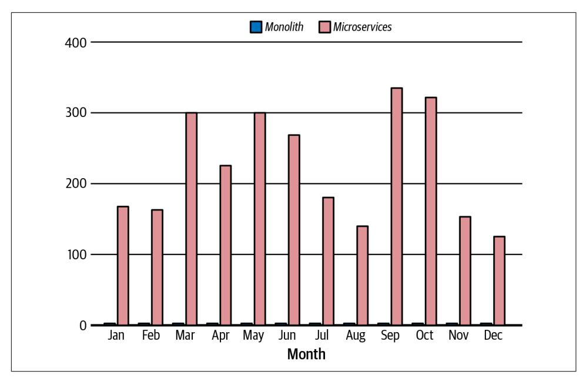

*Figure 2-1. Before-and-after comparison of numbers of deployments.*

Additionally, when there were reports of issues, we could automatically roll back the changes in minutes. I had the full context of the change in mind because I had only just finished it. And we did roll back changes because an experiment didn't have the impact we expected.

What I mean here by experiment is something specific. Linda Rising pointed out in her presentation *[Experiments: e Good, the Bad, and the Beautiful](https://oreil.ly/2n96R)* that an experi‐ ment is something that has a hypothesis, that can fail, and that has a control group. For most organizations, those things are not in place and so experiment just means *try*.

Although Linda was talking mostly about experimenting with process, exactly the same thing applies for experimenting with product changes.

But people do not like to invest time and effort in something and then throw it away. This is the [sunk cost fallacy.](https://oreil.ly/cL4gA) To experiment, you need to be willing to fail, so you need the experiments to be small and cheap.

As discussed in [Chapter 1](#page-30-0), *Accelerate* identified four key metrics associated with highperforming technology organizations. These metrics are often referred to as the DORA metrics because they were first identified by the DevOps Research and Assess‐ ment (DORA) group through its State of DevOps reports. The metrics are:

<span id="page-65-0"></span>*Deployment frequency*

How often an organization successfully releases to production

*Lead time for changes*

How long it takes from committing code to having it go live in production

*Change failure rate*

The percentage of deployments into production that break things

*Time to restore service*

How long it takes to recover from a failure in production

High-performing organizations have a higher deployment frequency, a shorter lead time for changes, a lower change failure rate, and a shorter time to restore service when something goes wrong.

The first two metrics are about how quickly you can deliver value. The last two are about how stable you are while moving fast.

So why do those first two DORA metrics matter?

## **High Deployment Frequency**

Deployment frequency is really measuring how small your changes are, because if you are writing the same amount of code, releasing 100 times a week versus once a week means that each release is a lot smaller.

Small changes are easier to understand. This is a benefit to code reviewers, who will find it a lot easier to understand what the code is trying to achieve.

It also helps you to isolate the impact of each change. If you release a lot of code at the same time, it can be hard to work out what is having an impact: did more people click on this button because it got moved to the top of the screen, or did a seemingly unre‐ lated change on the same page make the button stand out more?

Finally, if something goes wrong, rolling back the release will also undo every other change packaged in the same release. You may even struggle to work out which change caused the problems.

When you are deploying frequently, you can deploy each change independently, in its own release.

That means you know exactly what changed. You can measure the impact on the business and operational metrics you care about. If something goes wrong—for example, you see users unexpectedly dropping out in the middle of a task, or an increase in error rates—you can easily roll back the release and undo the change.

## <span id="page-66-0"></span>**Short Lead Time for Changes**

Lead time for changes for the *Accelerate* authors is the time between committing code and seeing it running successfully in production. Faster is better—but why? Because it means we get faster feedback on what we have built.

Being able to make a change with a very short lead time means that you can have the conversation about the change and on the same day, make it live.

You aren't having to remember what happened days, weeks, or months ago, which helps if something goes wrong and you need to fix it. But, the more important aspect is that a feature is also quicker and simpler to remove, if necessary.

If you want your product development to be driven by metrics, by data, then you should expect some changes to have an unexpected impact. Maybe the change actually means you do worse on the metric you were targeting!

If that happens, you need to be willing to undo the change.

Small changes and short lead times make it much more likely that you'll choose to undo a change. First, you haven't had to invest a lot of time and effort; there aren't that many sunk costs.

There also isn't a whole heap of other stuff built on top of your code change in the time between you making it and seeing it in production, so reverting the change isn't expensive. That short period between writing the code and deploying it also means you're more likely to check what the running code looks like, because you haven't switched context in the meantime to work on something else.

To make small independent changes and release them to production quickly, you need continuous delivery (as discussed in [Chapter 1\)](#page-30-0).

Continuous delivery is a lot easier to implement when your architecture is loosely coupled (this is one of the findings from the DORA research; see Chapter 4 of *Accel‐ erate*, which lists drivers of continuous delivery). Specifically, you need an architec‐ ture where you can change part of the system and test just those changes, without depending on running a full suite of tests in complex shared integration environ‐ ments. This is what allows for a fast deploy.

You also need to be able to deploy the system with negligible downtime so you can do this during normal business hours.

This is somewhere that microservices absolutely shine. When microservices work,<sup>2</sup> you can make changes to a part of the overall system with a high degree of confidence

<sup>2</sup> If you don't have that high degree of confidence, then microservices likely aren't working for you. This book will suggest some ways to tackle that.

<span id="page-67-0"></span>that you aren't going to break something unexpected. And you can test those changes with low-level tests, such as unit tests.


Testing in a microservice architecture looks a lot different—see [Chapter 10](#page-274-0) for a discussion of why we need more automated test‐ ing and also need to get more comfortable with doing more of our testing in production, among other things.

You also need teams that are autonomous and empowered, meaning they can com‐ plete their work and test and deploy their code without communication or coordina‐ tion with people outside the team. This normally means that teams will be crossfunctional, so that they can handle all the necessary steps to get code released within the team. See [Chapter 5](#page-132-0) for more on this.

And finally, you need to know when a change has had an unexpected impact, which means you need insight into your code as it runs in production. This is observability, and is discussed in [Chapter 13](#page-370-0).

## **Running Experiments**

Once you have continuous delivery, and are releasing small changes frequently, what else do you need in place to be able to experiment?

Let me illustrate this with an example from the *FT* where the target was to increase the engagement for film reviews on ft.com.

To run an experiment, you need to:

- Come up with a hypothesis. For example, "If we add review scores to the page listing film reviews, we will increase engagement with individual film reviews."
- Work out what the measure is. For example, "The calculated engagement score will increase." At the *FT*, *engagement* is a well-understood metric made up of a combination of time on page, frequency of visits, and how recently someone has visited.
- Segment your audience so that you have at least a test versus a control group. The *FT* website had an A/B testing framework built in (A/B testing is discussed in [Chapter 10\)](#page-274-0).
- Run the test for long enough to be able to have a statistically significant impact on that measure.
- Stop, do the analysis, and if the hypothesis was proven wrong, turn off the feature.

<span id="page-68-0"></span>What actually happened for this experiment is that people were less likely to go and read the reviews. The metric went in the wrong direction.

If this had been on the old *FT* website, from when I first joined—the one where there was only a release every month or so, and where changes took a long time—I don't think we would have been able to work out whether this was the thing that was hav‐ ing the impact. Also, I don't think we would have reverted the change, even if we had tied it to the feature. By the time we measured it, we would likely have made a lot of other changes on the codebase, so it might have been difficult to revert. But also, this is where the sunk cost fallacy comes in. People do not like to admit they made the wrong bet and invested time and effort into something only to remove it.

But this was on the new *FT* website, meaning the change was small and hadn't taken a lot of time. The code got released as soon as it was finished, the experiment was run, and when it didn't have the impact we expected, the code change was reverted: the review scores were removed from the page listing film reviews.

If you run experiments that never fail, you aren't experimenting. People form incor‐ rect hypotheses all the time. What you are looking to achieve is the ability to realize you were wrong more quickly and at a lower cost!

## **Separating Deploying Code from Releasing Functionality**

There is a bit of a wrinkle in all of this, which is that often, you need to run an A/B test for a fairly long time; certainly for longer than the time between deployments.

You could aim to schedule development work in a way that means changes that impact the same functionality are kept apart, so there is time to run each experiment. But I think that once you are in the world of microservices and autonomous teams, this would be a bad idea. It would couple things together and slow you down: the changes may not even be made by the same team.

Instead, separating the deployment of code from the release of functionality can help. This is done through the use of feature flags. A feature flag is an if-else statement that you put around the new functionality you are adding. Different segments of your audience have the flag set to a different value, and so will see different behavior.

Feature flags (discussed in detail in [Chapter 10\)](#page-274-0) can be built in-house or added through third-party commercial tools. They are beneficial because they can be turned on whenever you like, which means that the code can be deployed when it is ready no coordination needed. Feature flags can be used for more than just A/B testing of course: they are useful for any situation where you want to turn functionality on or off separately from deploying code. That includes:

- <span id="page-69-0"></span>• Coordinating feature rollouts that involve changes to more than one service
- Turning on features after appropriate training for users
- Operational control such as turning off the sending of scheduled emails over hol‐ iday periods

The simplest way to avoid clashes between different A/B tests is to only ever run one test at a time. However, in a company that sees the value of this sort of testing, I sus‐ pect you will quickly fill your available pipeline of tests, and then you need a way to establish which tests can run in parallel without interfering. If you are using feature flags, you will already have moved this decision away from the process of writing and committing code, which means you have avoided coupling work together too much.

## **Handling Work That Goes Across Team Boundaries**

In [Chapter 4,](#page-116-0) we'll talk about organizational structure and how you need to find the natural domains within your organization and align teams to those. The aim is to do this so the boundaries are fairly stable, and at places where most work sits within a domain and can be tackled by a single team or aligned teams.

There will, however, be changes that affect flows across the boundaries you have defined. These generally come from company-level or engineering-wide objectives. You want to be able to work on these changes in a way that regularly delivers value, and lets you continue to move at speed.

An example that affected companies across the world, but particularly in the EU, is the [General Data Protection Regulation \(GDPR\) legislation.](https://oreil.ly/OgZ7M) Compliance with this was a huge piece of work that touched many different parts of the typical software estate.

Migrations of technology, for example where you are changing a vendor or upgrading a common piece of technology, also impact multiple teams and require a lot of coordination.

Where you need to make changes in areas owned by several different autonomous teams, you have two challenges. First, can you get all those teams to schedule the work? And second, can you make those changes separately? Maybe one change needs to come before the other, but you should be aiming to avoid a painful process of coordination and lockstep releases.

There are several things to consider here.

First, you need to make sure that all the teams that need to work on this change are committed to do the work and have a shared understanding of the timeline. This is about *high-level prioritization*.

<span id="page-70-0"></span>In my experience, you should be very wary about building something when the other team hasn't committed to its side of the work (or to working with you in a "feature team"—a team spun up just to deliver this feature). It might never be used, and you could be doing something more useful with your time.

At the *FT*, we used [objectives and key results \(OKRs\)](https://oreil.ly/w4mx4) to define our goals each quarter and measure how well we did on those goals (the objectives are the goals, and should be significant, concrete, and clearly defined, and the key results are three to five measurable success criteria for each objective). That worked well for this kind of shared understanding. Whatever your organization's process for planning where peo‐ ple are going to be spending their time, make sure that this big piece of work is reflec‐ ted within it.

Personally, I learned to seek either a department-level OKR related to any big piece of work, or an OKR for each group or team that needed to work on it, before scheduling it for my team. Sometimes, that would be a promise that there would be an OKR in the following quarter. You have to assess that based on experience within your own organization—do things change a lot, or are these kinds of predictions generally good to rely on?

Next, you need to work out *the best ways to work together*. *Team Topologies*, by Mat‐ thew Skelton and Manuel Pais, focuses on teams as the fundamental means of deliv‐ ering value within a software organization. They identify different types of teams, and I will cover this in [Chapter 5](#page-132-0).

*Team Topologies* also suggests ways of interaction between teams of various types, each of which minimizes coupling and coordination—the things that slow you down.

The three interaction modes are:

### *Collaboration*

Two teams working together—for example, via a feature team that exists until the work is completed and then disbands. You do, however, need to be quite inten‐ tional about working out what will happen with the things this feature team builds once it disbands. Which teams will own them in the long term?

### *X-as-a-service*

One team provides a service that the other consumes. An example here could be where there is a new type of content being published. The web team and the API team can collaborate to define the boundary between the domains, in this case an API. The API team can then add the new API once it is ready, and the web team can start calling it sometime later (there is no need to synchronize these changes).

<span id="page-71-0"></span>

### *Facilitation*

Where one team helps and mentors another team. Even a cross-functional team can't contain every skill they may ever need. That's where enabling teams come in—these teams have particular expertise. For example, maybe they know all about content delivery networks (CDNs). If a product team is adding in web application firewall (WAF) rules, the CDN team can facilitate that process.

These ways of working are discussed in much more detail in [Chapter 6.](#page-154-0) The key thing is to make sure you have a shared understanding of how you will work together on this particular piece of work.

Another thing to consider is how you will *provide ongoing support* for the new feature that crosses multiple teams. Will you be able to tell that it is broken? Will you be able to locate where the change happened that broke it?

When we started this section, we led off with a discussion on boundaries and domains. *Contract testing*, where a team consuming a service writes a test that docu‐ ments what it expects from the service, can help here as it allows you to put some‐ thing in place at the boundaries between domains. For example, if the web team is calling an API, the contract can specify the expectations that in the response there will be a [universally unique identifier \(UUID\)](https://oreil.ly/dnQry) field, or that a list of content is never returned empty.


### Contract Testing as a Forcing Function

Maybe the web team shouldn't expect a minimum of two items in a list of content! Putting contract testing in place acts as a useful [forcing function](https://oreil.ly/OXMK-) for visiting your assumptions and thinking about what your code will do when those assumptions aren't met.

Contract testing runs when the service being called is being rebuilt and tested. This means that if that service breaks the contract with the web team, the team that owns the service should know before they push that code live.

I hope this section has shown that microservices can really help you to deliver busi‐ ness value through frequent code deployments.

But there is more to a successful architecture than being able to deploy code hun‐ dreds of times a day (although that is a very good start). Let's talk about those other aspects that matter.

## **Adapting to Changing Priorities**

The next aspect of effectiveness I want to talk about is how you adapt to change, and in particular, change in where you need to focus your efforts.

<span id="page-72-0"></span>When moving to a microservice architecture, you need to find the boundaries between domains, to separate out subsystems. Let's assume for the moment that you have done that (we will return to that particular challenge in [Chapter 4\)](#page-116-0) and that those boundaries are allowing your teams to work autonomously. Let's also assume that your services are owned by specific teams (I will argue in [Chapter 9](#page-244-0) for the importance of this).

That still leaves you with a challenge. Let's say you have two teams: A and B. Both have a backlog and are making changes, but in fact, the work planned for A is much more likely to bring in significant revenue. How do you get more people working on A's backlog?

Things change in organizations all the time. Different people join, with different views of what is important. But also, the industries we work in change. New possibili‐ ties arise. Perhaps new legislation is enacted and you need to react to it. Ultimately, you need to be flexible.

In general, the move to microservices has come hand-in-hand with an associated move from project-based to product-based working. Projects are about delivery of a particular piece of work, which is considered *finished* at the end of the project. But of course, someone still needs to maintain software even if the project team has disbanded.

Product-based working fits with the aligning of a team to a domain. They own the domain, the outcomes, and the software they build, long term. They can decide how to best serve their customers, rather than following a plan defined outside the team.

This allows longer-term work on something, but there is still the question: what happens when you achieve a big goal, for example you complete the rebuild of something?

You can maintain a team of the same size but it's likely that the work the team does will be smaller and less impactful. If there isn't an obvious next phase of that work, would it be better to focus some of those people onto something else that badly needs to be built or rebuilt?

To do this, you need to make it relatively easy to change the organizational structure to have more people working on one area of functionality and less on another, either permanently or in the short term. That is where the idea that microservice architec‐ tures give you flexibility to use whatever language, database, or tooling you want starts to come off the rails.

It's good for both developers and the organization for people to move around occa‐ sionally—because people and teams get to learn new things—but it's much more dif‐ ficult to move if things are very different in the new team. You may have to learn how to work with a new team, and new process, and new tech. This may not be tech that

<span id="page-73-0"></span>you already know—or like. Learning new things can be fun, but not when you feel you are starting from scratch.

Changing programming languages can be particularly painful, in my experience. It's not particularly about whether someone can pick up a different language, although there are definitely some transitions that are easier for people to make given the fun‐ damental properties of the language. It's more about whether someone has invested time in building expertise in their language of choice, and whether they feel this is going to move them in a direction they don't want to go, for their career and for future opportunities. If you are a Java developer, maybe you don't want to move to a programming language that is far less widely used, because it may limit the job opportunities available for you.

If you want people to be able to move around the organization, you will find it easier if you have some consistency in how things are done. This includes tools, processes, and languages. Many organizations who have successfully moved to a microservice architecture—companies like Spotify, Skyscanner, and Monzo—have created what Daniel Bryant calls "a Heroku-like CLI for their developers, so that a command like *create new microservice* spins up some scaffolding, plugs into CI, plugs into pipelines, plugs into observability."<sup>3</sup>

One thing I won't dig into here, although it is important, is the challenge of moving people from one domain to another. Where people have built up their domain knowledge—and in an autonomous empowered team, I expect people to develop a fairly deep understanding of the domain, moving beyond the ["feature factory"](https://oreil.ly/UqciW)—they may resist a move. I will only comment that it's better to have willing volunteers than to force people. It can be facilitated if people get the chance to learn something new or to fill out something they need to do to get promoted, or even if there is an explicit promotion opportunity: "please apply for this senior-level role!"

Somewhat related to this is where there is a completely new opportunity and you need to move people into that area rather than recruiting a completely new team. I see that as a special case of this prioritization. There are additional challenges in this case of setting up tools, processes, etc., particularly if your organization doesn't have a lot of standardization in place.

Engineering leaders have a responsibility to make it easy for our product leadership to make this kind of big cross-team prioritization call that relates to company-level objectives. It's much easier to choose which items on a team's backlog get done than it is to say that this isn't the right backlog to be working on: if the tech provides a bar‐ rier, it is even less likely that this call will be made.

<sup>3</sup> As quoted in ["The Future of Microservices? More Abstractions"](https://oreil.ly/z5xn7).

## <span id="page-74-0"></span>**Maintaining Appropriate Service Levels**

An effective organization needs to run software effectively, not just build it effectively.

Things go wrong in any production system. When they do, what kind of impact is there, and how easily can you restore service? Can you tell when something impor‐ tant is broken, fix it quickly and with the minimum of stress, and avoid cascading failures? Do you have service levels in place so you know how urgent it is to fix this problem?

Microservice architectures are unlikely to be something that a separate team can fully support. Application developers will likely be doing a lot more thinking about how to maintain service levels, and will be involved in at least some of the production inci‐ dents that happen: they are simply the only people with the relevant knowledge to fix a problem.

One of the advantages of a microservices-based architecture over a monolith is that the blast radius of a failure is smaller. If you release a bad code change to one service, there should not be an impact on a service that doesn't rely on it either directly or indirectly.

What that means is that people can probably still use your system, but maybe not all parts of it. Maybe they can browse and put things into a shopping basket but they can't buy those items. Maybe they can read the news on your website but they can't take out a new subscription.

The flip side is that microservices-based architectures move the operational complex‐ ity out of the services and into the connections between them, and often when things go wrong there, it is harder to work out what is going on and to fix it. You may not even know what services call yours!

Because the system is distributed, things go wrong more often—for example, a call fails because the instance being called is no longer there, or something times out. We can and should build resilience into the architecture, but that means we need to take care not to alert for an intermittent failure that has already been dealt with through a retry, and we need to be careful that we don't end up with a cascade of failures as all our services send a bunch of retries through to a service just getting started up. Often, when things go badly wrong for a microservices system, it's because lots of small things all combined to create a storm of retries or alerts.

## **When a Release Goes Wrong**

This is where the other two DORA metrics come in: change failure rate and time to restore service. These are about how stable you are when moving fast.

<span id="page-75-0"></span>If you are releasing small changes, you will understand what the impact should be when they go live. You should see a much lower rate of failed changes—and that's backed up by the research in *Accelerate*.


This is a much lower *rate* of failed changes, but the absolute *num‐ ber* will likely go up. However, 5 out of 12 releases failing with the monolith has a very different impact than, say, 20 out of 2,500 releases failing with microservices, precisely because those 20 fail‐ ures are easy to spot and affect far less of the system.

But time to restore service isn't only about reverting a change. Sometimes, things go wrong and there is no obvious change to revert.

That can happen with configuration changes that don't live in code—for example, AWS or API gateway keys. If a key is rotated but the developer doing it misses a place where it is used, you find functionality breaks.

There are two key things that allow you to maintain a high level of service, while making lots more changes. First, can you quickly work out that something has had an unexpected impact? This is about knowing what metrics matter, and being able to tell when they are impacted—whether these are business or operational metrics. This is discussed further in [Chapter 13.](#page-370-0)

The second thing is to be able to quickly recover when you have a failed change. Here, the same things that allow you to roll out changes quickly also let you restore service quickly, whether that is by rolling back a change or by rolling out a fix. You use the same automated pipelines to fix that you do to release the code in the first place.

## **Knowing When Something Important Is Broken**

Can you identify that something important is broken? With microservices, you can have a lot of "noise" from alerts.

Partly, you get a lot of alerts firing because you have a lot more individual services and a lot more monitoring checks that might result in an alert; 100 services means 100 times as many checks.

But also, you have a distributed system. Calls made over HTTP and lookups using DNS are more likely to have issues than a call between functions in a single process in your application.

There is a classic paper by Richard I. Cook—["How Complex Systems Fail".](https://oreil.ly/5eELN) It's not specifically about software systems—the paper mentions transportation, healthcare, power generation—but the points in it apply for microservice architectures as well. Complex systems have multiple levels of defense against failure, which generally

<span id="page-76-0"></span>work. It normally requires multiple failures at the same time for an incident to occur. But this also means that the normal operational state is to run with failures happening.

Distributed systems are complex systems. As Charity Majors says, "Distributed sys‐ tems are never *up*; they exist in a constant state of partially degraded service. Accept failure, design for resiliency, protect and shrink the critical path."<sup>4</sup>

So, we build distributed systems differently (this will be the focus of [Chapter 12\)](#page-342-0).

We build microservices to be robust, through redundancy: multiple instances of a service, in different availability zones and maybe also in different regions.

What this means, however, is that you may have alerts going off for an instance of a service, but the other instances are fine and your system as a whole is working as expected. There is nothing you need to do: the system will fix itself. Those alerts do not indicate an action you need to take.

On the flip side, you can also find in distributed systems that a subtle underlying fault, rather than a total failure, has left you with a "gray failure." This happens when at least one user of the system sees it as unhealthy, but your own internal monitoring is unaware that there is a problem.<sup>5</sup>

Understanding that there is a real impact on some functionality you care about, where you need to do something to fix it, is important here. Not all checks that fail should result in an alert.


Even working out what your stakeholders would view as "real impact" can be a challenge. People don't have an instinctive grasp of what "too slow" would mean in terms of target numbers. And also, context matters. I can tell you that being unable to publish a story for 10 minutes is much more serious when there is breaking news than on a Saturday at 3 a.m., but that kind of nuance is hard to capture.

One approach is to focus on your [service level objectives \(SLOs\)](https://oreil.ly/DmnQz) and alert when those are not being met. An SLO is a target value or range of values—for example, that you want the search to return results "quickly," defined as "in less than 100 milliseconds." Choosing and agreeing on SLOs can be complicated, and I will talk about this more in [Chapter 12](#page-342-0).

<sup>4</sup> This is one of many good points about what ops looks like now in ["Ops: It's Everyone's Job Now".](https://oreil.ly/EutFm)

<sup>5</sup> Gray failure is the subject of *[Gray Failure: e Achilles' Heel of Cloud-Scale Systems](https://oreil.ly/W84az)*, and coping with this sort of partial failure will be discussed in more detail in [Chapter 13.](#page-370-0)

At the *FT*, we focused on business capabilities—the things our customers wanted to be able to do—and aimed to monitor whether these were functional. That could be via monitoring of endpoints from outside the *FT*: a call to *<https://ft.com>* from various locations around the world is an effective test for problems with different hosted regions, and for problems with things like our CDN or DNS that were part of our ability to deliver the news.

For other functionality, such as publishing an article, what you care about is largely internal and is not something where you can make a request and look at the response to see if it has worked. Here, we tried an approach of writing an end-to-end test that ran as a kind of monitoring in production. In this case of publishing an article, the test would publish a known article from the newsroom content management system and then check for an updated timestamp for the same article on the website.

This was complicated to get arranged, but when in place, things like this can help you realize when you have a real problem with business functionality that spans several domains.

A related challenge is whether you can work out where to focus your attention when things *do* go wrong. I found when first working on a microservice architecture that monitoring whether an application could connect to the services it depended on (which worked well for a monolithic architecture) caused so many low-level alerts that it was hard to single out which service was having problems. This is due to the complicated web of dependencies, as shown in Figure 2-2, where a naive approach to monitoring could lead you into trouble. A failure at the database layer can cause alerts in the applications connecting to the database, and also in applications connecting to *those* applications. It can be overwhelming!

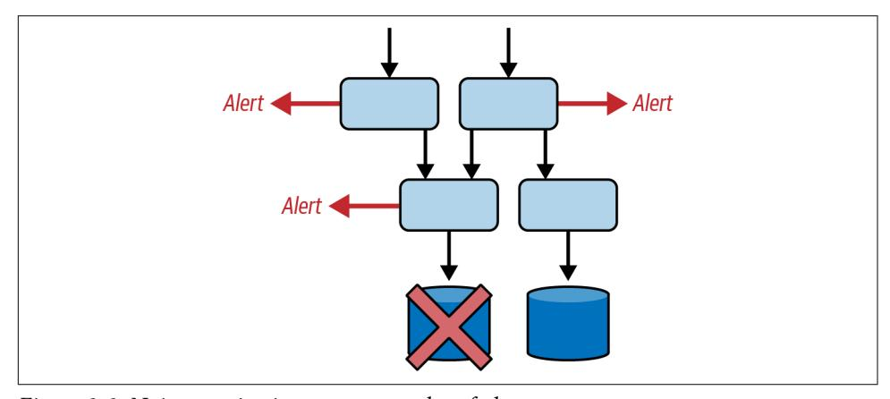

*Figure 2-2. Naive monitoring can mean a lot of alerts.*

<span id="page-78-0"></span>I talk about the types of checks and alerts you actually need as part of discussing the complexity of operating this type of system—at great length, because I think it is super important to understand if you are adopting a microservices approach—in [Chapter 13.](#page-370-0)

## **Restore Some Level of Service Quickly**

Can you mitigate or fix an issue within an acceptable amount of time? What "accept‐ able" means is going to be different for different parts of your software estate, and having a good understanding of that is your first challenge.

I like to think in terms of mitigate first, fix next, because often our first reaction as a developer is curiosity about what is happening—but you can make things better without understanding why they are broken. Failing over to run solely from a region that isn't alerting, or scaling up the number of instances are both things that can work on a temporary basis to improve matters while you work out what is going on. Simi‐ larly, restarting services can be effective if there is a problem with a memory leak. Building this sort of resilience into your system is covered in [Chapter 12](#page-342-0).

Sometimes, mitigation can be done by a first-line team—if there is good documenta‐ tion of the service. I cover how to get decent runbooks in place in [Chapter 8.](#page-216-0)

Typically, I would expect a first-line team to do a couple of things: first, to check whether there are any recent changes in this area of the system. At the *FT* we created a Change API that logged changes to a data store and also into a Slack channel. It is not a bad idea to roll back a code change where the timing is aligned *even if you don't think it can be related*. The worst that happens is that it doesn't fix the problem, and provided you have an automated release process, you can roll it back out again.<sup>6</sup>

Second, I'd expect this team to be able to failover from an active to a passive region, or to send all traffic to one active region when the other seems to be having problems.


Make sure you have tested that you have the capacity in a single region to serve all traffic. Otherwise you could make things worse when the single serving region collapses under the load!

Scaling up is another option. I would be more hesitant about restarting services because if the problem is load, this could make everything worse: starting up new instances then shutting down the old ones is one way to avoid that.

<sup>6</sup> This applies for code changes only. Where there were changes to data or a database schema, rollbacks can be a lot messier.

<span id="page-79-0"></span>Once we get beyond these options, most of which can be automated, you are in the realm of complicated systems where it is likely the failure is novel and unpredictable, in the sense of "not something that people predicted would happen."<sup>7</sup> At that point, you need the development team to get involved.

That means you really do need every service to be actively owned. For me, that has to be by a team, not by an individual. I cover strategies for this in [Chapter 9.](#page-244-0)

And that team needs to be able to drill into what is going on with the system. This is where observability, as opposed to monitoring, is key.

Observability is about being able to look at the outputs of a system running in pro‐ duction to answer questions about what is happening.

Observability ultimately comes down to being able to trace an event through your system. At a minimum, that means structured logging and a unique correlation ID attached to the event when it enters the system, and propagated on all calls. There is a lot more to this, which I discuss in [Chapter 13](#page-370-0).

## **Avoid Failure Cascades**

You need a very different mindset when you are building services in a microservice architecture. You need to build defensively.

You are more likely to find that something you depend on is unavailable for some period of time. As an example, zero-downtime deployment of microservices means that your service can be talking to an instance that disappears as it is restarted or replaced by a new instance.

You don't necessarily know who is going to call your service, and can't rely on them to throttle calls to you. It's easy to get this wrong and send a "thundering herd" to a ser‐ vice that is just getting back into a healthy state.

It is up to you to protect your service.

When I was running the content API teams at the *FT*, a developer in the web team was testing new functionality and accidentally made 30,000 requests in parallel to one of our APIs. This brought down one of our production clusters.

We failed over with minimal impact—before we knew what was happening: mitigate then fix! But our cluster going down wasn't the fault of that developer, it was our own problem. We had an API gateway in front of our service that could have been config‐ ured to throttle requests. We hadn't set that throttle to an appropriate limit. What

<sup>7</sup> In [Cynefin terms,](https://oreil.ly/E7n72) these systems are complex rather than complicated and failures can very often be chaotic.

<span id="page-80-0"></span>should have happened is that the developer's requests were throttled, either being dropped completely or being queued and processed slowly.

You should also be a good citizen yourself. You need to have backoff and retry in place for calls you make, and you probably want to think about circuit breakers for when a downstream system is unavailable for a while: circuit breakers stop you from hammering other services. They trip when there are a number of errors in a short time span, stopping further calls until the service is recovered. They also mean you can fail fast, i.e., stop doing work if you aren't going to make a call.

Finally, you should build your service so it starts up regardless of whether it can talk to the services it depends on, and that it shuts down gracefully. In a microservices world, and especially when running in containers, things don't stick around for a long time.

The use of service meshes and API gateways, discussed briefly in [Chapter 12,](#page-342-0) can help a lot with this defensive approach.

It is a bit of a mindset change. When I was working on a monolith, I rarely thought about what would happen to my code once it was running in production. As we adopted microservices, development teams needed to consider this. It makes you a better engineer to have this broader focus, but I could have done with a bit more guidance on what it meant—my hope is that this book can provide guidance to you if you are making this switch.

## **Spending Most of Your Time on Meaningful Work**

If you *can* write new features and deliver them quickly, but most of your engineers are working on other things, you are not being as effective as you could be.

Effective organizations structure themselves to enable most engineers to focus on business value, but the autonomy and empowerment that microservice architectures enable can bring challenges.

As I mentioned in [Chapter 1](#page-30-0), with the shift from writing a monolithic system to a microservices-based one, the things I spent time on changed. I went from spending 90% of my time focused on development (designing, coding, testing) to more like 50%. This was because I was no longer committing code that someone else packaged up and deployed onto a relatively stable set of servers.

Now, I would be the one who set up the service and released the code, which meant for a new microservice I would go through multiple steps before any code could go live. At a minimum, that would mean spinning up a VM (later, writing container con‐ figuration), creating a build pipeline, setting up credentials, and wiring up access to other services or a database. To allow my team to support the service in production I would have to set up log aggregation and other observability tooling. Sometimes this <span id="page-81-0"></span>could mean also setting up additional infrastructure for the cluster the service would run on, such as databases, identity and access management (IAM) policies, and load balancers.

This was nearly a decade ago, and we were still learning what running a microservices-based architecture involved. Also, our central teams were still support‐ ing existing types of architecture: they weren't working on tooling for our new approach—so "you build it, you run it"<sup>8</sup> meant product teams like mine took on a lot, reducing the amount of time we spent on writing new features.

But if every product development team is doing this, you are wasting time solving the same problems, and you will not be releasing as much value to the business. You don't want to have a significant portion of your team working on infrastructure and resil‐ ience rather than business features!

There was a time when I was working on our content platform, prior to the existence of Kubernetes. To get the benefit of containerization, we built our own container orchestration platform. Almost half the services in our estate were there to enable us to build, configure, and operate the system, rather than to provide business function‐ ality. Kubernetes removed a lot of that complexity, but not all.

And this brings me back, again, to the idea that microservices give you flexibility to use whatever language, database, or tooling you want. You can do this, but it comes at a cost.

Autonomous empowered teams should be able to choose the right tool for the job. Mostly though, you should expect them to choose something that makes life a bit eas‐ ier, something that is built and maintained by central teams.

Those central teams are what *Team Topologies* calls platform teams (see [Chapter 5](#page-132-0) for more on this). Their focus is on providing well-documented, self-service functional‐ ity for things like setting up and running servers, containers, DNS, CDNs, observabil‐ ity, etc.

They should be building a paved road (discussed in more detail in [Chapter 7\)](#page-174-0)—a set of options that work well together and make life easy for product development teams, abstracting some of the complexity of microservices and reducing the cognitive load on engineers. Crucially, a paved road is not mandatory. You can choose to go off road, but you'll likely find that it is slower going and requires more effort.

See [Figure 2-3](#page-82-0) for an example of the kinds of things the platform teams supported at the *FT*.

<sup>8</sup> Where development teams run their own code in production. Coined by [Werner Vogels in 2016](https://oreil.ly/8hCl1) to describe the approach taken at Amazon.

<span id="page-82-0"></span>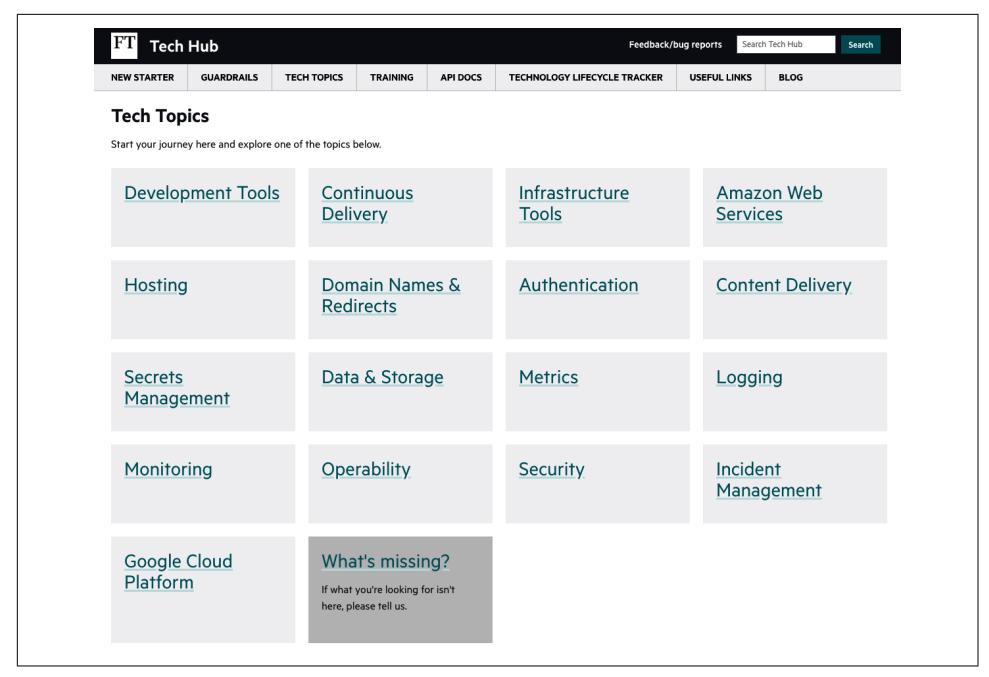

*Figure 2-3. e* FT*'s Tech Hub shows the types of capabilities that can be offered by plat‐ form teams.*

Product development teams that go off road will need to do more work, because they will be the ones supporting things out of hours, doing patching and updates, making sure that logs get shipped, etc. This requires a level of governance to exist, to specify the expectations they need to meet—the subject of [Chapter 11.](#page-306-0)

Having teams in place building a paved road can really help product development teams to spend more time on valuable work. But they will still need to look after their systems, and microservices bring challenges simply because there are more of them. If you need to upgrade a library, you probably have to do it in 20 places, rather than one. Monorepos, where the code for a number of services is stored in the same repos‐ itory, can help here because you can update the dependency once, although you still have to deploy each service to apply that upgrade. Similarly with database upgrades if you have five different data stores rather than one SQL database, you will probably be doing database upgrades five times as often.

Any investment in reducing this toil pays off: that can be, for example, through auto‐ mation or through handing work off to others by selecting PaaS or SaaS options when you are moving off the paved road.

<span id="page-83-0"></span>It's important to enable people to spend as much time as possible on meaningful, interesting work for morale and retention. People leave when they have spent three months just upgrading dependencies.

## **Not Having to Start Again**

Another big challenge if you want to be effective is to resist the lure of starting again.

There's a reason job adverts mention "this is greenfield development"!

We start work on a new system and, after we get the necessary scaffolding in place, we are rolling. It's easy to add new stuff, we have a good-size team, and everything is nice and shiny.

But things don't stay that way.

At some point, the thing you were building is mostly there. By this point, you are more likely to be iterating on something that already exists than building something new. The team might also have reduced in size as people move on to other priorities.

There are some parts of your stack that no one still on the team has ever touched. They are haunted forests<sup>9</sup>—areas that are scary, that you go out of your way to avoid.

Decisions you made, or more likely decisions someone else made, three years ago are turning out to make a lot of work for your team. It's not fun anymore.

With monoliths, this was normally the point where someone made the case to start again, on new technology. But that's not supposed to happen with microservices. The promise of microservices was that if you need to rebuild part of the system, it's simple to do that because the logic is encapsulated in a service, or maybe a few services. You build those services again and—voila!

Unfortunately, that may not be the reality. Often, the problems are at a wider scale: you are facing an upgrade path for something used across your stack, or you need to add something in that doesn't fit with your architecture.

Starting again is often more appealing to developers; you can use cool new tech, and maybe you can even make the case that to move fast you need to hand off the existing system to another team to maintain while you get on with fun stuff (this happens and I've been on the team that had to maintain the old thing).

<sup>9</sup> As [discussed by John Milliken](https://oreil.ly/ByCVQ), based on experience at Google and Stripe.

<span id="page-84-0"></span>But this doesn't make business sense. While you build the new thing, the old thing will essentially be in maintenance mode. When the *FT* rebuilt its website in 2015, it cost £10million and there was essentially no improvement of the live website for nearly two years.<sup>10</sup>

You need ways to continually improve and replace parts of your architecture—to combat entropy and tame the haunted forests.

Sam Newman recently introduced me to the concept of "habitability." This is an idea developed by Richard P. Gabriel, based on ideas from the architect Christopher Alexander,<sup>11</sup> that we want our software to make us feel at home; to be easy to under‐ stand and to change. "Habitability" is about whether your system feels livable.<sup>12</sup>

This is about finding a balance between the needs of the whole (the grand design or architecture, which won't change often) and the needs of the parts (the inevitable changes that various parts of the software go through). Software must be habitable because it always has to change. Alexander says the same about buildings. They don't get finished, they get modified, reduced, enlarged, and improved. Piecemeal change is normal and if we can make that easy, we will probably find ourselves in a good place.

Microservices should be habitable, because with microservices, change is a first-class design consideration.<sup>13</sup>

Some of the same topics we discussed about how to ensure people spend most of their time on meaningful work apply here as well. For example, consider using a paved road that someone else provides, where they do the majority of upgrading databases and migrating platforms to newer tech. Additionally, choosing PaaS or SaaS solutions where you do move off the paved road helps prevent these tasks from fall‐ ing to your teams to tackle.<sup>14</sup>

Paving the road can also apply within your team. You can settle on particular patterns for how you do things, and agree on an approach for moving off that paved road.

<sup>10</sup> Details from my former *FT* colleague Anna Shipman's QConLondon 2022 talk, ["No Next Next: Fighting](https://oreil.ly/jA8vK) [Entropy in Your Microservices Architecture"](https://oreil.ly/jA8vK), which talks about the ft.com team's strategy for not having to start again.

<sup>11</sup> An architect of buildings, rather than software.

<sup>12</sup> See "Habitability and Piecemeal Growth," an essay in *[Patterns of Software: Tales from the Software Community](https://oreil.ly/mqHBo)* by Richard P. Gabriel.

<sup>13</sup> As Mark Richards and Neal Ford note in the preface of *[Fundamentals of Software Architecture](https://learning.oreilly.com/library/view/fundamentals-of-software/9781492043447)* (Sebastopol: O'Reilly, 2020).

<sup>14</sup> Effectively, you still have a paved road, it's just paved by someone external. Thanks to Benji Weber for making this point!

<span id="page-85-0"></span>It's also important to make sure all your services are actively owned. Active ownership means you need to understand the service well enough to be able to fix it if things go wrong. It should also mean that you invest time in fixing issues as they come up—an actively owned system shouldn't get to the point where a dependency is out of sup‐ port before you suddenly realize you have a problem.

Find the time to discover the places that cause you pain, and invest time in making things better. This can be a challenge. Often, it is hard for engineers to make the case for spending time away from feature delivery. You need to talk about these changes in terms that mean something to product owners and delivery folks. For example:

- "This change will allow us to create new services in half an hour rather than 1 day, so we can spend more time on new features rather than plumbing. Also, automating it means we won't have bugs because someone missed a manual step. This happened 3 times in the last year and took 2 person days to deal with."
- "This fixes a critical security vulnerability. Contracts worth \$4 million depend on certification that will lapse if we don't fix issues of this nature."

## **Keeping Risk at an Acceptable Level**

As someone who used to run an operations department, this is close to my heart. We need to consider risk to be an effective software development organization.

We cannot remove risk. Every decision we make around our architecture comes with risk. Let's consider one example: what is the risk around having a single CDN provider?

If they have an outage, there may not be a huge amount you can do. You will likely find your website is down, and possibly even some of the internal tools you use to support your estate—if they are all available via the public internet. This is even more likely if you are using the tools your CDN provider offers—for example, maybe you are using the CDN to integrate with your single sign-on provider.

But the alternative also comes with risks. Having two CDN providers increases the chance of something breaking, because it increases the complexity of your software estate.

And it comes with costs. If you have two CDN providers, you will be spending more money. What could you spend that money on instead?

And every change then has to be tested for both CDNs. You have to test failover between the two. And now, you can't benefit from the custom functionality that one provider offers, or if you do, you have to work out what happens when it isn't available.

There are similar discussions to have about many other things—cloud vendors, DNS providers, source control, continuous integration tools.

<span id="page-86-0"></span>And there are lots of types of risk—operational, security, and cost.

An "acceptable" level of risk is an evaluation that will be different for every organiza‐ tion. I'd suggest that you don't want to be making that same evaluation in lots of inde‐ pendent autonomous teams, for lots of different areas of risk.

This is somewhere that governance makes a difference. But this should take the form of guardrails and insight, rather than gatekeeping and mandates.

What do I mean by that? Mostly, that you should guide people to do the right thing by making that the default. If they go against that to instead do something that is risky, make sure they understand that. That's more likely to be successful than writing a set of standards for people to comply with. I expand on this in [Chapter 11](#page-306-0).

I don't think any company is going to take a hands-off approach for everything. Some things are too risky. At the time of writing, failing to comply with GDPR can cost up to 4% of turnover or €20 million, whichever is higher. I don't think any team should be empowered to ignore that!

Microservices help with risk in some ways. You can more easily isolate parts of your system—for example, those that deal with personally identifiable information (PII). However, microservices also can result in a lot more work. An example here is secu‐ rity. Scanning dependencies for security vulnerabilities can result in a lot of upgrade work when you have hundreds of services. With something like the [Log4Shell vulner‐](https://oreil.ly/vovoh) [ability](https://oreil.ly/vovoh) of late 2021 it can take time just to realize where you may have a dependency on a vulnerable version, particularly with the widespread use of SaaS and PaaS. For your own code, you can add dependency scanning, and I will talk about that in [Chapter 9](#page-244-0).

## **How Microservices Measure Up**

Mark Richards and Neal Ford's First Law of Software Architecture is that "Everything is a trade-off." Microservices make some things easier, and other things harder, but not impossible. We've discussed the trade-offs and things that help throughout this chapter.

I'd like to finish up this chapter by summarizing how microservices measure up, in the short, medium, and long term.

When you choose an architecture, you also implicitly choose particular software pro‐ cesses and practices. For example, microservices won't work if you have manual pro‐ visioning and deployment processes, little testing, and an old-school operations team.

This does mean that microservices can require a bit of investment to get started, depending on what engineering practices you already have in place. The investment isn't solely in engineering practices—microservices also work best with particular <span id="page-87-0"></span>cultural and organizational structures—and changes to these are not something you can do in days or weeks.

However, there are ways to start benefiting from a microservices approach without a large up-front investment. I'll talk about this in [Chapter 3](#page-88-0) where I also discuss how to work out if microservices are the right approach for you.

For me, microservices shine in the medium term, at the point where you can quickly implement and then get real feedback on your ideas because you are able to release changes as soon as they are ready, typically releasing code many times a day. This delivers real business value.

But what about the long term, and the need to stop and rebuild? Well, microservices offer hope that we won't need to do this any longer, because we should be able to con‐ tinually improve and replace parts of our system. It does, however, still take work to avoid getting into a state where the only way out is a lot of work or a complete rewrite. I will talk about this throughout the book, but in particular, in [Chapter 14,](#page-400-0) which covers keeping things up-to-date.

## **In Summary**

This chapter covered a lot of ground about what is needed for effective software delivery in the context of a microservice architecture. Many of these topics will be covered in greater detail throughout the book, but for now, there are a few key take‐ aways that are worth repeating.

Successful architectures need to deliver over different timescales: architecture is the stuff that's hard to change later, so you want to still be benefiting several years in.

Microservices do require a bit of investment to get started, both in terms of tools and technologies but also organizational and cultural changes.

Microservices shine because they allow teams to work autonomously, delivering busi‐ ness value quickly. However, in the longer term, as microservice architectures mature you can end up in a mess, with small teams trying to support lots of services, overloa‐ ded with operational and maintenance challenges.

This chapter discussed those challenges and introduced the tools, techniques, and processes you'll need to have in place so that you can maintain and sustain your architecture for the long term. This is what Parts [II](#page-114-0) and [III](#page-242-0) focus on.

But first, in the last chapter of [Part I](#page-28-0) we're going to dig into how to assess whether microservices are a good fit for you and for your organization. We'll also discuss how to try out this architecture with a minimum of up-front effort.

# <span id="page-88-0"></span>**Are Microservices Right for You?**

Microservices are now a mainstream architectural choice, but they are not the only viable option, and you shouldn't adopt them by default. You need to take time to work out whether they are the right solution for you. That depends on you and the problems you are facing: what kind of organization are you, what technology do you have in place, and what skills do your teams have?

The answer to "why microservices?" should be "for business reasons." That should be true of pretty much *every* technology decision we make—a decision should allow you to do something that matters to your business, whether directly (for example, allow‐ ing you to introduce new functionality more quickly) or indirectly (for example, through reducing risk or reducing cost).

Understanding what you are hoping to get out of adopting microservices is important because it helps you to prioritize those specific outcomes. It guides you on what measures you should be tracking, and it can tell you when you've "done enough."

However, even if you have a problem that microservices can help with, you also need to look at whether you will be able to get the conditions in place to successfully adopt microservices. This is important because if you can't make the necessary organiza‐ tional and cultural changes to be successful, then you could end up in a worse posi‐ tion, with a more complicated architecture but without benefiting from being able to deliver better business outcomes to your organization.

Let's start by discussing reasons you might move to microservices, before looking at the things you need to have in place to be able to make that move successfully.

## <span id="page-89-0"></span>**Reasons to Choose Microservices**

Microservices are very often a solution to an organizational problem rather than a technical one. That organizational problem is often about enabling large numbers of people to work on the system effectively, in parallel. It can also be about developer experience, which is important in speeding up delivery of value—because developers don't have to fight the process and the tooling—but also in recruiting and retaining people.

Having said that, there are also a number of technical reasons to choose microser‐ vices. Many of these were introduced in [Chapter 1](#page-30-0) as benefits of this architectural style; here I'll be digging deeper into why each may lead you to decide that microser‐ vices are what you need. All these technical reasons result from the boundaries that a microservice architecture puts between different parts of the system. These bound‐ aries mean that you can scale just part of the system, or implement auditing or com‐ pliance only where you are dealing with particular types of data. A failure can be limited to a single part, making the system more robust. You can deploy the different parts of your system independently, meaning you can move away from one big release and toward small releases when changes are ready. Finally, you can use differ‐ ent technologies for part of the system, ones that better fit the requirements.

## **Scaling the Organization**

Up to a point, adding new people to a team increases the productivity of the team. Different members will bring different skills, and there is more scope for people to work on the tasks that interest them and that they can do well. So a team of five is likely to be more effective than a team of two. But what about a team of 20?

I expect your intuition is that a team of 20 wouldn't work. And that has to do with the nature of a software development team. People on a software development team don't work independently; they make decisions together, and communicate about the work they are doing.

That communication becomes more of an overhead the more people you have on that team. For example, when you move from five to six people in a team, the number of lines of communication goes up by 50%, from 10 to 15 (see [Figure 3-1](#page-90-0)).

<span id="page-90-0"></span>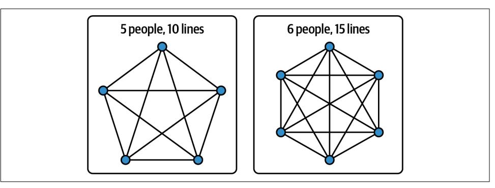

*Figure 3-1. e number of communication links in a team of six is 50% higher than for a team of five.*

Not every interaction in a team needs to happen 1-1, but plenty do. Think about a daily standup. If each person gives a 3-minute update, a 15-minute standup for a team of 5 becomes an hour for a team of 20.

And it's not just about the time spent in communication. As a team gets bigger, there are more opportunities for miscommunication to occur, making it harder to maintain a common understanding of the purpose of the team, and easier to end up with peo‐ ple in the team who have different perspectives on how parts of the system work or what the outcome of a particular task should look like.

Research has shown there is also a tendency for individuals to slack off when working in groups. This ["social loafing" effect](https://oreil.ly/0xX2K) may be related to feeling less personal responsi‐ bility for the output of the team as the team gets bigger, or to a feeling that your efforts just don't matter.

The outcome of all these aspects is that you can't keep adding people to a team and expect that team to continue to function effectively. Jeff Bezos famously introduced a two-pizza limit for teams at Amazon: if two pizzas aren't enough to feed a team, the team is too big. This limit (let's assume it's four to six people, because it's a pretty imprecise guideline) is supported by research by Neil Vidmar and Richard Hackman, where teams of various sizes were asked to complete a task then assess whether the team was too small or too large to achieve optimal results. The cross-over point where people were most satisfied with the size of the team was between four and five people.<sup>1</sup>

<sup>1</sup> Discussed in Richard Hackman's book *Leading Teams* (Boston: Harvard Business Review Press, 2002).

<span id="page-91-0"></span>So, as the organization scales, you split into multiple teams. However, in a monolith, these teams are making changes to the same codebase. By default (i.e., unless you actively design your monolith to prevent it), that means it's possible for code to directly access other parts of the codebase and even the database. This can result in changes made by one team having unexpected consequences for another team that was relying on something that the first team felt was an "internal detail" and therefore safe to change. Alternatively, you can have multiple teams making changes to the same shared files with the associated challenges of releasing those files: what happens when the first team to commit changes to the file isn't ready to push the change live?<sup>2</sup>

Well, it slows you down. *Accelerate*'s research into what high-performing technology organizations have in common identified that these organizations have loosely cou‐ pled teams and architecture, so that things can change in one place without impact‐ ing the wider system.<sup>3</sup>

Loose coupling is about finding the things in your system that change at the same time and grouping them together. That means they can be changed independently of each other. Information is encapsulated inside those domains, with access only via a well-defined interface, which reduces the direct knowledge that different parts of the system have of one another.

Loose coupling means that teams can generally get their work done without having to coordinate with people outside their team. That doesn't mean that there is no interac‐ tion between components: what you are aiming for is to have all access via a defined interface. This means that you got the boundaries right so that the interface for a component is stable and changes infrequently and that most change happens within a component owned by a single team.

For most people, the main reason to adopt microservices is the need to scale the organization. Done right, a microservice architecture is loosely coupled, and that loose coupling allows you to release small changes frequently.

*Accelerate* doesn't advocate microservices, though; in fact, it says that what tools or technologies to use are the wrong questions to focus on. "What is important is ena‐ bling teams to make changes to their products or services without depending on other teams or systems."<sup>4</sup>

<sup>2</sup> I have worked on quite a few monoliths where the architecture could best be described as a ["Big Ball of Mud"](https://oreil.ly/sQTyt): haphazard, sprawling, and the result of pressure to build new functionality without the time to structure the code "properly."

<sup>3</sup> Nicole Forsgren, Jez Humble, and Gene Kim, *Accelerate: e Science of Building and Scaling High Performing Technology Organizations* (Portland, OR: IT Revolution, 2018).

<sup>4</sup> From *Accelerate*'s chapter on Architecture.

<span id="page-92-0"></span>As an alternative, also loosely coupled, you can opt to make your monolith more modular. I discuss this later in this chapter, and it can be a good option when you don't have the conditions in place to make a success of a microservice architecture.

## **Developer Experience**

You want your technical stack to attract good people to work for you and to keep the good people already working for you. The impact of this on technical decisions shouldn't be underestimated.

People are attracted by the technology they will get to use and learn, but also by the culture of the organization. Is there space to be innovative? Will they find it easy to move on in a few years' time with this tech on their resumé? You don't want to do resumé-driven development, but equally, you don't want to make it harder to recruit or retain people.<sup>5</sup> In my view, many organizations adopt technology around micro‐ services (for example, Kubernetes) too early because of this driver.

Microservices are now so widely used that for many people, it's what they expect. Are people going to be hesitant to join an organization that has a large monolithic archi‐ tecture with many teams working on it? Maybe.

Beyond the choice of technology and the signal that sends, there is the actual experi‐ ence of working as a developer using this architecture. The clear separation of a microservice architecture into different domains can mean that it is easier for a new developer to get up to speed, because they don't need to understand the whole system, just the part they are working on. That goes for supporting the application too. It should take much less time to learn how to support a small application than the whole of a monolith.

The local developer experience should be smoother than working on a monolithic application. You should not have to spin up the whole system on your laptop to work on a particular service. That means a shorter development cycle time of code, run, test, because it should take only seconds to compile and restart your application and to run the automated tests just for that service. You may not even need to do *local* development anymore with the rise of cloud development environments, already widely used in big tech companies.<sup>6</sup>

For many developers, the autonomy a microservice architecture gives them is also a major attraction, because it greatly reduces the amount of time they spend waiting for someone else to take an action. If you are used to doing a release once a month, being able to do a release in minutes is a significant benefit.

<sup>5</sup> In the UK, resumé-driven development is known as CV++!

<sup>6</sup> See, for example, the blog post ["The End of Localhost".](https://oreil.ly/dcoNt)

<span id="page-93-0"></span>A caveat, though. It's easy to get microservices wrong and end up with a worse devel‐ oper experience. This can be due to a lack of tooling or inconsistencies in how things are done from team to team, or it can be due to trying to work in ways that don't really make much sense in a microservice architecture. A simple example, already mentioned in [Chapter 2,](#page-62-0) is when I first built microservices, we implemented an endto-end acceptance test suite. It was very hard to maintain because data fixtures needed to be set up in multiple services. It coupled all our services together, and it slowed down development drastically. One developer made a change to business functionality that took half an hour. It then took over a week to fix all the acceptance tests because of the coupling and bad structure.

This is related to the challenge I mentioned in [Chapter 1](#page-30-0). The developer experience in microservices is different, and if you don't adapt the ways you work, you could struggle.

## **Separating Out Areas with Compliance and Security Requirements**

While securing microservices can be a challenge, because there are so many potential entry points into your system and because data is being sent over the network far more, they also allow you to separate out the parts of your system that handle sensi‐ tive data, or that have particular compliance requirements.

This can be, for example, payments or PII. Segregating this information to a single data store, accessed by a single service, can make it a lot easier to make sure you are complying with requirements like the [Payment Card Industry \(PCI\) standards](https://oreil.ly/3Xivz) or [General Data Protection Regulation \(GDPR\).](https://oreil.ly/KsLYU)

The teams working on the service will need expertise in these requirements—for example, understanding what they can log without concern versus places where they need to log to somewhere that most people can't access—but other developers won't. They are protected by the boundaries put in place between these services and the rest of the system.

Of course, to benefit from this, you need careful design and implementation. It's all too easy to find that your PII data is not quite as locked down as you thought; for example, there's no point having access to subscriber information in logs locked down for your log aggregation tool if someone has also sent those logs to a distributed trac‐ ing or error tracking system that doesn't lock down access!

## **Scaling for Load**

With a monolith, if you need to scale, you have to scale the whole thing.

With microservices, you can scale just the parts that need to be scaled. You can also run different services on different hardware, optimizing for the characteristics of that service—for example, whether it is I/O bound or CPU bound. And finally, if you have <span id="page-94-0"></span>some parts of your system that are only needed at specific times, you can scale them right down or even turn them off.

All of these options can save you money and increase performance. This kind of scal‐ ing is a key reason that companies like Google and Netflix use microservices (it may be less relevant for companies operating at smaller scale).

Another advantage of a microservice architecture is that the application data is owned by individual services. That means each data store will contain less data, mak‐ ing it less likely that you will need to [shard your database](https://oreil.ly/Cc7HT) across multiple servers. Sharding makes things more complicated since you need to be able to route requests to the appropriate shard. Moving to microservices that each own their own data can avoid this complexity.

There is some nuance here. First of all, people do make the choice to use a single database to back up multiple microservices. This can be because it feels like overkill to have a database per service, although the example I have in mind is for the Content API team at the *FT*, where we had multiple services writing into the same graph data‐ base, because we needed our read microservices to be able to query across the graph of data. Whatever the reason, though, I think modeling which service owns which parts of the data is essential.

The other point is around the other types of data you have in a system: operational data like logs and metrics, analytics, or the data used for business reporting. These are generally all in a single database, with large volumes of data (far larger than in a mon‐ olith in many cases). Microservices do bring scale challenges!

## **Increasing Robustness**

As mentioned in [Chapter 1,](#page-30-0) with a monolith, it's hard to degrade gracefully. If some‐ thing goes badly wrong, your whole system will be unavailable. With microservices, you can design your system so that losing one service doesn't affect the rest of the system. This can involve failing back to a simpler solution. For example, let's imagine an online book store. If you can't access information that allows you to show some‐ one a personalized list of recommendations, you can show a list of the most popular items instead.

This does take effort, because you need to decide what to do in case of partial failure. But it also means that failure has a smaller blast radius.

Another thing that a microservice architecture allows is the ability to choose different levels of resilience for different parts of the system. With a monolith, if you need high availability, you need the whole monolith to be deployed in multiple availability zones and multiple regions. But with microservices, you can accept that some parts of the system are effectively "nice to haves"—which enables you to reduce cost and complexity by running those systems with a lot less redundancy. So that list of <span id="page-95-0"></span>personalized recommendations might be a lot less important than the ability to search for a particular book.

## **Increasing Flexibility**

Sometimes you find a part of your system that is quite different in its requirements. With microservices, you can choose different technologies for that domain much more easily.

To expand on my example from [Chapter 1,](#page-30-0) when the *FT* had a monolithic Java app and a relational database for the content publishing platform, metadata had to be stored in that database. But metadata is a graph: an Author is linked to many Articles they have written. The Articles mention Organizations, which are linked to People the CEO, the Founder, etc.

Graph databases offer much simpler support for queries that navigate that graph. Moving to a graph database for storing metadata, and a document store for storing articles, fit the data we had and the way we wanted to interact with it much better than using the same relational database for both.

Microservices also give you flexibility in testing out these new approaches. You can create a new service that writes to a new graph database alongside your existing ser‐ vice and database, and compare the two. To take another example from the *FT*, my team's move from writing services in Java to writing them in Go started with writing the same new service in both languages and comparing them. We could then decide to start writing all new services in Go, without having to migrate the existing estate.

## **Conditions for Success**

So, let's say you have a compelling reason to adopt microservices. How can you have confidence that this will deliver the change you need?

In this section I want to go over a few questions to ask yourself about your organiza‐ tion and your context, before embarking on using a microservice architecture (whether this is a migration from an existing monolith or a new system built from scratch). If you don't have these things in place already and can't imagine introducing them, you could find microservices a challenge.

These are all positive changes in my experience, whatever architectural style you end up using! So I encourage you to think about what it would take to introduce them in your organization whether or not you ultimately move to microservices. I will talk a little about change management later in the chapter.

## <span id="page-96-0"></span>**Domain Understanding**

The first question is, how well do you understand your domain?

If you are building something new, you probably don't yet have a deep understanding of the domain. That means you will struggle to identify the right boundaries between parts of the system. If you divide up your system now, there's a high chance you'll find you need to move things around later.

This is a good reason to start with a monolith. The early phases of any project tend to mean writing new functionality, which means less contention for making changes to the same code. You should make good progress to start with.

As you work on the monolith, you will start to see code that hangs together nicely and changes at the same time. Then, when you need to move away from that mono‐ lith, you will have a good idea of where to split out a service.

## **Products Not Projects**

Many companies fund development work through projects. A feature or set of fea‐ tures to develop is identified, a team is put together and funded for a period of time, and once those features are complete, the project is "finished." After that point, the system goes into maintenance mode, run by a maintenance team.

This doesn't really work for a microservice architecture. The teams get to make deci‐ sions about the tech they use *because* they are going to support that tech in production. This is good for the quality of the system being built—you think differently when you are the team that might have to pay the price for a particular technology decision.

What it means for the organization is that you need to move to a product-focused approach.<sup>7</sup> You form a team to build a product, and that team will own it throughout its lifetime. That doesn't mean the team won't change, or reduce in size. But it means that there is some continuity between the people making decisions and the people supporting the consequences.

This is a fairly big change, and it can be difficult for leadership to loosen control to the point where they are no longer defining what gets built, but instead setting direc‐ tion and letting the team get on with it. Also, many people would like to think that there is minimal work involved in maintaining an existing product. That's never really been true, but it is even less true with a microservice architecture: you need a continued investment in maintenance and support.

There are two things that can help "sell" the change. First, you should be able to make changes that people care about more quickly. And second, the change from project to

<sup>7</sup> As advocated in Mik Kersten's *Project to Product* (Portland, OR: IT Revolution, 2018).

<span id="page-97-0"></span>product *should* mean more flexibility to meet the needs of stakeholders as they come to understand them, rather than those stakeholders needing to get everything they care about put into scope for a project up front. You need to prove this works though!

## **Leadership Support**

Microservices can require big organizational and cultural changes that take years to complete and affect the whole technology organization. You can't do that without leadership support. Your leaders need to see the value of these changes, and they will need to advocate for them. When you change, for example, from funding projects to funding products, it affects the whole technology organization in terms of the pro‐ cesses for planning and the ways costs are allocated.

The changes you need to be successful with microservices can mean a change in role for many managers. If you move from aligning your teams to discipline, i.e., front‐ end, backend, and database, to having cross-functional teams, what does that mean for their manager? It can be worked out, but only by the technology leadership.

And microservices have a start-up cost. You will move slowly while you build neces‐ sary tooling, and develop a culture of long-term ownership and support. If your lead‐ ership isn't bought in, there is a good chance you won't get that time.

Make sure that your leaders understand the problems you are trying to address by moving to this architectural style, and the benefits and trade-offs.

Think about what metrics matter to your leadership, and how you will show the posi‐ tive impact of a microservice architecture on those metrics. You do need to be willing to accept that microservices may not move those metrics that matter to them, and that should lead you to think carefully about whether this is the right time to adopt microservices.

Metrics can be a tricky area, and it's something I'll discuss in ["Recommendations" on](#page-107-0) [page 80.](#page-107-0)

You also need to be clear about additional costs that might be associated with the move. For example, if development teams are now all supporting their own systems, you have to think about how you pay teams for doing that support, which could increase the out-of-hours support costs considerably. You may also need 10 times as many licenses for operational software that handles or escalates incidents, because they are needed for all engineers, not just operations teams.

## **Teams That Want Autonomy**

If you move to microservices, you need each team to *want* to make its own decisions. That means the people on the team need to be comfortable with the freedom that being given a desired outcome rather than a prescriptive plan gives, and to engage

<span id="page-98-0"></span>with the wider business context so they can understand which options will move them toward that desired outcome.

Likewise, if your teams just want to write code and don't want to think about opera‐ tional concerns or infrastructure at all, moving to microservices is likely not going to work out.

Over time, you can shape your teams through turnover and recruiting for experience and interest in microservices, and you can support people currently in the teams to feel more comfortable with new responsibilities.

## **Processes That Enable Autonomy**

Do you have a change advisory board (CAB) that signs off on releases to production? Can a developer spin up infrastructure or do they need to raise a ticket and wait for a central team to approve it?

A CAB *feels* like something that will make it less likely to have a problem in produc‐ tion, but research shows that isn't the case.<sup>8</sup> All it really does is slow things down.

Having a central team in control of the infrastructure feels like it will keep a handle on costs and reduce risk from misconfiguration. But again, waiting for that team to do something slows people down. It is more effective to provide self-service tools that help people set things up right, and to review your estate to pick up on wasted resources.

Teams that handle infrastructure, operations, and other central concerns need a will‐ ingness to allow their customer teams to get on with things. This means adopting an enabling, self-service mindset where as much as possible, they remove "gates" that teams need to get through.

Some of these changes will affect what people do, day-to-day. That makes this diffi‐ cult and emotional. However, if you don't make this change, you will struggle to truly benefit from adopting microservices.

## **Technical Maturity**

If your organization still does lots of things manually, you aren't yet in the right place for a move to microservices. [Sort out the groundwork first](https://oreil.ly/T4dwb). This means automation.

<sup>8</sup> This is covered in Chapter 7 of *Accelerate*, and there is also a really interesting review on *[Implementing Tech‐](https://oreil.ly/x4F0v) [nology Change](https://oreil.ly/x4F0v)* carried out by the UK's Financial Conduct Authority in 2021 that concluded that CABs reject very few changes and likely perform more of a "flight control" than quality assurance function.

<span id="page-99-0"></span>There are a few benchmarks to determine if your organization is technically mature enough for microservices. You should:

- Be able to spin up a new service in a matter of minutes in an automated, repeata‐ ble, reliable way.
- Be able to deploy via an automated pipeline that includes automated tests rather than manual regression testing.
- Have tools and processes in place to effectively monitor the health of your servers *and* your applications.

These are all changes that will provide value to your organization, whether or not you move to microservices afterwards.

Note: you don't have to introduce these things for all existing systems. You can extract a single service and start by automating deployment and introducing observability. However, if your organization can't make these changes even for new services, either because of culture or technology, then you likely aren't in a good place to adopt microservices.

## **Managing Change**

Maybe you don't have the conditions in place to be successful—yet. So how can you influence your organization to change?

Change management is a huge topic and is not in scope for this book, not least because I am not an expert! However, I do have a few comments *specifically* about managing a move to a microservice architecture, which I see as being as much an organizational and cultural change as a technical one, precisely because of what needs to be in place to be successful.

First up, it is easier to try something out for small groups and for a limited period. Find a group of like-minded people, and run a project to extract a service, or to auto‐ mate server provisioning, or to introduce continuous delivery.<sup>9</sup> See whether you get the benefits you were hoping for. A good reason to extract a service might be where it has different requirements, or where you want to try out something new on a small scale, such as a different database or even programming language.

Sometimes, this is about finding a way to work around processes that slow you down. When I joined the *FT* in 2011 we had a CAB and would agree up front on when code could be released to our test and then production environments. But we had a third

<sup>9</sup> If you can't find a group of like-minded people, or get permission to run a trial like this, it's extremely unlikely you'll be able to make microservices work in your organization.

<span id="page-100-0"></span>party that built key parts of our estate, and they didn't have to follow the same pro‐ cess. When our stakeholders asked why that third party could get things done more quickly, it opened up a conversation about how comfortable the stakeholders were with trusting development teams to decide when to release changes. Soon, we moved away from a CAB, instead tracking all changes made and handing responsibility to teams to choose when to do them.

Also, accept that not everyone will respond in the same way to a big change, such as a move to microservices and the related change in responsibilities. You will probably find that you have some keen adopters, some refusers, and some in the middle, both for whole teams and for individuals. Work with those who are keen, provide as much information and reassurance as you can for those in the middle, and accept that for some people, this will be a reason to move on. You have a chance through natural turnover and recruitment to shape your teams over time. This is an area where that leadership support is important, because your leaders are the ones who can be clear on what you are doing as an organization and why.

## **Sticking with a Monolithic Architecture**

Unless you have compelling reasons to adopt microservices *and* can get the condi‐ tions in place to be successful, be wary.

There are many advantages of building a monolith, or at least of building a monolith first. For example, they are a lot simpler to operate and to understand. And you can invest in making changes to the monolith to tackle those big challenges that tend to make people look toward microservices.

Specifically, you can address the challenges of scaling your organization and with developer experience by building a modular monolith, one where the code is struc‐ tured into domains with clearly defined boundaries.

And you can address different requirements for parts of the system by splitting out parts of the monolith, without going further into a microservices approach. This will allow you to support different levels of required compliance, security, and redun‐ dancy, and to use different technologies if those are necessary.

I will talk more about both of these in the following section, but first, I want to briefly talk about how you can deal with moving to zero-downtime deployments in a monolith.

## **Enable Zero-Downtime Deployments**

The ability to do a zero-downtime deployment transforms your ability to deliver value, whatever the architecture. That's because it lets you move toward releasing on demand, and *that* lets you start to improve on the DORA metrics: specifically,

<span id="page-101-0"></span>lowering the lead time between committing code and releasing it, and allowing a higher deployment frequency.

To be able to do a zero-downtime deployment, you need automated deployment pipelines, containing automated tests. This allows for quicker and reliably repeatable deployments. This is something you can do with your monolith.

With a monolith, though, "quicker" still might not be particularly quick. Running every automated test for a large system can take a significant amount of time. You might find you have more changes happening than can each run through the pipeline in a day, in which case you will need to batch together more than one change, and have multiple changes going through the pipeline together. That does mean working out what hap‐ pens to later deployments if a deployment fails. This can be complicated—but is it more complicated than supporting a distributed system architecture?

Once you have continuous delivery working smoothly, the next thing you need is to be able to deploy code to a server that is not handling traffic ([blue-green deploy‐](https://oreil.ly/SiCLs) [ment\)](https://oreil.ly/SiCLs). Once a deployment is complete, you can move traffic over to the new version. Generally, you want to do this gradually so you can find out about a broken release before it impacts more than a small percentage of your users. Again, this is possible for a monolith as it is for microservices.

The most complicated aspect is generally the database. Keeping two databases in sync isn't easy, and often the blue and green environments in fact share a database. This means database changes need to be backward compatible. For example, don't drop a table or a column until you know you do not need to back out the code change that meant it wasn't needed anymore. This is definitely more complicated when you have a single database that contains all your data than when you have microservices that own their own data, but it is easier when each individual change is relatively small than in the days where a deployment contained weeks of schema and data changes.

## **Build a Modular Monolith**

Microservices are not the only loosely coupled architecture. One alternative is to break up your monolith into logical modules. This is the approach taken by Shopify, and it has proven very successful for the organization.

In this model, the code still lives in a single repository and is deployed as a single deployment unit through a single build and deployment pipeline, but it is split into components that map to different domains, and the boundaries between those domains are specified carefully, although probably not enforced.

## **Case Study: Shopify's Modular Monolith**

<span id="page-102-0"></span>Shopify started off with a Ruby on Rails monolith. This worked well for it initially, but by 2016, as Kirsten Westeinde notes in her *[Deconstructing the Monolith](https://oreil.ly/JEGnF)* blog post, Shopify had millions of lines of code and over a thousand developers,<sup>10</sup> and they were starting to hit problems.

There was nothing stopping code from calling code that was part of a different busi‐ ness domain, leading to a lot of coupling between different parts of the application.

That meant that changes in one place could have unexpected consequences, so that a small change could cause many tests to start failing. This also made for a steep learn‐ ing curve as developers had to understand a large part of the system before they could make changes to a smaller part.

Shopify wanted to decrease the coupling between different parts of the system, reduc‐ ing the density of the dependency graph and giving it confidence that changes in one part were not going to impact other parts.

This is what microservices give you, but Shopify liked many aspects of having a monolith. There is only one repository, meaning you can easily search within it, and make changes in calling code at the same time as in the code being called. There was only one build and deployment pipeline to maintain, and only one set of infrastruc‐ ture. Calls between components were in-process rather than over the network, mak‐ ing them faster and more reliable.

Rather than moving to microservices, Shopify reduced the dependencies by making the move to a modular monolith. This was a significant change—starting with a com‐ plete refactoring of the codebase to be based around domains rather than software layers (the [model, view, and controller](https://oreil.ly/0KKcj) layers that a Ruby on Rails application defines by default within the app folder).

Those domains then defined public APIs, with data owned by the component only to be accessed via those APIs. Shopify developed tools to flag any access not happening through the APIs, as it shows coupling across domain boundaries, and worked to reduce this coupling.

These changes paid off. New developers could focus on the parts of the monolith they were making changes to, including running just the relevant subset of tests. Feature development time was reduced.

<sup>10</sup> I also recommend Kirsten's 2022 Craft Conference talk, *[Deconstructing the Monolith](https://oreil.ly/iiJCV)*.

<span id="page-103-0"></span>[Another blog post,](https://oreil.ly/pm8vk) by Philip Müller,<sup>11</sup> provides an update several years into this tran‐ sition, noting that while they stand by their original ideas, almost all the details have changed.<sup>12</sup>

When the members of the team reflected, they concluded that this was primarily a peo‐ ple problem rather than a technical one. They were making a fundamental change to a system actively being worked on, and they needed to change developer behavior. They found some of the things they were doing, for example defining patterns for designing component boundary interfaces, were adding friction, rather than making things easier.

The team decided to focus its energy on:

- Fostering grassroots efforts by giving talks, working with teams, and generally acting as evangelists
- Tackling the circular dependencies in its dependency graph, in particular through identifying key components like the Shop class that almost everything else depended on, and removing as much concrete implementation from it as possible to leave it depending on almost nothing
- Revisiting its tooling to remove noise and make the tooling much faster to run

For me, it's fascinating to read this blog post, because the things Shopify has learned overlap significantly with the things the *FT* learned: modularization, whether within a monolith or via microservices, involves understanding and influencing developer behavior (which I discuss in [Chapter 7](#page-174-0)) and a careful application of tooling. And it takes time. While Shopify is already reaping the benefits of this work, it isn't finished yet, several years into the process. That matches my experience from the *FT* that mov‐ ing to microservices successfully takes years. You get benefits earlier, but the full ben‐ efits come when the new approach is ingrained in the team.

One final comment on Shopify's modular monolith is that it does in fact split out spe‐ cific services too. The decision to do this is based on whether:

- The functionality is something only some merchants need.
- There is a significantly different performance profile.
- There are significantly different security constraints.

An example is the Shopify storefront. When this was [rebuilt in 2019](https://oreil.ly/wWWJ-), that was done outside the monolith because performance is such a critical aspect for this service.

<sup>11</sup> Former Staff Software Developer at Shopify. Thanks, Philip, for your input to this section!

<sup>12</sup> Really interesting when people publicly reflect on how things have gone; I wish more people did it. I really want to know what the impact is many years in.

<span id="page-104-0"></span>Sticking with a single deployment artifact does reduce your flexibility. Examples of this are to treat parts of the system in different ways because they have specific secu‐ rity or performance requirements, or to use different technologies for different parts of your system—particularly things like different programming languages. Personally though, I'm not super convinced of the value of multiple programming languages being supported for services operating in the same part of the stack, i.e., backend services. You *can* still use different data stores from within the monolith, for example a graph versus a document store, and you can certainly split your monolith to satisfy different requirements, without moving to a fully distributed microservices solution.

The challenges you will encounter in order to successfully design a modular monolith are very similar to those faced in order to successfully design a microservice-based system. Can you identify business-focused domains where you have low coupling between the domains and high cohesion within them? Can you make that significant shift in thinking for the critical mass of developers so that modular design becomes the natural way to approach things?

If you can't do that, you won't succeed, whether you are modularizing the monolith or going for microservices. Architect and creator of the [C4 model](https://c4model.com) Simon Brown cov‐ ered this well in his GOTO Berlin talk in 2018.<sup>13</sup> But maintaining the boundaries requires more effort when the boundaries are within one codebase, because it's harder to spot when you are crossing a boundary. You also need to allow time for refactoring as you grow to understand where the right boundaries actually are.

For both modular monoliths and microservices, modularization should lead you toward *developing and testing* against just your part of the overall system. You shouldn't need to run all the tests—if you have managed to create loosely coupled components.

Once your code is ready to *build and deploy*, things feel pretty different between the two. Although you can use a monorepo with microservices, in my experience it is more common to have each microservice in its own repo, with its own tests. In gen‐ eral, a deployment will go through the build pipeline in minutes, and deployments (and releases, since releasing functionality can happen after deploying the code when you make use of feature flags and blue-green deployments) for different microser‐ vices should be so independent that no coordination is required. You really do deploy at will. It's unusual to have deployments queued up on a particular service. If some‐ thing goes wrong, you can generally either roll back to the previous version of the service or make a code change and roll forward to the fixed version: I saw this "roll forward" happen a lot at the *Financial Times*. It's possible when the change is well

<sup>13</sup> Simon Brown, ["Modular Monoliths",](https://oreil.ly/johGt) GOTO Berlin 2018.

<span id="page-105-0"></span>understood and the fix is small, and the developer finds out there's a problem while they are still in the codebase.<sup>14</sup>

With a modular monolith, you are deploying the full system each time, through a single build pipeline. If your pipeline includes a lot of end-to-end tests, which tend to be slow to execute, each run can take a long time—a former colleague told me about a startup with 12 developers where the build pipeline took more than 40 minutes to run. Because of this, it may make sense to group more than one change into a deployment. Shopify can include up to 16 pull requests (PRs) in a single deployment to production.

As you scale up, it's pretty unlikely you can run all your tests for each deployment because it takes too long, even if you throw a lot of machines at the problem (at one point Shopify was running tests on more than 100 machines for each PR). Instead, you need to invest in ways to run a sensible subset of the tests: the ones that touch the code being changed in this release. You do often end up with deploys running through the process at the same time—think of this as like trains on a single track. If something goes wrong with a deployment, other trains have to wait.

There are ways to mitigate these challenges—for example, by running full sets of tests against PRs ahead of merging code. Also, by focusing on writing tests that run quickly, so that almost all your tests are unit tests rather than integration tests.

On the plus side, teams spend a lot less time setting up and maintaining build pipelines!

Once the code is *running in production*, it's unquestionably easier to understand what's happening with a modular monolith, because there are significantly fewer moving parts.

One thing to note, however, is that few monoliths are truly running in a nondistrib‐ uted fashion, and that is because of other changes happening in how we build our systems.

## **Everything Is Distributed Now**

With most software being delivered via a browser, it's rare to have an application deployed on the same box it is being used from. Monoliths generally talk to their database over a network, clients access them over the network, and there are content delivery networks (CDNs) in the path too.

<sup>14</sup> When my team first moved to containers, our handwritten container orchestration system did not support rolling back. If we wanted to revert code, we'd build a new release with the code reverted back to an earlier state. This was not generally a problem for us.

<span id="page-106-0"></span>Also, the rise of the cloud and the volume of traffic many systems now need to handle means even monolithic applications are often running on many machines in parallel. As Brendan Burns says in *[Designing Distributed Systems](https://learning.oreilly.com/library/view/designing-distributed-systems/9781491983638/)* (Sebastopol: O'Reilly, 2018): "Once upon a time, people wrote programs that ran on one machine and were also accessed from that machine. The world has changed. Now, nearly every application is a distributed system running on multiple machines and accessed by multiple users from all over the world."

Alongside this, many recent developments in software engineering push us toward a distributed architecture with small components. These are things that allow develop‐ ment teams to focus on business value, and hand other responsibilities off so they are someone else's problem (even though it may not feel like that if you are struggling to cope with all the things you now need to know about, beyond how to write code!). Let's explore this further.

## **The Rise of Cloud Native**

To be "cloud native" means taking advantage of the cloud rather than just treating it as a data center someone else runs. That means using the "value-added" stuff from the cloud providers rather than treating the cloud purely as self-service compute on demand.

And lots of this value-added stuff is something that comes in small pieces, that you compose together: a queue, a data store, functions as a service. These approaches push you toward very different ways of building a system; serverless really is a cloudonly pattern. Serverless has a lot of the same benefits and challenges as microservices because it also involves small components in a distributed system and in fact, you can just treat it as one deployment option for this type of architecture.

At the *Financial Times* we made use of many of the options available. We had micro‐ services running on Heroku and AWS. One group used containers running on Kubernetes. And almost every team used AWS Lambdas, either acting as cron jobs or responding to events. It was a mix, and all of it was distributed.

We will see this sort of mix become more common as we allow autonomous teams to choose the most appropriate tools for the job, rather than mandating the use of a sin‐ gle common platform.

## **SaaS Makes Sense**

The rise of the cloud has also enabled software as a service (SaaS), where companies run software for you, accessed over the internet, usually for a subscription fee.

<span id="page-107-0"></span>First, the cloud makes it easier for those SaaS companies, as they can scale to meet demand easily. But also, companies were cautious about giving up control of their applications—I can still remember discussions about why no one would want to run their code in the public cloud, and those discussions were happening not that long ago! However, once people have accepted that AWS is hosting their code, it's a smaller step to using a third party who is also running on AWS.

Using SaaS providers means you can focus on the things that are differentiators for your business. I am not interested in building my own authorization framework, but actually, I'm also not particularly interested in running one built by someone else, if instead I can hand the whole thing off to a third party. But this means that a lot of your business flows are necessarily distributed, because at least some of the steps pass out to third parties.

Once you have learned how to handle that, the next steps toward microservices are less intimidating.

## **Recommendations**

Given all the things I've discussed so far in this chapter, what would my advice be to an organization considering whether to move to microservices?

My advice varies depending on whether you are starting from scratch or replacing an existing monolith, and I will cover both in turn.

Whichever situation, consider that a microservice architecture is made up of many services, which means you are building and operating a distributed system with a lot of moving parts, and that can be complicated. Everything you have to do—for example, upgrading a dependency, or adding a security scanning tool into a build pipeline—now has to be done multiple times, once for each service. And rather than having calls between functions in the same running application, you are going over the network, with all the flakiness and latency that entails.

The benefits can outweigh the costs, but only if you invest in the tools and processes you need, and make sure your organization is set up to allow you to work effectively. This is a nontrivial change: it will likely take years to complete, although you should see a positive impact much earlier than that.

## <span id="page-108-0"></span>**Starting from Scratch**

If you are building something from scratch, I would tell you to start with monolithic systems (you may need more than one: even in the age of monolithic systems the organizations I worked in had several quite separate monoliths). First, you don't know whether you need microservices. Why pay the "microservices tax"—the work it takes to provide tools to build, deploy, and operate multiple services—until you know whether you're building something people are going to use?<sup>15</sup>

Second, you don't yet have a full understanding of your domain. You are very unlikely to be able to work out the right boundaries between services until you have had a chance to see what parts of the system change together and what parts seem very independent of each other.

Finally, you are unlikely to successfully build a microservice architecture from scratch because it's too complex. You need to start with something simpler.

Gall's Law applies. "A complex system that works is invariably found to have evolved from a simple system that worked. A complex system designed from scratch never works and cannot be patched up to make it work. You have to start over with a work‐ ing simple system."<sup>16</sup>

So, start with a monolith. As you grow your codebase and/or your team, look out for when you start to slow down and find you get in each other's way. At that point, it's time to do *something* to fix this. By then, it is likely to be clear where you have parts of that monolith that hang together coherently and could be extracted out, either within the monolith or as separate services.

## **Replacing an Existing Monolith**

It is advisable to have a modular architecture for a modern software system once you have more than one team working on it: something with loose coupling and high cohesion, where you can release small changes regularly. Many of the benefits of a microservice architecture arise from defining component boundaries well. You will see these same benefits with a modular monolith (see [Figure 3-2](#page-109-0)).

<sup>15</sup> This is Martin Fowler's Design Stamina Hypothesis. Until you have built enough features to find out whether you have product market fit, who cares how well designed your system is? Once you know you have a suc‐ cessful system, it's time to invest in intentional design.

<sup>16</sup> Of course, you can also build a simple system that doesn't work!

<span id="page-109-0"></span>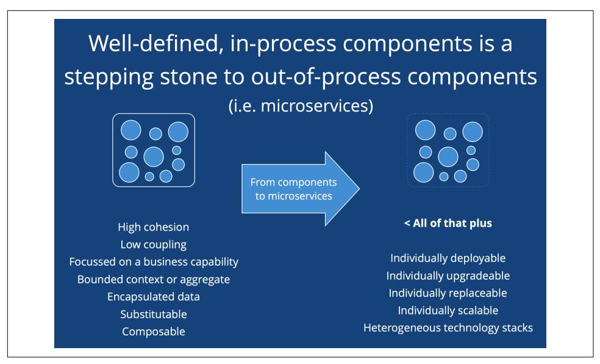

*Figure 3-2. Both modularization and a move to distributed systems have value. You can do the first without the second. Reproduced with permission from Simon Brown's GOTO 2018 talk on ["Modular Monoliths"](https://oreil.ly/8GdXW).*

Building a modular monolith might work for you, and if you don't have the necessary things in place to make a success of microservices—for example, if your teams don't want the responsibility of being fully autonomous or your leadership isn't on board with what needs to happen—I would stick there.

However, and this may not surprise you given I'm writing a book about microser‐ vices, I would definitely consider taking the next step and moving these modules into separate processes.

With a modular monolith, you end up with a lot of complexity in the build and deployment process. It's hard to make sure you can release code quickly and with a high degree of confidence. It's also much harder to maintain boundaries between modules through consensus within a monolith than it is where services are built and deployed separately. It's too easy for developers to make decisions for the short term that break the boundaries (true [Tech Debt](https://oreil.ly/GGiVu) as defined by Ward Cunningham, in that you take it on knowing that you will be paying interest on it until you go back and fix it).

It is a lot easier now to build and operate a distributed system than it was when we first started building microservices at the *FT*. There is over a decade of experience to draw on, and many more tools that can help. But even in 2015, you could build suc‐ cessful microservices-based systems. We built three at the same time at the *FT*!

<span id="page-110-0"></span>I'd certainly start with fairly coarse-grained services, to minimize the overhead of running them all and to minimize the chance that you have to deal with data changes across services. Sam Newman describes the Strangler Fig pattern<sup>17</sup> in Chapter 5 of his book *[Monolith to Microservices](https://learning.oreilly.com/library/view/monolith-to-microservices/9781492047834/ch03.html#ch05-Strangler-Pattern)*. It's useful because your new system grows up around the old system, which acts as a support structure until the new system can stand on its own. You can extract a single service, see what benefits that brings, then go back and do another. Stop when you no longer get the value, or keep going until there is no monolith left.

I would also aim for the least possible amount of additional technology while in the early stages of implementing a microservice architecture. You want to minimize the up-front setup costs, and setting up a Kubernetes platform—or learning about Kuber‐ netes, if you choose a platform run by someone else—is likely to be quite an investment.

If you are running in the cloud, I would aim to outsource as much effort to your cloud provider as possible. Package your application up as a container image and have those run for you.

I would also take a good look at whether serverless solutions would work for you. Adrian Cockcroft pioneered the use of microservices when he was at Netflix. Now his advice is to look at serverless first, using serverless functions to glue together all the really reliable long-running services that cloud providers already offer, such as data‐ bases and message queues.

I would probably use a container for anything that has a consistent workload, and anything where latency matters. I would definitely look at function as a service for any code that needs to respond to an event—for example, a file being written somewhere.

Almost everything I'm going to say in this book applies to any distributed system made up of small services, whether those are long-running containers or shortrunning serverless functions. Though these days, it feels like things are converging a bit. As an example, AWS now supports deploying lambda functions as container images, allowing you to use a consistent set of tools across both, and choose to deploy containers or functions, whichever meets your need, and GCP Cloud Run is server‐ less<sup>18</sup> that you can deploy containers to.

<sup>17</sup> First captured by [Martin Fowler](https://oreil.ly/SgfMr).

<sup>18</sup> In that it is pay per use and fully managed for you.

## <span id="page-111-0"></span>**Measuring Success**

Metrics in general can be a difficult area. Many metrics around developer productiv‐ ity, for example, are pretty flawed: as soon as a measure becomes a target, it will be gamed;<sup>19</sup> and any measure that looks at individual performance rather than the team is likely to reduce the effectiveness of the team as a whole, as people focus on making sure they have good numbers, rather than—for example—supporting others within the team to achieve the business outcomes. As Kent Beck and Gergely Orosz write in their response to a proposed developer productivity measurement framework from McKinsey, measuring effort and output is easier, but measuring outcome and impact is better.<sup>20</sup>

Personally, I find the DORA metrics are very useful if you are starting from low scores. You can track the impact of introducing automated build pipelines, removing change advisory processes, etc. Once you hit high performance on the DORA met‐ rics, the one that begins to matter the most for developer productivity is deployment frequency, because as you can reduce toil and get developers focused on value, you should see that changing while the other metrics stay pretty much the same.

The [SPACE framework,](https://oreil.ly/TQBKc) discussed in detail in [Chapter 7](#page-174-0), considers five separate dimen‐ sions of developer productivity: satisfaction and well-being, performance, activity, com‐ munication and collaboration, and efficiency and flow. The authors of the SPACE framework are clear that developer productivity can't be reduced to a single metric, shouldn't be about activity rather than outcomes, and is about the team rather than the individual. It takes more work to develop and track developer productivity guided by the SPACE framework, because you need to design a set of complementary metrics that track multiple dimensions, but you are more likely to get a realistic understanding of the impact of changes you make on developer productivity.

## **In Summary**

Any architectural choice is a trade-off. Microservices can be complicated to build and operate, but they solve particular problems very well:

- Scaling your organization while maintaining the ability to move fast
- Enhancing developer experience through quicker onboarding, a more rapid development cycle, and a faster release into production
- Allowing you to isolate compliance and security requirements

<sup>19</sup> This is Goodhart's Law: "When a measure becomes a target, it ceases to be a good measure."

<sup>20</sup> McKinsey's article "Yes, You Can Measure Software Productivity," published in August 2023, includes both DORA and SPACE metrics, but adds a set of "opportunity-focused" metrics that largely focus on individuals and outputs. For a more detailed critique, see Kent and Gergely's analysis via Gergely's [newsletter.](https://oreil.ly/yON3z)

- Scaling just those parts of the system that need to be scaled
- Keeping the blast radius for an issue smaller, increasing the resilience of your system
- Letting you choose different technology for parts of your system, based on differ‐ ing requirements, for example, having a graph database for data that is graph-like

Even where you have these challenges, you should make sure you have the conditions in place to be successful with a microservice architecture:

- Understanding your business, because if you don't yet understand it, you won't be able to identify the right boundaries
- Long-term funding for products, allowing services to be owned, rather than short-term funding for projects that then need to be handed over to some other team
- High-level support for making the change, because it's a cultural change, not a technology one
- Teams that want autonomy, and enabling teams that will support them with that, because you need people who will take responsibility for the services they build
- A high level of technical maturity around automation and infrastructure as code, because you can't set up servers and release code by hand when you're doing this frequently

Notice that there is nothing here about particular technologies. In fact, I strongly rec‐ ommend avoiding introducing too many new technologies when getting started with microservices.<sup>21</sup>

You should definitely start something new with a monolith. When you find things slowing down, you should look to make your architecture more modular, whether that is within the monolith or by extracting microservices. But the world of software is moving in the direction of distributed components within an architecture, both through the use of cloud provider managed services and SaaS options. Even a mono‐ lith likely makes calls over networks, so you should get comfortable with distributed architectures.

<sup>21</sup> Yes, this is about not jumping straight into setting up Kubernetes, service meshes, and API gateways. Wait until you need these things!

I like the firmer boundaries you get with a microservice architecture over a modular monolith. It constrains what people can get wrong! Once you have multiple teams working on a system, microservices would be my choice, although I would start with fairly coarse-grained services.

If you *do* decide to go ahead with microservices—or already have—I have a lot of suggestions about how to make a success of that. In [Part III](#page-242-0) of the book, I focus on the technological aspects. But first—and more importantly—in [Part II,](#page-114-0) we will talk about the necessary changes in organizational structure and culture.

# <span id="page-114-0"></span>**Organizational Structure and Culture**

To be successful with microservices, you need to do more than adopt the architec‐ tural patterns. There are organizational and cultural considerations and these are the first things to focus on because if you can't get these right, you will be taking on a lot of additional complexity for not much benefit.

Because doing microservices successfully means changes to the organization and cul‐ ture, you will find it very challenging if you don't have support from the highest levels of your technology leadership. That starts with the way the organization is structured: Conway's Law says that if the architecture of the system and the architecture of the organization are at odds, the architecture of the organization will win.

You need to find the right boundaries within your estate, ones that minimize depen‐ dencies between teams. Teams should be able to make progress without having to wait for another team to do something.

That means building an organizational culture to support that: with cross-functional teams that are empowered to work autonomously and a focus on a fast flow of busi‐ ness value.

Reducing cognitive load within teams is key to that. You can support your productdevelopment teams through paving the road: providing a straightforward, self-service path to production.

# <span id="page-116-0"></span>**Conway's Law and Finding the Right Boundaries**

*Any organization that designs a system…will produce a design whose structure is a copy of the organization's communication structure.*

—Melvin E. Conway

Once you have more than one team, you need to split up your system (since effective teams have sole ownership of the code they work on).

I'm going to start this chapter by discussing what Conway's Law is and the implica‐ tions for your organizational structure.

Then, I'll discuss how you can find the right boundaries between teams (which will also be the boundaries of your architecture), and how to spot when those boundaries need to change. You should expect this, as the needs of your business, or the technol‐ ogy available, or the things you are focused on change—but it will also happen as you understand your domains better.

Really, you want to work on both the organizational design and the system architec‐ ture together, because of Conway's Law. If you have 10 developers, do you need three teams or two? It depends on how you can best split up the system. You are looking for logical splits in the business domain that will be replicated in the architecture, and that allocate work to each team that doesn't exceed their capacity.

<span id="page-117-0"></span>To do this effectively, you need a good understanding of the business, but you also need a high level of technical expertise. Ruth Malan says: "if we have managers decid‐ ing…which services will be built, by which teams, we implicitly have managers decid‐ ing on the system architecture."<sup>1</sup>

Let's start with Conway's Law.

## **Conway's Law**

In 1968, Mel Conway published a short paper—just 45 paragraphs long—called "How Do Committees Invent?"<sup>2</sup>

The conclusion of the article, quoted at the start of this chapter, has become known as Conway's Law, and [as Martin Fowler says,](https://oreil.ly/kSlbB) it is "Important enough to affect every sys‐ tem I've come across, and powerful enough that you're doomed to defeat if you try to fight it."

Conway's Law says that software development organizations produce software archi‐ tectures that mirror their organization structure: if you have two development teams, you will end up with two subsystems.<sup>3</sup>

Conway starts by noting that "Any system of consequence is structured from smaller subsystems which are interconnected." You keep subdividing into smaller systems until you get to a system that is simple enough to be understood. Different teams then design these different subsystems.

As Conway points out, both organizations and systems have a graph structure, made up of nodes and lines. For a system, the nodes represent subsystems and the inter‐ faces between them, and for an organization, they represent subgroups and commu‐ nication paths (since groups must talk to agree on the interfaces between subsystems). Conway notes that the system and the organization designing it have the same shape. In other words, the subsystems and interfaces will map to the subgroups and communication paths. [Figure 4-1](#page-118-0) shows what this looks like.<sup>4</sup>

<sup>1</sup> As quoted in *Team Topologies*, for a blog post no longer online, but available [via the web archive.](https://oreil.ly/vkmuL)

<sup>2</sup> Melvin E Conway, ["How Do Committees Invent?"](https://oreil.ly/xuSZW), published in *Datamation* magazine in April 1968.

<sup>3</sup> Conway's original paper is broader, talking about any kind of design and the organization producing it.

<sup>4</sup> Because subgroups may design more than one system, the mapping only goes one way: you can't always go from a subgroup to a single subsystem.

<span id="page-118-0"></span>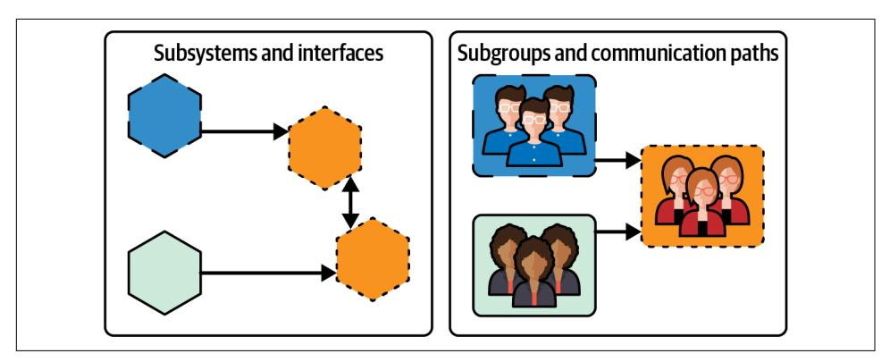

*Figure 4-1. Systems and subgroups are both graphs, and you can map one graph to the other.*

The separate groups designing subsystems need to coordinate so that the subdesigns can be consolidated into a single design, and you'll find that teams that are closer together will produce designs that are closer together too, because it's easier for them to communicate and learn about each other's systems. Where the different groups are loosely coupled, the design will tend to be loosely coupled: the interfaces will be rela‐ tively stable and the two groups won't need to coordinate work that often. Research from Alan MacCormack and colleagues compared designs produced within commer‐ cial firms with open source alternatives and found that the first were much more cou‐ pled, as Conway's Law would predict.<sup>5</sup>

There are a couple of interesting consequences here. First, because the work gets divided out to the existing groups, any constraints you have in the organization will be represented in the systems too. A hierarchical organization will produce a quite different system design than one that has more of a graph-style structure. This also means there are some types of system design that cannot happen, because the organi‐ zation can't support them—for example, where there is a communication gap between two groups that would need to work closely together to produce the design.

Second, in splitting out subsystems, you are inevitably making design decisions already: each delegation rules out certain alternative designs. And so your organiza‐ tional structure pushes your system to look a particular way.

<sup>5</sup> Alan MacCormack, Carliss Baldwin, and John Rusnak, ["Exploring the Duality Between Product and Organi‐](https://oreil.ly/h98xL) [zational Architectures: A Test of the Mirroring Hypothesis".](https://oreil.ly/h98xL)

<span id="page-119-0"></span>To give a concrete example from my own career, when you have an organization that has three groups: frontend, backend, and DBAs, you are likely to have three different systems: a web application, the business logic, and the database. Unfortunately, this isn't a loosely coupled design because pretty much anything you want to do involves changing every layer: for example, if you want to capture additional information about a customer, you have to gather it on the website and pass it through to the data‐ base. To change the architecture, you need to change the organizational structure. For a loosely coupled design, you need to move to cross-functional teams, aligned to business domains rather than technical skills; I'll talk more about this in [Chapter 5.](#page-132-0)

In *e DevOps Handbook*, by Gene Kim et al., the authors discuss the impact at Etsy of tightly coupled teams.<sup>6</sup> Etsy initially had two teams, the developers and the DBAs, and found that changes generally had to be made by both teams. They first attempted to fix this via a service called Sprouter that was designed to encapsulate the database implementation, but Sprouter actually created a tight coupling between the develop‐ ment and database teams and added an additional layer that needed to change. Etsy subsequently addressed this through organizational and architectural changes that moved business logic from the database into the application, meaning that changes now only needed to happen in the application layer.

There are two other things that Conway discusses in his paper that I find really interesting.

First, research that leads to techniques permitting more efficient communication among teams will play an extremely important role in the technology of system man‐ agement. Each subsystem needs to understand what the other subsystems do so that a single overall coherent design can emerge, but communication is costly. Conway points out that "Elementary probability theory tells us that the number of possible communication paths in an organization is approximately half the square of the num‐ ber of people in the organization. Even in a moderately small organization it becomes necessary to restrict communication in order that people can get some *work* done." This insight is at the core of recent insights into how to optimize for flow within organizations, which will be discussed further in the next couple of chapters: coordi‐ nation between teams should be minimized if you want people to work effectively.

Microservices (and other loosely coupled architectures) are a tool here. They reduce the communication overhead because they hide much of the information about a system all the parts that other systems don't need to know about—behind a well-defined inter‐ face. Teams need to communicate only about changes that change that interface.

<sup>6</sup> Gene Kim et al., *[e DevOps Handbook](https://learning.oreilly.com/library/view/the-devops-handbook/9781457191381)* (Portland: IT Revolution Press, 2016).

<span id="page-120-0"></span>The second interesting point is around the "rightness" of any design. Conway points out that "It is an article of faith among experienced system designers that given any system design, someone someday will find a better one to do the same job." You won't get the design "right," beyond maybe getting it right given the specific context at that moment: the tech available to you, and your current understanding of the domain.

What this means is, you should expect to iterate as you develop your understanding of what your system design needs to deliver or as the context changes. The best thing you can do is build for evolution of the design. Given Conway's Law, that iteration is likely to be as much about organizational structure as it is about the design.

## **The Inverse Conway Maneuver**

You can increase the likelihood of successfully building a new system if you match the design of that system to the design of your organization. You can also go a step fur‐ ther, and attempt the *Inverse Conway Maneuver*. This is where you evolve the design of your organization to make it easier to build your system the way you want to.<sup>7</sup>

In fact, you likely need to evolve the organization and the architecture together, par‐ ticularly if you already have a system in place. It's no good changing the organization to conflict with that and hoping it will all work out. In ["Conway's Law Doesn't Apply](https://oreil.ly/WVMym) [to Rigid Designs",](https://oreil.ly/WVMym) Mathias Verraes says, "A reorganisation won't fix a broken design." This is where a step-by-step approach, pinching off parts of the system *and* parts of the organization and changing just those parts, iteratively, may help.

Alright, enough theory, let's get to it. The Inverse Conway Maneuver isn't about a big reorganization; it's about evolving the design of your organization through changes to the way you set up and run teams and to the organizational culture, and those will be discussed in the next chapter. It's also about finding the right boundaries between separate parts of your organization—the ones that will work effectively—and that's what we'll look at next.

<sup>7</sup> This seems to have been first mentioned by Jonny Leroy and Matt Simons from Thoughtworks in the Decem‐ ber 2010 issue of the *Cutter IT Journal*, and by 2014 it was featured on the [Thoughtworks Tech Radar.](https://oreil.ly/UAtNg)

<span id="page-121-0"></span>

### People Aren't Resources

Up to this point, I've presented a lot of theory, and you may be starting to map this to your own organization's structure and con‐ sidering how things may need to change. However, you should be very cautious about throwing everything up in the air, particularly where that involves breaking up existing teams.

Reorganizations are stressful,<sup>8</sup> and they impact people's productiv‐ ity for weeks or months. They can also be a catalyst that helps peo‐ ple overcome their own inertia, making it more likely that people will leave the organization.

You probably won't know up front what the end state architecture and organization design should be, so keep teams together where you can, and evolve them over time.<sup>9</sup>

## **Possible Boundaries**

How can you decide where the boundaries are between teams?

At the highest level, you can probably start to identify boundaries by looking at the cus‐ tomers and at your stakeholders. At the *Financial Times*, it makes sense to have a group of developers working with the editorial department, who need tools for creating, man‐ aging, tagging, and publishing different types of content. There is also a natural group‐ ing of internal departments other than editorial who need software for their needs: HR, finance, and marketing. Sometimes, though, there are multiple stakeholders for a par‐ ticular area. At the *FT*, the group of developers working on the ft.com website need to consider editorial and marketing needs (among others) but their main focus is on *FT* subscribers. So the "natural" higher-level splits may be based around different stake‐ holders, different business capabilities, or a mix of both. They form business domains.

Below that highest level, i.e., when you are trying to split work across teams rather than across groups, there are several possible fault lines to use (*Team Topologies* calls these "fracture planes"). Your organization may have boundaries between technolo‐ gies in use, team locations, or compliance requirements, for example.


You should think *extremely* carefully before choosing to split your organization or your system architecture on something other than the business domain—are you doing it because it makes sense, or because it's too hard to fix some other problem?

<sup>8</sup> As noted in [a series of blog posts](https://oreil.ly/xG2K0) by Cyrille Dupuydauby.

<sup>9</sup> As Heidi Helfand notes in her book, *[Dynamic Reteaming](https://learning.oreilly.com/library/view/dynamic-reteaming-2nd/9781492061281/)*, teams change over time in any case and it's worth getting good at handling that change.

<span id="page-122-0"></span>For a microservice architecture, by far the most likely approach is to use business domains to guide boundaries.

## **Business Domains**

Nick Tune defines business domains as "Areas of expertise in which the business develops tools and capabilities (aka products) to support people who have a purpose (e.g., users and customers)."<sup>10</sup>

There are multiple ways you could split up any system, so a domain is basically an arbitrary boundary around some subset of concepts such as orders and line items, or customers and accounts.

You can generally break domains down into smaller subdomains. Our aim is to con‐ tinue to break down domains until we have team-sized domains (or smaller!). Align‐ ing a team to a specific business domain allows that team to have a clear and coherent purpose.

Getting the size right matters, because if there is too much work in the domain for the team, they will suffer from cognitive overload. If there is too little, you can get a team that is bored and lacks motivation.

You may want to assign multiple domains to a team, but be wary—this will only work for simple domains, and even then, there is a danger that the team will effectively split into two rather than deal with the overhead of context switching.

Domain-driven design (DDD) is a well-established approach for identifying domain boundaries. It's focused on software design, often at a lower level than what we're talking about now, but tools like [event storming](https://oreil.ly/e7rEM), a workshop-based technique focused on quickly modeling a business process as a series of domain events, can be really helpful in finding boundaries.

DDD talks about "bounded contexts." These are areas within the system where people use the same language to talk about things.<sup>11</sup> As soon as you find that the same term—for example, "lead"—means different things to two stakeholders, you know that your model will need to be different, and you have identified separate domains.

DDD may be too low level and technically focused for discussions with key stake‐ holders and leadership teams. Matthew Skelton recently told me about [Independent](https://oreil.ly/5IY7s) [Service Heuristics](https://oreil.ly/5IY7s) (ISH) as an alternative. This provides a frame for thinking about boundaries by asking the questions: Could you imagine this as *something*-as-aservice? Could you run this as a separate website?

<sup>10</sup> Nick Tune, ["What is a Domain?".](https://oreil.ly/aOkR9)

<sup>11</sup> Honestly, I can't find anyone who has written a truly succinct description of a bounded context, so this is my attempt. I found [Martin's relatively short blog post](https://oreil.ly/lnHvV) helped me to understand this useful concept.

<span id="page-123-0"></span>The checklist of questions on the GitHub repository for ISH provides a useful way to assess whether you have found a domain that "makes sense" to separate out; that is likely to be something you can align to a stream of work.

Once you have a candidate bounded context, it's worth exploring it in a bit more detail. Nick Tune's [Bounded Context Canvas](https://oreil.ly/CbibP) provides a template for doing this, guid‐ ing you through the process of designing a bounded context by "requiring you to consider and make choices about the key elements of its design, from naming to responsibilities, to its public interface and dependencies."

### Data

One aspect of the ISH checklist that stands out for me, because it's a place that can cause a *lot* of pain if you get it wrong, is around data. The question is whether it is possible to clearly define the input data (from other sources) that a potentially inde‐ pendent service would need:

- Is it fairly independent from any data sources?
- Are the sources internal (under our control, not external)?
- Is the input data clean (not messy)?
- Is the input data provided in a self-service way? Can the team consume the input data "as a service"?

You really want to keep data that changes together in the same place, owned by the same team, to avoid distributed transactions.

## **Locations**

This should be about allocating the business domains you identify to teams based on their location, rather than using location as a fracture plane itself.

Communication is such a central requirement for effective teams that anything that interferes with that will make it harder to succeed. As [Martin Fowler](https://oreil.ly/SkA_Z) observes, "Putting teams on separate floors of the same building is enough to significantly reduce communication. Putting teams in separate cities, and time zones, further gets in the way of regular conversation…. Components developed in different time-zones needed to have a well-defined and limited interaction because their creators would not be able to talk easily." For remote-first working, everyone is online, but time zones can still have a big impact because they make it difficult to collaborate within a team.

If you are split across different time zones, countries, cities, offices, or even floors, try to make sure your domains are split along the same lines.

## <span id="page-124-0"></span>**Technologies**

When I first worked in IT, with more monolithic systems, this was how we divided up work. We mostly had a three-tier architecture, and three teams to match: front‐ end, backend, and DBA teams. The frontend did not speak to the database, and mir‐ roring that, the frontend team didn't generally speak to the DBAs.

There is an obvious problem with this split, which is that the business functionality is spread across three layers, with any feature generally needing changes in all the layers, with the challenge of lining up work for three separate teams. People would find ways to avoid having to ask the other teams for a change, meaning you ended up with busi‐ ness logic in the wrong places. I'm so glad we don't work like that anymore and tend to have all three areas represented within a cross-functional team!

This doesn't mean there aren't sometimes good reasons to divide up a system accord‐ ing to technology. That could be because of different performance needs, or because of third-party systems you are interfacing with, or because deep specialist knowledge is needed (this is where the *Team Topologies* Complicated Subsystem team comes in), which we'll look at in [Chapter 5.](#page-132-0)

We found a natural split in the responsibilities of our Reliability Engineering team at the *FT* based on programming language. Websites at the *FT* are almost all written in Node.js, but the decision to use Prometheus as the basis of a monitoring stack nudged us to use Go for several services that interfaced with it. In time, this became a fault line within the team, with the same people tending to pick up work that meant writ‐ ing Go. While this wasn't particularly painful in practice, it did make us look at whether the team had a single purpose, and a later tweak to our teams and services moved responsibility for monitoring to sit with other metrics and logging tools.

## **Compliance**

As I mentioned in [Chapter 3](#page-88-0), keeping good boundaries between parts of the system that are subject to regulatory or compliance requirements and the rest of the system can be a compelling reason to use microservices.

By separating domains in this way, you can limit how much of the system is subject to strict requirements. The team involved become experts, and can work closely with legal and compliance stakeholders.

This kind of split makes a lot of sense. In practice, it tends to follow the business domains—for example, payments functionality is both a different domain and an area with compliance needs around PCI (payment card industry compliance requirements).

<span id="page-125-0"></span>This can mesh with technology choices too. Rob Donovan and Ioana Creanga gave a [fantastic talk at QCon London 2022](https://oreil.ly/RLHQ4) about how Starling Bank, a digital bank in the UK, built its own card processor for approving card payments.

The part I want to highlight here is the decision to do all their cryptographic valida‐ tions within a zero-trust VPC, one where microservices cannot talk to each other unless access has been explicitly configured—for example, verifying the PIN supplied and checking that a transaction hasn't been tampered with. This means the system is split into services in a way that minimizes the risk if someone gets access to a specific service. Sensitive information, like the PIN for a customer, is stored in services that will only respond with data if supplied with the correct access token, and those serv‐ ices that store data are separate from the ones that use it to do verification.

## **Tolerance for Failure**

It's a great idea to consider the requirements around reliability and so on for the capa‐ bilities you are building as part of the system, separating out the critical services from the good-to-haves. That way, you are able to minimize the number of services that need to be multiregion, that need to be supported 24/7, etc.

This is good for cost control: you don't want to be running every service in two regions when some of them really only need to be in multiple availability zones. It also means the people doing out-of-hours support can focus on a smaller area that they need to understand.

Finally, it can allow different attitudes to the risk of a change. When you are proto‐ typing and experimenting, you may feel more free to ship something new when the consequences of a mistake are not so high. I'm really not arguing for shipping less here, more for feeling more relaxed about changes for some areas.

As an example, the *FT* didn't have code freezes when I was working there, but we would remind people when there were significant news events, such as the UK Budget or a US election, and during holidays, when a large number of people were out of the office. Developers and teams could make their own assessment of risk. That might be different for changes to the homepage of the website versus an internal tool.

## **Frequency of Changes**

The idea here is that you split the areas that are changing rapidly from those that aren't changing much.

I have a few concerns about using this lens to make any long-term decisions. What is stable now may start to change frequently if a new technology or a change in the business landscape opens up an opportunity. But I'm more concerned that identifying some part of the system as "slow" will make it harder to make the case for investing in <span id="page-126-0"></span>speeding up the delivery process for it. In general, small changes released often is a massive improvement over large changes released rarely, because it's easier to under‐ stand, test, release, and if necessary, roll back a small change, and you are able to get feedback before you've moved on to some other task and forgotten the context. Even for systems that aren't changing that often, there is still value in making the process of releasing changes less painful when you *do* need to do it!

Things get a lot easier if you develop a principle throughout your codebase that code is never in an unreleasable state, by doing trunk-based development, or using very short-lived branches; make use of feature flags; and generally assume that anything you have on the main code branch could be released by anyone at any time. This also means you don't end up with two tiers of teams: the ones that move fast, writing new functionality and the ones that go through painful processes, doing maintenance.

There are a couple of places where I do think frequency of changes is a useful metric. First, during a move away from an existing monolith, where it makes a lot of sense to focus on parts of the code under very active development and extract those as serv‐ ices first, so that you get the benefit of independently deployable services and a fast flow of value.

And second, to separate out parts of your system that have to go through an external approval and release process—I'm thinking about apps and the app store approval process—from those where you release at will. You may still want to make small changes internally, and test them, but you will not be pushing them out through the app store each time.

## **Recommendations**

OK, I've mentioned several different potential boundaries, but what's my advice on which to prioritize?

I'd always start by looking to use business domains to find the boundaries for your microservices. Start by looking at your business and trying to identify the bounded contexts: the places where people are using the same language to talk about their problems. Those are the most natural fracture planes in the organization.

If your current organizational structure has responsibility for a particular bounded context split across multiple teams, you really need to fix that. That might mean you need to change teams around—for example, moving to cross-functional teams with responsibility for vertical slices of the system, rather than ones linked to architectural layer (i.e., frontend, backend, database).

If you operate in multiple locations, try to come up with a split that gives each loca‐ tion ownership over one or more domain in its entirety. As Martin Fowler says in his blog post about [Conway's Law](https://oreil.ly/M6aJf) of a leader who had just been made the architect of a large project to be delivered by six teams in six different cities: "I made my first <span id="page-127-0"></span>architectural decision" he told me. "There are going to be six major subsystems. I have no idea what they are going to be, but there are going to be six of them."

For the other possible boundaries, I can see good reasons to consider compliance requirements or different tolerance for failure. I would consider technology differ‐ ences where these are down to external constraints, for example, because you are using or integrating with software written in a specific language—such as our exam‐ ple of writing Prometheus plug-ins. If it's about the choices made internally, I'd favor business domain splits instead. A team may have to learn a new technology, or else convert a service into a technology they are more familiar with. Frequency of changes isn't something I've ever used in considering boundaries!

## **Identifying When Boundaries Are Wrong**

Unless you already have a deep understanding of your domain, it's likely you won't get the boundaries right the first time.


Getting the boundaries wrong is particularly likely if the people deciding on those highest-level boundaries are not doing that with the architecture in mind, even though from Conway's Law they *absolutely* are making decisions that will be reflected in the architecture!

The first challenge is how to identify where a boundary is in the wrong place.

A good place to start is to ask people! Teams with a good grasp of their purpose will be able to tell you what they own that doesn't fit with their purpose, as well as things they really should own but don't. You may end up with systems no one thinks they should own, or where several teams lay claim—but at least you know about that and can make a call.


With one of my teams at the *FT*, when we were set up, we inherited responsibility for a mixed bag of tools and third-party systems. We identified the core aims of the team, came up with a list of things that didn't fit, and stuck little pictures of each system up on a wall. We then did our best to decommission them, move to SaaS options, or transfer them to other teams (with their agreement). Each success was marked with a ceremony where someone put a big cross through the picture. That felt pretty good!

Look for teams that have a lot of communication, whether that's a shared Slack chan‐ nel or a weekly dependencies meeting. If they *have* to communicate all the time to get things done, it's a sign that the boundaries are in the wrong place.

Also, look for signs of pain or friction. They probably indicate there is more coupling than you expected. Are there services that you *always* change at the same time? They probably shouldn't be separate services, and they definitely shouldn't be owned by different teams.

Lots of inbound pull requests or feature requests from a team using your service is a related issue: if their changes frequently require changes to your internal implementa‐ tion, they are too coupled.

Are there some services where releases often lead to production problems? These could be caused by a poorly designed interface, where the internal implementation is leaking out (meaning it isn't safe for the team to change it), but it could also be a sign that you have accidentally split a domain.

Is it hard to agree on the model for certain concepts, because there isn't clarity about what they represent? That could indicate two different domains are being combined.

And have multiple teams just gone ahead and created versions of the exact same thing? This is not about duplication of code—in a microservice architecture, it's often a good decision to build some functionality more than once. The example Sam New‐ man gives in *Monolith to Microservices* is [PDF generation](https://learning.oreilly.com/library/view/monolith-to-microservices/9781492047834/ch02.html#:-:text=Reuse): when a second team needs to create a PDF, you *could* extract a service, or you could accept that some duplication may let you move faster. What I'm talking about, though, is where two teams both think they are responsible for creating a particular feature, such as a recommenda‐ tions engine. That indicates a poorly understood boundary.

The important thing is to realize that even if by some miracle you did get the bound‐ aries right, they won't *stay* right!

Things are going to change over time. You may need to split a domain because it has gotten too big for the existing team to handle. There may be changes in the technol‐ ogy available: for example, someone has created a commodity version of something your organization had to build previously. Think of the impact the cloud had on how systems are built.

Also, the regulatory landscape may change, or the business may need to change strat‐ egy to make the most of new possibilities.

What I'm saying is, this is not something that gets done once and never has to be revisited. It's normal to need to move things around.

## **Case Study: Finding Our Boundaries at the Financial Times**

<span id="page-129-0"></span>The *FT'*s technology department went through a number of reorganizations as we found the right boundaries.

Eventually, at the highest level, we had groups of teams associated to key stakeholders, with teams within those groups generally aligned to specific domains.

### A few examples:

### *Customer products*

Responsible for the website and apps used by customers of the *FT*. Key stake‐ holders were the *FT'*s editorial team, B2C marketing (selling the *FT* to individu‐ als), and B2B marketing (selling the *FT* to businesses via group subscriptions).

### *Internal products*

Responsible for any software systems required for *FT* staff to do their jobs, such as editorial tooling, email platforms, HR systems.

### *FT core*

Made up of teams supporting underlying platforms—our subscription and bill‐ ing functionality; data; and content publishing. These APIs were used by other teams at the *FT* and externally.

### *Engineering enablement*

Every team that supported other engineering teams to do their job, by providing a platform or specialist expertise around security, DNS, etc.

You need a lot of effort to maintain effective communication across locations. We tried several different approaches across the *FT'*s development team, which was mul‐ tilocation the whole time I worked for the *FT*. Sometimes we had teams with mem‐ bers in multiple locations, but we found it took a lot of work to keep everyone feeling like an equal member of the team. As soon as you have most of the team in a room together for a meeting and a few members dialing in, it sucks to be those people.

By the time I left the *FT*, the teams working on core APIs for content, data, and sub‐ scription/registration were based in Sofia, with teams using those APIs based in both London and Sofia. We had teams in Manila that were part of the engineering enable‐ ment function, alongside teams in London. We also had some development groups with members in multiple locations. These functioned a lot more like fully remote teams—and of course, during the pandemic, they were!

## <span id="page-130-0"></span>**In Summary**

To be successful in adopting a particular architectural style, you need to make sure you have the right kind of organization. This is because Conway's Law shows that if the architecture of the system and the architecture of the organization are at odds, the architecture of the organization wins.<sup>12</sup>

Finding the boundaries between different parts of your estate is important, but you likely won't get it right the first time, and you should expect to have to make changes as the surrounding context changes—for example, as new technology or new business focus areas appear.

Those boundaries are likely to be based on business domains, but could also be based around different locations, technologies, compliance requirements, tolerance for fail‐ ure, or rate of change.

In this chapter, I've talked about finding the right boundaries between teams. In the next chapter, I want to talk about what those teams need to look like to be effective, and the culture that needs to be in place around them.

<sup>12</sup> These are Ruth Malan's words, from an [archived blog post](https://oreil.ly/-uROF).

# <span id="page-132-0"></span>**Building Eective Teams**

In this chapter, I'm going to talk about the type of organization that enables a microser‐ vice-based architecture: it should be loosely coupled and made up of autonomous teams, each with a clear area of responsibility that maps to one or more microservices.

Within an organization, teams are the fundamental units of software delivery. We'll look at what makes for an effective team, and I'll describe the types of teams you should have in place, drawing heavily on the definitions in Matthew Skelton and Manuel Pais's *Team Topologies*, 1 which match very closely to the types of teams we had adopted at the *FT* as we moved to a microservice architecture.

But first, let's talk about organizational culture.

## **Organizational Culture**

A microservice architecture is loosely coupled, so you need your teams to be loosely coupled as well. That means setting up those teams so that they can get their work done without needing coordination with other teams. The reward for this is the fast flow of change, delivering frequent business value—but only if the organizational cul‐ ture can let that happen. What characteristics of a culture support autonomy and a fast flow of change?

### *Open*

Information is shared, not hoarded.

### *Learning*

People are encouraged to try out new things.

<sup>1</sup> Matthew Skelton and Manuel Pais, *Team Topologies*, 2nd ed. (Portland, OR: IT Revolution, 2019).

<span id="page-133-0"></span>

### *Empowering*

Teams are encouraged to work independently and make their own decisions.

### *Optimized for change*

The organization is flexible and able to respond quickly when things change.

Bringing these all together, we have the Westrum Model: what the sociologist Ron Westrum describes as "generative culture."

## **Open**

In an open organization, information is shared, not hoarded. That means defaulting to open: teams should be able to find out information that impacts their own ability to get stuff done. For example, they should be able to see the current status of features another team is working on that they are going to be interacting with. They should be able to find enough information about APIs and interfaces to get started using them.

I am focused here on openness at an organizational level. Is this the kind of organiza‐ tion that willingly shares information or one that operates on a hierarchical or needto-know basis?

That doesn't mean I'm proposing teams share every bit of information about their systems. Information hiding, where you share details of the interface but hide the implementation details,<sup>2</sup> is a good principle for software engineering—the less that people know about the internal parts of a system, the less likely that you will get unexpected and unwanted coupling.

The aim should be to decouple the broadcasting of the information and the use of it. You want people to be able to answer their own questions without having to book a meeting or have an email conversation with you.

To become an open organization, you need to set the expectation of sharing informa‐ tion. No one should ever be punished for doing that, even if the news they share is bad!

As someone who used to be responsible for production support at the *FT*, I did everything I could to encourage people to tell us if there was a problem in produc‐ tion. That meant making it easy for anyone to raise an incident, asking people to do that even if they weren't 100% sure, and ensuring a culture where everyone's first reaction was to help, not to blame. This is also important for helping people feel com‐ fortable with supporting their own code in production, which I will talk about in [Chapter 8](#page-216-0).

<sup>2</sup> An idea that was first described by David Parnas in 1972, in his paper ["On the Criteria to Be Used in Decom‐](https://oreil.ly/LDNTf) [posing Systems into Modules"](https://oreil.ly/LDNTf).

## <span id="page-134-0"></span>**Learning**

In a learning organization, people are encouraged to try out new things. This can be new technology, new processes, or new ideas for products or features. Giving teams time and space for this can pay off in many ways.

It's important to recognize that sometimes things won't work out. If you are early adopters of an innovative technology, you may see the benefit for your business—or you may find it's not production-ready, or that the company gets acquired and that product gets shut down (that has happened to me!).

Creating a culture of innovation means accepting a reasonable level of risk, and mak‐ ing it safe to fail.<sup>3</sup>

When things go wrong, the organization should seek to learn from that, rather than looking for someone to blame. That also includes when things go wrong in produc‐ tion (I'll talk about learning from incidents and blameless incident reviews in [Chapter 8](#page-216-0)).

To become a learning organization, you need to treat learning as strategic. That means allocating a training budget (and spending it), setting aside time for learning, and demonstrating that the organization thinks learning is important—for example, by including it in assessments of whether people are ready for promotion.<sup>4</sup>

One team I led at the *FT* had "10% time" every two weeks that gave people space to experiment. My colleague Sophie Caramigeas set the framework for this based on her experience running this elsewhere, with great results:

- No one had to take part. If you didn't have an itch you wanted to scratch, you could carry on with other work.
- You had to share what you were going to dig into ahead of time. This was to help people make a choice and focus on one thing rather than jumping around.
- Everyone had to do a five-minute show and tell the next week, with a total acceptance that sometimes this would be "I tried this and couldn't get it working."

We got some great ideas for features, built tools that automated away pain, and found better technology options. We also quickly found out that some things were *not* going to work for us. One major benefit for me was that we avoided lots of discussion about whether to adopt alternatives, because people could try them out in 10% time. I con‐ sider the times where people came back and told me "X isn't as good as what we have

<sup>3</sup> If nothing you try fails, it's likely you are not being innovative enough.

<sup>4</sup> Google has some great suggestions on [how to implement a learning culture.](https://oreil.ly/d_QbP)

<span id="page-135-0"></span>now" as equally valuable to the times where we found a great alternative, because we found out quickly.

## **Empowering**

The authors of *[Accelerate](https://oreil.ly/yliEv)* say, "The goal is for your architecture to support the ability of teams to get their work done—from design through to deployment—without requiring high-band-width communication between teams."

That means you need teams to be autonomous and empowered, so that they are able to work independently and make their own decisions (within some set of constraints).

This is about trust. The organization needs to trust that teams will make the right decisions, removing barriers between the team and production.

This doesn't mean allowing a complete free-for-all. It means, for example, moving from needing sign off from a change management team for a change to go to produc‐ tion, to allowing teams to deploy to production while logging exactly what change happened, why, and who applied it.

The people who will best understand the risk of making a particular change are the ones who are making it: the development team.

The next few chapters cover how to empower teams while maintaining the things the organization cares about, like quality, security, and cost control.

## **Optimized for Change**

The flexibility of your organization is important for a number of reasons.

You are almost bound to get the system design wrong at first, so you should make sure your organization can handle that. This means having an organization that expects and can adapt to change. You'll need to have systems in place that reward managers for keeping their organization lean and flexible. This is easier said than done, since leaders are very reluctant to reduce the headcount of their organization when that will also reduce their area of influence!

Beyond that, modern organizations need to be able to change in response to business, technology, and regulatory changes. Think about the introduction of GDPR regula‐ tions, the move to the cloud, and most recently the rise of large language models (LLMs). If you aren't able to respond rapidly, your competitors might.

## <span id="page-136-0"></span>**The Westrum Model**

Bringing all of this together, these characteristics of an organization are what the soci‐ ologist Ron Westrum describes as a "generative culture," part of a model of different organization types he developed from research on human factors in system safety.

[Westrum identified three types of organizational culture,](https://oreil.ly/sg2La) based on the organization's style of information processing:

*Pathological (power oriented)*

Information is hoarded for political reasons.

*Bureaucratic (rule oriented)*

Information can languish because of barriers between departments.

*Generative (mission oriented)*

Information flows well, and elicits prompt and appropriate responses.

The research by DORA, documented in *Accelerate*, used survey questions based on Westrum's model.

Westrum's theory is that organizations with a better information flow function more effectively, and the DORA results bear that out. They show that "in organizations with a generative culture, people collaborate more effectively and there is a higher level of trust across the organization and up and down the hierarchy."<sup>5</sup>

This is possible because a generative culture:

- Shows high levels of cooperation
- Doesn't punish messengers who bring bad news
- Shares risks through sharing responsibilities
- Encourages a break down of silos
- Doesn't blame individuals for failure, but looks to learn from it
- Encourages innovation and experimentation

Individuals are "encouraged to speak up, think outside the box, and to act as fully conscious participants in a great cooperative enterprise."<sup>6</sup>

<sup>5</sup> *Accelerate*, Chapter 3.

<sup>6</sup> Ron Westrum, ["A Typology of Organisational Cultures".](https://oreil.ly/tqyZF)

<span id="page-137-0"></span>It is true, of course, that changing an organization is hard: it can take months or even years. You may also be thinking that changing the culture of your organization is above your pay grade, but, while you will struggle to change culture without a leadership team that understands the need and supports the efforts, changing the way people work will impact your culture, and that is something we can all contribute to.


[John Shook's case study](https://oreil.ly/gjO1z) on introducing Toyota production and management systems into a US car plant, with transformational results, concludes that the way to change culture is to change what people do rather than attempting to change how they think. *Accel‐ erate* found that applying specific technical and management prac‐ tices—continuous delivery and lean management—can indeed predict a move toward a generative culture.

If you can introduce a practice or process that works to foster those behaviors associ‐ ated with generative culture, you can kick off a positive change in culture, whatever your role.<sup>7</sup>

### For example:

- Encouraging people to work in cross-functional teams, and to collaborate with other teams for specific pieces of work, can increase cooperation and break down silos.
- Blameless incident reviews can show people it is safe to share bad news, and encourage the organization to learn from mistakes.
- Hack days, mini-conferences, and 10% time to work on experimentation, along with a willingness to try things out as a result, can foster a learning and innova‐ tion culture.
- Having every team responsible for quality, reliability, and security makes sure that those risks aren't seen as the responsibility of a separate team (although hav‐ ing expert teams to advise and support in these aims is still a good idea—and dis‐ cussed further in the next few chapters).

Changing what people do changes the way they think, and even small changes can have a big impact on culture.

<sup>7</sup> Google has more detail on how to foster a generative culture in its online documentation around [DevOps](https://oreil.ly/kf6go) [capabilities.](https://oreil.ly/kf6go)

## <span id="page-138-0"></span>**Eective Teams**

Effective software delivery comes from teams, not individuals, because we need to take in large amounts of information, solve complex problems, and adapt rapidly to change. There is too much involved in modern software development for individuals to work effectively.

For a microservice-based architecture, what should those teams look like, how should they be grouped together, and how should they operate?

## **Motivated through Autonomy, Mastery, and Purpose**

For the kinds of work we do in software engineering teams—creative, interesting, and self-directed—the best-performing teams are those where motivation is intrinsic rather than extrinsic.

Extrinsic motivation comes from outside the team. The reward is separate to the task itself—for example, bonuses, pay rises, and promotions.

Intrinsic motivation comes where someone wants to accomplish the task because that in itself provides value to them. For example, they see that it will have a positive impact.

Dan Pink's book *Drive*<sup>8</sup> is about what motivates us. He identifies three components: autonomy, mastery, and purpose.

Do you have the freedom to decide what you are going to do and how? Do you have the opportunity to improve your skills and learn things? And do you feel you are working toward something worthwhile?

But what do these three motivations look like for a software development team? Essentially, an autonomous team is a team that can do all the major parts of their job without having to coordinate or get permission from anyone outside the team. That means being able to write, test, and deploy code without needing to check in with people outside the team.

Having a cross-functional team is necessary, but not sufficient! I'll return to autonomy in the next chapter, to discuss how an organization can enable autonomy in teams through the processes and practices they put in place.

Mastery begins with work that is neither too hard nor too easy, and depends on a continuous challenge. Each time you learn one thing, you have the opportunity to build on that.

<sup>8</sup> Daniel Pink, *Drive: e Surprising Truth About What Motivates Us* (Edinburgh: Canongate, 2009).

<span id="page-139-0"></span>Purpose is provided through the outcomes the team is working toward. Team mem‐ bers need to understand the shared goal, and see the value in it.

John Cutler's [blog post "12 Signs You're Working in a Feature Factory"](https://oreil.ly/wrHJG) describes the opposite type of team, "just sitting in the factory, cranking out features, and sending them down the line."

These are teams where, among other things:

- Developers work through a list of features prioritized by someone else, rather than targeting agreed outcomes, and they don't see a connection to business out‐ comes.
- No one really knows whether a feature was "successful." Once it ships, it doesn't get iterated on, and it is rarely acknowledged as a failure or removed.
- "Resources" get moved from team to team and everyone is overutilized; there is no slack.
- Shipping features is the only measure that counts, incurring technical debt and making it hard to spend time on refactoring and improvements.

This way of working is clearly demoralizing for teams, but it's also bad for business! Teams that understand and are connected to the business goals will do a lot better.

I do want to point out that there are additional factors in play around motivation and effective teams. If you have autonomy, mastery, and purpose but you don't have psy‐ chological safety and inclusion, you won't have an effective team. You need to feel safe and valued to be able to contribute.

## **Aligned to Business Domain**

Aligning teams to business domains is critical when you are adopting a microservice architecture. You need teams to be able to do the majority of their work without hav‐ ing to coordinate with another team, and if a business domain is split between teams, it will be hard for them to work independently.

There can be a hierarchy here, so that multiple teams are aligned to the same business domain (for example, content publishing) but they are assigned to subdomains within that to reduce coupling. This might mean publishing core content (articles and images) versus publishing metadata for that core content.

As discussed in the last chapter, while there are other possible boundaries between teams—for example, technology used or location—my strong recommendation is to use business domains as the main lens.

## <span id="page-140-0"></span>**Appropriately Sized**

As discussed in [Chapter 3](#page-88-0), you cannot keep adding people to a team and still have an effective team. In practice, I've found that teams around five to seven people in size work best. This fits with what Skelton and Pais say in *Team Topologies* (they recom‐ mend five to nine) and with the idea of a two-pizza team already mentioned.

Smaller than this, and you face challenges to keep making progress when some peo‐ ple are out on holiday or off sick (and to support your systems, both in and out of hours). You will also find it hard to be truly cross-functional.

Much larger than this, and communication within the team becomes a challenge (as I touched on in [Chapter 3\)](#page-88-0). Teams need to make group decisions all the time: should we use this framework? How will we tackle this feature? Which is our priority between these three things we want to do? Finding consensus when your team is large becomes difficult.

Where I've seen teams getting up toward 9 or 10 developers, they've ended up divid‐ ing into subteams, whether those subteams are officially recognized or not. That can be OK, but don't expect this to work like a single, coherent team.

I think that if you find it impossible to take your entire team out for lunch, because you can't get a consensus on where to go, and can't fit around a table—this is a sign your team is too big.

Large teams also pose a challenge around people management, if that is aligned to team structure in your organization, i.e., the tech lead manages the engineers—once you get beyond five or six engineers in a team, you are moving toward too many peo‐ ple for one person to manage effectively. I know plenty of people *do* manage more people, but if you want regular 1-2-1s and effective coaching *and* technical leadership, that starts to be very hard.

Trust is also a factor in team size: it's critically important for high-functioning teams because those teams need to collaborate to deliver work. There is a limit to how much of delivering a feature can be worked on in parallel. Fred Brooks noted way back in 1975 that adding more people to a late-running project just makes it later, although that hasn't stopped this exact thing happening to me in the past!<sup>9</sup>

For software development teams, high trust within the team is a strong indicator of team performance. Google's Project Aristotle researched the characteristics of highperforming teams and found that psychological safety—feeling safe to take risks and be vulnerable in front of each other—was by far the most important dynamic in the team.

<sup>9</sup> This is now known as [Brooks's Law](https://oreil.ly/G0BLD). Fred Brooks, *e Mythical Man-Month: Essays on Software Engineering* (Boston: Addison-Wesley, 1995).

<span id="page-141-0"></span>Going back to Conway's Law, I will just note that these natural limits on team size put constraints onto the systems we design. They need to be divided up to match what a standard-size team can handle.

## **Cross-Functional and T-shaped**

To be able to take a feature through to production without having to hand off to other teams—handoffs that will inevitably slow you down—you need cross-functional teams, i.e., ones where all the necessary skills are inside the team: analysis, design, coding, testing, setting up infrastructure, deploying, and operating the system. This goes beyond engineering; depending on what you are building you also need some or all of product management, design, user experience, and data science skills within the team.

When I first joined the *FT*, I spent maybe 80% of my time designing and writing code. That code would be handed off for testing by the QAs (quality assurance engi‐ neers), and then be packaged up and deployed by someone else. We also had an infra‐ structure engineering team that would set up servers, build pipelines, etc. I might have to wait for a QA to be free to test my code, and then have to go back and fix any issues they found. I definitely had to wait for the code to be deployed as that hap‐ pened at most once per month.

The move to cross-functional teams at the *FT* meant that engineers like me would take on infrastructure tasks like setting up servers and build pipelines. We'd also do a lot of the testing, via automated testing, and our QA teams moved to focus more on exploratory testing—good QAs overlapped a lot with business analysts in that they had a great understanding of the domain and the customers.

When we talk about cross-functional teams, it's important to think about what skills can sensibly be in that team.

You should be able to deliver a feature to production the vast majority of the time using just the skills in your team. That means requirements gathering, user research, analysis, design, architecture, coding, testing, and deployment with appropriate observability built in.

Given the size of a typical team, this means people have to be able to tackle more than one part of that journey to production. They don't need to be experts in all of them: at the *FT* we spoke about having "T-shaped" engineers (see [Figure 5-1\)](#page-142-0), who have depth of experience and skill in one area, along with experience across other parts of the process. This could be an infrastructure specialist who can also code, developers who can set up basic infrastructure and write automated tests, or QAs who can ana‐ lyze what is needed from a feature, write automated tests, and deploy features to production.

<span id="page-142-0"></span>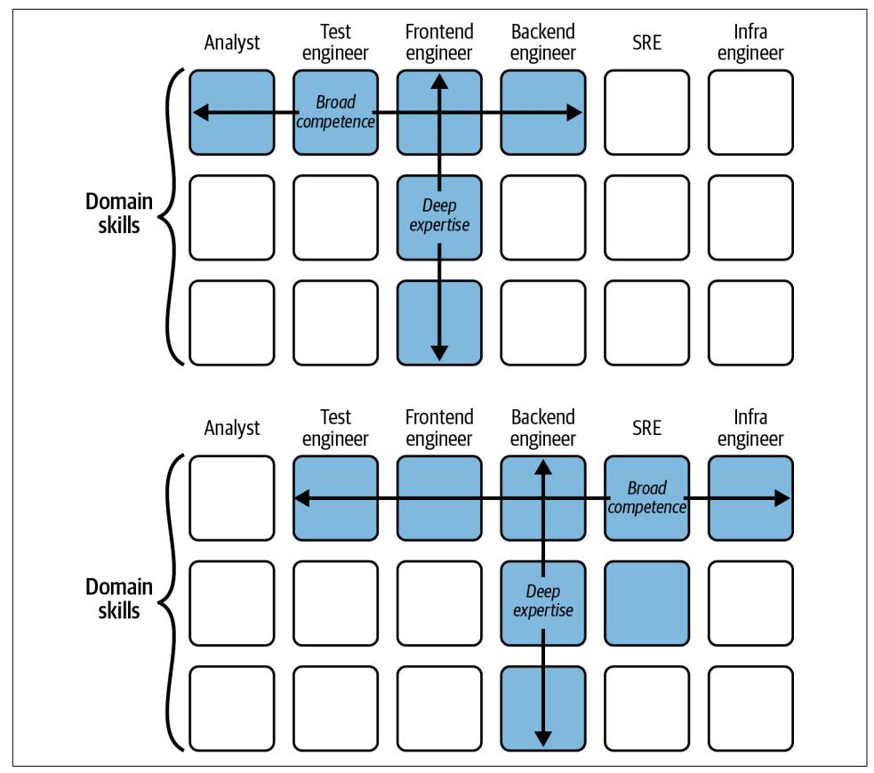

*Figure 5-1. Two different T-shaped engineers, with depth of experience in one area and breadth of competence across roles.*

The important thing is for engineers to be open to learning about skills outside their current role—I actually like the idea of a "Broken Comb"-shaped person, where peo‐ ple are looking to learn skills in any area, so there may be multiple roles where they have significant expertise. This is great for maintaining flexibility within a team. It also makes it more likely that when you look at the team as a whole, you find all the necessary skills are covered.<sup>10</sup>

The more of a mix of interests and skills on the team, the more likely you are to find that people are able to both hone a skill *and* learn new skills from experts, giving them the motivation of mastery.

<sup>10</sup> Emily Webber has a nice [team exercise](https://oreil.ly/R4-9W) to map out skills, using the more positive term "Capability Comb."

<span id="page-143-0"></span>I'll talk in [Chapter 6](#page-154-0) about the things an organization can do to help teams develop the full set of skills needed to be autonomous.

## **Strong Ownership**

Autonomous teams need to have a strong level of ownership of the services they work on. Strong ownership means you make the decisions about how to structure your code, what level of testing is needed, when to release a change, and more.

Strong ownership makes it more likely that the code you write will be maintainable and supportable, and that people will invest in improvements. If more than one team is making changes to the same part of the system, it isn't clear who is responsible for the results of those changes. That has issues when things go wrong in production, but also for working out who needs to upgrade a dependency that's been flagged as inse‐ cure. I'm going to talk about this a lot more in [Chapter 9!](#page-244-0)

If the system is loosely coupled, needing a change from another team to achieve your aims should be fairly rare. Strong ownership means that when such a situation *does* arise, you can't just go ahead and make that change. There are lots of ways to approach this though. Collaborating—even pairing—on a code change is going to ensure that the team that owns the code properly understands the change and reduces the chance of unexpected effects. You can take a more asynchronous approach and have the owning team review the proposed code changes: this is most suitable for simple changes (but I'd probably argue that every pull request review should be for something small and simple to understand!).

Strong ownership by a team does not mean strong ownership within a team. You really want the *whole* team to understand all the systems they are building and to feel collective ownership of the code. Otherwise, you run the risk that some changes can't be made because the "owner" is away that day.

## **Long Lived**

A project-based approach to software development doesn't allow for long-term pur‐ pose or strong ownership. Projects run for a specified period of time with a specified outcome. After the project is complete, who owns the software?

Product-thinking assigns teams longer-term, with a lot more autonomy to decide the outcome they are targeting. It provides that sense of purpose to the team. The team owns the product until it is decommissioned, although the number of people actually working on it will vary considerably over time.

Products not projects means teams need to be around for a while. They need to be long lived.

<span id="page-144-0"></span>Teams should also be long lived because it takes time for a team to become effective. The people in the team need to get to know each other and develop ways of working. This is the "forming, norming, storming, performing" model.<sup>11</sup>

### To expand:

### *Forming*

The early stages of getting to know the other team members. People are on their best behavior.

### *Storming*

As real work starts, the team may show signs of conflict over hierarchy and ways of working.

### *Norming*

Increasing acceptance of each other.

### *Performing*

Norms and roles are established, and the team can focus on their goals and per‐ forming well.

While team makeup is unlikely to be completely static, maintaining a core of people over time and keeping that team aligned to the same domain is much less disruptive than, for example, setting up new teams each quarter.<sup>12</sup>

## **Sustainable Cognitive Load**

There is a limit to how much information anyone can maintain in their head, and the same applies for a team. Once you exceed the cognitive load of a team, they won't be effective. Team members won't feel they have the time to bring another member of the team up to speed on something new, so you'll start to see bottlenecks where only one person knows about some part of their estate.

Where the team has more than one responsibility, excess cognitive load will mean lots of context switching as you move from urgent task to urgent task.

Finding the right boundaries between teams, as discussed in [Chapter 4,](#page-116-0) is key to keeping cognitive load sustainable. No team should have to manage multiple compli‐ cated subsystems.

But cognitive load isn't just about the features and products you are building. *Team Topologies* introduced the idea that total cognitive load matters for software develop‐ ment teams, and the discussion there goes beyond whether a team has too much

<sup>11</sup> This comes from [Tuckman's group-development model](https://oreil.ly/_Qe2j).

<sup>12</sup> I've seen that approach, and each reorganization led a few people to decide to move on.

<span id="page-145-0"></span>work. It's also about the types of work, both in terms of the impact on the team and the approaches you can take to mitigate overload.

There are multiple types of cognitive load:<sup>13</sup>

### *Germane*

Related to the task at hand. For example, understanding the domain problem space.

### *Intrinsic*

Fundamental to the problem space. For example, the inherent difficulty of writ‐ ing a program in a particular language.

### *Extrinsic*

Not inherent. For example, how you check in code, how you build it. It doesn't improve your ability to solve the problem or build up your skills.

For intrinsic load, you can invest in training, set up guilds of practice, and generally make it easier for people to build up their skills.

For extrinsic load, you can invest to remove it, for example, through documentation and automation. Building a developer platform is one way to do that, and will be dis‐ cussed in [Chapter 7.](#page-174-0)

Reducing these types of cognitive load will allow teams to take on more of the ger‐ mane cognitive load: the stuff that actually delivers business value.

## **High Trust and High Psychological Safety**

In 2012, Google's Project Aristotle carried out research into what made certain teams more effective than others.<sup>14</sup>

They found five key dynamics:

*Psychological safety*

Does the team feel safe?

*Dependability*

Can the team count on each other?

*Structure and clarity*

Do team members understand roles, plans, and goals?

<sup>13</sup> [Cognitive load theory](https://oreil.ly/IsR4r) originally comes from a study of problem solving by psychologist John Sweller.

<sup>14</sup> "The Five Keys to a Successful Google Team," November 2015, available as a [web archive version](https://oreil.ly/13Im8).

<span id="page-146-0"></span>*Meaning of work*

Do team members feel the work is important to them?

*Impact of work*

Do team members feel the work matters?

Psychological safety, which the research found to be *the* most important factor, means a team feels safe to take risks and be vulnerable in front of each other. This is another reason for long-lived teams, because this level of trust in each other takes time to develop.

Dependability is about being able to count on the other team members to work at a high level of quality and get things delivered.

These two things together tell you whether this is a team with a high level of trust in place.

The remaining three key dynamics all relate to having a clear purpose, both as a team and as a person. Those key motivational aspects from Dan Pink again!

## **Part of a Group**

*Team Topologies* suggests forming teams of 5 to 9 people, in groupings of 50 to 150.

Why do we need these groups? One reason is about the flow of information. Meetings of team leads have the same constraints as meetings within a team: they won't be effective if there are 20 people in the meeting. Once you get to a certain size, you will have too many teams for them all to be part of a single organization.

The second reason is that you will probably need those groups to be able to manage some important tasks around supporting your code in production. It's hard to main‐ tain a 24/7 rota with a single team of developers. I will talk about this more in [Chap‐](#page-216-0) [ter 8](#page-216-0) because there are challenges in navigating "You build it, you run it" while keeping team sizes down!

## **Optimizing for Flow**

The team I've described in the previous section is autonomous, empowered, crossfunctional, and T-shaped. It should be able to work with a minimum of coordination or waiting on other teams.

But I also said that the team can't be too large!

A five-person team can't have expertise in all the things that matter—such as accessi‐ bility, observability, and security—without impacting their ability to deliver value to the business. And "full stack" has to stop somewhere! We can't expect engineers to know everything down to the kernel.

<span id="page-147-0"></span>Anything that needs to be done for every release of code, you probably need each team to be able to do. Beyond that, you don't want every team to have to solve the same problems, to have to build their own tools and abstractions to spin up servers and deploy code, and to sort out their own observability tooling and write things to manage costs and compliance.

To be able to focus on meaningful work, to keep risk under control, product teams need to be able to look to others to make it easy for them to make progress (by reduc‐ ing the amount of extrinsic cognitive load they are under) or for specific expertise. Maybe you need to add a WAF in front of your website, or you're about to try your first serverless project. These are needs that are best served by specialist teams that provide help and assistance.

*Team Topologies* is one of those books that really struck a chord with me: it provides powerful tools for thinking about your organization, focusing on what you can do to optimize for a fast flow of value.

The authors make the case—and I agree—that there is a limited number of funda‐ mental types of teams needed for building and running modern software systems. I recognized these from my own experience at the *FT*, developed in over a decade of doing DevOps and microservices. *Team Topologies* gave me the language to talk about this, and suggested places where we could go a little further in our own approach.

There are four types of teams mentioned in *Team Topologies*:

### *Stream-aligned*

Aligned to a single, valuable flow of work

### *Enabling*

Specialists in a particular product or technology domain, helping stream-aligned teams to develop new capabilities

### *Complicated subsystem*

Responsible for some part of the system that depends heavily on specialist knowl‐ edge

### *Platform*

Providing internal services that accelerate delivery by stream-aligned teams

[Figure 5-2](#page-148-0) illustrates these team types and their interactions using a team modeling approach defined in *Team Topologies*. The interaction types will be described in [Chapter 6](#page-154-0).

<span id="page-148-0"></span>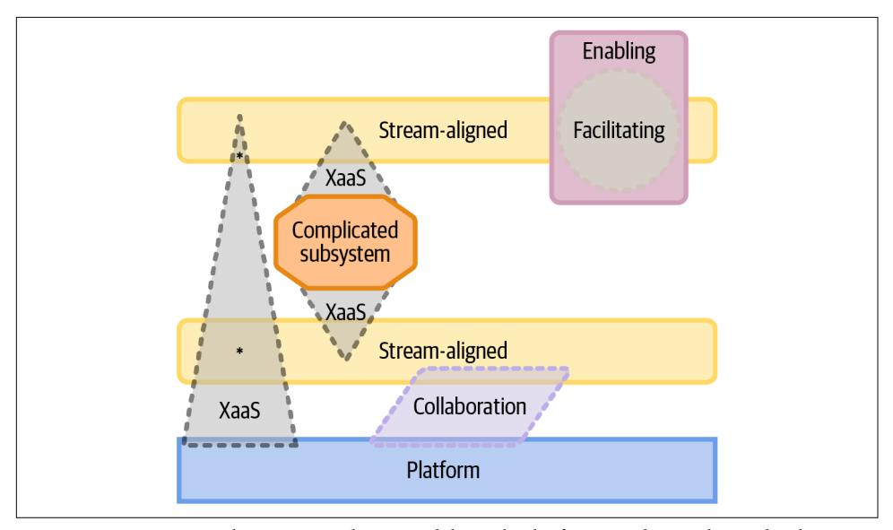

*Figure 5-2. An example team topology model. Both platform and complicated subsystem teams provide services (XaaS) to stream-aligned teams and will collaborate with them to develop new services. Enabling teams facilitate learning of new capabilities by streamaligned teams.*

## **Stream-Aligned**

While we haven't used the term yet, the teams we've been talking about throughout this chapter are stream-aligned teams. This team structure applies to the majority of teams in your organization and encompasses teams that are working on products.

Each stream is a continuous flow of work, related to a specific business domain or organizational capability. Each team should be aligned to a different stream, which provides clarity of purpose and responsibility.

Stream-aligned teams will be able to take a feature from initial exploration right through to production. To do this, they need to be able to:

- Design and architect
- Code
- Test
- Provision and deploy
- Ensure their applications are secure and monitored
- Run their code in production

<span id="page-149-0"></span>While the stream-aligned team type is the primary team type in an organization, other team types are needed too. The purpose of these other types of teams is to reduce the burden on the stream-aligned teams.

## **Enabling**

Enabling teams are specialists, skilled in particular domains, and their mission is to help stream-aligned teams to develop new capabilities. Stream-aligned teams should be focused on delivering value to the business. They may not have time to learn about and practice new skills, but in any case, you don't want every stream-aligned team to be doing this.

An enabling team can do the research, try things out, and then work with streamaligned teams to help them adopt new technology or practices. They act as consul‐ tants, and like consultants, they bring in new ideas and work alongside teams for a limited period to transfer that expertise.

The enabling team should do the work to make sure any new tools comply with organizational policies or principles. The aim is to increase the autonomy of streamaligned teams through growing their capabilities.

Examples of the kinds of technologies an enabling team may focus on include deploy‐ ment, build, and continuous delivery; observability; security engineering; or web components and design systems.

Enabling teams can reduce the intrinsic cognitive load that a team is under by sharing their skills and expertise.

## **Complicated Subsystem**

Complicated subsystem teams are also specialists. The difference from enabling teams is that rather than exploring capabilities, they instead build and maintain spe‐ cialist subsystems. For example, that might be a system that does machine learning, or has a complicated set of algorithms.

Where many stream-aligned teams interact with this complex subsystem, it isn't feasi‐ ble to embed specialist knowledge in each of those teams, and so a separate team builds the subsystem, focusing on what those stream-aligned teams need.

I'm not going to say much more about this team type as it is specified as optional, and I don't feel that I saw it in action at the *FT*.

## **Platform**

The purpose of a platform team (in fact, this is almost always a group of teams and *Team Topologies* practitioners are moving toward using "platform group" or just "platform") is to provide internal services that reduce the extrinsic cognitive load for

<span id="page-150-0"></span>stream-aligned teams, so that people don't need, for example, to remember a set of commands or spend time finding out how to configure a database backup.

They are service providers and the services they build need to be easy to use, reliable, and fit for purpose. They should focus on creating services that stream-aligned teams can use without needing help. This means building well-documented APIs and selfservice tooling.

A good platform should allow stream-aligned teams to do the right things, in the right way. It should reduce the complexity of the underlying systems without abstracting too much away, because teams may need access to the underlying functionality.

If you hide too much away, you run the risk of teams failing to adopt the platform and instead developing their own approach.

The aim should also be to build *just enough* platform. *Team Topologies* calls this the thinnest viable platform, or TVP. My experience is that this is absolutely the right instinct. Build what your customers need, and no more.

### Case Study: The Evolution of the Organizational Structure at the Financial Times

I want to round out this chapter with a case study on how the organizational structure evolved over the decade or so I worked at the *Financial Times*.

When I joined the *FT* in 2011, we actually had two separate technology departments. Frustration at not being able to get their needs prioritized had led the product team to hire an entirely new team to rebuild the website.

This split did not encourage high levels of cooperation or information flow.

Within the "main" IT department there were also several silos, with teams divided by function. We had infrastructure teams, operations teams, and development teams (which included developers, business analysts, QAs, scrum masters, and product owners).

My colleagues were smart, friendly, and understood the mission of the *FT*, but we were not empowered—we had little input into technology choices, which were largely decided on by our architecture group, and we were a bit of a "feature factory," as described earlier in this chapter.

While we worked in a superficially agile way, there wasn't a lot of flexibility about what we tackled: work was funded via projects, meaning there would be an estimate based on identifying a list of tasks that was "in scope."

Infrastructure was set up by a central team and that could take months.

<span id="page-151-0"></span>Developers would commit their code into source control, and once a month, package a set of changes up into a release, and that was the end of their involvement. Opera‐ tions released code to production, and also did all the support for the live systems.

Developers didn't really have to consider the way their code would run in production at all. Even monitoring of the servers was set up by another team.

### Changing the Organizational Culture

The first big change we made was organizational, with the two departments com‐ bined under a single CIO. That immediately improved information flow and coopera‐ tion between teams.

Further changes to the culture occurred as a result of changing what we did, as John Shook found to be effective in his [case study.](https://oreil.ly/RreQV)

We were lucky, because (as I briefly mentioned in [Chapter 3](#page-88-0)) we had a third-party company who built the *FT'*s mobile applications. They did not have to follow the pro‐ cesses within the department, and they moved a lot faster than the rest of us. That proved to technology leadership and to our stakeholders that our processes were slowing us down and not making us more likely to release quality code.

We made changes to our processes, removing the change advisory board and moving the responsibility for releasing code and supporting it to our development teams.

We moved away from tracking numbers of incidents and paying bonuses based on those numbers.<sup>15</sup> This shift encouraged people to be open when something went wrong. We also moved incident management to be largely coordinated via an open Slack channel, meaning everyone could see what was going on.

We started holding hack days, encouraging people to experiment, and parts of the organization introduced 10% time for their teams. A few years later, we ran an inter‐ nal tech conference for the first time, with feedback from attendees indicating that it broke down silos between teams as they heard about the cool things people were doing *and* the constraints they may be working under.

### Changing Team Setup

We also changed our teams. This started when we moved integration engineers into each team. They would set up infrastructure for the team. Still manually at first, but now this was done in collaboration.

We ended up with our infrastructure teams changing to become platform or enabling teams. Our product development teams became fully cross-functional teams that built, tested, deployed, and supported code running in production.

<sup>15</sup> This is such an antipattern. If you do this, you will spend a lot of time arguing about the severity or priority level of individual incidents, rather than seeking to learn from them, and you may not even hear about some incidents until everything is on fire, because people are hoping to save their bonus!

<span id="page-152-0"></span>Teams began to be aligned with a particular domain, rather than being randomly named and all working across the whole codebase for their system. Funding was much more rarely associated with projects, and mostly teams would be funded each year to continue work on their products.

Quality became a concern for the whole team, not a separate QA function: we expected engineers to write automated tests and to care about this. Engineers also started to help with infrastructure tasks. Everyone moved toward more of a T-shaped set of skills.

### Key Changes to Enable Microservices

All these changes took place over a number of years. The key changes that let us adopt microservices were:

- Removing barriers for releasing code to production and handing responsibility for that to teams
- Making teams cross-functional
- Allowing teams to make their own technology decisions
- Encouraging an open culture where we focused on fixing problems and not on finding who to blame

## **In Summary**

For a microservice architecture, which needs to be loosely coupled, you need an orga‐ nization that is loosely coupled too. It should support the ability of teams to get work done; to deliver a fast flow of changes.

A generative culture is one where information flows well, and where individuals are encouraged to speak up and to fully participate, and this is the type of culture you should be aiming for.

Teams that will be effective within that culture are ones that have a clear purpose and high levels of autonomy, meaning they can do most of their work without having to coordinate with other teams. They should be cross-functional, with the skills to build, release, and support their own code. To be successful, there should be 5–10 people in the team, and the team should be long-lived and aligned to a product, rather than formed for a specific project.

The team should be empowered to make their own decisions. Both empowerment and autonomy develop in a culture where there is trust and psychological safety.

To be able to focus on meaningful work, and to keep risk under control, product teams need to be able to look to others to make it easy for them to make progress. To fully optimize your teams for a fast flow of value, you need just four team types: stream-aligned (the majority of teams), enabling, complicated subsystem, and platform.

This chapter has discussed how to build teams that will be *able* to act autonomously and the kind of culture that supports that. The next chapter digs, in detail, into the processes and ways of working that *allow* those teams to act autonomously.

# **Enabling Autonomy**

<span id="page-154-0"></span>In the previous chapter, I discussed what makes for an effective team and included autonomy as a motivating factor. In this chapter, I'm going to make the case that autonomy isn't just important for motivational reasons; it's also essential for success‐ fully adopting microservices.

Making sure teams are long-lived, cross-functional, the right size, and given responsi‐ bility for a stream of work that fits into their cognitive capacity creates teams that *can* be autonomous, but you also need ways of working in place that *allow* them to be autonomous. It's no good having a team with all the right skills if you have processes that slow them down by requiring them to go through multiple gates to get work scheduled or to get changes to production.

Throughout this chapter I'll dig into how to support the autonomy of teams in your organization through the ways that you work.

I'll also talk about effective ways for teams to interact, again drawing on the ideas laid out by Matthew Skelton and Manuel Pais in their book *Team Topologies* that I explored a bit in [Chapter 5](#page-132-0).

And finally, we'll discuss the responsibilities of autonomous teams. It's not all fun and games, and it's not a free-for-all. Autonomy should exist to support the business (but it also makes working a lot more enjoyable, in my experience).

Let me start by explaining what autonomy is, and why it matters.

## <span id="page-155-0"></span>**What Is Autonomy?**

Autonomy is the freedom to decide what you are going to do and how you are going to do it.

At the lowest level, autonomy for a software development team means that the team gets to release changes to production when it decides the changes are ready, rather than needing signoff by some external quality or change management team or having to wait for an operations team to do the release.

At a higher level, you may have a business outcome in mind—for example, that you want to reduce the number of your subscribers that opt out at renewal. There are lots of things you could do, and an autonomous team will be free to decide which to tackle first. In fact, you'll probably want to experiment and see what the impact is.

The key thing is that no one outside your team needs to sign off on your approach.

## **Why Does Autonomy Matter?**

Every time a piece of work goes into a queue, waiting for someone to pick it up, you are having a negative impact on the flow of work and as a result, the flow of business value. Sometimes, this is a literal queue—for example, a ticket opened that someone needs to access. Other times, it's a metaphorical queue; maybe you're waiting for a meeting to happen before the work can progress.

Where the queue is within a single team, you can set priorities to maximize that flow: for example, you can decide that testers "shift left" to collaborate with developers and write tests alongside code; or that developers should do their own testing, and their own deployment to production, rather than waiting for someone else to do that. Where the queue is outside your team, you will likely find it hard to align your priori‐ ties, and that means waiting for someone else to do something. Examples from my own experience include waiting for a change advisory board (CAB) to meet once a week to OK releases to test; waiting for the monthly production release slot; and wait‐ ing several months for a server to be set up and configured for a new application.

Evan Bottcher calls this ["backlog coupling"](https://oreil.ly/q5I80) in his article about the benefits of effec‐ tive internal platforms (which I'll discuss in [Chapter 7\)](#page-174-0), and research carried out by his Thoughtworks colleagues at an Australian telecommunications company showed that tasks that had to wait for another team were 10–12 times slower in elapsed time. That's significant!

If you move to microservices but you still have these kinds of dependencies, you will struggle to realize the benefits of a microservice architecture. After all, for a fast flow of value, you need your teams to be able to release a new feature to production with minimal coordination with anyone outside the team.

## <span id="page-156-0"></span>**Limits to Autonomy**

It would be a mistake to think that "autonomy" means "I can do whatever I want." There are boundaries.

Teams don't have complete freedom. The obvious first constraint is that they need to be aligned to a particular domain. You can't have a team deciding to build something in a completely different domain, particularly if that is owned by another team!<sup>1</sup>

Even within their domain, there should be something providing a direction of travel. For a stream-aligned team, that is likely to come from the business or product strat‐ egy. For a platform or enabling team, there will be some constraints from the tech strategy. For example, if the tech strategy says the organization is going to be all-in on serverless, then you don't want an autonomous team spending time on tools for upgrading servers.

Jason Yip, in [his write up](https://oreil.ly/v2poX) of his thoughts on the Spotify model, says that autonomy should be framed as a responsibility not a benefit.

In fact, teams should think of autonomy as "we are both authorized and expected to do what is necessary to accomplish the mission," rather than "we can do whatever we like."

Team autonomy should always be framed within the context of a team's goals. It's the freedom to decide what you are going to do in the context of achieving a specific out‐ come, and within the constraints of your specific organization (for example, you may need to use services from a particular cloud provider).

## **The Right Amount of Communication**

*More communication is not necessarily a good thing.*

—Matthew Skelton and Manuel Pais<sup>2</sup>

Communication should happen all the time within a team. People should be collabo‐ rating: reviewing design documents and code; talking about how they are going to deliver a particular piece of work; pairing or ensemble programming, etc. If that isn't happening, you run the risk of silos developing within the team, where no one under‐ stands all of the domain the team is responsible for.

The clear benefit of communication within a team can lead us to think all communi‐ cation is good, but that isn't true.

<sup>1</sup> However, I've seen this happen. It was carnage.

<sup>2</sup> Quote from *Team Topologies*, by Matthew Skelton and Manuel Pais (Portland, OR: IT Revolution, 2019). This chapter is heavily influenced by this book and I recommend reading the original!

<span id="page-157-0"></span>Between teams, high-bandwidth and synchronous communication should be rare, because it couples the teams together.<sup>3</sup> You need both teams to be available at the same time, which means juggling two schedules.

This doesn't mean all communication with other teams is bad! You should expect to talk regularly with the teams that use your service or that provide services that you use, to understand changes in the interfaces or new requirements from the microser‐ vice consumers. Sometimes, that will mean working closely together for a period of time to agree on a new interface. I've found as an API provider that I need people actively working to consume a new API to get good feedback: comments on a written specification or design document never catch the important points.

What this all boils down to is that information flow is a key marker of that generative Westrum culture I discussed in [Chapter 5](#page-132-0) as the way an organization should work. The key takeaway from [Westrum's original article](https://oreil.ly/K0Mms) is that the necessary information gets to the "right person in the right form and in the right time frame."

Modern chat tools make it easy to communicate, but if teams assume that everyone will read every message in their channel, that's bad news for flow and productivity. People need to be able to focus on work without constant context switching. Key information needs to be shared in a format that people can access easily when they have time to engage with it. That could be a weekly status report, meeting minutes sent around by email, or documentation in a shared and searchable team workspace. Similarly, information shared in a town hall meeting should also be shared in other ways so that people can find it when they need it.

For that to work, someone will have to have made the information available, in a for‐ mat that can easily be absorbed, and in a place where that person will know to look. For example, if you wrote a library to handle propagation of correlation IDs, you could provide a link to the repository within the guardrails that specify the correla‐ tion ID format.

Why is this so important? Easy access to the information you need, when you need it, is key to being able to act autonomously.

## **Interaction Styles**

*Team Topologies* describes three types of interaction between teams and advises organizations to be very conscious of choosing an interaction style:

<sup>3</sup> Broadcasting information in a way where people can consume it asynchronously is different. This is valuable, provided there are ways for people to find the information they need!

<span id="page-158-0"></span>

### *Collaboration*

People from two teams working closely together for a period of time to achieve a specific outcome

### *X-as-a-Service*

One team provides a service that other teams consume

### *Facilitating*

A team with expertise works with another team to help and transfer knowledge to them

Domain-driven design (DDD) also has a lot to say about interaction styles, docu‐ menting these as ["context maps".](https://oreil.ly/xQdE0) There is a fair degree of overlap with *Team Topolo‐ gies*, which is reassuring!<sup>4</sup>

Next, I'm going to focus on the *Team Topologies* categorization.

The different interaction styles will likely all be in place at different times and between different teams. For example, a platform team might collaborate with a stream-aligned team to introduce a new observability tool. When the next team wants to start using it, hopefully it will be available as a service, because the nuances and gotchas will have been worked through.

## **Collaboration**

Collaboration is where two teams with different skill sets or domain knowledge work together. Both teams should be learning from each other.

Figure 6-1 shows an example of collaboration, using the *Team Topologies* modeling style.<sup>5</sup>

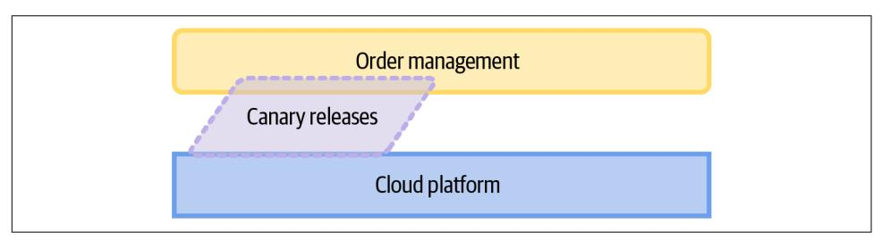

*Figure 6-1. When introducing canary releases, a cloud platform team collaborates with one stream-aligned team to quickly work out the requirements and tackle any challenges together.*

<sup>4</sup> For a nice description, see *[What Is Domain-Driven Design?](https://learning.oreilly.com/library/view/what-is-domain-driven/9781492057802/)* by Vlad Khononov (Sebastopol: O'Reilly, 2019).

<sup>5</sup> As introduced on the *[Team Topologies](https://oreil.ly/fhSIM)* website.

<span id="page-159-0"></span>Because the teams need to work closely together, collaboration requires a pretty big commitment: you have to put all other priorities aside for at least some members of both teams, to align their schedules. You should probably save this for challenging and high-value pieces of work, and usually as a way of rapidly exploring and innovat‐ ing at the boundary between the two teams.

The time to work closely together is when there is the most uncertainty—for exam‐ ple, when you are in a period of discovery, such as designing a new API, or introduc‐ ing a way to do canary releases. When you are doing more routine work, you should be aiming for lower bandwidth modes of interacting.

One approach to collaboration is to form a feature team, where some people from two different teams join together for a particular purpose. The biggest challenges I've seen related to feature teams are firstly, making sure you understand who will own the things being built. It's easy to find services that are in between and orphaned after the feature team disbands. And secondly, to make sure the team focuses on the shortterm gains. Don't spend a lot of time discussing your ways of working if this is only going to be a short-term thing (this means encouraging people to go with the flow!).

A form of collaboration that really worked for me at the *FT* was a secondment pro‐ cess, which means temporarily assigning members of one team to another. We did this when we were first forming teams working on enabling observability and insights (teams working as either platform or enabling teams). We got a commitment from our customer teams, the stream-aligned teams, to send people to us on second‐ ment. This was generally for three months, which aligned to our OKR process and was long enough for people to be able to take on a significant piece of work.

There were three main benefits to this, although the logistics could be a challenge. First, we had a direct line to our customers, giving us a good idea if the things we were working on were going to be valuable and adopted. Second, we found that our secondees were our best advocates once they went back to their teams, helping our broader goals around observability and insights. They knew our tools and they would share that knowledge. And finally, they'd also continue to propose changes and improvements: they knew us, and felt comfortable giving us feedback.

One final point on collaboration. You will generally collaborate for a relatively short period of time, because of the commitment but also because working together for a longer period will blur the boundaries: you don't want to merge the teams. It is also a fairly high-intensity way of working, with a high cognitive load. The end goal is gen‐ erally to end up with services that subsequent teams can consume: the interaction then will be X-as-a-service.

## <span id="page-160-0"></span>**X-as-a-Service**

This is an interaction style that minimizes the need to collaborate and focuses on sup‐ porting self-service. Another way of thinking of this is simple: one team provides a service and the other team consumes it (see Figure 6-2).

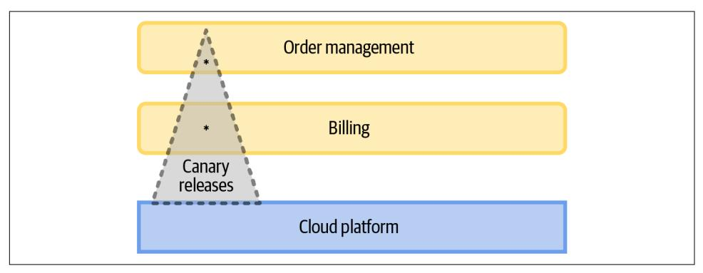

*Figure 6-2. After collaboration achieves the goal, canary releases will be available as a service to all teams. e asterisks show which teams are using the service (both, in this diagram).*

Often, this is the next stage after a collaboration stage: the solution found during col‐ laboration is turned into a service that additional teams can start to use with low lev‐ els of friction.

In general, platform teams should do most of their work in this style: building selfservice tools and creating great documentation. This approach increases efficiency and empowers individuals because it gives them ready access to the answers they need to move forward. For complicated services, they might collaborate with one team first to path find.

It is important that the team providing the service has a focus on the teams consum‐ ing the service. They need to support the service for the long term so that there are no unexpected or breaking changes. Additionally, they need to understand the consum‐ ing teams' needs, which means that product management skills are a great asset here. It's important to understand what the real problems are and whether the solutions the team has in mind are going to be attractive to other teams. I've seen teams invest time in a solution they liked, but that no stream-aligned team wanted to adopt.

I will talk more about this challenge in [Chapter 7](#page-174-0), which discusses engineering ena‐ blement and building a developer platform.

## <span id="page-161-0"></span>**Facilitating**

When one team has specific expertise, they can take on a facilitating style where their aim is to help the other team and transfer their knowledge to them (see Figure 6-3).

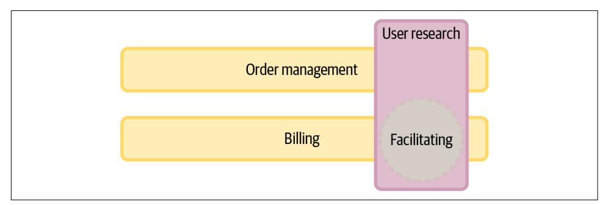

*Figure 6-3. User research is a skill that you won't necessarily have on each team. A sepa‐ rate user research team can facilitate user research within other teams.*

This is the main operating mode for enabling teams, because those teams are special‐ ists in a particular domain. They should work with other teams to coach them in an unfamiliar technology, or to identify where there are gaps or inconsistencies in capa‐ bilities offered by other teams. It's very much a consultancy model: engage to address a particular problem, then move on.

Sometimes an enabling team will be needed for a long time: many organizations have long-standing security, DevOps, or architecture teams.<sup>6</sup> Sometimes, enabling teams will form for a particular challenge—for example, an organization might be moving to Kubernetes, and an enabling team helping each stream-aligned team to migrate can make this far more straightforward.

Platform teams can also act as facilitators. They can invest the time to understand problems that are affecting multiple stream-aligned teams. Often, this relates to com‐ mon functionality like security engineering tools, observability, DNS, CDNs, or cloud provider offerings. For example, a central cloud team can keep on top of new announcements and make sure people are aware of improvements, such as new instance types or support for different programming languages.

## **Ways of Working That Support Autonomy**

You can set up a team with all the necessary skills, but they can't be autonomous unless you align the ways you work to support that autonomy.

<sup>6</sup> I tend to think of architecture as a thing people do, rather than a role people have, but unquestionably it is a place where experts can greatly help a team.

<span id="page-162-0"></span>This means a focus on every place where people are having to wait for someone to do something, and trying to remove that gate.

It also means trusting your teams to do the right things, and helping them to know what those right things are.

Let's go over some approaches that help teams to act autonomously.

## **Aligning on Outcomes**

If you are working on a team, you should expect some direction on what outcomes your team is targeting. But you should also have freedom on how you approach those outcomes.

Clarity is important: if a team doesn't understand what they are meant to be doing, they are unlikely to be effective. As found in [John Shook's case study](https://oreil.ly/KqaGD) on successfully introducing Toyota production and management systems into a US car plant, "What changed the culture was giving employees the means by which they could success‐ fully do their jobs. It was communicating clearly to employees what their jobs were."

Clarity isn't necessarily enough. Jason Yip has a great post on ["aligned autonomy",](https://oreil.ly/LjBxY) where he identifies several challenges.

The first is the "air sandwich." This is where there is a clear high-level vision and peo‐ ple understand their day-to-day work, but they don't see how the two connect.

"We want X, you figure it out" can be too large a gap. You need people in the middle to translate X into the context for those at the next level, to help create clear and actionable next steps.

At the *FT*, we had a high-level goal at one point of "March to 1 million" (subscribers). It was up to me, as lead on the content publishing platform, to find a way to link that to our work and communicate what was needed. For example, the importance of APIs that were easy for product teams to use to build new and enticing products had to be prioritized, alongside other concerns like accurate, timely publishing and a highly reliable software stack.

The second challenge is to make sure people hear the message they need to align to.

Too much information gets stored in a spreadsheet. Jason describes these as "infor‐ mation refrigerators." You have to go and get the information from them (as opposed to "information radiators," which share information without the receiver having to go through a lot of effort).

So, how do we transition to "information radiators"? I have found OKRs (objectives and key results), which I've used at the *FT* and elsewhere, are an effective way to plan <span id="page-163-0"></span>work and align on outcomes.<sup>7</sup> Objectives are goals, and should be significant, con‐ crete, and clearly defined. Generally, these align to product or technical strategy. One example could be an objective to decommission your data center and move every‐ thing to the cloud. Key results are three to five measurable success criteria for each objective. For moving out of a data center, a good key result for a quarter could be to reduce the number of servers in the data center by 50%: this shows what progress you expect to make toward a goal that might take several quarters to get to.

While the *FT* mostly used spreadsheets to document OKRs, there was a process around this with regular meetings to review progress and to discuss related OKRs.<sup>8</sup>

As a technical director, OKRs helped alignment because I would work with teams to agree on objectives, either aligned to higher-level goals of the department or the busi‐ ness, or to my strategy for our group. Then the teams would define their own key results, giving us a chance to check that we were aligned.

## **Light Touch Governance**

You have to move away from processes that require people to ask permission or get signoff.

When I first worked at the *FT*, we had a regular CAB meeting. Every time I had code to release, I would need to go to the meeting, explain what the change was, and get agreement for it to go into the staging environment and then to production. When you have many people trying to make changes to the same codebase, this does make some sense: you do catch potential conflicts. But a better way to fix this is to move to smaller, independent, frequent changes. Recognizing this, we removed the shared staging environment and dismantled the CAB.

This change enabled us to let the people with the most context about a change make the decision on when it was ready to go to production, and we let them go ahead and do that at will.

We still had a small friction there, though. Every change had to be logged, along with information on how to undo the change. I think this is a very valuable practice (and will talk about it in [Chapter 13](#page-370-0)), but logging the changes was being done via a GUI, so it took time. I *particularly* enjoyed having to enter in the timestamp for when I would start and finish the change I was about to make, then finding the start time‐ stamp was in the past by the time I got to submitting the form, so the change got rejected.

<sup>7</sup> Google has used OKRs for a long time and [its playbook,](https://oreil.ly/xpHAr) documented by John Doerr and team, provides a comprehensive introduction.

<sup>8</sup> In fact, the *FT* did adopt a tool and then later reverted to spreadsheets, and I've heard of other organizations doing exactly the same. I suspect the value is in the process, not in how the OKRs are stored!

<span id="page-164-0"></span>Raising manual change requests becomes a bottleneck once you are releasing tens of times a day. You really don't want to spend hours every day on this! So, we automated it. The majority of changes were logged as part of a build and release pipeline, using the information already available about who had initiated the build and the Git com‐ mit details. We didn't have to document how to roll things back, because for anything released through a pipeline, that's automated too. For changes being made outside an automated process, we had an API that people could call.

There are two challenges with these sorts of changes. First, for every gate on the way to production, you have people who are the gatekeepers. That could be testers, opera‐ tions, or security. You are removing some of their responsibilities and you need to convince them that this is an improvement, and is going to let them focus on highervalue stuff.

The second is to provide guidance to engineering teams about what the expectations are around quality, security, etc. They need to be able to evaluate whether code is ready to release. These guardrails and how to go about setting them up are discussed in Chapters [7](#page-174-0) and [11](#page-306-0).

## **Trust but Verify**

Trust teams to take action, but verify that they did or are doing the right thing if you need to for governance reasons (see [Chapter 11](#page-306-0) for a lot more about governance).

Some examples of this include:

- Rather than getting up-front signoff to do something, audit that it took place. This can be an audit that an expected thing happened, or that an unexpected thing happened: an example at the *FT* was an automated alert in the main opera‐ tional support channel in Slack if anyone logged in to the root AWS account. This would then be responded to by the person making a root-level change (one of a small team of people) to confirm that it was them. No confirmation would mean unauthorized access.
- Allow access to APIs through self-signup, but throttle heavily, and check what people are sending in through a preprocessing validation step. Basically, protect the service from mistakes (I have seen my servers get taken out by 30,000 requests accidentally sent in parallel and I consider that to be my error, in not setting an appropriate throttle on the API).

## **Agreeing and Aligning on Technology**

Teams don't need—and generally don't want—total autonomy around the technology they choose. Normally, the place where freedom to choose technology matters is for business differentiators. An example of this is where a new product or feature would be far easier to build using a new type of data store.

However, teams will also want to try out new technology because it lets them learn new skills, or because they think it's better than whatever is currently being used. This is what leads to a team building their own CI/CD solution out of lambdas or intro‐ ducing a new programming language. You don't want to completely block this type of initiative: I've seen a programming language change be very effective, speeding up delivery and decreasing costs. What you probably don't want is eight programming languages and six CI/CD solutions all existing in parallel.

There are two things you need in your organization. First, you need people to be able to find out what is already in use, and how much freedom there is for them to adopt an alternative. Maybe using a new service from your cloud provider is OK, but a new programming language needs discussion, and sending logs to a different log aggrega‐ tion tool is out of bounds. For common tooling, you don't want people to adopt a new technology just because they don't know there is already an option available. This is going to be discussed fully in [Chapter 7,](#page-174-0) but the minimum here is to provide self-service access, document things well, and make capabilities discoverable.

The second thing is to allow people to share when they are considering a new technol‐ ogy, so that the decisions being made are informed. Sometimes, another team within the organization may have used the technology being considered, or evaluated it and found some blocking issues. There should be a forum where you can find that out.

Also, it's often the case that one team needs something, but if other teams knew about these requests they would also want it. That means the first team is actually making decisions that will impact the whole technology organization.

There needs to be a way to share plans and get feedback. This can't be a top-down approach. Rather, there needs to be a mechanism in place to surface team needs organically within the organization.

When I was first at the *FT* we had an architecture group that evaluated and made rec‐ ommendations about which technologies we should use—for example, "Use Kafka for messaging," or "Use this database for resilience, this one for less resilient systems." While this may seem sensible on the surface, there are issues with limiting the options your teams have. When a model like this is implemented in practice, it may result in teams compromising and using something that doesn't quite meet their needs, leading to frustration and a lack of efficiency.

For example, Kafka was not, in fact, the right messaging solution for my content pub‐ lishing API team, where we had very few messages (the *FT* doesn't publish vast vol‐ umes of content!). We didn't need the scalability, and we also didn't need to partition topics. Meanwhile, Kafka was complex, and there was a steep learning curve. As a result, it was something the team struggled to support in production. However, we didn't have any other option available to us because the evaluation and decision had been made centrally.

<span id="page-166-0"></span>We learned from experiences like this and moved toward something we called the Tech Governance Group (TGG), which I will talk about more in [Chapter 11](#page-306-0). In brief, the TGG was a forum to raise a brief proposal of technology decisions that would impact more than one team. This approach spread understanding of what was going on across the technology department, resulting in fewer nasty surprises where a team found they were duplicating something some other team had already done.

Having a record of discussions about technology changes is really useful but it's not quite enough on its own. You also want somewhere that people can go to see the cur‐ rent technology landscape within your organization: what options are available, and which are most strongly recommended. A "Tech Radar" can be a very effective approach here. Thoughtworks has been publishing a quarterly [Tech Radar](https://oreil.ly/H7Muv) for a long time, showing its recommendations on the adoption status for tools, techniques, plat‐ forms, languages, and frameworks. It categorizes status as:

*Adopt*

Seriously consider using this, it's proven and mature

*Trial*

Ready for use but not as proven or mature

*Assess*

Interesting and worth a look

*Hold*

Not something they've had good experiences with, either flawed or often misused

You can build your own version of this—the simplest option is to put your informa‐ tion in a spreadsheet and use a tool on the Thoughtworks site to create a radar visual‐ ization.<sup>9</sup> You may want to choose different adoption status values and quadrants, in which case you need to build a local version. Whichever, the process of categorizing your technology estate is likely to be valuable, and in the end you hopefully end up with something people can easily refer to.<sup>10</sup>

## **The Role of the Individual Contributor**

With a lot of autonomy within teams, you need someone in a role with a view that goes across teams and even groups. This person can pick up on unnecessary duplica‐ tion and flag decisions that are going to cause conflict down the line.

When the *FT* transitioned to microservices, the role of Architect became Principal Engineer. This is a significant shift, because while both are individual contributor roles,

<sup>9</sup> Available in [GitHub.](https://oreil.ly/LZlBp)

<sup>10</sup> My experience is that it can be hard to get consensus!

<span id="page-167-0"></span>principal engineers, at least at the *FT*, are more hands-on and are about more than architectural decisions, although that is a key thing for them to focus on.

As Sam Newman says in *[Building Microservices](https://learning.oreilly.com/library/view/building-microservices-2nd/9781492034018)*, this role is about "surveying the land‐ scape," and the role is an enabling one, not a directive one.

It is a tough role, because influencing without being a manager is difficult, but my view is it is essential in a complex modern software environment. If you want to know more about individual contributors, I recommend Tanya Reilly's book, *e [Staff Engi‐](https://learning.oreilly.com/library/view/the-staff-engineers/9781098118723/) [neer's Path](https://learning.oreilly.com/library/view/the-staff-engineers/9781098118723/)*, and Will Larson's [profiles](https://oreil.ly/8RstA) of people who have reached staff-plus level.<sup>11</sup>

## **Minimum Viable Competencies**

In every cross-functional team, you need a set of competencies to allow them to work independently to build code and release it to production.

Which competencies are needed will depend on your organization, but I would want to make sure I had at least one person thinking about:

*e product being built*

This may be a product manager or a technical leader.

*e architecture*

This could be an architect, a principal engineer, or a tech lead.

#### *Design*

For a website, this might be a designer, or it might be a frontend engineer making use of components and style guides put together by a central team.<sup>12</sup> For backend services, you should still design the API and this is likely to be done by a princi‐ pal engineer or tech lead.

*Site reliability, i.e., focusing on building a resilient, observable service*

This could be a specialist site reliability engineer, or a software engineer with par‐ ticular skills and interest in this area.

You can support this in two ways. First, make sure there are experts in the organization who can help people develop the skills they'll need and provide access to training.

Second, be super clear on what the minimum expectations are for cross-cutting con‐ cerns such as tracing, observability, operability, and security posture. This is essential to make sure teams are good citizens of shared responsibilities, so that, for example,

<sup>11</sup> "Staff " or "Staff+" seems to have become shorthand for "senior individual contributor."

<sup>12</sup> At the *FT*, most teams didn't have a full-time designer, instead the design group acted as an enabling team. To make that work, you do really need someone on the team full time who is paying attention to the design and how it is implemented.

<span id="page-168-0"></span>you aren't left struggling to work out what has gone wrong in production because one team in the middle of a workflow chain didn't properly implement tracing.

There will be a few places where you have to mandate a particular approach, but in most cases, this is best handled through guardrails providing guidance on what makes for a "production-ready" system. This could be around cost, operability, outof-hours support agreements, etc. I will talk about this more in [Chapter 11](#page-306-0).

## **Making Space for Learning**

When you have cross-functional teams rather than teams linked to expertise (e.g., QAs), you need to find other ways to maintain and build skills in particular areas. This means putting time and money aside for learning.

That could be external: for example, sending people on training or to conferences. This is a great way to learn from the experiences of others, and to build a network of people who can answer the question "We are thinking of doing this thing: how did it work out for you?"

You can also get a lot of benefit from running things internally.

You might decide to set up communities of practice, which are a shared space for par‐ ticular skills, separate from team hierarchy. You could set up regular 10% time, where people get to work on side projects or evaluate new technologies (I discussed this in [Chapter 4](#page-116-0)).

Secondments, mentioned earlier in this chapter as a way to enhance collaboration, also provide opportunities to learn new domains and technologies.

You can invite experts to come and speak. At the *FT*, I helped organize a tech talks pro‐ gram, where we ran a mix of internal talks and ones from external invited speakers.

This is a great way to support learning and positively influence behavior in your teams. I found it particularly effective to invite an external speaker to talk about things that mattered to me and that I wanted my team to be thinking about. They automatically have more authority—even better if they are known in the industry and you'll probably find people telling you "Charity said this was important" for the next year or two.<sup>13</sup>

Internal tech conferences can also have a big impact. Having autonomous teams means you don't always know what other teams are working on, and internal confer‐ ences let you share ideas and experiences across the organization. This can be focused on a particular area: for example, Dynatrace ran an internal conference around

<sup>13</sup> This name was not chosen at random at all. Having Charity Majors come to speak about observability had a noticeable and positive impact at the *FT*!

<span id="page-169-0"></span>Keptn, an open source project that many people at Dynatrace contribute to.<sup>14</sup> Alter‐ natively, you can choose to cover many different tracks: Capital One had 1,200 employees at its internal tech conference, with over 50 talks in 13 learning tracks.<sup>15</sup>

## **Responsibilities of Autonomous Teams**

*"Everything broken all the time" is not the kind of autonomy we're looking for.* —Jason Yip<sup>16</sup>

If autonomy is a responsibility rather than a benefit, then what kinds of responsibili‐ ties does an autonomous team have?

This will be a theme throughout this book, but let me give an overview here.

## **Active Ownership**

Teams should actively own their code, which means doing the boring stuff: upgrading dependencies, responding to security vulnerabilities, etc. This is a long-term commit‐ ment: code isn't "done" until it is no longer running in production *and* all the resources have been cleaned up.

One principle we had at the *FT* was that every service in production had to be owned by a team, meaning that team would be listed as the owners in the service catalog and expected to respond to any problems with the service—for example, production issues, security vulnerabilities, upgrades. Sometimes, that meant assigning an owning team to a service that had effectively been abandoned. That sucks, but as a responsi‐ ble team, you should be able to recognize that you are the best of a set of bad options for owning something!

Active ownership means being accountable for:

- Supporting the service in production.
- Maintenance and patching. For example, upgrading dependencies to fix security issues or because they are no longer supported.

<sup>14</sup> ["Why Your Next Tech Conference Should Be Company-Internal"](https://oreil.ly/M1f8b), blog post, July 2021.

<sup>15</sup> My former colleague Victoria Morgan-Smith wrote a book with Matthew Skelton, *Internal Tech Conferences* (Conflux Book, November 2020), with case studies on how the *FT* and others have used these to encourage sharing and learning across an organization. Chapter 21 of *[e DevOps Handbook](https://learning.oreilly.com/library/view/the-devops-handbook/9781457191381/DOHB-ch_21.xhtml)* also has several case studies of internal tech conferences.

<sup>16</sup> Jason Yip, ["Product Development Guiding Principle"](https://oreil.ly/Sp9j0).

<span id="page-170-0"></span>• The decisions made by the team, even if that wasn't you. For example, if the ser‐ vice uses nonstandard tech for your organization, then the options are to support that until the service is decommissioned; to persuade a central team to adopt it; or to migrate to something more standard.

I'm going to expand on active ownership in [Chapter 9,](#page-244-0) because this is important. In that chapter I'm also going to talk about approaches to ownership where you have other teams that want to contribute changes to your code. It's something I've found can be a source of contention.

## **Communication and Cooperation**

There is a lot of value in sharing information—after all, good information flow is a hallmark of a generative organizational culture. It seems like this is in conflict with the idea that we should be working to reduce unnecessary touchpoints with other teams, but the focus should be on reducing synchronous communication to *only* the places where it is needed. A team should still invest in sharing information, and be open to collaborating when that is the best option.

#### Teams should:

- Share what they are working on or planning to work on if that is likely to have an impact beyond the team. I have occasionally worked with teams that developed an "ask for forgiveness not permission" approach, and sometimes the impact of that was considerable, and not positive. Deciding, for example, to introduce a competing approach for a common capability without any up-front discussion with the team that owns the current implementation can really affect trust between teams.
- Look for a chance to share your experiences and to learn from other team's expe‐ riences. This cross-pollination is highly valuable.

How you share information matters, because sharing needs to be easy to do and information easy to find. One common problem I've seen is multiple different docu‐ mentation approaches all running in the same organization so there's no simple way to search for or discover information. I strongly recommend picking one solution, buying enough licenses, and committing to it.

Other approaches that seem to work are monthly showcases, posters on the wall, and an externally facing blog. My former colleague Anna Shipman sold me on this as a very good way to share information internally. You have to write something that's clear enough for people without context of your organization, which is a very useful constraint!

## <span id="page-171-0"></span>**Compliance with Standards**

Teams have a responsibility to meet the standards that the organization has. Software development is about more than writing and deploying code, and the team should feel a responsibility for things like security, operability, accessibility, and handling of personal data. If there is a standard for how to structure logs, raise errors, share data, or report on service health, failing to comply can make it really hard for anyone need‐ ing to interact with these services: standardization helps with comprehension.

The organization can help by being clear on what it means to be ready for produc‐ tion, by creating clear guardrails, policies, and standards.

There's a lot more to say on this, because the more standards you have, the less scope teams have for making different decisions, having an impact on their autonomy. I'll talk more about this in [Chapter 11,](#page-306-0) discussing how to find the right level of standard‐ ization. Here, I just want to say there will be at least some standards, and teams must comply with those.

## **Maintaining a Team Page**

Teams should make it clear how to interact with them. They should create what *Team Topologies* calls a "Team API." To be clear, this isn't an actual API!<sup>17</sup>

It should include everything another team needs to know about your team, it should be easy to find, and it should reduce the amount of routine responding to requests that your team has to do! As with programming APIs, you should focus on making it usable and useful for other teams.

In my experience, you need to include:

- What the team owns, with links to the code repositories, GitHub teams, etc.
- How to use the team's services
- How best to communicate with the team
- The principles and ways of working the team follows
- What the team is working on now, and up next
- Who's in the team

Creating a team page doesn't require a complex tool; a wiki page can be enough. How‐ ever, tools like Backstage that allow you to catalog your services will often also support team pages, and keeping the information all in one place makes it a lot easier to find.

<sup>17</sup> A software API specifies how to interact with the software. Team APIs should specify how to interact with this team.

<span id="page-172-0"></span>

### Case Study: Supporting Autonomous Teams at the Financial Times

As described in the case study in [Chapter 5](#page-132-0), when I joined the *FT*, things were manual and siloed. Teams could not work autonomously and getting things done involved a lot of handoffs between teams.

For example, we had shared staging environments and needed signoff from a CAB to release code into the staging environment (weekly) and then to production (monthly).

While we had a continuous integration server, it had been configured so that there were multiple sign-off steps. Another developer would need to sign off on this—but of course, could not have knowledge of everything in the release, making this a literal box ticking exercise. QAs would also have to sign off on the release.

We needed to look at the processes and ways of working that we had in place so that the changes to our organizational culture and team setup could pay off:

### *Light touch governance*

We removed the CAB (as already discussed in this chapter) and the highly custom-configured automated build tool that needed a chain of signoffs. Devel‐ opment teams could decide when a release was ready to go out. We saw a big reduction in the number of failing releases, which convinced people that trusting teams to do the right thing was safe.

### *Agreeing and aligning*

We encouraged teams to try out new technology, removing the central list of architect-approved software and making the central platform optional. However, we provided guardrails that defined our expectations around quality, security, etc., and we expected teams to make their case for bringing in new technology via a lightweight process that was more about conversations than proposal writ‐ ing (we did this through the Tech Governance Group, which will be discussed more in [Chapter 11](#page-306-0)).

### *X-as-a-service*

We introduced infrastructure as code and automation, and encouraged our plat‐ form and enabling teams to focus on providing self-service access wherever pos‐ sible, to cut down on the need for teams to wait for something to be done. Generally that meant a move to auditing activity and flagging issues, over signing off in advance.

These changes allowed the *FT* to make several orders of magnitude more changes: from 12 releases of the website a year to hundreds every day.

## <span id="page-173-0"></span>**In Summary**

It isn't enough to set up long-lived, cross-functional teams aligned to domains, unless you are willing to empower them and remove the barriers that stop them from being autonomous.

Mostly, that is about removing the need to wait for someone else to do something. *Team Topologies* identifies three interaction styles for teams that need to work together:

### *Collaboration*

Working closely together with another team. Reserve this for rapidly exploring and innovating at a boundary between teams.

### *X-as-a-Service*

One team provides a service, the other consumes it. This minimizes the need to collaborate and coordinate.

### *Facilitating*

A team with specific expertise aims to help and transfer knowledge to another team.

Adopting these ways of interacting minimizes one team waiting for another. But what about our processes and ways of working?

As an organization, you should focus on every place where people are having to wait for someone to do something, and try to remove that. You need to trust your teams to do the right thing, and to help them know what those right things are.

This requires a focus on what you want to achieve, rather than how you are going to achieve it. Governance should be light touch, and wherever possible should rely on auditing what happened rather than requiring sign off ahead of it happening.

This freedom can be exhilarating for teams, but it comes with associated responsibili‐ ties. They need to take active ownership of the things they build, to be open about what they are doing, and to ensure they comply with standards. Teams should make sure they are easy to work with by defining a Team API that covers how to interact with them for the best outcomes. Like other APIs, the focus should be on making something usable and useful for other teams.

Autonomous teams get to make their own choices, but those choices should be focused on the key differentiators within their domains. In the next chapter, I am going to look at how platform and enabling teams can create a paved road for the things every team needs to do: most teams will use the road, but a few will need to go off road, which is possible, but more work.

# <span id="page-174-0"></span>**Engineering Enablement and Paving the Road**

In earlier chapters I made the case for autonomous, empowered, cross-functional teams. They can move fast because they don't have to wait for people outside the team to do something. That includes making decisions about the technology to use: auton‐ omous teams get to make their own choices.

But there is a problem with this: those teams are making choices that optimize for their needs. Lots of local optimization, particularly where you have a microservice architec‐ ture that makes it easier to have diverse technology choices, can leave your organization with an unsupportable mess of different technologies. It also prevents global optimiza‐ tion, leaving a gap when it comes to things that matter to the department as a whole.

You really don't want every team solving the same problems in potentially different ways, particularly for the problems that aren't core to your business. There are very few businesses where having different continuous integration tooling between one team and the next is a business differentiator!

Product development (stream-aligned) teams should spend the majority of their time working on things that provide value to the business. Other teams should support them in doing that.

This chapter is about engineering enablement. One piece of that is building and sup‐ porting a platform that can provide on-demand and self-service capabilities to stream-aligned teams—and I want to talk about how doing it right means "applying software skills and product management thinking to infrastructure challenges."<sup>1</sup>

<sup>1</sup> Thanks to Crystal Hirschorn, who defined platform engineering as this in her QCon London 2023 talk "Plat‐ form Engineering—Where Do We Go From Here."

<span id="page-175-0"></span>There are other things an engineering enablement team can do to reduce the cogni‐ tive load for other teams, while ensuring that the organization can keep control of risk, cost, and complexity, and I'll also cover those in this chapter.

I want to explain why I think a "paved road," as championed by firms like Netflix,<sup>2</sup> is the right approach. The premise for the paved road distills down to providing a set of tools and services for people to use, making it optional but having strong guidance on what is expected if you go off road. I'm going to talk about what the paved road should look like and dig into the benefits of keeping it optional. I'll discuss how to decide which things to pave and what teams should expect to do if they go off the road.


When I say "paved road," for many companies it makes sense for there to be multiple paved roads—for example, one for mobile development, one for backend, and one for machine learning. This is the approach Spotify takes and above a certain size of organiza‐ tion, you'll probably need more than one path.<sup>3</sup>

I'll walk through a set of principles for building a paved road. These principles are underpinned by a focus on developer experience and developer productivity. If your paved road doesn't make people happy, you need to rethink your approach. That means you need to think about how to measure the impact.

This chapter is in the culture section of the book because to get this right, you need to change the culture of how infrastructure and platform teams approach their work. These teams are more like service providers now: they need to understand their cus‐ tomers and focus on enabling them to work effectively. We can be overwhelmed with choice and complexity with so many tools and SaaS options around. Teams focused on engineering enablement can have a huge impact by taming that complexity and allowing other teams to maintain a narrow focus on the business domain at hand.

## **What's in a Name?**

As I write this in 2023, there's a buzz around an evolving set of practices generally labeled platform engineering—e.g., see the InfoQ Cloud and [DevOps](https://oreil.ly/cCvxP) Trends for 2023, which shows Platform Engineering in the "Innovators" space.

I absolutely believe this is a positive shift, but I really prefer to think of this as engi‐ neering enablement, because calling this "platform engineering" strongly implies that the *platform* is the most important thing.

<sup>2</sup> See Dianne Marsh's presentation ["The Paved Road at Netflix"](https://learning.oreilly.com/videos/oscon-2017/9781491976227/9781491976227-video306724/) at Oscon 2017.

<sup>3</sup> See Spotify's writeup on its engineering blog of ["How We Use Golden Paths to Solve Fragmentation in Our](https://oreil.ly/gS4_0) [Software Ecosystem"](https://oreil.ly/gS4_0).

<span id="page-176-0"></span>I agree with Sam Newman that this can encourage a focus on the wrong things. If you are called the "platform team," it's easy to feel that your job is to build a platform. "Are they ever going to be in a position to think about alternatives? To realize a better way to solve the problems at hand? These are teams where they have only one tool, one hammer—and all problems better be a nail. Or else."<sup>4</sup>

It's also true that there have been platform teams for a long time. But a team focused on paving the road will think about things differently. A different name is a sign of that necessary mindset change.

One reason that *Team Topologies* practitioners now focus on "platform grouping" rather than "platform team" is that generally, there are multiple teams within the plat‐ form, and there will be teams of all types. For example, some that are aligned to a stream of work, some that are enabling other teams, and some that are providing a platform themselves. See Figure 7-1 for an illustration of what this looks like and how engineering enablement teams interact with stream-aligned teams.

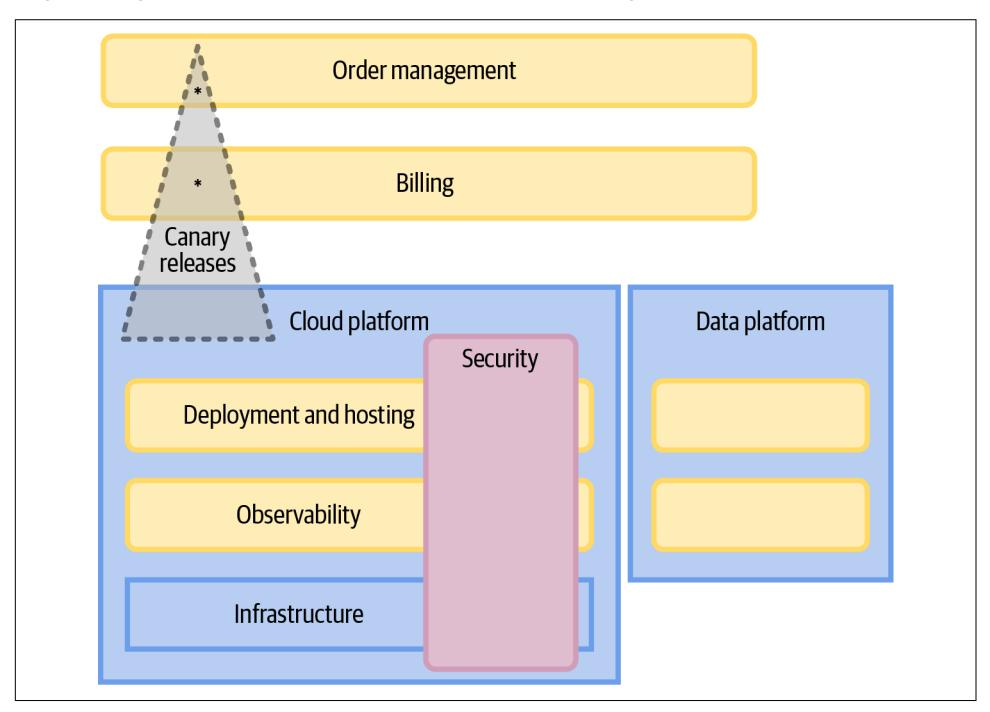

*Figure 7-1. Engineering enablement has stream-aligned, enabling, and platform teams interacting within the group and with external teams.*

<sup>4</sup> Sam Newman, ["Don't Call It a Platform".](https://oreil.ly/rQ-Mf)

<span id="page-177-0"></span>I still find "platform grouping" doesn't quite work for me, because the focus should be on reducing the cognitive load for stream-aligned teams. That might not require a fully fledged platform at all!

At the *FT*, we called it the Engineering Enablement group. Other organizations may call this Developer Experience, or Delivery Engineering, or just stick with Platform Engineering. The key thing is around who the customers are for this group: it's other teams. And the purpose: to enable those teams to optimize for delivery of value.

The goal should be to do just enough to increase flow in other teams, working via low-friction, loosely coupled interactions wherever possible.

## **Building a Platform**

That said, the creation of one or more developer-focused platforms is often the right way forward. Let's look at what that platform should provide.

Before microservices, and before DevOps, as a backend engineer I didn't often inter‐ act with our platform and infrastructure teams. They'd set up servers and hand them over in the early stages of a project. If we needed a DNS change, or to add some mon‐ itoring of a server, we'd raise a ticket. Most changes were manual, and took time, but they didn't happen *that* often. This meant a manual process didn't impact us as badly as, for example, having a manual release process.

That changed when we started building microservices. New services are common, and involve infrastructure changes. Definitely not a good idea to be doing that man‐ ually, because it's too error prone and time consuming.

As Charity Majors has [pointed out](https://oreil.ly/_Rpnj), "Microservices change the game from 'building code' to 'building systems.'"

Moving to the cloud may mean we no longer need to buy and configure hardware or run a data center—we may not even need to run our own servers anymore—but there are still lots of things that are part of our tech stacks that are not core business prob‐ lems and someone needs to do them.

You could expect engineering teams to take this on, as autonomous teams—after all, asking another team to set up infrastructure for you doesn't scale when you do this all the time as part of your day-to-day work.

Or, you can still have some sort of platform, but now the focus has to be on what it allows your delivery teams to do rather than the platform itself. That means optimiz‐ ing for self-service, asynchronous tools, and if you can lean on a vendor, rather than building something yourself, you should.

<span id="page-178-0"></span>Evan Bottcher of Thoughtworks has a definition of a digital platform that I really like:

A digital platform is a foundation of self-service APIs, tools, services, knowledge and support which are arranged as a compelling internal product. Autonomous delivery teams can make use of the platform to deliver product features at a higher pace, with reduced co-ordination.<sup>5</sup>

Note the focus on the users of the platform, and on making sure it all fits together. And also note that this is described as a "compelling internal *product*." I'll return to that later in the chapter.

Over the last decade, we've benefited from a huge increase in available frameworks and tools for building software. Individually, they are each great, but together they are overwhelming. Engineering enablement needs to bring these tools together and make them easy to use. So, what kinds of things should engineering enablement teams be doing? What should you include in an internal developer platform? What domains and what kinds of tools and services should you be considering?

## **Platform Services**

The scope for engineering enablement should be anything that a team might need in order to build, release, run, and support software. Which things you focus on will depend on your own organization and architecture, and more importantly on what your customers find difficult and frustrating, but I'd expect to see some of the following:

- Source control—although I expect most people to use SaaS here, you may want to implement additional controls<sup>6</sup>
- Support for building and maintaining build pipelines and CI tools, including automated quality checks and security scanning
- Support for deployment to environments, including tools for doing canary relea‐ ses, using feature flags, and so on
- Compute (VMs, or containers, or a serverless solution like FaaS)
- Storage and databases
- Load balancing and networks
- Internal routing and communication (whether service mesh or not)
- API gateways, CDNs and DNS, i.e., the edge

<sup>5</sup> Evan Bottcher, ["What I Talk About When I Talk About Platforms"](https://oreil.ly/AcVRG).

<sup>6</sup> For example, integrating this into a leavers process; or managing licenses allocated to guest contributors to make sure we track who granted someone access and why, and remove that access when it is no longer required.

- <span id="page-179-0"></span>• Observability tools such as tracing, logging, and metrics; also dashboards and alerting/escalation tools
- Web components—the frontend benefits from a platform too!

I'm not going to say much more in this chapter about each of these areas, but in [Part III](#page-242-0) I will give examples when discussing the different facets of building and oper‐ ating a microservices-based system.


I do want to sound a word of caution though: the same concerns apply for teams in this engineering enablement domain as for any other team. You want them to have a clear focus, and not to become the dumping ground for "a miscellaneous collection of unrelated systems."<sup>7</sup>

Don't ask these teams to take on too much. Make sure they are staf‐ fed sufficiently and if necessary, split the systems across two teams.

It's a good idea to lean on SaaS solutions and cloud providers wherever you can in developing platform services: it reduces the effort required to build and maintain services, although the teams do then need to develop strong vendor management skills (discussed later in this chapter). Once you get to a certain scale you will undoubtedly need some bespoke pieces, but by buying as many commodity compo‐ nents as possible, you can keep your focus on the things you *cannot* buy in, those that satisfy needs specific to your organization.

## **Organization-Level Concerns**

There are some things that are best looked at across the whole organization and should absolutely be considered when building platforms and tooling.

Some of this is about making sure cross-functional requirements like performance, security, and cost-efficiency are consistently addressed and managed. Some of this is about wide-scale changes, for example, migrating the whole organization away from a particular vendor.

Let's discuss this in three parts: infrastructure (particularly keeping on top of costs); security and compliance; and anything that needs to be consistent across the organi‐ zation (things like moving from data centers to the cloud).

<sup>7</sup> From the Thoughtworks Tech Radar, warning in 2022 against *[Miscellaneous Platform Teams](https://oreil.ly/quSQd)*.

<span id="page-180-0"></span>

### Infrastructure efficiency and costs

When you allow engineering teams to set up their own infrastructure, you need some way to keep a handle on cost and efficiency across the whole estate. That can include:

- Finding resources that are no longer being used—it's easy for engineers to spin something up then forget about it!
- Providing tools to shut down servers and other infrastructure overnight and on weekends for test or staging environments. Turning things off from 8 p.m. til 8 a.m. on weekdays and for the whole weekend can save 60% of the bill for things that are charged by the hour.
- Spotting where people aren't using the optimum resources, for example, the wrong instance types. Cloud providers add new instance types all the time, and a central team can invest in understanding where there are potential gains from a switch.
- Providing platforms that are optimized for cost. For example, Skyscanner's Kubernetes cluster utilizes [AWS spot instances,](https://oreil.ly/XHkaB) which offer a big discount because you make use of spare capacity, but they may be reclaimed at short notice.<sup>8</sup> This is an example of an enabling team working through the potential issues and providing a solution to stream-aligned teams that abstracts away the complexity.

I recommend keeping track of the cost savings, because this is one of those places where an engineering enablement team can demonstrate impact!

### Security and compliance

Building security into platform services removes risk for teams using those services. There is a fair amount of security engineering tooling that can be incorporated into your platform—for example, Snyk for finding vulnerabilities in your code and depen‐ dencies and Aqua for infrastructure security scanning.

In my experience, when a high-impact security vulnerability is found—something like the [Heartbleed bug](https://heartbleed.com) or the [Log4Shell](https://oreil.ly/kYtPN) vulnerability—you need a central team that can work out the exposure and manage the response. The actual patching might be done by individual teams, but someone needs to have that wider view.

<sup>8</sup> See [this video](https://oreil.ly/dIuij) from Amazon Web Services for a brief overview.

<span id="page-181-0"></span>Similarly, with legislation like [GDPR,](https://gdpr.eu) an organization needs to understand which sys‐ tems store personal data. A platform group can work with compliance teams to pro‐ vide tools to make it easy to track this, and to support a timely response to [subject](https://oreil.ly/s3Trq) [access requests,](https://oreil.ly/s3Trq) for example.

There are two aspects to focus on: one, do you know what you have in your estate? If you don't, you can't really know whether you have handled a security issue. I will talk more about this in [Chapter 9](#page-244-0) when I cover ownership. The second aspect is to take responsibility for reacting to these cross-cutting issues. Not that these teams need to do all the work, but that they need to be able to assure the organization that all the necessary work is in hand. Generally, I'd expect an engineering enablement group to work with incident management to gather a group of people together to respond to a specific vulnerability.

### Organization-wide changes

A final organization-level concern is where you need to make a high-impact change in technology. This could be a strategic move—for example, moving out of data cen‐ ters and into the cloud. It could also be in response to outside forces or perceived risks—for example, a vendor that is in trouble, or a product that is being deprecated unexpectedly.

I am going to talk about upgrades and migrations in [Chapter 14](#page-400-0). Those that happen in the platform are generally the most time-consuming and challenging. Anyone run‐ ning platform services can expect to handle a fair amount of upgrades and migra‐ tions: getting good at this is worth it.

## **Building the Thinnest Viable Platform**

Pretty much anything that lots of your engineers use should be a candidate for the platform. But before you decide to include any of them, you should ask yourself, is it needed? Will this make it easier for our engineers to solve business problems?

You should aim to build the minimum you can get away with. The point isn't to build a platform, it's to reduce cognitive load for other teams. Not every company needs to run its own Kubernetes clusters!

*Team Topologies* talks about the thinnest viable platform. This could in theory be as simple as a wiki that lists all the available SaaS services with details of how to use them.

Almost every organization will need more than this, but the aim should always be to avoid the "undifferentiated heavy lifting" I mentioned in [Chapter 1.](#page-30-0) There are very few companies where running your own infrastructure is a business differentiator (there may be a cost consideration of course), so aim to keep it simple and build only what is necessary.

<span id="page-182-0"></span>Think about how much of your infrastructure stack can be provided for you. Could you use serverless components? That isn't just about functions as a service. I would rather use the queues and storage options from my cloud provider because they inte‐ grate well and are patched and managed for me.


Going back to functions as a service, though: we used these very widely at the *FT* for anything based on events, including for things that in the old days would have been a cron job!

If you want to run Kubernetes, do you really need to run it yourself? Cloud providers and third parties can help here, leaving you to focus on areas that are more critical to your business.

And do you actually need Kubernetes? Could you deploy your applications to a PaaS? The *FT'*s use of Heroku in the mid-2010s removed a fair amount of toil from teams.

Maintaining and extending software takes time and effort. This is a good reason to only maintain, in the words of Abby Bangser, "custom platform documentation, pro‐ cesses and tools that improve your business's ability to deliver value and are unique to your business."<sup>9</sup>

The key insight from Abby is that what constitutes a minimum bespoke platform changes over time, depending both on the business context and on technology changes. There were many things that a platform had to include when we ran data centers that were no longer needed once we were in the cloud, and new things become important. Beyond this, even once you are running in the cloud, your base platform, provided by AWS, Google, Azure, or others, is not static. There is a con‐ stant evolution with new services and capabilities.

You should review your platform regularly to see whether you can realistically make it thinner by taking advantage of these changes. Gregor Hohpe calls this a "floating platform" (see his 2022 PlatformCon talk ["The Magic of Platforms"](https://oreil.ly/GOb32)).

When something you built becomes available as a product or commodity, you have two choices: keep your hand-rolled version, or move across. How do you decide which to do? I focus on the cost of maintaining the custom-built option, and the risk if something goes wrong with it.

<sup>9</sup> In her article for New Stack, ["MVP or TVP? Why Your Internal Developer Platform Needs Both"](https://oreil.ly/uv53f).

<span id="page-183-0"></span>One example where we moved across as new options became available comes from my time on the *FT'*s content platform. We ran containers before there were production-ready container orchestrators. We built our own. Once Kubernetes was production-ready we moved to that, and once our cloud provider offered managed Kubernetes, we moved again.

In contrast, the *FT* stuck with its own service catalog even once tools like Backstage were available, because the amount of time spent maintaining this and the risk if any‐ thing went wrong were both pretty low, and we still had some functionality heavily customized to our own organization's needs.

Different organizations will make different decisions too. The *FT* didn't introduce a tracing tool while I was working there; we continued to use our log aggregation tool and correlation IDs to visualize the path a request took through our systems. This didn't take a lot of maintenance, likely because there wasn't a lot of custom code involved; just a library to create and propagate unique correlation IDs on requests, and use of a vendor's query and visualization tools.

MOO, an online custom print and design company, made a different choice, moving from an in-house visualization tool to a vendor-provided one to reduce the mainte‐ nance costs and benefit from the level of innovation a specialized vendor can bring.

It can be hard to make a move away from an internal tool. People have an investment in building and understanding how to use it, and it's always harder to persuade peo‐ ple to spend time on a migration over building a new capability. The point is that once you do this migration, your time is freed up for innovation, rather than mainte‐ nance of a tool that is no longer of high, differentiating value.

## **Build for the Needs of the Majority**

When choosing what to do, aim to solve for the majority of your engineers. Simon Wardley has an interesting model of the different types of engineers you might have in your organization: explorers, villagers, and town planners.<sup>10</sup>

What type of person an organization needs depends on what you are building (often, you need different types of engineers for different parts of your organization). For instance, an explorer is comfortable with uncertainty. They will get something built quickly but you may not trust what they build to keep working. They are great for exploring new areas and prototyping.

<sup>10</sup> Simon Wardley, ["How to Organise Yourself ".](https://oreil.ly/Ryu16) Simon's original formulation of this idea used the terms pio‐ neers, settlers, and town planners, but he has changed the terminology, so I'll use those newer terms here.

<span id="page-184-0"></span>A villager will take those half-baked things and turn them into products, informed by customers, bringing in money.

A town planner takes those things and makes them better, cheaper, and repeatable. They turn things into a commodity or a utility.

This may sound like a continuum and you may feel the need to build for all. However, stay focused on the needs that will impact the greatest number of engineers. For example, at the *FT*, I needed to build for villagers. We had a fair share of explorers, and we'd get a lot of feedback from them, but they were much more comfortable hacking things together than the majority of engineers. Build for the majority.

But what about the roles that engineering enablement teams play? Often, they act as town planners, in that they are making life easier for the villagers. However, I also expect them to do a bit of exploring and "villaging" as well: finding new things and making them usable for others in the organization. Enabling teams in the *Team Top‐ ologies* sense feel very much like explorers to me: getting out there and finding new capabilities, and very much on the leading edge.

## **Platform as a Product**

Bringing product thinking to building a platform is a big cultural change in my expe‐ rience. It's also a bit of a challenge, because it can be difficult to find people with a product focus who also understand the technology. And I think you have to, because your customers are engineers.

*Platform benefits from a good, technical PM with business acumen. Someone to focus on the work to clarify the potential impact of different initiatives, which helps with prioritization. Someone to seek that input and feedback too, and use it to make tough judgment calls, often to decline the edge cases that can be so attractive to many platform engineers. Someone to partner with engineering and help balance operations, technical debt, and more explicit value adds.*

—Liz Saling, director of software engineering at GitHub

I've found it very helpful to recruit people internally from development teams into the platform, because they bring with them a whole set of things that they have found difficult, confusing, or irritating. They also bring their existing relationships with the teams they came from: that can be enormously helpful too. And finally, they are used to building in a product-focused way.

So, what does a product focus really mean? It means you need to be speaking to your customers. The advantage here is that they are right there, in your organization, mak‐ ing it easier to talk to them. It means you know who they are. Also, they share at least some common context and constraints because of the way your organization works, even if their needs vary quite a bit.

<span id="page-185-0"></span>

You might think you know what your customers need without talk‐ ing to them, since they are engineers and so are you. But this is a trap!

You still need to talk to your users because their needs and con‐ cerns will not be the ones you think they are.

A product focus means going beyond closing tickets or responding to feature requests. You should be doing product discovery. Form ideas about what is needed, and test those out.

Remember, your job is to figure out how to make the software engineering process work, and to make your customers more effective, not to build a state-of-the-art platform.

I saw a great talk from Jelmer Borst, Platform Product Manager at Picnic, where he pointed out that a platform PM has a very different outlook than a customer-facing PM.<sup>11</sup> It's a business-to-business-to-consumer (B2B2C) role, in that you need to build the tools and workflows that allow customer-facing PMs to achieve outcomes for their customers. Some of that is about enabling engineering, but it made me under‐ stand that you can't do this without having a high-level grasp of your organization's strategy. What are people trying to build and why? This will have an impact on what technology choices you should put in your platform.

Another difference for a platform product manager is that you don't necessarily have a large enough user base or enough traffic to use tools like A/B testing effectively. Some tools in the product management toolbase just won't help you. Later in this chapter I'm going to explain why I think people need to be able to opt out of some parts of the platform. This is important because with a captive audience, you don't necessarily feel the pressure to build a product that wows them.

A final comment on treating a platform as a product is that you need to iterate. Build the simplest thing that you think will give value, and measure whether it has the impact you expected (I'm going to talk about metrics later in this chapter).

Think about this like product teams think about their work. First, build the minimum viable product. You get this in front of your customers so that they have something of value more quickly, and so that you can get rapid feedback on what works and what's missing. You should be doing the same with your platform.

Don't go away for six months working on some new feature, and then present it as a completed solution. You're missing out on the chance to get feedback and to correct course.

<sup>11</sup> Jelmer Borst, ["How to Apply a Product Mindset to Your Platform Team Tomorrow".](https://oreil.ly/LzsWT)

<span id="page-186-0"></span>It's better to produce something quickly and to iterate. That iteration needs to be part of your plans from the start. Too often, I've seen teams build some platform feature, ship it, and move on, not taking the time to get feedback and never getting beyond that MVP.

## **Beyond the Platform**

What kinds of things should an engineering enablement team be doing, beyond building a platform? This section considers that question, particularly through the lens of moving away from our own servers and our own data centers and making more use of SaaS, PaaS, and the cloud in general.

## **Vendor Engineering**

*Effectively outsourcing components of your infrastructure and weaving them together into a seamless whole involves a great deal of architectural skill and domain expertise. is skill set is both rare and incredibly undervalued, especially considering how pervasive the need for it is.*

—Charity Majors<sup>12</sup>

The move to the cloud and increasing use of SaaS tools means that we tend to have a lot more vendors involved in our tech stack. This is a place where an engineering enablement team can add a lot of value.

First up, by investing in the relationship with the vendor. This team understands the tools, sells them internally, and makes sure the company is getting the best possible value for the money they are spending. This can also include assessing any training that the vendor offers for suitability, and if it looks appropriate, making it available within the organization.

Next, by making it easy to use the vendor's product in your organization. The engi‐ neering enablement team can help where the vendor doesn't have a clear, welldocumented set of functionality or a consistent set of APIs.

Often, it's about providing a consistent abstraction to engineers, across multiple ven‐ dors and internal tools. It may also involve adding workflows and extensions to deal with your organization's specific policies and compliance needs.


You don't want to put too much abstraction in the way. It is deeply annoying to be unable to use the underlying vendor product because some functionality is not surfaced in the abstraction. The aim is not to be a gatekeeper!

<sup>12</sup> Charity Majors, ["The Future of Ops Jobs",](https://oreil.ly/exZnb) August 2020.

<span id="page-187-0"></span>By providing documentation, templates, libraries, etc., you can also ensure that there is a much more consistent use of the vendor across the organization. This can be very helpful when you need to do an upgrade or a migration.<sup>13</sup>

Finally, vendor engineering should include keeping a handle on risk. You should assess your vendors regularly around whether they are in financial trouble or are looking likely to be acquired by a competitor—which can often mean a forced migra‐ tion or a sudden shutdown. You should also be aware of likely changes in how they price their product. Being an early adopter can mean a sudden shock when a vendor moves to more enterprise-level pricing!

## **APIs, Templates, Libraries, and Examples**

There are many things I have done as an engineer where every single time, I need to look up how to do it. I will likely also be inconsistent. I probably won't know the best approach. Normally, these are things that aren't core to what I'm working on, but I need to do them to get my code live.

I don't think I'm alone. Engineers don't generally really enjoy writing YAML and Helm charts.

A team with expertise in a particular area—for example, a cloud enablement team that lives and breathes AWS config—can make a massive difference by writing APIs, libraries, templates, and code examples.

Let's consider an example from the *FT*. Our cloud enablement team wrote a set of "blueprints" for people writing serverless code on AWS. These included common use cases like "read a message off a queue and stick it in S3."

This allowed people to save time and effort: they could compose these together to quickly build a new app. It also meant a level of consistency between different teams' configuration and codebases. That's a great help when people move teams or you are trying to solve a production problem.

I want to include a big challenge with templates, libraries, and examples: managing change can be a massive headache. Once these things are out there, being used by teams, how can you make sure they get updated with changes?

Many platform engineering teams are focusing on APIs, because exposing a service via an API means you can decouple the implementation from the interface. The team calling the API doesn't need to do anything when the internal implementation changes, where a copied template *would* require a change.

<sup>13</sup> In my experience, abstractions tend to be leaky, in that it is very rare to swap out a provider without having to change the abstraction. However, if everyone is using the same abstraction, at least you only have to work out how to fix it once!

<span id="page-188-0"></span>The other thing to note is that if you do find a way to roll out changes to a central template automatically, that does have the potential for some big impacts if you get it wrong. Skyscanner had [a full global outage](https://oreil.ly/4fefo) as the result of what seemed a relatively minor change to a template.

I'll return to this subject of managing change in [Chapter 14.](#page-400-0)

## **A Service Catalog**

With a microservice architecture and autonomous teams, knowing what you have in your software estate can be difficult, but it's also pretty important. What tools, pro‐ gramming languages, databases, etc. are people using? What services or APIs exist?

At the *FT*, we built our own service catalog, called Biz Ops. This listed every service, connected to a graph of other information: the team that owned the service, the groups they were part of, the communication channels to use to reach them. This allowed you to search for a service and find out what Slack channel to use to talk to the owners, or to find the codebase. Teams could still make their own decisions on documentation, as long as Biz Ops pointed people toward it.

I realize this is pretty bespoke! At the time we started to build Biz Ops, there was nothing available that we could buy that would allow us to track information about all our services. That's no longer the case. Most tools that support building an internal developer portal, such as Backstage, also include a service catalog. I'll return to the concept of an internal developer portal later in this chapter; all I really want to say here is that providing a way for teams to know what exists is an important part of engineering enablement.

## **Insights**

Providing insights into the software estate can be very valuable.

Teams want to focus on feature work but there is always other stuff—patching, upgrading, documentation. If you can make it easy for them to identify problems with their services and prioritize these, you make it much more likely they'll take 15 minutes and fix up some stuff.

An example from the *FT*: we wanted to improve the standard of our operational run‐ books. Runbooks are a subset of the information about our systems, focused on pro‐ viding our first-line team with information on how to restore a service that's unhealthy, and how to escalate if they can't fix the issue. Runbooks at the *FT* have a standard format, but in 2018 when we started this project, there were many runbooks that didn't have much information in them at all.

<span id="page-189-0"></span>We created a tool called SOS (System Operability Score), which scored the runbooks with a set of rules, weighted by the importance of the information. The rules and the weighting came from speaking to the first-line operations team that relied on the information.

Those scores were aggregated by team and by group, for a little gamification. See Figure 7-2 for an example leaderboard.

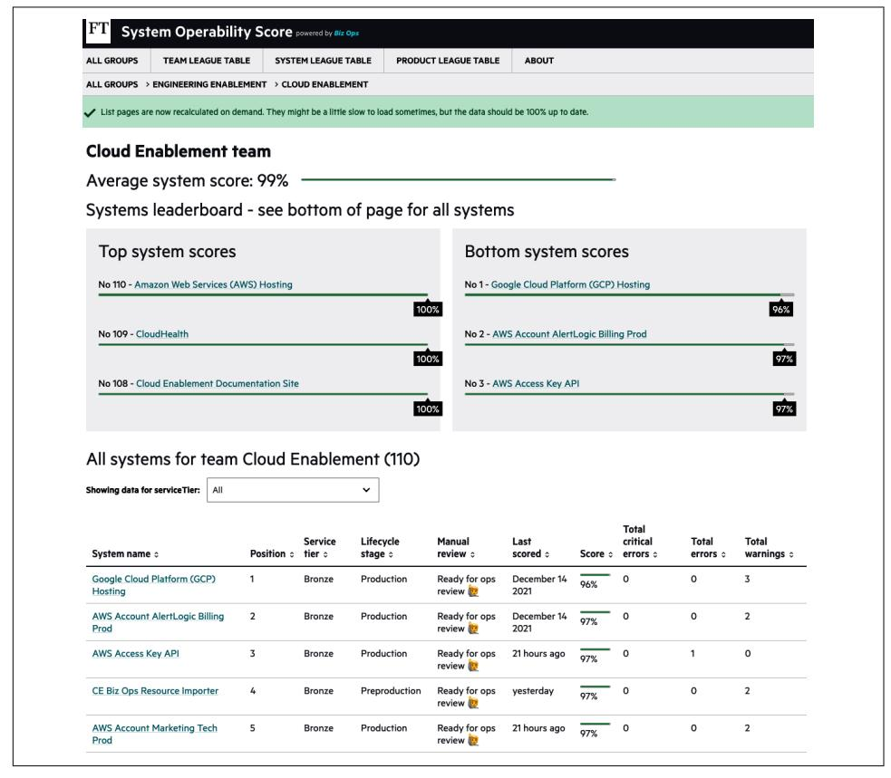

*Figure 7-2. e* FT*'s SOS (System Operability Score) service.*

The insights provided by SOS had a big impact. Some teams went from 20% of required information being there to 99%. Some of that was about competition to "complete" the runbook, but a lot was about making it easy to understand what infor‐ mation would be useful. If you looked at SOS, you could see what fix would impact your score the most, and you could generally jump straight in.

<span id="page-190-0"></span>The insights also had another benefit, unexpected as far as I was concerned: by scor‐ ing the runbooks, we gave people something they could easily measure, meaning this was a great basis for an OKR. This led to teams setting key results around increasing their SOS score by x%.

I appreciate that most organizations won't want to build their own system to get this sort of insight. Luckily, the system catalog tools available now—for example, OpsLevel, Cortex, and Configure8—all support scorecards for categories like reliabil‐ ity, observability, security, and quality, allowing teams to identify where services aren't complying with standards and need some improvement.

## **Paving the Road**

*While some developers relish the freedom to experiment and try new tools, the vast majority of developers want, and possibly need, clear guardrails and "golden paths" for shipping and running their code. Most developers want to focus their time writing code—not running infrastructure and trying to figure out things that, for productivity's sake, should just work, such as maintaining tooling, setting up dev environments, automating testing and so on.*

—Daniel Bryant<sup>14</sup>

A paved road defines a set of tools and services as the default for building software. Those tools and services should:

- Work well together
- Abstract away complexity
- Be fully supported, meaning that if you follow the paved road, you should auto‐ matically get lots of things done for you—for example, backups, log shipping, monitoring, setting up of build pipelines

I've spent several chapters talking about the benefits of autonomy. To briefly summa‐ rize here, autonomy means:

- You don't have to coordinate with other teams to get things done. You should be able to release when code is ready. That means many small releases, which give you quick feedback and are easier to troubleshoot because there is only one thing that has changed.
- You can also choose the right tools for your requirements, giving you the chance to identify new tools and technology that the organization as a whole can take advantage of.

And autonomy makes for happier teams, generally!

<sup>14</sup> Daniel Bryant, ["Platform Engineering in 2023: Doing More with Less"](https://oreil.ly/N3qKE).

<span id="page-191-0"></span>But there are also benefits to standardization, such as having a fairly standardized tech stack:

- It's less complex, making it easier to operate.
- There's less risk, because you don't have to make sure each of the different tech‐ nologies you are using have the appropriate licenses, are patched, etc.
- It's lower cost, because you don't have to pay multiple vendors, and you are more likely to get volume discounts.
- It's much easier for services to be transferred between teams, and for people to move between teams when priorities change or to take on new opportunities.

Complete autonomy makes for a lot of time spent on low-value duplication of effort. Forced standardization can stifle innovation: you want to be able to bring in new ideas, and for teams to be able to solve their own problems.

Building a paved road is the answer. A paved road is the easiest way to get from A to B, easier than going through fields and over hedges. However, it is *possible* to take an alternative route.<sup>15</sup>

The paved road is an important concept. In fact, you can frame all the other work I've discussed so far in this chapter in the context of it: the engineering enablement team should treat their paved road as a product, taking a mix of vendor-supplied function‐ ality and home-grown tools and services, building a coherent interface, welldocumented, with insights to show where teams could make better use of the paved road or where they may need to take action.

A paved road provides an easy route to production, but one that isn't mandatory. You can go off road, but it will be more of a slog. Using the paved road should be optional for two reasons. First, because it really is unlikely that one-size-fits-all across your entire organization. If teams have specific needs, they should be free to build or buy—something that meets those needs. The teams will, however, need to support whatever they build, meaning they will need to do upgrades, security fixes, etc. They will also need to comply with the policies and processes of your organization. A paved road makes the common cases easy, but it does leave room for exceptions. If the road is a freeway and you are on a skateboard, you should probably take a differ‐ ent route.

<sup>15</sup> For a discussion of how Netflix approached paving the road, see this blog post from 2019, ["Full Cycle Devel‐](https://oreil.ly/tWmwh) [opers at Netflix—Operate What You Build"](https://oreil.ly/tWmwh).

<span id="page-192-0"></span>The other reason the paved road should be optional is because if teams are free to opt out of using your internal platform and services, it requires the teams building them to really think about how to build something people want to use. This can be chal‐ lenging and difficult to deliver, and sometimes it takes a few iterations to get there.

Ultimately, a *good* paved road will almost always be chosen by product development teams, because it should be easier by far than hacking their own path. Most people want to be able to follow a paved road from idea to production, so that they can stay focused on the value they deliver.

Having the majority of your engineering team following the paved road also brings benefits for the organization because it increases the level of standardization, specifi‐ cally around the less exciting but essential parts of building systems.<sup>16</sup>

However, there will always be places where a team needs or wants something differ‐ ent. This could be out of necessity: the paved road doesn't support some functionality the team needs. It can also be because people want to innovate or experiment. This is something that should be encouraged! Often, a team will try something out and decide it's not as good as it looked. Sometimes, people will find a new approach that provides a lot of value to them and potentially to other teams, in which case it should generally be incorporated into the paved road as an alternative or a replacement.

Where teams do go off road, it's important to give strong guidance on how to approach this. What choices are they free to make? What are the requirements their solution needs to comply with?

Let's explore this further.

## **What Capabilities to Include**

What kind of capabilities are candidates for the paved road?

First, anything that needs to be done to meet expectations of what it means to build something *right*. For example, if you want logs to be sent to a central log aggregation service, your paved road should make that happen with the minimum of effort.

Second, anything that many teams need to do. A problem that only one team faces is usually best solved within that team.<sup>17</sup> So, if there are lots of teams using Postgres then great, invest in support for that. But if you have one team using a very specific data storage solution, I'd expect them to be the ones investing in tooling around it.

<sup>16</sup> See also a great InfoQ write up of a talk at QCon New York 2017 by Yunong Xiao, Principal Software Engineer at Netflix, "The *Paved Road* [PaaS for Microservices at Netflix"](https://oreil.ly/p_E20).

<sup>17</sup> They may consult with specialist teams for help, but that doesn't mean something needs to be added to the paved road.

<span id="page-193-0"></span>Finally, there is a question of how much will be gained by solving the problem cen‐ trally. If it takes a few hours to get up to speed with a particular tool and do what is needed, it may not save a lot of time to provide this capability. However, if there are bad consequences of getting this wrong, maybe it is still worth tackling. I'm thinking here about risk and cost concerns.

You should approach building capabilities in a modular way, so that lower-level abstractions get composed together—for example, building a test environment as a service that includes a database, queues, etc. This means that when someone needs a slightly different shaped test environment they can still use these lower-level compo‐ nents and just manage the delta between the paved road test environment and their own.<sup>18</sup>

What the paved road will look like is going to be different for different organizations. You may even have more than one paved road. For example, Spotify has different paved roads for backend and frontend applications.

Specifying the paved road is often about taming an existing sprawl—for example, you are trying to go from five programming languages down to three, or to standardize on the build and deploy pipeline tooling. How do you decide which option to choose from the many that are out there in your organization?

Charity Majors has a great [blog post](https://oreil.ly/tkS2i) about this, and suggests starting by setting up a small council of trusted senior engineers. It's important to share the thinking behind the choices being made, and to get feedback.

Another thing I've found to be very useful is to look at what tools people have actively chosen to use. If a developer found a way to pay for a tool on a credit card and more and more teams are moving to it, that is a great candidate for adding to a paved road. If that was a SaaS tool, for example, then the central teams often have to do very little beyond setting up a contract with the vendor and making the tool available to all teams.

Picking a tool that people already like and use and making it more widely available is generally low risk and high reward. Do it!

## **Make It Optional**

Before we move away from this topic, I want to expand on why a paved road should be optional. This is often a sticking point for existing infrastructure and platform teams, for a number of reasons.

<sup>18</sup> Thanks to Abby Bangser for this example!

They are experts in particular areas of technology: why should some other engineer‐ ing team be able to go off and hack something together? After all, won't it be risky, costly, and just worse than what this team can provide? And won't that team just want to do the fun stuff then hand it off to the central team to manage? Or worse, will they make the case for this new approach and we'll be out of a job?

Let's break this down. By making the paved road optional, you can receive very useful signals from your customers. If they opt out of using the tools you have built, this is something to pay attention to: after all, this is a fully supported path to production. If people choose to take the painful route of hacking through the jungle rather than fol‐ lowing your path, you need to work out why. Maybe you haven't understood what they actually need, or maybe what you've built is nonintuitive or clunky.

People not being required to use what you build is valuable. It helps to stop teams from going off and spending six months on a gold-plated solution to the wrong prob‐ lem. Hopefully, it prompts you to talk to your prospective customers more, and to iterate more. It should also help you to avoid building things that are already available as a SaaS solution from a third party.

My former colleague Matt Chadburn wrote about this as ["free market software devel‐](https://oreil.ly/zpqN1) [opment".](https://oreil.ly/zpqN1) His blog post is worth a read in full, but I want to pull on one strand here, which is that internal teams shouldn't see the ability for teams to choose external pro‐ viders as a threat. Once you start to see yourself as service providers, you should have a big advantage over external alternatives: you only need to build for your organiza‐ tion, and you can offer a much more tailored solution. You also have very good access to your customers!

Of course, you need to build things differently when you are a service provider. You need to form a relationship with the people who are going to use your service, you need to make it easy to start using the service, and you need to document it well. I will talk more about what it means to be a service provider (this goes back to the idea that the platform is a product) throughout this chapter but particularly in ["Principles](#page-202-0) [for Building a Paved Road" on page 175.](#page-202-0)

The next reason for making the paved road optional is that sometimes, teams will need something different, something the paved road doesn't cover. This may be something that is pretty niche, so you wouldn't necessarily ever want to add it to the paved road—for example, a specialized data store. Other times, they need something that is on your roadmap but not available right now, when the team needs it. This kind of thing happens a lot, because there are always more things you could be doing as a platform team than you have time to do. Often, an engineering enablement team will hear about a need only when a team really, really wants that need catered to right now. Having an understanding that there are ways to go off the paved road, and expectations that go alongside that, is going to make your life easier: I'm going to talk about how to go off road shortly.

<span id="page-195-0"></span>

A strong recommendation from me is to be very wary of blocking a team from going off road because you are "about to build a solu‐ tion," unless that is literally the next thing you are doing. Too often, you change your priority and the team that was waiting on you ends up frustrated and angry.

If you genuinely are about to start work on it, ask this team to part‐ ner with you. If not, discuss any concerns you have or any con‐ straints people should know about, and let them get on with it.

The final reason for not having a mandatory paved road is that there's no guarantee that the central team will have the best ideas. If you've spent a lot of time in becoming the expert in a particular technology, you are invested in it. You may not spot an alternative that would meet people's needs just as well but be easier or cheaper to use.

This is where an organization needs to be aware of the changing terrain and make sure that people get the chance to keep up. In modern software development, the tools, processes, and tech we use change frequently. Make sure you hire people who are adaptable and comfortable with change, give them job titles and job specs to match (for HR reasons, it's a lot harder to move away from Java if half the team has the job title "Java developer"), and offer training and support on new technology.

As the *FT* moved from data centers to AWS, we paid for training and certification. We also set annual goals for the number of people to become certified. This paid off because people learned new skills and changed roles rather than leaving.

## **Keep It Small**

As *Team Topologies* suggests, your aim should be to build the thinnest viable plat‐ form. If that is no platform at all, that's excellent news. If you can use platform as a service solutions and focus your efforts on tooling and integration, great. This is why it's better to view the mission of the team as reducing cognitive load rather than building a platform.

## **How to Go O Road**

If the platform doesn't have what they need, teams should be free to go off road but that doesn't mean they can hack something together and then throw it back to the platform team. Not everything will be handed back, and there are responsibilities in the short term to consider too. Going off road comes with expectations and responsibilities.

These expectations are threefold, around quality, responsibilities, and outcomes:

#### *Quality*

Whatever a team buys or builds that covers platform functionality needs to com‐ ply with guardrails the organization defines around things like costs, security, operability, etc. This tackles the concern that people will just hack anything together. Of course, you need some way to track adherence to these guardrails, which is where some automated scoring, like that I mentioned earlier in the chapter, can really pay off because it guides the team on what it needs to do and shows where there are gaps.

#### *Responsibilities*

If you go off road, you are responsible for supporting and maintaining what you build, including out of hours if this is going to be used for critical services. This in itself can stop teams from going off road, which is good: this needs to be a conscious decision, since introducing alternatives "because they are better" can lead to bad consequences. Either you keep two things running in parallel, leading to duplication of work; or migrate to a single choice, which is usually a costly, painful, and boring process.

#### *Outcomes*

Is this feature only ever going to be needed by one team? Or is it likely to be something other teams will want or need to use? You don't want a stream-aligned team to own it forever in that case: operating a platform or service for other teams isn't its purpose. I should note that you may choose to fold something back into the platform even if it is fairly niche, if it fits with the skills and domain knowledge of a team there.

If the expectation is that the capability is going to be folded into the platform, either to run in parallel with an existing approach or to replace it, both the team working on it in the short term and the platform team need to agree on that happening, and what the capability needs to look like for the handover to go ahead. For example, that it meets platform standards, is documented, has tests, and that the platform team has had any relevant training.

You may not know up front which of these options is better, but they need at least to be discussed early on, or you end up with unhappy teams. Either a product develop‐ ment team finds themselves owning something long term, even being asked to sup‐ port other teams, without being able to hand it over; or a platform team has to take on something that wasn't built with a service provider mindset and has to make it production-worthy.

<span id="page-197-0"></span>Despite the expectations and responsibilities, it's important that it's not too difficult to make the decision to go off road. In particular, it should be pretty easy to experiment: there should be space for innovation and experimentation without having to fully productionize something. As an organization, it's important to understand what can be left out of the early iterations. For example, you may allow a lower level of resil‐ ience so people don't have to implement a multiregion production environment.

At some point, you need to transition from viewing this as an experiment, and so you should be clear on what marks the end of the experimental phase: for example, this could be based on running the experiment for a set number of weeks in production. You should review whether it worked out or not, and decide what happens next.

This is a good time to report back on this off-road experience, for example via a blog post, tech talk, or open review session. The aim is for everyone to learn from this experiment.

## **Bringing the Treasure Back**

Going off road shouldn't be the end of it. As an organization, you should be aiming to look at what the team did, with a few options in mind. This shouldn't be a huge gate to get through—no 20-page document to write. You need a group with representa‐ tives from across the department where you can weigh up what to do next.

Was this absolutely awesome? Did the new approach solve the team's problem and does it look like something other people would benefit from? If that is the case, could your central enabling teams adopt it?

Was it actually pretty bad? Is this now something your central enabling teams could tackle? If so, can they learn from the experiences of this team, by working with them and then by migrating this team back onto the (new) paved road?

Or is it fine as it is: a niche need, that can stay with the team that built the solution?

One thing to be wary of is a team accidentally—or deliberately—ending up building their own platform capability, i.e., something that other teams want to use. You will slow down a stream-aligned team quite a lot if you let them become a platform team as well. They will no longer be able to focus on a single stream of work: which is more important, the product they are building or the customers of this platform capability?

If it looks like a platform, it needs to be owned by the platform group, eventually.

## **Internal Developer Portals**

You don't need to build a paved road from scratch. When we started to build platform tooling at the *FT* there wasn't much out there, and so we built our own service cata‐ log, documentation hub, etc.

<span id="page-198-0"></span>That's no longer the case. If I was leading an engineering enablement team now, I would start by choosing an internal developer portal (effectively, a frontend for infra‐ structure). This provides a framework for paving the road, allowing the team to focus on aspects that are specific to your organization.

Backstage, from Spotify, is a powerful and open source platform for building devel‐ oper portals, but it is definitely a platform: you need to build on it, and customize it. There are also vendor solutions, for example OpsLevel and Cortex, that are a bit more opinionated and more out-of-the-box.

What you can expect from an internal developer portal is:

- A way to catalog your services, teams, and tools
- The ability to spin up new services from a template in a standard way
- A single place for documentation
- Integrations with other software so that too can be managed via the portal

Vendor solutions like OpsLevel and Cortex also support scorecards, helping teams see where they need to take steps to improve their services to meet organizational standards.

Whatever you end up using, you should aim to have the data available to you via an API so that you can build other integrations—for example, chatbots or CLI tooling. The portal is just one possible user interface.

## **Building a Platform People Actually Use**

You need the paved road to be widely used. Otherwise, the investment doesn't pay off. You want a level of standardization where you don't have too many different pro‐ gramming languages, CI pipelines, or hosting platforms, because each one you add needs to be supported.

How do you convince other teams to use your paved road when you can't make them do that? The same way that other service providers do it!

First, make sure you build something people need, and then make sure that people know it's there and can easily get started using it.

Finally, look for signs that you've gone wrong. If lots of people are going off road, then the paved road isn't meeting people's needs and you need to work out why.

## <span id="page-199-0"></span>**Making Sure What You Build Meets a Need**

How do you make sure you're spending your time on the right things, and that you're putting a set of tools together that will genuinely delight your customers?

You need to talk to them. You are building a product, so find out what the missing features are. The advantage is that your customers are right here working in the same organization, and you only need to build a product that will work for them, with the specific cultural and technology constraints that you know yourself.

If you think about all those teams that are out there, building developer tooling that they're selling to people, they've got to try and find market fit across a range of com‐ panies. But if I'm building something at the *FT*, I can build something that's very cus‐ tom to what I already know exists at the *FT*. A trivial example, for instance, is that I would only need to consider supporting source control using GitHub because that's what the *FT* has in place.

At the *FT*, we talked to our customer teams in various ways. Groups of teams within the org would have "developer huddles" where development teams would talk about problems. The engineering enablement team would send representatives along, to hear what people were struggling with. Sometimes, we could see things we could do to help.

Similarly, we would go to showcases for other teams, to find out what they had just done and what they were doing next. Often, we would hear about a plan and realize there was already something within the department that solved part of the problem.

We also sent out surveys, asking people about particular areas of tech and what they liked and didn't like. This feedback shaped the work we scheduled—for example, the team that managed DNS found that people loved being able to manage DNS infra‐ structure as code, but that PRs often took a while to get merged. In the end, the change was often approved with no discussion because it was clearly a small, correct change. So the team added some rules to automate approval in these low-risk cases.<sup>19</sup>

When you start to get a reputation for being willing to listen, people will come and tell you about pain points; they'll take the time to fill in your survey.

It's a good idea also to look at what people are doing within their individual develop‐ ment teams and see whether that's something that you could adopt and make more widely available. A team might build a really good tool, but it can be extremely hard for that team to then try and make it generic so everyone can use it—they will strug‐ gle to explain doing that over building something for their own direct customers. However, as a central engineering enablement team you could choose to take that on.

<sup>19</sup> See *[Cybernetic Meadows: How a Bot Helps Engineers at the](https://oreil.ly/HsXQ8)* FT for more.

<span id="page-200-0"></span>At the *FT*, we'd look for things people liked and thought were good, whether this was something they'd built or something they'd bought, and we would look at making these tools more generally available.

Of course, people in the platform group would come up with ideas too, and there are some possibilities that only these expert teams can come up with: they are the ones that know what's possible. These ideas need to be sense checked with customers. Sometimes, you need to show why it's a good idea.

When sourcing ideas, be wary of people saying "Oh yeah, that sounds good." Unless you have a commitment that they're actually going to use the thing you build, then you are maybe not solving their problem. I think it's easy to take lukewarm responses as a green light, particularly when it's your idea and you like it. What you really want is for someone to say, "That sounds great, and we're committing to spending a month adopting it next quarter."

It's worth assessing what you could do along two aspects: how much value it would bring and how difficult or time-consuming it would be to do it. It's good to deliver regular value. Go for the quick wins!

## **Market It**

Engineers rarely like the idea of selling or marketing what they are building, but it's important. If you are a team in a platform group, you should make sure you are doing a bit of what Daniel Bryant calls "Internal DevRel." DevRel is about helping people to adopt technology and providing a way to learn from your users. Internal DevRel requires exactly the same skills, focused inwardly.<sup>20</sup>

That means building examples of how to use your capabilities, going and working with people to help them get started, and generally getting out there and talking about what you're doing.

These examples can include blog posts, both internal and external. It can mean being in the right communication channels and pointing people in the right direction, "Actually, that's possible, and the documentation is here, come ask me if you get stuck," for instance. Sam Newman reminded me about ["testing on the toilet"](https://oreil.ly/kS_bL), a Goo‐ gle initiative for marketing testing best practice: my own experience is definitely that a poster near the kettle works very well for UK organizations!

<sup>20</sup> See the blog post ["How Internal Developer Advocacy Leads to Improved DevEx"](https://oreil.ly/4WlS3) from Ambassador Labs.

<span id="page-201-0"></span>Also, take every opportunity to talk about your successes. Invite your customers to share their stories. At the *FT* we would invite teams to talk at the Engineering Enable‐ ment showcase each month. Showing the impact you have for your customers mat‐ ters because demonstrating your value to an organization as a platform group isn't as easy as it is if you are building the main website, for example. You need to sell the platform to people who make decisions about where to allocate time and money within the technology department! Our showcases were good for this because they were something that tech leadership came to each month.

One more comment about marketing is to make sure people hear the message: talk‐ ing about goals or progress in an all hands meeting is good, but you cannot assume everyone is there, or paying attention.

As Lena Gunn (@lenagunn) pointed out on Twitter, in a now-deleted tweet that really resonated with me: "one thing that happens in groups of 50+ is messages never really get to everyone, unless you make an extraordinary effort. if you say *you can request a free popsicle at any time* on email, group meetings, reminders, signs all over the place, *someone still doesn't know*."

This is something I realized as a tech director. Part of your role is to promote what your teams are doing, but you need to repeat your message, via different routes, until you personally are bored of saying it. Being told you are repetitive probably means you are getting it about right!

## **Look for Signs You Are Getting It Wrong**

But it's not just about getting it right. As an engineering enablement group, watch out for signs that you aren't set up to build what people need:

- Are you missing areas of expertise? Do you have teams that own particular capa‐ bilities where people are actually not too confident they can support the code?
- Are teams overextended? Do they own too much?
- Are teams building something that they could buy? Often, what happens is the team hasn't noticed that things are now available that would do the job much more easily.
- Do teams check that the things they built are being used? If they aren't adopted, do they take the time to understand why?
- Are you getting regular feedback from your customers? Are you having an impact on the metrics that matter?
- Are you keeping on top of migrations? Do you ever actually turn things off?

<span id="page-202-0"></span>

### *Optional*

## **Principles for Building a Paved Road**

It's worth encoding a set of principles for building engineering capabilities.

The principles should help in deciding what to prioritize and how to approach the work. By understanding and agreeing on what good looks like, you can avoid repeat‐ ing the same discussions, which frees up time and energy.


It can be a very rewarding to build things for other engineers—you get to "scratch your own itch."

However, I love Kathy Korevec's point to "Remember, you are a chef cooking for other chefs."<sup>21</sup>

"Developers can spot inconsistencies, antipatterns, and hurdles a mile away, so you must pay close attention to these details. At the same time, they know the challenges, understand the concerns, appreciate the details, and can provide crucial feedback to make your product even better."

I'm going to cover the following important principles:<sup>22</sup>

#### *Optional*

Let people opt out if a capability is missing or doesn't meet their needs.

### *Provides value*

Talk to your customers and solve the problems they are facing.

### *Self-service*

Provide tools people can use without having to contact you first.

### *Owned and supported*

Maintain and improve the things you build, and give lots of notice if they are going to be replaced.

### *Easy to use*

Build consistent, well-documented tools with a good on-ramp.

<sup>21</sup> Kathy draws on many years of experience in DevEx. See her post, ["DevEx Principles: Chef Cooking for](https://oreil.ly/VsnaY) [Chefs"](https://oreil.ly/VsnaY).

<sup>22</sup> This section is heavily based on the set of principles that the *FT'*s Engineering Enablement teams, and in par‐ ticular Rob Godfrey, produced in 2021 as we approached a new focus on the paved road. They were very use‐ ful when we were planning work for each quarter.

<span id="page-203-0"></span>*Guides people to do the right thing*

Build tools with defaults that keep things safe, secure, and cost-effective.

### *Composable and extendable*

Build APIs so people can use your tools in new ways, or use just some of them.


The CNCF Platforms working group recently published a whitepa‐ per on [platform engineering](https://oreil.ly/qBnNG) and I was happy to see they have a very similar set of key platform attributes:

- Built as a product
- Focused on the user experience
- Great documentation and onboarding
- Self-service
- Reduced cognitive load for users
- Optional and composable
- Secure by default

## **Optional**

As discussed earlier in the chapter, making a paved road optional means people can opt out if it doesn't meet their needs, and that is a very useful feedback mechanism.

I am going to caveat it, though: there will be good reasons for some particular capa‐ bilities to be mandatory. I'm thinking about things like log aggregation, where you get the value from having the logs from all services involved in processing a request being in the same place.

So, be clear about what isn't optional, but restrict this to capabilities where opting out of the paved road affects your ability to build and operate services effectively.

## **Provides Value**

It seems obvious that any engineering capability should provide value, but I can think of plenty of examples where a team I was part of built something that didn't get adop‐ ted, or only got adopted by a few teams.

Partly, that's something to expect. It's true for any product development: sometimes things you think are fantastic don't find an audience. You should be OK with that. The important things are to be able to work out that you haven't found your market, and to be willing to admit that and decommission the thing that wasn't working (otherwise it is taking up time you could be using for something else).

<span id="page-204-0"></span>You can improve your chances by making sure you talk to potential customers and listen to their feedback. Properly listen! And—to go back to the analogy that you are a chef cooking for chefs—make sure that you aren't cooking what *you* would like to eat. If you are cooking for a vegetarian, don't cook steak because that's what you like best. Choosing languages or frameworks is often where this shows up, with teams choos‐ ing tools that work well for infrastructure engineers but aren't what a software engi‐ neering team would find comfortable and easy to use.

Make sure you are solving a problem that teams are facing, and that cannot be solved by an off-the-shelf solution. Look for solutions already in place within your company—can you adopt and extend one of those?

That doesn't mean you can't be opinionated. You do need to make decisions, and that isn't always going to be easy, because everyone will have an opinion and teams will have different needs. You aren't going to please all of those teams.

Remember that the paved road isn't mandatory, although some of the things it provides will be mandatory for any alternative solution too—for example, patching policies, or sending logs to the same central log aggregation service. This still provides teams that feel strongly that the paved road doesn't solve their problem with other options.

Also, you don't need to choose just one option. For many areas of technology it does make sense to offer alternatives. For example, you will likely want to support more than one type of data store, but you probably don't want to support more than one type of graph database, document store, or relational database.

When you're telling people about new parts of the paved road, make sure you explain constraints you're hitting. That you chose a particular option because of cost, complex‐ ity, or lack of integration points is important information to share. Providing the con‐ text to your recommendations helps demonstrate that they have been thought through.

How do you know if you are providing value? I have found that the best guarantee that we were solving a problem that teams cared about was if we could get agreement from one of those teams to work with us to build and test the solution. At the point where you are actually scheduling work, you are making prioritization calls. This is where you find out whether you are solving a real problem.

Finally, test the value early. You should build the thinnest possible slice and get feedback.

## **Self-Service**

Having discovered an engineering capability and read the documentation, there should be nothing stopping an engineer from using the capability immediately. That means they shouldn't have to open a ticket with the help desk or get a PR approved by someone on a specific team.

<span id="page-205-0"></span>There will of course be exceptions to this, usually around high-risk or high-cost changes. But the default should be to make it easy to get going.

In general, you want to automate things, and in particular, you want to automate repetitive manual tasks. With microservices there are many things you'll have to do tens or hundreds of times, from spinning up servers to shipping logs to a log aggrega‐ tion tool. Automation is essential for these types of tasks, including maintaining your [infrastructure-as-code](https://oreil.ly/U8wTT), because doing things manually takes too long and often scales linearly.

The other benefit of automation is that computers can do the same thing multiple times in exactly the same way and without error. People can't. Automation helps make things consistent, and reduces the amount of errors.

Providing automated self-service doesn't mean you shouldn't keep track of who is using the capability—and you may want to have a look at what they're doing. This review can happen later though—for example, after the engineer starts shipping logs to the log aggregation server, or spins up a lambda in their team's AWS account.

Not everything is about automation though. Good documentation is core to effective self-service, as is looking at the places that are blocking people and improving the process around that. For example, waiting for PR approval is often a blocker, and while in some cases—as with the DNS changes I talked about earlier—you can auto‐ mate around this, often, it's more effective to agree to prioritize this work and make waiting PRs more visible to teams.

Note also that not every possible requirement needs to be covered through selfservice. Make the common use cases self-service, and where teams want to do some‐ thing complicated or unusual, make it easy for them to pair with the owning team to solve the problem with minimal delay.

## **Owned and Supported**

You should be clear on which team owns each engineering capability. Everyone should be able to contact that team if they need help and support.

I expect anyone who has worked in tech for a while has been hit by something unex‐ pectedly going end-of-life. This often happens for small SaaS companies where they are acquired and their product gets sunsetted. It can be seriously disruptive—sud‐ denly, you have to drop what you were planning to do and plan a migration.

This applies internally too. People don't want to use something that could get removed from under them at any time or could just be left to quietly degrade.

<span id="page-206-0"></span>The team that owns a capability should have a plan for the long term—multiple years. There should be a commitment to maintain and improve the capability throughout that period. If you are building tools for other teams, you don't want to get a reputa‐ tion for pulling the plug.

Owning teams should minimize the impact of upgrades, maintenance, and migrations on engineering teams. That means you need to know who is using the capability.

Where possible, the supporting team should aim to handle migrations and upgrades for the engineering teams. Where that isn't possible, there should be clear communi‐ cation of impactful changes with a lead time long enough to allow engineers to plan and implement changes around existing work.

Finally, you should think carefully about how the capabilities will be used, and make sure their reliability matches those use cases. When things go wrong, you should communicate openly and transparently with anyone who will be impacted.

If this capability is part of the deployment process for business-critical services, you can't take it down for days. If the capability is called at runtime for a business-critical service, it needs to be supported out of hours at the same level that service is. Con‐ versely, if nothing critical relies on this capability, don't gold plate it.

## **Easy to Use**

It should be simple to start using a capability, regardless of your level of experience of the technology or the company.

That starts with it being easy to find an existing solution, if there is one.

It is quite often the case that a company with empowered autonomous teams ends up with multiple solutions to the same problems, as engineers build what they need. Sometimes, that's the right approach. But you don't want someone to invest time in building a solution when the only reason they are doing that is that they don't know what is out there!

In my experience, empowered autonomous teams also tend to choose different docu‐ mentation approaches. This is an issue—you shouldn't have to know what team owns a particular capability to be able to find the documentation for it! At a minimum, solving this means building something that acts as an index for all the other informa‐ tion that may live in a source control repository, a wiki, or Google Docs.

Better, in my view, is to choose one tool, create a template, and document all your engineering capabilities via that. There is of course a risk of just adding another option to a set of competing options, as nailed by XKCD's cartoon about *[Standards](https://oreil.ly/kOzJ8)*. You could do this at first only for new documentation, and over time, you'll gradually gain in consistency.

<span id="page-207-0"></span>The template for documenting a capability can be pretty simple. For example:

- What is it?
- When should I use it?
- Alternatives
- Advantages/Disadvantages
- How do I get access?
- Common tasks
- Troubleshooting
- Further information, including who owns the capability, links to other documen‐ tation, etc.

The aim is to have capabilities that can be discovered, and documentation that answers most people's questions.

Once you have a single place to find documentation, you can promote it. At the *FT*, we did this in many ways: for example, via sticking up posters, posting in Slack, and by using links to that documentation hub in emails and documents. You want to get to a point where people from product engineering teams answer each other's ques‐ tions with those links: then you know the information is out there.

Your documentation should be calibrated for people with the least context, meaning junior engineers and new starters.


Language choices matter. Try not to say "just" or "simply." These filler words don't make anything clearer. They also imply to anyone who is having problems following the instructions that it is their fault for not understanding.

Provide an on-ramp to get people started. Make sure that APIs and user interfaces explain what each field means and the valid values that can be supplied. Set sensible defaults wherever you can to reduce the amount of work users need to do, and write error messages that guide people on how to fix the problem.

The next aspect of making capabilities easy to use is consistency, because people can start to build up expectations on the way things will work. That means they will likely be able to use the capability right, the first time.

There shouldn't be any surprises. If most APIs in your organization return a 200 sta‐ tus code with an error message when the caller doesn't supply a mandatory field, don't build the one API that returns 400 instead, regardless of whether you think the other APIs are wrong.

## <span id="page-208-0"></span>**Guides People to Do the Right Thing**

Build your capabilities so that they are safe for people to use.

The default configurations should be sensible for most use cases so that people don't have to make a lot of decisions before they understand what those decisions mean. For example, default to the minimum access permissions needed to get things done.

Beyond that, you should provide capabilities that comply with any policies and pro‐ cesses your company has in place. Capabilities that are part of the paved road should be secure and should be kept up-to-date, i.e., any security issues should be fixed or remediated quickly, and you should be upgrading to the latest stable version regularly.

Make it so that it is hard or impossible to accidentally spend lots of money. Build tools so that you can tell when someone is making unexpectedly heavy use of a capa‐ bility. On the flip side, make sure that there is limited, if any, impact on other users if someone does accidentally send huge amounts of load somewhere.

## **Composable and Extendable**

I'm impressed at the ingenuity of the average engineer. They constantly use things in ways I wasn't expecting. Harness this!

Build capabilities to be automation friendly: provide APIs, software development kits (SDKs), command-line interfaces (CLIs), and automation as code tooling. All these things allow engineers to incorporate your tools in something they are building.

Related to this, build small tools that can be composed together. This is a big part of what it means to pave the road rather than build a platform: teams should be able to use some of the capabilities you provide without having to use all of them.

It is still a good idea to link capabilities together for use by people who just want you to give them something they can use out of the box.

Related to this, make sure you don't abstract too much away. "Simple things should be simple, complex things should be possible." This quote from Alan Kay makes me real‐ ize how many systems I've used that are either overly complicated *or* let me get 80% of the way there and find out no, the next step I want to do just isn't possible.

This is particularly annoying when you *know* that the functionality is there in an underlying vendor API and has been abstracted away on your behalf because "You aren't going to need it."

## <span id="page-209-0"></span>**Measuring Impact**

How do you know whether you are making things better? There's an understandable desire to identify a few key metrics and focus on those.

However, Goodhart's Law applies: "when a measure becomes a target, it ceases to be a good measure." For example, you could target the DORA metrics: does the platform shorten lead times and allow teams to release code more frequently? But frequently releasing code is a proxy for frequently releasing business value (the thing you actually care about, but that is harder to measure). If every team moves to specifying infrastructure as code there could be many more "code" releases but less new func‐ tionality being released: the metric wouldn't be measuring the important thing.

When choosing measures, I'd be guided by the following:

### *Measure outcomes not output*

Too many metrics measure output or effort—for example, measuring lines of code written. Less code written is often a good thing!

### *Avoid measuring individuals*

The unit of delivery is a team. Anytime you try to look at metrics for individuals, you risk damaging team relationships and overall effectiveness. For example, if you try to measure the number of releases per developer, you encourage senior developers to prioritize writing code over doing design, code reviews, mentoring, and communication.

### *Avoid comparing teams*

It does nothing for psychological safety to treat teams as though they are in com‐ petition. Instead, look at the trend of the metrics over time for individual teams, or groups of teams.

### *Focus on qualitative measures*

Use quantitative ones as a proxy. In particular, avoid any attempt to combine dif‐ ferent quantitative measures together into some single score. That doesn't really have any meaning and it can focus people on the wrong things.

Having said all this, I would absolutely start by measuring DORA metrics, particu‐ larly if you aren't already performing at a high level on them. DORA metrics measure outcomes rather than effort, and they focus on team rather than individual perfor‐ mance. Both are important things for me. Also, there is an advantage to using estab‐ lished metrics: there are tools that can automate the DORA metrics for you, for example, Sleuth.io.

Once you're performing at a high level on the DORA metrics, you need to find other measures to track impact. Remember that the main purpose of the paved road is to reduce the cognitive load for teams using it, which means finding ways to measure that.

<span id="page-210-0"></span>The *[SPACE of Developer Productivity](https://oreil.ly/pWzo2)* paper makes the case that you can't reduce pro‐ ductivity down to a single dimension. Rather, it lists five:

### *S: Satisfaction and well-being*

How fulfilled developers feel with their work and how healthy and happy they are.

### *P: Performance*

Is the developer producing high-quality, high-impact code?

### *A: Activity*

What developers are doing—for example, pull requests, commits, releases, incidents.

### *C: Communication and collaboration*

How well people are working together and how easy it is to onboard a new devel‐ oper.

### *E: Efficiency and flow*

How easy it is for developers to make progress and how much of their time feels "productive."

Many of these measures are best captured through asking people. Regular surveys can spot trends and identify new places where paving the road could have an impact (as discussed earlier in this chapter).

You can also find other metrics that, for your organization, indicate an overloaded team. At the *FT*, we would generally ask every team to invest in improvements around observability, cost, or security via quarterly OKRs. Teams that could not com‐ mit to this were sending us a message. This could mean they had too much feature work, too large a domain, or that the processes to improve these quality elements needed to be streamlined and made easier.

Visualization can help with this. For example, when the *FT'*s security engineering team invested in aggregating information about all the work each team needed to do because of various security tools (for example, doing dependency scanning), it became obvious this was a large cognitive overload for many teams: they were strug‐ gling to keep up. We could see both that there were large numbers of actions to take every week, and that most teams were not making meaningful progress. It highligh‐ ted a level of risk that we hadn't really been aware of, and encouraged us to provide guidance on which things they should prioritize responding to.

However, visualization can also encourage a focus on things that can be measured. Scoring services or teams loses the context. This can be useful when it points people toward a place to focus, but dangerous when it looks like you are comparing or rank‐ ing teams.

## <span id="page-211-0"></span>**When to Invest in Engineering Enablement**

*If any engineer has to choose between working on a feature or working on developer produc‐ tivity, always choose developer productivity.*

—Satya Nadella, CEO of Microsoft

Not every organization is large enough to need a specific engineering enablement team. So how can you work out whether it's time for you to set one up?

When your engineering organization is small, everyone does a bit of everything, and engineers will probably fix the things that are annoying them. That approach can be very effective.

Eventually, though, you will have multiple teams, and while people will likely still fix the things that are annoying them, there's a good chance they won't solve the problem for everyone, and you'll end up with multiple solutions.

Peter Seibel used to lead the Engineering Effectiveness team at Twitter, and his excel‐ lent post about his time there, ["Let a 1,000 Flowers Bloom. Then Rip 999 of Them out](https://oreil.ly/9jBcY) [by the Roots",](https://oreil.ly/9jBcY) tells the story of how, as a company grows, you can end up with a very diverse software estate. Initially, you can still make progress even if you do have a proliferation of technology. Eventually, you realize what you have is a mess.

At that point, you really do need to invest in engineering enablement. However, it's painful, because while everyone will agree that it would be good to reduce the num‐ ber of alternative ways of doing things, no one will want to change the way *they* are doing things. I'd suggest trying to do it earlier, but it's always hard to convince people to invest in something when you're not feeling the pain from it!

The follow-up question is, of course, what proportion of your engineering team should be working on engineering enablement?

My approximation, for midsize companies, is 5–10%. You are definitely still removing low-hanging fruit at that point: each new thing you spend time on gives a good return on the investment.

Peter's blog post has some calculations on the impact of adding people to an engi‐ neering enablement team for different numbers of engineers, which interestingly show that the more engineers you have, the greater a proportion should be focused on developer productivity, so that by the time you reach 1,000 engineers, you may want over a quarter of them working on engineering enablement.

In Gene Kim's talk at YOW! Conference in 2019, he cited that Google likely has 1,500+ devs working on developer productivity, and Microsoft likely over 3,000, and that this is about 3–5% of developers.

<span id="page-212-0"></span>Gene also quoted Microsoft's Satya Nadella from a Microsoft internal Town Hall: "I want our best engineers to work on our engineering systems," and "There cannot be a more important thing for an engineer, for a product team, than to work on the sys‐ tems that drive our productivity."<sup>23</sup>

At the *FT*, we had around 10% of our engineers working on engineering enablement. Let me walk you through what that looked like, to give a concrete example of what an engineering enablement group looks like.

### Case Study: Engineering Enablement at the Financial Times

The Engineering Enablement (EE) group at the *Financial Times* was formed early in 2021. At that point, the Product & Technology department at the *FT* was made up of largely autonomous groups of around 50–80 engineers, formed into teams of gener‐ ally 5–7 people.

EE was formed by bringing together all the existing teams at the *FT* that had other engineers as their customers. Those teams had been in two different groups before: a small group focused on Operations & Reliability, and a larger group called Enterprise Services that also had teams focused on supporting *FT* staff in general, rather than engineers specifically.

These two groups were fairly tightly coupled—for example, ownership of observability and monitoring tooling was split between the two groups. That meant a lot of coordina‐ tion across organizational boundaries to agree to plans and implement capabilities.

Enterprise Services in particular was also not very cohesive. The customers were dif‐ ferent, and the skills and roles needed in different teams within the group were very varied.

Restructuring to form EE and a second group focused on Staff Engineering—all the teams supporting *FT* staff in their jobs—created highly cohesive and loosely coupled groups and reduced the communication overhead.

It was now much easier to avoid unnecessary duplication, and to provide a more con‐ sistent experience for engineering teams.

### Standardizing

It would have been difficult to schedule work for standardization efforts across two very autonomous engineering groups. Once we were one group, it was easier.

As an example, one of the first things we did as a new group was to agree that all doc‐ umentation would be found via a single location, and would have a more standard‐ ized format.

<sup>23</sup> See ["The Unicorn Project and the Five Ideals"](https://oreil.ly/HsjiM), Gene Kim, YOW! Conferences 2019.

<span id="page-213-0"></span>Many teams already had excellent documentation for the tools and services those teams built and supported, but it was all over the place: some was in GitHub reposito‐ ries, some teams had Google sites, there was Confluence, there were wikis. Each team had made a decision about their documentation and most teams had done a good job, but what that meant is that:

- You had to know what team owned a service to be able to find the documentation.
- Each set of documentation you found looked quite different, in terms of the structure, the tone, etc.

Putting all this into a single place and using the same template made it much easier to find documentation, and to quickly grasp the important information. Teams could link out from the template to other existing documentation, but the starting point was consistent and easy to find.

### Avoiding Unnecessary Duplication

Duplication isn't waste if it allows you to try out several different approaches in paral‐ lel before settling on the best. However, where you have teams tackling developer experience in very separate parts of an organization, you tend to find duplication because people either don't know what the other teams are doing, or don't care.

Once you are part of a single group, this pointless duplication is easier to identify. You are able to agree on where exactly the boundaries are between teams.

It's also important to realign responsibilities so that every team has a coherent and consistent domain to own—or maybe more than one, if they are relatively simple and that there aren't multiple teams trying to solve the same problem.

We did this by looking at gaps and inconsistencies in the existing responsibilities of teams—for example, that we had monitoring and observability tooling split across two teams.

We ended up with the following teams, mentioned here to illustrate the capabilities we were managing:

### *Cloud enablement*

The *FT* was largely running on AWS, and this team managed that relationship including forecasting, cost control, and contracts. The team wrote tools and doc‐ umentation to guide and support people to do the right thing.

### *Platform management*

Although some teams at the *FT* were using PaaS options or serverless, we still had lots of code running on VMs and this team managed those, patching, upgrading, and guiding people to move to better instance types.

<span id="page-214-0"></span>

### *Code management*

A new team formed after EE was set up. We realized that responsibility for code management was spread across teams and no one really owned it. The goal was to manage the relationships with vendors, write tools using vendors' APIs, and provide guidance on best practice.

### *Edge delivery and observability*

Two domains (it's OK for teams to have more than one domain, but these were probably a little too complicated for that to be easy). On the edge delivery side this was about DNS and CDN configuration and management. On the observa‐ bility side, tooling for log aggregation, metrics, and monitoring.

### *API gateway*

Managed our API gateway, providing a controlled, single point of entry for accessing our APIs. We had third parties using some of our APIs, but we also expected teams from different internal domains to access APIs through the gate‐ way because it could provide things like throttling, security, and discovery.

### *Security engineering*

Lots of vendor management and a thin layer of additional tooling around those vendor tools, including aggregation and visualization of all the security work needed per service (i.e., reports of vulnerabilities found through scanning of dependencies or penetration tests).

### *Engineering insights*

Managing the graph of information related to our systems and teams and provid‐ ing tools based on that to help guide teams on where to focus operational efforts. For example, scoring runbook quality, and flagging up systems without proper ownership.

### *Operations*

Our first-line operations team, which was also taking on more engineering tasks, alongside incident management.

## **In Summary**

Engineering enablement is not about a successful platform, it's about a successful company.

There are many things that every software engineering team needs to do that are not in themselves high value. By having a core team provide those services, you allow teams to focus on business value, and you benefit from standardization, making things less complex, less risky, and reducing costs.

However, that core team should move away from providing a mandatory one-sizefits-all platform that enforces compliance, and toward building a paved road—a set of options that work well together and make life easier for product development teams, abstracting away some of the complexity of modern software development.

The paved road should be optional, but most teams should choose to use it. If teams need or want to go off road, they will have to support and maintain whatever they build.

Building a paved road means understanding your customers. It requires product thinking, asking questions, and listening to what people tell you.

The paved road should be opinionated, owned, and supported, easy to use with good documentation, and mostly it should be self-service. At the end of the day, it should guide people to do the right thing.

# <span id="page-216-0"></span>**Ensuring "You Build It, You Run It"**

You can't move fast if every service has to be handed over to someone else to run. That means services need to be owned in production by the team that wrote the code. You might, like the *FT*, have a first-line support team who are available 24/7 and can roll back a release, and restart, failover, or scale up services. For complicated issues though, people generally need a good understanding of the service, and a first-line team is just that: first line. They will need to pinpoint which team owns the service at fault and escalate to them.

This requires a mindset change, toward ["You build it, you run it"](https://oreil.ly/ta0Yz), as Werner Vogels called it when describing Amazon's move to a service-oriented architecture with teams having complete responsibility for their services.

Teams owning their own services in production brings benefits: you make different decisions about how to build a service when you are the person who might get called at 2 a.m. But it also means that lots of people who've never been responsible for pro‐ duction support now will be. And you'll probably have some teams that are too small to run an out-of-hours rota.

Supporting your applications in production can be a steep learning curve for product teams that may have no operational experience. While the paved road can help, prod‐ uct teams still need to be able to diagnose and fix problems in their application. That means getting comfortable in production and building things with operational requirements in mind.

The whole of [Part III](#page-242-0) of this book focuses on building systems for successful opera‐ tion, because most systems spend more time running than they do getting built. There is a lot of detail there.

<span id="page-217-0"></span>In this chapter, I'm focused more on the cultural side of things. The big change is to think much more about what you will need to operate the system while you are build‐ ing it.

While there is a lot of benefit to taking on responsibility for operating the systems you build, there is one element that can't be overstated. Being on call can suck: make sure it doesn't for your organization. That means only having out-of-hours support for critical systems, making sure out-of-hours support calls are rare, and that those being called get the support and guidance they need.

A good incident management process that everyone understands can make a big dif‐ ference in people's willingness and ability to support their systems. Invest in simple tooling and focus on culture: no one should be worrying about being blamed.

## **Why Microservices Implies DevOps**

To benefit from microservices, you want autonomous teams that can make small changes and release them to production as soon as they are ready. If this is going well, that can be multiple times a day.

You can't hand these releases off to another team. You would have to wait for them to be available for the handover, and you'd lose that ability to release at will.

This is why adopting DevOps goes hand-in-hand with adopting microservices. Your development teams now need to take on at least some of the operational side of serv‐ ices too. They choose when to deploy, and they do those deploys. And they will now support the services in production, meaning that if something goes wrong, it is these teams who need to mitigate the problem, diagnose the issue, and fix it.<sup>1</sup>

I like to think about this as a change in the "Definition of Done." When I was first working as a developer, the definition of done was that the code for a feature was complete, had been tested and documented, and had been released to production. I now think of "done" as something a bit more nebulous, but still useful: a feature is done when it's in production and stable, with appropriate levels of security and observability.

You can take this further and say that a feature is "done" when it is no longer there in production. It's true, and it is useful because it encourages people to think more about what it means to turn a feature off or decommission a service. But I would tend to be pretty relaxed about a feature that hasn't changed for a while and hasn't been involved in any recent production issues.

<sup>1</sup> I'm really focused here on the service itself. There may be other teams supporting the platform that the service runs on. But a problem caused by a change in the service is something most likely to be fixable by the team that wrote the code.

<span id="page-218-0"></span>The change to "you build it, you run it" is a positive one. Generally, there will be bet‐ ter documentation, better log messages, and better metrics, because the developers are comfortable changing the code they own to add these, and they are the ones struggling to work out what is going on during a production incident.

This tends to be a place where you work out exactly how autonomous and empow‐ ered your teams actually are. Incidents should be rare. If they aren't, then your team should be able to do something about that. If people are being called up multiple times a week for incidents that duplicate issues that have already been seen, and they aren't able to schedule time to fix the underlying problem, they aren't empowered. Similarly, if they don't get to decide when to release their own code, they aren't empowered and this needs to change.

## **Release on Demand**

When a team supports their own code in production, that team decides when to release that code. This is great, because they are the people who understand the con‐ text. Is this risky? Is it particularly risky *now*?

I'm not a believer in "Don't Deploy on a Friday." If you're separating the deployment of new code from the release of new functionality you should be able to deploy any time for example, by deploying the new code behind a feature flag or using blue-green deployments to deploy code to servers that aren't handling production traffic. I think the important thing is: don't release the code if you wouldn't have time to spot a prob‐ lem and roll back or fix it, before you want to leave work for the weekend.

There is one caveat to note: if your deployment process is flaky, takes a long time, and involves a lot of other people, don't deploy on a Friday.

However, if you have an automated deployment process, release multiple times a day, and have a lot of good tests and monitoring, then have at it, as long as the person doing the release will be available until they're reasonably sure it all worked out.<sup>2</sup>

The reason to avoid a code freeze, whether that's over a holiday, or Black Friday, or on a Friday, is that you end up with changes waiting to go out, and the longer changes hang around, the more risk you have that someone is building their changes on top of code that has an issue. There will, however, be times you want to be a bit more cau‐ tious: at the *FT*, for major news days like elections and budgets, we would remind engineers to be careful, meaning that they would assess risk a little more conserva‐ tively. Would you want to be the person who took down the site just as a major news event was happening?

<sup>2</sup> There are occasional issues where a change takes a while to have consequences. One example at the *FT* in the content team was a change to a query for metadata that only began causing problems when someone started querying regularly for a particular company, at which time it brought down our entire cluster. Fun times.

<span id="page-219-0"></span>In general, though, the expectation should be to release code when it is ready. That can really only happen when the team that wrote the code is the one that kicks off the release and where you have good observability in place so you can quickly spot any issues. Let me expand on that now.

## **Work on Operational Features**

You shouldn't ask people to support systems unless you let them invest in the opera‐ tional side of things. That means when something about your architecture is causing production issues, you change it. You prioritize actions from incident reviews along‐ side new product feature development. You invest in observability and operability.

Product owners and delivery folks need to understand this, because otherwise you end up with deeply unhappy engineers getting called every night but who are power‐ less to fix things.

Ideally, you take a leaf out of the SRE book, and do enough operational feature work to keep incidents down to a certain level, and no further. This means, for example, that after a month where there were 10 out-of-hours calls, you might decide to invest some time in robustness and resilience. When there are no out-of-hours calls in a month, you might not spend too much time on operational stories.

When the Content API team at the *FT* was looking at going live and taking on out-ofhours responsibility, we talked about what made us feel anxious about this. We were using a very specialized data store, and our concern was that we didn't understand the failure modes and wouldn't be able to find any useful information in an incident. In this case, there was no point looking on Stack Overflow to see how other people had dealt with a particular problem, because so few other people were using it. We actually decided to switch the data store to something much more widely used. Doing this proved to our team that we would invest time in making sure we could operationally support our architectural choices and made them much more willing to do out-ofhours support.

## **Building Things Dierently**

The shift to being responsible for the things you build for the whole lifecycle changed the way I approached building systems.

You start to have different requirements in mind, and you'll ask yourself different questions.

What log message will you want to be able to read? Likely anything where a decision is made, or where something goes wrong. Better still, have you built your system with observability in mind, meaning you can understand and ask questions about the state even when something unexpected has happened?

<span id="page-220-0"></span>How easy is it to failover? Have you automated this?

Is the architecture clear and simple, and do you have good enough tests that you would feel comfortable making a change to the code and committing it?

Do you have good runbooks so that people can find the information they need, and work out what each part of the system does, even if this isn't code they are familiar with? Let's look at this last point in a bit more detail.

## **Good Runbooks**

Even where you are running the systems you built, there is a good chance that you aren't familiar with the particular service that has issues. Or maybe, you last touched it six months ago and you can't remember how it works! A good runbook is there to help.

What do you need in a runbook? You need to understand what the service does—a short description can be enough, as long as there is also a link to the source code repository that allows engineers to find out more by looking at the code. This is somewhere microservices can help: it's a lot simpler to look at the code for a micro‐ service and quickly work things out than it is for a monolithic system.

As a first step, you should understand where to find observability data: logs, metrics, alerts, etc. You also need to be able to find the build pipeline and work out what has changed with the service recently.

It's good to understand more about the architecture (although in my experience, architecture diagrams that aren't directly generated from code are not to be relied on too much as they tend to go out of date). You should also be able to work out what the expected level of service is: does this need to be fixed now, or can it wait until working hours?

For critical systems, you want to know whether there is a failover mechanism, and how it works. Troubleshooting guidance is important, although it often describes what has gone wrong in the past rather than what is likely to go wrong now!

At the *FT*, we spent some time improving runbooks in 2018 and 2019. As I described in [Chapter 7,](#page-174-0) the Engineering Enablement team made it easy to understand what information needed to be supplied and what was missing, but a good runbook goes beyond that, and it's hard to automate checking for the quality and accuracy of content. We approached that by setting up a regular review of the content for our crit‐ ical systems, done by our first-line support team, which may need to use the informa‐ tion and wouldn't necessarily have any other context.

Ultimately, it's in the interest of an engineering team to invest in runbooks. So much so that in 2019, our ft.com engineers held a "Documentation Day," written up by Jennifer Johnson on the *FT'*s [tech blog](https://oreil.ly/dmzAG), where they all spent a day improving the con‐ tent of the runbooks for the services they owned.

<span id="page-221-0"></span>One motivation for doing this was that a good runbook would mean that first-line support could fix more problems without having to escalate. The developers would be less likely to be called. The second motivation was to encourage more people to join the on-call rota: people were happier to be on the escalation path, because they knew that they could rely on the runbooks.

This kind of focused effort can transform people's ability to support their systems, and it can also lead to operational improvements: as Jennifer Johnson notes in her blog post, "Participants weren't just documenting but learning how some of our poorly understood systems work, in many cases becoming the new experts on that service, even putting in fixes and making cost savings along the way."

### The Role of First-Line Support

You might be thinking, how does first-line support fit into "You build it, you run it"?

Not every organization continues to maintain a first line, but we did at the *FT*, for several reasons:

### *Initial incident response*

The *FT'*s journalists work different hours than the engineering organization, and across more time zones. We wanted them to be able to raise issues with a real person 24/7.

### *Working out where the problem is*

When things go wrong, you can see the effects across your estate, with alerts fir‐ ing all over the place. Even with a lot of investment to reduce this noise, it can still be difficult to assign the incident to the right team automatically. Our firstline support could triage the problem, looking at logs and dashboards and using some custom tooling to find the right team to escalate to.

### *Small teams struggle to staff an out-of-hours rota*

When you have a small team, it's hard to have a fully staffed formal out-of-hours rota. I'll talk more about this later in the chapter, but having a first-line team that could take action by scaling up systems or failing them over, or by rolling back recent changes, meant less risk from running a best endeavors support process.

### *Cost of lots of out-of-hours rotas*

If you move to have every team support their own services, you need to consider how you are going to pay them for their time. A formal rota where you pay them to be on call is expensive. One where you pay them on escalation, for best endeavors, is less expensive.

Even given all this, teams did have the ultimate responsibility for their services. For anything that couldn't be tackled based on the system runbook and up-front training on the system, the issue would get escalated.

## <span id="page-222-0"></span>**Running on Someone Else's Servers**

One thing to note here is that "You build it, you run it" can be a strong incentive to hand off operational toil to others.

If you have engineering enablement teams in your organization (see [Chapter 7](#page-174-0)), they will hopefully handle a lot of nonapplication things on your behalf.

If you don't have an engineering enablement team, or you aren't on the paved road, you may choose to use PaaS or SaaS options if you would otherwise have to do outof-hours support. For example, you will likely find teams choosing a data store that someone else operates for them rather than building a cluster of servers and installing and running the data store themselves. This makes sense to me: running a MongoDB cluster is very unlikely to be a business differentiator for you. Get someone else to do it!

One thing you need to be clear about is what you expect people to be able to support and where they can go for help with other things.

For example, it's hard for anyone other than the owning team to understand the func‐ tionality of a service. But when something goes wrong at a lower level, it often affects lots of teams, and only the vendor or the engineering enablement team can sort it out.

## **Getting Comfortable in Production**

In [Chapter 5](#page-132-0) I talked about T-shaped engineers. You need people with strength in dif‐ ferent areas, and that includes people who are comfortable with infrastructure and have an operational mindset.

As you move to "You build it, you run it," you can aim to hire people with these skills or train those already on the team: alternatively, you can move them in from other parts of the organization. One of the first shifts in the way the *FT* worked was to take engineers from our Infrastructure team and put them into other teams.

This had a big impact. They would take on a lot of the infrastructure-related tasks, but they would also work with other engineers—pairing, or as a group—and share their skills. They could also write tools to simplify things for other engineers, such as scripts where all the engineers then had to do was specify a few key pieces of information.

Another thing that my colleague Euan Finlay set up at the *FT* was "Infrastructure University." This was a regular session where Euan or others with specific infrastruc‐ ture knowledge and expertise would run a session showing people how particular things worked. It demystified things and provided a space where people could ask questions. There was no assumption about what you might already know.

## <span id="page-223-0"></span>**Supporting Your System in Production**

If running your system in production is completely new for your teams, that can be pretty intimidating. What can you do to make it less scary and help your teams through the learning curve?

If you have mostly focused on writing code, there's a lot to learn: setting up and debugging infrastructure or observability, building for resilience, and how to respond to reports of problems.

In this section, I'll cover how to support your system in production in general. In the next section, I'll discuss the additional challenges you may encounter when starting to do this out of hours too.

## **Assign Dedicated In-Hours Ops Support**

The first thing to do is to structure the team to make sure operational issues don't interrupt flow for everyone. Moving people out of flow is costly: it takes time for peo‐ ple to get back into the mindspace they were in after an interruption. How do you minimize the impact on feature delivery of doing production support?

Most teams at the *FT* ended up with an in-hours rota where people took on opera‐ tional responsibility for a period of time. Let's call them Ops Support.<sup>3</sup>

Sometimes, multiple teams would be very much aligned in terms of the technology used and the domain: for example, the ft.com website and apps; or the services related to the paywall and membership. Those groups would often have multiple peo‐ ple on operational support at the same time.

For other groups—for example, the teams within Engineering Enablement, building tools and services for other engineers—there wasn't as much overlap of tech or domain. That normally meant little opportunity to share between teams, meaning one person within each team was tasked with taking on operational responsibility for a specific time period.

Whether done by a single person or a team, this approach makes it clear who should react to alerts or escalations. Often, these were the same people who would triage bugs and answer questions about how to interact with a service.

Additionally, through rotating this role, we made sure everyone got experience doing operational support. It pushed teams to write decent documentation, because there was a constant stream of new people working out how to interact with a service.

<sup>3</sup> In the content team at the *FT*, we called them *OpsCops* and that stuck, even though they really aren't doing any kind of policing.

<span id="page-224-0"></span>On the whole, this approach worked well, but there is a challenge. For complex sys‐ tems, Ops Support can't know everything, and also there will be failures where only the person who made the change has the full context.

You need all developers and all teams to understand that they are on the hook for helping out. This is similar to bug fixing: it is part of your job to fix any bugs in your code, and similarly it is part of your job to fix operational issues caused by your code, where the first-line support can't do that.

Ops Support doesn't need to fix every problem. It needs to respond rapidly, triage, and make sure it gets attention from the right people. For incidents, which I cover later in this chapter, Ops Support will likely be the team to raise the incident.

## **Improve Alerts and Documentation**

Ops Support should get into the habit of noticing when information is missing or misleading and fixing it. This makes it easier for the next person who encounters a similar issue.

Research into on-call challenges in 2022 by incident.io indicated that false alerts are a significant challenge, raised by 10% of respondents.<sup>4</sup> My own view is that any alert that doesn't require you to take action is a candidate for deletion, although people are very reluctant to delete alerts someone else created!

One thing I've seen work to overcome this reluctance is to mute alerts for a period of time, or set them to fire less frequently. This can give people the confidence to later say, "This alert really isn't needed."

Even where an alert is valid, there is often a *lot* of scope for improvement. If you get into the habit of actually reading the alert, you can often add additional information or change the wording so that the next person to see that alert has to do less work to tie it back to real events or specific systems.

Fixing documentation should also be a habit. If you go to a runbook and the informa‐ tion is incorrect or doesn't cover what you needed, add it!

I think Ops Support is like gardening—you should be removing weeds and cutting things back all the time.

<sup>4</sup> See ["Uncovering the Mysteries of On-Call".](https://oreil.ly/EgQi0)

## <span id="page-225-0"></span>**Identify the Haunted Forests**

In [Chapter 1](#page-30-0) I introduced the idea of haunted forests, the areas of your code that no one wants to touch.<sup>5</sup> They are also the areas of code no one wants to support, and you don't want to have to work out what they do in the middle of a production incident!

One way to identify these is to list out all the services your team has responsibility for in a spreadsheet, then ask each engineer to say how well they understand each service (see Figure 8-1).

| Engineer                          | Customers                                                       | Inventory | Orders | Shipping | Promotions |
|-----------------------------------|-----------------------------------------------------------------|-----------|--------|----------|------------|
| Amina                             | 1                                                               | 5         | 4      | 4        |            |
| Juan                              | 2                                                               | 4         | 5      | 4        |            |
| Niamh                             | 2                                                               | 1         | 3      | 5        |            |
| Steve                             | 5                                                               | 3         | 3      | 3        |            |
| Matt                              | 3                                                               | 3         | 3      | 3        |            |
| Average level of knowledge        | 2.6                                                             | 3.2       | 3.6    | 3.8      | 2.         |
| Number of people who know it well | 1                                                               | 2         | 2      | 3        |            |
|                                   |                                                                 |           |        |          |            |
|                                   |                                                                 |           |        |          |            |
| 5                                 | Expert, I designed it or am one of the main committers          |           |        |          |            |
| 4                                 | Familiar, I regularly make changes to it                        |           |        |          |            |
| 3                                 | Rusty, I've made changes to it but that was months or years ago |           |        |          |            |
| 2                                 | Aware, I know what it does but I've not really looked at it     |           |        |          |            |
| 1                                 | Unaware, I know nothing or next to nothing about it             |           |        |          |            |

*Figure 8-1. Understanding where your haunted forests are.*

You can do some pretty simple calculations to come up with a score for each service.

I'd want to focus on two things: services where no one knows the service well, and ones where the average knowledge level is low. These are the places where you might find it difficult to find and fix a problem.

Then, work out how to improve that score. Could you get people to pair and do some work on the service so that the knowledge can be passed over? Could someone spend time on tests and documentation? Or is this so bad that you would be better off rewriting the service?

<sup>5</sup> As [discussed by John Milliken](https://oreil.ly/NlIAI), based on experience at Google and Stripe.

## <span id="page-226-0"></span>**Practice**

No one benefits from doing something for the first time in a crisis. Find ways to prac‐ tice the things people might need to do.

There are common things that people do during an incident to try to mitigate it. For example, scaling up the number of instances; failing over to a different region; restart‐ ing a service; or rolling back a recent release. Make sure everyone on the team knows how to do all of these, and that there is clear documentation. You want people to get very comfortable with these mitigations, because very often, they work!

Someone at the *FT* told me they often thought about me saying "mitigate then fix!" when they were responding to an incident. This is something ingrained in people with an operations background. However, it is something developers starting to be responsible for code in production can need to be reminded about. I was a developer before I did any operational work: I understand the pull to dig in and find out what is happening. I also know that you don't have to understand what has gone wrong to be able to stabilize a system.

A common example: an alert fires, and it looks like responses are getting really slow on a particular page. A new release went out half an hour ago but the developer says it shouldn't be having this impact.

From experience, if something changed just before things went wrong, they are prob‐ ably related. I would roll back the change—which should be small and self-contained! Either it will fix the issue and you can understand why at your leisure, or it won't, and you can roll it out again.

So, make sure people are comfortable with the kinds of mitigations available to them. Make sure they get comfortable with making an assessment and if something is unlikely to make things worse, trying it. That caveat comes from the many incident reports I've read where doing something like a restart or a cache clear made things worse. Rolling back code or scaling up both seem relatively safe to me!

Next, make sure everyone knows where they can find more information about sys‐ tems and their status. A good way to do this is through an incident workshop, where you take a group of developers through a previous incident.

## **Incident Workshops at the Financial Times**

<span id="page-227-0"></span>My former colleague Sam Parkinson ran some incident workshops for the ft.com team a few years ago.<sup>6</sup> This was a pretty low-tech process, with paper printouts of what graphs looked like: you don't have to invest a lot of time in setting up the work‐ shop to get value out of it.

This kind of workshop shows people where to go for information, and they may find out they don't have access. Better to work that out during an incident workshop than during an incident.

The other thing about doing incident workshops is that it shows people what it's really like to respond to an incident. There are times when you don't know what is happening, however experienced you are. People in Sam's workshop fed back how reassuring it was to realize that senior people don't know either. They could also see how collaborative the problem solving was. They felt more confident to volunteer to do support as a result.

An incident workshop is a form of "game day," where you run a fictional but realistic situation to test how your team and your processes handle it. Expect to be surprised: your mental model of how your system operates is unlikely to be accurate. Running regular game days gives you a chance to correct your model and experience of responding to issues.

Chaos engineering is another tool that can be used.<sup>7</sup> It's similar to a game day in that it is asking people to work out what's gone wrong, but for a chaos experiment, you do actually change something in production.

I'll talk a lot more about chaos engineering in [Chapter 12](#page-342-0), where I'll focus on how it helps you build resilience into your systems. For this chapter, the benefit is that you can deliberately set up a scenario that someone might face, and let them see what it looks like and how to fix it—for example, losing access to one availability zone or region. Does the resulting alerting make it clear what just happened? Can people identify what they should do and do they know how to do it?

We used this ahead of launching a new version of the ft.com site, and the new content API, as part of handover to our first-line team. It allowed us to test that the right alerts got raised and that the team felt comfortable taking mitigating actions.

<sup>6</sup> See this [blog post](https://oreil.ly/0lJBb).

<sup>7</sup> See Casey Rosenthal and Nora Jones's book *[Chaos Engineering](https://learning.oreilly.com/library/view/chaos-engineering/9781492043850/)* (Sebastopol: O'Reilly, 2020).

## <span id="page-228-0"></span>**Out-of-Hours Support**

Supporting services that run outside of normal working hours, as many services do, means you need to work out how to do out-of-hours support.

For a lot of developers, this will be the first time they've had to support the systems they've built. Additionally, many people aren't happy with the idea of doing out-ofhours support at all, because they want to leave work at the end of the day and not think about it until they start work the next day. There can also be an understandable anxiety about what might happen if something goes wrong, they get called, and they can't work out how to fix it.

These are common concerns, and there are lots of things an organization can do to increase the comfort level for doing out-of-hours support.

## **Allow People to Opt Out**

The first thing is to allow people to opt out.

Not everyone can be on call. Commitments outside work can make it difficult or impossible. For example, people with young children can't necessarily get childcare cover, even if you ignore the fact that they may be sleep deprived and only just cop‐ ing. Some people can't do on-call because their health doesn't permit it, whether that is mental or physical health.

Some people's sleep patterns make it very difficult—I worked with one developer who slept so deeply that they answered a call in the middle of the night, had a conversation that meant people thought they were picking up the issue, and never actually woke up.

If you can be flexible, you will find that people will do what they can. Maybe someone who can't be called when they are likely to be asleep is generally awake at 5 a.m. and happy to be first line for any calls between then and the start of the working day.

That flexibility shouldn't stop once someone has agreed to doing on-call. At any point, people should be able to step away either temporarily or permanently, depend‐ ing on their own needs, and this should be accepted without discussion. Taking this approach removes friction from people agreeing to start doing on-call, because they feel they can reverse out if they need to. You can make this very clear if you support "trial" periods: someone signs up for a couple of months and has to make the decision to renew at the end.

As with the paved road, this is another place where I think making something optional gives the leadership team a good signal. If doing out-of-hours support is optional, you'll find that people opt out when the system is a mess and they aren't permitted to fix it. If out-of-hours support was instead mandatory, you would likely <span id="page-229-0"></span>only get feedback as a result of attrition. I'd rather I found out before good developers started quitting!

Allowing people to opt out is good, but alongside this, you want people to see being on call as normal—because you do need people to be on call! This means you should expect it from people at all levels. It shouldn't be the case that one of the perks of being senior is you stop being on call. As you get more senior, you may be less hands on with the code, but you will have gained a wealth of experience in working out "what just happened in production."

## **Formal Rotas Versus Best Endeavors**

Being officially on call, as part of a formal rota, places restrictions on people's lives. If you expect people to be available, sober, and at a computer with internet access within 10 minutes, they can't go on a hike, or to the swimming pool, and they can't go out for a drink. They also have to take their laptop everywhere with them.

People need to be compensated for this. The compensation is for the things they can't do, so they should be paid for the hours they are on call, rather than specifically based on whether they are called. That can be expensive when you have to have someone on call for each of your teams.

Formal on-call can also be a real challenge for microservice-based systems, because the teams can be too small to run an effective out-of-hours rota, even if everyone on the team is on that rota. It's best practice to have both primary and secondary on call, so that it's possible for the primary on-call person to hand off for short periods (peo‐ ple are a lot happier about being on call if they can go and pick up dinner without lugging their laptop, for example).

If you have a five-person team, you can assume people will be doing out-of-hours support two weeks per month, once as primary and once as secondary (in the UK it's pretty normal to have five weeks' holiday a year, so 10% of each person's time, they aren't available for the rota). Take one or two people out of that, and you are pretty much always on call.

I wouldn't do this, personally.

You can get around this if you can combine teams that use the same technology and operate in subdomains within the same domain, forming a combined rota for all their services. However, that often isn't possible.

An alternative method is to go for a "best endeavors" approach instead. For a best endeavors rota, you don't have a named person on call. You have a list of people who might be available: that is, they have agreed to be on the rota but they aren't necessar‐ ily going to answer the phone or have a laptop with them at any particular time. At the *FT*, we took a low-tech approach and these were listed in a (limited access)

<span id="page-230-0"></span>spreadsheet. Our first-line operations team would triage problems and if they couldn't fix it themselves, would find and escalate to the right team. Once they deci‐ ded to escalate, they would look on the spreadsheet for that team for the "next" per‐ son. If that person wasn't available, they'd go down the list until they found someone who was. Anyone who responded to a call would have that marked on the sheet so that they shouldn't get called for a while. People weren't paid for being on the best endeavors rota, but they *were* paid for their time if they responded to an escalation and additionally could take time off the next day for a call at an unsocial time. This was a much lower financial commitment for the *FT* than a formal rota.

There was resistance to this approach from several directions, and in fact we used it initially on a temporary basis, while we worked out our long-term approach to outof-hours support.

The concerns were understandable. The first concern came from the people on our first-line operations team, who worried that they would ring around and no one would be available. Largely, this didn't happen. We had a small number of cases where it took a while to get hold of someone and for them to get in front of a laptop, and we had a few times where we saw a spreadsheet getting a little light on numbers and had a chat about how to get more people on it (this is what led to the Incident Workshops already described in this chapter).

The second concern came from within teams, and came down to the feeling that best endeavors means people are always on call, rather than one week in two/one week in three, etc. The two things that helped assuage this concern were first, having a low level of out-of-hours calls for systems. People didn't get called frequently. For ft.com, the last time I checked, there had been something like two out-of-hours calls within the previous six months. And the second thing was that people could opt out tem‐ porarily at any time. So, if they felt burnt out by being on call, they could take time off from it.

At the time I left the *FT*, many teams still used a best endeavors approach. A few used a rota, either because they preferred that, or for systems that were foundational for the whole organization, such as networks.

## **Make Sure Calls Are Rare**

Out-of-hours support doesn't tend to be a hot topic as long as it is rare that anyone gets called.

Combine that with a supportive, blameless culture in handling incidents, and it is generally possible to get enough people signed up to do out-of-hours support.

What do I mean by rare? They should be the result of unusual circumstances, because if something happens often or predictably, you should have processes in place where you fix it or automate recovery. As a result, calls should be something that happen for

<span id="page-231-0"></span>a particular team at most a few times a month, meaning an individual might get called once or twice a year.


When out-of-hours escalation is rare, you actually can't rely on numbers of incidents to tell you very much. Statistically, natural variation means it isn't significant to have 50% more incidents in one month than in the previous one (i.e., two calls versus one).

This was the case for most teams for most of the time I was at the *FT*.

What you *can* do if you are lucky enough to be in this situation is be alert to a sustained increase in numbers of calls, along with a sustained drop off in people signed up for out-of-hours support. Those two things can indicate a system that is getting bogged down in technical debt, and you want to catch that early and invest in making things better.

## **Only for Critical Systems**

Supporting systems 24/7 with the expectation of minimal downtime is expensive. Having people on call costs money, but even if you aren't paying for people to be on call, you pay the next day when someone was awake at 2 a.m. fixing a problem; they will be unavailable or exhausted. Systems built for minimum downtime have more redundancy built in too—for example, running in two regions rather than one—and that is expensive.

You shouldn't expect 24/7 support as a default. For noncritical systems, is it OK to fix only during normal working hours? Is it OK to build with less redundancy, for exam‐ ple to be in multiple availability zones but not in multiple regions?

At the *FT*, we had several service tiers (see [Chapter 11](#page-306-0) for more on this), and not all service tiers required out-of-hours support. We reserved that for systems that were brand or business critical—i.e., we would take damage to the *FT* brand or be unable to run our business if these systems had a significant outage.

There are a couple of advantages of this approach. You are only asking people to make themselves available for things out of hours that genuinely matter. My experi‐ ence is that engineers willingly help out where they can see the value of helping out. Waking up at 3 a.m. to fix an issue with a system that is only used during normal working hours is not one of those cases. Also, you don't have the challenge of forming out-of-hours support rotas for every development team.

Another benefit of the service tiers is that they define a set of criteria, so that, for example, systems that need out-of-hours support must be running in multiple regions. That means that when people volunteer to do that out-of-hours support, they know that there is enhanced resilience built in.

## <span id="page-232-0"></span>**Provide Support and Guidance**

One of the reasons out-of-hours support is scary is that people imagine that they are completely on their own, with the sole responsibility to solve a critical issue. You need to make sure that there is support available, and that people know that.

That means setting up and communicating an escalation route. Principal engineers and technical directors should expect to be an escalation point for their teams. Again, this is best endeavors, so you want to have more than one person who issues can be escalated to.

At the *FT*, our first-line operations team worked 24/7 and would be the people who escalated to development teams. Those operations folks would handle the initial inci‐ dent management and communications. Then they would call other people to get involved if that needed to happen. That team had a lot of experience and could advise and support people they had to call out of hours, giving guidance on what they could or should do.

It is also important to set expectations of what people should do out of hours. Mitiga‐ tion should be the main aim.

Out of hours, I would expect people to roll back a recent change, to scale up, to restart, to failover. At the *FT*, it would be rare for someone to commit code and push it to production out of hours. There are many incident reviews out there that show that the attempted fix made things worse, and doing that fix on your own, under pressure, is not going to help!

If mitigation steps worked, even if I wasn't entirely sure why, I would leave further investigation until working hours when there are more people around to help.

## **Incident Management**

Many of the things that are involved in supporting your systems in production are small and not too critical. Typically, they can be picked up and handled within a sin‐ gle team.

This changes when something big happens. If you get swamped with alerts and peo‐ ple are calling you up to say that the website isn't available, you have several things you need to do, and they can't all be done by a single person.

The developers doing initial response to a production issue need to be focused on technical troubleshooting. That means someone else needs to take on responsibility for coordinating the response, and for communication about impact and progress.

<span id="page-233-0"></span>You need a process for incident management.<sup>8</sup>

You process needs to define:

- How to raise an incident
- The roles that need to be filled
- How to communicate during the incident
- Where to capture information as the incident is unfolding
- What happens after the incident

## **Blameless Culture**

Incidents are a great opportunity to learn about your systems, and your organization.

However, you will only get the chance to learn if people feel safe to share what they were thinking and doing, without worrying that they will be blamed.

You need to cultivate a culture where people feel safe to admit that something has gone wrong. If an engineer typed a command in the wrong console window, gener‐ ally speaking, the sooner they tell someone else, the better. They might not tell you if you have a culture where people are blamed for incidents!

If you want to learn from an incident, and you should want to, you need people to share what they were thinking and doing, and why. Again, that requires psychological safety.

Incidents, and big incidents in particular, can involve people from many teams, some of whom don't know each other very well. There can be angry stakeholders, and there can be senior people in your own department who are asking questions.

This means you need strong facilitation both during the incident and in any followup reviews, to remind people that in the first case, the focus is to mitigate the prob‐ lem, and in the second case, to learn and improve.

<sup>8</sup> The Google SRE book has a concise and useful chapter on [incident management](https://oreil.ly/izTyv) for those that want to dig into this area more.

## **Losing Our DNS Records at the** *FT*

<span id="page-234-0"></span>Several years ago, the *FT* was migrating DNS providers. It was around 9 p.m., I was at home, and I got an incident text message to say that lots of sites and services, includ‐ ing the main *FT* website, were down, and it seemed to be related to DNS.

I got out my laptop, opened Slack, and went to the #incidents channel, where I found the incident-specific Slack channel and joined it. There was a video call link in the channel, so I joined that call.

An engineer had been testing scripts using the current DNS provider's APIs, pointing, as far as he was concerned, at the test environment.

However, when he saw alerts firing everywhere, he raised an incident.

Many people saw the text alert and joined the Slack channel to offer to help. I saw this often at the *FT*: by being open about our incidents, people with relevant knowledge who happened to be available would join in.

By the time I joined, the team had established that we were missing DNS records for the base \*.ft.com domain. All the focus was on how we would restore these. We dis‐ covered that the backups were not taken very regularly(!), but it turned out another engineer had taken a backup for their own purposes a few days earlier. We were able to use this to restore.

It took a few hours, but the records were restored and those on the call split out the services we needed to test and checked that each of those were now accessible.

While the hands-on team was focused on fixing things, a few of us handled commu‐ nication with our leadership—our CTO and CIO—and stakeholders. We tended to keep this separate from the main incident channel, and our CTO and CIO would rarely join an active channel, because things change when someone so much more senior joins in. People can be a lot less relaxed and open.

The focus of the incident review was not on how this happened. Within a few weeks, we wouldn't be using the same DNS provider, so limitations in its API weren't partic‐ ularly interesting. What we wanted to make sure of was that we had a wellunderstood backup-and-restore procedure on the new provider, with backups scheduled regularly.

The engineer who ran the script gave feedback through his manager about how much he appreciated the focus on helping and learning, rather than questioning or blaming.

## <span id="page-235-0"></span>**Raising an Incident**

Raising an incident should require very little from the engineer who is trying to deal with something big. They simply don't have the bandwidth. So, provide a simple way for people to raise a possible incident, as soon as they start to think, "Hmm, this could be big, I need help."

My guidance for an engineer would be:

- Is the impact significant?
- Do I potentially need help from another team?
- Have I been looking at this for a while and still don't know what caused it?

These are all purposefully a bit vague. Personally, I think it's important that people are very relaxed about raising an incident, so they know it's absolutely fine for them to come back 20 minutes later and say, "Yep, wasn't anything in the end." They won't have to justify anything.

This is another good reason not to track metrics too keenly around the number of incidents opened. You want people to say there's a potential problem without worry‐ ing about the impact on a hypothetical bonus.<sup>9</sup>

Once someone raises an incident, make sure there is a dedicated place to talk about it. That could be a Slack or Teams channel, it may also involve setting up a video call that people can dial into periodically. Make sure anyone can find out where to go to take part.

If you have some sort of status page, make sure that is updated. Big incidents can be raised multiple times, but that's less likely to happen if people can see it's already being looked at.

At the *FT*, we had an #incidents channel in Slack and we had a status page for internal use. Both really helped with spreading information.

We also had a text alert system you could sign up to, which could be used to send out an alert for any major incident. This was for a wider audience than the incidents channel, and so messages focused on explaining the business impact.

<sup>9</sup> When I first became a Technical Director at the *FT*, with responsibility for operations, part of our bonus did actually relate to numbers of incidents. I made the case that this doesn't encourage the behavior you want, where people tell you about problems!

## <span id="page-236-0"></span>**Roles to Assign**

The first role to assign is the incident manager. They are going to coordinate the response to the incident, and they are the one that should have a grasp of the highlevel state of the incident. They will make sure that the engineers leading the response have the information and support they need, and also make sure that there aren't multiple efforts to fix happening, getting in each other's way.

The incident manager may also handle communication about the state of the inci‐ dent, or they might ask someone else to do that. This could be to internal stakehold‐ ers or via an external status page, and the updates might involve liaison with the comms team, for expert communication (I recommend getting a process for that set up. Professional comms teams are awesome!).

The incident manager should also make sure people take time out for drinks or food or just to get a breather. They should be aware when people start to flag and need to hand off to someone else. That also applies for the incident manager: for a long inci‐ dent, you should be handing responsibility over to someone else once you start to get tired.

Some types of incidents need other roles involved. For example, for a security inci‐ dent, you may need someone from the legal and/or compliance teams. It can be very helpful to get key stakeholders involved, because they are often the best people to tell you whether a particular mitigation is enough, or whether things are actually fixed. At the *FT*, we often reached out to our editorial team or our customer services team for context or to agree on the message being sent to customers.

## **During the Incident**

Wherever possible, I like to have public incident channels. It means that people can choose to join them. Often, people do that because they think they might be able to help—and then they do!

Sometimes, for security reasons perhaps, you need to have a private channel. It's still good to have a clear way for people to volunteer to join.

During an incident, the channels of communication are important in coordinating the response. You don't want two teams working on the same problem, and you don't want to find out that one team is bouncing a server just as another team is trying to run a test.

The incident manager should be making sure everyone knows what is currently being done. An occasional summary is super helpful—for example, something like "Claire is digging into the logs for the metadata service. We tried scaling it up but response time is still too long and causing timeouts. We don't see any changes going out at the time the incident started but we're still checking to see if any feature flags changed state."

<span id="page-237-0"></span>These summaries, and other conversations, can also be really helpful when following up after an incident, because they show the timeline and what everyone was thinking. They are also useful if someone new joins the incident because they can get up to speed quickly by looking at the last summary.

After establishing communication channels and an incident manager, the first aim should be to work out what the issue actually is. This sounds strange, but in a micro‐ services world, you can have many services alerting. You need to find the common dependency. You should also try to work out the impact. Is this affecting everyone, or is it internal users only?

The next aim is mitigation: rolling back changes, scaling up, failing over to a region that doesn't seem to be impacted, etc. It can be hard for engineers to focus on this. I find that mostly, people want to find out what has gone wrong. But that can come later—stop the leak, then work out what's wrong with the plumbing.

Sometimes, the mitigation restores some level of functionality, but not the full suite. In these cases, the incident group may need to make the call on whether that's OK, or they may need to escalate that decision. This is where having a good understanding of which functionality is considered critical can really help.

For example, if the *FT'*s paywall was broken in some way, so people couldn't log in and read the website, an acceptable mitigation might be to remove the paywall so that everyone could read all content. Ideally, you know this is an acceptable option ahead of time, but it is always worth stating clearly what the compromise is. For example, "We are going to remove the paywall until tomorrow morning, so that everyone can view articles. The impact is that people will not be prompted to subscribe."

Be clear once the incident is over. Closing an incident means that you have gotten to an acceptable point, not that everything has been done that should be. The remaining work can happen on a less urgent basis.

## **After the Incident**

Incidents are exhausting. That's true for in-hours ones, and it's doubly true for out-ofhours ones, because generally this is more work at the end of a working day.

Make sure people take time to recover. If you are on an incident call for hours one evening, or are woken up in the night, you should be able to start work late the next day, or even take the whole day off. That might mean writing some handover notes so that someone else can do the follow-up tasks.

It's generally also good to take a bit of time before holding any kind of incident review. This is especially true if this was a high-stress incident, or one where people's emotions ran high.

<span id="page-238-0"></span>However, do make sure to book time in for that incident review, particularly if you have a company where finding a meeting slot is hard. It's important to take the time to learn from your incidents, and a well-run review session can be very high value.

## **Learning from Incidents**

Incidents are a great opportunity to learn about your systems, and your organization.

Again, it's important to make sure the focus is on learning, not on apportioning blame.

You also need to go beyond the idea of a "root cause." Mostly, and particularly in modern distributed systems, there will be a combination of circumstances that led to the problem. A great example is the Fastly outage on June 8, 2021, which took out access to large parts of the internet: a bug introduced in May only had an impact when a configuration change was made in June.<sup>10</sup>

You want to understand what people were thinking during the incident, and why they did the things they did.

Having this information is the most important thing to bring out of an incident review, because that is what can help you to improve for the next time.

Additionally, you'll want to avoid having too many actions to take as a result of the incident. My experience is that once you have more than one or two things to do, they don't happen. Ideally, you want a small set of agreed changes, and people follow‐ ing up to make sure those changes take place.

You can also learn from incidents external to your organization. For example, if you are an AWS customer, it would be worth looking at incidents in other regions to see if you can identify and plan for scenarios that might affect you in your region in the future.

#### **Case Study: Incident Management at the Financial Times**

At the *FT*, our engineering teams were expected to support the systems they wrote in production. That meant they might get called out of hours, for critical systems. How‐ ever, they could greatly reduce the chance of this happening through building resil‐ ient systems and writing high-quality runbooks.

That was because we also had our first-line operations team, split across two locations for a mostly follow-the-sun approach (two locations does mean some antisocial hours), whose main role was to respond 24/7 to alerts and reports of issues.

<sup>10</sup> See the [summary report.](https://oreil.ly/PT6rE)

They would triage, to work out which services were involved. They relied on run‐ books to provide enough information to allow them to failover, scale up, or roll back a release. Our Change API provided updates to a Slack channel with full information about production releases, so this team could work out what had changed.<sup>11</sup>

If the first-line team could not mitigate the problems, they would escalate, usually by phone for critical services out of hours, and usually via the team's Slack channel for all services in hours. Most teams used a best endeavors rota out of hours, although some were on a more formal rota.

For really critical systems, our first-line team would regularly practice mitigations like failovers. This quite often caught changes in the systems that made documentation out of date. The more often you practice these crucial processes, the more likely they will work when you need them.

#### **Raising an Incident**

We wanted to create a chatbot for incident management, and we decided to start by installing Monzo's response bot, which was open source (Monzo has since spun out a separate company, incident.io, based on the same bot).

We purposely didn't ask anyone about features; we decided to run it "as-is" and grad‐ ually improve and adapt as we went. This meant each time we had a mismatch between the bot and our processes, one of the assessments was "Would it be simpler to change our process?"

I really liked this bot. Anyone could raise an incident by typing a command in a Slack channel. The #incidents channel would be notified and a specific Slack channel cre‐ ated for the incident.

Any messages in that channel that got pinned (a Slack mechanism for flagging partic‐ ular messages) would be captured as part of an incident timeline. Really useful for incident reviews.

We also linked these incidents to services in our Biz Ops graph database, discussed in more detail in [Chapter 9](#page-244-0).

#### **During an Incident**

Our first-line ops team, and a few leaders in my area, were available as incident man‐ agers for any particularly complex incidents. Often, teams managed the whole thing themselves.

We had an internal-only status page that we encouraged business stakeholders to sign up for, that would tell them when there was an issue with software related to particu‐ lar capabilities: for example, the WiFi in a particular office, the website, or the HR software.

<sup>11</sup> See Nikita Lohia's [write up](https://oreil.ly/1nO9I) of the Change API implementation.

#### <span id="page-240-0"></span>**Learning from Incidents**

We had a GitHub repository for incident reports, and a template report layout to pro‐ vide a structure for learning from incidents.

We would generally save incident reviews for major impacts or things that affected many teams, but almost all incidents would have a report written. Our first-line team would follow up to ensure this.

The document structure included:

- A summary—the tl;dr
- A timeline
- Surprises. Where was our understanding wrong?
- "Where we got lucky." Useful to identify things like "Thankfully, Steve was around, turns out he was the only person who could access the system."
- A checklist of agreed actions. The aim was to keep this list short. Longer lists don't all get done, in my experience. Better to have two items that are important, and expect them to be done.

## **In Summary**

With a microservice architecture, the teams writing the code need to take on more responsibility: for doing releases, and for supporting the system when things go wrong in production.

This means a change in how you build your systems, with much more of a focus on the things you'll need for supporting them: logs, runbooks, knowledge of how to fail‐ over, etc.

There are practical things you can do to help people get used to supporting their sys‐ tems, by identifying the haunted forests and taking action to make them less scary. You can do this by practicing and by improving alerts and documentation.

Out-of-hours support can be a particular challenge. It's easier to persuade people to do it if it's only for systems that really need to be running 24/7, if they feel they have the necessary support, and if they know they can opt out either temporarily or permanently.

Good incident management is essential, and a culture that focuses on learning rather than blame is the first step. Then, you need tools and guidance that make it easy for people to handle and learn from incidents.

# <span id="page-242-0"></span>**Building and Operating**

Your approach to lots of aspects of software development and operation will need to change when building and operating a microservice architecture. Mostly, these stem from three key aspects of a microservice architecture.

First, the system is distributed, with almost any request going over the network multi‐ ple times. That means latency and intermittent failures are part of normal operation.

Second, pretty much anything you do now needs to be done multiple times, because you have a lot of separate services.

Finally, we can no longer keep a model of the whole system in our heads; it's too com‐ plex. Architectural diagrams are out of date as soon as they are created, because things change regularly, and this complexity also means we don't really know what we depend on. An outage of a system you've never heard of can take you down.<sup>1</sup>

For each chapter in this section, we'll look at how to avoid running into trouble, but also what to do to recover if you find yourself in the mire.

<sup>1</sup> In [Leslie Lamport's words](https://oreil.ly/tgYh3), "A distributed system is one in which the failure of a computer you didn't even know existed can render your own computer unusable."

# <span id="page-244-0"></span>**Active Service Ownership**

In this chapter, I want to make the case for strong and active ownership of microser‐ vices. Strong, meaning that a service is owned by a team and its members decide what changes can be made to it. Active, meaning that dependencies get upgraded, alerts are monitored, and security vulnerabilities are patched. There is work involved in any code that is still running in production, even after the service is no longer under active development.

I will also make the case for knowing your estate. This is especially important when you have large numbers of services. I'll share the key decisions we made when build‐ ing Biz Ops, the tool the *FT* built to track our systems and teams and make sure we knew who owned what, and I'll highlight the important aspects to consider when choosing your own solution.

It's important to have this strong foundation in place, because things change. It's pretty rare for an organization to have the same structure for more than a few years. Maybe the business environment changes, or you start to focus more on one product over another. Also, you can and should be reviewing things periodically to look for the pieces that don't fit, where a service should be part of another domain or owned by another team. You'll need to understand how to transfer ownership of a service, and I'll make some suggestions for doing this effectively.

Finally, I want to talk about what to do if you are struggling with an estate where you don't have a clear idea of who owns what. What are the steps to incrementally make this better?

Let's kick things off by exploring a use case of how active ownership and knowing your estate can make your life better.

## <span id="page-245-0"></span>**Responding to the Log4Shell Vulnerability**

In December 2021, a critical zero-day vulnerability ("Log4Shell") surfaced in log4j, a Java logging utility used very widely in Java applications, and in frameworks used to build Java applications. Log4Shell allowed an attacker to execute arbitrary code on a remote server if they were able to pass in a log message to a system: for example, the log message could be a URL, and log4j would fetch the URL and run any executable payload using the privileges of the main program.<sup>1</sup>


Zero-day means that a vulnerability has been disclosed before a patch is available, meaning it can be exploited until a software patch that fixes it is published and applied to vulnerable systems.

At the *Financial Times*, Java isn't being used for active development of new systems. However, the company used to write pretty much everything in Java, including many of our early microservices, and some of those systems were still running. These early microservices were not under active development, given they were written six or seven years previously.

We knew those legacy systems were at risk, and responding to Log4Shell was possible because every service at the *FT* had a record in a tool called Biz Ops. Biz Ops is built on a graph of data that links systems, teams, and people.

Because the data is stored as a graph, it has been extended with other interesting information, including source code repositories in GitHub. When Log4Shell hap‐ pened, we ran a GraphQL query to find the systems written in Java and the teams that owned them.

This gave us a good list to start working through to make sure that all these systems got patched with a new version of log4j. We were able to get started on this before any of the automated tools we had in place for security scanning had updated to scan for the vulnerable version of log4j.

But that wasn't all we needed to do. Java allows transitive dependencies—dependen‐ cies of your dependencies—which means that if you depend on a library that has an unpatched version of log4j, you are still vulnerable until that is patched, or until you declare an explicit dependency on log4j, which will override any transitive ones.

You can find that out by analyzing the dependency tree, and we asked teams with affected services to do that.

<sup>1</sup> There's a good [writeup](https://oreil.ly/R2-7G) on Ars Technica.

Finally, we got in touch with third parties that we knew used Java, and where they had access to our data, asked them whether they were affected and whether they had patched their systems.

None of this was quick, and lots of people had to take action. But it would have been a lot harder for us if we hadn't had particular things in place.

We had broad agreement that every service had to be owned by a team. Services need to be owned by teams, rather than people, because when something goes wrong, you don't want to find the owner is on holiday for a week.

We had a central system that tracked which teams owned each service. Importantly, other linked information was also available, so we could link a repository to a system and so on to the owning team.

Every team understood that they were accountable for taking action for the services they owned.

We also had a central platform and enabling group who stepped up and ran this like they would an incident, so that the company knew the current status of our efforts to mitigate this. That included communication to everybody in the technology depart‐ ment to explain that this was going to impact whatever the teams had been planning to do during this period.

All these things were in place because we invested in understanding our estate and making sure we knew who owned what. We did that because we learned from painful experience.

There are always parts of a system that aren't as well understood as other parts. In a monolithic architecture, there will be packages within the code that no one has made changes to for a long time, where any incident would probably mean reading code and documentation (if it exists).

Once you add in a microservice architecture, it gets more complicated. That piece of code that no one understands is deployed independently, through its own deploy‐ ment pipeline, and it may use different tech.

We had several incidents at the *FT* where we struggled to work out what systems were even supplying the functionality people had noticed was no longer working.

To quote my colleague Greg Cope, one incident involved "A tool dating from before the trees that built the ark. Unowned, unknown and worth £250K of business. One day it fell over." The operations team found some documents from 1999, but that was it.

<span id="page-247-0"></span>If you don't understand what you have in your estate and you don't make sure it is owned by a team, you can find out that, for example, every image that appears on the website relies on one person, who's just left the company!

## **A Counter Example: Equifax and a Struts Vulnerability**

In 2017, Equifax, a major consumer credit reporting agency, found that hackers had breached its systems, gaining access to sensitive data including Social Security num‐ bers for 143 million users. The CEO, CIO, and CSO all lost their jobs.

The cost to the company has been huge, with a \$650 million settlement in the US just the start of the costs they've incurred.

The cause of the hack was a vulnerability in Apache Struts, an open source Java framework, which Equifax failed to patch promptly. The vulnerability was published in March 2017, and the attackers breached unpatched Equifax servers between May and July that year.

Equifax knew about the vulnerability, and sent out an internal notification asking that people upgrade the affected version of Apache Struts. That didn't happen, and inter‐ nal scans looking for vulnerable systems didn't find the unpatched instances.<sup>2</sup>

Not knowing what is in your estate, and not having owners who feel accountable for your systems, can be costly.

## **Ownership During Active Development**

One of the implications of "You build it, you run it," which we covered in [Chapter 8,](#page-216-0) is around ownership of services: it's hard to be responsible for a service in production unless you really own that service.

Ownership should apply at a team rather than individual level. There's a temptation to say, "Claire built this service, it doesn't need much support, she can own it" but that is risky. What if Claire is on holiday when the service needs an urgent security patch? What if Claire quits? And also, what if Claire moves teams: how does Claire balance work for this service against the work her team is currently prioritizing?

While a service is under active development, with new features being added and active improvements made, there are three types of ownership that can apply:

<sup>2</sup> For more details, see [the testimony](https://oreil.ly/oPFY8) the ex-CEO Richard F. Smith gave to the US House Committee on Energy and Commerce.

<span id="page-248-0"></span>*Strong ownership*

The service is owned by a team and only that team can make changes to it.

*Weak ownership*

The service is owned by a team but other teams can submit changes.

*Shared ownership*

Any team can make changes to the service.

Let's explore each of these forms of ownership further.

## **Strong Ownership**

With strong ownership, the service is owned by a team, and its members are the ones who decide on what code changes and when.

If another team needs a change made to a feature, it has to ask the owning team to do it. If the service boundaries were chosen well, and the services in the system are loosely coupled, this should happen infrequently.

Strong ownership supports the autonomy of the team, as well as their speed to deliver business value because they don't have to coordinate with other teams to get their work done. With strongly owned services, you typically allow more variation in technology, coding style, etc., because the decisions made for this service aren't going to impact other teams (of course, you may constrain choices to allow people to move from team to team or to make it easier to manage the software estate and deal with risk).

If you support your service in production, strong ownership means you are support‐ ing the consequences of your own choices. Sometimes you'll get things wrong, but at least you got to make that decision!

## **Weak Ownership**

With weak ownership, the service is still owned by a team, but other teams can make changes to it, usually by raising a pull request and having it reviewed by the owners.

There are challenges around this. Let's imagine a scenario: a PR is raised, with no warning, against your service's codebase, and the team that raised it needs it merged to make progress on the feature they are building that is meant to go live by the end of the week. The team members made some decisions that go against the way your own team tends to build things, but to fix that, they'll have to make big changes to the PR. And you too are right in the middle of a critical piece of work and can't really spend the time to do a proper review.

Weak ownership can leave you with a much less consistent codebase, and teams that feel all they ever do is review PRs raised by other teams, while still being on the hook to support the service in production.

<span id="page-249-0"></span>[Research](https://oreil.ly/n6awD) carried out in 2016 shows that software components with many minor con‐ tributors—defined as developers who have made less than 5% of the commits to that component—have more defects. This makes sense, because these contributors aren't likely to have deep knowledge of the codebase or the domain.

Weak ownership can work if you have loosely coupled services and therefore there aren't too many changes coming from outside the owning team. However, I have seen it get introduced *because* there are many changes a non-owning team wants made in a service and the owning team isn't getting around to them: usually, it's a sign that there is contention around the service and that it isn't loosely coupled. In that sce‐ nario, I would aim to look again at the boundaries to see if they can be aligned in a way that lets the teams that want to raise changes own the relevant parts of the codebase.


There are situations where weak ownership of a repository is *exactly* what you want. For example, if you are the owners of com‐ mon tooling and you want other teams to be able to manage their configuration for that tooling as code, having them submit PRs is a very effective technique.

One final note about weak ownership is that this is one part of ["inner sourcing"](https://oreil.ly/NCh2Y). This is the concept of using techniques learned from open source inside an organization, benefiting from increased communication, knowledge sharing, and consistency. Per‐ sonally, I'm unconvinced by this particular aspect of inner sourcing. If you want teams to be able to work effectively, with a fast flow of value, you need to find ways to reduce dependencies rather than increase them!<sup>3</sup>

## **Collective Ownership**

With collective ownership, anyone can make a change to the service, and no single team owns it.

There are quite a few challenges around collective ownership. Who gets to make deci‐ sions, for example, on coding style or frameworks? Who is accountable for fixing issues or upgrading things?

Collective ownership generally means you have a relatively high number of contribu‐ tors to each source file (and so, more minor contributors, with the increased likeli‐ hood of bugs mentioned in the previous section). Research on contributions to the Linux kernel found code with nine or more contributors to it was 16 times more

<sup>3</sup> I am in favor of many of the other benefits of inner sourcing mentioned in this summary on the [Salesforce](https://oreil.ly/BOi7y) [engineering blog.](https://oreil.ly/BOi7y)

<span id="page-250-0"></span>likely to have a security vulnerability than code with fewer than nine contributors, indicating that many developers changing code may have a detrimental effect.<sup>4</sup>

Collective ownership is generally the way of things when you have multiple teams working on a monolithic system, and it requires careful coordination to make sure that, for example, you don't have two teams making changes to the same part of the codebase for two different reasons and end up with a release that pulls through some unintended changes.

I see microservice architectures as a *response* to the challenges of collective owner‐ ship: a microservice should be owned by one team so that you get the autonomy to move fast.

If you still have a monolith within your software estate, and that's quite likely as you move toward microservices, you do need to accept some collective ownership: upgrades need to happen as a big bang across the codebase, and similarly releases involve the whole codebase. You can still define owners for specific parts of the mon‐ olith, with support in tools like GitHub for defining code owners for parts of the repository and requiring them to approve code changes.

One place where you can see collective ownership creeping into a microservice archi‐ tecture is for shared libraries. Coming from a monolith, with don't repeat yourself (DRY) at front of mind, you might do what we did at the *FT* and create a shared library that represents a content model. The issue is, you couple all the services using that model together. When you add a field to it, you need to release all the other serv‐ ices, or deal with version drift. We removed that shared library and coded each ser‐ vice to look just for the fields in the model that the service needed, and it made our system far less brittle.

In microservice architectures, duplication can be the right approach. I would tend to create a library only for code that isn't likely to change: for example, a library for set‐ ting correlation IDs on request headers. Once you've got that working, it isn't likely to need amendments.

For microservices, collective ownership is not a great idea.

## **Once a Service Is Feature Complete**

It's usually pretty easy to work out who owns a microservice that is under active development, with new features being added and active improvements being made: you can look at the commit history to find the people making changes to the reposi‐ tory, then work out what team they are on. The challenge is when this microservice

<sup>4</sup> Andrew Meneely and Laurie Williams, "Secure Open Source Collaboration: An Empirical Study of Linus' Law," Proceedings of the ACM Conference on Computer and Communications Security, 2009.

<span id="page-251-0"></span>has been around for a few years and is pretty stable, with no new changes being made. The team that built it may have been disbanded, or moved to work on new things. Maybe none of the developers who committed code are still working for your company!

What happens if there is a security vulnerability in one of the libraries this service uses? In the worst-case scenario, no one realizes, because no one even knows this library is being used. But even if someone flags that this library needs patching, if no one owns the service, who is going to do that work?

Any service that is running in production will have things that need to be done to keep it running and to keep it in a good state.

This is still true for services that are feature complete. You may discover a security vulnerability in a dependency, which you need to patch. You may need to upgrade the database the service uses, and that might be a breaking change requiring code changes.

I have seen three types of ownership for services no longer in active development, which I will discuss in the following sections:

*No ownership*

The service no longer has an agreed owner and any work done on it is ad hoc.

*Nominal ownership*

The service is owned, in theory, but the owning team doesn't feel accountable for the service and may not know very much about it.

*Active ownership*

The service is owned and the owning team takes accountability for it.

## **No Ownership**

If you don't make an effort, you will end up with services that no team really owns. It's pretty easy to get into this state. It can happen simply because the team got disbanded after the service got delivered, and there was never a discussion about who would pick up ownership.

This approach is attractive in terms of cost, and not having to do tedious work, but there is a lot of risk in having unowned services. They can be vulnerable to security issues because they end up on an out-of-date tech stack, and if something does go wrong with the service, you can really struggle to fix the issue. For example, you can find that the service is written in a language or uses a framework that no one is really familiar with.

You may be able to mitigate some of the risk if you have a good insight into the things that exist in your estate. It's better to have an unowned service that you know about, <span id="page-252-0"></span>and where you know what the tech stack is! However, there is still a challenge when something goes wrong: who needs to react?

## **Nominal Ownership**

There's a team associated with the service but they don't feel accountable for it. The members don't know the codebase, they aren't doing upgrades and patching, and if something went wrong in production, they would struggle to deal with it.

At the *FT*, as we built a service catalog, one of the things we prioritized was having every service owned, and owned by a team. But having a team name linked to a ser‐ vice didn't guarantee it was being actively owned.

Nominal ownership is better than no ownership, because there is at least a team that can be asked to pick up issues and maintenance. The risk is that no one knows that the service isn't being actively owned. Often, we only found out that a service was nominally owned when something went wrong.

## **Active Ownership**

The service is owned by a team that feels accountable, even though they aren't doing any active development on this service. The team picks up anything that needs to be done to keep this service running safely and securely in production.

If you don't have active ownership, over time you end up with a service that no one really understands, running on out-of-date software. Worse, you may not even realize you have a security vulnerability in the service, because no one is paying attention.

When services like that fall over, the incidents tend to be very painful and protracted.

Active ownership is an investment: there is effort involved, and that means that there is a practical limit on how many services a team can own. That can mean it's a chal‐ lenge to persuade people to move to this model.

Later in this chapter, I'll talk about what to do if you're struggling with many unowned services, and how to make the business case for active ownership. Here, I just want to say that in a microservice architecture, you should be aiming for strong and active ownership of services.

So, what exactly do I think is involved in actively owning a service?

## **What Active Ownership Means**

Active ownership means keeping a service in good health, whether or not it is cur‐ rently under active development.

<span id="page-253-0"></span>You'll need to define exactly what active ownership means for you in your organiza‐ tion. This is somewhere that guardrails can really help—see [Chapter 11](#page-306-0) for more.

The definition of active ownership should include at least the following aspects:

#### *Code stewardship*

Making code changes required because of changes elsewhere. For example, where an API has been deprecated.

#### *Upgrades and patching*

Making sure that the service isn't running on out-of-date or vulnerable software or hardware.

#### *Migrations*

Moving to use a new database, library, or framework. For example, if the organi‐ zation moves to a new source control or observability vendor.

#### *Production support*

Responding when something goes wrong in production, which can happen even for a service that's been running without problems for years.

#### *Documentation*

Ensuring that documentation is regularly reviewed to make sure it can still be found and is still relevant.

Let's take a closer look at each of these elements.

## **Code Stewardship**

Beyond writing code to solve business problems, there are code changes you need to do because of someone else's plans. For example, if you call another service and it depre‐ cates the API endpoint you are using, or makes a breaking change, you need to be able to migrate your service and release a new version, ahead of whatever deadline applies.

For a service that you aren't doing a lot of work on now, it's possible that another team will be prepared to make the change for you. If I was on the team that owned the service though, I would still want to review the change—as we would then be sup‐ porting the amended code in production.

## **Upgrades and Patching**

Modern software, and microservices in particular, is made up of a lot of different components, all of which may need to be upgraded or patched.

A team that owns a service needs to keep track of the lifecycle of the software their service depends on so they know when things need to be upgraded, and the team needs to be aware of and respond to security vulnerabilities.

<span id="page-254-0"></span>[Chapter 14](#page-400-0) covers this challenge in a lot more detail, with suggestions on how to keep this effort to a minimum (essentially, rely as much as possible on managed services and SaaS, and automate things wherever you can).

## **Migrations**

Sometimes, you need to do something beyond an upgrade. You need to migrate from one tool or library to another—for example, maybe you need to change database or hosting platform.

There are two scenarios here. The first is where it isn't your decision. For example, the central team that manages a particular capability—for example, DNS, cloud com‐ puting, the CDN—has a plan to move to something different. That might be because of cost, risk, or because there is a new option available that is better overall for the organization even though it is a pain for your team.

Hopefully, the team will give you a decent amount of notice. Even better, they help you do the migration. It is also worth asking what happens if you can't do the migra‐ tion; could you stay on the old solution for a while? Forever? It is definitely worth asking. For example, if you know you are rebuilding your services in a year's time, then a migration doesn't make sense unless there is a hard deadline.

The second scenario is where you realize something isn't working for you, or isn't working for you any longer. This is especially likely when you were an early adopter of something. For example, when we first used containers at the *FT*, we wrote our own container orchestration solution. Once Kubernetes started to be widely adopted, it made sense to move to that. We actually then found we had a hard deadline, because our own solution was based on a combination of tools, with a key one going end-of-life soon!

That doesn't mean you should avoid using third-party software, and it doesn't mean you should avoid adopting things that are relatively new. You should use things that allow you to make progress more quickly, or are simpler to use. You should also expect that sometimes, you will need to move on to something else. The aim is to have, overall, an advantage in terms of delivering value for your organization.

Large migrations will have acting owners with their own priorities. As the owner of an affected service, you have a responsibility to migrate that service, but you will likely need to balance your own local team and project priorities against those organ‐ izational priorities.

One advantage of a microservice architecture is that migrations don't have to be big bang, giving you more freedom to find a time to migrate that works for you *and* for the organization.

I talk a lot more about migrations in [Chapter 14](#page-400-0).

## <span id="page-255-0"></span>**Production Support**

The "You build it, you run it" approach that I made the case for in [Chapter 8](#page-216-0) applies for the long term. A service that has been running without any change for months or years can suddenly hit a bump, and your team needs to know that they can handle this.

That means a couple of things are important. First, to know that this system is still deployable.

While running a regular build will help pick up problems as they occur, you will catch more issues if you also deploy the things you build.

I speak from experience here, but you don't want to be dealing with an incident where it turns out no one knows how to deploy a fix because the last time this service was deployed was three years ago, and that was before "everyone" moved to using a new CI provider. Spoiler: not everyone moved.

Equally, you don't want to spend several hours gradually working through things because the build has been broken for an unknown period of time. This could be the result of keys that have been rotated or dependencies that can no longer be found.

If you want to know your service is still deployable, deploy it! This is one of those things where there really is no substitute for doing it. In theory, rebuilding from the same commit and deploying should be safe. If it often results in problems, you will likely see those problems when you *do* need to get a code change live.

## **Documentation**

Documentation is often something that drifts out of date, and you only find that out when you urgently need to do something and the documentation can't be found or tells you the wrong thing.

In my experience, a regular review for all your services is pretty much the only way to catch this.

At the *FT*, we tried moving documentation to live with the code, on the basis that as the code changed, it would be clear that the documentation also needed to change. We introduced a markdown format for runbooks that meant the runbook informa‐ tion lived in the code repository and was written to our runbooks on deploy (which also meant that changes to code and documentation went live at the same time).

We still found, even with this approach, that documentation drifted. More useful in catching issues was an initiative where members of our first-line operations team would review the runbook information for critical services annually, going back to the owning team with questions for anything they didn't understand. Alongside that, the first-line team would run through practice failovers and other troubleshooting steps regularly. That also caught cases where things had changed but documentation had not.

## <span id="page-256-0"></span>**Knowing Your Estate**

Tracking system ownership is part of a wider goal, which is knowing your estate.

When you adopt microservices, you can have thousands of services—the *FT* had more than 2,000 systems listed when I left.

The freedom to choose the right tools for your needs means that these services can use different languages, data stores, and hosting solutions. You want to understand the full breadth of what you have.

Log4Shell illustrates a particular challenge in modern software development, which is that the tools and approaches lean heavily on getting other people to do things for you, whether that is using open source software libraries, SaaS or PaaS solutions, etc. That means that your systems can be taken down or made vulnerable because of a problem in some other software that you may not have realized you depend on. For example, if you are an AWS house but rely on a third party that is hosted on GCP, then a GCP outage might have unanticipated problems for you.

As a result, you have several different levels of estate that different people within the organization will want to know about:

- The software you write
- The things that software depends on—for example, libraries, frameworks, and build toolchains
- The third-party software you use, whether that is SaaS, PaaS, or IaaS

As a reminder, a developer on a team, an architect, a security person or the head of operations will likely all want different types of information for each of these too.

## **Your Own Software**

It's good to have a view of exactly what you do have running in your organization. Can you confidently say which programming languages, and which cloud compo‐ nents, are in use?

If you know what you are using, you can make decisions based on this data. For example, do you have services written in a programming language that few people know, or where you are no longer hiring for those skills?

And are your central platform teams focusing on tools for a particular language when actually, it isn't widely used?

It's also good to know which versions of programming languages you are running in production. Microservices make it much more likely that you are running multiple versions of things—and that is OK.

<span id="page-257-0"></span>But you do need to know what is used where, so you can identify everything that is using an about-to-be-deprecated version and can schedule work to fix this.


One approach to keeping track of versions in use that works well is to output them to logs or as metrics on service startup, meaning you can create a dashboard in your existing observability tooling, giving a count of services on each version. That can be used to cre‐ ate a burn down chart to show progress of a migration.

I'll talk about the challenge of keeping things up-to-date in [Chapter 14,](#page-400-0) and also dis‐ cuss how to make the decision that it's time for the organization to move to a new version of a programming language.

## **Dependencies**

Every nontrivial piece of software now depends on code written by people outside your organization. It's easy for developers to add these dependencies, and that's good because it's a lot quicker and safer to reuse a well-established library for particular functionality than it is to write one yourself. You shouldn't roll your own crypto!<sup>5</sup>

But it really increases the attack surface within your code. Libraries have vulnerabili‐ ties that need to be patched. In the worst case, they get replaced by malicious code without you even knowing.

Developers need to be conscious of the choices they make, and proactive in dealing with problems. The paved road should include some sort of dependency scanning, but someone then needs to take action!

Dependency scanning can be a bit overwhelming, particularly if it isn't super finegrained—for example, you have a dependency on a library, you make use of one method, but the vulnerabilities anywhere in it cause it to be flagged. If there are too many vulnerabilities for teams to keep on top of them, you have a problem. Focusing on patching high-risk vulnerabilities within a patching window can help, and relies on you being able to provide that view to your teams.

## **Third-Party Software**

You want to understand what vendors and external services you use. This is compli‐ cated now that people can sign up for a SaaS solution in minutes using a credit card!

<sup>5</sup> I'd say that with [hindsight](https://oreil.ly/rVecl) maybe you *should* write your own function to pad a string with zeros.

<span id="page-258-0"></span>This is something I'll talk about in [Chapter 11](#page-306-0) as part of a possible set of guardrails: you want to have a way to find out about the software that teams in your organiza‐ tions are buying. Once you have that information, you really want to make sure you understand what happens if something goes wrong with this software.

For core third-party vendors—ones that support a large part of your business, or have privileged access to business or customer data, especially personally identifiable information (PII)—you should aim to know who to contact in the event of any issues. You will likely have an account manager, but you also need to know how to raise an issue out of hours, if you might need to do that. This information needs to be some‐ where central and easily accessible by anyone who gets paged out of hours.

You should also make sure you sign up for status updates, so that you are notified if there is a problem with that service. Many vendors have a status page you can config‐ ure to send you an email, text message, etc. If they don't have something like this, consider setting up some sort of synthetic monitoring on your side that hits an end‐ point from that vendor and will trigger an alert if there are problems.

For critical partnerships, you can have shared Slack channels. Have the conversation early to understand the best way to raise issues and to find out about them.

When things do go wrong, it can be frustrating because often, all you can do is wait for the vendor to recover. You can choose to build in redundancy, as discussed in [Chapter 12,](#page-342-0) but in many cases, the best thing you can do is make sure that you com‐ municate clearly internally about the problem. At the *FT*, we would open incidents for some of these issues, as a place for people to talk about the impact they were see‐ ing and to discuss whether there were any feasible workarounds.

#### **When a DDoS Hits a Vendor**

Let's consider an incident that happened in October 2016. Our DNS was managed at the time by Dyn, which was [hit with a DDoS attack](https://oreil.ly/sXoKy). This had a very widespread impact, bringing down Twitter, the *Guardian*, Netflix—and the *Financial Times* website.

At the time, we were also using a SaaS solution to manage the escalation of serious operational issues for some of our critical systems, including the ones my team owned.

Without DNS, systems couldn't connect to other systems, meaning a lot of service checks failed and fired off alerts. Unfortunately, this SaaS escalation software also used Dyn, and so we could not access its website to mute the escalation notifications. For several hours, I got sent a text every few minutes, with no way to stop it!

Often, these kinds of dependencies are things you only find out about when stuff goes wrong.

## <span id="page-259-0"></span>**What You Need from a Service Catalog**

I want to talk about how a service catalog can help with knowing your estate.

When you first start building microservices, you can probably track your services in a spreadsheet or by listing them in a document somewhere. There aren't too many, and you get significant value just from being able to find them all from a single starting point.

That doesn't work as you start to have tens and then hundreds of services.

When I was first at the *FT*, we stored runbooks as flat files, all listed on an index page on our internal wiki. Nothing verified the information, it was manually maintained, and it was generally not kept up-to-date: there was nothing nudging people to fix up the data when they introduced a new service or changed an existing one.

This just about worked when we were building monolithic systems where we weren't often adding or amending services. However, as we adopted a microservice architec‐ ture, we realized we needed to change our approach. Now, we had hundreds of serv‐ ices and we were adding new ones all the time. We built a custom solution to track our software estate, called Biz Ops. At the time we built Biz Ops, we couldn't find any‐ thing similar, so we had to build it. Now, as more people have faced the same problem of understanding their estate, there are developer portals and system catalogs avail‐ able, either open source (such as Backstage, from Spotify) or SaaS. I wouldn't build a custom tool now.

In the following sections I'll focus on the capabilities and features I think matter when you're choosing tools for tracking your services and software estate. You need:

- System information to be stored as a graph
- APIs, so that you can use this information elsewhere and so that you can easily gather it and write it into the graph
- Integrations with common tools and the ability to write additional integrations
- A flexible and extensible schema so you can store information that matters to you
- The ability to view the data from different angles—for example, from the per‐ spective of a team, a group, or to look at a particular slice of information across the whole organization

I'm going to use Biz Ops as an example in laying out the principles, but I encourage you to use them to help you find the tool that best suits your needs.

Let's start by looking at the benefits of treating the system information as a graph.

## <span id="page-260-0"></span>**Graph-Based Model**

Services, teams, and people don't fit neatly into a relational database. For example, when I moved roles, every service in my team had to be updated with details of the new team lead. In a set of stored runbook files, that involved updating 150 of them manually. In a relational database, that particular change may be a relatively simple SQL update, but navigating a few steps away starts to be pretty complicated.

Biz Ops was built on a graph database. That much more closely represents the way that data fits together: if a team lead moved role now, there would be one relationship to update—the one between the Team and the Team Lead. All the runbooks would pick up that change.

Figure 9-1 shows the core of the Biz Ops graph. Systems are linked to Teams, which have Team Leads and team members. Teams are part of Groups, which have a Tech Director.

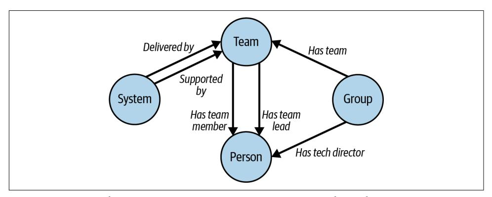

*Figure 9-1. A graph connecting systems to teams, groups, and people.*

Graphs support multiple relationships between nodes, so you can, for example, model that a team delivers a system and a team supports a system. Usually, that would be the same team, but it doesn't have to be. This property of graph databases makes it possible to model lots of relationships of interest, and to query by navigating nodes and relationships to get to the information you need—for example, "all of the services related to a specific Tech Director."

What this means for tool choice is that you want it to be simple to update lots of sys‐ tem records in one go—for example, when you need to change the Team Lead. You also want to be able to search based on any field, and find all the related information, such as all the services owned by a specific team, or using a particular data store.

## <span id="page-261-0"></span>**API-Driven**

If your service catalog has both read and write APIs that are easy to use, you can easily build new functionality on the same data, and integrate it into other parts of your software estate.

This can be really useful, because it allows you to find ways to encourage people to keep the data up-to-date.

For example, at the *FT* we asked people to tag AWS resources with a system code (for more on this, see [Chapter 11](#page-306-0)). We checked those system codes via the Biz Ops API, so you had to have *actually* created a record.

We also used the Biz Ops data to generate monitoring dashboards, which encouraged teams to make sure the data was correct, so that the services they owned showed up on the dashboard. Our monitoring systems read the service data from Biz Ops. If a team said they were seeing services they didn't own, or that some of their services weren't on their dashboard, they would need to fix up the Biz Ops data.

Write APIs can be equally powerful. As already discussed earlier in this chapter, this allowed us to maintain service runbooks as markdown files in the code repository for a service. Those would get written into Biz Ops as part of deployment flows, meaning runbook information lived near the code and was updated at the same time as the code.

Mostly, you want information to be written through automated processes as a result of events or on a scheduled basis. For example, there was an integration with the *FT'*s leavers process, so that people who had left the *FT* got marked as inactive. Important to realize where you have a service that no longer has any active developer associated with it!

We also had a tool that wrote information about GitHub repositories into Biz Ops. Often, although not always, the repository has the same name as the service and the two can be linked, making this more powerful. Getting that 80% right gave us plenty of value.

It's a good idea to restrict write access for certain fields. In both the cases I just men‐ tioned, you want the system you're integrating with to be the source of truth, so you shouldn't let anyone else edit those fields via the UI or an API call: if the data is wrong, they should fix it in the source of the data.

Whatever tool you use, you should look for read and write access via an API.

## <span id="page-262-0"></span>**Extensible**

Modern software estates have a lot of moving parts. If the system you buy has plugins for tools you already have, that's great.

For instance, can you connect to your Kubernetes clusters and bring in information about pods and services?

Can you bring in information about AWS resources?

Even if the tool provides plug-ins for many common use cases, there will always be some information that's valuable but where there isn't an off-the-shelf integration. So it's great if you can write your own connectors or plug-ins too. This is another reason that APIs are so important.

## **Flexible Schema**

Every organization is different. It's useful to have a flexible schema that allows any field that matters to you to be added into the developer portal.

At the *FT*, our initial graph focused on the information we needed for runbooks. This was mostly around System, Team, Group, and Person, with fields associated with each of those.

For example:

- A System has a name, description, and service tier (how critical is it?) and is owned by a Team.
- A Team has a name, Slack channel, email address, and is part of a Group.

And so on.

Over time, we added more information, and we let other groups add things for their own purposes too.

For example, we stored information about whether a service contained personally identifiable information. This meant you could look at all the services that may be subject to GDPR or have to be checked if someone made a Subject Access Request (SAR). [Figure 9-2](#page-263-0) shows an expanded graph, with examples of the kinds of things we modeled.

<span id="page-263-0"></span>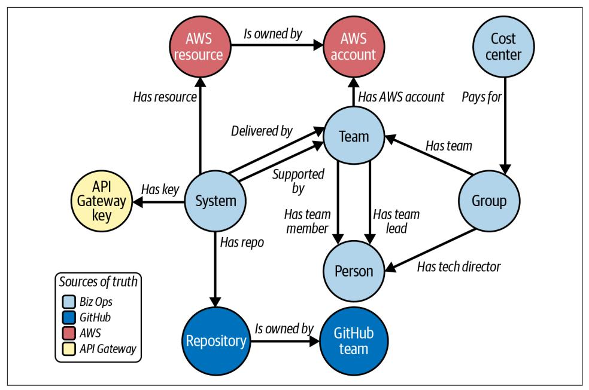

*Figure 9-2. An expanded graph, showing the types of information the* FT *modeled in Biz Ops. Note: this is a subset of what was actually modeled.*

It's important to understand which system is the source of truth for particular infor‐ mation. If the source of truth is Biz Ops, great, you can edit it via the UI. But if the source of truth is, for example, GitHub, then this information needs to be read-only in Biz Ops. We wrote services that brought data in from GitHub to Biz Ops, and simi‐ larly for AWS information and API Gateway keys.<sup>6</sup>

What this means for tool choice is to make sure you can store information that mat‐ ters in your organization, extending on the core fields available to you.

## **Provides Dierent Views Across the Estate**

You do want to be able to look at the information about your services at different lev‐ els and sliced in different ways.

For example, you want to see information about a particular service; about all the services owned by a particular team; and about all the services owned by teams in a particular group. You probably also want to be able to look at all the runbook infor‐ mation (this is a subset of the fields), or all the services that use a particular tech or version of that tech.

<sup>6</sup> Two different services because we weren't using the AWS API Gateway.

<span id="page-264-0"></span>Because Biz Ops was built on a graph database, and because there was a GraphQL API, engineers could ask sophisticated questions. There was a GUI that guided peo‐ ple in writing GraphQL queries, and the team ran training.

However, there is always a value in canned queries surfaced via a UI or an API. It's quick for people in a hurry (and if you show the underlying query, it can be a great basis for people to tweak the information).

One thing we also did, but carefully, was to add a little gamification into our UIs.

That meant we showed teams a score—for example, for system operability (specifi‐ cally focusing on the quality of information in the system runbooks, and weighting runbook fields by how important that information was to being able to support the system in production). We would show which teams were doing best, and which sys‐ tems were most complete.

We were careful, because we weren't interested in blame. We wanted people to be motivated to move up the board, and that worked—for some people and some teams.

We were also quite cautious about combining information into a single score, because you have to make choices about weighting. In general, I'd rather show a view with several different scores than try to get one score to represent quite disparate data. We were transparent about our scoring, and clear that it was a work in progress. And we did tweak scores in response to feedback.

This is covered in more detail in ["10. Runbooks" on page 289](#page-316-0).

I don't want you to go away from this chapter thinking that service ownership is about tooling. The key change is a cultural one: the tooling just helps you to establish that culture of active ownership. I've dug into the tooling the *FT* used because it illus‐ trates how tooling can be used to impact the culture around service ownership.

Next, I want to talk about something that in my view isn't considered enough, which is the process for transferring ownership.

## **Transferring Ownership**

Inevitably, you will need to transfer a service to another team at some point. This can be because your understanding of domains changes with experience and you realize it sits better with the other team. It can also be because you are restructuring the teams as business priorities change.

For example, I've seen services get transferred to a platform team so that they can be made available to other stream-aligned teams. I've also seen transfers between plat‐ form teams: we moved responsibility for our Prometheus-based monitoring stack to the team that owned our log aggregation and metrics tooling.

<span id="page-265-0"></span>If you expect that new team to actively own the service, you can't just throw it at them. You need to do a proper handover so the team accepts ownership of the ser‐ vice. Both teams will have to invest some time to make this successful.

## **What Does a Good Transfer Look Like?**

A good transfer starts with understanding what this service does, and who the cus‐ tomers are. Transferring ownership is a place where you can lose that information, and I've seen that mean underinvestment in a service that actually brought in a huge amount of money; the team that now owned it just didn't know that.

Similarly, reviewing any decisions made as part of implementing the service can be extremely useful: are there any architecture decision records? Is there a design doc? Don't just look at the current state of the service; consider the history. And mention where there is technical debt, i.e., deliberate decisions not to do something properly. The team is taking on that tech debt now.

I've found engineers tend to focus on the architecture and the code. Although a whiteboard session and looking at the source code is useful for context, it doesn't tend to give teams enough confidence that they really understand the service.

If you have some minor changes that can be made, then getting the new team to write the code and deploy the changes to production is well worth doing.

But you also need to:

- Make sure the service meets quality and compliance expectations
- Consider the operational side of things

Let me expand on these.

## **Meeting Quality Expectations**

You can get away with some things for a service your team built—for example, you may not need a fully comprehensive set of documentation (although that starts to be necessary as the service matures, you are working on it less, and your team members change!).

But if a new team is taking over the service, now is the time to check that:

- There is good automated test coverage.
- The service complies with guardrails and standards.
- The runbook and other documentation covers what people will need to know and is up-to-date.

<span id="page-266-0"></span>If this isn't the case, now is the time to work on it. That could be something the new team does in collaboration with the old team, which will help with knowledge transfer.

## **Operational Handover**

Operational concerns are often forgotten during transfer of a service, but this is an important factor. The new team needs to understand whether this service needs to be supported out of hours, and what the SLO expectations are.

People need to know where to find the monitoring and telemetry. Runbooks and sys‐ tem registries need to be updated to show that this has moved to a new team.

I would aim to review any recent incidents in a fair amount of detail, focusing on how people worked out what was going wrong.

To give confidence on the operational side, I have seen a great deal of success through running some chaos engineering scenarios.

This means that, after walking through the system architecture, monitoring, metrics, troubleshooting documentation, etc., the team doing the handover makes changes in production that affect the service's resilience (it's generally not great to fully break the service!) and the new team tries to work out what has gone wrong and fix the issue. A full list of the different scenarios here can also be a great check for the documenta‐ tion: is every scenario fully covered?

Finally, where there is a vendor relationship—for example, the service calls out to a third party—that relationship needs to be transferred too.

## **Replacing**

Sometimes, you have a service that is written using tools the receiving team doesn't have any expertise in. For example, maybe there is a service written in Go, being handed over to a team that knows Node.js.

It is worth considering whether the best option is to rebuild the service using things the receiving team is familiar with. Microservices should be small enough that this won't take a long time, particularly if there is a solid API and good tests for the origi‐ nal service that assert against both the syntax and semantics of the API (i.e., what does it look like and what do values within it actually mean). Tests like that can be used as a framework for rebuilding.

I haven't seen this happen too much, but when it has been done, it's made a real dif‐ ference to how much the service is *actually* actively owned.

## <span id="page-267-0"></span>**What to Do If You're Struggling**

If you have unowned services, or don't even know what services you have, it can be pretty daunting to think about fixing this issue. Agreeing who owns every service and capturing that information for hundreds or thousands of services is a lot of work.

You don't have to fix it all at once though. In fact, it's better to tackle it bit by bit, because it's easier to get agreement to spend a small amount of time on something like this, and if you get it right, the first bit of work you do will prove the value, and people will be more likely to get involved in your fix-up efforts.

Start with your most critical systems, finding owners, and then working to make those owning teams feel accountable for the services.

But before you do this, you need to make the business case for active ownership.

## **Make the Business Case**

The challenge around active ownership is that people see the cost, but not the value. For engineers, it takes them away from more interesting work. For people outside engineering, it's not obvious why services need any work done on them once they are "finished."

To make the business case, the first thing to tackle is to explain the value. That's prob‐ ably easiest to do after something has gone wrong! For example, I imagine quite a few organizations realized they had a problem with knowing their estate or with unowned services as a result of trying to respond to the Log4Shell incident. Or maybe you've had a production incident with an unowned service, where it took ages to get it back up and running; or you needed to upgrade from an unsupported database version and didn't have anyone with any knowledge of the code calling that database.

If these sorts of things haven't (yet) happened, you need to find another way to show the level of risk because of your unowned systems. You can share stories from other companies that show the consequences of a lack of ownership or an estate you don't understand. You could also run a tabletop exercise or a chaos engineering test for some critical but unowned system in your software estate, to show that there is a high risk that when something goes wrong, no one will be able to fix it.

The second thing to tackle is the cost of active ownership. This is hard work, but you need to minimize the cognitive load of supporting each service or else you will end up with teams that don't have time for anything else.

I cover ways to do this in [Chapter 7](#page-174-0) on the paved road, in [Chapter 13](#page-370-0) on running your service in production, and in [Chapter 14](#page-400-0) on keeping things up and running. You want to make it as easy as possible to support a service, through consistency in how your services are built and deployed; high levels of observability in production; and tooling that helps you respond to necessary changes like upgrades and migrations.

<span id="page-268-0"></span>Once you have explained the value and at least started to tackle the cost of active ownership, the next step is to agree that every system should be owned, and owned by a team. Initially, some of those teams will be nominal owners, but at least you have someone who can be contacted when the system needs to be patched for a security vulnerability, or has fallen over in production.

Selling the value of active ownership is easiest for critical systems. For less critical services, nominal ownership is less of a risk: especially where these services are small, internal, with no access to sensitive data, and where the service has been stable for a long time. These will be low priority and you may never get around to tackling active ownership for some of them.

## **Start with Critical Systems**

So, focus first on the critical systems. This could mean the systems for the core domains of the organization, anything that can't be down for any length of time, or anything that contains sensitive data. Alternatively, maybe you focus first on the sys‐ tems that are causing production incidents, or that are being changed the most; what‐ ever signals mean that agreeing on who owns them and knowing about what they depend on will give you the most value.

Make sure you have a full list of these systems in one central catalog, and that they all have owning teams assigned.

You can start with something pretty low-tech. That central catalog can be a spread‐ sheet or a page on a wiki. Although ideally, you want it to be easy to find, and spread‐ sheets are normally examples of "information refrigerators" rather than "information radiators."<sup>7</sup>

#### **Active Ownership of Your Monolith**

What if you are still in the process of migrating from a monolithic system? These are often critical systems, including systems of record, and you likely have multiple teams working on them: how can you move to strong, active ownership?

The pragmatic approach is to say that these systems carry on with whatever style of ownership they've had previously. Handle upgrades and production support the way you have in the past. However, you may include an assessment of the risk of collective ownership in deciding which services to extract out first, so that you get active own‐ ership of critical functionality early on.

<sup>7</sup> I believe Alistair Cockburn came up with the idea of an information radiator—the idea is that the information radiates out and people can access it with very little effort.

## <span id="page-269-0"></span>**Make Your Best Guess at Owners**

I have found people are far more likely to fix incorrect information than fill in miss‐ ing information, and it isn't too onerous a task, provided *most* of the data is correct.

Make your best guess at owners with whatever information you have available. Some‐ times, people will have their own list of their systems, and you can transform that.

Source control can provide a lot of useful information. You can look at repositories and see which are linked to build pipelines, and assume that each of these is a service rather than a library. If you have teams in your source control, you can link the repo‐ sitories owned by those teams to services, and even a relatively hacky approach will get you some benefit. For example, we wrote some code that did a fairly simple name match between a GitHub repository and a service as a first pass and that gave us a fair amount of likely owners.

You can also look at infrastructure configuration as a source of data—for example, grabbing information about pods from Kubernetes, or Heroku applications.

Provide people with a simple way to look at the data you've assigned and make cor‐ rections. From experience, people like to look at all their information in a spreadsheet rather than step through systems one by one, filling in a form. Ask me how I know.<sup>8</sup>

## **Deliver Value from the Data**

As soon as you can, build things that use this data to provide value to teams. At the *FT*, we generated team dashboards from the information in Biz Ops, showing the current state of all healthchecks and monitoring.

If people didn't see the systems they actually owned, or they saw things they didn't own, that was motivation to fix up the data in Biz Ops.

## **Aim for Continuous Improvement**

Once you have persuaded people that active ownership makes sense, and you have your list of services and owners, you need to define what it means to actively own a service. And then, you need to move closer to that ideal.

You may need to reassure people that you aren't about to bring the hammer down: the aim is to agree what good looks like—code stewardship, production support, upgrades and patching, documentation, etc.—and to set an expectation of continuous improvement in ownership.

<sup>8</sup> Despite being asked to fill out a separate form for each of my 150 microservices when assessing for GDPR issues, I have *still* made the same mistake myself when asking people for information!

<span id="page-270-0"></span>Lay out a roadmap where every quarter, you want to make specific and targeted improvements around ownership. For example, if you know that there are lots of serv‐ ices where there are open security vulnerabilities, you could start by saying that next quarter, all critical security vulnerabilities will be patched within the target time, accept‐ ing that lower severity vulnerabilities may still exceed the target patch time for now.

Make sure that these improvements are part of the department goals. For example, if you plan through an OKR process, there should be high-level objectives and key results relating to this improvement, and teams should be reflecting that in their own OKRs.

Recognize that teams have active development work and that will be the priority, so don't try to do too much each quarter. Monzo, responding to the challenge of balanc‐ ing small maintenance tasks against project work, schedules regular "firebreak weeks," which focus on tasks like service decommissioning, performance improve‐ ments, cost reductions, and general quality of life improvements like tackling non‐ critical exceptions or alerts.<sup>9</sup> I like this approach because it helps with focus. I've seen other organizations rotate individual engineers to spend a week working on mainte‐ nance, which can be effective but doesn't allow for collaboration if everyone else is working on new features.

Of course, if you are really in a bad place, it might be better to stop feature work for a few weeks and invest serious time in making things better, for morale reasons and also because you need to reduce the day-to-day cost of owning these services.

## **Look for Teams That Are Overwhelmed**

When you start moving toward more active ownership for services that aren't under active development, you might find that there are teams with a large number of services.

That can be overwhelming, particularly if these are services the team doesn't know well, or that are not in a good state.

Teams usually have a sense of whether they have too many services assigned to them. You can also look across your whole estate by:

- Counting services per team
- Surveying developers on their level of knowledge of each service assigned to them
- Looking for services where no one in the team that currently owns them has ever committed code to the service repository

<sup>9</sup> Mentioned to me by Suhail Patel, who is a Senior Staff Engineer at Monzo.

<span id="page-271-0"></span>Then, you need to work out what to do that will reduce the cognitive load on that team's members and give them space to work on new services and features. Your choices come down to:

#### *Scale up the team*

If you have a small team, maybe they are just the wrong size. Can you add another developer or two?

#### *Make it easier to support these services*

Maybe you need to invest some time in documentation or tooling, or dedicate a few hours to refactoring and writing new tests.

#### *Remove services*

You can do this by transferring them to another team or by decommissioning them.

Let's expand on that last point.

## **Services Shouldn't Live Forever**

Organizations aren't always good at reviewing the software estate to work out which services are still providing value.

A service isn't done until it is no longer running in production. When you are build‐ ing replacements, you need to get rid of the old stuff.

You should also periodically look at all the services in your estate, assessing each one to see if it is still worth the cost of running and supporting. If so—and one example I saw identified that an unloved old service brought in huge amounts of money—then consider, could you rebuild it with a tech that reduces the support cost? Should you actually invest in building new features?

You can reduce the impact of asking people to actively own services if you make sure the number of services doesn't just increase and increase.

## **In Summary**

Services in production will always require some level of day-to-day work, but that will only happen if your services are owned.

Ownership has to be by a team rather than an individual, because that single person is not necessarily going to be around when something goes wrong. And the owner‐ ship has to be active. The team needs to feel responsibility for that service; doing upgrades, production support, migrations, and generally maintaining the service.

Knowing about your estate is important and provides a lot of value, particularly in a microservices environment where you have a lot of services and probably quite a diverse set of technology. Create a record of systems, teams, and groups, and leverage this to automate lots of interesting tools. This added automation also gives you the power to respond to issues quickly, finding all the affected services and the teams that can fix the problems.

Tackling the problem of unowned or poorly owned services pays off. You don't have to do it all at once, but each incremental improvement will leave you in a better position.

# <span id="page-274-0"></span>**Getting Value from Testing**

Testing helps you to build the right thing, and it tells you when something has stop‐ ped working the way it should. But if you take the wrong approach to testing, your tests can slow down every release because they take so long to run, and they still may not catch the real problems. Even worse, you can spend far more time making changes to your tests than to the code itself!

Testing is of course a huge topic. My main focus in this chapter is to talk about it in the context of moving to a microservice architecture.<sup>1</sup> Testing microservices is not the same as testing a monolith, and I want to explain why.

The most important change is about mindset and organizational structure. Treating testing as a separate activity, done by a separate team as a prerelease activity, has long been considered a bad idea. With microservices, you simply cannot afford to do this. You need testing to be done throughout the route to production, by your engineering team, whether you have specialist QA people on that team or not.

Quick automated unit tests give a lot of value with a microservice architecture, but running end-to-end tests in production with good monitoring is often a more effec‐ tive approach than trying to run similar end-to-end tests in preproduction environ‐ ments, which can turn into fixture maintenance hell. Manual testing as part of each release needs to be kept to a minimum: it simply takes too long and is too error prone and inconsistent when you move from releasing once a week to multiple times a day.

I'm going to discuss what makes for a good test and cover the types of testing you may want to put in place, before moving on to talk about testing in production.

<sup>1</sup> I'm also going to focus more on testing web services—the "backend"—rather than testing frontend applica‐ tions, because that's what I have the most experience with. See *[Full Stack Testing](https://learning.oreilly.com/library/view/full-stack-testing/9781098108120/)* by Gayathri Mohan for more comprehensive coverage of testing than I have scope for here.

<span id="page-275-0"></span>Testing in production may sound scary, but I'll show you how to approach it to mini‐ mize the risk of everything breaking, and maximize your chance of finding and fixing bugs before they impact your customers.

I also want to discuss testing your infrastructure. With microservices, you have a *lot* of infrastructure and infrastructure configuration, and getting that configuration wrong can be a big cause of production incidents. You need ways to test this!

Finally, I have some recommendations on where to start if you are finding your tests are holding you back. What are the steps that will start to shift the balance so that you benefit from your tests?

But first off, let's talk about why we test at all, and then about moving testing to hap‐ pen earlier in the development lifecycle.

## **Why Do We Test?**

Testing is important, but why? In a blog series on Agile [testing](https://oreil.ly/dqg1h), Brian Marick came up with a matrix categorizing different types of tests based on why we do them. This extremely useful matrix has been popularized and iterated on by Lisa Crispin and Janet Gregory in their books on Agile [testing.](https://agiletester.ca) [Figure](#page-276-0) 10-1 shows their version 3, from *Agile Testing Condensed: A Brief Introduction*. 2

There are two dimensions to the quadrant. The first dimension is whether the tests are business facing or technology facing. The second is whether they are there to guide development, or to critique the product:

### *Business facing versus technology facing*

This is about the audience for the tests, and therefore the language used. For business-facing tests, for example, behavior-driven development (BDD) tests, you want to develop your tests in collaboration with business experts, using their language. Technology-facing tests, for example unit or performance tests, are not written in business language typically, and that's fine; they aren't something that business users will need to read.

### *Guiding development versus critiquing the product*

This is about *when* you do the testing. There are tests that help you while you are developing, both to make sure you are building what's been asked for and to pre‐ vent defects. There are also tests of the whole product, that look for missing fea‐ tures and escaped defects. On the technology-facing side of things, critiquing the product includes things like security, load, and performance testing, which are easier to do at a product level.

<sup>2</sup> Library and Archives Canada/Government of Canada, 2019.

<span id="page-276-0"></span>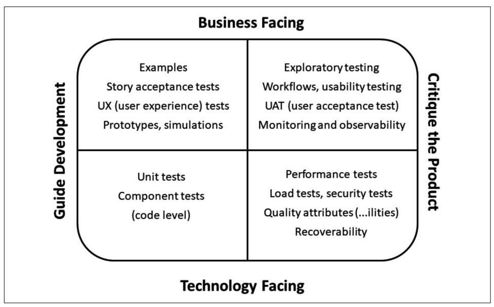

*Figure 10-1. Agile Testing Quadrants from* Agile Testing Condensed *by Janet Gregory and Lisa Crispin, based on Brian Marick's Agile testing matrix.*

I like the Agile testing quadrant, and I've found it's a flexible framework. As we add more types of testing—for example, the move to doing more of our testing in produc‐ tion (which I'll talk about later in the chapter), or the change to include some of the "-ility" testing at earlier stages of development—the quadrants themselves are still a very useful framing.<sup>3</sup> What I want to do next, though, is talk in detail about the four main goals I have for testing, and where I think they sit on the Agile testing quadrant:

### *Building the thing right*

Did we build what we intended to? These are tests that check that developers have not made any mistakes in coding the scenario, at least as they understand it. These are technology facing, and they guide development.

### *Building the right thing*

Does what we built actually meet the users' needs? This is to catch places where the developer's understanding of the scenario is faulty—or where the business stakeholder also didn't understand the customer! It's also where we catch instan‐ ces of "That's what I said but it's not what I meant" (see Crispin and Gregory's *Agile Testing* book). As a result, this encompasses both business-facing quadrants, since the tests can guide development *and* critique the product.

<sup>3</sup> By "-ility" testing, I'm talking about tests for things like accessibility, reliability, etc. Also often referred to as nonfunctional tests.

<span id="page-277-0"></span>

### *Picking up regressions*

Have we made a change that has introduced a bug? If we are confident in our regression tests we can refactor our code frequently and with little risk. Again, these are technology facing, and they guide development.

### *Meeting quality-of-service requirements*

Does our service meet requirements around things like security, accessibility, latency, load, and reliability? These are technology-facing tests that critique the product (although they can actually be used to guide development, for example, by picking up the impact of a change on performance early through automated performance testing in a build pipeline).

I've created my own version of the Agile testing quadrant, shown in Figure 10-2, to show these goals.

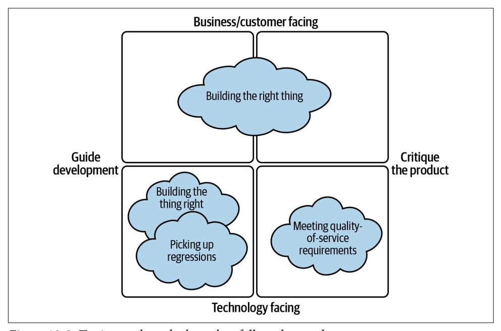

*Figure 10-2. Testing goals and where they fall on the quadrant.*

Let's dig into these goals in more detail.

## <span id="page-278-0"></span>**Building the Thing Right**

The first goal I have in mind when testing is to make sure that the code being written does what I think it should. These tests validate that I haven't made a mistake during implementation. Brian Marick calls these "code-guiding examples."<sup>4</sup>

The most effective way to check you haven't made a mistake during implementation is by writing automated tests that you can run locally as you write the code. To do this, you write an example—which handily also can serve as documentation of the functionality—and that guides you in writing the code. You check your implementa‐ tion by running the test.

You want the tests you write to "drive" the code you write, because that keeps you focused on what you are trying to implement, from the outside in: for example, test‐ ing that you cannot create a user if there is already a user with the same name. It also ensures that the code you write is testable, which generally means a good interface.

Test-driven development (TDD) as formally defined suggests that you start by writ‐ ing a failing test, then write enough code to make it pass. I'm going to admit that often, I write a bit of code, then a test, then keep moving between the two. The value for me comes from writing the two together—I never finish the code then start writ‐ ing tests, because whenever I've done that, I find I don't have testable code and have to start again. I also find it is valuable to make sure your test would fail if the code did something unexpected. You would be surprised how often I have deliberately changed a "==" to a "!=" and seen the test remain green!


TDD is about design far more than it is about testing, which is something it took me a surprising amount of time to realize.

These tests written as part of TDD become regression tests: they will only fail again when you deliberately—or accidentally—change the functionality of your system.

They allow you to refactor with confidence. You should expect them to break when you make a functional change. If you make a change and no tests fail, you have missing tests!

It's important to write tests for failure cases as well as for the "happy path." This means you have to understand what should happen when data is missing or incor‐ rect, which might involve talking to stakeholders to work that out.

<sup>4</sup> See his blog post from 2003 on ["Agile Testing Directions: Technology-Facing Programmer Support"](https://oreil.ly/SCsff).

## <span id="page-279-0"></span>**Building the Right Thing**

The next goal is to check we actually built the right thing. That means making sure that we have properly understood the users' needs and codified this understanding through a series of tests and assertions.

There are two parts to this: up front, you want to develop a shared understanding of how the application should behave. Then, once the code is complete, you want to test whether that shared understanding missed something.

To develop a shared understanding, developers and testers need to talk to customers or stakeholders, to go from a likely fairly short initial description of the feature to a rich set of examples, described in the language the business uses. These scenarios enable you to test that you built what was being asked for.


A good guideline in writing these business scenarios is to focus on who you would contact if the test failed in six months' time. If you'd ask the product owner whether the test is still valid or the function‐ ality required has changed, bingo! That is a business scenario.

If you'd ask a developer, what you have is not a *business* scenario.

You might wonder how this fits with the previous section on "Building the Thing Right." My experience is that often, I can write tests for a service as I implement it that are based on the business-level examples, even if the tests themselves are unit tests. Sometimes though, you are writing code somewhere "within" the scenario. Hopefully, you have identified how this code fits in. If you have gotten that wrong, though—let's say you think part of the requirements are going to be dealt with in some other code, but you are wrong—then your tests for the service will pass, because they test whether you did what you set out to do. You are building the thing right. But the tests for the scenario will fail, because it is not correctly implemented. You are not building the right thing.

### Don't Overfocus on Tooling

<span id="page-280-0"></span>I've worked on several systems where we used BDD. After several fairly frustrating implementations, where we were very focused on the tools we were using, our techni‐ cal leadership decided we needed some expert guidance and got Gojko Adzic to run a workshop for us on specification by example.<sup>5</sup> What we learned from Gojko was to focus on BDD as a process rather than on the tools.

As Daniel Terhorst-North says in his original introduction of BDD, "If we could develop a consistent vocabulary for analysts, testers, developers, and the business, then we would be well on the way to eliminating some of the ambiguity and miscom‐ munication that occur when technical people talk to business people." The point is the consistent vocabulary, and the best time to develop that is early on, through writing scenarios.<sup>6</sup>

These examples may get implemented in natural language using some BDD tool, or they could become the description of a unit test. The key thing is that they are devel‐ oped together with the business, as early as possible, and are used to check that you have built the right solution.

## **Picking Up Regressions**

The third thing you want testing to do is to pick up bugs you introduce into existing code—i.e., for a test to fail if you change the code and accidentally introduce a bug. This is called a regression test because the quality of the code has regressed.

Unit tests that you write alongside the code to check your implementation should work as regression tests, provided you did make sure your test would fail if the code stopped working; otherwise, you won't pick up the regression.

It's also important to write tests so that if a test fails, you understand what it was try‐ ing to do, and can grasp why it is now failing: give "future you" a helping hand! That means giving the test a name that makes it clear what is being tested; using variables that make your intentions clear; and having excellent messages in your assertions so that a failed test explains what the expectation was and what actually happened. What I'm really saying here is that test code is first-class code: write it properly, review it, and test it. Then, when a test fails, you should be able to rapidly work out why.

<sup>5</sup> Gojko wrote the book on this: *[Specification by Example](https://oreil.ly/WsPnT)*.

<sup>6</sup> Daniel Terhorst-North, ["Introducing BDD"](https://oreil.ly/lJ5K4), first published in *Better Software* magazine in March 2006.

## <span id="page-281-0"></span>**Meeting Quality-of-Service Requirements**

Quality-of-service requirements are all those expectations that the service or possibly the wider system it is part of needs to meet. People often refer to these as nonfunctional requirements, or the "-ilities" (from scalability, accessibility, etc.) but I think the idea that this is about quality is useful.

This is the fourth goal I have for testing: can I understand whether the code I'm writ‐ ing meets accessibility standards, has acceptable latency, can handle expected load, and keeps information secure?

Some of these requirements will need to be tested end-to-end. For example, if you want to performance test your system, you need to measure the performance of that whole system under load, or the latency of a request that goes through many micro‐ services.

You can also add testing at a lower level. For example, you can have performance tests or security scanning within a build pipeline for an individual microservice to give you a level of confidence that changes in your code aren't going to have a big impact on performance. Doing this kind of testing earlier saves you time, because you pick up on the problem earlier, and it also helps keep the importance of these quality con‐ siderations in your mind as you write the code.

## **Shifting Testing Left**

We've covered why we should test. The next question is *when* we should test.

For most of my career, testing was a separate phase from development, carried out by different people within the same team. Developers would write code and hand it over to be tested, often manually, but sometimes via automated acceptance tests. If testers found a bug, the code would go back to the developer to fix it.

In a good team, testers and developers talked all the time and worked collaboratively to identify and fix real problems. In a bad team, developers would treat testing as sec‐ ondary, testers could become a bottleneck, and the two sides could end up communi‐ cating largely through bug tickets.

The move to microservices, and the adoption of DevOps, required a change to how we did testing. Releasing 10 times a day isn't possible without a fast CI pipeline and that can't include a manual regression testing phase, because that takes too long. As my team started to release frequently, we also reduced manual testing to a minimum and started to focus far more on our automated tests.

We began treating quality as the responsibility of the whole team, with tests being written by the same developers who were writing the code, in collaboration with our QA colleagues.

<span id="page-282-0"></span>We "shifted left" in our testing, meaning that we did it earlier in the process. Our aim was to write automated tests as part of writing the code, that could be run whenever the code changed from then on. This meant that there didn't need to be a separate manual regression testing phase before releasing to production.

### Shift-Left Testing

Larry Smith coined "shift-left" in 2001. His original [article](https://oreil.ly/U_Vzz) for Dr. Dobb's has many great points. I'll summarize a few key ones here:

- The earlier a bug is found, the easier and cheaper it is to fix.
- Regression testing shouldn't be the main focus of QA: you want to find bugs in the new and complex code as it is being written.
- Automate, automate, automate: "warm-body testing is the most expensive way to test." Automated tests run far more quickly, but they also encapsulate knowledge about your code.
- Having QAs working with developers breaks down barriers (this looks a lot like the insight behind DevOps too!) and means QAs can request code that helps with testability.
- Test code isn't special, it also needs to be debugged—and QAs can help with that.

When you write the tests at the same time as the code, it is much easier to change the code to make that testing easier. When our testers wrote acceptance tests as a separate task, they didn't often go back to developers to ask them to change interfaces to make the acceptance tests easier to write. And that meant acceptance tests tended to be quite brittle, in that code changes could break them.

When QAs worked with developers to define acceptance tests at the time the code was being written, I could see the benefits—we no longer had the issue that a small bug found after the code was "completed" could take ages to fix because it was hard to write an automated test for it!

This move to write more automated tests, and to write them early, really made clear to me that testing is not just about finding bugs.

## **What Makes a Good Test?**

I'm going to talk about different types of testing in the next section, but before I do that, I want to talk about what makes a good test.

Different types of testing will do better for different parts of this list, but in general, you should strive to write tests that deliver these things.

## <span id="page-283-0"></span>**Fast and Early Feedback**

Although the often cited figures about the extra cost of finding a bug late in develop‐ ment versus early are dubious at best, and come from a time where releasing code happened infrequently and with a higher incurred cost, it is still the case that you want to know as early as possible that you have a problem.

Ideally, you want to get feedback while you are writing the code. At the latest, you want to get feedback while you still have all the context of this work in your head. Not weeks later.

You also want to get feedback quickly. During development, you want to be able to run tests in seconds, so that you can go through a code → test → code loop repeatedly without having to wait. Any time you have to wait, you run the risk of getting distrac‐ ted with whatever you were doing to fill in the time.<sup>7</sup>

Fast and early means you need automated tests. Much of the focus in this chapter will be on automated tests, for that reason.

Even for tests running later in the release process—for example, after the code com‐ mit—you want these tests to take minutes, not hours. This is because, if you want to release code regularly, you don't want to be stuck waiting behind the tests for the pre‐ vious release that are still running. Even worse, if that previous release fails, you don't want the complexity of dealing with a rollback when there are already several other changes en route to production.

## **Easy to Change**

When you change the behavior of some code, it needs to be simple and quick to change related tests.

This is often where people get stuck when they move to microservices and I've expe‐ rienced this myself. In our early days at the *FT*, we had a suite of acceptance tests that had to set up data for each service as a precondition for running the tests.

We had a case where a half-hour change to the code, which added a field to an inter‐ face, involved over a week of trying to get those acceptance tests fixed again. That isn't a good ratio.

Data fixtures tend to be brittle whether you are working with a monolith or microser‐ vices, but microservices make it more challenging because you have to set up data for each microservice, in each of their (possibly different) data stores. Some of the data is duplicated, occurring in more than one store to reduce unnecessary traffic—for

<sup>7</sup> As always, xkcd is on the mark here. If you have to wait 10 minutes for something to compile, you'll find yourself [on a chair](https://oreil.ly/Hi49P), fighting with a sword.

<span id="page-284-0"></span>example, storing the name of a customer in an Order service, not just the ID, so that you don't have to look up that name each time you want to display the order. That makes for bigger data fixtures.

I'll talk more in ["End-to-End Tests" on page 261](#page-288-0) about why acceptance tests are a particular challenge in a microservice architecture, but whatever type of testing you are doing, tests should be quick and low risk to change.

## **Finds Real Problems**

I am not a fan of test coverage targets, where you agree that tests should cover 80% of your code. Why 80% and not 85% or 75%? But really, I am not a fan because it can encourage people to write a lot of very low-value tests. These are tests that pass when they are written, and pass every time afterwards, because they are testing code that is simple. You really want to focus on tests for parts of your code that are more complicated.

Similarly, I think it is important to focus on the likelihood of a problem being sur‐ faced. I was once on a team where very thorough testing would mean a bug being raised for a read endpoint of an HTTP API for "HTTP method PUT should not be supported, but the code doesn't return 405 Method Not Allowed."

While it was true that PUT shouldn't be supported, this service was only called by other services owned by the same team. And an attempt to PUT would not write any‐ thing into the service.

So the question is, how likely is it that we'd be bitten by this bug, and if we were, how likely is it that we would have any difficulty working out what went wrong?

Now, if this was a public API endpoint, I might feel differently!

The general focus should be, could I know when something isn't working, where it *matters* that it is broken? This is where business-focused scenarios help, but this should also include a focus on things like performance and security. For performance, what level of "slow" is "too slow"? For security, is there an issue that exposes data we really shouldn't be exposing?

Finding real problems is also a place where manual testing can be very valuable, par‐ ticularly exploratory testing.

## **Types of Testing**

Lots of terms in testing are overloaded, and one team may use a term in a different context than another team. I will aim to explain what I mean by each term in this section first, so that you can recognize what this is called in your own organization.

<span id="page-285-0"></span>I'm also going to point out what changes as you move to a distributed microservice architecture.

My main focus is going to be on automated testing, but I will also talk a bit about the best places to carry out manual testing.

First, though, I want to talk about the balance to strike between different types of automated testing, and that means talking about the testing pyramid.

## **The Testing Pyramid**

The testing pyramid (see Figure 10-3) was first introduced by Mike Cohn in his book *Succeeding with Agile* and is pretty much obligatory to mention when talking about automated testing. It very effectively illustrates the benefits and drawbacks of testing at different levels, and the proportions of different types of testing you should do.<sup>8</sup>

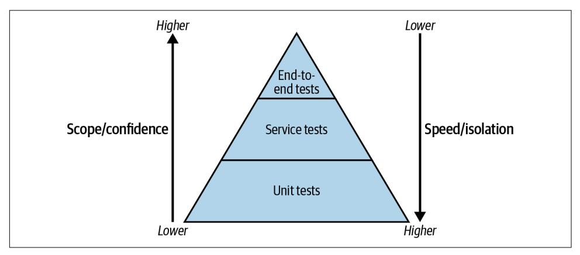

*Figure 10-3. e automated testing pyramid. I've labeled the top layer end-to-end, rather than UI as Mike Cohn did in his original diagram, as end-to-end applies for services without a frontend too.*

End-to-end tests are slower to run and tend to be more brittle, but give you confi‐ dence in overall functionality, whereas unit tests are faster to run but cover only a small part of the system under test. You need both types of tests, but you want the majority of the tests you write to be the ones toward the bottom of the pyramid.

OK, what do I mean by unit tests, service tests, and end-to-end tests?

<sup>8</sup> Mike Cohn, *Succeeding with Agile* (Upper Saddle River, NJ: Addison-Wesley, 2009).

## <span id="page-286-0"></span>**Unit Tests**

Unit tests are automated tests that test the smallest testable units within your code. They shouldn't depend on anything beyond the code under test, and they shouldn't require you to even spin up the microservice.

These are the tests you write while doing TDD. They give you confidence when you want to refactor your code that you haven't made a mistake. They should be very fast to run, and you should run them all the time when you are working with your code.

Unit tests tell you, as a developer, whether you successfully built what you intended to build. That's really useful. But the same person is writing the tests and the code, so these unit tests won't catch where you have misunderstood what you need to build.

## **Service Tests**

Service tests are also automated tests, but they test the service, in our case a microser‐ vice, as a whole. Normally, to run service tests you will spin up an instance of the microservice. With modern software, that is a fast process and takes only seconds.<sup>9</sup>

You should test the API using the same interface a user of that API would use, for example by making a call over HTTPS. Otherwise, you aren't testing the service boundary.

It can be a bit more difficult to test a service that reads messages off a queue if you don't want to spin up that queue. One approach that works is to create a well-defined interface within your microservice for the business functionality. The code to read the message should do nothing beyond passing it on via a call to a function on that inter‐ face. You can also write an HTTPS endpoint that makes the same call, for testing. This will be similarly helpful for manual debugging!

You don't want a service test to fail because of a problem in a downstream collabora‐ tor, so generally you want to provide some sort of "test double" for that collaborator. This can be done by creating a stub service that responds with canned responses to known requests, and configuring your service to call this stub.

You can also [mock](https://oreil.ly/C9cFt) the service you are calling. Mocking allows you to check that the call happens as expected. It's more complicated to manage than a stub, but it does allow you to test that something important happened—for example, that when a new customer is set up, a new account is also set up.

<sup>9</sup> I still remember waiting 20 minutes for a web application server to start up and for all the tests to run, back in the early 2000s. Not fun.

<span id="page-287-0"></span>What about calls to a data store? Often, a microservice provides an API to read or write data to a data store, with some amount of business logic in between. The micro‐ service owns the data store and almost all its business functionality involves interact‐ ing with it. Given that, I would not mock out or stub calls to the data store. Partly, that's from experience of the limited value and frequent issues of trying to do this. I've tried using an in-memory version of a database for testing and found the interface did not match the actual database API, for example.

But the main reason is that I am convinced that in a lot of cases, your "service" is actually the code *and* the data store it owns, and it is good practice to test them together. Cindy Sridharan wrote an excellent and comprehensive blog post on [testing](https://oreil.ly/-xPOR) [microservices](https://oreil.ly/-xPOR) and she says, "When testing a microservice that's responsible for man‐ aging users, it's…important to be able to verify if users can be created successfully in the database."

The database is not "a nuisance that needs to be warded away with mocks." The abstraction the microservice provides to the rest of the system *includes* the database.

While having a service test that writes to an actual data store avoids some complexity of using mocks, for example, it *does* mean you have to think about how you will set up and manage data.

For speed reasons, I like to avoid spinning up a database for each test run. That means you may need to have a set of data to populate the database, and tests that are nondestructive and clean up after themselves. However, I think some of the issues we had with this at the *FT* related to having a shared graph database for many services, so microservices owned part of the graph, not the entire store!<sup>10</sup>

What about calls to a message queue? For this, it depends<sup>11</sup> on exactly what the rela‐ tionship is between your service and that queue. I would think about whether the ser‐ vice "owns" the queue.

And then there are services that integrate with third parties—for example, making a call out to a cloud provider or a payment service. Here, you do need to have some sort of test double. Hopefully, that is provided for you by the third party, but if not, a fake service with canned responses can be effective, as long as you can find out about any breaking changes to the interface or—more difficult to protect against—any changes in the values that can be returned for particular fields in the response.

<sup>10</sup> I suspect our microservices were too small, and probably we should have had one service writing to the graph.

<sup>11</sup> The standard consultant answer!

## <span id="page-288-0"></span>**End-to-End Tests**

You might call these acceptance tests. Maybe you have BDD tests.

Whatever the name, these are tests of behavior that require the collaboration of mul‐ tiple microservices.


Be very wary about creating large numbers of end-to-end tests. It's too easy to create a set of acceptance tests that make you upgrade microservices in lock step, meaning you have a distributed monolith.

There are two challenges with these sorts of tests, particularly if you want to run them before code commit.

The first challenge is that you need to set up data in different services to be able to run the tests. These data fixtures can prove to be very brittle, but more importantly, it is hard to release code for a feature gradually, service by service, without having a long period where the acceptance tests are broken.

The second challenge is that you have to spin up pretty much your entire system to be able to run these tests. "Full stack in a box" on a developer laptop is, to quote Fred Hébert, like "supporting more than one cloud provider, but one of them is the worst you've ever seen (a single laptop)."<sup>12</sup>

At the point I first hit this problem, containerization was not an option. Running services and databases locally via containerized images makes things a bit easier, and running on a remote environment from your laptop does too—but I think they are making it easier to do the wrong thing. When you move to microservices, you should rarely be thinking about the system as a whole. You should be focused on your service and its close collaborators. As soon as you go beyond that, you will end up coupling the services together, and are on the way to a distributed monolith. Not good.

We attempted to build acceptance tests in the early days of building the content pub‐ lishing microservices-based system at the *FT*. Our acceptance tests were brittle, they took far more time to update than the code itself, and they would fail when we were confident the code was correct because our unit tests were comprehensive and pass‐ ing. It would almost always prove to be a problem with data fixtures.

<sup>12</sup> Quoted in Cindy's blog post, ["Testing Microservices the Sane Way"](https://oreil.ly/zzXIV).

<span id="page-289-0"></span>Our acceptance tests stayed broken for days or weeks and we didn't even notice, because people weren't running them before committing code and no one was look‐ ing at the results of running these tests in our staging environment. Eventually, we took a deep breath and deleted them.

We replaced them with an end-to-end test that treated the system as a black box, which we only ran in production and in staging, where the data was already set up everywhere. We were able to do this pretty easily because the test was idempotent—it was about publishing an article, which you can do multiple times without needing to reset any data.

I'll cover this solution further in ["Testing in Production" on page 265.](#page-292-0) The main thing I want to say here is that end-to-end tests that set up data fixtures are, in my view, an antipattern for microservice architectures. One approach to that is to agree on a fixed set of representative but harmless data that is guaranteed to be available in every envi‐ ronment, and to make sure that your tests don't destroy it.

One final comment on end-to-end testing: the testing pyramid suggests having many fewer of these types of tests. You should use them to test the things that lower-level tests cannot, rather than attempting to test conditional logic and edge cases that are better tested at the unit or service level. End-to-end tests are there to give you confi‐ dence that as you evolve your architecture and split or merge services, the business functionality is remaining intact. They are also the place to test things that you can't test at a lower level.

## **Contract Tests**

Contract testing involves the client of a service registering a contract with the service to say "this is what I rely on that you provide." Whenever the service is changed, the contract tests are run so the owners of the service will know if they have broken the contract with any client.

This is great, because you can't always know what a client is depending on. This mat‐ ters for APIs that are used by other teams because of the communication and coordi‐ nation gaps. I've seen production issues where one team made a change not understanding the impact on another team that consumed their API, or else assum‐ ing that a separate change had gone live when it was still in progress.

It also catches the case where the client is depending on something that is a bug or that you don't think anyone cares about. A trivial example: you'd want to know if a client is depending on the order that a field appears in the response. You would prob‐ ably assume they weren't, but this is an issue that happened for me!

<span id="page-290-0"></span>Contract tests work well for interfaces that don't change frequently. They also work well as a way to drive out and document a shared understanding of how systems from separate domains interact.

We didn't implement contract tests during my time at the *FT*, but the place I would have done this as the owner of the publishing pipeline would have been at the bound‐ ary where an article was published out of editorial tools and into the content plat‐ form, and for consumers of any of the public APIs my team owned—for example, the website team or key third parties.

I know many people successfully use contract tests between collaborating services within the same system, i.e., owned by the same teams and with no APIs used by external teams. I'm less sure of the value of that—like any testing, it takes time to write and maintain contract tests. Within a system, the APIs are likely to change far more often than at the boundaries of the system, with those changes requiring changes to the contract tests. And within a team, there is likely much more under‐ standing of those request/response interfaces.

In general, I like to follow [Postel's Law](https://oreil.ly/yTSeB), which is to be lenient in what you accept. A service should look for the fields it needs and ignore anything else. This reduces the coupling between services: you can add new fields to an upstream service even if the downstream service can't yet do anything with them. That leaves contract tests to focus on fields that are removed or amended.

## **Consistency Tests**

There are a couple of types of automated tests that provide great value in a microser‐ vice architecture where you have a large number of services and data flowing between them.

First, you can create tests that check for consistency between different interfaces. This is an extension of static analysis that can be used to find deprecated or erroneous code usage. You can run tools at runtime that validate compliance with standards. For example, this could be used to validate that every response includes a correlation ID as a response header, or that field names comply with standards.

Second, you can create a set of tests that checks data as it flows through the system to make sure each stage matches with the next, and flag up any mismatches. This type of coherence testing is super useful to run in production and is covered later in ["Coher‐](#page-300-0) [ence testing" on page 273.](#page-300-0)

## <span id="page-291-0"></span>**Exploratory Tests**

Exploratory testing, where a tester exercises the system not by following a script but by following their curiosity, pulling threads and trying things out, isn't that different in a microservice architecture compared to a monolithic one. I mention it only to say that this is where manual testing has a place in a microservices-based system. Manual testing should not be about repeating particular test scripts, but about exploring the system, exploring new features, and finding the unexpected. This can be incredibly valuable.<sup>13</sup>

My view is that exploratory testing should generally happen in production systems, but if you do have a staging system, that is an easier place to do the sort of explora‐ tory testing that involves setting up accounts, making payments, etc.

## **Cross-Functional Testing**

Cross-functional testing is about making sure we meet quality-of-service require‐ ments. This can include accessibility testing, security testing, and—the one I want to dig into here, because it is particularly important for microservice-based systems performance testing.

Performance tests look at how your system holds up under load.

As you send more and more traffic through your system, you'll want to understand the impact on response times and error rates, to see how stable your system is.

Performance tests are important with microservice architectures because these tend to introduce calls over the network as part of standard flow. As a result, latency will generally be higher in a microservice architecture.

Microservice-based systems can also behave quite differently as they start to approach load limits. The patterns built in for reliability reasons—things like back off and retry, load balancers, and queues—should be tested, and performance tests are a very effective way to do that testing.

Because performance tests tend to take a while to run, you generally won't run them on every commit. It's good, however, to run them regularly, on a system as close to production-like as possible.

If you automate this, make sure you will notice if performance is taking a hit, whether that is increased latency or an earlier failure under load. That means setting appropri‐ ate limits, and having the tests fail if those are breached.

<sup>13</sup> For more information about exploratory testing, I recommend the chapter on this in *[Full Stack Testing](https://learning.oreilly.com/library/view/full-stack-testing/9781098108120/ch02.html)*, by Gayathri Mohan, which explores frameworks to use and a strategy for approaching this type of testing.

## <span id="page-292-0"></span>**Testing in Production**

*Yes, I test in production (and so do you).* —Charity Majors<sup>14</sup>

While we want feedback about problems in our code as early as possible, we should care most about whether our code is working in production.

With a microservice architecture, there are bugs that you will *only* see in your pro‐ duction system, because that is the only place with the full complexity of the system with all the services across multiple instances and with real customer data and behav‐ ior. You absolutely should be testing there, because this is the place your customers are, using your system in ways you didn't expect, with data you didn't predict.

Ultimately, we should test in production because it gives us another chance to catch any problems, and then to fix them as swiftly as possible. This isn't about replacing automated testing prior to release; unit and service tests are still very important. But testing in production can be a more effective approach at finding problems across the whole system than end-to-end testing.

Historically, developers focused on "lower" environments; that was where things were tested. Any problems in production would be picked up by another team, triaged, and passed on to developers as bugs to fix.

When you release code infrequently, and it takes a while to get a fix released too, it makes sense to focus your efforts on preproduction. This still applies where you don't have control over when you can release code, for example, for embedded software.

When you are releasing frequently and can fix in minutes, that changes things. For most organizations, being able to pick up issues and fix them fast is actually better than running extensive end-to-end testing in lower environments that slows down your ability to deliver value.

Given that, I want to talk about how you can reduce the impact of finding out there's a problem only once you are in production, through approaches like the gradual roll‐ out of changes and using monitoring as testing.

At the *FT*, we would say, "We're not a hospital or a power station." No one dies if we release code and have to fix a bug. Of course, we were super careful still about code that managed personally identifiable information, and any change that impacted data. For example, you don't want to release code that trashes production data by deleting a field from data that it turns out you really still need.<sup>15</sup>

<sup>14</sup> From [QConSF](https://oreil.ly/kcBER) in 2018.

<sup>15</sup> Even typing that makes me shudder a little. I've done it, of course!

## <span id="page-293-0"></span>**Is It Safe?**

Anything that you do in production that gives you feedback about the quality of your software can be considered to be a test:

- We used to do a small set of manual "smoke tests" in production after a release to the monolith, to check things were still looking good.
- Canary releases are really just an iteration of smoke testing that automates the process, making it quicker and more reproducible.
- Most things we do as part of observability or monitoring are basically tests too: for example, if you hit a website or a healthcheck endpoint regularly, you are doing continuous testing of that service.

None of the things I've mentioned so far seem particularly risky. In fact, it would be riskier not to do them.

The place where people tend to get worried about safety is where you start doing syn‐ thetic monitoring, where you carry out some "fake" user behavior. Carefully designed, this synthetic monitoring provides a lot of value, but you do need to work out what data to use and be careful to avoid unwanted side effects.

This is a lot easier for idempotent requests, where no matter how many times you repeat an operation, you achieve the same result. Publishing an article is idempotent, and this was one of the first synthetic monitoring tests we added at the *FT*.

Something like subscription is more complicated. You need a fake user, and you may need to be able to back out the subscription as part of each test. If it's a paid subscrip‐ tion, you may end up incurring costs for the tests from a third-party payment pro‐ vider. When we looked at a synthetic test for subscription at the *FT*, we balanced that cost against the value of knowing when things were broken. Eventually, we chose to run the synthetic test every 15 minutes, rather than every minute, to keep costs down while still giving us swift notice if the subscription process broke.

These sorts of tests are hugely effective at picking up issues. You shouldn't create too many of them, so they are worth the time in carefully working through the data setup and how to avoid side effects.

All of this is to say that you need to test in production when you adopt a microservice architecture, because:

*Lower environments are not production-like*

You probably don't have any environment that exactly replicates production.

*Your customers can surprise you*

They may use your system in ways you didn't anticipate.

<span id="page-294-0"></span>*You can't test for every variation*

Many issues in production rely on a set of circumstances that is very specific.

None of these are unique to microservices, but they are definitely amplified by this approach!

## **Staging Is Not Production-Like**

Adopting a microservice architecture makes it pretty likely that production is the only place that has this full set of services, infrastructure, and versions of software running.

For example, maybe you have a bug that only shows up where you are running multi‐ region. Or it only applies when there is sufficient data, or particular types of data.

It's expensive to run a complete duplicate of your system in staging. Often, that means running a smaller cluster. Maybe you run in a single region there, rather than multi‐ ple. You are also unlikely to have a replica of production data, both because that can be unwieldy to replicate but also because you wouldn't want to replicate personally identifiable information.

But beyond that challenge, you also have to work out how to deal with dependencies owned by other people.

If you have a single staging environment, you can't know whether you are testing against the code that other teams are currently running in production, or their release candidates.

Sometimes you can call their production instances, and that means you are testing your code against what it will likely be running against when you *do* push it to pro‐ duction. But that isn't an easy option for interactions where you write data.

People don't want to have to maintain versions of their own services purely to sup‐ port other teams in their testing. So maybe you stub these services that you depend on. But stubbing them in your staging environment means this isn't a reflection of production.

## **Your Customers Can Surprise You**

Your customers will use your system in ways you didn't predict when you were designing and building features. That means you won't represent those types of use in your test data for preproduction.

Respect for your customers' private and sensitive information means you shouldn't copy their data into your staging environment, so the only place you can spot an issue caused by their data is in production.

<span id="page-295-0"></span>To do this, you need to make sure you have as much relevant information as possible output to logs and telemetry, while sanitizing any sensitive fields.

You can also ship logs to tools like Sentry that provide error monitoring, allowing you to spot increases in errors and dig into what exactly was happening when the error occurred.

If you can deploy code quickly and you have good insights into what it looks like when running in production, you can debug an issue in production, refining your hunches to track down what exactly is going wrong.

## **You Can't Test for Every Variation**

Many issues that crop up in production rely on a specific set of circumstances that you would never have tested for. Charity Majors gave examples of the kinds of niche failures that can cause an incident in her talk at Strangeloop in 2017. Her example was "photos loading slowly," which could be because of:

- Canadian users who are using the French language pack on an iPad running iOS 9
- Microservices running on c2.4xlarge instances in us-east-1b that are on the 5% of hardware that is degraded and takes 20x longer to complete blocking requests for data
- Developers with debug mode turned on for a specific feature flag

You would never test these combinations; you can only hope to be able to pick them up quickly in production through having great observability.<sup>16</sup>

## **You Don't Have to Roll a Change Out to Everyone**

Testing in production may seem risky, but there are ways to reduce that risk.

Mostly, this comes down to separating deployment of code from release of new func‐ tionality. If you still do these things together, with one big-bang deployment rather than a controlled and gradual release of functionality, you should make changing that your first step toward testing in production.

<sup>16</sup> Charity's talk, ["Observability for Emerging Infra: What Got You Here Won't Get You There"](https://oreil.ly/sPutf), was actually about the difference between observability and monitoring rather than about testing, but the distinction is blurred, and I came across the talk while reading Cindy Sridaran's excellent series of blog posts on testing in production—["Testing in Production, the Safe Way"](https://oreil.ly/elZ2i) and ["Testing in Production, the Hard Parts"](https://oreil.ly/zgU8V).

<span id="page-296-0"></span>The idea is that first you deploy your code to production without any of your users being exposed to it, and then you use tools like feature flags, canaries, and blue-green deployments to roll that new code out to your users bit by bit. For example, maybe you roll a new feature out only to the people that work in your organization. Or you roll out to a particular region—perhaps somewhere around the world that is currently mostly asleep and not heavily using your site.<sup>17</sup>

#### **Feature flags**

Feature flags are ways to turn code on and off in production so that you can modify system behavior at runtime.<sup>18</sup> This might be, for example, to release a new feature, or it might be to support alternative implementations of the same feature so that you can run an experiment.

Which code path is executed depends on the value of the feature flag, which can be changed in production without requiring a code release.

Feature flags have a lot of benefits, including:

- You can deploy code whenever you want, because making the code functional is a separate operation.
- You can also release the feature in pieces, with small changes going out as soon as they are ready, because the feature flag protects the incomplete code.
- You can turn the feature on for specific users.
- You can quickly "kill" the feature if it seems to be causing issues.

For testing in production, the ability to turn the feature on for specific users means you can deploy code, and someone can test it by turning on the feature flag just for themselves.

There are feature flag platforms available that offer a lot of flexibility, but it is also possible to implement something relatively simple yourself, at least to start.

The danger with feature flags is that they are simple to create, and so people will cre‐ ate them, and you end up with large numbers of them. If that is combined with a way to toggle them dynamically, you can end up chasing bugs that only exist for a particu‐ lar combination of flags, which can make reproducing the issue very difficult.

<sup>17</sup> This is something James Governor of RedMonk has described as progressive delivery: ["Towards Progressive](https://oreil.ly/dpTmb) [Delivery",](https://oreil.ly/dpTmb) August 2018.

<sup>18</sup> See Pete Hodgson's post on ["Feature Toggles"](https://oreil.ly/pXkDy) on Martin Fowler's site for a very readable and clear exploration of what they are and how they can be used for far more than testing new features!

<span id="page-297-0"></span>It is also pretty easy to leave them in the code and never go back to clean them up. This has a particularly bad impact if you don't create the right abstractions—for example, if you use if/else statements in your code. The code is harder to read, and harder to test.

If you adopt feature flagging, you should think about how to keep the number of fea‐ ture flags down. You can do this, for example, by setting an expiration date on each feature flag. My experience here, though, is that people continually extend the date because they are busy with other things!

#### **Canary releases**

Once you feel relatively comfortable that the code you've deployed works, the next step is to gradually release it. One way to do this is via a canary release. This is where you roll out the feature to a subset of users. The aim is to minimize the blast radius if things go wrong.

You can do this using feature flags, by turning the flag on for a subset of users. Alter‐ natively, you can deploy two versions of the microservice, one with the new feature and one without, and route a portion of the traffic to the new service. Often, this is done incrementally, sending 1% of users to the new version, then 10%, and so on. You pay attention to the metrics that matter to you and stop and reverse the rollout if something seems broken.

Again, you can create a very simple version of canary releasing yourself, through manual configuration changes. However, many deployment tools (for example, [Spin‐](https://spinnaker.io) [naker\)](https://spinnaker.io) offer support for automated canary releases, where more traffic is sent to the new version of the service once it's clear that there hasn't been an impact on error rates.

#### **A/B testing**

A/B testing is about validating that you did indeed build the right thing, i.e., that what you built has the expected outcome.

With A/B testing, you split your users into groups and deliver the new functionality to one group but not to the other. You define up front what you expect to see an improvement in—for example, that you expect people to spend more time reading the content, or to click the "buy" button more often. You keep going until you have statistical significance, and you see whether your hypothesis was correct.

You need a way to split the users into cohorts, and can then use a feature flag to show different behavior to the two cohorts.

You will need to work out how long an A/B test needs to run to be able to show statis‐ tically significant results. You'll also need to be careful about running multiple A/B tests at the same time: you have to understand whether they could have an impact on

<span id="page-298-0"></span>each other. However, it's worth investing time in getting A/B testing right, because this experimentation lets you quickly roll back a feature if it turns out your hypothesis was wrong.

## **Monitoring as Testing**

I'm going to talk about monitoring and observability in [Chapter 13,](#page-370-0) but I want to talk here about how you can create ongoing tests as monitors.

This has big benefits. It means you are constantly testing that the behavior works as expected in the environment where that *most* matters.

Effectively, what you are doing is letting your monitoring act as a regression test, run‐ ning continuously in production. This is known as *synthetic monitoring*.

#### **Synthetic monitoring**

Synthetic monitoring involves making requests that simulate real user activity on a regular basis. It is "monitoring" because it is constant, and it's "synthetic" because it's not a real request.

Both these things are advantages. Automated tests tend to get run only when code is going through the build and release process, but it's possible for a particular feature to stop working in production at any time, for any number of reasons. For example, what if someone rotated the key that is being used to call out to an API? If you run synthetic monitoring for a feature, you catch these failures.

Additionally, having something that isn't a real request means you can recognize a feature is broken even if no one is currently trying to use it. This is particularly good for features that are used intermittently or where there is a critical time period where they are vital. For example, newspaper publishing has a critical period toward the end of the working day. Finding out at 4 p.m. that there is something broken in the news‐ paper publishing flow is much less helpful than picking this up shortly after a code change was released at 11 a.m.

Synthetic monitoring can also happen from the users' perspective, using the same path as they would. This catches issues that feel "outside" your code to you, but that for a user are indistinguishable from your website being broken—for example, if the DNS or CDN configuration is broken or those providers are having issues.

One way to do synthetic monitoring for websites is to hit particular URLs regularly, from all over the world. Vendors like Pingdom make this very simple to set up.

For flows that happen inside your systems, you may need to build something your‐ self, but that can also be pretty simple. This can act as an alternative to acceptance tests, something where you don't need to set up data because all the production data is already there!

<span id="page-299-0"></span>Working on the content publishing platform at the *FT*, we created a microservice that did synthetic content publishes. The service sent in a publish event to the same endpoint that the editorial content management system (CMS) used, and checked for an updated timestamp on the content read API that our consumers used (see Figure 10-4).

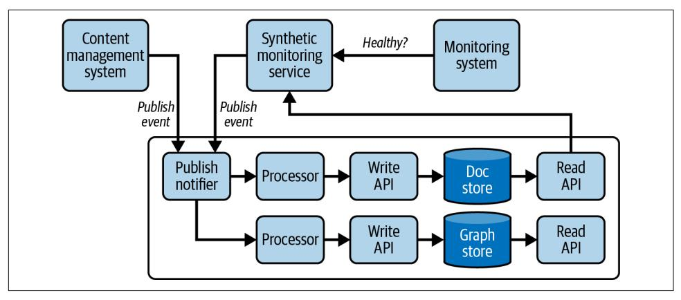

*Figure 10-4. Synthetic monitoring of the content publishing pipeline at the* FT*. Note that the synthetic monitoring service treats the entire publishing system as a black box. It publishes events to the same endpoint that the content management system uses, and consumes from the same ReadAPI that clients use.*

This meant we treated the whole of our system as a black box, making this code pretty resilient to changes within the system.

We used a specific old—but real—article, so we weren't publishing anything made up. And we were careful not to change the published date, because that would put this article near the top of any pages based on that date—we amended the last updated date instead.

We monitored this service exactly the same way we monitored anything else although "healthy" for this service meant "is it seeing successful publishes?"

This was a new pattern people needed to learn and it did cause some initial teething problems. Our first-line team's automatic response to unhealthy instances tended to be to restart them. Not a bad instinct for most services, but unhelpful in this case.

Monitoring publishing is relatively straightforward because publishing an article is an almost idempotent operation. There were no major side effects from doing it regularly.

<span id="page-300-0"></span>

Although publishing an article is idempotent, in that you end up with the same content on the website, there were some nonidempotent aspects to it.

First, we sent out notifications whenever an article was published, prompting consumers of that notification feed to fetch an updated version from the API—but that wasn't appropriate for synthetic publishing.

Second, you end up logging every publish, and given you are doing this synthetic publishing constantly, a large proportion of logs are for this non-real publishing. You don't want to report on data where it turns out 95% of that data comes from your monitoring!

We solved both of these concerns through the use of a special cor‐ relation ID prefix, and both the notification code and the queries in the log aggregation tool excluded transactions with this prefix.

#### **Coherence testing**

Where you have data flowing through multiple services, there are many places where things can go wrong, either as a result of bugs in the code or because of transient failures.

Writing tests that check each stage to make sure the data matches and made it right through can be incredibly useful. It does mean you need to understand what changes and what stays the same as that data moves through a workflow. For example, you may expect additional fields at later stages as data gets augmented.

We wrote some monitoring for content publishing at the *FT* that validated that an article that got published made it to the end data stores in each region and would alert if there were inconsistencies. Monitoring and testing really do overlap, and I dis‐ cuss this example in some detail in ["Monitoring Business Outcomes" on page 364.](#page-391-0)

## **Testing Your Infrastructure**

One thing I noticed when I started building microservices was the number of issues that weren't due to code; many were due to errors in setting up or configuring infra‐ structure. Things are a lot less static than in the days of a single Java app and a data‐ base, and each new thing has the potential to go wrong.

<span id="page-301-0"></span>Many high-profile outages are related to infrastructure and configuration changes.<sup>19</sup> For example, Facebook had a six-hour-long global outage in October 2021 that was caused by a configuration change.<sup>20</sup>

You need to test changes to your infrastructure.

With infrastructure as code, rollout of infrastructure changes should be automated, and you should also be able to automate testing, perhaps in a staging environment.

You do also need to test your infrastructure changes in production, because there will definitely be things that only cause issues with a production setup and production load. Incremental rollout should be the norm for infra changes, particularly configu‐ ration ones, with the aim of minimizing the blast radius if things go wrong. That means using some of the patterns we've already discussed—for example, canary relea‐ ses with a very small initial rollout, and feature flags for quick rollback.

The most prolonged infrastructure-related outages tend to be where you break the internal tools you want to use to investigate or fix the problem. We had an example of this when I was at the *FT*, where a DNS issue that took out \*.ft.com records meant we didn't just lose www.ft.com, we also couldn't access the monitoring dashboards or runbooks that would have helped us to work out what was happening.

As a result of this incident at the *FT* we moved our key operations tools over to another domain. But this is a very easy thing to overlook when you are designing sys‐ tems. How can you catch this before a full-blown incident?

One way to do that is via chaos engineering.

## **Chaos Engineering**

Chaos engineering is about deliberately testing what happens when your infrastruc‐ ture is degraded in some way. It's often treated as a separate thing to testing, but I think it pays off if you think about which chaos engineering scenarios would prove that the infrastructure code you are releasing works as expected and run those sce‐ narios as part of the release.<sup>21</sup>

I'll talk more about chaos engineering in [Chapter 12](#page-342-0) because it is a key tool for mak‐ ing sure that your resilience works the way you expect it to (indeed, many people

<sup>19</sup> Dan Luu has a GitHub repo with a [list of postmortems](https://oreil.ly/XP6KK) and the section on Config Errors is sizable. In his [blog](https://oreil.ly/xmXgl) [post](https://oreil.ly/xmXgl) he estimates about 50% of global outages are caused by configuration changes.

<sup>20</sup> The outage also took out WhatsApp, Messenger, Instagram, and "log in with Facebook" on third-party sites. See [Facebook's blog post](https://oreil.ly/t-Fvu) for a lot more detail.

<sup>21</sup> I also see a lot of the same skills in chaos engineers as I do in test engineers: "Hmm, I wonder what will hap‐ pen if I try this?"

<span id="page-302-0"></span>have switched to calling this "resilience engineering," because that sounds a lot less scary to people. The whole point is that you do *not* want to unleash chaos).

## **Testing Failovers and Restores**

If you design your system to run in multiple regions and can failover to run from a single region when there are issues, you should test this failover process, both when it is introduced and regularly from then on. I can guarantee that a failover process that isn't tested will be found to have stopped working when you actually need it, or won't fire automatically the way you thought it would.

Similarly, if you have a database backup, you should test the process for restoring it, and do that regularly. There are a great number of stories where it turns out the backup file was no longer being written, and you do not want this to happen for a database you are responsible for that is the source of truth for key data that supports your business!

When you test these things routinely, you make it much more likely that everything will go well when you need it to. It also removes the fear for people during an inci‐ dent: they are doing something they've done many times before, which makes them more likely to make the call and do it.

## **Quality Is About More Than Testing**

Testing is about quality, but there is more to quality than testing. Thinking about quality holistically makes a lot of sense.

I got a lot of value from trying to write a quality strategy, because when I started from "What do we do to ensure high-quality software?" rather than "How do we do test‐ ing?" I ended up with something that referenced approaches to architecture, deploy‐ ment, instrumentation, and observability.

You should treat quality as something everyone in the team is responsible for, and look at the decisions you make with a quality lens: how will I know if this system is working as expected? How quickly could I fix an issue? Do I have a mitigation option?

Really, the chapters to follow on governance, reliability, and running your system in production are *all* talking about aspects of building quality in. Here, the focus is pri‐ marily on the mindset change.

When you move to adopt a microservice architecture, you need to learn to code and test differently. That means writing code that considers the way the code will run in production, and the context it will be running in. It means writing it to be debugga‐ ble. Add good logging messages anytime your code makes a decision!

<span id="page-303-0"></span>It also means accepting that you are going to have to be comfortable with changing things in production, and you can get that comfort through automation, progressive delivery, and great observability tooling.

## **What to Do If You're Struggling**

If you have adopted microservices but you're finding testing is a bottleneck, or doesn't find the problems, how can you quickly start to make things better?

## **Not Enough Automated Testing**

If you have started to build a microservice architecture but you are relying on manual testing or no testing at all, what should you do? You can't stop the world and write automated tests for everything.

Focus on the riskiest bits of your codebase and write service tests. Add them into the build pipelines. I would think about code that:

- Manages personal information or payments, where things going wrong could be costly.
- Is core to your business—at the *FT*, that would definitely mean publishing the news.
- No one really understands. Writing tests will help with gaining that understanding.

Then, look for the most important flows through your systems, and write synthetic monitoring that can run in production for those. For example, can you test out your subscription process? Can you publish articles to your newspaper? Creating this monitoring might take a bit of doing, especially if the flows go across team bound‐ aries, but it will give you a lot of value.

Create contract tests at the system boundaries, i.e., where the client and the service are owned by different teams, so that you catch problems early.

You'll also want to make a commitment to write unit tests while you are writing code. Don't set a target for coverage, because that can result in a lot of low-value tests for straightforward code. Instead, make sure that they have been written for any tricky code, to give you confidence that you have built what you intended to, and for when you need to refactor. This is something that should be checked at code review.

## **Tests That Aren't Providing Value**

If you have lots of tests but they take longer to fix than it takes to write the code, or they fail because of test fixtures rather than code bugs, what can you do?

<span id="page-304-0"></span>In preproduction, focus testing on your service, whether through unit tests or service tests. These tests are easier to maintain and they run quickly.

Remove end-to-end acceptance tests in lower environments that require you to set up data. They don't just slow you down, they also couple everything together, turning your code into a distributed monolith. It's better to create tests/monitoring that treats your system as a black box, where you don't care which services exist, just that the functionality is working.

Removing tests is scary: what if I miss a bug as a result? Look back and see how often these tests have identified an issue, versus broken when the code itself was fine. Track the time spent working on these tests versus on the code. And run the same monitor‐ ing in lower environments that you do in higher ones: would that monitoring have also caught the issue?

You can always remove tests temporarily at first. Remove the end-to-end tests from your pipeline for a few weeks and see whether you miss them.

## **In Summary**

Testing microservices requires a change in approach.

Releasing multiple times a day isn't possible if each of those releases has to go through a manual regression testing phase, because that takes too long. Similarly, it is an anti‐ pattern to have a separate QA team, because that requires a handover and slows everyone down.

Instead, embed testers in your teams, or make testing a responsibility of everyone in your team. Your focus should be on writing fast automated tests that run in develop‐ ment and in build pipelines—unit tests and service tests.

You should consider writing contract tests at the boundaries between teams because these can quickly find the places where miscommunication and misunderstanding means a contract is about to be broken.

It's very hard to have a staging environment that truly replicates production without creating a distributed monolith. It's better to get comfortable with testing in production.

To do this, start by making sure there is a separation between deploying code and releasing it, making use of canary releases, feature flags, and A/B testing. Then look at how you can use monitoring and observability as a quality check, for example, through synthetic monitoring.

The aim of your testing should be twofold. First, have automated tests at the lowest level for fast feedback on the quality of changes. But also make sure you use testing in production to quickly pick up and fix real issues that are impacting your customers.

# <span id="page-306-0"></span>**Governance and Standardization: Finding the Balance**

One of the selling points of microservices is the ability to choose "the right tool for the job." But being flexible on programming languages or data storage layers increases the complexity of your estate, and can increase both cost and risk.

You need to find the right balance.

In this chapter, I'm going to dig into how to manage the process of making choices about the technology you use.

I want to start by talking about why you need to know your estate: what technologies are being used, and what versions. This is important because it helps you to keep on top of risks around security vulnerabilities and costs.

I'll then move on to guardrails, which guide people to do the right thing and keep them safe. Guardrails are more effective than rules and restrictions when you have an autonomous empowered team. They help to make sure everyone understands what they are expected to do and why.

Finally, it's good to show people where to focus their efforts: give them insight into the current state of their systems and provide guidance on what to do next to make things better. This insight also helps when you have to respond to issues—for exam‐ ple, subject access requests or security vulnerabilities.

But let me start by defining what I mean by governance and explaining why it's important.

## <span id="page-307-0"></span>**Why Governance Matters**

Governance is about reducing technical risk, and inevitably involves some level of standardization. This might not be about the technologies you use; it can also be about the expectations for any technology. What do you need to build into your sys‐ tems if you are not using the paved road?

"Governance" sounds like it's about someone telling you what to do, which makes it seem pretty unappealing! But governance is about defining what good looks like for your organization, making sure people know about this, and providing ways to selfcorrect when people aren't doing things the expected way. It's quite rare in my experi‐ ence for engineers to deliberately fail to meet expectations; it's much more likely that they are unaware of them. Good governance includes effective communication and reporting that allows teams to find out where they need to take action.

## Know Your Estate

That final aspect of good governance—showing people where they need to take action—can be a challenge when you are operating a microservice architecture, because to do that you need to know what you have in your estate. However, with microservices you can have hundreds or even thousands of services, and there can be lots of different data stores, languages, and hosting solutions.

If you don't know your estate, you don't know where someone has deployed a service to production without proper monitoring or logging. You don't know where someone bought a SaaS solution that has no support contract, no single sign-on integration, and no defined data retention policies, all of which could be accidental policy viola‐ tions for things that handle PII data.<sup>1</sup>

Knowing your estate also involves understanding the libraries you use and their ver‐ sions, so that you can work out whether a security issue in a library has been fixed everywhere.

Knowing your estate starts with ownership, discussed in [Chapter 9](#page-244-0), but as you move beyond that, it can be a powerful tool to keep control of costs and risks.

As I've mentioned in earlier chapters, at the *FT* we built our own system for tracking information about our estate, but I would not do that now.

You can get a lot of value from a fairly low-tech solution, for example listing all the services in a spreadsheet, along with key information about them. A spreadsheet allows you to constrain the choices for a particular column, and you can filter or search.

<sup>1</sup> This can often happen completely outside of tech, if a separate department decides to hire their own contract developer or do their own procurement of a system.

<span id="page-308-0"></span>Your source control can be a great way to keep track of ownership. For example, in GitHub you can set up teams within the organization so that it's clear who owns a particular repository. You can also use a [CODEOWNERS file](https://oreil.ly/IuU6y) to define who is responsible for a repository—this can support a more fine-grained sense of ownership.

You may get to the point where these solutions become unwieldy because you have a lot of services to track. Luckily, as discussed in ["A Service Catalog"](#page-188-0) on page 161, there are solutions available (for example, Backstage, OpsLevel, or Cortex) if you are pre‐ pared to spend a bit of time or money on this; you don't need to build something.

Whatever you use, look to store as much information in it as you can, as being able to follow the links between data is very powerful.

## What Sort of Information Is Relevant?

At the *FT*, the core of the information we stored was about Systems (this represented individual microservices), Products (for example, the ft.com website, made up of many microservice systems), Teams, and People. For a reminder of what part of this graph looks like, see [Figure 9-1](#page-260-0).

But over time, we added a lot of other information. This included:

- GitHub repositories. We imported information for all of them and where we could, we linked them to systems by matching the repo name and the system name.
- GitHub teams. These didn't always map to teams within the organization, so this was valuable to capture.
- Heroku teams and apps.
- AWS accounts, regions, resources.
- DNS zones.
- Incidents. We linked production incidents to the systems involved. This meant that when a new incident happened, we could easily have a look at the history and see if that gave us any clues. Incidents will be discussed in [Chapter 13.](#page-370-0)
- API Gateway keys. Those used by this system to make calls out to other APIs. This is useful in identifying a calling system.

What would provide value for your organization will be different, but my experience is that each new thing that gets added lets you ask more interesting questions, and allows you to automate some parts of the governance process—for example, bots to check that the values of tags on resources match the accepted list of Systems in the service catalog.

## <span id="page-309-0"></span>**Guardrails and Policies**

What are the things that your technology organization expects every team to do? How would a new engineer find out what they were?

I suspect for a lot of organizations, this is tacit knowledge. You find it out when you talk to someone who knows, or—even worse—when you get it wrong and there is a problem.

As I've discussed in [Chapter 6](#page-154-0), autonomy doesn't mean a free-for-all. Teams have responsibilities too. Those responsibilities include building secure, cost-effective, sup‐ portable systems. But you don't want each team to have their own definition of what "secure" means.

When I first worked at the *FT*, we had many policies and standards. These were gen‐ erally defined by central teams, such as architecture, cybersecurity, or infrastructure. Policies and standards like these are the heart of governance because they set out the expectations within the organization. I can confidently say that most developers didn't read these standards and may not have even known they existed.

However, because we worked within constraints of a small set of technologies, and generally handed over responsibility for deploying and operating our systems to another team, it didn't matter whether I, as a senior engineer on an API team, under‐ stood our patching policy, to pick one example.

With the move to having teams choose their own technology, and deploying their systems to production and supporting them there, every team needs to understand what is expected of them.

I think it is good to think of this information as a set of guardrails rather than a set of policies or standards. They are there to support people and to stop them from hurting themselves.

At the *FT*, we eventually settled on approaching this as a checklist, covering the life‐ cycle of a production system.

These guardrails had a brief explanation of what was required and linked out to detailed policy documents.

However, there are very few people who will seek out and read a drive full of docu‐ ments as part of onboarding—and even for those who do, there's no easy way for them to work out that a standard has changed.

We tried wherever possible to incorporate the guardrails into the tools that we built, so that people would be guided to do the right thing even if they never read the guardrails. This particularly applied to tools that were part of the paved road, because part of the value of that is to stop teams from having to think about so many different requirements.

<span id="page-310-0"></span>Some guardrails are more critical than others. If you work in a regulated industry or the guardrail relates to explicit legislation, then you want to go beyond guiding peo‐ ple to do the right thing, and make sure you are verifying that they have done it.

This is why guardrails become extra important, and teams *do* need to read the poli‐ cies, etc., when a team builds its own solution for something. As part of going off the paved road, they have to make sure that their approach complies with the guardrails. That's one reason teams should think carefully before going off road: they will need to do more work.

## **Automating Guardrails**

While guardrails provide a useful checklist for anyone building a new service, the real strength comes from automation, where they are incorporated into tools and services so that people can be automatically guided to do the right thing.

That means that you don't need to rely on people reading the guardrails end-to-end, and you won't need to worry about people keeping up-to-date with changes in the expectations, because you can change the automation and they will find out that way.

It also tackles one of the problems with guardrails in a sprawling software estate: how do you know whether every team is actually complying with the guardrails? You do *not* want to find that out via a security breach of a system that didn't get patched, or through not being able to deploy a fix to a service because the team is "trying out" a new tool and no one actually available to help has access.

You especially don't want to find that out when you are about to go through a compli‐ ance audit!

If you have templates or APIs for spinning up a new service, these should comply with the guardrails. For example, that service should be set up with a build pipeline that does security scanning, logs should be validated for formatting then automati‐ cally sent to the log aggregation tool, etc. Essentially, embed the guardrails into every tool you build.

Automation of guardrails lends itself to gathering data, which you can then use to get a view across the software estate to see how the organization as a whole is doing on a particular measure, and to nudge teams to take action where they aren't doing the right thing.

I'm not saying everything should be automated. Some governance will be too difficult or time consuming to automate. However, asking yourself about whether automation is an option is a good approach to take.

## <span id="page-311-0"></span>**What to Include**

What sorts of things should be included as guardrails?

We defined our guardrails as "the things we expect a team to consider so that we build the right things and build things right." This meant the focus was on helping with the things that engineers don't do all the time.

Guardrails should be a stand-in for a conversation with an expert, avoiding the need for coordination with people external to the team. Following the guardrails should produce systems that are safe, secure, and operable.

When considering your own guardrails, think about the path to production, your expectations as an organization around quality, security, and operational concerns, and look out for the things developers often ask about.

## **The FT's Guardrails**

The *FT'*s guardrails around the time I left are shown in Figure 11-1.

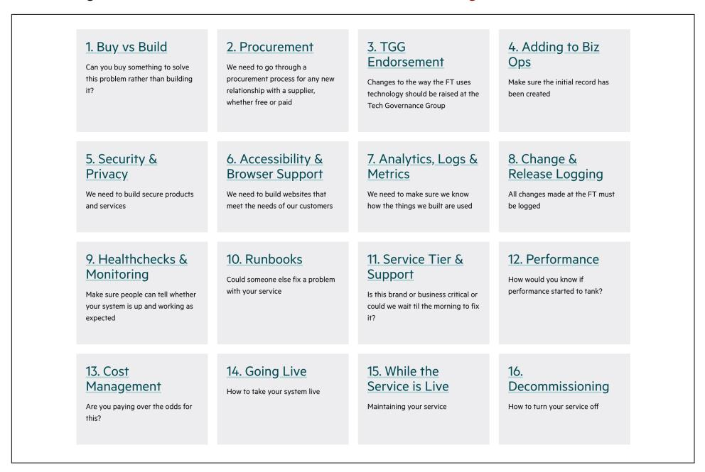

*Figure 11-1. e* FT*'s guardrails in 2022.*

<span id="page-312-0"></span>We felt that engineering teams are familiar with the development lifecycle: code, test, review. We didn't feel we needed to provide guardrails for these activities; rather, we trusted teams to handle that. We stepped in at the point that code started on the path to production.

The overarching aim was to make it easy for people to understand what good looked like, for the *FT'*s technology department.

We listed our guardrails loosely in the order you would need to tackle them if you were building a new service. And although there may seem to be a lot of them, in practice most of them were built into our paved road, and teams' own tooling: most services would be created using a template for the application that sorted out things like logging, healthchecks, change logging, and security scanning.

OK, let's dig into these.

They may not all make sense for your organization, of course. Later in the chapter I will cover the way governance is tackled in some other organizations of varying sizes and different levels of regulation, to add some breadth on this subject.

### 1. Buy vs build

*Can you buy something to solve this problem rather than building it?*

Teams often jump straight past this step, but before you build something to solve a problem, you should see whether you can buy something off the shelf.

Every new service you add within your organization brings associated costs and risks. People focus on the cost of building something, but that can be outweighed by the cost of ongoing support and maintenance, so that needs to be included in the comparisons.

For things that aren't core to your business, you should try to minimize the opera‐ tional costs by getting someone else to build and run it. Many services are now avail‐ able as SaaS, and this frees up your teams to work on things that are business differentiators.

There is also a third way: can you compose the functionality you need from a combi‐ nation of existing software? Often, this is a question of building a wrapper to call one or more APIs and manage the flow around that.

### 2. Procurement

*You must go through a procurement process for any new relationship with a supplier, whether free or paid.*

One of the reasons why people tend to jump straight to build rather than buy is that engineers tend to see procurement as a headache. Lots of forms to fill out!

<span id="page-313-0"></span>However, procurement departments can be a fantastic partner. Personally, I am not good at negotiating a price, assessing contracts for risk, or evaluating whether a com‐ pany is likely to be around in three years' time. I'd like to pass that over to someone who will do a much better job of it.

At the *FT* we had an excellent procurement team that understood the way engineer‐ ing teams want to work. There was a lightweight process for proof of concept (POC) work, with the aim of keeping up-front form-filling to a minimum.

We still needed to remind engineers that no, they shouldn't be signing up using a company credit card, or even starting a free trial, without letting the procurement team know.

This allowed procurement to spot issues early—for example, where teams appeared to be buying a direct equivalent of something that already existed at the *FT* without a clear case for why.

### 3. Significant technology changes

*Significant changes to the way you use technology need to be discussed.*

This guardrail is an attempt to prevent unnecessary introduction of new technology. Each new technology involves associated costs, and sometimes, people introduce a new technology solely because they don't know that there is already something avail‐ able that would work for their use case. You also want to know whether someone already tried to use the technology and hit issues.

At the *FT*, we used a forum called the Tech Governance Group (TGG). This was a lightweight process intended to make sure there was open discussion of significant changes in how the *FT* used technology. I'm going to talk about it in detail later in this chapter.

### 4. Creating a record for the service

*Make sure the initial record for the service has been created.*

When you have a large number of services, keeping track of them is hard. You can automate following up on missing information, as long as you have a basic record of the service.

We really wanted every service to have a Biz Ops record, because that is what gave the graph of information its power.

The initial record was short, with only a few fields required. Systems were created in a "Pre-production" state. Moving them to "Production" state, part of the process of going live, prompted teams to fill in more data, but that initial record was enough to get a lot of value.

<span id="page-314-0"></span>We had a high level of compliance with this guardrail because we used the unique system code for a service in a lot of places. AWS resources were tagged with it; it was output in logs; and it was used to create alerts and monitoring and link that into the appropriate team dashboard.

Setting up an initial Biz Ops record was the way to get that system code.<sup>2</sup>

### 5. Security & privacy

*You need to build secure products and services.*

Security and privacy are two areas where the expertise of an enabling team is needed. Those teams can define what other engineering teams need to do and make it easy for them to do that.

At the *FT*, our security engineering team defined the security tooling, with security scanning of various types, including in deployment pipelines. Teams were expected to make sure their systems incorporated the tools (and we could visualize where this integration was missing).

At the *FT*, we also tried to capture information about systems with particularly sensi‐ tive data early in the process: there were fields in Biz Ops to define whether a system handled personally identifiable information (PII) because that has GDPR implica‐ tions, i.e., if you get it wrong, it can cost a great deal of money.

We could then do things like preventing any S3 buckets tagged with a PII-containing system code from being set up as public.

### 6. Accessibility & browser support

*You need to build websites that meet the needs of your customers.*

As with security and privacy, accessibility is a skill that not every team will have. This guardrail provided information on how to build an accessible website.

We also wanted a single place to define which browsers should be supported, so that engineers understood what they needed to handle, and so that testers could ensure appropriate coverage.

### 7. Analytics, logs & metrics

*You need to make sure you know how the things you build are used.*

Analytics, logs, and metrics all draw a lot of value from being able to join them together. You don't want to find out during a security incident that the logs for the

<sup>2</sup> Because Biz Ops had a great API, we could validate that the system code being used to tag a resource did in fact represent a record in Biz Ops.

<span id="page-315-0"></span>affected service are sent to a completely different logging destination that was set up by the team, and you can't get access!

This guardrail also gave guidelines on how to decide what to log, and what metrics to capture.

When I first started work as a developer, the logs I wrote were generally something I used when I was working locally. I had a lot of debug logs I could turn on (if I wasn't using a debugger), but very little logging at other levels. If there was a problem in production, I would probably try to reproduce it locally.

In a microservices world, I found that much more difficult, and I really started to see the value of logging decisions made at a log level that was always output. That was something I had to learn through painful experience; it's better to guide people by documenting expectations about what you *should* log.

Alongside that, this guardrail was the place we specified the format for logs and the information we wanted to make sure was included. For example, structured logs made up of key-value pairs allowed much more powerful queries in our log aggrega‐ tion tool, and fields like a system code, and a correlation ID that uniquely identified the request, were also super useful when trying to dig into what might have happened (we didn't have specific observability-focused software in place, so a lot of my debug‐ ging happened through log queries!).

Similarly, with metrics, this is the place to define the metrics every system should produce, to give a global view of the health of the estate.

### 8. Change & release logging

*All changes to production must be logged.*

You really want to be able to tell if a system stopped working just after a code release. At the *FT* we had a Change API that could be pretty easily wired into the standard deployment pipelines—among other integrations, the team that wrote it created a CircleCI Orb, which made it easy for many teams to include this.

We expected teams to call the Change API when code went to production. Every change notified in this way was written to a number of different locations, including a Slack channel and our log aggregation tooling. This made it easy for anyone to see what had changed around the time of a problem in production.

We also found value in writing infrastructure as code changes into the same system for example, changes to our DNS setup. This gave us one place to see what just changed in production.

We wrote our Change API with a view to easily writing something to it, and easily consuming it. The architecture is described in Nikita Lohia's [blog post on "The](https://oreil.ly/kin0O) [Advent of Change…API"](https://oreil.ly/kin0O). The architectural choices meant that a proposal from the

<span id="page-316-0"></span>web team to write feature flag changes into it and to have those sent through to the data platform was entirely possible without Nikita's team having to do anything.

### 9. Healthchecks & monitoring

*Make sure people can tell whether your system is up and working as expected.*

Monitoring gets a lot of value when there is standardization, i.e., you can find the monitoring in the same place for every service, and the checks look similar.

This guardrail defined what healthchecks should look like. This is discussed in a lot more detail in ["Healthchecks" on page 359.](#page-386-0) It also defined how to surface monitoring in our team dashboards and in the main *FT* operational dashboard.

### 10. Runbooks

*Could someone else fix a problem with your service?*

We wanted every service at the *FT* to have a runbook that provided information to help anyone trying to support that service in production.

The focus was on information that would help when troubleshooting. For example: where is the code? Where is the service deployed? Can it be failed over?

We worked with our first-line operations team to define a standard template for a runbook, focusing on the information that someone who'd never looked at this ser‐ vice would need, which is also often the information that someone looking at the ser‐ vice for the first time in a couple of years would want to see.

This included information about the service level for the service: would this require an out-of-hours callout if it broke? We documented whether the service ran activeactive or active-passive (where there are two regions, are they both serving traffic or is one of them on standby, only to be used in the case of failure?), and any failover mechanism. We had information about how to restore a backup of any data. There was information about where to find the source code, logs, metrics, and monitoring. We also included any useful troubleshooting tips.

Our runbooks were actually a subset of the information held in Biz Ops for a service. You edited the Biz Ops record, and there was a separate runbook view that was more highly resilient than Biz Ops itself (to avoid having to run a graph database across multiple regions: the runbook data was extracted and written to S3 regularly).<sup>3</sup>

<sup>3</sup> We ended up also zipping it up and putting it in a Google Drive, after we had an incident with our singlesign-on solution where we could not access the runbook, because it was behind single sign on. Sigh.

<span id="page-317-0"></span>As discussed in [Chapter 7,](#page-174-0) in the early days of adopting microservices, our runbooks were generally not in a great state. There was a lot of missing information.

We automated scoring of the quality of each runbook (acknowledging that we wouldn't necessarily get the weightings right the first time). This helped us get to the point where the information was generally there. Then the challenge changes, because it's a *lot* harder to automate the checking of the accuracy of the information and whether it's up to date. We did, however, add a check in the scoring so that "TODO write this" didn't count!

At the point where most runbooks existed, we went to a more manual process of annual reviews of the runbook information for our most critical services, to validate its accuracy.

### 11. Service tier & support

*Is this brand or business critical or could you wait until the morning to fix it?*

Deciding what levels of resilience and redundancy a service requires, and what level of support, has consequences in the cost to build and to run it. Often, the discussion is left until late in the build cycle, and you only find out the different expectations from the team and the stakeholders when you are weeks or even days away from going live. That can put pressure on teams to support something out of hours that wasn't built with resilience in mind.

For example, if a service needs to be highly available, you probably need to have it running in multiple data centers or cloud regions. Running an architecture that spans regions is more complicated than one that runs in a single region: multiregion data‐ base clustering is not straightforward. There is also the additional complication of dependencies. If your new service needs to be highly available but depends on a ser‐ vice that isn't, you might get more incidents than you were anticipating.

At the *FT*, we defined four service levels: platinum, gold, silver, and bronze. Platinum systems were highly resilient and supported 24/7, bronze systems were not.

This guardrail tried to provide heuristics for deciding on a service level, and was clear about the consequences of choosing it. You couldn't require out-of-hours support without also meeting the enhanced resilience requirements associated with the platinum-level service tier—because you should not expect engineers to support a system 24/7 unless you invest in resilience!

At the *FT*, we could only do this because we had buy-in from senior leadership across both engineering and product. There is always pressure to launch something quickly and sort out resilience later—and sometimes, that's acceptable, but you do need to accept the additional risk of things going wrong. However, I'd think of this as provid‐

<span id="page-318-0"></span>ing additional support for a bronze tier service, and expect there to be some discus‐ sions with the team members to line that up in a way that worked for them.

### 12. Performance

*How would you know if performance started to tank?*

This was a reminder that performance of a service matters, and that knowing when it changes also matters. Beyond that, it was also a reminder to have the conversation with your stakeholders about what performance would be acceptable early on in the process of building your services.

### 13. Cost management

*Are you paying over the odds for this?*

Running in the cloud gives engineers a lot of flexibility, but it also means engineers can spin up resources without having to consider costs.

Cost management starts with sensible defaults for the infrastructure you spin up, and this is somewhere that a central team can make an impact—for example, by switching the platform to use new types of processors as they become available.<sup>4</sup>

Tooling to surface the costs to teams and leadership is really useful, because teams without this visibility may be incurring costs that they could easily cut through reduc‐ ing the amount of logging or scaling down overprovisioned servers. To do this, you need accurate tagging of your resources so you know about ownership, but that's a great idea for many reasons, as discussed in [Chapter 9.](#page-244-0)

It's important to catch where you are spending more to build and operate a system than you expect to make in revenue from it. A rough total cost of ownership (TCO) calculation can really help here. It doesn't need to be exact, just in the right order of magnitude. For example, you can assign a cost for how much it will take to build a service, based on time and team size and using a standard day rate. You can assess ongoing cost to maintain it once it's built. You can look at the cost to run the architecture.

At the *FT*, we found TCO calculations could work in a way we didn't expect: for example, we had an old system, written in a programming language we no longer used, by a team that no longer existed—meaning there was no active ownership and no obvious team to take it on. There was a risk in having this out-of-date system and there was no appetite to rewrite it. Before decommissioning it, we ran a TCO calcula‐ tion, which showed that the amount of advertising brought in by this one component

<sup>4</sup> Honeycomb [made a saving of 30%](https://oreil.ly/HbNSi) by switching to AWS's ARM-based Graviton2 processors, for example.

<span id="page-319-0"></span>made it super profitable! That prompted a decision to invest in rebuilding the system and finding it a proper home.

I could imagine using a cost management guardrail to show current resource costs and alternatives that would save money: for example, switching instance types, or changing the architecture to avoid moving large amounts of data around. All of this could be automated.

### 14. Going live

*How do you take your systems live?*

It's easy to forget steps in the process of finally putting a new feature or product live.

This guardrail provided a mini-checklist that included steps like filling in the rest of the Biz Ops service record, creating operational runbooks, documenting any known technical debt, and doing a handover to the first-line operations team. These are things that could easily be forgotten by a team in the rush to get over the line but have the potential to cause issues later on.

### 15. While the service is live

*Maintaining your service.*

Services need a bit of ongoing care and attention—for example, fixing security issues picked up via scanning tools; upgrading versions—ideally before the version reaches end of life; and testing the backup and restore process for a data store.

Again, it's good to provide a checklist. Even better is to capture this information auto‐ matically so that you can flag areas of concern.

For example, the *FT* created dashboards that brought together a view of known secu‐ rity issues, particularly focused on high-level vulnerabilities that were beyond the tar‐ get time to get a patch deployed.

We also stored information about programming languages. We could look at our source control, search for out-of-date versions of a language, then follow the link from the repositories affected to the services (not entirely smoothly, but we could do it!).

### 16. Decommissioning

*How do you turn your service off?*

It's easy to miss steps in decommissioning. Anything left behind can be a security risk and it can be an ongoing cost.

This was (yet another) mini-checklist covering steps beyond turning the service off in production.

<span id="page-320-0"></span>Has it been removed from monitoring? Have related DNS entries been removed? Has the service been set to "Decommissioned" in Biz Ops? Have the infrastructure resources been shut down?

The aim was to make it easy for people to know what they needed to do, even if they had never done this before.

## **Aligning on Guardrails**

The original guardrails and policies at the *FT*, setting out expectations for what teams needed to do, were defined by our Architecture group. They were comprehensive and well-thought-out, but—as someone leading a development team at the time—they didn't feel embedded in our practices. The switch to present them as a checklist made it much easier to work out what my team needed to do and to find the relevant information.

That switch came with a big communication campaign: posters, presentations, emails, Slack messages. We understood that these things were our responsibility, as a result of the autonomy we were now benefiting from.

Over time, architecture moved to become something that people did rather than a role people held. Architecture happened within every team, and there was no longer a separate group to define guardrails top down.

What we had instead was a forum to discuss and agree on technology decisions that would have a wide impact, which we called the Tech Governance Group (TGG).<sup>5</sup>

## **Tech Governance Group**

The *FT'*s Tech Governance Group was set up to review significant technology changes at the point where enough information was available to assess them: gener‐ ally after some investigation, potentially proof of concept work, and some planning, but before a large investment of time and money.

The TGG process had three main purposes:

- Providing a clear and lightweight process for people to share ideas, receive feed‐ back, and get endorsement to proceed
- Making it easy for other people to know about upcoming topics and if relevant to provide input into those decisions
- Allowing people to go back and discover why a particular decision had been made

<sup>5</sup> This was a relaunch of an existing meeting, and simply kept the same name. We probably should have changed the name, because this wasn't so much about governance as about communication and consensus.

<span id="page-321-0"></span>I'll unpack those a bit to explain the value, but first I want to talk about the format of the meeting, and also which technology decisions were expected to be brought to TGG.

I should note that this is essentially meeting the same need as architecture decision records (ADRs) and requests for comment, and drew on ideas and formats from these.<sup>6</sup>

#### **TGG format**

TGG defined a structure for a technology proposal, available as a template document. The aim was for this to be lightweight, and for the structure to help people fill out a proposal in a consistent way.

The proposal template included:

#### *Authors*

The authors of a proposal, whether an individual, team, or any other group of people. These were the sponsors of the initiative and were accountable for it.

#### *Need*

The problem that needed to be solved. This should cover what was not working about the current status quo and the opportunity for improvement. This was also a place to declare what was in or out of scope for the proposal.

#### *Proposed Approach*

The authors' preferred approach.

#### *Known Limitations & Risks*

Known limitations and/or risks with the proposed approach, plus any possible mitigations.

#### *Impact*

What or who would be impacted by adoption of the proposed approach, whether positive or negative.

#### *Costs*

Any expected CAPEX and OPEX costs to implement and sustain the proposal. This included supplier contracts, licensing, and any expected on-demand infra‐ structure costs. If people were required to implement the proposal, a range or estimate of the number of people and duration required should be provided. This was probably the section where engineers struggled the most, but it's a key part of the decision-making process to understand the cost!

<sup>6</sup> My colleague at the *FT*, Rob Godfrey, defined the process we used. Cheers Rob!

#### <span id="page-322-0"></span>*Benefits*

These could be quantitative (e.g., monetary or time savings) or more intangible (e.g., positive impact to morale, or risk mitigation).

#### *Alternatives*

The alternative options that had been considered. We required a "Do Nothing" option, because this helped us understand the underlying need better.

Typically, this would be two or three pages of content.

Proposals were circulated in advance of the TGG meeting via public Slack channels and GitHub issues. The hope was to circulate at least a week in advance, but it could be shorter if the proposal was urgent or short. The point was to give enough time for people to read and comment.

#### **Responsibilities**

We were very clear that it was the responsibility of the authors of a proposal to make sure that proposal was reviewed by the right people. Generally, they'd have an idea of who would care, and could contact them specifically to ask for feedback. That could include feedback from groups outside engineering, where applicable: for example, compliance, finance, or security.

The *FT* had multiple groups of development teams that operated pretty independ‐ ently, each led by a technical director. Each group was expected to send a representa‐ tive to the TGG meeting, usually one of the principal engineers within that group. If no one attended the meeting from a particular group, they were presumed to endorse the proposal: it was their responsibility to make sure they had people there if they cared about a proposal.

Although I hadn't read this at the time, this closely resembles the ideas that Andrew Harmel-Law lays out in his post ["Scaling the Practice of Architecture, Conversation‐](https://oreil.ly/S0aRo) [ally".](https://oreil.ly/S0aRo)

Andrew defines an Architecture Advice Process as:

The Rule: anyone can make an architectural decision.

The Qualifier: before making the decision, the decision-taker must consult two groups: The first is everyone who will be meaningfully affected by the decision. The second is people with expertise in the area the decision is being taken.

And this is exactly what we had at the TGG. The proposers had to consult the people affected, and the proposals were circulated widely and publicly, giving those with expertise the chance to contribute, without the proposers needing to know who those people might be.

<span id="page-323-0"></span>

"People with expertise" can be subject matter experts (e.g., some‐ one with Kubernetes knowledge) but it can also be people who have tried to tackle the same problem, who can likely tell you about what did and didn't work, and hopefully stop you from building something that already exists, or that the organization already knows won't work.

I remember reading that some organizations hold meetings to make decisions, and other organizations hold meetings to share decisions: the work happens before the meeting. In my experience, you can have both types of meetings in a single organiza‐ tion, you just need to understand what type this particular meeting is.

The TGG was a meeting to endorse the decision that was pretty much already made. The work happened before the meeting, because we asked anyone who was going to actively participate in the meeting to raise concerns or questions in advance, on the proposal document.

In my time there, I think we had one or two proposals that did not get endorsed. We had a few that had to go away for amendments. But well over 90% of proposals got endorsed.

So why hold the meeting? Partly, it is a shared experience that this *is* being endorsed. But also, and this particularly worked once we were all working remotely during the pandemic, anyone could attend to observe the meeting, and at times we would have as many as 30 or 40 people involved. All those people heard about the proposals, so this was a great way to communicate the details. They also saw how to discuss architectural decisions and the kinds of points that got raised. The meetings were very actively facili‐ tated and minuted. I feel that they really showcased our engineering culture.

#### **What required a technology proposal**

It's costly to get a lot of people into a room for an hour, and this is the sort of synchro‐ nous collaboration that you want to minimize. However, it's more costly to make a bad decision on something with broad impact.

To try to find the balance, we didn't require TGG signoff to start work on a proof of concept. Often, people wrote a proposal and started work alongside the process of getting feedback (it's easier sometimes to get feedback on something that is more con‐ crete). But we expected a TGG proposal for any changes that:

• Had a broad impact. This typically meant where more than one group within engineering would have to invest significant time or money, or make major changes to their processes or technologies used as a result of the proposal (mov‐ ing between source control providers, for example). Often, these were strategic changes.

- <span id="page-324-0"></span>• Cost a lot of money. Particularly important with recurring costs—for example, adding a tool with annual license costs.
- Went from being local to being global. Where something used by one engineer‐ ing group is beginning to be adopted by others is a good time to discuss whether this is the right choice.

This was not an exhaustive list; we told engineers, "If you think a proposal *should* come to TGG, bring it."


Deciding to bring in a new technology is not just about that tech‐ nology. There are other considerations.

If you need people with particular skills to be able to make the most of adopting it, can you find people with those skills in the market? Are they more expensive to hire? Will your existing engi‐ neers want to learn this technology?

And although I am talking mostly about engineers, we made a point of asking other people to TGG where there was a potential impact outside engineering.

## **Benefits of the TGG**

OK, back to the benefits of TGG. What made this effective?

#### **Clear and lightweight process**

The TGG process was lightweight: write a two-page proposal in the format men‐ tioned a few sections ago, check it into a GitHub repository, and attend the next meeting.

People would still push back on bringing things to TGG; however, my view is that if you won't invest the time to write a two-page proposal, you shouldn't be introducing a major technology change!

#### **Easy to know what topics are being discussed**

TGG spread understanding of what was going on across the technology department, meaning fewer nasty surprises when a team found it was duplicating something some other team had already done.

#### **Record of what people were thinking**

Even where people have written up architectural decisions, it can be hard to find them. When I stepped up to lead the content platform team, I couldn't find much written discussion on introducing containers even though I'd been in the team at the time!

<span id="page-325-0"></span>The benefit of TGG was that there was one place to find proposals, and one format.

There's a great history of architectural decision-making from Olaf Zimmerman that digs into the reasons why it's important to capture decisions, and discusses various different formats.<sup>7</sup> The key thing, in my view, is to be able to answer the question that often comes up with new colleagues, or even yourself, three years later: what on earth were they thinking?

#### **Supports the evolution of your guardrails**

There were two main sources of proposals to the TGG. The majority of proposals came from the Engineering Enablement group, and involved changes to the paved road or to guardrails.

This helped to involve engineers from throughout the organization in the decision making, so they didn't feel so much that it was done *to* them.

The second source of proposals to TGG was related more to autonomous teams and their freedom to choose tech. Whenever those choices could have a broad impact, we asked for them to be brought to TGG. While supporting team autonomy, those choices do need to be made in public and sense checked.

## **Choosing Technologies**

If you think about the technology you are using right now, it's almost certainly not what you were using three years ago.

Things are constantly changing. New innovation provides new capabilities or better versions of existing capabilities.

For example, the public cloud offered us an alternative to self-hosted data centers. Recently, the arrival of LLMs opens up new options.

But how can you make decisions on when to introduce a new technology? What are some heuristics?

## **The Technology Lifecycle**

I want to start by introducing two different ways to think about the lifecycle of a tech‐ nology. I find the maturity of a particular technology is a key aspect in considering whether to adopt it and assessing the potential benefits and risks.

First, I want to talk about the technology adoption lifecycle, shown in [Figure 11-2.](#page-326-0) This models how new technology gets adopted and is a bell curve: small numbers of

<sup>7</sup> See ["Architectural Decisions—The Making Of "](https://oreil.ly/o4UXk).

<span id="page-326-0"></span>adopters early on, growing as people become convinced this is a safe bet, with small numbers making the move later on.

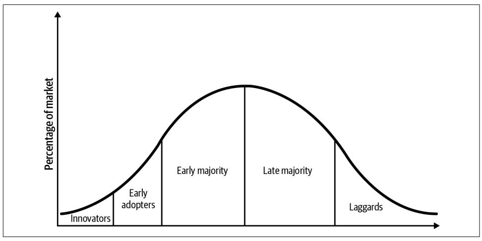

*Figure 11-2. e technology adoption lifecycle, a model for the adoption or acceptance of a new technology.*

There are five main categories of adopter—innovators, early adopters, early majority, late majority, and laggards:

#### *Innovators*

Innovators love trying new things, and are happy to take a risk that it might not work out. If you are considering adopting a technology when it is in this stage, you may not be able to find many resources to learn from: no one has yet written about this or spoken at a conference. There aren't many answers on Stack Over‐ flow. You will probably find that the associated tooling doesn't exist or isn't very mature. You might find that this particular technology never makes it to wide‐ spread adoption: that may mean you need to move to an alternative a few years down the line.

#### *Early adopters*

At the early adoption phase, there is enough information out there for people to feel relatively safe in trying out the new technology. It may still be a bit fiddly to use, but the risk of failure is lower; there are people who have managed to make this work.

#### *Early majority*

By the time the early majority are looking at a technology, there are case studies and real-life reports about using this technology. It's become clear what the actual benefits are going to be, beyond being new and shiny. There will be help and potentially associated tooling available.

#### <span id="page-327-0"></span>*Late majority*

By this point, the technology is well established and well understood. It's not par‐ ticularly risky to adopt it, and it likely feels like standard practice.

#### *Laggards*

When the last people are adopting a technology, it's likely that innovators have moved on. It's low risk, and potentially low reward: your competitors have likely already adopted this technology if it solves a problem for them.

To illustrate this with an example, let's consider containerization. When my team at the *FT* started to use containers in 2016, the technology was not yet productionready. We were early adopters and for cluster orchestration, we were innovators: we built our own. Later, Kubernetes matured, we saw innovators being successful using it, and we moved to it as early adopters.

The second way of thinking about the lifecycle of technology that I want to introduce is one that Simon Wardley developed, where he plots technology (see Figure 11-3) in terms of the level of certainty against the level of ubiquity.

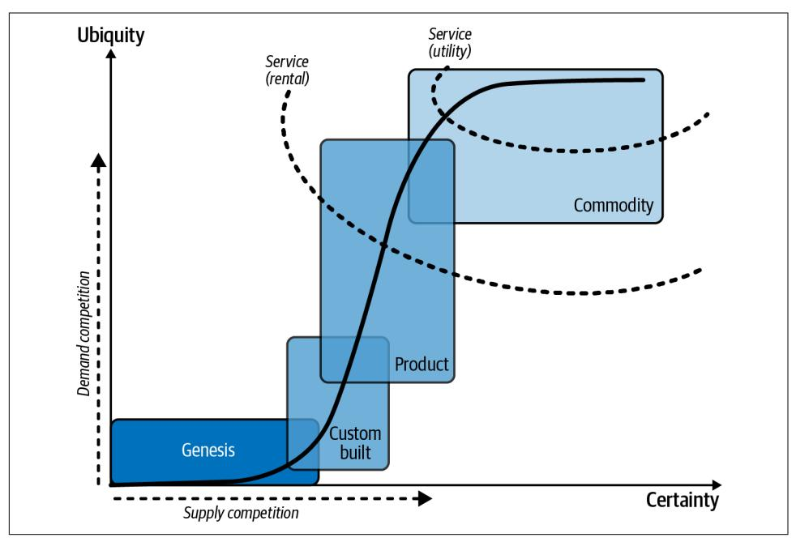

*Figure 11-3. Simon Wardley's curve for maturity of technology, which starts out as some‐ thing you need to custom build and can, if successful, become a commodity.*

<span id="page-328-0"></span>When a technology first appears, it is rare, and whether it will work out is uncertain. If it is successful, it will gradually seem to be a better and better bet—the certainty will increase; and more people will use it—the ubiquity will increase.<sup>8</sup>

There are four phases to this curve—genesis, custom built, product, and commodity:

#### *Genesis*

This technology is novel and rare but exciting. People write about its potential.

#### *Custom built*

People start to use the technology and learn about it. People write about how to use it.

#### *Product*

The technology is more widely used. People write about how to operate and maintain it.

#### *Commodity*

The technology is everywhere; the use case is understood. People write about what can be built on top of it.

This clearly maps onto that adoption lifecycle in [Figure 11-2](#page-326-0): a new technology starts off as something for experts (innovators), where you have to build it yourself. Then, as it matures it will be adopted by more and more people, becoming ubiquitous. The interesting addition is the idea that as a technology gets better understood and used by more people, it is likely to be turned into a product that you can rent or buy, and then eventually a commodity.<sup>9</sup>

This seems quite intuitive—and an example would be around compute resources. The first computers were custom built, then you could buy a prebuilt computer. Now, you can rent a computer (the cloud) or even rent just compute cycles (serverless).

Going back to my example around containerization: initially, we custom-built our own cluster orchestration. In time, people created a product—Kubernetes—that we could install and use. Now, the *FT'*s containers run on EKS, a managed Kubernetes from AWS, which is moving toward commodity.

There are a few considerations around the stage a particular technology is at, on both these lifecycle curves (Figures [11-2](#page-326-0) and [11-3](#page-327-0)).

For immature technologies, where you have to build something yourself, you are tak‐ ing on a high level of risk—if it doesn't work out, you may have to move to a different solution—but you may get a high reward if successful, because your competitors may

<sup>8</sup> See Simon Wardley's explanation, ["On Mapping and the Evolution Axis"](https://oreil.ly/4J7ZM).

<sup>9</sup> If it is successful of course!

<span id="page-329-0"></span>not yet be benefiting from this technology. However, whether that makes sense for you depends on your team or organizational culture: are people going to be comfort‐ able with figuring it all out, and that things might go wrong?

At the other end of the scale, if something is available as a commodity, then there isn't a lot of risk adopting it. Likely, there isn't a huge reward either as many other people will already be using it. This is table stakes, and normally if you can buy something as a commodity, you should. However, you still might choose to build a better alterna‐ tive, especially where you realize the alternative is ending up with a hodge-podge of different vendor tooling that almost but not quite meets your needs.<sup>10</sup>

You should also be careful not to buy an off-the-shelf product if you have to heavily customize it to meet your needs.

And of course, it also depends on what alternatives there are, i.e., what your alterna‐ tive choices could be to develop the capability you are interested in.

However, I think these two models help in setting out the context for the next couple of sections, where I want to talk about saving the innovation for the things that mat‐ ter the most to your business, and that boring technology is good.

## **Save Innovation for Key Business Outcomes**

You generally should only build something when there is a product available if this is a business differentiator for your company, i.e., building a better implementation will be core to your business.

This is where another type of diagram from Simon Wardley—Wardley Maps—can be useful. Wardley Maps start with a value chain that links users, needs, and capabilities.

You start by looking at the visible value you offer to your customers. What are the things your company does for them? At the *FT*, this would be providing news via the printed newspaper and website. Each of those things is built on other technologies. For example, the website runs on a platform, that uses compute, that relies on access to power. See [Figure 11-4](#page-330-0) for a simplified value chain for a newspaper.

<sup>10</sup> Cheers Suhail Patel for this point and the great phrasing of it.

<span id="page-330-0"></span>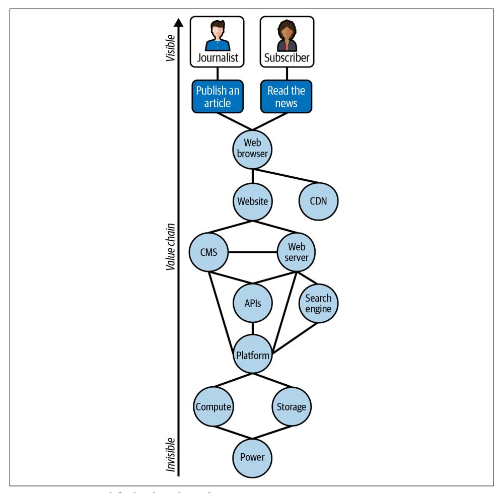

*Figure 11-4. Simplified value chain for a newspaper.*

You should focus your innovation on those things that are most visible, and that mat‐ ter the most, to your customers.

That means you probably shouldn't build a different way to do continuous integration because that is a problem that has many solutions that you can rent or buy. You might build something that is 5% better for your use case, but then you also have to main‐ tain it. Investing that time in something that is a differentiator for your business is likely a much better bet. There likely isn't a solution you can buy or rent for that!

When you combine a value chain with the technology evolution cycle discussed in the previous section, you get a Wardley Map, and it gets even more interesting (see [Figure 11-5](#page-331-0)).

<span id="page-331-0"></span>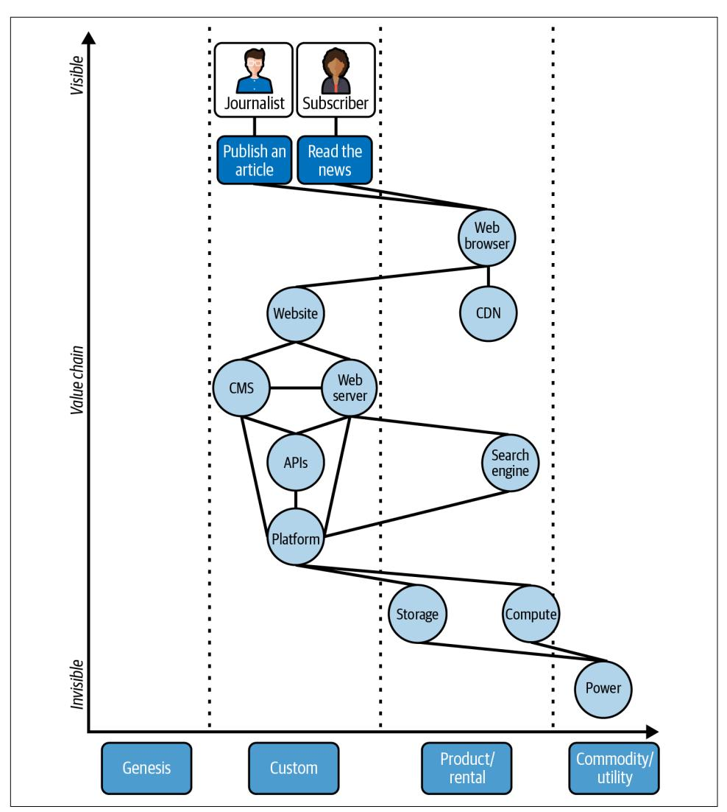

*Figure 11-5. A simplified Wardley Map for a newspaper. is maps the value chain against the technology evolution cycle.*

It's likely that the stuff at the foundations of the value chain map is a commodity.

The stuff in the middle is probably a product—and you can and should buy it off the shelf.

The stuff at the top and left is what you should be building; *this* is where you should focus your innovation, particularly if it provides a competitive advantage.

<span id="page-332-0"></span>But it's worth noting that things also *move*. Things that were custom become available as products once they hit a level of popularity. Then, they can become commodities. Going back to the example of compute, we used to buy servers and rack them, then we paid for servers in the public cloud. Now, we run code using serverless options: compute is a commodity.

## **Use Boring Technology**

*e nice thing about boringness is that the capabilities of these things are well understood. But more importantly, their failure modes are well understood.*

—Dan McKinley<sup>11</sup>

When you build something yourself, you can't easily get help from anyone else. There won't be any blog posts or answers on Stack Overflow that tell you how to get past a particular problem.

It can be worth building something yourself when doing that is high risk, high reward, where there are no product or commodity options available. If you do it well, you get ahead of your competitors.

The potential reward for building your own cluster orchestration (to pick something my team actually did) isn't high enough for this to be a good decision, now that there are products and even commodity solutions available. It may not have been the right decision to adopt containers when cluster orchestration wasn't available as a product or commodity: while my team at the *FT* saved money in running our microservices, what else could we have been building instead of our own cluster orchestration? There is always an opportunity cost to consider.

Similarly, if you adopt a product that is new to the market, you can get an advantage, but that is associated with additional risk. New and innovative technology fails in new and innovative ways. The capabilities aren't necessarily well understood, and neither are the failure modes.

I don't think engineers tend to think enough about risks when looking at a new and interesting technology, or rather, they don't think about long-term risks. We generally spend a lot longer supporting systems in production than we do building them. If you choose a bleeding-edge database, how confident are you that the company that built it will still be solvent in three years' time? That the company won't have been acquired and the database shut down? Do you have a plan for if that happens?

<sup>11</sup> See ["Choose Boring Technology".](https://oreil.ly/Mi2YK) Also available in slide + speaker note format at *[Boring Technology Club](https://oreil.ly/xuhNQ)*, and I recommend reading both.

<span id="page-333-0"></span>Moving to a new database is much less of an issue in a microservice architecture. Far less of a big-bang move. So the risk may be absolutely fine for you to take, but you should at least weigh that up.

Other things to consider are cost and security. A startup may give you a discount now, but put the price up steeply three years in. They also may not have the same level of security maturity as an established company.

As Dan McKinley says, there is a lot to be said for choosing boring technology. Bor‐ ing doesn't mean bad, it means things where you understand the failure modes. You can Google for answers.

Dan points out that there is a limit to the amount of new and innovative stuff you can do at any one time and still be successful. You should think about it like you have a limited number of "innovation tokens." What are you going to spend them on?

A brand new data store: one innovation token. New programming language: an inno‐ vation token.

If you spend it on writing cluster orchestration, you probably aren't spending it on something that delivers new business capabilities. That's a bold choice. It was one that on the whole, I think was justified for my team at the *FT*, but it definitely meant we focused on tech rather than product for quite a while.

## **Limit the Alternatives**

In general, you should use established tech when you can, but you should also in most cases choose to use tech already in place at your company.

That's because adding tech to the estate comes at a cost. You have to understand it, you have to support it, you have to operate it in production. You have to hire in a way that maintains knowledge of all the tech in your estate, and train people who move around.

The marginal benefit of, for example, adding a new programming language to the stack that is better for a particular problem space is almost certainly outweighed by the additional complexity. Additional programming languages mean that teams cre‐ ating libraries have to add a new one, in a language they likely don't know.

I do want to point out that doesn't mean sticking with the same programming lan‐ guage forever: you should move, but you should try to keep the number of languages in use at any one time in check.


Just because something is in use doesn't mean it's any good. You don't want a team to adopt a technology that is in use but that noone is actually enthusiastic about.

<span id="page-334-0"></span>Another example: let's consider a team that moves to a different CI/CD pipeline—for example, from GitHub Actions to AWS CodeDeploy. The team is likely to miss out on any new capabilities added to the centrally supported pipelines—for example, DORA metrics tracking.<sup>12</sup>

The trade-offs are where the TGG process can add value: you can work out what is already in use, and carefully consider the benefits and the costs for a particular use case of going off road in a new way.

To quote Dan McKinley again: "Adding the technology is easy, living with it is hard."<sup>13</sup> You have to think about installation and deployment, upgrades, scaling, backup and restore, logging, metrics, training for engineers, etc.

Being in the public cloud, and using serverless tech, changes the equation a bit: if you don't have to manage the database, there is less new stuff to understand. It's still an overhead to add new tech though!

One further comment. If you do decide to add something new, you should think about what you can remove too.

When a team adopts a new technology that duplicates an existing one, there are three choices. You can have that team support the new tech, as a local optimization, indefi‐ nitely. I can tell you that several years in, the people now on the team may be a lot less enthusiastic about this.

Second, you can see how it goes, and if it is successful, move it to be owned by a plat‐ form team. That potentially increases the cognitive load for that team (because it's rare that you'll hire a new team), but that might be fine.

Third, you can decide this is a better option, move it to be owned by that platform team, and migrate everyone else to it too. If it *is* better, that will probably be OK, but there is generally a long tail; teams who haven't quite got round to migrating because they have other commitments. It takes support from leadership to make sure that the migration does, finally, finish.

## **Be Clear on Where Duplication Is Acceptable**

There will always be some places where duplication really isn't an option; for exam‐ ple, you might decide that introducing an additional programming language, cloud provider, or monitoring system is too costly, risky, or complicated. You may move the whole organization, but you don't want to have one or more teams choosing an alternative.

<sup>12</sup> Thanks to Joe Wardell for this example!

<sup>13</sup> See [slide 57](https://oreil.ly/loHk8) in the *Boring Technology Club* slidedeck.

<span id="page-335-0"></span>It's a good idea to spell these things out, in your guardrails or your platform documentation.

## **Expect Things to Change**

You should expect things to change. Choosing well-established technologies can leave you in a better position than opting for brand new and experimental tech, but we are not all still writing COBOL.

Which means you should try to make decisions that are easy to change later on.


Microservices can help with responding to change, because it's eas‐ ier to try new technologies in a small area of the system, and migrate other services over time.

You won't be able to standardize once and stay on that exact stack for many years. Your aim should be for people to know what the current stack is, and to make migrat‐ ing to something new into an easy process where people get lots of notice and help.

To know what the current approved stack is, I've found a [Tech Radar](https://oreil.ly/poU0L) (introduced in [Chapter 6\)](#page-154-0) to be very useful. A Tech Radar lists technologies with a recommendation of whether to Assess, Trial, Adopt, or Hold that technology. And the original Tech Radar from [Thoughtworks](https://oreil.ly/zgROg), updated quarterly, is a great way to pick up on technolo‐ gies that you should be considering adopting, or moving away from.

## **Insight Leads to Action**

When you know what is in your estate, and you have automated your guardrails, you have a powerful tool that can provide insight into the current status of your software estate.

This allows you to guide teams on what to do next. I've already mentioned the SOS system, which looked at runbook information and told teams what they should fill in first through the scoring system.

At the *FT*, we also built tools that gathered together information about the known security issues: again, prioritized to show what to fix first.

Insights into your estate also help when you need to respond to issues. For example, a subject access request means you need to find all the systems that store personal data: the *FT* flagged this in Biz Ops.

<span id="page-336-0"></span>Someone needs to respond to issues like Log4Shell (discussed in [Chapter 9\)](#page-244-0), and insights across the estate really enable that. This is a key part of governance: teams may be autonomous, but your legal and compliance teams, and your technology lead‐ ership, want to know that someone is checking across every team when there is some‐ thing critical that needs to be responded to.

Investment in visualization makes it far easier to respond to questions like "How many of our services depend on this vulnerable library?" or "How much effort to migrate away from this tool that has just tripled its prices?"

## **Governance in Other Organizations**

This chapter has been very *FT*-focused and I realize that not every organization is the same. So I want to talk about a few other organizations and how they tackle gover‐ nance. Thanks to Suhail Patel and Stuart Davidson for taking the time to read this chapter and give me their insights on how governance works at their organizations.

## **Governance at Monzo**

Monzo is a challenger bank in the UK and well known for running thousands of microservices and releasing code frequently in [a heavily regulated industry.](https://oreil.ly/aSThq) There are 300+ people in the product and technology group as of 2023. The company has been around for eight years and is a scale-up.

Monzo's philosophy is that risk and governance is the responsibility of everyone, and mandatory yearly training reminds people of this.

Formally, Monzo has a standard first/second/third line of governance in line with most other financial institutions. It embeds first line within groups of teams in partic‐ ular domains, and there is direct communication between engineers and folks in that first line of defense. These first-line folks are effectively the Collective Partner that navigate Risk Management/Registers, representing in Risk committee reviews and sessions. More generally, they provide guidance to engineers on a day-to-day basis.

The embedded model works well and these governance experts are very much a part of the group and involved directly in squad channels and calls and helping navigate complex decisions. That visibility makes it more human than just a paper form and/or the odd occasional call.

Company wide, Monzo has defined policies around Change Management, Third Party Suppliers, Break Glass,<sup>14</sup> Incident Management, and much more. All of these are written in plain English, are kept to a maximum of two to three pages, and are

<sup>14</sup> See ["How We Secure Monzo's Banking Platform"](https://oreil.ly/bRVT8) for details of this.

<span id="page-337-0"></span>part of yearly mandatory training. This keeps the policies fresh in people's minds, and the annual review means people know if changes have been made to existing policies.

Monzo invests extremely heavily in tooling to mandate its policies, especially around code reviews, deployments, and changes making their way to production. The com‐ pany allows engineers and teams a lot of freedom to decide criticality of changes and self-govern within squads.

Monzo, like the *FT*, has service tiers that reflect how critical a service is, and the level of automated controls for a particular service—things like multiparty approval and authorization for changes—depends on whether that service can impact important business services. The closer to critical capabilities, the more restrictions and automa‐ ted controls.

The goal is to take a risk-based approach, with few blanket restrictions. To ship a new microservice to production or make a change to an existing one often only needs approval from a peer on the team that owns the service.

Monzo has a culture based around proposals for changes. Engineers define the scope and context of a change, and there is an architecture review process for cross-cutting changes that allows input from other engineers. This is about ensuring deep scrutiny before making a change that would be hard or impossible to reverse, rather than a sign-off meeting for changes.

For major technology changes, such as moving to a new data store or migrating from self-hosted Kubernetes to Amazon's EKS, there is a formal Major Tech Change pro‐ cess. Every group within the organization will be notified and there will typically be a conversation with the regulator to give them notice of the upcoming change.

Monzo builds in automated guardrails to avoid risks. These include:

- A single employee can't deploy to production without someone else seeing the change.
- It's hard to ship an API that doesn't have authorization enabled.
- It's difficult to deploy a service that isn't using the standard technical stack, going through the standard deployment pipeline, and with code in the Monzo monorepo.

Within engineering at Monzo, the overarching philosophy is to make guardrails feel seamless and out of the way for the day to day, either letting tooling that is instant and objective take care of it, or taking a risk-based approach depending on blast radius. These tools emit tons of audit logging for decisions that Monzo can inspect and evi‐ dence with auditors. Across the board, Monzo doesn't want to slow engineers down for their standard day to day, unless it will literally take down the bank.

## <span id="page-338-0"></span>**Governance at Skyscanner**

Skyscanner is a global travel company based in the UK. Like Monzo and the *FT*, it has a microservice-based architecture and releases code frequently. There are 1,200 global employees and Skyscanner is post scale-up.

Skyscanner only allows AWS changes via CloudFormation, and has a rules-based sys‐ tem in place called [CFRipper](https://oreil.ly/axdAH) that automates applying a set of rules against infrastruc‐ ture changes and is a mandatory step in any build pipeline.

There is also a metadata service for registering services, and if there is no metadata in the repository or the service can't be found in the metadata service, CFRipper pre‐ vents the deployment.

Skyscanner uses CloudZero for Cost Management, bringing in not only AWS costs for a service but associated observability costs via NewRelic and any Databricks workloads. Each team is associated with the services it owns via the metadata service, so Skyscanner can determine the costs for each squad, each service, and associated domain. The company has found that empowering squads with the information usu‐ ally drives the right behaviors.

For a long time Skyscanner thought containers were enough to let many different tech‐ nologies into the business, but for every different language there's an associated cost enablement, different technical approaches, transitioning staff between projects, etc.

It has since begun to consolidate on a set of specific technologies and where that's provided by a vendor, engaged with them on a more strategic basis to see what other benefits each key vendor can bring. The question is, are there vendors out there that are "good enough" across a range of things rather than having many best-of-breed vendors?

Skyscanner uses the concept of Change Tokens (i.e., the innovation tokens Dan McKinley talked about in his "Use Boring Technology" blog post), both in terms of key new business capabilities and also around how many parallel streams of work are happening at any one time that are driving technical change: this is about trying to limit the amount of churn in the system. Technical investment and innovation is key but that can be hard and it's put at risk if everyone is doing it at once.

Skyscanner has Production Standards, which initially were a bit like a checklist, but are now redoing them to be a true/false statement so engineers can more easily assess the suitability of their code.

Skyscanner has found, like me, that "Engineers like a challenge" and often that takes the form of a new technology—but if you change the narrative and engage deeply on the existing technologies, driving a culture of best-practice for what you've got, it can be very powerful. Skyscanner is lucky to have several world experts on the technolo‐ gies it uses (for example, Guy Templeton on Kubernetes, Dan Gomez Blanco on

<span id="page-339-0"></span>OpenTelemetry, and Richard North, founder of TestContainers) and as a result, focusing on these technologies works better for the business and still motivates engi‐ neers through a sense of mastery of a subject.

## **What to Do If You're Struggling**

There are two primary challenges here. First, the challenge of convincing people that governance is worth investing in, and that it isn't about stopping people from inno‐ vating or about insisting on an inflexible set of standards that slow everyone down. Second, tackling the current state of your software estate to reduce risk and tame the sprawl.

For the first challenge, start by talking about risk. Look for something particularly risky and see if you can introduce automation—or a minimal amount of process—to protect people from it. For example, making sure credentials don't get leaked by being checked into source control. Go step by step, explaining the benefits. That includes to people outside of engineering, because often that's the source of the pressure to get things done quickly that means teams cut corners and introduce risk.

Like many changes to support doing well with a microservice architecture, you will make more progress if your leadership team understands the benefits and backs you. Spend time selling the benefits of lightweight governance to that team.

If you already have a mess of different technologies in place, what can you do to improve things?

Start by preventing it from getting worse. Set up a forum that allows you to discuss technology choices. Capture the discussions and the decisions made.

Bring your guardrails together into a single checklist and require any new service to comply with those guardrails in order to go to production.

Then invest in ways to know what's out there and better understand the current state. Focus on your most critical services, and the ones that contain the most sensitive and personal information. Set regular goals for making things better. This is where auto‐ mation can really help, because you provide the measure as well as the goal. Our sys‐ tem operability score worked out because teams could set a guideline to improve their score by 25%, for example.

You can stop it from getting worse, but eventually, you may have to make some hard decisions that involve teams having to migrate parts of their stack. Aim to give a long notice period and to provide tools and people to help with that process.

## <span id="page-340-0"></span>**In Summary**

In [Chapter 7](#page-174-0) we discussed the benefits of a paved road: common services can be pro‐ vided, but there is a route off road if absolutely necessary.

For that to work, you need a couple of things in place. First, you need a set of guard‐ rails that define what it means to deliver a production-ready service. This should include all considerations such as procurement, architecture review, security and pri‐ vacy, accessibility, observability, change logging, operational information like health‐ checks and runbooks, as well as checklists detailing what needs to happen to go live or when decommissioning a service.

If a team wants to make a different technology choice for a particular service, they need to comply with those guardrails. Sometimes, that will rule out alternatives—for example, maybe there isn't an option to choose different log aggregation or monitor‐ ing solutions because you lose too much when you can't see everything in one place.

The second thing you need is a process for agreeing on technology changes, whether that is to the paved road or for an autonomous team choosing something new. A lightweight document-based review process means the right people are consulted, people won't accidentally build something that already exists, and you have a chance to look back in a couple of years and understand the decision that got made.

Finally, you need some agreement on where it makes sense to introduce something new. Generally that will be for something that you can't buy in, or where this is so key to your business that you benefit from being able to customize your solution.

# **Building Resilience In**

<span id="page-342-0"></span>Distributed systems mean additional latency and a higher chance of failure as requests go over the network. If you get timeouts and retries wrong, a slow service can be worse than a broken one as threads get tied up waiting for it to respond. Once the service recovers, the challenges aren't over yet, because a thundering herd of requests can bring it back to its knees.

We need to build microservice-based systems differently. The services should be writ‐ ten to handle problems from the things they depend on, including the shut down of the hosts they are running on.

The systems should be resilient to failure, with built-in redundancy. Retries, recovery, and remediation should be automated and graceful wherever possible. The microser‐ vice promise of a small blast radius on failure only applies if you have made sure the rest of the system can work when an individual service has problems.

Later in the chapter, I'm going to talk about how to build resilient services, and then resilient systems. First, though, let's discuss what resilience means, and especially what the challenges are to building a resilient distributed system.

## **What Is Resilience?**

Simply stated, resilience is the capacity to withstand or recover quickly from difficulties.

Things will go wrong in any production system. A resilient software system will con‐ tinue to provide an acceptable level of service even if some parts of the system are under stress or have stopped working. It will also recover quickly and without losing any critical data.

<span id="page-343-0"></span>Many of the things we are going to discuss in this chapter that help with resilience will also make your system more complex to understand and more expensive to oper‐ ate. You will have to make decisions about how much resilience you need to build in, and that depends on what an acceptable level of service is for you. Can you run in a degraded state for a while? Which capabilities are absolutely essential and which are nice-to-haves?

These aren't purely technical decisions; they depend on a deep understanding of your business, and of end-to-end flows that might cross boundaries between your small autonomous teams. Much of the work to build a resilient system happens at a micro‐ service level, but not all: you need to make higher-level decisions too. Which capabili‐ ties are critical? What's an acceptable duration for particular requests to be processed? How many layers of redundancy are you prepared to pay for?

Some of these decisions can be made at a team level, by senior engineers and product people in the team. Other decisions are going to need to be discussed with senior leadership and stakeholders.

### Regions, Availability Zones, and Resilience

Most of my experience around designing resilient systems is in the context of running on AWS. You'll find the following terminology throughout the chapter and so I want to introduce some key AWS concepts here for those who don't have that same experi‐ ence. My intent is to give just enough context that you can hopefully map what I'm talking about to similar concepts in other cloud providers.

### *Regions*

AWS regions are clusters of data centers located in different physical locations around the world. Regions are completely independent of each other.

### *Availability Zones*

Each AWS region has a minimum of three isolated and physically separate availa‐ bility zones (AZs): discrete data centers that are, however, interconnected with high-bandwidth, low-latency networking.

AWS recommends that applications are partitioned across AZs. For your most critical systems, you may also want to run services in more than one region. Multiregion services will cost more to run, and it's more complicated to do so because the regions really are pretty independent. There are, for example, relatively few multiregion data‐ bases that support replication of data between regions. If you aren't using those, you have to work this out for yourself.

## <span id="page-344-0"></span>**Resilience for Distributed Systems**

If you are used to working in monolithic systems where the calls your code makes are in-process, you may not realize the full implications of moving to a distributed model where calls go over the network.

Many years ago, L Peter Deutsch, James Gosling, and others at Sun Microservices documented eight [fallacies of distributed computing](https://oreil.ly/FySL7), the false assumptions program‐ mers new to distributed computing typically make. These fallacies are still highly rel‐ evant today and continue to catch out developers. They are:

- 1. The network is reliable.
- 2. Latency is zero.
- 3. Bandwidth is infinite.
- 4. The network is secure.
- 5. Topology doesn't change.
- 6. There is one administrator.
- 7. Transport cost is zero.
- 8. The network is homogeneous.

These are a useful framework for thinking about resilience and indeed system design in general.<sup>1</sup> I want to briefly talk about them, the ways they can trip you up, and what you can do to protect yourself. Later in the chapter, I'll expand on the resilience tech‐ niques mentioned in this run through.

### Fallacy 1: The network is reliable

Any call you make over the network might fail. A switch might break, the network may be misconfigured, or the service you are calling may be unresponsive for some reason. You need to code defensively.

Set a timeout on any call you make so that you don't wait indefinitely for a response. Retry the call if that makes sense—but don't retry unless your request is idempotent (a lack of response doesn't mean the request wasn't processed).

If you can't get a response, handle that: fail gracefully, and return meaningful error information.

<sup>1</sup> See ["Fallacies of Distributed Computing Explained"](https://oreil.ly/VW7cm) by Arnon Rotem-Gal-Oz for a more detailed discussion.

<span id="page-345-0"></span>It's not just calls in your code that can be affected by network issues. If you are relying on logs or metrics being aggregated somewhere, you cannot assume every log or met‐ ric will be shipped successfully, or that they will be shipped quickly. What does that mean if you are relying on an alert based on those logs or metrics?

At the system level, you should deploy your services so that if one part of the network fails, it won't take down all of your instances. This means having, for example, serv‐ ices running in different availability zones and maybe different regions as well. For containers, this is the reason for having something like Kubernetes that allows you to specify anti-affinity settings so that replicas of your application are not deployed on the same machine.

### Fallacy 2: Latency is zero

Latency is the time it takes to send a signal between two points in the network. The speed of light is the constraint here: nothing moves faster than that. It will never take less than 30 milliseconds to send a message from Europe to the US and back. You can mitigate the effects of these geographical limitations through making sure services are in the same geographical region, or using content delivery networks (CDNs), which have multiple points of presence, or POPs, to cache data closer to your end clients.

That doesn't solve another issue though, which is that the latency of network calls mounts up as you make multiple calls (which can be common in a microservice architecture). To mitigate this you should try to minimize the number of calls you make, requesting all the information you need in one go, for example—or at least making calls in parallel.

You also need to test your defensive code for cases where the calls you make return a response, but return it slowly. Slow can be worse than down. You can end up doing a lot of processing that never results in a response the client sees, because they've gotten tired of waiting and hit "refresh" on the page. Your retries might also be adding to the load on an already overloaded system. You can work around this with timeouts and circuit breakers, covered later in this chapter. You can also look at whether the calls you are making are necessary: could you cache some data, if it doesn't change fre‐ quently? Can you use the stale version on error, at the very least?

One final way to reduce the impact of latency is to design systems to be asynchro‐ nous, putting queues in place between services so that a service's work is complete once it puts a message on that queue. This can be very effective for a workflow where you don't need to retrieve information, and it removes some complexity about han‐ dling retries. An example would be a checkout process, where you can return "Order successful" once the message is in the queue and have the consumer of the queue deal with notifying the customer when the order has been placed, or of any issues with that happening.

<span id="page-346-0"></span>

### Fallacy 3: Bandwidth is infinite

Bandwidth is the maximum rate of data transfer across a given path. High volumes of data being passed around a network can result in network congestion, affecting per‐ formance and causing packet loss (it may also cost you a lot of money in data transfer charges, depending on your system architecture).

Design your services to minimize the amount of data you pass around. Designing interfaces so people can get just the information they need can make a big difference.

One example from my time on the content platform team at the *FT* came from our desire to adhere to [REST](https://oreil.ly/2aVh6) best practice. We had an API for a list of articles, but the first-pass design only included the unique identifier for each article. What that meant is that anyone requesting that list would immediately then make calls to request each article by UUID, to get the headline, author, and topic that they needed to display on the list. This meant n+1 requests for each list page, where n is the number of items in the list; and also retrieving the full information for each article, most of which was immediately discarded.

Adding those key fields into the list response reduced the number of calls *and* the data being passed around. It did, however, bring challenges of how to make sure that information in the list got updated when a piece of content was updated, since lists and article updates came into our system separately. This is a challenge around any sort of caching in a microservice architecture: how do services know when data they don't own but do reference has been updated? Probably the simplest approach is to cache for a period of time and then go back to source to get the latest: notifications that a new version is available may result in less traffic for things that don't change often, but are more complicated to implement and more error prone.

### Fallacy 4: The network is secure

This is more about security than resilience so I'll keep this fairly brief given the focus of this chapter.

You can't assume that your network is secure. Any call over the network could be intercepted. This has implications for how we build microservice-based systems.

Often, people implicitly trust any service within the network perimeter. This leaves you with a situation that is actually quite like that with a monolith, which is that once you are in, you have access to the whole thing.

The alternative is to adopt a zero-trust model where you always verify that users mak‐ ing a call to your service are who they say they are, and encrypt data in transit and at rest. If you do this, you have greater defense in depth because an attacker gaining access to one service can't easily access all the others.

<span id="page-347-0"></span>

### Fallacy 5: Topology doesn't change

The network topology is the arrangement of links and nodes in the network. It changes—of course it does: hardware gets replaced, new releases mean that instances of your microservice disappear and new ones appear. Some of these changes are per‐ manent, while others are a result of resilience built in to other parts of the system. Additionally, you have no control over the decisions other teams make for the servers and services they own.

This is where you need service discovery: ways to find where a service is currently running. While using DNS is better than a hardcoded IP address, DNS records tend to have a time-to-live value that is too long to work in an environment where net‐ work topologies change all the time—for example, with containers or cloud provi‐ sioning. Container orchestrators (e.g., Kubernetes) offer service discovery as a core service.

It's not just about finding where the service is at the moment, it's about coping with unexpected changes. What happens if you are calling services owned by another team and that team moves those services to a different region? If you make a lot of calls to those services, your latency can take a hit. This is even more true for third-party serv‐ ices you may call.

### Fallacy 6: There is one administrator

In any nontrivial system, there will be more than one person making decisions about the network. You don't know when someone is about to upgrade the service you call, or move it to a different host, or a different region. You also may not find out about these decisions until they have already been implemented.

To prevent this from causing havoc, you should first make sure that you define expectations and best practice within your organization. For example, your organiza‐ tion may decide that services must register with a service discovery mechanism, and must send logs, metrics, and monitoring to the central systems, using the same sys‐ tem codes as identifiers regardless of whether that system is now running somewhere quite different.

As an owner of a service you should aim to understand when you are making changes that might impact others too. Is this a major change to the API? If it could break an integration, let people know. And wherever possible, make changes without any downtime, either through upgrading instance-by-instance or by deploying the new version in parallel and moving people over. Alternatively, design the system so that there is a higher degree of decoupling—for example, through using message queues. This means consumers and producers don't really need to care about each other at all.

<span id="page-348-0"></span>

### Fallacy 7: Transport cost is zero

There are two types of cost related to having a distributed system: the cost of running a distributed system, and the cost of sending requests between two separate services.

Going over the network costs money. A badly designed microservices-based system can involve sending a lot of data from one place to another, and that bandwidth can be expensive. Even a well-designed one can incur all sorts of costs, and you need to keep on top of them.

It also costs you time to pack up and then unpack each request you send. A call over the network is much slower than a call within a process. If the call is to a server in a different part of the world, the speed of light makes this even worse. If latency is criti‐ cal for your use case, microservices may not be for you. And even if it isn't, you will need to design your flows so that you don't have a chain of synchronous calls bounc‐ ing between separate cloud provider regions.

### Fallacy 8: The network is homogeneous

You can't expect every server on your network to be identical. In fact, with microser‐ vices you should expect to see some services written in a different language or run‐ ning on different hardware.

That means you need to build services that are interoperable, i.e., they comply with standards and use the same representation of data, perhaps by sending it as JSON over HTTP.

## **Resilience for Microservices**

All the fallacies of distributed systems apply to a microservice architecture, but hav‐ ing lots of small services means two things. First, the downside. You absolutely will see transient failures having an impact all the time—it's purely a numbers game. This makes it even more important to build in retries, circuit breakers, bulkheads, and more.

Second, the upside: well-designed services will make for a more resilient system over‐ all. Unlike with the monolith, you don't lose all functionality at the same time. You can degrade parts of the experience gracefully—for example, deciding to show a static list of most read content if you can't access personalized recommendations.

In order to do this, though, you need to understand what makes sense for your sys‐ tems and your organization. This isn't about technology, it's about your business.

## <span id="page-349-0"></span>**Understanding Your Service Level Requirements**

A large part of building a resilient system is about understanding your system. Do you have predictable load or are there unexpected peaks? How long could a particular capability be down without a serious impact? What would graceful failure look like?

For example, do you fail open, or fail closed? For a subscription newspaper like the *FT*, if you can't check someone's subscription status, failing open might be the best choice: you don't annoy the people who have paid for a subscription, and maybe the people who get to see content for free for a while will like it enough to subscribe. For payment systems, likely failing closed is a safer choice: you don't want people getting free orders!<sup>2</sup>

You should look at flows through your system, starting with the most important, and think about what matters. What's the level of service you should be offering your cus‐ tomers? That's something you'll need to speak to your business stakeholders about to really understand. They are the ones that will know how the service is used and what their customers expect.

## **Service Level Objectives**

As the authors of the *Site Reliability Engineering* book point out, "It's impossible to manage a service correctly, let alone well, without understanding which behaviors really matter for that service and how to measure and evaluate those behaviors."<sup>3</sup>

If someone tells you a particular web page needs to return results "quickly," what does that mean? It depends on context, of course. But you should work out with your stake‐ holders where the line is at which response time starts to be "too slow" for this particu‐ lar page, and when that happens, you can say that your performance is degraded.

That starts by identifying service level indicators (SLIs) that measure some aspect of level of service. Then, you agree with your stakeholders on a target value or range of values for each of those SLIs. This gives you your service level objectives (SLOs).

Setting appropriate service level objectives can be an extra challenge when you have small, autonomous teams—maybe there's no one that understands the full end-to-end flow. However, it's important to be thinking about the whole flow: trying to set SLOs for partial flows just because that's the bit your team owns is not particularly mean‐ ingful without understanding the rest of the flow too.

Here are some commonly used measures that help with setting SLOs.

<sup>2</sup> This example comes from Gergely Orosz's [Pragmatic Engineer newsletter, August 2022](https://oreil.ly/t8xX9), where he notes that an unknown error message returned from a payment provider got treated as "success," resulting in free Uber‐ Eats orders in India for two days in 2019!

<sup>3</sup> Betsy Beyer et al., *Site Reliability Engineering* (Sebastopol: O'Reilly, 2016).

#### <span id="page-350-0"></span>**Request duration**

How long it takes to process requests to the service. Generally you want to exclude the occasional outlier and measure something like the duration that 95% of requests are completed in (the 95th percentile, sometimes abbreviated to p95). For example, you might have an SLO targeting a 95th percentile of under 1.5 seconds.

#### **Error rate**

What percentage of requests result in an error? You should decide here what "error" means—for example, some nonsuccessful requests happen because a user sends in garbage data. Do you want those to count as errors?

As an example, for an HTTP request, you might set a target that you have fewer than 1% of responses from the 5\*\* status code group in any five-minute period.

#### **System throughput**

How many requests per second is your service handling? The related SLO should more than cover peaks in traffic. At the *FT* when I first joined, we had the idea of supporting "Lehman day + 10%." At the time, the *FT'*s peak load had been on the day that Lehman Brothers filed for bankruptcy in 2008.

One thing I have found useful is thinking about what would happen if you lost one of your two regions at the same time as a normal traffic peak happened. That would encourage me to set an SLO that was twice that peak traffic: both regions would need to be able to handle peak traffic on their own if all traffic was failed over.

#### **Availability**

What fraction of time is your service usable? That could be based on the fraction of well-formed requests that succeed in a specific time period and is often talked about in terms of the number of "nines": 99.99% is 4 nines of availability and equates to 4.38 minutes of downtime per month or 52.60 minutes per year.

Of course, there's a lot more nuance to what's acceptable to a customer—or your busi‐ ness stakeholders—in terms of availability (and business people aren't thinking in terms of "nines"). Being down for nearly an hour once a year could be much worse than small outages spread out. Or vice versa! And it is worth understanding whether there are particular times where an outage would have an outsize impact, for exam‐ ple, of a payroll system at the end of the month; or of newspaper production systems 20 minutes before the paper needs to go to press.

Capture information about key times and make engineers aware of those, even if your SLO is actually set in terms of nines of availability. It gives them more context and allows them to avoid making changes at a time when that would have a bad impact.

<span id="page-351-0"></span>Another example at the *FT* would be making sure engineers were reminded that it was budget day, or that the US election was happening.<sup>4</sup>

## **Error Budgets**

One thing I particularly like about Google's work on [site reliability](https://sre.google) is the idea of an error budget. This is the concept that there should be room for error in almost any system, because 100% reliability is in most cases the wrong target. It's very expensive to get the final 0.005%, and your customers can't tell the difference because the things they use to access your site aren't 100% available.

If you can get into the mindset that it's OK to be unavailable as long as you hit your availability target, that allows you to make decisions about the level of reliability you need. For example, if you are building an internal system and it's fine for it to be unavailable for half an hour at a time and you can move regions in that time—you don't need to run multiregion, and that will save you money and make for a simpler architecture.

## **Building Resilient Services**

Let's imagine a very simplified scenario where a customer calls your microservice, *A*, and as part of processing that request, *A* makes a synchronous HTTP call to service *B*.

The happy path is that *B* responds quickly, with a "200 OK" response and some pay‐ load, *A* extracts the information it needs, and sends a response to the customer.

But what about the unhappy paths? If *B* responds with a "404 Not found," you proba‐ bly want to return an appropriate error message to the customer, but what if *B* responds with "500 Internal server error"? Or what if *B* doesn't respond at all?

When you build a service in a microservice-based architecture, you are building something that can't expect other services to be available.

At the *FT*, when we built our first microservices, we didn't really consider this, so we had systems that expected to be able to connect to the database or to other services as part of starting up. This isn't a great idea, because you start to have a complicated graph of which service needs to be spun up first, which means you are coupling your services together when that isn't necessary.

Over time, we learned how to build services that don't expect to be able to connect to other services at startup and can deal with loss of those services at any point.

<sup>4</sup> You shouldn't assume everyone working at a newspaper follows the news!

<span id="page-352-0"></span>But to do that, you need to understand the implications of not being able to connect to systems you depend on. In which circumstances should you retry a call? How long should you wait? Answering those questions is an important part of designing your microservice.

Next, I want to talk about several patterns that help to make a service resilient. You should make sure the services you build use these patterns, because resilience starts within each service. You also need to make the system as a whole resilient, which I'll tackle in the section following this one.

## **Redundancy**

The first part of building resilient services is to make sure you have more than one instance of your microservice, and that those instances are running on hosts that are not likely to be unavailable at the same time.

In the cloud, you want your instances to be in different availability zones, because zones are designed to minimize the sharing of physical infrastructure like power, cooling, and networking, and there is some level of guarantee that servers in different availability zones won't be upgraded at the same time. This also applies for containers: if you are running a Kubernetes cluster in the cloud, you want servers to be in differ‐ ent availability zones and you want to make sure that replicas of the same container image run in different AZs (you can do this through specifying anti-affinity rules).

For a higher resilience guarantee, you should run in different regions. The promise (maybe it's not as strong as that!) is that it should be very rare to lose more than one region.


Having multiple instances of your microservice supports zerodowntime deployments even if you are not doing immutable deployments: you deploy new code to one instance at a time and requests are served by the other instances in the meantime.

Once you have more than one instance of a service, you need a way to balance requests across the instances. The simplest way is to set up a load balancer and have instances register with that when they start up.

## **Fast Startup and Graceful Shutdown**

I learned a lot from Heroku's concept of the [12-factor app](https://oreil.ly/FwOKJ), a methodology for build‐ ing web apps to run effectively in the cloud and as part of a distributed architecture. One of those 12 factors is Disposability, which is particularly applicable in building a resilient service.

<span id="page-353-0"></span>You should view individual instances of your microservice as disposable. In other words, they could be started or stopped at a moment's notice.

That means you should minimize startup time. This allows rapid scaling if load increases, and it makes it easier to move instances around, for example, onto a differ‐ ent host.

Your services should also shut down gracefully when they receive a SIGTERM signal (a request from the operating system for the program to terminate). For a service that receives HTTP requests, that means refusing any new requests, finishing those in flight, and exiting. For a service consuming from a queue, you might return a job to the queue.

But graceful shutdown isn't enough. Hardware failures can mean you don't get time to respond to a SIGTERM. This means that your service needs to be able to recover from a sudden shutdown. Mostly, that means making sure that operations are idem‐ potent: they can be applied multiple times with the same result as being applied once.

## **Set Appropriate Timeouts**

We are often better at dealing with a service that is fully down than with one that is degraded. There's less ambiguity about whether the service is healthy *enough* to be serving traffic.

The first thing to do that will help with degraded performance is to make sure you set timeouts on your calls. I've found it very common to have incidents caused or made worse by requests not timing out. Often, the default in libraries is pretty long, in the order of 10 seconds. You should reduce this significantly. It's better to fail quickly.

I was surprised to find that some HTTP client libraries don't specify a default timeout at all, meaning a call to an unresponsive server will tie up a thread forever.

What should you set your timeouts to? You want to set them so that the timeout only fires when there is a problem. Here, you need to measure normal latency as a bench‐ mark. A good heuristic is to set the value to a few multiples of the p99 latency value, and generally no higher than a few seconds.

## **Back O and Retry**

Once you have a timeout set, what do you do when a call times out, or fails?

You want your service to be able to cope with an intermittent issue connecting to another service. That can happen, for example, during a service deployment, where a request has been routed to an instance that is no longer listening.

<span id="page-354-0"></span>The simplest thing to do is to retry the request. However, that is not always appropri‐ ate. You don't want to retry a request that is going to fail a second time because the request was malformed, or the resource doesn't exist.

If you are using HTTP status codes correctly, it will generally be 5xx errors that you will retry, as these indicate a server failing to fulfill an apparently valid request.

However, you don't want to retry too soon: you want there to be a realistic chance that the next call will work (e.g., because the load balancer has now taken the instance that is down out of the pool).

A naive approach to retry—where you just wait a period and try again, perhaps sev‐ eral times—causes issues when there are lots of requests that are being retried. You can end up with a spike in load, which can overwhelm the instances that are still functioning. That can also be bad when a service just starting up again gets hit with a lot of traffic because it's getting new requests *and* retries for older requests.

So, what should you do? The next refinement is to apply some sort of exponential backoff. So, for example, your first retry happens after 1 second, the next one happens after 2 seconds, then 4….

This helps with potential spikes in load, but it raises a question. How long do you keep trying?

You don't want to keep retrying after the person who made the original request got fed up and hit refresh on the page. You are doing work that will just get thrown away. This is particularly problematic if you have retries built into multiple services along the way.

I wouldn't recommend doing multiple retries in a synchronous call stack. One retry after a short wait should hopefully get routed to a different service.

One final comment: add "jitter" into your retry behavior. This means adding a little randomness into how long you wait before retrying—for example, making it some‐ where between 1 and 2 seconds.

The reason for this is that retries will otherwise cluster together, giving a very spiky load profile that can cause you problems.<sup>5</sup>

## **Make Your Requests Idempotent**

In a distributed system, you don't know for sure whether a request was successfully processed somewhere down the stack. Any request made could be processed without a response making it back to the calling service.

<sup>5</sup> There's a good writeup by Mark Brooker on the [AWS blog](https://oreil.ly/ZdHay).

<span id="page-355-0"></span>What this means is that you need to make sure your requests are idempotent, even where these are requests that change state somewhere.

One way to do this is to include a unique idempotency key on requests. That means that a subsequent request with the same idempotency key will not be processed a sec‐ ond time.<sup>6</sup>

## **Protect Yourself**

You don't need to know much about the services that call you. What you *do* need to do is to take steps to protect yourself.

So, for example, you should make it impossible for someone to bring down your ser‐ vice by sending too much traffic through.

You can do that if you are behind an API gateway through throttling the number of requests. Depending on the API gateway you are using, that can apply at different timescales, so you might limit the requests per hour, but also look at burst protection, so the full hour's worth of requests can't come in 1 second.

Another approach is load shedding, where you deliberately fail quickly with minimal processing as your service starts to be under load. For example, you could keep a count of how many requests are currently in flight and return HTTP 503 (service unavailable) when you are maxed out.

## **Testing Service Resilience**

When you build resilience into your services, you should also test it.

All too often, people write tests for the happy path and for failure cases, but not for when a service is slow. These tests will catch errors in your handling of a slowdown, before you get to the point of load testing or chaos engineering, both discussed later in this chapter.

## **Make Building Resilient Services Easy**

As an organization, you should make it easy for people to build resilient services. You need to provide the scaffolding to do this, and this is something that should be part of the paved road. Many of the tools that can help should be owned by a platform team.

The most basic option is to create libraries for your programming languages that ensure timeouts are set on every request and support backoff and retry, with sensible

<sup>6</sup> There is a great [blog post](https://oreil.ly/gmkHs) from Bart de Waters on how Shopify builds resilient payment systems, which includes a discussion of idempotency keys.

<span id="page-356-0"></span>default configuration settings. Make it easy to override these and provide documenta‐ tion that helps people work out what settings they should use.

Beyond that, increasing resilience is one reason companies choose technologies like Kubernetes, service meshes, and API gateways. The team writing a service can focus on the business needs, deploying the application to a Kubernetes cluster, with the ser‐ vice mesh handling service routing, security, reliability, and traffic management within the cluster, and an API gateway protecting access to external-facing APIs.<sup>7</sup>

## **Building Resilient Systems**

Resilience in a microservice architecture isn't just about the individual services. You also need to build resilience into the system as a whole.

Here, I am going to talk about the systems made up of one or more microservices that product engineering teams build, including any third-party systems that form part of those systems. In the next section, I will talk about building resilient platforms.

## **Caching**

It's important to consider caching when designing a resilient system. Caching stores frequently read data closer to the consumer, protecting your site from being impacted by transient issues and reducing costs. You don't need as many backend servers if a high proportion of requests get served from cache and never go near the backend.

You might think that caching is a bad idea for a news site, given that news is timespecific. However, a popular news article put onto the home page of a news site will make up a large percentage of the reads happening at any one time, so caching for a short period (up to a few minutes) gives a huge benefit. That can be particularly important if you also send out breaking news alerts!

However, caching adds complexity. It's very hard to say when you can consider an article to be successfully updated if you are caching it in the Content API, and also using a CDN to cache website pages closer to consumers. People will see different versions of that article as caches clear in different places.

There is also a risk if you rely heavily on a cache that, should you ever need to clear it completely, you will overload your backend systems. As with many things, you should probably test this!

<sup>7</sup> For much more on service meshes and API gateways, see *[Mastering API Architecture](https://learning.oreilly.com/library/view/mastering-api-architecture/9781492090625/)* by James Gough et al.

## <span id="page-357-0"></span>**Handling Cascading Failures**

I've seen a number of incidents that come down to "our resilience made things worse." Generally, this is because of a failure cascade. For example, one instance gets overloaded so the load balancer stops sending traffic there, but now all the other instances are getting additional load, increasing the chance that they will fail too. Or, the retries from a transient error cause overload and take the service down completely!

You need to set up your systems so that one instance going down, or one availability zone, doesn't cause everything else to be overloaded. If you design a system with two regions, with a failover mechanism to run out of just one region—as the *FT* did—you need to be able to handle all traffic just in that one region.

You should test this periodically, through load testing during chaos engineering tests, for example. It's easy not to pick up on architecture changes or increases in load that have taken you over what you can handle, and you can only really know for sure if you test.

You should also make it easy to know when load is beginning to lead to problems, so that you can respond by scaling up—and make sure that scaling is easy to do or hap‐ pens automatically.

The other thing you should do is to install circuit breakers. A circuit breaker in an electric circuit will fail if the circuit is overloaded, protecting the system as a whole. It's the same idea in software, although there is no physical component involved: soft‐ ware "circuit breakers" keep track of failures for calls out to another system, and if the number of failures exceeds a threshold, the circuit breaker "trips" and opens the cir‐ cuit, stopping further calls from being made.

Then, after a suitable amount of time, the circuit breaker will let a call through to test if the downstream system is back in operation. If that works, the circuit is closed and calls will be sent through as normal.

Of course, you have to work out what you will do while the circuit breaker is open. That's part of a bigger discussion: what—if any—fallback strategies make sense?

## **Fallback Behavior**

It's easy to design your systems as though there will only ever be intermittent issues connecting to other services, but it's unlikely to be the reality.

What *should* happen if your service can't access other services it depends on? That's key when designing your system architecture, and likely a question for your stake‐ holders as much as for the engineering team. It's often a business decision.

<span id="page-358-0"></span>What do your customers expect? What message should you return to them when things aren't quite rosy?

Is there a fallback option? For example, if you are making a call to retrieve a list of suggested articles for the user to read, based on their profile, then on failure you could show them the most popular current articles instead, or return nothing and just remove that section from the rendered web page.

You can also make architectural choices that would minimize the impact of a service being unavailable—for example, by caching information in the service for a period of time and using that. This reduces load during normal operation, and you can go back to source when a cache item is stale, either accepting that this request will take longer or returning what is in the cache one last time while going back to source for the upto-date value. This also provides the option of using stale data if the downstream sys‐ tem is unavailable.

Working out acceptable fallback behavior is also important where you are making calls out to external systems, such as when you are integrating with SaaS products. What will you do if your payment gateway isn't available?

## **Avoiding Unnecessary Work**

While you should be careful about retries to avoid cascading failures, they can also result in unnecessary work, producing responses that never make it back to the customer.

When you are processing a request synchronously, i.e., the customer calls a service, which calls another service, etc., you need to think about the whole request flow. If you implement backoff and retry in each service and a call goes through multiple services, you could end up doing a lot of work *and* taking a lot of time to do it.

Let's consider a small chain of services as shown in Figure 12-1. A customer calls ser‐ vice *A*, which calls service *B*, which requests data from database *C* (this is a logical chain, not showing individual instances, or any load balancers or gateways).


*Figure 12-1. An example service call chain.*

If there is a problem with *C*, *B* retries the call. But what if *A* is also set up to retry calls? *B* retries after 1 second, then, because it's set up for exponential backoff, retries after 2 seconds. Then *A* waits 1 second to try *B* again, and the whole thing repeats.

<span id="page-359-0"></span>This adds 7 seconds onto the normal response time. It's very likely that the customer has hit refresh before this has completed. But you don't want to remove the retry in service *A*, because that provides resilience if there is a blip calling service *B*.

So, what can you do?

If the call needs to be synchronous, set a time budget. When the request is initiated, on entry into your stack, set a request header with a best before date (a timestamp). Each service should check, and if that best before date is in the past, stop processing and return quickly. At least you won't do lots of extra work, and it then becomes the responsibility of the initiating service to decide what to do, or what options to offer to the customer—for example, an error message saying "not available at the moment, please try again later."

But what this scenario shows is that synchronous calls are likely to result in an error for anything other than the most transient problem. You are better off designing sys‐ tems to be asynchronous if you can.

## **Go Asynchronous**

Chained synchronous calls aren't a great idea. Putting a queue between two services decouples them. Either the producer or the consumer can disappear and reappear with no impact on the other. This means messages are persisted on the queue and will eventually get consumed. Rerunning failed requests also gets easier with a queue: you can, for example, put them into another queue that can be processed when an under‐ lying issue has been fixed. A producer doesn't have to know anything about the cur‐ rent state of a consumer. In fact, the producer doesn't even necessarily know what services consume these messages, and it can be easy to add another consumer type.

For example, when we rebuilt our Change API at the *FT*, change messages were vali‐ dated to make sure they were in the right format and contained mandatory fields, then written to a queue. This meant that a call to the Change API generally returned successfully and quickly. The original implementation had consumers for writing a change to a Slack channel, and into the third-party system that handled change track‐ ing. When we decommissioned that system we were easily able to start writing the changes to a data store instead, with no change to calling code or the entry point to the Change API. Queues make both writing and running your services easier.

## **Failover**

If you are running in multiple regions, you may want to find a way to send all traffic to just some subset of those regions, either automatically as a result of some monitor‐ ing, or manually.

<span id="page-360-0"></span>You do need to think about the overall system topology, including calls out to services from other domains. For example, what if your services are running in Europe and normally call a geographically load-balanced API platform? If that API platform fails over to be run only out of the US, you can have a big increase in average latency. Could that cause unacceptable latency, or timeouts?

Also, if failover is an approach you want to rely on, you need every region to be able to cope with all your traffic.

And finally, if you don't practice this approach, you may find you struggle to get everything failed over and working. At the *FT*, we practiced failing over the API plat‐ form and the website regularly, getting different engineers to do it, and so when we needed to do it for real, we knew it would work and everyone felt very comfortable with the process.

## **Backup and Restore**

You should definitely make sure you are resilient to data issues. That can be loss of a database, corruption of the data (this can include data corruption caused by someone making a widespread data change), or inconsistencies.

You need to back up your data, and you need to regularly test that you can restore from those backups. Otherwise, you can't be sure the restore process will work when you need it to.

In a microservice architecture, there will be a degree of duplication of data. It's impor‐ tant to understand which datasource is the canonical version of the data. That abso‐ lutely must be backed up.

Other data could be repopulated from this datasource. Whether that makes sense depends on the context for your organization. If there is a lot of data to repopulate, you may decide you can't do that within an acceptable time frame, and take steps to back up the dependent data store too.

Another aspect of duplication is inconsistency of data, either temporary (e.g., because a new version of a piece of content hasn't made it to every data store) or permanent (e.g., the publishing of that new version failed in one region but not the other).

That means thinking about how you would know about inconsistencies, and having mechanisms for fixing them. Writing tooling that checks data in multiple data stores and compares it can be enough, for something like content publishing where a repub‐ lish solves the issue. In fact at the *FT* we went a little further, and because content publishing is idempotent (can be done many times with no side effects), we wrote tools that repeated publishing of recent content, just to reduce the chance of inconsis‐ tencies in the end data stores.

## <span id="page-361-0"></span>**Disaster Recovery**

You should have individual instances of your services running in different availability zones and maybe different regions.

Even if you are in multiple regions, though, you should consider what you would do if one of those regions went down for a significant amount of time. Could you repli‐ cate your production system in a new region? How long would that take you?

Could you do it using a new account? That would mean having backups of your data stored outside your main account, but it could save your bacon in the event of a ran‐ somware attack.

## **Building a Resilient Platform**

The systems that product engineering teams build exist in a wider context: the full software estate, including platform capabilities—for example, DNS or CDN provid‐ ers, source control, build and deployment tooling, etc.

Some of these capabilities will be built internally, others will be provided by third par‐ ties. Regardless, there is a need for resilience here too, and for understanding your fallback options.

## **Resilience to External Issues**

Modern systems tend to make use of SaaS solutions, to good effect. Why spend time building something that isn't critical to your business and that someone else has already built?

Beyond that, there are also some sorts of systems you definitely shouldn't build your‐ self, including payment platforms, identity and access management, CDNs, and DNS. It's better to have the experts build and run these systems.

What this means, though, is that you have a key part of your system that you don't run. How should you think about resilience when it comes to these systems?

You may think of these as third-party software that is not your responsibility, but when your customers can't view your website, they don't know whether your site is down for a reason within your control or because of a vendor you rely on. They sim‐ ply know that your site is down.

Where you have a third party providing critical functionality, you need to understand what service level they expect to provide, and what happens if they can't meet that.

You should have some service level agreement (SLA) as part of your contract with these providers. From experience, while this may get you some money refunded if the system is down for an unexpectedly long time, it's also quite possible that your SLA <span id="page-362-0"></span>only covers the time until the supplier acknowledges that you have a problem, not until they fix it. The important thing is to understand what you can expect. For exam‐ ple, does the provider do regular backups of your data, so you could recover if some‐ one in your organization accidentally deleted all your tickets or all your source code repositories?

And you have decisions to make too. One decision is, do you want to build in redun‐ dancy by having a second provider? This is a trade-off. While it may provide greater resilience, having a second CDN provider is going to cost you twice as much. Poten‐ tially more of a problem day-to-day is that you have to implement everything twice, which slows you down every time you make a change. You will also struggle to use the differentiating features from either supplier, because if one provider goes down and you have to switch, that feature won't be available. You also need to test the redundancy regularly, or else you can bet it won't work when you need it.

This is a discussion I had a few times at the *FT*, most recently after the Fastly outage in 2021 that I mentioned in [Chapter 8.](#page-216-0) A code change made several months earlier allowed a particular type of configuration change, and when a customer made that change, it brought Fastly down. This not only impacted the *FT* but also a huge num‐ ber of other sites across the internet, including Netflix, Reddit, and Amazon.<sup>8</sup>

Ultimately, the decision at that point was that we would accept the occasional outage on the basis of weighing up the impact against the additional cost of a second CDN supplier. In fact, the *FT'*s journalists moved to Twitter to share breaking news during the hours that the *FT'*s main website wasn't available.

That doesn't mean you shouldn't put secondary providers in place for key software. It just means you need to consider whether you are prepared to pay the cost.

## **Internal Tooling**

Part of the responsibility of an engineering enablement group is to build reliable tool‐ ing for product engineering teams. Crucially, you need the availability of these tools to be appropriate for the availability requirements of the services that would be impacted if this tooling was down.

Let's consider what this means for different types of tools.

#### **Deployment tooling**

What are the things that allow you to deploy or release code? The list probably includes your source control software and your build and deployment pipelines.

<sup>8</sup> See ["Massive Internet Outage Hits Websites Including Amazon, gov.uk and Guardian"](https://oreil.ly/Yaulv), *e Guardian*.

<span id="page-363-0"></span>Those things should probably be at least as resilient as the services being deployed or released through them.

That's not always the case—it's not always possible, particularly if you are using SaaS options—but it is at least worth considering whether you could work around them being down.

Let's look at a couple of scenarios. If you are using a cloud option for source control, what happens if that is down? With the rise of GitOps, the unavailability of GitHub or GitLab could also stop you from being able to deploy code, and if you store your infrastructure as code, you may not be able to access that either. Do you have a backup plan?

The more your processes rely on these tools, the harder it is to work around it. You get out of practice.

I'm not saying don't use GitOps—but work out a backup plan, and test it periodically. Or accept that an outage for your source control provider means you can't deploy code and hope that it doesn't happen in the middle of your own incident.

#### **Operational tooling**

If your operational tooling is unavailable, you can't know whether your services are working as expected.

That means that observability, monitoring, and logging tools need to be highly resil‐ ient and available.

Similarly, the tools you use to communicate during an incident need to be available as well. If you have heavily integrated your incident management process into Slack, as we did at the *FT*, what do you do when Slack is down?

Are your runbooks highly available? The last thing you want when you're trying to fix a major incident is to find that you can't access the runbooks.

Your backup doesn't have to be sophisticated. Our backup for incident management for Slack was a WhatsApp group and a Google Doc to track information.

And for runbooks, we knew that our Biz Ops graph database wasn't highly available; it was only running in one region. Rather than struggling to make this multiregion, we instead extracted runbook information regularly and stuck it in an S3 bucket, which was highly available and persistent.

However, as we discovered when our single-sign-on system went down, our S3 files were protected by single sign-on. We couldn't access the runbook. After that, we introduced a third level of backup, with the runbook files zipped up and stored on Google Drive too.

<span id="page-364-0"></span>What about the other tools you use for incident management? Do you have a backup for a video call? For chat? Could you get in touch with people if email wasn't working?

Finally, and this is something we learned the hard way, are you using the same toplevel DNS domain for observability tooling and your services? Lose that top-level domain and you are flying completely blind.

#### **Think about data too**

What would happen if someone accidentally—or on purpose—deleted all the reposi‐ tories in your source control system. Do you have a backup?

The same applies for any kind of infrastructure configuration. Hopefully you have moved to infrastructure as code and that is all in source control. If not, could you restore the configuration if someone accidentally deleted it?

The same goes for tickets in systems that track planned work. If someone accidentally made a change that removed a field globally from your Jira instance, could you revert that through restoring a backup of the data? These types of things tend to only come to mind after it's already happened, but time spent up front considering what could go wrong and how you would recover can be very valuable.

## **Validating Your Resilience Choices**

You may think you've built resilience into your system, but you have no way of know‐ ing that until you've seen what happens when something goes wrong, such as some part of the system failing, or a spike in load that is greater than you planned to handle.

You should aim to test out your resilience choices before life tests them out for you. There are several processes that can help.

## **Chaos Engineering**

The idea of chaos engineering is that you should test that your system works the way you expect it to when things are going wrong. Microservice architectures are com‐ plex, and what you think will happen may not actually happen. Chaos engineering allows you to learn about how your system actually responds to particular scenarios.<sup>9</sup>

The first thing to clarify is that this is a misleading name, and often people now use the more reassuring "resilience engineering." This term is less likely to scare business stakeholders and leadership!<sup>10</sup>

<sup>9</sup> Casey Rosenthal and Nora Jones pioneered this at Netflix and wrote *[Chaos Engineering](https://www.oreilly.com/library/view/chaos-engineering/9781492043850/)* (Sebastopol: O'Reilly, 2020).

<sup>10</sup> Although obviously chaos engineering just sounds cooler.

Chaos engineering often takes place in production. As I've mentioned before, no other environment has the full data, or the exact same set of systems. It shouldn't result in problems. After all, you are looking to check that your resilience works.

There are tools to help with chaos engineering, automating the scenarios and allow‐ ing you to run them frequently, so that you pick up changes that have affected the resilience of your system. However, if you are new to chaos engineering you can start small, with manual changes. I can pretty much guarantee there will be some head‐ scratching moments and you'll learn something.

Russ Miles describes how to prepare for a "game day" in his book, *[Learning Chaos](https://learning.oreilly.com/library/view/learning-chaos-engineering/9781492050995) [Engineering](https://learning.oreilly.com/library/view/learning-chaos-engineering/9781492050995)*:

- Decide whether participants will be aware of what is going to happen. For your first experiments, I would suggest informing people in advance, because it's less stressful and you'll still learn a lot. Later on, you can do what Russ describes as "Dungeons & Dragons" style, where people don't know what is going to happen: this tells you whether you are actually able to spot things going wrong.
- Decide who is going to participate. You may want to deliberately exclude people who always take a lead in handling incidents. After all, they may not be available when something happens for real.
- Get approval. Make sure this is not a surprise to people. That includes checking that this isn't going to coincide with, for example, a significant marketing push for your website. You don't expect things to go wrong, but it's better to be a little cautious.

Once you have the game day planned (and it doesn't have to be a full day, of course), what next?

#### *What does normal look like?*

The first step is to understand what normal looks like for your systems. If you don't do this, how will you know how to interpret graphs and logs when there is an issue?

#### *Identify a small change*

Think of a small change. Maybe take a server down, cause a spike in traffic, slow down some responses.

You should make it something you expect to have a small blast radius, and where you expect your system to be resilient to the change. Don't break things in pro‐ duction deliberately; it will make you wildly unpopular.

#### *Predict what will happen*

Think about what you expect to see. Would an alert fire? Do you expect an impact on response times or error rates?

<span id="page-366-0"></span>*Run the experiment*

See if your assumptions were right. Did the system still function as expected? Did you see your predicted changes?

I've found chaos engineering scenarios are a very effective way to hand over a system to a new team. You find out a lot about a system when you are trying to fix a problem, and you also get a lot more confident that you could fix one if it happened for real.

We also used chaos-type experiments to help our first-line operations support learn about our new website and content publishing platforms when we first built them. We had at least one experiment where an engineer on the team saw there was an issue and fixed it before anyone else could respond, which was also really good to see.

## **Testing Backup and Restore**

If you have a backup and you've never tested restoring it, all you have is a file. Possi‐ bly not even that!

And yet, I've heard of any number of incidents where it turned out that the backup process had been broken for days, months, or even years.

You really do need to test this process, and test it regularly.

For the databases that act as the source of truth for critical data, you should keep track of when the restore was last tested. We did this in our service repository, and we could look for critical systems where the restore hadn't been tested in, let's say, the last year.

## **Practice Makes Perfect**

The more often you do something, the more likely you are to get it right under stress, and the less likely that you've failed to pick up where a change stopped it from working.

We used to regularly practice failing over to a single region for ft.com, and for the content publishing platform. That meant we were pretty comfortable that any num‐ ber of people could do that if we needed to as part of an incident.

## **Load Testing**

Load testing shows you how your resilience plays out in practice. It's particularly use‐ ful for seeing what happens when servers start to get overloaded. Do you end up with a cascading failure?

That means you need to load test components until they break, which is also pretty handy for capacity planning.

<span id="page-367-0"></span>You should aim to run tests with gradually increasing load, and ones with spiky load. You may see quite different results.

Real traffic can provide more realistic results than synthetic traffic, and if you have the ability to automatically scale up your production environment you can get a lot of benefits from doing load testing in production, perhaps by recording real traffic and playing it back at a higher throughput.

If you don't feel comfortable doing this in production, particularly if you are intend‐ ing to run load testing to failure, you can also set up a staging environment to match production and run the tests there.

## **Learn from Incidents**

One of the things you should ask yourself after every incident is "Did our resilience help us?" In the best cases, you may end up doing an incident review for a near miss that had no *actual* user impact because of the resilience built into your system.

In other cases, you may find an incident arises from a scenario that hadn't occurred to you.

## **One Thing at a Time**

Reasoning about resilience is complicated, and it gets more complicated when you try to reason about multiple things going wrong.

It can be helpful to focus on how to cope with one issue at a time. So, for example, at the *FT* we didn't try to plan for losing AWS and DNS at the same time (obviously, if the DNS provider was also on AWS, that would be different).

It's all a question of risk assessment. How likely is it that two highly resilient and inde‐ pendent systems would have an issue at the same time? The thing that bites you is normally when you discover that they aren't as independent as you think. However, until you have made plans for all the possible single things that might happen, don't worry about combinations.

## **What to Do If You're Struggling**

Generally, you know you are struggling with resilience if you are spending all your time firefighting production incidents, so start there.

Make sure you use those incidents to learn about your systems. Look at the ideas cov‐ ered in this chapter around building resilient services and systems: setting timeouts, backing off and retrying, caching, etc. Identify actions that would increase your resil‐ ience to an incident like that in the future *and take them*.

<span id="page-368-0"></span>Initially, you may identify many potential improvements, and I've found this can be a bit overwhelming. In the aftermath of the incident, you add them all to your backlog, but a few months later, many will not have made progress. There are two things that can help: first, if you have a second incident where this identified action would have prevented it, agree that you will take this action immediately. Second, commit to tak‐ ing one agreed action for any incident.

When you stop being overwhelmed by these natural chaos engineering experiments, start running your own. Keep it simple, and test what happens if you lose an availabil‐ ity zone or a region.

Spend some time thinking about your data, and making sure you have regular back‐ ups and you know how to restore them.

Run some load tests, and look at where the system starts to struggle. Again, schedule time to take some actions.

You may need to start off with a discussion about allocating time in teams for this sort of work. Often, people feel that product work is the priority, but your product needs to be available!

If you need to have this conversation with your product team, cite Marty Cagan, for‐ mer senior vice president of product and design for eBay and author of *[Inspired](https://learning.oreilly.com/library/view/inspired-2nd-edition/9781119387503/)*. Cagan is clear that product managers need to make time for engineering work, or else they run the risk of systems getting to the point that they can't be supported. Cagan suggests that product management should take 20% of all engineering capacity and give it to engineering to spend as they see fit. "They might use it to rewrite, rearchi‐ tect or refactor problematic parts of the code base, or to swap out data base systems, improve system performance—whatever they believe is necessary to avoid ever hav‐ ing to come to the team and say 'we need to stop and rewrite.'"<sup>11</sup>

One thing that worked for me was to assign one [Kanban](https://oreil.ly/TwjqX) lane for all technically focused work, so that the product owners could see the balance of that work against product features. The tasks in that lane were prioritized by the engineering team, but we made sure to explain the value of doing them.

It takes time to build a resilient system, but small improvements mount up.

## **In Summary**

In this chapter we looked at the fallacies of distributed systems. The network is *not* reliable, it changes all the time, with the changes made by different people. Latency and bandwidth constraints can have big impacts.

<sup>11</sup> See ["Engineering Wants to Rewrite"](https://oreil.ly/rqhNx).

We covered service level requirements and the importance of understanding what your business needs before covering some sensible service level indicators.

Next, we covered how to build resilient services, through redundancy, fast startup and graceful shutdown, backoffs and retries on error—although with a caveat that requests need to be idempotent.

Then, we looked at reliability at a system level. Too many backoffs and retries in a system under load can cause a cascade of failures, so set a timeout and understand where you can fall back to different behavior.

It isn't enough to build resilient products. The platform and tools that engineers use also need to be highly available and resilient. Make sure you also consider the tools that allow you to release a code change and see what's going on in production.

You may think you have a resilient system, but this is something you should test. Run chaos engineering experiments and practice failing over and restoring data from backups.

# <span id="page-370-0"></span>**Running Your System in Production**

As I discussed in [Chapter 8,](#page-216-0) engineering teams have to get much more involved in running the services they build when they adopt a microservice architecture. If you are releasing multiple changes a day, handing releases and production support over to another team would slow you down too much.

That means building systems differently, but it also means operating them in produc‐ tion: the focus of this chapter.

Microservices bring particular operational challenges: they are distributed systems, with many parts, and what the system as a whole looks like will generally be very dif‐ ferent from what it looked like six months ago. As a result, documentation struggles to keep up.

I am going to start this chapter with an overview of these operational challenges, to set the context for the following sections that will provide ways to tackle them.

That starts with observability. Operating microservices is made a lot easier if you have built observability into your services and the system, and we'll go over how to do that effectively. You should also consider building your own utilities and tools to give fur‐ ther insights into your system or to help with fixing problems.

Observability is about being able to infer what is going on in your system from the external outputs: logs, traces, metrics, etc. To successfully run your system in produc‐ tion, you *also* need to be able to work out when you have an issue. Easier said than done, because all the resilience you have built in means that the system can often be in a state of partial failure. Instances are down, but all the functionality is OK. I will cover how you can develop your ability to know that something is wrong.

<span id="page-371-0"></span>The sections following on from that discuss what to do after you've spotted an issue. The first response—contrary to the instincts of most engineers—should be mitiga‐ tion. Scale up, failover, or (depending on the type of change) roll back. Then, you need to troubleshoot, to work out what has gone wrong and why. To do that, you need documentation of the key information—the stuff that doesn't change too often—and then standardized, accessible tooling that provides you with insights into your system health. This should focus on observability over monitoring, because most problems you'll see in a well-built and resilient distributed system will be unex‐ pected: you'll need to be able to dig into what's going on.

Finally, we'll discuss how getting into the practice of learning from incidents will pay off. This isn't about trying to find out who caused a problem, because focusing on blame makes it much less likely you'll *really* understand what people were thinking, and that's what you should be aiming for. You can use naturally occurring incidents as a kind of chaos engineering. What happened, could you tell, what didn't happen the way you expected, and what can you change so that you don't see the same problem again?

OK, let's start with that overview of the characteristics of microservices that raise sig‐ nificant operational challenges.

## **Operational Challenges of Microservices**

Microservices are operationally complex. Adopting a microservice architecture shifts complexity from build time to runtime. They are distributed systems, with many events crossing boundaries between services, meaning a lot more places where a request can fail or timeout.

When things go wrong, it can be hard to work out why—or even where. Two similar requests can take very different paths through the system, via different instances of particular services. Failure anywhere along those paths can look pretty similar in terms of the alerts you see. This gets even harder to diagnose when services devel‐ oped by multiple teams are involved in a particular business capability such as "pub‐ lishing an article to our website." Does anyone understand the full end-to-end flow?

Our growing reliance on third parties to deliver capabilities and for infrastructure brings additional challenges. Could you tell if the problem was the network, or DNS, or a third party providing a specific capability? And what would you do once you'd worked that out?

But beyond the number of services, the flakiness of calls over a network, and the involvement of SaaS solutions, there are a couple of other very specific challenges with operating microservices. These are:

<span id="page-372-0"></span>

### Different technologies mean different support knowledge is needed

You have the flexibility to use different technologies, but you need to be able to support all those technologies in production.

### *Ephemeral infrastructure*

If every release involves new infrastructure, you can't manually configure moni‐ toring once and forget about it.

### *Rapid change*

Microservices enable change, but that means it's hard to maintain an up-to-date model of your system either in your head or on paper.

### *Alert overload*

You can get a cascade of alerts as each service is impacted by a failure of a service it depends on, making it hard to find where the underlying issue is.

### *Complex systems run in degraded mode*

The resilience you have built in means alerts for transient issues, and ones that aren't impacting your customers, but that makes it harder to know when some‐ thing is *really* going wrong.

Let me expand on these.

## Different Technologies Mean Different Support Knowledge Is Needed

The freedom to choose different technologies for different parts of the system means you need to understand how to support and maintain all of those technologies in production. What does a failure look like? How do backups and restores work?

You really don't want to be working these things out in the middle of an incident. However, it happens.

### Incident 1: 404 Page on the Website

About three years after the *FT* launched a new microservices-based website, we had a production issue where many people were getting a 404 page when they hit the site.

We opened an incident and started investigating. Quite quickly, we realized that the problem was because of a redirect we had set up. There are lots of vanities and redi‐ rects set up on ft.com, because the URL format for pages on the site for a particular topic uses the unique identifier for that topic—for example, *[https://www.ft.com/](https://www.ft.com/stream/e58e66fe-7cc6-4382-b781-1161bae8b905) [stream/e58e66fe-7cc6-4382-b781-1161bae8b905](https://www.ft.com/stream/e58e66fe-7cc6-4382-b781-1161bae8b905)* represents the page with stories on the "technology" topic, and the string of letters and numbers at the end is the unique identifier (in this case, a UUID). It gives a unique URL but it's not easy for people to remember or share, so *<https://www.ft.com/technology>* sends you to the same page.

<span id="page-373-0"></span>There were over 70,000 vanities or redirects that had been set up by the time this inci‐ dent happened, all managed by a microservice, the URL Manager.

Someone had set up a redirect to a page that didn't exist, from a page that already had other things redirecting to it. So there were chains of redirects all leading to the 404 page.

We tried fixing things up using the URL Manager but nothing worked, we just got error messages when we tried to delete some redirects. So, we decided we should restore from a backup taken before the problem data had been set up.

By this point we had several excellent developers from the ft.com team involved. And what we realized is that none of them had ever worked on the URL Manager, because it had been running unchanged for years without any issues.

And it turns out, there was not a lot of useful information in the runbook. We didn't know where the database was running. We weren't sure how to restore from backup there were no instructions—in fact, we weren't even completely sure at first that a backup existed (it did!)

In the end, we worked out a way to edit the redirects to fix the problem so we didn't need to restore the database, but this incident illustrates a number of the operational challenges microservices can raise.

You can have a service that no one has looked at for a couple of years—it's just work‐ ing fine. But then when something goes wrong, you are totally reliant on the docu‐ mentation, monitoring, etc., being adequate.

Using the right tool for the job is great, until you need to work out how *this* data store is backed up. Through this incident, we learned that the URL Manager used a data store that nothing else in the same part of the software estate did, meaning no one responding to the incident was familiar with it.

Having active ownership of services with the teams that build services running them in production, as discussed in Chapters [8](#page-216-0) and [9](#page-244-0), is the way to tackle this challenge.

It's worth remembering, though, that it's not just about the current technologies. You might have to track down an issue with a service that was written five years ago in a programming language no longer actively used. That means you are very reliant on keeping documentation up-to-date, as discussed in ["Maintaining Useful Documenta‐](#page-393-0) [tion" on page 366](#page-393-0).

## **Ephemeral Infrastructure**

Both the cloud and containers encourage an approach to deploying changes that treats infrastructure as ephemeral.

<span id="page-374-0"></span>You don't release new code onto a server that's been around for years. You spin up a new VM or deploy a new container image and get rid of the old one.

That means you can't manually set up monitoring of your VM once and then forget about it. You need to treat infrastructure as code, and include service discovery and observability configuration as part of that. When new infrastructure is spun up, it should automatically forward logs and metrics to the right place, and any monitoring solutions should be able to find and correctly identify services regardless of where they are currently running.

## **Rapid Change**

Generally, with microservice architectures, things change a lot. That's good: as already discussed, small changes many times a day are much less risky. But it means that there is a good chance that any interesting event is being processed slightly differently now than it was when you looked at it six months ago, and no one will have told you about all the changes.

This also means that it's much harder to keep documentation up-to-date. Architec‐ ture diagrams have always had a tendency to reflect what the system looked like three months ago, but that is much more of an issue when so much of the architecture is now more visible in those diagrams—since we have separate services rather than sep‐ arate packages.

As @honest\_update said on Twitter, "We replaced our monolith with micro services so that every outage could be more like a murder mystery."<sup>1</sup>

You need to be able to dig into that mystery. That means being able to find relevant information, such as code changes that have recently gone live. It means having observability tools that let you ask questions about your services without having to first add new instrumentation. And finally, it means having ways to work out the cur‐ rent architecture of the system by looking at it. Being able to trace events will help with this. Diagrams still have a place, but they should be a starting point to help you find out where to look more closely at a system.

## **Alert Overload**

It's easy to get in trouble with alerting when you have a microservice architecture.

As discussed in [Chapter 2](#page-62-0), if there is a problem connecting to the database, you'd expect an alert from the service that calls it. But if there are other services that depend on *that* service, you may get alerts from those services too. This is a particular prob‐ lem if your architecture has a fair number of synchronous calls.

<sup>1</sup> [Tweet from Honest Update,](https://oreil.ly/v9mug) October 2015.

<span id="page-375-0"></span>That means that when things go wrong, you can get so many alerts that your email or Slack channels become unusable. You need to be smart about your alerting so that you don't spend hours checking stuff that isn't important and miss the stuff that is. This means focusing on alerts that give you an understanding of the real impact on a user. I'll talk about this in ["Getting Alerting Right" on page 359](#page-386-0).

## **Complex Systems Run in Degraded Mode**

Distributed systems tend to run in a state of partial failure: something somewhere is broken, but the built-in resilience may be stopping that from having an impact on your customers.

This means you can have a lot of transient alerts, or ones that don't indicate a real issue (for example, where one of two instances is down as part of a rolling update). That can mean alerts that everyone learns to ignore. Both too many alerts and alerts that get ignored are bad news. Again, we'll return to this in ["Getting Alerting Right"](#page-386-0) [on page 359](#page-386-0).

## **Building Observability In**

The first step for dealing with the operational challenges I've just outlined is to build observability into your systems.

Observability is about whether you can infer what is going on in a system by looking at its external outputs. It differs from monitoring, which generally focuses on prede‐ fining the metrics of interest.<sup>2</sup>

In the days of the monolith at the *FT*, monitoring was one of the things that was set up by a separate operations team. It focused on the hosts—disk space, CPU load, memory usage—and the boundaries of the monolith, i.e., was ft.com up?

As developers, we may have added some logging, although I didn't do a lot of this, because generally when we had a report of an issue, I would attempt to reproduce locally, where I could run a fair facsimile of the monolith (same code, and a subset of the data) and do step-through debugging to inspect the running code. We did also output some metrics, although I am not sure I made much use of those once they were emitted.

If I wanted to look at the logs in production, I could jump onto a couple of boxes and grep for the information. Once you had a hit on one instance, you knew that all the relevant logs would be on that box.

<sup>2</sup> For a detailed introduction to observability engineering, see Charity Majors et al., *[Observability Engineering:](https://learning.oreilly.com/library/view/observability-engineering/9781492076438/) [Achieving Production Excellence](https://learning.oreilly.com/library/view/observability-engineering/9781492076438/)* (Sebastopol: O'Reilly, 2022).

<span id="page-376-0"></span>In the world of microservices, things are different. The individual services are a lot more straightforward—the complexity is in the wiring. If a request fails, you have to understand which instances that request went through, and where it all went wrong. You can't easily replicate that and there is little point in step-through debugging in most cases.

This makes observability important in a microservice architecture precisely *because* you likely can't replicate a production issue elsewhere. You need to be able to look at the outputs of an event, whether those are logs, metrics, or errors, and use those to guide you toward the answer.

Another tool that lets you get a view of an event that is very useful in a microservice architecture is distributed tracing. While you *can* get a very basic idea of the path an event takes through your system by looking at logfiles that are tagged so you can identify each event, distributed tracing systems provide a far richer visualization of traces, with an event-first view of the information.<sup>3</sup>

In a distributed system, you need ways to aggregate the information from all those individual services and instances to be able to fully understand what is going on. That means forwarding your logs, metrics, traces, and errors to other systems and finding ways to link them together. Because of ephemeral infrastructure, you also need that forwarding to be configured automatically when spinning up a new server or deploy‐ ing a new container image.

The first thing to get right, though, is logging and log aggregation, so let's start with that.

## **Logging**

Logging is pretty straightforward and is still a fundamental tool for understanding what is going on in a service. Essentially, you write text out to a file on the filesystem.

When considering what to log, focus on what information you would need in order to be able to understand what was happening during the event being logged.

First, that means being able to tie together all the logs that relate to a particular event. This can be done by outputting a correlation ID, and will be discussed in ["Correla‐](#page-380-0) [tion" on page 353](#page-380-0).

Then, you'll need to know which application instances processed the event. This is useful in diagnosing issues that may not be affecting all the instances. To get this information, you'll want to write out a log at the boundary of each service. For web services, this could be an HTTP request/response string.

<sup>3</sup> You can and should think of both logs and traces as views of an event, which is what you are really interested in. Glen Mailer expands on this in his talk, ["An Observable Service with No Logs".](https://oreil.ly/xtz1z)

<span id="page-377-0"></span>You will also want to write out key decisions for the processing of an event—for example, if the request failed validation, or the result of a calculation, or where a deci‐ sion got made.

Finally, write your logs out in structured format, and use the same format every‐ where. Otherwise, you can't query across multiple services.

By structured format, I mean something like JSON, although at a minimum, use keyvalue pairs rather than unstructured text. While this may make it harder for humans to read the logs, it makes it a lot easier for machines to parse them. And mostly, you will be looking at logs through an aggregation tool.

Let's look at an example log line and call out some aspects of the information you should include:

```
{
"timestamp": "2022-12-23T12:34:56Z",
"level": "error",
"message": "Article failed validation, no author information provided",
"article_id": "4744cd87-8bbc-4910-9d33-be1a816f2b18",
"correlation_id": "7d965d54-0b3f-47f7-a8a1-ae2c744248f0",
"system_code": "article_publisher"
}
```

While a general log message is useful, specific fields make it easier to find relevant logs: here, you could easily retrieve all the logs for article\_publisher service instan‐ ces. Related to that, use consistent field names across all your services, i.e., always system\_code rather than system-code, systemCode, or service\_identifier. It lets you write queries across your estate and it's much less confusing.

The use of a JSON object means you can use specific value types, for example, a time‐ stamp, boolean, or text. You can also nest sets of fields that are logically related although I haven't done that in this example.

It's also a good idea to output a timestamp field. Use a four-digit year and include a time zone; normally, I would use UTC. Output to the microsecond level: don't truncate.

Indicate the log level, i.e., does this represent an ERROR, or is it INFO-level logging? Don't output DEBUG-level information—you will already have more logs than you know what to do with, don't make it worse!

Include the unique system code for the service, which should be the same as the one you use in your service catalog, and the correlation ID that identifies the event being logged.

## <span id="page-378-0"></span>**Monitoring and Metrics**

While observability—the ability to infer the system state from outputs—is important, there's still a place for monitoring, where you output specific metrics of interest, in a microservices world.

If you have hosts (and you may not), then monitor the CPU, memory, and disk space. Make sure you can tell if there is an unhealthy host and move the affected services somewhere else. [USE](https://oreil.ly/FSDEs), developed by Brendan Gregg, is a good framing, using:

#### *Utilization*

The percentage of time the resource was servicing work in a specified time period

#### *Saturation*

The degree to which the resource has extra work it can't service: often this is measured as queue length at a specific time

#### *Errors*

The number of errors in a specified time period

Another useful set of metrics, particularly relevant for requests to your web services and APIs, are the RED metrics:

#### *Request*

Requests per second.

#### *Errors*

Failed requests per second.

#### *Duration*

A distribution of how long requests take. Generally, looking at mean and 99th percentile, for example.

This is a variant on Google's Four Golden Signals—Google also includes saturation here, but I agree with what Tom Wilkie wrote on the Weaveworks blog (sadly no longer online), where he said that saturation of a service is a more advanced thing to measure.

RED matches the things I tend to monitor and, if you look back at [Chapter 12,](#page-342-0) it also matches common service level indicators. If you have worked out your service level objectives, you can set up monitoring so you'll be told when the SLO is being breached.

<span id="page-379-0"></span>

When first moving to microservices, we would set up monitoring of these metrics for each of our services, and add alerting. What we found is that where you have synchronous calls between services, you'll find a cascade of alerts, making it hard to find where you need to look.

Better in my view to have alerts only at the layer closest to the cus‐ tomer, because that reflects the customer impact. Then, use all those metrics via dashboards to find the service that is struggling.

With metrics, you need to make sure you tag in a way that lets you sensibly aggregate them. You want to be able to link all the instances of a service together, even after a deploy means they are running in a new container or VM.

## **Log Aggregation**

You need to aggregate your logs to be able to work out what is going on in your sys‐ tem. Running a microservices-based system, I spent a *lot* of time in the log aggrega‐ tion tool.

Generally, microservices log to the filesystem using one of the many available logging libraries for the programming language (for example, log4j in Java). A local process then forwards those logs to a centralized data store, generally enriching them with additional metadata: for example, the AWS region or the instance ID (things that give you context of where the log was originally written).

There are a couple of things to be aware of here.

#### **Timing issues**

If you are writing logs on different servers, you can't be sure that the servers have their clocks in sync. That means you might see logs out of order when you look at them in your log aggregation tool. It can be pretty confusing.

If your system relies on accurate timing between services, you can use public network time protocol (NTP) servers to synchronize your clocks, including ones such as Goo‐ gle NTP, that "smear" leap seconds to avoid large step changes. It is also a good idea to monitor clock skew so you know if your clocks are going out of sync.

#### **Missing or delayed logs**

You can end up writing a lot of logs if you log every call to a microservice. Apart from the scaling challenges and cost involved, this can also overload log forwarders and other processes. You may find logs get queued and when you have a spike in load, logs take longer to get into the log aggregation tooling.

<span id="page-380-0"></span>But logs can go missing too. We were bitten by configuration defaults in our content publishing platform. We logged to the local filesystem using systemd. The default configuration for this applies a 1,000-message limit within a 30-second period. With many containers running on the same VM, we exceeded this and it took us a while to even realize we weren't seeing the whole picture.

Missing logs are bad, but late logs can be just as much of an issue.

If you set up an alert—for example, to look at the number of HTTP status code 500 errors in the last 5 minutes and fire if that goes over a threshold—if the logs are delayed by 10 minutes, your alert won't fire, even though everything is going wrong.

#### **Correlation**

You need a way to work out which logs are about the same event. This is where corre‐ lation IDs are vital.

As an event enters your system, you generate a unique ID for it, and output that using a specific key on every log. If you call out to another system, you pass that correlation ID along in the request headers. Similarly, if you send a message, you include it.

Most API gateways and proxies will automatically do this on ingress, OpenTelemetry provides SDKs for generating them (see ["OpenTelemetry" on page 354](#page-381-0) for more on this topic), and many modern microservice frameworks will generate/propagate cor‐ relation IDs using those SDKs.

Correlating all the logs for a particular event was incredibly useful. You can go a long way with log aggregation and correlation IDs—at the *FT* we didn't add a tracing tool for the content publishing services; we were able to use the logs.<sup>4</sup>

#### **Log volume**

You can output a lot of logs with microservices. If you have a set of calls between microservices and you log entry to each service, the numbers rack up. For example, I worked out we would see more than 20 log lines for each content publish event.

The *FT* didn't publish *that* many articles, but if you are logging at that level when peo‐ ple hit a page on your website, you can end up paying your vendor a large amount of money.

There are ways to cut this volume down.

<sup>4</sup> At least for the first few years when I was part of that team.

<span id="page-381-0"></span>One change that the content publishing team made—after feedback from the team that owned the vendor relationship for our log aggregation tool where they pointed out that we were generating a huge percentage of the logs—was to filter out logs for any healthcheck request before sending them to the log aggregation tool.

The healthcheck endpoints got called from our monitoring systems very frequently. For some services it was 95% of the traffic. Removing these, for cases where the ser‐ vice was healthy, saved a lot of money and didn't impact our ability to dig into what was going on in the service.

You should always think about whether to sample logs, deciding to ingest a percent‐ age, or logs that fit a particular profile.


It's pretty easy to set up queries in your log aggregation tool to keep track of metrics and alert if a service level is breached. Be careful if you are filtering out some logs that you don't reduce your ability to know whether something is really wrong.

You also need to think about retention times. You probably don't want to keep logs for ages, or at least not in your central log store, because that can be expensive.

#### **Changing vendor**

With a microservice architecture and vendor-specific log forwarders, you face a tough challenge if you want to try out or migrate to another vendor. You have to replace one set of vendor-specific code with another that could work quite differently. This is a daunting challenge that can make you reluctant to switch.

Thankfully, that challenge is being met through the OpenTelemetry initiative.

## **OpenTelemetry**

OpenTelemetry is an open source and vendor-neutral instrumentation framework.<sup>5</sup> OpenTelemetry libraries allow you to capture logs, metrics, traces, etc., and forward them to the backend of your choice. Importantly, you instrument your code once, and can change where you send your telemetry data if you need to switch providers.

The Honeycomb blog has a nice step-by-step [example](https://oreil.ly/t0uw4), for tracing, of how you might switch provider.

I wouldn't consider a provider now who didn't support OpenTelemetry (as with many things, we were too early at the *FT* to be able to benefit from this portability).

<sup>5</sup> See ["What Is OpenTelemetry?"](https://oreil.ly/mtFym)

## <span id="page-382-0"></span>**Focus on Events**

Although people tend to talk about logs, metrics, monitoring, and tracing as separate things, there's quite a bit of overlap. What you're actually observing are events, such as someone registering as a newspaper subscriber, or publishing an article. Hopefully, those events result in outputs that you can see, that help you work out what happened.

At the *FT*, we built our first microservices before tools like Honeycomb or Lightstep which are optimized to support the observability needs of microservices—existed. That meant the most useful way for me to see what had happened was via our log aggrega‐ tion tool, because our logs were all sent to one place, and all the logs for the single event would have the same correlation ID. I could look at the logs and see if anything inter‐ esting stood out.

Our logs had quite a bit of information in them and they were structured as key-value pairs. I could write queries in the log aggregation tool to find other logs with the same user ID, or the same article ID, for example.

Our logs had relatively high dimensionality, meaning that there were many different keys you could use to look at the logs—for example, the IP address, user ID, user agent, HTTP response code, and many more.

Many of these dimensions also had high cardinality. This relates to the number of possible values for a particular dimension. Something like an HTTP response code has a few dozen values. A user ID can have a cardinality of millions.<sup>6</sup>

Whatever your tooling, you want to be able to look at an event and slice it up accord‐ ing to any dimension. Choose a tool built for high-cardinality datasets. Older tools may not support that kind of slicing and dicing effectively.

## **Distributed Tracing**

While you can use a log aggregation tool and correlation IDs to trace a request through a system, true distributed tracing tools give you a richer and more intuitive interface where you can see the path that an event took through your stack. This will include whether there were any errors, and timings for each operation.

You need to instrument your code and find a tracing tool that works for you. OpenTe‐ lemetry supports traces, and again, I wouldn't choose a vendor or open source tool that doesn't support the OpenTelemetry API. You want to be able to move to a new tool without lots of work, and you should also find it easier to instrument your serv‐ ices and components as many frameworks and databases support OpenTelemetry.<sup>7</sup>

<sup>6</sup> Honeycomb has done a lot to popularize the idea of observability versus monitoring and the importance of support for high cardinality. Its [documentation](https://oreil.ly/mS4f3) explains high cardinality well.

<sup>7</sup> See the OpenTelemetry documentation on ["Traces".](https://oreil.ly/K64Ul)

## <span id="page-383-0"></span>**Archiving Observability Data**

Observability can be a balancing act. You want to be able to investigate the state of your system through high-cardinality data but that can be very expensive, so you also need to think about sampling of events and setting short retention times. However, this can mean no access to logs for the issue you are investigating, because they were never shipped to the log aggregation tool or have been purged.

If you have a data platform, where you send information about events into a pipeline that gets written to a data warehouse, you can also use this data when you need to dig into an issue that has actually been going on for months undetected.

For example, [Monzo](https://oreil.ly/qnGaG) has implemented an event pipeline called Firehouse that sends business-important events into BigQuery. This is widely used when investigating inci‐ dents and allows them to keep fine-grained application log data for no more than a couple of weeks.

## **Building Your Own Tools**

While observability helps with novel issues, and monitoring helps with more predict‐ able ones, there is a place for a third thing: building custom tools that use your understanding of your own systems to give insight into production issues.

Synthetic monitoring, already discussed in [Chapter 10](#page-274-0) as a type of testing in produc‐ tion, is also very helpful when things go wrong. If you have a ton of alerts but the synthetic monitoring is still green, you can be a little more relaxed about whatever is happening.

At the *FT*, we also built very specific tools that helped us to work out where the pub‐ lishing of content had gone wrong.

Publishing of content went across multiple teams and systems. We had two tools— Content Doctor and List Doctor—that told us what was sick.

Both of these tools could take a unique identifier for an article or a list of articles and check whether the version on the website was the same as the one coming out of the content API, and whether that was the same as the one most recently published from the editorial content management system.

That allowed us to quickly identify where a publish had gone wrong when someone asked us why the changes they'd published weren't on the website or when alerts fired, and escalate to the appropriate team.

We also built tools to help us recover from this type of issue. Content publishing is idempotent, meaning you can republish without any side effects (as long as you make sure the version you are publishing is the latest version).

<span id="page-384-0"></span>We wrote tools that allowed us to republish a specific piece of content if we thought it hadn't made it through the publishing flow.

The website also cycled through all content, requesting the latest version from the content API, so that any inconsistencies got fixed up over time without requiring any manual actions. It feels a little hacky but it's very effective!

### Case Study: Incident Management at the Financial Times

Let me give an example of how the tools you have built or bought can help during an incident.

Shortly after our new website and new content publishing platform both went live, we had reports from editors that they weren't able to update the list of stories on the home page. It's how a lot of people discover articles on the *FT*, so it's important to be able to update it as the news agenda changes.

Our first assumption was that we weren't successfully publishing updates to the list.

### Tool 1. Using our List Doctor tool

There were probably 10 microservices involved in going from an editor pressing "publish" and a list getting updated on the website, across three different development groups at the *FT*.

Luckily, we could check the specific list for the home page and see at what point things were going wrong.

We found that publishing wasn't the issue. The failure was happening when the microservices on the website tried to read the list from the underlying content APIs. So now we at least knew which team needed to work on the issue. And in fact, we could see that all our APIs were flaky. The list one was just the most obvious.

The APIs were intermittently erroring, and carried on like that for several hours while we investigated.

### Tool 2. Change logging

We realized very early on that our graph database, Neo4j, was struggling, and using a large amount of CPU—so we checked our Change API to see if there had been any recent changes. We didn't find anything.

There *had* been a recent change though, with a manual load of quite a large amount of data into Neo4j. The team knew about this because it had been communicated. We just didn't see how it could be related.

Knowing what has recently changed is important because often, a change is the rea‐ son for things going wrong. And it's worth asking yourself the question: are we abso‐ lutely sure that change couldn't have caused this issue?

<span id="page-385-0"></span>

### Tool 3. Log aggregation

The next tool we turned to was our logging, digging into what was going on using the log aggregation tool.

It turned out that a *tiny* percentage of queries being made to the database to retrieve information about authors of our articles had become enormously inefficient as a result of those recent changes we'd made to the data model that had involved loading a lot of additional nodes and relationships into the graph.

We eventually found this through close analysis of the range of response times for those queries in our logging tool. Looking at graphs using data for the 99th percentile of responses wasn't helping us; we had to look at max times. This was a real "gotcha" for me because generally you get a better feel for things by excluding the outliers. But here, the outliers were the crux of the problem.

This particular incident was challenging, but the tools we had available to us gave us the insight to make progress on it. It's a combination of tools and experience that gives you confidence to tackle this sort of issue.

## **Spotting Issues**

Observability helps you to investigate what's going on in your system, but how do you find out that something is wrong? You generally don't want the answer to be "because our customers called us up."<sup>8</sup>

You need to set up alerting, rather than having people watching dashboards, but get‐ ting that alerting right can be a challenge, because with microservices, you can end up with an overload of alerts whenever something goes wrong.

You want to know when something is *really* wrong, which means having alerts that are tied to actual business impact.

Then, you want easy ways to find out more: healthchecks can help here.

Finally, you need to know what normal looks like. Do you have very few sales on a Sunday evening, or is this anomalously low? The example I always use from the *FT* is Christmas Day: there are likely to be very few articles published, compared to any normal weekday, but you don't want that to result in an alert!

<sup>8</sup> Although this can be a really effective backup, particularly if you have a smallish number of users, a good communication channel for them to quickly raise problems, and a reputation for responding and helping.

## <span id="page-386-0"></span>**Getting Alerting Right**

You want to monitor the health of all your instances of all your services, but if you alert for every failure, you can end up with large volumes of alerts that all represent the same underlying issue, i.e., you have a problem in one system and everything upstream of it is also alerting.

There are two areas to focus on when setting up alerts.

First, are you meeting your SLOs (as discussed in ["Service Level Objectives"](#page-349-0) on page [322](#page-349-0))? Good SLOs are focused on business capabilities—for example, "Are we publish‐ ing articles quickly enough?" Alerting when you are breaching an SLO (e.g., slow responses or too high an error rate) means you are focusing on the things you've agreed really matter.

Second, focus on the experience your customers are having. For a website, that means monitoring the entry point of requests into your stack. Monitoring the entry points to your system, e.g., making a call to your website or to your API endpoints, using a website monitoring tool will tell you whether your customers can access your web‐ site. These tools can make globally distributed calls, meaning they can pick up issues that aren't affecting all your customers. This may happen, for example, if people in the US are getting timeouts because a critical service has failed over to the Europe region.


Sometimes, you will get notified that your website is down when all your services seem fine, with the problem coming from DNS or your CDN. You may think that's not your problem, but from the perspective of your users, they cannot tell the difference between an outage caused by you and one caused by some third party.

It does take work to find the right balance with alerting. Normally with microservices, you end up with too many alerts, and people are reluctant to remove any. A tempo‐ rary silencing of particularly noisy alerts can be a good idea. You can decide to turn them off for a while, then assess whether this made it easier or harder to support your services.

## **Healthchecks**

Healthchecks provide a standardized format for every service to report its own health. Typically there are one or more dependency checks within the healthcheck: can the service query its database, or connect to a queue?

Let me start with an example. The *FT'*s healthcheck standard defined a specific HTTPS endpoint for any web application for a healthcheck, on a standard URL path, and returning a standard JSON format that looked like this:

```
{
 "schemaVersion": 1,
 "systemCode": "article_publisher",
 "name": "ArticlePublisher",
 "description": "Publishes/updates/deletes articles",
 "checks": [
 {
 "lastUpdated": "2016-10-29T16:17:382",
 "ok": true,
 "panicGuide": "https://link_to_run_book",
 "name": "Connectivity to content data store",
 "id": "Connectivity to content data store",
 "severity": 1,
 "businessImpact": "Articles cannot be published",
 "technicalSummary":
 "Cannot connect to the content MongoDB cluster"
 }
 ]
}
```

Let me explain some of the fields and why we built it this way:

#### schemaVersion

This was included to allow us to upgrade the healthcheck in a non-backwards compatible way, if we needed to.

#### systemCode*,* name*,* description

The unique service name, as stored in our system catalog, but also a friendly name and a description of what the service does, as context for humans reading this check.

#### checks

A list of checks, each containing:

- lastUpdated: a timestamp for when the check was last called
- ok: true or false, indicating whether the check passed or not
- panicGuide: a URL for the runbook, for finding detailed troubleshooting information
- name and id: to uniquely identify the check
- severity: how serious this check failing is—if the service has a fallback, or only some functions are affected, the severity would be lower than if the ser‐ vice cannot perform any of its functions
- businessImpact: a business explanation of what this check failing would mean
- technicalSummary: a technical explanation of what this check failing would mean

I want to note that healthchecks can have two audiences: machines, which use them to make decisions; and humans, who use them to understand what is going on. This leads me to a few recommendations.<sup>9</sup>

### Aim for a realistic request, rather than a ping

A naive approach to healthchecks is to ping the dependency to check it is up. How‐ ever, this doesn't tell you whether the capability you need is available. For example, for a database, you want to know if you can run a query. A healthcheck that runs a simple, quick query is more likely to avoid the healthcheck saying things are fine when the database is up but is in fact so overloaded it is unhealthy.

You should set a timeout, so that an unusually slow response also results in a failing healthcheck.

### Return 200 regardless of whether checks pass

For machines, the key information from a healthcheck is whether this service instance is itself unhealthy, in which case you won't route traffic to it and might choose to restart it. However, there is quite a spectrum between "healthy" and "com‐ pletely unhealthy," and you don't want to restart a service when a check failed because of a temporary network blip!

At the *FT*, we returned status code 200 if the healthcheck returned a result, even if some or all of the checks contained in the result showed that there were problems. We treated services as unhealthy only if the call to the healthcheck failed to return a response at all.

This turned out to be an excellent decision, because a common mistake with health‐ checks is to tie the health of a service too closely to the health of its dependencies, causing a failure cascade. A database fails, and so every service that uses that database will have a failing check. If the healthchecks for those services return an error code, you can get into a situation where all instances are marked as unhealthy, new replicas are spun up, but those are also unhealthy.

You still want to know that there are checks failing; you just don't want to have that kick off a lot of unnecessary service restarts.

It's better to have the service itself handle behavior when a dependency is unavailable, failing quickly with an error message when it can't access its data store (see the dis‐ cussion on ["Handling Cascading Failures" on page 330\)](#page-357-0).

<sup>9</sup> See ["Health Checks and Graceful Degradation in Distributed Systems"](https://oreil.ly/nYUPE) by Cindy Sridharan for another angle on healthchecks.

<span id="page-389-0"></span>

### Use healthchecks in dashboards

Healthchecks were the basis for almost all our production monitoring of applications (as opposed to infrastructure) at the *FT*. This is where humans interacted with healthchecks.

We had dashboards that showed a tile for each service, showing overall health status. Where the service had any failed checks, the tile would show the number of failures out of the total, and the severity of the most serious failure (see Figure 13-1).

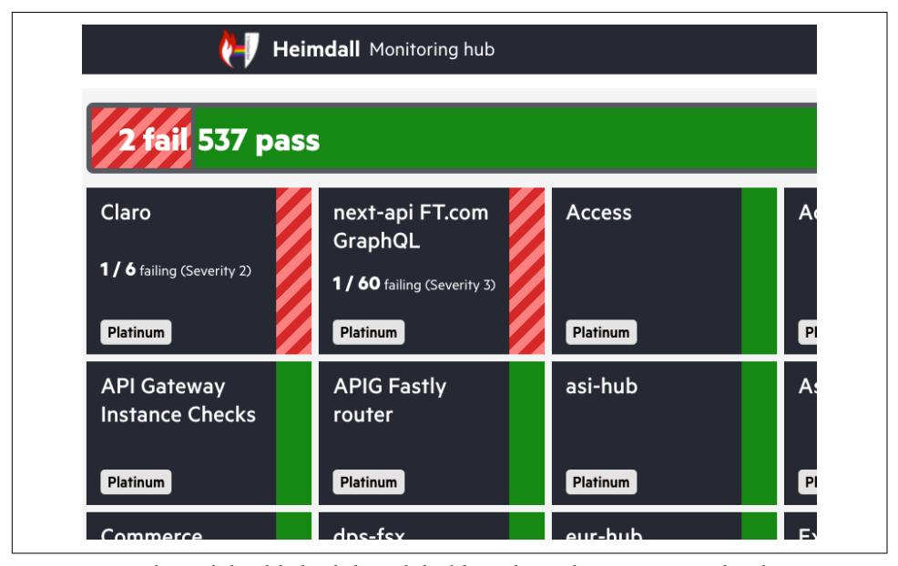

*Figure 13-1. e* FT*'s healthcheck-based dashboards, with two services that have some healthcheck failures. "Platinum" indicates that these are critical services.*

Clicking on a tile would give you more details, including a link to the actual service's healthcheck URL.

Healthchecks would be called regularly to keep the dashboards up-to-date—for example, every five minutes. Owners of the service didn't have to *run* the check every time the healthcheck endpoint was called; they could choose to cache results for a period of time. Given you don't know how frequently a healthcheck will get called, caching can be a good move. It reduces traffic between services and minimizes the likelihood of false alarms from alerts due to transient errors (particularly if you don't cache failed responses but instead retry).

<span id="page-390-0"></span>Largely, healthchecks test dependencies, which means that you can end up with a lot of tiles going red when there's a problem in a downstream service. However, this reflects the reality: if that happens, you have a service that's failing that has a lot of impact!

If you have a resilient system and only one of two instances of a service is down, you shouldn't get failing healthchecks from dependent services: they should have their requests routed to the instance that is up. See Figure 13-2 for a simple illustration of what I mean here. On the left is a system without redundancy. When service *A* is down, both *B* and *C* will have failing healthchecks. On the right, there are two instan‐ ces of service *A*, and when one instance is down, requests will be routed by the load balancer to the other instance. Neither *B* nor *C* should have failing healthchecks.

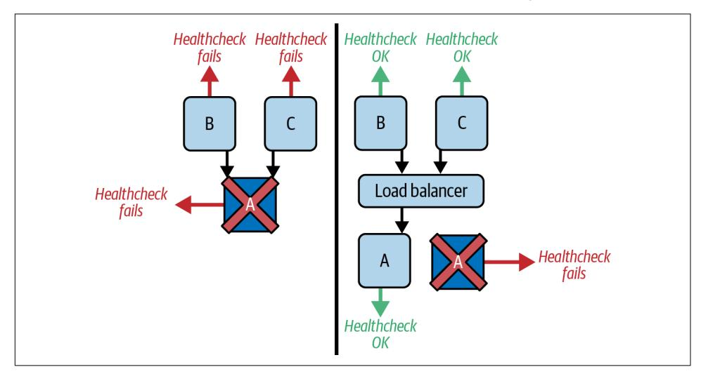

*Figure 13-2. Two systems made up of three services. One instance of service* A *is down in both cases, with a different effect on healthchecks for calling services.*

#### **Be aware of related costs**

Healthcheck calls can represent a high percentage of the traffic in your system. That means you need to be careful about costs associated with those calls. For example, if you log every request to a web service, you will probably want to filter out successful calls to a healthcheck when forwarding logs to your log aggregation service, because these calls will represent a large amount of your log volumes and they aren't some‐ thing you need to inspect.

Filtering these out helps avoid unnecessary cost, but it also helps with observability. These calls can massively outnumber the business-related calls, meaning you con‐ stantly have to start by filtering them out when you are querying logs.

## <span id="page-391-0"></span>**Monitoring Business Outcomes**

I talked about synthetic monitoring in ["Monitoring as Testing"](#page-298-0) on page 271 as part of "monitoring as testing." Running automated tests for key business capabilities is very effective at telling you when something is wrong. It is also great at telling you that things are broken when no user is actually currently doing anything: for newspapers, there aren't many publishes at certain times of day, but it's still good to know if things are broken. A nice side effect is that the synthetic publishes also avoid a common monitoring issue where you fire an alert when traffic is much less than expected for a particular day of the week. It's almost bound to fire on bank holidays.

Building on this idea of monitoring business outcomes, you can also do what I think of as semantic monitoring. You want to know whether *real* activity is working in production.

For example, our editorial team was inventive; journalists often used our software to do something we had totally not expected or allowed for. They were used to finding workarounds to get things from our monolithic content management system through and showing as they liked on the website. If they could find a way, they would do it.

That meant it was good to keep an eye on publishes in production and whether they were successful. Which of course means you need to understand what "successful" means.

We had a distributed multiregion system with multiple data stores. Whenever an arti‐ cle was published, we would update MongoDB, Neo4j, Elastic Search, and S3 in both the EU and the US. And this was not done within a transaction so there was no way to roll back on error—so a publish could result in an inconsistent state.

We wanted to know whether a piece of content got *completely* successfully published. So we built a service that validated for success in publishing for every publish event, the Publish Monitor, shown in [Figure 13-3.](#page-392-0)

The Publish Monitor registered to be notified about any new publish events coming into the stack. And then it checked all the possible endpoints, in both the EU and the US regions.

If any part failed to be updated within two minutes, there was an alert and we could follow a manual process to republish. This was safe because publishing is idempotent: you can do it multiple times and end up in the same state.

We monitored this service exactly as any other service—the healthcheck returning healthy here means "did every real publish event reach all the necessary places within two minutes?"

<span id="page-392-0"></span>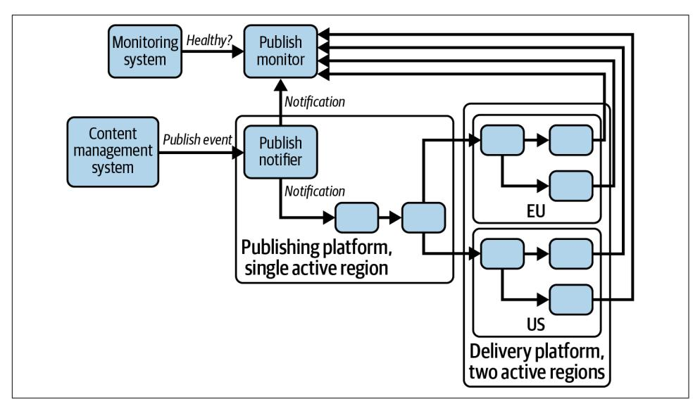

*Figure 13-3. e* FT*'s* Publish Monitor *service architecture. e* Publish Monitor *subscribes to publish notifications and then calls every API endpoint across multiple regions to make sure the article made it to every data store.*

## **Understanding What Normal Looks Like**

You will struggle to spot issues if you don't know what normal operation of your sys‐ tem looks like. This includes what kind of load you have and how it varies over time, the percentage of errors, and how long requests normally take to process. Being familiar with what your graphs and metrics look like will help you identify when things are definitely going wrong.

This is where chaos engineering, discussed in [Chapter 12,](#page-342-0) can pay off. You don't just test your resilience, you also get to know what things look like in normal state, and when part of your system is down, or slow.

## **Mitigation**

Once you know something is wrong, you should aim for mitigation as soon as possi‐ ble. You don't actually need to understand what went wrong to be able to take actions that are pretty low risk and might fix the issue.

<span id="page-393-0"></span>I mentioned this in [Chapter 8](#page-216-0) so I will just briefly repeat here that the following could help:

*Fail over to a different region*

If you are seeing errors in one region, fail over to the other.

*Scale up*

Take pressure off your systems. If there is a load spike, scaling up should help, and scaling up for a few hours is not likely to be super costly.

*Roll back any change that just went live*

If it doesn't fix the problem, at least that means you've ruled it out as the cause. There is a caveat here, though, which is that rolling back a change that has affec‐ ted data can be tricky. This is where teams doing the releases for their own serv‐ ices is important: you should be able to make an assessment of whether a roll back is sensible or safe.<sup>10</sup>

To be able to use these mitigations safely, you should automate them as much as pos‐ sible. Ideally, you make a decision and click a button in your CI tool, your platform, or your cloud provider dashboard. You don't want to be trying to do these mitigations manually, under stress.

## **Troubleshooting**

The last thing you want to be doing when the website is on fire is working out who can grant you access to a particular tool, or asking around to find out who just released a code change to production.

There are lots of things you can put in place that will make troubleshooting a lot easier.

## **Maintaining Useful Documentation**

Keeping documentation up-to-date has always been a challenge: writing documenta‐ tion in the first place is a task few engineers really like doing, and it's easy to miss that you need to update documentation as a result of making changes to code. It's worse when change happens so frequently. So, what helps?

First off, focus on the most important information. Make sure that services have run‐ books, with the information people would want to know if they got called up because things are broken.

<sup>10</sup> Daniel Bryant reminded me that Knight Capital's [catastrophic software incident](https://oreil.ly/BJnpM) was made a *lot* worse by roll‐ ing back a change without really understanding what was going on.

<span id="page-394-0"></span>That starts with "who knows about this service?": which team, and how to contact them. It should include where the code lives, and where to find observability tools that will help you understand what's going on. Mitigation steps, such as how to fail over, are also important. A troubleshooting section is good, but there is always a dan‐ ger of documenting the way the service broke last time.

The problem is that, while it's easy to pick up on information that's missing from a runbook, it's harder to find where the information is incorrect, and it's precisely that information that can lead to wasted time when problems hit.

There were two quite different approaches that we took at the *FT* in an attempt to make sure runbook information stayed up-to-date.

First, as mentioned in [Chapter](#page-174-0) 7, we created a tool called SOS, which scored the infor‐ mation available in each runbook. This had a real impact on incomplete runbooks, because it showed people what data mattered, and how they compared to others in terms of runbook completeness. It also gave everyone a template of what a good run‐ book looked like: the information to add, and which information was most important.

Something like SOS works up to a point. Once your runbooks exist and are largely filled out, the challenge is to make sure the information stays up-to-date, and that's harder to check automatically. So, as mentioned in [Chapter 11,](#page-306-0) we scheduled manual reviews annually for our critical services, with the last review date stored in the run‐ book so you could see how long ago this information was validated. These reviews were done by our first-line operations team, focusing on the information they would need if there was a problem, in order to triage or mitigate the issue (i.e., steps that didn't involve digging into code).

#### **Keeping Runbook Information Near the Code**

I want to mention some additional work relating to runbooks even though in the end it wasn't completely successful.

We had a theory that keeping the runbook information with the code for each service would make it more likely that teams would check it when making code changes, so we designed a way to maintain runbook information in Markdown inside a Git repos‐ itory, updating on release of that code to production (so that code and documentation changed at the same time, another desirable outcome).

For more details see the [blog post](https://oreil.ly/N-nyy) written by my former colleague Rhys.

Ultimately, I don't think it completely worked, for a number of reasons but mostly around not being frictionless enough: if it's fiddly and sometimes goes wrong, people won't integrate a new tool. This happened despite an approach that did user research throughout.

<span id="page-395-0"></span>We should have opted for a simpler approach to remind people that updating run‐ books should be part of your standard development cycle. For example (as Rhys sug‐ gested in the blog post), automating adding a runbook maintenance checklist to each pull request.

If you can't catch when runbooks have gone out of date at the point it happens, there are a couple of other things you can do.

First, make sure you include looking at the accuracy of the runbook every time you have an incident. Even if the next incident is different, you often find certain services have more incidents, just because of their complexity or importance. Focusing on get‐ ting those runbooks right is worth it.

Additionally, try to use the runbook as a jumping off point to places where the infor‐ mation *will* be correct—for example, a query that takes you directly to view recent logs for this service; or tracing tools that show you what services call it, and what services it depends on.

## **Knowing What's Changed**

I've spoken elsewhere in the book about the value of a Change API that can be noti‐ fied for all sorts of changes. At the *FT*, we integrated the Change API into deployment pipelines to automatically get rich information about changes, including who kicked it off and the Git commit ID.

Once you have the change information captured, you can output it in a number of ways. We posted production changes into a Slack channel: very useful as a first place to look when things seemed to be going south in production. People are reluctant to roll back a release before they feel they understand what's gone wrong, but knowing that there was a code release just before alerts fired is very helpful in identifying where to focus investigations.

Of course, there are other changes that cause incidents. Would you know if you got a sudden increase in traffic? Business events can have an impact: at a newspaper, that can be a push notification going out about a specific news event. Marketing activity and email newsletters can have similar impacts. It is well worth finding a way to pre‐ dict where you are going to see a change in user behavior as a result of business events, and it can stop your site from falling over at the worst possible time, i.e., when you've just invited everyone to come to it.

## <span id="page-396-0"></span>**Problems with External Systems**

Where you have external systems that offer critical functionality, make sure you know if there is a problem with those systems.

At a minimum, that means subscribing to the status pages for those external systems, so you know when there is an acknowledged issue.

You should also check connections as part of service healthchecks, so your alerting will tell you when a service can't retrieve results from an external system, in all likeli‐ hood before a status page gets updated.

Finally, make sure you know who to contact in the event of an issue. I have been through a number of production incidents out of hours where it turned out no one knew how to raise an incident with that particular third party.

## **Tooling Characteristics**

When you are trying to fix a production issue, you want to spend your time under‐ standing the issue, not trying to work out where logs are for this service, or waiting for someone to grant you access to the metrics server.

I've tended to find dashboards help most in working out which service or services to focus my attention on: they are great at showing load, duration, error percentage the metrics that matter.

When I'm trying to see what's actually gone wrong, the tools I've tended to find most useful have had a few things in common.

#### **Real-time, aggregated data**

The best tools show you real-time data across the whole of your systems. This means you need to standardize your tooling: teams don't get to choose an alternative, because you lose the ability to look at flows that span services from different teams but also because you do not want to be trying to work out where the logs are for this one service in the middle of an incident.

#### **Easy to access**

All your engineers should be given access to the tools used to troubleshoot systems, as part of the onboarding process.

You might need to restrict access to some data—for example, if you have PII in logs you might restrict who can view those logs—but in general, anyone who might be involved in supporting a system in production should have access to the tooling.

You also want people to get comfortable with those tools, and this is something chaos engineering and other drills can help with.

#### <span id="page-397-0"></span>**Support investigation**

You want to be able to create your own queries to generate a subset of logs or a graph, and to then be able to share a link to that view.

The tooling will of course only work if you have built observability into all the serv‐ ices you build, as discussed in ["Building Observability In" on page 348](#page-375-0).

## **Learning from Incidents**

Although I covered learning from incidents from a people and process angle in [Chap‐](#page-216-0) [ter 8](#page-216-0), I want to touch on it again, specifically from the point of view of improving your ability to support your systems in production.


A reminder: to learn from incidents, with the aim of continuously improving your response, you need a blameless culture, where peo‐ ple feel safe to share what they were thinking and doing, as dis‐ cussed in ["Blameless Culture" on page 206](#page-233-0).

It's easy to focus your attention only on what went wrong, and the actions taken to mitigate the issue and restore the system. But it is also good to look at how you found out that something had gone wrong, and how easy your tools were to use during the incident.

Start with the alerts or monitoring that flagged this up—or the lack of them. Is the message on the alert clear? Did it point you to the right place? Was the documenta‐ tion you found up-to-date?

Could you tell whether the system was under load, or that a change had just been deployed?

My experience is that in a well-designed, resilient system, when things do go wrong, it's generally in an unexpected way and quite often involves a couple of issues coin‐ ciding. Fix the problem, but also take the chance to do a bit of tidying up.

## **What to Do If You're Struggling**

If you can't tell what's going on in production, the first thing to sort out is a central log aggregation store, instrumentation of your services to ship logs there, and out‐ putting correlation IDs and system codes into all your logs. Agree on standard log‐ ging libraries that teams can use that provide a common structured log format. What this gives you is the ability to look at an individual event within your system.

Then, look at monitoring of your services. Can you tell whether a server is healthy? Can you tell whether a service is? As with many things, start with your critical <span id="page-398-0"></span>systems. Create dashboards for the key monitoring metrics (USE and RED), and set up alerts for your critical service level objectives. Focus on business outcomes: alert when requests are taking too long, or too many are failing.

Create runbooks, even if they contain minimal information to start with, so you know what services you have and which teams own them. Then, starting with the most critical services, add troubleshooting information.

Log changes made in production somewhere, somehow, so that when things go wrong it is simple for anyone to see whether code changed recently.

## **In Summary**

Microservices can be hard to operate. You will probably have more technologies to keep on top of; change is so rapid that keeping documentation up-to-date is hard; and you will probably see large numbers of alerts, some of which are for transient issues.

You need to tame your alerts so that you know when something is *actually* wrong, and you can do that through a focus on monitoring business outcomes.

Once you know about a problem, you need to troubleshoot and for that you need good runbooks that point you to the right places to look, a record of what's changed, and observability built into your services from the start.

Observability is about whether you can infer what is going on in a system by looking at its external outputs. Logs, traces, and metrics are all just aspects of an event going through your system. Make sure you have some way to look at those events.

Thankfully, there is some good tooling out there and some emerging standards such as OpenTelemetry that mean you can get observability by instrumenting your code now, and likely won't have to do that again if you want to change provider.

# <span id="page-400-0"></span>**Keeping Things Up-to-Date**

Software evolves, and that includes the software written by someone else that your software depends on. That could include operating systems, programming languages, libraries, databases, and applications. All of them will have both minor and major version changes, and you need to upgrade or migrate before versions go out of sup‐ port (or more urgently, when the version you are on has a security vulnerability).

Keeping things up-to-date can become a long and tedious grind, sapping the joy for teams. However, if you invest in your ability to manage change, you can make this considerably less painful for everyone.

In this chapter, I want to start off by discussing the things you can do to minimize the impact of changes.

Then, I will cover the different types of changes that might affect you, from emer‐ gency changes in response to external factors, to planned changes at different scales in terms of time and commitment needed.

Next, we'll explore two aspects of managing change. The first is responding to changes from outside your team. This could be from a platform team changing ven‐ dor, or someone either internal to your organization or outside it introducing major changes in their API.

The second is about how to manage the impact of changes you are making. This might be because you are choosing or being forced to move or upgrade versions from a vendor or provider, or it could be changes to your own software that others in your organization consume.

But before all of these, I want to explain why keeping things up-to-date can be partic‐ ularly challenging when you adopt a microservice architecture.

## <span id="page-401-0"></span>**Why Is This a Challenge?**

Earlier in the book I noted that microservices are optimized for change, and a micro‐ service architecture can help you to avoid a big-bang migration: no more having to upgrade a 70-package monolith to a new version of Java, or update thousands of stored procedures at once when you have a new major version of your database.

However, the world of microservices is one where you have a lot of different things, and that means lots of things that need to be upgraded or migrated.

Larger migrations, for example where you change the programming language, data‐ base, log aggregation tool, or hosting platform, are a particular challenge. These are easier to *start* in a microservice architecture, but it can take a long time to migrate hundreds of services, and it's very easy to end up with a long tail of services that are still waiting to be migrated. That might be OK in some cases, but it adds more day-today work—another technology in the stack that has to be maintained and upgraded and it also poses challenges around making sure you still have the right skills in place. You really don't want to end up with a couple of critical services that are written in a language that none of your developers knows very well, because you are recruiting Node.js developers now and these were written in Ruby.

Modern software has a lot of dependencies, which means a lot of things to upgrade. We use open source libraries widely. We use SaaS solutions, calling out to code writ‐ ten by other people and running on computers we don't own. We run using particular versions of our programming languages, which need to be upgraded periodically. And we run on servers where we may need to upgrade the image, the hardware, the Kubernetes version, etc. If we are using containers, we need to patch the container OSs. And finally, our services interact with other services that may change version for example, you might need to upgrade the library that talks to the database.

Using code written and maybe even run by someone else saves a lot of time and effort for development teams, and it's likely that something someone else wrote that is widely used will have far fewer bugs than something your team has just written to solve the same problem. Not to mention that you get to focus on the key outcomes for your business.

However, we don't control the lifecycle of any of this third-party stuff. We may have to upgrade at relatively short notice. For example, when Docker Hub announced it was introducing rate limiting for container image pulls in 2020, at the *FT* we sud‐ denly needed to think about exactly how our CircleCI build and deployment pipe‐ lines were working for containerized services. While in this case CircleCI subsequently worked with Docker Hub to minimize the impact, if that had not hap‐ pened we would have faced a significant amount of unplanned work to integrate Docker Hub authentication into our pipelines (as well as an unexpected extra licens‐ ing cost).

<span id="page-402-0"></span>There is a security risk here as well. You may have a dependency on something that is vulnerable to attack, either accidentally or deliberately.

Many open source libraries that are widely used and included in many *other* libraries are maintained by a small group of people. If they get burnt out and stop maintaining the code, or their credentials are compromised, you can be impacted.

## **Minimizing the Impact of Change**

There are plenty of things you can do to reduce the impact of changes on your team. These generally come down to restricting the number of different things you have to think about, choosing technology options that manage at least part of the stack for you, and reducing the time it takes when you *do* have to respond to a change, through automation for example. But the first thing to do is to consider the effort to maintain and support a technology as part of deciding to use it in the first place.

## **Think About the Long Term**

When we make decisions, it is easy to focus on the short-term benefits and costs. They are more salient to us because we are generally looking to solve a problem we have right now.

Thinking about the longer-term benefits and costs (and risks) can allow us to make different decisions, ones that might be easier to live with.

Of course, if you are building a website for an event happening in six months, and will decommission everything afterwards, you might make a different choice than for a product you expect to be the golden source of critical business data for the next five to ten years.

You may have a hard deadline for building this product, one that pushes you to choose something for speed of getting started, rather than ongoing cost or complex‐ ity. This is fine, but you should explicitly note that you are incurring an ongoing tech‐ nical debt, and have a plan for addressing that (or choose to live with it!).

## **A Reason to Be on the Paved Road**

Much of the work to respond to change is toil: manual, repetitive, and doesn't give you specific value (other than avoiding risk).<sup>1</sup>

<sup>1</sup> I like the full definition of toil given in the [Google SRE book](https://oreil.ly/AQtuC): "Toil is the kind of work tied to running a pro‐ duction service that tends to be manual, repetitive, automatable, tactical, devoid of enduring value, and that scales linearly as a service grows."

<span id="page-403-0"></span>Minimizing toil for product engineering teams is part of the explicit aim of paving the road, and people who are using the paved road should as far as possible have migrations and upgrades made easy for them.

In some cases, the work will be done by the platform team. For example, if you are running on a platform team's servers, those servers might be upgraded by the plat‐ form team, one availability zone at a time to minimize impact, and with plenty of communication beforehand.

For many upgrades and migrations, the team that owns the service is the one that can best do the work: the team members are best placed to assess when to do it and to test that things are still working as expected.

What a central platform team can do is to make sure the paved road has a wellunderstood roadmap of migrations and upgrades, with plenty of advanced warning that these things are coming along. The team can provide easy-to-use automated patching and verification tools, or a well-documented process. Both these things make it easier to do the work but also ensure a level of consistency in how the work is done.

Platform teams need to be good at leading migrations and upgrades because this is a key part of their role, and doing it well is a key way that a platform team can help with the cognitive load of product engineering teams.

Of course, there are going to be cases where a product team needs to go off road. What then?

## **Choose Managed Services and SaaS Options**

One way to reduce the work of upgrades is to choose managed services and SaaS options where at least some part of the day-to-day maintenance work is done for you.

If you install your own source control server, for example, then you have to keep the server OS patched and up-to-date, as well as upgrading the source control software periodically.

Using a SaaS alternative reduces the operational burden. You don't need to worry about the server OS anymore, and you don't have to upgrade the software.

This is a good principle, especially for platform teams that are operating central tools: don't build things unless you have to.

However, there is a caveat. You may not have to spend much time doing upgrades, but you are giving up control of when these happen. That means you may have to deal with a breaking change at short notice, wrecking your plans for what you were going to do this quarter.

## <span id="page-404-0"></span>**Provide APIs**

Using infrastructure as code for setting up new infrastructure, services, or build and deployment pipelines helps to standardize how those tasks get executed. However, often, people aren't really storing infrastructure as code; they are instead storing con‐ figuration files in source control.

The issue here is that you have a template written in—for example—YAML, but you don't have any testing or validation. That can lead to production issues when a change goes out that doesn't work as expected; see this Skyscanner [write up](https://oreil.ly/uf0ki) for an example.

Additionally, if you provide a template to your customers for them to execute, you give up control of it. They may amend the template, or they may keep using it without coming back to retrieve updated versions.

If you instead maintain control of the template by providing an API for your users to call, you keep control of the implementation.<sup>2</sup> The API defines the fields a user needs to provide—for instance, for an API to spin up a database, you might want to know the type of database, and the size. You can change the implementation—for example, the version of PostgreSQL you spin up—without the customer needing to make a change.

Putting an API between your customers and the execution of a template also allows you to validate the information they provide: if someone specifies a size beyond a range you predefine, you can catch the error.

You still need a way to fix up those things created by calling an earlier version of the API. Let's say you have an API that helps you spin up a Spring Java service. Six months in, you amend the template the API uses, or you upgrade some dependencies. Can you reapply it to existing services or do they all have to be fixed up manually? Even where that is a relatively small amount of work, as soon as you have many serv‐ ices it mounts up. A half-hour task done for 100 services is over a week of work and it's not interesting work.

Again, though, an API makes that easier. You can version your APIs, and tag resources you create with that version, so you can find all the resources that need to be upgraded. Whether you do this upgrade for customers depends on the likelihood of things going wrong: I would not upgrade someone's database to a new major ver‐ sion! But for a minor version, I would probably schedule the upgrade and let them know it's coming.

<sup>2</sup> Thanks to Abby Bangser for crystallizing this difference for me.

## <span id="page-405-0"></span>**Immutable and Ephemeral Infrastructure**

Immutable infrastructure, where you deploy new code to a new server, rather than upgrading the existing one, minimizes configuration drift (where the actual configu‐ ration of a system gradually diverges from the expected configuration, generally as a result of manual actions). It also helps with upgrades because when you build the server from the current configuration held in source control, each new deployment applies upgrades that have been included in the template.

There are other benefits too: you are much more likely to treat servers as cattle rather than pets when they don't hang around too long;<sup>3</sup> and you are practicing taking servers offline and replacing them all the time, making it less scary to do.

## **Decommission and Deprecate**

Constantly look at what you have in your estate and actively decommission services when they are no longer bringing in value (easier said than done, I know). Deprecate versions so that you don't end up supporting huge numbers of things—for example, browser or language versions.

Building a new version of a service shouldn't be considered complete until it is live in production *and the old version has been turned off*. Leaving that running—beyond a "warranty" period where you may revert back to it—is likely to bite you, because run‐ ning code costs money, increases risk, *and* it still has to be maintained.

## **Types of Change**

Before I talk about how to respond to and manage changes, I want to lay out the three different types of change, and the key differences in how to approach these:

#### *Emergency*

Unexpected but urgent: e.g., security issues, or a vendor being acquired or shut down

#### *Minor*

Work that needs to be done at some point, isn't that risky, but probably doesn't provide a huge amount of value: e.g., minor version upgrades for a programming language or database

#### *Major*

Complicated, large-scale changes, with a high level of risk and potentially a high reward: e.g., migrating to the cloud, or changing source control provider

<sup>3</sup> See Randy Bias's [history](https://oreil.ly/ShyUG) of the idea of pets versus cattle.

## <span id="page-406-0"></span>**Emergency Changes**

Sometimes something happens and you have no choice in the matter. You need to respond urgently, meaning all bets are off: you are going to impact people's plans.

These urgent upgrades are often related to security issues. When the Log4Shell vul‐ nerability hit, at the *FT* we treated it as an incident. We expected teams to make peo‐ ple available to understand how we were impacted and to mitigate the issue through applying patches.

Emergency changes can also happen because of third parties, either because you miss the implications of some announcement for you, or because of external events. For example, if you are using a tool from a startup, they can run out of funding, or be acquired and have their product shut down. While you can at least have a plan for what you would do if this company went out of business (and a good procurement team will have nudged you on this), you may still need to execute in a very short period of time.

## **Minor Planned Changes**

When you know about an upgrade well ahead of time, there isn't that sense of urgency, but the problem here is that until it's urgent, teams may not get around to scheduling this tedious work that likely doesn't bring any business value.

The opportunity here is to spread out the work so that there isn't a crunch where lots of upgrades all need to happen. Have a roadmap for this work and talk teams through what they will definitely need to do in the upcoming quarter or two.

Teams that make upgrades part of their day-to-day process will often find it much easier than waiting and doing a big-bang upgrade.

## **Major Planned Changes**

Major changes are things like moving to a new programming language, hosting plat‐ form, data store, log aggregation tool, DNS provider, etc.—the possible list is long. These are the kinds of complicated projects that can easily take months or even years to complete.

Again, one of the advantages of microservices is that you don't *have* to do a big-bang upgrade to a database or a programming language. You can start using the latest ver‐ sion of the programming language for new things and leave other services on an older version, provided that is still supported.

Of course, the risk here is that you end up with a lot of services on old versions of the programming language.

There are some important questions to ask yourself early on.

<span id="page-407-0"></span>Is everyone expected to migrate, eventually? Generally, the answer should be yes because of the cost of maintaining duplicate capabilities. If you *do* expect to maintain alternatives, be clear on whether the old one is deprecated or whether new features or products can still choose to use it.

When will the old system get turned off? It's too easy to do most of a migration but never quite finish it. Make the turn-off date explicit from early on and explain what will happen if people haven't migrated by that date. Do expect to have teams negotiate to delay the date—this is fine in some circumstances: for example, no one wants to spend weeks doing a migration for a system that is due to be replaced within a year.

You should have a plan for gradual migration. This means having a policy that when you *do* make changes to a service, you also upgrade the version. Of course, this can be deeply annoying for a developer who just wants to make a small change and is sud‐ denly bogged down in unrelated stuff, but it makes it less likely that this change is super painful than if you wait until a version is about to be deprecated.

As a platform team you need to be careful you don't accrue more and more of these incomplete migrations, because it will slow you down far too much. Ultimately, you may need leadership support if you have a team that won't schedule the work. Some‐ one will need to decide the priority of finishing the migration.

## **Responding to Change**

Let's consider the most challenging type of change: one that is on someone else's schedule, and where you have to do the work.

If something you depend on changes, will you know about it in time? Can you fix it in time? Can you fix it at all?

It's easy to find yourself the proud owner of a data store that you know almost noth‐ ing about. The stored procedures were all written three years ago, no one who was on the team then is still on the team now, and you've just discovered that the version you are on has three months before it no longer gets security patches. Unfortunately, the new version is a major upgrade, and you are going to have to fix all those stored pro‐ cedures.

As long as you are using a data store that is part of the standard stack in the organiza‐ tion, you will be able to find people who can help. If you aren't, then you are in a bit of trouble. How can you avoid this?

## **Understand the Landscape**

First up, make sure you don't have unnecessary time pressures. If you are using tech‐ nology that is your responsibility to fix up, make sure you are aware of end-of-life dates, and schedule upgrade work with time to spare.

<span id="page-408-0"></span>You need to know what you have in your estate, and when it is going to need to be upgraded or replaced.

It's hard work to keep on top of all the technology you have. At least gather that infor‐ mation together so that once one person has worked out when a language version is going end of life, anyone else can benefit from that knowledge.

Tools like *<https://endoflife.date>* can really help. This is an open source repository that gathers together information about versions of common software.

You also need to understand the roadmaps for key vendors. "Vendor Ops" can be a key responsibility of platform engineering teams. They need to know what new fea‐ tures are coming up, but also be aware of features that are going to be deprecated. Highly specialized teams, for example a machine learning or a data team, will likely have some vendor management too.

Finally, you need to know about security vulnerabilities that must be patched. You don't want to find out about things like this because one developer happened to see a post on Mastodon!

While active ownership should involve making sure you patch security vulnerabili‐ ties, there is a place for central support and governance, because, as an organization, you want to know about and fix vulnerabilities.

This means things like scanning your dependencies. It's a good idea to do that as code is created—for example, by incorporating scanning into the code commit process, or the build pipeline.

However, you also need to scan things that aren't being regularly built, because these services still have dependencies that could have vulnerabilities. For example, someone may have found a bug in the version of the library your service is using. The simplest way to do this scanning might be to rebuild the services regularly even if you don't deploy them.


Rebuilding services regularly is a good idea in any case, to make sure your services are always in a buildable state. This means that if you ever need to make a change to the service, you don't have to first debug a build that has been failing for an unknown period of time.

Automated tools like [Dependabot](https://oreil.ly/Vn6JF) can go a step further than just identifying vulnera‐ bilities, raising PRs to minimize the effort a team has to make to apply a patch or upgrade.

It feels natural to me that a platform group will get involved in critical upgrades and patches, even sometimes for software choices made by other teams: at the *FT*, when I headed up the platform engineering teams, I knew that the CIO would come to me to <span id="page-409-0"></span>find out about whether we had all instances of a security vulnerability patched, even where teams were using things that our platform team hadn't built. That meant build‐ ing the tools to know what was being used in the estate, and running urgent patching processes using the same processes we used for any production incidents.

## **Define Guiding Policies**

Guardrails and policies can be really helpful here.

Your organization should be clear about the expectations when responding to avail‐ able upgrades. Set up a policy to define this.

For security-related patches, this could be a patching policy that says, "Highly critical vulnerabilities are patched within 2 days, lower level ones within 2 weeks." For nonsecurity-related patches, maybe you say, "We don't run on unsupported versions of Java," or take a harder line that you will never be more than one major version behind.


It's not always a question of maximum time within a patching pol‐ icy, you can also specify a minimum time.

When I was running the Content API team at the *FT*, we had some technology we used as part of our container stack that was fairly bleeding edge. New versions came out all the time, adding new fea‐ tures or fixing bugs.

In fact, new versions sometimes came out so frequently that we would still be doing one minor version upgrade when the next one came along.

We made a decision to wait a set time before applying any minor upgrades. This meant we could batch them. It also meant we could avoid any bugs that may have been introduced.

You will probably need a way to find all the services that are about to slip out of sup‐ port and remind the owners to take action though, because these cases represent risk to the organization, whether you are running on unsupported versions of software or have an unpatched security vulnerability.

## **Making a Decision**

In the previous section, I focused on changes you *have* to make, in response to exter‐ nal factors including security vulnerabilities and versions going out of support.

The other sort of change is where you choose to schedule work for a change in your technology. But how do you make that sort of decision? And who gets to make it?

## <span id="page-410-0"></span>**Who Gets to Decide?**

How would you make the decision to move to the cloud? Or to adopt a new program‐ ming language? Or that this is the right time to upgrade the database to the new version?

This reflects back to the discussion in [Chapter 11](#page-306-0) about choosing technologies, and there is the same tension between local and global optimization. There are some choices that can be made within a team, for that team. Other choices have a wider impact, and need to be considered for the organization as a whole.

It is a good idea to be clear on which decisions require consensus: generally, if you are introducing an alternative for something that is part of the paved road, you shouldn't be making that decision at a team level. That means that things like a new program‐ ming language, CI tool, or hosting provider are more organizational-level decisions, and ones that will likely need the involvement of a platform team to drive the process.

A technology governance forum, like the *FT'*s TGG (Tech Governance Group), dis‐ cussed in [Chapter 11](#page-306-0), is a good place to discuss high-impact decisions. However, there are actually two decisions: the first is whether to do the migration, and the sec‐ ond is when to do it.

## **Scheduling Work**

There are lots of things you could do next quarter, as teams or as an organization. Work to upgrade or migrate is not often the most exciting work, but there can be real value involved in moving to something new, and there is real risk in not keeping things up-to-date.

Often, migrations are proposed by teams that own the relationship with the vendors, but a lot of the work will need to be done by many other teams. That means under‐ standing the challenges facing those teams.

You have to find a balance between product-focused work and technical work. That means understanding the product strategy and any constraints: if there is a big prod‐ uct launch with a constrained date coming up, maybe now is not the time to move a key part of the stack.

The first thing I want to say about big migrations is, consider very carefully whether you want to do a migration you aren't being forced into, and that isn't a strategic goal for your organization (something like a cloud migration). Often, people want to move because they are unhappy with a vendor's support levels or can see an alterna‐ tive that's going to save a chunk of money. The question isn't whether this is better or cheaper, the question is whether it is *enough* better or cheaper that you want to spend a quarter doing the drudgery of moving everyone to it.

<span id="page-411-0"></span>Sometimes, the suggestion of moving to a new tool comes from outside the platform team, when someone sees an alternative that looks better and has some shiny new features. Half the job of a platform team is to say, "Yes, that looks cool, but will it help with our *business* challenges?" But it *is* important to leave a space to recognize some‐ thing significantly better. Letting a team try out the new tool, then taking an organizational-level decision on whether it should replace the old tool is a good way to test the waters.

The final comment I have on making decisions is to take the time to articulate the benefits and the costs. What are the consequences if you do nothing, or do nothing for six months? What else could you be doing that might deliver higher value to your organization?

Having this information will help you to make the decision on whether to make this change and when.

## **Managing Change**

How should you approach managing a change? This might be for code you wrote: for example, making a breaking change to an API you own.

It may be for software you manage, such as a migration to a new DNS provider. Platform teams do a lot of this type of migration, and these can be complex and longrunning projects. Getting good at migrations is important for keeping your customers happy!

What makes it more likely that a migration will be successful? I have three things I like to focus on:

### *Clarity*

Start by making sure you are completely clear on what you are doing and why and the impact and cost of any delays.

### *Communication*

Make sure everyone knows about this migration, what they need to do, and by when. You should communicate in every way possible and repeat the message frequently.

### *Empathy*

You should put yourself in your customers' shoes. Here, you can learn from behavioral economics, popularly known as nudge theory, and based on the idea that small changes can influence people's choices—for example, putting fruit rather than cookies next to the checkout. Thinking in terms of nudges can increase your chances of getting things done quickly and as painlessly as possible.

## <span id="page-412-0"></span>**Clarity**

The first thing to be clear about is why you are doing this work, and why you are doing it now. Hopefully, you wrote a case for this work and can now share it with the people who are going to be taking part. I have found that explaining the decisionmaking process can reduce the pushback you get from people, because they can fol‐ low your reasoning.

The next thing to be clear about is where the finish line is. This could be a deadline, when you need to migrate because something is being deprecated. It might be a list of essential tasks to complete. It could also be when you run out of money, or people have to move on to something else.

There are three constraints for any project: schedule, cost, and scope (see Figure 14-1).


*Figure 14-1. e three constraints. Most projects have one of these that can't change: you need to flex the others.*

It is a good idea to know up front which of these are most important for this project, and in particular, if there is one that really cannot change.


As I've mentioned previously, we started using containers very early at the *FT*. My team built our own orchestration using Linux tools such as Fleet and systemd among other things.

Once Kubernetes got production ready, we wanted to move to it. And at that point, it was largely a cost decision, based on the cost of maintaining and running a complicated system that we'd built our‐ selves. But just after we started work on this migration, Fleet was deprecated, with a year to migrate away from it. So now, the key constraint for us was schedule. We had a deadline. This encouraged us to remove any noncritical scope and to accept some costs to run in parallel, because we *had* to hit the deadline.

<span id="page-413-0"></span>You need to understand who will have to do work outside your team, what that work is, and how complex it is. You also need to understand the context they are working in: will they prioritize this work? Can they, even if they see the value?

If a team is doing something critical or time sensitive and won't be able to collaborate with you, it's better to understand early, before you commit too much of your own time or money (and this is the point where you can escalate to leadership to say "Which of these things is more important?").

Finally, you need to be clear on the consequences of cutting scope, not meeting a deadline, or failing to have people available to work on something else because you are running late. Often, people set deadlines that are somewhat arbitrary. Where you have a hard deadline, you need to be very clear about this.

For example, that migration to Kubernetes I mentioned in the earlier note. Once something is past end of life, you have no guarantees on what happens if a vulnerabil‐ ity is found. There may be no patched version available. So, this wasn't a deadline we felt we could miss.

Clarity will really help you. It might make you realize this is a bad idea. Or a bad idea right now. I'd rather understand that early.

## **Communication**

When you are managing change, communication is very important. Mostly, teams don't do enough of this, because they assume that every transmission is 100% successful.

But that's not true. People are on holiday and miss the All Hands meeting, or weren't in the Slack channel or email group (#everyone\_in\_product\_and\_tech is almost cer‐ tainly not *everyone* in product and tech). But even if the person got the email or was in the meeting, they may not have been paying attention or they may not have real‐ ized this applied to them.

In March 2020, before the UK locked down for coronavirus, we had a suspected case on my floor of the office. We found out just after most people had left for home. So we spent the evening getting in touch with people to ask them to work from home the next day. We emailed people, sent Slack messages—and we phoned people if we knew their numbers. We still had a couple of people turn up at the office the next day because they hadn't seen any of those messages.

And that's for a simple message…anything more complicated can be both missed *and* misunderstood!

If you are asking for something with multiple steps, be clear about:

- What people need to do
- When they need to do it by
- What will happen if they don't do it by then

This is another place where a Tech Governance Group (described in detail in [Chap‐](#page-306-0) [ter 11\)](#page-306-0) can help, because it is a great "information radiator." People hear what's com‐ ing up.

### Stages of communication

I found Alia Rose Connor's model for stages of communication (mentioned in a blog post by Jason Yip) quite illuminating, because it shows that effective communication needs to be two ways: it's not enough to transmit; you also need to check the message was received. See Figure 14-2. 4

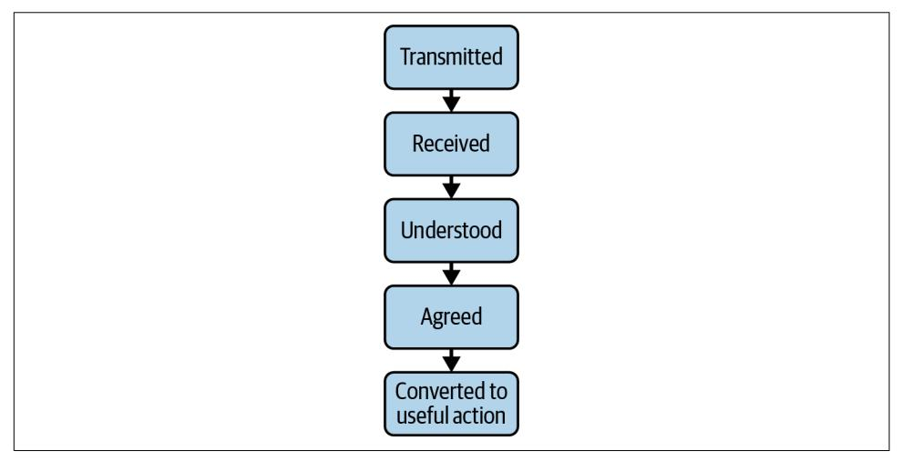

*Figure 14-2. Alia Rose Connor's model for stages of communication. You risk losing peo‐ ple at each transition!*

You control the transmission of a message, and you should aim to do that more than once, and in different ways, so that people can catch up with it later/see it in a way that suits them.

After that, though, you should check the message has been received, understood, agreed, and actioned.

<sup>4</sup> Jason Yip, ["Why Aligned Autonomy Is an Ongoing Struggle".](https://oreil.ly/iXYOI)

My colleague at the *FT*, Alice Bartlett, used to head up the Origami team, which build services, components, and tools used to create digital products. Origami is a platform team for frontend components, with many customers within the *FT*. I learned a lot from how Alice and her team approached big changes, and I'm going to share some key points here.<sup>5</sup>

### Don't break things

Unless you have to. Let's say you own an API, and you realize you got the interface wrong. You should have had a list rather than an object in the JSON format. But, peo‐ ple are already using your API!

Resist the urge to tidy up and pretend you never made the mistake, because if you remove a field, you have a breaking change—unless no one is currently making use of it, and all of your consumers ignore fields they don't need. That's a good policy, but you'd better be sure that's what people are doing! In practice, pretty much any behav‐ ior that exists in your API will be relied on by someone, regardless of whether it is documented as part of the interface. This is [Hyrum's Law](https://www.hyrumslaw.com), and let me give an example I've seen: the order of fields in a JSON object is not supposed to be significant. How‐ ever, people can write code that treats the JSON as a String, and if you change the order of fields in your JSON response, their implementation will quite possibly break.

If you know that the new format will be easier for people to use, add a new field and tell people about it. Deprecate the old one and encourage people to migrate. But don't remove the old field.

If people depend on your tooling, or your APIs, you should be very serious about not breaking the contract unexpectedly.

### Give lots of notice

If you *do* have to introduce a breaking change, give a lot of notice. Six months is not excessive. It should be longer if it will involve a lot of work to migrate—for example, to change your source control provider, or log aggregation tool.

To effectively give notice, you need to know who uses your tool or API. This is where monitoring calls or having requests go via an API gateway can really help.

### Develop a comms plan

Work out how you'll track that you sent out messages *and* that someone registered that this means they have to do something.

<sup>5</sup> [This blog post](https://oreil.ly/W5qFM) is six years old, but it is still full of great points for a team building tools and services for others.

<span id="page-416-0"></span>One thing Alice did was send emails directly to either the product owner or the tech lead. An email that says, "Hey Sarah, I notice your team is using the content list API in your streampage service, and we're going to be replacing that in 6 months' time" is very concrete and does the work of confirming that this person and their team are going to be affected. Addressing it to a specific person makes it clear that you see them as the person who is responsible for driving the change.

Follow up periodically. Make sure you get a reply that says, "Yep, got this."

### Give context

Be very clear about the date this will get turned off. Put it in bold, right at the top of the message.

Tell people what will happen to them if they don't take action in time.

If you can give people detailed instructions of what they need to do, then do that. If these are short, put them in the message. Otherwise, write a document and link to it in the email.

Tell them how to get in touch if they have questions or concerns.

## **Empathy**

Try to have empathy with your consumers. That means understanding their needs, and anticipating their reactions. Think about what would make it easier for them to do what you need them to do, or would persuade them that this is necessary.

Here, you can borrow some ideas from behavioral economics.

This is nudge theory, named and popularized by Richard Thaler and Cass Sunstein.<sup>6</sup> However, I discovered this through a book by David Halpern of the UK government's Behavioural Insights Team.<sup>7</sup>

Nudges are small changes that are intended to make it more likely that people will behave in a particular way or make a particular choice. The idea is that you can influ‐ ence people, rather than forcing them.

Nudging behavior is very popular with governments—or at least it was for the Obama and Cameron governments—probably because it's about how to achieve change without having to spend money or pass legislation.

<sup>6</sup> Richard H. Thaler and Cass R. Sunstein, *Nudge: e Final Edition*, 2nd ed. (Yale University Press, 2021).

<sup>7</sup> David Halpern, *Inside the Nudge Unit: How Small Changes Can Make a Big Difference*, 2nd ed. (W H Allen, 2019).

<span id="page-417-0"></span>What I found when I read the book was that I could identify many things that worked for us at the *FT* when managing change. It's more effective to provide reasons for people to upgrade or migrate than it is to force them through a top-down mandate.<sup>8</sup>

### What is a "nudge"?

Let me start by giving a few examples of effective nudges.

The canonical example is putting a painting of a fly (small insect, for clarity) in a uri‐ nal at Schiphol airport. With something to aim at, the urinal manufacturer claimed savings of about 20% of cleaning costs. Now, I can't find any research to back this up, so I want to talk in a bit more detail about a case study that was a little more rigorous.

In the UK, organ donation is via an opt-in register. You have to sign up to say you are willing to donate organs. Research shows that 90% of people in the UK support organ donation, but only 30% are signed up.

When you apply for a driving license or renew car tax, you are prompted to join the organ donation register, and the UK ran a large randomized controlled trial, with eight variants.<sup>9</sup>

They tried a few different nudges:

- Talking about social norms: "Every day thousands of people who see this page decide to register"
- Framing with positive or negative consequences: "Three people die each day because there are not enough organ donors," "You could save or transform up to 9 lives as an organ donor"
- Framing in terms of reciprocity: "If you needed an organ transplant, would you have one?"
- Pointing out the gap between numbers who support versus numbers who regis‐ ter: "If you support organ donation please turn your support into action"
- Adding pictures to some of the prompts

The results showed that reciprocity had the biggest impact in persuading more people to sign up, followed by the framing in terms of negative consequences. Notably, adding a picture in some cases made fewer people sign up.

<sup>8</sup> Of course sometimes you need to make a call that a change needs an urgent response, but even then, you should be aiming to use these nudges to make it more appealing.

<sup>9</sup> See ["One link on GOV.UK—350,000 More Organ Donors"](https://oreil.ly/6AYye).

<span id="page-418-0"></span>The increase was around 0.8%, which seems pretty small. But it's low cost to make a tweak to text on a web page (hopefully!) and in a year, the difference amounted to nearly 100,000 additional registrations.

And when you use these kinds of nudges in an organizational context, they can be much more targeted. They can help remove friction around getting things done.

The Nudge Unit developed a framework called EAST. Essentially, you should focus on making things Easy, Attractive, Social, and Timely—and these are useful prompts for thinking about how to engage with the teams you are depending on to take action.

### Easy

This starts with making sure you provide a clear message about what people need to do: make it easy for them to understand what you are asking of them.

Then, make it as simple as possible to get started. That means removing dependencies so that people can do the work when they have the time, asynchronously. Create detailed, accurate, and friendly documentation. Make sure things like setting up keys are self-service. Be clear on where people come to if they can't get things to work, respond quickly to those requests, and then update the documentation so the next person doesn't have to come and ask you!

It's great if you can provide tools to let people see what they've done and what they have left to do. If you can show a dashboard with every team and their services and which have been migrated, that lets people see at a glance whether they still have work to do (and catches places where you don't have the same understanding of which systems need to be migrated).

One thing you can do to make a change easy is to do at least some of the work for the teams. When we wanted teams to migrate to a new Change API to log releases, we wrote scripts to integrate into common CI tools at the *FT* and actually did that migra‐ tion for some teams. This helped test out the tools but was also about building pro‐ ductive working relationships.

One other aspect of making something easy is around the power of defaults. We have a strong tendency to go with the default option, which is why a decision to opt out versus opt in can be very powerful.<sup>10</sup> But beyond that, if you supply good defaults, ones that will work in most cases, you make it a lot easier for teams.

<sup>10</sup> The UK government changed workplace pensions from opt in to opt out and saw significant changes in par‐ ticipation, pretty much double in some cases; see ["Automatic Enrolment Opt Out Rates: Findings from](https://oreil.ly/J52C9) [Research with Large Employers".](https://oreil.ly/J52C9)

<span id="page-419-0"></span>

### Attractive

You want to attract people's attention so they realize you are expecting them to do something. This is pretty much covered in the previous sections about communica‐ tion and making sure you do enough of it, in lots of different ways.

You also want to make it attractive to do the work in terms of what the team will get out of it: give them an incentive. This doesn't have to be large. One UK bank encour‐ aged people to donate a day's salary to charity. An email saw 5% take up. An email paired with sweets branded with a charitable message got 11% take up. Personalizing the emails as well led to 17% take up. This is a big impact from small changes!<sup>11</sup>

These incentives can be positive: for example, our new Change API was more resil‐ ient and had better integration with CI pipelines. The incentives can also be about avoiding the negative: this applies where you need to migrate or upgrade because of bugs or cost.

Sometimes, the plain truth is that you just need to do something. If that is the case, explain why. For example, at the *FT* we had to migrate DNS providers because the one we were using was acquired and then switched off. The team managing this pro‐ cess gave as much notice as possible, did a lot of the work, and built a much better replacement, but it was still work that we didn't choose to do.

### Social

We are social beings. Describing what most people do in a situation, or saying that 90% of people in their street have already done something, is a powerful incentive. This is where dashboards that show progress across teams or groups of teams can be really effective—as long as some people are doing the work: it can backfire if it's obvi‐ ous everyone is ignoring the call to action!

If one team has finished a migration or upgrade, see if you can get the members to talk about their experience, hopefully about how easy it was. Additionally, make sure you give them a shout out!

Studies show that public commitments to do something make it much more likely to happen. This is why I like to see migrations or upgrades my teams are responsible for mirrored in other teams' OKRs.

<sup>11</sup> See ["How Do You Get Bankers to Donate to Charity? Give Them Sweets, Finds the Government's Team Try‐](https://oreil.ly/tnbWW) [ing to Change Our Behaviour"](https://oreil.ly/tnbWW).

<span id="page-420-0"></span>

### Timely

When you ask people to do something makes a difference. Make sure you do it at a time they are likely to be receptive, and not when they are in the last weeks before they need to get a big feature live!

This is where automation and guardrails can help: people find out about the require‐ ment when they are already working in that area. This is particularly useful where you want people to use the new approach for new services.

Where you need people to do work, make sure you give as long a notice as you can, but understand that that also means people will feel fine putting off taking action!

Highlight both short- *and* long-term benefits. People are generally not great at assess‐ ing costs and benefits over the lifecycle of something; for example, they focus more on the purchase price of a car than on the costs of running it. And for lots of things, there are short-term costs and long-term benefits—this often applies to changes that are meant to increase security or reduce costs.

If you *can* give some short-term incentive, however small, try to do that—it may have a disproportionate impact.

Finally, there's a gap between intentions and behavior. If you can help people make an action plan, they are more likely to cross that gap. Public commitments are powerful. If migration work is tied to a public goal or appears on a roadmap, it's much more likely it's actually going to happen.

## **Execution**

Generally there are two significant milestones in a migration:

- The new service is used for any new use cases, and the old service is deprecated.
- The old service is no longer being used and can be decommissioned.

You really want to avoid reaching milestone 1 but never quite getting to milestone 2. Make sure you finish.

Track upgrades and migrations until they are over. Don't let a new thing come in without having an agreed-upon plan for what happens to the previous approach. Maybe you let it run in parallel, but that should be a deliberate decision.

It's good to set a time where migrations need to be completed. I'd expect to have to push this back at least once because of competing priorities, but as someone who ran a platform team, the worst case is that a product team never quite prioritizes the migration and you have to pay for and support multiple options for months or even years.

<span id="page-421-0"></span>Leadership support can help, but there is one more technique you can leverage. Stuart Davidson of Skyscanner spoke about it at QCon London in 2019. If you get pushback on decommissioning a given tool, there is always the option to say, "Fine, you can keep using the tool, but that means we will hand it over to you to own."<sup>12</sup>

## **What to Do If You're Struggling**

If you are overwhelmed by the amount of maintenance and upgrades you need to do, start by gathering information. What technologies do you use, and when are you going to have to upgrade? When are your contracts up for renewal? What migrations need to be done for strategic reasons?

You want to build a roadmap of necessary and planned changes, prioritizing what gets done first.

You can also use this information to get an idea of what percentage of teams' time is going to be spent on this kind of task.

If it's high, could you benefit from setting up a platform team or a paved road? If you currently have all your teams building solutions to solve the same issues, you will likely benefit from doing things only once. Look also at places where you could standardize, use managed services, or SaaS.

Start to build up regular communication through multiple channels, giving people plenty of notice of work they will need to do.

Focus on communicating necessary upgrades, including what people will need to do, what the deadline is, and what will happen if they haven't upgraded by that point. Track progress for any migration, making sure you don't have a long tail of services running on out-of-date versions of software, or two different solutions needing to be maintained and supported for long periods of time.

## **In Summary**

Change is frequent in a microservice architecture. Make choices that minimize the impact, whether that is using a paved road provided by a platform team, or using SaaS or serverless solutions.

Make sure you know what changes are heading your way: be aware of vendor road‐ maps, dates when software versions are going end of life, and security vulnerabilities that affect parts of your estate.

<sup>12</sup> See a transcript of the talk ["Change Is the Only Constant".](https://oreil.ly/0PTc2)

If you are managing change, be clear about what you are asking people to do. Com‐ municate repeatedly, in lots of ways, and make sure people have understood what they need to do.

Have empathy for your customers: they likely have their own set of priorities. Make sure they understand what led you to decide on a migration, whether that's because of unavoidable constraints or because of new opportunities it will give the organization. At least make it easy for them to make the change, attractive in terms of what they get from it, share what others are doing, and try to avoid asking people to make a change when they are about to deliver a big feature.

Finally, make sure you finish migrations. If you don't, you now need to support two different systems, which will slow down everything you do.

# **Afterword**

<span id="page-424-0"></span>If you've read the whole of this book, you might be thinking something very similar to the feedback an early reviewer gave to me: "Now you have microservices. It will suck. Anyway, you're depressed now. Bye!"

I've focused in this book on the *challenges* of microservices because that's the way I tend to approach stuff. Tackling problems is the reason I'm a software engineer, and the aim of this book is to help you be successful with microservices.

While there are challenges, there are lots of positives as well, and I want to focus on those here. Microservices are the right approach in a lot of cases, and they are getting easier to adopt.

In this afterword I want to explain why I think that.

## **Why Microservices?**

People have been building microservices for over a decade now, which means we have a lot of experience about how to do them effectively.

They are a mainstream choice, suggested as a good option by research into what makes for a high-performing technology organization; fitting well with a move to cross-functional autonomous teams; and supported by the rise of a new type of plat‐ form engineering, one with a focus on reducing the cognitive load on development teams and enabling them to focus on delivering business value.

## **The Importance of Flow**

We are approaching a decade of State of DevOps reports from the [DORA team,](https://dora.dev) and over 36,000 software engineering professionals have contributed to this body of research.

The findings are consistent: for software delivery that has a positive impact on the performance of your organization, you need to optimize for a fast flow of value through to production. This means small changes, released as soon as they are com‐ plete, by a cross-functional autonomous team.

While that can happen with a monolithic architecture, it gets difficult as an organiza‐ tion scales.

Flow slows down once you have multiple teams working on the same codebase, and that's the point where you can benefit a great deal from finding boundaries that allow those teams to make progress without handoffs to other teams.

Teams need to own their own services, and to be able to deploy code just for that service.

Making services independently deployable and having them in separate codebases stops the blurring of boundaries that can happen even in the most well-structured of monoliths.

Microservices help avoid handoffs and keep your architecture loosely coupled. They help us to achieve flow.

## **Support for Autonomy**

Adopting microservices goes beyond an architectural choice. You need to make sure you have the organizational structure and culture to support that.

At the core is the ability for teams to work with autonomy, and many of the trends in modern software engineering support that autonomy.

Microservices would be hard without flexible provisioning, infrastructure as code, DevOps, continuous delivery, and observability. With those practices, a team can own a service end-to-end, spinning up infrastructure, releasing small changes as soon as they are ready via an automated pipeline, and supporting that code while it is running in production.

## **The Rise of Platform Engineering**

The early adopters of microservices set up cross-functional autonomous teams, allowed them to make different technology decisions, and found that while teams were able to release code pretty quickly, they were also having to invest lots of effort in infrastructure and operations, and often solving the same problems as other teams.

That has changed with the rise of platform engineering/engineering enablement.

I see platform engineering as doing for infrastructure engineering the same thing that DevOps did for operations. Namely, recognizing that you are more effective if you remove the barriers for your clients, offering self-service access rather than requiring people to hand off a task to you for completion.

It shows the value of doing more engineering with your infrastructure, and this is more than storing infrastructure configuration as code—it's also about creating APIs that wrap vendor tooling, and tools that help visualize what's going on. This means treating your platform as a product, and focusing on enabling other teams to deliver business value.

Alongside platform engineering, there is also a significant new ecosystem of tools that solve problems you see in a microservices-based architecture. A platform engineering team doesn't need to build things from scratch: a lot of what they will end up doing is finding the right vendor tools and making them fit into the organization's ways of working.

Teams that can lean on a paved path to production can focus more on business value, and the organization can benefit from standardization with better security, cost con‐ trol, and operability.

## **Wrapping Up**

Moving to microservices is not a trivial move that can take place in months. It involves changes to organizational structure, culture, the way teams work, and the expectations of your engineers.

But when you get it right, it's fun! Once you start working in an autonomous, crossfunctional team, owning your own services and making choices, it's hard to go back to a feature factory where you take the next ticket from the backlog and don't think much beyond that.

Microservices allow engineering teams to make progress independently, and they support gradual change. The hope is that you never need to stop and rebuild from scratch, you just keep replacing parts of the system until, like the [Ship of Theseus,](https://oreil.ly/3xYse) there's nothing left of the original structure except the purpose: to get you where you need to go.

This book has been my attempt to provide you with a map. Bon Voyage and good luck!

# <span id="page-428-0"></span>**Microservices Assessment**

This book has covered a lot of ground. Let me remind you of some of that material, focusing first on helping you to assess whether it would make sense for you to adopt microservices, and then on whether you have the right culture, tools, and processes in place to make a success of it.

## **Do You Need Microservices?**

Microservices add complexity. For that reason, your starting point for a new system should generally be a monolith.

As you grow to understand the domain and build out the system, there are several reasons you might consider the move to extract out one or more services.

So, what sorts of things indicate that starting a move to microservices might be a good choice for you?

## **Scaling Challenges**

As you scale your team and your system, you might see an impact on your ability to deliver new features and products. Maybe things are slowing down, or you're finding it difficult to support your system in production.

Here are the questions I'd be asking.

#### **Are we struggling to get changes made?**

The DORA and *Accelerate* research shows the importance of being able to release small changes frequently.

#### Ask yourself:

- Are we able to release changes quickly enough?
- How often do we release changes?
- How long does it take code to go from commit to running in production?
- Are changes queuing up?
- How many handoffs does releasing a new feature involve?
- How much time do teams spend waiting?
- Do lots of changes to production fail?

Your goal should be to release changes when they are ready, and for the release pro‐ cess to take minutes. You also want teams to be able to work without handoffs or waiting around. And finally, you want a high level of confidence that releases won't have unexpected impact.

#### **Does our developer experience suck?**

Another scaling challenge is about hiring and retaining your developers. It needs to be easy to get started working on your system, and people need to feel they are being productive.

#### Ask yourself:

- How long does it take for a new developer to get up to speed on the systems they are working on?
- How long is your code, run, test cycle time?
- How often do your software engineers complain about being held up?
- What's your developer turnover like?
- Are people working around existing processes to get things done?

You goal should be for developers to get to grips with their part of a system within days, at least to start with, for the development cycle to be super short, and for a min‐ imum of waiting around and handovers.

## **Technical Reasons**

Although my view is that most organizations adopt microservices to address organi‐ zational problems rather than technical ones, there *are* still a number of technical reasons for adopting microservices, all based around the ability to make different decisions for different services, made much easier once services are deployed independently.

#### **Do we have dierent compliance or security requirements for some parts of our system?**

Are parts of your system covered by PCI standards, or dealing with PII data? Extract‐ ing these parts of your system protects developers working on the rest of your system from needing a deep understanding of what these compliance and security require‐ ments involve.

#### **Do we need to scale to support load?**

If your monolith is starting to struggle under load, you have a few options for scaling. You can allocate more CPU or RAM, perhaps by moving to a different server type (vertical scaling). Eventually, there are limits to this. Then, one option is to deploy multiple nodes and split traffic across them (horizontal scaling).

But if the part of your system that is hitting performance constraints is small, it can be a lot more cost effective to extract that part of the system and scale just that.

Some specific questions:

- Are some parts of your system hitting limits?
- Can you still scale vertically?

#### **Are we facing operational challenges?**

One common sign that a monolith is getting too complex is an increase in produc‐ tion issues, and in particular, production issues where a change had an unanticipated impact on another team, because of unexpected coupling of the codebase.

Some specific questions:

- Are you seeing a lot of production issues as a result of an unexpected impact of a change?
- When things go wrong, how big is the blast radius?

Another benefit of extracting services is that you can limit the impact on your cus‐ tomers. One service can fail, but the rest are still working.

#### **Would we benefit from making a dierent technology choice for some part of our system?**

If you can see a place where a different technology choice would let you solve a par‐ ticular business need, or move significantly more quickly in developing features, it's worth considering whether to extract a service.

Moving to microservices also allows you to try out alternative technologies without a lot of up-front commitment.

These questions should help you assess whether splitting out independently deploya‐ ble services would help you. However, that moves us on to the next section: is your organization ready to make a success of this move?

## **Spotting Potential Pitfalls**

There are some good indications of whether an organization is set up to make a suc‐ cess of adopting microservices. I'm going to split this into two sections: the organiza‐ tional structure and culture, and the technology.

You can use this set of questions to assess where you might be struggling with an existing move to microservices, or if you're planning for such a move, these questions will help you to get a sense of whether this is going to be painful!

## **Organizational Structure and Culture**

This section is about the organizational structure and culture you have in place.

Ask yourself these questions:

- Does each engineering team have all the skills required to release a change to production?
- Are your teams long-lived?
- Are teams aligned to domains?
- Can engineering teams make their own decisions about technology?
- Is there time automatically allocated for the team to work on engineering-related maintenance and improvements rather than features and products?
- Can developers self-serve infrastructure?
- Can teams release changes to production at will?
- Do engineering teams support their services during the day?
- Do engineering teams support their services out of hours?

If you have mostly said "yes," you have the right foundations for adopting microservices.

If you answered "no" to a lot of these questions, moving to microservices could pose a significant challenge. You can do it, but organizational change takes time, and requires backing at the highest levels of leadership. People's roles and responsibilities can change. That's hard.

If this is what you are facing, you might benefit from an experiment of setting up one or two autonomous cross-functional teams and extracting a service or two. This can prove the value of this sort of change to the organization, and show you whether it is possible.

## **Software Delivery Approach**

The next set of questions covers whether you have the right level of technical matur‐ ity to make a success of microservices, because they do ramp up the operational complexity.

How many can your organization say "yes" to?

- Do services own their own data?
- Are services independently deployable?
- Do you separate deploying code from releasing code?
- Do you have well-defined interfaces between services?
- Do you have automated testing in your deployment pipelines?
- Do you have automated testing in production?
- Do you run chaos engineering experiments?
- Do you have synthetic monitoring of key business workflows?
- Do your services have healthchecks?
- Can an event be followed through your system through logs or tracing?
- Do you know what services exist in your estate and which teams own them?
- Is there a well-documented path to production?
- Are there guardrails that provide guidance on the expectations for engineering teams?
- Is your platform tooling self-service?
- Do you have infrastructure as code?

If your answers are mostly "yes," you will likely find microservices provide value pretty quickly. Where you have said "no," these are good candidates for investing some time.

If you have a lot of "no" answers, I would recommend starting by moving the needle on some of these, and only then introducing a microservice architecture. The good news is that making these sorts of improvements will help you to deliver value to your organization even if you never do move to a microservice architecture.

# **Recommended Reading**

<span id="page-434-0"></span>I've covered a lot of material in this book, but that involves a focus on breadth more than depth. If you want to dig deeper into some of these areas, here are my recom‐ mendations of the books and articles I keep returning to.

## **Part I: Context**

[Building Microservices: Designing Fine-Grained Systems](https://learning.oreilly.com/library/view/building-microservices-2nd/9781492034018/)*, by Sam Newman (O'Reilly, 2021)*

A comprehensive and practical guide to building microservices, it's a constant reference. We cover the same topic from slightly different angles but with very little disagreement!

## **Part II: Organizational Structure and Culture**

[Accelerate](https://learning.oreilly.com/library/view/accelerate/9781457191435/)*, by Nicole Kim, Jez Humble, and Gene Kim (IT Revolution, 2018)*

Builds on the State of DevOps reports to show how technology organizations can make changes, based on the ideas of DevOps, that will have a positive impact on the businesses they are part of. Clear, research-backed, and it's pretty short and to the point too.

[Team Topologies](https://learning.oreilly.com/library/view/team-topologies/9781098157234/)*, by Matthew Skelton and Manuel Pais (IT Revolution, 2019)*

Another book, like *Accelerate*, that is focused on the value that a technology orga‐ nization can bring to the business, through a focus on fast flow of value and effective teams. Provided me with ways of talking about the different types of teams I had already started to see in my organization.

### [CNCF Platforms White Paper](https://oreil.ly/uKBzr)*, CNCF Platforms Working Group*

I was delighted to read this recently, because it succinctly explains why you need internal platforms, built with a product outlook.

## **Part III: Building and Operating**

### [Full Stack Testing](https://learning.oreilly.com/library/view/full-stack-testing/9781098108120/)*, by Gayahri Mohan (O'Reilly, 2022)*

Thorough coverage of what testing looks like in a modern software development stack. Great for a "testing-adjacent" person to get up to speed.

### [Site Reliability Engineering](https://learning.oreilly.com/library/view/site-reliability-engineering/9781491929117/)*, by Betsy Beyer et al. (O'Reilly, 2016)*

We are not all working at Google-scale, but we can all learn from this book! So much practical advice on building systems with a focus on operating them suc‐ cessfully. If I have a question about service level objectives, incident management, reliability, and many other topics, this is the first place I look.

### [Charity.wtf](https://charity.wtf)*, by Charity Majors*

If I want a pithy statement that sums up my views on engineering culture and observability, I will find it here. Charity writes superbly, and tackles engineering management, sociotechnical, and engineering topics.

# **Index**

<span id="page-436-0"></span>

| A<br>A/B testing, 270                                            | APIs (application programming interfaces)<br>automation-friendly, 181                    |                                                                                                |
|------------------------------------------------------------------|------------------------------------------------------------------------------------------|------------------------------------------------------------------------------------------------|
| acceptance tests, 261                                            | consistency, 180                                                                         |                                                                                                |
| accessibility, guardrail, 287                                    | contract testing and, 262                                                                |                                                                                                |
| active ownership, 142-143, 225                                   | platform teams and, 122                                                                  |                                                                                                |
| business case, 240                                               | protecting services, 137                                                                 |                                                                                                |
| code stewardship, 226                                            | for service catalog, 234                                                                 |                                                                                                |
| continuous improvement, 242                                      | versus templates, 160, 377                                                               |                                                                                                |
| critical systems, 241                                            | vendor engineering and, 160                                                              |                                                                                                |
| documentation, 228                                               | Architectural Advice Process, 295                                                        |                                                                                                |
| Equifax Struts vulnerability, 220                                | architecture                                                                             |                                                                                                |
| Log4Shell, 218                                                   | microservices, 4-8                                                                       |                                                                                                |
| migrations, 227                                                  | (see also microservice architecture)                                                     |                                                                                                |
| monoliths, 241                                                   | modular monolithic, 10-11                                                                |                                                                                                |
| production support, 228                                          | monolithic, 8-10                                                                         |                                                                                                |
| teams, 243                                                       | SOA (service-oriented), 11                                                               |                                                                                                |
| upgrades and patching, 226                                       | architecture decision records (ADRs), 294                                                |                                                                                                |
| zero-day vulnerabilities, 218                                    | automated testing                                                                        |                                                                                                |
| ADRs (architecture decision records), 294                        | consistency tests, 263                                                                   |                                                                                                |
| Agile testing quadrant, 249-250                                  | contract tests, 262                                                                      |                                                                                                |
| air sandwich, 135                                                | cross-functional tests, 264                                                              |                                                                                                |
| alert overload, 48-51, 345, 347                                  | end-to-end tests, 261-262                                                                |                                                                                                |
| alerting                                                         | exploratory tests, 264                                                                   |                                                                                                |
| healthchecks, 359-363                                            | not enough, 276                                                                          |                                                                                                |
| setup, 359                                                       | in production, 266                                                                       |                                                                                                |
| alerts, 48-51                                                    | service tests, 259-260                                                                   |                                                                                                |
| improving, 197                                                   | testing pyramid and, 258                                                                 |                                                                                                |
| from metrics, 352                                                | unit tests, 259                                                                          |                                                                                                |
| tied to business impact, 358                                     | automation, 31, 180                                                                      |                                                                                                |
| analytics, guardrails, 287                                       | continuous delivery, 13-15                                                               |                                                                                                |
| API Gateway keys knowing your estate and,                        | deployment pipelines, 6, 31                                                              |                                                                                                |
| 281                                                              | guardrails, 283                                                                          |                                                                                                |
| infrastructure as code, 12                                       | compliance, 97                                                                           |                                                                                                |
| patching and, 31                                                 | distributed transactions, avoiding, 30                                                   |                                                                                                |
| technical maturity and, 71                                       | failure tolerance, 98                                                                    |                                                                                                |
| automation-friendly tooling, 181                                 | locations, 96                                                                            |                                                                                                |
| autonomous teams, responsibilities, 142-145                      | within a modular monolith, 74-78                                                         |                                                                                                |
| autonomy, 111-112, 128                                           | recommendations, 99                                                                      |                                                                                                |
| air sandwich, 135                                                | teams crossing, 42-44                                                                    |                                                                                                |
| clarity and, 135                                                 | establishing, 94-100                                                                     |                                                                                                |
| communication and, 143                                           | technologies, 97                                                                         |                                                                                                |
| competencies and, 140-141                                        | wrong location, 100-102                                                                  |                                                                                                |
| compliance and, 144                                              | bounded context, 95-96, 99                                                               |                                                                                                |
| enabling, 71                                                     | browser versions, guardrail, 287                                                         |                                                                                                |
| governance and, 136-137, 145                                     | business domains, boundaries and, 95-96, 112                                             |                                                                                                |
| importance of, 128-129                                           | business value, software delivery and, 36-44                                             |                                                                                                |
| individual contributors and, 139                                 | business-facing tests, 248                                                               |                                                                                                |
| learning opportunities and, 141-142                              | business-to-business-to-consumer (B2B2C), 158                                            |                                                                                                |
| limits, 129                                                      | buy vs build, 285                                                                        |                                                                                                |
| motivation and, 111-112                                          |                                                                                          |                                                                                                |
| outcomes and, 135                                                | <b>C</b>                                                                                 |                                                                                                |
| ownership and, 142-143                                           | CAB (change advisory board), 71                                                          |                                                                                                |
| paved road and, 163                                              | canary releases, 266                                                                     |                                                                                                |
| teams, wanting, 70                                               | CAPEX (capital expenditure), 15                                                          |                                                                                                |
| technology choices and, 137-139                                  | cardinality, high, 21, 355                                                               |                                                                                                |
| trust but verify, 137                                            | cascading failures, 330                                                                  |                                                                                                |
| AWS                                                              | case studies                                                                             |                                                                                                |
| accounts governance and, 281                                     | autonomous teams at Financial Times, 145                                                 |                                                                                                |
| resilience, 316                                                  | Engineering Enablement structure and teams, Financial Times, 185-187                     |                                                                                                |
| AZs (availability zones), AWS, 316                               | evolving organization structure, Financial Times, 123-125                                |                                                                                                |
| <b>B</b>                                                         | finding boundaries, 102                                                                  |                                                                                                |
| B2B2C (business-to-business-to-consumer), 158                    | governance at Monzo, 309-310                                                             |                                                                                                |
| Backstage (Spotify), 161, 171, 232                               | governance at Skyscanner, 311-312                                                        |                                                                                                |
| backups data resilience, 333                                     | incident management, Financial Times, 211-213                                            |                                                                                                |
| testing backup and restore, 275, 339                             | modular monolith at Shopify, 75-76                                                       |                                                                                                |
| BDD (behavior-driven development), 248, 253                      | CDNs (content delivery networks), 44, 78                                                 |                                                                                                |
| Biz Ops records, 286                                             | centralization, 7                                                                        |                                                                                                |
| Biz Ops service catalog, 161                                     | change APIs and, 377                                                                     |                                                                                                |
| graph-based model, 233                                           | challenges, 374                                                                          |                                                                                                |
| blameless culture, incident management and, 206-207              | decisions about, 383                                                                     |                                                                                                |
| blue-green deployment, 74, 269                                   | decommissioning and, 378                                                                 |                                                                                                |
| boring technology, 305-306                                       | deprecation and, 378                                                                     |                                                                                                |
| boundaries business domains, 95-96                               | emergency changes, 378                                                                   |                                                                                                |
| change frequency, 98-99                                          |                                                                                          |                                                                                                |
| ephemeral infrastructure, 378                                    | secondment, 132                                                                          |                                                                                                |
| immutable infrastructure, 378                                    | teams, 43                                                                                |                                                                                                |
| long-term considerations, 375                                    | collective ownership, 222-223                                                            |                                                                                                |
| managed services and, 376                                        | monoliths, 223                                                                           |                                                                                                |
| organizational change, 32                                        | communication, 5                                                                         |                                                                                                |
| paved road and, 375-376                                          | autonomous teams and, 143                                                                |                                                                                                |
| priorities and, 45-46                                            | change management and, 384, 386-389                                                      |                                                                                                |
| rapid change, 345, 347                                           | chat tools, 130                                                                          |                                                                                                |
| response                                                         | during incidents, 210-211                                                                |                                                                                                |
| policies, 382                                                    | locations, impact on, 96                                                                 |                                                                                                |
| understanding of landscape, 380-382                              | migration and, 384                                                                       |                                                                                                |
| SaaS (software as a service) and, 376                            | overhead, 62-63                                                                          |                                                                                                |
| technologies, 308                                                | paths and Conway's Law, 90-91                                                            |                                                                                                |
| work schedule, 383-384                                           | stages of communication, 389                                                             |                                                                                                |
| change advisory board (CAB), 71                                  | between teams, 129                                                                       |                                                                                                |
| Change API                                                       | competencies, 140-141                                                                    |                                                                                                |
| asynchronous implementation, 332                                 | complexity                                                                               |                                                                                                |
| change and release logging, 288                                  | estate, 25                                                                               |                                                                                                |
| troubleshooting and, 368                                         | operational, 25-26                                                                       |                                                                                                |
| change failure rate metric, 47                                   | compliance, 66                                                                           |                                                                                                |
| change frequency, boundaries and, 98-99                          | benefits of microservices for, 66                                                        |                                                                                                |
| change management, 72-73                                         | boundaries and, 97                                                                       |                                                                                                |
| clarity, 384, 385-386                                            | building into platforms, 153                                                             |                                                                                                |
| communication, 384, 386-389                                      | GDPR (General Data Protection Regulation), 42                                            |                                                                                                |
| empathy and, 384, 389                                            | team autonomy and, 144                                                                   |                                                                                                |
| nudges, 390-393                                                  | complicated subsystem teams, 122                                                         |                                                                                                |
| changes                                                          | Configure8 system catalog tool, 163                                                      |                                                                                                |
| emergency, 379                                                   | consistency tests, 263                                                                   |                                                                                                |
| major, 378, 379                                                  | containerization, 17                                                                     |                                                                                                |
| minor, 378, 379                                                  | containerization and the technology lifecycle                                            |                                                                                                |
| chaos engineering, 200, 337                                      | curve, 300                                                                               |                                                                                                |
| (see also resilience engineering)                                | containers, 17-18                                                                        |                                                                                                |
| infrastructure testing and, 274                                  | content delivery networks (CDNs), 44, 78                                                 |                                                                                                |
| operational handover and, 239                                    | Content Doctor, 356                                                                      |                                                                                                |
| chat tools, 130                                                  | content management system (CMS), 27, 272                                                 |                                                                                                |
| CircleCI, 374                                                    | continuous delivery, 13-15, 39                                                           |                                                                                                |
| circuit breakers, 53, 330                                        | zero-downtime deployment and, 74                                                         |                                                                                                |
| cloud native, 79                                                 | contract testing, 44, 262                                                                |                                                                                                |
| Cloud Native Computing Foundation (CNCF),<br>18                  | Conway's Law, 90-94, 114                                                                 |                                                                                                |
| cloud, public cloud, 15-16                                       | Inverse Conway Maneuver, 93-94                                                           |                                                                                                |
| CMS (content management system), 27, 272                         | correlation, logs, 353                                                                   |                                                                                                |
| code stewardship, 226                                            | Cortex systems catalog tool, 163                                                         |                                                                                                |
| cognitive load, 117-118                                          | scorecards, 171                                                                          |                                                                                                |
| coherence testing, 273                                           | cost management, guardrail, 291                                                          |                                                                                                |
| collaboration interaction style, 43, 131                         | coupling, loose (see loose coupling)                                                     |                                                                                                |
| feature teams, 132                                               | critical systems, out-of-hours support, 204                                              |                                                                                                |
| cross-functional teams, 114-116                                  | haunted forests, 198                                                                     |                                                                                                |
| learning, 141                                                    | in-hours support, 196-197                                                                |                                                                                                |
| minimum viable competencies, 140                                 | operational features, 192                                                                |                                                                                                |
| T-shaped engineers and, 114                                      | out-of-hours support, 201-202                                                            |                                                                                                |
| cross-functional testing, 264                                    | practicing for incidents, 199-200                                                        |                                                                                                |
| cross-team work, 42-44                                           | release on demand, 191-192                                                               |                                                                                                |
|                                                                  | runbooks, 193-194                                                                        |                                                                                                |
| D                                                                | DevOps Research and Assessment group (see                                                |                                                                                                |
| dashboards, healthchecks, 362                                    | DORA)                                                                                    |                                                                                                |
| data consistency, 27                                             | different technologies, 345-346                                                          |                                                                                                |
| databases                                                        | digital platforms, 151                                                                   |                                                                                                |
| blue-green deployment, 74                                        | disaster recovery, 334                                                                   |                                                                                                |
| graph, 68, 233                                                   | distributed architecture, 5                                                              |                                                                                                |
| relational, 68                                                   | distributed monolith, avoiding, 261                                                      |                                                                                                |
| DDD (domain-driven design), 95, 131                              | distributed systems, 78-80                                                               |                                                                                                |
| decommissioning                                                  | alerts, 49                                                                               |                                                                                                |
| change and, 378                                                  | fallacies of distributed computing, 317                                                  |                                                                                                |
| guardrails, 292                                                  | infinite bandwidth fallacy, 319                                                          |                                                                                                |
| Definition of Done, 190                                          | network homogeneity fallacy, 321                                                         |                                                                                                |
| degraded mode, 49, 345, 348                                      | network reliability fallacy, 317-318                                                     |                                                                                                |
| Delivery Engineering, 150                                        | network security fallacy, 319                                                            |                                                                                                |
| Dependabot, 381                                                  | single administrator fallacy, 320                                                        |                                                                                                |
| dependencies                                                     | transport cost fallacy, 321                                                              |                                                                                                |
| healthchecks, 362                                                | unchanging topology fallacy, 320                                                         |                                                                                                |
| ownership and, 230                                               | zero latency fallacy, 318                                                                |                                                                                                |
| dependency scanning, 230                                         | partial failures, 49                                                                     |                                                                                                |
| deployment                                                       | distributed tracing, 355                                                                 |                                                                                                |
| frequency, 38                                                    | distributed transactions, avoiding, 30, 96                                               |                                                                                                |
| independently deployable, 6                                      | documentation                                                                            |                                                                                                |
| lead time, changes and, 39-40                                    | DevOps support, 197                                                                      |                                                                                                |
| versus release of functionality, 41-42                           | internal developer platforms and, 155                                                    |                                                                                                |
| zero-downtime, 73-74                                             | ownership and, 228                                                                       |                                                                                                |
| deployment options                                               | self-service, 178                                                                        |                                                                                                |
| containers, 17-18                                                | troubleshooting and, 366-368                                                             |                                                                                                |
| orchestration, 18                                                | domain-driven design (DDD), 95                                                           |                                                                                                |
| serverless, 19                                                   | domains, understanding, 69                                                               |                                                                                                |
| deployment tooling, 335                                          | DORA (DevOps Research and Assessment)                                                    |                                                                                                |
| deprecation, change and, 378                                     | metrics, 37, 84                                                                          |                                                                                                |
| design, DDD (domain-driven design), 95                           | change failure rate, 47                                                                  |                                                                                                |
| developer experience, 65-66                                      | deployment frequency, 38                                                                 |                                                                                                |
| developer productivity, prioritizing, 184                        | lead time for changes, 38                                                                |                                                                                                |
| measuring, 84                                                    | measuring impact, 182                                                                    |                                                                                                |
| development cycle, 32-33                                         | time to restore service, 47                                                              |                                                                                                |
| DevOps, 20-21                                                    |                                                                                          |                                                                                                |
| adoption, 190                                                    | E                                                                                        |                                                                                                |
| alerts, 197                                                      | emergency changes, 378, 379                                                              |                                                                                                |
| documentation, 197                                               | empathy, change management and, 384, 389                                                 |                                                                                                |
| nudges, 390                                                      | failure cascades, 52-53                                                                  |                                                                                                |
| attractiveness, 392                                              | handling, 330                                                                            |                                                                                                |
| ease, 391                                                        | failure tolerance, boundaries and, 98                                                    |                                                                                                |
| social aspects, 392                                              | fallacies of distributed computing                                                       |                                                                                                |
| timeliness, 393                                                  | infinite bandwidth fallacy, 319                                                          |                                                                                                |
| empowering organizations, 108                                    | network homogeneity fallacy, 321                                                         |                                                                                                |
| enabling teams, 122                                              | network reliability fallacy, 317-318                                                     |                                                                                                |
| end-to-end tests, 261-262                                        | network security fallacy, 319                                                            |                                                                                                |
| alternatives, 272                                                | single administrator fallacy, 320                                                        |                                                                                                |
| engineering enablement, 147                                      | transport cost fallacy, 321                                                              |                                                                                                |
| duplication, avoiding, 186                                       | unchanging topology fallacy, 320                                                         |                                                                                                |
| PaaS (platform as a service), 195                                | zero latency fallacy, 318                                                                |                                                                                                |
| runbooks, 193                                                    | fallbacks, 330-331                                                                       |                                                                                                |
| SaaS (software as a service), 195                                | fast startup, resilience and, 325-326                                                    |                                                                                                |
| standardizing, 185                                               | feature flags, building, 41                                                              |                                                                                                |
| when to invest in, 184-187                                       | feature teams, 43                                                                        |                                                                                                |
| Engineering Enablement group, Financial                          | collaboration, 132                                                                       |                                                                                                |
| Times, teams in, 150                                             | feedback from testing, 256                                                               |                                                                                                |
| API gateway, 187                                                 | Financial Times case studies                                                             |                                                                                                |
| cloud enablement, 186                                            | Engineering Enablement structure and                                                     |                                                                                                |
| code management, 187                                             | teams, 185-187                                                                           |                                                                                                |
| platform management, 186                                         | evolving organization structure, 123-125                                                 |                                                                                                |
| ephemeral infrastructure, 345, 346                               | finding boundaries, 102                                                                  |                                                                                                |
| change and, 378                                                  | incident management, 211-213                                                             |                                                                                                |
| Equifax Struts vulnerability, 220                                | supporting autonomous teams, 145                                                         |                                                                                                |
| error budgets, 324                                               | first-line support, 194                                                                  |                                                                                                |
| estate                                                           | flexibility                                                                              |                                                                                                |
| complexity, 25                                                   | microservices, 68                                                                        |                                                                                                |
| governance and, 280                                              | organizational culture, 108                                                              |                                                                                                |
| ownership and, 229-231                                           | flow of change, fast, 105, 397                                                           |                                                                                                |
| service catalog and, 232-237                                     | forcing function, 44                                                                     |                                                                                                |
| Etsy teams, 92                                                   | fracture planes, 94                                                                      |                                                                                                |
| events, 356                                                      | function as a service (FaaS), 19                                                         |                                                                                                |
| experiments, 37                                                  | functionality release versus deployment, 41-42                                           |                                                                                                |
| running, 40-41                                                   |                                                                                          |                                                                                                |
| exploratory tests, 264                                           | G                                                                                        |                                                                                                |
| extensibility, service catalog and, 235                          | Gall's Law, 81                                                                           |                                                                                                |
| external systems, troubleshooting and, 369                       | GDPR (General Data Protection Regulation),                                               |                                                                                                |
| extrinsic cognitive load, 118                                    | 42                                                                                       |                                                                                                |
| extrinsic motivation, 111                                        | germane cognitive load, 118                                                              |                                                                                                |
|                                                                  | Goodhart's Law, 182                                                                      |                                                                                                |
| F                                                                | governance                                                                               |                                                                                                |
| FaaS (function as a service), 19                                 | autonomy and, 136-137, 145                                                               |                                                                                                |
| facilitating interaction style, 131, 134                         | estate knowledge, 280                                                                    |                                                                                                |
| failover in resilient systems, 332                               | guardrails (see guardrails)                                                              |                                                                                                |
| incident mitigation and, 51                                      | importance of, 280                                                                       |                                                                                                |
| failover testing, infrastructure testing and, 275                | incidents, 281                                                                           |                                                                                                |
|                                                                  |                                                                                          |                                                                                                |
| information relevance, 281                                       | DevOps support, 198                                                                      |                                                                                                |
| knowledge of the estate                                          | healthchecks, 289                                                                        |                                                                                                |
| API Gateway keys, 281                                            | alerting and, 359-363                                                                    |                                                                                                |
| AWS accounts, 281                                                | high cardinality, 21                                                                     |                                                                                                |
| DNS zones, 281                                                   | high-level prioritization, 42                                                            |                                                                                                |
| GitHub repositories, 281                                         | Honeycomb, 355                                                                           |                                                                                                |
| GitHub teams, 281                                                | HTTPS calls, built-in, 5                                                                 |                                                                                                |
| Heroku teams, 281                                                | hypotheses, experiments, 40                                                              |                                                                                                |
| Monzo, 309-310                                                   |                                                                                          |                                                                                                |
| Skyscanner, 311-312                                              | I                                                                                        |                                                                                                |
| TGG (Tech Governance Group) and (see<br>TGG)                     |                                                                                          |                                                                                                |
| graceful shutdown, resilience and, 325-326                       | IaC (Infrastructure as Code), 12-13<br>idempotency, 327<br>immutable infrastructure, 378 |                                                                                                |
| granularity, microservices, 28-30                                |                                                                                          |                                                                                                |
| graph databases, 68, 233                                         | in-hours support, 196-197                                                                |                                                                                                |
| groups, teams and, 119                                           | incident management, 205                                                                 |                                                                                                |
| guardrails, 282, 284                                             | backup for tools used, 336-337                                                           |                                                                                                |
| accessibility, 287                                               | blameless culture and, 206-207                                                           |                                                                                                |
| aligning on guardrails (see TGG (Tech Gov‐<br>ernance Group))    | incident review, 210<br>learning opportunities, 211-213<br>process, 206                  |                                                                                                |
| analytics, 287                                                   | public incident channel, 209-210                                                         |                                                                                                |
| automating, 283                                                  | raising incidents, 208                                                                   |                                                                                                |
| browser support, 287                                             | role assignment, 209                                                                     |                                                                                                |
| buy vs build, 285                                                | incident response, mitigate then fix, 199                                                |                                                                                                |
| change and release logging, 288                                  | incidents, resilience validation, 340                                                    |                                                                                                |
| change response and, 382                                         | infrastructure<br>ephemeral, 345, 346                                                    |                                                                                                |
| decommissioning, 292                                             | learning about, 195                                                                      |                                                                                                |
| going live, 292                                                  | paved road and, 153<br>testing, 273                                                      |                                                                                                |
| governance, 291                                                  | chaos engineering, 274                                                                   |                                                                                                |
| healthchecks, 289                                                | failover testing, 275                                                                    |                                                                                                |
| initial service record, 286                                      | restores, 275                                                                            |                                                                                                |
| items included, 284                                              | Infrastructure as Code (IaC), 12-13<br>initial service record, guardrail, 286            |                                                                                                |
| logs, 287                                                        | innovation tokens, 306                                                                   |                                                                                                |
| metrics, 287                                                     | innovation, technologies and, 302                                                        |                                                                                                |
| monitoring, 289                                                  | insights into software estate, 161-163                                                   |                                                                                                |
| ongoing attention, 292                                           | interaction styles, 130<br>collaboration, 131                                            |                                                                                                |
| performance, 291                                                 | feature teams, 132<br>secondment, 132                                                    |                                                                                                |
| privacy, 287                                                     | DDD (domain-driven design) and, 13                                                       |                                                                                                |
| procurement, 285                                                 | facilitating, 131, 134                                                                   |                                                                                                |
| runbooks, 289                                                    | X-as-a-service, 131, 133, 145                                                            |                                                                                                |
| security, 287                                                    | internal developer portals, 170                                                          |                                                                                                |
| service tiers, 290                                               | internal tooling, resilience, 335                                                        |                                                                                                |
| technology changes, 286                                          |                                                                                          |                                                                                                |
|                                                                  | DDD (domain-driven design) and, 131                                                      |                                                                                                |
| H                                                                | facilitating, 131, 134                                                                   |                                                                                                |
|                                                                  | X-as-a-service, 131, 133, 145                                                            |                                                                                                |
| habitability, 57                                                 | internal developer portals, 170                                                          |                                                                                                |
| haunted forests, 56                                              | internal tooling, resilience, 335                                                        |                                                                                                |
| deployment tooling, 335                                          | microservices, 22, 26                                                                    |                                                                                                |
| operational tooling, 336                                         | modular monolithic architecture and, 10,<br>74-78                                        |                                                                                                |
| intrinsic cognitive load, 118                                    | ownership and, 223                                                                       |                                                                                                |
| intrinsic motivation, 111                                        | serverless, 19                                                                           |                                                                                                |
| Inverse Conway Maneuver, 93-94                                   | short lead time and, 39<br>between teams, 43, 64, 105                                    |                                                                                                |
| J                                                                | M                                                                                        |                                                                                                |
| just enough platform, 123, 154-156                               | managed services, change and, 376                                                        |                                                                                                |
| K                                                                | mastery, 111-112                                                                         |                                                                                                |
| knowing your estate, governance and, 281                         | maturity curve of technology, 301                                                        |                                                                                                |
| Kubernetes, 16                                                   | measure                                                                                  |                                                                                                |
| orchestration and, 18                                            | experiments, 40                                                                          |                                                                                                |
| portability and, 18                                              | impact, 182-183                                                                          |                                                                                                |
| L                                                                | success, 84                                                                              |                                                                                                |
| latency, 25                                                      | metrics                                                                                  |                                                                                                |
| zero latency fallacy, 318                                        | DORA (DevOps Research and Assessment),<br>84                                             |                                                                                                |
| leadership metrics, 70                                           | guardrail, 287                                                                           |                                                                                                |
| leadership support, 70                                           | RED, 351                                                                                 |                                                                                                |
| learning opportunities, autonomy and, 141-142                    | USE, 351                                                                                 |                                                                                                |
| learning organizations, 107                                      | microservice architecture                                                                |                                                                                                |
| level of service, restoring, 48                                  | business capabilities, 5                                                                 |                                                                                                |
| libraries, vendor engineering and, 160                           | centralization, 7                                                                        |                                                                                                |
| Lightstep, 355                                                   | communication, 5                                                                         |                                                                                                |
| List Doctor, 356                                                 | definition, 4<br>deployment, independently deployable, 6                                 |                                                                                                |
| load testing, resilience validation, 339                         | distributed architecture, 5                                                              |                                                                                                |
| locations, boundaries and, 96                                    | heterogeneity, 7                                                                         |                                                                                                |
| log aggregation, observability and, 352                          | microservices, 5-8                                                                       |                                                                                                |
| correlation and, 353                                             | (see also microservice architecture)                                                     |                                                                                                |
| delayed logs, 352                                                | advantages, 22                                                                           |                                                                                                |
| missing logs, 352                                                | robustness, 23                                                                           |                                                                                                |
| timing issues, 352                                               | scalability, 22                                                                          |                                                                                                |
| vendor changes, 354                                              | technology choices, 24                                                                   |                                                                                                |
| volume, 353                                                      | challenges                                                                               |                                                                                                |
| Log4Shell, 218                                                   | complexity, estate, 25                                                                   |                                                                                                |
| logging, observability and, 349-350                              | complexity, operational, 25-26                                                           |                                                                                                |
| events, 355                                                      | data consistency, 27                                                                     |                                                                                                |
| logs                                                             | developer experience, 32-33                                                              |                                                                                                |
| change and release logging, 288                                  | granularity, 28-30                                                                       |                                                                                                |
| governance, 287                                                  | latency, 25                                                                              |                                                                                                |
| structured format, 350                                           | migrations, 30-31                                                                        |                                                                                                |
| loose coupling, 64                                               | organizational change, 32                                                                |                                                                                                |
| asynchronous communication and, 332                              | security, 28                                                                             |                                                                                                |
| continuous delivery and, 13                                      | upgrades, 30-31                                                                          |                                                                                                |
| Conway's Law and, 91                                             |                                                                                          |                                                                                                |
| description, 3                                                   | N                                                                                        | O                                                                                              |
| frequent releases, 23                                            | networks, distributed systems, resilience, 317-321                                       | objectives and key results (OKRs), 43, 135                                                     |
| independently releasable, 3                                      | nominal ownership, 225                                                                   | observability, 21, 343                                                                         |
| loosely coupled, 22                                              | non-functional requirements (see quality-of service requirements)                        | archiving observability data, 356                                                              |
| reasons to choose, 62-68                                         | NTP (Network Time Protocol), 352                                                         | distributed tracing and, 355                                                                   |
| migration, 30-31                                                 | nudges, change management, 390                                                           | events, 355                                                                                    |
| change and, 383                                                  | attractiveness, 392                                                                      | log aggregation, 352                                                                           |
| clarity, 384, 385-386                                            | ease, 391                                                                                | correlation and, 353                                                                           |
| communication, 384, 386-389                                      | social aspects, 392                                                                      | delayed logs, 352                                                                              |
| empathy and, 384, 389                                            | timeliness, 393                                                                          | missing logs, 352                                                                              |
| execution, 393                                                   |                                                                                          | timing issues, 352                                                                             |
| gradual, 380                                                     |                                                                                          | vendor changes, 354                                                                            |
| knowing what's coming, 380-382                                   |                                                                                          | volume, 353                                                                                    |
| large, 374                                                       |                                                                                          | logging and, 349-350                                                                           |
| nudges, 390-393                                                  |                                                                                          | metrics and                                                                                    |
| ownership and, 227                                               |                                                                                          | RED, 351                                                                                       |
| platform teams, 376                                              |                                                                                          | USE, 351                                                                                       |
| scheduling work, 383-384                                         |                                                                                          | versus monitoring, 348                                                                         |
| team ownership and, 376                                          |                                                                                          | OpenTelemetry, 354                                                                             |
| turn-off date, 380                                               |                                                                                          | OKRs (objectives and key results), 43, 135<br>on demand release, 191-192<br>OpenTelemetry, 354 |
| mitigate then fix, 199                                           |                                                                                          | operational challenges, 344                                                                    |
| mitigation, 365                                                  |                                                                                          | operational complexity, 25-26                                                                  |
| mocking, 259                                                     |                                                                                          | operational expenditure (OPEX), 15                                                             |
| modular monolithic architecture, 10-11                           |                                                                                          | operational features, 192                                                                      |
| building, 74-78                                                  |                                                                                          | operational handover, 239                                                                      |
| microservices comparison, 77-78                                  |                                                                                          | operational tooling, 336                                                                       |
| Shopify, 75-76                                                   |                                                                                          | OPEX (operational expenditure), 15                                                             |
| monitoring, 289                                                  |                                                                                          | OpsLevel system catalog tool, 163                                                              |
| business outcomes and, 364                                       |                                                                                          | high-level prioritization, 42                                                                  |
| versus observability, 348                                        |                                                                                          | scorecards, 171                                                                                |
| semantic, 364                                                    |                                                                                          | orchestration, 18                                                                              |
| synthetic, 356, 364                                              |                                                                                          | organizational change, 32                                                                      |
| monitoring as testing, 271                                       |                                                                                          |                                                                                                |
| synthetic monitoring, 271-273                                    |                                                                                          |                                                                                                |
| monolithic architecture, 8-10                                    |                                                                                          |                                                                                                |
| advantages, 9, 73                                                |                                                                                          |                                                                                                |
| compared with microservices, 23                                  |                                                                                          |                                                                                                |
| distributed, avoiding, 261                                       |                                                                                          |                                                                                                |
| keeping, 73-78                                                   |                                                                                          |                                                                                                |
| modular, 10-11                                                   |                                                                                          |                                                                                                |
| building, 74-78                                                  |                                                                                          |                                                                                                |
| replacing, 81-83                                                 |                                                                                          |                                                                                                |
| Monzo, 309-310                                                   |                                                                                          |                                                                                                |
| motivation, extrinsic and intrinsic, 111                         |                                                                                          |                                                                                                |
| organizational culture, 105                                      | performance, guardrail, 291                                                              |                                                                                                |
| autonomy, 111-112, 127                                           | pipelines, zero-downtime deployment and, 74                                              |                                                                                                |
| changes, 124                                                     | platform as a service (PaaS), 19, 195                                                    |                                                                                                |
| empowerment and, 108                                             | platform building, 151                                                                   |                                                                                                |
| flexibility, 108                                                 | (see also paved road)                                                                    |                                                                                                |
| learning and, 107                                                | autonomy and, 163                                                                        |                                                                                                |
| loose coupling, 105                                              | customer needs, 172-173                                                                  |                                                                                                |
| openness, 106                                                    | DORA metrics, 182                                                                        |                                                                                                |
| Westrum model, 109-110                                           | impact, 182-183                                                                          |                                                                                                |
| organizational scaling, 62-65                                    | internal developer portals, 170                                                          |                                                                                                |
| organizational structure                                         | marketing, 173                                                                           |                                                                                                |
| boundaries (see boundaries)                                      | organizational concerns, 152-154                                                         |                                                                                                |
| Conway's Law, 90-94, 114                                         | platform as product, 157-159                                                             |                                                                                                |
| cross-functional teams, 114-116                                  | platform services, 151-152                                                               |                                                                                                |
| cross-team work, 42-44                                           | platform tooling, 170                                                                    |                                                                                                |
| ways of working, 134-141                                         | productivity, measuring, 183                                                             |                                                                                                |
| out-of-hours support, 201-202                                    | thinnest viable platform, 154-156                                                        |                                                                                                |
| best endeavors approach, 202-203                                 | platform engineering, 148                                                                |                                                                                                |
| critical systems, 204                                            | platform services, 151-152                                                               |                                                                                                |
| formal rotas, 202-203                                            | cloud providers and, 152                                                                 |                                                                                                |
| rarity of calls, 203-204                                         | SaaS (software as a service) and, 152                                                    |                                                                                                |
| ownership, 217                                                   | platform teams, 54, 122, 149                                                             |                                                                                                |
| (see also active ownership)                                      | policies and standards, 144, 282                                                         |                                                                                                |
| during active development, 220                                   | for patching, 382                                                                        |                                                                                                |
| autonomous teams and, 142-143                                    | Postel's Law, 263                                                                        |                                                                                                |
| collective, 222-223                                              | practice                                                                                 |                                                                                                |
| dependencies and, 230                                            | incidents and, 199-200                                                                   |                                                                                                |
| engineering capabilities, 178                                    | resilience and, 339                                                                      |                                                                                                |
| estate and, 229-231                                              | principles, paved road                                                                   |                                                                                                |
| nominal, 225                                                     | composable, 181                                                                          |                                                                                                |
| none, 224                                                        | easy to use, 179-180                                                                     |                                                                                                |
| software and, 229                                                | guides people, 181                                                                       |                                                                                                |
| third-party, 230-231                                             | optional, 176                                                                            |                                                                                                |
| transfer, 237-239                                                | owned and supported, 178-179                                                             |                                                                                                |
| weak ownership, 221-222                                          | self-service, 177-178                                                                    |                                                                                                |
| P                                                                | valuable, 176-177                                                                        |                                                                                                |
| PaaS (platform as a service), 19, 195                            | prioritization, change and, 45-46                                                        |                                                                                                |
| paved road, 163                                                  | privacy, guardrail, 287                                                                  |                                                                                                |
| capabilities, 165-166                                            | procurement guardrail, 285                                                               |                                                                                                |
| change and, 375-376                                              | product management, 157-159                                                              |                                                                                                |
| off road responsibilities, 168-170                               | product-focused approach, 69                                                             |                                                                                                |
| optionality, 166-168, 176                                        | production support, 226, 228                                                             |                                                                                                |
| principles, 175-181                                              | alerts and, 197                                                                          |                                                                                                |
| (see also principles, paved road)                                | documentation, 197                                                                       |                                                                                                |
| thinnest viable platform, 168                                    | haunted forests, 198                                                                     |                                                                                                |
| performance tests, 257, 264                                      | in hours support, 196-197                                                                |                                                                                                |
|                                                                  | incident management, 205-213                                                             |                                                                                                |
| out-of-hours support, 201-205                                    | backup and restore, 339                                                                  |                                                                                                |
| practice and, 199-200                                            | chaos engineering and, 337-339                                                           |                                                                                                |
| production, testing in, 265-273                                  | during incidents, 340                                                                    |                                                                                                |
| programming languages, changing, 46                              | load testing, 339                                                                        |                                                                                                |
| psychological safety, 112, 118-119<br>blameless culture and, 206 | resilience engineering, 337-339                                                          |                                                                                                |
| measuring impact, 182                                            | resilient platforms                                                                      |                                                                                                |
| public cloud, 15-16                                              | external issues and, 334-335                                                             |                                                                                                |
| purpose, 111-112                                                 | internal tooling, 335                                                                    |                                                                                                |
|                                                                  | deployment tooling, 335                                                                  |                                                                                                |
| Q                                                                | operational tooling, 336                                                                 |                                                                                                |
| quality, testing and, 275                                        | resilient systems                                                                        |                                                                                                |
| quality-of-service requirements, 250<br>testing, 254             | asynchronous, 332                                                                        |                                                                                                |
|                                                                  | backups, 333                                                                             |                                                                                                |
| R                                                                | caching, 329                                                                             |                                                                                                |
| rapid change, 345, 347                                           | cascading failures, 330                                                                  |                                                                                                |
| recommendations, boundaries, 99                                  | disaster recovery, 334                                                                   |                                                                                                |
| RED metrics, 351                                                 | failover, 332                                                                            |                                                                                                |
| redundancy, resilient services and, 325                          | fallbacks, 330-331                                                                       |                                                                                                |
| regions, AWS, 316                                                | restores, 333                                                                            |                                                                                                |
| relational databases, 68                                         | retries, 331-332                                                                         |                                                                                                |
| release of functionality versus deployment,<br>41-42             | response time, retries and, 331-332                                                      |                                                                                                |
| release on demand, 191-192                                       | restores, 333                                                                            |                                                                                                |
| resilience, 67, 315<br>AWS, 316                                  | testing, 275                                                                             |                                                                                                |
| error budgets, 324                                               | validation, resilient systems, 339                                                       |                                                                                                |
| fallacies of distributed computing, 317                          | resume-driven development, 65                                                            |                                                                                                |
| infinite bandwidth fallacy, 319                                  | retries                                                                                  |                                                                                                |
| network homogeneity fallacy, 321                                 | resilience and, 326-327                                                                  |                                                                                                |
| network reliability fallacy, 317-318                             | resilient systems, 331-332                                                               |                                                                                                |
| network security fallacy, 319                                    | risk, 58-59                                                                              |                                                                                                |
| single administrator fallacy, 320                                | robustness, 23, 67                                                                       |                                                                                                |
| transport cost fallacy, 321                                      | runbooks, 161, 193-194                                                                   |                                                                                                |
| unchanging topology fallacy, 320                                 | guardrail, 289                                                                           |                                                                                                |
| zero latency fallacy, 318                                        | service catalog and, 232-237                                                             |                                                                                                |
| fast startup, 325-326                                            |                                                                                          |                                                                                                |
| graceful shut down, 325-326                                      | S                                                                                        |                                                                                                |
| idempotency, 327                                                 |                                                                                          |                                                                                                |
| redundancy and, 325                                              | SaaS (software as a service), 79, 195                                                    |                                                                                                |
| retries, 326-327                                                 | minimizing impact of change and, 376                                                     |                                                                                                |
| service ease of use, 328                                         | platform services and, 152                                                               |                                                                                                |
| SLOs, 322-324                                                    | scalability, 22                                                                          |                                                                                                |
| testing, 328                                                     | scaling                                                                                  |                                                                                                |
| timeouts, 326                                                    | for load, 66-67                                                                          |                                                                                                |
| validation                                                       | organizational, 62-65                                                                    |                                                                                                |
|                                                                  | schema flexibility, 235-236                                                              |                                                                                                |
|                                                                  | secondments, 132                                                                         |                                                                                                |
|                                                                  | security, 28<br>guardrail, 287                                                           |                                                                                                |
|                                                                  | platform building, 153                                                                   |                                                                                                |
| requirements, 66                                                 | software architecture (see architecture)                                                 |                                                                                                |
| self-service                                                     | software as a service (see SaaS)                                                         |                                                                                                |
| autonomy and, 71                                                 | software delivery, 36                                                                    |                                                                                                |
| digital platforms and, 151                                       | (see also deployment)                                                                    |                                                                                                |
| principle, paved road, 177-178                                   | business value and, 36-44                                                                |                                                                                                |
| semantic monitoring, 364                                         | continuous delivery, 13-15, 39                                                           |                                                                                                |
| serverless computing, 19                                         | SOS (System Operability Score), 162, 367                                                 |                                                                                                |
| service catalog, 161                                             | standardization                                                                          |                                                                                                |
| API-driven, 234                                                  | versus autonomy, 164                                                                     |                                                                                                |
| different views supported, 236-237                               | compliance, team responsibility, 144                                                     |                                                                                                |
| extensibility, 235                                               | paved road and, 164, 165                                                                 |                                                                                                |
| flexible schema and, 235-236                                     | starting over, 56-58                                                                     |                                                                                                |
| graph-based model, 233                                           | startup, resilience and, 325-326                                                         |                                                                                                |
| initial record, 286                                              | stream-aligned teams, 121, 147                                                           |                                                                                                |
| knowing your estate and, 232-237                                 | strong ownership, 221                                                                    |                                                                                                |
| lifespan, 244                                                    | structured format, logs, 350                                                             |                                                                                                |
| ownership transfer, 237-239                                      | Struts vulnerability, 220                                                                |                                                                                                |
| service level agreements (see SLAs)                              | subsystems, splitting, 91                                                                |                                                                                                |
| service level maintenance, 47-53                                 | sunk cost fallacy, 37                                                                    |                                                                                                |
| service level objectives (see SLOs)                              | support                                                                                  |                                                                                                |
| service tests, 259-260                                           | first-line support, 194                                                                  |                                                                                                |
| service tiers, 204                                               | in hours, 196-197                                                                        |                                                                                                |
| service tiers, guardrail, 290                                    | out-of-hours, 201-202                                                                    |                                                                                                |
| service-oriented architecture (SOA), 11                          | synthetic monitoring, 266-267, 271-273, 356                                              |                                                                                                |
| services                                                         |                                                                                          |                                                                                                |
| lifespan, 244                                                    | T                                                                                        |                                                                                                |
| ownership, 217-228                                               | T-shaped teams, 114-116                                                                  |                                                                                                |
| ownership transfer, 237-239                                      | TCO (total cost of ownership), 291                                                       |                                                                                                |
| shared understanding, 252                                        | TDD (test-driven development), 251                                                       |                                                                                                |
| shift-left testing, 255                                          | Team API, 144-145                                                                        |                                                                                                |
| Shopify, 75-76                                                   | team building, 105                                                                       |                                                                                                |
| shutdown, resilience and, 325-326                                | empowerment, 108                                                                         |                                                                                                |
| SIGTERM signal, 326                                              | flexibility, 108                                                                         |                                                                                                |
| size, of microservices, 28-30                                    | learning, 107                                                                            |                                                                                                |
| Skyscanner, 311-312                                              | openness, 106                                                                            |                                                                                                |
| SLAs (service level agreements), 322, 335                        | Westrum model, 109-110                                                                   |                                                                                                |
| SLOs (service level objectives), 49, 322                         | Team Topologies, 21                                                                      |                                                                                                |
| availability, 323                                                | interaction styles, 130                                                                  |                                                                                                |
| error rates, 323                                                 | collaboration, 131                                                                       |                                                                                                |
| request duration, 323                                            | facilitating, 134                                                                        |                                                                                                |
| system throughput, 323                                           | X-as-a-service, 133, 145                                                                 |                                                                                                |
| smoke tests, 266                                                 | Team APIs, 144                                                                           |                                                                                                |
| Snyk, 153                                                        | team types, 120                                                                          |                                                                                                |
| SOA (service-oriented architecture), 11                          | complicated subsystem teams, 122                                                         |                                                                                                |
| software                                                         | enabling teams, 122                                                                      |                                                                                                |
| ownership and, 229                                               | platform teams, 54, 122, 149                                                             |                                                                                                |
| third-party, 230-231                                             | stream-aligned teams, 121, 147                                                           |                                                                                                |
| teams, 43                                                        | choosing, 298-308                                                                        |                                                                                                |
| autonomy, 70, 128                                                | different, operational challenge, 345, 345-346                                           |                                                                                                |
| boundaries between, 94-100                                       | enabling, microservices, 12-21                                                           |                                                                                                |
| boundary crossing, 42-44                                         | innovation and, 302                                                                      |                                                                                                |
| cognitive load, 117-118                                          | maturity curve, 301                                                                      |                                                                                                |
| communication, 129                                               | technology adoption lifecycle, 298                                                       |                                                                                                |
| communication overhead, 62                                       | early adopters, 299                                                                      |                                                                                                |
| complicated subsystems, 122                                      | early majority, 299                                                                      |                                                                                                |
| contract testing, 44, 262                                        | innovators, 299                                                                          |                                                                                                |
| cross-functional, 114-116                                        | laggards, 300                                                                            |                                                                                                |
| effective, 111-119                                               | late majority, 300                                                                       |                                                                                                |
| empowered, 108                                                   | maturity curve, 301                                                                      |                                                                                                |
| enabling, 122                                                    | risk, 305                                                                                |                                                                                                |
| Etsy, tightly coupled, 92                                        | Wardley Maps, 302                                                                        |                                                                                                |
| fracture planes, 94                                              | technology changes, guardrail, 286                                                       |                                                                                                |
| groups and, 119                                                  | technology proposals, 294-296                                                            |                                                                                                |
| interaction styles<br>collaboration, 43, 131-132                 | technology-facing tests, 248                                                             |                                                                                                |
| facilitating, 44, 134                                            | templates, vendor engineering and, 160                                                   |                                                                                                |
| X-as-a-service, 43, 133, 145                                     | test-driven development (TDD), 251                                                       |                                                                                                |
| learning space for, 141                                          | testing, 40                                                                              |                                                                                                |
| long-lived, 116-117                                              | A/B testing, 270                                                                         |                                                                                                |
| motivation, 111-112                                              | acceptance tests, 261                                                                    |                                                                                                |
| optimizing for flow, 119-125                                     | Agile testing quadrant, 249-250                                                          |                                                                                                |
| ownership, 116, 142-143, 220                                     | automated, 276                                                                           |                                                                                                |
| platform, 54, 122, 149                                           | BDD (behavior-driven development), 248                                                   |                                                                                                |
| policies and standards, expectations, 282                        | business-facing tests, 248                                                               |                                                                                                |
| psychological safety, 118                                        | coherence testing, 273                                                                   |                                                                                                |
| responsibilities, 142-145                                        | consistency tests, 263                                                                   |                                                                                                |
| size, 113-114                                                    | contract tests, 44, 262                                                                  |                                                                                                |
| stream-aligned, 121, 147                                         | cross-functional, 264                                                                    |                                                                                                |
| supporting services, 196, 201-205                                | end-to-end, 261-262                                                                      |                                                                                                |
| T-shaped, 114-116                                                | exploratory tests, 264                                                                   |                                                                                                |
| team types<br>complicated subsystems, 122                        | failure cases, 251                                                                       |                                                                                                |
| enabling teams, 122                                              | feedback, 256                                                                            |                                                                                                |
| platform teams, 54, 122, 149                                     | goals, 251-254                                                                           |                                                                                                |
| stream-aligned teams, 121, 147                                   | guiding development, 248                                                                 |                                                                                                |
| trust, 118                                                       | infrastructure, 273-275                                                                  |                                                                                                |
| two-pizza limit, 63                                              | monitoring as, 271                                                                       |                                                                                                |
| working together, 112                                            | synthetic monitoring, 271-273                                                            |                                                                                                |
| Tech Governance Group (see TGG)                                  | performance tests, 254, 264                                                              |                                                                                                |
| technical maturity, 71                                           | product critique, 248                                                                    |                                                                                                |
| technologies<br>autonomy and, 137-139                            | in production (see testing in production)                                                |                                                                                                |
| boring technology, 305-306                                       | quality and, 275                                                                         |                                                                                                |
| boundaries and, 97                                               | quality-of-service requirements, 254                                                     |                                                                                                |
|                                                                  | reasons for, 248                                                                         |                                                                                                |
|                                                                  | regressions and, 253                                                                     |                                                                                                |
| resilience, 328                                                  | troubleshooting                                                                          |                                                                                                |
| service tests, 259-260                                           | changes and, 368                                                                         |                                                                                                |
| shift-left, 255                                                  | documentation, 366-368                                                                   |                                                                                                |
| smoke tests, 266                                                 | external systems' problems, 369                                                          |                                                                                                |
| TDD (test-driven development), 251                               | tooling and, 369-370                                                                     |                                                                                                |
| technology-facing tests, 248                                     | trust but verify, autonomy and, 137                                                      |                                                                                                |
| timing, 254                                                      | twelve-factor app, 325                                                                   |                                                                                                |
| unit tests, 259                                                  | two-pizza limit on team size, 63                                                         |                                                                                                |
| testing in production                                            |                                                                                          |                                                                                                |
| A/B testing, 270                                                 | U                                                                                        |                                                                                                |
| canary releases, 270                                             | unit tests, 259                                                                          |                                                                                                |
| customer surprises, 267                                          | upgrades, 30-31                                                                          |                                                                                                |
| feature flags and, 269                                           |                                                                                          |                                                                                                |
| risk, 266                                                        | upgrades and patching, 226                                                               |                                                                                                |
| risk, reducing, 268-271                                          | USE metrics, 351                                                                         |                                                                                                |
| staging, 267                                                     | UUID (universally unique identifier), 44                                                 |                                                                                                |
| variations, 268                                                  |                                                                                          |                                                                                                |
| testing pyramid, 258                                             | V                                                                                        |                                                                                                |
| TGG (Tech Governance Group), 139, 286, 293                       | vendor engineering, 159-160                                                              |                                                                                                |
| benefits, 297-298                                                | virtualization, 17                                                                       |                                                                                                |
| proposal template, 294                                           | VMs (virtual machines), 17                                                               |                                                                                                |
| purpose, 293                                                     |                                                                                          |                                                                                                |
| responsibilities, 295                                            | W                                                                                        |                                                                                                |
| technology proposals, 296                                        | WAF (web application firewall), 44                                                       |                                                                                                |
| thinnest viable platform, 123, 154-156                           | Wardley Maps, 302                                                                        |                                                                                                |
| third-party software                                             | ways of working, 134-142                                                                 |                                                                                                |
| ownership and, 230-231                                           | weak ownership, 221-222                                                                  |                                                                                                |
| resilient platforms and, 334                                     | web application firewall (WAF), 44                                                       |                                                                                                |
| timeouts, resilience, 326                                        | Westrum culture, 109                                                                     |                                                                                                |
| tooling                                                          |                                                                                          |                                                                                                |
| internal, resilient platforms, 335                               | X                                                                                        |                                                                                                |
| deployment tooling, 335                                          | X-as-a-service interaction style, 43, 131, 133,                                          |                                                                                                |
| operational tooling, 336                                         | 145                                                                                      |                                                                                                |
| troubleshooting and, 369-370                                     |                                                                                          |                                                                                                |
| tools, custom, 356                                               |                                                                                          |                                                                                                |
| change logging, 357                                              | Y                                                                                        |                                                                                                |
| Content Doctor, 356                                              | you build it, you run it, 189                                                            |                                                                                                |
| List Doctor, 356                                                 |                                                                                          |                                                                                                |
| total cost of ownership (TCO), 291                               | Z                                                                                        |                                                                                                |
| tracing, distributed, 355                                        | zero trust model, 319                                                                    |                                                                                                |
| transactions, distributed, avoiding, 30, 96                      | zero-day vulnerabilities, 218                                                            |                                                                                                |
| transferring ownership, 237-239                                  | zero-downtime deployment, 73-74                                                          |                                                                                                |
|                                                                  |                                                                                          |                                                                                                |

## **About the Author**

**Sarah Wells** is a technology leader, consultant, and conference speaker with a focus on microservices, engineering enablement, observability, and DevOps. She has over 20 years of experience as a developer, principal engineer, and tech director across product, platform, SRE, and DevOps teams. She spent over a decade working at the *Financial Times* as it transitioned from 12 releases a year to more than 20,000 and adopted the cloud, microservices, and DevOps.

## **Colophon**

The animal on the cover of *Enabling Microservice Success* is the European stonechat (*Saxicola rubicola*), so named for its call, which sounds like two stones hitting together. They also live primarily in Europe, although they can be found in parts of northern Africa or western Asia as well.

In summer, male stonechats are similar in coloring to American robins, with an orange breast, dark head and chest, and white markings. Female stonechats in general and male stonechats in winter are various shades of brown. Both males and females have remarkably short wings. Not surprisingly, given their short wings, they only migrate short distances, if at all. Their preferred habitats are bogs, marshes, shrubs, and grasslands, with nests built low to the ground, and their diet consists mostly of insects.

Stonechats pair monogamously within a mating season (two to three broods) but not for life. Both parents care for the young. The mother incubates four to six eggs in a clutch for 13–14 days. About 12–16 days after hatching, baby stonechats fledge, at which point the mother begins another nest for the next brood while the father feeds the young for several additional days.

The cover illustration is by Karen Montgomery, based on an antique line engraving from *Shaw's Zoology*. The series design is by Edie Freedman, Ellie Volckhausen, and Karen Montgomery. The cover fonts are Gilroy Semibold and Guardian Sans. The text font is Adobe Minion Pro; the heading font is Adobe Myriad Condensed; and the code font is Dalton Maag's Ubuntu Mono.

# Learn from experts. [Become one yourself.](https://oreilly.com/)

Books | Live online courses Instant answers | Virtual events Videos | Interactive learning

Get started at oreilly.com.