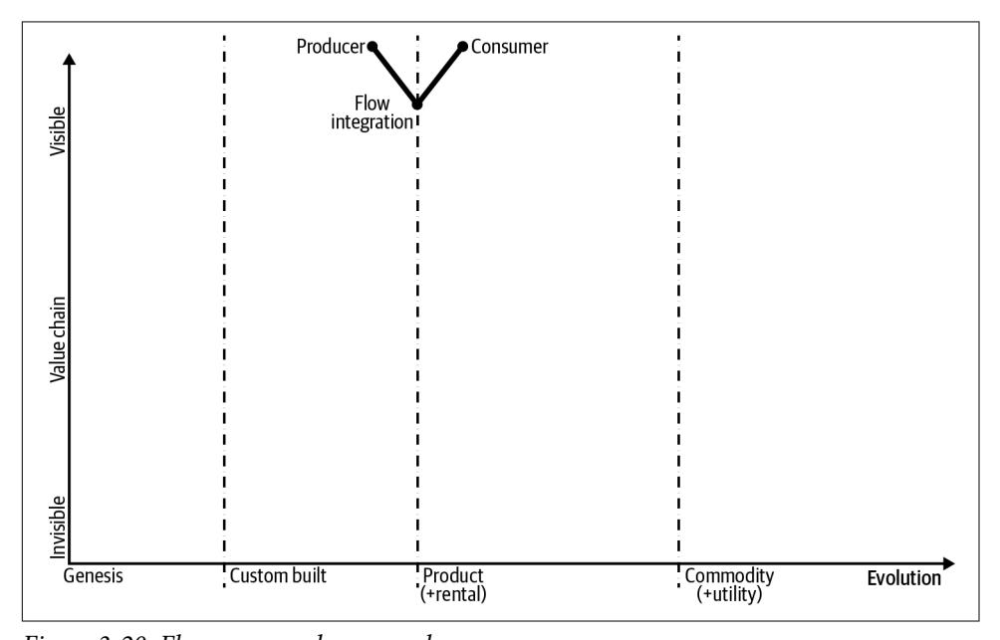
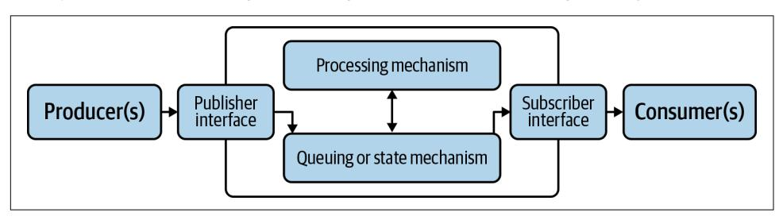
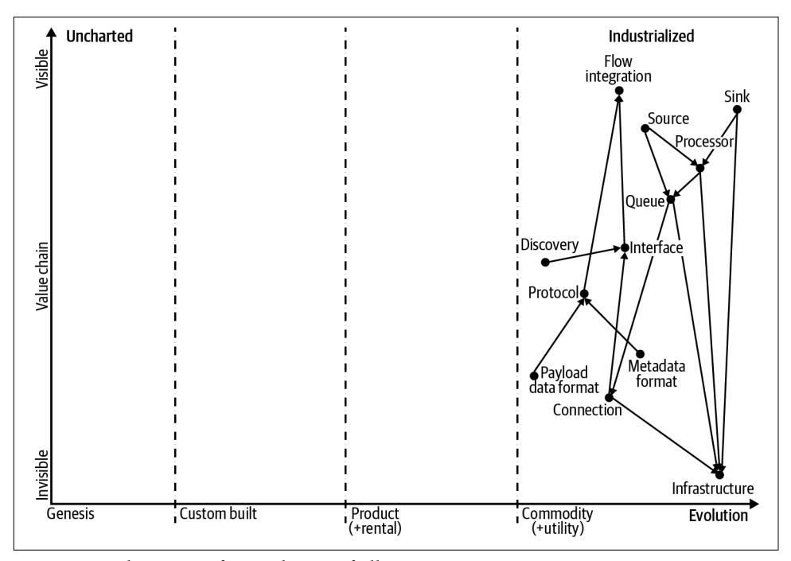

James Urquhart


Software development today is embracing events and streaming data, which optimizes not only how technology interacts but also how businesses integrate with one another to meet customer needs. This phenomenon, called flow, consists of patterns and standards that determine which activity and related data is communicated between parties over the internet.

This book explores critical implications of that evolution: What happens when events and data streams help you discover new activity sources to enhance existing businesses or drive new markets? What technologies and architectural patterns can position your company for opportunities enabled by flow? James Urquhart, global field CTO at VMware, guides enterprise architects, software developers, and product managers through the process.

- Learn the benefits of flow dynamics when businesses, governments, and other institutions integrate via events and data streams
- Understand the value chain for flow integration through Wardley Mapping visualization and Promise Theory modeling
- Walk through basic concepts behind today's event-driven systems marketplace
- Learn how today's integration patterns will influence the real-time events flow in the future
- Explore why companies should architect and build software today to take advantage of flow in coming years

"James has done an excellent job of defining the emerging area of flow architecture. summarizina the current state of the art and using a novel framework to better understand how this technology can evolve over the coming decade. These are important ideas for anyone with an interest in managing streaming data and events."

—Paul Butterworth Chief Technology Officer, Vantiq, Inc.

James Urquhart is a global field CTO at VMware. He brings over 25 years of experience in distributed systems development and deployment, focusing on software as a complex adaptive system, cloud native applications and platforms, and automation. James was named one of the 10 most influential people in cloud computing by both MIT Technology Review and HuffPost.

SOFTWARE ARCHITECTURE

US \$49.99 CAN \$65.99 ISBN: 978-1-492-07589-9

781492075899

5 4 9 9 9 |||||||||||||||||||||||||||||||

Twitter: @oreillymedia facebook.com/oreilly

*e Future of Streaming and Event-Driven Integration*

*James Urquhart*


by James Urquhart

Copyright © 2021 James Urquhart. All rights reserved.

Printed in the United States of America.

Published by O'Reilly Media, Inc., 1005 Gravenstein Highway North, Sebastopol, CA 95472.

O'Reilly books may be purchased for educational, business, or sales promotional use. Online editions are also available for most titles (*<http://oreilly.com>*). For more information, contact our corporate/institutional sales department: 800-998-9938 or *corporate@oreilly.com*.

**Acquisitions Editor:** Melissa Duffield **Development Editor:** Amelia Blevins **Production Editor:** Kate Galloway **Copyeditor:** Piper Editorial, LLC

**Proofreader:** Justin Billing

January 2021: First Edition

**Revision History for the First Edition** 2021-01-06: First Release

**Indexer:** WordCo Indexing Services, Inc.

**Interior Designer:** David Futato **Cover Designer:** Karen Montgomery

**Illustrator:** Kate Dullea

See *<http://oreilly.com/catalog/errata.csp?isbn=9781492075899>* for release details.

The O'Reilly logo is a registered trademark of O'Reilly Media, Inc. *Flow Architectures*, the cover image, and related trade dress are trademarks of O'Reilly Media, Inc.

The views expressed in this work are those of the author, and do not represent the publisher's views. While the publisher and the author have used good faith efforts to ensure that the information and instructions contained in this work are accurate, the publisher and the author disclaim all responsibility for errors or omissions, including without limitation responsibility for damages resulting from the use of or reliance on this work. Use of the information and instructions contained in this work is at your own risk. If any code samples or other technology this work contains or describes is subject to open source licenses or the intellectual property rights of others, it is your responsibility to ensure that your use thereof complies with such licenses and/or rights.

### *To my children, Owen and Emery: You each inspire me every day. I am so very proud of you.*

*And to my wife, Mia: You are my favorite.*

# **Table of Contents**

| Foreword.                                      |                                                  | ix         |
|------------------------------------------------|--------------------------------------------------|------------|
| Preface.                                       |                                                  | x          |
| The 10-Year Impact of the World Wide Flow.     |                                                  | xvi        |
| <b>1. Introduction to Flow.</b>                |                                                  | 1          |
| What Is Flow?                                  |                                                  | 3          |
| Flow and Integration                           |                                                  | 6          |
| Flow and Event-Driven Architectures            |                                                  | 9          |
| The Ancestors of Flow                          |                                                  | 12         |
| Code and Flow                                  |                                                  | 13         |
| The Chapters Ahead                             |                                                  | 15         |
| <b>2. The Business Case for Flow.</b>          |                                                  | 17         |
| Drivers for Flow Adoption                      |                                                  | 18         |
| Improving Customer Experience                  |                                                  | 18         |
| Improved Organizational Efficiency             |                                                  | 20         |
| Innovation and Experimentation                 |                                                  | 24         |
| Enablers of Flow Adoption                      |                                                  | 26         |
| Lowering the Cost of Stream Processing         |                                                  | 26         |
| Increasing the Flexibility of Data Flow Design |                                                  | 29         |
| Creating the Great Flow Ecosystem              |                                                  | 33         |
| What Businesses Will Require from Flow         |                                                  | 36         |
| The Effects of Flow Adoption                   |                                                  | 37         |
| Expanding the Use of Timely Data               |                                                  | 37         |
| The Importance (and Peril) of Flow Networks    |                                                  | 38         |
| Flow's Impact on Jobs and Expertise            |                                                  | 40         |
|                                                | Flow and New Business and Institutional Models   | 41         |
|                                                | Flow and Scale                                   | 43         |
|                                                | Next Steps                                       | 44         |
| 3.                                             | Understanding the Flow Value Chain 45            |            |
|                                                | Recap: The High-Level Properties for Flow        | 45         |
|                                                | Wardley Mapping and Promise Theory               | 46         |
|                                                | Wardley Mapping                                  | 47         |
|                                                | Promise Theory                                   | 48         |
|                                                | Building a Flow Integration Value Chain          | 51         |
|                                                | Establishing a Scope for the Map                 | 51         |
|                                                | Establishing Our Users and User Need             | 52         |
|                                                | Flow Integration Components                      | 53         |
|                                                | Interaction Components                           | 56         |
|                                                | The Final Piece                                  | 60         |
|                                                | Mapping Our Value Chain                          | 61         |
|                                                | Determining a Measure of Technology Evolution    | 61         |
|                                                | Turning Our Value Chain into a Map               | 65         |
|                                                | Our Final Model and Next Steps                   | 70         |
| 4.                                             | Evaluating the Current Streaming Market 73       |            |
|                                                | Service Buses and Message Queues                 | 74         |
|                                                | Message Queues                                   | 75         |
|                                                | Service Buses                                    | 76         |
|                                                | Mapping Service Buses and Message Queues         | 77         |
|                                                | Internet of Things                               | 78         |
|                                                | MQTT                                             | 79         |
|                                                | HTTP and WebSocket                               | 81         |
|                                                | Mapping Internet of Things Architectures         | 82         |
|                                                | Event Processing                                 | 83         |
|                                                | Functions, Low-Code, and No-Code Processors      | 84         |
|                                                | Log-Based Stream Processing Platforms            | 85         |
|                                                | Stateful Stream Processing                       | 87         |
|                                                | Mapping Event Processing Platforms               | 88         |
|                                                | Streaming Architectures and Integration Today    | 89         |
|                                                | Next Steps                                       | 91         |
| 5.                                             | Evaluating the Emergence of Flow 93              |            |
|                                                | Mapping the Evolution to Flow                    | 94         |
|                                                | Gameplay                                         | 97         |
|                                                | Market: Standards Game                           | 98         |
|                                                | Accelerators: Exploiting Network Effects         | 99         |
|                                                | Index 219                                        |            |
|                                                | Appendix. Evaluating the Current Flow Market     | 171        |
|                                                | We Will Make Flow Happen                         | 170        |
|                                                | Driving Flow Networks                            | 166        |
|                                                | Driving Technology Development                   | 162        |
|                                                | Driving Flow Forward                             | 162        |
|                                                | Single Actions Versus Workflows                  | 159        |
|                                                | Discrete Events Versus Event Series              | 155        |
|                                                | Messaging Versus Eventing                        | 152        |
|                                                | "Event-First" Use Cases for Flow                 | 151        |
|                                                | Modeling Flow                                    | 148        |
|                                                | Flow Use Cases                                   | 137        |
|                                                | Identifying Flow in Your Business                | 136        |
| 6.                                             | Building for a Flow Future 135                   |            |
|                                                | The Unexpected                                   | 133        |
|                                                | The Facilitator Pattern                          | 132        |
|                                                | The Signal Pattern                               | 130        |
|                                                | The Distributor Pattern                          | 129        |
|                                                | The Collector Pattern                            | 128        |
|                                                | Flow Pattern Challenges and Opportunities        | 128        |
|                                                | Control of Intellectual Property                 | 126        |
|                                                | Memory                                           | 125        |
|                                                | Manageability                                    | 120        |
|                                                | Agility<br>Timeliness                            | 113<br>116 |
|                                                | Security                                         | 108        |
|                                                | Flow Requirements, Challenges, and Opportunities | 108        |
|                                                | Here Be Dragons                                  | 105        |
|                                                | Enterprise Inertia                               | 104        |
|                                                | Vendor Inertia                                   | 102        |
|                                                | Inertia                                          | 102        |
|                                                | The Others                                       | 101        |
|                                                | Ecosystem: Cocreation                            | 100        |
|                                                |                                                  |            |

# **Foreword**

<span id="page-10-0"></span>As the human race continues its complicated relationship with technology, one thing is abundantly clear, the need for secure hyperconnectivity. Technology is being pushed to its limits to provide more convenience, personalization, or to save us time and money. It is being pushed to do more, and to do it faster and cheaper. How will technology keep up with our demands?

Any technology that we interface with today is a distributed system that involves many components that all need to collaborate and communicate. Every information system, every modern technology, is a distributed system. The way these systems communicate can be viewed in a straightforward manner: they are either making statements or asking questions. Every communication is either trying to let someone else know you did something, or you are asking a question for which you need an answer. Modern terms for these statements are streams and services. All modern dis‐ tributed systems have service-oriented architecture components, and event stream processing has been rising in popularity.

So, as we continue to push technology forward, how does it need to respond? For sys‐ tems to do more, they simply need more services and more events. These events and streams form flows of information that enter into the system to be analyzed for pat‐ terns, trends, and casualties. These new and expanded services give rise to new ways to interact with the technology, whether as a human or a digital system. For the sys‐ tem to act faster there are certainly areas of research to speed up the core backend systems, but in our modern world the majority of "faster" is just latency. How far away are you from the technology and can that technology move closer to you? This is what I term *edge computing*. There may be better definitions out there, but for me, edge computing is how technology continues to evolve to do things faster, and to do more. That is, getting closer to who asks the questions and being able to process more events and data without having to go to a central cloud resource.

To put this into perspective, I'll draw an analogy to banking. Not too long ago you had to physically drive to a bank to interact with any of the bank services, like depos‐ iting a check or withdrawing cash. We did have an interim wave where ATMs were popping up all over the place to allow more access points. Now we simply pull out our phones, or tablets, or in the worse case scenario possibly our laptops, to interact with every banking service one could imagine. Waiting in a restaurant for 5–10 minutes to have the waiter bring the check and return it to us for signature may be ok, but imagine being on your mobile phone and waiting 10 minutes to check out from Amazon. Speed matters, access matters, and secure access matters even more.

As systems continue to need access to more information—to be able to process the information where it is relevant, and to move closer to where the system's services are needed—it becomes clear that we need a new approach to connectivity. Not only do we need more things connected, we also need requesters, responders, processors, and analytics to be location transparent, mobile and secure. New technologies will emerge and give rise to a secure and hyperconnected world, not only for humans, but for all of the digital systems, services, and devices.

All of these factors create an environment ripe for massive, exponential innovation. Think for a moment about what we did with the internet and the global cellular net‐ works, and the approximately five billion connected people. Now, imagine the possi‐ bilities when the world's digital systems, services, and devices are always hyperconnected, location independent, secured, and can interact securely at any point in time. The experimentation phase goes into hyperdrive when secure access to diverse technologies, information and services has been democratized. When mixed with machine learning and artificial intelligence analyzing all of the events and data flows, the possibilities are endless.

Once this secure and hyper-connected future becomes reality, what is next? How do these systems make sense of additional information, and how do they evolve to inter‐ act? In this book James walks us through the basic concepts of FLOW, and what sys‐ tems will need to do in order to take advantage of these new capabilities. Along the way you will begin to understand how FLOW affects and shapes modern distributed systems and ultimately our expectations of those systems and the technology they offer. We need a new approach to connecting, securing, and communicating within these modern systems, and this book is a great place to start understanding how these systems of the future will transform our world.

*— Derek Collison, creator of NATS.io*

# **Preface**

<span id="page-12-0"></span>This is a book about the future of software integration and its effect on the evolution of economic processes. It is a book meant to bring technologists and decision makers on a journey to a future vision of fundamental change in the way we and our institu‐ tions work together. It is also, therefore, a book about opportunity.

On the surface, it may seem like this is a book about technology. I will certainly sur‐ vey technologies available today or in the near future that contribute to the way activ‐ ity is communicated between organizations. However, the most important concept you should take from reading this book is the effect of new technologies on the evolu‐ tion of institutional cooperation and collaboration.

The fluid, real-time communication of system state is much like the flow of water in a river, or the flow of traffic in a highway system; it is a flow of activity. The path this flow follows is defined by the available activity types, and the needs and desires of the entities that wish to consume them. The easier it is for data to find the right path to the right entities, the easier it is for the system to adapt and discover desired behaviors.

Integration is key to the way our digital economy will evolve, as data is what drives economic activity. Today, integration across organizational boundaries is expensive and slow. We rely a lot on human action, bulk data processing, and historical data to make our markets run and our institutions operate. So, the question becomes, what if we could make the exchange of real-time data relatively cheap and nearly instantaneous?

With the evolution of technologies that I describe in this book, it will soon become much less expensive to connect cause and effect across the internet. This, in turn, will lead to both dramatic growth in the number of integrations that organizations exe‐ cute, and an acceleration of economic experimentation. These are the conditions for a Cambrian explosion, of sorts—a hearty soil for dramatic new solutions that change the way the world works. And I will demonstrate why this explosion is nearly inevitable. Like HTTP created the World Wide Web and linked the world's informa‐ tion, what I call "flow" will create the World Wide Flow and link the world's activity.

This was a challenging book to write in many ways, not the least of which is that large parts of it are speculative. It may be a decade before any World Wide Flow technolo‐ gies are considered "mainstream." It will probably be three to five years before the reasonably strong contenders for the necessary programming interfaces and data protocols are available for experimentation. So why write the book now?

The answer lies in the lessons learned from decades of distributed systems evolution prior to today. We, as a global technology community, tend to dismiss the possibilities that lie before us; to focus on how to make incremental improvement to the world we know today rather than prepare for tomorrow's disruptions. There is a good reason for that: none of us have a crystal ball.

However, we do have tools that can give us insight into general trends that are likely to happen. We can intelligently analyze the landscape of technologies and user needs to find places where evolution—or revolution—is likely to happen. I will use two of these—Wardley Mapping and Promise Theory—to demonstrate both what compo‐ nents are required for flow, and why those components will evolve from their form today to a form that encourages ubiquitous event-driven integration.

Cloud computing caught many organizations flat-footed, which resulted in advan‐ tages for their competitors or missed opportunities to serve their missions. My goal with this book is to help you see not only what flow means, but why it is almost cer‐ tain to be.

I'll start with an unusual introduction: a hypothetical technology journal article from ten years in our future. The stories described there will give you some context for flow and how it might drive change in the coming decade.

[Chapter 1](#page-26-0) will then introduce you to the concept of flow, from its basic definition to the key concepts that fall from that definition. [Chapter 2](#page-42-0) will make the case for why businesses, governments, non-profits, and a number of other institutions will embrace flow as it emerges. In [Chapter 3](#page-70-0), I'll use Wardley Mapping and Promise Theory to make the case for why flow is almost certain to happen, and what the key components of flow systems are likely to be.

[Chapter 4](#page-98-0) surveys the messaging and event-driven architectures available today that will either guide or form the basis of flow systems in the future. Building on that and the Wardley Map we defined in [Chapter 3](#page-70-0), [Chapter 5](#page-118-0) will discuss where key innova‐ tions are required to support true flow systems in the future. [Chapter 6](#page-160-0) then con‐ cludes the discussion with a survey of the things you can do today to both prepare for a flow future, and to help make that future happen.

# **Conventions Used in This Book**

The following typographical conventions are used in this book:

*Italic*

Indicates new terms, URLs, email addresses, filenames, and file extensions.

### Constant width

Used for program listings, as well as within paragraphs to refer to program ele‐ ments such as variable or function names, databases, data types, environment variables, statements, and keywords.


This element signifies a general note or suggestion.

# **O'Reilly Online Learning**


For more than 40 years, *[O'Reilly Media](http://oreilly.com)* has provided technol‐ ogy and business training, knowledge, and insight to help companies succeed.

Our unique network of experts and innovators share their knowledge and expertise through books, articles, and our online learning platform. O'Reilly's online learning platform gives you on-demand access to live training courses, in-depth learning paths, interactive coding environments, and a vast collection of text and video from O'Reilly and 200+ other publishers. For more information, visit *<http://oreilly.com>*.

# **How to Contact Us**

Please address comments and questions concerning this book to the publisher:

O'Reilly Media, Inc. 1005 Gravenstein Highway North Sebastopol, CA 95472 800-998-9938 (in the United States or Canada) 707-829-0515 (international or local) 707-829-0104 (fax)

We have a web page for this book, where we list errata, examples, and any additional information. You can access this page at *[https://oreil.ly/ow-arch](https://oreil.ly/flow-arch)*.

Email *[bookquestions@oreilly.com](mailto:bookquestions@oreilly.com)* to comment or ask technical questions about this book.

For news and information about our books and courses, visit *<http://oreilly.com>*.

Find us on Facebook: *<http://facebook.com/oreilly>*

Follow us on Twitter: *<http://twitter.com/oreillymedia>*

Watch us on YouTube: *<http://www.youtube.com/oreillymedia>*

# **Acknowledgments**

I have many people to thank for the insights and analysis you are about to read. I'll start with two great thinkers who I have had the immense honor to know and con‐ verse with often throughout the last 15 years or so. Simon Wardley, the creator of Wardley Mapping, has created one of the most amazing tools for situational aware‐ ness in business or technical strategy.<sup>1</sup> Mark Burgess, the creator of Promise Theory, provides an algebra for studying intent that perfectly compliments Wardley Mapping, but also stands on its own as a powerful analysis tool. To both of them, I owe a debt of gratitude for not only their part in this book, but for educating me about strategic analysis.

This book was reviewed by an all-star collection of forward-thinking technologists and entrepreneurs. Derek Collison created NATS.io, and is the founder of Synadia, a company working hard to change the way event-driven integration is managed. Simon Crosby created the Xen hypervisor, and went on to found swim.ai, which is delivering a potentially game changing stateful event processing platform. Paul But‐ terworth founded Forte Software, the technology vendor at which I cut my meta‐ phorical distributed systems teeth, and now sits as co-founder of event-driven development platform Vantiq. Adrian Cockcroft built his reputation as the chief cloud architect at Netflix, and then as VP of Strategy for AWS. I owe all four an immense gratitude for their tireless work and advice over the last year.

Clemens Vassars, Chief Messaging Architect at Microsoft, deserves special mention for walking me through how one selects event processing architectures, and for giv‐ ing me the language needed to describe that to you.

Mark Anderson, CEO of the Strategic News Service, shared his insights on the rela‐ tionship between flow and interaction. My conversations with Mark over the years have strongly influenced my vision of flow.

<sup>1</sup> Actually, Simon and other practitioners of Wardley Mapping have used the techniques in domains ranging from politics and culture to investment and revitalization.

I also owe thanks to a number of other technologists that contributed to various aspects of the book, including Jesse Bean, Mark Heckler, Stacey Higgenbotham, Sutha Kamal, Mark Kropf, Richard Seroter, Jason Shephard, Sina Sojoodi, Henri van den Bulk, and James Watters.

Thank you to my current and former colleagues at Pivotal/VMware, especially my colleagues on the Field CxO team for your support and encouragement. You guys are amazing, and made it very easy to focus on this work when I needed to. I have learned important lessons about technology and management from each and every one of you.

To my mentor, the great Tom Lounibos, I again offer my deepest gratitude for your encouragement, advice, and occasional kick in the butt.

This book is not possible without my editor at O'Reilly, Amelia Blevins. Amelia, your patience is incredible, and your advice was always exactly what I needed when I needed it. Thank you. Thanks also go to Ryan Shaw and Mike Loukides for encourag‐ ing me to write. Special thanks go to Tim O'Reilly for the wonderful tea and scones, and for asking the right questions at the right time.

Finally, and most importantly, to my wife, Mia, and my children, Owen and Emery. You were there every step of the way, and did nothing but encourage me and push me when I needed a push. Not a day goes by that I am not grateful for what life has given me, and for the love and laughter that we share. I love you all so deeply. And Mia, you really are my favorite.

# <span id="page-18-0"></span>**The 10-Year Impact of the World Wide Flow**


This article assumes that fictional flow standards, the Event Meta‐ data Protocol and the Event Subscription Interface—collectively known as the Internet Event Flow Suite—was introduced in 2021 and adopted by a number of tech companies. This created the plat‐ form by which Event Flow Protocol became standard tooling that sent and received data streams (including events).

The article purposely avoids talking about the specifics of how the Internet Event Flow Suite works. It notes that the Event Metadata Protocol (which is modeled on the CNCF Cloud Events Protocol) is an event data protocol, and that the Event Subscription Interface enables consumers to subscribe to streams (which is loosely based on today's [MQTT](https://oreil.ly/bM6hj) and [NATS.io](https://nats.io) subscription application program interfaces [APIs]). Again, the article avoids discussing specifics, as they are not critical to the outcomes described here.

San Francisco (2034)—Ten years ago this month, the Internet Event Flow Suite, or IEFS, standard was introduced by the Cloud Native Computing Foundation (CNCF) and the World Wide Web Consortium (W3C). The world economy has undergone significant changes in the decade since. From powerful new online services to funda‐ mental changes in the way business has been automated, the World Wide Flow (WWF) has had great impact—both good and bad—on the way our world works. We thought it would be fun to look at some of the incredible technologies and services enabled by the WWF, and pay tribute to the incredible rise of event-driven integra‐ tion and shared data flows.

# **The WWF in Finance**

Our financial system is based on the exchange of data (money) between parties engaged in various value-building activities. It is no surprise, then, that financial service companies were among the first to embrace IEFS, including the Event <span id="page-19-0"></span>Metadata Protocol (EMP) and Event Subscription Interface (ESI). The credit card industry was quick to leverage IEFS to offer their customers real-time budget man‐ agement, parental controls, and other time-sensitive services.

However, integrating real-time credit and debit card transaction data with new cen‐ tral banking reporting services was the beginning of what was to become the US gov‐ ernment's "Real-Time Economy" (RTE) initiative. The RTE program reports key economic data, including inflation, GDP, and purchasing trends every business day, and offers IEFS interfaces to enable subscribers to receive that data as soon as it is published. For example, the IEFS interfaces are used by banks to rapidly adjust their risk analysis for loans and investments across their portfolios. Interestingly, the Fed‐ eral Reserve has reported that it intends to boost this reporting to hourly (for data four hours in arrears) as early as next year, and banks are eagerly anticipating the change.

The equities markets were also eager to take advantage of real-time flow standards. Though the stock and commodity markets were already using data flows to enable high-frequency trading and other automated trading programs, the introduction of standards for event data flows greatly reduced the cost of accessing and processing those streams. The rapidly decreasing cost of trading through software APIs com‐ bined with these flows resulted in the incredible rise of hobbyist trading, as well as the birth of a cadre of new financial services firms aimed at using artificial intelligence algorithms and other computational approaches to attempt to out-think the markets.

Most of these algorithms failed to maintain any kind of advantage over the markets, and a few were outright disastrous. For example, Komputrade, a two-employee startup based in Milwaukee, Wisconsin, was blamed for the Komputrade Crash of March 8, 2023, in which every US equity market was halted for an hour and a half due to the unusual activity the startup's algorithms generated.

Most other hobbyist algorithms failed to exceed market averages, but a few made their inventors extremely wealthy. Neuroquity founder Imani Abioye famously became Africa's richest woman when her commodity trading company was acquired by JPMorgan Chase in 2028 for \$34 billion.

# **The WWF in Retail**

The retail industry benefited from the WWF through a combination of reduced costs and increased visibility into the real-time state of the business. Initially, IEFS and EMP were used to standardize the exchange of real-time inventory data across retail supply chains. Within a few short years, any retailer could count on being able to receive inventory event flows from any supplier using the inventory processing sys‐ tem of their choice.

<span id="page-20-0"></span>Such systems were soon consolidated into standard offerings, including those from SAP, Amazon, and Microsoft. New retail inventory startups also looked to fill niche needs in the industry, such as equipment rental and digital media licensing. One dar‐ ling of Wall Street, RentAll, has become the go-to destination for renting nearly any‐ thing that is not real estate. Flow enabled RentAll to create a successful business model in which they didn't own a single asset that they leased.

The influence of the WWF on retail didn't stop with inventory management, how‐ ever. The rise of mobile assistants (such as Apple's Siri, Amazon's Alexa, and Google Assistant) with in-store location tracking has created that now-ubiquitous personal shopping assistant (PSA) experience across the brick-and-mortar shopping world. Shoppers are now able to ask their phones where to find the item they are looking for, and their phones respond by guiding them to the exact spot where that item resides in the store. If the item is not available at the store, an online buying option is imme‐ diately presented. This is something most readers will have experienced by now.

Of course, the move toward home delivery has accelerated as online grocery stores have added the capability to generate detailed shopping lists based on events from your smart appliances and smart product packaging, plan optimal routes for delivery drivers based on traffic events, and collect product quality feedback through a num‐ ber of unobtrusive channels. Many grocers also retrieve items related to your purcha‐ ses, such as batteries for electronic goods or cocktail mixers for alcoholic drinks, which the delivery driver will make available for purchase when they deliver your order.

All of this is enabled by the real-time exchange of events from the customer's mobile device and smart home combined with a memory of similar event streams in the past made available through the WWF.

# **The WWF in Transportation**

Of course, the transportation industry has undergone a widespread revolution in the last 10 years thanks to a wide variety of innovative advances beyond the WWF. How‐ ever, the standard mechanisms of the WWF enabled some critical infrastructure components to evolve faster than they may have otherwise, thanks to the ability for entrepreneurs to integrate their solutions cheaply and easily with the overall trans‐ portation technology ecosystem.

Automobile manufacturer Tesla delivered early innovations in the use of IEFS as the interface for battery management systems, both on the car and in the cloud. It wasn't all that long ago that Tesla owners had to remember to connect their car to a charging port—either at home or at a Supercharger station—to recharge the car's batteries. Tesla's introduction of Tesla SelfCharging technology combined their self-driving mode with on-car battery monitoring software, charger connection robots at the

<span id="page-21-0"></span>charging stations, and a cloud service that provided details on nearby charger availa‐ bility. All of this enables a Tesla car to find, travel to, and connect to a charger when it is most convenient for the owner, without the owner being present.

While the system was a little buggy at first, and allegedly caused some minor acci‐ dents, the technology is so trusted today that every other major car manufacturer has incorporated Tesla's system or a similar system in their offerings. The huge influx of new cars using IEFS to communicate with charging stations has led to a massive growth in charging stations (and vendors) in the last five years.

The logistics industry has also made the most of the WWF, creating a network of shippers, customers, and load-brokering marketplaces that ensure efficient matching of shipped goods to available truck, train, ship, and airplane cargo space. LoadLeader, which was recently acquired by FedEx, established an entirely new class of partialload shipping options by quickly matching available cargo to trucks with room to spare. The result was so efficient that moving companies began to accept commercial shipping loads, and commercial shippers found new business shipping storage mod‐ ules from city to city.

The efficiency of this system has turned load scheduling into a utility service, and has led to new products from shippers such as FedEx and UPS. These services include such advancements as "ASAP" shipping, low-cost services for specialized handling (such as refrigeration), and the introduction of services for security sensitive payloads.

# **The WWF in Health Care**

Initially, consumers saw the application of the WWF for health care through the lens of personal fitness tracking. Early adoption of IEFS was generally centered on con‐ necting fitness devices, such as a Fitbit, to health-care tracking systems provided by the device vendors. However, in 2025, Kaiser Permanente (in partnership with elec‐ tronic health records vendor Epic) utilized these IEFS streams to enable both custom‐ ers and doctors to monitor and visualize the patient's current health. Most other health-care systems soon followed their lead.

Changes in the health-care system led to rethinking patient record management. In the mid '20s, the healthcare industry started moving to an independent personal recordkeeping model. Today, you, the patient, have more control over your data than ever before. IEFS made this change affordable by minimizing the cost of moving realtime data streams from hospital systems to modern independent personal health record providers (PHRP). Most PHRPs allow you to add additional streams (such as local pollution sensor data or food quality information) to your data streams in exchange for a detailed analysis of factors that may further affect your health from day to day.

<span id="page-22-0"></span>Hospital and physician systems have found several additional innovative uses for the WWF. Emergency rooms quickly took advantage of streams offered by first respond‐ ers and 911 call centers to automate parts of triage, resource planning, and space management. Most hospital and private practice medical supplies today are automati‐ cally ordered as required through "smart cabinet" technologies, and are even stocked by supply robots at some hospitals. CVS and Walgreens have contracted with several physician front office systems to determine local pharmacy demand based on realtime monitoring of prescriptions and medical orders.

Pharmaceutical companies are using these health-care streams to monitor the effi‐ cacy of drugs and to quickly detect individual patients that may have adverse reac‐ tions to their products. The investment in early warning systems for prescription drugs has reduced the number of accidental fatalities by 72% since 2022.

The pharmaceutical industry also heavily utilizes IEFS and the WWF to identify opportunities to apply their products in various diagnosis situations. While some doctors have reported that the constant marketing in their day-to-day jobs is distract‐ ing (or even dangerous), most diagnosis systems have reduced the "noise" in treat‐ ment recommendations, and include pharmaceutical recommendations as a part of an overall treatment plan template. These templates include personalized efficacy evaluations based on the personal health record data and up-to-date drug efficacy data. This greatly simplifies the challenges doctors face in determining a treatment plan once a diagnosis is made.

# **The WWF in Data Services**

While the preceding industries have benefited from the WWF, most people will rec‐ ognize that the examples shared were only a tiny fraction of the streams available to consumers, businesses, and institutions. Do you want to keep track of videos viewed by your teenager? There's a stream for that. Care to track polling sentiment in real time during an election? There's a stream for that. Want to understand the rate at which recycled steel is being reforged into new products? There's a stream for that too.

In fact, sharing real-time data has become so cheap, there is a growing world of event streams that are considered critical to our national infrastructure. One great example of that is the National Weather Service's free WeatherFlow streams, which are billed as the "up-to-the-minute weather service." WeatherFlow coordinates data from over a million weather stations and other sensors located across the globe—including auton‐ omous sailboats on all of the world's oceans—to update global governments, busi‐ nesses, and individuals around the world on conditions almost anywhere on the planet. The infrastructure the agency has assembled to achieve this involves combin‐ ing those data sources with regional analysis centers that run on specialized IEFS

<span id="page-23-0"></span>networks. The WeatherFlow team claims they can add dozens of new analysis centers every day, if needed, using this architecture.

The biggest consumers of WeatherFlow are the transportation and logistics compa‐ nies that are most affected when adverse weather conditions disrupt their business. Most of the major international air traffic control systems utilize WeatherFlow or an international competitor to assure safe but efficient routing. Consumer businesses have also discovered the value of this data, such as LiveTime Games, whose wildly successful Global Sleuth virtual reality game re-creates nearly exact current climatic conditions in each of the cities a player visits when solving a mystery.

Just about every Global 2000 company and government today is offering at least one data service on the WWF. And these organizations are also consuming these services to both make existing businesses and programs more efficient, and to create innova‐ tive new solutions to reach new markets.

# **It Hasn't All Been Good…**

Any evaluation of the positive impacts of the WWF on our society and economy has to acknowledge that there have been both good outcomes and severe challenges to public safety and social accord. While the democratization of real-time activity can‐ not be denied, as with all new technologies there have been some unanticipated nega‐ tive effects, as well.

Early after the introduction of IEFS, dozens of startups were launched to disrupt existing, relatively inefficient businesses using the WWF. As we've seen, some of these businesses changed their industries for the better, but this often happened at the expense of employment at their larger competitors.

The WWF has had the greatest effect on clerical work—jobs in which the employee is provided a queue of tasks, performs some prescriptive activity on the items in that queue, and submits the finished work to the next queue in the process. The combina‐ tion of machine learning and other forms of artificial intelligence and the ready avail‐ ability of activity streams has led to a sea change in the ways these business activities are automated.

Those lost jobs are part of what contributed to the recession of late 2026 (though they certainly weren't the entire story). In the aftermath, the US federal government was among the many national governments that looked for ways to incentivize citizens to build the skills necessary to launch their own businesses, or to bring their skills to the gig economy. The mixed success of these programs has led to the rise of the new "flowtrepreneur" class, but recent government data shows they have done little to reduce the gap between the wealthy and the rest of the population.

Security has been another ongoing concern with the WWF. While protocols and services were quickly developed to encrypt WWF traffic by default—including the WWF dialtones offered by network providers such as AT&T and Verizon—hackers were quick to find a number of unique attack surfaces in IEFS applications.

"Man-in-the-middle" attacks were common in early IEFS implementations, and they delayed or disrupted the release of many early financial system applications. Hackers were able to redirect flow traffic to their own systems and capture or even modify data before forwarding it to its intended destination. Two things generally mitigated "man-in-the-middle" attacks: the revolutionary data provenance technology of tech‐ nology giant ProviCorp (and its recently announced open source project, Inception), and the introduction of stronger authentication protocols in IEFS.

These days, trust in both the parties involved in an IEFS stream connection, and in the data being passed over that stream, is just assumed. That's not to say the technol‐ ogy is infallible, as evidenced in the recent "nation-in-the-middle" scandals in which China, Russia, and the United States have accused each other of spying on both pub‐ lic and private secure streams.

The use of the WWF to transmit social media and community content events has also had a mixed history. Twitter's move to adopt IEFS as its standard streaming interface six years ago was a seminal moment in the democratization of social media content, but it only made sense for the company to do so when IEFS advertising technologies were perfected. Today, it remains difficult to find a source of social media data that doesn't require viewing ads or some form of subscription payment to avoid them.

The pornography industry's use of IEFS was initially as a mechanism to notify sub‐ scribers of new content. However, in 2024 the FBI exposed a network of illegal por‐ nography streams that transmitted images of children and other highly disturbing activity to individuals across the globe. While the FBI shut down that network, it is largely believed that new streams of these types are regularly created on the WWF. Unfortunately, the same technologies that secure streams for business and govern‐ ment can make these illicit streams difficult to detect. Law enforcement now has spe‐ cialized technology teams to discover such offenders and prosecute them.

Finally, a retrospective such as this would be incomplete without acknowledging the impact of the WWF in government policy. As we noted earlier, the "nation-in-themiddle" scandal has exposed the extent that national governments may monitor flows they find valuable for national security. However, most nations have increased law enforcement on the internet through the WWF, including monitoring activities on websites, WWF sources, and even the network itself through secure data streams and data analytics technologies.

<span id="page-25-0"></span>The WWF has also allowed politicians to rethink some of the core institutions of gov‐ ernment. In the United States, for instance, the current debate is on whether we should replace income tax with a sales tax, as it is now easier to track each and every digital purchase through the WWF. The IRS has asked Congress for permission to run a federal sales tax prototype with a number of large retailers, though there is some controversy among retailers about this idea. Whether or not the idea is politi‐ cally feasible, it is a sign of the power and breadth of the WWF that no one is really arguing the technical feasibility of the idea.

# **The Future of the WWF**

So much has happened in the last 10 years, and yet it doesn't take much to see that we are only in the early stages of WWF evolution. The rapid integration of industry has led to new opportunities that will change our world in dramatic ways.

Self-driving cars, smart infrastructure, integrated cities, and numerous other popular technology initiatives are forcing network providers to look closely at how their infra‐ structure can better support massive volumes of data streams. Most major network providers have promised to keep up with demand, though some continue to talk about tiered traffic pricing and specialized private networks for certain streams. Over the next decade, nations will have to decide how the WWF fits into network neutral‐ ity policies already in place.

However, innovation continues to drive the future of the WWF. New devices and technologies, new services based on new combinations of real-time data streams, even the increased use of space-based data sources, all show signs of influencing how internet-governing bodies such as the Cloud Native Computing Foundation (CNCF), Internet Engineering Task Force (IETF), and the World Wide Web Consortium (W3C) evolve the core technologies of the WWF. The next decade promises to be at least as revolutionary as the last.

# **Introduction to Flow**

<span id="page-26-0"></span>At the time of writing this, the world is in crisis. The COVID-19 pandemic has dis‐ rupted just about all aspects of our personal and professional lives, and there are severe challenges in getting the pandemic contained. While we can take a number of personal actions, such as wearing masks and washing our hands, there is plenty of evidence that shows real containment requires real-time cooperation among com‐ munities, countries, and humanity as a whole.

I hope that by the time you read this, the crisis has passed, and you are back to gath‐ ering with friends, family, and even total strangers to enjoy the incredible experiences we have created for ourselves as a species. However, the relative success in containing the virus in countries like Malaysia and South Korea demonstrates that other coun‐ tries struggling with containment could shorten—or at least lessen—the crisis in part with better tools and programs for activities like contact tracing and resource distribution.

Those two examples in particular—contact tracing and resource distribution—are examples of activities that require real-time data coordination worldwide. COVID-19 knows no political or geographical boundaries. Its spread is dictated by the move‐ ment of people. To contain it—and support the medical community's response—we must understand where and how people are moving and making contact with each other. And we need to know that as close to when it happens as possible.

We can't quickly create tools to share data in real time in part because there are no consistent mechanisms to do so. Each software system involved in generating or pro‐ cessing the necessary data has its own way of making data available to other systems, including how those systems request or receive the data, and how the data is packaged.

**1**

<span id="page-27-0"></span>For example, mobile applications can use Bluetooth connections to capture informa‐ tion on those we've had contact with. However, getting that captured data to agencies coordinating a response to positive COVID-19 tests requires those agencies, cellular network companies, and phone manufacturers to negotiate the means and the terms for data sharing. Even when everyone is motivated to solve the problem, that can take weeks or even months.

Resource coordination should be easier, but every manufacturer, distributor, and hos‐ pital system has systems that are disparate and cannot share data easily. In the early days of the pandemic, finding supplies was done by human beings; first by searching the websites of distributors and manufacturers, then by briefly resorting to personal contacts and professional networks when that wasn't fruitful. There have been several cases of fraud<sup>1</sup> related to personal protective equipment sales, as organizations have found themselves more and more desperate for large amounts of highly contested resources.

This book is not about COVID-19, or the response to COVID-19. It is about technol‐ ogies that are evolving toward a better technology ecosystem for solving these prob‐ lems and a myriad of others. This book is about an evolution toward interfaces and protocols that make the integration of real-time event streams standardized and com‐ mon. This is a book about flow.

As more and more of our businesses and other organizations "go digital," more and more of the economic interaction between them is digital. Financial transactions are executed in their entirety without human intervention. Inventory ordering is sized and timed by computers projecting production demand. The security of our food supply increasingly relies on producers, shippers, and wholesale and retail operators maintaining a digital "chain of evidence" that is difficult to spoof.

The groundwork is in place to fundamentally change how real-time data is exchanged across organization boundaries, whether in business, government, education, non‐ profits, or even our personal lives. Advances in event-driven architectures, stream flow control, and early attempts at standardizing event metadata are slowly converg‐ ing on establishing a well-defined mechanism to do so.

Custom examples of the value of this type of integration can already be seen in realtime inventory management in retail and machine automation systems in factories. However, because each interface is different, each protocol defined for a specific use, there is uncertainty and expense involved in executing event-driven integration across our economy.

<sup>1</sup> The Federal Trade Commission [filed suits](https://oreil.ly/EVmlP) against three such companies in August 2020.

<span id="page-28-0"></span>The hypothetical article you read before I began this chapter is an example of what the world might be like if you removed much of this expense. When you lower the expense of utilizing a key resource, you open the door to experimentation and inno‐ vations that would otherwise have been cost prohibitive. The innovations described in the article demonstrate advancements in key parts of how our economy works, and hopefully paint a picture of how flow might create an explosion of new opportunities for business and real-time cooperation between disparate institutions.

If flow was in place before this pandemic started, we might have seen a different response. Once contact tracing data was captured, it could have easily been shared with anyone who was authorized to use it. Real-time data from different brands of smartphones and other disparate sources could have been more easily combined to create a holistic view of a person's contact risks. The up-to-date inventory data of every supplier of medical equipment could quickly have been combined into a single view of national or even global supply. As new providers of masks, face shields, and other critical equipment started producing goods, they could have added their data to that inventory without having to develop code to manage the connections, data pack‐ aging, and flow control needed to do so.

Let's begin our exploration of the future where real-time data sharing is ubiquitous with an overview of flow, and why it will likely have a significant impact on the way our economy works. We'll start by defining flow, describe a few key properties of flow, and walk through why flow is an important change to the way organizations integrate via software. I'll give a few examples of how flow might be used, and summarize the mechanisms that need to be in place to support those use cases. We'll then outline the key topics we'll cover in the rest of the book.

# **What Is Flow?**

*Flow* is networked software integration that is event-driven, loosely coupled, and highly adaptable and extensible. It is principally defined by standard interfaces and protocols that enable integration with a minimum of conflict and toil. To my knowl‐ edge, there is no universally agreed upon standard to do this today. However, we shall see that flow will drive fundamental changes to the way we integrate businesses and other institutions. I also argue that it is inevitable.

This definition leaves a lot to be desired in terms of the mechanics of flow, so let's define some key properties that differentiate flow from other integration options. In *[information theory](https://oreil.ly/HeiX8)*—which studies the quantification, storage, and communication of information—the sender of a set of information is called the *producer*, and the receiver is known as the *consumer* (the terms *source* and *receiver* are also used**,** but I prefer *producer* and *consumer*). With this in mind, *ow* is the movement of informa‐ tion between disparate software applications and services characterized by the following:

- <span id="page-29-0"></span>• Consumers (or their agents) request streams from producers through self-service interfaces
- Producers (or their agents) choose which requests to accept or reject
- Once a connection is established, consumers do not need to actively request information—it is automatically pushed to them as it is available
- Producers (or their agents) maintain control of the transmission of relevant information—i.e., what information to transmit when, and to whom
- Information is transmitted and received over standard network protocols including to-be-determined protocols specifically aligned with flow mechanics

Flow allows an information consumer to locate and request data from independently operated information producers without requiring those producers—or agents that manage flow on the producer's behalf, such as serverless cloud services or network services that manage flow—to know of the consumer's existence ahead of time. Flow also allows producers (or agents working on their behalf) to maintain control over the format, protocols, and policies by which the information will be shared.


There are many technologists involved in event-driven systems that would argue that producers and consumers should be decoupled from the systems that manage the connection mechanisms, event routing, and other elements involved in transmitting data between parties. The "agents" in our definition of flow represent the variety of external services that might take various actions—e.g., policy management, network optimization, or generating telemetry—on behalf of producers and consumers. As we don't know for sure what form flow will take, for now I will use the term *producers* to mean both the producer and any agents acting on their behalf, and *consumer* to mean the consumer and any agent acting on their behalf.

Flow is only valuable if there are services and applications that prepare the data for streaming, consume the stream when received, or otherwise manipulate the streams. We call the act of processing data on either side of the flow connection *ow interac‐ tion*. The importance of the relationship between data flow in a general sense and interaction was first introduced to me in 2016 by Mark Anderson, CEO of Strategic News Service. As he told me then, without interaction, flow is just the movement of data. Value is created by interacting with that flow.

Flow and flow interaction depend on the ability of consumers to receive data pas‐ sively and respond only to pertinent signals. In the technical world, the signals we care about typically represent some sort of state change—the creation or updating of some form of data somewhere in the system. For example, a sensor might signal that

<span id="page-30-0"></span>a key temperature in a manufacturing process has increased, or a stock market might signal that the asking price for a given stock has changed. Those are fairly wellknown, fine-grained signals. Signals of larger, less frequent state changes are also interesting, such as a truck indicating it now has available cargo capacity, or even a business signalling its intent to file for an initial public offering.

Before I go further, I should define a couple of terms I've already used to make sure there is no confusion. When we package the information about that state change with some additional context (such as the time the change took place, or an ID associated with what changed), we call that an *event*. The producer that captures and packages that information will then publish the event for eventual consumption by consumers. The transmission of a series of events between two parties (e.g., the producer and the consumer) is called an *event stream*.

It is important to note that there are two different ways that data can be streamed on a network, as shown in Figure 1-1.


*Figure 1-1. An event stream versus a raw data stream*

The first way is to simply send each piece of data as it comes directly on the network without adding any context. This raw data stream requires the consumer to add con‐ text when it receives the data. This can be done based on knowing the source of the stream (e.g., the data came from a specific sensor), looking for clues in the data stream itself (e.g., the data contains representations of its source location, such as <span id="page-31-0"></span>pictures from a camera), or capturing a timestamp from the consumer's own clock to identify roughly when a state change occurred.

The second way is for the producer to assure there is contextual data packaged with the state change data itself. In my view, this is what turns a data stream into an event stream. The context included with the transmitted data allows the consumer to better understand the nature of that data. It greatly simplifies the work the consumer has to do to understand when and where the event occurred.

While technically flow could work on both raw data streams and event streams, I believe events will dominate streams used to integrate systems across organization boundaries. As such, you will see me focus mainly on event streams for the rest of the book.

In any case, the consumer must be able to connect to the producer, and to interpret any data they receive. The producer must be able to publish any available data, and understand how to send it in a format the consumer can consume. As with any inte‐ gration in software, two things are required to achieve this: the interface by which the consumer can contact and initiate a connection with the producer, and the protocol by which the producer and consumer agree to format, package, and transport the data.

# **Flow and Integration**

Event and data streams across institutional boundaries are especially interesting to me, as they play a key role in how our economic system evolves. We are quickly digi‐ tizing and automating the exchanges of value—information, money, and so on—that constitute our economy. We also spend considerable time and energy making sure we can execute key transactions with less human intervention, and with better, faster, more accurate results.

However, most of the integrations we execute across organizational boundaries today are not in real time, and they require the use of mostly proprietary formats and pro‐ tocols to complete. There are still a lot of "batch" exchanges of data, such as deposit‐ ing text or media files into someone else's filesystem or cloud storage, which must then be discovered and read at a later time by the consumer. Without a mechanism to trigger an action as soon as a file arrives, the consumer may choose to wait until a specified time of day to look for and process files. Alternatively, they may poll to dis‐ cover files every so often (say, every hour). With batch processing, there is a built-in delay between sending a signal and taking action on that signal.

Some industries have settled on data formats for exchanging information between companies, such as electronic data interchange (EDI) records. However, those are limited to specific transactions, and represent a fraction of all organizational integra‐ tions. Even where application programming interfaces (APIs) exist for streaming, <span id="page-32-0"></span>which can enable action as soon as the signal is sent, those APIs are largely propriet‐ ary for each offering. Twitter, for example, has a widely used API for consuming their social media streams, but it is completely proprietary to them. There is no consistent and agreed-upon mechanism for exchanging signals for immediate action across companies or industries.

Today, cross-organization integration—especially real-time integration—is a "do it yourself " exercise. Developers find themselves having to put a lot of work into under‐ standing (or even defining) the plumbing by which they exchange data. Producer and consumer have to resolve fundamental concerns around network connectivity, secu‐ rity, flow control, and more just to pass a simple data set between them. And, if they wish for a real-time data exchange, they have to hope that the source of the data has created an API and protocol that is easily consumable. It's expensive to integrate realtime data today, so that process is reserved for the most time-critical data.

Now consider what will happen when event streams are created and consumed through a well-known mechanism. Every developer would know how to publish, find, and subscribe to event streams. Furthermore, if the protocols for encoding and transmitting this information are equally well understood, every developer could interact with event streams in whatever development languages and platforms devel‐ opers choose. Libraries and services could exist that eliminate most, if not all, of the toil required to produce and consume arbitrary event streams. The cost of real-time integration would drop precipitously, and a world of innovative new uses for streams would commence.

In order to support the ever-changing structure of human interaction, flow architec‐ tures must be designed to be asynchronous, highly adaptable, and extensible. It must be straightforward for consumers to connect to and consume a stream (as demon‐ strated in Figure 1-2). Consumers must also be able to close those connections at will. Any single consumer's connection activity must not negatively affect any producer's ability to operate. These requirements require the producer to be decoupled from the consumer as much as possible, which may encourage the evolution of a separate set of services to handle flow on their behalf.


*Figure 1-2. Simple example of ow*

Furthermore, adaptability requires that new technologies be easily introduced into the flow ecosystem, and that consumers and producers are able to choose from those <span id="page-33-0"></span>technologies as their requirements dictate. There are a lot of variables involved here, and as a result it will take time for such a flow ecosystem to develop.

Flow creates immense opportunity for creative innovation in how we tie activities together across disparate domains. A flow of real-time particulate data from smart city sensors, for instance, could be combined with personal biometric data to help you understand which particulates are most detrimental to your health or athletic performance. A flow of weather model data combined with traffic data and shipping demand data might help a logistics company optimize package routing. Your personal skills profile might be built from inputs provided by your employers (past and present), your educational institutions, and even your ebook application and You‐ Tube. And you might signal gaining new skills right back to your employer's HR sys‐ tem, which may then signal the change to managers interested in those skills.

The thing is, this is only an infinitesimal fraction of the possibilities fluent architec‐ ture will open for developers and entrepreneurs. The more streams there are from more sources, the more flow consumers will be drawn to those streams and the more experimentation there will be. This experimentation will lead to new ways to combine that data to create new value.


In the article presented before this chapter, I presented numerous examples of how cloud might enable new business integrations. There are four fictional projects in that example that I will refer back to from time to time. Those companies or government pro‐ grams each represent a flow pattern that I will discuss in more detail in [Chapter 5](#page-118-0). However, they are also useful as examples of concepts presented elsewhere in the book.

A brief summary of each is presented in Table 1-1 so that you will have some context when I discuss them elsewhere.

*Table 1-1. Four fictional companies demonstrating ow patterns*

| Company or<br>Program | Pattern     | Purpose                                                                                                                                                                                                                                                                                                                                                                                                                                                                                                                                   |
|-----------------------|-------------|-------------------------------------------------------------------------------------------------------------------------------------------------------------------------------------------------------------------------------------------------------------------------------------------------------------------------------------------------------------------------------------------------------------------------------------------------------------------------------------------------------------------------------------------|
| WeatherFlow           | Distributor | A fictional service offered by the United States National Weather Service to deliver minute-by<br>minute updates to current and predicted weather for almost every populated area on the<br>planet. WeatherFlow is an example of a flow interaction that takes events generated from<br>just a few models and broadcasts them to thousands or millions of consumers.                                                                                                                                                                      |
| AnyRent               | Collector   | A fictional startup that has built one of the most successful online rental businesses in the<br>world without owning a single piece of inventory. It does this by gathering available rental<br>data from almost every major rental company in the world, and providing a single virtual<br>inventory to customers. AnyRent is an example of a company that collects data from<br>hundreds (perhaps even hundreds of thousands) of producers, and generates a consolidated<br>event stream or user interface for downstream consumption. |

<span id="page-34-0"></span>

| Company or<br>Program      | Pattern             | Purpose                                                                                                                                                                                                                                                                                                                                                                                                                                                                                                                            |
|----------------------------|---------------------|------------------------------------------------------------------------------------------------------------------------------------------------------------------------------------------------------------------------------------------------------------------------------------------------------------------------------------------------------------------------------------------------------------------------------------------------------------------------------------------------------------------------------------|
| Real Time<br>Economy (RTE) | Signal<br>Processor | A fictional service provided by the United States Federal Reserve Bank that collects relevant<br>economic data from tens of thousands of sources, does deep economic analysis on that data,<br>then—based on the results of that analysis—sends events to relevant subscribers, including<br>the press, financial services companies, and other organizations. RTE is an example of a<br>service that processes incoming event streams to find signals that require action by others<br>that then receive an event to that effect. |
| LoadLeader                 | Facilitator         | LoadLeader is a fictional shipping consolidator that has figured out how to quickly match<br>available room with partial-load shippers with small cargo lots from businesses all over North<br>America. This has led to new forms of cargo being made available to these shippers.<br>LoadLeader is an example of a service that matches supply and demand as quickly as possible<br>through flow processing.                                                                                                                      |

The pinnacle of fluent architectures will be when any source of activity data can be connected to any authorized software that can create value from that data. Over time, organizations will find new ways to tie activities together to generate new value. Like water finding its path downhill in search of sea level, activities will find their way to value. A growing graph of activity flow will emerge, with activity data being inter‐ preted, combined, and often redirected to new consumers. This global graph of flow‐ ing data, and the software systems where that data is analyzed, transformed, or otherwise processed, will create an activity network that will rival the extent and importance of the World Wide Web.

This global graph of activity is what I call the World Wide Flow (WWF). The WWF promises not only to democratize the distribution of activity data, but to create a plat‐ form on which new products or services can be discovered through trial and error at low cost. And the WWF promises to enable automation at scales ranging from indi‐ viduals to global corporations or even global geopolitical systems. It doesn't replace the World Wide Web, which is a similar network of linked knowledge. Instead, the WWF will often be intertwined with the Web, adding to the ways the internet is mak‐ ing our global world a little smaller.

# **Flow and Event-Driven Architectures**

It stands to reason that not all digital information exchanged over a network is flow. For example, traditional methods of requesting information synchronously via a "request-response" API would not meet this definition. In those interfaces, the con‐ sumer may initiate the connection, but the producer is required to send information only when the consumer requests it. And the consumer has no indication of the avail‐ ability of data before they make a request, so data generally cannot be delivered in real time.

<span id="page-35-0"></span>For the first six decades or so of business computing, the speed and manner that information could be passed between institutions was limited by the available technology. Shipping data on paper, punch cards, or tape—clearly not real-time methods—was the first way digital data was exchanged between organizations. Net‐ working technologies, such as the TCP/IP networks that make up the internet, revo‐ lutionized the way this data was shared, although network-based integration across company boundaries didn't really take off until the growth of the internet in the 1980s and 1990s.

Early long-distance computer networking technologies suffered from so many per‐ formance limitations that data was rarely shared in real time. Businesses instead depended on "batch" approaches, where large sets of data were packaged into one artifact that was shared with another party, who then processed it as a single unit of work. Today, most—perhaps all—digital financial transactions in the world economy still rely on batch processing at some point in the course of settlement. Real-time integration was rare until the new millennium began.

Today, we increasingly see real-time integrations take place through API-based mod‐ els. There are two such models: consumers can make API calls to producers request‐ ing current state, or producers can make API calls to consumers to send real-time data when some agreed-to condition is met. The former has similar problems that batch processing has: the consumer must either send API requests nearly continu‐ ously or schedule API calls at a rate that delays the "real-time" nature of the data.

The latter (where the producer calls the consumer) is an excellent pattern for integra‐ tions in which there is a triggering action at the producer (e.g., a user clicks a button to start the transaction) and the consumer service is known ahead of time. However, this requirement—that the consumer and their needs be known ahead of time—is what limits the use of this pattern in commercial integrations. It is expensive for the consumer to negotiate a connection with the producer, and then implement an API endpoint that meets their expectations.

Because of this, neither API model has enabled the rapid evolution of real-time inte‐ gration. It is still extremely rare for a company to make real-time data available for unknown consumers to process at will. It is just too expensive to do so. There are exceptions, however, such as Twitter, though even they limit the volume and types of data that can be freely consumed.

What promises to change the status quo is enabling low cost, simplified real-time data integration. This is why modern *event-driven architecture* (EDA) will enable pro‐ found changes in the way companies integrate. EDAs are highly decoupled architec‐ tures, meaning there are very few mutual dependencies between the parties at both ends of the exchange. EDAs meet the requirement that producers do not need to know the location or even existence of consumers. Consumers initiate all connections <span id="page-36-0"></span>with a producer (or agent of a producer), and if a producer disappears, consumers will simply stop receiving events.

EDA is the set of software architecture patterns in which systems utilize events to complete tasks. For the sake of simplicity, I will sometimes include the use of data streams to communicate activity when I mention EDA, but acknowledge that not all uses of data streams meet the definition of flow, and data streams are not technically transmitting events. While there are some important differences between the two stream types, much of what is discussed in this book applies equally to both.

This book will discuss EDAs at length, but it is not intended to be an expert guide on the subject. Instead, we will explore the nature of several EDA patterns with an eye to how they inform critical properties of flow. They will also serve as baselines as we explore the ways in which EDAs may evolve to create fluent architectures.

It is also important to note that EDAs and flow do not remove the need for any aspect of today's distributed application architectures, but merely add a new, powerful con‐ struct to connect activity in real time. The concept of *composability* is important here. Composable architectures allow the developer to assemble fine grained parts using consistent mechanisms for both inputting data and consuming the output. The "pipe" function (represented by the "|" symbol) found in various Unix and Linux shells is a great example of this. Developers can solve extremely complex problems by assem‐ bling collections of commands, passing only common text data between them through a pipe. The immense world of scripts that parse and manipulate text files such as log files or stack traces—are a testament to its power. So is the growing library of shell script automation tools used in computer operations.

The analog to composable architectures is *contextual architectures*. In contextual architectures, the environment provides specific contexts in which integration can happen. To use these integration points, the developer must know a lot about the data that is available, the mechanism by which the data will be passed, the rules for coding and deploying the software, and so on. Software plug-ins, like those used in music recording applications or web browsers, are examples of contextual architectures. While contextual architectures are extremely useful in some contexts, they can be awkward to use and are frequently restrictive in unwanted ways.

EDA is a loosely coupled method of acquiring data where and when it is useful, like APIs, but its passive nature eliminates many time- and resource-consuming aspects of acquiring "real-time" data via APIs. EDA provides a much more composable and evolutionary approach to building event and data streams. These seemingly small dif‐ ferences are surprisingly important.

# <span id="page-37-0"></span>**The Ancestors of Flow**

There are plenty of examples of real-time data being passed between organizations today, but most aren't really flow, as defined here. Generally, existing streaming inter‐ faces are built around proprietary interfaces. The APIs and other interfaces that exist are generally designed by the producer for their purposes only, or are being utilized for a specific use case, such as industrial systems. Furthermore, connecting to a stream (at least initially) may not be "self-service" in the sense that completing the connection requires human interaction with the provider.

Among the most visible examples of this are the live stock market feeds that are con‐ sumed by, among others, high-frequency trading systems (HFT). Examples include NASDAQ's [long list of trading protocol options](https://oreil.ly/MbWPn) and [NYSE Pillar,](https://oreil.ly/438Y_) which supports a binary protocol and the Financial Information eXchange (FIX) protocol. Both exchanges use specialized integration interfaces that are built for speed and scale, and usually involve connecting directly to a specified port on a specific server IP address at the exchange.

This low-latency architecture is critical for the success of HFT. HFT accounts for any‐ where between 10–40% of equities trades in the world today, and is credited with increasing market liquidity (as well as [creating new sources of volatility](https://oreil.ly/5zSOB)). HFT is made possible because of the introduction of electronic trading in the early 1980s. Today's HFT systems are highly automated trading algorithms that profit by discover‐ ing trading opportunities faster than both other HFT systems and human traders.

This requires speed, which is why most HFT systems are physically hosted in the exchange data centers, and are directly connected to the exchange servers to mini‐ mize network latency. While HFT systems can execute trades, they do so in response to a steady stream of stock or other tradable instrument ticker information. The direct network connection to the trading system enables HFTs to receive pricing data and issue instructions through that connection, and rely on it to capitalize on arbi‐ trage opportunities before others beat them to it.

However, the connection between the traders and the market system is explicitly negotiated between the parties before the dedicated network connection is used to send the data. There is no self-service interface for the consumers (the HFT systems) to connect to the producer (the exchange or market). This is in contrast to our flow definition, in that consumers cannot create and destroy connections at will. Instead, the producer is very aware of each and every HFT (or other consumer of its data), as they have to open a port on their exchange server to establish the connection.

The point is, there is work that has to be done by the producer (e.g., opening network ports and establishing security credentials) directly on behalf of the client. Set up requires coordinated action by both parties, which means a business relationship has to be established *before* a prospective HFT can experiment with the exchange's feed. <span id="page-38-0"></span>Furthermore, the HFT must understand the producer's mechanisms for receiving and interpreting data, which may vary from producer to producer. This creates imple‐ mentation friction, which increases both the cost and timetable to establish a new connection. A flow architecture would eliminate most of this friction.

Another example is Twitter's [PowerTrack API](https://oreil.ly/mwA75). The Twitter community generates over 500 million tweets per day, which is a reasonably large data stream.<sup>2</sup> But it's also an overwhelmingly valuable data stream, and Twitter's customers consume it for a variety of purposes, including customer sentiment analysis, advertising evaluation, and discovery of breaking news events. PowerTrack allows consumers to filter the data stream at the source, targeting only the tweets that are relevant to its analysis. (For example, the retailer Target might filter a stream to only contain tweets with their brand name in the text.)

Like with stock streams, use of PowerTrack requires consumers to come to an arrangement with Twitter before they can begin using the product. However, in this case there is very little set up required by Twitter to support each new customer. In fact, in this sense, PowerTrack is very much like what I envision will be the case for flow: the consumer requests a stream via an API call, and Twitter opens a connection with that consumer through which the data streams in.

There is an important difference between Twitter and the stock market feeds that should be noted here. Twitter enables developers to create and destroy connections at will, while the stock market feeds are set up with the intention to maintain the con‐ nections at all times. Connections are not created and destroyed at will in the latter case. The reason for this has mostly to do with time sensitivity (and, perhaps to a cer‐ tain extent, the era in which the technology was engineered). With the stock feeds, microseconds matter, so the data feeds must be set up with a minimum of intervening processing or routing. With Twitter, the standard speeds of the open internet are fine, so developers prefer the ubiquity and flexibility that its API approach offers.

This is, I think, a clue to the diversity of use cases that the WWF will have to support, which we will explore in [Chapter 2.](#page-42-0)

# **Code and Flow**

If we are looking at the basis for flow, we have to look at one other key trend that is setting the stage. "Serverless" programming is dependent on the flow of events and data through a system. The increased adoption of managed queuing technologies such as Amazon Managed Streaming for Apache Kafka (Amazon MSK) or Google

<sup>2</sup> There are much larger data streams out there. I know of systems, such as cellular phone networks, that gener‐ ate petabytes of data a day. To contrast that, Twitter streams data on the order of terabytes a day. A terabyte is 1/1000 of a petabyte.

<span id="page-39-0"></span>Cloud Pub/Sub, combined with the rapid growth of functions as a service (FaaS) code packaging and execution, such as AWS Lambda and Microsoft Azure Functions, is a true signal that flow is already in its infancy.

Amazon Web Services (AWS) was one of the first to the serverless programming paradigm, and is perhaps still the most complete ecosystem to watch the birth of flow in action. The linchpin of the AWS serverless story is its FaaS offering, Lambda. [Lambda](https://oreil.ly/ukDgh) allows developers to simply "run code without provisioning or managing servers," which is important, because it removes most of the operational set-up toil from running custom software.

Simply write your function, configure a few things about dependencies and connec‐ tivity, deploy, and it runs each time an applicable event is fired. And, much like offer‐ ings from competitors like Google and Microsoft, consumers only pay for the time the code runs. If the code is idle (not being used), the developer pays nothing.

AWS is one of many who see this "serverless" model as being the future of application development. By eliminating as much of the toil of application configuration and deployment as possible, using a model that is highly composable and offers a wide variety of service options, the belief is that developers will have little reason to turn to more traditional architectures for the majority of software tasks.

However, just introducing Lambda to developers wasn't enough to attract those developers to the platform. AWS needed a way to give developers a *reason* to try the service. They came up with a brilliant idea. They created triggers in many of their own core operational services, ranging from software build automation to data stores to API gateways and more. Developers were then able to write custom Lambda func‐ tions to respond to triggers from any of the supported services.

The result is that developers and operators running applications on AWS are able to easily automate activity based on real-time events simply by writing and deploying code. No servers, no containers, no using APIs to determine if the code should fire. Just set it and forget it.

Thus, in addition to being an easy to operate application platform, AWS Lambda became a scripting environment for using their other cloud services. The uptake has been tremendous, and AWS keeps adding new triggers for new use cases, which in turn draws in more and more developers. Once these developers see the value of the serverless portfolio, they start dreaming up ways to write applications using this model.

There are many experienced distributed systems professionals who believe the future belongs to some form of serverless programming, as it minimizes friction for devel‐ opers while being able to scale running applications and services from zero to vast numbers. Given its event-driven approach, the serverless model also looks to be a key foundation for the future success of the WWF. It provides a low-cost, low-toil way to <span id="page-40-0"></span>interact with event streams, using a model that fits the flow definition nicely. Func‐ tion developers can link the function to event producers as they see fit (and as authorized), which meets the criteria that consumers control connectivity. Mean‐ while, producers maintain control of the flows themselves. This both greatly reduces the amount of effort required to consume events, as well as boosts the number of use cases to which fluent architectures apply.

# **The Chapters Ahead**

Understanding why flow is all but inevitable starts with understanding why busi‐ nesses would want to integrate via events and data streams. Without creating value for business or society, there is no reason for systems to evolve in the direction of real-time activity processing. So, [Chapter 2](#page-42-0) will focus on why businesses, govern‐ ments, and other institutions *need* to adopt flow dynamics.

We will start by exploring the key drivers for flow adoption: customer experience, operational efficiency, and innovation. We'll then explore how flow changes the meta‐ phorical math to enable its adoption, namely by lowering cost, increasing flexibility, and delivering more choices. Finally, we'll ask how flow adoption might change the way organizations cooperate, and the positive and negative effects of that change.

Once we've established the evolutionary drivers for flow, we'll step back to take a look at a value chain for flow integration. To do this, [Chapter 3](#page-70-0) will take our first look at Wardley Mapping. Wardley Mapping is a visualization technique for gaining situa‐ tional awareness about technology usage and evolution. We'll start by building a value chain, then use another modeling technique, Promise Theory, to validate the cooperative relationships between our components. With a validated value chain in hand, we will then map each technology component to its general evolutionary stage.

There is actually a surprisingly diverse landscape of solutions available today that lay the groundwork for flow, but our value chain will simplify flow's needs to 14 key components. Those components cover the key needs of both flow transmission and flow interaction, and form the basis for analyzing the current EDA market.

In [Chapter 4,](#page-98-0) we'll walk through some basic concepts behind today's event-driven systems marketplace, including key platforms and services that are in use by enterpri‐ ses and other institutions. We'll evaluate service buses and message queues, the Inter‐ net of Things (IoT), and event processing platforms as they exist today.

In [Chapter 5,](#page-118-0) I'll execute some speculative game play on the Wardley Map we created in [Chapter 3](#page-70-0). How might the components we have identified evolve from where they are today? For the elements that don't have good solutions, where might they come from? Who might be the likely sources of critical interfaces and protocols required to move beyond purely custom stream integrations?

We'll discover the importance of both open source software solutions and large scale cloud providers to the future solution. We'll also discuss several integration patterns that are being worked on by companies today that will likely have significant influ‐ ence on the way real-time events flow in the future.

In [Chapter 6](#page-160-0), I'll give some suggestions for how institutions can begin to prepare for integrating into the WWF. While I honestly believe we are looking at a five- to tenyear timeline for flow to become mainstream, I also believe it is vitally important to architect and build our software to take advantage of flow *today*. It is critical for insti‐ tutions to adopt the development, release, and operations practices that will enable them to take advantage of the rapid experimentation that flow will offer. Obviously, predicting a complete, detailed, and accurate picture of what flow will look like is impossible. However, understanding the "shape" of what is to come will be hugely advantageous to those who wish to take advantage of it.

The book will conclude with an [Appendix](#page-196-0) that can serve as a simple survey of the diverse products and services available to deliver the component promises in our value chain. This is not by any means an exhaustive list, but I do believe that it will give a fair overview of the different approaches vendors and open source projects are taking toward solving common streaming problems. For those wishing to have a bet‐ ter understanding of what forms the genesis of flow evolution, it should be an insightful list.

# <span id="page-42-0"></span>**The Business Case for Flow**

We are going to spend much of this book exploring how technology will—and what technologies are needed to—enable flow. However, it is important to first establish *why* flow is desirable—even important—to businesses and other institutions. Change is expensive, so the benefits of flow-friendly architectures must clearly incent busi‐ nesses to adopt the technologies and architectural patterns involved. Otherwise, flow is simply a solution looking for a problem.

In order to tell this story, we will explore some of the ways flow will enable these ben‐ efits. The cost of integration, composability of solutions, and utility of the WWF are all factors that will have a significant impact on business outcomes. So, it is important to explore those factors, as well as some of the outcomes they will enable.

I might have chosen to do this in reverse: tell the technology story, then work to define why businesses would value that technology. However, this is not the way tech‐ nology evolution generally works. Technologies that succeed generally find an imme‐ diate pain point—a need that creates a sense of urgency to find a solution. Users may have been unaware that a problem was painful until an acceptable solution exposes it, but it's always there in some form.

Businesses can worry about cost, revenue opportunities, competitive pressures, investor pressures, regulatory requirements, and so on. Nonprofits might worry about funding, effectiveness, and shifting priorities. Governments and academic institutions will have similar concerns that drive action. For individuals, the pain point may simply be a longing for social status or a desire to be a part of a group.

If you want to see whether or not a technical trend will have legs, you have to find this sense of urgency. The evolutionary path in question here is the movement from cus‐ tom, batch- or API-driven integration to commoditized event-driven integration. So, <span id="page-43-0"></span>what are the elements of our greater social and economic systems that create a need to move from the former to the latter?

# **Drivers for Flow Adoption**

Let us begin with the most important factors driving organizations to look for new technology solutions for integration and time-critical processing in the first place. The reasons are similar to why businesses are driving toward digital transformation in general. Digital transformation is hard to define precisely, but it generally repre‐ sents the intentional implementation of technical solutions across an organization's activities. Examples include sales data management, back office business process automation, or real-time inventory tracking, to name just a few.

A [2018 survey](https://oreil.ly/FeZ3S) by IDC found that a full 58% of businesses surveyed were looking to digital transformation to improve customer experiences. While this is what I think of first when I think of digital transformation, an even larger percentage (65%) indicated that improved process automation was a key driver. That makes sense, given the fact that automation drives new efficiencies, and a more efficient operation has more options when it comes to pricing and profitability.

A third factor that was not reflected in the survey, but which I believe is important to the increased value of flow, is digital transformation's ability to create new innovation in business and public service. The World Wide Web (and HTTP), APIs (and stan‐ dard API formats like REST), and other technology platforms with open interopera‐ bility protocols have driven tremendous innovation over the last several decades. Based on this past success, you can expect entrepreneurial spirits to experiment with streams and stream processing to unlock new value for consumers and businesses, as well.

Let's now take a look at each of these three factors—customer experience, process efficiency, and innovation—in more detail.

# **Improving Customer Experience**

What makes customers choose to do business with a given company? More impor‐ tantly, what makes customers choose to *repeatedly* do business with a given company?

In my mind, the answer—whether you are speaking of individual consumers or business-to-business transactions—is straightforward: excellent customer experien‐ ces create long-term customer loyalty. A [survey](https://oreil.ly/e0GoQ) conducted by Salesforce in March 2019 found that 80% of those questioned believed that the experience a company pro‐ vides is as important as its products or services.

<span id="page-44-0"></span>Today's consumers are increasingly expecting great experiences. They want to be treated as individuals, not a category or a number. They expect their data to be used in a way that is valuable to them, not just to the vendor.<sup>1</sup> And they expect that data to be used to provide a consistent, context-aware picture of who they are and what they need. In fact, 45% of those questioned in the Salesforce survey indicated that they would switch brands if a company doesn't actively *anticipate* their needs.

Business buyers aren't much different. The Salesforce survey found that 82% of busi‐ ness buyers want the same experience from their vendors as they get for themselves from consumer retailers. Seventy-two percent believe that this engagement should be personalized to their needs. It's not enough to provide a way to order from your cata‐ log and receive payment in return. Your business—or any organization, really—is expected to make interaction as enjoyable, personal, and consistent as possible.

Doing so means sharing data across the landscape of applications and software serv‐ ices that make up your customer experience, and sharing it in a timely fashion. A cus‐ tomer transaction completed through one business unit should be reflected back to that customer in seconds by any other relevant business unit.

For example, if a customer purchases something with available accessories—say a smartphone from a mobile provider's ecommerce site—those accessories should be presented first whenever future shopping interactions take place. If, in a few years, the customer purchases a different phone, the options presented first should immedi‐ ately change to reflect that new device.

Not providing a great experience will likely cost you. For example, not knowing that your customer is searching for accessories for a recently purchased product is a lost opportunity to sell your most personally appealing options. Similarly, not providing timely updates to a financial account screen as market or spending activity changes the account's total value could mean a loss of trust from your client. Inconsistent experiences result in lost business, as indicated by the survey results.

The value of timely consistency is not limited to for-profit businesses either. Aca‐ demic classes change, emergency relief supplies dwindle, voting demographics evolve. In each case, an institution is responsible for creating solutions that adapt to that change. Sometimes data consumption can be delayed until the consumer needs the information. Often, signals that something changed need to be handled as close to "immediately" as physically possible.

<sup>1</sup> Of course, sharing data for better experiences comes with a cost: those same vendors can use the data for other purposes, such as profiling you for advertisers who might be much less concerned about your experi‐ ence. While legal policies such as Europe's General Data Protection Regulation (GDPR) attempt to give some control back to the user, much more will have to be done if flow opens the floodgates for real-time data sharing.

<span id="page-45-0"></span>Regardless, from the end user's perspective, failing to reflect changes consistently may mean failing to reach the institution's primary objective. Even a nonprofit can chase away potential beneficiaries or donors with a poor experience.

The challenge of providing consistency is exasperated when the data required has to be shared between organizations. Reliable real-time data sharing requires software and infrastructure that most organizations are not prepared to acquire unless there is a significant upside. Even less common is sharing such data with arbitrary customers or partners that are not known ahead of time, unless such sharing is integral to a pro‐ ducer's core business, as it is with Twitter. Something that changes those economics would make such integrations well worthwhile.

# **Improved Organizational Efficiency**

Organizations are almost always motivated to improve the efficiency of their opera‐ tions in some way. Businesses look to improve profit. Nonprofits and other organiza‐ tions that depend on donors look to improve the impact of the funds they raise. Even government bureaucracies look to meet their missions within budget constraints, often with political pressure to reduce budgets or increase mission scope.

Increasingly, businesses are looking to digital solutions to create new efficiencies. The IDC survey found that employers define "digital business" largely in terms of worker productivity and data-driven process improvement. (Customer experience was also a key element for those surveyed.) While improving digital processes through mobile applications and open APIs are certainly a part of improving customer experiences, they are perhaps more central to enabling employees to both do their jobs and adapt to changing business conditions more efficiently.

Improving the flow of work through an organization—also known as *process improve‐ ment*—often has the biggest impact on the cost of doing business. Continuous pro‐ cess improvement methods, such as [Total Quality Management](https://oreil.ly/-sYUm) from W. Edwards Deming and early manufacturing process improvement work at Toyota, outline ways to improve the flow of work in terms of increased quality and reduced waste.

### Value stream mapping

One of the most popular tools for improving flow in processes is called *value stream mapping*. Born from the work of Deming et al., value stream mapping is a tool used to discover constraints in system flow. A *constraint*, in this context, is a point in the process flow where work piles up—a point at which the time incoming work sits waiting to be processed is the highest.

Early process improvement pioneers developed a Theory of Constraints. This theory observed that the most limiting constraint in the process will hide any improvements made to other steps of the process. In other words, if you don't fix the biggest <span id="page-46-0"></span>bottleneck in your process, any other improvements you make will just be overshad‐ owed by the bottleneck. The most effective process improvement you can do at any given time is to turn your biggest constraint into a smaller one—or eliminate it alto‐ gether.

Finding constraints is where value stream mapping shines. The technique is well doc‐ umented in books like *Value Stream Mapping* by Karen Martin and Mike Osterling (TKMG), but I'll give a quick summary here.

Start by following a work element through a process from beginning to end. Measure two elements of every step of the process: the time the element spends in a queue waiting to be addressed (the lead time, or LT), and the time actual work is done on each element (the process time, or PT). Record that information in a value stream diagram, like the example given in Figure 2-1.


*Figure 2-1. Value stream mapping diagram*

While the value stream mapping practice is more complex, the main elements of the concept include the following: measuring LT is important, as the time that work ele‐ ments spend waiting to be worked on is of no value to any organization. Measuring PT is important, as improving process time increases employee productivity. By look‐ ing at the entire value stream, and measuring LT and PT for each process and process step, an organization can quickly identify the biggest constraints in the overall process.

What does all this have to do with event-driven integration? The answer is rooted in the ways that the flow of data is critical to digital solutions, and its impact on process constraints. Software applications and services can be used to eliminate LT or PT or both, but in order to do so they need data and signals. Often, data and signals will come from external applications or services. These may be engineered by a different development team, business unit, or even company.

So, we need to explore how software can be used to eliminate LT and PT, with an eye to how flow can benefit from stream processing and simpler integration options.

<span id="page-47-0"></span>

### Eliminating lead time

Eliminating LT requires software that knows there is work to be done and that moves that work to whatever processing action is required as quickly as possible. The more efficient the software can be at processing work, the less LT there will be in that pro‐ cess step. Software has many advantages over human beings in that regard. For one thing, software does not need to stick to an eight-hour workday; it is always ready for the next thing to do, 24 hours a day, 7 days a week, 365 days a year.<sup>2</sup>

Software can also make decisions about how to prioritize work faster than people can, assuming the rules for determining priority are consistent and well understood. For example, given the right data, software can route rush jobs ahead of standard jobs, pick the truck with the most capacity to send through a load scheduling process, or signal alarms when emergency conditions are detected in medical monitoring systems.

To date, most business automation platforms have used some sort of rules engine to make these decisions: humans create "if this, then that" statements that a software platform interprets, then applies to incoming data. Rules engines take many forms, but much of our economy is actually dependent on various forms of rules engines today. As new artificial intelligence and machine learning tools gain maturity, how‐ ever, hard-coded rules engines are slowly being replaced by software that "learns" the optimal decision tree through constant iterative model building and testing.

But, to do any of this, the software has to be able to receive those signals and data. This is where interoperability comes in. In [Chapter 1](#page-26-0), I talked about how connections between producers and consumers require a combination of shared interfaces and shared protocols. When interfaces and protocols are not open and well understood, establishing a connection requires negotiation between the parties involved. This negotiation requires time and effort beyond the development work already required to stream and process data.

Interfaces and protocols that are open—such as those defined and utilized by a mar‐ ket or community—amount to a sort of "pre-negotiated" set of options. Without the cost of negotiating connection interfaces and protocols, establishing a connection becomes significantly cheaper than creating custom connections (assuming the underlying infrastructure evolves to support new flow traffic). The lower cost of con‐ necting, in turn, makes streaming and automation much, much cheaper to develop.

Timely automation can then enable work to be addressed much more efficiently than when humans are managing queues. This is the efficiency that eliminates LT.

<sup>2</sup> Actually, that's a slight exaggeration, as available processing time is dependent on the software's scheduled uptime and unexpected downtime.

<span id="page-48-0"></span>

### Eliminating process time

Automation is also critical to reducing the time taken to complete a work task (PT), but that's not the whole story. To really understand why flow can enable lower process times, we need to explore both the mechanisms that execute work, and the data required to complete that work.

Software programs that perform calculations, make decisions based on well-defined rules, or transform the packaging of data have been part of our business process tool‐ kit for decades now. Everything from spreadsheets to massive data processing envi‐ ronments are geared toward speeding up the flow of information through an organization in order to achieve some critical function.

So it's not novel to point out that software speeds up PT. This is what enterprises do with software. In fact, much of IT has been focused on a combination of eliminating prescriptive human work (such as provisioning a server, calculating a tax, or reserv‐ ing a conference room) and improving the performance of automated processes and services.

In order for that to work, however, all required data must be readily available to a software function that requires it to execute a task. It would be relatively simple to do this if you could create the appropriate connections and functions once and never change them again. However, business evolves, and business processes must easily adapt to and even anticipate that evolution. A business will need to experiment with new data sources when they are available and potentially relevant to their business.

Flow will create a world in which stream integrations are not only easier and cheaper but also much more interoperable than before. *Interoperability* is the ability for prod‐ ucts or programs to easily exchange data and activity with other products or pro‐ grams. Flow will support interoperability by making streams produced by any given flow producer easily consumable by any interested flow consumer. The mechanism to connect to a producer and understand the protocol used to package and send stream elements will be shared by both producers and consumers.

Please note that consumer processing of the data may require some code developed specifically for the payloads being provided by the producer. But everything else about setting up a connection, handling the flow of data through that connection, and interpreting the type of payload and other important facts like encryption, origi‐ nal source, and so on, will likely be provided through the interfaces and protocols of flow.

What this means for process automation is this: as sources of data change, developers will use standardized software mechanisms to detect those changes, and modify connections, payload retrieval, and payload interpretation as necessary. The cost of changing that integration is entirely in modifying the code required to interpret the payload for processing. This is in line with the cost of changing application <span id="page-49-0"></span>functionality in general, thus achieving the agility and economy that modern software techniques provide.

### Innovation and Experimentation

The interoperability of flow also contributes to our third driver, innovation. *Innova‐ tion* is utilizing an idea or invention to create new value for a target audience. It can be thought of in terms of better solutions to existing problems, or brand new solu‐ tions to emerging or underserved problems. Innovation is what enables an organiza‐ tion to expand its boundaries and pursue new missions or markets.

In general, innovation activities have been found to positively correlate with firm per‐ formance, as is reflected in [numerous academic studies](https://oreil.ly/UFnEI). There are exceptions, but the majority of new product or service innovations, or improvements to existing prod‐ ucts and services, lead to better market performance. The exact mechanisms for this are complicated, and there are other factors that may contribute to an innovation's success, such as market or production strategies. But innovation is a key strategy for thriving in a competitive world.

It is important to note that "innovation" is not equivalent to "adaptation." Companies must adapt constantly just to survive. This is a trait of all complex adaptive systems; when agents in the system constantly adapt in an effort to out-compete other types of agents, all competitive agents must follow suit or risk being made obsolete. As Matt Ridley pointed out in his book *The Red Queen: Sex and the Evolution of Human Nature,* "Life is a Sisyphean race, run ever faster toward a finish line that is merely the start of the next race."<sup>3</sup>

In the case of organizations, adaptation may involve work just to keep up with the features of a competitor—or the new parameters of a political crisis, or whatever else threatens survival. This is not innovation. Nowhere is this more clear than in the modern rush toward digital transformation. *Digital transformation* is a term com‐ monly used to describe the work organizations do to use online experiences and soft‐ ware automation to enhance their customer experiences and employee efficiency. For many companies, digital transformation is something they must do to respond to competitive pressure.

Digital transformation aimed at avoiding competitive disruption is not innovation. It is, in fact, simply a cost of doing business. The cost of survival. Digital projects that target disrupting a market, on the other hand, are what give a company a potential competitive advantage. For flow to significantly move the needle for businesses, it

<sup>3</sup> Matt Ridley, *The Red Queen: Sex and the Evolution of Human Nature* (New York: Macmillan Publishing Com‐ pany, 1994), 174.

<span id="page-50-0"></span>must enable new ways of doing business, not just faster ways of keeping up with the Joneses, so to speak.

This is where the interoperability of flow is so important. By creating a straightfor‐ ward way of delivering and consuming data and event streams, the WWF will attract new producers and consumers. These producers and consumers will attract more technology companies to solve new problems efficiently. Those new technologies will in turn attract even more producers and consumers. This self-reinforcing feedback loop is the kind of effect that has generated tremendous new value in past technology revolutions.

How will flow experience this value? *Network effects* are the positive feedback loop created when a technology finds itself gaining in both utility and market interest. As each new business or consumer utilizes a technology, that increases the odds that additional value will be identified, which attracts more businesses and consumers, and so on. You may have heard this effect described with respect to telephones or fax machines. However, I think a better analogy for flow is the World Wide Web, as pre‐ viously introduced in [Chapter 1.](#page-26-0)

As new value was generated from creating and linking content through HTTP, that value attracted new users to the internet. Those new users, in turn, attracted addi‐ tional content creators and online business properties, which further increased the value of the web to content consumers. Eventually, the entrepreneurs at Google fig‐ ured out an optimal way of finding content without a link, which generated an entire new utility for the web: advertising to people looking for something specific. This, in turn, helped create the critical role that the World Wide Web plays in society today. It was (and continues to be) a classic network effect.

The rush around the turn of the millenium to get organizations of all types "on the Web" was directly spurred by the innovation that early Web properties discovered for the technology. However, companies seeking competitive advantages through the Web then went on to find new forms of value that the early pioneers either did not anticipate, or did not have the means to implement—for example, social networks like Facebook or cloud computing services. The growth of both technical capability and uses for the web is inexorably intertwined with the growing demand for online access to everyday activities and knowledge.

Even today, with the web being a ubiquitous and default environment for documenta‐ tion, data capture, commerce, entertainment, and so many more functions, new value is being unearthed. Despite some of that value being disruptive to aspects of our society, most of that value makes the lives of web users easier. The amount of content on the web will continue to grow—potentially for generations—for this reason.

Flow will see similar effects. We are already in the initial stages of this as cloud pro‐ viders roll out streaming integration options, one example being Amazon Web

<span id="page-51-0"></span>Services' EventBridge service. EventBridge provides a standard way to connect to live event streams from a variety of software as a service (SaaS) providers using their serv‐ erless portfolio, such as the Lambda function service and Kinesis stream processor. This, in turn, is attracting more businesses to offer streams via EventBridge, and more AWS customers to utilize Lambda and other event-driven services to solve key business problems. We will discuss EventBridge in more depth in [Chapter 4](#page-98-0), but it is certainly a predecessor to an open WWF.

As the number of stream options grows, more and more business capabilities will be defined in terms of stream processing. This will drive developers to find easier ways to discover, connect to, and process streams. The proprietary mechanisms of the cloud providers will slowly give way to common abstractions that can be used for other stream sources. When this happens, the standard flow interfaces and protocols will become increasingly important.

While consistent customer experiences and increased efficiencies will drive the use of existing streams (or the adaptation of existing services to stream processing architec‐ tures), it is innovation that will drive the expansion and eventual ubiquity of the WWF.

# **Enablers of Flow Adoption**

Let's now focus a bit on a few key high-level qualities of flow, and how they support these business drivers. We won't yet try to speculate too much about the specific tech‐ nical features that flow might exhibit (the remaining chapters of this book will do that in more detail). Instead, we'll look at flow as a senior executive might, and explore the qualities that flow architectures must display to make the technology compelling in the context of the change drivers we just discussed.

The three traits of flow that I think will have the most impact on its adoption lie in lowering the cost of stream processing, increasing the flexibility in composing data flows, and creating and utilizing a rich market ecosystem. Lower cost, increased flexi‐ bility, and increased choice are three natural attractors for any organization looking to "do more with less" while remaining adaptable to changing conditions. These same enablers also attract any organization with a need to explore and utilize timely pro‐ cessing of external data streams. So let's explore each in more depth.

### **Lowering the Cost of Stream Processing**

Integration costs dominate modern IT budgets. A 2019 [Grand View Research](https://oreil.ly/PLofe) report predicts the total systems integration market (goods and services that support inte‐ grating business systems) to reach \$582.5 billion by 2025. Just about everything in an IT portfolio must be integrated with something—at least a data store or a logging

<span id="page-52-0"></span>system, to start. Most off-the-shelf and SaaS applications even require additional investment to integrate them into business processes.

Integration is everywhere, but we still don't integrate all of the data flows we *could* integrate. For many integration opportunities, the cost of creating interaction between systems is simply too high for what little value is gained. This is especially true for integrating with external organizations and their computing systems.

Costs that hinder integration can come from a variety of factors, including develop‐ ment and operations costs, or the cost of services being provided by "middle men" (such as electronic data interchange, or EDI, clearing houses). They could also come from the cost of maintaining the network connections required to enable sufficient communication bandwidth and latency between the systems. One of the biggest costs for integration is the labor cost required to implement and test required code and configurations.

But if you lower the cost of connecting to, sending, receiving, and processing data, you open the door for many of these integrations to make sense. Most enterprises I've interacted with over the years have a long backlog of software they'd like to integrate to enable process automation or reduce their software portfolio a bit. Logistics com‐ panies (like the fictional LoadLeader example from [Chapter 1\)](#page-26-0) look to integrate with their customers' shipping systems. Governments would love to collect more tax reve‐ nue data in real time from more sources. Perhaps you imagine a day when your car and your house communicate to turn on lights and open the garage door without you having to take explicit action.

This is why I doubt that flow will negatively impact overall spending on integration. When you lower the cost of production for a high-demand product or activity, espe‐ cially a platform capable of enabling new value, you see an interesting effect come into play known as the *[Jevons paradox](https://oreil.ly/h-8OK)*.

William Stanley Jevons, a nineteenth-century economist and logician, noticed that the introduction of a more efficient steam engine to English factories resulted in a large increase in the consumption of coal, the primary fuel for these engines. Even though each steam engine used less coal to produce the same power as older technol‐ ogy, the increased efficiency made coal a cheaper power source. This made steam power more attractive to new use cases, which resulted in more steam engines con‐ suming more coal overall.

So, what's the "steam engine" when it comes to flow? What is the technology that can improve in such a way that it fundamentally changes the economics of integration? Unsurprisingly, I suppose, I argue that it is stream processing. Also, I think the inno‐ vation that will change the economics of data and event streaming will be the com‐ mon interfaces and protocols that enable flow. Lower the cost of integration, and <span id="page-53-0"></span>people will find new uses for streaming that will boost the overall demand for stream‐ ing technologies. The Jevons paradox at work.

Flow will benefit from a combination of three things that will lower cost over time. The first is the introduction of standard tools and methods, the second is a much larger pool of labor capable of integrating streams, and the third is economies of scale that come from the network effects mentioned earlier.

The standardization of tools and methods around flow will enable developers to focus on sending and consuming data payloads. I believe that over the long term, program‐ ming platforms will support flow intrinsically, through standard code libraries or even new programming language constructs.

These new standard mechanisms will mean that developers spend less time writing code that handles protocols or interfaces, and more time writing the functional logic required by their end users. I think the Jevons paradox will come into play here, in that as developers are able to implement and release features faster, they will feel they have more breathing room to experiment. That increased experimentation will drive new business successes, which in turn will drive demand for more features.

Perhaps more importantly, enterprise and consumer applications will begin to sup‐ port flow to enable key features that are dependent on timely data delivery. The need for consistent customer experiences—e.g., simple identifiers that can be shared with stream consumers—will drive the demand for features that integrate third party applications. Back-office systems will slowly replace API polling or file exchange methods of integration with better streaming implementations.

All of these efficiency improvements will drive savings in one more critical area: the cost of doing business. Employee productivity has always benefited from software, but the combination of timely data and automation (including new machine learning approaches) will push us closer to maximizing efficiency by eliminating LT and PT, as mentioned earlier. Reducing LT and PT, in turn, reduces the cost of labor per unit of output, whatever that may be for a given organization.

Greater demand for flow solutions will drive greater demand for the skills necessary to implement those solutions. Flow is inherently a complex systems technology, so those skills will require some understanding of how these systems can be made resil‐ ient and performant.

In this regard, I think the evolution of flow will differ from the evolution of HTTP and HTML. Web technologies were both relatively easy to learn and enabled a signifi‐ cant amount of creativity and direct user interaction. Flow is much more in the back‐ ground; it enables great user experiences, but is not a presentation technology itself. It's also hard to tell how easy it would be for a relative technology novice to under‐ stand and utilize flow—at least initially.

<span id="page-54-0"></span>That being said, as the technology evolves and new abstractions come into play to simplify the integration process (and simplify the process of operating those integra‐ tions on an ongoing basis), I expect those skills to be accessible to more and more people. As more people can build solutions with flow, the cost of their labor will go down on average. Theoretically, it might even become common for nontechnical peo‐ ple to do certain kinds of integrations via flow, such as consumers integrating their smart home devices, or manufacturing process engineers integrating flows through their manufacturing machine control systems.

Finally, the growth of flow across the internet will drive new cost savings through economies of scale. Economies of scale are savings realized as production of a good or service increases. You see economies of scale all around you every day.

Giant retailers like Walmart or Amazon achieve low prices through volume purchases of goods for resale. Cloud providers like Microsoft Azure can provide services at a lower cost than many individual companies could achieve themselves by operating massive data center portfolios with great efficiency. Airlines make flying affordable by using larger planes carrying hundreds of people, rather than providing a plane for each passenger individually.

Economies of scale for flow will come from increased efficiencies in creating, trans‐ mitting, and receiving streaming data. The demand for flow-related capabilities will bring new vendors focused on finding competitive advantage in serving those depending on flow. It's impossible to predict exactly what these products and services might be, but as we'll see in [Chapter 3,](#page-70-0) we can get a sense of the general shape of the problem space.

Certainly I would anticipate new optimizations to network configurations, new cloud services to serve and consume data, and new ways of monetizing the value of streams. All of these will get progressively cheaper for customers to implement as the volume of demand increases and these vendors learn where greater efficiencies can be found.

### Increasing the Flexibility of Data Flow Design

Cost savings are great, but innovation and adaptation depend on the ability to change, the ability to select behaviors that take advantage of the climate in which an organization finds itself. Without the ability to execute behavior change in both a cost-effective and timely fashion, organizations will get little more out of flow than they would existing integration options.

The mechanisms for enabling behavior change, then, are critical. I believe the flow architectures of the future will excel at this. The reasons are varied, but central to all of them is the concept of composability.

I discussed composability briefly in [Chapter 1,](#page-26-0) but let's explore the concept in just a little more depth here. I find it helps to understand the concept a bit more if you <span id="page-55-0"></span>contrast it with another way integration is frequently handled in applications, namely plug-in architectures, or what is known as *contextual architectures*.

I was first introduced to the concept of contextual versus composable architecture in 2013 through a [blog post](https://oreil.ly/G_TgY) by Neal Ford, who at the time was a systems architect at consulting company ThoughtWorks. Ford argued that developers eventually aban‐ doned the Maven build automation tool because, though it provided a structure that was helpful early in a project's life cycle, its rigid and dogmatic nature made it impos‐ sible to adapt to the changing requirements of a more established, complex environment.

Ford argued that Maven was a contextual tool, meaning it provided ways for develop‐ ers to extend its functionality *within specific contexts anticipated by the creators of Maven*. Want to write a tool that reports build results in a specific format? That's quite easy using Maven. Want to adapt Maven to a complex compliance regime that requires multiple touchpoints during the build process, and possibly changes the build routine altogether? This will be much, much harder, if not impossible.

Ford identified the problem with contextual tools in terms of Deitzler's Law for Access, which was coined by one of his colleagues who ran across a lot of Microsoft Access projects for clients.<sup>4</sup> The law reads as follows:

Every Access project will eventually fail because, while 80% of what the user wants is fast and easy to create, and the next 10% is possible with difficulty, ultimately the last 10% is impossible because you can't get far enough underneath the built-in abstrac‐ tions, and users always want 100% of what they want.<sup>5</sup>

In other words, because Access locks down the context in which developers can use the tool (through the abstractions that define workflows and required actions), most projects will eventually find enough things they can't do well enough to abandon the tool. This is not to bash Access. In reality, the product is widely used within office environments for small projects. However, generally, tools that only allow modifica‐ tion and extension in certain contexts will "hit the wall," so to speak, in terms of their utility, and developers will begin to look for new options that meet their needs.

Ford then contrasted contextual tools with composable options. Composable tools are generally made of "finer grained objects parts that are expected to be connected together in specific ways." His excellent example was the Linux command line, namely the "pipe" mechanism that lets users string together a series of arbitrary com‐ mands, automatically passing the output of the last as input for the next. Here's a

<sup>4</sup> Microsoft Access is a database engine included in some editions of Microsoft Office for light database applica‐ tion needs.

<sup>5</sup> Neal Ford, "Why Everyone (Eventually) Hates (or Leaves) Maven," Nealford.com (blog), January 22, 2013.

<span id="page-56-0"></span>quick example, for those who may not be familiar with piping. It's an example Ford provided in his post:

A famous story from 1992 illustrates just how powerful these abstractions are. Donald Knuth was asked to write a program to solve this text handling problem: *read a file of text, determine the n most frequently used words, and print out a sorted list of those words along with their frequencies.* He wrote a program consisting of more than ten pages of Pascal, designing (and documenting) a new algorithm along the way. Then, Doug McIlroy demonstrated a shell script that would easily fit within a Twitter post that solved the problem more simply, elegantly, and understandably (if you understand shell commands):

```
cat [my file] |
tr -cs A-Za-z '\n' |
tr A-Z a-z |
sort |
uniq -c |
sort -rn |
sed [n]q6
```

The script is actually quite elegant. Use the cat command to feed the contents of a text file into the rest of the script. The first tr takes each individual word and puts it on its own line. The second tr command makes everything lowercase. The first sort command then sorts the list of words in alphabetical order. The uniq command elim‐ inates duplicate words, but adds a count of the original number of instances of that word as it does so. The second sort command does a sort by numerical order (from highest to lowest) using the count created by the uniq command. Finally, the sed command grabs the first n lines of that list, where n is an integer you provide describ‐ ing the number of words you wish returned when you execute the script.

Voila! A list of the n most common words in your file—using only standard Linux commands available to anyone who installs the operating system.

The powerful thing about piping is that there is no predetermined order in which programmers have to use these tools. As a result, scripting has been used for every‐ thing from automating everyday operations tasks to scanning for keywords in incom‐ ing emails. As Ford stated, "I suspect that even the designers of Unix shells are often surprised at the inventive uses developers have wrought with their simple but power‐ fully composable abstractions."<sup>7</sup>

Common interfaces and protocols, like those shown above, will lead fluent architec‐ tures to exhibit the same composable pattern as piping. For flow, developers will be able to "pipe" data streams from one processing system to another through those

<sup>6</sup> Ford, "Why Everyone (Eventually) Hates (or Leaves) Maven."

<sup>7</sup> Ibid.

<span id="page-57-0"></span>interfaces and protocols. Linking different types of processing can then be done as needed, in entirely unanticipated ways.

A related concept that is also key to the flexibility of flow is interoperability. Not only will flow enable developers to string together series of stream processing steps with minimal integration effort, but those stream processing options will use common mechanisms to connect to and interpret streams. This, in turn, means that tools that were never explicitly designed to work together will have a high likelihood of responding in a predictable and useful way when they are connected to one another.<sup>8</sup>

Interoperability is critical to building flexibility into a core solution building block like flow. It is a powerful concept that is at the heart of why software systems are so successful in modern life. I depend on interoperability every day. My brokerage allows me to receive data from my other financial service providers to build a com‐ plete picture of my finances. My cell phone supports thousands of applications, about a hundred of which I find compelling enough to keep on my phone for everyday use. I use my browser to access dozens of different websites every day, the vast majority of which render and behave consistently with the intent of the site's designer.

Interoperability in the context of flow is simply the ability for producers and consum‐ ers to exchange information and use that exchanged information—in other words, the ability for a consumer to connect to any producer sending the appropriate data stream formats and to utilize that stream. While it is pure speculation to try and pre‐ dict exactly how this will work, my analysis suggests it is reasonable to make the fol‐ lowing assumptions about how this interoperability will be achieved:

- Producers and consumers (or their agents) will utilize common interfaces and protocols to establish connections and exchange metadata about the content being exchanged.
- For discrete events, there will be additional metadata describing the time, type, and format of each event.
- The data payloads themselves will be formatted as determined by the producer (and indicated in the metadata), but common payload types will eventually have standard formats that all consumers of that payload type can easily interpret.

If this is indeed the case, then we will see massive growth in the options available for standard streaming operations, even in the context of a given industry.

<sup>8</sup> As we will see as we further explore the likely mechanisms of flow, data and event payload formats (the unique data for that specific stream transmission) may be defined more specifically for specific contexts. Thus, it will likely not be possible to connect *any* stream consumer to *any* stream producer and get valid results. However, *any* compliant consumer should be able to read the contextual metadata transmitted by *any* compliant producer to determine whether or not it will be able to consume the payload, which reduces signif‐ icant toil when it comes to establishing and managing connections in the first place.

<span id="page-58-0"></span>For example, I would expect that existing equities trading protocols could be adapted fairly easily to new flow formats, as the payload data formats are already well known. Health-care data is also ripe for common payload standards, which would allow the movement of patient, doctor, and facility data between providers at a very low cost relative to today's options.

Interoperability isn't a panacea, however. As with any large complex system, intero‐ perability in flow will enable both wonderful and terrible things to happen. It is inevi‐ table that flow will grow to be impossible to manage centrally. John Palfrey and Urs Gasser outlined the issue in their book, *Interop: The Promises and Perils of Intercon‐ nected Systems*:

The problems of too much interconnectivity present enormous challenges both for organizations and for society at large. Our most advanced systems and infrastructures have become so complex that they are hard to manage effectively. Our financial system, for instance, has fallen into deep crisis due in part to the new vulnerabilities, complexi‐ ties, and domino effects resulting from unprecedented digital connectivity. Our tech‐ nological networks are so pervasive, and we use them so intensely, that we have good reason to worry that data about ourselves and our families might float out of our sight and our control. In such cases, the problem is not the interconnectivity itself but, rather, the fact that it is not adequately checked or managed.<sup>9</sup>

Flow may introduce unintended consequences, such as new security or privacy con‐ cerns, but I'm willing to bet that the economic opportunity created by flow will drive investment in overcoming those concerns. Today, our legal and economic systems are learning to counter the negative effects of a highly interconnected World Wide Web. Doing the same with flow will certainly be a dominant topic of conversation in the coming decade. It will also be an immense economic opportunity of its own.

### Creating the Great Flow Ecosystem

One very positive aspect of the composability and interoperability of flow will be the opportunity for market ecosystems to develop around key flow solutions. Ecosystems are powerful entities in the technology marketplace. We have seen time and time again how creators of core engines of interconnectivity and interoperability have cre‐ ated great empires when they've encouraged others to make money off of (or create value from) their products and services.

[CIO Wiki](https://oreil.ly/4Cg8U) provides a decent overview of what I mean by *ecosystem*:

An IT ecosystem is "the network of organizations that drives the creation and delivery of information technology products and services."

<sup>9</sup> John G. Palfrey and Urs Gasser, *Interop: the Promise and Perils of Highly Interconnected Systems* (New York: Basic Books, 2012), 5.

- <span id="page-59-0"></span>• Technology ecosystems are product platforms defined by core components made by the platform owner and complemented by applications made by autonomous companies in the periphery.
- These ecosystems offer solutions comprising a larger system of use than the origi‐ nal platform owner created and solve important technical problems within an industry.
- In successful technology ecosystems it is easy to connect to or build upon the core solution in order to expand the system of use and allow new and even unanticipa‐ ted end uses.
- The core firm's product has important but limited value when used alone but sub‐ stantially increases in value when used with the complementary applications.<sup>10</sup>

In other words, when one company (the "core" company) creates a software system that allows other autonomous companies to extend that software system for new or modified purposes, those companies and their respective solutions have created an ecosystem.

In my experience, the ecosystems that matter most involve those that create economic opportunity for both the core company and the other members of the ecosystem. Enabling people to earn a living—perhaps even build wealth—is a powerful attractor for any platform provider. Today, however, you may see other forms of value being derived from an ecosystem. In open source projects, for instance, developers often add to an ecosystem to build reputation or to simply fill a gap in the utility of the project.

Flow will both drive and benefit from ecosystems built around event streams. No one company will be able to identify, design, develop, and deliver the spectrum of needs of even a single industry. So, it will fall to the collective efforts of an entire market to enable customers to utilize flow in both expected commodity functions and new innovative solutions.

We already have powerful examples of ecosystems built around streaming data in our economy today. The equities markets, for instance, have all moved entirely to elec‐ tronic forms of executing their marketplaces. Data about trades, prices asked by equi‐ ties owners (or *asks*), and value offered by equities buyers (or *bids*) have been transmitted electrically for more than 140 years. Edward A. Calahan introduced a telegraph-based [ticker tape system](https://oreil.ly/UnqFT) in New York in 1867 that allowed people to com‐ municate what was happening on the trading floor. However, those initiating asks, bids, and trades had to speak directly with human beings on that trading floor.

Today, however, even the trading floor itself is increasingly handled by electronic interaction, via APIs and distributed computing systems. As a result, the original

<sup>10</sup> "IT Ecosystem," CIO Wiki, updated December 28, 2018.

<span id="page-60-0"></span>ticker tape system became obsolete (fading out with the advent of computerized sys‐ tems in the 1960s), but it was replaced by a number of new products that combine receiving data within milliseconds of an event taking place (an ask, bid, or trade being recorded) with enabling action to be taken in a similar time frame.

The result of the timeliness, reliability, and consistency of these services has been an explosion of digital businesses built around the data streams provided. We talked in [Chapter 1](#page-26-0) about HFT and its impact on market liquidity and volatility. There is also a vast range of commercial companies that use equities market streams to profit in other ways. Television networks, especially business news services like CNBC, use data from these market streams to provide a virtual ticker tape across the bottom of their screens. Mutual fund management companies use the data to watch for unex‐ pected events that represent an opportunity (or urgent need) to buy or sell their hold‐ ings. Academics use the historic data from these feeds to look for patterns that may lead to a better understanding of how our economy works.

The success of these electronic equities markets, and the streaming services that sup‐ port them, are indicative of the power of ecosystems. Not only did data streaming enable many companies to exist, but the existence of these companies enabled the markets to scale in unprecedented ways. These ecosystems also created a range of equities services to fill niches ranging from no-load mutual funds to low-cost finan‐ cial advice and money management.

Flow will create similar conditions for numerous other industries, where the financial importance of streaming data is nowhere near as imperative as it is for the equities market. You can easily imagine the value of health-care data streams for building services around patient data.<sup>11</sup> The construction industry could benefit from asks and bids for construction materials, union labor, or even equipment rental. Many have pontificated about what might happen when smart home systems, such as smart refrigerators, can stream data to related industries, such as grocery delivery services.

Every organization should be thinking about where they might be generating streams of data on which others can create that further benefits their customers. Ecosystems are fundamental to the evolution of our economy and are powerful engines for busi‐ ness growth. The financial services industry is only one example of where ecosystems built around data streams have likely generated billions or even trillions of dollars of new wealth over the last three to four decades.

<sup>11</sup> Obviously, there are big differences between patient data and stock trading data, including privacy controls and ensuring data integrity. My assertion isn't that an ecosystem in health care or any other industry, will look the same as an equities ecosystem, just that there are opportunities to use those data streams to build appro‐ priate services for that market.

# <span id="page-61-0"></span>**What Businesses Will Require from Flow**

In order to deliver on the promises of lower cost, increased flexibility, and rich eco‐ systems, there are a few traits we can anticipate that flow must demonstrate. These aren't exclusive—it is impossible to predict all of the features that flow systems will exhibit—but they are a subset of key properties that I think must be there for flow to function in the modern digital economy. Specifically, flow must be secure, agile, timely, manageable, and retain a memory of its past.

### Security

First and foremost, for producer data to be valuable to consumers, it must be trusted. And for producers to find value in sharing data with customers, stream consumption must be trusted. In other words, the producers must maintain con‐ trol over who can access their events. Data provenance is also very important to both producers and consumers, including those that may receive the data further downstream. In an ideal world, producers would trust that their data is not mis‐ represented in contexts they cannot control—a very difficult challenge.

### Agility

The real value of fluency and flow is the decoupled nature of connections, and the flexibility that consumers and producers have to change their flows as they see fit. This allows both individual agents in the flow system to adapt and experi‐ ment in a changing environment, and for the system itself to rapidly adapt to the changes in the agents that it contains. There are always intentional limitations on agility—access control restrictions, for instance—but in general, where it makes sense to give an agent a choice, the mechanism for choice should be available.

#### *Timeliness*

The value of flow is the speed at which state changes are communicated between organizations. Data must arrive in a time frame that is appropriate for the context to which it is being applied. For some data, that is as near to real-time as possible (for example, in high-frequency trading); for others, it may be "as soon as is cost effective" (for example, for traffic alerts).

#### *Manageability*

It must be possible for both producers and consumers to understand the behav‐ ior of the system from their perspective (*observability*) and to take action to cor‐ rect undesirable behavior (*operability*). As we shall see, both producers and consumers are restricted in this respect by the elements that they can actually control, which creates interesting challenges in regard to the other four requirements.

<span id="page-62-0"></span>

### Memory

Many use cases will require the ability to re-create state or audit the history of state changes for a given entity. While "fire and done" events are perfectly accept‐ able where memory is not critical, flow will need to accommodate the ability to replay streams for those requiring a "memory" of what happened in the past.

# **The Effects of Flow Adoption**

So we've established that there are business needs that will drive demand for new soft‐ ware approaches, and that flow has the capabilities to both address those needs and drive increased value as its usage grows. But how will flow affect the way businesses work? What will the emergence of the WWF mean to organizations, society, and the economy?

First, it must be said that we are stepping into the world of speculation here. While we can be confident that flow protocols and interfaces will appear, their exact nature, and the effect on how they are applied to integration problems, cannot be precisely predicted. We can just get a sense of the general shape of things (which we will do in much more detail throughout the rest of this book).

However, as we've already seen with HFT, we can also use existing success stories to get a better idea of how institutions might evolve in general, thanks to flow. In that vein, we can be reasonably sure that flow will drive changes in three key areas: the use of time critical data, including real-time use cases; the rapid growth of digital flow networks; and the emergence of new businesses and business models.

# **Expanding the Use of Timely Data**

It often surprises those who don't see the day-to-day activity of business and institu‐ tional operations that much of the technologies involved create a delay in knowledge and insight for the humans involved. For example, until a couple of years ago, it was common for online retailers to not know if a sales campaign was having a positive impact until 24 hours or more after the campaign was completed. Even now, not everyone can do a near real-time analysis of campaign outcomes in business terms. (They might, for example, measure campaign outcomes in terms of technical perfor‐ mance, but not be able to tie that back to revenue or new customer acquisition.)

Banking and insurance, logistics, even government are all examples of industries with similar challenges. The dependency on batch processing to complete transactions or share information creates an artificial delay in recognizing that an event happened. That delay translates into slower service and insights that may be too late to be of value.

<span id="page-63-0"></span>The reasons that data processing is often delayed are varied, but most have to do with how long relevant technologies take to process large amounts of data. Batch process‐ ing has been the norm for large scale data analytics, even for data collected in real time from sources such as browser performance data collectors, electronic sensors, or human data entry terminals—meaning data is collected and stored in sets that are eventually processed all at once, often overnight.

A combination of stream processing, the vast amount of available computing power in both corporate data centers and public cloud providers, and new automation options such as machine learning, real-time stream processing, and serverless pro‐ gramming services combine to create an alternative to batch processing. With these technologies, in many cases institutions can now opt to process data as soon as it is received. Those online retailers, for example, can build a running trend analysis of a single campaign. Banks could, in theory, reconcile wire transfers in seconds.

If you expand stream processing to include data received from individuals and other organizations through flow integrations, you now have the ability to measure or take action as soon as you receive a signal from other parties. When you add the composa‐ bility and consumer control of connections that flow brings, you now have the condi‐ tions in which timely processing can be driven by those with the demand, rather than those with the supply.

As we explore the ways flow could evolve, it is important to keep in mind that cus‐ tomer experience and efficiency are both specifically drivers for consuming data as fast as it is both available and relevant. Businesses and other institutions will quickly discover use cases where data processed in a timely fashion will change the econom‐ ics of a process or transaction. They may even experiment with new processes, made possible by this timely data flow—in other words, flow will also enable innovation.

### The Importance (and Peril) of Flow Networks

When we introduced network effects earlier, we discussed the drive for innovation and how flow will encourage that innovation. Successful use of flow to drive both entrepreneurship and invention—creating new uses for the technology and enticing new customers to solve problems with flow—is a crucial concept. In fact, my asser‐ tion that the WWF will be a fundamental change to the way businesses organize and integrate depends on it.

I think it's worth exploring, however, the ways in which ecosystems and network effects will impact how institutions and our economy evolve. Specifically, we should understand why a more composable, interoperable data flow architecture could sig‐ nificantly impact the shape of organizations.

Again, we are entering the world of speculation here. If the world of flow impacts the flow of work in the same way other composable architectures have impacted how

<span id="page-64-0"></span>activity flows through everything—from, say, an operating system script to messaging in a very large-scale software system—we can find some fascinating possibilities. First, the very nature of a corporation is to recognize a group of assets (people and tools) as a single legal entity, enabling those assets to be applied to complex tasks with coordinated control. That coordinated control depends on the movement of informa‐ tion between various assets in order to trigger desired behaviors. While the corporate model has generated both positive and negative outcomes at various points in history, the larger these companies have grown, the more they have had to grow the functions that enable their most valuable and differentiated business functions. For example, every Western company has a finance department and a human resources depart‐ ment, despite those tasks being largely undifferentiated from competitors and even those in other industries.

Increased composability creates opportunity to separate differentiated activities from undifferentiated activities in digital business processes. Or, using a set of terms intro‐ duced by Geoffrey Moore in his book *Dealing with Darwin: How Great Companies Innovate at Every Phase of Their Evolution, <sup>12</sup>* it greatly reduces the effort required to focus the business on core over context. *Core* is the term Moore uses to describe activities that allow a business to differentiate their offerings from competitors or alternatives. *Context* is those activities in which differentiation is not rewarded. Investing in creating or improving context is not money spent on improving the value of your business, nonprofit, or other institution. Moore presents evidence that companies that invest heavily in their core activities, and find ways to reduce invest‐ ment in context, are the ones that better survive and thrive in evolving markets.

So, distributing context work to others that specialize in delivering that work is a fan‐ tastic prospect for most organizations. Assuming the investment required to establish working integrations is low, flow may enable leaders to look for opportunities to shed context work at increasingly granular levels, in unexpected places.

Imagine, for example, that a human resources team could build automation that ena‐ bles efficient management of their hiring process, but could outsource specific steps like résumé scoring, technology skill evaluation, and input from hiring consultants. While there are tools to do some of this today, integrating multiple tools across a complex process often results in delays from batch processing, human activity, or even time spent converting from one data format to another.

Flow may enable organizations to rethink the way they handle work in the middle of a complex workflow. This, in turn, may enable new forms of outsourcing. Those new forms of outsourcing will guide new business opportunities for entrepreneurs interes‐ ted in helping to drive this new paradigm.

<sup>12</sup> Geoffrey A. Moore, *Dealing with Darwin: How Great Companies Innovate at Every Phase of Their Evolution* (New York, NY: Portfolio, 2008), 8.

# <span id="page-65-0"></span>**Flow's Impact on Jobs and Expertise**

New forms of outsourcing almost certainly means rethinking what positions the company should even retain. Which skill sets are core? Which contextual skill sets involve handling data or technologies that are trade secrets for the organization and create a security risk if outsourced? In some parts of the organization, could you see a "reverse outsourcing" model, where a large-grained function, such as human resour‐ ces, is entirely outsourced, but specific steps of that department's workflows are "insourced" to the company through flow integration?

All of this would certainly have a huge impact on two things. First, the types of jobs that will be valued in a company will change. In fact, business units might become significantly smaller, although I suspect in most cases any savings in labor costs would go to expanding to new businesses. Certainly, not only will automation be made easier, but so will outsourcing that automation.

In fact, the biggest impact I see is flow's role in the continued phasing out of clerk roles in our economy. I define a *clerk* as an employee who takes job requests from some sort of queue, executes a prescriptive function against that work, and then passes the results on to the next queue in the process. Clerks typically don't have much say in the ways their work function evolves over time. They are trained to do a task and how to handle exceptions when they occur.

We've seen clerk roles repeatedly replaced over the last three-quarters century or so of electronic computing. In fact, as the movie *Hidden Figures* (which depicted the role of three Black women in the success of NASA's moon landing program in the 1960s) depicted so well, the role of "computing" itself used to be a human career. Used exten‐ sively in science and finance, computers would be:

- Assigned a calculation to perform (often by picking up the next folder in their inbox).
- Perform the standard mathematics required to arrive at a solution.
- Submit the solution back to the process, either by:
  - Putting the folder in someone else's in-box
  - Putting it into their own out-box and having someone else route the folder to the next process step.

With the advent of the electronic computer, the need for humans to do these calcula‐ tions rapidly disappeared. There are similar stories in accounting, engineering, traffic control, and on and on.

Today, clerk roles still exist where there are complex decisions that need to be made by someone with expertise in the nuances of those decisions. Professionals in insur‐ ance, health care, law enforcement, or even government use knowledge built over <span id="page-66-0"></span>years of education and on-the-job experience to make decisions with limited infor‐ mation or heavily nuanced criteria. The difference between these clerks and the com‐ puters and banking clerks of old is that their expertise must evolve as the conditions and expectations of their subject area evolve.

However, there are approaches to machine learning (ML) and artificial intelligence (AI) that threaten to equal—or perhaps exceed—the outcomes achieved by humans. The evolution of ML/AI combined with the emergence of flow will change the eco‐ nomics of these activities, and will likely result in the loss of professions that employ thousands.

Before you get the idea that I am spelling out doomsday here, let me be clear that I think the same combination will create new expert roles supporting new products and services. Professions where humans own the evolution of their own task execu‐ tion, and must apply creativity to unanticipated problems and opportunities, have a different outlook than clerks. There will be a number of new professions created in the next few decades *because* of the technologies that are eliminating clerk jobs.

That being said, retraining a populace of experts in one established field of knowledge to be experts in a new, emerging field is not straightforward. As has been pointed out by many over the years, [including Moore,](https://oreil.ly/wNFIs) the type of person needed to drive effi‐ ciency and quality in an established practice simply has a different personality than the person needed to explore and discover needed skills in an emerging field.

Flow will test our society's willingness and ability to nurture lifelong learning and professional adaptation. However, it may also drive new learning models that will for‐ ever change the way we learn.

# **Flow and New Business and Institutional Models**

We'll finish our exploration of business impact of flow by exploring the ways in which streaming software, events, and reactive forms of programming might significantly impact the ways a number of industries work. What happens when information flow both accelerates and reaches previously unimaginable scales? How might it forever change the nature of the common institutions that we take for granted today?

Let's start with education, since I just suggested that flow will change professional development. The flow and storage of information related to an individual's skills and knowledge has been highly splintered and inefficient in the last century or so. With more means to gain skills than ever, combined with an increased demand for con‐ stant adaptation of knowledge and skills (with the occasional complete retooling), something has to change about the way a person's skills are communicated digitally.

Let me give one example. Today, your transcripts are each owned by the institutions that provided classes and instructors for a subject and graded your performance on activities (like exams) meant to test your retention and understanding of that subject. If you went to five different schools or school districts over your lifetime, you have five places to reach out to for the transcripts that officially record your completion of and grades in those classes.

But those transcripts are a snapshot of what you achieved years ago, not a record of your current skills. This is why employers don't ask for your high school transcripts unless you are fresh out of school. It's why your college transcripts stop mattering within a few years of gaining professional experience in a given industry. It's not that those skills don't matter—they do. Rather, it's that those records don't reflect the cur‐ rent state of your skills and knowledge.

Not only are transcripts quickly out-of-date information from an employer's perspec‐ tive, they don't contain other skills data that is much more current. What roles have you played at your previous employers' businesses? What skills did they teach you that might be transferable elsewhere, such as hiring or budgeting skills? Have you spent significant free time learning about and practicing a skill applicable to a new role, such as a programming language or a design methodology?

Now imagine that you subscribe to a service in which all of your education, work activities, and personal learning can be tracked as it happens, reflecting an up-to-date profile of the skills to which you have been exposed. Add to that evidence of work tasks completed, formal and informal testing (such as certification exams), and maybe even professional evaluations. A prospective employer, higher education insti‐ tution, or anyone else you give permission to see your skills can use that service to evaluate you for whatever purpose you mutually see fit.

This is a concept that several companies in the education world are working on today. The idea of a learner-centric transcript can be thought of as a sort of "LinkedIn for skills" that provides a single representation of skills across a variety of institutions and contexts: a central data representation of everything you have learned over the years, including recently, and several forms of verification that you have successfully prac‐ ticed those skills. It is an incredibly powerful concept.

However, to make that work, there needs to be a way to collect signals that indicate a relevant event has taken place from all of the possible sources that may send such sig‐ nals. To do so today would be onerous, as there is no common representation of learning or completed work digitally. Most of the technologies that have attempted to do this to date have been weighed down by numerous plug-ins and adapters attempt‐ ing to cover the span of interfaces and protocols that must be supported to gather such data. Often, key data isn't even available digitally.

<span id="page-68-0"></span>Flow could easily change that. It's interoperability means that the need to build cus‐ tom connectors would be minimized or eliminated altogether.<sup>13</sup> The ecosystem that flow would enable around your skills data would mean that a marketplace of uses for that data could emerge as value is discovered. And the move from distributed, incom‐ patible representations of learner skills to a central, shared picture will drive numer‐ ous new solutions for learner, employer, and educator alike.

But an up-to-date picture of skills is not possible without the low-cost integration of timely data streams, which is exactly what flow will provide.

Several other industries have similar problems where establishing the flow of infor‐ mation from disparate producers to a common representation of a person, place, or thing would be disruptive and positive. Health care and medical records is an easy example. Logistics is another I've hinted at: imagine centralized representations of both payload items and shipping vehicles, which could be compared at any time to efficiently schedule both full and partial loads to any destination.

Facilities planning, wildlife management, traffic control—all of these are industries where tracking data related to a managed entity in real time (or as close as possible) would greatly increase effectiveness. This is a use case in which I expect flow to thrive and be highly disruptive to existing business and operational models.

# **Flow and Scale**

One interesting note about how these systems may evolve: [Geoffrey West,](https://oreil.ly/BSISG) a theoreti‐ cal physicist at the Santa Fe Institute, wrote a seminal book titled *Scale: The Universal Laws of Growth, Innovation, Sustainability, and the Pace of Life in Organisms, Cities, Economies, and Companies* (Penguin Books). The book describes the evolution of complex systems requiring networks through which required resources are delivered, such as transportation systems in cities, circulatory systems in plants and animals, and workflows in companies.

Many elements of these systems scale nonlinearly relative to the system as a whole, a phenomenon known as *allometric scaling*. This happens because the system is always trying to optimize the delivery of those shared resources through the network, so some elements of the network may have to grow faster than others to maintain an optimal flow.

West uses the example of blood flow and metabolism in mammals to demonstrate this phenomenon. As the average size of a mammal species increases (as measured by body volume), the average number of cells per individual also increases at the same

<sup>13</sup> Eliminating custom connectors would depend on standardization of data payloads, such that any arbitrary consumer would know what data it was receiving, and could parse, transmit, and store that data with no cus‐ tom code.

<span id="page-69-0"></span>rate. West uses the example of an elephant and a rat. The elephant is about 10,000 (10<sup>4</sup> ) times the size of the rat, and consequently has 10,000 times as many cells.

Where it gets interesting is when you look at metabolic rates for both species. You would think 10<sup>4</sup> cells would require 10<sup>4</sup> times the energy to maintain life and func‐ tion, wouldn't you? In fact, metabolic rate scales allometrically to body size, and the elephant actually only has a metabolic rate (meaning the amount of energy required to keep it alive) of only about 1,000 (10<sup>3</sup> ) times that of the rat. That's roughly one tenth of what you might expect relative to a linear prediction.

West's book goes into detail about how all of this works, but what is critical is that all of these types of systems—cities, organisms, and companies—will develop their resource networks in very similar ways as the result of physics, evolutionary pressure to optimize resource use, and allometric scaling.

Thus, the WWF should evolve in a similar way. For example, structures within the flow network will evolve with flow optimization in mind. It is quite likely that the limits of the internet will drive the shape of the WWF, including incenting centralized flows for key data sets (such as human health-care data), and requiring intelligent aggregation of granular data streams into higher level streams for broad distribution. We'll explore this more in [Chapter 5](#page-118-0), but the concepts of allometric scaling are key to making intelligent guesses about how the WWF might evolve.

What does this have to do with how businesses will evolve in light of flow? For one thing, the ecosystems in flow will likely build around the most important, core flows of data in our economy and society. There will likely be some big winners that own hugely valuable data streams, and a number of successful associated companies that build businesses around those big winners. There might even be clusters of compa‐ nies that share data with each other and split the cost of access to a large-scale stream, such as equities trading data or retail inventory data.

# **Next Steps**

Again, it's hard to be certain how flow will evolve, but the clues are out there to begin thinking about how to position yourself, your company, or any capital you might wish to invest for a future in which the WWF drives much of the economic and social activity in the modern world.

With a business case for flow established, it's time to turn our attention to what is required to make flow work. How might we begin to make intelligent guesses about how fluent architecture may evolve, determine where we are on that evolutionary path, and begin identifying what we can do today to be ready for tomorrow? To answer this question, I chose to use the combination of two powerful modeling con‐ cepts: Wardley Mapping and Promise Theory, which we will cover in [Chapter 3](#page-70-0).

# <span id="page-70-0"></span>**Understanding the Flow Value Chain**

Now that we've built a case for why fluency is desirable, let's turn our attention to how flow will come into being. While we established the "why" in a single chapter, [Chap‐](#page-42-0) [ter 2](#page-42-0), answering "how" is a much more complicated task, for two reasons. First, while the techniques we will use here are powerful and create excellent situational aware‐ ness, they are not foolproof predictors of the future. There are many possible paths that might lead to flow, and unknown actors that could play a role in getting us there. All we can do is identify the many opportunities to fill theoretical gaps and the strate‐ gies that might lead to a competitive advantage in doing so.

Second, we need a starting point from which to evolve. In this book, we will utilize value chains and promises to evaluate meeting user needs. There is a bit of specula‐ tion involved in determining the technologies that will be involved in flow, but the good news is that the current market is already rapidly evolving in the right direction. I argue that an excellent baseline has been established, and that we can use today's EDA marketplace, the requirements we defined in [Chapter 2,](#page-42-0) and modern strategic analysis tools to get a low-resolution picture of the future.

This chapter will focus on understanding, at a high level, what makes up the value chain that will enable flow, using two powerful modeling techniques: Wardley Map‐ ping and Promise Theory.

# **Recap: The High-Level Properties for Flow**

In [Chapter 1](#page-26-0), we identified the key properties for fluent architectures as such:

- Consumers (or their agents) request streams from producers through self-service interfaces.
- Producers (or their agents) choose which requests to accept or reject.

- <span id="page-71-0"></span>• Once a connection is established, consumers do not need to actively request information—it is automatically pushed to them as it is available.
- Producers (or their agents) maintain control of the transmission of relevant information—i.e., what information to transmit when, and to whom.
- Information is transmitted and received over standard network protocols including to-be-determined protocols specifically aligned with flow mechanics.

Furthermore, in ["What Businesses Will Require from Flow" on page 36,](#page-61-0) we identified five requirements of fluent architectures and the WWF needed to be useful to busi‐ nesses and other institutions: security, agility, timeliness, memory, and manageability:

### *Security*

Producers (or their agents) must maintain control over who can access their streams, and data must be protected as it is shared with authorized consumers.

#### *Agility*

Flow must allow both consumers and producers to adapt and experiment in a changing environment, and for the system itself to rapidly adapt in response.

#### *Timeliness*

Data must arrive in a time frame that is relevant to the context for which it is being applied.

#### *Memory*

Where relevant, flow must accommodate the need to replay streams to create long-term and short-term memory in the system.

#### *Manageability*

It must be possible for both producers and consumers to understand the behav‐ ior of the system from their perspective (*observability*), and to take action to cor‐ rect undesirable behavior (*operability*).

If we are going to deliver these requirements, and fulfill the opportunity that flow presents to today's technology companies, we are going to need some techniques for cutting through this complexity to understand the forces at work. As noted earlier, I will use two techniques that I have found to be extremely powerful to do this: Ward‐ ley Mapping and Promise Theory.

# **Wardley Mapping and Promise Theory**

In this book, we are focusing our attention on how event and data streaming will drive change in how organizations integrate. Flow is a later evolutionary stage of today's streaming integration, so the first step in our evaluation is to understand its building blocks. We want to know what those building blocks are, how they cooper‐ ate, and how they may evolve in the future.

<span id="page-72-0"></span>To do this, I'd like to introduce you to two powerful tools for modeling, validating, and discussing technology landscapes: Wardley Mapping to understand a landscape, and Promise Theory to validate the value chain of components in that landscape.

### **Wardley Mapping**

There are many ways to speculate about technology evolution, but I have found the most powerful technique for communicating and debating ideas is a Wardley Map.

The core idea behind a Wardley Map is simple:

- 1. Identify a scope and a user need.
- 2. Determine the components required to meet that user need.
- 3. Evaluate those components in terms of their evolution, on an axis that ranges from completely novel to an accepted commodity.

Simon Wardley created the concept of Wardley Maps in 2005. He describes these techniques in great detail in what he calls his ["book"](https://oreil.ly/F0oDI)—which is actually a series of blog posts that describes how this technique came to be, and its utility in the context of strategic planning. I can only provide a high-level overview of Wardley Mapping here, so if the topic piques your interest, I highly recommend Wardley's posts. For a quicker overview, Wardley delivers very [entertaining presentations](https://oreil.ly/gB92I) on his mapping technique.

[Figure 3-1](#page-73-0) is an example of a Wardley Map, in this case for the technologies and resources required by a tea shop. The users are a tea shop (the "business") and its cus‐ tomers (the "public"), and their user need is a cup of tea. The rest of the value chain are the components required to deliver that cup of tea, mapped on to the X axis, which represents our evolutionary stages. I provide this only as an example of what a map looks like, but hopefully it gives you a better sense of our end goal.

Let's learn the basics of Wardley Mapping by creating a map for what I will call *ow integration*, which is event-driven integration over organization boundaries—the core driver of flow itself. As I go, I will endeavor to call out key aspects of Wardley's theo‐ ries. In the process, I hope to give you an understanding of how to use maps specifi‐ cally to understand a technology landscape and how it might evolve over time.

<span id="page-73-0"></span>

*Figure 3-1. A Wardley Map example for a cup of tea*

But before we begin the mapping work, I want to introduce you to one other power‐ ful modeling tool, Promise Theory, which we will use to validate key aspects of our map. Don't worry, we will come back to Wardley Mapping and I will demonstrate how these two theories can be used together to build a defensible model for strategic discussions.

### **Promise Theory**

Mapping starts by identifying the components required to meet a user need. To be sure our components make sense, we will want to describe how they cooperate to meet the user need. Since we don't know enough about the inner workings of any component (after all, we are trying to ascertain a future state), we have to evaluate the relationship between components. We could do this by just defining a set of require‐ ments that higher-level components impose on their dependencies, but that's just not how these technologies come into being.

Emerging technologies do not impose requirements on technologies they utilize—at least not at first. That would be preposterous. Imagine if every time an entrepreneur had an idea for a new business, the entire internet had to be refactored.

Rather, the newer technologies simply take advantage of what already available tech‐ nologies and services can deliver at the time. Over time, older, lower-level technolo‐ gies might adapt to the needs of maturing higher-level technologies, but technologies build much like cities do: with the new created on the infrastructure of the old.

<span id="page-74-0"></span>I am proposing that one way to model this effect is with Promise Theory, introduced by Mark Burgess in 2005. As with Wardley Mapping, there is much more to the prac‐ tice of Promise Theory than I can describe in this short introduction; I will not do its full power justice. If you wish to learn more, I highly recommend Burgess's book, *[Thinking in Promises](https://oreil.ly/sVe-t)* (O'Reilly).

However, for our purposes, Promise Theory will prove to be incredibly useful in identifying the components required to deliver flow integration, and to validate the relationships between those components.

### **What is Promise Theory?**

According to Burgess, a *promise* is a stated intention, where an *intention* is "the sub‐ ject or type of possible behavior."<sup>1</sup> In other words, a promise is a declaration of intent to perform some type of behavior. Promises are made by *agents*, which are the active entities in Promise Theory. Agents can be any entity: a plant or animal, a person, a company, a machine, or even an object like a sofa. A promise is made by one agent to another.

Burgess and Jan Burgstra defined these and other terms in a textbook they wrote in 2014, and revised in 2019. The book describes the core tenets of Promise Theory:

- Agents are autonomous. They can only make promises about their own behav‐ iour. No other agent can impose a promise upon them.
- Making a promise involves passing information to an observer, but not necessar‐ ily a message in the explicit sense of a linguistic communication.
- The assessment of whether a promise is kept or not kept may be made independ‐ ently by any agent in its scope.
- The interpretation of a promise's intent may be made independently by any agent that is its scope.
- The internal workings of agents are assumed to be unknown. Knowledge of them may be assessed from the promises they make, and keep. However, we may choose the boundary of an agent where we please to hide or expose different levels of information, e.g., we may think of a car as an atomic vehicle, or as a col‐ lection of agents working together.<sup>2</sup>

While there is the concept of an *imposition* in Promise Theory, where agents can *attempt* to coerce a promise from another agent (say through a command or threat),

<sup>1</sup> Jan Bergstra and Mark Burgess, *Promise Theory* (Oslo: XtAxis Press, 2014), 4.

<sup>2</sup> Bergstra and Burgess, *Promise Theory*, 3.

<span id="page-75-0"></span>there is no guarantee that the receiving agent will comply. For our purposes, imposi‐ tions are not very useful, so we will generally ignore them.

Promise Theory also proves valuable when evaluating what happens if promises are not kept or intent is not trusted. We won't be doing that here either. We will simply use promises throughout the book when evaluating how flow components depend on each other. However, I highly recommend reading Burgess's book if those applica‐ tions are interesting to you.

### **Promise Theory notation**

As noted earlier, there is an entire algebra for cooperation that Burgess and Bergstra have built on these basic tenets. We won't need to go through all of that algebra, but I do want to call out some key notations and actions that the theory utilizes.

First, Figure 3-2 illustrates that a promise is notated as follows.

*Figure 3-2. Promise notation*

The terms used in this notation are defined as follows:

*Promiser*

An agent making a promise

*Promisee*

An agent that receives the promise

*Body*

A specification of a quality (the type or subject of the promise) and a quantifier (something that bounds the extent of possible outcomes being promised)

Thus, promisers make promises (specified in the body) to one or more promisees. Note that when notating promises in this way, the body does not have to be specified every time, but it must exist. There must always be an intention behind a promise.

Burgess goes on to make clear that a promise doesn't amount to action unless a prom‐ isee responds with a promise to take advantage of that intent in some way. In words, this is the equivalent of the following exchange:

Promiser: "I promise to *body*."

Promisee: "I promise to accept or utilize *body*."

The reciprocal nature of these promises can be noted using the notations *+* and *–*. We can indicate the promise from the promiser with a + next to the body, and the recip‐ rocal promise with a –, as in [Figure 3-3.](#page-76-0)

<span id="page-76-0"></span>

*Figure 3-3. Reciprocal promise notation*

In this notation, *–Body* is a signal that infers receipt of the promise described by *+Body*. In other words, if my promise is to *deliver* something, the return promise would be to *receive* or *accept* that something. For example, if a government promised to enact a law, a citizen might promise to obey that law.

This is but a tiny fraction of the expressiveness in Promise Theory, but it is enough for us to begin to explore how we can use these basics to make some educated guesses about how technologies might evolve.

# **Building a Flow Integration Value Chain**

With the basic introductions of Wardley Mapping and Promise Theory laid out, let's dig into building a map. In this section, we'll start with a scope for our investigation, define a set of relevant users and a user need, and then add the other components required to create a value chain for flow integration. We then use Promise Theory to validate the relationships between our components, i.e., what do they promise each other with respect to delivering flow integration?

### **Establishing a Scope for the Map**

The first thing to do when building a Wardley Map is to clearly establish the *scope* of the map. A statement of scope is critical for making sure our map remains focused. Scopes can range from the very detailed, such as "100 gigabyte ethernet cards," or very general, such as "consumer internet technology." What matters is that it encom‐ passes the user need or user needs you wish to explore.

In practice, scopes that lend to informative maps are generally somewhere in between very general and extremely detailed. The best scope statements are detailed enough to enable a targeted conversation, but general enough to enable exploration of new ideas and new evolutionary influences.

In our case, we want to explore how companies can share information in near realtime. I'll state our scope as:

Enabling near real-time integration between disparate organizations through eventdriven architectures.

You may object to adding "through event-driven architectures" here, and that's fine. That's the beauty of Wardley Maps and similar models. In [Chapter 1](#page-26-0) and [Chapter 2](#page-42-0), I made a case for what flow is and why businesses would want it. Thus, I feel <span id="page-77-0"></span>comfortable with narrowing my scope in this way. If you disagree, you can build a map that doesn't limit you to event-driven architectures. You'll probably come up with a different map, which may lead you to insights I missed. The only question is whether or not either map is useful.

Included in the scope I defined will be everything needed to achieve this specific form of integration. Excluded will be things like batch integration, request-response API integration, and other forms of integration that are not real-time and event-driven. Also not in the scope will be forms of event-driven integration that are generally not used across organization boundaries, like intensely latency-sensitive industrial opera‐ tions and control systems.

# **Establishing Our Users and User Need**

Once we have our scope, the next step is to identify our users and their user need. In our case, this is easy. Our scope is essentially a user need. Thus, we'll use "flow inte‐ gration" as the label for our user need.

Who are the users that need flow integration? I could start listing types of organiza‐ tions (businesses, government agencies, etc.), or I could talk about *developers* and *users*. However, since I am building the map from the perspective of flow integration, I will use *producer* and *consumer* to describe the two roles to which every user of flow integration will conform.

The relationship between producers, consumers, and flow integration establishes the first part of our value chain. We can denote this in a graph, as in Figure 3-4.


*Figure 3-4. Value chain graph of our users and user need*

The promises here are pretty straightforward. To validate my value chain, I pay atten‐ tion to the promises made from the bottom of the chain upward. I ask, "What is the promise that a less visible component makes to a more visible component?" In this way, when I am finished I end up with a set of promises that converge to fulfill the user need. I also quickly find where there are no direct promises between compo‐ nents, which means there should be no connection between those components.

For example, you might think that the producer is promising the consumer a stream of events, but many people who have built event-driven systems would disagree. Pro‐ ducers and consumers will often not directly interact with each other. The "agents" in our flow criteria might completely decouple consumers and producers by playing the role of an event router between a large number of parties. Since the producer cannot

<span id="page-78-0"></span>make promises on behalf of that infrastructure, it is the flow integration infrastruc‐ ture that is making the promises to the users, through the flow integration user need component.

Thus, Figure 3-5 shows the promise from flow integration to the producer.


*Figure 3-5. Promise from ow integration to producers*

Figure 3-6 shows the promise from flow integration to the consumer.

*Figure 3-6. Promise from ow integration to consumers*

This validates the connections as drawn in [Figure 3-4.](#page-77-0)

### **Flow Integration Components**

With a user need established, our next step is to determine what components we will require to fulfill that need. There are many approaches you can take here.<sup>3</sup> I wanted to keep things simple, so I started with the simple fact that network-based integration between disparate software systems requires two things: an interface that promises to define, create, and control the stream connection; and a protocol that promises to define how and when data will be carried between the two entities, including format‐ ting and flow control.

### **Interfaces**

*Interfaces* could include low-level mechanisms like physical network interfaces, but I believe it is streaming APIs that are the true enablers of flow. Software uses streaming APIs to initiate *connections* with other software at a level of abstraction both parties understand. Flow will require two key interfaces to enable consumers to identify usa‐ ble streams and connect to them, as shown in [Table 3-1](#page-79-0).

<sup>3</sup> When you do Wardley Mapping in group settings, deciding where to start is usually a highly enlightening discussion. You may have multiple user needs to evaluate, or you may argue about what primary components are required by your user need. I often find that this initial discussion takes the longest. It might start as argu‐ mentative and contentious, but ultimately results in alignment among those building the map.

<span id="page-79-0"></span>*Table 3-1. The two interfaces needed for ow integration*

| Component          | Definition                                                                                                                                      |
|--------------------|-------------------------------------------------------------------------------------------------------------------------------------------------|
| Logical connection | The interface by which the consumer and producer negotiate, establish, and manage access to a stream                                            |
| Discovery          | The interface (or interfaces) for discovering stream sources and describing their properties, such as data<br>volume, protocols used, and so on |

The *logical connection interface* establishes a contract between producer and con‐ sumer (and their agents, if any are used) around how data is to be packaged and delivered. It will allow consumers to send authentication information to establish a subscription, manage that subscription while it is valid, and close the subscription when it is no longer needed.

The counterpart to a logical connection is a physical connection, which we will describe in more detail in the infrastructure components later. A physical connection is responsible for connecting the physical computing systems involved, but flow con‐ sumers and producers should ideally not have to manage physical connections directly. This would be handled by underlying infrastructure, including networking software and protocols.

The *discovery interface* is useful for understanding what event streams are available for consumption from a given producer, or from the WWF in general. You would also use the discovery interface to determine the qualities of a stream, such as required technologies (for example, the metadata format or a specific networking protocol); vital information such as stream volume; payload schemas; or financial fees.

### **Protocols**

The *protocol* refers to the agreed-to criteria by which producers and consumers will exchange and interpret streams. The two components of the protocol that I think are worth calling out separately are the metadata format and the payload format; I think these are likely to be distinct specifications that are the key building blocks in defining an overall protocol for flow. Table 3-2 shows a short definition of each component.

*Table 3-2. The two types of protocol required for ow integration*

| Component              | Definition                                                                                                                                                                                                                                                                  |
|------------------------|-----------------------------------------------------------------------------------------------------------------------------------------------------------------------------------------------------------------------------------------------------------------------------|
| Metadata format        | Protocols for describing metadata that can be used by flow libraries to understand payload formatting,<br>encrypt/decrypt payloads, understand the payload origin, and so on.                                                                                               |
| Payload data<br>format | The protocol for understanding the specific data payloads sent by the producer to the consumer. These<br>formats will likely vary significantly from use case to use case, but standard payload formats may be<br>defined for common streams in a given industry or market. |

<span id="page-80-0"></span>Data formats include the ways that data streams are assembled and parsed. The *meta‐ data format* provides contextual information for the flow integration connections and the events themselves. The *payload data format* describes the format used to transmit unique data for each type of event. In other words, data formats represent various schemas and formats required to enable producers and consumers to communicate. There are several examples in the [Appendix](#page-196-0) including the Cloud Native Computing Foundation's Cloud Events specification.

Figure 3-7 denotes the value chain with interfaces and protocols.


*Figure 3-7. Adding ow integration components to our value chain*

To validate that these are the right connections between components, let's model the promises involved. Again, we are looking for the promises made from lower-level components to higher-level components. We start with the promises made from the interface and protocol to flow integration in Figure 3-8.


*Figure 3-8. Promises between ow integration and its protocol and interface components*

For our protocol, it makes its promise to flow integration built on promises received from its lower-level needs as shown in Figure 3-9.


*Figure 3-9. Promises for protocol components*

Similarly, for the interface, it makes its promise based on two promises that it receives from its lower-level needs as shown in [Figure 3-10.](#page-81-0)

<span id="page-81-0"></span>

*Figure 3-10. Promises for interface components*

Notice that these two sets of promises fulfill key parts of the promise that flow inte‐ gration makes to both producers and consumers. Consumers subscribing to streams can accept the interface's promise to locate and create a logical connection to a stream. Producers can use the interface to create a logical connection through which they can publish events, and a directory entry for advertising their stream. The proto‐ col promises to deliver both data and context in a consistent way, allowing producers and consumers to package and consume those events.

### **Interaction Components**

So far, we've focused on the connection that enables real-time integration, and the component mechanisms that make that flow possible. However, there is a real ques‐ tion here as to how both the producer and the consumer make that data valuable to their respective selves. How does the producer process data to create an event stream? How do consumers actually realize value by consuming event streams?

This is flow interaction, as first defined in [Chapter 1.](#page-26-0) Without the components neces‐ sary to turn event streams into useful insights or action, flow integration is just shuf‐ fling data around for no reason. So, while my definition of flow focuses on interfaces and protocols, those are worthless without the components we will define here.

We don't really have to guess at the components required to create, process, and con‐ sume streams. The modern EDA world gives us some excellent indications of what is involved in creating value on both ends of the connection. In Table 3-3, I've simpli‐ fied the components down to a short list of generalized functions. In [Chapter 4,](#page-98-0) we will explore many of the technologies available today that play these various roles, but for now here are the components I've identified and a short definition of each.

*Table 3-3. A generalized list of the components needed to create value from event streams*

| Component | Definition                                                                                                                          |
|-----------|-------------------------------------------------------------------------------------------------------------------------------------|
| Source    | Device or software component that collects data. Includes sensors, web hooks, etc.                                                  |
| Processor | Software that processes incoming data. May terminate stream, or may forward a resulting signal in a new<br>stream after processing. |
| Queue     | A mechanism for collecting, storing, and forwarding streaming data and events on behalf of producers and<br>consumers.              |
| Sink      | Component for displaying or storing streams or the results of processing of said streams.                                           |

<span id="page-82-0"></span>*Sources* are anything that gather data to be put into a stream. Your Fitbit is a source of movement and (if supported) heart rate data. Cameras mounted on traffic lights are sources of video of a given intersection or road segment. Even the check-in applica‐ tion at your favorite tech conference is a source of personal data used to identify you and create your badge.

But sources don't have to be devices or user-facing applications. Any software that receives data in a nonstreaming format, say via API calls or a user interface, and places that data in a stream can be considered a source. A great example of this is the mobile applications you can use today to order food prior to picking it up at many restaurant chains. That data could be collected, anonymized as necessary, and used to report real-time demand for different ingredients by geography.

*Processors*, then, are the software components that take incoming data or event streams, and take some action based on that data. They may trigger an action in a microservice via an API call if certain conditions are met. They may convert data from one format to another. They may even reformat data and forward it to a differ‐ ent stream. Processors, therefore, may act as consumers or producers—or both. A manufacturing system might have stream processors that monitor temperature sen‐ sors and send alarm events to a central process control system. An accounting system may have processors that read incoming expense items and create a stream of appro‐ priate general ledger entries from them.

There are a few conditions where processors don't meet the strict definition of pro‐ ducers or consumers. Some processors may simply be *sidecars*<sup>4</sup> in the connection software components that monitor and act on stream conditions, but do not take action on the stream data itself. For example, network load balancing systems might monitor stream volume, and take an action like partitioning the stream to multiple destinations.

*Queues* are like buffers that enable producers to deliver streams, especially event streams, without directly connecting to the consumer. Queues also enable consumers to receive data only when they are ready and willing to process it. There are several types of queues, including message buses and log-based streaming platforms. The key thing about queues is that they decouple the producer further from the consumer—or consumers—of the stream, enabling asynchronous communication and independent operations.

<sup>4</sup> I am borrowing the term *sidecar* from the Kubernetes community. In Kubernetes, a sidecar is defined as "a utility container in the Pod [whose] purpose is to support the main container." In the example given, a pro‐ cessor may be a utility function or service whose purpose is to support the primary data flow.

<span id="page-83-0"></span>*Sinks* are the components that either display, store, or utilize the results of stream pro‐ cessing or the output of the stream itself. This can be a user interface, such as a data dashboard or an operating system terminal window. An application that delivers a stream into a persistent data store, such as a relational database or a data warehouse, would also qualify as a sink. The key requirement for a component to be a sink is that "the stream stops here."


Figure 3-11 denotes our value chain with the flow interaction components added.

*Figure 3-11. Adding interaction components to our value chain*

Applying Promise Theory is especially helpful when trying to determine what lines to draw between components. Does a queue promise anything directly to a producer? What is the relationship between a queue and a processor? How do these components relate to the interface and protocol components we explored in the last section? Finally, in terms of visibility, how do we arrive at the ordering of components shown in Figure 3-11?

Let's start with the promises made from source, sink, and processor to producer, con‐ sumer, and logical connection, respectively, in [Figure 3-12.](#page-84-0)

<span id="page-84-0"></span>

*Figure 3-12. Promises between stream interaction components and noninteraction components*

Figure 3-13 denotes promises made between the stream interaction components themselves.


*Figure 3-13. Promises made between interaction components*

It is interesting to explore what components do not make direct promises to each other in this model. One great example is that queues do not make promises to either sources or sinks. Why not? My proposition is that both source data and sink data is likely to need some form of processing before being either published to a topic or uti‐ lized when received from a topic. For this reason, I have queues only making a promise to processors. There is no promise directly to either producers or consum‐ ers, because queues cannot make promises on behalf of the processors required to supply flow interaction.

Similarly, but perhaps more controversially, the interface only promises the processor a mechanism for publishing and subscribing events. Most queuing products have publish-and-subscribe interfaces (e.g., NATS, Kafka, and RabbitMQ), so why wouldn't that promise also be made to queues? My argument is that these same prod‐ ucts provide some built-in processing to take the queued data and create the proper event protocols for flow interaction, thus there is always a processor involved. How‐ ever, I could understand if there are readers out there who are uncomfortable with that decision, and welcome you to try building an alternative promise model.

# <span id="page-85-0"></span>**The Final Piece**

We are almost done with our map, but there is one more element that I'd like to add that is required by many of the components listed above. That element is *infrastruc‐ ture*—the compute, storage, and networking components required to make these other services and technologies possible.

Infrastructure is inclusive over many different forms of hardware and software, including servers, storage devices, network devices, network protocols, operating sys‐ tems, and so on. Physical connections, the corollary to logical connections, are also included in this component. Infrastructure also includes the noncomputing things these technologies depend on, such as data center real estate, power, telecommunica‐ tions providers, etc. However, given our scope, I think these details are not very rele‐ vant to our evaluation of flow integration. So, we'll lump all of that stuff into a single element, as shown in Figure 3-14.


*Figure 3-14. Adding infrastructure to our value chain*

There is a single promise I have identified that is made to several components in our value chain, which is provide capacity and commodity services. *Capacity* is the time and resources required to execute various computing tasks, and *commodity services* are the shared computing capabilities that many flow interaction tasks require, such as data stores, resource orchestration, and so on.

<span id="page-86-0"></span>Figure 3-15 shows the components to which this promise is made. The promise is not made directly to anything that is not a computing task, such as our interface or proto‐ col, which are more artifacts of things like processors and logical connections. The latter perform the computing required for the former to fulfill their promises.


*Figure 3-15. Infrastructure's promise to computing needs*

[Figure 3-14](#page-85-0) is our final value chain model, so let's move on to the next step of map‐ ping: determining the evolutionary state of each component.

# **Mapping Our Value Chain**

The final step of creating a Wardley Map for the current state of flow interaction tech‐ nologies is to map the evolutionary state of each component in the value chain we just created. Wardley defines the evolution axis according to a continuum of evolu‐ tionary steps. These steps have been consistently present in the evolution of major technologies for at least the last two hundred years.

# **Determining a Measure of Technology Evolution**

When Wardley determined he needed to understand how technologies changed over time, he did significant research on the evolution of past technologies. His research led him to the work of Everett Rogers (as described in Geoffrey Moore's classic guide to technology adoption, *Crossing the Chasm* (Harper Business Essentials)). In a [2015](https://oreil.ly/_S2aS) [blog post,](https://oreil.ly/_S2aS) which I will summarize here, Wardley walks the reader through Rogers's analysis of the relationship between time and the ubiquitous adoption of a technol‐ ogy to fulfill a key need.

Rogers noted that finding the right technology for any shared need is usually not the result of a single technology adoption cycle, but the overlapping adoption curves of several technologies as the market hunts for the "right," scalable fit. Needs (such as, say, telephony or power) are rarely, if ever, met by the first solution available for broad adoption.<sup>5</sup>

<sup>5</sup> In the case of telephony, if the first telephone system was the winning telephone system, we'd all still be on landlines and our phones would ring for *every* phone call received in our neighborhood.


<span id="page-87-0"></span>Figure 3-16 demonstrates this, using the term *activity* to represent the solutions to a given user need.

*Figure 3-16. The overlapping diffusion curves for an activity, A[x] (courtesy of Simon Wardley)*

What Wardley did was to replace the time axis with one representing states of techni‐ cal innovation. He identified these stages of evolution by analyzing articles and aca‐ demic papers written about solutions to a given need. What he discovered was that there are generally four stages of such publications, indicating four stages of technol‐ ogy evolution.

Wardley described these as follows:

#### *Genesis*

This represents the unique, the rare, the uncertain, the constantly changing, and the newly discovered. The described solution is a thing of wonder—technology so impactful, it almost seems like magic.

### Custom built

This represents the uncommon and that which we are still learning about. It is individually made and tailored for a specific environment. It is bespoke. It fre‐ quently changes. It is an artisan skill. You wouldn't expect to see two of these that are the same. The solution is described in terms of ways of building and con‐ structing your own instance.

<span id="page-88-0"></span>

### Product (including rental)

This represents the increasingly common, the manufactured through a repeata‐ ble process, the more defined, the better understood. Change becomes slower here. While differentiation exists particularly in the early stages, there is increas‐ ing stability and sameness. You will often see many of the same products. Focus now turns to refining, operating, and maintaining those products.

### Commodity (including utility)

This represents scale and volume operations of production, the highly standard‐ ized, the defined, the fixed, the undifferentiated, the fit for a specific known pur‐ pose and repetition, repetition, and more repetition. The focus is now on ruthless removal of deviation, on industrialization, and on operational efficiency. The sol‐ ution becomes so expected, so ubiquitous, that one often forgets it is there.

Figure 3-17 then shows how you can combine ubiquity curves for a given need into one curve that is mapped not to time, but to the certainty of the available solutions.


*Figure 3-17. The standard technology diffusion curve (courtesy of Simon Wardley)*

Mapping these four stages to a new X axis scale is the brilliant insight that is at the heart of Wardley Mapping. As a common user need is met, the components involved in building a solution are themselves solutions to problems. Each of these components are then mapped somewhere to the scale. However, each component is itself also moving from left to right on that scale.

<span id="page-89-0"></span>By mapping a value chain to the evolutionary scale, we can get tremendous insight into the movement of technology development now and, at an abstract level, in the future. Let's continue our analysis of flow by mapping our value chain to Wardley's evolutionary scale.

### What Is a Map?

A map, as Wardley pointed out, is an artifact where space has meaning. If I take the average systems diagram, such as the one in Figure 3-18, and move a node as indica‐ ted, does that change the meaning of the diagram?


*Figure 3-18. A typical systems "map"*

It's clear that in this diagram, the movement of the shaded object doesn't change the information represented in any meaningful way. There is no sense of position relative to space. Now consider the map of Britain in Figure 3-19.


*Figure 3-19. Moving London in a map of Britain*

<span id="page-90-0"></span>Did the meaning of the map change? Absolutely. The position of London is important in this form of a map. This is because maps have three key traits that set them apart from other forms of diagramming:

- They have an *anchor*, an indicator of a fixed orientation for position and move‐ ment on the map. In this case, it is true north, as indicated by the compass.
- They demonstrate *meaningful position*, as indicated by where London is drawn relative to the coastline of Britain.
- Finally, they have something called *consistency of movement*. If I were to look at the map on the left side of [Figure 3-19](#page-89-0), I would expect that when I left London and headed northwest, I would eventually end up in Ireland. If I ended up in France, I would suspect I had either read the map wrong or that the map itself was wrong.

In our Wardley Map, the user need is the anchor, the position of each component rel‐ ative to the evolutionary axis is the meaningful position, and the evolutionary force of components from Genesis to Custom to Product to Utility provides a consistency of movement.

### Turning Our Value Chain into a Map

I'd like to divide the process of mapping our value chain into the same groups we used to determine the value chain in the first place: the users and user need, flow integration components, interaction components, and infrastructure. This will allow us to build the map in stages and make it a bit easier for you to understand the con‐ text of each placement.

To be fair, there is a sort of "chicken-and-egg" problem when it comes to placing these components, as I have yet to introduce you to the technologies that attempt to fulfill each component's promise. That is the purpose of [Chapter 4](#page-98-0) and the [Appendix.](#page-196-0) However, there are some broad "truths" that can be used to make the argument for placement, so I will start with those. I hope the case for these assertions will only be strengthened by the survey of current technologies.

### The users and user need

The user need can at times also be placed on any point of the evolution axis, but it's good to think about whether anything of value is communicated by its placement. In [Figure 3-20,](#page-91-0) for example, I put "Flow Integration" on the border of "Custom Built" and "Product (+Rental)." Many streaming integrations today are bespoke, but there are plenty of examples of streaming as a product. Twitter is one such example, as it provides real-time streams of tweets as a product. Salesforce also has an [API](https://oreil.ly/IFm2t) for streaming data changes on their platform.

<span id="page-91-0"></span>Most of the time, where we place the users on the evolutionary scale really isn't all that important, as the meaning of the map won't change that much depending on where they are placed. There are exceptions, however. In a few contexts, such as when the "users" are software systems themselves, you may find users fit in a specific loca‐ tion along your axis. That said, in Figure 3-20, I simply chose to place them on either side of the user need.



*Figure 3-20. Flow users and user need*

### Flow integration components

As flow integration is largely defined by interfaces and protocols, the integration and protocol components in our value chain each have subcomponents that combine to make the whole. Let's start by evaluating the subcomponents to determine where each parent component should be placed.

When it comes to interfaces for flow integration, there is not a common specification today. However, standards such as HTTP, WebSocket and MQTT exist to establish and maintain an open connection streaming. The physical connection mechanisms, therefore, are largely commodities. What does that mean for logical connection inter‐ faces by which consumers and producers establish the means to exchange events?

It turns out there are many APIs out there to enable publish-and-subscribe relation‐ ships both directly between parties or through an intermediate agent. Two popular messaging protocols, MQTT and AMQP, serve this purpose, as do the Kafka Connect API and RabbitMQ API. The issue is that none of these are a commodity standard. I <span id="page-92-0"></span>consider logical connection to be in the product stage for this reason. However, the move to flow is largely predicated on logical connections moving into a commodity phase, as we will discuss in [Chapter 6](#page-160-0).

Discovery APIs, on the other hand, are largely nonexistent, except as components of proprietary product offerings (see [Chapter 4](#page-98-0)). I am not aware of a product or service that has been widely adopted that has a discovery API. For this reason, I think discov‐ ery is largely in the Genesis phase, though its importance is becoming more broadly understood. As more developers start to address the discovery problem, I expect gen‐ eral use discovery APIs to evolve quickly.<sup>6</sup>

With these components mapped, I think it is clear that building an interface for event-driven integration between organizations is largely a custom exercise today. There are only a handful of products and services looking to bridge this gap, and most are not widely used at this time.

With respect to protocols, we primarily have to look at the metadata and payload for‐ mats. Metadata formats are still highly custom, though they are perhaps moving toward a product phase through the formats defined by Apache Kafka, AWS, and others for their respective technologies. Though some standardization efforts are underway, such as CNCF CloudEvents, they are only now just starting to appear in products and services, and are far from ubiquitous.

Payload formats are even less established. While there are data formats in use by sev‐ eral industries for batch processing and API-driven use cases, there is little evidence that those formats are making their way to event-driven applications yet. There is cer‐ tainly no trade organization or standards body that has declared a payload format as required for any specific industry use cases that I can find. Thus, I place payload for‐ mats firmly in the custom phase. This means that the protocol component itself is clearly in the custom phase, as both of its components require custom work today.

In [Figure 3-21,](#page-93-0) I have highlighted the connection components and their links, as I believe they are at the heart of what composes a flow mechanism.

<sup>6</sup> An interesting alternative would be the use of Google search to find a web page describing a stream, including instructions to connect to that stream, as a discovery mechanism. In fact, it is quite possible that this would be the winning discovery interface. However, this would mean discovery is in genesis with respect to the expected information one would find on such a web page, even though the entire technical mechanism is already a commodity.

<span id="page-93-0"></span>

*Figure 3-21. Adding interfaces and protocols*

### Interaction components

Our interaction components (source, processor, queue, and sink) are the most estab‐ lished technologies in our scope. Various aspects of message processing, log-based queueing, reactive applications, functions, and more have been on the market for years, if not decades. However, I think it's fair to say that not everything is a commodity…yet.

The core of our interaction components is the process and queue components. These are the software components that will do most of the direct interaction with events. Today, viable solutions in almost every category are at least available as products (though many of these are based on popular open source products). In fact, many are already available as utility services on public clouds. I know these are vast categorical components, but I feel confident in placing both in the Commodity (+utility) phase.

Sources and sinks are a bit more challenging to place, in my opinion. Sinks are cer‐ tainly fairly common, if you are talking about either data stores or graphical visualiza‐ tion tools. Since all of the public clouds have a plethora of options for terminating event activity, I feel reasonably confident that that component should be placed in Commodity (+utility), as well.

However, sources of events—especially those built with something like flow in mind—are a bit more disparate. There are brand-new forms of devices and data col‐ lection tools that are just now starting to generate consumable data, such as <span id="page-94-0"></span>self-driving cars and new medical devices. However, there are also increasingly com‐ moditized sources, such as public data sources from state and federal governments.

Events are not new, on the other hand, so events are increasingly common in major software products and services. Not standard, flow-compatible events, but events nonetheless. For me, this means sources are largely in the Product (+rental) phase at this point. Again, the complete set of sources probably has a range that spans from Genesis to Commodity (+utility), but right now the source market is largely a prod‐ uct market.


Figure 3-22 adds the interaction components to our map.

*Figure 3-22. Adding interaction components*

### Infrastructure

While there are still a few companies out there that may purchase dedicated servers, switches, routers, disk arrays, and so on for their event-driven applications, the vast majority of flow will run in the cloud. There are many reasons for this, some of which are traditional arguments for cloud, like economies of scale, instant access, and seem‐ ingly unlimited supply. However, I think one of the biggest reasons cloud will domi‐ nate the picture is the new software development models that it affords.

<span id="page-95-0"></span>Traditional custom software models required developers and operators to coordinate on building and operating bespoke server set-ups for each application. The result was a tremendous amount of friction—configuration work, policy coordination, etc. that had to be overcome in order to deliver value to production. With cloud comput‐ ing, the developer has less and less reliance on bespoke options, resulting in signifi‐ cantly less work to create, deploy, and operate their applications. Each new innovation in cloud, like AWS Lambda and other FaaS offerings, works to give devel‐ opers increased agility and scale with less effort and friction.

Because of this, it doesn't make much sense to break infrastructure down to its con‐ stituent pieces, because the nature of that infrastructure—whether it be virtual servers, container orchestrators, or function services—doesn't have a significant impact on the requirements for flow. In Figure 3-23, we place a single component for infrastructure in the Commodity (+utility) phase.


*Figure 3-23. Adding the infrastructure component*

# **Our Final Model and Next Steps**

That's it…for now. [Figure 3-24](#page-96-0) removes the highlighting in Figure 3-23, but we have a map to represent the current state of flow integration needs. Our next step is to explore the technologies, products, and services that fulfill those needs today. [Chap‐](#page-98-0) [ter 4](#page-98-0) is a survey of the architectures and platforms in use by event-driven systems, and also explores ways in which those technologies serve the flow vision.

<span id="page-96-0"></span>

*Figure 3-24. Our final map of the current state of ow needs*

[Chapter 5](#page-118-0) goes back to our Wardley Map to explore what it tells us about how flow will emerge from the current state. We'll use some techniques Wardley identified to build on our awareness of the current flow landscape and climate. To be sure, there will be much speculation in that chapter, but it will be based on what we can learn from the current map and the technologies we identify in [Chapter 4.](#page-98-0)

# <span id="page-98-0"></span>**Evaluating the Current Streaming Market**

In previous chapters, we established what flow is, why businesses will be motivated to adopt it, and used two modeling techniques, Wardley Mapping and Promise Theory, to understand what the core technical components of flow are likely to be. In this chapter, we will evaluate the current state of those components by looking at many of the specific technologies that can fill those needs.

We are going to start by briefly reviewing some of the workloads that are driving the growth of streaming architectures. Having some context for why things have evolved the way they have is important for understanding how they work. As I describe these architectures, I will map the architectural components involved to the components we defined in our Wardley Map, demonstrating the common structures emerging in flow.

I won't be doing an in-depth breakdown of these architectures, however. If you are interested in studying streaming architectures in more depth, I suggest Tyler Akidau, Slava Chernyak, and Reuven Lax's *[Streaming Systems: The What, Where, When, and](https://oreil.ly/IMPEk) [How of Large-Scale Data Processing](https://oreil.ly/IMPEk)* (O'Reilly), Fabian Hueske and Vasiliki Kalavri's *[Stream Processing with Apache Flink](https://oreil.ly/4LoRC)* (O'Reilly), or Gerard Maas and Francois Garil‐ lot's *[Stream Processing with Apache Spark](https://oreil.ly/Pyq4h)* (O'Reilly). Each demonstrates a different approach to stream processing using an appropriate open source platform for the purpose.

We will follow our brief survey with an overview of four architectural patterns that use these technologies to support a number of flow use cases. These patterns—Dis‐ tributor, Collector, Signal Processor, and Facilitator—are well represented in our example companies, and will be used in [Chapter 5](#page-118-0) to explore how flow will evolve and what you can do today to prepare for the future.

<span id="page-99-0"></span>The goal of this chapter is not to give you a complete survey of all the vendors and open source projects that are addressing some aspect of streaming. That would be impossible. Not only are there too many vendors in too many technology categories, but also this book is static, and the market is changing—and will continue to change—rapidly.

Instead, it is my hope that you walk away from this chapter with a good sense of where things stand today, and the amount of work left to do fully achieve the promise of flow. Flow's future is visible because of the hard work of many technologists over the last several decades. However, as we shall see, we are still in the formative stages of what will come over the next decade.

Step one of our evaluation of streaming technologies is to understand the key tech‐ nologies that drive their development and evolution. By understanding how develop‐ ers have built and modified systems that rely on real-time or "timely" state updates, either through events or raw data streams, we get a sense of the different building blocks on which we must rely.

I've picked three high-level technology categories that utilize the components that we covered in our Wardley Map. For each category, I'll outline the common supporting architectures, and map each component of those architectures to a component on our Wardley Map. I may also use several examples of these components, including propri‐ etary products, open source options, and occasionally custom software examples as I describe each architecture.

# **Service Buses and Message Queues**

The earliest attempts at real-time data sharing were simply to allow shared access to a file or database. By sharing data in this way, multiple applications were able to see the same state, and any application that changed that state instantly changed it for all applications that subsequently read that same data.

If you don't have to scale beyond the limits of your data storage method, data integra‐ tion is still an incredibly powerful method of real-time data exchange. It virtually guarantees a common view of the state of the world. However, as most enterprises have discovered over the past four or five decades, there are big drawbacks if your computing needs grow beyond those scale limits, or if the data environment is subject to frequent change.

For example, imagine a company that acquires another and wishes to combine the two IT portfolios. If two existing applications each have their own existing databases and need to share the same state—say customer profile data—it is often very expen‐ sive to do. Combining databases involves either rewriting (and "rewiring," e.g., open‐ ing new network ports) the existing applications, or inserting new technology to <span id="page-100-0"></span>synchronize data between the two applications' databases (which is, essentially, creat‐ ing a data stream between the two databases).

### Message Queues

For this reason, a new form of intersystem communication evolved in parallel to databases, known as *message-oriented middleware* (MOM). These products took a page from the way operating systems and some applications would handle communi‐ cation internally, especially between running processes. In those cases, the software would use a *message queue* to enable asynchronous communication, in which data was packaged into messages by the producer, and placed into a temporary hold (a *topic* in the queue) until the consumer was ready to read the message.

Early MOM was mostly focused on both decoupling message senders (producers) from message receivers (consumers), and providing various delivery guarantees, which are executed using various acknowledgment protocols. These protocols gener‐ ally consist of a series of signals exchanged between the message queue software and the message producer or consumer. There are a variety of types of message delivery guarantees. Some examples include "deliver exactly once," "deliver at least once," and "deliver at most once." Queues managed those guarantees between producers and consumers.

Message queues are still wildly popular today. This is partly because this architecture allows distributed and disparate components in a system to evolve and change inde‐ pendently of the integrations between components. By decoupling producers and consumers, new consumers and new producers can be added to the system by simply pointing them to the right queue and reading or writing messages. Existing producers and consumers can also be updated independently, barring a change to the interfaces and protocols used in the integration.

These *publish and subscribe* mechanisms (or "pub/sub" for short) succeed at both decoupling the producer from the consumer and enabling precise routing of mes‐ sages to the consumers that requested them. This is why pub/sub remains a key fea‐ ture of messaging systems today.

Typically, the architecture of a simple queuing use case might look like Figure 4-1.


*Figure 4-1. Conceptual architecture of a message queue*

<span id="page-101-0"></span>In [Figure 4-1](#page-100-0), the producer publishes a message to a publisher interface, which incor‐ porates some logic system to deliver the message to the appropriate topic. (This logic could be as simple as reading the intended topic name from the message itself.) Sepa‐ rately, a consumer utilizes a subscriber interface to request messages from the appro‐ priate topic. Some systems only allow consumers to poll for new messages, while others transmit messages to consumers as they are added to the topic.

### Service Buses

In the 1990s, a new distributed systems architecture known as *service-oriented archi‐ tecture* (SOA) started to get some traction in the enterprise. The idea behind SOA was that core, shared functions and data can be delivered by software running on com‐ puters in data centers to user facing applications—most of which was running on per‐ sonal computers at the time. The software components maintained in data centers are called *services*, and typically offer request/response APIs or other network-based con‐ nection methods by which applications request the offered functions or data.

While connecting applications directly to services is allowable, enterprises with large numbers of services soon discovered that managing the myriad of connections between software components was complicated and prone to mistakes. Part of the problem is simply the diverse set of products and custom software that need to be linked together in this way. Many of these have their own interfaces and protocols to expose their functionality, and often a simple integration of two components requires translating between the outbound protocol of the producer and the inbound protocol of the consumer, which can be complicated and subject to frequent change.

The solution is to introduce a message queue between applications and services (and, often, between applications or between services). Here, the queue acts as a *bus*; a common communication plane for all the applications and services connected to it. This bus has a way to plug in specialized software, known as *adaptors*, that enables the bus to send or receive data in formats that each integrated application or service would understand.

Both the adaptors and the service bus, known as an *enterprise service bus* (ESB), might also support other key elements of enterprise integration, such as various secu‐ rity protocols, monitoring technologies, and even process automation technologies. The ESB's many-to-many architecture is depicted in [Figure 4-2.](#page-102-0)

This was a very desirable architecture for the enterprise architects in the 1990s, as it created a point of control for component connections. For example, some ESB prod‐ ucts simply enabled IT architects to decide which applications would connect to which services. Others went as far as enabling data transformation and routing func‐ tions to be executed in the bus, independent of the producer or the consumer of a connection.

<span id="page-102-0"></span>

*Figure 4-2. Conceptual architecture of an enterprise service bus*

Message queues and ESBs are important to the development of streaming architec‐ tures, but they often have technological limitations with respect to scale and perfor‐ mance. The highly centralized nature of the ESB concept works great for systems in which the number of connections and rate of change is manageable, but quickly becomes a challenge when system complexity increases beyond those manageable limits.

The idea that you could centralize all communication control for an entire enterprise turns out to be too complicated and subject to technical limitations, so ESBs, where they are still used, are typically focused on specific clusters of applications and serv‐ ices within an enterprise. However, the core concept of decoupling producer and consumer greatly informed the streaming architectures that have gained popularity since.

### Mapping Service Buses and Message Queues

Table 4-1 demonstrates how the components of our ESB and message queue architec‐ tures relate to the components in our Wardley Map from [Chapter 3.](#page-70-0)

*Table 4-1. Wardley component equivalents for service buses and message queues*

| Architecture component | Wardley Map component(s)                                                                                                        |
|------------------------|---------------------------------------------------------------------------------------------------------------------------------|
| Message queue          | Queue                                                                                                                           |
| ESB                    | Processor (for advanced functions, e.g., security or process automation)<br>Queue (for routing and store-and-forward functions) |

<span id="page-103-0"></span>This is pretty straightforward. Message queues clearly map to the queue component of our map, as they are literally queues. An ESB did a little bit more, acting both as a queue and as a platform for data translation, routing, process management, and so on, so it fits both the processor and queue components.

# **Internet of Things**

One of the first technology categories to really define data flow in terms of events was the control and automation systems in manufacturing, energy production, and other industrial applications. These systems rely heavily on data received from electronic sensors, and often have to react in a fraction of a second to that data.

Initially, these types of systems were implemented with direct wire connections between sensors, controllers, and the devices that could be manipulated by those con‐ trollers (such as servo motors, or electronic dials and switches). But the rise of the standard networking technologies (such as Ethernet and WiFi) led to their adaptation in industrial systems.

Today, a myriad of products from devices to controllers to process managers to ana‐ lytics systems can communicate using TCP/IP—often crossing geographic and organ‐ izational boundaries via the internet. As network-based integration grew in the late 1990s, a term was coined to describe the phenomenon of nonhumans supplying data to computer systems via the internet: the Internet of Things (IoT).

For many IoT applications, the basic protocols of web traffic—TCP/IP, HTTP, and TLS—are adequate for transmitting both data and commands between systems. However, for time-critical applications, or for devices where energy consumption is a critical factor, or situations where data loss is likely and tolerated, these protocols are too inefficient. This has led to the introduction of a plethora of new protocols at the transport and application layers to address these use cases.

Table 4-2 contains some examples. If you are interested in the details of any of these, information is readily available on the internet. I only provide them here to show the explosion of options to address different use cases.

*Table 4-2. Examples of IoT protocols*

| Purpose                                | Example protocol(s)                                                           |
|----------------------------------------|-------------------------------------------------------------------------------|
| Transport and internet layer protocols | IPv6, UDP, TCP, QUIC, DTLS (TSL for datagram protocols), Aeron, uIP           |
| Low power/"lossy" network protocols    | 6LoWPAN, ROLL/RPL                                                             |
| Discovery protocols                    | mDNS, Physical Web, HyperCat, Universal Plug-n-Play (UPnP)                    |
| Messaging protocols                    | MQTT, AQMP, CoAP, SMCP, STOMP, XMPP, DDS, Reactive Streams, HTTP, WebSocket   |
| Wireless protocols                     | 2G/3G, Bluetooth/BLE, 802.15.4, LTE, SigFox, Weightless, Wi-Fi, Zigbee, ZWave |

<span id="page-104-0"></span>Today, for many applications, such as low-power close-range communications, there is high competition among a number of standards. For other use cases, such as longer range networks, already adopted standards do not yet address evolving needs, so the possibility of new standards is likely.

But you can see from [Table 4-2](#page-103-0) that the world of IoT communications is fractured and at times quite confusing. Luckily, that is beginning to change, as a few de facto standards are beginning to emerge. While Wi-Fi, Bluetooth, and other common transport level protocols are critical to reaching and establishing connections with the various elements of an IoT solution, they are not unique to IoT. Others, such as Zigbee and ZWave, play a huge role in establishing a common communication layer for device-to-device and device-to-web applications, and are generally used only in specific contexts.

### MQTT

One protocol in particular, however, is helping to not only enable integration in the IoT space, but also establish a message-based architecture for many IoT applications. Message Queue Telemetry Transport, or [MQTT](https://mqtt.org), is specifically designed as a light‐ weight publish-and-subscribe messaging protocol that enables just about anything with a processor to act as a publisher of data for consumption by just about anything else with a processor.

MQTT is a publish-and-subscribe protocol. In MQTT parlance, *clients* can be either producers or consumers, and a *broker* is the software that manages routing messages between producers (as publishers) and consumers (as subscribers). The basic opera‐ tion looks like this:

- 1. A client—acting as a publisher, a subscriber, or both—requests a connection to the broker. This connection is assigned a connection ID, and is monitored by both the client and the broker.
- 2. The broker manages a list of topics, which enable it to identify groups of sub‐ scribers interested in a collection of messages. All messages will contain their rel‐ evant topic name.
- 3. Clients acting as subscribers request a subscription to one or more topics.
- 4. Clients acting as publishers send messages to the broker containing the relevant topic name.
- 5. The broker then uses the topic name to route the message to the appropriate clients.

The MQTT server does not have to be a queue—it is valid to simply route messages directly to subscribers without storing them on the server—but in order to support asynchronous communication, most do have queue capabilities.

Every command in MQTT requires an acknowledgment, and both creating a connec‐ tion and creating a subscription have their opposite commands to close their respec‐ tive entities.

A basic architecture for MQTT would look something like Figure 4-3.


*Figure 4-3. A high-level MQTT architecture*

Figure 4-3 demonstrates a client acting as a publisher sending a message marked for "Topic 1" to the MQTT Broker server. The broker then directs that message to all cli‐ ents that have subscribed to "Topic 1."

Figure 4-4 is a more complex architecture example using MQTT. This is based on an architecture for a monitoring system in a chemistry lab. Connected to the lab broker in this system are some MQTT-capable sensors, as well as an analog-to-digital con‐ verter that reads the voltage levels sent by connected devices and generates MQTT messages as a publisher with the corresponding data as payloads.


*Figure 4-4. Example lab environment use case for MQTT*

In Figure 4-3 and Figure 4-4, a modern "MQTT broker" is actually any publish-andsubscribe messaging environment that can utilize the MQTT protocol. There are a number of these on the market, such as HiveMQ, Solace PubSub+, and [Inductive](https://oreil.ly/qBcWt)

<span id="page-106-0"></span>[Automation's platform, Ignition.](https://oreil.ly/qBcWt) There are also a number of open source projects building MQTT brokers, including the [Eclipse Foundation's Mosquito project,](https://mosquitto.org) and commercial open source projects like [EMQ](https://www.emqx.io) and [VerneMQ.](https://vernemq.com)

The major cloud providers today include MQTT brokers in their IoT offerings. Ama‐ zon Web Services' [IoT Core](https://oreil.ly/Hveyh) service is an MQTT broker that allows devices to publish and subscribe to topics, while also providing connectivity to other AWS services for other forms of communication and processing. [Microsoft Azure IoT](https://oreil.ly/7wcQh) and [Google](https://oreil.ly/KDZ5H) [Cloud IoT Core](https://oreil.ly/KDZ5H) have similar support.

There are also a number of general purpose message brokers that can manage MQTT messages with plug-ins or extensions. The Apache Kafka event processor, which we will discuss in ["Event Processing" on page 83](#page-108-0), has a connector that can act as a client for an MQTT broker. This enables Kafka to act as either a producer that provides messages to a broker or a consumer that receives messages from a broker—or both.

A myriad of message queues do something similar—acting as a client rather than a broker. Others, such as RabbitMQ and IBM MQ, have plug-ins that enable them to appear as a broker to MQTT publishers and subscribers. I discuss queues a bit more in ["Queue/Log" on page 203.](#page-228-0) However, for device communications over wireless and wired networks, MQTT has built a substantial ecosystem, and is definitely being used to share IoT events across organization boundaries.

### HTTP and WebSocket

The last two IoT protocols I will highlight are the Hypertext Transfer Protocol (HTTP) and WebSocket, which actually have a slightly higher adoption rate than MQTT among IoT developers.<sup>1</sup> HTTP is inherently a request-and-reply protocol (not a publish-and-subscribe protocol, like MQTT), and thus is not designed to support arbitrary two-way conversations between connected parties. However, it can work as a streaming solution with some of the capabilities in HTTP/2, the version of HTTP most clients (like web browsers) and servers use today.

WebSocket, on the other hand, is a communication protocol designed to allow twoway conversations over a TCP connection. It is distinct from HTTP, but has been designed to work seamlessly with HTTP. Many use WebSocket today as the core con‐ nection protocol for distributed systems that have to send information back and forth in order to complete a task.

The exchange of information in HTTP and WebSocket is more "point to point" than MQTT. There are no publish-and-subscribe semantics for either protocol. There is no concept of a "topic" with which to connect and receive specific data. The

<sup>1</sup> According to the [2019 Eclipse IoT Developer Survey,](https://oreil.ly/5fOLS) 49% of respondents were using HTTP versus 42% using MQTT.

<span id="page-107-0"></span>consumer simply makes a request to the producer via a standard HTTP (or Web‐ Socket) request message, and the server opens and maintains a connection for an indeterminate amount of time. In the case of HTTP, the connection will be optimized for the producer to stream to the consumer. WebSocket, on the other hand, will read‐ ily support streaming in both directions.

Thus, the basic HTTP- and WebSocket-based event connections look like Figure 4-5.


*Figure 4-5. HTTP and WebSocket connections*

HTTP/3, intended to succeed HTTP/2 as a ubiquitous internet protocol, is in the development stage at the time I am writing this. It takes advantage of a potential replacement to the TCP protocol, called QUIC (QUIC does not, strangely, stand for anything) to deliver streams over many connections simultaneously. This will improve the performance of HTTP streaming significantly, especially if you have a network problem on one connection and start losing packets of data.

The Internet Engineering Task Force is currently in the process of writing the HTTP/3 specification, but it is far enough along that several browsers and web servers have already announced early support.

# **Mapping Internet of Things Architectures**

The core components of these architectures map to our Wardley Map as shown in Table 4-3.

| Table 4-3. Wardley component equivalents for service buses and message queues |                                      |
|-------------------------------------------------------------------------------|--------------------------------------|
| Wardley Component                                                             | Service Bus/Message Queue Equivalent |
| Value Chain                                                                   | Message Flow                         |
| Practice                                                                      | Service                              |
| Data                                                                          | Message                              |
| Activity                                                                      | Service Call                         |
| Capability                                                                    | Service API                          |
| Component                                                                     | Service Instance                     |

| Architecture component | Wardley Map component(s)              |
|------------------------|---------------------------------------|
| MQTT                   | Protocol                              |
| MQTT broker            | Queue (can be a message queue or ESB) |
| HTTP                   | Protocol                              |
| WebSocket              | Protocol                              |

# <span id="page-108-0"></span>**Event Processing**

The last architecture I want to summarize is one in which tools are introduced specif‐ ically to process event stream traffic. Messaging systems and network protocols play a role in distributing events to places where they will be processed, but they were not originally intended to be a place where other forms of interaction happen.

As noted in [Chapter 1,](#page-26-0) flow without interaction is just moving data around. Interac‐ tion from applications that only prepare events to be submitted to a stream, or that only consume events from a stream, are certainly critical to flow, but neither of those enable the continuation of flow in a way that boosts the impact of those events across a system of applications.

There are a number of tools today that have adapted to the need to process events "in flow," so to speak—meaning reading events from a stream, taking an action on that event, then forwarding the (potentially modified) event to a new destination. These tools have functionality that enables them to work quickly and reactively to incoming events. Many also can receive the input of multiple streams and create aggregate events or trigger events from that set of data.

A very basic view of adding processing to flow looks something like Figure 4-6.



*Figure 4-6. High-level architecture of an event processing system*

The key concept for event processing is that there is some form of state or data man‐ agement for incoming events, and a mechanism by which that state or data is pro‐ cessed. State management will often be some sort of queueing mechanism, but some platforms use alternative methods to maintain state.

There are three primary engines for event processing in the market today: functions (including low-code or no-code processors), log-based event streaming platforms, and real-time stateful systems. Let's briefly discuss the three from an architectural perspective.

# <span id="page-109-0"></span>**Functions, Low-Code, and No-Code Processors**

One of the biggest advancements in distributed systems development in the last 10 years is new services that greatly simplify attaching simple functions to event streams. These functions can be used for a number of tasks, including (but not limited to) sorting, filtering, routing, calculation, and aggregation. Some functions may even interact directly with user interfaces for display or control purposes.

While writing some code that triggers whenever a message or event is received in a queue has been common for decades, what is new is the low-toil approaches available today. Common patterns for triggering, executing, and managing code execution in response to events are being delivered as products and services, such as AWS Lambda and a number of Apache projects, such as Flink and Storm. The exact model of exe‐ cution can differ somewhat between various products and services, but the end result is essentially the same: an event is detected and some code is executed in response.

### **Serverless**

The entire serverless market category represents a collection of services that enable application development through composition and events. These services are designed so that developers can focus on the specific code or workflows that differen‐ tiate their applications, and minimize any required "glue code" and operational work. There are several categories of services that fit this description, but the two that stand out flow are FaaS and workflow automation.

AWS Lambda stands out as the flagship service in Amazon's serverless portfolio, and serves as a great example of what FaaS can do. By offering trigger hooks in a wide range of their service portfolio, AWS has enabled developers to build a variety of application categories simply by linking a trigger to a function to a sink or another trigger. Want to take action when a new record is added to your DynamoDB data store? There is a Lambda trigger for that. Want to run a function when an API is called in API Gateway? There is a Lambda trigger for that, as well.

AWS has also included triggers for core operations activities in their portfolio. Ama‐ zon CloudWatch events allow you to trigger a Lambda function whenever state changes in key AWS resources. For example, if you'd like to fire off a function when‐ ever an error occurs while building a new EC2 VM, you can connect CloudWatch events to their notification services, which, in turn, can call your Lambda function. It's a very powerful suite of tools.

Of course, Microsoft Azure and Google Cloud Platform (GCP) are also building suites of event-driven services to support serverless programming and operations. Both have FaaS offerings, as well as messaging options that easily link to event flows produced by other services.

<span id="page-110-0"></span>

### Low-code and no-code platforms

A few products have even taken a different approach by reducing or eliminating the need for code altogether. The *low-code* or *no-code* platforms instead enable some form of visual design of the execution to take place when an event is detected. For example, low-code real-time application platform VANTIQ uses a flow diagram to link activities triggered by one or more events, as in Figure 4-7.


*Figure 4-7. VANTIQ Modelo modeling interface*

Another event-driven low-code and no-code platform example is Mendix. Both Men‐ dix and VANTIQ are built to integrate with queueing platforms, including both tradi‐ tional message queues and log-based queues. Most have similar capabilities to build data flow models, which can be used to connect different streaming systems.

It has to be noted that most platforms that call themselves "low-code" or "no-code" are not built for event-driven applications or event processing. The vast majority of vendors claiming these labels are targeting web and mobile applications. However, I believe we'll see an explosion of competition in the event-driven or "realtime" lowcode platform space in the coming three to five years.

### Log-Based Stream Processing Platforms

In messaging systems, the event data resides in some form of queue until they can be processed. Consumers simply request the next item from a topic (or possibly from a filtered view of the topic) and process that.

Log-based event processing platforms are a variant of a queueing system in which events are tracked in sequence for an extended period of time. Apache Kafka, perhaps <span id="page-111-0"></span>the most recognizable of the streaming platforms on the market today, describes each recorded event as a *record* which is captured in a *topic*. (Note the consistent use of the term *topic* across message queues and streaming platforms.)

In order to handle scale, the topic may be divided by some criteria of the event, such as the first letter of the producer ID that generated the event, or the geographic loca‐ tion from which the event was generated. Interfaces are then provided to allow a con‐ sumer to locate the correct partition for the events they are interested in, or to enable reading from the entire topic as a single stream. This approach is depicted in Figure 4-8.


*Figure 4-8. Typical log-based event processing architecture*

When a producer wants to signal an event, it simply publishes it to a topic, much like any message queue software. However, the record that is created from the event must have a key, a value, and a timestamp. The timestamp is used to maintain the order of incoming events so that when a consumer asks to read from the topic, it has some choices.

If the consumer simply wants to get the latest event, it can certainly do so. However, log-based platforms add the ability to select a point in time in the topic, and read all events that occurred from that point forward. Alternatively, the consumer can specify a starting time and ending time and request all events in that range. It's kind of like reading data from a tape storage device, if you've ever used one. Unlike message queues, events in log-based queues aren't removed from a topic when they are read. Rather, they are maintained for some specified length of time, and can be retrieved when needed by any authorized consumer.

This has a wonderful side effect: it allows multiple consumers to read from different points in the same topic at the same time, as noted in [Figure 4-9](#page-112-0). While Consumer A is reading from offset 2, for example, Consumer B can be reading from offset 4. Each consumer is able to determine where they are in a given topic timeline, and to go for‐ ward or backward in that timeline if they see fit.

<span id="page-112-0"></span>

*Figure 4-9. Reading events from a log-based queue*

Using a queue this way, the topic effectively becomes a system of record for a speci‐ fied source of activity. And increasingly, developers are using Kafka and its kin as exactly that: a storage system of record through an implementation pattern called *event sourcing*.

In event sourcing, the record of state for any given entity is represented entirely by the stream of state changes recorded in its topic. If a consumer wants to recreate the current state of that entity, it simply reads the entire log from beginning to end, and keeps track of the new state with every state change. When it gets to the end, it has an absolutely accurate representation of the current state that takes into account every aspect of how that state came to be.

Event sourcing allows developers to rebuild the state of complex sets of entities after a failure (or when restarting a system) without worrying about race conditions or failed database transactions. The log is built to be highly reliable, redundant, and dis‐ tributed for better performance at scale.

As I noted earlier, Kafka is the most popular log-based event processor today, with others including Apache Pulsar, AWS Kinesis, and Microsoft Azure Event Hubs also implementing the model. Most enterprises doing stream processing use a log-based platform, but that may soon change with the growth of stateful stream processing platforms.

### Stateful Stream Processing

An alternative to processing streams as queues or logs is to maintain running a model of system state and build your processing around that model. For example, imagine you run the traffic system in the town you live in, and you want to coordinate traffic light timing based on the current conditions at each intersection. You could use a logbased stream processor and have each intersection send its data to its own topic, and use the processing capabilities to react to state changes in some formulaic way.

However, this has a drawback in that it requires the developer to maintain entity state from event to event, either in memory or in a database, and requires them to main‐ tain the relationships between entities, as well. The active state model doesn't really reside in the stream processor at all.

<span id="page-113-0"></span>In a stateful processing system, an understanding of the problem domain is used to create and maintain a stateful representation of the real world. In our traffic example, the model uses software agents—known as *digital twins*—to represent the intersec‐ tions, and a data model to graph the relationships between these agents.

Digital twins are a powerful concept for many reasons. First, they enable agents to be intelligent about what their state means—adding behavior through code or rules models that can be used to communicate with other agents. Second, they enable agents that monitor overall system state to get a more holistic view of the relation‐ ships between agents and the resulting behavior.

Stateful stream processing platforms give you a digital representation of your realworld system that is constantly updated by the event stream used to define it. The products in this space today already provide sophisticated ways to find digital twin relationships, share the larger model among agents for broader calculations, and pro‐ vide redundant ways to ensure state is accurately represented across a distributed computing environment.

Processing can then be handled in a number of ways. For example, Swim.ai, one such stateful event processing environment, builds its model dynamically from the event stream and provides built-in machine learning capabilities that enable both continu‐ ous learning and high performance model execution with minimal intervention by developers. EnterpriseWeb, which uses the concept of dataflows to build a processing pipeline based on the model state, is an alternative example.

# **Mapping Event Processing Platforms**

The technologies we discussed for IoT map to our Wardley Map components as shown in Table 4-4.

*Table 4-4. Wardley component equivalents for service buses and message queues*

| Architecture component             | Wardley Map component(s) |
|------------------------------------|--------------------------|
| Serverless platforms               | Processor                |
| Serverless platforms               | Queue                    |
| Serverless platforms               | Source                   |
| Serverless platforms               | Sink                     |
| Low-code or no-code event platform | Processor                |
| Log-based stream processor         | Processor                |
| Log-based stream processor         | Queue                    |
| Stateful stream processor          | Processor                |

# <span id="page-114-0"></span>**Streaming Architectures and Integration Today**

While event processing is a key aspect of flow, the core focus will be using event streaming to integrate activity across organization boundaries. Thus, it's important to briefly explore how messaging and streaming are being used for integration today.

Most messaging and process automation architectures used today were designed to enable disparate, loosely coupled software entities to interact with each other. ESBs, message queues, integration Platform-as-a-Service (iPaaS) providers, and many other integration platforms have ecosystems of connectors and other integration tools that support a wide variety of commonly used enterprise software, public cloud services, and message sources.

Since the mechanisms are similar, I thought I'd briefly discuss the ways in which plat‐ forms support integration ecosystems. What I describe here (as a high-level abstrac‐ tion) is pretty much what is used today in all of the event-driven queues and processors that support direct integration to other software products and services.

Recall the overview of contextual versus composable systems in [Chapter 1](#page-26-0). The most common integration approaches today are contextual. This means that the platform offers a specific mechanism by which developers can extend the platform to support integration with their products. These mechanisms typically only support integration for specific functions of the underlying platform. For most platforms, this typically includes at least ingress and egress processing of messages.

Figure 4-10 is a simple model of a process automation platform, like Dell Boomi or MuleSoft, that supports using connectors to enable external applications to trigger a process (ingress processing), take action at any process step (intermediate process‐ ing), and fire an event to an external system at the end of the process (egress process‐ ing). Note that the connector is a software component—usually an executable or a library—that is called when the appropriate platform function executes. Typically, these connectors are only called when the platform is explicitly configured to use a connector for that action.


*Figure 4-10. Connector architecture for integration platforms*

<span id="page-115-0"></span>This looks similar to the diagram of an enterprise service bus we saw in [Figure 4-2](#page-102-0).

If you have been a user of a service like If This Then That (IFTTT), you have experi‐ enced using a collection of connectors for different systems to create a process. IFTTT has a huge library of connectors from hundreds of software and consumer product companies to allow users to automate everyday life. For example, they describe how connectors from Litter-Robot, a self-cleaning litter box, can be linked with connectors from robotic vacuum vendors, like iRobot, to activate the vacuum immediately after a cat is detected leaving the litter box. (As a geeky former cat owner, I think that's ingenious.)

Connectors are a desirable approach for platform vendors because they enable con‐ sistency in the way an ecosystem is formed and marketed. By controlling who and what can extend your platform, you can control brand, market fit, and utility. You can also avoid many of the weird, unanticipated uses of the platform that a more compos‐ able approach would offer.

However, not all integration use cases benefit from a connector approach. We talked about the Linux command line when I described composable systems—Linux utilities can be linked together in arbitrary ways through the operating system's pipe feature. With this approach, a developer has to build a process by connecting the utilities in the right way. It's more work in the sense of the developer needing to set all context and configuration for a process to work, but it is also infinitely more flexible to unan‐ ticipated needs.

Composable systems generally don't appear in commercial platforms, as those plat‐ forms attempt to remove work by predefining key processes or elements of process automation. This is why, I believe, you don't see a lot of composable event-driven eco‐ systems, though if you look at the AWS serverless ecosystem, that may be changing fast.

While we will have connector-based architectures for many years to come, the rise of assembling solutions using events and serverless technologies promises to shift the attention from connector-based platforms to other forms of integration, such as spe‐ cialized functions and services. This move is positive for those who will develop flow systems, as there is both less to manage and more flexibility in the solutions you develop.

[Figure 4-11](#page-116-0) shows a more composable integration environment.

<span id="page-116-0"></span>

*Figure 4-11. Integration through a composition of a serverless function and a specialized service*

# **Next Steps**

In the end, there is no "right" or "wrong" way to process or integrate streams, as long as the event processor can handle the pace and volume of data being provided to it by producers. Some forms of event processing are better for certain uses than others, however, so it is important to understand the strengths and weaknesses of each.

In [Chapter 5,](#page-118-0) I will discuss some of the ways that these technologies will evolve in light of flow, and some of the ways in which we will see flow emerge in the technology ecosystem. I'll use our Wardley Map to explore the ways in which flow's components will evolve, look at the requirements we captured in [Chapter 2](#page-42-0) to explore how major gaps will be filled, and describe a number of architectural patterns that I believe will define flow architectures over the next decade or so. Then, in [Chapter 6,](#page-160-0) I will go through the things your organization can do today to identify opportunities for flow, and create software systems ready to integrate into the WWF once those interfaces and protocols are defined.

# <span id="page-118-0"></span>**Evaluating the Emergence of Flow**

At this point we now understand the business case for flow, a model of what it would take to deliver flow, and the technologies available today that address that model. However, there are still big gaps between the current state of the market and the vision we outlined in [Chapter 1](#page-26-0). To understand how we bridge that gap, we have to begin speculating about the future, which always risks a number of biases and mis‐ conceptions. However, by using Wardley Maps and Promise Theory, we have tools that can help us make smarter bets.

To start, we are going to do a little "gameplaying" with our Wardley Map to speculate about what happens when flow interfaces and protocols become commodity technol‐ ogies. Gameplay consists of asking certain questions of our map, including what other technologies might evolve to either enable interfaces and protocols to evolve, or as a result of that evolution. Our goal is to come up with a model that allows us to speculate about the future of each component, including what significant actions and players might aid its particular evolutionary journey, and whether or not existing vendors will try to resist that evolution.

We will then return to the requirements categories we identified in [Chapter 2](#page-42-0) to explore the promises that must be met in order for our components to evolve in a way that is viable for business use. What are the general promises that we can specu‐ late will need to be made to meet new requirements introduced by flow? Where are the gaps from what is available with the existing technologies we explore in the [Appendix](#page-196-0)?

We'll also explore the patterns identified in [Chapter 4](#page-98-0), and explore any specific prom‐ ises that are generated there. Does the distribution of events to large numbers of con‐ sumers with flow require any security promises that differ from other use cases? How do the promises made between producer and consumer vary across these patterns? <span id="page-119-0"></span>Most importantly, which of these promises just cannot be fulfilled in today's technol‐ ogy market?

The purpose of this speculation is not to be definitive, but to present some possible paths that the evolution of flow may take, with the hope that it may spur your own analysis and insights. If you discover a possible path that I miss in my exploration, that's great; if you gain from your insight, even better!

# **Mapping the Evolution to Flow**

In [Chapter 1,](#page-26-0) we worked to understand our purpose: to create a simple way to inte‐ grate applications across organization boundaries using events and standard inter‐ faces and protocols. This, in turn, set the scope of our Wardley Map, and gave us users and a user need: producers, consumers, and flow integration, respectively.

We also explored our current situation using two separate but related sets of informa‐ tion, landscape and climate. We laid out our landscape, i.e., the components that make up flow, and their position on the evolutionary scale, in [Chapter 3.](#page-70-0) [Chapter 1](#page-26-0) and [Chapter 2](#page-42-0) explored the climate in which these technologies are evolving. The combination of the Wardley Map and the climate we identified in those chapters result in a pretty thorough observation of our current situation.

However, we have not exhausted the possible value we can derive from the map. Another aspect of evaluating both landscape and climate is identifying how compo‐ nents might evolve over time as a result of current conditions. In fact, the thesis of this book is based on this type of analysis: what happens when the interfaces and pro‐ tocols of event-driven integration become commodity technologies, and how will the needs of institutions and individuals drive that outcome?

The map of flow integration that we ended up with in [Chapter 3](#page-70-0) is presented again in [Figure 5-1](#page-120-0).

To begin our speculative analysis, let me begin with the exercise I used to arrive at the thesis of this book: what happens when the interfaces and protocols used in eventdriven integration evolve to a commodity state? Or, alternatively, what happens when flow integration between producers and consumers becomes a commodity practice?

<span id="page-120-0"></span>

*Figure 5-1. Flow integration today*

This evolution is represented on our map by dotted arrows, as in [Figure 5-2](#page-121-0). Note that in order for flow integration to evolve, its needs must evolve as well—namely the interfaces and protocols. In this case, for those needs to migrate, their respective needs—namely payload data format, metadata format, and discovery—must also migrate. I have payload data format and metadata format migrating because they lit‐ erally make up the protocol, but it could be argued that only the metadata format *must* evolve. This is the power of maps: they invite challenge and the investigation of options.

Discovery is also a component that doesn't have to evolve all the way to commodity, as you could imagine companies offering on premises software to do that job, but two things make me reasonably sure we'll see discovery coevolve with the protocol for‐ mats. The first is that discovery may be best served by offering it as an online service—a utility—that can be accessed from anywhere on the internet. I would argue it is easier to keep a directory of available streams up-to-date from a central service than through a number of distributed instances of software.

The second is that the variance of stream requirements, such as the volume of events shared in a given period of time, the protocol format, or even details like what written language translations are supported, are critical to understand before a consumer connects to a given stream. If your message queue is not built to support a high vol‐ ume sensor stream, for example, it may not be a good idea to connect to that stream. If your software makes decisions based on events data written in English, it would be

<span id="page-121-0"></span>a bad idea to connect to a stream that is only available in Chinese. For this reason, I think discovery will be a key component in any successful flow interface.


*Figure 5-2. Evolution of ow integration, interfaces, and protocols*

Note that a number of things have to evolve together to make flow integration a com‐ modity technology solution. You could try modeling just the user need (flow integra‐ tion) evolving without the needed supporting components (interfaces and protocols), but that results in a bit of a conundrum. How does a key user need become a com‐ modity if everyone implementing that need has to use custom or differentiated offthe-shelf software or services? What makes flow integration a "commodity" if everyone implements it with different and often incompatible solutions? It seems highly improbable, if not impossible, that that would be the case.

Take, for example, the interface component. Flow would not be a standard, univer‐ sally used event-driven integration technology if every single stream provider used a different interface. If that *were* the case, each developer of consumer software would have to research how to use that particular interface and write custom code to com‐ plete the connection. Even worse, the core infrastructure that processes and routes event streams would have to be aware not only of these different interfaces, but the different *versions* of each interface. The combinatorics would quickly get out of hand, and integrating to a new stream—with a new interface—would require significant development and testing, making it quite expensive. As a result, flow integration would be anything but a commodity.

<span id="page-122-0"></span>I came at the same conclusion from the other direction. I started by asking the ques‐ tion, what happens when the interface and protocols evolve? When I mapped that, I quickly realized that the event-driven integration itself evolved as a result. I also rec‐ ognized that this resulted in new possibilities that we will explore in just a moment. But [Figure 5-2](#page-121-0) already presents opportunities to ask some very important questions.

# **Gameplay**

To run this analysis we start using a process that Wardley calls "gameplay," in which we take our original map and ask questions of it. Wardley realized early in the cre‐ ation of his mapping method that having situational awareness allowed him to explore different techniques for driving changes on the map. For example, if one wanted to disrupt the software development market in the late 1990s, one could look at the fact that all of the platform options at the time were sold as products to be installed on computers owned by the customer. By building a platform utility, he speculated you could create an ease of use and cost model that would easily defeat the entrenched incumbents of the time.

His next question was how he could be sure that a new utility would not only gain on incumbents, but also be protected from future competitors. For this, he began to build a list of possible "plays" he could make: actions that would either drive his tech‐ nology forward or limit the ability for others to dislodge his new service. You can read the full story of Zimki, the utility Wardley actually built at the time, [on his blog,](https://oreil.ly/qIz_I) including the plays he decided were his best bets.

Over time, Wardley identified 61 different actions, divided into 11 categories, that one could consider when building a strategy. As you can see in Table 5-1, these plays are wide ranging, including everything from:

- Open licensing to strong IP protection
- Accelerating market adoption to slowing market development
- Directed investment to disposal of liabilities

*Table 5-1. Simon Wardley's collection of gameplay tactics*

| Category        |                       | Gameplay (context-specific pattern that user can apply) |                               |                      |
|-----------------|-----------------------|---------------------------------------------------------|-------------------------------|----------------------|
| User perception | Education             | Bundling                                                | Creating artificial needs     | Confusion of choice  |
|                 | Brand and marketing   | Fear, uncertainty, and<br>doubt                         | Artificial competition        | Lobbying/counterplay |
| Accelerators    | Market enablement     | Open approaches                                         | Exploiting network<br>effects | Cooperation          |
|                 | Industrial policy     |                                                         |                               |                      |
| Deaccelerators  | Exploiting constraint | IPR                                                     | Creating constraints          |                      |

<span id="page-123-0"></span>

| Category              | Gameplay (context-specific pattern that user can apply) |                            |                                |                                       |
|-----------------------|---------------------------------------------------------|----------------------------|--------------------------------|---------------------------------------|
| Dealing with toxicity | Pig in a poke                                           | Disposal of liability      | Sweat and dump                 | Refactoring                           |
| Market                | Differentiation                                         | Pricing policy             | Buyer/supplier power           | Harvesting                            |
|                       | Standards game                                          | Last man standing          | Signal distortion              | Trading                               |
| Defensive             | Threat acquisition                                      | Raising barriers to entry  | Procrastination                | Defensive regulation                  |
|                       | Limitation of competition                               | Managing inertia           |                                |                                       |
| Attacking             | Directed investment                                     | Experimentation            | Center of gravity              | Undermining barriers to entry         |
| Ecosystem             | Fool's mate                                             | Press release process      | Playing both sides             |                                       |
|                       | Alliances                                               | Cocreation                 | Sensing engines (ILC)          | Tower and moat                        |
|                       | Two factor markets                                      | Co-opting and intercession | Embrace and extend             | Channel conflicts & disintermediation |
| Competitor            | Ambush                                                  | Fragmentation play         | Reinforcing competitor inertia | Sapping                               |
| Positional            | Misdirection                                            | Restriction of movement    | Talent raid                    |                                       |
|                       | Land grab                                               | First mover                | Fast follower                  | Weak signal/horizon                   |
| Poison                | Licensing play                                          | Insertion                  | Designed to fail               |                                       |

I won't go into all 61 of these here. If you are curious, Wardley wrote a blog post with [short descriptions](https://oreil.ly/5hjIo) for every item on the list. However, I will pick just a few of them that I think will likely be used as the flow emerges in the market.

## **Market: Standards Game**

When a technology is in the product phase, differentiation of the product itself is usually key to gain competitive advantage. New automobile models offer fancy new features. Real estate developers seek unique locations and enticing amenities. Cloth‐ ing manufacturers seek unique aesthetics or brand association to attract buyers to what is essentially a shirt or pants or whatever it might be.

However, the move to a utility model changes that dynamic a bit. There is still an opportunity for differentiation—AWS seeks to stand out through the unique cloudoptimized hardware behind its essentially commodity infrastructure services, for example. Yet the core value differentiation is based on quality of service and pricing for utility vendors.

So, how might flow help SaaS and other cloud providers gain an upper hand in a given enterprise software market? By removing any differentiation with respect to the use of event streams for integration. By making the value proposition the events themselves and how they might be used to solve problems, not the mere existence of an event-driven interface (or any unique feature of their event-driven interface), these vendors remove the need to invest in continually differentiating those interfaces as <span id="page-124-0"></span>competition catches up. They can focus on what is really unique about their service in terms of data, unique algorithms, quality of service, and so on.

Who would benefit from doing this? My first thought always goes to the major tech‐ nology vendors that own key data streams today, such as Salesforce, SAP, or Micro‐ soft Office. These vendors know they are the heart of many complex integration challenges, and anything they can do to simplify those challenges makes adoption of their products easier. Adopting an event-driven integration standard would do this, and still allow them to differentiate based on the data and processes controlled by their offerings.

Resistance to standardization only makes sense if a vendor believes they can capture market share by forcing users to utilize their proprietary (or solely adopted) protocols and interfaces. It is possible that one or more of the "big three" cloud providers— AWS, Azure, or GCP—would believe they could gain advantage this way. They have vast numbers of customers consuming their services, many of those customers depend on SaaS offerings that also run in that cloud provider, and many of the streams these customers require are streams from the cloud services themselves.

However, doing so also shuts them out of easily capturing integrations with SaaS and on-premises applications running outside of their offerings, so I don't believe that there will be any concerted effort to avoid standardization. Rather, I think flow stand‐ ards will be adopted as customers begin to demand them, quietly and gradually. Cap‐ turing data is the core customer retention model for all major cloud providers, and they'll recognize the opportunity that flow provides.

## **Accelerators: Exploiting Network Effects**

We discussed the concepts of network effects earlier in [Chapter 2.](#page-42-0) The feedback loop created when new offerings to a market attract new customers, in turn attracting even more offerings to the growing market is a powerful growth engine. Network effects have had a hand in most of the biggest technology success stories on the internet. The success of flow (and the emergence of the WWF) depends on wide adoption by pro‐ ducers and consumers, who in turn will need products and services that simplify and enhance the value of flow.

There are some interesting things a small business or startup can do once those net‐ work effects kick in, however. The standard mechanisms of flow means that anyone can leverage a stream if it has value to them. So, it doesn't cost much more to serve a large market of consumers than a small one. If an organization finds market fit for their event data, they can market it to anyone that wishes to consume it. As network effects grow that market, the same business can relatively easily serve that growing market (with some additional cost for increased infrastructure usage to serve those consumers).

<span id="page-125-0"></span>This, to me, is one of the biggest plays that entrepreneurs can do with respect to event-driven integration and flow. Participate in the development and adoption of an event-driven integration specification that is open and designed to scale immensely. Keep an eye out for other such efforts that may be gaining momentum, and quickly move to either co-opt that technology, or adopt it. Make sure you are positioned as an early player in relevant standards as flow emerges.

Then, encourage a market for flow by providing streams of your own, partnering with others that have valuable streams, or consuming streams to add value wherever possible. As specific uses gain in value, make sure you are positioned to take advan‐ tage of that growth.

That is, admittedly, somewhat simplistic advice, but it is also true that immense net‐ work effects in flow will initially benefit those that are positioned to take advantage of it more than those that have to make major investments to "fast follow" the leaders. There is no guarantee that your offering will be successful in the long run, but as an entrepreneur I'll take being in the game when it starts over trying to get into the game when the score is already determined any day of the week.

For the most valuable use cases, I'd bet the market is likely to coalesce around a few winners relatively quickly, as I think event sources with valuable, timely, and reliable data are what customers will gravitate towards. This means that flow will likely create a few billionaires, as well as provide opportunities for forward thinking tech giants to grab market share before startups can get off the ground.

# **Ecosystem: Cocreation**

I've noted already that for a flow connection to be valuable, there must be at least one producer and at least one consumer. This creates an interesting little "chicken and egg" problem: which comes first, the producer or the consumer?

Your initial reaction might be "the producers, as without an event stream there is no consumer", and you'd be right to a point, but consider two things. First, if enough businesses demand access to a certain form of real time data, that indicates there is a market for a producer. Consumer demand can drive producer creation.

Second, most product or service buyers don't give a hoot about flow. There is some notification or action that they value, and they really don't care if event-driven inte‐ gration is used to fill that need or not. In the long run, the actual act of creating a flow connection will largely be invisible—perhaps the simple sharing of a URI.

This creates a great opportunity for groups of companies or other organizations that have a shared interest to work together to build value around flow. It's been done many times before when groups of organizations needed to reliably integregrate key processes and data flows. The electronic payments industry established the IFX Foun‐ dation, now governed by industry trade group [Nacha](https://oreil.ly/n4mHU), to coordinate and recruit <span id="page-126-0"></span>companies to utilize a number of key electronic payment standards. The systems con‐ trol and data automation industry utilized an existing standards body, [OASIS](https://oreil.ly/Gc1MA), to cre‐ ate and promote the MQTT standard. The US government has an agency, [The Office](https://oreil.ly/NI-5H) [of the National Coordinator for Health Information Technologies,](https://oreil.ly/NI-5H) that coordinates numerous medical information integration standards.

I imagine many of these same organizations and agencies will be involved in defining flow payload standards once the basic interfaces and protocols are accepted by the market. But to get the latter off the ground, it might take a few companies agreeing to cooperate on defining, building, testing, and refining those basic mechanisms. It would be phenomenal if, say, the securities exchange industry agreed to work together with the tech community to define basic flow standards that would work for their most extreme use cases.

More likely, in my opinion, is a major cloud provider gathering a group of partners and customers to address a certain form of event integration, and some of those part‐ ners and customers forming an alliance to expand compatible standards to other cloud providers and SaaS applications. The major cloud providers have an event eco‐ system challenge today, and supporting a stream market is in their interest. Using those streams across clouds and private infrastructure is in customer and partner interests.

# **The Others**

Those were just three examples of how you can use gameplay to speculate logically about how the market might evolve. The remaining 58 options are left as an exercise for the reader.


Keep in mind that some of these plays are defensive and at times a bit deceptive, such as Pig in a Poke (where you dress up legacy assets and offload them to buyers with less situational awareness). Others are highly aggressive and border on anti-competitive monopoly practices, such as Harvesting, in which you allow others to build upon your products or services and either buy or replicate the most successful for your own business.<sup>1</sup>

I make no claims as to the ethics or efficacy of any particular play. However, technol‐ ogy evolution isn't always driven by ethical or efficient actions. It is important to con‐ sider what might drive an important player in the industry to choose such a path, and what can be done to counter or even take advantage of it. And the same analysis

<sup>1</sup> At the time of this writing, Amazon Web Services is accused of doing exactly this by many in the Congress of the United States.

<span id="page-127-0"></span>might lead to insight about what laws or regulations could have the most positive impact on the market and society.

# **Inertia**

Gameplay can help drive market change, but it does not do so unimpeded. While technical challenges can slow down the formation and adoption of flow, change asserted by businesses negatively impacted by flow is another critical factor. This can take two forms: vendors who see a threat to an existing revenue stream, and enterpri‐ ses struggling with the uncertainty of a new technology trend.

For now, we'll represent those impediments as inertia using standard Wardley nota‐ tion: a solid bar across the dotted arrows in our map, as in Figure 5-3.


*Figure 5-3. Flow evolution with inertia*

### **Vendor Inertia**

To understand what I mean by vendor inertia, consider what happened when Ama‐ zon introduced Amazon Web Services to the enterprise computing market. The ini‐ tial reaction by both customers and vendors was skepticism. For customers, the primary reported concern was security: how can I possibly protect my data in a shared public utility? For vendors, it was a threat to their highly lucrative business models of selling data center technologies and on-premises software licenses.

<span id="page-128-0"></span>From about 2008 to about 2012, a battle was fought in the market between those that saw the value in commoditizing data center capacity and core software services like databases and messaging busses, and those that shared skepticism of public clouds. The inertia provided by the latter arguably contributed to enterprises adopting public cloud computing a half decade or more behind the startup community.

However, after 2012 or so, the narrative began to change significantly. A few enterpri‐ ses declared themselves "all-in" on public cloud, and vowed to shut down their own data centers entirely. Others had "skunkworks" teams that launched highly successful applications in the cloud, demonstrating that these utilities could be both efficient and secure. Still others saw the value in the cloud model, and invested heavily in rec‐ reating that experience in their own infrastructure.

Today, we see a mix of public cloud, private cloud, and virtualization dominate enter‐ prise infrastructure. Increasingly, the public cloud providers are providing services that enable enterprises to choose from any of those three models either in the provid‐ er's or the customer's data centers. The proverbial skids are increasingly greased to enable enterprises to select from on-premises, public cloud, or a hybrid of the two for any given application system. The inertia we saw around the turn of the decade has largely been overcome at this point.

With flow, the resistance is likely to come from those who see their event processing ecosystem as a competitive advantage. Surprisingly, I think the vendors who might perceive they have the most to lose here are the "big three" cloud computing giants, AWS, Microsoft Azure, and GCP. Each has already started building a full ecosystem of services—including sources, queues, processors, and sinks—that run on their own proprietary protocols and interfaces.

For example, AWS customers can use their Lambda and Step Functions services to act on operational events streamed from their CloudFront content distribution ser‐ vice. If CloudFront sees a large boost in legitimate traffic, Step Functions could pro‐ vide automation to work through a runbook of operational practices prepared for such activity, and Lambda could write a history of these actions to the DynamoDB data store.

The catch here is that all of these practices utilize events generated by AWS in a for‐ mat they defined, using interfaces provided through AWS-specific APIs. Moving such automation to another cloud provider, or incorporating a third-party vendor's AI ser‐ vice—which would have its own interfaces—into the Step Functions stream would require custom coding to map the event data to another format. Significant cost is added to go outside of AWS's ecosystem.

Interestingly enough, however, the cloud providers show signs of understanding that the value of event streaming goes far beyond interacting with cloud services. Mem‐ bers of all three companies have had a hand in the current CNCF CloudEvents

<span id="page-129-0"></span>specification, for instance. And each has publicly acknowledged the need for enter‐ prises to integrate applications and data sources across cloud and private data centers. For this reason, I am optimistic that all three companies will embrace—and perhaps even drive—flow in the coming years.

Another possible resistor from the vendor community could be startups working toward becoming the central broker for enterprise event-driven integration. They may see a fully open interface and protocol as a threat to customer acquisition and retention. However, an open ecosystem of event streams would also benefit these companies, as it would open up a larger market of ready-to-integrate customers over time. I firmly believe that the startup community will embrace flow, though there may be exceptions.

Telecommunications companies own the "pipes" that link flow producers and con‐ sumers, so they could be a major factor in how easy it is to adopt flow. While it may be that there is resistance to certain flow architectures that minimize the value of the core network, flow itself promises to increase the value of network services and qual‐ ity. In some ways because telecommunications companies carry network traffic between organizations, they may be the best positioned to add value to flow.

Finally, vendors aren't the only entities with product adoption and retention chal‐ lenges. Open source projects survive on their adoption by developers and other con‐ sumers. However, their utility and functionality are also driven by needs identified by those same developers and consumers. Most open source projects focused on realtime data, and event streams will benefit greatly from an open integration architec‐ ture. Therefore, it is unlikely there will be much resistance from the open source world, and as we've established, it will likely be a major contributor to creation and adoption of flow.

### **Enterprise Inertia**

So, if vendors are unlikely to create significant roadblocks to the adoption of flow, who else might provide that resistance? The answer is, unfortunately, the very organi‐ zations that would most benefit from it. Enterprises and government agencies are faced with immense challenges that can make adoption of new architectures and technologies difficult.

First and foremost, larger organizations have immensely complicated IT portfolios. Over the years, these systems have evolved with complex relationships between appli‐ cations, platforms, and infrastructure. Adopting new technologies takes significant time…and for good reason.

In my years working with enterprise software customers, I've come to realize that any major technology transformation for any given customer will take on the order of three years. The first year will be spent understanding and exploring the fit of that <span id="page-130-0"></span>technology in the business's own objectives. The next year is spent prototyping, plan‐ ning, and rolling out the first uses of that technology. The third year is then scaling up the use of the technology across the organization. This has been an amazingly consistent timeline over the years, with a few exceptions that were driven by legisla‐ tion or an immediate return on investment.

This timeline is a natural form of inertia, and it's one of the reasons I argue main‐ stream adoption of flow itself will be five to ten years from now. With no existing protocols or interfaces, the clock for early adopters can't really start until early candi‐ dates reach a state of maturity where they can be used in production. Thus, it may be five years before even early adopters agree on flow standards and use them in applications.

From there, it will be another few years before enough enterprises adopt the technol‐ ogy for us to call it the basis of the WWF. Some organizations will gladly move for‐ ward once early adopters have proven the viability and value of the new protocols and interfaces. Others will spend years overcoming objections to flow before adopt‐ ing it.

What might some of those objections be? The most common are security, perfor‐ mance, and cost. For example, flow will have to prove that it meets security criteria for everything from electronic payments to health-care data to classified information. It will have to prove that privacy and provenance will be maintained. Flow will need to demonstrate that it can handle the speed and scale required of the most taxing use cases, and it will need to do so at a cost that is at least twice as good as the alternatives—or, alternatively, it will need to enable significant new revenue streams.

As we've established, it is nearly impossible to predict *how* flow will address some of these objections (or others that are similarly impossible to predict). However, we can identify some of the ways in which organizations can situate themselves to be able to move quickly and adeptly as the WWF evolves into existence. That is the focus of [Chapter 6](#page-160-0).

### **Here Be Dragons**

With the evolution of the core flow connection components mapped, we can now roughly envision what the entire flow value chain would look like once that evolution is complete, as in [Figure 5-4.](#page-131-0)

<span id="page-131-0"></span>

*Figure 5-4. Flow map after evolution of all components*

This is only useful in that it represents an ideal state for the future of flow: a com‐ pletely commodity infrastructure that supports event-driven integration and all of the required subcomponents necessary to build end-to-end flows. However, it is no longer useful for predicting the future—at least as it is drawn in Figure 5-4.

However, if we look at what happens if we include what might consume flow integra‐ tion in the future—if we try to define in more detail what types of producers and con‐ sumers might exist—we do run into an interesting dilemma. The truth is, because many of the consumers of flow will be novel or custom software solutions, we cannot predict with any real accuracy what problems those solutions will solve, or how exactly they will solve them.

This is a problem that Wardley jokingly points out cartographers have had to deal with before. Early maps would often have drawings of mythological creatures in uncharted spaces. In modern times, these drawings have often been associated with the phrase ["Here be dragons",](https://oreil.ly/QMe1E) which in reality only appeared on one ancient map, the [Hunt-Lenox Globe](https://oreil.ly/qY_JL). However, Wardley uses it to demonstrate that new opportunities for innovation are created by the commodification of existing technologies, as in [Figure 5-5](#page-132-0).

<span id="page-132-0"></span>

*Figure 5-5. Representing the opportunity for unpredictable innovation and invention*

This is why the possibility of flow is so exciting. If flow indeed becomes a simple, standard, and predictable method of integration, we cannot reasonably predict the entire spectrum of applications, services, and perhaps even devices that will depend on it for their invention. In fact, while we can speculate which industries are ripe for utilizing flow, we cannot be sure which applications will actually drive network effects in flow—or even whether or not those applications will come from those industries.

For me, this is the indication that flow use can grow to unimaginable scale, becoming a core element of the internet in the process. Sure, it's possible that proprietary inter‐ faces or a mishmash of different integration options will prevail, but the simplicity of flow combined with the way it enables developers to explore new territory makes me think its success will be driven by multiple new, innovative uses of the technology.

# <span id="page-133-0"></span>**Flow Requirements, Challenges, and Opportunities**

As we've already discussed, and as you can see from [Figure 5-1](#page-120-0), the end-point tech‐ nologies to be used in creating, receiving, processing, and consuming events are largely already available in commodity form (i.e., open source), or as utilities (i.e., public cloud services). While the nature and functionality of these projects and serv‐ ices will likely evolve significantly in light of flow, the evolutionary position of pro‐ cessors, queues, and basic network connections is not going to change significantly. Thus, the problem of flow evolution does not center around the evolution of these components.

Flow is dependent on the adoption of standard interfaces and protocols by these components, which is itself an event that is only just now starting to take place. As more messaging and event streaming engines start to support core standards such as MQTT and AMQP, for example, there is increased ubiquity in the protocols used for integration. We are still a long way away from a single "flow standard," but the process of narrowing the candidates (or at least experimenting with a limited number of approaches) has begun.

One way of looking at the inertia to be overcome is through the lens of the require‐ ments we first identified in [Chapter 2](#page-42-0). As we noted there, simply adopting today's existing interfaces and protocols will not be enough. We will need to find mecha‐ nisms to meet those requirements in order to make flow a simple mechanism that adapts to a variety of use cases. A lack of sufficient security controls built into flow, for example, will eliminate a large swath of integration opportunities in the financial markets, government, and health care, as they will not be able to trust data security without those controls. Without some way to monetize streams, many data sources will resort to other ways of integrating to protect the value of their data.

Let's drill into each of our requirements a little deeper, identify potential problems to be solved, and experiment with our promises to understand where gaps may need to be addressed. We can take that analysis even further by using similar evolutions in technical history to consider solutions. In fact, you'll see me use the evolution of HTTP and the World Wide Web quite often in this analysis to identify potential par‐ allels with flow evolution.

### **Security**

Trust is always the first requirement of any legitimate institutional system. While qualities like predictable availability and performance are certainly important in building trust, the value of most enterprise software systems is in the data, and pro‐ tecting that value is critical. Without adequate security, flow will fail to attract pro‐ ducers or consumers.

<span id="page-134-0"></span>The good news is that this dependency on security is not unique to flow—it is a core quality of the internet itself, as well as most software integrations. Already the core of our global network has a variety of security standards that we all rely on every day. In [Chapter 4](#page-98-0), I discussed TLS, the Transport Layer Security protocol that provides encryption of network data over TCP networks. By default, any traffic passed between two systems that support TLS will be encrypted using at least one of several well-trusted encryption algorithms.

However, network security fails to address several other concerns at most institutions. Encryption of payloads independent of network encryption is required in many envi‐ ronments where both end-to-end communication and data at rest must be protected. Consumers need assurances that the data they receive in an event is valid and accu‐ rate, a practice known as *data provenance*. Similarly, producers will want to trust that only authorized consumers are using the events they produce. There are other secu‐ rity concerns, but these three stand out as deserving some deeper inspection.

### **Encryption**

In April 2020, video conferencing company Zoom raised a lot of concerns when their claimed "end-to-end encryption" was revealed to actually only protect traffic once it left their data centers. Within the Zoom servers and network, there was no encryp‐ tion of video conferencing data, which theoretically enabled Zoom (or anyone with access to Zoom's servers) to intercept and inspect that traffic.

After significant protest from users, civil liberties organizations, and information security professionals, Zoom recognized the necessity of end-to-end encryption, especially for security sensitive businesses and government agencies. As of this writ‐ ing, [Zoom](https://oreil.ly/LLZq-) announced plans to offer end-to-end encryption as a value-add feature for an additional fee to users that demand the capability. (Zoom separately addressed several privacy concerns with fixes to existing features and functions.)

The Zoom story signals something important about communication between parties on the internet. A variety of institutions and individuals require assurances that those communications *cannot* be intercepted or otherwise inspected by unauthorized par‐ ties. Obfuscating digital traffic is a must for any successful business software that communicates over the internet. Of course, this would clearly apply to flow connec‐ tions. Not all events must be so completely protected, but the capability must be present to win enterprise and government business.

While several standards efforts recognize the need for end-to-end encryption, few explicitly support it today. The CNCF's CloudEvents specification, for instance, strongly suggests payloads be encrypted, though today the method of encryption and exchange of required keys or certificates is not a part of the specification. Similarly, MQTT, the popular IoT publish-and-subscribe protocol, can carry any binary payload, allowing publishers to encrypt data, put the encrypted bits into a message <span id="page-135-0"></span>payload, and publish it. Assuming consumers know how to decrypt the data, they can do so when they receive the payload from the MQTT broker.

AMQP also uses a binary payload, which they call a *base message*. The base message is considered immutable, meaning nothing is allowed to change that portion of the overall AMQP message, guaranteeing that the payload will remain intact as the origi‐ nal producer intended it. This makes support for encrypted payloads very easy, as you can be assured the encryption will not be tinkered with as the message travels through one or more message queues.

Of course, all of these protocols can run over TLS, which means the metadata will also be encrypted when using that underlying protocol. This is very similar to some secure financial transaction technologies that utilize SSL or TLS, but do additional encryption of sensitive data like credit card or Social Security numbers.

The problem, of course, is that all of the event- or messaging-specific protocols are vastly different from one another. There is no single approach to defining an event with encryption explicitly supported that can be read by any event-consuming appli‐ cation. It, like the flow protocol in general, simply doesn't exist yet. In terms of prom‐ ises, there is no technology that can promise that any authorized software that wants to receive and interpret an event—or at least its metadata—can do so at will. And there is no commonly understood encryption method (or way of communicating the encryption method used) that a consumer can rely on to successfully decrypt a pay‐ load when they receive it.

The CNCF CloudEvents team is the most committed to solving this problem that I have found to date. For instance, the CloudEvents specification includes bindings to MQTT and AMQP that can be used to transmit the event data (including its encryp‐ tion) in the respective protocol. There is significant discussion in the project's GitHub [Issues forums](https://oreil.ly/KSATb) about the right way to handle encryption in a variety of event commu‐ nication and processing use cases. Though to date they have decided to leave encryp‐ tion out of the specification, this is one of the key reasons I like the CloudEvents effort: they are actively seeking the right role for CloudEvents in secure integrations.

However, if you look at the world of HTTP, you don't see a single end-to-end encryp‐ tion scheme either. In fact, HTTP (more specifically, HTTPS) relies on protocols (like TLS) to handle encryption, so it suffers from exactly the same limitations flow would have absent additional protocols. Does this mean HTTPS is insecure? Is our personal data at great risk once it leaves the internet and lands in an ecommerce provider's software and databases? Obviously not, as these companies (and others that require greater encryption than HTTPS provides) add additional encryption as needed. Sur‐ prisingly, these encryption algorithms can vary significantly from implementation to implementation (although some standardization has taken place).

<span id="page-136-0"></span>To me, this means that whatever protocol becomes the standard for flow may not have to explicitly support encryption. Like MQTT or AMQP, the protocol may sim‐ ply support carrying already encrypted data payloads without caring where or how the data was encrypted. It would be up to other mechanisms for the publisher to communicate the encryption method to the consumer. I believe this is less optimal, but it is also incredibly flexible, and often flexibility beats optimization when it comes to de facto standards in technology.

One other option, of course, would be to support specific encryption standards and include the metadata required to execute on those algorithms in the event itself, such as public encryption keys. While this would assure that every consumer could read any event (assuming it had the right elements to decrypt the message on its end) and support optimization for supported algorithms, it would come at the cost of requiring the flow standards to maintain alignment with specific encryption standards. This, in turn, would create a burden with respect to updating the standard or supporting new encryption algorithms when they appear. This is one reason why these highly pre‐ scriptive methods tend to disappear over time.

### **Connection security**

While encryption is critical to trusting that an event will remain protected, it does nothing to ensure the event gets to the right consumer or consumers. Ensuring that events streams reach their intended destinations—and are not intercepted or altered in the process—requires protocol support, both at the networking layer and at the application layer. While technologies exist to solve this problem for specific products and services, there is no consistent standard for either managing event delivery or avoiding serious security problems.

One such security problem is so-called "man-in-the-middle" attacks, in which an adversarial party uses a networking hack to intercept traffic from a producer and read or alter the event before forwarding to the original intended consumer. Essentially, the adversary manages message passing between parties in a way that the parties think they are directly speaking with one another over a secure connection.

TSL provides one solution to man-in-the-middle attacks by enabling both parties to use an independent trusted certificate authority to verify each other's identities. By doing this, the adversary cannot replace either parties' keys with its own, as the new key would fail a validation check with the authority. Clearly this makes TLS (or a sim‐ ilar protocol) a key part of the flow connection stack, but it is not enough by itself. Every step of the connection process is susceptible to spoofing, and must provide security mechanisms to counter that vulnerability.

Furthermore, many existing networked devices and software components do not sup‐ port TLS for their network communications. This means that broker-based protocols, like IoT's MQTT, must find another way to ensure producers and consumers are <span id="page-137-0"></span>talking only to authorized brokers. One way to do this is to have both producers and consumers verify the broker's identity through encryption key technologies like X. 509 certificates, basically simulating the third-party verification system of TLS. Of course, TLS only encrypts the connection between two parties communicating over a network, so it won't be sufficient for event flows that pass through intermediaries or are routed between private networks.

Encryption and key exchange protocols are clearly critical to the future success of the WWF, as they have been for the World Wide Web. One outstanding question is whether or not the algorithms and infrastructure used for HTTPS today will work for flow. Many protocols leverage TLS (or its older SSL brethren) for encryption and authentication. For that reason, I would bet heavily that any winning strategy would also use TSL (or any possible successor standard)—something like WebSockets over SSL/TLS (WSS) or even HTTPS itself.

However, as these protocols are largely 1:1 communication encryption schemes, there may be room for a new protocol that handles multiple producers streaming data to multiple consumers in new ways.

### **Data provenance**

As important as it is to make sure that the right parties are participating in a flow integration, it is equally important to ensure that the data exchanged remains valid and is not tampered with. This is an enormously difficult problem, as connection security does little to ensure that authorized parties don't alter data in unauthorized ways.

The term *[data provenance](https://oreil.ly/V6J-N)* is defined as "a record of the inputs, entities, systems, and processes that influence data of interest, providing a historical record of the data and its origins." In other words, any interaction with data—especially that which alters the data—is a part of its provenance. For event-driven systems, data provenance is required to ensure that the data read by a consumer has not been unexpectedly tam‐ pered with, even if it has been processed and routed by one or more intermediate parties.

When I speak about event-driven approaches to integration, I often claim that one of the next billion-dollar startups in the enterprise software market will be the company that solves maintaining data provenance in a high-volume, rapidly changing environ‐ ment like the WWF. Knowing the data consumed in mission-critical (or even lifecritical) applications is accurate is just too important. While I don't believe that a truly adequate solution is available today, I do think there are some promising starting points.

The simplest mechanism to assure data is unchanged might be some sort of check‐ sum or other calculated value generated from the data payload of an event, and trans‐ mitted with the event. If the algorithm utilizes secrets known only by the producers <span id="page-138-0"></span>of the event, can be validated without fear of "false positives," and generates an immutable verification value, the provenance can be maintained in the event record itself. As each processor alters the data or generates new values to be added to the event, it can append another verification value onto the event record.

This is far from foolproof, however, as the algorithm would have to be highly secure and ensure against reverse engineering the "secret." It also does not provide for any history of change beyond what is recorded in the event record, which itself could be altered. As far as I know, there is no such solution in the market today, in part because of these challenges.

Another option would be using a log-based approach to tracking any and all changes to a data element. This differs from the first approach in that records would be recor‐ ded outside of the event itself, with several options for ways to ensure that the exter‐ nal record is not itself unknowingly changed. One option that has been popular to explore recently is ledger-based data stores, such as blockchain, in which the data would be logged in an immutable record that multiple independent parties could attest is accurate.

While there are a number of vendors claiming to utilize blockchain for data prove‐ nance, the majority of the research today is being done in academic communities. Commercial solutions from large enterprise vendors—such as [SAP](https://oreil.ly/iqCxk) and [Microsoft](https://oreil.ly/P9P0F) exist, but have yet to be widely adopted outside their limited intended use. Academic communities have proposed a number of possible approaches, but they are far from being widely adopted by commercial or public institutions. The biggest problem with blockchain itself is performance: maintaining an up-to-date distributed ledger takes significant processing time, and those delays may not be acceptable in applications where being as close to "real-time" as possible is paramount. However, the technology shows some promise.

### **Agility**

The WWF will be a complex system that has to adapt to changing influences, such as new information sources, changes to the way streams are processed, or even the way the economy itself changes and evolves. It is critical that whatever architecture, inter‐ faces, and protocols that flow adopts leave institutions able to adapt quickly to their own changing circumstances.

This has to be done, however, without sacrificing the trust that we covered in the pre‐ vious section. The mechanisms of flow agility have to be tuned to enabling a pro‐ ducer to deliver any given stream to anyone that is both interested in and authorized to use that stream. When the interest changes, or the authorization is revoked, it must be equally possible to disconnect from the stream predictably and without uninten‐ ded consequences.

<span id="page-139-0"></span>The primary method of assuring these properties is combining a loosely coupled interface with a known and predictable communications protocol. This is why my analysis of flow emphasizes interfaces and protocols. The agility needed to drive net‐ work effects in flow adoption depends on these properties, so let's break them down a bit.

### **Loosely coupled interfaces**

*Coupling* in software is a term used to denote the interdependence between two com‐ ponents or modules. An example of a tightly coupled interface would be the relation‐ ship between the business logic and a dedicated data store in most traditional monolithic applications. In their simplest form, these applications require that any changes to the data schema or content types be reflected in both the data store and the business logic code. Change one, and the other has to change as well. There are myriad ways around this, but each adds some complexity to the way the code and data store interact.

A loosely coupled system is one in which the individual pieces can be independently modified. A loosely coupled interface hides the internal workings of its software, ena‐ bling the software to be modified independently of other components that call the interface. This is incredibly powerful in the context of distributed systems, as it ena‐ bles different agents of the system (i.e., components) to change on their own schedule based on their own needs.

Loosely coupled interfaces also enable composability in software. This brings us back to the discussion about composable versus contextual systems in [Chapter 2.](#page-42-0) Compos‐ ability enables those seeking to solve problems with software to assemble some or all of a solution from known building blocks, using known interfaces to connect the parts together. In the context of the WWF, composability has to be a basic principle a core tenet of its composition. Without the ability for consumers to discover and consume the streams necessary to enable key functionality, a flow network would have little value.

What would a loosely coupled flow interface look like? Well, there are several ways things may break down. First, a more messaging-oriented way of connecting to streams could be adopted because it is incredibly intuitive to use for flow architec‐ tures. The Synadia concept of using subject (aka topic) IDs in a URI to subscribe to streams, instead of, say, a URL as in HTTP connections, is one such example.<sup>2</sup> It makes it intuitive to simply say, "I want to connect to this stream via its topic name," without needing to know where or how the topic is being served.

<sup>2</sup> For more information on how Synadia handles subjects (which are analogous to topics), see [the "How it](https://oreil.ly/y0pZx) [works/FAQ" portion of the website.](https://oreil.ly/y0pZx)

<span id="page-140-0"></span>The opposite extreme is to use only mechanisms that we use today, such as HTTP URLs. I could envision a REST API that identifies streams as objects, with basic actions driven by the standard HTTP commands: GET, POST, PUT, DELETE, CONNECT, OPTIONS, TRACE, and PATH. 3 This approach has the advantage of not requiring a lot of new practices for developers to learn, but as HTTP was not developed with streaming in mind, it may be a less-than-optimal interface for flow.

I think the final interface (or interfaces) will lie somewhere in the middle of these two extremes. It is likely that HTTP will be used to locate servers that can serve streams, and that HTTP will play a critical role in establishing connections (as is the case with WebSocket or [WARP](https://oreil.ly/Kdas6) connections). At the same time, new mechanisms will be intro‐ duced to locate, establish, and manage specific streaming connections. There are issues that have to be addressed in a flow interface, such as flow control, stream error handling, and routing that are not as critical in a traditional HTTP request-response exchange. However, given the success of both WebSockets and HTTP streaming to date, this may prove to be less of a problem that it appears at first blush.

The CNCF CloudEvents working group is identifying both subscription and discov‐ ery interfaces for the CloudEvents specification. While it is early yet as I write this, that effort appears to be moving in the direction of identifying some new communi‐ cation elements on top of known HTTP constructs.

To be clear, an agreed-upon, standard interface for connecting to uniquely identified streams does not yet exist. The next five years or so will see this problem get more and more attention, so expect a plethora of options to be announced in that time frame. Using the examples of cloud computing and container management as a guide, it shouldn't take more than another five to seven years after that for the market to declare a winner.

### **A known and predictable protocol**

As noted in [Chapter 4](#page-98-0) when I discussed enterprise service buses, one of their great downfalls was that they didn't establish a common data protocol between all of the applications connected to the bus. The result was that each integration through the bus ended up being almost the same effort as simply connecting the two applications directly. Protocols are incredibly important when it comes to software integration.

For flow to flourish, the two primary parties in the connection—the producer and the consumer—must be confident that they will be able to exchange data as promised. There are actually two parts to this problem, as we saw consistently with the protocols we explored in [Chapter 4.](#page-98-0) The first is the event metadata, the problem of

<sup>3</sup> If you want an explanation for how these commands are used, check out the [Mozilla Foundation's](https://oreil.ly/BEgKT) [documentation.](https://oreil.ly/BEgKT)

<span id="page-141-0"></span>understanding the context around the event: what is included, how is it encoded, where did it come from, and so on. The second is the event payload, the actual data of the event: a new value, the difference (or "delta") from a previous value, an updated object (like a document), and so on. I'll discuss each below in more detail.

First, metadata is incredibly important to give consumers perspective on what they are receiving, and to give them the tools necessary to read and interpret the payload. The consumer won't be able to process the data until they know the type of payload data, know how to decrypt that data, and know how to parse that type of payload. All of these are likely to be included in some form of metadata. If the metadata is not in the event itself, it might be shared when the connection is initially established. How‐ ever, in many use cases I suspect the event may be routed to a number of different processing options, so including key metadata with the event can be advantageous.

Today, protocols such as HTTP, MQTT, and AMQP all have some form of metadata system in their package formats. However, none of these are directly compatible with each other, and certainly there is not one mechanism by which all of these protocols can be read with the same simple processing logic. The CNCF CloudEvents specifica‐ tion addresses this by defining *bindings* between CloudEvents metadata fields and the metadata mechanisms of underlying protocols. This works quite well in practice, and may serve as a model for metadata in flow.

Compared to metadata, payload protocols are even less defined today. In fact, with the exception of a few industry-specific protocols, most of the protocols mentioned in this book simply assume that it is unwise to rigidly define the payload format as a part of their specifications. Rather, it is assumed that the payload body will be a block of bits that have no meaning to the specification itself.

This means that, while common metadata formats may allow consumers to subscribe to producer streams without custom code, the interpretation of payloads might be an entirely different story. Early in the evolution of flow, I suspect that most streams will define their own payload format, though they may use common frameworks such as JSON or YAML as a common structure for that definition. In the long term, however, I believe that most industries and governments will define or reuse common payload standards for most common streaming use cases. What exactly those standard for‐ mats will be, however, is impossible to predict. A winning payload protocol (or even protocol style) will depend heavily on the mechanisms that provide the best combina‐ tion of cost and flexibility over time.

### **Timeliness**

The central value proposition of flow is really built around two things: lowering the cost of integrating via event streams, and using event streams to signal state changes in near-real time. The latter aspect—the timeliness of data—is critical for this type of integration. For example, a high-frequency trading system learning the price asked <span id="page-142-0"></span>for a share of stock after that share has already been sold can't really do anything of value with that information. The time window in which that data is valuable for that activity has already passed.

For decades, the data analytics industry has posited that [data value has a half-life.](https://oreil.ly/qtjoO) As soon as data is created (say, by a sensor or through user input in a web application), it has tremendous value to those who can leverage the data to take immediate action. After some period of time (which varies from application to application), the data becomes less valuable. In a web application, for example, if you take longer than three seconds to respond to a request, users will begin to abandon their interaction with the website. There may be some value in responding after three seconds, but it will be less than if you had responded earlier.

Eventually, the data will be nearly worthless for that particular application (at least as an individual piece of information). It may be because the immediate flow of activity around the related data has already completed, or it may be because the data point is now a tiny fraction of the history of an ongoing entity or activity.

I use the word *timeliness* because not all consumer processing will necessarily be done as close to real-time as possible. Consumers may not necessarily process streams as fast as they can possibly receive the events. They may choose to grab an event when other related data becomes available, for example, or when the capacity to take a resource-intensive action becomes available. However, the event data must be avail‐ able to consumers in time for it to remain valuable for the consumer's intended action.

Thus, there are two key elements to timeliness: latency (the time it takes for the event to become available for consumers to receive) and retention (the time in which the event remains available for the consumer to receive). Let's explore both.

### **Latency**

The time required to deliver an event as quickly as possible to the consumers who need it depends on several factors. When you use the word *latency*, most IT profes‐ sionals will immediately think of *network latency*, the time it takes for data to travel the network wiring and equipment between source and destination. This is, indeed, a critical factor for flow latency, as the flow architectures depend on the distribution of events over a network.

Network latency is ultimately limited by the speed of light. The distance between Mumbai and Chicago is 12,939 kilometers (about 8,040 miles), and the speed of light is 299,792 kilometers/second (about 186,282 miles/second). Thus, the shortest possi‐ ble time it would take for a bit to travel from Mumbai to Chicago is a little more than 0.043 seconds, or 43 milliseconds. For applications required to respond within milli‐ seconds to something taking place, this is woefully unacceptable.

<span id="page-143-0"></span>Furthermore, information transmitted on the internet rarely travels directly from the source to its destination. Almost all internet users acquire access to the network through an Internet Service Provider (ISP), which provides a network connection from the customer to their own networking equipment. From that equipment, a sin‐ gle bit sent from the customer's computer might go through multiple further devices and networks before reaching its destination. Each device the bit passes through adds processing time to read and route the bit. Each additional mile the bit travels adds even more latency.

Add to that the fact that each network segment has a limit to the number of signals it can carry at any one time, known as its bandwidth. Fill a network segment's band‐ width with traffic, and other packets will have to wait until some bandwidth becomes available. The sheer volume of traffic on the internet means that various segments of the network between a source and destination might be saturated at any given moment, causing a further delay to delivering data.

The result of all this means that developers must consider various architectural options that can reduce latency for time-sensitive applications. One such option is to minimize the network segments (or "hops") that an event must traverse before reach‐ ing its destination. Directly connecting a producer to a consumer through a single local network segment is the fastest way to do this over a network, but that is imprac‐ tical for integrating applications between disparate organizations.

So, the next best thing appears to be to arrange to connect the consumer's software as "close" to the producer as possible, in terms of network hops. One way to do that is to select a data center that is physically near the producer's data center (or even within the producer's data center, as is commonly done for HFT applications), and to con‐ nect via network options that minimize hops. The industry is already adopting this option for a variety of IoT and industrial use cases. The term *edge computing* describes the pattern of placing processing on systems as close to sources and/or sinks as possible.

Edge computing and flow are codependent concepts, in my opinion. The reason for this goes back to our discussion of the patterns in Geoffrey West's *Scale: The Universal Laws of Growth, Innovation, Sustainability, and the Pace of Life in Organisms, Cities, Economies, and Companies* in [Chapter 2](#page-42-0)*.* The patterns that complex systems with flow demonstrate suggest that localizing compute where possible increases the overall scal‐ ability of the system as a whole. Given a producer and a consumer located in a single city, why send packets between them across the internet? A local data center network would be much more efficient. In order for flow to support the levels of internet traf‐ fic I expect it will generate in a decade or two, the patterns of event processing must enable that scale, and edge computing patterns will certainly play a role.

<span id="page-144-0"></span>In addition to network latency, there is also the challenge of managing processing latency as an event flows through multiple processes or even multiple consumers before its immediate latency is no longer a concern. Any processing of an event will add to the time it takes that event to make its way from a source to a sink. Routing events, duplicating events, creating new events from existing event data, even simply inspecting an event to see if it needs to be processed takes time, and that time can add up significantly over multiple steps.

There are multiple options for managing this form of latency. One simple one is to build processors that can read and process an event without stopping that event from going to another processor in parallel. Another option is to carefully manage the pro‐ cessing time applied to an event. I would expect that event processors will adopt per‐ formance management patterns from web application development in this regard. One example would be creating a "performance budget" that dictates the maximum amount of time that will be allowed for each processing step, and carefully tracking whether processors are sticking to that budget.

Network latency and performance latency management will create a myriad of oppor‐ tunities for startups, cloud computing providers, and internet service providers alike. Consumers and producers will both expect simple ways of knowing that their events will be delivered within efficient but reasonable time frames. The faster the better, in most cases.

### **Retention**

Data retention is a difficult problem when data is at rest. How long should data be maintained, and how should an organization track whether or not it has been deleted once the retention period is over? An entire market has been built around automa‐ tion that assists data stewards with this challenge.

Event retention will create a similar problem for organizations. How do the owners of data streams determine that an event still has value to flow consumers? For how long should an event be retained in a topic before it is archived or deleted entirely? If state is to be rebuilt directly from a stream (see ["Memory" on page 125](#page-150-0)), does that mean that all events must permanently be kept in a message queue or log?

These questions will have to be answered through trial and error, as the unintended consequences of various options are almost impossible to predict at this point. Prob‐ lems with not retaining event traffic long enough may lead to incorrect state process‐ ing by consumers. Keeping events for too long may lead to unreasonable storage requirements and a large increase in the cost of finding the right event long after it was initially sent.

To be clear, I am not talking about retention once an event is stored in a sink like a data warehouse or other database. Once the event reaches such a destination, the data is generally at rest and the problems of traditional data retention apply. This means

<span id="page-145-0"></span>that historical analysis of event traffic will likely be tied to traditional data retention, not active event retention. However, an event that remains "in motion" as consumers are being informed of and processing that event in a timely fashion may introduce a different set of rules than data at rest.

The good news is that for many use cases, I expect event retention to be a simple problem: simply keep the event for some advertised amount of time, then delete it. That time might be set by the queue or connection technologies used to connect pro‐ ducer and consumer, or it might be set by a policy set by the producer. For some use cases, that time might be measured in seconds. For others, it might be measured in weeks or even years.

For a few use cases, however, data retention policy may be a challenge. For example, if the producer knows that consumers may only connect to their streams for limited periods of time, but require being informed of every event produced, then the ques‐ tion of whether events can be "forgotten" by the producer at all is more difficult. Again, policies set by producers might address this, such as "events will be available for a maximum of three days." However, in other cases, there might have to be an exchange of information between producer and consumer to indicate it is OK to for‐ get the event.

Thus, the promise made between producers and consumers around retention will be critical to determining the value of that stream. I expect that different industries will experiment with different policies as they discover the reality of their environments: the volume of events being processed, and the financial and regulatory cost of main‐ taining those events.

## **Manageability**

Being able to maintain the performance, availability, and accuracy of a flow applica‐ tion will require rethinking the role of the underlying infrastructure. Cooperation will be key. It is true that well-defined interfaces and protocols will enable the parties involved to trust things will work a certain way. However, when they don't behave as expected, developers may need information from the external participants to follow a chain of flow integrations and figure out what is going wrong. Thus, flow platforms and tools may themselves have to take advantage of flow interfaces and protocols to signal events that affect operations.

There are two traits that have to be in place for stream processing to be manageable. First, the operator (a producer or a consumer) has to be able to see what is going on in the system, a capability known today as *observability*. Second, the operator must be able to take action that affects the behavior of the system in predictable ways, which is known as *controllability*.

<span id="page-146-0"></span>Observability and controllability give us a good framework for exploring the manage‐ ability of flow. It makes sense to dive a little deeper into each one.

### **Observability**

Flow observability is about finding meaningful signals in the operations data gener‐ ated by the applications, services, infrastructure, and other components that make up a flow system—often signals you could not anticipate needing beforehand. An exam‐ ple of a signal might be a warning that a producer may not be transmitting events due to software issues, or a signal from a consumer that it is detecting duplicate events where there shouldn't be any. There are numerous ways to handle these challenges, but it is important to understand system behavior that might impact the production and consumption of event streams.

Today, the term *observability* is associated with a new class of operations tooling that collects data from any source that might be of value when evaluating or troubleshoot‐ ing system behavior. Products from companies like VMware, Honeycomb, NetDy‐ namics, and numerous others claim various degrees of support for analysis of the giant data sets that modern distributed systems can generate.

For flow, it will be important to define the signals shared between producer and con‐ sumer so that both insight can be gleaned and security can be maintained. This is no easy task. If the parties involved share too little information, the sequence of events causing a behavior might be impossible to glean. If they share too much information, the processing required to find relative insights might cost as much or more than the processing of the events themselves. Furthermore, excess data might expose insights that are a security risk to either the producer or consumer.

The ideal is to share just the right information to maintain healthy operations while minimizing the cost of utilizing that information. I expect what will happen will look a lot like the way operations signals are handled in HTTP, which uses error codes to signal issues with connections and the processing at either end of that connection. Because HTTP is a request-response protocol, the client rarely needs to signal a prob‐ lem to the server. Rather, all error codes are sent in the response to the client.

Event streams are a bit different, in that the bulk of communication is "pushed" from the producer to the consumer. There is no guaranteed response from the consumer to the producer. And, if the producer fails to send an event, there is no specific signal to the consumer indicating there is a problem. The protocols and interfaces available today for things like queues and processors provide some mechanisms to mitigate this, but there are still plenty of ways for an event-driven system to fail without an error message, such as undetected loss of communication resulting in a distributed data store losing consistency.

It may be that error codes used during the few request-response activities required to establish and maintain a connection might enable "just enough" signaling between <span id="page-147-0"></span>the producer and consumer. For example, a consumer will almost certainly request a connection to a producer via an HTTP request. If so, error codes can be used to indi‐ cate the producer is offline, or that no more subscription requests can be accepted at that time.

If a producer stops sending events at a rate expected by the consumer, some simple messages sent over the connection from consumer to producer could be used to detect if the producer is online or having an issue. If a response is received from the producer, there may be standard error codes indicating any known issues, including saturation or problems with the producer's source.

And, if the producer fails to respond, the consumer could assume the producer is off‐ line. The consumer could then attempt to retry the connection, reach the producer another way, or locate and connect to a different producer.

There are also forms of observability related to the performance of a distributed application. It is unclear to me whether or not flow protocols will have to allow the exchange of performance data between disparate parties. The World Wide Web has some standard frameworks for measuring the performance of a web page loading in a browser (known as real user monitoring, or RUM). Would it make sense for flow to provide a consumer with information about how long the producers they use take to process and deliver an event? It may, but if you use cloud services, it may not. Cloud providers provide events around various state changes in the services they provide, but do not provide much in the form of performance data.

In the end, I think we have to look at how API-based integration has worked on the Web so far. Services are expected to provide performant, reliable, and predictable ser‐ vice to the applications that use their APIs. Those APIs define the mechanisms by which critical issues are reported to consumers, and provide little additional opera‐ tional data. The same is likely to be the case with flow producers, with the exception that they may provide some operational event streams to signal issues while the con‐ sumer is passively waiting for events.

### **Controllability**

In distributed systems, the infrastructure laid out to manage what goes wrong is as important as that which supports the "sunny day scenario" of everything going right. On the internet, things go wrong every day—heck, every second—and any applica‐ tion depending on it has to be robust in the face of failure. Once you detect an issue with a flow connection, or the events transmitted over that connection, the critical next step is what action you can take to resolve it.

Once again, we can turn to the world of the Web and APIs to get some idea of how controllability might play out in flow. Today, if you call an API from a service like communications provider Twilio, you have very little influence on the actual opera‐ tions of Twilio's service. You have some control over configuration, such where to <span id="page-148-0"></span>route messages, scripts to execute in certain situations, and things like payment methods. However, all of the actual execution automation (with the exception of the scripts) is wholly owned, managed, and operated by Twilio.

In the API world, the API provider sets the context for operations of their service. In flow, I believe that context will generally be set either by a producer or flow services working on behalf of producers. For example, the WeatherFlow example from [Chap‐](#page-26-0) [ter 1](#page-26-0) might dictate how consumers indicate the geographies for which they want data, and the frequency by which they want to receive events. However, this does not have to be true in every case. In a hypothetical education application, the consumer (a learning record service) might set the context by which users and producers (the sources of skill and learning events) can affect operations.

When a problem occurs, the affected party (let's say the consumer, for argument's sake) can evaluate the problem. In many cases, it might simply be a case of changing the configuration of the flow connection to correct the problem. In other cases, there might be a change in the way the producer packages and sends the event, in which case the consumer's applications would have to adapt to that change. Generally, for these types of problems, flow would operate a lot like Web-based API services do today.

However, there are a class of problems that exist in event-driven systems that don't generally occur (at least as often) in API-driven systems. Anytime you have multiple independent agents interacting in a complex system, you risk the possibility of unin‐ tended behaviors. This isn't due to poor planning or bad design, but is an artifact of the independent decision-making of the agents involved. Every once in a while, you get a series of events that result in outcomes that are undesirable to one or more agents in the system. In the worst-case scenario, these behaviors can build upon one another until they destroy the viability of the system entirely—a phenomenon known as a *cascading failure*.

One simple example of such behavior is a feedback loop called a *circular dependency*. Imagine three applications (let's call them A, B, and C) integrated with each other through flow. Figure 5-6 shows the intended interaction from the perspective of the developers of B.


*Figure 5-6. What B expects interaction with A and C to look like*

B expects A to send B an event, and C to receive an event from B. However, B has no idea what C does with the event once it receives it.

Now imagine that, by sheer coincidence, A provides a service that C believes it can benefit from when processing the events from B, as shown in [Figure 5-7](#page-149-0).

<span id="page-149-0"></span>

*Figure 5-7. What actually happens if C calls A when it receives an event from B*

If C calls an API that causes A to send an event to B, and B continues to send an event to C, and then C calls the API on A again…well, you can see where this is going. These three independent parties are now embroiled in a circular flow that is selfreinforcing, and which could result in massive data corruption or severe impact on the availability of any or all of these three services.

A great example of circular dependencies comes from the US stock market. On the afternoon of May 6, 2010, a software trading system accidentally triggered a massive set of trades in a short period of time. Other software systems watching for trading behavior on the same market detected this sell-off, and triggered automatic trading algorithms in response. Some of those algorithms triggered more trading automation to take place, sometimes in entirely different markets. Unfortunately, a few of *those* trades triggered some of the original market's automated algorithms to trade even more stock, which fed back into the same additional algorithms and so on and so on. The result—known in financial circles as the *ash crash*—was a 9% drop in the Dow Jones Index in less than 30 minutes (see Figure 5-8).


*Figure 5-8. The Dow Jones Industrial Average on May 6, 2010*

To avoid circular dependencies and other feedback loops, it is critical that flow proto‐ cols provide mechanisms to track the use of event instances in order to catch unex‐ pected behaviors like this systemwide. Mechanisms to counter feedback loops and

<span id="page-150-0"></span>other behaviors can also be built into the interface providers, such as queues or pro‐ cessors that publish events.

An architectural pattern known as a *circuit breaker* is one such useful mechanism. In fact, after the flash crash, the Securities and Exchange Commission implemented what they called *trading circuit breakers* to avoid a repeat of the same problem. These are software functions inserted into the flow of market data that will trigger a partial or complete halt in trading if a feedback loop is detected. You can expect that devel‐ opers and architects working in the world of flow will build similar mechanisms into their applications as they understand the potential negative behaviors for which they must account.

The history of software integration makes clear the importance of separation of con‐ cerns, so it is a good bet that flow components will be expected to behave in predicta‐ ble ways and handle their own business, so to speak. However, the systemic issues that these integrations exhibit can happen regardless of how well the agents work independently. The concepts of observability and controllability will be critical to enable flow to work at massive scales.

### **Memory**

One of the great opportunities that event-driven architectures present for integration use cases is the ability to replay the past. I don't simply mean an ability to store the history of what happened, but enabling consumers to request all events from a speci‐ fied point of time in the order they were originally received. This is useful for a num‐ ber of use cases.

For example, financial systems are required to "remember" exactly when and how complex transactions were executed. This data is powerful, not only for troubleshoot‐ ing, but also for "replaying" events in sequence to study system behavior (often in a test environment or a financial modeling system).

In terms of troubleshooting, another strong use case is in auditing flow integrations. Events captured as connections are established, events are published, and any other activity that takes place in the course of the integration can be used not only to debug problems when they occur, but to definitively track exactly which events each con‐ sumer received, using what specific configuration, and so on. Should a functional or security issue occur, this data can be replayed in a staging environment to look for patterns that led to the problem.

Event history can also be used for simulation. As we understand how patterns of events generate behavior in a system, it may be possible to use machine learning or another technology to model that behavior. Operators could then run different event patterns through the simulator to predict behavior, or alter the model to reflect changing conditions such as more or less processing capacity.

<span id="page-151-0"></span>We are getting into extremely speculative territory here, but it seems to me that tak‐ ing advantage of event stream history as a form of memory could be one of the big‐ gest opportunities for some new forms of software enabled by flow. However, achieving that value will require developers to rethink the role of active event data versus more traditional "big data" forms of history. While the latter can give you a strong sense of the relationships between different entities, the former promises to be much faster at "playing back" what specifically occurred over a specific period of time.

The cost of capturing all of that event data adds to the overall cost of delivering the data, so I'm not sure all or even most flow use cases will demand it. However, where it is needed, it will be critical for flow to enable event memory.

# **Control of Intellectual Property**

The last requirement is perhaps one of the most important if flow is to be at the heart of any fundamental change to the way business is done. Without the ability for flow to ensure that the owners of intellectual property (IP) can maintain control of that property, flow cannot be trusted. And, as I noted in "Security" [on page 108,](#page-133-0) trust is always the first requirement of a business system of value.

We talked earlier about data provenance, and the role that data provenance plays in maintaining the accuracy of data as it is passed from party to party. Control of intel‐ lectual property will certainly require accurate data provenance. Without knowing for a fact that the data consumed matches the data shared by its owner, there is a real opportunity to destroy value or deceive consumers by faking or altering that data. Brand in the world of flow will depend a lot on the ability to assure value is main‐ tained as events flow through a system.

However, data provenance is not the only piece that matters. As the digitization of the music industry demonstrated, enforcement of ownership (whether it be copyright or trademark) when data is transferred to external parties is extremely difficult. There are simply few ways to control access to data once it reaches someone else's computer.

That's not to say it is impossible, however. Part of the value of good cryptography support is the ability to only hand keys to those authorized to access the event pay‐ load. There are encryption schemes today that would limit the time frame in which access is granted, as well as ensure that a specific party was the only one who could use an encryption key. So, one possible licensing scheme would be to grant a certifi‐ cate to the customer that is good for a time frame specified in the license agreement.

This is another area where studying how the World Wide Web handles the same problem can give us some insight into how flow may evolve. Take music sales. In the first half century or so of the recording industry, the distribution of music was con‐ trolled via the method of packaging available at the time: first recording cylinders, then records, cassette tapes, and finally the compact disc. Though these methods could be copied illegally, the cost of doing so was generally prohibitive (with the nota‐ ble exception of cassette tapes). Consumers were generally forced to purchase record‐ ings from record companies to be able to play their favorite songs at will.

With the advent of digital music contained in a simple binary file, intellectual prop‐ erty protection was largely handled through licensing, and few technologies existed to aid in enforcement of those licenses. The interesting history of music on the Web is too extensive to lay out in detail here, but many readers might remember the contro‐ versy surrounding file sharing service Napster and other internet services that enabled listeners to share their favorite songs—largely without technical limitations.

The home video industry underwent a similar challenge, as it moved from video tape to DVDs and Blu-ray discs, only to be disrupted by the sharing of video files. Attempts to lock down file sharing with encryption and other digital trickery largely failed to stem the tide.

In the years between 1997 (when the industry reached peak revenue at \$21.5 billion) and 2015, the music industry saw revenue fall almost 75% (to a revenue of \$6 billion). The advent of digital music file sharing was devastating to that industry, as well as the video and film industry.

Interestingly, both the video and music industries have turned to a surprising tech‐ nology to regain control of distribution and drive the first growth in revenue in almost two decades: streaming. Yes, sending music or video via a data stream (albeit not an event stream, per se) has created a convenience for music lovers that actually surpasses that of digital files on their laptop or phone. At the same time, it has played a key role in the music industry's ability to establish revenue growth once again albeit still significantly less than that 1997 peak.

Streaming—in theory—doesn't leave the listener with a copy of the music that they can distribute freely. And, given how easy it is to ask a friend to simply stream the song you'd like to share with them, it doesn't make sense in most cases to hack a solu‐ tion that would allow you to do so. It makes much more sense to simply subscribe to a service that would allow you to listen to the song any time you feel like it.

Streaming data promises to do similar for valuable business, economic, and environ‐ mental data, as well as almost any valuable set of near-real-time data. Streaming could allow data owners to offer data while discouraging consumers from repackaging the data for their own profit (or to share it for free). If we can add conventions to the libraries and applications that consumers use to consume streams, we could make data sharing safer for intellectual property owners. And that would, in turn, attract more stream sources to the WWF.

<span id="page-153-0"></span>What I think would really swing the pendulum flow's way would be the addition of monetization schemes—subscription or otherwise—to the core flow interfaces. Imag‐ ine being able to not only subscribe to a topic, but to arrange payment according to terms set out by the producer via an API. News subscriptions, music subscriptions, weather data subscriptions, financial market subscriptions, health-care data subscrip‐ tions—the possibilities are wide ranging and game changing.

For this reason, I believe that intellectual property protections will evolve fairly quickly as flow itself emerges. What exactly those mechanisms will look like, I cannot predict. But their existence would create a convenience and simplicity to real-time streaming integration that would drive a tremendous amount of commerce.

# **Flow Pattern Challenges and Opportunities**

Another way to look at the influences of flow evolution is through the prism of usage patterns. Four basic flow patterns—Collector, Distributor, Signal Processor, and Facil‐ itator—suggest a lot about how flow systems might organize, and what technical con‐ structs might need to be in place to support that. With that in mind, let's go through each pattern and ask what flow could do to make them easier to adopt.

### **The Collector Pattern**

The Collector pattern is a pattern in which a single consumer subscribes to topics from multiple producers. The pattern can be seen in applications today ranging from real-time inventory to securities trading. IoT is one technical field that uses this pat‐ tern heavily, as any application where a multitude of sensors feed a single processing mechanism would clearly display a Collector pattern. Figure 5-9 is a simple illustra‐ tion of a Collector pattern.


*Figure 5-9. The Collector pattern*

I start with Collector, as it has one of the more interesting challenges that flow inter‐ faces will have to consider. Should a consumer *always* initiate a flow connection, or are there use cases where the producer should be able to call an interface on the con‐ sumer to initiate that connection? In other words, is the producer always the owner of topics to subscribe to, or can the consumer be the owner of a topic when it is col‐ lecting events related to that topic?

Until now, I have assumed that the producer is always the owner of a stream of events, and in a sense that will remain true in this case. Producers decide how and when to publish the data they are streaming. But establishing a flow connection could <span id="page-154-0"></span>possibly be done by a producer, either at the request of a customer or to meet a func‐ tional need of the producer.

For example, imagine a government mandates that every retail business sends an event stream of their sales activity for sales tax purposes. Would it make sense in that case to force users (or their point-of-sale vendors) to go to the government site to subscribe to that feed with a unique customer-specific URI, or would it just be easier to connect to a URI provided by the government agency from the point of sale sys‐ tem? If it was the case that there was one URI to be shared by all retailers, the latter might be easier—in fact, the point-of-sale vendors could simply embed the URI in their products, alleviating the need for the customer to enter a URI at all.

The Collector pattern also has to be able to scale the number of inputs required to meet any reasonable usage. This could mean hundreds of thousands or even millions of streams being received and processed simultaneously. The infrastructure and soft‐ ware architectures required to do this will likely borrow from the massively scalable systems in place today at places like Facebook, Google, or Amazon, but there will also be novel and new infrastructures (such as stateful stream processors), which will cre‐ ate opportunity for new businesses geared to such needs.

### **The Distributor Pattern**

The Distributor pattern is similar to broadcasting a program on a cable television network. Each event in a stream is distributed to multiple consumers, with the num‐ ber of consumers often numbering in the hundreds, thousands, or even millions. A stock market ticker stream would likely implement a Distributor pattern, as would the WeatherFlow example. Figure 5-10 illustrates this pattern.


*Figure 5-10. The Distributor pattern*

The Distributor pattern shares similar scaling concerns as the Collector pattern, but in reverse—it must scale the number of outputs required to reach all interested con‐ sumers. Interestingly, this is a harder problem to solve than the former, especially across geographically distributed use cases. Network latency and bandwidth can cause significant delays and reduced reliability for customers on the other side of the globe from an event's producer. Connecting every consumer to the same server—or even data center—is simply not the solution.

This is one place where the concept of *edge computing* may become an enabler for flow integration, though it is by no means a panacea. We briefly discussed edge com‐ puting in [Chapter 4](#page-98-0). I like to think of it as a pattern of application deployment that

<span id="page-155-0"></span>disintegrates the "server" side of the client-server model to more efficiently consume bandwidth and improve response times. Edge computing typically happens outside of the central data centers in which most large-scale computing happens today, leverag‐ ing anything from servers deployed in a branch office to a Raspberry Pi in a windpowered generator.

In flow, edge computing can be used to distribute streaming endpoints closer to the consumers that need those streams. By locating flow endpoints on servers that are close to consumers—both physically and in terms of network hops—consumers can theoretically be assured that flow interfaces and protocols will operate with minimal interference from distance and network issues.

However, in reality the problem is generally just shifted to the producer's infrastruc‐ ture, and the methods they use to get event streams to those edge endpoints. Imagine WeatherFlow needs to deliver the latest rainfall data from a sensor in the Amazon to scientific institutions around the world. The data must be transported from the sen‐ sor to a processor that creates the event, then added to a stream that has to be replica‐ ted quickly to all of the edge-based publishing endpoints across the globe. The information still has to travel the same distance regardless, so endpoints far away from the producer will receive the data later than those close to the endpoint.

There isn't really a way around this, but there are things that can be done to mitigate the issue. If it is important that everyone receive the message at the same time, for instance, a protocol could be set up to delay publishing the event until every endpoint already has a copy. Alternatively, event streams could be made available on a regional basis, with consumers understanding the trade-offs between receiving the event from a local region versus the events generated from a distant alternative.

AWS and the other major cloud providers do this: their operational events are only sent from endpoints located in the regions from which they originate. This encour‐ ages developers to deploy applications efficiently, locating them in the same regions as the events they are meant to process. This won't work as well for event types that cannot be localized in this way, such as weather for a specific city, but for many Dis‐ tributor use cases, partitioning the data by region is probably smart, and flow inter‐ faces will need to take this into account.

### **The Signal Pattern**

The Signal pattern is a general pattern that represents functions that exchange data between actors based on a distinct function or process. You can think of a signal pro‐ cessor as a traffic cop that directs events from producers to consumers in an efficient manner. Many industrial control systems include several Signal-type control services, each focused on a different aspect of coordinating between sensors, data processing, and machinery or robots. The fictional Real Time Economy service from [Chapter 1](#page-26-0) can also be seen as implementing this architecture. Figure 5-11 denotes the Signal pattern.


*Figure 5-11. The Signal pattern*

In reality, the many processing services will likely be made up of a vast number of individual Signal implementations, each handling a specific aspect of event process‐ ing and exchange. This, I think, creates the biggest challenge and opportunity in flow with respect to complexity.

Given the history of these large, complex integration and processing problems, I think we'll see the continued evolution of large-scale, centralized enterprise software platforms aimed at providing a single mechanism for establishing and controlling message routing and processing. In a sense, we'll see a repeat of the ESB market, only this time the integration mechanisms will be standardized around flow interfaces and protocols. Whether or not centralized event routing will be the best architecture for most organizations, however, is questionable. Flow systems may need to efficiently route streams between several distributed edge computing services as well as core shared services.

However, some form of managing the complex web of events being passed between interdependent systems will be necessary. This may come in the form of specialized systems—for example, an industrial control manufacturer may use flow standards to implement a closed-loop system that has well-defined processing boundaries. How‐ ever, the answer may be to decouple the perception of an event-driven system from its implementation.

One of the interesting aspects of complex adaptive systems is that any agent partici‐ pating in the system has difficulty seeing how the system as a whole operates. This is because each agent can only see the system in terms of the connections it has with other agents in the system—a necessarily limited view. It is difficult for such an agent to see, for example, feedback loops across hundreds of agents that may be negatively affecting its own function.

The easiest solution to this problem is to build agents to be resilient to known cate‐ gories of problems. To do this, you still need tools that observe the entire system through available signals like log files, monitoring, and so on. However, the result is that when undesired behavior is identified, the first line of defense is the resiliency of the agents involved. This is supplemented with detection of the behavior, and tools to help determine what action can be taken. Usually this involves modifying an existing agent or adding new agents into the event flow.

<span id="page-157-0"></span>Thus, I think the Signal pattern platforms of the future will need to either integrate well with existing observability tools, or possibly implement their own observability functions within the tools they provide. Given that flow systems will likely be inter‐ twined with other software architectures, such as API-driven services, I would think the former would win out over the latter in the long term.

I also believe that large, centralized platforms for event-driven architectures and flow will eventually give way to more composable approaches in which smaller, more dis‐ tributed platform architectures will be managed separately by the developers and operators in a given organizational domain, such as a business unit. This is consistent with the history of enterprise computing to date: we are lured by the feigned simplic‐ ity of a "single pane of glass" to manage all aspects of a problem across a large, com‐ plex organization, but soon cede to the reality that distributed systems require distributed decision-making. The result is that more, localized solutions often win out over fewer centralized options.

### **The Facilitator Pattern**

The Facilitator pattern is actually a specialized form of a Signal pattern, but one that deserves to be called out due to its utility in cross-organization integration use cases. A Facilitator is essentially a broker, matching signals from producers with a product or service to offer with those from producers that have a need for that product or ser‐ vice. It can then signal to both parties the existence of that match, and even poten‐ tially provide processing to complete whatever transaction or communication may take place as a result. Our LoadLeader logistics example from [Chapter 1](#page-26-0) is an example of this pattern.

Figure 5-12 illustrates the Facilitator pattern.


*Figure 5-12. The Facilitator pattern*

In the interest of keeping language simple, let's call everyone offering something a "seller" (even if they don't actually ask for compensation for their offering) and every‐ one consuming those same things "buyers" (even if there is no compensation offered for the transaction). The Facilitator pattern is then matching sellers with buyers, which is an interesting challenge in the world of flow. Given that the number of sell‐ ers and buyers could grow to immense numbers—perhaps on a global basis—what are the ways that software developers can match that scale?

The good news is that there are many examples in the market today of companies that match supply and demand (sellers and buyers) at enormous scale. The Dow

<span id="page-158-0"></span>Jones securities market, for example, averaged about 406 million transactions per day in the year ending July 29, 2020. Uber, the car sharing service, provided about 18 mil‐ lion trips per day in 2019. Google AdWords serves an average of over 29 *billion* ads per day. It is possible to build infrastructure and applications that can match buyers and sellers at tremendous scale.

The question I am left with is what flow would need to intrinsically provide to sup‐ port these types of transactions. Is there anything required in the core protocols of flow to indicate seller and buyer interest in a given entity? How can we be sure that a given entity is only involved in one transaction, and isn't "sold" twice?

On the surface, I think that is an application problem, and not a protocol problem, but I am willing to concede that a fully public, open protocol may require a bit more to make transactions safer and more efficient. However, if applications hold the key to successful facilitation at scale, then those that build the most important flow facili‐ tators will reap tremendous rewards. So keep an eye out for unseen opportunities to automate the matching of "buyers" and "sellers."

The "middle persons" of flow will likely be among the biggest wealth generators this evolution has to offer.

# **The Unexpected**

So there you have an analysis of some of the forces that will drive the evolution and adoption of flow. Our analysis was based on an analytical technique, Wardley Map‐ ping, that encourages intelligent consideration of the current state of the problem space, as well as the forces that will drive an evolution similar to the evolution of other technology markets. We don't know exactly what flow will look like from this analysis, but we have a pretty good idea of its general shape and the forces at play.

I think it is important, however, to conclude with a reminder about how speculative all of this is. For all of its insight, our Wardley Map is a model, and all models are incomplete in some fashion. I may have missed a key technical component required for flow, or I may have misunderstood the evolutionary stage of one of the components.

The technology marketplace is, itself, a complex system, and as such the "butterfly effect" is fully in force.<sup>4</sup> Minor perturbations can have a surprising impact on the way any system develops, and this is no less true for the technology market. One small innovation could, in part, rewrite the architectures used for flow. One small decision

<sup>4</sup> The butterfly effect is a well-known metaphor that describes how the exact behavior of a tornado (the path taken, the time it touches down) can be influenced by minor changes in the environment, such as the flapping of a butterfly's wings.

<span id="page-159-0"></span>by a marketing team could, in part, change the way the general public views the pri‐ vacy ethics of flow. One public security breach caused by event-driven integration could, in part, change the length of time it takes for flow to benefit from network effects. We can't know ahead of time the exact path a metaphorical "flow tornado" will take because so many butterflies are flapping their wings.

For this reason, it is important to plan not only to leverage event-driven integration, but to be flexible and adaptable as you do so. [Chapter 6](#page-160-0) will explore some of the ways you can plan today to be open and resilient to flow's future, as well as participate in its evolution.

# <span id="page-160-0"></span>**Building for a Flow Future**

I hope that by now you see the power and the utility of event-driven integration, and the likelihood of flow. I've laid out the vision, made a case for why businesses will be eager to adopt that vision, and discussed the architectures and technologies involved as well as the mechanisms that bring us from today's event-driven marketplace to the WWF.

However, I've also pointed out that we are a good 5 to 10 years out from the full net‐ work effects of flow. You can't "implement flow" today because there are no accepted de facto standard interfaces or protocols for event-driven integration across organiza‐ tional boundaries. Furthermore, other key technologies of event-driven integration (such as data provenance and end-to-end security) have yet to be implemented, much less accepted as standards. So, what can an organization do today to prepare to lever‐ age the power and value of flow?

There are three critical things to do right now if you want to be ready for this future. They are:

- Identify the need in your organization for near-real-time processing in response to changing state within or outside of your organization's software systems.
- Adopt an "event-first" strategy for architecting and operating the applications and services that address those needs, including where integration is required with outside entities.
- Consider participating in the creation of flow standards, related technologies, or the networks of organizations improving efficiency or creating new market eco‐ systems through flow.

In this chapter, I will show in more detail how you can achieve these three objectives, and in doing so provide one possible approach to preparing for flow today.

<span id="page-161-0"></span>

I will add one caveat. All of my advice here is based on what I know as of this writing. It is likely that circumstances will change over time. Because of this, I will also attempt to guide you toward actions that enable you to be flexible and adaptive to future changes. Sometimes, this results in more effort than other options. You are, of course, welcome to ignore my advice, or adapt it to your needs. My goal is only to get you pointed in the right direction.

Furthermore, as I noted in [Chapter 4,](#page-98-0) there is much more to the world of stream and event processing than I can outline here. And many more opinions about the right way to solve some of these problems. Do not look to this as an expert guide to building eventdriven systems, but as more of a high-level guide to the ideas that will prepare your systems for a flow future.

Let's start by identifying the data flows in your business that would best benefit from flow architectures and technologies as they emerge.

# **Identifying Flow in Your Business**

Before you start designing flow systems, you should take the time to identify flow needs. Identify how flow will ultimately either improve the efficiency of an existing integration, or enable new business or mission value. Find an integration problem, and then identify where real-time options—including event-driven integration—are the right solution. If they are—and you believe there is a good chance those same architectures will be used to integrate with external organizations—then it makes sense to design with flow in mind.

While the idea of flow may be exciting and inspiring, building an entirely new archi‐ tecture without a business need for it is just creating a solution looking for a problem. This is risky, in my view, and the history of IT is littered with projects that failed for this reason. Focus on solutions that extend existing applications and architectures to enable flow while minimizing changes to the existing application logic.

The types of problems where flow makes sense aren't necessarily new problems. Not by any stretch of the imagination. For decades now, distributed systems developers have been challenged by the need to react to events as soon as they are detected. Those HFT systems we discussed in [Chapter 1](#page-26-0), for example, were developed to lever‐ age live data streams to determine arbitrage opportunities long before "event-driven architectures" were a formal concept.

So, we have a lot of precedence that we can apply to evaluating the problems in our businesses, agencies, and other organizations. In fact, I will discuss four basic use case categories that were shared with me by Derek Collison, a technologist with decades of experience in real-time messaging problems. Collison is currently the CEO of <span id="page-162-0"></span>Synadia, which is building a utility for connecting the world's digital systems, serv‐ ices, and devices using messaging and eventing concepts. However, he is probably better known for his contributions to TIBCO, Google, Cloud Foundry, and NATS.io. In this chapter, I will use Collison's use case categories to illustrate the vast range of opportunities for flow in your organization.

I will also introduce event storming, an amazingly powerful tool that should be in any business analyst or systems architect's metaphorical toolbox.

With these principles in hand, I feel confident your organization can have an intelli‐ gent, fruitful conversation about where flow may benefit your business or mission and possibly even begin preparing for the WWF.

### **Flow Use Cases**

Understanding the uses of event streaming and messaging is important when evaluat‐ ing your own application portfolios for the best ways to apply flow. When would your organization utilize flow? Which applications are the best candidates for event-driven integration? Are there event streaming use cases where your organization is likely to integrate with another organization?

Collison has determined that there are four basic categories of streams and services that he has come across over the years:

- Addressing and discovery
- Command and control
- Query and observability
- Telemetry and analytics

Collison believes it is rare that any messaging implementation (not only event streaming applications, but also traditional RPC services) would fall outside of one of these categories. He tells me that thinking and reasoning about these simple patterns has helped him design better systems.

I have found that these categories hold up well when I evaluate where flow might be effective in an IT portfolio. They complement the flow patterns I introduced in [Chap‐](#page-118-0) [ter 5](#page-118-0), though they do not align perfectly. As a quick reminder, I've collected those pat‐ terns in [Figure 6-1.](#page-163-0)

These patterns are helpful in visualizing how information flows through various forms of processing, and are thus also useful in evaluating your business processes for flow opportunities.

<span id="page-163-0"></span>

*Figure 6-1. The ow patterns from [Chapter 5](#page-118-0)*

In the next sections, I'll address each of Collison's categories and consider how flow applies to their implementation. I will also describe some of the flow patterns that apply to each use case.<sup>1</sup>

### **Addressing and discovery**

Consider the challenge a company like UPS or FedEx faces when tracking over 100,000 vehicles deployed worldwide. Which vehicles are currently in operation? Which are in a maintenance shop or even simply parked overnight? What happens when new vehicles are brought into service and start making deliveries?

Or consider a cloud provider with millions of servers in data centers across the globe, with hundreds or thousands more added every day. How do the automation systems that distribute workloads discover that those servers are available, understand what their capabilities are, and add them to the pool of available resources for various serv‐ ices or customer applications?

In modern complex systems environments, solving these problems is not as simple as having a device request an IP address to give it an identity on the network, or having a data entry clerk add a record to a database. Typically, multiple systems need to be informed of the new entity. Furthermore, work must be coordinated across services to correctly locate, represent (i.e., assign an identifier to), and utilize each new and existing entity systemwide. This is known as *addressing and discovery*.

This form of addressing and discovery happens across organizational boundaries. In real-time inventory systems, for example, each stock item is typically assigned identi‐ fiers by both the supplier and the retailer (sometimes known as SKUs, for "stock keeping units"). You could easily imagine a scenario in which each new item scanned into inventory by the supplier automatically triggers an event that is consumed by each of the retailers that might offer that product. This, in turn, would trigger the generation of a retailer SKU in addition to updating the inventory count.

<sup>1</sup> Interestingly, you could also do the reverse: identify an applicable flow pattern in your architecture, then determine which of Collison's use case categories apply. In my experience, you are more likely to understand the activity you are solving for than the pattern up front, so I chose to start with Collison's categories.

<span id="page-164-0"></span>In fact, it might be true that the underlying infrastructure that develops around flow would itself have an addressing and discovery function. Distributed applications run‐ ning in a platform such as Cloud Foundry or OpenShift must coordinate assigning IP addresses to the individual running instances of software in the application, in order for those instances to be able to communicate with one another.

When seeking addressing and discovery use cases in your own organization, ask the question, "Which integration challenges do I have where the set of agents involved is dynamic and ever-changing?" In other words, where is the problem of tracking who or what is involved in a problem domain difficult and hard to scale? Flow can play a key role in making sure your system is aware of agents joining and leaving the system, and correctly assigning identities so that each agent can be recognized and managed as an individual.

There are a number of solutions to managing this addressing and discovery problem, as demonstrated in Figure 6-2.


*Figure 6-2. Simplified subset of addressing and discovery implementations*

Most of these look like either the Collector pattern or the Signal Processor pattern. The simplest addressing mechanism, a *registration service*, is a service with an API that new agents use to indicate their existence, and (if needed) receive an identity, as demonstrated in the two examples on the left side of Figure 6-2. That service can then

<span id="page-165-0"></span>publish an event to a topic with the information about the agent type and identity, which can be consumed by other interested services and agents. This is a straightfor‐ ward Collector flow.

The registration service approach fails, however, when the agents you are attempting to discover can't call your specific service API, (e.g., it is a third-party device, and you can't control how the agent advertises itself to your system).

So, a second option is to use a *discovery service* to watch the network (or a specific event stream) for certain transmissions that indicate the presence of an agent, as in the examples on the right side of [Figure 6-2.](#page-164-0) The service then either utilizes an ID provided by the agent itself, or assigns an identity from whatever uniquely identifies that agent.<sup>2</sup> There are a few platforms that can automate this second approach, which looks a bit more like the Signal Processor flow pattern.

For example, Swim OS from Swim.ai is specifically built to generate a distributed dig‐ ital model of a complex environment directly from an event stream. Developers pro‐ vide a model to generate "digital twins"—computer representations of agents in the real world—from the events in a given stream. Swim OS then identifies any agents that are represented in the stream. Swim continues to maintain an accurate state model of those agents from updates received in the event stream.

If your use case is conducive to an active state model, this approach is very powerful. (Swim.ai regularly reports that they manage giant models, such as a model of every single traffic control device in a city like Las Vegas, using a surprisingly small amount of infrastructure.)

Of course, you don't have to build a state model if it is not useful. There are likely cases where the right thing to do is to have a source service that simply discovers agents, either from an event stream or from other network traffic. This service could then generate an event that is used to update appropriate data stores, and signal to services that are interested in taking action on those new agents.

Scaling these kinds of discovery services can be a challenge, however. One way might be to use a set of horizontally scalable discovery services, but the challenge there is how you handle duplicate discoveries. Queues can also help to "buffer" incoming discoveries until downstream processes can process the data, but scaling queueing is its own challenge.

There are two critical considerations here:

<sup>2</sup> An IP or MAC address would work for this purpose, but I'm not sure that network addressing will be a com‐ mon identifier. IP addresses can change, and neither of these identifiers is descriptive of the purpose or con‐ text of the agent being identified. I believe new identity schemes are likely to evolve here.

- <span id="page-166-0"></span>• You must meet the demand required to monitor the potential sources of new agent data. Some systems may have a very high rate of agent creation, modifica‐ tion, and destruction.
- You must detect duplicate discovery of a new agent, or design the system so it is built to be resilient to duplication. Data analytics and other functions can be wildly inaccurate if the system fails to handle state changes properly as a result of misapplying agent identity.

For most use cases where discovery is more infrequent and scale is not as much of a concern, these problems are easily addressed, and a stateless discovery approach will often make sense.

### **Command and control**

I have described flow in terms of linking the world's activity, and "activity" implies "action." One of the most valuable uses of event streaming is communicating events happening to people, software, and devices that require action in response. *Command and control* use cases are those where sources are connected to key decision-making and action-taking services.

The first example of command and control that comes to many IT practitioners' minds is that of SCADA (supervisory control and data acquisition) systems in indus‐ trial plant automation, used in manufacturing, energy production, and a myriad of other applications. In these systems, sensors, scanners, and other sources are connec‐ ted to computing systems that process incoming data, decide on an action (if needed), and fire off a command to a machine or indicator. These systems can be highly specialized (such as systems built by vendors specializing in a specific manu‐ facturing machine or process), or programmable (such as the SCADA used in modern industrial robotics). Figure 6-3 is an example of a SCADA architecture.


*Figure 6-3. Simple example of a SCADA architecture*

<span id="page-167-0"></span>However, if you look at SCADA systems from a more abstract perspective, they are largely process automation systems tuned to industrial control. The problems that are best served by flow can range from tight, regulated, life-or-death control systems to simple business processes aimed at customer service or scheduling. What they have in common is they are designed to orchestrate a number of people, software services, or devices to complete a task.

And these processes are *everywhere* in modern organizations. Computer systems are used to manage everything from payroll to fleet management; medical protocols to practice schedules; video processing to accounting procedures. The key question for identifying flow use cases among these processes is where does the organization depend on timely responses to changes in state? In my experience, this is most of them.

**Centralized control.** There are a number of ways to look at managing command and control with flow. The first is a very centralized approach using either stateless or stateful services, as in Figure 6-4. This approach receives events from multiple sour‐ ces (possibly using a queue to store the events before processing) and applies realtime analysis and decision-making algorithms to those streams. It then outputs events to sinks that may store or display the results of that analysis or to consumers that may take action on those events. Thus, command and control systems usually look like Signal Processors or even Facilitator flow pattern systems.

This approach is relatively easy to visualize, program, and operate, as there is a clear path of stream movement from a source or sources to processing to the next con‐ sumer or consumers. However, scaling such an approach is not straightforward, as getting the right events to the right processing instances can be a challenge today. Luckily, several cloud services and event-processing platforms are built to handle the challenge.


*Figure 6-4. Centralized command and control system*

A simple approach is horizontally scalable services, where multiple identical com‐ mand and control services are used in parallel. These command and control services simply read the event payload, do their processing, and send a resulting event or API <span id="page-168-0"></span>call without needing to worry about data synchronization between other instances of the service. This approach scales quite easily, at least on paper. You can theoretically add additional instances of the service without concern about state management. All coordination of state is handled at the source or event queue feeding the processor. In reality, there are often other challenges (such as security or timing dependencies) that complicate this approach.

Alternatively, there are often processing decisions that require a real-time under‐ standing of the state of various agents in the systems as a whole. For example, cor‐ rectly communicating the ETA of a bus in a metropolitan transportation application might require knowing the current state of road conditions, traffic lights, or even the running condition of the bus itself. In these cases, it might be better to look at a state‐ ful stream processing approach, such as swim.ai or Apache Flink.

With a stateful stream processor, the platform creates some form of state model rep‐ resenting the data in the stream, and then performs actions against that model. Actions can be triggered by state changes, triggers that fire at specific times, or even API requests from other applications or services. These systems may also incorporate automation for tasks such as identifying relationships between state entities and building AI models of state behavior for reactive activity or prediction.

**Distributed control.** An alternative to centrally building processing for command and control is to utilize the concepts of edge computing, which we discussed in [Chapter 5.](#page-118-0) In this model, pictured in [Figure 6-5,](#page-169-0) you fully distribute the decision-making to sys‐ tems located close to related groups of agents, such as sensors and machines linked to the same task. Those localized command and control systems are not only able to manage a fraction of the overall event traffic in the system, but they can then commu‐ nicate more aggregated information to the centralized systems that coordinate across multiple edge systems.

This pattern is also extremely scalable, even though it is a more complex form of the Signal Processor pattern. It is the pattern that nature itself uses to handle flow in com‐ plex systems. The pattern mimics the natural scaling pattern for "systems with flow" that Geoffrey West spoke of in *Scale*—lots of small, highly localized flows connecting into larger, more central flows, which in turn eventually combine to form very large core flows—with the reverse process used to manage flow from the core back to the localized consumers of whatever is flowing. Think "leaf, branch, limb, trunk" or "capillary, minor vessel, major vessel."

<span id="page-169-0"></span>

*Figure 6-5. Command and control architecture with edge controllers*

The use of computing in remote locations—perhaps even at a store, branch, or pro‐ duction site, or in less centralized network locations such as colocation data centers or telecommunication company points of presence (POPs)—is a powerful way to both eliminate network latency and enable immense scale. Any company that uses a content delivery network (CDN) or application delivery network (ADN) today is already doing this for HTTP and web applications. And a number of companies are already looking to play the role of coordinating flow between edge deployments, and between the edge and the core data center through services such as event meshes and global messaging platforms.

I think we'll see more activity in the distributed model over the coming decade, so I would recommend architecting command and control systems with edge computing and distributed event streaming networks in mind. You can then more easily leverage new technologies as they appear to simplify the development, operations, or observa‐ bility of that system as it grows and flow matures.

One more thing. With command and control systems, agents receiving output from the processing may be the same as those that provided input. This two-way conversa‐ tion may be indicative of a more messaging-oriented flow (see ["Messaging Versus](#page-177-0) [Eventing" on page 152\)](#page-177-0). However, if the agents are different—say input is from sen‐ sors and output is robotic control mechanisms—you will probably discover you are using an eventing approach more friendly to the flow definition.

<span id="page-170-0"></span>

### Query and observability

This category of use cases, *query and observability*, and the next one, *telemetry and analytics*, are really two variations of the same activities: asking questions of an event stream, and using that data to understand behavior. The difference is really in the scope of what is being queried or watched. Query and observability focuses on asking questions of and monitoring individual agents or specific (though potentially large) groups of agents, while telemetry and analytics focuses on understanding systems behavior.

For use cases where you wish to focus on specific agents, the problem is largely one of locating the right agent (or agents) and receiving current and/or historic state, per‐ haps based on some filtering or selection criteria. Querying requires some form of signal to the agent (or agents) to request the specific data required. Observation uses "eyes" on an agent (or agents) to gather and process data without requiring a direct request from a consumer.


I should be clear that *observability* as a term in this sense is used a little differently than it is in the technology market today. We are not speaking only of operational data, nor are we speaking of a "collect everything" mentality. Collison uses the term here to mean observation of a specific portion of the system, namely an agent or specific group of agents. I will try to be clear about which meaning of the term I am using for the remainder of the chapter.

The need for understanding state in a complex system is everywhere. Traffic systems must monitor the individual devices at every intersection in their domain. A nurses' station needs to monitor vital statistics for every patient in its ward. An equities trad‐ ing algorithm may need to track the stock price behavior of a small group of related companies. The question you want to ask when qualifying query and observability use cases is, when do I care about the current or ongoing state of specific agents?

You might be wondering why you would use flow to query an agent. I mean, isn't ask‐ ing a question of an object exactly what request-response APIs are great at? This is true, assuming each object can be located with a specific endpoint where an API call can be made. Many event processing systems do actually use APIs for this purpose. If you are looking for a synchronous conversation with a specific object (i.e., an agent), use an API. However, if you have a wildly dynamic set of agents that declare them‐ selves to the system, and the conversation needs to be asynchronous due to scale, net‐ work availability, or similar challenges, consider using event streams to both initiate the request and receive the response.

Future querying services might even let you do things like ask for all agents that run on GCP, or all agents with tag "beta," and so on. This is especially true if the publishand-subscribe and event routing functions are provided by services that act on behalf

<span id="page-171-0"></span>of producers and consumers. Such services can use abstractions like topics and agents to enable more sophisticated queries about the flow environment itself.

Observability (in the use case sense) of a specific set of agents can be handled one of two ways. The first is to sort incoming event traffic into targeted topics in a queueing platform, such that each specific agent or set of agents has its own topic. This has the advantage of only requiring processing to initially sort the incoming stream to pub‐ lish to the targeted streams. However, depending on the environment, it can also result in a massive number of topics.<sup>3</sup>

An alternative is for the consumer to process a stream containing events for a super‐ set of the agents it is interested in, and to ignore those events that are not from the agents it cares about. This requires more processing of each individual event at the consumer (to determine if it's an agent of interest), but enables the processing envi‐ ronment to have a minimal number of topics with no additional processing for sort‐ ing the stream up front.

A combination of these two approaches is also possible. A processor can do minimal sorting of events (say, to sort by geography or type) and place them in corresponding topics for consumers. Those consumers then process the sorted topics as necessary. Finding a balance between producer-side and consumer-side processing of data will be a key challenge in query and observability use cases.

Most of this type of processing happens today in log-based stream processing envi‐ ronments, as well as other options including traditional high-scale messaging plat‐ forms and specialized stream processing projects like Apache Storm.<sup>4</sup> However, serverless platforms such as AWS's Lambda and Step Functions are quickly becoming more viable, if not more desirable, alternatives. The key here is to identify the right platform for both the volume of incoming data, and the overhead required to process and sort the data.

A possible third option is to use a stateful stream processor and to locate and observe the state you wish to observe through the processor's technologies. It's early days for these technologies, however, and there may be significant challenges to overcome before the stateful stream processing simplifies this approach.

### Telemetry and analytics

The other side of the data processing coin in streaming systems is analysis of a sys‐ tem, or at least a portion of a system. Less focused on specific agents, and more

<sup>3</sup> This is not necessarily bad, assuming you have the technology and operations practices to manage this volume.

<sup>4</sup> For a good guide on processing streams like this at scale using Apache Beam, see Akidau, Chernyak, and Lax's *[Streaming Systems](https://oreil.ly/IMPEk)* (O'Reilly).

<span id="page-172-0"></span>interested in the behavior of a type of agent or even an entire network of agents of varying type, *telemetry and analytics* is where we get into garnering real-time "big data" insights.

This is the analytics you might do when processing real user measurement (RUM) data for an ecommerce site, in which browser performance data is provided for every single element on every single page requested by end users. This is a powerful tool for understanding everything from page performance to navigation influences. By treat‐ ing every browser like a source, collecting all of that data, and quickly providing visu‐ alization and calculation against the data, RUM systems can provide up-to-date usage behavior with as little as a 10-second delay.

My first experience with RUM was as a vice president of product for SOASTA, a com‐ pany that did both high-scale software testing and RUM, and provided powerful near-real-time analytics for both. SOASTA would set up screens at a customer's oper‐ ations center that displayed data about user behavior and page performance as it hap‐ pened. One critical area in which RUM changed the game was campaign analytics determining exactly how a promotional campaign was affecting user behavior and sales conversion.

Prior to SOASTA, many of these companies had to wait 24 hours or more for the data from a campaign to be analyzed and provided in a human-digestible format. The SOASTA graphs, however, showed changes in behavior almost immediately after a campaign was launched. Within a week of SOASTA displaying this data on the opera‐ tions display, marketing executives were asking to get their own personnel in front of those screens so they could react and modify a campaign if it failed to meet expectations.

This immediate view of the behavior of a *system*—in this case the system of customers utilizing an ecommerce site and all of the applications and services behind that site is a huge competitive advantage for companies struggling to compete with one another on value and service. The companies that adopted real-time approaches saw significant improvement in the outcome of campaigns.

There are many, many other use cases for telemetry and analytics, as is evidenced by the already huge big data market [\(\\$138.9 billion in 2020](https://oreil.ly/4BChs)). Sales analytics, financial analysis, computer operations monitoring, live sports statistics, and large-scale inven‐ tory management are all generally forms of processing that *could* be done with batch processing, but would be much more valuable if they could be updated in near-real time.

The question to ask with respect to telemetry and analytics is which insights require understanding the emerging behavior of a system of agents emitting vast amounts of data. Just about every medium or large enterprise has these types of problems, and I

<span id="page-173-0"></span>would suggest that many also require data from partners, customers, or other outside entities as well.

Both "query and observability" and "telemetry and analytics" implementations will usually look like Collector or Distributor pattern systems. Collector pattern imple‐ mentations would be used when agents are funneling their events to a single down‐ stream consumer. The Distributor pattern would be used when a single (or very small set) of agents are providing events that are distributed to a number of different con‐ sumers. Situations where a number of agent events are consumed by a number of consumers, of course, would look a bit more like the Signal Processor pattern.

While much of the big data market today is dominated by batch-processing approaches like [Map-Reduce](https://oreil.ly/ssx6o), newer stream-based approaches are rapidly growing in mind and market share. As we noted in [Chapter 4,](#page-98-0) the Apache Foundation has sev‐ eral projects that were built or adapted for stream analytics. Some can do both batch and stream processing, and render results in dashboards or other forms easily con‐ sumed by humans. Commercial products are increasingly available from major tech‐ nology companies like IBM, SAP, VMware, and the major cloud providers.

However, I also think it is important to consider the stateful stream processing engines (such as swim.ai or Apache Flink) for this type of use case, as it may be the easiest way to combine analytics with action. Using a digital twin model allows each twin to evaluate its own situation and take necessary actions, but it also allows other agents to act almost omnipotently and collect data from and react to numerous twins at the same time. It's early for these products, however, so I believe the science of what is possible with stateful processors is still developing. It could be that there are limited use cases, but the early work I have seen suggests that their utility could be expansive.

### Modeling Flow

The use case categories above are useful for identifying opportunities for eventdriven applications and flow in your organization. However, many complex activities defy an easy use case definition, and often an organization isn't even fully aware of what composes those activities. Ideally, we want a way to discuss business processes or other action streams in terms of events and event flows, with an eye to understand‐ ing how the various people and systems involved in a process communicate state changes and activity.

There is one particular modeling method, EventStorming, that I have found uniquely suited for this purpose. EventStorming is a facilitated conversation about the ways in which work functions communicate via "events," and can be used to map complex business processes to simple event-streaming concepts. This modeling method is a group activity that results in a timeline of events that are required to complete a com‐ plex task—whether it be a business process, a user action in a web application, or any other "activity" in which multiple entities work together to achieve an objective.

<span id="page-174-0"></span>Additionally, EventStorming adds an understanding of the people, systems, com‐ mands, and policies that affect that event flow.

I'll walk you through how EventStorming works at an abstract level in the sidebar that follows, but there is so much more to it than I can cover here. Much of what I'll describe here is also described in Alberto Brandolini's *[Introducing EventStorming](https://oreil.ly/X6W2w)*. 5

### The 10,000-Foot View of EventStorming

The EventStorming process is a highly interactive endeavor that brings subject matter experts together to identify the flow of events in a process or system. The suggested steps to do so are as follows:

- 1. **Identify the business activities that you would like to model in terms of event ow.** This could be any process or complex activity in which multiple parties must interact and exchange information to get from a starting condition to one or more ideal outcomes.
- 2. **Provide a space big enough to host a fairly large meeting.** The room should have at least one wall on which a long, continuous workspace can be created either a long whiteboard, or an area at least 20 feet long on which you can tape long strips of paper, like brown packaging paper (the longer, the better). Alterna‐ tively, an online virtual whiteboard, such as Miro, would work well, especially if participants must work from remote locations.
- 3. **Invite a list of key stakeholders to the discussion.** This includes the business leaders and their individual contributors who serve as subject matter experts for the problem at hand. Also invite those who need to absorb and translate that expertise, like user experience designers, software developers, and software architects.
- 4. **Begin by asking the group to identify the events that are interesting and/or required for that business activity.** In other words, write down (traditionally on orange sticky notes) which activity signals that a step in the overall activity has been taken. For example, in an ecommerce "checkout" process, you might include things such as "Item added to shopping cart" or "Customer indicates they want to pay for shopping cart items."
- 5. **Place the orange sticky notes on the wall work surface along a timeline from earliest action to latest action.** There may be some debate as you do this, but that is good. You will likely revise both the set of required events, and the order in which they take place as a result.
- 6. **As you capture the event ow, be sure to also capture the following**:

<sup>5</sup> Brandolini created the EventStorming process, and he has a number of videos and blog posts that expound on various aspects of the practice available on his [EventStorming](https://oreil.ly/ejaVL) website.

- What are the real-world influences on the flow, such as the human users (yel‐ low sticky notes) or external systems (pink sticky notes) that produce or con‐ sume events?
- What commands can be called by those influences on an underlying system (an application, service, or manual activity) to initiate an event?
- What policies are activated when an event takes place (purple sticky notes)? A policy can be anything that is required to be done as the result of the event fir‐ ing. A policy usually initiates a new command. Events always result in a policy action unless the event is generating output for the users or external systems.
- What are the outputs from the event flow? Where do events result in informa‐ tion provided to the users or external systems? If necessary, roughly sketch what that output may look like for context.
- 7. **As you build the model, make sure you capture and highlight any key con‐ straints or outstanding issues with the ow as it stands today (hot pink sticky notes).** The discussions you have building an EventStorming model often reveal hidden constraints and frustrations.

As you complete the process, your whiteboard will look a little like Figure 6-6.


*Figure 6-6. Example of a EventStorming session for a large organization*

The model will be interesting from a number of viewpoints:

- <span id="page-176-0"></span>• It will expose many things about the way the organization actually works
- It will help prioritize the things to change about the flow you capture
- It will identify the integrations with external systems that are key to how your organization works

That last point about integration with external systems, of course, is where you will find opportunity for flow. Where the integration detects an event from an external system, like a new order being received or a sensor detecting an anomalous reading, flow is clearly happening. However, if the integration is sending signals *to* an external system, you will need to decide if your system needs an immediate response. If so, use an API for the integration. Alternatively, if you are simply transmitting data asyn‐ chronously (whether or not a response is eventually expected), use the event- or message-driven approaches.

# **"Event-First" Use Cases for Flow**

With a use case (or several) identified, your attention should turn toward how you can build systems to fulfill those needs. The architecture you should select depends greatly on several factors, including:

- The functional requirements of your system, including required processing, data retention, and user interaction
- The scale requirements of your system, including volume of events being con‐ sumed, volume of processing required, and volume of events being published
- The resilience requirements of your system, including service level commit‐ ments, performance requirements, and ongoing adaptability of the architecture

We are lucky in that several basic patterns of infrastructure architecture have devel‐ oped to support streaming applications at scale. The core technical architecture dif‐ ferences have to do with the nature of an event, as I lay out below. I borrow these factors from Clemens Vasters, who is the chief architect of Microsoft Azure's messag‐ ing services.

In a presentation given at the Voxxen Athens conference in 2018, Vasters gave an overview of the different architectures required to handle different event- and message-based scenarios. As he noted in the presentation, different patterns of usage require wholly different architectures—which partly explains why Microsoft Azure offers multiple messaging and event processing services:

#### *Messaging versus Eventing*

Is the event simply broadcasting *facts* for consumption by interested parties (which Clemens calls *eventing*), or is there necessary interaction around an <span id="page-177-0"></span>*intent*, requiring a conversation with the consumer (which Clemens calls *messaging*)?

### Discrete Events versus Event Series

For eventing is the event a stand-alone communication (is it *discrete*), or is it only useful in a context that includes other events, e.g., a *series* of events?

### Single Action versus Workow

If responding to discrete events, is the processing involved one simple action per event, or is there a group of related actions—a *workow*—required to complete processing?<sup>6</sup>

Figure 6-7 illustrates this decision tree. Keep in mind that there are no rigid rules here. It may be possible to have a workflow process work on a series of events, for instance. However, as I'll describe next, there are some solid architectures for this approach that can be bent to meet those unusual demands.


*Figure 6-7. Event architecture decision tree*

I'll go through each of these considerations and describe the supporting architectures at a high level. I want to be clear: detailed blueprints for specific technologies or implementations are outside the scope of this book. However, where I can, I will ref‐ erence sources that dive deeper. My goal here is simply to give you a roadmap for how you can build flow-ready solutions tuned to the needs of your event stream using technologies available today.

### Messaging Versus Eventing

The first factor to determine when evaluating your applications for flow is whether you expect to have a two-way dialogue with the consumers of your events, or are

<sup>6</sup> Clemens Vasters, "Voxxed Athens 2018—Eventing, Serverless, and the Extensible Enterprise," June 12, 2018, [YouTube video, 46:49](https://oreil.ly/bea1B).

<span id="page-178-0"></span>simply broadcasting information to interested parties. Microsoft's Vasters calls the former *messaging* and the latter *eventing*.

While there may be a little confusion with the way I've used the term *event* up to now, I like this terminology. I think many technologists will quickly recognize the differ‐ ences between messaging architectures and eventing architectures. Messaging implies that there is an intent to cooperate around a task, while eventing is focused on com‐ municating facts from a producer to a consumer. These differences fundamentally affect the forms of integration each can support, including the coupling between pro‐ ducer and consumer. Labeling the two with disparate terms helps highlight these differences.

For reasons that I will explain in ["Eventing" on page 155](#page-180-0), lower-coupled connections will be easier to consume, and thus I believe are the preferential way to build for flow. However, it is possible that messaging integrations will also be readily supported. It is simply too early to tell how flow usage will evolve.

Let's start by exploring the key architectures for messaging and eventing.

### Messaging

Messaging is the right approach when producers and consumers are coordinating activity with each other, and expect to exchange messages such as "your message was received" or "I completed the task you asked of me." In these situations, both the pro‐ ducer and consumer are required to maintain at least enough state to understand where they are in the conversation with each other, as demonstrated in Figure 6-8.


*Figure 6-8. A messaging architecture*

Messaging architectures are powerful tools, but they have scale limitations compared to eventing options. Even when done right, messaging systems have to manage state in order to understand the current status of various conversations. Unfortunately, the distributed state management required to distribute message management is not immune to errors or inconsistencies.

<span id="page-179-0"></span>The best architectures greatly minimize the chance of errors, and provide mecha‐ nisms to recover from errors when they occur. Platforms today implement techniques such as sorting one topic's data across several instances based on message traits such as transaction ID (known as *sharding*), using consensus mechanisms to arrive at an agreement on current state by multiple instances, or driving toward eventual state consistency across all instances, even if they are "incorrect" for short periods of time.

All of that activity—and creating resiliency when something goes wrong—generates both processing cycles and network latency that impact the volume that the system can handle safely in a reasonable period of time. This is one reason why the hyper‐ scale websites, such as Facebook and Twitter, try very hard to minimize these forms of interactive messaging when millions or billions of consumers are involved.

Most enterprises frankly won't have to operate their streams at that scale. Standard messaging architectures will be fine, even for integrations with external organiza‐ tions. However, those potentially producing or consuming vast numbers of messages (measured in the billions or trillions of events per day) will need to architect their sys‐ tems to minimize the dependence on distributed state management. In fact, most will probably resort to some form of eventing instead.

One interesting way to enable arbitrarily large scales of message processing is incor‐ porating edge computing (as we saw in [Figure 6-5](#page-169-0)). The need to coordinate agent messaging can be localized and aggregated such that you can achieve the "trunklimb-branch-leaf " patterns we discussed earlier. Localize messaging between related agents (e.g., devices or user interfaces) using a message bus dedicated to those agents. This isolates message distribution to just the servers used by those agents and the message bus. By placing the message bus servers in data centers or other computing facilities with low latency connections to the agents (aka the "edge"), you even improve the efficiency and performance of those interactions over centralized options.

Should you need to pass messages between the edge environments, the edge services can exchange filtered or aggregated activity to core services, greatly reducing traffic between the original agents and the core. Core services can then focus only on taking actions required to coordinate edge environments. Alternatively, there are a few envi‐ ronments today that are starting to explore exchanging events and messages directly between edge instances. The big drawback there is that it makes providing aggregate data analysis more difficult.


An exception where edge would seem to be less efficient than a centralized approach is systems that must record every event sent by every agent. However, using edge computing can enable you to take action locally (at the edge), and then forward events to the core for storage, where latency matters much less.

<span id="page-180-0"></span>If your use case can be visualized this way, edge computing can give tremendous scale. My guess is that many of the systems with which you would integrate (e.g., complex devices and sensors) will already do a significant amount of processing before they publish a stream in the first place. You could imagine that most producers on the WWF would also do the same. This will allow conversations between produc‐ ers and consumers to be optimized, and the need to coordinate state to be minimized.

Thus, if you are building a flow-ready application for messaging, the "trunk-limbbranch-leaf " pattern is a critical tool, and should be considered up front when designing any such application. The good news is this pattern doesn't seem to have any direct impact on the required interfaces and protocols for publishing or subscrib‐ ing such streams, so you should be able to adopt flow-friendly messaging options with relative ease should they emerge.

### Eventing

The other key form of streaming applications is one in which information is trans‐ mitted, but little or no feedback is required from the consumers to the producer. This pattern is one that focuses on signaling facts, and is most commonly applied to things like alerting, notifications, simple state updates, and other situations where the pro‐ ducer simply needs to provide data, but can ignore the state or activity of consumers in response.

This kind of signaling—communication in which information is passed one way from producer to consumer—has one really important property for flow: the connec‐ tion between producer and consumer is far more loosely coupled than messaging connections. Consumers can connect and disconnect from producers with no disrup‐ tion to the producers' day-to-day operations. There are no transactions left hanging, no processes left abandoned in midflight; nor is the producer maintaining open con‐ nections to listen for messages from the consumer.

This loose coupling is ideal for an environment in which consumers can come and go as they please, and experiment with the consumption of a stream with little risk of consequences if they choose not to continue. And, as we established in the first two chapters of this book, it is that reduced risk that will encourage an explosion of new value built on top of flow architectures.

If you decide to pursue an eventing architecture, the next question is how you con‐ sume the events in a stream.

# **Discrete Events Versus Event Series**

There are two categories of event consumption, which require two different architec‐ tures to support. The first is *discrete* events, in which each event stands on its own and does not maintain any relationship to other events in the same stream. Discrete

<span id="page-181-0"></span>events simply carry some basic context about what the event represents, and either directly includes the payload, or provides a URI at which the consumer can retrieve the payload.

The second form of event that an eventing application can support is a *series* of events, in which related events are queued together, and the event metadata might include information linking those events. These are applications such as stock tickers, climate data tracking, or health-care monitoring where the history of events is as important as the latest event itself.

### Discrete events

True discrete event streams are one-way roads where traffic can only flow from pro‐ ducers to consumers. This technically minimizes the need of the producer to do any‐ thing other than send an event to all subscribers that requested it. The need for producers to know anything about consumers, other than their subscription, is gen‐ erally minimized or eliminated, which in turn frees up producers to run at a high scale with a minimum of effort.

In reality, responsible management of any event stream requires more effort. In the real world, applications—and organizations—still have promises they need to man‐ age. Some examples include:

- The producer may promise the consumer it will maintain an event history for auditing purposes.
- The producer may promise its own application that at least one consumer will receive any given event.
- The producer may promise the consumer that it will modulate the rate of event flow should the consumer become overwhelmed with incoming events.

Each of these are perfectly valid needs in specific contexts, but each affects both the ability of the system to scale and the number of things that could go wrong when sending an event.

To me, the key idea in handling discrete events with flow in mind is to absolutely minimize the promises between producer and consumer. In an ideal world, your stream would simply promise to send events as soon as they are available. If a con‐ sumer is ready to hear that event, that's great. If not, that is the consumer's loss and not the producer's problem.

With that in mind, there are a number of architectural principles that support dis‐ crete events, but the most efficient is one in which the producer pushes events to the consumer as they are available. By *push*, I simply mean the producer sends the event over the connection without any additional action by the consumer. The consumer simply receives the event as it is published.

<span id="page-182-0"></span>I describe the two key architectures for handling discrete events in the Single Action versus Workflow section that follows, but let me capture one interesting bit of archi‐ tecture that applies to both. In both cases, the push model requires the event pro‐ ducer to know how to send the event to a consumer.

Once an event is designated for a certain set of consumers by the producer (e.g., it is published to a specific topic in an event queue), the message can be pushed to con‐ sumer services that will process the event in one of two ways. The first is that the pro‐ ducer (or agent) can be designed to simply call specific APIs with the data, and only allow consumers that support that API to subscribe to the topic. Unfortunately, this essentially forces consumer services to redeploy whenever the producer requires a change to that API.

A more flow-friendly option is for the consumer to provide the producer with a mechanism for sending them events. This can be simply achieved by providing a URI using a protocol like [Webhook](https://oreil.ly/EK0ds), which was built for similar needs in the HTTP world. Webhook uses the concept of a *callback* function to inject behavior into other applica‐ tions, allowing the latter to send data to the former when certain events occur. This is perfect for these types of applications, and scalable to meet the future demands of flow.

Callbacks are written so that they can be updated and deployed independent of the service itself, which decouples the consumer and the producer. Anything that enables independent decisions by organizations integrating via flow will win over options that force coordination. Coordinating is just expensive.

Another interesting trick, if you need to push scale higher and your consumers only process a few of the events they receive (e.g., they filter for certain conditions), you can improve network efficiency by replacing the payload in an event with a URL. This URL is an API call that will retrieve the payload if it is needed. The producer sends a small event with metadata and the data URL, and the consumer evaluates the metadata. If the metadata indicates an action is required, the consumer can then call the data retrieval URL.

Whether or not you include payload data depends a bit on the volume of events being published and the security and latency requirements of your application. Applications where the rate of publishing must scale to very high volumes might benefit from the processing and bandwidth savings a payloadless event might provide. Security sensi‐ tive applications where events need to be broadcast widely, but payload data should only be shared with authorized parties, can also benefit from this approach. However, event streams with less publishing frequency, or streams that require immediate pro‐ cessing of the event's state, may be more efficient with the payload embedded in the event.

<span id="page-183-0"></span>We'll explore two patterns that process discrete events in the Single Action versus Workflow section later in the chapter.

### Series events

Providing support for processing various series of events results in some different needs, as clients often have to retrieve ranges of events in order to build or update a series that they are analyzing. This is more of a *pull* model, meaning the consumer has to take action to retrieve events from the producer. This also requires the pro‐ ducer to maintain an active history of events (for some range of time determined by the producer) and provide a mechanism to request a series of related events for con‐ sumers that need it. Figure 6-9 shows a simple event-series pull architecture.


*Figure 6-9. Processing series of events with a pull model*

Series applications are where log-based queueing shines. Log-based processors main‐ tain the history of events in chronological order, enabling the use of topics and topic partitions to sort events into designated queues, and providing interfaces for locating ranges of related events. This enables them to process and analyze event series at a tremendous scale. For example, LinkedIn processes over 7 trillion messages a day with Apache Kafka.

Log-based queues are phenomenal for meeting event series needs because they main‐ tain the order of events, which is a critical condition required for event series to be useful. While finding means or medians of values may not depend so much on order, much of the analysis is looking for patterns in the data. Where are the same sequence of events happening in succession repeatedly? Are there similarities observed in the event stream leading up to a behavior such as an error or even a desirable outcome like a purchase? Can we determine the opportunity to trigger different actions (through events or otherwise) based on a recent history of an event stream?

Thus, some machine learning models built around events will need more than a data‐ base of the values received from a stream. They will need to know the sequence of events as well. This can certainly be done by maintaining a database of event values as they are received, but log-based queues can play the role of "system of record" for

<span id="page-184-0"></span>both event values and sequence, especially for systems that need both the most recent event and an understanding of the recent history of events received.<sup>7</sup>

Confluence, a software company offering a commercial distribution of Kafka and one of the leading maintainers of the Kafka open source project, offers ksqlDB, an event database that connects directly to Kafka topics and enables you to formulate your queries about event series in familiar SQL syntax. If you need to process large vol‐ umes of event series data, something like ksqlDB can save hours of development time.

Of course, you could also simply dump your event streams directly into a relational database of your choice. However, querying the database is not an optimal way to get the most recent event if you want to trigger action off of an anomaly or a value exceeding a known limit. This is why the log-based event processing platforms are so popular, even in organizations with well-established data infrastructure.

Other forms of event series processing might require new abstractions to simplify, such as real-time training of machine learning models or stateful processing with dig‐ ital twin models. I expect we'll see a tremendous amount of innovation in processing of event series in the coming years, and with that these new abstractions and processors.

### **Single Actions Versus Workows**

A key aspect to consider in discrete eventing applications is whether the communica‐ tion is based around a single activity (such as registering a request to buy or sell stock) or takes place over a process of some kind with multiple steps (such as process‐ ing an insurance claim). Single actions require a single processor action to complete, such as a function or a single API call. Workflows are responses to an event that require coordination among multiple processors or processor actions.

The reason to consider this distinction is that there are different types of processor services and platforms for these two types of actions. By understanding which form of architecture or service to select, developers can save themselves a tremendous amount of extra work.

In my vision for flow, I believe that responding to discrete events will be the most common form of flow implementation. It allows for push style transmission of events from producers to consumers (or their respective agents), and it allows consumers to act without coordinating in any way with the producer. Thus, I think the technologies I outline here will be dominant technologies in implementing flow consumers.

<sup>7</sup> For the record, there are interesting ways that stateful stream processors can apply machine learning based on history, as well. However, for many applications, being able to replay the sequence of events is important.

<span id="page-185-0"></span>

### Single actions

The first thing that a consumer needs to do when receiving a discrete event is to route the event to an appropriate processor to take action. Each of the public cloud provid‐ ers have services to do this, including Azure Event Hubs, Google PubSub, or AWS EventBridge. These services can be set up to evaluate your event and direct it to the appropriate processor.

If you are not using a public cloud to process events, the Kubernetes community has the Knative platform, which includes [Knative Eventing](https://oreil.ly/n9mDG). Knative Eventing provides tools to route events to the appropriate processor for action, including Brokers and Triggers.

Consumers building processors for single actions can take advantage of powerful new tools available from public cloud providers and the Kubernetes community. These are the serverless platforms we discussed in [Chapter 4](#page-98-0). These services enable developers to write and deploy functions that respond to events without requiring any manage‐ ment of containers or virtual machines. As noted in [Chapter 4](#page-98-0), the developer simply deploys the function, and the underlying cloud or platform takes care of the rest. Knative also enables the development and deployment of functions.

Thus, the simplest method for implementing processors for discrete events is to con‐ figure an event router to send appropriate events to either a queue to which functions are subscribed, or directly to a function that can take action on the event. The only challenge when using this method to process events through a flow connection is making sure the event router and the function involved can read the event contents. I have illustrated a simple model for event routers delivering push events to function services in Figure 6-10.


*Figure 6-10. Push style discrete event processing with an event router and a function*

There is one important alternative to this model, however. If you are looking to keep track of state as each discrete event is processed, you are better off looking at a stateful streaming platform, such as Swim.ai. As noted in ["Flow Use Cases" on page 137](#page-162-0), digi‐ tal twin models change the basic shape of event processing from a series of steps to a reactive network of agents that determine independently when to take an action. If your event processing needs require maintaining accurate state for the elements send‐ ing events, this may be the better architectural choice.

<span id="page-186-0"></span>

### Workows

Workflows track the state of a process as it moves from step to step. For this reason, a process automation system, such as a robotic process automation platform or cloud services such as AWS Step Functions or Azure Logic Applications can greatly simplify creating and managing process definitions independent of the actions taken in that process. These tools give you visual ways to build process definitions, functions to deploy and monitor those processes, and methods to store and version control pro‐ cess definitions as they evolve.

An example of a workflow service handling an event is in Figure 6-11.


*Figure 6-11. Workow processing of discrete events*

Whereas a stateful stream processor is perfect for a complex set of agents taking action event by event, a workflow engine is perfect for stepping an event through multiple interdependent actions. Something like the aforementioned insurance claim processing or perhaps a medical triaging system might even require the workflow to wait for another related event or a human to indicate they've taken an action.

You could implement something like this by stringing functions and queues together, but a good workflow engine allows you to define the process that is triggered by an event as a series of steps to be taken (often with some form of visual process model). This has the advantage of decoupling the process definition from the applications and services that take action at each process step. For integration, this has the additional advantage of allowing some actions to be taken by third parties.

These workflow-based processing tools are increasingly used in complex serverless applications, as they can allow for conditional decisions on event routing within the express scope of a well-defined process definition. For this reason, I expect these plat‐ forms and services to play a critical role in building flow-ready applications.

# <span id="page-187-0"></span>**Driving Flow Forward**

I want to finish my exploration of flow by walking through some of the things you can do today to help create a predictable, economically viable WWF. I believe that there are people today just getting started in business and technology who will be the future flow pioneers, and that many industry veterans will blaze the path forward. You and your peers have the opportunity to shape flow in the years to come.

And there is *so* much work still to be done. In [Chapter 5,](#page-118-0) I identified a laundry list of technical challenges to be solved, starting with identifying, validating, and standardiz‐ ing common interfaces and protocols for event-based integration. Scalability, security, resilience, discoverability, monetization…the list of needs goes on and on. This sec‐ tion will explore some of the things an individual or an organization can do today to play a part in the eventual solutions to these problems.

But it's not just technology. Event-driven integration falls far short of the flow vision if there is not a marketplace of streams to drive experimentation, improvement, and innovation forward. If your organization sees the opportunity to benefit from flow economics, you can take action over the next several years to assure there is such a marketplace. I'll introduce you to some of the ways the network effects of flow can be kicked into gear.

More than anything, I hope this book drives a conversation in the market about what we want from flow—more than simply the technical specifications that enable it. I am being completely honest when I say it won't bother me if you find parts of this book unbelievable, lacking in some important detail, or even missing a phenomenal oppor‐ tunity enabled by flow. If you do, I hope you dive into the conversation that the tech‐ nical and business world will have over the next decade or two to help shape the true future of flow.

In the meantime, let's dive into what you can do *today*.

### Driving Technology Development

As I noted, [Chapter 5](#page-118-0) laid out my thoughts for how flow might evolve from the tech‐ nologies we have in place today. The fact that it took a whole chapter to give a neces‐ sarily incomplete view of everything that needs to be done to arrive at the WWF should speak volumes about all of the needs and opportunities that lay before us. This is why I believe that flow technologies may be one of the great entrepreneurial oppor‐ tunities of the next decade, though it may take a little bit of time for a market to develop for some technologies.

Let's begin by taking a look at the organized activities that a technologist can join today that will likely impact flow. That's not to say that any technology is guaranteed to be the winning technology of the future. Rather, the technologies and other <span id="page-188-0"></span>projects I will discuss will have an important influence on the ongoing flow conversa‐ tion, at least for a few years. I will also call out some activities that need organization, in my view, with the hope that there are some technologists out there who are interes‐ ted enough in attacking those problems.

By getting started with these today, you will find yourself involved in solving prob‐ lems—both technical and economic—that will, at the very least, shine light on what falls short of meeting the needs for flow. Those who learn from those failures and adapt stand to be well positioned as the flow market evolves.

### Standards bodies

Standards are important for flow, to be certain, though I don't think any one body can impose a standard of this type on the market. What drives flow has to work organi‐ cally—it has to adapt and change as the market figures out what it wants from flow. But I believe there are a few standards efforts that acknowledge this and are prepared to adapt as necessary.

I also believe more than one specification will be important to the final shape of flow standards, so if you think there is something seriously lacking with one of the efforts I mention here, feel free to organize an alternative. My only ask is that you give the existing efforts serious consideration before creating competition, which sometimes actually interferes with the market quickly agreeing on a solution.

That said, all of the major standards bodies working on flow-related problems today are defining protocols:

- The Internet Engineering Task Force (IETF) manages several critical protocols that we have discussed in this book, including TLS, WebSockets, and HTTP—all of which will likely play a critical role in flow.
- The Organization for the Advancement of Structured Information Standards (OASIS) maintains MQTT and AMQP, which are already key standards in IoT and messaging, respectively.
- The Cloud Native Computing Foundation (CNCF) Serverless Working Group manages the CloudEvents specification, which is today's strongest candidate for a common metadata protocol for events over several transport protocols. That same working group is also leading an effort to define subscription and discovery interface specifications that support CloudEvents.

New standards for things like event payloads, monetization mechanisms, or anything else that requires agreement between the producer and consumer (or groups of pro‐ ducers or consumers) may come from industry alliances, trade groups, and even gov‐ ernments, as we shall discuss in the Driving Flow Networks section later in this chapter.

<span id="page-189-0"></span>I will point out one weakness of standards efforts, however. These organizations can put tremendous effort into defining and even prototyping and testing mechanisms to solve critical problems, but if the vendors and end users with those problems don't adopt the standard, it is all for naught.

### Open source projects

Because of that limitation with standards efforts, we might see the most important developments in flow derive from communities of developers working together to create and adopt running code—in other words, from open source projects. Open source has given us many of the platforms and other tools that are driving the growth of event-driven application architectures today. It would not be at all surprising if an open source project (or two) defined or at least heavily influenced the interfaces and protocols that we all eventually adopt on the WWF.

In fact, it could be argued that the world's HTTP browser applications are a great example of how open source projects have driven protocols standards in the past. While HTTP was defined by Tim Berners-Lee and the crew at CERN in the early 1990s, its evolution was quickly taken up by companies like Netscape and Mozilla, which used open source projects to build their browsers and web servers.<sup>8</sup>

As developers and end users demanded new capabilities from HTTP, those browser projects played a key role in proposing, negotiating, and implementing new protocol features. Today, many key browser capabilities, such as video playback and various interactive controls, are powered, in part, by HTTP protocol changes first demon‐ strated by open source projects.

There are many ways to break down the over 180,000 open source projects underway today, but perhaps the place to start is two foundations that are playing the most cen‐ tral role in event processing and queuing:

- The Apache Foundation, which has a dozen or more projects that either process, queue, or store streaming data. Some of those projects include:
  - Apache Kafka and Apache Pulse for log-based queueing
  - Apache Beam, Flink, Heron, Nifi, Samza, and Storm for stream processing
  - Apache Druid as a "stream-native" database
- The Linux Foundation, specifically it's child organization, the Cloud Native Com‐ puting Foundation (CNCF), which runs a number of projects targeting event streaming, including:

<sup>8</sup> Microsoft also played a key role, though their influence has only recently been applied via open source soft‐ ware. For example, the Explorer browser was proprietary for over 20 years, but today Microsoft uses open source software as the core of their Edge browser.

- <span id="page-190-0"></span>— gRPC, which is an increasingly popular RPC framework that could very well play a key role in any future flow interface
- NATS.io, a cloud-native messaging platform
- Argo, a Kubernetes-based workflow manager that theoretically could act as the core of an event-driven process automation bus
  - Of course, the CNCF also runs the Serverless Working Group that owns the CloudEvents standards specification.

There are numerous open source projects that are not run by these foundations, how‐ ever, so it is important to keep your eye out for new interest in a project that looks useful for flow. Projects that fulfill gaps in the requirements categories we discussed in [Chapter 2](#page-42-0) would be great places to start. I find that a combination of Twitter and LinkedIn serve me best for finding projects like these, but others use Facebook and even GitHub to discover new technologies that fill important needs.

If you can't find a project that meets your needs, or if you are unsatisfied with the direction a project is taking, you can always start your own open source project. If you do so, I would recommend utilizing GitHub as the "system of record" for both the code and the project description, at least as you get going. Most developers will look there first for projects, and a well-defined—and much-needed—project can quickly pick up a few developers willing to help with ongoing development. Keep in mind, however, that most open source projects stall, often because they fail to find a user community.

### Entrepreneurship

If you have a great idea, and you believe you fill a need in flow for which people will pay you good money, then I heartily encourage exploring entrepreneurship and building a company capable of taking your idea to market. To be sure, entrepreneur‐ ship is not for everyone—it can be grueling and hard on your ego at times—but there are many ways to build a company, and many ways to get support from cofounders, investors, customers, and even the software community as a whole. If you think you have an idea that will move flow forward, by all means please do not shy away from exploring your options.


Given that this is not a book on entrepreneurship, I won't go into how you go about creating a business plan or investment pitch, various ways you can get capital investment, etc. I'll leave that to the experts. O'Reilly has some great books on the subject, including *[Hot Seat](https://oreil.ly/Vf2yS)* by Dan Shapiro, and *[Running Lean](https://oreil.ly/Mr3hX)* by Ash Maurya.

<span id="page-191-0"></span>That said, here are a few things I think might be good entrepreneurial opportunities that spring from flow:

- Data provenance and security for payloads passed between disparate parties
- Tracking event data distribution across the WWF. Where does the data generated by an event end up being consumed or processed?
- Platforms for coordinating event processing, aggregation, and synchronization between core data center event processors, edge computing environments, and end-user or IoT devices
- Monetization mechanisms for all types of event and messaging streams

As flow evolves, new needs will be identified, so it may be that your best option is to wait a few years to see what new forms of proto-flow technologies are adopted, and what new needs are generated by that adoption.

Keep doing your homework; research, talk to industry insiders, tinker with new tech‐ nologies, and perhaps even join companies that have a hand in creating these new technologies. Always remember that the emergence of the WWF will be a market phenomenon, not the action of a single person or even a single company.

For those that are not engineers, there is still much that you can do to drive the emer‐ gence of the WWF. The WWF needs both useful event streams and consumers of those streams to reach its potential, which is why building flow networks is just as important as building the technical infrastructure of flow.

### Driving Flow Networks

With any technology platform, it's not the ecosystem of software and companies delivering the technology that makes it valuable. It is the ecosystem that consumes the technology that does so. With this in mind, it will be critical for businesses, gov‐ ernments, and nonprofits to act as catalysts for flow network effects to take hold.

As I noted previously, flow will need streams—lots of them—and will need consum‐ ers for those streams. If you are responsible for an application or business operation that you think would benefit from flow, you can take action today to help you "get in on the ground floor."

### Trade groups

One likely pattern for flow adoption is agreement between organizations with com‐ mon goals to use common interfaces and protocols to share real-time data. This is consistent with the way other cross-organization integration arrangements were arrived at. Electronic data interchange (EDI), for example, was defined by financial

<span id="page-192-0"></span>service companies that needed a consistent way to communicate financial transaction data with one another.

Many industries already have strong trade groups and associations that work toward making commerce easier and less risky for their member organizations. The insur‐ ance industry has over 150 trade associations alone, according to [a list](https://oreil.ly/7R6PH) from risk management consultants IRMI. The financial industry has seen a number of messag‐ ing standards flow from independent trade groups, such as [IFX](https://oreil.ly/CkgS2) and [FDX.](https://oreil.ly/1bh9Z)

Getting involved in an existing trade association is probably the best way to begin get‐ ting member companies ready for event-driven integration, but it can be a challenge to get direct access to the committees and other mechanisms that drive change. If you are lucky enough to already participate in governance or integration projects at an organization, start thinking about your member companies' role in moving toward event-driven integration standards. If not, seek out those that represent your com‐ pany on those committees or projects.

There may be opportunities for those that do not belong to trade groups to create a new organization with flow standards in mind. As new uses for event-driven integra‐ tion are discovered, a few new markets will likely develop around popular use cases. Market pressures will likely dictate the level of consistency required around integra‐ tion, but if a need for consistency is identified, starting a group to manage this is not a bad idea.

Governments across the world, most notably the United States, the European Union, and the People's Republic of China, also set regulations and guidelines that have a surprising impact on both public and private sector standards. In a sense, govern‐ ments and their agencies act as trade associations for the integration of products and services in their domain. If you work in the public sector, and are interested in flow, look for groups in IT or elsewhere working on common messaging or event stand‐ ards (such as the National Institute of Standards and Technology [\[NIST\]\)](https://www.nist.gov). If you can't find one, consider proposing a project that would benefit your agency.

### Ecosystem partnerships

Formal trade organizations aren't necessary to establish integration standards between companies and other organizations, however. Another major force for nego‐ tiating protocols and interfaces is market ecosystems, in which one core vendor (or open source project) enables a number of other vendors (or projects) to build soft‐ ware that enhances their mutual value.

A great example of an integration ecosystem today is Amazon Web Services (AWS), which has from early in its history focused attention on how others could make money from selling products or services to users of AWS services. In order to do this, AWS had to establish or adopt standards around things like:

*Image packaging for the EC2 service* Known as [Amazon Machine Images,](https://oreil.ly/YHZqW) or AMIs

#### *Container images*

The [AWS Elastic Container Registry](https://oreil.ly/EuxOx) adopted Docker as a standard

#### *Event formats*

For example, the [S3 event format](https://oreil.ly/pPBgk) for use with the Lambda and Step Functions services

By dictating these standards for their ecosystem, AWS has created consistent, some‐ what predictable integration behavior that greatly reduces the cost of development for vendors that want to consume (or add value to) those services. One can see that even today they are working hard to make sure there is consistent event processing and integration across their serverless portfolio.

In fact, it may be that one dominant vendor drives others to fall in line with their event-driven integration requirements. This has happened before. Microsoft built an empire on the interfaces their operating system defined, and requiring their use for software to operate on the majority of business and consumer desktops. Twitter and Facebook have dictated how social media streams are read (although their APIs are hard to define as "standard" in the multivendor sense).

One strategy many successful startups have taken in the past is to build a business that adds value to an existing platform ecosystem, and to sell to the customers of that ecosystem. This model works for both product companies and professional service companies. When I was at distributed systems development platform vendor Forte Software in the late 1990s, we had a strategy of incubating regional consulting firms to help deliver projects using our platform in their regions. Many of those companies were tiny when they started with us, but most grew to be significantly profitable com‐ panies within a few years.

The trick with ecosystems, of course, is to get a positive feedback loop built around the platform vendor generating interest from customers in the platform, the custom‐ ers seeking solutions to problems, vendors providing those solutions, and those solu‐ tions helping the platform gain additional customers. When it comes to establishing businesses or organizations in the flow marketplace, that might equate to a valuable stream producer recruiting other companies or organizations to add value to that stream.

Conversely, if you are looking for business opportunities in flow, you might look at an existing stream (even if it uses proprietary interfaces and protocols today), and deter‐ mine how to add value for the consumers of that stream. Can you automate valuable insights and analytics in real time for customers with shared needs? Would it be pos‐ sible to recast the stream in another format for an industry that is currently using a different standard to consume that form of data? Be careful, though. Really successful

<span id="page-194-0"></span>value-add services tend to be copied by the platform (or, in this case, stream) vendors themselves, so you may find yourself competing with the very company that you depend on for revenue.

Another strategy for establishing a company in the future flow marketplace might be to seek a platform that shows great promise for influencing or defining flow interfaces and protocols, and joining that ecosystem. If you provide a valuable stream as a pro‐ ducer on that platform, you may be one of the key factors in creating a positive feed‐ back loop for the platform that would further enhance your market.

### Open source alliances

Both of the previous subsections of Driving Flow Forward describe ways to influence and disseminate standards in the form of documentation and negotiated interfaces and protocols. However, as I noted earlier, it may very well be running code that defines what the market adopts and what it doesn't. This couldn't be more true for open source projects that might depend on each other for useful event-driven integration.

For example, I would hope that more conversations will happen between various open source projects—especially software infrastructure projects, like Kubernetes, Postgres, or ActiveMQ, to come up with a consistent interface and protocol for exchanging operational events for systems automation purposes—perhaps one using CloudEvents as a protocol.

This is similar to what many are doing with AWS Lambda today in that ecosystem. Customers are essentially automating operations tasks when certain events are detec‐ ted. Because AWS events are consistent and well documented, it encourages essen‐ tially using Lambda as the "scripting tool" for AWS operations. I can imagine a world in which all infrastructure and application platforms are expected to have flowcompatible streams for operations purposes.

Open source infrastructure projects could encourage a more unified operations eco‐ system by defining the flow for each project. Where should those projects emit events that would be useful to operations automation tools? Where should they consume events from other projects in order to take meaningful action?

Open source alliances could also enable flow by defining streams around higher-level application abstractions, even industry specific abstractions. Consistent ways to define financial transactions, for example, might lead to a boom in financial services oriented projects that bring consistent solutions to basic problems, like personal bookkeeping or small business credit processing. Where a software need is moving toward a product or commodity/utility state, I would deeply explore how flow might enable a larger ecosystem of solutions built on top of the components that fill that need.

# <span id="page-195-0"></span>**We Will Make Flow Happen**

As I've said all along in this book, we are at the very, very early stages of event-driven integration moving into a commodity phase. In fact, there is probably three to five years before we really see competition for the title of "WWF standard." It may be hard to see today what flow will look like, and how it will shape our lives, but we can be reasonably sure that such a day will arrive.

The speed at which it arrives, however, is up to us—as a community and competitive market. My hope in writing this book is to get you, the software developer, the systems architect, the business executive, the entrepreneur, or the investor, to see both the need and the opportunity that lays before us. No one person can "make flow hap‐ pen." It is an emerging systems behavior that will be set into motion by the work that you, me, and millions of others will undertake in the coming decade.

I hope that, even if you disagree with me in significant ways, you agree that discussing how event-driven integration can and should change the way we connect software is worthwhile. I wrote this knowing that the book might look a bit dated a decade from now, but I know that this is an important conversation to have today. I look forward to hearing your voice in the discussion, whether directly through Twitter or at a con‐ ference, or indirectly through the success you find in using event-driven integration to change your business.

# <span id="page-196-0"></span>**Evaluating the Current Flow Market**

In this appendix, we will use our Wardley Map model and capture the current state of the market in terms of the components defined there.

# **How We'll Evaluate Each Component**

For each component, I will:

- Define the component's scope and responsibility in a little more detail
- Provide a primary promise that the component makes to each of the components that directly depends on it
- Describe some of the technologies and vendors that fulfill all or some of this promise, and highlight differentiating promises where interesting


This is in no way to capture a comprehensive list of the technolo‐ gies that meet these objectives. The aim of this appendix is simply to explore the state of event-driven integration technologies today.

Each component section will be organized as follows:

- Provide a short, general definition of the component
- Describe a concise but highly generalized promise description for the component to its consumers in general
- Describe specific promises between the components and its dependents in the Wardley Map

- <span id="page-197-0"></span>• List example technologies, including general architectural patterns, open source implementations, and commercial products that demonstrate ways in which the component's promises can be satisfied
  - Call out any specific differentiated promises that are of note to the discussion
  - Describe the evolutionary state of the example on our Wardley scale
- Use the group of examples to support the placement of the component on the evolutionary scale in our Wardley Map from [Chapter 3](#page-70-0)

### Infrastructure

Infrastructure represents the world of computing technologies, including hardware, software, and cloud services, that enable building technologies specific to eventdriven computing. A broad category, infrastructure included servers, networking, and data storage, as well as databases, operating systems, and any other software required to support the rest of the components in our value chain.

#### **Key promises**

Deliver core network, storage, and compute resources on which event-driven computing is built.

Provide commodity services for Source, Processor, and Sink components, such as IoT gateways, analytics engines, and AI processing.

### Wardley Mapping

Commodity/Utility—Cloud computing plus de facto standards for virtuali‐ zation, container management, and many data and software services make infrastructure a clear Commodity/Utility play.

### Examples

### Amazon Web Services (AWS), Microsoft Azure, Google Cloud Platform (GCP)

Computing infrastructure as a utility—what we know today as cloud com‐ puting—fundamentally changed the way technologists think about building, deploying, and operating software. Since 2005, three companies—Amazon, Microsoft, and Google—have created, scaled, and extended a range of serv‐ ices that cover basic computing needs ranging from access to server capacity to data analytics platforms to new programming tools, and more.

Most large scale event-driven systems rely on cloud computing vendors to provide core capacity and other basic services. There certainly are

exceptions, but cloud computing democratized these needs for thousands of companies.

**Differentiated promise:** IT resources available on demand, at scale, on a pay-as-you-go basis.

**Wardley Mapping:** Being utilities by nature, cloud providers are firmly in the Commodity/Utility category.

### Hewlett-Packard Enterprise, Dell Technologies, Lenovo, Cisco, NetApp

For companies needing to build out their own computing infrastructure, today's on-premises server, network, and storage market is largely made up of interchangeable parts, largely differentiated by ease of use, service, and support. There are a limited number of chip architectures, network routing algorithms, file systems, and so on, that are sold competitively as largely interchangeable parts—all of which can be used to build event-driven systems.

**Differentiated promise:** The core hardware and embedded technologies necessary to enable modern distributed computing.

**Wardley Mapping:** The commodity nature of modern computing hardware and infrastructure software places these vendors firmly in the Commodity/ Utility category.

### VMware ESX, Microsoft Hyper-V, Xen

Virtualization technologies extended the value of hardware in two ways. First, it enabled more efficient use of hardware by enabling a "fractional ownership" approach to resource allocation. Second, it enabled an APIdriven approach to resource allocation that ultimately emulated the cloud computing self-service experience for developers.

Today, virtualization is not only the base infrastructure allocation technology for on-premises data centers, but it is also used extensively (though in a cus‐ tom or heavily modified form) by the major cloud providers themselves.

**Differentiated promise:** Enables efficient use of IT resources with software.

**Wardley Mapping:** While there are some differences between these offer‐ ings, their use in cloud services puts them on the border between Product and Commodity/Utility.

#### **Docker (and ecosystem), Open Container Initiative**

While virtual servers were critical in democratizing resource allocation for software developers, they were not the most natural way for developers to package software. The work required to install, configure, and maintain server operating systems was a significant added burden for a developer who just wanted to run their application.

Two open source projects changed that by utilizing a long-standing Linux operating system feature, known as containers. Containers allowed develop‐ ers to simply package their built applications and any dependencies required to run those applications, and deploy them into abstract operating system partitions called *namespaces*. Docker was the first truly successful container packaging model for modern applications. The Open Container Initiative (OCI) is an alternative container format under the CNCF.

**Differentiated promise:** Common packaging of software executables for simplified deployment and operations.

**Wardley Mapping:** While there are commercial products available for creat‐ ing containers, the container definition formats themselves are all open source and commodity, so containers are Commodity/Utility.

### Kubernetes (and its ecosystem)

Once distributed applications are packaged in containers, it quickly becomes apparent that managing deployment, network access, and a number of other functions at scale will require significant automation. It wasn't long after the success of Docker that Google introduced Kubernetes to the open source community, and it was quickly adopted as a de facto standard for container orchestration for distributed systems.

Today, Kubernetes has a large and growing ecosystem of tools that enable developers and operators to apply the platform to a number of use cases. For example, Knative is a platform that focuses on code execution, removing toil from developers' efforts to get everything from functions to full-blown web services to run in a Kubernetes environment. Helm is another ecosystem project focused on standardized packaging of distributed containerized applications.

**Differentiated promise:** Single distributed deployment and operations plat‐ form for container-based workloads.

**Wardley Mapping:** Kubernetes has quickly become the de facto standard for container orchestration and management, and is being offered as managed services by the major cloud providers. It is clearly in the Commodity/Utility phase.

<span id="page-200-0"></span>

### Observations

I cannot give proper attention to all of the hardware, software, and cloud service offerings that belong in this category. There are entire categories of products I have not called out, such as information security, content distribution networks, and even mobile network providers. The key point is that the vast majority of these offerings can be considered Commodity/Utility, and any exceptions are almost certainly Products.

### Integration

Any mechanism for integration between organizations requires interfaces that enable systems to discover each other and negotiate a connection, and protocols that enable the flow of event streams over that connection. As noted in [Chapter 1](#page-26-0), these are the basic building blocks on which all flow streaming will be built. The connection stand‐ ards on which the internet depend are powerful enablers, but new interfaces and pro‐ tocols will be specifically associated with flow.

One of the things that can be a bit confusing when first discussing using interfaces and protocols to define integration standards is determining what is an interface and what is a protocol. The Oxford Dictionary defines an *interface* as "a point where two systems, subjects, organizations, etc. meet and interact."<sup>1</sup> It defines a *protocol* as "a set of rules governing the exchange or transmission of data between devices."<sup>2</sup> So, on the surface this is straightforward: an interface is the way two disparate entities find each other and initiate interaction, and a protocol is the way data is exchanged in that interaction.

Unfortunately, it's not as easy as saying, "Interfaces are APIs, and protocols are data structures." Any modern REST or GraphQL API defines more than simply the call signature that developers use to call a function. Behind the scenes, something has to define the exchange of data required to complete a connection, and something else may have to define the exchange of information required to secure that connection.

There is more to completing an API request that involves data exchange than the explicit data requested by the API. Often, the simple act of securing the connection requires a negotiation between the parties involved. And protocols may provide mechanisms that allow a program to initiate a series of steps. Drawing a perfect line

<sup>1</sup> Lexico, ["interface"](https://oreil.ly/ofSLX).

<sup>2</sup> Lexico, ["protocol".](https://oreil.ly/yMZVM)

between the two concepts is impossible, so am going to stick with a simple, flowcentric definition for the analysis that follows.

An *interface* here will be any mechanism that allows a consumer to find and initiate a connection with a producer. A *protocol* will be any mechanism that takes over once a connection is established to enable the use of data streams.

We are not yet at a point where we have standard flow interfaces and protocols, by any means. As I will explain in [Chapter 5](#page-118-0), it may be 10–15 years before we can declare any of the technologies listed under Interface and Protocol (discussed later in this chapter) a "standard" (or identify something new to take their place). But the internet enables basic network connectivity, and we have come to depend on those connection technologies (some of which are network protocols) to meet a wide variety of interor‐ ganization communication needs.

### Connection

Connection components are technologies that represent the way that a producer and consumer know they are connected to each other. As noted in [Chapter 3,](#page-70-0) there is no single standard for establishing a connection specifically for event streaming, though a number are emerging as favored for that purpose. However, there are core stand‐ ards that are shared across the internet for establishing basic network connections, both with and without secure encryption.

### Key promises

Enable consumers and producers to agree to communicate with each other over local networks and the internet.

Enable events to flow securely and reliably from producers to consumers.

### Wardley Mapping

Commodity/Utility.

### Examples

### Internet Protocol (IP)

The backbone of the internet is the ability for computers on disparate local networks to send information to computers in other local networks. This movement of data, called routing, requires a protocol that understands global addressing of systems, and the ways network packets should be tagged to enable them to be delivered to their destination.

**Differentiated promise:** Enable computer systems to send data across local network boundaries.

**Wardley Mapping:** IP is one half of the TCP/IP protocol pair that is critical to the function of the internet, so it is Commodity/Utility.

#### **Transmission Control Protocol, QUIC**

TCP, the other half of TCP/IP, is the protocol that local networks use to enable computers to speak with each other. Handling problems like negotiat‐ ing how network packets are deconstructed and their data delivered to appli‐ cations, as well as flow control for those packets over a number of different physical network types (such as Wifi or Ethernet), TCP is where IP network addresses get mapped to physical devices on the network.

QUIC is a more modern form of transmission protocol that is reportedly better optimized for the way we use the internet today, and is the transmis‐ sion protocol used in the HTTP/3 standard specification that is making its way through the Internet Engineering Task Force (IETF) process as of the writing of this book. QUIC enables concurrent connections between devices to optimize network communication for things like the loading of web pages and high-volume data streaming.

**Differentiated promise:** Provide local area networks with the ability to transmit network packets between connected devices.

**Wardley Mapping:** TCP is a current standard, and is therefore a commodity. While QUIC is not yet widely adopted on the internet, as HTTP/3 is rolled out, it will rapidly replace TCP for many web applications. It is likely this will also be the case for streaming applications, as the parallel connection capa‐ bility is better optimized for parallel streaming of data where needed.

### HyperText Transfer Protocol (HTTP), Message Queue Telemetry Transport **(MQTT)**

The two most popular protocols used for streaming in the Internet of Things marketplace are HTTP and MQTT, as discussed in [Chapter 4](#page-98-0).

HTTP is the central protocol for the World Wide Web. It defines a mecha‐ nism for establishing point-to-point connection between two computer pro‐ grams (for example, a web browser and a web server) and defines how to package data to be shared over that connection.

MQTT, on the other hand, is explicitly a publish-and-subscribe protocol, and defines how a client device or computer can connect to software called a broker. Clients then use MQTT to subscribe to topics on the broker, and either publish or receive data from those topics. MQTT is intentionally a lightweight pubsub protocol, as it is intended to be used in IoT situations,

such as low-power wireless networks, high-volume sensor reporting net‐ works, and supervisory control and data acquisition (SCADA) systems.

**Differentiated Promise:** Enable two software processes to establish and maintain a bi-directional connection for the purposes of streaming data or events.

**Wardley Mapping:** HTTP and MQTT are well established protocols for this purpose, and are therefore firmly in Commodity/Utility.

### WebSockets

WebSockets is a standard web protocol for building two-way communication channels between two software components on the internet. It is used exten‐ sively by a number of websites that need constant, real-time connection between a browser and their web server for a specific purpose (for example, constantly updating a news feed).

WebSockets is built on TCP, but operates in similar ways to HTTP so that it can leverage much of the infrastructure and configurations that already exist in most web environments. It is also being used extensively in many of the other connection and processor technologies in this analysis when a stream is expected to remain open for an extended period of time.

**Differentiating promise:** Support long-term, bi-directional communications between two programs via the internet.

**Wardley Mapping:** WebSockets is quickly becoming a standard way of establishing these types of connections, so it lands firmly in Commodity/ Utility.

#### **Synadia NGS**

Synadia NGS is a globally distributed messaging network built specifically for connecting anything to anything via a messaging protocol. Based on the open source project NATS.io (see ["Queue/Log" on page 203\)](#page-228-0), Synadia is unique in that it aims to change the way digital technologies deliver and con‐ sume streams.

NGS only uses a single URL for connection to its network. Once connected, producers and consumers use *subjects*, which are strings that identify the topics in which they are interested. NGS takes care of finding the closest node that can provide that topic and establishing the necessary connection.

**Differentiated promise:** Enable producers and consumers of streaming sys‐ tems to establish a connection using a subject string.

<span id="page-204-0"></span>**Wardley Mapping:** While this is a single-vendor offering, its intent is to be a utility. Nevertheless, it doesn't fall into the Commodity/Utility category because the practice is not yet well established and well known. In fact, I would place NGS at the left edge of the Product category.

### Observations

While there are some interesting new technologies being introduced to the internet that will aid streaming connections—such as QUIC and NGS—most of the key com‐ ponents are well known and well adopted. What will likely need to change is the focus on integration via streaming, which will likely be done via new APIs and new flow-centric protocols carried by a connection protocol like HTTP or MQTT.

### Interface

Flow interfaces really have to solve two problems. The first is locating the producer so that a consumer can communicate with it. The second is defining what initial infor‐ mation needs to be exchanged with the producer to assure the producer knows how to complete the connection with the consumer. In theory, the producer interface can also allow the consumer to identify themselves for authentication, and describe what data stream it would like to receive. However, if flow evolves so that a producer does not have to require authentication, or can only offer one streaming option, even these are not absolutely necessary.

This is similar to the role of the familiar URL in HTTP: its primary role is to provide a text-based method for a web user to describe the location of the resource they wish to access, so that the underlying software infrastructure can complete the connection. However, HTTP also allows for additional information to be attached to the request for whatever purpose the producer may support.

The interfaces described here are those available today for establishing streaming connections. In [Chapter 5](#page-118-0), we explored how they may evolve from here.

#### **Key promise**

Enable consumers to locate and establish streaming connections with producers.

### **Wardley Mapping**

Product—While many standard interfaces exist for establishing streaming connections in specific situations, none were built with flow (crossorganization event-driven integration) in mind.

### Examples

### [Kafka Consumer API](https://oreil.ly/0a85r), Kafka Connect

As Apache Kafka is widely used in commercial streaming solutions today, it is important to consider its APIs as a critical piece of what is possible in flow today. Kafka actually offers five classes of APIs. While we will cover some of the other APIs in other sections of this analysis, the Consumer API is where external entities would connect with Kafka.

Kafka also has a framework built upon these APIs, called Kafka Connect, that is meant to simplify interacting with Kafka in common high-throughput scenarios, typically involving commercial products or other open source projects. Kafka Connect has a Sink API for connectors that deliver data from topics into external data stores and processors, which could possibly be con‐ sidered a flow API.

Both are a set of software objects that are meant to be used and extended by developers in their own programs to interact with Kafka. They are not them‐ selves built for general use outside of Kafka. This makes them unlikely candi‐ dates for a general flow API.

**Differentiated promise:** Provide access to and consumption of events in Kafka topics.

**Wardley Mapping:** While Kafka is quickly becoming a standard method of event processing, its interfaces do not appear ready to enable general purpose event consumption in environments other than Kafka. For this reason, these are Product-centric APIs.

### EdgeX API

EdgeX Foundry is an open source platform specification for industrial IoT applications. EdgeX defines a common set of services for this purpose, as well as an API for devices and supporting services to communicate with one another.

The API is interesting from the perspective of its simplicity. It is a true REST API, meaning it uses standard HTTP commands (primarily GET, PUT, POST, and DELETE) and unique IDs for each device or application to enable com‐ munication via the platform. The result is an interface that's fairly easy to understand and utilize.

The drawback with the EdgeX API is its dependence on the platform to pro‐ vide common mechanisms like device IDs, security authentication, and so

on. While the implementations may differ, the required service set makes this a highly contextual environment (as defined in [Chapter 1\)](#page-26-0).

**Differentiated promise:** Provide a single common integration platform for industrial IoT applications at the edge.

**Wardley Mapping:** EdgeX is working toward being an accepted standard in the IoT market, but until it gets there, it fits in the Product category.

### CNCF Cloud Events Subscription API

The Cloud Native Computing Foundation (CNCF) is a nonprofit that sup‐ ports and curates the development of a number of distributed systems tech‐ nologies. The one you likely know well is Kubernetes, the now de facto standard for container orchestration. However, they have a number of other projects ranging from software-defined networking to observability to security.

One project, CloudEvents, is a specification for describing events that shows great promise for flow. Defined as a common metadata model that can be mapped (or "bound") to any number of connection or pubsub protocols, CloudEvents is simple and capable of carrying a wide variety of payload types.

Version 1.0 of CloudEvents, released in October 2019, focuses entirely on data packaging, and I will describe that in the Protocols section. However, the committee has now turned its attention to two interfaces that will be key to simplifying flow consumption: subscriptions and discovery.

The [subscription API](https://oreil.ly/Hb5T6) is most interesting for this section. Defined as a com‐ mon API for publish-and-subscribe activities that does not interfere with existing mechanisms, such as MQTT, the CloudEvents Subscription API may be defining a key interface for flow's success.

It's early yet, however, and there are no guarantees that the market will gravi‐ tate toward this API. But I believe something like this has an important role in flow.

**Differentiated promise:** Provide a common interface for publishing and subscribing to event streams utilizing the CloudEvents standard.

**Wardley Mapping:** The CloudEvents Subscription API is clearly shooting to be a Commodity standard. However, I would place it on the border between Product and Commodity/Utility, based on the current specification and lack of adoption.

<span id="page-207-0"></span>

### Observations

There really is a lot of promise among these interfaces, but none of them yet live up to the promise of a single, universally applicable interface for flow. For the most part, they are too complicated or too technology specific to be generally applicable. The CNCF effort is one that I would keep an eye on; the objective is very aligned with what I believe flow will need, but it is too early to tell specifically how it would work, or how it would align to needs in high performance or volume use cases. Also, I do really like the Synadia connection model described in the Connection examples, and believe a single URI to connect to a topic would be ideal, and none of these interfaces offer that simplicity.

### Protocol

Protocols are a complicated topic when it comes to streaming data over the internet. Not only is there a stack of protocols that handle everything from the physical act of sending signals between producer and consumer, to addressing, routing, encryption, packaging, and more, but there are protocols to specifically handle publish-andsubscribe actions, streaming specific data standards (like JSON), and even managing the flow rate of specific event streams to make sure consumers are not overwhelmed with data.

This section will focus on those protocols that might be used in flow—that a producer or consumer could theoretically utilize to make flow work. That is not to say that TCP/IP, for example, isn't important and necessary, but those are protocols that define what a connection is on, say, the internet, as we noted in the Connection sec‐ tion. That said, some flow-friendly protocols may be used for things besides flow. The key is they are protocols that help to define flow.

Generally, these protocols define how data should be packaged and transmitted over a network in order for the consumer to receive exactly what the producer meant to send. To that end, a flow protocol may be a payload in a subscription protocol that may, in turn, be carried on TCP/IP. I'll try to be clear when there is a dependency between different protocols.

#### **Key promises**

Establish a common mechanism for packaging and interpreting events between producers and consumers.

Define mechanisms to manage the delivery of events on a valid connection, including the source of events (e.g., the topic) and the rate of delivery.

Utilize known official and de facto standards where possible, adding only what is needed to enable a common integration mechanism.

#### **Wardley Mapping**

Custom—For flow, the commodities that are most applicable are almost all specific to a product or an open source project. Use of those commodity mechanisms for flow would therefore be built into a custom or product mechanism. Though there are products starting to do this, this component is in the Commodity phase today.

### **Examples**

### CNCF CloudEvents

We discussed the CNCF CloudEvents specification in the Interface section above, but its initial focus has been on defining a common set of metadata that can be used by any software using just about any connection protocol.

If successful, CloudEvents promises to allow events from, say, AWS Dyna‐ moDB, to be processed by, say, a Kafka environment in a private data center, then forwarded to, say, the Google BigTable analytics service using only readily available libraries or adapters (called "connectors" in the specification).

CloudEvents does a number of things extremely well, when you consider what it would take to achieve the flow vision. First of all, its bindings to HTTP, MQTT, Kafka, NATS, and a number of other protocols and interfaces makes it easy to adapt to the streaming architectures that people are creating today.

Second, the protocol specification defines a set of metadata, and the bindings define specific structures that combine metadata and payload data for the target protocol or interface. Payloads can either be:

#### *Structured*

As of this writing, the specification only outlines JavaScript Object Nota‐ tion (JSON) support in structured mode, but additional proprietary data protocols are allowed.

### *Binary*

Just about anything digital can be included—though the client gets few clues about structure and content from the payload itself.

This means that it could be applicable to just about any streaming use case in which contextual metadata is required to route and process whatever the payload may be.

The CloudEvents specification contains the following example of a cloud event serialized to JSON:

```
{
 "specversion" : "1.x-wip",
 "type" : "com.github.pull_request.opened",
 "source" : "https://github.com/cloudevents/spec/pull",
 "subject" : "123",
 "id" : "A234-1234-1234",
 "time" : "2018-04-05T17:31:00Z",
 "comexampleextension1" : "value",
 "comexampleothervalue" : 5,
 "datacontenttype" : "text/xml",
 "data" : "<much wow=\"xml\"/>"
}
```

The elements are as follows:

#### **specversion**

Indicates the version of CloudEvents being used

#### **type**

Indicates the specific class of event that is represented

### **source**

The original source of the event

#### **subject**

An identifier of the object that changed state, resulting in the event

#### **id**

A label that uniquely identifies this event

#### **time**

A timestamp that captured when the event was created

### comexampleextension1 and comexampleothervalue

Represent custom metadata added by the event creator

#### **datacontenttype**

Indicates the form of data contained in the payload

#### **data**

The data payload itself

As you can see, this is a lightweight protocol that maps well to a number of transport protocols—you just include the same fields in whatever format the transport protocol requires.

With the first version of the specification only released in October 2019, it's too early to tell if CloudEvents is destined for widespread adoption. And without an ecosystem of products, cloud services, and other digital systems using the protocol, it remains to be seen how valuable it will be. However, based on the companies participating in writing the specifications, and oth‐ ers who have expressed an interest on the CloudEvents email list, I remain optimistic about its prospects.

**Differentiated promise:** Enable any software process to use a single meta‐ data format for discrete events sent over a number of different connection protocols.

**Wardley Mapping:** The first version of the CloudEvents specification was published in 2019. While its intent is to establish a commodity standard for event metadata, as of now it is only included in a small number of products, thus I consider it in the Product phase today.

### NATS Client Protocol

NATS.io (which stands for Neural Autonomic Transport System, but thank goodness is commonly known as "NATS") is a CNCF project that delivers simple, secure messaging for a number of high-performance uses. We'll cover NATS as a message service in more depth in ["Queue/Log" on page 203.](#page-228-0)

However, NATS does have an interesting, exceedingly simple protocol for publishing and subscribing to a topic, or *subject* in NATS terminology. Each call is literally a simple string sent over TCP/IP between the client and the NATS server.

For example, a simple request to subscribe to the subject "foo.bar" looks like:

```
SUB foo.bar 90
```

The SUB command indicates this is a request to subscribe to a subject. The foo.bar parameter is the subject name to which the client is subscribing. The 90 is simply a numeric subscription ID that is generated by the client.

The subscription ID is used in future exchanges between the server and the client to indicate that exchange is related to that subscription.

For example, when a producer publishes to the NATS server, it might look like:

```
PUB foo.bar 5 Hello
```

A publish request is followed by the subject name and the number of bytes in the message. The client then receives the following message from the NATS server:

```
MSG foo.bar 90 5 Hello
```

A message request is followed by the subject name, the client's subscription ID, and the length of the message in bytes.

So simple. Possibly too simple for a wide variety of use cases across a wide variety of products in the commercial market or public sector. But it breaks down the complexity of event passing to such a basic degree that it seems important to ask, "Why can't it be this simple?"

**Differentiating promise:** Provide a simple set of instructions for publishing and subscribing to NATS subjects, and transmitting published messages from the server to subscribers.

**Wardley Mapping:** While NATS is an open source project that aims to be a standard for high performance messaging, the protocol is proprietary to NATS, so it belongs in Product.

#### **MQTT**

We introduced MQTT in the IoT architecture section earlier in this appen‐ dix, and its applicability to flow is hopefully clear. As a lightweight publishand-subscribe protocol, it handles many of the same functions that the NATS Client protocol does.

However, MQTT also adds some features to coordinate things like message expiration, limiting message lengths, and other control functions. These ensure the client (which would be any publisher and/or subscriber) and MQTT server are on the same page about event flow.

MQTT was designed for events sent from devices to brokers that would queue the data for consumption by applications. As such, it wasn't explicitly designed to handle, say, accounting traffic. However, after talking to many people about this, I am convinced that there is no reason it *couldn't* handle such traffic. After all, an accounting system is a "thing," isn't it?

A basic MQTT exchange is shown in Figure A-1.


*Figure A-1. Basic MQTT messages*

As you can see, these commands handle basic publish-and-subscribe func‐ tions, including subscribing and publishing to topics. The protocol also has commands to establish a connection between a client (both publishers and subscribers) and the broker.

Given the ecosystem around MQTT, there are signs that it could be an excel‐ lent basic protocol for flow. However, it is not perfect. For example, MQTT message sizes were not designed to carry large payloads, which may be needed in some lower-frequency use cases. Also, MQTT does not directly bind to other messaging and eventing protocols, as CloudEvents does.

In fact, it's the other way around. CloudEvents is an example of a protocol that maps (or "binds") to the MQTT specification for use cases that require that protocol. Another example is Eclipse Sparkplug, which is a protocol that explicitly extends MQTT by defining a topic name standard and specific payload data structures for use in SCADA systems. It is not intended for use

in, say, connecting an accounting stream to another business application, however.

But these are examples of how MQTT can be adapted or utilized in a variety of situations, which makes it a contender for flow.

**Differentiated promise:** Provide a lightweight publish-and-subscribe proto‐ col for machine-to-machine communication.

**Wardley Mapping:** As a fairly widely adopted, vendor neutral protocol, it is in the Commodity/Utility phase.

#### **AMQP**

The Organization for the Advancement of Structured Information Standards (OASIS) is a standards body focused on promoting product-independent data standards, like the HyperText Markup Language (HTML), and Extensi‐ bly Markup Language (XML).

One of these standards, the Advanced Message Queueing Protocol (AMQP) is focused on enabling common message exchange between any messageaware software, regardless of use case, networking environment, and so on. Supported today by a number of messaging products, AMQP is being pre‐ sented as the common protocol for business message traffic.

AMQP handles negotiating a connection in conjunction with the underlying transport protocol (e.g., TCP), defining "channels" to enable shared usage of a connection for multiple streams, defining abstractions for long-term repre‐ sentation of a stream that outlasts individual connections, and a laundry list of other functions.

AMQP defines a metadata format that can be easily interpreted by any com‐ pliant system. Payloads are treated as opaque binary blogs, and AMQP brok‐ ers cannot inspect that data when routing messages.

As AMQP expressly declares interorganization integration as a goal, it is cer‐ tainly in the running to be a flow standard.

**Differentiating promise:** Provide an open standard for passing business messages between platforms and organizations.

**Wardley Mapping:** By presenting an open standard protocol, AMQP is clearly in Commodity/Utility.

#### **HTTP**

We covered the HyperText Transport Protocol when we discussed both IoT and flow infrastructure earlier, but it is important to call it out as a potential

basis for flow in general. There are a myriad of reasons for this, but chief among them is that it is probably the most ubiquitous application-toapplication protocol on the internet.

HTTP is used by your web browser to interact with the servers that deliver content and applications. HTTP is used by web applications to interact with those same servers to update your screen in real time in response to actions you take, or data provided elsewhere. HTTP is used in machine-to-machine communication, device operations, the biggest social media sites, and the tiniest microservices.

Thus, HTTP will almost certainly play a role in how the World Wide Flow comes to fruition. Just what kind of role it plays, and how much users will be aware of its use, will depend a bit on what flow users demand.

HTTP is not, it should be made clear, a publish-and-subscribe protocol. It has no notion of topics or subscriptions. Instead, it is a point-to-point proto‐ col meant to connect two resources directly to one another. As noted here, its four primary request methods read like a list of database commands more than messaging commands:

#### **GET**

Request the state of a proposed resource

#### **POST**

Send a set of data to a resource (which may or may not affect the state of that resource)

#### **PUT**

Replace resource with the state included in the body of the request

#### **DELETE**

Remove the resource and all of its state

Because of this, HTTP's primacy will depend on one of two things: either the market decides that publish-and-subscribe should not be the primary mech‐ anism of flow, or HTTP adopts some form of publish-and-subscribe request methods.

One place where HTTP will be present, without a doubt, is in the interfaces required for a consumer to connect to a producer. The request to open a connection is a call-and-response action, generally, and is therefore perfectly suited to one of the API strategies that employs HTTP, such as REST, or any

<span id="page-215-0"></span>another popular API mechanism that can utilize HTTP for connectivity, such as GraphQL.

**Differentiated promise:** Provide a ubiquitous mechanism for point-to-point data connections between a client and a specific software resource.

**Wardley Mapping:** HTTP is a Commodity/Utility protocol. The question is, is it *the* protocol for flow?

#### **WebSocket**

This protocol enables two-way communication between clients and servers over standard HTTP ports and proxies. This makes it compatible with the vast majority of internet security and network services in the world today, which makes it a desirable option for implementing flow systems.

A WebSocket connection begins with a request to connect from the client that includes an HTTP header to upgrade the connection to the WebSocket, public security keys to secure the connection, and an indication of any sub‐ protocols that may be used to package and transport data. The server responds with a hash of the public key and confirmation of support for any subprotocols.

Thus, WebSocket could be used to carry other protocols discussed here, including CloudEvents. There are a number of other features, including the ability for servers to send events to clients, that are friendly to flow operations.

**Differentiated promise:** Provide an HTTP compatible method for establish‐ ing and managing a two-way connection between clients and servers.

**Wardley Mapping:** WebSocket is a firmly established protocol available in all modern browsers, and supported by the IETF. It is a Commodity/Utility.

### Observations

The internet world is rich with protocols, often stacked three or four deep to meet a specific need. The success of the HTTP, MQTT, and WebSockets ecosystems bodes well for at least one of them to play a key role in future flow architectures. Perhaps all three will play key roles for their individual strengths, with something like CNCF CloudEvents as the common protocol that binds them. However, no flow-specific protocol has been established yet, and there is still plenty of room for an ecosystem to form around an alternative, perhaps even a protocol that does not yet exist.

# <span id="page-216-0"></span>**Discovery**

Discovery is one of those things that becomes increasingly important as the number of available streams begins to grow exponentially. Finding the right data stream may be as easy as locating the producer that owns the stream and asking for access. How‐ ever, if a marketplace is to develop, or if you are trying to find a specific stream among many available from the same producer, discovery becomes increasingly important.

There are really two options here. One is very simple: just use a search engine and find a web page that provides a URI to access the stream and documentation on how to use it. However, this solution does not work if you want systems to programmati‐ cally discover streams or update the way you connect to a stream. For this reason, the second option is a registry of available streams that can be accessed via an API.

Let me be careful to distinguish a stream registry from a schema registry. Several plat‐ forms and products have the ability to register the format of your event messages, or *schema*, to be consumed by software that must validate the validity of an event prior to transmission or processing. While schema registries are important, and can play a role in how discovery happens, they do not themselves provide any data about the topics in which the schema is used.

As far as I know, stream registries are in use today by just a couple of platform ven‐ dors. However, should a more "point-and-click" experience—similar to that of the cloud service IFTTT—be desired, then programmatic stream registries may become critical to flow infrastructure.

Yet, we need to be honest with ourselves. Public registries have been tried in several settings, and failed. In the early days of object-oriented programming, class registries that provided information on available shared object types and their interfaces were a hot topic. Nobody was successful in making such a registry work, at least not for pub‐ lic use. XML schema registries that tracked XML formats for various uses had limited success, but no single authoritative registry ever emerged.

For this reason, I think it is hard to speculate about discovery components. In fact, there might very well be a hybrid approach of some sort, with search being the pri‐ mary public interface, but cloud providers and flow platform vendors each offering their own registry options.

#### **Key promises**

Provide a mechanism to enable consumers to discover relevant stream options in a given context, or across the World Wide Flow.

Keep track of key stream qualities, such as a URI to connect to the stream, the volume of events transmitted, the protocols used, and so on.

### Wardley Mapping

There are very few commercial options here, though both product and utility (cloud) options do exist. It's hard to believe that most developers integrating via streams today aren't experimenting to figure out what actually works. For this reason, I put Discovery in the Genesis stage, though I believe it will move quickly into the Product category as viable solutions find market adoption.

### Examples

### Search Engines and Web Pages

As noted earlier, the easiest way to establish stream discovery today is to cre‐ ate a web page (perhaps a GitHub repository page) that describes everything needed for a consumer to consume your stream. Then, a combination of search engines indexing that page plus any communication to potential con‐ sumers will enable the stream to be discovered and consumed.

This is incredibly consistent with the way the API economy has evolved to date. There is no central repository or website with a list of available APIs across the internet. Instead, developers search for the APIs they want to use using Google, or through a vendor's website.

The advantage to this approach is that there is no additional infrastructure required to make it work. Everything you need is there already, and automa‐ ted to the point that you have to do nothing but maintain your web page. The drawback is that inconsistency between pages and the lack of a true API make programmatic use of this data nearly impossible—certainly economi‐ cally unviable. Given that API users are OK with it, that certainly may also be the case with stream consumers.

**Differentiated promise:** Provide a universally accepted mechanism for human beings to discover information required to connect to a stream.

**Wardley Mapping:** While the infrastructure that supports a web page approach is clearly ubiquitous, the form and expectations of what would be on a web page is nearly nonexistent. Therefore, I argue the web page approach is still in its Genesis phase.

#### **VANTIQ, Solace**

Two companies that are putting the registry question to the test are Vantiq and Solace. Vantiq (also covered in the low-code/no-code category in the Processors section to follow) includes a discovery registry because Vantiq's goal is to eliminate the work required for developers to efficiently connect to and consume a stream.

The Google search option requires developers to manually pull interface information from web pages, and write the code necessary to utilize that interface. A more advanced directory can formalize the semantics describing streams—for example, the frequency that events are transmitted or the size of event payloads. This, in turn, would enable automated tools to use that data to select or generate the appropriate architecture for consuming that stream. The developer simply has to indicate which stream they want to con‐ sume from a list of available options.

Solace is one of the first to market with a standalone tool that both tracks event schemas and topic options, but also gives you in-depth data about traf‐ fic, error rates, and so on. Designed for use with their own streaming appli‐ cation platform, PubSub+, it can also be used outside of that context—say, when managing Kafka streams in a complex environment.

Note that neither the Vantiq nor Solace offerings provide an internet-wide view of what streams are available. However, both are nascent examples of the types of infrastructure we will increasingly rely on for flow integrations.

**Differentiated promise:** Enable users to understand available streams and their use within a single scope (such as a customer or specific stream plat‐ form instance).

**Wardley Mapping:** These are proprietary vendor products, so fit firmly in the Product space.

#### **AWS EventBridge, Azure Event Hub**

The major cloud providers are quickly adding new services to support effec‐ tive event-driven development and operations at scale. For this reason, it is not surprising that they are already offering stream discovery for software running on their respective platforms.

Both EventBridge and Event Hub offer schema registries, which is itself highly useful for managing the contracts between publishers and subscribers. However, AWS also offers direct integration to streams from external parties, such as streams from your SAP or Salesforce accounts. AWS EventBridge, for

<span id="page-219-0"></span>instance, claims direct integration support for over 90 sources as of October 2020.

That said, neither EventBridge nor Event Hub are internet-wide discovery services, and they lack some information, like flow rates.

**Differentiated Promise:** Deliver a central utility service for discovering and connecting to web sources.

**Wardley Mapping:** These services lack key features of a full flow discovery service, so I would place them as part of a Custom solution today.

### Observations

I continue to believe there is a lot of opportunity with respect to stream discovery, but the timing of new service introduction will be key. If you offered a "Google for event streams" today, there would likely be few users. However, as the network effects of flow kick in, I expect that the services that have the best, most accurate selection of streams will have a distinct advantage over those that specialize in certain industries, for example. I could be wrong about that, though, as what precedence exists does not demonstrate a consistent pattern of registry technology adoption.

### Interaction Technologies

As I noted in [Chapter 1](#page-26-0), flow has no value unless there is interaction with that flow. We've evaluated the infrastructure and integration technologies that allow events to stream between systems, but our analysis is not complete without evaluating the tech‐ nologies processing flow.

There is no single way to categorize the software that would fit in this section, so—as I discussed in [Chapter 3—](#page-70-0)I chose to use the EDA market to help me find basic user needs. This is the section where it is most likely that I might miss your favorite prod‐ uct or open source project. There are just so many developers turning their attention to event streaming today that it is impossible and prohibitive to try and find and describe each and every one.

What I hope is that each section captures the major players and a few of the trends that may challenge the status quo. As I did research for this book, I was constantly amazed at the software that has already been created in pursuit of the opportunities event-driven architectures present. And there is no question that there is much, much more opportunity to be found as flow becomes something we all take for granted.

# **Producer**

Any given flow connection has a producer that provides events to the stream. Any digital device or software capable of streaming data or events over a computer

<span id="page-220-0"></span>network could be a producer for flow. But the category also must include technolo‐ gies that capture and process the data before it gets streamed, especially if that pro‐ cessing happens with the intent of delivering that data to a consumer via streaming integration.

While some producers will only be producers—software that initiates flow—others will be technologies that interact with an incoming stream and forward the processed data on the same or a different stream. Thus, an event processor might be both a con‐ sumer and a producer, and some of the technologies mentioned here will also be cov‐ ered in much the same way in the Consumer section that follows. However, I will endeavor to differentiate the promise of these technologies in the context of being a producer from that of being a consumer.

#### **Key promises**

Deliver a timely flow of event data to approved consumers or an agent acting on the producer's behalf.

### Wardley Mapping

As a user, not a value stream technology, Wardley evolution positioning is not critical here. Places in Product, as there are some commercial streams available (e.g., Twitter or market feeds).

# Sources

A stream of data requires a *source*—something (or someone) that converts stateful representations of the real world, captured through either analog or digital means, and packages the results for consumption by other interested software or hardware. In IoT and event processing, a source is explicitly the very first node in an event stream, but here we use the term to describe the transmitting—or publishing—end of the flow connection.

There are many, many things that can be sources to flow. There are sensors and other devices that collect data like temperatures, distances, speeds, and so on from whatever they are asked to monitor or measure. There are devices that interact with sensors and generate a digital feed with the data. Modern automobiles, airplanes, chemistry labs, manufacturing plants, and office security systems—just to name a few—are loaded with these types of sources.

There are also numerous sources that sample or otherwise collect state changes from other digital systems, such as SaaS applications, enterprise databases, or even web browsers. The major public cloud companies are all starting to offer services that act as event stream sources that can be used to react to changes in their own services, or in applications or services offered by partners.

Because of the incredible breadth of source offerings, we'll focus on the major cate‐ gories and provide just a few key examples of each. However, I am sure you'll find some other examples that apply to your business, industry, or even geography. With luck, they will fit nicely into this analysis, but if not, you have an opportunity to con‐ sider what new value your examples bring to our analysis. Maybe you will find an opportunity that I failed to see. That, in my mind, is a good thing.

### **Key promises**

Gather and provide state or information about state changes from some realworld or digital source.

### Wardley Mapping

Product—While there are custom sources of state information, the huge pool of sources described here indicate a wide marketplace of unique offerings.

### Examples

### Sensors, converters, and agents

The incredible growth of sensors in our modern world is well documented. We are increasingly seeing digital devices connected to everything with which we interact. Because of this, we are seeing incredible new applications that work at a speed and scale unimaginable with human-centric alternatives. The amount of internet data traffic generated by these sensors is, therefore, also exploding.

The World Wide Web Consortium (W3C) keeps a [list of sensor use cases](https://oreil.ly/YZmfy) that does a pretty good job of categorizing and describing many of these devices and how they are used. The categories they have chosen are useful in breaking down the market of sensor options:

#### **Environmental**

Physical devices that measure the properties of the environment in which they are used

### **Inertial**

Devices that measure movement, whether vertically, laterally, or rotationally

#### **Fusion**

Useful sensors that combine multiple individual sensors to measure a more complex function, such as relative orientation, gravity, or speed

### **Trigger**

Devices that fire off an event when a certain condition is detected, such as a laser sensor whose beam is broken, or a mercury switch when tilted beyond its threshold

To be sure, these are broad categories, with thousands of products available to cover a myriad of use cases in each category.

For example, you can go to any electronics supplier today (such as [Digi-Key](https://oreil.ly/09XvK) or [Mouser\)](https://oreil.ly/nbzhf) and find a long list of sensor options. Few sensors actually have built-in support for MQTT, as they tend to be analog, rather than digital. However, there are a number of commercial and open hardware options for converting sensor signals into an IoT protocol event. These devices are often called analog-to-digital converters, input/output modules, or sensor mod‐ ules.

One other use case that looks much like the physical sensor use case, but involves software-only data collection, is the software agent. In the past, it was common for distributed systems software to require you to install an agent on every server that was part of the system. This was to allow the con‐ trol software for the system to be able to communicate with and take action on each server.

Agents were like sensors in that they collected a specific set of data, then sent that data to the control system. This wasn't generally analog data, and the data was often sent on a periodic basis (say, every five minutes). However, the agents were the starting point for events about the servers or software being managed by the distributed system.

Today, agents are a bit more rare (but not gone altogether), as operating sys‐ tems and control systems have coevolved to build much of the sensing and control function into operating system commands. That said, platforms like Kubernetes still require that each worker node (the servers that actually host user containers) run an agent of sorts on the node.

**Differentiated promise:** Collect data from the environment and transmit to digital systems to start flow.

**Wardley Mapping:** This is such a broad category that you could argue devi‐ ces and agents can range from Custom (or even Genesis, in extreme cases) to

Commodities (like optical resistors). However, generally these devices and agents are Products.

#### **Web, Mobile, and Desktop Applications**

Another source of flow events is people. Or at least the data and actions of people in the applications they interact with on a day-to-day basis. For deca‐ des now, the practice of using messages to send signals between business applications has been well proven. Airline ticketing software, stock trading screens, and ecommerce websites are all examples of application systems that use messaging as an integration method.

What is changing today, however, is that new ways of solving old problems are becoming cost-effective at scale. Event-driven architectures are changing the way these systems are built—creating real-time data exchange without custom tightly coupled integration.

Today, being the source of data for a flow mostly involves some aspect of your producer system (your application, in this case) publishing to an appro‐ priate interface or protocol, usually provided by some kind of queue or pro‐ cessor. This is relatively easily done today for any given combination of those elements, but each combination promises to require different development in order to make it work.

But for most enterprises, the work to bring applications into their eventdriven solutions has already begun, made simpler by standardizing on a few interfaces and protocols delivered through a single shared architecture, as discussed in [Chapter 6.](#page-160-0)

**Differentiated promise:** Collect state changes from business applications and transmit to digital systems to start flow.

**Wardley Mapping:** We are evaluating the methods of integrating applica‐ tions into flow, rather than the applications themselves. Today, most of those methods are custom, though a few productized "connectors" exist for some commercial applications. Just now you are starting to see the evolution of cloud-based producers for SaaS applications from the likes of AWS and Microsoft.

### Public and Private Data Feeds

There is a valuable class of services that collect, package, and offer data from specific data sources. Examples include weather services, stock market ticker services, social media services (e.g., Twitter and Facebook), and government data provided by a number of public agencies around the world. In each case, some API is offered that enables a consumer to retrieve the information.

Most of these data sources today are still only available in a request-response API model. Thus, consumers must poll for new data on a periodic basis to remain up-to-date. This is starting to change, however.

Public cloud providers also have public data sets available for consumption from their services. AWS, Microsoft, and Google all have public data sets available, usually hosted in their unstructured storage services (AWS S3, Microsoft Blob Storage, and Google Cloud Storage). Microsoft does provide some software development kits to simplify accessing the data, but for the most part it is still up to the consumer to request the latest data in bulk.

Today, we see an increasing number of APIs that open a long-lived HTTP connection and stream data as it is available. Twitter is a great example of that, as are most of the other social media feed APIs. This is also the model several stock ticker services use.<sup>3</sup>

However, in the great scheme of things, very little data is available via public streams. This is a huge opportunity, and one that would be made more eco‐ nomically feasible by flow.

I should call out that there are a few vendors that are building tools that cre‐ ate streams from request-response data interfaces. Known as the "real-time backend" market, these vendors (like PubNub, Socket.io, and Stream) will handle the polling and publishing required to generate a flow from an APIdriven data set.

**Differentiated promise:** Provide access to established public and commer‐ cial streaming data sources.

**Wardley Mapping:** I would place these services somewhere near the border of Product and Commodity/Utility. Some services are run as proprietary data sources, while others are built to make public sources more readily available.

### Observations

Of all the categories related to flow, I believe Sources are perhaps the most exciting today. We are seeing an explosion of new data sources, thanks to better technologies for packaging, transmitting, and processing data over the internet. Edge computing

<sup>3</sup> It is important to note that these ticker services are not the same as the direct-to-market feeds that the highfrequency traders we discussed in [Chapter 2](#page-42-0) would use. Ticker data is typically somewhat delayed from the current market state.

<span id="page-225-0"></span>technologies promise to enable another order of magnitude of growth in processing power applied to data collection, analysis, and action, and I expect to see continuous growth in the types of Sources available in the years to come.

# **Processors**

From my research, I found stream processing is the component with the most options today—by far. The category covers just about anything that can consume, manipulate, and route event streams in real time—with the exception of anything that just holds published data until consumers can receive it (i.e., a queue). The key is that a processor should act on the data directly from the stream, not a stored repre‐ sentation of the data (like a database).

Because so many streaming options define or utilize existing interfaces and protocols, many development platforms are already capable of supporting code that consumes stream data. However, doing so at scale usually requires some intentional thought and architecture, so most developers turn to a stream-processing platform to build their applications.

Once again, I'll focus here on subcategories of Processors, and give a few examples in each.

#### **Key promises**

Enable computation, transformation, or other software tasks against stream‐ ing data as it is added to the stream.

### **Wardley Mapping**

Commodity/Utility—While there are custom and product forms of stream processing, the majority of modern processing is being handled by either an open source commodity platform (e.g., Kafka) or a cloud computing service (e.g., AWS Kinesis).

### **Examples**

### **Stream Processing Platform (Apache Kafka, Apache Pulsar, Apache Storm, Apache Flink)**

The Apache foundation actually has a laundry list of possible flow processor technologies, but these four stand out as both being in broad use today and capable of supporting cross-organization integrations.

We discussed Kafka quite a bit in A Brief Survey of Event-Driven Architec‐ tures in [Chapter 5](#page-118-0). Kafka and Pulsar both support log-driven queueing, which enables not only processing individual events, but processing events in

historical context. By keeping an ordered log of events, Kafka and Pulsar users can replay event history from any point for such things as rebuilding state for a specific object or identifying patterns in that history.

The difference between Kafka and Pulsar comes down to their underlying architectures and their ecosystem maturity. Quite frankly, Pulsar is faster with lower latency for many use cases, and offers multitenancy and tiered storage out of the box. However, Kafka has a tremendous ecosystem of con‐ nectors, management tools, and managed service providers, making it some‐ what more likely that it will fit in with your existing environment.

Storm and Flink support what is called *acyclic graph data processing*. Acyclic graph data processing means that data is piped through a process that goes from source to sink without feeding back on itself. You can think of this like a series of pipes running downhill. The water easily flows from pipe to pipe as it runs downhill, but is unable to move back uphill to rejoin the flow at an earlier pipe.

This form of data processing has been used for decades for batch processing, and the tools have expanded to support receiving and processing streams of data. Highly popular in relatively simple extract, transform, load (ETL) use cases, where data is moved from one data source to another with the appro‐ priate format changes in between, these tools are now regularly used to mas‐ sage data from streaming producers to meet the needs of the sinks that consume the data.

Both log-based approaches and acyclic graph data processing are useful approaches for producers in flow. You can expect them to be used to manip‐ ulate data coming from other streams, collected from IoT sensor modules, or any other data input source, and transform the data as required to flow pro‐ tocols and payload formats.

It is key to remember that even a simple transformation—say, removing cap‐ italization from a string—requires tremendous coordination and resources when acting on thousands of events per second. These tools are up to the job.

**Differentiated promises:** Provide open source log-based event processing at a variety of scales. Provide open source acyclic graph data processing at a variety of scales.

**Wardley Mapping:** These four open source projects are in fairly common use in the stream-processing market today. They can be considered in the Commodity/Utility phase, but only just. Each of these is successful in part due to commercial versions available as products (though Kafka is increas‐ ingly available as a managed service from cloud providers, as well).

<span id="page-227-0"></span>

### Stream processing libraries and frameworks (e.g., Spring Cloud Stream [Java], Faust [Python], Streams API [JavaScript])

While a stream processing platform might play a role in building and deliv‐ ering your producer, it is more likely that you will generate a stream directly from a relevant application. To make that easier, most major programming languages now offer libraries or frameworks that simplify creating and inter‐ acting with streams.

The concept behind most of these options is to provide an asynchronous capability for reading and writing data from a stream. This usually means data from the steam gets buffered in memory, and then functions are pro‐ vided to read and/or write to the buffer. Sometimes the library or framework goes a bit further, and provides specific tools for connecting to popular stream queues, such as Kafka, Flink, or a message queue.

In the case of processing for a producer, these frameworks and libraries will primarily be used to write data from an application to the stream. This could be data collected from a web or mobile application, data from sensors or other devices, or even data from another stream. It could also be a combination of these things; for example, data from a temperature sensor combined with data from a weather stream.

These are also the libraries I expect would become the implementation meth‐ ods for more consumer friendly source tools, such as browser extensions, mobile applications, and so on. For this reason, I would expect to see new players in this space as flow evolves—designed specifically to meet the expanded needs of a flow standard set of promises.

**Differentiated promise:** Provide programming libraries and frameworks to specifically process streams from a variety of sources.

**Wardley Mapping:** Most libraries and frameworks are specific to a given programming ecosystem, such as Spring (Java) or JavaScript. For that reason, I would place them in a Product category.

### Observations

The stream processing space has a lot of room for new offerings, though I would expect most would be built on top of one of these existing offerings. There are so many ways in which stream processing at the producer could be made simpler, more manageable, and perhaps even monetizable. If we want to make publishing a stream as easy as publishing a web page, there is a lot of work to be done, as we saw in [Chapter 5](#page-118-0).

# <span id="page-228-0"></span>**Queue/Log**

Queues and event logs are critical pieces of an asynchronous event-driven architec‐ ture. As noted in [Chapter 4](#page-98-0), they play a key role in enabling events to come in at a variety of scales, and enabling a number of processing techniques to be applied to those events. Furthermore, they have the benefit of greatly weakening the coupling between producer and consumer, which gives much more flexibility to who connects to whom, and when.

As noted earlier, queues are inherently transient in nature—they receive an event and only remember that event as long as it takes to release it to one or more consumers (or for as long as the queue owner configures the queue to hold messages). Queues, as a concept, are not designed to provide a memory of events over any significant length of time. Furthermore, due to the operations required to support features such as delivery guarantees (e.g., "deliver only one" or "deliver at least one" guarantees), they tend to have some limitations with respect to scalability, at least in terms of event ingestion.

Logs, on the other hand, are specifically designed to receive high volumes of events and persist them in a time-series data store of some kind. The entire idea is to provide a memory of events in the order they were received. As noted in [Chapter 4](#page-98-0), this can be useful for a number of use cases. For this reason, several popular message queues, such as RabbitMQ, are actually adding logging capabilities to their software. Logs, however, cannot offer some of the features of message queues, including distributed topics and some forms of delivery guarantees.

A third category of service that can support this function is the process automation tools offered by AWS and Microsoft Azure, especially AWS Step Functions. These services use the concept of a multistep workflow, rather than a single topic, to store and forward state. For example, you might use Step Functions to receive an event from a sensor, and then send it to an application to evaluate, which would return a value that Step Functions could use to decide the next application that should receive the event. The entire workflow would be defined as a single entity that could be built and maintained independent of either the producer or the consumer. The advantage of workflows is the decouple complex series of actions from both the producer (or producers) and the consumer (or consumers).

Since queues, logs, and workflows are typically created and managed by a party offer‐ ing event streams to consumers of some sort, I am treating them as a producer tech‐ nology. However, it is entirely possible that the queue will be run by a party that is not the source of the event. Third parties, such as medical records services, might use queues or logs to reflect consolidated data streams from external producers. In that case, they would be consumers for the original event producers, but a producer for the final event consumer.

#### **Key promises**

Provide a mechanism to enable events to be stored and distributed prior to processing by consumers.

### Wardley Mapping

Today, most message queues and log busses are either based on popular open source projects, or delivered as a service. Queues are firmly in the Commod‐ ity/Utility space.

### Examples

**Message queues (RabbitMQ, MuleSoft, Apache ActiveMQ, Amazon MQ, Azure Service Bus, Azure Queue Storage, Azure Event Grid, Google Cloud Pub/Sub, etc.)**

> Message queues are an incredibly important aspect of asynchronous commu‐ nications between applications, regardless if the messages exchanged are intended to represent events or not. Queues are used in applications ranging from financial systems to infrastructure operations automation to industrial monitoring systems.

> Message queues have also been around for a long, long time. Early main‐ frame computing systems would use message routing and queueing to enable applications to communicate with each other between processes and over time. With the advent of client-server application architectures in the 1990s, a number of companies released queue products that could handle messages between applications over a network.

> Today, several products and open source projects exist that provide message queueing capabilities. IBM MQ and TIBCO Enterprise Message Service are well established products in enterprise software. RabbitMQ and Apache ActiveMQ are two popular open source projects, with vendors building and maintaining distributions for commercial use. A relatively new vendor in this space is KubeMQ, which offers a message queue custom built for Kubernetes.

> An alternative to on-premises message queues are the services offered by public cloud computing providers. AWS Simple Queuing Service (SQS) is a popular example. SQS offers two forms of queue as fully managed services: a high throughput queue with "deliver at least once" guarantees, and a "first in, first out" (FIFO) queue that guarantees each message will be delivered at least once in the order it was received.

Microsoft and Google also have traditional message queuing services (Azure Service Bus and Google Pub/Sub, respectively). Azure also offers a simple storage-based queue, called Azure Queue Storage, and Event Grid, which is a gateway service with publish-and-subscribe capabilities built for receiving events at volume.

**Differentiating promise:** Provide a nonpersistent publish-and-subscribe queue of events with a variety of ordering and delivery guarantee options.

**Wardley Mapping:** This component has probably just crossed the line from Product to Commodity/Utility. There are several utility services offered, but many companies still consume open source projects and the commercial offerings built around those projects.

### Process Automation (AWS Step Functions, Azure Logic Apps)

Process automation and workflows have been gaining attention in recent years as developers apply events to increasingly complex business and tech‐ nical processes. Increasingly, cloud vendors are pointing to their process automation offerings as a primary component of their serverless architec‐ tures—and I am told that some experts are now recommending these options more often than they recommend queues or streaming platforms.

As noted in the introduction to this section, AWS Step Functions is the poster child for this approach, with significant adoption and integration into a number of other AWS services, such as Lambda, AWS Batch Service, and DynamoDB. You can publish events from a workflow using SQS or even another Step Functions workflow. For high-scale event streams (more than 100,000 events per second), AWS offers Express Workflows, which offers fewer guarantees than standard workflows, but integrates with all of the same services.

Microsoft's offering in this space, Azure Logic Apps, operates a bit more like AWS Step Functions' standard workflows. Integration with other Azure serv‐ ices is provided by Event Grid's publish-and-subscribe queue.

There are a few vendors that sell process automation tools, and many of the so-called enterprise service buses discussed in [Chapter 4](#page-98-0) have workflow automation as an element of what they do. However, I have yet to see an onpremises tool be used for event-driven architectures. If workflow-based event routing gains popularity, it is almost certain that an on-premises option will gain interest from enterprise software developers.

**Differentiating promise:** Provide multistep, asynchronous coordination of event-driven activity over time with defined workflows.

<span id="page-231-0"></span>**Wardley Mapping:** This category is dominated by utility services from the major cloud providers, so we place this in Commodity/Utility, but only just so, as Products may still play a role as the category matures.

### Log-based Streaming Platforms (Apache Kafka, Apache Pulsar, AWS Kenesis, AWS Manages Streaming for Kafka, Azure Event Hubs, Conuent Cloud on GCP)

Log-based streaming processing services are quickly becoming core services in event-driven applications that have a rate of event generation. We dis‐ cussed the actual stream processing capabilities in the Source section earlier, but one of the critical things these tools and services can do is to capture events and store them until needed by consumers. This makes them a form of a Queue/Log component, in addition to being Processor components.

Streaming platforms can be delivered as on-premises software, such as with Apache Kafka and Apache Pulsar, but increasingly developers rely on man‐ aged cloud services from the major cloud providers. AWS has Kenesis, as well as a managed Kafka service (appropriately called Managed Streaming for Kafka, or MSK). Azure has Event Hubs, which is not based on Kafka, but which offers log-based processing and supports Kafka APIs. Google has chosen to partner with Confluent, a vendor that delivers a commercial ver‐ sion of Kafka, to offer Confluent Cloud on GCP.

Kafka is the clear ecosystem leader in this space, as you can see from the public cloud offerings. There is a growing set of tools and vendors support‐ ing the installation, operation, and consumption of Kafka, which makes it that much more appealing to enterprise developers. However, there is plenty of evidence that Pulsar can outperform Kafka in certain situations, which has earned it a significant following among those same developers.

**Differentiating promise:** Capture events into topics, guaranteeing they are held in the order they were received, and can be retrieved again in the same order from any point in history by any consumer.

**Wardley Mapping:** Kafka itself is moving out of the Product category as it quickly becomes a Commodity platform. That, combined with the utilities being built by the major cloud providers, places this firmly in Commodity/ Utility.

### Consumer

Flow without interaction is just shuffling bits around. Value is generated from flow by taking the data provided by one organization, and using it to drive new insight or functionality in another. Event consumers are the heart and soul of flow value.

<span id="page-232-0"></span>As noted in the Producer section earlier, often the same entity will be both a producer and a consumer. Thus, while some consumer technologies will be a Sink—will termi‐ nate the graph of flow connections that data might flow through—others will be pro‐ cessors that evaluate, manipulate, combine, or otherwise compute using the event stream, and forward the results as a source. It is important not to see any given orga‐ nization as either a producer or consumer, but to consider the role of a specific flow interaction in that light.

However, the component sets for consumers and producers are not identical. Yes, the technologies overlap heavily, but their use is generally quite different—if only because of the consumer's control of the flow connection and possible integration with multi‐ ple data sources or streams.

### Stream Processing

Stream processing for consumers, unsurprisingly, uses many of the same technologies and approaches as that for producers. The difference is really in what they are used for. For consumers, processing is about taking events and creating value from them.

Consumer Processors can do one of two things with the events they receive after they process them. They can forward the resulting data to a new event stream that acts as a source for another connection, or they can send the data to a Sink, and terminate that particular flow (though the data will likely be used elsewhere, such as in an analytics system or a real-time data display).

I think this will be one of the most exciting opportunities in flow: finding the right balance of flexibility and application for everything from highly custom needs to incredibly common and commodity activities. As we evaluate what is out there today, however, we find that most technologies are still general purpose and must be adap‐ ted by developers to the specific needs of an organization.

#### **Key promises**

Enable computation, transformation, or other software tasks against stream‐ ing data as it is received from the stream.

### Wardley Mapping

Commodity/Utility—While there are custom and product forms of stream processing, the majority of modern processing is being handled by either an open source commodity platform (e.g., Kafka) or a cloud computing service (e.g., AWS Kinesis).

### Examples

### Stream Processing Platform (Apache Kafka, Apache Pulsar, Apache Storm, Apache Flink)

We discussed these four tools as Source processors, but I believe they will be at least as important on the consumer end of the connection. The need for rapid, near-real-time manipulation of incoming streams for the consumer's specific purposes will require architectures built to handle that flow.

One way that I think these technologies will be used differently for consum‐ ing flows, as opposed to producing them, is they will be used to meet a broader set of needs. Consumers, for example, might consume multiple streams from multiple sources and pass them through, say, an AI model for complex decision-making applications. They could route an event to any number of endpoints, including the Sinks we explored earlier, or another flow source, or even something like the notifications function in a web browser.

The Apache technologies here are great examples of tools or platforms that create a world in which event flow can be immediately acted upon, before any latency is added, by storing the data to disk. They are not the only tech‐ nologies to do this, by any means, but they are among the most widely adop‐ ted today.

One of the interesting ways to evaluate how these technologies might be used by consumers is to look at the technologies they integrate with through con‐ nectors or adapters. For example, Confluent, a company that sells a commer‐ cial version of Kafka, has a catalog of Kafka connectors available that act either as a source, a sink, or both. Among these options are connectors for IT operations tools like Zendesk, Jira, and Splunk, business applications like Salesforce, and even the social media site Reddit.

The key point here is that these connectors demonstrate demand for con‐ suming streams directly from commercial applications, in addition to data‐ bases or custom applications. Data can be sent directly between applications (say between Splunk and PagerDuty) with minimal processing, or developers can write processors that manipulate the data using a library called Kafka Streams.

Pulsar also offers a library of connectors, but has an interesting twist for inline processing of events. Pulsar Functions are lightweight compute pro‐ cesses that can do the same things that applications using Kafka Streams can do, but developers simply write code that consumes and writes to Pulsar top‐ ics, and Pulsar takes care of packaging and running that code.

Storm and Flink are more likely to be used to process something quickly before passing it on to a queue or using a database as a Sink. They do not queue or guarantee event order, like Kafka and Pulse. But they are capable of handling high loads with a focus on processing each event as fast as it arrives.

**Differentiated promise:** Scalable manipulation of incoming events as a stream of data.

**Wardley Mapping:** These are all open source projects that are available to everyone. Given that there is some overlap and competition, I place these towards the left edge of the Commodity/Utility phase.

### Stateful Stream Processing (e.g., Swim.ai)

The Apache quartet all generally follow the model of a data pipeline—driving data through a series of process steps until it reaches its final form and desti‐ nation. In many ways, this is an extension of the batch processing approaches that have been used to process large amounts of data almost since the beginning of commercial computing.

There is an alternative model, however, for use cases where tracking and computing off of the current state of a large number of interconnected objects is critical. One example mentioned earlier is optimizing a city's traffic lights to maintain traffic flow. To really understand where potential problems may lay, it is important that each intersection "knows" how its state may affect traffic at other intersections.

SwimOS (or "Swim") is a platform that manages state at scale. Rather than incoming events being fed into topics where other software must subscribe to see the event, Swim automatically builds a graph of "digital twins" repre‐ senting the objects and relationships in the event stream. Developers write code that helps Swim understand how to identify an object and a relationship, and the platform reads the stream and creates the graph using that code.

The key thing here is that this is a live representation of one view of the "real world" in the memory of a computer. Each agent (i.e., "twin") is a representa‐ tion of some aspect of the system. Each relationship allows agents to trade state with each other to provide a shared model of the system as a whole.

Swim also provides processing capabilities that enable agents to learn from their "neighbors" and make decisions about current or predicted future states to take some action. It's a powerful model for these kinds of use cases.

Swim can also output insights to new streams to be processed by another stream processing system, or it can directly feed applications that provide insights into what is happening within the graph.

Swim.ai is the vendor behind the SwimOS, and offers commercial support for SwimOS.

**Differentiated promise:** Build and maintain a state graph representation of the entities reflected in a stream of events and enable processing within or against that graph.

**Wardley Mapping:** While Swim OS is an open source project, Swim.ai is the primary mechanism supporter and supplier. I would map Swim as on the edge between Product and Commodity/Utility.

### Serverless event processing: Public Cloud (e.g., AWS Lambda, AWS Step Func ions, Microsoft Functions, Google Functions)

Those looking for an event-driven application solution that removes the toil of operating their own platform are likely to take a close look at the server‐ less offerings from the major cloud providers. With the advantage of both eliminating the need to manage servers or operating systems while charging only for resources consumed, it is an attractive approach to achieving these goals.

AWS Lambda was the first commercial offering to take on the "serverless" moniker, and it is still considered the leader in enabling "functions-as-aservice." The model is very easy: a developer writes a function, defines what events should trigger the function and where its output should go, and deploys the function to the Lambda service.

Lambda then runs the function every time one one of the relative events is fired. The code could do anything: transform data, initiate an action in another AWS service, or store data in an analytics datastore, for instance. Customers are charged only for the actual execution time of the function, so costs should be aligned with the value generated from the function.

The problem with Lambda for more complicated tasks, however, is that it really only works to execute a single function when the event is received. If there are multiple actions to be taken when an event is received, AWS Step Functions is a better option. It enables developers to define process flows with multiple actions that execute whenever the appropriate event is fired. If you remember the process automation we discussed in the ESB architecture earlier, it is the same principle, but executed for each individual event on an as-needed basis.

Microsoft and Google have been quick to follow suit with their own server‐ less event processing options. Both provide the ability to execute functions triggered from events and/or bound to their portfolio of services. Among them are a collection of messaging, data storage, and analytics services.

In some ways, function-as-a-service offerings are becoming the scripting environment for operations tasks in the cloud. Each of the cloud providers have numerous services sending relevant events for configuration changes, operational anomalies, and even user data changes. Automating a response to any of these events is as simple as writing a function (or a process, in the case of Step Functions) to take the appropriate action.

But this is clearly just the start. As serverless capabilities are increasingly adopted, the technology will evolve to meet more needs, faster. It is my belief that we will increasingly see OS- and compiler-like optimizations in the way functions and processes are run, which will increase the categories of soft‐ ware that can benefit from serverless computing.

**Differentiated promise:** Provide an event-driven approach to triggering code execution with a minimum of packaging and operations load.

**Wardley Mapping:** Public cloud serverless platforms are clearly offered as Commodity/Utility services.

### Low-code/No-code Platforms (e.g., Vantiq, OutSystems, Mendix)

Building an architecture that enables inherently composable architectures always brings the promise that anyone—not just developers—could assemble a business application from available predefined parts. EDAs are certainly no different.

To be fair, the vendors in this space lie on a spectrum that runs from developer-centric tools that simply remove the need to rewrite common event processing functions, to pure visual process assembly tools that promise to remove the need to code altogether. The latter, however, generally don't address custom event-driven applications, but rather focus on business applications like those from SAP or Salesforce.

The traditional problem with these kinds of environments has been what's been called the "85% rule." You can probably do 85% of what you want to do easily with earlier low-code or visual programming platforms, and another 10% with some effort. Unfortunately, it was that 5% you couldn't do that eventually ended earlier attempts in this space.

Today, however, we may be seeing the beginnings of a "mixed use" approach in which combining these platforms with more traditional programming

platforms and loosely coupled event-driven systems enables the productivity of low-code programming where it is possible, but leaves open the ability for developers to build new functions, services, or even systems architectures for the portions of the system that need that.

A great example is something like manufacturing systems automation, where most of the work is probably building processes that incorporate well-known machine functions. However, when a new system comes into play, or when an unanticipated requirement tests the ability of the basic automation envi‐ ronment, it is beneficial for developers to have the flexibility to modify or extend any aspect of the process or the platform that runs it.

OutSystems and Mendix are the two most highly rated by analysts in this category that are not tied to specific business applications. I call out Vantiq because it is specifically designed for building event-driven applications and has some nice features, like a stream registry for discovery.

**Differentiated promise:** Use a graphical method to define processing logic in order to reduce or eliminate source code.

**Wardley Mapping:** For now, these offerings are almost entirely proprietary products, so I would map them to the Product phase.

### Reactive programming platforms and frameworks (the Spring "reactive stack" [including Project Reactor], Akka, Eclipse Vert.x, ReactiveX, Lightbend, Neti)

For services or applications that intend to use streams as their only input, or that want to take an efficient view of resource usage as they consume streams, the reactive programming model is an excellent architectural option.

The idea behind reactive programming is that everything responds to a stream—or "data flow." The concept is that all data is exchanged between software components—even responses to function calls—and shared asynchronously via a data flow. Every call is nonblocking, meaning that pro‐ cessing of one process can complete without stopping a parallel process (by overloading the execution thread capacity of a processor, for instance). That flow likely is routed through a queue or log, but that is not a necessary con‐ dition for a program to be reactive.

Java probably has the strongest ecosystem of frameworks to support reactive programming. Spring, the most popular Java programming framework today, offers Spring WebFlux, which is a module that supports highly effi‐ cient parallel nonblocking stream processing. Other modules are also designed with reactive programming use in mind, such as Spring Data and Spring Cloud Gateway.

<span id="page-238-0"></span>Other popular reactive frameworks that are built for languages that use the Java virtual machine include Akka, and Eclipse Vert.x. Akka builds its frame‐ work around an architectural pattern called the Actor Pattern, which uses message passing between small data and code components to eliminate blocking. ReactiveX similarly builds its framework around the Observer Pat‐ tern, in which components keep track of their dependents and inform them directly of activity.

Vert.x defines a set of building blocks designed to handle nonblocking com‐ munication, but does not require any specific programming model.

Platforms are emerging as well, though this market is very young. Lightbend is an example of such a platform that builds on Akka, and adds enterprise features such as management, integration, monitoring, and increased secu‐ rity. Netifi is another that fits the reactive platform definition, though it is more focused on the communication between components, using RSocket, a library that has built-in flow control features.

**Differentiating promise:** Enable rapid processing of incoming events at scale through nonblocking reactive programming techniques and patterns.

**Wardley Mapping:** Reactive programming is a relatively new paradigm, and is still just emerging in mainstream enterprise software development. These tools are all operating in the Product phase right now.

### Observations

The technology I believe will most alter the tools and techniques that developers will use to build applications for the World Wide Flow are the processing platforms they build upon. Being reactive to incoming data while maintaining safety, security, and performance is a huge challenge that will require software developers to adapt. I believe the open source world will embrace the challenge of minimizing the toil required for developers to meet these objectives, and I expect a few new enterprise software businesses to emerge from that effort.

### Sinks

The complete path of an event ultimately runs from a Source to a Sink; from the com‐ ponent where the state change happened to the final consumer of that state change. To be sure, the event will likely be passed through routing and processing steps along the way—and possibly be altered or extended in the process. However, no single realtime event will continuously flow forever. It has to "come to rest" somewhere, mean‐ ing something (or multiple somethings) has to process or store the event one final time without transmitting it to another consumer. These "somethings" are referred to as Sinks in event-driven architectures.

Sinks can be many different things, ranging from analytics tools to data storage sys‐ tems to user interfaces. Often, Sinks can be the same tools and services as Processors, with the difference simply being whether or not the event is retransmitted. However, Sinks can also be traditional applications and infrastructure that are not event aware by nature, such as a relational database or an application API.

### Key promises

Act as a destination and final processing or storage step for an event stream.

### Wardley Mapping

Sinks can be handled by any number of technologies ranging from Custom to Commodity/Utility, but I would map to the latter as most common sinks are there today.

### Examples

### Event data stores and databases

One of the most common activities that a Sink will perform is simply to store a record of the event, or the outcome of a calculation based on event data. The technologies used to do this will widely vary, based on the volume of events received, the types of event data to be stored, the existing technologies used in the application environment, and so on.

The most common data store in the enterprise today is the relational data‐ base, such as those from Oracle, Microsoft, or AWS. While you might expect these databases to simply store a record of the event itself, I see a number of enterprises updating existing records to keep a current state of some entity, such as the inventory count of a sales item or the volume of liquid passed through a pipeline. Nonetheless, relational databases do have some limits when it comes to concurrent usage, and are less suited to a high rate of events than other options.

Other data stores, such as NoSQL document and key-value stores will simi‐ larly be used in a variety of ways, and may be used to store each state change or simply keep a record of the current state. However, their architectures may be better suited for certain event architecture use cases. Products and services include MongoDB, Cassandra, AWS DynamoDB, Azure CosmosDB and Table Storage, and Google Cloud Datastore.

It is also important to note that Kafka and similar log stores are sometimes seen as event storage systems. While it is true that events can be retrieved from these platforms when needed, their nature makes them less-than-ideal

general purpose data stores. However, Confluence's KSQL and similar tools do expand usage beyond simply reading events from a known cursor position.

**Differentiating promise:** Receive and store event data, or reflect state changes against existing data.

**Wardley Mapping:** While there are a few data storage options that are still Products (Confluence's KSQL and Oracle's RDBMS, for instance), this space has moved rapidly over the last 10 years to have more and more utility options. It's a tough call, but I would place data storage barely in the Utility/ Commodity phase.

### Analytics Tools (IBM Data Warehouse, SAP HANA, Tableau Online, AWS Redshift, Microsoft Azure Synapse Analytics, Google Cloud BigQuery)

Understanding trends in event streams is one of the most valuable uses of flow. Insight drives innovation, enables growth, and validates optimization. While databases have a huge role to play in enabling this insight, there is a broad class of tools that enable human beings to mine data for insights.

A number of major technology companies staked their reputations on ana‐ lyzing large volumes of data at rest, a practice known to most as "big data." Some of the first to really push for bringing seemingly disparate data sets together in order to search for insight include IBM, SAP, TIBCO, Tableau, and a host of others. Data warehouses have been used by multinational cor‐ porations for this purpose, in which data is placed in a structured data store to make interaction consistent and fit specific analytics models.

A newer practice, in which data is kept in unstructured data stores, and tag‐ ged and indexed to make locating and relating disparate data sources easier, has been popular in recent years. This was enabled in part by tools like Elasticsearch and Splunk that were built for locating and analyzing unstruc‐ tured data.

The major cloud providers have entered this market with aplomb, however. Pricing their offerings to enable more of a "pay for what you use" model, these vendors offer services that provide for a variety of data processing options. The advantage for most enterprises is that the cloud provider han‐ dles the capital outlay for hardware and software infrastructure to support large-scale analytics. Unless you are constantly running big data jobs, this almost certainly makes cloud-based analytics advantageous.

**Differentiated promise:** Provide a data analytics environment for historical analysis of streaming data.

**Wardley Mapping:** Given the rapid growth of analytics options as cloud services, I would map these tools as Commodity/Utility, though plenty of Product options exist, as well.

### Streaming Analytics (Amazon Kinesis Data Analytics, Conuence KSQL, Rockset, Microsoft Azure Stream Analytics, Google Dataow)

There is a class of analytics tools that operate in real time against data as it is received from a stream. Data may be stored temporarily in a queue or log, or it may simply update a state model in memory. The data is then used, how‐ ever, to do things like live statistical analysis, correlations, or other calculations.

Often the results of the analysis are simply reflected visually in a dashboard or other form of graphical presentation. It is also possible that the results are used to create new events that are streamed to other systems requiring the analysis results.

Streaming analytics is a game changer for many industries in which large scale data analytics used to have to wait for a batch job to run for some time before insight could be gained. Take, for example, online marketing campaigns.

Until a few short years ago, most online companies would have to wait at least 24 hours for even basic insight into a running campaign. It was impossi‐ ble to know if some campaigns were clicking with customers until after they had already completed. Newer platforms based on streaming analytics allow marketers to see campaign activity within seconds of it taking place, allowing for quick adjustments for both failure and great success.

The major cloud providers are all offering streaming analytics options for their streaming platform services. Amazon Kinesis Data Analytics, Azure Stream Analytics, and Google Dataflow are all built for this purpose. For Kafka users, there is an ecosystem of compatible tools that give various degrees of near-real-time analytics when combined with the streaming plat‐ form, including Apache Flink, Apache Druid, and Rockset.

**Differentiated promise:** Provide an analytics and/or visualization capability that operates in near-real-time, updating as new data is presented on the stream.

**Wardley Mapping:** These are mostly offered as online utilities today, though KSQL is an exception. I would map to Commodity/Utility.

### Event-aware Applications and Services

The first three Sinks covered here have focused on observing and analyzing event streams to gain insights from the data. However, one of the most useful aspects of flow is driving rapid response to events in near-real time. Exam‐ ples range from leveraging profit opportunities in high-frequency trading to coordinating traffic movement in connected vehicles to adjusting a thermo‐ stat in a complex manufacturing machine. The World Wide Flow is about connecting the world's activity, so taking additional action is a natural use case.

In addition to driving further computation or other action, event-aware applications may display event data in a user interface for human consump‐ tion. This could be the raw payload data, or the event payload may be com‐ bined with other data to create a message that clearly communicates something a human can act upon, if necessary.

Using events to spur action is already a common use case. The major cloud providers allow developers to create functions that react to operations events sent by the providers' services. Safety systems use event queues and stream processing to detect anomalies and take corrective action. There is even a web service, IFTTT (the name comes from "If This Then That"), that has hundreds of connectors to web-based sources, and enables simple logical workflows from events generated by those sources. (Connecting applications with IFTTT is very flow-like, but falls short due to the lack of a standard interface and protocol.)

As standards appear for flow, more commercial applications and services will build in the ability to receive and react to events. Open source projects will introduce flow support, as well, where it makes sense. Key to the network effects we discussed earlier is the adoption of flow by applications that can take direct action via event streams.

**Differentiated promise:** Use event data to automate additional activity, or to signal the possible need for activity to human consumers.

**Wardley Mapping:** I would map this to the right edge of Custom, as most apps will still be custom, but a product market is beginning to appear.

### Observations

I believe in a lot of ways the IT world is ready for the influx of real-time data flow will bring, but it just doesn't know it yet. Over the last decade or two, the availability of powerful tools for large-scale data analytics, and the evolution of tools built for pro‐ cessing data in near-real time has been impressive. However, none of these tools have been adapted to the flow use case yet. The introduction of standardized interfaces and

<span id="page-243-0"></span>protocols will potentially enable these tools to receive a new stream and begin analy-
sis and visualization immediately, without custom code. This will be when the value
of flow will be immediately recognizable to most institutions.

# **Index**

<span id="page-244-0"></span>

| A                                                                                                                                                                                                                                                                                                                                                                                                                                                                                                                                                                                                                                                                                                                                                                                                                                    | about, 6, 10                                                                                                                                                                                                                                                                                                                                                                                                                                                                                                                                                                                                                                                                                                                                                                                                                                                                                                                                                                                                                                                                                                                                                                                                                                                                                         |
|--------------------------------------------------------------------------------------------------------------------------------------------------------------------------------------------------------------------------------------------------------------------------------------------------------------------------------------------------------------------------------------------------------------------------------------------------------------------------------------------------------------------------------------------------------------------------------------------------------------------------------------------------------------------------------------------------------------------------------------------------------------------------------------------------------------------------------------|------------------------------------------------------------------------------------------------------------------------------------------------------------------------------------------------------------------------------------------------------------------------------------------------------------------------------------------------------------------------------------------------------------------------------------------------------------------------------------------------------------------------------------------------------------------------------------------------------------------------------------------------------------------------------------------------------------------------------------------------------------------------------------------------------------------------------------------------------------------------------------------------------------------------------------------------------------------------------------------------------------------------------------------------------------------------------------------------------------------------------------------------------------------------------------------------------------------------------------------------------------------------------------------------------|
| accelerators, 99                                                                                                                                                                                                                                                                                                                                                                                                                                                                                                                                                                                                                                                                                                                                                                                                                     | current use of, 37                                                                                                                                                                                                                                                                                                                                                                                                                                                                                                                                                                                                                                                                                                                                                                                                                                                                                                                                                                                                                                                                                                                                                                                                                                                                                   |
| adaptability, 7                                                                                                                                                                                                                                                                                                                                                                                                                                                                                                                                                                                                                                                                                                                                                                                                                      | Berners-Lee, Tim, 164                                                                                                                                                                                                                                                                                                                                                                                                                                                                                                                                                                                                                                                                                                                                                                                                                                                                                                                                                                                                                                                                                                                                                                                                                                                                                |
| adaptors, defined, 76                                                                                                                                                                                                                                                                                                                                                                                                                                                                                                                                                                                                                                                                                                                                                                                                                | blockchain, data provenance through, 113                                                                                                                                                                                                                                                                                                                                                                                                                                                                                                                                                                                                                                                                                                                                                                                                                                                                                                                                                                                                                                                                                                                                                                                                                                                             |
| addressing and discovery use cases, 138-141                                                                                                                                                                                                                                                                                                                                                                                                                                                                                                                                                                                                                                                                                                                                                                                          | Brandolini, Alberto, 149                                                                                                                                                                                                                                                                                                                                                                                                                                                                                                                                                                                                                                                                                                                                                                                                                                                                                                                                                                                                                                                                                                                                                                                                                                                                             |
| agents, defined, 49                                                                                                                                                                                                                                                                                                                                                                                                                                                                                                                                                                                                                                                                                                                                                                                                                  | Burgess, Mark, 49                                                                                                                                                                                                                                                                                                                                                                                                                                                                                                                                                                                                                                                                                                                                                                                                                                                                                                                                                                                                                                                                                                                                                                                                                                                                                    |
| agility, importance of, 36, 46                                                                                                                                                                                                                                                                                                                                                                                                                                                                                                                                                                                                                                                                                                                                                                                                       | Burgstra, Jan, 49                                                                                                                                                                                                                                                                                                                                                                                                                                                                                                                                                                                                                                                                                                                                                                                                                                                                                                                                                                                                                                                                                                                                                                                                                                                                                    |
| AI (artificial intelligence), 41                                                                                                                                                                                                                                                                                                                                                                                                                                                                                                                                                                                                                                                                                                                                                                                                     | bus, defined, 76                                                                                                                                                                                                                                                                                                                                                                                                                                                                                                                                                                                                                                                                                                                                                                                                                                                                                                                                                                                                                                                                                                                                                                                                                                                                                     |
| allometric scaling, 43                                                                                                                                                                                                                                                                                                                                                                                                                                                                                                                                                                                                                                                                                                                                                                                                               | business case for flow, 17-44                                                                                                                                                                                                                                                                                                                                                                                                                                                                                                                                                                                                                                                                                                                                                                                                                                                                                                                                                                                                                                                                                                                                                                                                                                                                        |
| Amazon Web Services (AWS), 25                                                                                                                                                                                                                                                                                                                                                                                                                                                                                                                                                                                                                                                                                                                                                                                                        | business requirements, 36                                                                                                                                                                                                                                                                                                                                                                                                                                                                                                                                                                                                                                                                                                                                                                                                                                                                                                                                                                                                                                                                                                                                                                                                                                                                            |
| commodity phase of, 98                                                                                                                                                                                                                                                                                                                                                                                                                                                                                                                                                                                                                                                                                                                                                                                                               | customer experience, 18-20                                                                                                                                                                                                                                                                                                                                                                                                                                                                                                                                                                                                                                                                                                                                                                                                                                                                                                                                                                                                                                                                                                                                                                                                                                                                           |
| distributor pattern on, 130                                                                                                                                                                                                                                                                                                                                                                                                                                                                                                                                                                                                                                                                                                                                                                                                          | drivers for flow adoption, 18-26                                                                                                                                                                                                                                                                                                                                                                                                                                                                                                                                                                                                                                                                                                                                                                                                                                                                                                                                                                                                                                                                                                                                                                                                                                                                     |
| integration ecosystem of, 167                                                                                                                                                                                                                                                                                                                                                                                                                                                                                                                                                                                                                                                                                                                                                                                                        | ecosystem creation, 33-35                                                                                                                                                                                                                                                                                                                                                                                                                                                                                                                                                                                                                                                                                                                                                                                                                                                                                                                                                                                                                                                                                                                                                                                                                                                                            |
| serverless programming by, 14                                                                                                                                                                                                                                                                                                                                                                                                                                                                                                                                                                                                                                                                                                                                                                                                        | effects of flow adoption, 37-44                                                                                                                                                                                                                                                                                                                                                                                                                                                                                                                                                                                                                                                                                                                                                                                                                                                                                                                                                                                                                                                                                                                                                                                                                                                                      |
| vendor inertia in, 102                                                                                                                                                                                                                                                                                                                                                                                                                                                                                                                                                                                                                                                                                                                                                                                                               | eliminating lead time, 22                                                                                                                                                                                                                                                                                                                                                                                                                                                                                                                                                                                                                                                                                                                                                                                                                                                                                                                                                                                                                                                                                                                                                                                                                                                                            |
| AMQP, 110                                                                                                                                                                                                                                                                                                                                                                                                                                                                                                                                                                                                                                                                                                                                                                                                                            | eliminating process time, 23                                                                                                                                                                                                                                                                                                                                                                                                                                                                                                                                                                                                                                                                                                                                                                                                                                                                                                                                                                                                                                                                                                                                                                                                                                                                         |
| analytics (see telemetry and analytics use cases)                                                                                                                                                                                                                                                                                                                                                                                                                                                                                                                                                                                                                                                                                                                                                                                    | enablers of flow adoption, 26-35                                                                                                                                                                                                                                                                                                                                                                                                                                                                                                                                                                                                                                                                                                                                                                                                                                                                                                                                                                                                                                                                                                                                                                                                                                                                     |
| anchor, defined, 65                                                                                                                                                                                                                                                                                                                                                                                                                                                                                                                                                                                                                                                                                                                                                                                                                  | expanding the use of timely data, 37                                                                                                                                                                                                                                                                                                                                                                                                                                                                                                                                                                                                                                                                                                                                                                                                                                                                                                                                                                                                                                                                                                                                                                                                                                                                 |
| Anderson, Mark, 4                                                                                                                                                                                                                                                                                                                                                                                                                                                                                                                                                                                                                                                                                                                                                                                                                    | impact on jobs/expertise, 40                                                                                                                                                                                                                                                                                                                                                                                                                                                                                                                                                                                                                                                                                                                                                                                                                                                                                                                                                                                                                                                                                                                                                                                                                                                                         |
| Apache Foundation, 164                                                                                                                                                                                                                                                                                                                                                                                                                                                                                                                                                                                                                                                                                                                                                                                                               | importance of flow networks, 38                                                                                                                                                                                                                                                                                                                                                                                                                                                                                                                                                                                                                                                                                                                                                                                                                                                                                                                                                                                                                                                                                                                                                                                                                                                                      |
| Apache Kafka, 81, 85, 158                                                                                                                                                                                                                                                                                                                                                                                                                                                                                                                                                                                                                                                                                                                                                                                                            | increasing flexibility of data flow design, 29-33                                                                                                                                                                                                                                                                                                                                                                                                                                                                                                                                                                                                                                                                                                                                                                                                                                                                                                                                                                                                                                                                                                                                                                                                                                                    |
| APIs (application programming interfaces)<br>about, 6<br>controllability in, 122<br>discovery, 67<br>publish-and-subscribe relationships in, 66<br>query through, 145                                                                                                                                                                                                                                                                                                                                                                                                                                                                                                                                                                                                                                                                | innovation/experimentation, 24-26                                                                                                                                                                                                                                                                                                                                                                                                                                                                                                                                                                                                                                                                                                                                                                                                                                                                                                                                                                                                                                                                                                                                                                                                                                                                    |
| artificial intelligence (AI), 41                                                                                                                                                                                                                                                                                                                                                                                                                                                                                                                                                                                                                                                                                                                                                                                                     | lowering cost of stream processing, 26-29                                                                                                                                                                                                                                                                                                                                                                                                                                                                                                                                                                                                                                                                                                                                                                                                                                                                                                                                                                                                                                                                                                                                                                                                                                                            |
| AWS (see Amazon Web Services)                                                                                                                                                                                                                                                                                                                                                                                                                                                                                                                                                                                                                                                                                                                                                                                                        | new business/institutional models, 41-43                                                                                                                                                                                                                                                                                                                                                                                                                                                                                                                                                                                                                                                                                                                                                                                                                                                                                                                                                                                                                                                                                                                                                                                                                                                             |
| AWS Lambda, 14, 103, 169                                                                                                                                                                                                                                                                                                                                                                                                                                                                                                                                                                                                                                                                                                                                                                                                             | organizational efficiency, 20-24                                                                                                                                                                                                                                                                                                                                                                                                                                                                                                                                                                                                                                                                                                                                                                                                                                                                                                                                                                                                                                                                                                                                                                                                                                                                     |
| B                                                                                                                                                                                                                                                                                                                                                                                                                                                                                                                                                                                                                                                                                                                                                                                                                                    | scale, 43                                                                                                                                                                                                                                                                                                                                                                                                                                                                                                                                                                                                                                                                                                                                                                                                                                                                                                                                                                                                                                                                                                                                                                                                                                                                                            |
| base message, 110                                                                                                                                                                                                                                                                                                                                                                                                                                                                                                                                                                                                                                                                                                                                                                                                                    | value stream mapping, 20                                                                                                                                                                                                                                                                                                                                                                                                                                                                                                                                                                                                                                                                                                                                                                                                                                                                                                                                                                                                                                                                                                                                                                                                                                                                             |
| batch processing                                                                                                                                                                                                                                                                                                                                                                                                                                                                                                                                                                                                                                                                                                                                                                                                                     | C<br>Calahan, Edward A., 34<br>callback function, 157<br>capacity, defined, 60<br>cascading failure, 123                                                                                                                                                                                                                                                                                                                                                                                                                                                                                                                                                                                                                                                                                                                                                                                                                                                                                                                                                                                                                                                                                                                                                                                             |
| centralized control use cases, 142                                                                                                                                                                                                                                                                                                                                                                                                                                                                                                                                                                                                                                                                                                                                                                                                   | D                                                                                                                                                                                                                                                                                                                                                                                                                                                                                                                                                                                                                                                                                                                                                                                                                                                                                                                                                                                                                                                                                                                                                                                                                                                                                                    |
| circuit breaker, 125                                                                                                                                                                                                                                                                                                                                                                                                                                                                                                                                                                                                                                                                                                                                                                                                                 | data payload                                                                                                                                                                                                                                                                                                                                                                                                                                                                                                                                                                                                                                                                                                                                                                                                                                                                                                                                                                                                                                                                                                                                                                                                                                                                                         |
| circular dependency, 123                                                                                                                                                                                                                                                                                                                                                                                                                                                                                                                                                                                                                                                                                                                                                                                                             | importance of, 116                                                                                                                                                                                                                                                                                                                                                                                                                                                                                                                                                                                                                                                                                                                                                                                                                                                                                                                                                                                                                                                                                                                                                                                                                                                                                   |
| clerk, defined, 40                                                                                                                                                                                                                                                                                                                                                                                                                                                                                                                                                                                                                                                                                                                                                                                                                   | interoperability and, 32                                                                                                                                                                                                                                                                                                                                                                                                                                                                                                                                                                                                                                                                                                                                                                                                                                                                                                                                                                                                                                                                                                                                                                                                                                                                             |
| CloudEvents, 109, 115                                                                                                                                                                                                                                                                                                                                                                                                                                                                                                                                                                                                                                                                                                                                                                                                                | data provenance                                                                                                                                                                                                                                                                                                                                                                                                                                                                                                                                                                                                                                                                                                                                                                                                                                                                                                                                                                                                                                                                                                                                                                                                                                                                                      |
| CNCF (Cloud Native Computing Foundation)                                                                                                                                                                                                                                                                                                                                                                                                                                                                                                                                                                                                                                                                                                                                                                                             | about, 112                                                                                                                                                                                                                                                                                                                                                                                                                                                                                                                                                                                                                                                                                                                                                                                                                                                                                                                                                                                                                                                                                                                                                                                                                                                                                           |
| CloudEvents, 109, 115                                                                                                                                                                                                                                                                                                                                                                                                                                                                                                                                                                                                                                                                                                                                                                                                                | control of intellectual property with, 126                                                                                                                                                                                                                                                                                                                                                                                                                                                                                                                                                                                                                                                                                                                                                                                                                                                                                                                                                                                                                                                                                                                                                                                                                                                           |
| open source projects of, 164                                                                                                                                                                                                                                                                                                                                                                                                                                                                                                                                                                                                                                                                                                                                                                                                         | data retention, 119                                                                                                                                                                                                                                                                                                                                                                                                                                                                                                                                                                                                                                                                                                                                                                                                                                                                                                                                                                                                                                                                                                                                                                                                                                                                                  |
| standardization by, 163                                                                                                                                                                                                                                                                                                                                                                                                                                                                                                                                                                                                                                                                                                                                                                                                              | Deitzler's Law for Access, 30                                                                                                                                                                                                                                                                                                                                                                                                                                                                                                                                                                                                                                                                                                                                                                                                                                                                                                                                                                                                                                                                                                                                                                                                                                                                        |
| Collector pattern, 128, 139, 148                                                                                                                                                                                                                                                                                                                                                                                                                                                                                                                                                                                                                                                                                                                                                                                                     | digital transformation, 18, 24                                                                                                                                                                                                                                                                                                                                                                                                                                                                                                                                                                                                                                                                                                                                                                                                                                                                                                                                                                                                                                                                                                                                                                                                                                                                       |
| Collison, Derek, 136                                                                                                                                                                                                                                                                                                                                                                                                                                                                                                                                                                                                                                                                                                                                                                                                                 | digital twins, 88                                                                                                                                                                                                                                                                                                                                                                                                                                                                                                                                                                                                                                                                                                                                                                                                                                                                                                                                                                                                                                                                                                                                                                                                                                                                                    |
| command and control use cases, 141                                                                                                                                                                                                                                                                                                                                                                                                                                                                                                                                                                                                                                                                                                                                                                                                   | discovery, 95                                                                                                                                                                                                                                                                                                                                                                                                                                                                                                                                                                                                                                                                                                                                                                                                                                                                                                                                                                                                                                                                                                                                                                                                                                                                                        |
| centralized control, 142                                                                                                                                                                                                                                                                                                                                                                                                                                                                                                                                                                                                                                                                                                                                                                                                             | discovery APIs, 67                                                                                                                                                                                                                                                                                                                                                                                                                                                                                                                                                                                                                                                                                                                                                                                                                                                                                                                                                                                                                                                                                                                                                                                                                                                                                   |
| distributed control, 143-144                                                                                                                                                                                                                                                                                                                                                                                                                                                                                                                                                                                                                                                                                                                                                                                                         | discovery interfaces, 54                                                                                                                                                                                                                                                                                                                                                                                                                                                                                                                                                                                                                                                                                                                                                                                                                                                                                                                                                                                                                                                                                                                                                                                                                                                                             |
| commodity phase                                                                                                                                                                                                                                                                                                                                                                                                                                                                                                                                                                                                                                                                                                                                                                                                                      | discovery service, 140                                                                                                                                                                                                                                                                                                                                                                                                                                                                                                                                                                                                                                                                                                                                                                                                                                                                                                                                                                                                                                                                                                                                                                                                                                                                               |
| about, 63                                                                                                                                                                                                                                                                                                                                                                                                                                                                                                                                                                                                                                                                                                                                                                                                                            | discrete events                                                                                                                                                                                                                                                                                                                                                                                                                                                                                                                                                                                                                                                                                                                                                                                                                                                                                                                                                                                                                                                                                                                                                                                                                                                                                      |
| event-driven integration evolving to, 94                                                                                                                                                                                                                                                                                                                                                                                                                                                                                                                                                                                                                                                                                                                                                                                             | about, 156                                                                                                                                                                                                                                                                                                                                                                                                                                                                                                                                                                                                                                                                                                                                                                                                                                                                                                                                                                                                                                                                                                                                                                                                                                                                                           |
| commodity services, defined, 60                                                                                                                                                                                                                                                                                                                                                                                                                                                                                                                                                                                                                                                                                                                                                                                                      | interoperability and, 32                                                                                                                                                                                                                                                                                                                                                                                                                                                                                                                                                                                                                                                                                                                                                                                                                                                                                                                                                                                                                                                                                                                                                                                                                                                                             |
| composability                                                                                                                                                                                                                                                                                                                                                                                                                                                                                                                                                                                                                                                                                                                                                                                                                        | distributed control use cases, 143-144                                                                                                                                                                                                                                                                                                                                                                                                                                                                                                                                                                                                                                                                                                                                                                                                                                                                                                                                                                                                                                                                                                                                                                                                                                                               |
| about, 29                                                                                                                                                                                                                                                                                                                                                                                                                                                                                                                                                                                                                                                                                                                                                                                                                            | Distributor pattern, 129, 148                                                                                                                                                                                                                                                                                                                                                                                                                                                                                                                                                                                                                                                                                                                                                                                                                                                                                                                                                                                                                                                                                                                                                                                                                                                                        |
| coupling and, 114                                                                                                                                                                                                                                                                                                                                                                                                                                                                                                                                                                                                                                                                                                                                                                                                                    | drivers for flow adoption, 18-26                                                                                                                                                                                                                                                                                                                                                                                                                                                                                                                                                                                                                                                                                                                                                                                                                                                                                                                                                                                                                                                                                                                                                                                                                                                                     |
| effects of increased, 39                                                                                                                                                                                                                                                                                                                                                                                                                                                                                                                                                                                                                                                                                                                                                                                                             | eliminating lead time, 22                                                                                                                                                                                                                                                                                                                                                                                                                                                                                                                                                                                                                                                                                                                                                                                                                                                                                                                                                                                                                                                                                                                                                                                                                                                                            |
| event-driven architectures and, 11                                                                                                                                                                                                                                                                                                                                                                                                                                                                                                                                                                                                                                                                                                                                                                                                   | eliminating process time, 23                                                                                                                                                                                                                                                                                                                                                                                                                                                                                                                                                                                                                                                                                                                                                                                                                                                                                                                                                                                                                                                                                                                                                                                                                                                                         |
| composable systems, integration and, 90                                                                                                                                                                                                                                                                                                                                                                                                                                                                                                                                                                                                                                                                                                                                                                                              | improved organizational efficiency, 20-24                                                                                                                                                                                                                                                                                                                                                                                                                                                                                                                                                                                                                                                                                                                                                                                                                                                                                                                                                                                                                                                                                                                                                                                                                                                            |
| composable tools, 30                                                                                                                                                                                                                                                                                                                                                                                                                                                                                                                                                                                                                                                                                                                                                                                                                 | improving customer experience, 18-20                                                                                                                                                                                                                                                                                                                                                                                                                                                                                                                                                                                                                                                                                                                                                                                                                                                                                                                                                                                                                                                                                                                                                                                                                                                                 |
| connection security, 111                                                                                                                                                                                                                                                                                                                                                                                                                                                                                                                                                                                                                                                                                                                                                                                                             | innovation and experimentation, 24-26                                                                                                                                                                                                                                                                                                                                                                                                                                                                                                                                                                                                                                                                                                                                                                                                                                                                                                                                                                                                                                                                                                                                                                                                                                                                |
| connectors, 89                                                                                                                                                                                                                                                                                                                                                                                                                                                                                                                                                                                                                                                                                                                                                                                                                       | value stream mapping, 20                                                                                                                                                                                                                                                                                                                                                                                                                                                                                                                                                                                                                                                                                                                                                                                                                                                                                                                                                                                                                                                                                                                                                                                                                                                                             |
| consistency of movement, in mapping, 65                                                                                                                                                                                                                                                                                                                                                                                                                                                                                                                                                                                                                                                                                                                                                                                              |                                                                                                                                                                                                                                                                                                                                                                                                                                                                                                                                                                                                                                                                                                                                                                                                                                                                                                                                                                                                                                                                                                                                                                                                                                                                                                      |
| consumers                                                                                                                                                                                                                                                                                                                                                                                                                                                                                                                                                                                                                                                                                                                                                                                                                            | E                                                                                                                                                                                                                                                                                                                                                                                                                                                                                                                                                                                                                                                                                                                                                                                                                                                                                                                                                                                                                                                                                                                                                                                                                                                                                                    |
| defined, 3                                                                                                                                                                                                                                                                                                                                                                                                                                                                                                                                                                                                                                                                                                                                                                                                                           | ecosystems                                                                                                                                                                                                                                                                                                                                                                                                                                                                                                                                                                                                                                                                                                                                                                                                                                                                                                                                                                                                                                                                                                                                                                                                                                                                                           |
| integration and, 52                                                                                                                                                                                                                                                                                                                                                                                                                                                                                                                                                                                                                                                                                                                                                                                                                  | cocreation of, 100                                                                                                                                                                                                                                                                                                                                                                                                                                                                                                                                                                                                                                                                                                                                                                                                                                                                                                                                                                                                                                                                                                                                                                                                                                                                                   |
| interoperability and, 32                                                                                                                                                                                                                                                                                                                                                                                                                                                                                                                                                                                                                                                                                                                                                                                                             | development around flow solutions, 33-35                                                                                                                                                                                                                                                                                                                                                                                                                                                                                                                                                                                                                                                                                                                                                                                                                                                                                                                                                                                                                                                                                                                                                                                                                                                             |
| role of, 6, 45                                                                                                                                                                                                                                                                                                                                                                                                                                                                                                                                                                                                                                                                                                                                                                                                                       | partnerships, 167-169                                                                                                                                                                                                                                                                                                                                                                                                                                                                                                                                                                                                                                                                                                                                                                                                                                                                                                                                                                                                                                                                                                                                                                                                                                                                                |
| context, defined, 39                                                                                                                                                                                                                                                                                                                                                                                                                                                                                                                                                                                                                                                                                                                                                                                                                 | EDA (see event-driven architectures)                                                                                                                                                                                                                                                                                                                                                                                                                                                                                                                                                                                                                                                                                                                                                                                                                                                                                                                                                                                                                                                                                                                                                                                                                                                                 |
| contextual architectures                                                                                                                                                                                                                                                                                                                                                                                                                                                                                                                                                                                                                                                                                                                                                                                                             | edge computing                                                                                                                                                                                                                                                                                                                                                                                                                                                                                                                                                                                                                                                                                                                                                                                                                                                                                                                                                                                                                                                                                                                                                                                                                                                                                       |
| about, 11, 30                                                                                                                                                                                                                                                                                                                                                                                                                                                                                                                                                                                                                                                                                                                                                                                                                        | Collector pattern and, 129                                                                                                                                                                                                                                                                                                                                                                                                                                                                                                                                                                                                                                                                                                                                                                                                                                                                                                                                                                                                                                                                                                                                                                                                                                                                           |
| integration and, 89                                                                                                                                                                                                                                                                                                                                                                                                                                                                                                                                                                                                                                                                                                                                                                                                                  | defined, 118                                                                                                                                                                                                                                                                                                                                                                                                                                                                                                                                                                                                                                                                                                                                                                                                                                                                                                                                                                                                                                                                                                                                                                                                                                                                                         |
| controllability, 122-125                                                                                                                                                                                                                                                                                                                                                                                                                                                                                                                                                                                                                                                                                                                                                                                                             | distributed control through, 143                                                                                                                                                                                                                                                                                                                                                                                                                                                                                                                                                                                                                                                                                                                                                                                                                                                                                                                                                                                                                                                                                                                                                                                                                                                                     |
| core, defined, 39                                                                                                                                                                                                                                                                                                                                                                                                                                                                                                                                                                                                                                                                                                                                                                                                                    | scale and, 43                                                                                                                                                                                                                                                                                                                                                                                                                                                                                                                                                                                                                                                                                                                                                                                                                                                                                                                                                                                                                                                                                                                                                                                                                                                                                        |
| coupling                                                                                                                                                                                                                                                                                                                                                                                                                                                                                                                                                                                                                                                                                                                                                                                                                             | EDI (electronic data interchange), 166                                                                                                                                                                                                                                                                                                                                                                                                                                                                                                                                                                                                                                                                                                                                                                                                                                                                                                                                                                                                                                                                                                                                                                                                                                                               |
| about, 114                                                                                                                                                                                                                                                                                                                                                                                                                                                                                                                                                                                                                                                                                                                                                                                                                           | efficiency, organizational (see organizational                                                                                                                                                                                                                                                                                                                                                                                                                                                                                                                                                                                                                                                                                                                                                                                                                                                                                                                                                                                                                                                                                                                                                                                                                                                       |
| eventing and, 155                                                                                                                                                                                                                                                                                                                                                                                                                                                                                                                                                                                                                                                                                                                                                                                                                    | efficiency)                                                                                                                                                                                                                                                                                                                                                                                                                                                                                                                                                                                                                                                                                                                                                                                                                                                                                                                                                                                                                                                                                                                                                                                                                                                                                          |
| COVID-19 pandemic, 1                                                                                                                                                                                                                                                                                                                                                                                                                                                                                                                                                                                                                                                                                                                                                                                                                 | electronic data interchange (EDI), 166                                                                                                                                                                                                                                                                                                                                                                                                                                                                                                                                                                                                                                                                                                                                                                                                                                                                                                                                                                                                                                                                                                                                                                                                                                                               |
| custom built phase                                                                                                                                                                                                                                                                                                                                                                                                                                                                                                                                                                                                                                                                                                                                                                                                                   | employee productivity, 28                                                                                                                                                                                                                                                                                                                                                                                                                                                                                                                                                                                                                                                                                                                                                                                                                                                                                                                                                                                                                                                                                                                                                                                                                                                                            |
| about, 62                                                                                                                                                                                                                                                                                                                                                                                                                                                                                                                                                                                                                                                                                                                                                                                                                            | enablers of flow adoption, 26-35                                                                                                                                                                                                                                                                                                                                                                                                                                                                                                                                                                                                                                                                                                                                                                                                                                                                                                                                                                                                                                                                                                                                                                                                                                                                     |
| payload formats in, 67                                                                                                                                                                                                                                                                                                                                                                                                                                                                                                                                                                                                                                                                                                                                                                                                               | creating great flow ecosystems, 33-35                                                                                                                                                                                                                                                                                                                                                                                                                                                                                                                                                                                                                                                                                                                                                                                                                                                                                                                                                                                                                                                                                                                                                                                                                                                                |
| customer experience, improving, 18-20                                                                                                                                                                                                                                                                                                                                                                                                                                                                                                                                                                                                                                                                                                                                                                                                | increasing flexibility of data flow design,<br>29-33                                                                                                                                                                                                                                                                                                                                                                                                                                                                                                                                                                                                                                                                                                                                                                                                                                                                                                                                                                                                                                                                                                                                                                                                                                                 |
|                                                                                                                                                                                                                                                                                                                                                                                                                                                                                                                                                                                                                                                                                                                                                                                                                                      | lowering cost of stream processing, 26-29                                                                                                                                                                                                                                                                                                                                                                                                                                                                                                                                                                                                                                                                                                                                                                                                                                                                                                                                                                                                                                                                                                                                                                                                                                                            |
| encryption, 109-111                                                                                                                                                                                                                                                                                                                                                                                                                                                                                                                                                                                                                                                                                                                                                                                                                  | evolution to flow, 93-134                                                                                                                                                                                                                                                                                                                                                                                                                                                                                                                                                                                                                                                                                                                                                                                                                                                                                                                                                                                                                                                                                                                                                                                                                                                                            |
| enterprise inertia, 104                                                                                                                                                                                                                                                                                                                                                                                                                                                                                                                                                                                                                                                                                                                                                                                                              | accelerators: exploiting network effects, 99                                                                                                                                                                                                                                                                                                                                                                                                                                                                                                                                                                                                                                                                                                                                                                                                                                                                                                                                                                                                                                                                                                                                                                                                                                                         |
| enterprise service bus (ESB), 76                                                                                                                                                                                                                                                                                                                                                                                                                                                                                                                                                                                                                                                                                                                                                                                                     | agility, 113-116                                                                                                                                                                                                                                                                                                                                                                                                                                                                                                                                                                                                                                                                                                                                                                                                                                                                                                                                                                                                                                                                                                                                                                                                                                                                                     |
| entrepreneurship                                                                                                                                                                                                                                                                                                                                                                                                                                                                                                                                                                                                                                                                                                                                                                                                                     | connection security, 111                                                                                                                                                                                                                                                                                                                                                                                                                                                                                                                                                                                                                                                                                                                                                                                                                                                                                                                                                                                                                                                                                                                                                                                                                                                                             |
| event-driven integration and flow by, 100                                                                                                                                                                                                                                                                                                                                                                                                                                                                                                                                                                                                                                                                                                                                                                                            | control of intellectual property, 126-128                                                                                                                                                                                                                                                                                                                                                                                                                                                                                                                                                                                                                                                                                                                                                                                                                                                                                                                                                                                                                                                                                                                                                                                                                                                            |
| flow driving, 38                                                                                                                                                                                                                                                                                                                                                                                                                                                                                                                                                                                                                                                                                                                                                                                                                     | controllability, 122-125                                                                                                                                                                                                                                                                                                                                                                                                                                                                                                                                                                                                                                                                                                                                                                                                                                                                                                                                                                                                                                                                                                                                                                                                                                                                             |
| flow driving opportunities for, 165                                                                                                                                                                                                                                                                                                                                                                                                                                                                                                                                                                                                                                                                                                                                                                                                  | data provenance, 112                                                                                                                                                                                                                                                                                                                                                                                                                                                                                                                                                                                                                                                                                                                                                                                                                                                                                                                                                                                                                                                                                                                                                                                                                                                                                 |
| ESB (enterprise service bus), 76                                                                                                                                                                                                                                                                                                                                                                                                                                                                                                                                                                                                                                                                                                                                                                                                     | ecosystem cocreation, 100                                                                                                                                                                                                                                                                                                                                                                                                                                                                                                                                                                                                                                                                                                                                                                                                                                                                                                                                                                                                                                                                                                                                                                                                                                                                            |
| evaluation of current flow market, 171-218                                                                                                                                                                                                                                                                                                                                                                                                                                                                                                                                                                                                                                                                                                                                                                                           | encryption, 109-111                                                                                                                                                                                                                                                                                                                                                                                                                                                                                                                                                                                                                                                                                                                                                                                                                                                                                                                                                                                                                                                                                                                                                                                                                                                                                  |
| consumer, 206-213                                                                                                                                                                                                                                                                                                                                                                                                                                                                                                                                                                                                                                                                                                                                                                                                                    | enterprise inertia, 104                                                                                                                                                                                                                                                                                                                                                                                                                                                                                                                                                                                                                                                                                                                                                                                                                                                                                                                                                                                                                                                                                                                                                                                                                                                                              |
| discovery, 191-194                                                                                                                                                                                                                                                                                                                                                                                                                                                                                                                                                                                                                                                                                                                                                                                                                   | flow map after evolution, 105-107                                                                                                                                                                                                                                                                                                                                                                                                                                                                                                                                                                                                                                                                                                                                                                                                                                                                                                                                                                                                                                                                                                                                                                                                                                                                    |
| (see also addressing and discovery)                                                                                                                                                                                                                                                                                                                                                                                                                                                                                                                                                                                                                                                                                                                                                                                                  | flow pattern challenges/opportunities,<br>128-133                                                                                                                                                                                                                                                                                                                                                                                                                                                                                                                                                                                                                                                                                                                                                                                                                                                                                                                                                                                                                                                                                                                                                                                                                                                    |
| infrastructure, 172                                                                                                                                                                                                                                                                                                                                                                                                                                                                                                                                                                                                                                                                                                                                                                                                                  | flow requirements/challenges/opportunities<br>108-128                                                                                                                                                                                                                                                                                                                                                                                                                                                                                                                                                                                                                                                                                                                                                                                                                                                                                                                                                                                                                                                                                                                                                                                                                                                |
| integration, 175-179                                                                                                                                                                                                                                                                                                                                                                                                                                                                                                                                                                                                                                                                                                                                                                                                                 | gameplay, 97-102                                                                                                                                                                                                                                                                                                                                                                                                                                                                                                                                                                                                                                                                                                                                                                                                                                                                                                                                                                                                                                                                                                                                                                                                                                                                                     |
| interaction technologies, 194                                                                                                                                                                                                                                                                                                                                                                                                                                                                                                                                                                                                                                                                                                                                                                                                        | inertia, 102-107                                                                                                                                                                                                                                                                                                                                                                                                                                                                                                                                                                                                                                                                                                                                                                                                                                                                                                                                                                                                                                                                                                                                                                                                                                                                                     |
| interface, 179-182                                                                                                                                                                                                                                                                                                                                                                                                                                                                                                                                                                                                                                                                                                                                                                                                                   | known/predictable protocol, 115                                                                                                                                                                                                                                                                                                                                                                                                                                                                                                                                                                                                                                                                                                                                                                                                                                                                                                                                                                                                                                                                                                                                                                                                                                                                      |
| methods of evaluation, 171                                                                                                                                                                                                                                                                                                                                                                                                                                                                                                                                                                                                                                                                                                                                                                                                           | latency, 117-119                                                                                                                                                                                                                                                                                                                                                                                                                                                                                                                                                                                                                                                                                                                                                                                                                                                                                                                                                                                                                                                                                                                                                                                                                                                                                     |
| processors, 200-202                                                                                                                                                                                                                                                                                                                                                                                                                                                                                                                                                                                                                                                                                                                                                                                                                  | loosely coupled interfaces, 114                                                                                                                                                                                                                                                                                                                                                                                                                                                                                                                                                                                                                                                                                                                                                                                                                                                                                                                                                                                                                                                                                                                                                                                                                                                                      |
| producer, 194                                                                                                                                                                                                                                                                                                                                                                                                                                                                                                                                                                                                                                                                                                                                                                                                                        | manageability, 120-125                                                                                                                                                                                                                                                                                                                                                                                                                                                                                                                                                                                                                                                                                                                                                                                                                                                                                                                                                                                                                                                                                                                                                                                                                                                                               |
| protocols, 182-190                                                                                                                                                                                                                                                                                                                                                                                                                                                                                                                                                                                                                                                                                                                                                                                                                   | mapping, 94-97                                                                                                                                                                                                                                                                                                                                                                                                                                                                                                                                                                                                                                                                                                                                                                                                                                                                                                                                                                                                                                                                                                                                                                                                                                                                                       |
| queues/event logs, 203-206                                                                                                                                                                                                                                                                                                                                                                                                                                                                                                                                                                                                                                                                                                                                                                                                           | market, standards game, 98                                                                                                                                                                                                                                                                                                                                                                                                                                                                                                                                                                                                                                                                                                                                                                                                                                                                                                                                                                                                                                                                                                                                                                                                                                                                           |
| sinks, 213-218                                                                                                                                                                                                                                                                                                                                                                                                                                                                                                                                                                                                                                                                                                                                                                                                                       | memory, 125                                                                                                                                                                                                                                                                                                                                                                                                                                                                                                                                                                                                                                                                                                                                                                                                                                                                                                                                                                                                                                                                                                                                                                                                                                                                                          |
| sources, 195-200                                                                                                                                                                                                                                                                                                                                                                                                                                                                                                                                                                                                                                                                                                                                                                                                                     | observability, 121                                                                                                                                                                                                                                                                                                                                                                                                                                                                                                                                                                                                                                                                                                                                                                                                                                                                                                                                                                                                                                                                                                                                                                                                                                                                                   |
| event                                                                                                                                                                                                                                                                                                                                                                                                                                                                                                                                                                                                                                                                                                                                                                                                                                | retention, 119                                                                                                                                                                                                                                                                                                                                                                                                                                                                                                                                                                                                                                                                                                                                                                                                                                                                                                                                                                                                                                                                                                                                                                                                                                                                                       |
| defined, 5                                                                                                                                                                                                                                                                                                                                                                                                                                                                                                                                                                                                                                                                                                                                                                                                                           | security, 108-113                                                                                                                                                                                                                                                                                                                                                                                                                                                                                                                                                                                                                                                                                                                                                                                                                                                                                                                                                                                                                                                                                                                                                                                                                                                                                    |
| evolutionary phase of, 69                                                                                                                                                                                                                                                                                                                                                                                                                                                                                                                                                                                                                                                                                                                                                                                                            | timeliness, 116-120                                                                                                                                                                                                                                                                                                                                                                                                                                                                                                                                                                                                                                                                                                                                                                                                                                                                                                                                                                                                                                                                                                                                                                                                                                                                                  |
| event processing platforms, 83-88                                                                                                                                                                                                                                                                                                                                                                                                                                                                                                                                                                                                                                                                                                                                                                                                    | vendor inertia, 102-104                                                                                                                                                                                                                                                                                                                                                                                                                                                                                                                                                                                                                                                                                                                                                                                                                                                                                                                                                                                                                                                                                                                                                                                                                                                                              |
| log-based stream processing platforms, 85                                                                                                                                                                                                                                                                                                                                                                                                                                                                                                                                                                                                                                                                                                                                                                                            |                                                                                                                                                                                                                                                                                                                                                                                                                                                                                                                                                                                                                                                                                                                                                                                                                                                                                                                                                                                                                                                                                                                                                                                                                                                                                                      |
| low-code processors, 85                                                                                                                                                                                                                                                                                                                                                                                                                                                                                                                                                                                                                                                                                                                                                                                                              | F                                                                                                                                                                                                                                                                                                                                                                                                                                                                                                                                                                                                                                                                                                                                                                                                                                                                                                                                                                                                                                                                                                                                                                                                                                                                                                    |
| mapping, 88                                                                                                                                                                                                                                                                                                                                                                                                                                                                                                                                                                                                                                                                                                                                                                                                                          |                                                                                                                                                                                                                                                                                                                                                                                                                                                                                                                                                                                                                                                                                                                                                                                                                                                                                                                                                                                                                                                                                                                                                                                                                                                                                                      |
| no-code processors, 85                                                                                                                                                                                                                                                                                                                                                                                                                                                                                                                                                                                                                                                                                                                                                                                                               | Facilitator pattern, 132                                                                                                                                                                                                                                                                                                                                                                                                                                                                                                                                                                                                                                                                                                                                                                                                                                                                                                                                                                                                                                                                                                                                                                                                                                                                             |
| serverless platforms, 84                                                                                                                                                                                                                                                                                                                                                                                                                                                                                                                                                                                                                                                                                                                                                                                                             | finance, projected World Wide Flow impact on,<br>17                                                                                                                                                                                                                                                                                                                                                                                                                                                                                                                                                                                                                                                                                                                                                                                                                                                                                                                                                                                                                                                                                                                                                                                                                                                  |
| stateful streaming processing, 87                                                                                                                                                                                                                                                                                                                                                                                                                                                                                                                                                                                                                                                                                                                                                                                                    | flow (generally)                                                                                                                                                                                                                                                                                                                                                                                                                                                                                                                                                                                                                                                                                                                                                                                                                                                                                                                                                                                                                                                                                                                                                                                                                                                                                     |
| event retention, 119                                                                                                                                                                                                                                                                                                                                                                                                                                                                                                                                                                                                                                                                                                                                                                                                                 | ancestors of, 12-13                                                                                                                                                                                                                                                                                                                                                                                                                                                                                                                                                                                                                                                                                                                                                                                                                                                                                                                                                                                                                                                                                                                                                                                                                                                                                  |
| event sourcing, 87                                                                                                                                                                                                                                                                                                                                                                                                                                                                                                                                                                                                                                                                                                                                                                                                                   | business case for (see business case for flow)                                                                                                                                                                                                                                                                                                                                                                                                                                                                                                                                                                                                                                                                                                                                                                                                                                                                                                                                                                                                                                                                                                                                                                                                                                                       |
| event stream                                                                                                                                                                                                                                                                                                                                                                                                                                                                                                                                                                                                                                                                                                                                                                                                                         | code and, 13-15                                                                                                                                                                                                                                                                                                                                                                                                                                                                                                                                                                                                                                                                                                                                                                                                                                                                                                                                                                                                                                                                                                                                                                                                                                                                                      |
| defined, 5                                                                                                                                                                                                                                                                                                                                                                                                                                                                                                                                                                                                                                                                                                                                                                                                                           | defining, 3-6                                                                                                                                                                                                                                                                                                                                                                                                                                                                                                                                                                                                                                                                                                                                                                                                                                                                                                                                                                                                                                                                                                                                                                                                                                                                                        |
| observability in, 121                                                                                                                                                                                                                                                                                                                                                                                                                                                                                                                                                                                                                                                                                                                                                                                                                | evaluation of current market, 171-218                                                                                                                                                                                                                                                                                                                                                                                                                                                                                                                                                                                                                                                                                                                                                                                                                                                                                                                                                                                                                                                                                                                                                                                                                                                                |
| event-driven architectures (EDA)                                                                                                                                                                                                                                                                                                                                                                                                                                                                                                                                                                                                                                                                                                                                                                                                     | (see also evaluation of current flow mar‐<br>ket)                                                                                                                                                                                                                                                                                                                                                                                                                                                                                                                                                                                                                                                                                                                                                                                                                                                                                                                                                                                                                                                                                                                                                                                                                                                    |
| data provenance and, 112                                                                                                                                                                                                                                                                                                                                                                                                                                                                                                                                                                                                                                                                                                                                                                                                             | event-driven architectures and, 9-11                                                                                                                                                                                                                                                                                                                                                                                                                                                                                                                                                                                                                                                                                                                                                                                                                                                                                                                                                                                                                                                                                                                                                                                                                                                                 |
| flow and, 9-11                                                                                                                                                                                                                                                                                                                                                                                                                                                                                                                                                                                                                                                                                                                                                                                                                       | evolution to (see evolution to flow)                                                                                                                                                                                                                                                                                                                                                                                                                                                                                                                                                                                                                                                                                                                                                                                                                                                                                                                                                                                                                                                                                                                                                                                                                                                                 |
| event-driven integration, limitations of, 162                                                                                                                                                                                                                                                                                                                                                                                                                                                                                                                                                                                                                                                                                                                                                                                        | identifying in your business (see business,<br>identifying flow in)                                                                                                                                                                                                                                                                                                                                                                                                                                                                                                                                                                                                                                                                                                                                                                                                                                                                                                                                                                                                                                                                                                                                                                                                                                  |
| event-first use cases, 151-161                                                                                                                                                                                                                                                                                                                                                                                                                                                                                                                                                                                                                                                                                                                                                                                                       | integration, 6-9                                                                                                                                                                                                                                                                                                                                                                                                                                                                                                                                                                                                                                                                                                                                                                                                                                                                                                                                                                                                                                                                                                                                                                                                                                                                                     |
| discrete events versus event series, 155-159                                                                                                                                                                                                                                                                                                                                                                                                                                                                                                                                                                                                                                                                                                                                                                                         | Ford, Neal, 30                                                                                                                                                                                                                                                                                                                                                                                                                                                                                                                                                                                                                                                                                                                                                                                                                                                                                                                                                                                                                                                                                                                                                                                                                                                                                       |
| messaging versus eventing, 151-155                                                                                                                                                                                                                                                                                                                                                                                                                                                                                                                                                                                                                                                                                                                                                                                                   | functions, 84-85                                                                                                                                                                                                                                                                                                                                                                                                                                                                                                                                                                                                                                                                                                                                                                                                                                                                                                                                                                                                                                                                                                                                                                                                                                                                                     |
| single actions versus workflows, 159-161                                                                                                                                                                                                                                                                                                                                                                                                                                                                                                                                                                                                                                                                                                                                                                                             |                                                                                                                                                                                                                                                                                                                                                                                                                                                                                                                                                                                                                                                                                                                                                                                                                                                                                                                                                                                                                                                                                                                                                                                                                                                                                                      |
| EventBridge, 25                                                                                                                                                                                                                                                                                                                                                                                                                                                                                                                                                                                                                                                                                                                                                                                                                      |                                                                                                                                                                                                                                                                                                                                                                                                                                                                                                                                                                                                                                                                                                                                                                                                                                                                                                                                                                                                                                                                                                                                                                                                                                                                                                      |
| eventing, 155                                                                                                                                                                                                                                                                                                                                                                                                                                                                                                                                                                                                                                                                                                                                                                                                                        |                                                                                                                                                                                                                                                                                                                                                                                                                                                                                                                                                                                                                                                                                                                                                                                                                                                                                                                                                                                                                                                                                                                                                                                                                                                                                                      |
| EventStorming, 148                                                                                                                                                                                                                                                                                                                                                                                                                                                                                                                                                                                                                                                                                                                                                                                                                   |                                                                                                                                                                                                                                                                                                                                                                                                                                                                                                                                                                                                                                                                                                                                                                                                                                                                                                                                                                                                                                                                                                                                                                                                                                                                                                      |
| future, preparing for, 135-170                                                                                                                                                                                                                                                                                                                                                                                                                                                                                                                                                                                                                                                                                                                                                                                                       | IETF (Internet Engineering Task Force), 163                                                                                                                                                                                                                                                                                                                                                                                                                                                                                                                                                                                                                                                                                                                                                                                                                                                                                                                                                                                                                                                                                                                                                                                                                                                          |
| discrete events versus event series, 155-159                                                                                                                                                                                                                                                                                                                                                                                                                                                                                                                                                                                                                                                                                                                                                                                         | IFX Foundation, 100                                                                                                                                                                                                                                                                                                                                                                                                                                                                                                                                                                                                                                                                                                                                                                                                                                                                                                                                                                                                                                                                                                                                                                                                                                                                                  |
| driving flow networks, 166-169                                                                                                                                                                                                                                                                                                                                                                                                                                                                                                                                                                                                                                                                                                                                                                                                       | imposition, defined, 49                                                                                                                                                                                                                                                                                                                                                                                                                                                                                                                                                                                                                                                                                                                                                                                                                                                                                                                                                                                                                                                                                                                                                                                                                                                                              |
| driving technology development, 162-166                                                                                                                                                                                                                                                                                                                                                                                                                                                                                                                                                                                                                                                                                                                                                                                              | inertia, 102-107                                                                                                                                                                                                                                                                                                                                                                                                                                                                                                                                                                                                                                                                                                                                                                                                                                                                                                                                                                                                                                                                                                                                                                                                                                                                                     |
| ecosystem partnerships, 167-169                                                                                                                                                                                                                                                                                                                                                                                                                                                                                                                                                                                                                                                                                                                                                                                                      | enterprise, 104                                                                                                                                                                                                                                                                                                                                                                                                                                                                                                                                                                                                                                                                                                                                                                                                                                                                                                                                                                                                                                                                                                                                                                                                                                                                                      |
| entrepreneurship, 165                                                                                                                                                                                                                                                                                                                                                                                                                                                                                                                                                                                                                                                                                                                                                                                                                | flow map after evolution, 105-107                                                                                                                                                                                                                                                                                                                                                                                                                                                                                                                                                                                                                                                                                                                                                                                                                                                                                                                                                                                                                                                                                                                                                                                                                                                                    |
| event-first use cases, 151-161                                                                                                                                                                                                                                                                                                                                                                                                                                                                                                                                                                                                                                                                                                                                                                                                       | vendor, 102-104                                                                                                                                                                                                                                                                                                                                                                                                                                                                                                                                                                                                                                                                                                                                                                                                                                                                                                                                                                                                                                                                                                                                                                                                                                                                                      |
| flow use cases, 137-148                                                                                                                                                                                                                                                                                                                                                                                                                                                                                                                                                                                                                                                                                                                                                                                                              | information theory, 3                                                                                                                                                                                                                                                                                                                                                                                                                                                                                                                                                                                                                                                                                                                                                                                                                                                                                                                                                                                                                                                                                                                                                                                                                                                                                |
| identifying flow in your business, 136-151                                                                                                                                                                                                                                                                                                                                                                                                                                                                                                                                                                                                                                                                                                                                                                                           | infrastructure<br>addressing and discovery function of, 139                                                                                                                                                                                                                                                                                                                                                                                                                                                                                                                                                                                                                                                                                                                                                                                                                                                                                                                                                                                                                                                                                                                                                                                                                                          |
| messaging versus eventing, 151-155                                                                                                                                                                                                                                                                                                                                                                                                                                                                                                                                                                                                                                                                                                                                                                                                   | event-driven integration evolution with, 96                                                                                                                                                                                                                                                                                                                                                                                                                                                                                                                                                                                                                                                                                                                                                                                                                                                                                                                                                                                                                                                                                                                                                                                                                                                          |
| modeling flow, 148-151                                                                                                                                                                                                                                                                                                                                                                                                                                                                                                                                                                                                                                                                                                                                                                                                               | innovation<br>defined, 24                                                                                                                                                                                                                                                                                                                                                                                                                                                                                                                                                                                                                                                                                                                                                                                                                                                                                                                                                                                                                                                                                                                                                                                                                                                                            |
| open source alliances, 169                                                                                                                                                                                                                                                                                                                                                                                                                                                                                                                                                                                                                                                                                                                                                                                                           | flow driving, 8, 38                                                                                                                                                                                                                                                                                                                                                                                                                                                                                                                                                                                                                                                                                                                                                                                                                                                                                                                                                                                                                                                                                                                                                                                                                                                                                  |
| open source projects, 164                                                                                                                                                                                                                                                                                                                                                                                                                                                                                                                                                                                                                                                                                                                                                                                                            | integration<br>API-based models of, 10                                                                                                                                                                                                                                                                                                                                                                                                                                                                                                                                                                                                                                                                                                                                                                                                                                                                                                                                                                                                                                                                                                                                                                                                                                                               |
| single actions versus workflows, 159-161                                                                                                                                                                                                                                                                                                                                                                                                                                                                                                                                                                                                                                                                                                                                                                                             | auditing of, 125                                                                                                                                                                                                                                                                                                                                                                                                                                                                                                                                                                                                                                                                                                                                                                                                                                                                                                                                                                                                                                                                                                                                                                                                                                                                                     |
| standards bodies, 163                                                                                                                                                                                                                                                                                                                                                                                                                                                                                                                                                                                                                                                                                                                                                                                                                | costs of, 26                                                                                                                                                                                                                                                                                                                                                                                                                                                                                                                                                                                                                                                                                                                                                                                                                                                                                                                                                                                                                                                                                                                                                                                                                                                                                         |
| trade groups, 166                                                                                                                                                                                                                                                                                                                                                                                                                                                                                                                                                                                                                                                                                                                                                                                                                    | defined, 47                                                                                                                                                                                                                                                                                                                                                                                                                                                                                                                                                                                                                                                                                                                                                                                                                                                                                                                                                                                                                                                                                                                                                                                                                                                                                          |
| G<br>gameplay, 97-102                                                                                                                                                                                                                                                                                                                                                                                                                                                                                                                                                                                                                                                                                                                                                                                                                | flow and, 6-9                                                                                                                                                                                                                                                                                                                                                                                                                                                                                                                                                                                                                                                                                                                                                                                                                                                                                                                                                                                                                                                                                                                                                                                                                                                                                        |
| about, 93                                                                                                                                                                                                                                                                                                                                                                                                                                                                                                                                                                                                                                                                                                                                                                                                                            | limitations of event-driven, 162                                                                                                                                                                                                                                                                                                                                                                                                                                                                                                                                                                                                                                                                                                                                                                                                                                                                                                                                                                                                                                                                                                                                                                                                                                                                     |
| accelerators, 99                                                                                                                                                                                                                                                                                                                                                                                                                                                                                                                                                                                                                                                                                                                                                                                                                     | intellectual property (IP), control of, 126-128                                                                                                                                                                                                                                                                                                                                                                                                                                                                                                                                                                                                                                                                                                                                                                                                                                                                                                                                                                                                                                                                                                                                                                                                                                                      |
| ecosystem, 100                                                                                                                                                                                                                                                                                                                                                                                                                                                                                                                                                                                                                                                                                                                                                                                                                       | intention, defined, 49                                                                                                                                                                                                                                                                                                                                                                                                                                                                                                                                                                                                                                                                                                                                                                                                                                                                                                                                                                                                                                                                                                                                                                                                                                                                               |
| market, 98                                                                                                                                                                                                                                                                                                                                                                                                                                                                                                                                                                                                                                                                                                                                                                                                                           | interaction<br>defined, 4                                                                                                                                                                                                                                                                                                                                                                                                                                                                                                                                                                                                                                                                                                                                                                                                                                                                                                                                                                                                                                                                                                                                                                                                                                                                            |
| Gasser, Urs, 33                                                                                                                                                                                                                                                                                                                                                                                                                                                                                                                                                                                                                                                                                                                                                                                                                      | event processing and, 83                                                                                                                                                                                                                                                                                                                                                                                                                                                                                                                                                                                                                                                                                                                                                                                                                                                                                                                                                                                                                                                                                                                                                                                                                                                                             |
| genesis phase, 62                                                                                                                                                                                                                                                                                                                                                                                                                                                                                                                                                                                                                                                                                                                                                                                                                    | interaction components, 56-59, 68                                                                                                                                                                                                                                                                                                                                                                                                                                                                                                                                                                                                                                                                                                                                                                                                                                                                                                                                                                                                                                                                                                                                                                                                                                                                    |
| Google, 25                                                                                                                                                                                                                                                                                                                                                                                                                                                                                                                                                                                                                                                                                                                                                                                                                           | interfaces<br>discovery, 54                                                                                                                                                                                                                                                                                                                                                                                                                                                                                                                                                                                                                                                                                                                                                                                                                                                                                                                                                                                                                                                                                                                                                                                                                                                                          |
| H<br>health care, projected World Wide Flow impact<br>on, 20                                                                                                                                                                                                                                                                                                                                                                                                                                                                                                                                                                                                                                                                                                                                                                         | event-driven integration evolution with, 96                                                                                                                                                                                                                                                                                                                                                                                                                                                                                                                                                                                                                                                                                                                                                                                                                                                                                                                                                                                                                                                                                                                                                                                                                                                          |
| HFT (high-frequency trading), 12, 116                                                                                                                                                                                                                                                                                                                                                                                                                                                                                                                                                                                                                                                                                                                                                                                                | for flow integration value chain, 53                                                                                                                                                                                                                                                                                                                                                                                                                                                                                                                                                                                                                                                                                                                                                                                                                                                                                                                                                                                                                                                                                                                                                                                                                                                                 |
| HTTP (Hypertext Transfer Protocol)<br>end-to-end encryption in, 110                                                                                                                                                                                                                                                                                                                                                                                                                                                                                                                                                                                                                                                                                                                                                                  | integration, 66                                                                                                                                                                                                                                                                                                                                                                                                                                                                                                                                                                                                                                                                                                                                                                                                                                                                                                                                                                                                                                                                                                                                                                                                                                                                                      |
| Internet of Things and, 81                                                                                                                                                                                                                                                                                                                                                                                                                                                                                                                                                                                                                                                                                                                                                                                                           | logical connection, 54                                                                                                                                                                                                                                                                                                                                                                                                                                                                                                                                                                                                                                                                                                                                                                                                                                                                                                                                                                                                                                                                                                                                                                                                                                                                               |
| observability in, 121                                                                                                                                                                                                                                                                                                                                                                                                                                                                                                                                                                                                                                                                                                                                                                                                                | loosely coupled, 114                                                                                                                                                                                                                                                                                                                                                                                                                                                                                                                                                                                                                                                                                                                                                                                                                                                                                                                                                                                                                                                                                                                                                                                                                                                                                 |
| HTTP commands, coupling and, 115                                                                                                                                                                                                                                                                                                                                                                                                                                                                                                                                                                                                                                                                                                                                                                                                     | promises made with, 59                                                                                                                                                                                                                                                                                                                                                                                                                                                                                                                                                                                                                                                                                                                                                                                                                                                                                                                                                                                                                                                                                                                                                                                                                                                                               |
| Hypertext Transfer Protocol (see HTTP)                                                                                                                                                                                                                                                                                                                                                                                                                                                                                                                                                                                                                                                                                                                                                                                               | Internet Engineering Task Force (IETF), 163                                                                                                                                                                                                                                                                                                                                                                                                                                                                                                                                                                                                                                                                                                                                                                                                                                                                                                                                                                                                                                                                                                                                                                                                                                                          |
| I<br>identifying flow, 136-151                                                                                                                                                                                                                                                                                                                                                                                                                                                                                                                                                                                                                                                                                                                                                                                                       | Internet of Things (IoT), 78-82                                                                                                                                                                                                                                                                                                                                                                                                                                                                                                                                                                                                                                                                                                                                                                                                                                                                                                                                                                                                                                                                                                                                                                                                                                                                      |
| addressing and discovery, 138-141                                                                                                                                                                                                                                                                                                                                                                                                                                                                                                                                                                                                                                                                                                                                                                                                    | HTTP and WebSocket, 81                                                                                                                                                                                                                                                                                                                                                                                                                                                                                                                                                                                                                                                                                                                                                                                                                                                                                                                                                                                                                                                                                                                                                                                                                                                                               |
| centralized control use cases, 142                                                                                                                                                                                                                                                                                                                                                                                                                                                                                                                                                                                                                                                                                                                                                                                                   | mapping, 82                                                                                                                                                                                                                                                                                                                                                                                                                                                                                                                                                                                                                                                                                                                                                                                                                                                                                                                                                                                                                                                                                                                                                                                                                                                                                          |
| command and control use cases, 141                                                                                                                                                                                                                                                                                                                                                                                                                                                                                                                                                                                                                                                                                                                                                                                                   | MQTT, 79-81                                                                                                                                                                                                                                                                                                                                                                                                                                                                                                                                                                                                                                                                                                                                                                                                                                                                                                                                                                                                                                                                                                                                                                                                                                                                                          |
| distributed control use cases, 143-144                                                                                                                                                                                                                                                                                                                                                                                                                                                                                                                                                                                                                                                                                                                                                                                               | interoperability<br>defined, 23                                                                                                                                                                                                                                                                                                                                                                                                                                                                                                                                                                                                                                                                                                                                                                                                                                                                                                                                                                                                                                                                                                                                                                                                                                                                      |
| flow use cases, 137-148                                                                                                                                                                                                                                                                                                                                                                                                                                                                                                                                                                                                                                                                                                                                                                                                              | importance of, 22, 32                                                                                                                                                                                                                                                                                                                                                                                                                                                                                                                                                                                                                                                                                                                                                                                                                                                                                                                                                                                                                                                                                                                                                                                                                                                                                |
| modeling flow, 148-151                                                                                                                                                                                                                                                                                                                                                                                                                                                                                                                                                                                                                                                                                                                                                                                                               | IoT (see Internet of Things)                                                                                                                                                                                                                                                                                                                                                                                                                                                                                                                                                                                                                                                                                                                                                                                                                                                                                                                                                                                                                                                                                                                                                                                                                                                                         |
| query and observability use cases, 145-146                                                                                                                                                                                                                                                                                                                                                                                                                                                                                                                                                                                                                                                                                                                                                                                           | IP (intellectual property), control of, 126-128                                                                                                                                                                                                                                                                                                                                                                                                                                                                                                                                                                                                                                                                                                                                                                                                                                                                                                                                                                                                                                                                                                                                                                                                                                                      |
| telemetry and analytics use cases, 146                                                                                                                                                                                                                                                                                                                                                                                                                                                                                                                                                                                                                                                                                                                                                                                               |                                                                                                                                                                                                                                                                                                                                                                                                                                                                                                                                                                                                                                                                                                                                                                                                                                                                                                                                                                                                                                                                                                                                                                                                                                                                                                      |
| J<br>                                                                                                                                                                                                                                                                                                                                                                                                                                                                                                                                                                                                                                                                                                                                                                                                                                |                                                                                                                                                                                                                                                                                                                                                                                                                                                                                                                                                                                                                                                                                                                                                                                                                                                                                                                                                                                                                                                                                                                                                                                                                                                                                                      |
|                                                                                                                                                                                                                                                                                                                                                                                                                                                                                                                                                                                                                                                                                                                                                                                                                                      | Jevons paradox, 27                                                                                                                                                                                                                                                                                                                                                                                                                                                                                                                                                                                                                                                                                                                                                                                                                                                                                                                                                                                                                                                                                                                                                                                                                                                                                   |
|                                                                                                                                                                                                                                                                                                                                                                                                                                                                                                                                                                                                                                                                                                                                                                                                                                      | Jevons, William Stanley, 27                                                                                                                                                                                                                                                                                                                                                                                                                                                                                                                                                                                                                                                                                                                                                                                                                                                                                                                                                                                                                                                                                                                                                                                                                                                                          |
| K                                                                                                                                                                                                                                                                                                                                                                                                                                                                                                                                                                                                                                                                                                                                                                                                                                    | modeling flow, 148-151                                                                                                                                                                                                                                                                                                                                                                                                                                                                                                                                                                                                                                                                                                                                                                                                                                                                                                                                                                                                                                                                                                                                                                                                                                                                               |
| Knative Eventing, 160                                                                                                                                                                                                                                                                                                                                                                                                                                                                                                                                                                                                                                                                                                                                                                                                                | MOM (message-oriented middleware), 75                                                                                                                                                                                                                                                                                                                                                                                                                                                                                                                                                                                                                                                                                                                                                                                                                                                                                                                                                                                                                                                                                                                                                                                                                                                                |
| Knuth, Donald, 31                                                                                                                                                                                                                                                                                                                                                                                                                                                                                                                                                                                                                                                                                                                                                                                                                    | Moore, Geoffrey, 39                                                                                                                                                                                                                                                                                                                                                                                                                                                                                                                                                                                                                                                                                                                                                                                                                                                                                                                                                                                                                                                                                                                                                                                                                                                                                  |
|                                                                                                                                                                                                                                                                                                                                                                                                                                                                                                                                                                                                                                                                                                                                                                                                                                      | MQTT (Message Queue Telemetry Transport),                                                                                                                                                                                                                                                                                                                                                                                                                                                                                                                                                                                                                                                                                                                                                                                                                                                                                                                                                                                                                                                                                                                                                                                                                                                            |
| L                                                                                                                                                                                                                                                                                                                                                                                                                                                                                                                                                                                                                                                                                                                                                                                                                                    | 79-81                                                                                                                                                                                                                                                                                                                                                                                                                                                                                                                                                                                                                                                                                                                                                                                                                                                                                                                                                                                                                                                                                                                                                                                                                                                                                                |
| latency, 117-119                                                                                                                                                                                                                                                                                                                                                                                                                                                                                                                                                                                                                                                                                                                                                                                                                     |                                                                                                                                                                                                                                                                                                                                                                                                                                                                                                                                                                                                                                                                                                                                                                                                                                                                                                                                                                                                                                                                                                                                                                                                                                                                                                      |
| lead time                                                                                                                                                                                                                                                                                                                                                                                                                                                                                                                                                                                                                                                                                                                                                                                                                            | N                                                                                                                                                                                                                                                                                                                                                                                                                                                                                                                                                                                                                                                                                                                                                                                                                                                                                                                                                                                                                                                                                                                                                                                                                                                                                                    |
| about, 21                                                                                                                                                                                                                                                                                                                                                                                                                                                                                                                                                                                                                                                                                                                                                                                                                            | network effects, 25, 99                                                                                                                                                                                                                                                                                                                                                                                                                                                                                                                                                                                                                                                                                                                                                                                                                                                                                                                                                                                                                                                                                                                                                                                                                                                                              |
| eliminating, 22                                                                                                                                                                                                                                                                                                                                                                                                                                                                                                                                                                                                                                                                                                                                                                                                                      | network latency, 117                                                                                                                                                                                                                                                                                                                                                                                                                                                                                                                                                                                                                                                                                                                                                                                                                                                                                                                                                                                                                                                                                                                                                                                                                                                                                 |
| Linux Foundation, 90, 164                                                                                                                                                                                                                                                                                                                                                                                                                                                                                                                                                                                                                                                                                                                                                                                                            | networks, for driving flow, 166-169                                                                                                                                                                                                                                                                                                                                                                                                                                                                                                                                                                                                                                                                                                                                                                                                                                                                                                                                                                                                                                                                                                                                                                                                                                                                  |
| log-based stream processing platforms, 85, 146                                                                                                                                                                                                                                                                                                                                                                                                                                                                                                                                                                                                                                                                                                                                                                                       | ecosystem partnerships, 167-169                                                                                                                                                                                                                                                                                                                                                                                                                                                                                                                                                                                                                                                                                                                                                                                                                                                                                                                                                                                                                                                                                                                                                                                                                                                                      |
| logical connection interfaces, 54                                                                                                                                                                                                                                                                                                                                                                                                                                                                                                                                                                                                                                                                                                                                                                                                    | open source alliances, 169                                                                                                                                                                                                                                                                                                                                                                                                                                                                                                                                                                                                                                                                                                                                                                                                                                                                                                                                                                                                                                                                                                                                                                                                                                                                           |
| low-code processors, 85                                                                                                                                                                                                                                                                                                                                                                                                                                                                                                                                                                                                                                                                                                                                                                                                              | trade groups, 166                                                                                                                                                                                                                                                                                                                                                                                                                                                                                                                                                                                                                                                                                                                                                                                                                                                                                                                                                                                                                                                                                                                                                                                                                                                                                    |
|                                                                                                                                                                                                                                                                                                                                                                                                                                                                                                                                                                                                                                                                                                                                                                                                                                      | no-code processors, 85                                                                                                                                                                                                                                                                                                                                                                                                                                                                                                                                                                                                                                                                                                                                                                                                                                                                                                                                                                                                                                                                                                                                                                                                                                                                               |
| M                                                                                                                                                                                                                                                                                                                                                                                                                                                                                                                                                                                                                                                                                                                                                                                                                                    |                                                                                                                                                                                                                                                                                                                                                                                                                                                                                                                                                                                                                                                                                                                                                                                                                                                                                                                                                                                                                                                                                                                                                                                                                                                                                                      |
| machine learning (ML), 41                                                                                                                                                                                                                                                                                                                                                                                                                                                                                                                                                                                                                                                                                                                                                                                                            | O                                                                                                                                                                                                                                                                                                                                                                                                                                                                                                                                                                                                                                                                                                                                                                                                                                                                                                                                                                                                                                                                                                                                                                                                                                                                                                    |
| man-in-the-middle attacks, 111                                                                                                                                                                                                                                                                                                                                                                                                                                                                                                                                                                                                                                                                                                                                                                                                       | OASIS (Organization for the Advancement of                                                                                                                                                                                                                                                                                                                                                                                                                                                                                                                                                                                                                                                                                                                                                                                                                                                                                                                                                                                                                                                                                                                                                                                                                                                           |
| manageability, 120-125                                                                                                                                                                                                                                                                                                                                                                                                                                                                                                                                                                                                                                                                                                                                                                                                               | Structured Information Standards), 101, 163                                                                                                                                                                                                                                                                                                                                                                                                                                                                                                                                                                                                                                                                                                                                                                                                                                                                                                                                                                                                                                                                                                                                                                                                                                                          |
| controllability, 122-125                                                                                                                                                                                                                                                                                                                                                                                                                                                                                                                                                                                                                                                                                                                                                                                                             | observability, 46                                                                                                                                                                                                                                                                                                                                                                                                                                                                                                                                                                                                                                                                                                                                                                                                                                                                                                                                                                                                                                                                                                                                                                                                                                                                                    |
| importance of, 36, 46                                                                                                                                                                                                                                                                                                                                                                                                                                                                                                                                                                                                                                                                                                                                                                                                                | (see also query and observability use cases)                                                                                                                                                                                                                                                                                                                                                                                                                                                                                                                                                                                                                                                                                                                                                                                                                                                                                                                                                                                                                                                                                                                                                                                                                                                         |
| observability, 121                                                                                                                                                                                                                                                                                                                                                                                                                                                                                                                                                                                                                                                                                                                                                                                                                   | about, 121                                                                                                                                                                                                                                                                                                                                                                                                                                                                                                                                                                                                                                                                                                                                                                                                                                                                                                                                                                                                                                                                                                                                                                                                                                                                                           |
| map                                                                                                                                                                                                                                                                                                                                                                                                                                                                                                                                                                                                                                                                                                                                                                                                                                  | defined, 145                                                                                                                                                                                                                                                                                                                                                                                                                                                                                                                                                                                                                                                                                                                                                                                                                                                                                                                                                                                                                                                                                                                                                                                                                                                                                         |
| defined, 64                                                                                                                                                                                                                                                                                                                                                                                                                                                                                                                                                                                                                                                                                                                                                                                                                          | importance of, 46                                                                                                                                                                                                                                                                                                                                                                                                                                                                                                                                                                                                                                                                                                                                                                                                                                                                                                                                                                                                                                                                                                                                                                                                                                                                                    |
| key traits, 65                                                                                                                                                                                                                                                                                                                                                                                                                                                                                                                                                                                                                                                                                                                                                                                                                       | (see also query and observability use cases)                                                                                                                                                                                                                                                                                                                                                                                                                                                                                                                                                                                                                                                                                                                                                                                                                                                                                                                                                                                                                                                                                                                                                                                                                                                         |
| Wardley, 47                                                                                                                                                                                                                                                                                                                                                                                                                                                                                                                                                                                                                                                                                                                                                                                                                          | open source alliances, 169                                                                                                                                                                                                                                                                                                                                                                                                                                                                                                                                                                                                                                                                                                                                                                                                                                                                                                                                                                                                                                                                                                                                                                                                                                                                           |
| (see also mapping the value chain)                                                                                                                                                                                                                                                                                                                                                                                                                                                                                                                                                                                                                                                                                                                                                                                                   | open source projects, 164                                                                                                                                                                                                                                                                                                                                                                                                                                                                                                                                                                                                                                                                                                                                                                                                                                                                                                                                                                                                                                                                                                                                                                                                                                                                            |
| mapping the value chain, 61-70                                                                                                                                                                                                                                                                                                                                                                                                                                                                                                                                                                                                                                                                                                                                                                                                       | operability, 46                                                                                                                                                                                                                                                                                                                                                                                                                                                                                                                                                                                                                                                                                                                                                                                                                                                                                                                                                                                                                                                                                                                                                                                                                                                                                      |
| determining a measure of technology evolution, 61-65                                                                                                                                                                                                                                                                                                                                                                                                                                                                                                                                                                                                                                                                                                                                                                                 | Organization for the Advancement of Structured Information Standards (OASIS), 101,       163                                                                                                                                                                                                                                                                                                                                                                                                                                                                                                                                                                                                                                                                                                                                                                                                                                                                                                                                                                                                                                                                                                                                                                                                         |
| establishing users/user need, 65                                                                                                                                                                                                                                                                                                                                                                                                                                                                                                                                                                                                                                                                                                                                                                                                     | organizational efficiency                                                                                                                                                                                                                                                                                                                                                                                                                                                                                                                                                                                                                                                                                                                                                                                                                                                                                                                                                                                                                                                                                                                                                                                                                                                                            |
| flow integration components, 66                                                                                                                                                                                                                                                                                                                                                                                                                                                                                                                                                                                                                                                                                                                                                                                                      | eliminating lead time, 22                                                                                                                                                                                                                                                                                                                                                                                                                                                                                                                                                                                                                                                                                                                                                                                                                                                                                                                                                                                                                                                                                                                                                                                                                                                                            |
| infrastructure, 69                                                                                                                                                                                                                                                                                                                                                                                                                                                                                                                                                                                                                                                                                                                                                                                                                   | eliminating process time, 23                                                                                                                                                                                                                                                                                                                                                                                                                                                                                                                                                                                                                                                                                                                                                                                                                                                                                                                                                                                                                                                                                                                                                                                                                                                                         |
| interaction components, 68                                                                                                                                                                                                                                                                                                                                                                                                                                                                                                                                                                                                                                                                                                                                                                                                           | improved, 20-24                                                                                                                                                                                                                                                                                                                                                                                                                                                                                                                                                                                                                                                                                                                                                                                                                                                                                                                                                                                                                                                                                                                                                                                                                                                                                      |
| scoping, 51                                                                                                                                                                                                                                                                                                                                                                                                                                                                                                                                                                                                                                                                                                                                                                                                                          | value stream mapping, 20                                                                                                                                                                                                                                                                                                                                                                                                                                                                                                                                                                                                                                                                                                                                                                                                                                                                                                                                                                                                                                                                                                                                                                                                                                                                             |
| turning value chain into map, 65-70                                                                                                                                                                                                                                                                                                                                                                                                                                                                                                                                                                                                                                                                                                                                                                                                  | outsourcing, 40                                                                                                                                                                                                                                                                                                                                                                                                                                                                                                                                                                                                                                                                                                                                                                                                                                                                                                                                                                                                                                                                                                                                                                                                                                                                                      |
| meaningful positions, in mapping, 65                                                                                                                                                                                                                                                                                                                                                                                                                                                                                                                                                                                                                                                                                                                                                                                                 |                                                                                                                                                                                                                                                                                                                                                                                                                                                                                                                                                                                                                                                                                                                                                                                                                                                                                                                                                                                                                                                                                                                                                                                                                                                                                                      |
| memory                                                                                                                                                                                                                                                                                                                                                                                                                                                                                                                                                                                                                                                                                                                                                                                                                               |                                                                                                                                                                                                                                                                                                                                                                                                                                                                                                                                                                                                                                                                                                                                                                                                                                                                                                                                                                                                                                                                                                                                                                                                                                                                                                      |
| about, 125                                                                                                                                                                                                                                                                                                                                                                                                                                                                                                                                                                                                                                                                                                                                                                                                                           | P                                                                                                                                                                                                                                                                                                                                                                                                                                                                                                                                                                                                                                                                                                                                                                                                                                                                                                                                                                                                                                                                                                                                                                                                                                                                                                    |
| importance of, 37, 46                                                                                                                                                                                                                                                                                                                                                                                                                                                                                                                                                                                                                                                                                                                                                                                                                | Palfrey, John, 33                                                                                                                                                                                                                                                                                                                                                                                                                                                                                                                                                                                                                                                                                                                                                                                                                                                                                                                                                                                                                                                                                                                                                                                                                                                                                    |
| Message Queue Telemetry Transport (MQTT),       79-81                                                                                                                                                                                                                                                                                                                                                                                                                                                                                                                                                                                                                                                                                                                                                                                | patterns, 128-133                                                                                                                                                                                                                                                                                                                                                                                                                                                                                                                                                                                                                                                                                                                                                                                                                                                                                                                                                                                                                                                                                                                                                                                                                                                                                    |
| message queues, 74-78, 75                                                                                                                                                                                                                                                                                                                                                                                                                                                                                                                                                                                                                                                                                                                                                                                                            | Collector pattern, 128                                                                                                                                                                                                                                                                                                                                                                                                                                                                                                                                                                                                                                                                                                                                                                                                                                                                                                                                                                                                                                                                                                                                                                                                                                                                               |
| message-oriented middleware (MOM), 75                                                                                                                                                                                                                                                                                                                                                                                                                                                                                                                                                                                                                                                                                                                                                                                                | Distributor pattern, 129                                                                                                                                                                                                                                                                                                                                                                                                                                                                                                                                                                                                                                                                                                                                                                                                                                                                                                                                                                                                                                                                                                                                                                                                                                                                             |
| messaging, 153                                                                                                                                                                                                                                                                                                                                                                                                                                                                                                                                                                                                                                                                                                                                                                                                                       | Facilitator pattern, 132                                                                                                                                                                                                                                                                                                                                                                                                                                                                                                                                                                                                                                                                                                                                                                                                                                                                                                                                                                                                                                                                                                                                                                                                                                                                             |
| metadata formats, 55                                                                                                                                                                                                                                                                                                                                                                                                                                                                                                                                                                                                                                                                                                                                                                                                                 | Signal pattern, 130-132                                                                                                                                                                                                                                                                                                                                                                                                                                                                                                                                                                                                                                                                                                                                                                                                                                                                                                                                                                                                                                                                                                                                                                                                                                                                              |
| evolutionary phase of, 67                                                                                                                                                                                                                                                                                                                                                                                                                                                                                                                                                                                                                                                                                                                                                                                                            | payload data formats, 55, 67                                                                                                                                                                                                                                                                                                                                                                                                                                                                                                                                                                                                                                                                                                                                                                                                                                                                                                                                                                                                                                                                                                                                                                                                                                                                         |
| importance of, 116                                                                                                                                                                                                                                                                                                                                                                                                                                                                                                                                                                                                                                                                                                                                                                                                                   | piping, 31                                                                                                                                                                                                                                                                                                                                                                                                                                                                                                                                                                                                                                                                                                                                                                                                                                                                                                                                                                                                                                                                                                                                                                                                                                                                                           |
| ML (machine learning), 41                                                                                                                                                                                                                                                                                                                                                                                                                                                                                                                                                                                                                                                                                                                                                                                                            | PowerTrack API, 13                                                                                                                                                                                                                                                                                                                                                                                                                                                                                                                                                                                                                                                                                                                                                                                                                                                                                                                                                                                                                                                                                                                                                                                                                                                                                   |
| process improvement, 20                                                                                                                                                                                                                                                                                                                                                                                                                                                                                                                                                                                                                                                                                                                                                                                                              | early attempts of, 74                                                                                                                                                                                                                                                                                                                                                                                                                                                                                                                                                                                                                                                                                                                                                                                                                                                                                                                                                                                                                                                                                                                                                                                                                                                                                |
| process time<br>about, 21                                                                                                                                                                                                                                                                                                                                                                                                                                                                                                                                                                                                                                                                                                                                                                                                            | receiver, 3                                                                                                                                                                                                                                                                                                                                                                                                                                                                                                                                                                                                                                                                                                                                                                                                                                                                                                                                                                                                                                                                                                                                                                                                                                                                                          |
| eliminating, 23                                                                                                                                                                                                                                                                                                                                                                                                                                                                                                                                                                                                                                                                                                                                                                                                                      | registration service, 139                                                                                                                                                                                                                                                                                                                                                                                                                                                                                                                                                                                                                                                                                                                                                                                                                                                                                                                                                                                                                                                                                                                                                                                                                                                                            |
| processing latency, 119                                                                                                                                                                                                                                                                                                                                                                                                                                                                                                                                                                                                                                                                                                                                                                                                              | request-response APIs, 9                                                                                                                                                                                                                                                                                                                                                                                                                                                                                                                                                                                                                                                                                                                                                                                                                                                                                                                                                                                                                                                                                                                                                                                                                                                                             |
| processors<br>defined, 57                                                                                                                                                                                                                                                                                                                                                                                                                                                                                                                                                                                                                                                                                                                                                                                                            | retail, projected World Wide Flow impact on, 18                                                                                                                                                                                                                                                                                                                                                                                                                                                                                                                                                                                                                                                                                                                                                                                                                                                                                                                                                                                                                                                                                                                                                                                                                                                      |
| no-code, 85                                                                                                                                                                                                                                                                                                                                                                                                                                                                                                                                                                                                                                                                                                                                                                                                                          | retention, 119                                                                                                                                                                                                                                                                                                                                                                                                                                                                                                                                                                                                                                                                                                                                                                                                                                                                                                                                                                                                                                                                                                                                                                                                                                                                                       |
| promises made with, 59                                                                                                                                                                                                                                                                                                                                                                                                                                                                                                                                                                                                                                                                                                                                                                                                               | reverse outsourcing, 40                                                                                                                                                                                                                                                                                                                                                                                                                                                                                                                                                                                                                                                                                                                                                                                                                                                                                                                                                                                                                                                                                                                                                                                                                                                                              |
| producers<br>cocreation with, 100                                                                                                                                                                                                                                                                                                                                                                                                                                                                                                                                                                                                                                                                                                                                                                                                    | Ridley, Matt, 24                                                                                                                                                                                                                                                                                                                                                                                                                                                                                                                                                                                                                                                                                                                                                                                                                                                                                                                                                                                                                                                                                                                                                                                                                                                                                     |
| defined, 3                                                                                                                                                                                                                                                                                                                                                                                                                                                                                                                                                                                                                                                                                                                                                                                                                           | Rogers, Everett, 61                                                                                                                                                                                                                                                                                                                                                                                                                                                                                                                                                                                                                                                                                                                                                                                                                                                                                                                                                                                                                                                                                                                                                                                                                                                                                  |
| integration and, 52                                                                                                                                                                                                                                                                                                                                                                                                                                                                                                                                                                                                                                                                                                                                                                                                                  | rules engine, business automation using, 22                                                                                                                                                                                                                                                                                                                                                                                                                                                                                                                                                                                                                                                                                                                                                                                                                                                                                                                                                                                                                                                                                                                                                                                                                                                          |
| interoperability and, 32                                                                                                                                                                                                                                                                                                                                                                                                                                                                                                                                                                                                                                                                                                                                                                                                             | RUM (real user measurement) data, 147                                                                                                                                                                                                                                                                                                                                                                                                                                                                                                                                                                                                                                                                                                                                                                                                                                                                                                                                                                                                                                                                                                                                                                                                                                                                |
| role of, 6, 45                                                                                                                                                                                                                                                                                                                                                                                                                                                                                                                                                                                                                                                                                                                                                                                                                       |                                                                                                                                                                                                                                                                                                                                                                                                                                                                                                                                                                                                                                                                                                                                                                                                                                                                                                                                                                                                                                                                                                                                                                                                                                                                                                      |
| product phase<br>about, 63                                                                                                                                                                                                                                                                                                                                                                                                                                                                                                                                                                                                                                                                                                                                                                                                           | S                                                                                                                                                                                                                                                                                                                                                                                                                                                                                                                                                                                                                                                                                                                                                                                                                                                                                                                                                                                                                                                                                                                                                                                                                                                                                                    |
| gameplay in, 98                                                                                                                                                                                                                                                                                                                                                                                                                                                                                                                                                                                                                                                                                                                                                                                                                      | SCADA (supervisory control and data acquisition), 141                                                                                                                                                                                                                                                                                                                                                                                                                                                                                                                                                                                                                                                                                                                                                                                                                                                                                                                                                                                                                                                                                                                                                                                                                                                |
| metadata formats in, 67                                                                                                                                                                                                                                                                                                                                                                                                                                                                                                                                                                                                                                                                                                                                                                                                              | scale                                                                                                                                                                                                                                                                                                                                                                                                                                                                                                                                                                                                                                                                                                                                                                                                                                                                                                                                                                                                                                                                                                                                                                                                                                                                                                |
| Promise Theory, 48-51                                                                                                                                                                                                                                                                                                                                                                                                                                                                                                                                                                                                                                                                                                                                                                                                                | Collector Pattern and, 129                                                                                                                                                                                                                                                                                                                                                                                                                                                                                                                                                                                                                                                                                                                                                                                                                                                                                                                                                                                                                                                                                                                                                                                                                                                                           |
| body, defined, 50                                                                                                                                                                                                                                                                                                                                                                                                                                                                                                                                                                                                                                                                                                                                                                                                                    | Distributor Pattern and, 129                                                                                                                                                                                                                                                                                                                                                                                                                                                                                                                                                                                                                                                                                                                                                                                                                                                                                                                                                                                                                                                                                                                                                                                                                                                                         |
| defining, 49                                                                                                                                                                                                                                                                                                                                                                                                                                                                                                                                                                                                                                                                                                                                                                                                                         | edge computing and, 143                                                                                                                                                                                                                                                                                                                                                                                                                                                                                                                                                                                                                                                                                                                                                                                                                                                                                                                                                                                                                                                                                                                                                                                                                                                                              |
| interaction components and, 58                                                                                                                                                                                                                                                                                                                                                                                                                                                                                                                                                                                                                                                                                                                                                                                                       | Facilitator pattern and, 132                                                                                                                                                                                                                                                                                                                                                                                                                                                                                                                                                                                                                                                                                                                                                                                                                                                                                                                                                                                                                                                                                                                                                                                                                                                                         |
| notation, 50                                                                                                                                                                                                                                                                                                                                                                                                                                                                                                                                                                                                                                                                                                                                                                                                                         | flow and, 43                                                                                                                                                                                                                                                                                                                                                                                                                                                                                                                                                                                                                                                                                                                                                                                                                                                                                                                                                                                                                                                                                                                                                                                                                                                                                         |
| promise, defined, 49                                                                                                                                                                                                                                                                                                                                                                                                                                                                                                                                                                                                                                                                                                                                                                                                                 | horizontally scalable services, 142                                                                                                                                                                                                                                                                                                                                                                                                                                                                                                                                                                                                                                                                                                                                                                                                                                                                                                                                                                                                                                                                                                                                                                                                                                                                  |
| promisee, defined, 50                                                                                                                                                                                                                                                                                                                                                                                                                                                                                                                                                                                                                                                                                                                                                                                                                | log-based event processing platforms, 86                                                                                                                                                                                                                                                                                                                                                                                                                                                                                                                                                                                                                                                                                                                                                                                                                                                                                                                                                                                                                                                                                                                                                                                                                                                             |
| promiser, defined, 50                                                                                                                                                                                                                                                                                                                                                                                                                                                                                                                                                                                                                                                                                                                                                                                                                | messaging architectures and, 153                                                                                                                                                                                                                                                                                                                                                                                                                                                                                                                                                                                                                                                                                                                                                                                                                                                                                                                                                                                                                                                                                                                                                                                                                                                                     |
| protocols<br>evolutionary phase of, 67                                                                                                                                                                                                                                                                                                                                                                                                                                                                                                                                                                                                                                                                                                                                                                                               | payloads versus URLs, 157                                                                                                                                                                                                                                                                                                                                                                                                                                                                                                                                                                                                                                                                                                                                                                                                                                                                                                                                                                                                                                                                                                                                                                                                                                                                            |
| flow integration, 54-56                                                                                                                                                                                                                                                                                                                                                                                                                                                                                                                                                                                                                                                                                                                                                                                                              | security, 108-113                                                                                                                                                                                                                                                                                                                                                                                                                                                                                                                                                                                                                                                                                                                                                                                                                                                                                                                                                                                                                                                                                                                                                                                                                                                                                    |
| format of, 95                                                                                                                                                                                                                                                                                                                                                                                                                                                                                                                                                                                                                                                                                                                                                                                                                        | connection, 111                                                                                                                                                                                                                                                                                                                                                                                                                                                                                                                                                                                                                                                                                                                                                                                                                                                                                                                                                                                                                                                                                                                                                                                                                                                                                      |
| known/predictable for flow agility, 115                                                                                                                                                                                                                                                                                                                                                                                                                                                                                                                                                                                                                                                                                                                                                                                              | data provenance, 112                                                                                                                                                                                                                                                                                                                                                                                                                                                                                                                                                                                                                                                                                                                                                                                                                                                                                                                                                                                                                                                                                                                                                                                                                                                                                 |
| standards bodies, 163                                                                                                                                                                                                                                                                                                                                                                                                                                                                                                                                                                                                                                                                                                                                                                                                                | encryption, 109-111                                                                                                                                                                                                                                                                                                                                                                                                                                                                                                                                                                                                                                                                                                                                                                                                                                                                                                                                                                                                                                                                                                                                                                                                                                                                                  |
| publish and subscribe mechanisms, 75, 79-81                                                                                                                                                                                                                                                                                                                                                                                                                                                                                                                                                                                                                                                                                                                                                                                          | importance of, 36, 46                                                                                                                                                                                                                                                                                                                                                                                                                                                                                                                                                                                                                                                                                                                                                                                                                                                                                                                                                                                                                                                                                                                                                                                                                                                                                |
|                                                                                                                                                                                                                                                                                                                                                                                                                                                                                                                                                                                                                                                                                                                                                                                                                                      | series events, 158                                                                                                                                                                                                                                                                                                                                                                                                                                                                                                                                                                                                                                                                                                                                                                                                                                                                                                                                                                                                                                                                                                                                                                                                                                                                                   |
| Q                                                                                                                                                                                                                                                                                                                                                                                                                                                                                                                                                                                                                                                                                                                                                                                                                                    | serverless platforms, 84                                                                                                                                                                                                                                                                                                                                                                                                                                                                                                                                                                                                                                                                                                                                                                                                                                                                                                                                                                                                                                                                                                                                                                                                                                                                             |
| query and observability use cases, 145-146                                                                                                                                                                                                                                                                                                                                                                                                                                                                                                                                                                                                                                                                                                                                                                                           | serverless programming, 13                                                                                                                                                                                                                                                                                                                                                                                                                                                                                                                                                                                                                                                                                                                                                                                                                                                                                                                                                                                                                                                                                                                                                                                                                                                                           |
| queues<br>defined, 57                                                                                                                                                                                                                                                                                                                                                                                                                                                                                                                                                                                                                                                                                                                                                                                                                | service buses, 74-78                                                                                                                                                                                                                                                                                                                                                                                                                                                                                                                                                                                                                                                                                                                                                                                                                                                                                                                                                                                                                                                                                                                                                                                                                                                                                 |
| discovery services and, 140                                                                                                                                                                                                                                                                                                                                                                                                                                                                                                                                                                                                                                                                                                                                                                                                          | service-oriented architecture (SOA), 76                                                                                                                                                                                                                                                                                                                                                                                                                                                                                                                                                                                                                                                                                                                                                                                                                                                                                                                                                                                                                                                                                                                                                                                                                                                              |
| evolutionary phase of, 68                                                                                                                                                                                                                                                                                                                                                                                                                                                                                                                                                                                                                                                                                                                                                                                                            | services<br>about, 76                                                                                                                                                                                                                                                                                                                                                                                                                                                                                                                                                                                                                                                                                                                                                                                                                                                                                                                                                                                                                                                                                                                                                                                                                                                                                |
| promises made with, 59                                                                                                                                                                                                                                                                                                                                                                                                                                                                                                                                                                                                                                                                                                                                                                                                               | commodity, 60                                                                                                                                                                                                                                                                                                                                                                                                                                                                                                                                                                                                                                                                                                                                                                                                                                                                                                                                                                                                                                                                                                                                                                                                                                                                                        |
| series events and, 158                                                                                                                                                                                                                                                                                                                                                                                                                                                                                                                                                                                                                                                                                                                                                                                                               | discovery, 140                                                                                                                                                                                                                                                                                                                                                                                                                                                                                                                                                                                                                                                                                                                                                                                                                                                                                                                                                                                                                                                                                                                                                                                                                                                                                       |
| QUIC, 82                                                                                                                                                                                                                                                                                                                                                                                                                                                                                                                                                                                                                                                                                                                                                                                                                             | sharding, 154                                                                                                                                                                                                                                                                                                                                                                                                                                                                                                                                                                                                                                                                                                                                                                                                                                                                                                                                                                                                                                                                                                                                                                                                                                                                                        |
|                                                                                                                                                                                                                                                                                                                                                                                                                                                                                                                                                                                                                                                                                                                                                                                                                                      | sidecars, 57                                                                                                                                                                                                                                                                                                                                                                                                                                                                                                                                                                                                                                                                                                                                                                                                                                                                                                                                                                                                                                                                                                                                                                                                                                                                                         |
| R                                                                                                                                                                                                                                                                                                                                                                                                                                                                                                                                                                                                                                                                                                                                                                                                                                    | Signal pattern, 130-132, 139                                                                                                                                                                                                                                                                                                                                                                                                                                                                                                                                                                                                                                                                                                                                                                                                                                                                                                                                                                                                                                                                                                                                                                                                                                                                         |
|                                                                                                                                                                                                                                                                                                                                                                                                                                                                                                                                                                                                                                                                                                                                                                                                                                      | single actions, 160                                                                                                                                                                                                                                                                                                                                                                                                                                                                                                                                                                                                                                                                                                                                                                                                                                                                                                                                                                                                                                                                                                                                                                                                                                                                                  |
| real user measurement (RUM) data, 147                                                                                                                                                                                                                                                                                                                                                                                                                                                                                                                                                                                                                                                                                                                                                                                                | sinks, 58                                                                                                                                                                                                                                                                                                                                                                                                                                                                                                                                                                                                                                                                                                                                                                                                                                                                                                                                                                                                                                                                                                                                                                                                                                                                                            |
| real-time data sharing, 3<br>customer experience and, 19                                                                                                                                                                                                                                                                                                                                                                                                                                                                                                                                                                                                                                                                                                                                                                             | SOA(service-oriented architecture), 76                                                                                                                                                                                                                                                                                                                                                                                                                                                                                                                                                                                                                                                                                                                                                                                                                                                                                                                                                                                                                                                                                                                                                                                                                                                               |
|                                                                                                                                                                                                                                                                                                                                                                                                                                                                                                                                                                                                                                                                                                                                                                                                                                      | SOASTA, 147                                                                                                                                                                                                                                                                                                                                                                                                                                                                                                                                                                                                                                                                                                                                                                                                                                                                                                                                                                                                                                                                                                                                                                                                                                                                                          |
|                                                                                                                                                                                                                                                                                                                                                                                                                                                                                                                                                                                                                                                                                                                                                                                                                                      | sources, defined, 3, 57                                                                                                                                                                                                                                                                                                                                                                                                                                                                                                                                                                                                                                                                                                                                                                                                                                                                                                                                                                                                                                                                                                                                                                                                                                                                              |
|                                                                                                                                                                                                                                                                                                                                                                                                                                                                                                                                                                                                                                                                                                                                                                                                                                      | standardization of tools and methods                                                                                                                                                                                                                                                                                                                                                                                                                                                                                                                                                                                                                                                                                                                                                                                                                                                                                                                                                                                                                                                                                                                                                                                                                                                                 |
| current organizations working on, 163<br>importance of, 28<br>resistance to, 99<br>standards game, 98<br>standards organizations, 163<br>stateful streaming processing, 87<br>stream processing<br>for consumers, 207<br>importance of, 38<br>lowering the cost of, 26-29<br>streaming, evaluating current market for, 73-91<br>event processing platforms, 83-88<br>functions, 84-85<br>HTTP and WebSocket, 81<br>Internet of Things, 78-82<br>log-based stream processing platforms, 85<br>mapping event processing platforms, 88<br>mapping service busses and message<br>queues, 77<br>MQTT, 79-81<br>serverless markets, 84<br>service buses and message queues, 74-78<br>stateful streaming processing, 87<br>streaming architectures and integration<br>today, 89<br>supervisory control and data acquisition<br>(SCADA), 141 | centralized control, 142<br>command and control, 141<br>distributed control, 143-144<br>query and observability, 145-146<br>telemetry and analytics, 146<br>users/user needs, establishing, 52, 65<br><br>V<br>value chain, 45-70<br>establishing a scope for the map, 51<br>establishing users/user need, 52<br>flow integration components, 53-56<br>high-level properties, 45<br>infrastructure, 60, 69<br>interaction components, 56-59<br>interfaces, 53<br>mapping, 61-70<br>(see also mapping the value chain<br>Promise Theory and, 48-51<br>protocols, 54-56<br>turning into map, 65-70<br>Wardley Mapping, 47<br>value stream mapping, 20<br>VANTIQ, 85<br>Vasters, Clemens, 151<br>vendor inertia, 102-104<br><br>W<br>Wardley Mapping, 47<br>(see also mapping the value chain)<br>Wardley, Simon, 47, 61, 97, 106<br>Webhook, 157<br>WebSocket, 81<br>West, Geoffrey, 43, 118, 143<br>workflow-based event processing, 161<br>World Wide Flow (WWF)<br>about, 9<br>agility, 113-116<br>and data services, 21<br>and finance, 17<br>future of, 24<br>and health care, 20<br>known and predictable protocol, 115<br>loosely coupled interfaces, 114<br>negative impacts of, 22-24<br>projected 10-year impact of, 17-24<br>and retail, 18<br>and transportation, 19<br>World Wide Web, 18 |
| T<br>technology evolution, 2, 62<br>telemetry and analytics use cases, 146<br>Theory of Constraints, 20<br>timeliness, 116-120<br>importance of, 36, 46<br>latency, 117-119<br>retention, 119<br>trade groups, 166<br>trading circuit breakers, 125<br>traditional custom software models, 70<br>transportation, projected World Wide Flow<br>impact on, 19<br>TSL, man-in-the-middle attacks handled by,<br>111<br>Twitter, 13<br><br>U<br>URL, replacing payload with, 157<br>use cases, 137-148<br>addressing and discovery, 138-141                                                                                                                                                                                                                                                                                              |                                                                                                                                                                                                                                                                                                                                                                                                                                                                                                                                                                                                                                                                                                                                                                                                                                                                                                                                                                                                                                                                                                                                                                                                                                                                                                      |

control of intellectual property on, [126](#page-151-0) flow analogy with, [25](#page-50-0) observability in, [122](#page-147-0) WWF (see World Wide Flow)

**Z** Zoom, [109](#page-134-0)

### About the Author

**James Urquhart** is a Global Field CTO at Pivotal Cloud Foundry. Named one of the ten most influential people in cloud computing by both the *MIT Technology Review* and the *Huffington Post*, and a former contributing author to GigaOm and CNET, Mr. Urquhart is a technologist and executive with a deep understanding of disruptive technologies and the business opportunities they afford.

Mr. Urquhart brings more than 25 years of experience in distributed systems devel‐ opment and deployment, focusing on software as a complex adaptive system, cloud native applications and platforms, and automation. Prior to joining Pivotal, Mr. Urquhart held leadership roles at AWS, SOASTA, Dell, Cisco, Cassatt, Sun, and Forte Software.

Mr. Urquhart graduated from Macalester College with a bachelor of arts in mathe‐ matics and physics.

### Colophon

The animal on the cover of *Flow Architectures* is a common pandora (*Pagellus erythri‐ nus*), a member of the sea bream family also known as the Spanish Sea Bream or King of the Breams. Pandora fish are commonly found along the eastern shores of the Atlantic Ocean, from Cape Verde to Scandanavia, and in the Mediterranean and North Seas. They can often be spotted while diving in the Canary Islands. They spend most of the time at the bottom of inshore waters where the terrain is made up of rocks, gravel, sand, or mud. They typically frequent depths of two hundred meters in the Mediterranean or three hundred meters in the Atlantic, and they move to deeper waters during the winter.

The common pandora has a slim, elongated body. Its base color is silver with a pink tinge along the back and occasional blueish stripes. Its eyes are smaller than those of other fish in the *Pagellus* genus, and the pupil is black. A typical specimen measures 10–30 cm in length, but it can grow up to 50 cm.

Pandoras are omnivorous, but mainly feed on smaller fish and benthic invertebrates that live in the sediment at the bottom of the sea. They can be solitary or may be found in groups of up to three fish. The common pandora is a hermaphrodite: it spends the first two years of its life as a female, and the third year as a male. Mating seasons can vary from region to region, but typically span from spring to autumn. There may also be two different breeding times in some regions. Females can release between 30,000 and 150,000 eggs!

The common pandora is a popular food in many Mediterranean countries. While the IUCN categorizes this fish as a species of least concern, the Archipelagos Institute of

Marine Conservation urges pandora enthusiasts to "Consume Responsibly" by choosing sustainably sized fish and avoiding consumption during the breeding sea‐ son. Many of the animals on O'Reilly covers are endangered; all of them are impor‐ tant to the world.

The cover illustration is by Karen Montgomery, based on a black and white engraving from *Histoire Naturelle* by Cuvier. The cover fonts are Gilroy Semibold and Guardian Sans. The text font is Adobe Minion Pro; the heading font is Adobe Myriad Con‐ densed; and the code font is Dalton Maag's Ubuntu Mono.

# **There's much more [where this came from.](https://oreilly.com)**

Experience books, videos, live online training courses, and more from O'Reilly and our 200+ partners—all in one place.

Learn more at oreilly.com/online-learning