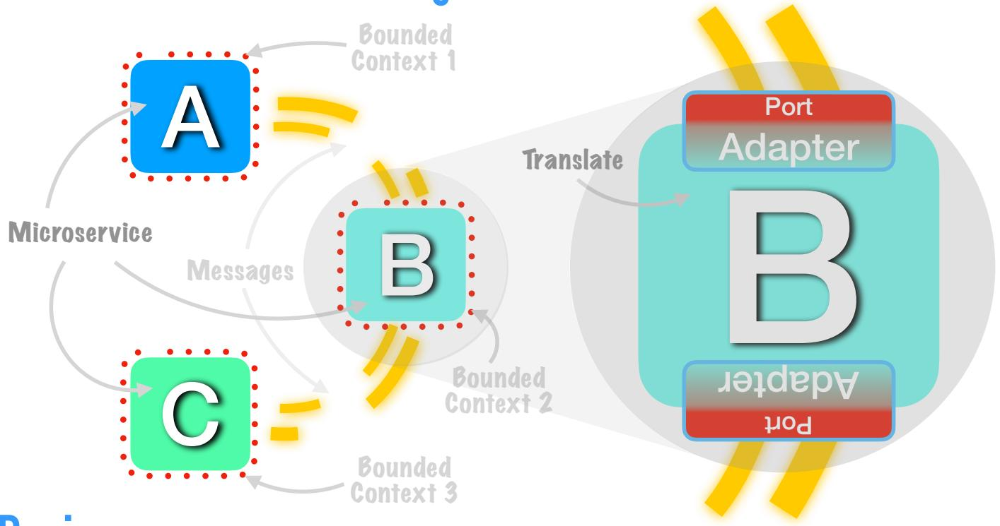

# BETTER SOFTWARE FASTER DAVE FARLEY'S HOW TO GUIDE

## **Get Started with Microservices**

### Introduction

#### **Microservices Architecture**

Microservices is a distributed systems architecture and a distributed development architecture. It is one of today's most popular architectural approaches. Software development is distributed to many small, independent teams, and so is very scalable. But, it is more complicated than just being about service-based design, and requires a high level of design sophistication to develop services independently, and release them without needing to test them all together.

#### Microservices Are Small

Microservices are small: commonly defined as capable of being rewritten in 1-2 weeks. They're focussed on doing only one task - and doing it well. It's not about breaking down large systems into arbitrary pieces, but about autonomous services that are aligned with the problem domain.

### **Independently Deployable**

Microservices are independently deployable and loosely coupled. This allows teams to make independent progress, without being constrained with dependencies on other services and teams. Which allows each to to make progress, in parallel, with the others, so a microservice approach is the most scalable way to grow a large team - the value that organisations seek. But it comes at a cost: you don't get to build test and deploy everything together!

#### Within A Bounded Context

The easiest way to make services that are autonomous and independently deployable is to align each service with a "hounded context"

A Bounded Context is an area of the problem within which ideas have a consistent meaning. So if buying books, the part of the system that allows us to find books we like has a concept of "book", and the part of the system that ships the books to you has a concept of "book" but they are different, so they inhabit different Bounded Contexts. These are important, because they are naturally de-coupled from one another, and so make excellent service-boundaries.

But it is extremely difficult to define interfaces between services that are sufficiently stable and loosely coupled. Enough to prevent change in one service from forcing change in another. Yet this ability to allow independently deployable change is central to a microservice approach.

# BETTER SOFTWARE FASTER DAVE FARLEY'S HOW TO GUIDE

### Services, Messages and Bounded Context

## Design

A common (but misguided) starting point is to set up a separate repository for each new service. This is misguided because it is almost impossible to comprehensively define the services, the interfaces and the messaging up front. By rushing to decompose services into separate repos, learning and evolving the system becomes MUCH more complex and risky. X

Instead, start with a single repo. Think about the problem. Play with different models. Create your first, best guess at a good design. Guess which concepts make good candidates and create separate services for them. Aim for good abstraction, but then try it out and see what really works - refine as you learn more. Create separate repos for services, only as your design stabilises.

**Event-storming** is a good start for this creative exploration - see link in "Reading & References".

- Write some code. Test the code in a single Deployment Pipeline, shared between teams, to get fast feedback. See how the your guesses work out and improve them as your understanding of the problem and the models you created deepens. We aim to iterate quickly, so by keeping everything in the same repository we can evaluate and evolve our ideas more easily.
- Identify common ideas across the problem-domain that occur in different parts of the system. For example: "customer" and "book" are both important concepts for a book store, but a book has different criteria for "sales" (e.g price, cover art, etc) and for "distribution" (e.g weight, destination, etc). A separate bounded context = separate model. Align microservices with Bounded Contexts!

# BETTER SOFTWARE FASTER DAVE FARLEY'S HOW TO GUIDE

## Messaging

When services need to communicate to do useful work, there is inevitably some degree of coupling. Aim to reduce coupling by ensuring messages are not closely tied to the internal implementation detail of any service.

- Treat the messages as a separate bounded context, distinct from the services themselves. Keep code that translates inputs and formulates outputs distinct from internal logic. This is called a Ports & Adapters pattern. This translation keeps the messages that communicate between services, less coupled to the implementation of those services. This means messages can change more independently, at a different rate, without forcing change on implementation of the services. We can even support multiple versions of messages with multiple translators. This facilitates independent deployment.
- Work iteratively to design the conversations between services. In the early stages, keep everything together to evaluate and learn fast.
- Translate the concepts that they exchange/the ideas that cross interfaces between bounded contexts. This prevents the need for a massive data structure that has to work perfectly in every possible context (impossible) and which means that any change breaks everything.
- Avoid technically-focussed messages: Model the 'conversations' that the messages represent at the level of the problem domain, in a way that a non-technical person can understand.
- The boundary between services is an important part of the design of your system, treat it with special care. Microservices only really make sense as way to scale up development, so deployment independence and loose-coupling are critical to that, work to maintain it.
- Consider Contract Testing to check for breaking changes validate contract expectations (expected use of messages) rather than testing real interactions between services.

## **Reading & References**

CDonYouTube videos: "The Problem with Microservices" https://youtu.be/zzMLg3Ys5vl

"Getting Started with Microservices" https://voutu.be/S8Aigws3N5o

"DRY Software Patterns and Microservices" https://youtu.be/cqKGDpnE4eY

Books: "Building Microservices: Designing Fine-Grained Systems" by Sam Newman <a href="https://amzn.to/31PyXOS">https://amzn.to/31PyXOS</a>
"Domain Driven Design" by Eric Evans <a href="https://amzn.to/2WXJ94m">https://amzn.to/2WXJ94m</a>

**Event Storming:** <a href="https://www.eventstorming.com">https://www.eventstorming.com</a>

What is 'Contract Testing': <a href="https://pactflow.io/blog/what-is-contract-testing/">https://pactflow.io/blog/what-is-contract-testing/</a>

