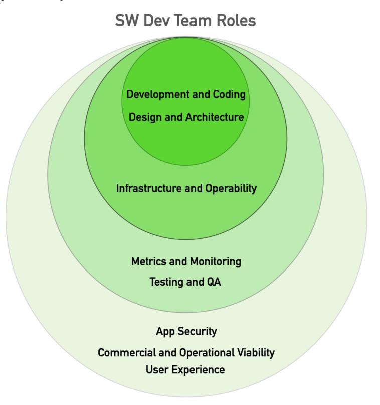
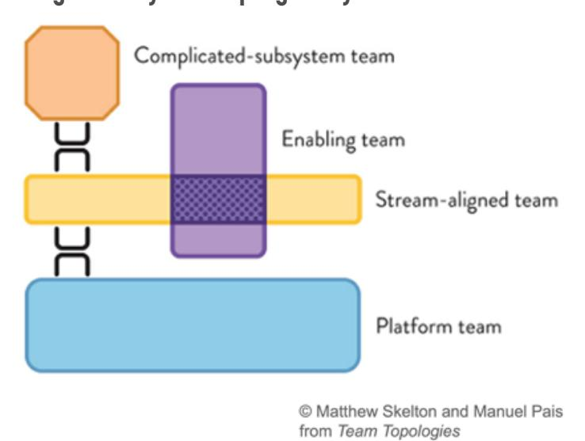

# **How To Organise Software Development Teams**

# **How to set up your Software Development Teams?**

**This is one of the most important questions to consider when working to create great software.**

**How do we divide up the work? What skills do we need on the team? How do we create a team structure to work on a complex system? What happens when our system gets more complex and our organisation grows?**

## **Team Size and Structure**

**Many studies and many experts conclude that small teams are more efficient and produce better quality code than large teams. This is because of the exponential increase in cognitive load, communication combinations, and complexity as team size grows.** 

**Various sources recommend that a team should be somewhere between 5 and 9 people. What does that mean for large projects at large organisations?** 

**As organisational size and the number of teams grow, it is common for teams to become more interconnected and dependent on other teams and so progress grinds ever more slowly.**

**At the core of this, is team focus and responsibility. How we organise our work and structure the teams is deeply related to how we structure the code and systems that we build.**

**It is common to see, that as we build more complex systems and the amount of work grows, the work is divided up into 'functions', e.g: coding, testing, architecture, UI, etc, and the teams are created to do these pieces of work. So no team can make progress without almost every other team delivering at the same time.**

**"Any organization that designs a system will produce a design whose structure is a copy of the organization's communication structure."** 

**- Melvin E. Conway**

**To enable teams to make progress and perform well, they need to be small, to optimise for cognitive load and communication complexity, and be able to work more independently.**

### **BETTER SOFTWARE FASTER**

### **Team Skills & Responsibilities**

The "Team is the Primary Unit of Work" not the individual. This means that everyone in the team shares the work and the responsibility to achieve shared goals.

To produce, as near as possible, a complete piece of work means minimising hand-offs between teams.

- Building the back-end service and then handing over to another team to build the front-end UI
- Assuming responsibility for overall architecture of the system lies elsewhere
- Passing responsibility for the quality of the code to another team to do the testing

It is common to think first of the "Dev Team", who are naturally responsible for Development and Coding, Design and Architecture and sometimes Infrastructure and Operability.

But what about Metrics and Monitoring, or Testing and QA?

And do you expect someone else to be paying attention to: App Security? Commercial and Operational Viability? and User Experience?

To reduce the coupling between teams (the interdependencies that prevent independent progress) teams cannot be built around functional fragments of the work. Teams need to be multi-functional with the range of skills that they need to complete a piece of work, instead of handing it off to another team.

So high-performing teams are small, and comprise people with <u>all</u> these skills and responsibilities, so they can work more independently.

# **BETTER SOFTWARE FASTER**

### **Team Organisation**

A 'team first' approach is to divide the work in ways that minimise dependencies between the teams: to define boundaries and responsibilities so that each team has more autonomy and so the team structure overall is more loosely-coupled.

"A predictor of success is the ability of a team to make decisions and make progress without coordinating with or asking permission of people outside the team."

- State of DevOps

Start by aligning teams with a bounded context in the problem domain, such that each team is aligned with a single valuable piece of work. The excellent book – "Team Topologies" by Matthew Skelton & Manuel Pais refers to this as a "Stream-Aligned Team".

Across the whole software development organisation, the majority of teams should be "Stream-aligned" - focussed on the business goals, and able to produce valuable software for users quickly and reliably.

But other types of team with other responsibilities are also needed, to:

- Lend expertise when required not every team can have deep expertise in all areas, but they should know enough to know when to ask for help, and their knowledge will grow as they learn from expert colleagues who are part of the team for a while – Enabling Team
- Be responsible for technically specialised, complex components, e.g interfacing with complex hardware. These are people with deep expertise an a narrow field use their skills to write the code that can help stream-aligned teams to make progress without worrying about the technicalities of the complex systems that aren't really their natural focus - Complex Subsystem Team
- Create tools and infrastructure that make it easier for the stream-aligned teams to do their work. To build a platform/s that meet long-term needs, not just responding to feature requests. To enable teams to make progress independently of others and NOT to be dependent, waiting until the platform team has delivered something before you can progress your work. -Platform Team

# **Platform Teams**

**The role of the Platform Team is to provide common functions and services that stream-aligned teams can rely on to make their jobs easier. This is critical to the success of other teams, but is often an afterthought, and frequently done badly.**

**In defining a team structure, we typically adopt some sort of organising principle for breaking up systems. We use them to identify classes or bounded contexts for service or module boundaries. But often, there is a load of stuff left over that didn't fit into this division. A very common mistake is to group these 'leftovers' together into the 'platform' even though they aren't obviously directly related to one another.**

**Another common failing is the 'grand design' where a wonderful vision for the platform has to be complete in its entirety before anyone can sensibly make use of it. Progress is stalled, requiring all teams to wait to start work on a new feature until the perfect platform is built.**

**A Platform Team's goal should be to enable stream-aligned teams to deliver work with substantial autonomy. Allowing them to make progress independently of others, including the platform team. Maintaining the ability to change code easily is a key attribute of good design and one that liberates the value that platforms can deliver.** 

**The goal of an effective platform should never be to force change on stream aligned teams. So their role is to solve real problems for Stream-aligned Teams in a way that makes their work simpler, not more difficult: to meet long-term needs, not just to respond to feature requests. One route is to focus on ease-of-use from the perspective of consumers of the platform, even if that means doing a little bit more work in the platform code itself to make it easier to use.**

**To get to good general solutions like this, work incrementally in small steps and discover what really works over several iterations in real use, allowing implementation and your vision to evolve in the face of reality.**

# **Cooperation and Collaboration**

**It is a big problem if every change to our system demands that several teams need to coordinate their work to achieve it. It is much more effective when teams can make progress independently.**

**If our aim is for teams to be able to make progress with greater autonomy, that doesn't rule out the need for cooperation and collaboration, but we need them to happen in ways that don't block independent progress.**

**How can we achieve this?**

### **Here are some recommendations:**

- **• Each team takes full responsibility for all aspects of its part of the system.**
- **• Each team has the skills it needs to cope with most, common, aspects of their work 80% of the time they can make progress without any help.**
- **• When they hit "the difficult 20%" they can draft in expertise from an Enabling Team.**
- **• At this point, the aim of the "expert" is twofold:** 
  - **1. Work with the Stream-aligned team to implement the new feature.**
- **2. Teach the Stream-aligned Team a bit more about their, the expert's speciality in the context of the new feature.**
- **• The aim of all non Stream-aligned Teams is to reduce cognitive load in Stream-aligned Teams**
- **• There are two effective approaches for Platform Teams that stop them forcing change on Streamaligned Teams:**
  - **1. Work in ways that allow APIs to change without forcing Stream-aligned Teams to change their code - that means loosely coupled approaches to API design.**
  - **2. Work in ways that keep things working when the platform API changes A Platform Team takes the responsibility to change all of the consumers' code that uses it.**

**Most organisations don't have the luxury of building the team structure from scratch, so have to work within existing org structures. What can you do to introduce better team roles and structure into an existing organisation?**

# **Transforming Team Structure**

**Create an Enabling Team to promote, and motivate others to adopt, CD practices, lend expertise where required and build infrastructure (such as Deployment Pipelines) to share with other teams.**

**Look at how the Dev Teams can operate more independently, to reduce the coupling and dependence and re-capture some of that youthful energy and focus on delivery from when the business was young and small.** 

**Bring more software development functions together to create more multi-skilled teams, that are each aligned with a bounded context in the problem domain. But not by making the teams bigger! Lend expertise between teams temporarily, when it is needed.**

# **Transforming Team Structure, cont'd**

**Review the role of Platform Teams. Is this an effective way to make life simpler for stream-aligned teams, or someone's pet project or tactical hack?**

**A good starting point for a Platform Team can be something incredibly simple, maybe even just some documentation that describes how to add a new service or organise a directory structure to make it easy to find tests.**

**Maintain a laser focus on what Stream-aligned teams need, and work to prioritise and service those needs. Check that these teams are able to make decisions about their work, without control and interference from others.**

**Work incrementally in small steps and discover what really works over several iterations. Aim for teams of 5-9 people and agree how larger teams can be reshaped into several smaller teams. Avoid big-hit restructuring and the disruption that ensues.**

**Be willing to accept some extra costs in your design - as long as those costs allow us to work more independently, and so be more productive.**

# **More Resources:**

**Team Topologies by Matthew Skelton & Manuel Paishttps://amzn.to/2Y0NdSO**

**Importance of Small Teams https://www.qsm.com/risk\_02.html**

**High-Performing Teamshttps://www.devops-research.com/research.html**

**Dave Farley and Randy Shoup (eBay VP of Engineering) discuss the role of Platforms and Infrastructure teams, technical choices and autonomy at big organisations https://youtu.be/Wg-\_5wbYuZQ**

**How to Scale Software Teamshttps://youtu.be/pw686Oyeqmw**

**Tips for Building Successful Platform Teamshttps://youtu.be/\_zH7TIXcjEs**